## 2025

## 环境、社会及治理(ESG)报告

## Environmental, Social and Governance(ESG) Report

## GREAT

01 董事长致辞  
02 关于联合水务  
06 可持续发展管理  
专题：10双化协同绘就“数智+低碳”水务新图景  
75 关于本报告  
76关键绩效表  
79 指标索引表

Green Planet

## 绿色地球

水资源管理14  
生态环境保护  
20应对气候变化  
24降低环境影响

Reliable Partner

## 可靠伙伴

30 稳定供水  
33优质服务  
36用水可及  
38社区参与

Excellence in Operations

## 卓越经营

42 公司治理  
46合规与稳健运营  
48商业道德  
49供应链管理  
52 安全防线

Advanced Technology

## 先进技术

57 数智赋能  
58 研发创新

Talent Oriented

## 以人为本

65雇佣与员工权益保障  
69 多元职场与员工关爱  
71人才培育与发展

## 董事长致辞

## 智绘水脉—共赴可持续发展新征程

natural_image

Portrait of a man in formal business attire with glasses and patterned tie (no visible text or symbols)

联合水务董事长兼总裁  
俞伟景

当可持续发展成为全球共识，全球水资源危机、气候变化影响加剧与数字技术革命交汇，水务行业关系民生福祉与绿色发展，肩负前所未有的时代任务。联合水务始终将可持续发展理念融入经营发展全流程，持续为经济、环境、社会创造价值，以专业力量守护水生态、赋能水民生。

面对气候变化带来的重重考验，我们深知科技创新是破局的关键。我们积极拥抱以人工智能为代表的新一轮科技革命，将“培育新质生产力”作为企业绿色转型的核心引擎。为此，我们加快构建智慧水务体系，推动技术要素与生态要素深度融合，不仅在日常运营中深入探索低碳高效的新模式，为水资源保护、水环境改善、水生态修复贡献科技力量；更以前瞻视野布局负碳材料等新兴产业，通过产业投资引进前沿环保技术，全面激活企业的绿色发展动能。

水润万家，供水为民。我们在追求绿色发展的同时，始终恪守“为用户提供优质之水，为保护社会环境提供洁净水处理服务”的使命，将“创造社会价值”置于核心位置。立足国内，我们统筹城乡水务发展，让涓涓清流惠及千家万户；放眼全球，我们积极拓展海外合作新空间，以专业能力助推全球水务治理共进。在做好水务服务之余，我们热心投身乡村振兴与公益慈善，以实际行动传递民生温度；坚持以人为本，用心守护员工权益，为每一位员工搭建实现自我价值的舞台，让员工与企业同心相伴、共同成长。

当前，ESG已经成为企业的“必答题”。联合水务以战略眼光，将ESG理念内化为企业发展的动力，以稳健的经营业绩、透明的治理实践，为全体股东创造长期价值。凭借扎实的ESG管理实践，公司2025年入选中国上市公司协会“2025年上市公司可持续发展优秀实践案例”、上榜证券时报“第十九届上市公司价值评选·中国上市公司 ESG 百强”、Wind ESG“2025 年度Wind 中国上市公司ESG 最佳实践100强(中小市值）”，并荣获观察者网“2025ESG典范企业·一带一路’贡献特别奖”等多项权威荣誉，行业标杆地位获得广泛认可。

水脉相连，使命同行。多重挑战交织的背景下，可持续发展不仅是企业应对全球性挑战的必然选择，更是实现高质量发展、锻造核心竞争力并赢得长远未来的根本路径。未来，联合水务将继续以可持续发展为锚，深化ESG实践与责任担当，在高质量发展道路上笃定前行。我们将保持奋斗者姿态，以积极有为的担当、开拓进取的精神，与各界伙伴携手并肩，共同迎接新机遇、新挑战，为经济社会的可持续发展注入更强的“水

## 关于联合水务

## 公司介绍

## 公司概况

江苏联合水务科技股份有限公司是一家综合性全方位的水务公司，业务包括自来水生产与供应、污水处理与资源化利用、河湖流域水环境和水生态修复等水环境治理业务。公司通过投资、建设和运营等方式从水源头到水龙头，在水务领域形成了完整的产业链。

联合水务目前拥有自来水生产供应、污水处理与资源化利用运营项目的协议和规划处理能力（含中水）约300万立方米/日。项目分布于国内10个省16个城市，拥有26个运营公司，以及孟加拉国首都达卡市1个供水运营公司、沙特阿拉伯1个污水运营公司。

联合水务积极倡导以“社会-投资者-员工-客户”共赢的模式推动中国水务行业的改革与发展，不断实践“中西合璧、以人为本、高效节约”的投资理念，为用户提供优质之水，为保护社会环境提供洁净的水处理服务。

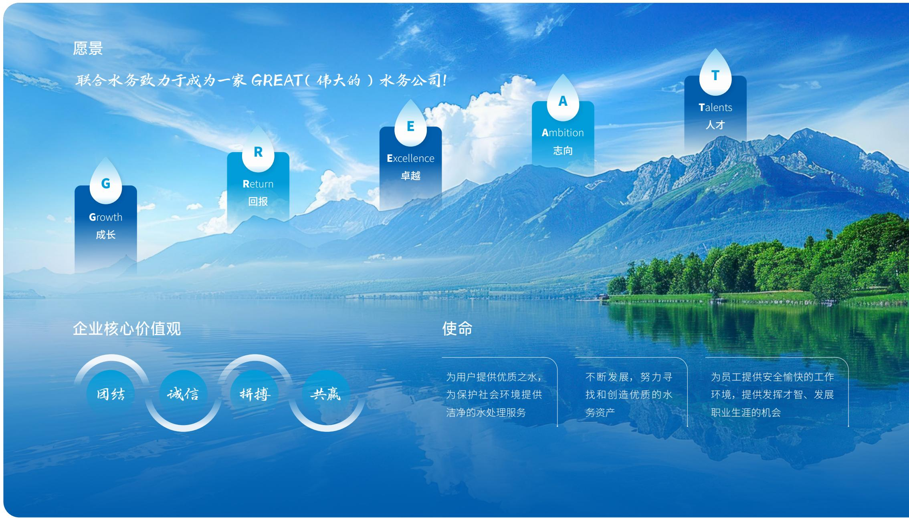

flowchart

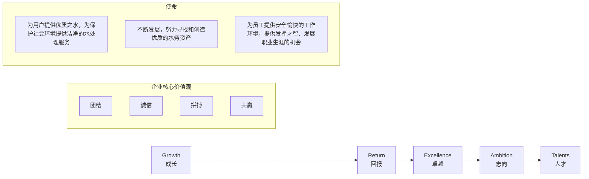
```mermaid
graph LR
  A["Growth\n成长"] --> B["Return\n回报"]
  B --> C["Excellence\n卓越"]
  C --> D["Ambition\n志向"]
  D --> E["Talents\n人才"]
  
  subgraph Core_Valuation ["企业核心价值观"]
    direction TB
    F1["团结"]
    F2["诚信"]
    F3["拼搏"]
    F4["共赢"]
  end
  
  subgraph Motivation ["使命"]
    direction TB
    G1["为用户提供优质之水，为保护社会环境提供洁净的水处理服务"]
    G2["不断发展，努力寻找和创造优质的水务资产"]
    G3["为员工提供安全愉快的工作环境，提供发挥才智、发展职业生涯的机会"]
  end
```

## 业务综览

## 业务分布

## 国内

上海1  
宁夏贺兰2  
河南三门峡3  
4 河南新密  
山西曲沃5  
6 山西新绛  
山西稷山7  
江苏宿迁8  
9 湖北咸宁  
10 湖北随州  
11 湖北荆州  
12 浙江桐乡  
13 江西瑞昌  
14 福建漳州  
15 安徽淮北  
16 广东深圳

## 海外

孟加拉

沙特阿拉伯

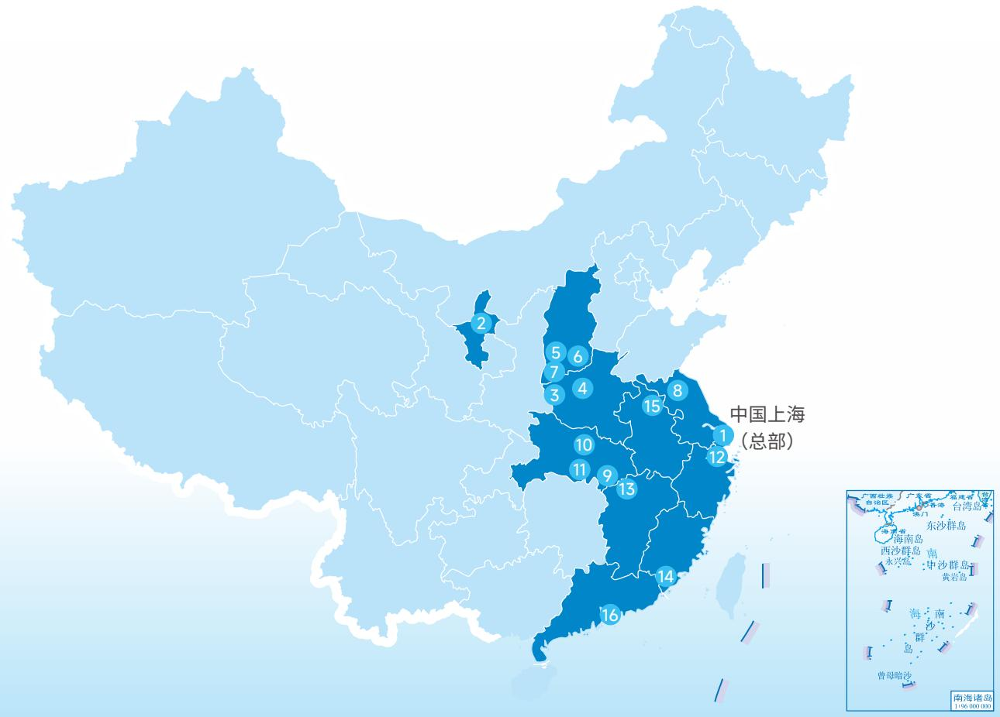

## 业务范围

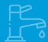  
供水

• 市政供水  
· 工业园区供水  
• 城乡供水一体化  
· 供水延伸业务

  
污水处理和资源化利用

· 市政污水处理  
· 工业园区污水处理  
· 污水资源化利用  
·工业企业高难度废水治理

  
水环境治理

·流域、河道、湖泊等水环境治理  
• 水资源保护及治理  
·污水处理厂尾水提标

## 主要业务情况

供水厂

8座

污水厂

20座

供水协议规模

188万立方米 / 日

污水协议规模 (含中水)

109.28万立方米/日

供水建成规模

103.22万立方米/日

污水建成规模（含中水）

89.28万立方米/日

2025 年度水环境治理规模

118,750平方米

累计水环境治理规模约

200 万平方米

累计获得有效专利

30 项

累计获得软件著作权

13 项

## 我们的 2025

## 绩效表现

资产总额

379,988.47万元

营业收入

110,293.70万元

营业利润

13,513.61万元

纳税总额

10,548.73万元

## ESG 奖项

入选

中国上市公司协会

“2025年上市公司可持续发展优秀实践案例”

入选

Wind ESG

“2025年度Wind中国上市公司ESG最佳实践100强（中小市值）

入选

证券时报

“第十九届上市公司价值评选中国上市公司 ESG 百强

入选

华证 ESG

“2025 年度A股上市公司公用事业行业ESG绩效TOP20”“2025年华证A股和港股上市公司市政设施行业ESG绩效优秀榜单

荣获

证券日报

“2025金骏马奖·ESG 可持续发展先锋企业”

荣获

价值在线

“2025年度上市公司ESG 价值传递奖”

荣获

证券之星

“第三届 ESG 新标杆企业奖

荣获

观察者网

“2025 ESG 典范企业· ‘一带一路’贡献特别奖”

部分荣誉奖项

<table><tr><td>联合水务三项创新举措入选住房和城乡建设部重点推荐(《城市公共供水管网漏损治理可复制政策机制清单(第二批)》)</td><td>联合水务荣获国家税务总局宿迁市宿城区税务局“2024年度纳税信用A级”</td><td>联合水务荣获宿迁市公安局“宿迁市保卫工作先进集体”称号</td><td>联合水务荣获宿迁市洋河新区旅游交通建设局“服务地方发展优秀单位”称号</td></tr><tr><td>咸宁联合水务有限公司荣获中央宣传思想文化领导小组“全国文明单位”称号</td><td>咸宁联合水务有限公司荣获咸宁市城市管理指挥中心“2024年度‘咸宁市城市综合管理服务平台’综合考评第一名”</td><td>咸宁联合水务有限公司荣获咸宁市住房和城市更新局“2024年度行业管理先进企业”称号</td><td>咸宁联合水务有限公司荣获咸宁义工协会、咸宁市启善社会工作服务中心“2024年度爱心企业”称号</td></tr><tr><td>咸宁思源水务有限公司荣获咸安区发展和改革局“企业信用等级AA级证书”</td><td>咸宁市香泉水质检测有限公司、咸宁联合市政工程有限公司荣获国家税务总局咸宁市咸安区税务局“2024年度纳税信用A级”</td><td>桐乡申和水务有限公司荣获国家税务总局桐乡市税务局“2024年度纳税信用A级”</td><td>桐乡申和水务有限公司荣获桐乡市市场监督管理局“A级浙江省‘守合同重诚信’企业”称号</td></tr><tr><td>瑞昌联合水务有限公司荣获国家税务总局瑞昌市税务局“2024年度纳税信用A级”</td><td>瑞昌联合水务有限公司荣获九江市工业和信息化局“2024年规模企业申规奖(2024全市加快构建现代化产业体系若干政策措施奖励)”</td><td>稷山联合水务有限公司荣获稷山行政审批服务管理局“红旗窗口”称号</td><td>稷山联合水务有限公司荣获稷山县民政局“爱心企业”称号</td></tr><tr><td>随州联合水务有限公司荣获国家税务总局随州高新技术产业开发区税务局“2024年度纳税信用A级”</td><td>宁夏鸿泽净水有限公司荣获贺兰工业园区工会联合委员会“贺兰工业园区2025年‘安康杯’安全生产知识竞赛二等奖”</td><td>三门峡联合水务有限公司荣获三门峡市城乡一体化示范区城市管理综合行政执法大队“供水保障先进企业”称号</td><td>新绛县晋华生态环境工程有限公司荣获新绛县水利局、新绛县工业信息化和科技局“节水型企业”称号</td></tr></table>

## 可持续发展管理

## 可持续发展治理

联合水务高度重视ESG治理，认同在创造股东价值的同时积极贡献于社会可持续发展的理念。公司将ESG要素融入日常运营与管理流程，以精进之姿持续完善ESG治理体系、优化ESG组织架构、健全ESG管理制度，提升ESG治理能力致力于在均衡满足各利益相关方期许的基础上为社会与环境的可持续发展注入源源不断的企业动能。

公司搭建了“监督一管理一执行”三级治理架构，明确各层级权责，实现责任到人、落实到位。董事会下设战略与ESG委员会，专职统筹可持续发展相关事务，保障ESG战略的有效推进与扎实落地。

2025年，委员会持续积极履职，围绕公司重要ESG事项、目标推进及治理效能提升召开多次专题会议并先后审议通过2024年度ESG报告、对绿色低碳技术企业增资等关键议案，决策内容紧密契合国家共建“一带一路”倡议与全球低碳转型趋势，有力支持公司国际化布局与产业化投资同时积极组织开展ESG培训，内容涵盖ESG 最新趋势与合规要求以及ESG 管理能力提升等方面，有效增强工作组成员的ESG专业素养，为实现可持续发展奠定了扎实的治理基础。

## 联合水务董事会

负责监督和审批 ESG 相关事宜。

## 战略与ESG 委员会

由战略与ESG委员会指导公司ESG 发展战略的制定，监督并评估ESG工作进展与成效；向董事会汇报ESG事宜，协助董事会识别、评估 ESG 相关风险与机遇。

## ESG工作小组

在战略与ESG委员会指导下，公司证券事务部联动各职能部门及运营公司，合力推动ESG工作的落实。

## 可持续发展策略

联合水务将ESG治理深度融入日常运营。为保障ESG工作的有效落实，公司将质量、安全、环境等关键ESG指标纳入绩效管理体系，通过规范管理、强化执行，有效驱动可持续发展策略从规划走向实践。

## G绿色地球

• 水资源管理 • 应对气候变化与节能降耗 • 污染与废弃物管理  
• 生物多样性保护 • 环境管理体系 • 倡导绿色环保理念

• 稳定供水 • 携手合作共赢 热心志愿公益

• 优化营商环境 • 产品可及性

## R 可靠伙伴

公司治理推动公平竞争职业健康与安全  
• 投资者权益保护 • 反腐败与反舞弊 • 隐私与信息安全  
合规稳健运营供应链管理

## E 卓越经营

• 数字化转型与智慧水务 • 研发创新与知识产权保护

## A先进技术

员工权益与福利·员工培训与发展

## T以人为本 以人为本

## 利益相关方参与

联合水务始终将各利益相关方视为重要的伙伴。公司基于自身的日常运营和管理、议题范畴、各方影响因素等，识别遴选出具有重要影响力的内外部利益相关方，通过多元、畅通的渠道主动倾听与沟通，深入了解其期望与诉求，并积极进行回应，以务实行动实现价值共享与和谐共赢

  
政府及监管机构

  
股东与投资者

  
客户

  
供应商及合作伙伴

  
员工

  
社区与公众

• 稳定供水  
• 污染与废弃物管理  
• 倡导绿色环保理念  
• 水资源管理  
• 生物多样性保护  
• 合规稳健运营  
• 优化营商环境

• 水资源管理  
• 污染与废弃物管理  
• 稳定供水  
• 数字化转型与智慧水务  
• 反腐败与反舞弊  
• 合规稳健运营  
• 公司治理

• 稳定供水  
• 数字化转型与智慧水务  
• 隐私与信息安全  
• 合规稳健运营  
• 水资源管理  
• 污染与废弃物管理  
• 携手合作共赢  
• 反腐败与反舞弊  
• 产品可及性

• 优化营商环境  
• 供应链管理  
• 携手合作共赢  
• 公司治理  
• 隐私与信息安全  
• 稳定供水  
• 产品可及性  
• 水资源管理  
• 推动公平竞争

• 员工权益与福利  
· 员工培训与发展  
• 职业健康与安全  
• 隐私与信息安全  
• 稳定供水  
• 合规稳健运营

• 产品可及性  
• 污染与废弃物管理  
• 稳定供水  
• 倡导绿色环保理念  
• 节能降耗  
• 水资源管理  
• 生物多样性保护

• 日常沟通  
• 政策咨询反馈  
• 定期汇报  
• 合规监管  
• 现场考察

• 信息披露  
• 股东会  
• 路演与业绩发布会  
• 投资者沟通平台  
• 中小股东交流

• 客户满意度调查  
• 回访与投诉机制  
• 客户拜访沟通  
• 信息公开

• 日常沟通  
• 现场考察  
• 战略合作  
· 主题培训  
• 行业交流

• 沟通信箱  
• 职工代表大会  
• 工会活动  
· 员工培训  
· 员工满意度调查

• 社区沟通  
• 媒体互动  
• 行业论坛  
• 信息公开  
• 公益志愿活动

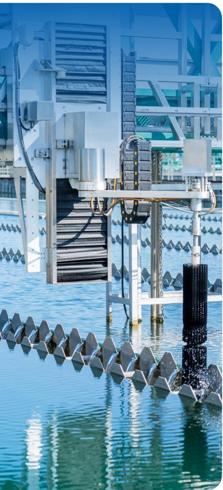

natural_image

Industrial water treatment machine with metal components and spray fins in a factory setting (no visible text or symbols)

## 重要性议题管理

基于对ESG议题连续性与管理一致性的综合评估，同时考虑到公司在本年度未发生重大经营事件或业务模式变更，当前重要性议题框架仍具有持续的适用性与指导价值。因此，本年度公司沿用2024年度重要性议题识别结果与管理方式，双重重要性议题识别及评估流程详见联合水务《2024年度环境、社会及治理(ESG）报告》。公司将持续关注内部运营状况与外部环境变化，若发生重大调整或周期性更新需要，将及时对重要性议题进行复核与优化，确保其始终契合公司可持续发展实践与利益相关方期待。

## 治理维度

1 推动公平竞争  
2 投资者权益保护  
3 反腐败与反舞弊  
④ 供应链管理

5 公司治理  
6 合规稳健运营  
数字化转型与智慧水务

## 环境维度

8 环境管理体系  
倡导绿色环保理念  
10 生物多样性保护

11 水资源管理  
12 污染与废弃物管理  
13 应对气候变化与节能降耗

## 社会维度

14 热心志愿公益  
1 研发创新与知识产权保护  
16 产品可及性  
17 携手合作共赢  
18 隐私与信息安全

19 员工权益与福利  
20 员工培训与发展  
21 职业健康与安全  
22 优化营商环境  
23 稳定供水

联合水务重要性议题矩阵  
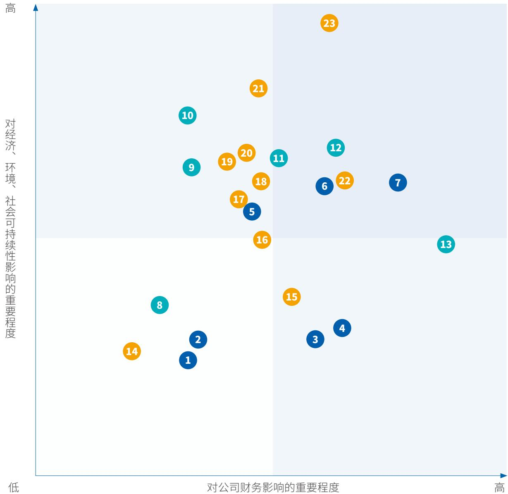

scatter

| Item | Importance to Company Financial Impact (X-axis) | Importance to Economy, Environment, Social Continuity (Y-axis) |
| --- | --- | --- |
| 1 | Low | Low |
| 2 | Low-Mid | Low |
| 3 | Mid-High | Low |
| 4 | Mid-High | Low |
| 5 | Mid | Low-Mid |
| 6 | Mid-High | Mid |
| 7 | High | Mid |
| 8 | Low | Low |
| 9 | Low | Mid |
| 10 | Low | High |
| 11 | Mid | Mid |
| 12 | Mid-High | Mid |
| 13 | High | Low-Mid |
| 14 | Low | Low |
| 15 | Mid | Low |
| 16 | Mid | Low-Mid |
| 17 | Mid | Mid |
| 18 | Mid | Mid |
| 19 | Low-Mid | Mid |
| 20 | Low-Mid | Mid |
| 21 | Low-Mid | High |
| 22 | Mid-High | Mid |
| 23 | Mid-High | High |

## 财务重要性议题风险与机遇分析

公司针对具有财务重要性的可持续发展议题，全面梳理其影响时长、风险与机遇，并制定相应的应对策略，严格把控相关风险，积极把握相关机遇，实现公司可持续发展。

<table><tr><td>重要性议题</td><td>影响时长</td><td>风险与机遇</td><td>应对策略</td></tr><tr><td>水资源管理</td><td>中长期</td><td>·水资源短缺或将导致供水能力下降、成本上升、收入减少,并加剧合规压力和市场竞争,影响公司长远发展·提高公司水资源管理能力,促进公司节约用水,提高公司声誉与形象</td><td>·建立健全水资源风险管理体系,开展水资源风险识别、评估工作·针对识别出的水资源风险制定应对策略,持续监控水资源风险管理情况,增强水资源风险应对能力与韧性详见“水资源管理”章节</td></tr><tr><td>应对气候变化与节能降耗</td><td>中长期</td><td>·极端天气或将导致自然灾害,影响能源稳定供应,打击整体供水系统,对固定资产造成损失,增加成本支出,影响公司利润·创新可持续商业发展模式,加强公司抵御环境风险的韧性,提高公司声誉与影响力</td><td>·制定应急预案,提升极端天气下的应对能力·完善组织保障与物资储备,确保运行安全·优化工艺与巡检流程,保障供排水效率详见“应对气候变化”章节</td></tr><tr><td>数字化转型与智慧水务</td><td>中长期</td><td>·数智化进程推进不力或将导致运营效率低下、管网监控和故障响应滞后,难以满足客户对高质量服务的需求,影响公司竞争力与长远发展·提高运营效率,确保管网运维及时响应,提高服务质量,提升公司先进性与领先性</td><td>·推进信息化重点项目建设,构建数据驱动型的高效运营管理模式·建立集团化数字管理平台,实现数字技术与生产经营深度融合详见“双化协同,绘就‘数智+低碳’水务新图景”“数智赋能”章节</td></tr><tr><td>供应链管理</td><td>中长期</td><td>·供应链ESG风险或将带来供应链不稳定性,影响公司生产运营;持续赋能供应商成长或将增加额外成本支出·构建可持续供应链有助于提升供应链稳定性,推动供应链企业健康发展</td><td>·建立供应商全流程管理体系,将ESG因素纳入供应商评估和选择·加强供应链风险识别与管理,持续识别与监控供应链潜在风险·助力供应商可持续发展详见“供应链管理”章节</td></tr><tr><td>优化营商环境</td><td>长期</td><td>·不良营商环境或将恶化客户关系,导致客户流失并影响公司市场表现·提高客户满意度,推动业务增长并创造新的商业机会</td><td>·持续优化完善供水营商环境,提升服务质量和用户体验·建立客户反馈机制,及时响应客户问题详见“优化营商环境”章节</td></tr><tr><td>稳定供水</td><td>长期</td><td>·供水能力低下或将引发客户流失、监管处罚及法律纠纷,损害公司声誉并影响运营与市场表现·提高客户满意度,优化市场表现,提高公司声誉并推动业务增长</td><td>·严格施工管控、优选管材、及时更新老旧管道,并进行定期/不定期巡检,优化管网布局与运行·强化水质风险识别,提升巡检频率,并通过培训与考核确保水质管理水平详见“稳定供水”章节</td></tr><tr><td>污染与废弃物管理</td><td>长期</td><td>·污染与废弃物处理不当或将遭受处罚,被追究刑事责任,造成财务损失,影响公司声誉与形象·提升环境管理水平,减少对环境的危害,提高公司声誉与形象</td><td>·对废水、废气、噪声等排放源进行持续监控,加强治理,严格控制污染与废弃物合规排放·探索废弃物的综合利用方式,提高资源利用率,减少污染排放影响详见“污染与废弃物管理”章节</td></tr><tr><td>合规稳健运营</td><td>长期</td><td>·违规失序运营或将导致法律纠纷、监管处罚、财务损失以及声誉受损,影响公司的可持续发展和市场竞争力·降低法律和财务风险,确保公司持久、稳定发展</td><td>·不断完善公司治理体系,强化内控和风险管理,全面提升合规治理能力详见“合规与稳健运营”章节</td></tr><tr><td>反腐败与反舞弊</td><td>长期</td><td>·腐败与舞弊或将引发监管处罚与法律风险,导致公司财务损失、声誉受损,影响公司的合规运营与长期发展·降低法律和财务风险,增加客户和投资者信任,提高公司声誉和形象</td><td>·设立三级管理架构,建立健全预防舞弊、接受举报和调查处理在内的内部控制体系·加强日常内容宣贯,建立反舞弊文化环境详见“反腐败与反舞弊”章节</td></tr><tr><td>研发创新与知识产权保护</td><td>长期</td><td>·研发创新与知识产权保护不当或将引发技术泄密、侵权纠纷、高额保护成本,影响公司竞争力和创新收益·提升公司竞争力,确保行业领先性,有助于促进新的商业机会</td><td>·建立健全研发项目全生命周期管理体系与知识产权管理体系,加大研发投入与人才建设,并完善知识产权侵权风险识别和管控详见“研发创新”章节</td></tr></table>

## 专题

##

## 绘就“数智+低碳”水务新图景

力打造具备数智动能与绿色基因的发展新范式。

公司坚持以人工智能深度赋能生产运营，系统性构建“智能感知一数字决策一精准运维”的智慧水务体系，着力破解调度滞后、能效粗放等传统痛点，实现从经验驱动向数据智能驱动的跨越。与此同时，公司将绿色低碳理念从运营端延伸至建设端，创新探索负碳材料在基础设施中的工程化应用，从源头降低产业的碳足迹。联合水务以数智化提升效能，以绿色化夯实底色，既强化了自身的可持续发展竞争优势，亦为行业提供了可借鉴的双化协同方案。

## 前沿技术布局

## 打造一体化智慧水务数字基座

联合水务以前瞻性视角进行技术战略布局，高度重视智慧水务体系的建设与应用。公司已建成包括DMA、SCADA、GIS、城市供水调度、设备管理及数字化平台在内的多个系统，以此为技术底座与运营中枢，深度整合人工智能、大数据、物联网及数字孪生等前沿技术，持续构建并完善覆盖“供一排一治一保”全链条的一体化智慧水务平台。

联合水务打破了传统各系统独立运行的“数据孤岛”，通过统一平台实现从原水水质监测、水厂工艺调控、泵站智能调度到管网漏损控制、客户服务响应的全流程数据实时感知、汇聚与智能分析；平台内置的AI工程化算法引擎，能够对海量运维数据进行深度学习，实现趋势预测、异常诊断与优化决策。这种以坚实数字基建为底座，以数据融合与智能分析为核心，并持续向用户端延伸便捷服务的系统性实践，让公司在技术应用的深度、广度上均处于行业领先地位，为公司可持续发展奠定了坚实的技术与服务基础。

## 核心场景革新

## 全流程落地智能化应用实践

## 智能巡检与安防 筑牢安全运维防线

## 机器狗智能巡检系统

机器狗集成可见光+红外热成像双光云台、声纹检测等多类传感器，具备自主导航、避障等能力，可7×24小时不间断执行设备状态巡视、局部放电检测、异响分析等任务。机器狗通过搭载云台相机等智能设备，能实时采集设备运行数据，并同步上传至智能巡检管理平台，实现异常情况自动预警与快速溯源，有效提升巡检效率。机器狗智能巡检系统显著降低巡检人力成本，故障发现与响应效率大幅提升，为水厂数字化转型筑牢基础。

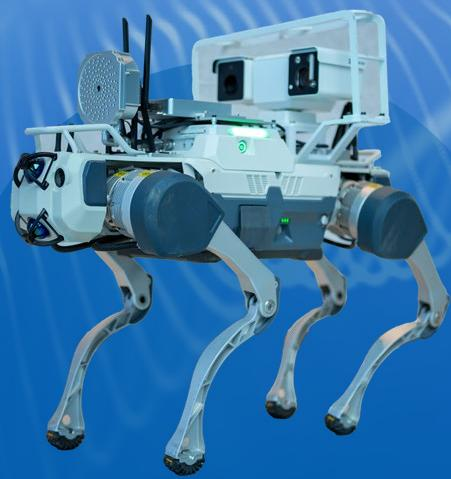

natural_image

Exterior view of a white humanoid robot with multiple legs and a mounted device against a blue background (no text or symbols visible)

▲ 机器狗整体结构示意图

  
扫一扫即可观看  
智水清源AI未来  
联合水务集团新质生产力掠影

  
7×24小时  
不间断巡检

## 智能轨道机器人

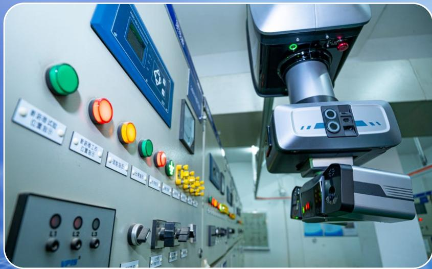

text_image

Control panel with labeled industrial control buttons and robotic arm, showing operational status indicators

▲智能轨道机器人

## 智慧安防系统

2025年，公司进行智慧安防升级，构建集人员身份智能管控、车辆精准管理、电子围栏周界防护于一体的安防体系。通过人脸识别、AL行为分析等技术，实现生产区域的全方位、无死角安全管控，杜绝安全隐患，周界入侵事件下降90%，故障响应时间大幅缩短，工单闭环效率提升91%，显著提升水厂安全管控与运维管理的数智化水平。

巡检人力成本降低

60

100

85

非计划停机时长下降

35%

维修决策数据支持率提升

70%

周界入侵事件下降

90%

工单闭环效率提升

91%

## 工艺过程智能优化 实现降本增效

## 智慧加药系统

## 智能清洗机器人

针对沉淀池集水槽藻类滋生的人工清洗难题，公司自主研发自动清洗机器人，机器人可外挂排泥行车，通过机械结构自适应跨越障碍，高效完成槽壁与隔墙的刷洗，将人员从高危、繁重的水下作业中解放，在提升清洗频次与效果的同时，显著降低了安全风险与人工成本。

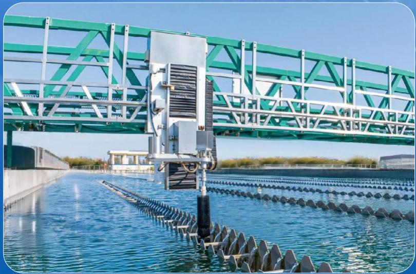

natural_image

Industrial water treatment facility with green steel truss bridge and industrial equipment (no visible text or symbols)

▲ 集水槽智能清洗机器人

## 沉淀池出水水质合格率提升至

99%以上

8%—10%

14.4

代替人工危险作业

提升安全性

## 水环境治理智能装备 拓展生态运维边界

## 水环境智慧管理无人船

将水环境治理与运维从“人力驱动”升级为“数据驱动”和“装备驱动”

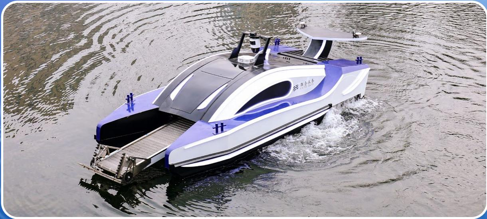

natural_image

Aerial view of a futuristic blue and white floating vehicle on water, no visible text or symbols.

▲ 水环境智慧管理无人船

## 与传统人工相比

水质数据监测节约成本

79%

保洁收割节约成本

68%

应急维护节约成本

42%

## 绿色路径探索

## 全生命周期降碳基建先行尝试

零碳园区及推动行业高质量发展提供可量化、可复制的技术样板。

## 全生命周期降碳

上游生产

二氧化碳排放量減少

96%

运营过程

净碳移除

16.4吨

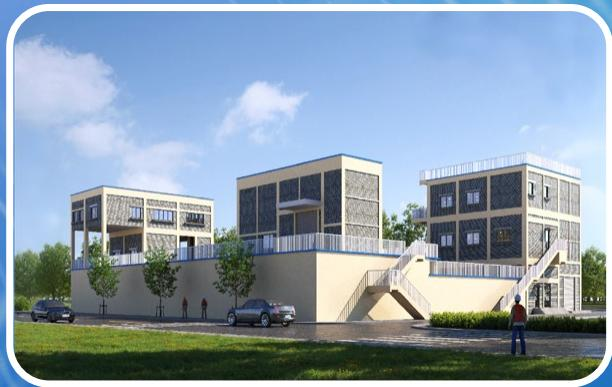

natural_image

Exterior view of a modern multi-story building complex under construction, featuring balconies and staircases (no signage or text visible)

▲ 桐乡工业污水厂

下游处理

砖体可回收利用率

100%

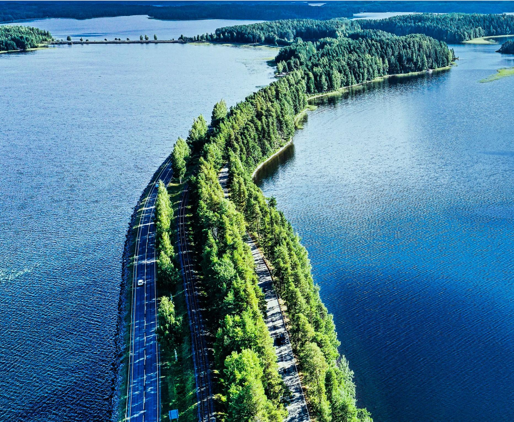

natural_image

Aerial view of a winding road through a lush green forested lake, with no visible text or symbols.

## Gr een Planet 绿色地球

绿色收入\*

32,236.47万元

全年环保总投入

4,857.89万元

全年污水处理量

15,026.01万立方米

温室气体排放强度

0.68 吨二氧化碳当量 / 万元营收

绿色收入数据覆盖范围包括污水处理与资源化利用水环境和水生态修复业务。

贡献联合国可持续发展目标 SDGs

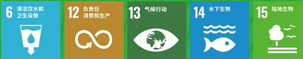

## 水资源管理

水资源是生态系统的基石，也是经济社会运行的血脉。联合水务致力于为社会提供优质水处理服务，强化全过程水资源管理，提升水资源利用效率，以节约保护、科学利用为核心，持续修复和改善水环境，做值得信赖的用水安全守护者。

## 治理

公司根据《中华人民共和国水法》《江苏省节约用水条例》等水资源管理政策规定，制定《江苏联合水务科技股份有限公司水资源管理制度》。为加强水资源管理办法的有效执行，公司建立健全水资源管理组织架构，对涉水项目开展系统管理。公司设立水资源管理领导小组，由运营公司总经理担任组长，负责统筹水资源管理相关工作；技术副总经理担任副组长，负责具体的水资源管理工作，制定并实施水资源管理方案，监测并评估水资源使用情况。另外，公司设立水资源管理小组，由制水部、技术部、管网部、客服部组成，负责制定并执行公司水资源规章制度，追踪管理水资源目标，推动水资源高效利用与节水技术应用，开展相关宣传与培训工作。

## 战略与管理方式

公司坚持开源节流并重，把水资源保护、节水放在突出位置的方针加强水资源系统管理，取水源保护，立足污水处理业务助力水质长效改善，加强水资源的节约、保护和科学利用，大力创建节水型水务企业。

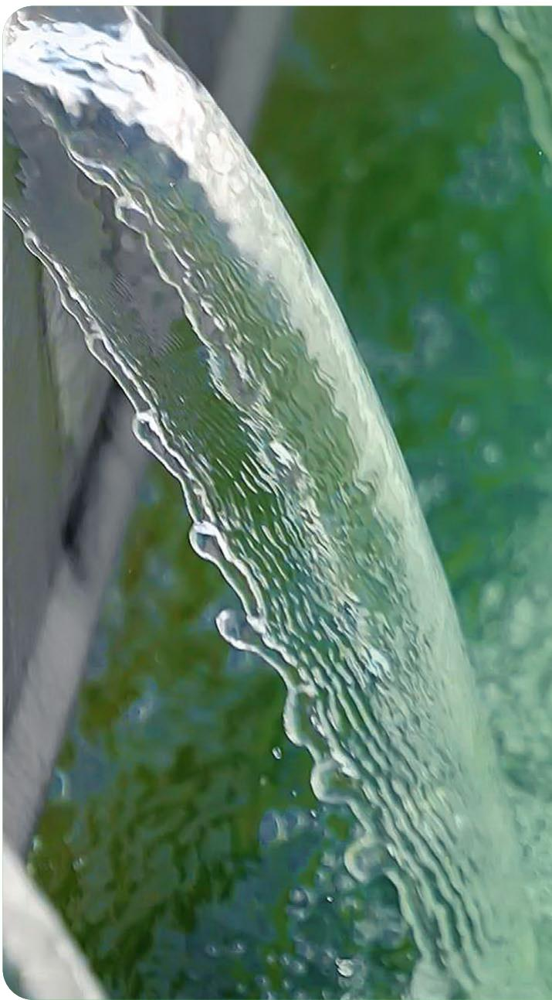

natural_image

Close-up of a water flowing through a green, wavy surface (no text or symbols visible)

## 取水源保护

取水源保护是保障水资源安全、维护生态平衡的关键举措。联合水务所有取水地均依法位于合法合规区域，水源主要为湖泊、水库及河流等地表水，且均位于水源地保护区范围内。公司持续推动水源保护，着力保障供水安全与生态可持续性。在保护措施方面，联合水务推动下属公司系统实施物理隔离与警示标识设立、明确禁止各类污染水源的行为，并建立了涵盖原水水质定期检测、日常巡检、应急演练在内的常态化保护机制。在宿迁地区，公司每年定期组织对主水源和备用水源地周边进行污染源调查，形成年度水源地污染源调查报告，并针对不同类型的风险污染源制定应对方案，持续提升水源地环境安全保障水平。

水源地环境违规事件

0起

公司部分取水地与取水源情况

联合水务宿迁供水公司第一水厂、第二水厂常用取水地为骆马湖宿城水源地，备用取水地为中运河备用水源地，取水源主要为骆马湖水和京杭运河水，第一、二水厂取水口位于水源地保护区范围内。

咸宁联合水务取水地为嘉鱼县潘家湾段长江水域、阳新县王英水库、咸安区马桥镇涂河水域，均位于水源地保护区范围内。

## 水质长效改善

公司深耕污水处理主业，有序推进污水处理厂提标改造和未达标水体治理等项目，持续优化污水处理工艺流程，稳步提升处理能力与效率，确保出水水质稳定达标，从源头削减污染物排放，以实现水清岸绿的生态目标。

全年污水处理量达

15,026.01 万立方米

年度削减污染物（以化学需氧量COD计）

47,901.45吨

## 案例 精准巡检控全程，技改双擎保达标

桐乡申和水务以“全流程管控+设备改造”双抓手保障污水处理质量。在日常管理方面，建立严格的巡检制度，划定全流程巡检路线，执行每2小时一次的高频巡检，发现异常即刻上报处置，实现污水处理全流程的精细化管控。在设备改造方面，2025年对配电间进行双回路供电改造，增强了生产稳定性与污水达标排放保障能力；针对转盘滤池原单泵供给导致反洗与排泥不彻底、影响出水水质的问题，通过增设专用排泥泵，将反洗与排泥过程分离，优化了工艺效率，进一步确保出水水质达标。

## 案例 以优绩守环保，用初心护碧水

随州联合水务以“优运行、强设施、固安全、稳达标”为核心目标，构建“动态调控、强化运维”双重防线，落实在线监测设备“日巡检、周校准、月维护”制度，确保出水水质达标率保持100%；建立“多级巡查+隐患报告+及时整改”三级管理机制，安全生产“零事故、零隐患”；以技术升级推动效益、安全双提升，完成三项关键改造；切实转换“治污减排”成效，为改善府河流域水环境、保障城市生态安全提供了坚实的基础，充分体现了公司在污水处理领域的运营管理水平和责任担当。

2025年在随州市城市防洪排水事业发展中心第二季度污水处理设施和运行检查中获评

“优等级”

## 水源高效利用

公司积极探索水资源的循环利用，不断优化生产工艺流程，减少水资源浪费，保障水资源的可持续利用。

新鲜水取水量

23,095.87 万立方米

供水厂自用水量

374.37

供水厂自用水率

1.64%

再生水生产量

3,874.26万立方米

## 案例 山西区域 ：中水回用助力水资源可持续利用

2025年，山西区域各子公司积极推进中水回用项目、开拓中水市场，为区域水资源可持续利用提供了坚实支撑。在稷山，公司将达标尾水用于民乐园、大佛寺公园等生态补水及城市绿化并推广至中小学，全年预计回用量达100万立方米。在曲沃，2025年中水回用项目则将污水处理转化为高品质工业“新水源”，年再生水利用量高达400余万立方米，稳定供给曲沃工业园区。这些项目的实施，显著降低了区域对地下水和地表水资源的依赖，为区域水安全与可持续发展提供了坚实保障。

优化供水生产工艺流程

加强城市水厂生产运行管理，优化供水生产工艺流程，在保障出厂水水质前提下逐步降低自用水量。

再生水循环利用

推动污水资源化利用，将再生水回用于企业生产、绿化灌溉、道路保洁等，大力推进水资源循环利用。

改进工艺设施

实施水厂工艺和设施技术改造，建设工艺排放水回收处理系统，将工艺排放水制成循环水，减少工艺耗水量，提高水的重复利用率。

加强供水调度

根据供水需求做好原水流量调配，保证进、出水量平衡，杜绝净水构筑物溢流，提高原水利用率。

开展 水平衡测试

定期开展水平衡测试，了解公司用水现状，挖掘节水潜力，实现加强用水管理，提高合理用水水平。

## 管网漏损治理

管网漏损高效治理是节约水资源的关键路径。公司坚持技术与管理并举，构建现代化管道漏损检测体系，融合智慧化技术应用，采用自主国产的水力模型，提升管网输送环节漏损管控能力，有效减少因管网漏损引发的水资源损耗与浪费，稳步提升管网漏损治理水平。

新绛晋华荣获新绛县水利局和新绛县工业信息化和科技局联合授予的“节水型企业”荣誉称号

## 设备维护改造

加强对生产设施设备、厂区老化管道日常维护和更新改造，保证水厂贮水设施完好，降低水厂内部漏损，定期更换输水管网设备，减少输水漏损。

## 案例 联合水务打造漏损治理 “宿迁样板”，入选全国推广案例

联合水务以数字技术为引擎、以机制创新为驱动，探索出一条精准控漏、智慧管理的现代化治水路径，为行业提供了可复制的智慧治水经验。

立体计量织密监测网络：构建“DMA监测一漏点检出一维修治理”快速联动机制，持续优化管道维修流程，使漏点维修平均时长从 36小时大幅缩短至7.5小时。

数智底座筑牢治理根基：建立并动态更新阀门、管道等设施基础数据库，完善供水管网GIS数据库，并基于GIS平台开发多套管理系统，为漏损治理提供坚实数据与技术支撑。

机制创新激活治理效能：建立全员参与的激励考核机制，将漏损治理目标纳入各部门KPI，推动治理工作常态化、长效化。

## 管网巡查检修

制定管网巡查计划，开展供水管网检漏和管理，减少及预防跑、冒、滴、漏等管网物理漏损，提升管道维修应急处置能力，确保水资源不被过度损耗。

## 科学调控水压

科学合理设定管网压力区间范围，调控出厂水压力，充分利用变频器调节进行错峰搭配，细化控制出厂水量和压力，减少管网爆管、供水设施故障的发生。

## 精细阀门管理

参照各流量及压力监测点的数据，在保障压力最低区域的正常用水的前提下，不断微调阀门对无法改造的老旧管网进行限流限压，进一步减少管网损漏。

## 智慧 管网检漏

持续搭建并完善GIS、DMA系统，对水厂和城市供水管网上的关键点、片区区域流量和压力点、重要节点、末梢和大用户用水进行实时监测，通过实时监测与定期巡检相结合，建立漏损维修快速响应机制，及时发现管网损漏点并进行修复，建立管网漏损管理台账，对全区域管网进行分析，实现对供水管网漏损率的控制与管理。

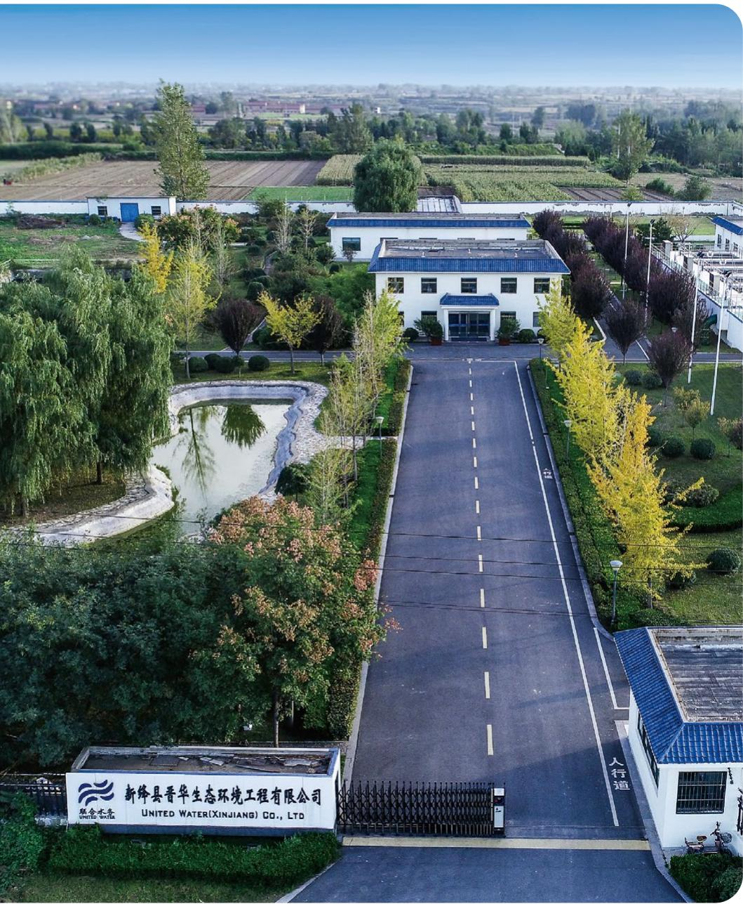

text_image

新绛县晋华生态环境工程有限公司
UNITED WATER(XINJIANG) CO., LTD
联金水务
UNITED WATER
人行道

## 影响、风险和机遇管理

为更好地了解和掌握水资源安全情况、及时发现和解决潜在的水资源安全隐患，公司加强水资源风险管理，推动下属公司开展水资源风险分析工作，建立起系统化的水资源风险管理流程，涵盖风险识别、评估、应对与监控各环节，旨在实现水资源风险管理的科学化与规范化，保障供水安全。

在宿迁地区，联合水务根据2024年《水源地污染源调查报告》及2025年日常检测情况，对水资源进行风险分析评估，编制《2025年水资源风险分析报告》，根据水质实时监测与评估结果，制定切实可行的应对方案。

## 风险识别与评估

强化特征因子监控

针对已知污染特征因子，加强检测频次与预警。

构建立体监测网络

对骆马湖主水源地所有入湖口、取水头部及外围3公里水域进行定期检测；对中运河备用水源地实施每日检测，并结合上下游自动站数据定期监测水质波动。

聚焦关键风险指标

通过评估，明确将藻类数量、UV-254、溴化物等对现有工艺影响显著的指标作为关键监控与评估对象。

## 风险应对与监控

工艺优化应对常规风险

针对藻类高发导致浊度上升、药耗增加等问题，依靠预氧化与深度处理工艺进行优化控制；针对溴化物升高可能引致的消毒副产物风险，通过强化混凝、优化消毒策略(降低出厂余氯，加强管网补氯）及加强管网排水等手段进行控制。

应急机制处置突发风险

针对2025年7月出现的短期水质嗅味异常，及时启动应急预案，通过增加预氧化等措施快速有效处置，确保供水安全。

## 指标与目标

为防止水源污染，确保原水质量，公司配合政府有关部门做好水源保护工作，发现水源水质异常时，进行追踪检测，尽可能找出污染原因并向有关部门报告。

## 生态环境保护

## 水环境治理

境的绿色发展。

## 案例 稷山县苑曲村坑塘生态修复与水质保持工程

净力差等问题，本项目拟依托“一种模块化人工湿地水质净化系统”“一种应用于河岸坡地的面源污染治理系统两项专利技术，构建“生态滤床+生态塘”的梯级净化体系，其中生态滤床对农村生活污水站尾水进行强化净化解决现状尾水排放随意、进入坑塘后导致水质恶化的问题；生态塘则对滤床出水进行深度净化，并结合边坡整理工程（采用植被带、生态拦截沟等形式）拦截周边地表径流中的污染物，通过构建本底生态系统提升水体自净能力：解决坑塘原有污染物长期积累导致的藻华和富营养化问题。整个体系有效应对北方地区冬季净化效率低的痛点，既实现尾水全流程处理与水资源循环利用，也同步提升岸坡景观效果，为运城市沿黄汾美丽乡村示范带建设提供重要实践支撑。

## 生物多样性与生态保护

公司严格遵守国家生物多样性保护与生态保护相关政策，将生态保护要求融入工程项目规划、建设、运营及结束全流程各环节中，通过多维度实践系统维护生态环境，助力实现生态可持续发展。

## 项目规划

基于生物多样性与生态保护要求，对周边生态环境进行全面调查和评估，避免不利影响。

## 项目建设

严格执行“三同时”制度，重视对周边生态的临时性保护，定期清理施工区域，有效防止垃圾与污染物对周边环境造成不良影响。

## 项目运营

严格管控施工噪声、扬尘及挥发性有机物排放，科学设置分类收集与处理设施，实现废弃物的规范管理与资源化利用；建立全过程环境监测机制，确保各项污染物指标达标排放。

## 项目结束

态功能稳步提升。

## 咸宁思源水务横沟水厂三期绿化工程案例

2025年，横沟水厂三期实施了以环境整治与生态建设并行的绿化升级工程，通过路面硬化抑尘、建设“生态草沟”实现雨水有序导流与初步净化、推进绿化种植工程构建复合生态体系，将黄土区域改造为功能完善、环境优美、生态良性循环的现代化厂区组成部分。

公司积极推动水域生态保护，加强水源涵养区和生态缓冲带的治理与保护，通过食物链的梳理、水生动植物的优化配置，尤其是生境营造与食源性植物的优化设计，为水生动植物提供生境条件与栖息环境，不断提高生物多样性，提升河湖自净能力，从而有效扩大水域的生态环境容量，实现“人与自然和谐共生”的美好愿景。

## 武汉西北湖与常青公园养护项目案例

2025年，公司承接武汉西北湖与常青公园的水体养护丁作，围绕水生植物维护、水生动物调控、水面保洁及水面景观维护四大核心维度开展系统化作业，构建起全链条水体生态养护体系。通过系统化的养护措施，两大公园的水体净化能力持续增强，水质指标长期稳定达标，同时水体生态系统的稳定性显著提升，水生植物群落结构更趋合理，为水生动物提供了优质栖息环境，园区生物多样性水平实现大幅跃升，形成了“水质达标、生态稳定、景观优美”的良性水体生态循环。

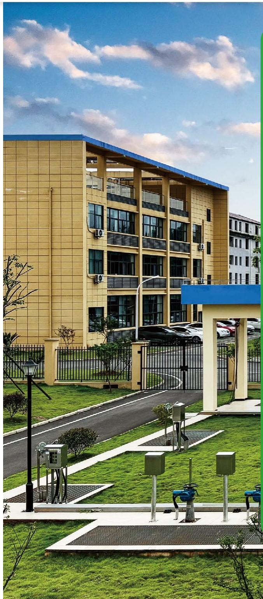

natural_image

Exterior view of a modern multi-story residential building with landscaped grounds and outdoor infrastructure (no visible text or signage)

## 应对气候变化

气候变化是全社会面临的共同挑战，其影响已深度渗透至企业运营与社会发展各领域，构成系统性挑战。联合水务积极应对气候变化带来的风险，积极践行节能减排，紧跟国家“双碳”目标，推进低碳转型，不断提升公司气候韧性。

## 治理

公司将气候变化相关职能融入公司ESG治理架构，由董事会层面的战略与ESG委员会全面监督与指导公司应对气候变化与节能减排工作，通过定期研讨气候变化相关议题、积极识别气候相关风险与机遇、制定并适时更新气候变化应对策略确保应对气候变化相关工作得到有效落地。公司制定《能源管理制度》，定期召开节能降耗会议，分析并优化能耗使用情况，制定并实施调整节能降耗优化措施或技改方案，加强节能降耗的管理工作。

## 战略与管理方式

在“双碳”目标和节能减排的时代浪潮中，联合水务深耕绿色环保基因，紧紧抓住绿色机遇，围绕“双碳”目标、节能等关键领域，主动布局绿色产业，同时倡导绿色环保理念，大力推进公司节能降耗工作，助力企业绿色低碳发展。

## 推动节能降耗

## 布局绿色产业

在节能减排与低碳经济的双重助推下，绿色产业迎来全新发展契机。联合水务顺势而上，放眼全球，筛选和引进最前沿的绿色环保新技术与具体应用场景，全力推动公司向更环保、更可持续的方向迈进。

## 把握绿色发展机遇

联合水务通过全资子公司上海德申山和科技发展有限公司参与投资设立了上海翌昕衡申创业投资合伙企业（有限合伙），专注于环境和ESG科技投资。联合水务持续利用好这一投资平台，围绕“双碳”、节能、高新科技等领域寻找新技术与新模式，实现在环境与ESG科技领域的产业布局及外延式发展。

## 布局低碳前沿科技

公司投资的 United earth4Earth Holding(e4E)公司深耕 CCUS 技术，开发新一代可直接捕获并封存二氧化碳的碳负性建筑材料。通过英国研发与中国制造的协同，现已成功生产30多万块负碳砖，产品不仅部分运往英国市场，更首次应用于国内工业园区的低碳建筑。e4E公司正推进规模化产线的建设，预计2026年5月底可开始规模化生产。

## 加强能源管理

借助智慧水务平台，利用水力模型动态分析，实现生产全过程电耗监测与分析，优化调度方案，提高机组运行效率，降低电能消耗。2025年9月，咸宁联合水务正式上线水力模型系统，优化供水调度，初步统计王英水厂出厂日平均压力下降、节约电单耗约10%，全年电单耗较2024年下降1.05%。

## 节能考核 与激励

在《运营管理考核标准》纳入节能降耗指标体系、监测体系和考核体系，实施节能降耗奖金制度，鼓励部门通过技术改造、管理创新等措施节能降耗。

## 采用节能设计

工程建设中采用低能耗、高能效的设计方案，积极采用现代先进水平的新工艺、新设备，在设计端努力做到合理使用能源和节约能源。

## 使用节能设备

逐步淘汰耗能高的设备，按国家名录开展低耗能高效率设备的采购，积极应用能源耗损更少、环保性更好的节能设备，如空气悬浮风机、新型节能变压器、变频水泵等节能降耗设备，降低能源消耗。

## 发展清洁能源

在生产运营中积极使用绿色电力，通过建设光伏发电项目以及尾水发电项目，提升生产运营中清洁能源应用比例，持续优化能源结构。2025年，宿迁供水公司、瑞昌联合水务光伏发电项目装机总容量4.42MWp，平均每年发电量504.85万千瓦时，报告期内实现光伏发电5.522.371千瓦时，自行消耗5.209.494千瓦时：随州联合水务尾水发电项目装机总容量37千瓦，平均每年发电量16万千瓦时，报告期内实现尾水发电117,038千瓦时全部实现自行消耗。2025年，公司通过使用清洁能源，折合减少温室气体排放2.826.26吨二氧化碳当量。

## 影响、风险和机遇管理

公司积极应对气候变化带来的风险与影响，将气候风险管理纳入公司风险管理体系中，逐步建立气候变化风险管理流程，识别、分析、评估并管理重大气候变化风险与机遇，基于分析结果制定相应应对措施，以不断提高公司应对气候变化的能力。

<table><tr><td colspan="4">实体风险</td><td colspan="3">转型风险</td><td colspan="3">机遇</td><td></td></tr><tr><td rowspan="2">寒潮低温天气</td><td colspan="2">急性风险</td><td>慢性风险</td><td rowspan="2">政策与法规风险</td><td rowspan="2">市场及技术风险</td><td rowspan="2">声誉风险</td><td rowspan="2">产品与服务</td><td rowspan="2">资源效率</td><td rowspan="2">用能结构</td><td></td></tr><tr><td>高温天气</td><td>暴雨、台风</td><td>持续高温干旱及海平面上升等带来的影响</td><td></td></tr><tr><td>风险/机遇描述</td><td>取水口结冰将导致取水困难构筑物池体表面结冰、设施设备损坏影响正常供水极端天气给人员安全带来威胁居民小区水井和水表箱、地下管网、排气阀等损坏影响正常供水</td><td>高温天气不仅影响户外工作环境、劳动生产效率,同时还将对供水系统造成冲击高温天气容易滋生藻类、病原微生物,影响供水水质</td><td>暴雨、台风引发洪涝灾害或给管网排水带来压力,存在安全隐患,若排涝措施不够全面还将影响正常的供水服务暴雨和台风对生产运营的稳定性、厂房设备资产的安全以及员工的通勤安全构成了多方面的威胁</td><td>长期高温干旱将导致原水短缺与水质恶化,直接威胁供水安全与稳定海平面上升可能侵蚀或淹没沿海沿河设施,增加运营中断与资产损失风险气候压力将持续推高处理成本,并带来更严格的合规与需求波动挑战</td><td>国家相关政策和要求日趋严格,水务行业面临越来越高的节能减排要求,应对政策变化会造成公司成本增加</td><td>客户对价值链的碳减排要求趋严,低碳转型成本投入加大</td><td>利益相关方对公司气候应对表现的关注日益提升,若未能适时回应相关关注可能对公司声誉造成影响</td><td>在低碳经济转型背景下,绿色低碳产品与服务的社会需求可能增加;开发和提供绿色低碳产品与服务以及解决方案,可使公司获得额外的营收增长</td><td>通过采用节能技术和设备,可降低生产过程中的能耗,降低公司的运营成本,同时实现生产效率和供应能力的提升</td><td>随着绿色技术的研发与创新、支持性政策的出台,利用供水厂和污水厂的空间资源开展光伏发电和尾水发电,可满足自身用电需求,降低运营成本</td></tr><tr><td>应对策略</td><td>加强设备及各种取暖设备、设施的管理,杜绝跑、冒、滴、漏现象;生产现场产生积水、积冰时应立即清除制定供水管网抗寒抢修应急预案,建立三级响应机制,模拟抗寒抢修场景,明确真实场景下的各项工作要求完善组织保障,组建防寒巡查小组、预警小组、应急保障小组等,为应对寒潮给供水带来的严峻挑战做好全方位准备完善物资保障,做好防寒防冻物资的储备提前做好防寒防冻知识培训,确保工作人员在位在岗,及时解决寒潮低温天气带来的用水问题</td><td>制定设备防高温预案,完善高温保供应急流程,加强对设备的巡检,确保厂区核心设备在高温天气中平稳运行应对高温天气对污水处理效果的影响,密切监测水质,及时掌握水质变化情况,根据夏季水质水量变化规律,调整污水处理厂的工艺参数以适应高温环境,保证污水处理系统运行正常、处理高效关注户外作业人员人身安全,合理安排工作时间,尽量避免在白天的高温时段进行户外工作,落实各项防暑降温措施</td><td>制定洪涝灾害险情应对应急预案,成立专门的防汛应急小组,加强相关人员的排涝知识宣传教育,定期开展防涝抢险的各项培训,不断增强排涝意识和基本技能加强对排水管网等设施设备的巡查,若发现险情,及时组织开展抢险抢修工作对厂区内的排水系统进行疏通,清理可能堵塞排水口的杂物,防止出现积水现象对建筑物的门窗、屋顶等进行加固处理,以抵御暴雨、强风侵袭</td><td>实现水源多元化,缓解水压力,对关键设施进行气候适应性加固与改造建立应急水源和应急取水泵站,在主水源短缺或者水质恶劣时,启动应急水源取水对可预见的海平面上升地区及时调整投资策略;持续搭建智慧水务平台,以科技提升运营效率与应急响应能力将气候风险管理融入公司战略,并纳入长期规划、投资决策与治理流程</td><td>及时研究、跟进、宣贯政策变化,前瞻考虑政策适应性充分依托国家清洁能源政策利好扶持关注碳市场发展动态,做好准备</td><td>积极开展相关专题技术创新研究规划减碳路径,推动公司温室气体排放核查,识别排放较高环节,采取针对性管理措施</td><td>关注气候相关政策趋势,将应对气候变化纳入公司发展战略之中及时披露相关信息,加强与利益相关方的沟通交流</td><td>关注并梳理新型低碳环保原料、技术及产品,布局绿色产业,拓展低碳商业机会和业务类型,把握清洁技术机遇</td><td>在生产过程中广泛应用节能技术和设备,建立完整的能耗管理流程,降低能耗成本建立完善的资源回收和处理体系,实现废物的资源化利用和减量化处理</td><td>逐步在符合条件的运营点推广光伏发电、尾水发电,扩大使用清洁能源,逐步提高新能源电力占比</td></tr></table>

## 风险
/

##

指标与目标  
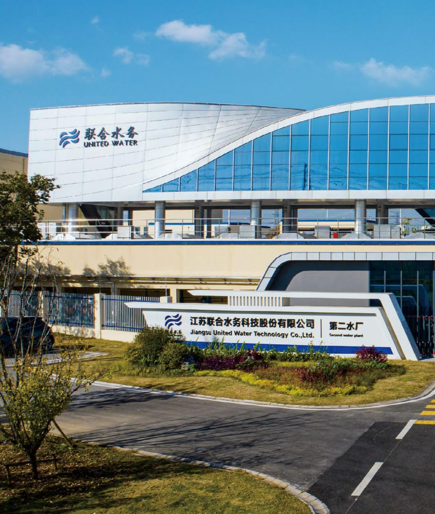

text_image

联合水务
UNITED WATER
江苏联合水务科技股份有限公司 | 第二水厂
Jiangsu United Water Technology Co.,Ltd.
Second water plant

<table><tr><td colspan="2">指标</td><td>单位</td><td>2025年数值</td></tr><tr><td rowspan="10">能源消耗</td><td>外购电力</td><td>千瓦时</td><td>140,830,142.10</td></tr><tr><td>汽油消耗量</td><td>升</td><td>129,520.31</td></tr><tr><td>柴油消耗量</td><td>升</td><td>43,761.13</td></tr><tr><td>天然气消耗量</td><td>立方米</td><td>108,020.20</td></tr><tr><td>液化石油气使用量</td><td>千克</td><td>9,632.00</td></tr><tr><td> $能源消耗总量^1$ </td><td>吨标准煤</td><td>18,315.00</td></tr><tr><td>能源消耗强度</td><td>吨标准煤/万元营收</td><td>0.17</td></tr><tr><td>清洁能源/可再生能源装机总容量</td><td>MWp</td><td>4.46</td></tr><tr><td>清洁能源/可再生能源发电量</td><td>千瓦时</td><td>5,639,409.80</td></tr><tr><td>清洁能源/可再生能源消耗量</td><td>千瓦时</td><td>5,326,532.00</td></tr><tr><td rowspan="4"> $温室气体排放^2$ </td><td>范围一:直接温室气体排放量</td><td>吨二氧化碳当量</td><td>664.11</td></tr><tr><td>范围二:间接温室气体排放量</td><td>吨二氧化碳当量</td><td>74,724.47</td></tr><tr><td>温室气体排放总量</td><td>吨二氧化碳当量</td><td>75,388.58</td></tr><tr><td>温室气体排放强度</td><td>吨二氧化碳当量/万元营收</td><td>0.68</td></tr></table>

注1：综合能源消耗总量：参考国家市场监督管理总局和国家标准化管理委员会GB/T2589-2020《综合能耗计算通则》，折算成以标准煤为单位。  
注2：温室气体排放量仅指二氧化碳排放量，不包含其他排放源所排放的甲烷、氧化亚氮等温室气体类型。范围一温室气体排放量：柴油、汽油、天然气、液化石油气等化石能源燃烧活动和工业生产过程等产生的温室气体排放；范围一温室气体排放系数参考国家发展和改革委员会发布的《工业其他行业企业温室气体排放核算方法与报告指南（试行）》计算。范围二温室气体排放量：因外购的电力等所导致的温室气体排放；电力排放系数参考生态环境部、国家统计局联合印发的关于发布2023年电力二氧化碳排放因子的公告》(公告2025年第47号)

## 降低环境影响

## 加强环境管理

公司严格遵循《中华人民共和国环境保护法》等相关法律法规，切实履行企业自身生产经营领域的环境保护主体责任，不断完善环境管理体系，全面提升企业绿色发展能力。

环保总投入

4,857.89 万元

年度环保培训次数

参与人次共计

56 次

733 人次

江苏联合水务科技股份有限公司及下属4家子公司

宿迁民信水质检测有限公司宿迁耿车污水处理有限公司宿迁联合市政工程有限公司咸宁联合市政工程有限公司

通过ISO 14001 环境管理体系认证把环境危险源防控纳入常态化管理，加强对在建项目施工过程中的环境危险源防控，识别评估噪声、扬尘、水污染等环境维度的危险源并制定预控措施，建立重大危险源管理台账，开展危险源管理常态化检查，确保作业现场危险源控制措施落实。

重视开展项目建设环境影响评估工作，全面评估项目施工期和营运期对环境的影响，在项目建设过程中重视水土保持和绿化工作，严格控制施工活动，尽量减少因建设项目实施对环境的不良影响。2025年，桐乡申和水务工业污水处理厂建设项目《环境影响报告书》顺利通过嘉兴市生态环境局的审查批复。

在环境管理组织架构方面，成立集团EHS委员会，由总裁担任组长，负责研究决策公司环境保护的重大问题、管理与推进公司关于环境保护的承诺、方针与战略目标等，集团运营管理中心成立 EHS 管理部，对运营公司的EHS 管理工作进行指导；六大区域组建EHS委员会，各运营公司成立EHS管理小组，超过50人或者风险较大的运营公司成立EHS 管理部或任命专职EHS工程师；通过明晰各级管理职责，并将环境合规、节能降耗、污染与废弃物管理等环境绩效纳入运营管理考核标准中，确保环境保护责任的落实。

## 加强环境危险源防控

## 重视项目环评工作

## 健全环境管理

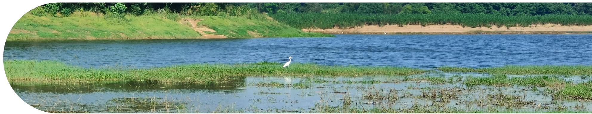

natural_image

Scenic view of a calm blue lake surrounded by green vegetation and shallow water, with a white wading bird standing on the shore.

## 加强环境应急管理

## 开展环保教育培训

## 推进绿色施工管理

为全面提升环境应急处理水平，联合水务所有运营公司均编制《突发环境应急预案》且在3年有效期内，有效指导和规范突发性环境污染和生态破坏事件的应急处理工作；每年度按照应急预案至少进行一次有效的环境突发事件的应急演练，提高公司员工应急反应能力，确保迅速有效地处理突发环境事件。

全面推行环保教育培训，各运营公司在年初制定年度培训计划，对员工定期进行各类教育培训，涵盖环保法律法规、环保相关知识、环境隐患排查及环境应急管理等内容以全面强化全体员工的环保意识。

制定2025年度工程环境管理目标，依托智慧工地管理系统，对用水、用电情况进行实时监测与智能分析，实现资源消耗的精细化管理；同时通过规范铺设防尘网等综合措施，确保各项环境指标全面达标，落实环境保护主体责任。

## 污染与废弃物管理

## 治理

公司由运营管理中心领导污染与废弃物管理工作。运营管理中心下设EHS部门，对污染与废弃物管理进行日常统筹与监管，推进各运营公司对污染与废弃物排放情况进行自查自改、监督和管理。

公司严格遵守《中华人民共和国水污染防治法》《中华人民共和国固体废物污染环境防治法》《中华人民共和国大气污染防治法》《中华人民共和国噪声污染防治法》等要求，制定《固体废物管理程序》《噪声产生与处理管理程序》《噪音排放管理规定》《废水产生与处理管理程序》《废气产生与处理管理程序》等内部制度，通过完善的管理流程和操作办法，确保公司生产运营过程中的废水、固体废弃物、有害气体、噪声达标排放。报告期内，公司未因排放物及废弃物排放相关问题受到处罚或发生重大事故。

## 案例 桐乡申和水务污泥资源化利用

2025年，桐乡申和水务共产生污泥13.037.87吨，全部运往第三方热电公司进行资源化处置利用。其中运往嘉兴新嘉爱斯热电有限公司资源化利用4.460.90吨，其污泥焚烧后的粉煤灰用于建筑行业，也可以作为道路施工中的路基。运往浙江景顺环保能源有限公司资源化利用8,576.97吨，其污泥焚烧后的脱硫灰，用于砖厂进行制砖。

## 战略与管理方式

公司通过完善污染管控体系，确保废弃物合规排放，并积极探索废弃物资源化综合利用路径，以提升资源循环利用率，切实降低污染排放对环境的影响。

## 固体废弃物

处理方法：针对不同类别的固体废弃物制定相应处理和处置方式，达到废物减量化、资源化和无害化，对公司内各类废弃物实行有效管理。

## 噪声

处理方法：如遇生产现场边界临近敏感区时，构筑噪声隔离墙；增加设备的降噪措施；现场作业人员必须佩戴防噪声耳塞。

## 废水

处理方式：水质检测过程中产生的废水，由水检中心统一回收，集中后委托有资质的单位合规处置：生活废水统一进入化粪池进行处理后进入城镇污水管网：制水过程中产生的清洗废水回收使用，污泥的压滤水排入城镇污水管网；雨水进入厂内雨水管网后进入城镇雨水管网。2025年，公司完善工业废水排放系统，对出水口安装巴氏计量槽和流量计，对工业排放水进行精确计量。

## 废气

处理方法：对污水处理工艺段、污泥处理系统产生臭气区域进行加盖，使用玻璃钢、不锈钢等耐腐蚀材料，确保密封性，防止臭气外泄，并通过管道集中输送至生物除臭单元进行除臭。

## 影响、风险和机遇管理

为系统防控污染与废弃物排放风险，公司建立起系统化的污染与废弃物风险管理体系，旨在主动识别、评估、控制和持续降低相关环境与运营风险。公司对废水、废气、噪声等关键排放源实施持续性监控，确保异常能被及时捕捉。另外，公司按规定委托符合资质的第三方检测公司进行定期检测（其中，污水厂执行季度检测，供水厂执行年度检测），以确保各类污染物排放符合环保标准。

## 指标与目标

公司针对固体废弃物排放、噪音排放、废水与废气排放设置年度目标，全面加强污染与废弃物管理。

<table><tr><td>污染与废弃物管理目标</td><td>2025年达成情况</td></tr><tr><td>·噪音排放达标100%(白天≤60bps,夜晚≤50bps),操作场所噪声≤85dB</td><td>已达成√</td></tr><tr><td>·废水排放各项指标排放浓度符合率=100%,各项指标年度总量符合率=100%</td><td>已达成√</td></tr><tr><td>·一般废弃物处置率达到≥99%·危险废弃物处置率达到=100%</td><td>已达成*√</td></tr><tr><td>·废气各项指标排放浓度符合率=100%</td><td>已达成√</td></tr></table>

一般废弃物和危险废弃物处置率均为100%。

<table><tr><td colspan="2">指标</td><td>单位</td><td>2025年数值</td></tr><tr><td rowspan="4">废水排放</td><td>氨氮排放量</td><td>吨</td><td>71.20</td></tr><tr><td>总氮排放量</td><td>吨</td><td>951.57</td></tr><tr><td>总磷排放量</td><td>吨</td><td>16.74</td></tr><tr><td>悬浮物排放量</td><td>吨</td><td>672.82</td></tr><tr><td rowspan="6">废气排放</td><td>废气排放总量 $^{1}$ </td><td>立方米</td><td>1,295,572,540</td></tr><tr><td>氮氧化物排放量</td><td>吨</td><td>0.32</td></tr><tr><td>硫氧化物排放量</td><td>吨</td><td>0.03</td></tr><tr><td>悬浮粒子与颗粒物排放量</td><td>吨</td><td>16.58</td></tr><tr><td>挥发性有机化合物排放量</td><td>吨</td><td>0</td></tr><tr><td>一氧化碳排放量</td><td>吨</td><td>0.11</td></tr><tr><td rowspan="3">废弃物管理</td><td>有害废弃物产生量</td><td>吨</td><td>17.04</td></tr><tr><td>无害废弃物产生量</td><td>吨</td><td>122,161.24</td></tr><tr><td>回收再利用的废弃物总量</td><td>吨</td><td>14,300.96</td></tr></table>

注1：废气为污水厂臭气收集风量，经除臭系统处理后有组织排放。

## 药剂管理

联合水务围绕“水质达标优先、成本精准管控、安全合规运营”，制定《药剂管理强化方案》(内含《专项药剂管理细则》），构建全流程闭环管理体系，通过制度规范、技术赋能、监督考核实现药剂管理精细化、标准化、可追溯。

## 采购

建立供应商分级管理机制并定期评估以杜绝不合格供应商准入，结合生产需求制定精准采购计划以保障药剂及时供应，药剂到货后执行双人验收与抽样检测，从源头把控药剂质量

## 储存

设立专属药剂仓库并按药剂性质严格分区存放，保障药剂稳定；建立动态库存台账与预警机制、配备完善安防设施并实施实时监控，实现对药剂的规范化安全化储存管理。

依托水质化验数据制定每日用药计划，以数据驱动动态调整投加量；升级自动化投加设备，保障药剂投加均匀、剂量精准；搭建可追溯台账，定期分析用药数据，优化投加方案，降低运营成本。

自2024年起，先后在贺兰联合水务、宿迁耿车污水处理公司等多个污水处理厂推广使用碳源智能投加装置，通过精确计算所需投加的药剂量，从而显著降低了药剂消耗成本，同时确保了生产的稳定运行

## 使用

推进运营公司液体 PAC/PFS 代替固体PAC，在节约药剂成本的同时，间接减少了固体 PAC生产过程中烘于工艺中所消耗的能源并进而减少碳排放：此外，2025年4月起荆州申联环境采用液体硫酸亚铁（工业副产品）代替固体硫酸亚铁，降低运营成本的同时，还提升了污水处理的效率和环保效益。

## 替代

扩充水质监测指标，提高药剂投加后监测频率，特殊工况加密检测；定期开展员工安全培训，制定药剂泄漏、中毒等事故应急预案，配备应急救援设备及防护用品，定期组织演练。

## 倡导绿色理念

联合水务在日常运营中全面践行绿色理念，持续开展形式多样的绿色公益活动，面向社会公众进行节水与环境保护科普宣传，激发公众参与生态环境保护的热情与行动，为推进可持续发展、擘画绿色未来贡献力量。

## 绿色办公

公司聚焦日常点滴，倡导全体员工主动践行绿色办公与绿色生活模式，让绿色发展理念深植员工内心。2025年，为贯彻“科学管理、规范高效、节能降耗、提质增效”的工作要求，公司制定并发布实施《联合水务集团上海总部办公室行政管理办法(暂行）》。《办法》规定提高能源利用效率，倡导文明、节约、安全的工作作风营造绿色办公、节能减耗工作氛围，建设良好的办公环境，推动公司可持续发展。

推行现代化会议系统，逐步实现无纸化办公，倡导纸张双面使用、废纸重复利用，减少纸张浪费。

倡导员工及时关闭各类用电设施设备，精准管控空调使用，减少用电浪费。

## 绿色设计

## 节约用纸

将节能环保的理念融入公司新办公室装修设计中，选择高效能耗设备和系统、可再生或可回收材料，在公共空间种植树木以吸收二氧化碳。

## 节约用水

## 节约用电

## 低碳出行

培养员工节约用水意 识，养成随手关水龙头 的好习惯，减少水资源 浪费。

鼓励员工低碳出行，提倡使用公共交通工具，以实际行动助力节能降耗。

## 环保活动

公司深入践行“绿水青山就是金山银山”的生态文明理念，组织各子公司员工身体力行参与植绿护水行动，以企业担当厚植生态底色，为城市涵养水土资源、筑牢生态屏障注入绿色动能。

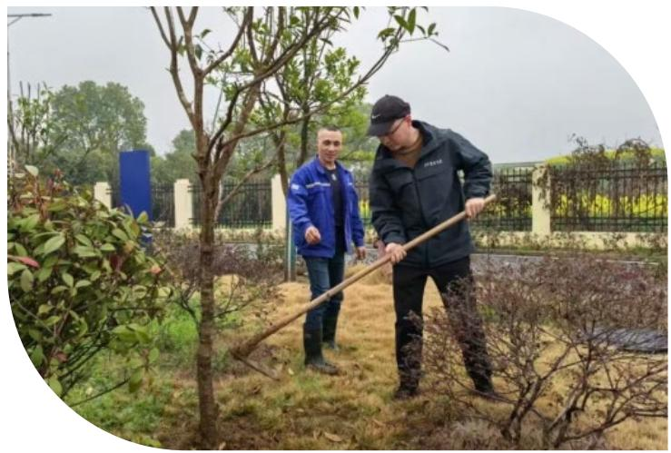

natural_image

Two men working outdoors near a tree in an outdoor garden setting, one holding a stick and the other using a tool (no visible text or symbols)

2025年植树节，瑞昌联合水务组织员工种下一株株树苗。

  
随州联合水务组织开展以“清洁环境，我们在行动”为主题的河道垃圾清理公益活动。

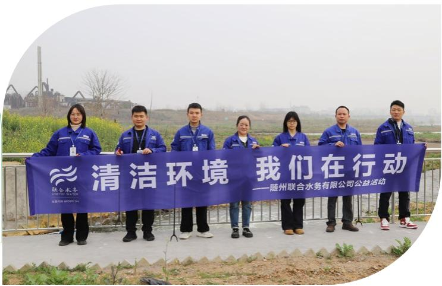

text_image

清洁环境 我们在行动
——随州联合水务有限公司公益活动

## 环保科普

2025年，公司以“世界地球日”“世界水日”及“中国水周”等重要节点为契机，在江苏、湖北等多地组织多元化节水宣传活动，通过邀请公众进水厂、组织公司员工走进学校、企业与社区等行动，引导公众珍惜水资源、保护水生态，助力节水型城市建设，携手社会各界共护碧水长流。

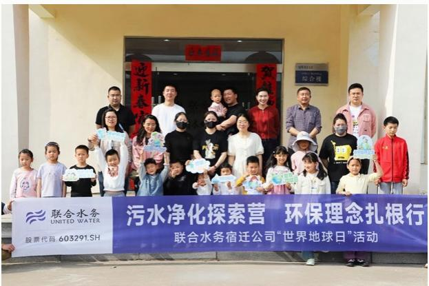

text_image

联合水务
UNITED WATER
股票代码: 603291.SH
污水净化探索营 环保理念扎根行
联合水务宿迁公司“世界地球日”活动

## 走进水厂，见证污水净化之旅

2025年“世界地球日”，联合水务江苏区域邀请市民走进宿迁耿车污水处理公司，近距离参观污水处理设施，沉浸式探索“污水变清流”的奥秘，让大家深刻感受到水资源的珍贵。

## 街头互动，传播绿色发展理念

随州联合水务开展全国城市节约用水宣传周活动，通过法规制度、节水理念、节水成效、技术创新四个方面进行宣讲宣传，向市民普及节水知识。

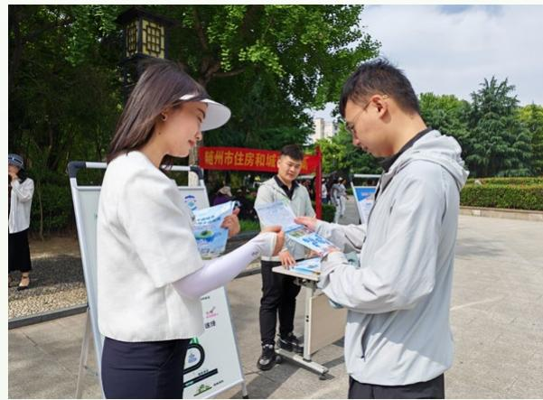

text_image

Street photo showing two people distributing printed materials to a booth, with visible Chinese signage in the background.

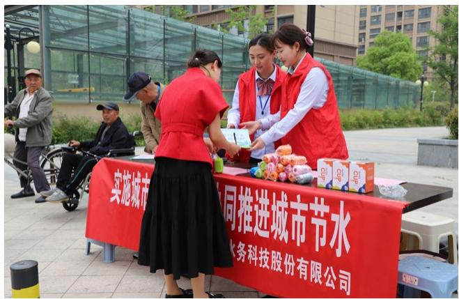

text_image

实施城市
同推进城市节水
财务科技股份有限公司

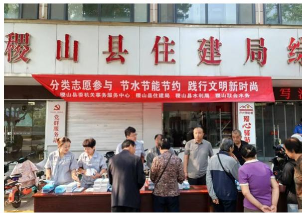

text_image

稷山县住建局
分类志愿参与 节水节能节约 践行文明新时尚
稷山县委机关事务服务中心 稻山县住建局 稻山县水利局 稻山联合水务
党群服务站
爱心驿站

## 社区联动，营造全民节水氛围

联合水务各子公司走进社区，面向居民开展节水知识宣传，提醒居民养成节水好习惯。

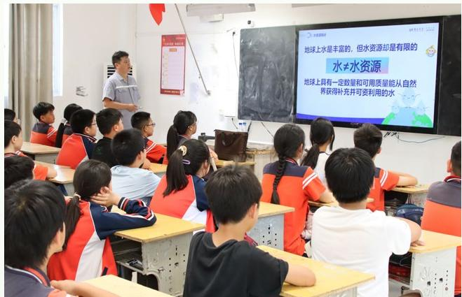

text_image

地球上水是丰富的，但水资源却是有限的
水≠水资源
地球上具有一定数量和可用质量能从自然
界获得补充并可资利用的水

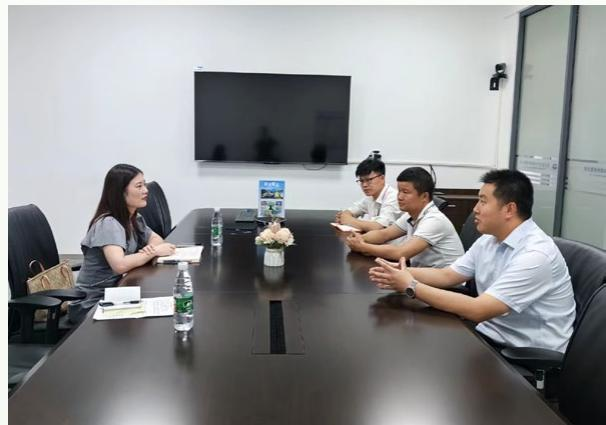

natural_image

Group of four professionals seated around a conference table in a meeting room, with no visible text or signage.

## 走进学校，种下节水小种子

咸宁联合水务前往咸宁市温泉实验小学、银桂学校，向学生科普自来水相关知识，积极推动节水知识从校园向家庭延伸、向社会辐射。

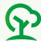

## 走进企业，筑牢节水大阵地

咸宁思源水务走访用水大客户，解读节水政策，宣贯节水理念。

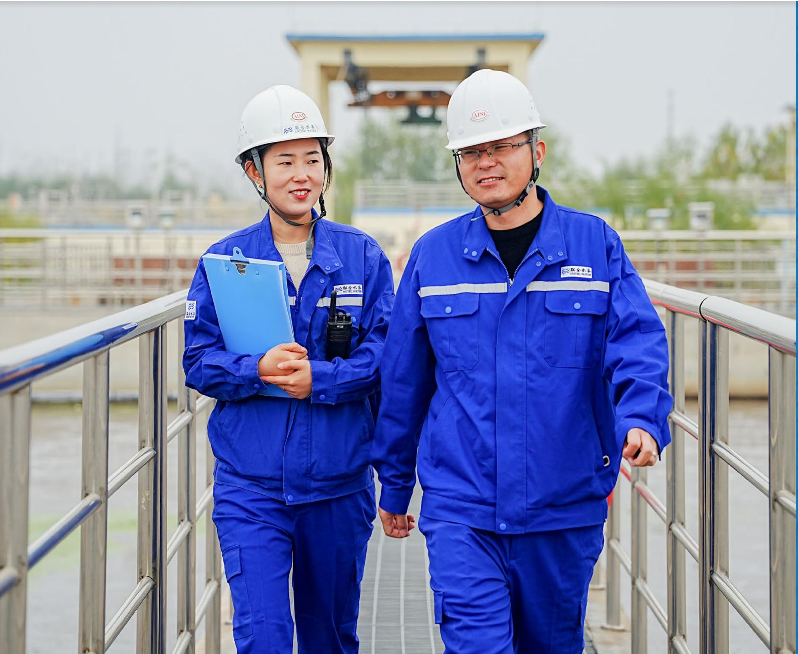

natural_image

Two workers in blue uniforms and white hard hats walking on a metal walkway, smiling at each other (no visible text or symbols)

## Re liable Partner 可靠伙伴

水务运营总协议和规划处理能力（含中水）

约 300 万立方米 / 日

供水水质综合合格率

100%

公益总投入

324.15万元

贡献联合国可持续发展目标 SDGs

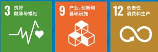

## 稳定供水

联合水务相信，稳定优质的淡水供应对人类健康和社会经济发展具有高度的重要性。为此，公司不断精进供水管理体系，构建供水风险应对机制，增强供水系统的韧性，为社会提供稳定、安全、可持续的供水服务。

## 治理

针对供水质量，公司运营管理中心负责质量管理，由高级副总裁分管，日常支持与指导各运营公司的生产运行；各运营公司由总经理和生产厂长对日常运营工作负责，确保制度规范严格落实以及水厂安全稳定运行。公司制定《水质管理制度》以规范水质管理，确保供水水质符合《生活饮用水卫生标准》GB.5749-2022标准要求。

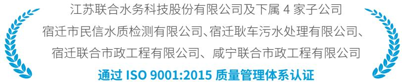

text_image

江苏联合水务科技股份有限公司及下属4家子公司
宿迁市民信水质检测有限公司、宿迁耿车污水处理有限公司、
宿迁联合市政工程有限公司、咸宁联合市政工程有限公司
通过ISO 9001:2015质量管理体系认证

## 战略与管理方式

供水业务是联合水务的核心业务。公司建立健全供水服务相关的管理制度及标准，持续投入资金加强水质安全保障，系统推进供水设施和管网改造维护，优化供水调度，提升供水保障能力，实现从“水源头”到“水龙头”全流程的优质、高效供水。

## 保障供水品质

水质为先，公司通过构筑严密的水质监测防护网，悉心守护供水安全。

## 全流程水质管控

公司严格按照国家《生活饮用水卫生标准》等相关要求，水质检测人员严格执行班组、水厂和公司“三级”检测制度，每天对水源水、工序水、出厂水进行全流程监测，实现从“水源头”到“水龙头”的全流程水质管控，确保水质100% 达标。

## 完善水质管理制度

联合水务宿迁供水公司建立管网末梢水水质检测管理制度，通过制定年度排水计划、配备专人与设备，严格实施每月两次的检测，将末梢水水质检测制度化、流程化，进一步保障供水水质

## 智能巡检赋能

公司建设并升级智慧巡检系统，2025年宿迁第二水厂针对厂区沉淀池、高低压配电室等关键场景，引入机器狗巡检系统以全面替代传统人工巡检，有效提升巡检的精准度与时效性，保证人员与设备安全。

## 加强运营管理考核

公司制定和发布了《联合水务集团运营管理考核标准》，该考核标准内容涵盖了安全管理、运行管理、设备管理目视化等管理要求，设置一级指标8个、二级指标30个。通过持续完善考核标准，提升公司运行管理的合规性标准化以及精细化，为各运营公司做好质量管控提供了强有力的抓手。

## 提高水质检测能力

2025年，公司开展化验管理培训会，特邀桐乡市凤栖水质检测有限公司专家进行专业技能讲解，旨在让参训人员提高化验室管理水平，提升检测效率与质量。多年来，公司通过开展多角度，多层次培训，规定每三年实现化验人员“培训+考试”的100%全覆盖，推动高素质技术技能人才培养，夯实水质安全管理体系，全面提升水质检测能力，以匠心守护千家万户的饮水安全。

## 提高供水能力

公司通过加强供水设施和供水管网改造维护，推进供水能力建设，不断优化供水调度，有效提升供水保障能力，致力于让广大用户都能用上稳定、优质的“放心水”。

管网隐患排查覆盖率

100%

突发故障抢修及时率

100%

2025 年管网改造投资\*

2,663.8万元

\*统计范围覆盖联合水务宿迁供水公

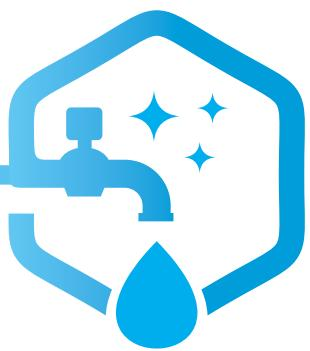

natural_image

Blue icon of a faucet with water drop and sparkles inside a hexagonal frame (no text or symbols)

## 管网建设升级

通过新建配水管网，系统推进供水设施和管网的建设与改造维护，推进老旧管网改造，提升各区域供水压力，改善居民用水体验。

## 管网巡检运维

以建立现代化管道漏损检测体系为基石，结合信息化、智慧化应用，做好管网运行状况的宏观调控及管网勘漏微观普查，坚持技术与管理双管齐下，结合组织架构调整、业务流程重塑、合理的绩效与考核等管理措施，对供水管网漏损实现实时控制与精准管理。

## 供水科学调度

建立综合调度中心，实时监控供水管网压力和流量，随时调配供水需求，提升调度人员的专业水平，正确快速处理应急情况；制定科学调度方案，根据天气、气温变化及供水高峰特点，合理分析和预测供水水量；升级供水调度系统，通过大数据分析精准预测用水量变化趋势，动态优化调度方案，保证各区域水压平衡，确保供水稳定。

## 停水有序管理

通过官方网站、微信公众号、微信群、群发短信等及时发布停水信息；规定供水管道突发性爆管、折断等事故及一般明漏、暗漏应在接到报漏电话之时起，4小时内止水并立即组织抢修：若管线突发大面积爆管及泄漏事故抢修停水时间超过24小时，快速出动应急送水车辆，及时向停水区域群众提供基本生活用水。

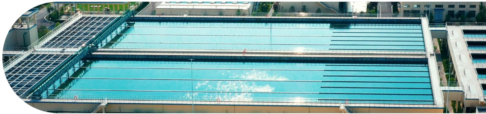

natural_image

Aerial view of a large water treatment facility with circular water channels and adjacent buildings (no visible text or symbols)

## 应急供水保障

联合水务不断强化应急保障能力，推动各运营公司制定水资源专项应急预案，规范应急组织机构、职责及流程，高效应对包括突发性水资源短缺、原水水质突变、冰冻灾害、暴雨洪水等事件，并要求定期开展水资源应急演练，提高员工应对突发事件的能力。

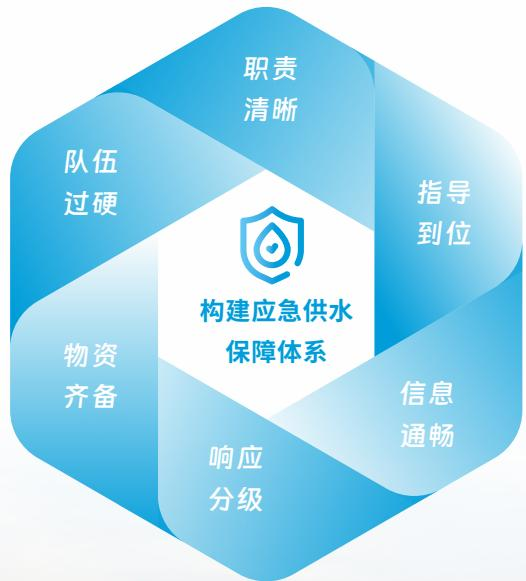

flowchart

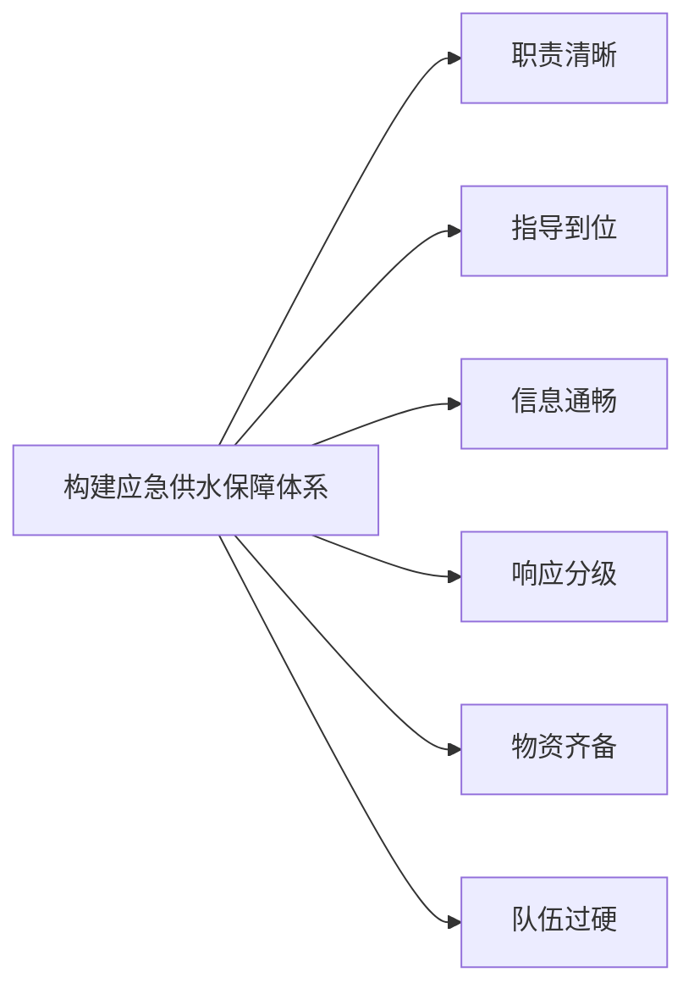
```mermaid
graph LR
  A["构建应急供水保障体系"] --> B["职责清晰"]
  A --> C["指导到位"]
  A --> D["信息通畅"]
  A --> E["响应分级"]
  A --> F["物资齐备"]
  A --> G["队伍过硬"]
```

2025年8月，面对高温与极端天气的双重挑战，三门峡联合水务提前部署，通过检修设备、改造管网等行动筑牢防线；进入实战后迅速启动高等级响应，科学研判、精准施策，全方位保障供水安全。

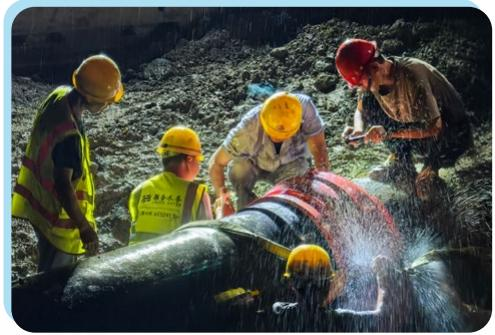

natural_image

Workers in safety vests and helmets handling a large inflatable object in heavy water at night (no visible text or symbols)

2025年10月，山西省运城市稷山县突遭汛情。稷山联合水务启动防汛应急预案，通过果断停产、精准抢修等举措，顶住洪峰压力，在保障排涝的同时保障了水质达标与稳定供水，以高效专业的响应守护了水务“生命线”。

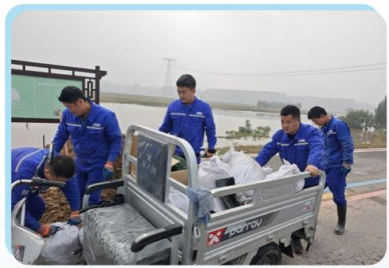

natural_image

Group of workers in blue uniforms handling a large cargo cart outdoors, with water and buildings in the background (no visible text or symbols)

## 影响、风险和机遇管理

公司系统构建供水风险管理体系，执行全流程精准监测，建立水质上报平台，通过各运营公司化验室上报的数据，及时对潜在的水质管控风险进行识别和防控，并以总部的技术力量指导调整运行参数，从而保证各运营公司出水水质达标。另外，公司制定《水质突发事件专项应急预案》《供水突发事件专项应急预案》等应急预案，定期开展应急演练，提高应对供水突发事件的能力。

## 指标与目标

## 稳定供水目标

稳定供水水量

供水水质符合用水要求=100%

## 2025年达成情况

已达成

## 优质服务

供水服务，是公司的立身之本，更是传递温暖的纽带。公司始终坚守“供优质之水，服诚信之务”的庄严承诺，以水为媒，打造智慧、高效、温情的服务体系。

## 优化营商环境

## 治理

联合水务推动服务型运营公司设置客户服务部门，落实优化营商环境、客户服务工作，并通过持续完善服务管理制度体系，持续推动营商环境的优化。

## 战略与管理方式

稳定的用水保障是维系企业生产经营的“生命线”。公司持续探索创新服务模式，推动各运营公司打出“组合拳”，努力当好“水助手”，切实为企业排忧解难，以实际行动助推营商环境持续优化。

联合水务宿迁供水公司通过拓展服务渠道、优化报装流程、提升供水服务效率等系列行动，切实提高自来水报装效率和供水服务水平。咸宁联合水务以“网格+供水”服务体系深度运营，增强广大用户用水获得感和满意度，以实际行动助力营商环境再优化，并作为湖北省优化营商环境标杆经验，荣登《湖北省优化营商环境简报》 (2025年第3期)。

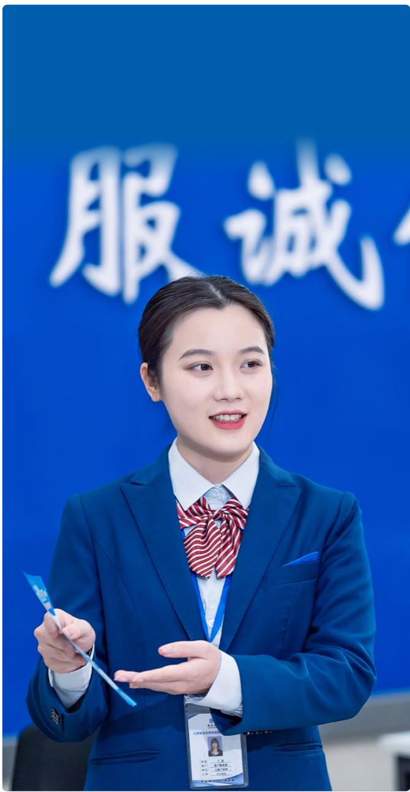

text_image

服诚

  
简化流程做 “减法”

  
优化服务做“加法”

  
信息赋能做“乘法”

  
化解难题做 “除法”

依托大数据管理和智慧水务管理平台，将新户报装、在线缴费等服务事项，融入供水网格“水助手”服务卡和供水企业公众号服务平台中，减少用户资料填写内容，实现供水业务“网上办”。

建立“点对点”网格服务机制，在社区配备“供水服务专员”，一对一负责网格内的供水服务；建立“社区一物业一供水网格员一供水企业”四级网格联动管理体系，精准解决用户用水需求。

加强信息化建设，以标准化、便民化、精细化为方向，完善供水企业智慧化管理平台的设计图纸出具、工程施工管理等功能。

针对用户需求，积极做好供水延伸服务，精准开展线上发票、漏点排查、水质检测等增值服务。实时监测分析各类供水数据，实行异常用水自动提醒，确保水质优、水压稳。

## 影响、风险和机遇管理

联合水务推动服务型运营公司针对营商环境优化与客户服务保障中的潜在风险建立风险管控机制。其中，联合水务宿迁供水公司建立起涵盖识别、评估、应对的风险闭环管理机制，从供水安全与应急保障、服务质量与客户满意度两大维度识别风险并制定应对措施。咸宁联合水务建立起“风险识别一分级评估一精准处置一长效防控”的全流程闭环机制，通过组建跨部门专项工作组，从“内部流程自查+外部需求收集+技术平台监测”三维度识别风险，结合影响范围、严重程度实施分级评估，将风险处置结果纳入部门绩效考核，形成“责任到岗、考核到人、监督到位”的管理格局，助力区域营商环境持续优化。

## 指标与目标

联合水务推动服务型运营公司开展目标管理，以目标推动服务工作持续完善。其中，联合水务宿迁供水公司从客户投诉与客户走访两大维度制定相关目标；咸宁联合水务结合公司业务布局与用户需求痛点，从六大维度制定系统性目标，兼顾服务效率、保障能力、技术创新与用户体验。

## 提升服务体验

联合水务致力于为用户提供专业、快速、可靠的用水体验，专注打磨每一处服务细节，确保客户从始至终都能感受便捷与安心。

## 健全制度规范服务

在居民供水端，推动制定《服务承诺》，完善《首问责任制》《热线接听制度》《投诉处理制度》《供水行业规范》等制度，要求公司员工尤其是客户服务相关人员，严格按规章制度办事，规范服务标准。

## 资费透明 保障权益

通过营业网点、微信公众号、政府网站公示等渠道，向广大用水户公示公告居民用水、非居民用水、特殊行业用水等各类水费价格信息，切实保障用户的权益，让用户放心用水、放心消费。

## 提升技能态度亲和

要求客服员工秉持以客户为中心的理念，定期围绕服务标准、政策解读、故障处置等内容组织专项培训学习，并从服务态度、用户满意度、业务能力等方面定期考核，提升客服员工的综合业务水平与主动用心服务的意识。

## 全天热线响应及时

热线服务人员24小时在线受理和解答用户的投诉和反馈，准确有效地将用户反映的情况及时通知公司各部门，高效快捷完成用户对用水量、收费、故障表等业务提出的查询，确保用户的用水疑问得到及时、有效的处理。

## 联动服务

建立网格化服务体系，通过员工进社区、配备专属网格员、建立社区微信群，形成四级网格联动机制，实现点对点精准服务，全面提升用户“获得用水”体验。

## 优化营商环境目标

联合水务宿迁供水公司

投诉量同比下降 10%

每个月至少走访 5 家大客户

咸宁联合水务

城区供水网格覆盖率 100%

网格内问题解决率≥ 95%

重点用水大户年度走访≥2次

走访覆盖率100%

用户投诉回访满意率≥ 95%

## 2025年达成情况

已达成

已达成

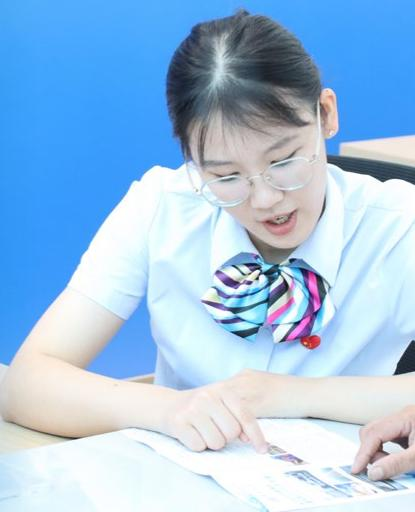

natural_image

Woman in school uniform and glasses reviewing documents at a desk (no visible text or symbols)

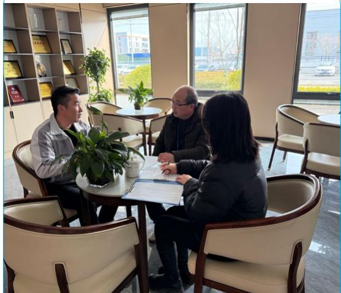

natural_image

Three people seated in a modern lounge with bookshelves and large windows in the background (no visible text or symbols)

针对大客户开展走访工作，真实了解客户需求，提升服务水平。

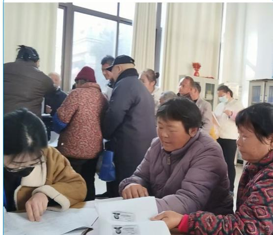

natural_image

Group of people gathered around a table in a room with large windows, some wearing masks and hats (no visible text or symbols)

走进中扬镇书香名苑小区为用户集中办理开户现场，获得用户的高度认可和赞扬。

## 保障客户权益

联合水务以快速响应保障时效，以严格标准守护信息安全，以清晰沟通传递服务价值，全心全意赢得客户的满意与信赖。

## 客户满意度管理

推动服务型运营公司每年开展供水服务质量调查工作，深入了解广大用水客户对供水情况的满意度情况及意见建议，形成调查结果分析，要求各部门针对不足制定改进方案评估改进效果，以便进一步提升客户满意度。

## 客诉问题解决

制定《客户投诉、咨询处理管理制度》，开通微信公众平台、24小时服务热线、市长信箱、信函等渠道倾听客户留言、咨询、投诉等，明确回复责任主体及回复时效，设置专门管理部门对各渠道留言、咨询、投诉的回复是否及时妥当，真诚回应每一位客户的声音。

##

注重保护客户信息安全，严格遵守相关法律法规，所有收集的个人数据仅用于提供优质服务及必要沟通；制定《客户信息保密管理制度》《信息安全工作管理办法》，建立健全保密意识、分类与分级、权限与访问控制、物理与网络安全措施、员工离职管理和事件应急处置等措施。2025年联合水务宿迁供水公司开展客户信息安全管理培训，进一步增强员工在保障客户信息安全方面的意识。

## 联合水务 UNITED WATER

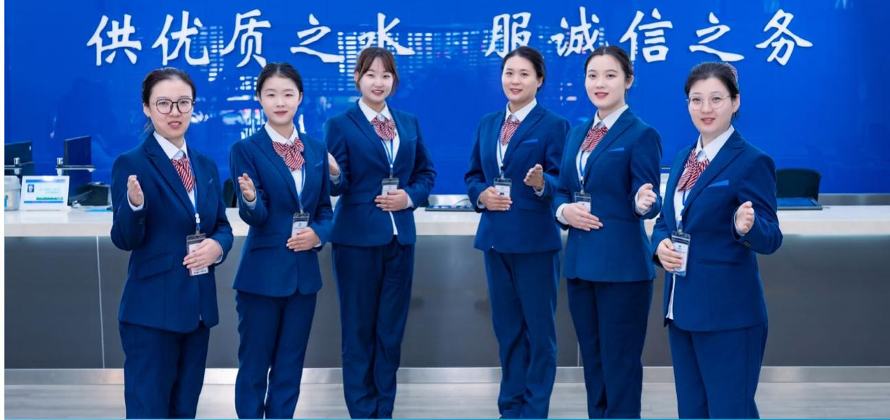

text_image

供优质之水 服诚信之务

## 联合水务宿迁供水公司

2,047 次

客户投诉回复率

100%

客户投诉处理率

100%

客户满意度

98%

## 咸宁联合水务

136

客户投诉回复率

100

客户投诉处理率

100

客户满意度

99.80

## 用水可及

联合水务始终致力于提升供水可及性，让国内外更多居民用上安全、可靠的自来水。公司以专业践行使命，以行动回应期待，持续为民生改善与社会发展注入稳健的“水力量”

## 城乡供水一体化

联合水务坚持“同源、同网、同质、同服务”总体要求，推进城乡供水一体化进程，加大农村、贫困地区饮水工程实施力度，针对农村用户、低收入群体的用水特殊情况完善服务，让更广泛地区的人们

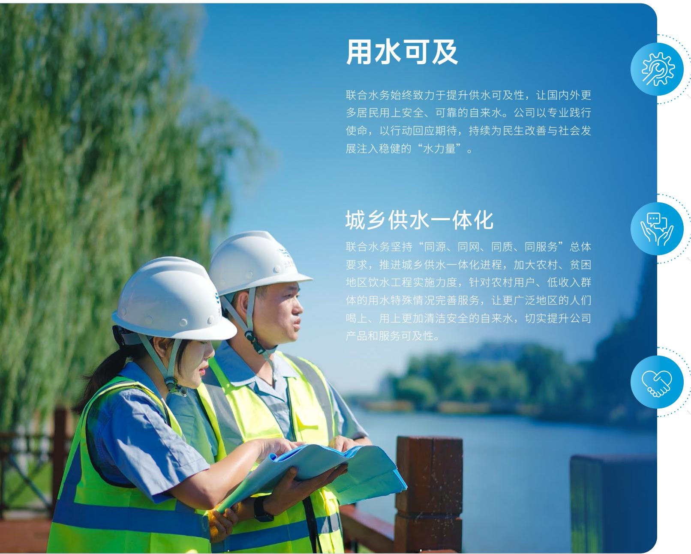

## 基础设施延伸下沉，打通供水“最后一公里”

2025年，联合水务宿迁供水公司积极争取政府资金，改造低压区9处、老旧管网11.20公里新建管网1.8公里，惠及1.2万人，让自来水实现“通村达户”。咸宁联合水务持续延伸供水服务，推进农村管网改造，促进城乡供水均等化，解决偏远地区用水难题，完成城中村管网改造114.68公里，以及381户农村用户水改，惠及3万余人，显著改善农村供水安全与体验。

## 便民服务升级，破解特殊群体用水难题

聚焦农村独居老人等群体线上缴费操作不便的痛点，咸宁联合水务以双溪桥镇李容村为试点，启动“上门收水费”便民行动。公司组建专项服务小组，联动村委会通过村公告、上门告知等方式精准传达缴费信息，现场提供水费收缴、数据核对、业务咨询等服务。该模式已推广至3个行政村，惠及超3,000户农村居民，高效解决特殊群体缴费难题。

## 聚焦弱势群体需求，强化服务保障与公平

在延伸管网、升级服务的同时，公司特别关注低收入家庭等群体的用水权益，主动对接民政部门，让低收入户“一次都不用跑”，以最快速度享受减免政策。咸宁联合水务立足供水民生属性，严格执行阶梯水价，出台针对低收入群体与老旧小区的专项用水保障措施，确保用水公平。稷山联合水务印发《关于2025年度低收入群体水费费用减免的通知》，对符合条件的困难群众免费充值6立方米水量，降低其用水负担，进一步提升了困难群众用水的可及性。

## 海外水务谱新篇

联合水务积极践行“一带一路”共商共建共享的精神，以水为纽带，将中国标准、中国技术与海外民生需求紧密相连。作为孟加拉国首个水务PPP项目，2019年签约的孟加拉国首都达卡市Purbachal新城供水项目，不仅是公司海外拓展的里程碑，更是中孟共建“一带一路”的民生典范。项目设计以34万立方米/日的供水能力与高标准水质检测中心，为约200万居民提供高质量的供水服务。继一期工程于2023年初通水后，项目二期预计于2026年上半年完工。公司将国内成熟的服务体系拓展至海外，从精细水质管理到智慧管网监测，从快速应急响应到社区用水教育，全方位构建当地可持续供水生态。如今，安全稳定的供水已成为日常，昔日的用水之难，已转化为孟加拉民众实实在在的获得感、幸福感、安全感。

2026年，联合水务成功中标沙特阿拉伯国家水务公司市政污水处理长期运维合同第10包，涵盖沙特阿拉伯4省9座污水处理厂的提标升级改造和运营维护。此次成功中标是联合水务“立足国内市场、积极开拓国际市场”发展战略的又一重大落地成果，有助于公司扩大海外业务版图，为更多地区与居民带来洁净用水。

## 截至2025年底

改善当地约

200

累计带动当地就业约

600

海外本地化采购占比

65.29

水质防线

保障安心用水

为应对当地地下水污染，项目初期采用 15 口深度超过 250 米的深井作为水源，后续将切换为水厂处理后的净水，以确保原水水质符合要求；建设具备微生物及常规指标检测能力的高标准水质检测中心，通过优化加药、严格按标检测、定期冲洗管网等措施，确保供水持续达标；运维团队根据现场情况优化配水管网布局，合理调整供水模式并增加水质检测频次，以确保向所有用户供应符合标准的饮用水。

智慧运维

提质增效赋能

全面升级运营管理，更新泵站标准操作规程，延长供水时间，利用 SCADA 系统实现智慧调控：在管网维护上，通过预测性维护常规冲洗、修复关键阀门及安装防盗水表，使管网故障率下降超20%，非收益水减少，维修响应速度显著提升。

供水服务

提升民生体验

优化客户服务流程，上线升级版数字化服务门户，实现投诉追踪与信息透明；设立优先工单机制、强化内部协同，大幅缩短平均响应时间；开展客户满意度调查并将反馈融入服务改进，用户满意度显著提高。

社区联动

共筑信任共识

强化在公众教育和社区互动方面的投入，重点围绕安全使用自来水及推动居民接入供水管网开展工作；通过社区走访、现场演示、流动宣传及发放资料等方式，普及安全用水知识与接水益处，促进了居民接水数量的增长，提高了公众对制水流程和水质安全的理解，加强了公司与当地社区之间的信任与互动。截至2025年底，累计收到249份供水申请，活跃用户数量213户。

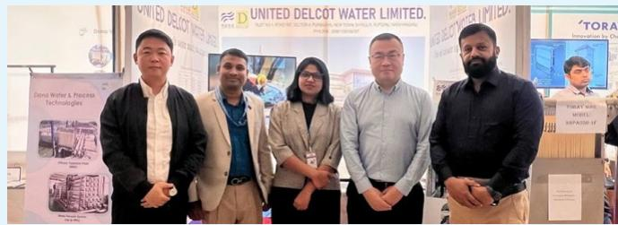

text_image

Group photo of five individuals at a conference or exhibition, with visible banners and signage for United Delcot Water Limited and Dona Water & Pecoria Technologies.

再利用与循环利用大会暨国家联盟启动会议”，向参会者普及安全用水知识。

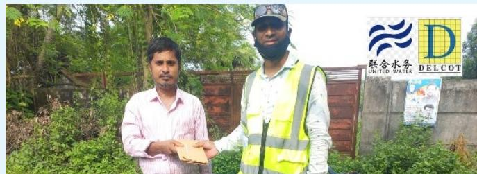

text_image

联合水务
UNITED WATER
DELCO T

2025年，项目公司组织团队开展逐户走访与现场演示，向孟加水系统的益处。

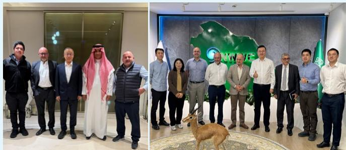

natural_image

Group photo of people in formal attire indoors, with a backdrop featuring the UAE flag and a deer statue (no visible text or symbols)

政污水处理长期运维合同。

## 社区参与

联合水务秉承“根植社会，回报社会”的信念，与社区建立紧密联系，积极投身公益事业，以实际行动传递关爱与温暖，为构建和谐社会贡献水务力量。

## 社区沟通

公众与社区的信任与支持是产业运营的重要保障。公司关注运营所在地政府、公众和社区等利益相关方的需求，与项目运营所在地社区构建畅通的沟通机制，建立互信、协作的良好关系。2025年，联合水务宿迁第二水厂五期工程与桐乡申和水务工业污水处理厂建设项目在施工过程中，均高度重视与周边社区及项目管委会的沟通协作，提升项目建设的透明度与社会可持续性。在整个施工期间，两项工程均未发生重大投诉或纠纷。

## 信息透明

在工地周边设立公共公告栏，及时发布工程进展、施工计划及临时变更等信息，保障周边居民的知情权与参与度。

## 重视诉求

定期组织由工地管理人员、社区居民代表及相关政府部门参与的协调会议，共同探讨施工过程中可能存在的问题与改进方向，持续倾听与回应居民关切，及时响应与处理居民反映的问题。

## 降低影响

积极落实各项噪声防控措施，减轻施工给社区居民带来的不便，最大限度降低施工对居民生活的影响。

公司聚焦民生领域，在“解民忧、办实事”上持续发力，每年定期开展结对帮扶活动，针对性排查帮扶对象存在的困难和需求，维修人员入村进户帮助老人检修供水设施，解决实际生活难题，全力提升社区人民群众生活幸福感。

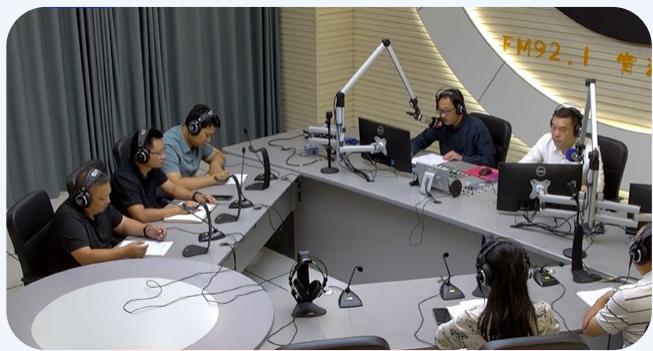

text_image

FM92.1 管

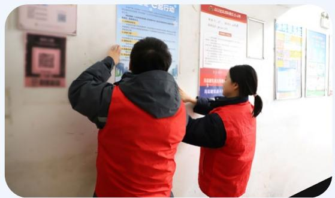

text_image

Two workers in red vests reviewing posters on a wall, with visible Chinese text and diagrams on posters.

## 公益慈善

公司将企业高质量发展与承担社会责任有机融合，积极践行公益慈善事业，不断拓宽公益版图在公益志愿、文体事业、教育支持等多个领域持续发力。

公益总投入

324.15万元

员工志愿者

591

员工志愿服务队伍

19支

员工志愿服务总时长

811.15小时

员工参与志愿服务总人次

498 人次

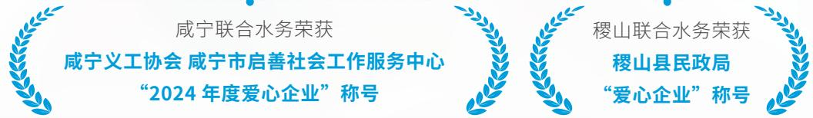

咸宁联合水务荣获

咸宁义工协会咸宁市启善社会工作服务中心

“2024年度爱心企业”称号

稷山联合水务荣获

稷山县民政局

“爱心企业”称号

natural_image

Close-up of hands forming a heart shape, no text or symbols visible

## 公益志愿

公司弘扬“奉献、友爱、互助、进步”的志愿服务精神，心系社会弱势群体，积极组织开展公益活动，鼓励和引导员工广泛参与志愿服务。

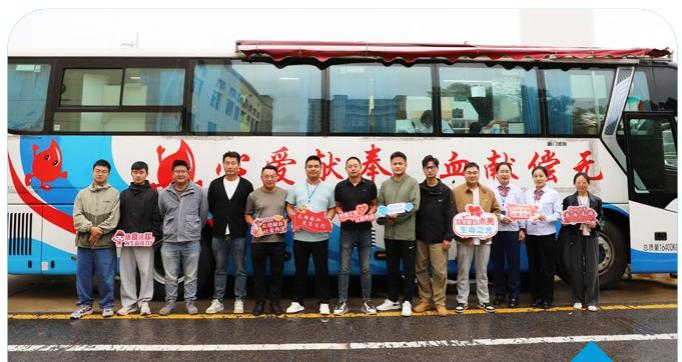

text_image

心爱秋泰
血献倍无

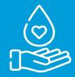

联合水务组织公司员工参与无偿献血公益活动。

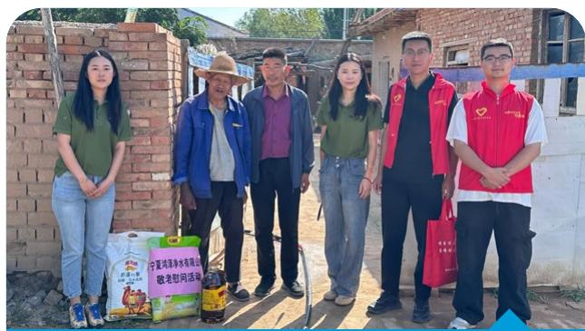

text_image

宁夏鸿泽水资源
敬老慰问活动

联合水务宁夏区域、华南区域、山西区域等多家子公司开展重阳敬老慰问活动

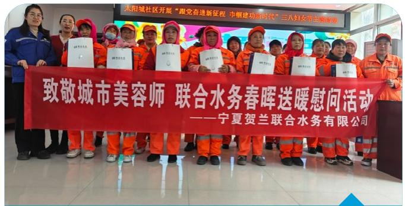

text_image

太阳城社区开展“跟党奋进新征程 中纲建功新时代”三八妇女节主题活动
致敬城市美容师 联合水务春晖送暖慰问活动
——宁夏贺兰联合水务有限公司

贺兰联合水务携手贺兰县太阳城社区，向坚守岗位的环卫女工进行温暖慰问与物资赠送

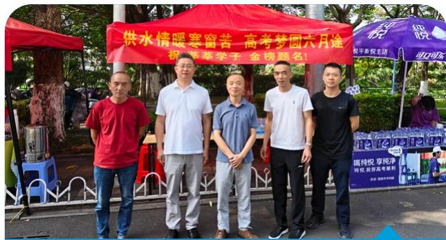

text_image

供水情暖寒窗苦 高考梦园六月途
祝春学于 金榜题名！

南靖联合水务、平和联合水务开展“水润高考路，水务伴你行”助力高考活动，为高考考生和家长提供便利和支持

## 文体事业

公司长期助力、参与各类体育赛事和文化活动，支持地方文体事业的蓬勃发展，丰富群众精神生活与业余生活，诠释企业与城市共生共荣、与文化同频共振的图景。

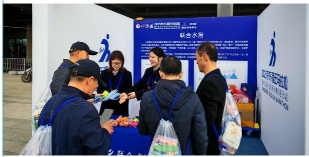

text_image

2023年北京水
联合水务
2023年北京水
联合水务
2023年北京水
联合水务
2023年北京水
联合水务
2023年北京水
联合水务
2023年北京水
联合水务
2023年北京水
联合水务
2023年北京水
联合水务
2023年北京水
联合水务
2023年北京水
联合水务
联合水务
2023年北京水
联合水务
联合水务
联合水务
联合水务
联合水务
联合水务
联合水务
联合水务
联合水务
联合水务
联合水务
联合水务
联合水务
联合水务
联合水务
联合水务
联合水务
联合水务
联合水务
联合水务
联合水务
联合水务
联合水务
联合水务
联合水务
联合水务
联合水务
联合水务
联合水务
联合水务
联合水务
联合水务
联合水务
联合水务

联合水务助力宿迁马拉松举办，成为官方支持单位，为全民健康事业的蓬勃发展注入“水”动力。

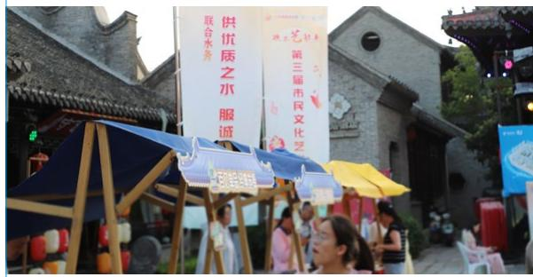

text_image

供优质之水
联合水务
第三届市民文化艺

市民文化艺术季。

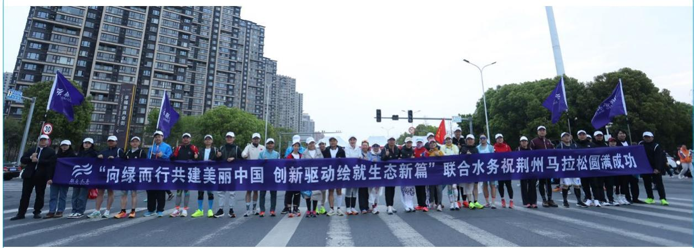

text_image

“向绿而行共建美丽中国 创新驱动绘就生态新篇”联合水务祝荆州马拉松圆满成功

荆州电联水务、荆州电联环境组建绿色跑团，支持2025荆州马拉松举办。

## 教育支持

公司持续推进教育公益行动，通过捐赠教育发展基金、设立奖学金项目，支持高校人才队伍建设与人才培养，同时面向中小学开展捐资助学，为我国教育事业贡献企业力量。

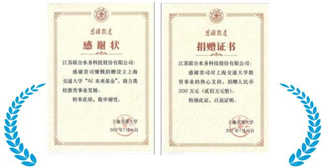

text_image

感谢状
江苏联合水务科技股份有限公司：
感谢贵司慷慨捐赠设立上海
交通大学“AI 未来基金”，助力我
校教育事业发展。
特奉此状，敬申谢忱。
上海交通大学
2025年7月16日

感谢状
江苏联合水务科技股份有限公司：
感谢贵司对上海交通大学教
育事业的热心支持，捐赠人民币
200万元（贰佰万元整）。
特领此证，以兹证明。
上海交通大学
2025年7月16日

联合水务捐赠200万元，

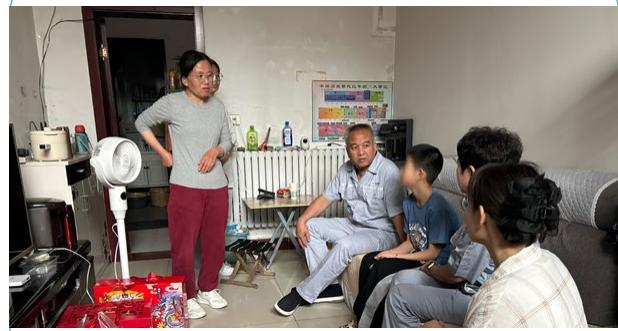

natural_image

Group of people gathered indoors in a living room, one person standing and speaking, others seated, with no visible text or symbols.

稷山联合水务在儿童节之际慰问贫困儿童并通过捐赠物资助力孩子健康学习成长

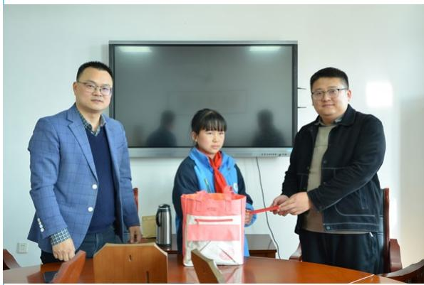

natural_image

Three men in a meeting room, one handing an item to another (no visible text or symbols)

桐乡申和水务前往桐乡市高桥实验学校(小学部)开展助学金捐赠活动。

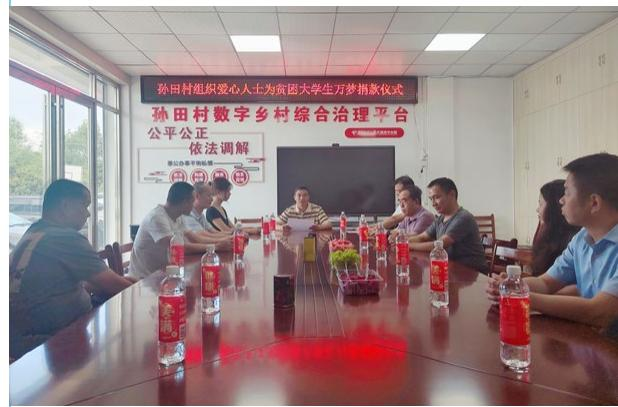

text_image

孙田村组织爱心人士为贫困大学生万岁捐款仪式
孙田村数字乡村综合治理平台
公平公正
依法调解

咸宁思源水务向咸宁市咸安区横沟桥镇孙田村贫困大学生捐赠助学金。

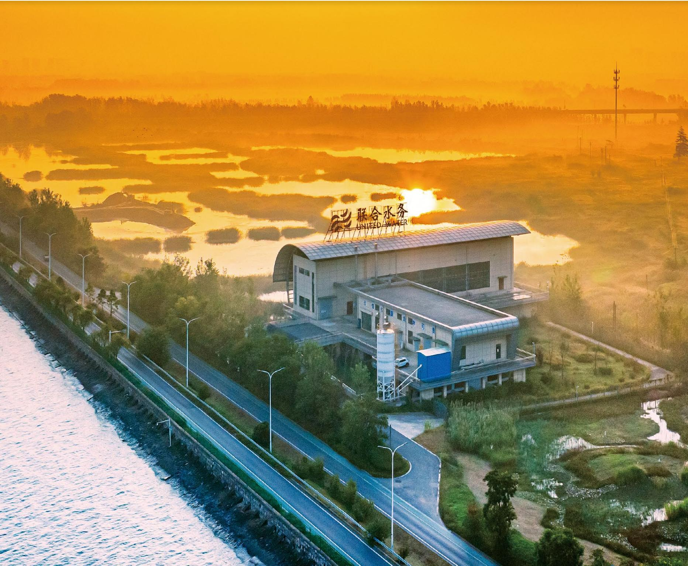

text_image

联合水务
UNITED WATER

##

## 卓越经营

217.97万元

187

2,715 人次

贡献联合国可持续发展目标 SDGs

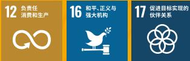

natural_image

Misty river landscape at sunset with misty orange and green hills in the foreground (no text or symbols visible)

## 公司治理

良好的治理架构是企业实现可持续发展的基石。联合水务持续优化公司治理体系，提升治理能力和规范化运作水平，切实维护投资者权益，以高标准践行规范经营。

## 完善公司治理

公司严格遵循《中华人民共和国公司法》《中华人民共和国证券法》《上海证券交易所股票上市规则》《上海证券交易所上市公司自律监管指引第1号—规范运作》等相关法律法规与规范性文件要求，建立权责清晰的治理架构，形成协调运作、高效稳健的治理机制。2025年，公司依据《中华人民共和国公司法》等法律法规及相关监管要求，对公司治理结构进行战略性调整，依法取消监事会，由董事会审计委员会承接监督职能；设立职工代表董事，进一步优化董事会人员结构，筑牢公司规范运作的坚实根基。

公司制定《公司章程》《股东会议事规则》《董事会议事规则》等一系列管理制度，建立“1+2+5+N”公司治理制度框架体系，并根据发展情况及监管规范持续修订与完善。2025年，公司对22项制度文件进行修订，新增《信息披露暂缓与豁免管理制度》《董事及高级管理人员持股及变动管理制度》，并废止《监事会议事规则》等与监事或监事会有关的内部制度及相关条款，进一步提升治理工作的规范性和有效性。

股东会是公司的权力机构，依法行使表决权。报告期内，公司修订《股东会议事规则》，严格规范股东会依法行使职权及其程序，充分保障股东的合法权益。董事会是公司经营管理的决策机构，对股东会和全体股东负责，切实发挥定战略作决策、防风险的职能作用。董事会下设战略与ESG委员会、审计委员会、提名委员会、薪酬与考核委员会四个专门委员会，各委员会充分发挥专业优势，为董事会决策提供科学依据和专业支持。

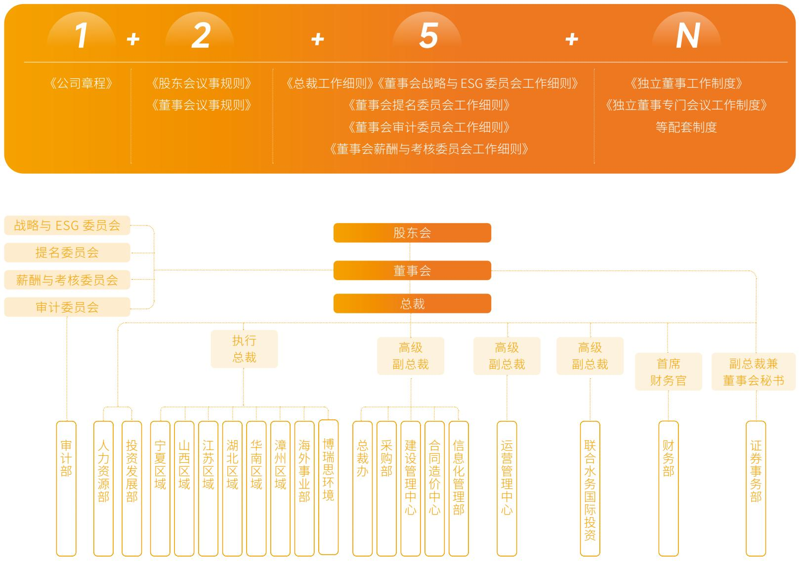

召开股东会

3次

通过议案

15 项

召开董事会

7

通过议案

33 项

董事会成员出席率

100%

召开战略与

ESG委员会会议

召开审计

委员会会议

召开薪酬与

考核委员会会议

3 次

4次

1次

价值在线

中国上市公司协会

价值在线

## 董事会有效性与多元化

## 董事会有效性

公司严格遵照《中华人民共和国公司法》《上市公司独立董事管理办法》等法律法规和监管要求，制定并积极落实《独立董事工作制度》《独立董事专门会议工作制度》，明确独立董事在公司治理中的角色和职责，确保其勤勉履职履责。报告期内，公司董事会成员共9人，其中3名为独立董事，独立董事占比达33.33%。公司董事会下设的审计委员会、提名委员会、薪酬与考核委员会中由独立董事担任主任委员，切实保证董事会决策的客观性和公正性。

<table><tr><td>董事会专门委员会</td><td>独立董事占比</td><td>独立董事会议出席率</td></tr><tr><td>战略与 ESG 委员会</td><td>20%</td><td>100%</td></tr><tr><td>提名委员会 *</td><td>66.67%</td><td>100%</td></tr><tr><td>薪酬与考核委员会 *</td><td>66.67%</td><td>100%</td></tr><tr><td>审计委员会 *</td><td>66.67%</td><td>100%</td></tr></table>

公司高度重视独立董事制度建设与实践探索，通过强化履职保障、创新履职机制、丰富履职场景，推动独立董事深度融入公司治理链条，充分发挥其专业监督与决策支持作用。2025年，公司在《公司章程》中新增“独立董事”专节，修订《独立董事工作制度》《独立董事专门会议工作制度》，健全独立董事履职保障体系。通过组织独立董事参加定期报告业绩说明会、建立高管向独立董事常态化汇报机制、召开独立董事专门会议等，深化独立董事与管理层、资本市场的沟通交流，保障独立董事履行职权。依托独立董事的专业优势，通过主题分享、项目调研等多元形式，搭建“外部智库一公司决策”的知识传导桥梁，充分发挥独立董事外部咨询专家的作用，为公司在复杂外部环境中筑牢治理根基提供宏观经济、科技创新等方面的专业支持。

## 案例 丰富独立董事履职 专业赋能公司发展

2025年4月23日，联合水务特邀公司独立董事、中国首席经济学家论坛理事长、广开首席产业研究院院长兼首席经济学家连平先生，以“关税战下的中国经济”为主题开展讲座，为公司战略规划、风险防控提供了前瞻性的决策参考，对公司在复杂经济环境下实现高质量发展具有积极的指导意义。

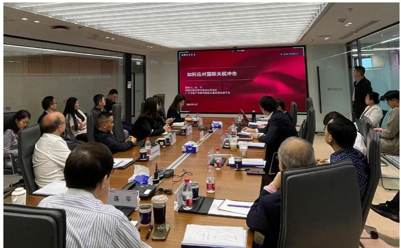

text_image

如何应对国际关税冲击
联系人：赵飞  年度发布《关于加强企业所得税有关问题的通知》
广州市高新技术产业开发区管理委员会
2023年5月

公司致力于构建学习型董事会，定期组织董事会成员参加证监会、交易所、上市公司协会相关培训。2025年，公司开展多场董事专业技能提升培训，并组织全体董事认真学习贯彻《江苏证监局关于进一步加强上市公司规范运作防范违法违规风险的通知》中的《上市公司违法典型案例》及《上市公司常见违规事项提示清单》，组织董事参与江苏证监局组织的“上市公司高质量发展系列培训”组织独立董事参与上海证券交易所“2025年第6期上市公司独立董事后续培训”，助力董事更好理解最新监管政策，进一步强化合规意识，提升履职能力，推动提高上市公司规范运作水平。

## 董事会多元化

公司认同董事会的多元化是保持公司治理有效性的重要因素。公司结合发展战略与业务需求，从年龄、性别、教育背景、专业技能、行业经验等多方面综合考虑董事会成员的组成，以更全面综合的视角提升公司治理效能，保障董事会决策的科学性和有效性。公司现任董事具备金融、财务管理、企业管理、环保水务等多领域专业背景与从业经验，其中审计委员会有1名独立董事是会计专业人十，审计委员会主任委员江启发具备丰富的财务背景与经验，能够实施有效的内部财务管理和风险控制。

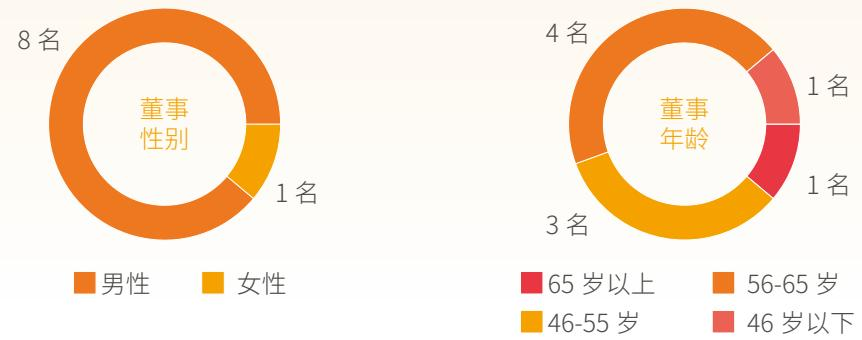

## 薪酬与考核

公司构建董事及高级管理人员薪酬管理与激励约束机制，明确由董事会薪酬与考核委员会负责制定、审查董事及高级管理人员的薪酬政策与方案。公司董事、高级管理人员薪酬实行年薪制，包含固定薪资与年终奖，其中年终奖与公司及个人业绩挂钩，依据设定的考核指标体系进行评估，若未达成相关要求则进行相应扣减，进一步提升公司经营管理者的积极性与创造性促进公司业绩持续增长。

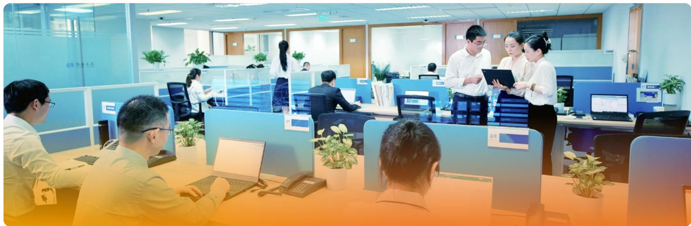

natural_image

Interior view of an office with employees at desks and staff working, no visible text or signage

## 投资者权益保护

公司严格遵循《中华人民共和国公司法》《中华人民共和国证券法》《上市公司投资者关系管理工作指引》等相关法律法规和《公司章程》等相关规定，建立健全投资者权益保护机制。公司秉承公平、公正、公开、客观原则，充分保障所有投资者享有知情权及其他合法权益。为确保更多股东能够便捷参会，公司采用现场表决与网络投票相结合的方式召开股东会，确保所有股东、尤其是无法亲临现场的股东，能够充分行使表决权。在审议影响中小投资者利益的重大事项时，对中小投资者实行单独计票并公开披露，切实保障中小股东的合法权益。

## 信息披露

公司严格遵循《上市公司信息披露管理办法》《上海证券交易所上市公司自律监管指引第2号信息披露事务管理》等规范性文件，制定并严格执行《信息披露管理制度》，以投资者需求为导向，做好公司临时公告和定期报告的编制、报审和披露工作，保证公司信息披露真实、准确、及时、完整。公司强化内幕信息管理，修订《内幕信息知情人登记管理制度》，规范公司内幕知情人管理，加强内幕信息保密工作。此外，公司重视关联交易的规范管理，修订《关联交易管理制度》《关于规范与关联方资金往来管理制度》，明确决策程序、信息披露与定价机制，维护公司整体利益和市场公平竞争秩序。报告期内，公司的信息披露未出现虚假记载、误导性陈述、重大遗漏或其他不正当披露。

## 投资者沟通

公司高度重视投资者关系管理，依据《上市公司投资者关系管理工作指引》，持续完善《投资者关系管理办法》，明确以董事会秘书为负责人的投资者管理体系，建立多层次良性互动沟通机制。通过投资者热线、IR邮箱、“上证e互动”平台等多渠道，以及常态化召开业绩说明会积极参加证券机构组织的策略会，举办路演、反路演活动等多种方式，加强与投资者的互动交流，确保投资者诉求得到快速响应、高效反馈。

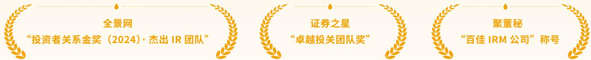

text_image

全景网
“投资者关系金奖（2024）·杰出IR团队”
证券之星
“卓越投关团队奖”
聚董秘
“百佳IRM公司”称号

披露定期报告

5 份

披露临时报告及相关文件

114 份

召开投资者交流活动

6次

参与投资者交流活动

58 人次

接待投资者调研

3 次

“上证e互动”平台回复投资者问题

16 条

通过各渠道与投资者沟通

853 次

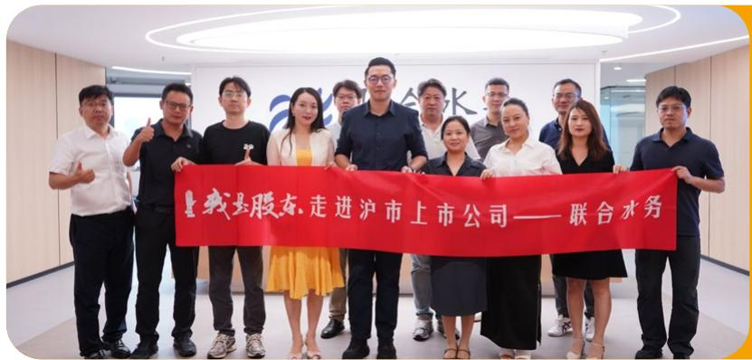

text_image

我县股东走进沪市上市公司——联合水务

## 投资者回报

公司在关注自身发展的同时，坚持以投资者为本，严格按照《公司章程》制定兼具连续性与稳定性的现金分红政策，与投资者共享公司发展成果。董事会根据公司每年的经营业绩策划利润分配方案，并提交股东会进行审议，以确保股东特别是中小股东的合法权益得到充分保障。2025 年，公司实施2024 年度利润分配方案，每10 股分派现金 1.5 元（含税），共计派发现金红利 63,483,090.60 元（含税），加上2024 年半年度已向全体股东派发的现金红利人民币 14,812,721.14 元（含税），公司 2024 年度共计派发现金红利总额（包括中期已分配的现金红利）78,295,811.74 元（含税），占公司 2024 年度合并报表中归属于上市公司股东的净利润比例为 52.22%。

## 合规与稳健运营

联合水务始终恪守合规运营原则，持续深化风险管理体系建设，加强内部控制，确保各项业务活动的规范性与合规性，筑牢企业高质量发展风控防线，保障企业的稳健运营。

## 治理

## 战略与管理方式

## 风险管理

公司构建全面风险管理与内部控制体系，公司董事会对风险履行监督管治职责，审计委员会负责定期监督及评估内部控制的有效性，统一领导、评估并向董事会报告内部审计工作开展情况，通过“三道防线”和内外监督机制有效预防和控制可能对公司造成损失的直接与间接风险，保障公司的合法运营与可持续发展。

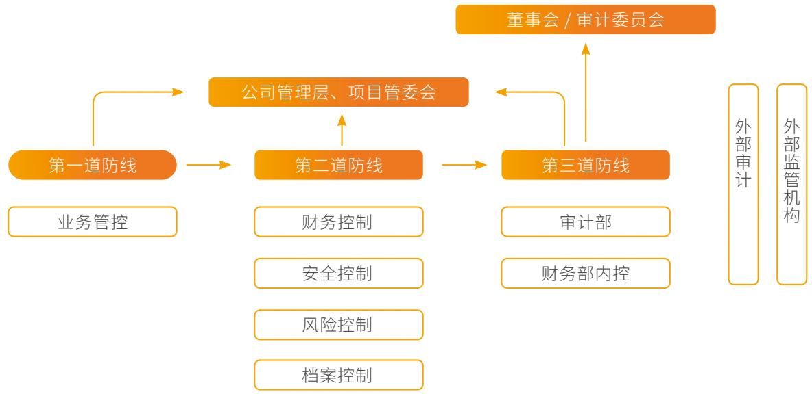

flowchart

```mermaid
graph LR
  A["业务管控"] --> B["第一道防线"]
  C["财务控制"] --> D["第二道防线"]
  E["安全控制"] --> D
  F["风险控制"] --> D
  G["档案控制"] --> D
  H["董事会 / 审计委员会"] --> I["第三道防线"]
  J["审计部"] --> I
  K["财务部内控"] --> I
  L["外部审计"] --> M["公司管理层、项目管委会"]
  N["外部监管机构"] --> O["第三道防线"]
  P["董事会 / 审计委员会"] --> I
  Q["公司管理层、项目管委会"] --> D
  R["董事会 / 审计委员会"] --> I
  S["公司管理层、项目管委会"] --> D
  T["董事会 / 审计委员会"] --> I
  U["公司管理层、项目管委会"] --> D
  V["董事会 / 审计委员会"] --> I
  W["公司管理层、项目管委会"] --> D
  X["董事会 / 审计委员会"] --> I
  Y["公司管理层、项目管委会"] --> D
  Z["董事会 / 审计委员会"] --> I
  AA["公司管理层、项目管委会"] --> D
  AB["董事会 / 审计委员会"] --> I
  AC["公司管理层、项目管委会"] --> D
  AD["董事会 / 审计委员会"] --> I
  AE["公司管理层、项目管委会"] --> D
  AF["董事会 / 审计委员会"] --> I
  AG["公司管理层、项目管委会"] --> D
  AH["董事会 / 审计委员会"] --> I
  AI["公司管理层、项目管委会"] --> D
  AJ["董事会 / 审计委员会"] --> I
  AK["公司管理层、项目管委会"] --> D
  AL["董事会 / 审计委员会"] --> I
  AM["公司管理层、项目管委会"] --> D
  AN["董事会 / 审计委员会"] --> I
  AO["公司管理层、项目管委会"] --> D
  AP["董事会 / 审计委员会"] --> I
  AQ["公司管理层、项目管委会"] --> D
  AR["董事会 / 审计委员会"] --> I
  AS["公司管理层、项目管委会"] --> D
  AT["董事会 / 审计委员会"] --> I
  AU["公司管理层、项目管委会"] --> D
  AV["董事会 / 审计委员会"] --> I
  AW["公司管理层、项目管委会"] --> D
  AX["董事会 / 审计委员会"] --> I
  AZ["公司管理层、项目管委会"] --> D
  BA["董事会 / 审计委员会"] --> I
  BB["公司管理层、项目管委会"] --> D
  BC["董事会 / 审计委员会"] --> I
  BD["公司管理层、项目管委会"] --> D
  BE["董事会 / 审计委员会"] --> I
  BF["公司管理层、项目管委会"] --> D
  BG["董事会 / 审计委员会"] --> I
  BH["公司管理层、项目管委会"] --> D
  BI["董事会 / 审计委员会"] --> I
  BJ["公司管理层、项目管委会"] --> D
  BK["董事会 / 审计委员会"] --> I
  BL["公司管理层、项目管委会"] --> D
  BM["董事会 / 审计委员会"] --> I
  BN["公司管理层、项目管委会"] --> D
  BO["董事会 / 审计委员会"] --> I
  BP["公司管理层、项目管委会"] --> D
  BR["董事会 / 审计委员会"] --> I
  BS["公司管理层、项目管委会"] --> D
  BT["董事会 / 审计委员会"] --> I
  BU["公司管理层、项目管委会"] --> D
  BV["董事会 / 审计委员会"] --> I
  BW["公司管理层、项目管委会"] --> D
  BX["董事会 / 审计委员会"] --> I
  BY["公司管理层、项目管委会"] --> D
  BB["董事会 / 审计委员会"] --> I
  BYD["公司管理层、项目管委会"] --> D
  BYD1["董事会 / 审计委员会"] --> I
  BYD2["公司管理层、项目管委会"] --> D
  BYD3["董事会 / 审计委员会"] --> I
```

公司持续推动风险管理基本工作流程建设，通过风险信息收集，风险评估，风险解决方案制定，风险监督与评价，实现风险的全流程管理。公司持续优化风险监控和预警体系，加强对市场、操作、法规等多维度风险的监测力度，并定期评估潜在的市场风险，运营风险，财务风险，税务风险，法律风险以及安全生产、人力资源、环境保护等ESG风险要素，了解公司面临的各类潜在威胁和机会，实现对关键业务领域的全面掌握。同时，公司制定并不断完善一系列风险应对措施和应急预案，强化员工的风险防范意识与应急处理能力，以确保在面临突发风险时能够快速、有序、有效地应对。

## 内控合规

## 财务内控

公司建立健全财务内控管理机制，严格遵照《财务内控管理手册》《财务报销制度》等内部制度，确保财务内控管理工作规范落地。报告期内，公司对《财务内控管理手册》进行修订完善，新增公司运行各环节的具体内控管理要求，包括完善采购入库流程、加强工程进度管理、完善合同管理、明确合同审批要求等，帮助各级部门明确责任、落实要求，进一步有效防范财务风险。

公司每年聘请专业会计师事务所对财务报告内部控制的有效性进行审计，有效防范潜在风险，保障公司合规、稳健运营。2025年，公司针对6个运营公司开展了专项内控检查，其中包括对一个运营公司2024年内控检查结果的回访调查，以此检验过往整改成效，巩固内控成果。同时，北方区域公司组织开展了两次区域内交互内控检查，促进区域间相互学习与监督，有效提升内控水平。此外，公司持续推进内控合规理念融入日常经营管理，积极组织各公司财务人员与相关管理人员参与内控制度培训，不断提升公司内控管理水平。

## 内部审计

公司制定并持续完善《内部审计制度》，规范审计工作流程，充分发挥内部审计监督效能。公司不断强化审计体系建设，聚焦重点业务领域和关键风险环节，加大审计力度，按照年度计划有序开展专项审计工作，针对审计中发现的问题及时整改并纳入考核，形成以整改促管理的良性循环，确保公司各项业务合规开展。

## 税务管理

公司严格遵循《中华人民共和国税收征收管理法》《中华人民共和国企业所得税法》等相关税收法律法规，制定并不断完善《税务管理手册》，规范税务操作流程。公司建立健全税务管理体系，设置三层税务管理架构并明确各级职能，统筹管理企业各项涉税事宜，有效避免涉税违法违规行为。其中，公司首席财务官负责总体战略规划和风险管理，税务经理联合各区域财务总监负责标准化税务事项处理、规章制度建设、应对内外部涉税检查等工作，各运营公司设置税务专职岗位，负责日常税务申报管理、基础涉税风险管控等事务。报告期内，公司未发生任何重大税务违规行为，未涉及任何税务相关的重大诉讼、仲裁事项。

公司定期开展税务风险排查，按月检查各单位纳税申报情况，通过纳税申报管控表避免出现漏申报、晚申报、晚扣税情况，确保报告期内未出现税务风险。公司定期组织员工参加财税培训，准确把握政策支持导向和重点，及时共享政府新政策、行业新动态，引导各部门单位正确理解和应用相关政策，指导开展相关业务，规避税务风险，不断提高税务工作人员的专业素养和实务操作能力。报告期内，公司共支付各项税费10,548.73万元

## 影响、风险和机遇管理

指标与目标

<table><tr><td colspan="2">合规与稳健运营目标</td><td>2025年达成情况</td></tr><tr><td rowspan="2">财务内控</td><td>开展专项内控检查6次</td><td>已达成 √</td></tr><tr><td>开展内控制度培训2次</td><td>已达成 √开展内控制度培训4次</td></tr><tr><td rowspan="2">税务管理</td><td>开展专业税务培训12次</td><td>已达成 √参与专业税务培训488人次</td></tr><tr><td>纳税信用评级A级纳税人数量不低于上一年度</td><td>已达成 √23家子公司被评为A级纳税人</td></tr><tr><td rowspan="3">内部审计</td><td>对15个运营公司或1个职能部门进行审计</td><td></td></tr><tr><td>对约94场线上或现场重大招标会进行全程监督</td><td>已达成 √</td></tr><tr><td>重大风险事件零报送</td><td></td></tr></table>

## 商业道德

联合水务秉持诚信经营的理念，恪守商业行为准则，依法合规参与市场竞争，对贪腐行为采取零容忍态度，反对任何形式的商业贿赂、洗钱、垄断、不正当竞争行为，筑牢商业道德防线。

## 治理

公司设立董事会、董事会审计委员会和审计部三级管理架构。董事会负责督促管理层建立反舞弊文化环境，健全包括预防舞弊、接受举报和调查处理在内的内部控制体系。董事会授权董事会审计委员会指导公司反舞弊工作，审计部负责监督商业道德和反腐败工作的执行。公司制定并持续完善《反舞弊与举报制度》《廉洁诚信制度》《员工廉洁协议》等，规范公司商业道德与反腐败管理。

## 战略与管理方式

## 反腐败与反舞弊

公司建立健全商业道德与反腐败管理体系，明确反对任何形式的贿赂、贪污、造假、勤索、诈骗等违反商业道德标准的不当行为，推动廉洁文化建设，强化供应链廉洁管理，畅通商业道德与反腐败举报通道，与员工、供应商及其他伙伴共建诚信廉洁的营商环境。

## 廉洁文化建设

制定《员工行为准则》，在商务行为准则、利益冲突和保守商业秘密等方面作出明确规定，严禁员工在商业活动中接受利益相关方的贿赂、回扣等不正当利益，并加强内容的日常宣贯，确保员工深入理解并严格遵守准则要求；与员工签订廉洁协议，明确职业规范与底线，强化员工的商业道德意识；开展商业道德与反腐败培训与案例警示教育活动，向全体员工普及商业道德和反腐败知识，提升员工职业道德标准，在公司内部营造风清气正的良好氛围。

## 供应链廉洁管理

高度重视供应链采购环节的廉洁诚信，强化对供应商的商业道德与合规管理，在合同中纳入反腐相关条款，明确供应商在廉洁与商业道德方面的要求，坚决反对任何形式的商业贿赂，设立专门的违规举报渠道，并注重开展廉洁宣导，建立诚信、透明、廉洁的合作关系。

## 健全举报机制

建立有效的内部举报与调查机制，设立举报电子邮箱，鼓励、提倡实名制举报，明确投诉人、举报人在协助调查工作中受到保护，禁止任何非法歧视或报复行为或对参与调查的员工采取敌对措施；规定对违规泄露检举人员信息或对举报人员采取打击报复的人员，将予以撤职、解除劳动合同，触犯法律的移送司法机关依法处理。

## 反不正当竞争

公司严格遵守《中华人民共和国民法典》《中华人民共和国反不正当竞争法》《关于禁止侵犯商业秘密行为的若于规定》以及业务所在国家的反垄断和公平竞争的相关法律法规，坚持在公平和自由竞争原则的基础上开展各项业务，全面规范自身经营活动，坚决杜绝任何不正当竞争行为和垄断行为，维护公平竞争的市场环境。公司承诺不以非法手段收集竞争者的商业秘密或其他机密信息，不开展与同行合谋定价扰乱市场秩序等违法行为。

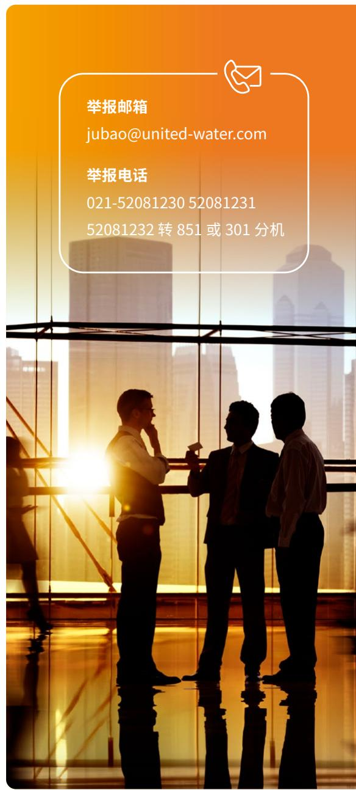

text_image

举报邮箱
jubao@united-water.com
举报电话
021-52081230 52081231
52081232 转 851 或 301 分机

## 影响、风险和机遇管理

公司定期对内部控制系统运行的有效性与合规性开展审查，开展涵盖反腐败与反舞弊的审计工作，针对审查与审计发现的问题进行及时整改与跟踪监督，积极管理运营过程中潜在的商业道德风险，保障公司持续、健康稳定发展。

## 指标与目标

严肃责任追究，致力干有效预防和遏制腐败行为。

参与金额50万及以上项目或采购的招评标全过程监督

94

## 供应链管理

供应链的质量、韧性和可持续性对于联合水务实现稳健发展至关重要。公司遵循“与供应商、客户等互惠互利、长期合作”的理念，积极推动可持续供应链建设完善供应链风险防控机制，打造健康可持续的供应链“生态圈”。

## 治理

公司严格遵守《中华人民共和国招标投标法》《中华人民共和国招标投标法实施条例》等国家相关法律法规，制定并不断完善《采购管理制度》《项目采购管理制度》《招议标管理制度》等，持续提升供应链管理的规范化与标准化。公司构建了完善的供应链管理体系，由高级副总裁分管公司供应链管理工作；设置集团采购部和运营公司采购部，分别负责采购专业管理和日常组织管理。公司审计部、财务部和运营公司财务部共同对采购进行全过程监督，各部门密切合作、各司其职，确保供应链的稳定性与连续性。

## 战略与管理方式

## 规范化采购

## 全面推进品质管控

采购合同明确物资技术标准要求以及质量不达标的处理、处罚措施；生产过程中，对于重要设备设置关键质量控制点（QCP）进行过程检查及出厂验收；物资入库前，质量检验部门需按合同要求进行检测，对于部分不具备检测条件的物资(如活性炭等药剂)委托第三方进行检验；物资入库后，对所有物料均设定质保期。

## 强化采购规范化管理

每月组织全员会议，开展新版采购制度学习等全员培训，助力员工及时掌握采购工作最新规范与要求；组织采购风控专题培训，强化员工在采购过程中的风险意识，规范采购行为，防范潜在风险。2025年11月，公司举办《工程项目采购管理培训》，涵盖工程项目物资采购全流程管理、项目采购制度与流程深度解读等，提升采购人员规范化管理能力。

## 切实保障供应商权益

在与供应商的合作过程中，严格遵守《采购管理制度》中相关条例及合同约定，及时完成发票移交、付款手续办理等工作，在此基础上跟踪付款进度，除特殊情况与供应商达成共识外，严格按照合同约定付款，切实维护供应商的合法权益。同时，公司关注并支持中小供应商的发展，在付款安排上予以倾斜，优先承付中小供应商货款。报告期内，公司未发生逾期未支付中小企业款项的情况，未出现供应商诉讼事件。

## 全流程管控

公司持续完善供应商全生命周期管理，构建供应商开发与准入、评估与分级及退出等全流程管理体系，打造可持续供应链。

## 供应商全生命周期管理

## 开发与准入

严把供应商入围关，规范供应商准入流程，通过多部门、多渠道寻找供应商，收集审核供应商资质材料并现场考察资质真实性，禁止具有关联关系的公司参与投标，对资料虚假、串标围标等违规行为进行警示与处罚。

## 评估与分级

建立综合评价机制，每年组织供应商评估，并根据评估结果将供应商评定为“优”“良”“一般”“差”四个等级，最终形成年度供应商考察报告，作为《集团供应商名录》调整依据之一；依据供应商评级结果，实施优先采购、督促整改及终止采购等相应分级管理措施。

## 退出

对于年度评估结果为“差”，以及出现重大质量问题、重大安全环保隐患、严重诚信问题等情况的供应商将终止采购，并将其从供应商名录中除名，三年内不得参与报价或者投标。

## 促成长共赢

公司积极赋能供应商，不断强化与供应商的沟通与交流，及时向供应商反馈市场动态与客户需求，并为供应商提供有针对性的资源和帮助助力供应商提升核心竞争力，建立可持续的合作关系。2025年，公司组织对36家供应商进行考察和交流，接待供应商来访20次，注重宣贯公司对产品质量控制和ESG 管理的要求，并有意识地引导供应商承担社会责任。

## 影响、风险和机遇管理

建立可持续的韧性供应链是公司稳健运营的重要保障。公司积极开展供应链风险识别和评估，针对可能发生的风险明确控制措施并加强与供应商的沟通与协作，确保在出现问题时能够迅速采取纠正措施，保障业务的连续性与供应的稳定性。

供应链风险识别与应对

<table><tr><td>风险类型</td><td>风险识别</td><td>应对措施</td></tr><tr><td>断供风险</td><td>评估供应商财务状况与经营稳定性,了解供应商的市场地位、竞争力和生产设备情况,研判其产能和持续供货能力。</td><td>建立多供应商体系,寻找和开发备选供应商;签订供应保障合同,明确供应中断的违约责任和赔偿条款;加强库存管理,确定合理的安全库存水平。</td></tr><tr><td>价格上涨风险</td><td>做好市场动态监测,关注原材料市场价格指数,分析行业供求关系变化,了解供应商的原材料采购成本,与供应商保持定期沟通,建立价格预警机制。</td><td>与供应商进行价格协商,展示采购规模优势,签订长期采购合同,争取更有利的价格;优化生产流程,降低原材料使用量。</td></tr><tr><td>关联交易风险</td><td>审查供应商的股权结构,调查供应商与企业内部人员的亲属关系等其他关联纽带,对比与关联/非关联供应商的交易价格,检查企业内部关于供应商选择和交易的决策程序是否合规。</td><td>明确关联交易决策程序和审批制度,持续加强采购人员教育;内部监督机构定期对关联交易进行专项审计,鼓励员工对发现的关联交易违规行为进行举报。</td></tr></table>

## 加强供应链 ESG 风险管理

公司积极关注供应链ESG风险，在《采购管理制度》《供应商行为准则》中，对供应商在诚信守约、反腐、人权、健康、工作安全、环境保护等方面提出要求，明确“同等情况下，优先选择通过质量管理体系认证、环境管理体系认证、职业健康安全管理体系认证供应商”。对于长期合作的重要设备、材料生产型企业，公司督促并要求其通过质量、环境、健康安全等体系认证。公司建立《供应商黑名单》，明确规定对于违反上述行为准则的供应商将被列入采购黑名单。2025年，共有7家供应商因参与投标串标或涉嫌串标，被列入《供应商黑名单》并终止合作。

公司深化供应商廉洁管理，对所有采购行为实行严格的跨部门监督机制，在合同中纳入反腐相关条款，明确禁止任何形式的商业贿赂，在日常沟通和培训中进行廉洁警示教育，并设立专门的违规举报渠道，确保供应商遵守商业道德规范，建立廉洁、诚信、共赢的合作关系。

指标与目标

<table><tr><td>供应链管理目标</td><td>2025 年达成情况</td></tr><tr><td>生产运营无因供应链异常影响生产</td><td></td></tr><tr><td>采购过程合规性不低于 99%</td><td rowspan="3">已完成</td></tr><tr><td>项目建设用设备、材料到货及时率 100%</td></tr><tr><td>生产用主设备供应商质量管理体系认证率 100%</td></tr></table>

natural_image

Digital illustration of a globe partially submerged in water, creating bubbles and water droplets (no text or symbols)

供应商总数

1,421 家

304

1家

39.83%

37.86

38.85%

## 安全防线

联合水务将安全发展理念贯彻至企业生产运营的各个方面，不断完善职业健康与安全生产管理体系建设，构建安全风险防控机制，并加强公司信息安全保障，构筑坚实的安全防线，营造稳定可靠的运营环境。

## 安全生产管理

公司严格遵守《中华人民共和国安全生产法》等法律法规要求贯彻落实“安全第一，预防为主，综合治理”的方针，制定《安全生产规章制度和操作规程管理制度》，完善安全生产管理体系建设，健全安全生产责任体系，切实开展安全生产管理行动确保公司守好安全生产底线。

## 安全管理架构

公司建立健全安全生产管理架构，聚焦安全生产建立EHS管理体系，强化安全生产保障。公司由集团EHS委员会作为EHS管理的最高决策机构，统筹公司安全生产管理决策；六大区域组建EHS委员会，各运营公司成立EHS管理小组，员工人数超过50人或风险较大的运营公司成立EHS管理部或配备EHS工程师，推进日常安全生产管理工作的落地实施，为员工营造安全、健康、可持续的工作环境。

## 安全责任体系

公司构建“一岗双责、齐抓共管”的安全生产责任体系，强化安全生产责任落实。建立完善安全生产治本攻坚责任链，组织各级管理人员签订安全生产责任书，推动管理人员严格落实“三管三必须”责任，将安全指标深度融入建设项目KP考核体系，构建起一张“横向到边、纵向到底”的无死角责任网络。

## 安全管理信息化

公司大力推进安全生产管理信息化积极推动集日常安全管理、安全巡查、风险分级管控、安全资料管理、安全教育培训等功能于一体的智慧安全平台上线运行，助力公司实现安全管理工作规范化、统一化和智能化

<table><tr><td>安全生产目标</td><td>2025 年达成情况</td></tr><tr><td>重大事故和较重大火灾事故为 0</td><td rowspan="6">已达成 √</td></tr><tr><td>轻工伤事故(含因交通事故引发的工伤事故)百万工时损工率 $\leqslant$ 4</td></tr><tr><td>安全培训完成率 100%</td></tr><tr><td>应急演练完成率 100%</td></tr><tr><td>安全隐患整改率 100%</td></tr><tr><td>特种作业人员持证上岗率 100%</td></tr></table>

江苏联合水务科技股份有限公司及

下属4家子公司

安全生产投入

217.97万元

0起

因工死亡员工人数

0人

总工伤率

0.16%

因工伤损失工作日

85 日

百万工时伤害率

0.79

## 安全风险防控

公司构建安全生产长效机制，持续推进安全风险分级管控与隐患排查治理双重预防机制建设，强化安全风险防控，提升企业安全生产管理水平。

##

制定《危险源辨识与风险评价制度》，开展风险辨识评估工作，全面排查各类安全风险，并建立动态风险数据清单，及时更新风险信息，推动风险辨识工作的“可操作化”与“精细化”，确保从源头上预防和减少安全生产事故的发生。

##

实行事故隐患报告和奖励机制，明确事故报告及调查处理流程，鼓励全体员工主动参与安全生产管理，及时发现并排除潜在的安全隐患，增强员工对安全事故及隐患的警觉性。

##

制定《安全检查和隐患整改管理制度》，严格执行“日巡查、周检查、月督查”的常态化机制，并依托安全管理平台对安全设施设备实施管理，实现日常隐患自查自报、定期检查、专项整治以及安全隐患的整改跟踪和统计分析。2025年，公司开展安全检查和隐患排查249次，查出安全隐患或问题892项，整改率100%。

## 现场安全管理

公司遵循并严格执行新建、改建、扩建工程“三同时”制度，通过施工前把关、施工中严控，有效消除建设项目潜在的安全隐患，切实保障现场安全，夯实工程安全生产防线。

## 智能技术赋能施工安全管理案例

2025年，公司以宿迁第二水厂五期项目为试点，聚焦模板支架、钢结构等关键环节，深化智能技术应用，构建智慧安全管理体系；依托“智慧工地”平台，实现安全风险的自动预警与智能识别，提升处置效率；建立隐患从发现、上报到整改、销号的闭环管理机制，确保所有安全隐患处理到位、有迹可循。通过系列创新实践，显著提升了施工安全管理的智能化与精细化水平，为未来推广智慧安全管理模式奠定了基础。

宿迁第二水厂五期项目荣获

“江苏省 2025 年度

## 应急管理

公司坚持将事故应急与预防工作紧密结合，构建完善的应急响应机制不断优化应急管理流程，制定覆盖全面的应急预案，并积极开展各类生产安全事故应急演练，提高员工的应急处置能力与事故救援实战能力，确保能有序、高效地应对突发安全事故。

开展应急演练

120次

参与应急演练

1,459人次

## 开展液氯泄漏事故应急演练案例

2025年10月29日，为切实提升公司应对液氯泄漏突发事故的应急处置能力，强化员工安全防范意识，公司组织开展了液氯泄漏事故应急演练活动。演练模拟氯库发生液氯池漏的紧急场景，全面覆盖险情出现后应急处置的所有关键环节，帮助员工掌握有关液氯泄漏、堵漏的基础知识和操作方法，进一步提高员工应对突发事件的实战能力。

## 危化品管理

公司严格遵循《危险化学品安全管理条例》等相关法律法规，制定《危险废弃物管理规定》《危险品储存管理规定》《危险物质使用管理规定》等制度，构建覆盖危险化学品采购、储运领用、处置等各个环节的全流程管理体系。公司建立危险化学品目录及危险化学品专用仓库，配备具有从业资格的工作人员，严格执行出入库核查登记；在危险化学品库、危废仓库、储罐多处针对性设置安全设备设施，确保照明、事故照明设施、电气设备和输配电线路采用防爆型，配备防爆型通风机；严格遵循危险化学品储存要求，科学规划储存区域，避免将危险化学品与其相禁忌化学品混合储存；定期开展化验室安全知识培训，夯实员工安全操作技能，最大程度保障危险化学品的安全性。报告期内，公司未发生任何涉及危险化学品的重大事故或处罚事件。

## 安全文化建设

公司持续推进安全文化建设，组织安全生产宣贯与员工安全生产教育培训，筑牢全员红线意识与底线思维，推动安全生产理念真正入脑入心、见行见效，营造全员参与的安全文化氛围。

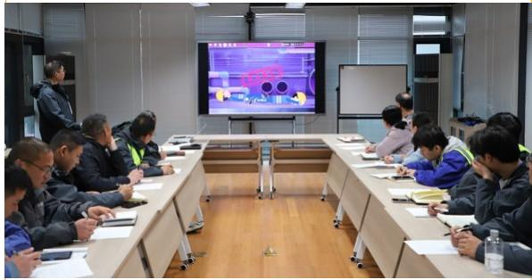

natural_image

Group of students in a meeting room seated at U-shaped tables, facing a large screen displaying a video game (no visible text or symbols)

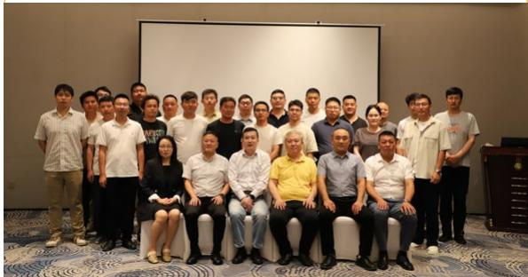

natural_image

Group photo of people posing in front of a whiteboard (no visible text or symbols)

职业健康与

安全生产教育

187 次

职业健康与安全生产

教育参与

2,715 人次

职业健康与安全

生产教育总课时

385.50 小时

人均安全

培训时长

4.40小时

## 职业健康安全

公司重视员工的职业健康安全，严格遵守《中华人民共和国职业病防治法》，《职业病危害项目电报办法》等相关法律法规的要求，构建职业健康安全管理体系，为员工提供安全的工作环境，切实保障员工免受职业性危害。

## 职业健康目标

员工职业病发病率为0

员工职业性健康体检率100%

## 2025年达成情况

## 加强日常防护

## 改善作业条件

## 开展检测评价

## 职业健康管理

## 健全安全保障

依据具体作业方式防护用品，并按照规范按时发放，保

委托有资质的第职业病危害因素检测、评价，并

情况。

职业病发生率

0%

参加职业健康体检人数

286人

参加员工体检

898

安全生产责任险投入金额

34.55 万元

员工参保安全生产责任险

947人

安全生产责任险覆盖率

74.45 %

雇主责任险投入金额

14.02 万元

员工参保雇主责任险

387人

雇主责任险与安责险总体覆盖率

100%

工伤保险投入金额

78.01万元

员工参保工伤保险

1,272 人

工伤保险覆盖率

100

## 信息安全保护

公司严格遵循《中华人民共和国数据安全法》《中华人民共和国网络安全法》《中华人民共和国个人信息保护法》等相关法律法规，制定《信息安全工作管理办法》《网络安全事件报告和处置管理制度》等18项管理制度，成立信息安全领导小组，并将信息安全防护纳入信息安全相关人员的绩效考核指标体系，确保信息安全管理工作的有效执行。公司围绕信息系统安全建设、信息资产安全、网络安全等领域全方位开展信息安全管理，切实做好网络信息数据安全保障，实现信息安全可控、能控、在控。

宿迁工控系统、二次泵房管理系统、

联合水务营收系统获得

开展信息安全培训

2

参与信息安全培训

850 人次

开展攻防演练

2

数据安全与隐私保护争议事件

0 起

信息泄露事件

0 起

## 信息安全保障措施

## 物理安全

• 分区划分及管理，区域之间采用物理隔离。  
部署基础防护系统和设备，如电子门禁系统、监控报警系统、UPS供电系统、电磁屏蔽设备、防雷、灭火、防水系统等。  
·使用国内领先云服务器及配套安全产品，部署路由器、交换机、防火墙、防毒墙和日志审计系统等系统，提升信息系统防攻击能力。  
完善网络设备自身防护策略，通过技术及管理措施实现对同一用户采用两种或两种以上组合的鉴别技术来进行身份鉴别。  
•登录操作系统和数据库系统的用户必须通过验证，用户身份标识具备唯一性，避免共享账户存在。  
•远程管理时采取措施防止鉴别信息在网络传输过程被窃听。  
应用系统开启身份鉴别、用户身份标识唯一性检查、用户身份鉴别信息复杂度检查以及登录失败处理功能。  
• 业务应用数据和设备配置文档进行定时备份。  
备份数据分散存放，本地备份数据应定时拷贝至其他服务器存放，云服务器应定时进行备份数据的异地存储。  
制定《人员安全管理制度》，从人员录用、考核、保密协议、培训、离岗离职等多个方面进行管理。  
·定期开展安全认知和安全技能考核，组织安全教育与培训，并派遣主要负责人参与外部信息网络安全管理技能提升培训，增强员工信息安全意识。  
·聘请等保测评供应商、网络安全协会进行模拟攻防演练，检验安全防护体系的有效性和漏洞。  
•组织全集团邮件安全演习，提高员工的安全意识和应急处理能力。  
• 对第三方人员开展临时管理，签署不同安全责任保密协议，规定活动范围并由专人监督陪同。

## 信息安全

## 主机安全

## 应用安全

##

## 人员管理

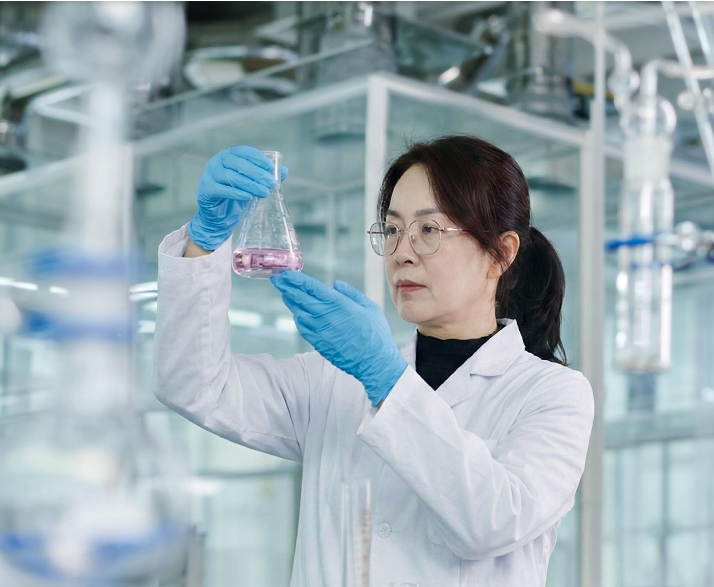

natural_image

Scientist in lab coat and gloves holding a flask with purple liquid, in a modern laboratory setting (no visible text or symbols)

## Advanced Technology 先进技术

研发人员

7

研发投入

325.79

累计获得有效专利

30项

累计获得软件著作权

13 3项

贡献联合国可持续发展目标 SDGs

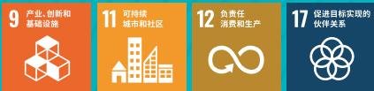

## 数智赋能

联合水务顺应数字化发展趋势，积极推进信息化建设与转型升级。通过系统性部署信息技术与智能设备实现了对生产、客服、管网、用户及供应链等多源数据的深度整合与统一管理，打破信息孤岛，驱动水务运营向自动化、数字化、协同化与智能化方向迈进，显著提升决策的科学性与执行效率。

## 治理

公司信息化管理部由高级副总裁直接领导，负责规划公司中长期信息系统建设，提升各信息系统的整合度，逐步实现互联互通与高效智能，并全面负责公司信息安全工作。信息化管理部肩负公司信息安全与数字化发展的整体治理工作，为公司数字化运营与数据资产安全提供坚实保障。

## 战略与管理方式

2025年，联合水务持续深化智慧水务变革，搭建集团化数字管理平台，整合多类底层技术系统，落地机器狗智能巡检，智慧加药优化，无人船水环境治理等多元智能应用，升级智慧安防体系，为关键生产运营提供科学辅助决策支撑，取得调度合理、安全预警、效率提升、能耗降低的显著成效，推动数字技术与水务生产经营深度

## 实现效果

调度更合理安全有预警

效率 再提升 能耗 愈降低

## 底层技术支持

GIS 管网地理信息系统

生产调度系统

设备管理系统

实验室管理系统

数据集采系统

## 2025 年信息化建设重点领域

大工单系统建设

银企直联项目系统建设

咸宁联合水务水力模型系统建设三门峡联合水务数字化管理平台建设

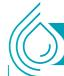

## 案例 升级 GIS 采集与分区计量系统，提升水务运营精细化水平

咸宁联合水务于2025年5月正式启动GIS一体化采集系统建设项目，基于Android移动平台，集成高精度定位技术，实现现场测绘工作的全面数字化，杜绝人工转绘错误，大幅提升数据采集与入库效率。此外，咸宁联合水务自2024年起建设DMA分区计量系统，2025年项目重点聚焦于咸安老城区的深度建设，通过在城市主干管、分支管及小区入口等关键节点规模化安装112处在线流量计与远传考核表，构建全域实时监测网络，依托数据实现漏损预警与精准排查维修，形成“监测一处置”管理闭环，有效控制漏损率。

## 影响、风险和机遇管理

联合水务深化信息安全管理，围绕信息系统安全建设、信息资产安全、网络安全、信息系统应急预案等领域全方位开展工作，进行信息安全攻防演练，有效防范化解数智化转型中的安全风险，为智慧水务体系稳定运行筑牢安全屏障。

## 指标与目标

## 数智赋能目标

完成联合水务总部银企互联系统建设

完成三门峡联合水务数字化管理平台建设

完成咸宁联合水务水力模型系统建设

## 2025 年达成情况

已达成

## 研发创新

联合水务坚持以创新引领发展，依托子公司博瑞思研发平台，深化科技创新与产业升级的融合，积极拓展行业科研合作，加速研发成果向实际应用的转化。公司始终恪守科学伦理，高度重视知识产权保护，尊重并维护合作方的创新成果，坚决杜绝任何侵权行为。

## 治理

公司秉持创新驱动发展战略，高度重视研发创新，全资子公司上海博瑞思环境科技有限公司作为专注技术研发与创新的平台，以集团运营公司为依托，围绕供水、污水处理和资源化利用、水环境治理等业务链的技术难点系统开展研发工作，并建设水务科技研发实践基地。

博瑞思建立了完善的研发与创新管理体系，纵向构建“一院四部”的研发架构，即低碳产业研究院、设备研发部、药剂研发部、生物研发部、智慧研发部：横向则沿公司业务分布，形成“一干多支”的研发体系，持续产出具有竞争力的工艺包、设备、药剂等技术成果，构建起覆盖“厂网河一体化”全产业链的技术布局，提升公司科技引擎平台的核心竞争力。为保障研发体系高效运行，博瑞思持续完善相关制度，制定《开放式创新创业平台管理制度》《科技成果转化实施与激励奖励办法》《研发人员绩效考核奖励制度》《知识产权管理制度》等内部管理制度，为科技创新提供了坚实的制度支撑。

## 战略与管理方式

## 人才队伍打造

## 人才引进与培养

为构建结构合理、持续创新的科研人才队伍，公司围绕“补短板、强骨干、育梯队”的目标，系统推进人才工作。公司构建“项目赋能”培养体系，针对技术骨于，实施“项目攻关驱动培养，使其牵头重要项目，赋予“课题长负责制”，给予项目管理权，激活骨于内生动力：同时开展实施“靶向引智”策略，精准引进智能装备等领域专业人才，精准匹配智能装备研发需求；以及柔性引入中国科学院、中国环科院等顶尖专家开展专项技术合作

## 创新激励

公司已制定包括《科技成果转化实施与激励奖励办法》《研发人员绩效考核奖励制度》《开放式创新创业平台管理制度》及《我与企业共发展》等内部奖励制度，并配套相应的绩效与荣誉激励，激发内生动力。同时，公司着力打造“全周期激励”生态，建立“基础薪资+成果奖励”的双重激励体系，依据知识产权成果给予相应奖励，并为高层次人才提供住房补贴等配套服务，全面构建人才发展与留任的良好生态。

## 研发创新成果

公司围绕智慧水务装备研发，聚焦三大核心方向：供水领域技术优化、污水处理与资源化利用创新、水环境治理方案升级，配套智慧加药系统、智慧巡检机器人、水环境智慧管理无人船等核心技术产品，已在上海、江苏宿迁、湖北咸宁等区域落地见效。

## 上海博瑞思环境科技有限公司获评

上海市高新技术企业认定

上海市创新型中小企业认定

上海市科技型中小企业认定

## 获区级奖项

## 张江高新区青浦园、西岑园企业高成长项目上海市2024年度科技型中小企业技术创新资金项目

桐乡申和水务有限公司获评

## 浙江省科技型中小企业认定

## 案例 水环境智慧管理无人船落地应用

2025年1—12月，水环境智慧管理无人船在赤壁市杨家湖12万平方米的湖面，开展水环境治理后的常态化运维与管理作业，替代传统人工作业模式，承担水面保洁、水质动态监测与水草精准收割等任务，以智能化手段显著提升湖泊运维的效能与精细化水平，相关成果与实践成效得到了业主单位的高度认可。

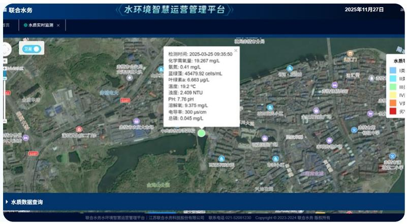

text_image

联合水务
水环境智慧运营管理平台
2025年11月27日
检测时间: 2025-03-25 09:35:50
化学需氧量: 19.267 mg/L
氨氮: 0.41 mg/L
盐排液: 45479.92 cells/mL
叶绿素a: 6.663 μg/L
温度: 19.2 °C
浊度: 2.409 NTU
PH: 7.76 pH
溶解氧: 9.375 mg/L
电导率: 300 μs/cm
总磷: 0.045 mg/L
水质数据查询
联合水务水环境智慧运营管理平台 | 江苏联合水务科技股份有限公司 联系电话 021-52881230 Copyright © 2023-2024 联合水务 地址所有

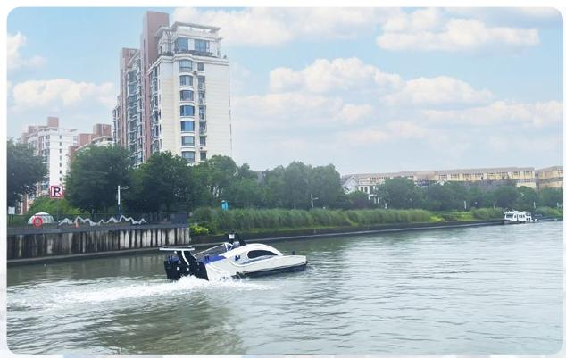

natural_image

River scene with a speedboat and modern high-rise buildings in the background under a partly cloudy sky (no visible text or symbols)

2025年5月，水环境智慧管理无人船运抵上海市苏州河畔，干苏州河上开展智慧化巡航维护作业。通过模拟不同水流速度、风力条件及高速船舶扰动等复杂工况，对作业航段进行水面保洁、水质监测等工作，充分验证其在城市开放水域的适应性与可靠性。

text_image

联水务

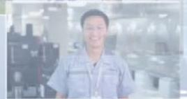

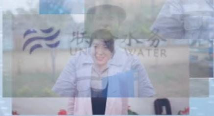

text_image

联水水务
UNWATER

## 加强产学研合作

联合水务积极践行“产学研用”一体化发展模式，充分发挥企业主导作用，联动高校与科研院所，整合其在科研渠道、专业人才及平台资源方面的优势，促进技术研发、成果转化与产业应用的高效衔接。

## 案例 污水厂尾水生态化深度净化技术工艺研究

博瑞思与中国环境科学研究院、湖北大学三方联合开展产学研协同创新项目—污水厂尾水生态化深度净化技术工艺研究，围绕污水厂尾水深度净化技术研发与工程转化开展合作。报告期内，已完成3个核心创新点的科技查新并获取查新报告、1篇核心期刊论文录用及2项实用新型专利申报。本次项目构建了“企业+科研院所+高校”的协同创新模式，实现了技术研发与产业需求的精准对接。

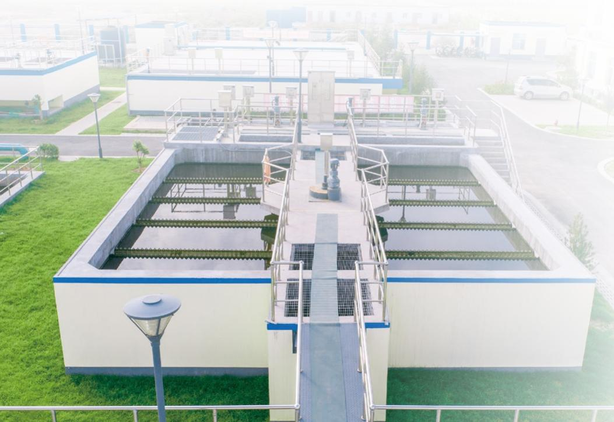

natural_image

Exterior view of a wastewater treatment facility with multiple tanks and piping (no visible text or symbols)

## 案例 联合水务积极参加行业交流

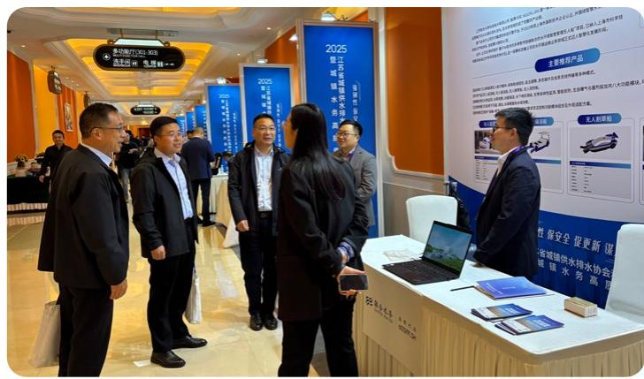

text_image

Exhibition hall photo with visible banners and display boards showing 2025 regional water supply and infrastructure projects.

2025年10月22日，联合水务携“水环境智慧管理无人船”亮相江苏省水协和海绵城市联盟年会。该产品采用新能源无人船为载体，融合先进的水环境智慧管理系统，全方位展示联合水务以创新科技赋能高质量发展的前沿成果。

2025年4月26日一28日，由安徽省人民政府主办、以“科技打头阵，创新赢未来”为主题的第三届中国（安徽）科技创新成果转化交易会（国家级标杆平台）在合肥举办。联合水务携水环境智慧管理无人船惊艳亮相，向各界观众展示无人船的技术特色与应用优势，彰显公司在智慧治水领域的创新实力，为水环境治理提供了新的解决方案。

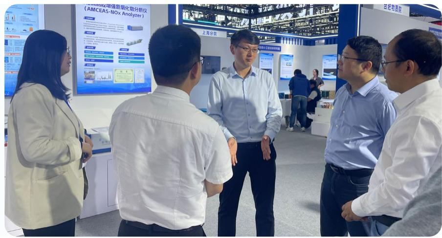

text_image

Group of professionals discussing in a technology exhibition with visible signage for AMCEAS-NOx Analyzer and Shanghai Division.

## 创新产业投资

联合水务通过全资子公司上海德申山和科技发展有限公司参与投资设立了上海翌昕衡申创业投资合伙企业(有限合伙)。该专业基金平台将作为公司在双碳、ESG科技、先进制造、新材料领域的核心投资抓手，专注于挖掘前沿技术，整合产业链资源，实现外延式发展，自成立以来已成功投资4个项目，以产业投资赋能创新，以创新驱动公司可持续发展。

一家集空气动力学、智能光源、智能交互与精密内外饰于一体的汽车智能部件公司，有助于推动汽车智能化、低碳化发展，塑造新能源行业新未来。

一家以电解技术开发和应用为核心的科技型企业，核心产品主要应用于集成电路清洗液、莱赛尔纤维制备、煤制烯烃分子筛模板剂、有机硅产品聚合用催化剂等关键领域。

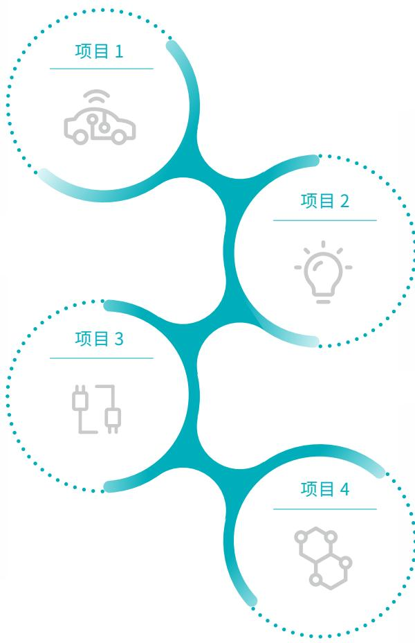

flowchart

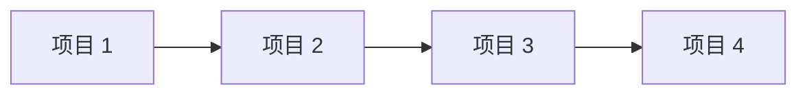
```mermaid
graph LR
  A["项目 1"] --> B["项目 2"]
  B --> C["项目 3"]
  C --> D["项目 4"]
```

一家从事特种光源研发、设计、制备和检测的专业公司，研制生产各种规格的重复频率脉冲氙（氪）灯、连续氙（氪）灯和非标类特种光源，产品应用干激光焊接、切割、美容等行业，该公司已成功入库2025年浙江省第三批科技型中小企业。

一家专注干新材料技术研发与创新的高科技企业，主营业务为金属有机骨架MOEs粉体的研发、生产和应用，致力于为工业领域提供高性能材料解决方案，通过自主研发和技术突破，解决传统材料在性能、成本及环保等方面的痛点。

## 知识产权保护

联合水务恪守《中华人民共和国专利法》《中华人民共和国著作权法》《中华人民共和国商标法》《关于强化知识产权保护的意见》等法律法规及政策要求，推动下属公司博瑞思制定并实施《知识产权管理制度》《研究开发组织管理制度》等内部管理制度，全面规范知识产权创造、应用、管理与保护全流程工作；设立专职知识产权管理岗位，负责开展知识产权监管工作，充分保障公司知识产权合法权益。2025年9月，博瑞思完成知识产权管理体系年度监督与转版审核实现对 GB/T 29490-2023 标准的持续合规。

公司持续提升员工知识产权意识与实践能力，积极开展知识产权相关培训，通过组织多样培训与宣传活动，普及知识产权相关知识与合规要求，引导全员树立正确的知识产权保护与应用观念，为公司创新发展筑牢基础。

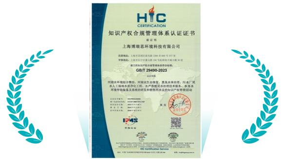

text_image

HTC
CERTIFICATION
知识产权合规管理体系认证证书
上海博瑞思环境科技有限公司
注册地址：上海市崇明区延边路1986弄604号177室
审批登记：上海市东方红路23号中环国际大厦30层
GB/T 29490-2023
河南水环境综合事务所、河南水生态修复、昌鱼水体治理、污水处理厂及工程技术服务; 水产循环无害防治技术服务。衡水市环境智能装备及观测研究和销售所涉及的知识产权管理活动
发
HIC Certification Service

## 案例 开展专利培训，提升员工创新能力

2025年4月18日，公司组织举办了一场面向全员的专利培训，本次培训聚焦“如何在技术研发中高效地找到专利授权点：转用发明的思路解析”，旨在引导员工突破固有研发思维，掌握将技术成果转化为高质量专利的方法路径，实现从“技术思维”到“专利思维”的关键转变。

## 影响、风险和机遇管理

为保障研发活动稳健推进，联合水务构建了全闭环的风险管理机制，系统识别出三项与研发创新密切相关的关键风险，分别制定了针对性的应对措施，切实提升风险防控能力，保障创新活动稳妥推进。

## 风险

## 具体描述

## 应对措施

## 研发合作风险

• 合作中产生的知识产权归属问题

· 在合作协议中明确约定双方背景知识产权的使用范围，并清晰界定合作产生的前景知识产权的权利归属、利益分配机制、保密义务及违约责任等，避免纠纷

## 资源保障风险

• 研发所需的核心部件或材料采购周期过长影响项目进度与生产安排

·针对核心部件，与供应商签订长期合作协议以保障供应，并建立备用供应商库，缩短采购周期

## 与保护风险

· 知识产权重复申请或权利要求保护范围不当，导致无法获得有效保护自有知识产权被他人侵权

·建立“自申+外审”的双重审核机制。研发部门统一登记并初步预审，由专业代理机构进行二次审查，避免重复申报或侵权·聘请具有法律背景的代理机构，定期进行市场与技术领域的侵权检索，防止侵权事件

公司建立健全“识别一评估一管控一监控”全闭环风险管理体系，确保风险早发现、早评估、早处置。

建立“三维识别体系”纵向贯穿研发项目全周期横向协同多部门联动，并聚焦人才流动、合作履约等关键节点。通过“跨部门联审+研发自审+外部审计”三重机制，实现风险的系统化、前瞻性识别。

风险 识别

采用定性与定量相结合的方法，围绕风险对核心参数的影响程度、发生概率等维度进行综合评估，将识别出的风险科学划分等级，开展专项评估并更新风险等级。

风险 评估

建立风险监控台账与动态跟踪机制，定期更新风险处置进展，实现全过程闭环管理，保障风险防控措施持续有效、不断优化。

风险管控 与监控

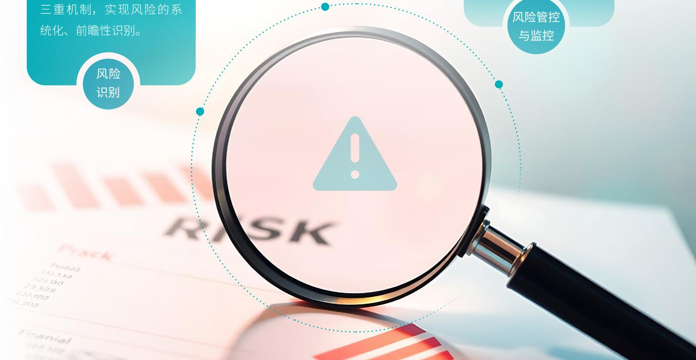

text_image

三重机制，实现风险的系统化、前瞻性识别。
风险识别
风险管控与监控
RISK

## 指标与目标

公司研发创新的核心目标为通过技术突破与管理优化，实现公司水务运营“降本增效、低碳环保”。围绕这一目标：公司正逐步构建覆盖“厂网站河湖”全产业链的智能装备矩阵，以实现从水源监测到末端治理的全场景智能化布局；并以每年新增专利不少于8项为成果量化指标，稳步健全自主知识产权体系，最终实现企业经济效益与社会效益双赢。

## 研发创新目标（博瑞思）

## 科技软实力

·项目以强化核心技术壁垒为目标，计划提交发明专利3项、实用新型专利10项、外观设计专利1项、软著1项。

## 荣誉奖项

·通过资质认定与体系建设提升行业认可度与规范化管理水平，目标为完成科技型中小企业认定、知识产权管理体系认证年度监督审核，并申报2025年度张江高新区青浦园、西岑园企业高成长项目。

## 2025年达成情况

·已完成提交发明专利3项、实用新型专利10项、外观专利1项、软著1项。  
• 已完成科技型中小企业认定。  
·已完成知识产权管理体系认证年度监督审核，已下发证书。  
·已申报2025年度张江高新区青浦园、西岑园企业高成长项目，已立项。

研发投入

325.79万元

研发人员

7

年度新增专利申请

14项

年度新增软著申请

1

新增有效专利

12

新增软件著作权

1

累计获得有效专利

30项

累计获得软件著作权

13 项

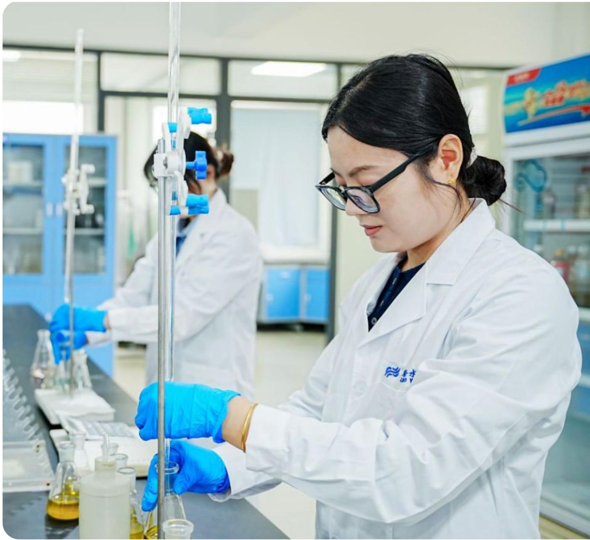

natural_image

Scientists in lab coats and gloves working at laboratory benches with glassware and beakers (no visible text or symbols)

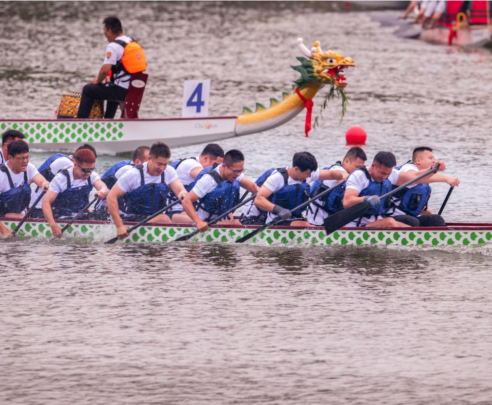

natural_image

Dragon boat race with multiple teams paddling on water, featuring a dragon and numbered boats in the background (no visible text or symbols)

##

## 以人为本

员工总数

1,272人

海外本地化雇佣率

98.41

员工培训总投入

83.11

员工培训总学时

32,423.62 小时

贡献联合国可持续发展目标 SDGs

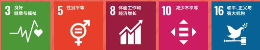

flowchart

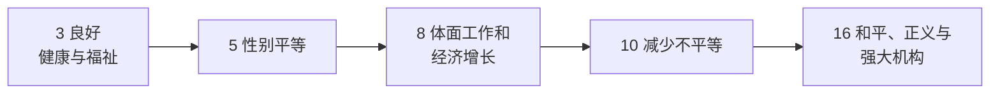
```mermaid
graph LR
  A["3 良好\n健康与福祉"] --> B["5 性别平等"]
  B --> C["8 体面工作和\n经济增长"]
  C --> D["10 减少不平等"]
  D --> E["16 和平、正义与\n强大机构"]
```

## 雇佣与员工权益保障

人才是企业发展的核心竞争力，是联合水务实现可持续发展的基石。公司坚持平等雇佣原则，不断加强人才队伍建设，为员工提供有竞争力的薪酬福利，畅通民主沟通渠道，切实保障员工权益。

## 坚持合规雇佣

## 劳工与人权管理

公司严格遵守《中华人民共和国劳动法》《中华人民共和国劳动合同法》《中华人民共和国未成年人保护法》《禁止使用童工规定》等国家法律法规及海外运营所在地法律政策以及《国际人权宪章》《国际劳工公约》《国际劳工组织关于工作中的基本原则和权利宣言》《联合国工商业与人权问题指导原则》等国际人权规范，制定《招聘管理办法》《招聘管理流程》《员工手册》《企业文化价值观手册》等制度，制度内明文规定禁止雇佣童工、禁止强制劳动、禁止侮辱威胁或骚扰等不当行为、职业健康与安全相关规定，反对一切性别、民族、宗教、年龄等歧视现象，构建完善的劳工权益保障体系。2025年，公司未发生员工歧视及其他违反人权相关事件。

公司尊重并保护人权，积极推进人权风险防范工作，定期审查运营公司是否有违法用工或用工过程中存在人权风险可能，并组织开展《员工手册》培训，对公司在反歧视与反骚扰、反童工及强制劳动方面的规定进行宣贯。此外，公司严格遵循《保障农民工工资支付条例》，充分保障进城务工人员的合法权益。

劳动合同签订率

100

社会保险覆盖率

100

## 人才吸引

公司秉持平等雇佣原则，制定《招聘管理办法》，规范员工招聘流程，健全人才选用机制。公司拓宽多元化招聘渠道，采用“线上+线下”“外招+内推”等方式，通过组织线下宣讲会，参与知名高校招聘会、线下高校残疾人毕业生专场、退役军人专场招聘会，组织社会招聘，开展校企合作等，多渠道引进人才，广泛吸纳优秀人才，为公司发展储备能量。

## 海外项目人才储备

联合水务结合海外业务发展规划与实际情况，通过外部引进和内部培养的方式，打造海外人才“蓄水池”。

## 外部引进

积极参加中国企业出海人力资源管理论坛，了解企业出海人才管理经验与人才招聘渠道；进入海外人才专门交流社区，积极开展招聘；与已出海的人力资源供应商建立联系，提前了解当地人才市场情况、用工政策等，建立人才招聘合作，为海外项目的国际人才储备工作奠定基础。

##

对深耕行业的专业成熟人才，给予语言学习提升培训机会；对学历背景优秀、个人能力强的年轻人才，加大培养力度，实现人才梯队的可持续供给。

## 校企合作人才支撑

联合水务及子公司积极探索校企合作新路径，通过参加校园招聘、组织专场宣讲会、定期交流互访、安排学生实习实训等方式，搭建多样化知识与实践技能交流平台，为公司输送专业人才。

联合水务与上海交通大学、同济大学、河海大学、扬州大学等高校持续开展深度合作，参加学校招聘会，针对性开展宣讲会。

咸宁联合水务与武汉科技大学完成本科生教学实习基地共建协议的续签，为60名师生提供实地参观实习活动，并为7名学生提供短期实习活动。

荆州申联环境与长江大学开展深度交流，联合湖北区域生产技术与人力资源团队组织多校毕业生开展面试。

荆州申联环境获批成为荆州经开区高校毕业生就业见习基地

贺兰联合水务、宁夏鸿泽净水公司分别与宁夏建设职业技术学院、宁夏理工学院建立校企合作，持续以管培生、顶岗实习、学术交流等形式进行人才培养提升。

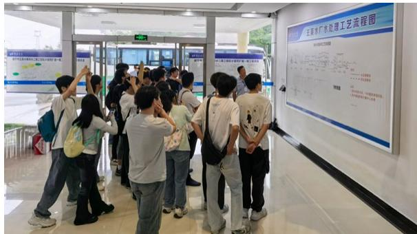

text_image

Group of people viewing a large whiteboard displaying a Chinese process flow chart titled '广东省广东处理工艺流程图' (Main City Guangdong Process Processing and Technology Flow Diagram)

员工总数

1,272 人

报告期内吸纳的就业人数

99人

新招应届毕业生人数

20人

年度员工离职率

11.91%

按性别划分的员工离职率（%)  
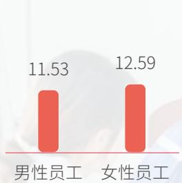

bar

| Category | Value |
| --- | --- |
| 男性员工 | 11.53 |
| 女性员工 | 12.59 |

按年龄划分的员工离职率(%)  
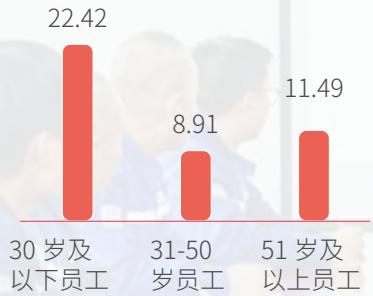

bar

| Category | Value |
| --- | --- |
| 30岁及以下员工 | 22.42 |
| 31-50岁员工 | 8.91 |
| 51岁及以上员工 | 11.49 |

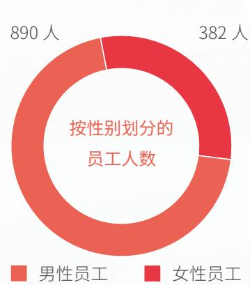

donut

| 性别 | 员工人数 |
| --- | --- |
| 男性员工 | 890 |
| 女性员工 | 382 |

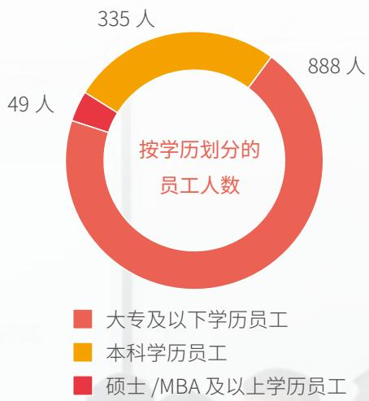

donut

| 学历 | 员工人数 |
| --- | --- |
| 大专及以下学历员工 | 888人 |
| 本科学历员工 | 335人 |
| 硕士/MBA及以上学历员工 | 49人 |

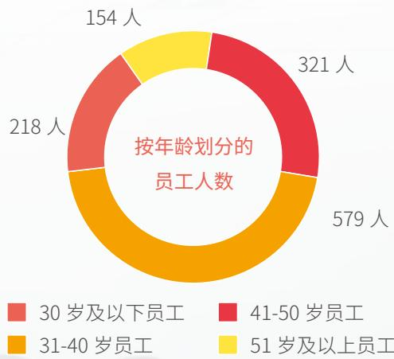

donut

| 年龄段 | 员工人数 |
| --- | --- |
| 30岁及以下 | 218人 |
| 31-40岁 | 579人 |
| 41-50岁 | 321人 |
| 51岁及以上 | 154人 |

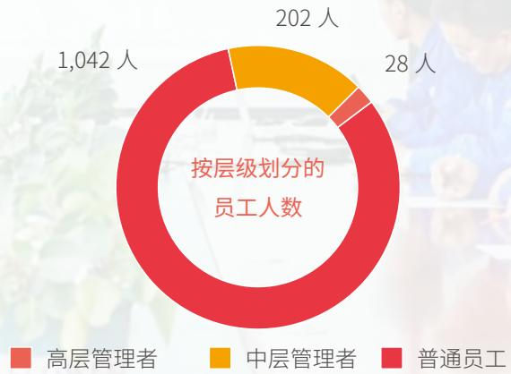

donut

| Category | Value (人) |
| --- | --- |
| 高层管理者 | 28 |
| 中层管理者 | 202 |
| 普通员工 | 1,042 |

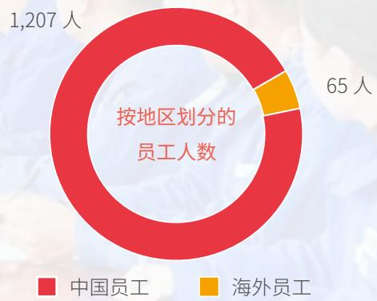

donut

| 地区 | 员工人数 |
| --- | --- |
| 中国员工 | 1,207 |
| 海外员工 | 65 |

## 薪酬福利激励

公司构建与岗位价值、个人能力、工作业绩贡献相挂钩的差异化薪酬管理体系，为员工提供行业内具有竞争力的薪酬水平，并不断优化员工福利保障体系增强员工幸福感与归属感，深化企业与员工之间的价值共创、利益共享和风险共担，构建更为紧密的事业共同体。

育儿假返岗率

97.44 %

85.71%

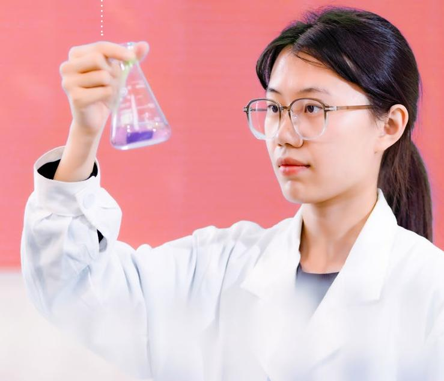

natural_image

Scientist in lab coat holding a beaker against a red background (no text or symbols visible)

## 优化薪酬福利

## 薪酬 激励

·建立兼具外部竞争性和内部公平性的薪酬体系，充分调动员工的工作积极性。  
：制定《集团项目公司业绩超额奖励方案》《“我与企业共发展”内部奖励制度》《内部人才推荐奖励办法》等制度，修订《职称、职业资格证书等管理和激励制度》《新项目(业务）开发奖金激励方案》《建设项目团队奖励方案》以及集团“总裁特别奖”评选方案等，完善多样化奖金激励机制。  
：按时、足额缴纳员工“五险一金”：制定《员工意外险投保制度》，为工程类、外勤及现场作业员工购买雇主责任险，为频繁出差员工购买交通意外险，为部分地区和岗位员工提供生产安全责任险等保障。  
：除国家规定的法定假日，保障每位员工享有带薪年假、婚假、丧假等，遵循《主要节假日员工福利政策》，为员工提供节日福利、工作午餐、慰问金等，并提供适配岗位的季节性福利、餐补福利、交通补贴等多样化福利。  
·定期组织员工健康体检，针对海外项目员工和部分特殊岗位员工提供额外健康保障措施。  
·制定《中长期外派、借调员工管理规定》《孟加拉项目派驻员工薪资福利管理规定》，为外派员工提供外派补贴、住宿保障、月度带薪休假探亲等福利措施。

## 规范绩效管理

公司制定并完善《绩效管理制度》建立严谨的指标审核与评估流程，推动绩效考核体系持续改进与升级。此外，公司制定《运营管理考核标准》，明确将节能降耗、环境保护、职业健康与安全生产等ESG绩效融入绩效考核体系中，在优化绩效考核指标的同时，助力公司提升可持续发展能力。

##

设置“公司级、部门级和员工级”三级绩效目标体系，指标以 KPL 与 OKR 相结合的方式，涵盖业绩情况、事件行为、能力素质等表现明确业务重点，多层次、全方位考察员工表现。

##

通过上下级日常沟通，以及设置每季度回顾复盘及年终绩效面谈机制，及时与员工沟通其优点和存在问题，帮助员工提高个人绩效。

设立畅通的员工绩效反馈和申诉渠道，针对员工关干绩效考核的反馈情况，设立申诉处理小组进行认真分析评估，做出合理处理决定。

##

建立闭环式的绩效循环管理系统，覆盖目标设定、持续反馈、日常辅导、绩效和员工发展改进五个环节，帮助员工在实际工作中持续改进和优化，提升职业竞争能力。

## 加强民主管理

公司积极倾听员工心声，构建和谐劳动关系，切实保障员工知情权、参与权、表达权与监督权。公司建立了以职工代表大会为基本形式的民主管理制度，依法保障员工参与民主监督和民主管理。2025年，公司在董事会中设立职工代表董事，让职工能深度参与公司重大决策过程，充分保障职工的民主管理权利，使董事会决策更加贴合员工与企业的实际需求。

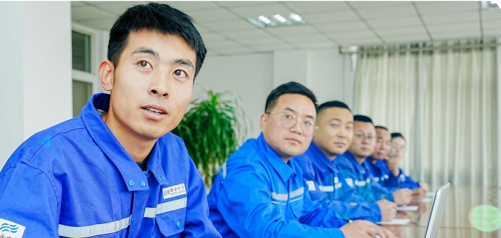

natural_image

Group of workers in blue uniforms seated at a conference table, wearing glasses and uniforms (no visible text or symbols)

员工工会入会人数

997

员工工会入会率

78.38%

召开职工代表大会

4

召开员工大会

4次

## 信息公开

·拓宽公开渠道：推行“双线融合”模式，借助OA系统、微信公众号、公示栏、车间展板等线上线下渠道，确保员工及时了解公司的相关政策及事项。  
：细化公开内容：明确企业发展规划、劳动报酬、社保福利、职工奖惩等内容均向员工公开，便干内部政策制度的有效推行，保障员工的知情权与监督权。

## 沟通反馈

·构建沟通反馈机制：设立座谈会、职工代表大会、意见箱等多元畅通的沟通渠道，安排专人定期对收集到的意见建议进行汇总，对员工提出的合理化建议进行逐一采纳及落实，确保员工的诉求得到及时回应。  
·推进数字化保障：搭建“云之家”线上平台，开设职工服务、监督等模块，打造“触手可及的民主窗口”，提升民主管理效率。

## 员工满意度

集团各职能条线对接访谈：集团运营管理、财务、人力资源、采购等条线，访谈了项目公司对应条线团队成员，了解制度执行情况及问题、对集团职能部门的服务需求；了解当地企业经营情况及薪酬水平调研、内部薪酬对比外部分析及调整建议。

项目公司内业务条线管理团队访谈：与中基层管理人员沟通，了解其对下属工作能力、团队执行力及人才培养的看法；与员工沟通，了解其对上级管理风格、工作分配合理性及个人成长支持的感受。

人力资源部门与业务部门及其他职能部门负责人、员工交流：了解各部门在协作配合中遇到的实际障碍，以及对人力资源管理工作的支持需求：了解员工对职业发展(包括晋升通道，培训机会，岗位成长等)以及薪酬水平、福利政策方面的满意度，便于后续优化提升。

# 多元职场与员工关爱

联合水务重视员工人文关怀，促进员工平衡工作与生活，努力打造多元、平等、包容的职场环境。

## 倡导平等包容

公司坚持公平公正的原则，在招聘、培训、晋升及薪酬激励等各环节为每位员工提供同等机会与待遇。公司将多元、平等、包容理念融入公司运营体系，持续提升工作场所的包容性，确保所有员工无论年龄、性别、民族、国籍或宗教信仰都能受到公平对待。同时，公司加强属地员工招聘，带动当地就业，改善当地人民生活质量。

## 支持女性职场发展

·保障女性员工权益：严格遵照国家相关法律法规，保障女性员工享有孕期、产期、哺乳期、育儿假；荆州申联水务、荆州申联环境针对薪酬结构开展调查与分析，及时发现和修正潜在可能的欠合理情况，确保员工无论性别在同等岗位上享有相同的薪酬待遇。  
·促进女性员工成长：为女性员工提供公平的培训机会，助力女性员工不断提升自身技能水平；鼓励和培养女性员工担任管理岗位，保障有能力的员工能够充分参与公司管理。

## 鼓励海外人才成长

·在孟加拉积极落实本地化雇佣政策，实施人才本土化聘用和培养，前期派遣员工与当地员工一对一对接，提升当地员工的技术能力。  
·实施孟加拉留学生招聘项目，为国际外派员工开发专门培训，帮助员工适应文化、语言，了解当地商业惯例，提供多种语言沟通材料，满足员工不同语言背景。  
·设立员工援助计划（EAP)，为面临个人或职业挑战的员工提供咨询服务。

中高层管理人员女性占比

25.65%

残障员工占比

0.16%

少数民族占比

1.81%

海外运营地雇佣当地员工

62

海外运营地雇佣当地员工占比

98.41 1%

海外运营地雇佣当地高管

1

海外运营地雇佣当地高管占比

50

海外员工培训总学时

160小时

海外员工培训总人次

50

## 关爱慰问员工

公司始终将员工关怀置干重要位置，大力帮扶困难员工，保障一线员工身体健康，关心关爱女性员工、退休员工，并积极为员工提供前置性、预防性的心理健康支持。2025年，公司组织开展新员工培训座谈会，向新员工普及压力管理、情绪调节与有效沟通的技巧，并引导部门负责人、导师关注新员工的心理动态，帮助新员工平衡工作期望与现实挑战，培养积极乐观的职场心态，展现公司的人文关怀和责任担当。

困难员工帮扶人数

3

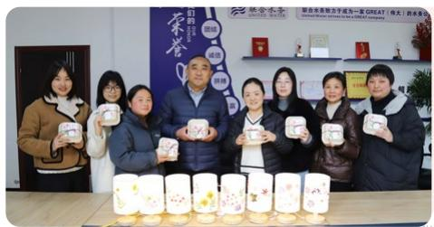

text_image

Group photo of eight people holding ceramic cups in front of a table with ceramic vases, with visible Chinese signage in the background.

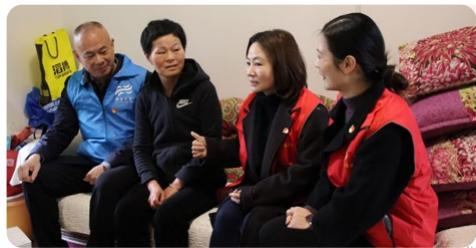

natural_image

Group of four people sitting on a sofa, engaged in conversation (no visible text or symbols)

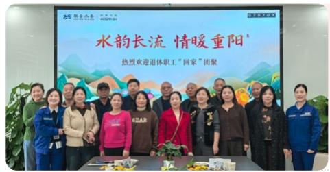

text_image

水韵长流 情暖重阳®
热烈欢迎退休职工“回家”团聚

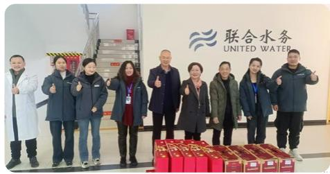

text_image

联合水务
UNITED WATER

## 平衡工作生活

公司重视员工工作与生活的平衡，为员工提供丰富多元的文娱活动，增强员工的归属感、幸福感，营造和谐、融洽的团队氛围。

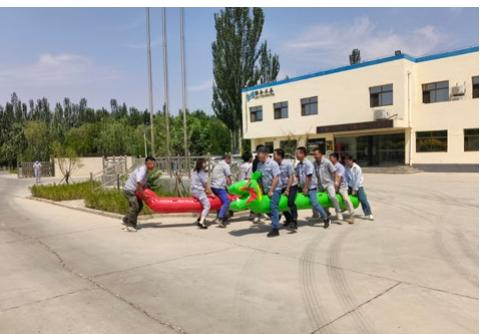

natural_image

Group of people in uniform carrying inflatable rafts in front of a building with trees and signage (no visible text on main subjects)

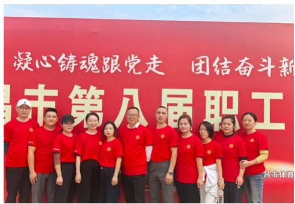

text_image

凝心铸魂跟党走 团结奋斗新
市第八届职工

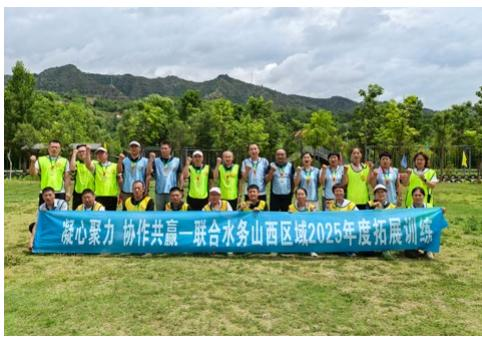

text_image

凝心聚力 协作共赢—联合水务山西区域2025年度拓展训练

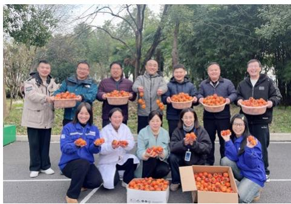

natural_image

Group photo of people holding baskets of harvested tomatoes outdoors, surrounded by trees and boxes (no visible text or symbols)

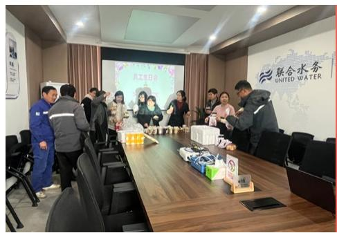

text_image

联合水务
UNITED WATER

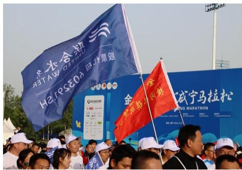

text_image

水合赛
H21RSCEOA 招行票据
金城威宁马拉松
JING MARATHON

## 人才培育与发展

联合水务将人才视作企业发展的核心动力，构建完善的员工培训与发展体系，畅通员工职业发展路径，并不断激励员工成长与发展，实现员工个人成长与企业发展的有机结合、相互共促。

## 深化人才培养

公司重视员工发展与成长，构建完善的员工培训体系，制定并积极落实培训计划。公司针对不同层级人才的需求，提供个性化的培训机会，以此激发员工潜能，持续建设适应业务发展的人才队伍。报告期内，公司共开展培训466场，其中重点培训45场；总部牵头开展重点专项培训和专题会议 17 场。

## 人才培养项目

针对内部青年人才，提供轮岗学习、职业技能培训、专题集训、实践研究等系统性培训内容，加强骨干管理和技术人才队伍建设。报告期内，联合水务宿迁供水公司以轮岗形式培养5人，咸宁联合水务通过轮岗、跨区域学习等形式培养5人，随州联合水务以带教形式培养2人。

面向管培生开展“成为企业人”职业素养专题培训、《水质工程学》行业知识培训、轮岗学习等专业培训内容，帮助管培生快速熟悉公司业务，在实践中学以致用。报告期内，公司及下属企业培养管培生情况为：公司总部1名、联合水务宿迁供水公司延续1名、咸宁联合水务培养2名：累计培养管培生32 名。

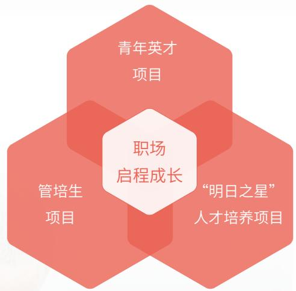

flowchart

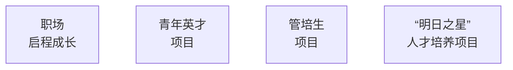
```mermaid
graph TD
  Center["职场\n启程成长"]
  
  TopLeft["青年英才\n项目"]
  BottomLeft["管培生\n项目"]
  BottomRight["“明日之星”\n人才培养项目"]
```

联合水务江苏区域以优化年轻梯队为目标，坚持重点培养与整体素质提高相结合的原则，通过团队培养、轮岗学习、专题研修、拓展训练、网络培训等多种方式，有效提高优秀青年员工的综合能力和素质。

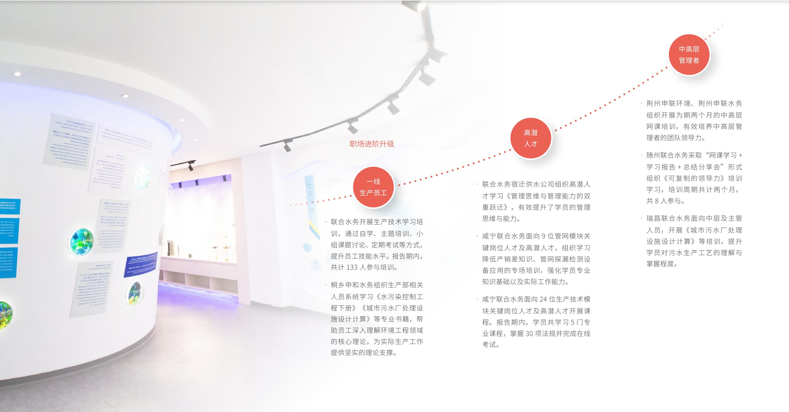

flowchart

```mermaid
graph LR
  A["一线生产员工"] --> B["高潜人才"]
  C["中高层管理者"] --> D["中高层管理者"]
  
  subgraph sg["\"职场进阶升级\""]
    E["一线生产员工"]
  end
  
  subgraph sg_2["\"一线生产员工\""]
    F["联合水务开展生产技术学习培训，通过自学、主题培训、小组课题讨论、定期考试等方式，提升员工技能水平。报告期内，共计133人参与培训。"]
    G["桐乡申和水务组织生产部相关人员系统学习《水污染控制工程下册》《城市污水厂处理设施设计计算》等专业书籍，帮助员工深入理解环境工程领域的核心理论，为实际生产工作提供坚实的理论支撑。"]
  end
  
  B --> H["联合水务宿迁供水公司组织高潜人才学习《管理思维与管理能力的双重跃迁》，有效提升了学员的管理思维与能力。"]
  H --> I["咸宁联合水务面向9位管网模块关键岗位人才及高潜人才，组织学习降低产销差知识、管网探漏检测设备应用的专场培训，强化学员专业知识基础以及实际工作能力。"]
  I --> J["咸宁联合水务面向24位生产技术模块关键岗位人才及高潜人才开展课程。报告期内，学员共学习5门专业课程，掌握30项法规并完成在线考试。"]
  
  style A fill:#f9f9f9,stroke:#333,stroke-width:2px\n  style B fill:#f9f9f9,stroke:#333,stroke-width:2px\n  style C fill:#f9f9f9,stroke:#333,stroke-width:2px\n  style D fill:#f9f9f9,stroke:#333,stroke-width:2px\n  style E fill:#f9f9f9,stroke:#333,stroke-width:2px\n  style F fill:#f9f9f9,stroke:#333,stroke-width:2px\n  style G fill:#f9f9f9,stroke:#333,stroke-width:2px\n  style E fill:#f9f9f9,stroke:#333,stroke-width:2px\n  style G fill:#f9f9f9,stroke:#333,stroke-width:2px\n  style H fill:#f9f9f9,stroke:#333,stroke-width:2px\n  style I fill:#f9f9f9,stroke:#333,stroke-width:2px\n  style J fill:#f9f9f9,stroke:#333,stroke-width:2px\n  style K fill:#f9f9f9,stroke:#333,stroke-width:2px\n  style L fill:#f9f9f9,stroke:#333,stroke-width:2px\n  style M fill:#f9f9f9,stroke:#333,stroke-width:2px\n  style N fill:#f9f9f9,stroke:#333,stroke-width:2px\n  style O fill:#f9f9f9,stroke:#333,stroke-width:2px\n  style P fill:#f9f9f9,stroke:#333,stroke-width:2px\n  style Q fill:#f9f9f9,stroke:#333,stroke-width:2px\n  style R fill:#f9f9f9,stroke:#333,stroke-width:2px\n  style S fill:#f9f9f9,stroke:#333,stroke-width:2px\n  style T fill:#f9f9f9,stroke:#333,stroke-width:2px\n  style U fill:#f9f9f9,stroke:#333,stroke-width:2px\n  style V fill:#f9f9f9,stroke:#333,stroke-width:2px\n  style W fill:#f9f9f9,stroke:#333,stroke-width:2px\n  style X fill:#f9f9f9,stroke:#333,stroke-width:2px\n  style Y fill:#f9f9f9,stroke:#333,stroke-width:2px\n  style Z fill:#f9f9f9,stroke:#333,stroke-width:2px\n  style AA fill:#f9f9f9,stroke:#333,stroke-width:2px\n  style AB fill:#f9f9f9,stroke:#333,stroke-width:2px\n  style AC fill:#f9f9f9,stroke:#333,stroke-width:2px\n  style AD fill:#f9f9f9,stroke:#333,stroke-width:2px\n  style AE fill:#f9f9f9,stroke:#333,stroke-width:2px\n  style AF fill:#f9f9f9,stroke:#333,stroke-width:2px\n  style AG fill:#f9f9f9,stroke:#333,stroke-width:2px\n  style AH fill:#f9f9f9,stroke:#333,stroke-width:2px\n  style AI fill:#f9f9f9,stroke:#333,stroke-width:2px\n  style AJ fill:#f9f9f9,stroke:#333,stroke-width:2px\n  style AK fill:#f9f9f9,stroke:#333,stroke-width:2px\n  style AL fill:#f9f9f9,stroke:#333,stroke-width:2px\n  style AM fill:#f9f9f9,stroke:#333,stroke-width:2px\n  style AN fill:#f9f9f9,stroke:#333,stroke-width:2px\n  style AO fill:#f9f9f9,stroke:#333,stroke-width:2px\n  style AP fill:#f9f9f9,stroke:#333,stroke-width:2px\n  style AQ fill:#f9f9f9,stroke:#333,stroke-width:2px\n  style AR fill:#f9f9f9,stroke:#333,stroke-width:2px\n  style AS fill:#f9f9f9,stroke:#333,stroke-width:2px\n  style AT fill:#f9f9f9,stroke:#333,stroke-width:2px\n  style AU fill:#f9f9f9,stroke:#333,stroke-width:2px\n  style AV fill:#f9f9f9,stroke:#333,stroke-width:2px\n  style AW fill:#f9f9f9,stroke:#333,stroke-width:2px\n  style AX fill:#f9f9f9,stroke:#333,stroke-width:2px\n  style AZ fill:#f9f9f9,stroke:#333,stroke-width:2px\n  style BA fill:#f9f9f9,stroke:#333,stroke-width:2px\n  style BB fill:#f9f9f9,stroke:#333,stroke-width:2px\n  style BC fill:#f9f9f9,stroke:#333,stroke-width:2px\n  style BD fill:#f9f9f9,stroke:#333,stroke-width:2px\n  style BE fill:#f9f9f9,stroke:#333,stroke-width:2px\n  style BF fill:#f9f9f9,stroke:#333,stroke-width:2px\n  style BG fill:#f9f9f9,stroke:#333,stroke-width:2px\n  style BH fill:#f9f9f9,stroke:#333,stroke-width:2px\n  style BI fill:#f9f9f9,stroke:#333,stroke-width:2px\n  style BJ fill:#f9f9f9,stroke:#333,stroke-width:2px\n  style BL fill:# f4e6e6e6e6e6e6e6e6e6e6e6e6e6e6e6e6e6e6e6e6e6e6e6e6e6e6e6e6e6e6e6e6e6e6e6e6e6e6e6e6e6e6e6e6e6e6e6e6e6e6e<ecel>
```

## 中高层管理者

荆州申联环境、荆州申联水务组织开展为期两个月的中高层网课培训，有效培养中高层管理者的团队领导力。  
随州联合水务采取“网课学习+学习报告+总结分享会”形式组织《可复制的领导力》培训学习，培训周期共计两个月，共8人参与。  
瑞昌联合水务面向中层及主管人员，开展《城市污水厂处理设施设计计算》等培训，提升学员对污水生产工艺的理解与掌握程度。

## 特色培养机制

“内训师”管理

为推动公司内部的知识和经验的传承与应用，公司积极推动内训师体系建设，致力于打造高素质、专业化的内训师队伍；制定《内训师管理制度》，健全内训师选拔、培养、激励及考核机制，并定期组织内训师交流学习。报告期内，公司共有认证内训师18人。

“师徒制”管理

遵循《联合水务集团师徒制管理制度（试行）》，指导各运营公司根据需求，持续推进“师徒制”培养计划。2025年，公司新增14对师徒结对培养，在生产、机电、化验、管网等领域，为运营公司培养了高技能的年轻人才。

网络课程学习

各运营公司通过网络学习平台组织员工参与系列课程学习，内容覆盖专业技能、领导力与管理技能等，紧贴业务实际与员工需求。报告期内，共计70人次参与网络培训。

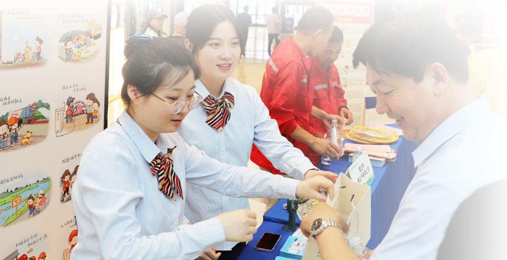

text_image

Street photo with visible store signboards and people interacting at a service counter

员工培训总投入

83.11 万元

员工培训总人次

5,997人次

员工培训总学时

32,423.62小时

员工全年人均培训时长

25.49小时

按性别划分的人均培训时长（小时）  
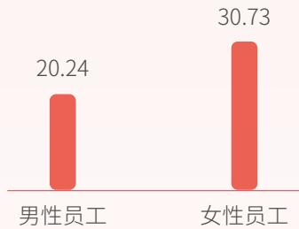

bar

| Category | Value |
| --- | --- |
| 男性员工 | 20.24 |
| 女性员工 | 30.73 |

按层级划分的人均培训时长（小时）  
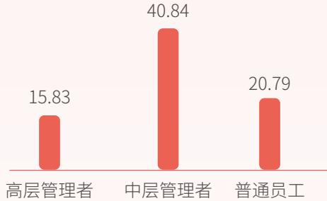

bar

| Category | Value |
| --- | --- |
| 高层管理者 | 15.83 |
| 中层管理者 | 40.84 |
| 普通员工 | 20.79 |

全体员工培训覆盖率

90.57 %

按性别划分的员工培训覆盖率 (%)  
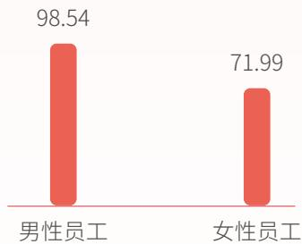

bar

| Category | Value |
| --- | --- |
| 男性员工 | 98.54 |
| 女性员工 | 71.99 |

按层级划分的员工培训覆盖率（%  
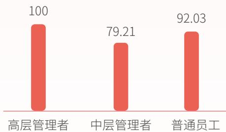

bar

| Category | Value |
| --- | --- |
| 高层管理者 | 100 |
| 中层管理者 | 79.21 |
| 普通员工 | 92.03 |

## 畅通职业发展

## 畅通发展路径

公司秉持“任人唯贤，唯才是举”的原则，不断优化员工晋升管理体系，确保员工职业发展通道的透明与公正。纵向上，公司持续完善管理与技术双通道晋升体系，并通过在宿迁地区选取相关技术岗位开展双通道试点，梳理能力标准与评估方式，为员工提供清晰、公正的多元化发展路径。横向上公司围绕“人员综合素质提升”与“业务战略调整”双核心，建立跨组织、跨部门的人员动态调配机制并依托“跟踪-反馈-优化”的全周期管理机制，打通总部、区域及运营公司之间的人才流动壁垒全面盘活内部人才资源，最终实现个人与组织的共同成长。

## 学历与资质支持

公司修订《职称、职业资格证书等管理和激励制度》，鼓励员工积极参加本职工作领域专业知识学习与技能提升，获取外部权威机构职称评审认定、资格证书等认证，对符合激励条件的员工按月度或年度进行现金激励。公司已取得国家认可的职业技能等级自主认定资格，针对水生产处理工、机电设备安装工、管工三个工种开展初、中、高级职业资格认定。2025年，咸宁思源水务新增电焊、低压电工专业证书共2本，荆州申联环境新增4本中级职称证书，涵盖环境保护、电气和给排水专业。瑞昌联合水务新增高压电工专业证书1本、工业废水处理工专业证书6本、化学检验员专业证书 3 本。

## 成长 激励

公司长效化、持续化推行“我与企业共发展”项目，切实执行《“我与企业共发展”内部奖励制度》，鼓励员工通过不断学习、提升业务技能，同时提供员工实践机会开展实用创新与发明，获得专利授权或协会嘉奖：鼓励员工钻研与工作相关的技术，进行技改提升，为公司创造经济效益：组织员工参加各类外部技能竞赛，为公司争取荣誉。公司在年底统一对符合条件的员工、团队进行现金奖励。2025年，110人获得现金奖励。

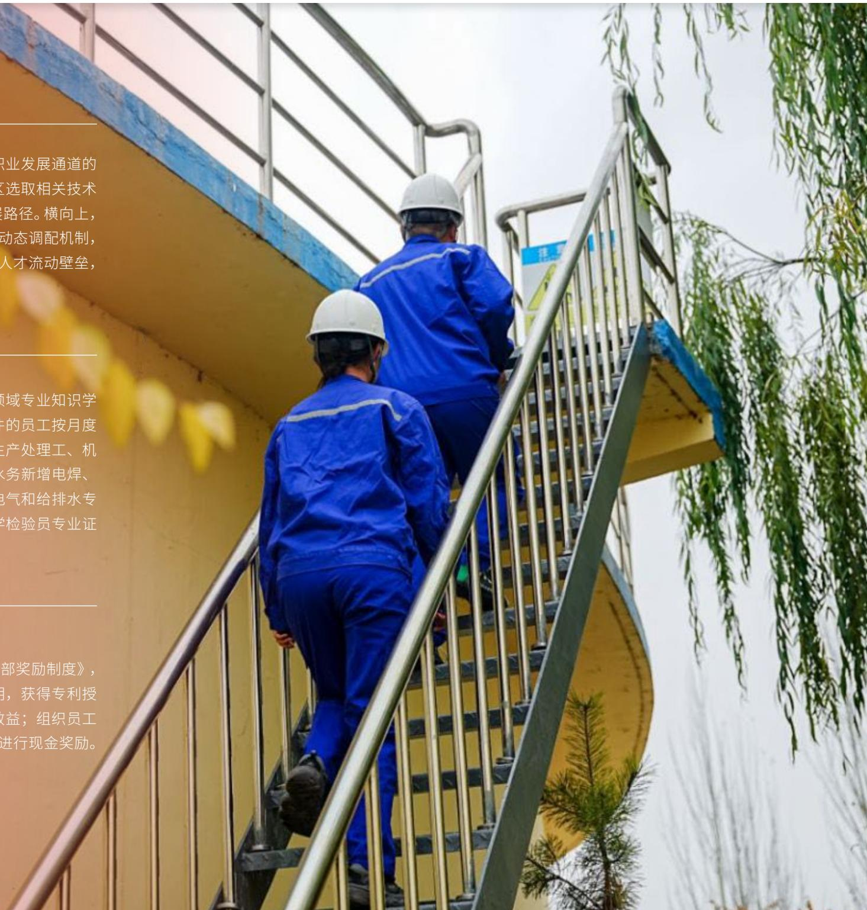

text_image

职业发展通道的
选取相关技术
路径。横向上，
动态调配机制，
人才流动壁垒，
领域专业知识学
的员工按月度
产处理工、机
务新增电焊、
电气和给排水专
检验员专业证
部奖励制度》，
，获得专利授
益；组织员工
进行现金奖励。

## 关于本报告

本报告是江苏联合水务科技股份有限公司面向社会公开发布的第三份环境、社会及治理（ESG）报告（以下简称“本报告”），旨在披露公司在可持续发展方面的理念、实践和关键绩效，充分回应利益相关方关注的重要问题。

## 称谓说明

为了便于表述和阅读，在本报告中“江苏联合水务科技股份有限公司”也以“联合水务”“公司”或“我们”表示。

<table><tr><td colspan="3">部分子公司名称简称表</td></tr><tr><td>区域</td><td>子公司</td><td>简称</td></tr><tr><td rowspan="3">江苏区域</td><td>宿迁市民信水质检测有限公司</td><td>宿迁民信水检公司</td></tr><tr><td>宿迁耿车污水处理有限公司</td><td>宿迁耿车污水处理公司</td></tr><tr><td>宿迁联合市政工程有限公司</td><td>宿迁联合市政</td></tr><tr><td rowspan="6">湖北区域</td><td>荆州申联水务有限公司</td><td>荆州申联水务</td></tr><tr><td>荆州申联环境科技有限公司</td><td>荆州申联环境</td></tr><tr><td>随州联合水务有限公司</td><td>随州联合水务</td></tr><tr><td>咸宁联合水务有限公司</td><td>咸宁联合水务</td></tr><tr><td>咸宁思源水务有限公司</td><td>咸宁思源水务</td></tr><tr><td>咸宁联合市政工程有限公司</td><td>咸宁联合市政</td></tr><tr><td rowspan="2">华南区域</td><td>桐乡申和水务有限公司</td><td>桐乡申和水务</td></tr><tr><td>瑞昌联合水务有限公司</td><td>瑞昌联合水务</td></tr><tr><td rowspan="4">山西区域</td><td>三门峡联合水务有限公司</td><td>三门峡联合水务</td></tr><tr><td>稷山联合水务有限公司</td><td>稷山联合水务</td></tr><tr><td>新绛县晋华生态环境工程有限公司</td><td>新绛晋华</td></tr><tr><td>新绛县国龙污水处理有限公司</td><td>新绛国龙</td></tr><tr><td rowspan="2">漳州区域</td><td>平和联合水务有限公司</td><td>平和联合水务</td></tr><tr><td>南靖联合水务有限公司</td><td>南靖联合水务</td></tr><tr><td rowspan="2">宁夏区域</td><td>宁夏贺兰联合水务有限公司</td><td>贺兰联合水务</td></tr><tr><td>宁夏鸿泽净水有限公司</td><td>宁夏鸿泽净水公司</td></tr></table>

## 报告时间范围

时间范围为2025年1月1日至2025年12月31日，部分内容往前后年度适度延伸。本报告为年度报告。

## 报告边界

本报告披露的文字及数据资料均来自联合水务及子公司。

## 可靠性保证

公司承诺本报告内容不存在任何虚假记载、误导性陈述或重大遗漏，并对其内容的真实性、准确性和完整性负责。

## 信息来源

报告中所使用的全部信息数据来自公司正式文件、统计报告与财务报告，以及由公司ESG工作小组汇总与审核的各单位可持续发展实践信息。如无特殊说明，本报告中所涉及货币金额以人民币作为计量币种。

## 编制依据

全球报告倡议组织《可持续发展报告标准》(GR标准)：上海证券交易所《上海证券交易所上市公司自律监管指引第1号—规范运作》《上海证券交易所上市公司自律监管指引第14号可持续发展报告(试行）》《上海证券交易所上市公司自律监管指南第4号可持续发展报告编制(2026年1月修订）》；联合国可持续发展目标（SDGs)。

## 获取方式

报告提供中、英文两种版本，可于公司网站http://www.united-water.com 获取报告。如中、英文版本有任何抵触或不相符之处，请以中文版本为准。

## 意见反馈

为不断改进报告编制工作，我们希望倾听您的意见和建议，如对报告有疑问和建议，您可发邮件至IR@united-water.com，或可致电 021-62370178。

## 关键绩效表

经济绩效

<table><tr><td>指标</td><td>单位</td><td>2023年度</td><td>2024年度</td><td>2025年度</td></tr><tr><td>资产总额</td><td>万元</td><td>363,514.33</td><td>371,523.65</td><td>379,988.47</td></tr><tr><td>营业收入</td><td>万元</td><td>112,780.88</td><td>114,040.29</td><td>110,293.70</td></tr><tr><td>营业利润</td><td>万元</td><td>21,444.06</td><td>19,098.16</td><td>13,513.61</td></tr><tr><td>纳税总额</td><td>万元</td><td>10,986.54</td><td>11,240.88</td><td>10,548.73</td></tr></table>

治理绩效

<table><tr><td>指标</td><td>单位</td><td>2023年度</td><td>2024年度</td><td>2025年度</td></tr><tr><td>独立董事比例</td><td>%</td><td>33.33</td><td>33.33</td><td>33.33</td></tr></table>

环境绩效

<table><tr><td>指标</td><td>单位</td><td>2023年度</td><td>2024年度</td><td>2025年度</td></tr><tr><td colspan="5">环境管理</td></tr><tr><td>环保投入1</td><td>万元</td><td>14,173.90</td><td>6,981.99</td><td>4,857.89</td></tr><tr><td>环保培训次数</td><td>次</td><td>22</td><td>18</td><td>56</td></tr><tr><td>环保培训人次</td><td>人次</td><td>301</td><td>168</td><td>733</td></tr><tr><td colspan="5">能源消耗</td></tr><tr><td>汽油</td><td>升</td><td>154,466.54</td><td>89,921.11</td><td>129,520.31</td></tr></table>

<table><tr><td>指标</td><td>单位</td><td>2023年度</td><td>2024年度</td><td>2025年度</td></tr><tr><td>柴油</td><td>升</td><td>55,535.46</td><td>54,745.04</td><td>43,761.13</td></tr><tr><td>天然气</td><td>立方米</td><td>135,137.28</td><td>132,954.00</td><td>108,020.20</td></tr><tr><td>液化石油气</td><td>千克</td><td>5,463.00</td><td>6,770.00</td><td>9,632.00</td></tr><tr><td>外购电力</td><td>千瓦时</td><td>130,418,203.00</td><td>134,330,988.60</td><td>140,830,142.10</td></tr><tr><td>清洁能源/可再生能源消耗量</td><td>千瓦时</td><td>/</td><td>/</td><td>5,326,532.00</td></tr><tr><td>能源消耗总量</td><td>吨标准煤</td><td>16,451.62</td><td>16,860.92</td><td>18,315.00</td></tr><tr><td>能源消耗强度</td><td>吨标准煤/万元营收</td><td>0.15</td><td>0.15</td><td>0.17</td></tr><tr><td colspan="5">温室气体排放</td></tr><tr><td>范围一:直接温室气体排放量</td><td>吨二氧化碳当量</td><td>799.38</td><td>651.10</td><td>664.11</td></tr><tr><td>范围二:间接温室气体排放量</td><td>吨二氧化碳当量</td><td>74,377.50</td><td>72,082.01</td><td>74,724.47</td></tr><tr><td>温室气体排放总量</td><td>吨二氧化碳当量</td><td>75,176.88</td><td>72,733.11</td><td>75,388.58</td></tr><tr><td>温室气体排放强度</td><td>吨二氧化碳当量/万元营收</td><td>0.67</td><td>0.64</td><td>0.68</td></tr><tr><td colspan="5">水资源管理</td></tr><tr><td>新鲜水取水量</td><td>万立方米</td><td>22,496.46</td><td>24,508.20</td><td>23,095.87</td></tr><tr><td>供水厂自用水量</td><td>万立方米</td><td>439.96</td><td>578.71</td><td>374.37</td></tr><tr><td>供水厂自用水率</td><td>%</td><td>1.96</td><td>2.45</td><td>1.64</td></tr><tr><td>再生水生产量</td><td>万立方米</td><td>4,994.27</td><td>2,432.80</td><td>3,874.26</td></tr><tr><td>废水处理总量</td><td>万立方米</td><td>14,418.56</td><td>15,151.81</td><td>15,026.01</td></tr><tr><td>污染物削减量(以化学需氧量COD计)</td><td>吨</td><td>44,894</td><td>49,079.30</td><td>47,901.45</td></tr><tr><td colspan="5">废水排放</td></tr><tr><td>氨氮排放量</td><td>吨</td><td>/</td><td>77.25</td><td>71.20</td></tr><tr><td>总氮排放量</td><td>吨</td><td>/</td><td>1,048.98</td><td>951.57</td></tr><tr><td>总磷排放量</td><td>吨</td><td>/</td><td>22.05</td><td>16.74</td></tr><tr><td>悬浮物排放量</td><td>吨</td><td>/</td><td>800.21</td><td>672.82</td></tr><tr><td colspan="5">废气排放</td></tr><tr><td> $废气排放总量^2$ </td><td>万立方米</td><td>/</td><td>162,882.13</td><td>129,557.25</td></tr><tr><td>氮氧化物排放量</td><td>吨</td><td>0.25</td><td>0.26</td><td>0.32</td></tr><tr><td>硫氧化物排放量</td><td>吨</td><td>0.12</td><td>0.03</td><td>0.03</td></tr><tr><td>悬浮粒子与颗粒物排放量</td><td>吨</td><td>0.03</td><td>0.04</td><td>16.58</td></tr><tr><td>挥发性有机化合物</td><td>吨</td><td>0</td><td>0</td><td>0</td></tr><tr><td colspan="5">废弃物排放</td></tr><tr><td> $有害废弃物产生量^3$ </td><td>吨</td><td>12.72</td><td>14.67</td><td>17.04</td></tr><tr><td>无害废弃物产生量</td><td>吨</td><td>/</td><td>120,580.85</td><td>122,161.24</td></tr><tr><td> $回收再利用的废弃物总量^4$ </td><td>吨</td><td>94,891</td><td>/</td><td>14,300.96</td></tr></table>

2. 废气为污水厂臭气收集风量，经除臭系统处理后有组织排放。  
3.有害废弃物主要为废机油、实验室废液。

社会绩效

<table><tr><td>指标</td><td>单位</td><td>2023年度</td><td>2024年度</td><td>2025年度</td></tr><tr><td colspan="5">研发创新与知识产权保护</td></tr><tr><td>研发投入</td><td>万元</td><td>176.30</td><td>314.79</td><td>325.79</td></tr><tr><td>研发人员人数</td><td>人</td><td>7</td><td>6</td><td>7</td></tr><tr><td>年度新增有效专利</td><td>项</td><td>5</td><td>6</td><td>12</td></tr><tr><td>累计有效专利总数</td><td>项</td><td>14</td><td>18</td><td>30</td></tr><tr><td>累计获得软件著作权数量</td><td>项</td><td>10</td><td>12</td><td>13</td></tr><tr><td colspan="5">客户权益</td></tr><tr><td colspan="5">联合水务宿迁供水公司</td></tr><tr><td>客户投诉处理率</td><td>%</td><td>100</td><td>100</td><td>100</td></tr><tr><td>客户满意度</td><td>%</td><td>98</td><td>99.40</td><td>98</td></tr><tr><td colspan="5">咸宁联合水务</td></tr><tr><td>客户投诉处理率</td><td>%</td><td>100</td><td>100</td><td>100</td></tr><tr><td>客户满意度</td><td>%</td><td>96</td><td>99.90</td><td>99.80</td></tr><tr><td colspan="5">供应链管理</td></tr><tr><td>通过质量管理体系认证的供应商比例</td><td>%</td><td>41.96</td><td>38.58</td><td>39.83</td></tr><tr><td>通过职业健康安全管理体系认证的供应商比例</td><td>%</td><td>22.69</td><td>35.67</td><td>38.85</td></tr><tr><td>通过环境管理体系认证的供应商比例</td><td>%</td><td>22.69</td><td>36.14</td><td>37.86</td></tr><tr><td colspan="5">员工雇佣</td></tr><tr><td>员工总数</td><td>人</td><td>1,407</td><td>1,337</td><td>1,272</td></tr><tr><td>报告期内吸纳的就业人数</td><td>人</td><td>198</td><td>103</td><td>99</td></tr><tr><td>新招应届毕业生人数</td><td>人</td><td>14</td><td>9</td><td>20</td></tr><tr><td>劳动合同签订率</td><td>%</td><td>100</td><td>100</td><td>100</td></tr><tr><td>员工工会覆盖率</td><td>%</td><td>56</td><td>73</td><td>78.38</td></tr><tr><td colspan="5">按性别划分的员工人数</td></tr><tr><td>男性员工</td><td>人</td><td>961</td><td>917</td><td>890</td></tr><tr><td>女性员工</td><td>人</td><td>446</td><td>420</td><td>382</td></tr><tr><td colspan="5">按年龄划分的员工人数</td></tr><tr><td>30岁及以下员工</td><td>人</td><td>336</td><td>276</td><td>218</td></tr><tr><td>31-40岁员工</td><td>人</td><td>593</td><td>594</td><td>579</td></tr><tr><td>41-50岁员工</td><td>人</td><td>329</td><td>312</td><td>321</td></tr><tr><td>51岁及以上员工</td><td>人</td><td>149</td><td>155</td><td>154</td></tr><tr><td colspan="5">按层级划分的员工人数</td></tr><tr><td>高层管理者</td><td>人</td><td>50</td><td>47</td><td>28</td></tr><tr><td>中层管理者</td><td>人</td><td>225</td><td>186</td><td>202</td></tr><tr><td>基层员工</td><td>人</td><td>1,132</td><td>1,104</td><td>1,042</td></tr><tr><td colspan="5">按学历划分的员工人数</td></tr><tr><td>大专及以下学历员工</td><td>人</td><td>1,001</td><td>942</td><td>888</td></tr><tr><td>本科学历员工</td><td>人</td><td>369</td><td>352</td><td>335</td></tr><tr><td>研究生/MBA及以上学历员工</td><td>人</td><td>37</td><td>43</td><td>49</td></tr><tr><td colspan="5">按地区划分的员工人数</td></tr><tr><td>中国员工</td><td>人</td><td>1,367</td><td>1,294</td><td>1,207</td></tr><tr><td>海外员工</td><td>人</td><td>40</td><td>43</td><td>65</td></tr><tr><td colspan="5">平等与多元化</td></tr><tr><td>女性员工占比</td><td>%</td><td>31.70</td><td>31.41</td><td>30.03</td></tr><tr><td>少数民族员工占比</td><td>%</td><td>1.28</td><td>1.12</td><td>1.81</td></tr><tr><td>残障员工占比</td><td>%</td><td>0.14</td><td>0.22</td><td>0.16</td></tr><tr><td>育儿假返岗率</td><td>%</td><td>95.65</td><td>100</td><td>97.44</td></tr><tr><td colspan="5">员工培训</td></tr><tr><td>员工培训总支出</td><td>万元</td><td>84.50</td><td>102.24</td><td>83.11</td></tr><tr><td>全年培训总人次</td><td>人次</td><td>3,338</td><td>5,965</td><td>5,997</td></tr></table>

<table><tr><td>指标</td><td>单位</td><td>2023年度</td><td>2024年度</td><td>2025年度</td></tr><tr><td>员工培训总学时</td><td>小时</td><td>23,768.02</td><td>23,782.35</td><td>32,423.62</td></tr><tr><td>员工全年人均培训时长</td><td>小时</td><td>17.01</td><td>17.79</td><td>25.49</td></tr><tr><td>男性员工人均培训时长</td><td>小时</td><td>30.21</td><td>17.27</td><td>20.24</td></tr><tr><td>女性员工人均培训时长</td><td>小时</td><td>15.78</td><td>18.91</td><td>30.73</td></tr><tr><td>高层管理者人均培训时长</td><td>小时</td><td>9.49</td><td>20.50</td><td>15.83</td></tr><tr><td>中层管理者人均培训时长</td><td>小时</td><td>20.90</td><td>35.62</td><td>40.84</td></tr><tr><td>普通员工人均培训时长</td><td>小时</td><td>16.34</td><td>14.65</td><td>20.79</td></tr><tr><td>员工培训覆盖率</td><td>%</td><td>83.36</td><td>92.52</td><td>90.57</td></tr><tr><td>男性员工培训覆盖率</td><td>%</td><td>85.33</td><td>94.66</td><td>98.54</td></tr><tr><td>女性员工培训覆盖率</td><td>%</td><td>81.06</td><td>87.86</td><td>71.99</td></tr><tr><td>高层管理者培训覆盖率</td><td>%</td><td>60.00</td><td>74.47</td><td>100</td></tr><tr><td>中层管理者培训覆盖率</td><td>%</td><td>57.73</td><td>95.16</td><td>79.21</td></tr><tr><td>普通员工培训覆盖率</td><td>%</td><td>89.50</td><td>92.84</td><td>92.03</td></tr><tr><td colspan="5">职业健康与安全</td></tr><tr><td>安全生产投入</td><td>万元</td><td>617.98</td><td>246.84</td><td>217.97</td></tr><tr><td>安全生产事故死亡人数</td><td>人</td><td>0</td><td>0</td><td>0</td></tr><tr><td>应急演练次数</td><td>次</td><td>61</td><td>85</td><td>120</td></tr><tr><td>安全培训参与人次</td><td>人次</td><td>2,742</td><td>2,836</td><td>2,715</td></tr><tr><td>安全培训总课时</td><td>小时</td><td>589.25</td><td>377.50</td><td>385.50</td></tr><tr><td>职业病发生率</td><td>%</td><td>0</td><td>0</td><td>0</td></tr><tr><td>总工伤率</td><td>%</td><td>0.21</td><td>0.30</td><td>0.16</td></tr><tr><td>因工伤损失工作日数</td><td>天</td><td>85</td><td>318</td><td>85</td></tr><tr><td>每百万营收因工伤损失工作日数</td><td>天</td><td>0.08</td><td>0.28</td><td>0.08</td></tr><tr><td colspan="5">社会参与</td></tr><tr><td>公益总投入</td><td>万元</td><td>154.33</td><td>188.33</td><td>324.15</td></tr><tr><td>员工志愿服务时长</td><td>小时</td><td>1,390</td><td>1,087</td><td>811.15</td></tr><tr><td>员工参与志愿服务活动人次</td><td>人次</td><td>459</td><td>549</td><td>498</td></tr></table>

## 指标索引表

使用说明：联合水务在2025年1 月1日至2025 年12月31 日依据《上海证券交易所上市公司自律监管指引第14号——可持续发展报告（试行）》、参照 GRI标准报告了在此份内容索引中引用的信息。

<table><tr><td>报告章节</td><td>上海证券交易所可持续发展报告标准索引</td><td>GRI Standards</td></tr><tr><td>董事长致辞</td><td>/</td><td>/</td></tr><tr><td>关于联合水务</td><td>/</td><td>2-1/2-6/2-23</td></tr><tr><td>可持续发展管理</td><td>第十二条(一)、第十二条(二)、第十二条(四)、第十二条(五)、第十三条、第十四条(一)、第十五条(三)、第十七条、第十八条(一)、第十八条(二)、第十八条(三)、第十八条(四)、第五十一条、第五十二条、第五十三条(一)、第五十三条(二)</td><td>2-9/2-12/2-13/2-14/2-16/2-17/2-22/2-24/2-29/3-1/3-2/3-3</td></tr><tr><td>专题:双化协同,绘就“数智+低碳”水务新图景</td><td>第二十七条、第二十八条、第四十一条、第四十二条(四)</td><td>305-5</td></tr><tr><td colspan="3">Green Planet 绿色地球</td></tr><tr><td>水资源管理</td><td>第十一条(一)、第十一条(二)、第十一条(三)、第十一条(四)、第十九条、第三十四条、第三十六条(一)、第三十六条(二)</td><td>3-3/303-1/303-3/303-5</td></tr><tr><td>生态环境保护</td><td>第三十二条(二)、第三十二条(三)、第四十二条(四)</td><td>3-3/101-2/101-5/101-8/304-1/304-3</td></tr><tr><td>应对气候变化</td><td>第十一条(一)、第十一条(二)、第十一条(三)、第十一条(四)、第十九条、第二十条、第二十一条、第二十二条(一)、第二十二条(二)、第二十二条(三)、第二十三条(一)、第二十三条(二)、第二十三条(三)、第二十三条(五)、第二十四条、第二十五条(三)、第二十六条、第二十七条、第二十八条、第三十五条(一)、第三十五条(二)、第三十五条(三)</td><td>3-3/201-2/203-2/302-1/302-3/302-4/302-5/305-1/305-2/305-4</td></tr><tr><td>降低环境影响</td><td>第十一条(一)、第十一条(二)、第十一条(三)、第十一条(四)、第十九条、第二十九条、第三十条(一)、第三十条(二)、第三十条(三)、第三十条(四)、第三十条(五)、第三十一条(一)、第三十一条(二)、第三十一条(三)、第三十三条(一)、第三十三条(二)、第三十三条(三)、第三十四条、第三十五条(三)、第三十七条(二)、第三十八条、第四十条</td><td>2-27/3-3/303-2/303-4/305-7/306-1/306-2/306-3/306-4/306-5</td></tr><tr><td colspan="3">Reliable Partner 可靠伙伴</td></tr><tr><td>稳定供水</td><td>第十一条(一)、第十一条(二)、第十一条(三)、第十一条(四)、第十九条、第四十四条、第四十七条(一)、第四十七条(二)、第四十七条(三)</td><td>3-3/203-1/203-2</td></tr></table>

<table><tr><td>报告章节</td><td>上海证券交易所可持续发展报告标准索引</td><td>GRI Standards</td></tr><tr><td>优质服务</td><td>第十一条(一)、第十一条(二)、第十一条(三)、第十一条(四)、第十九条、第四十四条、第四十七条(四)、第四十八条(三)</td><td>2-6/3-3/203-1/203-2</td></tr><tr><td>用水可及</td><td>第三十九条(一)、第三十九条(三)、第四十四条、第四十七条(四)</td><td>2-6/203-1/203-2</td></tr><tr><td>社区参与</td><td>第三十八条、第四十条</td><td>3-3/203-1/203-2</td></tr><tr><td colspan="3">Operation in Excellence 卓越经营</td></tr><tr><td>公司治理</td><td>第十一条(一)、第十一条(二)、第十一条(三)、第十一条(四)、第十九条、第五十三条(一)、第五十三条(二)</td><td>2-9/2-10/2-12/3-3/207-2/405-1</td></tr><tr><td>合规与稳健运营</td><td>第十一条(一)、第十一条(二)、第十一条(三)、第十一条(四)、第十二条(五)、第十九条</td><td>2-27</td></tr><tr><td>商业道德</td><td>第十一条(一)、第十一条(二)、第十一条(三)、第十一条(四)、第十九条、第五十四条、第五十五条(一)、第五十五条(四)、第五十六条(一)、第五十六条(二)</td><td>2-27/3-3/205-2/205-3/206-1</td></tr><tr><td>供应链管理</td><td>第十一条(一)、第十一条(二)、第十一条(三)、第十一条(四)、第十九条、第四十四条、第四十五条(一)、第四十五条(二)</td><td>2-6/2-23/3-3/308-1/308-2/414-1/414-2</td></tr><tr><td>安全防线</td><td>第十一条(一)、第十一条(二)、第十一条(三)、第十一条(四)、第十九条、第四十八条(一)、第四十八条(二)、第四十八条(四)、第四十九条、第五十条(二)</td><td>2-27/3-3/401-2/403-1/403-2/403-5/403-6/403-7/403-9/403-10</td></tr><tr><td colspan="3">Advanced Technology 先进技术</td></tr><tr><td>数智赋能</td><td>第十一条(一)、第十一条(二)、第十一条(三)、第十一条(四)、第十九条、第四十二条(四)</td><td>3-3/203-2</td></tr><tr><td>研发创新</td><td>第十一条(一)、第十一条(二)、第十一条(三)、第十一条(四)、第十九条、第四十一条、第四十二条(一)、第四十二条(二)、第四十二条(三)、第四十二条(四)、第四十三条(一)、第四十三条(二)、第四十三条(四)</td><td>3-3/201-4</td></tr><tr><td colspan="3">Talent Oriented 以人为本</td></tr><tr><td>雇佣与员工权益保障</td><td>第四十九条、第五十条(一)</td><td>2-7/3-3/401-1/401-2/401-3/405-1/406-1</td></tr><tr><td>多元职场与员工关爱</td><td>/</td><td>401-2/405-1</td></tr><tr><td>人才培育与发展</td><td>第四十九条、第五十条(三)</td><td>3-3/404-1/404-2</td></tr></table>

natural_image

Abstract blue wave-like graphic design with no text or symbols

## 联合水务

## UNITED WATER