## 2025

# 上海雅仕投资发展股份有限公司环境、社会及治理（ESG）报告

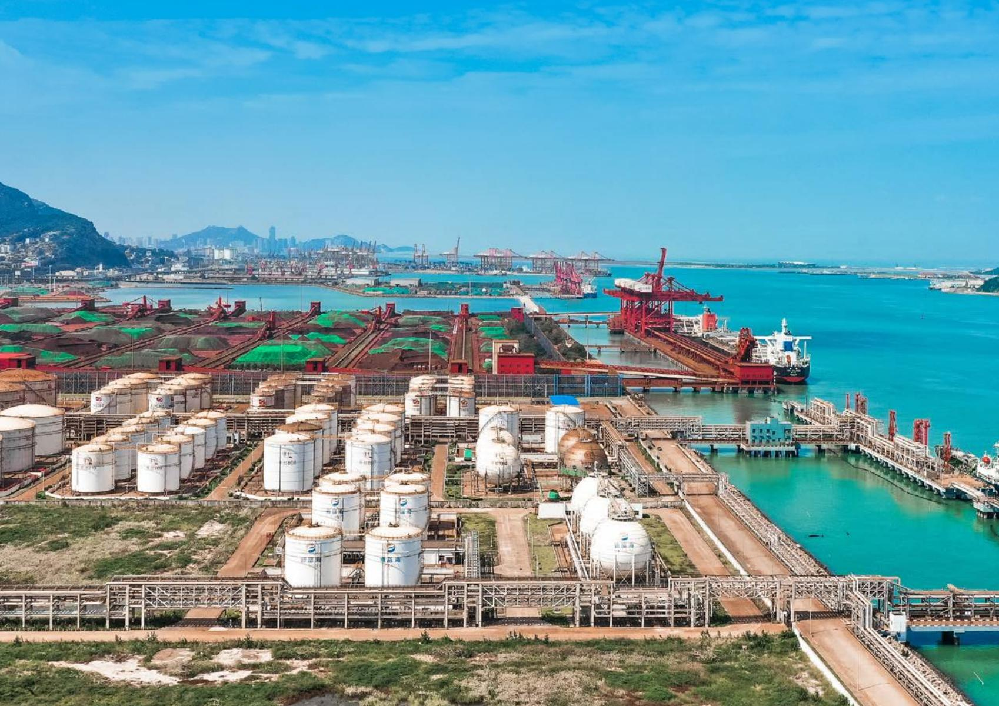

natural_image

Aerial view of a busy industrial port with storage tanks, cranes, and cargo ships, backed by a harbor with mountains in the background (no visible text or symbols).

## 报告编制说明

## 报告简介

本报告是上海雅什投资发展股份有限公司发布的第三份环境、社会及治理（ESG）报告。本报告将重点介绍公司在环境、社会和治理方面的表现，秉承客观、规范、透明、全面的原则，如实披露公司在可持续发展方面的理念、管理措施和成效。本报告经公司董事会审议通过，并对所载信息的真实性及有效性负责。

## 报告范围

除特别说明外，本报告涵盖上海雅什及其全资、控股子公司，信息边界与公司财务报告合并报表范围一致。具体数据覆盖范围详见“关键绩效表”说明。

## 时间范围

本报告涵盖时间范围为2025年1月1日至2025年12月31日。为保证报告的完整性，部分信息时间范围进行了前后延伸具体超出时间范围的信息将在相关章节中予以说明。

## 数据来源

本报告的数据通过公司内部系统和利益相关方调研等方式收集，相关数据均经过内部审核，以确保数据的准确性和可靠性。本报告全部信息数据来自公司的正式文件、公开披露文件。

报告引用财务数据以上海雅什投资发展股份有限公司2025年年度报告为准，如无特殊说明，所涉及货币金额以人民币作为计量币种；其他数据根据公司相关制度统计。

## 编制依据

本报告依据上海证券交易所《上市公司自律监管指引第14号—可持续发展报告(试行)》《上市公司自律监管指南第4号可持续发展报告编制》等报告标准。

本报告编制过程符合国务院国有资产监督管理委员会《关于新时代中央企业高标准履行社会责任的指导意见》《央企控股上市公司ESG专项报告编制研究》，同时参考全球报告倡议组织(Global ReportingInitiative,GRI) 《可持续发展报告标准》 (2021年版)(简称“GRI标准”)、国际标准化组织ISO26000:2010《社会责任指南》、《社会责任指南》(GBT36000-2015)、《联合国可持续发展目标》(UNSDGs2030)、气候相关财务信息披露工作组(TCFD) 《气候相关财务信息披露报告》等国内外认可的标准框架以及主流ESG评级所关注的重点议题。

## 编制原则

本报告编制遵循以下原则：

1.重要性：本报告聚焦对公司及利益相关方具有重大影响的ESG议题。通过利益相关方调研和实质性议题分析，我们识别了环境、社会及治理领域的核心议题，并在报告中重点披露，以确保报告内容与公司战略及利益相关方期望高度契合。  
2.准确性：本报告尽可能确保信息准确。其中，定量信息的测算已说明数据口径，计算依据与假定条件，以保证计算误差范围不会对信息使用者造成误导性影响。定量信息及附注信息详见本报告“关键绩效表”  
3.平衡性：本报告的内容反映客观事实，通过透明披露，全面展现公司在ESG领域的表现与改进空间。  
4.清晰性：本报告以简体中文发布。报告中纳入表格、模型图以及专业名词表等信息作为文字内容的辅助。为便于利益相关方更快获取相关信息，本报告提供目录及ESG相关标准的对标索引表，确保信息传达清晰易懂  
5. 量化及一致性：本报告披露报告期内的ESG量化绩效指标，并尽可能披露相应的历史数据。我们对同一指标在不同报告期内的统计及披露方式保持一致：若统计及披露方式有更改，将在报告附注中予以充分说明  
6. 完整性：除特别说明外，本报告披露信息的覆盖范围均为上海雅什投资发展股份有限公司及其附属公司。我们确保报告内容涵盖公司运营的主要领域，包括环境、社会及治理方面的全面表现，以提供完整的ESG信息。  
7.时效性：本报告为年度报告，与公司2025年年度报告同时发布，为利益相关方决策提供及时的信息参考。我们致力于确保报告内容的时效性，以反映公司最新的ESG绩效和进展。  
8.可验证性：本报告中所披露量化数据的来源及计算过程均可追溯，可用于支持外部验证。我们通过内部审计确保数据的可靠性，并在报告中提供详细的数据来源和计算方法说明，以确保报告的可信度。

## 称谓说明

为便干表达和阅读，报告中使用“上海雅仕”“本公司”“公司”“我们”等称谓均指代“上海雅什投资发展股份有限公司”。报告中出现的上海雅仕旗下子公司简称如下：

<table><tr><td>子公司全名</td><td>公司简称</td></tr><tr><td>江苏泰和国际货运有限公司</td><td>江苏泰和</td></tr><tr><td>安徽长基供应链管理有限公司</td><td>安徽长基</td></tr><tr><td>连云港亚欧一带一路供应链基地有限公司</td><td>亚欧公司</td></tr><tr><td>云南雅仕新为供应链有限公司</td><td>云南雅仕</td></tr></table>

## 报告发布

本报告以纸质版和电子版的形式发布，电子版可通过公司官网（http://www.aceonline.cn/）和上海证券交易所网址（ www.sse.com.cn)下载。

## 读者回应

如对本报告有任何疑问或反馈意见请通过以下方式与我们联系：

联系地址：上海市浦东南路 855号世界广场 36楼H室

联系电话：021-58369736

## 董事长致辞

2025年，是上海雅什深化可持续发展、推动ESG治理融入企业血脉的关键之年。我们坚持以习近平新时代中国特色社会主义思想为指导，紧扣“平台化、国际化、智能化”发展战略主轴，将环境、社会及治理（FSG）理念全面融入企业战略与日常运营，在服务国家大局中彰显责任担当。

公司持续深耕供应链物流与执行贸易主业，围绕“多式联运”与定制化服务，为硫磷化工、有色金属等领域客户提供全链条解决方案。报告期内，我们进一步优化供应链总包业务，助力客户降本增效；供应链平台业务聚焦专业化综合服务，为特定品种、业态及区域提供一站式支持；供应链基地业务在“一带一路”沿线持续布局，强化国际物流通道能力，保税贸易与国际联运服务效率显著提升，为跨境客户提供了稳定、高效的服务保障。

面对全球气候挑战，公司积极响应国家“双碳”目标，全面推进绿色运营。我们持续开展温室气体排放盘查，将主要运营单位的能耗数据及排放数据进行系统收集与核算，为气候风险管理奠定坚实基础。子公司亚欧公司“一带一路”基地园区铺设太阳能光伏板，实现“绿电”自发自用，并赋能员工低碳出行。我们扎实推进节能减排计划，超额完成年度减排目标。我们坚信，绿色发展不仅是社会责任，更是企业可持续发展的内生动力。

人才是企业发展的第一资源。我们始终践行多元包容的职场文化，严格遵守劳动法规，保障员工平等权益，营造安全、健康和谐的工作环境。公司持续完善职业健康安全管理体系，旗下子公司通过职业健康安全管理体系认证，持续开展安全生产培训，切实保障员工生命安全和身体健康。我们关注员工成长，通过系统培训、绩效改进与职业发展通道建设，助力员工与企业共同成长。

在公司治理层面，我们强化风险管控与合规管理，严格落实“四流一致”要求，建立反商业贿赂及反贪污长效机制，确保企业规范、透明、高效运营。报告期内，公司治理效能持续提升，为稳健发展提供了坚实保障。

展望未来，上海雅什将继续高举高质量发展旗帜，坚定不移推进“平台化、国际化、智能化”战略，以更加坚定的步伐、更加务实的举措，深化ESG治理，强化风险管控，提升核心竞争力。我们坚信，唯有坚守责任、锐意创新，方能与各方伙伴携手，共筑更具韧性与可持续的供应链未来，为经济社会发展贡献力量。

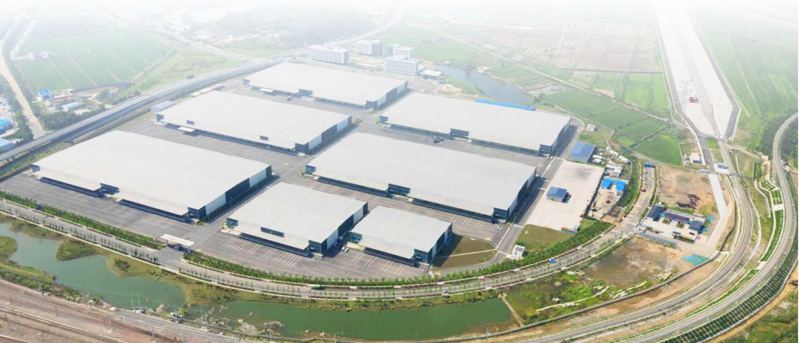

natural_image

Aerial view of a large industrial park with multiple factory buildings and surrounding railway tracks (no visible text or signage)

## 目录

<table><tr><td>报告编制说明</td><td>02</td><td>董事长致辞</td><td>04</td></tr><tr><td>关于上海雅仕</td><td>06</td><td>可持续发展治理</td><td>09</td></tr><tr><td>实质性议题管理</td><td>10</td><td>利益相关方沟通</td><td>12</td></tr></table>

## 环境篇

<table><tr><td>应对气候变化</td><td>16</td><td>能源利用</td><td>18</td></tr><tr><td>三废管理</td><td>20</td><td>水资源使用</td><td>22</td></tr><tr><td>环境合规管理</td><td>23</td><td></td><td></td></tr></table>

## 社会篇

<table><tr><td>员工管理</td><td>28</td><td>供应链管理</td><td>34</td></tr><tr><td>创新驱动</td><td>35</td><td>数据安全与客户隐私保护</td><td>36</td></tr><tr><td>产品和服务安全与质量</td><td>37</td><td></td><td></td></tr></table>

## 治理篇

<table><tr><td>公司治理</td><td>40</td><td>风险管控</td><td>43</td></tr><tr><td>尽职调查</td><td>44</td><td>反商业贿赂及反贪污</td><td>44</td></tr></table>

<table><tr><td>关键绩效表</td><td>47</td><td>指标索引</td><td>49</td></tr><tr><td>读者意见表</td><td>55</td><td></td><td></td></tr></table>

## 关于上海雅仕

## 公司概况

## 公司名称

上海雅仕投资发展股份有限公司

## 股票代码

603329 （上海证券交易所主板）

## 外文名称

SHANGHAI ACE INVESTMENT&DEVELOPMENT CO., LTD

## 股票简称

上海雅仕

## 成立时间

2003年

## 上市时间

2017年12月

## 总部地址

上海市浦东南路855 号世界广场36 楼

## 员工 合计

在职员工的数量合计481人（包括上海雅什及其全资、控股子公司

公司主要从事供应链物流和供应链执行贸易业务，系为工业客户提供定制化服务的全程供应链服务商。经过多年积累和对物流方式的持续创新，依托重要客户，公司已经在硫磷化工和有色金属行业建立了具有行业领先优势的供应链物流体系。

## 供应链物流

集装箱门到门多式联运和第三方物流服务是公司供应链物流的主要服务方式。公司为客户全程提供供应链物流各环节的服务，具体内容涵盖口岸代理、保税仓储、装卸作业、水路运输、公路运输、铁路运输、仓储保管和物流监管等业务环节。

##

## 供应链执行贸易

依托硫磷化工、有色金属行业的重要客户，公司已经在上述行业建立了具有行业领先优势的供应链物流体系，结合自身供应链物流的链条结构，公司根据客户的要求，在物流服务的基础上，支持性地开展硫磷化工、矿产品和有色金属等执行贸易。

主营业务

## 企业战略

2026年，公司继续围绕“平台化、国际化、智能化”发展战略目标，全面深化“跨境联通、专业物流、数智赋能、资本驱动”综合布局，充分发挥国有上市公司的资本与平台双重优势，整合全球资源，口岸渠道及运营品牌，致力于成为国内领先的“跨境物流链接全球贸易，专业服务成就美好生活”的数智供应链集成服务商与产业生态组织者。构建“战略管控+自主经营”协同机制，建立动态风控模型，聚焦数字化基础设施迭代，提升资源配置与客户服务能力，坚持供应链增值服务主业，夯实可持续发展根基，争做行业最佳实践者。

顺应国家提升产业链供应链韧性与安全水平的战略指引，公司全面由传统链条服务商向综合赋能平台跨越。在商业模式上，坚定推进平台化运营逻辑。聚焦干核心环节的风控、定价与行业标准输出，通过广泛链接并整合上下游优质资产与服务商，打破传统壁垒，打造共生共赢的开放型供应链商业生态圈，实现全链条价值的跃升

积极践行高水平对外开放及高质量共建“一带一路”倡议，将全球化资源配置能力作为跨越式发展的核心增长极。以构建自主可控的跨境物流大动脉为基石，加速推进海外关键枢纽节点与区域服务网络的宏观布局。依托海外平台效能与内外市场的高效联动，全面承接实体产业出海红利，打通国内外双向流通干线，构筑具备全球化视角的国际供应链竞争壁垒。

紧跟数字经济与实体经济深度融合的时代脉搏，将数智化确立为公司高质量发展的底层核心驱动力。全面拥抱AL大模型与前沿数字技术，推进企业数字基础设施的迭代重构。打造全链路可视、可预测的智慧供应链生态，大幅提升资产周转效率与综合服务能级，以科技赋能引领行业的高质量发展。

战略实施计划

## 企业文化

## 企业使命

让全球物流变得简单、便捷、高效。

## 核心 价值观

坚持以客户服务为核心，以供应链物流服务为依托，形成从上游到下游高效稳定的供应链体系，为客户提供最优的物流解决方案。

## 企业愿景

价值优势，面向世界。凭借出众的硬件、众多的网点、价值持续更大化，雅什的物流和贸易不断发展，成为行业内冉冉升起的新星。

## 荣誉奖项

投资者关系金奖(2024)“杰出IR 进取奖”

华夏时报“2025年度ESG实践典型案例”

每日经济新闻“上市公司最具社会责任奖”

证券之星“最具社会责任上市公司”

聚董秘“聚董秘百佳ESG公司”

价值在线“2025年度上市公司ESG 价值传递奖”

“2025年上海服务业企业100强”等多项荣誉

## 可持续发展治理

## 可持续发展策略

上海雅仕致力于将可持续发展理念融入企业战略，组织编制 ESG 报告，不断完善 ESG 治理架构和运行机制，了解并及时回应各利益相关方期望与诉求，积极承担社会责任，促进公司可持续发展

## ESG管理目标

上海雅什将持续深入了解ESG风险的性质和发展趋势，综合考虑各种因素，更加精准地确定风险点，采取有效的管理措施，根据自身经营活动和发展战略，确定与ESG相关的优先议题，选择与公司最为紧密相关的议题进行重点改进，分轻重缓急逐步开展，以提高实操性和积极性。同时，加强内部信息披露，通过发布定期的ESG报告，向外界展示企业在ESG方面的努力和成果，提高企业的透明度和公信力，增强投资者和利益相关者的信心。

## ESG改进计划

上海雅什将进一步加强对员工在ESG相关领域的培训力度，增强员工的环保意识和社会责任感：积极参与社会公益活动如慈善捐赠、社区服务等，以提升企业的社会形象和公众认可度；采取节能减排、循环经济等措施，减少企业运营对环境的负面影响；与投资者就ESG表现进行积极沟通，让投资者了解企业的ESG战略和实施情况，增强投资者信心；选择在ESG方面有良好表现的供应商和合作伙伴，共同提升整个供应链的ESG水平：开发和推广那些能够满足消费者对环保和社会责任需求的产品和服务；将ESG纳入企业的日常运营中，不断监测、评估和改进，以实现可持续发展的长期目标。

## ESG治理架构

为加强环境、社会及治理（ESG）事务的管理与监督，公司管理层负责制定和推动ESG战略，监督ESG 目标的实施进展，并确保公司在可持续发展领域的表现与利益相关方的期望保持一致。

## 实质性议题管理

上海雅仕依据上海证券交易所《上市公司自律监管指引第14号可持续发展报告（试行）》，参考SASB等相关国际权威指引，建立全面的可持续发展实质性议题管理体系。公司引入影响重要性和财务重要性的双重视角进行分析，通过向内、外部相关方代表征询意见，公司综合形成最终年度实质性议题结果，对其重要性进行排序，并对高重要性议题进行重点管理及披露。

## 实质性议题识别与分析流程

公司结合行业标准、政策对标及利益相关方调研，评估议题预期在短期、中期和长期内对公司商业模式、业务运营、发展战略财务状况、经营成果、现金流、融资方式及成本等产生重大影响(财务重要性），以及企业在相应议题的表现会对经济、社会和环境产生重大影响(影响重要性）。具体流程如下：

## 理解组织的背景

对标行业标准：参考国内外同行业可持续发展议题标准，参考可持续发展会计准则委员会SASB《可持续发展会计准则》：航空货运与物流行业（2023-12版本），明确行业核心议题。

政策对标：结合国家及地方政策法规，依据《上市公司自律监管指引第14号——可持续发展报告（试行）》报告总体框架整理差距分析概览识别与公司运营相关的政策要求及重要性议题。

行业趋势分析：研究物流行业可持续发展趋势，识别新兴议题(围绕“平台化、国际化、智能化”发展战略目标等）。

## 识别实际和潜在影响

内部评估：通过内部访谈、数据分析，识别公司运营对环境、社会和治理(ESG)的实际和潜在影响。

外部调研：结合利益相关方（如客户、供应商、投资者、员工）反馈，识别外部关注的重点议题。

风险与机遇分析：评估ESG议题对公司业务的风险和机遇，确保全面覆盖。

## 评估影响的重大程度

定量与定性结合：通过定量数据(如碳排放量、员工满意度）和定性分析（如利益相关方调研结果），评估议题的影响程度。

双维度评估：从“财务重要性”和“影响重要性”两个维度，评估议题的重大性。

行业对标：与同行业企业对比，确保议题评估的客观性和可比性。

## 对报告的最重大影响进行优先排序

优先级划分：根据影响程度和紧迫性，将议题分为高、中、低优先级。

聚焦核心议题：优先披露对公司和利益相关方影响最大的议题，如碳排放管理、员工权益保护、供应链风险管理等。

动态调整：定期更新议题优先级确保与公司战略和行业趋势保持一致。

公司主要采用以下方法进行实质性议题的重要性分析

## 行业议题法

参考SASB等行业标准，识别行业核心ESG议题。

## 同业与政策对标法

对比同行业企业实践及政策要求，确保议题的行业相关性。

## 利益相关方调研法

通过问卷调查、访谈等方式，收集利益相关方对ESG议题的关注点，确保议题的代表性和全面性

## 影响重要性

● 员工管理  
●公司治理  
●尽职调查  
● 风险管控  
●反商业贿赂及反贪污

● 利益相关方沟通  
●数据安全与客户隐私保护  
●水资源使用

●应对气候变化

●环境合规管理

生态系统和生物多样性保护

● 三废管理  
● 能源利用  
● 创新驱动

● 产品和服务安全  
与质量  
● 供应链管理

## 财务重要性

## 利益相关方沟通

上海雅仕始终致力于建立健全利益相关方沟通机制，严格落实各相关方的沟通与回应要求。公司结合政府及监管机构、投资者、员工、客户、价值链伙伴等不同利益相关方的特点，构建了多层次、常态化的沟通渠道，切实保障各方的知情权与参与权。

在此基础上，公司通过官方网站持续披露ESG管理实践与成效，并定期编制和发布ESG报告，全面回应利益相关方的期望与诉求。公司认真听取各方意见，将其关切有效融入战略决策与日常运营，持续提升ESG管理水平，推动实现与利益相关方的协同发展与价值共享。

2025 年

<table><tr><td>公司同投资者电话沟通</td><td>邮件交流</td><td></td></tr><tr><td>150余次</td><td>25次</td><td></td></tr><tr><td>公司召开</td><td>回复投资者在E互动提出的问题</td><td>回复率达</td></tr><tr><td>3次的业绩说明会</td><td>15次</td><td>100%</td></tr></table>

公司将持续优化实质性议题识别与分析流程，定期更新议题清单，确保ESG报告内容的全面性、准确性和时效性，为利益相关方提供有价值的决策参考，积极回应利益相关方期望与诉求。

<table><tr><td>利益相关方</td><td>利益相关方期望与诉求</td><td>上海雅仕的回应</td></tr><tr><td>政府及监管机构</td><td>·应急保障与民生供应·快递员的福利与权益保障·客户满意与客户关系管理·乡村振兴与社会公益</td><td>·信息披露·专题汇报·统计报表·答复监管机构问询</td></tr><tr><td>股东及投资者</td><td>·风险管理·商业道德与合规·供应链管理·完善ESG治理</td><td>·信息披露·股东会议·路演活动·实地考察</td></tr></table>

<table><tr><td>利益相关方</td><td>利益相关方期望与诉求</td><td>上海雅仕的回应</td></tr><tr><td>董事及高管</td><td>·风险管理·商业道德与合规·安全、优质、快捷的服务·董事会多元化·数据安全与隐私保护·完善ESG治理</td><td>·董事会汇报·各级汇报沟通</td></tr><tr><td>员工</td><td>·应急保障与民生供应·促进高质量就业·员工安全与健康·人才培训与发展</td><td>·全员邮件、沟通会议、员工论坛、职工大会·培训活动和申诉机制·员工调研活动(包括线上与线下)</td></tr><tr><td>客户</td><td>·产品服务优化·安全配送与运输·数据安全·隐私保护</td><td>·服务满意度调查·建立客户沟通及投诉渠道</td></tr><tr><td>供应商与其他合作伙伴</td><td>·可持续供应链·公平、公正、公开采购·安全、优质、快捷的服务·数据安全和隐私保护·仓储物流低碳管理</td><td>·供应商采购、培训与评估·行业论坛·供应商大会</td></tr><tr><td>行业协会组织</td><td>·加强交流与合作·行业标准制定</td><td>·开展峰会活动·组织技术交流</td></tr><tr><td>社区及公众</td><td>·安全、优质、快捷的服务·客户满意与客户关系管理·安全与健康·商业道德与合规·数据安全和隐私保护·乡村振兴与社会公益</td><td>·站等官方平台·对外宣传资料·公益行业论坛和活动</td></tr></table>

## 环境篇

本章展示了上海雅仕在应对气候变化、能源利用、三废管理、水资源使用及环境合规方面的实践与成效。公司积极识别气候相关风险与机遇，完善治理体系，推动绿色供应链与低碳技术应用。在能源管理方面，通过推广可再生能源、实施节能减排计划，持续优化能源结构。三废管理严格遵循法规，建立健全废弃物、废水废气管理制度，确保环境安全。公司强化环境合规管理制定相关制度，开展应急演练，提升突发环境事件应对能力，推动实现绿色可持续发展目标。

## 可持续发展目标

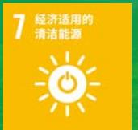

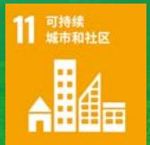

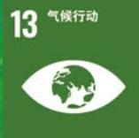

## 应对气候变化

## 治理

企业应对气候变化是实现可持续发展的核心要求。上海雅什于2023年借鉴全球气候相关风险管理过程，对气候相关的风险和机遇进行了首次评估，基于对气候变化宏观风险与机遇的分析，公司系统性地识别其在运营及市场层面所衍生的物理区险与转型风险，并将这些发现纳入内部整体风险管理流程，实现对关键风险与机遇的动态跟踪与管理。

## 战略

公司参考气候相关财务信息披露（TCED)工作组建议报告及国际可持续准则理事会(ISSB)于发布的《国际财务报告可持续披露准则第1号一可持续相关财务信息披露一般要求》和《国际财务报告可持续披露准则第2号气候相关披露》分析气候风险的潜在影响，建立并完善气候变化应对方案。

<table><tr><td>气候变化风险</td><td>风险描述</td><td>潜在影响</td><td>应对措施</td></tr><tr><td colspan="4">转型风险</td></tr><tr><td>政策和法律风险</td><td>·《2030碳达峰行动方案》等法规和相关政策要求不断更新</td><td>·生产运营成本增加·合规成本增加</td><td>·持续研究运营所在地区政策·执行公司碳减排措施</td></tr><tr><td>技术风险</td><td>·气候变化影响技术创新能力·原材料价格升高</td><td>·技术投入增加·研发成本提高</td><td>·加强公司技术研发能力·推进新能源使用</td></tr><tr><td>市场风险</td><td>·客户对可持续服务的需求提升·行业竞争加剧</td><td>·营收潜在影响</td><td>·为客户提供可持续发展解决方案·加强市场合作</td></tr><tr><td>声誉风险</td><td>·公司ESG表现未达到利益相关方预期,导致信誉受损</td><td>·投资成本上升</td><td>·定期发布ESG报告,向公众公开披露ESG信息·加强投资者关系管理</td></tr><tr><td colspan="4">物理风险</td></tr><tr><td>急性风险</td><td>·极端天气变化对公司生产运营产生影响</td><td rowspan="2">·运营成本增加</td><td>·完善应急处理机制</td></tr><tr><td>慢性风险</td><td>·长期气候变化影响生产基础设施使用</td><td>·加强基础设施管理,提高运营效率</td></tr></table>

## 影响、风险和机遇管理

公司推动绿色供应链智能化平台化发展，建设低碳“一带一路”供应链，为全球气候治理提供中国方案。公司不断深化绿色技术创新，探索更多低碳运输模式，提供绿色供应链服务，助力上下游企业共同实现可持续发展。

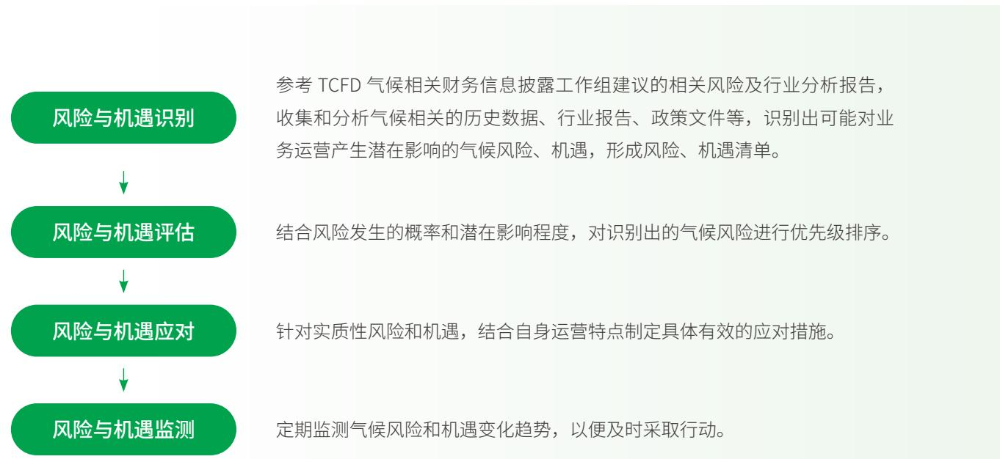

flowchart

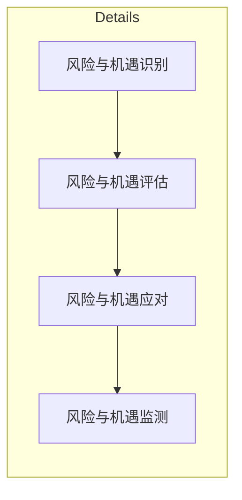

## 指标与目标

为实现碳中和及可持续发展的目标，公司持续提升“双碳”治理水平，结合“双碳”战略要求，构建相关治理体系，积极在全球低碳经济转型中贡献自身力量。2025年是公司开展温室气体排放盘查的第二年。公司将主要事业部和运营子公司的相关能耗数据、温室气体范围一、范围二排放数据进行收集计算，为未来持续优化气候相关披露奠定基础，以更好地跟踪这些气候相关风险和机遇的管理执行情况。

<table><tr><td>温室气体排放(吨二氧化碳当量)1</td><td>2025年排放数据</td></tr><tr><td>范围一温室气体排放量</td><td>1,883.02</td></tr><tr><td>范围二温室气体排放量</td><td>4,137.37</td></tr><tr><td>温室气体排放总量(范围一+范围二)</td><td>6,020.39</td></tr></table>

## 能源利用

企业合理使用能源是企业实现绿色发展与降本增效的重要举措，公司会不断优化能源使用结构，减少化石能源消耗与温室气体排放。

<table><tr><td>能源种类</td><td>单位</td><td>使用量</td><td>温室气体排放(吨二氧化碳当量)</td></tr><tr><td>柴油</td><td>升</td><td>364,938.82</td><td>1,007.69</td></tr><tr><td>天然气</td><td>立方米</td><td>218,326</td><td>476.83</td></tr><tr><td>R507A氟利昂(工业用途)</td><td>千克</td><td>100</td><td>398.5</td></tr><tr><td>外购电力</td><td>度(千瓦时)</td><td>1,824,360.80</td><td>978.95</td></tr><tr><td>可再生能源(太阳能光伏板)</td><td>度(千瓦时)</td><td>717,136</td><td>-</td></tr><tr><td>外购蒸汽</td><td>吨</td><td>10,731</td><td>3,158.42</td></tr></table>

2025年公司能源利用情况2

1.当前温室气体排放数据以工业排放为主，统计范围尚未完全覆盖，范围一包含公司拥有或控制的排放源的直接排放，范围二句括外购电力蒸汽，执力等产生的间接排放，未来，公司将进一步完善排放数据统计体系，扩大统计范围，提升数据透明度，温室气体排放计算采用的排放因子及换算系数，参考《2006年IPCC国家温室气体清单指南》以及生态环境部和国家统计局于2024年12月20日发布的《2022年电力二氧化碳排放因子》等最新政策标准文件，确保数据遵循科学性和合规性等报告原则。部分数据由于四舍五入，总数与各项数字的实际总和可能略有不同。  
2.当前能源使用统计数据以工业应用为主，统计范围尚未完全覆盖。未来，公司将进一步完善能源数据统计体系，扩大统计范围，提升数据透明度。

## 绿色电力

2025年，公司旗下子公司亚欧公司的“一带一路”基地园区内铺设的太阳能光伏板全年发电量达717.136千瓦时，所产清洁电力直接用于供应12个员工汽车充电桩，实现了“绿电”的自发自用与就地消纳。清洁电力有效减少了电力消耗产生的间接碳排放，推动园区能源结构向清洁化转型：将绿色电力注入员工通勤环节，为新能源车辆提供清洁动能，从源头降低燃油车尾气排放，鼓励员工选择低碳出行方式。这种“绿色用电”与“绿色出行”的深度融合，不仅降低了日常运营的碳足迹，更在园区内营造了节能降碳的良好氛围，以实际行动支持可持续发展。

## 减排计划

公司旗下子公司安徽长基根据《中华人民共和国节约能源法》和省，市有关要求，积极配合母公司上海雅什《三年节能减排计划》落实，安徽长基制定《安徽长基供应链管理有限公司“2024-2026”节能减排三年行动计划》。报告期内，安徽长基已经实现2025年减排目标：

<table><tr><td>目标</td><td>进度</td></tr><tr><td>公司用水和用电分别比上一年下降5%</td><td>达成</td></tr><tr><td>单位建筑面积能耗比上一年降低5%</td><td>达成</td></tr><tr><td>公务、厂内机动车辆用车油耗比上一年降低5%</td><td>达成</td></tr><tr><td>办公用品耗费比上一年降低5%</td><td>达成</td></tr></table>

## 积极推广节能技术应用

●加快用能设备节能改造。逐步淘汰高能耗的空调和计算机、打印机等用电设备：对耗能量大的中央空调、电热水器和电磁炉灶等用能设备，在综合考虑费效比的基础上，采用变频调速、无功补偿等节电技术，积极实行节能改造，提高能效水平。仓库制冷系统改造，降低能耗，仓间温度设计合理，规范员工出入库（人车分流），避免仓间大门长时间开启导致温度流失、能耗增高。业务部门和安全管理部门综合评估物料的操作安全性，并据此做好仓间规划，将相同温控需求的货物集中存放，已达到节能目的。  
●积极应用节能新产品。大力开展绿色照明行动，逐步淘汰高能耗灯具，办公建筑的楼梯、走廊、卫生间等公共场所的照明，全部安装智能控制装置，杜绝长明灯现象；将办公建筑内的水龙头、洁具更换为节水型器具，杜绝跑冒、滴、漏和长流水现象。

## 提高办公设备节能效果

●严格执行国家有关空调室内温度控制的规定，充分利用自然通风，改进空调运行管理。办公建筑充分利用自然采光，使用高效节能照明灯具，优化照明系统设计，改进电路控制方式，推广应用智能调控装置，严格控制建筑物外部泛光以及外部装饰照明。减少空调、计算机、复印机等用电设备的待机能耗，建立班后断电和用电巡视检查制度。

## 大力开展公务用车、厂内机动用车节能

●加强公务用车日常管理。加大对公务车辆的监督检查，制定节能驾驶规范，建立公务用车油耗管理、油耗统计和“一车一账”制度。健全公务用车使用管理制度，合理安排车辆出行路线和用车人员搭配，减少车辆空驶里程提高公务用车使用效率。认真落实派车登记制度，严禁公车私用。  
●厂内机动车辆节能，公司目前共有电动叉车21.台，柴油叉车3台，日常使用过程中尽可能多的采用电动叉车减少柴油叉车的使用，已达到减少尾气排放的目的；同时做好车辆管理，做到车辆人走断电，避免车辆停用时处于开启状态，造成能源不必要的浪费：合理规划仓间，同一项目物料的仓间尽可能集中布置，以减少厂内货物转运路线，更好的减少电量损耗：做好场内机动车辆的日常维护保养和定期的检修，使其始终保持在最佳状态

## 加强办公用品管理

●全面建立办公用品采购、配备和领用制度，选择低能耗、环保、质优价廉的办公设备。推进无纸化办公，充分使用再生纸，复印纸及草稿纸要双面使用。鼓励使用钢笔，减少一次签字笔的使用，并对硒鼓、墨盒等办公耗材进行修旧利废。

《三年节能减排计划》工作重点

## 三废管理

公司及旗下子公司安徽长基建立《“三废”管理制度》《危险废物管理制度》，旨在系统规范危险化学品仓储经营活动中废水，废气及固休废弃物的管控流程，安徽长基通过明确物料储存，搬运及异常泄漏等环节的操作要求，建立初期雨水与事故废水的应急收集机制，并对危险废弃物分类处置及临时贮存实施标准化管理，有效降低无组织排放与环境污染风险。

## 废气管理

安徽长基运营期间产生的废气主要为仓储废气，污染物包括VOCs、甲苯、二甲苯、氨、氯化氢等，产生量少目呈无组织排放为有效控制无组织废气排放，安徽长基已建立并落实一系列管理措施。

## 物料储存

盛装VOCs物料的容器或包装物应存放于规定的仓库内。含VOCs物料应储存于密闭容器、包装物中；盛装VOCs物料的容器或包装物应加盖、封口，保持密闭。

## 物料装卸 和搬运

储存的含VOCs物料为瓶装或桶装：根据要求，转移液态物料时应使用叉车和电动地牛并采用密闭容器搬运。

## 异常物料

运营过程中因操作不当导致盛装VOCs物料的容器或包装物泄漏，应在充分收集后，放置干封闭的容器内，按危险废物进行分类处置。

日常运营过程中控制无组织废气的产生与排放

公司旗下子公司江苏泰和使用柴油机尾气处理液(俗称尿素水溶液)，其主要成分是32.5%的高纯度尿素与去离子水。该溶液在选择性催化还原(SCR)系统中受热分解产生氨气，将柴油车尾气中的氮氧化物高效转化为无害的氮气和水，可减少80%以上的氮氧化物排放，从而有效遏制光化学烟雾、酸雨及PM2.5前体物的形成

## 案例：江苏泰和利用柴油机尾气处理液降低废气排放

江苏泰和将柴油机尾气处理液用于配备选择性催化还原(SCR)系统的柴油车辆，实现柴油车的清洁排放，不仅满足了国家第六阶段机动车污染物排放标准、欧洲第六阶段排放标准等排放标准，还能通过优化发动机燃烧工况辅助提升燃油经济性，并降低氮氧化物排放，间接减少了大气中二次硝酸盐颗粒物的生成，对改善空气质量、保护大气环境起到重要作用。

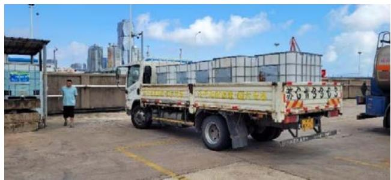

text_image

新鮮鮮鮮鮮鮮鮮鮮鮮鮮鮮鮮鮮鮮鮮鮮鮮鮮鮮鮮鮮鮮鮮鮮鮮鮮鮮鮮鮮鮮鮮鮮鮮鮮鮮鮮鮮鮮鮮鮮鮮鮮鮮鮮鮮鮮鮮鮮鮮鮮鮮鮮鮮鮮鮮鮮鮮鮮鮮鮮鮮鮮鮮鮮鮮鮮鮮鮮鮮鮮鮮鮮鮮鮮鮮鮮鮮鮮鮮鮮鮮鮮鮮鮮鮮鮮鮮鮮鮮鮮鮮鮮鮮鮮鮮鮮鮮鮮鮮鮮鮮強強強強強強強強強強強強強強強強強強強強強強強強強強強強強強強強強強強強強強強強強強強強強強強強強強強強強強強強強強強強強強強強強強強強強強強強強強強強強強強強強強強強強強強強強強強強強強強強強強強強强強強強強強強強強強強強強強強強強強強強強強強強強強強強強強強強強強強強強強強強強強強強強強強強強強強強強強強強強強強強強強強強強強強強強強強強強強強強強強強強強強強強強強強強強強強強強強強強強強強強性强
新鮮鮮鮮鮮鮮鮮鮮鮮鮮鮮鮮鮮鮮鮮鮮鮮鮮鮮鮮鮮鮮鮮鮮鮮鮮鮮鮮鮮鮮鮮鮮鮮鮮鮮鮮鮮鮮鮮鮮鮮鮮鮮鮮鮮鮮鮮鮮鮮鮮鮮鮮鮮鮮鮮鮮鮮鮮鮮鮮鮮鮮鮮鮮鮮鮮鮮鮮鮮鮮鮮鮮鮮鮮鮮鮮鮮鮮鮮鮮鮮鮮鮮鮮鮮鮮鮮鮮鮮鮮鮮鮮鮮鮮鮮鮮鮮鮮鮮鲜
新鮮鮮鮮
新鮮甘寧
新華龍龍
新華龍龍
新華龍龍
新華龍龍
新華龍龍
新華龍龍
新華龍龍
新華龍龍
新華龍龍
新華龍龍
新華龍龍
新華龍龍
新華龍龍
新華龍龍
新華龍龍
新華龍龍
新華龍龍
新華龍龍
新華龍龍
新華龍龍
新華龍龙
新華龍龍
新華龍龍
新華龍龍
新華龍龍
新華龍龍
新華龍龍
新華龍龍
新華龍龍
新華龍龍
新華龍龍
新華龍龍
新華龍龍
新華龍龍
新華龍龍
新華龍龍
新華龍龍
新華龍龍
新華龍龍
新華龍龍
新華龍藍

车用尿素吨桶配送

## 废弃物管理

安徽长基严格依法处理废弃物，通过分类管控、规范贮存及委托有资质单位处置等方式，确保废包装材料及失效危化品得到安全、合规处理。

## 2025 年

公司产生的一般固体废弃物总量达到

5.76 吨

## 废弃包装物

●运营过程中产生的破损废包装材料如未沾染化学品，则作为一般固废外售综合利用；如沾染化学品，则统一收集暂存于危废库内，交由有资质单位处理处置，并签订危废处置协议。

## 储存时间较长而失效的危化品

●运营期间因储存时间较长而失效的危化品产生的危险废物，按类别统一收集于危废库内暂存，定期交由有资质单位处理处置，并签订危废处置合同。  
●产生的固体危险废弃物必须严格按照《国家危险废物名录》进行分类  
●固体废弃物的临时储存场依据《一般工业固体废弃物贮存、处置场污染控制标准》(GB18599)和《危险废弃物贮存污染控制标准》 (GB18597)的要求建设。  
●固体废弃物的临时贮存场应设置防渗漏、密闭、防止化工异味气体挥发以及污水、废气回收等设施。固体废弃物应及时清运处置。

公司严格依照《中华人民共和国固体废物污染针对甲方在生产过程中产生的危险废物环境防治法》的规定，委托第三方专业环保科技公司处置废弃物。公司定期提供有关的《危险废物信息调查表》，明确废弃物种类、数量(或含量）、说明、性质等废弃物关键信息；第三方专业环保科技公司负责提供必需的装车工具以及必要的收集装置，并进行安全处置，切实保护环境、消除污染。

<table><tr><td>指标</td><td>种类</td><td>2025年废弃物处理量</td><td>单位</td><td>备注</td></tr><tr><td>危废处理量</td><td>包含废旧蓄电池、含有机溶剂废物、废润滑油、在线检测废液、废包装材</td><td>114.10</td><td>吨</td><td>危废处置方式包括:焚烧、物理化学处理(如蒸发,干燥、中和、沉淀等),不包括填埋或焚烧前的预处理及回收再利用(由专业第三方公司处置,依法严格登记转移记录)</td></tr><tr><td>废弃物循环利用比例</td><td>废旧蓄电池</td><td>24.62</td><td>%</td><td></td></tr></table>

安徽长基2025全年按危废处置方式分类：D10焚烧累计占总处置量的45.65%；D9物理化学处理累计占总处置量的0.03%;C5回收再利用累计占总处置量的54.32%。

## 废水管理

安徽长基建立严格的废水管理体系，通过初期雨水收集监测与事故废水应急防控相结合，有效防止受污染水体外溢。依托库区防渗设计及应急池配置，确保泄漏物或超标雨水得到妥善收集与处置，从源头阻断土壤及水体污染链，切实降低环境风险，保障周边生态安全。

## 2025 年

公司处理废水

352.65 吨

## 初期雨水管理

● 初期雨水经收集后，通过污水处理厂处理达标后排放至河流。  
●公司对初期雨水排放口设置在线监测及紧急切断措施，一旦发现初期雨水排放超标，应立即切断初期雨水外排管道，使初期雨水暂存在初期雨水池内，并委托有资质单位处理。雨水达《污水综合排放标准》(GB8978-1996中二级标准后，进入化工园区雨水管网，最终排入河流

## 事故废水管理

●事故产生的泄漏物以及清洗地面产生的少量废水，应用专用容器收集、密封储存，全部作为危险废物转移至危废间暂存，并由合规部及时联系有资质的危废处置单位处置。  
●事故产生的大量废水，无法使用专用容器收集的，不得随意排放，应统一收集排入事故应急池(公司建有地下事故应急池，总容积1860m³），再委托有资质的单位处置。  
●每个仓库采取防渗设计，大门采用漫坡设计，以每个仓库的防火分区为单位，形成碗状防液体流散收集系统。  
●整个库区场地四周的围墙采用防渗基础设计，设有大于70cm的挡土墙和40cm的现浇围墙基础；出入口采用漫坡设计（漫坡高度40cm)，使整个库区形成碗状结构，用于收集事故废水。

## 水资源使用

公司高度重视资源管理，制定了能源、水资源使用制度，严格按照监管要求，对水资源、电力等资源采取有效的管理措施，最大程度地发挥资源的利用价值，减少浪费，提高资源的利用效率，实现经济效益和环境效益的有机结合。公仓库部署了低流量管道系统，减轻水资源使用压力。同时，持续加强水资源的节约和利用，倡导员工节约用水，做到用水设备随用随关，并定期开展用水设备检查，不断强化全员节水意识。

## 2025年

公司自来水使用量为

12,196 吨

## 环境合规管理

## 治理

为保护员工的人身健康和周边环境，杜绝环保事故的发生，切实做好环境保护工作，加强公司突发环境事件管理，公司依据《中华人民共和国环境保护法》的有关规定，制定《环境治理管理制度》《环境保护管理制度》《突发环境事件管理制度》。报告期内，上海雅仕旗下子公司安徽长基获得ISO14001环境管理体系认证证书。

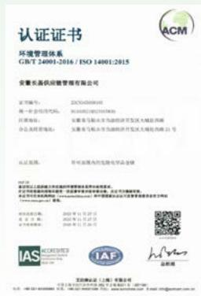

text_image

认证证书
环境管理体系
GB/T 24001-2016 / ISO 14001:2015
安徽长盈供应链管理有限公司
证书编号：ZXC240018140
统一社会信用代码：913400012872197XK
所属单位：安徽省合肥市东岳经济开发区大城经济路
办公及托管地址：安徽省合肥市东岳经济开发区大城经济路22号
认证范围：凭有效期内的危险化学品仓储
申请日期：2021年11月27日
发证机关：安徽省合肥市东岳经济开发区大城经济路
电子邮箱：www.hazq.com.cn
2021年11月27日
2021年11月27日
2021年11月28日
IAS AICER@ACM
IAF
品牌称：
美国纳斯达克（上海）有限公司
地址：上海市浦东新区东方路198号A座3层
电话：021-66568888或400-888-8888，传真：021-66568888或400-888-8888，网址：www.sas.com.cn

安徽长基|SO14001环境管理体系认证

战略

<table><tr><td>风险类型</td><td>风险描述</td><td>影响时期</td><td>应对策略</td></tr><tr><td>环境保护合规风险</td><td>若环境管理制度不健全或执行不到位,可能导致违反《环境保护法》等法规要求,面临行政处罚、声誉损失及ISO14001认证失效风险。</td><td>短中长期</td><td>·依据国家法规制定并严格执行《环境治理管理制度》等内部规章;·推动子公司通过ISO14001认证,持续完善体系运行;·定期组织环保法规培训与内部审核,确保制度落地。</td></tr><tr><td>运营过程环境风险</td><td>日常办公、生产及仓储活动中可能产生的火灾、固废/废气/废水排放、噪音污染及化学品泄漏,若控制不当,将对周边环境与员工健康造成危害。</td><td>短中长期</td><td>·全面识别环境风险因素(如火灾、排放、泄漏),建立部门级管控清单;·实施培训、安全警示、管理方案及定期检查等综合控制措施;·针对固废、噪音、废气、废水、化学品等重点环节制定专项管理方案。</td></tr><tr><td>突发环境事件风险</td><td>化学品泄漏、火灾等突发事故若应急响应不及时或处置不当,可能引发次生环境污染,扩大事故后果。</td><td>中短期</td><td>·编制突发环境事件应急预案,明确应急组织与处置流程;·定期开展专项应急演练(如泄漏、火灾模拟),检验预案可操作性;·演练后及时评估缺陷,修订预案,强化员工快速响应与协同处置能力。</td></tr></table>

## 影响、风险和机遇管理

## 环境影响因素排查

安徽长基根据日常的运营和服务，识别了潜在的环境风险因素，并制定了相关预防措施。

<table><tr><td>产品/活动/服务</td><td>环境风险因素</td><td>影响时期</td><td>应对策略</td></tr><tr><td>办公、营销、仓储等活动</td><td>潜在火灾</td><td>办公、车间、仓库</td><td>培训、安全警示标识、管理方案、定期检查、应急预案</td></tr><tr><td>办公、营销、仓储等活动</td><td>固废的排放</td><td>办公、车间、仓库</td><td>管理方案、定期检查</td></tr><tr><td>设备运转等过程</td><td>噪音排放</td><td>车间</td><td>管理方案、定期检查</td></tr><tr><td>存储等过程</td><td>废气排放</td><td>车间</td><td>管理方案、定期检查</td></tr><tr><td>清洁、清扫过程</td><td>废水排放</td><td>办公、车间、仓库</td><td>管理方案、定期检查</td></tr><tr><td>仓储等过程</td><td>化学品泄漏</td><td>车间</td><td>管理方案、定期检查</td></tr></table>

## 突发环境事件管理

公司旗下子公司江苏泰和成立环境风险应急预案编制小组，由公司环保负责人任组长，小组成员为公司各部门主管。编制小组成立以后，制定工作计划，在详细研究国家和地方环保相关法规和标准，充分评估公司环境风险及现有防范措施的基础上，完成环境风险应急预案的编制

## 案例：江苏泰和进行应急预案演练计划

2025年1月23日，江苏泰和进行库油区油品罐区TK0102A储罐油脂泄露生产安全事故专项应急演练。此次演练发现了行动中的缺陷和不足，并及时修改应急预案及相关执行程序，提高了员工安全与环保的责任意识。

安徽长基通过开展突发环境事件应急演练，系统检验了应急预案的实用性与可操作性，提升了员工在真实事故中的快速响应与协同处置能力。演练聚焦泄漏围堵、事故废水收集及受污染废弃物处置等关键环节，有效强化了全员环境风险防范意识，防止次生污染发生。

## 案例：安徽长基开展物料泄漏引发火灾突发环境事件应急演练

2025年6月26日，安徽长基演练模拟叉车在甲类库B2仓前作业时，因操作失误导致一桶“0PZ-1白色中涂”泄漏并引发火灾。演练完整呈现了从事故发现、报警、初期处置、预案启动、应急小组集结、现场抢险、外部支援到后期环境清理的全过程。参演人员涵盖应急救援、后勤保障、通讯联络等多个职能小组，并同步设置了现场警戒、人员疏散、废水收集、危废处置等关键环节。

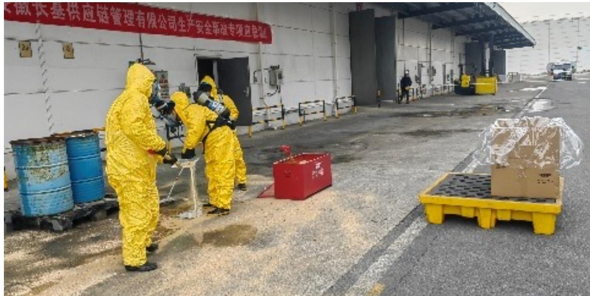

text_image

安徽长基供应链管理有限公司生产安全事故专项应急证

应急演练现场

## 指标和目标

公司为确保各项经营活动符合国家及地方法规要求，制定了“全面合规与风险防控”的环境管理目标，即通过健全环境管理制度、强化运营全过程环境风险识别与控制、完善突发环境事件应急机制，持续提升环境绩效，推动企业绿色可持续发展。

## 社会篇

上海雅仕在2025年持续深化社会责任管理，围绕员工权益、供应链优化、技术创新、数据安全及产品服务等重点领域展开实践。公司严格遵循劳动法规，保障员工平等雇佣与职业发展，营造安全健康的工作环境。供应链管理注重合规透明与风险防控，推动协同高效运营。在创新方面，公司加大技术研发投入，推进数字化转型。同时，强化数据安全与客户隐私保护，确保服务质量。此外，公司积极履行社会责任，树立良好企业形象为可持续发展贡献力量。

## 可持续发展目标

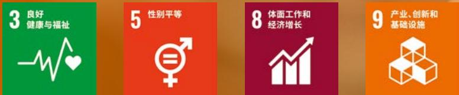

## 员工管理

上海雅什严格遵守国家劳动法规，构建全方位员工保障体系。公司坚持平等雇佣，杜绝歧视，通过优化工时与带薪休假帮助员工劳逸结合。在薪酬福利上落实同工同酬，并提供全面的社会保险。公司注重员工成长，通过系统培训与绩效改进助力职业发展，同时组织活动增强团队凝聚力。在安全方面，公司健全安全生产与职业病防治体系，开展培训演练与隐患排查为员工营造健康、安全、公平的工作氛围。

## 员工雇佣与权益

上海雅什严格遵守《中华人民共和国劳动法》《中华人民共和国劳动合同法》等法律法规要求，制定《员工招聘管理办法》等员工管理制度，依法与员工签订劳动合同，规范用工管理，全力保障员工平等就业权、休息休假权、薪酬福利权、职业技能培训权、劳动安全保护权等多种权利，坚决维护员工合法劳动权益，致力于为员工创造公平、和谐、安全的工作环境。

公司不断优化工时制度，结合行业特点，制定标准工时制不定时工时制和综合工时制，为员工打造更加灵活目规范的工作与休假时间安排，并保障员工在国家法定节假日、工伤假、婚假、产假、育儿假、陪产假等假期享受带薪休假权益，支持员工更好地平衡工作和生活。

公司通过定期《员工考核表》和实施《员工晋升机制》等透明管理措施，积极践行多元平等的职场文化，在招聘录用、薪酬福利职业发展晋升等关键问题中，排除种族、民族、国籍、性别、年龄、宗教等因素影响，坚持同工同酬，公平对待所有员工。同时，公司建立劳动用工监督检查制度，不定期对劳动用工管理情况进行抽查，坚决禁止使用童工和强迫劳动。

公司明确禁止任何形式的歧视、骚扰和虐待行为，确保员工在录用、工作安排、培训、晋升等方面受到公平对待。公司设有投诉渠道，员工可通过多种方式举报歧视、骚扰和虐待行为，公司将对投诉进行保密调查，并对违规者进行纪律处分。

公司持续创造就业机会，以尊重差异、鼓励多元、男女平等的原则公开透明地开展招聘工作。员工多元化管理如下：

<table><tr><td>分类</td><td>指标</td><td>单位</td><td>2024</td><td>2025</td></tr><tr><td rowspan="8">员工多元化</td><td>员工总数</td><td>人</td><td>543</td><td>481</td></tr><tr><td> $员工变动比例^1$ </td><td>%</td><td>12</td><td>11.42</td></tr><tr><td>女性</td><td>%</td><td>33</td><td>40</td></tr><tr><td>男性</td><td>%</td><td>67</td><td>60</td></tr><tr><td>30周岁及以下</td><td>%</td><td>28</td><td>23</td></tr><tr><td>31-39周岁</td><td>%</td><td>34</td><td>38</td></tr><tr><td>40-49周岁</td><td>%</td><td>27</td><td>29</td></tr><tr><td>50周岁及以上</td><td>%</td><td>11</td><td>10</td></tr></table>

1.员工变动比例=(期初人数-期末人数)/期初人数

## 员工培训与发展

公司为新员工提供入职培训包括企业文化、管理制度、业务培训及三级安全教育培训。员工需通过考核后方可正式上岗公司还为员工提供付费培训项目，员工需签订培训协议，约定服务期和违约责任。公司注重员工的绩效管理和人才发展设有绩效改进流程，帮助未达到预期绩效的员工进行改进。公司还提供轮岗、辅导、在职学习等多种发展途径，帮助员工提升专业技能和管理能力。

## 案例：湖北雅仕开展煤炭业务专题培训

2025年11月，湖北雅什为提升员丁的煤炭业务知识和业务实操能力，组织开展煤炭业务专题培训，夯实员工专业基础、强化实操水平，助力员工精准把握行业动态与市场趋势。

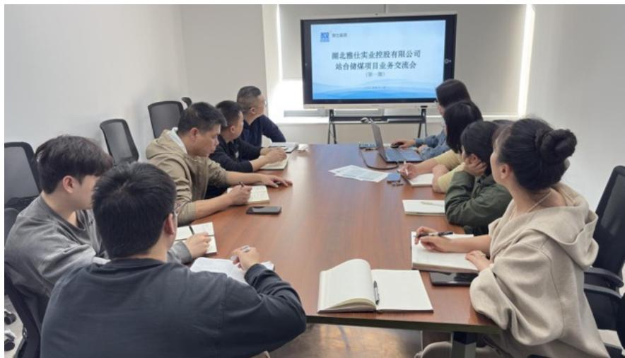

text_image

湖北雅仕实业控股有限公司
站台储煤项目业务交流会
（第一版）

煤炭业务专题培训现场

## 案例：亚欧公司开展《财务流程规范及法律风险防范》专题培训

2025年12月亚欧公司开展了《财务流程规范及法律风险防范》专题培训，共15人参加。本次培训旨在规范公司财务操作流程，提升员工的合规操作能力与风险防范意识。通过培训员工系统掌握了财务作业的规范流程，学习了相关表单的填写要点；在法律风险防范方面，重点讲解了合同管理中的法律风险知识，有效增强了参训人员的风险识别能力，对业务人员具有较强的实践指导意义。

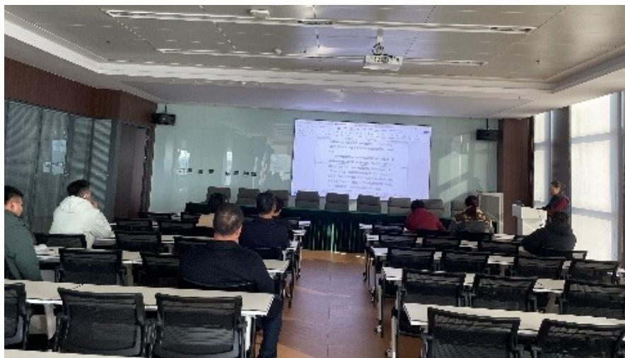

text_image

Classroom scene with attendees seated at desks facing a presentation screen displaying Chinese text and diagrams

《财务流程规范及法律风险防范》专题培训现场

## 员工活动与福利

公司组织员工活动，旨在增强团队凝聚力，促进跨部门沟通与协作。通过轻松愉快的集体互动，能有效缓解员工工作压力。这不仅体现了公司的人文关怀，更能激发员工的归属感与工作热情，从而提升整体团队士气，为企业的稳健发展注入动力。

## 案例：三八妇女节赏梅踏青活动

公司组织女性员工于三八妇女节开展赏梅踏青活动，体现了公司对女性员工的深切关怀与尊重，营造了积极向上、和谐温馨的企业文化氛围，进一步增强了员工的获得感与归属感。

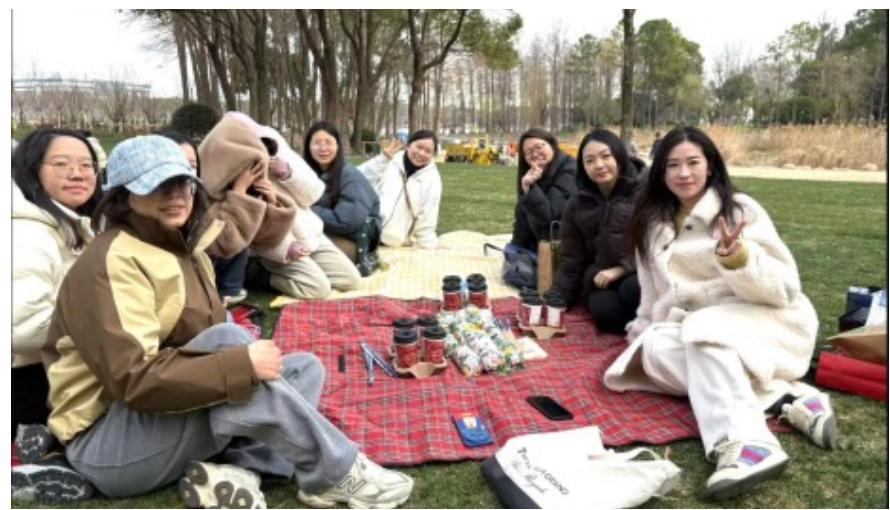

natural_image

Group of people sitting on a red-and-white striped table outdoors in a park, surrounded by trees and scattered items (no visible text or symbols)

妇女节踏青活动

公司为员工提供全面的社会保险和住房公积全，确保员工享有法律法规规定的福利待遇，员工在病假，产假，婚假等各类假期中，享有相应的工资待遇和福利保障。例如，女员工生育享受98天产假，难产或多胞胎生育还可延长产假。公司实行密薪制管理，确保员工薪资信息的保密性，任何泄露薪资信息的行为将受到严厉处罚，甚至导致解除劳动合同。

## 案例：云南雅仕为女性员工发放生育津贴

云南雅仕某位女性员工于2025年12月至2026年5月休产假，依据相关法律法规给予其准假，并在其生产后完成了生育津贴的核销及生育福利发放。

员工福利领取表  
制表部门：综合部

<table><tr><td>序号</td><td>日期</td><td>事由</td><td>金额</td><td>领用人</td></tr><tr><td>1</td><td>2026年1月10日</td><td>云南雅仕市场开发部生育福利</td><td>993.08</td><td></td></tr></table>

## 员工健康与安全

公司严格遵守《中华人民共和国安全生产法》《中华人民共和国职业病防治法》等法律法规，制定《安全生产管理制度》及17项具体管理办法，成立由公司董事长和高管直接领导的安全生产工作领导小组，实行安全生产岗位责任制度，重视保护员工劳动安全权和职业卫生保护权全面提升安全生产管理水平和职业病防治水平，有效落实员工职业健康管理工作。公司旗下子公司安徽长基获得ISO45001职业健康安全管理体系认证。

员工福利领取表  
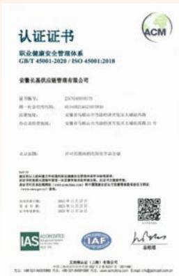

text_image

认证证书
职业健康安全管理体系
GB/T 45001-2020 / ISO 45001:2018
安徽长基供应链管理有限公司
证书编号：ZXC7049391373
统一社会信用代码：9141082226227393D
注册地址：安徽省马鞍山市金岭路2号新安区天城西路西侧
办公处咨询电话：安徽省马鞍山市金岭路2号新安区天城西路33号
认证范围：许可范围内的发明专利申请
IP地址：安徽省合肥市蜀山区西溪街道办事处东侧东侧东侧东侧东侧东侧东侧东侧东侧东侧东侧东侧东侧东侧东侧东侧东侧东侧东侧东侧东侧东侧东侧东侧东侧东侧东侧东侧东侧东侧东侧东侧东侧东侧东侧东侧东侧东侧东侧东侧东侧东侧东侧东侧东侧东侧东侧东侧东侧东侧东
授权日期：2022年11月27日
有效期限：2022年11月27日至2022年11月27日
ISSNCCNATED
ICBC
IAF
上海地区证（上海）有限公司
地址：上海市黄浦区四川路68号1幢1层
电话：021-585188888 传真：021-585188888 电子邮箱：licai@jiaofund.com.cn
ACM
www.jiaofund.com.cn

安徽长基ISO45001职业健康管理体系认证

公司严格要求员工遵守安全生产规章制度，正确使用设备设施，佩戴个人防护用品。安徽长基还设有安全生产奖，鼓励员工在安全生产中的积极性和主动性，杜绝违章行为，预防安全事故的发生。

## 2025 年

公司组织了

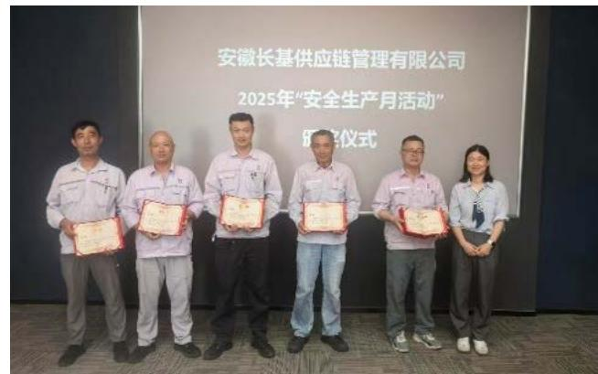

text_image

安徽长基供应链管理有限公司
2025年“安全生产月活动”
仪式

安全生产奖项颁发现场

## 案例：江苏泰和开展安全生产知识竞赛

公司旗下子公司江苏泰和为强化安全意识，普及安全知识，营造良好安全文化氛围，筑牢公司安全防线，保障生产经营稳定运行，开展安全生产知识竞赛。

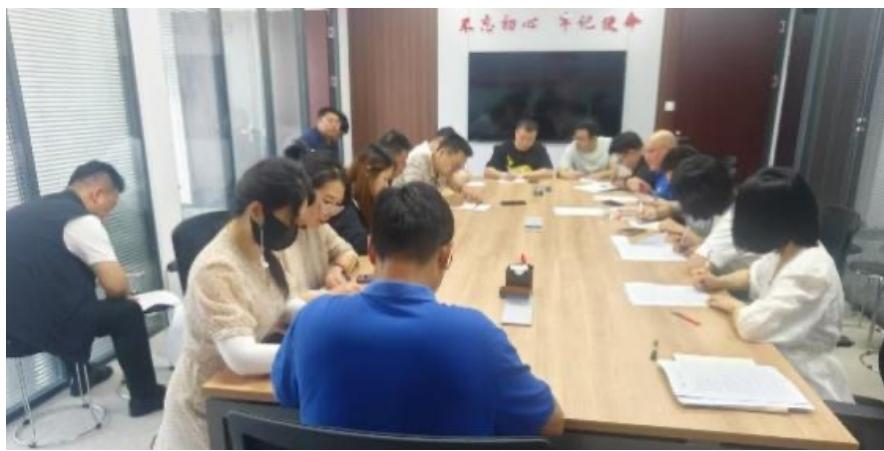

text_image

不忘初心 牢记使命

安全生产知识竞赛答题现场

员工需参加消防应急演习，熟悉消防设施的使用方法，如灭火器、报警器、疏散路线等。公司还制定了详细的消防安全措施确保员工在火灾等紧急情况下安全撤离。

## 案例：公司开展消防应急演练

公司开展消防应急演练，让员工亲身体验灭火和逃生流程，切实掌握火灾逃生技能，增强了全员的消防安全意识与自救互救能力，检验了公司消防预案的可行性，为防范火灾风险、保障员工生命与公司财产安全筑牢防线，营造安全、稳定的生产环境。

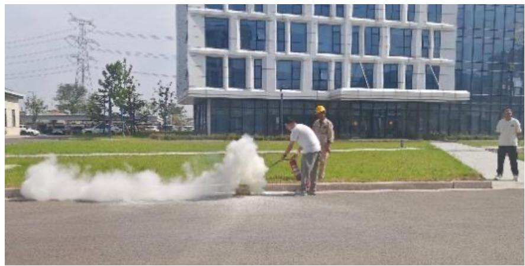

natural_image

Exterior view of a modern office building with workers cleaning a wet pavement, no visible text or signage

消防应急演练现场

根据《职业病防治法》，公司在与劳动者订立劳动合同时尽职告知工作过程中可能产生的职业病危害及其后果、职业病防护措施和待遇等内容，包括但不限于所在工作岗位、可能产生的职业病危害、后果及职业病防护措施。

## 案例：高温作业中暑防护保障

公司通过配备清凉药品、建设降温设施、避开高温时段作业的作息表、定期体检等防护措施，保障员工在高温作业下的健康与安全，有效降低了员工中暑的风险，为生产经营的稳定有序提供了保障

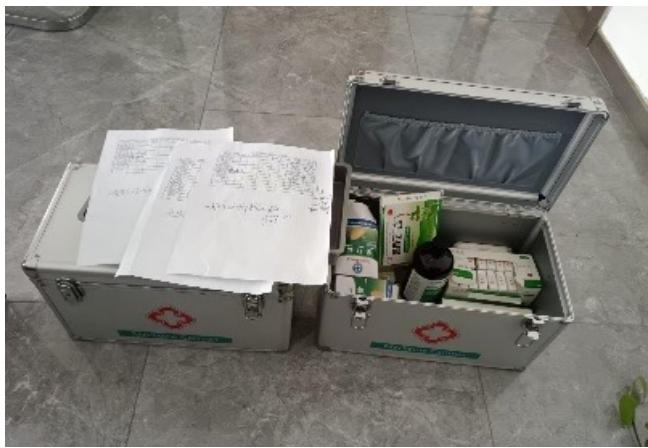

text_image

Photo of two open metal equipment boxes with visible safety markings and handwritten notes on the lid, placed on tiled floor.

防暑药品发放

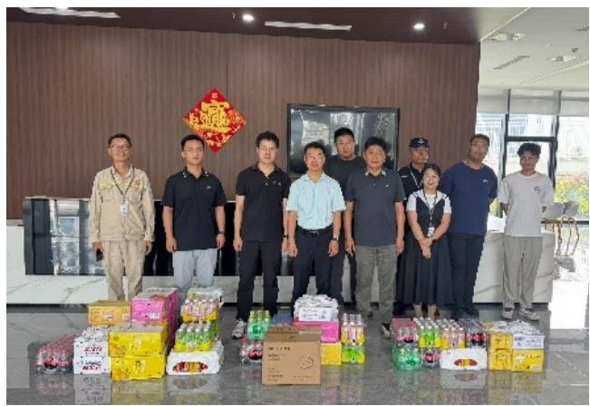

natural_image

Group photo of people standing in a modern office with colorful packaged goods on display (no visible text or symbols)

清凉物资发放

公司通过不断完善《职业卫生管理制度》以及《职业卫生操作规程》等指南，规范运营部在作业过程中对职业危害因素的控制和职业病的预防，防止和减少职业病的发生，贯彻“预防为主，防治结合”的方针，防止各种职业危害因素对人体产生的危害，改善操作人员作业环境和劳动条件，保护职工身体健康，提高劳动生产率，减少职业危害事故的发生。

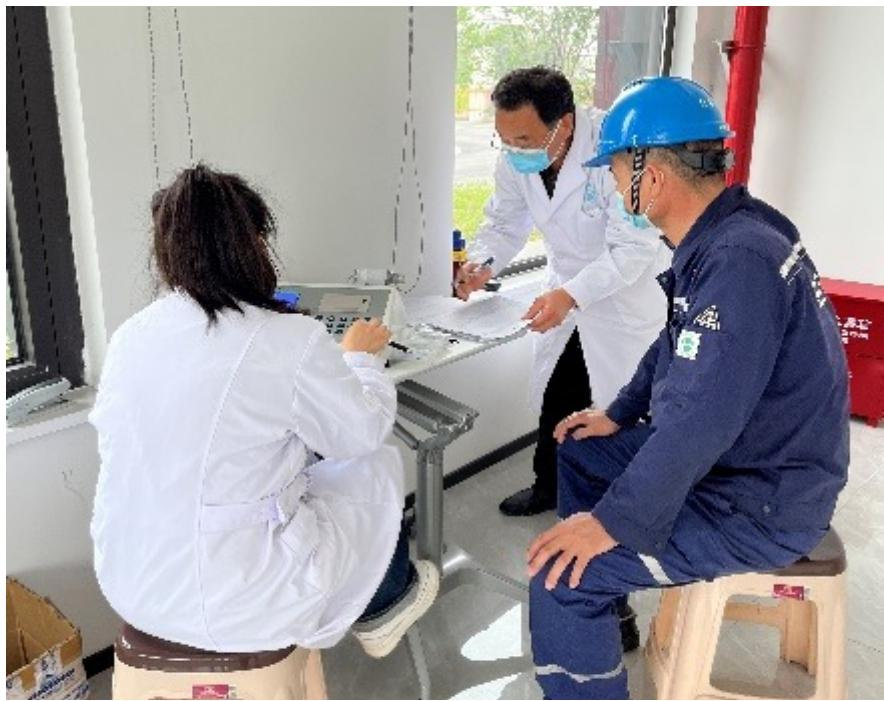

natural_image

Medical staff in white coats and blue hard hats reviewing documents at a service counter, with two individuals seated nearby (no visible text or symbols)

员工接受定期体检

<table><tr><td>健康安全培训项目</td><td>单位</td><td>2024</td><td>2025</td></tr><tr><td>安全生产责任险的投入金额</td><td>万元</td><td>22.12</td><td>19.73</td></tr><tr><td>安全生产责任险的人员覆盖率</td><td>%</td><td>74</td><td>100</td></tr><tr><td>工伤保险的投入金额</td><td>万元</td><td>40.88</td><td>33.02</td></tr><tr><td>工伤保险的人员覆盖率</td><td>%</td><td>100</td><td>100</td></tr></table>

生产安全投入

公司构建责任明确，层次清晰的安全生产责任体系，建立健全《安全评价和重大危险因素管理办法》，在生产开始前，生产过程中、建设项目竣工、试生产运行后分别开展安全预评价、验收评价、现状综合评价和专项评价，对生产场所及周达环境中的危险因素按照四级风险级别进行识别、分析和评估，并形成安全评价报告，保证安全生产始终处于受控状态。

公司重视强化安全生产主休责任，建立《生产安全事故隐患排查治理管理办法》和《安全生产检查管理办法》，实行事故隐患分级监控治理，定期组织事故隐患排查，常态化开展包括日常检查、专项检查、综合检查在内的安全检查，形成《一般/重大隐患登记表》及《安全生产检查登记表》，下发《隐患整改通知书》，定期对排查整改情况进行统计分析，及时发现和消除事故隐患，坚持闭合管理，持续改进，保障员工生命安全。

## 供应链管理

上海雅仕严格遵守《中华人民共和国招投标法》等法律法规，制定并完善《供应商关系管理办法》，持续优化内部供应链管理，以高效、透明的采购流程促进与供应商间的紧密合作。公司致力于构建全面高效的供应链管理体系，通过强化供应商集中管理、供应商分类管理、供应商绩效评估、供应链协同管理、数字化采购等措施，实现科学灵活的供应链管理，提升供应链稳定性，为公司稳健发展奠定基础。

## 2025 年

9,878 家

包含新晋供应商

381 家

9,465 家

413 家

公司通过现行《供应商安全管理制度》以及用于定期上报集团风控合规部审核的《风控评审会项目汇总》，做好供应链区险管理及审核记录，提供包括但不限于以下规范内容：

## 供应商安全管理与培训

●负责供应商入场前的安全告知和培训，确保供应商了解并遵守公司的安全要求。这一措施有助于减少工作场所事故，提升供应链的安全管理水平。

## 供应商资质预审与准入

●在雅仕EAS系统上提交供应商准入等级评定申报，要求供应商提供有效的资质证明材料，如营业执照、开户许可、经营许可等。这一流程确保了供应商的合法性和合规性，降低了供应链中的法律和财务风险。

## 供应商评价与续用机制

●每年对供应商进行一次评价，筛选《合格供应商名录》中的合格供应商，并根据评价等级（优秀、合格、不合格)决定是否续用。对于不合格的供应商，停止其供货资格。这一机制确保了供应链的持续改进和质量控制。

## 合同管理与纠纷解决

●合同中约定解决纠纷的条款，优先选择仲裁条款，并尽量选择在我方所在地的仲裁机构进行仲裁。这一措施有助于减少法律纠纷，提升合同管理的透明度和公正性。

## 供应商档案管理

●负责合同档案的管理，确保合同档案包含合同文书正本、对方资质文件复印件、往来法律函件等必备法律文件。这一流程确保了合同管理的规范性和可追溯性。

公司发布《关于供应链贸易业务风控要求调整的通知》，针对供应链贸易业务风险防控进行系统性升级。公司按合作方性质(国有企业、民营企业、多元化经营企业、外资/海外企业）分类设定差异化资金限额与准入规则，明确资金增减额管理要求，强化月度对账与抽查机制，同时确立“新业务以本通知为准、存量业务按原评审纪要执行”的过渡规则。本次风控调整是公司应对复杂多变经济形势、强化风险前置管理的关键举措。通过分类分级管控与资金额度管理，公司优化资源配置效率，提升业务合规性，为供应链贸易业务可持续发展筑牢风险屏障，保障公司资产安全与经营稳定。

## 创新驱动

上海雅什在供应链管理领域的创新驱动发展取得了显著成果，拥有超过10项计算机软件著作权，涵盖机械设备智能化管理仓储服务、信息管理、危险化学品管控等多个领域。这些软件著作权的注册不仅体现了公司在技术创新方面的持续投入。也为供应链管理的智能化、高效化和安全性提供了强有力的技术支持。通过不断与外部专家合作，联手包括浙江理工大学在内的专业技术研发团队，不断驱动新型物流和智能供应链创新发展

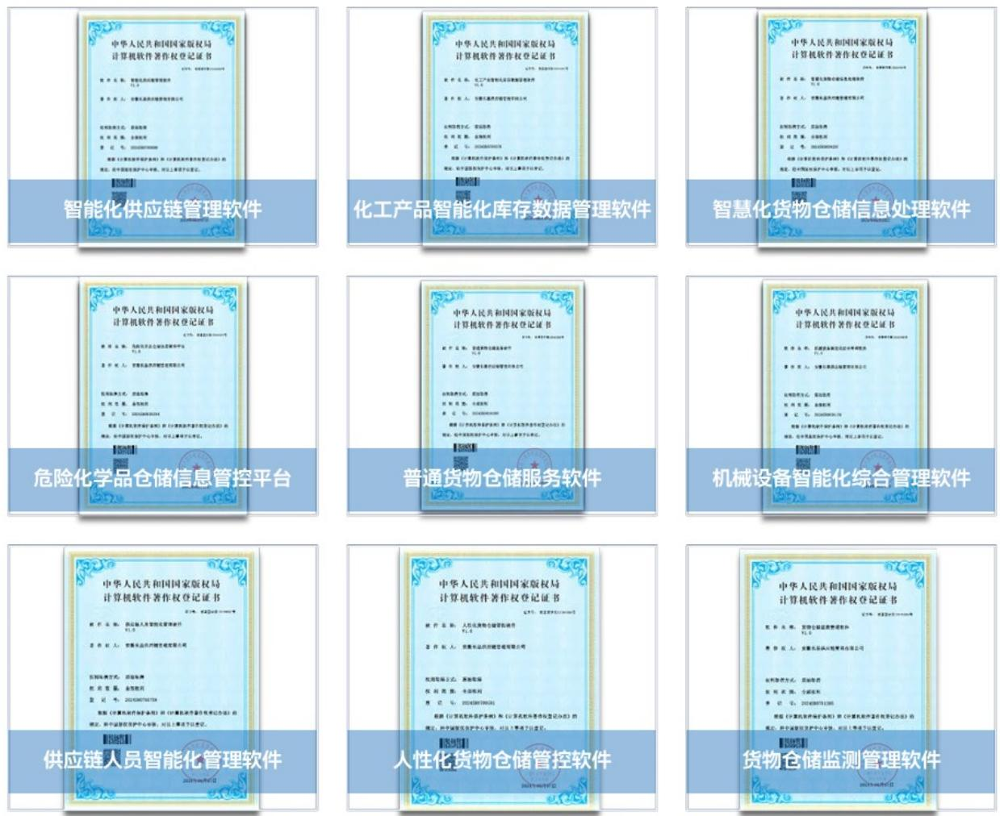

软件著作权的注册和应用不仅提升了公司在供应链管理领域的技术水平，也为客户提供了更加高效、安全和智能的服务。未来，公司将继续加大在技术创新方面的投入，推动供应链管理的数字化转型和智能化升级，为客户创造更大的价值

## 数据安全与客户隐私保护

为有效管理公司IT资产，提高运维效率并降低成本，上海雅什邀请专业的服务提供商维护T资产。为确保维护过程规范、高效安全，以支持企业业务的持续稳定运行，公司发布《IT资产维护管理程序》，确保各项操作达到高效、安全和标准化的要求，切实保障数据安全与客户隐私。

<table><tr><td>综合管理部门</td><td>·负责协助IT资产维护外包服务商对公司整体IT建设、实施及技术支持,包括但不限于办公系统、网络、文件加密、桌面端管控、数据备份、各类业务系统、服务器等;·负责协助IT资产维护外包服务商对公司员工提供日常IT操作咨询,远程解决问题;·负责协助IT资产维护外包服务商排除各类软硬件、网络及通讯故障并进行数据备份;·负责协助IT资产维护外包服务商定期评估IT应用系统存在的问题和安全风险,提高IT系统可用性和安全性;·负责协助IT资产维护外包服务商完善办公等信息化系统的流程建设和上线工作;·负责《IT资产维护管理程序》的制定、修改和废除的申请。</td></tr><tr><td>各部门</td><td>·配合综合管理部协助IT资产维护外包服务商开展公司整体IT建设、实施及技术支持;·负责本部门IT资产管理工作;·负责指导、监督IT资产维护外包服务商开发与管理。</td></tr><tr><td>监督与质量控制</td><td>·日常监督:由IT专员对外包服务商的日常维护工作进行定期检查和随机抽查。·质量评估:综合管理部通过定期收集并分析服务数据,如故障解决时间、员工满意度调查结果等,对外包服务商的服务质量进行评估。·问题整改:针对发现的问题和不足,综合管理部及时与外包服务商沟通并督促其整改。</td></tr><tr><td>绩效评估与反馈</td><td>·绩效评估:综合管理部根据合同约定和SLA要求,定期对外包服务商进行绩效评估,评估内容包括服务质量、效率、成本等多个维度。·反馈与沟通:综合管理部将绩效评估结果及时反馈给外包服务商,并与其进行充分沟通,共同探讨改进措施和未来发展计划。·激励与调整:综合管理部根据绩效评估结果,对外包服务商进行激励或调整合作策略,以持续优化IT资产维护服务质量和效率。</td></tr><tr><td>风险管理与应对</td><td>·风险评估:综合管理部定期对企业IT资产维护外包过程中可能遇到的风险进行识别和评估,如数据安全风险、服务商违约风险等。·制定应对措施:综合管理部针对评估出的风险制定相应的应对措施和预案,如加强数据安全管理、设置违约赔偿条款等。·动态调整:综合管理部根据市场变化和企业发展需求适时调整风险管理策略和应对措施,确保外包管理活动持续有效和安全。</td></tr></table>

IT 资产管理框架

## 产品和服务安全与质量

上海雅什通过标准化作业流程保障质量安全，依托数据监控强化风险预防：借助智能化管理提升化学品存储及运输的安全性并持续优化在库管理以满足合规要求

公司旗下子公司亚欧公司已通过|SO9001质量管理认证，并建立内部沟通机制，明确了各级管理人员的职责和权限，确保信息的有效传递和反馈，有助于提升公司的运营效率和风险管理能力

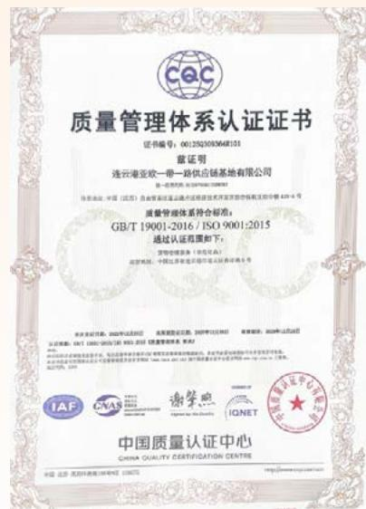

text_image

质量管理体系认证证书
证书编号：00129202030648101
资质证明
连云港亚欧一带一路供应链基地有限公司
第一地质代码：S375P012000002
注册地址：中国（江苏）自由贸易试验区连云港经济技术开发区南环路东侧3号楼410-4号
质量管理体系符合标准：
GB/T 19001-2016 / ISO 9001:2015
通过认证范围如下：
货物仓储单（单位号/天）
批准机关：中国江苏省连云港市海天区海天桥路东侧5号
本次发证日期：2022年12月28日
业务资格证书有效期：2022年12月28日
认证机构：JIAF JINGHAI CHINA CO.,LTD. 供应商管理人：张志军
IAF CNAS 谢学熙 IQNET 中国质量认证中心
中国质量认证中心
CHINA QUALITY CERTIFICATION CENTRE

亚欧公司ISO9001 质量体系认证

公司定期进行管理评审，评估质量管理体系的有效性，并根据评审结果持续改进。这种持续改进的机制表明公司在治理方面具有自我完善的能力。每年度通过《管理评审控制程序》评估体系有效性，输入包括顾客反馈，过程绩效等，输出包括改进措施，如“资源需求优化”或“顾客服务流程调整”。综合管理部每季度汇总分析顾客满意度、供方绩效等数据，并通过《纠正措施控制程序》和《预防措施控制程序》闭环管理风险。

natural_image

Close-up of hands holding a tablet displaying a digital globe with interconnected user icons (no text or symbols visible)

## 治理篇

上海雅仕持续夯实治理基础，坚持依法合规运营。公司构建了由股东会、董事会及管理层组成的科学治理架构，并通过下设专门委员会实现专业化分工与有效制衡。在风险管控方面，公司建立健全风险管理政策与内控流程，围绕主营业务强化风险识别与评估，严格落实“四流一致”要求，规范合同管理。公司将尽职调查纳入管理体系，有效防范供应链风险。在商业道德领域公司秉持廉洁经营理念，对腐败、洗钱等行为零容忍建立严格的内控机制与举报渠道，保障企业规范运作与可持续发展。

## 可持续发展目标

16 和天、正与

## 公司治理

上海雅什始终坚持依法合规运作，构建了由股东会、董事会及管理层组成的科学治理体系。公司董事会负责高效决策，确保经营行为规范透明。公司组织架构通过下设审计、提名、战略、薪酬与考核等专门委员会，在财务风控、人才选拔、战略发展及激励考核等关键领域实现专业化分工与制衡，为公司的稳健经营与长远发展提供了坚实的制度保障。

## 治理架构

公司结合外部环境变化和公司自身经营情况，不断优化公司治理结构，强化内部控制和风险管理，筑牢依法合规底线，维护全体投资者合法权益，持续提升治理效能，为公司的长远发展提供了有力保障。

公司严格按照《中华人民共和国公司法》等法律法规和相关规范性文件要求，建立起以股东会为最高审批机构、董事会为决策机构、管理层为执行机构的公司治理结构，保障公司科学决策、高效治理。

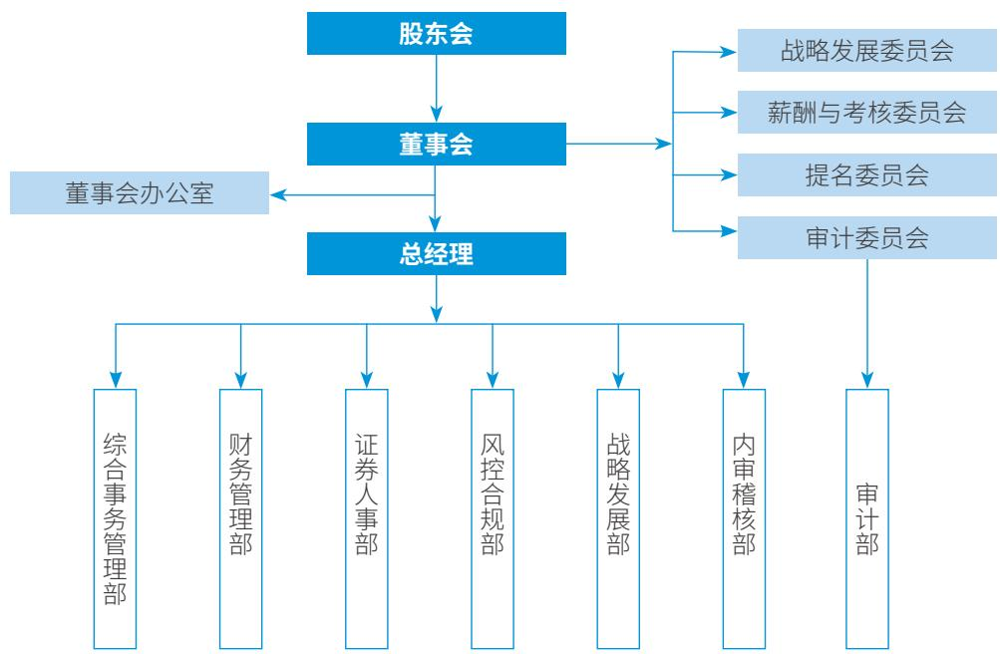

flowchart

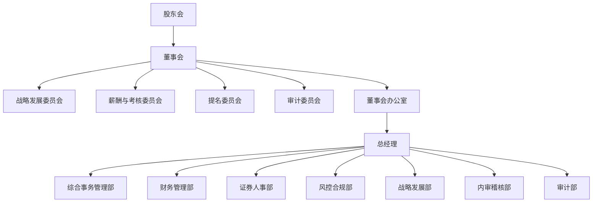

公司治理架构

## 2025 年

<table><tr><td>公司董事会成员人数</td><td>按性别包含男性董事</td><td>女性董事</td><td>按类型包含独立董事</td><td>非独立董事</td></tr><tr><td>9人</td><td>8位</td><td>1人</td><td>3人</td><td>6人</td></tr></table>

<table><tr><td>姓名</td><td>性别</td><td>职务</td><td>年龄</td><td>行业经验</td></tr><tr><td>刘忠义</td><td>男</td><td>董事长</td><td>57</td><td>管理</td></tr><tr><td>孙望平</td><td>男</td><td>副董事长</td><td>60</td><td>管理</td></tr><tr><td>李威</td><td>男</td><td>董事</td><td>49</td><td>经济</td></tr><tr><td>邱玉新</td><td>男</td><td>董事</td><td>46</td><td>财务</td></tr><tr><td>刘新峰</td><td>女</td><td>董事</td><td>44</td><td>财务</td></tr><tr><td>王明玮</td><td>男</td><td>董事</td><td>53</td><td>管理</td></tr><tr><td>向德伟</td><td>男</td><td>独立董事</td><td>63</td><td>财务</td></tr><tr><td>代军勋</td><td>男</td><td>独立董事</td><td>49</td><td>金融</td></tr><tr><td>伍华军</td><td>男</td><td>独立董事</td><td>52</td><td>法律</td></tr></table>

董事会组成

## 董事会及专门委员会构成及权职

## 董事会

●负责公司日常运营和重大决策，执行股东会决议，制定财务、投资、管理方案，并监督高级管理人员。

## 审计委员会

●负责监督公司财务报告的准确性和内部控制，管理会计师事务所的聘用，确保会计政策的合规性，并处理重大会计变更。

## 提名委员会

●负责评估和推荐董事会及高级管理人员的合适人选，制定选拔标准，并审查候选人资格。

## 战略发展委员会

●研究并提出公司长期发展战略、重大投资及资本运作建议，并对实施情况进行跟踪检查

## 薪酬与考核委员会

●制定董事及高级管理人员的薪酬政策、考核标准，并提出股权激励计划等相关建议。

关键绩效

<table><tr><td>指标</td><td>单位</td><td>次数</td></tr><tr><td colspan="3">内部治理沟通</td></tr><tr><td>董事会</td><td>次</td><td>8</td></tr><tr><td>审计委员会</td><td>次</td><td>9</td></tr><tr><td>薪酬与考核委员会</td><td>次</td><td>1</td></tr><tr><td>提名委员会</td><td>次</td><td>2</td></tr><tr><td>战略发展委员会</td><td>次</td><td>0</td></tr><tr><td colspan="3">投资者沟通</td></tr><tr><td>股东会</td><td>次</td><td>4</td></tr><tr><td>投资者电话沟通</td><td>次</td><td>150+</td></tr><tr><td>邮件交流</td><td>次</td><td>25</td></tr><tr><td>业绩说明会</td><td>次</td><td>3</td></tr><tr><td>回复“e互动”</td><td>次-</td><td>15</td></tr><tr><td>投资者回复率</td><td>%</td><td>100</td></tr></table>

## 信息披露

公司严格按照有关法律法规及公司《信息披露管理制度》的要求，做好信息披露前的保密工作，积极履行信息披露义务，主动加强与监管部门的沟通与联系，认真完成各项定期报告和临时公告的披露工作，真实、准确、完整、及时地披露有关信息，确保所有股东公平、及时地获取公司应披露的信息。

## 2025年

公司披露报告数量达到

171

## 风险管控

公司持续推进风险管理工作，已成立风险控制评审会委员会并制定风险管理政策以辨别和分析公司所面临的风险，设定适当的风险可接受水平并设计相应的内部控制程序。公司定期审阅风险管理政策及有关内部控制系统，以适应市场情况或公司经营活动的调整。公司内部审计部门也定期或随机检查内部控制系统的执行是否符合风险管理政策

公司针对主营业务流程从风险识别与评估、风险预防与危机管理、风险文化建设、风控评审会项目质量考评等维度开展区险管理体系建设

为贯彻落实国有企业业务风控管理有关规定，进一步规范企业经营行为，防范化解各类经营风险，落实《上海雅什投资发展股份有限公司供应链业务风控要点（试行）》中“四流一致”的相关工作要求，公司党委成立公司风控评审会委员会。

四流一致把业务线索理清，即把货物流、资金流、合同流、发票流理清理顺。

## 风控评审人员组成

雅仕本部

事业一部

事业二部

事业三部

一带一路

安徽长基

新疆板块

湖北雅仕

6 人

6 人

6 人

6 人

6 人

6 人

7 人

6 人

公司党委审议并通过了《上海雅什投资发展股份有限公司合同管理办法（试行）》，严格遵守《中华人民共和国民法典）及有关法律、法规的规定，依法设定合同审查审批流程及要求，以加强公司合同管理相关治理，控制法律风险，授权风控合规部依职权对合同履行情况进行监督检查。根据《上海雅什投资发展股份有限公司合同管理办法（试行）》的要求，子公司应于每年度末向公司书面报告其合同管理工作开展情况。公司将不定期对子公司合同管理工作开展督办检查，并将子公司合同管理工作情况纳入综合考核体系，以合理控制合同相关管理风险。

## 业务子公司

## 风控评审会

## 业务子公司内部决策

业务风险防控流程

## 尽职调查

在《上海雅什投资发展股份有限公司供应链业务风控要点（试行）》等政策的指导下，上海雅什已将尽职调查纳入企业政策和风险管理体系，并通过尽职调查机制识别与评估实际或潜在的不利影响和风险，在必要的情况下，对已识别的实际或潜在不利影响进行优先级排序及权限管理，防范和减轻潜在不利影响，并建立了通知机制，由风险控制评审会委员会每周举行风控评审会进行汇报评审，特殊情况随时召开。

公司通过调研合作企业基本情况，包括但不限于合作企业的基本信息、股权穿透、财务情况、经营风险、法定代表人情况、司法情况（当前有无失信、限高、终本、被执行案件等)，综合实地尽调结果，对合作企业运营现场、管理流程、员工状况等情况进行尽职调查评估，确保利益相关方对合作企业有更全面和清晰的了解，有效预防供应链风险。

## 案例：公司煤炭供应链项目尽职调查

公司事业二部围绕集港库存煤炭供应链项目，对上游贸易商及下游终端用户的资质、股权、财务、司法及实地经营情况进行了全面核查，明确了业务模式、付款节点、风险控制措施及申请额度。通过此次尽职调查，公司全面评估合作方的资信水平，核实业务的真实性与合规性，预判资金、货权等潜在风险，并制定相应风控措施，为授信决策提供客观依据，确保供应链业务安全可控。

## 反商业贿赂及反贪污

上海雅什始终将廉洁和反贪污腐败视为企业发展的重要基石，秉持廉洁经营的理念，遵守《中华人民共和国反不正当竞争法》等商业道德相关法律规范，制定《反舞弊管理制度》，建立严格的反对商业贿赂，反腐败，推动廉洁从业方面的相关制度流程加强对财务、采购、销售等关键环节的监督和管理，有效防止腐败行为的发生。

公司生产经营活动遵循自愿、平等、公平、诚信的原则，对贪污腐败、勒索、欺诈、洗钱、垄断等不道德的商业行为采取“零容忍”态度，促进公平竞争的营商环境，着力维护市场竞争秩序。

公司通过定期的内控自评价和外部审计，确立《内部控制缺陷认定标准》，梳理内控架构，识别并强化关键环节，确保控制流程和措施的有效性，组织风控评审会议，并形成《2025年度内部控制评价报告》，为公司的高质量稳健发展提供了坚实保障。在报告期内，公司未发现任何财务或非财务报告的内部控制重大缺陷。

## 反腐败政策与措施

●严格遵守法律法规：公司严格遵守全球范围内的反贿赂和反腐败法律法规，禁止任何形式的非法或不正当付款。公司明确禁止员工、供应商、代理商和业务伙伴在业务往来中涉及贿赂行为。  
●禁止不当付款：公司禁止向客户、供应商、政府官员或机构、政党或候选人等任何实体或个人支付、承诺支付或提供非法不正当或存在问题的付款。任何此类行为都将受到纪律处分。  
●内部控制与审计：公司制定了严格的反腐败政策和内部控制措施，确保所有交易公开透明，并符合法律法规要求。公司定期进行内部审计，确保财务记录的准确性和合规性。  
●第三方管理：公司要求供应商、代理商、经销商和业务伙伴遵守反腐败政策，禁止其代表公司提供或接受贿赂。公司对第三方进行尽职调查，并密切监控其付款和开支，确保合规

## 反洗钱政策与措施

●防止洗钱与恐怖融资：公司致力于防止、发现和报告洗钱及恐怖分子融资活动。公司要求全体员工尽职尽责，确保公司的产品或服务不被用于洗钱活动  
●可疑活动报告：如果员工发现任何可疑的洗钱活动，必须立即报告给主管或上级经理。公司设立了匿名举报渠道，鼓励员工举报任何可疑行为。  
●合规培训：公司为员工提供反洗钱培训，确保他们了解相关法律法规和公司政策，并能够在日常工作中识别和防范洗钱风险。

## 举报机制与禁止报复

●匿名举报渠道：公司设立了道德专线，员工可以通过该渠道匿名举报任何违反反腐败或反洗钱政策的行为。  
●禁止报复：公司承诺不对善意举报的员工进行任何形式的报复，确保举报人的权益得到保护。任何报复行为都将受到纪律处分。  
●纪律处分：对于违反反腐败或反洗钱政策的行为，公司将采取适当的纪律处分，包括通报批评、记过或解除劳动合同。情节严重的，公司将配合相关部门进行调查，并追究法律责任。

公司通过《商业道德规范与行为标准》在道德、法律和政策方面提供详细的行为指导，强调和强化了道德规范和法律行为的关键方面。

## 工作场所安全与健康

公司致力于为员工提供安全健康的工作环境，遵守所有适用的工作场所健康与安全法律法规。公司为员工提供必要的安全培训，并严格禁止任何形式的暴力行为。

## 反歧视与反骚扰政策

公司明确禁止任何形式的歧视和骚扰行为，确保员工在工作场所中享有平等的权利和机会。公司通过定期培训和宣传，提升员工对反歧视和反骚扰政策的认知

## 利益冲突与企业商机

公司要求全体员工避免利益冲突，确保个人利益不影响公司决策的客观性和公正性。员工不得利用公司资源或信息谋取私利所有商机必须优先用于公司发展

## 财务记录完整性与透明度

公司严格遵守公认会计原则和内部会计控制制度，确保财务记录的准确性和透明度。所有会计事项必须准确记录，并有合理的单据支持。

## 档案与记录管理

公司对档案和记录进行严格管理，确保符合法律法规要求。员工发现可能涉及法律诉讼或政府调查的情况时，必须立即通知法律与商务部，确保相关记录得到妥善保存。

## 关键绩效表

环境信息披露数据统计

<table><tr><td>温室气体排放(吨二氧化碳当量)</td><td>2024年排放数据</td><td>2025年排放数据</td></tr><tr><td>范围一温室气体排放量</td><td>4,784.19</td><td>1,883.02</td></tr><tr><td>范围二温室气体排放量</td><td>4,487.38</td><td>4,137.37</td></tr><tr><td>温室气体排放总量(范围一+范围二)</td><td>9,271.58</td><td>6,020.39</td></tr></table>

<table><tr><td>能源种类</td><td>单位</td><td>2024年使用量</td><td>2025年使用量</td></tr><tr><td>柴油</td><td>升</td><td>879,588</td><td>364,938.82</td></tr><tr><td>天然气</td><td>立方米</td><td>531,098</td><td>218,326</td></tr><tr><td>R507A氟利昂(工业用途)</td><td>千克</td><td>300</td><td>100</td></tr><tr><td>外购电力</td><td>度(千瓦时)</td><td>3,330,106</td><td>1,824,360.80</td></tr><tr><td>可再生能源(太阳能光伏板)</td><td>度(千瓦时)</td><td>3,591</td><td>717,136</td></tr><tr><td>外购蒸汽</td><td>吨</td><td>9,175</td><td>10,731</td></tr></table>

<table><tr><td>资源种类</td><td>单位</td><td>2024年使用量</td><td>2025年使用量</td></tr><tr><td>自来水</td><td>吨</td><td>24,100</td><td>12,196</td></tr></table>

<table><tr><td>指标</td><td>种类</td><td>单位</td><td>2024年废弃物处理量</td><td>2025年废弃物处理量</td></tr><tr><td>危废处理量</td><td>包含废旧蓄电池、含有机溶剂废物、废润滑油、在线检测废液、废包装材料、沾油废物、清罐管渣液</td><td>吨</td><td>22</td><td>114.10</td></tr><tr><td>废弃物循环利用比例</td><td>废旧蓄电池</td><td>%</td><td>38</td><td>24.62</td></tr></table>

社会信息披露数据统计

<table><tr><td>分类</td><td>指标</td><td>单位</td><td>2024</td><td>2025</td></tr><tr><td rowspan="8">员工多元化</td><td>员工总数</td><td>人</td><td>543</td><td>481</td></tr><tr><td>员工变动比例</td><td>%</td><td>12</td><td>11.42</td></tr><tr><td>女性</td><td>%</td><td>33</td><td>40</td></tr><tr><td>男性</td><td>%</td><td>67</td><td>60</td></tr><tr><td>30周岁及以下</td><td>%</td><td>28</td><td>23</td></tr><tr><td>31-39周岁</td><td>%</td><td>34</td><td>38</td></tr><tr><td>40-49周岁</td><td>%</td><td>27</td><td>29</td></tr><tr><td>50周岁及以上</td><td>%</td><td>11</td><td>10</td></tr></table>

<table><tr><td>健康安全培训项目</td><td>单位</td><td>2024</td><td>2025</td></tr><tr><td>安全生产责任险的投入金额</td><td>万元</td><td>22.12</td><td>19.73</td></tr><tr><td>安全生产责任险的人员覆盖率</td><td>%</td><td>74</td><td>100</td></tr><tr><td>工伤保险的投入金额</td><td>万元</td><td>40.88</td><td>33.02</td></tr><tr><td>工伤保险的人员覆盖率</td><td>%</td><td>100</td><td>100</td></tr></table>

公司治理信息披露数据统计

<table><tr><td>分类</td><td>指标</td><td>单位</td><td>2024</td><td>2025</td></tr><tr><td rowspan="6">内部治理沟通</td><td>董事会</td><td>次</td><td>7</td><td>8</td></tr><tr><td>监事会</td><td>次</td><td>6</td><td>报告期内已取消监事会</td></tr><tr><td>审计委员会</td><td>次</td><td>8</td><td>9</td></tr><tr><td>薪酬与考核委员会</td><td>次</td><td>1</td><td>1</td></tr><tr><td>提名委员会</td><td>次</td><td>2</td><td>2</td></tr><tr><td>战略发展委员会</td><td>次</td><td>0</td><td>0</td></tr><tr><td rowspan="6">投资者沟通</td><td>股东会</td><td>次</td><td>5</td><td>4</td></tr><tr><td>投资者电话沟通</td><td>次</td><td>180+</td><td>150+</td></tr><tr><td>邮件交流</td><td>次</td><td>32</td><td>25</td></tr><tr><td>业绩说明会</td><td>次</td><td>3</td><td>3</td></tr><tr><td>回复“e互动”</td><td>次</td><td>44</td><td>15</td></tr><tr><td>投资者回复率</td><td>%-</td><td>100%</td><td>100</td></tr></table>

## 指标索引

《上海证券交易所上市公司自律监管指引第14号—可持续发展报告（试行）》

<table><tr><td>维度</td><td>序号</td><td>议题</td><td>所在章节</td></tr><tr><td rowspan="8">环境</td><td>1</td><td>应对气候变化</td><td>应对气候变化</td></tr><tr><td>2</td><td>污染物排放</td><td>三废管理</td></tr><tr><td>3</td><td>废弃物处理</td><td>三废管理</td></tr><tr><td>4</td><td>生态系统和生物多样性保护</td><td>不适用</td></tr><tr><td>5</td><td>环境合规管理</td><td>环境合规管理</td></tr><tr><td>6</td><td>能源利用</td><td>能源利用</td></tr><tr><td>7</td><td>水资源利用</td><td>水资源使用</td></tr><tr><td>8</td><td>循环经济</td><td>三废管理</td></tr><tr><td rowspan="9">社会</td><td>9</td><td>乡村振兴</td><td>不适用</td></tr><tr><td>10</td><td>社会贡献</td><td>不适用</td></tr><tr><td>11</td><td>创新驱动</td><td>创新驱动</td></tr><tr><td>12</td><td>科技伦理</td><td>不适用</td></tr><tr><td>13</td><td>供应链安全</td><td>供应链管理</td></tr><tr><td>14</td><td>平等对待中小企业</td><td>供应链管理</td></tr><tr><td>15</td><td>产品和服务安全与质量</td><td>产品和服务安全与质量</td></tr><tr><td>16</td><td>数据安全与客户隐私保护</td><td>数据安全与客户隐私保护</td></tr><tr><td>17</td><td>员工</td><td>员工管理</td></tr><tr><td rowspan="4">可持续发展相关治理</td><td>18</td><td>尽职调查</td><td>尽职调查</td></tr><tr><td>19</td><td>利益相关方沟通</td><td>利益相关方沟通</td></tr><tr><td>20</td><td>反商业贿赂及反贪污</td><td>反商业贿赂及反贪污风险管控</td></tr><tr><td>21</td><td>反不正当竞争</td><td>反商业贿赂及反贪污</td></tr></table>

## GRI指标索引

## 使用说明

上海雅仕在2025年1月1日至2025年12月31日参照GRI标准报告了在此份 GRI 内容索引中引用的信息。

## 使用的 GRI1 标准

GRI 1：基础 2021

<table><tr><td>GRI 标准</td><td colspan="2">披露项</td><td>对应章节</td></tr><tr><td rowspan="8"></td><td>2-1</td><td>组织详细情况</td><td>关于上海雅仕</td></tr><tr><td>2-2</td><td>纳入组织可持续发展报告的实体</td><td>编制报告说明</td></tr><tr><td>2-3</td><td>报告期、报告频率和联系人</td><td>编制报告说明</td></tr><tr><td>2-4</td><td>信息重述</td><td>/</td></tr><tr><td>2-5</td><td>外部鉴证</td><td>/</td></tr><tr><td>2-6</td><td>活动、价值链和其他业务关系</td><td>关于上海雅仕供应链管理</td></tr><tr><td>2-7</td><td>员工</td><td>员工管理关键绩效表</td></tr><tr><td>2-8</td><td>员工之外的工作者</td><td>/</td></tr><tr><td rowspan="14">GRI 2:一般披露2021</td><td>2-9</td><td>管治架构和组成</td><td>公司治理</td></tr><tr><td>2-10</td><td>最高管治机构的提名和遴选</td><td>参见2025年年度报告</td></tr><tr><td>2-11</td><td>最高治理机构主席</td><td>参见2025年年度报告</td></tr><tr><td>2-12</td><td>在管理影响方面,最高管治机构的监督作用</td><td>公司治理</td></tr><tr><td>2-13</td><td>为管理影响的责任授权</td><td>公司治理</td></tr><tr><td>2-14</td><td>最高管治机构在可持续发展报告中的作用</td><td>公司治理</td></tr><tr><td>2-15</td><td>利益冲突</td><td>参见2025年年度报告</td></tr><tr><td>2-16</td><td>关键问题的沟通</td><td>公司治理</td></tr><tr><td>2-17</td><td>最高治理机构的共同知识</td><td>公司治理</td></tr><tr><td>2-18</td><td>对最高管治机构的绩效评估</td><td>/</td></tr><tr><td>2-19</td><td>薪酬政策</td><td>参见2025年年度报告</td></tr><tr><td>2-20</td><td>确定薪酬的程序</td><td>参见2025年年度报告</td></tr><tr><td>2-21</td><td>年度总薪酬比率</td><td>/</td></tr><tr><td>2-22</td><td>关于可持续发展战略的声明</td><td>可持续发展治理</td></tr></table>

<table><tr><td>GRI 标准</td><td colspan="2">披露项</td><td>对应章节</td></tr><tr><td rowspan="8">GRI 2:一般披露2021</td><td>2-23</td><td>政策承诺</td><td>诚信廉洁供应链管理员工权益与福利</td></tr><tr><td>2-24</td><td>融合政策承诺</td><td>反商业贿赂及反贪污</td></tr><tr><td>2-25</td><td>补救负面影响的程序</td><td>反商业贿赂及反贪污</td></tr><tr><td>2-26</td><td>寻求建议和提出关切的机制</td><td>/</td></tr><tr><td>2-27</td><td>遵守法律法规</td><td>风险管控反商业贿赂及反贪污</td></tr><tr><td>2-28</td><td>协会的成员资格</td><td>/</td></tr><tr><td>2-29</td><td>利益相关方参与的方法</td><td>利益相关方沟通</td></tr><tr><td>2-30</td><td>集体谈判协议</td><td>/</td></tr><tr><td rowspan="3">GRI 3:实质性议题2021</td><td>3-1</td><td>确定实质性议题的过程</td><td>实质性议题管理</td></tr><tr><td>3-2</td><td>实质性议题清单</td><td>实质性议题管理</td></tr><tr><td>3-3</td><td>实质性议题的管理</td><td>实质性议题管理</td></tr><tr><td rowspan="4">GRI 201:经济绩效2016</td><td>201-1</td><td>直接产生和分配的经济价值</td><td>参见2025年年度报告</td></tr><tr><td>201-2</td><td>气候变化带来的财务影响以及其他风险和机遇</td><td>应对气候变化</td></tr><tr><td>201-3</td><td>固定福利计划义务和其他退休计划</td><td>参见2025年年度报告</td></tr><tr><td>201-4</td><td>政府给予的财政补贴</td><td>参见2025年年度报告</td></tr><tr><td rowspan="2">GRI 202:市场表现2016</td><td>202-1</td><td>按性别的标准起薪水平工资与当地最低工资之比</td><td>/</td></tr><tr><td>202-2</td><td>从当地社区雇用高管的比例</td><td>/</td></tr><tr><td rowspan="2">GRI 203:间接经济影响2016</td><td>203-1</td><td>基础设施投资和支持性服务</td><td>/</td></tr><tr><td>203-2</td><td>重大间接经济影响</td><td>参见2025年年度报告</td></tr><tr><td>GRI 204:采购实践2016</td><td>204-1</td><td>向当地供应商采购的支出比例</td><td>/</td></tr><tr><td rowspan="3">GRI 205:反腐败2016</td><td>205-1</td><td>已进行腐败风险评估的运营点</td><td>/</td></tr><tr><td>205-2</td><td>反腐败政策和程序的传达及培训</td><td>反商业贿赂及反贪污</td></tr><tr><td>205-3</td><td>经确认的腐败事件和采取的行动</td><td>/</td></tr><tr><td>GRI 206:反竞争行为2016</td><td>206-1</td><td>针对反竞争行为、反托拉斯和反垄断实践的法律诉讼</td><td>/</td></tr><tr><td rowspan="4">GRI 207:税务2019</td><td>207-1</td><td>税务方针</td><td>参见2025年年度报告</td></tr><tr><td>207-2</td><td>税务治理、控制及风险管理</td><td>参见2025年年度报告</td></tr><tr><td>207-3</td><td>与税务关切相关的利益相关方参与及管理</td><td>参见2025年年度报告</td></tr><tr><td>207-4</td><td>国别报告</td><td>/</td></tr><tr><td rowspan="3">GRI 301:物料2016</td><td>301-1</td><td>所用物料的重量或体积</td><td>三废管理</td></tr><tr><td>301-2</td><td>所用循环利用的进料</td><td>/</td></tr><tr><td>301-3</td><td>再生产品及其包装材料</td><td>/</td></tr><tr><td rowspan="5">GRI 302:能源2016</td><td>302-1</td><td>组织内部的能源消耗量</td><td>能源利用</td></tr><tr><td>302-2</td><td>组织外部的能源消耗量</td><td>/</td></tr><tr><td>302-3</td><td>能源强度</td><td>/</td></tr><tr><td>302-4</td><td>降低能源消耗量</td><td>/</td></tr><tr><td>302-5</td><td>降低产品和服务的能源需求量</td><td>/</td></tr><tr><td rowspan="5">GRI 303:水资源和污水2018</td><td>303-1</td><td>组织与水作为共有资源的相互影响</td><td>水资源使用</td></tr><tr><td>303-2</td><td>管理与排水相关的影响</td><td>三废管理</td></tr><tr><td>303-3</td><td>取水</td><td>/</td></tr><tr><td>303-4</td><td>排水</td><td>/</td></tr><tr><td>303-5</td><td>耗水</td><td>水资源使用</td></tr><tr><td rowspan="4">GRI 304:生物多样性2016</td><td>304-1</td><td>组织在位于或邻近保护区和保护区外的生物多样性丰富区域拥有、租赁、管理的运营点</td><td>/</td></tr><tr><td>304-2</td><td>活动、产品和服务对生物多样性的重大影响</td><td>/</td></tr><tr><td>304-3</td><td>受保护或经修复的栖息地</td><td>/</td></tr><tr><td>304-4</td><td>受运营影响的栖息地中已被列入世界自然保护联盟(UCN)红色名录及国家保护名册的物种</td><td>/</td></tr><tr><td rowspan="7">GRI 305:排放2016</td><td>305-1</td><td>直接(范围1)温室气体排放</td><td>应对气候变化关键绩效表</td></tr><tr><td>305-2</td><td>能源间接(范围2)温室气体排放</td><td>应对气候变化关键绩效表</td></tr><tr><td>305-3</td><td>其他间接(范围3)温室气体排放</td><td>/</td></tr><tr><td>305-4</td><td>温室气体排放强度</td><td>/</td></tr><tr><td>305-5</td><td>温室气体减排量</td><td>/</td></tr><tr><td>305-6</td><td>臭氧消耗物质(ODS)的排放</td><td>/</td></tr><tr><td>305-7</td><td>氮氧化物(NOX)、硫氧化物(SOX)和其他重大气体排放</td><td>/</td></tr></table>

<table><tr><td>GRI 标准</td><td colspan="2">披露项</td><td>对应章节</td></tr><tr><td rowspan="5">GRI 306:废弃物2020</td><td>306-1</td><td>废弃物的产生及废弃物相关重大影响</td><td>三废管理</td></tr><tr><td>306-2</td><td>废弃物相关重大影响的管理</td><td>三废管理</td></tr><tr><td>306-3</td><td>产生的废弃物</td><td>三废管理</td></tr><tr><td>306-4</td><td>从处置中转移的废弃物</td><td>/</td></tr><tr><td>306-5</td><td>进入处置的废弃物</td><td>三废管理</td></tr><tr><td rowspan="2">GRI 308:供应商环境评估2016</td><td>308-1</td><td>使用环境评价维度筛选的新供应商</td><td>/</td></tr><tr><td>308-2</td><td>供应链的负面环境影响以及采取的行动</td><td>/</td></tr><tr><td rowspan="3">GRI 401:雇佣2016</td><td>401-1</td><td>新进员工雇佣率和员工流动率</td><td>员工管理关键绩效表</td></tr><tr><td>401-2</td><td>提供给全职员工(不包括临时或兼职员工)的福利</td><td>员工权益与福利</td></tr><tr><td>401-3</td><td>育儿假</td><td>/</td></tr><tr><td>GRI 402:劳资关系2016</td><td>402-1</td><td>有关运营变更的最短通知期</td><td>/</td></tr><tr><td rowspan="10">GRI 403:职业健康与安全2018</td><td>403-1</td><td>职业健康安全管理体系</td><td>员工健康与安全</td></tr><tr><td>403-2</td><td>危害识别、风险评估和事故调查</td><td>员工健康与安全</td></tr><tr><td>403-3</td><td>职业健康服务</td><td>员工健康与安全</td></tr><tr><td>403-4</td><td>职业健康安全事务:工作者的参与、意见征询和沟通</td><td>员工健康与安全</td></tr><tr><td>403-5</td><td>工作者职业健康安全培训</td><td>员工健康与安全</td></tr><tr><td>403-6</td><td>促进工作者健康</td><td>员工健康与安全</td></tr><tr><td>403-7</td><td>预防和减缓与业务关系直接相关的职业健康安全影响</td><td>员工健康与安全</td></tr><tr><td>403-8</td><td>职业健康安全管理体系覆盖的工作者</td><td>员工健康与安全</td></tr><tr><td>403-9</td><td>工伤</td><td>员工健康与安全关键绩效表</td></tr><tr><td>403-10</td><td>工作相关的健康问题</td><td>员工健康与安全</td></tr><tr><td rowspan="3">GRI 404:培训与教育2016</td><td>404-1</td><td>每名员工每年接受培训的平均小时数</td><td>/</td></tr><tr><td>404-2</td><td>员工技能提升方案和过渡援助方案</td><td>员工培训与发展</td></tr><tr><td>404-3</td><td>接受定期绩效和职业发展考核的员工百分比</td><td>员工培训与发展</td></tr><tr><td rowspan="2">GRI 405: 多元化与平等机会 2016</td><td>405-1</td><td>管治机构与员工的多元化</td><td>公司治理员工权益与福利关键绩效表</td></tr><tr><td>405-2</td><td>男女基本工资和报酬的比例</td><td>/</td></tr><tr><td>GRI 406: 反歧视 2016</td><td>406-1</td><td>歧视事件及采取的纠正行动</td><td>/</td></tr><tr><td>GRI 407: 结社自由与集体谈判 2016</td><td>407-1</td><td>结社自由与集体谈判权利可能面临风险的运营点和供应商</td><td>/</td></tr><tr><td>GRI 408: 童工 2016</td><td>408-1</td><td>具有重大童工事件风险的运营点和供应商</td><td>/</td></tr><tr><td>GRI 409: 强迫或强制劳动 2016</td><td>409-1</td><td>具有强迫或强制劳动事件重大风险的运营点和供应商</td><td>/</td></tr><tr><td>GRI 410: 安保实践 2016</td><td>410-1</td><td>接受过在人权政策或程序方面培训的安保人员</td><td>/</td></tr><tr><td>GRI 411: 原住民权利 2016</td><td>411-1</td><td>涉及侵犯原住民权利的事件</td><td>/</td></tr><tr><td rowspan="2">GRI 413: 当地社区 2016</td><td>413-1</td><td>有当地社区参与、影响评估和发展计划的运营点</td><td>/</td></tr><tr><td>413-2</td><td>对当地社区有实际或潜在重大负面影响的运营点</td><td>/</td></tr><tr><td rowspan="2">GRI 414: 供应商社会评估 2016</td><td>414-1</td><td>使用社会评价维度筛选的新供应商</td><td>供应链管理</td></tr><tr><td>414-2</td><td>供应链的负面社会影响以及采取的行动</td><td>/</td></tr><tr><td>GRI 415: 公共政策 2016</td><td>415-1</td><td>政治捐助</td><td>/</td></tr><tr><td rowspan="2">GRI 416: 客户健康与安全 2016</td><td>416-1</td><td>评估产品和服务类别的健康与安全影响</td><td>/</td></tr><tr><td>416-2</td><td>涉及产品和服务的健康与安全影响的违规事件</td><td>/</td></tr><tr><td rowspan="3">GRI 417: 营销与标识 2016</td><td>417-1</td><td>对产品和服务信息与标识的要求</td><td>产品和服务安全与质量</td></tr><tr><td>417-2</td><td>涉及产品和服务信息与标识的违规事件</td><td>/</td></tr><tr><td>417-3</td><td>涉及营销传播的违规事件</td><td>/</td></tr><tr><td>GRI 418: 客户隐私 2016</td><td>418-1</td><td>涉及侵犯客户隐私和丢失客户资料的经证实的投诉</td><td>/</td></tr></table>

## 读者意见表

尊敬的读者：

感谢您阅读本报告。我们非常重视并期望聆听您对本报告的反馈意见。您的意见和建议，是我们持续提高企业ESG信息披露水平、推进企业ESG管理和实践的重要依据。我们欢迎并由衷感谢您提出宝贵意见

1.您对我们履行 ESG 的总体评价是：

□ 非常好 □ 好 □ 一般 □ 较差 □ 差

2. 您对本报告的总体评价是：

□ 非常好 □ 好 □ 一般 □ 较差 □ 差

3. 您认为我们在利益相关方沟通方面做得如何？

□ 非常好 □ 好 □ 一般 □ 较差 □ 差

4. 您认为我们在公司治理方面做得如何？

□ 非常好 □ 好 □ 一般 □较差 □ 差

5. 您认为我们在环境管理方面做得如何？

□ 非常好 □ 好 □ 一般 □ 较差 □ 差

6.您认为我们在社会责任方面做得如何？

□ 非常好 □ 好 □ 一般 □ 较差 □ 差

7. 您认为我们在 ESG 方面做得如何？

□ 非常好 □ 好 □ 一般 □ 较差 □ 差

8.您对我们履行 ESG 及本报告有何意见和建议：

text_image

ace

联系地址：上海市浦东南路855号世界广场36楼H室

联系电话：021 － 58369736