## 2025 年度

## 环境、社会和公司治理

## (ESG)报告

ENVIRONMENTAL,SOCIAL,

AND GOVERNANCE REPORT

尚纬股份有限公司

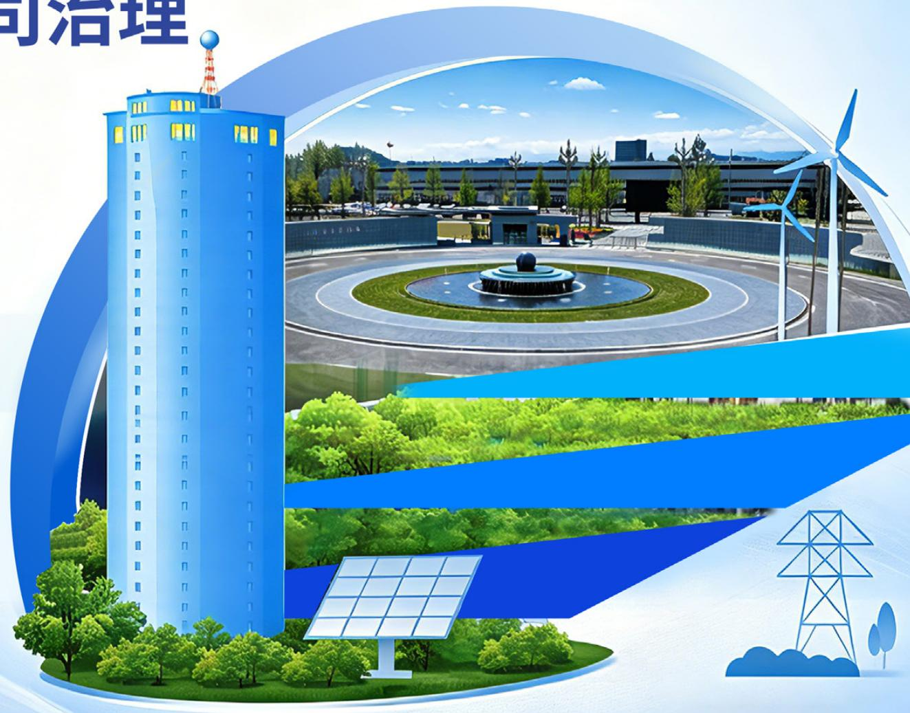

natural_image

Illustration of modern buildings with green landscaping and renewable energy infrastructure (wind turbines, solar panels, power towers) in the background, no text or symbols present.

## 目录

## Contents

报告编制说明 01

关于尚纬股份 03

ESG 管理 10

## 以人为本提升员工福祉

员工权益与福利 43

员工培训与发展 46

职业健康与安全 49

社会贡献与公益慈善 51

## 逐绿而行共绘双碳蓝图

环境合规管理 15

应对气候变化 16

能源利用 20

水资源管理 22

污染物与废弃物管理 22

循环经济 24

24生态系统和生物多样性保护

## 法治筑基夯实治理根基

公司治理 54

合规与风险管理 56

商业道德 58

## 创新引领 践行产品责任

产品质量和安全管理 26

31客户权益保障

33数据安全与隐私保护

创新驱动 35

知识产权保护 39

40负责任供应链

ESG数据绩效表 61

对标索引表 65

## 报告编制说明

本报告是尚纬股份有限公司第1份《环境，社会和公司治理（ESG）报告》 向各利益相关方披露了公司在经营中对于ESG议题所秉持的理念，建立的管理方法，推行的工作与达到的成效。

## 报告范围

本报告范围涵盖尚纬股份有限公司及其附属公司（简称 “尚纬股份”或 “公司” ）。除非特别说明，与公司（股票代码：603333）同期合并财务报表范围一致。

## 报告期间

本报告期间为 2025 年 1 月 1 日至 2025 年 12 月 31 日。本报告中的数据如无特别说明，均为此期间内数据。

## 报告范围

本报告编制依据为：

•上海证券交易所《上海证券交易所上市公司自律监管指引第14号——可持续发展报告（试行）》  
•上海证券交易所《上海证券交易所上市公司自律监管指南第4 号——可持续发展报告编制》

## 数据说明

报告中数据和案例来自公司实际运行的正式记录。

报告中的财务数据均以人民币为单位。财务数据与公司年度财务报告不符的，以年度财务报告为准。

## 确认与报告

本报告于2026年4月29日获董事会审议通过。

## 报告获取及联系方式

本报告通过电子版形式发布，发布平台包括证券交易所指定的信息披露平台，亦可于公司官方网站（www.sunwayint.com）在线浏览或下载。如对报告有任何建议，可通过以下方式与我们联系

• 联系邮箱：sunway@sunwayint.com  
•联系地址：四川省乐山高新区迎宾大道18号

## 报告编制原则

## 重要性

公司识别出各利益相关方关注的与经营相关的重要性议题，作为本报告汇报重点。本报告中对重要性议题汇报的同时关注公司所处行业和经营业务的特点。议题重要性分析过程及结果详见本报告“ESG管理”章节。

## 准确性

本报告尽可能确保信息准确。其中，定量信息的测算已说明数据口径、计算依据与假定条件，以保证计算误差范围不会对信息使用者造成误导性影响。定量信息及附注信息详见本报告 “ESG数据绩效表章节。

## 平衡性

本报告内容反映客观、真实的事实，对涉及公司正面、负面的信息均予以不偏不倚的披露。

## 完整性

本报告披露对象范围与公司合并财务报表范围保持一致。

## 清晰性

本报告以简体中文版发布，本报告中包含表格、模型图以及专业名词表等信息，作为本报告中文字内容的辅助，便于利益相关方更好地理解报告中文字内容。为便于利益相关方更快获取信息，本报告提供目录及ESG标准的对标索引表。

## 量化性

本报告披露关键定量披露项，并尽可能披露历史数据。

## 可比性

本报告对同一定量披露项在不同报告期内的统计及披露方式保持一致；若数据的采集、测量与计算方法有更改，对相关数据进行追溯调整，并在报告附注中说明调整的情况和原因，以便利益相关方进行有意义的分析，评估公司 ESG 数据水平发展趋势。

## 时效性

本报告为年度报告，覆盖时间范围为 2025 年 1 月 1 日至 2025 年 12 月 31 日。公司尽力在报告年度结束后尽快发布报告，为利益相关方决策提供及时的信息参考。

## 可验证性

本报告中案例和数据来自公司实际运行的原始记录或财务报告，所披露数据来源及计算过程均可追溯。

## 关于尚纬股份

## 公司概况

尚纬股份有限公司成立于 2003 年 7 月，总部位于四川省乐山国家高新技术产业开发区，在四川、安徽两地建有占地超 57 万平方米的特种电缆智能制造基地。作为行业领先的高端特种电缆全面解决方案提供商，公司先后获评国家级专精特新“小巨人”企业、国家创新型试点企业，并连年位列中国机械工业五百强。公司拥有 500 多台套国际一流生产检测设备。

公司聚焦核心业务，专注于核电、智能电网、新能源、轨道交通、石油化工等领域的特种电缆研发与制造。依托国家级博士后科研工作站、省级企业技术中心等科研平台，公司自主研制的核电站用1E级电缆达到 “国际先进水平”，累计获得专利及科技成果认定超 200 项。面向未来，尚纬股份将以“规模突破、差异优先、产业延展、数智赋能”为战略方针，构建 “特种电缆 + 电子化学品” 双轮驱动发展格局，深耕特种电缆，聚焦清洁能源、智能电网等高端市场，以智能化改造和数字化转型巩固行业地位的同时，以电子化学品为战略支点，积极拓展电子新材料及高科技产业，培育战略性增长极。

基本信息

<table><tr><td>公司中文名称</td><td>尚纬股份有限公司</td></tr><tr><td>公司英文名称</td><td>Sunway Co., Ltd.</td></tr><tr><td>成立时间</td><td>2003年7月</td></tr><tr><td>股票上市交易所及板块</td><td>上海证券交易所主板</td></tr><tr><td>公司办公地址</td><td>四川省乐山高新区迎宾大道18号</td></tr></table>

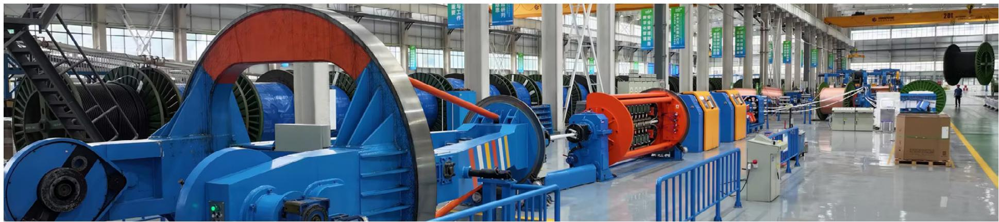

natural_image

Interior view of a large industrial factory with blue machinery and overhead cranes (no visible text or symbols)

## 产品布局

公司是集高端特种电缆产品的研发、生产、销售和服务于一体的国家高新技术企业。公司主要产品包括核电站用电缆、轨道交通用电缆、中压交联电缆、高压电力电缆、太阳能光伏发电用电缆、矿用电缆、船用电缆、风力发电用电缆、军工航天航空用电缆、海上石油平台用电缆等，并被广泛应用于核电、智能电网、新能源、轨道交通、石油化工等诸多领域。

## 尚纬股份主要产品

## 核设施用电缆

核电站用级电缆适用于核电站安全壳内、外输配电系统、控制系统、电气机柜测量连接系统等，并可用于铀矿开采、核乏燃料处理等要求耐辐射的类似场合，也可用于核电配套设备自带电缆等专用场合。

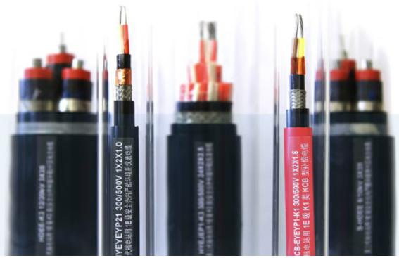

text_image

YEYEYP21 300/500V 1X2X1.0
电缆使用 1E级安全外声接口用欧波电感
YEYEYP21 300/500V 1X2X1.5
电缆使用 1E级 KGB型补偿电缆
CB-EYEYP1-K1 300/500V 1X2X1.5
电缆使用 1E级 KGB型补偿电缆

## 智能电网用电缆

随着社会经济的发展和用电需求的不断增长，大规模的城市电网改造对额定电压 66kV、110kV、220kV、500kV 交联聚乙烯绝缘交流电力电缆的需求也更为迫切。

natural_image

Four identical cylindrical dessert cups with chocolate topping, arranged in a tiered pattern (no text or symbols visible)

## 轨道交通用电缆

高阻燃低释放无卤低烟阻燃 B1 级电缆相对于传统的阻燃电缆属于安全电缆，该产品不仅考核电缆本体的耐燃烧程度，更要考核在燃烧过程中对环境的影响程度。

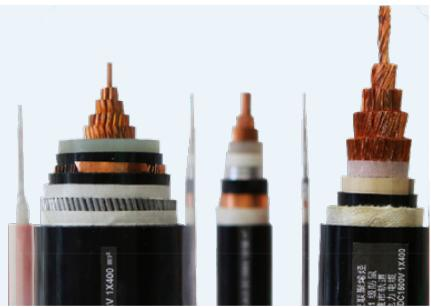

natural_image

Close-up of three types of electrical cables with copper insulation, showing different cable designs and colors (no text or symbols visible)

## 绿色能源用电缆

太阳能光伏电缆用于太阳能电池组件间、组件接线盒连接，可单独接太阳能蓄电池，通过 TUV认证，耐低温、湿热、酸碱，抗紫外线与气候老化。

风力发电耐扭曲电缆适用于风机涡轮机与塔筒等类似场景，可自由移动、悬挂或固定安装，柔软耐曲挠。

## 特种仪控电缆

控制电缆、计算机及仪表电缆适用于电器仪表、配电装置、各类自动化检测设备及其他信号传输与控制系统，广泛用于石油、化工、冶金、能源等领域。可按不同使用环境，定制耐高低温、耐腐蚀、防水、移动弯曲等性能。

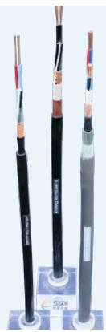

natural_image

Three types of cable cables with visible internal components, arranged on a blue base (no text or symbols)

## 尚纬股份成功建设案例

## 核电

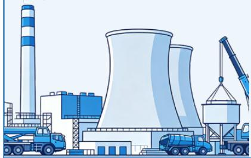

natural_image

Illustration of an industrial power plant with cooling towers, trucks, and a crane (no text or symbols)

•太平岭核电项目  
•福清核电工程项目  
•漳州核电工程项目  
•陆丰核电工程项目

## 貝

## 轨道交通

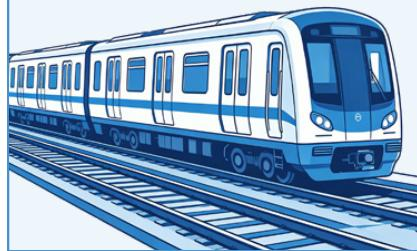

natural_image

Illustration of a modern train on parallel tracks (no text or symbols)

•西安市地铁4号线项目  
•合肥轨道交通4、5号线机电项目  
•北京轨道交通项目地铁3、7、12、14、19 号线  
尼日利亚 拉伊铁路项目（西非首条中国标准双线铁路）

## 智能电网

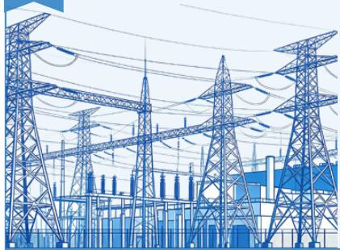

natural_image

Illustration of high-voltage transmission towers and electrical substation (no text or symbols)

•北京电力公司项目  
•白鹤滩水电站项目  
•巴塔城市电网改造项目  
•埃塞俄比亚亚蒂斯城市电网改造项目

##

## 绿色能源

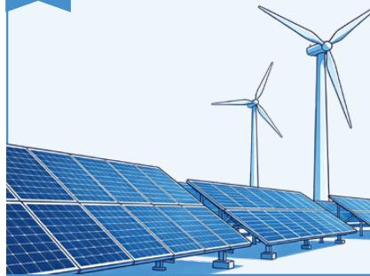

natural_image

Illustration of solar panels and wind turbines in a renewable energy facility (no text or symbols)

•国电光伏发电项目  
•中电国际朝阳500MW光伏项目  
•内蒙古深能源扎鲁特旗保安风电场项目  
•中广核广西钟山东岭风电场36MW项目

## 石油化工

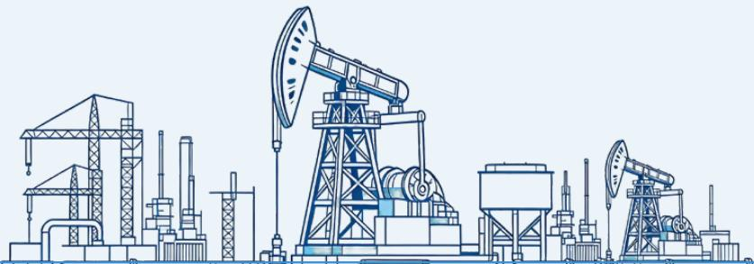

natural_image

Line drawing of an oil and gas drilling platform with pumpjacks and support structures (no text or symbols)

•长庆油田项目  
•中俄原油管道漠河首站项目  
•新疆塔里木河大化肥装置项目  
•恒力石化2,000万吨/年炼化一体化项目

## 公司发展历程

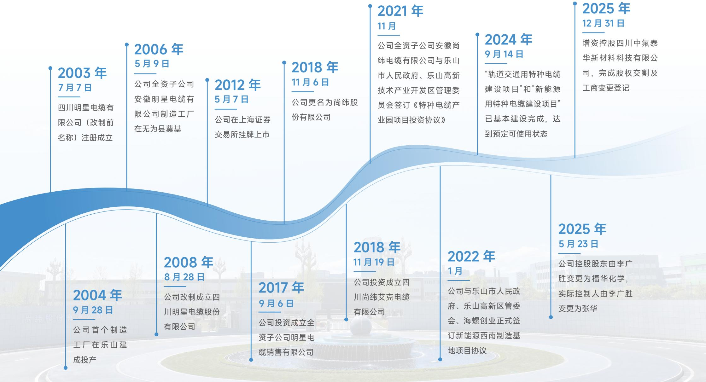

flowchart

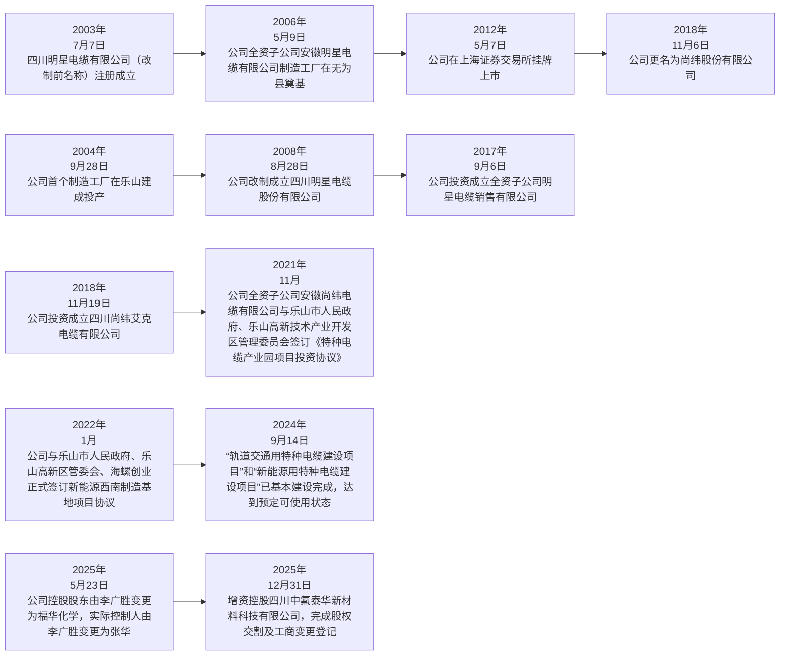

## 企业文化与经营理念

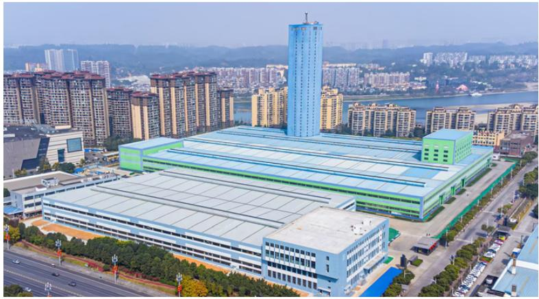

natural_image

Aerial view of a modern industrial complex with high-rise buildings and a river in the background, surrounded by residential high-rises (no visible text or signage).

## 核电理念

核电品质 尚纬智造

## 品牌理念

科技传送实力 品质打造尚纬

## 文化理念

尽责才有认同 付出才有收获

## 德孝理念

感恩之心 德孝为先

## 可持续发展亮点绩效与荣誉

## 尚纬股份体系认证证书

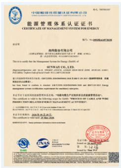

text_image

中国能源投资集团有限公司
能源管理体系认证证书
CERTIFICATE OF MANAGEMENT SYSTEM FOR ENERGY
证书号: 01-2008MA4TJF3N
国务院办公厅
国家能源管理委员会
MINNESW CO., LTD.
(注册证编号：国能科审字[2016]第005号)
EASTERN CO., LTD.
(注册证编号：国能科审字[2016]第006号)
EASTERN CO., LTD.
(注册证编号：国能科审字[2016]第007号)
EASTERN CO., LTD.
(注册证编号：国能科审字[2016]第008号)
EASTERN CO., LTD.
(注册证编号：国能科审字[2016]第009号)
EASTERN CO., LTD.
(注册证编号：国能科审字[2016]第010号)
EASTERN CO., LTD.
(注册证编号：国能科审字[2016]第011号)
EASTERN CO., LTD.
(注册证编号：国能科审字[2016]第012号)
EASTERN CO., LTD.
(注册证编号：国能科审字[2016]第013号)
EASTERN CO., LTD.
(注册证编号：国能科审字[2016]第014号)
EASTERN CO., LTD.
(注册证编号：国能科审字[2016]第015号)
EASTERN CO., LTD.
(注册证编号：国能科审字[2016]第016号)
EASTERN CO., LTD.
(注册证编号：国能科审字[2016]第017号)
EASTERN CO., LTD.
(注册证编号：国能科审字[2016]第018号)
EASTERN CO., LTD.
(注册证编号：国能科审字[2016]第019号)
EASTERN CO., LTD.
(注册证编号：国能科审字[2016]第020号)
EASTERN CO., LTD.
(注册证编号：国能科审字[2016]第021号)
EASTERN CO., LTD.
(注册证编号：国能科审字[2016]第022号)
EASTERN CO., LTD.
(注册证编号：国能科审字[2016]第023号)
EASTERN CO., LTD.
(注册证编号：国能科审字[2016]第024号)
EASTERN CO., LTD.
(注册证编号：国能科审字[2016]第025号)
EASTERN CO., LTD.
(注册证编号：国能科审字[2016]第026号)
EASTERN CO., LTD.
(注册证编号：国能科审字[2016]第027号)
EASTERN CO., LTD.
(注册证编号：国能科审字[2016]第028号)
EASTERN CO., LTD.
(注册证编号：国能科审字[2016]第029号)
EASTERN CO., LTD.
(注册证编号：国能科审字[2016]第030号)
EASTERN CO., LTD.
(注册证编号：国能科审字[2016]第031号)
EASTERN CO., LTD.
(注册证编号：国能科审字[2016]第032号)
EASTERN CO., LTD.
(注册证编号：国能科审字[2016]第033号)
EASTERN CO., LTD.
(注册证编号：国能科审字[2016]第034号)
EASTERN CO., LTD.
(注册证编号：国能科审字[2016]第035号)
EASTERN CO., LTD.
(注册证编号：国能科审字[2016]第036号)
EASTERN CO., LTD.
(注册证编号：国能科审字[2016]第037号)
EASTERN CO., LTD.
(注册证编号：国能科审字[2016]第038号)
EASTERN CO., LTD.
(注册证编号：国能科审字[2016]第039号)
EASTERN CO., LTD.
(注册证编号：国能科审字[2016]第040号)
EASTERN CO., LTD.
(注册证编号：国能科审字[2016]第041号)
EASTERN CO., LTD.
(注册证编号：国能科审字[2016]第042号)
EASTERN CO., LTD.
(注册证编号：国能科审字[2016]第043号)
EASTERN CO., LTD.
(注册证编号：国能科审字[2016]第044号)
EASTERN CO., LTD.
(注册证编号：国能科审字[2016]第045号)
EASTERN CO., LTD.
(注册证编号：国能科审字[2016]第046号)
EASTERN CO., LTD.
(注册证编号：国能科审字[2016]第047号)
EASTERN CO., LTD.
(注册证编号：国能科审字[2016]第048号)
EASTERN CO., LTD.
(注册证编号：国能科审字[2016]第049号)
EASTERN CO., LTD.
(注册证编号：国能科审字[2016]第050号)
EASTERN CO., LTD.
(注册证编号：国能科审字[2016]第051号)
EASTERN CO., LTD.
(注册证编号：国能科审字[2016]第052号)
EASTERN CO., LTD.
(注册证编号：国能科审字[2016]第053号)
EASTERN CO., LTD.
(注册证编号：国能科审字[2016]第054号)
EASTERN CO., LTD.
(注册证编号：国能科审字[2016]第055号)
EASTERN CO., LTD.
(注册证编号：国能科审字[2016]第056号）
EASTERN CO., LTD.
(注册证编号：国能科审字[2016]第057号）
EASTERN CO., LTD.
(注册证编号：国能科审字[2016]第058号）
EASTERN CO., LTD.
(注册证编号：国能科审字[2016]第059号）
EASTERN CO., LTD.
(注册证编号：国能科审字[2016]第060号）
EASTERN CO., LTD.
(注册证编号：国能科审字[2016]第061号）
EASTERN CO., LTD.
(注册证编号：国能科审字[2016]第062号）
EASTERN CO., LTD.
(注册证编号：国能科审字[2016]第063号）
EASTERN CO., LTD.
(注册证编号：国能科审字[2016]第064号）
EASTERN CO., LTD.
(注册证编号：国能科审字[2016]第065号）
EASTERN CO., LTD.
(注册证编号：国能科审字[2016]第066号）
EASTERN CO., LTD.
(注册证编号：国能科审字[2016]第067号）
EASTERN CO., LTD.
(注册证编号：国能科审字[2016]第068号）
EASTERN CO., LTD.
(注册证编号：国能科审字[2016]第069号）
EASTERN CO., LTD.
(注册证编号：国能科审字[2016]第070号）
EASTERN CO., LTD.
(注册证编号：国能科审字[2016]第071号）
EASTERN CO., LTD.
(注册证编号：国能科审字[2016]第072号）
EASTERN CO., LTD.
(注册证编号：国能科审字[2016]第073号）
EASTERN CO., LTD.
(注册证编号：国能科审字[2016]第074号）
EASTERN CO., LTD.
(注册证编号：国能科审字[2016]第075号）
EASTERN CO., LTD.
(注册证编号：国能科审字[2016]第076号）
EASTERN CO., LTD.
(注册证编号：国能科审字[2016]第077号）
EASTERN CO., LTD.
(注册证编号：国能科审字[2016]第078号）
EASTERN CO., LTD.
(注册证编号：国能科审字[2016]第079号）
EASTERN CO., LTD.
(注册证编号：国能科审字[2016]第080号）
EASTERN CO., LTD.
(注册证编号：国能科审字[2016]第081号）
EASTERN CO., LTD.
(注册证编号：国能科审字[2016]第082号）
EASTERN CO., LTD.
(注册证编号：国能科审字[2016]第083号）
EASTERN CO., LTD.
(注册证编号：国能科审字[2016]第084号）
EASTERN CO., LTD.
(注册证编号：国能科审字[2016]第085号）
EASTERN CO., LTD.
(注册证编号：国能科审字[2016]第086号）
EASTERN CO., LTD.
(注册证编号：国能科审字[2016]第087号）
EASTERN CO., LTD.
(注册证编号：国能科审字[2016]第088号）
EASTERN CO., LTD.
(注册证编号：国能科审字[2016]第089号）
EASTERN CO., LTD.
(注册证编号：国能科审字[2016]第090号）
EASTERN CO., LTD.
(注册证编号：国能科审字[2016]第<nl>

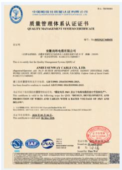

text_image

中国检验检测认证有限公司
质量管理体系认证证书
QUALITY MANAGEMENT SYSTEMS CEREMBERATE
证书号：QINGYUAN CHENGHUI
全柴检测有限公司
（请注明经营范围，须经国家工商行政管理总局注册并有效）
名称：深圳市深南中路证券大厦10楼
地址：深圳市深南中路证券大厦10楼
联系电话：0755-83296888
联系人：周晓峰
本次申请的有效期限为自本公告发布之日起至2014年1月1日止
本次申请的有效期限为自本公告发布之日起至2014年1月1日止
本次申请的有效期限为自本公告发布之日起至2014年1月1日止
本次申请的有效期限为自本公告发布之日起至2014年1月1日止
本次申请的有效期限为自本公告发布之日起至2014年1月1日止
本次申请的有效期限为自本公告发布之日起到2014年1月1日止
本次申请的有效期限为自本公告发布之日起至2014年1月1日止
本次申请的有效期限为自本公告发布之日起至2014年1月1日止
本次申请的有效期限为自本公告发布之日起至2014年1月1日止
本次申请的有效期限为自本公告发布之日起至2014年1月1日止
此次申请有效期为2014年1月1日至2014年1月20日

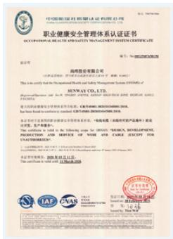

text_image

职业健康安全管理体系认证证书
DEPARTMENT OF HEALTH AND SAFETY MANAGEMENT INSTITUTE
执业证书

海信股份有限公司

本公司及董事会全体成员保证本公告内容的真实、准确和完整，没有虚假记载、误导性陈述或重大遗漏。

本公司及董事会全体成员保证本公告内容的真实、准确和完整，没有虚假记载、误导性陈述或重大遗漏。

本公司及董事会全体成员保证本公告内容的真实、准确和完整，没有虚假记载、误导性陈述或重大遗漏。

本公司及董事会全体成员保证本公告内容的真实、准确和完整，没有虚假记载、误导性陈述或重大遗漏。

本公司及董事会全体成员保证本公告内容的真实、准确和完整，没有虚假记载、误导性前述、重大遗漏。

本公司及董事会全体成员保证本公告内容的真实、准确和完整，没有虚假记载、误导性陈述或重大遗漏。

本公司及董事会全体成员保证本公告内容的真实、准确和完整，没有虚假记载、误导性陈述或重大遗漏。

本公司及董事会全体成员保证本公告内容的真实、准确和完整，没有虚假记载、误导性陈述或重大遗漏。

本公司及董事会全体成员保证本公告内容的真实、准确和完整，没有虚假记载，误导性陈述或重大遗漏。

本公司及董事会全体成员保证本公告内容的真实、准确和完整，没有虚假记载、误导性陈述或重大遗漏。

本公司及董事会全体成员保证本公告内容的真实、准确和完整，没有虚假记载、误导性陈述或重大遗漏。

本公司及董事会全体成员保证本公告内容真实、准确和完整，没有虚假记载、误导性陈述或重大遗漏。

本公司及董事会全体成员保证本公告内容真实、准确和完整，没有虚假记载、误导性陈述或重大遗漏。

本公司及董事会全体成员保证本公告内容真实、准确和完整，没有虚假记载、误导性陈述或重大遗漏。

本公司及董事会全体成员保证本公告内容真实、准确和完整，没有虚假记载、误导性陈述或重大遗漏。

本公司及董事会全体成员

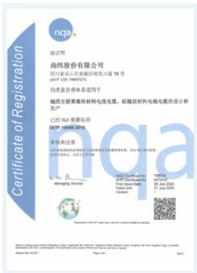

text_image

证书
NGA
致证证明
尚纬股份有限公司
四川省乐山市高新区府武大道18号
JAZT 538-1000729
的质量管理体系系列用于
编制交频聚烯烃材料电线电缆、硅酸铁材料电缆电缆的设计和生产
已经NGA根据标准
JAZT 446682016
审定和意见
JAZT 446682016
Wangling Director
JAZT Certified JAZT 538-1000729
JAZT 538-1000729
JAZT 538-1000729
JAZT 538-1000729
JAZT 538-1000729
JAZT 538-1000729
JAZT 538-1000729
JAZT 446682016
JAZT Certified JAZT 538-1000729
JAZT 538-1000729
JAZT 538-1000729
JAZT 538-1000729
JAZT 538-1000729
JAZT 538-100072<nl>

##

## 关于股准延战江苏华保救电器材科技有限公司等6家单位民用核安全设许可证的通知

证系要信核电器材科统名租公行、自作股公有果业问、厂东差业气者用公司、中国都步集图有限公用重七一九明见析、北章管理备例》及发概委规律的要求，截运对相关业位民才根安会要许可证用理审建进后了变备，认治还享非优核电区财料往布

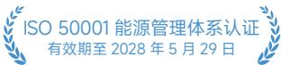

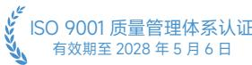

ISO 45001职业健康安全管理体系认证有效期至 2028 年 3 月 11 日  

IATE16949 汽车行业质量管理体系认证有效期至2026年7月27日  

民用核安全设备设计/制造许可证有效期至2030年9月30 日  

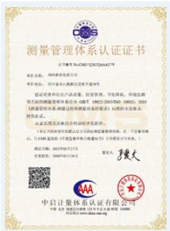

text_image

测量管理体系认证证书
证书编号:CMDS/T021/AAA27号
单位名称:河南新源有限公司
单位地址:河南省长兴县汉中区天宁路8号
验证审核单位产品名称、型号、使用范围、节能降耗、环境监测等方面测试测量管理体系符合GB/T 19022-2005 SOE 10032.2003《质量管理体系计量过程和测量功能的要求》标准的全国体系标准认证证书。
认证结果及具体符合法规要求文件。
《证书》自国务院颁发公司内部质量监督考核报告，在一个质量保障日内，与CMS发展部《质量管理体系考核指引》的全部部分有关。）
成立日期：2023年03月27日
有效期至：2044年03月26日
国家人：张大
中启计量体系认证证书
中国·北京·福建众联电子技术有限公司
TOMO
www.tdy.com.cn

  
测量管理体系认证有效期至 2030 年 5 月 26 日

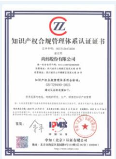

text_image

知识产权合规管理体系认证证书
证书号：14C7025438308
委托人：
尚纬股份有限公司
统一社会信用代码：91110100MA2W6XQD
注册地址：浙江省杭州市西湖区西溪路东1号
经营范围：以自有资金从事投资活动，依法须经批准的项目，经相关部门批准后依批准的内容开展经营活动。
知识产权合规管理体系认证标准：
GB/TZK90-2023
通讯认证有效期至20年；
经营范围：电子、光电的研发、生产、销售和知识产权管理
（一）公司及主要股东所持知识产权在中华人民共和国境内从事知识产权管理业务；持有知识产权的企业法人营业执照复印件（或盖章）；未在规定期限内从事知识产权管理业务；未在规定期限内从事知识产权管理业务；未在规定期限内从事知识产权管理业务；未在规定期限内从事知识产权管理业务；未在规定期限内从事知识产权管理业务；未在规定期限内从事知识产权管理业务；未在规定期限内从事知识产权管理业务；未在规定期限内从事知识产权管理业务；未在规定期限内从事知识产权管理业务；未在规定期限内从事知识产权管理业务；未在规定期限内从事知识产权管理事务。签发：
[美] 伊恩斯
中国（北京）认证有限公司
地址：北京市海淀区北三环中路19号院1号楼1层1402室（100008）

  
识产权合规管理体系认证有效期至 2027 年 12 月 6 日

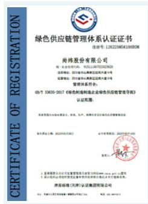

text_image

绿色供应链管理体系认证证书
注册号:12622305419680N
尚纬股份有限公司
统一社会信用代码:9111010707292303
注册地址:四川省成都市高新区天府大道1号
邮政编码:四川省成都市武侯区天宁路1号
管理机关:
GB/T 3X05-2017《绿色供应链型企业绿色供应链管理导则》
认证范围:
请登录本企业网站或指定公司网站，查看、发布、修改并以绿色供应链管理体系认证。
证书有效期至:2023年6月20日
法人代表人：
1. 企业名称：深圳市达晨科技集团有限公司
2. 企业类型：有限责任公司
3. 企业性质：有限责任公司
4. 企业编号：GZY-000000000000000000000000000000000000000000000000000000000000000000000
国家标准化工业和信息化部
国家标准化工业和信息化部
国家标准化工业和信息化部

  
绿色供应链管理体系认证有效期至 2028 年 8 月 19 日

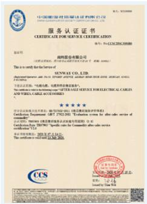

text_image

中国国信证券股份有限公司
CITIC SECURITIES COMPANY LIMITED
服务认证证书
CERTIFICATE FOR SERVICE CERTIFICATION
编号: 01-CICC2563500800
南网股份有限公司
（注册地址：深圳市福田区深南大道7088号）东侧14楼
This is to verify the Service of
SUNYAY CO., LTD.
Shenzhen Securities and Co., Ltd. (以下简称“公司”或“本公司”) 2019-2020 EBITDA 1,694.11
EBITDA
*227.0000
*227.0000
*227.0000
*227.0000
The Company Name: 华西电力集团有限责任公司
The Company Name: 华西电力集团有限责任公司
The Company Name: 华西电力集团有限责任公司
The Company Name: 华西电力集团有限责任公司
The Company Name: 华西电力集团有限责任公司
The Company Name: 华西电力集团有限责任公司
The Company Name: 华西电力集团有限责任公司
The Company Name: 华西电力集团有限责任公司
The Company Name: 华西电力集团有限责任公司
The Company Note:
*227.0000
*227.0000
*227.0000
The Company Name: 华西电力集团有限责任公司
The Company Name: 华西电力集团有限责任公司
The Company Name: 华西电力集团有限责任公司
The Company Name: 华西电力集团有限责任公司
The Company Note:
*227.0000
*227.0000
*227.0000
The Company Name: 华西电力集团有限责任公司
The Company Name: 河北电力(集团)有限责任公司
The Company Name: 河北电力(集团)有限责任公司
The Company Name: 河北电力(集团)有限责任公司
The Company Note:
*227.0000
*227.0000
*227.0000
The Company Name: 河北电力(集团)有限责任公司
The Company Name: 河北电力(集团)有限责任公司
The Company Note:
*227.0000
*227.0000
*227.0000
The Company Name: 河北电力(集团)有限责任公司
The Company Name: 河北电力(集团)有限责任公司
The Company Note:
*
Source: CICC Securities and Co., Ltd.
www.cicc.com.cn

  
商品售后服务认证有效期至 2028 年 7 月 14 日

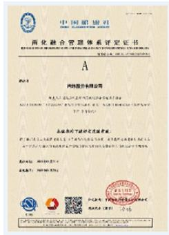

text_image

中国证券报
中国证券报
A
网络通信有限公司
本次发行申请文件类型及内容
名称：中国证券报
地址：北京市西城区复兴门内大街1号
电话：010-66588888
传真：010-66588888
电子邮箱：www.china-invs.cn
联系人：周晓峰
联系电话：010-66588888
传真：010-66588888
电子邮箱：www.china-invs.cn
联系人：周晓峰
联系电话：010-66588888
传真：010-66588888
电子邮箱：www.china-invs.cn
联系人：周晓峰
联系电话：010-96327422
传真：010-66588888
电子邮箱：www.china-invs.cn
联系人：周晓峰
联系电话：010-96327422
传真：010-66588888
电子邮箱：www.china-invs.cn
联系人：周晓峰
联系电话：010-96327422
传真：01-66588888
电子邮箱：www.china-invs.cn
联系人：周晓峰
联系电话：010-96327422
传真：010-66588888
电子邮箱：www.china-invs.cn
联系人：周晓峰
联系电话：010-96327422
传真：010-6658<nl>

  
两化融合管理体系认证有效期至 2029 年 01 月 30 日

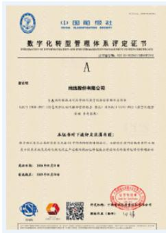

text_image

数字化转型管理体系评定证书
A
同达股份有限公司
1. 乌鲁木齐市经济技术开发区经济和信息化局
2. 乌鲁木齐市人民政府国有资产监督管理委员会
3. 乌鲁木齐市人民政府国有资产监督管理委员会
4. 乌鲁木齐市人民政府国有资产监督管理委员会
5. 乌鲁木齐市人民政府国有资产监督管理委员会
6. 乌鲁木齐市人民政府国有资产监督管理委员会
7. 乌鲁木齐市人民政府国有资产监督管理委员会
8. 乌鲁木齐市人民政府国有资产监督管理委员会
9. 乌鲁木齐市人民政府国有资产监督管理委员会
10. 乌鲁木齐市人民政府国有资产监督管理委员会
11. 乌鲁木齐市人民政府国有资产监督管理委员会
12. 乌鲁木齐市人民政府国有资产监督管理委员会
13. 乌鲁木齐市人民政府国有资产监督管理委员会
14. 乌鲁木齐市人民政府国有资产监督管理委员会
15. 乌鲁木齐市人民政府国有资产监督管理委员会
16. 乌鲁木齐市人民政府国有资产监督管理委员会
17. 乌鲁木齐市人民政府国有资产监督管理委员会
18. 乌鲁木齐市人民政府国有资产监督管理委员会
19. 乌鲁木齐市人民政府国有资产监督管理委员会
20. 乌鲁木齐市人民政府国有资产监督管理委员会
21. 乌鲁木齐市人民政府国有资产监督管理委员会
22. 乌鲁木齐市人民政府国有资产监督管理委员会
23. 乌鲁木齐市人民政府国有资产监督管理委员会
24. 乌鲁木齐市人民政府国有资产监督管理委员会
25. 乌鲁木齐市人民政府国有资产监督管理委员会
26. 乌鲁木齐市人民政府国有资产监督管理委员会
27. 乌鲁木齐市人民政府国有资产监督管理委员会
28. 乌鲁木齐市人民政府国有资产监督管理委员会
29. 乌鲁木齐市人民政府国有资产监督管理委员会
30. 乌鲁木齐市人民政府国有资产监督管理委员会
31. 乌鲁木齐市人民政府国有资产监督管理委员会
32. 乌鲁木齐市人民政府国有资产监督管理委员会
33. 乌鲁木齐市人民政府国有资产监督管理委员会
34. 乌鲁木齐市人民政府国有资产监督管理委员会
35. 乌鲁木齐市人民政府国有资产监督管理委员会
36. 乌鲁木齐市人民政府国有资产监督管理委员会
37. 乌鲁木齐市人民政府国有资产监督管理委员会
38. 乌鲁木齐市人民政府国有资产监督管理委员会
39. 乌鲁木齐市人民政府国有资产监督管理委员会
40. 乌鲁木齐市人民政府国有资产监督管理委员会
41. 乌鲁木齐市人民政府国有资产监督管理委员会
42. 乌鲁木齐市人民政府国有资产监督管理委员会
43. 乌鲁木齐市人民政府国有资产监督管理委员会
44. 乌鲁木齐市人民政府国有资产监督管理委员会
45. 乌鲁木齐市人民政府国有资产监督管理委员会
46. 乌鲁木齐市人民政府国有资产监督管理委员会
47. 乌鲁木齐市人民政府国有资产监督管理委员会
48. 乌鲁木齐市人民政府国有资产监督管理委员会
49. 乌鲁木齐市人民政府国有资产监督管理委员会
50. 乌鲁木齐市人民政府国有资产监督管理委员会
51. 乌鲁木齐市人民政府国有资产监督管理委员会
52. 乌鲁木齐市人民政府国有资产监督管理委员会
53. 乌鲁木齐市人民政府国有资产监督管理委员会
54. 乌鲁木齐市人民政府国有资产监督管理委员会
55. 乌鲁木齐市人民政府国有资产监督管理委员会
56. 乌鲁木齐市人民政府国有资产监督管理委员会
57. 乌鲁木齐市人民政府国有资产监督管理委员会
58. 乌鲁木齐市人民政府国有资产监督管理委员会
59. 乌鲁木齐市人民政府国有资产监督管理委员会
60. 乌鲁木齐市人民政府国有资产监督管理委员会
61. 乌鲁木齐市人民政府国有资产监督管理委员会
62. 乌鲁木齐市人民政府国有资产监督管理委员会
63. 乌鲁木齐市人民政府国有资产监督管理委员会
64. 乌鲁木齐市人民政府国有资产监督管理委员会
65. 乌鲁木齐市人民政府国有资产监督管理委员会
66. 乌鲁木齐市人民政府国有资产监督管理委员会
67. 乌鲁木齐市人民政府国有资产监督管理委员会
68. 乌鲁木齐市人民政府国有资产监督管理委员会
69. 乌鲁木齐市人民政府国有资产监督管理委员会
70. 乌鲁木齐市人民政府国有资产监督管理委员会
71. 乌鲁木齐市人民政府国有资产监督管理委员会
72. 乌鲁木齐市人民政府国有资产监督管理委员会
73. 乌鲁木齐市人民政府国有资产监督管理委员会
74. 乌鲁木齐市人民政府国有资产监督管理委员会
75. 乌鲁木齐市人民政府国有资产监督管理委员会
76. 乌鲁木齐市人民政府国有资产监督管理委员会
77. 乌鲁木齐市人民政府国有资产监督管理委员会
78. 乌鲁木齐市人民政府国有资产监督管理委员会
79. 乌鲁木齐市人民政府国有资产监督管理委员会
80. 乌鲁木齐市人民政府国有资产监督管理委员会

  
数字化转型管理体系评定证书有效期至2029年01月30日

## 尚纬股份资质及荣誉

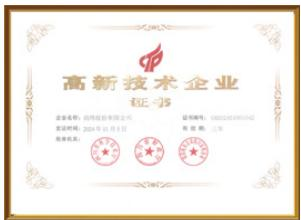

text_image

高新技术企业
证书
企业名称：经纬股份有限公司
登记时间：2024年11月5日
证书编号：GZ020203091542
有效期限：三年

国家高新技术企业

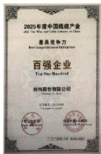  
中国线缆产业最具竞争力100 强企业

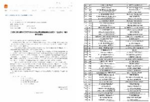

text_image

Scanned document page with numbered sections and Chinese text, likely a form or checklist.

国家级绿色工厂

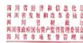

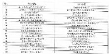

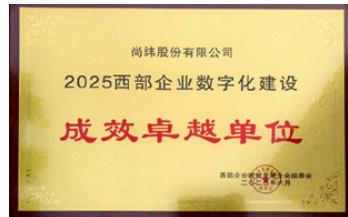

text_image

尚纬股份有限公司
2025西部企业数字化建设
成效卓越单位
西部企业数字化建设会二期二〇一三年六月

四川省先进级智能工厂  
西部企业数字化建设成效卓越单位

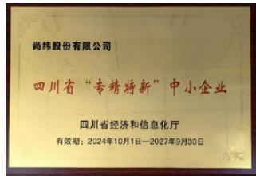

text_image

尚纬股份有限公司
四川省“专精特新”中小企业
四川省经济和信息化厅
有效期：2024年10月1日—2027年9月30日

四川省“专精特新”中小企业

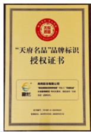  
“天府名品”品牌标识授权证书

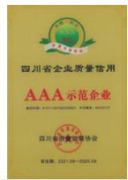  
四川省企业质量信用AAA示范企业

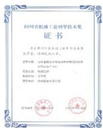

text_image

四川省机械工业科学技术奖
证书

为义军中国人民政治协商会议暨学术委员会、国家发展改革委、

获奖者：四川机械工业集团有限公司
获奖单位：中铁二院集团有限公司

获奖单位：中铁二院集团有限公司

评鉴编号：渝建委（2016）第148号

四川省机械工业科技奖三等奖抽水蓄能及水电站用特种电缆

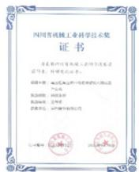

text_image

四国工程机械工业科学技术奖
证书

为某省四川有线城市科学技术奖
评鉴，特聘见证单位。

成都中建（集团）有限公司
资产评估机构

陕西金隅（集团）公司

陕西金隅（集团）有限公司

陕西金隅（集团）有限公司

陕西金隅（集团）有限公司

四川省机械工业科技奖三等奖高压超高压特种电缆

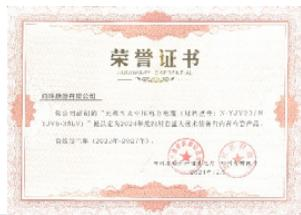

seal

北京中电华能科技股份有限公司
合同专用章
（盖章）

四川省重大技术装备省内首台套产品

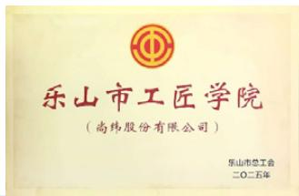

text_image

乐山市工匠学院
（尚纬股份有限公司）
乐山市总工会
二〇二五年

乐山市工匠学院

## 2025年亮点数据

## 环境绩效

单位营收综合能源消耗量

2.05 吨标煤 / 百万元

单位营收温室气体排放量

6.62 tCO e/ 百万元

单位营收耗水量

130.66 立方米 / 百万元

循环用水占比

82.51%

清洁能源占比

25.82%

环保总支出

261.10 万元

## 社会绩效

客户满意度

99.53 分

信息安全培训员工覆盖率

100%

研发投入占比

4.11%

研发人员占比

14.25%

拥有专利数量

164 件

员工培训覆盖率

100%

员工人均培训时长

57.63 小时

员工培训总支出

30.52 万元

## 公司治理绩效

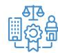

独立董事占比

33.33%

女性董事占比

55.56%

重大商业贿赂事件发生数

0 件

接受反商业贿赂及反贪污培训的员工数量

420 人

## ESG管理体系

## ESG管理架构

为了更好地将可持续发展理念融入公司发展战略及经营管理活动，贯彻落实公司在环境保护、社会责任履行及公司治理方面的管理策略和措施，公司依据《上海证券交易所上市公司自律监管指引第 14 号——可持续发展报告（试行）》（以下简称“上交所《指引》”）等规范要求，设立“董事会 - 战略与可持续发展委员会”的自上而下的治理架构，系统落实公司在环境保护、社会责任及公司治理方面的策略与措施，以提升核心竞争力与可持续发展能力。

## ESG议题重要性评估

## 双重重要性分析流程

2025年，尚纬股份严格依据上交所《指引》“议题重要性分析”有关要求，同时参考GRI可持续发展报告标准、国际可持续准则理事会（ISSB）《国际财务报告可持续披露准则第 1 号——可持续相关财务信息披露一般要求》（IFRS S1）等可持续发展信息披露标准中，对于ESG议题重要性分析的原则、方法和流程，建立了议题识别和重要性分析的流程。

公司从议题的表现是否会对公司商业模式、业务运营、发展战略、财务状况、经营成果、现金流、融资方式及成本等产生重大影响（以下简称“财务重要性”），以及议题的表现是否会对经济、社会和环境产生重大影响（以下简称“影响重要性”）双重视角开展评估分析，以识别对公司具有重要性的议题。

尚纬股份2025年ESG管理架构  
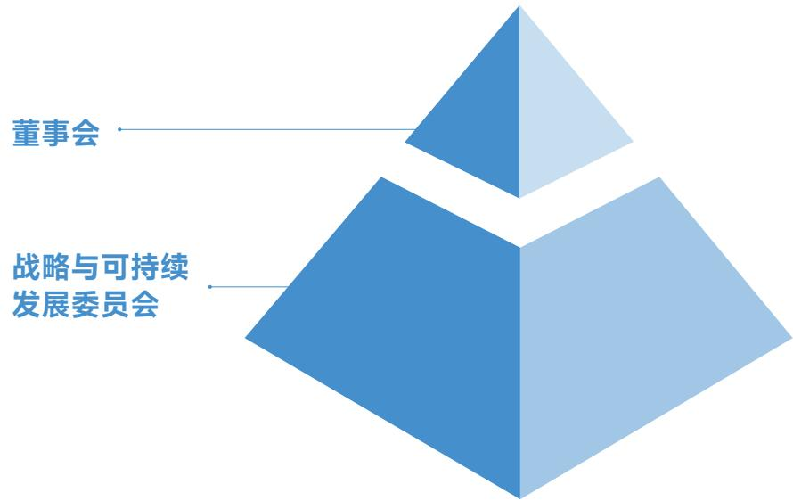

flowchart

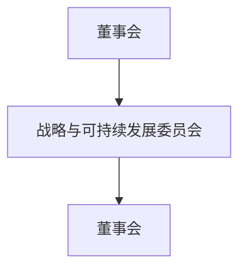

natural_image

Illustration of three people working at a desk with laptops and digital interface elements, surrounded by gears and briefcases (no text or symbols)

## 议题重要性分析流程

## 背景识别与了解

· 对同业公司进行调研，了解企业所处电气和电子设备行业的产业链背景及可持续发展背景  
· 识别和了解重点利益相关方

## 议题识别、利益相关 方沟通和尽职调查

· 与利益相关方进行沟通，并结合标准对标、政策分析及同业对标，识别、筛选、定义与公司相关的ESG议题  
· 向公司管理层、各部门及利益相关方开展尽职调查，确定议题对经济、环境和社会的影响，以及对公司日常经营和商业决策的风险和机遇

## 议题重要性评估

·设定恰当的评估方法与重要性阈值，结合专家判断、利益相关方调查问卷、财务指标（确定、统计与预测各议题所对应的财务指标）相结合的方式，评估议题的重要性，确定议题重要性排序

## 议题确认与审批

· 确认各议题是否具有“重要性”，形成重要性议题矩阵  
· 开展议题的检验、批准和报告

## 2025 年

结合标准对标、政策分析及同业对标，

公司共识别出 $2 0$ 项ESG议题，

其中环境维度共 $7$ 项议题，

社会维度共 $\mathsf { 1 0 }$ 项议题，

治理维度共 $3$ 项议题。

## ESG议题清单

<table><tr><td>环境</td><td colspan="2">社会</td><td>治理</td></tr><tr><td>○环境合规管理</td><td>○产品质量和安全管理</td><td>○员工培训与发展</td><td>○公司治理</td></tr><tr><td>○应对气候变化</td><td>○客户权益保护</td><td>○职业健康与安全</td><td>○合规与风险管理</td></tr><tr><td>○能源利用</td><td>○数据安全与隐私保护</td><td>○社会贡献与公益慈善</td><td>○商业道德</td></tr><tr><td>○水资源管理</td><td>○创新驱动</td><td></td><td></td></tr><tr><td>○污染物与废弃物管理</td><td>○知识产权保护</td><td></td><td></td></tr><tr><td>○循环经济</td><td>○负责任供应链</td><td></td><td></td></tr><tr><td>○生态系统和生物多样性保护</td><td>○员工权益与福利</td><td></td><td></td></tr></table>

## 尽职调查、利益相关方沟通

公司高度重视各议题风险、机遇的识别与管控，逐步完善常态化的尽职调查机制，重点涵盖环境合规（污染物管理、能源利用等）、供应链管理（供应链安全、绿色供应链等）、商业道德（反商业贿赂及贪污等）核心内容，通过与各利益相关方访谈、调研、沟通等方式开展评估，确定议题对经济、环境和社会的影响，以及对公司日常经营和商业决策的风险和机遇。

有效的利益相关方沟通是公司开展 ESG 管理的重要依据。公司根据自身行业特点和经营情况，识别并确定政府及监管机构、股东和投资者、客户、供应商及合作伙伴、员工、社会及公众六大关键利益相关方。公司与各利益相关方保持常态化的沟通频率，充分了解各利益相关方对 ESG 相关议题的诉求及意见，并通过多样化渠道回应需求，为利益相关方创造可持续价值。

natural_image

Illustration of digital media icons including a magnifying glass, folder, and document (no text or symbols)

利益相关方关注议题及沟通渠道

<table><tr><td>利益相关方</td><td>议题名称</td><td>沟通渠道</td></tr><tr><td rowspan="9">政府及监管机构</td><td>环境合规管理</td><td></td></tr><tr><td>能源利用</td><td></td></tr><tr><td>水资源管理</td><td>汇报工作报告</td></tr><tr><td>污染物与废弃物管理</td><td>日常沟通</td></tr><tr><td>循环经济</td><td>信息报送与披露</td></tr><tr><td>应对气候变化</td><td>监督检查</td></tr><tr><td>生态系统和生物多样性保护</td><td>资质、批复办理和更新</td></tr><tr><td>公司治理</td><td></td></tr><tr><td>合规与风险管理</td><td></td></tr><tr><td rowspan="6">股东和投资者</td><td>产品质量和安全管理</td><td>股东大会</td></tr><tr><td>创新驱动</td><td>业绩说明会</td></tr><tr><td>公司治理</td><td>投资者交流会</td></tr><tr><td>合规与风险管理</td><td>信息披露平台</td></tr><tr><td>商业道德</td><td>投资者热线</td></tr><tr><td></td><td>投资者沟通平台</td></tr><tr><td rowspan="5">客户</td><td>应对气候变化</td><td>客户满意度调查</td></tr><tr><td>产品质量和安全管理</td><td>客户拜访</td></tr><tr><td>客户权益保护</td><td>客户审核</td></tr><tr><td>创新驱动</td><td>公司官网</td></tr><tr><td>数据安全与隐私保护</td><td>新品推广与展会</td></tr><tr><td rowspan="5">供应商及合作伙伴</td><td>产品质量和安全管理</td><td>供应商洽谈</td></tr><tr><td>知识产权保护</td><td>日常沟通</td></tr><tr><td>数据安全与隐私保护</td><td>公司官网</td></tr><tr><td>负责任供应链</td><td>战略合作</td></tr><tr><td></td><td>举报及监督渠道</td></tr><tr><td rowspan="5">员工</td><td>数据安全与隐私保护</td><td>员工沟通</td></tr><tr><td>员工权益与福利</td><td>员工内外部培训</td></tr><tr><td>员工培训与发展</td><td>员工文体活动</td></tr><tr><td>职业健康与安全</td><td>员工满意度调查</td></tr><tr><td>商业道德</td><td></td></tr><tr><td rowspan="2">社会及公众</td><td>社会贡献与公益慈善</td><td>慈善活动</td></tr><tr><td></td><td>志愿活动</td></tr></table>

## 议题重要性分析结论

公司基于识别的议题，邀请股东和投资者、员工、供应商及合作伙伴、政府及监管机构等利益相关方对议题的表现是否具有财务重要性及影响重要性进行评估。本次评估以发放调查问卷的方式进行，共回收272份有效问卷。此外，公司综合问卷调查结果、第三方专家判断与财务指标，确认各议题的重要性排序。

## 2025 年

在公司已识别并筛选出的20项议题中，共有6项议题具有双重重要性，1项议题仅具有财务重要性，13项议题仅具有影响重要性。本报告中，公司就如何控制影响、规避风险、把握机遇进行重点回应，并通过矩阵形式呈现各议题的重要性程度。

尚纬股份2025年议题重要性矩阵  
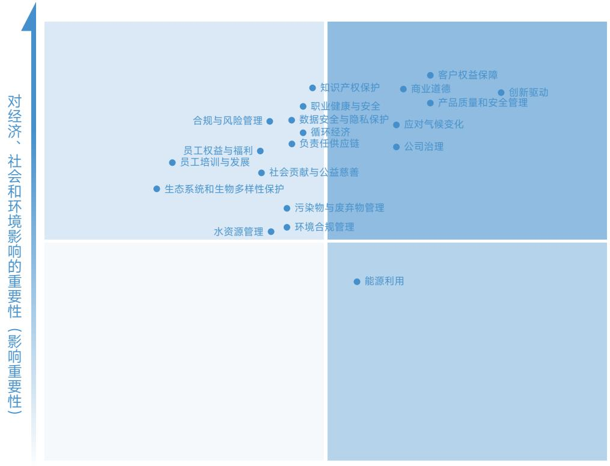

scatter

| Topic | X-axis Position (Relative) | Y-axis Position (Relative) |
| :--- | :--- | :--- |
| 客户权益保障 | High | High |
| 创新驱动 | High | High |
| 商业道德 | High | High |
| 产品质量和安全管理 | High | High |
| 应对气候变化 | High | High |
| 公司治理 | High | Medium-High |
| 知识产权保护 | Medium-High | High |
| 职业健康与安全 | Medium-High | High |
| 数据安全与隐私保护 | Medium-High | Medium-High |
| 循环经济 | Medium-High | Medium-High |
| 负责任供应链 | Medium-High | Medium-High |
| 合规与风险管理 | Medium | Medium-High |
| 员工权益与福利 | Low-Medium | Medium |
| 员工培训与发展 | Low-Medium | Medium |
| 社会贡献与公益慈善 | Low-Medium | Medium |
| 生态系统和生物多样性保护 | Low | Medium |
| 污染物与废弃物管理 | Low-Medium | Low-Medium |
| 环境合规管理 | Low-Medium | Low-Medium |
| 水资源管理 | Low | Low-Medium |
| 能源利用 | Medium-High | Low |

对公司财务的重要性（财务重要性）

## 图例：

同时具有财务重要性与影响重要性

具有财务重要性但不具有影响重要性

具有影响重要性但不具有财务重要性

既不具有财务重要性也不具有影响重要性

##

## 逐绿而行，共绘双碳蓝图

环境合规管理 15

应对气候变化 16

能源利用 20

水资源管理 22

污染物与废弃物管理 22

循环经济 24

生态系统和生物多样性保护 24

## 环境合规管理

环境合规管理是公司推动可持续发展的重要环节。公司严格遵守《中华人民共和国环境保护法》《中华人民共和国大气污染防治法》等法律法规及相关规定，并定期更新相关环境适用清单，确保公司符合环境合规要求。2025 年，公司未发生突发重大环境事件，且未发生因环境事件受到生态环境等有关部门重大行政处罚或被追究刑事责任的情况。

公司持续完善环境合规管理体系，制定《环境管理制度》《环境因素识别和评价程序》等内部制度及程序，由安全生产管理委员会落实公司各项环境保护及合规管理工作，并配备环境管理专员对公司环保工作进行日常监督，有效提升公司环境合规管理水平。截至2025年末，公司乐山及安徽生产基地均获得ISO 14001环境管理体系认证。依托《环境因素识别和评价程序》，公司搭建环境因素识别与评估流程，对涉及的各类环境因素进行评价，明确环境因素可能对公司造成的影响，制定相应有效的管理及防控措施。2025 年，公司识别出各类环境因素共 1,054 条，其中 14 条为重要环境因素，并开展针对性措施降低重要环境因素对公司造成的风险。

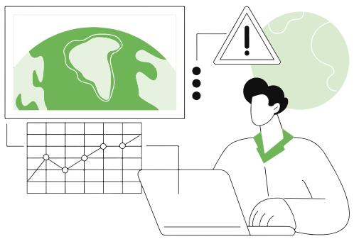

natural_image

Illustration of a person using a laptop with a warning triangle and globe icon (no text or symbols)

尚纬股份环境因素识别、评价及管理流程

<table><tr><td>环境因素识别</td><td>定期对公司环境因素进行识别,重点关注七个方面:水污染、大气污染、噪声污染、土壤污染、资源消耗、能源消耗、废弃物问题当产品和服务发生变化,新改扩建及新材料、新工艺、新设备的投入等情况下,需重新进行环境因素的识别和评价</td></tr><tr><td>环境因素评价</td><td>评价方法采用“是非判断法”和“多因子打分法”相结合进行,对所有的环境因素先通过“是非判断法”进行判断,再采用“多因子打分法”进行评价环境影响的规模、影响的严重程度、发生的频率、影响的持续等内容是环境评价的重点内容</td></tr><tr><td>重要性确认</td><td>根据评价结果确认环境因素与重要环境因素,并分别形成《环境因素清单》和《重要环境因素清单》对于识别出的重要环境因素,应将其纳入环境方针、目标及指标的策划过程中,确保管理举措与关键环境影响相衔接</td></tr></table>

为有效防范环境风险，公司制定环境突发事件应急预案并定期组织演练，同时常态化开展环境管理培训，持续提升全员环境意识与应急响应能力，夯实环境管理基础。

## 【案例】开展突发环境事件演练，提升员工应对能力

2025 年 8 月，公司开展废乳化液泄漏突发事件应急演练，模拟装有乳化液的铁桶倾倒导致环境污染。通过实战演练，员工深刻认识到废乳化液等危废的环境危害性，同时有效提升了应对突发环境事故的应急处置能力，演练达到预期效果。

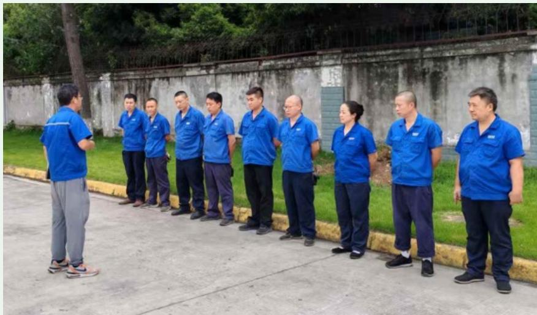

natural_image

Group of people in blue uniforms standing outdoors on a paved path, with a stone wall and greenery in the background (no visible text or symbols)

演练活动总结

## 2025年关键绩效

环保投入合计

261.10 万元

开展各类环境相关培训合计

3,840 学时

## 应对气候变化

## 治理

在全球气候变化挑战日益严峻的背景下，公司始终将应对气候变化作为一项重点工作，积极响应国务院《2030年前碳达峰行动方案》《中国应对气候变化的政策与行动》等要求，不断完善和优化气候变化相关管理，并按照“治理”“战略”“影响、风险和机遇管理” “指标与目标”气候信息披露框架，系统性梳理和呈现公司气候变化管理体系，提升自身应对气候变化的韧性与能力。

公司涉及温室气体排放的环节包括生产及运营过程中的天然气、柴油燃烧产生的直接排放，以及外购电力产生的间接排放，温室气体类型主要为二氧化碳、甲烷、氧化亚氮等。公司建立由董事会承担最终监督责任的应对气候变化管理体系，董事会及下辖战略与可持续发展委员会负责对包括应对气候变化在内的 ESG 相关事宜进行监督，对气候变化相关工作的实施与进展进行审查，确保公司各项环境相关目标得以实现。

## 战略

公司参考国际可持续准则理事会（ISSB）《国际财务报告可持续披露准则第2号——气候相关披露》（简称“IFRS S2”）的气候风险及机遇类型，结合公司的业务特点，进行了初步的气候风险分析与评估，识别了与公司资产和运营相关的气候风险与机遇，并采取措施有效应对识别出的风险及机遇。

尚纬股份气候相关风险识别与应对措施

<table><tr><td colspan="2">气候风险</td><td>具体描述</td><td>影响范围</td><td>财务影响</td><td>应对措施</td></tr><tr><td rowspan="2">实体风险</td><td>急性物理风险</td><td>可能受到台风、暴雨等自然灾害的直接或间接影响,使公司生产经营中断</td><td rowspan="2">短期中期长期</td><td rowspan="2">固定资产贬值运营成本增加营业收入下降</td><td rowspan="2">日常经营中通过属地气象网站密切关注气象预报和预警信息,及时了解自然灾害的动态和影响范围,实时监控做好预警工作提前检查生产设施、储备原材料及应急物资等,确保生产经营的稳固性和安全性,减少自然灾害对公司的日常生产经营造成影响,并定期开展灾备演练活动,确保员工的安全</td></tr><tr><td>慢性物理风险</td><td>可能面临因气温上升、海平面上升等慢性气候灾害,对公司日常生产及经营造成影响</td></tr><tr><td rowspan="4">转型风险</td><td>政策和法律风险</td><td>国内外对碳排放管控趋严,对公司温室气体排放管理提出了更高的要求;以及随着欧盟碳边境调节机制(CBAM)的生效,公司的碳成本可能进一步提升</td><td>短期中期长期</td><td>运营成本增加</td><td>及时了解和遵守相关监管法律法规,并根据法规要求规范各项业务的工作机制定期开展全公司的温室气体排放核查及产品碳足迹核算工作,以便及时响应相关要求</td></tr><tr><td>市场风险</td><td>低碳及产品碳足迹管理政策的出台将影响市场的供需结构,客户倾向于购买低碳产品,相关减碳压力逐渐传导至公司</td><td>短期中期长期</td><td>营业收入下降</td><td>密切关注气候变化相关法律法规政策并遵守相关标准,积极开展可持续及绿色产品研发</td></tr><tr><td>技术风险</td><td>受“双碳”政策推动,公司节能技改、节能降耗设备的引入等需求进一步上升,财务成本进一步增加</td><td>短期中期长期</td><td>运营成本增加</td><td>分析采用低碳技术及引进节能设备的可行性和必要性,推动电动叉车替换传统燃油叉车等举措,并积极研究、寻求生产及运营的低碳节能方案通过铺设光伏设备等举措,增加公司绿色能源的使用比例</td></tr><tr><td>声誉风险</td><td>低碳经济、气候相关议题愈发受到大众关注,若公司无法在应对气候变化方面进行合理回应,将对公司声誉造成一定的风险</td><td>短期中期长期</td><td>营业收入下降</td><td>丰富信息的披露渠道和内容,计划通过对外公布可持续发展报告及温室气体核算报告等举措,披露公司减碳降耗进展</td></tr></table>

尚纬股份气候相关机遇识别与应对措施

<table><tr><td>气候机遇</td><td>具体描述</td><td>影响范围</td><td>财务影响</td><td>应对措施</td></tr><tr><td>资源效率机遇</td><td>生产和运营过程中提高能源、水资源、原材料等资源的使用效率,降低公司运营成本</td><td>短期中期长期</td><td>运营成本下降</td><td rowspan="2">·积极采用绿色办公与绿色生产措施,并对员工加强资源与能源节约主题的宣贯工作·积极引进节能设备、铺设光伏设备、对现有设备进行节能技术改造等举措,减少能源成本的支出</td></tr><tr><td>能源来源机遇</td><td>运营过程中增加绿色能源的使用比例,降低公司受传统能源价格波动影响</td><td>中期长期</td><td>运营成本下降</td></tr><tr><td>产品与服务机遇</td><td>在低碳经济转型背景下,客户在环保产品与服务方面的需求在不断增加,对公司业务是新的市场机遇</td><td>短期中期长期</td><td>营业收入增加</td><td rowspan="2">·洞察市场需求,加大对创新型产品和技术研究、开发和采用·通过逐步增加产品中再生材料的使用比例,为公司研发环保产品提供更多可能性</td></tr><tr><td>市场机遇</td><td>低碳经济背景下,公司在气候变化方面的良好表现愈发受到市场青睐,致力于提升产品质量、工艺创新,在降低风险的同时为公司带来稳定收入</td><td>短期中期长期</td><td>营业收入增加</td></tr><tr><td>适应力</td><td>积极开展应对气候变化相关产业合作,或参与气候相关行业交流,有利于培养气候变化的适应能力</td><td>中期长期</td><td>运营成本下降</td><td>·通过积极加入行业协会,参与行业论坛展会等活动,与同行共享资源及最佳实践,促进技术创新和业务升级,更好地适应快速变化的市场环境</td></tr></table>

## 影响、风险和机遇管理

公司结合自身业务特点、内外部发展环境以及外部专业意见，构建完善的气候风险和机遇管理流程，覆盖识别、评估、监督等环节，助力提升公司面临气候相关风险时的韧性，同时挖掘公司业务中的潜在价值和机遇。

## 尚纬股份气候相关风险和机遇管理流程

  
识别  
识别可能影响公司运营、财务及战略目标的气候相关风险和机遇，确保覆盖气候变化带来的法律、技术、市场及环境等方面的当前及预期影响

  
评估  
基于识别的信息，通过定性分析，从短期、中期、长期三个层面评估风险的严重性及机遇的潜力价值

  
管理和监督

对各项气候相关风险和机遇的管理措施进行定期监控，评估其执行情况，定期向董事会及战略与可持续发展委员会汇报管理进展和执行效果

## 【案例】新建分布式光伏发电设备，助力公司温室气体减排

分布式光伏发电项目是公司推进绿色制造、实现清洁能源替代的标志性实践。2025年.公司利用厂房屋顶铺设光伏组件，总装机容量达 9.08MW，年均发电量约 900 万千瓦时。项目采用合同能源管理模式，公司无需前期投入即可享受电价优惠，每年节省电费约 90 万元；同时，光伏板兼具隔热功能，有效降低夏季厂房温度，减少内部能耗，改善员工作业环境。

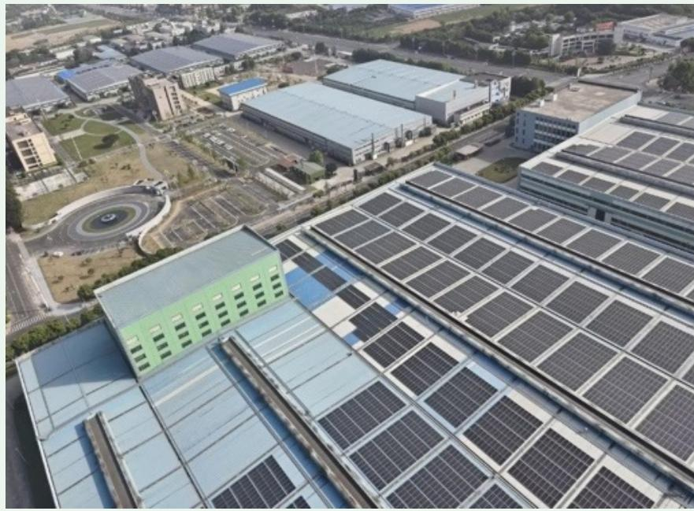

natural_image

Aerial view of a large industrial park with solar panel installations on rooftops and surrounding urban buildings (no visible text or signage)

厂房光伏设备俯瞰图

公司致力于为核电、智能电网、新能源、轨道交通、石油化工等领域提供高效的产品与解决方案，助力客户降低运营过程中的温室气体排放。通过精准聚焦光伏、风电、储能及特高压输电等新兴市场，公司帮助客户优化能源结构，提升清洁能源使用比例；同时，积极布局“一带一路”沿线能源项目，以先进的输电技术与配套服务，支持客户构建低碳高效的能源体系，共同推动全球能源产业的绿色转型与协同共赢。

## 2025年关键绩效

光伏设备累计发电量约

795 万千瓦时

其中公司消纳约

420 万千瓦时

## 指标与目标

公司紧跟国家低碳转型步伐，通过设立指标追踪气候变化适应与缓解进展，并积极通过优化能源使用等举措，进一步减少温室气体排放。

尚纬股份2025 年应对气候变化指标与目标

<table><tr><td>目标</td><td>指标</td><td>单位</td><td>2025年进展情况</td></tr><tr><td rowspan="2">响应国家“30·60”双碳目标,持续减少温室气体排放</td><td>温室气体排放总量</td><td> $tCO_{2}e$ </td><td>9,331.08</td></tr><tr><td>单位温室气体排放量</td><td> $tCO_{2}e/百万元$ </td><td>6.62</td></tr></table>

## 能源利用

## 治理

公司使用的能源包括天然气、柴油、电力、蒸汽。公司严格遵守《中华人民共和国能源法》《中华人民共和国节约能源法》等法律法规及相关要求，制定《能源管理体系手册》《能源评审控制程序》《能源运行控制程序》《设备设施用能控制程序》《节能节水管理办法》等内部制度及程序，规范管理各项能源使用。公司已建立专业化的能源管理组织架构，由设备动力部作为主要负责部门，负责各项管理制度的落实与管理举措的有效实施。

natural_image

Illustration of two people in protective gear holding potted plants under tree branches (no text or symbols)

## 战略

公司深刻认识到，持续依赖化石能源将对生态环境造成长期压力。为此，公司积极识别能源在全生命周期对环境、经济、合规的影响，防范能源消耗超标、成本失控、政策违规等风险，并挖掘节能改造、清洁能源替代等机遇，提升能源利用效率与绿色发展水平。

尚纬股份能源利用风险和机遇分析

<table><tr><td>主要风险</td><td>具体描述</td><td>影响范围</td><td>财务影响</td></tr><tr><td>声誉风险</td><td>若电价、燃料成本的持续上升或持续波动,对公司的稳定经营将造成影响,将增加产品的生产成本</td><td>中期长期</td><td>运营成本增加</td></tr><tr><td>主要机遇</td><td>具体描述</td><td>影响范围</td><td>财务影响</td></tr><tr><td>运营效率机遇</td><td>通过节能改造、使用绿色能源等形式,将有效降低单位产品的生产能耗与生产成本,在电价、燃料成本波动或上升的情况下,有利于公司在激烈市场环境中掌握成本优势</td><td>短期中期长期</td><td>运营成本下降</td></tr></table>

## 影响、风险和机遇管理

公司持续推进节能降耗战略，全面强化节能减排举措。在技术端，公司推广节能电机与 LED 灯具应用，从源头降低设备能耗；在管理端，公司组织跨部门小组对生产车间及办公区域开展现场核查，系统记录能源浪费与设备低效运行问题，深入挖掘节能改造潜力；在员工端，公司于 2025 年开展 2场能源主题培训以提升全员节能意识，形成覆盖技术升级、管理优化与文化培育的立体化节能体系。

## 【案例】开展员工培训，增强员工能源节约意识

2025年10月，为强化全员能源管理意识，公司组织开展“能源管理的重要性及其对企业的影响”专项培训。培训围绕能源采购、转换与消耗的全流程管控展开，系统阐释了能源管理在降本增效、合规经营、绿色转型及风险防控四大维度的战略价值，并从经济、合规、品牌及发展四个层面系统剖析了能源管理对企业利润提升、政策合规、形象塑造及技术升级的核心影响。通过本次培训，参训人员深入理解了能源管理对企业可持续发展的支撑作用，为后续推进能源体系建设奠定了坚实的认知基础。

## 指标与目标

公司设定能源使用目标，通过定期追踪综合能源消耗量等能耗指标，评估目标完成进展，并及时调整节能管理策略，不断加强能源节约能力。

尚纬股份2025 年能源利用指标与目标

<table><tr><td>指标</td><td>年度目标</td><td>2025年进展情况</td></tr><tr><td>综合能源消耗</td><td>持续减少综合能源消耗</td><td>综合能源消耗2,886.28吨标煤,并将通过各类减排措施,持续减少能源消耗</td></tr></table>

## 水资源管理

公司在办公运营、生产制造过程中使用的水资源均来自于市政用水，生产用水主要用于生产冷却循环系统，且公司在获取水资源方面不存在压力。公司深知水资源的可持续管理对于企业运营和环境管理的重要性，严格遵守《中华人民共和国水法》《节约用水条例》等法律法规及相关要求，制定《节能节水管理办法》等内部制度及程序，有效提升水资源管理效能。

公司将“节水优先、循环利用、合规排放”作为水资源管理治理目标，建立职责清晰的水资源管理组织架构，由设备动力部作为水资源专职管理部门，统筹推进水管理体系的落地，生产车间、技术部等部门落实具体使用及减排措施，持续完善水资源管理体系，依法合规使用水资源。

公司多措并举加强水资源管理，构建起覆盖日常监管、技术改造与意识提升的节水体系。2025年，公司通过定期检查用水设施，及时消除跑冒滴漏现象，并推进冷却水循环利用及老旧设施更新，从源头减少水资源消耗，同时面向员工常态化开展节水宣贯培训，将节约用水的理念融入日常运营各环节。

## 污染物与废弃物管理

## 污染物管理

公司高度重视污染物排放管理，严格遵守《中华人民共和国水污染防治法》《中华人民共和国大气污染防治法》等法律法规及相关要求，制定《污水固体废物管理程序》等内部制度及程序，依法合规排放污染物。2025年，公司各项污染物排放未受到重大行政处罚或被追究刑事责任。

尚纬股份主要污染物及处理方式

<table><tr><td>类别</td><td>主要污染物</td><td>处理方式</td></tr><tr><td>废水</td><td>生活废水</td><td>符合《污水排入城镇下水道水质标准》等法律法规要求,通过厂区污水管网纳入沉淀池后排入市政污水管道</td></tr><tr><td>废气</td><td>工业有机废气</td><td>主要采用“碱洗+二级活性炭吸附”的方式进行处理,处理后达标排放</td></tr></table>

公司已构建起系统化的环境监测与治理体系。公司制定覆盖废气、废水的全面检测方案，并委托权威第三方机构进行定期监测，以验证排放管理的实效，历年数据均显示各项指标稳定达标。2025年，公司进一步对废气处理设备进行升级，新增蓄热式催化燃烧设备（Regenerative Catalytic Oxidizer，RCO）、油雾净化装置等高效处理装置，显著提升废气治理能力，确保排放持续符合并优于法规要求。

## 【案例】投运脱附中心，有效提升废气处理能力

为提升挥发性有机物（VOCs）治理能效、降低危险废物处置成本，公司于 2025 年建成脱附中心。该中心集成活性炭吸附与催化分解工艺，通过脱附风机将热空气送入吸附床，使饱和活性炭吸附的污染物脱附并随气流进入催化分解床，在贵金属催化剂作用下高温分解为无害物质，实现活性炭再生与废气净化同步完成。

系统核心设备包括可容纳2.646 块活性炭的吸附床、含贵金属催化剂的催化分解床、脱附风机、补冷风机，并配备智能控制柜（具备运行时间记录及断电保护功能）及消防喷淋控制系统，确保全过程自动化监控与安全运行。项目的投运显著延长了活性炭使用寿命，减少了固废产生量，是公司推进清洁生产、构建废气治理与资源循环闭环的重要实践。

## 废弃物管理

公司产生的废弃物主要为生产及办公运营过程中产生的一般废弃物和危险废弃物。公司严格遵守《中华人民共和国固体废物污染环境防治法》《危险废物贮存污染控制标准》等法律法规及相关要求，制定《污水固体废物管理程序》《废品管理制度》等内部制度及程序，依法合规处理及处置各类废弃物。2025 年，公司未出现因废弃物管理不合规受到重大行政处罚或被追究刑事责任的情况。

尚纬股份主要废弃物及处理方式

<table><tr><td>类别</td><td>主要废弃物</td><td>处理方式</td></tr><tr><td>一般废弃物</td><td>包装废料生产边角料生活垃圾等</td><td>具有回收价值的废弃物经分类收集后,外售给再生资源回收企业进行资源化利用无价值的废弃物及生活垃圾等,交由市政环卫部门统一清运处理</td></tr><tr><td>危险废弃物</td><td>废拉丝液废矿物油含油棉纱等</td><td>存放于危险废弃物仓库,并交由具有资质的第三方公司对危险废弃物进行专业回收及处理</td></tr></table>

公司建立了覆盖废弃物全生命周期的闭环管理体系，对产生、收集、贮存、转移及最终处置各环节实施全方位监管，并通过台账管理确保每一类废弃物流向清晰、可追溯。针对危险废弃物，公司严格执行分类贮存、规范转移及无害化处置流程，定期核查存储场所，确保其 100% 合规处置。此外，公司通过优化生产技术、改进工艺流程及推动资源再利用，从源头持续降低废弃物产生量；同时，面向一线员工常态化开展危废专项培训，确保分类处置要求落实到位。

## 循环经济

公司深刻认知资源的循环利用对于环境保护的战略价值，致力于通过生产工艺的优化、资源的再利用、新材料的使用等方式，减少对原生资源的依赖，降低环境负担。

## 尚纬股份循环经济管理措施

## 危险废弃物

危险废物则委托具备资质的专业单位进行资源化处置，如废油回收再加工

## 一般废弃物

设置办公垃圾分类回收点，对废纸、塑料瓶等可回收物统一收集后交由再生资源企业处理，推动办公环节的资源循环利用  
对生产过程中产生的边角料、包装废料等一般固废进行分类回收，外售至再生资源企业加工再利用  
制定《挤塑材料消耗考核奖惩管理制度》，绞制工序通过导体称重验证实际与理论定额并控制生产余长，使生产端废铜、废线、废料、超长等浪费大幅降低，超期库存合理利用

## 生态系统和生物多样性保护

公司坚持将生物多样性保护作为环境责任的重要组成，内嵌于可持续发展战略。在严格遵守《环境保护法》《土壤污染防治法》及《关于进一步加强生物多样性保护的意见》等法规要求的基础上，公司系统性开展生态环境风险识别与隐患排查，将生物多样性保护理念贯穿于运营全过程。

公司所有新建项目均依据《环境影响评价技术导则 生态影响》（HJ 19-2022）开展环境影响评价，全面评估施工期及运营期对动植物及生态要素的影响。2025 年，公司新建或在建项目选址均避开自然保护区及生态敏感区域，从源头降低生态影响。

在合规运营基础上，公司持续优化厂区绿化，积极参与并支持社区生态修复项目，助力区域生态系统改善。同时，公司倡导全员参与的环境文化，鼓励员工投身生态保护实践，以实际行动践行人与自然和谐共生的长远愿景。

## 02

## 创新引领，践行产品责任

产品质量和安全管理 26

客户权益保障 31

数据安全与隐私保护 33

创新驱动 35

39

知识产权保护

负责任供应链

## 产品质量和安全管理

## 治理

公司严格遵守《中华人民共和国产品质量法》等法律法规及相关要求，并形成以《质量手册》为纲领，涵盖程序文件、管理规范、作业指导书、技术标准、质量记录四层结构的文件化体系，确保所有质量活动有章可循、有据可查。2025年，公司未发生产品安全与质量重大责任事故

公司构建了职责清晰、协同高效的三级质量和安全管理架构，其中最高管理层履行决策职能，质量部作为核心管理与执行层，各支持部门协同配合，共同保障质量体系有效运行。同时，公司高度重视质量人才队伍建设，全体检验员、试验员均经严格培训并持证上岗，关键岗位人员如高压试验员等均持有国家或行业认可的资格证书，为质量管控提供了坚实的人力保障。

natural_image

Illustration of digital media icons including a magnifying glass, cloud folder, and document with arrows (no text or symbols)

## 战略

公司坚持“以诚载信、质量第一”的质量诚信原则，专注于核电、智能电网、新能源、轨道交通、石油化工等领域的特种电缆研发与制造。公司深知产品的质量与安全对下游客户具有重要影响，深入识别产品在质量与安全方面对业务运营可能带来的风险与机遇，共梳理出 7 项质量与安全风险和 5 类机遇，并将其纳入战略研判与资源配置的考量范围。

尚纬股份产品质量和安全管理架构  
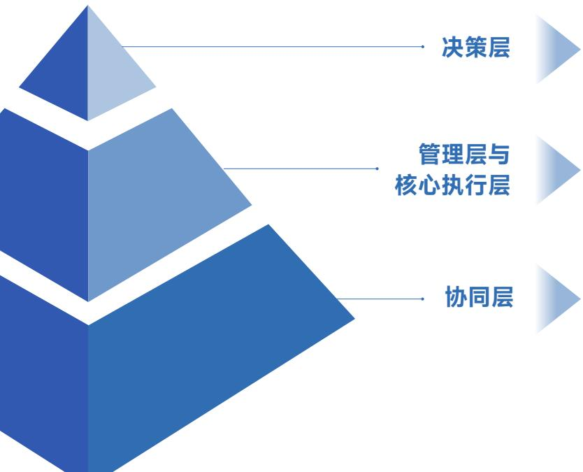

flowchart

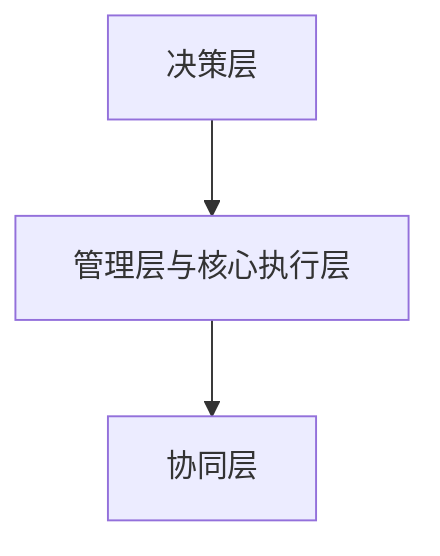

<table><tr><td>最高管理层</td><td>总经理是产品质量安全的第一责任人,管理者代表由公司高层领导担任,全面负责质量管理体系的建立、实施和保持</td></tr><tr><td>质量部</td><td>设立独立的质量部,下设质量保证和质量控制职能模块,质量保证模块负责体系流程、供应商质量管理、客户投诉处理与改进,质量控制模块负责从进料至出货的全过程检验与测试</td></tr><tr><td>各支持部门</td><td>技术部、生产管理部、供应链管理部、商务运营部分别承担设计质量、过程质量、来料质量和服务质量的相关职责,与质量部协同运行质量管理职责</td></tr></table>

尚纬股份产品质量和安全风险分析

<table><tr><td>主要风险</td><td>具体描述</td><td>影响范围</td><td>财务影响</td></tr><tr><td>合规性风险</td><td>主要包括未能及时识别或遵循新发布或变更的强制性标准(如国家标准GB、CCC认证规则),或未及时就生产过程、产品变更向认证机构申报导致证书失效,可能导致产品被市场禁售、面临法律处罚及订单取消,直接威胁企业生存</td><td rowspan="7">中期长期</td><td rowspan="7">营业收入下降运营成本上升</td></tr><tr><td>供应链风险</td><td>关键原材料(如绝缘料、铜材)质量波动或造假,且非供应商单一批次问题,可能导致企业在生产中无法弥补的批量缺陷,或可能引发大规模召回或重大安全事故</td></tr><tr><td>过程控制风险</td><td>涵盖关键工序(如交联、挤出)工艺参数失控、操作人员未严格执行工艺纪律,以及生产与检测设备失准,可能导致产品性能不合格(如绝缘厚度不均、耐压击穿),直接引发客户投诉或现场故障</td></tr><tr><td>检验与放行风险</td><td>包括检验标准或方法错误、关键安全项目(如耐火、阻燃试验)漏检或误判,以及不合格品被误用或放行,可能会将不合格品直接交付客户,导致质量问题外溢和客户安全事故</td></tr><tr><td>设计与技术风险</td><td>源于新产品设计未充分验证存在潜在缺陷,为控制成本不合理地降低技术规格,或对客户特殊应用场景理解不足导致选型错误,可能导致系统性、批次性质量隐患,解决成本高昂且周期漫长</td></tr><tr><td>售后与市场风险</td><td>已交付产品在质保期内出现性能衰减或批量故障、产品因不当安装使用引发安全事故及责任纠纷、以及市场劣质低价产品的竞争冲击,可能会直接产生召回成本、赔偿损失,并严重损害品牌声誉和订单稳定性</td></tr><tr><td>信息安全风险</td><td>产品设计、工艺参数等核心技术和质量数据泄露,可能会导致市场出现假冒伪劣产品,致使客户因使用假冒伪劣产品而产生安全隐患</td></tr></table>

尚纬股份产品质量和安全机遇分析

<table><tr><td>主要机遇</td><td>具体描述</td><td>影响范围</td><td>财务影响</td></tr><tr><td>市场与品牌机遇</td><td>在行业质量安全事故频发的背景下,公司稳定的高质量表现可成为突出的差异化竞争优势,凭借卓越的阻燃耐火、低烟无卤等安全性能,能够进军高端市场(如地铁、机场、核电),并有望获得国内外顶级客户的长期战略合作或“免检供应商”资格,进一步带来订单增长、溢价能力提升和更稳固的市场地位</td><td rowspan="5">短期中期长期</td><td rowspan="5">营业收入上升运营成本下降融资成本下降</td></tr><tr><td>技术与创新机遇</td><td>通过深入的质量数据分析,可反向驱动材料、工艺和产品设计的迭代创新,主动研发更环保、高性能、长寿命的“未来型”产品,有助于引领甚至参与制定行业标准,进一步提升公司质量标准</td></tr><tr><td>运营与成本机遇</td><td>通过推行全面质量管理和持续改进,能够显著降低内部浪费和外部损失等质量成本,建立稳定、高质量的供应链生态,有助于降低采购总成本和管理复杂度,同时卓越的质量信誉还能帮助公司降低保险费率和融资成本,有效提升盈利能力和运营效率</td></tr><tr><td>合规与标准机遇</td><td>提前布局以满足即将生效的更严苛法规或标准,可使公司获得市场先机,并通过积极参与国家、行业标准的制修订工作,为公司优化内部制度及体系标准奠定基础和积累经验</td></tr><tr><td>组织与文化机遇</td><td>深化全员质量文化,将“第一次做好,第一次做对”的理念内化为行为习惯,能够提升整体运营效能,同时卓越的质量声誉还能吸引并保留高素质的技术与质量人才,构建企业长期软实力和风险应对韧性</td></tr></table>

## 影响、风险和机遇管理

公司围绕产品全生命周期，构建了覆盖采购与供应商管理、生产过程控制、检验与试验、认证与一致性管理、仓储交付与服务等关键环节的全链条质量与安全管理体系。通过对原材料准入、工序质量监控、三级检验制度、认证产品一致性控制及仓储交付服务等各节点的严格把控，系统强化产品安全性能与质量保障能力，构筑起从源头到终端、贯穿全过程的质量安全防线。

## 尚纬股份产品质量和安全管理主要环节

## 采购与供应商管理环节

对铜杆、绝缘料、护套料等关键原材料实行准入管理，供应商必须通过评审  
每批次原材料需提供符合性检测报告，并执行严格的入厂检验，检验项目包括机械性能、电性能及阻燃特性等

## 生产过程控制环节

关键工序设立质量控制 点，进行在线检测和员工 首检、专检巡检、完工检  
对交联工序特殊过程进行严格的工艺参数确认与连续监控  
对生产设备使用的计量器具进行定期维护与校准

## 检验与试验环节

执行原材料检验、过程检验、成品出厂检验三级检验制度  
在关键安全性能测试方面，聚焦电气性能、机械物理性能与火灾安全性能  
按标准定期开展产品型式试验，验证产品设计的持续符合性

## 认证与一致性管理环节

对属于中国强制性产品认证（CCC认证）目录的产品，确保从型式试  
验报告、工厂检查到获 证后监督的全周期合规  
建立并运行认证产品一致性控制程序，确保批量产品与认证样品一致

## 仓储、交付与服务环节

规范仓储条件，防止产 品挤压、受潮、暴晒  
产品标识清晰，确保从生产批次可追溯到原材料批次、关键工艺参数和检验记录  
提供专业的产品选型指导、敷设安装建议及售后质量支持，确保产品在正确使用中发挥其安全性能

公司制定了覆盖采购、过程、成品及交付后产品全生命周期的《不合格品管理程序》，严格遵循“识别判定—分级评审—处置执行—纠正预防—记录归档”的闭环机制。所有不合格品立即标识、隔离，根据影响程度分为一般不合格与较大不合格，实施分级评审，其中军品不合格品须经专门评审委员会审理并取得顾客认可。不合格品处置方式涵盖返工、返修、降级、让步、退货及报废等，重要产品禁止降级或让步接收。此外，公司对重复发生或严重不合格品实施根本原因分析与纠正措施，主动监控外部不合格信息，重大问题及时通报认证机构，全过程形成规范记录并确保可追溯，有效保障产品质量和安全可靠。

公司建立完善的《质量奖惩制度》，设立独立于工资之外的“质量奖金”，鼓励员工主动反馈质量问题、如实暴露质量缺陷。同时，公司设置“质量红线”，对弄虚作假、违规操作等行为予以严肃处理，直至解除劳动合同。结合自身质量文化与核安全文化建设，公司构建了质量诚信及防范造假的报告与奖惩机制，对举报“弄虚作假、违规操作”的员工给予适当现金奖励，并在保护举报人合法权益的前提下，对举报行为予以表彰。

尚纬股份产品质量和安全管理措施

<table><tr><td>建立并持续维护一体化质量管理体系</td><td>体系认证与融合:公司依据ISO 9001、ISO 14001、ISO 45001等国际标准,建立了集质量、环境、职业健康安全于一体化的管理体系,该体系已获得权威第三方认证,并通过《质量管理手册》及系列程序文件予以制度化强制性产品认证管理:针对国家规定的产品目录,严格执行中国强制性产品认证(CCC)要求,建立了覆盖认证申请、型式试验、工厂检查、获证后监督及变更控制的全流程管理程序,确保认证产品持续符合安全标准</td></tr><tr><td>定期开展体系审核与管理评审</td><td>内部审核:公司制定年度内部审核计划,由经过培训的内审员组成小组,每年至少对质量管理体系覆盖的所有部门和过程进行一次全面、独立的符合性及有效性审核,以发现体系运行的不足和改进机会管理评审:最高管理层定期(通常每年至少一次)主持召开管理评审会议,系统评估公司质量方针、目标的适宜性,评审体系绩效、审核结果、客户反馈、过程趋势及改进建议,并做出资源调配和战略调整决策,确保体系的持续适宜性和有效性</td></tr><tr><td>过程管控</td><td>供应商与采购控制:建立《供应商管理程序》对供应商进行严格的准入评审、现场考察与定期绩效评价,对关键原材料实施进料检验,并对供应商生产过程和质量体系提出要求,确保供应链源头质量可靠生产过程控制:制定详尽的工艺操作规程和作业指导书,确保操作一致性;对挤塑、交联、成缆等关键和特殊过程,设定并监控工艺参数,进行过程验证确认;严格执行《质量检验制度》,实施“首检、巡检、完工检”三级检验制度,并配备先进的检测设备对产品的电气性能、机械性能及阻燃耐火等安全特性进行全项目测试;建立从原材料批次到成品的产品唯一性标识和追溯系统,确保任何质量问题可被快速、准确地追溯</td></tr><tr><td>系统实施纠正与预防措施</td><td>纠正措施:针对已发生的不合格(如内部检验不合格、客户投诉),严格按8D或类似问题解决方法进行根本原因分析,制定并实施有效的纠正措施,防止问题重复发生预防措施:通过数据分析(如质量月报、故障趋势)、内外部审核以及行业警示信息,主动识别潜在的不合格原因,并采取预防性措施,消除潜在风险</td></tr><tr><td>开展质量能力提升培训</td><td>员工培训:针对不同岗位人员开展针对性的质量培训,操作与检验人员进行岗位技能、操作规程、质量标准、安全意识培训专项活动:举办“质量月”活动、质量知识竞赛、技能比武等,营造全员关注质量的氛围;同时针对重大质量问题或管理变革组织开展专题研讨会</td></tr></table>

## 指标与目标

2025 年，公司持续深化产品与服务的安全与质量管理体系建设，以清晰的指标导向和目标管理为抓手，全面推进各项质量和安全管理措施落实到位。

尚纬股份2025 年产品质量和安全管理指标与目标

<table><tr><td>指标</td><td>单位</td><td>年度目标</td><td>2025年进展情况</td></tr><tr><td>电缆质量不合格引起的客户投诉或退货次数</td><td>次</td><td>0</td><td>0(达成)</td></tr><tr><td>质量事故发生次数</td><td>次</td><td>0</td><td>0(达成)</td></tr><tr><td>成品检验(非氟塑料)一次合格率</td><td>%</td><td> $\geqslant 99.90\%$ </td><td>达成</td></tr><tr><td>工序检验合格率</td><td>%</td><td> $\geqslant 99.83\%$ </td><td>达成</td></tr><tr><td>交货及时率</td><td>%</td><td> $\geqslant 97.49\%$ </td><td>达成</td></tr><tr><td>原材料采购合格率</td><td>%</td><td>A类、B类物料100%</td><td>达成</td></tr></table>

## 客户权益保障

## 治理

公司秉持客户至上的服务理念，严格遵守《中华人民共和国民法典》《中华人民共和国消费者权益保护法》等法律法规及相关要求，制定并实施《销售技术服务制度》《顾客满意度调查管理制度》等内部制度，所有客户交互均有记录、有流程、有闭环，有效保障客户权益。

公司构建总经理顶层领导、商务运营部统筹执行的治理架构，覆盖业务全链路各关键节点。基于行业需求，公司配备拥有相应资质的专业客户经理及售后技术人员，确保组织架构的高效运作与服务措施的精准落地。

## 战略

公司深知良好的管理措施将有效保障客户的权益，并持续提升客户满意度与体验。为维持客户的信任，公司定期开展客户权益保障相关机遇与风险分析，持续提升服务质量与品质，增强企业竞争力。

公司定期开展的客户权益相关风险识别与机遇分析，持续深耕服务细节与品质管控，在深化客户信任的同时，不断强化市场竞争优势，实现企业与客户的价值共赢。0

尚纬股份客户权益保障风险和机遇分析

<table><tr><td>主要风险</td><td>具体描述</td><td>影响范围</td><td>财务影响</td></tr><tr><td>订单流失风险</td><td>若公司服务响应不及时,与客户沟通不畅导致项目推进缓慢,可能导致客户投诉,从而在短期内造成订单损失,中长期内将严重损害公司品牌形象与声誉</td><td>短期中期长期</td><td>营业收入下降</td></tr></table>

<table><tr><td>主要机遇</td><td>具体描述</td><td>影响范围</td><td>财务影响</td></tr><tr><td>市场机遇</td><td>若公司通过提供超越客户期望的服务,并利用数字化工具持续提升服务体验,将会与客户建立高度信任与忠诚度</td><td>短期中期长期</td><td>营业收入上升</td></tr></table>

## 影响、风险和机遇管理

在强化制度保障与运营提效的基础上，公司进一步构建起覆盖全流程的客户服务体系，通过多元化沟通渠道、标准化响应机制与常态化反馈改进，确保持续提升客户权益保障水平。

## 尚纬股份2025年客户权益保障管理措施

## 运营提效与资源优化

完善销售制度、推行代理商规范管理、优化定价机制，持续强化商业活动的公平性与透明度，切实保障客户合法权益  
深化全面预算与绩效管理，将战略目标逐级分解至运营单元并实施过程跟踪，以精细化运营提升对客户需求的响应能力

## 数字赋能与智能转型

主导的“数字化研发设计生产协同能力建设项目” 成功验收，通过数据打通与系统集成，显著提升了订单响应速度、生产排程效率和产品质量一致性

natural_image

Illustration of a laptop with a smartphone and lock, surrounded by warning signs and fingerprint (no text or symbols)

公司建立7x24小时服务热线与专人对接机制，并开通多条信息反馈渠道。客户遇到问题可通过电话、邮件、信函等方式直接与公司销售人员或有关部门进行沟通，或者拨打售后服务专线进行反馈。接到客户问题后，有关人员在记录信息后及时传递给对应部门和人员，并形成《销售服务信息记录申请表》，妥善安排人员进行处理，积极协助客户解决，努力满足客户需要。

公司积极通过“顾客满意度调查表”“产品运行报告”了解客户诉求，并基于调查结果及客户建议，制定专项改进计划，从产品质量、交付期、产品性价比、包装运输、技术和服务等方面制定改进计划和提升改进方案，有效提升客户满意度。

## 2025年关键绩效

处理售前现场技术服务

14 次

电话技术咨询超

5,000 次

售后现场服务

7 次

## 指标与目标

公司将客户权益保障相关战略转化为可衡量、可追踪、可改进的具体指标目标，通过年度目标分解与动态调整机制，强化对潜在风险的识别与快速响应能力，为客户提供始终如一的高质量体验。

尚纬股份2025年客户权益保障指标与目标

<table><tr><td>指标</td><td>单位</td><td>年度目标</td><td>2025年进展情况</td></tr><tr><td>合同履约率</td><td>%</td><td>100</td><td>100(达成)</td></tr><tr><td>客户投诉处理率</td><td>%</td><td>100</td><td>100(达成)</td></tr><tr><td>售后服务及时率</td><td>%</td><td>100</td><td>100(达成)</td></tr><tr><td>客户满意度</td><td>——</td><td>&gt;90</td><td>99.53(达成)</td></tr></table>

natural_image

Illustration of a person reviewing a checklist on a large clipboard (no text or symbols present)

## 数据安全与隐私保护

公司严格遵守《中华人民共和国个人信息保护法》《中华人民共和国数据安全法》《中华人民共和国网络安全法》等法律法规及相关要求，各项管理措施覆盖运营各项环节，确保数据安全。截至2025年末公司未发生数据安全事件及客户隐私泄露事件

## 尚纬股份数据信息管理对象

  
业务数据类

• 客户信息：包括客户公司名称、地址、联系人姓名、职务、电话、邮箱等  
• 交易过程数据：投标文件、报价单、销售合同/订单、产品规格、交付计划、物流单号、收货凭证  
• 财务数据：合同金额、结算对账单、发票信息、收款记录

  
知识产权类

• 核心技术资产：与特定订单相关的产品设计图纸、技术参数、生产工艺文件、材料配方等  
• 商业机密：独特的投标策略、成本分析模型、未公开的定价策略

  
系统管理类

• 账户与权限信息：员工访问销售管理系统（CRM）、企业资源计划系统（ERP）、文档管理系统的账号、角色与操作权限  
• 操作日志与审计轨迹：系统自动记录的用户登录、数据查询、文件下载、修改、审批等操作日志，用于追溯行为  
• 系统配置信息：相关业务系统的后台配置、集成接口参数等

公司构建了覆盖“全生命周期”的数据安全管理体系，并建立了权责清晰、科学规范的安全管理架构。在决策层，由管理层负总责，确保战略方向与资源投入；在执行层，由商务运营部作为业务归口部门，全面统领数据安全与隐私保护体系的规划建设、日常运行及长效维护。

natural_image

Person writing on a notebook with a pen, surrounded by miniature models of green trees and office equipment (no visible text or symbols)

尚纬股份数据安全管理体系

<table><tr><td>制度管理</td><td>以《信息安全管理制度》为核心纲领,明确从物理环境到网络、系统、人员、数据的全方位管理要求配套《公司计算机和网络管理制度》《备份管理制度》等内部制度及程序,共同构成公司数据安全管理的制度基础</td></tr><tr><td>技术防护</td><td>对内部核心文档实施加密存储,外发文件需经审批流程解密,有效控制数据流转范围通过域统一管理、禁用非必要端口(如USB)、限制软件安装、监控网络活动等技术手段,降低数据泄露风险建立定期的服务器数据库备份机制,并将备份数据存储在独立介质中,确保业务数据的可用性和完整性,为应对意外事件提供保障</td></tr><tr><td>人员管理与培训</td><td>所有新员工入职必须接受信息安全培训,离职人员账号及时禁用或删除通过制度宣贯、案例学习等方式,持续提升员工的数据安全与隐私保护意识</td></tr><tr><td>监督与考核</td><td>通过系统日志、行为审计等方式进行日常安全监控建立信息安全事件报告流程,任何员工发现潜在威胁或事件,均有责任按程序上报;明确针对不同违规行为的四级处罚措施,并将信息安全表现与个人绩效考核及行政奖惩直接挂钩各部门负责人对本部门发生的信息安全事件负管理责任,强化中层管理者监督职责</td></tr></table>

2025年关键绩效

数据安全或隐私泄漏事件

0 发生

数据备份完成率

100 %

信息安全培训员工覆盖率

100 %

## 创新驱动

公司研发方向已从传统的材料与工艺升级，向智能化、绿色化以及面向极端环境与新兴领域的特种解决方案等多个维度深度拓展，围绕高端电缆产品开发、特种电缆关键技术攻关、关键工艺试验研究、特种电缆新材料研制等领域持续布局，重点推进核电站用电缆超大容量长距离传输高压超高压电缆、环保型矿用电缆等核心产品的研发攻关。

尚纬股份创新驱动相关重点荣誉与奖项（部分）

<table><tr><td>国家高新技术企业</td><td>四川省专精特新“中小企业”</td><td>安徽省专精特冠军企业</td></tr><tr><td colspan="2">全国电缆行业获得民用核安全设备设计、制造许可证的十一家企业之一</td><td>四川省机械工业科技奖3项</td></tr><tr><td>省级科学技术进步奖4项</td><td colspan="2">中国电力建设企业协会科技进步奖1项</td></tr><tr><td>中国机械工业科技进步奖1项</td><td colspan="2">中国电力科技创新奖1项</td></tr></table>

## 治理

公司建立健全研发创新管理体系，制定《科技创新成果奖励制度》《研发项目管理制度》《工艺管理制度》等内部制度及程序，有效规范研发项目管理，促进公司产品研发管理的规范化、科学化和法治化。此外，公司构建“省级技术中心 - 企业技术部门 - 生产管理部技术质量管理小组”三级研发管理架构，并设有原材料研究、工艺研究、技术研究、科研情报等相关职能组，通过专业分工与协同配合，有效提升研发体系的运行效率。

## 尚纬股份创新驱动管理架构

## 省级技术中心

外聘专家从事国内外前沿信息的收集及基础性的研究工作，并针对市场需要的新产品进行研发，对新工艺、新技术组织科技攻关，对研究成果进行产业化推广

## 企业技术部门

负责新产品企业标准的制定，工艺攻关及工装模具的改进

## 生产管理部技术质量管理小组

负责新产品的试制，提出改进建议，并针对新产品试制过程中的技术难点进行工艺攻关，确保设计的新产品结构最优、质量最优

## 战略

公司深知行业快速迭代的背景下，创新驱动战略能有效提升企业的市场竞争力与份额，通过持续创新将有效推动产业链上下游共同发展。公司定期梳理行业优势产品，设立重点产品研发及技术突破方向，持续创新实现新技术、新材料的实践与应用，为公司的长期可持续发展奠定基础。

尚纬股份创新驱动风险和机遇分析

<table><tr><td>主要风险</td><td>具体描述</td><td>影响范围</td><td>财务影响</td></tr><tr><td>市场份额下降风险</td><td>若公司未能有效推动创新,可能面临技术滞后、制造效率低等问题,在高端产品不能第一时间抢占市场,市场份额或有下降的风险</td><td>中期长期</td><td>营业收入下降</td></tr><tr><td>主要机遇</td><td>具体描述</td><td>影响范围</td><td>财务影响</td></tr><tr><td>差异化竞争机遇</td><td>创新驱动为企业带来产品和服务的差异化优势,在传统行业中走高端化路线,能开辟新的市场和收入来源,能较传统产品带来更高的利润率</td><td>短期中期长期</td><td>营业收入上升</td></tr></table>

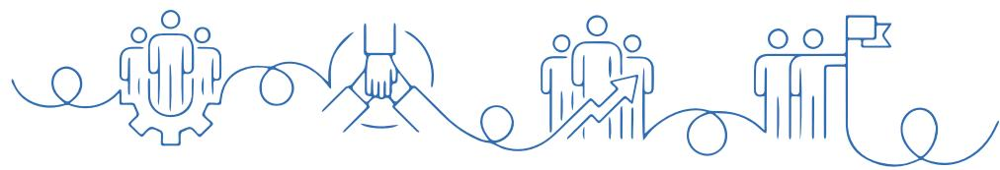

natural_image

Abstract line art illustration with interconnected human figures and a flag, no text or symbols present

## 影响、风险和机遇管理

## 研发创新管理

公司将创新驱动相关风险和机遇的识别与管理深度融入研发创新管理体系，构建起覆盖项目决策到设计确认的全生命周期流程管理，并依托《研发项目管理制度》明确各研发项目主要负责人，在保障对研发项目全过程、全环节追踪的同时，也确保新技术、新产品满足客户需求目契合公司战略目标与方向。

尚纬股份研发创新管理体系

<table><tr><td>决策阶段</td><td>结合公司发展规划、市场调研情况、同业产品信息等因素,制定《年度新产品开发建议书》由总工程师及相关部门对预算经费、开发周期等内容评审,确认《年度产品开发计划》,并开展产品开发工作</td></tr><tr><td>设计阶段</td><td>各项目负责人确认可操作、可实施的《项目实施计划》,同时明确项目开发周期、开发组成员、产品适用法律法规等信息</td></tr><tr><td>试制阶段</td><td>各项目组根据产品标准制定详细的产品试制计划依据产品标准和试制计划的规定,对试制产品进行检测试验,并按要求出具《检验报告》</td></tr><tr><td>设计验证阶段</td><td>对各阶段的结果进行评定,通过各种方法验证设计文件的正确性待试制验证合格后,形成正式的定型技术文件,进行批量生产、投入市场</td></tr><tr><td>设计确认阶段</td><td>总工程师组织有关部门和人员,对顾客需求及产品质量标准要求进行综合系统的检查评审,以保证最终设计满足输入对产品功能和特性的需求项目负责人根据试制情况形成《工艺文件》《材料消耗定额》等正式技术文件</td></tr></table>

公司立足中长期发展规划与科技发展目标，结合市场调研结果、新产品开发需求以及国内外技术情报分析，设立年度 “四新计划”，重点围绕工艺技术改进、新材料开发、新产品开发、技术研究四大领域，确保各细项创新及研发项目有序推进、资源高效配置，为技术突破与产品迭代提供清晰路径与坚实保障。

尚纬股份“四新计划”

<table><tr><td>工艺工装研究改善计划</td><td>新材料开发计划</td></tr><tr><td>推动公司工艺技术改进,不断提高工艺技术水平,降低制造成本,提升产品质量2025年立项 全年实现降本金额14项 236.72万元</td><td>结合公司设备、材料研究能力、市场需求和公司长远发展,明确技术创新的方向、加快攻克材料研究难题的进度2025年立项4项材料配方均完成试制验证并下发配方</td></tr><tr><td>新产品开发计划</td><td>技术研究计划</td></tr><tr><td>结合公司发展方向、制造及检验设备配置,形成年度产品开发目标任务2025年立项14项各项目按进度实施</td><td>重点推进高压超高压、特种电缆材料性能、燃烧性能等技术领域取得技术积累和突破,为客户提供优质产品和技术咨询服务2025年立项4项</td></tr></table>

## 创新平台与人才管理

公司坚持打造一支学历层次高、技术实力雄厚的研发团队，通过持续引进业内技术人才与加强内部人才培养，系统夯实各梯次研发人才队伍基础。在创新环境方面，公司引入 500 余台套行业领先的电缆制造及检测设备，显著提升了研发技术水平和检测能力。同时，公司拥有省级企业技术中心、特种电缆四川省工程研究中心、省级新能源及特高压电缆工程技术研究中心、省级电子辐照工程技术研究中心等多个研发平台，并与西安交通大学、四川大学、上海电缆研究所等建立了稳定的产学研战略合作关系。

## 尚纬股份研发人才管理举措

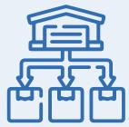

## 人员培训

对创新研发团队制定专业年度培训计划，根据计划实施培训考核，提升创新研发团队的专业能力  
加强研发人员对前沿技术及行业发展的了解，2025年对研发人员进行阻燃及耐火电缆标准现状及发展趋势分析、智能制造能力成熟度模型等项目培训

## 激励与发展

设立《科技创新成果奖励制度》，对于围绕与公司经营发展有关的科技成果或技术获得科技进步奖、新产品通过国家或省级技术成果评价、产品研发过程中取得相关专利、发表论文等成果均设立奖励标准  
鼓励科研人员不断提升自身技术水平，支持科研人员主动参与技能、职称评定

研发人员占比  
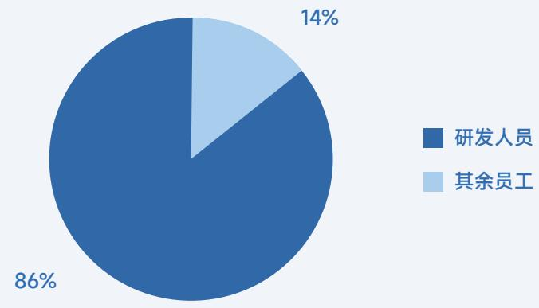

pie

| Category | Percentage |
| --- | --- |
| 研发人员 | 86% |
| 其余员工 | 14% |

## 新质生产力

公司以绿色创新为引领，推动产品定位从传统工业品向战略性新兴产业核心组件的转型升级。围绕新能源、特高压等国家重点发展方向，公司持续优化产品结构与技术路径，着力提升资源利用效率和环境友好水平，通过将绿色理念深度融入研发设计与制造全过程，实现自身高质量发展，也为产业链绿色低碳转型提供了有力支撑。

natural_image

Illustration of digital media icons including a magnifying glass, folder, and document with play button (no text or symbols)

## 【案例】攻克500kV超高压电缆技术，填补技术空白

公司以科技创新为核心驱动，成功攻克 500kV超高压电缆关键技术，研发出 500kV交联聚乙烯绝缘超高压电力电缆。该产品通过四川省科技成果评价，总体技术达到国内领先水平，填补了省内空白，充分体现了以关键技术突破引领产业升级的新质生产力实践。此外，公司高压超高压电缆在2022年被认定为四川省重大技术装备首台套产品，标志着公司在高端装备制造领域的创新能力和成果转化水平迈上新台阶。

## 指标与目标

2025 年，公司建立可衡量、可追踪的创新指标体系，精准评估公司创新活动的效率与成效，激发全员创新活力。

尚纬股份2025年创新驱动指标与目标

<table><tr><td>指标</td><td>单位</td><td>年度目标</td><td>2025年进展情况</td></tr><tr><td>研发投入占比</td><td>%</td><td>不低于营业收入3%</td><td>4.11(达成)</td></tr></table>

## 知识产权保护

公司高度认可知识产权对公司提升技术创新实力的重要性，严格遵守《中华人民共和国专利法》《中华人民共和国商标法》《中华人民共和国著作权法》等法律法规及相关要求，制定《专利管理制度》《知识产权运用制度》《企业著作权管理制度》《商标管理制度》等内部制度及程序，规范开展各项知识产权管理工作。公司设立知识产权管理委员会，作为知识产权统筹管理中心，负责知识产权制度体系建设、专利布局与维护、风险防控及成果转化应用等各项工作，有效维护公司知识产权权益。2025 年，公司未发生与知识产权相关的违法违规事件及商业秘密泄露事件。

公司建立覆盖设计、制造、采购、检验、人力资源、财务管理等全过程的知识产权合规管理体系，并通过GB/T 29490—2023知识产权合规管理体系认证。2025 年，公司开展外部知识产权培训2 场，并持续推进体系优化运行。

## 2025年关键绩效

全年申请专利并受理

13 件

其中

5 件为发明专利

累计拥有有效专利

164 件

（含专利合作条约PCT专利1件）

其中发明专利

70 件

实用新型专利

94 件

## 负责任供应链

根据供应商重要程度，公司将供应商分为关键类（A类）供应商、重要类（B类）供应商、一般类（C类）供应商及一般物资类供应商。公司制定《采购供应控制程序》《供应管理制度》《物资采购管理制度》《绿色采购管理制度》《合格供方评定制度》等内部制度及程序，明确供应商管理流程及采购要求，并由供应链管理部作为归口管理部门，确保制度有效落实，以实现对供应链的稳健、高效管控。

## 供应商管理

在供应商管理方面，公司建立并持续完善覆盖开发准入、考核评定与有序退出的全生命周期管理机制，通过严格的前端筛选、常态化的绩效评价与风险可控的退出安排，确保供应链的稳定性与可靠性，从源头保障产品质量与交付能力。

## 尚纬股份供应商全生命周期管理

<table><tr><td>开发与准入</td><td>根据生产经营和采购管理的需要,适时地对各类物资供应商进行开拓引进对具备相关资质的供应商,对其能力进行初步调查,以了解供应商的基本情况,包括供应商资质、供应商业绩、企业信用等信息</td></tr><tr><td>合格供应商评定与管理</td><td>对供应商提供的样品进行检测,确保其产品性能及关键参数符合公司标准与要求,部分重要供应商将对其进行现场审查及评价不定期针对合格供应商资质进行清查更换,确保所有合格供应商资质在有效期范围内定期对合格供应商开展考核,重点关注质量、交期、服务、价格等维度</td></tr><tr><td>供应商退出</td><td>根据考核结果,对不合格的供应商逐步减少采购量或取消其合格供应商资格同一供应商的同一产品连续两次(批)出现不合格或交货期两次严重逾期时,将被要求整改,如整改无效将被取消合格供应商资格</td></tr></table>

供应链安全是公司稳定生产的基础条件，公司识别到潜在的供应中断风险和供应商合规风险，通过积极拓展备用供应商、结合现有供应商开发新材料及新技术等举措，减少对于单一供应商的依赖，有效提升供应链韧性。

##

## 【案例】对供应商开展现场审核，有效保证供应链质量稳定

2025 年 4 月及 6 月，公司对四家供应商开展现场质保监查，重点围绕质量体系与组织管理、文件控制、设计控制、采购与物项控制、工艺过程与现场管理、检验试验与不合格品控制、记录管理与内审机制、核安全文化与防造假管理等八个方面，系统评估供应商在质量保证体系运行及过程管控中的合规性与有效性。经现场考察与系统评估，公司确认上述供应商在生产规模、工艺水平、过程控制及质量保证体系等方面均符合公司相关标准与要求，具备持续提供合格产品与服务的能力。

text_image

Meeting room scene with participants seated around a long table, one person presenting in front of a presentation screen displaying Chinese text.

供应商培训与审核

## 2025年关键绩效

考核合格的主要原材料供应商

88 家

其中

86 家得分 80 分及以上

采购及时率

100 %

采购合格率

100 %

## 绿色供应链

在供应商管理过程中，公司持续推动可持续供应链建设。公司通过与合格供应商签署《反商业贿赂承诺书》，强化商业道德与合规管理：在采购环节积极推行绿色采购，优先选择具备绿色工厂认证的供方开展合作，并与供方签订《ABB禁用限用物质清单》，严格控制有害物质使用；在物流环节，倡导与承运商合作使用国六以上排放标准的运输车辆，降低运输过程的环境影响。

## 2025年关键绩效

《反商业贿赂承诺书》签订率

100 %

##

## 以人为本，提升员工福祉

员工权益与福利 43

员工培训与发展 46

职业健康与安全 49

社会贡献与公益慈善 51

## 员工权益与福利

尚纬股份严格遵守《中华人民共和国劳动法》《中华人民共和国劳动合同法》等法律法规及相关要求，制定《劳动用工管理制度》《职级体系管理制度》《薪酬管理制度》《绩效考核制度》等内部制度及程序，并于2025年新发布6项核心人力资源管理制度，持续完善员工权益与福利保障。2025年，公司未发生雇佣童工及强制劳工相关案件，也未发生与员工招聘与解聘、薪酬、工时与假期、晋升与平等机会和劳工准则相关的违法违规情况。

## 员工雇佣与招聘

公司严格遵循法律法规，与全体员工签订规范的劳动合同，明确约定双方权利义务，确保劳动关系建立、履行全过程的合法、公正、透明。公司于每年年底制定年度招聘计划，明确用人需求与用人标准，并持续推动招聘及入职管理科学化、系统化。公司建立多样化的员工招聘渠道，包括外部招聘会、线上招聘平台、校园招聘等，积极鼓励员工对关键岗位进行内部竞聘，持续优化人才梯队结构。

<table><tr><td>人力资源目标策略培育高素质的第一战略资源</td><td>人才开发策略个人目标与企业目标相结合</td></tr><tr><td>队伍建设策略全员人力资源管理</td><td>人才选用策略德才兼备、竞争选拔、综合培养</td></tr></table>

natural_image

Two business professionals shaking hands in an office setting, with a laptop in the background (no visible text or symbols)

## 禁用童工

严禁雇佣童工，在招聘及用工管理过程中，对所有拟录用人员的身份信息及年龄进行严格核查，确保用工合法合规。

## 平等就业

严格落实职工劳动权益保障，在招聘与合同管理中明确规定不得歧视女性、残疾人及少数群体。

## 禁止强迫劳动

严禁强迫劳动，禁止扣押身份证件、限制自由及任何形式的体罚或暴力行为。

## 反歧视、骚扰及虐待

不允许任何形式的歧视、骚扰及虐待行为，对违规行为采取惩戒措施，并对投诉人信息严格保密。

## 例【案例】开展校企联动活动，助力产教深度融合

2025 年 9 月，成都理工大学工程技术学院智能制造工程专业的师生团队走进尚纬股份，实地探访生产一线，了解电线电缆的智能制造过程。公司重点介绍了作为制造业“大脑”的 MES（生产制造执行系统）在生产过程中的关键作用，为学生们提供了宝贵的实践平台。

text_image

尚纬智造 科技领航
成都理工大学工程技术学院
自动化工程系 智能制造工程专业

师生合照

natural_image

Illustration of a person interacting with a computer screen and document (no text or symbols visible)

## 员工沟通与福利

公司不断优化薪酬与福利体系，制定《薪酬管理办法》等内部制度及程序，规范员工薪酬发放标准。除基本工资外，公司设立岗位津贴、技能和职称津贴等浮动薪酬，构建固定薪资与浮动薪资相结合的模式，充分激发员工主观能动性与创造力。在完善的薪酬结构基础上，公司为员工提供多项补充福利，营造了温馨关怀的工作环境，切实提高员工幸福感和归属感。

## 尚纬股份补充福利（部分）

餐费补贴

免费宿舍

年度健康体检

职工阅读室

考试假

春节/年假交通费

生育结婚贺寿礼金

健身房

## 2025年关键绩效

劳动合同签订率

100%

退休返聘人员雇主

社保及公积金缴纳率

100%

责任险参缴率 100%

工资及时发放率

100%

劳动诉讼 0起

在员工关怀方面，公司持续开展多样化的关爱活动，覆盖三八妇女节、中秋节、春节等传统节日的慰问，以及“夏季送清凉”、家庭日等特色项目。公司高度关注少数群体需求，通过开展困难员工帮扶、协调解决员工子女就学等务实举措，切实提升员工的归属感与幸福感。此外，公司注重与员工的沟通，通过定期开展员工满意度调查等方式，聆听员工的想法和建议，并以此为依据积极改善。

## 例【案例】搭建员工沟通线上平台，拓宽员工沟通渠道

2025年7月，公司正式推出线上服务平台——“尚纬工享e家”微信公众号，以“服务职工、促进发展”为核心宗旨，构建“基础服务 - 成长赋能 - 活力生活”三位一体的线上服务平台。该平台的上线，不仅为职工提供了一个全方位、一站式、个性化的服务平台，更搭建起公司与职工之间沟通的桥梁、情感的纽带。

text_image

尽赏才有认同
待出才有收获

为户外高温一线员工发放智能清凉帽

text_image

Group of people in blue uniforms holding shopping bags with panda-themed items, standing in a hallway with a 'No Order' sign visible on the wall.

中秋节慰问

text_image

尚纬股份有限公司第五届“尚纬杯”

第五届“尚纬杯”跑步活动

## 2025 年关键绩效

  
年度食堂满意度（满分5分）

4.34 分

  
年度宿舍满意度（满分5分）

4.52 分

  
年度信息满意度（满分5分）

4.98 分

## 员工培训与发展

公司重视员工的职业发展与能力提升，秉持“怀揣共赢之志，让世界与你无界限”的员工培训发展理念，制定《培训管理制度》《“师带徒”培训活动实施制度》《新员工“导师协议”培训活动制度》等内部制度及程序，规范员工培训与发展管理工作。

## 员工培训管理

公司建立系统化的员工培训管理架构，由公司总经理负责审定培训战略方向、重点培训计划和预算，人力资源部作为公司培训工作的管理与协调部门，负责培训体系搭建、培训调研、计划、组织、评估、培训资源管理等全流程工作，各业务部门负责提出培训需求和实施专业培训，各层级分工明确确保各项培训课程的有效实施。

natural_image

Illustration of a person using a stationary bike with a checkmark and geometric shapes nearby (no text or symbols)

flowchart

公司设立多元化的培训体系，聚焦员工岗位不同，分别设置新员工、管理人员、一般在职人员培训，并定期开展调研活动，了解员工培训需求，通过差异化、定制化的培训课程，提升员工综合能力。公司培训分为内训和外训。对内，公司通过专业内训师授课、“师带徒”机制开展专项培训，快速提升员工技能并做好人才储备；对外，公司安排核心岗位员工通过开展行业内交流、参加论坛/讲座等方式，帮助员工拓宽视野并学习外部优秀经验。

## 尚纬股份员工培训管理体系

<table><tr><td>新员工培训</td><td>·包含三级安全教育培训、新员工通识培训、部门内工作引导等课程·向新员工介绍有关公司的基本背景情况,帮助员工明确自己的工作职责、程序、标准</td></tr><tr><td>管理人员培训</td><td>·分为高级管理人员培训与中基层管理人员培训·高级管理人员培训帮助管理人员了解行业发展趋势以及进行决策的程序和方法,提高前瞻性、洞察能力、思维能力、创新精神、决策能力、指挥领导能力·中基层管理人员培训帮助管理人员更好地理解和执行,公司高层管理团队的决策、改善管理工作绩效、提高管理水平和管理质量</td></tr><tr><td>一般在职人员培训</td><td>·提高员工的专业技术水平和业务能力,掌握本岗位的新知识·和新技术,培养自信心和团队合作精神·针对员工岗位职责、专业技能、操作规程、业务流程等进行反复强化培训,以使员工充分掌握理论知识,培养具有较高能力和素质的专业人才</td></tr></table>

## 例【案例】开展“老师傅经验分享”培训，提升员工专业技能

尚纬股份 2025 年度老师傅经验分享活动如火如荼开展，本次活动创新增设学员考试、讲师评分、集体评分等多元环节，让老师傅从单项的经验分享升级为“双向互动、闭环落地”，既确保员工深度学习领悟核心内容，更彰显了企业对技能人才的尊重与对匠心传承的重视，为企业高质量发展注入强劲动力。

natural_image

Group of workers in blue uniforms gathered inside a large industrial facility, observing equipment (no visible text or symbols)

老师傅经验分享现场

natural_image

Illustration of a person walking with a lightbulb above city skyline and airplane (no text or symbols)

## 2025 年关键绩效

计划培训

61 场次

完成率

100%

员工参与各类培训

5,179 人次

员工覆盖率

100%

培训经费支出

30.52 万元

## 员工晋升与发展

公司致力于构建标准化、体系化的员工职级管理体系，旨在引导员工与企业实现共同发展。公司设立涵盖管理、专业、技能及顾问的四大晋升通道，并在此基础上细分出九大职级序列，形成了覆盖全员的十五级职级体系。尚纬员工职级管理体系坚持“客观原则”，确保同一岗位员工能因个人综合素质的差异而获得精准的职级定位，营造了良好的职业发展环境，为公司战略性人才的储备与梯队建设奠定了坚实基础。

公司将职级管理视为人力资源评价的核心基础，建立与员工绩效表现紧密挂钩的职级动态调整机制。通过开展年度绩效考核，公司将考核结果作为员工职级晋升、常规评定以及岗位调整的关键参考标准，确保职级能够直观体现员工的实际能力、素质与价值贡献，实现了人才的能上能下与动态流动，将绩效压力有效转化为员工提升核心能力的动力，全面提升公司人力资源管理水平。

natural_image

Illustration of a person using a laptop with abstract background elements including mountains, pie chart, and flowers (no text or symbols)

尚纬股份员工职级与晋升管理体系

<table><tr><td>晋升通道</td><td colspan="2">职级序列</td></tr><tr><td>管理通道</td><td>管理序列</td><td>通用技能序列</td></tr><tr><td>专业通道</td><td>技术序列</td><td>关键技能序列</td></tr><tr><td>技能通道</td><td>研发序列</td><td>勤务序列</td></tr><tr><td>顾问通道</td><td>销售序列</td><td>顾问</td></tr><tr><td></td><td>其它专业序列</td><td></td></tr></table>

## 职业健康与安全

公司主要的职业病危害因素包括噪声、辐射和粉尘。公司严格遵守《中华人民共和国职业病防治法》《职业健康监护技术规范》《员工健康保护控制程序》等法律法规及相关要求，对公司安全生产和职业健康进行全方位管理。

公司制定了严格的安全生产与职业健康政策制度，包括《安全管理制度》《职业健康安全管理程序》《劳动防护管理程序》等，明确全体员工安全生产职责，要求员工遵守相关规定，强化安全意识，确保安全生产与职业健康。同时，公司成立安全生产管理委员会（以下简称 “安委会” ），由总经理担任安委会主任，下设安委会办公室（以下简称 “安全办” ），负责安全检查等安全管理事务。截至2025年末，公司两大生产基地乐山基地与安徽基地均获得 ISO 45001 职业健康安全管理认证。

依据《危险源辨识、风险评价与风险控制策划程序》，公司建立危险源风险动态管理体系。通过对各类危险源进行系统评估与等级划分，确定风险优先级，并据此采取相应管控措施，最终形成《重要危险源清单》，实现对清单内重要危险源的重点监管与动态控制。2025 年，公司共识别出危险源 3,583 条，经风险评价其中 22 条为公司级重要危险源，公司制定了相应的风险防控方案与措施进行重点防控。

## 尚纬股份危险源风险动态管理体系

## 识别

通过现场排查、员工反馈、法规梳理，识别职业病危害因素、安全隐患等风险点

## 评估

采用风险矩阵法，从可能性、严重性维度评估风险等级

## 排序

按“高风险优先处置”原则，确定管控优先级

## 监控

通过定期检测、现场巡检确保管控措施有效

## 管理

对高风险点制定专项管控措施，中低风险点常态化管理定期评审管控效果并持续优化

公司建立“应急-调查-分析-整改-复盘”全过程闭环管控机制。事故发生后，公司立即启动应急响应并开展多维度调查，采用“5Why分析法”穿透式查找根因，针对性制定整改与预防措施，经复核验证后纳入管理体系，并通过全员案例学习固化成效，实现从被动应对到主动预防的本质提升。

尚纬股份危险事故闭环管理流程

<table><tr><td>应急处置</td><td>事故发生后,现场人员立即停止作业、抢救伤者,并向车间安全员及安全办上报,启动应急方案</td></tr><tr><td>实施调查</td><td>由安全办牵头成立事故调查组,通过现场勘查、人员问询、调取监控等方式,明确事故直接原因与间接原因,形成《事故调查报告》</td></tr><tr><td>根因分析</td><td>采用“5Why 分析法”深挖事故根本原因(如操作不规范源于培训未覆盖细节、防护缺失源于设备巡检漏洞等)</td></tr><tr><td>整改措施</td><td>针对原因制定针对性纠正措施(如补充专项培训、优化设备巡检制度),明确责任部门与完成时限,同时制定预防措施,避免同类事故重复发生</td></tr><tr><td>验证复盘</td><td>整改完成后,安全办复核整改效果,组织全员开展事故案例学习,将整改措施纳入公司安全管理体系</td></tr></table>

natural_image

Illustration of a person in an orange shirt gesturing toward a large window, with no visible text or symbols.

公司制定《火灾事故专项应急预案》《特种设备事故专项应急预案》《触电事故专项应急预案》《辐射泄漏事故专项应急预案》共 4 项专项应急预案和 10 项现场处置方案，明确应急组织机构及职责、应急响应、后期处置、保障措施等内容，预案每三年评审并根据实际情况修订。

## 【案例】开展消防应急演练，提高员工安全防范意识

2025 年 6 月，公司组织开展配电间火灾事故应急演练。演练中，参演人员熟悉了应急响应流程，员工掌握了疏散注意事项，义务消防队能快速有效使用消防器材灭火，人员昏迷急救措施得当，达到了预期效果。

natural_image

Group of workers in blue and orange uniforms standing in a factory hall, observing equipment (no visible text or symbols)

消防演练现场

2025 年，公司围绕职业病危害源头治理与员工健康监护，多措并举推进职业健康管理工作。公司通过定期开展危害因素检测评价、落实全员及专项健康体检、强化培训教育与劳保配备，构建起覆盖“检测—体检—培训—防护”全链条的职业健康防护体系，切实保障员工职业健康权益。

## 定期检查

每年委托第三方专业机构对生产现场噪声、辐射等职业病危害因素开展定点检测，出具《职业病危害因素检测报告》  
每三年开展一次职业危害因素现状评价，全面评估危害因素分布风险等级及防护措施有效性，评价结果应用于员工日常管理和培训

## 健康体检

组织全体在职员工开展年度常规体检，未发现重大健康异常  
为13名接触噪声、辐射的员工开展职业病专项体检，体检结果均符合职业健康标准，未检出疑似职业病病例

## 尚纬股份2025 年职业健康管理措施

## 培训教育

累计开展安全生产及职业健康培训12场 培训内容涵盖法规解读现场隐患识别、防护用品正确使用、应急处置流程等，累计培训时长106课时，员工培训覆盖率98%

## 劳保设备

定期为员工配发防噪耳塞、安全帽、防护手套等劳动防护用品，2025 年累计发放防护用品1.8万件，用品按需发放率100%  
通过现场巡查核查，防护用品完好率及佩戴合规率均达96%以上

## 社会贡献与公益慈善

公司重视与运营所在地社区建立良好的沟通机制，并积极投身乡村振兴与公益事业。公司利用自身影响力改善民生，重点开展员工献血、扶贫助学等项目。公司利用自身影 响力改善民生，重点开展员工献血、扶贫助学等项目，共建和谐社会。2025年，公司共对外捐赠11.27万元。

natural_image

Illustration of two people shaking hands with speech bubbles above, symbolizing partnership or agreement (no text present)

## 【案例】尚纬股份荣获市级“无偿献血爱心团体”

2025年6月，由乐山市卫生健康委员会、乐山市红十字会联合主办的乐山市 2025 年“世界献血者日”公益宣传活动顺利举行。本次活动以“献血传递希望、携手挽救生命”为主题，尚纬股份获邀参会并获颁“2023-2024 年度无偿献血爱心团体”奖牌。近年来，尚纬股份始终秉承着“一边发展一边回报社会”的爱心公益理念。自 2003 年起，公司坚持公益之路，将无偿献血作为企业社会责任的重要部分。

text_image

授予: 尚纬股份有限公司
2023-2024年度无偿献血
爱心团体
乐山市中心血站
二〇二五年六月 制

尚纬股份荣获“2023-2024年度无偿献血爱心团体”奖牌

## 例【案例】尚纬股份助力马边大竹堡乡教育

尚纬股份员工代表前往马边彝族自治县，贯彻落实四川 39 个欠发达县域托底性帮扶工作推进会议精神，围绕捐资助学、定向帮扶、农产品采购等方面，定向帮扶马边彝族自治县大竹堡乡以及洛角机姐、阿左阿叶、严左曲叶三户困难家庭，并向该县大竹堡乡中心校捐赠一批体育用品，助力教育事业发展，为孩子们送上了“六一”国际儿童节的祝福和关爱。

text_image

传递尚纬情 聚爱大竹堡
—— 尚纬股份托底性结对帮扶马边大竹堡乡活动

结对帮扶活动合照

## 04

# 法治筑基，夯实治理根基

公司治理 54

合规与风险管理 56

商业道德 58

natural_image

Close-up of a wooden gavel resting on a dark wooden base, no visible text or symbols

## 公司治理

公司严格遵守《中华人民共和国公司法》《中华人民共和国证券法》《上市公司治理准则》等法律法规及相关要求，持续完善治理结构，强化规范运作能力。

## 治理

公司制定《公司章程》《股东会议事规则》《董事会议事规则》等内部制度及程序，建立由股东会、董事会、公司管理层组成的自上而下的公司治理架构，明确决策、执行、监督等的职责权限，形成科学、有效、合理的职责分工和制衡机制。公司董事会下设战略与可持续发展委员会、审计委员会、薪酬与考核委员会、提名委员会四个专门委员会，为董事会的决策提供了科学和专业的意见和参考。

为了提升决策效率并顺应监管趋势，公司撤销监事会，将其监督职能整合至董事会下设的审计委员会。通过增强独立董事的作用与内部审计的独立性，公司构建权责清晰的现代化监督体系，以更好应对市场变化，保障公司长期稳健发展。

natural_image

Illustration of a document with a stamp and cloud background (no text or symbols)

flowchart

## 战略

公司深知公司治理对于企业长期发展的重要性，将直接决定企业的透明度、合规性和决策质量，若公司治理不当会影响投资者信心，对公司市值的稳定性产生影响。公司积极开展风险和机遇的识别工作，并判断各类风险和机遇在不同时间范围对公司财务造成的影响，以通过各类举措持续优化完善治理策略与方式，保障公司长远发展。

尚纬股份公司治理风险和机遇分析

<table><tr><td>主要风险</td><td>具体描述</td><td>影响范围</td><td>财务影响</td></tr><tr><td>监管处罚风险</td><td>若公司关联交易不规范、对外担保存在风险、信息披露不准确等事项,可能影响投资者对于公司的信任,公司对外融资将变得困难</td><td>中期长期</td><td>融资成本上升</td></tr><tr><td>主要机遇</td><td>具体描述</td><td>影响范围</td><td>财务影响</td></tr><tr><td>运营效率机遇</td><td>通过优化线上及线下沟通渠道,提升信息披露丰富度及准确性,将有效提升公司治理透明度,帮助企业吸引长期投资者</td><td>短期中期长期</td><td>运营成本下降</td></tr></table>

## 影响、风险和机遇管理

## 确保专业履职

为在董事会治理中充分发挥决策参与、监督制衡与专业咨询等职能，公司独立董事依据相关监管规范，通过深度参与战略审议、风险管控及薪酬激励等关键议题的表决与建议，切实履行维护公司整体利益、保障全体股东尤其是中小股东合法权益的责任。公司董事会建设注重独立性和多样性，形成与经营管理需求相适应的成员结构。公司独立董事占比 33.33%，具备行业专业知识、财会风控经验及资质，为公司风险防范和战略决策提供支撑。

尚纬股份2025年董事会成员构成及相关会议召开情况

<table><tr><td>董事9名</td><td>其中独立董事3名占比33.33%</td></tr><tr><td>其中非独立董事6名占比66.67%</td><td>其中女性董事5名占比55.56%</td></tr><tr><td>召开股东会会议3次</td><td>召开董事会会议8次</td></tr></table>

## 保障股东权益

公司全面规范公司信息披露事务，确保及时、公平地披露信息，保障所披露信息的真实性、准确性和完整性。此外，公司严格履行关联交易的审议程序及关联交易信息披露义务，持续宣导股份增减持操作规范，强化合规意识，提升风险防范能力，同时规范对外投资管理，确保及时履行相关审批程序，切实保障公司运营合法合规。2025 年，公司不存在虚假记载、误导性陈述或者重大遗漏等任何违反信息披露相关规定的情形。

在依法依规履行信息披露义务的基础上，公司通过各类举措保持与投资者的定期沟通：召开线上业绩说明会，及时向投资者解读公司经营成果与未来规划；线下接待机构投资者调研，深度交流公司发展战略与投资价值；积极回复上交所 e 互动平台上的投资者提问，确保信息透明；同时，安排专人接听投资者电话，耐心解答各类疑问。

## 2025 年关键绩效

开展业绩说明会 次2披露定期报告 4 份临时公 告 份81

## 指标与目标

为推进公司的长效治理，公司设定了可衡量、可管理的指标与目标，并通过实践管理持续优化指标表现，并推动相关策略的有效实施，监督总体目标的达成进度。

尚纬股份2025年公司治理指标与目标

<table><tr><td>指标</td><td>单位</td><td>年度目标</td><td>2025年进展情况</td></tr><tr><td>独立董事占比</td><td>%</td><td>≥1/3</td><td>1/3（达成）</td></tr><tr><td>信息披露准确率</td><td>%</td><td>100</td><td>100（达成）</td></tr></table>

## 合规与风险管理

公司秉持“合规创造价值，风险防控护航”的理念，将合规与风险管理视为可持续发展的基石，2025 年致力于推动风控合规工作从“事后纠错”向“事前预防”与“事中控制”转变，深度融入战略决策与业务运营的全流程。

公司严格遵守《中华人民共和国审计法》《企业内部控制基本规范》等法律法规及相关要求，建立以《公司章程》为统领的立体化管理制度，通过定期自评、专项审计、日常合规审核等措施对制度执行效果进行检验，形成“制定-执行-检查-整改-优化”的制度体系闭环管理。此外，公司完善由董事会及审计委员会统领、管理层负责、内审部门监督、业务及职能部门协同落实的 “三道防线” 治理架构，内审团队核心成员均具备财务、审计、法律等多学科背景及执业资质，规范化开展各项合规与内控管理工作，并实现风险的有效防范。

尚纬股份合规与风险管理机制

<table><tr><td>信息报告机制</td><td>监督与检查机制</td><td>考核机制</td></tr><tr><td>内审部门定期(季度、年度)向审计委员会提交工作报告对重大审计发现、重大风险及舞弊事项,及时向审计委员会及管理层递交专项报告</td><td>制定年度审计计划,实施现场审计、非现场监测、专项核查、后续审计等方式进行监督运用数据分析、穿行测试、控制测试、实质性测试等方法确保内部控制管理体系的持续有效</td><td>将审计发现问题的整改完成率、内部控制的有效性等指标纳入相关部门及负责人的绩效考核体系,确保各项整改措施落实到位</td></tr></table>

通过将合规管理与业务实践深度融合，公司不仅在采购成本节约、流程效率提升及资产损失避免等方面取得了可量化的成效，更推动内部审计与合规职能从传统的“成本中心”向“价值中心”转型，实现了风险防控与企业价值创造的双重提升。同时，公司积极探索数字化审计创新，借助大数据与人工智能手段提升风险识别的前瞻性与精准性，持续强化风控体系的智能化水平，为战略决策和业务稳健运行提供有力支撑。

## 2025 年关键绩效

完成15 项专项审计

完成 4 个核心业务板块的权限指引修订

2025 年，公司重点聚焦战略、财务、运营、合规及声誉风险等领域，系统开展了全面的风险评估。在此基础上，公司组织覆盖全员的合规培训，内容涵盖新修订的《反不正当竞争法》核心条款与案例分析、《监察法》下的企业及个人责任等，有效提升全体员工合规意识。

natural_image

Illustration of two people collaborating at a desk with a laptop, no text or symbols present

审核、修订各类合同 6,407 份

修订、拟定公司模板合同 31 份

## 商业道德

尚纬股份严格遵守《中华人民共和国公司法》《中华人民共和国反不正当竞争法》等法律法规及相关要求，将商业道德视为不可触碰的红线，通过建立健全防控体系、强化监督问责和廉洁文化建设，坚决抵制一切形式的商业贿赂和贪污行为，保障公司健康可持续发展。

尚纬股份商业道德风险和机遇分析

## 治理

公司制定《反商业贿赂与反腐败政策》《举报者保护政策》等内部制度及程序，同时合同模板中内嵌《廉洁协议》或禁止商业贿赂条款，明确禁止行为、审批流程、调查程序与处罚标准，确保合规要求贯穿业务合作全过程，从制度源头有效防范商业道德风险。

公司建立由审计委员会领导，纪检监察部门牵头执行，内部审计部门独立监督的三位一体治理体系，各部门人员均具备法律、审计等专业资质与背景，确保合规管理体系独立有效运行，从源头上实现权力制衡与风险闭环管控。2025 年，公司未发生商业贿赂及贪污事件，也未发生公司不正当竞争行为导致诉讼或重大行政处罚事项。

## 战略

以建设全行业公认的廉洁治理标杆企业为目标，公司坚持“预防为主、查处为辅、文化引领”的综合策略，通过对标新法升级管理制度、依托大数据赋能交易监测、将合规审计深度延伸至供应链全链条，并持续开展常态化廉洁教育，构建起制度、技术与文化多措并举的商业道德管理体系。

<table><tr><td>主要风险</td><td>具体描述</td><td>影响范围</td><td>财务影响</td></tr><tr><td>监管处罚风险</td><td>采购环节收受回扣、销售环节商业贿赂、挪用公款等商业道德负面事件,可能增加企业面临法律诉讼和监管处罚的风险,导致严重的财务损失,进一步影响企业经营表现、市场地位和公众信任</td><td>中期长期</td><td>运营成本上升</td></tr><tr><td>营销活动违规风险</td><td>在激烈的市场竞争中,营销人员可能发布不实或误导性信息,对公司的品牌形象造成不良印象</td><td>短期中期</td><td>营业收入下降</td></tr><tr><td>主要机遇</td><td>具体描述</td><td>影响范围</td><td>财务影响</td></tr><tr><td>运营效率机遇</td><td>有效的反商业贿赂及反贪污举措可增强企业的合规能力,提升投资者和利益相关方信心,从而助力企业长远发展并获得更多合作机会</td><td>短期中期长期</td><td>运营成本下降</td></tr><tr><td>差异化竞争机遇</td><td>实施反不正当竞争政策有助于提升企业的市场信誉,吸引注重合规的投资者和客户,巩固行业内的竞争优势</td><td>短期中期长期</td><td>营业收入上升</td></tr></table>

## 影响、风险和机遇管理

公司建立反商业贿赂及反贪污风险管理流程，规范识别商业道德相关的潜在风险，系统评估其可能造成的影响，并据此制定针对性控制措施，同时将日常管理举措与风险管控相结合，切实减少和管控风险发生。

尚纬股份反商业贿赂及反贪污风险管理流程

<table><tr><td>识别与评估</td><td>通过流程梳理、行业案例研究、员工访谈、举报线索等方式识别风险点,并评估其发生可能性和影响程度</td></tr><tr><td>风险排序</td><td>根据评估结果对识别的风险进行优先级排序,确定管理资源分配</td></tr><tr><td>持续监测</td><td>通过内部审计、合规检查、交易数据分析等措施进行持续监测</td></tr><tr><td>管理改善</td><td>将反商业贿赂及反贪污要求纳入合同,作为合同前置条件大额礼品收受及招待实行事前审批与事后报备将合规审查嵌入市场推广、采购招投标等关键业务流程</td></tr></table>

公司人事、财务、工程、销售、接待、招标、物资采购等关键岗位员工必须签订《廉洁承诺书》，明确禁止员工参与职务侵占、弄虚作假、权力私用或接受回扣等不正当行为，并规定违规者将被解除劳动合同。2025年，公司积极开展员工廉洁教育培训，全体高管及员工均参与本次培训， 共同构建廉洁透明的商业行为防线。

公司建立完善的投诉举报机制，设立总经理邮箱、电话（热线号码：0833-2197332）等举报渠道，鼓励员工及各利益相关方对实际或疑似舞弊行为进行举报及反馈。公司将秉持谨慎性原则，收到举报及反馈后第一时间开展调查，并根据调查结果依法依规处理。此外，公司严格对举报人信息及举报材料予以保密，严禁任何人员对举报、提供信息或协助调查者进行打击报复。

公司高度重视反不正当竞争工作，从宣传规范与商业秘密保护两方面筑牢防线，有效防范不正当竞争风险，营造公平诚信的市场环境。在宣传推广方面，公司建立跨部门多重审核机制，确保所有对外文案真实、合法，严防虚假宣传行为。在商业秘密保护方面，公司与涉密人员签订《保密与竞业禁止协议》，并对核心数据实施分级分权访问控制，构建起严密的安全屏障。

natural_image

Illustration of a blue scroll with checklist symbols, set against a mountainous background (no text or symbols)

## 指标与目标

为保证公司各项商业道德管理措施的有效性，公司制定可衡量的管理指标与目标，通过优化管理实践，持续推动商业道德战略目标的有效达成。

尚纬股份2025年商业道德指标与目标

<table><tr><td>指标</td><td>单位</td><td>年度目标</td><td>2025年进展情况</td></tr><tr><td>高风险合作伙伴尽职调查完成率</td><td>%</td><td>100</td><td>100(达成)</td></tr><tr><td>涉嫌舞弊举报线索调查完结率</td><td>%</td><td>95%以上</td><td>95%以上(达成)</td></tr><tr><td>重大商业贿赂事件发生数</td><td>件</td><td>0</td><td>0(达成)</td></tr></table>

natural_image

Hand reaching toward a target symbol with a crosshair overlay against a blue sky and clouds (no text or symbols)

## 附录一：ESG数据绩效表据表

环境合规管理数据表

<table><tr><td>披露项</td><td>单位</td><td>2025年</td></tr><tr><td>报告期内因环境事件受到生态环境等有关部门重大行政处罚的事件数量</td><td>件</td><td>0</td></tr><tr><td>报告期内因环境事件受到生态环境等有关部门重大行政处罚的金额</td><td>万元</td><td>0</td></tr></table>

应对气候变化数据表

<table><tr><td colspan="2">披露项</td><td>单位</td><td>2025年</td></tr><tr><td colspan="2">温室气体排放总量 $^{1}$ </td><td>吨二氧化碳当量</td><td>9,331.08</td></tr><tr><td rowspan="2">按范围分类</td><td>范围一温室气体排放量 $^{2}$ </td><td>吨二氧化碳当量</td><td>441.28</td></tr><tr><td>范围二温室气体排放量 $^{3}$ </td><td>吨二氧化碳当量</td><td>8,889.80</td></tr><tr><td colspan="2">单位营收温室气体排放量 $^{4}$ </td><td>吨二氧化碳当量/百万元</td><td>6.62</td></tr></table>

[1] 温室气体排放总量=范围一温室气体排放量+范围二温室气体排放量。  
[2] 范围一温室气体排放为柴油、天然气消耗产生的直接温室气体排放，温室气体种类包括 CO 、CH 、N O，2025 年计算时温室气体当量选取 IPCC AR6 GWP 百年平均值，各类能源排放因子参考《2006IPCC国家温室气体清单指南》等。  
[3]范围二温室气体排放为外购电力产生的间接温室气体排放公司按基于位置的方式计算外购电力产生的温室气体排放，温室气体排放因子参考生态环境部、国家统计局《关于发布2023年电力二氧化碳排放因子的公告》全国电力平均二氧化碳排放因子。  
[4] 单位营收温室气体排放量=温室气体排放总量/ 营业收入。

能源利用数据表

<table><tr><td colspan="2">披露项</td><td>单位</td><td>2025年</td></tr><tr><td colspan="2">综合能源消耗量</td><td>吨标准煤</td><td>2,886.28</td></tr><tr><td rowspan="3">直接能源</td><td>柴油</td><td>升</td><td>16,490.00</td></tr><tr><td>汽油</td><td>升</td><td>55,168.75</td></tr><tr><td>天然气</td><td>立方米</td><td>126,526.99</td></tr><tr><td colspan="2">直接能源消耗量</td><td>吨标煤</td><td>248.79</td></tr><tr><td rowspan="2">间接能源</td><td>外购市电</td><td>兆瓦时</td><td>16,754.25</td></tr><tr><td>外购绿电</td><td>兆瓦时</td><td>4,690.88</td></tr><tr><td colspan="2">间接能源消耗量</td><td>吨标煤</td><td>2,637.49</td></tr><tr><td colspan="2">清洁能源消耗量</td><td>吨标煤</td><td>745.20</td></tr><tr><td colspan="2"> $清洁能源消耗占比^1$ </td><td>%</td><td>25.82</td></tr><tr><td colspan="2"> $单位营收综合能源消耗量^2$ </td><td>吨标准煤/百万元</td><td>2.05</td></tr></table>

[1] 清洁能源消耗占比=清洁能源消耗量/综合能源消耗量\*100%。  
[2] 单位营收综合能源消耗量=综合能源消耗量/营业收入。

flowchart

水资源管理数据表

<table><tr><td>披露项</td><td>单位</td><td>2025 年</td></tr><tr><td>总耗水量 $^{1}$ </td><td>立方米</td><td>184,209.00</td></tr><tr><td>单位营收耗水量 $^{2}$ </td><td>立方米 / 百万元</td><td>130.66</td></tr><tr><td>循环用水总量</td><td>立方米</td><td>869,000.00</td></tr><tr><td>循环用水占比 $^{3}$ </td><td>%</td><td>82.51</td></tr></table>

[1] 2025年，公司水源均来源于市政供水。  
[2] 单位营收耗水量=总耗水量/营业收入。  
[3] 循环用水占比=循环用水总量/（循环用水总量+总耗水量）\*100%。

natural_image

Illustration of two people watering a globe with a plant and gears, symbolizing global growth or investment (no text present)

污染物与废弃物排放数据表

<table><tr><td colspan="2">披露项</td><td>单位</td><td>2025年</td></tr><tr><td colspan="4">废气管理</td></tr><tr><td rowspan="4">废气污染物排放量</td><td>氮氧化物( $NO_x$ )</td><td>千克</td><td>24.00</td></tr><tr><td>挥发性有机物(VOCs)</td><td>千克</td><td>3,442.91</td></tr><tr><td>颗粒物(PM)</td><td>千克</td><td>458.00</td></tr><tr><td>非甲烷总烃(NMHC)</td><td>千克</td><td>19.49</td></tr><tr><td colspan="4">废弃物管理</td></tr><tr><td colspan="2">废弃物处置总量 $^1$ </td><td>吨</td><td>856.87</td></tr><tr><td colspan="2">一般废弃物处置量</td><td>吨</td><td>773.49</td></tr><tr><td colspan="2">单位营收一般废弃物处置量 $^2$ </td><td>吨/百万元</td><td>0.55</td></tr><tr><td colspan="2">危险废弃物处置量</td><td>吨</td><td>83.38</td></tr><tr><td colspan="2">单位营收危险废弃物处置量 $^3$ </td><td>吨/百万元</td><td>0.06</td></tr></table>

[1] 废弃物处置总量=一般废弃物处置量+危险废物处置量。  
[2] 单位营收一般废弃物处置量=一般废弃物处置量/营业收入。  
[3]单位营收危险废弃物处置量=危险废弃物处置量/营业收入

循环经济数据表

<table><tr><td>披露项</td><td>单位</td><td>2025 年</td></tr><tr><td>废弃物循环利用量</td><td>吨</td><td>755.79</td></tr><tr><td>废弃物循环利用占比1</td><td>%</td><td>97.71</td></tr></table>

[1] 废弃物循环利用占比=废弃物循环利用量/一般废弃物处置量 \*100%。

产品质量和安全管理数据表

<table><tr><td>披露项</td><td>单位</td><td>2025年</td></tr><tr><td>报告期内发生的产品和服务相关的安全与质量重大责任事故数量</td><td>件</td><td>0</td></tr><tr><td>报告期内发生的产品和服务相关的安全与质量责任事故损害涉及的金额</td><td>万元</td><td>0</td></tr></table>

数据安全与隐私保护数据表

<table><tr><td>披露项</td><td>单位</td><td>2025年</td></tr><tr><td>报告期内涉及的数据安全事件数量</td><td>件</td><td>0</td></tr><tr><td>数据安全事件涉及的金额</td><td>万元</td><td>0</td></tr><tr><td>报告期内涉及的客户隐私泄露事件数量</td><td>件</td><td>0</td></tr><tr><td>客户隐私泄露事件涉及的金额</td><td>万元</td><td>0</td></tr></table>

创新驱动数据表

<table><tr><td>披露项</td><td>单位</td><td>2025年</td></tr><tr><td>研发人员数量</td><td>人</td><td>165</td></tr><tr><td>研发人员占比 $^{1}$ </td><td>%</td><td>14.25</td></tr><tr><td>研发投入金额</td><td>万元</td><td>5,789.18</td></tr><tr><td>研发投入占比 $^{2}$ </td><td>%</td><td>4.11</td></tr></table>

[1] 研发人员占比=研发人员数量/员工总人数\*100%。  
[2] 研发投入占比=研发投入金额/营业收入\*100%。

知识产权保护数据表

<table><tr><td>披露项</td><td>单位</td><td>2025年</td></tr><tr><td>报告期内专利申请数量</td><td>件</td><td>13</td></tr><tr><td>报告期内专利授权数量</td><td>件</td><td>7</td></tr><tr><td>报告期内有效专利数量</td><td>件</td><td>164</td></tr><tr><td>应用于主营业务的发明专利数量</td><td>件</td><td>70</td></tr></table>

负责任供应链数据表

<table><tr><td colspan="2">披露项</td><td>单位</td><td>2025年</td></tr><tr><td colspan="2">供应商总数(时期末)</td><td>家</td><td>528</td></tr><tr><td rowspan="2">按地区划分</td><td>中国内地地区时期末)</td><td>家</td><td>528</td></tr><tr><td>港澳台及海外地区(时期末)</td><td>家</td><td>0</td></tr><tr><td colspan="2">新供应商总数</td><td>家</td><td>15</td></tr></table>

员工数据表

<table><tr><td colspan="2">披露项</td><td>单位</td><td>2025年</td></tr><tr><td colspan="2">员工总人数</td><td>人</td><td>1,158</td></tr><tr><td rowspan="2">按性别分类</td><td>男性</td><td>人</td><td>843</td></tr><tr><td>女性</td><td>人</td><td>315</td></tr><tr><td rowspan="3">按年龄分类</td><td>30岁以下</td><td>人</td><td>152</td></tr><tr><td>30岁至50岁</td><td>人</td><td>829</td></tr><tr><td>50岁以上</td><td>人</td><td>177</td></tr><tr><td colspan="2"> $员工流失率^1$ </td><td>%</td><td>18.31</td></tr><tr><td rowspan="2"> $按性别分类^1$ </td><td>男性</td><td>%</td><td>15.90</td></tr><tr><td>女性</td><td>%</td><td>24.76</td></tr><tr><td colspan="2"> $员工培训覆盖率^2$ </td><td>%</td><td>100</td></tr><tr><td rowspan="2"> $按性别分类^2$ </td><td>男性</td><td>%</td><td>100</td></tr><tr><td>女性</td><td>%</td><td>100</td></tr><tr><td colspan="2"> $员工培训平均时长^3$ </td><td>小时/人</td><td>57.63</td></tr><tr><td rowspan="2"> $按性别分类^3$ </td><td>男性</td><td>小时/人</td><td>57.55</td></tr><tr><td>女性</td><td>小时/人</td><td>57.83</td></tr><tr><td colspan="2">员工培训总支出</td><td>万元</td><td>30.52</td></tr><tr><td colspan="2">工伤保险覆盖员工人数</td><td>人</td><td>1,158</td></tr><tr><td colspan="2">员工工伤保险投入金额</td><td>万元</td><td>71.07</td></tr></table>

[1] 按性别划分的员工流失率=该类别员工流失人数/该类别员工数量\*100%。  
[2] 按性别划分的员工培训覆盖率=该类别员工接受培训的人数/该类别员工人数 \*100%。  
[3] 按性别划分的员工培训平均时长=该类别员工接受培训的时长/该类别员工人数。

社会贡献与公益慈善数据表

<table><tr><td>披露项</td><td>单位</td><td>2025 年</td></tr><tr><td>对外捐赠</td><td>万元</td><td>11.27</td></tr></table>

商业道德数据表

<table><tr><td>披露项</td><td>单位</td><td>2025年</td></tr><tr><td>接受反商业贿赂及反贪污培训覆盖的员工数量</td><td>人</td><td>420</td></tr><tr><td>接受反商业贿赂及反贪污培训覆盖的员工比例 $^1$ </td><td>%</td><td>36.27</td></tr><tr><td>接受反商业贿赂及反贪污培训覆盖的董事数量</td><td>人</td><td>9</td></tr><tr><td>接受反商业贿赂及反贪污培训覆盖的董事比例 $^1$ </td><td>%</td><td>100</td></tr><tr><td>接受反商业贿赂及反贪污培训覆盖的管理层数量</td><td>人</td><td>114</td></tr><tr><td>接受反商业贿赂及反贪污培训覆盖的管理层比例 $^1$ </td><td>%</td><td>100</td></tr><tr><td>报告期内发生的商业贿赂及贪污事件数量</td><td>件</td><td>0</td></tr><tr><td>报告期内因公司不正当竞争行为导致诉讼或重大行政处罚的涉案金额</td><td>万元</td><td>0</td></tr></table>

[1] 按类别员工接受反商业贿赂及反贪污培训的比例 = 该类别员工接受反商业贿赂及反贪污培训的数量/该类别员工数量\*100%。

## 附录二：对标索引表

《上海证券交易所上市公司自律监管指引第14 号——可持续发展报告（试行）》对标索引表

<table><tr><td>议题</td><td>对应的本报告章节、其他说明</td></tr><tr><td colspan="2">《指引》设置的议题</td></tr><tr><td>应对气候变化</td><td>应对气候变化ESG 数据绩效表</td></tr><tr><td>污染物排放</td><td>污染物与废弃物管理ESG 数据绩效表</td></tr><tr><td>废弃物处理</td><td>污染物与废弃物管理ESG 数据绩效表</td></tr><tr><td>生态系统和生物多样性保护</td><td>生态系统和生物多样性保护</td></tr><tr><td>环境合规管理</td><td>环境合规管理ESG 数据绩效表</td></tr><tr><td>能源利用</td><td>能源利用ESG 数据绩效表</td></tr><tr><td>水资源利用</td><td>水资源管理ESG 数据绩效表</td></tr><tr><td>循环经济</td><td>循环经济ESG 数据绩效表</td></tr><tr><td>乡村振兴</td><td>社会贡献与公益慈善ESG 数据绩效表</td></tr><tr><td>社会贡献</td><td>社会贡献与公益慈善ESG 数据绩效表</td></tr><tr><td>创新驱动</td><td>创新驱动ESG 数据绩效表</td></tr><tr><td>科技伦理</td><td>公司未从事科技伦理敏感领域的活动,此议题不适用</td></tr></table>

<table><tr><td>议题</td><td>对应的本报告章节、其他说明</td></tr><tr><td>供应链安全</td><td>负责任供应链ESG 数据绩效表</td></tr><tr><td>平等对待中小企业</td><td>负责任供应链</td></tr><tr><td>产品和服务安全与质量</td><td>产品质量和安全管理客户权益保障ESG 数据绩效表</td></tr><tr><td>数据安全与客户隐私保护</td><td>数据安全与隐私保护ESG 数据绩效表</td></tr><tr><td>员工</td><td>员工权益与福利员工培训与发展职业健康与安全ESG 数据绩效表</td></tr><tr><td>尽职调查</td><td>ESG 议题重要性评估</td></tr><tr><td>利益相关方沟通</td><td>ESG 议题重要性评估</td></tr><tr><td>反商业贿赂及反贪污</td><td>商业道德ESG 数据绩效表</td></tr><tr><td>反不正当竞争</td><td>商业道德ESG 数据绩效表</td></tr><tr><td colspan="2">自主识别议题</td></tr><tr><td>知识产权保护</td><td>知识产权保护ESG 数据绩效表</td></tr><tr><td>公司治理</td><td>公司治理</td></tr><tr><td>合规与风险管理</td><td>合规与风险管理</td></tr></table>

natural_image

Abstract logo design with blue and orange angular shapes (no text or symbols)

## 尚纬股份

尚纬股份有限公司

联系邮箱 :sunway@sunwayint.com

联系地址: 四川省乐山高新区迎宾大道 18 号