## 广西柳药集团股份有限公司

## Guangxi Liuyao Group Co., Ltd.

## 2025年度

## 环境、社会及治理

## （ESG）报告

股票代码：603368

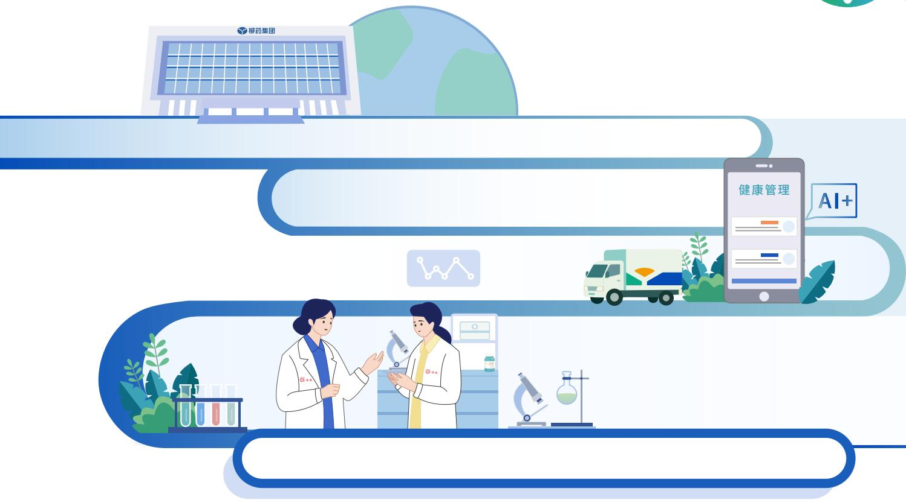

flowchart

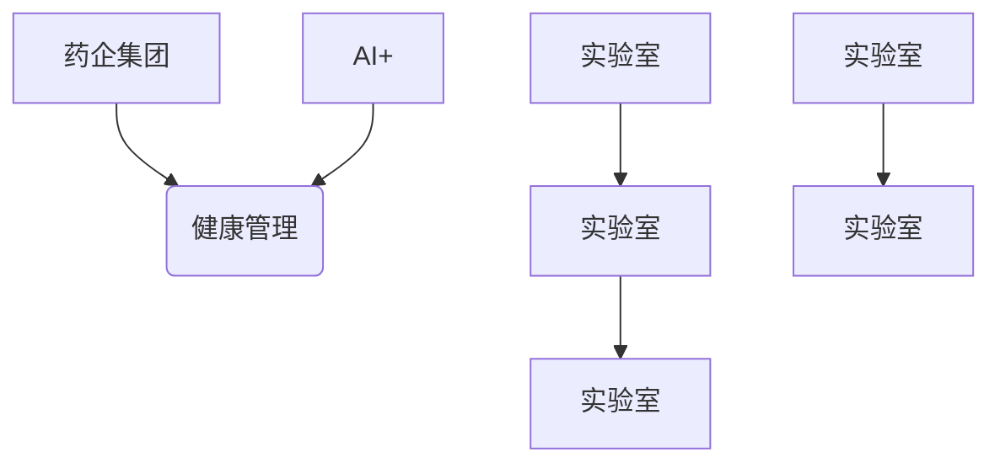
```mermaid
graph TD
  A["药企集团"] --> B("健康管理")
  C["AI+"] --> B
  D["实验室"] --> E["实验室"]
  E --> F["实验室"]
  G["实验室"] --> H["实验室"]
```

## ⽬录 CONTENTS

## 前篇

关于本报告 02

董事长致辞 03

走进柳药 04

ESG年度绩效速览 07

年度纪事与荣誉 08

可持续发展管理 10

## 报告后记

展望未来 71

指标索引 72

natural_image

Close-up of a gloved hand holding a vial containing chemical components, with abstract background lines and no visible text or symbols.

## 善治固本⾏稳致远01

夯实治理根基 16

筑牢风险防线 20

质量创造价值 26

## 创新破局协同共赢02

创新引领突围 33

数智转型攻坚 36

打造协同生态 40

## 以⼈为本共筑和谐03

党建聚力领航 44

护航员工成长 46

共建共享和谐 56

## 守护绿⾊持续发展04

恪尽环保责任 62

应对气候变化 65

强化能源管理 67

用心呵护生态 70

## 关于本报告

《广西柳药集团股份有限公司2025年度环境、社会及治理（ESG）报告》（以下简称：本报告）是广西柳药集团股份有限公司（以下简称：柳药集团、集团、公司、我们）编制的第四份年度环境、社会及公司治理（ESG）报告。本报告充分披露集团及下属子公司于2025年度在环境保护、社会责任履行、公司治理等方面的工作亮点及实践成果。

## 报告时间范围

2025年1月1日——2025年12月31日，部分内容及数据适当追溯以前年份。

## 报告发布情况

报告发布以会计年度为周期，已连续第十一年度发布（涵盖前七年发布的社会责任报告）。

## 报告编制依据

《中国企业社会责任报告指南》  
联合国可持续发展目标（SDGs）  
全球报告倡议组织(GRI）《可持续发展报告标准》  
《上海证券交易所上市公司自律监管指引第14号——可持续发展报告（试行）》  
《上海证券交易所上市公司自律监管指南第4号——可持续发展报告编制》  
香港联合交易所有限公司《环境、社会及管治报告指引》

## 报告信息来源

本报告所使用信息、数据及案例均来自集团各部门、各子公司统计汇编的企业社会责任相关信息，财务数据基于公司对外公开披露的《广西柳药集团股份有限公司2025年年度报告》及集团《2025年审计报告》。

## 报告可靠性保证

本公司董事会及全体董事保证本报告内容不存在任何虚假记载、误导性陈述或者重大遗漏，并对其内容的真实性、准确性和完整性承担个别及连带责任。

## 报告获取

上海证券交易所网站（www.sse.com.cn）及我公司网站（www.lzyy.cn）。

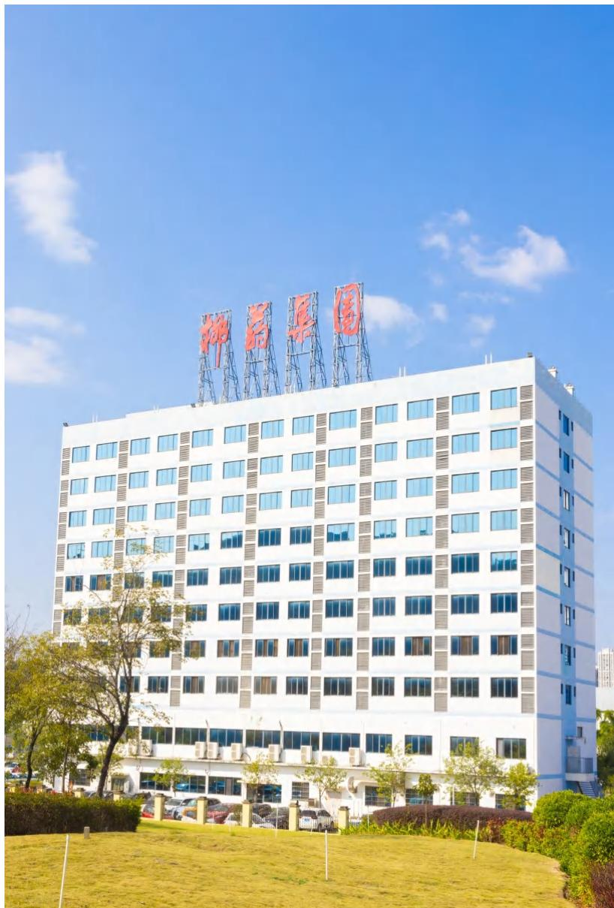

text_image

湖南集团

# 破局攻坚，智领向前

初心如磐，行稳致远。2025年既是“十四五”规划的收官之年，也是柳药集团谋定战略转型布局的关键一年。集团上下紧跟党走，在政策调控趋严、新技术加速渗透、同质化竞争加剧挑战下，敢想敢干，落地数字转型与创新项目布局，攻克新技术应用难点与市场瓶颈，强化精细管理与人才培养落地，坚守合规底线与大健康企业责任担当，以实干韧劲、创新思维续写集团持续、稳健、高质量发展时代新篇。

## 以创新之⼒破局，彰显发展韧劲

我们以业态转型和产品研发为突破口，将智能智造与创新创造融合企业发展大局。这一年，我们发布了“AI+医疗”全流程解决方案，打造智慧医药供应链、院内智能化AI应用场景和院外AI（阿桂药师）智能照护服务体系。这一年，我们完成了智能零售仓建设，打造了华为天筹求解器首个医药行业标杆应用，物流运营效率提升超过40%。我们将智慧物流与AI技术延伸到医院客户，推动精准诊疗与患者智慧管理落地。这一年，我们在医药工业领域持续强产品研发投入。中药颗粒产品备案数量达670多个，仙茱中药科技药食同源产品投产上市，传统中成药新适应症拓展研究取得突破进展，并启动了海外创新药投资项目。我们以创新之力在挑战中破局，在变局中开新局，充分彰显柳药新时代发展韧劲。

## 以合⼒攻坚突围，提升品牌实⼒

我们继续坚持以“批零协同、药械协同、工商协同”——三大协同作战优势凝聚奋进力量，持续深耕产品和服务品质，不断夯实核心竞争力。批零协同，全渠道覆盖，让我们与供应商建立更紧密的合作，实现品种突围，打破渠道限制，满足老百姓多元化、多渠道、多层次健康消费需求。药械协同，在专业化经营基础上形成渠道合力，推动可复制的药械智能化管理方案在上下游客户端落地，在降费控本条件下稳住基本盘。工商协同，有力推动集团产业上下游深度联动，打通研发、制造、流通、销售全链条，推动自产各类中药产品的营销推广，形成柳药向更广阔市场拓展的中坚力量。三大业务板块凝心聚力、合力攻坚，才能突破发展瓶颈、抢占市场先机，全面提升集团品牌实力与市场影响力。

## 以⾼效合规治理，扎实发展根基

我们围绕数字赋能和精细管理等关键维度发展，聚焦强基固本、合规运营，持续健全内控制度与合规管理体系，应用大模型和智能算法优化集团供应链管理和运营分析监控，筑牢合规防线。我们坚持“有所为有所不为”的工作基调，严格控制应收规模和账期，提高公司高质量销售占比，集团现金流状况持续改善，大幅降低企业经营风险。我们始终将产品和服务质量放在首位，构建覆盖产品全生命周期的质量管理体系，应用SPD平台、中药溯源平台实现对药械生产、流通、销售全流程的跟踪追溯，落实阳光采购、规范供应，以“0违规违纪”、“0重大质量事故”成果和高效、安全服务获得上下游客户认可，建立长期稳定合作，铸就企业提质增效的发展引擎。

## 以实⼲履⾏责任，共享发展成果

我们把心系国家、奉献社会、服务客户、成就员工作为企业发展的出发点和落脚点，用务实担当、埋头实干落实发展责任和大健康企业使命。2025年，我们继续围绕老百姓健康需求创新服务、丰富品类，打造覆盖老百姓疾病预防、就医用药、康复疗养全生命周期的AI应用场景，并发挥集团供应链管理优势强化创新药、罕见病用药的引进，成为广西首个获批放射性药品经营资质的药品批发企业。我们致力于为员工提供公平、公正、有温度的和谐工作环境，为人才提供广阔舞台，并通过实施薪酬证券化改革和科学绩效考核体系，与员工分享企业发展成果。我们将企业发展融入国家战略大局和社会发展需要中，广泛开展扶贫助困、公益福利事业，以产业帮扶、基础设施建设等方式助力乡村振兴。我们恪尽环保责任，落实节能减排，用心呵护生态，努力推动人与自然和谐共生。

2026年是“十五五”开局之年，是新战略起航、新质生产力起势、新生态形成之年。我们将持续推动新技术与集团各业务板块的深度融合，实现产业链和关键工序的高效协同，形成新模式、新生态，同时不断丰富产品矩阵，在创新药领域加快突破，形成新时代攻坚力量。我们将深化集团精细化管理，以更高的治理效能激发企业发展内生动力与活力，用实力强化ESG实践，以柳药人的昂扬斗志、务实作风、进取精神、创新思维，奋力推动集团高质量发展迈上新台阶。

董事长、总裁：朱朝阳  
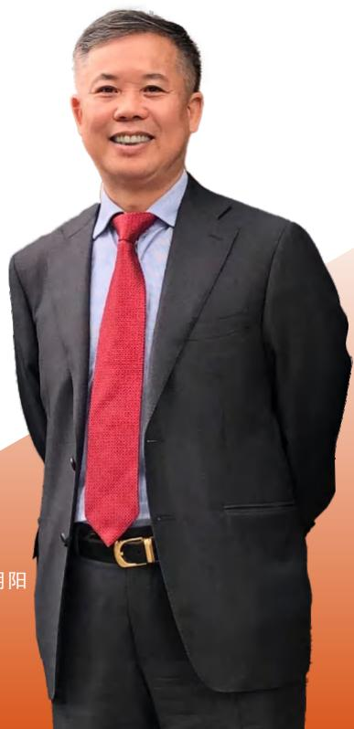

natural_image

Portrait of a smiling man in a dark suit and red tie against an orange background (no text or symbols visible)

## 企业介绍

广西柳药集团股份有限公司是一家综合性医药上市企业，公司前身是1953年成立的柳州医药批发站，2002年改制为民营企业，2014年在上海证券交易所挂牌上市（股票简称：柳药集团，股票代码：603368）。公司经过七十年多来在医药大健康领域的深耕细作，旗下已拥有50余家公司，形成以“医药批发、医药零售、医药工业为主业，供应链增值服务、医药互联网服务、终端健康服务等创新业务协同发展”的综合性医药大健康产业集团。2025年公司营业收入达209.26亿元，目前在全国主营业务收入前100位的药品批发企业排序中位列第14位，已连续多年进入该排名前50名。

柳药集团是广西核心药械配送企业，业务覆盖广西100%的中高端医疗机构；旗下全资子公司广西桂中大药房连锁有限责任公司（简称：桂中大药房）拥有药店900多家，是全国药品连锁二十强企业。公司凭借批零一体化渠道优势和覆盖全区的高效配送网络，成为众多国内外知名制药企业在广西区内的主分销商和首选配送商。公司近年来积极推动传统批发和零售业务的数字转型，围绕上下游客户和终端消费者开展智慧供应链增值服务、数字健康项目、互联网医疗服务、慢病管理服务等。在批发端，公司积极开展医院器械耗材SPD项目等供应链增值服务，并依托人工智能（AI）、大数据应用助力医疗服务升级和精细化管理落地；在零售端，公司积极发展专业化药房和专业健康服务，通过互联网技术应用推动线上诊疗、网上药店与线下实体药店的一体化运营发展，同时以大数据、人工智能赋能健康管理、患者教育，构建“互联网+医药+健康管理”新零售业态。

在医药工业领域，公司主要围绕中药产业积极布局，开展中药饮片生产加工以及中成药、中药配方颗粒等现代中药产品生产研发，打造培育“仙茱”中药饮片和配方颗粒品牌以及“万通”“康晟”等中成药品牌。目前公司旗下广西仙茱中药科技有限公司（简称：仙茱中药科技）是广西规模和技术领先的中药饮片加工企业，已能生产加工中药饮片8,000多个品规；广西万通制药有限公司（简称：万通制药）、广西康晟制药有限责任公司（简称：康晟制药）是中成药生产企业，分别拥有复方金钱草颗粒、万通炎康片（胶囊）、归芪补血口服液、安神养血口服液等专利品种和知名品牌；广西仙茱制药有限公司（简称：仙茱制药）是专门从事中药配方颗粒生产研发业务的企业，已完成670多个中药配方颗粒备案品种，拥有年产1,500吨中药配方颗粒的生产能力。

未来，公司坚持立足大健康行业，把握行业集中化、规范化发展机遇，充分发挥批零协同、药械协同优势，有效整合内外资源，并通过大数据、人工智能等新技术赋能供应链增值服务、专业健康服务和企业精细化管理、高效率运营，推动智慧医药供应链服务、数字健康项目和“互联网+医药+健康管理”新零售业态落地。同时围绕中药、民族药产业，积极拓展创新药领域，推动产品研发、产能升级、质量提升，通过发挥工商协同和落实品牌营销战略，全渠道推动自产工业产品全国市场拓展，不断做大做强医药工业业务。此外，发展第三方医药物流、中药代煎煮等配套服务产业，构建完善公司大健康产业体系，实现产业链和关键工序的高效协同，培育新模式、新生态、新质生产力，实现企业由传统单一的配送商向综合性医药产品和智慧医药健康服务供应商转型，打造百年大健康企业知名品牌。

## 企业愿景

做客户认可，行业推崇，百姓信任的大健康产业优秀品牌

## 企业宗旨

专业 创新 务实 共赢

## 企业使命

致力于为民众健康创造最优质的产品和提供最专业的服务

## 价值观

和谐 感恩 进取 协力

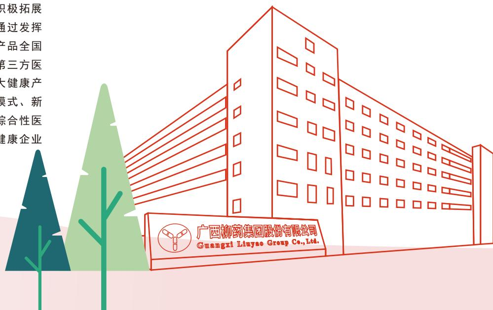

text_image

积极拓展
通过发挥
产品全国
第三方医
大健康产
模式、新
综合性医
健康企业
广西柳药集团股份有限公司
Guangxi Liuyao Group Co.,Ltd.

## 业务构成

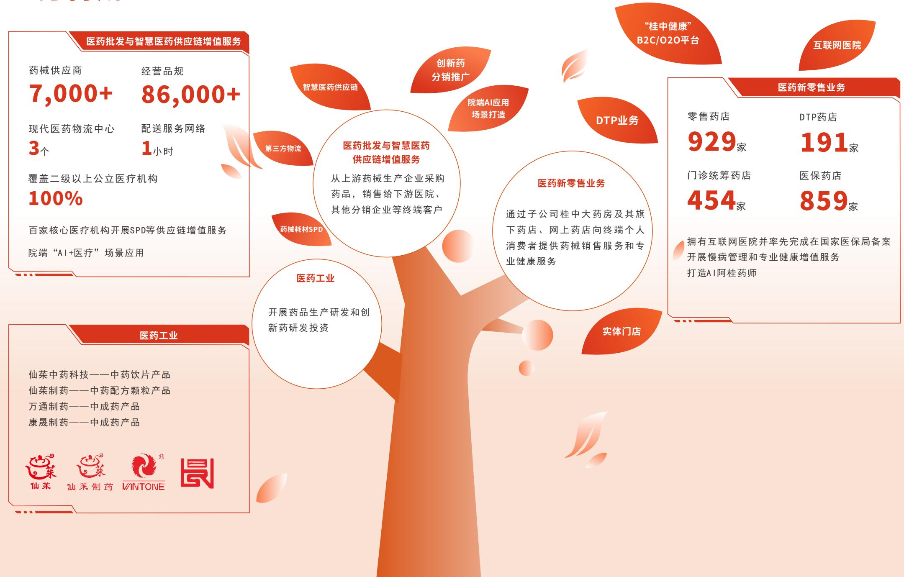

flowchart

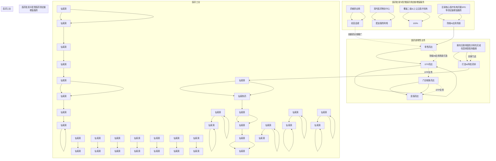
```mermaid
graph TD
  subgraph SupplyChain["医药批发与智慧医药供应链增值服务"]
  A["药械供应商"] --> B["经营品规"]
  C["现代医药物流中心"] --> D["配送服务网络"]
  E["覆盖二级以上公立医疗机构"] --> F["100%"]
  G["百家核心医疗机构开展SPD等供应链增值服务"] --> H["院端AI应用场景"]
  end

  subgraph NewRetail["医药新零售业务"]
  I["零售药店"] --> J["DTP药店"]
  K["门诊统筹药店"] --> L["医保药店"]
  M["拥有互联网医院并率先完成在国家医保局备案"] --> N["打造AI阿桂药师"]
  end

  subgraph Industrial["医药工业"]
  O["仙茱萸"] --> P["仙茱制药"]
  Q["仙茱萸"] --> R["仙茱萸"]
  S["仙茱萸"] --> T["仙茱萸"]
  U["仙茱萸"] --> V["仙茱萸"]
  W["仙茱萸"] --> X["仙茱萸"]
  Y["仙茱萸"] --> Z["仙茱萸"]
  AA["仙茱萸"] --> AB["仙茱萸"]
  AC["仙茱萸"] --> AD["仙茱萸"]
  AE["仙茱萸"] --> AF["仙茱萸"]
  AG["仙茱萸"] --> AH["仙茱萸"]
  AI["仙茱萸"] --> AJ["仙茱萸"]
  AK["仙茱萸"] --> AL["仙茱萸"]
  AM["仙茱萸"] --> AN["仙茱萸"]
  AO["仙茱萸"] --> AP["仙茱萸"]
  AQ["仙茱萸"] --> AR["仙茱萸"]
  AS["仙茱萸"] --> AT["仙茱萸"]
  AU["仙茱萸"] --> AV["仙茱萸"]
  AW["仙茱萸"] --> AX["仙茱萸"]
  A --> B
  C --> D
  E --> F
  G --> H
  H --> I
  J --> J
  K --> L
  M --> N
  N --> O
  O --> P
  P --> Q
  Q --> R
  R --> S
  S --> T
  U --> U
  V --> V
  W --> X
  X --> Y
  Z --> AA
  AA --> AB
  AB --> AC
  AD --> AD
  AE --> AE
  AF --> AF
  AG --> AG
  AH --> AH
  AI --> AI
  end

  subgraph BusinessSystems["医药批发与智慧医药供应链增值服务"]
    B -.->|"创新药分销推广"| I
    I -.->|"院端AI应用场景打造"| J
    J -.->|"DTP业务"| K
    K -.->|"DTP业务"| L
  end

  subgraph ManufacturingBusinesses["医药工业"]
    M -.->|"实体门店"| N
  end
```

## 六位⼀体发展战略

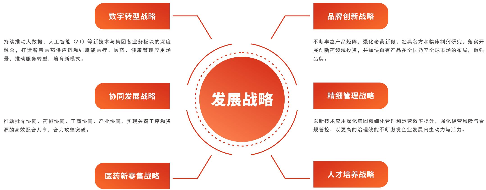

flowchart

```mermaid
graph TD
  Center["发展战略"]
  
  subgraph Core Components
    direction TB
    A1["数字转型战略"]
    A2["品牌创新战略"]
    A3["协同发展战略"]
    A4["人才培养战略"]
    A5["医药新零售战略"]
  end
  
  Center --> A1
  Center --> A2
  Center --> A3
  Center --> A4
  Center --> A5
  
  A1 -.-> Center
  A2 -.-> Center
  A3 -.-> Center
  A4 -.-> Center
  A5 -.-> Center
  
  Center ==> A1
  Center ==> A2
  Center ==> A3
  Center ==> A4
  Center ==> A5
  
  A1 & A2 & A3 & A4 & A5 represent key strategic pillars including digital transformation, brand innovation, comprehensive management, comprehensive drug retail, and new drug retail strategies.
```

发展专业药房和DTP业务，应用专病大模型、人工智能（AI）赋能专业健康服务，形成“互联网+医药+健康管理”全生命周期服务闭环，推动互联网医疗、B2B/O2O网上药店业务与线下业务融合，构建新零售生态。

围绕企业战略布局创新人才引进、培养、留用机制，突出关键技术人才和复合型管理人才培养，强化人才梯队建设，实现人才供给与企业发展、业务需求同频同步。

## ESG年度绩效速览

## 经营绩效

营业收入

209.26亿元

总资产

213.38亿元

同比增长

0.32%

归属于上市公司股东的净利润

7.09亿元

经营性现金流净额

10.78亿元

同比增长

28.52%

研发投入

3,847.40万元

申请专利、著作权

24项

## 社绩效

捐赠总额

1,314.38万元

纳税总额

5.13亿元

慈善援助

1,042.24万元

急救配送

2,036次

员工总人数

5,627

社保覆盖率

100%

培训人次

9.20万次

培训覆盖率

100%

培训投入

129.72万元

## 环绩效

环保投入

209.19万元

重大环境事故

0

达标排放

100%

用水量

49.14万吨

同比下降

4.40%

建成分布式光伏电站年发电量

280万度

用电量

2,986.59万度

同比增长

2.43%

燃气（含蒸汽）消耗量

374.82万立方

同比下降

8.44%

## 年度发展印记

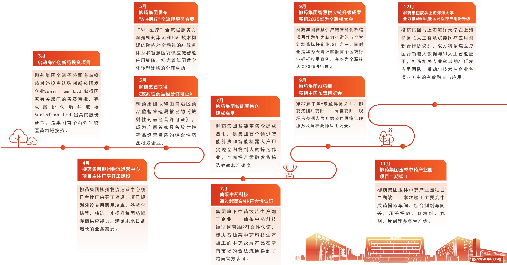

flowchart

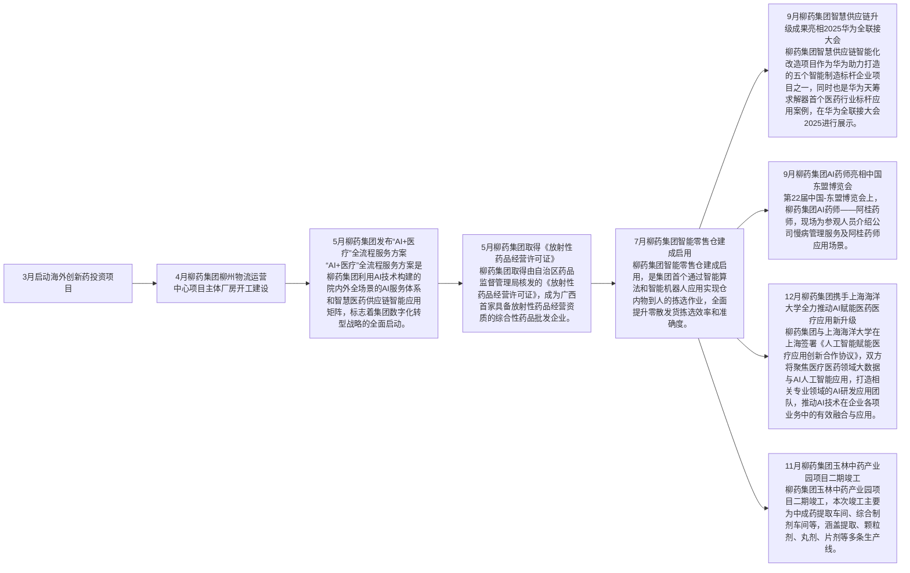
```mermaid
graph LR
  A["3月启动海外创新药投资项目"] --> B["4月柳药集团柳州物流运营中心项目主体厂房开工建设"]
  B --> C["5月柳药集团发布“AI+医疗”全流程服务方案\n“AI+医疗”全流程服务方案是柳药集团利用AI技术构建的院内外全场景的AI服务体系和智慧医药供应链智能应用矩阵，标志着集团数字化转型战略的全面启动。"]
  C --> D["5月柳药集团取得《放射性药品经营许可证》\n柳药集团取得由自治区药品监督管理局核发的《放射性药品经营许可证》，成为广西首家具备放射性药品经营资质的综合性药品批发企业。"]
  D --> E["7月柳药集团智能零售仓建成启用\n柳药集团智能零售仓建成启用，是集团首个通过智能算法和智能机器人应用实现仓内物到人的拣选作业，全面提升零散发货拣选效率和准确度。"]
  E --> F["9月柳药集团智慧供应链升级成果亮相2025华为全联接大会\n柳药集团智慧供应链智能化改造项目作为华为助力打造的五个智能制造标杆企业项目之一，同时也是华为天筹求解器首个医药行业标杆应用案例，在华为全联接大会2025进行展示。"]
  E --> G["9月柳药集团AI药师亮相中国东盟博览会\n第22届中国-东盟博览会上，柳药集团AI药师——阿桂药师，现场为参观人员介绍公司慢病管理服务及阿桂药师应用场景。"]
  E --> H["12月柳药集团携手上海海洋大学全力推动AI赋能医药医疗应用新升级\n柳药集团与上海海洋大学在上海签署《人工智能赋能医疗应用创新合作协议》，双方将聚焦医疗医药领域大数据与AI人工智能应用，打造相关专业领域的AI研发应用团队，推动AI技术在企业各项业务中的有效融合与应用。"]
  E --> I["11月柳药集团玉林中药产业园项目二期竣工\n柳药集团玉林中药产业园项目二期竣工，本次竣工主要为中成药提取车间、综合制剂车间等，涵盖提取、颗粒剂、丸剂、片剂等多条生产线。"]
```

## 年度荣誉

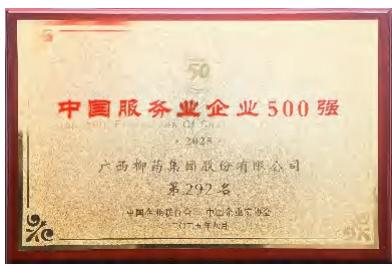

text_image

中国服务业企业500强
2024
广西柳药集团股份有限公司
第292名
中国证券报总公司、中国证券报协会
（以下简称“中国证券报”）

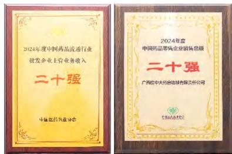

text_image

2024年度中国药品流通行业
批发企业主营业务收入
二十强
中国医药制造业协会
2024年度
中国药品零售企业销售总额
二十强
广西成中大药房连锁有限责任公司
中国
证券业协会

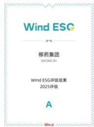

text_image

Wind ESG
柳药集团
603368.SH
Wind ESG评级结果
2025评级
A
Wind

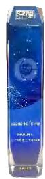

2025中国服务业企业500强第292名

2024年度中国药品流通⾏业批发企业主营业务收⼊⼆⼗强2024年度中国药品零售企业销售总额⼆⼗强

WindESG报告评级获评A级

2025“上证鹰·⾦质量”奖ESG奖

2025年健康中国品牌榜⾦冲·西普⾦奖

2025⼴西服务业⺠营企业20强

第1位

2025⼴西服务业企业100强

第14名

2025⼴西⺠营企业100强

第6位

2025⼴西企业100强

第25名

连续⼗年获得纳税信⽤

A级企业

2025年度⼴西壮族⾃治区

“守合同重信⽤”公⽰企业

2024-2025年度信息披露

A类企业

桂中⼤药获得2024-2025年度医药⾏业信息统计

连锁药店营业收⼊前五⼗家企业

仙茱制药获得

⼴西瞪羚企业认定

## 可持续发展管理

柳药集团将可持续发展理念融入企业战略、运营和价值链中，不断完善治理架构，强化战略目标落地，科学分析评估风险，并对各利益相关方关注议题予以充分回应，确保公司ESG战略的切实执行，推动企业持续稳健发展。

## ESG治理

柳药集团建立了以董事会统筹决策、职能管理层监督推进、各业务单元分工落实的“决策－管理－执行”三级ESG管理架构，形成决策科学、执行高效、监督到位、闭环管理的ESG治理体系，筑牢公司ESG规范管理、高效执行的根基。

## 董事会战略委员会、集团经营班子

审定ESG战略目标、重大议题及相关管理制度  
履行可持续发展相关风险与机遇的管理职责  
监督审查公司ESG相关指标、业绩达成情况

## 人力资源中心、财务管理中心、发展运营部、证券投资部

识别制定ESG议题和年度考核指标  
组织实施、跨部门协调与监督考核  
编制ESG报告及履行信息披露义务

## 各业务单元、职能单元

具体执行ESG计划及方案  
提出调整建议和改进措施  
整理和填报ESG相关数据信息

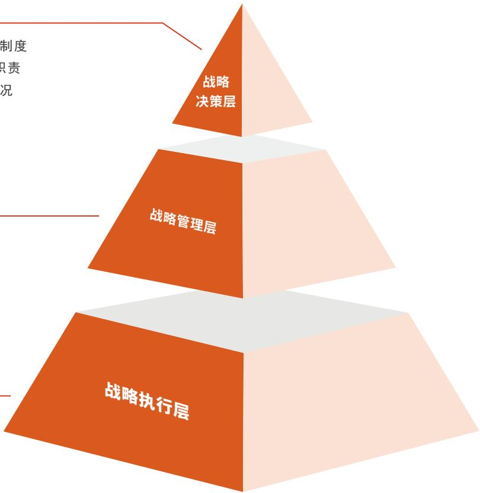

flowchart

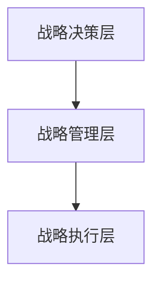
```mermaid
graph TD
  A["战略决策层"] --> B["战略管理层"]
  B --> C["战略执行层"]
```

## 战略定制

制定可持续发展愿景、阶段性目标和实施策略

## 完善制度

明确责任分工，出台管理制度、责任清单、流程标准

## 制定指标

制定集团层面、部门层面、岗位层面目标及量化指标

## 执⾏运营

具体落实完成指标任务，推动有效运营

## 监控审计

落实监督考核机制，定期开展统计跟踪、内部审计

## 披露沟通

编制发布ESG报告，与各利益相关方透明沟通

## ESG战略⽬标

柳药集团以《联合国可持续发展目标（SDGs）》《上海证券交易所上市公司自律监管指南第4号——可持续发展报告编制》等要求为指导，从环境、社会、治理三个维度，将大健康企业使命、合规安全运营底线、绿色低碳发展要求、实现共享共赢等任务目标充分融入企业发展实际，确定集团ESG战略目标和方针。

## 善治固本⾏稳致远 01

构建完善公司治理体系，守住合规底线，筑牢风险防线，恪守商业道德，充分披露企业ESG信息，以高质量产品和服务创造持续价值。

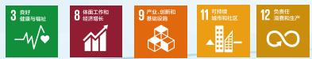

## 守护绿⾊持续发展

秉持人类命运共同体理念，恪尽环保责任，落实节能减排，用心呵护生态，携手应对气候变化等环境问题和挑战，促进持续发展。

04

natural_image

Illustration of a green oval-shaped object with three white capsule-like shapes arranged in a triangular pattern (no text or symbols)

## 02 创新破局协同共赢

坚持创新引领，应用新技术赋能集团业务数智化转型，持续为人类健康创造优质产品和服务，与合作伙伴携手打造绿色、协同、共赢发展新生态。

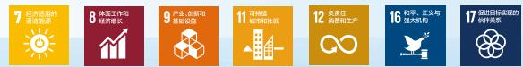

flowchart

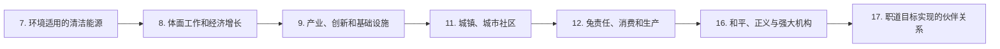
```mermaid
graph LR
  A["7. 环境适用的清洁能源"] --> B["8. 体面工作和经济增长"]
  B --> C["9. 产业、创新和基础设施"]
  C --> D["11. 城镇、城市社区"]
  D --> E["12. 兔责任、消费和生产"]
  E --> F["16. 和平、正义与强大机构"]
  F --> G["17. 职道目标实现的伙伴关系"]
```

## 以⼈为本共筑和谐

以人为本，为员工打造公平、公正、安全有序、和谐友善的成长环境；心系国家发展大局，服务民生根本，帮扶困难群体，促进社会和谐。

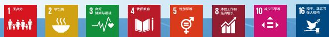

flowchart

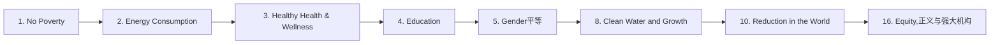
```mermaid
graph LR
  A["1. No Poverty"] --> B["2. Energy Consumption"]
  B --> C["3. Healthy Health & Wellness"]
  C --> D["4. Education"]
  D --> E["5. Gender平等"]
  E --> F["8. Clean Water and Growth"]
  F --> G["10. Reduction in the World"]
  G --> H["16. Equity,正义与强大机构"]
```

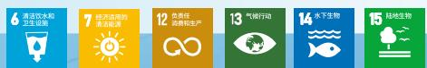

## ESG⻛险识别与管理

公司建立覆盖环境、社会、治理全维度的ESG识别与报告监督程序，并参考《联合国可持续发展目标（SDGs）》、《上海证券交易所上市公司自律监管指引第14号——可持续发展报告（试行）》、香港联合交易所有限公司《环境、社会及管治报告指引》等文件，结合公司所处行业特性与经营实际开展常态化ESG重要性评估。

  
ESG风险和 机遇识别

  
风险和机遇评估分析

  
风险监控与 预警报告

  
复盘改进和 考核

  
制定实施预防和应对措施

2025年公司系统识别污染物排放、环境合规、安全生产、员工权益、供应链风险、公司治理、数据安全、质量安全、财务安全及反腐败等关键议题。集团从“影响重要性”和“财务重要性”两个纬度识别分析议题的重要性，对其进行分析、排序，通过明确风险等级、触发阈值、制定防控预案、落实监管责任、制定标准流程等方式实施全过程闭环管理；同时强化动态监测、内部审计与应急处置，定期跟踪风险整改成效，将ESG风险防控与经营决策、绩效考核相衔接，有效防范因ESG问题引发的合规处罚、声誉损害及经营波动，保障企业持续稳健发展。

## 背景调查

通过内、外部访谈、信息搜集分析等方式，全面了解公司产品、服务、运营机制等内部环境，及公司所处行业、产业链上下游等外部环境情况，基于此分析潜在的风险和影响，识别分析利益相关方群体及关注议题。

## 建⽴议题清单

参考全球报告倡议组织GRI、联合国可持续发展目标SDGs以及国内外同行业相关议题，结合公司所处行业特点、发展阶段及自身商业模式、所处价值链等情况梳理审阅可持续发展相关议题库，确立2025年度23项议题清单。

## 议题重要性的评估

公司ESG议题重要性评估主要采用双重重要性评估法+矩阵评分法相结合的方式开展。公司通过内部调研、管理层访谈、外部利益相关方反馈、行业对标、外部审计评估及舆情分析等方式，分别从财务影响重要性（议题对公司经营、财务、风险的影响程度）和社会环境影响重要性（公司运营对社会、环境产生的实际影响）两个维度，对各议题进行定性与定量打分，进而根据评分结果进行排序，绘制双重重要性矩阵。评估过程中公司充分考虑了行业政策变化、业务发展实际、供应链状况及利益相关方关切，并按年度进行动态复核更新，确保评估科学、客观。

## 议题确认及披露

在完成重要性评估流程后，公司形成影响重要性和财务重要性议题清单，并真实、完整地在ESG报告中披露结果。

## 重要议题判定结果

## 环 境

应对气候变化1  
废固管理2  
污染排放3  
环保责任4  
能源管理5  
循环经济6  
保护生物多样性7  
水资源利用8

## 社 会

创新引领9  
反商业贿赂10  
数字转型11  
供应链协同生态12  
党建领航13  
员工成长14  
乡村振兴15  
公益慈善16

## 治 理

平等对待中小企业17  
公司治理18  
内控风险管理19  
合规管理20  
信息安全和隐私保护21  
质量管理  
反不正当竞争23

影响重要性  
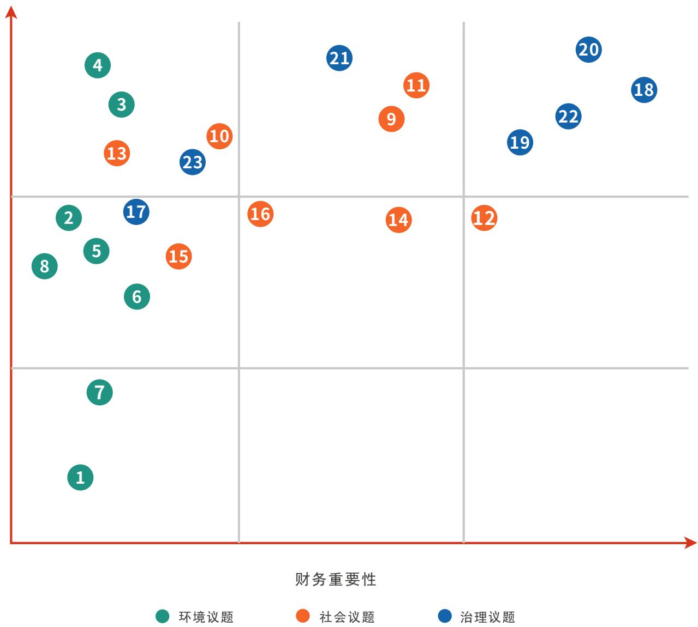

scatter

| ID | Category | Financial Importance (approx.) | Y-axis Value (approx.) |
| --- | --- | --- | --- |
| 1 | 环境议题 | ~0.5 | ~0.2 |
| 2 | 环境议题 | ~1.2 | ~0.6 |
| 3 | 环境议题 | ~1.5 | ~0.8 |
| 4 | 环境议题 | ~1.5 | ~0.9 |
| 5 | 环境议题 | ~1.8 | ~0.5 |
| 6 | 环境议题 | ~2.0 | ~0.4 |
| 7 | 环境议题 | ~1.8 | ~0.3 |
| 8 | 环境议题 | ~1.2 | ~0.5 |
| 9 | 社会议题 | ~3.5 | ~0.7 |
| 10 | 社会议题 | ~2.5 | ~0.7 |
| 11 | 社会议题 | ~3.5 | ~0.8 |
| 12 | 社会议题 | ~4.5 | ~0.5 |
| 13 | 社会议题 | ~1.8 | ~0.6 |
| 14 | 社会议题 | ~3.5 | ~0.5 |
| 15 | 社会议题 | ~2.2 | ~0.5 |
| 16 | 社会议题 | ~2.8 | ~0.6 |
| 17 | 治理议题 | ~2.0 | ~0.6 |
| 18 | 治理议题 | ~4.5 | ~0.8 |
| 19 | 治理议题 | ~4.2 | ~0.7 |
| 20 | 治理议题 | ~4.5 | ~0.9 |
| 21 | 治理议题 | ~3.2 | ~0.9 |
| 22 | 治理议题 | ~4.2 | ~0.8 |
| 23 | 治理议题 | ~2.2 | ~0.7 |
| 24 | 治理议题 | ~3.5 | ~0.8 |
| 25 | 治理议题 | ~4.5 | ~0.9 |
| 26 | 治理议题 | ~4.8 | ~0.9 |
| 27 | 治理议题 | ~4.8 | ~0.9 |
| 28 | 治理议题 | ~4.8 | ~0.9 |
| 29 | 治理议题 | ~4.8 | ~0.9 |
| 30 | 治理议题 | ~4.8 | ~0.9 |
| 31 | 治理议题 | ~4.8 | ~0.9 |
| 32 | 治理议题 | ~4.8 | ~0.9 |
| 33 | 治理议题 | ~4.8 | ~0.9 |
| 34 | 治理议题 | ~4.8 | ~0.9 |
| 35 | 治理议题 | ~4.8 | ~0.9 |
| 36 | 治理议题 | ~4.8 | ~0.9 |
| 37 | 治理议题 | ~4.8 | ~0.9 |
| 38 | 治理议题 | ~4.8 | ~0.9 |
| 39 | 治理议题 | ~4.8 | ~0.9 |
| 40 | 治理议题 | ~4.8 | ~0.9 |
| 41 | 治理议题 | ~4.8 | ~0.9 |
| 42 | 治理议题 | ~4.8 | ~0.9 |
| 43 | 治理议题 | ~4.8 | ~0.9 |
| 44 | 治理议题 | ~4.8 | ~0.9 |
| 45 | 治理议题 | ~4.8 | ~0.9 |
| 46 | 治理议题 | ~4.8 | ~0.9 |
| 47 | 治理议题 | ~4.8 | ~0.9 |
| 48 | 治理议题 | ~4.8 | ~0.9 |
| 49 | 治理议题 | ~4.8 | ~0.9 |
| 50 | 治理议题 | ~4.8 | ~0.9 |
| 51 | 治理议题 | ~4.8 | ~0.9 |
| 52 | 治理议题 | ~4.8 | ~0.9 |
| 53 | 治理议题 | ~4.8 | ~0.9 |
| 54 | 治理议题 | ~4.8 | ~0.9 |
| 55 | 治理议题 | ~4.8 | ~0.9 |
| 56 | 治理议题 | ~4.8 | ~0.9 |
| 57 | 治理议题 | ~4.8 | ~0.9 |
| 58 | 治理议题 | ~4.8 | ~0.9 |
| 59 | 治理议题 | ~4.8 | ~0.9 |
| 60 | 治理议题 | ~4.8 | ~0.9 |
| 61 | 治理议题 | ~4.8 | ~0.9 |
| 62 | 治理议题 | ~4.8 | ~0.9 |
| 63 | 治理议题 | ~4.8 | ~0.9 |
| 64 | 治理议题 | ~4.8 | ~0.9 |
| 65 | 治理议题 | ~4.8 | ~0.9 |
| 66 | 治理议题 | ~4.8 | ~0.9 |
| 67 | 治理议题 | ~4.8 | ~0.9 |
| 68 | 治理议题 | ~4.8 | ~0.9 |
| 69 | 治理议题 | ~4.8 | ~0.9 |
| 70 | 治理议题 | ~4.8 | ~0.9 |
| 71 | 治理议题 | ~4.8 | ~0.9 |
| 72 | 治理议题 | ~4.8 | ~0.9 |
| 73 | 治理议题 | ~4.8 | ~0.9 |
| 74 | 治理议题 | ~4.8 | ~0.9 |
| 75 | 治理议题 | ~4.8 | ~0.9 |
| 76 | 治理议题 | ~4.8 | ~0.9 |
| 77 | 治理议题 | ~4.8 | ~0.9 |
| 78 | 治理议题 | ~4.8 | ~0.9 |
| 79 | 治理议题 | ~4.8 | ~0.9 |
| 80 | 治理议题 | ~4.8 | ~0.9 |
| 81 | 治理议题 | ~4.8 | ~0.9 |
| 82 | 治理议题 | ~4.8 | ~0.9 |
| 83 | 治理议题 | ~4.8 | ~0.9 |
| 84 | 治理议题 | ~4.8 | ~0.9 |
| 85 | 治理议题 | ~4.8 | ~0.9 |
| 86 | 治理议题 | ~4.8 | ~0.9 |
| 87 | 治理议题 | ~4.8 | ~0.9 |
| 88 | 治理议题 | ~4.8 | ~0.9 |
| 89 | 治理议题 | ~4.8 | ~0.9 |
| 90 | 治理议题 | ~4.8 | ~0.9 |
| 91 | 治理议题 | ~4.8 | ~0.9 |
| 92 | 治理议题 | ~4.8 | ~0.9 |
| 93 | 治理议题 | ~4.8 | ~0.9 |
| 94 | 治理议题 | ~4.8 | ~0.9 |
| 95 | 治理议题 | ~4.8 | ~0.9 |
| 96 | 治理议题 | ~4.8 | ~0.9 |

## 利益相关⽅沟通

柳药集团通过搭建常态化、多渠道的沟通机制，及时、高效回应利益相关方期望，携手各方探索可持续发展新路径。公司2025年识别的主要利益相关方包括：股东及投资人、供应商及合作伙伴、政府及监管机构、下游客户及消费者、员工、社会公众等。

## 利
益
相
关
⽅

  
股东及投资⼈

## 关
注
议
题

公司治理体系  
股东权益  
经营风险管控  
经营业绩和投资回报  
发展战略和创新能力

股东会及债券持有人会议  
信息披露  
投资者接待日  
业绩说明会  
上证E互动  
电话、函件

科学定制高质量发展战略  
优化治理结构强化风险管控  
提升经营业绩和信息披露质量  
举办投资者接待日活动业绩说明会  
落实分红派息积极回报投资人

  
供应商及合作伙伴

资信状况和服务质量  
合规经营和商业道德  
供应链管理与运营安全  
合作模式创新

供应商大会  
尽职调查  
供应链平台  
服务回访调研

配合供应商合规审计  
完善供应商准入审核  
依法履行合同  
创新服务模式推动产业链协同

  
政府及监管机构

政策响应和守法经营  
税收贡献和就业支持  
政企合作和招商引资  
环境保护和安全生产经营

走访调研  
专题座谈  
提案建议  
工作汇报

依法纳税 创造就业  
坚守合规经营配合监督检查  
参与政府项目开展政企合作  
落实节能减排和环保措施

  
下游客⼾及消费者

产品质量和安全性  
诚信经营和合规管控  
价格水平和售后服务  
专业能力和隐私保护

售后服务  
信息平台  
服务热线  
公司公众号

完善客户服务体系 ● 完善客户服务体系  
提升产品和服务质量  
推动服务创新和专业能力提升  
严格保护消费者隐私 ● 严格保护消费者隐私

  
员⼯

福利待遇和权益保护  
能力培养和职业发展  
工作环境和身心健康  
公司治理和文化建设

职工代表大会  
绩效沟通  
培训学习  
交流座谈

内部刊物

员工活动

保障员工基本权益  
完善内部沟通机制  
健全人才培养和激励机制  
优化工作环境和福利待遇  
关注职业健康和员工安全

尊重员工保护员工权益

  
社会公众

扶贫助困和公益事业  
社会服务和乡村振兴  
环境保护和社会参与

公益活动  
媒体平台  
官方账号  
志愿服务

组织参与公益活动  
支持社区康养和健康服务  
开展公益捐赠帮扶困难群体  
助力乡村振兴  
落实节能减排参与环保活动

##

## 善治固本 行稳致远

夯实治理根基

筑牢风险防线

质量创造价值

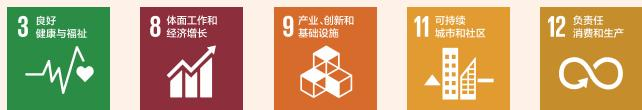

科学完善、规范高效的治理体系，是企业行稳致远之基。柳药集团坚持以权责明晰为要，以合规经营为纲，以风险可控为盾，以质量安全为本，持续完善公司治理体系，确保企业稳健前行。

natural_image

Illustration of two business professionals seated at a table with an upward-trending graph and data visualization elements (no text or symbols)

## 夯实治理根基

## 治理体系

柳药集团严格遵照《中华人民共和国公司法》《中华人民共和国证券法》《上市公司治理准则》《上海证券交易所股票上市规则》等相关法律法规和规范性文件要求，结合公司实际，持续完善公司治理架构。报告期内，公司根据新《公司法》及监管新规要求，完成《公司章程》及配套制度的修订，落实监事会改革，形成股东会授权决定—董事会经营决策—高管团队执行管理的“三级治理架构”，进一步明晰权责，优化权力运行机制，为提升公司治理效率和风险防控奠定组织基础。

  
股东会（根本决策层）

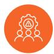  
董事会（经营决策层）

  
⾼管团队（执⾏决策层）

## 股东会

股东会是公司最高权力机构，行使公司重大事项决策权。报告期内，公司严格按照《公司章程》《股东会议事规则》等规定和要求召集、召开股东会，对公司重大事项进行充分决策。公司股东会投票均采取现场+网络方式，为股东参会投票提供便利，同时对涉及中小股东利益的事项落实单独计票机制。公司股东会均由律师现场见证并出具法律意见书。

关键绩效

<table><tr><td>报告期内召开股东大会</td><td>通过议案</td><td>对中小投资者单独计票</td></tr><tr><td>3次</td><td>31</td><td>12</td></tr></table>

## 董事会

公司董事会是公司的经营决策机构，对股东会负责，行使公司经营管理的决策权。公司董事会成员7人，其中非独立董事4人（含1名职工代表董事），独立董事3人，独立董事占董事会成员达到三分之一以上。独立董事分别为公司所处医药行业及财务、法律等相关领域的资深专家，能够为公司各项决策提供专业建议。

关键绩效

<table><tr><td>董事</td><td>独立董事</td><td rowspan="2"></td><td>独立董事占比</td></tr><tr><td>7名</td><td>3名</td><td>42.86%</td></tr><tr><td></td><td></td><td></td><td>占比 42.86%</td></tr><tr><td>报告期内召开董事会</td><td>通过议案</td><td rowspan="2"></td><td rowspan="2">董事出席率 100%</td></tr><tr><td>8次</td><td>41项</td></tr></table>

<table><tr><td colspan="8">董事会成员情况</td></tr><tr><td rowspan="2">姓名</td><td rowspan="2">职务</td><td rowspan="2">性别</td><td colspan="5">专业性</td></tr><tr><td>医药行业资深</td><td>企业管理</td><td>风险控制</td><td>财会专业</td><td>法律合规</td></tr><tr><td>朱朝阳</td><td>非独立董事(董事长)</td><td>男</td><td>✓</td><td>✓</td><td>✓</td><td>✓</td><td>✓</td></tr><tr><td>唐春雪</td><td>非独立董事(职工代表董事)</td><td>女</td><td>✓</td><td>✓</td><td></td><td></td><td></td></tr><tr><td>朱仙华</td><td>非独立董事</td><td>男</td><td>✓</td><td>✓</td><td></td><td></td><td></td></tr><tr><td>陈洪</td><td>非独立董事</td><td>男</td><td>✓</td><td>✓</td><td></td><td></td><td></td></tr><tr><td>陶建虹</td><td>独立董事</td><td>女</td><td>✓</td><td></td><td>✓</td><td></td><td></td></tr><tr><td>黄言茂</td><td>独立董事</td><td>男</td><td></td><td></td><td>✓</td><td></td><td>✓</td></tr><tr><td>马念谊</td><td>独立董事</td><td>女</td><td></td><td></td><td>✓</td><td>✓</td><td></td></tr></table>

## 董事会专⻔委员会

公司董事会下设战略委员会、审计委员会、薪酬与考核委员会、提名委员会等四个专门委员，每个委员会至少有1名独立董事，在相关职权范围内参与公司重大事项决策和建议。报告期内，公司修订了《独立董事工作制度》以及四个专门委员会工作细则，同时新制定了额《独立董事专门会议工作制度》，有效保障独立董事及各专门委员会规范、高效履职，充分发挥独立董事专业性。

公司董事会专⻔委员会履职情况

<table><tr><td></td><td>委员会组成</td><td>委员会权职</td><td>报告期履职情况</td></tr><tr><td>审计委员会</td><td>公司董事会第五届审计委员会由三名董事组成,成员包括马念谊女士(独立董事)、黄言茂先生(独立董事)和陶剑虹女士(独立董事),由马念谊女士担任主任委员。</td><td>主要负责审核公司财务信息及其披露、监督及评估内外部审计工作和内部控制等职责。</td><td>报告期内,召开4次审计委员会,审议公司定期报告、股票期权激励计划、员工持股计划等重大事项。</td></tr><tr><td>战略委员会</td><td>公司董事会第五届战略委员会由三名董事组成,成员包括朱朝阳先生、陶剑虹女士(独立董事)和唐春雪女士,由朱朝阳先生担任主任委员。</td><td>主要负责对公司长期发展战略和重大投资决策进行研究并提出意见和建议。</td><td>报告期内,召开1次战略委员会,审议公司2025年度经营目标等相关事项。</td></tr><tr><td>提名委员会</td><td>公司董事会第五届提名委员会由三名董事组成,成员包括钟黄言茂先生(独立董事)、马念谊女士(独立董事)和朱朝阳先生,由黄言茂先生担任主任委员。</td><td>主要负责拟定董事、高级管理人员的选择标准和程序,对董事、高级管理人员人选及其任职资格进行遴选、审核并提出建议。</td><td>/</td></tr><tr><td>薪酬与考核委员会</td><td>公司董事会第五届薪酬与考核委员会由三名董事组成,成员包括陶剑虹女士(独立董事)、马念谊女士(独立董事)和朱朝阳先生,由陶剑虹女士担任主任委员。</td><td>主要负责制定公司董事、高级管理人员的考核标准并进行考核;制定、审查公司董事、高级管理人员的薪酬决定机制、决策流程、支付与止付追索安排等薪酬政策与方案,并提出建议。</td><td>报告期内,召开4次薪酬与考核委员会,审议公司高级管理人员年度薪酬情况、股票期权激励计划、员工持股计划等议案。</td></tr></table>

## 落实监事会改⾰

为实现原有监事会监督职能向专业化转型，经公司于2025年9月15日召开2025年第二次临时股东会，审议通过《关于变更注册资本、取消监事会及修订<公司章程>的议案》，公司正式取消监事会设置。监事会取消后，其监督职能由董事会审计委员会承接。公司董事会审计委员会成员均为公司独立董事，且分别为医药行业、财会和法律等方面的资深专家，能够更专业、高效、客观地履行相关职责。

## 信披露

公司严格按照《上市公司信息披露管理办法》《上海证券交易所股票上市规则》等法律、法规及规范性文件的要求，认真履行信息披露义务。2025年，公司进一步加强信息披露事务管理，提高信息披露质量，定期组织信息披露责任人和责任部门参加交易所、上市公司协会举办的相关学习培训。公司对董事、监事、高管及关键岗位内幕信息知情人，通过短信、邮件等形式提醒窗口期注意事项，并按时填报相关事项内幕信息知情人情况。除按时、按标准完成全年定期报告（年度、半年度、季度报告）披露工作外，2025年公司还编制发布了回购股份、募集资金使用情况、股票期权激励计划、员工持股计划等临时公告102次，真实、准确、完整、及时、公平地向广大投资者披露公司生产经营、规范运作等重大事项。

## 金牛奖“金信披奖”

## 案例

2025年12月6日，在由中国证券报主办的“双创融合智启新程——2025科创投资大会”上，柳药集团凭借在公司治理、信息披露、投资者关系管理等方面的优异表现，荣获2024年度上市公司金牛奖“金信披奖”。该奖项是中国证券报主办的金牛系列奖项之一，也是中国资本市场最具影响力的奖项之一。金牛奖“金信披奖”着重考察上市公司在信息披露方面的规范性、及时性、准确性以及投资者关系管理的有效性。

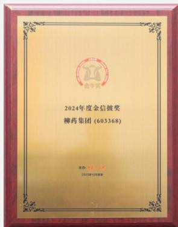

text_image

2024年度金信披奖
柳药集团 (603368)
主办：中国证券报
2024年9月1日批准

## 关键绩效

报告期内，公司对外披露公告等相关文件

102 份因信息披露方面违规而受到处罚次数

0

获得上交所信息披露评价A类企业

6 次

## 投资者关系管理

公司坚持“合规、诚信、平等、主动”的沟通原则，通过保证沟通渠道多元化、沟通内容直接关切、沟通方式个性化等方式，与投资者建立透明、双向、稳定的信任关系。2025年，公司进一步加强与投资者的沟通交流，不断丰富沟通形式，提高交流频次和交流主动性，根据投资者知识背景、层次开展有效沟通。报告期内，公司在年报、半年报、三季报披露后均召开了网上业绩说明会，并在投资者较为关注的东方财富、同花顺等投资平台开设官方频道，同步转发公司公告及公司网站、公众号、视频号新闻，同时通过行业协会、合作券商、投资机构组织投资人到公司参观调研，让投资者能更深入了解公司和行业情况，形成共同价值认同。

上交所广西投服周，走进上市公司——柳药集团

## 案例

2025年11月13日，由上交所投服中心牵头，柳药集团与国投证券联合开展上交所广西投服周主题活动——“我是股东”走进柳药集团顺利举行。活动邀请40余名投资人实地参观集团展厅、中药饮片生产车间、研发质控实验室等，并与集团高管进行面对面座谈交流，通过沉浸式参观与深度座谈，让投资者全方位了解企业经营发展全貌。

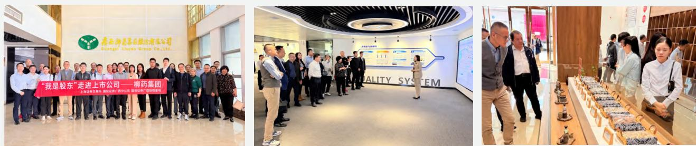

## 关键绩效

召开业绩会投行策略会路演/反路演

3　次

30+ 场

全年累计在上证E互动平台回复投资者问题举办投资者接待日活动

55

3　次

接听投资者电话

交流分析师、投资机构

220+

320+ 人次

分析师和投资者赴公司调研

20+

## 投资者回报

公司坚持稳健回报投资人，与投资人分享公司经营发展成果。2025年，经公司董事会、股东大会审议通过，公司2024年度利润分配预案为：向全体股东每10股派发现金股利人民币7.51元（含税），共计派发现金红利298,273,777.06元。该利润分配方案于2025年5月29日实施完毕。

公司近三年（含报告期）利润分配方案如下：  
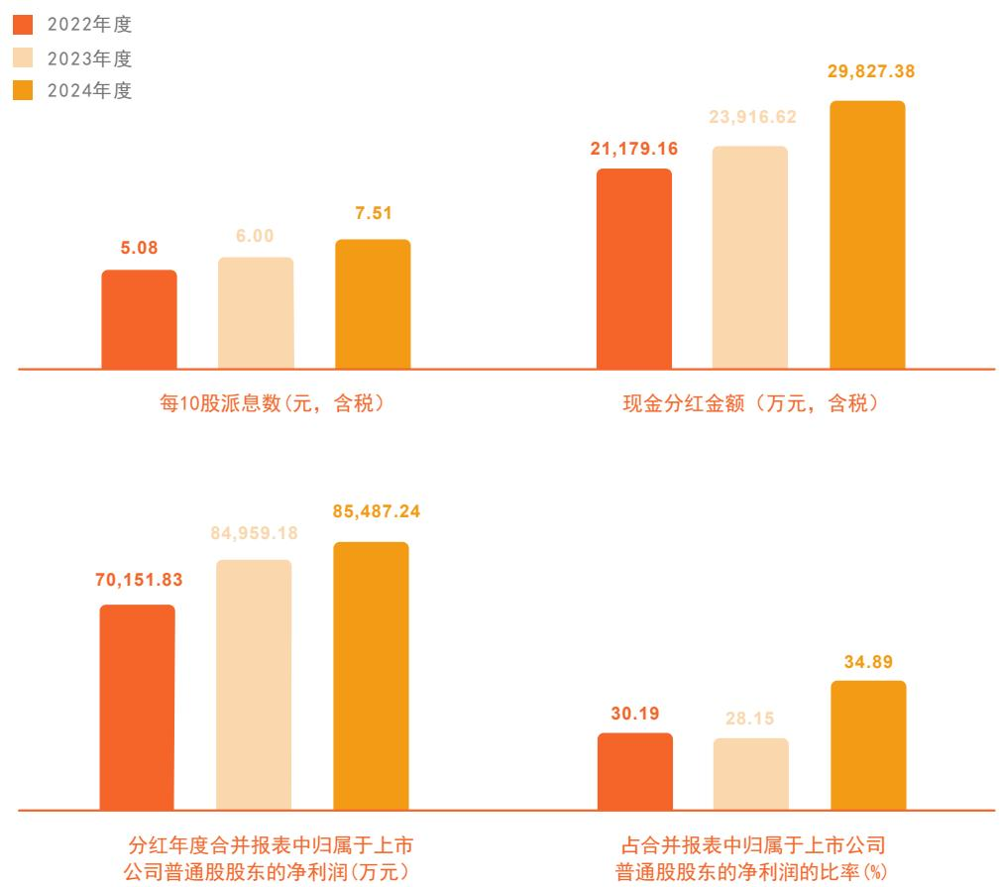

注：根据中国证监会《关于支持上市公司回购股份的意见》《上海证券交易所上市公司回购股份实施细则》等规定，上市公司以现金为对价，采用要约方式、集中竞价方式回购股份的，当年已实施的股份回购金额视同现金分红，纳入该年度现金分红的相关比例计算。2023年度公司通过集中竞价交易方式回购公司股份所支付的回购金额已纳入当年度现金分红的相关比例计算。

text_image

Illustration of two business professionals seated at a table with an upward-trending graph and data interface, featuring text '603368' and icons for analytics and social media.

## 筑牢⻛险防线

合规风险管控是企业持续稳健运营的重要基石。柳药集团始终坚持依法合规开展生产经营，恪守商业道德，通过建立完善合规风险管理体系、强化风险防治和监督问责、营造合规文化氛围等举措切实落实企业合规风险管控，同时重点突出反商业贿赂、客户隐私保护等关键点的管控，保证为各利益相关方提供优质、安全的产品和服务。

## 合规⻛险管理

柳药集团持续完善合规风险管理架构，公司董事会是合规战略规划的定制决策层，明确企业合规管理理念和资源保障，在董事会指导监督下公司建立合规风险管理三道防线，落实三层责任，形成自上而下、跨部门共治的合规运营管治合力。

## 防线⼀

## 各业务及职能部⻔

严格执行合规操作、遵守制度流程  
主动识别及自查、上报本业务领域合规风险  
配合整改、落实合规要求

## 防线⼆

## 法务部、运营管理部

制定合规制度、流程、标准  
对合同、决策、业务做合规审查  
风险监测预警，合规指导培训和咨询  
组织协调、推动问题整改

## 防线三

## 董事会审计委员会、内部审计、纪检、第三⽅审查

定期独立审计评估合规管理有效性  
核查违规线索、监督问责  
针对性开展专项合规审查

## 合规制度体系

2025年，公司进一步完善合规制度体系建设，以《中华人民共和国反不正当竞争法》《医药企业防范商业贿赂风险合规指引》等相关法律规章为指导，对公司员工守册合规条款进行完善，新增合规行为指南、知识产权与信息安全规定，进一步细化完善保密守则条款以及对合规舞弊行为的界定和处罚，为公司员工依法依规开展工作提供指引和警示，提高员工合规意识和制度体系的针对性、可操作性。

## 合规管理制度体系

## 基本合规制度

《员工手册》《反商业贿赂管理制度》，明确合规责任主体、基本要求、违规界定及监督考核机制。

## 专项合规制度

《反舞弊行为控制制度》《审计管理制度》《合同管理制度》《招投标管理制度》等针对重点领域、重点环节定制专项合规条款，确保核心业务环节操作合规开展。

## 合规基本准则

保密守则、廉洁协议、合规行为指南：对学术拜访、业务接待、外包服务、捐赠赞助等提供合规指导警示。

## 合规监督问责

2025年，公司强化合规监管落实，通过信息系统跟踪监控异常交易、违规交易行为，密切与上下游客户的沟通协作，配合第三方合规审查，开展内部专项审查让合规隐患无处可藏。同时公司法务部、审计部、发展运营部、人力资源中心和财务管理中心协同外界法律顾问、外聘审计机构等，加强对公司内控制度执行情况的跟踪考核，强化信用风险和廉政风险评估，逐步建立起廉政信用管理体系，确保制度落实到位。

## 关键绩效

全年配合外部合规审计

16 次

通过率

100%

开展内部合规审计

60+ 次填写合规审查调查表

100+ 份

## 恪守商业道德

柳药集团坚持以诚信立企，恪守商业道德，通过完善制度、强化风控、教育引导、严格监督问责，将诚信、公平、廉洁、合规的商业道德理念融入企业发展战略和日常经营、供应链管理中，推动企业实现稳健发展的同时赢得市场和社会公众的认可。

## 反商业贿赂

## 1.完善反商业贿赂制度体系

公司根据《医药企业防范商业贿赂风险合规指引》，结合行业实际，制定《柳药集团反商业贿赂管理制度》，明确反商业贿赂管理体系工作机制及商业贿赂风险识别与防范风险识别评估机制等，并以此为基础完善公司内部《舞弊预防管理制度》《员工廉洁从业协议》《员工合规行为指南》等，让道德要求“有章可循”。

## 强化商业贿赂风险防控

## 关键领域、岗位⻛险排查

重点开展采购、销售、招投标、财务、人事、对外投资等高风险点的道德风险排查，强化相关岗位业务环节的监督检查、流程管控。

## 开展合作⽅尽职调查

对供应商、经销商、客户、项目合作方、被投资方开展资质、信誉、廉洁风险审查评估，签订廉洁承诺书、保密协议等。

## 规范业务⾏为

设定标准流程和行为指引，强化学术拜访、商务接待、捐款捐赠、招投标等业务环节管控，禁止超标接待、变相利益输送、从事内幕交易等违规行为。

## 严格利益冲突管理

核查交易合作方潜在的关联关系，要求董事、高管及核心骨干员工报备对外投资、持股、社会兼职等情况，对关联事项决策采取必要的回避表决措施。

## 2.建⽴监督检查和举报机制

公司在董事会审计委员会监督指导下，建立由审计部门、党委纪委、法务部参与的合规监督体系，常态化、独立开展舞弊行为自查自纠和风险监控。2025年公司相关部门开展关键岗位和专项审计50余次，重点对公司核心管理岗位、关键业务岗位和业务节点开展合规审计，围绕核查收受贿赂或回扣、违规招采、超额接待、泄露公司及客户商业秘密等舞弊行为开展。同时公司积极应用系统留痕、费用异常预警、权限管控等技术手段减少人为操作空间，并设立电话、信箱、邮箱等举报沟通渠道，建立举报人保护机制，让违规行为无处躲藏。

## 关键绩效

核心客户廉洁协议覆盖率

100%

核查关键流程审计和关键岗位离任审计

50+ 次

违反不正当竞争而被 处罚

0

## 3.塑造企业廉洁诚信⽂化

公司将“诚信守法、廉洁从业、风清气正”的廉洁诚信文化融入企业经营管理、制度建设、员工行为准则中，形成“不想腐、不能腐、不敢腐”的文化氛围。通过廉洁文化宣传、廉洁教育到位、廉洁制度约束、廉洁协议签署等措施，培育全员廉洁自律意识，规范从业行为，防范廉洁风险，树立企业廉洁形象，护航企业健康可持续发展。

关键绩效  

员工发生行贿违法案件

0 起

## 合规培训

## 案例

2025年5月，公 司 组 织 各 关 键 岗 位 人员、业务一线人员开展廉洁从业法律知识培训，进一步提升公司员工在业务活动中的法律风险防范意识，提高一线管理岗位法律风险识别与控制能力。

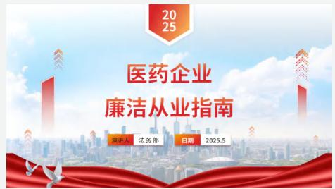

text_image

20
25
医药企业
廉洁从业指南
演讲人 法务部 日期 2025.5

## 法务刊物

## 案例

公司法务部定期发布内容详实的法务内刊，结合典型案例与最新法规解读，持续强化员工的法律意识，有效提升员工在合同审核、合规操作等方面的风险防范能力，助力企业稳健运营。

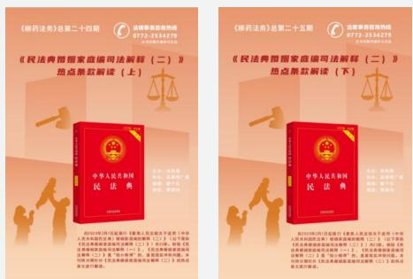

## 反不正当竞争

公司严格遵守《反不正当竞争法》等法律法规的要求，针对性完善企业合规制度，重点强化整治“内卷式”价格竞争、利益输送、泄露客户隐私和商业秘密等权益侵害行为，聚焦高风险场景开展反不正当竞争、商业道德、合规案例警示等系列教育，携手共建公平、公正的市场竞争环境。

反不正当竞争关键环节、风险点应对措施

<table><tr><td>关键环节</td><td>风险点</td><td>柳药应对</td></tr><tr><td>宣传推广</td><td>虚假宣传、恶意诋毁、虚假数据</td><td>宣传内容多级审批,业务系统留痕与监测报警</td></tr><tr><td>经营销售</td><td>价格混乱、销售回扣、串货调货</td><td>严格管控渠道价格、设置价格上下限,规范渠道供货管理,禁止现金结算,执行集采招标统一价</td></tr><tr><td>采购招标</td><td>利益输送、透露底标、价格内卷</td><td>严格招标资料管理,控制知情人范围,制定合理价格,开展专项审查</td></tr><tr><td>人事管理</td><td>从事竞争性业务、透露商业秘密和客户信息、违规聘用</td><td>开展离任审计、签署竞业限制协议,核查关联关系</td></tr><tr><td>合作方管理</td><td>收受贿赂、低价倾销、违规交易、价格同盟</td><td>开展供应商合规审计、签署廉洁承诺、落实反不正当竞争条款</td></tr></table>

## 平等对待中⼩企业

柳药集团始终坚守公平发展理念，严格遵循国家相关政策要求，在合作对接、资源分配、机会供给等方面，给予中小企业与大型企业同等对待，同时积极发挥自身资源优势，为合作中小企业提供技术指导、资源共享、渠道对接等赋能支持。截至报告期末，公司应付账款（含应付票据）余额未超过300亿元也未超过总资产的50%。同时公司严格遵守国家相关法律法规，不存在需要通过国家企业信用信息公示系统向社会公示逾期尚未支付中小企业款项信息的情况。

## 信息安全和隐私保护

公司依据《中华人民共和国网络安全法》《个人信息保护法》《数据保护法》等法律规范要求，持续强化对内部信息安全、客户个人信息安全的保护，建立“事前防范、事中管控、事后处置”全流程客户隐私保护体系，切实保障企业信息安全和客户合法隐私权益不受侵害。

公 司 通 过 国 家 公 安 部 信 息 系 统 安 全 等 级 保 护 第 三 级 认 证 ； 通 过 ISO/IEC27001:2022（信 息 安 全 管 理 体 系 ） 和ISO/IEC 27701:2019（隐 私 信 息 管 理 体 系 ） 双 国 际 标准认证。

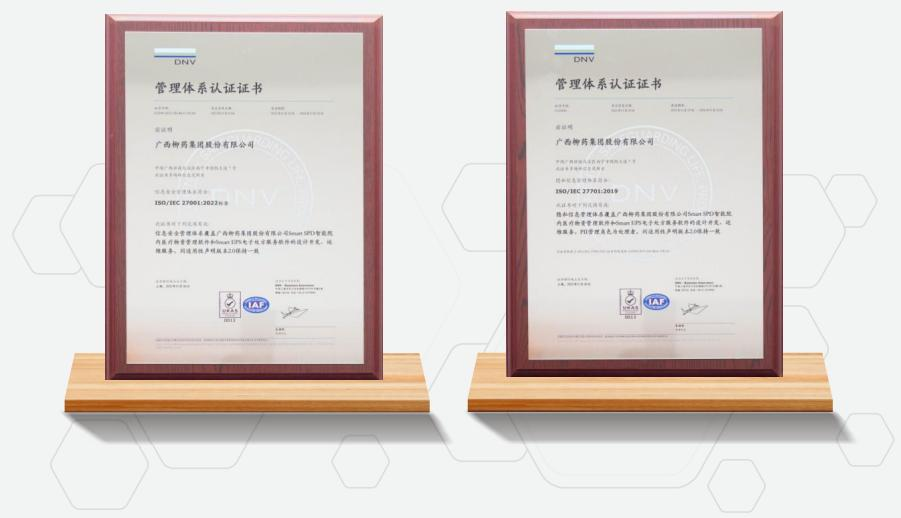

text_image

DNV
管理体系认证证书
DNV
管理体系认证证书
DNV
管理体系认证证书
DNV
管理体系认证证书
DNV
管理体系认证证书
DNV
管理体系认证证书
DNV
管理体系认证证书
DNV
管理体系认证证书
DNV
管理体系认证证书
DNV
管理体系认证证书
DNV
管理体系认证证书
DNV
管理体系认证证书
DNV
管理体系认证证书
DNV
管理体系认证证书
DNV
管理体系认证证书
D NV
管理体系认证证书
D NV
管理体系认证证书
D NV
管理体系认证证书
D NV
管理体系认证证书
D NV
管理体系认证证书
D NV
管理体系认证证书
D NV
管理体系认证证书
D NV
管理体系认证证书
D NV
管理体系认证证书
D NV
管理体系认证证书
D NV
管理体系认证证书
D NV
管理体系认证证书
D NV
管理体系认证证书
D NV
管理体系认证证书
D NV
体系管理标准要求:广西物药集团股份有限公司(Niuan SPC)智能院内医疗器械管理部(Niuan SPC)电子处方服务软件的设计开发、运维服务。同使用体声明版本20排一致

## 完善信息安全管理体系

2025年公司进一步加大在信息安全领域的投入，从硬件、软件、人员配备等方面入手，持续提升信息安全和隐私保护能力。公司制定下发了《网络安全管理制度》《信息系统账号及权限管理制度》《信息安全与隐私管理制度》等，明确数据信息的收集、存储、使用、加工、传输、提供、公开、删除等全生命周期管理要求，防范信息安全和数据泄露风险。

## 升级信息安全防护系统

2025年公司持续强化信息安全防护系统建设，通过零信任封装发布应用、升级互联网出口和数据中心防火墙、设立统一备份数据库平台以及制定并严格执行数据库管理流程、AI技术应用等措施，提升网络威胁检测与应急响应效率，有效保障数据库的安全和稳定。同时公司在数据存储上建立了“两地三中心”数据存储，保证数据安全和运营的可持续。

数据备份及安全  
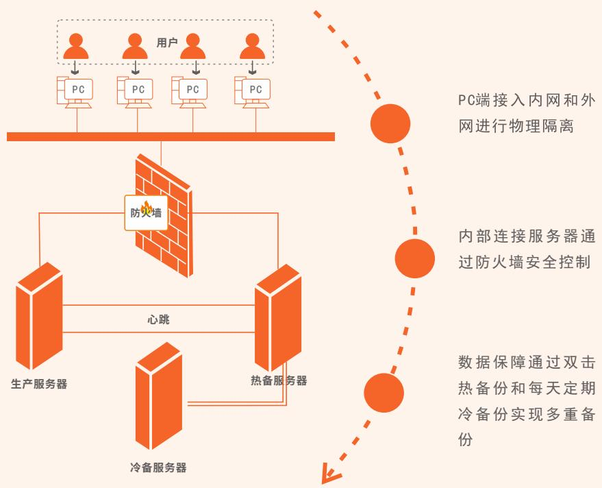

flowchart

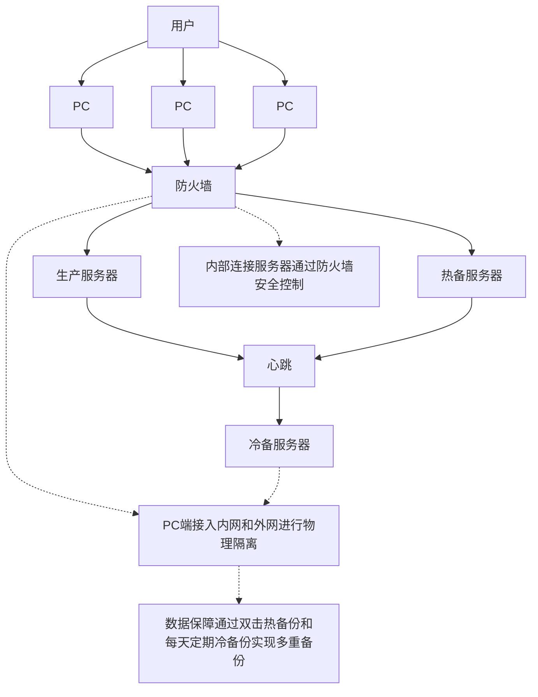
```mermaid
graph TD
  User["用户"] --> PC1["PC"]
  User --> PC2["PC"]
  User --> PC3["PC"]
  PC1 --> Firewall["防火墙"]
  PC2 --> Firewall
  PC3 --> Firewall
  Firewall --> Server1["生产服务器"]
  Firewall --> Server2["热备服务器"]
  Server1 --> Heartbeat["心跳"]
  Server2 --> Heartbeat
  Heartbeat --> Server3["冷备服务器"]
  Firewall -.-> External["PC端接入内网和外网进行物理隔离"]
  Firewall -.-> Internal["内部连接服务器通过防火墙安全控制"]
  Server3 -.-> External
  External -.-> DataBackup["数据保障通过双击热备份和每天定期冷备份实现多重备份"]
```

## 强化数据信息分类管理

公司根据数据重要程度、敏感级别、泄露危害，对企业经营、客户信息、商业秘密、技术资料等实行统一分级分类，实现精准管控、安全使用、合规流转，防范数据泄露、滥用与安全风险。

<table><tr><td>级别</td><td>范围</td><td>管理要求</td></tr><tr><td>公开级</td><td>公司对外公开披露的企业信息、公告、宣传材料等</td><td>统一口径标准,严禁擅自删改,避免误导性陈述</td></tr><tr><td>一般级</td><td>供企业内部分析管理使用的信息,对外泄露影响轻微</td><td>设置内部查阅权限,禁止随意转载,以及通过各种渠道对外传播</td></tr><tr><td>限制级</td><td>涉及企业重要经营、客户敏感信息</td><td>授权访问、限制访问范围,操作留痕、禁止拷贝外传</td></tr><tr><td>机密级</td><td>企业核心商业秘密、关键技术、重大决策、高敏感客户信息</td><td>严格授权、双人审批、加密存储、专项审计、严禁拷贝外传</td></tr></table>

## 关键绩效

全年发生信息安全事故

0 起发生隐私信息泄露事故

0 起

## 柳药集团数据信息保护措施

加密存储，密钥分离管理  
严格访问控制与权限管理  
支持匿名化脱敏处理  
区块链存证记录数据访问使用日志，确保不可篡改  
实时监控数据调用行为  
人脸、指纹、短信等多重认证访问  
客户端设置隐私开关，支持客户不可逆删除个人信息  
内网部署了边界防火墙和入侵检测系统，防范恶意攻击

## 建⽴信息安全防护应急预案

公司针对可能发生的信息安全风险定制信息安全预案，建立由信息管理中心、法务部及相关业务部门协同参与的应急执行小组，并通过信息技术建立7\*24小时信息安全监测机制，实时监控网络运营、系统状态、数据访问、异常操作、病毒入侵等。公司已逐步构建形成覆盖事态控制、风险排查修复、数据救援处置、业务恢复等全环节的应急保障体系。

## ⽤⼾隐私保护

在用户隐私保护方面，公司坚持数据最小化原则，通过匿名化、去标识化技术处理用户数据，明确授权，在隐私政策中明示数据用途、存储期限。同时公司采用安全的技术框架，实施传输加密措施，以增强数据安全，并对安全产品、业务访问日志进行实时监控，通过设定的监控阈值和定期巡检，及时发现潜在的安全问题，及时排查和处置风险。此外，公司遵循《个人信息保护法》要求，在客户端提供用户数据查询/删除入口。2025年累计处理用户请求上千次，响应率100%。

natural_image

Interior view of a data center server room with multiple racks and overhead lighting (no visible text or symbols)

## 内控⻛险管理

柳药集团以“合规经营、风险可控、提质增效”为核心导向，通过完善制度流程、明确责任分工、强化监督问责、优化技术支撑，全面识别、评估、应对企业经营管理中的各类风险，实现风险事前精准防范、事中有效管控、事后及时整改，保障企业资产安全、运营合规，持续提升企业经营管理水平和抗风险能力。

风险管理架构  
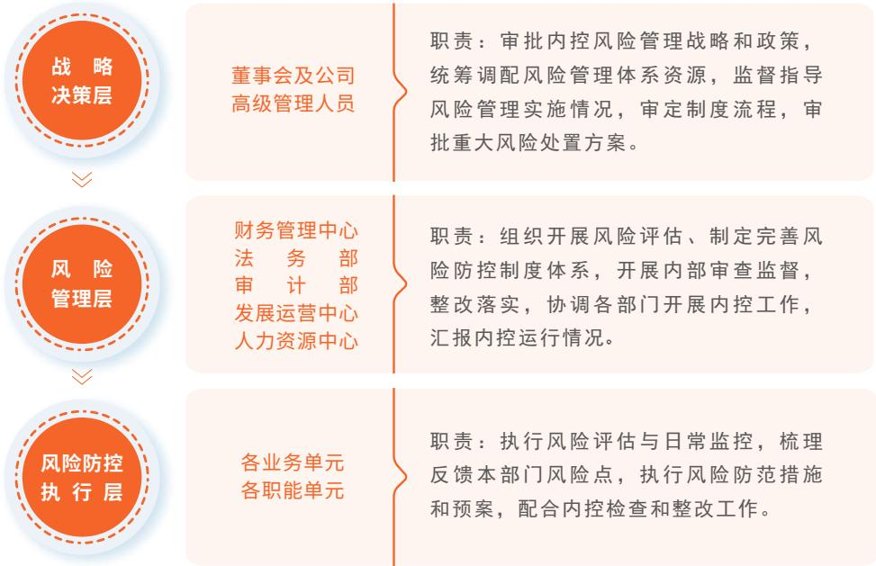

flowchart

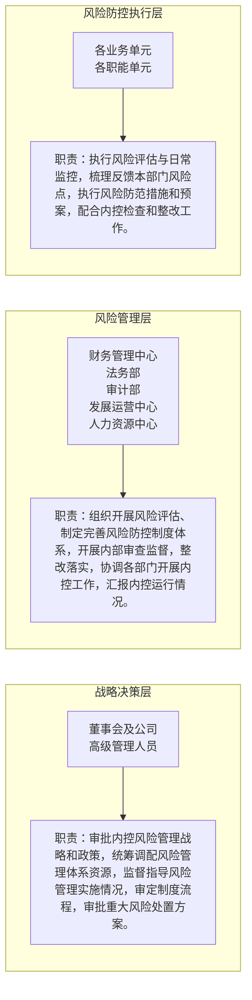
```mermaid
graph LR
  subgraph Strategic_Cole["战略决策层"]
    direction TB
  A["董事会及公司\n高级管理人员"] --> B["职责：审批内控风险管理战略和政策，统筹调配风险管理体系资源，监督指导风险管理实施情况，审定制度流程，审批重大风险处置方案。"]
  end

  subgraph Risk_Management["风险管理层"]
    direction TB
  C["财务管理中心\n法务部\n审计部\n发展运营中心\n人力资源中心"] --> D["职责：组织开展风险评估、制定完善风险防控制度体系，开展内部审查监督，整改落实，协调各部门开展内控工作，汇报内控运行情况。"]
  end

  subgraph Risk_Pection["风险防控执行层"]
    direction TB
  E["各业务单元\n各职能单元"] --> F["职责：执行风险评估与日常监控，梳理反馈本部门风险点，执行风险防范措施和预案，配合内控检查和整改工作。"]
  end
```

## 优内制度流

2025年公司内控管理部门根据公司业务开展、项目实施和合规政策需要以及内控审查结果组织内控制度修订完善和流程优化工作，年内共制订、梳理、完善了药品追溯管理、退货不合格商品控制程序、更正系统管理等19个控制流程，并由归口岗位参与编制本岗位业务流程和制度要求，将部门提交的标准化流程、制度纳入当年度组织绩效考核指标，督促各部门广泛参与公司内控体系建设，也使得制度流程更符合公司业务实际。报告期内，公司修订发布了《合同管理制度》《舞弊预防管理制度》《信息系统账号及权限管理制度》《差旅费及补贴管理办法》等。

## 严格内审监督问责

公司以组织绩效考核、制度执行考核、内部审计检查为抓手，强化制度执行的常态化监督机制。公司发展运营部、审计部、法务部等对公司制度执行、风险识别评估开展定期跟踪检查，出具相关考核整改意见。2025年公司发展运营部组织开展涉及预付款项、合规开票、库存商品、退货率、财务超期欠款等专项考核30余次，出具考核文件161个。同时，公司审计部在董事会审计委员会指导下承担公司内审工作。2025年，公司审计部对集团及下属子公司开展内控审计，主要聚焦关联担保、募集资金的使用、财务凭证抽查、应收账款、合同履约等专项审计工作，共出具内控审计及专项审计报告7份、存货盘点报告4份，完成24项应收账款对账工作。

## 强化账期⻛险控制

2025年集团继续坚持以高质量经营为目标，坚持“有所为有所不为”原则，强化财务风险管理和业务风险控制，重点关注存货管理风险、应收账款风险、流动性风险、财税风险等。同时加大对预付货款、超期欠款、对外担保、关联交易、费用审批等关键指标的重点控制，开展专项审计和监督考核。尤其在清理超期欠款方面，公司强化了业务员回款考核，并根据客户资信、回款能力、账期等情况实行客户分级分类，有的放矢地开展销售工作，推动销售与回款的平衡，从而有效提升对账效率和回款速度，持续改善公司现金流状况，稳步提升公司经营质量。

## 关键绩效

2025年末公司经营性现金流

10.78亿元

同比增长

28.52%

## 质量创造价值

医 药 产 品 的 质 量 关 乎 全 民 健 康 与 生 命 安全，是企业生存发展的根基，也是社会公共安全的重要屏障。柳药集团始终坚守质量底线，深耕品质管控，以卓越质控能力、严苛质量标准、可追溯管理夯实发展根基，构建覆盖药品研发生产、流通、销售、使用全生命周期的质量管理体系。用过硬的质量创造价值，赢得客户信赖、市场认可，保障企业长远发展。

## 质量⽅针⸺

## 持续改进，确保运营安全

## 治理

柳药集团业务覆盖医药流通与医药生产两大业务板块。公司根据《中华人民共和国药品管理法》《中华人民共和国药品管理法实施条例》和《药品经营质量管理规范（GSP）》《药品生产质量管理规范（GMP）》《药品生产监督管理办法》《医疗器械监督管理条例》等相关法律法规、指导性文件要求，结合各业务板块属性和政策法规要求，建立由企业负责人统一领 导 ， 质 量 总 监 全 面 负 责 管 理 ， 质 控 团 队 牵头，各生产业务环节全面参与配合的质量管控体系，并持续完善质量控制制度体系和文件流程，牢牢把控质量控制关键节点，确保质量工作专业化、规范化开展。

柳药集团质量管理组织架构  
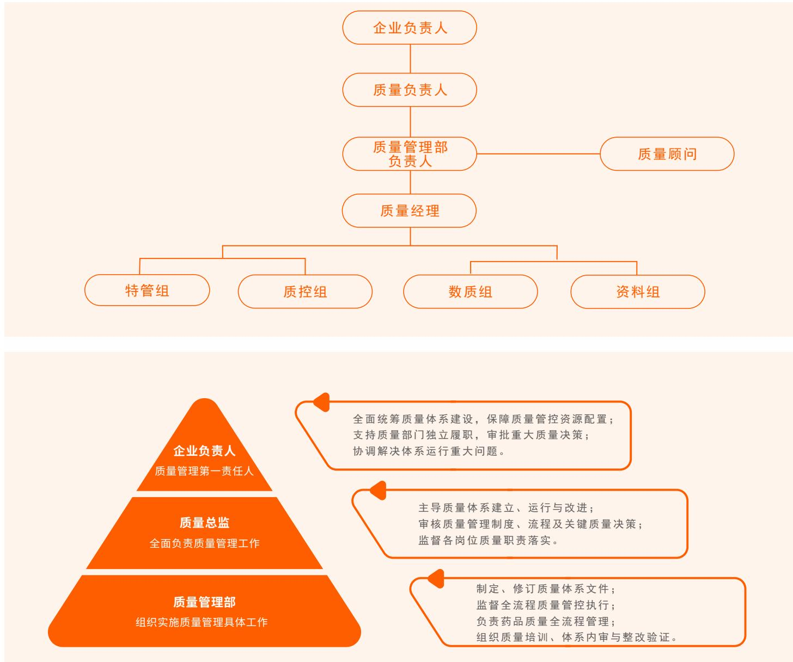

## 质量控制制度体系

柳药集团以“持续改进，确保运营安全”为质量方针，持续构建完善企业质量控制文件和操作规程，明确质量记录与凭证留存，定期根据国家法律法规及业务需要更新调整制度文件，确保质量工作的规范性、适应性、有效性。2025年，公司新增45份放射性药品制度文件、28份操作规程，21份记录表格，修订质量体系文件150份。

## 质量体系控制⽂件

## 质量⽅针⽂件

明确企业质量宗旨、总体质量目标，分解各部门、各岗位质量指标。

## 操作规程

制定各岗位标准化操作流程，明确采购、抽样、养护、运输等各环节操作细则。

## 质量管理制度

涵盖采购管理、收货验收、储存 养 护 、 出 库 运 输 、 销 售 管理、不合格药品管理、追溯管理、质量投诉、不良反应、召回 管 理 、 人 员 培 训 、 设 备 管理、内审与风险评估等全流程制度。

## 质量记录与凭证

建立齐全台账、操作记录、审核表单，确保真实、准确、完整、可追溯。

## 关键绩效

新增放射性药品制度文件

45 份新增放射性药品操作规程

28份新增放射性药品记录表格

21 份

## 质量⻛险管理

公司围绕药品生产、采购、仓储、运输、销售、使用全生命周期，结合GSP\GMP规范、药品监管要求及企业生产经营实际，开展全方位、全覆盖风险识别，聚焦于高风险环节、关键管控节点、人为操作漏洞、设备设施故障等核心维度，精准判定风险等级、梳理风险来源，建立常态化风险识别、排查、台账管理机制，做到风险早发现、早预警、早处置。

## 药品经营环节质量风险控制

## ⻛险识别

识别药品经营各环节潜在风险，辨别显 性/隐 性 风 险 ，找出关键因素及关键点。

## ⻛险评估

分 析 风 险 原 因 及发 生 概 率 ， 判 定危 害 程 度 与 影 响范 围 ， 通 过 风 险指 数 矩 阵 图 分析 、 确 定 风 险 等级。

## ⻛险控制

从 人 员 、 设 施 设备 、 体 系 文 件 等方 面 制 定 措 施 ，确 保 有 效 、 可控 、 可 追 溯 ， 全面 实 施 过 程 管控。

## ⻛险沟通与评审

对内信息共享、全员预防；对外及时通报、降低危害；定期评审控制措施有效性，持续改进再检查。

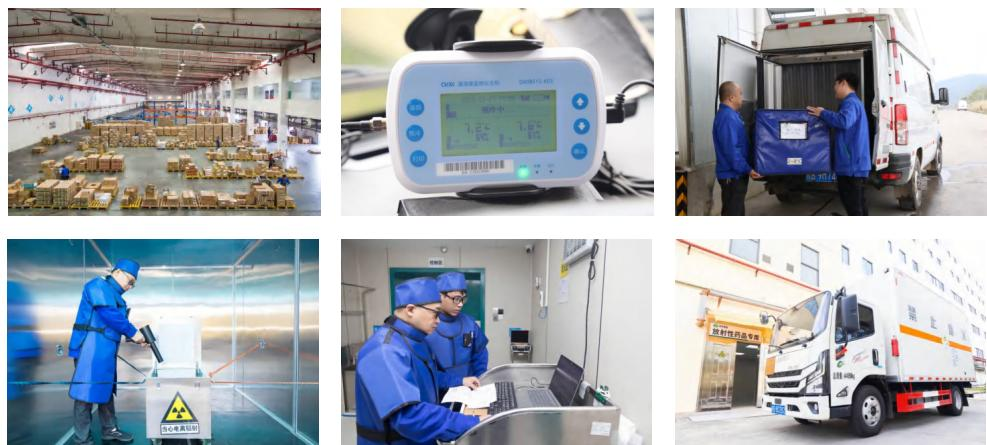

## 药品⽣产全⽣命周期质量管理

## 做好源头原料药材质量控制

正品基原，优选道地药材产区  
专业采购，确保最佳采收周期  
严格筛选，开展专业 检验检测  
强化合作，自建标准种植基地

## ⽣产过程层层把关 确保品质

严 格 落 实GMP生 产 管理  
强化工艺研究升级  
对生产全程实施动态监测  
对 所 有 物 料 、 中 间体、成品落实内部测试与复检

## 严格开展产品 测试验证

建立高于国家基本要求的质量控制标准  
具备成熟的产品自测能力  
配备专业质控设备开展全环节、多层次产品检测

## 落实流通监督责任

规范开展成品存储养护工作  
建立从采收到生产、流通、销售全环节的药品溯源机制  
建立产品召回机制

仙茱中药科技通过越南GMP符合性认证

## 案例

2025年7月，越南传统医药管理局官方网站公布了近期国外传统药材及药品生产机构良好生产规范评估结果（简称GMP符合性认证），仙茱中药科技顺利通过本次认证。

中药生产企业向越南出口中药材和中药饮片需通过越南GMP符合性认证，目前国内仅有少数中药饮片生产企业通过此项评审。此次仙茱中药科技通过越南GMP符合性认证，标志着仙茱中药科技生产加工的中药饮片产品在越南市场的合法流通得到了越南官方认可，为未来仙茱中药科技饮片产品出口越南市场奠定基础。

## 关键绩效

完成全部在产品种的2025版药典标准升级，检验项目覆盖率

100%

新增检验操作规程、生产工艺规程、工艺及设备验证等文件

177 份

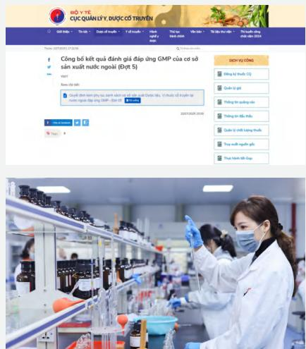

检验数据准确率

100%数据完整性问题发生率降为

0

因工艺偏差导致的成品不合格发生率

0%

## 药物警戒

公司建立完善的药物警戒组织架构，明确质量管理部为药物警戒责任部门，指定经专业培训的质量管理员负责药品不良反应及药物警戒相关信息的收集、审核、评价、报告与处置工作，确保药物警戒活动独立、规范、可追溯。同时公司制定并执行《药物警戒及不良反应监测管理制度》，覆盖药品全生命周期的不良反应预防、监测、报告、识别、评估与控制。该制度明确规定了信息来源渠道、报告时限、评价标准、处置流程及随访要求，形成闭环管理机制。

## 召回管理

公司严格遵循《药品召回管理办法》要求，建立覆盖信息收集、指令传达、停止销售、客户通知、退货收回、记录存档及配合反馈的全流程召回管理机制。公司依据持有人或药监部门通知，按照召回级别时限停售并通知客户退回药品，同时建立完整的召回记录档案，涵盖召回通知、销售流向、入库清单、处理结果及向监管部门报告文件等，确保全过程可追溯。

2025年度，公司配合持有人完成108个品种的召回工作，召回药品均已按规范处理并留存完整记录，未发生因召回不及时导致的质量事故，有效保障了公众用药安全。

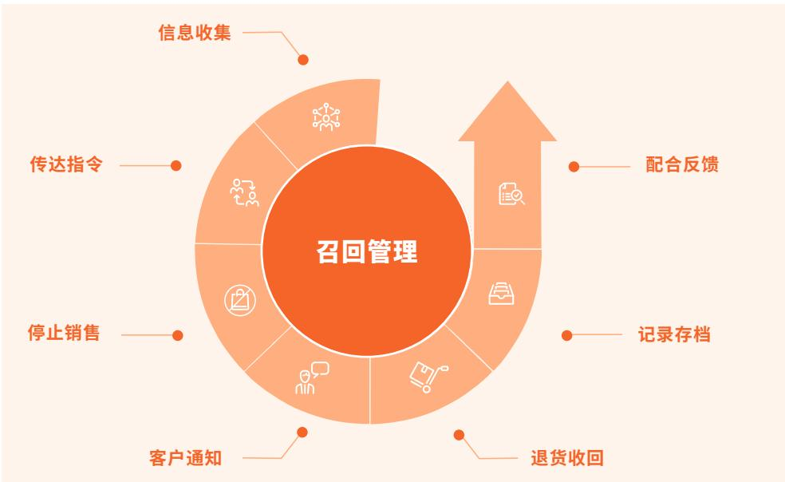

flowchart

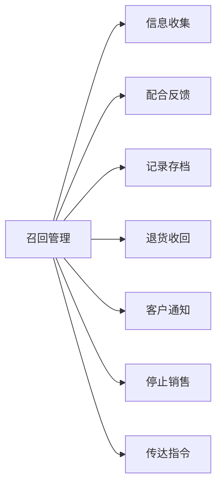
```mermaid
graph LR
  A["召回管理"] --> B["信息收集"]
  A --> C["配合反馈"]
  A --> D["记录存档"]
  A --> E["退货收回"]
  A --> F["客户通知"]
  A --> G["停止销售"]
  A --> H["传达指令"]
```

## 落实质量⻛险监督问责

公司严格落实质量专项监督排查机制，定期开展内部质量排查，常态化交叉互检，主动接受外部质量审核，从而实现多维度、常态化质量监管机制。针对发现的缺陷问题制定整改措施、明确责任时限、跟踪整改闭环，确保质量管理体系持续高效运行。同时公司将质量风险指标、质量违规指标、违规操作、质量投诉、检查频次和整改情况等纳入相关部门组织绩效考核和个人KPI考核中，确保执行监管到位，切实筑牢药品质量安全防线，有效保障公众用药安全。

关键绩效  
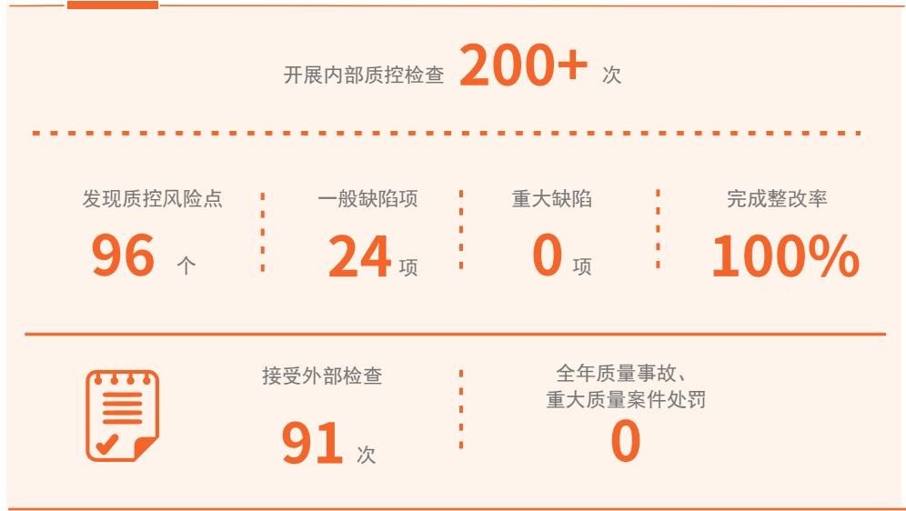

text_image

开展内部质控检查 200+ 次
发现质控风险点
96 个
一般缺陷项
24 项
重大缺陷
0 项
完成整改率
100%
接受外部检查
91 次
全年质量事故、
重大质量案件处罚
0

natural_image

Illustration of two scientists in lab coats discussing at a laboratory with test tubes and a microscope (no text or symbols)

## 全⾯提升质控能⼒

公司持续提升质量控制能力，强化质控队伍建设，加快质控设备、技术升级，不断提升公司产品自主检测能力和全流程质量控制水平，目前公司已建立覆盖中药全品类的自主检测能力，能够按照国家药典标准开展定性、定量、农残等各项指标检测。

## 质控设备升级

公司在质控设备方面持续加大投入，引进先进质控设备，强化设备维护与校准，确保生产产品和原料质量符合国家和企业标准。2025年新增高效液相色谱仪、三重四级杆气质联用仪、电感耦合等离子体质谱仪等质控设备，提升农残、成分图谱、薄层鉴别等方面的质量控制能力。公司旗下广西仙茱制药有限公司现代化理化试验室，拥有40余台超高效液相色谱仪以及气相色谱仪等，能够独立开展中药配方颗粒产品相关中药材原料及成品的含量、农残、特征图谱检验，确保符合国家备案标准。目前仙茱制药正在开展实验室CNAS认证工作，公司配方颗粒产品备案数量、质量及生产规模在广西乃至全国均处于领先行列。

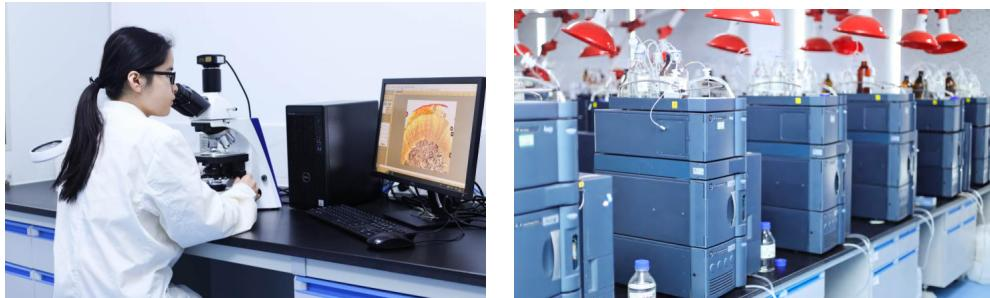

## 质控信息化建设

公司持续强化质量控制信息化建设。公司质量管理部设立数质组，从质量合规性出发，以数字化创新为驱动，推进计算机系统建设与流程再造，完善信息系统功能、数据治理及追溯码全流程监管机制，积极运用系统控制手段强化经营各环节智能化、标准化管控，实现质量风险前瞻识别，实时预警与精准防控以科技赋能筑牢合规运营防线2025年，公司启动了中药材AI质量验收项目，通过自主训练小模型，能够智能检测和判断中药材的质量等级。同时推出了药品追溯码溯源管理系统、核素与危险化学品系统、电子证照系统、SPD器械耗材管理系统等，年内完成系统优化项目共计90项。共同推动集团质量控制工作数智化转型。

## 质量⽂化建设

公司持续开展质量文化建设，强化质控人才引进和能力培养，通过开展质量培训、常态化质量例会、职业技能大赛、知识竞赛、质量月等活动，以及设置质量控制标兵、优秀班组、质量文化上墙等措施，营造良好质量文化的同时提升全员质量意识和技术能力。截至报告期末公司质量管理岗位人员230人，药学相关技术人员1,300余人。202年，公司质量管理部采用线上与线下结合的方式开展质量专项培训，培训范围涵盖药械法律法规、质量管理体系文件、特殊管理药品、药械收货验收管理、冷链管理、偏差管理与纠正预防措施、药物警戒及不良反应管理、用户投诉及召回等多个方面，各项培训230余次，培训4,000余人次。

关键绩效  
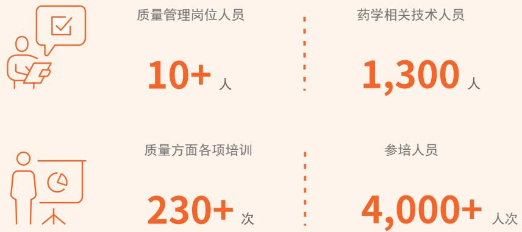

text_image

质量管理岗位人员
10+人
药学相关技术人员
1,300人
质量方面各项培训
230+次
参培人员
4,000+人次

《药品收货验收质量管理知识》主题培训

## 案例

2025年4月，公司质量管理部面向供应链管理中心全体收货、验收岗位相关人员，组织举办了《药品收货验收质量管理知识》主题培训。

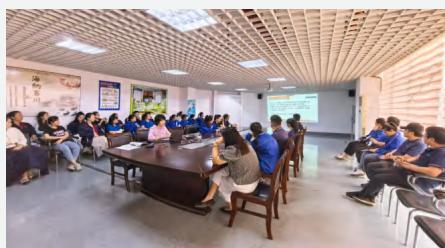

natural_image

Interior view of a classroom or meeting room with attendees seated around tables, facing a projected presentation screen (no visible text or symbols)

《药品收货验收质量管理知识》主题培训

## 案例

2025年8月，公司质量管理部组织药品采购相关人员，开展了《药品采购质量管理知识》专题培训。本次培训重点讲解了《药品经营质量管理规范》、药品采购相关质量管理体系文件及质量风险控制等内容，旨在强化药品购进环节的合法合规管理，切实保障药品购进的合法性。

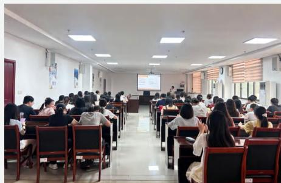

natural_image

Interior view of a classroom or lecture hall with students seated in rows facing a projected screen (no visible text or signage)

柳州会场

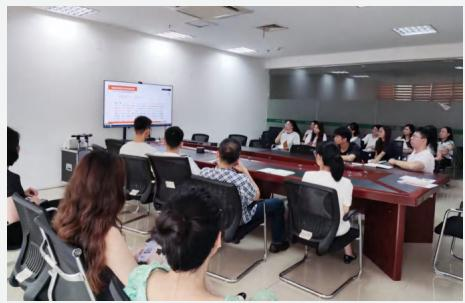

natural_image

Interior view of a conference room with attendees seated around a long table, facing a presentation screen (no visible text or symbols)

南宁会场

仙茱中药科技承办第32届全国中药质量评价暨药材市场实训会

## 案例

5月24-26日，由国家中药材产品质量检验检测中心主办，广西仙茱中药科技有限公司承办的第32届全国中药质量评价暨药材市场实训会在广西玉林举行。本次会议采用课堂培训、药材市场现场讲解、真伪优劣标本辨别等培训方式，来自全国中药企业、中医药院校、药品监督、检验机构部门等相关专业人员等共计300余人参加。

第32届全国中药质量评价暨药材市场实训会  
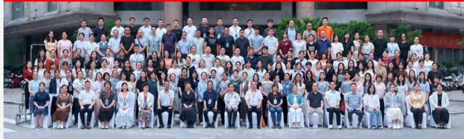

natural_image

Group photo of people posing in front of a modern building (no visible text or signage)

仙茱中药科技成功举办第八届中药技能比赛

## 案例

为促进中药传统技能的传承发展，提升中药从业人员的职业素养，12月14日，广西仙茱中药科技有限公司举办第八届中药技能竞赛。

本届竞赛共设10个比赛项目的个人赛和团 队 赛 ， 包 括 中 药 切 制 、 炮 制 、 净制、干燥、包装及辨认、调剂、化验操作等，来自仙茱中药200多名技术精英同台竞技、各展所长。

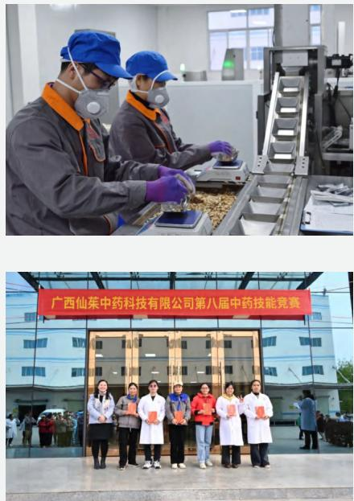

## 02

## 创新破局 协同共赢

创新引领突围

数智转型攻坚

打造协同生态

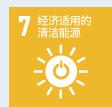

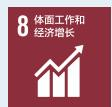

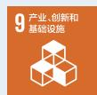

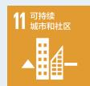

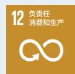

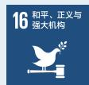

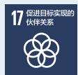

柳药集团积极落实“创新转型、协同发展”战略，强化自主研发能力建设与创新合作平台搭建，持续创造优质健康产品，同时应用新技术推动传统业态数字化转型和产业链协同发展新生态打造，提升内生发展动力的同时形成行业高质量发展合力。

natural_image

Illustration of two scientists in lab coats discussing at a laboratory with test tubes and medicine bottles (no text or symbols)

## 创新引领突围

## 治理

柳药集团以坚持推动产品研发创新，通过多元化、高质量产品突破发展瓶颈，同时强化数字技术与集团各业务板块的深度融合，持续提升公司核心竞争力。公司董事会制定创新驱动与数字转型战略目标，并由信息管理中心、数字健康发展中心、工业事业部研发团队牵头，各职能、业务团队广泛参与，根据内部管理需求、外部市场需要制定、落实相关领域实施方案，通过内部研发团队培养以及与外部科研院所、高校、行业顶尖企业的合作，推动项目高效落地。

## ⾃主研发创新

信息管理中心  
数智健康发展中心  
中药饮片产品研发团队  
中药配方颗粒研发团队  
中成药研发团队  
创新医药研究院  
新零售与慢病管理事业部  
智慧供应链

## 柳药集团科技创新共建体系

## 外部共建平台

中药材共建共享平台  
医药现代化与临床转化示范基地  
柳药—珠海澳大合作实验室  
高校产学研合作平台与教学实践基地  
中药材加工与炮制工程技术研究中心  
广西医疗机构制剂与药食同源产品工程研究中心  
上海海洋大学人工智能合作平台

## 战略⽬标

集团以服务人类健康、企业持续发展为出发点，聚焦于中药大健康产业与创新医药研究，持续推动老药新做、经典名方、药食同源产品和院内制剂产品研发创新，加快中药配方颗粒产品研发备案，推动海外创新药项目落地，为患者提供更多元化、高质量健康产品。同时应用云计算、大数据、人工智能（AI）、物联网等数字技术融入企业运营管理全过程，打通内外部数据壁垒，构建新发展生态，实现智能决策、高效运营、服务升级，全面提升企业核心竞争力、风险管控能力与可持续发展能力，赋能企业在数字经济时代实现转型升级与高质量发展。

## 数字转型

## 管理数字转型

办公管理数字化项目  
智慧供应链建设项目  
数字营销与药品溯源项目

## 服务数字转型

医院端AI应用场景  
零售端AI应用  
药械耗材SPD项目

## ⼯业数字转型

智能制造  
工业端AI应用

## 产品研发创新

炮制工艺研究项目  
药食同源产品研究  
中药配方颗粒标准研究备案  
老药新做与经典名方研究  
医院临床制剂研究  
海外创新药研发项目

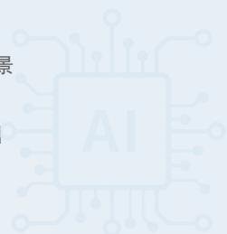

natural_image

Abstract circuit-like pattern with a central AI chip and surrounding nodes (no text or symbols)

## ⻛险与机遇识别

## ⻛险

公司按照风险管控要求在创新领域识别的风险包括因技术路线偏差导致研发周期拉长、投入成本超支、成果转化不畅。  
因市场调研不足、外部政策环境、市场变化以及其他竞品的迭代上市，导致市场需求匹配不足等风险。  
同时还可能面临知识产权争议、项目技术相关人才流失等风险，导致项目无法推进，影响企业经营效益与发展节奏。

## 机遇

新产品服务将助力公司抢占市场先机，提升公司在核心市场的市场份额。  
通过技术突破、功能升级与场景创新，能够拓展新业务空间，提升产品附加值与品牌影响力，增强客户黏性，抢抓消费升级与产业变革机遇，为公司持续增长提供强劲动能。

## 应对

公司通过密切关注行业政策信息及技术更迭动态，加强市场调研摸底和需求论证，精准把控用户需求与行业趋势，避免研发内容与市场脱节。  
合理规划研发周期与预算投入，强化人才引进和人才激励创新，建立与外部专业研发机构的合作，保证公司创新活力。  
完善知识产权布局与合规审查，落实研发项目保密管理，控制知情人范围，开展专项检索核查，避免侵权行为。

## 创新绩效

研发投入（万元）

3，847.40

新取得专利

10 项

软件著作权

14 项

开展科技项目申报

35 项

## 创新打造⾼质量产品

2025年，公司在中药饮片炮制工艺和质量标准方面加大创新研究，持续提升产品质量，结合广西中药、壮瑶药资源优势，继续开展“桂十味”药材高质量生产关键技术及广西特色中药饮片规格等级划分、广西海洋中药材标准编制项目等。公司在进一步完善中药饮片品种质量标准的同时以含量限度更高、安全指数更严、检查项目更多、工艺流程更严苛保证产品质量“严于国标”的标准。在中药配方颗粒生产方面，公司旗下中药配方颗粒生产企业——仙茱制药在加快产品备案的同时还推动壮瑶药中药配方颗粒质量标准的研究。截至2025年年末已完成674个中药配方颗粒品种备案，覆盖约95%的国标、省标品种，同时公司同步在22个省（直辖市）开展品种备案工作，公司的品种备案效率和覆盖率大幅提升。

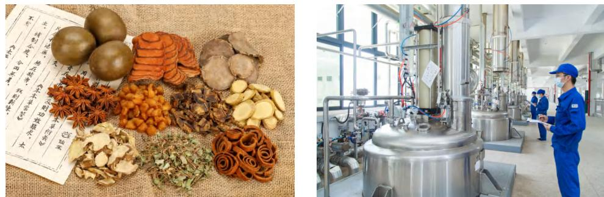

## 药⻝同源与经典名⽅产品研发

2025年，公司以食品车间建成投产为基础，加快药食同源产品的研发上市工作。报告期内公司积极培育新品类，推出了多款药食同源产品，已投产五指毛桃薏苡茶、桑椹玫瑰茶、百合西洋参茶等9款代用茶产品，并已完成减肥、利咽、安神等多款功能茶的研制，正在研制7款花类代用茶、11款功效性代用茶，并积极开展药食同源膏方、凉茶饮品

研究，以温和安全兼顾中医日常调理、亚健 康 改 善 为 契 合 点 ， 打 造 全 新 品 牌 。 此外，公司与珠海澳大研究院正在开展当归补血汤、苓桂术甘汤等经典方剂研究，未来将进一步丰富公司产品矩阵。

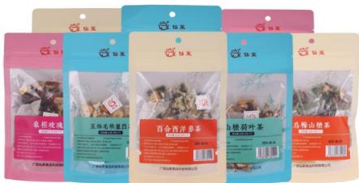

text_image

卷柑玫瑰
玉珀乐味露露
百合西洋参茶
山楂药叶茶
卷梅山楂茶

## ⽼药新做与临床制剂研发

2025年，公司积极推动老药新做工作，推动新适应症研究和原批文产品的生产重启。报告期内，旗下万通制药开展的复方金钱草颗粒治疗III型前列腺炎改良型新药研究已进入临床前期毒理、药效研究阶段，并联合高校开展万通炎康片在治疗溃疡性结肠炎药物中、抗肿瘤药物中的应用研究，已申报相关专利。公司万通炎康片已申报获批11项专利，取得专利密集型产品认定证书。康晟制药在2025年开展研发立项26个，主要为医院制剂品种的开发及中试研究，已完成了5个委托产品的研究工作，全年代工10个临床制剂产品，初步解决了盐酸小檗碱胶囊、消炎利胆片、复方丹参片等品种的生产工艺问题，建立了归芪补血口服液特征图谱检测方法，并积极推动祛瘀健脾茶OTC转换工作。同时公司原有蛤蚧定喘丸、复方丹参片、香砂六君丸等13个老药恢复生产。

## 海外创新药⽣产研发项⽬

2025年 公 司 全 资 子 公 司 海 南 柳 药 投 资 有 限 公 司 ， 与SuninflamL t d .签 订 《 投 资 协 议 》 认 购S u n i n f l a m L t d .增 发 的 股 份 。S u n i n f l a mLtd.（含其下属公司）的研发团队拥有丰富的生物药物临床前发现、评价和开发经验，专注于以炎症反应中的关键因子作为靶点开发创新单克隆抗体药物，拟用于炎症类疾病、神经退行性疾病、代谢类疾病等的治疗。Suninflam Ltd.（含其下属公司）在中国、美国设有研发中心，截至本报告期末，该项目已进入美国一期临床试验，并在中国开展IIT试验。

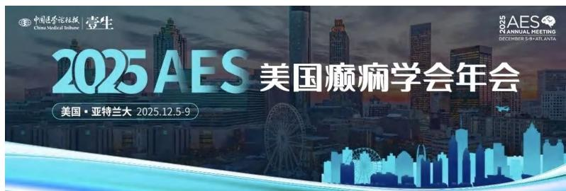

text_image

中国医学出版社
China Medical Institute 壹生
2025 AES 美国癫痫学会年会
美国·亚特兰大 2025.12.5-9
2025 AES
ANNUAL MEETING
DECEMBER 5-9 ATLANTA

## 知识产权保护

公司严格遵守《中华人民共和国专利法》《中华人民共和国商标法》《中华人民共和国著作权法》等国家法律法规，围绕专利、商标、著作权、域名等各类知识产权，开展申报保护、运用管理、风险防控等工作，保障企业知识产权资产安全，规避侵权风险，实现知识产权价值最大化。

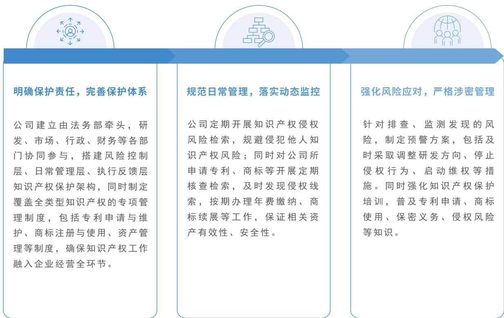

flowchart

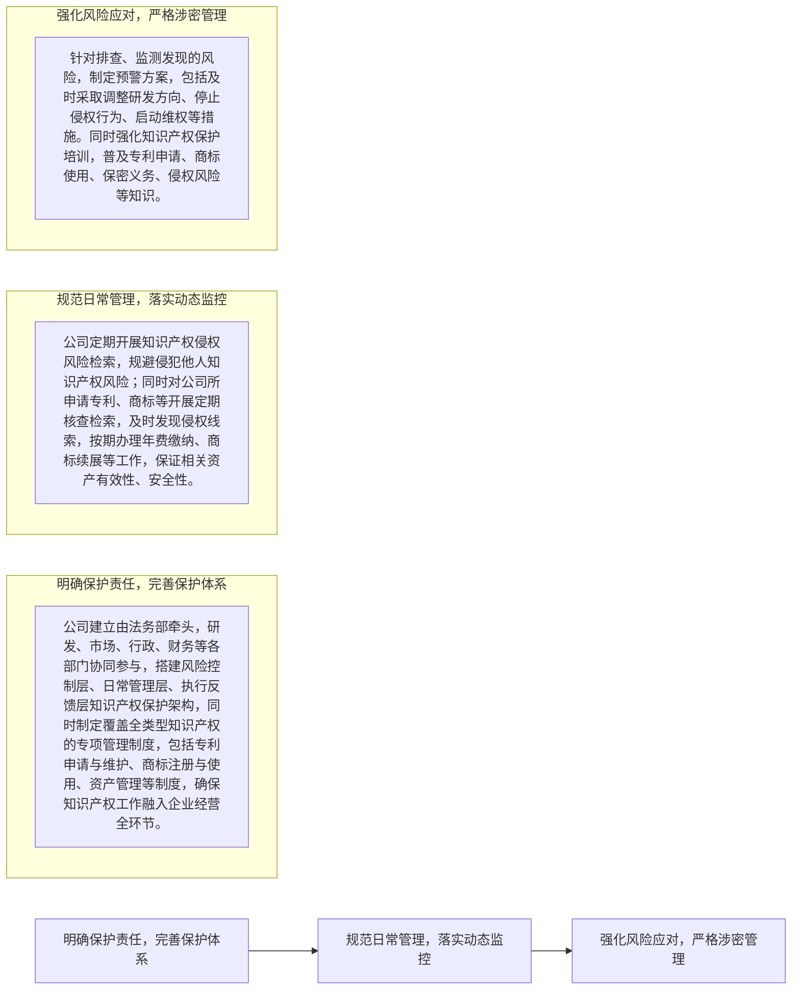
```mermaid
graph LR
  A["明确保护责任，完善保护体系"] --> B["规范日常管理，落实动态监控"]
  B --> C["强化风险应对，严格涉密管理"]
  
  subgraph Left_Left ["明确保护责任，完善保护体系"]
    direction TB
    A1["公司建立由法务部牵头，研发、市场、行政、财务等各部门协同参与，搭建风险控制层、日常管理层、执行反馈层知识产权保护架构，同时制定覆盖全类型知识产权的专项管理制度，包括专利申请与维护、商标注册与使用、资产管理等制度，确保知识产权工作融入企业经营全环节。"]
  end
  
  subgraph Left_Right ["规范日常管理，落实动态监控"]
    direction TB
    A2["公司定期开展知识产权侵权风险检索，规避侵犯他人知识产权风险；同时对公司所申请专利、商标等开展定期核查检索，及时发现侵权线索，按期办理年费缴纳、商标续展等工作，保证相关资产有效性、安全性。"]
  end
  
  subgraph Right_Right ["强化风险应对，严格涉密管理"]
    direction TB
    A3["针对排查、监测发现的风险，制定预警方案，包括及时采取调整研发方向、停止侵权行为、启动维权等措施。同时强化知识产权保护培训，普及专利申请、商标使用、保密义务、侵权风险等知识。"]
  end
```

natural_image

Illustration of books and a balance scale with lightbulb, symbolizing knowledge or justice (no text or symbols present)

## 数智转型攻坚

数字化转型战略是柳药集团适应数字经济时代发展、用户需求升级和提升运营效率的必然选择。近年来集团通过云计算、大数据、人工智能、物联网等数字技术与集团各业 务 板 块 和 运 营 管 理 的 进 行 深 度 融 合 ，2025年集团发布了“AI+医疗”全流程解决方案，重构商业模式和发展生态，推动服务模式转型，实现决策智能化、运营高效化、服务场景化与业态创新化，赋能公司在数字经济时代实现转型升级与高质量发展。

“AI+医疗”全流程服务方案

## 案例

2025年5月 ， 集 团 正 式 发 布 “AI+医疗”全流程服务方案。该方案是柳药集团利用AI技术构建的院内外全场景的AI服务体系和智慧医药供应链、专业医药零售的智能应用矩阵，包括通过大数据、人工智能（AI）应用提升药械供应效率和智能化管理水平；医院端应用大模型、人工智能（AI）赋能医院精准诊疗、患者管理；以及院外通过AI技术加持零售药店专业健康服务，打造AI药师助手——“阿桂药师 ” ， 为 院 外 患 者 提 供 数 字 健 康 服务。最终形成“院端精准诊疗+药店智能照护+供应链高效支撑”的智能协同生态，实现从“被动就医”到“主动健康管理”的转型。

## 数字赋能构建智慧供应链

2025年公司信息研发团队与华为合作落地了华为天筹求解器在医药行业的首个标杆应用——柳药集团智慧供应链智能化改造项目。该项目通过引入华为天筹求解器智能算法，将大模型能力精准嵌入补货、排车、库位规划等核心环节，破解传统供应链优化难落地的痛点，实现了集团供应链管理从“人脑调度”到“智能优化”的根本转变。

## 智慧供应链项⽬⽬标及成效

## 智能装载优化

通过算法动态匹配订单与车型，计算最大化 单 次 运 输 药 品 数量，提升车辆装载效率。

## 调度排线优化

综合时效、成本、路线 与 载 重 约 束，实 现多 目 标 动 态 平 衡，生成 全 局 最 优 配 送 方案。

## 提升⼯作效率

排车效率提升20%，装载率提升5%，拆零拣选效率提升50%，复核效率提升20%，成本降低5%。

## 天筹求解器

## 盘古⼤模型

## ⼤数据平台

natural_image

Isometric illustration of a smart city infrastructure with green buildings, roads, and digital nodes (no text or symbols)

全程溯源提质 数字赋能增效——

国家医保局调研组赴柳药集团开展中药质控溯源专题调研

## 案例

2025年9月16日，国家医疗保障局党组成员、副局长施子海率调研组一行，在广西壮族自治区医疗保障局党组书记、局长庞军等陪同下，莅临柳药集团旗下子公司康晟制药及仙茱中药科技，围绕中药生产、质量控制、溯源体系建设及智慧医药供应链等主题开展专题调研。

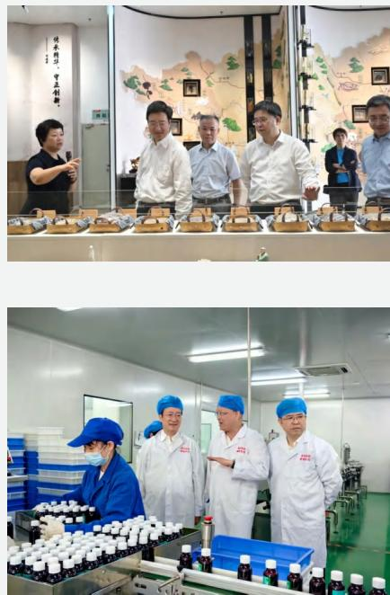

2025年集团首个智能物流仓储——智能零售仓投入使用。该仓储通过应用智能算法以及仓储管理系统、机器人调度系统（RCS）、运输管理系统（TMS）、企业资源计划管理系统（ERP）、设备控制系统（WCS）等全方位数据联动应用，实现物流精细化管理、自动化运营和全程追溯。项目配备物流AGV自动引导搬运车130台，实现货到人的拣选，拆零拣选效率大幅提升，有效支撑公司未来药械购销需求和配送需要。

智能物流仓储系统  
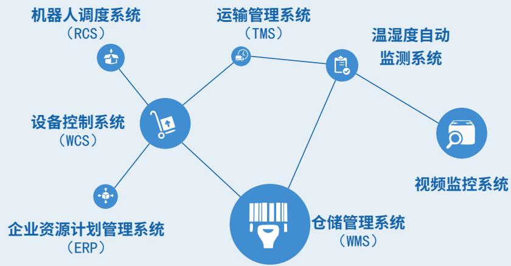

flowchart

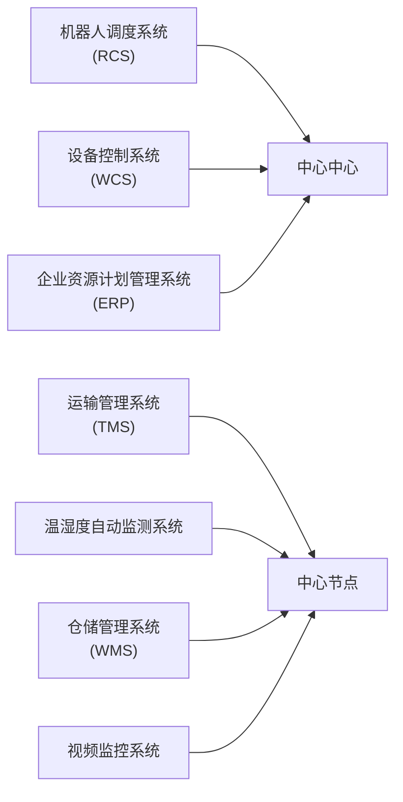
```mermaid
graph LR
  A["机器人调度系统\n(RCS)"] --> C["中心中心"]
  B["设备控制系统\n(WCS)"] --> C
  D["企业资源计划管理系统\n(ERP)"] --> C
  E["运输管理系统\n(TMS)"] --> F["中心节点"]
  G["温湿度自动监测系统"] --> F
  H["仓储管理系统\n(WMS)"] --> F
  I["视频监控系统"] --> F
```

## 多端增效

全面的计算机系统建设，覆盖药品采购、收货、验收、储存、养护、销售、出库、运输等环节，实现药品物流过程的数字化、智能化、规模化、集约化、可追溯化活动，达到仓储物流精益化管理、物流配送管理信息化、自动化、智能化。

## 打造全⽣命周期健康管理AI应⽤场景

2025年，在新技术快跨界融合，行业同质化竞争加剧、降费控本压力加大背景下，集团积极推动传统批发和零售板块数字转型。在医院端，公司持续开展药械耗材SPD项目，落地智慧供应链服务的同时，积极打造院端AI应用场景，提供AI导诊、生成式病例、检测报告解读、疗养陪护等覆盖诊疗前后的智能服务。报告期内，公司已携手合作伙伴打造了AI应用标杆医院，并启动在广西多家核心医疗机构的布局。

AI健康管理平台  
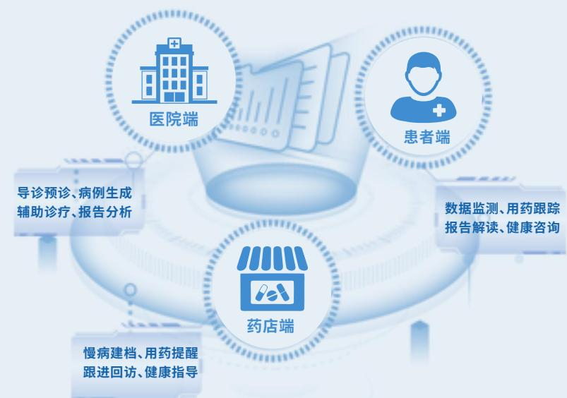

flowchart

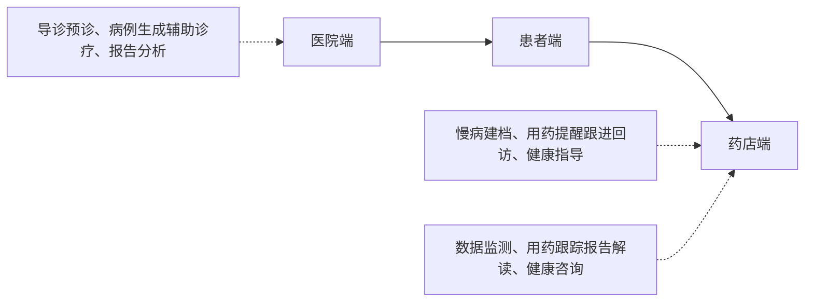
```mermaid
graph LR
  A["医院端"] --> B["患者端"]
  B --> C["药店端"]
  D["导诊预诊、病例生成辅助诊疗、报告分析"] -.-> A
  E["慢病建档、用药提醒跟进回访、健康指导"] -.-> C
  F["数据监测、用药跟踪报告解读、健康咨询"] -.-> C
```

## 多端增效

## 院端AI应⽤场景：解放医⽣资源，提⾼就医体验

## 病情分析

基于患者院内外连续的数据，进行全面的病情分析。  
模拟医生临床思维逻辑，提供临床决策支持。  
智能分析疾病主次矛盾和内在关联，并提供临床证据及医学原理。  
提供个性化诊疗方案建议，并提供分析过程。

## 病历⽣成

采集患者院内外数据进行分析，自动生成病历，并给出诊疗意见。  
支持门诊、住院、急救等多场景应用。

## 病历质控

智能解析病历文书，进行规则和内涵质控。  
基于大模型，发现质控问题，提出修改建议，提升病历质量。  
支持医院自定义规则，实现医院病历质控闭环管理。  
从数据源头进行高质量把控，病历生成过程中实现同步质控，实时发现病历问题并提出修建议。

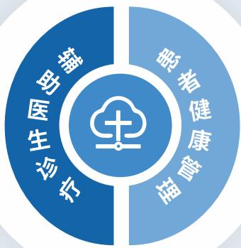

flowchart

```mermaid
graph LR
  A["Support Medical Services"] --> B["Monitoring Health Management"]
```

## 智能导诊

通过模拟医患对话及报告OCR识别等，采集并分析患者病情。  
帮助患者自动推荐科室。  
有助于提高患者就医效率。

## 预问诊

全面采集患者病情。  
自动生成预问诊病历，且支持与院内EMR系统集成。  
方便医生提前了解病情，提高医生工作效率。

## 陪诊

主动、精准推送科学、个性化的医疗健康指引信息。  
以患者为中心的“陪伴式”服务，实现服务主动找患者。

## 健康管理

整合患者院内外医疗健康数据形成健康档案。  
提供7x24小时个性化的健康咨询服务。  
深度分析健康风险，制定个性化健康计划。

## 零AI应⽤场：

## 赋能让药店成为百姓⾝边的健康管理专家

在药店端，通过AI技术加持零售药店专业健康服务，打造AI健康管理助手——“阿桂药师”，为院外患者提供慢病建档、用药跟踪、检测数据分析、数字人患教、慢病回访等一系列数字健康服务，帮助解决院外居家患者健康管理需要，进一步提升顾客健康消费获得感。打造院内、院外AI应用场景，形成覆盖患者从疾病预防到就医用药、康复管理全生命周期的服务闭环，直击社会健康管理痛点，提升客户粘性，形成全新的业务生态圈。

## 智能化⼯具应⽤

引 入 智 能 穿 戴 设 备（如血压计、血糖仪等），患 者 在 家 测 量数据可自动上传至平台，药师和医生可远程监控。

## 打造“双师”联合服务模式

打造“医师”与“阿桂药师”的“双师”联合服务模式，并借助互联网医院实现慢病患者线上预问诊与复购药品、检测回访等联通，提供更全面的慢病管理。

## ⼤病、专病管理模型

与华为、核心医疗机构、头部药企合作构建专病、大病管理大模型，该模型将集健康管理、用药指导跟踪、关联品种疗效评估、不良反应分析等功能。

## ⼈⼯智能AI赋能慢病管理

利 用AI技 术 分 析 慢 病患者数据，提供个性化健康建议和风险预警，提供健康分析和用药方案评估建议。目 前 已 上 线“阿 桂 药师”供消费者体验。

## 关于AI智体阿桂药师

阿桂药师是依托华为技术支持建立，基于医药文献资源、临床检验检测和处方信息、慢病患者档案、医药产品档案等海量数据，集合理用药、患者教育、用药跟踪体系、检测报告解读、辅助健康管理等功能于一体的AI人工智慧药师助手。该助手其整合智能语音交互、视觉模型、大语言模型、数字人等技术，能够自动识别生成患者档案，利用AI大模型解读检查/检验报告，生成结构化数据和检测指标，并能结合患者的基本信息、病史、过敏史、用药记录、随访记录等多方面信息，整合提交AI大模型生成患者治疗方案评估、用药指导建议和回访任务，通过“医师+药师”双师模式，给居家患者更好的服务体验。

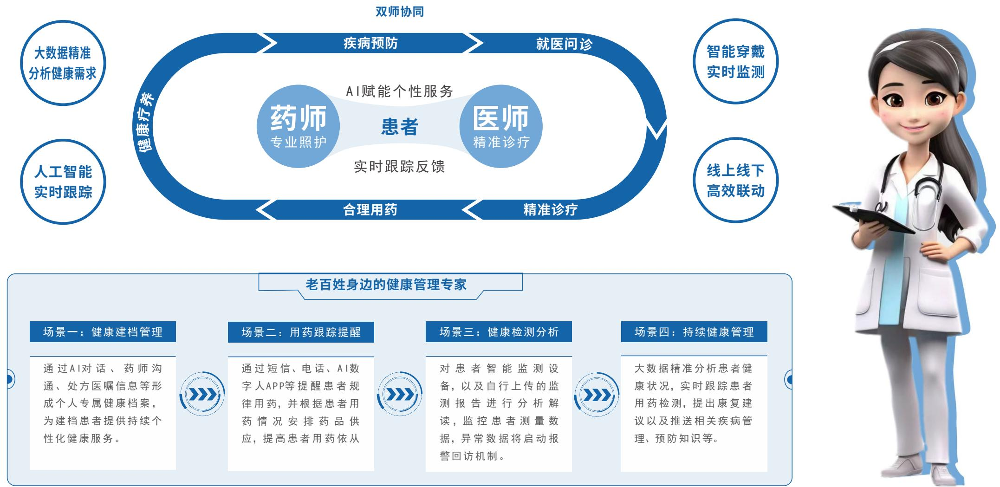

## ⽼百姓⾝边的健康管理专家

## 场景一：健康建档管理

通 过AI对 话 、 药 师 沟通、处方医嘱信息等形成个人专属健康档案，为建档患者提供持续个性化健康服务。

## 场景二：用药跟踪提醒

通过短信、电话、AI数字 人APP等 提 醒 患 者 规律用药，并根据患者用药 情 况 安 排 药 品 供应，提高患者用药依从

## 场景三：健康检测分析

对 患 者 智 能 监 测 设备，以及自行上传的监测 报 告 进 行 分 析 解读，监 控 患 者 测 量 数据，异常数据将启动报警回访机制。

## 场景四：持续健康管理

大数据精准分析患者健康状况，实时跟踪患者用药检测，提出康复建议以及推送相关疾病管理、预防知识等。

## 打造协同⽣态

柳药集团将ESG管理目标嵌入供应链管理中，通过建立供应商全生命周期管理、强化合规风险识别与管控、推动绿色低碳转型与数字化协同，不断提升供应链韧性与透明度，构建起 “持续共赢，协同共进”的稳健供应链体系，携手推动产业升级，践行可持续发展。

## 治理

公司以构建持续稳健的供应链协同生态为目标，建立“决策—执行—监督—改进”四位一体的可持续供应链管理闭环， 成立由公司高管牵头，采购中心、质量管理部、法务部、财务管理中心、审计部等协同执行监管的治理架构，明确供应商“准入—合作—监督—退出” 全流程规则，制定相应分级分类标准和管理政策，定期开展供应商专项审计、评价，密切关注供应保障能力、合规事件、质量风险等指标，动态提升公司供应链体系。

## 战略

公司以保障药械稳健供应和质量安全为基本准绳，持续完善供应链监督管理体系，精准识供应链可能面临的合规、质量、稳定性等方面的风险，强化与供应商的协同生态建设，推动供应链数字化、绿色化转型，构建完整的追溯体系，共同践行低碳绿色发展，合规透明运营，维护企业稳健发展、社会公平公正。

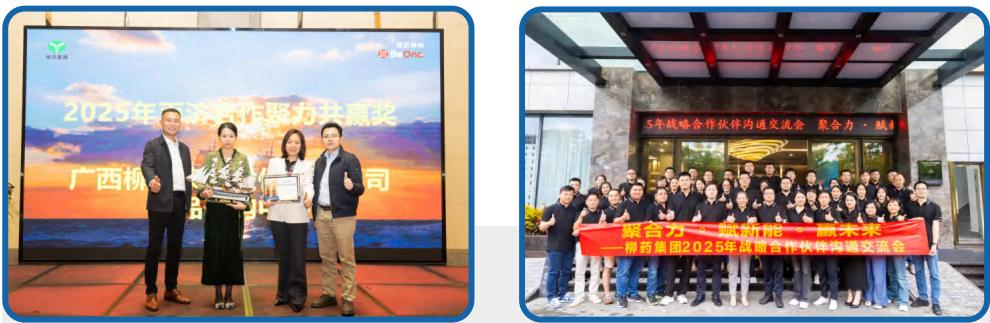

## 关键绩效

公司在国家集采、省级联盟采中点配率超过 。95%

<table><tr><td>公司新增上游供应商</td><td>其中新增器械耗材供应商</td><td>供应商数量超</td></tr><tr><td>480+ 家</td><td>352 家</td><td>7,000 家</td></tr><tr><td>新增品规数</td><td>其中器械耗材品规数</td><td>经营品规数</td></tr><tr><td>4,800+ 个</td><td>2,600+ 个</td><td>86,000 个</td></tr><tr><td>新增独家代理品种</td><td>独家代理品种合计近</td><td>新引进创新药品种</td></tr><tr><td>26 个</td><td>360 个</td><td>88 个</td></tr></table>

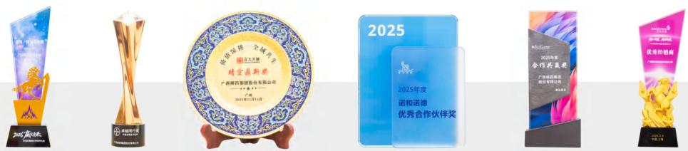

## ⻛险与机遇识别

## ⻛险

供应商行政处罚、贸易制裁、不正当竞争、质量问题等合规风险导致信誉受损、准入受限。  
供应商过度集中或对单一供应商过度依赖，若供应商停产断供则影响公司生产经营。  
供应链信息不透明、披露数据造假等，引发信任危机，导致公司产品信誉受到影响等。

## 机遇

供应商优质产品、创新产品以及与供应商合作开展创新项目，有利于公司打开新的市场。  
通过供应链协同，及时了解上下游客户需求，建立产品溯源和供应链信息共享，有利于提高协同作业，落地降本增效。  
供应商在环保、质量、供应方面的突出优势和良好信誉有利于提升公司市场形象，获得投资人认可和政策红利支持。

## 应对

开展供应商常态化监督评价，充分了解供应商情况，建立应急预案，淘汰高风险合作方。  
优化供应商合作布局，减少单一来源依赖，建立库存安全预警机制和应急机制，对核心产品实施多元采购策略。  
对供应商进行动态监控管理，搭建供应链数字化溯源平台，实现全链路数据可追溯。

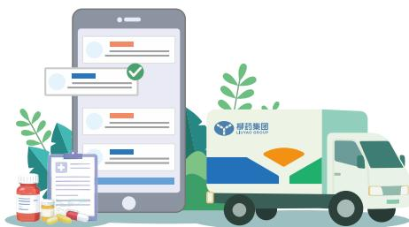

natural_image

Illustration of a delivery truck with a smartphone displaying checklist and medication boxes, no text or symbols present.

## 供应商全⽣命周期管理

柳药集团根据《药品管理法》《药品经营质量管理规范（GSP）》、ESG管理等法律法规及指引要求对供应商建立覆盖“准入—评价—分类—执行—退出”全生命周期管理，持续建立完善供应商评价、监督机制，根据供应商履约能力、产品质量、资信状况、商业道德与诚信方面的行为标准等，对供应商进行分类管理，推动构建合规、安全、公正、诚信的供应链体系。

## 准⼊

根据《药品管理法》《药品经营质量管理规范（GSP）》等规定审核供应商相关资质，确保符合相关法律法规规定的合法供应商。

## 评价

建立可持续供应链绩效考核体系，对供应商履约能力、产品服务质量、付款政策、行政处罚及合规记录、治理体系完整性进行全面核查评估。

## 分类

根据评估结果以及对公司业务的重要性划分为：核心类、优选类、普通类、风险类等四类。确保核心、优选类的保持紧密合作供应，普通类确保稳健供应，风险类做好淘汰替换预警机制及采购控制。

## 执⾏

对合作供应商落实动态监管，通过调查问卷、终端客户评价、市场调研、企业信用公示信息查询、第三方审计等方式对供应商进行“深度体检”、动态量化考核，适时调整风险级别。

## 退出

对无法履约、监控发现风险信息的，逐条扣分，相关部门出具预警、整改、淘汰等处理结果，跟进执行情况，做好替代供应商开发，保障供应链安全稳定。

## 双轮驱动打造供应链协同⽣态

公司致力于构建稳健、合规、安全的供应链体系，保障公司业务持续稳健开展的同时通过产业链协同，推动资源共享，落实降本增效，形成紧密的命运共同体，通过内外部双轮驱动，合力推动ESG实践和企业高质量发展。

## K

## 批零协同稳固供应商合作

公司医药流通业务包括医药批发、医药零售，主要客户为各级医疗机构和药店终端消费者，公司覆盖全区100%的二级以上医疗机构和遍布全区的千家药店，牢牢把控医院与零售终端两大药械消费市场，能够满足上游供应商全渠道覆盖需求，从而深化供应商合作，成为国内外众多供应商在广西的首选合作企业。

##

## 内部产业协同提质增效

公司医药工业板块主要围绕中药产业布局，主要开展中药饮片、中药配方颗粒、中成药三大类中药产品的生产制造。公司三大类中药产品在生产、质控、产业链上下游方面具备较强的协同效应，能够实现原材料采购供应、生产加工工艺研究、质控团队、营销团队和渠道等资源的内部循环利用、联动共享，从而确保自产自供、协同推广，保障公司生产的持续开展。

##

## 外部共享打造协同⽣态

公司与上游供应商长期保持良好合作，与各供应商均签署合同协议，将合规经营、廉洁购销、质量保证等内容纳入合同条款，并携手供应商开展慈善赠药、公益捐赠、药物警戒、不良反应监测等合作。近年来公司积极搭建智慧供应链管理平台，在客户端开通查询、智能补货、验收等功能，及时跟进商品流向信息，实现流通数据、结算数据的实时共享，让上游供应商及时了解下游客户需求和库存状态，减少库存积压，有效保障供应链的透明性和可追溯，提升供应链响应速度。

案例 公司与上游供应商及重要客户开展“工商协同 智启新篇 2025柳药DTP生态圈共建会”，共同探讨行业未来。

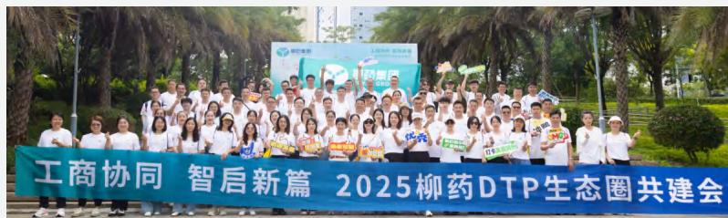

text_image

工商协同 智启新篇 2025柳药DTP生态圈共建会

## 推动⾏业⾃律

柳药集团是广西医药商会会长单位，广西医药商会会员覆盖广西医药行业核心企业，集团积极通过商会推动行业自律和社会责任履行。2025年，商会全面升级“制度保障—信用评级—实践引领”三维自律体系，系统修订《诚信自律公约》《清廉民企建设实施方案》，新增《会员信用管理办法》，将诚信承诺签署设为新会员入会“硬门槛”，实现会员企业全覆盖。

依托“信用中国（广西）”平台数据资源，以行政管理、司法判决、经营异常等信息为核心依据，细化综合素质、合规经营、社会责任等8大类评级指标，完成2025年度商会负责人企业信用评级，划分信用等级。针对评级结果实施差异化管控，对获得A级以上守信企业强化正向引导，引领行业自律风尚；对信用预警企业，迅速组织政策专家与法律顾问专班，采取“一对一”政策解读、经营流程复盘、风险点清单式排查及典型案例警示等靶向措施，推动企业完成问题整改并建立长效防控机制。同步构建“事前教育、事中预警、事后监督”闭环机制，开通会员失信举报绿色通道，全年会员企业失信行为“零举报”。

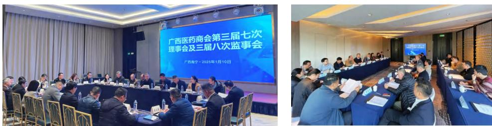

##

## 共筑和谐

党建聚力领航

共建共享和谐

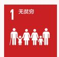

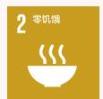

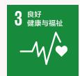

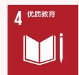

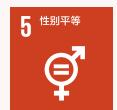

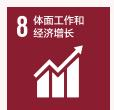

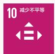

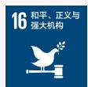

柳药集团坚持听党话跟党走，落实以人为本发展理念，以实现人的全面发展为根本，让发展的成果惠及所有人。集团专注于为健康持续创新，与员工携手成长，共享企业经营发展成果，同时积极投身社会公益，助力乡村振兴，共建和美社区，共享和谐社会。

natural_image

Illustration of three medical professionals in lab coats, one holding a document labeled '医药物流' (Medical Logistics), with no visible text or symbols on the figures themselves.

## 党建聚⼒领航

柳药集团坚持听党话、跟党走，以党建铸魂定向，以党建凝聚人心，把党的政治优势、组织优势转化为企业发展优势、员工团结优势，推动党建工作与员工成长、企业发展深度融合，形成“党建引领、全员同心、共促发展”的良好局面。

全年发展新党员

4名

入党申请人、积极分子

3名

预备党员转正

7名

组织关系转入

21名

## 强化政治铸魂，筑牢思想根基

集团党委始终把政治建设摆在首位，坚持以习近平新时代中国特色社会主义思想为指导，牢牢把握正确发展方向。2025年，集团党委围绕“坚守初心·学习党章”等核心主题组织党员大会集中学习、支部委员会专题学习、专题党课，推动党的创新理论入脑入心。同时将党章党规党纪、中央八项规定精神融入党员学习教育中，通过开展廉洁党课、“三会一课”、主题党日等活动，以案例反思剖析强化纪律教育，持续涵养风清气正的政治生态，提高广大党员廉政意识，在日常工作中起到模范带头作用。此外，集团党委进一步创新党员教育形式，以抗战胜利80周年为契机开展主题知识竞赛，组织党员在线观看阅兵仪式，厚植爱国情怀，营造比学赶超、争先创优的浓厚氛围，不断增强党组织政治性、原则性、战斗性，为企业稳健运营、合规发展筑牢思想根基。

## 创新党建形式，激活党建动能

公司积极探索党建与业务深度融合的新模式、新路径。在持续推进自身党建工作提质增效的同时，主动加强与产业链上下游及各领域合作伙伴的联动协作，常态化开展形式多样、内涵丰富的联合党建活动。通过共上一堂党课、共学政策理论、共研发展难题、共办实践活动，打破组织边界、畅通交流渠道，真正实现党建资源互通、经验互鉴、优势互补，开启了跨主体、跨领域、跨行业的党建协同创新新路径。

## 优化组织体系，夯实基层基础

公司持续强化基层党组织建设，严格入党要求，坚持标准、严守程序、严把入口关，注重在工作一线、青年员工、骨干力量中发展党员，确保新发展党员政治合格、作风优良、履职尽责，不断优化党员队伍结构，筑牢党建工作根基。2025年全年发展新党员4名，7名预备党员转正，办理组织关系转入21名，吸收入党申请人、积极分子3名，持续增强党员队伍活力。基层党组织立足企业发展实际，聚焦党员教育管理、员工服务保障、岗位履职担当，把党建工作融入日常、抓在经常，引导基层党员亮身份、践承诺、作表率，密切联系全体员工，凝聚起基层发展合力，为企业高质量发展提供坚强的组织保障。

natural_image

Stylized illustration of a castle with arched windows and orange-tinted walls (no text or symbols)

## 服务中⼼⼤局，推动融合互促

集团党委坚持党建与业务深度融合、同频共振，以“红色引擎‘药’创未来”党建品牌为抓手，将党建活力转化为企业发展动力。同时，公司坚持将党建工作与社会责任践行、员工关怀、乡村振兴等重点工作深度融合、一体推进，充分发挥党建引领作用，统筹各业务板块协同发力，以实际行动守护民众健康、服务社会大局。集团党建品牌经验成功入选《中共柳州市委执政纪事·2024》，成为全市企业党建先进典型，彰显企业党建工作成效。

natural_image

Illustration of the Great Wall of China winding through mountainous terrain (no text or symbols)

## 案例

## 柳药集团、阿斯利康党建共建主题党⽇活动圆满举办

6月27日-28日，在中国共产党成立104周年和纪念中国人民抗日战争胜利80周年之际，柳药集团与阿斯利康近百名党员相聚广西红色圣地——全州举行“初心不改 砥砺前行”主题党日活动。活动涵盖党建共建签约仪式、专题党课以及红军长征湘江战役纪念馆、大坪渡口现场教学等内容，使广大党员干部更全面了解红军长征湘江战役历史，深刻感悟“勇于胜利、勇于突破、勇于牺牲”的湘江战役精神，传承红色基因，传递大健康企业的责任担当与使命愿景。

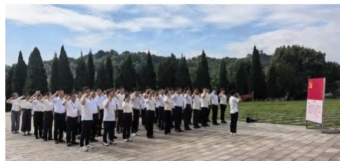

natural_image

Group of people in white shirts saluting outdoors in front of a red flag with a hammer and sickle emblem, surrounded by trees and greenery (no visible text or symbols)

## 践⾏初⼼担当使命柳药集团庆“七⼀”党建活动

7月5日，中共广西柳药集团股份有限公司委员会在中共柳州市委党校组织开展了"践行初心·担当使命"主题党日活动。集团党委书记、董事长、总裁朱朝阳及党委班子成员、全体党员共200余人参加此次活动。

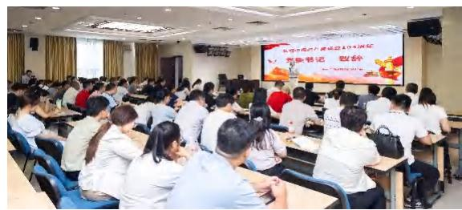

text_image

Classroom scene with attendees seated at desks and a large screen displaying Chinese text about a book event or education session.

## 中共⼴西柳药集团委员会组织党员集中观看抗战胜利80周年阅兵盛况

9月3日上午，纪念中国人民抗日战争暨世界反法西斯战争胜利80周年大会在北京天安门广场隆重举行。柳药集团党委统一组织南宁区域与柳州区域各党支部党员职工集体观看阅兵仪式直播盛况，共同见证这一展现国家威仪和军队现代化建设成果的历史性时刻。

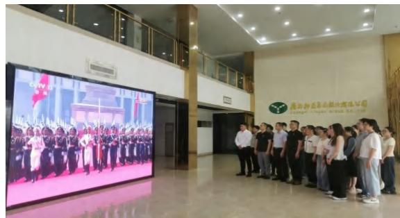

text_image

Group of people observing a large screen displaying a group photo, with visible company signage in the background.

## 护航员⼯成⻓

集团立足员工成长需求，搭建技能提升、岗位晋升、职业发展平台，完善薪酬福利、权益保障体系，关注员工身心健康，守护员工安全，努力营造和谐、友善的内部环境，让员工在企业发展中实现个人价值。

## 治理

柳药集团已建立由集团总裁统筹规划、人力资源总监牵头推进、人力资源中心具体执行的三级人力资源管理架构，同时公司成立了人才发展中心，全面统筹员工培养发展工作。公司人力资源中心以制度化、标准化、数字化为抓手，制定完善人力资源管理制度体系，覆盖合规用工、权益保障、考核晋升、健康安全、培训管理等员工成长发展全周期，实现员工管理高效透明、权责对等、运行有序，筑牢人力资源治理根基。

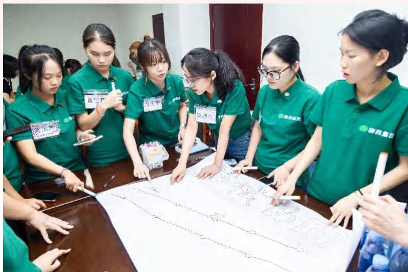

text_image

Group of women in green uniforms gathered around a table with handwritten Chinese characters, demonstrating a technical or writing process.

## 战略

公司坚持“任人唯贤，人尽其才”人才战略，以人才发展为核心，系统优化员工“选、育、用、留、储”全链条。构建管理序列、专业技术序列、技能操作序列双通道晋升机制，搭建纵向可晋升、横向可流转的多元化职业发展路径，推动人才合理流动与持续成长。同时以人才发展中心为载体，完善分层分类、精准赋能培养体系，强化绩效激励、长效激励与专项激励联动机制，推动个人成长与组织发展深度融合，持续打造高素质、专业化、年轻化、梯队化人才队伍，为集团高质量可持续发展提供坚实人才支撑。

内生外引、数智赋能、梯队培育、效能提升

⼈才发展战略  

natural_image

Two pink speech bubbles with icons representing a person and a globe symbol (no text or labels)

⼈才发展愿

人才因柳药而聚，柳药因人才而兴

## 风险

公司识别的可能面临的人力资源风险包括：关键核心人才流失风险、合规雇佣风险、职业健康安全风险、人才结构与业务发展不匹配风险、人才断层风险等。以上风险可能对公司声誉形象、运营效率、服务质量、团队稳定性以及企业创新活力等带来不利影响。

## 应对

针对前述风险，公司应对措施包括：合规雇佣，切实保障员工权益，不断丰富创新福利待遇和激励机制；落实竞争性薪酬，提供多元职业发展通道，构建全方位安全保障与职业健康体系，持续加强人才梯队建设与内部培养；持续优化工作环境，精准响应员工多元诉求，不断提升员工归属感、幸福感与企业凝聚力。

## 依法保障员⼯权益

公司严格恪守《中华人民共和国劳动法》《劳动合同法》等法律法规规定，制定公司招聘制度、薪酬管理制度、员工手册等，切实保障员工平等就业、休息休假、劳动报酬、社会保险等核心合法权益。公司与全员均签订规范劳动合同，实现劳动合同签订率100%，同时坚持平等就业、同工同酬、公平竞争，在招聘、录用、晋升、奖惩、培训等全环节消除性别、民族、残疾等任何形式歧视，保障员工平等发展机会。

## ⼥性权益保障

公司关注女性员工的身心健康与工作需求，积极营造关怀友好的职场环境。2025年，公司组织女性员工及男性员工的女性家属参与“萱花互助宝”保险，为公司员工及家属增添一份女性健康保障。为照顾到孕期员工行动不便及营养需求，公司食堂特别推出“孕妇优先”的人性化措施。同时，公司在依法保障相关权益基础上，为哺乳期女职工提供每日1小时的哺乳假安排，支持其平衡工作与家庭责任。

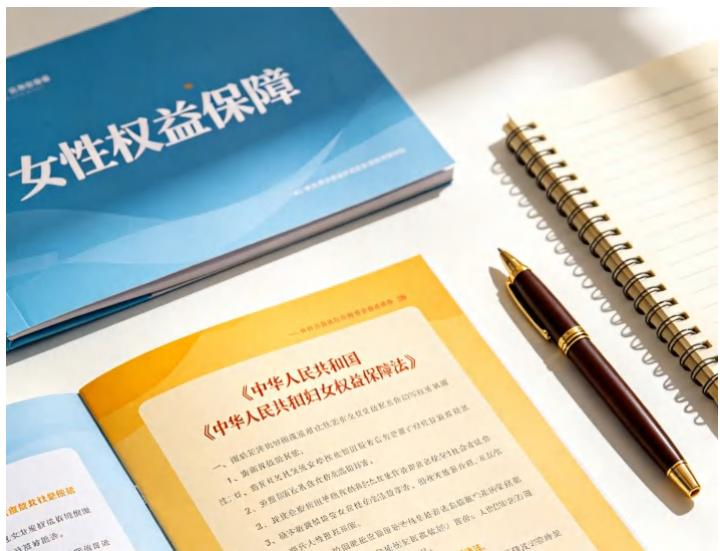

text_image

女性权益保障
《中华人民共和国
《中华人民共和妇女权益保障法》
一、根据法律和组织机构的有关规定，本章以中文书写代替。本章由《中华人民共和国妇女权益保障法》（以下简称“《中华人民共和国妇女权益保障法》”）规定。
二、根据法律和组织机构的有关规定，本章以中文书写代替。本章由《中华人民共和国妇女权益保障法》（以下简称“《中华人民共和国妇女权益保障法》”）规定。
三、根据法律和组织机构的有关规定，本章以中文书写代替。本章由《中华人民共和国妇女权益保障法》（以下简称“《中华人民共和国妇女权益保障法》”）规定。

员工总人数 5,627  

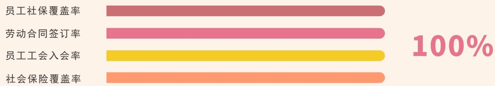

bar

| 指标 | 数值 |
| --- | --- |
| 员工社保覆盖率 | — |
| 劳动合同签订率 | 100% |
| 员工工会入会率 | — |
| 社会保险覆盖率 | — |

本科比例  
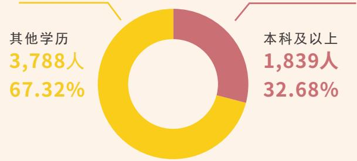

donut

| Category | Percentage |
| --- | --- |
| 本科及以上 | 32.68% |
| 其他学历 | 67.32% |

性别比例  
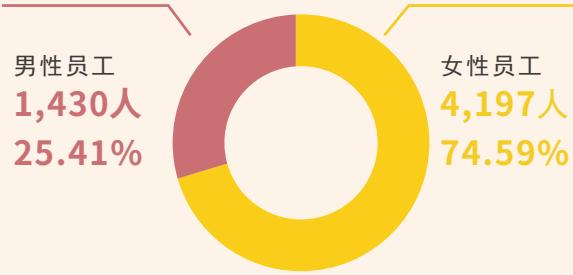

donut

| Category | Percentage |
| --- | --- |
| 女性员工 | 74.59% |
| 男性员工 | 25.41% |

女性高管比例  
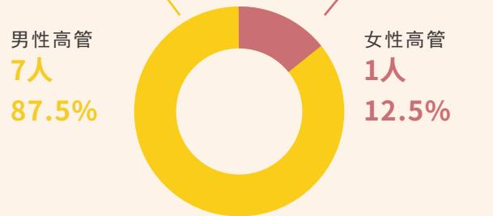

donut

| Category | Percentage |
| --- | --- |
| 男性高管 | 87.5% |
| 女性高管 | 12.5% |

少数民族比例  
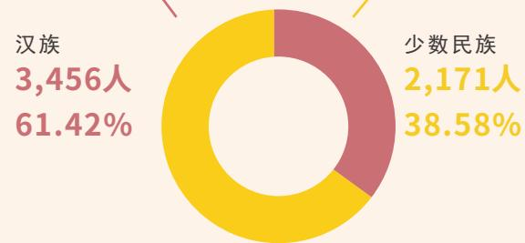

donut

| Category | Value |
| --- | --- |
| 汉族 | 61.42% |
| 少数民族 | 38.58% |

## 加强⺠主管理

公司积极推进民主管理，每年通过职工代表大会听取、审议和表决涉及员工利益的重大事项，保障员工对企业重大决策、规章制度制定的知情权、参与权、表达权与监督权。2025年，公司召开第五届第三次职工代表大会会议，审阅了《员工手册》；签订了《集体合同》《女职工特殊保护专项集体合同》和《工资专项集体合同》；听取、审议职工监事的工作报告，同时选举职工代表董事作为员工代表与其他董事会成员一同参与公司经营决策，切实保障员工民主权益。

## 落实多元沟通

公司坚持为员工“办实事，事办实”的理念，构建了立体化、多元化的零距离员工沟通渠道，主动倾听并及时解决员工问题，确保对员工诉求“件件有回音、事事有着落”。2025年公司进一步建立完善线上、线下双渠道、多形式沟通机制，并根据沟通内容、对象设置管理沟通、绩效沟通、晋升沟通等方案，组织与员工诉求相关的部门就员工反映问题一一解答，充分反馈。

text_image

沟通渠道

月度例会、专题沟通会、员工座谈会

员工信箱、监督电话、网站论坛、邮箱、内部刊物、董事长信箱

员工社群、企业微信

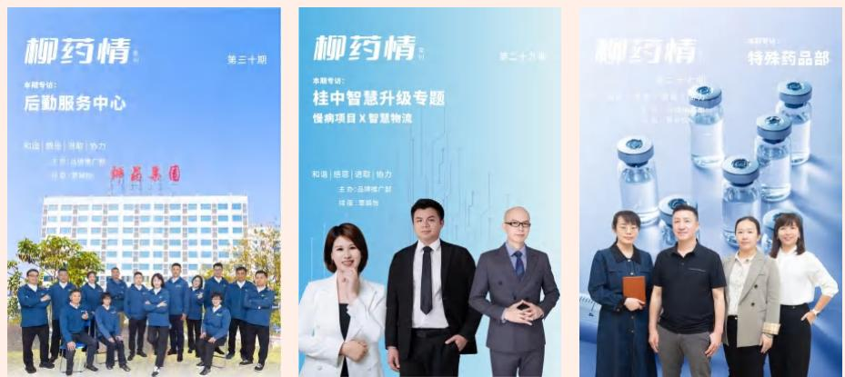

## 优化薪酬福利

公司建立以价值贡献为核心、兼具内部公平与外部竞争力的薪酬福利体系，坚持多劳多得、优绩优酬、绩薪联动，薪酬水平向核心岗位、骨干人才、一线员工倾斜，充分体现劳动、知识、技术、管理价值。公司依法按时足额发放工资，全员足额缴纳保险、公积金，为员工筑牢基本保障防线。同时公司全面落实带薪年假、法定节假日、产假、婚假、护理假、育儿假等法定休假权益，保障员工休息权，并配套提供多元化、人性化、全覆盖福利保障，让员工共享企业发展成果，实现“保障有力度、福利有温度”。

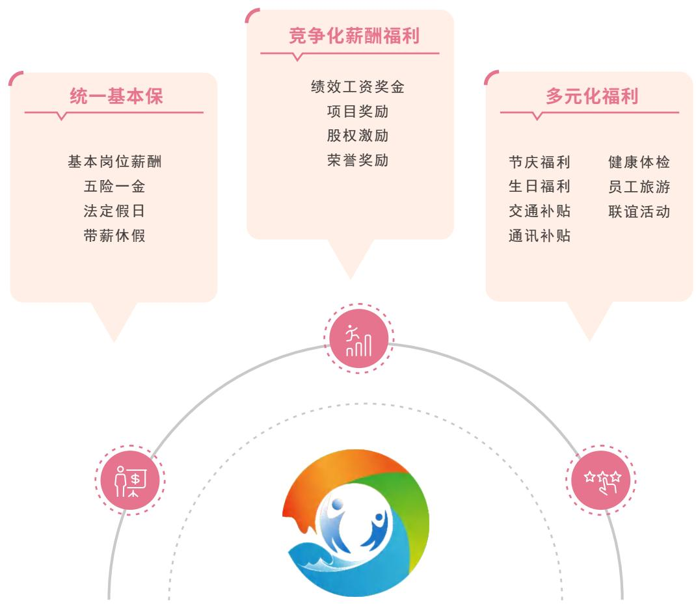

flowchart

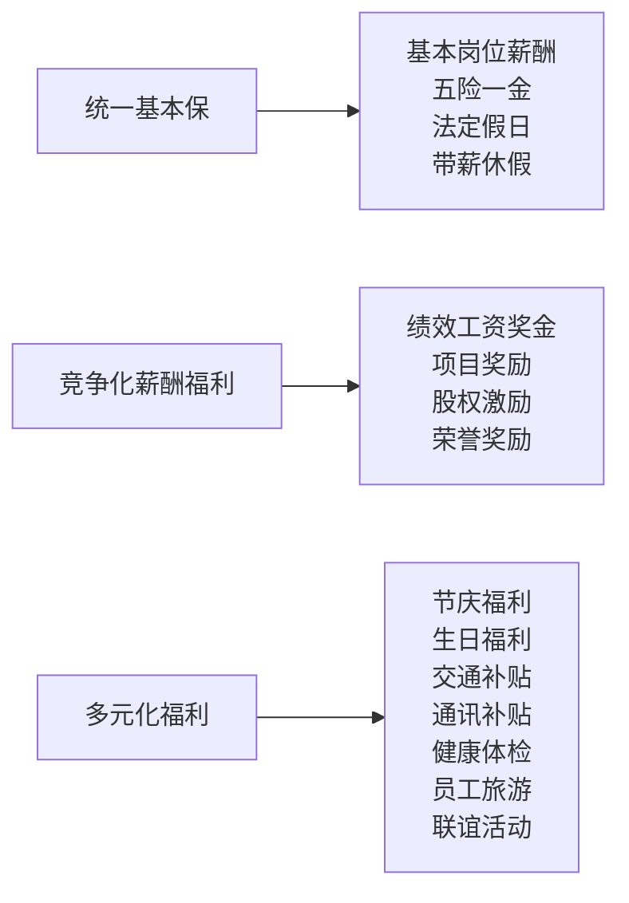
```mermaid
graph LR
  A["统一基本保"] --> B["基本岗位薪酬\n五险一金\n法定假日\n带薪休假"]
  C["竞争化薪酬福利"] --> D["绩效工资奖金\n项目奖励\n股权激励\n荣誉奖励"]
  E["多元化福利"] --> F["节庆福利\n生日福利\n交通补贴\n通讯补贴\n健康体检\n员工旅游\n联谊活动"]
```

## 给予⼈⽂关怀

公司坚持以人为本，聚焦员工身心健康、生活保障、精神文化需求，持续优化办公与作业环境，定期开展心理健康疏导、文体活动，给予困难员工、女性员工、一线加班员工等特殊群体充分关怀，引导员工互帮互助，营造轻松、和谐、友善、团结的工作氛围和员工关系，让员工感受到企业的温暖。

natural_image

Illustration of two women interacting with hearts and bubbles, no text or symbols present

## 暖⼼⾏动

2025年公司继续做好困难员工全周期帮扶机制，精准对接员工需求。针对大病、突发困难、家庭变故的员工，持续开展慰问救助、爱心帮扶，同时积极响应“红十字博爱送万家”活动，为因病、意外致困职工发放温暖救助物资，全年协助百余人次职工申请医疗互助保障。公司注重对临退职工的关怀，各基层工会按照慰问制度及流程，积极做好临退休职工的慰问工作。此外，关注青年员工、异地员工及女职工的特殊需求，提供宿舍保障、婚恋联谊、女职工专属关爱等暖心服务。

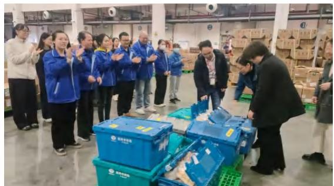

natural_image

Group of people in blue jackets clapping near stacked blue and green plastic containers inside a warehouse (no visible text or symbols)

## 感恩⾏动

公司稳健发展的背后是员工付出的青春年华，2025年7月公司举办了柳药集团“薪火相传——我的20年，你的第1天”校招新老员工经验传承仪式。集团高管代表、2005年入职的校招员工代表以及2025届应届毕业入司学子齐聚一堂，共同见证了一场跨越20年的温情对话与使命接力。集团高管代表在会上为入职20年校招员工代表颁发鲜花和纪念礼盒，感谢他们为企业发展作出的卓越贡献。

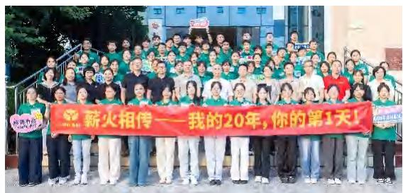

text_image

薪火相传——我的20年,你的第1天!

## 保障⾏动

公司根据员工需求落实生活、工作、健康安全等一系列保障工作，为员工解决后顾之忧，以更好的状态投入工作中。2025年公司继续完善办公园区基础设施，重点优化员工宿舍、员工食堂、运动场所，增设充电装备，并提供多元化支持服务，配套职工书屋、体育用品，满足员工精神文化和运动需求，切实改善员工工作生活环境。同时全面落实健康保障举措，定期组织员工健康体检，足额配备各类防护用品。此外，积极开办各类兴趣团体和多样化职业技能培训，兼顾员工精神需求与成长需求，全方位保障员工工作舒心、生活安心、成长有支撑，切实解决员工后顾之忧，凝聚企业发展合力。

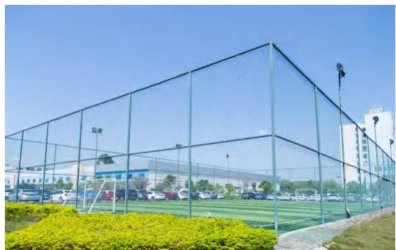

natural_image

Exterior view of a modern office building with a large glass fence and sports field in the foreground (no signage or text visible)

## 员⼯健康与安全

公司严格遵守《中华人民共和国安全生产法》《中华人民共和国 职 业 病 防 治 法 》 《 健 康 中 国2 0 3 0规 划 》 等 政 策 要 求 ， 以OHSA18001(职业健康安全管理体系)为指导，系统开展员工健康、安全管理工作。通过科学的管理手段和人性化的服务，健全职业健康安全管理制度，规范作业流程，开展常态化安全培训、监督和职业病防治宣传，提升员工安全防护意识和自我保护能力，切实守护员工健康安全的同时保障企业生产运营平稳开展。

## 员⼯健康管理

筑牢员工健康保障防线，是企业践行人文关怀、落实社会责任的重要内容之一，更是守住安全生产底线、维护员工切身权益的必然要求。公司始终贯彻坚持“预防为主、防治结合”的工作方针，将员工健康管理与职业病防治融入生产经营全过程，健全专项工作机制，明确各级管理责任，全面统筹推进健康保障、风险防控、权益维护各项工作，筑牢全员健康防护根基。

## 定期开展健康⻛险评估与监测

公司聚焦职业健康风险精准防控，全面夯实全流程管理举措。常态化开展职业病危害因素排查辨识，严格落实员工上岗前、在岗期间、离岗时全周期职业健康体检工作，依托专业医疗机构，针对性开展职业病专项健康检查，全面筛查各类职业健康隐患，精准评估员工身体健康状况。同时同步完善员工个人职业健康档案，做到一人一档、全程留存、动态更新，详细记录体检结果、风险评估情况、后续干预措施等信息；对体检异常、存在健康风险的员工，及时落实健康告知、跟踪随访、诊疗干预、岗位调整等措施，杜绝健康风险扩大化，严防各类职业病发生。

## 全⽅位构筑职业健康⼲预屏障

公司以健康风险评估跟踪情况为基础做好职业健康干预工作，规范落实员工上岗前、在岗期、离岗时职业健康体检工作，从源头控制、过程防治、康复改进、专业培训教育等方面控制职业健康风险，全方位筑牢职业健康防护屏障，全力防范遏制职业病发生。

## 源头干预

优化生产工艺流程、升级生产设备，更换无毒、低毒原辅材料，淘汰落后设备配备降噪、除尘、通风、防毒等个人防护设备，定期开展设备运维检修合理安排岗位作业时长，落实轮岗轮班制度，减少员工长时间接触职业病危害因素搭建员工健康关怀体系，兼顾身体健康与心理健康疏导，持续优化作业环境

## 过程防治

建立应急预案，动态监控体检指标，落实一对一健康干预方案开展专项预防诊疗、督促定期复查，安排离岗、调岗、调休等措施杜绝不利影响普及健康生活方式，引导员工规范佩戴防护用品、养成良好作业习惯开展心理健康疏导，缓解职业压力，构建身心同护的健康干预体系

## 监督改进

建立职业病干预台账，全程跟踪各项措施落地成效强化日常监督巡查，严查违规作业、防护用品佩戴不到位等问题，加大违规惩戒力度定期开展干预效果评估，动态优化干预方案，同步做好员工健康权益保障畅通健康诉求反馈渠道，落实医疗保障、特殊薪资待遇

## 专业培训

组织员工定期参加岗位健康安全培训，确保合规作业开展健康讲座、急救培训等，提高员工的健康意识和自我保护水平通过与医疗机构合作为员工提供预防保健、职业亚健康体质调理、健康评估等服务

## 员⼯安全管理

公司始终将员工生命健康安全放在首位，坚守安全发展底线，坚决贯彻“安全第一、预防为主、综合治理”的方针，构建“制度保障、设施防控、培训赋能、应急兜底”全方位安全体系，保障员工安全从业，杜绝安全事故发生。

## 健全责任体系，压实安全职责

2025年公司优化了安全生产委员会架构，建立总裁牵头、安全委员会为管理主体以及各子公司、各部门负责人负责具体落实，“横向到边、纵向到底、全员覆盖”的安全管理网络，明确各级岗位安全职责。集团与各单位、部门、员工层层签订安全责任书，落实“一岗双责”，将安全责任传导至每一位员工，形成全员共管的安全责任格局。

## 完善制度建设，规范管理流程

2025年，公司修订完善了《安全生产管理办法》《消防安全管理规定》《内部治安保卫条例》等核心制度，新编《安全隐患报告奖励机制》《保安考核办法》，建立安全突发事件应急预案体系，实现安全工作有章可循、有据可依。同时集团安全管理部门协助各子公司健全安全管理体系，推动全集团安全管理标准化、规范化落地。

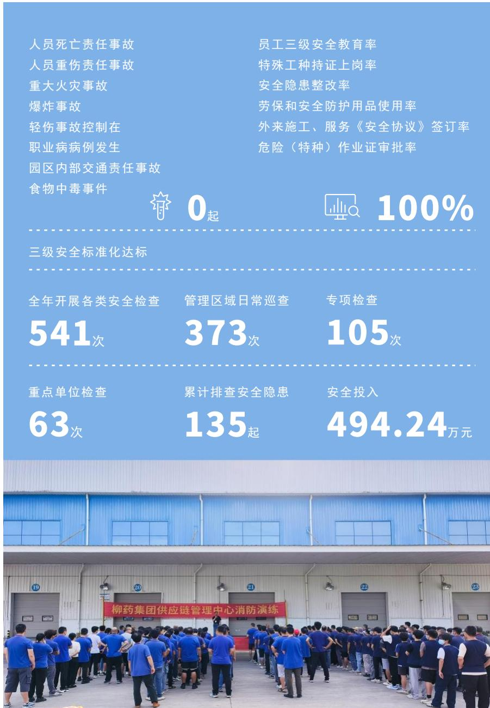

text_image

人员死亡责任事故
人员重伤责任事故
重大火灾事故
爆炸事故
轻伤事故控制在
职业病病例发生
园区内部交通责任事故
食物中毒事件
0起
员工三级安全教育率
特殊工种持证上岗率
安全隐患整改率
劳保和安全防护用品使用率
外来施工、服务《安全协议》签订率
危险（特种）作业证审批率
100%
三级安全标准化达标
全年开展各类安全检查
541次
管理区域日常巡查
373次
专项检查
105次
重点单位检查
63次
累计排查安全隐患
135起
安全投入
494.24万元
柳药集团供应链管理中心消防演练

## 强化隐患排查，筑牢安全防线

公司坚持“常态化巡查+专项督查+重点检查”相结合的方式开展安全检查工作。2025年公司制定了“重大危险源、危险区域隐患排查专项活动”方案，实现隐患排查全覆盖。同时公司推行隐患排查月报制，每月发布《安全生产情况简报》，上线线上巡更打卡系统，实现巡更轨迹可追溯，杜绝安全管理漏洞，确保各类风险可控在控。

## 科技赋能安防，升级防护能⼒

2025年，公司加大安全防护工作投入，升级改造高清视频监控、周界入侵报警、门禁管理、消防自动报警系统等，覆盖全公司全部重点区域。同时公司进一步优化安保布防，科学制定巡逻路线，强化重点时段、重点区域的管巡逻控，全方位守护员工人身及公司财产安全。

## 提升应急能⼒，强化处突保障

为提升安全事故应急处置能力，2025年，公司组建专职应急处置工作组，修订完善10余项应急预案，定期开展消防、防暴恐、网络安全、生产安全事故等应急演练；配齐下相关应急物资，定期维保消防设施，确保事件发生的第一时间能快速响应，落实科学有效的处置，全面提升应急救援保障能力。

## 开展安全培训

公司坚持“从基层岗位出发，预防为主，联系实际保障切实可行”的原则，以提升全员安全素养为目标，构建多层次、全覆盖的安全培训体系。

关键绩效

<table><tr><td colspan="2">各园区累计开展各类安全培训73场次</td><td>培训覆盖率100%</td></tr><tr><td>基础安全培训</td><td colspan="2">扎实开展新员工三级安全教育,累计培训200余人次,实现新员工安全准入全覆盖;针对负责人、安全管理人员开展法律法规培训、安全再教育,提升管理团队安全履职能力。</td></tr><tr><td>专项技能培训</td><td colspan="2">分批次开展安保岗位、消防安全、维稳反恐、防洪涝灾害、防中暑等专项培训,覆盖食堂、保洁、保安、设备维修、叉车作业等特殊岗位,强化实操技能与安全意识;开展员工宿舍用电安全、消防逃生培训,筑牢生活安全防线。</td></tr><tr><td>主题宣传教育</td><td colspan="2">借助企业内部网站、宣传栏等载体,广泛宣传安全生产、反诈防骗等知识;依托“安全生产月”“消防宣传日”,联合辖区单位开展主题活动、专家讲座、警示教育,以鲜活案例警醒员工,让安全文化深入人心。</td></tr><tr><td>专业能力培育</td><td colspan="2">搭建安全员“业务提升”带教体系,开展专(兼)职安全员业务培训,累计覆盖234人次,提升安全管理队伍专业水平;配合辖区派出所开展反诈骗讲座6场,全方位守护员工财产安全。</td></tr></table>

## 安全技能培训

案例

为进一步筑牢安全生产防线，普及安全法规和安全知识，有效杜绝各类事故的发生，助力企业发展，2025年集团开展多类型安全知识培训，旨在促进员工从警示教育中吸取事故教训，提升员工应急处置能力。

## 公司开展

消防演练活动

案例

2025年，公司在多个园区开展消防疏散演练专项活动，演练内容包括疏散集合、观摩消防队救援演示、干粉灭火器实操。

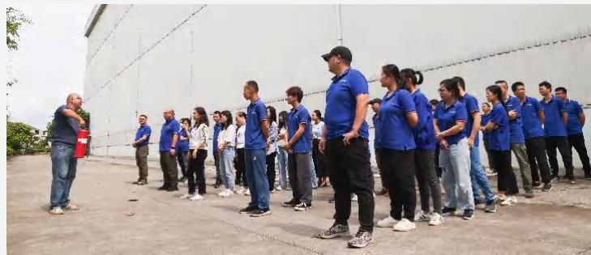

natural_image

Group of people in blue uniforms standing outdoors near a white wall, one person holding a red envelope (no visible text or symbols)

## 园区安全⽣产⽉活动

案例

为深入贯彻落实2025年全国“安全生产月”活动要求，进一步提升员工安全防范意识和应急处置能力，公司携手南宁市公安局那洪派出所、广西南宁安培教育学校、广西仙茱中药科技有限公司，开展了“反诈防骗”教育宣传、安全月主题教育培训以及园区消防疏散演练等系列活动，为企业安全生产和员工生命财产安全筑牢坚实防线。

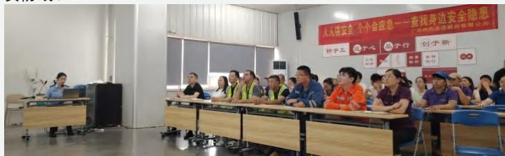

text_image

人人话安全 个个会应急——查找身边安全隐患
# 学子三 # 学于心 # 学行 创子新
# 普通

## 赋能员⼯发展

公司以“内生外引、数智赋能、梯队培育、效能提升”为核心方针，构建全周期、多层次、双通道的员工职业发展体系，为不同阶段、不同类型员工搭建清晰成长路径，实现个人价值与企业发展同频共振。同时公司建立管理、专业双轨制晋升通道，打破成长边界，让管理型人才与专业型人才均有广阔发展空间。

关键绩效

<table><tr><td>员工培训覆盖率100%</td><td>培训人次9.20万人</td><td>人均培训学时超36小时</td></tr><tr><td>开展各类线下培训792次</td><td colspan="2">培训投入金额129.72万元</td></tr><tr><td>晋升人数328人</td><td colspan="2">储备人才191人</td></tr></table>

## ⼈才培养

2025年，公司以人才发展中心为契机，搭建线上线下融合、理论与实践并重、内外部导师资源协同、岗位专业全覆盖的学习平台，推广数字化学习系统“柳药E企学”，完成培训管理、资源推送、效果追踪、学习评估、课程反馈全流程集约化管控，支持员工自主选课、按需学习，学习成果纳入年度考核，公司已逐步构建系统化、数字化、全覆盖、分层级的培训发展体系。

## 定制化培训体系建设

2025年公司进一步优化覆盖从入职新人到公司高管的职业成长路径——雏鹰、飞鹰、雄鹰、菁鹰人才培养体系：针对新员工实施“雏鹰计划”，通过入职培训、导师带教助力快速融入；针对骨干员工实“飞鹰计划”，提升专业技能与业务能力；针对管理干部实施“雄鹰计划”“菁鹰计划”，强化领导力、战略思维与团队管理能力，同时公司大力推进“强师高徒”导师带教项目，建立标准化带教机制，助力新员工快速成长、潜力员工加速突破。

柳药集团⼈才培养体系

<table><tr><td>内生外引</td><td>数智赋能</td><td>梯队培育</td><td>效能提升</td></tr></table>

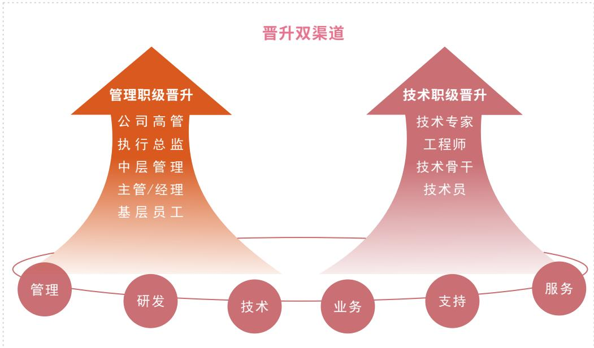

flowchart

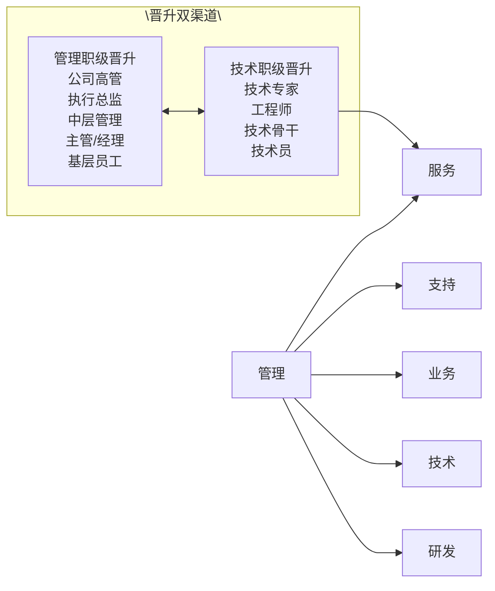
```mermaid
graph LR
  subgraph sg["\"晋升双渠道\""]
    A["管理职级晋升\n公司高管\n执行总监\n中层管理\n主管/经理\n基层员工"]
    B["技术职级晋升\n技术专家\n工程师\n技术骨干\n技术员"]
  end

  C["管理"] --> D["研发"]
  C --> E["技术"]
  C --> F["业务"]
  C --> G["支持"]
  C --> H["服务"]

  A <--> B
  B --> H
```

<table><tr><td>雏鹰计划</td><td>飞鹰计划</td><td>雄鹰计划</td><td>菁鹰计划</td></tr></table>

## 打造专业培训团队和精品课程

公司在2025年搭建内部知识沉淀平台，举办金牌内训师大赛，培育专业内训师队伍，开发出90多个符合公司岗位实际的精品课程，推动内部经验传承与技能共享。同时公司持续完善培训实施与运营体系，制定年度、季度、月度培训计划，开展线上自主学习、线下集中授课、在岗带教、轮岗学习等多种培训形式，落实课前调研、课中互动、课后考核实践、效果总结反馈全环节的课程评估工作，确保培训工作的持续有效开展，真正赋能员工成长和企业发展。

## 关键绩效

内训师

137位

精品课程

90+

展开内训授课计划

330+次

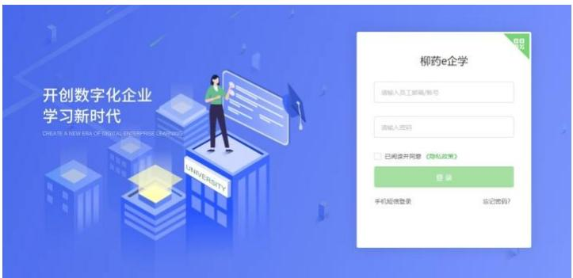

text_image

开创数字化企业
学习新时代
CREATE A NEW ERA OF DIGITAL ENTERPRISE LEADULTURE
UNIVERSITY
柳药e企学
请输入员工邮箱/账号
请输入密码
已阅读并同意（隐私政策）
登录
手机短信登录
忘记密码？

## 师徒相传

案例

2025年4月24日，柳药集团正式启动“强师高徒”导师赋能项目，旨在通过系统化、科学化的带教体系，培养一批优秀的内部导师，实现“新人有人带，经验能传承，操作规范化，学练相结合”的目标。

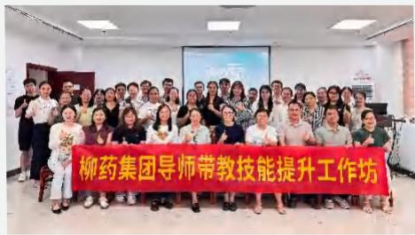

text_image

柳药集团导师带教技能提升工作坊

## 第⼆届⾦牌内训师⼤赛圆满完赛

案例

2025年，公司为挖掘优质课程资源，壮大内训师队伍，促进内部知识技能沉淀、传承、创新，举办了第二届金牌内训师大赛活动，大赛共有109名员工报名参加，通过培训赋能、试讲实战评选出18名讲师进入决赛。决赛演绎综合评选出一、二、三等奖，并评审认证新一届内训师26名，产出精品课程54门。

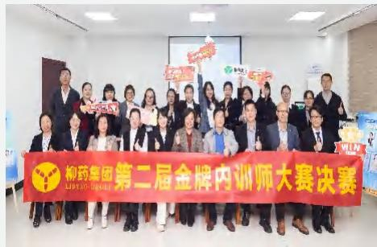

text_image

柳药集团第二届金牌内训师大赛决赛

## “商业洞察第⼀课”

案例

为进一步提升集团业务中层管理人员的战略视野与业务决策能力，2025年12月5日，柳药集团与百济神州联合举办“商业洞察第一课”双螺旋赋能研讨会，邀请百济神州专家为柳药集团业务中层管理人员开展专题培训。

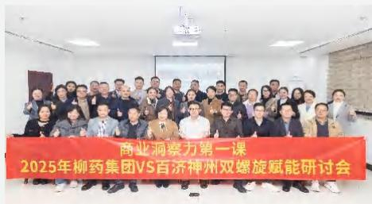

text_image

商业洞察力第一课
2025年柳药集团VS百济神州双螺旋赋能研讨会

## 丰富员⼯活动提振企业凝聚⼒

在工作之余，公司通过举办丰富多彩的文体活动，使员工业余生活充实的同时身体素质和职业技能得到提高，增进内部沟通交流，增强员工归属感和企业凝聚力。

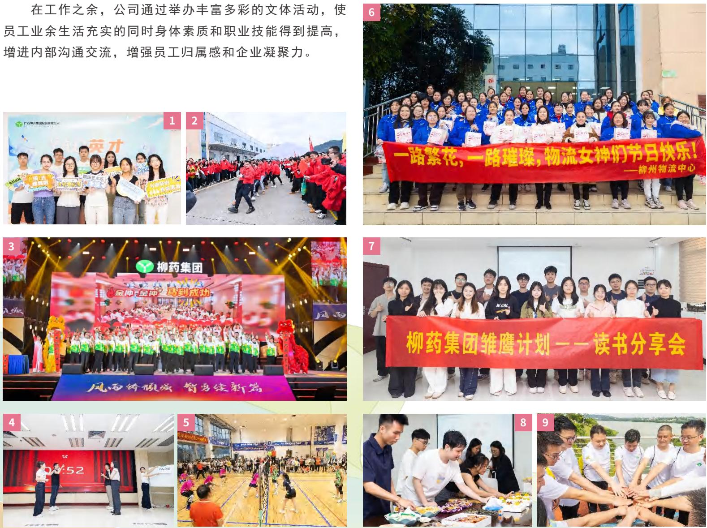

1 新员工入职活动  
2 2025销售年会户外竞技活动  
3 2025销售年会柳药之夜文艺晚会  
4 党建活动日知识问答环节  
5 柳药集团2025年职工气排球比赛  
6 柳州物流中心三八妇女节活动  
7 读书分享会  
8 新老员工交流会  
9 2025柳药DTP生态圈共建会徒步环节

natural_image

Illustration of two people riding bicycles on a paved path (no text or symbols)

## 共建共享和谐

柳药集团秉承“和谐、感恩、进取、协力”的企业精神，始终心系国家发展大局，坚持以服务健康为己任，切实保障民生根本，用心开展公益慈善，以实际行动推动乡村振兴战略落地见效，让企业发展成果更好惠及社会，共享和谐发展丰硕成果。

## 关注⺠⽣保障

柳药集团始终坚守发展初心，在深耕大健康主业、做大做强的同时立足国家发展大局与民生需求，以依法纳税、稳定就业、保障用药、服务健康的实际行动助力民生改善、推动社会进步，用责任与担当书写企业发展与民生保障共进新篇。2025年，公司严格履行纳税义务，依法按时足额缴纳各项税费，集中代缴员工个人所得税，并督促公司员工及时完成年度税费汇算清缴工作。

## 筑牢⺠⽣健康防线

柳药集团及旗下各地市子公司是广西重要的医药储备定点单位，承担着广西区域灾情、疫情等突发状况下应急物资的储备与供应重任，用专业与担当筑牢民生健康防线。公司立足公共卫生安全需求，制定了完善的药械应急供应保障预案，搭建起科学高效的应急储备体系，严格足额储备各类应急物资，确保关键时刻“拿得出、调得快、用得上”。2025年，公司切实履行储备职责，肩负起南宁、柳州、百色等广西区内25个市县的公共卫生应急医疗物资储备任务，全方位夯实区域应急保障基础。此外，作为广西医药商业龙头企业，与国内外众多知名药械企业建立深度合作，能够保障各类急抢救药、罕见病等特殊疾病用药、高值创新药的持续稳定供应，以24小时不间断作业的责任担当，高效响应医疗机构临床用药需求和人民群众急救用药需要，切实守护人民群众生命健康。

## 关键绩效

纳税总额 公司纳税信用连续获评A级企业

5.13亿元 10年

吸纳就业 应届学生

1,209人 114人

安置转业军人、残疾人

2人

累计承担广西医药储备

1,308.59万元

储备金额达

22,569.31万元

累计开展应急配送

2,036次

## ⾸单放射性药品配送

## 案例

2025年，柳药集团成功取得自治区药品监督管理局核发的《放射性药品经营许可证》，成为广西首家具备放射性药品经营资质的综合性药品批发企业，并顺利完成首单放射性药品配送。公司为保证放射性药品的配送安全，已建立一套完整的放射性药品供应保障体系，实现配送安全高效、信息追溯精准、质量稳定可控。放射性药品配送业务的顺利开展，不仅丰富了柳药集团的经营品类，更显著提升了广西地区放射性药品供应保障能力，满足临床肿瘤、心脑血管等重大疾病的诊断和治疗需要，用实力守护民众健康。

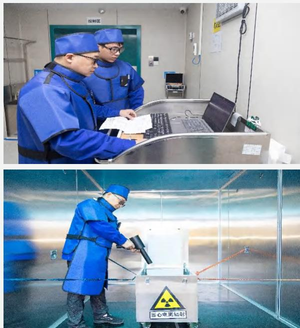

## 赋能普惠医疗

当前，人口老龄化进程加快、亚健康状态普遍存在，而医疗资源过度集中于头部医院的现状，导致区域间医疗资源分配不均衡，基层群众优质医疗服务可及性不足。为此，柳药集团积极响应“健康中国”战略，发布“AI+医疗”解决方案，以科技赋能医疗普惠，破解行业痛点。该方案深度融合大数据与人工智能技术，一方面赋能医院精准诊疗能力与服务效率双提升，另一方面依托海量数据支撑，实现对患者就医问诊、检查报告、临床诊断、病历病程的全流程辅助分析。该方案广泛覆盖医学检验、智慧医院、互联网医院等核心场景，助力破解区域间医疗资源分布不均、医疗质量存在差距的难题，推动优质诊疗资源下沉至基层医生与患者身边，以科技力量守护全民健康、践行企业担当。

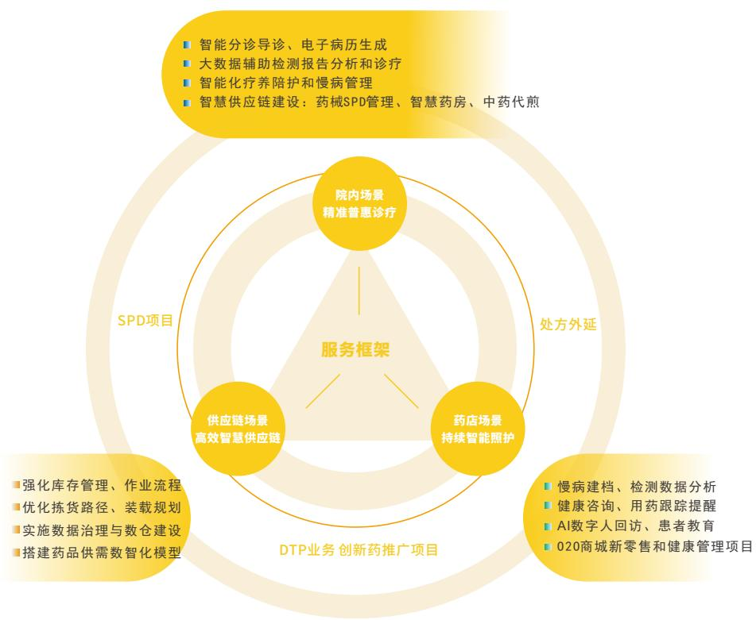

flowchart

```mermaid
graph TD
  Center["服务框架"]
  
  subgraph Core_Side
    direction TB
    A["院内场景\n精准普惠诊疗"]
    B["药店场景\n持续智能照护"]
    C["供应链场景\n高效智慧供应链"]
    D["SPD项目"]
  end
  
  subgraph Core_Side
    direction TB
    E["DTP业务 创新药推广项目"]
  end
  
  subgraph Core_Side
    direction TB
    F["强化库存管理、作业流程"]
    G["优化拣货路径、装载规划"]
    H["实施数据治理与数仓建设"]
    I["搭建药品供需数智化模型"]
  end
  
  subgraph Core_Side
    direction TB
    J["慢病建档、检测数据分析"]
    K["健康咨询、用药跟踪提醒"]
    L["AI数字人回访、患者教育"]
    M["020商城新零售和健康管理项目"]
  end
  
  Center --> A
  Center --> B
  Center --> C
  Center --> D
  
  Center -.->|"处方外延"| A
  Center -.->|"处方外延"| B
  Center -.->|"处方外延"| C
  
  Center -.->|"处方外延"| D
  
  Center -.->|"处方外延"| E
  
  Center -.->|"处方外延"| F
  Center -.->|"处方外延"| G
  Center -.->|"处方外延"| H
  Center -.->|"处方外延"| I
  Center -.->|"处方外延"| J
```

## 专业慢病服务

公司以打造老百姓身边的专业药房为定位，大力发展慢病管理、健康管理服务，满足老百姓院外健康服务和居家康养需要。2025年，公司零售板块依托AI人工智能——“阿桂药师”赋能慢病专业化服务水平和服务效率提升，使得有限的药师资源能更广泛的服务患者。“阿桂药师”能够自动执行检测指标等标准化回访任务，大幅提升回访覆盖率与及时性，并自动标记需重点关注的客户，深度绑定患者基本信息，结合海量医药大数据资源和线下药师的综合判断，给予药师更全面、专业、符合患者实际专业的指导，给慢病患者更好的服务体验。此外公司持续完善专业学科团队、患教团队、药师团队建设，大力推动慢病建档工作和慢病系统应用，针对糖尿病、失眠、骨病、高血脂等多病种开展患教、义诊、咨询、数据监测等健康服务。报告期内，公司服务慢病建档会员超百万人次。

## 桂中⼤药房洛正第⼀期⻣慢病药师训练营

## 案例

2025年9月，公司骨慢病项目启动首期骨慢病药师训练营同步开营，130名执业药师，聚焦代谢性与劳损性骨病，以“理论+实操”模式培训，分别从 病理治疗”与“日常养护”两大核心维度，系统学习骨慢病辨证逻辑、影像片解读等理论知识，夯实专业服务能力。

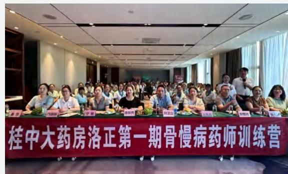

text_image

桂中大药房洛正第一期骨慢病药师训练营

## 提⾼健康可及

2025年，公司继续推进应用互联网技术提升健康消费便利性，通过处方流转平台建立与公立医院处方对接，实现医院就诊就近取药、送药上门和持续药事服务。同时针对患者尤其老年慢性病患者看病买药总要跑医院、排长队，反复奔波于路途中以及家庭突发用药需求情况，公司打造的互联网医院平台，能够为线上患者提供问诊、慢病续方等服务，让病情稳定的慢病患者足不出户，居家完成慢病续方，并由就近定点药店送药上门、提供健康管理服务，形成一站式“互联网+医药+健康管理”服务闭环，切实解决基层群众“看病远、取药难”的问题，让优质医疗健康资源真正下沉到基层、惠及更多群众，进一步提升全民健康服务的可及性。

中
国
专
业
化
药
房
建
设
优
秀
奖2024年
度  
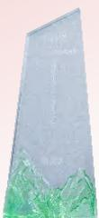

## 聚焦公益慈善

柳药集团秉持公益初心，积极履行社会责任，广泛开展医疗援助、慈善赠药、教育帮扶、社区健康服务及乡村振兴等公益行动，聚焦困难群体、弱势群体的实际需求，以精准帮扶传递温暖，用实际行动守护民生福祉。2025年公司向红十字会、公益基金会、学校、灾区、乡政府等捐赠款累计1,314.38万元，在回馈社会、助力共同富裕的道路上彰显企业担当。

## 关键绩效

捐赠款累计

1,314.38万元

开展慈善援助项目

49个

累计发放援助药品

6.20万余盒

援助

2.20万人次

惠及金额

1,042.24万元

## 柳药集团向缅甸地震灾区捐赠爱⼼药品

## 案例

2025年4月3日，在中国—东盟博览会合作企业援助缅甸赈灾物资捐赠仪式上，柳药集团积极响应东博会秘书处号召向缅甸灾区捐赠价值158万元的药品。该批药品涵盖抗生素、消炎止疼药、抗凝血药、维生素等灾区急需品类。

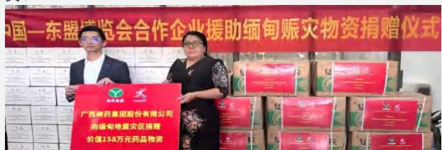

text_image

中国—东盟博览会合作企业援助缅甸赈灾物资捐赠仪式
广西柳药集团股份有限公司
向缅甸地震灾区捐赠
价值158万元药品物资

## 集团组织开展⽆偿献⾎活动

## 案例

为践行社会主义核心价值观，弘扬“奉献、友爱、互助、进步”的大爱精神，传播“奉献他人、提升自己”的志愿服务理念，柳药集团积极开展公益志愿服务活动。9月26日，柳药集团南宁产业园联合南宁中心血站，成功举办“献血传递希望，携手挽救生命”主题献血活动，组织公司员工主动参与献血，用实际行动传递爱心、传递温暖，践行企业社会责任。

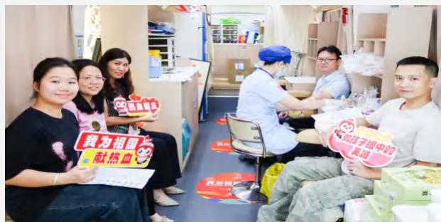

text_image

为祖国
献热血
如孩子中的
高血

## 第⼗个“中华慈⽇”捐赠仪式

## 案例

2025年11月28日、12月10日，南宁市慈善总会先后接收两批爱心药品捐赠。其中，广西康晟制药有限责任公司捐赠胃乐胶囊，价值共计4,000元；广西万通制药有限公司捐赠万通炎康片、板蓝根颗粒、龙胆泻肝片，价值共计14,920元。

捐赠仪式上，广西康晟制药有限责任公司、广西万通制药有限公司总经理韦建宁，广西万通制药有限公司生产与设备中心总监何烨安，广西柳药创新医药研究有限公司副院长吴文华，南宁市慈善总会副会长兼秘书长农雅琴等相关负责人出席活动。

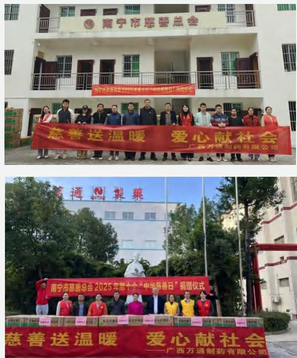

## 服务社区

公司旗下连锁药店桂中大药房以“成为老百姓身边的健康管理专家”为目标，充分发挥自身连锁布局广、紧邻社区的核心优势，精准对接社区居民在健康管理、疾病防治、居家康养等方面的核心需求，深入开展患者教育、公益诊疗、免费健康体检、慢病家访等多元化健康服务。同时，重点关注独居老人及养老机构的健康需求，主动延伸服务触角、传递温情关怀，以专业贴心的服务守护社区居民身心健康，助力打造温情和睦、健康宜居的和谐社区。

## 关键绩效

服务慢病会员超

100万人次

开展线上患教直播

27场

开展会员家访

150+场

累计开展患教活动

4,500+场

## 持续开展敬⽼、爱⽼公益项持续开展敬⽼、爱⽼公益项⽬

案例

5年，桂中大药房积继续深入社区及养老院开展敬老、爱老公益项目，通过普及健2025年，桂中大药房继续深入社区及养老院开展敬老、爱老公益项目，通过普及健康科科普知识、提供免费健康检测服务，结合个性化慢病管理方案，精准对接老年群体及普知识、提供免费健康检测服务，结合个性化慢病管理方案，精准对接老年群体及社区群众区群众的健康需求，既传递了企业对老年群体的专业关怀，也进一步提升了群众健康的健康需求，既传递了企业对老年群体的专业关怀，也进一步提升了群众健康意识与健康管理能力。

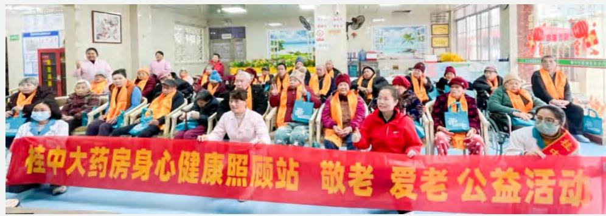

text_image

桂中大药房身心健康照顾站 敬老 爱老 公益活动

## 慢病服务温暖社区

案例

2025年桂中大药房深耕慢病管理，深入社区开展一系列慢病健康服务活动，为慢病患者提供日常检测、健康科普，帮助患者更好的管理自身健康，同时联合医院专家开展线上患教直播，惠及更广泛群体和偏远地区人群，增强公众对慢性疾病的认知与预防意识，以实际行动服务健康，温暖社区。

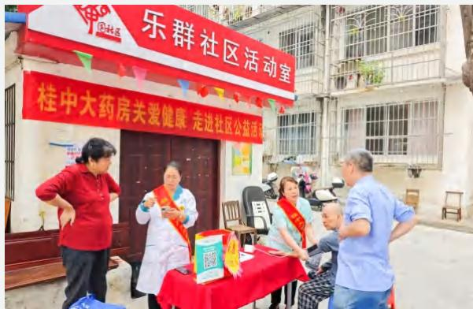

text_image

乐群社区活动室
桂中大药房关爱健康 走进社区公益活动

## 乡村振兴

柳药集团积极响应国家乡村振兴战略部署，以中药产业为核心抓手，结合乡村实际因地制宜开展帮扶工作。2025年，公司重点推进落地一批定制药园项目，精准扶持乡村道地药材产业高质量发展，主动投入产业帮扶资金、产业发展资金和教育建设资金，改善地区基础设施状况，着力推动形成乡村经济振兴的长效机制，以产业赋能带动乡村增收、群众致富。

natural_image

Illustration of two people shaking hands in front of a stylized mountain and building (no text or symbols)

## 持续开展敬⽼助⼒乡兴爱鸡苗捐赠活动

案例

5年，桂中大药房积继续深入社区及养老院开展敬老、爱老公益项目，通过普及健康公司前往恭城瑶族自治县嘉会镇白羊村，参加“政企携手促振兴，爱心捐赠暖民科普知识、提供免费健康检测服务，结合个性化慢病管理方案，精准对接老年群体及社心”捐赠活动，向白羊村捐赠医疗设备、修缮资金。向河池南丹八圩瑶族乡村振兴捐赠区群众的健康需求，既传递了企业对老年群体的专业关怀，也进一步提升了群众健康意基础设施改建费用 同时为南宁市江南区苏圩镇保卫村脱贫户（监测户）送去鸡苗及饲识与健康管理能力。料一批，助力农户扩大生产，持续增收。

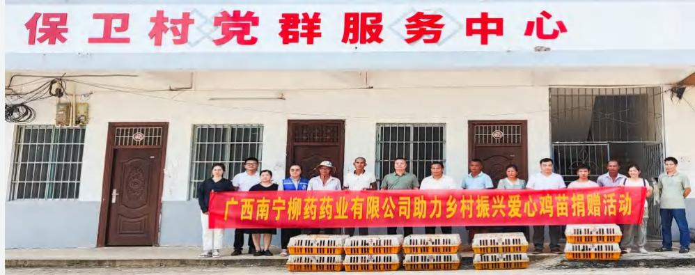

text_image

保卫村党群服务中心
广西南宁柳药药业有限公司助力乡村振兴爱心鸡苗捐赠活动

## 持续开展敬⽼、爱⽼“定制药园”项⽬建设

案例

5年，桂中大药房积继续深入社区及养老院开展敬老、爱老公益项目，通过普及健康公司积极推进中药材标准化种植加工，积极参与定制药园项目，通过项目形成“市科普知识、提供免费健康检测服务，结合个性化慢病管理方案，精准对接老年群体及社场需求—企业加工—基地种植”的完整业务闭环。2025年公司参与了鹿寨县黄冕镇黄栀区群众的健康需求，既传递了企业对老年群体的专业关怀，也进一步提升了群众健康意子中药材示范基地、融水县香粉乡钩藤中药材示范基地、广西国有三门江林场黄精中药识与健康管理能力。材示范基地、广西金陵中华仙草园健康产业基地等“定制药园”项目建设。通过项目建设，支持乡村发展中药材种植产业，带动相关产业发展。

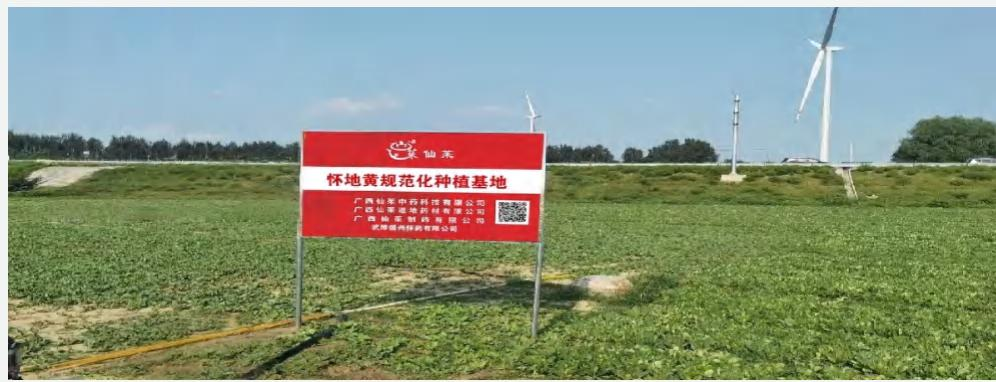

text_image

仙禾
怀地黄规范化种植基地
广西仙禾中药科技有限公司
广西仙禾诺诺药业有限公司
广西仙禾制药有限公司
武邦瑞尚制药有限公司

## 04

## 守护绿色永续发展

恪尽环保责任

应对气候变化

强化能源管理

用心呵护生态

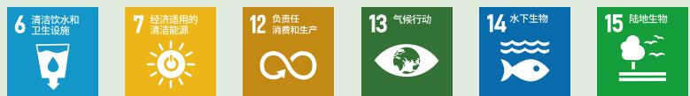

柳药集团深耕绿色低碳发展，恪尽环境责任，落实节能减排，以技术创新推动节能降碳，持续优化能源结构，践行循环经济，用心呵护生态，携手应对气候变化等环境问题和挑战，以绿色转型筑牢可持续发展根基。

柳药集团

## 恪尽环保责任

公司坚持“预防为主、防治结合、源头管控、持续改进”的环保理念，严格落实治污治理，将绿色发展融入企业生产经营全链条。公司按照《中华人民共和国环境保护法》《中华人民共和国大气污染防治法》《华人民共和国水污染防治法》等相关法律法规规定，以ISO14001（环境管理体系）标准为指导，完善内部环境保护制度和管理流程，明确由“战略决策—管理监督—操作执行”三级管理架构，建立“评估预防—监测预警—应急措施—执行改进”的环境风险管控和应急处置机制。公司及旗下药品生产企业已取得ISO14001环境管理体系标准认证。公司及下属子公司均不属于高污染企业和重点排污单位，且能严格遵守国家有关环境保护的法律法规，针对性的开展环境保护和节能减排工作，全年无违反环保法律法规的行为和污染事故，无因环境违法受到环境保护部门的行政处罚。

## 柳药集团环保责任管理基本原则

## 评估预防

对公司生产经营活动及项目实施过程可能产生的环境风险进行充分识别及评估，确定超标排放、污染扩散、生态破坏等潜在风险点，划分风险级别，建立风险清单和风险源台账，定期对风险进行排查评估，并根据国家法律标准进行动态调整。

## 监测预警

定期安排人工巡检，排查、采样分析，做好相关记录，同时对重点排污口风险源安装自动监测设备，落实联网监管，实时监控浓度、流量、泄漏，设定监控阈值，建立异常自动报警、分级预警响应机制。

## 执行改进

跟踪国家相关法规及标准，及时更新管理要求，落实合规排放、定期检测和隐患整改，通过内审、第三方审核、事件复盘、合规检查，发现问题、制定措施、验证效果、改进流程，持续提升治理水平。

## 应急措施

建立环境风险处置应急预案管理体系，明确责任分工和处置方式、信息上报、人员疏散等操作规程，配齐应急物资、装备、队伍，定期开展应急情况演练。

## 柳药集团环保风险管控机制

## 风险导向原则

从企业实际生产经营出发，识别可能发生的环境风险，分级管控、精准施策。

## 全员参与原则

从决策层到一线岗位，明确责任、认真执行，纳入考核，建立追责机制。

## 源头预防原则

从风险源头落实工艺改进、清洁生产、规范经营、实时监控，减少污染产生， 预防风险发生。

## 有效应对原则

对照标准制定应急预案，开展培训演练，把不利影响降到最低。

## 持续改进原则

对风险评估结果、执行情况和应急措施开展定期评审和复盘，动态优化。

## 环境保护工作绩效

污染物排放达标率

100%

污染治理设备有效运营率

100%

环保行政处罚

0

全年污染事故

0

公司在建工程项目均取得环保评批复处理过期药品

67吨

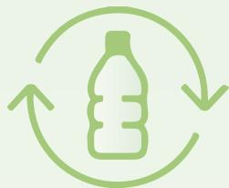

natural_image

Green circular icon with a plastic bottle and arrows, symbolizing recycling or reuse (no text)

过期药械无害化处理

能耗同比下降不低于

5%

建成分布式光伏电站

年发电量

280 万度

natural_image

Illustration of a potted plant with green leaves and white leaves, no text or symbols present.

环保投入

209.19万元

水、电、气综合能耗消同比下降

30%

## 严控污染物排放

公司根据实际生产经营过程中可能产生的污染严格落实风险评估和排放标准，制定企业环保合规清单，明确污染物种类、排放限值及处置规范，落实巡检制度，定期开展内部审查检测和隐患排查，如实记录检测情况、设备运行情况等。公司生产经营环节主要产生少部分废气、废水、噪声、固废等，公司针对相关污染物采取一系列防治举措，常态化开展监测，尽可能减少对环境产生的影响。2025年，公司共开展环保自查、委托第三方公司开展环保隐患排查、合规性评价60余次，全年无超标排放情况。

## 固废管理

公司生产经营主要固体废弃物为生活垃圾、药品生产环节药渣、收集粉尘、格栅渣、废包装材料、不合格药品等。公司严格按照《一般工业固体废物贮存和填埋场污染控制标准》（GB18599-2020）标准；危险废物执行《危险废物贮存污染控制标准》（GB18597-2023）标准等处理废弃物，公司严格相关固废的收集、存储、转运、处置。  
药渣使用密封袋密封保存，收集粉尘使用密封袋密封保存，危险废物收集后暂存于危废暂存间，定期交专业公司回收处理。存储地做好明显标识、防渗漏、防风雨等工作。  
过期污染等不合格药品严格按照GSP要求实施管理，定期移交由具备相关资质的专业公司销毁，并建立销毁台账。  
一般生活垃圾落实分类管理集中由环保部门清运。

## 废气排放管理

公司药品生产业务产生的废气主要来源于中药材破碎加工及中成药生产醇提、浓缩等环节产生的有机废气、粉尘、燃料燃烧废气、中药异味、乙醇大小呼吸废气等。公司严格按照《大气污染物综合排放标准》（GB16297-1996）、《恶臭污染物排放标准》（GB14554-93）、《制药工业大气污染物排放标准》（GB37823-2019）、《锅炉大气污染物排放标准》（GB13271-2014），对废气进行检测管理，通过活性炭吸附、布袋除尘、使用天然气清洁能源、采用低氮燃烧技术进行脱硝处理等，最大限度减少排放和影响，有效保证其中所包含的颗粒物（PM）、硫氧化物（SOx）、氮氧化物（NOX）等符合相关标准。2025年公司废气100%实现达标排放，且低于公司核定的年排放总量。

natural_image

Illustration of two stylized houses on a hillside with green hills and trees in the background (no text or symbols)

natural_image

Green icon depicting a person with a leaf inside a circular arrow, symbolizing eco-friendly or environmental impact (no text or symbols)

关键绩效

全年销毁不合格药品

67吨

<table><tr><td>大气污染物名称</td><td>年度排放总量</td><td>是否超标排放</td></tr><tr><td>颗粒物(PM)</td><td>0.062(吨)</td><td>否</td></tr><tr><td>硫氧化物(SOx)</td><td>0.006(吨)</td><td>否</td></tr><tr><td>氮氧化物(NOX)</td><td>0.056(吨)</td><td>否</td></tr></table>

## 废水管理

公司生产经营产生的废水主要为生活废水、中药原料清洗废水、设备清洗废水、生产废水、锅炉反冲洗废水、真空泵废水等。公司严格执行《污水综合排放标准》（GB8978-1996）Ⅲ级标准、《地表水环境质量标准》（GB3838-2002）Ⅲ类标准，设置废水处理站，经人工格栅-PH调节-厌氧-好氧-沉淀等环节处理达标后排放。2025年公司加大在废水方面的设备投入，污水处理能力进一步提升。

<table><tr><td>工业废水总量</td><td>生活废水总量</td></tr><tr><td>176,116.00(立方米)</td><td>6,900.00(立方米)</td></tr></table>

## 应对气候变化

柳药集团坚持绿色低碳发展理念，将应对气候变化纳入企业中长期发展战略，落实碳达峰、碳中和目标要求。公司积极开展碳排放核算与盘查，识别重点排放环节，推进节能降碳技术改造，优化用能结构，推广清洁能源，降低化石能源消耗。同时针对可能产生的气候风险，开展高温、暴雨、台风等极端天气风险评估，完善应急预案与防灾减灾措施。结合自身所处行业和经营业务等情况，精准识别公司在应对气候变化议题方面的相关联的财务影响及非财务风险与潜在机遇，并在宏观环境下分析各气候对未来发展造成的影响及趋势，制定相关应对措施。

## 气候变化相关风险

## 转型风险

政策及法规风险：应对气候变化的相关法律法规、监管要求逐年提高，设施设备和运营模式可能被淘汰或更新。双碳政策下公司相关投入增加，运营成本上升，环保合规性要求增高。  
技术风险：发展及使用新能源，设备升级改造，增加可再生能源使用，设备采购改造设备，运营成本上升。  
市场风险：注重环保性能，消费习惯改变。市场需求变化对公司产品销售造成影响，公司对产品的研发和环保投入增加运营成本。  
声誉风险:监管机构、社会公众对公司转型措施的关注，若应对措施不足，影响利益相关方对公司的评价，影响合作和产品服务销量。

## 实质风险

急性风险：洪水、台风等气象灾害；对公司建筑、生产设备、药械存储、运输和人员安全造成影响使公司资产受损。  
慢性风险：温度持续升高,用电量增长，能耗增加，运营管理成本上升;高温天气对员工身体健康带来不利影响：高温持续不排除造成生产用电受限，影响正常生产。

## 气候变化相关机遇

## 政策机遇

碳达峰碳中和、节能降碳补贴、绿色技改奖补、税收优惠、绿色信贷等政策支持，降低公司转型成本。

## 产业升级机遇

推动公司技术革新，发展清洁能源、循环经济、数字化节能管控，提升公司经营效率，推动降本增效。

## 成本优化机遇

节能降耗、余热利用、包材等资源循环利用，直接降低能源、原材料成本，提升长期盈利能力。

## 市场拓展机遇

绿色产品、低碳产品、节能装备、低碳出行需求快速增长，线上业务、数字服务等新业务空间扩大

## 品牌与合规机遇

率先实现低碳转型可提升企业形象，满足国内外绿色采购，ESG投资要求，规避贸易碳壁垒

## 碳市场与金融机遇

参与碳交易、CCER开发、绿色债券、碳中和认证，形成新的收益点和融资渠道。

## 公司应对措施

## 完善碳排放管理

开展碳盘查，设定科学碳目标，资源利用率纳入战略与考核。

## 落实资源循环

废料回收、中水回用、固废资源化，构建闭环新技术发展应用，利用新技术提高公司资源利用效率、产能利用率，减少能耗，降低运营成本。

## 产品和服务

针对气候变化带来的健康问题研发新产品，提供新服务。

## 低碳运营

持续推进公司节能减排工作，发展循环经济，推行绿色办公，优化能源结构，推动降本增效。

## 打造绿色供应链协同

强化供应商碳排放评价，搭建供应链数字化平台，应用新技术优化物流线路、降低空载率提升物流效率，并协同产业链使用可重复利用包材，建立回收体系。

## 推动绿色生产

推行清洁生产，强化工艺革新和低碳技术应用，有效降低企业运营成本和碳排放量

## 优化能源利用

推进节能降碳技术改造，优化用能结构，推广清洁能源、金热回收、高效电机等节能技术降低化石能源消耗。

## 强化能源管理

公司持续强化能源管理工作，2025年公司制定完善了《节约能源管理制度》，推动能耗考核指标的落实，在水、电、气（包括蒸汽）的使用方面落实节约控制举措和循环利用措施，加大节能设备使用和工艺流程优化，强化了节能降耗的宣传、检查与执行，实施了光伏发电项目，多维度优化能源管控和循环利用，各项能耗费用均实现了不同程度的下降，整体能耗费用同比下降9.10%，达成年度5%的下降目标。

## 水资源利用

2025年，公司按照《节约能源管理制度》发布具体节水措施，增强全员节水意识。在新建、改建和扩建项目中配套建设节水设施，做到节水设施与主体工程同时设计、同时施工、同步投入使用。在水资源使用中，公司合理规划和核算取水量，采取总量控制、定额管理，同时加强对重点用水设备和工序的管理，制定和实施主要用水工序、设备的用水标准以及用水操作规程。此外，公司积极推进水资源的循环利用，回收利用生产设备冷却水、空调冷却水、锅炉冷凝水，提高水资源重复利用率。

总耗水量（包括新鲜水等取水量和重复利用水量）

49.14万吨

重复利用水量

2.16万吨

重复利用率（重复利用水量占总耗水量的比率）

4.40%

集团整体用水量减少

4.40%

## 电能耗管控

2025年公司在电能利用方面进一步强化对用电关键节点的把控，通过设备升级改造、节电设备的使用和绿电项目建设，进一步降低电能损耗，推动清洁绿电的使用。随着公司业务规模的扩大，以及以电动设备替代燃油设备，生产运营用电量略有增长，但从用电效能和绿电占比看，公司用电情况持续改善，也助力公司降碳工作开展。

用电总量

2,986.59 万度

同比增长

2.43%

绿电占比

5.39%

## 用电改善措施

## 采用节能生产设备

优先采购符合国家能效等级标准的高效电机、变频器驱动的空压机、水泵、风机等关键动力设备；在新建项目或设备更新换代时，选用具备先进节能技术（如永磁同步、IE4/IE5超高效率等级）的设备。

## 节能照明设备

全面淘汰白炽灯/荧光灯；厂区/办公楼/车间/仓库推广LED灯具；完成厂区公共区域及车间LED灯具全覆盖，同比传统灯具综合节电率达50%以上。

## 智能控电设备使用

公司大范围应用光感/声控/定时/分区智能控制系统，最大限度的减少无效用电。

## 节能温控设备

选用磁悬浮冷水机组、变频多联机等高能效空调；玉林物流运营中心项目二期及柳州物流运营中心项目所建设仓储均采用中央空调智能恒温恒湿控制系统，使阴凉库单位面积月均耗电量降低17.327 kW·h/㎡。

## 绿电项目建成使用

2025年公司系统性规划厂房屋顶资源，在南宁园区采用“合作方投资+专业运营”模式；高效建成3.1兆瓦分布式光伏电站。通过专业化能源管理，2025年6月投用后，下半年共发电约155.4万度，年均发电约280万度，在实现电费节约的同时，构建了稳定的绿色能源供给能力，提升公司用能结构的战略韧性，有效降低碳排放指标。

## 燃气能源管控

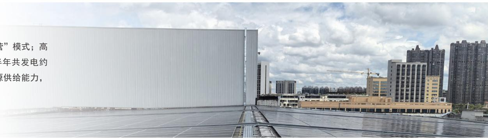

text_image

”模式；高
年共发电约
源供给能力，

在燃气能源利用方面，2025年公司在保障生产经营的同时以节约为核心，落实降低损耗、提高热效率的原则，通过技术改进、回收利用、强化温控等方式有效减少燃气（含蒸汽）消耗。在技术应用方面，公司安装余热锅炉产蒸汽发电，采用热泵技术提升低品位废热，实施蒸汽冷凝水闭式回收，建设ORC余压发电系统。在公司玉林中成药项目和配方颗粒项目建设中，创新构建蒸汽冷凝水回收二次利用系统。

## 消耗量

374.82万立方米

## 同比减少

8.44%

## 节约资源，发展循环经济

2025年，公司以降本增效、绿色运营为方针，强化各业务环节的资源回收利用，积极发展绿色供应链，推广绿色服务，采取一系列措施减少资源浪费，推动资源的循环利用。

## 绿色物流

应用大数据、智能算法，优化物流作业模式，提高物流作业集中度和计划性，合理规划行车路线。

## 绿色沟通

推出供应链SPD平台，建立与上下游客户的信息互联，减少纸质文件的传递和线下会面沟通次数。

## 循环利用

固体废物药渣经有机肥厂处理，做成有机肥有效利用。

回收利用生产设备冷却水、空调冷却水、锅炉冷凝水，提高水资源利用率。

创新构建蒸汽冷凝水回收二次利用系统。

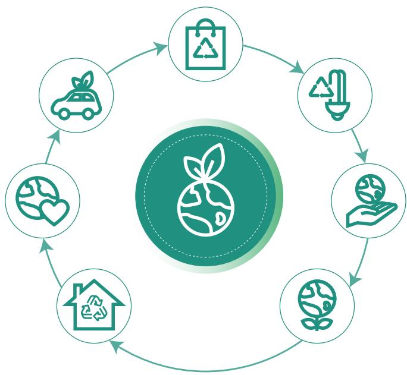

flowchart

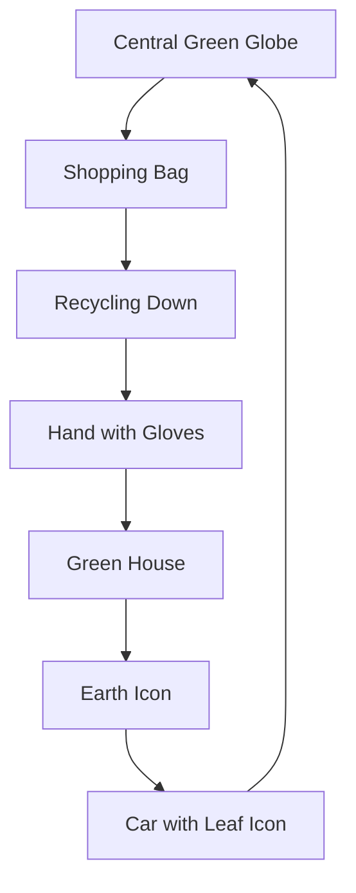
```mermaid
graph TD
  A["Central Green Globe"] --> B["Shopping Bag"]
  B --> C["Recycling Down"]
  C --> D["Hand with Gloves"]
  D --> E["Green House"]
  E --> F["Earth Icon"]
  F --> G["Car with Leaf Icon"]
  G --> A
```

## 绿色餐饮

统一使用食堂消毒餐具，减少一次性餐具使用。启用食堂点餐系统，按需备餐，减少浪费。

## 绿色设备

仓储运输设备、作业设备和车辆均采用新能源车，并对库区温控系统、空调系统进行升级改造，进一步降低能耗。

## 绿色服务

推广使用可重复使用购物袋，配送商品使用可回收周转箱，减少纸箱使用。

## 绿色办公

丰富办公OA功能，减少流程用纸；优化会议系统，提高线上会议应用。

## 用心呵护生态

柳药集团严格遵循《中华人民共和国野生植物保护条例》《中华人民共和国野生动物保护法》《中华人民共和国森林法》《野生药材资源保护管理条例》及联合国《生物多样性公约》等相关法律法规及国际公约要求，认真落实生态环境保护与生物多样性保护主体责任，坚持“绿色发展、生态优先”原则，在生产经营全过程严格遵守生态环保法律法规，合理规划厂区布局，严控污染，开展厂区绿化与生态修复。同时强化绿色供应链管理，杜绝使用破坏生态的原材料，建立生物多样性监测与风险防控机制，加强员工生态保护宣传教育，以实际行动守护自然生态安全，促进人与自然和谐共生。

## 合理规划选址，生态保护施工

公司项目选址避开自然保护区、饮用水水源保护区、重要湿地、野生生物栖息地等生态敏感区；厂区布局、施工道路、管线走向避开动植物迁徙通道、集中栖息点，减少碎片化破坏。在项目施工中，公司严格避开划定的生态保护红线区，设置围挡隔离，裸土及时覆盖或临时绿化，减少扬尘与水土流失，对临时占用区域进行植被恢复、本土植物补种。公司在建项目均通过环评并取得相关批复文件。

## 精准治理污染物，减少资源浪费

公司在废水、废气、固废——“三废”治理上均达到标准，避免重金属、持久性有机污染物（POPs）、农药等进入土壤、水体，毒害生物。对危险废物严格分类贮存、防渗处理，杜绝渗漏污染周边生态系统。同时公司推行循环经济，强化原材料高效利用、边角料/废弃物回收再利用，减少对自然资源的过度开采，严控水资源消耗，避免过度抽取地下水、围填湿地，保护水生、湿地生物栖息地。

## 落地规范种植，强化生态修复

公司在2025年继续深入推进定制药园、GAP种植基地等中药材种植项目。公司参与了鹿寨县黄冕镇黄栀子中药材示范基地、融水县香粉乡钩藤中药材示范基地、广西国有三门江林场黄精中药材示范基地、广西金陵中华仙草园健康产业基地等“定制药园”项目建设。定制药园通过生态友好选址、绿色标准化生产、种养循环利用、全程追溯监管，实现道地药材稳定供应与生态环境协同保护，是中医药产业高质量发展的绿色路径。

## 优化园区环境，协同共建绿色

公司厂区、办公园区持续增加绿化覆盖率，打造“员工认养“花园，构建多层植被群落，为昆虫、鸟类提供栖息、觅食场所。同时，公司建立常态化生物多样性保护的员工培训机制，通过专题培训、宣传教育、现场讲解、科普海报等形式，普及生态保护、野生动植物保护、绿色种植、农药化肥减量、生态循环种植等知识，提升全体员工生态保护意识与实操能力，引导员工自觉参与生态保护，推动企业发展与生态保护、生物多样性保护协同共进。

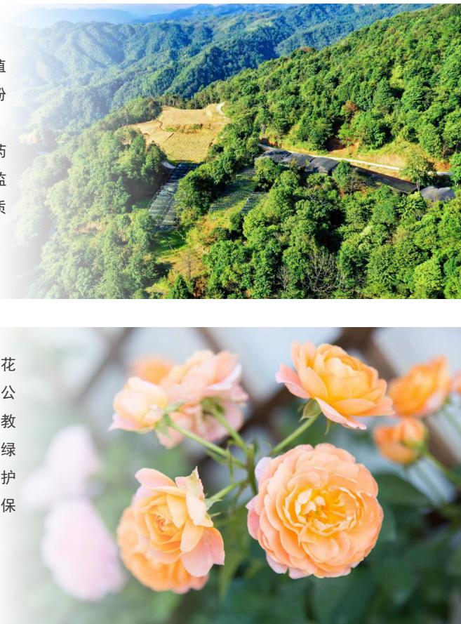

## 破局攻坚智领向前

广西柳药集团股份有限公司2026年销售年会

## 破局攻坚智领向前

## 报告后记

## 展望未来

公司坚持立足大健康行业，把握行业集中化、合规化、数字化发展机遇，持续推动新技术与公司各业务板块的深度融合，落实“AI+医疗”全场景应用，构建完善智慧供应链体系，推动专业服务升级和精细化管理落地，形成新模式、新生态，夯实核心业务根基。同时围绕中药、民族药产业深耕布局，并在创新药领域实现快速突破，不断丰富公司产品矩阵，推动产业链和关键工序的高效协同，落实降本增效和全域市场拓展，不断做大做强医药工业业务，培育新利润增长极。最终，实现企业向创新型医药产品和智慧医药健康服务供应商转型。

natural_image

Line drawing of a modern architectural skyline with multiple buildings and a logo (no text or symbols on the building facade)

可持续发报告GRI标准内索

<table><tr><td>披露内容</td><td>GRI</td><td>披露页码</td></tr><tr><td colspan="3">前篇</td></tr><tr><td>可持续发展管理</td><td>2-13, 2-14, 2-29, 3-1, 3-2, 3-3</td><td>10</td></tr><tr><td>利益相关方沟通</td><td>2-29</td><td>14</td></tr><tr><td>发展战略</td><td>2-22</td><td>06</td></tr><tr><td>ESG治理</td><td>3-1, 3-2, 3-3</td><td>10</td></tr><tr><td>ESG风险管理</td><td>3-3</td><td>12</td></tr><tr><td colspan="3">第一章 善治固本 行稳致远</td></tr><tr><td>治理体系</td><td>2-9</td><td>16</td></tr><tr><td>信息披露</td><td>/</td><td>17</td></tr><tr><td>投资者关系管理</td><td>/</td><td>18</td></tr><tr><td>合规风险管理</td><td>205-1, 205-2</td><td>20</td></tr><tr><td>恪守商业道德</td><td>205-1, 205-2</td><td>21</td></tr><tr><td>反不正当竞争</td><td>206-1</td><td>22</td></tr><tr><td>信息安全和隐私保护</td><td>/</td><td>23</td></tr><tr><td>内控风险管理</td><td>2-12</td><td>25</td></tr><tr><td>质量风险管理</td><td>416-1</td><td>27</td></tr><tr><td>药物警戒</td><td>417-1</td><td>29</td></tr><tr><td>召回管理</td><td>417-1</td><td>29</td></tr><tr><td colspan="3">第二章 创新破局 协同共赢</td></tr><tr><td>创新打造高质量产品</td><td>417-1</td><td>34</td></tr><tr><td>知识产权保护</td><td>/</td><td>35</td></tr><tr><td>打造协同生态</td><td>2-28</td><td>40</td></tr><tr><td>供应商全生命周期管理</td><td>417-1</td><td>41</td></tr></table>

<table><tr><td>披露内容</td><td>GRI</td><td>披露页码</td></tr><tr><td colspan="3">第三章 以人为本 共筑和谐</td></tr><tr><td>女性权益保障</td><td>2-7,401-2,401-3,405-1</td><td>47</td></tr><tr><td>优化薪酬福利</td><td>401-2</td><td>48</td></tr><tr><td>给予人文关怀</td><td>/</td><td>49</td></tr><tr><td>员工健康与安全</td><td>403-1,403-2,403-5,403-7</td><td>50</td></tr><tr><td>赋能员工发展</td><td>404-1,404-2</td><td>53</td></tr><tr><td>人才培养</td><td>404-1,404-2</td><td>53</td></tr><tr><td>关注民生保障</td><td>417-1</td><td>56</td></tr><tr><td>聚焦公益慈善</td><td>/</td><td>58</td></tr><tr><td>服务社区</td><td>413-1</td><td>59</td></tr><tr><td>乡村振兴</td><td>413-1</td><td>60</td></tr><tr><td colspan="3">第四章 守护绿色 持续发展</td></tr><tr><td>严控污染物排放</td><td>306-2,306-3</td><td>64</td></tr><tr><td>应对气候变化</td><td>201-2</td><td>65</td></tr><tr><td>强化能源管理</td><td>302-5</td><td>67</td></tr><tr><td>水源利用</td><td>303-5</td><td>67</td></tr><tr><td>燃气能源管控</td><td>302-5</td><td>68</td></tr><tr><td>发展循环经济</td><td>/</td><td>69</td></tr><tr><td>保护生态多样性</td><td>304-1,304-2</td><td>70</td></tr></table>

natural_image

Illustration of stylized green and teal foliage with no text or symbols

