##

## 环境、社会和公司治理报告

ENVIRONMENTAL, SOCIAL AND GOVERNANCE REPORTING

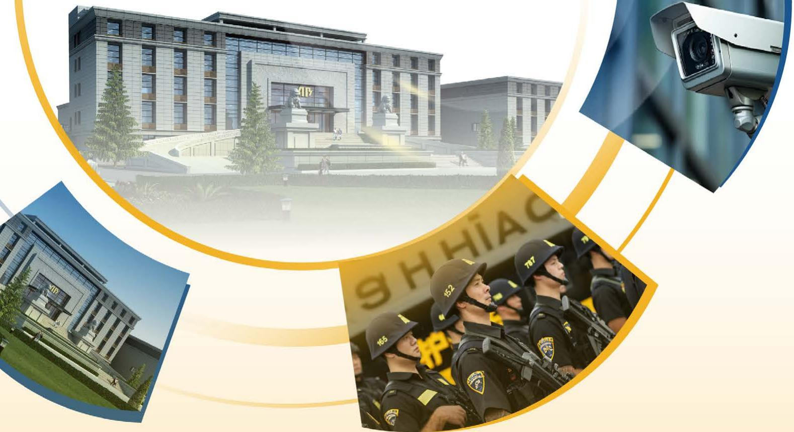

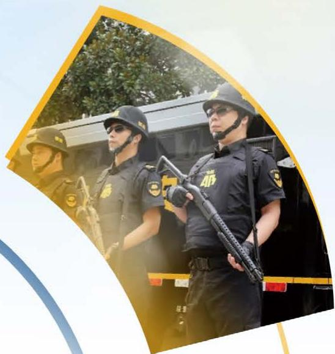

natural_image

Group of uniformed officers standing in front of a truck, no visible text or symbols

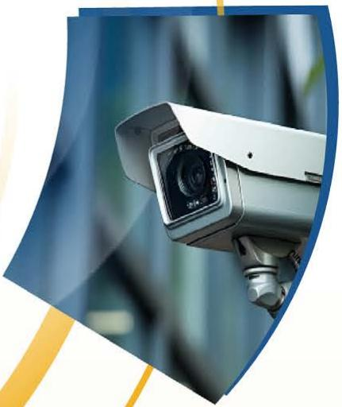

natural_image

Close-up of a security camera with no visible text or symbols

## 目 录

##

## 走进安邦护卫01

荣誉一览03  
公司加入的协会04  
环境、社会和公司治理05

## 61 附录

61 GRI Standard索引表  
64 对标索引  
65 报告编制说明  
67 意见反馈

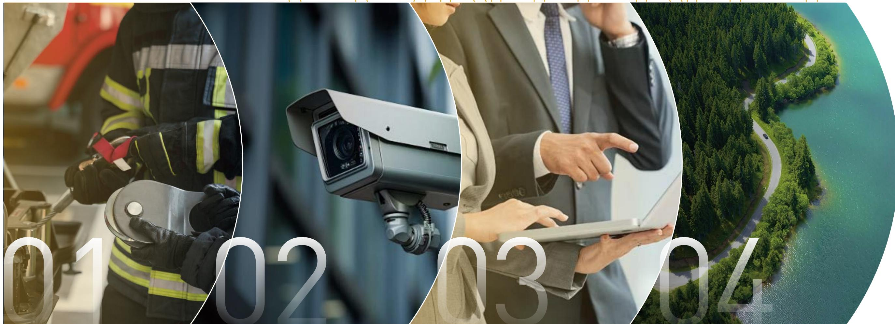

natural_image

Collage of four-panel image showing industrial workers, a surveillance camera, a person handling documents, and a scenic lake with forested hills (no text or symbols)

## 党建引领合规治理

党建引领 13

合规经营 14

公司治理 16

## 智慧创新安心服务

智慧安防与低空安全管控

公共安全服务 27

应急救援能力建设 31

## 惠聚伙伴 聚力共赢

员工关怀与人才发展 35

安全生产风险管理 46

供应商管理 52

## 绿筑根基 善润乡邻

绿色运营 55  
社区发展 58

## 走进安邦护卫

安邦护卫集团股份有限公司（简称“安邦护卫”）是国内首个全省域武装押运企业，也是全国唯一一家实行集团化运作的金融武装押运公司。

2006年，在“八八战略”指引下，为服务浙江省银行业金融机构守押社会化改革工作，浙江省公安厅报经省委、省政府、省委政法委批准，组建成立了浙江安邦护卫公司和各市安邦护卫公司，开启了安邦护卫发展的新篇章。2013年，为更好地适应守押市场服务需要，以原浙江安邦护卫公司为母公司，以各市公司为子公司，组建成立了浙江安邦护卫集团有限公司，走上了集团化发展之路。2015年7月，经省委、省政府批准，浙江安邦护卫集团公司整体移交省国资委，成为浙江省人民政府直属的国有企业，开启了一个全新发展的历史阶段。

2017年，公司成功入选国家第三批混合所有制改革试点单位：2020年完成混改，引进中电海康集团和南都物业集团为战略投资者。混改后公司紧锣密鼓地开展IP0工作，于2023年7月7日成功过会2023年12月20日在上交所A股主板上市，成为我国首家上市的安全服务企业。

集团坚持以高水平建设“平安浙江”“平安中国”为已任，全面融入“大安全、大应急、大减灾”体系，打造了以金融武装押运、金融外包服务、金库值守、贵重物品押运保管等为一体的新型金融安全服务，以低空安全服务、重点单位及大型活动的安保、智能安防系统建设、运维及安全培训等为一体的综合安防服务，以涉案财物保管处置、应急救援、社会基层治理服务等为一体的社会治理服务。同时，集团积极拓展海外安保服务，加快打造可运用系统和装备，培育储备专业人才，探索“抱团出海”模式。2025年，集团深度参与全省低空经济的“安全底座”建设，加快融入低空安全服务发展，着力打造低空安全服务新业态。

集团自主研发的智能车载系统、枪支管理系统、涉案财物管理系统等数字安防产品成功走向全国20余个省（市），累计获得各类专利、软著、公安部检测报告200余项，并拥有1家国家高新技术企业。集团还获得CMMI3、ITSS2、CS2等多项资质认证，荣获浙江省专精特新中小企业称号，在行业内率先实现从单一的武装押运业务向科技型综合大安全服务企业转型。

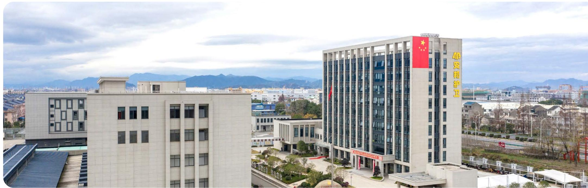

natural_image

Exterior view of a modern office building with large Chinese national flag on the glass tower, surrounded by urban landscape and mountains in the background (no signage visible)

地市级中心基地（金库）

11 座

县区级基地（金库）

21 座

防爆枪数量

2,446

专业防弹运钞车数量

2,087 辆

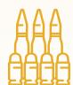

弹药数量

126,279 发

员工人数

16,351人

## 创造的经济价值（万元）

营业总收入  
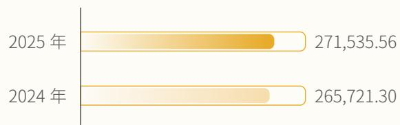

bar

| Category | Value |
| --- | --- |
| 2025 年 | 271,535.56 |
| 2024 年 | 265,721.30 |

员工工资和福利  
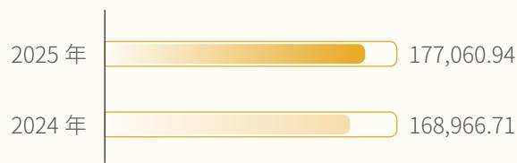

bar

| Category | Value |
| --- | --- |
| 2025年 | 177,060.94 |
| 2024年 | 168,966.71 |

社区投资  
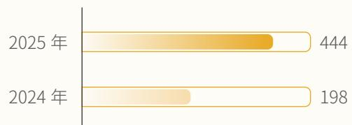

bar

| Category | Value |
| --- | --- |
| 2025年 | 444 |
| 2024年 | 198 |

营业总成本  
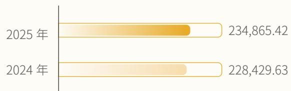

bar

| Category | Value |
| --- | --- |
| 2025年 | 234,865.42 |
| 2024年 | 228,429.63 |

缴纳税款  
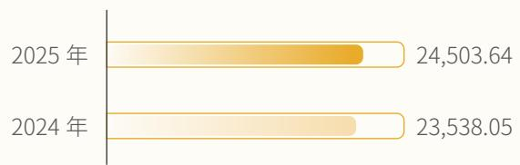

bar

| Category | Value |
| --- | --- |
| 2025 年 | 24,503.64 |
| 2024 年 | 23,538.05 |

营业利润  
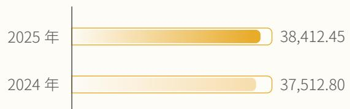

bar

| Category | Value |
| --- | --- |
| 2025年 | 38,412.45 |
| 2024年 | 37,512.80 |

## 荣誉一览

<table><tr><td>获奖单位</td><td>奖项/荣誉</td><td>获奖时间</td><td>颁奖单位</td></tr><tr><td rowspan="5">安邦护卫集团</td><td>2024年金信披奖</td><td>2025年12月</td><td>中国证券报</td></tr><tr><td>浙江省社会责任报告优秀案例</td><td>2025年12月</td><td>浙江省工业经济联合会、浙江省国有资产管理协会、浙江省企业家协会、浙江省总会计师协会</td></tr><tr><td>国资国企新风尚·“先锋样本”</td><td>2025年12月</td><td>浙江省国有资产管理协会</td></tr><tr><td>浙江省2025年服务业领军企业</td><td>2025年12月</td><td>浙江省发展和改革委员会</td></tr><tr><td>特别贡献单位</td><td>2026年1月</td><td>中国保安协会海外安保专业委员会</td></tr><tr><td>浙江安邦护卫安全服务有限公司</td><td>全国质量奖及中国质量奖</td><td>2025年11月</td><td>中国名牌战略发展协会</td></tr><tr><td rowspan="2">浙江杭州安邦护卫有限公司</td><td>2025低空经济典型案例</td><td>2025年3月30日</td><td>交通运输部“老交通”智库、《人民交通》杂志社、中国小康建设研究会</td></tr><tr><td>中国创新方法大赛浙江赛区二等奖</td><td>2025年11月</td><td>浙江省科学技术协会</td></tr><tr><td>浙江湖州安邦护卫有限公司</td><td>浙江省AAA级“守合同重信用”企业</td><td>2025年9月</td><td>浙江省市场监督管理局</td></tr><tr><td>浙江嘉兴安邦护卫有限公司</td><td>嘉兴市优秀保安公司</td><td>2025年6月</td><td>嘉兴市保安协会</td></tr><tr><td rowspan="2">安邦护卫(浙江)科技公司</td><td>中保协2025智慧安保创新案例</td><td>2025年9月</td><td>中保协</td></tr><tr><td>省级企业研究院</td><td>2025年12月</td><td>浙江省经济和信息化厅</td></tr><tr><td>浙江丽水安邦护卫有限公司</td><td>浙江省低空安全管理协会第一届会员单位</td><td>2025年12月</td><td>浙江省低空安全管理协会</td></tr><tr><td rowspan="2">浙江宁波安邦护卫有限公司</td><td>综合贡献奖</td><td>2025年3月</td><td>宁波市江北区人民政府</td></tr><tr><td>浙江省A级“守合同重信用”企业</td><td>2025年8月</td><td>宁波市江北区市场监督管理局</td></tr></table>

<table><tr><td>获奖单位</td><td>奖项/荣誉</td><td>获奖时间</td><td>颁奖单位</td></tr><tr><td>安邦通航智能科技(衢州)有限公司</td><td>低空经济典型案例</td><td>2025年3月</td><td>《人民交通》杂志社</td></tr><tr><td rowspan="2">浙江衢州安邦护卫有限公司</td><td>民兵工作先进单位</td><td>2025年4月</td><td>中国人民解放军浙江省衢州军分区战备建设处</td></tr><tr><td>浙江省AAA级“守合同重信用”企业</td><td>2025年9月</td><td>浙江省市场监督管理局</td></tr><tr><td>浙江绍兴安邦护卫有限公司</td><td>AAA级“守合同重信用”企业</td><td>2025年9月</td><td>浙江省市场监督管理局</td></tr><tr><td>浙江台州安邦护卫有限公司</td><td>AAA级信用企业</td><td>2025年9月</td><td>杭州资信评估有限公司</td></tr><tr><td>浙江温州安邦护卫有限公司</td><td>2024年度全省保安服务企业信用评价A级</td><td>2025年9月</td><td>浙江省公安厅</td></tr><tr><td>安智顺(杭州)供应链管理有限公司</td><td>AAA级诚信供应商AAA级信用企业</td><td>2025年2月</td><td>全国企业信用信息</td></tr></table>

## 公司加入的协会

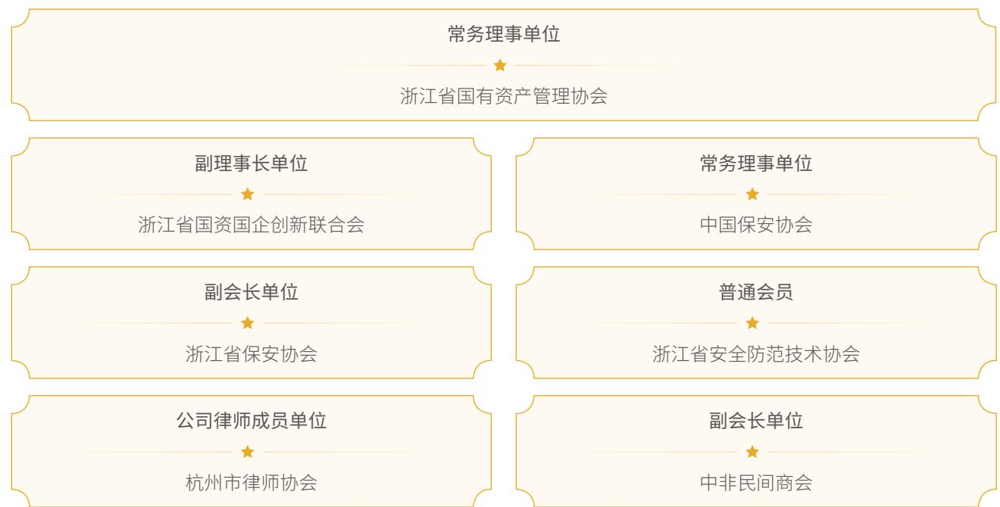

flowchart

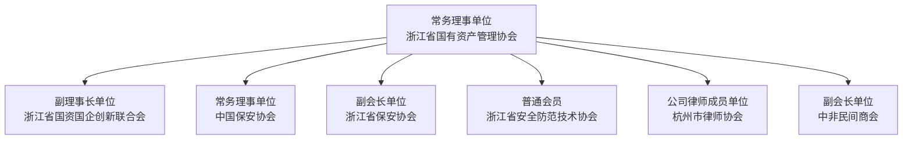
```mermaid
graph TD
  A["常务理事单位\n浙江省国有资产管理协会"] --> B["副理事长单位\n浙江省国资国企创新联合会"]
  A --> C["常务理事单位\n中国保安协会"]
  A --> D["副会长单位\n浙江省保安协会"]
  A --> E["普通会员\n浙江省安全防范技术协会"]
  A --> F["公司律师成员单位\n杭州市律师协会"]
  A --> G["副会长单位\n中非民间商会"]
```

## 环境、社会和公司治理

公司秉持“忠诚敬业智勇担当”的核心价值观，与利益相关方建立畅通的沟通渠道及合作关系，结合主要利益相关方的诉求识别公司的环境、社会和公司治理(ESG)实质性议题，明确内部职责分工，落实重点管理项目，通过向环境及社会带来的积极影响以实现公司的高质量发展。

## 管治架构

natural_image

Illustration of two men shaking hands beside a chess knight piece, with an envelope and document (no text or symbols present)

董事会作为公司 ESG 事宜的最高管理机构，为强化其对 ESG 的管理效能，公司管理层承担起协助角色，负责ESG管理的统筹协调工作，向董事会提供决策建议，并定期汇报进展。在董事会办公室的引领下，由各部门及子公司紧密协作组成的 ESG 工作推进小组，具体负责推动公司 ESG 相关事务，并向管理层不定期汇报及提出建议。此外，各部门与子公司之间保持密切协同确保 ESG 管理工作在其涉及的领域得到充分落实，并配合各项 ESG 计划的执行与汇报。

为了确保公司董事及高级管理人员有效监督企业的ESG管理和各项工作，并推动ESG管理事务的高效运行，公司围绕“决策-管理-执行”三个层面，促进ESG理念逐渐融入企业制度和日常运营之中。

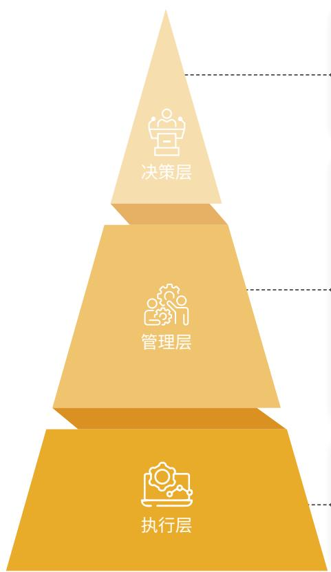

flowchart

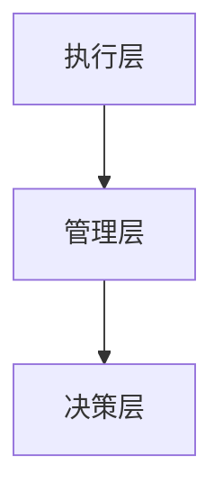
```mermaid
graph TD
  A["执行层"] --> B["管理层"]
  B --> C["决策层"]
```

董事会对公司的ESG相关事宜拥有决策权，检查公司ESG相关事宜的进度。公司发布的《环境、社会和公司治理报告》均经由董事会审议通过。  
公司管理层负责审查公司 ESG 相关的政策、法规、标准、趋势以及利益相关者的诉求，判定公司ESG事宜的重要性。董事会办公室作为公司ESG相关事务的主管部门，负责协调推动公司ESG体系的建设，研究公司ESG的相关规划、目标、制度和重大事项，并推动ESG工作的执行，包括识别公司年度ESG议题、编制企业年度ESG报告、收集ESG典型案例以及组织开展ESG 管理和ESG相关知识的宣贯等。  
●公司各部门及子公司构成执行层，配合管理层完成ESG管理相关工作任务，同时宣贯ESG理念，帮助部门在未来更好地将ESG融入实际工作中。

## 利益相关方沟通

安邦护卫通过制度和资源保障，构建企业与利益相关方之间的沟通和监督机制，以多种方式收集、整理和分析利益相关方的期望和诉求。同时采用多举措加强与利益相关方沟通交流，邀请利益相关方参与企业可持续发展相关决策和活动，并借鉴国内外先进经验，持续改进利益相关方参与效果。

<table><tr><td>利益相关方</td><td>诉求与期望</td><td>主要沟通渠道</td></tr><tr><td>股东和投资者</td><td>公司治理风险管理信息披露股东回报经营业绩</td><td>股东大会定期报告和临时公告投资者交流会议投资机构调研电话/邮件问询及反馈</td></tr><tr><td>政府和监管机构</td><td>合规运营促进经济发展创造社会价值</td><td>政府会议专题汇报现场考察信息报送</td></tr><tr><td>客户</td><td>优质服务科技创新诚信交易</td><td>客户拜访及沟通客户满意度调查客户投诉热线等</td></tr><tr><td>员工</td><td>薪酬福利保障职业健康与安全职业发展与培训员工关爱与沟通</td><td>职工代表大会与工会员工培训员工文体活动座谈会、慰问走访</td></tr><tr><td>合作伙伴</td><td>廉洁的商业环境合作共赢促进供应链可持续发展</td><td>日常业务沟通文件函电往来行业协会</td></tr><tr><td>社区和环境</td><td>可持续发展乡村振兴与公益绿色运营</td><td>公益活动社区互动举办或参与绿色环保活动</td></tr></table>

## 实质性议题分析

在ESG管理中，公司贯彻利益相关方参与原则。通过识别重要利益相关方，与之建立常态化沟通机制，深入了解各利益相关方的意见与期待，进而构建有效的沟通渠道进行回应。在实施利益相关方议题筛选时，通过对议题充分评估分析和优先排序，最终确定实质性议题。

## 识别流程

## 01 业务背景调研与利益相关方诉求分析

作为识别工作的基础，全面梳理公司内外部经营背景，精准识别利益相关方核心关切，明确议题识别的边界与重点。

## 内部业务梳理

剖析集团“科技型综合大安全服务企业”战略定位，梳理公共安全服务、智慧安防研发、武装守押、海外安保等全价值链业务流程，明确国内服务网络与海外市场布局的资源配置特点。

## 外部环境分析

跟踪安防行业ESG监管政策、低空经济发展规范、海外安保合规标准，参考同业智慧安防与跨境安保ESG实践，识别行业共性风险与差异化机遇。

##

通过座谈、问卷等方式，收集政府客户、金融机构、员工、社区、投资者等核心诉求，聚焦公共安全保障、智慧技术创新、合规运营、员工权益等关键关切点。

## 02 建立双重重要性议题初始清单

以上交所《指引》设定的21项基础议题为核心，结合公司行业特性，补充自主识别议题，形成初始议题清单。

## 基础议题纳入

直接纳入上交所环境、社会、治理三大维度21项基础议题筛选出与安防行业高度相关的绿色运营、公共安全责任、劳工权益、合规治理等议题。

## 特色议题补充

结合低空经济布局与海外业务拓展，新增低空安全管控、海外安保合规、智慧安防技术研发、应急救援能力建设等具有财务或影响重要性的特色议题。

##

明确各议题定义及与业务的关联关系，剔除无实质关联议题，形成初始清单。

## 03 财务重要性与影响重要性双维度评估

针对初始清单中的每项议题，分别从财务重要性和影响重要性两大维度，结合短期（1年内）、中期（1-5年）、长期（5年以上）时间尺度开展量化+定性评估，明确议题对公司的实质影响。

## 财务重要性评估

核心判断要点包括议题对营收结构、成本控制、融资成本、品牌价值的影响：是否支撑重大项目获取与海外市场拓展：是否影响供应链稳定性与运营效率。

##

核心判断要点包括议题对公共安全、社区稳定、生态环境的影响：是否推动安防行业技术升级与合规标准落地；是否对上下游价值链可持续发展产生传导效应。

## 04 议题重要性分级与最终确认

根据双维度评估结果，对议题进行重要性分级，筛选出5项核心重要性议题（下表带\*）和3项一般重要性议题经公司内部审议后形成最终清单，作为可持续发展报告披露与ESG管理的核心依据。

## 分级标准

同时具备财务重要性和影响重要性的列为核心重要性议题：仅具备一项目影响显著的列为一般重要性议题；均不具备的予以剔除。

## 内部审议确认

分级结果提交董事会及ESG管理部门审议，结合意见优化调整。

## 披露与应用

核心重要性议题按“治理-战略- 影响风险机遇管理 -指标与目标”四要素详细披露，纳入年度ESG管理重点；一般重要性议题简化披露。

## 05 议题清单动态更新与文件留存

##

若商业模式、市场布局、监管政策或利益相关方诉求发生重大变化，及时启动更新；未发生重大变化则无需重复全流程识别。

## 文件留存

留存背景调研、利益相关方调研记录、双维度评估底稿、内部审议文件等，确保可追溯与鉴证。

##

将议题清单与ESG 战略、风险管理、绩效考核体系衔接推动落地执行。

## 重要性议题汇总表

<table><tr><td>ESG主题</td><td>议题类别</td><td>具体议题</td><td>财务重要性(等级+依据)</td></tr><tr><td>环境(E)</td><td>基础议题</td><td>绿色运营</td><td>中;新能源车辆替代有助降低营业成本</td></tr><tr><td rowspan="8">社会(S)</td><td>基础议题</td><td>*公共安全服务</td><td>高;重大项目带动品牌溢价,海外拓展打开增量市场</td></tr><tr><td>特色议题</td><td>*智慧安防技术研发与应用</td><td>高;智慧安防项目营收占比逐年提升,技术壁垒支撑市场拓展</td></tr><tr><td>特色议题</td><td>*应急救援能力建设</td><td>高;承接应急服务项目形成新盈利点,降低突发风险损失</td></tr><tr><td>基础议题</td><td>*员工关怀与人才发展</td><td>高;降低核心人才流失率,减少招聘与适配成本,技能提升带动服务效率提升</td></tr><tr><td></td><td>*风险管理与安全生产</td><td>高;降低安全事故损失与停工成本,通过银行业安全评估巩固核心业务</td></tr><tr><td>基础议题</td><td>供应商管理</td><td>中;规范供应商管理降低供应链风险与采购成本,保障核心业务供应稳定</td></tr><tr><td>特色议题</td><td>乡村振兴</td><td>中;依托政策拓展乡村安防新业务,获取专项补贴,开辟县域增量市场,积累长期客户资源</td></tr><tr><td>特色议题</td><td>公益行动</td><td>中;公益品牌建设提升市场信任度,降低营销成本,优化资本市场认可度,实现品牌价值向财务价值转化</td></tr><tr><td>治理(G)</td><td>基础议题</td><td>党建引领与合规治理</td><td>中高;党建联建带动部分政府、国企合作项目,保障营收基本稳定;合规运营规避潜在违规处罚,提升资本市场基础认可度,小幅降低融资成本</td></tr></table>

<table><tr><td>影响重要性(等级+依据)</td><td>影响周期及程度</td></tr><tr><td>中;减少碳排放与能耗,推动安防行业低碳转型</td><td>中期:高(规模降本);长期:中(政策红利)</td></tr><tr><td>高;保障重大活动与社会安全,覆盖千万级人群,推动公共安全治理现代化</td><td>短期:高(营收贡献);中期:高(市场扩容);长期:高(行业引领)</td></tr><tr><td>高;替代传统人工巡查降碳,提升公共安全管控效率,输出行业技术标准</td><td>短期:中(研发投入);中期:高(项目增收);长期:高(技术变现)</td></tr><tr><td>高;融入区域应急体系,提升灾害处置效率,保障生命财产安全</td><td>短期:中(设备投入);中期:高(业务增收);长期:高(公共价值)</td></tr><tr><td>高;完善职工权益保障,带动就业超2000人,提升行业人才素质</td><td>短期:中(培训投入);中期:高(效率提升);长期:高(人才储备)</td></tr><tr><td>高;建立全流程安全管控体系,为行业风险管理提供范本,保障运营安全</td><td>短期:高(风险规避);中期:高(体系完善);长期:高(合规壁垒)</td></tr><tr><td>中;规范供应商合规与安全运营,保障公共安全服务品质,推动供应链ESG协同发展,彰显行业示范效应</td><td>短期:中(管理成本投入);中期:中(供应链稳定与成本优化);长期:高(行业引领效应)</td></tr><tr><td>高;填补乡村公共安全防护空白,提升乡村治理能力,助力乡村振兴与城乡融合,守护乡村群众安全</td><td>短期:中(项目投入);中期:高(市场拓展与社会效益);长期:高(品牌沉淀与区域影响力</td></tr><tr><td>高;聚焦民生公益提升公众安全意识,践行国企担当,凝聚社会共识,营造良好营商与社会环境</td><td>短期:中(公益投入);中期:高(品牌与社会效益);长期:高(品牌沉淀与社会影响力)</td></tr><tr><td>高;强化国企责任担当,推动安防行业合规化,保障利益相关方权益</td><td>短期:中(基础保障);中期:中高(风险规避);长期:高(品牌沉淀)</td></tr></table>

## 01

## 党建引领合规治理

公司以党建联建为纽带，确保公司业务发展契合国家战略方向，彰显国企社会责任担当。另一方面，公司通过健全的合规体系为安防行业树立标杆，推动行业整体规范化发展，充分保障员工、客户等利益相关方合法权益，维护良好行业营商环境。

智慧创新安心服务

惠聚伙伴聚力共赢

绿筑根基善润乡邻

附录

党建引领  
公司治理

合规经营

## 党建引领

安邦护卫坚持党建引领发展，以“三基工程”夯实基层堡垒，以“党建+科技”驱动创新突破，以先进典型凝聚奋进合力，以廉洁建设筑牢发展底线，将党建优势转化为创新优势、发展优势，为打造科技型综合大安全服务企业注入强劲红色动能。

## 党建引领强基固本, 激活基层发展新动能

集团扎实推进“三基工程”建设，创新理论学习形式，打造“班前十分钟”等特色载体，让理论学习融入工作日常。通过设立“党员示范岗”、开展“守护红船日”活动，激发党员先锋模范作用。借助“浙江国企党建”系统以“双融指数”实现党建工作量化考核，推动党务工作精准高效。基层党组织聚焦科技创新、乡村振兴等领域攻坚，将党建优势转化为发展优势，为集团高质量发展筑牢根基。

## 党建 + 科技双轮驱动，筑牢安全服务新格局

集团以“党建+科技”模式赋能发展，科技公司党支部成立“技术攻关突击队”，研发的枪支定位终端、涉案财物数智化管理方案推广至全国20余省份。丽水公司党委研发“云守卫”平台，嵌入多种AI算法应用于多场景;绍兴公司党委构建全域低空智联网，打造全国首个地市级低空安防体系。宁波公司党委探索“应急管理辅助执法”模式，以智慧平台实现247万家市场主体安全监管，彰显党建引领下的科技服务力量。

## 党建领航聚合力，先锋示范促发展

集团深入开展“两优一先”评比活动，选树表彰一批在基层党建，科技创新，合规管理等领域实绩突出的先进典型。宁波公司凭借“双十佳”评选树立起鲜活榜样；湖州公司搭建“2+N志愿服务”体系；丽水公司带领350余人守押队伍实现三年“零事故”；舟山公司贴心设立退役军人服务站；集团荣获“浙江国资国企新风尚·先锋样本”优秀组织奖；总部创新“党建+法治”模式，组织合规培训覆盖4万余人次。这些先进典型立足岗位实于担当在基层党建、科技创新、合规管理等领域发挥示范作用，凝聚起全员于事创业的强大合力。

丽水公司带领

350 余人

守押队伍实现三年

零事故

组织合规培训覆盖

4 万余人次

## 合规经营

集团纪委聚售党风廉政建设和反腐败工作中心任务，把纪律和规矩挺在前面，以“片区协作”推动纪检工作走深走实集团纪检监察室在集团党委、纪委、巡察办的指导下，承担党政方针执行监督、规章制度建设、廉政宣传教育、违纪检举问题处理、廉政监督检查等方面的工作。公司其他部门在其职责范围内执行公司的合规要求，配合合规管理牵头部的管理工作，并指导、管理、监督子公司相应条线的合规执行工作。

为了将廉政建设落到实处，公司制定了《合规管理办法》《中共浙江安邦护卫集团股份有限公司关于推进“清廉安邦护卫”建设的实施意见》《党风廉政建设党委主体责任和纪委监督责任清单》《廉洁从业合规指引手册》等企业内部制度明确了廉洁从业合规行为要求、合规重点领域和环节，禁止公司各单位及全体员工从事包括但不限于商业贿赂、腐败垄断、不正当竞争等方面损害公司及个人利益、声誉的行为，帮助公司员工更好地规范自己的行为。

报告期内，公司严格遵守和执行《反不正当竞争法》等法律法规，信守商业道德和市场规则，公平参与市场竞争，自觉抵制商业贿赂，未出现违反法律法规、商业道德和市场规则，影响公平竞争的不正当交易行为，亦未发生触犯相关法律腐败违规事件。

## 教育宣导

集团多措并举推进党风廉政建设，组织总部党员赴浙江法纪教育基地开展主题党日活动，通过专题展览、案例警示强化法纪意识。常态化开展警示教育组织签订党风廉政建设责任书、廉政承诺书，开展廉政谈话168人次。党委召开扩大会议总结中央八项规定精神学习教育成效，部署作风建设常态化举措，健全纠治 “四风” 长效机制，以严明纪律为集团发展营造风清气正的良好环境。

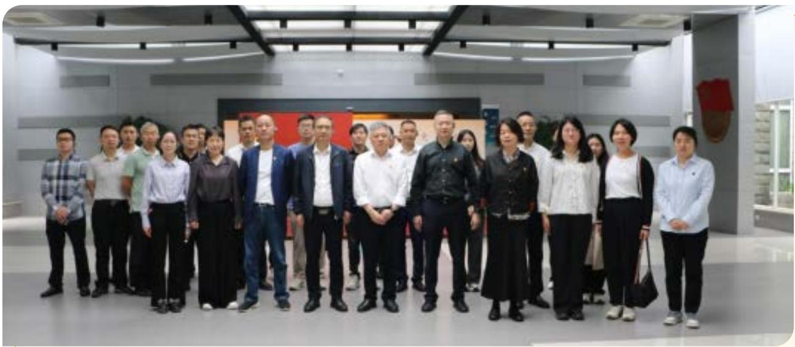

natural_image

Group photo of people standing in a modern indoor space with abstract wall elements (no visible text or symbols)

## 监督执纪

集团锚定清廉国企建设目标，多措并举强化廉洁风险防控。坚决抓实巡视巡察整改，将其作为政治监督核心任务，高质量完成巡视整改措施修订巡察工作实施办法，深化巡审联动，覆盖2家二级公司和3家三级公司，持续放大“以巡促改、以巡促建、以巡促治”效能。

同时小切口推进“五个专项监督治理”，靶向纠治执行偏差与作风短板，通过下发各类督办函、提醒函倒逼责任落实，跟进监督集团重点工作规范子公司换届风气，整治群众身边不正之风，深化人力安保领域监督治理，切实护航集团高质量发展。

此外强化数字监督赋能，迭代升级集团纪委数智监督系统并新增招投标监管模块，高效办结“浙企廉”预警信息：坚持抓早抓小，精准运用监督执纪“四种形态”，严肃追责问责违规经营行为：常态化开展警示教育，通报违反中央八项规定精神典型案例，引导全体员工知敬畏、明底线、守规矩，营造风清气正的政治生态。

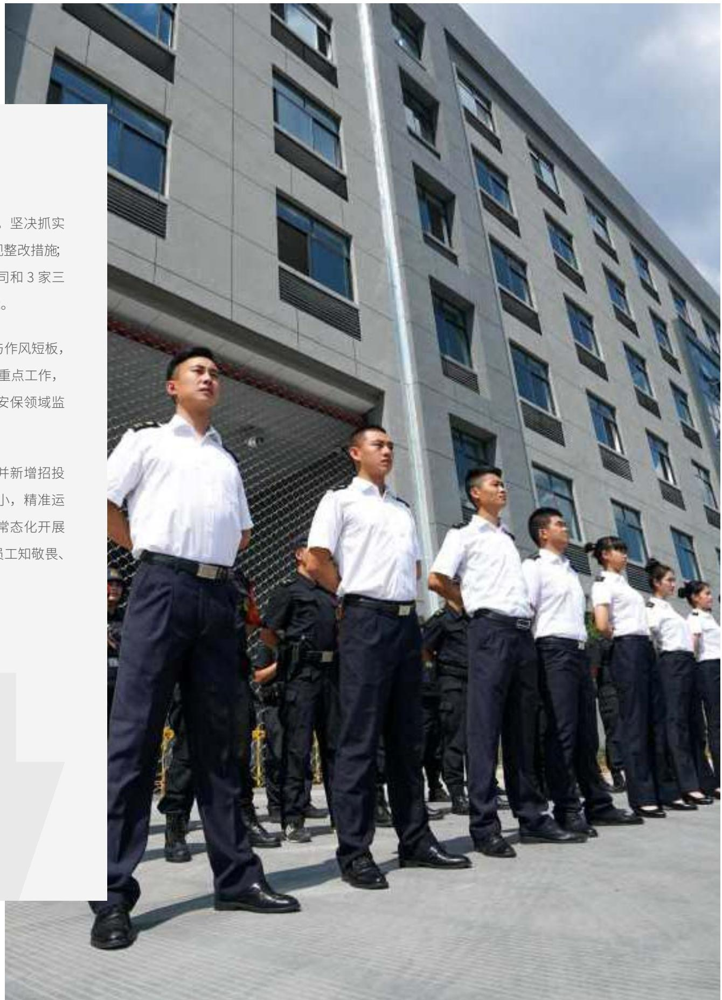

text_image

坚决抓实
整改措施;
司和3家三
。
作风短板,
重点工作,
安保领域监
并新增招投
小,精准运
常态化开展
工知敬畏、

## 公司治理

公司严格按照《中华人民共和国公司法》《中华人民共和国证券法》《上市公司治理准则》《上海证券交易所股票上市规则》《上海证券交易所上市公司自律监管指引第1号一规范运作》等法律法规和规范性文件的要求，建立了相对完善的公司法人治理结构和各项内部控制制度。公司股东大会、董事会及管理层按照各自的议事规则及工作制度所赋予的职责，各尽其责、规范运作：董事和高级管理人员勤勉尽责：独立董事恪尽职守：信息披露工作真实准确、完整、及时、公平。

## 完善的治理架构

公司构建了“两会一层”现代公司治理架构。股东大会为最高权力机构、董事会为决策机构、高级管理层为执行机构。

## 董事会构成

在公司的治理结构中，董事会扮演着至关重要的角色。根据《公司法》《公司章程》规定，公司董事会由11名董事组成，设董事长1名，独立董事4名。为满足战略发展需要，保障科学决策，提升董事会对经理层的有效监督，规范董事和高级管理人员的产生，完善考核和薪酬体系，公司在董事会下设战略与投资、审计与风险、提名、薪酬与考核、法治与合规五个专门委员会并分别建立了各委员会的工作细则，切实保障各专门委员会履职，形成权力机构、决策机构、监督机构和管理层之间权责明确、运作规范的相互协调和相互制衡机制

为了防止和减缓利益冲突，董事会制定了《防范控股股东及关联方占用公司资金专项制度》《募集资金管理制度》《信息披露事务管理制度》《信息披露暂缓与豁免管理制度》等制度，明确回避原则的适用情况，杜绝侵占上市公司利益的行为。

公司董事会由

11 名董事组成

设董事长

1 名

独立董事

4 名

## 董事会成员任职情况

委员会主任

委员会成员

<table><tr><td colspan="2">董事会成员</td><td>审计委员会</td><td>薪酬与考核委员会</td><td>提名委员会</td><td>战略与投资委员会</td><td>法治与合规委员会</td></tr><tr><td>谢伟</td><td>董事长</td><td></td><td></td><td>✓</td><td>✓</td><td></td></tr><tr><td>石焕挺</td><td>董事</td><td></td><td></td><td></td><td></td><td>✓</td></tr><tr><td>柯林田</td><td>董事</td><td></td><td></td><td></td><td></td><td>✓</td></tr><tr><td>戴楠</td><td>董事</td><td></td><td></td><td></td><td></td><td></td></tr><tr><td>王方瑞</td><td>董事</td><td></td><td></td><td></td><td>✓</td><td></td></tr><tr><td>赵磊</td><td>董事</td><td></td><td></td><td></td><td></td><td></td></tr><tr><td>叶加若</td><td>职工董事</td><td></td><td></td><td></td><td></td><td></td></tr><tr><td>王韬</td><td>独立董事</td><td>✓</td><td></td><td>✓</td><td></td><td>✓</td></tr><tr><td>马文超</td><td>独立董事</td><td>✓</td><td>✓</td><td></td><td></td><td></td></tr><tr><td>梁立</td><td>独立董事</td><td>✓</td><td>✓</td><td>✓</td><td></td><td></td></tr><tr><td>李道春</td><td>董事</td><td></td><td>✓</td><td></td><td>✓</td><td></td></tr><tr><td>诸葛斌</td><td>董事(离任)</td><td></td><td></td><td></td><td></td><td></td></tr><tr><td>卢卫东</td><td>董事(离任)</td><td></td><td></td><td></td><td></td><td></td></tr><tr><td>朱明艳</td><td>董事(离任)</td><td></td><td></td><td></td><td></td><td></td></tr><tr><td>沈红波</td><td>独立董事(离任)</td><td></td><td></td><td></td><td></td><td></td></tr><tr><td>刘波</td><td>独立董事(离任)</td><td></td><td></td><td></td><td></td><td></td></tr><tr><td>肖炜麟</td><td>独立董事(离任)</td><td></td><td></td><td></td><td></td><td></td></tr></table>

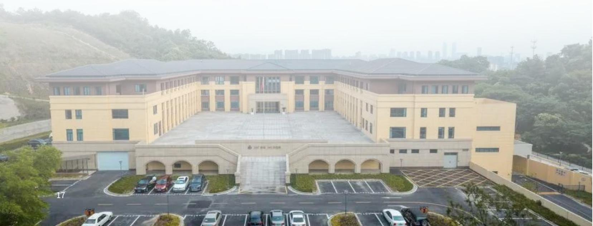

natural_image

Exterior view of a modern multi-story building with arched entrance and parking lot, surrounded by green hills (no visible signage or text)

公司注重董事会的多元化，力求丰富董事会成员在年龄、技能、经验、资格和背景等方面的代表性，为董事会提供更广泛的观点，支持更全面的决策，提高公司绩效。

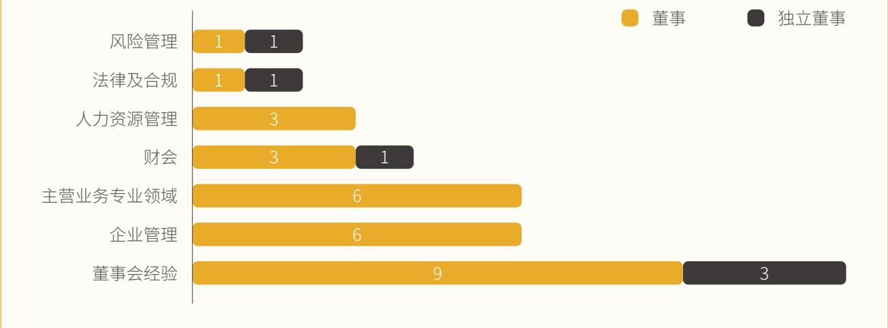

bar_stacked

| Category | 董事 | 独立董事 |
| --- | --- | --- |
| 风险管理 | 1 | 1 |
| 法律及合规 | 1 | 1 |
| 人力资源管理 | 3 | 0 |
| 财会 | 3 | 1 |
| 主营业务专业领域 | 6 | 0 |
| 企业管理 | 6 | 0 |
| 董事会经验 | 9 | 3 |

## 董事会的职责与授权

公司领导班子严格依照公司章程和国资委的授权行使职权，不断完善领导班子议事和决策机制，严格执行总经理办公会、党委会、董事会议事规则和“重一大”决策制度，坚持民主集中制原则，做到上会决策、集体讨论决定。在企业重大制度制定、资产处置、招投标、涉及职工切身利益等重要事项方面公司领导班子都能做到事前认真酝酿讨论，决策中充分发扬民主、畅所欲言，决策后万众一心、坚决执行。既保证董事会决策真正体现出资人意图，又确保决策的民主化和科学化，保证了决策的实施。

报告期内，公司董事会召开了9次会议，审计委员会召开了5次会议，提名委员会召开了3次会议，薪酬与考核委员会召开了4次会议，战略与投资委员会召开了3次会议，法治与合规委员会召开了4次会议，各董事会成员专门委员会委员的会议出席率均为100%。

报告期内

<table><tr><td>公司董事会召开了</td><td>审计委员会召开了</td><td>提名委员会召开了</td><td>薪酬与考核委员会召开了</td></tr><tr><td>9次会议</td><td>5次会议</td><td>3次会议</td><td>4次会议</td></tr><tr><td>战略与投资委员会召开了</td><td>法治与合规委员会召开了</td><td colspan="2">各董事会成员、专门委员会委员的会议出席率均为</td></tr><tr><td>3次会议</td><td>4次会议</td><td colspan="2">100%</td></tr></table>

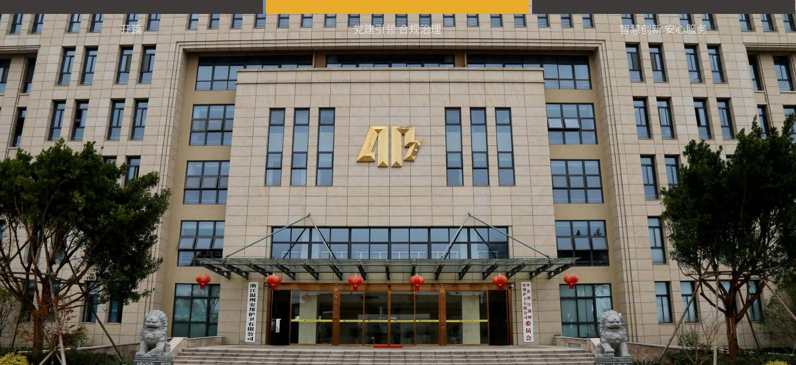

text_image

开篇
党建引领合规治理
智慧创新 安心服务
浙江温州安捷养护有限公司
中建维护(浙江温州)委员会

## 董事的提名和遴选

公司提名委员会和董事会明确董事候选人的提名、资格及评估的相关程序及标准，其中包含对董事会独立性、多样性的考量标准。

根据《公司章程》规定，公司的董事会成员由股东会选举产生。如果替代成员在任期内当选为董事会成员，则新当选的董事任期至本届董事会任期届满之日为止。各专门委员会委员由董事会根据各专委会议事规则选举产生，任期与董事会一致。

## 董事会能力建设和绩效评估

为了增进董事对公司业务生态系统和竞争环境的了解，公司在报告期内组织了一系列面向董事的培训课程，培训主题涵盖重要法律法规动态、数据安全、反贪污等与公司可持续发展密切相关的议题。

董事每年会开展一次自我评估，通过对董事会会议的频率、参与度、决策质量、投资者关系管理等方面的回顾分析和总结，有助于提升董事会的工作效能加强公司治理结构，提高公司的整体绩效和市场竞争力。

##

natural_image

Illustration of four business professionals in a meeting, with abstract financial charts and speech bubbles in the background (no text or symbols)

公司倡导以价值为导向的绩效文化，对董事、监事及高级管理人员（董监高）实施绩效考核，对其收入采取“固定工资+津贴+绩效”的薪资结构。在董事会的授权下，薪酬与考核委员会负责薪酬考核，以公司设定的业绩指标为基础，以各阶段设定的考核指标或工作表现为考核依据，保证绩效考核和评估结果充分反映员工的真实绩效表现和能力水平，保证考核的透明度。

公司董监高的薪酬遵循严格的决策程序，首先由薪酬与考核委员会负责制定相关人员的薪酬计划，然后经董事会及股东大会审议通过后才能最终实施与落实。同时，审计委员会及独立董事作为监督机构，就薪酬计划是否有利于公司的持续发展，是否存在明显损害公司及全体股东利益的情形发表意见。

## 投资者关系

公司一直专注于与投资者保持牢固和开放的关系，通过各类公告真实、准确、完整、及时、公平地履行信息披露义务，通过股东大会、上证e互动、业绩说明会、投资者调研活动等方式与投资者进行充分沟通与交流，及时准确向资本市场传递公司投资价值，持续促进公司高质量发展。

##

定期报告

各类公告

线上互动平台回复

业绩说明会

机构投资者调研

4 份

55 份

36

3 次

3 次

## 股东回报

2025年公司高度重视股东回报工作，积极响应中国证券监督管理委员会对于市值管理的鼓励政策，制定了《市值管理制度》，旨在全方位、多层次地提升公司的投资价值以及投资者的回报水平，确保公司投资价值与质量相匹配，赢得投资者信赖，为公司的长期稳定发展奠定坚实的基础。

此外，公司深入贯彻党的二十大和中央金融工作会议精神，认真落实国务院《关于进一步提高上市公司质量的意见》要求，积极响应上海证券交易所《关于开展沪市公司“提质增效重回报”专项行动的倡议》，制定了2026年度“提质增效重回报”行动方案，高度重视投资者的合理回报，严格按照监管要求保持利润分配政策的连续性和稳定性，致力为投资者带来长期、稳定的投资回报。

2025年4月25日，公司召开第一届董事会第三十五次会议，全票审议通过了《关于 2024 年度利润分配方案的议案》。公司拟以截止 2024 年 12 月 31日的总股本为基数，向全体股东每10股拟派发现金红利5.0元（含税)，共计分配利润53.763.441.00元（含税）。

共计分配利润 53,763,441.00 元（含税）

2025年8月27日，公司召开第一届董事会第三十五次会议，全票审议通过了《安邦护卫集团股份有限公司2025年中期利润分配预案》。公司拟截止2025年6月30日的总股本为基数，向全体股东每10股拟派发现金红利2.0元（含税），共计分配利润21,505,376.40元（含税）。

公司拟截止2025年6月30日的总股本为基数，共计分配利润

21,505,376.40 元（含税）

natural_image

Illustration of people interacting with digital devices and documents, no text or symbols present

## 02

## 智慧创新安心服务

公司紧扣业务主线，将标准化、规范化理念深度融入业务全流程，于报告期内成功通过ISQ 9001质量管理体系认证和ISO22301业务连续性管理体系认证，凭借双体系联动赋能，保障公司在智慧安防、应急救援、安全运营等核心业务领域实现品质服务和快速响应，为客户提供稳健、专业的一站式服务。

智慧安防与低空安全管控  
公共安全服务  
应急救援能力建设

## 智慧安防与低空安全管控

公司持续加码研发投入，核心技术成果成功落地重大项目，直接带动营收增长。技术转化效率稳步提升，有效摊薄单位研发成本。长期来看，技术壁垒将助力公司扩大市场份额，进一步提升品牌溢价能力。

智能化设备替代传统人工巡查模式，有效减少能源消耗与碳排放，实现绿色运营。相关技术在多场景落地应用，大幅提升安全管控效率，切实保障公众安全。同时推动安防行业从“人防”向“智防”“绿防”转型，输出可借鉴的技术标准与解决方案。

<table><tr><td>指标</td><td>目标</td><td>报告期进展</td></tr><tr><td>智慧安防项目营收占比</td><td>&gt;1%</td><td>1.52%</td></tr><tr><td>研发投入占营业收入比例</td><td>&gt;1%</td><td>1.01%</td></tr><tr><td>新增专利数量(项/年)</td><td> $\geqslant 5$ </td><td>获得发明专利1项、外观专利6项和软件著作权33项</td></tr></table>

## 治理

公司设立区域现金处理中心、低空安全等专项工作专班，由事业发展部、安防研究院牵头，工作专班负责研发战略审议与预算审批与舟山市公安局、浙大共建低空安全技术联合创新中心，依托联创中心研发低空感知装置，在全省试点部署；与省机场、省交通组建低空经济创新联合体，强化产学研协同。

公司制定“创新安邦护卫”工作方案，召开集团科技创新大会，构建具有安邦护卫辨识度和标志性成果的科技研发体系。同时，携低空安全相关解决方案参展公共安全装备会、数贸会、互联网之光博览会，低空经济相关业务产品获广泛认可。

研发管理工作上，为确保实现年均研发投入增幅高于全省平均水平2个百分点以上，2025年科技创新投入同比增长30%，安防研究院完成编制集团研发管理制度，制定研发投入方案，对子公司研发项目从立项到成果转化进行全流程管理，同时落实省国资委科技创新考核指标，定期汇报进展。

年均研发投入增幅高于全省平均水平

2025年科技创新投入同比增长

2 个百分点以上

30%

## 战略

natural_image

Illustration of two people reviewing a checklist with checkmarks, set against a shield and notebook (no text or symbols present)

影响、风险和机遇管理

公司通过技术趋势跟踪、行业调研以及政策解读等方式，全面识别技术研发与应用过程中的核心风险与潜在机遇。其中风险涵盖核心技术研发失败、研发成果遭遇侵权、技术迭代速度落后于行业预期，以及市场推广进度未达预期等方面；机遇则来源于低空经济、无人机具、AI场景相关政策红利释放、政府对智慧安防的刚性需求增长、海外安保技术服务市场的广阔潜力，以及AI技术与安防领域融合催生的多元应用场景

公司制定了分阶段的技术研发目标，短期持续加大研发投入力度、扩充专利储备、拓宽智慧安防项目的覆盖范围，中期实现核心技术的自主可控，推动AI技术在更多安防场景落地应用，长期构建“技术研发-成果转化-行业输出”的全链条体系，成为智慧安防领域的技术应用标杆。

财务方面，短期虽会因研发投入产生一定成本，但技术成果转化将带来显著营收增长：中期技术自主化可降低对外合作成本，进一步提升企业毛利率长期技术服务的持续输出将打造新的盈利增长点，为企业创造稳定收益。

公司建立研发项立项评审机制并开展技术可行性评估，完善知识产权保护体系并加大专利申请力度，加强行业技术趋势研判以确保研发方向的前瞻性组建专业市场推广团队并联动政府客户打造示范项目。若核心技术研发遭遇阻碍，将及时调整研发方向并启用备用技术方案：若研发成果被侵权，将立即启动法律维权程序并同步强化技术保密工作；若市场推广进度滞后，将优化方案适配性并进一步加强政企合作力度。

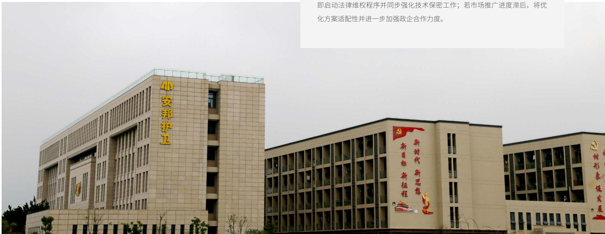

text_image

即启动法律维权程序并同步强化技术保密工作；若市场推广进度滞后，将优化方案适配性并进一步加强政企合作力度。

## 知识产权保护

公司相关部门对专利、版权、产品和服务商标、域名等及时依法申请登记注册对已取得的知识产权及时续展维持，规范实施许可和转让，当发现本单位知识产权被侵犯时，及时通过司法途径维护公司合法权益。

2025年，公司研发投入2,749.28万元，同比增长0.46%，占营业收入1.01%。获得发明专利1项、外观专利6项和软件著作权33项。

公司对营业秘密实行严密的控制，要求全体员工严格遵守公司相关保密制度以及签署的保密协议，未经批准和授权，不得擅自向第三人披露公司信息，包括技术信息、商业信息、业务信息和人事信息等，特别是在社交媒体、接受采访和发表文章中严禁泄露公司保密信息，并且严禁利用非保密设备设施传递、保管和使用保密信息。

## 校企合作

集团深化校企合作，分别与温州理工学院、绍兴文理学院达成战略签约，围绕智能安防技术研发、平安校园建设等方向，构建“产学研用”一体化人才培养体系，以校企协同赋能专业人才培育，为科技型综合大安全服务企业建设注入智力支撑。

## 校企携手筑平台，科技赋能育英才

温州安邦护卫与温州理工学院举行战略合作签约仪式，双方基于“服务地方、创新发展”的共识达成多项合作。依托院校科研与人才优势，聚焦智能安防技术联合研发、产教融合人才培养、重大课题联合申报、安全产业创新平台共建等方向深化合作。此次签约搭建起资源共享的合作桥梁，为集团培育高素质安防专业人才，推动科技成果转化筑牢基础。

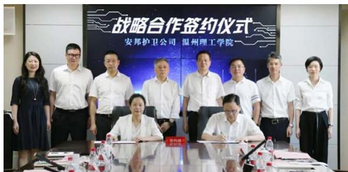

text_image

战略合作签约仪式
安邦护卫公司 温州理工学院

## 聚焦平安校园建设，打造校企协同育人样板

集团与绍兴文理学院签订战略合作协议，立足校园安全服务主责主业，围绕高水平平安校园建设开展深度合作。双方依托集团“浙外慧眼”校园全域安防矩阵、智安校园守护平台等成熟经验，共推校园安防标杆示范、安全体系升级、校企协同共建三大行动。此次合作创新产教融合模式，为培育懂技术、能实战的校园安全服务人才提供了实践平台。

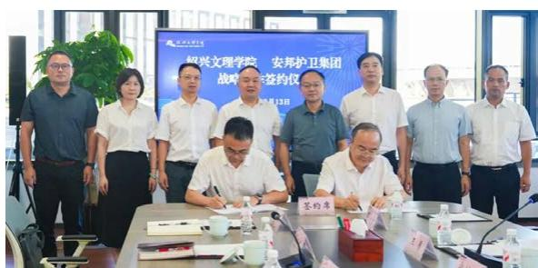

text_image

西安文理学院 安邦护卫集团
战略与签约仪式
签约席

## 智慧安防技术应用

公司深耕智慧安防与低空安全领域，研发推广智能化平台及巡防系统，创新“空地一体、人机协同”服务模式，填补区域安防空白，大幅提升安全管控效率与突发事件处置能力。

安邦护卫积极推进智慧安防与低空安全管控技术落地，在浙江外国语学院衢州一中试点部署“空地一体、人机协同”巡防系统，大幅提升校园安全防控水平。同时，自主研发“穹仪·苍龙”低空综合管理平台、“零距离”空地一体作战指挥系统，在部分消防支队投入使用，可快速完成大范围区域巡逻此外，绍兴公司构建全域低空智联网，打造全国首个地市级全覆盖低空安防体系；丽水公司研发“云守卫”平台，嵌入多种A算法，广泛应用于生态保护、应急救援等领域，以科技赋能安全管控。

## 科技赋能装备展，全场景方案彰显专业实力

2025年9月，安邦护卫下属时空科技公司亮相第二届公共安全科技装备展。展会以 “安全共享，发展共融”为主题，公司重点展出覆盖“市域监管、城镇巡控、要地安防、无人岛管控”四大场景的低空安全综合解决方案，配套自研智能探测、反制装备及特种作业设备等系列硬件。此次参展全方位展示了集团在低空安全领域的前沿技术与系统化服务能力，吸引众多嘉宾交流，有效扩大了品牌在公共安全领域的影响力。

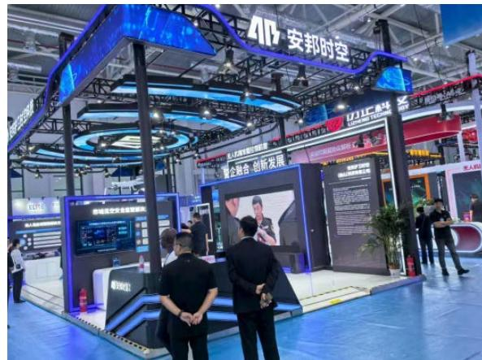

text_image

安邦时空
安邦时空·创新发展

## 科技赋能校园安防，打造人机协同巡防样板

安邦护卫聚焦智慧安防技术落地，在浙江外国语学院、衢州一中等院校试点部署“空地一体、人机协同”巡防系统。该系统大幅压缩突发事件响应时间，显著降低校园安全事故发生率。此外，公司自主研发“穹仪·苍龙”低空综合管理平台、“零距离”作战指挥系统，在消防领域投入使用，可快速完成大范围区域巡逻。绍兴公司构建全域低空智联网，打造全国首个地市级全覆盖低空安防体系，以科技填补区域安防空白。

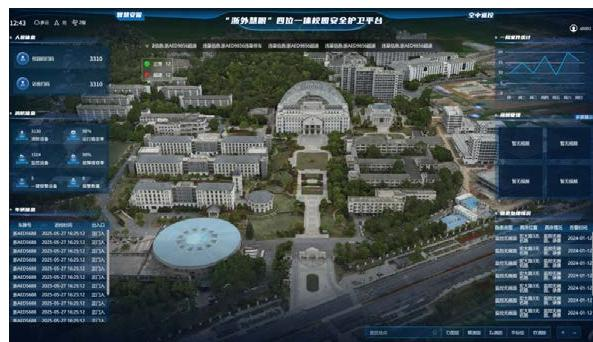

text_image

智慧云平台
“服务基础”西拉一端校密安全护卫平台
安全监控
数据采集
12:43
CPM
△
△
△
△
△
△
△
△
△
△
△
△
△
△
△
△
△
△
△
△
△
△
△
△
△
△
△
△
△
△
△
△
△
△
△
△
△
△
△
△
△
△
△
△
△
△
△
△
△
△
▲
1110
1110
1110
1110
1110
1110
1110
1110
1110
1110
1110
1110
1110
1110
1110
1110
1110
1110
1110
1110
111<nl>
数据采集
数据采集时间：2025-07-27 8:30:57.73 8:37:57.73 8:37:57.73 8:37:57.73 8:37:57.73 8:37:57.73 8:37:57.73 8:37:57.73 8:37:57.73 8:37:57.73 8:37:
数据采集时间：2025-07-27 8:30:57.73 8:37:57.73 8:37:57.73 8:37:57.73 8:37:57.73 8:37:57.73 8:37:57.73 8:37:57.
数据采集时间：2025-07-27 8:30:57.73 8:37:57.73 8:37:57.73 8:37:57.73 8:37:57.73 8:37:57.
数据采集时间：2025-07-27 8:30:57.73 8:37:57.73 8:36:56.99 8:36:56.99 8:36:56.99 8:36:56.99 8:36:56.99 8:36:56.99 8:36:56.99 8:36:56.99 8:36:56.99 8:36:56.99
数据采集时间：2025-07-27 8:30:57.73 8:36:56.99 8:36:56.99 8:36:56.99 8:36:56.99 8:36:56.99 8:36:56.99 8:36:56.99 8:36:56.99 8:36 :44 :44 :44 :44 :44 :44 :44 :44 :44 :44 :44 :44 :44 :44 :44 :44 :44 :44 :44 :44 :44 :44 :44 :44 :44 :44 :44 :44 :44 :44 :44 :44 :44 :44 .-
数据采集时间：2025-07-27 8:30:56.99 8:36:56.99 8:36:56.99 8:36:56.99 8:36:56.99 8:36:56.99 8:36:56.99 8:36 :42 :42 :42 :42 :42 :42 :42 :42 :42 :42 :42 :42 :42 :42 :42 :42 :42 :42 :42 :42 :42 :42 :42 :42 :42 :42 :42 :42 :42 :42 :42 :42 :42 :42 .-
数据采集时间：2025-07-27 8:30:56.99 8:36:56.99 8:36:56.99 8:36:56.99 8:36 :42 :42 :42 :42 :42 :42 :42 :42 :42 :42 :42 :42 :42 :42 :42 :42 :42 :42 : 80000000000000000000000000000000000000000000000000000000000000000000000000000000000000000000000000000<nl>
数据采集时间：2025-07-27 8:31:56.99 8:36:56.99 8:36:56.99 8:36:56.99 8:36:56.99 8:36:56.99 8:36:56.99 8:36:56.99 8:36:56.99 8:36 :56 .56 .56 .56 .56 .56 .56 .56 .56 .56 .56 .56 .56 .56 .56 .56 .56 .56 .56 .56 .56 .56 .56 .56 .56 .56 .56 .56 .56 .56 .<nl>

## 公共安全服务

公共安全服务是公司核心营收来源，重大活动安保项目与智慧安防方案持续拉动业绩增长，有力支撑服务溢价空间。凭借专业优质的服务，公司核心客户粘性不断增强，有效降低客户流失相关成本。海外安保业务的稳步布局，进一步拓宽营收渠道，成为业绩增长的全新动力。

公司全年圆满完成多场省级及以上重大活动安保任务，为社会公众安全筑牢坚实防线。校园安防项目大幅提升突发事件处置效率，显著降低安全事故发生概率。低空安全管控体系的落地，填补了区域内相关领域的空白，为平安浙江建设添砖加瓦。涉外安全培训标准的输出，有效提升我国公共安全服务的国际影响力。

<table><tr><td>指标</td><td>目标</td><td>报告期进展</td></tr><tr><td>公共安全服务营收(亿元)</td><td>&gt;1%</td><td>1.36%</td></tr><tr><td>重大活动安保服务次数(场/年)</td><td>&gt;150</td><td>166</td></tr><tr><td>服务覆盖人群(万人次)</td><td>&gt;170万</td><td>超过178万</td></tr></table>

## 治理

公司建立“董事会统筹-管理层执行-子公司落地”三级架构。董事会审批各子公司的公共安全服务战略与预算；管理层设立业务部、安全部及其他管理部门，子公司负责业务落地。

公司制定《重大活动安保服务规范》《智慧安防操作手册》等制度，明确服务流程、风险防控与应急处置标准：实行“服务质量一票否决制”，将客户满意度、应急响应时效、安全零事故率纳入子公司KP|考核；建立“客户评价+内部稽核+第三方审计”三维监督体系。

## 战略

natural_image

Illustration of three business professionals standing on a golden trophy with a flag and eye symbol, symbolizing strategic goal achievement (no text present)

公司通过政策跟踪、客户需求调研、同业对标以及舆情监测等多种方式，全面识别业务发展中的核心风险与潜在机遇。其中风险涵盖重大活动突发安全事件、智慧安防技术迭代进度未达预期、海外业务面临的地缘政治风险，以及客户需求个性化适配不足等方面；机遇则来源于低空经济发展催生的安防新需求、政府对公共安全领域投入的持续增加、海外安保市场的进一步扩容以及智能化安防技术应用场景的不断拓展。

公司制定了分阶段发展目标，短期持续拓展优质项目、提升服务频次与客满意度，中期着力搭建全省范围的低空安防网络并扩大海外业务规模，长期致力于打造国内领先、国际知名的公共安全服务品牌，形成可向行业推广的服务标准。

财务方面，短期虽会因设备升级和人员培训产生一定投入，但项目溢价与客户复购率的提升将带来可观增收：中期随着智慧安防项目规模化落地，企业毛利率将稳步提高；长期海外业务的持续扩张将进一步放大品牌溢价，为企业创造持久的增长动力。

## 影响、风险和机遇管理

## 重大活动安保

公司建立三级应急响应机制并常态化开展安保演练，设立技术研发专项基金以保持技术前瞻性，海外业务优先布局与中资企业合作密切的区域来分散地缘风险，同时搭建客户需求动态跟踪机制提供定制化方案。若突发安全事件将第一时间启动应急预案，同步开展排查整改并对外公开说明情况；若技术迭代滞后，会联合科研机构加急攻关突破技术瓶颈；若海外业务遭遇阻碍则快速转向备用市场，以此对冲相关损失。

公司聚售各类省级及以上重大赛事、会议活动，组建专业安保团队，创新安保服务模式，构建立体化防控防线，圆满完成各项安保任务，全力保障活动有序开展及参与人员安全。

2025年，安邦护卫旗下多家子公司全力投身各类重大活动安保工作。衢州公司派出 500余人次，圆满完成“衢州古城·蒙牛杯2025衢跑活动”“衢州古城·蒙牛杯2025衢州马拉松”两大赛事安保任务。绍兴、台州、舟山等子公司则以差异化安保模式，为 2025 浙江省城市篮球联赛（“浙 BA”）筑牢安全屏障。同时，作为浙江国资国企代表亮相世界互联网大会乌镇峰会，提供升级版智慧安防技术支持与安保服务，组建专项团队承担核心区低空安全防护，实现无人机关键信息精准识别与全流程闭环管控，圆满完成安保使命。

natural_image

Illustration of two people standing on a mountain peak with icons and documents, symbolizing business or data (no text present)

## 智慧护航世界互联网大会，筑牢空地一体安全防线

2025年，安邦护卫承接世界互联网大会全程安保服务，构建“空地一体”智慧安防体系。部署自主研发的低空管控平台，联动无人机巡查与地面智能预警设备，实现会场及周边3公里范围全覆盖。通过AI算法实时识别异常人员与行为，应急响应团队依托数字化调度系统，将突发情况处置时间控制在 3 分钟内。本次服务保障参会人员超2万人次，零安全事故发生，既彰显了公共安全服务核心能力，又通过项目实践完善了智慧安防方案，为后续省级重大活动安保提供可复制范本，带动年度智慧安防项目营收增长18%。

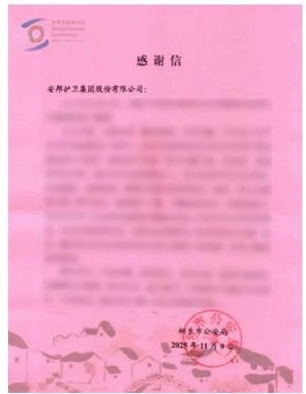

text_image

感谢信
安邦护卫集团股份有限公司：
2025年11月9日
树东市公安局
2025年11月9日

## 海外与涉外安全服务

公司积极拓展海外与涉外安全服务领域，开展涉外安全培训，输出中国安全服务标准与经验，加强国际合作，布局海外安保市场，提升国家公共安全服务国际影响力。

安邦护卫主动投身涉外安全服务，承办第十期丝绸之路经济带核心区建设涉外安全培训班，为涉外安全领域培养专业人才，系统输出中国安全服务标准与实践经验。同时，积极布局海外安保市场，与优蓝安保公司达成合作，共同谋划进军非洲金融武装守押市场，拓宽海外业务版图。此外，公司成功入选浙江省“海外公共安全之江研究中心”专家单位，加入商务厅“浙江省海外综合服务伙伴计划”，进一步强化在海外公共安全服务领域的话语权与影响力。

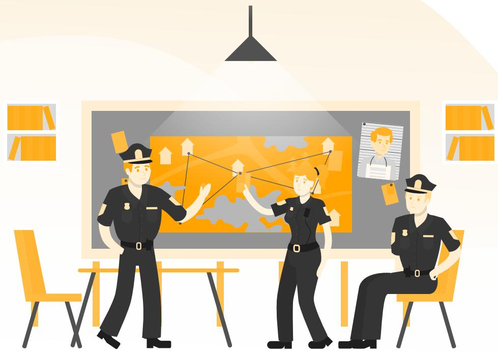

natural_image

Illustration of three police officers in uniform interacting with a digital map on a whiteboard, no text or symbols present.

## 输出中国安保标准，拓展海外服务新版图

安邦护卫积极布局海外与涉外安全服务，承办第十期丝绸之路经济带核心区建设涉外安全培训班，系统输出中国安全服务标准与实践经验。公司与优蓝安保达成合作共识，共同谋划进军非洲金融武装守押市场，拓宽海外业务版图。同时，公司成功入选浙江省“海外公共安全之江研究中心”专家单位，加入省商务厅海外综合服务伙伴计划，持续提升我国公共安全服务的国际影响力。

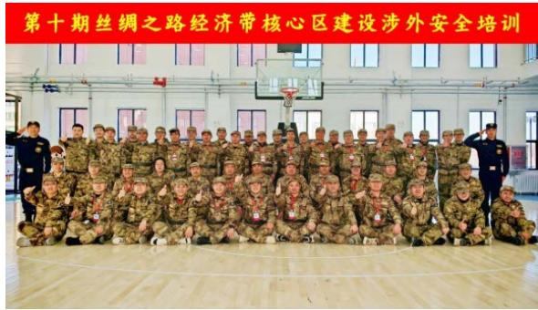

text_image

第十期丝绸之路经济带核心区建设涉外安全培训

安全培训班

## 基层治理服务

公司深度融入基层治理体系，创新基层服务模式，组建应急救援队伍，拓展民商事服务领域，协助开展基层安全排查，提升基层治理效能，助力构建平安和谐基层环境。

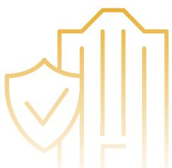

安邦护卫积极参与基层治理服务，在杭州街道组建首支街道综合应急救援队伍，为“110联动”警情处置提供专业支持，打造高效响应服务模式。在嘉兴市南湖区和秀洲区创新“民声一键办”服务模式，建立快速响应处置机制及时解决群众诉求。同时，基层治理服务业务广泛覆盖各类基层单位，创新拓展民商事领域涉案财物管理、档案数字化加工等服务。宁波公司探索“应急管理辅助执法”模式，依托智慧平台建立监管服务体系，协助开展企业安全排查，覆盖大量市场主体，有效提升基层安全管理水平。

## 创新基层服务模式，构建高效应急响应体系

安邦护卫深度融入基层治理，在杭州街道组建首支综合应急救援队伍，打造“快速响应、及时处置”的服务模式，为“110联动”警情处置提供专业支持。在嘉兴南湖区、秀洲区创新“民声一键办”模式，建立快速响应处置机制，及时解决群众诉求。宁波公司探索“应急管理辅助执法”模式，依托智慧平台建立“一企一档”监管体系，协助开展企业安全排查。公司基层治理业务覆盖众多基层单位，创新拓展涉案财物管理，档案数字化加工等服务，助力提升基层治理效能。

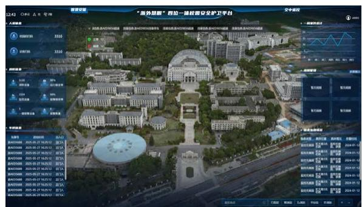

text_image

“新沙县湖”西边一铺校园安全保卫平台
主控数据
12:43
OPC 水平 安全
1110
1110
1110
1110
1110
1110
1110
1110
1110
1110
1110
1110
1110
1110
1110
1110
1110
1110
1110
1110
111
1224
2024-05-27 28:26:53 28:26
2024-05-27 28:26:53 28:26
2024-05-27 28:26:53 28:26
2024-05-27 28:26:53 28:26
2024-05-27 28:26:53 30:33
2024-05-27 28:26:53 30:33
2024-05-27 28:26:53 30:33
2024-05-27 28:26:53 30:33
2024-05-27 28:26:53 49:33
2024-05-27 28:26:53 49:33
2024-05-27 28:26:53 49:33
2024-05-27 28:26:53 49:33
2024-05-27 28:26:49 49:33
2024-05-27 28:26:53 49:33
2024-05-27 28:26:53 49:33
2024-05-27 28:26:53 49:33
2024-05-27 28:30:49 49:33
2024-05-27 28:30:53 49:33
2024-05-27 28:30:53 49:33
2024-05-27 28:30:53 49:33
2024-05-27 28:30:53 49:33
2024-05-27 28:47:49 49:33
2024-05-27 28:47:53 49:33
2024-05-27 28:47:53 49:33
2024-05-27 28:47:53 49:33
2024-05-27 28:47:53 49:33
基本数据：时间范围：日志、日志、日志、日志、日志、日志、日志、日志、日志、日志、日志、日志、日志、日志、日志、日志、日志、日志、日志、日志、日志、日志、日志、日志、日志、日志、日志、日志、日志、日志、日志、日志、日志、日志、 日志、日志、日志、日志、日志、日志、日志、日志、日志、日志、日志、日志、日志、日志、日志、日志、日志、日志、日志、日志、日志、日志、日志、日志、日志、日志、日志、日志、日志、日志、日志、日志、日志、日心数据统计分析报告
主控数据：时间范围：日志、日志、日志、日志、日志、日志、日志、日志、日志、日志、日志、日志、日志、日志、日志、日志、日志、日志、日志、日志、日志、日志、日志、日志、日志、日志、日志、日志、日志、日志、日志、日心数据统计分析报告

## 应急救援能力建设

应急救援能力建设具备显著的财务重要性与影响重要性。财务层面，其不仅能支撑应急服务相关新业务拓展，形成稳定盈利增长点，还能通过标准化建设降低突发安全事件带来的损失，同时凭借专业应急能力提升核心竞争力，助力重大项目中标与品牌溢价提升，优化整体盈利水平。影响层面，该能力使企业深度融入区域应急管理体系，积极参与各类灾害救援实战任务，有效保障群众生命财产安全。通过技术创新与应用，提升应急响应与处置效率，同时向基层输出应急培训资源，为平安建设提供有力支撑，也为行业应急救援标准化发展提供实践参考。

<table><tr><td>指标</td><td>目标</td><td>报告期进展</td></tr><tr><td>应急服务年度营收占总营收比重</td><td>&gt;5%</td><td>5.94%</td></tr><tr><td>应急救援队伍持证上岗率</td><td>100%</td><td>100%</td></tr><tr><td>应急响应平均时间(分钟)</td><td>&lt;10</td><td>8</td></tr><tr><td>年度实战演练场次(场)</td><td>≥80</td><td>80</td></tr><tr><td>应急装备完好率</td><td>100%</td><td>100%</td></tr><tr><td>年度参与救援任务次数(次)</td><td>&gt;10</td><td>13</td></tr><tr><td>培训基层应急骨干人数(人次)</td><td>&gt;1,100</td><td>1,160</td></tr><tr><td>应急处置成功率</td><td>100%</td><td>100%</td></tr><tr><td>智能应急装备应用占比</td><td>&gt;65%</td><td>70%</td></tr></table>

## 治理

natural_image

Illustration of a hand holding a smiling cityscape with solar panels and icons (no text or symbols)

公司建立“董事会统筹-应急救援总队执行-基层中队落地”三级管理架构。董事会审批应急能力建设战略与年度预算；应急救援总队负责队伍建设、装备迭代、培训演练统筹：各子公司设立应急分队，配备专职应急指挥员，对接属地应急管理部门，形成全域联动体系。

公司制定《应急救援队伍建设标准》《应急装备运维管理办法》 《实战演练实施细则》等6项核心制度，明确队伍资质、装备配置、响应流程等要求。实行“日常训练+季度演练+年度考核”机制，将应急处置成功率、响应时效等指标纳入部门KPl。建立应急装备全生命周期管理台账，每月开展设备检修，确保完好率达标。

## 战略

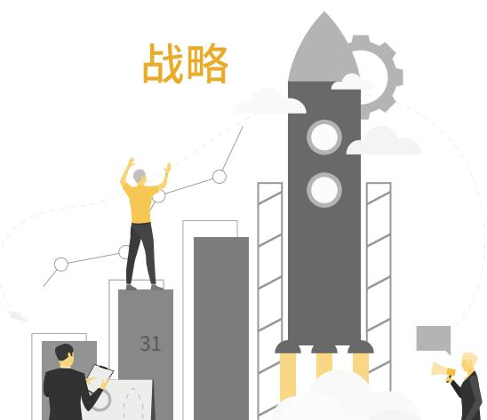

text_image

战略
31

公司通过政策跟踪、属地风险研判、客户需求调研与同业对标，动态识别核心风险与机遇。核心风险包括极端灾害场景处置能力不足、应急装备技术迭代滞后、专业救援人才短缺以及应急响应不及时可能引发的次生风险。关键机遇体现在政府对公共安全体系建设的重视带来的采购需求增长，低空经济发展拓展的应急应用新场景，企业应急管理需求升级催生的定制化服务市场以及应急技术创新推动的行业升级浪潮。

natural_image

Illustration of a person with a rocket and telescope aiming a target, surrounded by stars, clouds, and a trophy (no text or symbols)

公司短期聚焦队伍专业资质完善、智能救援装备更新与实战演练频次提升着力压缩应急响应时间；中期构建“空地一体、专常兼备”的现代化应急救援体系，拓展多场景应急服务，打造示范基地；长期致力于成为区域领先的应急救援服务提供商，输出可复制的应急管理解决方案，提升应急相关业务在整体业务中的占比。

实施过程中公司将深化“科技+应急”融合创新，研发适配多场景的智能装备与指挥平台，与相关部门建立联训联战机制，开展专业化职业资格认证培训构建人才梯队，同时拓展政企合作，承接定制化应急增值服务。

## 影响、风险和机遇管理

集团聚售应急能力建设，通过打造多功能实训基地筑牢保障根基，以科技装备与智能平台赋能实战，通过技术攻坚升级体系。构建起“基地支撑、科技赋能、党建领航”的应急救援格局，为平安浙江建设贡献专业力量。

## 打造综合实训基地，夯实应急保障根基

集团按 “政府主导、国企主建” 原则打造浙北应急救援基地，集应急物资仓储、队伍培训、指挥调度、备勤等功能于一体。湖州公司创新运行“库房代管、物资代储、队伍代建、任务代征”模式，得到省应急管理厅肯定。基地满足全省专业队伍及社会各界实训需求，为防灾减灾救灾提供坚实保障，助力打造应急管理“浙江样板”。

## 科技赋能实战演练，展现立体救援实力

集团以“党建+科技”双轮驱动应急能力升级，衢州公司自主研发“零距离空地一体”作战指挥平台，在火灾扑救、水域救援等实战中成效显著。党员技术先锋牵头升级平台至2.0版本，嵌入多种AL算法，有效缩短应急响应时间。同时推动无人机在应急管理领域广泛应用，建成无人机机巢，取得民航局运营合格证，以科技筑牢应急救援防线。

## 培育应急救援骨干，筑牢安全保障防线

集团应急救援总队举办应急救援员国家职业资格认证培训班，88名子公司骨于队员参训。培训为期6天采取理论与实操相结合的方式，夯实队员应急救援专业知识与技能。集团强调以训战结合提升队伍实战能力，此次培训加快推进“专常兼备、反应灵敏”的应急救援队伍建设，为集团应急管理工作提供了坚实人才支撑。

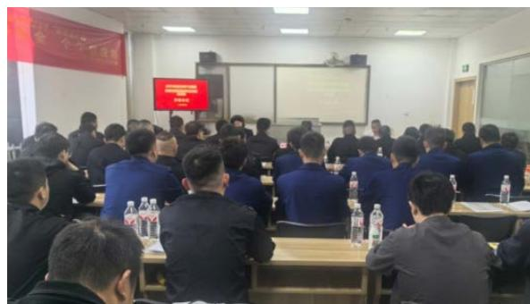

text_image

Conference room photo with visible presentation screen showing Chinese text and flag banner in background

## 03

## 惠聚伙伴 聚力共赢

公司始终秉持“共生共荣”发展理念，将员工发展与供应链协同纳入可持续发展核心。对内构建全方位员工关爱与人才发展体系，通过完善薪酬福利、强化技能培训、畅通沟通渠道、筑牢安全防线，增强员工归属感与战斗力：对外建立规范化供应商管理体系，以合规筛选、动态评估、廉洁合作筑牢供应链根基，实现风险共防、价值共创。

员工关怀与人才发展  
安全生产风险管理

供应商管理

## 员工关怀与人才发展

完善的员工关怀与人才培养体系，有效稳定核心人才队伍，降低招聘与岗位适配成本。员工技能提升带动服务效率显著增长，提升客户满意度。激励机制充分激发员工创新活力，推动技术与服务模式升级。

公司切实保障广大员工合法权益，积极吸纳特定群体就业，助力解决社会就业问题。全面的培训体系覆盖大部分员工有效提升行业整体人才素质。员工志愿服务活动常态化开展，积极助力社区建设与公益事业发展。

<table><tr><td>指标</td><td>目标</td><td>报告期进展</td></tr><tr><td>员工培训投入占营收比重</td><td>&gt;0.05%</td><td>0.06%</td></tr><tr><td>核心人才流失率</td><td>0</td><td>0</td></tr><tr><td>员工满意度</td><td>100%</td><td>100%</td></tr><tr><td>退役军人招聘人数(人/年)</td><td>101</td><td>152</td></tr></table>

## 治理

公司设立员工关怀与人才发展专项小组，由工会牵头，成员涵盖人力资源、财务、业务部门：人力资源部门负责人才招聘、培训与激励，工会负责权益保障与文化建设，业务部门负责岗位适配与技能提升。

公司建立“培训-晋升-激励”三位一体人才发展体系，持续投入员工培训；实行“冬送温暖、夏送清凉、生日送祝福、困难送帮助”关怀机制：开展技能竞赛、文体活动，完善职工之家建设；将员工满意度、技能达标率纳入相关部门考核。

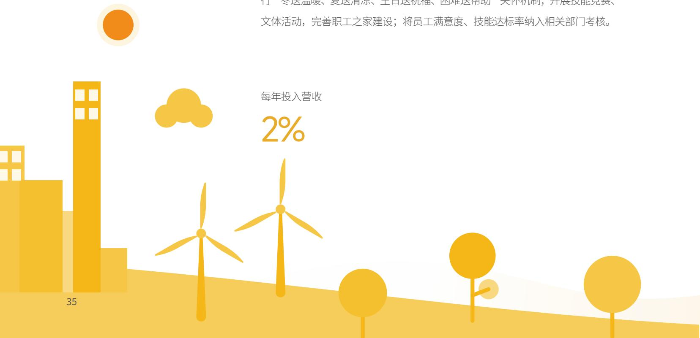

bar

| Category | Value (%) |
| --- | --- |
| 每年投入营收 | 2 |

## 战略

公司通过员工调研、行业对标以及政策跟踪等方式，全面识别人才管理工作中的核心风险与潜在机遇。其中风险涵盖核心人才储备短缺、青年人才流失率上升员工诉求响应不及时，以及技能培训内容与业务需求脱节等方面；机遇则来源于退役军人就业相关政策支持、校企合作带来的优质人才资源、行业人才需求增长带来的发展空间，以及员工创新带来的业务突破机会。

公司制定了分阶段的人才发展目标，短期提高员工培训投入比例、稳定核心人才队伍、扩大星级职工之家的覆盖范围，中期提升高学历人才占比、推动技能竞赛覆盖所有业务板块，长期构建“引得进、育得出、留得住”的优质人才生态实现员工满意度的大幅提升。

财务方面，短期虽会增加培训与关怀相关投入，但人才流失成本的降低与服务效率的提升将带来净收益中期人才素质的整体提升将推动企业盈利水平稳步提高长期稳定的人才梯队将支撑业务持续扩张，降低企业的扩张成本。

## 影响、风险和机遇管理

公司深化校企合作，共建人才培养基地，建立管理、技术、技能“三通道”的晋升体系，完善薪酬福利与激励机制，推行 “一帮一带” 帮扶行动，加强青年人才培养，设立青年创新基金。

针对上述风险与机遇，公司建立核心人才专项激励机制并通过引进与培育双渠道补充骨于力量，开展青年员工座谈会并畅通诉求表达渠道，每半年调研业务需求并优化培训内容体系，与退役军人事务部门深化合作并扩大专项招聘规模若核心人才出现短缺，将启动紧急招聘程序并推出股权激励等留才措施；若员工诉求响应不及时，将优化响应机制并对相关人员进行致歉补偿：若培训内容与业务脱节，将讯速调整培训方案并加强与业务部门的联动

## 人才吸引与留任

员工的职业发展与企业的发展息息相关，我们强化人才招募与培育，提供合理的薪酬福利，建立健全的劳动关系，打造健康安全的工作环境，让员工乐于投入工作学习与成长，获得归属感及成就感。

公司制定了《招聘录用管理办法》《领导干部管理办法》《岗位薪酬职级档级管理暂行办法》《职工福利费管理办法》《员工职务晋升规定》等招聘及雇佣管理制度，建立科学、规范的招聘管理流程、人才选拔聘用机制以及完善的福利制度满足企业持续、稳定、快速发展对人才的需求，日常由组织人事部负责实施

## 多元与共融

公司主张员工构成应反映社会现况，以多元的管理阶层及人才结构，强化公司竞争优势。公司积极实现多元职场价值，打造包容的工作环境，培育行业未来人才，为行业的可持续发展提供人力资源。

公司持续拓展多元人才，与学校资源中心、政府就业服务中心合作，面向退伍军人、残障人员等特殊群体开展专场招募说明会及专项招聘活动，提供健康安全、综合业务知识提升及工作经验交流等方面的职业辅导培训，食堂供应早、中、晚三餐的健康、营养均衡餐食。截至报告期末，公司有退伍军人职工 2,584 人。

此外，公司在公共区域的楼梯处修筑了坡道，为残障人士提供无障碍设施支持退伍军人可优先列为年轻干部、后备干部培养对象，优先推选持枪资格证培训及考证，入职体检费全额报销，从业资质培训费用减免，异地员工安排宿舍，提供业余休闲活动设施等，让退役军人“生活有温暖”，建设“退役军人之家”。

## 人才招聘

公司严格遵守《中华人民共和国劳动法》《中华人民共和国劳动合同法》等法律法规，依法依规与所有员工签订劳动合同，以实际行动保障员工的合法权益，不因性别、宗教、种族、国籍或政治倾向而有不公平对待，坚决杜绝使用童工和一切形式的强制劳工。

根据省国资委稳就业工作部署要求，结合集团及所属子公司实际，做好内部岗位挖潜，大力推出优质工作岗位，积极踊跃参加北京、上海、西藏那曲招聘会，以及省人才市场组织的招聘会和退役军人安置等，释放岗位30余个。

截至报告期末，公司员工16.351人，专科学历及以上员工占比达33%。

## 截至报告期末

其中长期员工

16,351人

专科学历及以上员工占比达

33%

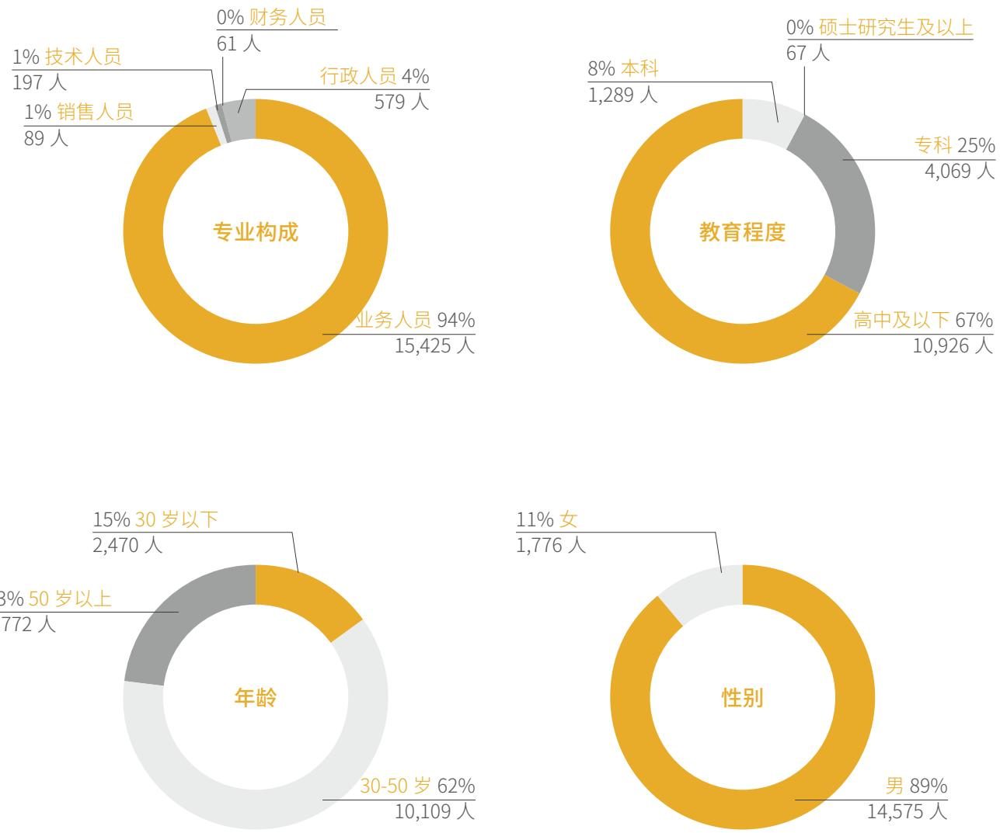

## 实习生计划

公司开展长短期实习计划，以个人成长、探索未来与预先聘用为主轴，搭配课程轮岗等学习活动与实务项目参与，提供实习生探索自我与认识行业实践的机会表现优异的实习生可获得预先聘用的资格，并干毕业后立即加入公司，为学子与公司创造双赢。

实习生计划开展情况参加人数  
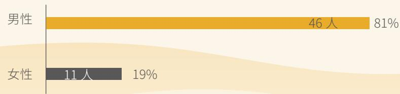

bar

| Category | Count | Percentage |
| --- | --- | --- |
| 男性 | 46 | 81% |
| 女性 | 11 | 19% |

## 薪酬与福利

公司提供具有竞争力的整体薪酬，包括基本薪酬、津贴、绩效奖金等，以吸引培育、留任人才，并奖励能够创造绩效且持续贡献的员工，其整体薪酬依据公司经营表现，财务状况，综合员工专业知识技能、工作职责、绩效表现与长期投入程度等而定。

## 奖酬计划

公司每年开展薪资调查，各子公司根据当地总体经济指标及薪资水准，财务、营运绩效、未来发展，并结合员工的工作职责与绩效表现，设计短期或长期激励方案，给予员工适时的奖励，鼓励员工长期服务及持续贡献。

报告期内，员工整体薪资福利费用总额为人民币177.060.94万元，人均薪资福利费用为人民币10.83万元，公司各地起薪工资为当地最低工资的1.19-2.38倍。

员工整体薪资福利费用总额为人民币

177,060.94 万元

natural_image

Illustration of people running with megaphones and a target, symbolizing progress or success (no text or symbols present)

<table><tr><td rowspan="2">区域</td><td rowspan="2">当地最低工资(元)</td><td>男员工</td><td>女员工</td><td>男员工</td><td>女员工</td></tr><tr><td>起薪水平(元)</td><td>与最低工资比率</td><td>起薪水平(元)</td><td>与最低工资比率</td></tr><tr><td>浙北</td><td>2260</td><td>5,374</td><td>2.38</td><td>5,287</td><td>2.34</td></tr><tr><td>浙南</td><td>2010</td><td>3,550</td><td>1.77</td><td>3,550</td><td>1.77</td></tr><tr><td>浙东</td><td>2260</td><td>4,054</td><td>1.79</td><td>4,024</td><td>1.78</td></tr><tr><td>浙西</td><td>2260</td><td>2,721</td><td>1.20</td><td>2,699.50</td><td>1.19</td></tr></table>

注：上表各区域最低工资为各子公司所在区域内当地最低工资下限值，非官方统计数据。

## 福利制度

公司持续关注员工需求，健全员工福利体系，积极为全体员工提供薪酬以外的员工关怀与福利，并根据员工反馈不断完善和优化现有的福利体系，确保其更好地满足员工的实际需求。公司在办公点设立哺（集）乳室，方便女性员工的集乳需求。员工在育婴期间，公司提供完善的假勤管理制度，让员工能够更弹性地运用于育婴及照护子女。

##

natural_image

Illustration of two people interacting with a large screen displaying data charts and search filters, symbolizing digital analytics or business growth (no text present)

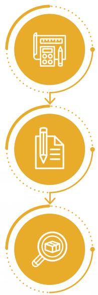

flowchart

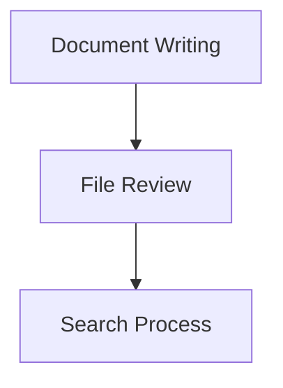
```mermaid
graph TD
  A["Document Writing"] --> B["File Review"]
  B --> C["Search Process"]
```

基本福利：社保、公积金  
福利假期：年休假、产假、哺乳假、陪护假、婚假丧假、工伤假、病假等  
关怀福利：节日福利、女员工福利、员工团建、丁 作餐、体检、住宿、健康保险等

报告期内，集团工会坚持以职工为中心，通过高温慰问、岁末关怀、星级职丁之家建设等多元化举措，全方位落实职工关爱服务。同时依托党建引领创新服务模式，精准对接职工需求，切实增强职工的获得感、幸福感与归属感，为集团高质量发展凝聚起坚实的人力支撑。

## 夏日送清凉

集团工会于7-8月开展“送清凉”专项慰问活动，集团领导班子分头带队深入杭州、台州、宁波等多地子公司一线岗位。慰问组与高温作业职工亲切座谈，详细了解防暑措施落实和劳动保护用品配备情况，送上清凉物资并叮嘱劳逸结合。

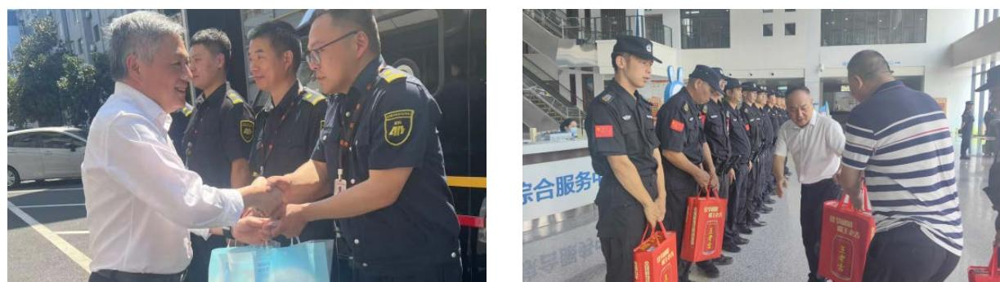

## 岁末送温暖

年末之际，集团党委副书记、工会主席卢卫东带队开展“岁末送暖”慰问活动，走访杭州公司、安全公司执勤点位。慰问组为坚守岗位的执勤人员送上节日慰问品与祝福，倾听基层心声，勉励大家坚守职责筑牢安全防线。

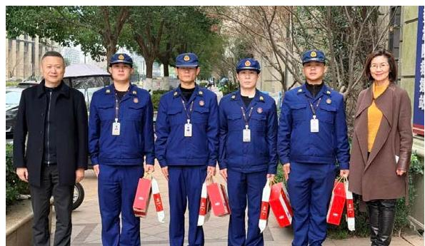

natural_image

Group photo of six individuals in blue uniforms and lanyards standing outdoors, holding red envelopes and gift bags (no visible text or symbols)

集团领导节前慰问一线执勤人员

## 创新服务举措，增强职工归属感

集团以“三基工程”为抓手，推出系列暖心服务举措。舟山公司设立退役军人服务站，精准解决其急难愁盼问题；台州公司创新“七个一”模式规范流动党员管理；宁波公司推行“一帮一带”帮扶行动。这些举措让职工切实感受到组织关怀，有效增强了团队凝聚力和归属感，营造出和谐奋进的工作氛围。

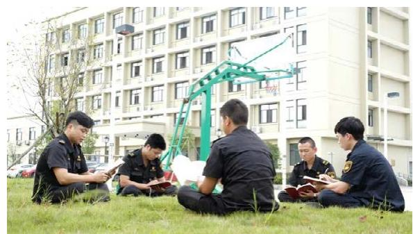

natural_image

Group of uniformed personnel reading books outdoors on grass, with a multi-story building in the background (no visible text or symbols)

## 打造星级职工之家，筑牢暖心服务阵地

集团下属嘉兴公司、丽水公司工会分别获评省部属企事业工会五星、六星“职工之家”。两家子公司工会锚定“服务职工”目标，开展“班前十分钟”理论学习岗位技能比武等活动，落实“冬送温暖、夏送清凉等暖心举措。

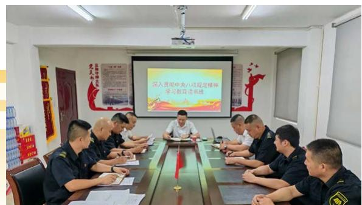

text_image

深入贯彻中央八项规定精神
学习教育读书馆

## 员工参与

natural_image

Illustration of a businessman riding a rocket with upward arrows and a rising line graph, symbolizing growth or success (no text or symbols present)

公司始终高度重视员工沟通与民主参与，通过制度保障、渠道畅通、调研倾听等多维举措，构建全方位、多层次的员工参与机制，让每一位员工的声音都被听见、被重视。

健全民主管理制度，筑牢员工参与决策根基。公司完善以职工代表大会为基本形式的民主管理制度，全年集团及各子公司共召开职代会13次，审议通过涉及职工切身利益的重大事项20余项，涵盖薪酬制度、绩效考核、劳动用工、保险福利等关键领域，切实保障员工知情权、参与权和监督权。

畅通诉求反馈渠道，构建闭环响应机制。公司利用企业微信、监督专栏、微信公众号等数字化平台，建立员工诉求收集、办理、反馈的全流程闭环机制。全年收集并解决职工诉求200余条，解决问题率达95%，实现诉求“件件有落实、事事有回应”。

开展员工意见调查，精准把握员工心声。公司定期组织员工意见调查，全面系统地了解员工工作体验，分析公司在管理、文化、发展等方面的优势与改进机会点，并依据调查结果制定针对性改善行动计划，推动管理优化与服务升级。

搭建多元沟通平台，深化双向交流互动。公司聚焦员工沟通效能提升，通过召开青年座谈会搭建成长交流平台，倾听青年心声、回应青年关切；依托基层党组织创新诉求响应机制，建立常态化谈心谈话制度；深入开展“书记与团员青年面对面”、“大走访大调研大服务大解题”等活动，全方位畅通上下沟通渠道。以真诚对话倾听心声，以务实举措凝聚共识，让员工在参与中增强归属感、在对话中凝聚向心力，为集团高质量发展注入同心同向的内生动力。

## 搭建青年交流平台，凝聚奋进青春力量

集团以“奋斗点亮青春实于担当重任”为主题召开青年员工座谈会，青年代表围绕岗位实际畅谈思路并为建设“科技型综合大安全服务企业”建言献策。集团党委书记、董事长谢伟认真倾听心声诉求，肯定青年员工的担当，并从理想信念、视野格局、能力锻造三方面提出殷切期望，激励青年将个人成长融入企业发展蓝图。

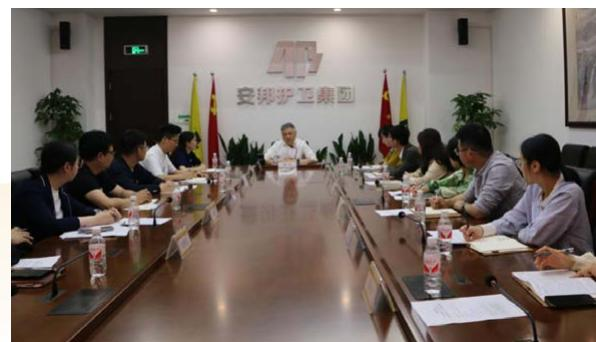

text_image

安邦沪工集团

## 畅通基层诉求渠道，架起党群连心桥梁

集团基层党组织积极探索员工沟通新路径，嘉兴公司第三党支部创新建立“阿拉丁”员工服务专号，畅通基层诉求渠道；温州公司党务工作者推进暖心项目落地，解决群众急难愁盼问题20余件。各级党群干部通过谈心谈话、专题座谈等方式，倾听员工心声，化解工作难题，有效激发基层党组织活力，筑牢党群同心的坚实根基。

## 新进员工适应与留任

公司开展了新员工线上线下训练营，通过灵活的线上网络参与员工手册、规章制度、企业文化、劳动纪律等基础规范类课程学习，结合线下实体场所参与岗前技能操作、安检知识岗位技能及消防安全培训，帮助新员工理解企业文化，明确工作职责，掌握基本的上岗技能，快速适应职场新环境。

除了训练外，公司面向新进员工推行“好伙伴制度”，通过好伙伴的指导，协助新进员工顺利融合公司生活，并在员工就职期间，好伙伴可持续扮演给予回馈与建议的角色，通过向职场中优秀的前辈与楷模持续学习，不断提升个人专业技能，加快个人成长。

## 人才发展

公司提供的安全服务属于劳动密集型行业，员工往往需要在不同的地点、时间段工作，如夜间工作、高风险区域的安全巡逻等，若员工培训不足或者缺乏必要的专业知识和技能，可能会导致在工作中出现失误，增加安全事故的风险加之公司人员年龄结构、学历背景等差异大，若管理不当，还会引发劳资纠纷，甚至导致罢工等极端情况，严重影响企业的正常运营。

为增强员工服务专业化水准和领导于部管理能力，公司制定了《员工教育培训管理办法》《内部培训师管理办法》《实习生培养实施方案》等一系列支撑实际落地的管理文件，由培训中心负责日常的管理与执行。

## 回馈与指导

公司拥有强大的基于反馈的企业文化和绩效管理方法，全体员工每年都会进行多维度、基于目标的绩效评估。我们意识到员工能够与上级就发展机会和未来职业通道进行协商讨论，获得适当的建议，并了解其部门的使命以及他们在中长期内应扮演的角色是非常重要的，并且可以充分激发他们的潜力。

## 教育培训

为全面提高员工工作的专业程度，并使员工实现个人成长与发展，公司搭建了涵盖不同层级岗位员工的系统化、多层次的培训体系。

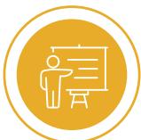  
在职培训

公司内部的培训机会包括工作培训、日常辅导、研讨会和在线学习等，业务部门开发和安排了对应的培训计划。另外员工还可以参加大学和培训机构的专业研讨会和短期培训课程。

  
继任者培养

公司明确定义了基层、中层、高层管理人员的含义和管理行为或领导行为，制定了完整的管理培训计划。此外，公司将核心价值与目标管理、绩效考核、晋升、选型、人才培养、培训等各种管理体系联系起来。

每年组织公司中层以上的管理人员进行内部管理系列课程的培训，在线完成视频课程学习。同时，公司与高等院校合作，针对集团领导班子成员设计企业经营管理、数字化转型等专项培训课题，持续提升干部队伍的管理水平。

公司保障员工能够享有负担得起、优质、有效的学历提升机会，促进员工终身学习，鼓励员工积极参与学历提升报名，并对学费给予一定报销，报告期内，公司投入约491万元用于资助员工的资格认证培训及考试、及其他内外部培训

公司建立了安防人才实训基地，形成了集培训方案、课程设计、培训讲师等资源信息共享的安防培训体系平台，提升员工职业素养和专业技能的“长青藤计划““专业成长共享课堂”和关爱员工心理促进队伍稳定的FAP计划，开展实战训练营和培训班，实现人才成长与公司全方位高质量发展的共赢。

报告期内，集团聚焦海外业务、经营管理、应急救援三大核心领域，分层分类开展专项人才培训。通过定制化培养体系打造专业教官、精干管理、硬核救援三支人才队伍，以精准育才赋能业务拓展，为高质量建设科技型综合大安全服务企业注入人才动能。

## 提升干部履职能力，凝聚高质量发展合力

集团在丽水举办于部能力建设研修班，7家子公司的12名领导于部参训。培训采用线下集中学习与分组研讨相结合的模式，课程紧扣集团发展规划与战略定位，帮助参训于部把握宏观政策导向、深化战略认知。学员围绕成果转化展开深入研讨，此次培训统一了干部思想，为集团高质量发展凝聚了管理合力。

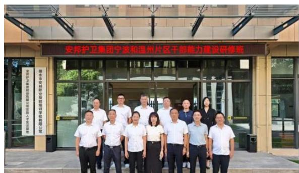

text_image

安邦护卫集团宁波和温州片区干部能力建设研修班
第三次全国职工技能培训学校有限公司

## 锻造海外安保尖兵，赋能国际业务拓展

集团举办第一期海外教官培训班，全省10家子公司的12名学员参训并顺利结业。培训以“理论奠基、实操强技、演练促学、考核验效”为思路，采用“理论学习 + 实操演练 + 课程试讲” 三位一体模式，课程覆盖应急救护、安全防护等四大核心模块，高度模拟海外复杂安全环境。此次培训打造了一支专业过硬的海外教官队伍，为集团响应“一带一路”倡议、拓展海外安保业务筑牢人才根基。

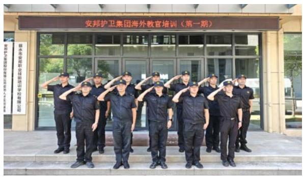

text_image

安邦护卫集团海外教官培训（第一期）
重庆市金桥区科技创业培训学校有限公司

集团成功举办第一期海外教官培训班

报告期内，集团学员总培训学时196.212小时，中级以上管理层人均培训学时超过48小时，技术、业务和销售人员的人均培训学时接近，全年总培训费用约491万元。

## 报告期内

集团学员总培训学时

196,212 小时

中级以上管理层人均培训学时超过

48小时

全年总培训费用约

491 万元

<table><tr><td>员工类型</td><td colspan="2">人均培训学习时数</td></tr><tr><td>按职级分</td><td>男性</td><td>女性</td></tr><tr><td>高级管理</td><td>92</td><td>33</td></tr><tr><td>中级管理</td><td>80</td><td>60</td></tr><tr><td>基层管理</td><td>72</td><td>30</td></tr><tr><td>普通员工</td><td>25</td><td>11</td></tr><tr><td>按职能分</td><td>男性</td><td>女性</td></tr><tr><td>技术人员</td><td>55</td><td>15</td></tr><tr><td>行政人员</td><td>64</td><td>44</td></tr><tr><td>业务人员</td><td>32</td><td>22</td></tr><tr><td>销售人员</td><td>34</td><td>20</td></tr></table>

## 安全生产风险管理

健全的安全管理体系有效降低各类安全事故发生率，减少事故损失与停工成本。安全隐患整改工作全面落实，顺利通过行业关键评估，巩固核心业务市场地位。完善的风险管理能力降低项目违约风险，减少潜在经济损失。

公司全年实现安全生产零重大事故，切实保障员工与公众的生命财产安全。构建的全流程安全管理体系，为安防行业提供可复制的管理范本。常态化的应急演练与安全培训，助力提升行业整体安全防控水平。

<table><tr><td>指标</td><td>目标</td><td>报告期进展</td></tr><tr><td>押运车辆每百万公里有责事故率(起)</td><td>&lt; 0.5</td><td>0.45</td></tr><tr><td>安全生产投入占营收比重</td><td>&gt; 0.2%</td><td>0.31%</td></tr><tr><td>安全隐患整改率</td><td>100%</td><td>100%</td></tr><tr><td>应急演练次数(场 / 年)</td><td>&gt; 360</td><td>453</td></tr><tr><td>安全生产标准化达标率</td><td>100%</td><td>100%</td></tr><tr><td>安全培训覆盖人数(人次 / 年)</td><td>&gt; 9.5 万</td><td>9.9 万</td></tr></table>

## 治理

公司成立了双重预防机制建设领导小组，由集团高管、各部室负责人、各子公司主要负责人组成，安全运营部负责人兼任领导小组下设的办公室主任，日常由安全运营部负责指导、协调、监督和考核公司双重预防机制建设和执行，子公司落实单位内的安全风险分级管控和作业区域、工艺工序的隐患排查治理工作规范生产安全事故预防和应急工作，保障员工和企业财产安全。

natural_image

Illustration of a person with a shield and lock, surrounded by icons of key, padlock, and gear (no text or symbols)

公司遵守《中华人民共和国安全生产法》《中华人民共和国职业病防治法》《中华人民共和国劳动法》《中华人民共和国枪支管理法》《中华人民共和国人民警察使用警械和武器条例》等法律法规要求，参考|SO45001职业健康安全管理体系，制定《集中金库管理规定》《防暴枪支(弹药)管理使用规范》《武装守护押运操作规范》《安全生产事故应急救援综合预案》《安全生产日常信息工作规范《集团有限空间作业安全管理规定》，明确各层级安全责任；建立安全隐患“排查-整改-复查”闭环机制，每月开展风险评估；将安全生产指标纳入部门与个人KP考核，实行“安全一票否决制”；每年开展不少于30场应急演练，覆盖所有业务场景。报告期内，公司通过了ISO45001职业健康安全管理体系认证。

## 战略

公司通过安全审计、事故案例分析、行业对标以及政策跟踪等方式，全面识别安全生产与风险管理工作中的核心风险与潜在机遇。其中风险涵盖武装守押业务安全隐患、低空安防操作风险、应急处置不当风险，以及安全政策加码带来的合规压力等方面；机遇则来源于安全管理数字化技术的应用普及、政府安全服务采购需求增长、安全培训业务的拓展潜力，以及参与行业安全标准制定的机会。

公司制定了分阶段的安全管理目标，短期降低重点业务的安全事故发生率、实现安全隐患100%整改、增加应急演练的场次，中期提升安全生产标准化达标率与风险防控数字化覆盖率，长期构建“数智化+全流程”的安全风险管理体系，成为行业安全管理的标杆。

财务方面，短期虽需投入资金升级安全设备与开展演练，但事故损失的减少将带来正向收益；中期数字化风险防控体系的落地将提升运营效率，降低风险成本；长期安全品牌形象的树立将形成服务溢价，提升客户合作意愿。

## 影响、风险和机遇管理

公司升级集团安全管理系统，实现风险的动态监控与预警，加强武装守押、低空安防、应急救援等重点领域的安全管控，完善操作规程，开展常态化的安全培训与应急演练，提升全员安全意识与处置能力，建立安全风险数据库，推动风险防控工作精准化。

## 安全风险管理

为进一步强化隐患排查治理，推进事故预防工作科学化、信息化、标准化，提升安全生产整体预控能力，公司制定了《安全隐患管理工作制度》《安全风险分级管控和隐患排查治理双重预防机制》，集团安全运营部负责指导隐患排查工作组织各子公司进行安全风险的辨识、评估、分级、管控，夯实遏制重特大事故的坚强基础。

##

通过安全检查表(SCL）、预先危险性分析(PHA)、现场观察以及座谈的方法，全面覆盖集团公司守押及其他业态的全过程，包括所涉及的作业场所内的设备设施、作业过程、中途待命场所、人员活动、建筑物、辅助设施等风险因素

## 开展风险评估工作

分管安全副总组织安全管理部门、基层大队安全生产管理人员、守押操作一线人员、职工代表组成评价组，结合集团公司、各子公司实际，对生产过程中辨识的安全风险，通过作业条件危险分析法（IEC)和风险程度分析法(MES)等方法分析风险因素导致事故的条件、事故发生的可能性和事故后果严重程度

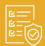

##

根据风险评估结果，结合实际情况对排查出来的风险点进行分级，在确定风险类别的前提下，按照危险程度及可能造成后果的严重性将安全风险等级从高到低依次划分为重大风险、较大风险、一般风险和低风险四级

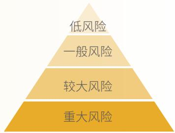

flowchart

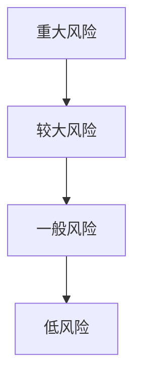
```mermaid
graph TD
  A["重大风险"] --> B["较大风险"]
  B --> C["一般风险"]
  C --> D["低风险"]
```

安全风险等级

##

针对辨识出的每一项安全风险，从技术、管理、制度、应急等方面综合考虑，通过消除终止、替代、隔离等措施消减风险或采用管理和监控手段管控风险，确保每一项安全区险控制在可接受范围内

报告期内，集团将数智化手段融入安全生产全流程，迭代升级集团安全管理系统，以数字化赋能风险防控，推动安全隐患动态清零。通过严格落实安全生产责任制，强化重点领域监督管控，全年押运车辆每百万公里有责交通事故同比下降10%，本质安全水平显著提升。

2025年，公司投入85221万元用于安全生产工作，各类安全风险因素得到有效管控，未发生重大伤亡事故。在可记录的工伤中员工工伤主要为未达到伤残等级的轻微伤，总数逐年减少。

## 安全文化建设

公司始终秉持着以人为本的安全文化，各级管理层均负有推动职业健康与安全工作的义务与责任，通过管理系统制度与规范，确保员工遵守及执行，并持续检视人、环境、行为等安全因素，不断优化管理机制，配以持之以恒地培训宣贯，落实职业健康与安全的管理目标。

## 专项培训

• 持枪人员技能培训：全年组织248次，培训35,462人次  
• 驾驶技能培训：全年组织253次，培训26,330人次

## 新员工培训

全年组织6.376人次新员工接受岗前安全生产、岗位培训

## 全员培训

每年组织98.987人次员工开展岗位安全操作规程、安全规章制度、消防安全等专项安全培训

natural_image

Illustration of a woman handing an envelope to a uniformed officer (no text or symbols present)

2025年，集团及各子公司深入贯彻落实习近平总书记关于应急管理和安全生产的重要论述，结合“安全生产月”、“防灾减灾日”、“消防宣传月”等契机，广泛开展形式多样的应急演练和安全文化主题活动，全年累计组织各类应急演练453场，模拟事故应急处置、消防逃生、防汛防台、防暴抢等实战场景，有效检验和提升了应急救援队伍的实战能力与全员安全意识，为“平安浙江”建设贡献了安邦力量。

## 第三届安全生产（应急消防）技能大比武活动

为持续提升应急救援队伍的综合素质和实战能力，2025年11月，安邦护卫集团在丽水市成功举办第三届安全生产（应急消防）技能大比武活动。来自集团各子公司的12支代表队、240名选手围绕运钞车天窗逃生、97-2式防暴枪分解结合、消防栓水带连接、4×100米应急接力赛等贴近实战的项目展开激烈角逐。比赛中，各代表队奋勇争先，展现了过硬的专业技能和团队协作精神。此次活动不仅达到了以比促练、以练促战的效果，更推动了一线押运队伍和应急救援队伍的规范化、现代化建设。

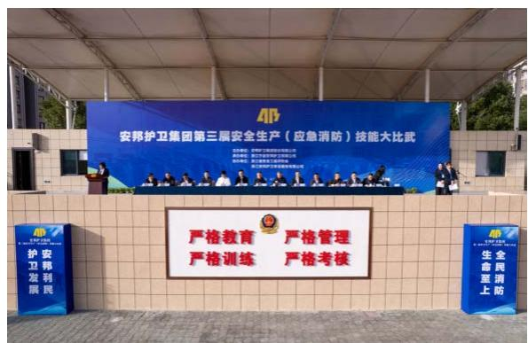

text_image

安邦护卫集团第三届安全生产（应急消防）技能大比武
严格教育 严格管理
严格训练 严格考核
护安邦
发展民
生命至上防

## 岗位技能竞赛与实战演练

2025年，各子公司结合自身业务特点，开展了形式多样的岗位技能竞赛和专项演练。台州公司于11月举办了岗位技能竞赛，设置了押运车轮胎装卸、二人三带射水打靶、防暴枪分解结合、现金清点等贴近业务实操的五大类项目，全面检验了员工的核心技能。此外，温州公司、湖州公司等分别与银行、消防等部门联合开展了防暴抢、消防疏散、ATM防抢等实战演练，有效磨合了与客户单位的协同作战机制，提升了应对突发事件的联合处置能力。

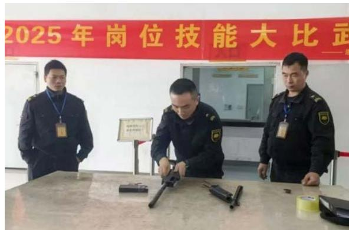

text_image

2025年岗位技能大比武

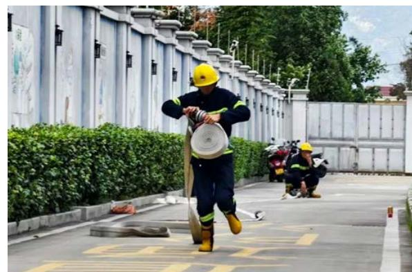

natural_image

Firefighters in uniform and hard hats running on a paved path near white-walled buildings and greenery (no visible text or symbols)

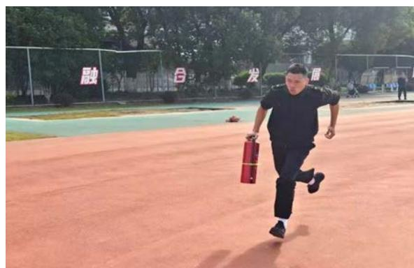

text_image

Street photo of a person running on an outdoor sports field with visible Chinese characters in the background

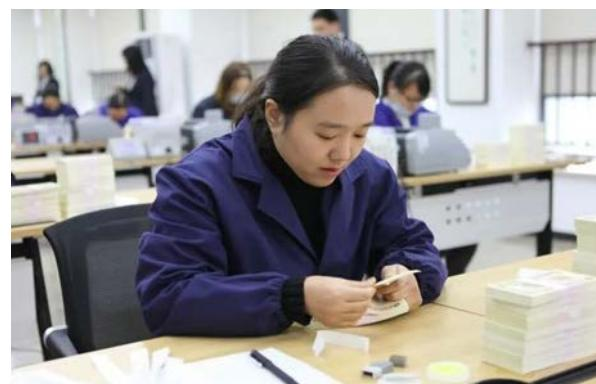

natural_image

Woman in a lab coat working at a table with stacks of paper and documents, no visible text or symbols

现金清点

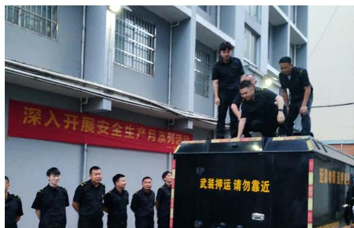

text_image

深入开展安全生产月系列活动
武装押运 请勿靠近

撤离演练

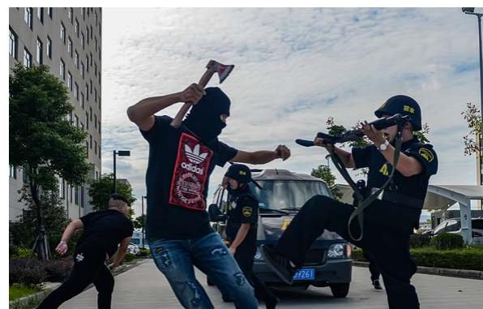

natural_image

Street scene with police officers practicing martial arts on a street, one executing a strike (no visible text or symbols)

劫匪搏斗演练

此外，各子公司结合实际开展了特色鲜明的安全文化宣教活动。嘉兴公司举办安全生产主题青年演讲比赛，围绕“责任固安知行并进”主题，讲述安邦铁军的使命故事：台州公司组织员工参观公共安全体验馆，通过仿真模拟和互动体验，提升员工的安全避险能力；温州公司创新开展“小小安全观察员”实践活动，通过家企联动，让安全理念走进员工家庭；丽水公司则通过设立安全文化长廊、开展安全行为观察、组织全员疏散逃生演练等举措，构建了系统化的安全文化体系。

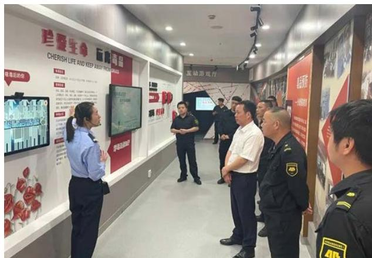

text_image

烂魔生命
CHERISH LIFE AND KEEP FROM THE CHINA
互动游戏厅

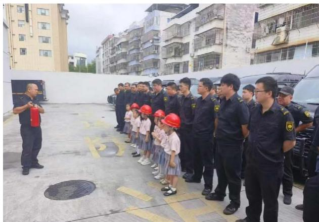

natural_image

Group of uniformed officers and children in red helmets standing in line outdoors near a fire extinguisher, with residential buildings in the background (no visible text or symbols)

温州公司创新开展“小小安全观察员”实践活动

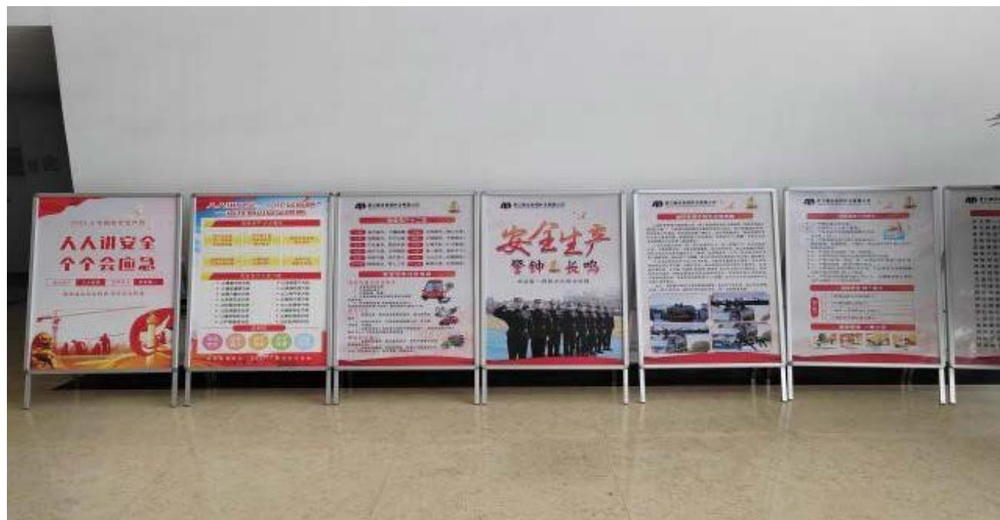

text_image

人人讲安全
个个会应急

安全生产
警钟三长鸣

丽水公司设立安全文化长廊

##

公司始终将员工身心健康放在重要位置，通过文体活动、健康服务及员工关怀等举措，构建全方位的身心健康保障体系。以文体活动为载体，搭建运动健身、互动交流的平台，在强健职工体魄的同时凝聚团队合力；以健康服务为抓手提升职工健康素养：以普法宣传为补充，增强员工维权意识，让健康活力的企业文化氛围浸润人心，助力职工以更好状态投入工作。

## 供应商管理

公司制定了《合规管理指引手册》《合规风险识别清单》等制度，对于包括供应商在内的商业合作伙伴明确了合规行为准则，要求相关部门应当对商业伙伴加以识别和优选，密切关注商业伙伴的资信状况，积极向商业伙伴传递公司合规理念和要求，及时有效防范商业伙伴因违法违规行为带来的不利影响。

公司通过构建覆盖采购全流程的风险管理体系，实现了从供应商准入到后期动态监控的闭环管理，有效防范各环节潜在风险。在供应商选择阶段，公司以资质审核为核心抓手，通过建立《合格供应方名录》并定期更新，严格筛选具备合规资质的合作伙伴。同时，运用尽职调查机制对供应商信用、履约能力等开展多维度评估，结合交易对手评价体系（涵盖业务量、价格友好度等指标)和大数据技术支撑，从源头杜绝与无资质供应商合作的风险。针对高风险环节，如资质调查机制缺失问题，公司通过信息系统升级强化动态审查能力，确保供应商准入的精准性与合规性。

在招投标环节，公司通过制度完善与流程强化双管齐下。一方面，严格遵循国家及上级单位法规要求，细化《招标管理制度》，明确招标程序合规性要求：另一方面，建立监督与追责机制，对招标文件编制、评标过程及结果公示等关键节点实施全流程监控，确保程序合法有效。针对可能出现的资料缺失风险，公司在项目完成后专项核查归档资料完整性并通过责任追究制度对违规操作人员实施惩戒，形成“事前预防-事中控制-事后追责”的完整链条。

合同管理阶段，公司着力解决法律证据留存问题，通过强制推行纸质合同原件存档制度，结合定期风险培训提升人员法律意识。对于已签订电子合同但未执行完毕的业务，要求及时补签纸质合同以规避举证风险。在供应商持续管理层面公司建立动态评估机制，定期复核供应商履约表现与合规状态，对存在重大问题的供应商启动应急预案(如终止合作追偿损失），并通过《合规承诺书》签署、合规倡议宣贯等方式，将廉洁文化、合规要求深度嵌入供应商合作关系

此外，公司依托《合规风险识别清单》实施风险分级管控：对招投标违规等高危风险制定专项整改计划并分配责任：对资质审核疏漏等中风险实施缓解措施：对合同存档等低风险定期评估。通过风险识别、分级应对、动态监控的闭环机制公司实现了采购风险的系统化、精细化管控，为业务稳健发展构筑坚实防线。

截至报告期末，公司应付账款（含应付票据）余额为2.71.亿元，远未超过300亿元，占总资产的比重约7.11%，未超过50%，且公司按照合约条款支付合同费用，不存在无故拖欠中小企业应付账款的情况。

## 截至报告期末

公司应付账款（含应付票据）余额为

2.71 亿元

占总资产的比重约

7.11%

## 04 A

## 绿筑根基 善润乡邻

公司将绿色发展理念深度融入运营全链条，以实际行动践行国企环保责任与社会责任。通过推广新能源装备、优化能源消耗结构、规范废弃物处置等绿色运营举措，持续降低碳排放与资源消耗，助力“双碳”目标落地：同时深耕乡村振兴与公益实践，以消费帮扶、技能培训、志愿服务等多元行动赋能社区发展，在实现自身可持续运营的同时，为行业绿色转型树立标杆，为社会共同富裕注入动能，共绘生态优美、社会和谐的发展蓝图。

绿色运营  
社区发展

## 绿色运营

公司始终坚持“绿色发展服务未来”的环保理念，将生态建设纳入企业发展整体规划，致力于打造“资源节约型、环境友好型、生态文明型”的和谐企业。报告期内，公司通过了|SO14001环境管理体系认证

## 助力双碳建设

公司严格落实《安邦护卫集团股份有限公司“碳达峰、碳中和”行动方案》，积极推进绿色低碳发展战略。

公司的温室气体排放量主要来自日常车队运行，公司押运车主要为6座及以下载客量（载货量)的小型汽车，相比大型车辆，它们在燃烧燃料时产生的二氧化碳和其他有害气体排放量较低，有助于减少温室气体的排放，对抗全球气候变暖。

报告期内，公司积极推进绿色低碳发展战略，完成首批30辆新能源押运车替代工作，成为绿色运营的重要突破。通过优化守押线路规划，减少车辆空驶里程与能耗消耗，在降低燃油及维护成本的同时，有效减少碳排放。这一举措既响应国家“双碳”战略，又为安防行业运输装备绿色转型提供了实践范本，助力集团在环境保护与经营效益之间实现良性平衡。

单位：吨二氧化碳当量

<table><tr><td>温室气体范围</td><td>2024年</td><td>2025年</td></tr><tr><td>范围1</td><td>25,547.14</td><td>22,594.06</td></tr><tr><td>范围2</td><td>8,988.62</td><td>9,810.15</td></tr><tr><td>总量</td><td>34,535.76</td><td>32,404.21</td></tr><tr><td>百万元营收排放量</td><td>13</td><td>12</td></tr></table>

## 能源消耗和污染物排放

公司在业务运营活动中直接或间接消耗的能源为柴油、天然气和电能，伴随日常安全服务开展的车队运行是能耗及大气污染的主要来源。公司关注汽车的大气排放限值，持续升级汽车排放标准，提高燃油效率，减少单位行驶里程的能源消耗和汽车尾气有害物质排放量。

在采购办公区域空调设备时，公司优选低能耗的变频空调，并在使用过程中通过温度设置、定期检查和维护等方式尽量降低其能耗水平，同时公司对电脑、服务器、显示器和办公家具等大型资产进行编号登记，方便上述资产在各地区公司的高效利用。

<table><tr><td></td><td colspan="2">资源种类</td><td>2024年</td><td>2025年</td></tr><tr><td rowspan="3">直接能源</td><td colspan="2">天然气(立方米)</td><td>148,727.00</td><td>114,231.63</td></tr><tr><td colspan="2">柴油(升)</td><td>9,472,481.80</td><td>8,122,357.00</td></tr><tr><td colspan="2">汽油(升)</td><td>/</td><td>330,222.00</td></tr><tr><td>间接能源</td><td colspan="2">电(千瓦时)</td><td>15,470,948.80</td><td>16,888,378.65</td></tr><tr><td rowspan="6">综合能耗(吨标准煤)</td><td rowspan="3">直接能源</td><td>天然气</td><td>197.48</td><td>138.70</td></tr><tr><td>柴油</td><td>13,786.64</td><td>9,942.46</td></tr><tr><td>汽油</td><td>/</td><td>354.67</td></tr><tr><td>间接能源</td><td>电</td><td>1,900.00</td><td>2,074.58</td></tr><tr><td colspan="2">能耗总量</td><td>15,884.12</td><td>12,510.41</td></tr><tr><td colspan="2">百万元营收能耗</td><td>5.98</td><td>4.61</td></tr></table>

<table><tr><td>大气污染物类型</td><td>2024</td><td>2025</td></tr><tr><td>氮氧化物(吨)</td><td>4.12</td><td>283.55</td></tr><tr><td>二氧化硫(吨)</td><td>0.16</td><td>0.14</td></tr><tr><td>颗粒物(吨)</td><td>0.25</td><td>0.22</td></tr></table>

注：1.2024年的大气污染物排放量只统计了车用柴油燃烧而排放的大气污染物，在筹备2025年报告过程中公司追溯2024年天然气燃烧而排放的大气污染物，故更新了2024年的大气污染物排放量：2.2025年的氮氧化物排放量显著增加是因为公司2025年新增了汽油使用量的统计。

## 资源管理

公司各单位用水来自于市政自来水管网和消防管网，主要用于日常服务、办公生活、食堂和消防用水。公司通过节约用水宣传和培训提高员工节水意识，安装节水水龙头、节水马桶等节水设施，减少日常经营活动水量的消耗。

公司自有经营场所或租赁的商业楼宇市政基础设施齐全，一般无需专门建设污水处理等环保设施，日常员工办公和生活中产生的生活污水统一集中排入市政污水处理管网。报告期内，公司污水处理支出共计56.97万元，污水均经过合规处理后排放。

natural_image

Illustration of a stylized wind farm with hot air balloons and mountains in an open landscape (no text or symbols)

单位：吨

<table><tr><td>水资源利用</td><td>2024</td><td>2025</td></tr><tr><td>取水量</td><td>439,105</td><td>392,341</td></tr><tr><td>排水量</td><td>363,149</td><td>296,932</td></tr><tr><td>耗水量</td><td>75,956</td><td>95,409</td></tr><tr><td>百万元营收耗水量</td><td>28.58</td><td>35.14</td></tr></table>

## 废弃物管理

公司日常废弃物主要来源干员工办公和生活中产生的生活垃圾、包装材料等固体废弃物，以及子公司车辆保养场地用于日常车辆维护保养产生有害废弃物机油。

公司一直积极贯彻国家垃圾分类政策，在各办公点全面推进垃圾分类工作，生活垃圾、包装材料等固体废弃物投放到垃圾集中投放点并由环卫部门统一清运或者由当地物业公司统一回收处理：有害废弃物机油由持有危险废弃物经营许可证的第三方机构清运回收。

natural_image

Illustration of people interacting with a large recycling symbol, no text or symbols present

## 社区发展

公司旨在通过开展具有社会积极影响力的社会活动来减少资源差距，通过乡村振兴和公益行动创造积极的改变和共享价值。

## 乡村振兴

集团立足国企担当，以消费帮扶拓宽农产品销路，以党建联建强化乡村发展根基以技能培训筑牢安全防线，以慈善合作为乡村振兴赋能。通过多元化、精准化举措全方位助力乡村产业、治理、能力提升，书写共同富裕的国企答卷。

报告期内，集团党委副书记、工会主席卢卫东率队赴省慈善联合总会交流座谈围绕慈善项目开展、公益模式创新等深化合作。集团以“千企结千村”“山海协作”为载体，积极参与慈善公益事业，主动扛起共同富裕示范区建设的国企责任双方建立常态化协调机制，整合各自优势资源，共同为“善行浙江”建设与乡村振兴注入合力。

## 山海协作育技能，筑牢乡村安全防线

集团深化山海协作，与武义县新宅镇联合举办应急消防森林防火能力培训班，揭牌“安邦护卫集团培训教学点”。采用“理论+实操+现场”三维教学模式邀请专业进师开展林火防控、无人机巡查等课程，覆盖150余名基层应急骨于。全年投入86.44万元助力新宅镇建设低空数字平台(集成A火情识别、智能调度等20项功能，建设进度达80%)，投入5.55万元开展4期培训及后续无人机专项培训，以标准化、长效化培训体系，夯实乡村平安建设根基。

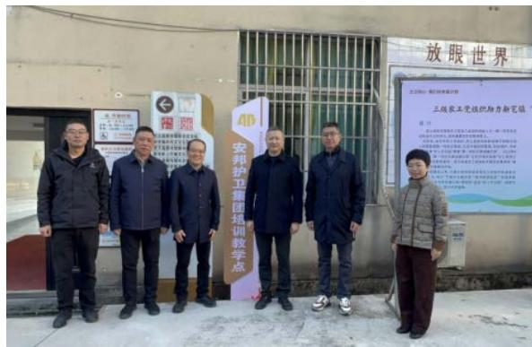

text_image

放眼世界
安邦护卫集团培训教学点

## 党建联建强根基，精准帮扶兴乡村

集团以党建联建为纽带，与桃源村开展组织联建、理论联学等多元合作。投入帮扶资金30万元用于江山市凤林镇改善村内基础设施与设备，开设技能培训班助力村民持证上岗，选派第一书记推动村组织与产业深度联动，带动村集体收入显著增长。志愿者还赴桃源村开展写福字、购农副产品等活动，将企业资源与乡村需求精准对接，以国企担当助力乡村全面发展。

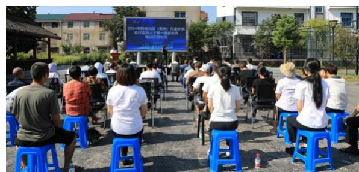

text_image

2014年北京市第39届（北京）儿童节
召开会议人第一次现场
“活动启动仪式”

## 消费帮扶拓销路，助农增收促振兴

集团深入落实“百社百企结百村”部署，与江山桃源村探索“六联一消6+1’”帮扶模式。全年以消费帮扶形式投入198.53万元，其中直接采购武义县农副产品49万元，并通过集团本部及12家子公司集中采购江山大米、腊肉等农产品2100份(金额110万元)，其余用于其他结对帮扶地区。同时组织书法爱好者手写4500张“福字贴于包装，既拓宽了当地农产品销路，又传递了温暖情谊，有效提升了桃源村特色产品的品牌知名度与影响力。

## 公益行动

集团以青年志愿品牌为抓手、以主题活动为纽带、以党员为引领，广泛开展多元化公益实践。从基层治理志愿服务到爱国主题活动，再到精准帮扶行动，用实际行动践行社会责任，传递温暖力量，彰显国企担当。

## 青年新风行动，志愿服务暖民心

集团团委以“青年新风行动”为载体，构建三级联动机制，打造“卫青春”志愿服务品牌。通过“护城”“安途”“暖驿”三大主题行动，组织青年志愿者开展警保联动执勤、反诈宣传、校园安全守护、重大活动护航等服务。近两年累计开展公益活动40余场，以青春力量赋能基层治理与社会服务。

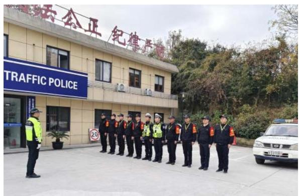

text_image

公正纪律严惩
TRAFFIC POLICE

青年新风行动剪影

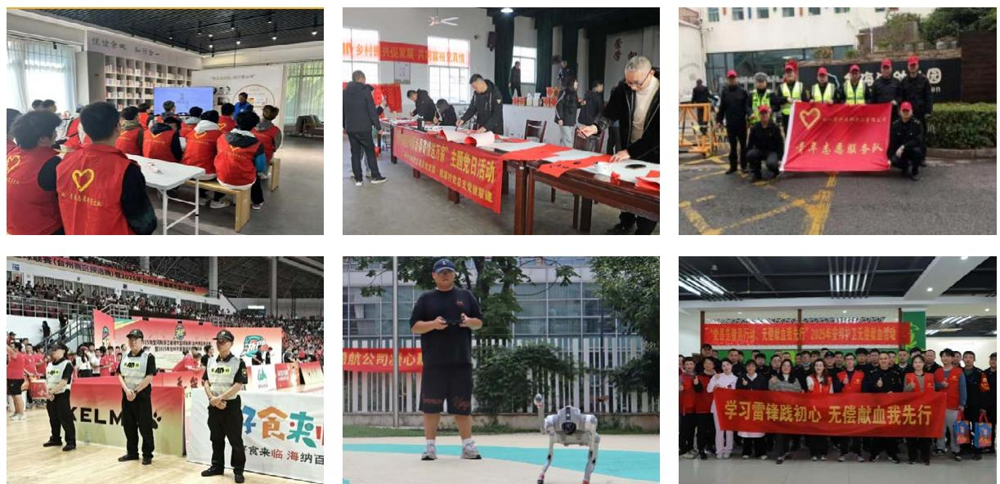

## 致敬祖国华诞，凝聚爱国正能量

在新中国成立76周年之际，集团发起“我与国旗同框”创意照片征集活动。集团机关及各子公司员工积极参与，在押运一线、研发工位、应急现场等岗位与国旗合影，用镜头定格忠诚坚守。活动点燃了全员爱国热情，将爱国情怀转化为立足岗位、守护平安的工作动力，彰显安邦人对祖国的深情告白。

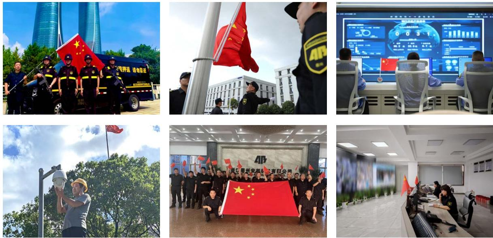

## 党员带头行善，公益实践树标杆

集团各级党员干部带头参与公益活动，绍兴公司卓祖峰累计志愿服务500余小时，台风期间坚守岗位保障安全：台州公司金再国组织 “雷锋日”“公益助学”“无偿献血” 等活动，获 “热心公益” 单位称号；衢州公司志愿者结对桃源村，开展帮扶慰问并采购农副产品，以实际行动助力乡村振兴

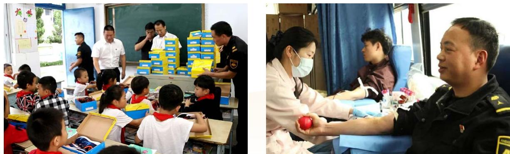

## 附录

《可持续发展报告标准》（GRI Standards）索引表

<table><tr><td>使用说明</td><td colspan="2">安邦护卫在2025年1月1日至2025年12月31日报告期间参照GRI标准报告了此份GRI内容索引中引用的信息。</td></tr><tr><td>使用的GRI 1</td><td colspan="2">GRI 1:基础2021</td></tr><tr><td>GRI标准</td><td>披露项</td><td>位置</td></tr><tr><td rowspan="22">GRI 2:一般披露2021</td><td>2-1组织详细情况</td><td>走进安邦护卫</td></tr><tr><td>2-2纳入组织可持续发展报告的实体</td><td>报告编制说明</td></tr><tr><td>2-3报告期、报告频率和联系人</td><td>报告编制说明</td></tr><tr><td>2-6活动、价值链和其他业务关系</td><td>走进安邦护卫</td></tr><tr><td>2-7员工</td><td>员工关怀与人才发展</td></tr><tr><td>2-8员工之外的工作者</td><td>员工关怀与人才发展</td></tr><tr><td>2-9管治架构和组成</td><td>公司治理</td></tr><tr><td>2-10最高管治机构的提名和遴选</td><td>公司治理</td></tr><tr><td>2-11最高管治机构的主席</td><td>公司治理</td></tr><tr><td>2-12在管理影响方面,最高管治机构的监督作用</td><td>公司治理</td></tr><tr><td>2-13为管理影响的责任授权</td><td>公司治理</td></tr><tr><td>2-14最高管治机构在可持续发展报告中的作用</td><td>环境、社会和公司治理</td></tr><tr><td>2-15利益冲突</td><td>公司治理</td></tr><tr><td>2-16重要关切问题的沟通</td><td>合规经营、员工关怀与人才发展</td></tr><tr><td>2-17最高管治机构的共同知识</td><td>公司治理</td></tr><tr><td>2-18对最高管治机构的绩效评估</td><td>公司治理</td></tr><tr><td>2-19薪酬政策</td><td>公司治理</td></tr><tr><td>2-20确定薪酬的程序</td><td>公司治理</td></tr><tr><td>2-23政策承诺</td><td>合规经营、员工关怀与人才发展、绿色运营</td></tr><tr><td>2-24融合政策承诺</td><td>合规经营、员工关怀与人才发展、绿色运营</td></tr><tr><td>2-25补救负面影响的程序</td><td>合规经营、员工关怀与人才发展</td></tr><tr><td>2-26寻求建议和提出关切的机制</td><td>合规经营、员工关怀与人才发展</td></tr></table>

<table><tr><td rowspan="3"></td><td>2-27 遵守法律法规</td><td>党建引领 合规治理、惠聚伙伴 聚力共赢、绿筑根基 善润乡邻</td></tr><tr><td>2-28 协会的成员资格</td><td>走进安邦护卫</td></tr><tr><td>2-29 利益相关方参与的方法</td><td>环境、社会和公司治理</td></tr><tr><td rowspan="3">GRI 3:实质性议题2021</td><td>3-1 确定实质性议题的过程</td><td>环境、社会和公司治理</td></tr><tr><td>3-2 实质性议题清单</td><td>环境、社会和公司治理</td></tr><tr><td>3-3 实质性议题的管理</td><td>环境、社会和公司治理</td></tr><tr><td>GRI 201:经济绩效2016</td><td>201-1 直接产生和分配的经济价值</td><td>走进安邦护卫</td></tr><tr><td>GRI 202:市场表现2016</td><td>202-1 按性别的标准起薪水平工资与当地最低工资之比</td><td>员工关怀与人才发展</td></tr><tr><td rowspan="3">GRI 205:反腐败2016</td><td>205-1 已经进行腐败风险评估的运营点</td><td>合规经营</td></tr><tr><td>205-2 反腐败政策和程序的传达及培训</td><td>合规经营</td></tr><tr><td>205-3 经确认的腐败事件和采取的行动</td><td>合规经营</td></tr><tr><td rowspan="3">GRI 302:能源2016</td><td>302-1 组织内部的能源消耗量</td><td>绿色运营</td></tr><tr><td>302-4 降低能源消耗量</td><td>绿色运营</td></tr><tr><td>302-5 降低产品和服务的能源需求量</td><td>绿色运营</td></tr><tr><td>GRI 303:水资源和污水2018</td><td>303-4 排水</td><td>绿色运营</td></tr><tr><td>GRI 305:排放2016</td><td>305-1 直接(范围1)温室气体排放</td><td>绿色运营</td></tr><tr><td>GRI 305:排放2016</td><td>305-7 氮氧化物 (NOx)、硫氧化物 (SOx) 和其他重大气体排放</td><td>绿色运营</td></tr><tr><td rowspan="3">GRI 306:废弃物2020</td><td>306-3 产生的废弃物</td><td>绿色运营</td></tr><tr><td>306-4 从处置中转移的废弃物</td><td>绿色运营</td></tr><tr><td>306-5 进入处置的废弃物</td><td>绿色运营</td></tr><tr><td>GRI 308:供应商环境评估2016</td><td>308-2 供应链中的负面环境影响以及采取的行动</td><td>供应商管理</td></tr><tr><td>GRI 401:雇佣2016</td><td>401-2 提供给全职员工(不包括临时或兼职员工)的福利</td><td>员工关怀与人才发展</td></tr><tr><td rowspan="3">GRI 403:职业安全生产风险管理2018</td><td>403-1 职业健康安全管理体系</td><td>安全生产风险管理</td></tr><tr><td>403-2 危害识别、风险评估和事故调查</td><td>安全生产风险管理</td></tr><tr><td>403-3 职业健康服务</td><td>安全生产风险管理</td></tr><tr><td rowspan="3"></td><td>403-4 职业健康安全事务:工作者的参与、意见征询和沟通</td><td>安全生产风险管理</td></tr><tr><td>403-7 预防和减缓与业务关系直接相关的职业健康安全影响</td><td>安全生产风险管理</td></tr><tr><td>403-8 职业健康安全管理体系覆盖的工作者</td><td>安全生产风险管理</td></tr><tr><td rowspan="3">GRI 404:培训与教育2016</td><td>404-1 每名员工每年接受培训的平均小时数</td><td>员工关怀与人才发展</td></tr><tr><td>404-2 员工技能提升方案和过渡援助方案</td><td>员工关怀与人才发展</td></tr><tr><td>404-3 接受定期绩效和职业发展考核的员工百分比</td><td>员工关怀与人才发展</td></tr><tr><td rowspan="2">GRI 405:多元性与平等机会2016</td><td>405-1 管治机构与员工的多元化</td><td>员工关怀与人才发展</td></tr><tr><td>405-2 男女基本工资和报酬的比例</td><td>员工关怀与人才发展</td></tr><tr><td>GRI 406:反歧视2016</td><td>406-1 歧视事件及采取的纠正行动</td><td>员工关怀与人才发展</td></tr><tr><td>GRI 408:童工2016</td><td>408-1 具有重大童工事件风险的运营点和供应商</td><td>员工关怀与人才发展</td></tr><tr><td>GRI 409:强迫或强制劳动2016</td><td>409-1 具有强迫或强制劳动事件重大风险的运营点和供应商</td><td>员工关怀与人才发展</td></tr><tr><td>GRI 414:供应商社会评估2016</td><td>414-2 供应链的负面社会影响以及采取的行动</td><td>供应商管理</td></tr><tr><td>GRI 416:客户安全生产风险管理2016</td><td>416-2 涉及产品和服务的安全生产风险管理影响的违规事件</td><td>智慧创新 安心服务</td></tr></table>

《上海证券交易所上市公司自律监管指引 第 14 号—可

<table><tr><td>披露要求</td><td>对应的本报告章节</td></tr><tr><td>应对气候变化</td><td>绿色运营</td></tr><tr><td>污染物排放</td><td>绿色运营</td></tr><tr><td>废弃物处理</td><td>绿色运营</td></tr><tr><td>生态系统和生物多样性保护</td><td>不适用</td></tr><tr><td>环境合规管理</td><td>绿色运营</td></tr><tr><td>能源利用</td><td>绿色运营</td></tr><tr><td>水资源利用</td><td>绿色运营</td></tr><tr><td>循环经济</td><td>不适用</td></tr><tr><td>乡村振兴</td><td>社区发展</td></tr><tr><td>社会贡献</td><td>社区发展</td></tr><tr><td>创新驱动</td><td>智慧安防与低空安全管控</td></tr><tr><td>科技伦理</td><td>不适用</td></tr><tr><td>供应链安全</td><td>供应商管理</td></tr><tr><td>平等对待中小企业</td><td>不涉及</td></tr><tr><td>产品和服务安全与质量</td><td>公共安全服务、应急救援能力建设</td></tr><tr><td>数据安全与客户隐私保护</td><td>不适用</td></tr><tr><td>员工</td><td>员工关怀与人才发展、安全生产风险管理</td></tr><tr><td>尽职调查</td><td>环境、社会和公司治理</td></tr><tr><td>利益相关方沟通</td><td>环境、社会和公司治理</td></tr><tr><td>反商业贿赂及反贪污</td><td>合规经营</td></tr><tr><td>反不正当竞争</td><td>合规经营</td></tr></table>

## 报告编制说明

## 报告范围

本报告范围涵盖安邦护卫集团股份有限公司及其附属公司。除非特别说明，与安邦护卫（股票代码：603373）年报合并财务报表范围一致。

## 时间范围

本报告为年度报告，报告涵盖范围为2025年1月1日至2025年12月31日。部分文字信息超出此范围，在所涉及处予以说明。

## 报告依据

本报告参考《上海证券交易所上市公司自律监管指引第14号—可持续发展报告(试行)》、国务院国资委《央企控股上市公司ESG专项报告编制研究》、全球报告倡议组织(GRI)《可持续发展报告标准》、《联合国可持续发展目标(SDGs企业行动指南》等国内外通行ESG、可持续发展和社会责任相关框架编制，同时立足行业背景，突出企业特色。

## 数据说明

报告中数据和案例来自公司实际运行的原始记录或财务报告。

报告中的财务数据均以人民币为单位。财务数据与公司年度财务报告不符的以年度报告为准。

## 称谓说明

为便于表述和阅读，本报告中出现的下属公司使用代称，具体指代如下

<table><tr><td>大气污染物类型</td><td>2024</td></tr><tr><td>安邦护卫、公司、我们、集团</td><td>安邦护卫集团股份有限公司</td></tr><tr><td>杭州安邦</td><td>浙江杭州安邦护卫有限公司</td></tr><tr><td>宁波安邦</td><td>浙江宁波安邦护卫有限公司</td></tr><tr><td>湖州安邦</td><td>浙江湖州安邦护卫有限公司</td></tr><tr><td>台州安邦</td><td>浙江台州安邦护卫有限公司</td></tr><tr><td>绍兴安邦</td><td>浙江绍兴安邦护卫有限公司</td></tr></table>

<table><tr><td>大气污染物类型</td><td>2024</td></tr><tr><td>温州安邦</td><td>浙江温州安邦护卫有限公司</td></tr><tr><td>丽水安邦</td><td>浙江丽水安邦护卫有限公司</td></tr><tr><td>衢州安邦</td><td>浙江衢州安邦护卫有限公司</td></tr><tr><td>舟山安邦</td><td>浙江舟山安邦护卫有限公司</td></tr><tr><td>安邦科技</td><td>浙江安邦护卫科技服务有限公司</td></tr><tr><td>安邦安全</td><td>浙江安邦护卫安全服务有限公司</td></tr><tr><td>智慧消防</td><td>浙江省智慧消防管理有限公司</td></tr><tr><td>衢州通航</td><td>安邦通航智能科技(衢州)有限公司</td></tr></table>

## 可靠性保证

本公司承诺本报告内容不存在任何虚假记载、误导性陈述或重大遗漏，公司董事会对其内容真实性、准确性和完整性负责。

## 报告获取

本报告可以在上海证券交易所(http://www.sse.com.cn）或巨潮资讯网(http:/www.cninfo.com.cn）进行在线阅读或下载报告电子版

## 意见反馈

非常感谢您的阅读，我们真诚期待您对本报告的反馈。如您对本公司履行社会责任或环境、社会和公司治理报告工作有任何意见或建议，欢迎通过发送电邮至以下邮箱与本公司取得联系：

地址：浙江省杭州市西湖区转塘街道枫桦路6号之江财富中心E8楼

电话：0571-87557906

邮箱：zqb@zjabhw.com

## 意见反馈

尊敬的读者:您好!

感谢您阅读本报告。我们真诚地期待您对本报告进行评价，提出宝贵的意见，以便我们持续改进社会责任工作，提高履行社会责任工作能力与水平

安邦护卫集团股份有限公司

2026 年 4 月

##

## 您对报告的总体印象是:

□很好 □较好 □一般 □较差 □很差

## 您认为报告中所披露的社会责任信息质量：

□很高 □较高 □一般 □较低 □很低

## 您认为报告结构：

□很合理 □较合理 □一般 □较低 □很低

## 您认为报告版式设计和表现形式：

□很好 □较好 □一般 □较差 □很差

##

您对《安邦护卫集团股份有限公司年环境、社会和公司治理报告》的宝贵意见与建议，欢迎提出:

您可以与安邦护卫集团股份有限公司联络。发送邮件至zgb@ziabhw.com，或致电0571-87557906。我们将认真对待您的意见与建议，并承诺妥善保护您的上述信息不被第三方获取。

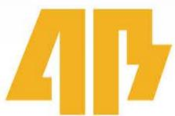

0571-87557906