## 2025

## 锦州永杉锂业股份有限公司

## 可持续发展报告

## SUSTAINABILITY REPORT

如欲获取报告的印刷版,或对报告有任何意见和建议,请联系:

联系机构: 锦州永杉锂业股份有限公司

地址: 中国辽宁省凌海市大有乡双庙农场

电话: 021-65100550

电子邮箱: wangweichao@yongshanlithium.com

## 目录

## CONTENT

关于本报告 1

董事长致辞 2

## 01 关于永杉锂业

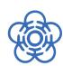

关于我们 03

发展历程 04

产业布局 05

企业文化 06

企业荣誉 07

## 02 利益相关方参与及重要性议题评估

利益相关方参与 08

重要性议题评估 09

## 03 企业治理

ESG治理 11

合规与风险管理 12

商业道德 13

## 04 绿色共赢

应对气候变化 16

能源管理 21

环境管理体系与合规 23

水资源管理 24

污染物排放 25

废弃物管理 26

循环经济 26

生态系统和生物多样性保护 27

## 05 优质产品

科技创新 29

知识产权保护 30

产品质量与安全 31

产品生命周期管理 33

客户管理 34

可持续供应链 35

化学品管理 36

## 06 以人为本

员工雇佣与权益 38

员工沟通参与 40

员工培训与发展 41

多元化与机会平等 44

职业健康安全 45

社区关系 49

慈善公益及乡村振兴 50

ESG绩效 52

报告标准索引表 58

## 关于本报告

## （一）时间范围

时间范围为2025年1月1日至2025年12月31日，部分内容超出上述范围将在正文进行说明。

## （二）报告范围

本报告披露的所有资料和数据均来自锦州永杉锂业股份有限公司控股子公司湖南永杉锂业有限公司。数据覆盖范围与上述不一致将会在正文进行说明。

## （三）指代说明

为方便表述和阅读,本报告中将使用“永杉锂业”“上市公司”指代“锦州永杉锂业股份有限公司”;“湖南永杉锂业”“公司”“我们”“永杉”指代“湖南永杉锂业有限公司”。

## （四）数据说明

本报告中所披露的所有数据均来源于公司内部数据收集与统计系统。在本报告中，如无特别说明，“元”指代“人民币元”。

## （五）编制依据

本报告参考全球可持续发展标准委员会(GSSB)发布的GRI可持续发展报告标准(GRI标准)和《上海证券交易所上市公司自律监管指引第14号——可持续发展报告(试行)》要求编写，并响应联合国2030年可持续发展目标(UN SDGs)进行相关信息披露。

## （六）确认及批准

本报告经公司管理层确认后，于2026年4月27日获董事会审批通过。上市公司董事会及全体董事保证本报告内容不存在任何虚假记载、误导性陈述或重大遗漏。

## (七) 报告查询指引

本报告可于上海证券交易所www.sse.com.cn查阅。若本报告和本公司年度报告有任何抵触或不相符之处，应以年度报告为准。

## (八) 免责声明

本报告的部分内容具有一定前瞻性,易受到不确定因素的影响而导致实际结果产生重大差异。本公司不承担更新本报告中任何前瞻性声明的义务。

## (九) 联系方式

如欲获取报告的印刷版(纸质版会采取FSC认证纸张印刷),或对报告有任何意见和建议,请联系:

联系机构:锦州永杉锂业股份有限公司

地址:中国辽宁省凌海市大有乡双庙农场

电话:021-65100550

电子邮箱:wangweichao@yongshanlithium.com本报告是锦州永杉锂业有限公司对外公开披露的非财务报告，旨在回应利益相关方期望，全面展示锦州永杉锂业股份有限公司控股子公司湖南永杉锂业有限公司在可持续发展方面的理念、管理、行动和成效。

## 永杉锂业2025年可持续发展报告董事长致辞

## 恪尽本责,共赴未来

本人谨代表上市公司董事会，欣然提呈本公司新一期的可持续发展报告。本报告系统梳理并呈现了我们在可持续发展道路上的最新思考、实践与绩效，这既是对过往一年探索的深化，更是我们面向未来所作绿色承诺的郑重延伸。

当前，全球能源转型浪潮与产业链重构相互交织，锂电产业在经历高速发展后，正面临周期性波动与供需关系调整等多重考验。然而，无论外部环境如何变化，我们始终坚信，可持续发展不仅是应对挑战的“稳定器”，更是赢得长远未来的“新动能”。湖南永杉锂业始终将绿色发展深度融入公司战略与日常运营，在推动生产工艺革新、构建循环经济体系、践行负责任供应链管理等方面持续投入。我们深信，ESG不是外在要求，而是企业高质量发展的内在基因，更是我们践行“品质、高效、担当、卓越”核心价值观的必然选择。

固治理之本，行稳健之道。精益治理，是企业稳健前行的保障，更是我们行稳致远的底气。自成立以来，湖南永杉锂业始终将完善的公司治理与审慎的风险内控视为企业高质量发展的基石。我们深知，卓越的治理能力是应对行业周期波动、实现长期稳健经营的根本保障。为此，公司持续致力于构建“风清气正”的经商环境，严格保护股东权益，并将ESG理念深度融入决策与运营的全过程。

过去一年，我们着力锤炼以“生产能力、建设能力、研发能力、资源能力、融资能力”为核心的五大竞争力。通过聚焦产品品质、加速项目高效建设、攻关核心技术、优化资源布局以及保持财务健康，不仅巩固了经营基本盘，也为穿越行业周期、履行社会责任积蓄了关键力量。同时，我们以“强内控、防风险、促合规”为目标，开展一系列、全链路的培训学习和践行活动，系统性推进内控体系优化与升级。通过完善制度、明晰权责与全员培训，致力于搭建一个严格、规范、全面且有效的内部控制网络。这套日益成熟的管理体系，不仅是达成“保交付、高周转”年度目标的坚实支撑，更是我们践行法律责任、守护企业价值、迈向可持续发展的核心保障。

深耕责任链，锻造韧性基。高效供应，是企业抢占先机的支撑，更是我们制胜市场的根基。在充满变化的全球产业链中，构建稳定、可靠且负责任的供应链，是湖南永杉锂业实现可持续发展的生命线。我们坚定推行“大客户、大矿企”战略，与全球领先的三元正极材料制造商及澳大利亚等地核心矿企建立了长期、稳固的战略合作，积极与“三元+磷铁头部客户+顶级贸易商”的全域客户拓展结构升级，构建起更具韧性的客户生态。这双重纽带不仅保障了高端市场的需求与上游资源的稳定供应，也使“品质优先、高效协同”成为我们赢得产业链上下游广泛认可的基石。

尤为重要的是,我们致力于将责任管理贯穿供应链全程。经过系统性建设与评估,公司的负责任矿产供应链管理体系成功通过了国际权威的RMAP(负责任矿产保证流程)审核。这一成果有力印证了我们在供应链合规性与透明度方面的承诺,不仅能为客户提供可信赖的产品,也为携手合作伙伴共同应对包括欧盟新电池法规在内的国际合规要求奠定了坚实基础。

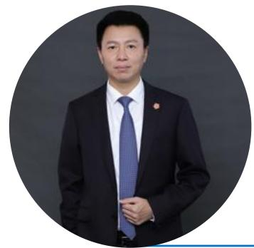

natural_image

Portrait of a man in formal suit and tie against a dark circular background (no text or symbols visible)

11

永杉锂业董事长

杨希龙致辞

聚才以兴业，同心以致远。价值共生，是企业健康成长的密码，更是我们对社会的责任担当。员工是湖南永杉锂业最宝贵的财富与发展的核心动能。我们始终致力于构建一个健康、平等、尊重、共融的办公环境，珍视每一位员工的个性与价值，并通过持续优化人力资源管理体系，为所有同事提供清晰的职业发展通道与能力提升平台，以激发其内在的专注力与创造力。

我们坚信，员工的全面发展是企业可持续发展的根基。因此，公司系统性地关注并维护员工各项权益，全方位呵护员工身心健康——通过举办弘扬工匠精神的技能竞赛、筑牢防线的安全生产月、倡导活力的体育赛事等多元活动，持续推进“永杉公益行”系列活动，用实际行动传递企业温情；开展家庭开放日活动，让家属感知企业温度。我们不仅丰富了组织生活，更将“以人为本”的理念切实融入日常，用点滴善举诠释企业公民的责任。旨在打造一个能让员工安心、舒心、潜心、暖心工作的和谐环境，为公司高质量发展提供坚实而持久的人才支撑。

循绿以增效，立标而领新。绿色发展，是企业安身立命的根基，更是我们对时代的庄严承诺。在锂盐行业，绿色生产不仅是环保责任，更是塑造核心竞争力的关键。湖南永杉锂业坚信，先进的工艺是实现可持续发展的根本。我们采用领先的火法焙烧与酸化工艺，在实现废水、废渣100%回收利用和废气超低排放的同时，更通过EMS综合能源管理系统，实现全厂热能梯级循环利用，并依托全智慧照明与智能化产线，使单吨锂盐能耗较行业标准显著降低，人均效率大幅提升，树立了“绿色、智能、循环”的制造新标杆。

面对全球气候挑战与“双碳”目标，我们将减碳承诺融入产品全生命周期。公司核心产品—电池级氢氧化锂与碳酸锂，已成功获得国际权威TÜV南德颁发的产品碳足迹认证。这不仅标志着我们成功突破了国际绿色贸易壁垒，更为公司的全球化战略注入了坚实的低碳动能，致力于引领行业向更清洁、更高效的未来迈进。

展望前路，任重道远。我们将以此报告为新的起点，把ESG更深地融入企业战略与运营的每一个环节。公司承诺将持续加大在清洁生产、循环经济与气候变化应对方面的投入，以技术创新驱动资源效率提升；不断巩固与利益相关方的信任与合作，共同应对全球供应链的新规则与新挑战；并将更加关注员工的全面发展与社区的和谐共生，让企业发展成果惠及更广泛的群体。我们深信，唯有秉持可持续发展理念，才能在全球转型进程中成为负责任、受尊敬的领军企业，为所有利益相关方创造更绿色、更美好的未来！

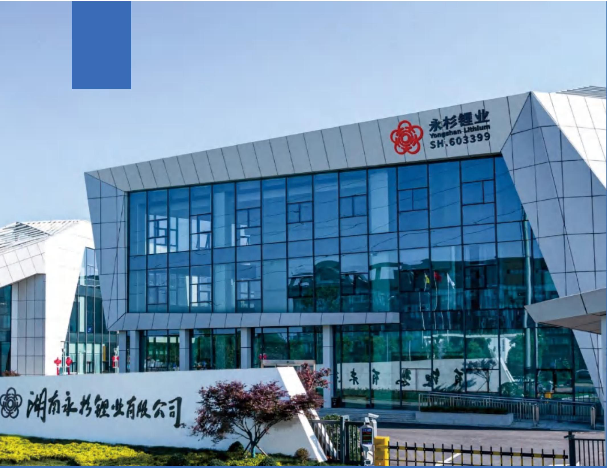

text_image

永杉锂业
Yongshan Lithium
SH.603399
湖南永杉锂业有限公司

## 1.1 \ 关于我们

锦州永杉锂业股份有限公司，证券简称“永杉锂业”，股票代码“603399”，2012年于A股主板上市，主营业务为钼业务。2022年，上市公司向新能源锂盐业务战略转型，收购湖南永杉锂业有限公司，持股90%。湖南永杉锂业是一家专注于高品质锂盐的研发、生产及销售的高新技术企业。湖南永杉锂业自成立以来，便致力于成为全球领先的高品质锂供应商，为新能源电动汽车、消费性电子产品、工业应用及储能领域提供关键原材料支持。

在业务范畴内, 湖南永杉锂业以锂盐为核心产品, 涵盖了碳酸锂、氢氧化锂、硫化锂、无水氢氧化锂、磷酸锂等多种高品质、高纯度的电池级锂盐。通过自主设计的第四代矿法锂盐生产制造装置, 公司不仅实现了大规模、高效率的生产, 还确保了产品质量的稳定性和可靠性。同时, 公司还注重环保和可持续发展, 通过回收利用固废、废液以及实现废气超低排放等措施, 积极践行绿色生产理念。

此外，湖南永杉锂业还具备强大的技术研发和创新能力。公司拥有一支由行业专家和资深技术人员组成的研发团队，致力于不断优化生产工艺、提升产品性能以及开发新型锂盐产品。通过与上下游企业的紧密合作，湖南永杉锂业能够及时了解市场需求和技术趋势，为客户提供更加定制化和专业化的解决方案。

## 01

关于

锦州永杉锂业有限公司

  
新能源电动汽车

  
消费性电子产品

  
工业应用

  
储能

## 1.2 \ 发展历程

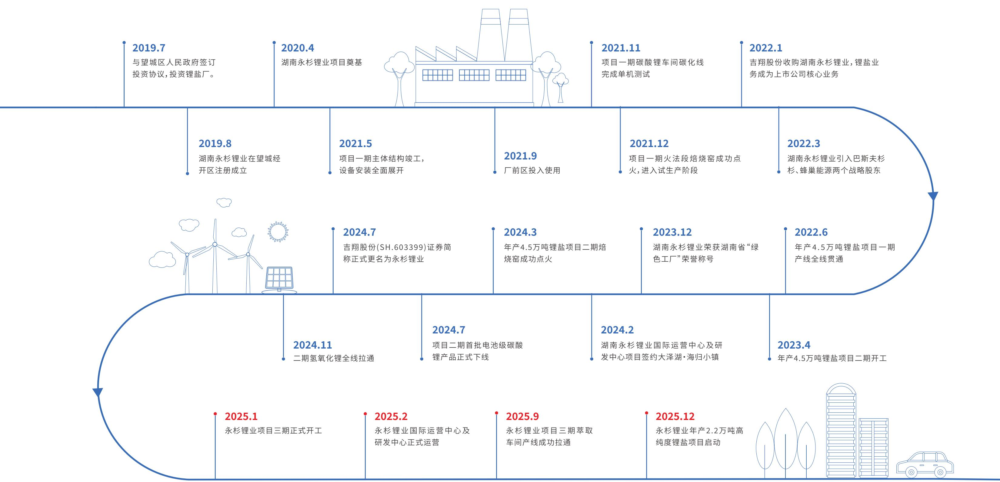

flowchart

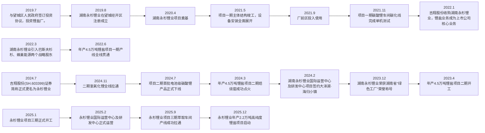
```mermaid
graph LR
  A["2019.7\n与望城区人民政府签订投资协议，投资锂盐厂。"] --> B["2019.8\n湖南永杉锂业在望城经开区注册成立"]
  B --> C["2020.4\n湖南永杉锂业项目奠基"]
  C --> D["2021.5\n项目一期主体结构竣工，设备安装全面展开"]
  D --> E["2021.9\n厂前区投入使用"]
  E --> F["2021.11\n项目一期碳酸锂车间碳化线完成单机测试"]
  F --> G["2022.1\n吉翔股份收购湖南永杉锂业，锂盐业务成为上市公司核心业务"]
  H["2022.3\n湖南永杉锂业引入巴斯夫杉杉、蜂巢能源两个战略股东"] --> I["2022.6\n年产4.5万吨锂盐项目一期产线全线贯通"]
  J["2024.7\n吉翔股份(SH.603399)证券简称正式更名为永杉锂业"] --> K["2024.11\n二期氢氧化锂全线拉通"]
  K --> L["2024.7\n项目二期首批电池级碳酸锂产品正式下线"]
  L --> M["2024.3\n年产4.5万吨锂盐项目二期焙烧窑成功点火"]
  M --> N["2024.2\n湖南永杉锂业国际运营中心及研发中心项目签约大泽湖·海归小镇"]
  N --> O["2023.12\n湖南永杉锂业荣获湖南省“绿色工厂”荣誉称号"]
  O --> P["2023.4\n年产4.5万吨锂盐项目二期开工"]
  Q["2025.1\n永杉锂业项目三期正式开工"] --> R["2025.2\n永杉锂业国际运营中心及研发中心正式运营"]
  R --> S["2025.9\n永杉锂业项目三期萃取车间产线成功拉通"]
  S --> T["2025.12\n永杉锂业年产2.2万吨高纯度锂盐项目启动"]
```

## 1.3 \ 产业布局 \

湖南永杉锂业自2019年成立以来，便致力于在新能源材料领域进行深度布局。公司选址于湖南省长沙市望城经开区铜官工业园，分三期建设了总占地面积达362亩的锂盐生产项目。

项目一期已于2022年上半年顺利投产，年产能达到2.5万吨，实现碳酸锂产品达99.9%高纯指标，推动锂产品质量跨越式发展；项目二期于2024年10月全面投产，产能提升至4.5万吨；项目三期，将建设一条2.2万吨碳酸锂生产线，进一步推动锂盐生产向高效、低碳、智能化方向迈进。

## 项目一期

2.5万吨

年产能

99.9%

高纯指标

## 项目二期

年产能提升至

4.5万吨

## 项目三期

2.2万吨

新增碳酸锂生产线

湖南永杉锂业作为湖南首个锂盐项目，不仅填补了湖南先进储能材料产业原料端的空白，还推动了湖南形成从锂盐到前驱体、正负极材料再到电池的完整产业链闭环，显著提升了湖南先进储能材料产业的竞争力。

在产业布局上, 湖南永杉锂业注重技术创新和绿色发展。我们采用自主设计的第四代矿法锂盐生产制造装置, 打造电池级、高纯级产品, 并实现了固废、废液的回收利用以及废气的超低排放。

未来，湖南永杉锂业将继续深化产业布局，加强与上下游企业的合作与联动，推动中国新能源产业的持续健康发展。同时，公司也将积极响应国家节能减排和绿色发展的号召，努力打造更加环保、高效的锂盐生产基地，为实现全球能源转型和可持续发展贡献力量。

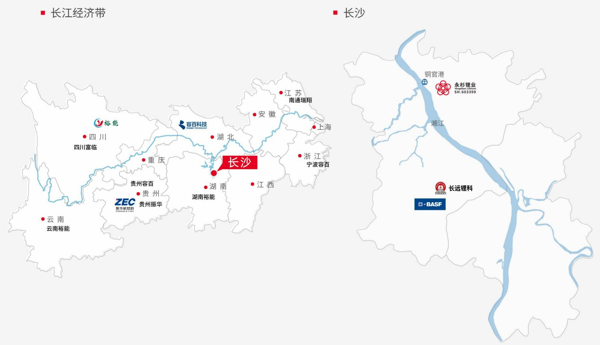

text_image

长江经济带
长江
云南
云南裕能
ZEC
瑞华新旭职
ZENHUA ZHENYU
裕能
四川
四川富临
重庆
贵州容百
贵州
贵州振华
湖南裕能
湖北
湖南
江西
江苏
南通瑞翔
安徽
上海
浙江
宁波容百
铜官港
永杉锂业
Yongshan Lithium
SH.603399
湘江
长远锂科
BASF

1.4 \ 企业文化  
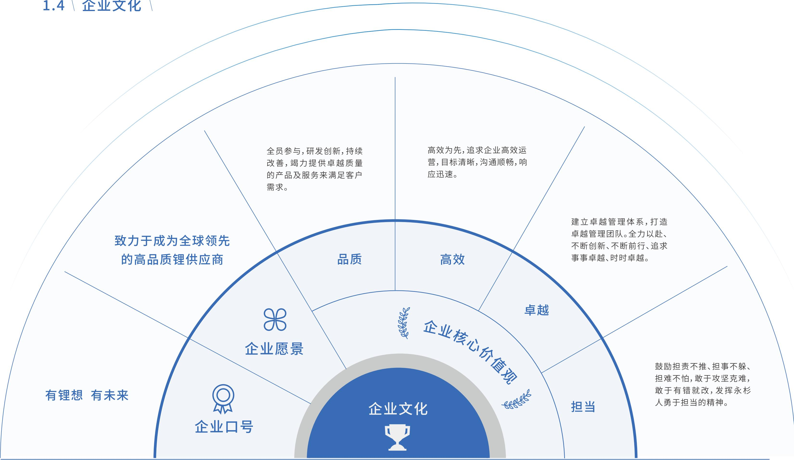

flowchart

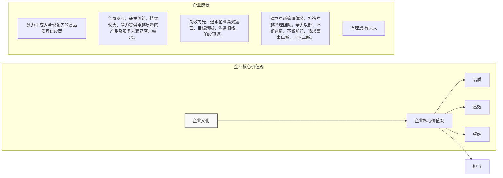
```mermaid
graph LR
  A["企业文化"] --> B["企业核心价值观"]
  B --> C["品质"]
  B --> D["高效"]
  B --> E["卓越"]
  B --> F["担当"]
  
  subgraph Core ["企业核心价值观"]
    direction TB
    A
    B
    C
    D
    E
  end
  
  subgraph Attributes ["企业愿景"]
    direction TB
    G["致力于成为全球领先的高品质锂供应商"]
    H["全员参与，研发创新，持续改善，竭力提供卓越质量的产品及服务来满足客户需求。"]
    I["高效为先，追求企业高效运营，目标清晰，沟通顺畅，响应迅速。"]
    J["建立卓越管理体系，打造卓越管理团队。全力以赴、不断创新、不断前行、追求事事卓越、时时卓越。"]
  end
  
  subgraph Attributes ["企业口号"]
    direction TB
    K["有理想 有未来"]
  end
  
  style A fill:#f9f9f9,stroke:#333,stroke-width:2px
```

1.5 \ 企业荣誉

<table><tr><td>类别</td><td>奖项名称</td><td>颁奖时间</td><td>颁奖机构</td></tr><tr><td rowspan="5">环境类</td><td>环境保护先进单位</td><td>2023.2</td><td>中共望城经济技术开发区工作委员会、望城经济技术开发区管理委员会</td></tr><tr><td>湖南省绿色工厂</td><td>2023.12</td><td>湖南省工业和信息化厅</td></tr><tr><td>长沙市营商环境监测点</td><td>2025.10</td><td>长沙市优化营商环境协调事务中心</td></tr><tr><td>湖南省绿色供应链管理示范企业</td><td>2025.10</td><td>湖南省工业和信息化厅</td></tr><tr><td>国家级绿色工厂</td><td>2026.2</td><td>工业和信息化部</td></tr><tr><td rowspan="9">社会类</td><td>湖南湘江新区2021年度投资百强项目</td><td>2022.2</td><td>中共湖南湘江新区工作委员会、湖南湘江新区管理委员会</td></tr><tr><td>长沙市高层次人才创新创业促进会理事单位</td><td>2023.11</td><td>长沙市高层次人才服务发展中心</td></tr><tr><td>AEO高级认证企业</td><td>2024.1</td><td>长沙市海关</td></tr><tr><td>安全生产标准化三级企业(危险化学品)</td><td>2024.6</td><td>长沙市安全生产协会</td></tr><tr><td>国家高新技术企业(重新评定)</td><td>2024</td><td>湖南省科学技术厅、湖南省财政厅、国家税务总局湖南省税务</td></tr><tr><td>企业引才奖</td><td></td><td></td></tr><tr><td>科技创新平台奖</td><td>2025.2</td><td>中共望城经济技术开发区工作委员会、望城经济技术开发区管理委员会</td></tr><tr><td>安全生产先进单位</td><td></td><td></td></tr><tr><td>湖南省制造业单项冠军</td><td>2026.1</td><td>湖南省工业和信息化厅</td></tr><tr><td rowspan="4">治理类</td><td>发展贡献奖</td><td>2023.2</td><td>中共望城经济技术开发区工作委员会、望城经济技术开发区管理委员会</td></tr><tr><td>科技创新示范奖</td><td></td><td></td></tr><tr><td>湖南省专精特新中小企业</td><td>2023.4</td><td>湖南省工业和信息化厅</td></tr><tr><td>湖南省省级企业技术中心</td><td>2023.5</td><td></td></tr><tr><td rowspan="5">经济类</td><td>长沙市工业企业“规模50强”</td><td>2023.3</td><td>长沙市制造强市建设领导小组办公室</td></tr><tr><td>长沙市工业企业“增长50强”</td><td></td><td></td></tr><tr><td>国家级专精特新“小巨人”企业</td><td>2023.7</td><td>工业和信息化部</td></tr><tr><td>2023湖南湘江新区民营企业“营收百强”</td><td>2023.12</td><td>中共望城经济技术开发区工作委员会、望城经济技术开发区管理委员会</td></tr><tr><td>2024年度工业强区突出贡献企业</td><td>2025.2</td><td>长沙市望城区人民政府办公室</td></tr><tr><td rowspan="2">加入的行业协会</td><td>湖南省电池行业协会理事单位</td><td>2021.1</td><td>湖南省电池行业协会</td></tr><tr><td>长株潭先进储能材料产业联盟会员单位</td><td>2021.8</td><td>长株潭先进储能材料产业联盟</td></tr></table>

## 02

## 利益相关方参与及重要性议题评估

## 2.1 利益相关方参与

湖南永杉锂业重视利益相关方沟通,通过常态化沟通机制了解利益相关方的意见与期待、开展针对性交流与回应,与各相关方建立长期互信的合作关系,确保重要性议题管理的包容性与平衡性。同时,我们及时快速有效地回应利益相关方的诉求和期望,并对公司可持续发展规划及实践进行更新及调整。

<table><tr><td>利益相关方</td><td>关注议题</td><td>主要沟通渠道</td></tr><tr><td rowspan="5">员工</td><td>员工雇佣与权益</td><td>培训</td></tr><tr><td>员工沟通参与</td><td>绩效考核</td></tr><tr><td>员工培训与发展</td><td>投诉与反馈</td></tr><tr><td>多元化与机会平等</td><td>员工满意度调查</td></tr><tr><td>职业健康安全</td><td></td></tr><tr><td rowspan="2">股东及投资者</td><td>合规与风险管理</td><td>股东大会</td></tr><tr><td>ESG治理</td><td>信息披露</td></tr><tr><td rowspan="7">客户</td><td>产品质量与安全</td><td></td></tr><tr><td>产品生命周期管理</td><td></td></tr><tr><td>可持续供应链</td><td>满意度调研</td></tr><tr><td>客户管理</td><td>日常沟通(电话、邮件及会面)</td></tr><tr><td>供应商管理</td><td></td></tr><tr><td>商业道德</td><td></td></tr><tr><td>化学品管理</td><td></td></tr><tr><td rowspan="3">供应商、承包商及其他合作伙伴</td><td>商业道德</td><td>供应商审核</td></tr><tr><td>可持续供应链</td><td>供应商能力建设,如培训等</td></tr><tr><td>化学品管理</td><td>日常沟通(电话、邮件及会面)</td></tr><tr><td rowspan="4">政府、监管机构</td><td>合规与风险管理</td><td></td></tr><tr><td>环境管理体系与合规</td><td>电话</td></tr><tr><td>社区关系</td><td>现场检查</td></tr><tr><td>慈善公益及乡村振兴</td><td></td></tr><tr><td rowspan="7">非政府组织NGO</td><td>能源管理</td><td></td></tr><tr><td>水资源管理</td><td></td></tr><tr><td>污染物排放</td><td>环境影响评价</td></tr><tr><td>应对气候变化</td><td>定期监测</td></tr><tr><td>废弃物管理</td><td></td></tr><tr><td>循环经济</td><td></td></tr><tr><td>生态系统和生物多样性保护</td><td></td></tr><tr><td rowspan="2">合作伙伴</td><td>知识产权保护</td><td>展会</td></tr><tr><td>科技创新</td><td>行业会议等</td></tr><tr><td rowspan="4">社区和媒体</td><td>社区关系</td><td></td></tr><tr><td>废弃物管理</td><td>投诉与反馈</td></tr><tr><td>慈善公益及乡村振兴</td><td>日常沟通(电话)</td></tr><tr><td>生态系统和生物多样性保护</td><td></td></tr></table>

## 2.2 重要性议题评估

重要性议题评估是公司开展可持续发展管理的核心。为理解各利益相关方的关注重点，并在公司可持续发展管理中融入利益相关方的诉求与期望，结合相关政策、行业发展趋势及外部专家建议，构建湖南永杉锂业2025年可持续发展报告重要性议题库。

为确定各议题的重要程度,我们采用线上问卷的形式,邀请利益相关方及公司的管治机构就上述议题从对利益相关方决策和评估的影响程度以及公司对环境、社会和经济的影响程度两个维度进行打分,最终得出本报告的重要性议题矩阵。

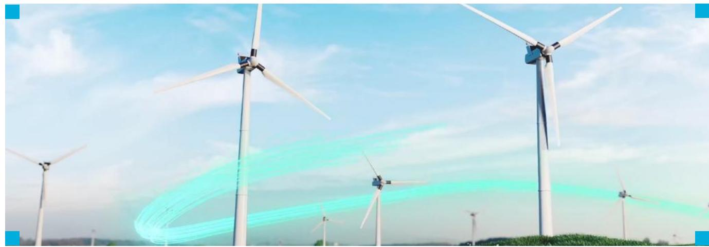

natural_image

Wind turbines in a field under a blue sky with abstract light patterns overlaid (no text or symbols visible)

## 湖南永杉锂业2025年度ESG报告重要性议题矩阵

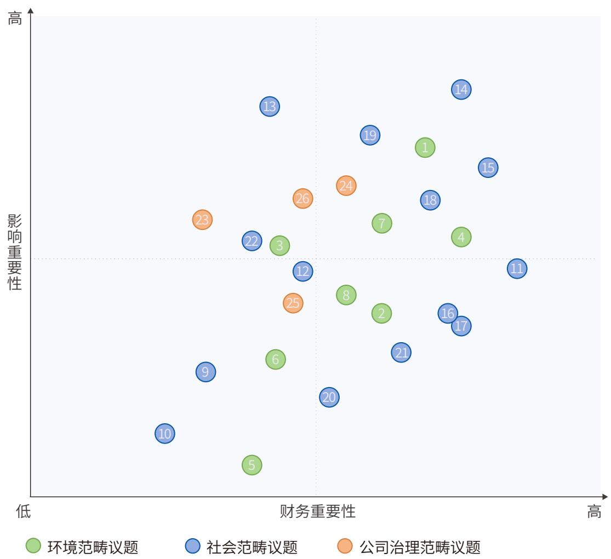

scatter

| ID | Category | Financial Importance (approx) | Impact Importance (approx) |
| --- | --- | --- | --- |
| 14 | 社会范畴议题 | ~0.85 | ~0.92 |
| 13 | 社会范畴议题 | ~0.45 | ~0.88 |
| 19 | 社会范畴议题 | ~0.65 | ~0.82 |
| 15 | 社会范畴议题 | ~0.88 | ~0.78 |
| 1 | 环境范畴议题 | ~0.75 | ~0.75 |
| 24 | 公司治理范畴议题 | ~0.65 | ~0.68 |
| 18 | 社会范畴议题 | ~0.75 | ~0.65 |
| 7 | 环境范畴议题 | ~0.68 | ~0.62 |
| 4 | 环境范畴议题 | ~0.82 | ~0.58 |
| 11 | 社会范畴议题 | ~0.92 | ~0.55 |
| 12 | 社会范畴议题 | ~0.55 | ~0.52 |
| 22 | 社会范畴议题 | ~0.45 | ~0.52 |
| 3 | 环境范畴议题 | ~0.48 | ~0.52 |
| 25 | 公司治理范畴议题 | ~0.52 | ~0.48 |
| 8 | 环境范畴议题 | ~0.62 | ~0.48 |
| 2 | 环境范畴议题 | ~0.68 | ~0.45 |
| 16 | 社会范畴议题 | ~0.78 | ~0.45 |
| 17 | 社会范畴议题 | ~0.82 | ~0.42 |
| 21 | 社会范畴议题 | ~0.68 | ~0.38 |
| 9 | 社会范畴议题 | ~0.35 | ~0.32 |
| 20 | 社会范畴议题 | ~0.52 | ~0.28 |
| 6 | 环境范畴议题 | ~0.45 | ~0.28 |
| 10 | 社会范畴议题 | ~0.25 | ~0.18 |
| 5 | 环境范畴议题 | ~0.42 | ~0.12 |

## 环境议题

1. 应对气候变化  
5.生态系统和生物多样性保护  
2.能源管理  
6.环境管理体系与合规  
3. 污染物排放  
7.水资源管理  
4.废弃物管理  
8. 循环经济

## 社会议题

9.慈善公益及乡村振兴  
16.客户管理  
10. 社区关系  
17. 化学品管理  
11.科技创新  
18. 职业健康安全  
12.知识产权保护  
19.员工雇佣与权益  
13. 可持续供应链  
20.员工沟通参与  
14.产品质量与安全  
21.员工培训与发展  
15. 产品生命周期管理  
22.多元化与机会平等

## 治理议题

23.ESG治理  
24. 合规与风险管理  
25. 利益相关方沟通  
26.商业道德

## 03|企业治理|

本章节回应SDGs:

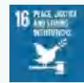

natural_image

Exterior view of a modern glass building facade with diagonal light blue panels (no signage or text)

## 3.1 ESG治理

## 可持续发展治理架构

为积极响应全球温室气体管理趋势,推进可持续发展体系建设,湖南永杉锂业搭建可持续发展管治体系,董事会作为可持续发展管理架构的最高决策机构,为公司更好地应对可持续发展挑战提供顶层支持。

董事会下设可持续发展委员会，公司董事长兼总经理杨峰担任委员会主任，品质技术中心总监王立中任执行副主任，主要成员包含公司副总经理邵勋、张金涛。可持续发展委员会主要职责为：负责公司级可持续发展目标、方针、政策及制度的制定，统筹可持续发展管理体系的建立、实施和持续改进；确保公司可持续发展管理符合相关法律法规、国际标准及客户要求；组织编写公司年度可持续发展报告。

各部门以品质管理部为核心，经可持续发展委员会监督，开展节能减排、废弃物管理、废水、废气等污染物排放管理、员工权益、社区关系等可持续发展相关工作。

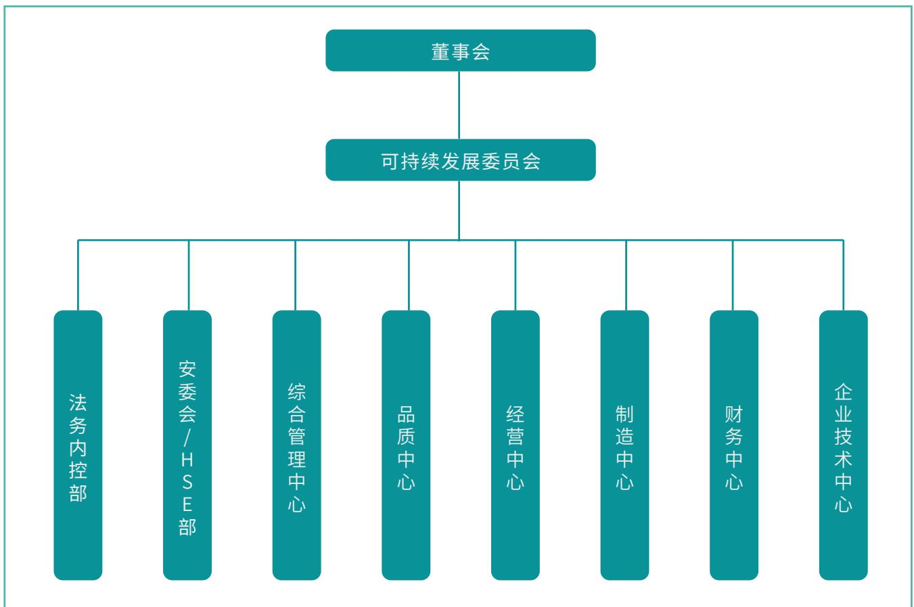

flowchart

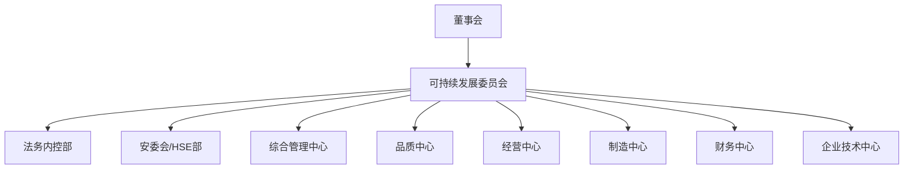
```mermaid
graph TD
  A["董事会"] --> B["可持续发展委员会"]
  B --> C["法务内控部"]
  B --> D["安委会/HSE部"]
  B --> E["综合管理中心"]
  B --> F["品质中心"]
  B --> G["经营中心"]
  B --> H["制造中心"]
  B --> I["财务中心"]
  B --> J["企业技术中心"]
```

## 董事会独立性与多元化

永杉锂业遵守《中华人民共和国公司法》《上市公司独立董事管理办法》等法律法规、交易所要求及公司制度要求委任董事会成员，确保公司董事会成员构成的合法合规性。截止本报告期末，公司董事会设董事7名，其中非执行董事7名。

在董事会独立性方面, 公司独立非执行董事应邀于审计委员会、薪酬与考核委员会、提名委员会任职, 且审计委员会由独立非执行董事担任召集人, 其中审计委员会召集人为财务领域专家戴继雄, 确保审计委员会更有效地监督公司财务活动。

在董事会成员多元化方面，公司在《董事会提名委员会实施细则》中规定：“公司在董事选拔过程中综合考虑年龄分布、任期、专业背景等多方面因素，确保董事会成员具备丰富的背景和专业能力。”公司董事会拥有丰富的专业经验及行业背景，其中独立董事谢佑平是法务领域的专家，在法律风控领域有丰富的经验和专业见解；独立董事包晓林是产业领域的专家，有极强的行业资源整合能力以及良好的项目投资管理实操经验。此外，公司董事会涵盖广泛的年龄层。

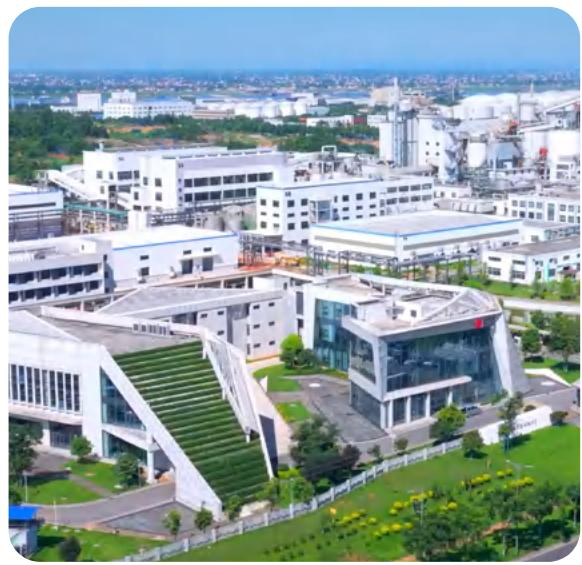

natural_image

Aerial view of a modern industrial complex with white buildings, green landscaping, and surrounding greenery (no visible text or signage)

## 董监高绩效与薪酬管理

湖南永杉锂业制定并实施《董事会薪酬与考核委员会实施细则》，进一步建立健全内部激励与约束机制。薪酬与考核委员会负责研究并监督对公司董事及高级管理人员的考核、激励、奖励机制的建立及实施，以及股权激励计划等的制定或变更。

进一步推动与激励可持续发展,公司将ESG核心指标全面纳入高级管理层绩效考核体系,覆盖节能技改、排放管理、水资源消耗管理、能源转型、社区维护等重点领域。通过实施与薪酬激励联动的考评机制,推动可持续发展目标自上而下贯穿各业务层级,确保战略贯彻与管理落地。

## 3.2 合规与风险管理

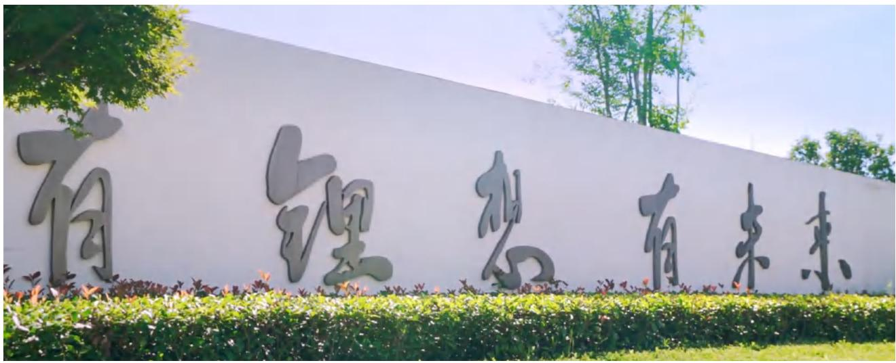

text_image

有锂 想有未来

湖南永杉锂业重视依法治企，不断完善企业合规管理体系，加强内控与风险管控能力，推进公司稳健经营。永杉锂业严格遵守《中华人民共和国公司法》等法律法规要求，制定了一系列内部治理制度，建立由股东大会、董事会及管理层组成的现代化企业治理架构，形成科学规范、运行有效的公司治理机制。

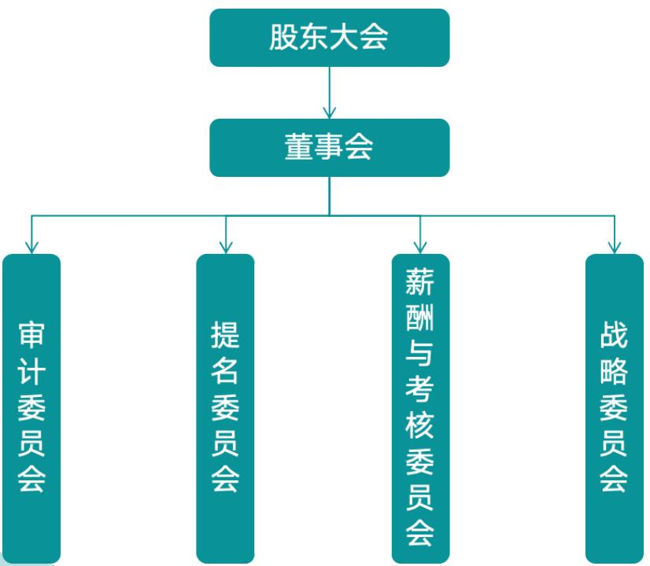

flowchart

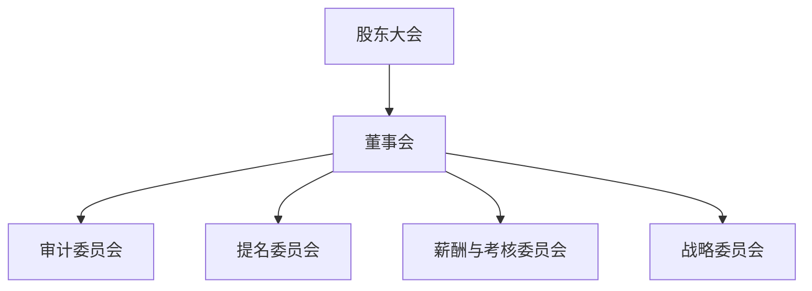
```mermaid
graph TD
  A["股东大会"] --> B["董事会"]
  B --> C["审计委员会"]
  B --> D["提名委员会"]
  B --> E["薪酬与考核委员会"]
  B --> F["战略委员会"]
```

## 面对生产风险：

公司自主研发的第四代矿法锂盐生产装置,通过技术创新和流程优化,有效降低了生产过程中的风险。此外,湖南永杉锂业实施了EMS综合能源管理方案,实现高温和中温热能的循环利用,以降低能耗和运营成本,为客户提供高品质产品的同时保障环境和资源的可持续性。

## 面对供应链风险：

公司重视全球及区域环境、市场变化所带来的任何供应链风险，逐步将ESG纳入供应商管理机制，完善供应商评审制度，通过签订年度采购协议加强与主要供应商战略合作，同时公司运用动态库存管理以充分预防断供风险，加强与海外主要矿企合作，确保原材料供应稳定。

## 面对市场波动风险：

公司成立专业期货管理小组，通过碳酸锂套期保值业务，有效抵消现货端价格波动损失。同时，公司与上下游供应商及客户签订浮动定价长协，定价与上海有色金属网市场价格挂钩，从而缩小价差敞口，实现成本与售价同步传导，避免单边价格波动侵蚀利润。

公司2025年合规与风险管理目标为不发生重大合规风险事件。为满足这一目标，公司严格遵守国家关于环境保护和安全生产的法律法规，制定了完善的合规与风险管理框架，并开展定期审查，确保在生产运营中符合国家和行业的标准。此外，公司要求员工和供应链伙伴共同遵循道德行为准则。报告期内，公司未因违反经济、环境和社会领域法律法规而受到制裁或处罚。

## 3.3 商业道德

湖南永杉锂业严格遵守《中华人民共和国反垄断法》《中华人民共和国反不正当竞争法》《关于禁止商业贿赂行为的暂行规定》等法律法规，将商业价值与企业社会责任相融合。报告期内，公司制定了《反腐激励制度》《反垄断、反不正当竞争管理制度》等，覆盖商业道德各个细分议题与内容，明确禁止员工及供应商等合作伙伴的商业贿赂与不正当竞争行为，以制度保障廉洁、规范的商业环境。

为进一步提升经营管理的规范性和透明性，保障公司利益不受侵害，湖南永杉锂业成立反腐工作小组。

<table><tr><td>反腐工作小组职位</td><td>成员</td><td>工作职能</td></tr><tr><td>组长</td><td>·董事长杨峰</td><td>·对全部反贪污腐败事宜负责</td></tr><tr><td>副组长</td><td>·副总经理邵勋·法务内控总监黄晓辉</td><td>·协助组长统筹推进反腐工作,共同负责跨部门协调、监督调查执行</td></tr><tr><td>成员</td><td>·法务内控部·采购部·财务部</td><td>·法务内控部负责线索收集、调查取证、法律诉讼对接;·采购部负责保障调查期间物料供应,收集采购环节腐败线索;·财务部整理提报财务资料,核算经济损失并协助追索</td></tr></table>

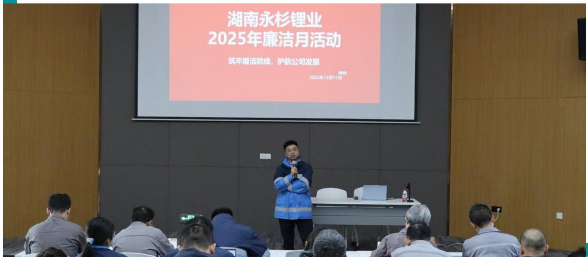

text_image

湖南永杉锂业
2025年廉洁月活动
筑牢廉洁防线，护航公司发展
2025年12月11日

## 反贪腐管理

公司与供应商签订《阳光协议》，并在节假日前向供应商发送廉洁信函，进一步强调合作关系的廉洁性。此外，公司成立了专项检查工作小组，每年对各部门进行巡查，确保公司各环节的合规性和廉洁性，进一步规范内部管理。

湖南永杉锂业对所有员工和商业伙伴提出严格的反腐败要求,明确禁止任何形式的不当交易行为,包括不当付款、礼品赠予、不正当竞争及信息泄露等行为。公司规定不得以任何形式操纵投标或参与不正当竞争活动,以保障市场的公平性和公司声誉。

## 反不正当竞争管理

根据相关内部制度，公司主动识别、评估并应对商业活动中可能出现的商业混淆、虚假宣传、商业诋毁及侵犯商业秘密等违法与不道德行为风险，通过完善内部控制流程、实施全员合规培训、培育诚信文化，将合规表现纳入管理考核，持续强化全员的公平竞争意识与责任。公司法务内控部负责各项反不正当竞争、反垄断措施的执行，一旦发现问题立即向董事会及可持续发展委员会汇报。其他部门负责配合不正当竞争事件调查取证。

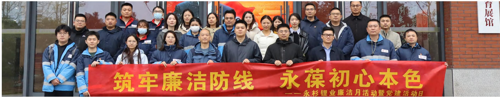

text_image

育展馆
筑牢廉洁防线 永葆初心本色
——永杉锂业廉洁月活动暨党建活动日

## 举报机制

湖南永杉锂业致力于维护廉洁、诚信、公平的文化氛围，鼓励员工和知情人士积极举报任何违反公司规章制度或损害公司利益的行为。公司为举报人提供了多种渠道，包括电话、邮件、微信及来访等，确保举报的便利性。所有举报均由公司法务内控部受理，并负责对举报事项的立项、处理及反馈。

公司建立了系统化的投诉与举报处理流程，确保督查事项得到规范、高效的处置。法务内控部作为归口部门，负责受理、初核与调查：对线索清晰的匿名举报开展初核，符合立案标准的予以立案；对实名举报直接启动调查并及时反馈结果。调查过程中，督查人员有权调阅资料、询问相关人员，并运用访谈、检查、核对等方式确保事实清楚。发现问题后，将督促责任部门限期整改，并对整改结果进行复查，形成闭环管理。涉及高级管理人员的举报由董事会主导调查，必要时将聘请外部专家协助。

微信公众号:永杉锂业

举报电话:18069202656

举报邮箱:hnys@yongshanlithium.com

举报地址:中国湖南省长沙市望城经济技术开发区铜官循环经济工业园新源路230号

## 举报人保护

公司高度重视对举报人的保护,建立严格的保密与反报复机制。

在保密方面,受理举报实行单独沟通,严禁无关人员探听;督查人员须对举报人身份、举报内容及证据全程保密,举报材料按密件管理,未经允许不得复制、泄露。公司明确禁止任何形式的报复行为,包括骚扰、降级、解雇、威胁等,并承诺善意举报人即使举报内容经查不实,也不会因此受到不公正对待或失去工作。举报人如认为自己或他人遭受报复,可立即联系法务内控部,公司将对实施报复的行为人严肃处理。

此外，公司对实名举报且查证属实的举报人予以奖励，并在评优晋升中优先考虑；对外部合作单位举报人给予荣誉激励及业务合作优先权，多措并举营造安全、可信的举报环境。

## 案例一：

## 反贪腐及不正当竞争培训

为深化廉洁文化建设，2025年12月公司组织开展“廉洁月”系列活动，通过法律法规学习、外出培训、警示教育、知识竞赛等形式，中高层及关键岗位员工覆盖率 $100\%$ ，系统强化员工对腐败、不正当竞争风险的防控意识与行为规范，持续营造风清气正、合规经营的企业环境。

## 04 | 绿色 共赢

本章节回应SDGs:  
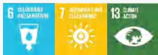

natural_image

Aerial view of a winding river cutting through lush green grasslands under bright sunlight.

Li-ghting the Dream and Future

## 4.1 应对气候变化

公司严格遵守《上海证券交易所上市公司自律监管指南第4号--可持续发展报告编制(征求意见稿)》和《国际财务报告可持续披露准则第2号可持续相关财务信息披露气候相关要求》(IFRS Sustainability Disclosure Standards 2 Climate Related Disclosures, IFRS S2)并制定《温室气体盘查管理程序》等内部文件，计划从治理、战略、风险管理、指标和目标四个方面出发，应对气候变化，践行价值链低碳转型。

natural_image

Aerial view of a forested hillside with a winding road, partially covered by turquoise water (no text or symbols visible)

## 治理

湖南永杉锂业董事会作为公司可持续发展管理和气候相关议题的最高决策机构，对公司可持续发展管理方针与ESG策略履行议事、决策、管理和监督责任。公司董事会下设可持续发展委员会，并由其具体协调各职能部门开展气候相关议题的具体工作。

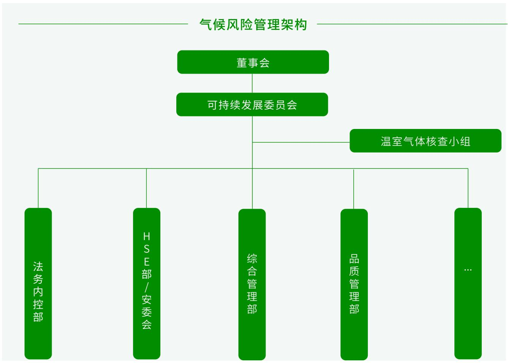

flowchart

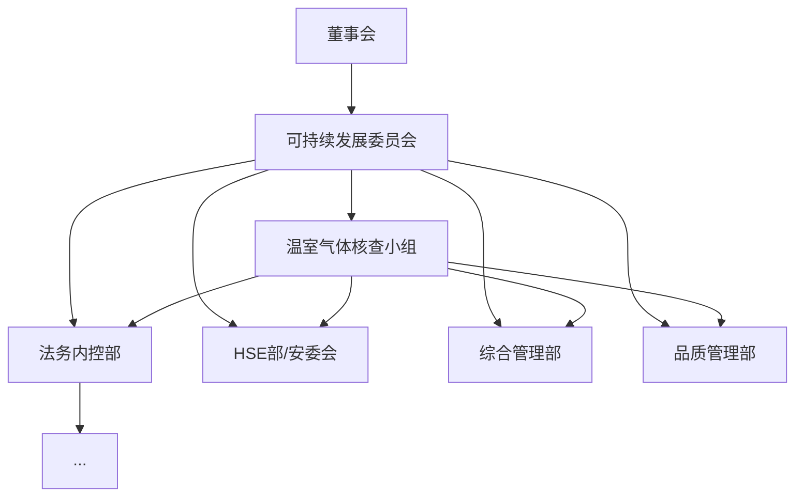
```mermaid
graph TD
  A["董事会"] --> B["可持续发展委员会"]
  B --> C["温室气体核查小组"]
  B --> D["法务内控部"]
  B --> E["HSE部/安委会"]
  B --> F["综合管理部"]
  B --> G["品质管理部"]
  C --> D
  C --> E
  C --> F
  C --> G
  D --> H["..."]
```

<table><tr><td>董事会</td><td>公司气候治理架构的最高决策机构,负责监督审查公司气候变化风险管理工作,并就可持续发展委员会的专项汇报进行审议与指导</td></tr><tr><td>可持续发展委员会</td><td>主要负责气候变化管理工作,包括确定气候战略与碳中和目标,评估相关风险与机遇,监督节能减排举措的执行等</td></tr><tr><td>温室气体核查工作组</td><td>由公司品质管理部牵头,依据《温室气体盘查管理程序》开展组织碳及产品碳核查工作,负责公司温室气体排放控制的策划与推动,推动设置公司组织碳目标其他部门负责管理、统计、记录本部门负责的排放源,并按照温室气体管理工作的需求,支持配合品质管理部完成碳排放管理工作</td></tr></table>

## 战略

作为公司可持续发展重点关注领域之一，我们识别、分析与湖南永杉锂业相关的重大气候风险与机遇，并计划针对范围一、范围二和范围三制定相关目标及行动计划，包括低碳设计、低碳生产、低碳供应链及低碳物流计划。

<table><tr><td rowspan="2">类型</td><td rowspan="2">风险分类</td><td rowspan="2">风险描述</td><td colspan="3">潜在影响</td><td rowspan="2">应对措施</td></tr><tr><td>影响时限</td><td>价值链环节</td><td>财务影响</td></tr><tr><td rowspan="2">物理风险</td><td>急性风险</td><td>台风、洪水、生物灾害等极端事件</td><td>短期-中期</td><td>生产运营、物流等</td><td>成本上升、收入下降</td><td>1.制定并定期演练极端天气应急预案;2.关键生产设施与仓储进行防洪、防风加固;3.建立多元化的物流备用路线与供应商网络;</td></tr><tr><td>慢性风险</td><td>气温与降雨量的逐渐变化,海平面上升</td><td>长期</td><td>上游供应、生产运营等</td><td>成本上升、收入下降</td><td>1.搭建节水技术与循环水系统,应对水资源压力;2.在选址、扩产时将气温、降水等因素纳入考量</td></tr><tr><td rowspan="4">转型风险</td><td>政策与法规风险</td><td>节能减排相关法律法规及政策出台,例如温室气体排放定价升高、对节能减排产品和服务的激励政策等</td><td>中期-长期</td><td>上游供应、生产运营等</td><td>材料价格上涨导致成本上升,低碳生产运营导致成本上升</td><td>1.加大节能技术改造与清洁能源采购投入;2.设立专项团队跟踪解读政策,争取绿色激励;</td></tr><tr><td rowspan="3">市场风险</td><td>市场对绿色产品的青睐,产品碳阈值设定</td><td>短期-中期-长期</td><td>上游供应、生产运营等</td><td>材料价格上涨导致成本上升,低碳生产运营导致成本上升</td><td>加强低碳产品研发与认证(如碳足迹核算)</td></tr><tr><td>能源/材料成本上涨</td><td>中期-长期</td><td>上游供应</td><td>成本上升,收入下降</td><td>与供应商签订长期协议锁定成本,投资可再生能源</td></tr><tr><td>利益相关方对负面或争议事件的关注,导致资本评级降低,融资成本增加或途径受阻等</td><td>短期-中期</td><td>生产运营</td><td>成本上升</td><td>定期发布独立的ESG报告,主动与投资者及评级机构沟通</td></tr><tr><td rowspan="3">机遇</td><td>可再生能源转型</td><td>节能减排相关法律法规及政策出台,例如温室气体排放定价升高、对节能减排产品和服务的激励政策等</td><td>短期-中期</td><td>生产运营</td><td>成本上升,但收入增加</td><td>1.主动参与绿电交易,提升可再生能源使用比例;2.系统推进工艺节能改造,降低单位产品能耗</td></tr><tr><td>资源管理</td><td>通过能源管理、水资源及物料的循环利用,推行绿色生产举措均可提升资源效率,降低公司的运营成本,同时实现生产效率和供应能力的提升</td><td>中期-长期</td><td>上游供应</td><td>成本下降</td><td>1.建立资源循环利用体系(如废水回用、锂渣回收);2.利用MES系统实现数字化能源管理;3.与供应商合作开展绿色供应链项目;</td></tr><tr><td>低碳产品</td><td>在低碳经济转型背景下,绿色低碳产品需求可能增加;进一步开发和提供低碳产品能够使公司更好地适应市场需求,获得额外的增长</td><td>长期</td><td>销售及价值链下游</td><td>收入上升</td><td>1.加大低碳/零碳锂盐产品研发投入,推动产品碳足迹核算与认证;2.探索与下游电池、车企客户签订长期绿色采购协议</td></tr></table>

natural_image

Aerial view of a winding road with green lane markings and a car driving on it, surrounded by dense green forest (no text or symbols visible)

## 影响、风险和机遇管理

湖南永杉锂业计划将气候相关风险与机遇纳入整体风险管理，减少气候变化给公司带来的不利影响。公司在气候风险负责人的领导下进行专项规划，定期跟踪相关行动和计划进展，开展项目年度目标考核，并持续探索优化工作机制及流程。

## 碳排放管理流程

1

制定碳排放目标

- 设定碳排放总量控制目标和分阶段减排目标  
- 根据国家相关政策、行业标准和自身实际情况，合理设定碳排放总量控制目标  
- 定期评估碳排放目标的实现情况,并根据评估结果调整目标

2

碳排放核算与报告

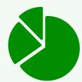

- 建立健全碳排放核算体系,确保碳排放数据的准确性和可靠性  
- 定期进行碳排放核算,并编制碳排放报告

3

制定碳排放减排措施

- 优化生产流程,提高能源利用效率  
- 推广清洁能源, 减少化石能源使用  
- 加强节能减排技术研发与应用  
- 开展员工节能减排培训,提高全员环保意识

4

建立健全的碳排放管理监督机制，对碳排放管理工作进行监督公司参照GHG Protocol以及ISO 14064-1:2018相关要求,对公司运营地开展温室气体盘查,并委托第三方开展独立核查。报告期内,公司已获得国际权威认证机构TÜV南德意志集团颁发的组织温室气体核查声明证书。

natural_image

Mountainous landscape with steep slopes and green vegetation, no visible text or symbols

同时, 公司参照 ISO14067:2018 要求积极开展产品碳足迹测算, 以系统性地量化和管理自身碳排放。2025年, 公司分别对关键产品电池级单水氢氧化锂、电池级碳酸锂进行产品碳足迹盘查, 完成碳足迹认证。

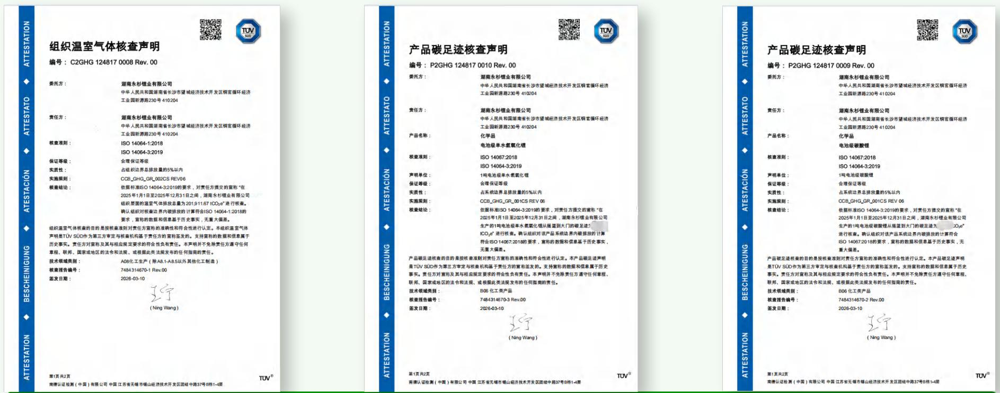

## 指标和目标

公司致力于推动绿色运营,实现温室气体减排。以2024年为基准年,公司设定的2025年应对气候变化目标及实现情况如下:

<table><tr><td>指标</td><td>目标</td><td>2025年实际完成情况</td></tr><tr><td>单吨产品碳排放</td><td>降低5%</td><td>降低8.15%</td></tr></table>

注:组织温室气体排放包含范围一、范围二、范围三;其中范围三包括上游货物运输和分销产生的排放、下游货物运输、废弃物运输、商务差旅、员工通勤;

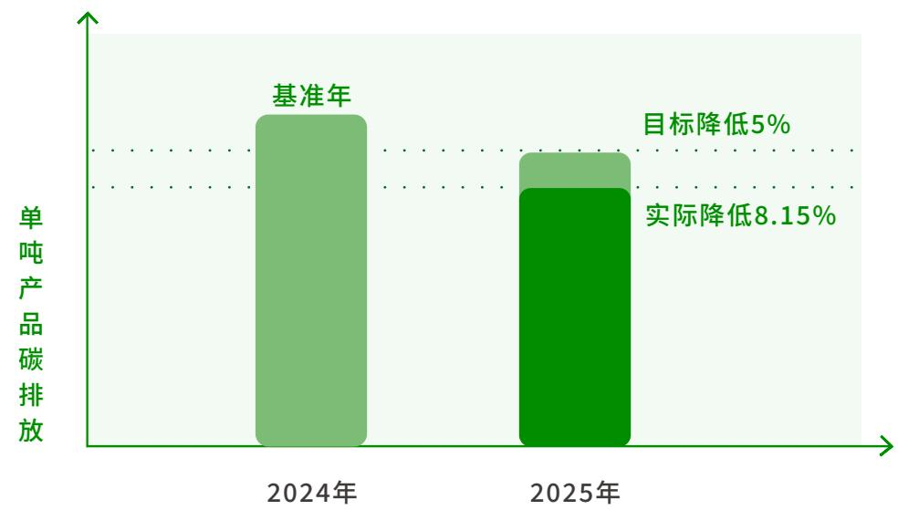

bar

| 年份 | 单吨产品碳排放 |
| --- | --- |
| 2024年 | 基准年 |
| 2025年 | 目标降低5% |
| 2025年 | 实际降低8.15% |

## 4.2 能源管理

公司严格遵守《中华人民共和国节约能源法》，制定《能源管理制度》，建立能源管理领导小组，明确各部门、各班组职责，通过计量器具配备、数据统计分析和用能行为规范等措施，系统推进节能降耗工作。

公司已制定能源利用总体目标，并定期追踪目标完成情况。以2024年为基准年，2025年目标及实际完成情况如下：

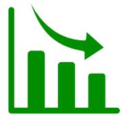  
单吨产品耗电量

目标 → 2025年实际完成情况
-3% -4.32%

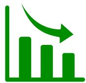  
单吨产品耗蒸汽量

目标 → 2025年实际完成情况
-10% -18.41%

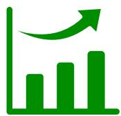  
可再生电力比例

目标 → 2025年实际完成情况
+8% +10.60%

公司主要消耗能源包括外购电力、蒸汽、天然气、柴油及汽油，2025年具体使用情况如下：

<table><tr><td>能源类型</td><td>单位</td><td>2025年</td></tr><tr><td>天然气</td><td>立方米</td><td>22,313,435.20</td></tr><tr><td>汽油</td><td>千克</td><td>3,313.52</td></tr><tr><td>柴油</td><td>千克</td><td>10,620.23</td></tr><tr><td>外购电力</td><td>千瓦时</td><td>157,261,448.00</td></tr><tr><td>蒸汽</td><td>吨</td><td>141,321.80</td></tr></table>

## 2025年绿电绿证购买使用情况

公司于2025年系统推进绿色电力替代。根据统计，公司在报告期内累计采购绿色电力16,631 MWH，并同步购入绿证16张。通过主动配置绿电与绿证，公司该期间绿色电力消费量约占总用电量的 $10.6\%$ ，有效降低了范围二碳排放。

绿色电力

16,631 MWH

绿证

16 张

绿色电力消费量

10.6% 占比总用电量

<table><tr><td colspan="2">能源利用管理措施</td></tr><tr><td>火法二期酸化窑天然气项目</td><td>公司对二期酸化窑实施了综合性节能改造。项目采用高效热风循环供热系统,使综合热效率达85%以上,并优化保温设计以减少散热。通过预热助燃空气和循环利用余热烟气,系统在提升温度精度的同时,从源头降低了天然气消耗与氮氧化物生成,实现了清洁生产与能效提升的双重目标。</td></tr><tr><td>焙烧尾气余热回收</td><td>为解决一期火法产线篦冷机高温废气直接排空的问题,公司启动了余热回收项目。利用闲置及新增的余热锅炉,分别回收一、二期产线排放的热量,将其转化为可利用的蒸汽。两套系统设计蒸汽产能合计6.7吨/小时,将原本废弃的热能有效回收,显著提高了整体能源利用效率。</td></tr><tr><td>厂区10MWh储能系统项目</td><td>公司积极推进绿色能源体系建设,于厂区成功投建一套10MWh工商业储能系统。该项目采用磷酸铁锂电池与智能能量管理系统,通过峰谷电价套利、需量管理及应急备电等功能,显著降低用电成本、提升能源利用效率,并增强生产供电可靠性。项目预计运营10年,累计收益超400万元,不仅带来经济效益,也为构建智能、低碳的能源管理体系提供支持。</td></tr><tr><td>MES能源管理系统</td><td>为深入推进能源精细化管理,公司部署了MES系统能源管理模块。该系统实现了对全厂电力、蒸汽、天然气等能源数据的实时采集、可视化监测与多维度统计分析。通过自动计算单位产品能耗等核心指标,并与生产排程、工艺参数深度集成,系统为精准查找能效薄弱环节、优化生产调度提供了高效的数据决策支持,将能源管理推向“精细化、可视化、可优化”的新阶段。</td></tr><tr><td>碳酸锂工艺二氧化碳回收利用优化</td><td>公司对碳酸锂生产线实施了技术改造,通过将碳酸锂C的进料方式优化为“气泡水”方式,提升了二氧化碳的初始利用率;同时,对碳化线二氧化碳压缩机进行补压优化,并通过控制气液分离器排空阀开度,有效减少漏气。上述措施使产线二氧化碳回收利用率从2024年的61.04%显著提升至2025年的87.29%,同比提高26.25%,实现了生产过程中二氧化碳的高效循环利用。</td></tr><tr><td>日常绿色办公</td><td>公司将绿色运营理念融入日常管理,发布《关于全面推行节约用水、用电及办公资源的通知》,系统推进资源节约。通过设定空调温度、倡导人走电断、推广双面打印等具体措施,引导全员从行为细节践行节能降耗。此外,公司还通过错峰用电、风机节能改造及选用高能效电机的方式,切实推动绿色办公。</td></tr></table>

## 4.3 环境管理体系与合规

公司高度重视对环境合规的管控，建立环境管理体系。我们严格遵守《中华人民共和国环境保护法》《中华人民共和国环境影响评价法》等法律法规，制定《环境保护目标责任制度》《环保奖惩制度》等内部制度，由HSE部牵头，下属部门配合成立环境保护领导小组，保障相关制度落地。

## 环境保护目标：

(1)无污染外环境的事故事件发生；  
(2)废水、废气达标排放；  
(3)物料泄漏大于50L的事件为0起;  
(4)固体废物管理规范:危险废物产生、中转、临时贮存环节合法合规,最终委托资质合规的危废经营单位合法处置;  
(5)突发环境事件及时响应处置率为100%

截止报告期末, 公司环保目标均已达成, 并获得 ISO 14001 环境管理体系认证。

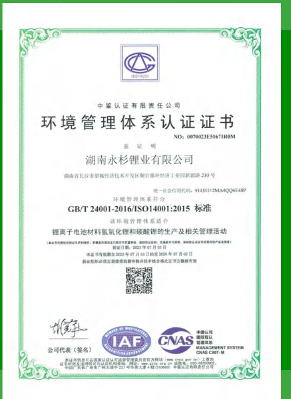

text_image

中鉴认证有限责任公司
环境管理体系认证证书
NO: 0070023E51671R0M
益证明
湖南永杉锂业有限公司
湖南省长沙市望城经济技术开发区铜官循环经济工业园新源路230号
统一社会信用代码: 91430112MA4QQ6E48P
环境管理体系符合
GB/T 24001-2016/ISO14001:2015 标准
该环境管理体系适合
锂离子电池材料氢氧化锂和碳酸锂的生产及相关管理活动
（本证书自取得有效许可证后取得，若遇危及因重大生产经营冲突等事项，须经公证机关依法登记，经批准后方可经营，须经审批机关书面确认并经办妥后方可生效）
颁证日期：2023年07月03日
本证书有效期自2023年07月03日始至2029年07月02日
获证组织必须定期接受监督审核并经审核合格此证书方继续有效
中国认可
国际认证
管理体系
MANAGEMENT SYSTEM
CNAS-C007-M
公司代表（签名）
IAF
CNAS
中鉴认证有限责任公司
证券代码为国信认证认可的基金管理委员会官方网站（www.cncn.gov.cn）上指定的注册地址及适用性公告以登记机构为准。网址：www.ijfzq.com或登录：020-66350063。
中国广东省广州市广州大道中227号华原大厦4楼（310600）中国认证有限责任公司

natural_image

Aerial view of a dense forest with numerous conifered evergreen trees (no visible text or symbols)

## 环境风险管理

公司制定《应急准备和响应控制程序》，针对可能发生的突发事件，预先建立预防、预警、响应、处置、恢复的全流程管理体系。一旦发现存在严重环境风险，公司将立即成立风险评估小组，收集资料，进行现场风险识别、评估并划分风险等级，开展应急响应措施。

同时, 公司每年年初根据已制定的应急预案, 按车间、部门、公司三个级别制定了年度《应急演练计划》, 开展相关应急演练。这一举措有效地增强了员工的安全意识和应急处置能力, 建立了长效安全管理机制, 营造安全有序的生产经营氛围。

## 4.4 水资源管理

水资源管理对企业可持续发展有着深远的影响。湖南永杉锂业严格遵守《中华人民共和国水法》等法律法规并制定《雨水管理制度》、《废水管理制度》等相关水资源保护制度，构建起从源头控制、过程监管到末端治理的全过程管理模式，确保水资源的高效利用和有效保护。公司董事长兼总经理杨峰负责监督全公司水资源管理情况，将问题向董事会反馈；可持续发展委员会与各职能部门共同推动水资源管理工作落地。

湖南永杉锂业借助世界资源研究所开发的工具Aqueduct Tools来评估公司所在地的年度水风险，涵盖了物理风险数量(如基线水压力、气象灾害影响)，物理风险质量(水质影响)以及监管和声誉风险。我们关注企业所在区域/水域的水风险变化，根据水风险分析结果，公司运营所在地水风险等级为中低风险。截止本报告期末，公司运营地不在或邻近水资源保护区，用水来源均为市政用水，未因取水给当地水源带来负面影响。

公司通过系统实施生产用水循环、雨水回收以及全员日常节水等综合举措，构建覆盖取水、利用、处理和回用全流程的闭环管理体系，在运营各个环节持续提升水资源利用效率。

## 节水措施

## ★生产用水循环

公司针对不同来源的生产废水采取相应的回用措施，保证工艺废水不外排。

<table><tr><td>生产废水来源</td><td>采取措施</td></tr><tr><td>浸出及净化车间硅渣洗水滤膜再生和清洗产生的废酸及清洗废水调浆池酸碱中和产生水MVR浓缩蒸发冷凝水</td><td>浸出调浆地池</td></tr><tr><td>氢氧化锂车间母液及洗涤水</td><td>硫酸钠车间析钠母液槽</td></tr><tr><td>碳酸锂车间沉锂后离心分离母液及洗涤水</td><td>硫酸钠车间苛化工序</td></tr><tr><td>碳酸锂车间返回的树脂再生液</td><td>浸出车间制浆池</td></tr><tr><td>整个工艺过程MVR蒸发结晶产生的冷凝水</td><td>先暂存于各车间的冷凝水储罐中,再通过工艺中调浆、物料洗涤等工序</td></tr></table>

## ★雨水回收：

在厂区四周设置环形雨水收集系统。下雨时，厂区地表径流及屋顶雨水将被统一汇入环形雨水沟，并集中导流至指定的初期雨水池进行暂存与处理，最终回用于厂区绿化灌溉及道路场地冲洗等环节。

## ★ 全员日常节水：

积极倡导全员节约用水,明确要求员工用水后及时关闭水龙头,发现滴漏立即报修;在清洁环节,提倡使用容器接水,避免直接冲洗导致的浪费;此外,各车间全面加装水表,提升水资源利用透明度,减少水资源消耗。

公司已制定水资源利用总体目标。以2023年为基准年，2025年目标及实际完成情况如下：

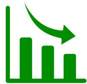

## 单吨产品耗水量

目标
-10%

2025年实际完成情况 -50.46%

注: 公司2024-2025年市政管网水表存在计量不准的问题, 2024-2025年单吨产品耗水情况无法作为基准参考, 故此处选择2023年为基准年

<table><tr><td colspan="3">水资源使用情况</td></tr><tr><td>管理指标</td><td>单位</td><td>2025年</td></tr><tr><td>取水量(市政供水)</td><td>兆升</td><td>227.05</td></tr><tr><td>用水量</td><td>兆升</td><td>194.87</td></tr><tr><td>耗水强度</td><td>吨/吨LCE</td><td>6.43</td></tr></table>

## 4.5 污染物排放

湖南永杉锂业重视生产运营过程中产生的废水、废气等污染物影响，遵守《中华人民共和国水污染防治法》《中华人民共和国大气污染防治法》等法规制定了《废水管理制度》《废气管理制度》，对污染物进行严格管理，制定了环保治理设施巡检标准，以保障污染治理设施稳定运转。与此同时，公司委托具备相应资质的环境检测单位，依照排污许可证的规定对污染物排放口开展自主监测。在重点排污口安装了在线监控设备，并将其与生态环境监管部门联网，从而对污染物的合规排放进行实时监督。

## 废水处置措施

公司生产区废水执行《无机化学工业污染物排放标准》，经自建A20+MBR膜一体化设备，达到(GB31573-2015)中表1间接排放标准要求后排入望城第二污水处理厂水处置。PH值管控限值6-9，COD限制20mg/L，氨氮限值40mg/L，SS限值100mg/L。

生产区内产废水工段均设置污水管网，废水管道明管布设，地面清洁废水、研发实验室废水经管道收集至厂区污水处理站处理；脱硫废水、水洗碱洗废水、氢氧化锂两级喷淋废水经明管引至浸出车间回用。

生活污水经预处理后外排至园区污水处理站。其中，生活区污水经隔油池、化粪池处理后排入污水管网；生产区员工上厕所及洗手废水由生产区污水处理站处理。

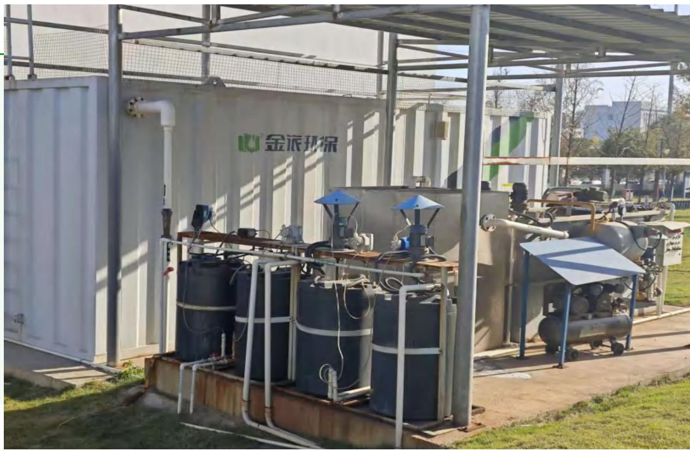

text_image

金派环保

## 废气处置措施

公司建立了全面的废气治理体系，针对生产过程中的各类废气，配套布袋除尘、SCR脱硝、湿法脱硫、湿电除尘及洗涤塔等处理设施，并对每类设施的运行参数、维护保养制定了详细规程。通过明确的部门职责、严格的日常巡检与台账管理，确保所有废气经有效收集与多级净化后达标排放，实现从源头控制到末端治理的全流程管理。

## 废水、废气目标与指标

公司设定年度废水排放目标为100%达标排放, 重大污染事故为0; 废气排放目标为100%合规排放。截止报告期末, 相关目标均已达成。

## 4.6 废弃物管理

湖南永杉锂业遵照《中华人民共和国固体废弃物污染环境防治法》等规定，制定《固体废物管理制度》《危险废物出入库管理规定》，对经营所在地产生的固体废弃物，实施从产生、收集、贮存、运输到处置的全流程控制。

公司HSE部对固体废弃物进行规范化管理，按管理要求建设了危险废物、一般固体废物暂存场所，做到专库专用，符合“防风、防雨、防泄漏”要求，并建立过程台账，专人管理。

## 废弃物处理措施：

一般固体废物: 原料锂辉石产生的硅钙渣、废包装材料、焙烧窑内更换的废耐火材料及生活垃圾→仓储管理可回收的废弃物, 最终外售水泥厂作原料或经环卫部门清运至相关部门进行合规处置。

危险废物:烟气脱销产生的废催化剂、浸出浸化车间产生的废弃树脂、研发实验室产生的试剂空瓶、废液及沾染物、设备检修产生的机油、废油桶及沾有油的抹布、拖把等危险废物→委托有资质的单位处理，通过联单跟进最终处置地。

## 废弃物减排目标及实践：

公司年度废弃物管理目标为100%合规处置。公司严格落实废弃物处置和减排措施，确保一般和有害废弃物处置均符合国家和地方的环保标准。报告期内，公司一般和有害废弃物均实现100%合规处置。同时，在处置过程中，优先开展厂内综合利用，随后挑选具备综合利用能力的单位开展转移处置合作。例如，硅钙渣可用于制作建筑材料；对于无法利用的物质，则委托有资质的单位进行无害化处理处置。

废气排放：  
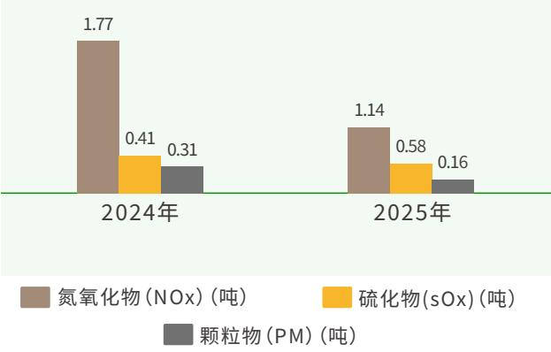

bar

| Category | 氮氧化物 (NOx) (吨) | 硫化物 (SOx) (吨) | 颗粒物 (PM) (吨) |
| --- | --- | --- | --- |
| 2024年 | 1.77 | 0.41 | 0.31 |
| 2025年 | 1.14 | 0.58 | 0.16 |

废水排放：  
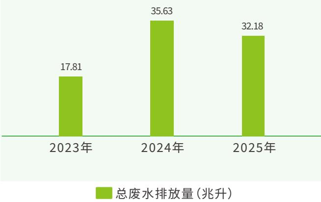

bar

| 年份 | 总废水排放量 (兆升) |
| --- | --- |
| 2023年 | 17.81 |
| 2024年 | 35.63 |
| 2025年 | 32.18 |

## 尾矿管理：

在业务模式与价值链管理方面,公司聚焦于锂盐的开发、生产与销售,不涉及上游锂矿的开采业务,因此公司运营范围内不存在自有矿区,亦不涉及尾矿库的建设、运营及环境风险管理。这一业务特点使得公司更专注于生产环节的节能减排与污染防治,并通过严格的供应商管理,推动上游合作伙伴践行同等负责任的资源开采与环境治理标准,共同降低全产业链的环境足迹。

## 4.7 循环经济

面对全球自然资源约束趋紧与环境保护要求的不断提升, 发展循环经济成为企业实现可持续发展的关键路径。湖南永杉锂业积极融入这一转型, 摒弃“资源-产品-废物”的传统线性模式, 转而遵循“减量、再用、再生”原则, 在整个价值链中推动资源的节约与循环, 以实现资源价值最大化与环境影响最小化的协同发展。

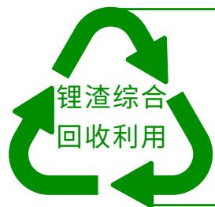

本项目通过物理结构改良、微生物-植物协同强化等技术，驱动锂辉石渣从“工业废渣”向“生态土壤”转变，从源头解决锂电产业固废处置难题，为区域绿色发展提供支撑。

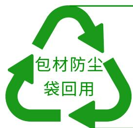

在生产过程中,公司将使用过的用于装运辅料纯碱的吨袋回收,再用于接收105车间压滤机的滤渣,每月预计循环使用约50个,直接减少了包装废弃物的产生。

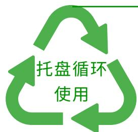

在向客户发货过程中,托盘跟随产品发货至客户端,流程结束后公司对发往客户端的托盘进行回收。回收后的托盘进行入厂检测、分类,实现标准化循环使用,有效节约成本。报告期内,公司从客户仓库共提回2600余片托盘。

## 4.8 生态系统和生物多样性保护

湖南永杉锂业遵守《生物多样性公约》《关于进一步加强生物多样性保护的意见》的总体要求，制定了《生物多样性政策声明》，承诺不涉及破坏生态、危害生物多样性的业务，积极保护和科学利用生物多样性。公司将生物多样性战略整合进现有ESG管理制度，增强保护生物多样性意识在业务流程中的渗透，助力实现《2020后全球生物多样性框架》。

公司HSE部每年定期评估运营地周围生物多样性情况,项目建设前评估可能涉及的潜在环境污染和自然灾害等对生物多样性的影响,一旦发现问题,将立即向可持续发展委员会及董事会汇报。

公司通过BIA评估工具(Biodiversity Impact Assessment Tool)开展以运营地为中心,20km、40km半径范围内的生物多样性调查和生态系统健康评估。

公司运营地20KM、40KM半径范围内生物多样性情况

<table><tr><td>距离</td><td>自然保护区</td><td>自然公园</td><td>国际重要湿地</td><td>I级保护动物</td><td>II级保护动物</td><td>三有保护动物</td></tr><tr><td>20KM半径范围内</td><td>0</td><td>5</td><td>0</td><td>0</td><td>1</td><td>59</td></tr><tr><td>40KM半径范围内</td><td>2</td><td>15</td><td>1</td><td>3</td><td>44</td><td>239</td></tr></table>

注:表中为自然保护区、自然公园、国际重要湿地数量及I级、II级、三有保护动物种类量

同时，公司在项目建设前开展生物多样性评估，对工厂的选址和布局进行严格论证，在项目建设中保护自然栖息地、野生动物廊道和农业用地等，尽可能降低对周边环境的不利影响，关注生态保护红线内生态系统和生物多样性情况。

## 守护湘江蓝环保活动：

在世界地球日之际,公司联合铜官园区开展“守护湘江蓝”环保公益行动,组织志愿者进行环保宣传,对湘江滩涂进行系统性清理,累计清除塑料等垃圾百余斤。该行动直接减少了废弃物对滨江湿地生态系统的污染与破坏,维护了水域清洁与滩涂栖息地健康。

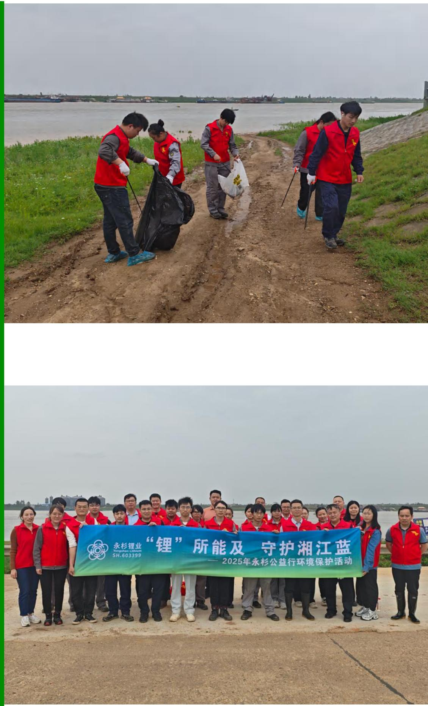

## 05 | 优质产品 |

本章节回应SDGs:

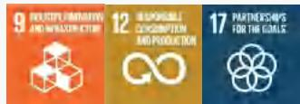

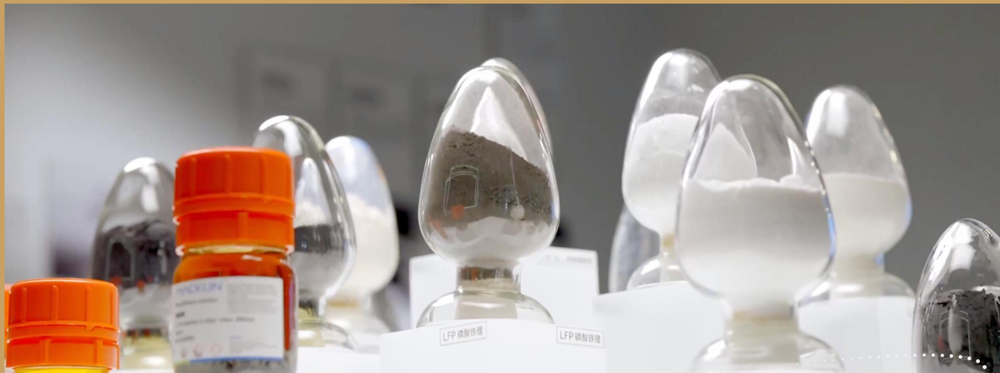

text_image

LFP 磷酸铁锂
LFP 磷酸铁锂

Li-gighting the Dream and Future

## 5.1 \ 科技创新 \

创新是湖南永杉锂业发展的核心动力。公司高度重视创新体系建设，通过引进和培养高层次专业人才，构建高效协作的团队，旨在将持续的创新能力固化为企业的核心竞争力，确保科技成果有效转化为产业竞争优势。

公司研发机制参照《研发项目管理制度》执行，旨在促进公司自主创新，以最短的时间和最少的成本实现既定目标。公司研发课题来源分为公司级研发项目和自主研发项目，其中公司级研发项目根据公司发展战略、产品结构拓展、市场开拓需求等确定，自主研发项目根据技术进步、迭代要求确定，研发内容涵盖新产品/工艺开发、设备改造升级、材料机理研究等。

## 磷酸锂产品研发

为构建多元化、高附加值的锂盐产品体系，公司自主开发电池级磷酸锂制备核心技术体系。通过工艺创新与原料优化协同，集成流场重构、混合强化及三维立体加料等关键技术，并实施严格的全流程质量控制，旨在实现电池级磷酸锂的经济、高效、稳定的规模化生产，以满足动力电池和储能系统对高性能磷酸锂材料的市场需求。

## 硫化锂产品研发

为应对固态电池产业化对关键材料的需求，湖南永杉锂业已前瞻性布局硫化锂产品的研发。公司致力于攻克低成本、规模化合成高性能硫化锂的技术瓶颈，通过优化原料提纯工艺、创新合成路径并设计生产流程，旨在稳定提供满足固态电解质要求的高品质硫化锂产品。

## 含锂母液萃取提锂技术

公司现有含锂母液依赖外协回收，存在锂收率低、成本高等问题。为提升效益与资源利用率，公司自主研发萃取提锂技术，将萃取所得碳酸氢锂溶液返回现有产线，经除杂、热解等工序后直接产出电池级碳酸锂。该技术具备选择性好、萃取效率高、安全性好等优势，综合效益优于传统MVR工艺，目前处于试生产阶段。

## 全厂余热综合利用技术

为降低能耗, 公司计划回收厂区内大量85°C热水及高温烟气余热。通过采用吸收式热泵—溴化锂机组, 以废热驱动制取冷水, 满足夏季办公与宿舍分时制冷需求, 并利用制冷余热制备生活热水。冬季该系统还可用于采暖, 实现能源梯级利用, 整体降低电能消耗与用能成本。

## 案例一 校企合作项目

为推进产品多元化并增强研发实力，湖南永杉锂业与湖南工业大学共建新能源锂盐材料开发联合实验室。该实验室配备从原料预处理到性能测试的全流程功能，聚焦锂盐新材料制备、锂资源高效转化与清洁分离、伴生元素高值化利用及固废资源化等关键方向开展深度研究。通过产学研协同，双方致力于加速技术成果转化，共同培养科技人才，为企业可持续发展与行业创新提供支撑。

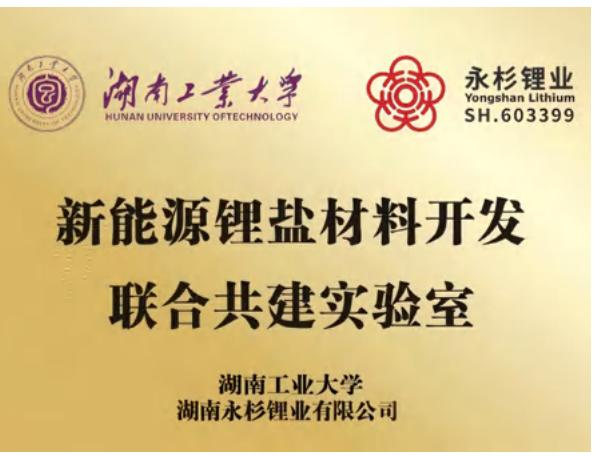

湖南工業大學

HUNAN UNIVERSITY OF TECHNOLOGY

永杉锂业

Yongshan Lithium
SH.603399

## 新能源锂盐材料开发 联合共建实验室

湖南工业大学

湖南永杉锂业有限公司

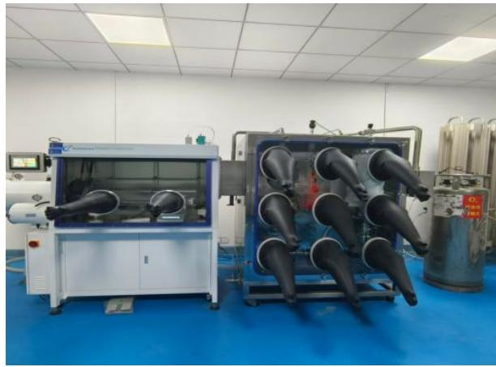

natural_image

Interior of a cleanroom facility with industrial equipment including a white machine and multiple cylindrical tanks on blue flooring (no visible text or symbols)

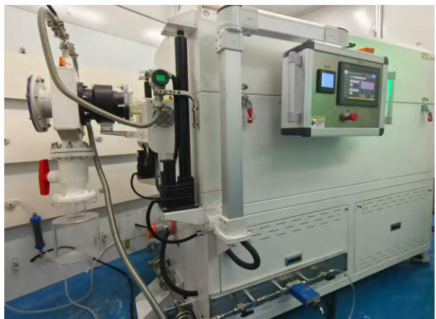

natural_image

Industrial machine with control panel and wiring, no visible text or symbols

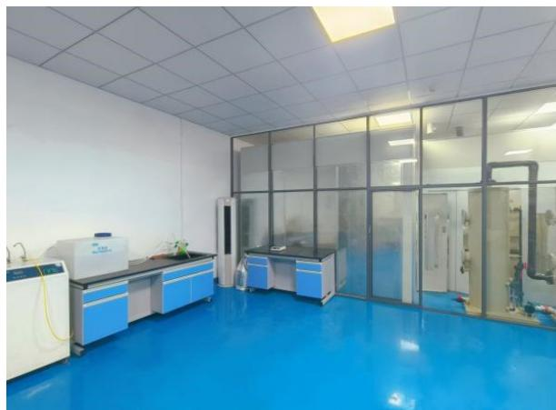

natural_image

Interior of a cleanroom laboratory with blue floor, glass partitions, and equipment (no visible text or symbols)

## 5.2 \ 知识产权保护 \

公司始终坚持保护知识产权就是保护创新的准则，为做好知识产权保护，构建了知识产权管理机制，并采取了一系列行之有效的具体措施。

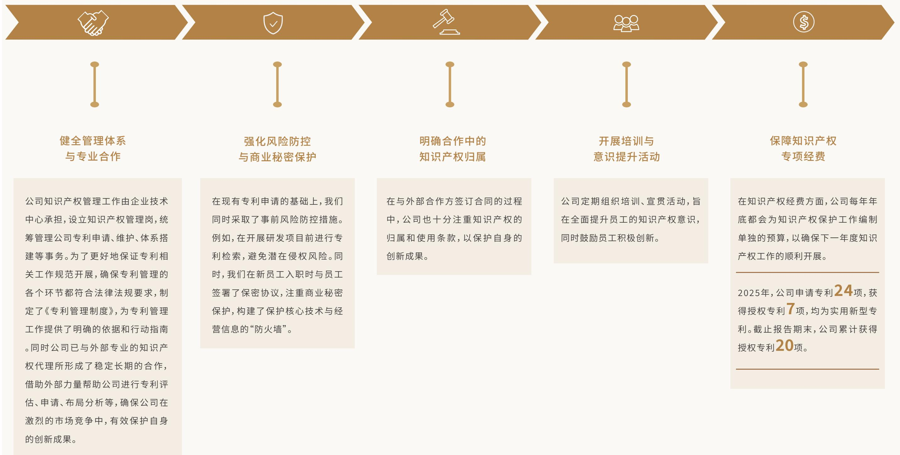

flowchart

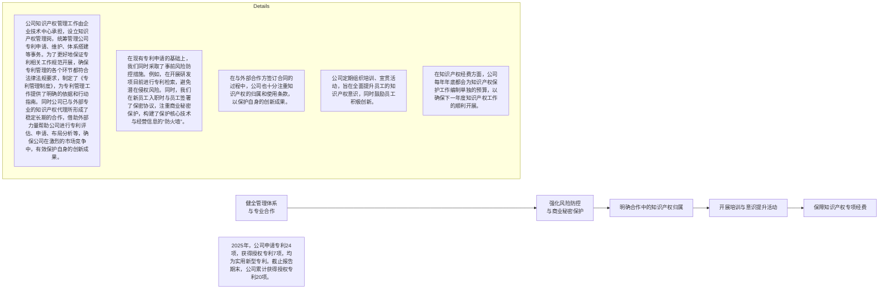
```mermaid
graph LR
  A["健全管理体系\n与专业合作"] --> B["强化风险防控\n与商业秘密保护"]
  B --> C["明确合作中的知识产权归属"]
  C --> D["开展培训与意识提升活动"]
  D --> E["保障知识产权专项经费"]
  
  subgraph Details
    F["公司知识产权管理工作由企业技术中心承担，设立知识产权管理岗，统筹管理公司专利申请、维护、体系搭建等事务。为了更好地保证专利相关工作规范开展，确保专利管理的各个环节都符合法律法规要求，制定了《专利管理制度》，为专利管理工作提供了明确的依据和行动指南。同时公司已与外部专业的知识产权代理所形成了稳定长期的合作，借助外部力量帮助公司进行专利评估、申请、布局分析等，确保公司在激烈的市场竞争中，有效保护自身的创新成果。"]
  end
  
  subgraph Details
    G["在现有专利申请的基础上，我们同时采取了事前风险防控措施。例如，在开展研发项目前进行专利检索，避免潜在侵权风险。同时，我们在新员工入职时与员工签署了保密协议，注重商业秘密保护，构建了保护核心技术与经营信息的“防火墙”。"]
  end
  
  subgraph Details
    H["在与外部合作方签订合同的过程中，公司也十分注重知识产权的归属和使用条款，以保护自身的创新成果。"]
  end
  
  subgraph Details
    I["公司定期组织培训、宣贯活动，旨在全面提升员工的知识产权意识，同时鼓励员工积极创新。"]
  end
  
  subgraph Details
    J["在知识产权经费方面，公司每年年底都会为知识产权保护工作编制单独的预算，以确保下一年度知识产权工作的顺利开展。"]
  end
  
  K["2025年，公司申请专利24项，获得授权专利7项，均为实用新型专利。截止报告期末，公司累计获得授权专利20项。"]
```

## 5.3 \ 产品质量与安全

产品质量与安全是企业可持续发展的生命线。湖南永杉锂业严格遵守《中华人民共和国产品质量法》等法律法规，制定《管理手册》《产品安全控制程序》《产品召回管理办法》等管理制度，持续完善质量管理体系。

产品安全与质量管理组织架构

<table><tr><td>层级</td><td>组成/角色</td><td>核心职责与工作</td></tr><tr><td>决策层</td><td>总经理/管理者代表</td><td>承担产品质量与安全的最终责任,批准公司质量安全战略、方针与年度目标,为管理体系提供资源保障</td></tr><tr><td>管理层</td><td>品质管理部</td><td>制定质量安全政策制度,监督目标达成与体系运行,协调跨部门资源,并向决策层汇报绩效</td></tr><tr><td>执行层</td><td>各生产车间</td><td>具体执行质量检测、过程监控、安全巡查、不合格品处置、数据记录与报告等日常操作,确保制度落地</td></tr></table>

## 全流程质量管理机制

## 产品管理六大工具

- 产品质量先期策划(APQP)  
- 潜在失效模式与后果分析(FMEA)  
- 测量系统分析(MSA)  
- 统计过程控制 (SPC)  
- 控制计划 (CP)  
- 生产件批准程序(PPAP)

- 为新产品开发提供结构化框架,涵盖从概念设计到批量生产的全过程规划,提前预防缺陷并确保产品符合客户要求  
- 识别产品设计或生产过程中潜在的失效模式,评估其风险,并优先采取预防/探测措施  
- 评估测量系统(包括量具、人员、方法等)的可靠性与准确性,确保数据真实可信  
- 应用控制图等统计工具,对生产过程进行实时监控,区分过程变差的普通原因和特殊原因,确保过程稳定受控  
- 明确规定在生产中需控制的产品特性与过程参数、控制方法、监控频次、责任人以及失控时的反应计划，确保过程一致性  
- 在批量生产前,向客户提交规定文件(如设计记录、测试报告、过程流程图等),以证明能持续稳定地生产合格产品

## 产品召回管理流程

## 01 触发与评估

当出现客户投诉,内外部检查发现批量严重不合格等情形时,流程启动。公司立即组建跨部门专家小组进行评审,识别产品影响范围,并在一个工作日内决定是否启动召回

## 02 决策与启动

召回计划经总经理批准后，在一个工作日内向客户等相关方发布召回信息。同时，启动全流程产品溯源，明确需召回产品的具体批次，流向及处理方式

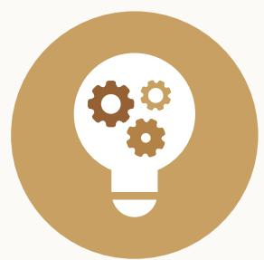

natural_image

Icon of a lightbulb with gears inside, symbolizing ideas or innovation (no text or symbols)

## 04 闭环与改进

召回结束后编制召回报告,评估流程有效性,并据此制定纠正与预防措施。公司通过模拟或实际召回验证程序,并借此完善管理体系,形成管理闭环

## 03 执行与处理

通过销售网络等渠道回收产品, 对召回产品进行标识, 隔离, 并作为不合格品按规处置。全程记录形成《产品召回登记表》, 直至全部回收处理完毕

## 客户投诉处理流程

## 1 受理与初步响应

销售部作为统一窗口受理投诉,填写《客户信息反馈处理单》。品质管理部在24小时内向客户初步反馈,并组织相关部门核实问题

## 2 调查分析与判定

若核实为质量问题, 品质管理部将在24小时内组织相关部门成立8D小组, 进行根本原因分析, 并回复D3。必要时, 可前往客户端进行现场失效分析并与客户沟通解决方案

## 3 制定措施与回复

分析确认后, 小组以《8D报告》形式制定纠正措施, 并在3-5个工作日内完成D5或依据客户要求完成初步8D报告并由销售部回复客户, 在15个工作日内完成D8

## 4 退货处理与供应商管理

对于退货产品, 仓库接收后由品质管理部检验分析。若问题涉及供应商, 则由采购部在2天内向供应商启动8D流程, 并跟踪其改善

## 5 数据闭环与体系改进

品质管理部每月统计投诉数据，并将纠正措施完成情况归档。若需变更体系文件，则启动正式变更流程，实现从个案处理到系统预防的闭环

## 5.4 产品生命周期管理

公司坚持以客户需求为中心，搭建研发、生产、销售体系，不断强化全员质量意识和成果体现，竭尽全力为客户提供更加优质的产品和服务，致力成为全球领先的高端锂化学品供应商。

公司于2023年成功获得汽车行业质量管理体系IATF 16949:2016的认证，并持续有效运行。

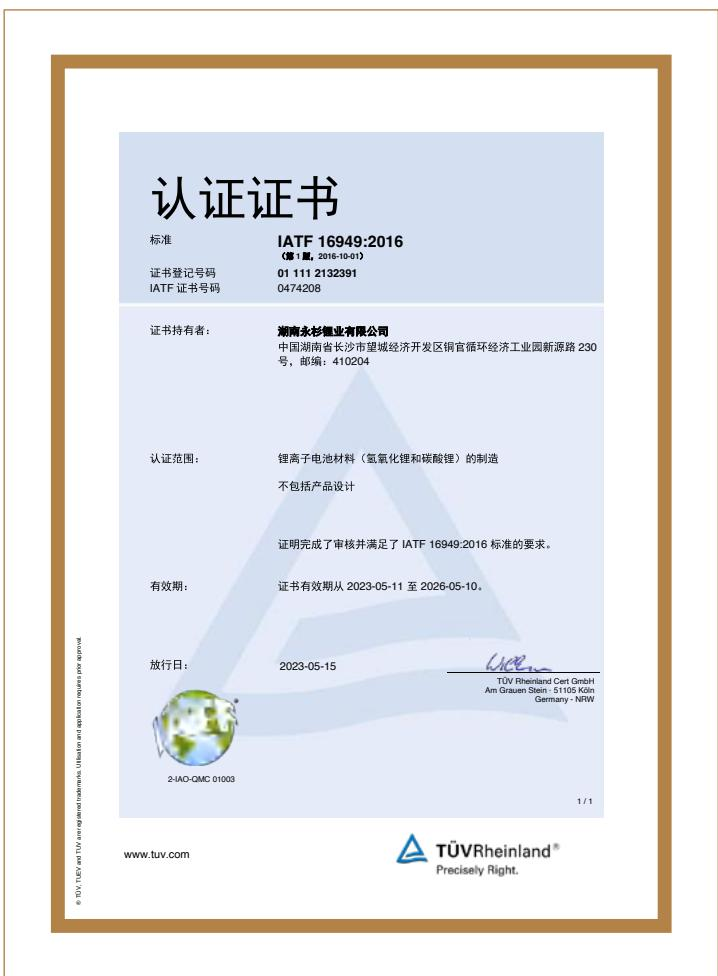

flowchart

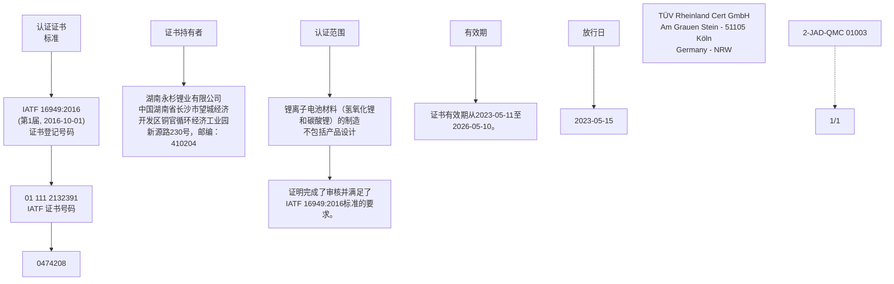
```mermaid
graph TD
  A["认证证书\n标准"] --> B["IATF 16949:2016\n(第1届, 2016-10-01)\n证书登记号码"]
  B --> C["01 111 2132391\nIATF 证书号码"]
  C --> D["0474208"]
  
  E["证书持有者"] --> F["湖南永杉锂业有限公司\n中国湖南省长沙市望城经济开发区铜官循环经济工业园新源路230号，邮编：410204"]
  
  G["认证范围"] --> H["锂离子电池材料（氢氧化锂和碳酸锂）的制造\n不包括产品设计"]
  H --> I["证明完成了审核并满足了IATF 16949:2016标准的要求。"]
  
  J["有效期"] --> K["证书有效期从2023-05-11至2026-05-10。"]
  
  L["放行日"] --> M["2023-05-15"]
  N["TÜV Rheinland Cert GmbH\nAm Grauen Stein - 51105 Köln\nGermany - NRW"]
  
  O["2-JAD-QMC 01003"] -.-> P["1/1"]
```

公司核心产品为电池级碳酸锂及电池级单水氢氧化锂，产品异物管控是保证产品品质的重要举措。公司建立异物管理体系以“源头防控、过程严管、末端闭环、持续改进”为核心，全面覆盖产品供应链、生产制造、仓储物流、检验检测及售后追溯全生命周期，形成“制度支撑、技术保障、责任到人、考核落地”的一体化管理架构，确保异物管控无死角、无盲区。严格遵循“不引入、不产生、不堆积、不流出”的异物管控原则。

## 不引入：

在厂房、工艺与设备设计中，公司全面落实高标准洁净与安全规范。厂房采用封闭式结构、新风系统与10万级无尘车间，实现成品、仓库一体化以杜绝物料转运污染；车间环境、设施均采用无铜锌化不锈钢材质。工艺流程全程密闭，设备无开口。所有设备满足无铜锌化要求，电机、电控柜及仪表均具备防爆与高防护等级，粉料设备内衬亦禁铜锌。

## 不产生：

通过建立和落实“人员进出管控”、《金属地图》、《设备磨损检查制度》、《异物管理制度》和《厂区施工隔离管理办法》等，达到不产生异物。

## 不堆积：

通过建立和落实《5S管理制度》，定期清理设备、除磁料、地面除磁等达到异物不堆积。

## 不流出：

通过落实《异物管理制度》、对数管理、包装外面除磁和铜显色检查来严格管控出货产品。

依托完善的异物管理体系及严格的四原则管控, 公司电池级碳酸锂、电池级单水氢氧化锂产品JMS达到行业领先水平, 全面满足下游高端动力电池、储能电池等产品的严苛要求, 具体达到以下水平:

## 1. 电池级碳酸锂：

产品中磁性异物 (Fe+Cr+Zn+Ni) 含量 $\leqslant$ 20 ppb、铜锌颗粒合格率: 100%、JMS (磁性金属颗粒数) 能达到 40 pcs/kg 以下;

可满足高镍三元正极材料、磷酸铁锂正极材料的生产需求。

## 2. 电池级单水氢氧化锂：

产品中磁性异物 (Fe+Cr+Zn+Ni) 含量 $\leqslant$ 15ppb、铜锌颗粒合格率: 100%、JMS (磁性金属颗粒数) 能达到 30pcs/kg 以下;

可广泛应用于钴酸锂、锰酸锂、三元材料等高端锂离子正极材料的合成。

## 5.5 客户管理

湖南永杉锂业始终将客户需求置于首位，通过电话、电子邮件、微信等多种渠道与客户保持紧密沟通，倾听并理解客户的声音。为掌握客户需求信息，获取客户对本公司的满意情况，并寻求改进措施来提高客户的满意程度及提供健全的服务，公司制定了《客户服务控制程序》《客户满意度控制程序》《客户抱怨与退货处置办法》等制度，建立了规范化的客户沟通和投诉处理机制，及时响应并妥善处理客户的意见和反馈。

公司每年进行客户满意度调查, 认真分析原因并制定改善措施。2025年客户满意度为96.32分, 超过2025年90分的目标。

natural_image

Two professionals in business attire reviewing documents on a laptop, no visible text or symbols

## 5.6 可持续供应链

湖南永杉锂业致力于通过负责任的采购活动，推动供应链的长期稳定和可持续发展。我们建立了健全的供应商管理流程，从准入评估、风险识别、绩效考核、定期评审到整改实施，对供应商进行全流程管理，最大限度地控制供应链风险，确保产品质量得到有效保障。

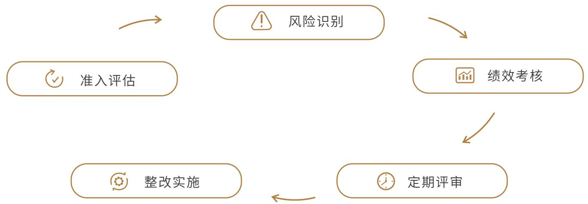

flowchart

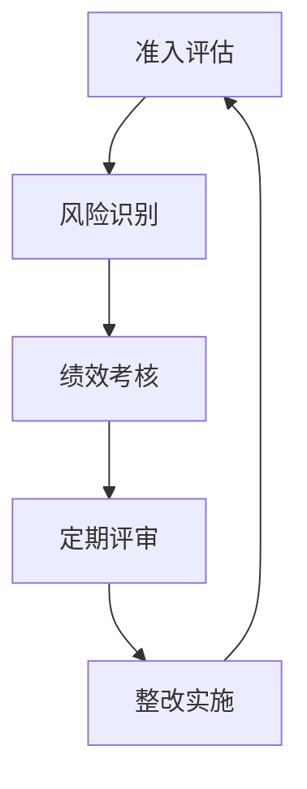
```mermaid
graph TD
  A["准入评估"] --> B["风险识别"]
  B --> C["绩效考核"]
  C --> D["定期评审"]
  D --> E["整改实施"]
  E --> A
```

在供应商选择与评估阶段,对于中高风险供应商100%进行现场评估审核。包括但不限于环境管理体系、职业健康安全和产品材料的追溯。优先选择那些公开承诺并实践可持续发展、获得相关ESG认证的供应商。

公司与供应商签署的合同包含社会责任条款,后续会根据供应商提供物料的质量表现,将供应商分为A、B、C三个类别,实施差异化管理;定期对供应商进行绩效考核,包括质量、交货、价格等维度。

在供应商发展与支持方面, 公司鼓励并支持供应商通过ISO9001、ISO14001、ISO45001、IATF16949等管理体系认证, 向供应商提供不定期培训, 与供应商共同识别和管理供应链中的ESG风险, 定期评审供应商的ESG表现, 确保其持续符合公司的要求。

## 锂供应链尽责管理

公司制定了锂供应链尽责管理政策，承诺一经发现任何政策中的风险，将立即采取对应的行动。该政策已向供应商、客户、员工等利益相关方广泛传递，并公布在公司官方网站上。公司于2024年6月25日通过负责任矿产倡议(RMI)的审核，正式登陆RMAP合规名单。

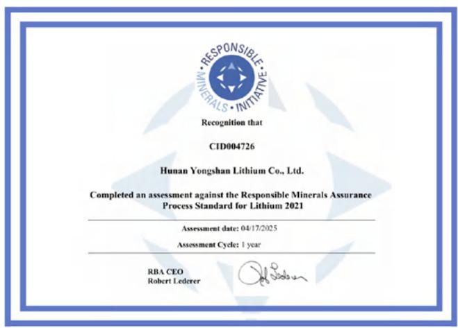

text_image

RESONIBLE
MINERALS • INITIATIVE
Recognition that
CID004726
Hunan Yongshan Lithium Co., Ltd.
Completed an assessment against the Responsible Minerals Assurance
Process Standard for Lithium 2021
Assessment date: 04/17/2025
Assessment Cycle: 1 year
RBA CEO
Robert Lederer

2025年6月11日，公司顺利通过负责任矿产RMAP认证，并于RMI官方网站更新。目前，湖南永杉锂业已连续两年顺利通过负责任矿产项目审验。

公司国际业务部负责与供应商沟通，以邮件形式将公司的《锂供应链尽责管理政策》《供应商行为准则》传达给供应商，并要求其签订《供应商行为准则确认保证函》，或以合同条款的形式进行约束。同时，国际业务部将审查供应商尽责管理体系的建立和实施情况，并持续督促其尽责管理体系的建立和完善。本报告期内，湖南永杉锂业配合客户及第三方完成线下审核8次、线上审核1次，高效响应资料调取与溯源需求，进一步完善了公司锂供应链尽责管理的政策和流程。

2025年6月，采购部组织开展了辅料供应商安全专项培训。本次培训重点围绕装货检查、运输规范、湖南永杉锂业园区与厂区准入检查流程，以及厂内作业安全要求等内容展开，旨在强化供应链环节的安全管理与规范操作，累计共有17家辅料供应商及物流服务提供方参与。

为践行绿色供应链理念, 公司积极推动运输方式转型: 在短途运输碳酸钙过程中实施“油改电”, 直接减少尾气与噪音污染; 在长途运输纯碱过程中将汽运转为船运, 显著降低单位货物碳排放。此举不仅有效减轻了生态足迹、响应了国家“双碳”目标, 还通过优化成本结构, 系统性提升了供应链的绿色竞争力与运营韧性。

## 5.7 化学品管理

公司高度重视化学品管理工作，严格遵守《危险化学品安全管理条例》《优先控制化学品名录》，制定《有害物质管控》制度，规定了产品和生产过程中对有害物质进行持续识别和控制的方法，确保公司的产品和过程的有害物质得到有效管理。

公司有害物质管控的主要对象是《电子、电气设备中限制使用某些有害物质指令》，无卤指令，化学品注册、评估、许可和限制。整体治理框架由HSE部门制定，品质管理部、企业技术中心负责对有害物质开展调查识别，制定控制措施并完成落实和检验。

除自身开展有害物质管理活动外,公司还通过采购要求供应商供应无限用成分的物料,提供具有资质的第三方检测报告(有效期12个月)并签订欧盟RoHS指令符合性声明。

## 案例一

## 低浓度氨水替代项目

为系统降低化学品使用风险, 湖南永杉锂业在一期项目试生产期间主动实施了一项关键改进: 将原设计的20%浓度氨水(属危化品)替换为9%浓度的氨水(浓度低于10%, 不属于危化品)。这一替代措施从本质上提升了生产过程的储存与操作安全水平, 显著降低了相关环节的潜在风险。

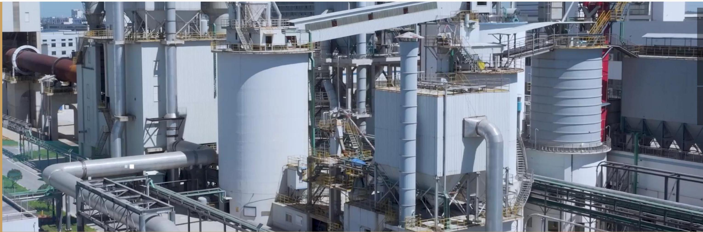

natural_image

Industrial facility interior with large white silos and piping, no visible text or symbols

## 06|以人为本|

本章节回应SDGs:  
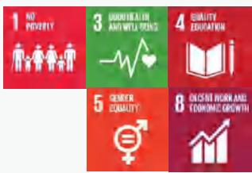

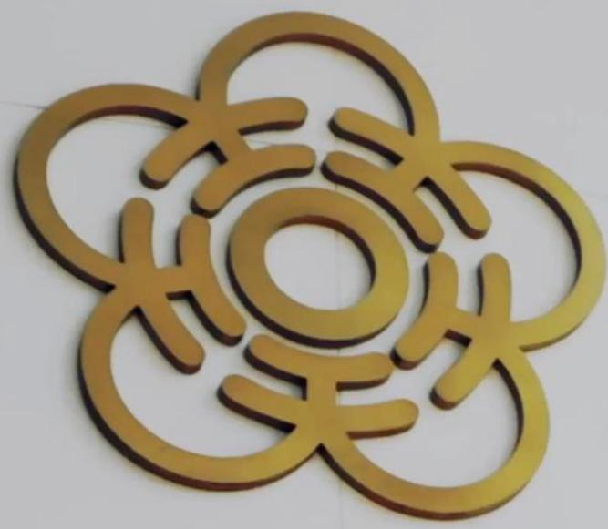

natural_image

Golden abstract floral or geometric symbol with interlocking loops (no text or symbols)

永杉锂业
Yongshan Lithium
SH.603399

| 有 | 锂 | 想 | 有 | 未 | 来 | Li -ghting the Dream and Future

## 6.1 | 员工雇佣与权益

湖南永杉锂业严格遵守《中华人民共和国劳动法》《中华人民共和国劳动合同法》《中华人民共和国工会法》等相关法律法规，制定了《招聘管理》《员工手册》《员工考勤休假制度》等一系列内部制度，以保障员工入职、试用、转正、调岗、离职、培训、绩效、薪酬福利等管理环节的规范化执行。

公司建立了完善的员工雇佣与权益管理架构，由总经理统筹领导，切实保障员工合法权益，增进员工获得感与幸福感。

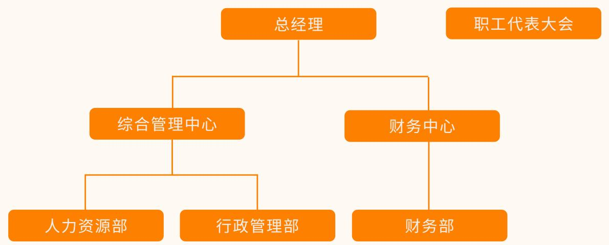

flowchart

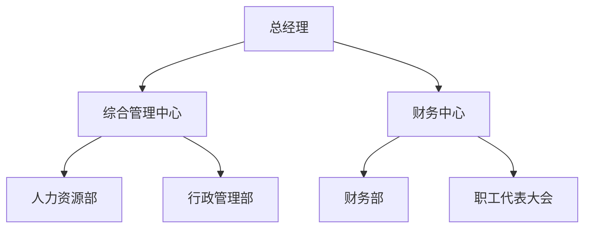
```mermaid
graph TD
  A["总经理"] --> B["综合管理中心"]
  A --> C["财务中心"]
  B --> D["人力资源部"]
  B --> E["行政管理部"]
  C --> F["财务部"]
  C --> G["职工代表大会"]
```

## 员工招聘

公司在《招聘管理》中明确规定以公正、公平、公开的方式招聘员工，录用标准以岗位要求为核心。同时，公司制定《禁止歧视和惩戒性措施管理制度》，确保员工在聘用、受训、晋升等过程中，不会因民族、种族、性别、年龄、宗教、信仰、残疾等受到歧视。

## 员工招聘四大原则

## 配置高效：

招聘计划精准对接业务需求与周期,快速响应项目部署

## 严格择优：

设定统一的高标准评估体系,力求所聘人才具备出色的专业能力与综合素养

## 人岗匹配：

深度分析岗位要求与个人特质,实现能力与职责精准结合

## 公开透明：

全程遵循公正、清晰的流程，保障所有候选人的平等机会

此外，公司遵守《联合国工商企业与人权指导原则》，制定一系列人权保护制度，确保公司不会发生强迫劳动、童工等问题，创造和谐的就业环境。

禁止强迫劳动:制定《禁止强迫劳动管理制度》,对所有员工和利益相关方培训,禁止使用且不支持任何劳役或契约式劳工、监禁、体罚、暴力威胁,所有员工均自愿被雇佣,禁止以任何强迫或欺骗手段招聘员工,不得使用囚工、被拐卖工等,员工入厂及离职不须缴纳任何押金或培训费用,不扣押员工的居民身份证及其他证明个人身份的证件。

严禁使用童工:制定《童工、未成年工和女工保护制度》,坚决反对使用童工及任何变相使用的行为,不与任何故意使用童工的供应商或承包商合作,采取有效的方法鉴别员工的真实年龄,确保招聘时入职员工都达到16周岁以上。

<table><tr><td colspan="2">管理指标</td><td>单位</td><td>2025年</td></tr><tr><td colspan="2">员工总人数</td><td>人</td><td>455</td></tr><tr><td rowspan="2">按性别划分的员工人数</td><td>男员工</td><td>人</td><td>326</td></tr><tr><td>女员工</td><td>人</td><td>129</td></tr><tr><td colspan="2">劳动合同签订率</td><td>%</td><td>100%</td></tr><tr><td colspan="2">童工或强迫劳动事件</td><td>件</td><td>0</td></tr></table>

## 员工薪酬与福利

员工是企业价值的创造者，公司应创造良好的职场环境，保障员工福利待遇。因此，湖南永杉锂业制定《员工手册》并不断优化薪酬管理制度，综合考虑岗位序列、职级、绩效等多方面因素，以企业战略为导向，建立了一套适配时代发展的薪酬管理体系。

公司薪酬结构由基本工资、绩效、岗位津贴、加班工资、奖金及福利津贴组成。根据《员工考勤休假制度》规定，公司一般情况下实行标准工时制，员工如因紧急事务需要加班，公司将统计加班工时后按法律规定支付加班费。此外，为规范绩效管理工作，公司建立了《2025年绩效管理方案》并成立绩效考核小组，在绩效目标设定及考核过程中与员工充分沟通。若绩效考核结束后，员工对反馈结果存有异议，可以以书面形式向绩效考核小组申诉。

员工福利方面, 公司给所有员工购买了社会保险、住房公积金、雇主责任险等; 除法定的节假日之外, 员工还享有育儿假、产假、哺乳假等假期, 充分体现了公司的人文关怀。

为了激励和留住核心人才,公司还对做出重大贡献者实施上市公司股权激励。目前公司2024年股票期权激励计划仍在存续期,激励对象涵盖董事、高级管理人员及核心骨干人员。2025年4月,公司董事会审议通过了《关于向2024年股票期权激励计划激励对象授予预留部分股票期权的议案》,确认向符合条件的激励对象授予股票期权。2025年6月,公司向29名激励对象授予股票期权398万份。

## 员工关爱

湖南永杉锂业通过多维度员工关怀机制，为员工营造温馨和谐的工作环境。公司定期开展“家庭开放日”、“锂想杯”趣味运动会、妇女节永生花DIY等创意活动，并组织质量知识竞赛等专业赋能项目，持续增强员工参与感、归属感与凝聚力。同时，工会建立常态化关怀支持体系，积极组织困难员工帮扶活动，如在员工亲属去世时发放慰问金、向员工高考子女发放助学金，切实为员工及其家属提供物质与情感上的全面支持。

## “锂想杯”趣味运动会：

9月25日，公司举办第二届“锂想杯”趣味运动会暨中秋活动。活动设置投壶问月、合力建塔等趣味项目及猜灯谜环节，寓教于乐、融合传统与团队协作。活动有效增强了团队凝聚力，传递了企业关怀，提升了员工归属感与拼搏精神。

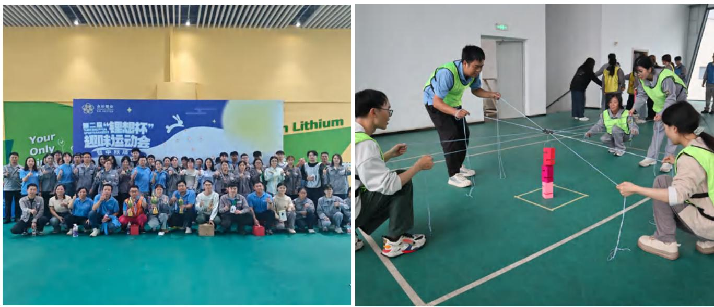

## 员工高考子女慰问交流会：

8月26日，公司举办员工高考子女慰问交流会。董事长杨峰出席座谈，并向员工发放子女助学金，表达公司对员工家庭的支持与关怀，传递“以奋斗者为本”的企业文化。

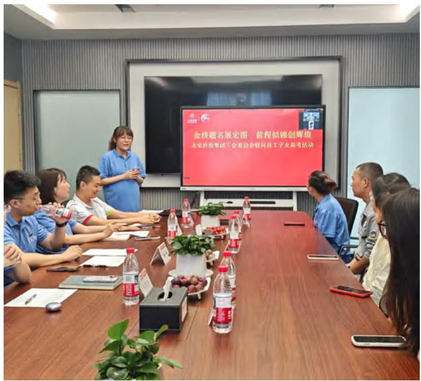

text_image

金榜题名展宏图 前程似锦创辉煌
永荣控股集团工会委员会慰问员工子女高考活动

## 6.2 | 员工沟通参与

湖南永杉锂业将员工视为企业发展的重要伙伴，着力搭建开放、透明且顺畅的双向沟通桥梁。公司持续完善多层次、多渠道的沟通体系，鼓励并保障每一位员工都能便捷、有效地表达意见与建议。

公司制定《结社自由与集体谈判权利控制制度》，尊重员工的结社自由和集体谈判权利，成立工会组织定期举行工会小组会议和工会活动，收集员工意见，并作出回答、公布并保存记录。

此外，我们为员工提供了电话、邮件等多种沟通方式，确保员工能够及时表达诉求并得到有效反馈。公司通过内部提案机制广泛征集改善建议，2025年累计收到问题票597项、提案卡163项，涵盖安全环保、节能降耗、流程优化等多领域；发放成果奖23项(含总裁奖1项)，创造累计效益317.24万元，发放奖励4.97万元。

## 广泛征集改善建议累计收到：

问题票

597 项

提案卡

163 项

## 发放成果奖项、奖励：

成果奖

23 含总裁奖1项

累计效益

317.24 万元

发放奖励

4.97 万元

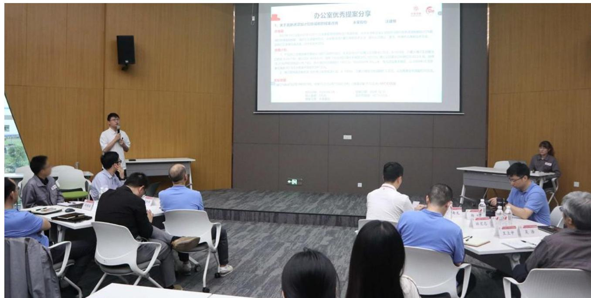

text_image

办公室优秀提案分享
1. 朱玉新通过设计计划组织提案的提案与会
永安股份
汪建明
2. 朱玉新通过设计计划组织提案的提案与会
朱玉新通过设计计划组织提案的提案与会
朱玉新通过设计计划组织提案的提案与会
朱玉新通过设计计划组织提案的提案与会
朱玉新通过设计计划组织提案的提案与会
朱玉新通过设计计划组织提案的提案与会
朱玉新通过设计计划组织提案的提案与会
朱玉新通过设计计划组织提案的提案与会
朱玉新通过设计计划组织提案
朱玉新通过设计计划组织提案
朱玉新通过设计计划组织提案
朱玉新通过设计计划组织提案
朱玉新通过设计计划组织提案
朱玉新通过设计计划组织提案
朱玉新通过设计计划组织提案
朱玉新通过设计计划组织提案
朱玉新通过设计计划组织提案
朱玉新通过设计计划组织提案
朱玉新通过设计计划组织提案
朱玉新通过设计计划组织提案

公司每年1月份定期开展员工满意度调查，从内部沟通、工作环境、健康安全、公司发展等维度听取不同岗位层级的员工的真实声音，以便后续更好地满足员工需求。

2025年员工满意度调查覆盖公司所有员工，整体满意度为99.09%，较上一年度提升0.6%。

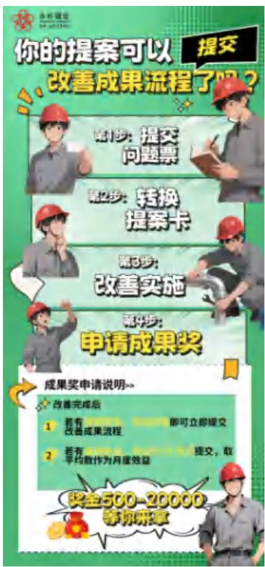

text_image

你的提案可以
提交
改善成果流程了吗？
始1步：提交
问题票
第2步：转换
提案卡
第3步：
改善实施
第4步：
申请成果奖
成果奖申请说明>>
改善完成后
1 若有
改善成果流程
即可立即提交
2 若有
平均数作为月度效益
提交，取
奖金500-20000
等你来章

## 6.3 | 员工培训与发展

## 员工培训

公司重视企业人才价值，在为员工提供安全健康的工作环境的同时，为员工提供职能培训及晋升通道，助力员工发展。公司重视培训工作，成立杉学院，一方面畅通人才发展通道，规范人才晋升评价标准和手段，分层级、分类别构建能力素质模型和学习地图，另一方面针对性推出雏鹰、精英、雄鹰培养计划，以提升员工能力，促进员工成长，形成人才梯队。

## 2025年公司培训主要涵盖以下内容：

## 企业文化培训

从新员工入职认知导入,到全员定期进行企业发展历程与企业文化深化学习,同时组织中高管及骨干参与专项文化融合与团队建设培训,并不定期普及社会责任体系,全面构建员工对企业从认知到认同、从理解到践行的完整文化培育体系。

## 中高层领导能力培训

公司面向中高管及核心骨干，集中开展了战略解码与绩效设计、梯队建设及招聘面试等专项培训。通过引入外部专业讲师与内部高管授课相结合的方式，全面提升管理者在战略执行、团队赋能、人才发展与选拔等方面的关键能力。

## 班组长培训

为提升班组长及储备班组长的能力，公司设备管理部、工艺技术部开展设备管理及工艺知识培训，旨在提高班组长设备管理意识与能力，加强班组长对工艺的熟悉与了解。

## 技能提升培训

为全面提升员工专业技能与合规意识，公司组织开展专题培训，内容涵盖工艺基础、不合格品控制、尽责管理及异物管控等多个方面，系统强化员工的综合能力。

报告期内, 公司累计开展员工培训18次, 合计员工培训时长42,910小时, 员工人均接受培训92.5小时, 整体覆盖率达100%。

## 集团培训

公司2025年开展了集团培训与自主培训共计9项，涵盖领导力提升、组织流程优化及战略执行等多个维度。其中，“标杆学院”项目围绕“头狼班”与“雄鹰班”分层开展培训，内容涵盖完美决策、行动学习、OGSM战略规划及向上管理等实战课题，强化中高层管理团队的战略思维与执行能力。

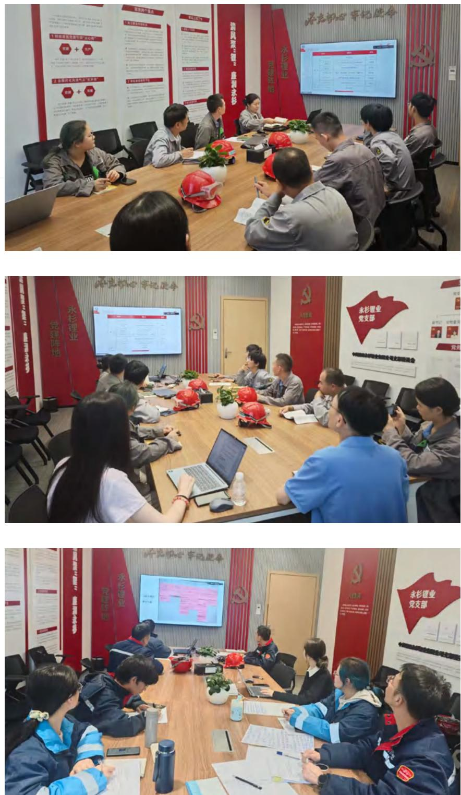

## 质量知识竞赛

湖南永杉锂业于11月20日举办质量知识竞赛。活动以“寓教于乐”为思路，设置必答、抢答及风险题环节，九支队伍参与角逐。旨在深化全员质量意识，强化“人人重视品质”的文化氛围，以赛促学，推动公司质量管理水平持续提升。

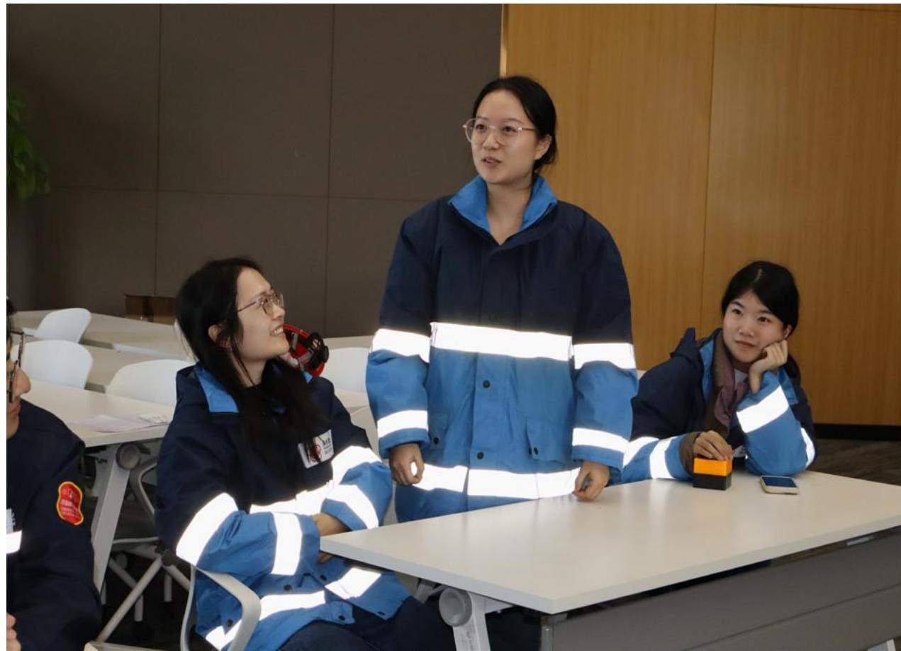

natural_image

Group of workers in work uniforms seated at a table in an indoor classroom setting (no visible text or symbols)

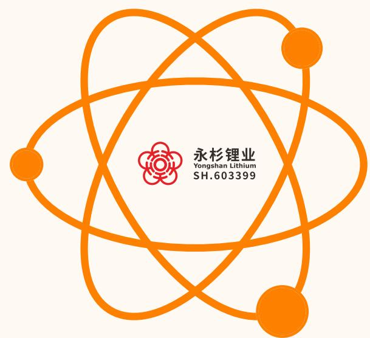

text_image

永杉锂业
Yongshan Lithium
SH.603399

## 校招生培养

8月18日，湖南永杉锂业2025届校招生高管见面会暨拜师仪式在公司多功能会议室隆重举行。董事长杨峰及全体高管参加了此次活动。带着培训中收获的成长与感动，12位年轻人完成了从“校园人”到“职场人”的蜕变。

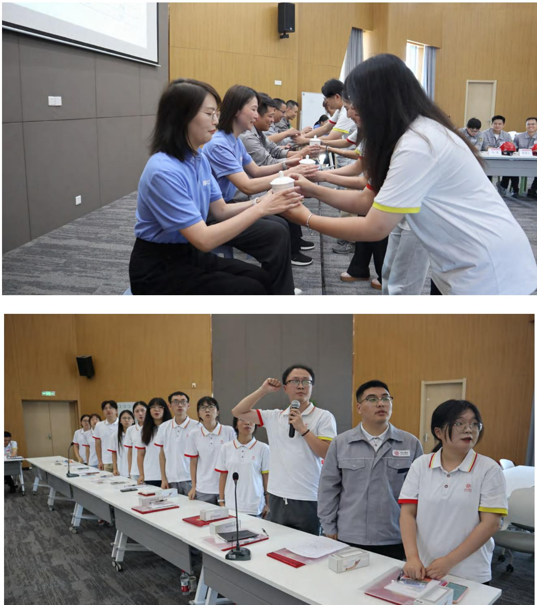

## 员工发展

公司对员工进行月度、半月度、年度考核，考核结果与晋升、调薪等多方面挂钩。同时，公司制定《职位体系与员工职业发展管理办法》，根据员工能力、绩效结果等方面，结合公司发展需要及员工意愿，为员工提供横纵向职业发展通道。

为挖掘员工潜力, 公司制定《内部人才推荐制度》, 激励员工参与内部推荐活动。通过设置合理的奖励方式和评选标准, 有效激发员工推荐人才的积极性和参与度。公司完善的申请和评选流程将保证推荐过程公平公正。

area

| X | Y |
| --- | --- |
| 1 | ~25 |
| 2 | ~40 |
| 3 | ~60 |
| 4 | ~80 |
| 5 | ~95 |
| 6 | ~75 |
| 7 | ~50 |
| 8 | ~70 |
| 9 | ~90 |
| 10 | ~100 |

## 6.4 | 多元化与机会平等

湖南永杉锂业秉持包容与多元的用人理念，将员工多样性纳入企业核心价值观，重点保障女性、少数民族的平等权益与发展机会。

<table><tr><td colspan="2">员工多元化管理体系</td></tr><tr><td>女性员工管理</td><td>构建无差异的职业发展通道,通过完善的培训与晋升机制支持女性员工成长</td></tr><tr><td>少数民族员工管理</td><td>在招聘过程中保障少数民族员工正常录用,尊重并保障其独特文化习俗,营造包容的工作环境</td></tr></table>

女员工关怀与文化活动(三八妇女节专题):

湖南永杉锂业工会组织开展了“永生花DIY”三八妇女节主题活动。活动设置手工制作、互动游戏与作品评选等环节，为女员工提供放松身心、促进交流的平台，增强团队凝聚力与归属感。

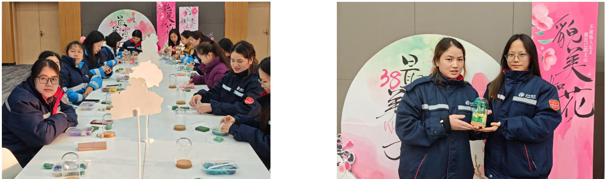

## 6.5 | 职业健康安全

## 安全生产体系与组织架构

湖南永杉锂业重视职业健康与安全，严格遵守《中华人民共和国安全生产法》，制定了《安全生产目标管理制度》《安全生产责任制》《安全生产奖惩管理制度》等65项安全管理制度。通过制度建设与落实、技能培训、隐患排查等多种手段持续推动体系的有效运行，保障员工的生命健康安全。

截止报告期末, 公司通过了GB/T 45001-2020/ISO 45001:2018职业健康安全管理体系认证。同时取得危化行业安全生产标准化三级证书, 严格落实危化企业安全生产各项要求。

为更好地推进健康与安全管理体系, 公司建立成熟的安全管理架构, 以落实各项工作。

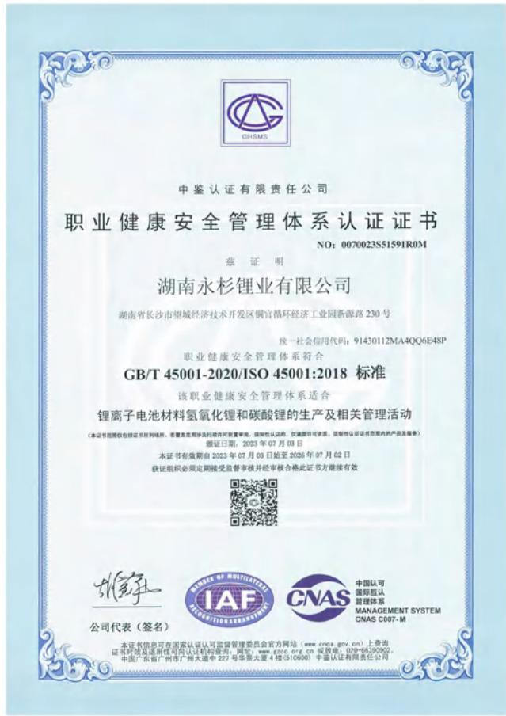

text_image

中鉴认证有限责任公司
职业健康安全管理体系认证证书
NO: 0070023S51591R0M
兹证明
湖南永杉锂业有限公司
湖南省长沙市望城经济技术开发区铜官循环经济工业园新源路230号
统一社会信用代码: 91430112MA4QQ6E48P
职业健康安全管理体系符合
GB/T 45001-2020/ISO 45001:2018 标准
该职业健康安全管理体系适合
锂离子电池材料氢氧化锂和碳酸锂的生产及相关管理活动
（本证书范围仅指证书所列场所，若需注册须详后请许可备案审核，强制性认证的，仅限壹仟玖佰柒拾陆元整）。
颁发日期: 2023年07月03日
本证书有效期自2023年07月03日始至2026年07月02日
获证组织必须定期接受监督审核并经审核合格此证书方继续有效
中国认可
国际互认
管理体系
MANAGEMENT SYSTEM
CNAS C007-M
公司代表（签名）
IAF
CNAS
本证书信息可在国家认证监督管理委员会官方网站（www.cnca.gov.cn）上查询
证券时报及适用性可向认证机构查询。网站: www.cncs.gov.cn 或拨查询: 020-66390902.
中国广东省广州市广州大道中227号华景大厦4楼(510600) 中面认证有限责任公司

<table><tr><td colspan="3">安全管理架构及职责</td></tr><tr><td></td><td>董事长</td><td>公司安全生产第一负责人,审核与签发公司年度安全生产目标,保证安全生产投入,并组织重大事故隐患的治理</td></tr><tr><td></td><td>安委会</td><td>公司安全管理的核心决策与监督机构,审核年度安全生产目标与责任体系,组织签订全员安全目标责任书,考核安全生产目标完成情况</td></tr><tr><td></td><td>HSE部</td><td>设置 HSE 部为安全管理机构,负责安全生产目标的编制、修订,每月组织开展安全检查,主导隐患排查治理</td></tr><tr><td></td><td>各部门、车间</td><td>编制并落实部门安全生产目标与实施计划,建立部门安全生产责任制,开展日常隐患排查与整改工作</td></tr></table>

## 危害识别与风险管理流程

公司制定了《隐患排查治理制度》，建立了完善的危害识别与风险管理流程，确保设备隐患动态清零。公司开展综合检查、专业检查、季节性检查及节假日检查等多种形式的排查。若发现隐患，公司将立即启动事故调查程序，由HSE部组织调查并召开事故分析会，落实“四不放过”原则，杜绝同类事故再次发生。截止报告期末，公司共开展专项隐患排查12次，包括春季专项检查、五一劳动节前安全检查、安全生产月专项检查、消防安全专项检查等。

同时，公司制定《应急准备和响应控制程序》，以“快速响应、科学处置、保障安全”为核心，涵盖综合预案、专项预案、现场处置方案及配套附件四大板块。报告期内，公司累计实施12次应急演练，内容包含受限空间事故演练、自然灾害专项应急预案、火灾、爆炸事故专项演练等，覆盖公司生产经营全场景突发安全事件。

此外，公司建立安全投诉机制，调动全员参与安全管理，及时消除隐患、预防事故。该机制覆盖公司全域各类隐患（包括生产设备、火灾、违章操作、职业病防护等），员工可通过书信、电话等方式报告隐患；接报后会建立整改台账、同步责任部门。

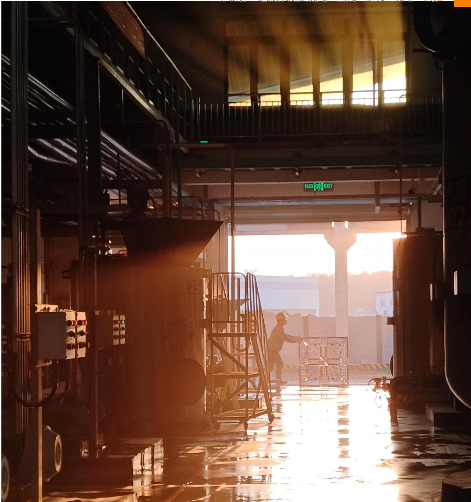

natural_image

Interior view of an industrial facility with machinery and a worker in protective gear, illuminated by warm sunlight (no visible text or symbols)

## 隐患排查

报告期内，持续将“控风险、查隐患、重整改”作为安全管理重点，根据每月风险变化情况，有针对性的组织开展公司级隐患排查，并对相关隐患问题整改闭环跟踪到位。此外，在公司内部以“人人都是安全员，个个争做吹哨人”为口号，发动全体干部员工参与“隐患随手拍”活动；公司级隐患排查15次；各类专项检查9次；排查隐患整改项1812项，均已整改闭环、同比24年增加15.8%；全年累计收集并推动处置隐患622项，隐患举报奖励4000余元。

- 发动全体干部员工参与“隐患随手拍”活动  
- 公司级隐患排查15次  
- 各类专项检查9次  
- 查隐患整改项1812项,均已整改闭环、同比24年增加 $15.8\%$  
- 年累计收集并推动处置隐患622项,隐患举报奖励4000余元

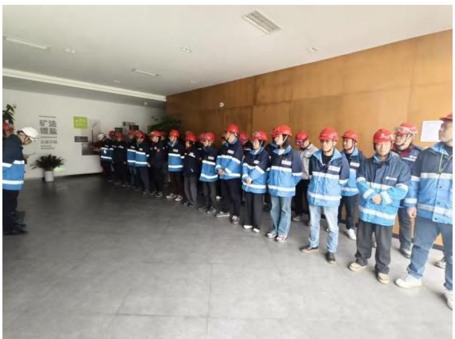

text_image

Group photo of workers in safety gear and helmets standing in line inside a facility with visible signage including '矿法锂盐' and '实验室校'

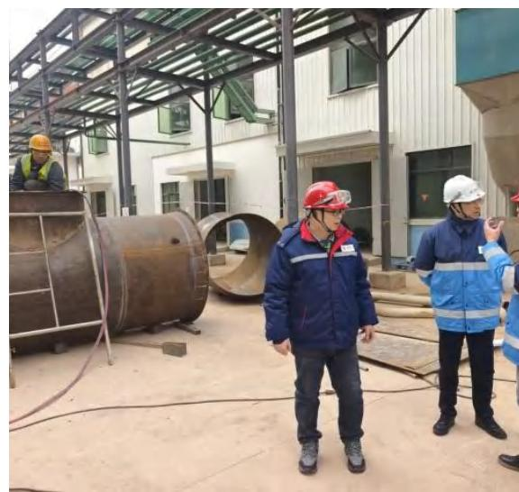

natural_image

Three workers in hard hats and uniforms inspecting industrial equipment at a construction site (no visible text or symbols)

## 员工职业健康服务

公司持续加大职业健康安全投入,开展一系列措施保障员工健康安全。

- 入职签订岗位职业危害告知书、岗位安全生产责任制，按岗位职业危害特点配备个体劳动防护用品和应急物资  
- 制定公司劳动防护用品发放标准，并依据使用反馈更新劳保用品的种类和数量，对不良劳保用品进行调查和改善  
- 每年定期对工作场所进行职业病危害因素检测,依据检测报告建议对岗位职业危害进行工程技术、管理方面的改善,强化个体防护  
- 每年对岗位人员进行职业健康体检, 对职业禁忌人员进行调岗, 对职业危害高风险人员强化监测和防护, 建立员工职业卫生和健康档案

## 承包商健康与安全管理

公司建立了承包商安全管理制度，严格审核承包商资质，双方签订安全生产管理协议，对承包商人员入场进行安全培训，考核合格后方可入场，培训内容主要包括国家法律法规、公司职业卫生管理规章制度、施工注意事项、应急处理措施等。截止报告期末，公司共开展承包商入场安全培训教育124场，覆盖人数达480人。

承包商入场安全培训教育

124 场

覆盖人数

480 人

## 安全生产指标与目标

## 安全生产目标

重伤及以上事故

0起

职业病

0起

直接经济损失

10万元及以上事故

(安全、环保、消防、职业卫生)

0起

轻伤率

≤ 1 %

2025年安全生产指标

<table><tr><td>管理指标</td><td>单位</td><td>2025年</td></tr><tr><td>工伤保险人员覆盖率</td><td>%</td><td>100%</td></tr><tr><td>安全生产责任险人员覆盖率</td><td>%</td><td>100%</td></tr><tr><td>重大工伤事故数</td><td>件</td><td>0</td></tr><tr><td>职业病人数</td><td>人</td><td>0</td></tr></table>

## 安全生产培训

报告期内,为提高员工安全意识、了解安全法律法规,公司共开展12次公司级安全培训,包含春节前安全知识培训、个人劳动防护用品使用培训、全员安全生产责任制培训、特种设备安全知识培训、职业病防治和急救知识培训、安全意识提升和隐患排查安全培训等,覆盖人数约3000余人次。

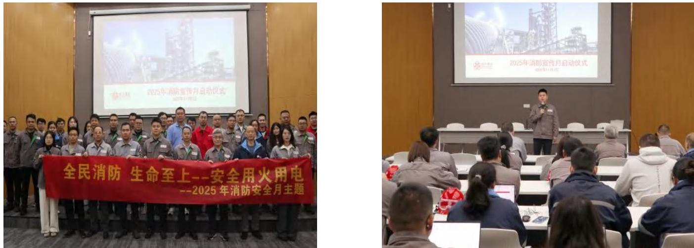

## 应急演练

报告期内，根据制定的应急演练计划，公司每月组织、协助车间及相关部门开展以危化品泄露、特种设备事故、突发自然灾害事故等专题的现场应急处置演练；以6月“安全月”、11月“消防宣传月”及“11.26永杉安全日”为契机，组织开展不定时、不定点的火灾应急疏散演练抽查。利用多种形式，旨在提升全员在应对突发状况下的应急反应和应急处置能力。

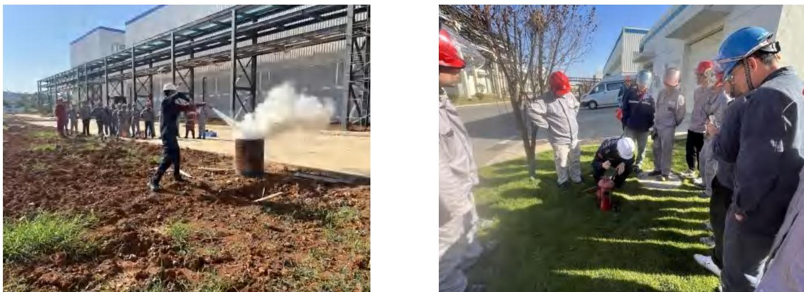

## 6.6 | 社区关系

在社区关系建设方面, 湖南永杉锂业始终坚持与当地社区保持常态化、机制化的沟通互动, 通过设立社区联络渠道、定期开展走访座谈等形式, 深入了解周边居民的实际需求与关切。

flowchart

```mermaid
graph LR
  A["User"] --> B["Central Entity"]
  C["User"] --> D["External Node 1"]
  E["User"] --> F["External Node 2"]
  G["User"] --> H["External Node 3"]
  I["User"] --> J["External Node 4"]
  K["User"] --> L["External Node 5"]
  M["User"] --> N["External Node 6"]
  O["User"] --> P["External Node 7"]
  Q["User"] --> R["External Node 8"]
  S["User"] --> T["External Node 9"]
  U["User"] --> V["External Node 10"]
  W["User"] --> X["External Node 11"]
  Y["User"] --> Z["External Node 12"]
  AA["User"] --> AB["External Node 13"]
  AC["User"] --> AD["External Node 14"]
  AE["User"] --> AF["External Node 15"]
  AG["User"] --> AH["External Node 16"]
  AI["User"] --> AJ["External Node 17"]
  AK["User"] --> AL["External Node 18"]
  AM["User"] --> AN["External Node 19"]
  AO["User"] --> AP["External Node 20"]
  AQ["User"] --> AR["External Node 21"]
  AS["User"] --> AT["External Node 22"]
  AU["User"] --> AV["External Node 23"]
  AW["User"] --> AX["External Node 24"]
  A --> B
  B --> C
  C --> D
  D --> E
  E --> F
  F --> G
  G --> H
  H --> I
  I --> J
  J --> K
  K --> L
  L --> M
  M --> N
  N --> O
  O --> P
  P --> Q
  Q --> R
  R --> S
  S --> T
  T --> U
  U --> V
  V --> W
  W --> X
  X --> Y
  Y --> Z
  Z --> AA
  AA --> AB
  AB --> AC
  AC --> AD
  AD --> AE
  AE --> AF
  AF --> AG
  AG --> AH
  AH --> AI
  AI --> AJ
  AJ --> AK
  AK --> AL
  AL --> AM
  AM --> AN
  AN --> AO
  AO --> AP
  AP --> AQ
  AQ --> AR
  AR --> AS
  AS --> AT
  AT --> AU
  AU --> AV
  AV --> AW
  AW --> AX
  AX --> AZ
```

## 家庭日活动：

7月26日，公司举办“家庭开放日”活动，邀请员工家属走进公司。活动通过企业短片、领导致辞及交流，增进家属对员工工作的理解；安排展厅参观与检测中心趣味实验，让家属亲身体验工作场景与成果。活动旨在连接工作与家庭，强化员工归属感，展现公司将员工家庭视为成长共同体的企业文化。

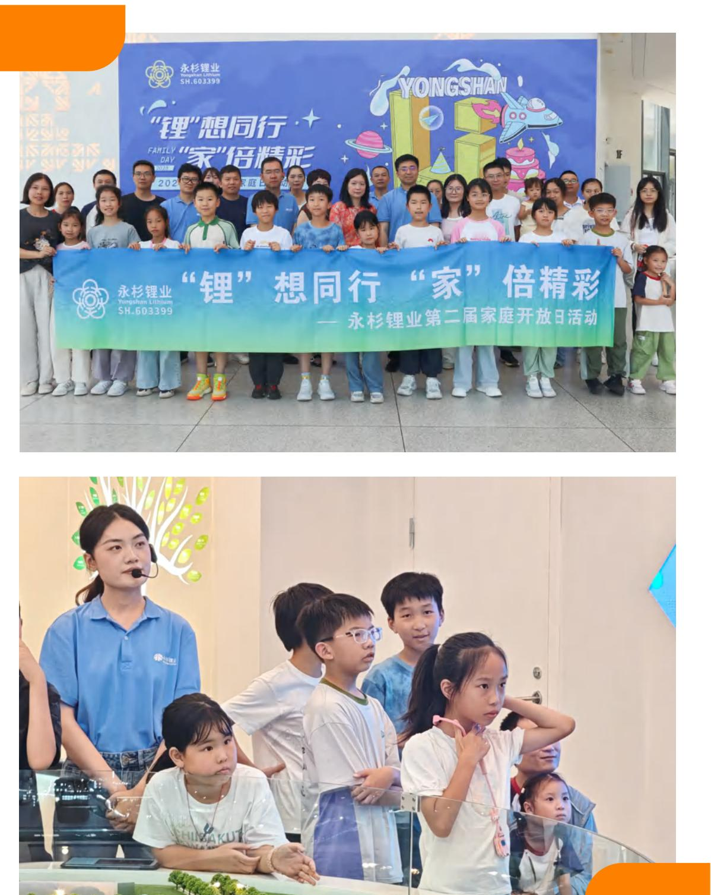

## 6.7 | 慈善公益及乡村振兴

湖南永杉锂业秉持“取之社会，回馈社会”的理念，制定了《永杉公益行活动指导手册》，构建涵盖以教育支持、弱势群体关爱、环保倡导为核心的公益生态体系。公司慈善公益及乡村振兴项目由行政管理部负责，向可持续发展委员会及董事会审批报告，保障相关活动的顺利实施。

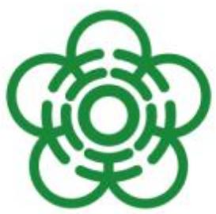

## 永杉公益行

## Yongshan Charity Campaign

natural_image

Scenic mountain landscape at sunset with winding road and colorful sky (no text or symbols)

## 慈善公益

## 植树节主题活动：

3月11日植树节前夕，公司党支部联合工会组织员工开展“植锂想之树，创绿能未来”主题植树活动。活动以“三红一绿”等组合形式栽植树苗，象征党与群众的紧密联系，将生态理念与党建工作相结合。参与者通过协同劳动强化绿色发展意识，为持续践行“双碳”目标注入实践动力。

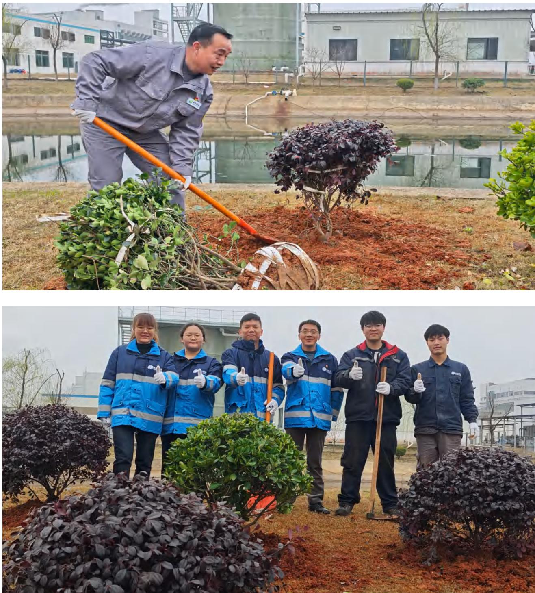

## 联合妇联爱心捐赠活动：

为助力社区儿童健康成长,12月20日,公司参与望城区“巾帼护幼 喜迎元旦”结对关爱活动,为家庭困难儿童捐赠过冬棉衣,并通过心愿卡书写、才艺表演、亲子互动等形式,传递温暖关怀,支持本地公益事业发展。

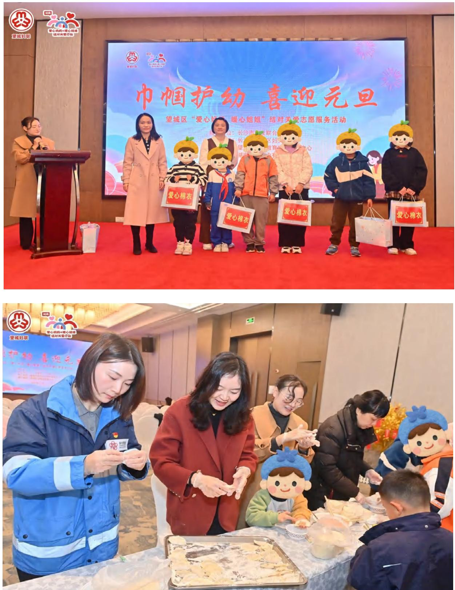

## 乡村振兴

## 吉首大学校友企业专项招聘会：

公司于2024-2025年持续走进湘西地区，在吉首大学开展专场宣讲会，面向当地招聘人才。累计接收有效简历78份，推荐复试49人，最终录用9人，岗位涵盖工艺材料、设备技术、法务、分析检测及安全等多个领域。此次招聘实践为湘西地区青年提供了就业机会，体现了公司以就业帮扶服务乡村发展的社会责任。

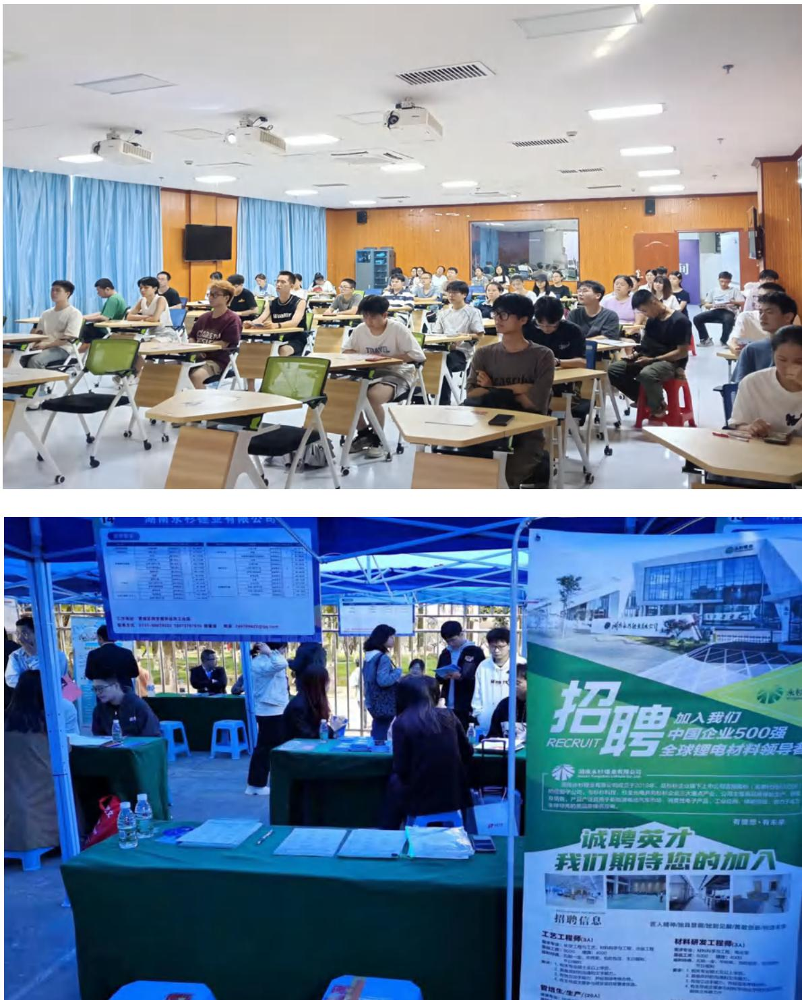

## ESG绩效

1. 环境绩效

<table><tr><td colspan="6">应对气候变化和能源管理</td></tr><tr><td colspan="2">指标</td><td>单位</td><td>2023年</td><td>2024年</td><td>2025年</td></tr><tr><td rowspan="3">温室气体排放量</td><td>范围一</td><td>公吨二氧化碳当量</td><td>-</td><td>34,362.09</td><td>49,208.98</td></tr><tr><td>范围二</td><td>公吨二氧化碳当量</td><td>-</td><td>82,104.74</td><td>122,643.18</td></tr><tr><td>范围三</td><td>公吨二氧化碳当量</td><td>-</td><td>16,988.08</td><td>30,059.50</td></tr><tr><td colspan="2">温室气体排放总量</td><td>公吨二氧化碳当量</td><td>-</td><td>133,454.91</td><td>201,911.67</td></tr><tr><td colspan="2">温室气体排放强度</td><td>公吨二氧化碳当量/吨LCE</td><td>-</td><td>7.05</td><td>6.66</td></tr><tr><td rowspan="5">非可再生能源消耗量</td><td>天然气</td><td>立方米</td><td>3,445,163.29</td><td>13,515,555.69</td><td>22,313,435.20</td></tr><tr><td>汽油</td><td>千克</td><td>2,794.11</td><td>1,859.74</td><td>3,313.52</td></tr><tr><td>柴油</td><td>千克</td><td>4,153.31</td><td>5,910.35</td><td>10,620.23</td></tr><tr><td>外购电力</td><td>千瓦时</td><td>54,597,000.00</td><td>99,820,345.00</td><td>157,261,448.00</td></tr><tr><td>蒸汽</td><td>吨</td><td>52,863.03</td><td>105,195.95</td><td>141,321.80</td></tr><tr><td colspan="2">可再生能源消耗量</td><td>千瓦时</td><td>0</td><td>0</td><td>16,631,000.00</td></tr><tr><td colspan="2">能源消耗总量</td><td>吉焦</td><td>467,623.11</td><td>1,135,667.27</td><td>1,757,207.10</td></tr><tr><td colspan="2">能源消耗强度</td><td>吉焦/吨LCE</td><td>46.31</td><td>59.79</td><td>57.94</td></tr></table>

排放物及废弃物管理

<table><tr><td colspan="2">指标</td><td>单位</td><td>2023年</td><td>2024年</td><td>2025年</td></tr><tr><td colspan="6">废气排放</td></tr><tr><td rowspan="3">空气污染物排放总量</td><td>氮氧化物(NOx)</td><td>吨</td><td>-</td><td>1.770560</td><td>1.137250</td></tr><tr><td>硫化物(SOx)</td><td>吨</td><td>-</td><td>0.411979</td><td>0.575750</td></tr><tr><td>颗粒物(PM)</td><td>吨</td><td>-</td><td>0.314530</td><td>0.158977</td></tr><tr><td colspan="6">废水排放</td></tr><tr><td>总废水排放量</td><td>排向第三方设施</td><td>兆升</td><td>17.81</td><td>35.63</td><td>32.18</td></tr><tr><td rowspan="3"> $废水污染物含量^1$ </td><td>化学需氧量(COD)</td><td>mg/L</td><td>-</td><td>-</td><td>11.33</td></tr><tr><td>氨氮(NH3-N)</td><td>mg/L</td><td>-</td><td>-</td><td>0.146</td></tr><tr><td>总磷</td><td>mg/L</td><td>-</td><td>-</td><td>1.92</td></tr><tr><td colspan="6">固体废弃物排放</td></tr><tr><td colspan="2">一般工业废弃物产生量</td><td>吨</td><td>48,816.28</td><td>199,458.66</td><td>343,235.59</td></tr><tr><td colspan="2">一般工业废弃物回收量</td><td>吨</td><td>48,816.28</td><td>199,458.66</td><td>343,235.59</td></tr><tr><td colspan="2">一般工业废弃物处置量</td><td>吨</td><td>0</td><td>0</td><td>0</td></tr><tr><td colspan="2">一般废弃物密度</td><td>吨/吨LCE</td><td>4.85</td><td>10.54</td><td>11.32</td></tr><tr><td colspan="2">危险废弃物产生量</td><td>吨</td><td>17.66</td><td>18.22</td><td>49.91</td></tr><tr><td colspan="2">危险废弃物回收量</td><td>吨</td><td>-</td><td>-</td><td>19.90</td></tr><tr><td colspan="2">危险废弃物处置量</td><td>吨</td><td>17.66</td><td>18.22</td><td>30.01</td></tr><tr><td colspan="2">危险废弃物密度</td><td>吨/吨LCE</td><td>0.0018</td><td>0.0010</td><td>0.0016</td></tr><tr><td colspan="2">废弃物回收总量</td><td>吨</td><td>48,816.28</td><td>199,458.66</td><td>343,235.59</td></tr></table>

注1: 公司每半年以采样方式检测废水污染物排放量, 上表中数据为DW004生产区废水排放口样品中废水污染物排放量平均值

水资源管理

<table><tr><td colspan="2">指标</td><td>单位</td><td>2023年</td><td>2024年</td><td>2025年</td></tr><tr><td>总取水量</td><td>市政供水</td><td>兆升</td><td>146.47</td><td>146.87</td><td>227.05</td></tr><tr><td colspan="2">总耗水量</td><td>兆升</td><td>128.66</td><td>111.24</td><td>194.87</td></tr><tr><td colspan="2">耗水强度</td><td>吨/吨LCE</td><td>12.78</td><td>5.88</td><td>6.43</td></tr><tr><td colspan="2">单吨产品排水量</td><td>吨</td><td>1.92</td><td>2.07</td><td>1.13</td></tr></table>

资源使用及循环经济

<table><tr><td colspan="2">指标</td><td>单位</td><td>2023年</td><td>2024年</td><td>2025年</td></tr><tr><td>包装耗材量</td><td>吨袋</td><td>个</td><td>37,154.00</td><td>42,680.00</td><td>62,097.00</td></tr><tr><td>废弃物循环利用量</td><td>硅质渣</td><td>吨</td><td>48,816.28</td><td>199,615.99</td><td>343,235.95</td></tr><tr><td>可再生资源消耗量</td><td>二氧化碳(碳化线)</td><td>吨</td><td>2,248.32</td><td>2,777.80</td><td>1,684.95</td></tr></table>

环境合规管理

<table><tr><td>指标</td><td>单位</td><td>2023年</td><td>2024年</td><td>2025年</td></tr><tr><td>环境保护投入金额</td><td>万元</td><td>110.93</td><td>409.44</td><td>238.20</td></tr><tr><td>违反环境或生态相关法律法规事件数</td><td>件</td><td>0</td><td>0</td><td>0</td></tr><tr><td>环境监测达标合格率</td><td>%</td><td>100</td><td>100</td><td>100</td></tr><tr><td>客户及相关方环保有效投诉事件数</td><td>件</td><td>0</td><td>0</td><td>0</td></tr><tr><td>与环境或生态问题相关的罚款金额</td><td>万元</td><td>0</td><td>0</td><td>0</td></tr></table>

## 社会绩效

员工雇佣

<table><tr><td colspan="2">指标</td><td>单位</td><td>2023年</td><td>2024年</td><td>2025年</td></tr><tr><td colspan="2">员工总人数</td><td>人</td><td>376</td><td>408</td><td>455</td></tr><tr><td rowspan="2">按性别划分的员工人数</td><td>男员工</td><td>人</td><td>276</td><td>288</td><td>326</td></tr><tr><td>女员工</td><td>人</td><td>100</td><td>120</td><td>129</td></tr><tr><td rowspan="2">按雇佣类型划分的员工人数</td><td>全职</td><td>人</td><td>376</td><td>408</td><td>455</td></tr><tr><td>兼职</td><td>人</td><td>0</td><td>0</td><td>0</td></tr><tr><td rowspan="3">按年龄组别划分的员工人数</td><td>30岁以下</td><td>人</td><td>97</td><td>121</td><td>146</td></tr><tr><td>30-50岁</td><td>人</td><td>262</td><td>272</td><td>293</td></tr><tr><td>50岁以上</td><td>人</td><td>17</td><td>15</td><td>16</td></tr><tr><td rowspan="3">按地区划分的员工人数</td><td>中国内地</td><td>人</td><td>375</td><td>407</td><td>454</td></tr><tr><td>港澳台</td><td>人</td><td>1</td><td>1</td><td>1</td></tr><tr><td>其他国家或地区</td><td>人</td><td>0</td><td>0</td><td>0</td></tr><tr><td rowspan="2">本年度新增员工数量</td><td>男员工</td><td>人</td><td>74</td><td>74</td><td>79</td></tr><tr><td>女员工</td><td>人</td><td>42</td><td>52</td><td>34</td></tr><tr><td rowspan="2">离职员工数量</td><td>男员工</td><td>人</td><td>85</td><td>62</td><td>40</td></tr><tr><td>女员工</td><td>人</td><td>39</td><td>32</td><td>25</td></tr><tr><td colspan="2">劳动合同签订率</td><td>%</td><td>100</td><td>100</td><td>100</td></tr><tr><td colspan="2">员工流失率</td><td>%</td><td>2.75</td><td>1.95</td><td>1.19</td></tr></table>

员工权益

<table><tr><td>指标</td><td>单位</td><td>2023年</td><td>2024年</td><td>2025年</td></tr><tr><td>工作时长</td><td>小时</td><td>1,062,684</td><td>1,419,176</td><td>1,626,151</td></tr><tr><td>收入最高的个人的年薪总额与其他所有员工的年总薪酬中位数的比率</td><td>%</td><td>1,538.46</td><td>1,538.46</td><td>1,897.44</td></tr><tr><td>缴纳社会保险的员工占比</td><td>%</td><td>96.81</td><td>96.32</td><td>96.04</td></tr><tr><td>童工或强迫劳动事件数</td><td>件</td><td>0</td><td>0</td><td>0</td></tr><tr><td>享受育儿假员工总数</td><td>人</td><td>10</td><td>8</td><td>12</td></tr><tr><td>实际休育儿假员工总数</td><td>人</td><td>10</td><td>8</td><td>12</td></tr><tr><td>报告期内应返岗员工总数</td><td>人</td><td>7</td><td>7</td><td>11</td></tr><tr><td>报告期内实际返岗员工总数</td><td>人</td><td>6</td><td>7</td><td>11</td></tr><tr><td>返岗后12个月内仍在职员工数</td><td>人</td><td>8</td><td>5</td><td>11</td></tr><tr><td>接受公司员工关怀项目的员工人数</td><td>人</td><td>-</td><td>391</td><td>454</td></tr><tr><td>公司员工关怀项目的资金投入</td><td>元</td><td>-</td><td>19,550</td><td>22,700</td></tr><tr><td>员工满意度</td><td>%</td><td>99.33</td><td>98.47</td><td>99.09</td></tr></table>

员工发展与培训

<table><tr><td colspan="2">指标</td><td>单位</td><td>2023年</td><td>2024年</td><td>2025年</td></tr><tr><td colspan="2">员工培训总支出</td><td>万元</td><td>-</td><td>9.28</td><td>4.22</td></tr><tr><td colspan="2">员工培训次数</td><td>次</td><td>11</td><td>15</td><td>18</td></tr><tr><td colspan="2">员工培训覆盖率</td><td>%</td><td>100</td><td>100</td><td>100</td></tr><tr><td colspan="2">员工培训时数</td><td>小时</td><td>30,454</td><td>35,423</td><td>42,910</td></tr><tr><td rowspan="2">按性别划分的每名员工平均受训时数</td><td>男员工</td><td>小时</td><td>80.0</td><td>85.0</td><td>92.5</td></tr><tr><td>女员工</td><td>小时</td><td>80.0</td><td>85.0</td><td>92.5</td></tr><tr><td colspan="2">定期接受绩效考核的员工占比</td><td>%</td><td>25%</td><td>25%</td><td>100%</td></tr></table>

员工职业健康与安全

<table><tr><td colspan="2">指标</td><td>单位</td><td>2023年</td><td>2024年</td><td>2025年</td></tr><tr><td colspan="2">工伤保险投人金额</td><td>万元</td><td>28.66</td><td>31.30</td><td>43.92</td></tr><tr><td colspan="2">工伤保险人员覆盖率</td><td>%</td><td>100</td><td>100</td><td>100</td></tr><tr><td colspan="2">安全生产责任险投人金额</td><td>万元</td><td>2.52</td><td>2.52</td><td>2.52</td></tr><tr><td colspan="2">安全生产责任险人员覆盖率</td><td>%</td><td>100%</td><td>100%</td><td>100%</td></tr><tr><td colspan="2">工伤事故数</td><td>件</td><td>2</td><td>0</td><td>4</td></tr><tr><td colspan="2">重大工伤事故数</td><td>件</td><td>0</td><td>0</td><td>0</td></tr><tr><td colspan="2">因工伤损失工作日数</td><td>日</td><td>99</td><td>88</td><td>212</td></tr><tr><td colspan="2">因工亡故人数</td><td>人</td><td>0</td><td>0</td><td>3</td></tr><tr><td colspan="2">可记录工伤人数</td><td>人</td><td>2</td><td>0</td><td>3</td></tr><tr><td colspan="2">职业病人数</td><td>人</td><td>0</td><td>0</td><td>0</td></tr><tr><td rowspan="3">安全教育培训员工职业健康与安全培训</td><td>培训次数</td><td>次</td><td>12</td><td>12</td><td>12</td></tr><tr><td>培训参与人次</td><td>人次</td><td>4,512</td><td>4,896</td><td>5,460</td></tr><tr><td>人均培训时长:</td><td>小时</td><td>24</td><td>24</td><td>24</td></tr></table>

多元、平等与包容

<table><tr><td>指标</td><td>单位</td><td>2023年</td><td>2024年</td><td>2025年</td></tr><tr><td>少数民族员工数量</td><td>人</td><td>5</td><td>10</td><td>18</td></tr><tr><td>少数民族员工占比</td><td>%</td><td>1.33</td><td>2.46</td><td>3.96</td></tr><tr><td>女性高管占比</td><td>%</td><td>0</td><td>18.18</td><td>18.18</td></tr><tr><td>困难员工帮扶人数</td><td>人</td><td>2</td><td>4</td><td>10</td></tr><tr><td>未经调整的平均男女薪酬差距</td><td>%</td><td>27.88</td><td>22.86</td><td>24.04</td></tr><tr><td>举报歧视或骚扰事件的数量</td><td>件</td><td>0</td><td>0</td><td>0</td></tr><tr><td>参与防范歧视和骚扰培训的员工人数</td><td>人</td><td>376</td><td>407</td><td>455</td></tr></table>

创新驱动

<table><tr><td>指标</td><td>单位</td><td>2023年</td><td>2024年</td><td>2025年</td></tr><tr><td>研发投入金额</td><td>万元</td><td>4,494.17</td><td>5,032.73</td><td>5,756.95</td></tr><tr><td>报告期内专利申请数</td><td>项</td><td>4</td><td>11</td><td>24</td></tr><tr><td>报告期内专利授权数</td><td>项</td><td>1</td><td>3</td><td>7</td></tr><tr><td>授权专利一发明数量</td><td>项</td><td>1</td><td>2</td><td>0</td></tr><tr><td>授权专利一实用新型数量</td><td>项</td><td>0</td><td>1</td><td>7</td></tr><tr><td>专利累计授权总数</td><td>项</td><td>10</td><td>13</td><td>20</td></tr></table>

产品服务安全与质量

<table><tr><td>指标</td><td>单位</td><td>2023年</td><td>2024年</td><td>2025年</td></tr><tr><td>产品安全与质量事件数</td><td>件</td><td>0</td><td>1</td><td>0</td></tr><tr><td>产品安全与质量事件造成损失金额</td><td>万元</td><td>0</td><td>100</td><td>0</td></tr><tr><td>产品召回数量</td><td>件</td><td>0</td><td>0</td><td>0</td></tr><tr><td>客户投诉量</td><td>件</td><td>17</td><td>8</td><td>11</td></tr><tr><td>客户投诉处置率</td><td>%</td><td>100</td><td>100</td><td>100</td></tr><tr><td>涉嫌安全与健康理由的诉讼案件数量</td><td>件</td><td>0</td><td>0</td><td>0</td></tr><tr><td>客户满意度</td><td>%</td><td>94.07</td><td>96.35</td><td>96.32</td></tr></table>

供应链管理

<table><tr><td colspan="2">指标</td><td>单位</td><td>2023年</td><td>2024年</td><td>2025年</td></tr><tr><td colspan="2">供应商总数</td><td>家</td><td>33</td><td>52</td><td>58</td></tr><tr><td rowspan="2">按地区划分的供应商数</td><td>中国内地</td><td>家</td><td>32</td><td>48</td><td>53</td></tr><tr><td>其他国家或地区</td><td>家</td><td>1</td><td>4</td><td>5</td></tr><tr><td colspan="2">报告期内新增供应商数</td><td>家</td><td>7</td><td>19</td><td>14</td></tr><tr><td colspan="2">因存在违规行为被淘汰的供应商数量</td><td>家</td><td>0</td><td>0</td><td>0</td></tr><tr><td rowspan="5">可持续供应链</td><td>签署了供应商行为准则的供应商数量</td><td>家</td><td>31</td><td>46</td><td>52</td></tr><tr><td>签订包含环境、劳动和人权要求条款合同的供应商数量</td><td>家</td><td>-</td><td>8</td><td>17</td></tr><tr><td>目标供应商中已经过ESG评估的数量</td><td>家</td><td>6</td><td>11</td><td>13</td></tr><tr><td>目标供应商中已经过ESG现场审核的数量</td><td>家</td><td>2</td><td>3</td><td>1</td></tr><tr><td>具有实际/潜在高ESG风险的供应商数量</td><td>家</td><td>0</td><td>0</td><td>0</td></tr></table>

乡村振兴与社会贡献

<table><tr><td>指标</td><td>单位</td><td>2023年</td><td>2024年</td><td>2025年</td></tr><tr><td>公益捐赠及乡村振兴投入金额</td><td>元</td><td>0</td><td>5,000.00</td><td>5,000.00</td></tr><tr><td>员工志愿者人数</td><td>人</td><td>0</td><td>5</td><td>15</td></tr><tr><td>志愿活动次数</td><td>次</td><td>0</td><td>1</td><td>4</td></tr><tr><td>志愿活动总时长</td><td>小时</td><td>0</td><td>5</td><td>120</td></tr></table>

## 治理绩效

反商业贿赂及反贪污

<table><tr><td colspan="2">指标</td><td>单位</td><td>2023年</td><td>2024年</td><td>2025年</td></tr><tr><td rowspan="3">接受反商业贿赂及反贪污培训的人数</td><td>董事</td><td>人</td><td>-</td><td>3</td><td>5</td></tr><tr><td>管理层</td><td>人</td><td>-</td><td>12</td><td>13</td></tr><tr><td>普通员工</td><td>人</td><td>-</td><td>396</td><td>259</td></tr><tr><td colspan="2">反商业贿赂及反贪污培训覆盖率</td><td>%</td><td>-</td><td>100</td><td>100</td></tr><tr><td colspan="2">举报的贪污腐败违规事件数</td><td>件</td><td>-</td><td>1</td><td>0</td></tr><tr><td colspan="2">报告期内公司及员工提出的贪污诉讼案件数量</td><td>件</td><td>-</td><td>1</td><td>0</td></tr><tr><td colspan="2">开展腐败风险评估的运营点</td><td>个</td><td>-</td><td>15</td><td>15</td></tr><tr><td colspan="2">开展腐败风险评估的运营点覆盖率</td><td>%</td><td>-</td><td>100</td><td>100</td></tr></table>

反不正当竞争

<table><tr><td>指标</td><td>单位</td><td>2023年</td><td>2024年</td><td>2025年</td></tr><tr><td>垄断或不正当竞争事件数</td><td>件</td><td>-</td><td>0</td><td>0</td></tr><tr><td>因垄断或不正当竞争事件遭受损失金额</td><td>万元</td><td>-</td><td>0</td><td>0</td></tr></table>

## 报告标准索引表

<table><tr><td colspan="2">GRI指标索引</td></tr><tr><td>使用说明</td><td>湖南永杉锂业有限公司在2025年1月1日至2025年12月31日参照GRI标准报告了在此份GRI内容索引中引用的信息。</td></tr><tr><td>使用的GRI1</td><td>GRI1:基础2021</td></tr></table>

<table><tr><td>GRI 标准</td><td>披露项</td><td>报告章节</td></tr><tr><td colspan="3">一般披露</td></tr><tr><td rowspan="30">GRI2:一般披露2021</td><td>2-1组织详细情况</td><td>一、关于湖南永杉锂业有限公司</td></tr><tr><td>2-2纳入组织可持续发展报告的实体</td><td>关于本报告</td></tr><tr><td>2-3报告期、报告频率和联系人</td><td>关于本报告</td></tr><tr><td>2-4信息重述</td><td>关于本报告</td></tr><tr><td>2-5外部鉴证</td><td>报告期内未开展</td></tr><tr><td>2-6活动、价值链和其他业务关系</td><td>一、关于湖南永杉锂业有限公司</td></tr><tr><td>2-7员工</td><td>6.1 员工雇佣与权益</td></tr><tr><td>2-8员工之外的工作者</td><td>6.1 员工雇佣与权益</td></tr><tr><td>2-9管治架构和组成</td><td>3.1 ESG治理</td></tr><tr><td>2-10最高管治机构的提名和遴选</td><td>从略</td></tr><tr><td>2-11最高管治机构的主席</td><td>3.1 ESG治理</td></tr><tr><td>2-12在管理影响方面,最高管治机构的监督作用</td><td>3.1 ESG治理</td></tr><tr><td>2-13为管理影响的责任授权</td><td>3.1 ESG治理</td></tr><tr><td>2-14最高管治机构在可持续发展报告中的作用</td><td>3.1 ESG治理</td></tr><tr><td>2-15利益冲突</td><td>3.3 商业道德</td></tr><tr><td>2-16重要关切问题的沟通</td><td>二、利益相关方参与及重要性议题评估</td></tr><tr><td>2-17最高管治机构的共同知识</td><td>从略</td></tr><tr><td>2-18对最高管治机构的绩效评估</td><td>3.1 ESG治理</td></tr><tr><td>2-19薪酬政策</td><td>6.1 员工雇佣与权益</td></tr><tr><td>2-20确定薪酬的程序</td><td>6.1 员工雇佣与权益</td></tr><tr><td>2-21年度总薪酬比率</td><td>ESG绩效</td></tr><tr><td>2-22关于可持续发展战略的声明</td><td>董事长致辞</td></tr><tr><td>2-23政策承诺</td><td>6.1 员工雇佣与权益</td></tr><tr><td>2-24融合政策承诺</td><td>5.6 可持续供应链</td></tr><tr><td>2-25补救负面影响的程序</td><td>6.1 员工雇佣与权益5.6 可持续供应链</td></tr><tr><td>2-26寻求建议和提出关切的机制</td><td>2.1利益相关方参与</td></tr><tr><td>2-27遵守法律法规</td><td>3.2合规与风险管理</td></tr><tr><td>2-28协会的成员资格</td><td>一、关于湖南永杉锂业有限公司</td></tr><tr><td>2-29利益相关方参与的方法</td><td>2.1利益相关方参与</td></tr><tr><td>2-30集体谈判协议</td><td>从略</td></tr></table>

<table><tr><td>GRI 标准</td><td>披露项</td><td>报告章节</td></tr><tr><td colspan="3">实质性议题</td></tr><tr><td rowspan="2">GRI3:实质性议题2021</td><td>3-1确定实质性议题的过程</td><td>2.2重要性议题评估</td></tr><tr><td>3-2实质性议题清单</td><td>2.2重要性议题评估</td></tr><tr><td colspan="3">经济绩效</td></tr><tr><td>GRI3:实质性议题2021</td><td>3-3实质性议题的管理</td><td>从略</td></tr><tr><td rowspan="4">GRI201:经济绩效2016</td><td>201-1直接产生和分配的经济价值</td><td>一、关于湖南永杉锂业有限公司</td></tr><tr><td>201-2气候变化带来的财务影响以及其他风险和机遇</td><td>4.1应对气候变化</td></tr><tr><td>201-3固定福利计划义务和其他退休计划</td><td>6.1员工雇佣与权益</td></tr><tr><td>201-4政府给予的财政补贴</td><td>从略</td></tr><tr><td colspan="3">采购实践</td></tr><tr><td>GRI3:实质性议题2021</td><td>3-3实质性议题的管理</td><td>5.6可持续供应链</td></tr><tr><td>GRI204:采购实践2016</td><td>204-1向当地供应商采购的支出比例</td><td>从略</td></tr><tr><td colspan="3">反腐败</td></tr><tr><td>GRI3:实质性议题2021</td><td>3-3实质性议题的管理</td><td>3.3商业道德</td></tr><tr><td rowspan="3">GRI205:反腐败2016</td><td>205-1已进行腐败风险评估的运营点</td><td>3.3商业道德</td></tr><tr><td>205-2反腐败政策和程序的传达及培训</td><td>3.3商业道德</td></tr><tr><td>205-3经确认的腐败事件和采取的行动</td><td>3.3商业道德</td></tr><tr><td colspan="3">反竞争行为</td></tr><tr><td>GRI3:实质性议题2021</td><td>3-3实质性议题的管理</td><td>3.3商业道德</td></tr><tr><td>GRI206:反竞争行为2016</td><td>206-1针对反竞争行为、反托拉斯和反垄断实践的法律诉讼</td><td>3.3商业道德</td></tr><tr><td colspan="3">物料</td></tr><tr><td>GRI3:实质性议题2021</td><td>3-3实质性议题的管理</td><td>4.7循环经济</td></tr><tr><td rowspan="3">GRI301:物料2016</td><td>301-1所用物料的重量或体积</td><td>从略</td></tr><tr><td>301-2所用循环利用的进料</td><td>4.7循环经济</td></tr><tr><td>301-3再生产品及其包装材料</td><td>4.7循环经济</td></tr><tr><td colspan="3">能源</td></tr><tr><td>GRI3:实质性议题2021</td><td>3-3实质性议题的管理</td><td>4.2能源管理</td></tr><tr><td rowspan="5">GRI301:物料2016</td><td>302-1组织内部的能源消耗量</td><td>4.2能源管理</td></tr><tr><td>302-2组织外部的能源消耗量</td><td>从略</td></tr><tr><td>302-3能源强度</td><td>4.2能源管理</td></tr><tr><td>302-4降低能源消耗量</td><td>4.2能源管理</td></tr><tr><td>302-5降低产品和服务的能源需求量</td><td>从略</td></tr><tr><td colspan="3">水资源和污水</td></tr></table>

<table><tr><td>GRI 标准</td><td>披露项</td><td>报告章节</td></tr><tr><td>GRI3:实质性议题2021</td><td>3-3实质性议题的管理</td><td>4.4水资源管理4.5污染物排放</td></tr><tr><td rowspan="5">GRI303:水资源和污水2018</td><td>303-1组织与水作为共有资源的相互影响</td><td>4.4水资源管理</td></tr><tr><td>303-2管理与排水相关的影响</td><td>4.4水资源管理4.5污染物排放</td></tr><tr><td>303-3取水</td><td>4.4水资源管理</td></tr><tr><td>303-4排水</td><td>4.4水资源管理4.5污染物排放</td></tr><tr><td>303-5耗水</td><td>4.4水资源管理</td></tr><tr><td colspan="3">生物多样性</td></tr><tr><td>GRI3:实质性议题2021</td><td>3-3实质性议题的管理</td><td>4.8生态系统和生物多样性保护</td></tr><tr><td rowspan="4">GRI304:生物多样性2016</td><td>304-1组织在位于或邻近保护区和保护区外的生物多样性丰富区域拥有、租赁、管理的运营点</td><td>4.8生态系统和生物多样性保护</td></tr><tr><td>304-2活动、产品和服务对生物多样性的重大影响</td><td>4.8生态系统和生物多样性保护</td></tr><tr><td>304-3受保护或经修复的栖息地</td><td>4.8生态系统和生物多样性保护</td></tr><tr><td>304-4受运营影响的栖息地中已被列入世界自然保护联盟(IUCN)红色名录及国家保护名册的物种</td><td>4.8生态系统和生物多样性保护</td></tr><tr><td colspan="3">排放</td></tr><tr><td>GRI3:实质性议题2021</td><td>3-3实质性议题的管理</td><td>4.1应对气候变化</td></tr><tr><td rowspan="7">GRI305:排放2016</td><td>305-1直接(范围1)温室气体排放</td><td>4.1应对气候变化</td></tr><tr><td>305-2能源间接(范围2)温室气体排放</td><td>4.1应对气候变化</td></tr><tr><td>305-3其他间接(范围3)温室气体排放</td><td>4.1应对气候变化</td></tr><tr><td>305-4温室气体排放强度</td><td>4.1应对气候变化</td></tr><tr><td>305-5温室气体减排量</td><td>4.1应对气候变化</td></tr><tr><td>305-6臭氧消耗物质(ODS)的排放</td><td>4.1应对气候变化</td></tr><tr><td>305-7氮氧化物(NOX)、硫氧化物(SOX)和其他重大气体排放</td><td>4.1应对气候变化</td></tr><tr><td colspan="3">废弃物</td></tr><tr><td>GRI3:实质性议题2021</td><td>3-3实质性议题的管理</td><td>4.6废弃物管理</td></tr><tr><td rowspan="5">GRI306:废弃物2020</td><td>306-1废弃物的产生及废弃物相关重大影响</td><td>4.6废弃物管理</td></tr><tr><td>306-2废弃物相关重大影响的管理</td><td>4.6废弃物管理</td></tr><tr><td>306-3产生的废弃物</td><td>4.6废弃物管理</td></tr><tr><td>306-4从处置中转移的废弃物</td><td>4.6废弃物管理</td></tr><tr><td>306-5进人处置的废弃物</td><td>4.6废弃物管理</td></tr><tr><td colspan="3">供应商环境评估</td></tr><tr><td>GRI3:实质性议题2021</td><td>3-3实质性议题的管理</td><td>5.6可持续供应链</td></tr><tr><td rowspan="2">GRI308:供应商环境评估2016</td><td>308-1使用环境评价维度筛选的新供应商</td><td>5.6可持续供应链</td></tr><tr><td>308-2供应链的负面环境影响以及采取的行动</td><td>5.6可持续供应链</td></tr><tr><td colspan="3">雇佣</td></tr><tr><td>GRI3:实质性议题2021</td><td>3-3实质性议题的管理</td><td>6.1员工雇佣与权益</td></tr><tr><td rowspan="3">GRI308:供应商环境评估2016</td><td>401-1新进员工雇佣率和员工流动率</td><td>6.1员工雇佣与权益</td></tr><tr><td>401-2提供给全职员工(不包括临时或兼职员工)的福利</td><td>6.1员工雇佣与权益</td></tr><tr><td>401-3育儿假</td><td>6.1员工雇佣与权益</td></tr><tr><td colspan="3">职业健康与安全</td></tr><tr><td>GRI3:实质性议题2021</td><td>3-3实质性议题的管理</td><td>6.5职业健康安全</td></tr><tr><td rowspan="10">GRI403:职业健康与安全2018</td><td>403-1职业健康安全管理体系</td><td>6.5职业健康安全</td></tr><tr><td>403-2危害识别、风险评估和事故调查</td><td>6.5职业健康安全</td></tr><tr><td>403-3职业健康服务</td><td>6.5职业健康安全</td></tr><tr><td>403-4职业健康安全事务:工作者的参与、意见征询和沟通</td><td>6.5职业健康安全</td></tr><tr><td>403-5工作者职业健康安全培训</td><td>6.5职业健康安全</td></tr><tr><td>403-6促进工作者健康</td><td>6.5职业健康安全</td></tr><tr><td>403-7预防和减缓与业务关系直接相关的职业健康安全影响</td><td>6.5职业健康安全</td></tr><tr><td>403-8职业健康安全管理体系覆盖的工作者</td><td>6.5职业健康安全</td></tr><tr><td>403-9工伤</td><td>6.5职业健康安全</td></tr><tr><td>403-10工作相关的健康问题</td><td>6.5职业健康安全</td></tr><tr><td colspan="3">培训与教育</td></tr><tr><td>GRI3:实质性议题2021</td><td>3-3实质性议题的管理</td><td>6.3员工培训与发展</td></tr><tr><td rowspan="3">GRI404:培训与教育2016</td><td>404-1每名员工每年接受培训的平均小时数</td><td>6.3员工培训与发展</td></tr><tr><td>404-2员工技能提升方案和过渡援助方案</td><td>6.3员工培训与发展</td></tr><tr><td>404-3接受定期绩效和职业发展考核的员工百分比</td><td>6.3员工培训与发展</td></tr><tr><td colspan="3">多元化与平等机会</td></tr><tr><td>GRI3:实质性议题2021</td><td>3-3实质性议题的管理</td><td>6.4多元化与机会平等</td></tr><tr><td rowspan="2">GRI405:多元化与平等机会2016</td><td>405-1管治机构与员工的多元化</td><td>6.4多元化与机会平等</td></tr><tr><td>405-2男女基本工资和报酬的比例</td><td>6.4多元化与机会平等</td></tr></table>

<table><tr><td>GRI 标准</td><td>披露项</td><td>报告章节</td></tr><tr><td colspan="3">反歧视</td></tr><tr><td>GRI3:实质性议题2021</td><td>3-3实质性议题的管理</td><td>6.4多元化与机会平等</td></tr><tr><td>GRI406:反歧视2016</td><td>406-1歧视实践及采取的纠正行动</td><td>6.4多元化与机会平等</td></tr><tr><td colspan="3">结社自由与集体谈判</td></tr><tr><td>GRI3:实质性议题2021</td><td>3-3实质性议题的管理</td><td>6.2员工沟通参与</td></tr><tr><td>GRI407:结社自由与集体谈判2016</td><td>407-1结社自由与集体谈判权利可能面临风险的运营点和供应商</td><td>6.2员工沟通参与</td></tr><tr><td colspan="3">童工</td></tr><tr><td>GRI3:实质性议题2021</td><td>3-3实质性议题的管理</td><td>6.1员工雇佣与权益</td></tr><tr><td>GRI408:童工2016</td><td>408-1具有重大童工事件风险的运营点和供应商</td><td>6.1员工雇佣与权益</td></tr><tr><td colspan="3">强迫或强制劳动</td></tr><tr><td>GRI3:实质性议题2021</td><td>3-3实质性议题的管理</td><td>6.1员工雇佣与权益</td></tr><tr><td>GRI409:强迫或强制劳动2016</td><td>409-1具有强迫或强制劳动事件重大风险的运营点和供应商</td><td>6.1员工雇佣与权益</td></tr><tr><td colspan="3">供应链社会评估</td></tr><tr><td>GRI3:实质性议题2021</td><td>3-3实质性议题的管理</td><td>5.6可持续供应链</td></tr><tr><td rowspan="2">GRI414:供应链社会评估 2016</td><td>414-1使用社会标准审核的新供应商</td><td>5.6可持续供应链</td></tr><tr><td>414-2供应链中的负面社会影响及采取的行动</td><td>5.6可持续供应链</td></tr><tr><td colspan="3">客户健康与安全</td></tr><tr><td>GRI3:实质性议题2021</td><td>3-3实质性议题的管理</td><td>5.3产品质量与安全</td></tr><tr><td rowspan="2">GRI416:客户健康与安全 2016</td><td>416-1评估产品和服务类别的健康与安全影响</td><td>5.3产品质量与安全</td></tr><tr><td>416-2涉及产品和服务的健康与安全影响的违规事件</td><td>5.3产品质量与安全</td></tr><tr><td colspan="3">客户隐私</td></tr><tr><td>GRI3:实质性议题2021</td><td>3-3实质性议题的管理</td><td>5.5客户管理</td></tr><tr><td>GRI418:客户隐私2016</td><td>418-1涉及侵犯客户隐私和丢失客户资料的经证实的投诉</td><td>报告期内未发生此类情况</td></tr></table>