## 清源股份

## 2025 年度

## 环境、社会及公司治理 (ESG) 报告

## 目 录

## 关于本报告

编制依据 01  
时间范围 01  
报告范围 01  
资料来源及可靠性保证 02  
外部保证 02  
获取方式 02

## 关于我们

总裁致辞 03  
年度亮点 05  
荣誉与资质 07  
关键绩效 11  
公司概况 13

## 可持续发展管理

ESG 治理架构 17  
利益相关方沟通机制 18  
重要性议题评估 19

## 治理

公司治理 23  
投资者沟通与权益保护 24  
信息披露合规 24  
合法合规与商业道德 24  
信息安全与隐私保护 26

## 技术创新与负责任产品

技术创新与研发管理 29  
知识产权与合规管理 33  
产品质量与制造管理 36  
客户服务 38

## 环境

环境合规管理 43  
污染防治 44  
自然资源与节能管理 47  
应对气候变化 50  
光伏产品助力绿色发展 52

## 社会

员工权益保障 57  
职业安全与健康 59  
员工培训与发展 62  
可持续供应链 67  
社区参与与行业共建 70

## 附录

绩效表 75  
报告索引 81  
第三方鉴证报告 86

本报告为清源科技股份有限公司（以下简称“清源”、“清源股份”、“公司”或“我们”）发布的第三份环境、社会及公司治理(ESG报告。报告见证了我们坚定不移地致力于环境保护、社会责任和良好治理实践的决心，旨在披露本公司及附属公司于2025年度在环境、社会及公司治理（以下简称“ESG”）方面的实践，为利益相关方提供透明的企业可持续发展相关信息。

## 编制依据

本报告符合《上海证券交易所上市公司自律监管指引第 14 号—可持续发展报告（试行）》的要求及全球报告倡议组织 (GRI）发布的《可持续发展报告标准》（GRIStandards2021）、国际可持续准则理事会（ISSB）要求、气候相关财务信息披露建议（TCFD）等主流框架，确保内容的完整性、透明度与前瞻性。

## 时间范围

本报告的报告期间为2025年1月1日至2025年12月31日（以下简称“报告期”）。为提升报告完整性，部分信息超出前述范围

## 报告范围

本报告披露信息涵盖清源科技股份有限公司及其附属公司，组织范围与公司年度财务报告合并报表范围保持一致。当具体数据范围与报告范围不一致时，我们会在正文中注明。

## 资料来源及可靠性保证

本报告引用的信息数据来源包括清源正式文件、财务报告，经过公司统计、汇总与审核的各职能部门、各经营单位的内部数据及公开信息，以及第三方调查或访谈、政府部门、专业机构等公开数据等。同时，本报告涉及的货币种类及金额，如无特殊说明，均以人民币元为货币计量单位。如报告中财务数据与年报或财报不符的，以年报及财报为准。

## 外部保证

本报告已进行独立第三方鉴证，鉴证声明详见附录第三方鉴证报告。

## 获取方式

本报告电子版可在公司官方网站 https://www.clenergy.com.cn 及上海证券交易所网站 http://www.sse.com.cn 获取。本报告提供简体中文及英文两个版本供利益相关方参阅。对于任何由于语言原因造成的歧义，请以中文版本为准。

如对报告有任何疑问或建议，欢迎发送邮件至ir@clenergy.com.cn。

## 总裁致辞

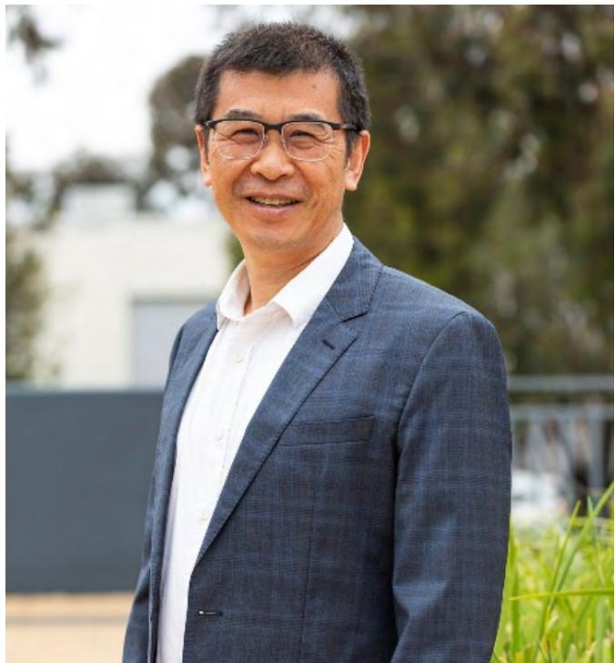

natural_image

Portrait of a smiling man in a suit and glasses, outdoors with greenery and building in background (no text or symbols visible)

清源股份

董事长

HONG DANIEL

迎着2026年的晨光，我们心怀使命，再次整装出发，继续奔赴智慧能源与绿色未来的远征。

回望2025，我们在可持续发展道路上步伐坚定，成果显著。清源股份在全球范围内深化业务布局的同时，始终将环境、社会与公司治理（ESG）理念深植于战略核心。我们在澳大利亚、欧洲等市场不仅巩固业务领先地位，也积极践行本地化社会责任。在中国市场，我们成功斩获吉瓦级订单，以创新解决方案助力区域能源结构优化与低碳发展。

过去一年，我们持续完善ESG管理体系，深入倾听各方利益相关者的声音，将可持续发展要求融入产品研发、运营管理与客户服务全流程，我们发布ESG专项报告，透明披露我们在气候变化、绿色运营，员工发展与公司治理等方面的实践与绩效，这些努力也获得了外界的广泛认可，包括Wind ESG 的 A级评级与EUPD颁发的“ESG 卓越奖”，这既是对我们阶段性成果的肯定，更是激励我们持续改进的动力。

2025年的积淀，为我们锚定更长远、更坚实的可持续发展目标奠定了基石。面向2026，我们的ESG行动将围绕以下重点深化展开

赋能于人，激发全价值链的可持续潜能。我们将进一步落实员工关怀与人才培养体系，营造多元、平等、包容的工作环境。同时，通过智能化工具与流程优化，提升全员效能，并与合作伙伴携手，促进整个价值链的能力建设与责任共识。

深化治理，打造敏捷、透明、负责任的组织。我们将持续推进端到端的数字化转型，强化数据治理与信息披露，使运营更加高效合规、可追溯。

聚焦绿色运营，驱动循环与低碳转型。我们将精益管理与数据驱动深度融入运营各环节，持续降低自身碳足迹与环境影响，提高资源利用效率。同时，通过技术创新与场景化解决方案，赋能客户与社区实现绿色转型，共创共享环境价值。

展望2026，新程已启，山海可期。我们坚信，当绿色工厂高效运行，当数据智慧赋能减排，当每一位清源人、每一位合作伙伴都成为可持续未来的推动者，我们所凝聚的责任之力，必将塑造出一个更高效、更低碳的发展新模式，迈向零碳未来。

最后，衷心感谢各位股东，客户，合作伙伴及全体员工一真以来的信任与支持。让我们携手，共履责任，共赴绿色未来

## MISSION使 命

# 科技创新，驱动能源独立与安全

我们以科技创新，驱动能源独立与安全。我们不仅是设备的制造者和解决方案提供商，更是能源独立的推动者，将阳光转化为可触达的绿色能源。清源用科技仓新织就一张覆盖全球的能源安全网，让清洁电力，触达世界每一个角落，这是我们对人类命运共同体最实在的践行。

## VISION愿 景

## 成为全球领先的科技企业，引领可持续未来

作为关键赋能者，我们与全球伙伴携手，共同推动产业的技术革新与生态繁荣。我们矢志成为全球领先的科技企业，不仅提供卓越的产品与解决方案，更致力于构建更具韧性、更低成本的可持续能源体系。我们引领的，是一个能源自主、气候友善、人与自然共生的可持续未来。

## VALUES价值观

## 以客户为中心的创新、品质、服务

清源相信，真正的竞争力藏在以客户为中心的“慢变量”里。所有的创新、品质、服务，终是为了满足客户需求并成就客户。我们以“场景式创新、毫厘必较的品质全方位服务”为客户创造长期价值，实现与客户的共生共赢。

## 年度亮点

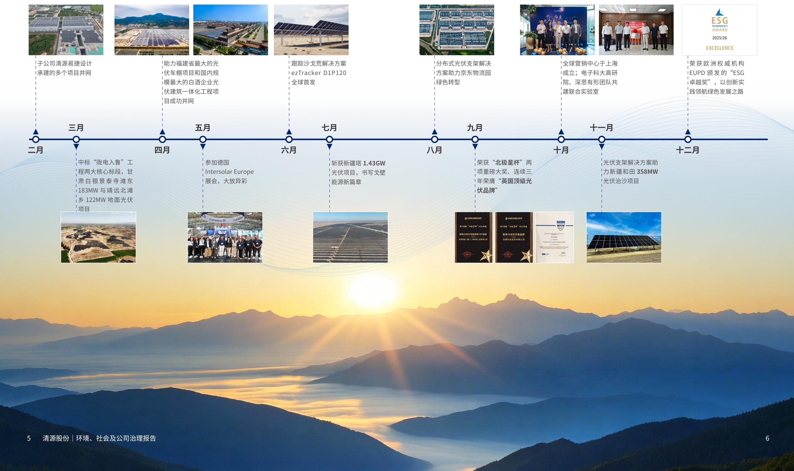

flowchart

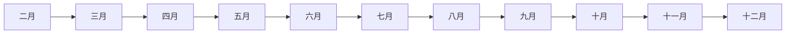

## 荣誉与资质 -行业奖项

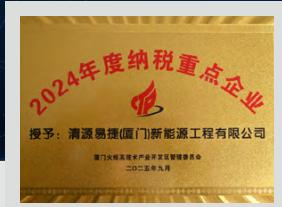  
2024 年度重点纳税企业

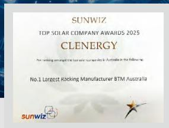  
2025 澳大利亚顶级太阳能企业奖

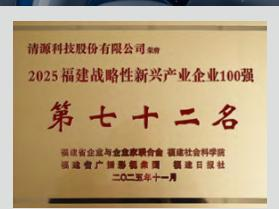  
2025 福建战略性新兴产业 100 强

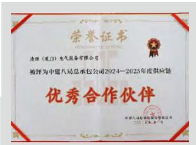  
中建八局“优秀合作伙伴”

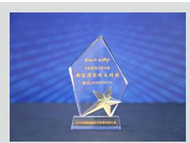  
中建八局新能源实践先锋奖

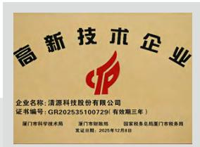  
高新技术企业

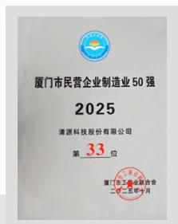  
厦门市民营企业制造业50强

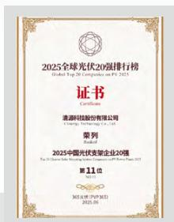  
2025中国光伏支架企业20强

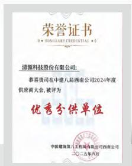  
中建八局西南公司2024年度优秀分供单位

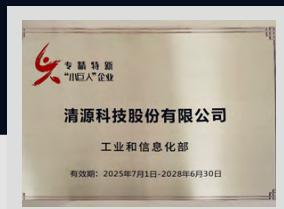  
专精特新小巨人企业

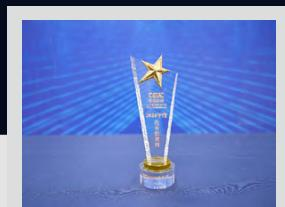  
浙火电-2024 年度优秀供货商

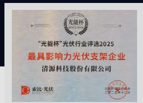  
光能杯最具影响力光伏支架企业

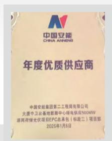  
中国安能 2025 年度优质供应商

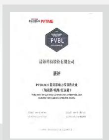  
PVBL2025 最具影响力零部件企业

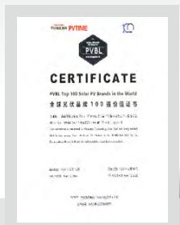  
PVBL2025 全球光伏品牌100 强价值证书

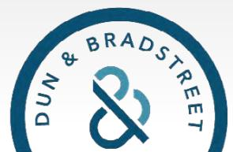  
邓白氏注册 D-U-N-S REGISTERED  
邓白氏注册认证

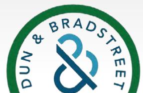  
ESG REGISTERED  
邓白氏 ESG 注册 ™

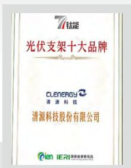  
钛能 - 光伏支架十大品牌

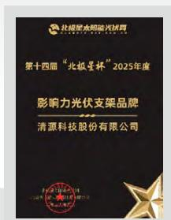  
北极星杯影响力光伏支架品牌

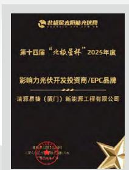  
北极星杯影响力光伏开发投资商/EPC品牌

## 荣誉与资质 -ESG 奖项

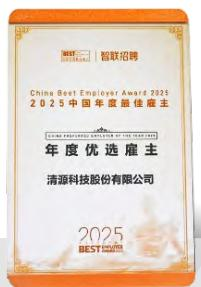  
2025 中国年度优选雇主

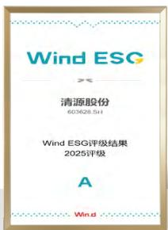  
Wind ESG 评级 A 级

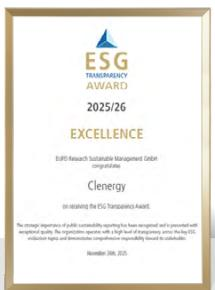  
EUPD ESG 卓越奖

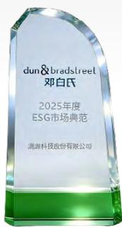  
2025 年度 ESG 市场典范

  
2025投关创新奖

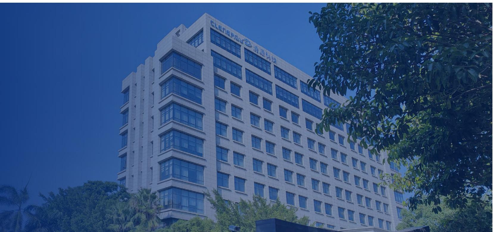

natural_image

Exterior view of a modern office building with 'Clerico' signage on the roof, surrounded by trees and greenery (no readable text beyond signage)

## 荣誉与资质 -体系认证证书

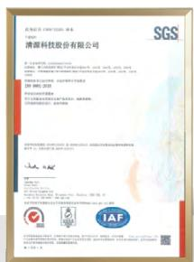  
ISO 9001:2015质量管理体系认证证书

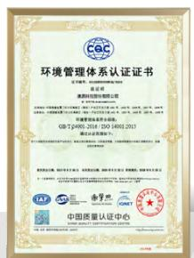  
ISO 14001:2015环境管理体系认证证书

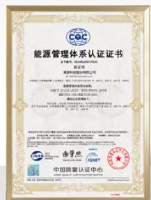  
ISO 50001:2018能源管理体系认证证书

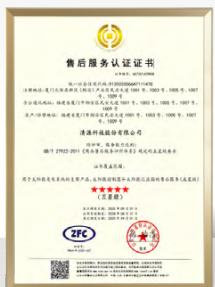  
GB/T 27922-2011售后服务认证证书

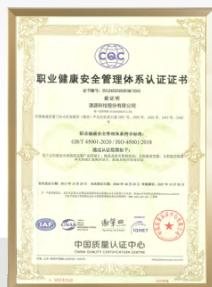  
ISO 45001:2018职业健康安全管理体系认证证书

## 重大活动

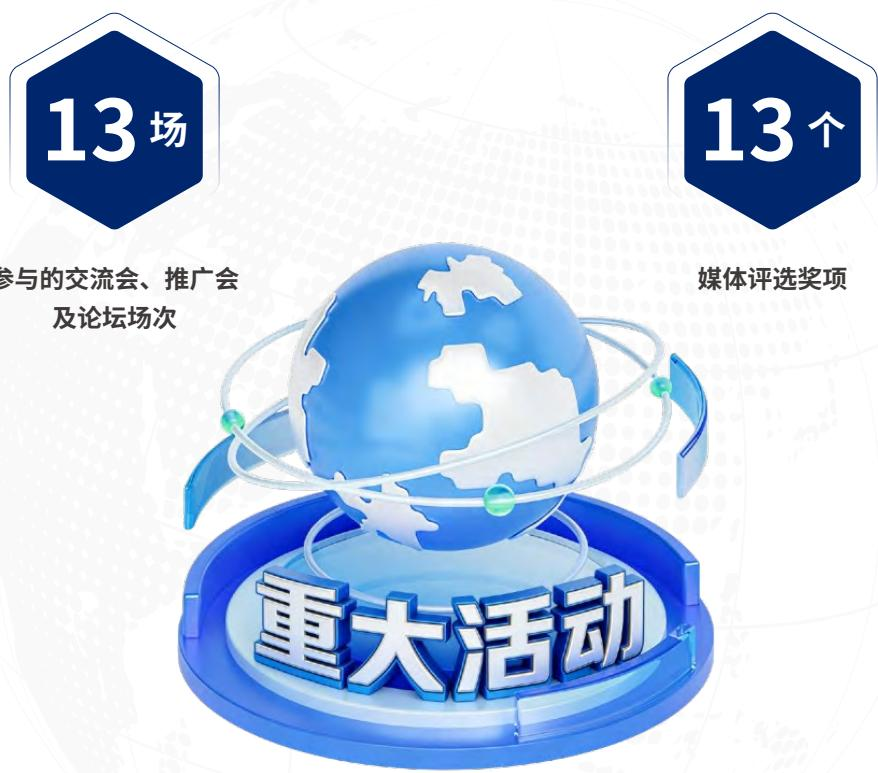

  
加入的新能源协会及行业协会

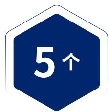  
高新技术企业、优秀企业等官方颁发奖项

## 经济绩效

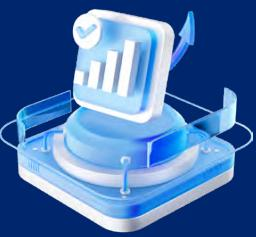

20.88亿元

营业收入

8856.35MW

总产量

0.57亿元

归属于上市公司股东的净利润

32.99亿元

总资产

## 环境绩效

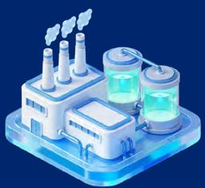

2586.18

吨二氧化碳当量

温室气体排放量

343628.26

吨二氧化碳当量

减少的温室气体排放量

0起

重大环境违规投诉或污染事故

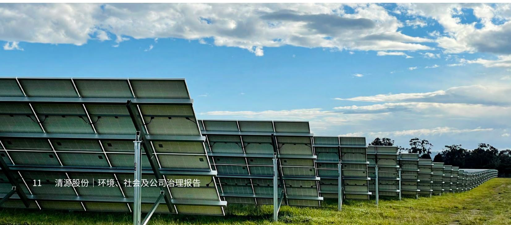

text_image

11 清源股份 | 环境、社会及公司治理报告

## 社会绩效

8765.5小时

员工培训总时长

0次

重大事故发生数

100%

员工社会保险覆盖率

85%

年度考核的供应商采购金额占比

0次

产品质量

安全违规次数

99.75分

客户满意度

## 治理绩效

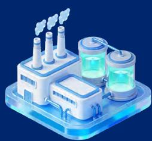

0 起

产品标识或营销违规相关诉讼案件数

0 起

贪污腐败相关诉讼案件数

0起

不当竞争相关诉讼案件数

0 起

客户隐私泄露投诉事件数

## 公司简介

清源科技股份有限公司（英文名：Clenergy，股票代码：603628）是全球领先的智慧光伏与数字能源解决方案提供者。清源股份致力于通过科技发展清洁能源发电， 提高绿色电力比例，改变能源结构，发展数字化能源管理，节能降耗。

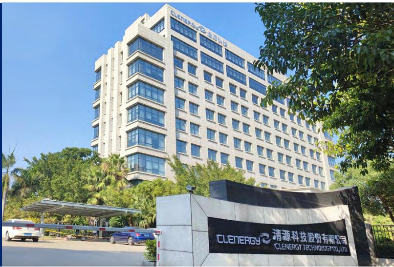

text_image

CLENERGY 清源科技股份有限公司
CLENERGY TECHNOLOGY CO.,LTD.

## 公司布局

作为一家领先的光伏企业，公司在光伏支架业务上屡获佳绩，累计出货超50GW，产品销往全球五十几个国家或地区，并持续1年在澳洲市场占有率第一。公司以优质的产品，专业严谨的安装方案以及服务，得到市场和广大客户的认可。

在全球布局方面，清源股份不断加强技术与服务能力建设，目前已在中国、澳大利亚、德国、英国和日本设立五大技术中心，支持公司在不同区域市场的产品研发、本地化应用和技术服务，为全球业务的持续发展提供支撑。

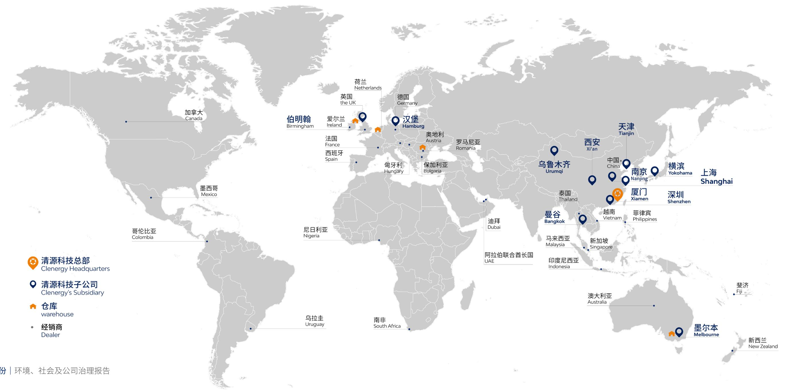

text_image

清源科技总部
Clenergy Headquarters
清源科技子公司
Clenergy's Subsidiary
仓库
warehouse
经销商
Dealer
加拿大
Canada
伯明翰
Birmingham
墨西哥
Mexico
哥伦比亚
Colombia
乌拉圭
Uruguay
尼日利亚
Nigeria
英国
the UK
爱尔兰
Ireland
法国
France
西班牙
Spain
荷兰
Netherlands
德国
Germany
汉堡
Hamburg
奥地利
Austria
匈牙利
Hungary
保加利亚
Bulgaria
罗马尼亚
Romania
迪拜
Dubai
阿拉伯联合酋长国
UAE
南非
South Africa
乌鲁木齐
Urumqi
西安
Xi'an
中国
China
天津
Tianjin
中国
Nanjing'
横滨
Yokohama
上海
Shanghai
厦门
Xiamen
深圳
Shenzhen
越南
Vietnam
菲律宾
Philippines
马来西亚
Malaysia
新加坡
Singapore
印度尼西亚
Indonesia
澳大利亚
Australia
墨尔本
Melbourne
斐济
Fiji
新西兰
New Zealand

## 可持续发展管理

ESG治理架构

利益相关方沟通机制

重要性议题评估

## 可持续发展管理

在全球气候变化持续加剧、能源结构深度调整的背景下，清洁能源正从“发展选择”加速成为全球共识。2025年，清源股份持续将可持续发展理念融入公司战略与日常经营，围绕全球业务布局、产品解决方案与供应链协同，稳步推进技术优化与管理升级，积极支持清洁能源在更多场景中的应用与落地，助力能源体系向更加绿色、低碳和高效的方向转型。

作为一家长期深耕新能源领域的企业，清源股份清醒认识到自身经营活动在环境、社会和治理层面所产生的影响，并将责任意识贯穿于决策与执行过程之中。公司持续完善ESG管理体系，加强对关键议题的识别与回应，在稳健发展的同时，努力实现企业价值创造与社会可持续发展的协同推进。

## ESG 治理架构

清源股份持续将环境、社会与治理(ESG)理念系统融入公司治理与经营管理全过程，推动企业高质量发展与可持续价值创造的协同实现。截至报告期末，公司董事会作为ESG事务的最高决策与监督机构，将ESG管理纳入履职重点并履行相应监督与审议职责在董事会领导下，公司通过ESG推进小组开展ESG相关工作的组织协调与执行，逐步形成“董事会领导一工作小组执行一各部联动”的ESG工作机制。

在此基础上，为进一步明确治理层级职责分工、提升ESG管理的系统性与运行效率，公司计划于2026年在现有基础上对ESG治理架构进行升级完善，逐步构建由董事会、管理层(及其下设管理机制)与ESG推进小组构成的三层ESG治理架构。相关组织设置及职责分工将结合公司实际情况逐步落地，并在后续ESG报告中披露相关进展。

## 决策层

## 董事会

## 管理层

## 拟纳入

## 执行层

## ESG 推进小组

• 了解并评估 ESG 对公司的相关风险及机遇  
•监督公司制定ESG管理方针、策略、目标、计划及优先级划分  
• 监督 ESG 策略是否纳入公司管理运营  
• 监督 ESG 相关目标达成进度  
• 审批ESG 报告的报告范围和内容及其他对外披露的重大 ESG 信息

• 负责组织推进 ESG 管理工作的落实  
• 审议决策 ESG 主要管控职能、ESG 战略落地及 ESG 绩效评价  
• 制定本公司ESG 发展愿景、策略及政策，并设定ESG 管理目标

具体执行ESG相关工作安排，落实ESG工作计划・  
• 配合完成ESG相关信息披露、内部沟通及持续改进工作  
· 推动ESG 相关议题具体落地

## 利益相关方沟通机制

清源股份持续完善与各利益相关方的沟通与参与机制，通过公司网站、信息披露平台、媒体渠道、热线电话、会议交流、专题报告、调研走访及问卷调查等多种方式，保持与利益相关方的常态化互动，不断提升信息沟通的覆盖面与透明度。

<table><tr><td>关键利益相关方</td><td>期望</td><td>沟通渠道</td><td>关注议题</td></tr><tr><td>政府及监管机构</td><td>·遵守法律,配合政府监管·促进产业创新和发展·创造就业·合法纳税</td><td>·工作报告·政企座谈会·行业政策或指导意见·机构考察·税务报送·海关进出口申报·监管函件、问询函件·监管业务系统平台</td><td>·应对气候变化·废弃物管理·生态系统与生物多样性保护·能源管理·水资源管理·产品和服务安全与质量·公司治理架构·ESG管理体系·合规与风险管理·信息安全与隐私保护</td></tr><tr><td>股东及投资者</td><td>·保障股东权利及权益·股东权益最大化·满意的投资回报与经营业绩·合规经营及管理</td><td>·定期报告及临时公告·董事会会议、股东大会·投资者见面会、业绩说明会、证券机构策略会·投资者来访调研·路演·股东大会·投资者热线·官网投资者教育栏目·上证e互动问答</td><td>·清洁技术创新·公司治理架构·ESG管理体系·经济绩效·合规与风险管理·知识产权保护·信息安全与隐私保护</td></tr><tr><td>供应商及合作伙伴</td><td>·诚实履约·保障合作机制的公开透明·实现双赢·廉洁的商业环境·绿色供应链·聆听供应商的反馈</td><td>·长期战略性合作·承诺签署·年度采购招标·管理层互访·供应商管理平台·定期供应商审查及评估·供应商培训学术研讨会</td><td>·清洁技术创新·可持续供应链·行业发展与合作交流·反腐败与商业道德</td></tr><tr><td>员工</td><td>·保障员工权利及权益·民主管理及人文关怀·注重职业健康与安全·提供技能提升培训和职业发展通道·薪资体系合理且有竞争力</td><td>·绩效评估考核机制·文体及团建活动·各类职业培训·员工满意度调查·员工申诉举报机制</td><td>·员工权益保障与发展·多元化与机会平等·职业健康与安全</td></tr><tr><td>客户</td><td>·聆听客户反馈·提供高品质的产品·保障产品安全·保护客户隐私·注重ESG管理</td><td>·客户技术交流会·新产品发布会·客户答谢会·实地考察拜访·客户满意度调查·客户投诉渠道</td><td>·清洁技术创新·产品和服务安全与质量·客户权益保护与服务管理·信息安全与隐私保护</td></tr><tr><td>社区与公众</td><td>·合规经营·产品安全与质量·环境安全与环境保护·社区公益与慈善</td><td>·行业论坛·社区活动·公益捐赠·国内外社交媒体·新闻报道</td><td>·应对气候变化·废弃物管理·能源管理·水资源管理·乡村振兴与社会贡献</td></tr></table>

## 重要性议题评估

为确保实质性议题持续反映公司经营实际与可持续发展重点，清源股份建立了规范化的实质性议题管理与动态更新机制。按照既定安排，公司原则上每三年开展一次实质性议题的全面复审与优先级重估，系统评估业务环境变化、政策法规演进、利益相关方关注重点及新兴ESG风险对公司的潜在影响。

报告期内，公司组织开展了新一轮实质性议题重新评估工作。在评估过程中，公司结合最新的信息披露要求、自身业务特性与战略重点、政策与行业环境变化，以及来自内部管理层和外部利益相关方的反馈意见，对潜在环境、社会和治理议题进行系统梳理与分析。通过内部评估与外部评估相结合的方式，对各议题的重要性进行排序，最终识别并确定了公司当前阶段需重点关注和披露的实质性议题，作为本报告ESG管理实践与信息披露的重要依据。

## 利益相关方沟通01

与政府机构、投资者、客户等各利益相关方保持定期沟通，收集关注重点和意见反馈，并回应相关方各项诉求。

## 议题评估03

1）内部评估：通过问卷调查和访谈的形式，汇总各部门对各议题与清源股份的相关性打分。  
2）外部评估：参考光伏行业的ESG关注重点，对标同行，并征询专家及各利益相关方的意见

## 议题审核05

将ESG重大实质性议题列表提交董事会审阅，经批准最终确认ESG 实质性议题

## 议题识别

根据全球报告倡议组织(GRI)《可持续发展报告标准》(GRI Standards 2021)，以及上交所对上市公司ESG报告的披露要求，结合与利益相关方的沟通成果，并参考公司的业务特性、国家政策、以及光伏行业ESG发展趋势和普遍关注问题，形成潜在可持续议题清单。

## 重大性确认

根据议题评估结果，从“对公司的重要性”和“对相关利益方评估和决策的影响”两个维度，对潜在可持续发展议题进行重要性排序，识别出ESG重大实质性议题，形成ESG重大实质性议题列表

实质性议题评估流程

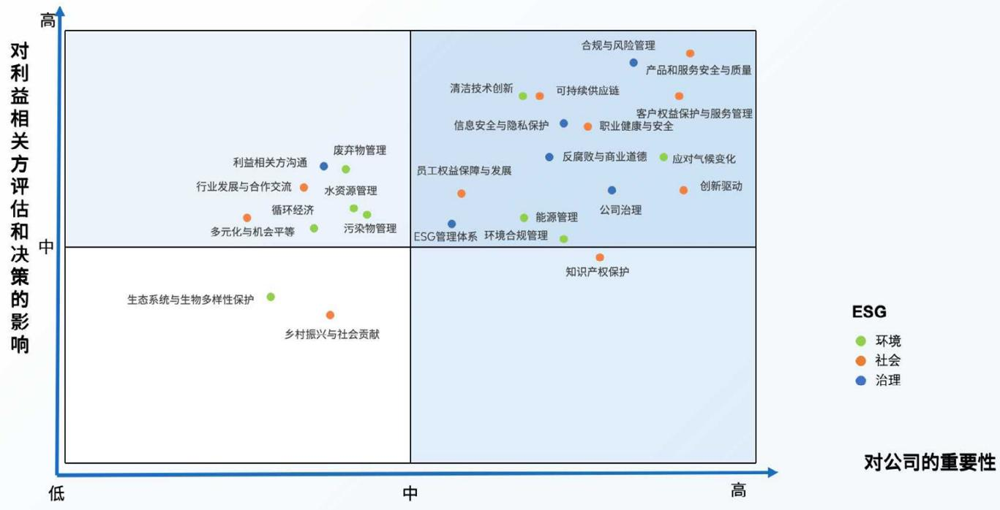

scatter

| Topic | ESG Category | Importance to Company (X-axis) | Impact on Stakeholders (Y-axis) |
| :--- | :--- | :--- | :--- |
| 合规与风险管理 | 社会 | ~85 | ~90 |
| 产品和服务安全与质量 | 社会 | ~85 | ~85 |
| 清洁技术创新 | 环境 | ~65 | ~80 |
| 可持续供应链 | 社会 | ~70 | ~80 |
| 客户权益保护与服务管理 | 社会 | ~85 | ~75 |
| 信息安全与隐私保护 | 治理 | ~65 | ~75 |
| 职业健康与安全 | 社会 | ~70 | ~70 |
| 反腐败与商业道德 | 环境 | ~65 | ~65 |
| 应对气候变化 | 环境 | ~80 | ~65 |
| 员工权益保障与发展 | 社会 | ~45 | ~60 |
| 创新驱动 | 社会 | ~85 | ~55 |
| 公司治理 | 治理 | ~75 | ~55 |
| 能源管理 | 环境合规管理 | ~60 | ~45 |
| ESG管理体系 | 治理 | ~45 | ~40 |
| 环境合规管理 | 环境合规管理 | ~60 | ~35 |
| 生态系统与生物多样性保护 | 环境 | ~25 | ~25 |
| 污染物管理 | 环境 | ~45 | ~30 |
| 循环经济 | 环境 | ~30 | ~30 |
| 行业发展与合作交流 | 社会 | ~25 | ~30 |
| 利益相关方沟通 | 治理 | ~30 | ~35 |
| 废弃物管理 | 环境 | ~35 | ~35 |
| 水资源管理 | 社会 | ~35 | ~30 |
| 多元化与机会平等 | 社会 | ~25 | ~25 |
| 乡村振兴与社会贡献 | 社会 | ~30 | ~15 |
| 知识产权保护 | 社会 | ~70 | ~10 |

重要性议题矩阵

## 环 境

环境合规管理

清洁技术创新

应对气候变化

废弃物管理

污染物管理

能源管理

水资源管理

循环经济

生态系统与生物多样性保护

## 社 会

产品和服务安全与质量

行业发展与合作交流

客户权益保护与服务管理

创新驱动

可持续供应链

员工权益保障与发展

多元化与机会平等

职业健康与安全

乡村振兴与社会贡献

知识产权保护

## ESG

## 对公司的重要性

## 治 理

反腐败与商业道德

利益相关方沟通

公司治理

ESG 管理体系

信息安全与隐私保护

合规与风险管理

## 治 理

公司治理

投资者沟通与权益保护

信息披露合规

合法合规与商业道德

信息安全与隐私保护

## 公司治理

清源股份始终严格遵循《中华人民共和国公司法》、《中华人民共和国证券法》、《上市公司治理准则》以及《上海证券交易所股票上市规则》等法律法规以及监管要求，健全内部管理和控制制度，完善公司治理架构，不断提升信息披露质量和投资者关系管理水平，保障公司规范稳健运作，切实维护股东及各利益相关方的合法权益。

## 治理架构

为了进一步完善公司治理结构，提升规范运作水平，报告期内，公司根据《中华人民共和国公司法》等法律法规的相关规定，结合公司实际情况，对治理架构进行了优化调整，不再单独设置监事会，由董事会审计委员会履行《公司法》规定的监事会职权。此外，公司对《董事会审计委员会工作细则》 《独立董事专门会议工作细则》 《独立董事工作制度》等36项管理制度进行了系统性修订和制定。

清源股份组织机构图  
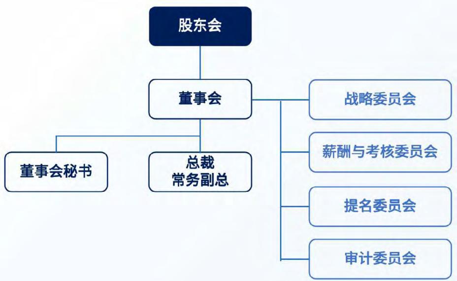

flowchart

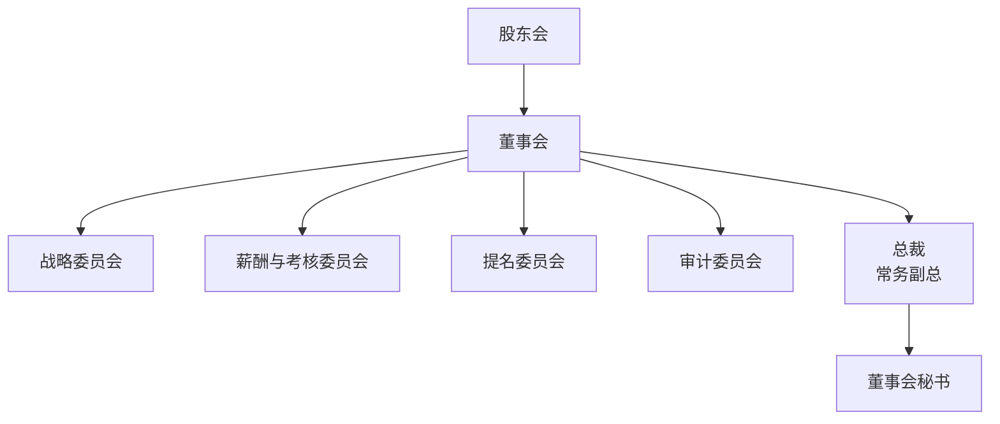

公司持续完善《公司章程》和《董事会议事规则》等制度，规范董事会的议事方式和决策程序，促使董事和董事会有效地履行其职责报告期内，公司董事会由7名董事组成，其中独立董事3名，职工代表董事1名，女性董事2名。公司在董事会构成方面关注性别年龄、教育背景及职业经历等方面的多样性，促进不同视角与专业判断的充分融合，不断提升公司治理的科学性与前瞻性，为公司稳健经营和可持续发展提供有力保障。

2次

股东会

5次

董事会会议

7人

董事人数

42.9%

独立董事

28.6%

女性董事

## 投资者沟通与权益保护

清源股份持续完善投资者关系管理，严格落实《投资者关系管理制度》，明确投资者关系管理的目标、原则、工作内容及相关部门职责，保障投资者依法、平等获取公司信息，维护公司与资本市场的良性互动。

在投资者互动体系建设中，公司搭建多层次、全场景的沟通网络：通过股东会、业绩说明会、上证e互动、投资者热线等多元化渠道，实现与投资者的高效连接，及时回应市场关切。公司董事长、财务总监等核心管理层常态化出席业绩说明会，直面投资者关切，深入回应行业趋势、战略规划等议题，构建起互信共赢的投资者关系生态。通过持续优化投资者沟通机制，清源股份不断增强资本市场对公司治理水平，长期发展能力及可持续发展战略的理解与信任。

公司坚持公平对待所有投资者，保障中小股东权益。规范召开股东大会，便利中小股东参与充分保障其发言、提问及表决权，并通过网络投票等方式拓宽股东参与治理与决策的渠道

投资者来访调研28次

业绩说明会4场

回应投资者提问51次

## 信息披露合规

清源股份将信息披露合规作为公司治理的重要组成部分，持续完善信息披露管理机制，通过制度约束与流程管控相结合，规范信息披露行为，防范信息披露风险，维护资本市场的公平与秩序。公司依托《信息披露管理制度》，明确内部信息的识别、流转、审核及披露流程，加强对重大事项和敏感信息的管理，确保信息披露工作在合规框架内有序开展。

在信息披露实践中，公司严格遵循“真实、准确、完整、及时、公平”的基本原则，注重提升披露内容的可读性与一致性，避免信息不对称和选择性披露，保障投资者依法、平等获取公司信息。2025年，公司进一步完善ESG信息披露机制，强化对长期价值创造和可持续发展实践的透明呈现。报告期内，公司依法完成6份定期报告和155份临时公告的编制与披露工作，未发生因信息披露违规受到监管处罚的情形，持续提升信息披露规范化水平。

## 合法合规与商业道德

## 合法合规运营

清源股份始终坚持诚实守信、合规经营的理念，高度重视合规管理体系建设。公司持续完善合规管理制度，明确合规责任分工和管理流程，积极培育合规文化，保障各项经营活动依法、合规、有序开展。

公司依据《中华人民共和国公司法》《中华人民共和国证券法》《企业内部控制基本规范》《上海证券交易所股票上市规则》《上海证券交易所上市公司自律监管指引第1号——规范运作》等相关法律法规和监管要求，结合公司实际发展情况，持续更新并完善《清源科技股份有限公司内部控制管理制度》，不断强化内部控制与监督机制，提升合规管理和风险防控水平。

在开展海外业务经营过程中，公司严格遵守业务所在国家、地区或区域经济共同体的相关法律法规，以及国际商业惯例和普遍认可的标准。相关合规要求涵盖投资、贸易、进出口、外汇管理、劳动用工、环境保护、合同管理、消费者权益保护、知识产权会计及税务等多个方面，公司持续关注并落实相关合规要求，防范跨境经营风险。

此外，公司坚持依法纳税，严格遵守《中华人民共和国企业所得税法》《中华人民共和国会计法》《企业会计准则》等国家税收及财务管理相关法律法规，并明确税务管理职责，规范纳税申报、税款缴纳、企业所得税计提、预缴及汇算清缴等关键控制程序。报告期内，公司组织员工开展税务政策相关的线上学习。 2

## 商业道德

清源坚持诚信经营与廉洁自律，坚决反对贪污贿赂、不正当竞争等任何违反法律法规或商业道德的行为。公司制定并实施《清源商业行为准则》，作为全体员工遵循法律与道德标准的重要依据，明确要求员工在各项经营活动中诚实守信、依法合规，恪尽职守、廉洁从业，严禁任何形式的欺诈和不当行为。

报告期内，公司未发生经证实的贪污腐败、贿赂或利益冲突等违法违规事件，亦未发生与第三方不正当竞争相关的诉讼案件。

## 对内业务行为

应正确并诚实地记录和报告信息，确认记录必须真实、准确，如产品工程师的产品测试报告、营销人员的销售报告、会计人员的营业收入及成本报告、研发人员的研究报告、客户服务工程师的服务报告等。

## 对外业务行为

·在选择供应商时，应毫无偏私地衡量所有决定因素，坚持公正原则;

·遵守业务所在国家或地区的竞争法规，不对竞争对手或其产品服务进行错误或误导性陈述

·不得提供或接受超出一般价值的馈赠和商业款待，不得收受介绍费、佣金或酬劳。

## 个人业务行为

·避免利益冲突，包括不在清源股份的供应商兼职、不滥用清源股份的影响；

·不得利用清源股份或因工作原因知悉的其他公司的内募消息谋取经济利益

·不得有违反道德规范、或可能触犯当地法律，从而可能会使公司声誉遭受影响的个人行为。

## 举报与投诉机制

清源股份重视建立公开、畅通的举报与投诉机制，鼓励员工及外部相关方就任何涉嫌违法、违规或违背商业道德的行为进行反映。公司依据《申诉举报管理办法》《员工申诉渠道》等内部制度，为员工提供规范、清晰的内部举报指引，举报事项将通过单独调查双方面谈等方式进行核实，确保处理过程客观、公正。

此外，公司同步设置多元化的外部举报渠道，面向员工及其他利益相关方开放举报邮箱和电话，用于反映商业道德，合规经营等方面的问题。公司对所有举报信息严格执行保密原则，依法保护举报人隐私，明确禁止任何形式的打击报复或威胁行为，营造安全可信的举报环境。同时，公司在电诉结论形成后，对整改或处理措施的落实情况进行持续跟踪与监督，保障电诉机制的公正性和有效性。

natural_image

Two stylized human figures with speech bubbles above them, no text or symbols present.

## 清源股份内外部投诉举报渠道

0592-3110088  
HR@clenergy.com.cn  
福建省厦门市火炬高新区翔安产业区民安大道1001 号、1003 号、1005 号、1007 号、1009 号

报告期内与第三方发生商业道德相关诉讼案件

报告期内与第三方发生贪污腐败相关诉讼案件

产品标识违规事件

产品营销违规事件

报告期内与第三方发生不当竞争相关诉讼案件

0起

## 信息安全与隐私保护

## 信息安全管理

清源股份将信息安全与网络安全管理作为保障公司合规运营、业务稳定运行及全球化发展的重要基础，围绕信息系统安全、网络防护和业务连续性管理，持续完善信息安全管理体系，系统防范信息泄露、网络攻击及信息系统中断等风险

公司依据《清源商业行为准则》《信息安全管理制度》《网络安全事件响应管理程序》等内部制度，明确信息安全管理的职责分工操作规范及风险控制要求，覆盖信息系统使用、系统权限配置、网络访问控制以及安全事件处置等关键环节，确保信息系统运行安全可控。

在信息系统和网络安全管理方面，公司对核心系统和关键数据实施分级分类管理，通过加密技术、访问权限控制及系统日志审计等措施，加强对系统访问和操作行为的监控，降低系统被非法访问或滥用的风险。针对不同区域的业务部署，公司结合属地法律法规和运营需求，对信息系统实施相应的技术和管理措施，保障系统运行的合规性与安全性。

在网络安全与应急管理方面，公司建立了网络安全事件响应机制和信息系统灾难恢复预案，明确事件分级、响应流程及协同处置要求，并定期对相关预案进行评估和优化，提升对突发网络安全事件和系统异常的应对能力，保障关键业务运行的连续性和稳定性报告期内，公司未发生重大信息安全事件或网络安全事故，亦未因信息安全问题受到监管处罚。

## 隐私保护

清源股份高度重视员工、客户及合作伙伴的隐私权和个人信息保护，将隐私保护纳入商业道德与合规管理的重要内容，严格规范个人信息和商业敏感信息在业务活动中的收集，使用和管理行为，持续维护相关方的合法权益。公司依据《清源商业行为准则》。明确要求员工在履行职责过程中依法、合规处理个人信息，仅在合法、正当和必要的业务范围内开展信息收集与使用，严禁任何未经授权的披露、滥用或不当处理行为，确保个人信息处理活动符合相关法律法规和内部管理要求

在具体管理实践中，公司围绕数据全生命周期建立隐私保护管理要求，覆盖数据收集、存储、使用、访问控制及销毁等环节。通过明确数据收集范围、对个人信息和商业敏感信息实施加密存储、落实最小权限访问控制、开展日志审计以监测异常行为，并规范数据销毁流程，持续降低个人信息泄露和不当使用风险。

同时，公司结合不同业务区域的监管要求，实行客户数据本地化存储管理，国内客户数据存储于国内服务器，海外客户数据在当地依法合规存储，确保个人信息处理活动符合属地监管要求。通过上述管理举措，清源股份持续提升隐私保护水平，营造安全、可信赖的业务环境。

## 技术创新与负责任产品

技术创新与研发管理

知识产权与合规管理

产品质量与制造管理

客户服务

## 技术创新与负责任产品

清源股份高度重视客户服务在产品质量管理、风险防范及可持续发展中的重要作用，将客户服务纳入公司治理和运营管理体系，构建覆盖售前支持、项目交付、售后服务、客户反馈及持续改进的系统化管理机制。公司通过制度建设、组织协同与流程管控相结合的方式，持续提升客户服务的规范性、响应效率与服务质量，并将客户满意度和投诉管理结果作为推动管理改进的重要依据，促进客户价值与企业长期稳健发展的协同实现。

## 技术创新与研发管理

公司以光伏新能源产品与服务为核心竞争力，围绕光伏支架产品、数字智能光伏跟踪系统、储能与充电等数字能源产品及“EPC+智慧运维”服务，构建“产品解决方案+工程服务+投资运营”协同发展的业务格局。公司坚持以客户需求与场景痛点为牵引，将可持续发展理念嵌入产品规划、研发设计、制造交付与运维服务全过程，通过持续的技术创新与工程化落地能力，推动清洁能源价值链的高质量发展。

## 年度产品创新成果概览 （新产品发布/产品迭代）

报告期内，公司围绕“高可靠、高效率、全场景适配、数字化运维”方向推进产品迭代与新品开发，并形成以跟踪支架、地面/屋顶支架储能/充电产品为核心的创新产品矩阵。根据公司报告口径，报告期内对外发布新品2款(其余为系列化迭代与平台化升级）。

## 农光融合智能跟踪系统

针对传统农光互补项目中“光”与“农”争地、机械化作业难、发电效率受限的行业痛点，我司创新研发了农光专用智能跟踪支架系统，通过 200mm八角管高净空设计，结合±75°超大跟踪角度，首创‘收获模式与‘农用模式’智能切换，并配套农民专属APP，从根本上解决了农光互补项目中农机通行与植被采光的兼容难题，实现了光伏收益与农业生产效率的双重提升。

—重新定义“光伏+ 农业”的技术边界  
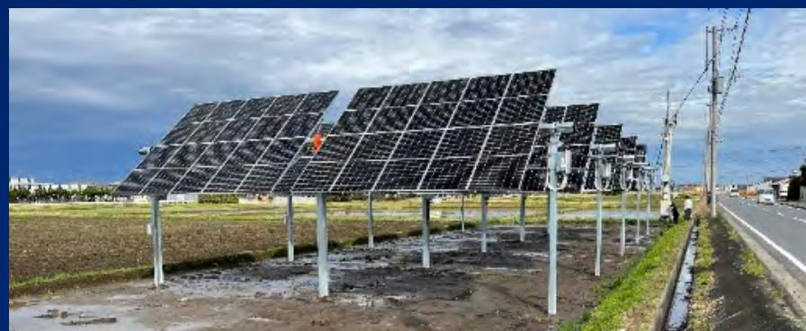

natural_image

Solar panel array installed on outdoor infrastructure with power lines and distant road (no visible text or symbols)

## 数字智能光伏跟踪系统

采用零间隙组件排布技术提升土地利用率，并降低结构成本；创新使用八角管结构，兼顾抗弯与抗扭性能，减少零部件、提升安装效率：搭载数字化运维监控平台（SCADA）实现监测、分析、预警与运维建议，支撑电站全生命周期智能运维。

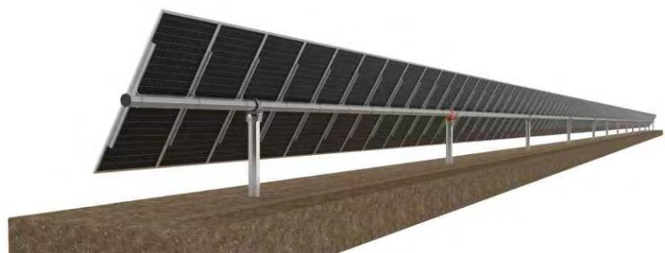

natural_image

Exterior view of a solar panel array installed on a grassy slope (no text or symbols visible)

## 数字化设计工具

通过智能算法，基于用户输入的需求，自动推荐最优组件排布；基于卫星地图或图纸，自动规划最佳组件排布方案，避免遮挡、优化发电效率，且生成3D预览；结合地理信息系统数据，分析建筑物周围的环境，预测阴影影响，极大提升设计效率与方案科学性。

— ezTrackerD1P120  
— ezDesign  
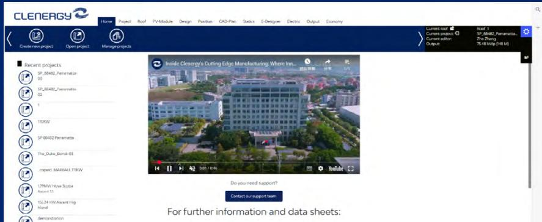

text_image

CLENERGY
Home Project Roof PV-Module Design Position CAD-Plan Statistics E-Designer Electric Output Economy
Create new project Open project Manage projects
Recent projects
SP_8J482_Panamatta
03
SP_8J482_Panamatta
02
1
100KW
SP 80482 Panamatta
The_Duke_Bondi-03
contact MAX643.11KW
179MW Now Science
Avocent 11
15G 24 HV Absent Hg
Nord
demonstration
Inside Clenergy's Cutting Edge Manufacturing: Where Inn...
Do you need support?
Contact our support team
For further information and data sheets:

## 平屋顶光伏安装系统

采用自适应结构设计，可兼容市面上主流组件及多样化的屋面工况。压块式配重设计与空气动力学结构，在实现零穿透、保护屋面完整性的同时，确保系统在极端风载下的稳固牢靠。创新的模块化预组装方案，施工效率提升超30%。系统通过多项严苛测试验证，并通过防雷接地（LPS）相关测试，确保系统具备可靠的防雷与接地性能，品质卓越，可靠性高。

—高可靠光伏安装解决方案  
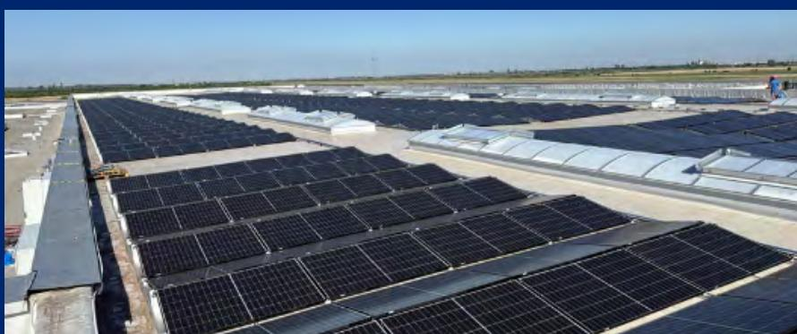

natural_image

Rows of solar panels installed on a large industrial building under clear sky (no visible text or symbols)

## Advance 系列

Advance 户储系统采用堆叠式安装与模块化设计，部署灵活，扩容方便。电池内置智能优化器，支持新旧电池混用，有效降低用户升级成本。系统对电芯温度进行全方位监测并配有气凝胶隔热层以防止热扩散，同时内置气溶胶灭火模块和防爆阀，构筑多重安全保障。逆变器支持 200% 光伏超配输入，能充分利用光伏能量，提升自发自用率。这些特性充分契合澳洲市场对高安全性，高经济性户用储能的需求，帮助家庭实现用电独立性、降低电费支出，并增强应对极端天气的电力韧性。

——新一代 Advance 系列户用储能解决方案  
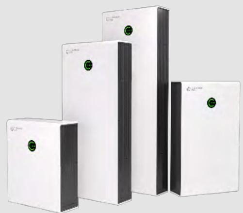

natural_image

Four white electronic devices with green circular indicators, arranged in a staggered stack (no visible text or symbols)

## 技术创新与负责任产品

## 研发治理与流程体系

公司持续完善以研究院为核心的研发体系建设。研究院作为集团研发活动的统一归口与执行机构，统筹技术研究、产品开发、应用研究、先进制造与成果转化，形成覆盖“需求洞察—技术评估—研发立项—测试验证—产品迭代”的闭环研发管理机制，并通过矩阵式协同提升跨部门交付效率。

为提升研发的过程可控性与可追溯性，公司引入并推进IPD集成产品开发流程与PLM产品全生命周期管理平台，以阶段化评审与关键决策点机制（如需求与方案评审、设计评审、样机/小批验证等）管控研发质量与进度；同时强调过程文件受控归档与阶段输出完整性，强化从概念到交付的全过程记录，为内部审计、客户验收与外部鉴证提供依据。

研发验证与可靠性保障方面，公司依托力学实验室、可靠性实验室、电子实验室等专业测试平台，并结合数字化设计与仿真工具，提升产品在极端风载、雪载、腐蚀、复杂地形等场景下的工程适配能力与长期可靠性。

## 研发投入与创新产出

公司将技术创新作为推动业务长期增长和可持续发展的重要驱动力，在光伏支架系统、智能跟踪技术、数字化设计工具及智慧运维平台等方向保持稳定投入。报告期内，公司研发投入为0.60亿元，研发投入占营业收入比例为2.9%。

24个 研发项目立项

0.60亿元 研发投入

2.9% 研发投入占营收比例

## 研发人才与创新平台

清源股份持续加强研发人才队伍建设，将专业能力与持续创新作为技术发展的核心支撑。报告期内，公司研发技术团队共计129人涵盖机械、电气、结构、人工智能、自动化及材料等多个专业领域，形成跨学科协同的研发组织架构。团队成员具备良好的专业背景和工程实践能力，为公司产品研发、技术优化及解决复杂应用场景需求提供了稳定的人才保障。

围绕提升研发能力的系统性与前瞻性，公司持续深化产学研协同创新机制。通过与多所高校建立稳定合作关系，积极开展研究生联合培养、科研项目合作及联合实验平台建设，公司不断推动前沿技术研究与工程实践的深度融合。同时，公司注重将外部科研资源与内部研发体系高效衔接，持续引入先进研发方法和工具，促进研发人员能力结构升级，提升整体研发效率和技术成果转化能力，进一步夯实技术创新基础。

研发人员占公司员工总数比例  
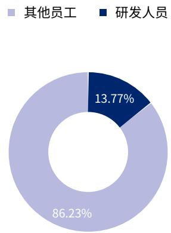

donut

| Category | Percentage |
| --- | --- |
| 其他员工 | 86.23% |
| 研发人员 | 13.77% |

研发人员性别比例  

donut

| Category | Percentage |
| --- | --- |
| 男性 | 81.40% |
| 女性 | 18.60% |

研发人员学历结构  

donut

| Category | Percentage |
| --- | --- |
| 博士 | 1.55% |
| 硕士 | 25.58% |
| 本科 | 60.47% |
| 大专 | 11.63% |
| 大专以下 | 0.78% |

## 案例｜引入仿真工具与专项培训，提升研发效率与产品可靠性

为提升研发设计的科学性与可靠性，报告期内，清源股份在光伏研究院引入行业领先的Abaqus仿真分析工具，并组织开展为期三天的专项能力提升培训。培训以解决实际工程问题为导向，结合公司光伏支架及相关产品的真实应用场景，通过“理论讲解+案例实操”的方式，系统提升研发人员在结构力学分析参数优化和可靠性验证方面的能力。参训工程师在培训中完成建模与分析实践，强化了仿真技术在产品设计和迭代中的应用。公司同步推动“技术种子”机制，由参训人员开展内部经验分享，促进仿真能力在团队内的持续扩散，为缩短研发周期、提升产品可靠性和技术创新水平提供了有力支撑。

text_image

Classroom scene with three people at a table, one writing on a whiteboard with Chinese text and a presentation slide in the background.

## 案例｜推进产学研协同创新，共建工业人工智能与智能制造联合实验室

报告期内，清源股份与电子科技大学（深圳）高等研究院及深思有形（深圳）有限公司签署合作协议，共同建设“工业人工智能与智能制造联合实验室”。该实验室围绕工业人工智能、工业自动化及智能制造等方向开展联合研究，聚焦光伏及相关制造场景中的工艺优化、质量管控和数字化升级需求。合作中，电子科大高研院提供科研支持与理论研究，合作方负责技术集成与工程验证，清源股份则开放产业应用场景和制造资源，为技术验证和成果转化提供实践基础。通过校企协同的方式，公司推动科研成果与实际生产需求的对接，促进先进制造技术在清洁能源领域的应用与落地。助力产业技术进步与人才培养。

text_image

Group photo at a ceremony with a red banner displaying Chinese text about a joint venture event and a ribbon-cutting plaque.

## 数字化转型与智能化应用

清源股份将数字化转型作为支撑公司高质量发展和可持续运营的重要基础，持续推动数字技术与业务管理、客户服务及供应链协同的深度融合。围绕提升运营效率，优化资源配置和强化风险管控等目标，公司系统推进数字治理与智能化应用建设，逐步形成以数据支撑管理，以平台促进协同的数字化运营体系。

围绕采购、生产，交付和服务等核心业务环节，清源股份持续推进系统的集成应用，实现采购执行，订单管理，交付跟踪，质量管控和绩效评价等流程的标准化、透明化和可追溯管理。在供应链与交付方面，公司提出以4M1E为核心的过程管理能力建设与持续改善机制，准时交付率逐年稳步提升至2025年的97.1%，体现数字化与流程化对交付稳定性的支撑作用。

在数字应用深化过程中，公司积极探索AI在管理和服务场景中的实际应用。报告期内，公司整合内部制度文件，业务流程和系统操作指引，构建统一的内部知识库并结合语言模型开发内部AL助手，提升信息检索和业务支持效率:同时围绕客户服务需求，搭建智能客服系统，实现全天候响应，持续改善客户体验。公司同步加强信息安全和系统稳定性管理，通过完善相关制度和技术防护措施，保障数字化运营安全可靠，为数字能力向长期价值创造和可持续发展目标转化提供支撑。

bar

| 年份 | 准时交付率 (%) |
| --- | --- |
| 2023 | 80 |
| 2024 | 91.40 |
| 2025 | 97.10 |

## 知识产权与合规管理

## 知识产权管理

知识产权是清源股份保持技术创新能力、构建核心竞争优势并实现长期可持续发展的重要战略资产。公司严格遵循《中华人民共和国专利法》及其实施细则等相关法律法规，对知识产权的创造、申请、保护、运用和管理实施全流程规范化管理，持续完善与公司发展阶段和业务布局相适配的知识产权管理体系，保障自主创新成果的合法权益。

在制度建设方面，公司通过《清源商业行为准则》《专利管理办法》等内部制度，明确知识产权保护与合规管理要求，覆盖专利、商标、著作权、商业秘密等各类信息资产。公司依法界定职务发明及相关智力成果权属，明确员工履职过程中形成的成果依法归公司所有，并通过入职签署协议，在职合规宣导及离职交接等措施，构建覆盖员工全生命周期的知识产权管理与风险防控机制，有效防范核心技术和敏感信息泄露风险。

在组织与管理机制方面，公司由法务部门统一统筹知识产权管理工作，负责专利电请与布局，商标注册与维护，权利续展，台账管理风险监测及定期评估等事项，确保知识产权管理活动依法合规、有序推进。同时，公司结合研发管理和技术创新机制，通过制度引导和激励措施，鼓励技术人员积极开展技术研发与持续改进，推动创新成果的规范转化与应用，持续将自主知识产权转化为产品竞争力和品牌价值的重要支撑。

报告期内，公司未发生因知识产权事项受到行政处罚或产生重大合规风险的情形。公司持续推进全球范围内的专利布局，当期共提交专利申请21项，其中发明专利7项；获得专利授权10项，其中包括发明专利、实用新型专利及外观设计专利。截至报告期末公司累计专利申请167项，累计获得专利授权149项。

text_image

21项

年度专利申报数

text_image

167项

累计专利申报数

text_image

10项

年度专利授权数

text_image

149项

累计专利授权数

  
堆叠式低压户用储能电池

  
一种光伏组件用导电安装器

  
一种太阳能板辅助定位器

  
光伏追光系统的抗扭机构

  
XMP5995交流充电桩澳大利亚外观专利证书

  
一种光伏支架的立柱与横梁连接结构

  
一种横梁与檩条的配合结构

  
XMMP6012 新型穿透夹德国新型专利证书

  
用于光伏电站的电缆夹澳大利亚发明专利证书

  
XMP2662新型穿透夹澳大利亚发明专利证书

## 技术创新与负责任产品

## 产品资质与合规认证

清源股份秉承“以客户为中心的创新、品质、服务”的核心价值观，持续将产品合规性与质量可靠性作为产品研发和市场拓展的重要基础。公司在产品设计和开发阶段，系统对标相关国际技术标准、目标市场和地区的法律法规、建筑规范及行业准入要求在产品定型后，依法依规推进检测、测试及认证工作，确保产品符合各主要市场的安全、性能和合规要求。

公司主要光伏产品依据国际通行标准和认证体系，完成了由具备资质的第三方机构开展的检测与评估，已取得包括 CE、CPR、TüV、BRE、Intertek等在内的多项国际权威认证或检测报告。这些认证和评估结果覆盖产品安全性、性能稳定性及适用性等关键维度，是公司产品进入相关国际市场、参与工程项目和客户采购的重要合规依据。

通过持续推进产品认证与资质管理，公司不断提升产品在全球市场的合规水平和质量可信度，为产品在不同国家和地区的应用提供制度保障，也为公司光伏业务的国际化发展和品牌建设奠定了坚实基础。

  
单相混合逆变器 EMC 符合性证明

  
单相混合逆变器 Interpark 证书

  
单相混合逆变器 Interpark 证书

  
混合逆变器内置直流隔离开关澳洲 EESS 认证

  
XMP5995 交流充电桩澳大利亚外观专利证书

  
可充电锂离子电池系统 tuv南德认证证书

  
单相混合逆变器 EMC 符合性证明

  
交流充电桩 CB 认证证书

  
交流充电桩澳洲 RCM 证书

## 产品质量与制造管理

清源股份秉承“创新、品质、服务”三大理念，始终坚信只有提高质量意识、强化质量管理才能促进公司的可持续发展。公司将质量作为本公司的核心价值之一，不断完善质量管控和监督检查机制，落实高标准的质量要求，力求向社会提供品质卓越、安全可靠的产品。

## 质量管理体系

清源股份严格遵守《中华人民共和国产品质量法》等相关法律法规，已通过 ISO 9001 质量管理体系认证，并依据 GB/T 19001-2016《质量管理体系要求》建立并持续运行内部质量管理体系，形成以《体系管理手册》为核心的制度框架。公司坚持“致力科技创新，推动清洁能源，追求卓越品质，铸造诚信品牌”的质量方针，围绕清洁能源产品的可靠性与稳定性，设定年度质量目标并持续跟踪改进。

在制度运行层面，公司建立覆盖产品全生命周期的质量控制体系，重点强化进料检验，制程检验，成品检验和出货检验等关键环节形成“预防一控制一验证”的闭环质量管理机制。通过实施《产品监视和测量控制程序》《不合格输出控制程序》《生产过程控制程序》《顾客满意控制程序》《客诉处理控制程序》等管理制度，系统规范质量控制流程，确保产品在各阶段符合标准和客户要求

## 全生命周期质量控制

公司建立覆盖产品全生命周期的质量控制体系，重点强化进料检验，制程检验，成品检验与出货检验等关键环节，形成“预防一控制一验证”的闭环质量管理机制。

围绕客户需求与满意度管理，公司制定并执行《顾客满意控制程序》，对顾客满意程度信息进行监视，收集，分析与利用，明确由归口部门开展满意度调查、统计分析、整改闭环与记录归档，形成“调查一分析一整改一验证”的闭环机制；其中对重点客户在订单执行后至少每年开展一次满意度调查，并对客户建议与要求在规定时限内回复，推动管理体系持续改进。

## 质量数字化

公司持续推进质量管理的信息化建设，在制度化流程基础上搭建数字化质量管理平台(Portal)，加强质量数据记录、分析与追溯，提升质量管理透明度、响应效率与跨部门协同能力，为质量问题的快速识别、闭环处置与持续改进提供数据支撑。同时，公司在运营管理层面推进流程化、标准化与数字化协同，强化问题识别、跟踪与整改管理机制，增强质量管理的系统性与可核查性。

公司建立以“来料质量、过程质量、成品质量、交付与客户反馈”为主线的质量KPL监测机制，按基地/工序对关键指标进行统计与分析，包括原材合格率、成品合格率、客户投诉次数材料交付及时率、订单交期及时率等，以支持质量目标分解、异常预警与改进闭环。

99.2%

厦门原材 合格率

99.7%

厦门机加成品 合格率

99.9%

厦门组装成品 合格率

98.5%

天津原材合格率

98.6%

天津成品合格率

97.1%

订单交期及时率

## 技术创新与负责任产品

## 精益制造与制造管理提升

清源股份将精益制造作为提升运营效率、资源利用效率和组织韧性的重要抓手，持续推动精益理念在生产组织、设备管理和工艺优化中的落地应用。公司围绕降本增效、流程优化和风险可控等目标，鼓励一线团队参与持续改善，通过内部自主改造、流程再设计和技术创新，减少不必要的资源消耗和重复作业，提升生产系统的整体运行效率。

报告期内，清源股份结合实际生产场景，聚焦车间布局优化、关键设备自主掌控及工艺改进等重点方向，实施多项精益改善项目，在保障安全与质量的前提下，实现成本控制与效率提升的协同推进，为公司高质量发展提供稳定的制造基础。

## 案例｜车间布局优化与设备自主搬迁，推动制造效率与成本双提升

为提升生产效率并改善一线作业环境，2025年，清源股份在厦门工厂组织开展车间布局优化与设备自主搬迁精益改善项目。项目围绕挂钩产品生产流程，对设备布局和物流动线进行系统优化，旨在提升现场运作效率和空间利用水平。项目由工厂内部团队主导实施，自主完成设备拆装、迁移及重新布置，在严格落实安全管理要求、确保生产连续稳定运行的前提下，减少了对外部服务的依赖，有效改善了作业环境，提升了员工操作便利性和现场管理水平。

通过本次改善，丁厂累计缩短物料周转路径约800米，减少物料搬运环节，进一步压缩产品生产周期，显著提升整体生产效率，带来约36万元的收益增长。在实现降本增效的同时，该项目也为后续生产组织优化和持续改善奠定了基础。

natural_image

Interior view of a large industrial factory floor with machinery and overhead cranes (no visible text or symbols)

## 案例｜冲切设备自主掌控与工艺创新，夯实智能制造能力基础

围绕制造过程中的关键瓶颈问题，清源股份推进冲切设备程序自主掌控与工艺创新精益改善项目。公司工艺设备团队通过持续技术攻关，实现大型冲切一体机核心程序的自主解析与优化，有效节省上万元年度维修费用，同时大幅缩短设备故障响应时间，维修周期缩短至“即时解决”。

在此基础上，公司同步推动冲切工艺的一体化创新，将原有多道分散工序整合至单台设备完成，有效减少跨工序周转和人工投入。相关改善显著提升了加工效率和生产灵活性，并为后续设备复制推广和智能制造升级提供了可行路径，增强了公司在核心制造环节的自主可控能力。

natural_image

Industrial machine with metal beams and control panel, no visible text or symbols

## 案例｜新设备导入与技改复盘：以“闭环率+ 产能达成”驱动稳产增效

公司对新导入设备及技改项目实施复盘管理，围绕问题闭环备件保障、节拍稳定与产能达成推进持续改善。以报告期设备导入复盘为例，新导入的钻攻切一体机与激光焊接机实现“主要问题闭环率100%”并达到相应产能与节拍指标：同时，对计划内与计划外技改项目进行费用、进度与改善措施复盘，推动技改需求澄清，方案评审与导入节拍匹配等管理机制优化。

natural_image

Interior view of a modern industrial factory with a large white production machine and machinery (no visible text or symbols)

公司将质量管理与可持续发展目标相衔接：通过提升一次合格率、降低返工返修与客诉、优化流程与设备效率，减少资源浪费与重复生产带来的能耗与物耗，从而在提升客户体验与经营韧性的同时，推动资源效率与环境绩效的协同改善。

## 质量风险与机遇管理

在产品质量与制造管理过程中，清源股份结合业务特点与制造实践，系统识别并管理可能对产品质量、客户体验及经营稳定性产生影响的关键风险与机遇，并将相关要求纳入质量管理体系与日常运营管理，形成“识别一评估一应对一监控一改进”的闭环管理机制。

## 供应链来料质量风险

公司关注原材料及外购件质量对产品性能与交付稳定性的影响，将来料质量区险作为质量管理的重要前端环节。通过实施进料检验、供应商准入与评价机制，对关键原材料实施批次检验与异常管控对识别出的来料异常，及时启动跨部门分析与整改，推动问题在供应端闭环解决，降低不合格物料流入生产环节的风险。

## 关键设备运行与停机风险

针对制造过程中对关键设备稳定运行的依赖，公司重点关注设备故障、程序依赖及维修响应等潜在风险。通过强化设备点检、维护保养与技术自主掌控能力结合工艺优化和设备技改项目，降低因设备异常对产能、质量及交期造成的不利影响，提升制造系统的稳定性与韧性。

## 产品质量缺陷、召回及客户索赔风险

公司将产品质量缺陷及其可能引发的客户投诉、索赔或召回风险，纳入质量管理与客户服务管理的重要关注范围。通过成品检验、出货审核及客户反馈管理机制，及时识别质量异常信号；在必要情况下，依托内部流程组织跨部门评估、处置与改进，防范风险扩大，并持续提升产品一致性与客户信任度。

在有效管理质量风险的同时，公司将质量管理视为提升运营效率和产品竞争力的重要机遇来源。通过提升一次合格率，减少返工返修、优化工艺流程和设备效率，公司在保障质量稳定的基础上，实现资源利用效率提升、生产周期缩短和成本结构优化，推动质量管理与经营绩效、环境与资源效率的协同改善。

为提升质量风险应对的系统性和可追溯性，清源股份在制度化管理基础上，引入数字化质量管理平台(Portal)，将质量问题的识别处置与改进纳入统一的流程化、责任化管理框架。

当在来料检验，生产过程，成品检验或客户反馈中识别质量异常时，相关问题通过Portal平台登记形成工单，明确问题描述，责任部门和处理时限:质量管理部门牵头组织相关职能部门开展原因分析，制定纠正与预防措施，并对整改过程与结果进行跟踪验证。问题关闭后，系统留存完整记录，用于后续统计分析和管理评审。

通过Portal/工单系统的应用，公司实现了质量问题从“发现一分析一整改一验证一复盘”的全过程闭环管理，有效提升了质量风险响应效率、跨部门协同能力和治理透明度，为质量管理体系的持续改进提供数据支撑和决策依据

## 客户服务

清源股份坚持以客户为中心，持续完善客户服务休系与服务流程，将高质量服务作为提升客户满意度，保障产品质量治理和支撑业务可持续发展的重要组成部分。公司已建立ISO27922商品售后服务管理体系，并据此制定和实施《顾客满意控制程序》《产品召回管理办法》《客诉处理控制程序》等内部管理文件，形成覆盖售前支持、项目交付、售后服务及持续改进的系统化客户服务管理机制。

根据《休系管理手册》要求，公司定期开展客户满意度管理工作，制定年度调查计划和评定标准，向客户发放《客户满意度调查表》.形成《客户满意度调查报告》，并将调查结果反馈至相关业务和管理部门，用于分析服务短板、制定改进措施并推动持续优化确保客户反馈能够有效转化为管理改进行动。

## 技术创新与负责任产品

## 服务体系优化

为更好服务全球客户、提升跨区域沟通与响应效率，2025年清源股份启用全球营销中心，作为公司全球客户服务与市场支持的重要平台。该中心围绕客户需求洞察、项目协同与本地化支持等核心职能，统筹协调海外市场与重点客户的服务资源，强化对不同区域市场的服务保障能力。

依托全球营销中心的协同运作，公司有效缩短客户沟通链路，提高对不同国家和地区政策环境、应用场景及项目需求的响应效率，推动产品解决方案与客户实际需求的精准匹配。通过持续优化服务体系与支持机制，公司不断提升全球客户服务的专业性、稳定性与可持续性。

在强化国际客户服务能力的同时，公司同步完善国内市场的客户服务与交付体系。2025年，公司进一步优化国内客户服务组织模式，新增国内本地化交付团队，通过在项目属地区域招聘并配置工程师，推动光伏支架交付模式由“异地派驻”向“本地响应”转型。该举措有效缩短响应周期，提升现场问题处理效率，增强项目执行的稳定性与客户体验。

报告期内，清源股份获得

商品售后服务评价认证证书。

text_image

售后服务认证证书
特此公告送达时间：2022/06/04/111478
注册地址：厦门民族路集团（集团）产业开发区金玉路1035号、1003号、1005号、1007号
办公地址：福建省厦门市湖滨大道东段1号
生产许可证：福建省厦门市湖滨大道东段1号
经营范围：普通货物运输业务
请遵循科技服务有限公司
经审，国务院办公厅
GB/T 27922-2019《青岛海尔制冷设备厂》网站下载至首页
注册信息范围：
用于支持集成电路的主控产品，支持数码仪器和光通信系统的售后服务（详见第1
★★★★★
（盖章版）
ZFC
ZFC
ZFC

## 客户沟通及客诉处理

公司通过制定并执行《顾客满意控制程序》，对客户满意度相关信息进行系统化监测、收集与分析，用于评估客户服务与管理体系运行成效，并识别持续改进空间。公司建立了覆盖生产、销售与服务环节的客户反馈机制：生产部门负责生产过程相关信息的收集，国际运营中心及国内市场与销售部门负责交付后的服务反馈及重大客户问题的跟进。

公司通过日常沟通、客户拜访及线上沟通渠道，持续了解市场动态与客户需求；针对重点客户，在订单执行后定期开展客户满意度调查，并对客户意见和建议组织内部评审，推动整改落实和结果反馈。报告期内，公司客户满意度得分为99.75分。

为规范客户投诉处理流程、提升服务质量，公司制定并实施《客诉处理控制程序》，明确投诉分类标准、处理流程、责任分工及响应时效要求，确保客户诉求在制度化、流程化和责任化的框架下得到及时、规范和闭环管理。公司建立跨部门协同机制，由质量管理、售后服务、技术支持及市场销售等相关部门共同参与投诉处理，并定期对投诉数据进行统计分析，用于识别共性问题、推动整改措施落实和服务水平持续提升。

100%

客诉解决率

35 次

项目现场服务

13次

客户验厂审核

100%

验厂审核通过率

## 产品召回管理

为保障消费者权益和提升产品质量治理水平，公司建立了系统化的产品召回管理机制，并制定《产品召回管理办法》《产品监视和测量控制程序》《不合格输出控制程序》等内部管理办法，明确召回启动条件、流程安排、职责分工和执行要求，确保在必要情况下各相关部门能够高效协同、规范处置。

公司通过定期回顾和分析客户反馈、质量数据及潜在风险信号，不断完善产品预警机制与召回管理流程，推动质量管理体系的持续优化。报告期内，公司未发生因产品质量问题引发的主动或被动召回事件。

## 责任营销

清源股份在市场推广和业务拓展过程中，坚持合法合规、诚信透明的营销原则，将负责任营销作为商业道德管理的重要组成部分。公司要求员工在营销和服务活动中，基于产品和服务的真实性能、技术特点和应用优势开展市场竞争，不以夸大宣传、误导性陈述或不当比较方式获取业务机会。

在涉及与竞争对手产品或服务的比较时，公司强调以事实和客观数据为依据，确保信息完整、准确、可核查，避免对客户决策造成误导。通过规范营销行为、强化合规意识与内部培训，公司持续维护公平有序的市场环境，保障客户与合作伙伴的知情权和选择权，促进市场竞争的健康发展。

natural_image

Futuristic digital globe with robotic hand interacting with glowing tech icons and data streams (no text or symbols)

## 环 境

环境合规管理

污染防治

自然资源与节能管理

应对气候变化

光伏产品助力绿色发展

清源股份坚持绿色可持续发展理念，贯彻“科技创新，推广清洁能源：节能降耗，建设绿色地球”的环境方针，将环境管理作为公司治理与运营管理的重要组成部分，持续推动环境合规、污染防治、资源效率与风险防控的系统化管理。公司以制度化管理与体系化运行相结合，围绕环境因素识别、合规义务落实、运行控制、监测评价、应急准备与持续改进等关键环节，构建覆盖生产运营全过程的环境管理机制，以支持企业稳健经营与生态环境保护的协同发展。

## 环境合规管理

## 环境管理体系

清源股份高度重视环境管理工作，将环境保护理念系统融入公司治理和生产运营全过程，持续完善规范化、制度化的环境管理体系。公司严格遵守《中华人民共和国环境保护法》《中华人民共和国水污染防治法》《中华人民共和国大气污染防治法》等相关法律法规要求，围绕污染防治，资源利用，风险防控和持续改进等重点领域，建立覆盖环境因素识别，风险评估，运行控制监测管理和绩效改进的管理机制。

公司依据ISO14001环境管理体系及相关国家标准，结合自身生产经营实际，制定并实施多项环境管理制度和操作规范，明确各级管理职责，推动环境管理目标和年度行动计划有效落实。通过持续运行和优化环境管理体系，清源股份不断提升环境管理绩效，强化环境风险防范能力，促进企业运营与生态环境保护的协调发展。报告期内，清源股份旗下厦门工厂和天津工厂均获得ISC14001环境管理体系认证。

在内部治理方面，公司通过环境与职业健康安全相关管理机制明确责任分工与运行要求

管理职责与资源保障：在公司环境与职业健康安全应急管理程序中，明确由管理者代表承担应急预案批准及重大应急事件指挥协调职责，并由相关职能部门组织实施与培训、落实应急准备与响应要求。

计划化管理与检查机制：公司在年度EHS管理计划中设定环境目标，并明确由EHS委员会提供资源支持与绩效审核、EHS管理部门负责制度与培训监督、各部门负责人落实与自查整改；同时设置日常/定期检查与问题整改跟踪机制，形成持续改进闭环。

## 环境应急管理

为有效防范并妥善应对突发环境事件，公司建立并持续完善环境应急管理体系，形成“风险识别一预案制定一演练培训一响应处置一复盘改进”的闭环管理机制。

报告期内，公司更新并实施年度版《突发环境事件应急预案》(2025版)，对预案编制、风险评估、应急资源调查、响应分级等提出系统安排。同时，公司在《应急准备与响应控制程序》中识别并覆盖火灾/爆炸、台风暴雨等自然灾害、环保设施故障、化学品泄漏等潜在紧急情况，明确管理者代表、品管部、人力资源部及各部门在应急准备、培训演练、应急响应中的职责分工，并对预案内容要素(如应急组织、人员行动计划、外部接口、应急设备物资等)提出可操作性要求。在突发环境事件风险管理方面。公司积极开展风险评估，形成风险等级结论并据此确定响应分级与资源配置逻辑。

针对危险化学品相关环境风险，公司制定《化学品泄漏应急预案》，对“化学品泄漏”的报告、隔离、围堵、吸附/收集、人员疏散、周边告知、伤员救护、调查与改进等关键环节进行规范，并列示主要化学品的储存/使用位置与最大储存量，以强化风险源的可识别与可控。

通过持续完善内部预警、应急响应和保障机制，清源股份能够在突发环境事件发生时实现快速响应和有效处置，最大限度降低对生态环境及相关方可能造成的不利影响。此外，公司结合环境应急管理要求，定期组织环境应急演练和相关培训，提升员工对环境风险的识别能力和应急处置水平，保障突发环境事件应对的有效性。

## 污染防治

公司坚持“预防为主、源头减量、过程控制、末端治理与持续改进”的污染防治原则，将废气、废水、固体废物与噪声等环境因素纳入日常运营管理与监督机制，推动污染物稳定达标排放，降低对周边环境与相关方的潜在影响。

公司在污染防治方面遵循国家及属地法律法规与标准要求，重点包括但不限于《中华人民共和国大气污染防治法》《中华人民共和国水污染防治法》《中华人民共和国固体废物污染环境防治法》以及《国家危险废物名录（2021年版)》等，并结合厦门、天津等属地标准要求开展管理与合规评估。

## 制度体系与分工

为规范污染物全过程管理，公司制定并实施内部制度文件，对污染源识别、收集处置、监测与异常纠正等环节提出要求。其中公司制定的《废水、废气污染防治管理办法》明确了废水、废气管理的适用范围、定义、职责分工与运行控制要求，并由相关部门按职责落实日常管理与维护保养、监测委外与政府沟通等工作安排。

文件明确品质部门负责对废水、废气排放的管理、提出改善要求并定期委外监测；生产相关部门负责生产废水处理系统运行点检与粉尘等废气收集；技术/维护相关部门负责处理系统与粉尘回收设备的维修保养；采购部门负责相关药剂与配件保障；其他部门按要求执行并在异常时及时报告。同时，公司将污染防治与风险识别、应急管理等管理模块衔接，制定《应急准备与响应控制程序》，用于识别潜在环境事件并建立应急预案、培训与演练机制。

## 废气管理

清源股份严格遵守国家及地方大气污染防治相关法律法规，结合生产实际制定并实施《废水、废气污染防治管理办法》，规范废气排放管理。

日常运营中，公司针对不同废气来源落实管控措施:食堂烹饪同步开启油烟净化装置，确保油烟排放达标：生产环节粉尘通过湿式处理、布袋除尘等方式收集处理，保障粉尘排放合规。

同时，公司将废气管理纳入环境因素识别与评价机制，定期排查新增废气排放源，及时识别、评价并落实现场控制措施，确保排放持续合规。

监测与改进方面，公司定期委托第三方机构对废气排放开展检测，若出现超标情况，将立即查明原因、按程序整改并推动闭环改进。

## 案例｜开展粉尘防爆与作业安全专项培训，提升员工风险防范能力

为加强相关岗位人员对粉尘作业风险的认知。提升生产现场的安全防范水平，清源股份针对涉及粉尘作业的具体岗位人员，开展粉尘防爆与作业安全专项培训。培训结合公司实际生产工艺和作业场景，重点进解粉尘产生机理，潜在风险，事故透因及防控要点，帮助相关人员准确理解粉尘作业相关的安全风险。引导其将安全要求落实到日常操作中。同时，培训明确粉尘清理通风除尘配合及防静电等关键控制措施，提升相关人员对隐患识别、报告与处置的意识和能力。

natural_image

Two men in a meeting at a desk, one pointing at the other's hand (no visible text or symbols)

## 废水管理

公司严格遵守《中华人民共和国水污染防治法》、《中华人民共和国污水综合排放标准》的相关规定，并制定《废水、废气污染防治管理办法》，通过制度化管理严格控制废水排放，确保废水排放符合国家及地方相关排放标准。

公司生产废水主要来自铝件光伏支架清洗过程中产生的切削废液和清洗废水，主要污染物为悬浮物、COD、BOD、氨氮、总磷等。生活废水主要来自电子楼、生产车间、宿舍、食堂等，主要污染物有COD、BOD、氨氮等。厂区内实行雨污分流，将雨水管网与污水管网分开；生产废水经收集后，经过厂区污水处理站处理后排入市政污水管网；食堂废水经隔油沉淀处理与经化粪池处理的生活废水，一同排入市政污水管网，最终流向水质净化厂统一进行深度处理。

此外，公司定期委托第三方开展废水(及废气)检测。当监测结果出现超限时，公司将按内部纠正预防机制开展原因分析与整改闭环。

2025年废水排放数据

<table><tr><td colspan="2">指标</td><td>单位</td><td>2025</td></tr><tr><td>废水</td><td>总量</td><td>立方米</td><td>1,261.00</td></tr></table>

## 废弃物管理

清源股份严格遵守《中华人民共和国固体废物污染环境防治法》《国家危险废物名录》等法律法规，制定并执行《危险废弃物管理办法》，对危险废弃物的产生、分类、收集、贮存、转移和处置实施全过程规范化管理，防范环境污染和健康风险。

公司明确危险废弃物管理职责，由管理层统筹危险废物污染防治工作，品管部负责危险废弃物台账管理、年度电报及合规处置协调，各产废部门落实分类收集与源头减量要求，品质部门定期组织相关人员开展法规、安全防护和应急处置培训，提升全员规范处置能力。公司通过危险废物电报登记、转移联单制度、合规资质审核及年度管理计划备案，确保危险废弃物处置全过程可追溯可监管。

在现场管理方面，公司对危险废弃物实行分类存放、规范标识、专库管理和防泄漏控制，严禁混存、非法倾倒或露天堆放，并定期开展检查和应急演练，提升突发环境事件防范和处置能力，持续降低环境与安全风险。

## 规范贮存

危废集中存放于专用仓库，设置标识、防渗漏和安全防护措施。

## 申报与备案

编制年度管理计划，依法完成申报登记与台账管理。

## 识别与分类

按《国家危险废物名录》识别危废种类，分类收集，严禁混存。

## 转移与处置

委托具备资质的第三方处置，严格执行转移联单制度。

## 检查与改进

定期检查、培训与应急演练，推动合规处置与持续优化。

2025年危险废弃物数据

<table><tr><td colspan="2">指标</td><td>单位</td><td>2025</td></tr><tr><td rowspan="2">废乳化液</td><td>产生量</td><td>吨</td><td>5.272</td></tr><tr><td>回收量</td><td>吨</td><td>5.272</td></tr><tr><td rowspan="2">废润滑油</td><td>产生量</td><td>吨</td><td>0.661</td></tr><tr><td>回收量</td><td>吨</td><td>0.661</td></tr><tr><td rowspan="2">废润滑油空桶</td><td>产生量</td><td>吨</td><td>0.072</td></tr><tr><td>回收量</td><td>吨</td><td>0.072</td></tr><tr><td rowspan="2">化学品沾染物及空桶</td><td>产生量</td><td>吨</td><td>3.776</td></tr><tr><td>回收量</td><td>吨</td><td>3.776</td></tr><tr><td rowspan="2">废乳化液空桶</td><td>产生量</td><td>吨</td><td>0.154</td></tr><tr><td>回收量</td><td>吨</td><td>0.154</td></tr><tr><td rowspan="2">污泥</td><td>产生量</td><td>吨</td><td>5.332</td></tr><tr><td>回收量</td><td>吨</td><td>5.332</td></tr></table>

在生产经营活动中，清源股份注重对无害废弃物的规范管理，相关废弃物主要涵盖生产环节产生的可回收金属材料、日常办公和运营过程中形成的一般生活垃圾，以及物流运输环节使用后的包装物。公司结合不同废弃物的属性和处置要求，持续完善分类收集与管理机制，将资源回收与环境改善相结合，推动无害废弃物的减量化和资源化利用。

在具体实施过程中，公司对生产过程中产生的铝锭废料实行集中管理，由具备相应资质的专业回收机构统一回收并用于再生利用；运输和交付环节产生的纸箱、塑料等包装材料，由采购部门统一回收整理后，交由合规的第三方回收企业进入再利用渠道：办公和厂区产生的生活垃圾则由行政部门组织分类投放，并按规定交由环卫部门定期清运。通过持续推进上述管理措施，公司不断提升无害废弃物管理的规范化和运行效率，减少资源浪费，支持绿色运营和可持续发展目标的实现。

2025年无害废弃物数据

<table><tr><td colspan="2">指标</td><td>单位</td><td>2025</td></tr><tr><td rowspan="2">铝锭</td><td>产生量</td><td>吨</td><td>605.000</td></tr><tr><td>回收量</td><td>吨</td><td>605.000</td></tr><tr><td rowspan="2">生活垃圾</td><td>产生量</td><td>吨</td><td>109.500</td></tr><tr><td>回收量</td><td>吨</td><td>27.380</td></tr></table>

## 噪音管理

我们严格遵守《中华人民共和国环境噪声污染防治法》等相关法律法规，对噪声进行测量、管理及监控。我们的噪声主要源于空压机抛丸机，冲压机，冲床，压力机等工程设备，主要产噪设备均布置在车间内，设减振基础台座，月厂房均为全封闭或半封闭结构空压机设置在独立的空压机房内，通过设置减震基础和厂房隔声，最大限度降低噪音对员工、居民和城市环境的影响。报告期内公司聘请第三方专业技术公司对噪音进行定期监测并出具报告。测试结果显示，通过公司已采取的降噪措施，生产噪声能得到有效控制，噪声排放符合GB12348-2008《工业企业厂界环境噪声排放标准》标准。

## 自然资源与节能管理

## 能源与水资源管理

清源股份将能源与水资源管理作为绿色运营和低碳转型的重要基础工作，持续推动相关管理要求融入日常运营管理与持续改进过程中。公司依据《中华人民共和国节约能源法》《中华人民共和国水法》等法律法规及用能单位能源计量相关国家标准要求，持续推进能源与水资源管理的规范化、制度化和精细化，确保资源使用符合法律合规要求，并具备可监测、可分析和可改进的管理基础。

在管理机制方面，公司已建立覆盖能源计量、监视测量、数据分析和运行控制的管理流程，并通过《能源监测、测量与分析控制程序》等内部制度，对能源与水资源管理的关键环节进行规范。相关制度明确了能源绩效关键特性的识别要求、监测内容和管理方式，为资源消耗情况的持续跟踪和分析提供制度支撑。

报告期内，公司在既有管理制度基础上，进一步强化能源与水资源管理的运行和数据分析要求。通过开展日常监督检查、定期统计记录和偏差分析，公司对能源和水资源消耗情况进行持续监控，及时识别异常情况和改进空间，推动资源利用效率的稳步提升。

natural_image

Person interacting with a laptop displaying various green and white icons (no readable text or symbols)

配备能源计量和能源统计管理人员，持续完善能源消耗原始记录和统计台账，为能源管理提供可靠的数据基础；  
按照《用能单位能源计量器具配备和管理通则》的相关要求，对主要用能设备合理配置能源计量器具，并对关键用能环节实施分项计量管理，以提升能源数据的准确性和可追溯性；  
能源计量设备的检定与校准工作依照《监视和测量设备管理程序》要求执行，确保监测数据的有效性和一致性，为能源绩效分析和管理评审提供支撑。

## 能源计量的管理

## 监视、测量与分析的实施

## 监视、测量与分析的内容

能源利用过程的重要运行参数的监测：各主要用能部门对本区域主要能源使用的重要影响因素的识别，品管部对能源绩效参数、能源目标指标、能源管理方案进行监测  
绩效参数与能源基准的建立、评审和更新：品管部每月负责对公司能源消耗、能源绩效参数、能源目标指标、能源管理方案的达成情况进行统计分析，形成《能源消耗统计表》，《能源目标指标统计表》，《能源管理方案实施跟踪表》：  
各主要用能部门每月负责对本区域的能源消耗，能源绩效参数，能源目标指标、能源管理方案的达成情况进行统计分析，将能源绩效参数与能源基准、能源目标值进行比对分析，防止能源绩效出现重大偏差；  
逐步提升对能源使用情况的动态掌握能力，使能源管理由单一数据记录向分析支持管理决策转变。

围绕能源绩效管理要求，对影响能源绩效的关键特性进行系统识别，持续提升能源管理的规范性和有效性：  
重点关注能源绩效参数、能源目标达成情况，以及实际能源消耗与预期能源消耗之间的差异情况，识别能源使用过程中的关键影响因素和潜在改进空间，为管理决策提供支持  
品管部组织实施《能源数据收集计划》，明确需要重点监测的数据内容、收集方式和频次，为能源绩效分析和管理评审提供依据，支持能源管理的持续改进

在能源管理体系建设方面，清源股份持续推进能源管理体系的规范运行。报告期内，清源厦门工厂已通过ISO50001:2018能源管理体系认证，并在体系运行过程中，系统识别和评估高能耗工序与设备，推动节能管理要求在日常运营中的落实，为持续优化单位产品能耗水平提供管理基础。

在水资源管理方面，公司结合生产运营特点，推动节水型生产和用水精细化管理，通过用水分区计量、定期巡查和设施维护等措施，降低水资源浪费风险，持续提升用水管理水平。

目前，公司运营过程中资源消耗主要集中于电能和水资源。其中，电能为主要能源形式，广泛应用于生产设备运行、照明和空调等环节。公司电力来源以外购电力为主，部分厂区配备光伏发电系统，为运营提供一定比例的绿色电力补充，有助于提升清洁能源使用水平。

水资源方面，公司主要使用市政供水，用于办公、生产辅助和设备冷却等用途。公司通过持续推进用水计量和巡查管理，提升用水效率，降低用水强度。

此外，公司在运营过程中存在少量汽油消耗，主要用于公务车辆和必要的物流运输。公司关注交通能源结构优化方向，结合实际情况探索绿色出行和新能源车辆应用的可行性，逐步降低化石能源依赖

2025年能源与水资源的消耗数据

<table><tr><td colspan="2">指标</td><td>单位</td><td>2025</td></tr><tr><td rowspan="5">用水</td><td>总量</td><td>立方米</td><td>24,989.57</td></tr><tr><td>生活水</td><td>立方米</td><td>23,417.57</td></tr><tr><td>消防水</td><td>立方米</td><td>652.00</td></tr><tr><td>绿化水</td><td>立方米</td><td>920.00</td></tr><tr><td>单位产品水量消耗强度</td><td>立方米/兆瓦</td><td>2.82</td></tr><tr><td rowspan="4">用电</td><td>总量</td><td>兆瓦时</td><td>4,269.24</td></tr><tr><td>外购电力</td><td>兆瓦时</td><td>3,922.52</td></tr><tr><td>自发电力</td><td>兆瓦时</td><td>346.72</td></tr><tr><td>单位产品电量消耗强度</td><td>兆瓦时/兆瓦</td><td>0.48</td></tr><tr><td colspan="2">汽油用量</td><td>升</td><td>20,719.41</td></tr><tr><td colspan="2">综合能源消耗量</td><td>吨标准煤</td><td>580.863</td></tr><tr><td colspan="2">单位产品综合能源消耗强度</td><td>吨标准煤/兆瓦</td><td>0.07</td></tr></table>

未来，清源股份将进一步完善能源与水资源管理指标体系和绩效评价机制，探索更多可再生能源与节能新技术的应用，推动公司在绿色制造与低碳运营方面迈向更高水平。

## 节能降耗措施

清源股份坚持走清洁型、生态型、低排放的发展路径，将节能降耗作为推进绿色制造和高质量发展的重要抓手。在日常生产与运营过程中，公司持续强化资源精细化管理，在保障业务稳定增长的同时，协同实现节能降耗，降本增效与环境友好的多重目标。在管理层面，公司通过制度约束与日常管控相结合的方式，推动能源资源高效利用，公司严格落实节能管理要求，从员工日常用能行为入手，重点管控“长明灯，长流水”和设备空运转等现象，并建立内部监督与责任追溯机制。通过持续整改和规范引导。提升员工节能意识和操作规范性。

在技术措施方面，公司稳步推进节能改造工程，通过更换高效节能照明设备，优化设备运行参数等方式，不断提升整体能效水平同时，公司定期对能源消耗数据进行统计分析，系统识别高能耗环节和节能潜力，制定针对性改进方案，推动节能管理由被动控制向主动优化转变。

2025年，公司结合生产实际对清洗线关键运行参数开展研究与优化。针对清洗槽运行过程中温度难以达到设定值、设备需持续加热并长期处于高负荷运行状态的问题，公司基于超声波清洗工艺特性，对清洗温度设定进行系统研究，并采用分阶段温度梯度调整方式，在各阶段稳定运行并完成数据验证后逐步推进优化，有效降低了设备无效能耗，实现了能耗水平与运行效率的协同优化。经测算，该项优化措施预计每年可节省电费约8万元。

此外，为规范水电资源使用，公司制定并实施《用水用电管理办法》，由行政部牵头开展水电使用的日常监督与设施巡检维护，重点防范因设备故障引发的资源损耗，持续降低运营过程中的资源消耗和环境负荷。在此基础上，公司建立主要能源使用环节的定期评估机制，通过年度能源使用状况分析形成改进清单，并将识别出的节能项目纳入年度节能技术改造计划，明确责任部门和实施节点，确保各项节能措施有效落地。

## 资源循环利用

清源股份坚持以绿色低碳和可持续发展为导向，将资源循环利用要求贯穿产品开发、供应链管理及生产运营等关键环节，通过优化资源配置和管理方式，持续推动资源减量化、再利用与循环利用实践，降低经营活动对资源和环境的影响。

## 06 回收利用

·积极探索与原材料供应商合作，推动原材料回收再利用；  
·鼓励废弃材料的回收利用；  
产废水经沉淀、过滤、沉淀后循环再利用。

## 05 运营维护

·为客户提供全方位的售后技术支持和维修服务，延长产品使用寿命；  
·鼓励客户以修代换，提升资源利用率。

## 01 设计研发

·考虑产品后续的可回收性和可维修性；  
·考虑低碳环保因素，不断优化产品工艺，  
在合理范围内控制原材料用量。

flowchart

## 02 选择采购

·在选择物料供应商时，将是否提供绿色环保及可再生的原材料纳入考量。

## 03 运输仓储

·尽可能采用环保的纸箱和泡沫作为包装材料；因区内使用电缆叉车进行运输，减少能源消耗，同步优化工作流程；  
·遵循就近采购原则，积极开发本地化供应链，进一步减少运输产生的碳排放。

## 04

·提升生产的自动化水平，优化生产设备和生产工艺，减少资源消耗；  
·坚持低碳生产，通过自建光伏供电等方式。  
提升清洁能源使用的占比。

## 包材利用

清源股份在产品包装环节持续推进减塑与环保替代实践，在部分产品中采用符合可生物降解标准的包装材料，逐步替代传统塑料包装，降低一次性塑料使用带来的环境影响。相关包装材料已通过AS 4736及ASTM D6400等国际可降解标准认证，满足不同市场对环保包装合规性的要求。

通过在产品包装环节引入可降解材料，清源股份将环境责任延伸至供应与交付末端，支持客户与终端用户共同参与资源减量与循环利用实践，持续推动清洁能源产品在“低碳制造+绿色交付”层面的综合环境价值。

## 应对气候变化

## 治理

报告期内，公司将气候变化作为重要的可持续发展议题，纳入既有的ESG管理与经营管理讨论范围，由董事会及管理层在履行相关职责过程中予以关注和监督。目前，公司尚未就气候变化议题单独设立专门的治理架构或固定的管理机制，相关事项主要依托现有公司治理体系和管理流程推进。

在既有治理框架下，董事会关注气候变化相关政策环境及行业发展趋势，并通过听取管理层汇报，结合公司经营决策，对气候变化可能带来的风险与机遇进行了解和研判；管理层结合公司业务特点，组织相关部门开展气候相关议题的识别与分析，为后续管理机制建设提供基础支持。

公司认识到，随着监管要求和利益相关方对气候信息关注度的提升，有必要逐步完善气候变化治理与管理机制。报告期内，公司围绕相关制度建设和治理模式开展研究与评估，为后续在条件成熟时进一步明确治理安排奠定基础

## 战略

我们认识到，气候变化对公司业务的影响具有长期性和系统性特征，既可能通过政策法规变化、市场需求转型等方式对经营环境产生影响，也可能因极端天气事件增加对运营稳定性带来潜在挑战。同时，能源结构转型和绿色技术发展亦为公司带来新的发展机遇。

报告期内，公司结合外部政策环境、行业发展趋势及自身业务布局，对气候变化相关风险与机遇进行了持续关注和初步分析。在当前阶段，公司重点聚售于提升对气候变化议题的认知与管理准备度，通过梳理相关影响路径、识别潜在重点领域，为未来逐步将气候因素更系统地纳入经营决策和管理实践做好前期准备。

## 风险与机遇管理

公司将气候变化相关风险与机遇纳入公司整体ESG议题识别与风险管理关注范围，结合公司业务特点和外部环境变化，对相关风险与机遇进行持续跟踪和更新。

2025年，公司对气候变化相关风险开展了初步的系统性分析，从风险发生概率、潜在影响程度、业务脆弱性及紧迫性等维度进行综合研判，形成内部风险关注清单，用于支持管理层对气候相关议题的持续关注和后续管理规划。

风险与机遇分析

<table><tr><td>风险类型</td><td>序号</td><td>风险描述</td><td>发生概率</td><td>影响程度</td></tr><tr><td rowspan="4">物理风险</td><td>1</td><td>台风、暴雨等极端天气频发及严重性增加</td><td>高</td><td>高</td></tr><tr><td>2</td><td>气候变化(持续性的高温、干旱、海平面上升等)引发的慢性风险</td><td>中</td><td>中</td></tr><tr><td>3</td><td>气候变化信息披露要求趋严、对产品与服务的监管加强</td><td>很高</td><td>高</td></tr><tr><td>4</td><td>向高排放产品征收碳税、规定企业碳排放配额等</td><td>高</td><td>高</td></tr><tr><td rowspan="3">转型风险</td><td>5</td><td>低碳经济转型的技术升级或创新</td><td>高</td><td>中</td></tr><tr><td>6</td><td>客户和消费者倾向于使用环境友好的产品和服务</td><td>高</td><td>高</td></tr><tr><td>7</td><td>利益相关方对企业应对气候变化的行动及进展的关注</td><td>中</td><td>中</td></tr><tr><td rowspan="2">气候机遇</td><td>8</td><td>市场对低碳产品的需求增加</td><td>高</td><td>高</td></tr><tr><td>9</td><td>资源效率、能源效率的提升</td><td>中</td><td>中</td></tr></table>

上述分析结果为公司进一步完善气候变化管理机制、逐步提升风险应对能力提供了参考基础。公司将结合业务发展和管理需要持续关注相关风险变化情况

未来，公司将结合监管要求、行业发展趋势及自身管理实际，循序推进气候变化相关治理与管理能力建设。在条件成熟的情况下，公司计划对气候变化议题在公司治理与ESG管理体系中的管理方式进行进一步研究，逐步明确相关职责分工与工作机制，提升气候相关议题在经营管理中的系统性与规范性。

同时，公司将在既有风险管理与 ESG 议题管理基础上，持续深化对气候变化相关风险与机遇的识别与分析，探索将气候因素更有针对性地纳入业务决策支持和管理流程，为后续开展更为系统的应对措施和信息披露奠定基础。

公司将根据业务发展阶段和管理需要，稳步推进相关工作，并在后续年度持续披露相关进展情况。

报告期内，公司对自身组织碳排放数据进行了梳理及核算。我们的温室气体排放主要来自于车辆汽油消耗（范围一：直接温室气体排放)，以及电力消耗(范围二：能源间接温室气体排放)。公司定期对组织碳数据进行核算和分析，积极探索减排措施，降低自身对气候变化的不利影响。

2025年温室气体排放数据

<table><tr><td>指标</td><td>单位</td><td>2025</td></tr><tr><td>温室气体排放量(范围一)</td><td>吨二氧化碳当量</td><td>152.25</td></tr><tr><td>温室气体排放量(范围二)</td><td>吨二氧化碳当量</td><td>2,433.93</td></tr><tr><td>温室气体总排放量(范围一和范围二)</td><td>吨二氧化碳当量</td><td>2,586.18</td></tr><tr><td>单位产品温室气体排放强度</td><td>吨二氧化碳当量/兆瓦</td><td>0.292</td></tr></table>

清源股份积极推动产品全生命周期绿色管理，持续提升产品在低碳、环保及可持续发展方面的综合竞争力。报告期内，清源股份两款产品成功获得“产品碳足迹证书”，标志着公司在产品碳排放量化管理与减排实践方面取得了阶段性成果。这一成果不仅是对公司长期践行绿色低碳发展理念、积极响应国家“双碳”战略目标的充分肯定，也体现了公司在推动绿色制造、优化能源结构及提升环境管理水平方面的持续努力。

温室气体核算以二氧化碳当量呈列，温室气体核算方法及排放系数等参考的数据源包括 GHG Protocol 温室气体核算体系、中华人民共和国生态环境部以及 The AustralianGovernment as represented by the Department ofClimate Change, Energy, the Environment and Water。

## 践行低碳行动

作为清洁能源领域的积极参与者。清源股份在持续为客户提供高效，可靠的光伏解决方案，助力其推进低碳转型的同时。也将绿色发展要求同步落实到自身运营之中，不断完善内部节能减排与低碳管理实践，推动企业绿色运营能力的持续提升。

公司将绿色低碳理念融入日常管理与员工行为规范，通过制度引导与日常宣贯相结合的方式，倡导绿色办公与理性用能，逐步营造节约资源、减少浪费的企业文化氛围。在此基础上，公司积极拓展低碳理念在具体场景中的落地应用，将绿色理念转化为可感知、可参与的实际行动。

报告期内，清源股份在园区内启用员工电动汽车充电桩设施，为新能源车辆的日常使用提供必要配套支持，引导员工在通勤出行环节减少对传统燃油交通方式的依赖。公司同步明确充电设施的使用规范和管理要求，在试运行阶段向员工免费开放使用，提升绿色出行的便利性与可及性。

总体而言，公司围绕气候变化建立了覆盖治理、战略、风险管理与绩效的管理体系，并依据上交所可持续发展信息披露框架组织披露持续完善气候风险识别与优先级管理机制，推进组织与产品层面的碳数据核算与管理实践。支持公司绿色运营能力提升与长期价值创造。

## 光伏产品助力绿色发展

清源股份始终致力于将光伏技术与绿色发展理念深度融合，持续推进“光伏+”多场景解决方案在不同区域和业态中的落地应用。依托在光伏支架系统、数字智能跟踪技术及工程交付能力方面的积累，公司不断拓展清洁能源在工业制造、物流园区、农业生产、生态修复及公共空间等场景中的应用边界，助力用能主体提升绿色电力使用比例，在实现节能降耗的同时兼顾经济效益与环境效益

报告期内，清源股份实施并落地多个具有代表性的光伏项目，覆盖大型地面电站、分布式工业屋顶、农光互补、光伏治沙、光优车棚及海外历史公共建筑等多元应用场景。相关项目充分回应了不同地区在土地条件、气候环境、产业结构及用能方式上的差异化需求，体现了公司通过光伏技术参与生态治理、产业升级与区域可持续发展的实践路径，持续推动清洁能源在更广泛场景中的高质量应用。

“光”耀沙戈，清源股份光伏支架解决方案助力内蒙古光伏治沙项目  

natural_image

Rows of solar panels installed in a desert under a clear blue sky (no text or symbols visible)

在“双碳”目标推动下，清源股份积极参与内蒙古“沙戈荒”光伏基地建设，为阿拉善盟200MW及乌兰布和100MW地面光伏项目提供易捷大力神SolarTerrace MAC 地面光伏支架解决方案。项目均位于乌兰布和沙漠区域，面对高温、强风沙等复杂自然条件清源股份针对性采用新型镀铝镁锌钢材料，并通过灵活的结构设计满足不同风载和雪载要求，为大型地面光伏电站的稳定建设利运行提供可靠支撑。项目在保障光伏电站安全、高效运行的同时实现光伏发电与生态修复的有机结合，逐步改善乌兰布和沙漠区域生态环境，推动防沙治沙与绿色能源发展协同推进。

清源股份助力新疆和田358MW光伏治沙项目  

清源股份积极响应新疆“沙戈荒”光伏治沙行动，助力新疆和田358MW光伏治沙项目稳步推进，在严苛的沙戈荒环境中实现清洁能源开发与生态修复的协同发展。项目位于塔克拉玛于沙漠南缘，清源股份为该358MW地面光伏电站量身打造易捷大力神SolarTerrace MAC 光伏支架解决方案，可适应高温、低温及强风沙等极端自然条件；同时，通过科学的结构设计为梭梭等固沙植物预留生长空间，实现光伏发电与防沙治沙的有机结合，推动光伏产业与生态修复在这片土地上和谐共生，共筑绿色屏障

## 古韵谱新篇绿能酝佳酿|清源股份助力中汾酒城50MW光伏项目成功并网

natural_image

Rows of solar panels installed in a traditional Chinese palace-style building under clear blue sky (no visible text or symbols)

清源股份助力中汾酒城50MW分布式光伏项目成功并网。项目在充分尊重历史文化与建筑风貌的前提下，覆盖酒城内28栋仿古建筑屋顶，总装机容量接近50MW。清源股份针对仿古建筑屋顶结构特点、承载能力及阴影条件，量身定制兼顾建筑保护与光伏高效利用的解决方案，采用易捷大力神 SolarRoof MacX光伏支架系统，实现现代光伏技术与传统建筑美学的有机融合。项目成功并网后，预计年发电量达5742.16万千瓦时，年均减少二氧化碳排放约5.7万吨，在为酒城生产运营提供稳定清洁电力的同时有效提升园区绿色能源使用比例，助力传统酿酒产业向低碳化可持续方向转型发展。

## 清源股份分布式光伏支架解决方案助力京东物流园绿色转型

natural_image

Aerial view of a large industrial park with multiple solar panel buildings arranged in rows, adjacent to a river and greenery (no visible text or signage).

清源股份持续推动分布式光伏在产业园区和物流基础设施中的规模化应用。广东肇庆京东物流园分布式光伏项目是清源股份以专业技术赋能企业绿色转型的代表性实践。项目充分利用京东物流园闲置屋顶资源，部署25MW分布式光伏系统，实现建筑空间资源向清洁能源的高效转化，二十五年累计发电量可达61,551万度，累计碳减排量达613.664吨，有效降低园区运营能耗和碳排放水平，为物流园注入绿色动能。

## 清源股份赋能墨尔本百年集市，书写历史地标清洁电力新篇

natural_image

Rooftop view of solar panels on rooftops in a modern city skyline under a blue sky (no visible text or symbols)

清源股份赋能澳大利亚墨尔本百年集市光伏项目成功落地，在严格保护历史建筑风貌的前提下，为这一世界级文化地标注入清洁能源新动能。项目位于墨尔本市中心的维多利亚女王市场，清源股份凭借在海外复杂屋顶场景中的技术积累与创新能力，提供定制化光伏支架解决方案，助力光伏系统与百年建筑实现安全、稳定，和谐融合。项目所发绿色电力主要用于市场公共区域照明及数百商户日常运营，预计年发电量超过90万千瓦时，每年可减少二氧化碳排放约1300吨，在降低运营成本的同时显著提升市场整体低碳水平，为历史公共建筑探索可持续发展路径提供了具有示范意义的实践样本。

## 清源股份助力福建省最大的光伏车棚上汽集团宁德基地24MW项目成功并网

natural_image

Aerial view of a large solar farm with rows of photovoltaic panels, surrounded by hills and urban buildings (no visible text or symbols)

清源股份成功助力福建省规模最大的光伏车棚项目上汽集团宁德基地24MW光伏车棚项目顺利并网。该项目由时代绿能投资，清源股份全资子公司清源易捷承担项目设计与建设任务。清源股份团队充分结合汽车制造园区对安全、效率与功能复合性的高标准要求，系统性整合厂区约13万平方米停车场资源，将传统停车空间升级为集停车、遮阳与清洁发电于一体的“绿电能源载体”。项目采用“自发自用、余电上网”的运行模式，预计年发电量超过2537万千瓦时，在25年运营周期内累计发电量可达约6.37亿度，累计减少二氧化碳排放约63.5万吨。通过定制化光伏车棚解决方案与精细化工程管理，清源股份切实助力制造业园区提升绿色用能水平与低碳发展能力。

## 清源股份斩获新疆塔城1.43GW光伏项目，书写戈壁能源新篇章

natural_image

Rows of solar panels installed on a dry, open field under a blue sky with scattered clouds (no text or symbols visible)

清源股份深度参与新疆“沙戈荒”新能源基地建设，成功中标新疆塔城布克赛尔县光伏项目多个标段，累计承接1.43GW光伏支架订单。项目位于新疆塔城地区和布克赛尔县和丰丁业园，整体规划规模达2GW，采用“光伏+生态治理”模式，在荒漠化土地上开展大规模清洁能源开发。针对当地高温、低温、强风沙等复杂自然条件，清源股份为项目量身定制的易捷大力神 SolarTerrace MAC 地面光伏支架解决方案展示了清源股份在超大规模沙戈荒光伏项目中的技术适配能力与交付能力，为荒漠地区清洁能源开发与生态治理协同推进提供了有力支撑。

未来，清源股份将持续深耕绿色能源应用场景，发挥在系统集成、数字化智能运维及多能协同方面的综合能力，进一步扩大光优产品在工业、农业、生态治理与公共空间中的应用深度与广度，持续放大清洁能源对减缓气候变化、改善生态环境和推动产业低碳转型的正向影响，积极助力“碳达峰、碳中和”目标的实现

## 社 会

员工权益保障

职业安全与健康

员工培训与发展

可持续供应链

社区参与与行业共建

## 员工权益保障

清源股份始终将员工视为企业可持续发展的重要支撑，围绕多元、公平与开放的人才理念，持续完善员工管理与发展体系，并制定《企业社会责任方针》。公司在平等雇佣与员工权益保障、职业发展与能力提升、职业健康与安全、员工关怀与沟通等方面不断推进管理实践，努力营造尊重个体、激发潜能的组织环境，促进员工与企业的共同成长。

## 平等雇佣与多元包容

清源股份严格遵守《中华人民共和国劳动法》《中华人民共和国劳动合同法》等相关法律法规，持续夯实合规用工基础。公司结合经营管理实际，依托《招聘管理办法》《绩效考核管理办法》《奖惩管理办法》等内部制度，对人员招聘、任用、考核与激励等环节进行规范管理，保障员工合法权益。

在日常管理中，公司坚持公开、公平的雇佣原则，实行同工同酬，尊重员工的个体差异，努力营造多元、包容的工作环境。

公司重视多元化发展，尊重员工在性别、年龄及个人背景等方面的差异，致力于为员工营造公平、包容的工作环境。在招聘和用工管理中，公司坚持公开、平等竞争、择优录用的原则，严格遵守国家劳动法律法规，在岗位设置、人员录用和用工安排中避免与岗位无关因素对员工产生不公平影响。

## 反歧视与反骚扰

清源股份尊重并保障员工的基本人权，致力干营造公平、包容、相互尊重的工作环境。公司在《清源商业行为准则》等制度中明确反对任何形式的歧视与骚扰行为，禁止基于性别，年龄，民族，国籍，宗教信仰，残障状况等因素，对员工或候选人实施不公平对待。

公司明确要求员工在工作场所及业务往来中保持专业与尊重，杜绝任何形式的骚扰性言行，包括但不限于语言，行为或其他可能造成不适的举动。对于违反相关要求的行为，公司将依规进行调查和处理，维护员工的尊严与合法权益。

同时，公司为员工提供申诉与举报渠道，鼓励员工在遇到不当行为时及时反映情况，并承诺对举报信息严格保密，禁止任何形式的打击报复，确保反歧视与反骚扰要求在实际管理中得到有效落实。

## 女性员工权益

在女性员工管理方面。公司结合岗位特点和劳动条件，依法落实女职工保护要求，在保障安全与健康的前提下合理安排工作岗位并实行男女同工同酬。在员工定级，晋升和薪酬调整等管理环节，公司坚持以岗位要求，能力表现和工作绩效为依据，避免因婚育等因素对女性员工产生差别化对待。公司关注女性员工在不同职业阶段的实际需求，在岗位安排和工作组织中充分考虑健康保护要求，对不适宜的劳动条件依法进行调整，并在孕期、哺乳期等特殊阶段支持与管理人员协商工作安排，保障女性员工合法权益和身心健康。

截至报告期末，清源股份的正式合同员工总数为937 人，其中女性员工占比34.4%。

## 禁止童工与强迫劳动

公司将禁止童工和强迫劳动作为用工管理的底线要求，严格遵守《中华人民共和国劳动法》《中华人民共和国劳动合同法》等相关法律法规，在招聘用工、日常管理及相关方管理中持续落实人权保障要求。公司通过制度约束与执行监督相结合的方式，防范童工及强迫劳动风险，保障员工的合法权益和基本人权。报告期内，公司未发生经核实的童工或强迫劳动事件。

## 01

## 政策与法律合规

公司严格遵守《中华人民共和国劳动法》第十五条等相关法律法规，明确禁止招用未满法定年龄的人员，并制定禁止使用童工和未成年工的内部管理要求，将其作为用工管理的底线原则，适用于公司自身用工及可能的供应商、承包商等相关方的管理活动。

## 02

## 招聘准入与年龄核查

在招聘及入职环节，要求应聘人员提供合法有效的身份证明文件，由人力资源部门进行审核，并结合外观判断、证件真实性核验等方式，对员工年龄进行严格把关，防止隐瞒年龄的童工进入公司工作。

## 03

## 日常执行与风险识别

人力资源部门负责员工档案管理，并定期对在岗员工信息进行复核；通过不定期巡查和抽查，对看似年龄较小的员工进行重点核实；同时在供应商和承包商管理过程中关注用工合规情况，降低间接用工风险。

## 04

## 异常发现与处置流程

如在招聘、用工或日常管理过程中发现疑似童工或未成年用工情形，公司将立即停止其相关工作安排，但不采取简单解聘方式，避免其陷入更加不利的处境，指定专人负责送童工到医院检查身体的健康状况，并同步启动调查核实程序。

## 05

## 保护与补救措施

在确认童工事实后，公司将依法向主管部门报告，并指定专人负责后续处理，包括安排健康检查、结清其在岗期间的全部工资、护送其返回监护人身边，相关费用由公司承担；如童工家庭存在实际困难，公司将结合情况提供必要支持，直到该童工达到法定工作年龄。

## 06

## 复盘改进与持续跟进

公司对相关事件进行内部总结和复盘，提出整改措施，持续加强招聘审核和用工管理:同时与童工家庭保持必要沟通，关注其健康、生活和教育情况，并在其达到法定工作年龄后，给予优先就业考虑，防止类似风险再次发生。

## 员工沟通与参与

公司重视倾听员工的真实想法，通过多种方式与员工保持沟通，鼓励员工主动表达意见和建议。员工可通过员工沟通会、线上沟通平台、员工活动、员工申诉机制及员工满意度调查等渠道，反馈问题和需求，公司对相关意见进行收集和回应，持续改进管理和员工体验。

公司为员工提供清晰、可及的申诉渠道，支持员工在遇到问题时及时表达关注并提出反馈。员工可通过多种方式进行沟通和申诉包括向直接主管或相关业务部门负责人反映情况、通过人力资源部门指定渠道提交申诉或举报意见，或通过公司设立的内部专用邮箱、服务热线等方式进行实名或匿名反馈。

公司通过制度化方式保障员工依法参与沟通和协商的权利，将集体协商作为员工交流的重要组成部分。公司依据国家法律法规，制定并实施结社自由和集体协商相关管理制度，尊重员工依法自由结社、参加工会及选举员工代表的权利，并支持员工代表就劳动条件、权益保障等事项与公司进行沟通协商。公司由相关管理部门协助组织员工代表与管理层之间的沟通，对员工代表依法提出的意见和建议予以合理回应，并保障员工及员工代表在依法履职过程中不受到任何形式的不当影响或打击报复，促进劳动关系的和谐稳定。

## 案例｜开展行政服务满意度调查，提升员工支持体验

text_image

CLENERGY
清源科技
股票代码
603628
倾听心声 携手共进
问题描述
行政部满意度调查反馈及
整改方案公示

为进一步倾听员工在日常工作支持和后勤保障方面的意见与建议，持续提升行政服务质量，2025年，公司组织开展行政部满意度调查，围绕行政服务整体表现、办公环境、差旅支持及后勤保障等内容，系统收集员工反馈。本次调查通过问卷形式广泛征求员工意见，涵盖行政服务多个关键环节。调查结果显示，员工对行政部整体服务、接待服务、差旅支持及办公环境等方面给予了较为积极的评价，同时也对部分后勤服务事项提出了改进建议。公司结合调查结果，对行政服务中的优势做法进行总结，并将员工集中关注的事项作为后续优化行政管理和服务流程的重要参考，持续提升行政支持工作的针对性和响应效率，改善员工日常工作体验。

## 职业安全与健康

公司高度重视安全管理，不断完善职业健康安全管理体系，切实保障员工健康与安全。

## 职业健康安全管理体系

清源股份严格遵守《中华人民共和国安全生产法》《中华人民共和国职业病防治法》等法律法规，结合自身业务特点，建立职业健康与安全管理体系。公司制定并实施《体系管理手册》《职业健康安全管理办法》等制度文件，明确管理架构和职责分工，设置年度职业健康与安全目标，并通过定期评审和持续改进，推动管理要求在日常运营中有效落实。

为确保EHS工作有效落地。公司制定并实施《EHS管理计划》，通过建立安全环境管理组织架构，系统推进风险评估，监督检查和教育培训等管理措施，保障职业健康与安全目标有效落实。公司定期开展EHS风险评估，识别生产运营过程中涉及的环境、健康和安全风险，并对较大风险源实施重点管控，通过设置警示标识、制定专项应急预案等方式，强化风险预防和过程控制。

## 风险识别及隐患排查

清源股份将风险识别与安全预防作为职业健康与安全管理的重要基础，持续构建覆盖生产经营全过程、可追溯、可动态更新的风险管理机制。公司依据《危险源辨识、风险评价和控制措施管理程序》《风险和机遇应对控制程序》等内部制度，对生产活动、设备操作、物料搬运及高处作业等重点场景开展系统性风险识别与评估。

在风险评估过程中，公司综合考虑事故发生可能性、员工暴露频次及潜在后果，对风险进行分级管理，并针对重大危险源形成专项管控清单，明确责任主体、控制目标和操作要求，通过动态评审和持续优化，确保高风险点始终处于受控状态。

同时，公司依据《安全检查和隐患排查管理办法》《应急准备与响应控制程序》，建立涵盖日常巡查、专项排查、季节性检查及节假日前检查的多层级隐患排查机制，重点关注违章指挥、违章操作、劳动纪律落实及安全责任制执行情况，不断提升现场安全管控的系统性和有效性。

## 安全生产管理

清源股份始终将员工生命安全和职业健康置于生产经营的重要位置，持续完善安全生产管理机制，夯实企业本质安全基础。公司建立覆盖各级管理人员、职能部门及岗位员工的安全生产责任体系，形成“横向到边、纵向到底”的责任网络，并通过安全台账管理、责任追溯和应急演练等方式，推动安全责任有效落实。

在人员管理方面，公司实施分级分类的安全教育管理要求，将三级安全教育、工艺调整及岗位变更培训纳入常态化管理。涉及特种作业的岗位人员须通过相应的专业培训并取得合法资质后方可上岗，以规范操作行为、降低作业风险，保障生产活动安全有序开展。

## 工伤事故管理

在安全生产管理体系运行基础上，清源股份持续加强工伤事故预防与改进管理，通过规范操作、技术防护和持续监督等措施，降低事故发生风险，并推动管理闭环落地。

<table><tr><td>01强化操作规范与针对性培训</td><td>02完善设备防护措施</td><td>03开展隐患排查与专项整改</td><td>04建立分级点检与持续监督机制</td></tr><tr><td>公司针对高风险岗位,定期组织安全操作规程培训,并结合典型事故案例开展警示教育,强化员工对违规操作风险的认知,确保安全操作要求在现场得到落实。</td><td>针对设备运行过程中的安全风险,公司对相关设备防护装置进行改进,采取防护仓上锁、逐步引入电子安全互锁等技术手段,防止设备运行状态下误入危险区域,从技术层面降低人为误操作风险。</td><td>公司对生产车间设备开展系统性安全隐患排查,重点关注防护装置等关键环节,制定整改计划并推动落实,提升设备本质安全水平。</td><td>公司对设备安全防护装置实施常态化点检管理,由生产人员、班组负责人、安全管理人员和管理层按不同频次开展检查,确保防护措施持续有效运行。</td></tr></table>

2025年，公司结合工伤事故调查及现场风险识别情况，对重点设备实施系统性安全改造，包括加装安全防护罩，引入电子联锁防误操作装置、优化设备控制程序，并针对不同设备条件实施差异化防护方案，持续提升设备本质安全水平。

## 职业健康保障

清源股份将职业健康保护纳入日常运营管理，坚持“以人为本、预防为主、综合防治”的管理方针，持续降低作业过程中的健康风险。公司定期开展职业病危害因素检测与评估，重点覆盖粉尘、噪声等风险因素，并依法在工作场所进行公示。

公司通过签署《职业危害告知书》，向员工明确岗位可能存在的职业健康风险、防护要求及应急处置措施：同时为员工提供年度职业健康体检，并依据岗位类别和风险等级建立分类管理的健康档案，对重点岗位和特殊工种实施强化健康监护，持续保障员工职业健康权益。

## 安全培训

清源股份将安全培训作为职业健康与安全管理的重要组成部分，围绕不同岗位和作业场景，系统推进分级分类的安全教育培训。2025年，公司面向新入职员工、在岗员工及高风险和特殊作业岗位人员，组织开展涵盖消防安全、设备操作、危险源识别、职业健康防护和应急处置等内容的多层次培训，并结合实际作业场景同步开展演练。

## 案例开展正压式空气呼吸器专项培训，提升高风险作业安全保障能力

text_image

Person wearing protective gear handling a device near a wall, with visible safety posters and signage in Chinese

2025年，清源股份围绕有限空间作业、应急救援等高风险场景，组织开展正压式空气呼吸器专项安全培训与实操考核。培训结合设备结构原理、佩戴规范、使用检查、应急处置及维护要点，采用“理论讲解+现场实操+标准化考核”方式推进，确保参训人员能够在真实作业环境下规范使用防护装备。培训结束后，公司对参训员工逐一进行操作考核并形成记录，整体考核结果良好员工对呼吸器使用流程和安全要点的掌握程度显著提升。通过将专项防护培训与考核纳入日常安全管理，公司进一步夯实了高风险作业的个人防护基础，提升了现场作业安全保障水平。

## 案例开展消防综合应急演练，强化现场处置能力

natural_image

Group of people in a fire extinguisher training session outdoors, with smoke and water spray visible (no text or symbols)

2025年11月，清源股份在厂区组织开展消防综合应急演练，围绕火情识别、信息上报、人员疏散及初期火灾扑救等关键环节进行实战演练。演练过程中，各应急小组按照应急预案要求协同配合，对应急处置流程在实际场景下的可执行性进行了检验。通过本次演练，公司进一步识别了在人员疏散规范，信息反馈及响应效率等方面的改进空间，并结合演练结果持续完善相关管理要求，提升员工在突发情况下的现场应急处置能力。

## 案例开展职业病危害及防护培训，提升员工健康风险防范能力

natural_image

Group of people in blue uniforms standing in a factory hallway, some holding hands clasped (no visible text or symbols)

2025年2月，清源股份组织开展职业病危害及防护专题培训，围绕噪声等常见职业健康风险，向员工系统讲解职业病危害识别防护原理及个人防护用品的正确使用方法。培训结合实际作业场景，对不同噪声等级及其对听力健康的影响进行说明，并通过示范讲解，指导员工正确佩戴和使用听力防护用品，增强员工对职业健康风险的认知和自我防护能力。

## 员工培训与发展

清源股份持续推进员工培训与能力发展工作，围绕岗位需求和业务发展重点，为员工提供系统化的学习支持。公司依据《培训管理办法》，建立覆盖全体员工、分层分类、线上线下融合的培训管理体系，支持员工在不同职业阶段持续提升岗位胜任力和专业能力。

## 员工培训体系

清源股份秉持“人与企业共同发展”的核心培训理念，致力于构建系统化、专业化、人性化的学习型组织。公司构建了“四层多维”的培训课程体系，覆盖员工从入职到晋升的全周期学习需求。

面向新入职员工，围绕入职融入、岗位适应和基础能力建设开展系统化培养，通过入职培训、岗位指导和实践学习，支持员工尽快熟悉岗位要求并进入工作状态。

针对核心岗位和专业序列员工，结合业务特点和岗位需求，开展有针对性的专业能力和业务技能提升，支持关键岗位人才能力建设。

## 新人培养体系

## 通用培训体系

## 专项培养体系

## 领导力培训体系

面向全体员工，围绕行业认知、企业文化、通用能力和职业素养等方面开展培训，夯实员工基础能力，支持跨岗位协作与综合素养提升。

面向不同层级管理人员，分层开展领导力培养，重点提升团队管理、业务协同和战略执行等能力，为组织稳定运行和发展提供管理支持。

培训课程体系

此外，公司结合业务发展和岗位能力提升需要，引入外部培训资源，支持员工开展委外培训和学历教育。公司鼓励员工参加针对行业前沿技术、高端管理课程等相关培训项目，并提供培训费用补贴。通过培训成果分享等方式，实现知识内化与团队赋能。

公司持续完善员工培训支撑体系建设，以清源学院为内部培训主平台，统筹整合内外部培训资源，在此基础上，公司推进数字化学习资源建设，为员工提供更加灵活的学习方式，支持员工根据岗位需求和个人发展规划持续提升能力。

8765.5小时

员工培训总时长

9.4小时

员工培训人均时长

100%

绩效和职业发展评估覆盖率

4.5%

职业或技能相关培训的员工占比

## 案例｜开展管理人员问题分析及解决能力（PSP）认证项目，推动培训成果落地

text_image

行政问题解决流程(TPIP)
Functional Problem Holding Process

为提升管理人员在实际工作中的问题分析与解决能力，推动各部门持续改进，清源股份于2025年启动管理人员问题分析及解决能力(PSP)认证项目。该项目采用“学习+实践”相结合的训战模式，围绕真实业务问题开展系统化培养，覆盖来自多个部门的管理干部及核心骨于人员。项目通过方法论培训、问题梳理、方案设计与集中汇报等环节，引导学员将问题分析工具应用于实际工作场景，并在专家指导下不断优化解决方案。培训结束后。项目进入问题改善与成果转化阶段，推动学习成果在部门和业务中落地应用。同时通过授课认证机制。鼓励管理人员将经验进一步在组织内部分享，促进能力沉淀与持续改进文化的形成

## 人才发展机制

清源股份将员工发展视为企业可持续发展的重要基础，围绕员工能力提升与职业成长需求，持续完善职业发展通道与人才培养体系为不同岗位、不同阶段的员工提供多元化发展机会，支持员工与企业共同成长。

## 职业发展通道与晋升机制

公司以“管理序列+专业序列”的双通道职业发展体系为核心，为员工提供多样化的发展选择，员工可结合自身能力特点和职业规划在管理序列与专业序列中选择适合的发展路径。管理序列侧重于领导力与组织管理能力的培养，专业序列则聚焦于专业技能和技术能力的持续提升，帮助员工在不脱离专业领域的情况下实现职业成长。

在此基础上，公司建立较为完善的员工晋升管理体系，通过明确的晋升标准和规范流程，为员工职业发展提供清晰指引。员工晋升过程综合考虑绩效表现、专业能力和岗位要求，确保晋升决策的公平性和专业性，持续为业务发展提供稳定的人才支持。

  
干部赋能

打造良将如潮的组织氛围，从战略决策、团队管理到风险管控，全方位提升干部的领导素养。引入行动学习项目，让于部在解决企业实际难题的过程中，锻炼问题分析与解决能力，积累宝贵经验。

  
工人培育体系

涵盖了基础的安全操作规范，产品质量规范，设备操作规范，计量工具，模具安装、保养规范等，旨在多维度赋能工人，在保证安全生产的前提下，确保工人能熟练操作设备、掌握适当自检与设备故障修复技巧，能提高产品生产质量，提高产出效率，提升产品交付速度与企业市场响应能力。

  
人才发展

从通用、专业技能两大板块着手，为专业序列员工赋能。通用技能培训，旨在提升员工基础能力与综合素养。专业技能培训紧密围绕光伏行业，深入讲解光伏效应及电池制造工艺，夯实员工技术根基。

  
新员工赋能

是公司助力新入职毕业生快速成长、融入公司并发挥价值而搭建的关键机制。选拔经验丰富、业绩出色的员工担任导师，与应届生一对一四配。导师定期沟通，了解工作学习情况，提供指导建议，助力解决问题。同时，导师对应届生表现进行阶段性评估反馈，帮助其认识自身优劣势，规划成长路径。

人才赋能体系

## 薪酬与福利

清源股份始终坚持以人为本的发展理念，围绕“公平、公正、具有市场竞争力”的原则，已建立科学完善薪酬与福利管理体系，激发员工活力，保障员工合法权益，推动员工与企业的共同成长

## 薪酬管理

公司建立了结构清晰、逻辑完善的薪酬管理体系，由薪酬委员会统筹指导，人力资源部门负责组织实施。公司以岗位价值为基础综合考虑岗位职责、任职要求、责任承担以及对公司经营发展的贡献程度，构建与岗位相匹配、层级清晰的职级与薪酬结构，确保薪酬管理体系的科学性与规范性，同时，公司实行管理序列与专业序列并行的双通道发展机制，为不同发展方向的员工提供多元化职业发展路径，支持员工在专业领域内持续成长，实现个人发展与组织需求的协同统一。

在薪酬分配与管理过程中，公司坚持以岗位贡献、个人能力和绩效结果为核心依据，落实同岗同责、同绩同酬的薪酬管理原则。维护薪酬分配的内部公平性与透明度。与此同时，公司持续关注行业及区域薪酬水平变化，通过系统化的市场调研与分析，动态评估薪酬体系的外部竞争力，并结合公司经营实际进行优化调整，确保在关键岗位和核心人才引进与保留方面具备持续吸引力。为企业的稳健发展提供有力的人才支撑。

## 绩效管理及员工激励

公司制定《绩效考核管理办法》，采用分级分类的绩效管理方式，结合平衡计分卡等管理工具，将年度经营目标逐级落实到部和岗位，并转化为员工个人的绩效目标和重点工作。绩效考核结果被广泛用于绩效奖金分配、薪酬调整、岗位调整、晋升管理及相关激励安排，使员工的工作表现与回报和发展机会形成清晰联动，通过绩效结果在实际管理中的运用，公司引导员工聚售关键任务，提升工作成效，并为组织运行效率提供支持

为进一步增强组织活力、提升员工凝聚力，公司构建了短期激励与中长期激励相结合的多层次激励机制。在短期激励方面，公司通过绩效奖金、项目奖励、提成奖金、计件工资、加班补贴及各类津贴等方式，将员工收入与个人绩效、团队目标及公司经营成果相挂钩，充分调动员工积极性。在中长期激励方面，公司面向符合条件的核心员工实施中长期现金激励安排，引导员工关注公司长期发展目标，促进员工与公司长期共同发展。

## 员工福利

在福利方面，公司制定并实施《福利管理办法》，在依法合规的基础上，为员工提供多层次、多样化的福利支持，覆盖员工基本保障与长期发展需求。

## 法定性福利

·社会保险及住房公积金；依法享有育儿假、带薪年假等法定假期

## 节日及文化建设性福利

在妇女节、中秋节、端午节、圣诞节、春节等重要节假日组织员工宴会、活动并发放节日礼品员工生日福利；春节福利假；

## 健康保障性福利

不定期组织员工健康体检；·  
补充商业保险；·  
·涉及职业病危害岗位的员工，依法组织开展职业病健康体检；  
：工作区域配备医药箱，定期补充医疗药品及器具

## 生活保障性福利

配备电动车家用充电桩；通勤班车 ；上下班交通与车辆津贴、岗位津贴(高温补贴、特殊工种津贴)结婚礼金、丧葬慰问金、住院慰问金等专项津贴

## 假期安排

·法定节假日、事假、病假、工伤假、丧假、婚假、产假、陪产假、带薪年假、产检假、调休假。

## 福利设施

茶水间配备冰箱、微波炉等生活设施；户外篮球场、室内健身房等运动设施：  
员工宿舍、员工食堂  
图书室与学习角

清源股份员工福利  

natural_image

Paper-cut artwork of three human figures holding hands, set against a blurred background with warm lighting (no text or symbols)

## 员工关爱

清源股份始终关注员工在工作和生活中的感受，通过多样化的关怀举措，营造温暖、有温度的工作环境，提升员工幸福感。

## 文体活动

成立各类兴趣社团（如跑团、羽毛球、游泳、读书会等)，配备活动场地与基础经费，鼓励员工劳逸结合。

组织开展年会及年终庆祝活动、端午与六一主题活动、中秋博饼活动，以及感恩节、圣诞节等员工主题活动。

## 团队关怀

入职融入：设计完善的入职引导流程配备导师，帮助新员工快速融入团队与文化。

社交互动：定期组织团队建设、部门聚餐、节日庆典、周年庆等活动，加强同事间的非工作交流。

## 家庭关爱

举办家庭开放日、亲子活动。对遇到重大困难的员工家庭提供额外援助，组织爱心捐款。

徒步大会  

text_image

CLENERGY
2025
199
2025
促曲态，克服不辱
清源科技志愿者大会
2025
促曲态，克服不辱
清源科技志愿者大会
2025
促曲态，克服不辱
清源科技志愿者大会
2025
促曲态，克服不辱
清源科技志愿者大会
2025
促曲态，克服不辱
清源科技志愿者大会
2025
促曲态，克服不辱
清源科技志愿者大会
2024
促曲态，克服不辱
清源科技志愿者大会
2024
促曲态，克服不辱
清源科技志愿者大会
2024
促曲态，克服不辱
清源科技志愿者大会
2024
促曲态，克服不辱
清源科技志愿者大会
2024
促曲态，克服不辱
清源科技志愿者大会
2024
促曲态，
克服不辱
清源科技志愿者大会
2024
促曲态，
克服不辱
清源科技志愿者大会
2024
促曲态，
克服不辱
清源科技志愿者大会
2024
促曲态，
克服不辱
清源科技志愿者大会
2024
促曲态，
克服不辱
清源科技志愿者大会
2024
促曲态，
克服不辱
清除CLOM标志

中秋活动  

text_image

ENERGY
2013-2014
18而志
不祝光
18而志

感恩节活动  

text_image

Group photo of employees holding flowers and bouquets in an indoor setting with Chinese motivational slogans on the wall

团建活动  

text_image

清源十八 荣光闪耀 古田精神,聚力前行

粽趣活动  

text_image

Group photo of children and adults holding signs with Chinese text, in front of a building with 'ENERGY' signage

圣诞节活动  

natural_image

Row of red gift bags with Santa Claus and 'Dove' decorations, placed on a shelf (no visible text or symbols)

## 案例举办员工生日会活动，营造有温度的团队氛围

为提升员工参与感和归属感，2025 年，制造中心在原有生日福利基础上，对生日关怀形式进行创新，将生日礼品发放升级为集体生日会活动。活动当天，制造中心为当季生日员工精心布置了庆祝场景，组织员工共同参与生日庆祝，营造轻松、温馨的交流氛围。通过集体生日会，员工在互动中加深了解，新老员工之间的距离进一步拉近，增强了团队凝聚力，也成为部门推进“家文化”建设的一次有益实践。

## 可持续供应链

清源股份高度重视可持续供应链管理在企业可持续发展体系中的关键作用。我们始终坚持将可持续理念融入采购与供应链管理全过程，围绕合规经营、质量保障、协同发展和风险管控，持续完善供应链治理机制。公司通过制度化管理、分级分类合作和数字化赋能，推动供应链在安全、稳定、效率与责任方面实现协同提升，为业务长期稳健运行提供支撑。

## 供应商管理体系

公司制定并实施《供应商管理程序》《采购作业指导书》等管理文件，对供应商准入、评估、合作及退出等环节进行规范，降低采购风险，保障供应链运行的合规性和透明度。

## 供应商准入

公司建立供应商准入评价机制，根据采购物资类别对供应商进行细分管理，从质量体系、技术能力、产能交期等维度开展评估，建立《合格供应商清单》。

## 退出管理

对在合作过程中出现重大异常或违规情形的供应商，视情节严重程度采取冻结交易或建议淘汰等措施。

text_image

01
02
04
03

## 分级管理及评价

公司实施分级分类的供应商管理机制，对生产类供应商开展月度和年度评价，对工程类及项目型供应商实施项目专项评价，持续跟踪供应商表现，并针对薄弱环节提出改进建议，推动供应商能力提升。

## 绩效与改进

公司通过供应商绩效评价机制，从品质能力和响应能力两个维度识别高关注度供应商，开展质量赋能和改进辅导，推动供应链整体质量和效率的协同提升。

全流程采购管理

清源股份持续推进供应链管理的信息化建设，围绕采购业务全流程对采购管理平台（SRM）进行优化升级，提升供应商管理的规范性与透明度。报告期内，公司完成SRM平台结构与流程的系统性重构，实现采购需求、招标、订单执行、交付管理及质量异常处理等关键环节的线上协同，推动采购管理由分段管控向全流程闭环管理转变。

报告期内，通过平台功能优化，公司实现了招标流程线上化、结果审批数字化以及供应商订单线上全流程处理，进一步提升采购效率和管理可追溯性。相关系统与SAP等内部平台协同运行，为公司加强供应链过程管控、提升响应效率和保障供应稳定提供了有力支撑。

截至 2025 年 12 月 31 日，清源供应商总计 268家，其中国内供应商261家，占比97.4%。

## 261家 国内供应商

国内占比97.4%

## 7家 海外供应商

海外占比2.6%

## 负责任矿产采购

清源股份持续将负责任采购理念融入供应链管理，关注矿产资源来源的合规性与可持续性，避免使用可能涉及冲突地区的矿产资源。公司在采购管理中强调道德合规与风险防控，推动原材料采购过程的信息透明和可追溯管理。

在具休实施方面，公司将冲突矿产相关要求纳入供应商准入和年度评估流程，关注钒，锡、钨、金等重点矿物来源信息。公司与供应商签署《负责任矿产采购尽职声明》，要求供应商开展必要的识别与披露，并配合完成相关合规审核。同时，公司持续推动供应链透明度与合规性建设，引导供应商逐步提升原材料来源管理和风险识别能力，促进供应链合规管理水平的稳步提升。

## 供应商ESG 风险管理

清源股份将可持续发展理念融入供应链管理实践，在采购与合作过程中关注环境、社会和治理相关因素。报告期内，公司通过优化采购管理机制将相关要求系统性纳入供应商准入、评估及合作管理环节，推动可持续要求在供应链中的落地实施。

## 准入阶段

公司将社会责任、商业道德、环境保护、职业健康与安全等议题作为供应商评价维度，要求供应商提交环境管理体系（如ISO14001）及职业健康安全管理体系（如ISO 45001）等认证材料，作为资质审核的重要依据；  
要求供应商签订《供应商承诺》《供应商廉洁声明》《环境、职业健康安全承诺书》。

## 合作与评估阶段

同步优化定期考核标准，强化对供应商在环境治理、安全生产，劳工权益、商业道德等方面的跟踪评估，并推动其持续改进与绩效提升。

## 供应商承诺相关内容：

## 环境保护

· 环境污染防治  
·   优化能源、资源的使用  
·减少环境污染物的排放  
·废弃物合规处置  
· 绿色环保材料的使用

## 劳工和人权

· 不强迫劳动  
·不雇佣童工  
· 不歧视应聘者和雇员  
·职业健康安全  
·  冲突矿产

## 商业道德

·禁止商业贿赂  
·   不虚假营销  
·反垄断及反不正当竞争  
· 不拖欠员工工资  
·   知识产权保护

## 供应商沟通与赋能

清源股份在供应链管理中，不仅关注供应商的履约表现和管理水平，也重视与供应商保持持续沟通与协作。公司通过多种交流机制围绕产品供应、质量要求和业务协同等事项，与供应商及时沟通，增进双方对业务需求和合作目标的理解，促进信息共享与协同推进。

在供方合作过程中，公司加强供应链资源整合，促进供应商质量和效益提升，强化共赢协作关系。通过供应商定期绩效评价，从供方品质能力和响应能力两个维度建立供应商分区、分级别管理模型，识别高关注度供应商，开展供应商赋能。

text_image

供方品质能力
■ 主动供应商
品质帮扶提升
■ 战略供应商
激励认可
■ 高危供应商
思维转变
品质帮扶
或淘汰
■ 被动供应商
思维转变提升

【供方品质能力高】研发质量、制造质量、管理质量、实物质量高  
【供方响应能力高】行动快、有效改善、有效闭环、配合意感高  
供方响应能力  
对供应商进行分区、分级别管理

## 目的：

1. 确认现状供应商品质能力(绩效管理)  
2. 集中精力分析和解决问题(高关注度)  
3. 数字化品质管理提供依据(检验效率)

在合作模式上，公司注重与优质供应商建立长期稳定的合作关系，通过签署《长期采购合同》和《品质协议》，在技术支持、订单协同和信息沟通等方面加强协作。

同时，公司通过供应商评审、现场审核、高层互访、质量会议及年度交流会议等形式，与供应商保持常态化沟通。公司每年组织多场供应商交流活动，围绕质量管理、技术改进、环保理念和市场趋势等议题开展互动，持续提升双方协同效率，推动供应商能力提升与合作关系的长期稳固。

## 案例|开展采购人员可持续采购专题培训

公司高度重视采购人员在供应链管理中的关键作用，将其专业能力和责任意识视为推进可持续采购的重要基础。报告期内，围绕合规经营、廉洁采购和可持续发展要求，公司持续对采购人员开展针对性培训，提升对可持续采购要求的理解与执行能力。

## 案例推动电池包供应商精益改善，提升协同交付能力

2025年，清源股份围绕储能业务关键物料供应，联合电池包供应商开展精益改善专项工作。针对生产组织，交付协同和现场管理等环节，公司与供应商团队通过定期沟通和现场研讨，对生产流程、工序衔接及管理方式进行梳理，识别影响效率和稳定性的关键问题，并共同制定改进措施

在改善过程中，公司结合自身项目交付经验，为供应商提供流程优化建议和管理支持，协助其优化生产节秦，加强过程管控和信息反馈。通过持续推进精益改善，供应商在生产组织和交付协同方面的稳定性得到提升，进一步增强了双方在储能项目中的协作效率，也为构建更加稳健、高效的供应链合作关系奠定了基础。

## 120场

## 供应商交流会议场次

## 100家

## 参与交流会议的供应商数

## 100%

## 可持续采购培训覆盖采购员工比例

清源股份在采购与供应链管理过程中，结合业务发展节秦和市场环境变化，持续关注供应风险并推进针对性应对措施。围绕原材料价格波动、供应中断和质量稳定性等关键风险，公司通过签署框架协议、实施战略备货、开发备选供应商等方式，提升供应链的稳定性和抗风险能力，增强整体韧性。

在供应商管理层面，公司通过供应商分类分级管理和本土化采购策略，加强全球供应链资源布局，并结合供应商赋能举措，持续提升供应商的交付能力和质量水平。同时，公司通过日常质量监造、月度绩效评分、年度稽核及问题复盘等管理手段，对供应商表现进行动态跟踪，将经验和改进措施逐步固化为流程和制度，推动供应链管理的持续优化。

## 社区参与与行业共建

清源股份持续关注行业发展动态，并将行业交流视为提升专业认知、优化实践能力的重要渠道。围绕光伏及清洁能源相关领域，公司结合自身业务实践，积极参与各类行业交流活动，在技术应用、工程经验和市场实践层面与相关方保持沟通互动

公司通过参与行业协会活动、专业展会、技术研讨及校企合作等多种形式，与政府机构、科研院所、高校及产业链相关企业开展交流，围绕行业标准、技术趋势和应用场景等议题分享实践经验、吸收多元观点，推动行业知识共享、技术协同和应用模式持续演进。报告期内，公司依托自身在光伏支架及系统解决方案领域的技术积累，参与了《智能跟踪光伏支架》 (T/CI1083一2025)团体标准的编制工作，与多家高校、科研院所及光伏产业链相关企业共同开展技术研讨与标准研究，围绕智能跟踪光伏支架的结构设计、性能要求、检测方法及运行可靠性等关键议题进行交流与论证。

text_image

ICOS 27-160
CCS C 335
T
团体标准
T/CI 1083-2025
智能跟踪光伏支架
Intelligent photovoltaic tracking brackets
2025-07-03发布	2025-07-03实施
中国国际科技促进会 发布
中国标准出版社 出版

## 参与行业协会

flowchart

亚洲光伏协会 APVIA

中国光伏行业协会

广东省太阳能协会

澳大利亚智慧能源协会

福建省新能源科技产业促进会

厦门市新型电力系统及输配电协会

参与行业协会与组织

text_image

APVIA
Asian Photovoltaic Industry Association
新能源产业联盟
（福建省新能源科技产业促进会）
CPIA
中国光伏行业协会
China Photovoltaic Industry Association
广东太阳能
Guangdong Solar Energy Association
厦门市新型电力系统及输配电协会
XIAMEN NEW POWER SYSTEM & TRANSMISSION AND DISTRIBUTION ASSOCIATION
Australian Government
Australian Charities and Not-for-profits Commission

## 展会与论坛

清源积极参与行业展会与论坛，在交流中分享实践经验、倾听行业观点，增进业界沟通，助力清洁能源理念和应用在更广泛场景中的传播与落地。

flowchart

flowchart

## 校企合作

2025年，清源股份持续深化校企协同创新实践，围绕技术研发、成果转化和人才培养等方向，与高校保持稳定合作，通过联合研究和实践平台建设，推动科研成果与产业应用的有效衔接。

案例｜校企协同推动运营管理优化  

text_image

厦门大学MBA商业诊断研究院（BDP）
第六 batch 级极PK
黑车股份
我爱五班
五班
五班
黑车股份
厦门大学MBA商业诊断研究院（BDP）
第六 batch 级极PK

2025年，清源股份与厦门大学管理学院持续深化校企合作，开展商业诊断实践项目，围绕企业订单交付与物流成本控制等实际经营问题，组织高校师生与公司管理团队进行联合研究。项目基于真实业务数据和生产场景，形成多项针对性的优化建议，并在公司新疆项目中完成实践验证，有效提升了交付效率并降低物流成本。相关成果在厦门大学管理学院商业诊断实践评选中获得金奖为公司通过校企协同提升运营管理能力、推动管理经验系统化总结提供了有益实践。

## 社区参与

清源股份积极融入所在地社区，通过参与公益活动和社区共建行动，与社区保持良好互动。公司结合实际情况，围绕社区关爱、公益支持及绿色理念传播等方面开展相关活动，在力所能及的范围内支持社区发展。

## 案例以“光伏+公益”推动清洁能源在社区场景中的应用

natural_image

Exterior view of a brick building with solar panels installed on its roof, under construction with scaffolding (no visible text or symbols)

清源股份积极探索“光伏+公益”的实践路径，将清洁能源引入公共服务与社区场景，推动低碳理念的传播。2025年，公司携手英国合作伙伴参与英国Keech关怀医院公益光伏项目，为当地医疗机构提供光伏支架系统及技术支持，助力清洁能源在公益领域的落地应用。

该项目装机容量约160kW，并网运行后每年可为医院节省约.5万英镑能源支出，让绿色效益切实惠及到需要关怀的群体，并在2025年“爱在卢顿”评选中成功摘得“年度社区项目奖”。通过参与此类公益项目，公司将自身技术优势与社区实际需求相结合，推动绿色理念的传播。

## 案例支持心理健康公益行动，传递社会关怀

text_image

Black Dog
Institute
ONE FOOT
FORWARD
The walk for mental health

公司通过公益捐赠形式，支持澳大利亚心理健康公益机构开展心理健康相关项目。2025 年，清源股份向 Black Dog Institute 发起的“One Foot Forward”公益项目提供资金支持，用于心理健康研究、公众教育及数字化服务的推进。该项目通过公益徒步等形式筹集资源，帮助提升社会对心理健康议题的关注度，并为有需要的人群提供更便捷的心理健康支持服务。通过参与该公益项目，公司与员工共同关注心理健康议题，并以实际行动支持相关研究和公共服务工作。

## 案例|支持儿童公益项目，改善儿童成长与生活条件

natural_image

Three people interacting on a playground slide, one wearing a red 'variety' shirt and the other in a wheelchair (no visible text or symbols)

2025 年，清源股份参与支持澳大利亚儿童公益项目，向 Variety- the Children's Charity 提供公益捐助 2,020 澳元。该机构长期面向残疾，患病或生活条件受限的儿童，提供生活辅助，康复支持及相关资源，帮助儿童更好地融入学习与社会生活。公司相关捐助资金将用于支持儿童康复服务及辅助设备的提供，为有需要的儿童及其家庭缓解实际困难，提升日常生活和成长环境的可及性。

natural_image

Silhouettes of five people climbing a rocky cliff against a blue sky, no text or symbols present.

绩效表

<table><tr><td>领域</td><td>议题</td><td>指标</td><td>单位</td><td>2025年数据</td></tr><tr><td rowspan="30">治理</td><td rowspan="8">经济绩效</td><td>营业收入</td><td>亿元</td><td>20.88</td></tr><tr><td>资产总额</td><td>亿元</td><td>32.99</td></tr><tr><td>归属于上市公司股东的净利润</td><td>亿元</td><td>0.57</td></tr><tr><td>营业成本</td><td>亿元</td><td>17.17</td></tr><tr><td>基本每股收益</td><td>元/股</td><td>0.21</td></tr><tr><td>股东会</td><td>场次</td><td>2</td></tr><tr><td>董事人数</td><td>人</td><td>7</td></tr><tr><td>独立董事人数</td><td>人</td><td>3</td></tr><tr><td rowspan="7">公司治理架构</td><td>非独立董事人数</td><td>人</td><td>4</td></tr><tr><td>女性董事人数</td><td>人</td><td>2</td></tr><tr><td>董事会会议</td><td>场次</td><td>5</td></tr><tr><td>审计委员会会议</td><td>场次</td><td>5</td></tr><tr><td>提名委员会会议</td><td>场次</td><td>0</td></tr><tr><td>薪酬与考核委员会会议</td><td>场次</td><td>2</td></tr><tr><td>战略委员会会议</td><td>场次</td><td>3</td></tr><tr><td rowspan="3">利益相关方沟通</td><td>业绩说明会</td><td>场次</td><td>4</td></tr><tr><td>上证e互动平台问答</td><td>次</td><td>51</td></tr><tr><td>投资者来访调研</td><td>次</td><td>28</td></tr><tr><td rowspan="2">ESG管理体系</td><td>面向公司高管层的ESG培训场次</td><td>场次</td><td>1</td></tr><tr><td>面向公司员工的ESG培训场次</td><td>场次</td><td>1</td></tr><tr><td rowspan="5">反腐败与商业道德</td><td>报告期内与第三方发生商业道德相关诉讼案件数</td><td>起</td><td>0</td></tr><tr><td>报告期内与第三方发生贪污腐败相关诉讼案件数</td><td>起</td><td>0</td></tr><tr><td>产品标识违规事件数</td><td>起</td><td>0</td></tr><tr><td>产品营销违规事件数</td><td>起</td><td>0</td></tr><tr><td>报告期内与第三方发生不当竞争相关诉讼案件数</td><td>起</td><td>0</td></tr><tr><td>信息安全与隐私保护</td><td>报告期内收到客户隐私泄露投诉事件数</td><td>起</td><td>0</td></tr><tr><td rowspan="4">知识产权保护</td><td>年度专利申报数</td><td>项</td><td>21</td></tr><tr><td>累计专利申报数</td><td>项</td><td>167</td></tr><tr><td>年度专利授权数</td><td>项</td><td>10</td></tr><tr><td>累计专利授权数</td><td>项</td><td>149</td></tr></table>

绩效表

<table><tr><td>领域</td><td>议题</td><td colspan="2">指标</td><td>单位</td><td>2025年数据</td></tr><tr><td rowspan="11"></td><td rowspan="4"></td><td>研发投入</td><td></td><td>亿元</td><td>0.60</td></tr><tr><td>研发投入占营收比例</td><td></td><td>%</td><td>2.9</td></tr><tr><td>研发项目立项</td><td></td><td>个</td><td>24</td></tr><tr><td>研发人员总数</td><td></td><td>人</td><td>129</td></tr><tr><td rowspan="7">清洁技术创新</td><td rowspan="2"></td><td>博士</td><td>人</td><td>2</td></tr><tr><td>研究生</td><td>人</td><td>33</td></tr><tr><td rowspan="3">研发人员学历</td><td>本科</td><td>人</td><td>78</td></tr><tr><td>大专</td><td>人</td><td>15</td></tr><tr><td>大专以下</td><td>人</td><td>1</td></tr><tr><td>开展环境风险评估的运营点数量</td><td></td><td>个</td><td>2</td></tr><tr><td>污染事故发生数</td><td></td><td>起</td><td>0</td></tr><tr><td rowspan="13">环境</td><td rowspan="5"></td><td>环境违规投诉数</td><td></td><td>起</td><td>0</td></tr><tr><td>环保宣传教育场次</td><td></td><td>场次</td><td>6</td></tr><tr><td>员工参与环保培训总时长</td><td></td><td>小时</td><td>528</td></tr><tr><td>环保培训参与人次</td><td></td><td>人次</td><td>209</td></tr><tr><td>获得ISO14001环境管理体系认证的运营点数量</td><td></td><td>个</td><td>2</td></tr><tr><td rowspan="8">废弃物管理</td><td rowspan="4">一般固废</td><td rowspan="2">生活垃圾</td><td>产生量吨</td><td>109.500</td></tr><tr><td>回收量吨</td><td>27.380</td></tr><tr><td rowspan="2">铝锭</td><td>产生量吨</td><td>605.000</td></tr><tr><td>回收量吨</td><td>605.000</td></tr><tr><td rowspan="4">危险废物</td><td rowspan="2">废乳化液</td><td>产生量吨</td><td>5.272</td></tr><tr><td>回收量吨</td><td>5.272</td></tr><tr><td rowspan="2">废润滑油</td><td>产生量吨</td><td>0.661</td></tr><tr><td>回收量吨</td><td>0.661</td></tr></table>

绩效表

<table><tr><td>领域</td><td>议题</td><td colspan="2">指标</td><td>单位</td><td>2025年数据</td></tr><tr><td rowspan="2"></td><td rowspan="2"></td><td rowspan="2">废润滑油空桶</td><td>产生量</td><td>吨</td><td>0.072</td></tr><tr><td>回收量</td><td>吨</td><td>0.072</td></tr><tr><td rowspan="6"></td><td rowspan="6">废弃物管理</td><td rowspan="6">危险废物</td><td>化学品沾染物及空桶</td><td>产生量</td><td>3.776</td></tr><tr><td>回收量</td><td>吨</td><td>3.776</td></tr><tr><td>废乳化液空桶</td><td>产生量</td><td>0.154</td></tr><tr><td>回收量</td><td>吨</td><td>0.154</td></tr><tr><td rowspan="2">污泥</td><td>产生量</td><td>5.332</td></tr><tr><td>回收量</td><td>5.332</td></tr><tr><td rowspan="7"></td><td rowspan="7">能源管理</td><td rowspan="7">能源消耗量</td><td>综合能源消耗量</td><td>吨标准煤</td><td>580.863</td></tr><tr><td>单位产品综合能源消耗强度</td><td>吨标准煤/MW</td><td>0.07</td></tr><tr><td>汽油</td><td>升</td><td>20,719.41</td></tr><tr><td>总用电量</td><td>兆瓦时</td><td>4,269.24</td></tr><tr><td>外购电量</td><td>兆瓦时</td><td>3,922.52</td></tr><tr><td>自发电量</td><td>兆瓦时</td><td>346.72</td></tr><tr><td>单位产品电量消耗强度</td><td>兆瓦时/MW</td><td>0.48</td></tr><tr><td>环境</td><td></td><td colspan="2">获得ISO50001能源管理体系认证的运营点数量</td><td>个</td><td>1</td></tr><tr><td rowspan="6"></td><td rowspan="11">水资源管理</td><td>取水量</td><td>市政供水</td><td>立方米</td><td>24,989.57</td></tr><tr><td rowspan="4">耗水量</td><td>生活水</td><td>立方米</td><td>23,417.57</td></tr><tr><td>消防水</td><td>立方米</td><td>652.00</td></tr><tr><td>绿化水</td><td>立方米</td><td>920.00</td></tr><tr><td>单位产品水量消耗强度</td><td>立方米/MW</td><td>2.82</td></tr><tr><td>废水</td><td>总排放量</td><td>立方米</td><td>1,261.00</td></tr><tr><td rowspan="5"></td><td rowspan="5">废水物质</td><td>悬浮物</td><td>吨</td><td>0.00</td></tr><tr><td>COD</td><td>吨</td><td>0.01</td></tr><tr><td>BOD</td><td>吨</td><td>0.01</td></tr><tr><td>氨氮</td><td>吨</td><td>0.01</td></tr><tr><td>总磷</td><td>吨</td><td>0.00</td></tr><tr><td rowspan="4"></td><td rowspan="4">应对气候变化与碳排放</td><td colspan="2">温室气体排放量(范畴一)</td><td>吨二氧化碳当量</td><td>152.25</td></tr><tr><td colspan="2">温室气体排放量(范畴二)</td><td>吨二氧化碳当量</td><td>2,433.93</td></tr><tr><td colspan="2">温室气体总排放量(范畴一和范畴二)</td><td>吨二氧化碳当量</td><td>2,586.18</td></tr><tr><td colspan="2">减少的温室气体排放量</td><td>吨二氧化碳当量</td><td>343,628.26</td></tr></table>

注：受部分新建生产基地投产时间较短、环境数据收集体系尚在完善，以及海外办公室地域条件与现有统计能力限制，本年度部分子公司相关环境数据暂未实现全面归集  
公司将持续完善环境管理体系与数据收集机制，计划于下一报告年度逐步实现各业务主体环境数据全覆盖、全口径统计。

绩效表

<table><tr><td>领域</td><td>议题</td><td colspan="2">指标</td><td>单位</td><td>2025年数据</td></tr><tr><td rowspan="8"></td><td rowspan="8">产品质量与安全管理</td><td colspan="2">产品质量安全检查覆盖率</td><td>%</td><td>100</td></tr><tr><td colspan="2">产品质量安全违规事件数</td><td>起</td><td>0</td></tr><tr><td colspan="2">获得ISO9001质量管理体系认证的运营点数量</td><td>个</td><td>3</td></tr><tr><td rowspan="4">供应商数量</td><td>国内数量</td><td>家</td><td>261</td></tr><tr><td>占比</td><td>%</td><td>97.4</td></tr><tr><td>海外数量</td><td>家</td><td>7</td></tr><tr><td>占比</td><td>%</td><td>2.6</td></tr><tr><td colspan="2">开展年度评级和审核的供应商数量</td><td>家</td><td>41</td></tr><tr><td rowspan="15">社会</td><td rowspan="8">可持续供应链</td><td colspan="2">供应商现场审核</td><td>次</td><td>27</td></tr><tr><td colspan="2">年度考核的供应商采购金额占比</td><td>%</td><td>85</td></tr><tr><td colspan="2">供应商交流会议场次</td><td>场次</td><td>120</td></tr><tr><td colspan="2">新增供应商数</td><td>家</td><td>40</td></tr><tr><td colspan="2">参与交流会议的供应商数</td><td>家</td><td>100</td></tr><tr><td colspan="2">获得ISO 9001质量管理体系认证的供应商比例</td><td>%</td><td>100</td></tr><tr><td colspan="2">客户满意度</td><td>分</td><td>99.75</td></tr><tr><td colspan="2">客诉解决率</td><td>%</td><td>100</td></tr><tr><td rowspan="4">客户权益保护与服务管理</td><td colspan="2">现场项目服务</td><td>次</td><td>35</td></tr><tr><td colspan="2">客户验厂审核</td><td>次</td><td>13</td></tr><tr><td colspan="2">客户验厂审核通过率</td><td>%</td><td>100</td></tr><tr><td colspan="2">加入的新能源协会及行业协会</td><td>个</td><td>6</td></tr><tr><td rowspan="3">行业发展与合作交流</td><td colspan="2">参与的交流会、推广会及论坛场次</td><td>场次</td><td>13</td></tr><tr><td colspan="2">媒体评选奖项</td><td>个</td><td>13</td></tr><tr><td colspan="2">高新技术企业、优秀企业等官方颁发奖项</td><td>个</td><td>5</td></tr></table>

绩效表

<table><tr><td>领域</td><td>议题</td><td colspan="2">指标</td><td>单位</td><td>2025年数据</td></tr><tr><td rowspan="34"></td><td rowspan="25"></td><td colspan="2">安全生产与职业健康培训覆盖率</td><td>%</td><td>100</td></tr><tr><td colspan="2">安全生产与职业健康培训场次</td><td>场次</td><td>69</td></tr><tr><td colspan="2">安全生产与职业健康培训总时长</td><td>小时</td><td>208.5</td></tr><tr><td colspan="2">安全生产与职业健康培训参与人次</td><td>人次</td><td>261</td></tr><tr><td colspan="2">特别重大事故发生数</td><td>起</td><td>0</td></tr><tr><td colspan="2">重大事故发生数</td><td>起</td><td>0</td></tr><tr><td colspan="2">较大事故发生数</td><td>起</td><td>0</td></tr><tr><td colspan="2">一般事故发生数</td><td>起</td><td>5</td></tr><tr><td colspan="2">因工亡故人数</td><td>人</td><td>0</td></tr><tr><td colspan="2">因工伤损失的工作小时数</td><td>小时</td><td>3,744</td></tr><tr><td colspan="2">专项安全检查场次</td><td>场次</td><td>203</td></tr><tr><td colspan="2">到期安全隐患整改率</td><td>%</td><td>96.6</td></tr><tr><td colspan="2">安全应急演练场次</td><td>场次</td><td>3</td></tr><tr><td colspan="2">安全应急演练参加人次</td><td>人次</td><td>255</td></tr><tr><td colspan="2">职业病发生人数</td><td>人</td><td>0</td></tr><tr><td colspan="2">职业健康体检覆盖率</td><td>%</td><td>100</td></tr><tr><td colspan="2">开展员工健康与安全风险评估的运营点数量</td><td>个</td><td>2</td></tr><tr><td colspan="2">获得ISO45001职业健康安全管理体系认证的运营点数量</td><td>个</td><td>1</td></tr><tr><td rowspan="7"></td><td>正式员工</td><td>人</td><td>937</td></tr><tr><td>劳务工</td><td>人</td><td>0</td></tr><tr><td>研究生及以上</td><td>人</td><td>119</td></tr><tr><td>本科</td><td>人</td><td>376</td></tr><tr><td>本科以下</td><td>人</td><td>442</td></tr><tr><td>男性</td><td>人</td><td>615</td></tr><tr><td>女性</td><td>人</td><td>322</td></tr><tr><td rowspan="9">多元化与机会平等</td><td rowspan="9">在职员工数量</td><td>30周岁及以下</td><td>人</td><td>272</td></tr><tr><td>30-50周岁</td><td>人</td><td>601</td></tr><tr><td>50周岁以上</td><td>人</td><td>64</td></tr><tr><td>高级管理层</td><td>人</td><td>13</td></tr><tr><td>中层</td><td>人</td><td>77</td></tr><tr><td>基层</td><td>人</td><td>847</td></tr><tr><td>国内</td><td>人</td><td>834</td></tr><tr><td>海外</td><td>人</td><td>103</td></tr><tr><td>少数民族</td><td>人</td><td>48</td></tr></table>

绩效表

<table><tr><td>领域</td><td>议题</td><td>指标</td><td>单位</td><td>2025年数据</td></tr><tr><td rowspan="18">社会</td><td rowspan="4">多元化与机会平等</td><td>新进员工数量</td><td>人</td><td>225</td></tr><tr><td>离职员工数量</td><td>人</td><td>189</td></tr><tr><td>高级管理层女性占比(不含董事会)</td><td>%</td><td>20</td></tr><tr><td>高级管理层本地化雇佣比例</td><td>%</td><td>46</td></tr><tr><td rowspan="5">员工权益保障与发展</td><td>员工满意度</td><td>分</td><td>82.6</td></tr><tr><td>劳动合同签订率</td><td>%</td><td>100</td></tr><tr><td>社会保险覆盖率</td><td>%</td><td>100</td></tr><tr><td>保险 雇主责任险覆盖率</td><td>%</td><td>11</td></tr><tr><td>劳动保险覆盖率</td><td>%</td><td>100</td></tr><tr><td rowspan="9">员工职业发展及培训</td><td>由举报而产生的社会责任相关事件数</td><td>起</td><td>0</td></tr><tr><td>员工接受培训总时长</td><td>小时</td><td>8,765.5</td></tr><tr><td>员工接受培训总人次</td><td>人次</td><td>2,819</td></tr><tr><td>中级管理层接受培训总时长</td><td>小时</td><td>1,881</td></tr><tr><td>基层员工接受培训总时长</td><td>小时</td><td>6,884.5</td></tr><tr><td>中级管理层接受培训人次</td><td>人次</td><td>529</td></tr><tr><td>基层员工接受培训人次</td><td>人次</td><td>2,290</td></tr><tr><td>内外部职业技能培训场次</td><td>场次</td><td>42</td></tr><tr><td>接受定期绩效及职业发展考评的总员工人数</td><td>人</td><td>937</td></tr></table>

《上海证券交易所上市公司自律监管指引第14 号―可持续发展报告（试行）》索引

<table><tr><td>维度</td><td>序号</td><td>议题</td><td>报告章节</td></tr><tr><td rowspan="11">环境</td><td>1</td><td>应对气候变化</td><td>应对气候变化</td></tr><tr><td>2</td><td>污染物排放</td><td>污染防治</td></tr><tr><td>3</td><td>废弃物处理</td><td>污染防治</td></tr><tr><td>4</td><td>生态系统和生物多样性保护</td><td>光伏产品助力绿色发展</td></tr><tr><td>5</td><td>环境合规管理</td><td>环境合规管理</td></tr><tr><td>6</td><td>能源利用</td><td>自然资源与节能管理</td></tr><tr><td>7</td><td>水资源利用</td><td>污染防治自然资源与节能管理</td></tr><tr><td>8</td><td>循环经济</td><td>自然资源与节能管理</td></tr><tr><td>9</td><td>乡村振兴</td><td>社区参与与行业共建</td></tr><tr><td>10</td><td>社会贡献</td><td>社区参与与行业共建</td></tr><tr><td>11</td><td>创新驱动</td><td>技术创新与负责任产品</td></tr><tr><td rowspan="6">社会</td><td>12</td><td>科技伦理</td><td>技术创新与负责任产品</td></tr><tr><td>13</td><td>供应链安全</td><td>可持续供应链</td></tr><tr><td>14</td><td>平等对待中小企业</td><td>可持续供应链</td></tr><tr><td>15</td><td>产品和服务</td><td>技术创新与负责任产品</td></tr><tr><td>16</td><td>数据安全与客户隐私保护</td><td>信息安全与隐私保护</td></tr><tr><td>17</td><td>员工</td><td>员工权益保障职业安全与健康员工培训与发展</td></tr><tr><td rowspan="4">可持续发展及治理</td><td>18</td><td>尽职调查</td><td>可持续发展管理</td></tr><tr><td>19</td><td>利益相关方沟通</td><td>可持续发展管理</td></tr><tr><td>20</td><td>反商业贿赂</td><td>合法合规与商业道德</td></tr><tr><td>21</td><td>反不正当竞争</td><td>合法合规与商业道德</td></tr></table>

《可持续发展报告标准》（GRI Standards 2021）索引

<table><tr><td>使用说明</td><td colspan="3">清源科技股份有限公司在2025年1月1日至2025年12月31日参照GRI标准,报告了在此份GRI内容索引中引用的信息</td></tr><tr><td>使用的GRI 1</td><td colspan="3">GRI 1:基础2021</td></tr><tr><td>GRI披露议题</td><td>GRI披露项</td><td>GRI披露项内容</td><td>报告章节</td></tr><tr><td rowspan="13"></td><td>2-1</td><td>组织详细介绍</td><td>关于本报告</td></tr><tr><td>2-2</td><td>纳入组织可持续发展报告的实体</td><td>关于本报告</td></tr><tr><td>2-3</td><td>报告期、报告频率和联系人</td><td>关于本报告</td></tr><tr><td>2-4</td><td>信息重述</td><td>不适用</td></tr><tr><td>2-5</td><td>外部鉴证</td><td>第三方鉴证报告</td></tr><tr><td>2-6</td><td>活动、价值链和其他业务管理关系</td><td>公司概况可持续发展管理技术创新与负责任产品可持续供应链</td></tr><tr><td>2-7</td><td>员工</td><td>员工权益保障</td></tr><tr><td>2-8</td><td>员工之外的工作者</td><td>员工权益保障可持续供应链</td></tr><tr><td>2-9</td><td>管制架构的组成</td><td>公司治理</td></tr><tr><td>2-10</td><td>最高治理机构的提名的筛选</td><td>公司治理</td></tr><tr><td>2-11</td><td>最高治理机构的主席</td><td>公司治理</td></tr><tr><td>2-12</td><td>在管理影响方面,最高治理机构的监督作用</td><td>公司治理可持续发展管理</td></tr><tr><td>2-13</td><td>为管理影响的责任授权</td><td>公司治理可持续发展管理</td></tr><tr><td rowspan="17">GRI 2:一般披露2021</td><td>2-14</td><td>最高治理机构在可持续发展报告中的作用</td><td>可持续发展管理</td></tr><tr><td>2-15</td><td>利益冲突</td><td>合法合规与商业道德</td></tr><tr><td>2-16</td><td>关键问题的沟通</td><td>公司治理可持续发展管理</td></tr><tr><td>2-17</td><td>最高治理机构的共同知识</td><td>可持续发展管理</td></tr><tr><td>2-18</td><td>对最高治理机构的绩效评估</td><td>不适用</td></tr><tr><td>2-19</td><td>薪酬政策</td><td>员工培训与发展</td></tr><tr><td>2-20</td><td>确定薪酬的程序</td><td>员工培训与发展</td></tr><tr><td>2-21</td><td>年度总薪酬比例</td><td>/</td></tr><tr><td>2-22</td><td>关于可持续发展战略的声明</td><td>总裁致辞</td></tr><tr><td>2-23</td><td>政策承诺</td><td>员工权益保障</td></tr><tr><td>2-24</td><td>融合政策承诺</td><td>合法合规与商业道德可持续供应链</td></tr><tr><td>2-25</td><td>补救负面影响的程序</td><td>产品质量与制造管理客户服务合法合规与商业道德员工权益保障</td></tr><tr><td>2-26</td><td>寻求建议和提出关切的机制</td><td>合法合规与商业道德员工权益保障</td></tr><tr><td>2-27</td><td>遵守法律法规</td><td>详见报告各章节</td></tr><tr><td>2-28</td><td>协会的成员资格</td><td>荣誉与资质参与行业协会</td></tr><tr><td>2-29</td><td>利益相关方参与的方法</td><td>可持续发展管理</td></tr><tr><td>2-30</td><td>集体谈判协议</td><td>不适用</td></tr></table>

《可持续发展报告标准》（GRI Standards 2021）索引

<table><tr><td>GRI披露议题</td><td>GRI披露项</td><td>GRI披露项内容</td><td>报告章节</td></tr><tr><td rowspan="4">GRI 3:实质性议题 2021</td><td>3-1</td><td>确定实质性议题的过程</td><td>可持续发展管理</td></tr><tr><td>3-2</td><td>实质性议题</td><td>可持续发展管理</td></tr><tr><td>3-3</td><td>实质性议题的管理</td><td>可持续发展管理</td></tr><tr><td>201-1</td><td>直接产生和分配的经济价值</td><td>绩效表</td></tr><tr><td rowspan="3">GRI 201:经济绩效 2016</td><td>201-2</td><td>气候变化带来的财务影响和其他风险和机遇</td><td>应对气候变化</td></tr><tr><td>201-3</td><td>固定福利计划义务和其他退休计划</td><td>不适用</td></tr><tr><td>201-4</td><td>政府给予的财政补贴</td><td>/</td></tr><tr><td rowspan="2">GRI 202:市场表现 2016</td><td>202-1</td><td>按性别划分的标准起薪水平工资与当地最低工资的之比</td><td>/</td></tr><tr><td>202-2</td><td>从当地社区雇佣的高管的比例</td><td>绩效表</td></tr><tr><td rowspan="2">GRI 203:间接经济影响 2016</td><td>203-1</td><td>基础设施投资和支持性服务</td><td>技术创新与负责任产品光伏产品助力绿色发展社区参与与行业共建</td></tr><tr><td>203-2</td><td>重大间接经济影响</td><td>不适用</td></tr><tr><td>GRI 204:采购实践 2016</td><td>204-1</td><td>向当地供应商采购的支出比例</td><td>/</td></tr><tr><td rowspan="3">GRI 205:反腐败 2016</td><td>205-1</td><td>已经进行腐败风险评估的运营点</td><td>合法合规与商业道德</td></tr><tr><td>205-2</td><td>反腐败政策和程序的传达及培训</td><td>合法合规与商业道德可持续供应链</td></tr><tr><td>205-3</td><td>经确认的反腐败事件和采取的行动</td><td>合法合规与商业道德绩效表</td></tr><tr><td>GRI 206:反竞争行为 2016</td><td>206-1</td><td>针对反竞争行为、反托拉斯和反垄断实践的法律诉讼</td><td>合法合规与商业道德可持续供应链绩效表</td></tr><tr><td rowspan="4">GRI 207:税务 2019</td><td>207-1</td><td>税务方针</td><td>合法合规与商业道德</td></tr><tr><td>207-2</td><td>税收治理、控制和风险管理</td><td>合法合规与商业道德</td></tr><tr><td>207-3</td><td>利益相关方参与和管理与税收有关的问题</td><td>可持续发展管理合法合规与商业道德</td></tr><tr><td>207-4</td><td>国别报告</td><td>/</td></tr><tr><td rowspan="4">GRI 301:物料 2016</td><td>301-1</td><td>所用物料的重量或体积</td><td>/</td></tr><tr><td>301-2</td><td>所用循环利用的进料</td><td>自然资源与节能管理</td></tr><tr><td>301-3</td><td>再生产品及其包装材料</td><td>自然资源与节能管理</td></tr><tr><td>302-1</td><td>组织内部的能源消耗量</td><td>自然资源与节能管理绩效表</td></tr><tr><td rowspan="3">GRI 302:能源 2016</td><td>302-2</td><td>组织外部的能源消耗量</td><td>不适用</td></tr><tr><td>302-3</td><td>能源强度</td><td>自然资源与节能管理绩效表</td></tr><tr><td>302-4</td><td>减少能源消耗</td><td>自然资源与节能管理绩效表</td></tr><tr><td rowspan="3">GRI 303:水资源和污水 2018</td><td>302-5</td><td>产品和服务的能源需求下降</td><td>自然资源与节能管理绩效表</td></tr><tr><td>303-1</td><td>组织与水作为共有资源的相互影响</td><td>自然资源与节能管理</td></tr><tr><td>303-2</td><td>管理与排水相关的影响</td><td>污染防治自然资源与节能管理</td></tr></table>

《可持续发展报告标准》（GRI Standards 2021）索引

<table><tr><td>GRI披露议题</td><td>GRI披露项</td><td>GRI披露项内容</td><td>报告章节</td></tr><tr><td rowspan="3">GRI 303:水资源和污水 2018</td><td>303-3</td><td>取水</td><td>自然资源与节能管理绩效表</td></tr><tr><td>303-4</td><td>排水</td><td>污染防治自然资源与节能管理绩效表</td></tr><tr><td>303-5</td><td>耗水</td><td>自然资源与节能管理绩效表</td></tr><tr><td rowspan="4">GRI 304:生物多样性 2016</td><td>304-1</td><td>组织在位于或邻近保护区和保护区外的生物多样性丰富区域拥有、租赁、管理的运营点</td><td>不适用</td></tr><tr><td>304-2</td><td>活动、产品和服务对生物多样性的重大影响</td><td>不适用</td></tr><tr><td>304-3</td><td>受保护或经修复的栖息地</td><td>不适用</td></tr><tr><td>304-4</td><td>受运营影响的栖息地中已被列入世界自然保护联盟(IUCN)红色名录及国家保护名册的物种</td><td>不适用</td></tr><tr><td rowspan="7">GRI 305:排放 2016</td><td>305-1</td><td>直接(范围 1)温室气体排放</td><td>应对气候变化绩效表</td></tr><tr><td>305-2</td><td>能源间接(范围 2)温室气体排放</td><td>应对气候变化绩效表</td></tr><tr><td>305-3</td><td>其他间接(范围 3)温室气体排放</td><td>不适用</td></tr><tr><td>305-4</td><td>温室气体排放强度</td><td>应对气候变化绩效表</td></tr><tr><td>305-5</td><td>温室气体减排量</td><td>应对气候变化绩效表</td></tr><tr><td>305-6</td><td>臭氧消耗物质(ODS)的排放</td><td>不适用</td></tr><tr><td>305-7</td><td>氮氧化物( $NOx$ )、硫氧化物( $SOx$ )和其他重大气体排放</td><td>不适用</td></tr><tr><td rowspan="4">GRI 306:废弃物 2020</td><td>306-1</td><td>废弃物的产生及废弃物相关重大影响</td><td>污染防治</td></tr><tr><td>306-2</td><td>废弃物相关重大影响的管理</td><td>污染防治</td></tr><tr><td>306-3</td><td>产生的废弃物</td><td>污染防治绩效表</td></tr><tr><td>306-4</td><td>从处置中转移的废弃物</td><td>污染防治</td></tr><tr><td rowspan="3">GRI 308:供应商环境评估 2016</td><td>306-5</td><td>进入处置的废弃物</td><td>污染防治</td></tr><tr><td>308-1</td><td>使用环境评价维度筛选的新供应商</td><td>可持续供应链</td></tr><tr><td>308-2</td><td>供应链中的负面环境影响以及采取的行动</td><td>可持续供应链</td></tr><tr><td rowspan="3">GRI 401:雇佣 2016</td><td>401-1</td><td>新进员工雇佣率和员工流动率</td><td>绩效表</td></tr><tr><td>401-2</td><td>提供给全职员工(不包括临时或兼职员工的福利)的福利</td><td>员工培训与发展</td></tr><tr><td>401-3</td><td>育儿假</td><td>员工培训与发展</td></tr><tr><td>GRI 402:劳资关系 2016</td><td>402-1</td><td>关于运营点变更的最短通知期</td><td>/</td></tr><tr><td rowspan="8">GRI 403:职业健康与安全 2018</td><td>403-1</td><td>职业健康安全管理体系</td><td>职业安全与健康</td></tr><tr><td>403-2</td><td>危害识别、风险评估和事故调查</td><td>职业安全与健康</td></tr><tr><td>403-3</td><td>职业健康服务</td><td>职业安全与健康</td></tr><tr><td>403-4</td><td>职业健康安全事务:工作者的参与、意见征询和沟通</td><td>职业安全与健康</td></tr><tr><td>403-5</td><td>工作者职业健康安全培训</td><td>职业安全与健康</td></tr><tr><td>403-6</td><td>促进工作者健康</td><td>职业安全与健康</td></tr><tr><td>403-7</td><td>预防和减缓与业务关系直接相关的职业健康安全影响</td><td>职业安全与健康</td></tr><tr><td>403-8</td><td>职业健康安全管理体系覆盖的工作者</td><td>职业安全与健康绩效表</td></tr></table>

《可持续发展报告标准》（GRI Standards 2021）索引

<table><tr><td>GRI披露议题</td><td>GRI披露项</td><td>GRI披露项内容</td><td>报告章节</td></tr><tr><td rowspan="2">GRI 403:职业健康与安全 2018</td><td>403-9</td><td>工伤</td><td>职业安全与健康绩效表</td></tr><tr><td>403-10</td><td>工作相关的健康问题</td><td>职业安全与健康</td></tr><tr><td rowspan="3">GRI 404:培训与教育 2016</td><td>404-1</td><td>每名员工每年接受培训的平均小时数</td><td>员工培训与发展绩效表</td></tr><tr><td>404-2</td><td>员工技能提升方案和过渡援助方案</td><td>员工培训与发展</td></tr><tr><td>404-3</td><td>定期接受绩效和职业发展考核的员工百分比</td><td>员工培训与发展绩效表</td></tr><tr><td rowspan="2">GRI 405:多元性与平等机会 2016</td><td>405-1</td><td>管制机构与员工的多元化</td><td>员工权益保障绩效表</td></tr><tr><td>405-2</td><td>男女基本工资和报酬的比例</td><td>/</td></tr><tr><td>GRI 406:反歧视 2016</td><td>406-1</td><td>歧视事件及采取的纠正行动</td><td>员工权益保障</td></tr><tr><td>GRI 407:结社自由与集体谈判 2016</td><td>407-1</td><td>结社自由和集体谈判权可能面临风险的运营点和供应商</td><td>不适用</td></tr><tr><td>GRI 408:童工 2016</td><td>408-1</td><td>具有重大童工事件风险的运营点和供应商</td><td>员工权益保障可持续供应链</td></tr><tr><td>GRI 409:强迫或强制劳动 2016</td><td>409-1</td><td>具有强迫或强制劳动事件重大风险的运营点和供应商</td><td>员工权益保障可持续供应链</td></tr><tr><td>GRI 410:安全实践 2016</td><td>410-1</td><td>接受过在人权政策或程序方面培训的安保人员</td><td>/</td></tr><tr><td>GRI 411:原住民权力 2016</td><td>411-1</td><td>涉及侵犯原住民权利的事件</td><td>不适用</td></tr><tr><td rowspan="2">GRI 413:当地社区 2016</td><td>413-1</td><td>有当地社区参与、影响评估和发展计划的运营点</td><td>社区参与与行业共建</td></tr><tr><td>413-2</td><td>对当地社区有实际或潜在重大负面影响的运营点</td><td>/</td></tr><tr><td rowspan="2">GRI 414:供应商社会评估 2016</td><td>414-1</td><td>使用社会标准筛选的新供应商</td><td>可持续供应链</td></tr><tr><td>414-2</td><td>供应链中的负面社会影响和采取的行动</td><td>可持续供应链</td></tr><tr><td>GRI 415:公共政策 2016</td><td>415-1</td><td>政治捐赠</td><td>不适用</td></tr><tr><td rowspan="2">GRI 416:客户健康与安全 2016</td><td>416-1</td><td>评估产品和服务类别的健康与安全影响</td><td>产品质量与制造管理客户服务</td></tr><tr><td>416-2</td><td>涉及产品和服务的健康与安全影响的违规事件</td><td>产品质量与制造管理客户服务绩效表</td></tr><tr><td rowspan="3">GRI 417:营销与标识 2016</td><td>417-1</td><td>对产品和服务信息与标识的要求</td><td>客户服务</td></tr><tr><td>417-2</td><td>涉及产品和服务信息与标识的违规事件</td><td>客户服务绩效表</td></tr><tr><td>417-3</td><td>涉及营销传播的违规事件</td><td>客户服务绩效表</td></tr><tr><td>GRI 418:客户隐私 2016</td><td>418-1</td><td>涉及侵犯客户隐私和丢失客户资料的经证实的投诉</td><td>信息安全与隐私保护绩效表</td></tr></table>

## 第三方鉴证报告

## CTi华测认证

## 独立审验声明

华测认证有限公司（「华测认证」）对清源科技股份有限公司（「报告组织」）在《清源科技股份有限公司2025年度环境、社会及公司治理(ESG)报告》（「报告」)中披露的可持续发展信息开展审验。该过程的目的是为利益相关方根据报告组织提供的信息作出决策时提供信心。

## 本声明的目标利益相关方

O 政府及监管机构  
O 股东及投资者 O 供应商及合作伙伴  
O 员工  
○客户 社区与公众

## 审验标准

AA1000 审验标准第三版

## 审验范围

核实报告的内容、背景和应用以及报告期内所呈现的可持续发展信息的质量；  
评估报告对AA1000审验原则(2018)包容性、实质性、回应性和影响性的符合程度  
O 审查报告中描述的可持续发展实践和绩效信息：  
评估可持续发展信息的报告机制和与报告应用标准的一致性  
O 评估纳入报告的数据收集、量化和数据管理的适用性和适当性

##

类型2审验

##

<table><tr><td>审验议题</td><td>审验深度</td></tr><tr><td>AA1000 原则遵循程度</td><td>中度审验</td></tr><tr><td>可持续发展信息质量</td><td>中度审验</td></tr></table>

## 编制标准及参考依据

《清源科技股份有限公司2025年度环境、社会及公司治理(ESG)报告》依据《上海证券交易所上市公司自律监管指引第14号一一持续发展报告(试行)》的要求及全球报告倡议组织(GRI)发布的《可持续发展报告标准》(GRLStandards2021)，国际可持续准则理事会(ISSB)要求、气候相关财务信息披露建议（TCFD)等主流框架编制。

## 第三方鉴证报告

## 披露信息的来源

报告名称：清源科技股份有限公司2025年度环境、社会及公司治理(ESG)报告

来源：清源科技股份有限公司

##

华测认证依据审验工作程序制定审验计划，并按照计划实施审验活动。华测认证本着职业怀疑的态度开展审验，审验活动包含以下程序

O 理解、测试、判断报告组织遵循AA1000审验原则的程度的流程，在此基础上对报告组织遵循AA1000审验原则的程度做出评估；  
O 就产生影响的过程的有效性开展管理层访谈，访谈人员包括公司最高管理层、部门管理人员以及负责可持续发展的管理人员：  
基于抽样，对报告组织的管理实践、业务流程和证据收集等过程进行审视和检查：  
O 收集和评估能够支持报告组织遵循AA1000审验原则的程度的证据数据和管理层声明。

##

华测认证依据AA1000审验标准第三版对报告组织编制的报告中披露的可持续发展信息开展了类型2中度审验，根据AA1000审验原则(2018)的要求，华测认证得出结论如下：

报告组织和报告对AA1000审验原则(2018)的符合性

<table><tr><td>包容性</td><td>华测认证审验后认为,报告组织识别并了解利益相关方,与利益相关方进行妥善、透明和及时的沟通,将关键利益相关方的关注点纳入公司可持续发展方面的重要考虑,符合AA1000审验原则(2018)包容性要求。</td></tr><tr><td>实质性</td><td>华测认证审验后认为,报告组织使用重要性议题评估原则确定已识别的实质性议题的重要性、可能性以及目前和预期的未来影响,对报告组织内部和外部的各个方面进行了实质性的评估,符合AA1000审验原则(2018)实质性要求。</td></tr><tr><td>回应性</td><td>华测认证审验后认为,报告组织利用适当的报告框架,对重大事项方面的响应在报告中得到了界定和体现,符合AA1000审验原则(2018)响应性要求。</td></tr><tr><td>影响性</td><td>华测认证审验后认为,报告组织有明确的程序来定期监测和衡量可持续发展的影响,且拥有专业人员来有效推动可持续发展议程,符合AA1000审验原则(2018)影响性要求。</td></tr></table>

## 报告披露的可持续发展信息的质量

对于报告中描述的如下可持续发展信息，华测认证没有发现重大错误陈述。在数据核验方面，我们确认相关数据具有可追溯的来源。

## 第三方鉴证报告

可持续发展实践信息

<table><tr><td>○ ESG管治架构</td><td>○ 环境管理体系认证</td><td>○ 安全生产管理机制</td></tr><tr><td>○ 重要性议题评估过程</td><td>○ 年度EHS管理计划</td><td>○ 职业健康安全管理体系认证</td></tr><tr><td>○ 利益相关方沟通渠道</td><td>○ 废水、废气污染防治</td><td>○ 职业健康体检</td></tr><tr><td>○ 内部控制管理制度</td><td>○ 危险废物管理</td><td>○ 职业与技能相关培训</td></tr><tr><td>○ 商业道德相关制度</td><td>○ 能源使用监测与改进</td><td>○ 供应商管理相关制度</td></tr><tr><td>○ 员工申诉渠道</td><td>○ 环保包装</td><td>○ 负责任矿产采购尽职声明</td></tr><tr><td>○ 信息安全管理制度</td><td>○ 温室气体排放管理</td><td>○ 供应商年度审核</td></tr><tr><td>○ 知识产权管理制度</td><td>○ 环保培训</td><td>○ 可持续采购培训</td></tr><tr><td>○ 质量管理相关制度</td><td>○ 员工相关制度</td><td>○ 校企协同创新实践</td></tr><tr><td>○ 顾客满意度调查报告</td><td>○ 员工沟通与参与渠道</td><td>○ 社区共建行动</td></tr><tr><td>○ 负责任营销相关条款</td><td>○ 员工满意度调查</td><td>○ 社会公益项目</td></tr></table>

可持续发展绩效信息

<table><tr><td>组织范围</td><td>类别</td><td>绩效</td></tr><tr><td>清源科技股份有限公司</td><td>面向公司员工的 ESG 培训场次(场次)</td><td>1</td></tr><tr><td>清源科技股份有限公司</td><td>报告期内收到客户隐私泄露投诉事件数(起)</td><td>0</td></tr><tr><td>清源科技股份有限公司</td><td>累计专利授权数(项)</td><td>149</td></tr><tr><td>清源科技股份有限公司</td><td>废弃物产生量(吨)</td><td>729.766</td></tr><tr><td>清源科技股份有限公司</td><td>废水总排放量(立方米)</td><td>1,261.00</td></tr><tr><td>清源科技股份有限公司</td><td>综合能源消耗量(吨标准煤)</td><td>580.863</td></tr><tr><td>清源科技股份有限公司</td><td>取水量(立方米)</td><td>24,989.57</td></tr><tr><td>清源科技股份有限公司</td><td>温室气体总排放量(范畴一和范畴二)(吨  $CO_{2}e$ )</td><td>2,586.18</td></tr><tr><td>清源科技股份有限公司</td><td>供应商数量(家)</td><td>268</td></tr><tr><td>清源科技股份有限公司</td><td>客户满意度(分)</td><td>99.75</td></tr><tr><td>清源科技股份有限公司</td><td>在职正式员工数量(人)</td><td>937</td></tr><tr><td>清源科技股份有限公司</td><td>员工接受培训总时长(小时)</td><td>8,765.5</td></tr></table>

注  
1.关于组织范围的审验说明：本报告界定组织范围为“清源科技股份有限公司”。经审验，本年度部分环境绩效数据的实际归集范围未包含新建生产基地及部分海外办公室，主要系相关主体投产时问短，环境数据收售体系尚在完善，以及地域统计能力有限所致，报告方将如实抽露上述数据范围的局限性，并计划于下一报告年度实现全口径数据覆盖，确保数据归集范围与统计口径一致  
2.本表各指标数值系根据原始数据按四舍五入规则修约。因此，本表总计项可能与其分项数据之和存在微小差异，差异范围不超过±0.005

## 审验的局限性及缓解方法

华测认证在审验过程中存在的局限性及缓解方法

华测认证未对报告组织经济业绩指标开展审验，仅通过查验经审计的财务报告确认经济业绩指标的准确性：  
O 华测认证仅通过访谈和查验事实证据的方式确认各项可持续发展绩效指针均有明确的数据来源  
华测认证无法对报告中描述意见、信念、推论、愿望、期望、未来意图等观点出具审验意见；  
O 华测认证在未来审验工作中会基于持续改进的宗旨，进一步关注报告组织可持续发展信息披露和管理工作的改善提升。

## 华测认证的胜任力和独立性

华测认证成立于2004年，是经中国国家认证认可监督管理委员会（CNCA）批准，经中国合格评定国家认可委员会（CNAS)认可，具有独立第三方公正地位的专业认证机构。在实施质量、环境、能源、职业健康等管理体系认证和温室气体等环境信息的第三方审核方面具备丰富的经验。除了对可持续发展信息的审验外，审验组的任何成员都没有与清源科技股份有限公司、其董事、高管以及各部门经理存在业务关系。经过华测认证的内部公正性评估，我们认为本次审验不存在任何利益冲突。

AA1000

Licensed Report

000-669/V3-WI157

seal

华测认证有限公司
CTI CERTIFICATION CO., LTD.

## 清源科技股份有限公司

福建省厦门市火炬高新区（翔安）产业区民安大道1001号、1003号、1005号、1007号、1009号

电话：+865923110088

传真：+86 592 5782 298

邮箱:sales@clenergy.com.cn

网址 : www.clenergy.com.cn