## 2025

## 环境、社会和公司治理报告

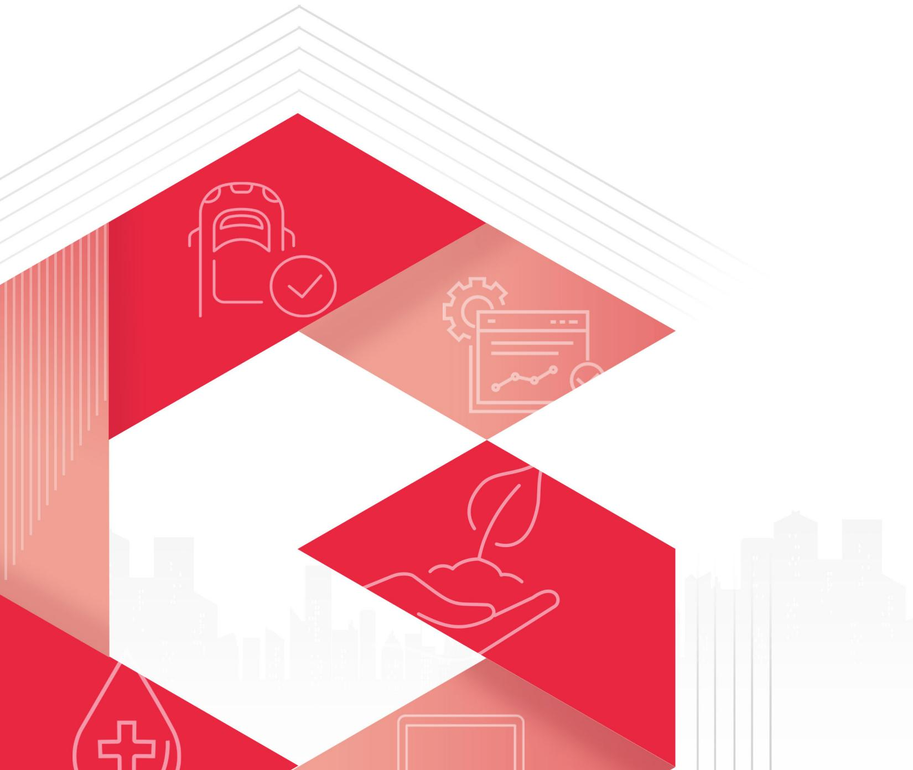

other

| Icon | Description |
| --- | --- |
| Red Diamond | Medical Equipment Icon (checkmark), Software Icon (circle), Gear Icon (twin) |
| Red Diamond | Water Droplet Icon (plus sign) |
| Red Diamond | Health Care Icon (triangle with cross) |

##

## 目录

关于本报告 01

公司寄语 03

走进晶华新材 05

关键绩效表 75

指标索引 78

读者反馈表 82

## 治理篇

公司治理 13

ESG 管理 17

风险内控 21

商业道德 22

natural_image

Modern glass building with reflective blue sky and white clouds, no visible text or symbols

## 环境篇

环境合规管理 27

污染防治 29

废弃物管理 34

应对气候变化与能源 37

资源利用与循环经济 40

natural_image

Scenic mountain landscape with lush green valleys, blue sky, and scattered clouds (no text or symbols)

## 社会篇

创新驱动 43

产品服务安全与质量 48

数字化建设与安全隐私保护 54

供应链安全 56

雇佣与薪酬 59

人才培训发展 63

员工关怀 68

职业健康与安全 71

赋能社会 74

natural_image

Close-up of hands clasping on a person's arm, with documents and charts in the background (no visible text or symbols)

## 关于本报告

本报告是上海晶华胶粘新材料股份有限公司面向利益相关方发布的第2份年度环境、社会和公司治理（ESG）类报告。报告详细披露了上海晶华胶粘新材料股份有限公司2025年度在环境、社会和公司治理等责任领域的实践成果和绩效数据，旨在与各利益相关方进行有效交流，系统地回应利益相关方的期望和要求。

## 报告期间

2025年1月1日至2025年12月31日，为增强报告可比性及前瞻性，部分内容往前后年度适度延伸。

## 编制依据

《可持续发展目标(SDGs)企业行动指南》

全球报告倡议组织《可持续发展报告标准》(GRIStandards)

上海证券交易所《上海证券交易所上市公司自律监管指引第14号——可持续发展报告（试行）》

上海证券交易所《上海证券交易所上市公司自律监管指南第4号—可持续发展报告编制》

中国上市公司协会《上市公司可持续发展报告工作指南》

称谓说明

<table><tr><td>晶华新材、公司、晶华</td><td>指</td><td>上海晶华胶粘新材料股份有限公司</td></tr><tr><td>江苏晶华</td><td>指</td><td>江苏晶华新材料科技有限公司</td></tr><tr><td>浙江晶鑫</td><td>指</td><td>浙江晶鑫特种纸业有限公司</td></tr><tr><td>安徽晶华</td><td>指</td><td>安徽晶华新材料科技有限公司</td></tr><tr><td>四川晶华</td><td>指</td><td>四川晶华新材料科技有限公司</td></tr><tr><td>昆山晶华</td><td>指</td><td>昆山晶华兴业电子材料有限公司</td></tr><tr><td>上海晶华恒业</td><td>指</td><td>上海晶华恒业新材料有限公司</td></tr><tr><td>交易所《指引》</td><td>指</td><td>上海证券交易所《上海证券交易所上市公司自律监管指引第14号——可持续发展报告(试行)》</td></tr><tr><td>元、万元、亿元</td><td>指</td><td>人民币元、人民币万元、人民币亿元</td></tr><tr><td>报告期</td><td>指</td><td>2025年度</td></tr><tr><td>PSA压敏胶、PSA</td><td>指</td><td>Pressure Sensitive Adhesive,即压敏胶粘剂,是一种仅需在轻微压力下即可瞬时产生粘接力,无需加热、溶剂或化学固化的胶粘剂。</td></tr><tr><td>OCA光学胶、OCA</td><td>指</td><td>Optically Clear Adhesive,即光学透明胶,是一种具备极高透光率和透明度,专用于光学组件贴合,以实现无气泡、无缝、高光学性能连接的特种胶粘剂。</td></tr></table>

## 信息来源

报告使用的数据来源包括公司实际运行的原始数据，政府部门公开数据，年度财务数据，内部相关统计报表，第三方问卷调查第三方评价访谈等。本报告的财务数据以人民币为单位，若与财务报告存在不一致之处，以财务报告为准。

## 报告获取

本报告电子版可在上海证券交易所网站（http://www.sse.com.cn）查阅获取。

## 公司寄语

亲爱的晶华同仁、各位股东、合作伙伴及各界朋友们：

大家好！我是晶华新材董事长周晓南。

2025年这一年，我们不仅实现了经营上的稳步发展，更将ESG理念从“书面”真正落到了“实处”，在人才建设、绿色运营、公司治理三大领域，迈出了坚实而有力的步伐。这份《2025年度环境、社会和公司治理报告》，是我们一年来工作的系统总结，更是一份面向未来的郑重承诺。

## 一、激活组织动能：让人才成为发展的第一引擎

2025年，是我们深耕主业、布局未来的关键一年，我们始终坚持“以人为本”的发展理念，将人才战略置于企业发展的核心位置，以组织革新激活内生动力，以人才赋能驱动高质量发展，为企业长远发展筑牢根基、积蓄力量。纵观企业发展百年，核心竞争力的本质，始终是人才的竞争；组织的活力，始终是企业穿越周期、行稳致远的核心密码。创新是企业发展的第一动力，而人才是创新的核心载体。我们构建起“基础研究+应用转化+产学研协同”的一体化创新生态，打破技术壁垒、整合优质资源，与华东理工大学、复旦大学等国内顶尖高校深化产学研融合，推动前沿技术与产业实践深度衔接，让创新源泉充分涌流、创新成果高效落地。同时，我们优化研发组织架构，我们着力搭建“管理与技术双通道”职业发展体系，厘清发展脉络、明确责任导向，搭建起权责清晰、运转高效的创新管理体系，让每一份创新力量都能找到发力点，让每一项创新成果都能转化为企业发展的竞争力，让每一位有理想、有能力、有担当的同仁，都能在晶华的平台上实现自我价值、成就人生梦想。

## 二、践行绿色发展：用技术改造兑现环保承诺

2025年，我们立足企业高质量发展全局，将“节能降耗、循环利用”确立为环境管理的核心战略抓手，以系统性思维推进内部设备升级与技术改造，让绿色发展从理念倡导转化为具象实践，从行动自觉升华为发展优势，实现生态效益、经济效益与社会效益的有机统一。

这一年，我们聚焦绿色转型关键领域，统筹推进各类节能循环改造项目，取得了全局性、突破性成效。在核心生产环节，我们坚持技术创新驱动，通过系列技改升级，构建起全流程、全链条的绿色生产体系：从回收系统的迭代优化到合成车间的精准节能，从智能供风的高效应用到废水资源的循环复用，再到纸管等耗材的闭环利用，每一项改造都紧扣绿色发展主线。

我们进一步拓宽绿色发展路径，启动安徽晶华，浙江晶鑫屋顶光伏项目，持续提升绿电消费占比，通过清洁能源替代大幅降低化石能源消耗，有效减小温室气体排放，稳步推进能源结构优化升级，为企业绿色低碳发屏注入新的动力未来，我们将继续坚守绿色发展初心，把生态环保融入企业发展各领域、各环节，以更高标准、更严要求推进节能降耗与循环利用，持续深化技术创新，完善绿色发展体系，努力在推动工业绿色转型、实现可持续发展上走在前列以实际行动践行企业社会责任，书写人与自然和谐共生的企业发展新篇章。

## 三、夯实治理根基：让规范透明成为企业底色

2025年，我们持续将规范治理视为企业可持续发展的保障。公司董事会、股东会规范运作，确保决策科学、执行有力我们持续完善董事会多元化结构，独立董事在维护中小股东权益方面履职到位，四个专门委员会在战略、审计、薪酬、提名等领域发挥了重要作用。

这些治理规则的变更背后，是我们对透明、合规、诚信的坚守。我们深知，只有地基打得牢，企业这栋大厦才能建得稳、建得高。

## 展望未来：行稳致远，进而有为

展望2026年，这是晶华从“稳步发展”向“结构升级”跨越的攻坚之年。我们将锚定新能源汽车、动力电池、储能消费电子、具身智能等高端领域，集中力量攻克核心技术瓶颈，推动高附加值产品落地：我们将持续推进智数工厂建设，让精益生产贯穿全价值链，以更高效的运营响应市场需求；我们将进一步完善人才梯队建设与激励机制，让有担当、有贡献的同仁获得更多成长与回报。

我们相信，一家真正优秀的企业，不仅要为客户创造价值，更要为环境减负、为社会造福。这条路，晶华人会一直坚定地走下去。

感谢所有晶华人的辛勤付出，感谢合作伙伴的信任支持，感谢社会各界的关注与期待。让我们携手，用科技粘接更美好的未来

晶华新材董事长 周晓南

2026 年 4 月

## 走进晶华新材

## 公司概况

上海晶华胶粘新材料股份有限公司，成立于2006年，于2017年在上海证券交易所挂牌上市（股票简称晶华新材，股票代码：603683），现已发展成为集研发、生产、销售于一体的专业生产各类胶粘新材料的企业。公司总部位于上海，在江苏、安徽、浙江、四川、香港等地均设有分公司或子公司，获得上海市科技小巨人企业、上海市认定企业技术中心、中国胶粘剂和胶粘带工业协会理事单位等荣誉

上海晶华胶粘新材料股份有限公司，是国内少数掌握功能性涂层复合材料核心技术、实现全产业链布局的高新技术企业与主板上市公司。三十余载专注深耕，公司以高分子材料、精密涂布、功能复合三大核心技术平台，打造工业级、电子级、光学级、柔性触觉传感器等四大高端产品集群，为全球客户提供高可靠、高精度、高性能、定制化的胶粘材料整体解决方案。产品深度赋能建筑装饰、汽车制造与后市场、消费电子、新型显示、家电、动力电池、医疗健康、航空航天、轨道交通、具身智能等高端制造与战略新兴领域，是支撑产业升级、科技突破、国产替代的关键材料供应商。公司以“技术创

<table><tr><td>总部</td><td>1</td></tr><tr><td>研发中心</td><td>4</td></tr><tr><td>产业基地</td><td>4</td></tr><tr><td>分/子公司</td><td>10+</td></tr><tr><td>服务网点</td><td>20+</td></tr></table>

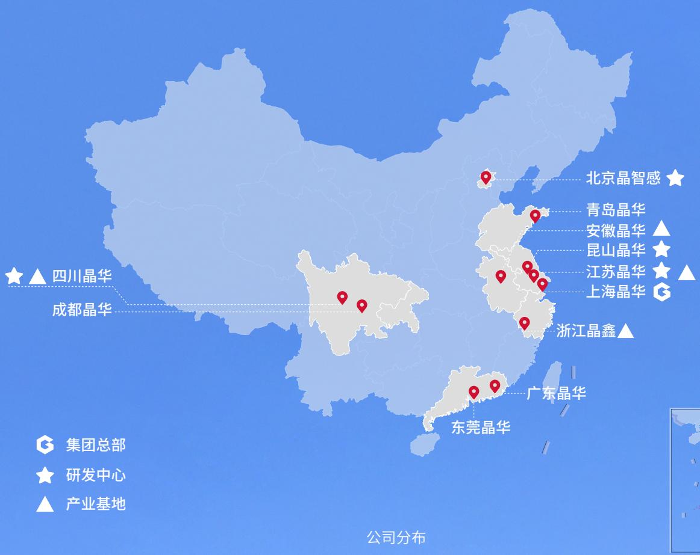

text_image

北京晶智感
青岛晶华
安徽晶华
昆山晶华
江苏晶华
上海晶华
浙江晶鑫
四川晶华
成都晶华
广东晶华
东莞晶华
公司分布
集团总部
研发中心
产业基地

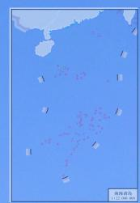

## 企业文化

企业定位：中国最具创新和服务能力的胶粘解决方案专家

企业愿景：打造新材料行业世界级百年品牌，成为充 满创新活力的百年企业

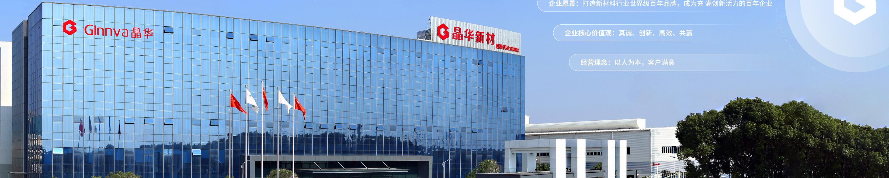

text_image

Ginnva晶华
晶华新材
股票代码:00283
企业愿景:打造新材料行业世界级百年品牌,成为充满创新活力的百年企业
企业核心价值观:真诚、创新、高效、共赢
经营理念:以人为本,客户满意

## 发展历程

## 历经 30+ 年行业积累，开启晶华发展新篇章

## 第一阶段：自主制造 （1990—2000）

## 1989 年

把握改革开放时代机遇，在汕头开启创业。

## 1994 年

成立广东晶华科技有限公司，规范化运营。

## 1995 年

实现自主制造，建立品牌，实现10条产线同时生产。

## 第二阶段：快速发展（2000—2010）

## 2001 年

业务快速发展。

## 2006 年

在上海成立晶华总部。

## 2008 年

产品升级进入消费电子领域。

## 第三阶段：聚力而上（2010—2020）

## 2010 年

首次成为“上海高新技术企业”。

## 2017 年

成功挂牌上海主板，成为国内胶粘材料首家上市公司。

## 2018 年

江苏苏州生产基地开始投产，集团园区占地总面积达160亩。

## 第四阶段：重新定位（2020—至今）

## 2021 年

江苏苏州、安徽滁州制造基地陆续扩建投产，涉及电子材料、光学材料领域。

## 2022 年

明确新战略，快速升级转型打造胶粘解决方案专家。启动企业智数化转型。

## 2023 年

光学事业部成立，大力布局光学显示领域。

## 2024 年

行业标杆智数化工厂四川晶华正式投产。

## 2025 年

成立子公司北京晶智感新材料有限公司，深耕电子皮肤触觉传感系统级解决方案。

## 年度大事记

## 2025 年 3 月

上海晶华恒业以“向新同行，共赢增长”为主题的2025晶华汽车膜全国经销商大会暨生态圈发布会在河南许昌圆满收官。全国经销商、行业专家齐聚，共探汽车后市场新机遇，见证晶华战略升级与生态圈蓝图启航。

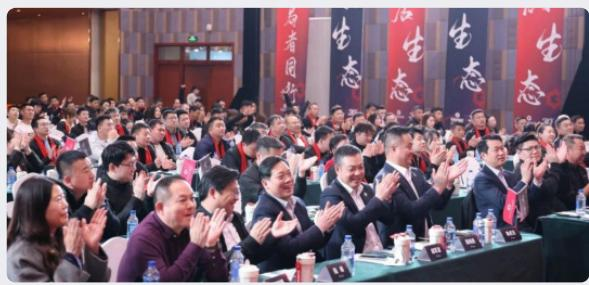

text_image

Group photo of a formal indoor gathering with attendees clapping and banners displaying Chinese characters in the background.

昆山晶华研发中心项目签约投资，建设电子级高端胶粘新材料的生产及研发中心，项目建成后，预计产值约6亿元，这将进一步提升公司在胶粘新材料领域的市场竞争力。

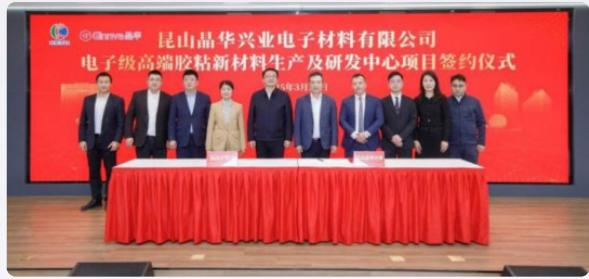

text_image

昆山晶华兴业电子材料有限公司
电子级高端胶粘新材料生产及研发中心项目签约仪式

## 2025 年 4 月

公司发布新品丙烯酸泡棉胶带，采用了先进的技术和环保材料，大大降低了VOC的排放，保证良好粘接性能的同时，减少了对空气的污染。

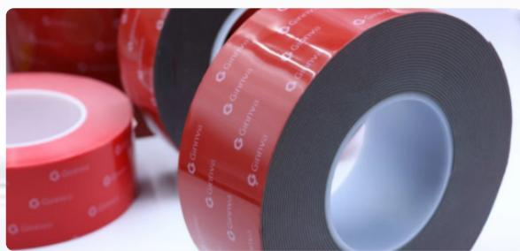

natural_image

Close-up of red and black adhesive tape rolls with printed markings (no readable text or symbols)

## 2025 年 5 月

公司 2024 年度以简易程序向特定对象发行 A 股股票发行上市，募集资金2.27亿元。  
公司参加雅加达汽配展，为本次展会带来了汽车全产业链胶粘解决方案产品，从内而外为汽车制造保驾护航：其中，新品丙烯酸泡棉胶带首次亮相海外展会。

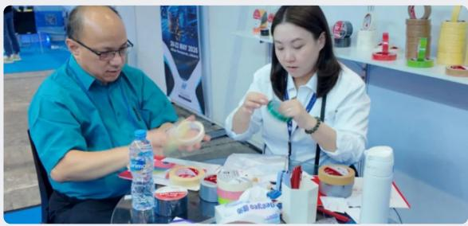

natural_image

Two people examining dental prosthetics at a product display table with bottles and cups (no visible text or symbols)

## 2025 年 6 月

成立子公司北京晶智感新材料有限公司，布局新赛道以多模态柔性传感器开拓增长新极。

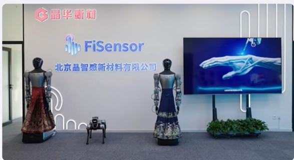

text_image

晶华新材
FiSensor
北京晶智感新材料有限公司

公司与华东理工大学签署产学研战略合作协议，共建联合研发中心，在人才培养、课题攻关、前沿材料探索等诸多领域实现深度合作。

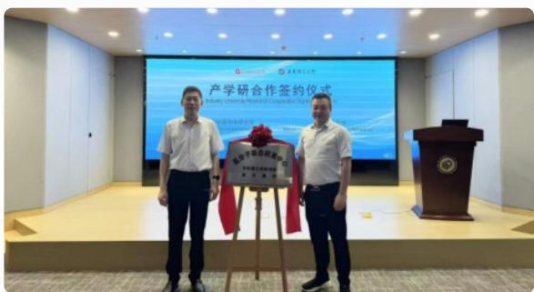

text_image

产学研合作签约仪式
University of China Petroleum Corporation (Shanghai) Co., Ltd.
中国电子科技大学
中国电子科技大学

## 2025 年 6 月

公司为大连市普兰店区四平中心小学捐赠一块标准化篮球场地。捐赠活动旨在改善学校体育设施条件，促进学生身心健康发展。通过公益捐赠，践行企业社会责任，提升晶华品牌形象，同时加强企业与地方社区的互动与合作。

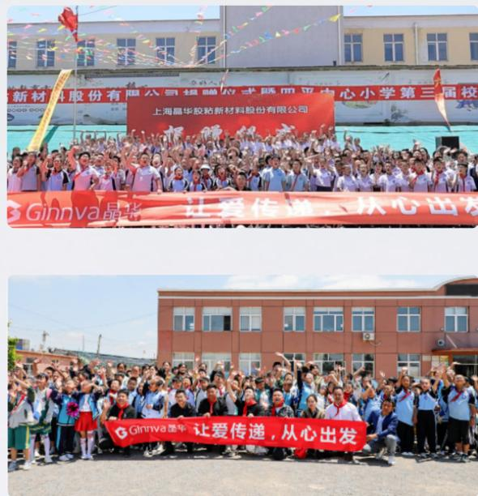

## 2025 年 7 月

公司成功获得CNAS 国家实验室认可，推动检测体系与研发标准迈向国际水平，持续夯实企业可持续发展的核心竞争力。

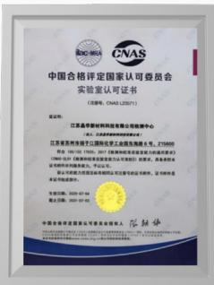

text_image

中国合格评定国家认可委员会
实验室认可证书
（注册号：CNAS 123571）
兹证明：
江苏高淳新材料科技有限公司检验中心
地址：江苏省无锡市永定区锡林南路18号
办公地址：江苏省无锡市永定区锡林南路18号
电话：0596-7878-7878，传真：0596-7878-7878
经营范围：许可项目：新型建筑材料及复合材料的开发、销售、技术服务；企业自产产品的技术咨询、技术转让、技术推广；进出口业务（依法须经批准的项目，经相关部门批准后方可开展经营活动）。有效期：2020年07月04日
成立日期：2020年07月04日
中国合格评定国家认可委员会 张婷婷

## 2025 年 9 月

公司向 2024 年限制性股票与股票期权激励计划激励对象授予预留限制性股票与股票期权

## 2025 年 11 月

公司投资灵心巧手3.000万元，联合推进柔性触觉传感器电子皮肤的项目开发，深耕电子皮肤触觉传感系统级解决方案。

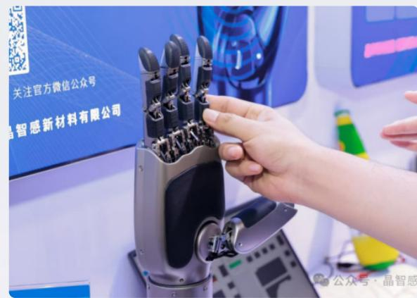

text_image

关注官方微信公众号
晶智感新材料有限公司
公众号·晶智感

## 治理篇

## 理念

晶华新材坚持规范透明运作，构建多元化的董事会结构与专门委员会体系，强化独立董事作用，严格信息披露，保障投资者权益。公司持续完善内部审计与风险控制机制，明确全员风控责任，并通过反舞弊制度与诚信文化建设，维护合规经营秩序，推动企业可持续发展。

## 我们的行动

公司治理 13  
ESG 管理 17  
风险内控 21  
商业道德 22

## SDGs 对标

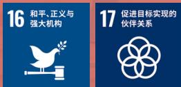

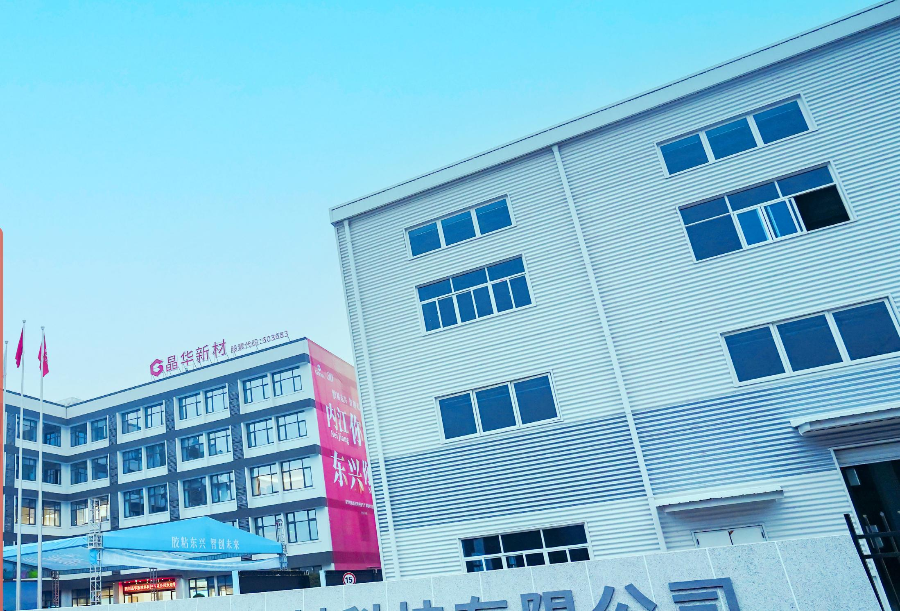

text_image

晶华新材 股票代码:603683
内江东
Nao Feng
东兴
胶粘东兴 智创未来
15
科技有限公司

## 15四川晶华新材料科技有限公司SICHUAN SMITH NEW MATERIAL TECHNOLOGY CO.,LTD

## 公司治理

晶华新材严格按照法律法规要求，建立了规范的治理结构，并配套完善议事规则及工作细则。公司建立了严格的信息披露管理制度，确保披露内容的真实、准确、完整与及时，并通过多种渠道与投资者保持良性互动，积极回应投资者诉求。

## 公司治理

晶华新材根据《中华人民共和国公司法》《中华人民共和国证券法》等法律法规及规范性文件的要求，建立了科学规范的法人治理结构，制定并完善了《股东会议事规则》《董事会议事规则》《独立董事制度》《总经理工作细则》《董事会秘书工作细则》等一系列规章制度。

公司建立了权责清晰、运转协调的治理结构，股东会与董事会规范运作，各职能部门职责明确且高效协同。独立董事在维护公司整体利益，保护中小股东合法权益等方面履职到位。

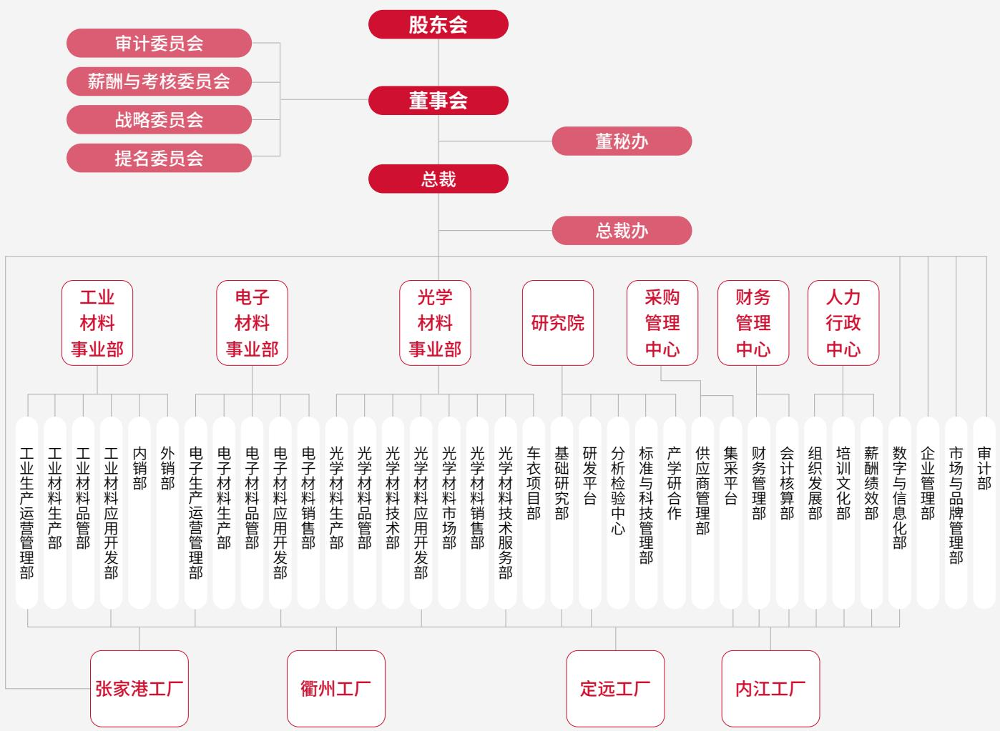

flowchart

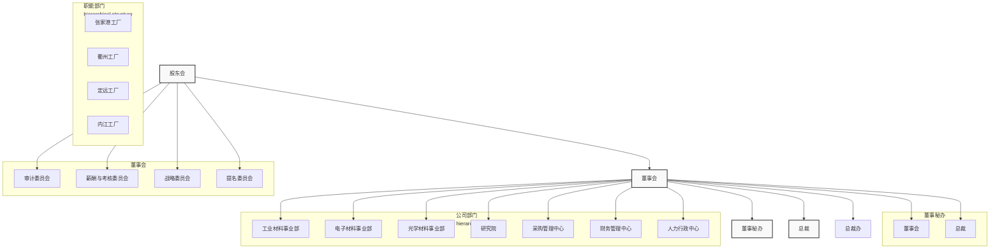
```mermaid
graph TD
  A["股东会"] --> B["董事会"]
  B --> C["董事秘办"]
  B --> D["总裁"]
  B --> E["总裁办"]

  subgraph Board["董事会"]
    F["审计委员会"]
    G["薪酬与考核委员会"]
    H["战略委员会"]
    I["提名委员会"]
  end

  subgraph Directors["董事秘办"]
    J["董事会"]
    K["总裁"]
  end

  subgraph Departments["公司部门\n hierarchical structure"]
    L["工业材料事业部"]
    M["电子材料事业部"]
    N["光学材料事业部"]
    O["研究院"]
    P["采购管理中心"]
    Q["财务管理中心"]
    R["人力行政中心"]
  end

  subgraph Subsidiaries["职能部门\n hierarchical structure"]
    S["张家港工厂"]
    T["衢州工厂"]
    U["定远工厂"]
    V["内江工厂"]
  end

  A --> F
  A --> G
  A --> H
  A --> I
  B --> J
  B --> K
  B --> L
  B --> M
  B --> N
  B --> O
  B --> P
  B --> Q
  B --> R

  subgraph Subsidiaries
    S
    T
    U
    V
  end

  style A fill:#f9f9f9,stroke:#333,stroke-width:2px
  style B fill:#f9f9f9,stroke:#333,stroke-width:2px
  style C fill:#f9f9f9,stroke:#333,stroke-width:2px
  style D fill:#f9f9f9,stroke:#333,stroke-width:2px
```

治理架构

报告期内

<table><tr><td>董事会召开</td><td>审议通过议案</td><td>股东会召开</td><td>审议通过议案</td></tr><tr><td>12次</td><td>84项</td><td>4次</td><td>20项</td></tr></table>

## 董事会

公司持续推进董事会性别、年龄和专业领域的合理配置，以多元化结构强化战略眼光与风险应对韧性，助力精准把握市场机遇。董事会成员来自法律、会计、工商管理、高分子科学等多个行业，参加法律法规、资本市场规则、行业专业知识等专项培训，提升董事合规履职能力，为公司治理注入了多维视角与深刻洞见，显著提升了决策质量与市场应变能力。

<table><tr><td rowspan="2">姓名</td><td rowspan="2">职位</td><td colspan="3">专业知识与技能</td><td colspan="3">主要经历</td><td rowspan="2">性别</td><td rowspan="2">年龄(岁)</td></tr><tr><td>行业</td><td>财务金融</td><td>法律</td><td>行业</td><td>财务金融</td><td>法律</td></tr><tr><td>周晓南</td><td>董事长总经理</td><td>✓</td><td>✓</td><td></td><td>✓</td><td></td><td></td><td>男</td><td>56</td></tr><tr><td>周晓东</td><td>副董事长副总经理</td><td>✓</td><td></td><td></td><td>✓</td><td></td><td></td><td>男</td><td>61</td></tr><tr><td>白秋美</td><td>董事</td><td>✓</td><td></td><td></td><td>✓</td><td></td><td></td><td>女</td><td>58</td></tr><tr><td>丁冀平</td><td>董事</td><td></td><td>✓</td><td></td><td></td><td>✓</td><td></td><td>男</td><td>50</td></tr><tr><td>俞昊</td><td>独立董事</td><td></td><td></td><td>✓</td><td></td><td></td><td>✓</td><td>男</td><td>38</td></tr><tr><td>马轶群</td><td>独立董事</td><td></td><td>✓</td><td></td><td></td><td>✓</td><td></td><td>男</td><td>47</td></tr><tr><td>陈国颂</td><td>独立董事</td><td>✓</td><td></td><td></td><td>✓</td><td></td><td></td><td>女</td><td>46</td></tr></table>

董事会构成

晶华新材根据相关法律法规及《公司章程》等有关规定制定《独立董事制度》《独立董事专门会议工作细则》，进一步完善公司的治理结构，在董事会中发挥参与决策、监督制衡、专业咨询作用，促进公司的规范运作，维护公司整体利益，保障全体股东特别是中小股东的合法权益不受侵害。

公司董事会之下设立了战略委员会、提名委员会、薪酬与考核委员会以及审计委员会四个专门委员会，每个委员会在提升治理水平，强化日常运营及重大决策管理方面发挥了重要支撑作用

审计委员会召开

次4

审议通过议案

7 项

报告期内  

战略委员会召开

次5

审议通过议案

项16

薪酬与考核委员会召开

次5

审议通过议案

项9

## 高管薪酬政策

公司根据《薪酬与考核委员会实施细则》的规定，设立委员会负责制定董事及高级管理人员的薪酬政策与方案，具体内容包括制定董事、高级管理人员的薪酬，制定或变更股权激励计划、员工持股计划，以及董事、高级管理人员在拟分拆所属子公司安排持股计划等事项，并向董事会提出建议：其中董事的薪酬计划须报经董事会同意后提交股东会审议通过方可实施高级管理人员的薪酬分配方案则报董事会批准。

## 信息披露

公司制定《信息披露管理制度》《信息披露暂缓与豁免管理制度》，严格遵循监管要求开展信息披露工作，通过完善的信息披露审核机制，明确全链条责任，防范虚假记载与重大遗漏，并规范内幕信息知情人登记备案，积极配合监管核查，切实保障信息披露的合规性与透明度。

公司严格履行信息披露义务，定期公告

临时公告

项96

共披露公告文件

185 份

信披评级为

B 级

## 投资者关系

公司根据相关法律法规制定《投资者关系管理制度》，明确了合规性、平等性、主动性和诚实守信等基本原则，增进投资者对公司的全面了解，建立稳定优质的投资者基础，从而获得长期的市场支持，通过提升信息披露透明度，持续改善公司治理，为股东创造持久价值

报告期内  
沟通渠道

<table><tr><td>·公司官网</td><td>·传真</td></tr><tr><td>·新媒体平台</td><td>·电子邮箱</td></tr><tr><td>·电话</td><td>·投资者教育基地</td></tr></table>

网络沟通平台

<table><tr><td>·中国投资者网</td></tr><tr><td>·上海证券交易所</td></tr><tr><td>·证券登记结算机构</td></tr></table>

沟通方式

<table><tr><td>• 股东会</td><td>• 路演</td></tr><tr><td rowspan="2">• 发布定期报告和临时报告</td><td>• 分析师会议</td></tr><tr><td>• 接待来访</td></tr><tr><td>• 业绩说明会</td><td>• 座谈交流</td></tr></table>

投资者沟通方式

报告期内

<table><tr><td>公司投资者关系活动开展</td><td>召开业绩说明会</td><td></td></tr><tr><td>10场</td><td>5次</td><td>4家研究机构为公司撰写研究报告6篇</td></tr><tr><td>收到投资者提问</td><td>回复投资者提问</td><td>除1个重复提问外,投资者提问回复率</td></tr><tr><td>39个</td><td>38个</td><td>100%</td></tr></table>

natural_image

Composite image showing hands reviewing a document with charts and a pen, symbolizing business or data analysis (no readable text)

## ESG 管理

晶华新材通过流程优化、供应链尽责管理及透明信息披露，持续推动 ESG 工作建设。报告期内，公司 Wind ESG 评级获评 A 级，位居行业前列；江苏晶华、四川晶华成功获得RBA（责任商业联盟)、BSCI（商业社会合规倡议）等国际认证，体现了公司在可持续发展领域的扎实管理与卓越表现，为长期价值创造奠定了坚实基础。

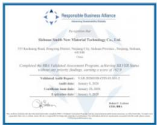  
Wind ESG  
晶华新材

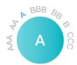  
ESG相关荣誉资质

## 利益相关方沟通

公司持续与利益相关方保持积极、透明和有效的沟通，持续优化利益相关方沟通机制，致力于更好地理解各方需求，及时回应关切，共同塑造一个更加可持续、负责任和具有竞争力的企业未来

<table><tr><td rowspan="2">利益相关方</td><td>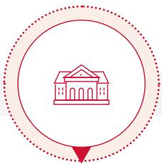</td><td>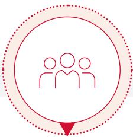</td><td>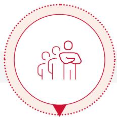</td><td>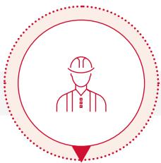</td><td>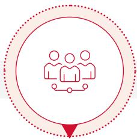</td><td>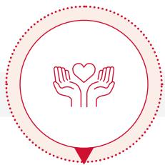</td></tr><tr><td>政府及监管部门</td><td>股东和投资者</td><td>客户</td><td>供应商/承包商与合作伙伴</td><td>员工</td><td>社会与公众</td></tr><tr><td>对公司的期望</td><td>合规合法经营响应国家战略促进区域经济</td><td>提高投资回报及时获知信息加强风险管理</td><td>确保产品质量规范高效服务</td><td>公平公开采购遵守商业道德实现互惠共赢</td><td>薪酬与福利职业培训与发展职业健康与安全员工关爱与权益保障</td><td>节能降耗降低污染支持社区发展倾力回馈社会</td></tr><tr><td>沟通渠道</td><td>监管信息报送来访接待日常工作汇报与交流信息披露</td><td>股东会投资者见面会/开放日定期报告与公告</td><td>电话、公司官网、微信公众号、微博客户拜访客户满意度调查客户咨询服务平台</td><td>供应商大会供应商现场审查日常工作沟通行业交流大会</td><td>职工代表大会员工沟通、申诉渠道满意度调研多样员工活动</td><td>乡村振兴行动志愿活动社区宣传</td></tr><tr><td>响应行动</td><td>遵守法律法规广泛吸纳就业,依法纳税</td><td>增强盈利能力定期披露信息</td><td>加大创新研发力度提供高质量产品保障服务质量健全信息安全管理体系</td><td>建立负责任的采购机制建设反腐倡廉体系参与制定行业标准</td><td>完善薪酬福利体系健全人才培养体系确保职业健康安全平衡员工工作与生活</td><td>践行绿色生产落实合规排放开展公益慈善工作投身乡村振兴</td></tr></table>

## 重要性议题分析

公司依据交易所《指引》等披露标准，以内外部利益相关方的关注焦点为指引，结合行业特性，运用系统化的识别、评估和筛选流程，对重要性议题进行评估，并确定各重要性议题重要性，根据议题重要性程度从“对公司财务的重要性”及“对经济、社会和环境影响的重要性”两个维度形成重要性议题矩阵，明确并优先处理具有重大实质性影响的可持续发展议题指导管理和报告工作。

## 重要性议题分析

了解公司活动和业务关系  
了解外部客观环境  
了解主要受影响利益相关方

## 识别ESG议题库

以交易所《指引》识别的议题为基础，参考同行企业、评级标准等识别其他潜在的重要性议题  
识别议题相关影响、风险和机遇，汇总形成公司议题库

## 议题重要性的评估与排序

通过问卷、访谈等形式识别影响重要性与财务重要性评估结果  
整合评估结果，形成双重重要性议题矩阵

## 议题重要性确认与报告

结合公司领导层意见，确认或调整重要性议题结果  
依据交易所《指引》要求在年度ESG报告中重点披露

议题重要性分析流程  
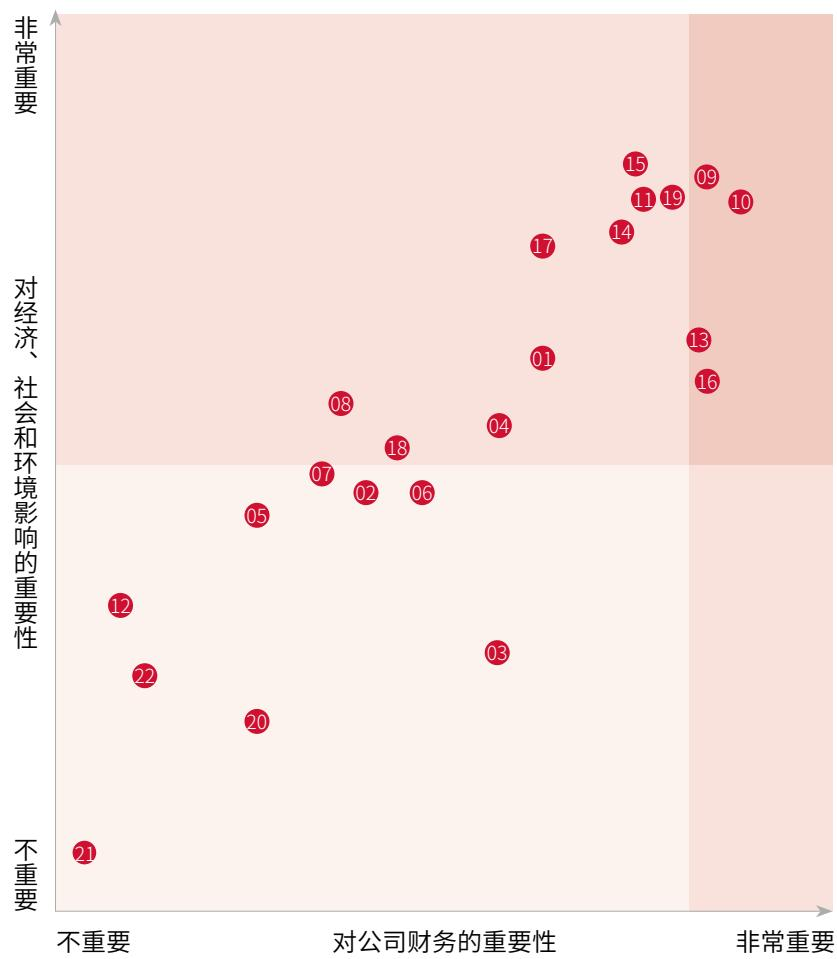

scatter

| ID | 对公司财务的重要性 (X-axis position) | 对经济、社会和环境影响的重要性 (Y-axis position) |
| --- | --- | --- |
| 15 | ~0.85 | ~0.92 |
| 11 | ~0.88 | ~0.88 |
| 19 | ~0.92 | ~0.88 |
| 09 | ~0.95 | ~0.88 |
| 10 | ~0.98 | ~0.85 |
| 17 | ~0.65 | ~0.75 |
| 14 | ~0.82 | ~0.72 |
| 13 | ~0.95 | ~0.55 |
| 16 | ~0.95 | ~0.52 |
| 01 | ~0.68 | ~0.55 |
| 04 | ~0.62 | ~0.45 |
| 08 | ~0.42 | ~0.52 |
| 07 | ~0.38 | ~0.48 |
| 02 | ~0.45 | ~0.45 |
| 18 | ~0.48 | ~0.48 |
| 06 | ~0.48 | ~0.45 |
| 05 | ~0.32 | ~0.42 |
| 12 | ~0.12 | ~0.32 |
| 22 | ~0.15 | ~0.25 |
| 20 | ~0.32 | ~0.22 |
| 03 | ~0.62 | ~0.22 |
| 21 | ~0.12 | ~0.12 |

双重重要性分析结果

## 治理

01 反商业贿赂及反贪污  
03 利益相关方沟通

02 反不正当竞争  
04 ESG 风险管理

## 环境

05 应对气候变化  
07 水资源利用  
09 废弃物处理\*  
11 环境合规管理

06 能源利用  
08 循环经济  
10 污染物排放 \*  
生态系统和生12物多样性保护

## 社会

13 创新驱动 \*  
数据安全与客户隐私保护  
17 员工权益保障  
19 员工健康安全  
21 乡村振兴

14 供应链安全  
产品和服务安16全与质量\*  
18 员工培训发展  
20 社会贡献  
22 平等对待中小

注:星标(\*)议题为财务重要性议题

公司评估各项可持续发展相关议题在短期(0一1含年）、中期（1一3含年）及长期（3年以上）对经济、社会、环境可持续发展，以及短期经营和商业决策带来的风险和机遇，并分析应对情况、制定相应的行动计划，防范可能产生的重大负面影响或风险，把握新的机遇

## 议题

## 主要风险

## 创新驱动

技术迭代滞后，产品无法适配下游高端应用应用（如汽车、消费电子、具身智能、动力电池及储能等)，面临市场淘汰风险；  
核心材料依赖进口，遭遇供应链断供或技术壁垒；  
研发转化效率低，样品量产率低导致资源浪费。

## 主要机遇

抢抓高端材料国产替代浪潮突破技术壁垒，提升高毛利产品占比；  
依托数字化与工艺创新，实现降本增效，提升制造柔性与交付能力；  
构建全场景应用解决方案，提升客户全生命周期价值。

## 影响价值链环节

供应链上 游、自身 运营、供 应链下游

## 影响时间范围

短期、中期、长期

## 应对措施

公司依托创新管理，构建“风险识别—过程管控—成果落地”全链条防控与激励机制，在规避合规与技术迭代风险的同时，系统性挖掘绿色创新带来的市场机遇，并通过资源倾斜与考核引导，保障创新成果高效转化与持续竞争力构建。详见“创新驱动”小节。

<table><tr><td>产品和服务安全与质量</td><td>下游客户对材料安全性、稳定性、一致性要求持续提升,若在原材料管控、生产过程、出厂检验等环节出现质量偏差,可能引发产品失效、客户索赔、品牌声誉受损,进而影响市场信任与订单稳定性,造成收入下降与成本增加;供应链上游原材料品质波动、供应商质量体系不稳定,会传导至终端产品,带来系统性质量风险。</td><td>通过建立全生命周期质量管控体系,强化供应商准入、过程检验、成品验证与售后追溯,可显著提升产品可靠性与客户满意度,增强高端客户黏性,提升品牌竞争力与市场占有率,实现收入增长与盈利水平提升;高标准的质量安全管理,有助于公司切入汽车、消费电子、具身智能、动力电池及储能等高门槛领域,打开增量市场空间。</td><td>供应链上游、自身运营、供应链下游</td><td>短期、中期、长期</td><td>公司建立覆盖研发、采购、生产、销售、售后的全链条质量安全管理体系,严格执行供应商分级审核、来料检验、过程控制与成品检测制度,完善异常处理与追溯机制。将质量安全指标纳入内部考核,持续优化工艺与流程,推动跨部门协同改进,以稳定可靠的产品与服务保障客户价值,筑牢长期可持续发展基础。详见“产品服务安全与质量”小节。</td></tr><tr><td>污染物排放</td><td>随着环保监管趋严,生产过程中废气、废水等污染物若管控不当,易出现排放超标、在线监测数据异常等问题,可能面临行政处罚、限产停产及品牌声誉受损;环保合规成本持续上升,对经营稳定性与盈利能力造成压力。</td><td>通过环保设施升级、工艺优化与源头减排,可实现污染物稳定达标排放,降低合规风险;推行清洁生产、节能降耗与绿电替代,既能减少环境影响,又能提升生产效率、降低单位能耗成本,塑造绿色低碳的企业形象,增强市场与资本认可度。</td><td>供应链上游、自身运营</td><td>短期、中期、长期</td><td>公司建立全流程污染物防控体系,完善废气、废水治理设施与在线监测机制,严格执行环保标准与第三方检测要求;将排放管控纳入日常运营与绩效考核,动态优化生产工艺,持续推进减污降碳,保障环境合规与绿色运营。详见“污染防治”小节。</td></tr><tr><td>废弃物处理</td><td>危险废物产生、贮存及处置不规范,将带来环境安全与合规风险;一般工业固废资源化利用率偏低,既造成资源浪费,也推高处置成本,影响可持续运营水平。</td><td>坚持减量化、资源化、无害化原则,通过工艺改进与回收系统改造,从源头减少废弃物产生;提升固废回收利用效率,可降低处置成本、创造附加收益;规范危废全流程管理,进一步夯实环境安全底线,提升产业链绿色协同能力。</td><td>供应链上游、自身运营、供应链下游</td><td>短期、中期、长期</td><td>公司建立废弃物管理制度,遵循“减量化、资源化、无害化”原则;通过回收系统改造提升甲苯等原材料回收效率;危废分类收集、规范贮存,委托资质单位处置;将危废异常产生纳入月度考核,强化源头减量。详见“废弃物管理”小节。</td></tr></table>

<table><tr><td>产品和服务安全与质量</td><td>下游客户对材料安全性、稳定性、一致性要求持续提升,若在原材料管控、生产过程、出厂检验等环节出现质量偏差,可能引发产品失效、客户索赔、品牌声誉受损,进而影响市场信任与订单稳定性,造成收入下降与成本增加;供应链上游原材料品质波动、供应商质量体系不稳定,会传导至终端产品,带来系统性质量风险。</td><td>通过建立全生命周期质量管控体系,强化供应商准入、过程检验、成品验证与售后追溯,可显著提升产品可靠性与客户满意度,增强高端客户黏性,提升品牌竞争力与市场占有率,实现收入增长与盈利水平提升;高标准的质量安全管理,有助于公司切入汽车、消费电子、具身智能、动力电池及储能等高门槛领域,打开增量市场空间。</td><td>供应链上游、自身运营、供应链下游</td><td>短期、中期、长期</td><td>公司建立覆盖研发、采购、生产、销售、售后的全链条质量安全管理体系,严格执行供应商分级审核、来料检验、过程控制与成品检测制度,完善异常处理与追溯机制。将质量安全指标纳入内部考核,持续优化工艺与流程,推动跨部门协同改进,以稳定可靠的产品与服务保障客户价值,筑牢长期可持续发展基础。详见“产品服务安全与质量”小节。</td></tr><tr><td>污染物排放</td><td>随着环保监管趋严,生产过程中废气、废水等污染物若管控不当,易出现排放超标、在线监测数据异常等问题,可能面临行政处罚、限产停产及品牌声誉受损;环保合规成本持续上升,对经营稳定性与盈利能力造成压力。</td><td>通过环保设施升级、工艺优化与源头减排,可实现污染物稳定达标排放,降低合规风险;推行清洁生产、节能降耗与绿电替代,既能减少环境影响,又能提升生产效率、降低单位能耗成本,塑造绿色低碳的企业形象,增强市场与资本认可度。</td><td>供应链上游、自身运营</td><td>短期、中期、长期</td><td>公司建立全流程污染物防控体系,完善废气、废水治理设施与在线监测机制,严格执行环保标准与第三方检测要求;将排放管控纳入日常运营与绩效考核,动态优化生产工艺,持续推进减污降碳,保障环境合规与绿色运营。详见“污染防治”小节。</td></tr><tr><td>废弃物处理</td><td>危险废物产生、贮存及处置不规范,将带来环境安全与合规风险;一般工业固废资源化利用率偏低,既造成资源浪费,也推高处置成本,影响可持续运营水平。</td><td>坚持减量化、资源化、无害化原则,通过工艺改进与回收系统改造,从源头减少废弃物产生;提升固废回收利用效率,可降低处置成本、创造附加收益;规范危废全流程管理,进一步夯实环境安全底线,提升产业链绿色协同能力。</td><td>供应链上游、自身运营、供应链下游</td><td>短期、中期、长期</td><td>公司建立废弃物管理制度,遵循“减量化、资源化、无害化”原则;通过回收系统改造提升甲苯等原材料回收效率;危废分类收集、规范贮存,委托资质单位处置;将危废异常产生纳入月度考核,强化源头减量。详见“废弃物管理”小节。</td></tr></table>

财务重要性议题的风险与机课

## 风险内控

公司为不断加强内部审计工作，保证内部审计质量，明确内部审计责任，根据有关法律法规，制定《内部审计制度》，强化合规与内控管理，有效预防损失，确保业务的连续性，为公司高质量发展筑牢防线。

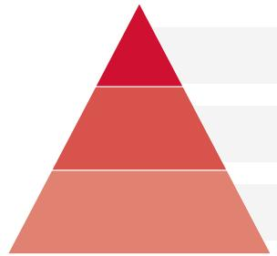

funnel

| Level | Value |
| --- | --- |
| Top | Low |
| Middle | Medium |
| Bottom | High |

董事会  
审计委员会  
审计部

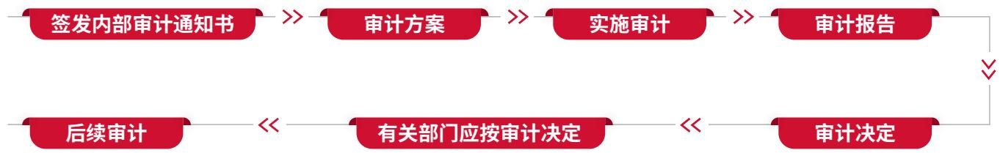

flowchart

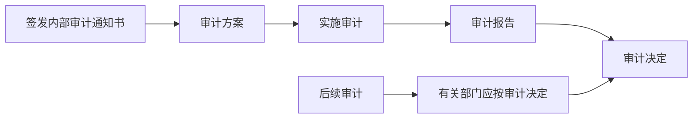
```mermaid
graph LR
  A["签发内部审计通知书"] --> B["审计方案"]
  B --> C["实施审计"]
  C --> D["审计报告"]
  D --> E["审计决定"]
  F["后续审计"] --> G["有关部门应按审计决定"]
  G --> E
```

审计工作程序

## 风险意识宣贯

每年组织内部控制和风险管理的宣传，提高公司各部门认知风险及防范风险的意识，明确各部门风险管理责任。

## 信息收集

明确风险信息反馈渠道及方式，发动全体员工及时上报识别到的风险。

## 风险评估

每年组织高级管理人员从多个维度运用定性与定量相结合的方法对已经识别的风险进行评估，确定关注重点和优先控制的风险，并形成风险评估报告。

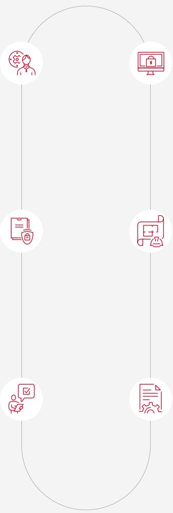

flowchart

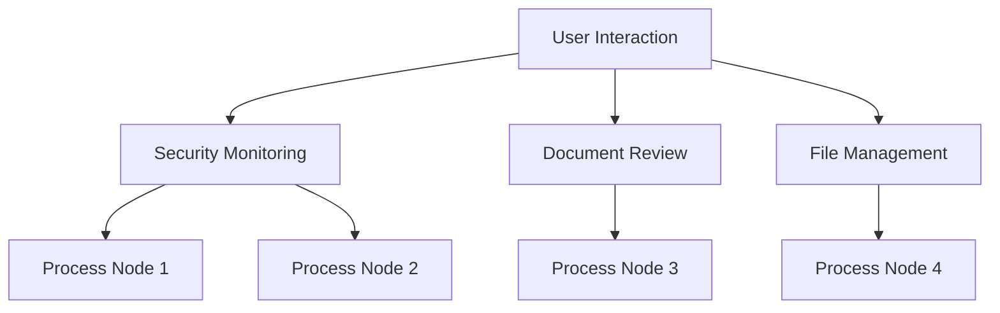
```mermaid
graph TD
  A["User Interaction"] --> B["Security Monitoring"]
  A --> C["Document Review"]
  A --> D["File Management"]
  B --> E["Process Node 1"]
  B --> F["Process Node 2"]
  C --> G["Process Node 3"]
  D --> H["Process Node 4"]
```

## 应对策略调整

每年基于公司战略目标、经营情况、内外部环境及管理层风险偏好，重新评估风险与应对策略，对不适应公司管理需求的内容进行调整。

## 应对策略审批

风险应对策略和方案编制完成后，提交授权机构或人员审批，审批通过后下发至风险管理归口部门，作为风险管理基本依据。

## 风险应对策略

每年组织高层管理人员，结合风险承受度，结合风险承受度与收益，分析掌握重要、经理及其他岗位风险偏好，共同研讨、编制风险应对策略和方案。

内部风险控制措施

## 商业道德

晶华新材恪守商业道德，健全反舞弊制度与机构并严肃追责，多举措强化舞弊防控、畅通举报渠道并保护举报人；严守反 不正当竞争法规，推行廉政共建协议，携手合作伙伴共建健康商业环境

## 反舞弊管理

公司制定《反舞弊管理制度》《反贪污、商业贿赂和挪用公款控制程序》《内控管理手册》《保密管理制度》等制度，设置反舞弊工作机构，规范公司所有员工的职业行为，树立廉洁、勤勉、敬业的工作作风，防止发生损害公司、股东及员工利益的行为。

## 反舞弊工作机构和分工

## 公司董事会

领导公司反舞弊工作，督促管理层建立公司范围内的反舞弊文化环境，建立健全包括预防舞弊在内的内部控制体系。

## 公司管理层

对舞弊行为的发生承担责任。公司管理层负责建立、健全并有效实施包括舞弊风险评估和预防舞弊在内的反舞弊程序和控制并进行自我评估。

## 公司审计部纪检部

负责公司及公司下属单位、分子公司的反舞弊、反贪污工作的实施，具体包括

a)受理、登记相关舞弊、贪污举报工作；

c) 对舞弊、贪污案件提出处理意见和责任追究意见；

b)组织舞弊、贪污案件的调查；

d) 开展反舞弊、反贪污预防宣传活动

## 公司所属各分子公司

公司所属各分子公司要积极配合舞弊、贪污事件的调查和取证工作，并参照本制度规定确定本单位反舞弊反贪污工作的相关职责和分工。

## 报告期内

公司确认腐败事件

起0

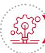

## 管理层示范与内控建设

管理层以身作则，带头遵守法律法规及公司制度，健全反舞弊内控机制。

## 反面案例警示教育

公开披露重大舞弊事件处理结果，以反面案例开展警示教育，增强员工对舞弊危害性的认知。

## 举报渠道建设

鼓励并畅通举报渠道，支持对不道德及非诚信行为进行实名或匿名举报。

## 利益相关方协作

与客户、供应商、监管机构及股东等利益相关方协作，广泛告知反舞弊工作制度，传递相关信息与要求。

## 反舞弊价值理念宣导

宣导反舞弊价值理念，鼓励员工在工作中遵纪守法、恪守诚信，正确处理利益冲突与不当利益诱惑。

## 反舞弊培训

开展全员反舞弊培训，通过多种形式宣导反舞弊政策、程序及要求，确保员工接受法律法规与职业道德培训。

反舞弊管理措施

## 举报渠道与举报人保护

为强化员工合规意识、营造风清气正的工作氛围，助力公司稳健发展，公司鼓励实名举报，员工及合作相关社会各方可通过电话、邮箱、信函等渠道举报公司及工作人员实际或疑似舞弊线索，公司将严格保护举报人合法权益。

## 举报途径

电话

0754-88132675

电子邮箱

sj@smithcn.com

办公地址

江苏晶华审计部

严禁泄露举报人的姓名、单位、住址等相关信息；

所办案件与本人或者其近亲属有利害关系的，应当回避;

## 举报人 保护措施

不得向被调查部门或被调查人出示举报信等涉及举报人个人信息的材料;

举报人由于举报案件受到打击报复的，举报人可向审计部或总裁进行投诉。经调查核实，存在打击报复行为的，追究相关人员的责任。

## 反垄断及不正当竞争

在市场竞争过程中，公司严格遵守《中华人民共和国反不正当竞争法》及《关于禁止商业贿赂行为的暂行规定》等有关法规恪守公平交易相关法律法规与行业准则，坚决抵制不正当竞争行为。

## 签订《廉政共建协议书》

倡导合作伙伴共同遵循自愿、平等、公平、诚实信用原则，恪守商业道德。

## 培训与教育

公司不定期组织新员工及在职员工参加反不正当竞争培训课程，通过案例分析、法律解读和专家讲座等形式提高员工对不正当竞争行为的认识和防范意识。

## 设立投诉渠道

公司设立公开联系渠道，便于合作伙伴及时反馈与投诉。举报电话：021-57071282邮箱：jhxc@smithcn.com

反垄断及反不正当竞争措施

natural_image

Black gavel resting on a wooden block, symbolizing legal or auction (no text or symbols visible)

natural_image

Stack of books on a wooden surface, one open and one stacked (no visible text or symbols)

## 环境篇

## 理念

晶华新材始终坚守绿色发展底线，全面践行生态环保责任，构建覆盖环境合规、气候应对、污染防治、废弃物管理、资源循环利用“五位一体”的环境管理体系。公司严格遵守各项环保法律法规，持续完善制度流程与组织保障，加大环保投入与技术改造力度，系统推进节能降碳，污染物综合治理，危废全生命周期管控及循环经济实践，不断提升资源利用效率与风险防控水平。通过体系化管理、常态化培训、实战化应急与数字化监测，实现生产经营与生态保护协同共进，以实际行动推动高质量、可持续、低碳化发展。

## 我们的行动

环境合规管理 27  
·应对气候变化与能源 29  
·污染防治 34  
废弃物管理  
·资源利用与循环经济 40

注：环境章节数据除特别说明，数据均为江苏晶华，四川晶华、浙江晶鑫安徽晶华4家子公司加总数据。

## SDGs 对标

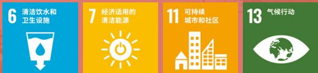

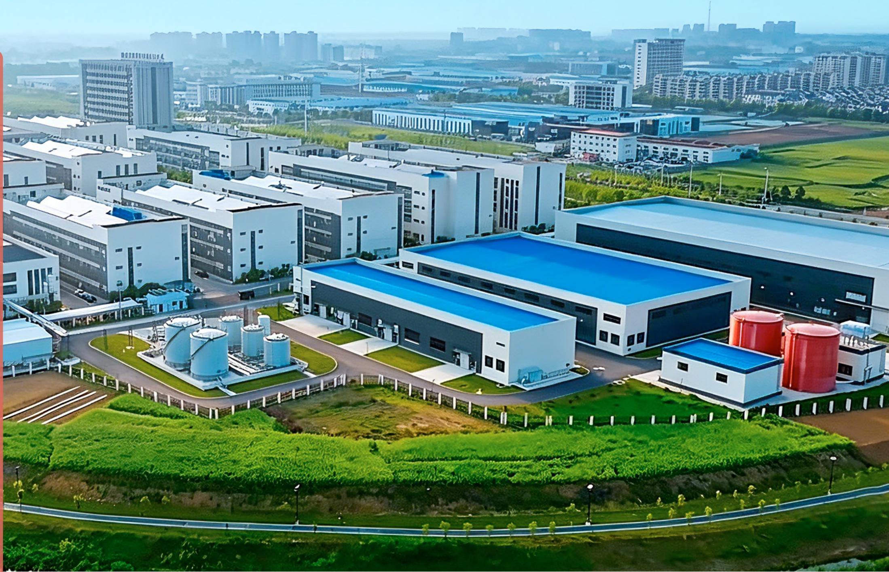

natural_image

Aerial view of a modern industrial complex with multiple factory buildings, storage tanks, and green landscaping (no visible text or signage)

## 环境合规管理

晶华新材坚持绿色发展理念，以健全环境管理体系为基础，强化全流程环保合规、风险防控与应急能力建设，持续加大环保投入，完善制度体系与人员保障，通过多维举措不断提升环境管理水平。公司积极开展生态保护与厂区绿化建设，构建绿色可持续发展体系，实现生产经营与生态环境协同发展。

## 报告期内

公司环保总投入为

4,617.97万元

报告期内，江苏晶华、四川晶华、浙江晶鑫通过ISO 14001环境管理体系认证  
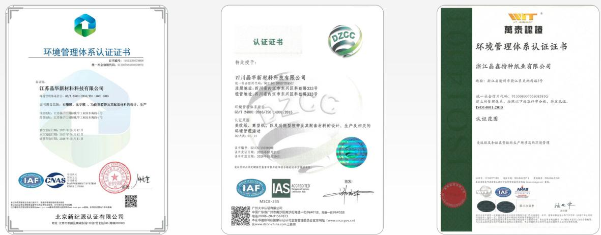  
ISO14001环境管理体系认证证书

## 环境管理体系

晶华新材及其子公司制定《环境因素识别与评价程序》《环境安全运行控制程序》《FHS事故管理制度》《FHS奖惩管理程序》等体系文件，设立专职EHS管理部门并配备专业环保人员，落实环境风险评估、突发环境应急、建设项目全周期环评管理与环保培训，确保生产运营全过程符合环保法规要求。报告期内，公司未发生突发重大环境事件，未因环境事件受到重大处罚。

## 环境影响评估

公司严格执行建设项目环境影响评价制度，所有新建、技改项目均依法开展环境影响评价  
●针对项目建设内容与环评阶段的变动，专项编制非重大变动环境影响分析报告，论证确认不属于法定重大变动情形，并委托第三方专业机构完成竣工环境保护验收，实现项目建设全流程环保合规。

## 环境应急管理

公司建立完善环境风险防控与应急管理体系，制定《突发环境事件应急预案》《环境风险评估报告》，强化环境风险源日常监测与管控，降低环境事件发生概率。  
定期开展突发环境事件应急演练，提升应急响应、现场处置与协同救援能力，确保突发情况快速规范处置，保障人员安全、防范环境污染、减少财产损失。

## 报告期内

公司开展

9 次环境应急演练

共计

419 人次参与

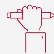

## 环保能力培训

公司常态化开展环保合规与专业技能培训，覆盖环境管理、危废管控、污染治理设施操作、应急处置等内容，强化全员环保意识与岗位操作能力，推动环保理念与管理要求落地执行

## 报告期内

公司开展

219 场环境管理培训

培训总时长

996 小时

共计

593 人次参与

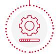

## 案例 危化品罐区泄漏应急演练 提升安全应急处置能力

2025年10月，四川晶华开展危险化学品（罐区）泄漏专项应急演练。演练模拟甲苯储罐泄漏并闪燃场景，成立应急指挥体系，下设7个应急小组，完成险情上报、警戒、灭火、伤员救护、环境监测、泄漏物收集及危废处置等全流程实操。本次演练检验预案有效性，提升员工应急处置与部门协同能力，完善环境风险防控机制，筑牢安全生产与绿色运营防线。

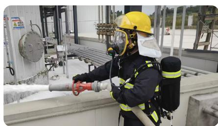

natural_image

Firefighter in full gear operating a hose system with water spray (no visible text or symbols)

危险化学品泄漏应急演练

## 生态系统和生物多样性保护

晶华新材严格遵守相关法律法规与技术导则，结合厂区自然条件开展生物多样性及生态环境风险识别，制定并落实风险防控与应急措施。公司依法规范开展环评工作，全面评估项目对周边生态与生物的潜在影响，确保选址不涉及重点生态保护区域，符合园区生态准入要求，切实保护区域生态系统与生物多样性

## 污染防治

晶华新材严格遵守《中华人民共和国环境保护法》《中华人民共和国大气污染防治法》《中华人民共和国水污染防治法》等相关法律法规，构建全链条污染防治体系，统筹推进各类污染物规范化治理与危险化学品全周期管控，强化全流程防控与持续改进，坚守环保合规底线，守护生态环境安全。报告期内，各子公司污染物排放均符合排污许可证及对应标准要求

## 治理

晶华新材严格遵循国家及地方环保法律法规，建立《废水与噪声控制程序》《挥发性有机物（VOC）管理控制办法》等完善的污染防治管理制度体系，落实全方位污染管控，确保污染物排放合规。公司下属子公司四川晶华成立安全生产委员会形成董事长牵头、多部门联动、EHS专职落地的一体化架构，实现安全环保全流程闭环管理

## 决策监督层

## 安全生产委员会

作为安全环保最高决策与监督机构，统筹全局工作，制定目标规划与管理制度，保障资源投入，组织风险防控与隐患治理，监督责任落实，开展培训、考核、应急与上报等工作。

## 日常执行层

## 安全生产办公室

作为安委会日常办事机构，负责制度预案编制、教育培训实施、危险源辨识、隐患排查整改，监督环保设施运行与污染物合规处置，保障各项要求落地见效。

四川晶华污染物排放管理架构

## 强化监测 考核

EHS管理部定期开展环保检查，通过在线监测、自行监测、第三方检测管控排放；

建立月度考核机制，对环保工作进行定期评估，表彰优秀、处罚违规，明确在线数据异常处理及考核扣分标准。

## 严控周边影响

各基地日常生产符合环保要求，对周边居民及社区基本无重大影响，且具备年度检测报告等合规证明。

污染物排放管理机制

## 战略

晶华新材构建全方位污染防控体系，严格落实废气、废水、噪声等污染物治理要求，规范危险化学品全生命周期管控，通过科学治理、精准监测与常态化应急保障，严控污染物排放，确保各项污染防治工作合规落地。报告期内自行监测结果显示，公司废水、废气、噪声等污染物全部达标排放。

## 废气管理

晶华新材高度重视废气治理工作，投入大量资金配置各类高效废气处理设施，构建覆盖全生产场景、工艺适配、监测到位、调控及时的废气处理体系严格遵循国家及地方相关排放标准，确保废气达标排放，防范环境风险

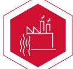

## 投入优质处理设施

配备甲苯回收、RTO处理、布袋除尘、活性炭处理、低氮燃烧器等多套高标准废气处理设备，为废气达标处理提供坚实硬件保障。

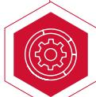

## 实现全场景覆盖治理

废气治理覆盖生产、锅炉、导热油炉、废水处理等全生产场景，针对性配置各类适配治理设施，做到全面无遗漏。

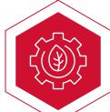

## 采用差异化处理工艺

针对不同生产环节废气特点，采用冷凝、活性炭吸附、转轮处理、RTO焚烧等适配工艺，确保处理效果。

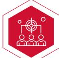

## 强化全维度监测管控

各基地建设废气在线监测系统并联网至生态环境部门，定期开展第三方监测及LDAR监测，实现全方位、常态化管控。

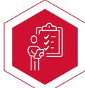

## 动态调控保障达标

根据废气在线监测数据波动，及时调控生产节奏，确保各类废气排放指标符合国家及地方相关标准。

废气处理

natural_image

Terraced rice fields in a mountain valley at sunset, with no visible text or symbols

## 废水管理

晶华新材建立全流程、规范化的废水处理管理体系，制定《污水处理站前段操作》《污水处理站后段操作》《污水处理站指标检测管理程序》等专项制度，设立专项废水处理操作人员，通过分类处理、精准监测、合规排放等举措，对各类废水实施科学管控，确保废水处理符合相关标准，兼顾环保合规与资源高效利用。

## 分类工艺处理

•配备3套差异化废水处理工艺，针对甲苯废水、白水、其他废水，分别采用三级循环树脂吸附、格栅+ 混凝沉淀、水解酸化 + 生化处理等工艺，实现废水循环利用与达标排放。

## 规范达标排放

● 废水处理后不直接排入自然水域，生活污水经150td 污水处理系统处理，溶剂回收废水经120t/d 污水处理设施处理，在线监测合格后强排至园区污水处理站二次处理，排放符合相关标准及园区要求。

## 强化监测管控

各基地安装废水在线监测设备，联网至区、市生态环境局；  
●废水、雨水实行实时在线监测，每月开展第三方监测通过在线数据自动切换外排阀门，杜绝超标排放。

## 应急培训演练

●定期组织废水处理操作人员开展专业培训，涵盖处理工艺、设备操作、指标监测、应急处置等内容；制定废水泄漏、超标排放等突发情况专项应急流程定期开展演练，防范环境风险。

废水处理

## 案例 废水回用技改 提升洁净度与回用率

2025年3月，浙江晶鑫开展造纸车间综合废水回用技改，通过在回用水总管加装布袋过滤器，有效去除杂质与胶粘物，提升回用水洁净度，解决纸张破洞、断纸问题。技改后每日新增回用水量500吨，综合废水回用率由 42.9%提升至 64.3%，实现水资源高效利用与降本增效。

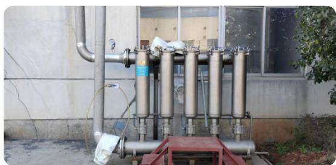

natural_image

Industrial piping system with multiple cylindrical tanks mounted on a red support frame, adjacent to a concrete wall (no visible text or symbols)

回用水总管上安装布袋过滤器

## 案例 污水处理标准化操作培训 保障废水达标排放

2025年8一9月，四川晶华组织污水处理专项培训，围绕4份核心操作规程开展系统讲解。培训覆盖污水站前段与后段设备操作、药剂投加、污泥压滤等标准流程，明确异常进水分级响应、提前报备及夜间管控要 求， 规 范 pH、COD、SS 等关键指标检测频次与异常处置措施。本次培训提升操作人员专业技能与合规意识，保障污水稳定达标排放，筑牢厂区水环境风险防控防线。

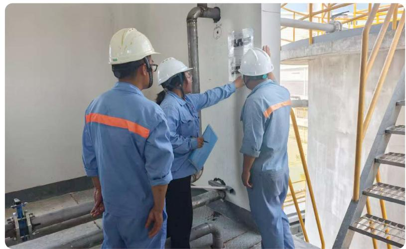

natural_image

Three workers in blue uniforms and white hard hats inspecting a concrete structure with pipes and scaffolding (no visible text or symbols)

污水处理培训

## 噪声管理

晶华新材各子公司规范开展厂区噪声管控工作，各生产基地结合产线特点优化设备布局，推行自动化密闭生产，优先选用低噪声设备，并通过建筑隔音、吸音处理等措施强化车间噪声治理，有效降低对外环境影响。公司定期委托第三方专业机构开展厂界噪声监测，确保排放持续符合国家标准要求

## 危险化学品管理

晶华新材构建全链条危险化学品安全管理体系，不断加强危险化学品全生命周期风险防控。公司下属子公司四川晶华针对危化品采购、运输、储存、使用及废弃处置全流程，制定《危险化学品安全管理制度》，明确各部门职责与重点环节管控要求；对所有危化品严格执行“一书一签”、专项培训、专用仓库储存等规范，对易制毒化学品实施更严格的购买备案等专项管控，确保危化品管理合规可控、安全有序。

## 影响、风险和机遇管理

晶华新材建立覆盖全生产环节、全部门、全流程的污染物识别与风险管控机制，围绕造纸、热熔胶、制胶、涂布、仓储、污水处理等全场景，系统识别废水、废气、噪声、化学品泄漏等各类污染物排放与环境风险，按评分标准开展分级评价明确重要环境因素。公司形成“源头识别一过程分析一分级管控一持续改进”的闭环管理，精准防控污染物相关环境风险保障生产经营合规与生态环境安全。

## 指标与目标

晶华新材以全周期污染物管控为核心，建立分阶段、可量化的治理目标，明确责任分解与跟踪机制，推动各基地在合规排放的基础上，持续提升清洁生产水平与环境管理绩效。

## 四川晶华污染防治目标

建立2026—2028 年单位产值三废处理考核及减量目标，分解至各部门并定期跟进。

2026年废水排放各项指标浓度较2025年下降。

2026 年锅炉主要 NOx废气排放指标浓度较2025 年下降。

<table><tr><td>指标</td><td>单位</td><td>2025年</td></tr><tr><td>废气排放总量</td><td>吨</td><td>34,494.13</td></tr><tr><td>氮氧化物(NOx)排放量</td><td>吨</td><td>8.74</td></tr><tr><td>硫氧化物(SOx)排放量</td><td>吨</td><td>3.12</td></tr><tr><td>颗粒物(PM)排放量</td><td>吨</td><td>5.02</td></tr><tr><td>废水排放总量</td><td>吨</td><td>567,019.69</td></tr><tr><td>化学需氧量(COD)排放量</td><td>吨</td><td>40.40</td></tr><tr><td>氨氮(NH3-N)排放量</td><td>吨</td><td>1.15</td></tr><tr><td>总氮(TN)排放量</td><td>吨</td><td>6.41</td></tr><tr><td>非甲烷总烃排放量</td><td>吨</td><td>32.88</td></tr></table>

污染物排放指标  
注：污染物数据为公司下属子公司江苏晶华、浙江晶鑫、四川晶华加总数据。

## 废弃物管理

晶华新材以体系化治理为核心，构建权责清晰、流程闭环的废弃物管控机制，将战略规划与全流程风险管控深度融合。公司通过标准化管理、技术技改与全员赋能协同发力，建立科学的指标监测体系，实现废弃物管理合规可控与绿色发展的双向赋能。

## 治理

晶华新材建立完善的废弃物管理体系，制定《废弃物管理程序》《废弃物处置管理制度》《危险废物管理制度》等系列制度文件遵循减量化、资源化、无害化基本原则，坚持源头减量与全过程管控。公司构建分级负责、归口管理、全员落实的危废管理责任体系，对危险废物实施收集、贮存、转移、处置全流程规范管控，并将危废异常产生与排放纳入月度安全绩效考核确保废弃物管理合规、风险可控、全程可追溯。

<table><tr><td>岗位/部门</td><td>核心职责</td></tr><tr><td>董事长</td><td>·作为危废管理第一责任人,统筹危废管理决策,建立健全危废管理责任制,组织危废相关事故调查与责任追究。</td></tr><tr><td>总经理</td><td>·协助董事长统筹危废管理工作,组织编制危废应急预案及演练,协调解决危废管理相关环保问题。</td></tr><tr><td>EHS管理部</td><td>·作为危废管理日常归口部门,制定危废防治措施,监督各项管控要求落地执行,开展危废相关事故调查,落实环保“三同时”要求。</td></tr><tr><td>各业务部门</td><td>·负责本部门危废管控工作,组织员工开展危废管理相关培训,推进危废源头减量与无害化处置。</td></tr><tr><td>环保工程师</td><td>·严格执行环保相关法规,编制危废管理相关制度,开展危废管理隐患排查,负责应急预案备案及环保申报工作。</td></tr><tr><td>危废仓库管理员</td><td>·规范开展危废贮存、分类存放工作,如实做好台账记录,参与危废相关应急演练。</td></tr></table>

四川晶华危废管理架构及职责

## 战略

晶华新材建立规范化、闭环式固体废物管理体系，严格遵循环保法规，对一般固体废物与危险废物实施分类管控、分级落实明确处置标准、管控流程与责任要求，实现“一般固废资源化、危险废物规范化、生活垃圾无害化”，确保各类废物处置合规风险可控。

## 一般固体废弃物处理

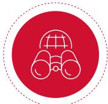

一般工业固废：包括废纱布、边角料、废纸筒、无毒包装等，统一交由合规单位回收利用，提升资源利用率。  
生活垃圾：统一收集后由环卫部门进行卫生填埋，实施全流程合规闭环管理。

## 危险废弃物处理

●分类收集与包装：对废活性炭、废胶残渣、废机油、危化品包装等危废分类规范盛装、张贴专用标签液体危废做好防渗漏，固体危废密闭打包，严格控制装载量，严禁混存禁忌物料。  
●贮存场所管理：危废暂存点固定分区、隔离防护，具备防雨、防渗、防晒等防护条件，严格限制单点位贮存总量。  
●入库与台账管理：规范称重入库流程，使用危废终端优化入库操作、缩短入库时间；入库时严格验收核对标签与分类情况，建立完整管理台账，确保账物一致、全程可追溯。  
●转移与处置管理：严格执行危废转移联单与审批流程，委托有资质的单位进行安全处置，严禁擅自转移、处置危险废物。  
·培训与应急管理：定期开展危废管理相关培训，明确危废泄漏、丢失、火灾等应急处置流程，组织管理人员定期参与应急演练，确保突发情况快速响应、及时上报。

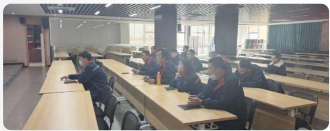

natural_image

Group of people seated at long wooden desks in a conference room, wearing masks and uniforms (no visible text or signage)

江苏晶华危废培训  
废弃物分类管理

## 案例 提升纤维回收效率 减少造纸固废产生

2025年4月，浙江晶鑫对打浆车间开展细小纤维回收技改，在白水塔底部加装浆泵与厢式过滤装置，对白水压滤处理，将回收纤维重新碎浆使用。项目每日减少纤维流失约500千克，生产每吨纸的木浆消耗降低10千克每年减少造纸污泥产生量500吨(固含量30%)，有效降低固废排放，提升生产清洁化水平。

## 案例 危废全流程管控培训 强化 EHS 合规管理

2025年7月，四川晶华开展内江工厂危险废物管理专项培训。培训解读相关法律法规与危废环境危害，明确危废识别标准与分类流程，覆盖废机油、废胶渣、废包装等10类厂区危废，并从产生、收集、贮存、转移、处置全环节规范操作要求，建立台账与标识管理体系。本次培训提升全员危废合规意识与操作能力，筑牢危废全生命周期管理防线，保障企业绿色合规生产。

Ginnva

晶华新材

相关法律法规及危害

危险废物识别

厂内危险废物全过程管控

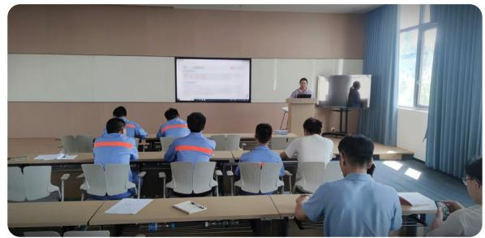

text_image

Classroom scene with students in blue uniforms and a presenter at the front, projected screen displaying Chinese text, and a projector on the front.

危险废物管理培训

## 影响、风险和机遇管理

晶华新材建立覆盖生产、仓储、采购、管理等环节的风险与机遇管控体系，对废弃物相关环境风险开展识别与评估，明确各部门职责。公司通过制定环境运行，固废处置，应急响应等控制程序，落实分类管控，合规处置与定期监测，有效防范废弃物违规处置引发的罚款，停产等风险，以合规管理与持续改进提升环境管理水平，确保生产运营符合环保法规要求。

## 指标与目标

<table><tr><td>指标</td><td>单位</td><td>2025年</td></tr><tr><td>有害废弃物总量</td><td>吨</td><td>1,150.03</td></tr><tr><td>无害废弃物总量</td><td>吨</td><td>1,487.82</td></tr></table>

废弃物指标

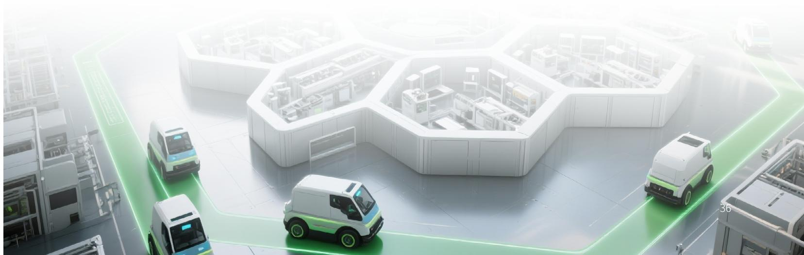

natural_image

Futuristic factory interior with autonomous vehicles and automated assembly lines (no visible text or symbols)

## 应对气候变化与能源

晶华新材秉持“节能低碳，绿色发展”理念，积极响应国家“双碳”目标，制定《能源和资源管理程序》《节能降耗控制程序》等制度，以技术创新与管理优化为核心抓手，围绕能源管理、生产工艺、绿电替代等关键领域，系统性推进节能降碳工作实现能源利用效率提升、碳排放强度下降与运营效益增长的协同发展。

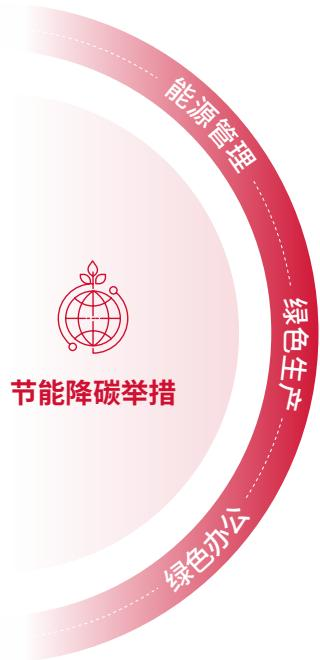

flowchart

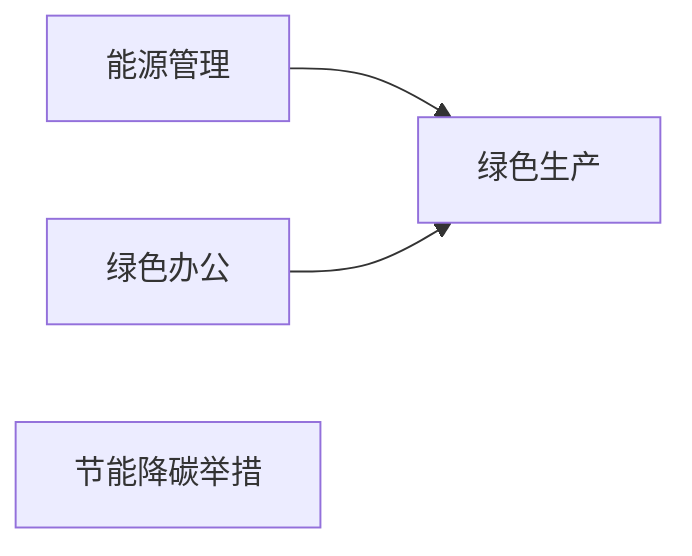
```mermaid
graph LR
  A["能源管理"] --> B["绿色生产"]
  C["绿色办公"] --> B
  D["节能降碳举措"]
```

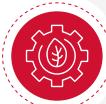

●投资建设先进的能源监测系统，实时监控能源消耗情况，及时发现并解决能源浪费问题。  
●构建能源管控体系，通过工艺优化、排产策略调整及智能改造等方式，实现设备按需运行与余能共享，显著降低单位产品能耗  
●大力推进绿电替代，通过购买绿电、投用“自发自用、余电上网”分布式光伏等方式，提升可再生能源消费占比，减少传统电力依赖与碳排放。  
持续淘汰高耗能设备，升级低耗能系统，提升能源利用效率，实现降本增效。

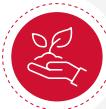

深化工艺优化，显著降低单位产品能耗与危废排放，同时减少温室气体排放。  
●升级清洁生产水平，通过智能改造等项目，持续改进生产过程环境表现，推动绿色制造落地。

●提倡电子化办公，减少纸质文件使用，鼓励员工通过电子邮件，电子文档等方式进行信息传递与存储。  
●优化办公设备设置，启用设备自动休眠或关机功能，减少能源浪费。  
●推广垃圾分类，设置分类垃圾桶，加强员工对垃圾分类的认识与执行，践行绿色办公理念。

## 案例 精准合成节能智造低碳生产效能升级

2025年，晶华新材合成车间针对单位产品能耗偏高问题，以技术与管理双轮驱动推进节能降耗。通过工艺优化提升单釜产能 10%—45%，并实施“同系列产品连续生产”排产策略，减少 30% 非必要设备启停损耗。全年成效显著，水胶单位蒸汽、用电分别下降11.29%、24.45%，油胶单位蒸汽、用电下降13.33%、17.14%，单位危废排放降幅达36.84%。项目有效降低碳排放强度，强化节能管理体系，实现环境绩效与运营效益双赢。

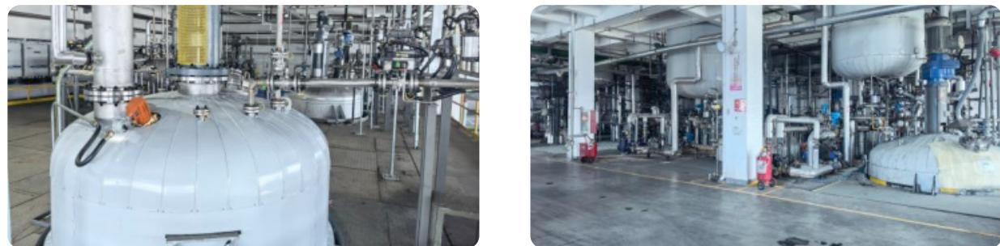  
合成车间

## 案例 回收系统迭代升级 绿色循环价值提升

2025年2月，江苏晶华启动回收系统改造，将原高能耗系统升级为成熟的低耗回收系统，历经安全论证、方案评审、施工、调试及试生产等全流程管控，项目最终通过完工验收并荣获2025年公司项目奖。改造后，每吨回收甲苯成本降低1.010元，年降本约800万元，同时年节约蒸汽21,000吨，减少碳排放2,280吨，显著提升能源利用效率与绿色发展水平。

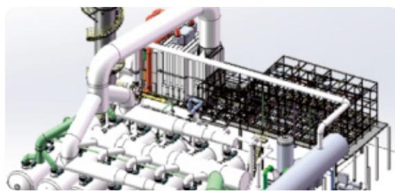

natural_image

3D rendering of an industrial piping and storage system with pipes, valves, and a central tower (no visible text or labels)

回收系统改造

## 报告期内

江苏晶华购买绿电

7,768,000 KWh

厂区光伏发电

33,726,493 KWh

安徽晶华启动总装机容量

0.6699

MW的屋顶光伏项目

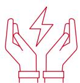

浙江晶鑫2.9MW 分布式光伏项目年均发电量约

313.4 万 KWh

全年实际发电

308.57 万KWh

占总用电量

9.85%

同比提升

1.19%

年节约标准煤约

947.59 吨

减少二氧化碳排放约

3,097.46 吨

## 案例 烘箱智能供风改造 绿色用电效率倍增

2025年4月，电子材料事业部针对烘箱进排风与生产参数不匹配、低速高耗导致电能浪费问题，开展智能控制改造。通过采集分析运行数据，优化控制逻辑，实现进排风频率随机速，胶宽，胶厚等生产参数动态调节，真正做到“按需供风”。截至报告期末，改造后烘箱累计节电66.27万度，能源利用效率大幅提升，折算减少温室气体排放约378吨，有力推动公司节能减排与绿色制造落地。

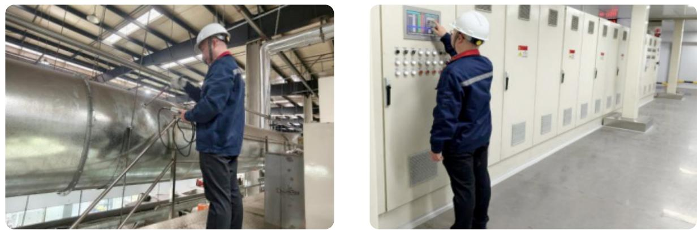  
智能控制

## 案例 车间冷水系统改造 实现节能降本增效

2025年6月一10月，江苏晶华实施冷水系统改造。通过维修六车间制冷系统、改造七车间制冷机房、联通两车间冷冻水主管，实现制冷能力共享与余冷利用。项目共节省建设投资351.35万元，每年可节约六车间冰机运行费用63.1万元、节约新建机房运行费用41万元，有效降低能耗与运营成本，为车间稳定生产提供高效节能保障。

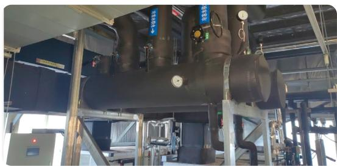

natural_image

Industrial machinery setup with large cylindrical tanks and piping (no visible text or symbols)

车间冷水系统改造

<table><tr><td>指标</td><td>单位</td><td>2025年</td></tr><tr><td>外购蒸汽量</td><td>万吨</td><td>26.48</td></tr><tr><td>外购燃油量</td><td>升</td><td>16,000</td></tr><tr><td>外购电量</td><td>万千瓦时</td><td>10,461.09</td></tr><tr><td>外购天然气量</td><td>万立方米</td><td>1,653.36</td></tr><tr><td>太阳能使用量</td><td>千瓦时</td><td>7,873,668</td></tr></table>

能源消耗情况

## 资源利用与循环经济

晶华新材坚持资源高效利用与循环经济发展理念，以技术改造和模式创新为重要抓手，通过废水回用技改、内部循环体系搭建等举措，推动发展模式从线性消耗向闭环循环转型，构建绿色可持续发展体系，实现经济效益、环境效益与社会效益的协同提升。

## 报告期内

公司循环利用200L开口桶、吨桶约

3,200 吨

使用FSC环保纸张

670吨

包材回收利用率为

60%

## 案例 纸管循环利用构建闭环循环经济模式

2025年5月，晶华新材建立内部纸管循环利用体系，对生产用后纸管开展规范回收、检验与二次复用，使单根纸管使用寿命延长一倍。项目有效减少原材料消耗与废弃物产生，将传统线性消耗模式升级为闭环资源循环模式，降低运营成本。截至报告期末，累计重复利用纸管52,800根，相当于保护约999棵胸径30cm的成年树木免遭砍伐，以实际行动践行循环经济与绿色低碳发展理念。

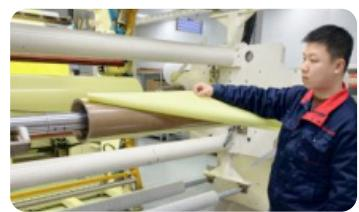

natural_image

Factory worker operating machinery with large yellow yarn rolls (no visible text or symbols)

纸管循环利用

## 案例 蒸汽凝结水回收工程 余热利用节能降本

2025年10月，江苏晶华实施三车间蒸汽凝结水回收利用工程，将一、二、五车间产生的蒸汽凝结水统一收集，通过新增水泵、管网及控制系统输送至三车间制冷机房，优先采用余热板换制备空调热水，异常时切换蒸汽系统兜底保障。项目实现凝结水资源闭环循环利用，减少新鲜水与蒸汽消耗，每年节约蒸汽费用45万元，显著提升余热利用率。

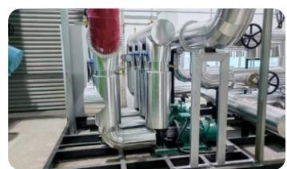

natural_image

Industrial piping and valves in a factory setting (no visible text or labels)

蒸汽凝结水回收利用

<table><tr><td>指标</td><td>单位</td><td>2025年</td></tr><tr><td>取水量</td><td>吨</td><td>1,039,154</td></tr><tr><td>循环用水总量</td><td>吨</td><td>804,757</td></tr><tr><td>耗水总量</td><td>吨</td><td>462,206.31</td></tr></table>

水资源使用情况

## 社会篇

## 理念

晶华新材始终坚守企业社会责任，将责任理念深度融入经营发展各环节，兼顾创新发展、产品质量、安全保障与人文关怀，从赋能员工成长、守护客户权益、筑牢供应链韧性，到回馈社会公益，全方位践行责任担当，与员工、客户、伙伴及社会各界携手，共筑可持续发展的美好未来。

## 我们的行动

创新驱动 43  
· 产品服务安全与质量 48  
• 数字化建设与安全隐私保护  
供应链安全 56  
雇佣与薪酬 59  
• 人才培训发展 63  
员工关怀 68  
职业健康与安全 71  
赋能社会 74

## SDGs 对标

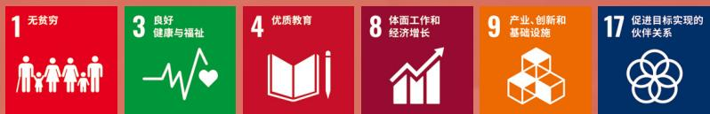

natural_image

Close-up of hands clasping on a wooden table with documents and charts in the background (no visible text or symbols)

## 创新驱动

公司坚持以技术自主创新为核心发展理念，构建完善的研发治理架构与激励体系，聚焦高分子材料底层技术突破与高端产品应用转化，兼顾绿色创新与知识产权保护，通过产学研协同发力，系统性管控创新风险、抢抓发展机遇，以持续创新赈能企业高质量发展与产业链升级。

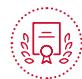

## 荣誉资质

报告期内，公司获得“江苏省省级企业技术中心”“江苏省新型显示产业2025年度参访标杆单位”等荣誉，江苏晶华获得CNAS 国家实验室认可

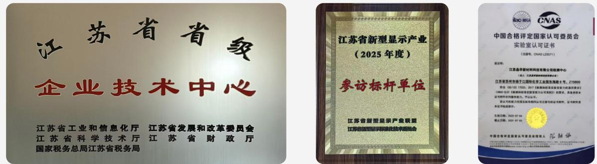  
荣誉奖牌

## 治理

公司采用基础研究与应用开发相结合的研发模式，系统性地建立研发体系，制定《研发（应用开发）项目管理与激励办法》研发项目的最高管理机构由总裁、各事业部及生产基地负责人、核心职能部门第一负责人组成，各事业部结合自身项目实际情况，定期汇报工作成果。

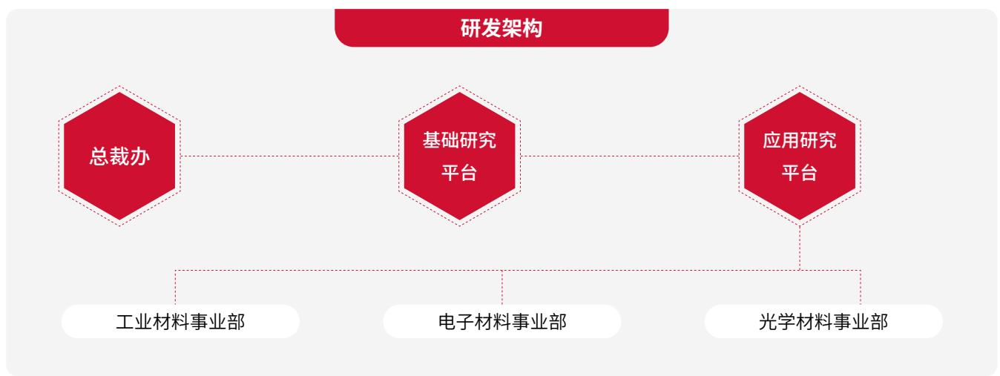

flowchart

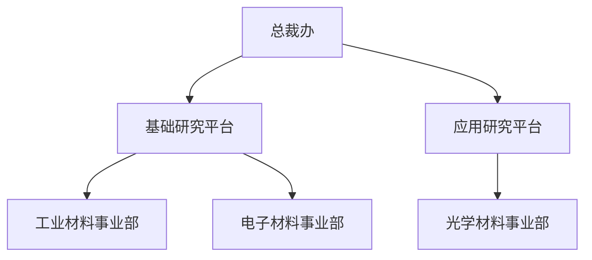
```mermaid
graph TD
  A["总裁办"] --> B["基础研究平台"]
  A --> C["应用研究平台"]
  B --> D["工业材料事业部"]
  B --> E["电子材料事业部"]
  C --> F["光学材料事业部"]
```

研发工作汇报机制

## 汇报形式

## 专项报告

## 进展报表

## 常态化沟通汇报

## 汇报内容

针对重大创新战略调整、核心技术突破、创新项目重大进展及问题，提交专项书面报告并附相关数据及佐证材料。

聚焦创新培训成效、研发课题推进、政策申报、成果转化等日常工作，形成量化清晰的报表。

结合月度例会、季度复盘会，采取口头汇报与书面材料相结合的方式，同步工作动态。

## 汇报频率

日常进展报表按月提交

季度通过复盘会同步季度创新工作汇报，汇总阶段性成效、存在问题及下一步计划；

半年度、年度提交全面书面汇报，系统总结创新工作整体推进情况、成效亮点、不足及下一期工作部署；

重大事项、紧急问题实行即时汇报，确保信息传递无延迟。

## 战略

公司以技术自主创新为核心，构建“基础研究+应用转化+产学研协同”的一体化创新体系，持续加大研发投入，聚力攻坚关键核心技术，以创新驱动产品迭代，效能提升与新业务拓展，为高质量发展提供坚实支撑

基础研究：构建自主可控的高分子材料底层技术平台

核心机理：钻研高分子空间结构设计与交联结构设计，持续创新化工合成工艺。前沿探索：布局可降解材料、生物基材料等，应对未来环保趋势。

应用转化：将核心技术快速转化为高附加值产品，实现国产化替代与市场领先

主攻方向：聚售工业（大交通、医疗、电子元器件）、电子胶粘材料（动力电池汽车制造）、光学胶膜材料（消费电子、新型显示）高端赛道

关键成果：开发系列化高性能产品，在重点领域打破国际垄断，实现对进口品牌的迭代与替代

工艺优化：通过精密涂布等工艺实现降本增效，并推出可降解包装胶带等绿色新产品。

产学研协同：构建开放创新生态，加速技术突破与储备

客户联合研发：与面板企业、新能源汽车厂商、消费电子等终端客户直接对接，基于具体需求进行共同开发。

院校机构合作：与高校及科研机构建立合作，在阻燃、抗缓冲等领域进行技术储备与人才交流。

产业伙伴联盟：与国际化工巨头开展战略合作，共同开发环保、高性能的可持续材料。

创新研发战略

## 绿色产品

公司把握清洁生产与绿色低碳技术发展机遇，以高性能、低环境负荷的产品方案，推广环保型材料、可循环技术与高效工艺助力下游产业降低生产能耗与碳排放，减少挥发性有机物及有害物质的产生与排放，推动产业链绿色升级。

<table><tr><td colspan="2">研发方向</td><td>核心优势/环保性能</td></tr><tr><td rowspan="3">工业粘胶材料</td><td>低VOC产品</td><td>采用水性或无溶剂性原料以及应用配方,使产品VOC释放量远低于国家及行业标准限值;从原料端优化配方体系,减少挥发性有机物产生,生产与应用过程无刺激性异味,兼顾粘接性能与环境友好性,适配工业制造车间清洁生产要求,降低对作业环境与人体健康的影响。</td></tr><tr><td>可降解、可回收胶粘剂研发</td><td>可降解款依托生物基改性技术,使用后可自然降解,降解率超过90%,大幅减少工业包装、制程辅材的塑料废弃物污染;可回收款实现胶带可随纸箱重新造浆板,基材回收率超85%,助力工业生产循环物料利用,降低企业原料消耗与固废处理成本。</td></tr><tr><td>去溶剂计划</td><td>全面推进溶剂型粘胶材料向无溶剂、水性体系升级,从生产源头摒弃有机溶剂使用,实现生产环节无VOC排放、无溶剂残留,同时简化生产工艺、降低能耗,成品储存与使用更安全,适配下游大交通、医疗等行业的绿色生产规范,报告期内使用水性胶粘剂超过5,000吨,占所有胶粘剂使用量超过15%</td></tr><tr><td rowspan="2">电子胶粘材料</td><td>座椅应用优化</td><td>快速高效粘接,改善现有刷胶制程晾干等待时间,让制程更快捷、节省时间;同时改善刷胶制程脏乱现象,产品无苯化、无甲醛、低气味、低VOC。</td></tr><tr><td>轮胎降噪应用优化</td><td>采用AB型双面胶带结构设计,一面高效粘接吸音棉,另一面可牢固粘住轮胎内壁,可耐-40°C到100°C的温度范围。</td></tr><tr><td rowspan="3">光学胶膜材料</td><td>生物基胶粘材料</td><td>以可再生生物质(农作物、林木等)为原料,制备PSA压敏胶与OCA光学胶。在保证终端应用性能不下降的前提下,生物基含量可达76%以上,且生物基PSA产品实现无甲苯化,显著降低碳排放,助力碳中和,配方更加绿色环保。</td></tr><tr><td>无溶剂光固化技术</td><td>采用无溶剂紫外光固化体系,从源头摒弃有机溶剂,实现无VOC排放、无溶剂残留。相较于传统热固化,可在常温、短时、低能耗条件下完成深度固化,从生产到应用全流程显著降低碳足迹,契合绿色低碳合规要求,同时具备高效低耗、高可靠贴合优势,适配消费电子、车载、工控等高端显示领域升级需求。</td></tr><tr><td>可回收胶粘剂技术、光热解粘技术</td><td>通过外加电场触发可控解粘,突破“粘接易、拆解难”的行业痛点,解粘过程具备响应快、可控性强、无残留、对元器件损伤小的优势,实现精密电子零部件的无损、高效回收,大幅提升电子产品维修复用率与资源化水平,支持循环经济。</td></tr></table>

产品研发成果

## 知识产权保护

公司持续完善知识产权管理体系，总裁办统筹专利规范管理、制度制定与跨部门协调，事业部主导专利布局与技术转化应用开发部负责专利申请全流程落地，人力行政中心、法务部等职能部门分别提供培训支持与法律保障，共同推进专利工作开展。报告期内，公司修订《专利激励制度》，对发明专利、实用新型专利分阶段发放奖励，同时设置市场转化奖励重大技术突破专项奖励，将专利成果纳入员工荣誉体系与晋升考核，激发员工创新积极性，明确知识产权归属，推动专利成果转化。

## 案例 专利培训系列赋能，夯实知识产权工作根基

2025年，公司围绕专利工作核心需求，组织开展《专利挖掘与技术交底书撰写》《专利撰写问题复盘》专项培训。培训聚焦专利挖掘实操、撰写问题梳理与优化两大核心，系统讲解专利挖掘方法、技术交底书规范撰写要点及常见问题整改策略，助力参训人员精准掌握专利实务技能。两场培训有效解决了专利撰写中的痛点、难点问题，全面提升员工专利实操能力与专业素养，为公司高质量开展知识产权工作、强化技术成果转化提供了坚实的人才支撑与实践指导。

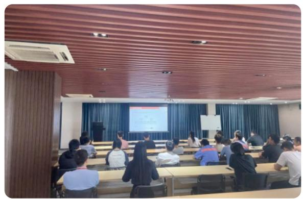

natural_image

Interior view of a conference room with attendees seated at desks facing a presentation screen (no visible text or signage)

培训现场

## 创新激励

公司致力于长期投资创新，与研发团队共享成长价值，建立了《研发(应用开发)项目管理与激励办法》，通过设定明确的“里程碑奖励”和“项目提成奖励”双重激励，根据项目的前瞻性、市场潜力与客户价值，将项目分为 A、B、C 三类，对面向战略及重要客户、具备高成长性的新产品研发成果予以丰厚回报，持续激发技术创新活力，巩固市场竞争力。

## 产学研合作

为提升在高性能有机高分子材料领域的原始创新能力，公司积极构建开放协同的产学研合作生态。报告期内，公司与华东理工大学正式签署产学研战略合作协议，共建“高分子联合研发中心”，将合作聚焦于固态电池适配材料、耐高温胶粘剂等关键材料的分子设计与制备。同时，公司与复旦大学高分子科学系开展了深入的产教融合及研学活动，积极参与“AI for Polymers（人工智能高分子材料）”等前沿研讨会，共同探索材料研发的智能化新范式。

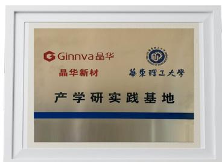

text_image

Ginnva晶华
晶华新材
華東理工大学
产学研实践基地

与华东理工大学共建“产学研实践基地”

此外，公司依托研发成果，主导制定了多项团体及行业标准。通过将前沿科研、人才培养与产业实践深度融合，公司正系统性地构筑从技术研发到标准引领的创新链条，为行业的规范化与高质量发展贡献力量。

<table><tr><td>方向</td><td>标准名称</td><td>状态</td></tr><tr><td>绿色环保</td><td>全降解植物基美纹纸胶带技术规范(T/EJCCCSE 502-2025)</td><td>主导制定</td></tr><tr><td rowspan="3">电子胶粘材料</td><td>汽车外饰用丙烯酸泡棉胶带(T/TMAC 077-2025)</td><td>主导制定</td></tr><tr><td>新能源汽车电池包用阻燃压敏胶带技术要求(T/SHPTA 064-2025)</td><td>主导制定</td></tr><tr><td>动力电池用压敏胶带性能测试方法(T/TMAC 151-2025)</td><td>参与制定</td></tr><tr><td rowspan="3">光学胶膜材料</td><td>车载显示屏用OCA光学胶技术要求及试验方法(T/CAQI 473-2025)</td><td>参与制定</td></tr><tr><td>柔性显示屏用OCA光学胶技术要求及性能试验方法(T/CAQI 474-2025)</td><td>参与制定</td></tr><tr><td>全贴合OCA光学胶(T/CIET 930-2024)</td><td>参与制定</td></tr></table>

报告期内公司及子公司参与的标准制定

## 影响、风险和机遇管理

公司以《信息安全管理规定》和《监视测量装置控制程序》等制度为基础，保障研发数据的安全、准确与可追溯。公司通过市场与技术扫描前瞻识别风险与机遇，并在项目执行中依托数据记录进行定期的节点评审与里程碑监控，及时发现技术瓶颈或进度偏差。针对识别出的问题，公司通过专项排查机制深入分析，并依据预设路径进行决策与应对，形成“识别一监督一决策一行动一复盘”的完整管理流程，从而系统性地驾驭创新不确定性，在管控风险的同时把握战略机遇。

## 指标与目标

## 目标

知识产权未来3一5年目标：实现知识产权管理规范化、制度化，优化专利布局与申请质量数量推动发明专利通过率达到行业平均水平，构建全员参与的创新保护格局。

长期目标：完善知识产权管理体系与企业文化建设，提升创新、保护、利用及管理能力，加大专利等知识产权申请力度。

## 关键绩效

研发投入

8,587.78万元

研发投入占营业收入的比例

3.96%

研发人员数量

264人

研发人员占比

14.67%

申请专利总数

343 项

授权专利总数

128 项

授权软件著作权总数

19 项

持有有效专利总数

102 项

持有有效软件著作权总数

19 项

## 产品服务安全与质量

公司恪守“诚信为本、顾客满意”的宗旨，将产品服务安全与质量视为核心管理议题，贯穿于从研发、生产到交付、服务的全流程。公司致力于通过健全的治理架构、前瞻的战略规划与严格的闭环管理，持续为客户创造可靠价值

## 治理

晶华新材建立了“事业部垂直管理、专业职能矩阵协同”的产品质量与客户服务管理架构。公司各事业部内设完整的品管部门结合事业部实际情况制定《质量HSF手册》《不合格品控制程序》《客诉处理管理规定》等制度，确保各业务板块质量与服务的自主闭环管理，保障全公司产品质量的稳定性与客户服务响应的及时性，支撑公司整体品牌的可靠性与客户满意度报告期内，江苏晶华、安徽晶华、浙江晶鑫ISO9001质量管理体系认证均在有效期内，江苏晶华持有IATF16949质量管理体系认证。

## 岗位 / 部门

## 品管部经理

IQC、IPQC、FQC、OQC 等职能组

专职售后工程师、技术员

质量工程师、体系专员

## 核心职责

制定并落实本事业部的质量方针与目标，建立和维护质量管理体系，监督从原材料、生产过程到成品的全流程质量控制，主导重大质量问题的分析与改进，处理客户投诉并负责团队建设、跨部门协同及质量数据报告

从进料检验、过程巡检、成品检验到出货检验的全流程质量控制闭环

对接客户反馈

专职负责体系维护、审核与持续改进

产品质量与客户服务管理架构  

## 荣誉资质

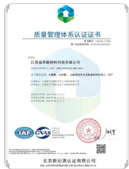

text_image

质量管理体系认证证书
证书号：JG-042113899
统一社会信用代码：91320100MA2D5X2B2D2013
江苏晶华新材料科技有限公司
注册地址：江苏省南京市中山东路68号
经营范围：电子元器件、半导体、太阳能及风能新材料的设计、生产
注册地点：江苏省南京市中山东路68号
经营期限：2024年06月11日至2024年06月11日
企业类型：有限责任公司
企业编号：JG-042113899
IAF CNAS
北京新纪源认证有限公司
地址：北京市朝阳区建国路1号院东区北四环西路188号10层

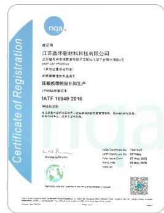

text_image

证书号
江汉县华新材料科技有限公司
Jiangyang Huaxia Material Technology Co., Ltd.
JiangYuan Huaxia Material Technology Co., Ltd.
JiangYuan Huaxia Material Technology Co., Ltd.
JiangYuan Huaxia Material Technology Co., Ltd.
JiangYuan Huaxia Material Technology Co., Ltd.
JiangYuan Huaxia Material Technology Co., Ltd.
JiangYuan Huaxia Material Technology Co., Ltd.
JiangYuan Huaxia Material Technology Co., Ltd.
JiangYuan Huaxia Material Technology Co., Ltd.

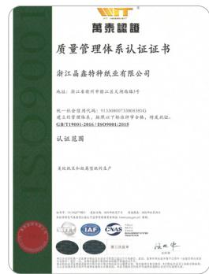

text_image

萬泰證證
质量管理体系认证证书
浙江晶鑫特种纸业有限公司
地址：浙江省衢州市南浔区天元南路5号
统一社会信用代码：9133008733600181G
建立作者资格，批准宁波经济技术合作，特发此证。
GB/TJN00-2016、ISO9001-2018
认证范围
系统及技术和所属国的生产
WAT  COUPERS, BHAO, HANZHEN, ZHEJIANG, PANRAZU
HUA TIN, JIAO, YUNYU, ZHUAN, YIYU, ZHONG, YIYU
三重试验
汪明华

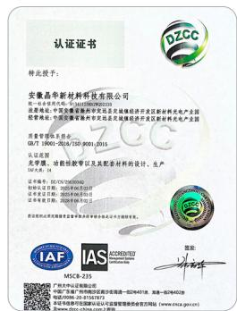

text_image

认证证书
DZCC
转北授予：
安徽鼎华新材料科技有限公司
地址：安徽省合肥市政务文化新区天鹅湖经济开发区新材料基地电化公园
邮政编码：100001-200002
经营范围：从事新能源汽车相关设备及配件的设计、生产、销售、安装、调试、维护、维修、保养、维护、维护、维护、维护、维护、维护、维护、维护、维护、维护、维护、维护、维护、维护、维护、维护、维护、维护、维护、维护、维护、维护、维护、维护、维护、维护、维护、维护、维护、维护、维护、维护、维护、维护、维护、维护、维护、维护、维护、维护、维护、维护、维护、维护、维护、维护、维护、维护、维护、维护、保护
注册号：916571（2001）243428（2001）2513
认证机构：
光学源、太阳能的效率以及其配套材料的设计、生产
ISO 178-14
证书编号：ZC/CY/2018000
授权人：王立明  国际业务许可证
注册号：国用证
注册号：国用证
注册号：国用证
注册号：国用证
注册号：国用证
注册号：国用证
注册号：国用证
注册号：国用证
注册号：国用证
注册号：国用证
注册号：国用证
注册号：国用证
注册号：国用证
注册号：国用证
注册号：国用证
认证机构：
IAF
AIS
ACREDUZ
China National Association of Industrial and Commercial Bank of China (Co., Ltd.)
中国证券登记结算有限责任公司深圳分公司
www.csco.com.cn

各子公司质量管理体系认证

## 战略

公司围绕“全员参与、持续改进、品质卓越、顾客满意”的质量方针，构建了涵盖全生命周期管理、能力建设与流程优化在内的战略行动体系，通过标准化作业、全员改善、专项培训及流程再造，将质量与服务理念转化为具体实践，驱动运营水平持续精进，确保质量方针有效落地。

## 质量方针

## 全员参与

质量需要每个部门、岗位共同参与，是公司所有人员努力的结果；

## 持续改进

质量只有不断地提升，才能在竞争中立于不败之地；

## 品质卓越

质量是公司生存和发展的基础，是实现公司策略和战略目标的必要保证，公司将不断努力提升自我，追求品质卓越；

## 顾客满意

质量以不断达到并且超越顾客满意为最终目的。

## 产品质量提升

公司将产品质量提升视为核心竞争力构建的关键，通过建立健全全生命周期质量管控体系，并广泛发动员工力量，系统性防范质量风险、消除质量隐患。

## 产品全生命周期质量管理体系

## 产品标准化检验

公司制订了来料、半成品、成品产品OC工程图，覆盖所有产品的检验流程、检验项目、检验标准、抽样频率、检测仪器、检测记录、检验负责人等。针对有害物质管理，公司相关产品系列定期委托具备资质的第三方检测机构进行有害物质检测，同时厂内进行抽测，辨别供应商有害物质报告真伪。

## 不合格品管控

针对进料、制程、成品、库存品、客户退货等全场景不合格品，公司制定《不合格品控制流程》，通过“标识一隔离一评审一处理一追踪”全流程管控，分类6级不合格品类型，规范5种处理方式，设定不同类型产品的明确处理时效，避免不合格品误用，保障产品质量与客户权益。

## 质量合理化建议

公司建立《改善提案制度》，鼓励员工从生产运营的全流程提出优化建议，对于合理建议给予一定金额的奖励。

## 能力建设

体系知识培训  
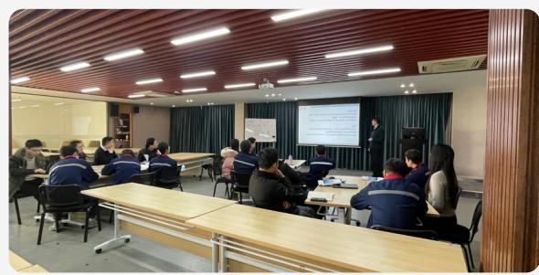

natural_image

Interior view of a classroom or training session with students seated at desks facing a presentation screen (no visible text or symbols)

光学材料事业部开展IATF 16949质量管理体系培训

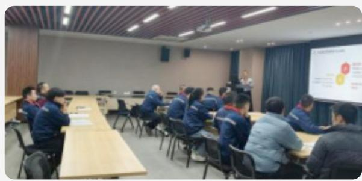

text_image

Meeting room scene with participants in blue uniforms and a presentation screen showing a pie chart and text about the 2019-2020 period.

电子材料事业部开展《CAPA(纠正与预防措施)的制定与实施)专题培训

操作规范培训  
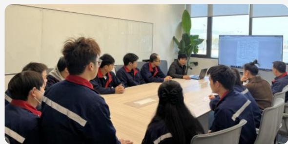

natural_image

Group of students in uniform seated around a conference table in a meeting room, with a large screen displaying a diagram (no visible text or symbols)

工业材料事业部开展《制程检验控制程序》专项培训

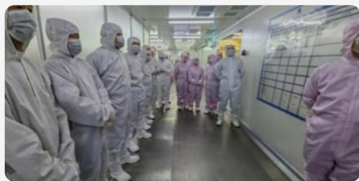

natural_image

Group of people in cleanroom suits walking down a hospital corridor, no visible text or signage

光学材料事业部开展蚊虫管理培训

## 案例 改善无尘室洁净度，提升产品质量

2025年10月，为改善光学无尘车间洁净度，防止涂布时环境中的灰尘异物进入产品，影响产品质量，公司光学事业部相关部门等20余人参与光学某车间无尘室洁净度改善活动，通过修缮设备设施硬件、关键区域二次隔离防护、提高空气过滤网净化效率、车间卫生深度清洁、定期检测各区域尘埃粒子状况并监控趋势等举措，提升了无尘室洁净等级。通过本次改善活动，该车间无尘室颗粒监测水平提升了20%

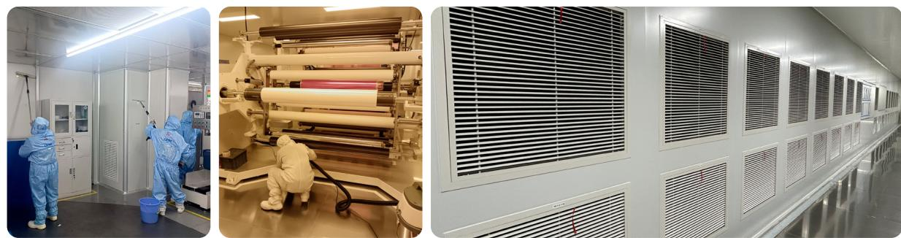  
某车间无尘室洁净度改善活动

## 客户服务

公司各事业部建立《客诉与退换货管理规定》《客诉处理管理规定》等制度文件，规范客户服务流程，依据《客户满意度调查控制程序》，每年调查客户对产品质量、交期、服务质量、信息反馈等方面的满意度，持续改进客户体验，提升客户满意度。

•客户通过电话、微信或邮件提出抱怨、投诉(含退货/换货/赔偿诉求)，明确反馈产品或交货服务相关问题；  
●客户发起反馈后，公司在6小时内主动联系客户，了解具体情况并安抚情绪。

客户提供不良样品后，公司在 3 个工作日内告知客户问题初步原因分析。

•公司主动调查问题原因，制定临时措施与改善方案，通过正式报告（或8D报告）向客户反馈，协商退货、换货、赔偿等处理方式。

## 客诉接收

## 初步原因反馈

## 解决方案沟通

## 退补货、返工支持（如需）

## 改善效果验证

## 客诉结案

·若达成退货协议，公司评估产品利用价值并安排运回或协助报废；如需补货，按协商方案及时安排补货交付；  
●若因产品问题导致客户紧急生产需返工，公司优先安排人员现场协助，或协商第三方返工事宜并明确相关费用与时效。

· 针对问题实施改善措施后，持续追踪1—3批改善品交付使用情况，向客户反馈措施有效性。

• 公司在接收到不良样品后7个工作日内完成问题原因与改善报告的正式回复；若无法按时结案，将告知客户具体结案日期及原因。

电子材料事业部客诉处理流程

公司通过深度参与行业展会、精准布局细分赛道，持续强化品牌影响力与行业地位，为客户提供优质的产品与服务。

## 案例亮相印尼汽配展拓展东南亚市场

2025年5月，公司参展印尼汽配展，重点展示汽车喷漆遮蔽胶带、汽车隐形保护膜、丙烯酸泡棉等核心产品。此次参展有效提升了公司产品海外曝光度，成功搭建与东南亚地区终端客户的沟通桥梁，建立精准客户联络渠道，为拓展东南亚汽配市场、深化海外业务布局奠定坚实基础，助力公司国际化业务发展。

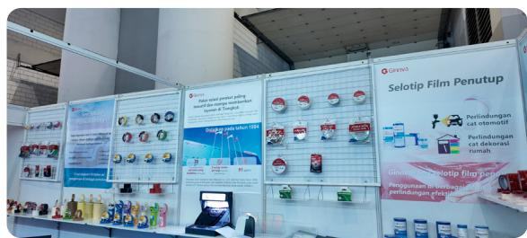

text_image

Selotip Film Penutup
Perindungan cat stomotif
Perindungan cat dekorat rumah
Selotip Film Penutup
Penugunan dan sekitar perindungan efektap

印尼汽配展

## 案例 参展上海薄膜胶带展 推广新品拓行业渠道

2025年6月，公司亮相上海国际薄膜与胶带展，重点将丙烯酸泡棉胶带作为新产品进行市场推广。此次参展为新品赢得较大行业曝光度，吸引了众多行业客户的关注与咨询，有效提升新品市场认知度，搭建优质行业客户对接渠道，为新产品市场拓展及行业合作深化积累优质资源。

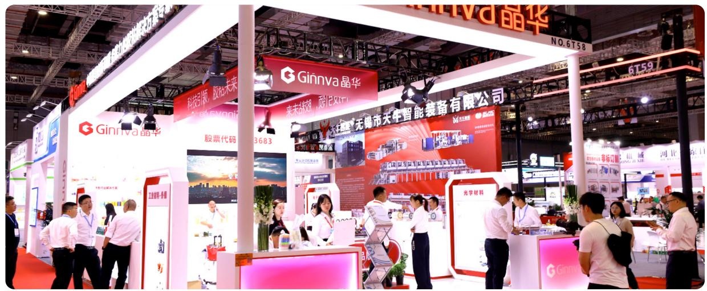

text_image

Ginnva晶华
Ginnva晶华
Ginnva晶华
Ginnva晶华
Ginnva晶华
Ginnva晶华
Ginnva晶华
Ginnva晶华
Ginnva晶华
Ginnva晶华
Ginnva晶华
Ginnva晶华
Ginnva晶华
Ginnva晶华
Ginnva晶华
Ginnva晶华
Ginnva晶华
Ginnva
Ginnva
Ginnva
Ginnva
Ginnva
Ginnva
Ginnva
Ginnva
Ginnva
Ginnva
Ginnva
Ginnva
Ginnva
Ginnva
Ginnva
Ginnva
Ginnva
Ginnva
Ginnva
Ginnva
Ginnva
Ginnva
Ginnva
Ginnva
Ginnva
Ginnwa
Ginnwa
Ginnwa
Ginnwa
Ginnwa
Ginnwa
Ginnwa
Ginnwa
Ginnwa
Ginnwa
Ginnwa
Ginnwa
Ginnwa
Ginnwa
Ginnwa
Ginnwa
Ginnwa
Ginnwa
Ginnwa
Ginnwa
Ginnwa
Ginnwa
Ginnwa
Ginnwa
Ginnwa
Ginnwai
Ginnwai
Ginnwai
Ginnwai
Ginnwai
Ginnwai
Ginnwai
Ginnwai
Ginnwai
Ginnwai
Ginnwai
Ginnwai
Ginnwai
Ginnwai
Ginnwai
Ginnwai
Ginnwai
Ginnwai
Ginnwai
Ginnwai
Ginnwia
Ginnwai
Ginnwai
Ginnwai
Ginnwai
Ginnwai
Ginnwai
Ginnwai
Ginnwai
Ginnwai
Ginnwai
Ginnwai
Ginnwai
Ginnwai
Ginnwai
Ginnwai
Ginnwai
Ginnwai
Ginnwai

上海国际薄膜与胶带展

## 案例 参展国际胶粘带薄膜展 开发海外新客户拓市场

2025年9月，公司参展中国国际胶粘带与薄膜展，携核心胶粘带、薄膜类产品亮相展会。此次参展依托行业专业平台深化品牌与产品展示，成功实现海外客户新开发，进一步丰富海外客户资源池，拓宽海外市场布局渠道为公司胶粘带与薄膜产品的海外市场拓展注入新动能，助力国际业务持续发展

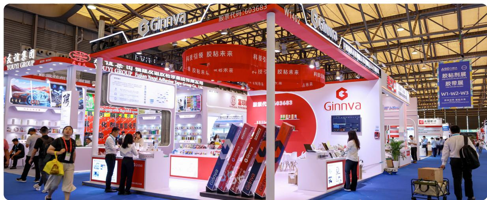

text_image

Ginnva
股票代码:603683
W1402
Ginnva
科技引领 胶粘未来
科技引领
胶粘未来
胶粘未来
胶粘未来
胶粘未来
胶粘未来
胶粘未来
胶粘未来
胶粘未来
胶粘未来
胶粘未来
胶粘未来
胶粘未来
胶粘未来
胶粘未来
胶粘未来
胶粘未来
胶粘未来
胶粘未来
胶粘未来
胶粘未来
胶粘未来
胶粘未来
胶粘未来
胶粘未来
胶粘未来
胶粘未
Ginnva
Ginnva
Ginnva
Ginnva
Ginnva
Ginnva
Ginnva
Ginnva
Ginnva
Ginnva
Ginnva
Ginnva
Ginnva
Ginnva
Ginnva
Ginnva
Ginnva
Ginnva
Ginnva
Ginnva
Ginnva
Ginnva
Ginnva
Ginnva
Ginnva
Ginnwa

国际胶粘带薄膜展

## 影响、风险和机遇管理

公司建立《风险和机遇控制程序》，定期从研发、生产、交付及售后等全生命周期环节收集信息，系统性识别与安全、合规及客户满意度相关的潜在风险和机遇。依据该程序定义的准则，对识别项的发生可能性和影响程度进行评估，确定优先级。针对中高优先级项目，制定并落实具体控制或改进措施，同时通过内审、管理评审及绩效指标监控进行动态监督与效果验证形成识别、评估、应对、监督、改进的闭环管理，从而持续管控风险，把握质量提升与市场机遇。

## 指标与目标

公司各事业部每年制定年度质量目标，各部门根据实际情况制定绩效考核标准，将管理层薪酬与目标直接挂钩，实现产品服务安全与质量目标的闭环管理。

<table><tr><td>事业部</td><td>目标</td><td>2025年完成情况</td></tr><tr><td rowspan="3">工业材料事业部</td><td>进料检验合格率持续提升</td><td>已达成</td></tr><tr><td>内部制程质量异常率持续降低</td><td>已达成</td></tr><tr><td>质量损失率持续降低</td><td>已达成</td></tr><tr><td rowspan="2">电子材料事业部</td><td>进料检验合格率持续提升</td><td>已达成</td></tr><tr><td>内部质量损失率持续降低</td><td>已达成</td></tr><tr><td>光学材料事业部</td><td>质量损失率较2024年下降</td><td>已达成</td></tr></table>

<table><tr><td>指标</td><td>单位</td><td>2025年</td></tr><tr><td>产品质量提升培训开展场次</td><td>次</td><td>52</td></tr><tr><td>产品质量提升培训总时长</td><td>小时</td><td>2,651</td></tr><tr><td>产品质量提升培训覆盖人数</td><td>人</td><td>832</td></tr><tr><td>客户投诉解决率</td><td>%</td><td>100</td></tr><tr><td>客户满意度</td><td>%</td><td>95.38</td></tr></table>

## 数字化建设与安全隐私保护

公司严格遵守《中华人民共和国网络安全法》《中华人民共和国数据安全法》《中华人民共和国个人信息保护法》等国家法规严守商业秘密保护规定，以完善的信息安全管理体系为基础，落地全维度安全保障措施，层层筑牢数据安全防线、严密守护客户隐私，在稳步推进数字化建设的同时，实现安全与发展协同并进

## 数字化建设

公司围绕生产、仓储环节落地多项智能制造升级举措，上线MFS系统，搭建智能化立体仓储，核心覆盖车间与多个仓库场景，通过自动化、智能化设备及系统应用实现作业提效、降本减错，提升生产仓储的自动化、智能化水平

## 造纸车间

投用浆包输送、纸卷包装智能输送系统。

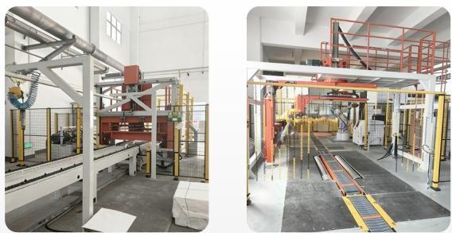  
纸卷包装输送系统

## 半成品库和丙类仓库

搭建智能化立体仓储：

• 半成品库对接纸卷输送系统实现纸料自动进出库。  
·丙类仓库通过智能物料输送及搬运设备完成自动进出库。

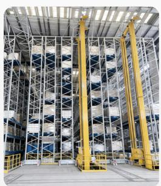

natural_image

Interior view of a large warehouse with tall shelving units and yellow robotic arms (no visible text or symbols)

原料立体仓储

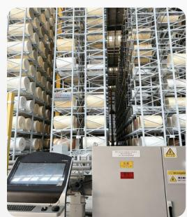

natural_image

Interior of a large automated warehouse with stacked cylindrical equipment and a control panel (no visible text or symbols)

半成品立体仓储

## 半成品、成品库

打造智能化立体仓储，进库由智能物料输送设备完成全流程自动输送定位，出库由智能物料搬运设备输送至周转场地，再由人工辅助搬运。

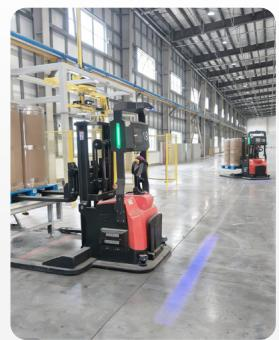

natural_image

Interior of a large warehouse with forklifts and stacked goods, no visible text or symbols

车间三半成品输送自动小车

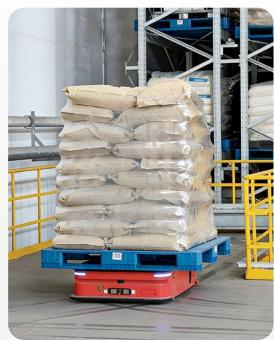

natural_image

Warehouse interior with stacked sacks on a blue and red robotic platform, no visible text or symbols

原料输送 AGV 托盘小车

## MES 制造执行系统

上线MES制造执行系统，实现生产全程数字化。

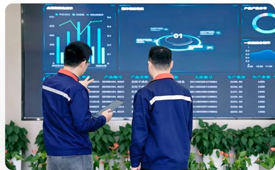

text_image

Two professionals in blue uniforms reviewing a dashboard with charts and graphs, likely from a Chinese e-commerce or product management system.

MES 系统  
四川晶华智能制造举措

## 安全隐私保护

公司制定《信息安全规则》《安全认知政策》《访问控制规则》等一系列信息安全管理制度，形成了“架构规划、风险防控合规监督”三位一体的管理架构，确保各项数据安全工作高效协同、落地见效。

## 安全架构组

统筹规划数据安全体系：制定并优化相关制度、规程与技术标准，搭建防护架构，推动数据安全技术与业务场景深度融合。

## 风险管控组

防控与处置数据风险：常态化开展数据安全风险排查及隐患整治，建立应急响应机制，处置数据安全突发事件，降低安全损失。

## 合规审计组

数据合规与审计监督：开展数据合规评估与隐私保护审查，定期审计各业务部门数据使用情况，规范数据全流程管理，杜绝违规操作。

数据安全与客户隐私保护管理架构

公司搭建全维度、全流程信息安全保障体系，明确安全保障规划与密级划分、聚焦防护重点，同步健全外部合作、监督奖惩及培训机制，全面提升信息安全管理水平与风险防范能力。

## 深度优化防火墙

完成性能升级，开启入侵检测与防御功能，升级病毒特征库和攻击规则库，梳理访问规则等。

非授权访问拦截率达100%。

网络攻击预警响应时间缩短80%。

## 规范部署全域 VPN

选用企业级专用 VPN设备，采用高强度加密算法，建立 VPN 访问管理机制等。

远程访问合规率达100%。

## 部署备份一体机

制定个性化备份策略，开启增量备份与差异备份功能，实现备份数据的离线存储与加密保护等。

核心数据备份覆盖率达100%。

备份任务执行成功率100%。

·数据恢复效率较传统方式提升 90%。

## 安全宣贯与能力提升

开展数据安全培训、宣传教育及应急演练。

•报告期内，公司开展48 场客户信息安全与隐私保护培训，员工覆盖率达98.25%,人均时长1.33小时。

● 公司开展8 场信息安全应急演练。

数据安全与客户隐私保护措施

## 报告期内

公司发生数据安全事件

0 起

发生泄露客户隐私事件

0 起

## 供应链安全

公司致力于构建负责任、透明目富有韧性的供应链体系，将FSG理念深度融入供应商的全生命周期管理。通过系统化的区险评估、严格的准入审核、持续的能力建设与协同改进，公司不仅确保原材料的质量、交付与成本稳定，更致力于推动整个价值链在环境保护、社会责任和商业道德方面实现共同提升

## 供应商全生命周期管理

公司建立了一套标准化、全流程的供应商生命周期管理系统，以事前评估筛选、事中现场审核、事后动态评级与持续改进为核心闭环，确保供应链的质量、交付、技术、成本、环保及合规表现

## 准入与 评估

建立《供应商管理控制程序》《采购控制程序》等制度，开展资质审核及环境与社会责任合规筛查，从源头确保供应商的合法性与基本合规性。准入阶段，要求供应商必须签署《质量协议》《廉政共建协议书》《产品不使用环境有害物质保证书》等一系列协议，将ESG与质量要求契约化，对不合规者实行一票否决。

## 现场审核与评级

使用标准化的《供应商现场审核报告》《供应商评鉴检查表》，从质量、商务、技术、环保四个维度对供应商进行全面的现场审核，并依据加权总分对供应商进行“合格”“有条件合格”或“不合格”的等级判定，系统识别其运营优势与潜在风险，为分级管理与后续改进提供依据。

## 持续监控与 改进

对合格供应商实施定期的绩效评审与分级管理。针对审核中发现的问题，通过《供应商改善需求报告》要求供应商进行根本原因分析、制定并落实纠正预防措施，并跟踪验证直至问题闭环。基于评审结果对供应商进行动态管理，推动其持续改进。

## 协同赋能与深化合作

超越单纯监管，通过组织质量管理体系、安全生产与环保、社会责任、公司技术标准等主题的培训对供应商进行赋能。与核心供应商开展技术协同与新产品共同开发，并推动其执行公司的各项标准与行为准则，构建价值共创、风险共担的战略合作伙伴关系，提升整体供应链的竞争力与韧性

供应商全生命周期管理

## 可持续采购

公司建立系统化的可持续采购体系，通过协议约束、全面的行为准则、明确的操作告知书以及第三方标准审核，将包括廉洁、环保、安全、人权等可持续要求深度嵌入供应商准入与合作全流程，并通过强有力的监督与执行机制保障落实，构建负责任、透明、低风险的绿色供应链

## 商业道德

通过签订《廉政共建协议书》、在《供应商行为准则》中明确反腐败与公平竞争条款、设立举报渠道，要求供应商禁止任何形式的商业贿赂、回扣及不当利益输送；建立相互监督与举报机制，对违规行为设置高额违约金并可能终止合作。

## 供应链合规与风险告知

发布《相关方安全法律法规告知书》与《相关方环保要求告知书》，明确要求供应商（尤其涉及危险化学品）具备合法经营资质，提供合规的化学品安全技术说明书(MSDS)与安全标签；运输环节需符合国家安全与环保规定；要求各方共同遵守公司的环保与安全制度。

## 环境与有害物质管控

要求供应商签署《产品不使用环境有害物质保证书》，执行《有害物质管控标准》，并开展《供方环境管理调查》；保证所供物料符合公司有害物质限制标准，并提供权威第三方检测报告；通过调查问卷掌握供应商的环保合规、体系认证（如ISO 14001）及废弃物管理情况。

## 供应商行为准则与审核

制定并推行《供应商行为准则》，全面覆盖法律与商业道德、劳工与人权、健康与安全、环境保护及供应链责任；对部分供应商开展RBA（责任商业联盟）审核，通过文件审查与现场审核（含突击检查）验证其在劳工权益、职业健康、环保、道德规范及管理体系等方面的合规性与表现。

## 执行、监督与改进

要求供应商签署相关协议与准则作为合作前提；通过定期与不定期审核进行监督：对违规行为(如严重环保违法、使用童工、商业贿赂等)采取包括终止合作、追究法律责任在内的严厉措施，确保管理体系闭环与持续改进。

可持续采购管理措施

## 报告期内

公司供应商共计

249 家

供应商本地化比例达

36.14%

通过环境相关审核的供应商达

100%

通过社会相关审核的供应商达

74.70%

供应商培训开展

5次

总时长

90小时

## 案例 供应链RBA 审核落地，筑牢负责任采购管理根基

2025 年 1 月，公司采购中心启动供应商 RBA 审核项目，联合各供应商管理者代表及员工，分三阶段推进至 12月完成。1—2 月制定审核计划、组织内外部培训，3—9 月赴供应商现场通过文件审查、现场观察等开展全维度合规评估，10—11 月出具报告、推动整改并跟踪进度。项目覆盖 10 家重点供应商，聚焦企业在劳工权益、健康安全、环境管理、道德规范、管理体系五大核心领域的合规性与实践情况，间接保障2,000名员工权益，整改7项合规问题，供应商合规评分平均提升22%，建立表现档案纳入采购评估，夯实供应链合规运营基础，提升供应链韧性与透明度。

## 案例 推进 FSC 认证采购，助力林业可持续发展

2020一2025年，公司持续推动FSC认证原材料采购计划，联合8.家合作供应商推进，在完成内训与供应商调研评估、与3家认证供应商试点采购并建立追溯体系后，公司目前将FSC认证纳入供应商准入标准，并开展供应商培训与协作沟通，推动更多供应商申请认证。项目年采认证原材料 670吨，保护 160 公顷森林。减碳95吨，支持3 家中小型供应商完成FSC认证，促进其可持续经营；提升员工与合作伙伴的环保意识，同时提升品牌形象与客户信任度，筑牢绿色供应链根基。

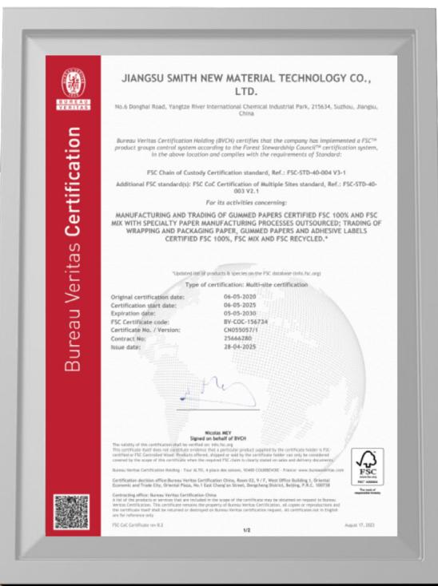

text_image

Jiangsu SMITH NEW MATERIAL TECHNOLOGY CO.,
LTD.
No.6 Donghai Road, Yangtze River International Chemical Industrial Park, 215634, Suzhou, Jiangsu,
China
Bureau Veritas Certification Holding (BVCH) certifies that the company has implemented a FSC™
product groups control systems according to the Forest Stewardship Council® certification system,
In the above location and complies with the requirements of Standard:
FSC Chain of Custody Certification standard, Ref.: FSC-STD-40-004 V3-1
Additional FSC standard(s): FSC CoC Certification of Multiple Sites standard, Ref.: FSC-STD-40-
003 V2.1
For its activities concerning:
MANUFACTURING AND TRADING OF GUMMED PAPERS CERTIFIED FSC 100% AND FSC
MIX WITH SPECIALTY PAPER MANUFACTURING PROCESSES OUTSOURCED; TRADING OF
WRAPPING AND PACKAGING PAPER, GUMMED PAPERS AND ADHESIVE LABELS
CERTIFIED FSC 100%, FSC MIX AND FSC RECYCLED."
*Updated next product: A license per the FSC database (info.fo.org)
Type of certification: Multi-site certification
Original certification date: 06-05-2020
Certification start date: 06-05-2025
Expiration date: 05-05-2030
FSC Certificate code: BV-COC-156734
Certificate No.: CNO350371
Contract No: 25466280
Issue date: 28-04-2025
Wastea KEY
Signed on behalf of BVCH
The validity of this certification should be verified on info.fo.org.
This certificate has not certified evidence that a particular product supplied by the certificate holder is FSC
this certificate has not certified evidence that a particular product supplied by the certificate holder is only licensed under the scope of the certificate when the required FSC date is clearly stated as sales and delivery documents.
Bureau Veritas Certification Holding - Tour ALTS, a place des saires, 9348 COURBOVE - France - www.bureauveritas.com
Certification decision office Bureau Veritas Certification China, Bureau OZ, 9/F, West Office Building, D. Oriental
Documents and Trade Office, Orient Place, No.1 Fax Change on Street, Shanghai District, Beijing, P.S.C. 18818
Contracting office: Bureau Veritas Certification China
A lot of time will be used in accordance with the owner's title and registration address to Bureau Veritas Certificates. This certificate reserves the property of Bureau Veritas Certification, all copiers or reproductions and
the certificate must be returned to designated in Bureau Veritas certification request, all certificates visit to England
for reference only.
FSC CoC Certificate rev 8.1
1/2
August 17, 2023

natural_image

Close-up of a wooden surface with wavy, layered patterns (no text or symbols)

公司获得 FSC 认证

## 雇佣与薪酬

晶华新材将“人人是人才，智慧创造价值”作为核心人才理念，严格依法规范招聘与雇佣活动，持续完善薪酬福利与全方位绩效激励机制，秉持平等、包容、多元的理念打造公平公正的工作环境，推动员工与企业共同成长、协同发展。

## 招聘与雇佣

人才是晶华新材实现可持续发展的核心驱动力，公司秉持“以人为本，忠诚能力兼备，适才适用，优胜劣汰”的用人理念。公司招聘恪守“公开招聘、平等竞争、择优录用、先内后外”原则，制定《招聘入离职管理制度》《员工手册》等制度面向社会公开遴选人才，吸纳契合公司战略发展的专业人才。

## 规划招聘需求

• 综合考虑公司战略、内外部人才供给情况等  
每半年确定用人需求

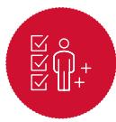

## 提出用人申请

·用人部门根据岗 位编制申请  
●进行逐级审批，包括各级主管、人力资源部门、总裁等

## 多元渠道招聘

•内部招聘：内部 推荐、内部竞聘  
·外部招聘：人才市场招聘、校园招聘、猎头服务、网络平台招聘等

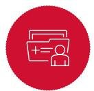

## 选拔用人

初试和复试面试  
相关部门考核评估  
·录用意向沟通  
入职

简历筛选

员工招聘流程

## 截至报告期末

公司共有员工

1,800 人

年度新招聘员工

469人

员工平均年龄

38 岁

女性管理层员工共计

16人

其中残障员工

退伍军人员工

28人

少数民族员工

38 人

员工构成  
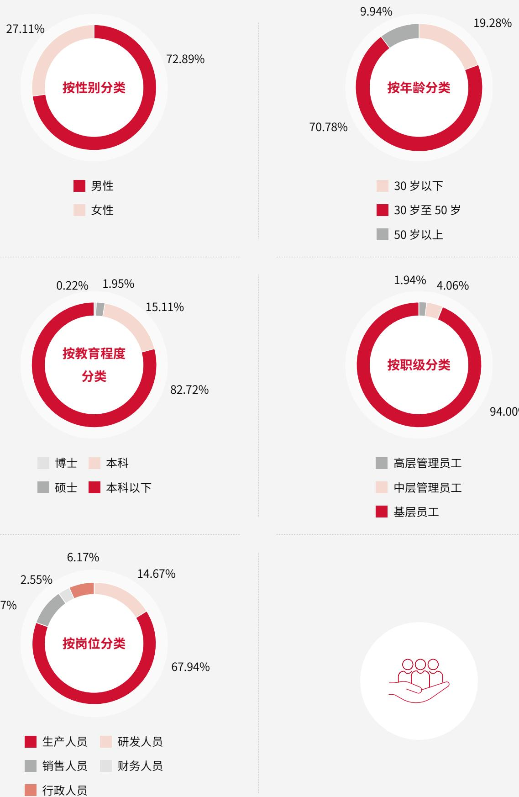

## 反童工与强迫劳动

公司始终将反童工与禁止强迫劳动作为员工招聘与雇佣的核心底线。公司严格恪守《禁止使用童工规定》《中华人民共和国未成年人保护法》《未成年工特殊保护规定》等法律法规及《拯救童工及青少年工保护程序》等内部制度。公司严禁以任何形式招用或使用童工，在招聘阶段，进行严格的身份核实、背景调查，若发现童工立即采取所有必要支持和行动以切实保障未成年人身心健康与合法权益。在日常运营中，公司坚决抵制任何形式的强迫劳动行为，保障员工自主择业与自愿劳动的合法权益。

## 报告期内

公司发生使用童工或强制劳动事件

0 起

## 反歧视与多元化

公司积极营造公平，包容，多元的工作环境，制定《反歧视管理程序》制度，坚决杜绝员工全职业周期的各类歧视行为保障员工平等发展权利。此外，公司创造多元与包容的环境与文化，让所有员工都感到被尊重，充分发挥其潜能。

## 保障达标申请人平等参与岗位招录

公司坚持公平公正招录，符合条件者均可平等参与岗位遴选。禁止基于肤色、性别、年龄、残疾、婚姻状况等方面的歧视行为。

## 保护女员工权益

公司严禁因怀孕对女职工实施歧视性待遇或单方解除劳动关系，将视身体状况调整工作岗位，保障其劳动安全与职业权益。

## 设置管理者信箱

公司设置管理者信箱，常态化接收歧视与骚扰投诉，对投诉员工采取保密措施，对投诉事项全面调查、严肃问责，并及时反馈结果。

反歧视与多元化管理措施

## 报告期内

公司发生雇佣歧视事件

0 起

## 薪酬与福利

公司立足岗位性质与工作特点的差异化需求，根据《薪酬福利管理办法》构建多元化的薪酬与福利体系，秉持市场化原则提供行业有竞争力的薪酬以吸纳人才。同时，公司不断完善全方位的员工福利体系，以实际行动彰显对员工的尊重与重视

## 薪酬构成

## 月度薪资

·岗位薪资

· 绩效薪资

## 其他薪资

·加班薪资

·假期薪资

## 奖励性薪酬

·专项奖金

·年终奖金

业务提成

## 福利补贴

·住房交通补贴

·岗位补贴

工龄补贴

·学历补贴

·高温补贴

通讯补贴

员工薪酬构成

## 员工福利

## 社会保险

参照国家相关的法律法规，结合公司实际情况和相关制度，为符合条件的员工购买养老保险医疗保险、失业保险、工伤保险、生育保险和住房公积金。

## 休假福利

依法保障员工享有法定节假日、带薪年休假、产假、陪产假、育儿假、丧假、工伤假等各类假期确保员工工作之余能充分休息与恢复。

## 节日福利

春节、端午节、中秋节、三八妇女节、员工生日等给员工发放礼品福利。

## 长期奉献福利

依据员工服务年限发放差异化现金奖励。

## 免费 体检

体检项目根据员工的性别、年龄和岗位需求进行差异化设计，以满足员工的健康检测需求。

## 报告期内

公司员工社保缴纳覆盖率

100%

员工福利覆盖率

100%

## 绩效与激励

公司绩效管理以“以提升员工绩效为导向，定性与定量考核相结合，多维度考核，公平公正公开”为原则，制定《绩效管理办法《绩效考核管理办法》等制度，保障了员工在考核中的公平权益，也为人才发展与激励决策提供客观依据，实现企业战略目标与员工个人成长的协同推进

## 沟通绩效分歧

## 提交绩效申诉

## 受理绩效申诉

## 核查绩效申诉

若被考核人对绩效考核结果有异议，可优先与考核者进行沟通，考核者负有反馈、解释的责任并需在一个工作日内反馈。

若协商无果，被考核人需在3个工作日内向人力资源部门提出书面申诉。

人力资源部门在2个工作日内决定是否受理，缺乏事实支撑、主观臆断的申诉不予受理。

申诉受理后，人力资源部在2个工作日内完成核查，组织申诉当事人、相关部门进行沟通，厘清争议并妥善处理。

绩效反馈与申诉流程

## 股权激励

公司建立健全人才激励体系，在报告期内向限制性股权激励计划激励对象预留授予限制性股票，将核心人才发展与企业长远发展深度绑定，为企业高质量可持续发展筑牢人才根基。

## 截至报告期末

公司执行2024年限制性股票与股票期权激励计划

激励对象

134 名

授予限制性股票

457.8 万股

股票期权

466.4 万份

## 人才培训发展

着眼于长远人才发展战略，晶华新材坚持以人为本，实施以能力建设为核心、结构优化为主线的系统性，前瞻性的人才布局，以系统化培训赋能员工成长，畅通职业发展通道，整合内外部优质资源为员工拓展成长空间，夯实企业高质量发展的人才根基。

## 员工发展机制

晶华新材深刻认识到，人才是企业最核心的竞争力和持续发展的根本动力。我们始终秉承“以人为本，忠诚能力兼备，适才适用，优胜劣汰”的用人理念，将人才的全面发展置于企业战略的核心位置。在这一理念指引下，公司不仅致力于吸引优秀人才，更注重为每一位员工搭建实现价值的舞台。

为实现这一目标，建立了“管理与技术双通道”职业发展体系。管理通道聚焦于培养具备战略思维、卓越领导力和跨部门协作能力的综合型管理人才；技术通道则着力打造专业精深、勇于创新的技术专家和行业领军人物。双通道并行不悖，互为补充，确保各类人才都能在适合自身的轨道上获得充分发展，实现人尽其才、才尽其用。

## 专业技术通道

具备管理潜质、承担团队或部门管理职责的员工

支持层 (L1—L10)：从基础岗位开始，不设专门管理岗。

执行层 (L11—L13)：副主任 → 主任 → 高级主任。

中层 (L14—L16)：副经理 → 经理 → 高级经理。

核心层(L17—L19)：总监/副总经理/总工→ 总监/副总经理→高级总监/总经理。

决策层(L20—L21)：副总裁→总裁。

## 管理职务通道

专注于技术、营销、职能、生产等专业领域的员工

技术序列(T)：实验员 /技术员 → 助理工程师 → 中级工程师 → 高级工程师 →资深工程师 → 专家/研究员 → 高级专家 /研究员 →资深专家 /研究员 → 首席专家/科学家。

营销序列 (S)：销售内勤/客服/销售员 → 助理工程师 → 中级工程师 → 高级工程师 → 资深工程师 → 专家 /营销总监 →高级营销专家 /营销总监 → 资深营销专家/营销总监。

职能序列 (P)：文员 → 助理专员 → 专员 → 高级专员 → 资深专员 → 专家/ 顾问 → 高级专家/顾问。

生产序列 (W)：初级工 → 中级工 → 高级工（班组长)→ 技师 → 中级技师 →高级技师→资深技师（特级技师）→首席技师。

双轨发展晋升体系

与此同时，我们坚信“人人是人才，智慧创造价值”。在这一人才理念指导下，公司构建了全方位、多层次的人才培养与发展体系：

## 系统化培训体系

针对不同职级、不同序列员工设计定制化培训课程涵盖专业技能、管理能力、创新思维等多个维度。

## 实战化培养机制

通过重点项目历练、跨部门轮岗、挑战性任务委派等方式，让员工在实战中快速成长。

## 动态化发展路径

针对每位员工制定差异化的职业发展规划，并定期进行评估调整，确保个人成长与组织发展同频共振。

## 多元化激励机制

建立以绩效为导向、物质与精神激励并重的全面激励体系，设立创新奖励基金，鼓励突破与创造。

## 透明化晋升通道

完善内部竞聘与晋升制度，营造公平、公正、公开的竞争环境，让优秀人才脱颖而出。

<table><tr><td>人才培养机制</td><td>构建可持续人才梯队</td><td>制定关键岗位继任者计划,建立后备人才甄选及“滚动进出”循环培养机制。坚持“内部培养为主、外部引进为辅”,同步培养专家型技术与综合型管理人才。</td></tr><tr><td>人才考评机制</td><td>能力与业绩双导向</td><td>建立以诚信敬业为基、职业能力为向、岗位实绩为重的评价体系,重点考核工艺攻关、新技术掌握及实操技能水平。</td></tr><tr><td>成长激励机制</td><td>凭能力晋级、凭业绩分配</td><td>完善成才奖励制度,拓宽培训资金渠道,强化“能力—晋升—薪酬”强关联。鼓励一线技能人才获评技师、高级技师并享受专项津贴。</td></tr><tr><td>培训管理体系</td><td>全周期、分层分类</td><td>设计覆盖入职至职业生涯的培训方案,包括全员基础课、岗位专业课及高潜管理者特训营。</td></tr><tr><td>人才稳定机制</td><td>进得来、留得住、干得好</td><td>制定差异化留任策略、加强校企定向培养,优化工程师管理与技术双序列职业发展通道。</td></tr><tr><td>政策协同机制</td><td>主动链接政府资源</td><td>主动对接省、市、新区人才发展规划,争取人才引进补贴、技能提升专项资金、高技能人才培训基地认定等政策支持,放大企业培养投入效能。</td></tr></table>

人才培养发展机制

## 员工培训

公司高度重视人才梯队建设对企业发展的核心价值，以“战略导向、分层分类、多元形式、闭环管理”为核心原则建立完善的培训机制，制定《培训管理办法》《传帮带激励管理办法》等制度，并建立“一站式共享”数字化学习平台，融合线上线下多元渠道，助力员工职业成长。

专业技能成长

管理能力提升

创新思维培养

培训维度

## 报告期内

公司累计完成培训

872 场次

员工培训覆盖率

100%

公司级培训总时长为

57,648.9 小时

## 新员工培训

## 通用培训

## 核心岗位质 量专项培训

## 特殊人才 培训

## 内训师培训

<table><tr><td>培训对象</td><td>培训内容</td><td>培训成果</td></tr><tr><td>新入职一线员工及管理人员</td><td>开展分类新员工培训,完成上岗培训与试用期辅导。</td><td>报告期内,共计开展一线新员工培训77场,新入职管理人员培训5场,覆盖418人次。上岗培训及试用期辅导完成率均达100%。</td></tr><tr><td>全体在岗员工</td><td>开展公司及部门层面分层通用类培训,并完善应知应会建设。</td><td>报告期内,公司层面开展18场在岗员工培训,累计覆盖1,274人次。部门层面开展402场在岗员工培训,累计覆盖6,085人次。完成17个部门及96个岗位或工序的应知应会标准梳理。</td></tr><tr><td>品质、研发、生产核心岗位</td><td>通过“质量训练营”,围绕思想、理论、实战三大维度,强化核心岗位质量管控能力。</td><td>报告期内,共计设计22门课程,开展15场培训,覆盖40名员工。</td></tr><tr><td>特殊作业人员</td><td>开展特殊作业相关培训与取证。</td><td>报告期内,6类特殊作业证书新增取证36人,8类证书复训46人。</td></tr><tr><td>内训师储备人员</td><td>通过“TTT训练营”,聚焦内训师“编、导、演”核心能力开展提升培训。</td><td>报告期内,共计覆盖35名员工,输出合格内训师30名。</td></tr></table>

员工培训体系

## 案例 精筑质量训练营 夯实品质硬根基

2025年5—9月，公司组织开展质量专项训练营，围绕产品质量管控、工艺标准执行、质量问题排查与整改等核心内容，聚焦岗位质量实操能力提升。此次培训有效强化全员质量意识，提升员工专业质量管控水平，为公司产品品质提升、质量管理体系完善筑牢人才与能力基础。

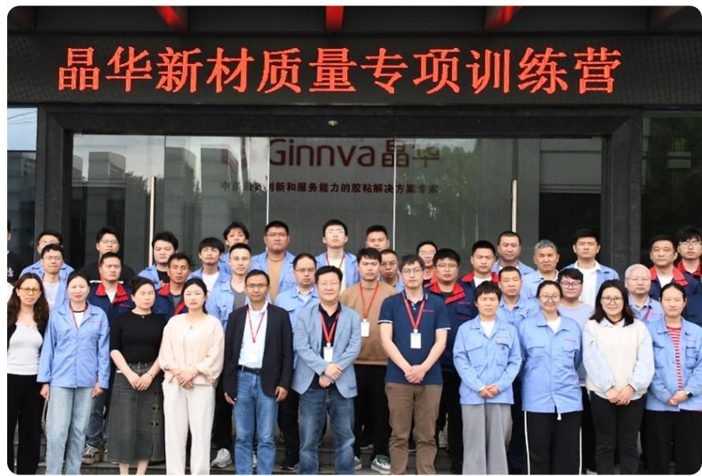

text_image

晶华新材质量专项训练营
Ginnva晶华
中芯激光创新和服务能力的胶粘解决方案专家

质量专项训练营

## 案例 培育内训师队伍 强化企业培训能力

2025年9—10月，公司组织开展内训师专项培训，围绕培训课程开发、授课技巧提升、教学案例设计等核心内容开展，通过理论讲解、模拟授课、点评指导等形式，系统提升内训师专业授课能力。此次培训有效充实企业内部培训师资力量，为公司人才培养、员工能力提升提供坚实的内部教学支撑，助力企业人才梯队建设。

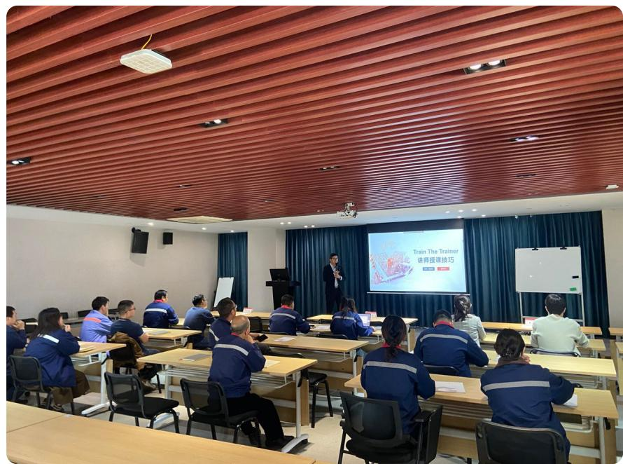

text_image

Train The Trainer
讲师授课技巧

内训师培训

## 员工关怀

公司将员工关怀融入企业社会责任体系建设，建立畅通的职工诉求表达渠道，扎实落地在职员工关怀举措，依托民主管理与沟通、人本关怀搭建员工情感联结桥梁，持续增强全体员工的企业归属感与职业幸福感

## 民主管理与沟通

公司高度重视职工在治理结构中的主体地位与核心作用，将职工意见表达与权益维护纳入企业治理重要议程。公司建立畅通的职工诉求表达渠道，为公司稳健运营与长远发展筑牢民主管理根基

<table><tr><td>渠道</td><td>内容</td><td>成果</td></tr><tr><td>组织员工座谈会</td><td>建立常态化员工沟通机制,鼓励员工结合岗位实际建言献策,并持续跟进整改进度、及时向员工反馈结果。</td><td>报告期内,公司累计开展10次员工座谈会,覆盖308人次,员工参与率达42.3%,共收集58条有效意见,均已完成整改闭环。</td></tr><tr><td>开展员工满意度调查</td><td>围绕公司治理、管理沟通、薪酬福利、工作条件等维度,定期开展2次半年度员工满意度调研。</td><td>报告期内,江苏晶华员工满意度调查覆盖率100%,筛选60条高质量建议并推动落实优化。</td></tr><tr><td>设立申诉意见箱</td><td>制定《员工申诉管理程序》《员工投诉处理&amp;防打击报复管理办法》等制度,支持员工口头或书面合理申诉或投诉,并履行保密义务。</td><td>报告期内,公司累计接收0次员工合理申诉或投诉。</td></tr><tr><td>设立改善提案激励机制</td><td>制定《改善提案制度》,激励员工提出有益于提高经营效益、提高产品质量、改善公司环境、满足客户需求的提案,并设置评审奖励机制。</td><td>报告期内,江苏晶华员工累计提交267项改善提案,有效推动155项经营管理优化提升。</td></tr></table>

员工民主沟通渠道

## 报告期内

公司员工流失率为 8.98%

## 人本关怀

公司构建覆盖生活保障、身心健康、情感关怀的全方位员工关怀体系，通过设立爱心基金、女性关怀、员工慰问及多样的文体活动等暖心行动，充分彰显对员工的尊重与重视。

## 报告期内

公司开展关爱帮扶工作，投入资金 5 万元

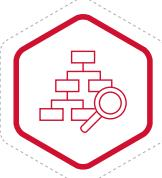

## 晶华关爱基金

2013年，公司员工互助帮扶同事，受助人员将爱心款全额返还，公司以此制定《爱心基金管理办法》，设立“晶华关爱基金”（以下简称基金）。基金覆盖疾病探视、伤亡礼金、灾害慰问等，资金来源于公司拨款、员工自愿捐款及社会捐款等，流程规范透明、审批高效。自成立以来至报告期末，基金总计支出179.602元，共计帮助16名员工。基金是公司践行“企业与员工命运共同体”理念的重要举措，实现“让关怀可触、让温暖可达”的人文治理目标。

## 案例 筑母婴温馨港湾 传企业人文暖意

公司专为孕期及哺乳期女员工打造舒适便捷的母婴室，室内配备哺乳座椅、婴儿护理台、温奶器等贴心设施，为女性员工提供了私密、便利的育儿空间，让女员工感受到企业的细致关怀，进一步彰显企业人文温度，提升女员工的职场幸福感与归属感

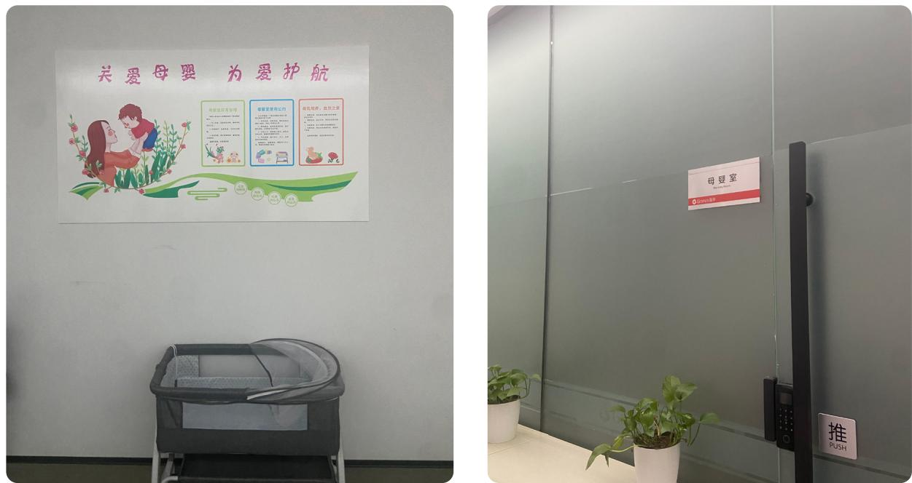  
母婴室

## 案例 妇女节关怀

2025年3月，在“三八”国际妇女节来临之际，为丰富女员工的精神文化生活，提升艺术修养与生活情趣，江苏晶华特举办“魅力巾帼，花样绽放”主题花艺培训暨送花活动。

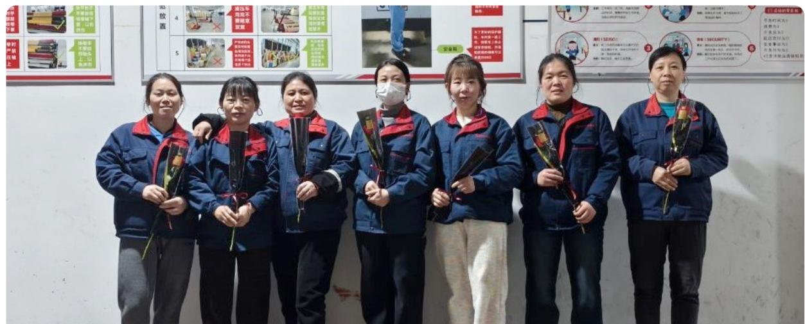

text_image

Group photo of seven women in uniforms holding flower bouquets, with posters on wall containing Chinese safety and security-related text.

妇女节送花活动

## 案例 乒乓竞技聚合力 赛场拼搏展风采

2025年5月，公司举办兵乓球赛，参赛选手在赛场沉着应战、切磋球技，攻防之间展现出良好的竞技状态和拼搏精神，观赛员工热情助威，赛场氛围热烈融洽。此次赛事丰富了员工业余文化生活，缓解工作压力，增进员工间交流，凝聚团队向心力，营造积极向上的企业文化氛围。

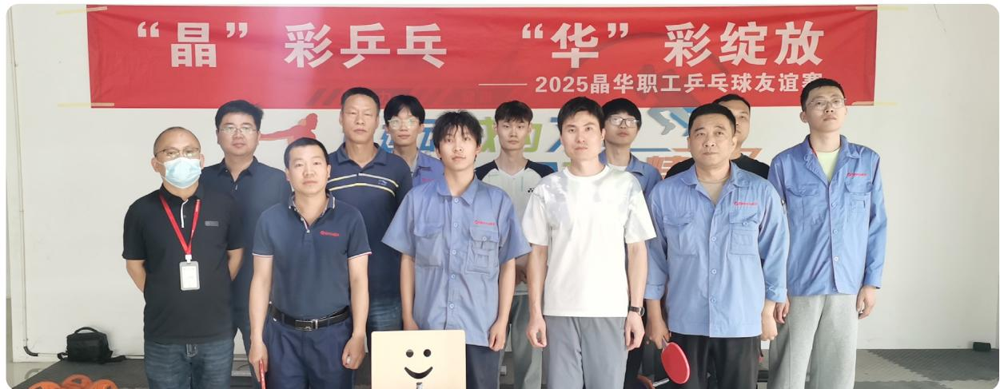

text_image

“晶”彩乒乓 “华”彩绽放
——2025晶华职工乒乓球友谊赛

乒乓球比赛

## 职业健康与安全

公司始终把员工身体健康与生命安全放在优先位置，以职业健康管理为基础、安全生产为保障，贯彻“安全第一、预防为主、综合治理”的方针，构建全方位安全管控体系，切实守护员工职业健康与作业安全，为企业可持续发展与稳健运营提供坚实安全支撑。

## 管理体系

晶华新材构建了完备的职业健康安全管理制度体系，设立安全生产委员会，先后出台《安全生产责任制度》《职业卫生管理制度》等系列制度，明确年度职业健康与安全目标，以系统化制度建设筑牢职业健康与安全管理防线，为企业稳健发展保驾护航。

<table><tr><td>职业健康与安全目标</td><td>2025年完成情况</td></tr><tr><td>火灾、爆炸、危化品泄漏事故发生数为0</td><td>已达成</td></tr><tr><td>中等及以上安全事故、工亡事故发生数为0</td><td>已达成</td></tr><tr><td>职业病发生率为0</td><td>已达成</td></tr><tr><td>安全教育培训率为100%</td><td>已达成</td></tr><tr><td>专职安全管理人员、特种作业人员等持证上岗率达100%</td><td>已达成</td></tr><tr><td>不发生上级行政主管部门对公司停产、停业整顿及以上的行政处罚</td><td>已达成</td></tr></table>

职业健康与安全目标

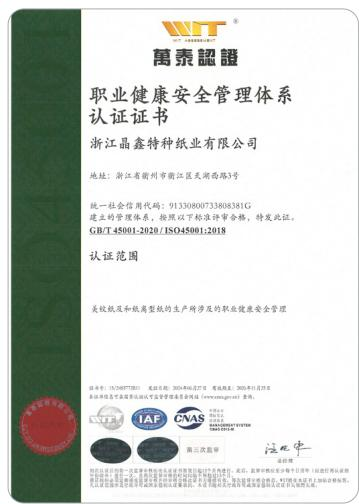

text_image

萬泰認證
职业健康安全管理体系
认证证书
浙江晶鑫特种纸业有限公司
地址：浙江省衢州市浙江区天湖西路3号
统一社会信用代码：91330800733808381G
建立的管理体系，按照以下标准评审合格，特发此证。
GB/T 45001-2020/ISO45001:2018
认证范围
美纹纸及和致型纸的生产所涉及的职业健康安全管理
证书号：15129077T811 发证日期：2024年6月27日 命载起止：2024年11月25日
本证书由省属单位登记并经国家机关登记（省行政部）审核。
IAF CVAS
ISSN 1000000000000000000000000000000000000000000000000000000000000000000000000000
第二次检验 注此中

浙江晶鑫ISO 45001 认证证书

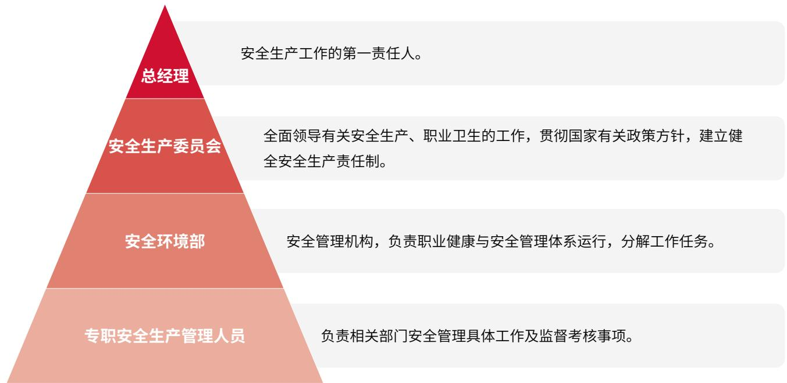

flowchart

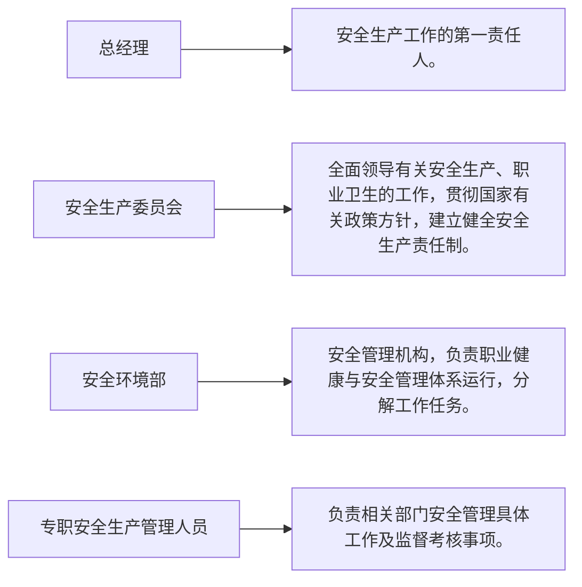
```mermaid
graph LR
  A["总经理"] --> B["安全生产工作的第一责任人。"]
  C["安全生产委员会"] --> D["全面领导有关安全生产、职业卫生的工作，贯彻国家有关政策方针，建立健全安全生产责任制。"]
  E["安全环境部"] --> F["安全管理机构，负责职业健康与安全管理体系运行，分解工作任务。"]
  G["专职安全生产管理人员"] --> H["负责相关部门安全管理具体工作及监督考核事项。"]
```

安全管理体系

## 管理措施

晶华新材以职业健康管理为核心，通过构建系统化的风险防控体系，持续完善安全生产全流程管理，从员工健康保障、风险分级管控、安全检查排查、教育培训及应急响应建设等多维度发力，全方位筑牢员工职业健康与企业安全生产防线

## 组织员工体检

定期组织全体员工开展健康体检，建立员工健康档案，及时掌握员工健康状况。报告期内，员工体检覆盖率为 100%。

## 建立风险识别与分级管控机制

全面开展危险源辨识与风险评估，按风险等级实施分级分类管理，明确管控责任、措施与时限。

## 开展安全检查

常态化开展月度及节假日安全检查，不定期开展危化品专项检查及设备排查，及时整改并消除安全隐患。

## 开展安全生产培训

不定期开展职业健康、安全教育及管理层安全领导力培训等。

## 制定应急预案、开展安全演练

制定《生产安全事故应急预案》，包括特殊作业、职业卫生突发事件、危化品泄漏等多项应急预案并开展专项与综合演练。

职业健康与安全管理措施  

natural_image

Hand holding a group of colorful paper-cut figures, symbolizing family or social composition (no text or symbols present)

<table><tr><td>指标</td><td>单位</td><td>2025年</td></tr><tr><td>安全生产投入</td><td>万元</td><td>794.82</td></tr><tr><td>员工因工死亡人数</td><td>人</td><td>0</td></tr><tr><td>工伤保险投入金额</td><td>万元</td><td>113.42</td></tr><tr><td>工伤保险覆盖人员比例</td><td>%</td><td>100</td></tr><tr><td>职业病发生率</td><td>%</td><td>0</td></tr><tr><td>职业健康、安全生产类培训时长</td><td>小时</td><td>6,736</td></tr><tr><td>安全生产应急演练次数</td><td>场</td><td>31</td></tr><tr><td>安全生产应急演练参与人次</td><td>人次</td><td>1,713</td></tr></table>

## 案例 普及职业健康知识 提升全员防护能力

2025年8月，公司多车间组织开展职业健康专项培训，围绕职业健康防护知识、作业场所危害识别、防护用品规范使用、职业健康应急处置等核心内容开展。此次培训有效强化全员职业健康防护意识，提升员工岗位健康防护实操能力，切实保障员工身心健康与职业安全。

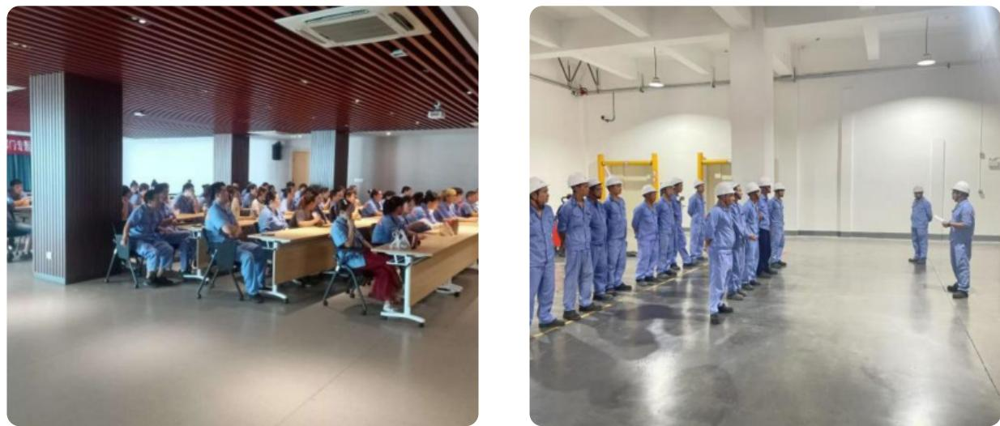  
职业健康培训

## 赋能社会

晶华新材以责任回馈社会，公司以爱心助学等方式投身教育公益，助力人才培养，投身乡村振兴，积极践行企业社会责任，构建多方共赢的社会价值生态。

## 报告期内

公司社会公益投入共计

26 万元

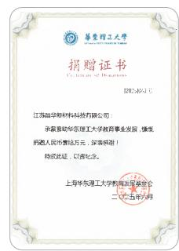  
华东理工大学教育基金捐赠证书

## 案例 捐赠校园物资，助力教育发展

2025年6月及10月，公司向四平小学开展公益捐赠，为学校捐赠篮球场配套设施、若于台电脑，同时为所有教室统一配备护眼照明灯和风扇。此次捐赠切实改善了学校的教学硬件条件与校园运动环境，解决了教室照明、通风等实际问题，为学生营造更舒适的学习与运动氛围，以实际行动助力校园基础设施建设，践行企业社会责任。

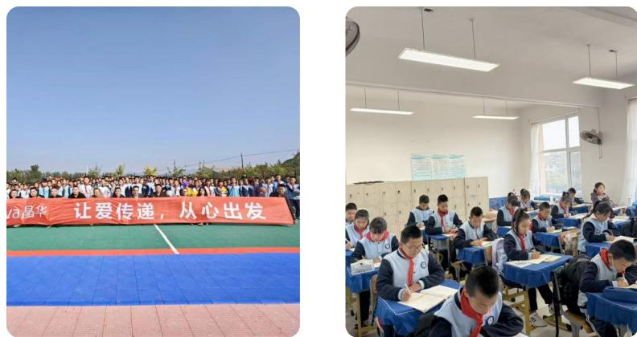  
爱心助学活动

## 案例 慈善捐赠助力乡村公益，践行企业社会责任

多年来，江苏晶华积极响应“爱满港城”慈善募捐活动报告期内向张家港保税区、张家港德积街道德积村分别捐赠人民币2万元，以实际行动支持地方公益事业传递企业爱心。此次捐赠不仅体现了江苏晶华回馈社会、热心慈善的责任担当，也进一步弘扬了互助友爱的文明风尚，为“爱满港城”活动增添了温暖力量。

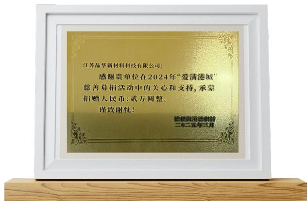

text_image

江苏晶华新材料科技有限公司：
感谢贵单位在2024年“爱满港城”
慈善募捐活动中的关心和支持，承蒙
捐赠人民币：贰万圆整。
谨致谢忱！
德棋街浩德棋村
二〇二五年三月

德积街道德积村感谢状

## 关键绩效表

环境

<table><tr><td>指标名称</td><td>单位</td><td>2025年</td></tr><tr><td>环保总投入</td><td>万元</td><td>4,617.97</td></tr><tr><td>环境应急演练次数</td><td>次</td><td>9</td></tr><tr><td>环境应急演练参与人次</td><td>人次</td><td>419</td></tr><tr><td>环境管理培训场次</td><td>场</td><td>219</td></tr><tr><td>环境管理培训时长</td><td>小时</td><td>996</td></tr><tr><td>环境管理培训人次</td><td>人次</td><td>593</td></tr><tr><td>废气排放总量</td><td>吨</td><td>34,494.13</td></tr><tr><td>氮氧化物(NOx)排放量</td><td>吨</td><td>8.74</td></tr><tr><td>硫氧化物(SOx)排放量</td><td>吨</td><td>3.12</td></tr><tr><td>颗粒物(PM)排放量</td><td>吨</td><td>5.02</td></tr><tr><td>废水排放总量</td><td>吨</td><td>567,019.69</td></tr><tr><td>化学需氧量(COD)排放量</td><td>吨</td><td>40.40</td></tr><tr><td>氨氮(NH3-N)排放量</td><td>吨</td><td>1.15</td></tr><tr><td>总氮(TN)排放量</td><td>吨</td><td>6.41</td></tr><tr><td>非甲烷总烃排放量</td><td>吨</td><td>32.88</td></tr><tr><td>有害废弃物总量</td><td>吨</td><td>1,150.03</td></tr><tr><td>无害废弃物总量</td><td>吨</td><td>1,487.82</td></tr><tr><td>外购蒸汽量</td><td>万吨</td><td>26.48</td></tr><tr><td>外购燃油量</td><td>升</td><td>16,000</td></tr><tr><td>外购电量</td><td>万千瓦时</td><td>10,461.09</td></tr><tr><td>外购天然气量</td><td>万立方米</td><td>1,653.36</td></tr><tr><td>太阳能使用量</td><td>千瓦时</td><td>7,873,668</td></tr><tr><td>取水量</td><td>吨</td><td>1,039,154</td></tr><tr><td>循环用水量</td><td>吨</td><td>804,757</td></tr><tr><td>耗水总量</td><td>吨</td><td>462,206.31</td></tr><tr><td>包材回收利用率</td><td>%</td><td>60</td></tr></table>

社会

<table><tr><td>指标名称</td><td>单位</td><td>2025年</td></tr><tr><td>员工总数</td><td>人</td><td>1,800</td></tr><tr><td>新招聘员工数</td><td>人</td><td>469</td></tr><tr><td>员工流失率</td><td>%</td><td>8.98</td></tr><tr><td>员工平均年龄</td><td>岁</td><td>38</td></tr><tr><td>男性员工数</td><td>人</td><td>1,312</td></tr><tr><td>女性员工数</td><td>人</td><td>488</td></tr><tr><td>30岁以下员工数</td><td>人</td><td>347</td></tr><tr><td>30-50岁员工数</td><td>人</td><td>1,274</td></tr><tr><td>50岁以上员工数</td><td>人</td><td>179</td></tr><tr><td>博士员工数</td><td>人</td><td>4</td></tr><tr><td>硕士员工数</td><td>人</td><td>35</td></tr><tr><td>本科员工数</td><td>人</td><td>272</td></tr><tr><td>本科以下员工数</td><td>人</td><td>1,489</td></tr><tr><td>研发人员数</td><td>人</td><td>264</td></tr><tr><td>生产人员数</td><td>人</td><td>1,223</td></tr><tr><td>销售人员数</td><td>人</td><td>156</td></tr><tr><td>财务人员数</td><td>人</td><td>46</td></tr><tr><td>行政人员数</td><td>人</td><td>111</td></tr><tr><td>残障员工数</td><td>人</td><td>4</td></tr><tr><td>退伍军人员工数</td><td>人</td><td>28</td></tr><tr><td>少数民族员工数</td><td>人</td><td>38</td></tr><tr><td>女性管理层人数</td><td>人</td><td>16</td></tr><tr><td>社保覆盖率</td><td>%</td><td>100</td></tr><tr><td>员工福利覆盖率</td><td>%</td><td>100</td></tr><tr><td>员工培训总场次</td><td>场</td><td>872</td></tr><tr><td>员工培训覆盖率</td><td>%</td><td>100</td></tr><tr><td>员工培训总时长</td><td>小时</td><td>57,648.90</td></tr><tr><td>员工关爱帮扶资金</td><td>万元</td><td>5</td></tr><tr><td>安全生产投入</td><td>万元</td><td>794.82</td></tr><tr><td>工伤保险投入</td><td>万元</td><td>113.42</td></tr><tr><td>工伤保险覆盖率</td><td>%</td><td>100</td></tr><tr><td>职业病发生率</td><td>%</td><td>0</td></tr><tr><td>安全培训时长</td><td>小时</td><td>6,736</td></tr><tr><td>安全应急演练次数</td><td>次</td><td>31</td></tr><tr><td>安全应急演练人次</td><td>人次</td><td>1,713</td></tr><tr><td>研发投入</td><td>万元</td><td>8,587.78</td></tr><tr><td>研发投入占营业收入的比例</td><td>%</td><td>3.96</td></tr><tr><td>持有有效专利数</td><td>项</td><td>102</td></tr><tr><td>持有软件著作权总数</td><td>项</td><td>19</td></tr><tr><td>产品召回</td><td>起</td><td>0</td></tr><tr><td>客户投诉解决率</td><td>%</td><td>100</td></tr><tr><td>客户满意度</td><td>%</td><td>95.38</td></tr><tr><td>供应商总数</td><td>家</td><td>249</td></tr><tr><td>供应商本地化比例</td><td>%</td><td>36.14</td></tr><tr><td>供应商环境审核通过率</td><td>%</td><td>100</td></tr><tr><td>供应商社会审核通过率</td><td>%</td><td>74.70</td></tr><tr><td>供应商培训次数</td><td>次</td><td>5</td></tr><tr><td>供应商培训时长</td><td>小时</td><td>90</td></tr><tr><td>数据安全事件数</td><td>起</td><td>0</td></tr><tr><td>客户隐私泄露事件数</td><td>起</td><td>0</td></tr><tr><td>社会公益总投入</td><td>万元</td><td>26</td></tr></table>

治理

<table><tr><td>指标名称</td><td>单位</td><td>2025年</td></tr><tr><td>股东会召开次数</td><td>次</td><td>4</td></tr><tr><td>股东会审议议案数</td><td>项</td><td>20</td></tr><tr><td>董事会召开次数</td><td>次</td><td>12</td></tr><tr><td>董事会审议议案数</td><td>项</td><td>84</td></tr><tr><td>审计委员会召开次数</td><td>次</td><td>4</td></tr><tr><td>审计委员会审议议案数</td><td>项</td><td>7</td></tr><tr><td>战略委员会召开次数</td><td>次</td><td>5</td></tr><tr><td>战略委员会审议议案数</td><td>项</td><td>16</td></tr><tr><td>薪酬与考核委员会召开次数</td><td>次</td><td>5</td></tr><tr><td>薪酬与考核委员会审议议案数</td><td>项</td><td>9</td></tr><tr><td>定期公告数量</td><td>份</td><td>4</td></tr><tr><td>临时公告数量</td><td>份</td><td>96</td></tr><tr><td>合计披露公告数</td><td>份</td><td>185</td></tr><tr><td>投资者关系活动场次</td><td>场</td><td>10</td></tr><tr><td>业绩说明会次数</td><td>次</td><td>5</td></tr><tr><td>确认腐败事件数</td><td>起</td><td>0</td></tr></table>

## 指标索引

《上海证券交易所上市公司自律监管指引第 14 号—可持续发展报告（试行）》索引表

<table><tr><td>披露要求</td><td>对应的本报告章节</td></tr><tr><td>应对气候变化</td><td>应对气候变化与能源</td></tr><tr><td>污染物排放</td><td>污染防治</td></tr><tr><td>废弃物处理</td><td>废弃物管理</td></tr><tr><td>生态系统和生物多样性保护</td><td>环境合规管理</td></tr><tr><td>环境合规管理</td><td>环境合规管理</td></tr><tr><td>能源利用</td><td>应对气候变化与能源</td></tr><tr><td>水资源利用</td><td>资源利用与循环经济</td></tr><tr><td>循环经济</td><td>资源利用与循环经济</td></tr><tr><td>乡村振兴</td><td>赋能社会</td></tr><tr><td>社会贡献</td><td>赋能社会</td></tr><tr><td>创新驱动</td><td>创新驱动</td></tr><tr><td>科技伦理</td><td>公司核心业务不涉及生命科学、人工智能伦理等敏感领域的科学研究、技术开发等活动,该议题不适用。</td></tr><tr><td>供应链安全</td><td>供应链安全</td></tr><tr><td>平等对待中小企业</td><td>公司报告期末应付账款(含应付票据)余额未超过300亿元,占总资产的比重未超过50%,无公示的中小企业款项逾期情况,该议题不适用。</td></tr><tr><td>产品和服务安全与质量</td><td>产品服务安全与质量</td></tr><tr><td>数据安全与客户隐私保护</td><td>数字化建设与安全隐私保护</td></tr><tr><td>员工</td><td>雇佣与薪酬;人才培训发展;员工关怀;职业健康与安全</td></tr><tr><td>尽职调查</td><td>风险内控</td></tr><tr><td>利益相关方沟通</td><td>ESG管理</td></tr><tr><td>反商业贿赂及反贪污</td><td>商业道德</td></tr><tr><td>反不正当竞争</td><td>商业道德</td></tr></table>

《全球可持续发展报告标准》（GRI标准）索引表

<table><tr><td>使用说明</td><td>晶华新材在2025年1月1日至2025年12月31日参照GRI标准报告了在此份GRI内容索引中引用的信息。</td></tr><tr><td>使用的GRI 1</td><td>GRI 1:基础2021</td></tr></table>

<table><tr><td>GRI 标准</td><td>披露项</td><td>报告章节</td></tr><tr><td rowspan="16">GRI 2:一般披露 2021</td><td>2-1 组织详细情况</td><td>走进晶华新材</td></tr><tr><td>2-2 纳入组织可持续发展报告的实体</td><td>关于本报告</td></tr><tr><td>2-3 报告期、报告频率和联系人</td><td>关于本报告</td></tr><tr><td>2-6 活动、价值链和其他业务关系</td><td>走进晶华新材;供应链安全</td></tr><tr><td>2-7 员工</td><td>雇佣与薪酬;人才培训发展;员工关怀;职业健康与安全</td></tr><tr><td>2-9 管治架构和组成</td><td>公司治理</td></tr><tr><td>2-10 最高管治机构的提名和遴选</td><td>公司治理</td></tr><tr><td>2-11 最高管治机构的主席</td><td>公司治理</td></tr><tr><td>2-16 重要关切问题的沟通</td><td>ESG 管理</td></tr><tr><td>2-17 最高管治机构的共同知识</td><td>公司治理</td></tr><tr><td>2-18 对最高管治机构的绩效评估</td><td>公司治理</td></tr><tr><td>2-19 薪酬政策</td><td>公司治理</td></tr><tr><td>2-23 政策承诺</td><td>商业道德</td></tr><tr><td>2-25 补救负面影响的程序</td><td>员工关怀</td></tr><tr><td>2-26 寻求建议和提出关切的机制</td><td>商业道德</td></tr><tr><td>2-29 利益相关方参与的方法</td><td>ESG 管理</td></tr><tr><td rowspan="3">GRI 3:实质性议题 2021</td><td>3-1 确定实质性议题的过程</td><td rowspan="3">ESG 管理</td></tr><tr><td>3-2 实质性议题清单</td></tr><tr><td>3-3 实质性议题的管理</td></tr><tr><td>GRI 101:生物多样性 2024</td><td>101-2 生物多样性影响管理</td><td>环境合规管理</td></tr><tr><td>GRI 201:经济绩效 2016</td><td>201-3 固定福利计划义务和其他退休计划</td><td>雇佣与薪酬</td></tr><tr><td rowspan="2">GRI 203:间接经济影响 2016</td><td>203-1 基础设施投资和支持性服务</td><td rowspan="2">赋能社会</td></tr><tr><td>203-2 重大间接经济影响</td></tr></table>

<table><tr><td>GRI 标准</td><td>披露项</td><td>报告章节</td></tr><tr><td rowspan="3">GRI 205: 反腐败 2016</td><td>205-1 已进行腐败风险评估的运营点</td><td rowspan="3">商业道德</td></tr><tr><td>205-2 反腐败政策和程序的传达及培训</td></tr><tr><td>205-3 经确认的腐败事件和采取的行动</td></tr><tr><td rowspan="3">GRI 301: 物料 2016</td><td>301-1 所用物料的重量或体积</td><td rowspan="3">资源利用与循环经济</td></tr><tr><td>301-2 所用循环利用的进料</td></tr><tr><td>301-3 再生产品及其包装材料</td></tr><tr><td rowspan="3">GRI 302: 能源 2016</td><td>302-1 组织内部的能源消耗量</td><td>应对气候变化与能源</td></tr><tr><td>302-4 降低能源消耗量</td><td>应对气候变化与能源</td></tr><tr><td>302-5 降低产品和服务的能源需求量</td><td>应对气候变化与能源、创新驱动</td></tr><tr><td rowspan="5">GRI 303: 水资源和污水 2018</td><td>303-1 组织与水作为共有资源的相互影响</td><td>资源利用与循环经济</td></tr><tr><td>303-2 管理与排水相关的影响</td><td>污染防治</td></tr><tr><td>303-3 取水</td><td>资源利用与循环经济</td></tr><tr><td>303-4 排水</td><td>污染防治</td></tr><tr><td>303-5 耗水</td><td>资源利用与循环经济</td></tr><tr><td rowspan="2">GRI 305: 排放 2016</td><td>305-5 温室气体减排量</td><td>应对气候变化与能源</td></tr><tr><td>305-7 氮氧化物 (NOX)、硫氧化物 (SOX) 和其他重大气体排放</td><td>污染防治</td></tr><tr><td rowspan="3">GRI 306: 废弃物 2020</td><td>306-1 废弃物的产生及废弃物相关重大影响</td><td rowspan="3">废弃物管理</td></tr><tr><td>306-2 废弃物相关重大影响的管理</td></tr><tr><td>306-3 产生的废弃物</td></tr><tr><td rowspan="2">GRI 308: 供应商环境评估 2016</td><td>308-1 使用环境评价维度筛选的新供应商</td><td rowspan="2">供应链安全</td></tr><tr><td>308-2 供应链的负面环境影响以及采取的行动</td></tr><tr><td rowspan="3">GRI 401: 雇佣 2016</td><td>401-1 新进员工雇佣率和员工流动率</td><td>雇佣与薪酬</td></tr><tr><td>401-2 提供给全职员工(不包括临时或兼职员工)的福利</td><td>员工关怀</td></tr><tr><td>401-3 育儿假</td><td>员工关怀</td></tr><tr><td rowspan="8">GRI 403:职业健康与安全 2018</td><td>403-1 职业健康安全管理体系</td><td rowspan="8">职业健康与安全</td></tr><tr><td>403-2 危害识别、风险评估和事故调查</td></tr><tr><td>403-3 职业健康服务</td></tr><tr><td>403-4 职业健康安全事务:工作者的参与、意见征询和沟通</td></tr><tr><td>403-5 工作者职业健康安全培训</td></tr><tr><td>403-6 促进工作者健康</td></tr><tr><td>403-7 预防和减缓与业务关系直接相关的职业健康安全影响</td></tr><tr><td>403-8 职业健康安全管理体系覆盖的工作者</td></tr><tr><td rowspan="2">GRI 404: 培训与教育 2016</td><td>404-1 每名员工每年接受培训的平均小时数</td><td rowspan="2">人才培训发展</td></tr><tr><td>404-2 员工技能提升方案和过渡援助方案</td></tr><tr><td>GRI 405:多元化与平等机会 2016</td><td>405-1 管治机构与员工的多元化</td><td>公司治理;雇佣与薪酬</td></tr><tr><td>GRI 406: 反歧视 2016</td><td>406-1 歧视事件及采取的纠正行动</td><td>雇佣与薪酬</td></tr><tr><td>GRI 408: 童工 2016</td><td>408-1 具有重大童工事件风险的运营点和供应商</td><td>雇佣与薪酬;供应链安全</td></tr><tr><td>GRI 409:强迫或强制劳动 2016</td><td>409-1 具有强迫或强制劳动事件重大风险的运营点和供应商</td><td>雇佣与薪酬;供应链安全</td></tr><tr><td rowspan="2">GRI 414:供应商社会评估 2016</td><td>414-1 使用社会评价维度筛选的新供应商</td><td rowspan="2">供应链安全</td></tr><tr><td>414-2 供应链的负面社会影响以及采取的行动</td></tr><tr><td>GRI 418: 客户隐私 2016</td><td>418-1 涉及侵犯客户隐私和丢失客户资料的经证实的投诉</td><td>数字化建设与安全隐私保护</td></tr></table>

## 读者反馈表

## 尊敬的读者：

感谢您阅读《上海晶华胶粘新材料股份有限公司 2025 年度环境、社会及公司治理（ESG）报告》，为向您及其他利益相关方提供更专业、更有价值的企业 ESG 信息，请您协助我们完成反馈意见表中的相关问题，以帮助我们在今后进一步提升ESG工作水平。

## 选择题（请您在相应的位置选择打✓）

## 1. 对于晶华新材而言，您的身份是

员工 客户 消费者 供应商 监管机构 媒体 其他（请注明）

## 2. 您对本报告的整体评价是：

很好 较好 一般 较差 很差

## 3.您认为本报告的内容质量：

很好 较好 一般 较差 很差

## 4. 您认为本报告的结构：

很合理 较合理 一般 较差 很差

## 5. 您认为报告版式设计和呈现形式：

很好 较好 一般 较差 很差

## 6. 您认为晶华新材在环境议题上的综合表现：

很好 较好 一般 较差 很差

## 7. 您认为晶华新材在社会议题上的综合表现

很好 较好 一般 较差 很差

## 8. 您认为晶华新材在治理议题上的综合表现：

很好 较好 一般 较差 很差

## 开放性问题：

1. 您认为本报告还需要披露哪些您希望进一步了解的信息？  
2. 您对晶华新材的 ESG 工作有哪些意见和建议？

## Ginnva晶华