天域生物科技股份有限公司

##

## 环境、社会及公司治理

## 目录

## Content

natural_image

Scenic landscape with rolling green fields, a winding river, and distant mountains under a clear sky (no text or symbols)

## 公司治理与风险管控

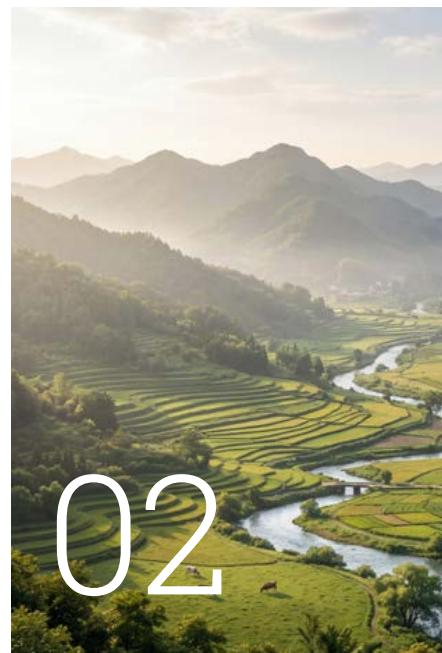

natural_image

Scenic rural landscape with terraced fields, winding river, and misty mountains in the background (no text or symbols)

## 环境合规与绿色低碳

<table><tr><td>董事长致辞</td><td>4</td></tr><tr><td>报告编制说明</td><td>6</td></tr><tr><td>关于天域生物</td><td>8</td></tr><tr><td>2025年度公司大事记</td><td>10</td></tr></table>

公司治理 16

风险管控 23

商业道德 25

应对气候变化 28

环境管理 30

循环经济 36

生态系统与 37

生物多样性保护

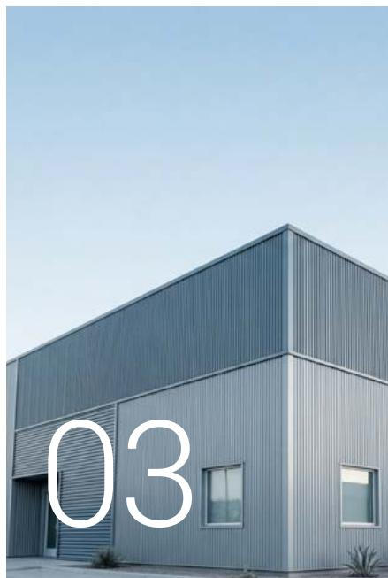

natural_image

Modern gray building with vertical slats and a large white number '03' overlaid, against a clear sky (no other text or symbols)

## 研发创新与产品责任

创新驱动 40

产品和服务 41

安全与质量

natural_image

Close-up of two hands clasped together, no text or symbols visible

04

## 人才聚焦与社会责任

员工 44

社会责任 46

natural_image

Riverside view of a green field with grazing pigs under a blue sky, no text or symbols visible.

## 附录

附录1 关键绩效指标表

# 董事长致辞

## Chairman's Address

## 66

2025年，是天域生物战略转型纵深推进、可持续发展根基持续夯实的关键之年。面对气候变化的严峻挑战与行业变革的深刻重塑，我们始终秉持“生态优先，价值共生”的核心理念，将ESG治理深度融入企业战略与运营的肌理之中。我们深知，企业的长远价值不仅体现在财务绩效，更在于对环境、社会及利益相关方所肩负的责任与贡献。本报告旨在系统回顾过去一年公司在生态农牧食品与生态能源两大业务板块于环境保护、社会责任和公司治理领域的实践进展与思考成果。

## 以“生态”为基，构筑可持续业务发展模式

公司坚定以“生态”为核心经营理念，深耕生猪养殖业务，通过“自繁自养一体化”与“公司+家庭农场”模式保障农产品安全与供应链韧性，积极探索“种养食结合”的生态循环体系。公司坚定推行绿色养殖模式，致力于解决养殖过程中的环保问题，推动土壤改良与资源高效利用，将环境友好深植于现代农业实践，努力实现“一个养殖场就是一个生态循环经济体”的愿景。同时，公司持续优化饲料配方，从源头减少氮排放，为行业减排贡献力量。

在生态能源板块，公司积极拥抱国家“双碳”战略，将分布式光伏业务作为推动能源结构转型的重要抓手。通过“自发自用，余电上网”模式，为工商业场景提供绿色电力解决方案的同时，将光伏电站的建设与农业、生态治理相结合，探索“光伏+”复合模式，提升土地资源利用效率，积极助力国家“双碳”目标。

## 以“数智”为擎，驱动新质生产力赋能可持续发展

公司深刻认识到，科技是驱动可持续发展的核心引擎。报告期内，公司积极探索“数智化”转型升级，拥抱新质生产力，通过对生物资产的精细化、数字化管理，提升养殖效率，为绿色金融创新奠定基础。“数智”为擎的战略目标不仅是为了提高公司运营效率与决策水平，更希望通过此举以智慧透明的方式，管理企业环境足迹与社会影响，让公司可持续发展进度可衡量、可优化。

## 以“责任”为念，与利益相关方共创共享价值

我们始终秉持“敬天爱人”的经营哲学。在乡村振兴的国家战略中，我们的“公司+农户”模式不仅提升了产业效能，更切实带动了合作农户增收，助力地方经济发展。我们坚持合规经营，积极维护员工权益，致力于构建和谐、平等、安全的工作环境。我们也将持续通过重点项目清欠、保障供应链合作伙伴权益等方式，积极履行对更广泛利益相关方的责任。

展望未来，可持续发展已从“可选项”变为企业生存与竞争的“必答题”。天域生物将一如既往地将ESG理念深度融入公司战略、运营管理与企业文化不断探索新质生产力创新路径，高效协同生态农牧食品与生态能源业务板块，以更高的标准要求自身，回应各方期待，携手共建绿色未来。

## 以“治理”为锚，夯实可持续发展的决策根基

健全的公司治理是践行ESG理念的根本保障。公司持续完善治理架构 确保科学、审慎决策。天域生物高度重视与所有股东，特别是中小股东的沟通，致力于建立稳定、透明的回报机制。同时我们不断完善内部控制与风险管理体系 积极应对包括环境、社会、运营在内的各类风险，确保公司在追求增长的同时行稳致远

天域生物科技股份有限公司

董事长：梅晓阳

## 报告编制说明

## 报告简介

本报告是天域生物科技股份有限公司（以下简称“天域生物”“公司”或“我们”）发布的第四份环境、社会及公司治理（以下简称“ESG”）报告，旨在系统性阐述天域生物在可持续发展及社会责任等方面的实践及成果，回应利益相关方的期望和诉求。本报告经公司2026年4月29日召开的第五届董事会第十一次会议审议通过，并与公司2025年年度报告同时发布。公司董事会保证本报告内容不存在任何虚假记载或误导性陈述，并对其内容真实性和准确性负责。

## 报告期间

本报告为年度报告，披露时间范围为2025年1月1日至2025年12月31日，部分内容根据披露需要在时间范围上适度延伸。

## 报告范围

除文中特别说明外，本报告披露的信息范围涵盖天域生物及其下属全资、控股子公司，与天域生物（603717SH）年度财务报告合并报表范围一致。

## 编制依据

本报告遵循上海证券交易所《上市公司自律监管指引第14号——可持续发展报告（试行）》（以下简称“《14号指引》”）、《上市公司自律监管指南第4号—可持续发展报告编制（2026年1月修订）》（以下简称“《4号指南》”），并参照全球可持续发展标准委员会（GSSB）发布的《GRI可持续发展报告标准（GRIStandards 2021）》和联合国可持续发展目标（SDGs）进行信息披露。

本报告所涉及的财务数据按照中国企业会计准则编制。

## 数据说明

本报告的数据主要来源于本公司统计报告及相关文件，同时兼顾公司发展重点与利益相关方关注。报告中的财务数据摘自公司本年度财务报告，如与财务报告有出入之处，以公司年度财务报告为准。本报告所涉及的货币单位均为人民币。

## 编制原则

本报告遵循“准确性”、“平衡性”、“可比性”原则，在可持续发展背景下向利益相关方披露公司在经营中对于各项议题所秉持的理念、建立的管理办法、推行的工作以及取得的成果。报告编制过程中，数据收集分析信息化、数据引用注明来源、专业术语含义作通俗解释，增强“量化性”和“清晰性”。

## 报告获取

本报告以印刷版和电子版两种形式发布，印刷版备置于公司董秘办。

电子版发布平台包括：上海证券交易所网站（以下简称“上交所”）官方平台（http://www.sse.com.cn）、巨潮资讯网（http://www.cninfo.com.cn）等信息披露平台，亦可于公司官方网站（https://www.tygf.cn/）在线浏览或下载。

## 联系方式与意见反馈

天域生物科技股份有限公司鼓励各利益相关方对公司ESG工作提出建议或意见。如有相关事宜，欢迎通过以下方式联系公司董秘办、帮助我们对报告进行持续改进

021-65236319

IR@tygf.cn

  
意见反馈问卷

# 关于天域生物

天域生物科技股份有限公司(证券代码：603717)，成立于2000年，2017年在上交所主板上市，公司总部位于上海市杨浦区。公司秉持“敬天爱人”的经营哲学，以“青山绿水好家园”为经营使命，聚焦“生态大农业”战略，协同生态农牧食品与生态能源业务，持续为客户提供美丽中国和城乡融合发展的整体解决方案，致力于成为城乡美好生活的创造者、守护者。

## 企业文化

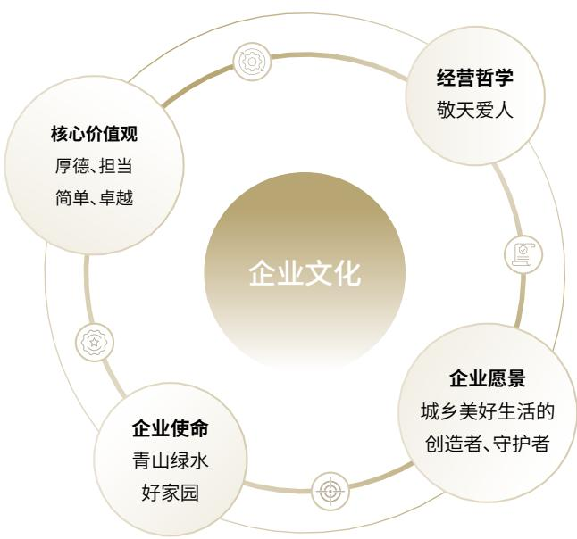

flowchart

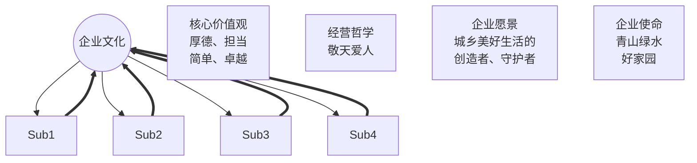

natural_image

Rural landscape with terraced fields, a winding river, and wind turbines in the distance (no text or symbols visible)

## 业务布局

公司目前聚焦双板块业务协同，共同支撑可持续发展企业蓝图：生态农牧食品业务板块以生猪养殖业务为核心，营收占比超过70%，采用“自繁自养”与“公司+农户”相结合的模式，在湖北省进行区域化深耕，保障生猪稳产保供，助力地方农业经济。同时，公司积极向产业链上下游延伸，涉足基于生物科技的红曲系列产品及农副产品的研发与销售，探索“种、养、食”结合的生态循环农业模式，致力于提供健康、安全的食品。

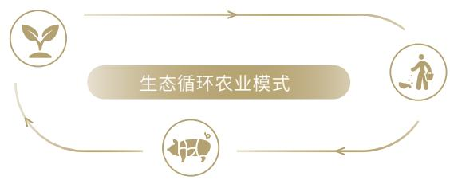

flowchart

为应对气候变化 推动能源结构转型公司积极布局以分布式光伏电站投资、建设与运营为主的生态能源业务。公司利用在工程项目管理方面的优势，将清洁能源技术与各类应用场景结合向社会提供绿色电力为公司践行低碳承诺、参与构建新型电力系统提供重要实践。

天域生物将可持续发展理念融入公司战略，通过现代化、智能化的养殖管理，致力于提升养殖效率、加强疫病防控，稳健发展生态农牧食品业务的同时逐步探索生猪核心育种休系与高校合作推动育种技术产业化降低对外依存度提升产业自主性与生物安全水平。面对行业周期与市场风险公司高度重视财务健康与运营安全，不断完善内部治理结构，加强合规管理推动公司向更加可持续、更具韧性的方向发展。

## 2025年度公司大事记

## 2025 Company Milestones

## 2025 年 01 月

天域生物召开年度经营工作会议，全面总结2024年公司生产经营情况，制定2025年度公司战略规划，明确2025年生产经营工作重点与目标，开启年度新篇章。

## 2025 年 03 月

天域生物生猪养殖板块的多个养殖基地同步启动改造计划，根据产能调控政策目标就技改与硬件升级、种猪繁育体系建设、生物安全检测等多方面作系统性升级。

## 2025 年 10 月

天域生物作为首批核心单位签署“中农碳链”生态联盟链合作协议，助力发布我国首条农业可信碳资产联盟链。本次“中农碳链”的发布标志着我国在利用区块链技术赋能碳市场基础建设方面取得重要突破。

## 2025 年 11 月

天域生物与中国农业科学院深圳农业基因组研究所孵化企业中农种源（深圳）科技有限公司达成生猪创新育种战略合作，以生物科技赋能种源升级，为公司生猪产业高质量发展注入新动能。

natural_image

Panoramic view of a lush green field with grazing pigs, a winding dirt path, and distant hills under a partly cloudy sky (no text or symbols visible)

## 2025 年度企业资质荣誉

## 2025 Enterprise Qualifications & Accolades

2025 年 04 月

武汉佳成生物制品有限公司：荣获“2025年度湖北省科学技术奖三等奖”

公司控股子公司

2025 年 07 月

天域生物科技股份有限公司：荣获“2024年中国上市公司财务治理百强”

中国公司治理50人论坛

2025 年 12 月

天域生物科技股份有限公司：荣获“2025年中国企业乡村振兴500强”

北京理工大学共同富裕与人力资源开发研究中心

2025 年 12 月

天域生物科技股份有限公司：荣获“2025年度投关创新奖”

同花顺上市公司年度评选

2025 年 12 月

天域生物科技股份有限公司：荣获“2025年度上市公司ESG价值传递奖”

易董ESG价值评级

2025 年 12 月

天域生物科技股份有限公司：荣获“2025年度上市公司卓越投关建设奖”

易董价值在线

Corporate Governance &

Risk Control

## 01

## 公司治理与风险管控

## 公司治理

## 治理架构

公司致力于建立并维护一个高效、透明、合规的公司治理架构，以保障所有股东的权益，确保公司的长期稳健运营与可持续发展。公司严格按照《中华人民共和国公司法》《中华人民共和国证券法》《上市公司治理准则》的要求，遵守商业道德，持续完善公司治理架构与风险管理体系，增强运营稳定性。

天域生物治理架构由股东会、董事会和管理层组成，权责分明，主体清晰。股东会是公司的最高权力机构：董事会作为公司治理的核心，负责公司的战略制定和重大决策。董事会下设4个专门委员会，分别是战略与ESG委员会、审计委员会、提名委员会、薪酬与考核委员会，就公司各领域特定议题提供专业建议，有效提升决策科学性与准确性，对管理层形成有效监督。公司已建立独立董事专门会议机制，为独立董事提供履职平台，充分发挥其在关键领域参与决策、监督制衡、专业咨询的重要作用，客观评估重大事项，保障中小股东合法权益。

报告期内，公司根据2024年7月1日起施行的《中华人民共和国公司法》（即“新《公司法》”）、中国证监会发布的《关于新〈公司法〉配套制度规则实施相关过渡期安排》以及《上市公司章程指引》等相关规定，完成对包括《天域生物科技股份有限公司公司章程》在内的多项治理文件修订工作，匹配上市公司最新治理框架：2025年10月公司顺利有序的完成了董事会和管理层的换届选举工作，同步调整上市公司治理机制：取消监事会、由董事会审计委员会行使新《公司法》规定的监事会职权等内容。

natural_image

Exterior view of a modern glass skyscraper with faceted windows and geometric facades (no signage or text visible)

## 关键绩效

报告期内，公司共计召开

<table><tr><td>股东会</td><td>董事会</td><td>审计委员会</td><td>提名委员会</td></tr><tr><td>5次</td><td>15次</td><td>8次</td><td>2次</td></tr><tr><td>审议议案</td><td>审议议案</td><td>独立董事占比</td><td>独立董事占比</td></tr><tr><td>29项</td><td>69项</td><td>66.7%</td><td>66.7%</td></tr><tr><td>薪酬与考核委员会</td><td>战略与ESG委员会</td><td>独立董事专门会议</td><td></td></tr><tr><td>2次</td><td>0次</td><td>5次</td><td rowspan="3"></td></tr><tr><td>独立董事占比</td><td>独立董事占比</td><td>独立董事占比</td></tr><tr><td>66.7%</td><td>33.3%</td><td>100%</td></tr></table>

天域生物治理架构图  
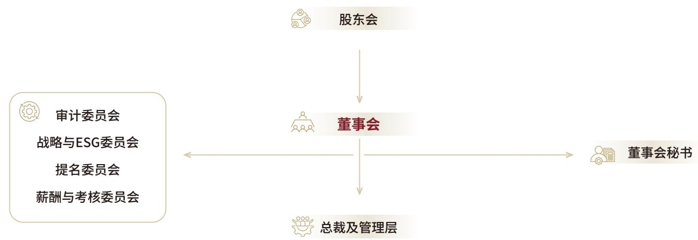

flowchart

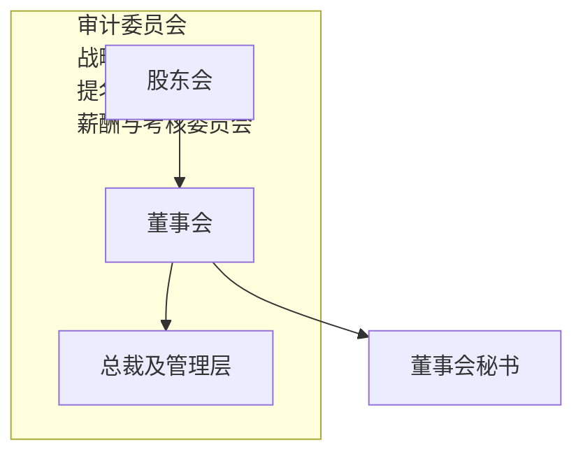

## 董事会成员多元化

为增强监督与治理效能、提升决策质量与创新能力，公司重视董事会成员多元化，在遴选过程中从性别、年龄、教育背景、专业经验、技能水平等多角度进行综合考量确保选举过程公平公正。通过引入更广泛视角与经验，董事会成员多元化机制可有效避免“群体思维”偏误，帮助识别与应对复杂环境中的风险，增强企业韧性，提升核心竞争力。

截止报告期末，天域生物董事会由7名董事组成，包含2名女性董事，董事会成员多元化分析如下：

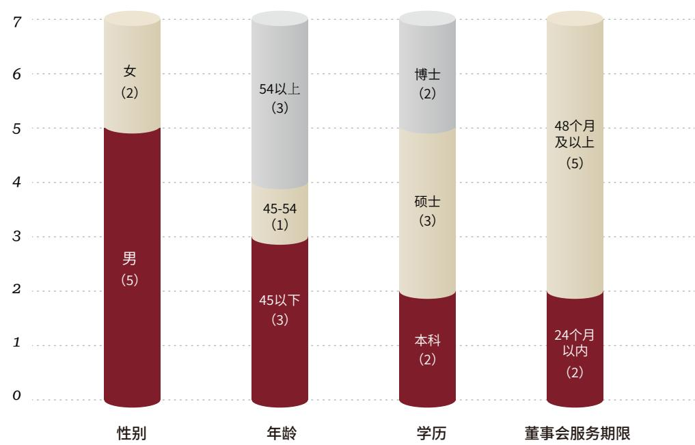

bar_stacked

| Category | Sub-category | Value |
| --- | --- | --- |
| 性别 | 男 (5) | 5 |
| 性别 | 女 (2) | 2 |
| 年龄 | 45以下 (3) | 3 |
| 年龄 | 45-54 (1) | 1 |
| 年龄 | 54以上 (3) | 3 |
| 学历 | 本科 (2) | 2 |
| 学历 | 硕士 (3) | 3 |
| 学历 | 博士 (2) | 2 |
| 董事会服务期限 | 24个月以内 (2) | 2 |
| 董事会服务期限 | 48个月及以上 (5) | 5 |

报告期内公司积极组织全体董事与高管成员参加上海证券交易所、上市公司协会等监管部门与机构开展的关于上市公司规范运作及独立董事合规履职等主题的相关培训通过阅读培训材料 学上市公司治理准则与ESG可持续发展相关的指引及管理办法，切实提高上市公司可持续发展治理的知识水平与履职能力。

## ESG 治理

公司已建立权责清晰、层级分明、运行高效的可持续发展治理架构，确保从决策、监督到执行的全流程管理。

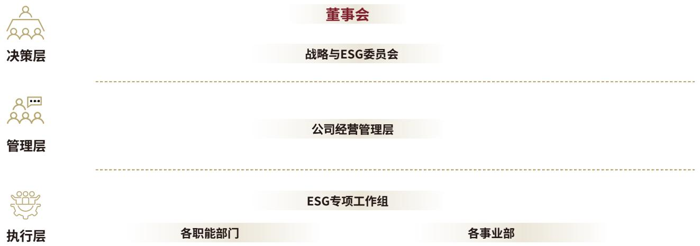

flowchart

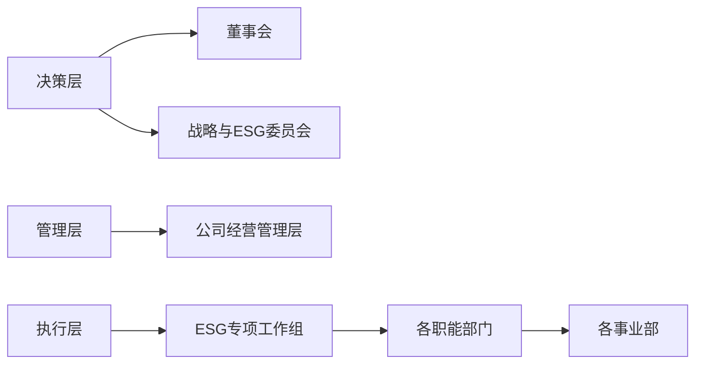

董事会作为公司ESG工作的最高领导和决策机构，负责审议并批准公司的可持续发展战略、目标及重大议题；审批ESG相关管理制度：监督ESG战略的执行与目标达成情况：最终审议批准年度《环境、社会及公司治理（ESG）报告》。董事会确保将可持续发展相关的重大风险与机遇纳入公司整体战略和重大决策考量

为提升专业决策与监督效能 董事会下设战略与ESG委员会 作为ESG工作的核心研究与指导机构，该委员会的主要职责是深入研究国内外可持续发展工作的趋势与政策：指导制定公司ESG目标、管理策略与行动计划：审阅ESG报告草案并向董事会提交；指导公司识别、评估与管理 ESG相关风险。

公司经营管理层负责组织推进ESG管理的全面实施。董秘办被指定为ESG工作的牵头部门，负责协调日常事务，其职责包括：拟定具体工作计划与方案：组织跨部门收集、整理ESG信息与数据：组织开展利益相关方沟通：编制年度ESG报告：跟踪ESG政策与评级动态。

公司各业务部门及子公司组织建立ESG专项工作组， 负责落实其职责范围内的具体ESG管理实施工作。

## ESG 信息内部汇报机制

公司建立了ESG信息内部汇报机制，确保董事会及战略与ESG委员会能够及时、全面地获取可持续发展相关的影响、风险、机遇及管理进展信息，保障了治理机构监督职能的有效履行。

## 利益相关方沟通

本公司高度重视与利益相关方的双向沟通，将其视为完善ESG管理、提升披露质量的重要途径。我们的核心利益相关方包括：股东与投资者、政府与监管机构、员工、供应商、社区和非政府组织等。

<table><tr><td>利益相关方</td><td>关注内容 &amp; 议题</td><td>我们的回应</td><td>沟通渠道</td><td>沟通频率</td></tr><tr><td>股东与投资者</td><td>·股东权益·公司治理·经济效益与风险管理</td><td>·提升投资者回报和信息披露质量,合规治理、规范运作;·聚焦主业、优化运营效率;·细化内部控制体系、稳健发展</td><td>·定期报告·临时公告·股东会·业绩说明会·投资者沟通·机构调研</td><td>定期/不定期</td></tr><tr><td>政府与监管机构</td><td>·合规经营·环境保护与管理·应对气候变化·税务合规·乡村振兴·公司治理</td><td>·健全内控合规管理体系·优化环境管理体系·严格管控三废管理·恪守商业道德</td><td>·政府及监管部门组织的行业会议·政府及监管部门监督检查·政策建议、监管沟通</td><td>定期/不定期</td></tr><tr><td>员工</td><td>·员工合法权益保护·职业健康与安全·员工培训与发展</td><td>·公平合理的薪酬体系·加强工作场所安全设施建设与维护·定期开展安全培训与应急演练·个性化员工培训计划,设立内部晋升通道</td><td>·职工满意度调查·员工培训</td><td>定期/不定期</td></tr><tr><td>供应商</td><td>·反商业贿赂及反贪污</td><td>·供应商动态长效管理机制·统一质量和验收标准·践行商业行为准则</td><td>·定期供应商走访与沟通·准入认证·举报与监督</td><td>定期/不定期</td></tr><tr><td>社区和非政府组织</td><td>·乡村振兴·社会贡献·环境保护与管理·生态系统与生物多样性保护</td><td>·环保型农牧生产运营,减少污染排放·参与社区教育、文化、环保等公益活动·社区走访与座谈</td><td>·志愿者·公益项目·环境信息披露</td><td>定期/不定期</td></tr></table>

## ESG重要性议题分析

公司依据《14号指引》要求，建立了“双重重要性”分析流程，作为确定报告披露重点和管理优先级的核心依据。

1.	分析维度：

a.财务重要性：分析可持续发展议题是否预期在短期、中期或长期内对公司的商业模式、业务运营、财务状况、现金流及融资成本等产生重大影响。  
b.影响重要性：分析公司在特定议题上的表现是否会对经济、社会和环境产生重大影响。  
2.执行流程：公司每年（或在业务模式发生重大变化时)组织跨部门团队，通过以下步骤开展分析

## 了解公司活动和业务关系背景

## 了解公司活动和业务关系

根据公司的主要业务活动分析公司与供应商、客户、合作伙伴之间的关系，了解供应链的各个环节。评估公司在市场中的竞争地位和市场份额。

## 了解外部客观环境

分析中央和地方的农业政策和环保法规对公司业务的具体影响，全球气候变化、自然灾害等自然因素对行业趋势的变动影响。及时了解市场需求变化、消费者偏好等外部因素

## 了解主要受影响利益相关方

识别公司内部的主要利益相关方(如股东、管理层、员工等)，识别外部利益相关方(如农户、供应商、消费者、环保组织等），尝试分析利益相关方的需求和期望，评估他们对公司的潜在影响

## 建立议题清单

## 议题重要性的评估与确认

## 影响重要性和财务重要性评估

结合公司生态农牧食品板块和生态能源板块的业务特点，识别每个议题是否预期在短期，中期和长期内对公司商业模式，业务运营，发展战略，财务状况，经营成果现金流、融资方式及成本等产生重大影响(即“财务重要性”)，以及在相应议题下是否会对经济、社会和环境产生重大影响(即“影响重要性”)。

通过确定影响重要性评估因素和评分区间、利益相关方调研、设置各议题定性/定量的判定阈值等流程具体形成对各个议题的评估结论。

## 了解外部客观环境

分析中央和地方的农业政策和环保法规对公司业务的具体影响，全球气候变化、自然灾害等自然因素对行业趋势的变动影响。及时了解市场需求变化、消费者偏好等外部因素。

## 生成议题报告

汇总议题双重重要性分析的流程、方法及结论，披露相关内容。

## 确认与审议

将重要性分析结果提交战略与FESG委员会及董事会确认与审议最终确定本年度重要性议题，决定相应的披露深度与管理资源分配

## 议题清单&议题重要性评估结果：

报告期内ESG重要性议题分析结果如下：

  
环境议题

<table><tr><td>应对气候变化</td><td>污染物排放</td><td>废弃物处理</td><td>能源利用</td><td>水资源利用</td><td>环境合规管理</td></tr><tr><td>循环经济</td><td colspan="5">生态系统与生物多样性保护</td></tr><tr><td>乡村振兴</td><td>社会贡献</td><td>创新驱动</td><td>员工</td><td colspan="2">产品和服务安全与质量</td></tr><tr><td>公司治理</td><td>利益相关方沟通</td><td colspan="4">反商业贿赂及反贪污</td></tr></table>

  
社会议题

  
治理议题

公司根据《14号指引》的21项议题清单，结合自身情况与外部环境综合分析后，共计识别出16项议题。其中，具有财务重要性的议题共有7项，财务重要性议题将依据《上市公司自律监管指引第14号一可持续发展报告（试行）》提出的“治理一战略―影响、风险和机遇管理―指标和目标”框架进行披露。

影响重要性

<table><tr><td>影响重要性</td><td></td><td>双重重要性</td><td></td></tr><tr><td>公司治理</td><td>乡村振兴</td><td>应对气候变化</td><td></td></tr><tr><td>利益相关方沟通</td><td>社会贡献</td><td></td><td></td></tr><tr><td>污染物排放</td><td></td><td></td><td></td></tr><tr><td>循环经济</td><td></td><td></td><td></td></tr><tr><td>生态系统和生物多样性保护</td><td></td><td></td><td></td></tr><tr><td rowspan="5">反商业贿赂及反贪污</td><td rowspan="5"></td><td>财务重要性</td><td></td></tr><tr><td>废弃物处理</td><td>创新驱动</td></tr><tr><td>能源利用</td><td>产品和服务安全与质量</td></tr><tr><td>水资源利用</td><td>员工</td></tr><tr><td>环境合规管理</td><td></td></tr></table>

财 务 重 要 性

## 风险管控

## 风险管理架构

公司秉持“全面管理、重点防控、动态优化”的风险管理理念，构建了由董事会组织决策、管理层直接领导、各业务部门与职能单元具体执行的三层风险管理组织架构

## 董事会

作为风险管理的最高决策与监督机构，负责审议公司风险管理策略、基本制度及重大风险解决方案，监督公司整体风控状况

## 董事会审计委员会

在风险管理中承担关键监督职能，负责指导公司内部控制体系的建设与评价监督内部控制的有效实施，审阅公司的财务报告及内部控制评价报告。

## 管理层

负责组织实施董事会审议通过的风险管理策略与决议，建立健全公司全面风险管理体系，领导各职能部门开展日常风险识别、评估、应对与监控工作，向董事会报告重大风控事项。

## 审计法务部

公司设立了审计法务部，在董事会审计委员会的指导下，独立开展内部审计工作，对内部控制的设计与运行有效性进行监督检查，并提出改进建议

natural_image

Two business professionals shaking hands at a desk with documents and a laptop in the background (no visible text or symbols)

## 内部控制体系与运作

公司致力于建立并持续完善内部控制体系，覆盖经营管理各环节，旨在合理保证公司经营管理的合法合规与资产安全，财务报告及经营信息的真实完整。董事会及管理层高度重视各环节风险识别，定期评估公司财务、经营、行业及公司治理相关风险，适时制定应对措施。

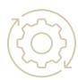

## 资金管理

完善公司资金管理制度。对募集资金实行专户存储、专款专用，并定期披露使用情况。对经营性资金的使用、审批、支付等环节设有明确的授权与流程控制

## 采购与销售管理

针对生态农牧食品、生态能源等不同业务板块，建立了相应的采购计划、供应商管理、销售定价及客户信用评估流程。

## 资产管理

对固定资产、存货、应收账款、长期股权投资等资产建立了台账管理、定期盘点、减值测试及处置审批制度

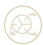

## 财务报告

遵循企业会计准则，建立了从凭证编制、账簿登记到报表生成的完整财务处理流程和复核机制确保财务信息真实、准确、完整。

## 关联交易

制定了关联交易管理制度，确保关联交易决策程序合规、定价公允、及时透明，严格履行关联交易相关上会审议程序及信息披露义务。

## 商业道德

## 商业道德风险识别

公司董事会深刻认识到，健全商业道德与反腐败体系是公司治理的基石、关乎公司声誉、长期价值及可持续发展能力。天域生物致力于构建预防为主、全面覆盖的风险识别与管理机制，将合规要求融入业务流程。

公司通过制定内部政策明确禁止形式贿赂回扣 欺诈及洗钱等行为，并对存在利益冲突的敏感场景做出具体规范。此外，公司通过新员工入职培训、内部宣导等多种形式，对管理层与全体员工进行全覆盖的商业道德与反腐败教育，提升全员合规意识与风险辨识能力。

## 供应商反贪腐管理

构建阳光、廉洁、负责任的采购生态，是实现价值链商业道德目标的关键。公司在供应商准入环节明确阐述廉洁合作与反商业贿赂的具体要求，加强供应商准入合规审核；此外通过建立常态化采购合规审核机制，公司定期对关键供应商的行为准则履行及商业道德管理情况进行评估。

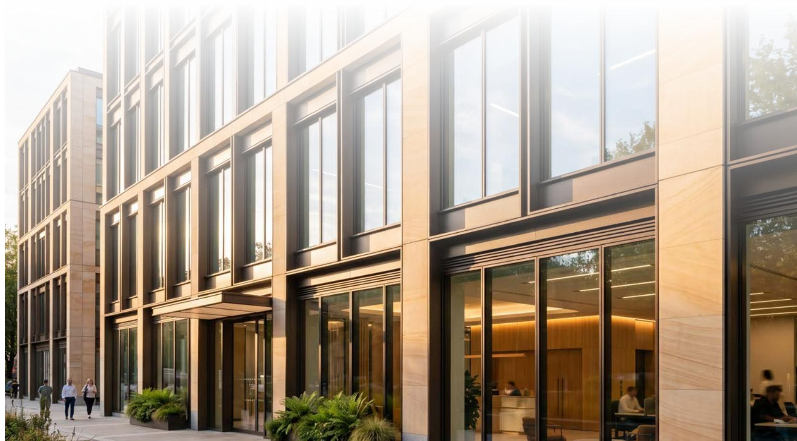

natural_image

Modern multi-story office building with glass facade and wooden windows, featuring people walking in the foreground (no visible text or signage)

Environmental Compliance &

Green Low-Carbon

## 02

## 环境合规与

## 绿色低碳

## 应对气候变化

公司严格遵守《中华人民共和国环境保护法》《中华人民共和国水污染防治法》《中华人民共和国固体废物污染环境防治法》等国家及地方各项环保法律法规，将环境友好理念融入战略规划与日常运营。

报告期内，公司持续完善环境管理体系，积极识别并管理环境相关风险与机遇，致力于通过精细化运营减少生产活动对环境的影响，为实现国家“双碳”目标贡献力量。

## 治理

公司已将“应对气候变化”议题纳入日常管理层决策与监督体系。

1. 董事会下设的“战略与ESG委员会”负责气候相关风险与机遇的总体评估、目标审定及监督执行，确保气候议题与公司整体战略的深度融合。  
2.管理层设立跨部门“气候变化工作小组”，由分管相关领导牵头，统筹协调定期气候风险与机遇识别、减排项目推进等工作。

## 战略

天域生物通过系统分析运营全流程及价值链关键节点后，识别出气候变化在短期、中期和长期对公司商业模式财务状况及经营成果产生的重大影响(财务重要性)，同时评估了公司活动对气候与环境产生的重大影响(影响重要性)。

•	风险识别

A.物理风险：报告期内极端天气事件(如洪涝、干旱、持续高温)频率与强度增加，将直接威胁公司养殖基地的产量稳定性、动物健康与生产效能，造成资产损毁与供应链中断，导致运营成本上升和收入波动  
B. 转型风险：

a. “双碳”政策趋紧与环保标准提升，使环境合规与技改成本上升；  
b.	下游客户及消费者对低碳农产品的偏好日益增强，若公司未能有效推进绿色转型，可能面临市场竞争力下降与品牌价值受损风险；（注明：按公司目前触达客户群体，尚未产生明显影响）。

· 机遇识别

A.融资机遇：良好的气候治理与减排绩效有助于获得绿色信贷、绿色债券等优惠融资，降低资金成本  
B市场与产品机遇：公司可结合自身业务发展情况，考虑积极开发低碳、有机农产品，满足绿色消费趋势获取产品溢价，开拓新兴市场  
C.运营效率机遇：公司可考虑在生产运营中适量作减排技术投入，在达成减排目标的同时降低能源与外购肥料成本，实现资源循环利用与运营效率提升。

## 风险和

## 机遇管理

报告期内，公司依据《上市公司可持续发展报告编制指南》的温室气体核算流程与方法，初步尝试核算范围一与范围二的温室气体排放量。同时，公司开展“节水节能”专项行动，降低单位产品水耗与能耗，有效提升效率资源。

风险应对方面，公司通过优化养殖场选址与设计、加强防灾减灾设施建设与仓储物流设施的防洪防高温改造完善应急预案，提升对极端气候事件的抵御能力。

机遇把握方面，公司将识别出的可能机遇汇总后尝试作专题分析，为管理层日常经营决策提供有效支持

## 指标

## 与目标

2026年，公司将为量化管理绩效并驱动作持续改进，尝试对关键指标与目标作设立与追踪

2025年，公司环保投入约为357.8万元，已计入当期资本支出及费用

## 报告期内

## 绩效情况

公司温室气体范围1排放量约为

公司温室气体范围2排放量约为

30,730.9

17,423.1

吨二氧化碳当量

吨二氧化碳当量

natural_image

Dow view of dense green trees with sunlight filtering through, no visible text or symbols

## 环境管理

## 污染物排放

## 治理

董事会下设战略与ESG委员会负责监督公司总体环境合规目标达成，污染物排放管理纳入其中，日常由各生产养殖基地根据自身实际情况落实执行。报告期内，公司污染物排放符合国家及地方行业排放标准。

## 战略

我们视有效控制排放为规避监管处罚、降低环境税费、保障长期运营许可的关键，也是提升公司品牌价值、获取绿色信贷等优惠融资渠道的战略基础

## 风险和机遇管

1.	风险与成本：

a.排放超标可能导致高额行政罚款、停产整改、生态损害赔偿及声誉损失，直接冲击公司营收与现金流。  
b. 现行环保法规日益收紧，要求针对环保设施升级作持续投入，增加资本开支

2.	机遇与收益：

a.领先的排放控制水平有助于获得政府环保补贴、税收优惠  
b.有机废弃物资源化利用可部分抵消治污成本，创造新的收入来源  
c. 优越的环境绩效表现可增强上下游认可度，帮助公司获取优秀供应商与客户资源，提升产品议价能力与市场竞争力。

行动：报告期内，公司全面巡检辖下规模化养殖场，对排放情况作效能评估：完成相关排污管道、老旧设施的升级与改造计划，降低养殖环节氨氮与硫化氢排放强度，提升环境管理质量。

## 废弃物处理

## 治理

公司秉持“无害化、减量化、资源化”原则管理废弃物。ESG委员会监督废弃物管理策略实施与推进。公司生产与供应链管理部门负责协同从废弃物分类、收集、贮存到最终处置或利用的全过程管理，并对接第三方专业的资源化合作企业

## 战略

公司将废弃物视为“放错位置的资源”，其高效处理与资源化利用是公司发展循环经济、控制运营成本、开发副产品价值的核心战略举措。有效的废弃物管理能显著降低处置费用，后续可能转化为碳减排收益

## 风险和机遇管

1.	风险与成本：

废弃物处置不当将面临罚款。随着废弃物处置市场价格上涨，相关运营费用持续增加。若资源化渠道不畅，可能导致处置成本高企或仓储压力

2.	机遇与收益：

a.畜禽粪便等农业废弃物的资源化已形成稳定商业模式，直接带来销售收入并减少外部肥料、能源采购支出  
b.通过改进包装设计减少塑料使用，降低原材料采购成本与后端处理负担。  
c. 精确的废弃物管理记录有助于通过绿色供应链审核，为公司赢得上下游订单创造可能途径。

行动：报告期内公司尝试推行生产单元废弃物分类管理，促进粪便资源的稳定消纳与价值最大化。同时，公司考虑包装物减量计划，试点使用可降解材料

## 能源利用

## 治理

公司能源管理工作日常由各养殖场运营部门作具体数据收集与核算，统一报送公司 ESG 工作小组。公司董事会战略与 ESG 委员会定期审议指标汇总情况并监督公司年度能源管理工作。

## 战略

能源成本是公司重要的运营成本构成。提升能源利用效率、发展可再生能源，是应对能源价格波动风险、减少碳足迹，并响应国家“双碳”战略的核心路径，能源管理与公司盈利能力与气候韧性息息相关。

## 风险和机遇管理

1. 风险与成本：

a.	传统能源价格上行直接推高养殖、加工、温控等环节的成本，侵蚀利润；  
b.高耗能设备的技改投资需要前期资本投入；

2.	机遇与收益：

a. 公司在实施节能改造后，可产生持续的节能效益，投资回收期明确。  
b.公司可考虑利用养殖场屋顶、闲置空地建设分布式光伏电站，在满足部分自有用电需求的同时，余电上网可产生收益，为获得可再生能源补贴提供可能。  
c. 根据现行相关政策，高效的能源管理是申请绿色工厂认证、享受差别化电价政策的前提

行动：公司充分融合生态能源板块资源，将光伏发电设施试点投放于部分生产运营场地，提升绿色能源使用率的同时获得节能收益：此外，公司计划推进集中蒸汽管道供热，以降低日常能源费用率。

## 报告期内 绩效情况

公司主要养殖场外购电力总量为

5,256,023

千瓦时

主要养殖场间接能源消耗量为

1,576.81

吨标准煤

## 水资源利用

## 治理

天域生物将水资源管理纳入公司整体环境管理体系，由生产部门与运营管理部门共同负责，在高耗水环节实行用水定额管理。

## 战略

水资源是生态农牧行业的生命线。保障水资源安全、可持续利用，是维持养殖场生产稳定、保障生物资产健康、规避限水停产风险的根本。提高用水效率、开展水循环利用，直接降低取水费用与水处理成本，并增强公司在水资源紧张区域的运营韧性

## 风险和机遇管

1. 风险与成本：

a. 若公司所在区域水资源短缺或水价大幅上涨，将直接增加生产成本。水资源短缺地区面临取水许可受限问题，制约产能扩张：

2.	机遇与收益：

a.公司可以考虑增加节水灌溉、自动饮水系统、循环水养殖等方面的技术投入，长期节约水费与污水处理费。  
b. 公司可考虑中水回用(即处理后的废水用于冲洗、灌溉)，可降低新鲜水取用量，直接产生经济价值。

行动：公司对部分养殖场的取水/饮水设备作节能化升级，有效减少滴漏浪费。在预算允许的情况下，公司将考虑引进中水回用系统，将达标排放的废水部分回用于厂区绿化与清洁。

## 报告期内 绩效情况

公司主要养殖场总用水量约为

122,400

吨

## 环境合规管理

## 治理

天域生物重视可持续发展进程中的环境合规管理，公司建立了从总部到基地的环保违规报告与应急响应机制。报告期内，公司未发生环境事件整改情况。

## 战略

健全的环境合规管理体系是防范巨额罚款、项目叫停乃至刑事责任等风险的防火墙，与保障公司资产安全与正常经营秩序息息相关。

## 风险和机遇管理

1. 风险与成本：

a.上市公司环境违法违规行为将直接导致公司遭受罚款、赔偿等经济损失，公司需同时承担修复成本；同时造成股价下跌、融资成本上升、订单流失、品牌价值受损等负面影响  
b. 维护合规体系需要投入人力与培训资源。

2. 机遇与收益：

a.持续保持“零重大环境违法”记录，可显著降低相关环境责任险的投保费用、提升银行信用评级，使公司在可持续发展投资与并购中更具优势。

行动：报告期内，公司根据养殖场日常生产经营情况开展环境法规培训计划，定期进行环境合规风险排查。

natural_image

Aerial view of a vast green agricultural field with scattered trees and a dirt path, no visible text or symbols.

## 循环经济

公司秉持“生态”核心经营观，致力于构建资源节约、环境友好的运营体系。

“种养食”生态循环：在生态农牧食品板块，公司将养殖产生的粪污经第三方处理后，转化为有机肥用于配套农田或合作农户，改善土壤质量，减少化肥使用：同时，公司在日常经营中探索沼气能源化利用，解决环保问题的同时提升产业链价值。

同时，公司在生猪养殖运营过程中，通过优化饲料配方，从源头减少粮食资源消耗和氮磷排放，推动生产过程中的上下游环节的水资源循环利用和废弃物资源化。

## 生态系统与生物多样性保护

公司认识到保护生态系统与生物多样性对于可持续发展的重要性，并在业务活动中尽可能减少对其产生负面影响。

1.在新项目选址时，主动避让自然保护区、生态保护红线等环境敏感区域，从源头降低对自然生态环境的可能于扰。  
2.公司推广绿色养殖实践，通过推广环境友好的绿色养殖模式，减少养殖活动对周边土壤、水体的潜在影响，致力干实现与周边环境的和谐共生。

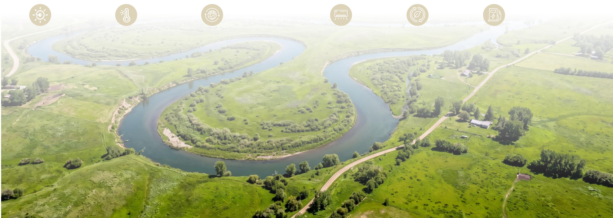

natural_image

Aerial view of a winding river surrounded by green fields, with four circular icons representing environmental or energy indicators (sunny, thermometer, globe, water meter, wind turbine).

R&D Innovation & Product Responsibility

## 03

## 研发创新与产品责任

## 创新驱动

公司正处于“生态农牧食品”与“生态能源”双轮驱动的战略深化与转型期。我们视研发创新为应对行业挑战、降本增效、开拓新增长曲线的关键引擎，相关投入与实践对公司财务稳健性与未来成长性具有直接且重要的影响。

## 相关实践与举措

## 聚焦主业研发&探索数智化转型

报告期内，公司在生态农牧领域，持续推进与华中农业大学等高校的“校企合作”，围绕生猪遗传育种、疫病防控、饲料营养及红曲功能性产品开发等关键环节开展课题研究与实践转化。封闭式自循环繁育育种体系(回交育种体系)的建设，旨在减少引种风险、提升母猪遗传水平，从源头降低养殖成本。在生态能源领域，研发方向涵盖分布式光伏电站的智能化运维、光储充一体化技术应用以及光伏建筑一体化(BIPV)等，旨在提升能源业务的技术附加值与运营效率。

此外，公司积极探索“数智化”升级。在生猪养殖板块，规划引入智能管理系统，通过对生物资产的数据化管理，实现精准饲喂、健康监控与智能环控，旨在提升养殖效率、降低料肉比。

## 预期财务影响与关联

## 成本控制与效率提升

育种、养殖过程优化及智能化改造的研发投入，直接目标是降低单位生猪养殖成本，如：饲料转化率、死亡率等。作为生猪养殖业务盈利能力的核心决定因素，直接影响公司主营业务毛利率。

## 产品差异化与溢价能力

对功能性红曲、红曲饲料添加剂等产品的研发，有助于开发具有独特健康属性的高附加值产品，帮助公司开辟新的利润增长点，提升整体产品组合的盈利能力。

## 产品和服务安全与质量

优质、安全的产品与服务是公司生存与发展的基石，也是维护客户关系、保障收入持续性的根本。天域生物致力于通过精细化运营作产品交付，提升收入质量、降低运营风险。

## 相关实践与举措

## 全过程质量控制体系

公司生猪养殖业务严格执行养殖生产方案等相关内部制度，从种源引进、头部供应商饲料采购、饲养管理到出栏销售，实施标准化、封闭化管理。采用智能饲喂系统、环境控制系统及严格的生物安全流程(如：洗消站、空气过滤)，保障猪群健康与产品安全。公司的红曲系列产品，生产拥有完整的质量管控流程，从原料(大米)采购、菌种扩培、发酵到烘于包装，均执行标准操作程序。

## 资质与认证

公司及重要子公司持有开展主营业务所必需的一系列资质证书，如《种畜禽生产经营许可证》《动物防疫条件合格证》《食品生产许可证》《饲料添加剂生产许可证》等。公司红曲系列产品业务线已顺利通过药品监督管理部门严格审核，正式取得《药品生产许可证》，获批普通中药饮品生产线，确保生产经营活动的合法合规与产品质量达标

## 客户导向的运营模式

公司的生猪产品采取“随行就市”的定价策略，确保交易公允；光伏业务采用“自发自用，余电上网”模式优先保障合作方用电需求，建立稳定的客户关系

## 预期财务影响与关联

## 保障收入实现与稳定性

严格的质量控制是确保生猪、红曲等产品符合市场准入标准，顺利实现销售的前提，直接关系到主营业务收入的确认与现金流回笼。稳定的产品质量有助于维护与核心客户的长期合作关系，保障收入的持续性

## 维护品牌声誉与市场信任

持续的质量投入是对公司品牌资产的投资，有助于维持公司在各区域市场的信誉，支撑销售渠道的稳定。

## 降低运营与 合规风险

完备的经营资质和持续的质量管理，能有效防范因无证经营、产品不合格导致的行政处罚、项目停工或调讼风险，避免由此产生的罚款、赔偿及业务中断带来的财务损失。

## Talent Focus & Social Responsibility

## 04

## 人才聚焦与社会责任

## 员工

## 权益保障与职业健康安全

公司严格遵守《中华人民共和国劳动法》《中华人民共和国安全生产法》等法律法规，建立了完善的劳动合同管理体系，畅通民主沟通与申诉渠道。在职业健康安全方面，我们针对各业务板块的特性，制定了差异化的安全管理规程：

生态农牧食品业务：严格执行养殖场的生物安全流程与封闭管理 为员工配备必要的防护装备 定期进行疫病防控与安全生产培训，针对“公司+农户”模式中的合作农户，亦提供同等的安全指导。

生态环境与能源业务：强化工程项目施工现场的安全管理，实施项目经理安全责任制，对高空作业、用电安全、设备操作等高风险环节进行重点监控与演练。公司已通过相关质量管理体系认证，并将安全标准融入日常运营。

## 相关财务影响分析

## 保障收入实现与稳定性

健全的劳动权益保障避免劳动争议可能带来的法律诉讼、赔偿及声誉损失。严格的安全生产管理能显著隆低工作场所事故发生率。

## 运营效率与稳定性

安全的工作环境有助于提升员工满意度和出勤率，减少因工伤导致的非计划性岗位空缺，保障生产与项目进度的连续性，维护营业收入与利润的稳定。在养殖业务中，有效的生物安全防控不仅是员工安全的关键也是保障生猪健康、降低死亡率、稳定出栏量的核心，直接影响主营业务成本与收入。

## 合规与融资成本

良好的劳工实践与安全记录有助于满足ESG投资机构的评估标准，维护公司在资本市场的声誉，为获得更优惠的融资条件创造可能条件，间接降低财务费用。

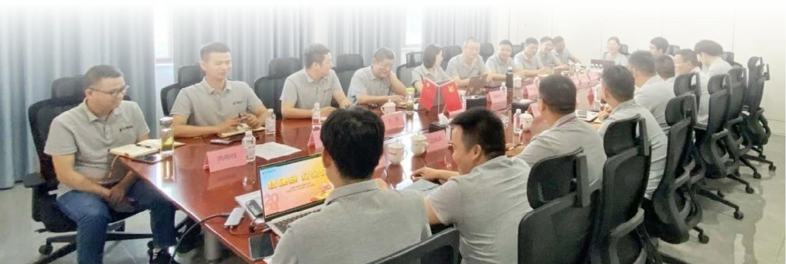

text_image

Meeting room photo with participants seated around a conference table, nameplates visible on the table and screen

## 员工关怀与人才发展通道

天域生物劳动用工方面的法律法规，制定了《人事基础管理制度》《薪酬体系管理制度》《社保公积金管理规定》《员工考勤管理制度》等一系列规章制度，构建起完善且规范的劳动关系管理体系。公司依法签订劳动合同、缴纳“五险一金”，切实保障每位员工的合法权益。公司秉持“敬天爱人”的经营哲学，视员工为共同发展的伙伴。我们通过多元化的关怀举措提升员工归属感，并构建系统化的人才发展体系；

在招聘环节，天域生物秉持公开、竞争、择优的原则，规范招聘流程，确保招聘工作在信息、过程、结果等方面全流程公开透明，坚决杜绝雇佣童工与强制劳动的行为，保障不同国籍、种族、民族、性别、宗教信仰和文化背景的员工都能享有平等的待遇。公司重视民主管理，关注员工的意见反馈。公司内部借助“钉钉”软件搭建起畅通的沟通桥梁，通过这一在线软件，上下级以及平级之间都能够即时联系，便于员工为企业经营发展积极建言献策。

## 员工关怀

公司提供具有竞争力的薪酬福利体系，及时帮扶困难员工；公司关注员工心理健康，致力于营造健康高效的工作氛围

## 人才发展

公司高度重视人才梯队建设。针对核心的生态农牧食品业务，我们持续引入行业专家与技术骨于，打造专业化团队。同时，公司与华中农业大学等高等院校的农牧专业合作，定向培养潜在人才，为业务扩张储备核心人力资本。公司持续建立健全内部晋升体系，支持员工技能提升。

## 相关财务影响分析

## 人力资本效能与成本优化

系统的培训发展体系能加速新员工融入，提升全员专业技能与生产效率：复合型人才的持续培养是推动“数智化”转型成功、实现降本增效的重要前提。有效的人才保留策略能降低核心员工流失率，减少因频繁招聘和再培训产生的高昂成本

## 创新驱动与业务增长

公司与华中农业大学等机构的“产学研”合作，为公司生猪育种、疫病防控等核心领域提供了持续的知识输入与人才供给，是构筑核心竞争力，驱动养殖业务高效高质可持续发展的根本，直接影响长期盈利能力和市场地位。

## 社会责任

## 助力乡村振兴

公司积极将自身业务发展与国家乡村振兴战略相结合，实现经济效益与社会效益的统一

天域生物持续在湖北省枝江市、宜都市等地区深化“公司+农户”合作养殖模式。公司提供猪苗、饲料、技术指导并实行保护价回收，农户负责育肥。2025年度，公司与113户合作农户结算金额约为6,998.65万元，平均单户结算61.93万元，有效带动了当地农户增收致富，巩固产业帮扶成果。

公司积极响应消费帮扶号召定向采购重庆市垫江县等地区的帮扶农副产品将优质农产品融入公司体系增强市场推广度。

2025年2月，公司控股子公司湖北天城丰泰食品有限公司向大悟县芳畈镇财政所捐赠乡村振兴款35,500元。

## 相关财务影响分析

## 供应链稳定 与成本优势

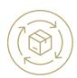

“公司+农户”模式是一种轻资产扩张策略。帮助公司在不过度投入固定资产的情况下。快速整合养殖产能，保障生猪出栏规模的稳定增长。与农户建立长期、稳定的合作关系，增强了上游供应链的韧性与可控性，有利于平滑生产计划，应对市场波动。同时，带动农户增收也反向巩固了这种合作关系的稳定性，为公司的养殖业务提供了可持续的产能基础。

## 政策契合与风险缓释

积极参与乡村振兴符合国家政策导向，有助于公司在项目审批、用地保障、产业政策等方面获得地方政府更多的支持，为业务开展创造良好外部环境，降低政策性风险。

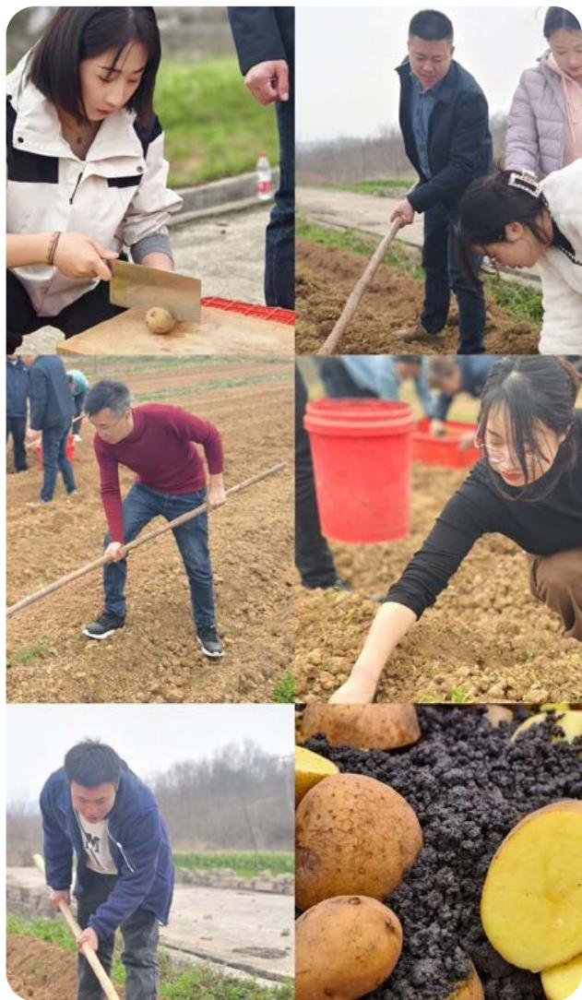

## 社会贡献与赋能社区

公司积极履行企业公民责任。在追求自身发展的同时，回馈社会，赋能运营所在地社区。公司持续践行“生态”核心经营观，通过生态环境治理项目和分布式光伏电站建设，直接改善项目所在地的人居环境和能源结构。公司生态能源板块的光伏项目为当地工商业用户提供绿色电力，降低项目用电成本与碳足迹。

## 相关财务影响分析

## 维护社会资本与运营许可

积极的社区参与有助于构建和谐的地企关系，减少项目推进中的社区阻力，保障施工与运营的顺利进行避免因社区矛盾导致的工期延误或成本增加

## 员工凝聚力与雇主品牌

组织员工参与社会公益活动，能够提升员工使命感与自豪感，增强内部凝聚力，间接提升工作效率；同时，也有助于打造积极的雇主品牌，在人才竞争中占据优势。

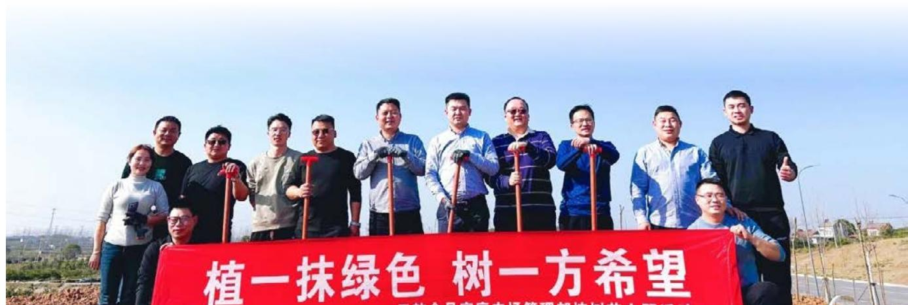

text_image

植一抹绿色 树一方希望

## 附录

## 关键绩效指标表

环境绩效

<table><tr><td rowspan="7">环境合规管理</td><td>环保投入总金额</td><td>357.8万元</td></tr><tr><td>环保事故</td><td>0件</td></tr><tr><td>环境领域违法违规事件</td><td>0件</td></tr><tr><td>污染物监测合格率</td><td>98.3%</td></tr><tr><td>环保培训次数</td><td>7次</td></tr><tr><td>环保培训参加人次</td><td>122人次</td></tr><tr><td>环保培训时长</td><td>30小时</td></tr><tr><td rowspan="4">能源利用</td><td>公司主要养殖场</td><td></td></tr><tr><td>间接能源消耗总量</td><td>1,576.81 吨标准煤</td></tr><tr><td>外购电力总量</td><td>5,256,023 千瓦时</td></tr><tr><td>直接能源消耗总量</td><td>404.69 吨标准煤</td></tr><tr><td rowspan="3">应对气候变化能耗数据</td><td>温室气体排放总量</td><td>48,154 吨二氧化碳当量</td></tr><tr><td>直接温室气体排放量(范围一)</td><td>30,731 吨二氧化碳当量</td></tr><tr><td>间接温室气体排放量(范围二)</td><td>17,423 吨二氧化碳当量</td></tr><tr><td rowspan="3">水资源利用</td><td>公司主要养殖场</td><td></td></tr><tr><td>总用水量:</td><td>122,400吨</td></tr><tr><td>水循环与再利用率</td><td>0.00%</td></tr><tr><td>污染和废弃物</td><td>废水排放量</td><td>20,160.00吨</td></tr></table>

人资绩效

<table><tr><td colspan="2">安全生产</td></tr><tr><td>安全生产事故类型和次数</td><td>轻微事故:1起</td></tr><tr><td>因工作关系死亡人数</td><td>0人</td></tr><tr><td>其中:公司雇员</td><td>0人</td></tr><tr><td>承包商员工</td><td>0人</td></tr><tr><td>总工伤人数</td><td>1人</td></tr><tr><td>其中:公司雇员</td><td>1人</td></tr><tr><td>因工伤损失工作日数</td><td>100个工作日</td></tr><tr><td>隐患排查整改率</td><td>100%</td></tr><tr><td>安全应急演练次数</td><td>5场次</td></tr><tr><td>安全生产投入金额</td><td>2.77万元</td></tr><tr><td colspan="2">安全教育培训</td></tr><tr><td>安全教育培训总投入</td><td>5.75万元</td></tr><tr><td>安全教育培训场次</td><td>7场</td></tr><tr><td>参与安全教育培训人次</td><td>278人次</td></tr><tr><td>安全教育培训总时长</td><td>7小时</td></tr><tr><td>安全教育培训覆盖比率</td><td>98.3%</td></tr></table>

人资绩效

<table><tr><td rowspan="9">发展与培训</td><td colspan="2">员工培训</td></tr><tr><td>培训场次</td><td>8场次</td></tr><tr><td>接受培训总人数</td><td>485人</td></tr><tr><td>员工培训覆盖率(员工培训比率)</td><td>97%</td></tr><tr><td>按职级划分受训比率</td><td></td></tr><tr><td>高级管理层</td><td>15%</td></tr><tr><td>中级管理层</td><td>15%</td></tr><tr><td>基层员工</td><td>70%</td></tr><tr><td>培训总时长(超过)</td><td>28小时</td></tr></table>

员工情况

<table><tr><td>母公司在职员工的数量</td><td>10</td></tr><tr><td>主要子公司在职员工的数量</td><td>490</td></tr><tr><td>在职员工的数量合计</td><td>500</td></tr><tr><td>母公司及主要子公司需承担费用的离退休职工人数</td><td>3</td></tr><tr><td colspan="2">专业构成</td></tr><tr><td>专业构成类别</td><td>专业构成人数</td></tr><tr><td>生产人员</td><td>336</td></tr><tr><td>销售人员</td><td>17</td></tr><tr><td>技术人员</td><td>37</td></tr><tr><td>财务人员</td><td>33</td></tr><tr><td>行政人员</td><td>77</td></tr><tr><td>合计</td><td>500</td></tr><tr><td colspan="2">教育程度</td></tr><tr><td>教育程度类别</td><td>数量(人)</td></tr><tr><td>研究生及以上</td><td>25</td></tr><tr><td>本科</td><td>157</td></tr><tr><td>大专</td><td>181</td></tr><tr><td>大专以下</td><td>137</td></tr><tr><td>合计</td><td>500</td></tr></table>

公司治理绩效

<table><tr><td rowspan="9">公司治理</td><td colspan="2">股东会</td></tr><tr><td>召开总次数</td><td>5次</td></tr><tr><td>临时股东会次数</td><td>4次</td></tr><tr><td>审议通过事项</td><td>29项</td></tr><tr><td colspan="2">董事会</td></tr><tr><td>董事会成员人数</td><td>7人</td></tr><tr><td>董事会召开次数</td><td>15次</td></tr><tr><td>审议通过事项</td><td>69项</td></tr><tr><td>平均出席率</td><td>100%</td></tr><tr><td rowspan="3">合规与商业道德</td><td colspan="2">合规</td></tr><tr><td>开展/参加法律合规培训次数</td><td>4次</td></tr><tr><td>开展/参加法律合规培训时数</td><td>10小时</td></tr><tr><td rowspan="3">公司经营绩效指标</td><td>营业收入</td><td>72,558.89 万元人民币</td></tr><tr><td>净利润</td><td>-10,201.56 万元人民币</td></tr><tr><td>归属于母公司所有者的净利润</td><td>-10,690.39 万元人民币</td></tr><tr><td rowspan="3">风险管理(内审)</td><td>内部风控培训次数</td><td>3次</td></tr><tr><td>内部风控培训总人次</td><td>35人</td></tr><tr><td>内部风控培训总小时</td><td>18小时</td></tr><tr><td rowspan="7">投关管理</td><td colspan="2">投资者交流</td></tr><tr><td>接待投资者现场调研次数</td><td>5次</td></tr><tr><td>解答投资者问题数量</td><td>约30个</td></tr><tr><td>投资者问题回复率</td><td>100%</td></tr><tr><td colspan="2">信息披露</td></tr><tr><td>对外披露定期报告数量</td><td>4份</td></tr><tr><td>对外披露临时公告数量</td><td>123份</td></tr></table>

## 天域生物