## 2025年度 环境、社会和治理 (ESG)报告

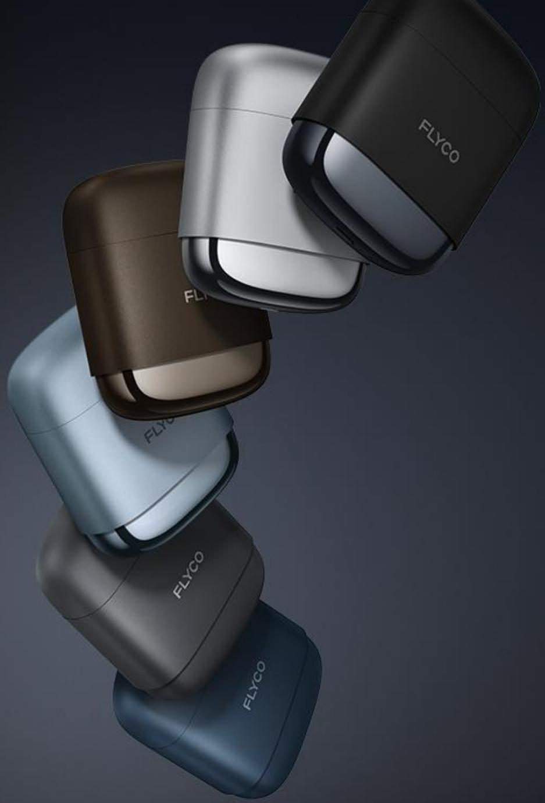

natural_image

Stack of four Flyco airbags in different colors, no visible text or symbols on the main body.

## CONTENTS 目录

关于本报告 01

公司致辞 02

2025年可持续发展绩效 03

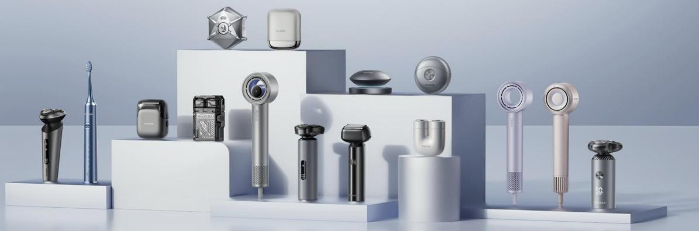

natural_image

Collection of various smart vacuum cleaner devices displayed on white pedestals against a plain background (no text or symbols visible)

## 铸就治理新典范

公司治理 17

风险管理 21

尽职调查 22

商业道德 23

举报机制 26

## 绿色发展护生态

环境管理 40

能源利用 42

污染排放 44

废弃物处理 45

水源管理 46

循环经济 46

气候变化 47

生态保护和生物多样性保护 51

## 赋能员工共成长

员工雇佣 58

人权保障 60

员工薪酬福利 60

员工福利与权益 61

员工沟通与工会 62

员工培训与发展 63

职业健康安全 64

ESG关键指标 68

上交所指引索引 71

读者反馈 72

## 科技创新塑品质

科技引领 28

责任营销 35

客户管理 36

数据安全 38

## 责任供应链共赢

供应商共发展 53

供应商风险管理 55

绿色供应链 56

## 社会贡献显价值

社会贡献 67

## 关于本报告

## 报告简介

《飞科电器股份有限公司2025年度环境、社会及治理(ESG)报告》(以下称“本报告”或“ESG报告”)旨在如实披露公司2025年度在ESG方面的表现，并向利益相关方公开展示飞科对可持续发展管理的思考和行动，回应利益相关方的期望与关切，实现与各利益相关方的有效沟通。

## 报告范围

本报告主要描述2025年1月1日至2025年12月31日公司及子公司在公司治理、环境责任、员工责任、公益慈善责任及其他利益相关方责任等方面的工作。为增强报告可比性及前瞻性，部分内容适当有所延伸。

## 编制准则

## 国际标准和依据

• 《气候相关财务信息披露工作组（TCFD）披露建议》  
- 全球报告倡议组织（以下简称“GRI”）可持续发展报告标准（GRI Standards）  
- 摩根士丹利资本国际公司ESG评级标准(即“MSCI ESG 评级”)

## 国内标准和依据

- 上海证券交易所《上海证券交易所上市公司自律监管指引第14号—可持续发展报告（试行）》  
《上海证券交易所上市公司自律监管指南第4号——可持续发展报告编制》

## 数据来源

本报告中的财务数据来自公司2025年年度报告，报告中涉及的货币均以人民币为计量单位，并经立信会计师事务所(特殊普通合伙)审计；其他数据来自公司内部统计，部分适当追溯以往年度，不存在任何虚假记载、误导性陈述或重大遗漏。

## 称谓说明

为方便表述和阅读，本报告使用“飞科”、“飞科电器”、“公司”指代上海飞科电器股份有限公司；使用“芜湖飞科”代表芜湖飞科电器有限公司；使用“浙江博锐”代表浙江博锐个护电器有限公司。

## 报告获取

本报告以网络版形式发布。网络版可在上海证券交易所网站(www.sse.com.cn)和本公司网站查阅下载。

本公司董事会及全体董事保证本报告内容不存在任何虚假记载误导性陈述或重大遗漏，并对其内容的真实性准确性和完整性承担个别及连带责任。

## 公司致辞

## 2025年度ESG报告-公司致辞：

过去一年，面对复杂的国际形势和严峻的市场环境，飞科电器坚持结构性双品牌战略，持续通过技术创新和研发投入推动产品智能化和时尚化升级，优化调整市场营销管理和渠道运营策略，进一步加快海外市场拓展，并在开拓发展空间的同时，致力于不断提升公司治理水平，实现企业可持续发展。2025年，公司实现营业收入386,108.07万元，利润总额63,804.97万元，每股收益1.18元，每股收益同比增长12.38%。在公司双品牌结构战略调整的市场衔接过渡期，基本完成了2025年度的稳定经营目标。

2025年，公司连续第15年位列上海民营企业和上海制造企业100强。“FLYCO飞科”品牌获评“上海好商标”；公司产品获得德国红点设计大奖、AWE艾普兰创新奖等荣誉。

## 规范治理筑牢企业可持续发展根基。

砥砺前行二十七载，飞科电器始终将依法合规作为企业生存发展的“起跑线”和“生命线”，深刻践行“合规创造价值”的核心理念，严格遵循《公司法》《证券法》等法律法规及监管要求，将规范化治理贯穿经营决策全过程。治理架构层面，公司持续根据最新的监管法规和市场实践，科学完善权责划分与运行机制，2025年，我们依据新《公司法》对公司《章程》及18项公司治理层面的制度进行了修订，构建了新“三会一层”架构，并同步调整审计委员会职能，确保不出现内部监管真空地带；合规建设层面，我们将合规理念融入企业文化，深度落实董事、高管及核心岗位人员合规培训，建立覆盖全业务链条的内控、风险防控与反舞弊机制，将安全管理、合规管理、风险管理、质量管理等纳入关键人员绩效考核中，落实可持续发展治理。

## 技术创新驱动企业可持续发展引擎。

我们致力于通过技术创新和高颜值设计驱动飞科品牌高端化，以更优质的产品和服务回报消费者。

继“智能感应”剃须刀、便携式“太空小飞碟剃须刀”、“银河星环”高速电吹风、“双电直驱”便携式剃须刀等创新产品之后，公司在2025年重磅推出飞科F8高速弧面刀网往复式便携剃须刀和飞科H6星环智能变温高速吹风机。弧面刀网、高速追频、压肤提须、三重感应等领先科技和前沿创新，凝聚着飞科积淀二十七年的创新精神，以及企业对技术与品质的极致探索，对用户体验的极致追求。

2025年，公司共计投入研发费用11,526万元，占销售收入比例约3%，同比增长19.54%，共拥有专利830项，较上年增加71项。

## 绿色环保描绘企业可持续发展底色。

公司高度关注环境保护，积极、持续的推进通过生产工艺改进及物料循环再利用，实现产品使用 $100\%$ 绿色电池和可生物降解包装，有效的减少了废弃物的产生量，减少环境污染。在内部积极推行环保文化，开展多样化的环保法规教育培训活动，提高全体员工的环保法律意识和责任感，强化员工对环保重要性的认识，确保公司切实履行环境保护责任，为可持续发展贡献力量。建立健全园区节能制度，通过对用电系统进行合理规划、电路改造、设备改造、专人专管及用电管控等措施提高能源利用效率，在降低企业运营成本的同时响应国家节能减排的号召，实现能源消耗的可持续发展，芜湖飞科被认定为芜湖市绿色工厂并获得芜湖市节水型企业称号。2025年，飞科电器通过光伏电站累计发电1,547.44万度，节约标准煤5,075.59吨，减排二氧化碳9,194.86吨。

## 社会责任编织企业可持续发展纽带。

我们始终认为，企业的发展与社会的进步休戚与共，我们与社区、社会守望相依。因此，在关注自身及全体股东利益的同时，公司充分关注包括社会、员工、合作方等各方的共同利益。将《劳动法》等法律法规作为公司社会责任的最基础要求，持续完善员工薪酬福利体系，努力提高员工薪资福利待遇，增强员工的归属感；将职工代表大会融入公司治理，加强企业工会规范化运作，保障员工合法权益，鼓励员工通过职工代表大会和职工代表董事建言献策，优化企业管理；与地方政府和公益组织积极互动，助力社会公益事业和公共卫生事业，奉献爱心，2025年公司全年对外捐赠总额263万余元，重点支持地方创新事业与乡村教育；我们与合作伙伴齐心协力，大力推进品牌建设和品牌出海，争创世界知名的中国品牌。

源浚者流长，根深者叶茂。展望2026年，飞科电器将继续坚定不移走好高质量发展之路，在创造商业价值的同时，持续创造更大的环境价值与社会价值，不负股东的信任、合作伙伴的支持与时代和社会的期许，共同书写基业长青、行稳致远的可持续发展篇章！

## 2025年可持续发展绩效

## 经济绩效

总资产

398,153.29

万元

营业收入

386,108.07

万元

利润总额

63,804.97

万元

基本每股收益

1.18

元/股

纳税总额

42,188.75

万元

归属于上市公司股东的净利润

51,208.47

万元

## 治理绩效

董事人数 (独立董事)

7人

其中独立董事人数

3人

高管人数

4人

召开股东会

1 次

召开董事会

4次

召开审计委员会

6次

召开提名委员会

2次

召开薪酬与考核委员会

1 次

## 2025年可持续发展绩效

## 环境绩效

环保投入

2,431,360.80元

使用光伏发电量

1,547.44万千瓦时

能源消耗强度

0.01 吨标准煤/万元

## 社会绩效

员工总人数

3,794人

女性员工占比

58%

研发总投入

11,525.76万元

获新申请专利

142件

其中：

获发明专利

11件

获实用专利

50件

获PCT国际专利

18件

获外观设计专利

63件

数据安全事件

0件

隐私泄露事件

0件

安全消防演练次数

2次

安全生产费用

1,023,858.31元

## 关于飞科

## 公司简介

飞科创立于1999年，是一家以“研发创新”和“品牌运营”为核心竞争力，集剃须刀等个人护理电器、生活电器、厨房电器等智能时尚电器的研发、制造、销售于一体的全球化科技企业。2016年4月18日，上海飞科电器股份有限公司在上海证券交易所上市（证券简称：飞科电器，证券代码：603868），成为中国A股首家个人护理电器上市企业。目前已形成以上海总部为中心，浙江、安徽两翼为产业基地，面向全球的发展战略格局。

历经27年的快速发展，飞科已成为中国个人护理电器领导品牌。“FLYCO飞科”品牌于2018年入围由全球著名传播集团WPP发布的“Brand $^{Z}$ 最具价值中国品牌100强”排行榜，2020-2025年分别被国际权威消费市场研究机构欧睿咨询和弗若斯特·沙利文，以及国内知名市场研究机构艾瑞咨询认定为“电动剃须刀全球销量第一品牌”、“连续五年全球电动剃须刀销量第一”和“往复式便携剃须刀全国销量第一”。

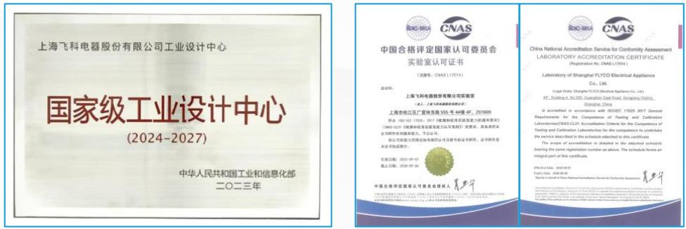

飞科电器连续多年入围上海制造业企业100强、上海民营企业100强、上海民营制造业企业100强，2025年上海民营制造企业100强位列第36位。公司是我国家电行业11大品类国家标准和团体标准起草单位，中国家电协会美健个护专委会主任委员单位，目前拥有国家级工业设计中心、国家认可实验室、上海市企业技术中心和830件国内外自主创新专利。飞科产品多次获得“中国家电艾普兰奖”、国际“iF设计大奖”和“红点设计大奖”，同时凭借严密完善的质量管理体系，通过了UL、GS、CE、CB等多项国际认证。

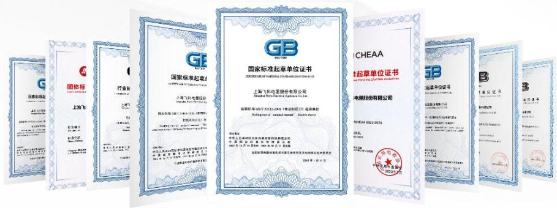

text_image

国家标准起草单位证书
GB
国家标准起草单位证书
CHINEAM OF NATIONAL ECONOMIC ENGINEERING CO.,LTD.
上海飞科电器股份有限公司
Shanghai Fintech Chemical Industry Co., Ltd.
国家标准起草单位证书
SHANGHAI FINTECH CHEMICAL ENGINEERING CO.,LTD.
国家标准起草单位证书
SHANGHAI FINTECH ELECTRIC CO., LTD.
国家标准起草单位证书
SHANGHAI FINTECH ELECTRIC CO., LTD.
国家标准起草单位证书
SHANGHAI FINTECH ELECTRIC CO., LTD.
国家标准起草单位证书
SHANGHAI FINTECH ELECTRIC CO., LTD.
国家标准起草单位证书
SHANGHAI FINTECH ELECTRIC CO., LTD.
国家标准起草单位证书
SHANGHAI FINTECH ELECTRIC CO., LTD.
国家标准起草单证
SHANGHAI FINTECH ELECTRIC CO., LTD.
国家标准起草单位证书
SHANGHAI FINTECH ELECTRIC CO., LTD.
国家标准起草单位证书
SHANGHAI FINTECH ELECTRIC CO., LTD.
国家标准起草单位证书
SHANGHAI FINTECH ELECTRIC CO., LTD.
国家标准起草单位证书
SHANGHAI FINTECH ELECTRIC CO., LTD.
国家标准起草单位证书
SHANGHAN FINTECH ELECTRIC CO., LTD.
国家标准起草单位证书
SHANGHAN FINTECH ELECTRIC CO., LTD.
国家标准起草单位证书
SHANGHAN FINTECH ELECTRIC CO., LTD.
国家标准起草单位证书
SHANGHAN FINTECH ELECTRIC CO., LTD.
国家标准起草单位证书
SHANGHAN FINTECH ELECTRIC CO., LTD.
国家标准起草单位证书
SHANGHAN FINTECH ELECTRICAL CO., LTD.
国家标准起草单位证书
SHANGHAN FINTECH ELECTRICAL CO., LTD.
国家标准起草单位证书
SHANGHAN FINTECH ELECTRICAL CO., LTD.
国家标准起草单位证书
SHANGHAN FINTECH ELECTRICAL CO., LTD.
国家标准起草单位证书
SHANGHAN FINTECH ELECTRICAL CO., LTD.
国家标准起草单位证书
SHANGHAN FINTECH ELECTRIGER CO., LTD.
国家标准起草单位证书
SHANGHAN FINTECH ELECTRIGER CO., LTD.
国家标准起草单位证书
SHANGHAN FINTECH ELECTRIGER CO., LTD.
国家标准起草单位证书
SHANGHAN FINTECH ELECTRIGER CO., LTD.
国家标准起草单位证书
SHANGHAN FINTECH ELECTRIGER CO., LTD.
国家标准起草单位证书
SHANGHAN FNTCH ELECTRIC CO., LTD.
国家标准起草单位证书
SHANGHAN FNTCH ELECTRIC CO., LTD.
国家标准起草单位证书
SHANGHAN FNTCH ELECTRIC CO., LTD.
国家标准起草单位证书
SHANGHAN FNTCH ELECTRIC CO., LTD.
国家标准起草单位证书
SHANGHAN FNTCH ELECTRIC CO., LTD.
国家标准起草单位证书
SHANGHAN FNTCH ELECTRIC CO., LTD.
国家级《上海市工业和信息化局关于开展2018年标准化技术改造项目实施主体的批复》(证监许可[2018]113号)
国家标准起草单位证书
SHANGHAN FNTCH ELECTRIC CO., LTD.
国家级《上海市工业和信息化局关于开展2018年标准化技术改造项目实施主体的批复》(证监许可[2018]113号)
国家标准起草单位证书
SHANGHAN FNTCH ELECTRIC CO., LTD.
国家级《上海市工业和信息化局关于开展2018年标准化技术改造项目实施主体的批复》(证监会许可[2018]113号)
国家标准起草单位证书
SHANGHAN FNTCH ELECTRIC CO., LTD.
国家级《上海市工业和信息化局关于开展2018年标准化技术改造项目实施主体的批复》(证监会许可[2018]113号)
国家标准起草单位证书
SHANGHAN FNTCH ELECTRIC CO., LTD.
国家级《上海市工业和信息化局关于开展2019年标准化技术改造项目实施主体的批复》(证监会许可[2019]113号)
国家标准起草单位证书
SHANGHAN FNTCH ELECTRIC CO., LTD.
国家级《上海市工业和信息化局关于开展2019年标准化技术改造项目实施主体的批复》(证监会许可[2019]113号)

飞科致力于通过不懈地进行产品创新和技术升级，依靠“时尚、简约、科技”的研发设计理念和“科技，只为精彩”的品牌精神，成为全球著名的智能时尚电器品牌。

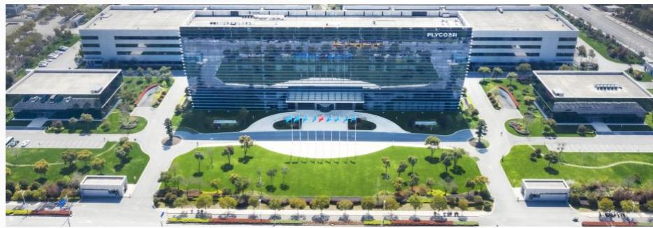

natural_image

Aerial view of a modern office building with glass facade and landscaped grounds (no visible signage or text)

## 产品介绍

依托 “时尚、简约、科技” 的产品文化，“FLYCO飞科” 品牌的产品文化，持续进行智能化、时尚化升级；“POREE博锐” 子品牌以极致质价比聚焦大众消费市场。

结构性双品牌战略实现市场高度覆盖，以前沿科技和极致品质服务全球消费者。

## 8大

创新技术研发部

## 830件

自主创新专利，夯实技术护城河

## 11类

国家标准和团体标准起草单位

## 多项行业首创，颠覆性技术创新：

行业首创“太空小飞碟”剃须刀，颠覆传统剃须产品形态；引领剃须刀便携时代和行业增长。

开拓性首创智能感应剃须技术，无需开关键，触肤即启、离肤即停。

革命性打造“双电机动力直驱系统”，以轴转式直线驱动替代传统齿轮传动结构，实现高效静剃的技术跨越。

国产首个高速弧面剃须系统，结合三重减震科技，实现往复式剃须刀深度缓震净须体验。

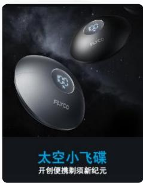

text_image

FLYCO
FLYCO
太空小飞碟
开创便携剃须新纪元

注册地限制条件  
离子小空水

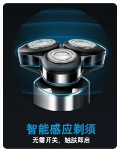

text_image

智能感应剃须
无需开关，触肤即启

容词旭雄，关乐善天  
易期密区制逆

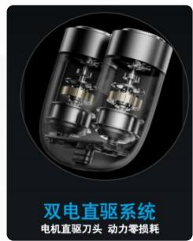

text_image

双电直驱系统
电机直驱刀头 动力零损耗

明星董事长 天氏视觉创新  
经深证直审双

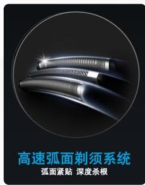

text_image

高速弧面剃须系统
弧面紧贴 深度杀根

资捐案前:李富荣  
您来反映面膜越高

31个省区 营销商务处，覆盖全国核心区域市场。

300 $^{+}$ 地级市营销管理网点与售后维修部，支撑终端运营与服务响应。

7万 $^{+}$ 卖场形象终端与100万 $^{+}$ 销售网点，构成立体式渠道触达。

线上销售占比超60%，并通过明星达人种草、内容情感营销、IP 营销等构建提供情绪价值的销售体系。

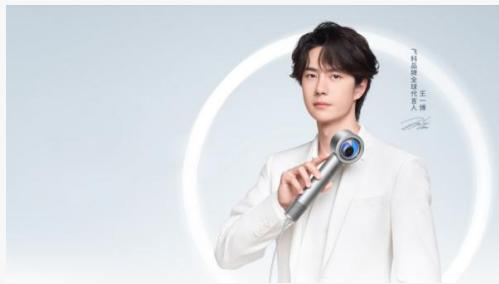

text_image

飞科品牌全球代言人
王一博

飞科品牌全球代言人：王一博

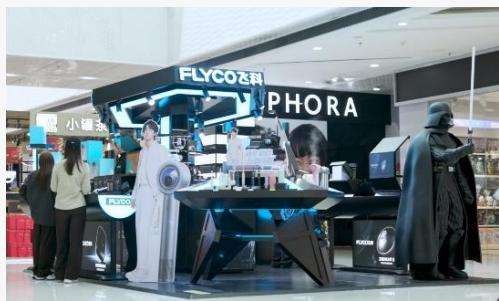

text_image

FLYCO飞科
PHORA
小龍活

飞科线下门店

## 产品品类

飞科秉持“时尚、简约、科技”的产品设计理念，将小家电打造为兼具科技内涵与时尚魅力的生活方式。公司制定了同心多品类产品战略，以为理容、美姿和口腔护理等系列个人护理电器为核心，同时扩展其他协同性强的生活电器和厨房电器，以持续创新满足消费者对美好生活的不断追求。

## 理容电器

电动剃须刀  
理发器  
■ 毛球修剪器  
鼻毛修剪器  
......

## 美姿电器

电吹风  
直卷发器  
■ 直发梳  
......

## 口腔护理电器

电动牙刷  
冲牙器

## 生活电器和厨房电器

加湿器  
电熨斗  
■ 毛球修剪器  
智能健康称  
养生壶  
电热水壶

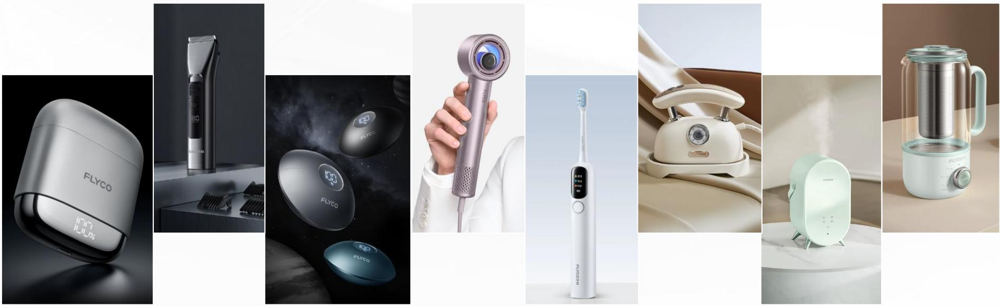

## 主要产品介绍

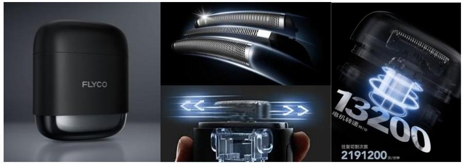

text_image

FLYCO
13200
随机转速/秒
往复切割次数
2191200次/分钟

## F8 往复式便携剃须刀

智能动力、弧面贴肤与高效续航，便携剃须旗舰体验。

## 01 深层贴肤，剃净更彻底

186R 弧面不锈钢刀网结合压肤提须技术，贴合面部轮廓，深入剃除顽固胡须；马氏体不锈钢材质抗过敏、更高硬度更耐磨。

## 02 强劲动力，智能便携

新一代高速追频直线电机，超高频往复切割；AI胡须感应芯片追频控幅，自动匹配剃须动力，应对浓密硬须依旧流畅。

## 03 三重减震，续航与舒适同步升级

三重减震缓解高频震感解决痛点；850mAh 电池支持快充 1 小时，续航最长可达3个月。

高速动力

13,200 转/分钟

贴肤面积

358.5mm²

切割效率

2,191,200 次/分钟

长效续航

快充 1 小时 | 续航 3 个月

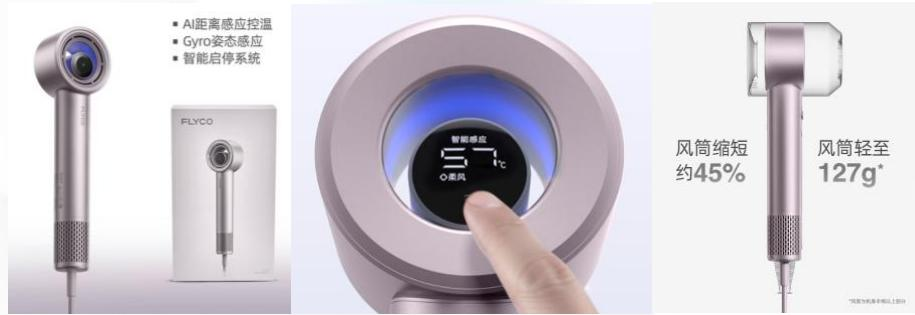

text_image

AI距离感应控温
Gyro姿态感应
智能启停系统
FLYCO
智能感应
57℃
风筒缩短
约45%
风筒轻至
127g*

## H6 星环智能变温高速吹风机

三重智能，感应控温，超轻薄机身，尽享科技吹护关爱。

## 01 智能变温，减少高温烫头皮风险

AI 距离感应与 Gyro 姿态感应，根据吹发距离与姿态自动调节风温。LED 触控屏轻触实现 AI 模式与传统模式切换。

## 高速快干，柔顺护发

11万转/分钟高速无刷电机输出 70m/s 强劲风力，AIR2.0 扩散风形与2亿 $^{+}$ 级高浓度负离子，实现快至1分钟的极速干发与柔顺护发。

## 03 智能启停，更聪明，更轻薄，更顺手

无需开关，智能启停。吹风机静置时自动休眠，拿起自动启动；独创超轻薄设计，1:1.6黄金配重，久吹不累，细致呵护。

高速电机

110,000 转/分钟

负离子释放

2 亿+

强劲风速

70m/s

极速干发

快至1分钟

## 品牌宣言

科技关爱每一个认真生活的人；让我们找到目标、付出努力、享受乐趣，活出自己的精彩。

## 企业愿景

全球智能时尚电器著名品牌

## 企业使命

把仅仅满足于功能需求的小家电行业打造成为高科技的时尚产业，不断创造客户需求，改变消费者生活方式，满足消费者对美好生活的追求。

## 2025年企业荣誉（部分）

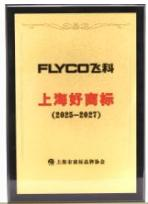  
上海好商标(2025-2027)

上海市商标品牌协会

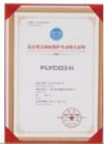  
北京重点商标保护名录纳入证明

北京商标协会

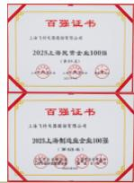  
2025上海民营企业100强/上海制造企业100强

上海市企业联合会、上海市企业家协会、解放日报社

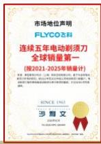  
2021-2025连续五年电动剃须刀全球销量第一

弗若斯特・沙利文

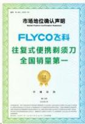  
往复式便携剃须刀全国销量第一

艾瑞咨询

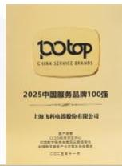  
2025中国服务品牌100强  
客户观察  
CCSO标准评定中心  
中国数字服务产业发展年会组委会

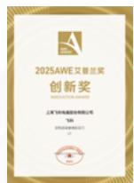  
AWE2025艾普兰创新奖—U1剃须刀

中国家电及消费电子博览会组委会汉诺威工业设计论坛

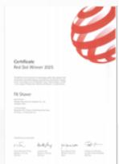  
2025年德国红点设计大奖—F8剃须刀

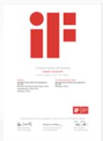  
2025年IF设计奖—F3/FS685/P017剃须刀

IF设计公司

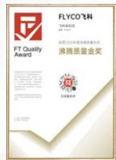  
沸腾质量金奖-FH6371
星环高速电吹风

沸腾质量数据上海设计100+全球竞赛组委会

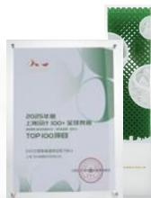  
2025年度上海设计100+全球竞赛TOP100项目

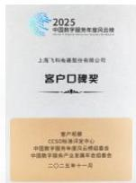  
2025中国数字服务年度榜
客户口碑奖  
客户观察  
CCSO标准评定中心

中国数字服务产业发展
年会组委会

## 可持续发展管理

## 可持续发展战略

  
SUSTAINABLE DEVELOPMENT

GOALS  
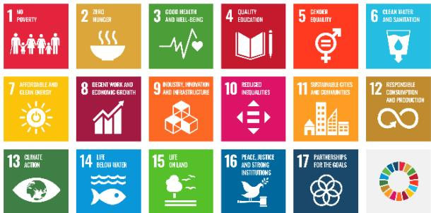

flowchart

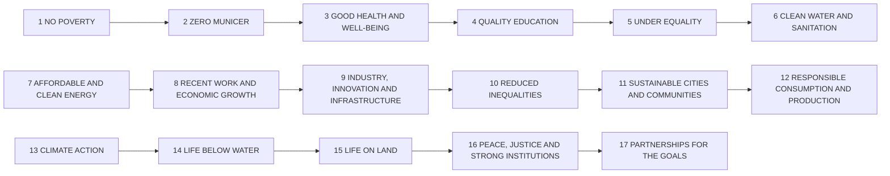
```mermaid
graph LR
  A["1 NO POVERTY"] --> B["2 ZERO MUNICER"]
  B --> C["3 GOOD HEALTH AND WELL-BEING"]
  C --> D["4 QUALITY EDUCATION"]
  D --> E["5 UNDER EQUALITY"]
  E --> F["6 CLEAN WATER AND SANITATION"]
  G["7 AFFORDABLE AND CLEAN ENERGY"] --> H["8 RECENT WORK AND ECONOMIC GROWTH"]
  H --> I["9 INDUSTRY, INNOVATION AND INFRASTRUCTURE"]
  I --> J["10 REDUCED INEQUALITIES"]
  J --> K["11 SUSTAINABLE CITIES AND COMMUNITIES"]
  K --> L["12 RESPONSIBLE CONSUMPTION AND PRODUCTION"]
  M["13 CLIMATE ACTION"] --> N["14 LIFE BELOW WATER"]
  N --> O["15 LIFE ON LAND"]
  O --> P["16 PEACE, JUSTICE AND STRONG INSTITUTIONS"]
  P --> Q["17 PARTNERSHIPS FOR THE GOALS"]
```

飞科电器积极响应联合国可持续发展目标（SDGs），锚定创新驱动的品牌升级战略，围绕“研发创新”和“品牌运营”两大核心竞争力，在实现业务稳步发展的同时，充分发挥企业社会价值，推进可持续发展目标落地，为全球可持续发展事业贡献飞科力量。

SDGs可持续发展目标内容  
行动

<table><tr><td>SDG 1</td><td>在全球消除一切形式的贫困</td><td>参与公益捐赠和志愿活动,为社会进步和社区繁荣贡献力量</td></tr><tr><td>SDG 2</td><td>消除饥饿,实现粮食安全,改善营养状况和促进可持续农业</td><td>积极探索产业扶贫项目,帮助贫困地区发展特色产业,带动当地就业与经济增长</td></tr><tr><td>SDG 3</td><td>确保健康的生活方式,促进各年龄段人群的福祉</td><td>建设员工健身房、咖啡吧等设施,引导员工树立积极健康生活习惯;优化工作环境,保障员工工作安全与健康</td></tr><tr><td>SDG 4</td><td>确保包容和公平的优质教育,让全民终身享有学习机会</td><td>开展内部培训与学习项目,提升员工职业技能与知识水平</td></tr><tr><td>SDG 5</td><td>实现性别平等,增强所有妇女和女童的权能</td><td>制定公平的招聘与晋升制度,保障男女员工在职业发展上享有平等机会</td></tr><tr><td>SDG 6</td><td>确保为所有人提供水和环境卫生并对其进行可持续管理</td><td>加强取水用水全过程节水管理,提高用水效率</td></tr><tr><td>SDG 7</td><td>确保人人获得可负担、可靠、可持续和现代的能源</td><td>推进节能技改工作,降低能源消耗</td></tr><tr><td>SDG 8</td><td>促进持久、包容和可持续的经济增长,实现充分和生产性就业及人人获得体面工作</td><td>建立公平公正的薪酬福利体系,提供具有竞争力的薪资待遇;开展员工培训与职业发展规划项目,助力员工提升技能与职业晋升</td></tr><tr><td>SDG 9</td><td>建设有风险抵御能力的基础设施,促进包容可持续的工业化,推动创新</td><td>加大研发投入,提升自主创新能力;积极参与行业标准制定,持续投入国家级实验室和国家级工业设计中心建设</td></tr><tr><td>SDG 10</td><td>减少国家内部和国家之间的不平等</td><td>倡导平等多元的企业文化,确保员工在招聘、薪资、培训、晋升等方面享有公平待遇</td></tr><tr><td>SDG 11</td><td>建设包容、安全、有风险抵御能力和可持续的城市和人类住区</td><td>推行绿色办公理念,提高员工节约能源资源意识</td></tr><tr><td>SDG 12</td><td>采取紧急行动应对气候变化及其影响</td><td>响应“双碳”号召,主动践行气候变化应对责任,通过推进绿色包装、强化节能减排管理等措施,有效降低碳排放强度</td></tr><tr><td>SDG 13</td><td>促进有利于可持续发展的和平与包容社会,为所有人提供诉诸司法的机会,在各级建立有效、负责和包容的机构</td><td>遵守法律法规,诚信经营,维护公平公正的市场秩序;加强企业内部治理,建立健全合规管理体系</td></tr><tr><td>SDG 14</td><td>加强执行手段,重振可持续发展全球伙伴关系</td><td>与供应商、客户、社区等建立广泛的合作和联系,共同推动可持续发展项目的实施</td></tr></table>

## ESG战略体系

飞科电器将可持续发展深度融入企业愿景与核心业务战略，明确以“高端化、智能化、绿色化”作为可持续发展规划的奋斗目标。基于公司“研发创新”与“品牌运营”两大核心竞争力，ESG战略体系围绕产品全生命周期展开布局：在研发端，聚焦个人护理电器核心品类，将绿色设计、节能降耗、可生物降解包装及绿色电池应用等要素纳入新品开发流程，推动产品向智能化、时尚化升级的同时降低环境足迹；在运营端，结合双品牌战略（高端线“FLYCO飞科”与性价比线“POREE博锐”），明确各品牌在可持续发展中的差异化定位，通过优化生产模式、提升能源效率、强化供应链责任管理，实现经济绩效与环境社会绩效的协同增长。

## ESG治理架构

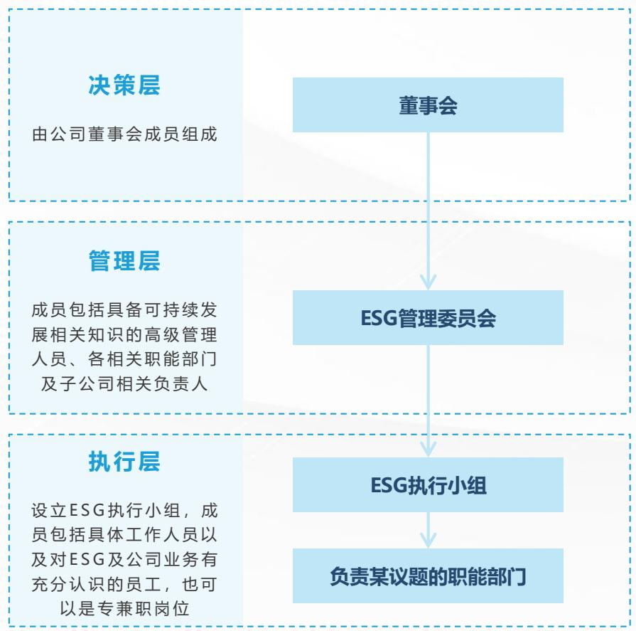

flowchart

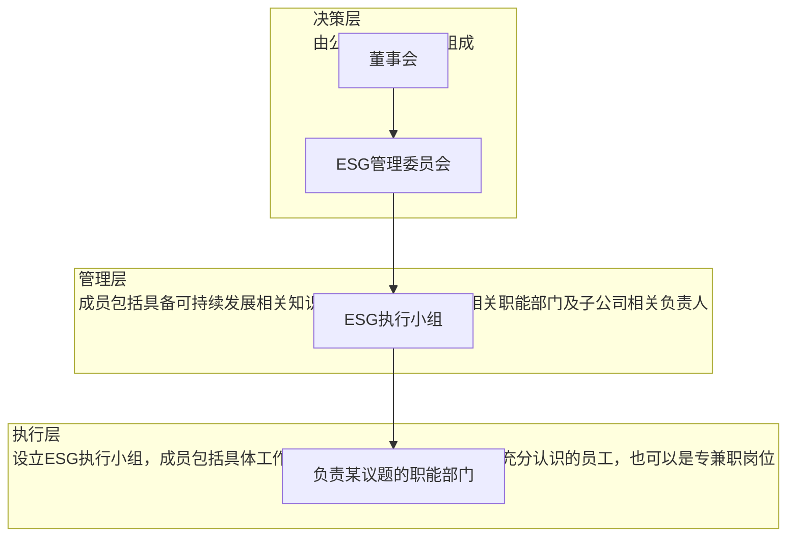
```mermaid
graph TD
  subgraph DecisionLayer ["决策层\n由公司董事会成员组成"]
  A["董事会"] --> B["ESG管理委员会"]
  end
  
  subgraph ManagementLayer ["管理层\n成员包括具备可持续发展相关知识的高级管理人员、各相关职能部门及子公司相关负责人"]
  B --> C["ESG执行小组"]
  end
  
  subgraph ExecutionLayer ["执行层\n设立ESG执行小组，成员包括具体工作人员以及对ESG及公司业务有充分认识的员工，也可以是专兼职岗位"]
  C --> D["负责某议题的职能部门"]
  end
```

## 负责方向把控、监督评估与成果审议

1 了解行业现状及可持续发展政策要求，掌握公司经营管理整体情况。  
2 监督ESG相关影响、风险与机遇的识别评估，并审阅战略与目标。  
3 定期监督目标进展，审批《ESG报告》，并对执行情况提出指导意见。

## 负责承接决策要求并推动机制落地

1 管理重要性议题并形成分析与建议，支撑决策层开展监督与讨论。  
2 确定并管理识别、减缓、管理及监察ESG影响、风险和机遇所需资源。  
3 拟定可持续发展工作计划、激励及考核制度，并统筹其他相关事项。

## 负责沟通协调、数据管理与日常执行

1 制定利益相关方参与计划，组织沟通活动，并协调可持续发展报告编制。  
2 开展可持续相关管理、数据统计分析及投资者与研究机构沟通能力建设。  
3 完善管理制度，执行工作计划，定期向管理层汇报成果并推动议题落实。

# 利益相关方沟通与实质性议题分析

飞科持续加强利益相关方沟通，识别并梳理ESG相关重大性议题，扎实推动可持续理念与企业发展经营的有机融合。

2025年飞科电器重点参考上海证券交易所《可持续发展报告指引》的要求，首次开展针对ESG议题的重要性评估工作。我们邀请利益相关方参与评估，全面识别与分析ESG议题的风险和/或机遇对飞科的财务影响，以及飞科在相关议题的表现对经济、社会和环境产生的影响。我们最终形成双重重要性矩阵，为公司进一步厘定可持续发展管理重点和制定行动计划提供基础支撑。

## 一、议题识别：梳理业务关系与外部环境

## 1

## 价值链影响分析

梳理业务活动、服务和产品对上游和/或下游价值链产生的潜在影响

## 2

## 外部环境研判

结合监管要求、政策趋势及行业热点等因素，识别及评估外部环境对公司管理运营的影响

## 3

## 利益相关方梳理

进一步梳理产生影响和/或受影响的关键内外部利益相关方群体

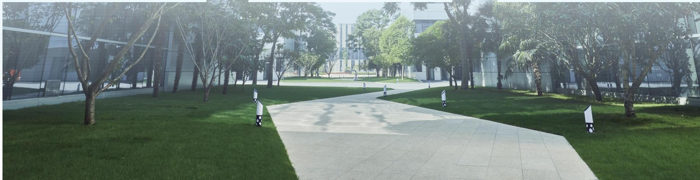

natural_image

Modern campus pathway lined with green lawns and trees, modern buildings in background (no visible text or signage)

## 利益相关方沟通与实质性议题分析

## 二、利益相关方沟通机制

我们依托多元化的利益相关方沟通机制与渠道，与投资者、客户、政府机构等关键内外部利益相关方开展常态化沟通交流，主动征询、系统梳理并完整记录各类利益相关方的核心议题、关切重点、发展期待与合理诉求。

<table><tr><td>利益相关方</td><td>股东及投资者</td><td>政府及监管机构</td><td>客户</td><td>供应商及合作伙伴</td><td>员工</td><td>社区及非政府组织</td><td>媒体</td></tr><tr><td>沟通渠道</td><td>定期报告及官网信息披露;股东会;业绩说明会;上证e互动平台;投资者热线;电子邮件;现场调研等</td><td>领导及主管部门调研视察;合规巡查和检查;政府专项活动;论坛、会议及研讨会;日常政策执行与沟通</td><td>售前售中售后沟通;客户满意度调查;客户服务热线;网络销售平台;客户拜访</td><td>采购流程;定期评价和沟通;定期互访;供应商会议</td><td>职工代表大会和职工代表董事;培训及入职培训;电子邮件;内部会议;员工活动</td><td>社区共建活动;慈善公益活动参与;社区和非政府组织定期会议</td><td>新闻报道和宣传;参加行业会议;媒体关系管理部门日常沟通</td></tr></table>

飞科以利益相关方沟通成果为依据，结合上交所《指引》所明确的21项议题，综合考量运营所属区域的国际及地区监管政策、客户反馈与需求、GRI、ISSB等ESG披露准则要求，以及ESG评级关注重点与行业对标实践，对现有议题清单开展系统性梳理与研判。通过议题纳入、拆分、合并及适用性论证，最终确定26项与公司可持续发展高度相关的核心议题，并形成实质性议题矩阵。

## 利益相关方沟通与实质性议题分析

## 三、双重重要性评估

## 影响重要性评估

围绕26项ESG议题，全面梳理价值链各环节相关活动，系统分析公司在各议题上的表现对经济、社会及环境产生的综合影响，编制评估问卷并邀请关键利益相关方参与调研。

影响严重程度

影响发生可能性

## 财务重要性评估

结合可持续发展外部环境与趋势、内部管理及运营实际，识别ESG相关风险与机遇，邀请管理层及业务部门代表，对短、中、长期风险及机遇开展财务重要性评估。

财务影响重要性

财务影响可能性

## 四、结果论证与矩阵形成

## 内部管理沟通

基于影响重要性和财务重要性调研结果，经公司内部管理层充分沟通，完成结果初步验证

## 外部专家讨论

邀请外部专家就评估结果开展讨论，结合飞科ESG管理资源及能力进行结果论证和调整

## 设定议题阈值

设置议题重要性阈值，形成涵盖影响重要性与财务重要性的双重重要性矩阵

## 董事会审阅

将双重重要性评估结果呈报至董事会审阅，并就识别出的重要性议题在报告中进行重点披露

## 实质性议题

飞科电器重要性议题分析程序如下：

<table><tr><td>01议题识别</td><td>公司以《上海证券交易所上市公司自律监管指南第4号——可持续发展报告编制》为基础,同时参考全球报告倡议组织(GRI)标准、主流ESG评级、国家政策、同行对标以及利益相关方沟通结果等,识别出重要性议题清单。</td></tr><tr><td colspan="2"></td></tr><tr><td>02议题评估</td><td>财务重要性的评估维度包括相关议题预期在短期、中期和长期内影响发生的可能性以及其对公司商业模式、业务运营、发展战略、财务状况、经营成果、现金流、融资方式及成本等影响严重性;影响重要性的评估维度包括相关议题影响发生的可能性以及其对经济、社会和环境产生影响严重性程度,主要通过利益相关方调研、高管访谈等形式,形成影响重要性评估结论。</td></tr><tr><td colspan="2"></td></tr><tr><td>03议题审议与确认</td><td>公司审议各议题是否具有“重要性”,形成双重重要性议题矩阵,在ESG报告中对重要性议题予以披露。</td></tr></table>

报告期内，公司结合通用标准、政策分析及同业对标，初步识别并筛选出 26 项 ESG 议题。经分析，其中共有:

## 9 项

议题具有双重重要性

## 12 项

议题仅具有影响重要性

## 1 项

议题仅具有财务重要性

## 4 项

议题既不具有财务重要性、也不具有影响重要性

<table><tr><td rowspan="2">影响重要性</td><td>内部控制与风险管理 平等对待中小企业污染物排放废弃物处理员工权益与福利职业健康与安全应对气候变化循环经济社会贡献信息安全与隐私保护环境合规管理尽职调查</td><td>公司治理创新驱动产品和服务安全与质量利益相关方沟通反商业贿赂及反贪污员工发展与晋升供应链安全知识产权管理反不正当竞争</td></tr><tr><td>生态系统与生物多样性保护乡村振兴科技伦理</td><td>能源利用水资源利用</td></tr></table>

## 01 铸就治理新典范

公司治理---- 17

风险管理---- 21

尽职调查---- 22

商业道德----23

举报机制---- 26

## (一) 公司治理

公司董事会建立健全了覆盖子公司的内部控制制度，并进行了有效实施。针对财务管理风险、资金风险、采购风险、销售风险、存货风险等风险类型，形成了风险预警、防控、措施优化的有机结合。公司尤其注意通过对子公司预算及经营数据的详细分析，对各项风险进行识别和处理，并通过对子公司资金、票据等相关金融资产的统筹管控，进一步加强了全面风险管理能力。

## 治理结构和决策机制：

(注：2025年5月依据新《公司法》不再设置监事会)  
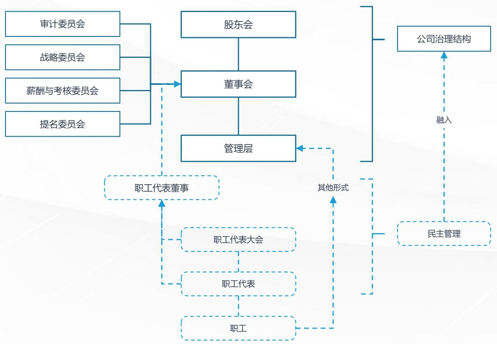

flowchart

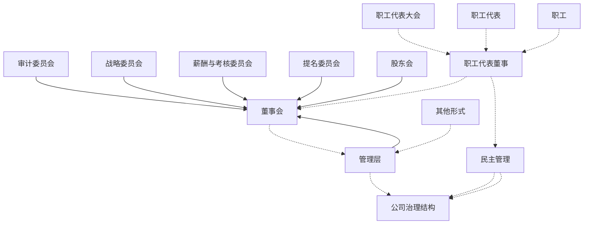
```mermaid
graph TD
  A["审计委员会"] --> B["董事会"]
  C["战略委员会"] --> B
  D["薪酬与考核委员会"] --> B
  E["提名委员会"] --> B
  F["股东会"] --> B
  G["管理层"] --> B
  H["职工代表董事"] -.-> B
  I["职工代表大会"] -.-> H
  J["职工代表"] -.-> H
  K["职工"] -.-> H
  L["其他形式"] -.-> G
  M["民主管理"] -.-> N["公司治理结构"]
  B -.-> G
  G -.-> N
  H -.-> M
  M -.-> N
```

## 股东会

报告期内，公司共召开：

1 次

股东会

4次

董事会

6次

审计委员会

2 次

提名委员会

1 次

薪酬与考核委员会

公司严格按照《公司法》《公司章程》等规定的程序召集和召开股东会，保障全体股东特别是中小股东的合法权益，确保股东平等行使知情权、表决权等股东权利。

## 董事会

董事会

7名

女性董事

1名

独立董事

3名

硕士学历董事

2名

博士学历董事

2名

高管

4名

女性高管

1名

董事会成员性别

<table><tr><td>性别</td><td>人数</td></tr><tr><td>男性</td><td>6</td></tr><tr><td>女性</td><td>1</td></tr></table>

董事会成员年龄

<table><tr><td>年龄区间</td><td>人数</td></tr><tr><td>40-49岁</td><td>3</td></tr><tr><td>50-59岁</td><td>4</td></tr></table>

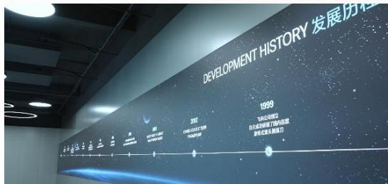

text_image

DEVELOPMENT HISTORY 发展历程
1999
MIS世界的
历史发展的历程
是全球最具影响力

高级管理层成员性别

<table><tr><td>性别</td><td>人数</td></tr><tr><td>男性</td><td>3</td></tr><tr><td>女性</td><td>1</td></tr></table>

高级管理层成员年龄

<table><tr><td>年龄区间</td><td>人数</td></tr><tr><td>40-49岁</td><td>1</td></tr><tr><td>50-59岁</td><td>3</td></tr></table>

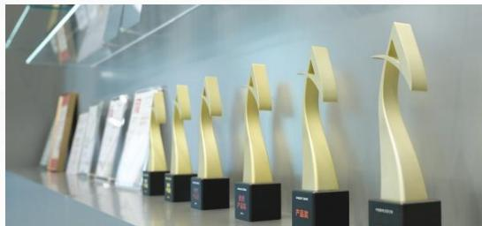

natural_image

Row of golden abstract sculpture items on a white shelf, no visible text or symbols

## 高级管理层

## 董监高薪酬计划

## 制度与审批安排

制度依据：公司按照《公司法》《上市公司治理准则》等法律法规和规章制度要求，建立了完善的薪酬管理制度。

制定主体：董事、高级管理人员薪酬方案由董事会薪酬与考核委员会制定，明确薪酬确定依据和具体构成。

审批披露：董事薪酬方案由股东会决定并披露；高级管理人员薪酬方案由董事会批准，向股东会说明并披露。

## 董事薪酬安排

在公司任职的非独立董事：根据具体岗位、绩效考核结果领取薪酬，不额外领取董事津贴。

未在公司任职的非独立董事：不在公司领取薪酬。

## 高级管理人员薪酬与考核机制

薪酬结构：基本薪酬（月度工资）+绩效薪酬（年度绩效薪酬）+中长期激励收入。

发放与比例：基本薪酬按月发放；绩效薪酬占比原则上不低于50%。

长期激励：公司可适时实施股权激励计划对高级管理人员进行激励。

奖金机制：董事会薪酬与考核委员会根据年度经营目标、职位、责任、能力、市场薪资行情等因素拟定方案，经董事会批准后执行。

考核指标：以年度经营业绩为主要考核指标，包含财务预算完成情况、经营业绩指标，以及结合分管工作要求的分类指标。

# 信息披露与投资者关系

上海飞科电器股份有限公司制定了《投资者关系管理制度》，依据相关法律法规与上市规则，明确投资者关系管理的宗旨、原则、组织架构、工作内容、沟通方式及禁止行为，全面规范公司与投资者的沟通互动。

## 四项基本原则

  
合规性

依法依规开展投资者关系管理

  
平等性

所有投资者享有平等沟通权利主动开展沟通与信息传递

  
主动性

  
诚实守信

以已公开信息为沟通基础

## 组织职责

董事会秘书担任负责人

董事会办公室为执行部门，负责日常运营

## 档案管理

建立投资者关系管理档案，保存期限不少于3年；制度由董事会制定、修订及解释，自审议通过之日起生效

## 多元沟通渠道

公告

股东会

官方网站

现场调研

上证e互动

业绩说明会

投资者电话

路演

飞科电器自2016年上市至2025年间，在上海证券交易所信息披露评价中获得

A级 × 7次

B级 × 2次

报告期内，董事会秘书获得中国上市公司协会董事会秘书履职4A级评价、财联社精英董秘、上海证券报金质量卓越董秘奖等荣誉

## 董事会在报告期间与外部审计机构保持密切沟通

2026年1月15日：第五届审计委员会第四次会议

听取年审会计师关于2025年财务报表预审情况的报告及关于年度审计工作计划与安排的汇报。

2026年4月17日：第五届审计委员会第五次会议

## 年度审计工作沟通

听取管理层关于2025年度生产经营状况及财务审计工作汇报；与年审会计师沟通审计中发现的问题并督促年报审计工作；审计委员会委员及独立董事与年审会计师进行单独沟通。

2026年4月28日：第五届审计委员会第六次会议

## 年度报告审议

审议通过公司2025年年度报告、2026年第一季度报告、利润分配预案、内部控制评价报告、会计师履职情况评估等议案，同意提交第五届董事会第四次会议审议。

上海飞科电器股份有限公司按照企业内部控制规范体系要求，于2025年12月31日在所有重大方面保持有效的财务报告内部控制，未发现非财务报告内部控制重大缺陷，不存在未完成整改的重大及重要缺陷，内部控制整体运行有效。

## (二) 风险管理

## 治理架构

公司每月开展一次内部制度审查，并依据法律法规及时修订更新内部制度；2025年，公司共制定《内部审计管理制度》《董事离职管理制度》《舆情管理制度》3项制度，同时修订了《董事会专门委员会实施细则》《独立董事专门会议制度》等13项制度。

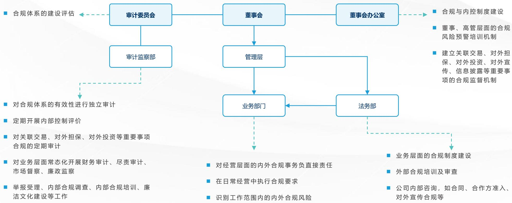

flowchart

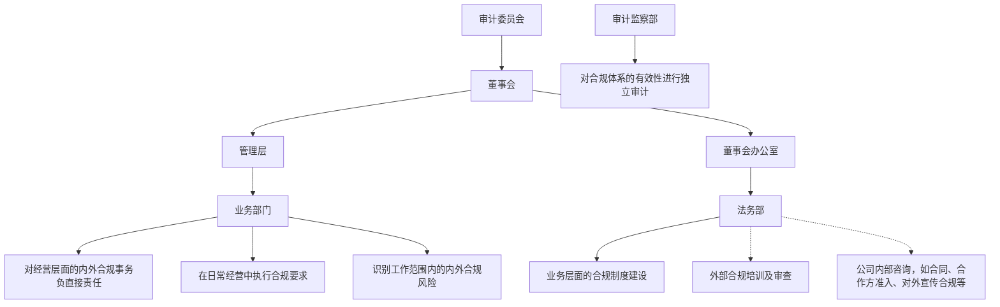
```mermaid
graph TD
  A["审计委员会"] --> B["董事会"]
  C["审计监察部"] --> D["对合规体系的有效性进行独立审计"]
  B --> E["管理层"]
  B --> F["董事会办公室"]
  E --> G["业务部门"]
  F --> H["法务部"]
  G --> I["对经营层面的内外合规事务负直接责任"]
  G --> J["在日常经营中执行合规要求"]
  G --> K["识别工作范围内的内外合规风险"]
  H --> L["业务层面的合规制度建设"]
  H -.-> M["外部合规培训及审查"]
  H -.-> N["公司内部咨询，如合同、合作方准入、对外宣传合规等"]
```

## (三) 尽职调查

## 供应链尽职调查

公司在供应商准入环节实施系统化尽职调查。新供应商须提交营业执照、合规资质证明、财务状况、等基础资料，由供应链部组织质控部、财务部相关负责人进行实地考察评审，评审内容涵盖企业合规资质、质量管理体系、生产能力、环保与安全管理、用工合规等多个维度。公司在合作协议中明确要求供应商遵守反商业贿赂、反童工、反强迫劳动等条款，将社会责任与合规要求延伸至供应链各环节。在持续合作阶段，公司通过年度考核与年度综合评价对供应商进行动态监控，对出现严重质量异常或合规问题的供应商启动退出机制。

## 客户及经销商尽职调查

公司在经销商准入环节设立了明确的合规审核标准，要求经销商具有一般纳税人资格，提供营业执照、法人身份证、基本存款信息及税务信息等合规资格并进行现场合规调查，拥有经政府部门检核的达标面积以上仓库、办公场所和基础设施等。公司按系统、按区域授权经销商管理市场秩序。公司制定《区域分销管理制度》对经销商实施持续管理，由各区域城市经理定期开展考核，对违规行为依规查处。

未来，公司将进一步完善价值链尽职调查体系，探索建立覆盖更广泛利益相关方的风险识别与评估机制。

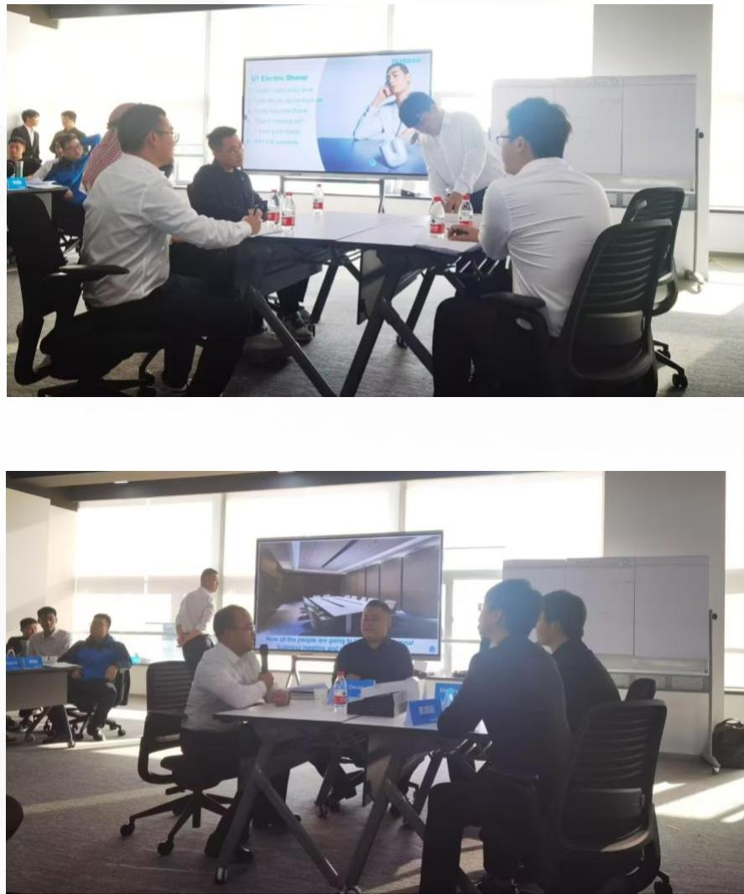

## (四) 商业道德

公司始终坚持贯彻诚信的经营理念和商业行为，严格遵循《中华人民共和国反不正当竞争法》等法律法规的各项规定，为防止公司在经营过程中出现行贿受贿、腐败、欺诈、洗钱、不正当竞争等违反商业道德的行为，公司制定了《反商业贿赂及反贪污风险管理制度》、《审计监察管理制度》等管理制度，提升公司依法合规治理公司能力和遵守商业道德规范管理能力，确保各项业务运行遵守商业道德。同时，公司设立审计监察部，负责公司纪检监察工作的开展，对违反商业道德的不法行为进行取证调查及处理，确保公司各项业务合法合规。

## 治理架构

公司设立审计监察部作为商业道德管理的专职机构，独立行使监督职能，负责反舞弊、反商业贿赂、反不正当竞争等工作的统筹协调、制度建设、风险评估、案件调查与整改跟踪。

同时，公司亦建立内部控制制度，通过每年对各部门重要业务环节进行检查监督，确保反贪腐、反商业贿赂管理措施的有效执行。为保证公司成立风险评估小组，由审计部门牵头，财务、法务等部门协同配合，对识别出的商业道德风险进行评估并制定应对措施。

## 审计监察部

独立监督·纪检监察

取证调查·案件处理

## 风险评估小组

审计部门牵头，财务、法务等协同，评估风险

## 制度建设

公司制定并实施一系列内部规章制度，形成覆盖全体员工及合作伙伴的商业道德制度体系：

《反商业贿赂及反贪污风险管理制度》

《审计监察管理制度》

《投诉举报管理制度》

《员工廉洁从业准则》

其中，《反商业贿赂及反贪污风险管理制度》明确了商业贿赂与贪污行为的界定、风险识别与评估、预防与控制措施，系统规范了以下五大高风险领域的管理要求：

  
采购管理

  
销售管理

  
工程建设管理

  
财务管理

  
人力资源管理

公司要求所有合作的供应商、客户、经销商均签订《反商业贿赂条款》，将商业道德要求延伸至价值链各环节。

## 反不正当竞争

公司严格遵守《中华人民共和国反不正当竞争法》，坚持公平、公正、公开的市场竞争原则，防止在经营过程中出现不正当竞争行为。

√ 报告期内未发生因不正当竞争行为导致的诉讼案件

√ 报告期内未发生重大行政处罚

## 经销商合规管理

公司制定《区域分销管理制度》，规范经销商的经营和管理，明确经销商禁止从事的行为，坚持诚信合法经营。与合作的经销商签订《经销商协议》，将诚信经营要求纳入合同条款，由各区域城市经理对经销商员工进行培训和业务支持。公司建立经销商考核管理办法，定期实施考核并对违规行为进行查处和处罚，确保经销商合作伙伴共同遵守市场规则。

## 反腐败反贪污

## 制度体系

公司建立了内部控制制度，同时制定了《反商业贿赂及反贪污风险管理制度》，规定了商业贿赂和贪污的行为界定、风险评估与识别、预防和控制等内容。公司每年对各部门重要业务环节进行检查监督，确保反贪腐、反商业贿赂管理措施的有效执行，公司在日常管理中加强对业务人员的职业道德教育，强调遵守职业道德的重要性，要求其恪守反贿赂反贪污准则制度，在与客户和经销商的业务往来中保持诚信廉洁，杜绝违规行为发生。同时，公司对各部门重要业务的商业贿赂及贪污风险进行评估，识别容易出现贿赂及贪污行为的风险因素，并以此作为审计重点关注领域，防范贪污及贿赂行为的发生。

## 预防与控制措施

公司已建立健全采购管理、销售管理、工程建设管理、财务管理、人力资源管理等各项规章制度，明确业务流程及审批权限，形成相互制约、相互监督的工作机制。在与供应商、客户、承包商等签订合同时，明确约定禁止商业贿赂条款，并将廉洁履约作为合同考核的重要内容。所有员工入职时均需签署《廉洁承诺书》，明确廉洁从业要求和违规责任。

## 监督与查处

## 常态化检查监督

公司每年对各部门重要业务环节进行检查监督，确保反贪腐、反商业贿赂管理措施的有效执行。审计监察部负责对违反商业道德的不法行为进行取证调查及处理，确保公司各项业务合法合规。

## 报告期内零诉讼记录

报告期内，公司未发生因商业贿赂或贪污行为导致的诉讼案件，未发生与业务合作伙伴因商业贿赂问题终止合同的情况。

为防止公司在管理过程中出现行贿、受贿、欺诈、洗钱、不正当竞争、利益冲突等违反商业道德的行为，公司经营管理层作为商业道德及反腐败等工作的最高管理机构。公司设立审计监察部，负责公司纪检监察工作，防范腐败风险；

审计监察部联合法务部开展对涉嫌违法事件的调查处理工作，确保公司业务开展合法合规。

将反商业贿赂与反贪污教育纳入新员工入职培训体系，组织学习相关法律法规及公司规章制度，签署《廉洁承诺书》，明确违规责任。

## 廉洁自守

## 廉洁承诺

公司重视廉洁建设，为提升公司商业道德规范管理能力，预防经营管理过程中的腐败，公司制定了《商业道德行为规范》等文件，规定合作的供应商及客户、经销商均签订《反商业贿赂条款》，所有员工入职时签订《廉洁承诺书》，将遵守商业道德的精神落实到实处，杜绝违反商业道德的行为发生。

公司重视廉洁建设，要求所有员工入职时签订《廉洁承诺书》，将遵守商业道德的精神落到实处。报告期内及过往两年，新员工《廉洁承诺书》签署比例均保持100%。

新员工《廉洁承诺书》签署率

报告期内及过往两年连续保持100%

100%

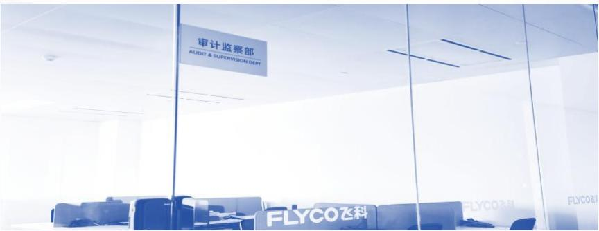

text_image

审计监察部
AUDIT & SUPERVISION DEPT
FLYCO飞科
FLYCO飞科

## 审计工作组织与制度

公司已建立健全内部审计工作组织体系和制度体系，确保审计工作独立、客观、公正开展。

## 董事会审计委员会

负责合规体系的建设与评估，领导与监督审计工作、听取审计汇报

## 审计监察部

专职审计机构，独立于其他职能部门，直接向董事会审计委员会和董事长汇报；

配备财务、审计、法律等专业背景专职人员

依据《中华人民共和国审计法》《审计署关于内部审计工作的规定》及《公司章程》要求，公司制定《内部审计管理制度》，明确内部审计的定义、基本原则、适用范围、机构职责、审计权限、工作程序及档案管理等要求。审计人员与被审计对象存在利害关系的，严格执行回避制度，确保审计工作的客观公正。

## 廉洁培训与宣传

公司将反商业贿赂与反贪污教育纳入新员工入职培训体系，组织学习相关法律法规及公司规章制度，加强对业务人员的职业道德教育，实现新员工廉洁从业宣贯覆盖率100%。

## (五) 举报机制

公司已建立畅通、安全、便捷的投诉举报渠道，鼓励员工及利益相关方积极反馈违规行为。

## 举报渠道

□ 电话渠道：021-52858888  
邮箱渠道：sjjc@flyco.com  
书面渠道：上海市松江区广富林路555号飞科电器审计监察部（收）  
□ 来访渠道：审计监察部办公地点

公司始终坚持公平公正、公开透明、诚信经营、合法合规地开展生产经营活动，接受内部员工及外部人员的监督和投诉举报。公司制定了《投诉举报管理制度》，明确了投诉举报案件的管理机构、投诉举报范围、投诉举报渠道以及投诉举报的受理、调查、处理程序，同时也在该制度中对举报人的保密和保护等内容进行了规定，规范了举报案件的调查处理流程、被调查人回避、举报内容保密、举报人保护等工作的执行。

## 举报人保护承诺

公司严格保护举报人信息，所有举报内容及举报人身份均严格保密，严禁任何形式的打击报复行为。

## 举报奖励

本公司对向监察审计部如实举报内部人员或合作方违规、违法、违纪行为且经查证属实的举报人（含员工、合作方及外部人员）予以奖励。根据举报线索详实度、配合度及与事实相符情况，将举报分为A、B、C三类，按类别给予物质奖励：

<table><tr><td>类别</td><td>适用情形</td><td>物质奖励标准</td></tr><tr><td>A</td><td>线索详实、配合度高、与事实高度相符</td><td>按挽回损失的百分比,或一次性奖励固定金额</td></tr><tr><td>B</td><td>线索较详实、配合较好、基本与事实相符</td><td>按挽回损失的百分比,或一次性奖励固定金额</td></tr><tr><td>C</td><td>提供基础线索,经核查有参考价值</td><td>一次性奖励固定金额</td></tr></table>

重大安全隐患举报另给予专项奖励；同时可给予经本人同意的公开表彰、岗位晋升与评优评先优先等精神及职业发展奖励；对客户或第三方举报人，可视情况给予合作延续、扩大交易机会或合作优惠等奖励。所有奖励经审批后10个工作日内发放或落实。

公司历来重视经销商的合作与发展，公司制定了《区域分销管理制度》，规范了经销商的经营和管理，坚持诚信合法经营，明确了经销商禁止从事的行为。

与合作的经销商签订《经销商协议》，将诚信经营落到实处，由各区域的城市经理对经销商的员工进行培训和业务支持，制定了经销商考核管理办法，定期实施考核并对违规行为进行查处和处罚。

## 02 科技创新塑品质

科技引领---- 28

责任营销---- 35

客户管理---- 36

数据安全---- 38

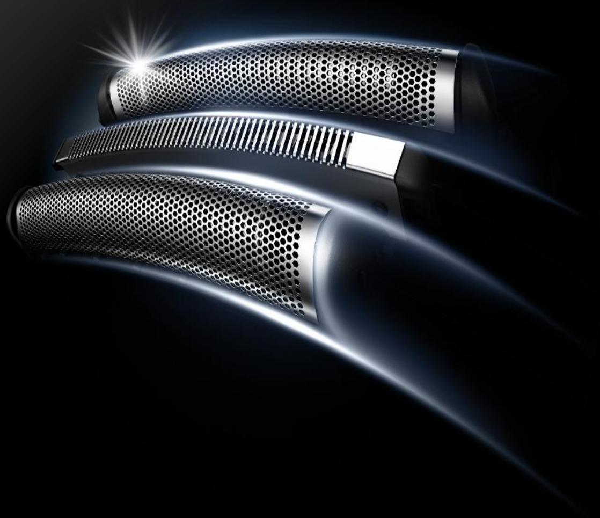

natural_image

Close-up of three metallic microphones with diffraction effects against a black background (no text or symbols visible)

## (一) 科技引领

创新驱动

<table><tr><td>指标</td><td>2023年</td><td>2024年</td><td>2025年</td></tr><tr><td>研发费用</td><td>¥9,927.73</td><td>¥9,641.53</td><td>¥11,525.76</td></tr><tr><td>营业收入</td><td>¥505,968.32</td><td>¥414,720.99</td><td>¥386,108.07</td></tr><tr><td>营收占比</td><td>2%</td><td>2.3%</td><td>3%</td></tr><tr><td>同比增长</td><td>—</td><td>-2.88%</td><td>+19.54%</td></tr></table>

## 科技伦理

公司高度重视科技伦理建设，始终坚持技术创新与伦理规范并重的发展理念。

公司在产品研发过程中，严格遵守国家科技伦理相关法律法规及行业规范，确保技术研发活动合法合规、安全可控。在新产品开发立项阶段，公司将伦理风险评估纳入评审流程，重点关注产品安全性、用户隐私保护、环境友好性等方面的伦理要求，确保新技术、新产品不对消费者健康安全和生态环境造成不利影响。

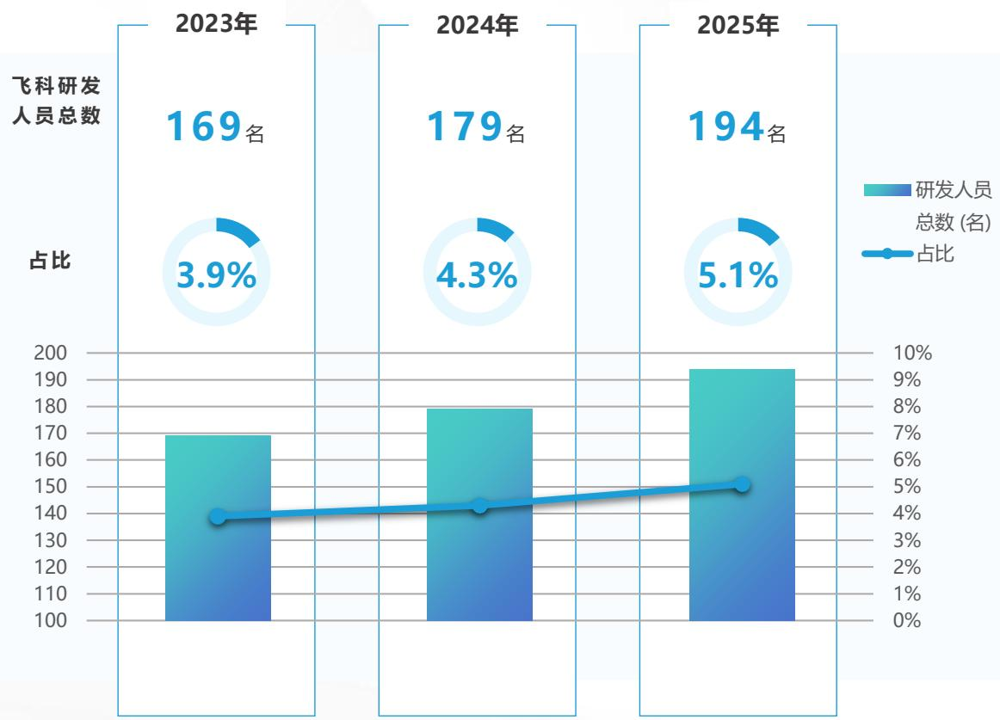

bar_line

| 年份 | 飞科研发人员总数 (名) | 占比 (%) |
| --- | --- | --- |
| 2023年 | 169 | 3.9 |
| 2024年 | 179 | 4.3 |
| 2025年 | 194 | 5.1 |

公司建立科技伦理内部管理规范，明确研发人员在技术开发、试验验证、成果转化等环节应遵循的伦理准则。要求全体研发人员恪守诚实守信的科研操守，杜绝数据造假、抄袭侵权等学术不端行为。在产品测试环节，严格执行国家强制性安全标准（如GB/T 4706系列、IEC 60335等），确保产品电气安全、机械安全、热安全及化学安全等各项指标达标。同时，公司定期组织科技伦理专题培训，提升全员伦理意识与合规能力，营造尊重科学、遵守伦理的创新文化氛围，促进技术创新成果的负责任应用。

## 产学研合作

2025 年，飞科电器持续深化产学研协同创新，以研发创新与人才培养双轮驱动，推进产教深度融合。公司与上海视觉艺术学院达成战略合作，围绕课程共建、实习实践、毕业设计、科研项目攻关、研发平台共建、设计咨询与人才培训等开展全方位合作，共同打造适应个人护理电器产业需求的创新设计人才梯队，推动产品外观、用户体验、品牌形象等关键环节迭代升级。通过校企协同，有效打通教育链、人才链、创新链、产业链，在提升自主研发能力与核心技术储备的同时，助力区域时尚消费品产业升级，以可持续创新赋能企业高质量发展与行业生态共建。

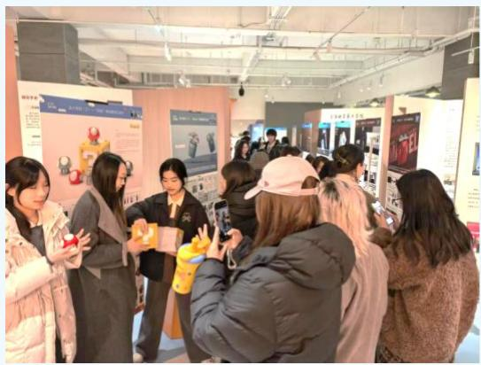

natural_image

Group of people gathered indoors in a modern exhibition hall, some holding phones and interacting with displays (no visible text or symbols)

同学们参观结课展览

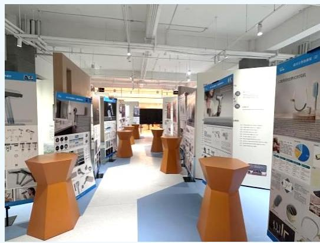

natural_image

Interior view of a modern exhibition hall with display booths and informational panels (no visible text or symbols)

结课汇报展览

飞科电器携手上海视觉艺术学院产品设计战略设计与创新方向班、整合创新设计方向班，历时两个多月，呈现出20组充满巧思的产教融合设计成果。

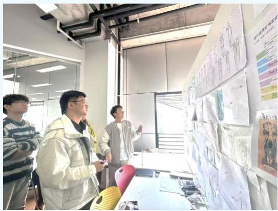

text_image

Group of people viewing a wall-mounted art or drawing exhibit with visible Chinese text panels and drawings

飞科团队点评同学们的设计草图

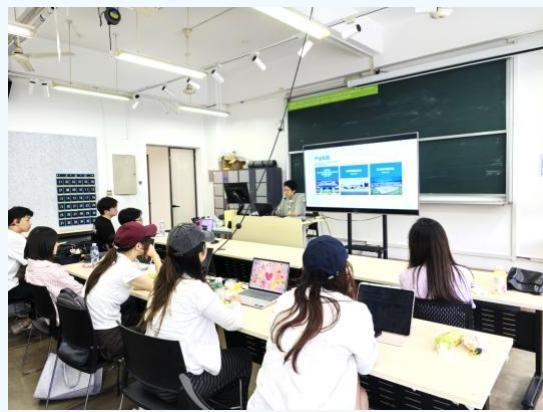

natural_image

Interior of a classroom or lab with students at desks and a projector screen showing a presentation (no visible text or symbols)

飞科团队向同学们介绍品牌与产品内容

## 产品质量

公司建立以ISO 9001为核心的质量管理体系文件，配套全流程质量控制程序、5M1E作业规范、QMS系统与追溯管理规定，并依据GB/T 4706系列、IEC/EN 60335、RoHS等国内外标准，通过CCC、CE、UL、PSE、KC等产品认证；确立客户满意、持续改进、全员参与、预防为主的质量方针，建立覆盖设计、供应链、生产、成品检验、售后改进的全流程管控制度，实施5M1E全要素管理，并运用QMS系统与质量追溯平台实现数字化管控，全面保障产品质量合规、稳定与可追溯。

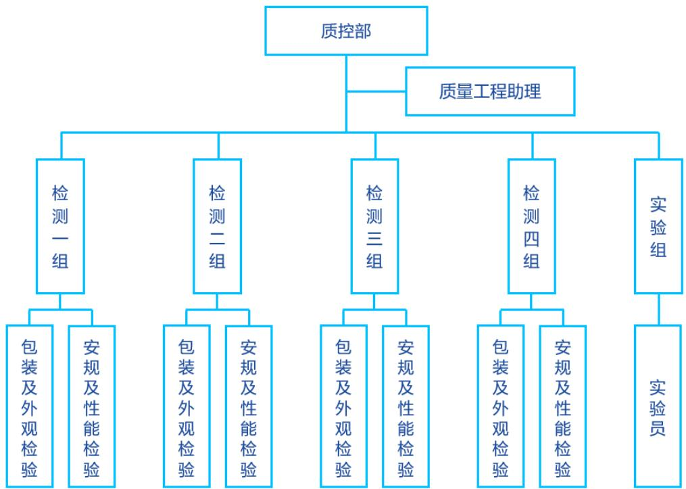

flowchart

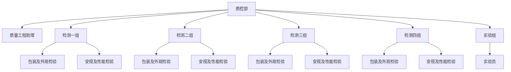
```mermaid
graph TD
  A["质控部"] --> B["质量工程助理"]
  A --> C["检测一组"]
  A --> D["检测二组"]
  A --> E["检测三组"]
  A --> F["检测四组"]
  A --> G["实验组"]
  
  C --> H["包装及外观检验"]
  C --> I["安规及性能检验"]
  
  D --> J["包装及外观检验"]
  D --> K["安规及性能检验"]
  
  E --> L["包装及外观检验"]
  E --> M["安规及性能检验"]
  
  F --> N["包装及外观检验"]
  F --> O["安规及性能检验"]
  
  G --> P["实验员"]
```

公司建立了质量培训体系，通过内部培训、生产实训、早会等方式，提升各岗位员工的质量管理意识。

160+

2025年度产品质量培训场次

涵盖入职培训、法律法规、质量标准、质量管理、5S管理、安全管理、设备管理、岗位技能等

100%

参加培训人员考核通过率

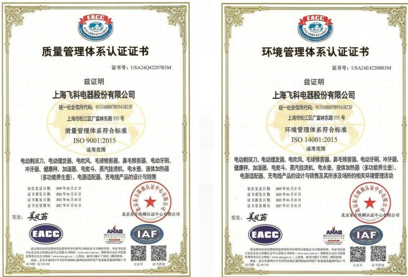

## 产品质量

成品检验管理业务流程图  
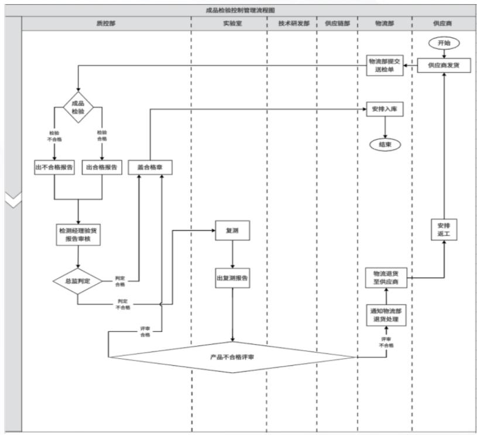

flowchart

```mermaid
graph TD
  subgraph RawMaterial["原材料"]
  RawMaterial["Raw Material Input"] --> CheckQuality{"成品检验"}
  CheckQuality -- "检验不合格" --> Reject1["出不合格报告"]
  CheckQuality -- "检验合格" --> Pass1["出合格报告"]
  Reject1 --> AuditReport["检测经理验货报告审核"]
  Pass1 --> AuditReport
  AuditReport --> FinalCheck{"总监判定"}
  FinalCheck -- "判定合格" --> Pass1
  FinalCheck -- "判定不合格" --> RecheckOrder["复测"]
  RecheckOrder --> ReAuditReport["出复测报告"]
  ReAuditReport --> ReviewResult{"产品不合格评审"}
  ReviewResult -- "评审不合格" --> NotifyLogistics["通知物流部退货处理"]
  NotifyLogistics --> ReturnGoods["物流退货至供应商"]
  ReturnGoods --> ReturnGoods
  ReturnGoods --> ShipOrder["安排返工"]
  ShipOrder --> ShipShip["供应商发货"]
  ShipShip --> StartProcess["开始"]
  end

  subgraph LabDept ["实验室"]
  LabDept --> AuditReport
  AuditReport --> FinalCheck
  end

  subgraph TechDept ["技术研发部"]
  TechDept --> AuditReport
  end

  subgraph SupplyDept ["供应链部"]
  SupplyDept --> AuditReport
  end

  subgraph LogisticsDept ["物流部"]
  LogisticsDept --> ShipShip
  ShipShip --> StartProcess
  end

  subgraph SupplierDept ["供应商"]
  SupplierDept --> StartProcess
  end
```

新产品及优化产品检验管理业务流程图  
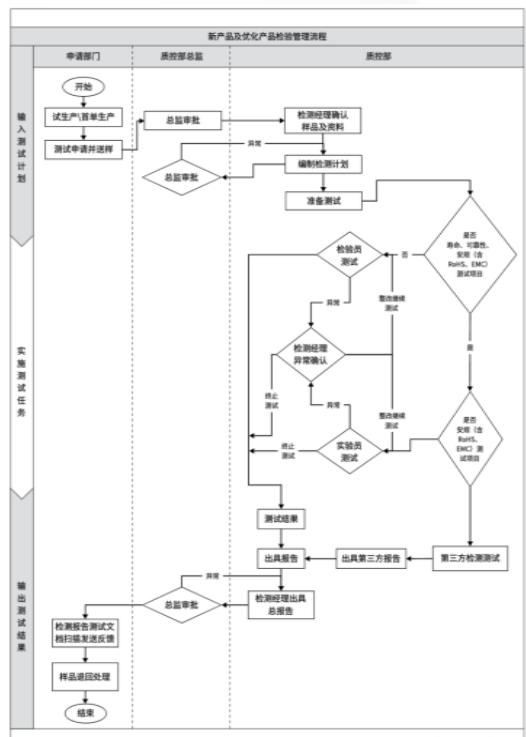

flowchart

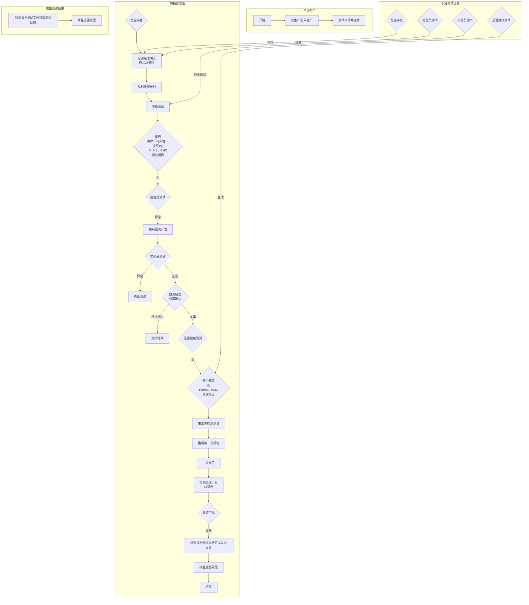
```mermaid
graph TD
  subgraph Application["申请部门"]
  A["开始"] --> B["试生产/首单生产"]
  B --> C["测试申请并送样"]
  end

  subgraph Supervision["质控部总监"]
  D{"总监审批"} --> E["检测经理确认\n样品及资料"]
  E --> F["编制检测计划"]
  F --> G["准备测试"]
  G --> H{"是否\n寿命、可靠性、\n按照1倍\nRmHS、EMC\n测试项目"}
  H -->|否| I{"检验员测试"}
  I -->|异常| J["编制检测计划"]
  J --> K{"实验员测试"}
  K -->|异常| L["终止测试"]
  K -->|正常| M{"检测经理\n异常确认"}
  M -->|终止测试| N["测试结果"]
  M -->|正常| O{"是否继续测试"}
  O -->|是| P{"是否安装\n在\nRmHS、EMC\n测试项目"}
  P --> Q["第三方检测测试"]
  Q --> R["出具第三方报告"]
  R --> S["出具报告"]
  S --> T["检测经理出具\n总报告"]
  T --> U{"总监审批"}
  U -->|异常| V["检测报告测试文档扫描发送反馈"]
  V --> W["样品退回处理"]
  W --> X["结束"]
  end

  subgraph Testing["实施测试任务"]
  Y{"总监审批"} -->|异常| E
  Z{"检验员测试"} -->|异常| E
  AA{"实验员测试"} -->|终止测试| G
  AB{"是否继续测试"} -->|整改| P
  end

  subgraph Result["输出测试结果"]
  AC["检测报告测试文档扫描发送反馈"] --> AD["样品退回处理"]
  end
```

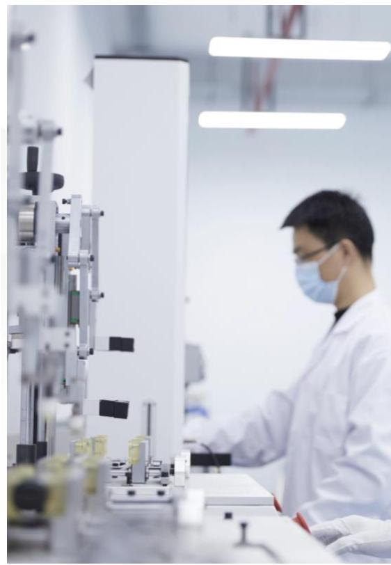

natural_image

Scientist in lab coat and mask operating laboratory equipment (no visible text or symbols)

2023年质量目标完成情况

<table><tr><td>序号</td><td>公司目标</td><td colspan="2">完成情况</td></tr><tr><td rowspan="6">1</td><td rowspan="6">成品一次检验合格率≥98%</td><td>电动剃须刀</td><td>98.03%</td></tr><tr><td>电动理发器</td><td>98.01%</td></tr><tr><td>鼻毛修剪器</td><td>98.20%</td></tr><tr><td>电动牙刷</td><td>98.05%</td></tr><tr><td>加湿器</td><td>98.18%</td></tr><tr><td>电吹风</td><td>98.01%</td></tr><tr><td>2</td><td>顾客满意度≥97%</td><td>顾客满意度</td><td>98.53%</td></tr></table>

抽检 131 批 合格率 100%

2024年质量目标完成情况

<table><tr><td>序号</td><td>公司目标</td><td colspan="2">完成情况</td></tr><tr><td rowspan="7">1</td><td rowspan="7">成品一次检验合格率≥98%</td><td>电动剃须刀</td><td>98.30%</td></tr><tr><td>电动理发器</td><td>98.11%</td></tr><tr><td>鼻毛修剪器</td><td>98.20%</td></tr><tr><td>电动牙刷</td><td>98.30%</td></tr><tr><td>加湿器</td><td>98.11%</td></tr><tr><td>毛球修剪器</td><td>98.11%</td></tr><tr><td>电吹风</td><td>98.10%</td></tr><tr><td>2</td><td>顾客满意度≥97%</td><td>顾客满意度</td><td>97.96%</td></tr></table>

抽检 148 批 合格率 100%

2025年质量目标完成情况

<table><tr><td>序号</td><td>公司目标</td><td colspan="2">完成情况</td></tr><tr><td rowspan="7">1</td><td rowspan="7">成品一次检验合格率≥98%</td><td>电动剃须刀</td><td>98.25%</td></tr><tr><td>电动理发器</td><td>98.79%</td></tr><tr><td>鼻毛修剪器</td><td>98.86%</td></tr><tr><td>电动牙刷</td><td>99.06%</td></tr><tr><td>加湿器</td><td>98.20%</td></tr><tr><td>毛球修剪器</td><td>99.18%</td></tr><tr><td>电吹风</td><td>98.23%</td></tr><tr><td>2</td><td>顾客满意度≥97%</td><td>顾客满意度</td><td>97.58%</td></tr></table>

抽检 128 批 合格率 100%

## 产品质量

公司由质控部牵头建立全流程质量安全管理体系，依据 GB 4706 系列、IEC 60335 等标准开展风险识别与分级管控，通过安全专项检查全面排查电气、机械、热、化学等安全隐患，执行隐患排查、上报、整改、验收、复盘的闭环管理并落实各级人员责任，建立分级应急响应机制与触电、火灾、泄漏、烫伤等事故处置方案，未来将推进数字化监控、供应链源头管控与全员安全培训，持续完善质量安全长效机制。

2025年，公司通过风险评估、安全专项检查、隐患整改、应急预案等方式，有效提升全员为产品保驾护航的安全意识。积极开展员工职业技能、环保管理、客户服务等培训，多维度鼓励员工学习技能，为公司质量安全保驾护航，夯实公司保持质量领先的人才基础。

公司建立了质量培训体系，通过内部培训、生产实训、早会等方式，提升各岗位员工的质量管理意识。2025年，公司向员工开展了产品质量方面培训160多场，培训内容涵盖入职培训、人员管理、法律法规、质量标准、质量管理、质量基础、成本管理、“5S”管理、安全管理、设备管理、岗位技能等，参加培训人员考核通过率 $100\%$ 。

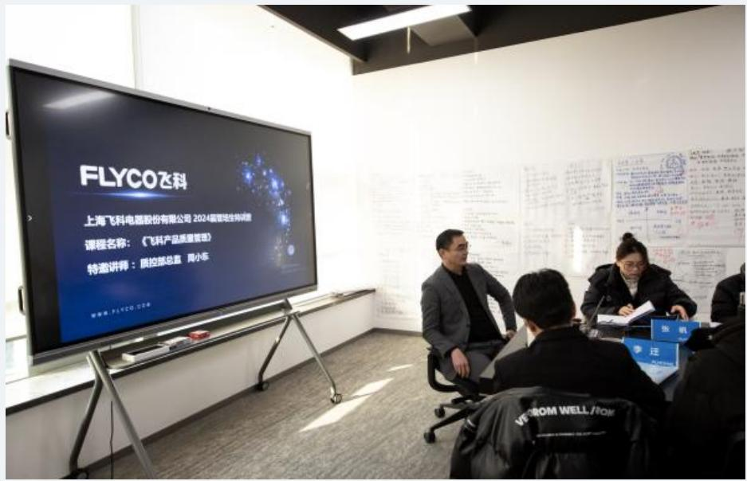

text_image

FLYCO飞科
上海飞科电器股份有限公司 2024碳型控生物实验
课程名称：《飞科产品质量管理》
特邀讲师：质控部总监 周小东
www.flyco.com
张帆
李迁

飞科产品质量管理课程培训

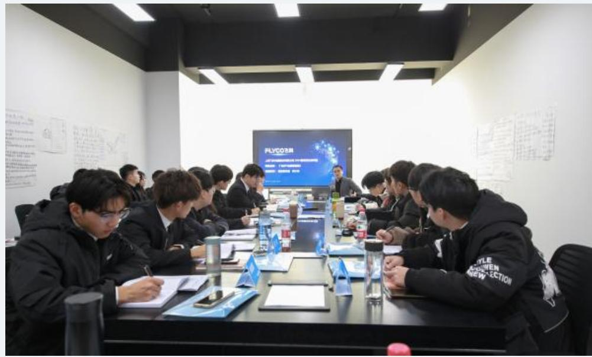

text_image

Meeting room photo with visible presentation screen displaying 'FLYCOOR' and Chinese text, participants seated around a conference table.

飞科产品质量管理课程培训

## 知识产权保护

## 2025年新增

11件

发明专利

50件

实用新型专利

63件

外观设计专利

18件

PCT国际专利

32件

2025年度运用于主营业务的发明专利

公司顺利通过知识产权管理体系再认证审核，并正式颁布新版《知识产权管理手册》，持续完善知识产权全生命周期管理体系，强化核心技术与品牌资产的合规保护，为全球化业务布局与技术创新发展筑牢制度保障。

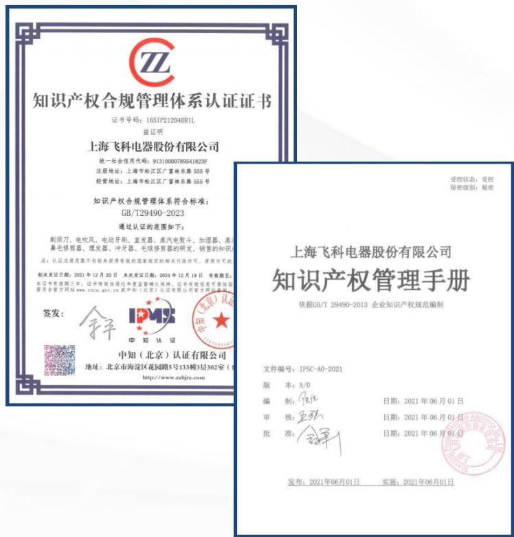

text_image

知识产权合规管理体系认证证书
证书号码：1651P212040R1L
证证明
上海飞科电器股份有限公司
统一社会信用代码：91310000789541823F
注册地址：上海市松江区广富林东路555号
经营地址：上海市松江区广富林东路555号
知识产权合规管理体系符合标准：
GB/T29490-2023
通过认证的范围如下：
剃须刀、电吹风、电动牙刷、直发器、蒸汽电熨斗、加湿器、蒸
鼻毛修剪器、理发器、冲牙器、毛球修剪器的研发、销售的知识
注：认证注册范围不包括未获得有效的国家规定的相关行政许可、资质许可的
初次发证日期：2021年12月20日 本次发证日期：2024年12月19日 有效期限：
本证书有效期三年，证书有效性通过年度监督确认 Bermuda。证州市做信息公开登陆国
委员会官方网站www.cinda.gov.cn或中和（北京）认证有限公司官方网站http://www.zxbjzq.com
签发：
中知（北京）认证有限公司
地址：北京市海淀区花园路5号133幢3层302室（）
http://www.zxbjzq.com
受控状态：受控
秘密级别：秘密
上海飞科电器股份有限公司
知识产权管理手册
依据GB/T 29490-2013 企业知识产权规范编制
文件编号：IPSC-AO-2021
版本：A/0
编制：张伟    日期：2021年06月01日
审核：王磊    日期：2021年06月01日
批准：马军    日期：2021年06月01日
发布：2021年06月01日      实施：2021年06月01日

## 知识产权保护

公司高度重视专利人才培养与知识产权文化建设，由知识产权管理部统筹专利管理全流程工作，配置专职专利管理人员6名，其中3名人员持有知识产权工作者证、知识产权职称或专利代理师资格，持续夯实知识产权管理专业团队力量。

同时，公司构建“内培+外训+行业交流”三位一体的人才培养体系，全方位提升全员知识产权意识与专业能力，为公司技术创新、品牌保护与全球化业务布局筑牢人才与文化基础：

<table><tr><td>内部培训</td><td>3次建设期内累计开展知识产权内部培训</td><td>70人次覆盖</td></tr><tr><td>外部培训</td><td colspan="2">7人次选派核心人员参加外部专业培训</td></tr><tr><td>行业交流</td><td colspan="2">5次组织员工参与市区两级知识产权相关活动</td></tr></table>

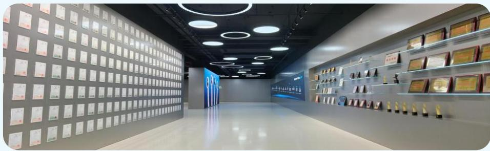

natural_image

Interior view of a modern exhibition space with framed certificates on display walls and wall-mounted certificates on shelves (no visible text or signage)

公司深入推进专利与商标工作的深度融合，构建“专利 + 商标 + 品牌”一体化的商业落地与保护体系，知识产权维权成效显著。

<table><tr><td>170万元</td><td>与广东某厨房电器公司侵权案获赔170万元</td></tr><tr><td>99万元</td><td>某公司商标侵权案,经上海市高院判决获赔99万元</td></tr><tr><td>30万元</td><td>某公司商标侵权案,江苏省高院判令对方赔偿30万元</td></tr><tr><td>追责</td><td>在打击假冒商标专项行动中,完成对假冒商标侵权刑事案件处理,有效维护了市场秩序与品牌合法权益。</td></tr></table>

## （二）责任营销

公司建立了覆盖全国的营销人员培训体系。区域分销板块每年开展年度培训1-2场，各大区每年开展区域团队培训12场以上；KA终端板块每年开展年度培训会议1-2场，月度培训会议12场以上。培训内容涵盖新品铺市策略、经销商业务赋能、团队职业素养提升、终端促销策划等主题，覆盖华东、华南、华西、华中、华北全部区域，全面提升营销团队的业务能力与服务水平。

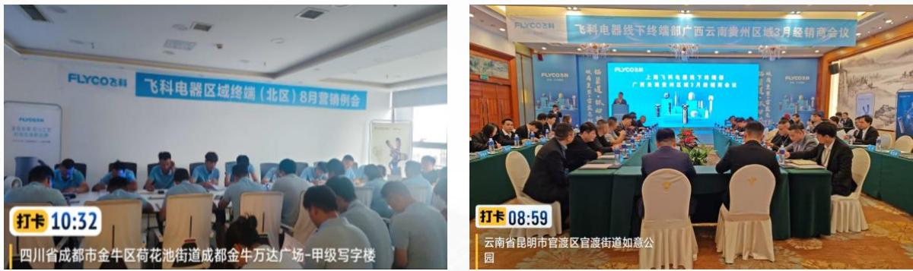  
飞科区域营销会议

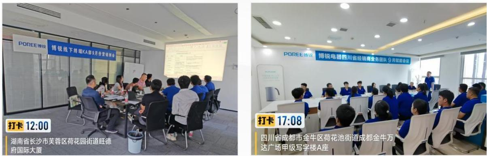  
博锐区域营销会议

## 经销商合规管理

公司对经销商设立明确的合规准入要求：

须具有一般纳税人资格，提供营业执照、法人身份证等完整资质文件，进行实地合规调查  
具备经政府相关部门检核的标准面积以上仓库及办公场所  
具备按合同配置业务团队与业务基础设施的能力

公司按系统、按区域授权经销商，管理市场秩序。

natural_image

Illustration of a document with a pen, a document with a user profile icon, and a checkmark (no text or symbols present)

## (三) 客户管理

公司制定《售后服务商管理手册》，确立“卓越服务，顾客为尊”服务理念与服务有形化、网络化、信息化、标准化管理要求，明确一周包换、两年保修等服务政策，规范服务流程、服务标准、服务商设立与撤销、日常运营、服务回访、服务稽查、服务结算及服务绩效考核等管理规定，明确配件业务、技术培训、资质认证、市场质量信息反馈等操作规范，制定服务奖惩条例，并配套售后服务商设立申请书、维修记录单、配件返厂清单等标准化表单，全面规范客户服务与售后服务商管理工作。

2025年度，售后服务部依据公司的相关政策，重点加强对各售后服务网点的运营监督及形象管理。从门店运营、用户投诉、服务违规、绩效激励四个方面对服务网点进行监督考核，规范了网点服务接待流程，提升了网点服务形象。

9 家 2025年新增投入运营

13 家 集中整治 清退

145家 售后服务网点总数（截至2025年12月31日） 124个 已覆盖地级行政区域

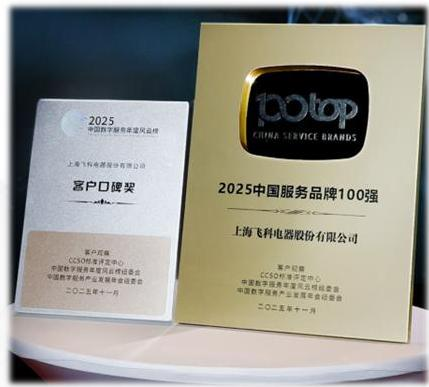

text_image

2025
中国数字服务年度用品奖
上海飞科电器股份有限公司
客户口碑奖
COSO品牌研究中心
中国数字服务年度用品奖委员会
中国数字服务产业发展年会委员会
二〇二五年十一月
potop
CHINA SERVICE BRANDS
2025中国服务品牌100强
上海飞科电器股份有限公司
客户口碑
COSO品牌研究中心
中国数字服务年度用品奖委员会
中国数字服务产业发展年会委员会
二〇二五年十一月

公司对外承诺用户全国联保2年。根据售后服务保修政策规定，用户机器购买两年内，非人为因素损坏，用户可凭有效保修凭证享有免费保修服务（易损件正常更换除外）。针对两年以上无法提供有效发票、有效收据凭条或有效售后服务卡的情况，所有配件仅收配件费用，免收其它维修费用。如在飞科官方授权电商渠道购买机器，提供购买凭证，即可在任意授权售后网点进行免费维修，解决用户购买机器的后顾之忧。

公司围绕客户服务与满意度管理建立了完善的制度体系，制定《与顾客有关的过程控制程序》《顾客反馈处理控制程序》，推行顾客服务满意度制度，通过呼叫中心与返厂维修客户开展服务需求调查，调查覆盖服务态度、服务时效、专业技能、信息畅通、服务价格、增值服务、服务标准化、过程管理、服务形象等维度，明确客户最关注服务态度、服务时效、专业技能，同步开展顾客满意度调查与顾客投诉记录管理，建立并执行客户投诉登记、反馈、处置全流程机制，确保客户问题及时响应、有效解决，不断优化服务质量，稳定提升客户整体满意水平。

2025年度
99.49%
顾客满意度

2025年度
97.58%
服务质量满意度

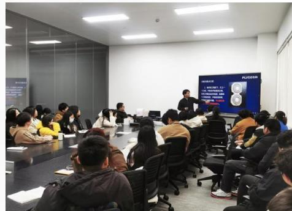

text_image

Conference room scene with attendees seated around a presentation screen displaying 'POWER' logo and Chinese text

电商客服培训——消费者维权保护职能及售后业务培训

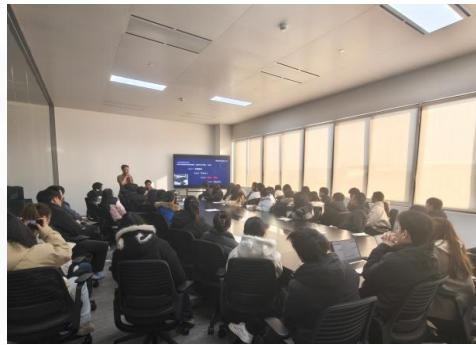

natural_image

Interior of a conference room with attendees seated facing a presenter at the front (no visible text or signage)

电商客服培训——消费者维权保护职能及售后业务培训

## 投诉响应

公司建立了覆盖日常客诉与重大危机事件的客户反馈及投诉管理体系，制定《售后服务部客诉升级处理制度》《售后服务部呼叫中心危机事件（重大客诉）处理制度》，明确客户投诉、重大客诉及危机事件的定义、责任认定、分级处置流程与跨部门协同机制，形成接诉、记录、取证、技术判定、方案制定、分级审批、赔付执行、资料备案的全闭环应对机制；制度清晰界定产品质量、用户操作、非原厂配件、经销商责任及不可抗力等责任边界。

## 10分钟

涉及人身伤害、产品自燃、重大财产损失的危机事件须在接待完毕10分钟后上报售后服务总监

## 2周

普通客诉须在2周内办结

## 3个月

危机事件除特殊原因外须在3个月内处理完成

未按要求及时上报、超期未办结或处置不当导致事件升级的将对责任人进行考核追责，同时配套危机事件处理申请表、客诉登记表、赔偿协议、收条等标准化表单，实现客户投诉处理全程可追溯、可核查，2023至2025年公司持续执行上述客户反馈管理要求与定量管控指标，不断提升投诉处理效率与客户服务质量。

公司持续加强品牌投放与电商布局，同步推进总部售后及消费者维权工作。在天猫、京东等电商平台开设旗舰店，并拓展微信、APP等移动端销售与维权沟通渠道，建立多元化垂直维权方式，便捷消费者与厂商沟通。公司已构建覆盖全国近200家售后网点、总部400呼叫中心、自营及经销商线上客服、直营体验店、2万余家线下商超专柜、直播平台即时响应及微信公众号、智能APP在线留言等多位一体服务网络，打造分级处置、多位一体的消费咨询与维权渠道体系，高效处理维权事项，优化售后体验。公司推行先行赔付、小额纠纷快速处理、无理由退货等机制，依托完善的销售与售后体系开展消费纠纷前期调解，总部与办事处联动提升处理效率，有效维护消费者权益，打造有温度、值得信赖的国民电器品牌。

## 客户隐私保护

公司围绕售后服务信息管理构建了全流程制度体系，明确将用户信息、联系方式等客户隐私数据纳入核心保密范畴，实施集中存储、定期备份、权限分级管控及安全风险预警等管理要求，严格规范内部人员对客户信息的查阅、使用与传输行为，限定仅授权人员可访问相关数据，定期开展权限合规检查，强化系统账号与密码安全管理，严禁未经许可查阅、复制、外传客户资料，通过物理隔离、病毒防护、网络安全管控等手段防范外部入侵与数据泄露风险，对涉密客户信息定期执行备份与加密防护，同步建立完整记录表单实现客户信息全流程可追溯、可核查，全方位保障客户隐私信息安全。

## （四）数据安全

## 数据安全管理

公司高度重视数据安全管理，制定并实施《数据资产分级分类管理制度》，将公司数据资产划分为四个等级进行分类管控：

## D1 重要敏感数据

业务结果数据、客户信息数据、系统安全配置数据、财务账目数据等，由相关业务部门与财务部共同承担安全管理责任

## D2 非敏感重要数据

业务过程数据、各类汇报文件、系统日志、邮件等

## D3 公司内部非敏感数据

员工通讯录、业务运营信息、系统测试数据等

## D4 普通数据

可公开的一般性信息

<table><tr><td>部门</td><td>职责</td></tr><tr><td>信息部</td><td>数据资产安全管理归口部门,负责公司信息系统及网络安全的日常管理与监控,协同研发技术部、实验室及质控部、营销部门、财务部等共同落实数据分级保措施</td></tr><tr><td>总裁办/审计部</td><td>作为数据资产使用的监管单位,对数据安全管理工作进行监督</td></tr></table>

公司同时制定《信息安全责任管理制度》，建立了完善的信息安全应急响应体系，将信息安全事件分为攻击事件、故障事件和灾害事件三大类，并按影响程度分为三个等级：

Ⅲ级

## 一般事件

影响范围有限，可在常规流程内处置

Ⅱ级

## 重大事件

较大影响范围，需跨部门协同响应

I级

## 特别重大事件

涉及全局影响，启动最高级别应急方案

公司成立信息安全应急响应实施小组，明确各级人员职责分工，制定了涵盖病毒传播、外部入侵、内部入侵、网络故障、服务器故障等各类安全事件的应急处置方案与后期处置流程（含信息系统重建和应急响应总结），确保在信息安全事件发生时能够快速响应、有效处置。

√ 报告期内未发生数据安全事件

√报告期内未发生隐私泄露事件

## 商业机密管理

公司建立了分层分类的商业机密保护体系，依据《数据资产分级分类管理制度》将涉及公司核心竞争力的技术资料、客户数据、财务信息等列为一级重要敏感数据（D1），通过多重手段全方位保障商业机密安全：

## 数据分级管理

## 访问权限控制

## 加密传输存储

## 物理隔离防护

各业务部门按照制度要求落实本部门数据资产的日常管理职责，信息部负责技术层面的安全管控，审计部开展定期合规检查。公司要求全体员工签署保密协议，明确保密义务与违约责任，定期开展信息安全培训，强化全员保密意识。

## 绿色发展护生态

环境管理 40

能源利用 42

污染排放 44

废弃物处理 45

水源管理 46

循环经济 46

气候变化 47

生态保护和生物多样性保护 51

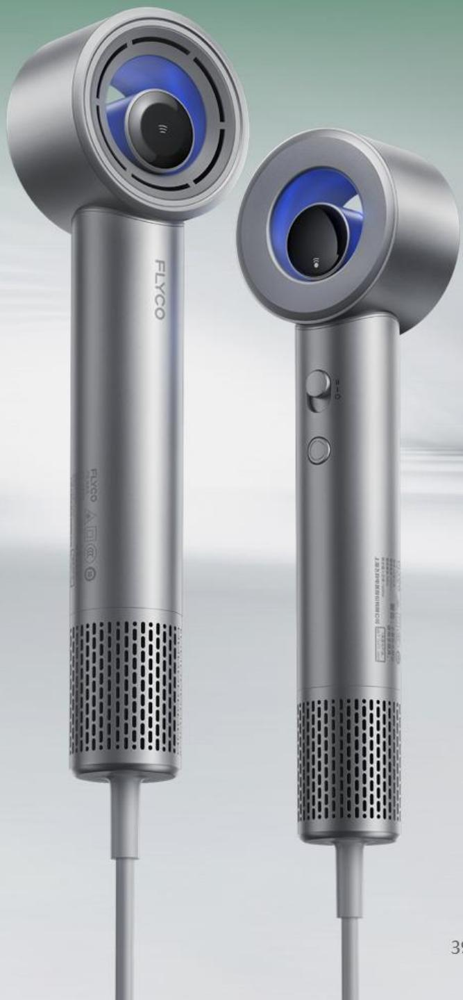

natural_image

Two silver FXCO air purifier devices with blue ambient lighting and ventilation grilles, no visible text or symbols on the devices themselves.

## (一) 环境管理

作为个人护理电器行业的领先品牌，飞科电器始终将环境管理与可持续发展作为企业运营的核心准则之一。通过建立并持续优化环境与质量管理体系，我们以权威认证为抓手，推动生产全流程的绿色化、规范化升级，为消费者提供更安全、更环保的产品。

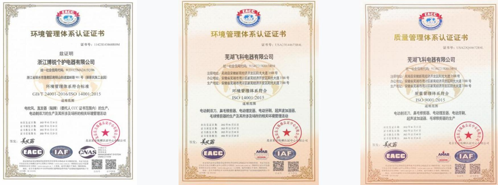

☐ 浙江博锐在2025年5月更新了环境管理体系证书，证明其环境管理体系符合标准GB/T 24001-2016/ISO 14001:2015。覆盖电吹风、直发器等产品全生命周期的环境管控，践行绿色生产承诺。

☐ 芜湖飞科在2025年12月更新了质量管理体系证书（符合ISO 9001:2015）与环境管理体系证书（符合ISO 14001:2015）。覆盖电动剃须刀、电动牙刷等品类的环境管理，实现生产环节低碳优化。

## 环境投入与绩效

2025年度，飞科环保总投入为2,431,360.8元，覆盖飞科总部（上海）、芜湖飞科、浙江博锐三大基地，具体投向以下九大类项目：

<table><tr><td>项目类别</td><td>金额(元)</td><td>主要投入内容</td></tr><tr><td>园区绿化与生态维护</td><td>1,566,735.96</td><td>园区绿化日常养护、绿植药剂及肥料、草坪草花补植、罗汉松修剪、中轴绿化改造工程、围墙外围绿化整改、室内绿植租摆、绿化劳务等</td></tr><tr><td>污水处理</td><td>323,397.25</td><td>芜湖飞科及浙江博锐生产与生活污水纳管处理费用</td></tr><tr><td>垃圾清运与废弃物处理</td><td>165,815.19</td><td>一般生活垃圾清运、绿化垃圾清运、废油墨瓶危废处理、化粪池清理</td></tr><tr><td>环保设施维修维护</td><td>103,631.69</td><td>废气净化设备维保、排烟管道改造、污水管维修、隔油池管道维修、下水道疏通等</td></tr><tr><td>环境管理体系认证</td><td>53,962.27</td><td>能源管理体系(ISO 50001)认证、ISO环境/质量管理体系审核</td></tr><tr><td>环保咨询服务</td><td>38,000.00</td><td>工业环评&quot;三同时&quot;咨询服务</td></tr><tr><td>职业健康与环保保障</td><td>37,340.00</td><td>员工职业健康体检、食堂环保设施及油烟管道维护保养</td></tr><tr><td>环境检测与监测</td><td>35,011.24</td><td>三废检测、职业危害因素检测、饮用水检测、防雷检测、危废检测</td></tr><tr><td>其他环保相关支出</td><td>107,467.20</td><td>绿化物料消耗、办公绿植租摆、低值易耗品等</td></tr><tr><td>合计</td><td>2,431,360.80</td><td></td></tr></table>

## (二) 能源利用

飞科依据ISO50001:2018及GB/T23331等国家能源管理标准，搭建四级文件化能源管理体系（以能源管理手册为纲领、20项程序文件为核心、作业文件为支撑、记录为佐证），确立"遵守法规、节约能源、提高能效、持续改进"的能源方针。

以总经理为最高责任主体、管理者代表统筹推进、行政部归口管理、生产技术部等多部门协同履职，组建专项能源管理小组并明确全层级权责分工。

管控覆盖个人护理小家电生产全用能环节（注塑、电池检测、包装等核心工序及辅助/附属用能系统），建立能源评审、能源基准/标杆/绩效参数设定、目标指标与管理方案编制、设备采购管控、运行过程控制、能源计量统计、监测评价、内部审核、管理评审等全流程闭环管控机制。

通过合规性评价、纠正与预防措施落地、新改扩建项目源头节能、高效能设备优先采购、全员节能意识与能力培育，实现能源绩效持续改进与体系合规有效运行。

飞科汽油消耗

<table><tr><td>年度</td><td>消耗量(升)</td><td>金额(元)</td></tr><tr><td>2023</td><td>6,389.83</td><td>53,131.96</td></tr><tr><td>2024</td><td>5,864.95</td><td>48,442.06</td></tr><tr><td>2025</td><td>4,515.44</td><td>34,175.02</td></tr></table>

制冷剂补充数据

<table><tr><td>2023年</td><td>2024年</td><td>2025年</td><td>制冷剂型号</td></tr><tr><td>20kg</td><td>30kg</td><td>30kg</td><td>巨化 R410A</td></tr></table>

## 清洁能源

公司积极推动清洁能源应用，通过建设分布式光伏发电项目，持续提升可再生能源使用比例，降低碳排放强度。芜湖飞科、浙江博锐已建成屋顶光伏电站，上海总部光伏项目计划于2026年Q3竣工。

## 芜湖飞科光伏电站

于2024年5月正式并网发电，采用单晶光伏组件平铺安装于厂房屋顶，所发电力优先供应园区生产及办公用电。2025年度累计发电7,689,001千瓦时，节约标准煤2,521.99吨，减排 $CO_{2}$ 4,568.80吨。

2025年芜湖飞科光伏发电数据

<table><tr><td>指标</td><td>全年合计</td></tr><tr><td>发电量(千瓦时)</td><td>7,689,001</td></tr><tr><td>节约标准煤(吨)</td><td>2,521.99</td></tr><tr><td>减排二氧化碳(吨)</td><td>4,568.80</td></tr><tr><td>光伏自用量(千瓦时)</td><td>5,456,701</td></tr><tr><td>余电上网量(千瓦时)</td><td>2,232,300</td></tr></table>

（排放因子来源：生态环境部《关于发布2023年电力二氧化碳排放因子的公告》）

## 浙江博锐光伏电站

容量6,000KW屋顶光伏电站，10月22日投运。2025年度累计发电7,785,350千瓦时，节约标准煤2,553.59吨，减排 $CO_{2}$ 4,626.05吨。

2025年浙江博锐光伏发电数据

<table><tr><td>指标</td><td>全年合计</td></tr><tr><td>发电量(千瓦时)</td><td>7,785,350</td></tr><tr><td>节约标准煤(吨)</td><td>2,553.59</td></tr><tr><td>减排二氧化碳(吨)</td><td>4,626.05</td></tr><tr><td>光伏自用量(千瓦时)</td><td>4,695,030</td></tr><tr><td>余电上网量(千瓦时)</td><td>3,090,320</td></tr></table>

(排放因子来源：生态环境部《关于发布2023年电力二氧化碳排放因子的公告》)

## 上海总部光伏发电项目（建设中）

公司已启动上海总部光伏发电项目建设，选址松江区广富林东路555号飞科园区，利用办公楼及四栋工业建筑屋顶安装分布式光伏电站，采用单晶光伏组件配套华为逆变器，接入10KV高压并网系统。

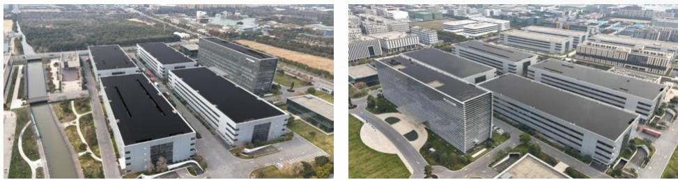  
飞科上海总部园区项目图

<table><tr><td>项目参数</td><td>内容</td></tr><tr><td>装机容量</td><td>约5,200 kW</td></tr><tr><td>预计年发电量</td><td>约520万千瓦时</td></tr><tr><td>预计减排二氧化碳</td><td>约3,089.84吨/年</td></tr><tr><td>预计覆盖园区用电比例</td><td>60%-70%</td></tr><tr><td>计划投用日期</td><td>2026年Q3</td></tr><tr><td>预计投资总额</td><td>约1,196万元</td></tr></table>

项目建成后，所发电力将优先满足园区办公楼、实验室、工厂及车间的日常用电需求。预计可覆盖园区年度用电总量的 $60\% - 70\%$ ，每年可减少 $\mathrm{CO}_{2}$ 排放约3,089.84吨，助力绿色能源替代与低碳目标达成。

飞科光伏合计数据

<table><tr><td>指标</td><td>芜湖飞科</td><td>浙江博锐</td><td>合计</td></tr><tr><td>发电量(万千瓦时)</td><td>768.90</td><td>778.54</td><td>1,547.44</td></tr><tr><td>节约标准煤(吨)</td><td>2,521.99</td><td>2,553.5</td><td>5,075.59</td></tr><tr><td>减排二氧化碳(吨)</td><td>4,568.80</td><td>4,626.05</td><td>9,194.86</td></tr></table>

(排放因子来源：生态环境部《关于发布2023年电力二氧化碳排放因子的公告》)

## 能源节约

园区建筑内部照明全面采用低压LED节能灯具，地下室、车库等公共区域完成声控感应改造，改造后用电量节约约三分之二  
明确空调开启温度阈值与设定标准，要求离岗超时、下班必关空调并关闭门窗  
推行"人走灯灭”，公共区域按需分区照明，优先利用自然光  
要求下班关闭办公设备电源、离岗设置睡眠模式，严禁私用非必要电器  
■ 严格管控水资源，杜绝跑冒滴漏，倡导按需用水  
部门负责人为节能降耗第一责任人，行政部定期巡查通报，以制度保障节能措施落地

## (三) 污染排放

## 污染物排放达标情况

基于第三方检测机构出具的报告，两家基地污染物排放均实现稳定达标：芜湖飞科 2025 年 9 月检测显示，有组织废气（注塑废气、焊接/SMT废气、食堂油烟）、无组织废气（非甲烷总烃、总悬浮颗粒物、二甲苯）、综合废水及厂界噪声均符合相关标准；浙江博锐 2025 年 4 月检测显示，有组织有机废气、无组织废气、总排放口废水及厂界噪声亦全部达标，未出现超标排放情形。

## 污染物处理措施

两家基地均针对生产环节采取分类管控措施：废气端对注塑、焊接、SMT等工序产生的有机/工艺废气进行收集后集中处理，食堂配套油烟净化设施；废水端生产综合废水经处理后，芜湖飞科实行纳管排放，浙江博锐实现直接达标排放；噪声端通过优化设备布局、作业防护等方式控制厂界噪声。污染防治设施方面，芜湖飞科配备UV光解净化器、轴流风机、油烟净化器及废水处理设施，浙江博锐配备有机废气处理设施、注塑/焊接废气收集管道及除尘设备，所有设施均正常运行，满足污染物收集与处理要求。

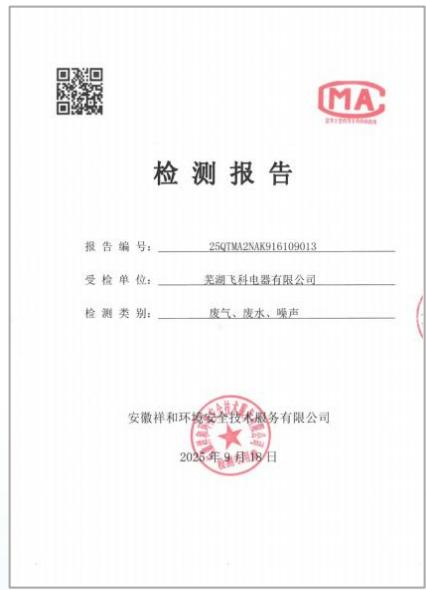

text_image

检测报告
报告编号：_______25QTMA2NAK916109013_______
受检单位：_______芜湖飞科电器有限公司
检测类别：_______废气、废水、噪声_______
安徽祥和环境安全技术服务有限公司
2025年9月18日

芜湖飞科2025年三废检测报告

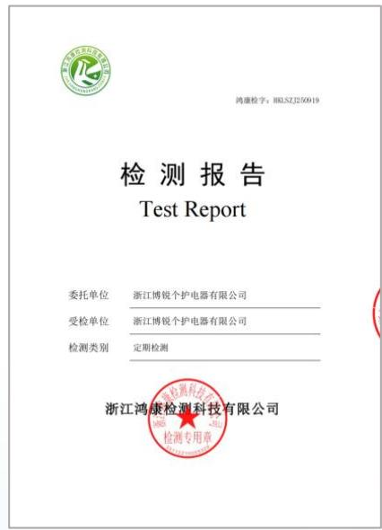

text_image

鸿康检字：HRJ.SZJ250919
检测报告
Test Report
委托单位 浙江博锐个护电器有限公司
受检单位 浙江博锐个护电器有限公司
检测类别 定期检测
浙江鸿康检测科技有限公司
检测专用章

浙江博锐2025年三废检测报告

## 排污登记情况

飞科旗下的芜湖飞科电器有限公司与浙江博锐个护电器有限公司均完成固定污染源排污登记延续手续，其中芜湖飞科电器有限公司登记编号为913402215830174010001X，2025年05月04日完成登记，有效期为2025年05月19日至2030年05月18日；浙江博锐个护电器有限公司登记编号为91331127MA2A15Q396001Y，2025年01月08日完成登记，有效期为2025年01月08日至2030年01月07日；两家子公司均遵守生态环境保护相关法律法规、政策及标准，保证排污登记信息真实准确完整，按规定办理变更、注销、延续登记，确保污染物稳定达标排放，并接受生态环境检查与社会公众监督。

## （四）废弃物处理

废弃物管理

<table><tr><td>名称</td><td>代码</td><td>芜湖飞科(吨)</td><td>浙江博锐(吨)</td><td>合计(吨)</td><td>处置方式</td></tr><tr><td>食品残渣</td><td>SW13</td><td>11.23</td><td>15.00</td><td>26.23</td><td>环卫指定单位统一处理</td></tr><tr><td>生活垃圾</td><td>SW59</td><td>300</td><td>350</td><td>650</td><td>环保公司处置</td></tr><tr><td>废金属</td><td>SW17</td><td>20.77</td><td>18.26</td><td>39.03</td><td>废品变卖/资源化处置</td></tr><tr><td>废塑料</td><td>SW17</td><td>803.22</td><td>40.02</td><td>843.24</td><td>废品变卖/资源化处置</td></tr><tr><td>废纸皮</td><td>SW17</td><td>784.48</td><td>327.52</td><td>1,112.00</td><td>废品变卖/资源化处置</td></tr><tr><td>废木材</td><td>SW17</td><td>84.92</td><td>34.29</td><td>119.21</td><td>废品变卖/资源化处置</td></tr><tr><td>油炸废油</td><td>SW59</td><td>0</td><td>0.34</td><td>0.34</td><td>废品变卖</td></tr><tr><td>合计</td><td></td><td>2,004.62</td><td>785.43</td><td>2,790.05</td><td></td></tr></table>

危险废弃物管理

<table><tr><td>基地</td><td>危废种类</td><td>产生量(吨)</td><td>处置方式</td></tr><tr><td>芜湖飞科</td><td>废油墨瓶</td><td>0.3978</td><td>委托芜湖致源环保科技有限公司处置,运输由芜湖海创物流有限责任公司负责;危废转移联单1份</td></tr><tr><td>浙江博锐</td><td>废油墨瓶</td><td>0.92</td><td>资质单位转移处置</td></tr><tr><td>合计</td><td></td><td>1.32</td><td></td></tr></table>

natural_image

Illustration of three people interacting with a globe surrounded by green leaves (no text or symbols)

## (五) 水源管理

2025年度公司总用水量为332,197立方米。

<table><tr><td>基地</td><td>取水量(立方米)</td><td>水源类型</td></tr><tr><td>飞科总部(上海)</td><td>97,958</td><td>市政自来水</td></tr><tr><td>芜湖飞科</td><td>117,630</td><td>市政自来水</td></tr><tr><td>浙江博锐</td><td>116,609</td><td>市政自来水</td></tr><tr><td>合计</td><td>332,197</td><td></td></tr></table>

废水排放

<table><tr><td>基地</td><td>废水排放量(立方米)</td><td>排放方式</td><td>主要污染物浓度</td></tr><tr><td>飞科总部</td><td>88,162</td><td>纳管排放</td><td>/</td></tr><tr><td>芜湖飞科</td><td>98,500</td><td>纳管排放</td><td>pH 7.0, COD 92mg/L, 氨氮 22.1mg/L</td></tr><tr><td>浙江博锐</td><td>99,118</td><td>直排达标(生活污水)</td><td>/</td></tr></table>

2025年度公司总耗水量 46,417 立方米

2025年度公司耗水强度 0.12 吨/万元

## 水资源管理措施

飞科高度重视水资源节约与保护，将节水管理纳入企业绿色运营体系。公司严格遵守《中华人民共和国水法》《中华人民共和国水污染防治法》等法律法规，建立健全水资源管理制度，明确各部门用水管理职责，实行用水定额与计量管理相结合的节水管控机制。

在生产用水管理方面，公司对生产工艺进行持续优化，推进冷却水循环利用，减少新鲜水取用量。对注塑、冲压等生产环节的冷却系统进行管路优化和设备改造，提高循环冷却水的利用效率。在生活用水管理方面，公司在园区内推广安装节水型器具，对公共区域的用水设施进行节水改造，采用感应式水龙头、定量冲水阀等节水设备，有效降低日常生活用水量。

公司建立了完善的用水监测与管理机制，定期对各用水单元进行计量统计与分析，及时发现和消除跑冒滴漏现象。行政部门定期巡查园区供水管网，排查管道老化、阀门损坏等隐患，确保供水系统完好运行。同时，公司将节水意识融入员工日常行为规范，通过张贴节水标识、开展节水宣传等方式，倡导全员养成节约用水的良好习惯。公司所有生产和生活废水均经处理后达标排放或纳管处理，不存在废水直排现象。

## (六) 循环经济

包装材料

<table><tr><td>基地</td><td>包装材料总用量(万元)</td></tr><tr><td>芜湖飞科</td><td>9,549.70</td></tr><tr><td>浙江博锐</td><td>4,250.00</td></tr><tr><td>合计</td><td>13,799.70</td></tr></table>

废料回用 回收再利用量：320吨

## (七) 气候变化

## 气候治理与架构

飞科电器将气候变化应对纳入公司可持续发展战略核心，依托“决策层——管理层——执行层”三级治理架构，明确气候相关事务的职责分工。董事会作为决策机构，负责审议气候战略、重大气候风险及减排目标。ESG管理委员会统筹协调气候议题的跨部门推进，制定气候目标并监督落实。ESG执行小组与职能部门具体负责气候数据的监测、核算与披露，以及节能降碳项目的实施推进。

公司将建立了规范的气候相关信息内部报告机制，ESG执行小组每季度向ESG管理委员会会提交数据统计，ESG管理委员会每年向董事会报告整体情况。在重大决策中，公司已将气候因素纳入战略规划、资本支出和风险管理流程。

为进一步强化董事会及ESG治理机构成员的专业素养与履职能力，公司不定期开展ESG培训，持续推进治理层能力建设。通过聘请外部专业机构及行业专家，面向各部门ESG核心联络人员开展系统化培训与实务指导，内容涵盖ESG合规监管要求、上市公司ESG管理实践、信息披露规范及风险防控等关键领域，着力提升关键岗位人员ESG专业水平与实操能力。

后续，公司将持续深化 ESG 理念宣贯，不断完善常态化、体系化专业技能培训体系，推动 ESG 管理意识与能力向各业务环节延伸，切实将可持续发展理念深度融入公司战略规划、经营决策与日常运营全过程，助力公司实现高质量、可持续发展。

公司将可持续发展治理纳入现有公司治理体系顶层设计，于2026年4月修订《董事战略委员会实施细则》，将可持续发展政策及相关重大事项的研究纳入原战略委员会职责权限，并在其基础上设立战略与ESG委员会，为董事会制定可持续发展战略、防范重大气候风险提供了进一步履职支撑保障。

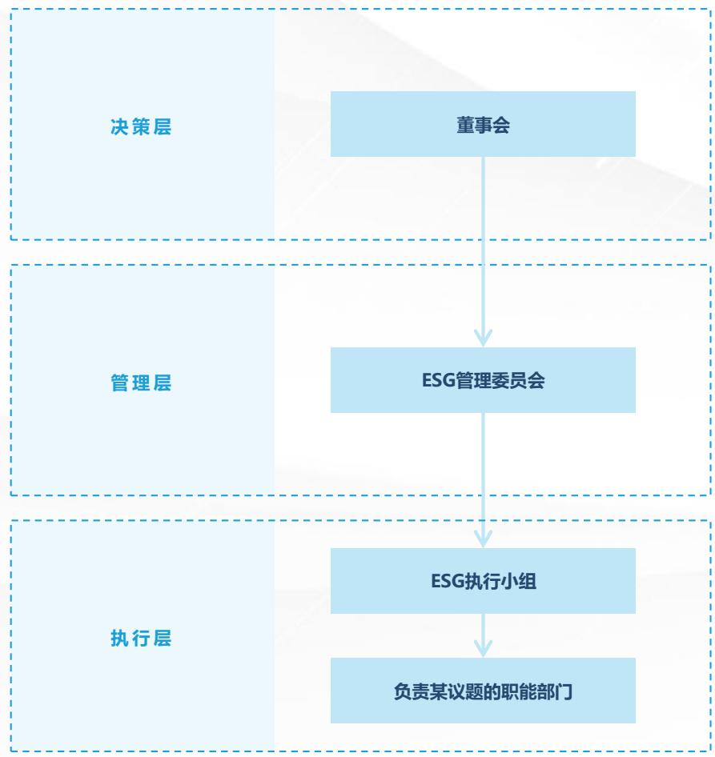

flowchart

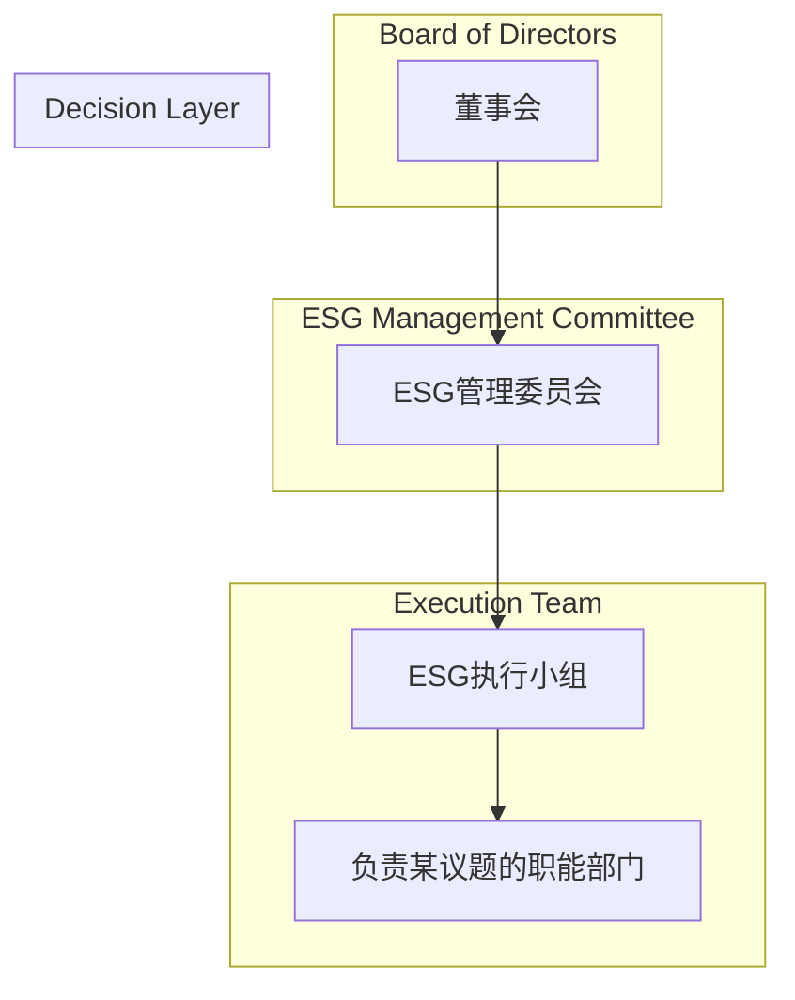
```mermaid
graph TD
  subgraph Board["Board of Directors"]
    A["董事会"]
  end
  
  subgraph ESG["ESG Management Committee"]
    B["ESG管理委员会"]
  end
  
  subgraph Exec["Execution Team"]
    C["ESG执行小组"]
    D["负责某议题的职能部门"]
  end
  
  subgraph Decision["Decision Layer"]
  A --> B
  B --> C
  C --> D
  end
```

## 气候风险目标（气候变化目标）

公司积极响应国家“双碳”战略目标，将气候变化应对纳入可持续发展战略核心，持续推进温室气体排放管理的体系化建设。以2025年为基准年，公司已建立范围一、范围二的碳排放数据核算机制，为减排目标的制定与跟踪提供数据支撑。基于《工业领域碳达峰实施方案》及相关政策指引，结合自身业务发展实际与行业低碳转型趋势，公司已确立涵盖范围一、范围二温室气体排放，并将稳步推进各项目标的落实与定期披露。

飞科电器深刻认识到应对气候变化是企业ESG战略的核心支柱。公司以2025年为基准年，正式确立分阶段碳中和路线图：承诺通过能源结构转型、能效提升与供应链协同，力争运营层面碳排放在2035年或之前达到峰值，在2050年或之前单位营收现碳排放强度降低85%。

公司已通过具体行动践行减排承诺；2025年度，（具体节能减排措施，即公司活动（包括运营和价值链）对气候产生的实际或潜在重大影响（正面或负面），如温室气体排放对气候变化的影响）；同时，公司持续推进节能降耗措施，其中包括照明系统优化、变频空调节能、压缩空气能源服务合同等，有效降低能源消耗强度。此外，公司通过持续的技术研发推动产品端能效提升，

2025年6月20日新取得的充电电路专利技术将进一步降低产品使用环节的能源消耗，从而自其全生命周期角度减少碳排放。未来，公司将进一步完善温室气体核算体系，推动绿色供应链建设，探索产品碳足迹认证，以积极应对气候变化带来的挑战与机遇。

报告期内，公司的碳排放情况如下：

碳排放管理

<table><tr><td>类别</td><td>2025年</td><td>2024年</td><td>2023年</td></tr><tr><td>范围1 $(tCO_2e)$ </td><td>221.4</td><td>164.8</td><td>164.6</td></tr><tr><td>范围2 $(tCO_2e)$ </td><td>12,996.2</td><td>16,463.9</td><td>16,929.1</td></tr><tr><td>范围1+范围2 $(tCO_2e)$ </td><td>13,217.6</td><td>16,628.7</td><td>17,093.7</td></tr><tr><td>单位营收碳排放 $(tCO_2e/万元)$ </td><td>0.03</td><td>0.04</td><td>0.03</td></tr></table>

(排放因子来源：范围2引用生态环境部《关于发布2023年电力二氧化碳排放因子的公告》；范围1中化石燃料排放因子引用生态环境部、国家统计局《国家温室气体排放因子数据库》，制冷剂GWP值引用IPCC第六次评估报告(AR6)。)

## 气候风险识别

飞科电器作为肩负重要社会责任的企业，高度重视气候变化带来的影响，积极尝试识别气候变化风险相关工作。公司积极响应气候相关财务信息披露工作组（Task Force on Climate Related Financial Disclosures，TCFD）的倡议，参考其披露建议与框架，积极开展气候风险管理分析。就已识别出的物理风险和气候转型风险，评估其对公司经营等方面的影响，并针对性地制定风险应对策略。

气候风险识别及应对情况

<table><tr><td>风险类型</td><td colspan="2">风险描述及影响</td><td>风险应对策略</td></tr><tr><td rowspan="2">物理风险</td><td>急性风险</td><td>高温:高温导致火灾事故概率增加,并带来潜在人员伤亡、生产设施受损事件,进而导致资本开支及人工成本增加。台风、暴雨及洪水:极端天气事件导致物流运输中断,影响产品生产及按时交付,进而导致运营成本增加;因极端天气事件的破坏力,导致生产设备受损,运营中断,进而导致设备维修成本增加;员工的人身安全、职业健康受到威胁,若发生工伤事故将导致生产效率降低。</td><td>安装降温需要的制冷设施;配备齐全的消防设施。规划多种运输方式,根据气象预警提前规划物流运输时间保障物料储备库存;不断完善自然灾害应急响应机制,储备应急物资并加强安全检查。</td></tr><tr><td>慢性风险</td><td>海平面升高:沿海地区的运营实体需要向内地迁移,固定资产受损或提前报废导致生产成本增加。</td><td>持续关注海平面上升趋势;开发同品类多地区供应商,保障原材料供应。</td></tr><tr><td rowspan="4">转型风险</td><td>政策风险</td><td>碳排放管理政策法规趋严:由于国家对于碳达峰碳中和工作的部署要求,出台系列节能降碳行动方案等政策与标准,导致碳排放合规成本增加国际贸易进出口碳税趋势明显,可能导致成本增加</td><td rowspan="4">关注运营所在地的碳排政策及法规动态,以合理应对政策及法律的更新;建设光伏项目,提高可再生能源占比;选用低能耗生产设备,优化生产工艺流程,挖掘与开展节能减排项目,降低能源消耗;加强生产运营、物流运输等环节全流程减碳;使用清洁电力;将公司可持续发展理念融入品牌宣传。</td></tr><tr><td>技术风险</td><td>向低碳排放技术过渡:高耗能设备的提前淘汰导致运营成本增加;应用清洁能源或开发低碳产品导致研发费用增加</td></tr><tr><td>市场风险</td><td>客户偏好向低碳产品转变:随着消费者环保意识增强,更倾向于选择绿色低碳环保的产品,可能导致原材料和生产过程成本增加。</td></tr><tr><td>声誉风险</td><td>社会关注公司应对气候变化及可持续发展的表现:作为知名度较高的个护电器生产品牌,利益相关方期待公司承担更多减排责任,若未提早开展低碳转型规划,可能导致声誉受损</td></tr></table>

公司将可持续发展治理纳入现有公司治理体系顶层设计，于2026年4月修订《董事战略委员会实施细则》，将可持续发展政策及相关重大事项的研究纳入原战略委员会职责权限，并在其基础上设立战略与ESG委员会，为董事会制定可持续发展战略、防范重大气候风险提供了进一步履职支撑保障。

公司依据气候相关财务信息披露工作组（TCFD，Task Force on Climate-Related Financial Disclosures）框架建议及国际可持续发展准则理事会（ISSB，International Sustainability Standards Board）IFRS S2准则要求，参考同行业领先实践，采用定性与定量相结合的方法，系统识别和评估气候相关风险与机遇。具体识别方法如下：

识别流程

<table><tr><td>设定边界与范围</td><td>风险事件识别</td><td>影响评估</td><td>阈值设定与排序</td><td>应对措施制定</td></tr><tr><td>明确识别范围涵盖公司自身运营及价值链上下游,包括生产基地、仓储物流、供应商、客户等。</td><td>系统梳理可能影响公司运营的物理风险和转型风险事件。</td><td>评估风险事件对公司财务、运营、声誉等方面的潜在影响。</td><td>设定风险重要性阈值,确定核心风险、重要风险与一般风险。</td><td>针对识别出的核心风险,制定相应的管理策略与应对措施。</td></tr><tr><td>参照TCFD框架建议,将识别范围覆盖范围一、范围二及范围三排放相关活动,结合公司业务布局确定重点关注区域。</td><td>参考同业已识别的风险类型(如台风、洪涝、能效政策等),结合公司实际运营环境,建立初步风险清单。</td><td>从影响程度、发生概率、时间范围三个维度进行评分,综合判断风险实质性,并采用情景分析评估中长期影响。</td><td>设定5分制评分标准(1-低度重要5-高度重要),综合影响程度与发生概率得分,绘制风险矩阵。</td><td>将风险应对纳入公司战略规划、产能布局、供应链管理及应急预案,明确责任部门与考核机制。</td></tr></table>

## 气候风险及机遇管理融入机制

公司将气候风险与机遇识别及应对全面融入ESG治理体系与日常运营。董事会作为最高决策机构，定期听取气候相关议题汇报，审议重大风险应对策略与机遇捕捉方案。ESG委员会统筹协调各职能部门，将气候风险应对措施及机遇捕捉计划纳入年度工作目标与考核指标，确保责任落实到位。

公司将建立气候议题动态管理机制，每年开展风险评估复盘，跟踪措施执行效果，结合政策变化、技术迭代及市场趋势动态调整管理策略。识别出的气候风险与机遇已全面融入战略规划、产能布局、产品研发、供应链管理及信息披露等核心业务流程。

在信息披露层面，公司参照TCFD框架持续优化气候相关披露，向投资者及利益相关方透明展示气候风险管理成效与机遇捕捉进展，确保气候议题管理与公司战略目标深度融合，持续提升企业气候韧性及绿色竞争力。

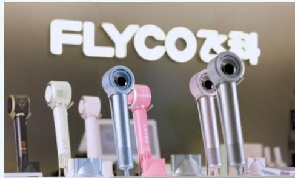

text_image

FLYCO飞科

## (八) 生态保护和生物多样性保护

飞科电器始终严格遵循《中华人民共和国环境保护法》《中华人民共和国环境影响评价法》《中华人民共和国森林法》等法律法规要求，在园区规划、建设与运营全过程中落实生态保护优先原则。飞科园区内种植有挺拔苍劲的罗汉松、高大挺拔的广玉兰、枝繁叶茂的香樟树等多种绿植，打造花园式产业园区，实现自然生态与建筑空间的和谐共生。该绿化系统可有效涵养水源、净化空气、降低环境噪音，构建起生机盎然、生态宜居的园区环境，形成人与自然和谐共生的良好生态格局。未来，公司将持续优化园区生态景观体系，维护区域生态系统稳定性，助力生物多样性保护与区域生态环境改善。

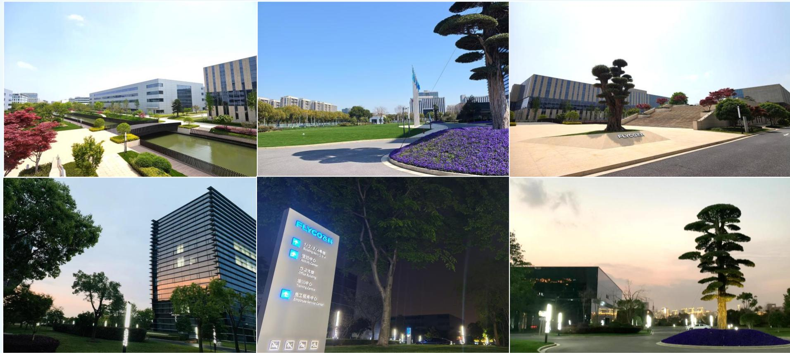  
飞科园区生态环境图

## 04 责任供应链共赢

供应商共发展 53

供应商风险管理 55

绿色供应链 56

## （一）供应商共发展

## 供应商概况

截至2025年底，公司共有原材料供应商171家，主要分布在浙江省、江苏省、安徽省、上海市、广东省等地区。供应商集中于长三角和珠三角核心制造产业带，具备较强的区域协同和品质与供应保障能力。

## 供应商质量评估

公司建立了月度考核与年度综合评价相结合的供应商评价机制。月度考核从质量（含批次合格率、异常改善等）、交付、价格、服务四个维度进行综合打分

  
质量

  
交付

  
价格

  
服务

年度评价则综合月度考核平均分、质量体系、技术能力、合同执行、价格等维度，由供应链部、设计研发部、质控部联合会签：

<table><tr><td>√ 月度考核平均分</td><td>√ 质量体系</td><td>√ 技术能力</td><td>√ 合同执行</td><td>√ 价格</td></tr></table>

根据评价结果对供应商进行分级管理，调整采购份额及付款条件。年度被评为D级的供应商将被取消合作资格。

## 供应链管理制度

公司制定了一系列管理制度，明确供应链部在各方面的职能职责：

《供应链部组织管理制度》

《原材料供应商管理制度》

供应链部核心职能职责

<table><tr><td>销售需求管理</td><td>存货管理</td><td>物料管理</td></tr><tr><td>供应商准入管理</td><td>供应链安全管理</td><td>供应商评级与奖惩</td></tr><tr><td>采购任务管理</td><td>采购成本管理</td><td>采购质量管理</td></tr></table>

公司要求所有采购单品实现2-3家以上供应商覆盖，保障30天内可顺利切换供应商，确保供应链安全稳定。

## 供应链管理目标

公司供应链管理以构建安全、高效、可持续的供应链体系为目标，核心部件及电子元器件供应商须选择国际国内知名品牌或一线品牌商的供应商，实现向行业龙头企业、知名供应商采购，持续优化供应链资源，使之成为公司生产及营销的高效支持平台。

## 治理架构

公司供应链部下设成品管理组、原材料管理一组（电子元件、五金件、核心部件）、原材料管理二组（塑料原料及配件、包装及辅料、机物料）、设备采购及模具管理组、跟单组、国际市场供应组，由供应链部总监统筹管理。子品牌博锐供应链部单独设立，独立运行。

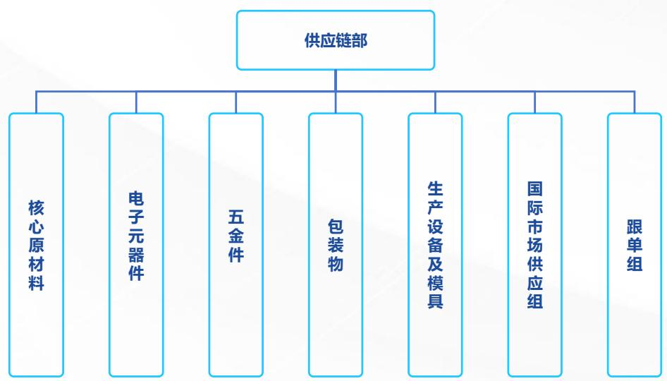

flowchart

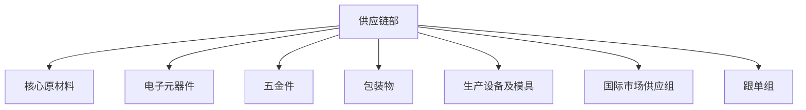
```mermaid
graph TD
  A["供应链部"] --> B["核心原材料"]
  A --> C["电子元器件"]
  A --> D["五金件"]
  A --> E["包装物"]
  A --> F["生产设备及模具"]
  A --> G["国际市场供应组"]
  A --> H["跟单组"]
```

公司通过SRM采购系统实现供应商全生命周期数字化管理，系统自动触发原材料供应商月度考核流程。

## 供应商的评估与准入

## 新供应商准入须经过三个阶段：

## 阶段一

## 信息收集

- 互联网搜索、同行介绍、专业展会等渠道搜寻潜在供应商  
- 要求完成SRM系统注册并填写基础资料

## 阶段二

## 样品测试

- 设计研发部、质控部、实验室及生产工厂进行测试  
- 出具质量测试报告

## 阶段三

## 现场评审

- 供应链部组织质控部、设计研发部、财务部负责人实地考察  
- 提交《供应商现场评审表》  
评审合格后纳入合格供应商名录

现场评审内容涵盖以下五大维度：

  
企业基本信息

  
质量管理

  
成本优势

  
生产交付

  
服务能力

## （二）供应商风险管理

## 风险管理机制

## 品质异常处理

供货出现品质异常的供应商，使用工厂及时发送《供应商品质异常处理联络单》，供应链部跟进整改及后续改进

## 资格取消

出现严重质量异常或影响生产、且不积极配合解决问题的供应商，经总裁批准后取消合作资格并发出《供应商资格取消通知》

## 复议机制

供应商对考核结果有异议的，可在两个工作日内申请复议，复议由原评价人核实并出具意见

公司同时将反童工、反强迫劳动要求纳入供应商准入审核条件，并在合作协议中明确相关条款。

## 供应链培训

公司使用学习管理平台（LMS）为供应链相关人员提供系统化的ESG培训课程，并开展供应链专项培训，持续提升供应链团队的专业能力。

## ESG企业永续类课程（21门）

ESG趋势  
ESG实践与应用  
循环再生与企业永续竞争力  
迎接低碳竞争时代

## 供应链专项内部培训

产品线NPI流程介绍  
- 流程培训'系统分析与架构设计  
■ 重量级团队上岗及转身培训

## 透明供应链

公司建立了多层次的供应商沟通机制，包括：即时沟通（微信、电话）、业务留痕（Flyco邮箱及SRM采购系统下单）、重大问题正式函件及高层对接。

## 合规承诺

公司与所有供应商签订《反商业贿赂条款》和《保密条款》，要求供应商禁止商业贿赂行为

## 投诉受理

设立审计监察部专门受理供应商投诉举报，对举报内容严格保密并依法查处，确保供应链合作的公平透明

供应商如遇甲方人员索贿行为须及时反馈至公司审计监察部021-52858888

## 平等对待中小企业

公司在供应商管理中始终坚持公平、公正、一视同仁的原则，不因供应商规模大小而在准入标准、考核评价、付款条件等方面设置差异化门槛。

在供应商准入环节，公司依据统一的评审标准，从企业资质、质量管理、技术能力、成本优势、生产交付及服务能力等维度对所有供应商进行综合评审，不以企业规模作为准入限制条件。在日常合作中，公司通过月度考核与年度综合评价相结合的机制对供应商实施分级管理，付款账期依据考核等级确定：A级供应商（90分及以上）执行月结20天，B级供应商（80-90分）执行月结50天，付款条件完全基于供货质量、交付、价格、服务四个维度的客观绩效表现，与供应商企业规模无关。

公司建立了供应商申诉与复议机制，供应商对考核结果有异议的，可在两个工作日内申请复议，由原评价人核实并出具复议意见，保障所有供应商的合法权益。公司同时设立审计监察部受理供应商投诉举报，确保供应链合作的公平透明。

报告期末，公司不存在逾期未支付中小企业款项的情况。

## (三) 绿色供应链

## 供应商环保准入要求

在供应商准入评审中纳入环保与安全要求，与所有合作供应商签订《环保与安全条款》，要求供应商提供的货物及原材料须满足国家环保法律法规及RoHS规定，优先采用无污染或少污染的生产工艺

## 绿色包装要求

货物包装优先采用可回收材料；在物流环节推行PP周转箱替代一次性瓦楞纸箱，实现循环可复用设计

推行PP周转箱后，可减少约70%的瓦楞纸箱使用量

循环可复用设计，实现物流包装的绿色可持续同时，公司面临能源供应方面的挑战，公司积极应对并持续优化供应链韧性：

  
原材料供需波动

受地缘冲突影响的塑料粒

子供需波动

  
全球铜价波动

全球铜价对相关原材料成

本的影响

  
元器件排期紧张

AI机器人需求导致的电子元

器件封测排期紧张

## 05 赋能员工共成长

员工雇佣 58

人权保障 60

员工薪酬福利---- 60

员工福利与权益 61

员工沟通与工会 62

员工培训与发展 63

职业健康安全 64

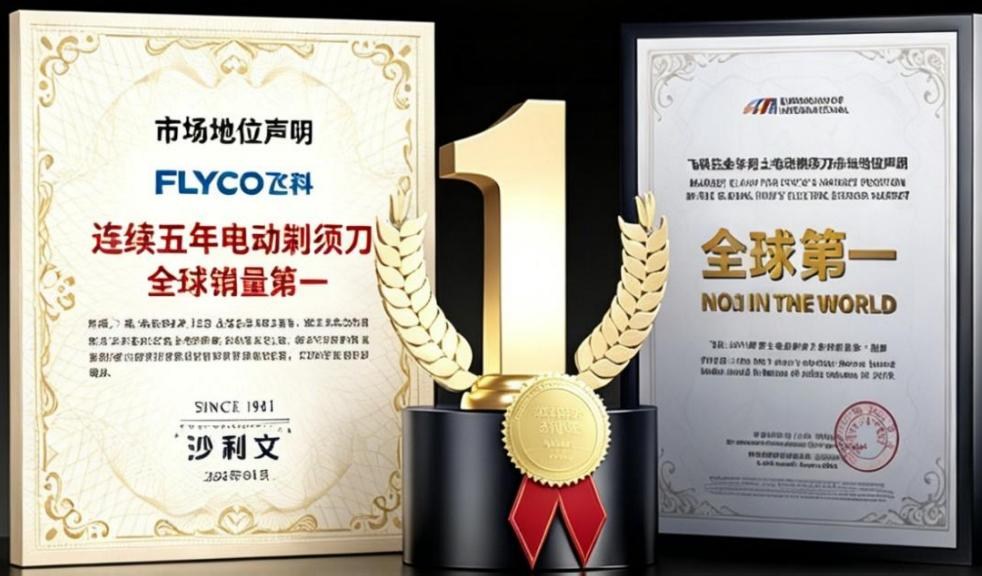

## (一) 员工雇佣

## 雇佣员工渠道和流程

飞科始终坚持员工是企业发展的核心动力，致力于打造兼具创新力与执行力的高素质人才团队，关注建设专业化、年轻化的人才梯队储备。积极践行企业社会责任，持续为高校毕业生、社会人才提供优质就业岗位，大力开展“非你莫属，科创未来”人才专项引进计划，不断加大员工招聘统筹规划力度，为公司实现“把仅仅满足于功能需求的小家电行业打造成为高科技的时尚产业，不断创造客户需求，改变消费者生活方式，满足消费者对美好生活的追求”的企业使命提供强有力的人才支撑。

公司严格遵守《中华人民共和国劳动法》《中华人民共和国劳动合同法》等法律法规，规范完善劳动合同管理流程，保障员工合法权益与职业发展。

## 招聘渠道

## 招聘计划

高校毕业生招聘、社会招聘、

“非你莫属，科创未来” 人才专项引进

## 招聘流程

网上报名、简历筛选、面试评估、背景调查、签约录用等

飞科2025届校园招聘以“飞你莫属 科创未来”为主题，聚焦全球化战略与业务需求，规划招聘35名管培生（覆盖职能类、营销类七大核心岗位），通过划定上海本地及省内外目标院校、开展多区域宣讲会与双选会精准触达人才，以“专业匹配、潜力突出、综合素养优异”为标准，经多层级考核选拔2025届本科及以上优秀毕业生，同时提供阶梯式薪资、全周期培养路径及五险一金、免费三餐、人才落户等福利，成功吸纳优质年轻潜力人才并优化人才队伍结构，强化雇主品牌形象，为企业全球化战略落地提供人才支撑。

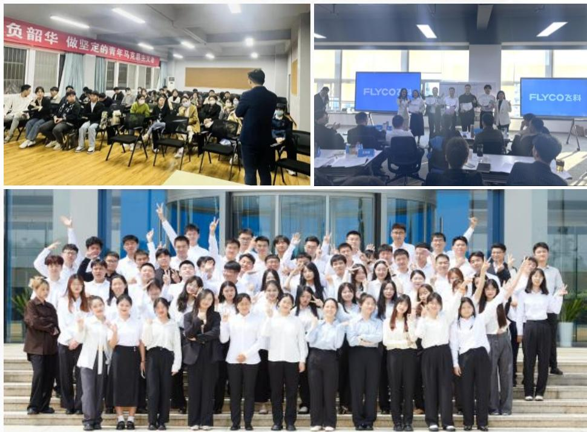

## 员工构成

员工总数

<table><tr><td>员工人数构成</td><td>数量(人)</td></tr><tr><td>母公司总人数</td><td>850</td></tr><tr><td>主要子公司在职员工的数量</td><td>2,944</td></tr><tr><td>在职员工的数量合计</td><td>3,794</td></tr><tr><td>母公司及主要子公司需承担费用的离退休职工人数</td><td>20</td></tr></table>

专业构成

<table><tr><td>专业构成类别</td><td>专业构成人数</td></tr><tr><td>生产人员</td><td>2,579</td></tr><tr><td>销售人员</td><td>741</td></tr><tr><td>技术人员</td><td>186</td></tr><tr><td>财务人员</td><td>68</td></tr><tr><td>行政人员</td><td>220</td></tr><tr><td>合计</td><td>3,794</td></tr></table>

教育程度

<table><tr><td>教育程度类别</td><td>数量(人)</td></tr><tr><td>研究生及以上</td><td>30</td></tr><tr><td>本科</td><td>483</td></tr><tr><td>大专</td><td>844</td></tr><tr><td>高中及其他</td><td>2,437</td></tr><tr><td>合计</td><td>3,794</td></tr></table>

员工性别

<table><tr><td>性别</td><td>飞科电器</td></tr><tr><td>男性</td><td>1,578</td></tr><tr><td>女性</td><td>2,216</td></tr><tr><td>合计</td><td>3,794</td></tr><tr><td>女性占比</td><td>58%</td></tr></table>

## (二) 人权保障

## 反童工和强迫劳动

公司严格遵守《中华人民共和国劳动法》《中华人民共和国劳动合同法》《禁止使用童工规定》等法律法规，坚决禁止使用童工，杜绝一切形式的强迫劳动。公司在《员工手册》及相关人力资源管理制度中明确规定，招聘录用年满16周岁以上的劳动者（不招用未满18周岁的未成年工从事特殊岗位工作），在招聘环节严格执行身份证件核验流程，通过人脸识别、身份证读卡器等技术手段逐一核实应聘人员真实年龄，从源头杜绝童工进入企业。

在反强迫劳动方面，公司充分尊重和保障每位员工的人身自由与劳动权益。公司依法与所有员工签订书面劳动合同，合同中明确约定工作内容、工作时间、劳动报酬、社会保险等关键条款，不收取任何形式的押金、保证金或扣押证件。

公司将反童工和反强迫劳动要求延伸至供应链管理。在供应商准入评估中，将合规用工作为基本审核条件之一；与供应商签订的合作协议中包含禁止使用童工和强迫劳动的条款，要求供应商遵守当地劳动法律法规，保障员工合法权益。报告期内，公司未发生任何使用童工或强迫劳动的违规事件。

## （三）员工薪酬福利

员工薪酬

<table><tr><td>单位:元</td><td>2023</td><td>2024</td><td>2025</td></tr><tr><td>员工薪酬支出</td><td>407,927,894.87</td><td>447,218,172.56</td><td>418,728,372.51</td></tr><tr><td>员工福利支出</td><td>22,702,413.84</td><td>19,802,274.66</td><td>21,652,561.46</td></tr></table>

上海飞科电器股份有限公司现行薪酬体系由各部门独立制定，整体遵循"固定薪资 + 绩效薪酬"的双轨结构，但不同部门在激励导向上存在差异。

## 绩效考核

飞科的员工绩效考核维度以岗位核心职责落地为核心，融合通用基础要求与岗位层级差异，整体涵盖流程与体系建设、日常运营管理（含全面计划与全面预算、5S/6S现场管理、临时任务落实）、工作任务完成（含工作质量、效率、准确性及既定目标达成）、合规与安全管控（含公司规章制度遵守、清廉从业、生产/办公安全、保密要求等）、成本与服务质量（部分业务岗涉及费用预算控制、配送/服务时效与质量、客户/内部需求响应及异常处理）五大核心方向，同时设置统一负面否决维度，若出现严重违规、失职造成重大损失、未按流程离职等情况，将直接考核记0分并取消绩效薪酬，整体考核既保障全公司统一的合规与基础管理标准，又根据不同岗位区分考核重点，突出“职责匹配、业绩导向、合规约束”的考核原则。

飞科管理团队考核以业绩导向为核心，根据不同层级执行年度/季度/月度周期考核，核心指标涵盖战略支撑与日常运营、经营与业务目标达成、部门体系与团队管理、成本预算与工作计划管控、合规与风险管控等，同时设置负面否决项，若出现严重违规、重大失职等行为，绩效考核直接记0分，不计发对应周期绩效薪酬，情节严重者追究法律责任。

## （四）员工福利与权益

## 员工福利

飞科电器致力于建设有温度的员工福利体系。除向员工提供法定节假日、社会保险、住房公积金等法定福利外，还建设员工宿舍、员工餐厅、咖啡吧、健身房等设施，保障员工的生活、健康需求，努力提升员工归属感和获得感。

为了让员工在高效工作之余能够充分放松身心、舒缓压力，公司专门打造了功能完善的员工健身房与舒适惬意的休闲咖啡吧。公司在园区内以高标准打造了员工健身房，对标专业商业健身场馆配置，配备40余台专业健身器械，覆盖有氧训练、力量训练等全品类设备，可满足员工从基础健身到进阶塑形的多元化需求，助力员工养成积极健康的生活方式。同时，公司配备全日制专业健身教练，为员工提供科学指导与安全保障，帮助员工合理规划训练、规范运动方式，切实守护员工运动健康。

从健康保障到休闲体验，从硬件设施到情感关怀，飞科通过实实在在的福利配置，切实关注员工需求，用心营造健康、舒适、有归属感的工作环境，让每一位员工都能感受到企业的温暖与重视，在实现个人成长的同时，与企业同心同行、共同发展。

natural_image

Interior view of a modern lounge or hotel lobby with white sofas, gray seating chairs, and decorative ceiling lights (no visible text or signage)

飞科咖啡吧

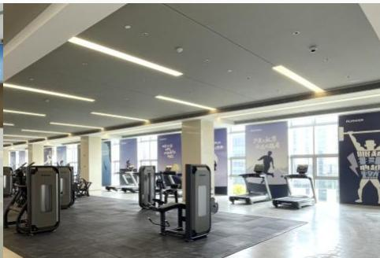

natural_image

Interior of a modern gym with fitness equipment and large display screens (no visible text or symbols)

飞科健身房

飞科员工餐厅始终秉持营养健康理念，以新鲜食材、多元烹饪和丰富餐品选择，为员工提供美味与营养兼具的餐饮服务，深受员工喜爱；餐厅还会在各类节日打造创意美食节，带来惊喜美食盛宴，并被上海市松江区餐饮协会评为中山街道“星级食堂”，以高品质餐饮服务践行“健康在飞科，幸福每一天”的员工关怀。

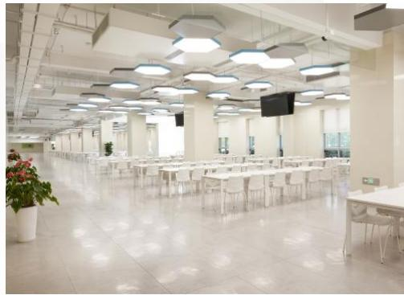

natural_image

Interior view of a modern, empty public space with rows of white tables and ceiling-mounted lighting (no visible text or signage)

飞科员工餐厅

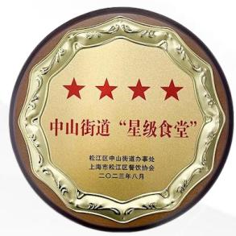

seal

祁江区中山街道办事处
上海市松江区餐饮协会
二〇二三年八月

上海市松江区餐饮协会颁发奖章

## 权益保障

公司严格遵守国家及所在地劳动用工相关法律法规，建立并持续完善员工雇佣管理制度体系，覆盖招聘录用、劳动合同签订与管理、工作时间与休假、岗位调整与离职管理等关键环节，依法依规保障员工合法权益。

公司落实社会保险与法定福利要求，并持续做好劳动合同管理与用工合规管理，确保员工权益保障机制稳定运行。

2025年

公司劳动合同签订率、社保覆盖率均为

100%.

## (五) 员工沟通与工会

## 工会建设

飞科电器工会坚持以人为本，以文化凝聚人心、以关怀温暖职工，依托二十四节气、传统民俗节日等节点，面向全体员工常态化策划开展系列企业文化主题活动并定期发放员工福利。活动涵盖趣味运动会、传统民俗体验、主题联谊、知识竞赛、团队挑战赛等多元形式，在轻松愉悦的氛围中增进交流、凝聚共识。活动精心设置各类奖品与荣誉激励，为员工送上定制化慰问品与节日祝福，传递企业关怀。

工会通过一系列有温度、有活力、有内涵的文化活动与福利举措持续丰富员工业余文化生活，增强员工的归属感、幸福感与获得感，着力营造团结和谐、积极向上的企业文化氛围，为企业可持续发展注入源源不断的精神动力。

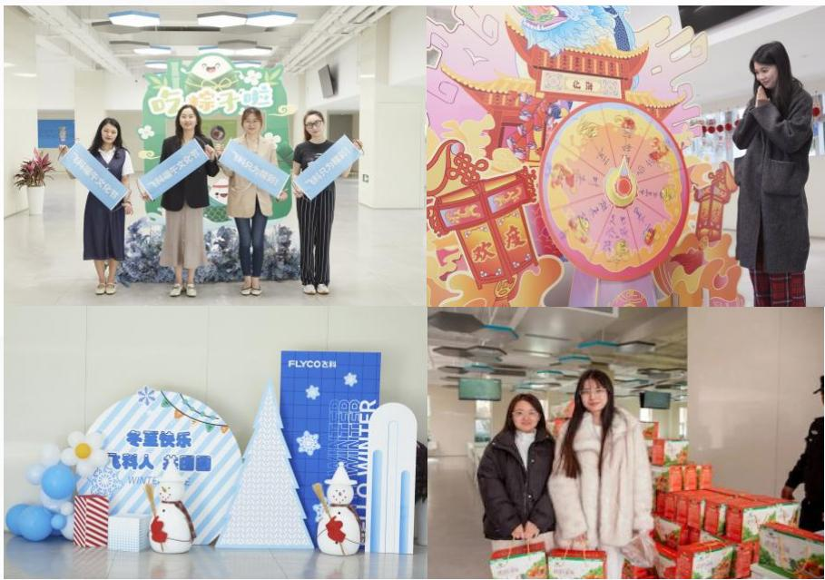

text_image

Collage of four photos showing people holding 'FLYCOZHI' signs and festive decorations, including a large Chinese New Year decoration and a 'WINTER' sign.

飞科定期举行传统文化节并向员工发放各类福利

## 沟通渠道

公司建立以职工代表大会为基本形式的民主管理制度，明确其组织制度、职权内容和工作制度等，提交职工代表大会审议通过，并将其融入公司治理。

通过职工代表大会以及职工代表董事，畅通职工诉求表达通道，将职工所思所盼转化为企业办实事解难题的具体措施。

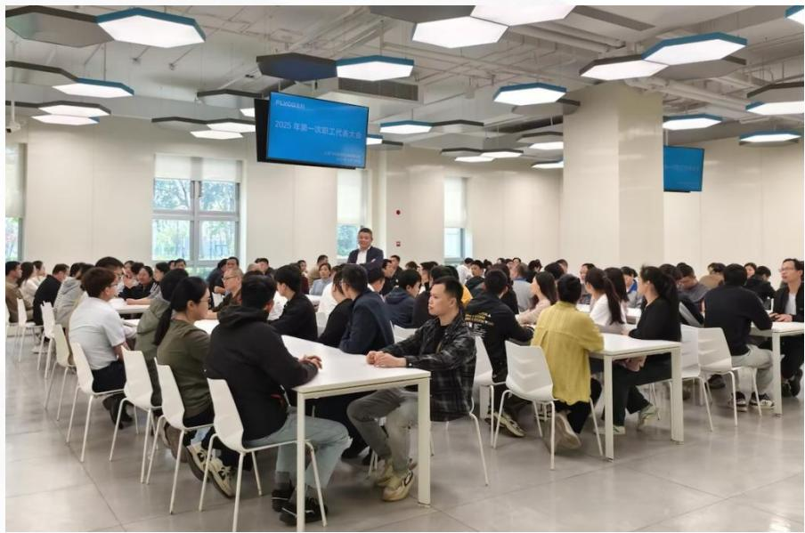

text_image

2025 年第一次职工代表大会

2025年第一次职工代表大会

工会入会率

2023年、2024年、2025年均为

100%.

## (六) 员工培训与发展

## 员工晋升

公司始终将人才视为可持续发展的核心驱动力，构建并完善了系统化的人才培养与梯队建设体系。结合不同岗位特点，为各类员工搭建专业通道、管理通道与综合发展通道并行的多元职业发展体系，助力员工实现多元化成长；针对一线岗位员工，推行技能等级评价机制，引导员工持续精进专业能力。同时，公司建立以绩效为导向的人才发展机制，对表现突出的优秀员工在晋升选拔、岗位竞聘等方面予以优先支持，充分激发人才价值，推动员工成长与企业长期战略目标同频共进、协同共赢。

## 培训体系

飞科员工培训体系以分层分类、训战结合为核心，覆盖全体新员工、管培生及海外营销等专项岗位员工，包含新员工融入培训、管培生阶梯式专项培养、岗位技能提升等多类型项目，配套学分制考核与导师制等机制，同时投入专项经费保障培训落地，全方位助力员工能力提升与职业发展。

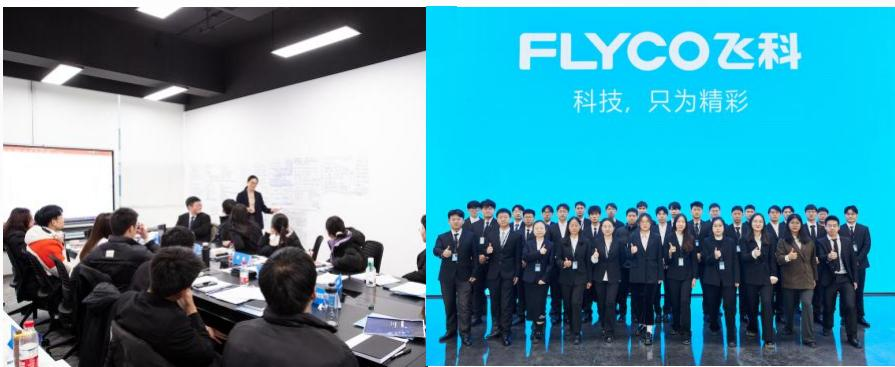

text_image

FLYCO飞科
科技，只为精彩

飞科管培生专项培训

员工培训

<table><tr><td>年份</td><td>新员工培训人数(人)</td><td>管培生培训人数(人)</td><td>年度培训总人数(人)</td></tr><tr><td>2023年</td><td>435</td><td>70</td><td>505</td></tr><tr><td>2024年</td><td>383</td><td>47</td><td>430</td></tr><tr><td>2025年</td><td>348</td><td>32</td><td>380</td></tr><tr><td>合计</td><td>1166</td><td>149</td><td>1315</td></tr></table>

## 培训总时长：

管培生岗前培训 19 天 / 人

海外营销人员英语和商务培训 47 天 / 人

<table><tr><td>基地</td><td>员工培训总课时(小时)</td><td>人均培训时长(小时/人)</td></tr><tr><td>上海总部</td><td>2,000</td><td>20</td></tr><tr><td>芜湖飞科</td><td>68,000</td><td>55</td></tr><tr><td>浙江博锐</td><td>69,056</td><td>52</td></tr></table>

## (七) 职业健康安全

## 职业健康

2025年度体检数据

<table><tr><td>基地</td><td>体检人数</td><td>职业病确诊人数</td><td>主要职业危害因素</td></tr><tr><td>芜湖飞科</td><td>181人</td><td>0人</td><td>噪声、丙烯酸、乙酸乙酯、异氟尔酮、二氧化锡、混苯、甲醛、粉尘</td></tr><tr><td>浙江博锐</td><td>138人</td><td>0人</td><td>苯乙烯、粉尘、丙烯腈、1,3-丁二烯、二氧化锡</td></tr><tr><td>合计</td><td>319人</td><td>0人</td><td></td></tr></table>

## 安全生产

## 2次/年

安全消防演练次数

## 1,023,858.31元

安全生产费用

安全生产培训课时：芜湖飞科：16,000小时；浙江博锐：69,056小时

2025年，安全隐患整改率100%

<table><tr><td>保险类型</td><td>2023年投入金额(元)</td><td>2024年投入金额(元)</td><td>2025年投入金额(元)</td><td>备注</td></tr><tr><td>工伤保险</td><td>17,822.51</td><td>84,631.57</td><td>67,589.16</td><td>单位应缴金额,按月通过三方协议支付</td></tr><tr><td>社会保险(合并)</td><td>4,823,651.29</td><td>10,568,927.83</td><td>9,745,318.62</td><td>合并企业职工基本养老保险、基本医疗保险、失业保险单位应缴金额,按年度分险种数据汇总得出</td></tr><tr><td>年度保险总投入</td><td>4,841,473.80</td><td>10,653,559.40</td><td>9,812,907.78</td><td>工伤保险金额与社会保险(合并)金额相加得出</td></tr></table>

2023-2025年工伤类型及人数  
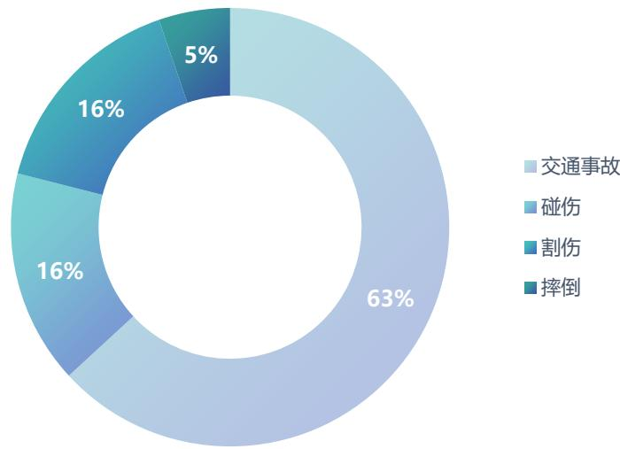

donut

| Category | Percentage |
| --- | --- |
| 交通事故 | 63% |
| 碰伤 | 16% |
| 割伤 | 16% |
| 摔倒 | 5% |

<table><tr><td>类型</td><td>人数</td></tr><tr><td>交通事故</td><td>12</td></tr><tr><td>碰伤</td><td>3</td></tr><tr><td>割伤</td><td>3</td></tr><tr><td>摔倒</td><td>1</td></tr></table>

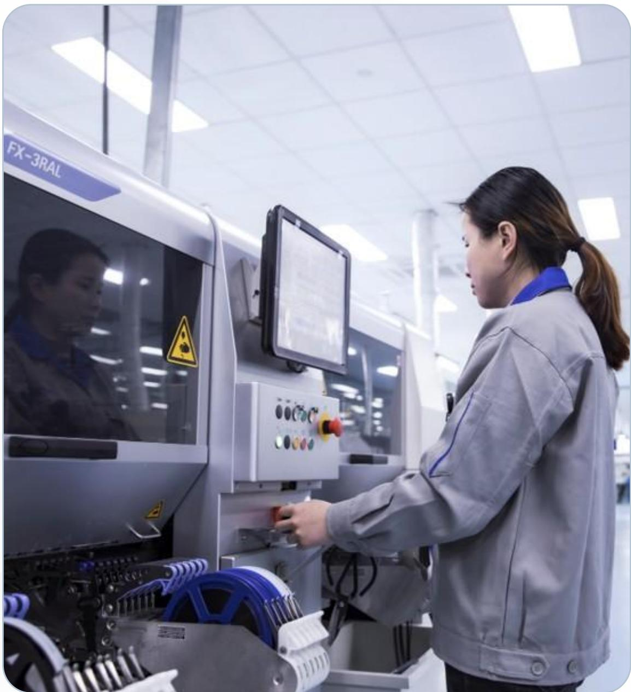

natural_image

Factory worker operating a FX-3RAL industrial machine in a cleanroom setting (no visible text or symbols on machinery)

## 社会贡献显价值

社会贡献---- 67

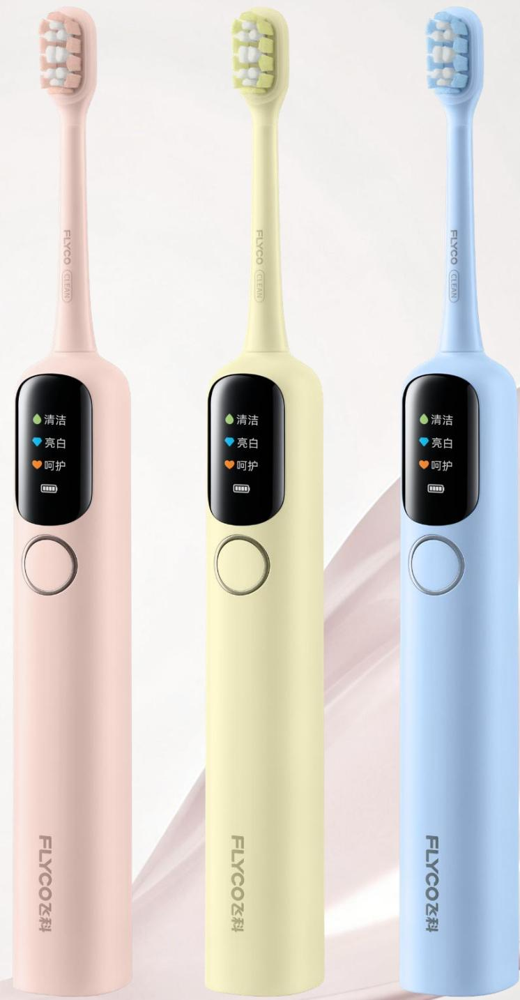

## 社会贡献

报告期内，公司积极践行企业社会责任，持续开展公益捐赠行动，年度对外捐赠总额263万余元，重点聚焦地方创新事业扶持与乡村教育两大领域，以实际行动支持青年成长发展与地方公益事业建设。

与此同时，公司常态化参与天猫“公益宝贝”等平台项目，通过“小额、持续、常态化”的参与方式，将社会责任融入日常经营，形成长期稳定的公益投入机制，切实彰显企业的社会担当与公益初心。

飞科电器通过上海市慈善基金会松江区代表处，向彝良新城小学捐款支持乡村教育事业发展。彝良新城小学作为新建学校，校园基础设施与文化育人环境仍处于持续完善阶段，在校园标识系统、学生储物设施、文化氛围营造等方面存在现实需求。本次捐赠资金将精准用于校名标识设立、班级储物柜添置、校园文化墙打造等重点项目，通过补齐校园硬件短板、提升文化育人氛围，切实改善师生学习与工作条件，为孩子们打造更整洁有序、更富人文气息、更具归属感的校园环境，以点滴善意助力教育提质，用实际行动践行企业社会责任。

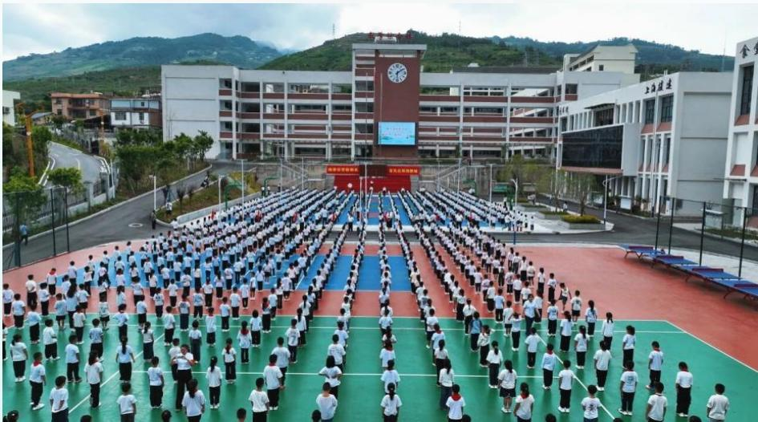

natural_image

Exterior view of a large outdoor school campus with students in uniform arranged in rows, featuring a central building and mountainous backdrop (no signage visible)

图：彝良新城小学

孩子们用虽稚嫩的笔触但满怀真挚的情感，亲手书写了一封封情真意切的感谢信，向飞科表达深深的谢意：“感谢你们为我们送来崭新的讲桌，让老师站在讲台上更加从容舒心，讲课也更有力量；感谢你们为我们添置实用的储物柜，让杂乱的书本和文具都有了温暖的‘小家’；更感谢你们用心装扮我们的教室，让班级变得明亮整洁、充满书香与温情，让我们每天都愿意早早来到学校。”

孩子们在信中郑重许下心愿：“我们一定会好好爱护每一件物品，认真读书、努力向上，用优异的成绩和健康的成长，回报这份来自远方的关爱与温暖。”

公司主营业务为个人护理电器的研发、生产与销售，经营活动主要集中于城市及工业供应链场景，未涉及农业生产、县域产业帮扶等乡村振兴直接相关领域。经双重重要性评估，该议题对公司经营战略、财务表现及利益相关方的实质性影响有限，因此判定为非重要性议题。公司本年度公益捐赠主要集中于地方创新事业扶持与慈善救助项目，公司将持续关注国家乡村振兴政策导向，未来如开展相关业务或合作，将按规定履行披露义务。

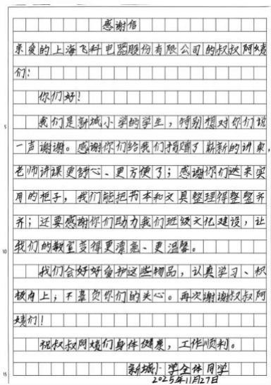

text_image

感谢信
亲爱的上海飞科电器股份有限公司的叔叔阿氏委员:
你们好!
我们是新城小学的学生，特别想对你们说一声谢谢。感谢你们给我们捐赠了崭新的讲桌，老师讲课更舒心、更方便了；感谢你们越来越实用的帽子，我们能把书本和文具整理得整整齐；还要感谢你们助力我们班级文化建设，让我们的教室变得更漂亮、更温馨。
我们会好好爱护这些物品，认真学习、权限身上；不辜负你们的关心。再次谢谢您又叙阿姨们！
祝叔叔阿姨们身体健康，工作顺利。
新城：学全体同学
2025年1月27日

彝良新城小学学生手写的感谢信

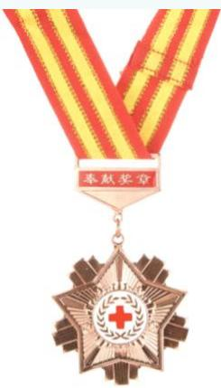

text_image

奉献奖官

飞科荣获中国红十字奉献奖章

附录  
ESG关键绩效

<table><tr><td colspan="2">项目</td><td>单位</td><td>2025年</td></tr><tr><td colspan="4">经济绩效</td></tr><tr><td>营业收入</td><td></td><td>元</td><td>3,861,080,699</td></tr><tr><td>利润总额</td><td></td><td>元</td><td>638,049,667</td></tr><tr><td>基本每股收益</td><td></td><td>元</td><td>1.18</td></tr><tr><td>总资产</td><td></td><td>元</td><td>3,981,532,860</td></tr><tr><td>净资产</td><td></td><td>元</td><td>3,326,658,822</td></tr><tr><td colspan="4">治理绩效</td></tr><tr><td>股东会召开次数</td><td></td><td>次</td><td>1</td></tr><tr><td>董事会召开次数</td><td></td><td>次</td><td>4</td></tr><tr><td rowspan="4">各委员会召开会议次数</td><td>战略委员会</td><td>次</td><td>0</td></tr><tr><td>审计委员会</td><td>次</td><td>6</td></tr><tr><td>提名委员会</td><td>次</td><td>2</td></tr><tr><td>薪酬与考核委员会</td><td>次</td><td>1</td></tr><tr><td>董事会人数</td><td></td><td>人</td><td>7</td></tr><tr><td rowspan="2">按性别划分的董事会人数</td><td>女性</td><td>人</td><td>1</td></tr><tr><td>男性</td><td>人</td><td>6</td></tr><tr><td rowspan="2">按独立性划分的董事会人数</td><td>独立董事</td><td>人</td><td>3</td></tr><tr><td>非独立董事</td><td>人</td><td>4</td></tr><tr><td rowspan="3">按教育背景划分的董事会人数</td><td>博士</td><td>人</td><td>2</td></tr><tr><td>硕士研究生</td><td>人</td><td>2</td></tr><tr><td>本科生及以下</td><td>人</td><td>3</td></tr><tr><td rowspan="3">按年龄划分的董事会人数</td><td>40-49岁</td><td>人</td><td>3</td></tr><tr><td>50-59岁</td><td>人</td><td>4</td></tr><tr><td>60岁及以上</td><td>人</td><td>0</td></tr><tr><td colspan="4">环境绩效</td></tr><tr><td>环保总投入</td><td></td><td>万元</td><td>243.14</td></tr><tr><td>综合能耗</td><td></td><td>吨标准煤</td><td>4,134.14</td></tr><tr><td>单位营收综合能耗</td><td></td><td>吨标准煤/万元</td><td>0.01</td></tr><tr><td>电力消耗</td><td></td><td>万千瓦时</td><td>2,278.84</td></tr><tr><td>天然气消耗</td><td></td><td>万立方米</td><td>6.67</td></tr><tr><td>汽油消耗</td><td></td><td>升</td><td>4,515.44</td></tr><tr><td>柴油消耗</td><td></td><td>升</td><td>0</td></tr><tr><td>光伏发电量</td><td></td><td>万千瓦时</td><td>1,547.44</td></tr><tr><td>总用水量</td><td></td><td>吨</td><td>332,197</td></tr><tr><td>单位营收用水量</td><td></td><td>吨/万元</td><td>0.86</td></tr><tr><td>温室气体排放总量(范围一+范围二)</td><td></td><td>吨 $CO_{2}e$ </td><td>13,217.60</td></tr><tr><td>范围一排放量</td><td></td><td>吨 $CO_{2}e$ </td><td>221.40</td></tr><tr><td>范围二排放量</td><td></td><td>吨 $CO_{2}e$ </td><td>12,996.20</td></tr><tr><td>单位营收碳排放强度</td><td></td><td>吨 $CO_{2}e$ /万元</td><td>0.03</td></tr><tr><td>一般工业固体废物产生量</td><td></td><td>吨</td><td>2,790.05</td></tr></table>

<table><tr><td>项目</td><td>单位</td><td>2025年</td></tr><tr><td>危险废物产生量</td><td>吨</td><td>1.32</td></tr><tr><td>废水排放量</td><td>吨</td><td>285,780</td></tr><tr><td colspan="3">社会绩效</td></tr><tr><td>正式员工总人数</td><td>人</td><td>3,794</td></tr><tr><td>男性员工人数</td><td>人</td><td>1,578</td></tr><tr><td>女性员工人数</td><td>人</td><td>2,216</td></tr><tr><td>研发人员数量</td><td>人</td><td>194</td></tr><tr><td>研发投入</td><td>万元</td><td>11,526</td></tr><tr><td>研发投入占营业收入比例</td><td>%</td><td>约3%</td></tr><tr><td>新增专利授权数</td><td>件</td><td>142</td></tr><tr><td>累计有效专利数</td><td>件</td><td>830</td></tr><tr><td>产品质量抽检合格率</td><td>%</td><td>100</td></tr><tr><td>客户满意度</td><td>%</td><td>99.49</td></tr><tr><td>服务质量满意度</td><td>%</td><td>97.58</td></tr><tr><td>员工工伤人数</td><td>人</td><td>9</td></tr><tr><td>安全生产投入</td><td>万元</td><td>102.39</td></tr><tr><td>员工培训场次</td><td>场</td><td>160+</td></tr><tr><td>对外捐赠总额</td><td>万元</td><td>263</td></tr><tr><td>工会入会率</td><td>%</td><td>100</td></tr><tr><td>新员工廉洁承诺书签署率</td><td>%</td><td>100</td></tr><tr><td>供应商数量</td><td>家</td><td>171</td></tr></table>

上交所指标索引

<table><tr><td colspan="2">环境、社会及可持续发展相关治理</td><td>报告章节</td></tr><tr><td rowspan="16">环境</td><td>应对气候变化</td><td>三(七)气候变化</td></tr><tr><td>污染物排放</td><td>三(三)污染排放</td></tr><tr><td>废弃物处理</td><td>三(四)废弃物处理</td></tr><tr><td>生态系统和生物多样性保护</td><td>三(八)生态保护和生物多样性保护</td></tr><tr><td>环境合规管理</td><td>三(一)环境管理</td></tr><tr><td>能源利用</td><td>三(二)能源利用</td></tr><tr><td>水资源利用</td><td>三(五)水源管理</td></tr><tr><td>循环经济</td><td>三(六)循环经济</td></tr><tr><td>社会贡献</td><td>六、社会贡献显价值</td></tr><tr><td>创新驱动</td><td>二(一)科技引领</td></tr><tr><td>科技伦理</td><td>二(一)科技引领—科技伦理</td></tr><tr><td>供应链安全</td><td>四(一)供应商共发展</td></tr><tr><td>平等对待中小企业</td><td>四(二)供应商风险管理</td></tr><tr><td>产品和服务安全与质量</td><td>二(一)科技引领—产品质量</td></tr><tr><td>数据安全与客户隐私保护</td><td>二(三)客户管理;二(四)数据安全</td></tr><tr><td>员工</td><td>五、赋能员工共成长</td></tr></table>

<table><tr><td colspan="2">环境、社会及可持续发展相关治理</td><td>报告章节</td></tr><tr><td rowspan="4">可持续发展相关治理</td><td>尽职调查</td><td>一(三)尽职调查</td></tr><tr><td>利益相关方沟通</td><td>可持续发展管理—利益相关方沟通与实质性议题分析</td></tr><tr><td>反商业贿赂及反贪污</td><td>一(四)商业道德—反腐败反贪污</td></tr><tr><td>反不正当竞争</td><td>一(四)商业道德—反不正当竞争</td></tr></table>

## 读者反馈

## 尊敬的读者，您好：

非常感谢您阅读公司《2025年度环境、社会及治理(ESG)报告》。我们非常关注您对报告的意见。为推动公司在环境、社会、治理方面的工作提升与改善，请您对本报告提出意见和建议并反馈给我们，以便我们对报告持续改进。

邮寄地址：上海市松江区广富林路555号飞科电器

电话：021-52858888

电子邮箱：flyco@flyco.com