# 2025

# 环境、社会和

# 公司治理（ESG）报告

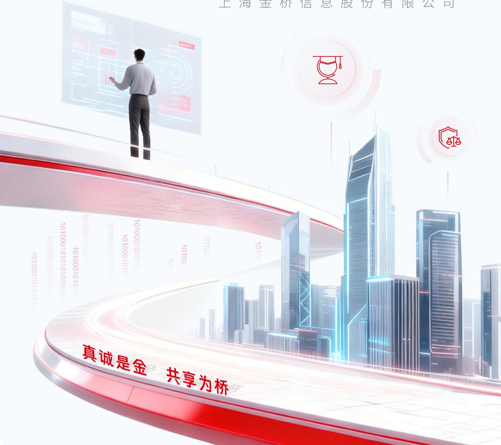

text_image

上海金桥信息股份有限公司
真诚是金 共享为桥

诚是金共享业

## 目录

关于本报告 01

董事长致辞 03

关于金桥信息 05

ESG 治理 11

关键绩效 71

指标索引 73

读者反馈 75

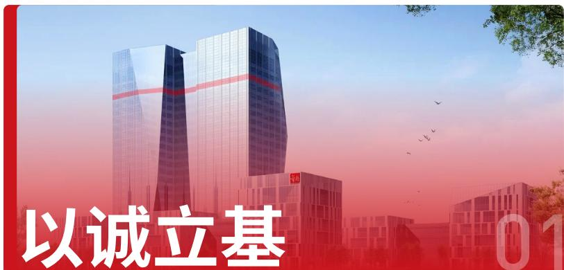

text_image

以诚立基
01

## 筑牢治理根基

公司治理 17

商业道德 22

内控合规与风险管理 23

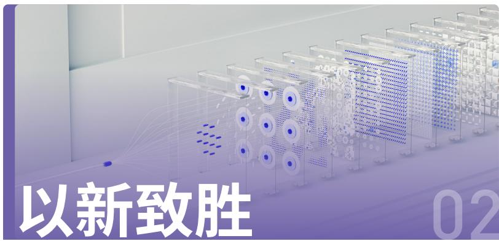

text_image

以新致胜
02

## 驱动价值创造

创新驱动 29

数据安全与客户隐私保护 34

产品和服务安全与质量 38

行业共进 42

text_image

以人为本
03

## 共筑和谐职场

人才吸引 47

人才培训与发展 50

员工福利与权益保障 53

员工健康与安全 57

text_image

责任为桥
04

## 联结可持续生态

负责任采购 61

环境管理 62

应对气候变化 65

社会贡献 68

## 关于本报告

本报告详细披露了上海金桥信息股份有限公司（以下简称“金桥信息”“公司”）2025年度在经济、环境、社会及公司治理等责任领域的实践和绩效，旨在与各利益相关方进行有效交流，系统地回应利益相关方的期望和要求。

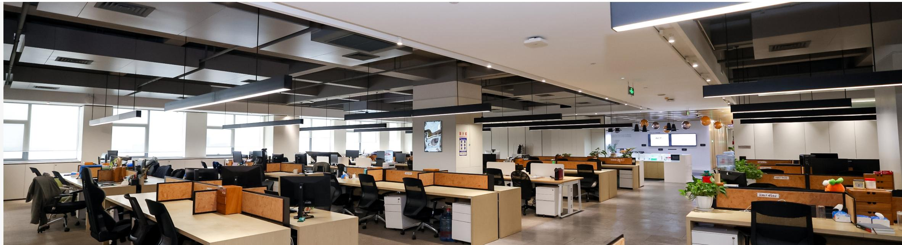

natural_image

Interior view of a modern open-plan office with multiple workstations, desks, and ceiling lights (no visible text or signage)

## 报告周期

本报告涵盖2025年1月1日至2025年12月31日，为年度报告。

## 报告范围

报告披露了金桥信息及其子公司履行经济、社会、环境及公司治理等方面的责任信息，相关典型案例来自公司所属企业。

## 时间范围

2025年1月1日至2025年12月31日，为增强报告可比性及前瞻性，部分内容向前后年度适度延伸。

## 数据说明

报告使用数据来源包括公司实际运行的原始数据，政府部门公开数据，年度财务数据，内部相关统计报表，第三方问卷调查第三方评价访谈等。本报告的财务数据以人民币为单位，若与财务报告不一致之处，以财务报告为准。

## 编制依据

上海证券交易所《上市公司自律监管指引第 14 号—持续发展报告（试行）》  
●上海证券交易所《上市公司自律监管指南第4号—可持续发展报告编制》  
●全球可持续发展标准委员会《可持续发展报告标准》 (GRIStandards)  
●中国社科院《中国企业社会责任报告指南》 (CASS-ESG 6.0  
●中国标准化研究院《社会责任报告编写指南》 (GB/T36001-2015)  
国际标准化组织《ISO 26000：社会责任指南（2010）》

## 报告可靠性保证

公司承诺本报告内容真实、准确、完整，不存在任何虚假记载、误导性陈述或重大遗漏

## 报告获取途径

本报告以电子版形式供您阅读，您可登录公司官网（https://www.shgbit.com）或在上海证券交易所网站（https://www.sse.com.cn/）查阅获取。如对本报告有任何疑问或建议，敬请发送电子邮件至 gaodd@shgbit.com / shaole@shgbit.com /yaoming@shgbit.com，或致电 : +86 21 3367 4997。

## 董事长致辞

尊敬的各位利益相关方：

您好！

2025年，金桥信息在数字化转型的浪潮中，进一步明确了“真诚是金，共享为桥”的立身之本。我们深刻体会到，企业的可持续发展，既需要脚踏实地的技术深耕，也需要心怀远方的责任担当。在此，我谨代表公司董事会，向您呈上这份承载着我们实践与思考的ESG报告，与您分享我们在责任之路上的点滴探索。

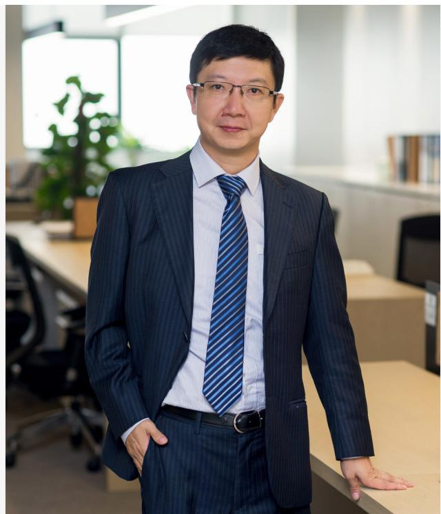

natural_image

Professional portrait of a man in a business suit standing in an office setting (no visible text or symbols)

这一年，我们以诚信为基石，筑牢治理根基。公司治理上，我们持续优化董事会结构，独立董事在战略与风险把控中发挥专业作用：投资者关系上，我们坚持透明沟通，用真诚赢得市场信任：商业道德上，我们构建了贯穿全流程的反舞弊体系对内控合规常抓不懈，确保公司在规范轨道上行稳致远。

这一年，我们以创新为驱动，提升价值创造。研发创新方面，我们加大在人工智能，大数据，区块链等前沿领域的投入。与高校共建联合实验室，推动智慧教育空间等成果落地：数据安全与客户隐私保护上，我们通过了ISO27001认证，以严密的防护体系守护客户信任；产品服务质量上，我们以“你放心，我才安心”为理念，打造覆盖全国的运维网络，客户满意度持续提升：行业共进中，我们积极参与区块链、商用密码等行业盛会，为产业发展贡献金桥智慧。

这一年，我们以人为本，营造和谐职场。人才吸引上，我们深化校企合作，为青年人才搭建成长桥梁：人才培训上，我们构建了“培训+实战+复盘”的赋能体系，助力员工技能提升：员工关怀上，从生日祝福到读书分享，从妇女节活动到困难帮扶，我们努力让每一位员工感受到家的温暖；健康安全上，我们将安全培训覆盖到每一个项目现场。

这一年，我们以责任为桥，联结可持续生态。负责任采购上，我们推动供应商签署环保与健康安全协议，从源头把控供应链风险；环境管理上，我们将绿色办公、节能降耗融入日常运营；应对气候变化上，我们在临港商业综合体等项目中，用智能控制系统帮助客户节能降碳：社会贡献上，我们持续开展无偿献血、社区公益活动，并自主研发“真享”A教学系统为教育公平贡献技术力量。

展望未来，金桥信息将继续秉持“真诚是金，共享为桥”的初心，在数字化浪潮中深耕细作，以技术创新推动进步，以责任担当传递温度。我们期待与所有伙伴一道，携手同行，共创可持续发展的美好未来。

金桥信息董事长

金史平

## 关于金桥信息

## 公司简介

上海金桥信息股份有限公司（股票代码：603918）成立于1994年，于2015年在上海证券交易所挂牌上市。公司在全国设有二十多个分支机构，拥有员工700余人。金桥信息以“真诚是金，共享为桥”为核心价值观，致力于从客户业务需求出发，以信息技术为载体，叠加行业应用，为政务、司法、教育、医疗健康、金融等国计民生关键行业，提供领先的智慧空间信息化整体解决方案。公司通过持续加大在云计算、大数据及人工智能等领域的研发投入，推动创新技术落地不断夯实传统业务并拓展新的经营领域。同时，公司以细致、专业、周到的运维服务理念，为客户营造安全、稳定、优质的信息化业务环境，服务运维网络遍布全国。

## 公司文化

金桥信息已建立起以“愿景-使命-价值观”为核心的完整企业文化体系，为公司的可持续发展提供了坚实的精神内核与行动指南。

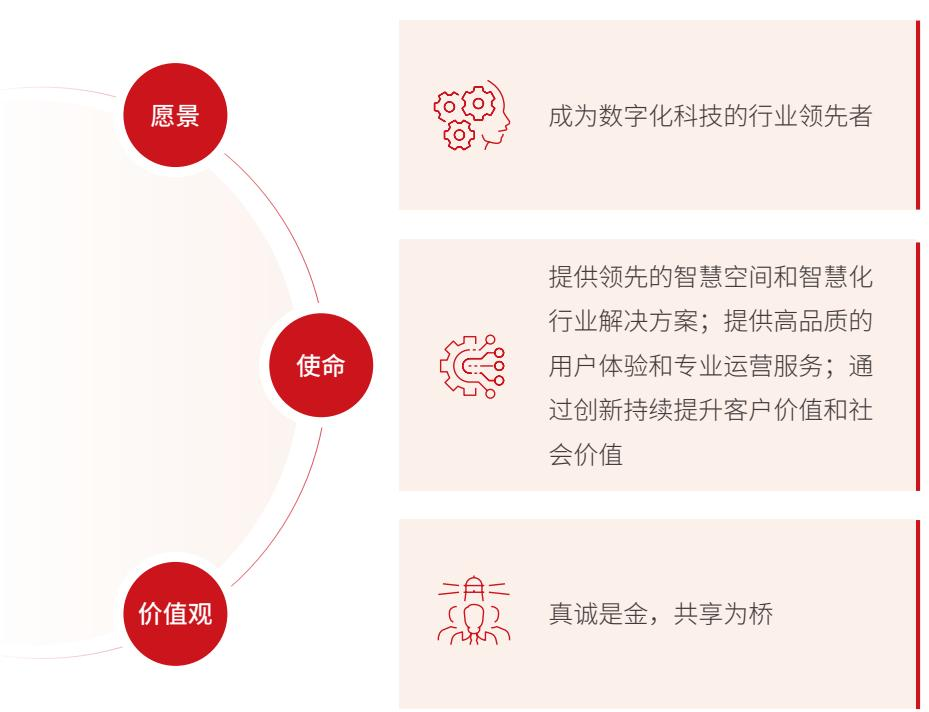

flowchart

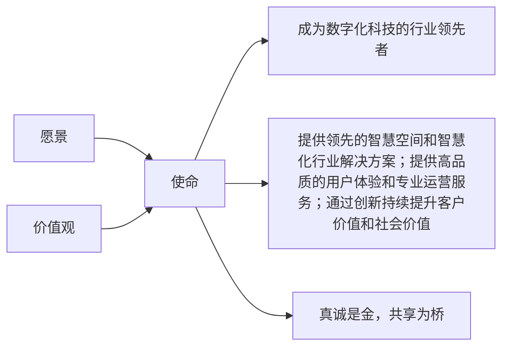
```mermaid
graph LR
  A["愿景"] --> B["使命"]
  C["价值观"] --> B
  B --> D["成为数字化科技的行业领先者"]
  B --> E["提供领先的智慧空间和智慧化行业解决方案；提供高品质的用户体验和专业运营服务；通过创新持续提升客户价值和社会价值"]
  B --> F["真诚是金，共享为桥"]
```

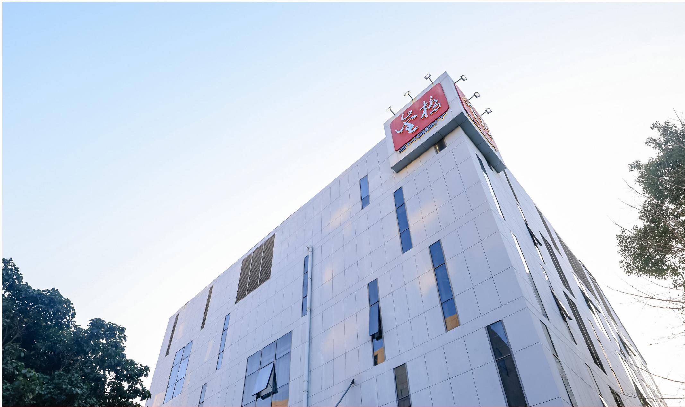

text_image

爱格

## 发展战略

公司秉承“真诚是金，共享为桥”的核心价值观，从客户业务需求出发，以信息技术为载体，叠加行业应用，为客户提供定制化的智慧解决方案及服务。充分发挥信息化领域综合优势，面向政务、司法、教育、医疗健康、金融等国计民生行业及大中型企业，融合客户需求，叠加行业应用，打造智慧空间信息化解决方案，并持续保持领先。从“实体空间”向“虚拟空间”延伸，基于对客户业务流程和管理需求的深刻理解，凭借自身积累的行业知识和研发能力，同时向横向和纵向延伸业务范围，运用云计算、大数据、人工智能等新技术为客户提供定制化的“大数据及云平台服务”。紧密围绕“人”“信息”“环境”三要素，服务于三者之间的沟通与交互，以服务“人与人”“人与信息”“人与环境”之间的沟通为主线，为客户提供定制化的智慧解决方案

## 发展历程

## 诞生

1994

在国家“三金工程”大潮中而出

1996

开创数字会议系统先河

上海宝钢集团、上海图书馆、浦发银行

2000

锋芒展露 载誉而来

浦东新区政府办公中心-鲁班奖、上海165项目- 白玉兰奖

## 探索

2008

通信帝国会议起航

诺基亚（中国）投资有限公司办公及研发大楼

2009

世博舞台亮金桥名片

上海世博中心-申慧奖

2010

回首来时路 砥砺再出发

正式更名为：上海金桥信息股份有限公司

2011

“情定”两会

连续十余年为上海“两会”保驾护航

## 蕴蓄

2004

开启法院信息化征程

北京市高级人民法院、上海市第一中级人民法院科技法庭

十载风云 同舟共济

创立十年

2006

首创超大无缝融合显示系统

国家航天测控中心

## 奋进

2013

信息集控中心横空出世

最高人民法院信息集控中心

2014

少年金桥 风华正茂

创立二十年

2015

乘风破浪 踏歌而行

上海证劵交易所上市

2016

法院信息化标杆拔地而起

徐汇区法院审判中心

## 创新

2018

智慧教育 金桥同行

与浙江大学携手共建“智云实验室”

智慧城市 数据先行

上海大数据中心

为国家重点研发计划贡献金桥力量

“两高一部”案件执行全流程管控系统国家课题

助力华为航母扬帆起航

华为全国会议标准化及Space 365会议平台部署

## 蜕变

2021

成立上海金桥亦法信息技术有限公司

2022

开拓金融、法律、科技领域

2024

在一起 行更远 创立三十年

2025

智驱深耕，聚力成事，协同提效。上市十周年

## 蜕变

2019

人民法院移动执行云平台全国上线运行

廿五风雨锤炼 筑梦百年金桥

创立二十五年

智慧校园 创新未来

浙江大学管理学院大楼

2020

赋能医疗 健康护航

浙江大学附属第一医院

## 遇见

金桥芳华正当时，未来可期！

## 公司荣誉

  
企业综合实力与排名类

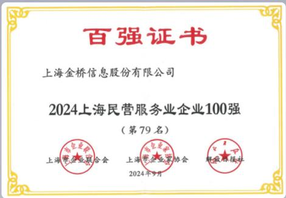

seal

上海金桥信息股份有限公司
2024上海民营服务业企业100强
（第79名）
上海市企业联合会
上海市企业监事会
2024年9月

2024上海民营服务业企业100强

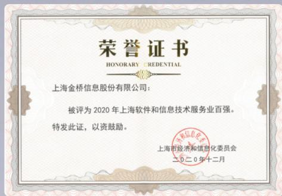

text_image

荣誉证书
HONORARY CREDENTIAL
上海金桥信息股份有限公司：
被评为2020年上海软件和信息技术服务业百强。
特发此证，以资鼓励。
上海市经济和信息化委员会
二〇二〇年十二月

上海软件和信息技术服务业百强

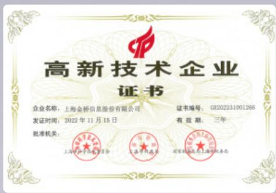

text_image

高新技术企业
证书
企业名称：上海金桥信息股份有限公司
发证时间：2022年11月15日
证书编号：GR202231001266
有效期：三年
批准机关：
上海金桥信息股份有限公司
上海金桥商务局
国家税务总局上海市税务局

高新技术企业

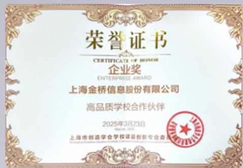

text_image

荣誉证书
CERTIFICATE OF HONOR
企业奖
ENTERPRISE AWARD
上海金桥信息股份有限公司
高品质学校合作伙伴
2025年3月23日
March 2025
上海市创造学会学校建设创新专业委员会

高品质学校合作伙伴企业奖

  
品牌与信誉类

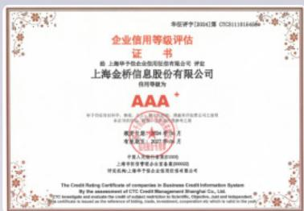

text_image

华宝评字[2016]第 CZC2113145684
企业信用等级评估
证书
上海金桥电子信息股份有限公司 评估
上海金桥信息股份有限公司
自评级等级为
AAA+
关于评估机构的审定、核查及评估意见
上海金桥信息科技股份有限公司
资产评估机构：上海金桥信息科技有限公司
资产评估机构：上海金桥信息科技有限公司
资产评估机构：上海金桥信息科技有限公司
资产评估机构：上海金桥信息科技有限公司
资产评估机构：上海金桥信息科技有限公司
资产评估机构：上海金桥信息科技有限公司
资产评估机构：上海金桥信息科技有限公司
资产评估机构：上海金桥信息科技有限公司
资产评估机构：上海金桥信息科技有限公司
资产评估机构：上海金桥信息科技有限公司
资产评估机构：上海金桥信息科技股份有限公司
资产评估机构：上海金桥信息科技股份有限公司
资产评估机构：上海金桥信息科技股份有限公司
资产评估机构：上海金桥信息科技股份有限公司
资产评估机构：上海金桥信息科技股份有限公司
资产评估机构：上海金桥信息科技股份有限公司
资产评估机构：上海金桥信息科技股份有限公司
资产评估机构：上海金桥信息科技股份有限公司
资产评估机构：上海金桥信息科技股份有限公司
资产评估机构：上海金桥信息科技股份有限公司
资产评估机构：上海金桥信息科技有限公司
资产评估机构：上海金桥信息科技股份有限公司
资产评估机构：上海金桥信息科技股份有限公司
资产评估机构：上海金桥信息科技股份有限公司
资产评估机构：上海金桥信息科技股份有限公司
资产评估机构：上海金桥信息科技股份有限公司
资产评估机构：上海金桥信息科技股份有限公司
资产评估机构：上海金桥信息科技股份有限公司
资产评估机构：上海金桥信息科技股份有限公司
资产评估机构：上海金桥信息科技有限公司
资产评估机构：上海金桥信息科技有限公司
资产评估机构：上海金桥信息科技股份有限公司
资产评估机构：上海金桥信息科技股份有限公司
资产评估机构：上海金桥信息科技股份有限公司
资产评估机构：上海金桥信息科技股份有限公司
资产评估机构：上海金桥信息科技股份有限公司
资产评估机构：上海金桥信息科技股份有限公司
资产评估机构：上海金桥信息科技股份有限公司
资产评估机构：上海金桥信息科技有限公司
资产评估机构：上海金桥信息科技股份有限公司
资产评估机构：上海金桥信息科技有限公司
资产评估机构：上海金桥信息科技股份有限公司
资产评估机构：上海金桥信息科技股份有限公司
资产评估机构：上海金桥信息科技股份有限公司
资产评估机构：上海金桥信息科技股份有限公司
资产评估机构：上海金桥信息科技股份有限公司
资产评估机构：上海金桥信息科技股份有限公司
资产评估机构：上海金桥信息科技股份有限公司
资产评估机构：上海金桥信息科技有限公司
资产评估机构：上海金桥信息科技有限公司
资产评估机构：上海金桥信息科技有限公司
资产评估机构：上海金桥信息科技股份有限公司
资产评估机构：上海金桥信息科技股份有限公司
资产评估机构：上海金桥信息科技股份有限公司
资产评估机构：上海金桥信息科技股份有限公司
资产评估机构：上海金桥信息科技股份有限公司
资产评估机构：上海金桥信息科技股份有限公司
资产评估机构：上海金桥信息科技有限公司
资产评估机构：上海金桥信息科技有限公司
资产评估机构：上海金桥信息科技股份有限公司
资产评估机构：上海金桥信息科技有限公司

上海市企业信用等级评估AAA+

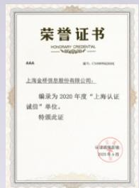  
上海认证诚信单位

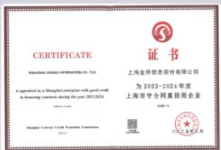

text_image

CERTIFICATE
SHANGHAI JINQIAO INFORMATION CO.,LTD.
证书
上海金桥信息股份有限公司
为2023-2024年度
上海市守合同重信用企业
SHANGHAI CONTRACT CREDIT PROMISE COMMITTEE
2023-1
二〇二五年二月

上海市守合同重信用企业

  
工程质量与建筑奖项类

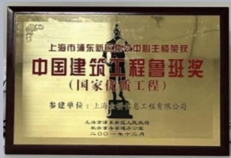

text_image

上海市浦东新区德公中心主校荣获
中国建筑工程鲁班奖
（国家优质工程）
参建单位：上海数智信息工程有限公司
上海市浦东新区人民法院
机关事务管理办公室
二〇〇一年三月

上海软件和信息技术服务业百强

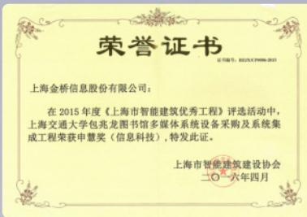

text_image

荣誉证书
证书编号：RJZCYP9986-2015
上海金桥信息股份有限公司；
在2015年度《上海市智能建筑优秀工程》评选活动中，
上海交通大学包兆龙图书馆多媒体系统设备采购及系统集
成工程荣获申慧奖（信息科技），特发此证。
上海市智能建筑建设协会
二〇一六年四月

申慧奖（信息科技）

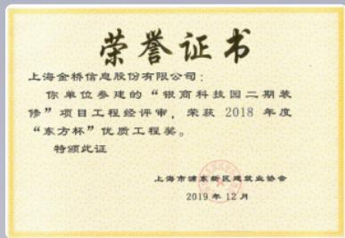

text_image

荣誉证书
上海金桥信息股份有限公司：
你单位参建的“银商科技园二期装修”项目工程经评审，荣获2018年度“东方杯”优质工程奖。
特颁此证
上海市浦东新区城致业协会
2019年12月

“东方杯”优质工程奖

  
上海市建筑工程“白玉兰奖”

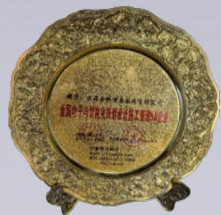

text_image

编号：江苏金科集团有限公司
全国电子与智能农业的设计与管理委员会

全国电子与智能化规划设计施工管理5A企业

  
其他

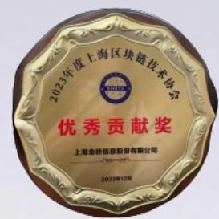

seal

2023年度上海区块链技术协会
优秀贡献奖
上海金桥信息股份有限公司
2023年12月

上海区块链技术协会优秀贡献奖

natural_image

Silver trophy on a gray pedestal (no text or symbols visible)

## ESG 治理

金桥信息深刻认识到，卓越的ESG(环境、社会与治理)表现是公司实现长期、健康、可持续发展的基石。2025年，公司正式将ESG理念全面融入公司战略与日常运营，构建了跨部门协同执行的ESG治理架构，旨在系统性地识别与管理可持续发展相关风险与机遇，积极回应各利益相关方的期望，创造长期综合价值。

## ESG治理体系

公司参照《上海证券交易所上市公司自律监管指引第14号可持续发展报告(试行)》、全球报告倡议组织(GRI)标准等国内外主流框架，建立了符合自身业务特点的ESG治理体系。该体系明确了董事会、管理层及各业务部门在ESG事务中的职责分工，确保ESG工作有章可循、有序推进。

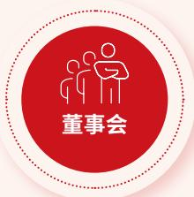

## 决策与监督层

董事会作为ESG工作的最高决策与监督机构，负责审议公司ESG 相关战略与重要议题，监督ESG 管理工作执行情况，确保ESG管理与公司整体发展战略相一致。

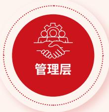

## 统筹与推进层

公司董事会秘书作为ESG工作的总负责人，牵头成立“ESG工作领导小组”。该小组负责将战略转化为年度行动计划，制定制度与目标，统筹协调全公司资源，并定期向最高管理层汇报进展。

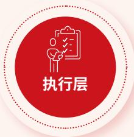

## 落地与实施层

在公司ESG工作领导小组的指导下，成立跨职能部门的“ESG工作小组”。该小组由公司董事会办公室，协同研发部、人力资源、行政、财务、市场营销等各业务与职能部门，共同负责ESG举措的日常推进、数据收集核算、绩效跟踪与报告编制等工作，确保ESG管理全面融入业务流程。

## ESG能力建设

公司高度重视环境、社会及治理（ESG)能力的系统性建设，积极构建面向全体员工及关键管理岗位的ESG培训与宣贯体系。通过定期组织专题讲座、内部研讨会及专项培训课程，公司系统介绍ESG理念、政策趋势、行业实践及相关管理工具，持续提升各级人员对可持续发展议题的认知水平和履责能力。同时，公司结合自身业务特点与管理实际，推动ESG知识在战略规划、风险管控、日常运营等环节的有效融入，确保ESG理念自上而下贯彻落地，为公司的长期、稳健、负责任发展奠定坚实的组织与人才基础。

## 重要性议题识别与分析

为提升ESG管理的针对性与有效性，金桥信息于2025年启动了实质性议题分析工作。我们借鉴双重重要性原则(影响重要性和财务重要性)，通过以下步骤识别出对公司及利益相关方最为关键的ESG议题。最终识别出合规经营与风险管理研发与创新、产品质量与安全、客户服务、数据安全与客户隐私保护为年度关键财务重要性议题

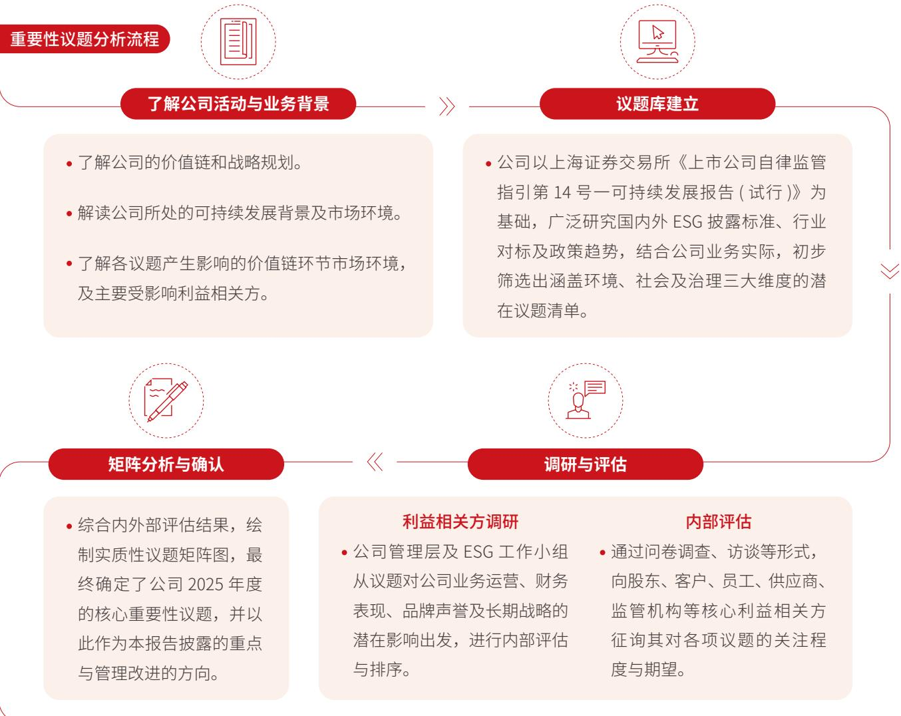

flowchart

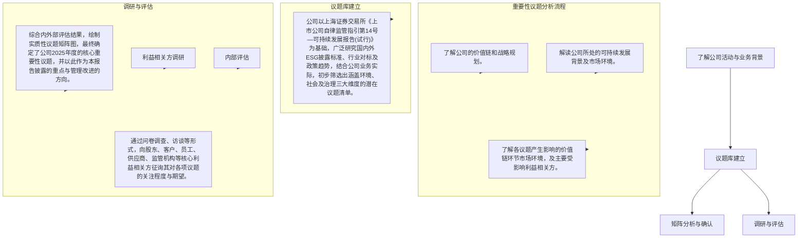
```mermaid
graph TD
  A["了解公司活动与业务背景"] --> B["议题库建立"]
  B --> C["矩阵分析与确认"]
  B --> D["调研与评估"]
  
  subgraph Process_A [重要性议题分析流程]
    A1["了解公司的价值链和战略规划。"]
    A2["解读公司所处的可持续发展背景及市场环境。"]
    A3["了解各议题产生影响的价值链环节市场环境，及主要受影响利益相关方。"]
  end
  
  subgraph Process_B [议题库建立]
    B1["公司以上海证券交易所《上市公司自律监管指引第14号—可持续发展报告(试行)》为基础，广泛研究国内外ESG披露标准、行业对标及政策趋势，结合公司业务实际，初步筛选出涵盖环境、社会及治理三大维度的潜在议题清单。"]
  end
  
  subgraph Process_C [调研与评估]
    C1["综合内外部评估结果，绘制实质性议题矩阵图，最终确定了公司2025年度的核心重要性议题，并以此作为本报告披露的重点与管理改进的方向。"]
    C2["利益相关方调研"]
    C3["内部评估"]
    C4["通过问卷调查、访谈等形式，向股东、客户、员工、供应商、监管机构等核心利益相关方征询其对各项议题的关注程度与期望。"]
  end
  
  A1 -.-> Process_A
  A2 -.-> Process_A
  A3 -.-> Process_A
  B1 -.-> Process_B
  C1 -.-> Process_C
  C2 -.-> Process_C
  C3 -.-> Process_C
```

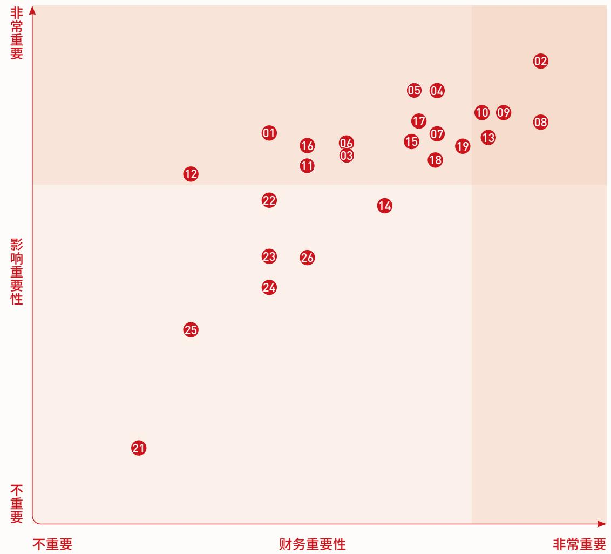

scatter

| Item | Financial Importance (approx) | Impact Importance (approx) |
| --- | --- | --- |
| 01 | ~35% | ~75% |
| 02 | ~95% | ~95% |
| 03 | ~45% | ~65% |
| 04 | ~60% | ~85% |
| 05 | ~55% | ~85% |
| 06 | ~45% | ~70% |
| 07 | ~65% | ~70% |
| 08 | ~95% | ~70% |
| 09 | ~85% | ~75% |
| 10 | ~80% | ~75% |
| 11 | ~40% | ~65% |
| 12 | ~20% | ~65% |
| 13 | ~80% | ~65% |
| 14 | ~55% | ~55% |
| 15 | ~60% | ~70% |
| 16 | ~40% | ~65% |
| 17 | ~60% | ~75% |
| 18 | ~65% | ~65% |
| 19 | ~75% | ~70% |
| 21 | ~15% | ~10% |
| 22 | ~35% | ~60% |
| 23 | ~35% | ~40% |
| 24 | ~35% | ~35% |
| 25 | ~25% | ~30% |
| 26 | ~40% | ~40% |

## 序号 议题

1 董事会运作情况  
2 合规经营与风险管理\*  
3 投资者关系管理  
4 知识产权保护  
5反商业贿赂及反贪污  
6 反垄断及不正当竞争  
7 ESG/ 可持续发展管理  
8 研发与创新\*  
9产品质量与安全

## 序号 议题

10 客户服务\*  
11 供应链管理  
12 平等对待中小企业  
13 数据安全与客户隐私保护\*  
14 科技伦理  
15 服务国家战略  
16 职业健康与安全  
17 员工权益与福利  
18 员工培训与发展

## 序号 议题

19 行业合作与发展  
20 社会贡献  
21 乡村振兴  
22 环境合规管理  
23 应对气候变化  
24 能源与资源管理  
25 排放与废弃物管理  
26 绿色办公与运营

## 利益相关方沟通

金桥信息高度重视与各利益相关方的双向、透明沟通。我们建立了多元化的沟通渠道，定期、主动地倾听并回应各方关切将沟通成果作为公司战略制定与ESG管理优化的重要输入。

<table><tr><td colspan="2">利益相关方</td><td>核心关注与期望</td><td>沟通与回应机制</td></tr><tr><td></td><td>股东与投资者</td><td>治理透明度长期投资回报风险管理ESG绩效</td><td>年度/临时股东会业绩说明会定期报告(年报/ESG报告)投资者热线上证e互动平台</td></tr><tr><td></td><td>客户</td><td>产品与服务质量数据安全与隐私保护技术创新商业道德</td><td>客户满意度调查项目评审技术服务支持廉洁协议</td></tr><tr><td></td><td>员工</td><td>职业健康与安全薪酬福利培训与发展平等雇佣职场文化</td><td>定期体检定期员工访谈培训体系内部沟通平台绩效考核与反馈机制</td></tr><tr><td></td><td>供应商与合作伙伴</td><td>公平采购合同履约商业道德供应链责任</td><td>供应商准入与评估合作协议廉洁承诺书定期商务洽谈</td></tr><tr><td></td><td>政府与监管机构</td><td>合法合规经营税收贡献产业政策响应数据安全</td><td>合规自查积极配合检查与调研政策研讨定期汇报</td></tr><tr><td></td><td>社区与公众</td><td>环境保护社区共建社会公益就业促进</td><td>积极配合环境检查社区活动参与公益项目创造就业岗位</td></tr></table>

## 以诚立基筑牢治理根基

金桥信息始终将健全的公司治理、严格的商业道德规范以及系统化的内控与风险管理视为企业可持续发展的基石。公司构建了以董事会为核心、权责清晰、制衡有效的治理架构，并通过完善的信息披露与投资者关系机制保障透明度与信任。同时，公司建立了贯穿业务全流程的廉洁合规体系与全面风险管理框架，将ESG理念融入战略决策，以持续监督与闭环管理驱动运营优化与价值创造。通过制度化、常态化的培训、审计与指标考核，我们致力于将合规内化为组织基因，将风险转化为成长动力，为股东、客户及社会创造可持续的长期价值。

## 章节内容

公司治理 17

商业道德 22

内控合规与风险管理 23

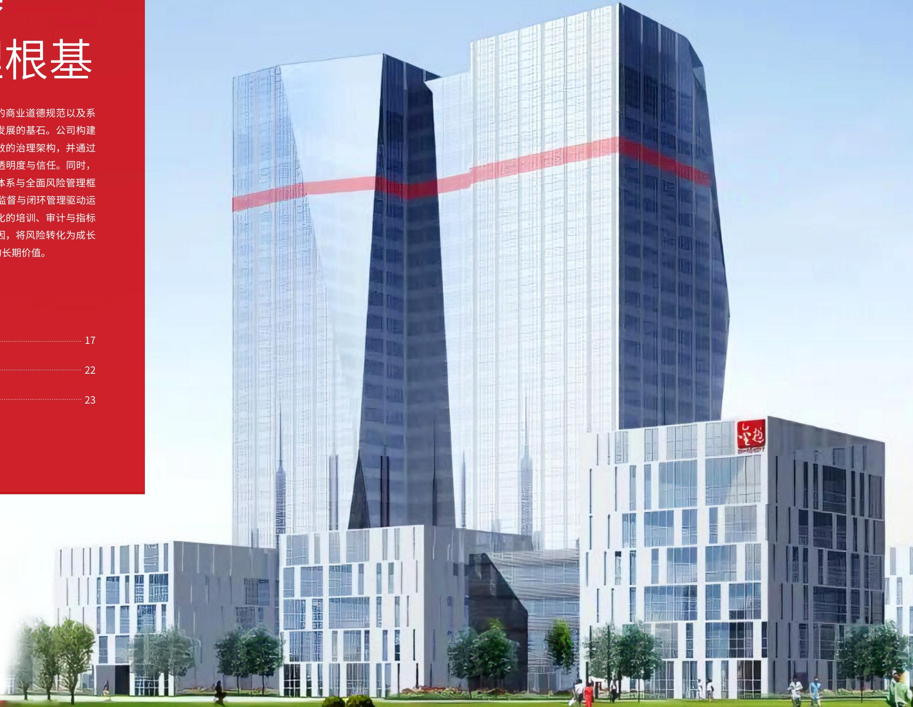

text_image

根基
的商业道德规范以及系
发展的基石。公司构建
政的治理架构，并通过
透明度与信任。同时，
体系与全面风险管理框
监督与闭环管理驱动运
化的培训、审计与指标
图，将风险转化为成长
长期价值。
.... 17
.... 22
.... 23

## 公司治理

金桥信息秉持合规、透明、高效的治理理念，将完善的公司治理体系视为公司长期稳健经营与可持续发展的核心保障。公司严格遵守《中华人民共和国公司法》《中华人民共和国证券法》《上市公司治理准则》《上海证券交易所股票上市规则等法律法规及监管指引，并依据《上海金桥信息股份有限公司章程》（2025年11月版)及各项专门委员会议事规则，构建起权责清晰、制衡有效、运行规范的现代化公司治理架构。

## 治理架构

公司构建了以股东会为最高权力机构、董事会为决策核心、高级管理层为执行主体的治理体系。各机构之间职责明确、协调运作、有效制衡，共同保障公司的规范运作与全体股东的合法权益。

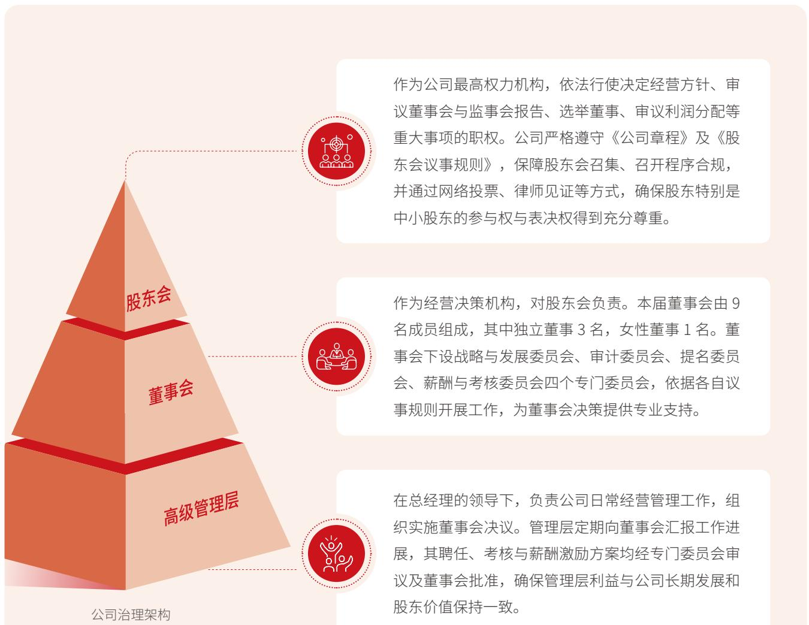

flowchart

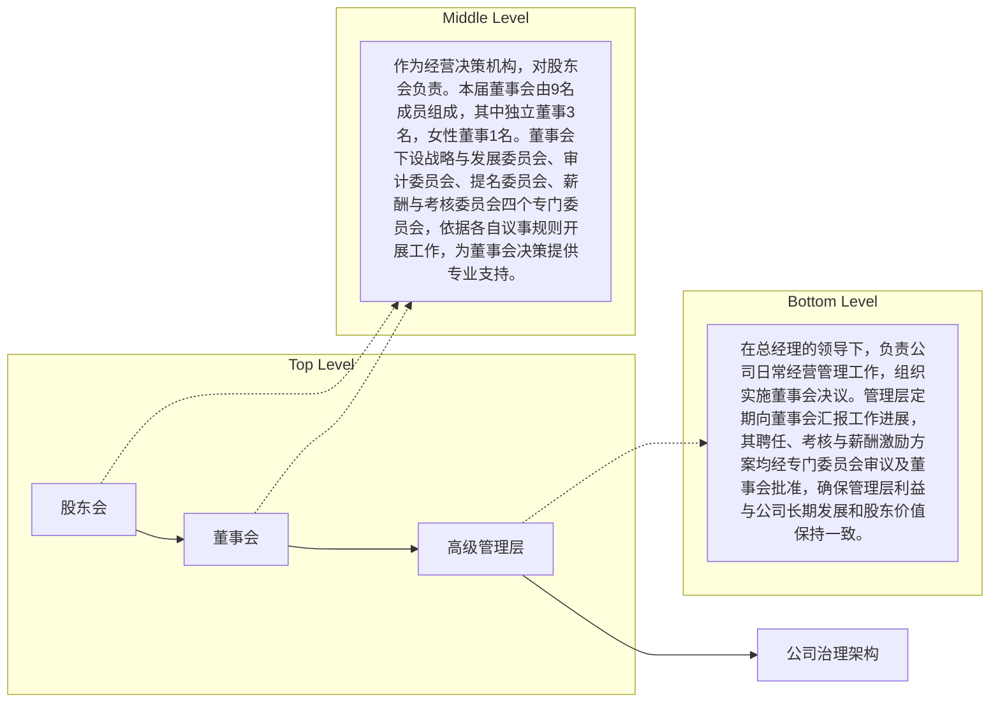
```mermaid
graph LR
  A["股东会"] --> B["董事会"]
  B --> C["高级管理层"]
  C --> D["公司治理架构"]
  
  subgraph Top Level
    A
    B
    C
  end
  
  subgraph Middle Level
    E["作为经营决策机构，对股东会负责。本届董事会由9名成员组成，其中独立董事3名，女性董事1名。董事会下设战略与发展委员会、审计委员会、提名委员会、薪酬与考核委员会四个专门委员会，依据各自议事规则开展工作，为董事会决策提供专业支持。"]
  end
  
  subgraph Bottom Level
    F["在总经理的领导下，负责公司日常经营管理工作，组织实施董事会决议。管理层定期向董事会汇报工作进展，其聘任、考核与薪酬激励方案均经专门委员会审议及董事会批准，确保管理层利益与公司长期发展和股东价值保持一致。"]
  end
  
  A -.-> E
  B -.-> E
  C -.-> F
```

## 董事会构成、运作与专门委员会职能

公司董事会及各专门委员会严格按照《董事会议事规则》及相关制度规范运作，对会议的召集、审议、表决和记录等各环节均作出明确规定，确保决策过程规范、透明、合规，有效保障了董事会决策的审慎性与科学性。在此基础上，公司持续推进董事会专业化、多元化建设，强化独立性与运作效率，并通过专门委员会的有效履职，不断提升公司治理水平与决策质量。

公司致力于打造专业多元、独立高效、运作规范的董事会，并通过专门委员会的深入履职，持续提升治理质量与决策水平

负责研究公司长期发展战略、重大投资决策及经营规划，为公司可持续发展提供方向指引。

依据《董事会审计委员会议事规则》，全面负责监督财务报告流程、指导内部审计、评价内部控制体系、选聘及监督外部审计机构等工作，是公司财务合规与风险管控的重要关口。

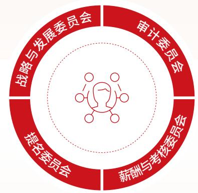

flowchart

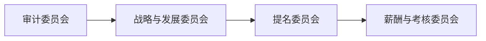
```mermaid
graph LR
  A["审计委员会"] --> B["战略与发展委员会"]
  B --> C["提名委员会"]
  C --> D["薪酬与考核委员会"]
```

根据《董事会提名委员会议事规则》，负责拟定董事及高级管理人员的选择标准与程序，并对候选人资格进行专业审核，从源头保障治理团队的专业素养与胜任能力。

依照《董事会薪酬与考核委员会议事规则》，研究制定董事及高级管理人员的薪酬政策与考核体系，推动建立与公司业绩、个人绩效及长期价值相挂钩的激励机制。

## 关键绩效

2025 年，公司召开董事会

12次

审议通过议案

66

董事会成员出席率

100%

召开战略与发展委员会

2 次

审计委员会

4

提名委员会

3 次

薪酬与考核委员会

4

## 董事会多元化与独立性

公司持续推进董事会结构的多元化与独立性建设，董事会成员来自信息技术、企业管理、财务、法律等多个领域，具备多元化的专业背景与行业经验，为公司战略制定与风险管控提供多维度支持。

独立董事严格遵循《独立董事工作制度》，不在公司担任除董事外的其他职务，并与公司及主要股东，实际控制人不存在直接或间接利害关系，能够保持客观独立立场履行职责。报告期内，独立董事在内部控制、高管薪酬等重要事项中积极发表独立意见，充分发挥监督与制衡作用。

## 关键绩效

报告期内，公司董事

9 名

其中独立董事

3 名

女性董事

1名

## 董事会有效性评估

报告期内，公司董事会及各专门委员会运作规范，会议召集、审议及表决程序符合相关制度要求，决策流程清晰、执行有序：董事能够勤勉尽责履行职责，积极参与重大事项讨论，充分发挥专业背景与独立性优势，为公司战略制定与经营决策提供有效支持。同时，专门委员会分工明确、协同高效，在各自职责领域内发挥了应有作用。公司董事会整体运行情况良好，能够有效保障公司治理的规范性与决策的科学性。

## 信息披露与透明度

公司致力于构建系统化、规范化透明化的治理体系，将高质量的信息披露与积极有效的投资者关系管理视为实现可持续发展、赢得市场信任的重要支柱。公司依据最新监管要求及业务发展实际，持续完善相关制度与工作机制，确保在合规基础上提升信息传递效能，增强与资本市场的良性互动。

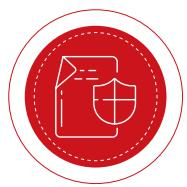

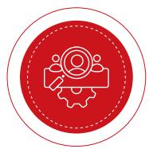  
V

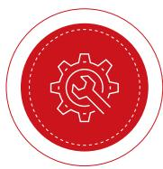

## 制度与组织保障

●公司确立董事会统一领导、董事长为第一责任人董事会秘书具体组织、董事会办公室归口执行的信息披露工作机制。  
●制度明确信息披露的范围、标准、程序及各类重大事件的判定与披露时限，涵盖定期报告、临时公告及其他可能对公司股票及其衍生品种交易价格产生较大影响的重大事项。  
●公司通过内部培训与责任落实，确保董事、高级管理人员及各部门、子公司负责人熟知并履行信息披露义务。

## 全流程质量控制

●在信息形成、传递、审核与发布各环节，公司执行多重校验机制。  
●公司注重公告内容完整，简明清晰、通俗易懂且不存在虚假记载和不实陈述。

## 内幕信息管理与保密纪律

●公司严格执行内幕信息知情人登记与报备制度，明确内幕信息范围与保密责任。  
●在信息披露前，所有知情人须将信息控制在最小范围，不得泄露或利用内幕信息进行交易。公司通过签订保密承诺、开展合规培训、实施访问控制等措施，筑牢信息保密防线。

信息披露管理

## 关键绩效

2025 年度，公司共发布各类公告98 份，内容涵盖定期报告、股权变动、重大项目进展、公司治理相关事项等。公司所有披露信息均第一时间通过上海证券交易所网站及符合中国证监会规定条件的媒体发布，确保所有投资者可公平、及时获取信息。

## 投资者关系管理

公司视投资者为重要合作伙伴，始终致力干建立长期、稳定、互信的投资者关系。依据《金桥信息投资者关系管理制度》（2025年10月修订），公司系统构建多渠道、多层次、常态化的投资者沟通体系，切实保障投资者的知情权、参与权与监督权。

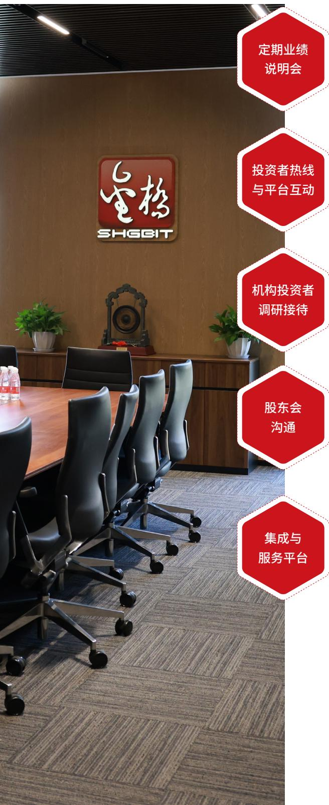

text_image

定期业绩
说明会
投资者热线
与平台互动
机构投资者
调研接待
股东会
沟通
集成与
服务平台
SHGGIT

公司每年度及半年度定期举办业绩说明会，由董事长、总经理、财务负责人、董事会秘书等核心管理层出席，全面解读经营成果、财务表现战略规划与行业展望，并通过在线直播、电话接入、文字互动等形式实时回应投资者提问，增强沟通的穿透力与覆盖面。

●公司设立专用投资者咨询电话及传真，由董事会办公室专人接听、记录并及时回复。同时，公司高度重视上证e互动等监管指定互动平台，安排专人对投资者提问进行收集、研判与回复，确保反馈及时、内容准确、态度诚恳。

公司规范机构投资者调研接待流程，提前准备交流材料、明确交流范围与参会人员。在符合信息披露公平性原则的前提下，公司管理层与业务负责人与调研机构进行深入、专业交流，传达公司价值，同时听取市场声音。

●公司不断完善股东会组织形式，积极为中小股东参与创造条件，提供网络投票渠道，并聘请律师对会议程序进行见证。

公司官方网站（https://www.shgbit.com/）设立“投资者关系”专栏，系统集成公司公告、定期报告、股价信息、联系方式等，方便投资者一站式获取信息。●专栏保持动态更新，并结合公司重大进展发布投资者关系活动记录提升信息获取便利性。

多渠道互动沟通

## 关键绩效

报告期内，公司共开展投资者关系活动

3

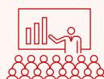

## 商业道德

金桥信息致力于构建一个严密、系统目贯穿运营全程的反腐败与廉政管理体系，将廉洁合规视为企业可持续发展的根本保障公司通过建立权责明确的治理架构、制定全面规范的《反贪污反腐败管理制度》、设立安全畅通的举报渠道、开展深入持久的培训教育以及实施独立有效的审计监督，系统性地推进廉洁风险防控，确保公司在合规轨道上稳健前行，维护企业声誉与股东权益。

公司已建立由董事会承担最终责任、审计委员会履行监督职责、高级管理层统筹部署、反腐败领导小组组织协调，以及内审部门负责具体执行的层级化治理架构。该体系权责清晰、制衡有效，确保反腐败工作的权威性与执行力。公司明确禁止任何形式的贿赂、贪污、挪用公款、利益输送等违法违规行为，并贯彻“零容忍”原则。

在制度体系建设方面，公司已制定并持续完善以《反贪污反腐败管理制度》为核心，《员工行为准则》等为支撑的廉洁合规制度体系。制度明确规定了在业务往来、采购招标、项目合作、费用报销、礼品招待、捐赠赞助等关键环节的行为规范与禁止性要求，严禁员工索取、收受或提供任何不正当利益，并要求对利益冲突进行主动申报。制度同时延伸适用于供应商代理商等商业伙伴，通过合同条款与尽职调查构建廉洁生态

## 举报渠道

• 专用举报邮箱  
通过直属上级或人力资源部门反映

## 公司举报渠道与举报人保护机制

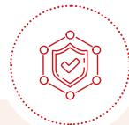

## 举报人保护机制

● 公司承诺对举报信息及举报人身份予以严格保密，并明文禁止任何形式的打击报复，确保举报渠道的安全与可信。

此外，公司高度重视商业道德与反腐败管理，通过制度宣贯、案例分享及合规提醒等方式，引导员工严格遵守法律法规及公司相关制度要求，持续强化员工的合规意识与廉洁自律意识。公司倡导诚信经营与守法合规的价值理念，推动员工在日常工作中坚守职业操守与法律底线，积极营造风清气正的企业文化氛围。

## 反不正当竞争

公司严格遵守《反不正当竞争法》等法律法规，坚持公平竞争原则。我们致力于通过技术创新、质量提升和服务优化来赢得市场，坚决杜绝侵犯商业秘密、商业诋毁、虚假宣传等一切不正当竞争行为。

## 关键绩效

报告期内，公司未发生 贪污腐败事件未发生 不当竞争事件

## 内控合规与风险管理

金桥信息深刻认识到，在充满不确定性的市场环境和日益强化的监管背景下，健全的内部控制与全面风险管理体系不仅是满足合规要求的基础，更是保障公司战略目标实现、提升运营韧性、驱动可持续价值创造的核心管理支柱。公司致力于构建一个动态、前瞻、目深度融入业务流程的全面风险管理框架，系统性地识别、评估、应对和监控来自战略、运营、财务、合规以及环境、社会与治理(FSG)等维度的风险与机遇，并将其转化为优化决策、强化内功的战略资源。

## 治理

公司已建立起权责清晰、运行有效的内控与风险管理“三道防线”治理架构，确保风险管理的全面性与独立性。董事会及其下属的审计委员会承担风险管理监督与评价的最终责任，负责审批风险管理策略，听取内控评估报告：经理层负责领导并组织公司全面风险管理体系的建设与日常运行：各业务与职能部门构成首道防线，负责其职责范围内的风险识别与控制

## 内部控制管理职责

决策与监督层：股东会作为最高权力机构，负责审批董事会上报的内部控制事项报告。董事会承担内部控制建立健全和有效实施的最终责任，其下设的审计委员会负责审查内部控制、监督有效实施及自我评价情况，并协调内控审计等相关事宜。

管理执行层：经理层负责组织领导公司内部控制的日常运行，确保管理体系与业务经营深度融合。

## 三道防线监督机制

## 第一道防线

各业务部门与职能单位是风险管理的责任主体，负责在日常经营中识别风险并执行改进办法。

## 第二道防线

内部控制部负责内控有效性的日常检查，参与并监督企业整体运行状况，对发现的缺陷进行分析并协同业务部门研究改进措施。

## 第三道防线

内部审计部对内控有效性进行独立监督检查，对于发现的重大缺陷，有权直接向董事会及审计委员会报告，确保监督的独立性与权威性。

## 内部控制管理职责

此外公司根据国家有关法律法规和《企业内部控制基本规范》及配套指引结合自身业务特点，制定并持续完善了一套覆盖全业务链的内部控制基本制度，规范了公司内部控制组织，与内部环境相关的控制，反舞弊程序与控制公司层面的风险评估、公司全面预算控制、对内部控制的监督控制、重大事项和重要风险控制、危机事项控制、特别授权控制、公司列报与报表控制等关键事项，为风险防范提供了坚实的制度基础

## 战略

公司致力于构建动态、前瞻目深度融入业务流程的全面风险管理体系，将风险管理从合规导向逐步提升为支撑战略决策与价值创造的重要工具。

在实践中，公司将风险管理要求嵌入战略规划与日常运营，围绕战略、运营、财务、合规及 ESG 等维度，系统识别与评估关键风险与发展机遇，并将其纳入公司整体经营决策框架。

<table><tr><td>风险类型</td><td>风险说明</td><td>潜在影响</td><td>应对措施</td></tr><tr><td>数据安全风险</td><td>数据泄露或系统安全事件</td><td>可能对客户信任、业务连续性及合规管理带来影响</td><td>建立信息安全管理体系,完善数据分级分类与访问权限控制机制;定期开展漏洞扫描、渗透测试及安全评估;加强员工信息安全培训与保密意识;引入第三方安全审查并持续跟踪整改</td></tr><tr><td>合规监管风险</td><td>行业监管要求持续趋严</td><td>对公司合规管理能力及运营规范性提出更高要求</td><td>持续跟踪政策法规变化,完善合规管理制度与流程;强化合规审查机制,将合规要求嵌入业务流程;开展定期合规培训,提升员工合规意识与执行能力</td></tr><tr><td>项目管理风险</td><td>项目执行与交付过程复杂</td><td>可能对项目进度、成本控制及客户满意度产生影响</td><td>优化项目管理体系,完善立项、执行与验收全流程管控机制;强化关键节点监控与风险预警;通过信息化系统提升项目过程透明度与协同效率</td></tr></table>

风险清单

<table><tr><td>机遇类型</td><td>机遇说明</td><td>潜在影响</td><td>应对措施</td></tr><tr><td>数字化转型机遇</td><td>客户数字化需求持续增长</td><td>为公司业务拓展与服务能力提升提供发展空间</td><td>持续加大技术研发与解决方案能力建设;拓展应用场景,提升综合服务能力;加强与客户的协同创新,提升项目转化与落地能力</td></tr><tr><td>ESG 发展机遇</td><td>ESG 及数据合规要求不断提升</td><td>有助于推动公司治理能力提升并拓展相关业务机会</td><td>将 ESG 相关要求纳入风险管理与业务决策体系;完善数据安全、供应链管理及商业道德等管理机制;提升信息披露质量,增强市场认可度与客户信任</td></tr></table>

机遇清单

## 影响、风险与机遇管理

公司遵循“目标设定→风险识别→风险评估→风险应对→监控与报告”的闭环管理流程，实施系统化、常态化的风险管理。

## 目标设定

以确保内控体系有效运行、保障公司整体战略与年度经营目标顺利达成为风险管理工作的核心目标。

## 风险识别与评估

由内部审计部牵头，定期组织各业务单元开展全面的风险识别与评估。综合运用管理层访谈、流程分析、研讨会、行业对标等多种方法，系统梳理可能影响目标实现的内外部风险因素，并依据其发生的可能性与潜在影响程度进行科学评估与分级排序，确定重大及重要风险。

## 监控、报告与持续改进

内部审计部通过执行年度审计计划，开展财务报告审计、内部控制专项审计及合规性检查，持续监控风险应对措施的执行效果及关键控制活动的有效性。

## 风险应对

针对评估出的重大及重要风险，制定并执行明确的风险应对策略与具体行动计划，包括风险回避、风险减轻(通过强化内部控制、优化流程)、风险转嫁(如购买保险、签订保障条款)或风险接受。每项措施均明确责任部门、资源支持与完成时限。

风险管理流程

2025年度，内审部按计划完成了对多个关键业务领域与流程的审计检查，针对发现的管理改进机会提出专业建议，并督导责任部门落实整改。审计结果、重大风险状况及整改进展定期向高级管理层及董事会审计委员会报告，确保治理层及时掌握信息，并为优化风险管理策略与资源配置提供决策依据，形成持续改进的管理闭环。

公司的内控与风险管理实践严格遵循《内审及内控检查监督制度》《企业层面应用手册一基本制度》等内部治理文件，确保风险意识与管理实践深度融入企业文化和日常运营的各个环节

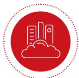

## 文化培育与能力建设

公司重视培育“全员参与、主动管理”的风险合规文化。依托《基本制度》中关于“与内部环境相关的控制”及“反舞弊程序与控制”的要求，公司通过常态化的制度宣贯、专题培训和案例警示教育，不断提升全体员工的风险敏感度与合规执行力。

## 2025年

公司组织内控合规专题培训

3 644

开展风险管理文化专项培训

1 388

有效强化关键岗位员工的风

险防范意识与履职能力

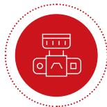

## 流程优化与科技赋能

公司致力于通过流程优化与信息化手段提升内部控制效能。依据《内审及内控检查监督制度》规定的职责，内部审计部负责对内部控制制度的完整性、合理性及实施有效性进行检查和评估。公司通过优化业务流程，将关键控制点嵌入信息系统，实现线上审批、自动校验与权限隔离，从而达成区险的事前预警与事中控制，降低人为操作风险，提升管理透明度与效率。2025年，公司持续完善数据决策系统，巩固业务经营数据整合分析平台，为风险管理提供了数据与系统支持。

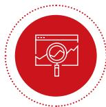

## 持续监督与改进机制

公司建立了完善的内部监督与持续改进机制。根据《内审及内控检查监督制度》，内部审计部在董事会审计委员会指导下，独立开展内部控制检查监督，通过定期与不定期审计，识别制度缺陷与实施问题，督促整改并跟踪落实。审计结果定期向董事会及监事会报告，并作为年度内部控制自我评价报告的基础，从而形成“监督-评价-改进”的管理闭环，确保持续提升内控与风险管理的有效性。

## 指标与目标

为客观衡量内控与风险管理体系的有效性，并设定明确的持续改进方向，公司结合年度工作计划，将重点关注以下关键绩效指标（KPIs）与管理目标：

<table><tr><td>指标类别</td><td>关键绩效指标 (KPI)</td><td>2025年</td><td>未来目标</td></tr><tr><td rowspan="2">内部控制有效性</td><td>年度内控审计/评价计划完成率</td><td>100%</td><td>保持100%</td></tr><tr><td>内控缺陷整改完成率(重大缺陷)</td><td>100%</td><td>保持100%,并致力零重大缺陷</td></tr><tr><td rowspan="2">风险文化培育</td><td>内控合规培训覆盖率</td><td>48.46%</td><td>稳步提升至 $\geqslant 60\%$ </td></tr><tr><td>风险管理文化培训覆盖率</td><td>87.58%</td><td>逐步覆盖全部高管及关键岗位全覆盖</td></tr><tr><td>审计监督</td><td>确认的舞弊或违规事件数量</td><td>0件</td><td>持续保持零重大合规事件</td></tr></table>

# 以新致胜驱动价值创造

在数字化浪潮与技术创新快速演进的背景下，金桥信息坚持以创新为核心驱动力，持续提升组织能力、技术实力与服务水平。公司秉持稳健与前瞻并重的发展理念，将科技创新、信息安全、服务质量与行业协同视为推动价值创造的重要支撑。通过强化治理体系、优化资源配置、完善风险与机遇管理，公司不断探索业务模式创新与技术应用落地的路径，以高标准、可持续的实践推动企业长期竞争力和社会价值的双向提升。

## 章节内容

创新驱动 29

数据安全与客户隐私保护 34

产品和服务安全与质量 38

行业共进 42

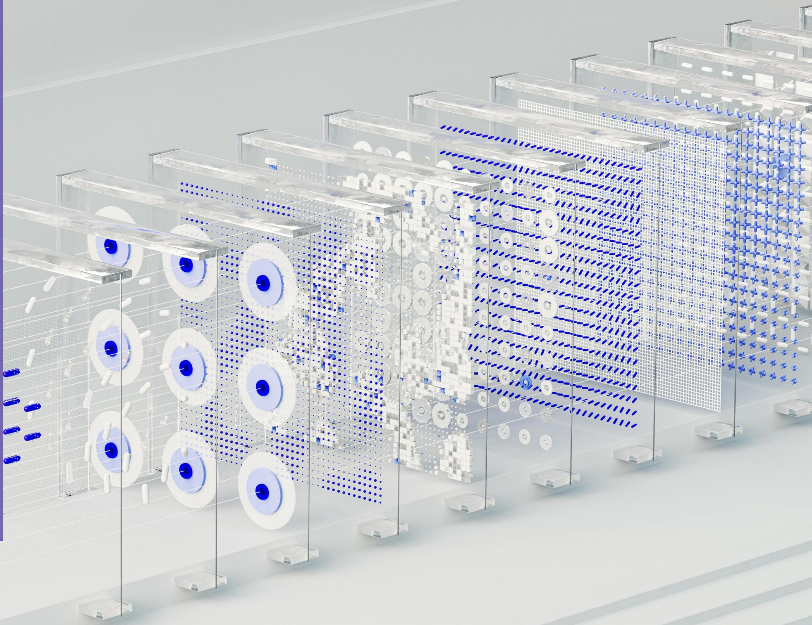

natural_image

3D rendering of server racks with blue circular components and transparent modules, no visible text or symbols

## 创新驱动

## 研发与创新

金桥信息坚持以自主创新为核心战略，聚售数字化与智能化技术在司法，教育等关键行业的应用，持续推动新兴业务场景的探索与落地。公司通过人工智能、大数据、区块链等技术与业务深度融合，推动行业数字化转型，提升服务效率与质量同时创造社会价值，助力司法公平、教育普惠等可持续发展目标的实现。

## 治理

在研发体系建设方面，公司构建了“总部研发中心+业务单元专项组”的二级研发架构。其中，总部研发中心统筹核心技术布局与中长期研发战略，重点推进基础技术的迭代升级与共性能力建设：各业务单元专项组则围绕具体业务场景和客户需求，推进技术成果的产品化与应用落地，形成“技术研发一场景验证一产品转化”的协同机制。

## 制度方面

公司制定了《员工职务发明奖励办法》等创新激励政策，鼓励员工提出创新方案和申请专利，确保知识产权成果及时申报和有效保护，为研发创新提供制度支撑。为保障研发过程规范有序、持续提升研发管理水平，公司已通过CMMI5(软件能力成熟度模型集成五级)评估认证，进一步巩固了在软件研发组织、技术能力及项目管理等方面的高标准管理体系。

## 研发资源投入方面

公司持续加大对核心技术攻坚，研发团队扩充及实验设备升级等领域的投入，为技术创新提供稳定保障。研发团队已形成覆盖算法研发、工程实现、系统测试等关键环节的专业梯队，为技术研发和项目交付提供有力的人才支撑。

## 战略

金桥信息坚持以技术创新驱动企业高质量发展，将创新研发作为公司核心战略的重要组成部分。公司围绕智慧司法、智慧政务、智慧教育等重点领域，持续推进人工智能、大数据、云计算、区块链等关键技术的前瞻布局与应用探索。

公司研发战略以“技术适配业务场景、驱动价值增量”为核心方向，在保持技术先进性的同时，注重技术与实际业务需求的深度融合，推动研发成果向产品和解决方案转化。通过跨部门协同、产学研合作及联合实验室建设等方式，公司不断完善创新生态，加快技术成果落地，提升行业智能化水平，为客户提供安全、高效、可持续的技术解决方案。

在持续推进创新研发和技术应用的过程中，公司系统识别并管理可能影响研发进度、技术成果转化及市场竞争力的关键风险，同时积极把握技术演进和业务拓展带来的发展机遇，持续巩固和提升自身技术优势。

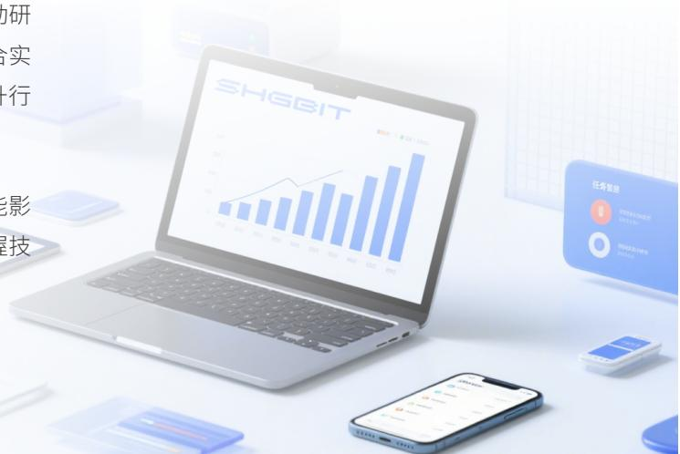

text_image

SHGBIT
任务简报
2019-2020
2020-2021
2021-2022
2022-2023
2023-2024
2024-2025
2025-2026
2026-2027
2027-2028
2028-2029
2029-2030
2030-2031
2031-2032
2032-2033
2033-2034
2034-2035
2035-2036
2036-2037
2037-2038
2038-2039
2039-2040
2040-2041
2041-2042
2042-2043
2043-2044
2044-2045
2045-2046
2046-2047
2047-2048
2048-2049
2049-2050
手机应用

<table><tr><td>风险类型</td><td>风险说明</td><td>潜在影响</td><td>应对措施</td></tr><tr><td>宏观经济波动风险</td><td>宏观经济波动可能传导至政企客户IT采购端,导致客户预算收紧</td><td>可能对研发项目推进节奏、订单获取及回款安排产生一定影响</td><td>加强客户需求调研和市场趋势分析,优化研发项目立项与资源分配,灵活调整研发节奏</td></tr><tr><td>技术迭代风险</td><td>人工智能、大数据等领域技术更新速度快,研发方向判断偏差或技术更新不及时</td><td>可能对研发投入产出效率及技术竞争优势产生一定影响</td><td>加大前沿技术预研投入,组建技术趋势跟踪机制;强化产学研合作;优化研发立项论证流程</td></tr><tr><td>人才流动风险</td><td>核心技术人员流动或高端人才招聘困难</td><td>可能对研发项目推进连续性及技术积累产生一定影响</td><td>建立人才培养与继任机制;完善激励与职业发展体系;加强知识管理与经验沉淀</td></tr><tr><td>知识产权风险</td><td>存在专利侵权或自主知识产权保护不足</td><td>可能对技术成果应用及相关业务开展产生一定影响</td><td>完善专利申请与管理机制;实施职务发明激励;定期开展专利布局与风险评估</td></tr><tr><td>项目执行风险</td><td>跨部门协作复杂,项目管理难度较高</td><td>可能对项目进度安排及资源配置效率产生一定影响</td><td>建立标准化项目管理流程;开展阶段性评审与风险监控;利用数字化工具提升协同效率</td></tr><tr><td>外部政策与监管风险</td><td>人工智能、数据处理等领域监管政策存在不确定性</td><td>可能对研发方向及项目推进安排产生一定影响</td><td>持续跟踪政策法规动态;加强合规审查;动态调整研发策略与方向</td></tr><tr><td>创新激励风险</td><td>创新激励机制不完善或执行不足</td><td>可能对员工参与创新活动的积极性及成果产出节奏产生一定影响</td><td>完善创新激励制度;建立与创新成果挂钩的绩效机制;加强创新文化建设</td></tr></table>

风险清单

<table><tr><td>机遇类型</td><td>机遇说明</td><td>潜在影响</td><td>应对措施</td></tr><tr><td>技术创新机遇</td><td>前沿技术(AI、大数据、区块链等)快速发展,为公司提供打造差异化解决方案和技术领先优势的机会</td><td>有助于提升公司技术能力及产品差异化水平</td><td>加大前沿技术预研投入;产学研合作共建实验室;开展创新项目孵化,加速技术成果转化</td></tr><tr><td>市场拓展机遇</td><td>政企客户数字化转型需求持续增长,为公司研发成果商业化提供市场空间</td><td>有助于拓展业务规模及应用场景</td><td>深入客户需求调研,优化产品与解决方案布局;结合行业场景开发定制化应用</td></tr><tr><td>政策与标准机遇</td><td>国家及行业政策鼓励科技创新与数字化转型,为研发项目提供政策支持和示范效应。</td><td>有助于提升公司项目获取能力及行业参与度</td><td>持续跟踪政策法规;研发符合政策标准的解决方案;参与国家和行业标准制定</td></tr><tr><td>跨界合作机遇</td><td>与高校、科研院所及科技企业的合作,可加速技术积累和成果转化</td><td>有助于促进技术积累及研发资源整合</td><td>建立长期战略合作关系;联合课题研究和技术攻关;共享研发平台和资源</td></tr><tr><td>智能化升级机遇</td><td>通过新技术应用提升产品安全性、智能化水平及服务效率</td><td>有助于提升产品功能完善程度及服务效率</td><td>开发AI运维分析、云管理平台及自动化巡检工具,提升故障预测能力和现场处理效率</td></tr></table>

机遇清单

## 影响、风险和机遇管理

在创新研发过程中，技术进步、市场变化及政策环境均可能对公司业务、客户及社会产生直接或间接影响。金桥信息高度重视研发活动中潜在的风险与机遇，建立了系统化的识别、评估与应对机制。公司通过前瞻性技术研判、产学研合作、人才激励等多维举措，既防范宏观经济波动、技术迭代、项目推进等潜在风险，也积极捕捉技术创新、市场拓展及政策支持等战略机遇，确保研发投入高效且可持续，为公司长期创新能力和竞争力提供有力保障。

## 案例

## 联合实验室推动智慧教育空间创新

2025年，金桥信息与浙江大学依托联合实验室，充分整合产学研优势资源，以“重构场景，激活体验，赋能创新”为核心目标，联合开发面向未来的智慧教学空间整体解决方案。该项目旨在推动教育空间从传统物理场所向智能化互动化的教学生态载体转型，通过前沿技术与教育实践的深度融合，实现教学环境、互动体验与学习成效的全面升级为教育数字化和可持续发展提供创新示范。

## 指标与目标

## 目标

公司将持续提升在人工智能、大数据等前沿技术领域的研发投入与创新能力，推动相关技术成果在智慧司法、智慧政务等重点领域的规模化落地应用：同时，持续完善研发管理体系与人才队伍建设，强化研发项目与公司战略的协同匹配，提升创新成果转化效率与应用价值。

## 指标

报告期内，公司研发投入总额达到 7,400.27万元， 占营业收入比例10.68%

公司研发人员规模达 198 人，占公司总人数的 25.06%

## 科技伦理

金桥信息始终将科技伦理作为技术研发与应用的核心准则，贯穿于产品设计、项目实施及技术服务的全过程，尤其在人工智能应用及敏感技术管理方面建立了完善的治理体系，以确保技术发展符合社会价值导向、法律法规及行业标准

## AI应用伦理实践

金桥信息开发的AI智能助教，可辅助教师完成课程答疑、知识拓展等任务。在系统设计中，公司建立了完善的意图识别与处理机制，对与教学目标无关的内容进行过滤，对潜在的逻辑攻击或恶意引导进行拦截，避免大模型偏见或“幻觉”造成教学误导。系统还会明确展示参考知识条目来源，确保内容可追溯、言之有据。整个流程中，大模型仅用于知识加工而非直接生成具体内容，从源头上降低了信息偏差和潜在风险。

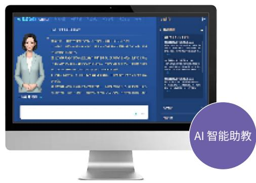

text_image

AI智能助教

## 人脸识别等敏感技术的设计与应用规范

金桥信息将科技伦理原则特别应用于生物特征识别(含人脸识别)、个人信息及其他敏感技术的设计与应用。公司要求一线设计人员在涉及个人信息的项目中，严格遵循《个人信息保护法》《网络安全法》《公共安全视频监控联网信息安全技术要求》等法律法规。在设计与实施中，全面遵循“合法合规、风险可控、权益保障”原则，通过动态脱敏、本地边缘计算多重认证和组合认证等技术手段，确保敏感信息在传输、存储和应用过程中的安全，同时避免技术对用户的强制性依赖保障社会价值与使用安全的高度统一。

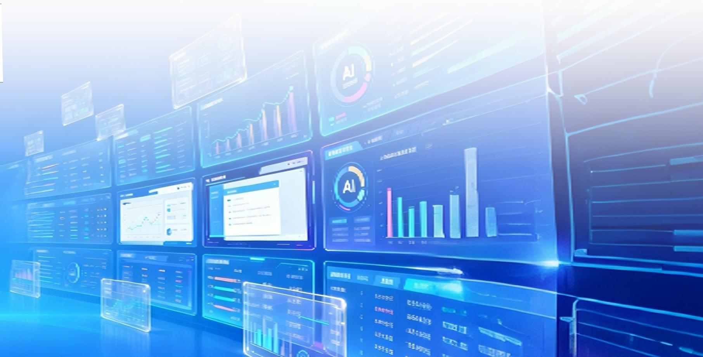

text_image

Dashboard display with AI-related charts and data dashboards, featuring multiple panels of charts and graphs.

## 案例

## 阻断潜在隐私风险的银行网点设计

2025年，金桥信息设计中心与相关业务部门对我国中部某省省会银行网点改建项目进行了研讨。在客户提出通过出入口人脸识别提升客户体验的方案时，设计中心基于国家和行业法律法规及标准，评估该方案可能导致客户隐私泄露和法律风险。最终，金桥信息建议客户优化方案，从源头上阻断潜在法律纠纷风险同时确保技术应用符合合规与伦理要求。

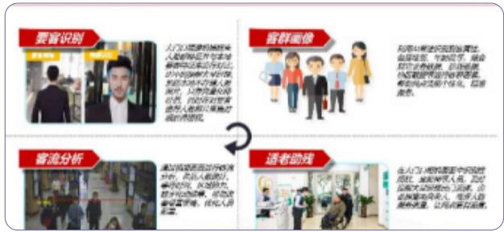

flowchart

This flowchart illustrates a four-step process for identifying and analyzing personnel, including identification, group photo, traffic analysis, and training.

某银行网点客户的原址改建方案设计

## 案例

## 适度可控的人脸识别应用于法院项目

2025年8月，金桥信息承接上海某法院的弱电设计丁作。对于庭审场景中提出的基于生物识别的需求，设计中心在设计与汇报阶段强调，若不在适度可控范围内使用，将影响法院日常工作及人员权益。公司提出合理化调整和优化建议，确保生物识别应用合规、安全，并获得客户专业认可。

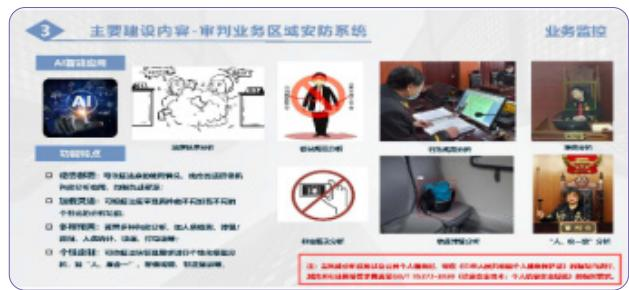

text_image

主要建设内容-审判业务区域安防系统
AI智能应用
功能要点
□ 使您都要，与您挑选的案例情况，结合当前信息的内控分析和预测，明确这些问题。
□ 加强灵活，可能通过多维度的分析来识别不同的个目标的识别范围。
□ 多种观察：通常多种识别分类，如人意模糊、增强！
□ 个人防护、防毒、行为监测。
□ 个性健康：对安防设备进行评估，包括但不限于安全监控、防尘、火灾、环境、医疗等。
业务监控
□ 作业规范：检查人员操作规范，确保人员在岗前能够掌握防护。如需及时执行，随时完成作业，可随时完成作业。

上海某法院的弱电项目方案设计

## 知识产权管理

金桥信息遵循国家法律法规及《GB/T29490-2013企业知识产权管理规范》的要求，制定了《知识产权管理制度》，以保障公司所持有的知识产权安全与合法权益。公司人力资源部会根据年度研发战略规划，编制新增知识产权申请预算，确保创新成果得到及时保护。

为激励技术创新，提升员工发明创造积极性，公司制定了《职务发明授权激励管理办法》，对于在中华人民共和国境内提出申请并经国家知识产权局授权公告的所有职务发明或设计专利，公司将向发明人或设计人发放奖励，确保职务成果得到及时申报和权益保障。

## 关键绩效

报告期内，公司专利数量如下

<table><tr><td>申请专利总数</td><td>项</td><td>12</td></tr><tr><td>申请商标总数</td><td>项</td><td>25</td></tr><tr><td>申请软件著作权总数</td><td>项</td><td>17</td></tr><tr><td>授权专利总数</td><td>项</td><td>2</td></tr><tr><td>授权商标总数</td><td>项</td><td>0</td></tr><tr><td>授权软件著作权总数</td><td>项</td><td>17</td></tr><tr><td>持有有效专利总数</td><td>项</td><td>25</td></tr><tr><td>持有有效商标总数</td><td>项</td><td>50</td></tr><tr><td>持有有效软件著作权总数</td><td>项</td><td>330</td></tr></table>

## 数据安全与客户隐私保护

数据安全与客户隐私保护是金桥信息正常经营的重要保障，公司严格遵守《中华人民共和国网络安全法》《中华人民共和国数据安全法》《中华人民共和国个人信息保护法》《移动互联网应用程序信息服务管理规定》《网络信息内容生态治理规定》等法律法规，遵照“统一规划、分级管理、积极防范、人人有责”的原则，通过构建完善的治理体系、制定科学的战略规划、实施全维度风险防控，形成全链条、多层次的安全防护格局，切实保障数据资产安全与客户的合法权益。

## 治理

公司高度重视数据安全与客户隐私保护的体系化建设，通过“制度先行、组织保障、标准认证”三重核心举措，筑牢安全管理根基。

制度层面，公司制定并实施了《信息安全管理制度》，明确了公司信息安全的总体方针与核心策略。该制度既是全体员工开展安全相关工作的基本遵循与指导纲领，也是公司构建完整、闭环安全管理体系的根本制度支撑，确保各项安全工作规范有序、有章可循。报告期内，公司已通过ISO27001信息安全管理体系认证，为数据安全与客户隐私提供专业化、系统化的保障。

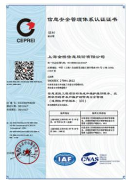

text_image

信息安全管理体系认证证书
（证书）
CCEPREI
上海金特信息安全股份有限公司
地址：上海市黄浦区四川路198号2幢201室
经营范围：网络工程、应急救援及医疗后勤服务401号（含30项）DAS
产品名称：DAS
ISSNIEC 79001-2022
公司发布申请文件后方可注册登记。
网络安全管理体系认证
网络安全工程技术研究中心集团和海外知识产权管理委员会
（境外资产权委托协议）：[1]
组织机构代码：CNYS
审批机关：中国证券监督管理委员会
批准事项
证书编号：CNYS
证书类型：IPF
证书有效期：2018年1月1日至2020年1月1日
证书编号：CNYS
证书编号：CNYS
证书编号：CNYS
证书编号：CNYS
证书编号：CNYS
证书编号：CNYS
证书编号：CNYS
证书编号：CNYS
证书编号：CNYS
证书编号：CNYS
证书编号：CNYS
证书编号：CNYS
证书编号：CNYS
证书编号：CNYS
证书编号：CNYS
证书编号：CNYS
证书编号：CNYS
证书编号：
CNYS
证书编号：
CNYS
证书编号：
CNYS
证书编号：
CNYS
证书编号：
CNYS
证书编号：
CNYS
证书编号：
CNYS
证书编号：
CNYS
证书编号：
CNYS
证书编号：
CNYS
证书编号：
CNYS
证书编号：
CNYS
证书编号：
CNYS
证书编号：
CNYS
证书编号：
CNYS
证书编号：
CNYS
证书编号：
CNYS
认证号：CNYS
证书编号：CNYS

ISO27001信息安全管理体系认证证书

管理层面，为保障制度落地与日常管理，公司建立以信息安全领导小组为管理机构、信息安全工作小组为执行机构的组织架构，负责信息安全建设、监控与防护的全流程管理。

## 信息安全领导小组

## 组长

负责信息化建设总体规划、设计决策、项目决策、流程决策、人员调配决策以及信息安全事故的应急协调和指挥

## 副组长

负责具体项目规划设计、人员召集、组织实施等工作，对工程质量负责，并负责人员培训，流程制定，需求确认，协助实施、安全事故应急响应等具体日程和事务

## 组长

直接对信息安全领导小组负责，负责信息安全领导小组宏观策略和项目规划的落地执行：在信息化领导小组的领导下，协调工作小组成员完成方案起草，流程收集需求汇总等工作；协调信息安全工作小组内部人员的工作分配，人员管理等。

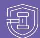

## 信息安全工作小组

## 副组长

协助信息安全工作小组组长完成宏观策略和项目规划的落地执行，任命信息安全角色和岗位，并明确各信息安全岗位的职责，组织并实施信息安全管理评审，督促各成员统一协作，完成方案起草，流程收集，需求汇总等工作。

## 组员

负责系统调试、日程维护、人员培训、人员组织、安全管理等具体工作。

信息安全领导机构组成与职责

## 战略

公司从物理安全、网络安全、应用安全、信息安全、运营安全及业务连续性等多维度制定信息安全战略规划，明确总体发展方向和工作重点。总体安全方针强调“提升全员信息安全意识，保障信息系统安全；强化信息安全管理，坚持以人为本”。

为确保战略落实，公司建立考核与评价机制，对各部门及员工在信息系统安全管理及责任落实方面进行量化评估，通过持续监控与考核，推动全员主动履行信息安全责任，保障战略有效落地。

在战略规划与落地过程中，金桥信息持续关注信息安全管理可能面临的各类风险，同时识别可利用的机遇，以提升整体防护能力和运营韧性，为战略执行提供参考依据。

<table><tr><td>风险类型</td><td>风险说明</td><td>具体描述</td><td>应对措施</td></tr><tr><td>数据泄露风险</td><td>数据处理规模大且涉及高敏感信息,对数据保护能力要求较高</td><td>公司核心业务涉及政务、司法、金融等敏感领域,其智慧空间解决方案和多元解纷平台需处理大量个人身份信息、司法案件数据及金融纠纷记录。若数据防护措施不足,可能引发数据泄露事件</td><td>制定《信息分类分级管理制度》,对不同敏感度数据实施差异化保护;出台《信息安全管理规定》《资产分类管理办法》,规范数据资产全生命周期管理流程</td></tr><tr><td>合规性风险</td><td>数据处理活动需持续符合监管要求及合规标准</td><td>公司业务需符合《数据安全法》《个人信息保护法》等法规要求,若未落实用户授权、数据脱敏等机制,可能面临监管关注</td><td>依法依规执行数据处理要求,落实用户授权、数据脱敏与匿名化处理措施</td></tr><tr><td>外部信息安全风险</td><td>网络攻击手段持续演进,外部安全威胁复杂化</td><td>网络攻击手段不断迭代升级,对公司信息系统安全防护能力提出更高要求</td><td>参与专业攻防演练,模拟真实攻击场景,提升应急处置能力;对外来数据连接及设备接入进行事前审批和安全审查</td></tr><tr><td>内部防控风险</td><td>内部人员操作及安全意识对数据安全管理具有重要影响</td><td>员工安全意识差异及操作不规范,可能带来内部数据安全隐患</td><td>常态化开展信息安全意识培训,夯实内部管理基础;规范操作流程,提升全员信息安全防护能力</td></tr><tr><td>技术安全与数据风险</td><td>研发及测试环节的数据与系统安全需持续强化</td><td>研发系统或测试数据可能存在安全漏洞或泄露风险,影响项目运行及客户信任</td><td>建立研发环境信息安全管理规范;定期进行渗透测试和安全培训;对敏感数据进行脱敏或加密处理</td></tr></table>

风险清单

<table><tr><td>机遇类型</td><td>机遇说明</td><td>潜在影响</td><td>应对措施</td></tr><tr><td>技术创新驱动</td><td>信息安全技术发展为能力提升提供支撑</td><td>提升服务技术水平,增强客户信任,形成差异化竞争优势</td><td>随着区块链、加密算法、AI监测等技术发展,公司可持续优化数据安全防护能力</td></tr><tr><td>政策与法规合规</td><td>合规要求推动数据治理体系持续完善</td><td>降低法律合规风险,增强企业信誉,获得政策支持和市场认可</td><td>严格遵守《数据安全法》《个人信息保护法》等法规,构建规范的数据处理体系</td></tr><tr><td>客户信任建设</td><td>信息安全能力成为客户选择的重要因素</td><td>增强客户粘性,推动业务拓展,提升市场份额。</td><td>通过信息安全管理体系及透明的数据保护机制提升客户信任</td></tr><tr><td>行业领导力</td><td>行业协同与标准建设带来发展机会</td><td>提升品牌形象与行业影响力,开拓跨行业合作机会</td><td>参与攻防演练、标准制定及安全培训,提升行业参与度</td></tr><tr><td>可持续发展价值</td><td>数据安全纳入ESG管理体系的重要组成部分</td><td>有助于ESG评级提升,增强投资者与利益相关方信任</td><td>将信息安全与隐私保护融入ESG管理与信息披露</td></tr></table>

机遇清单

## 影响、风险和机遇管理

身处信息技术服务行业，金桥信息深知业务的复杂性和敏感性，尤其涉及政务、司法和金融等领域的系统与数据安全。公司通过制度建设、技术防护和员工培训等多维举措，不断强化风险识别与应对能力，提升内部管理水平。公司积极引入第三方专业机构开展信息安全评估与审查，通过定期安全测评、漏洞扫描及合规性评估等方式，持续识别潜在风险并推动整改落实，不断提升信息安全管理的规范性与有效性。同时，公司将实战演练、培训及防护措施视为提升信息安全韧性的重要途径，通过这些实践增强客户信任，优化服务流程，并为行业信息安全管理提供经验借鉴

## 案例

## 网络安全实战攻防演练—“铸网2025·磐石行动”

2025年上海市通信管理局联合有关主管监管部门组织开展“铸网 2025”暨“磐石行动”2025年上海市工业和信息化领域网络安全实战攻防活动，金桥信息作为蓝方防守方参加本次安全演练活动。活动中，公司发现了系统存在的弱口令及安全漏洞，并在演练结束后及时开展整改工作，进一步完善内部信息安全防护措施。

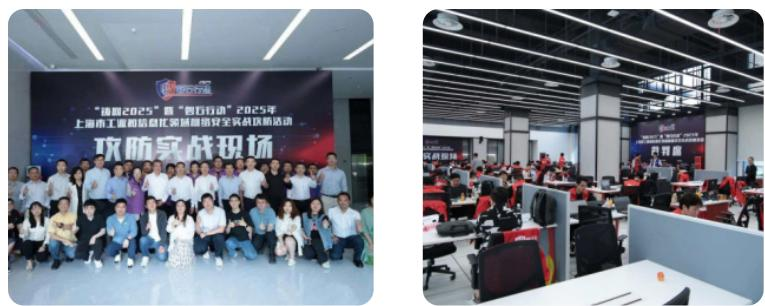  
攻防实战现场

## 案例

## 防钓鱼专项演练—提升员工安全意识

2025年上海市通信管理局开展“2025磐石行动一防钓鱼演练专项活动”，金桥信息被列为本次活动单位名单，活动通过线上开展，包含钓鱼邮件模拟演练，网络安全知识测评及安全意识问卷调研。公司共有60名员工参与，绝大多数员工顺利通过，通过率达到98.34%。通过本次演练，公司识别了潜在的安全风险并针对性地加强了员工网络安全教育与防护能力。

你险些被钓鱼邮件攻击

钓鱼邮件模拟演练截图

## 案例

## 线上信息安全培训——强化员工安全意识

2025年，公司组织开展线上信息安全意识培训，覆盖全体员工。培训内容包括信息安全政策解读、常见安全威胁防护及安全操作规范等，旨在提升员工在日常工作中识别与防范信息安全风险的能力，为企业数字化运营提供安全保障。

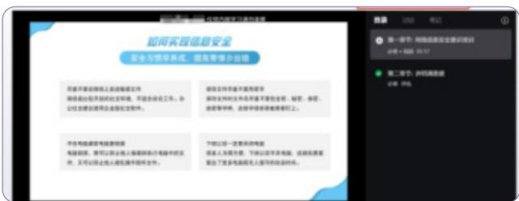

text_image

如何实现信息安全
安全习惯早养成，提高管理缺少措施

你需不要面临网上及运输敏感文件
确保您比您打开的社区环境，不适合绿化工作，孙公社支援您使用企业隐私文件。

你需支持你需不要将安全
解决文件时全外关系需不要包含信、秘密、保密、
秘密等事件，这样字母将该数据看红上。

不是电脑或电视需要提供
电脑或网，须以联系人根据网络进行电脑中的文件，
又可以防止他人委托他人存储文件。

下锁以后一定要向电脑
联系人发散方便，下锁以后要求电脑。这锁后需要
置出了更多电脑或光人要写的信息材料。

钓鱼邮件模拟演练截图

## 指标与目标

为完善数据安全与隐私保护工作，公司设定管理目标并持续监测目标达成情况

年度管理目标

2025年达成情况

不发生数据安全及客户隐私泄露等负面事件

已达成

## 产品和服务安全与质量

金桥信息始终秉持“真诚是金，共享为桥”的核心价值观，坚持“你放心，我才安心”的服务理念，通过系统化、规范化的管理措施，为客户提供安全、高效、智能化的服务，支持客户数字化转型与可持续发展目标的实现。

## 治理

为保障项目交付质量，金桥信息根据自身业务特性搭建了“决策层+执行层”的质量管理架构，覆盖服务全流程的三级质量管理体系。一级管理制度包括《项目管理规范》，明确服务标准与考核指标；二级流程涵盖运维工单、考勤、培训赋能等模块；三级表单包括《服务巡检记录表》《设备维修表》《客户满意度问卷》，实现服务全过程的可追溯性。

## 决策层

公司运维总监直接分管客户服务部，每月召开服务质量复盘会。

## 运营总监

客户服务部

## 执行层

技术支持组负责新项目筹建、重大技术难题攻克及高规格会议与活动保障工作：运维实施组负责客户现场的规范化日常维护、故障应急响应及问题解决承担现场巡检与系统优化

技术支持部

运维实施部

客户关系组

报告期内，公司已取得多项认证。质量管理方面，公司取得|SO9001质量管理体系认证，覆盖服务设计、交付全流程2025年通过年度监督审核，为服务质量提供治理保障。服务管理方面，公司取得ISOIEC20000-1信息技术服务管理体系认证证书、信息系统建设和服务能力登记证书、信息技术服务标准符合性证书。

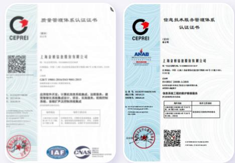

text_image

质量管理体系认证证书
CEPREI
上海金新信息服务有限公司
注册地址：上海市浦东新区浦东南路98号金新大厦21层
办公地址：上海市浦东新区浦东南路98号金新大厦21层
法定代表人：周明辉
CANTAI YUOZU SHENQI 90001-2015
经营范围：计算机软硬件及辅助设备、仪器仪表、通信器材的销售、技术开发、技术咨询、技术服务、工程管理、技术培训、技术交流、技术转让、技术推广
企业名称：中国电子科技集团公司
注册地址：北京市海淀区中关村大街1号
法定代表人：王洪波
CEPREI
ANAB
信息技术服务管理体系认证证书
（盖章）
上海金新信息服务有限公司
注册地址：上海市浦东新区浦东南路98号金新大厦21层
办公地址：上海市浦东新区浦东南路98号金新大厦21层
法定代表人：周明辉
CANTAI YUOZU SHENQI 90001-2015
经营范围：计算机软硬件及辅助设备、仪器仪表、通信器材的销售、技术开发、技术咨询、技术培训、技术交流、技术转让、技术推广
企业名称：中国电子科技集团公司
注册地址：北京市海淀区中关村大街1号
法定代表人：王洪波
CEPREI
ANAB
信息技术服务管理体系认证证书
（盖章）
上海金新信息服务有限公司
注册地址：上海市浦东新区浦东南路98号金新大厦21层
办公地址：上海市浦东新区浦东南路98号金新大厦21层

ISO9001质量管理体系认证证书(左)、ISOIEC 20000-1信息技术服务管理体系认证证书(右）

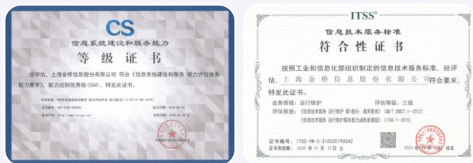  
信息系统建设和服务能力登记证书(左)、信息技术服务标准符合性证书（右）

## 战略

金桥信息构建了以“全国运维服务网络”为基础、以“OSC² 运营服务云中心”为核心、以“多维专业能力”为支撑的运维服务体系，通过智能化调度、精细化管理和标准化流程，保障服务质量持续提升。

## 全国运维服务网络

覆盖全国主要城市和核心区域，形成“本地响应+区域协同”的服务格局，实现客户现场巡检、设备维护的及时响应，并保障重大项目的全域覆盖。

## OSC²运营服务云中心

作为服务管理核心中枢，平台支持项目经理与现场执行人员实时交互、关键节点管控及问题排查，实现“人、事、物、流程”一体化管理，大幅提升运维效率和服务质量。

## 多维专业能力

标准化流程支撑服务质量稳定提升；技术能力结合AI、区块链、云计算等新技术，适配政务、司法、金融等行业安全需求；人才培养体系包括入职必修、理论实操、项目实践及考评，并推行持证上岗制度，强化应急处置能力。

<table><tr><td>风险类别</td><td>风险说明</td><td>潜在影响</td><td>应对措施</td></tr><tr><td>服务适配风险</td><td>不同行业客户需求差异对服务匹配能力提出更高要求</td><td>政务、教育等不同行业客户的安全需求差异较大,可能导致服务响应不精准</td><td>定期开展专项培训、流程标准化及客户沟通机制建设,提高员工技术能力和客户服务适配性</td></tr><tr><td>转型风险</td><td>技术快速迭代对产品与服务持续更新能力提出挑战</td><td>新技术快速迭代(如AI、区块链、云计算等),可能导致产品更新不及时或服务不符合最新安全标准</td><td>持续开展技术研发与内部培训,建立标准化运维流程及质量管控体系,确保产品与服务持续符合行业安全要求</td></tr><tr><td>重大场景保障风险</td><td>关键业务场景对服务连续性与稳定性要求较高</td><td>政务会议、司法庭审等关键场景对服务连续性要求极高,设备故障或响应延迟可能造成严重影响</td><td>制定重大会议保障流程及应急方案,建立全国运维网络快速响应机制,确保关键场景顺利运行</td></tr></table>

风险清单

<table><tr><td>机遇类别</td><td>机遇说明</td><td>潜在影响</td><td>应对措施</td></tr><tr><td>市场拓展机遇</td><td>服务能力提升为业务拓展提供支撑</td><td>高质量服务可增强客户信任度,为政务、教育、司法等行业客户提供差异化竞争优势</td><td>建立全国运维网络和 $OSC^2$ 云平台,提供标准化、可扩展的运维服务,支持客户数字化转型</td></tr><tr><td>可持续发展机遇</td><td>服务模式优化有助于提升资源利用效率</td><td>通过标准化流程和智能化管理实现低碳、高效运维,推动绿色服务理念落地</td><td>推行远程运维、故障预测及培训优化,降低出行和设备消耗,实现服务流程节能化</td></tr><tr><td>品牌与声誉机遇</td><td>服务质量提升有助于增强品牌影响力</td><td>提升服务质量和客户满意度,有助于建立公司在行业内的领导力和可信赖形象</td><td>定期客户满意度调查、培训效果评估及持续改进,强化品牌价值和社会责任体现</td></tr></table>

机遇清单

## 影响、风险和机遇管理

在产品与服务安全与质量方面，金桥信息持续关注关键风险，包括技术快速迭代、复杂场景保障及服务适配等，同时也积极把握数字化转型和新兴业务发展带来的机遇。公司通过培训与能力建设等措施，将风险管理落到具体实践中，确保服务质量稳步提升并实现客户价值最大化

## 案例

## 音视频系统架构深度培训

2025年9月，公司为提升技术人员对复杂系统的理解能力与操作水平，开展全员音视频系统架构、网络集成及故障诊断专项培训。培训由华为认证工程师授课，采取“理论解析+实操演练”相结合的方式，确保知识掌握与技能落地。培训结束后，参训技术人员对系统掌握度达到95%，系统操作得分由65分提升至92分，故障自主解决率提升至82%平均维修时间缩短28%。通过优化人员技能与流程执行，培训有效降低设备空耗，支持服务流程的低碳化运行。

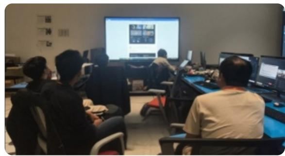

natural_image

Interior of a control room with multiple operators seated at desks facing a large screen displaying a diagram (no visible text or symbols)

音视频系统架构深度培训现场

## 案例

## 音频系统维护专项培训

2025年10月，为解决音频系统故障相关问题，金桥信息组织技术人员开展数字音频处理与网络技术专项培训，培训由高级工程师通过原理讲解、案例分析与实操演练进行授课。培训考核通过率 100%，平均得分 93 分，实现疑难故障定位时间缩短至15分钟，显著减少排查问题次数降低交通排放与服务资源浪费。

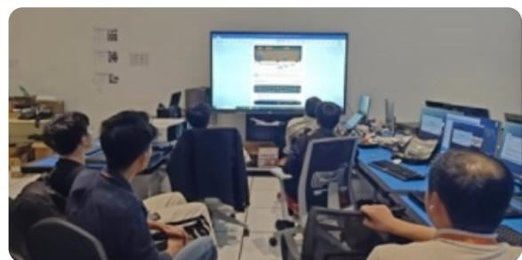

text_image

Office scene with employees at workstations and a large screen displaying a software interface, likely for remote access or data analysis.

音频系统维护专项培训

## 案例

## 服务标准流程培训

2025年10月，为建立统一规范的服务体系，金桥信息组织新区域技术人员开展服务标准流程培训。由项目经理通过流程示范与场景模拟，开展标准化巡检、设备操作及客户服务礼仪培训。培训后标准流程掌握度由75分提升至95分，服务文档规范率达100%，客户沟通效率显著提升，为持续提高服务质量和客户满意度奠定基础。

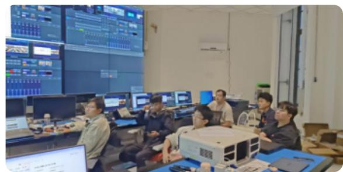

text_image

Control room scene with operators monitoring multiple screens displaying data and charts, including a computer labeled '数据源' (Data Source).

服务标准流程培训现场

## 指标与目标

## 目标

公司将持续提升在人工智能、大数据等前沿技术领域的研发投入与创新能力，推动相关技术成果在智慧司法、智慧政务等重点领域的规模化落地应用；同时，持续完善研发管理体系与人才队伍建设，强化研发项目与公司战略的协同匹配，提升创新成果转化效率与应用价值。

<table><tr><td>维度</td><td>目标</td><td>2025年达成情况</td></tr><tr><td>响应服务方面</td><td>设立驻场项目维持“随时响应服务、5分钟内到达现场、30分钟内解决常规问题”的高标准</td><td>已达成</td></tr><tr><td>专业技能与客户服务方面</td><td>设立“将一线问题自主解决率提升15%以上”的目标,同时围绕客户满意度、产品服务相关负面事件等指标对客户服务质量进行持续监测</td><td>已达成</td></tr></table>

## 指标

<table><tr><td>报告期内,响应服务方面,团队一线问题自主解决率从65%提升至82%(提升26.2%),平均维修时间从25分钟降至18分钟(效率提升28%),显著超越年度目标。</td><td>在客户满意度方面,公司通过开展客户调研问卷等方式,从服务响应效率、专业技术水平、服务态度、服务规范、公司形象五个维度进行调研,2025年客户满意度为94%。</td><td>报告期内公司未发生产品服务相关的质量重大责任事故。</td></tr></table>

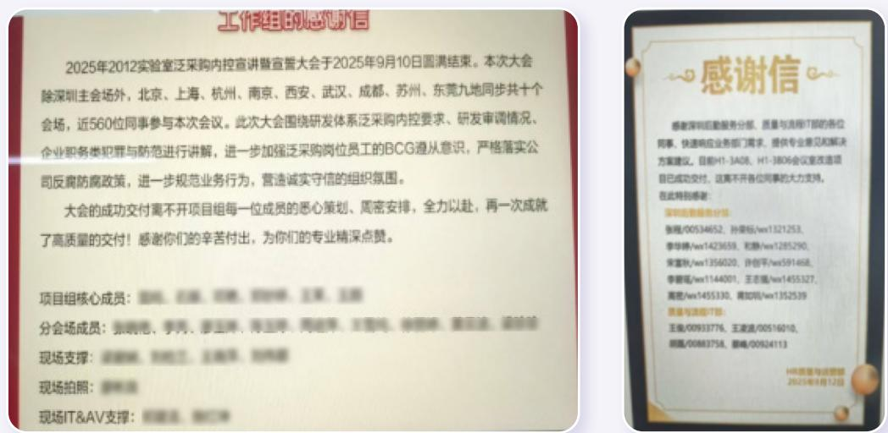  
深圳华为感谢信

## 行业共进

金桥信息秉持“Al for All”战略理念，持续将前沿技术应用于智慧法治、智慧政务、智慧交通、智慧应急、智慧医疗、智慧能源等多个关键行业场景。公司通过参与国家级和行业级重点活动，推动技术创新与产业实践深度融合。在主题演讲、生态倡议、成果展示及荣誉评选等多种形式下，金桥信息不仅展示了技术能力的广度与深度，更积极承担行业发展与社会责任，将技术优势转化为促进行业可持续发展的实际行动和影响力。

《企业知识库建设基本要求》T/SPFRDI 004—2025

《智能建筑行业社会责任指南》TB/SIBCA 0401-2024

《科创企业知识产权全过程管理指南》T/SPFRDI002-2024

《企业研发机构管理基本要求》T/SPFRDI 001-2023

《区块链应用安全评估指南》T/SHBTA 005-2023

公司参与制定的行业、团体标准

  
国家级

<table><tr><td>参会主体</td><td>协会名称</td><td>级别</td></tr><tr><td rowspan="11">金桥信息</td><td>中国互联网协会</td><td>普通会员</td></tr><tr><td>中国建筑业协会(绿色建造与智能建筑分会)</td><td>普通会员</td></tr><tr><td>中国演艺设备技术协会</td><td>理事单位</td></tr><tr><td>中国演出行业协会</td><td>会员单位</td></tr><tr><td>中国演艺设备技术协会</td><td>会员单位</td></tr><tr><td>全球企业房地产协会(CoreNet Global)中国分会</td><td>会员单位</td></tr><tr><td>中国教育技术协会</td><td>会员单位</td></tr><tr><td>中国电子信息行业联合会</td><td>会员单位</td></tr><tr><td>中国舞台美术学会</td><td>会员单位</td></tr><tr><td>中国录音师协会</td><td>理事单位</td></tr><tr><td>中国演艺设备技术协会江苏省办事处</td><td>省级</td></tr><tr><td rowspan="4">金桥科技</td><td>低空经济产业联盟</td><td>会员单位</td></tr><tr><td>中国保密协会</td><td>理事单位</td></tr><tr><td>中国电子信息行业联合会</td><td>会员单位</td></tr><tr><td>中国录音师协会</td><td>理事单位</td></tr></table>

## 地方级

<table><tr><td>参会主体</td><td>协会名称</td><td>级别</td></tr><tr><td rowspan="26">金桥信息</td><td>安徽省舞台美术学会</td><td>理事单位</td></tr><tr><td>上海市安全防范报警协会</td><td>常务理事单位</td></tr><tr><td>上海区块链技术协会</td><td>副会长单位</td></tr><tr><td>上海市物联网行业协会</td><td>理事单位</td></tr><tr><td>江苏省舞台美术学会</td><td>省级</td></tr><tr><td>上海市计算机行业协会</td><td>理事单位</td></tr><tr><td>上海市经济和信息化发展研究中心</td><td>理事单位</td></tr><tr><td>上海市民防工程行业协会</td><td>理事单位</td></tr><tr><td>武汉勘察设计协会</td><td>会员单位</td></tr><tr><td>北京市高等教育学会信息技术研究分会</td><td>会员单位</td></tr><tr><td>江苏省高等学校教育信息化研究会</td><td>会员单位</td></tr><tr><td>江苏省计算机学会</td><td>会员单位</td></tr><tr><td>上海市智能建筑建设协会</td><td>会长单位</td></tr><tr><td>安徽省民用航空学会</td><td>会员单位</td></tr><tr><td>上海市科技企业联合会</td><td>会员单位</td></tr><tr><td>上海市合同促进会</td><td>会员单位</td></tr><tr><td>上海新沪商联合会</td><td>副会长单位</td></tr><tr><td>上海通用航空行业协会</td><td>会员单位</td></tr><tr><td>上海法律科技协会</td><td>会员单位</td></tr><tr><td>广州市大数据行业协会</td><td>会员单位</td></tr><tr><td>上海市杭州商会</td><td>会员单位</td></tr><tr><td>上海市商用密码行业协会</td><td>副会长单位</td></tr><tr><td>南京市低空经济产业协会</td><td>会员单位</td></tr><tr><td>江苏省高校网络技术专业委员会</td><td>会员单位</td></tr><tr><td>北京声光视讯行业协会</td><td>副会长单位</td></tr><tr><td>上海市浙江商会</td><td>副会长单位</td></tr><tr><td rowspan="4">金桥科技</td><td>安徽省民防协会</td><td>会员单位</td></tr><tr><td>上海市保密协会</td><td>会员单位</td></tr><tr><td>上海市国防科技工业协会</td><td>会员单位</td></tr><tr><td>上海市合同促进会</td><td>会员单位</td></tr></table>

公司所参加的行业协会

## 案例

## 2025“数通链谷”杯第七届长三角区块链应用创新大赛

作为上海区块链技术协会副会长单位及大赛协办单位，金桥信息依托在智慧法院等垂直领域积累的区块链技术应用经验，为参赛团队提供产业视角与技术指导，助力提升创新方案的可落地性与行业适用性。公司通过全程支持与交流，促进区块链技术在金融、政务及产业链条的落地应用，推动构建更加完善、可持续的区块链产业生态。

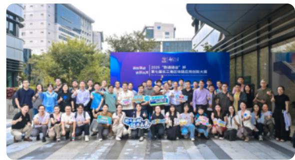

text_image

2023年“一带一路”主题
暨“一带一路”重大改革专题暨国际大赛
中国·北京·北京·北京·北京·北京·北京·北京·北京·北京·北京·北京·北京·北京·北京·北京·北京·北京·北京·北京·北京·北京·北京·北京·北京·北京·北京·北京·北京·北京·北京·北京·北京·北京·北京·北京·北京·北京·北京·北京·北京·北京·北京·北京·北京·北京·北京·北京·北京·北京·北京·北京市
中国·北京·北京·北京·北京·北京·北京·北京·北京·北京·北京·北京·北京·北京·北京·北京·北京·北京·北京·北京·北京·北京·北京·北京·北京·北京·北京·北京·北京·北京·北京·北京·北京·北京·北京·北京·北京·北京·北京·北京·北京·北京·北京·北京·北京·北京·北京·北京·北京·北京市
2023年“一带一路”主题
暨“一带一路”重大改革专题暨国际大赛

2025“数通链谷”杯第七届长三角区块链应用创新大赛

## 案例

## 2025第十一届中国（上海）国际技术进出口交易会商用密码专题展

金桥信息在本次商用密码展中展出的信息化解决方案，深度融合商用密码技术与区块链架构，覆盖数据安全、可信存证、智能合约监管等核心场景。方案通过国密算法强化隐私保护，构建从数据生成、传输到存储的全生命周期安全体系，为金融、政务、供应链等领域提供符合等保2.0要求的数字化转型支撑，切实响应“新质生产力”对技术安全性与可靠性的高标准需求。

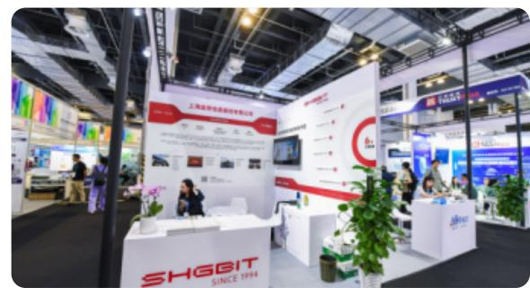

text_image

上海安吉达科技有限公司
SHGBIT
SINCE 1994

2025第十一届中国（上海）国际技术进出口交易会商用密码专题展

## 案例

## 2025 第七届个贷资产管理与处置论坛

本届论坛以“多元化举措化解个贷不良”为主题，汇聚全国行业协会、银行、消费金融机构、AMC及投资处置机构的行业精英，共同探讨个贷不良资产的多元化处置策略推动行业高质量发展。论坛特设颁奖环节，表彰在个贷不良市场中表现卓越的机构与创新力量，金桥信息获评“年度杰出金融科技创新企业”。通过深度参与行业交流与创新实践，公司积极推动金融科技在不良资产管理中的应用，体现企业对行业健康发展与社会责任的持续贡献。

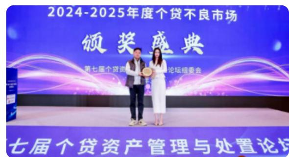

text_image

2024-2025年度个贷不良市场
颁奖盛典
第七届个贷难贷管理论坛组委会
七届个贷资产管理与处置论坛

2025第七届个贷资产管理与处置论坛

公司在关键行业和国家重点活动中的参与，持续推动产业智能化发展和技术应用落地，同时增强行业可持续发展能力，为构建智慧、低碳和安全的行业生态体系提供支持。

## 以人为本共筑和谐职场

金桥信息始终将“以人为本”作为企业发展的核心基石，通过构建涵盖人才吸引、培养、激励与保障的全周期管理体系，系统化推动和谐职场生态建设。公司以战略为导向完善雇佣机制依托校企合作拓宽人才渠道，并通过双通道晋升、分层培训体系促进员工成长；同时，通过制度化福利关怀、民主沟通机制及健全的安全健康管理体系，切实保障员工权益与福祉。这些举措不仅提升了组织凝聚力与人才效能，更在制度保障与文化浸润中形成了员工与企业共同发展的良性循环，为公司的可持续增长与社会责任实践奠定了坚实基础。

## 章节内容

人才吸引 47

人才培训与发展 50

员工福利与权益保障 53

员工健康与安全 57

natural_image

Overhead view of hands clasping together on a wooden table with documents and a laptop in the background (no visible text or symbols)

## 人才吸引

金桥信息构建了以战略为导向、程序规范、渠道公开的雇佣管理体系。公司严格遵守并制定《员工手册》《工薪与人事流程》等制度，通过标准化的招聘流程与ERP系统支撑，实现了从需求提出到正式入职的全链条规范化管理，确保了“严格把关规范程序”原则的有效落地。

公司在雇佣管理中坚持公平、公正、公开原则，倡导多元化与包容性的用工环境，在招聘、录用、晋升等环节中杜绝因性别年龄、民族、宗教信仰等因素产生的任何形式的歧视。同时，公司严格遵守相关法律法规，坚决禁止雇佣童工及任何形式的强制劳动，持续强化用工合规管理。

## 员工雇佣

金桥信息的员工雇佣工作紧密围绕公司战略展开，以支持业务发展和人才梯队建设为核心目标。公司根据年度业务发展方向确定各部门编制，并由人力资源部主导实施规范的招聘流程，旨在为各业务部门甄选并引进不仅符合岗位需求，更能契合公司战略、具备发展潜力、学习能力和自驱力的优秀人才。在具体执行中，公司持续完善招聘标准与评估机制，确保选拔过程公平、透明。在部分招聘岗位中，对于能力水平相当的候选人，公司优先考虑退伍军人(如司机、驻场运维等岗位)以实际行动支持退役军人就业与社会融入。

同时，公司在招聘及用工全过程中落实反歧视政策，严格开展用工年龄核验及用工合规审查，防范童工及强制劳动风险保障员工合法权益。

## 注重品德 德才兼备的原则

应聘者首先要诚实、可信，有良好的职业道德和高度的敬业精神，积极的心态，同时具备相应的专业素质、工作能力及从业经验等

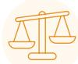

## 公开、公正公平的原则

任何职位的招聘必须在此原则基础上择优录取，无论对内、对外招聘均要公开进行，无论何人参加应聘均要一视同仁

## 严格把关的原则

所有人员的招聘，须经分管领导或总经理批准后进行，人员增加的理由必须充分

## 按需设岗按岗招聘的原则

招聘岗位的工作职责及对任职者的要求必须明确，避免员工因工作内容定义不清晰而产生的抱怨及争议

招聘的基本原则  
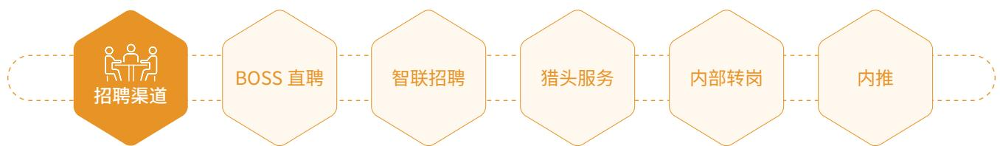

flowchart

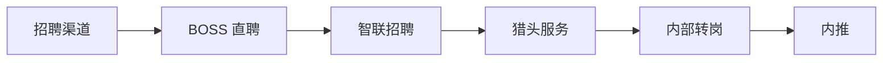
```mermaid
graph LR
  A["招聘渠道"] --> B["BOSS 直聘"]
  B --> C["智联招聘"]
  C --> D["猎头服务"]
  D --> E["内部转岗"]
  E --> F["内推"]
```

招聘渠道

公司积极深化校企合作，通过开展“访企拓岗”等专项交流，推动人才共育与资源共享。这些举措不仅为公司精准引进了契合战略、具备发展潜力的优秀人才，也为高校学子开辟了职业发展新路径，体现了公司在保障雇佣公平透明、履行人之培养社会责任方面的持续努力。

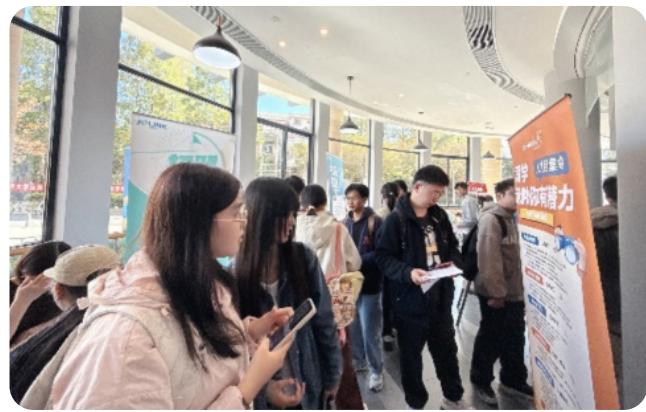

text_image

Street photo with visible store signboards and people browsing brochures in a public indoor space

上海师范大学秋季校招双选会

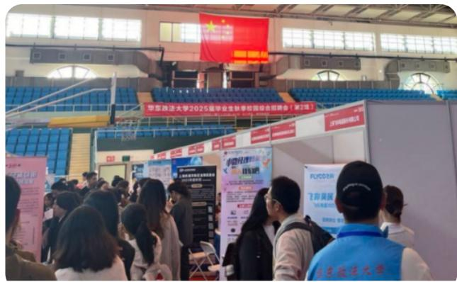

text_image

华东政法大学2025届毕业生秋季校园综合招聘会（第2班）
华东政法大学
华东政法大学

华东政法大学春季校招双选会

## 案例

## 金桥信息中传校招—产学研协同前移人才战略双向赋能

2025年11月，金桥信息业务骨于与人力资源部团队前往中国传媒大学，与计算机与网络空间安全学院院级领导就校企合作展开深度交流，并通过举办校园宣讲会同步推广雇主品牌、招聘专业技术人才。这一实践通过产学研用协同将人才战略前移，既为公司数字安全业务储备了高质量技术人力，也以产业资源反哺高校教育，践行了企业对青年人才培养的社会责任，实现了商业价值与教育价值的双向赋能。

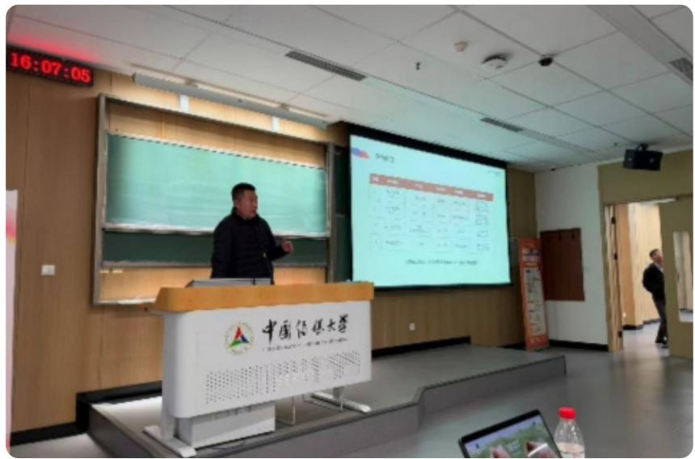

text_image

16:07:05
中国传媒大学

金桥信息在中国传媒大学举办校招宣讲会

## 关键绩效

报告期内，公司共计招聘入职新员工

56 人

## 案例

##

2025 年 6 月，华东政法大学学生就业中心常务副主任一行到访金桥信息上海总部。双方围绕AI技术在智慧高校与法律科技领域的应用落地，以及法学生职业发展路径等议题进行了深入交流，旨在共同探索校企合作新模式，为法学生拓宽在科技时代的就业视野。

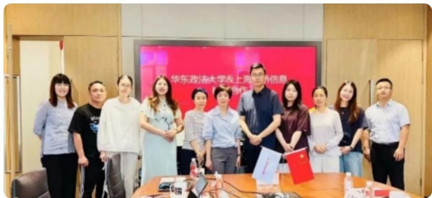

text_image

华东政法大学&上海经济信息
合作

华东政法大学访企拓岗交流

## 案例

## 访企拓岗促就业，产教融合育新才

2025年5月，中国传媒大学计算机与网络空间安全学院院长、教工党支部书记等一行访问金桥信息北京分公司，开展“访企拓岗促就业”专项交流。双方就人才培养、实习就业、产学研协同及AI产品共创等议题进行深入探讨。此次交流有效推动了校企双方在人才培养与科技创新领域的协同合作，为探索产教融合新模式奠定了坚实基础。

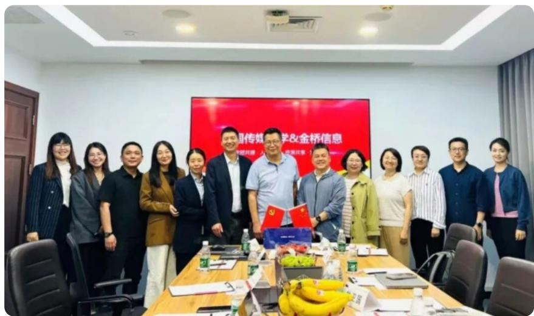

text_image

金桥信息
传媒科学&金桥信息

中国传媒大学访企拓岗交流

## 关键绩效

790人

## 人才培训与发展

金桥信息将人才培训与发展作为支撑企业可持续发展的核心战略，构建了贯通员工成长全周期的系统化培养体系。公司以“诊断-设计-实施-评估”闭环管理为核心，通过新员工融入计划、常态化日常培训、内部讲师知识共享及专项业务赋能等项目，实现从文化认同、技能提升到战略协同的多层次人才开发。这一体系不仅覆盖全员职业发展路径，更通过技术与管理双通道晋升机制，将个体成长与组织目标深度融合，为企业持续进化提供了坚实的人才引擎。

## 员工晋升

公司建立了系统化的双通道员工晋升机制，覆盖全体正式员工与劳务派遣人员，旨在科学识别人才并支持其长期职业发展公司设置技术序列与管理序列两条职业发展路径，为员工提供清晰的成长阶梯与发展方向。晋升评定遵循“德才兼备、择优晋升”的原则，综合考虑员工的业绩表现、专业能力及发展潜力，确保内部选拔过程公平、公正、透明，持续优化人才梯队结构。

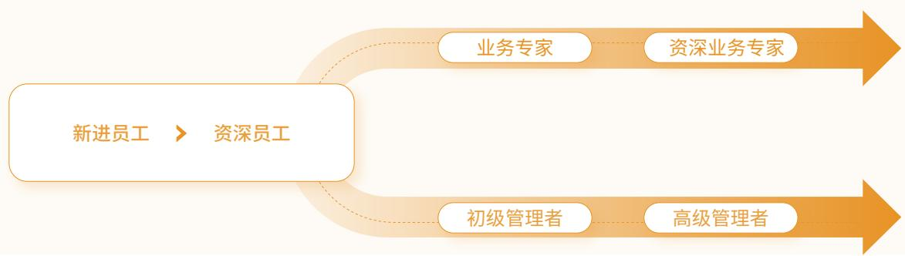

flowchart

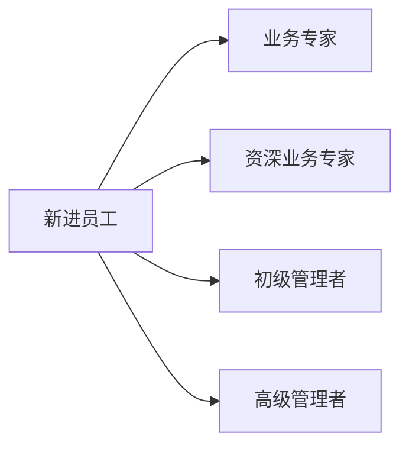
```mermaid
graph LR
  A["新进员工"] --> B["业务专家"]
  A --> C["资深业务专家"]
  A --> D["初级管理者"]
  A --> E["高级管理者"]
```

晋升机制

## 绩效考核

公司建立了覆盖全体正式员工及劳务派遣人员的绩效考核体系，考核周期包括试用期考核，季度绩效考核，半年度绩效者核及年度绩效考核。为提升考核管理的规范性与效率，公司依托多平台开展绩效管理工作，其中钉钉智能绩效主要用于证用期及部分部门季度考核，钉钉宜搭平台覆盖运维人员考核，ERP平台用于其余人员的半年度及年度绩效考核。通过信息化手段支撑绩效数据的记录与分析，推动绩效管理的规范化与精细化。

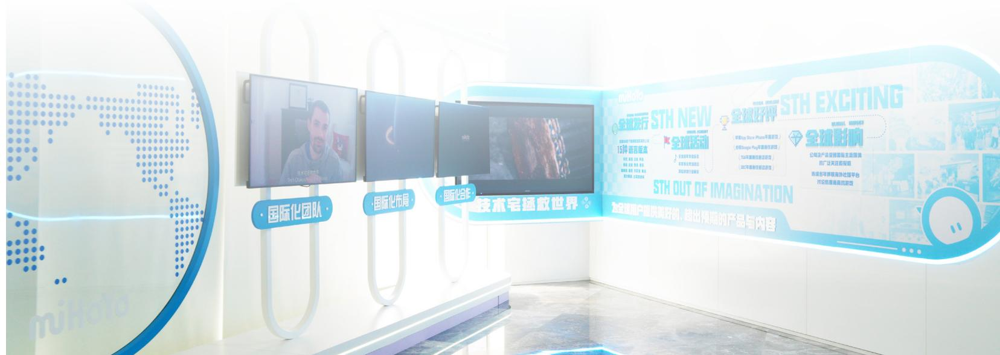

text_image

miHoLo
· 国际化团队 ·
· 国际化布局 ·
· 国际化合作 ·
技术宅拯救世界 ·
STH NEW
STH EXCITING
全球好伴
全球好伴
全球好伴
全球好伴
全球好伴
全球好伴
全球好伴
全球好伴
全球好伴
全球好伴
全球好伴
全球好伴
全球好伴
全球好伴
全球好伴
全球好伴
全球好伴
全球好伴
全球好伴
全球好伴
全球好伴
全球好伴
全球好伴
全球好伴
全球好伴
全球好+
15种语言版本
中国·美国·日本·韩国·印度·南非
美国·英国·加拿大·英国
美国·法国·意大利·意大利
美国·西班牙·瑞士法郎
美国·瑞典·匈牙利·葡萄牙
美国·新加坡·新加坡·新加坡
美国·马来西亚·菲律宾·菲律宾
美国·越南·菲律宾·菲律宾
美国·泰国·泰国·泰国
美国·印度·印度·印度尼西亚
美国·南非·南非·南非尼西亚
美国·南非·南非·南非尼西亚
美国·南非·南非·南非尼西亚
美国·南非·南非·南非尼西亚
美国·南非·南非·南非尼西亚
美国·南非·南非·南非尼西亚
美国·南非·南非·南非尼西亚
美国·南非·南非·南非尼西亚
美国·南非·南非·南非尼西亚
美国·南非·南非·南非尼西亚
美国·南非·南非·韩国尼西亚
美国·南非·南非尼西亚
美国·南非·南非尼西亚
美国·南非·南非尼西亚
美国·南非·南非尼西亚
美国·南非·南非尼西亚
美国·南非·南非尼西亚
美国·南非·南非尼西亚
美国·南非·南非尼西亚
美国·南非·南非尼西亚
美国·南非·南非尼西亚
美国·南非·南非尼西亚
美国·南非·南非尼西亚
美国·南非·南非尼西亚
美海用户提供最好的，超出预期的产品与内容

## 员工培训

公司围绕业务发展与岗位能力要求，构建分层分类的员工培训体系，持续提升员工的专业能力与综合素养。在培训内容设计上，公司紧密结合年度经营重点与业务实际需求，组织业务部门遴选经验丰富的骨于人员参与课程共建，通过真实项目案例与实践经验分享，提升培训内容的针对性与实用性。

在培训实施过程中，公司注重知识的系统沉淀与有效传承，依托内部知识管理平台，将专家经验、项目方法论及业务要点进行结构化整理形成可复用的知识资源库。同时，公司倡导“传帮带”的学习文化通过导师辅导、经验交流及跨部门协作等方式，促进知识在组织内部的共享与流动。

## 新员工培训

金桥信息高度重视新员工的融入与成长，构建了线上线下相结合的立体化培训体系。新员工入职一周内需通过“知学云”线上学习平台完成系统性的学习地图培训及考核，核心目标是使其快速掌握公司规章制度、业务流程及自研产品特性。此外，公司不定期组织线下新员工培训，通过分享经典案例与资深员工的“金桥故事”，深入解读岗位职责与学习路径，并现场答疑解惑。这一系列举措旨在将“真诚是金，共享为桥”的核心价值观融入入职初期体验，帮助新员工不仅理解公司运作机制，更能从情感上认同并快速融入金桥的学习型组织文化。

## 日常培训

金桥信息建立了系统化、常态化的员工培训体系，将学习深度融入日常工作。公司每月发布课程计划并明确必修人员，每周五以线上线下直播及平台录播等灵活形式开展培训，并通过系统指派催办、统计学分数据等方式保障实施。这一机制不仅保障了员工知识与技能的持续更新，更通过闭环管理为组织发展提供了稳定的人才支撑。

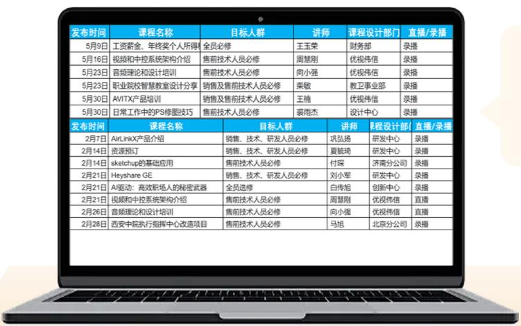

text_image

发布时间
课程名称
全员必修
王玉荣
课程设计部门
直播/录播
5月9日
工资薪金、年终奖个人所得税
5月16日
视频和中控系统架构介绍
售前技术人员必修
周慧刚
优视伟信
录播
5月23日
音频理论和设计培训
售前技术人员必修
向小强
优视伟信
录播
5月23日
职业院校智慧教室设计分享
销售及售前技术人员必修
柴敏
教卫事业部
录播
5月30日
AVITX产品培训
销售及售前技术人员必修
王楠
优视伟信
录播
5月30日
日常工作中的PS修图技巧
售前技术人员必修
裘雨杰
设计中心
录播
发布时间
课程名称
目标人群
讲师
课程设计部门
直播/录播
2月7日
AirLinkX产品介绍
销售、技术、研发人员必修
巩弘扬
研发中心
录播
2月14日
资源预订
销售、技术、研发人员必修
夏铭琦
研发中心
录播
2月14日
sketchup的基础应用
售前技术人员必修
付琛
济南分公司
录播
2月21日
Heyshare GE
销售、技术、研发人员必修
刘小军
研发中心
录播
2月21日
AI驱动：高效职场人的秘密武器
全员选修
白传旭
创新中心
录播
2月21日
视频和中控系统架构介绍
售前技术人员必修
周慧刚
优视伟信
直播
2月26日
音频理论和设计培训
售前技术人员必修
向小强
优视伟信
直播
2月28日
西安中院执行指挥中心改造项目
售前技术人员必修
马旭
北京分公司
录播

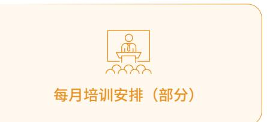

text_image

每月培训安排（部分）

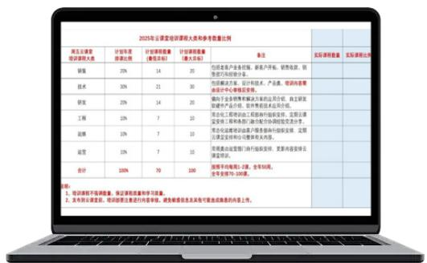

text_image

2025年云课堂培训课程大类和参考量统计
周玉课堂
培训课程大类
计划课程
预测比例
计划课数量
(重选目标)
计划课数量
(重选目标)
备注
实际课程数量
实际课程比例
销量
20%
14
20
包括老客户业务范围、新车产品、销售政策、销售规则和促销业务。
技术
30%
21
30
培训解决方案、设计标准、产品线、培训内容需适应专业心理型管理。
研发
20%
14
20
借助于金融理财和解决方案的应用创新，自主研发基础理财产品介绍、宣传等信息技术应用。
工程
10%
7
10
周玉化学工程部由工程部进行验收评估，本周从课堂室学习工程部与施工单位进行协同验收评审。
直播
10%
7
10
周玉化学直播项目由客户提供合作对接支持，定期从课堂室到公司整体需求沟通。
运营
10%
7
10
周玉集团办公室部门执行验收安排，更新内容安全运营情况。
合计
100%
70
100
周玉学院教师1班、全车18班，
全车安排70-100班。
说明：
1. 咨训课程不准确测量，保证课程质量和作业质量。
2. 发布项目实验室，培训步骤注重进行内容导报，增强情感信息及其他可重复生成的内容上传。

云课堂培训课程

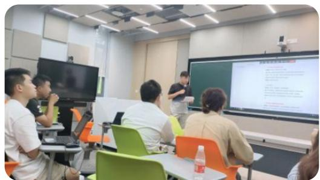

text_image

Classroom scene with students and a teacher at a presentation, visible slide text and presentation screen in Chinese

线下新员工培训

## 案例

## 金桥信息内部讲师线上课程体系构建实践

金桥信息通过构建内部讲师线上知识共享体系，将常态化学习深度融入组织运营。公司依托内部讲师团队，每周围绕销售案例、技术分享、通用技能及企业文化等核心内容录制课程，通过线上平台推送，并借助系统化任务指派与学分统计确保全员覆盖。这一实践有效促进了组织内部知识的沉淀、传播与复用，提升了员工的业务响应与协同效率为持续打造学习型组织提供了支撑。

## 案例

##

2025年4月，金桥信息面向40位软件开发与售前技术人员开展了“研发销售思维与意识赋能培训”。此次培训旨在打破部门壁垒，通过为期2天的线下集中授课、模拟演练及1个月后的实战回顾，重点强化销售思维与客户沟通技巧。这一“培训+实战+复盘”的闭环模式有效提升了技术团队的客户对接能力，为后续项目转化提供了有力支持。

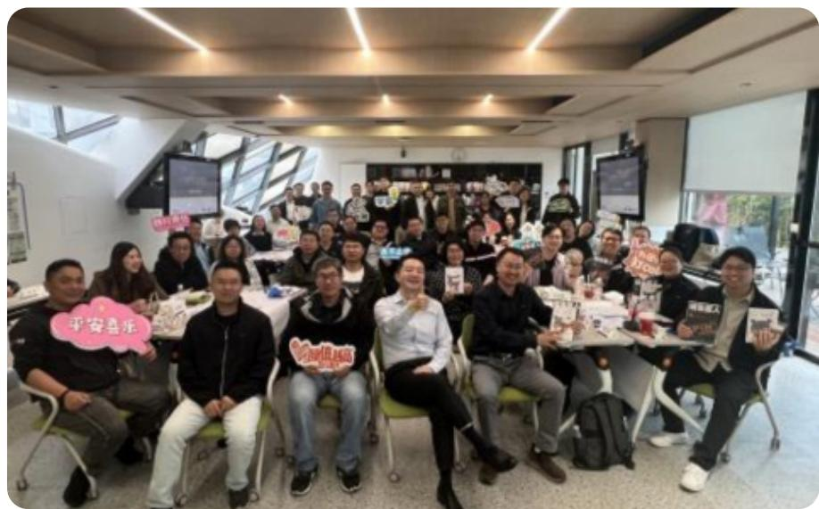

text_image

平安喜乐

研发销售思维与意识的线下赋能培训

## 关键绩效

报告期内，公司共开展培训

110 场

培训总人数

790人

培训总时长

15,322 小时

培训人均时长

21.2小时

年度培训投入

11 万

natural_image

Close-up of two hands holding hands against a golden sunset background, with blurred trees in the background (no text or symbols visible)

## 员工福利与权益保障

金桥信息坚持“以人为本”的管理理念，将员工关怀、民主沟通与权益保障制度化，构建安全、包容且受尊重的工作环境。公司通过节庆主题活动、常态化福利沟通及新员工“三期访谈”等举措，增强员工归属感，提升人岗匹配效果。在全球化运营中，公司尊重多元文化，设立祈祷室、支持宗教活动，并依托完善的投诉与申诉机制，坚决防范歧视与骚扰，全面体现对员工成长与人格尊严的重视。

## 员工福利

公司在依法落实员工基础保障的基础上，构建了涵盖补充保障、员工关怀及文化活动在内的多层次福利体系，持续提升员工的获得感与归属感。

## 法定福利

· 养老保险  
医疗保险  
工伤保险  
失业保险  
生育保险  
住房公积金

## 公司福利

雇主责任险 (部分员工)  
员工体检（符合条件的正式员工）  
· 生日福利费  
高温补贴  
三八妇女节过节费（女性员工专享)  
工作工服

员工福利

## 案例

## 金桥信息员工生日祝福长效关怀机制

2025年，金桥信息持续践行“以人为本”的核心理念，为全体全职正式员工实施生日关怀计划。该计划在员工生日当天为其送上专属生日祝福，并发放人均100元的生日补贴，通过这一制度化、常态化的暖心举措，将公司对员工的关怀落到实处。

## 案例

##

2025 年 9 月，金桥信息举办了一场读书分享会，活动采用线下主场与线上接入相结合的创新形式进行。此次分享会为热爱阅读的员工提供了思想交流的平台，有效营造了浓厚的组织学习氛围。

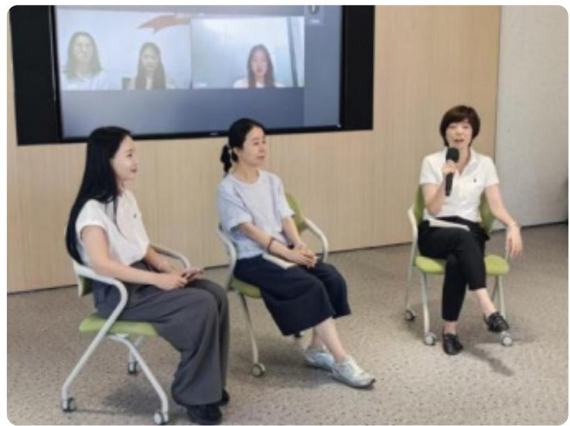

natural_image

Three women seated in chair listening to a microphone, with a presentation screen showing two women's video call (no visible text or symbols)

读书分享会

natural_image

Simple line drawing of two human figures facing each other with a lightbulb above them (no text or symbols)

## 案例

## 凝聚“她”力量，赋能新发展

2025年3月，金桥信息举办了“绽放她力量”主题特辑活动。公司邀请九位女性管理层代表录制专题视频分享职业洞察，视频获592人次观看。同时，公司为每位女员工发放了节日补贴。该活动通过真诚的榜样故事，诠释了女性的韧性、智慧与领导力，为员工提供经验借鉴，也增强了组织认同与凝聚力。

text_image

WOMAN
SH

“绽放她力量”专题视频

## 员工权益

公司持续完善员工权益保障体系，从薪酬管理、合规用工、民主沟通及人权保护等方面，构建规范、公平、透明的用工环境。

## 薪酬管理

公司建立了以岗位工资制为基础的薪酬管理体系，涵盖基本工资、岗位工资、绩效奖金、年度奖金及各类津贴补贴等内容并明确薪酬发放及调整机制。依托ERP系统实现薪酬发放、调薪及考勤管理的规范化与流程化运作，确保薪酬管理的公平性与透明度。

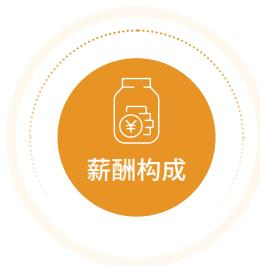

基本工资

岗位工资

全勤奖

绩效奖金

其它奖励

年度奖金

## 民主沟通

公司重视员工沟通机制建设，通过新员工三期访谈、一线走访及人才盘点等方式，持续了解员工需求与发展状况，提升人岗匹配效率与组织管理水平。同时，公司通过多渠道沟通机制，促进员工意见反馈与管理改进。

## 案例

##

金桥信息在新员工试用期内，通过业务部门与人力资源部门协同，执行三期结构化访谈与360度综合评估，全面考察其工作能力，成长潜力及团队融入情况。公司依据评估结果实施差异化策略：对高潜力员工定制发展计划并加大资源投入；对存在适应风险的员工及时提供辅导或调整岗位。这一机制实现了人才精准识别与优化配置，在有效控制用人成本的同时，为构建高绩效人才梯队奠定了坚实基础。

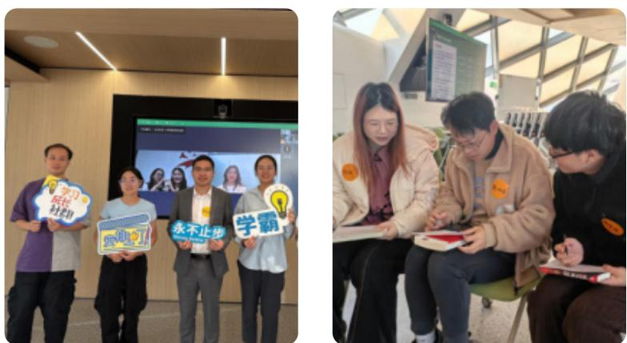  
新员工交流会

## 案例

##

2025年1月，金桥信息前往合肥分公司开展了全员访谈。此次工作以深度访谈与数据化绩效诊断为基础，与业务部门共同识别低效员工的核心问题，并通过绩效改进计划给予员工提升机会；对于仍无改善者实施优化。与此同时，HR从第三方视角协助业务团队发现潜在管理问题，并运用专业工具提供针对性解决方案，以民主、透明的沟通方式，切实支持了业务目标的达成与团队效能的提升。

## 案例

## 一线调研促进运维优化

2025年5月至7月，金桥信息通过深度访谈对北京上海等地7家法院的一线运维人员开展了系统性调研。项目团队围绕多个核心维度，与运维人员进行了平等、开放的对话，深入了解其在标准化服务流程、应急响应机制及跨部门协作中面临的实际挑战。基于调研结果，团队向业务部门提供了包括人才梯队建设、运维经验沉淀与流程优化在内的系统性改进方案。这一贴近一线的民主沟通实践，有效提升了解决方案的精准性与可落地性，为法院运维体系的精细化管理提供了有力支持。

## 合规用工与多元包容

金桥信息新加坡办公室在运营中严格遵循新加坡《劳资政公平雇佣指南》及当地雇佣法令，构建了以尊重多元文化为核心的员工权益保障体系。公司尊重多元文化与宗教差异，通过设置祈祷室、提供差异化餐饮选择等措施，营造包容性工作环境

在休假与工时方面，公司为员工提供包括法定年假、病假、产假等在内的各类假期，并实行标准工时制及配套的加班补偿机制保障员工的休息权与工作节奏，营造安全、包容目受尊重的工作环境

## 人权保护与反歧视骚扰

公司在运营中始终秉持以人为本的理念，致力于构建安全，受尊重目机会平等的工作环境。公司承诺保障所有员工的基本人权，坚决反对任何形式的强迫劳动、童工及职场虐待，在雇佣全周期中严格遵循公平、平等及人权保护原则，并对包括性骚扰，工作场所霸凌在内的任何形式的骚扰行为采取零容忍政策

为确保人权保护与反歧视骚扰原则落到实处，公司建立了清晰的投诉与申诉机制，鼓励员工通过指定渠道寻求帮助，并承诺所有调查将遵循公正、保密和反报复的原则。通过这些系统化的措施，金桥信息旨在不仅履行其法律与道德责任，更从根本上促进团队凝聚力与企业的可持续发展

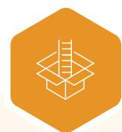

## 投诉与申诉流程

直属上司  
HR 部门  
上级管理层

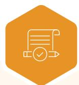

## 公司承诺

●公正处理、无打击报复  
●在合理时间内反馈调查结果  
●必要时提供心理支持与辅导资源

## 员工健康与安全

金桥信息为系统化保障员工安全健康，制定了《管理手册》，通过明确的职责分工与流程控制，构建了涵盖风险识别、目标设定到运行监督的闭环管理体系。公司依托该体系开展全员安全培训，内容覆盖三级安全教育、专项风险防控及劳保用品规范使用等环节，形成“制度一培训一实践”一体化的防护机制。通过将职业健康安全要求全面融入企业核心运营，金桥信息在有效降低作业风险、提升员工安全感的同时，进一步强化了合规管理能力与社会责任形象，为企业的可持续发展奠定了坚实基础。

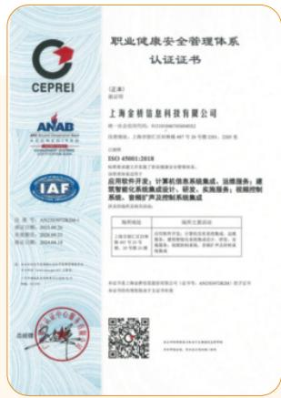

text_image

职业健康安全管理体系
认证证书

（江苏）
公司

上海金桥信息科技有限公司

注册地址：上海市徐汇区长乐路487号32号楼2201、2202室

ISBN 45001:2018
标准要求详见上市公司指定信息披露信息网。

应用软件开发：计算机信息系统集成、运维服务；建筑智能化系统集成设计、研发、实施服务；视频控制系统；智能财产及控制系统集成

咨询热线：www.sciencedirect.com

服务电话：
服务主要内容活动

上海申能(北京)律师事务所
地址：北京市海淀区西三环西路487号32号楼2201、2202室
传真：010-6666-6666

申请文件：上海申能信息科技股份有限公司（证券代码：ANAB3907824）电子证书
企业网站：www.sciencedirect.com.cn

欢迎来到中国证券报
footer<|ref_end|><|rotate_up|>

ISO45001职业健康安全管理体系认证

## 职业健康

金桥信息建立了系统化的职业健康安全培训体系，该体系以《新工人上岗前三级安全教育交底记录》《安全生产须知交底》等制度为基础，严格遵循国家安全生产方针与行业规程，覆盖公司、项目部及班组三级安全教育。培训内容涵盖用电安全高空作业、机械操作等关键环节，并针对特定风险开展专项培训。公司通过案例教学、实操演练与线上平台相结合的方式有效提升员工危险辨识与事故预防能力，全面增强全员安全意识。

## 案例

##

2025年4月，公司面向工程项目相关人员组织开展了专项“夏季施工安全培训”。本次培训共有61名员工参与，聚焦夏季高温、汛期等季节性施工特点，系统讲解了相关安全规范、风险辨识与预防措施及应急处置流程，旨在强化一线人员的安全意识与实操能力，为保障夏季施工高峰期的生产安全奠定基础。

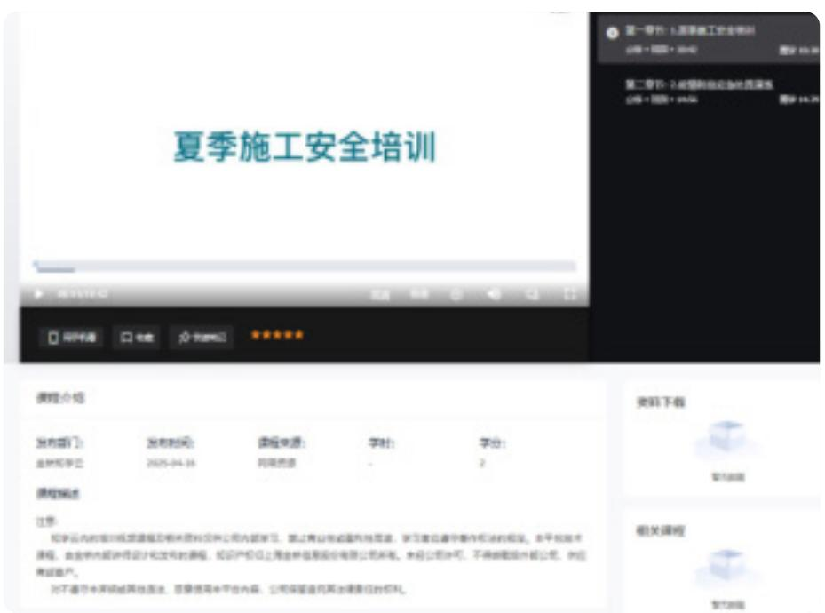

text_image

夏季施工安全培训
第一章节：1.夏季施工安全培训
公路·国际·机场
第二章T-2:城镇基础设施安全演练
公路·国际·机场
课程下载
课程介绍
发布部门： 发布时间： 课程来源： 学分： 学分：
全网和学生 2025-04-16 同周资源 - 2
课程描述
注意：
如学校内的培训视频请根据相关资料反映公司内部学习，通过教育或通信系统进行，学习后应遵守操作和活动的规定。水平校核技术课程，由全网内部讲师设计和发布的课程，知识产权以上海全网信息股份有限公司所有。未经公司许可，不得撤销级干部公司，供区商业客户。
对于遵守本规则或其他规定，您要使用本平台内容，公司保留面向其全部责任的机构。

夏季施工安全培训

## 案例

## 以案为鉴，严守设计安全底线

2025年4月，金桥信息组织开展了以“隐患直击”为主题的工程安全专项培训。本次培训采用了由国家应急管理部宣传教育中心出品的权威教材，核心内容聚焦于工程现场典型安全隐患的识别、分析与整改，尤其深入剖析了“从违章改图”等常见问题的根源与规范做法。培训面向项目、工程及相关技术人员，共有65名员工参与，旨在通过真实案例教学，强化全体员工“工程安全，人人有责”的主体意识与风险辨识能力。

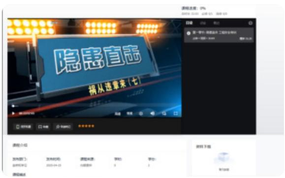

text_image

隐匿直志
祸从违章来(七)
流程小组
发布部门： 发布时间： 课程来源： 学校： 学台：
全国网址： 2023-04-15 全国网站： 3 1
新闻报道

隐患直击，工程安全培训

## 安全生产

金桥信息为保障工程项目安全生产，制定了《劳保用品管理制度》，以系统化管理劳保用品的采购、领用及使用全流程。该制度明确了各项目组在需求提报、领用发放与穿戴监督等方面的职责，通过规范化管理确保防护装备的正确配置与使用从而有效降低作业安全风险保障员工安全健康，并为企业安全文化建设与合规经营提供支撑

## 普发系列劳保用品

工作服、安全帽、劳保皮鞋、毛巾、肥皂、香皂等

## 专用系列劳保用品

高温手套、帆布手套、口罩、面罩雨衣、胶靴等

公司同时设定了年度职业健康与安全管理目标

<table><tr><td>职业健康安全目标</td><td>2025年达成情况</td></tr><tr><td>培训计划完成率90%以上</td><td>培训计划完成率100%</td></tr><tr><td>员工安全意识培训覆盖率100%</td><td>员工安全意识培训覆盖率100%</td></tr><tr><td>重大工伤事故发生率为0、员工作业轻伤率小于5起/年</td><td>重大工伤事故发生率为0、员工作业轻伤率为0</td></tr><tr><td>火灾事故为0</td><td>火灾事故为0</td></tr><tr><td>安全意识培训合格率100%</td><td>安全意识培训合格率100%</td></tr></table>

## 责任为桥

## 联结可持续生态

金桥信息深知企业的可持续发展离不开对环境、社会及供应链的全面责任践行。在业务运营和管理实践中，公司以责任为纽带推动供应链透明化、环境友好化及社会价值创造，通过制度建设流程优化和技术创新，持续强化对利益相关方的承诺与服务。责任不仅是公司治理的基石，更成为公司联结各方、构建可持续生态体系的重要桥梁，支持企业在经济发展、环境保护与社会贡献之间实现长期平衡与协同发展。

## 章节内容

负责任采购 61

环境管理 62

应对气候变化 65

社会贡献 68

## 负责任采购

金桥信息将供应链管理视为企业社会责任的重要组成部分，坚持高标准的供应商准入、严格的廉洁合规要求及绿色供应链理念，确保采购活动的合法合规、业务稳定和环境安全。公司不仅关注供应商的资质与业务能力，也推动供应商履行环境保护与职业健康责任，从而在保障企业运营稳健的同时，构建透明、可持续且负责任的供应链生态。

## 阳光采购

在廉洁合规方面，公司践行阳光采购理念，将反商业贿赂条款作为供应商合作的前置条件。采购合同明确要求双方严格遵守相关法律法规，禁止任何形式的贿赂或利益输送行为，包括现金、有价证券或非物质性利益。同时，公司建立违约责任追究机制，对于违反廉洁协议的行为实行零容忍，从源头杜绝不正当竞争，保障交易的公正透明。

## 绿色供应链与职业健康承诺

公司积极推动绿色供应链建设与职业健康责任落实。在供应商合作中，公司要求签署《供应商环保和职业健康安全协议书》，明确供应商需遵守环境保护法律法规，主动识别和管理生产经营过程中可能产生的环境风险，并采取持续改进措施。同时，供应商需确保工作环境符合职业健康安全标准，履行对员工的保护责任，并在交付产品前披露潜在环境污染及职业健康风险，必要时在产品外包装上加注醒目安全标识，以实现供应链全链条的风险可控。

## 平等对待中小企业

公司坚持公平、公正、透明的合作原则，平等对待包括中小企业在内的各类供应商，在准入、评估及合作过程中不设置不合理门槛，保障其合法权益。同时，公司严格按照合同约定履行付款义务，报告期内不存在逾期尚未支付中小企业款项等情况。

natural_image

A large green tree standing on a grassy hill under a clear blue sky (no text or symbols visible)

## 环境管理

金桥信息高度重视环境合规管理，将可持续发展理念融入公司运营和业务发展全过程。公司建立了完善的环境管理体系，并已通过ISO14001环境管理体系认证，确保环境风险可控、环境责任落实到位。

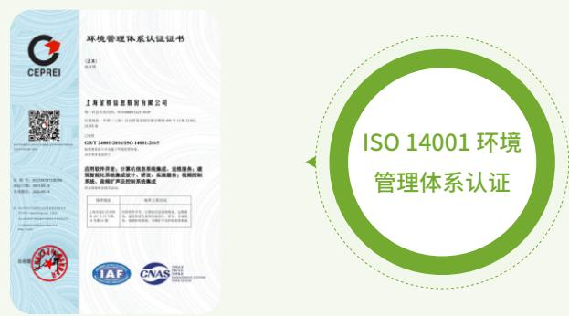

在日常运营中，公司制定并实施《环境因素与危险源识别评价和更新程序》，通过制度化流程对各项业务活动、产品与服务可能产生的环境影响进行识别和评估，包括能源和资源消耗、排放、废物处理、土地污染及社区影响等关键环境因素。同时，公司对潜在危险源进行评估，确保生产及办公活动中的安全隐患得到有效控制。重要环境因素和危险源均经过综合评价，由管理层批准并纳入年度管理计划。

公司建立了环境因素和危险源的动态更新机制，每年定期复核，并在业务变化、法律法规更新或发生异常事件时及时调整确保环境管理体系持续有效

公司同时设定了年度环境管理目标，包括

<table><tr><td>目标</td><td>2025年达成情况</td></tr><tr><td>环境违规违法事件为零,确保合规经营</td><td>已达成</td></tr><tr><td>员工环保意识培训覆盖率达到100%,提升全员环境责任意识</td><td>已达成</td></tr></table>

通过体系化管理和年度目标的实施，公司不断优化内部环境管理流程，强化风险防控能力，推动企业在业务发展过程中实现环境责任与可持续发展的有机结合。

## 能源与资源利用

公司日常经营活动不涉及高能耗生产工序，主要集中于办公及项目运维环节的电力消耗，辅以少量生活用水。在此基础上，公司将提升能源与资源使用效率作为环境管理的重要内容，将节能降耗理念融入日常运营与内部管理。

公司制定并实施《能源与资源使用管理规定》，明确电力、水等能源资源的使用规范、管理职责及监督要求，并由行政管理部门牵头组织落实。在日常运营中，行政部定期开展能源巡检与统计，持续监控办公及相关运营场景中的用电、用水情况及时识别异常消耗情形，推动资源使用的合理化与精细化管理。

同时，公司通过制度宣导与日常管理相结合的方式，加强员工节能意识培养，在各办公场所持续推进绿色办公实践，包括节约用电用水、减少一次性用品使用、倡导双面打印及电子化办公等举措，降低不必要的资源消耗。公司亦鼓励各部门结合业务实际探索节能改进措施，并将节能降耗纳入日常管理考核，形成管理、执行和监督相结合的能源管理机制。通过这些措施，公司在保障正常运营的同时，持续推动资源高效利用，为企业可持续发展提供支持。

## 关键绩效

## 报告期内，公司日常运营消耗的

总耗电量

537,868.9 kWh

水资源

1,282 吨

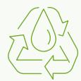

## 废弃物管理与循环经济

公司日常经营及项目实施过程不涉及高污染工序，产生的废弃物类型以办公生活垃圾及少量电子废弃物为主，公司高度重视废弃物的规范管理与资源循环利用，将相关要求纳入环境管理体系，持续降低运营活动对环境的潜在影响

公司制定并执行《废弃物管理制度》，对废弃物的分类、收集、暂存、运输及处置流程作出明确规定，确保各类废弃物依法合规安全处置。在项目施工及实施过程中产生的相关废弃物，公司通过合同约定方式，交由具备相应资质的第三方专业机构进行处理，保障废弃物处置过程符合环保及安全要求。办公场所产生的生活垃圾，则严格按照国家及地方有关规定开展分类投放与集中处理，提升资源回收利用效率。

  
在循环经济方面  
公司关注废弃物的循环利用和再生价值，对可再利用的材料进行分类回收，并在资产报废与申购管理中纳入环保考量，推动企业运营向循环经济模式转型。公司结合自身业务特征，重点从源头减量与资源回收入手推进改进。一方面，通过持续推进电子化办公、倡导双面打印、优化采购与资产管理流程，降低纸张及一次性物品消耗；另一方面，在设备更新、资产报废及信息化设备更换过程中，规范电子废弃物的回收与处置流程，防止环境污染风险。通过制度化管理与日常实践的持续优化，公司在保障运营效率的同时，不断提升资源利用的集约化与可持续水平，切实降低运营活动对环境的影响，践行企业环境责任。

natural_image

Landscape view of a lush green field with a tree and flying birds in the sky (no text or symbols)

## 应对气候变化

金桥信息积极响应国家“双碳”目标和相关政策要求，结合自身业务属性与运营特点，将应对气候变化纳入公司环境管理与可持续发展体系。公司重点关注气候变化对日常运营、资源使用及业务发展的潜在影响，通过加强能源管理、推进绿色办公实践、在项目设计与实施过程中融入节能减排理念等方式，持续降低运营活动对环境的影响。同时，公司在合规经营的基础上，逐步提升对气候相关风险与机遇的识别与管理能力，推动企业在稳健发展的同时实现环境责任与长期价值的协同。

## 治理

公司将气候变化相关议题纳入ESG治理框架统筹管理，在整体治理体系下关注气候变化带来的风险与机遇。公司结合业务特点和运营实际，持续关注国家“双碳”政策导向及行业发展趋势，在经营管理和日常运营中逐步融入节能减排与低碳发展的理念，推动绿色办公、节能管理等相关措施的落实。同时，公司持续跟踪气候相关政策与监管要求，逐步完善气候变化相关管理与信息披露机制，推动企业在稳健经营的同时提升应对气候变化的能力。

## 战略

公司将应对气候变化视为推动数字化转型与可持续发展的双重机遇，参照国际主流气候治理框架，系统构建适应公司业务特点的气候治理体系。公司基于设计、系统集成及施工的全业务链模式，致力于通过数字化技术为客户赋能，并在交付低碳集成方案与开展绿色施工管理的过程中，全面构建适应气候变化的发展战略。

当前，公司对气候相关风险/机遇的分析涵盖风险/机遇对价值链和公司自身的影响，并依此制定了相应的应对措施。

<table><tr><td>风险类型</td><td>风险名称</td><td>风险/机遇描述</td><td>影响周期*</td><td>应对措施</td></tr><tr><td rowspan="2">转型风险</td><td>政策与法律风险</td><td>国家对建筑节能及绿色建筑标准提高(如《绿色建筑评价标准》更新),若公司设计方案未能及时跟进,可能面临合规风险。</td><td>短中期</td><td>建立政策监测机制,定期对设计中心人员进行绿色建筑规范培训,确保设计方案100%合规。</td></tr><tr><td>市场与技术风险</td><td>市场对“零碳办公”、“智慧能源”技术需求激增,若公司研发投入不足,可能在智慧政务、智慧教育竞争中失去领先地位。</td><td>中长期</td><td>加大BIM、AIoT在能效管理领域的研发投入;迭代Space 365等平台,集成更强大的碳效管理功能。</td></tr><tr><td rowspan="2">物理风险</td><td>急性风险</td><td>极端天气(如暴雨、高温)导致施工现场停工、物流受阻,影响项目交付周期及施工人员安全。</td><td>短期</td><td>完善施工现场应急预案;通过数字化施工管理系统(如远程监控、移动协作)减少极端天气下的现场依赖。</td></tr><tr><td>慢性风险</td><td>持续高温导致数据中心、机房设备制冷能耗大幅上升,增加公司运营成本或缩短设备寿命。</td><td>长期</td><td>在系统集成方案中推广更高效的冷却技术(如液冷或智能节能空调);优化公司自有办公场所的能源结构。</td></tr></table>

风险清单  
\*短期：1年内，中期：1-5年，长期：5年以上

<table><tr><td>机遇名称</td><td>机遇描述</td><td>影响周期*</td><td>应对措施</td></tr><tr><td>产品与服务</td><td>低碳与节能需求带来的业务拓展空间:随着客户对节能运行、能效管理关注度提升,公司在智能照明控制、暖通系统优化、能源管理等数字化解决方案方面,具备参与相关项目的技术基础与服务经验。</td><td>短中期</td><td>在方案设计与投标过程中系统融入节能运行、能效优化等要素;结合既有教卫、司法等客户场景,探索节能改造及系统优化类项目机会。</td></tr><tr><td>资源效率</td><td>数字化运营提升资源使用效率:通过无纸化办公、资产与运维管理平台应用,公司及客户在设备管理、流程协同等方面具备降低资源消耗和重复投入的潜力。</td><td>短期</td><td>持续推进内部流程数字化与平台化应用;在现有系统中逐步完善能耗、资产运行等数据的统计与分析能力。</td></tr><tr><td>市场韧性</td><td>合规与信息披露带来的市场适配能力提升:随着ESG信息披露和可持续要求在政企客户中的重要性提升,规范披露有助于公司在合规沟通与长期合作中提升适配度与透明度。</td><td>中长期</td><td>持续完善ESG信息披露内容与内部数据基础;在不作绩效承诺的前提下,加强对气候与可持续议题的规范化回应。</td></tr></table>

机遇清单  
\*短期：1年内，中期：1-5年，长期：5年以上

## 影响、风险和机遇管理

金桥信息通过为客户提供绿色低碳设计与咨询服务，将绿色低碳理念深度融入项目全生命周期管理，形成涵盖节能改造碳排双控，资源循环利用等方面的可复制低碳设计方法论，为客户提供符合国家双碳战略和生态文胆建设要求的解决方案

在日常设计工作中，设计中心通过对客户建筑项目进行绿色评估与方案优化，将国家相关标准(如《绿色建筑评价标准)《建筑节能与可再生能源利用通用规范》）与国际认证体系结合应用，为客户提供符合国内外规范、兼具创新的设计方案。公司在设计过程中通过BIM模拟建筑能耗、智能控制系统优化照明与空调设备运作、应用可再生能源系统、优化施工组织方案等方式，帮助客户实现节能减排目标，并降低项目对环境的潜在影响。报告期内，设计中心在11个项目中实践绿色低碳理念。

## 案例

## 上海某中级人民法院——智慧调控助力资源节约型社会建设

在上海某中级人民法院弱电系统项目中，设计中心严格执行《绿色建筑评价标准》(GB/T50378-2019)及《建筑节能与可再生能源利用通用规范》(GB.55015-2021)等国家标准，通过在弱电系统中嵌入先进的智能控制技术，对昭明空调、电梯等建筑内重点用能设备进行了精准调适与运能提升。项目通过楼宇自动化系统(BA)对照明、空调、电梯等主要用能设备实施统一调度与精细化控制，并结合分楼层用电计量与数据分析，对高能耗设备运行状态进行持续监测与优化调整，为管理方开展能耗分析和节能决策提供数据支撑。相关措施有助于降低建筑运行阶段能源消耗与碳排放强度，支持公共机构在应对气候变化背景下提升能源管理水平

## 案例

## 上海某985 大学金融学院——环境感知驱动的校园能效平衡

在上海某985高校金融学院项目中，金桥信息在方案设计阶段充分调研教学场景与使用需求，将绿色建筑与能效管理理念系统融入设计方案。项目构建了涵盖楼宇自控、智能照明、环境监测及能耗计量的综合管理体系，通过传感设备对温湿度、二氧化碳浓度、环境照度等关键环境指标进行实时监测，并联动暖通、新风及照明系统进行动态调节。该基于环境感知的调控模式在保障教学空间舒适性的同时，为能耗精细化管理和运行决策提供了数据基础，有助于提升校园建筑整体运行效率并降低不必要的能源消耗。

## 案例

## 临港星空之境大型商业综合体—多功能业态下的低碳运营整合

针对临港“星空之境”大型商业综合体涵盖商业、办公、酒店及文体等多元业态的特点，金桥信息在设计深化阶段统筹不同运营主体的实际需求，对原有能效方案进行系统优化。项目依据国家绿色建筑与建筑节能相关标准，构建统一的建筑能效管理平台，对水、电及冷热源等能源消耗进行集中采集、监测与分析。通过统一管理与数据整合，该方案为建设及运营单位提供了持续开展能效评估与运行优化的管理工具，有助于降低运营阶段的资源浪费，并为后续节能评价及相关认证工作提供支持，推动大型复杂业态项目实现更为稳健的低碳运营。

此外，教卫事业部在多个学校项目中引入Space365管理平台，对接楼宇自控系统、能耗管理系统及智能照明等设施，对能源使用数据进行收集、分析，并结合课程活动和教学运营情况评估整体能源态势，为学校管理者提供数据支持和管理建议。同时，部门推动无纸化导览等绿色校园举措，减少纸质印刷和耗材浪费，年累计节约 A4 纸张约 6 万张，助力教育机构实现可持续、绿色低碳运营。

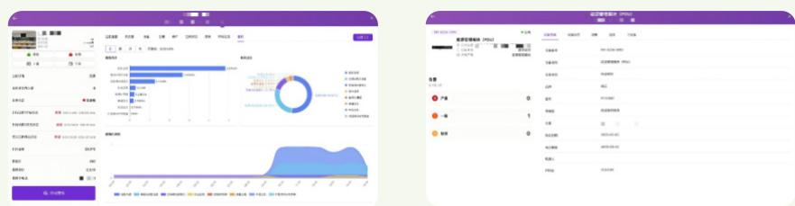  
Space 365 管理平台界面

## 指标和目标

公司积极响应国家应对气候变化的战略部署，将企业发展方向与国家“碳达峰，碳中和”战略目标保持一致。结合自身业务特点和运营实际，公司持续推进节能降碳与绿色办公相关举措，逐步提升能源利用效率，减少运营过程中的碳排放影响未来，公司将根据国家政策导向及行业发展趋势，结合经营管理实际，逐步探索完善温室气体管理与减排目标设定机制推动企业运营向更加绿色、低碳的方向发展。

<table><tr><td>气候相关指标</td><td>单位</td><td>2025年</td></tr><tr><td>范围一(直接排放)</td><td>吨二氧化碳当量</td><td>82.29</td></tr><tr><td>范围二(能源间接排放)</td><td>吨二氧化碳当量</td><td>288.62</td></tr><tr><td>温室气体排放总量</td><td>吨二氧化碳当量</td><td>370.91</td></tr><tr><td>碳排放强度</td><td>吨二氧化碳当量/万元营收</td><td>0.0054</td></tr></table>

## 社会贡献

公司秉持“责任为先、价值共创”的发展理念，积极履行企业社会责任，致力于推动社会进步与教育发展。公司不断探索企业发展与社会需求的有效结合，促进教育资源优化、人才培养提升以及社区可持续发展。同时，公司注重长期战略规划将社会责任纳入企业治理体系，力求在社会、环境与经济层面实现协同增效，彰显企业对可持续发展与社会价值的承诺。

## 校企协同促进就业

面向数字化转型背景下的人才培养需求，金桥信息通过构建校企协同机制，加强与高校在实践教学、交流互访及产学研合作方面的联结，推动教育资源与产业实践的有效衔接，助力形成协同共建的人才发展生态

公司以长期合作为导向，与高校建立常态化沟通与协作机制，通过共建产学研平台、开展交流互访及专题研讨等方式，探索以实践导向为核心的人才培养模式，促进高校人才培养与行业发展需求的相互匹配

## 案例

## 签订产学研合作教育基地

2025年11月，金桥信息与上海师范大学签订产学研合作教育基地协议，围绕人工智能与数字化技术领域开展合作通过搭建稳定的校企协同平台，推动双方在实践教学、协同创新及人才培养方面的持续合作

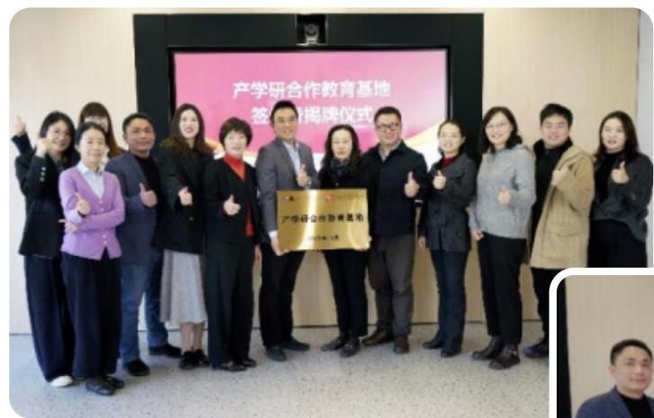

text_image

产学研合作教育基地
签约仪式揭牌仪式
产学研合作教育基地
2016.12

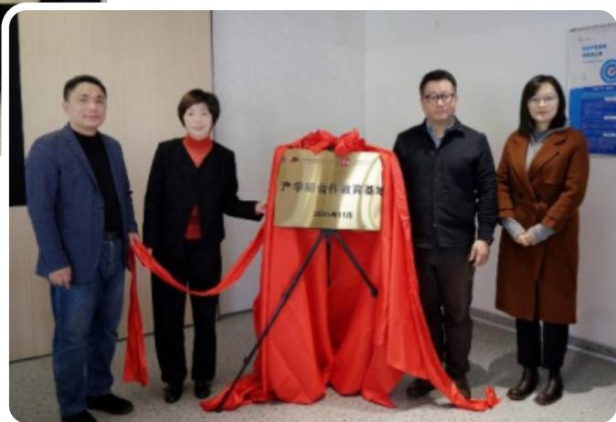

text_image

产学研合作教育基地
2021年1月

  
产学研合作教育基地签订仪式

同时，公司积极参与高校“访企拓岗促就业”相关交流活动，围绕人才培养方向，实践能力提升及技术发展趋势等议题与高校开展多层次沟通，进一步拓展校企协同的广度与深度。报告期内，上海师范大学、华东政法大学及中国传媒大学等高校相关负责人先后到访公司，围绕校企协同育人、产学研合作及实践教学等内容开展交流，促进高校教育体系与企业实践经验的双向联结。

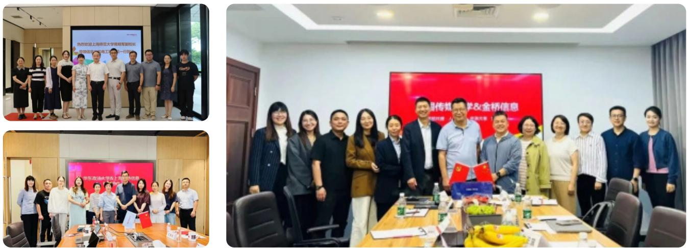  
上海师范大学、华东政法大学及中国传媒大学来访公司

## 社区公益

金桥信息持续关注社区发展与公共福祉，通过组织各类公益活动，推动企业与社区的良性互动。公司倡导员工在自愿基础上参与公益实践，将员工关怀与社会责任有机结合，以实际行动支持社区建设、传递社会温暖

公司已形成常态化的无偿献血组织机制，鼓励员工在自愿基础上参与公益行动，并通过配套保障与激励措施，支持员工履行社会责任，推动公益参与与员工关怀的有机结合。

## 案例

## 年度献血活动

text_image

AI赋能·智创未来
（智能2023年，采用绿色盲盒在百度“蓝海之光”）
大疆战线、防利核马、巅峰之处、期待上演
7月25日
到广州北侧的街道
19:30-19:45 早于16:00
找脸的语录，让更感动……
找脸的地方，放心……

2025年5月，公司发起年度无偿献血活动，组织员工参与无偿献血，共有14名员工参与。为保障员工权益并肯定公益贡献，公司对参与献血的员工给予表彰并提供每人3.000元补贴及3天带薪休假支持，同时通过公司官方渠道对活动进行宣传，倡导员工积极参与公益事业。通过持续开展无偿献血活动，公司在支持社区公共健康的同时，进一步营造员工参与公益、回馈社会的良好氛围。

## 献血活动宣传

## 案例

## 三八国际妇女节活动

2025 年 3 月 8 日，金桥信息组织开展三八国际妇女节系列活动。公司党支部成员走出办公楼，在所在园区为女性群体送上鲜花和节日祝福，积极营造友好、包容的社区氛围，提升企业与周边社区的互动与联系。此次活动不仅体现了公司对员工精神文化关怀的重视，也通过与社区的直接互动传递了企业的社会温度和责任感。

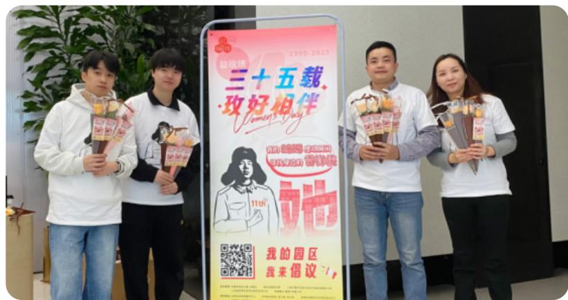

text_image

益玫瑰
1999-2025
三十五载
·攻好相伴
Women's Day
11th
我的园区
我来倡议

三八妇女节献花活动

## 关键绩效

报告期内，公司社会公益投入总金额

4.2 万元

员工志愿者人数

14名

社会公益活动总时长

14 小时

## 促进教育可及性

金桥信息围绕教育数字化与智能化发展需求，通过人工智能与信息化系统建设，推动优质教学内容的数字化沉淀与跨区域共享，支持教育资源向更广泛的师生群体覆盖，助力提升教育可及性。

AI创新中心自主研发“真享”A教学研讨辅助系统，将课堂教学内容进行数字化整合与结构化整理，形成可共享的教材、知识库及学习资源，实现优质教学内容的集成化共享与持续应用。依托上述系统，公司可将数字化沉淀的优质教学内容与教学应用覆盖至更广泛的学校与师生群体，包括教育资源相对有限的偏远地区，为缩小区域间教育资源差距、促进教育公平提供技术支持。

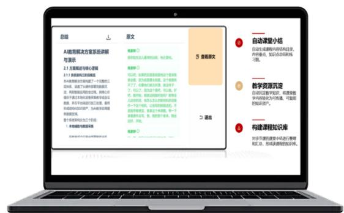

text_image

总结
原文
AI教育解决方案系统讲解
与演示
2.1 方案概述与核心问题
A: 本课程通过知识库构建
2.1.1 教师根据实际需求
A: 本课程通过知识库建立一个完整的交互
内容，通过了A课程的课程模式
A: 智能使用模型应用，能够从
水平面上进行动态化设计，实现个性化教学
和学生学习的交互效果，帮助
在知识库中进行学习。
每个步骤均符合以下标准：
• 本课程的难度要求
• 自动课堂小结
• 教学资源沉淀
• 构建课程知识库
• 对不同的建设中的改进进行管理
输入、输出或课程的制定。

“真享”AI教学研讨辅助系统界面

同时教卫事业部在相关教育项目中建设“一人一屏”融合教学系统通过支持线上线下全员音视频实时交万与同步投票表决保障不同教学场景下学生的平等参与，进一步提升融合教学环境中的教学体验与教学质量，为教育资源的灵活共享提供配套支撑。

ESG 绩效表

<table><tr><td>议题</td><td>指标</td><td>单位</td><td>2025年</td></tr><tr><td colspan="4">环境绩效</td></tr><tr><td rowspan="4">温室气体排放</td><td>直接(范围一)温室气体排放量</td><td>吨二氧化碳当量</td><td>82.29</td></tr><tr><td>间接(范围二)温室气体排放量</td><td>吨二氧化碳当量</td><td>288.62</td></tr><tr><td>温室气体排放总量</td><td>吨二氧化碳当量</td><td>370.91</td></tr><tr><td>温室气体排放强度</td><td>吨二氧化碳当量/万元</td><td>0.0054</td></tr><tr><td>能源利用</td><td>外购电量</td><td>千瓦时</td><td>537,868.90</td></tr><tr><td>水资源管理</td><td>耗水总量</td><td>吨</td><td>1,282</td></tr><tr><td>废弃物管理</td><td>无害废弃物总量</td><td>吨</td><td>1</td></tr><tr><td colspan="4">社会绩效</td></tr><tr><td rowspan="5">员工雇佣</td><td>员工总数</td><td>人</td><td>790</td></tr><tr><td>男性员工人数</td><td>人</td><td>543</td></tr><tr><td>女性员工人数</td><td>人</td><td>247</td></tr><tr><td>少数民族员工人数</td><td>人</td><td>18</td></tr><tr><td>退伍军人员工人数</td><td>人</td><td>5</td></tr><tr><td rowspan="6">员工培训发展</td><td>培训总人数</td><td>人</td><td>790</td></tr><tr><td>培训总时长</td><td>小时</td><td>15,322</td></tr><tr><td>培训人均时长</td><td>小时</td><td>21.2</td></tr><tr><td>全年培训总场次</td><td>次</td><td>110</td></tr><tr><td>年度培训支出金额</td><td>万元</td><td>11</td></tr><tr><td>员工培训覆盖率</td><td>%</td><td>100</td></tr><tr><td rowspan="4">社会公益</td><td>社会公益投入总金额</td><td>万元</td><td>4.2</td></tr><tr><td>员工志愿者人数</td><td>人</td><td>14</td></tr><tr><td>社会公益活动次数</td><td>次</td><td>14</td></tr><tr><td>社会公益活动总时长</td><td>小时</td><td>14</td></tr><tr><td rowspan="4">知识产权管理</td><td>申请专利总数</td><td>项</td><td>12</td></tr><tr><td>申请商标总数</td><td>项</td><td>25</td></tr><tr><td>申请软件著作权总数</td><td>项</td><td>17</td></tr><tr><td>授权专利总数</td><td>项</td><td>2</td></tr></table>

<table><tr><td>议题</td><td>指标</td><td>单位</td><td>2025年</td></tr><tr><td rowspan="7"></td><td>授权软件著作权总数</td><td>项</td><td>17</td></tr><tr><td>持有有效专利总数</td><td>项</td><td>25</td></tr><tr><td>持有有效商标总数</td><td>项</td><td>50</td></tr><tr><td>持有有效软件著作权总数</td><td>项</td><td>330</td></tr><tr><td>知识产权保护培训场次</td><td>场</td><td>2</td></tr><tr><td>知识产权保护培训覆盖人数</td><td>人</td><td>308</td></tr><tr><td>知识产权保护培训参与人次</td><td>人次</td><td>337</td></tr><tr><td rowspan="3">创新驱动</td><td>科研投入总金额</td><td>万元</td><td>7,400.27</td></tr><tr><td>科研投入占营业收入的比例</td><td>%</td><td>10.68</td></tr><tr><td>科研人员总数</td><td>人</td><td>198</td></tr><tr><td rowspan="4">数据安全与客户隐私保护</td><td>客户信息安全与隐私保护培训开展场次</td><td>场</td><td>4</td></tr><tr><td>客户信息安全与隐私保护培训总时长</td><td>小时</td><td>170</td></tr><tr><td>客户信息安全与隐私保护培训覆盖人数</td><td>人</td><td>700</td></tr><tr><td>泄露客户隐私事件数量</td><td>起</td><td>0</td></tr><tr><td rowspan="7">供应链安全</td><td>供应商总数</td><td>个</td><td>667</td></tr><tr><td>新增供应商数</td><td>个</td><td>6</td></tr><tr><td>通过环境审核的供应商数</td><td>个</td><td>654</td></tr><tr><td>通过社会审核的供应商数</td><td>个</td><td>654</td></tr><tr><td>供应商培训次数</td><td>次</td><td>30</td></tr><tr><td>供应商培训总时长</td><td>小时</td><td>55</td></tr><tr><td>供应商培训覆盖率</td><td>%</td><td>85</td></tr><tr><td colspan="4">治理绩效</td></tr><tr><td rowspan="5">公司治理与ESG治理</td><td>董事会成员人数</td><td>人</td><td>9</td></tr><tr><td>女性董事人数</td><td>人</td><td>1</td></tr><tr><td>独立董事人数</td><td>人</td><td>3</td></tr><tr><td>ESG培训开展次数</td><td>次</td><td>1</td></tr><tr><td>ESG培训参与总人次</td><td>人次</td><td>20</td></tr></table>

交易所指引

<table><tr><td>序号</td><td>一级议题</td><td>二级议题</td><td>相关章节</td></tr><tr><td rowspan="8">1</td><td rowspan="8">应对气候变化</td><td>1气候变化相关风险和机遇管理</td><td>应对气候变化</td></tr><tr><td>2评估公司的战略、商业模式等对气候变化的适应性</td><td>应对气候变化</td></tr><tr><td>3为应对气候相关风险和机遇的转型计划、措施及其进展</td><td>应对气候变化</td></tr><tr><td>4按照分类提供不同范围温室气体排放情况</td><td>应对气候变化</td></tr><tr><td>5按照分类提供温室气体排放情况</td><td>应对气候变化</td></tr><tr><td>6温室气体排放量核算方式</td><td>应对气候变化</td></tr><tr><td>7温室气体减排实践</td><td>应对气候变化</td></tr><tr><td>8有利于减少碳排放、实现碳中和的新技术、产品、服务</td><td>应对气候变化</td></tr><tr><td rowspan="5">2</td><td rowspan="5">污染物排放</td><td>1排污信息</td><td>环境管理</td></tr><tr><td>2排污处理</td><td>环境管理</td></tr><tr><td>3减排目标</td><td>未披露</td></tr><tr><td>4对群体的影响</td><td>未披露</td></tr><tr><td>5行政处罚</td><td>环境管理</td></tr><tr><td rowspan="3">3</td><td rowspan="3">废弃物处理</td><td>1废弃物数量</td><td>环境管理</td></tr><tr><td>2处理情况</td><td>环境管理</td></tr><tr><td>3减排目标</td><td>未披露</td></tr><tr><td rowspan="5">4</td><td rowspan="5">生态系统和生物多样性保护</td><td>1退出活动</td><td></td></tr><tr><td>2区域内保护措施</td><td rowspan="4">不涉及。公司生产经营活动对生态系统和生物多样性不产生重大影响。</td></tr><tr><td>3保护恢复措施</td></tr><tr><td>4生物遗传资源</td></tr><tr><td>5产品全生命周期影响</td></tr><tr><td rowspan="3">5</td><td rowspan="3">环境合规管理</td><td>1风险管理</td><td>环境管理</td></tr><tr><td>2突发事件</td><td>环境管理</td></tr><tr><td>3行政处罚</td><td>环境管理</td></tr><tr><td rowspan="3">6</td><td rowspan="3">能源利用</td><td>1使用情况</td><td>环境管理</td></tr><tr><td>2清洁能源</td><td>环境管理</td></tr><tr><td>3节约目标</td><td>未披露</td></tr></table>

<table><tr><td>序号</td><td>一级议题</td><td colspan="2">二级议题</td><td>相关章节</td></tr><tr><td>7</td><td>水资源利用</td><td colspan="2">1使用情况</td><td>环境管理</td></tr><tr><td>8</td><td>循环经济</td><td colspan="2">2节约目标</td><td>未披露</td></tr><tr><td>9</td><td>乡村振兴</td><td colspan="2">战略及成果</td><td>未披露</td></tr><tr><td>10</td><td>社会贡献</td><td colspan="2">贡献情况</td><td>社会贡献</td></tr><tr><td rowspan="4">11</td><td rowspan="4">创新驱动</td><td colspan="2">1战略目标</td><td>创新驱动</td></tr><tr><td colspan="2">2具体情况</td><td>创新驱动</td></tr><tr><td colspan="2">3研发成果</td><td>创新驱动</td></tr><tr><td colspan="2">4创新影响</td><td>创新驱动</td></tr><tr><td rowspan="4">12</td><td rowspan="4">科技伦理</td><td colspan="2">1从事领域</td><td>创新驱动</td></tr><tr><td colspan="2">2内部管理</td><td>创新驱动</td></tr><tr><td colspan="2">3违反行为</td><td>不涉及</td></tr><tr><td colspan="2">4培训宣传</td><td>未披露</td></tr><tr><td rowspan="3">13</td><td rowspan="3">供应链安全</td><td colspan="2">1风险管理</td><td>负责任采购</td></tr><tr><td colspan="2">2保障措施</td><td>负责任采购</td></tr><tr><td colspan="2">3改进措施</td><td>负责任采购</td></tr><tr><td rowspan="2">14</td><td rowspan="2">平等对待中小企业</td><td>1未支付款项</td><td colspan="2">不涉及。公司平等对待中小企业,报告期内不存在逾期</td></tr><tr><td>2具体情况</td><td colspan="2">尚未支付中小企业款项等情况。</td></tr><tr><td rowspan="5">15</td><td rowspan="5">产品和服务安全与质量</td><td>1管理体系</td><td colspan="2">产品和服务安全与质量</td></tr><tr><td>2质量认证</td><td colspan="2">产品和服务安全与质量</td></tr><tr><td>3重大事故</td><td colspan="2">不涉及</td></tr><tr><td>4售后服务</td><td colspan="2">产品和服务安全与质量</td></tr><tr><td>5可及性</td><td colspan="2">产品和服务安全与质量</td></tr><tr><td rowspan="4">16</td><td rowspan="4">数据安全与客户隐私保护</td><td>1管理体系</td><td colspan="2">数据安全与客户隐私保护</td></tr><tr><td>2安全事件</td><td colspan="2">数据安全与客户隐私保护</td></tr><tr><td>3客户隐私保护</td><td colspan="2">数据安全与客户隐私保护</td></tr><tr><td>4泄露事件</td><td colspan="2">数据安全与客户隐私保护</td></tr><tr><td rowspan="3">17</td><td rowspan="3">员工</td><td>1员工聘用</td><td colspan="2">人才吸引</td></tr><tr><td>2职业健康与安全</td><td colspan="2">员工健康与安全</td></tr><tr><td>3职业发展与培训</td><td colspan="2">人才培训与发展</td></tr><tr><td>18</td><td>尽职调查</td><td>尽职调查开展情况</td><td colspan="2">ESG治理</td></tr><tr><td rowspan="2">19</td><td rowspan="2">利益相关方沟通</td><td>1沟通制度</td><td colspan="2">ESG治理</td></tr><tr><td>2建议渠道</td><td colspan="2">ESG治理</td></tr><tr><td rowspan="4">20</td><td rowspan="4">反商业贿赂及反贪污</td><td>1管理体系</td><td colspan="2">商业道德</td></tr><tr><td>2风险评估</td><td colspan="2">商业道德</td></tr><tr><td>3培训绩效</td><td colspan="2">未披露</td></tr><tr><td>4发生事件</td><td colspan="2">商业道德</td></tr><tr><td rowspan="2">21</td><td rowspan="2">反不正当竞争</td><td>1管理体系</td><td colspan="2">商业道德</td></tr><tr><td>2行政处罚</td><td colspan="2">商业道德</td></tr></table>

## 读者反馈

## 尊敬的读者：

您好！

非常感谢您在百忙之中阅读《上海金桥信息股份有限公司2025年环境、社会和公司治理(ESG)报告》。为了向您及其他利益相关方提供更有价值的信息，并有效促进公司提升履行企业社会责任，践行可持续发展的能力与水平，我们真诚期待您的意见和建议

## 选择题（请在相应位置打√）

1. 您对本报告的总体评价是：

非常好

一般

较差

2. 报告对利益相关方所关心问题的回应和披露情况如何？

非常好

一般

较差

3. 您认为金桥信息在公司治理方面做得如何？

非常好

好

一般

较差

4. 您认为金桥信息在环境责任方面做得如何？

非常好

一般

较差

差

5. 您认为金桥信息在安全管理方面做得如何

非常好

好

一般

较差

6. 您认为金桥信息在员工责任方面做得如何？

非常好

好

一般

较差

7. 您认为金桥信息在社区责任方面做得如何？

非常好

好

一般

较差

差

8.报告披露的信息、指标、数据是否清晰、准确、完整?

非常好

好

一般

较差

差

9. 您认为本报告的内容安排和版式设计是否方便阅读？

是

否

10. 开放性问题

您对金桥信息履行ESG责任及本报告有任何意见与建议？

您的联系方式：

姓名：

电话：

电子邮件：

工作单位：

职称：

传真号码：

  
SHGBIT

## 上海金桥信息股份有限公司

## Shanghai Golden Bridge InfoTech Co.,Ltd.