## 金诚信矿业管理股份有限公司

## 环境、社会与治理报告

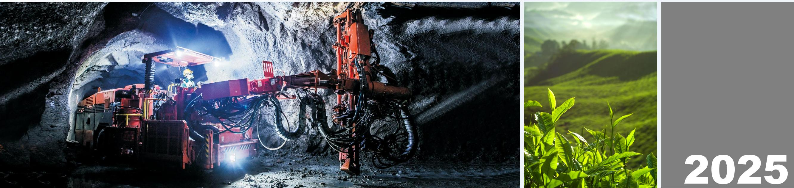

## 以ESG为笔，绘可持续发展新画卷

回望2025，金诚信在环境、社会与治理的每一个维度，都镌刻下坚实的足迹。这一年，我们不仅完成了“五五战略”的收官，更将ESG理念融入企业发展的血脉，让“双轮驱动”的发展动能更具温度与厚度。

从环境维度看，资源开发板块的跨越式发展，正是我们对“生态矿山”愿景的生动实践。刚果（金）迪库路希铜矿的高效投产、龙溪铜矿的稳步达产、赞比亚鲁班比铜矿的焕新升级，不仅是产能的突破，更是对绿色开采、高效利用资源的承诺。未来以智能化矿山建设为引领的规划，更是将科技赋能与环境保护深度绑定，让可持续发展从理念变为可触可感的行动

在社会维度上，日夜的奋斗，凝聚着每一位金诚信人的心血，也承载着我们对员工、对行业、对社会的责任。从刷新行业纪录的超深竖井，到遍布全球的矿山服务项目，我们不仅为国家五年规划贡献了企业力量，更以“厚培文化沃土”的初心，让每一位奋斗者共享发展成果。这份凝聚力，正是我们践行社会责任最坚实的底气。

在公司治理层面，“两主三辅一体化协同”战略的落地、矿业管理4.0变革的推行，彰显了我们追求精细化、系统化管理的决心。从上市以来的规范运作，到紧跟国家战略的前瞻布局，我们始终将透明、高效的治理作为企业行稳致远的基石。正是这种对治理体系的持续优化，让我们能够在复杂的市场环境中，始终保持高质量发展的定力。

2026年，“六五”战略的号角已经吹响。站在新的起点，金诚信将继续以ESG为指引，在环境上追求绿色智能，在社会上践行责任担当，在治理上坚守规范透明。让我们以“闯”的精神、“创”的劲头、“干” 的作风，将ESG理念转化为推动企业前行的不竭动力，在可持续发展的道路上，书写更加壮丽的华章！

## 目录

##

04 关于本报告  
05 2025 年 ESG 亮点绩效  
06 荣誉与奖项  
07 公司基本信息

text_image

金诚信佳
金诚信

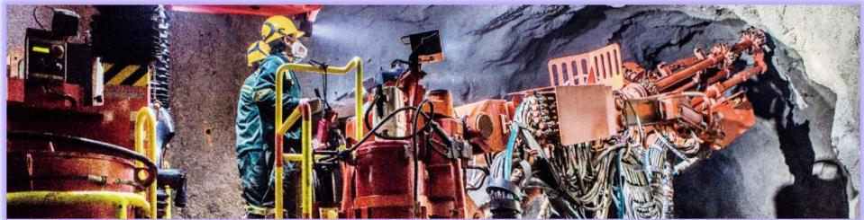

natural_image

Industrial mining site with workers in protective gear operating heavy machinery, no visible text or symbols

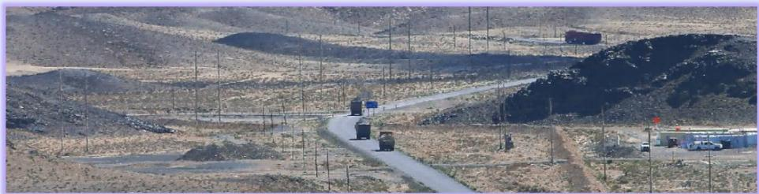

natural_image

Desert landscape with military trucks driving along a winding road through hilly terrain (no visible text or symbols)

82 关键绩效数据表  
83 对标索引表

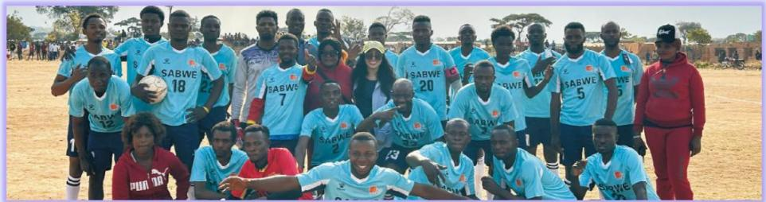

natural_image

Group photo of people in light blue and white SABWE jerseys posing outdoors on a dirt field (no visible text or symbols)

##

14 重要性分析  
17 利益相关方沟通  
理18 议题重要性分析结论

##

20 ESG治理安排  
环22 可持续发展相关治理

##

31 环境合规管理  
33 能源利用  
会35 水资源利用  
37 污染物排放  
39 废弃物处理

## 社会篇

50 员工雇佣与权益  
54 职业健康与安全  
58 员工培训与发展  
62 创新驱动  
67 科技伦理  
68 产品和服务安全与质量

42 应对气候变化  
45 循环经济  
47 生态系统和生物多样性保护

70 数据安全与客户隐私保护  
72 供应链安全  
74 平等对待中小企业  
76 乡村振兴  
77 社会贡献

## 关于本报告

报告编制说明——本报告是金诚信矿业管理股份有限公司第3份《环境、社会和公司治理报告》，向各利益相关方披露了公司在经营中对于ESG议题所秉持的理念、建立的管理方法、推行的工作与达到的成效。

报告范围——本报告范围涵盖金诚信矿业管理股份有限公司及其附属公司（简称“金诚信”或“公司”）。除非特别说明，与公司（股票代码：603979.SH）同期合并财务报表范围一致。

报告期间——本报告期间为2025年1月1日至2025年12月31日。本报告中的数据如无特别说明，均为此期间内数据。

编制依据 ——本报告依据《上海证券交易所上市公司自律监管指引第14号 可持续发展报告（试行）》（简称《指引》），并参考了香港联交所《环境、社会及管治报告守则》编制。

数据说明——报告中数据和案例来自公司实际运行的正式记录。报告中的财务数据均以人民币为单位。财务数据与公司年度财务报告不符的，以年度财务报告为准。

报告获取方式——本报告通过电子版形式发布，发布平台包括证券交 易 所 指 定 的 信 息 披 露 平 台 ， 亦 可 于 公 司 官 方 网 站（www.jchxmc.com）在线浏览或下载。

联系我们——如对报告有任何建议，可通过以下方式与我们联系：联系地址：北京市丰台区诺德中心三期12 号楼金诚信大厦，联系电话：010-82561878

## 报告编制原则

可持续发展背景——公司识别出各利益相关方关注的与经营相关的重要性议题，作为本报告汇报重点。本报告中对重要性议题汇报的同时关注公司所处行业和经营业务的特点。议题重要性分析过程及结果详见本报告相关章节。  
准确性——本报告尽可能确保信息准确。其中，定量信息的测算已说明数据口径、计算依据与假定条件，以保证计算误差范围不会对信息使用者造成误导性影响。董事会对报告的内容进行保证，不存在虚假记载、误导性陈述或重大遗漏。  
平衡性——本报告内容反映客观、真实的事实，对涉及公司正面、负面的信息均予以不偏不倚的披露。在报告期间内未发现应当披露而未披露的负面事件。  
清晰性——本报告以简体中文发布。本报告中包含表格、模型图以及专业名词表等信息，作为本报告中文字内容的辅助，便于利益相关方更好地理解报告中文字内容。为便于利益相关方更快获取信息，本报告提供目录及ESG标准的对标索引表。  
• 量化性——本报告披露关键定量披露项，并尽可能披露历史数据。  
可比性——本报告对同一定量披露项在不同报告期内的统计及披露方式保持一致；若数据的采集、测量与计算方法有更改，对相关数据进行追溯调整，并在报告附注中说明调整的情况和原因，以便利益相关方进行有意义的分析，评估公司ESG数据水平发展趋势。  
• 完整性——本报告披露对象范围与公司合并财务报表范围保持一致。  
时效性——本报告为年度报告，覆盖时间范围为2025年1月1日至2025年12月31日。公司尽力在报告年度结束后尽快发布报告，为利益相关方决策提供及时的信息参考。  
• 可验证性——本报告中案例和数据来自公司实际运行的原始记录或财务报告，所披露数据来源及计算过程均可追溯。

## 2025年ESG亮点绩效

经济效益

全年实现营业收入1,389,396.83万元

同比增长39.74%

归属于本公司股东的净利润233,870.33万元

同比增长47.66%

创造的税收

158,026.06万元

社会效益

研发创新

健康与安全

多元化

员工培训与发展

公益慈善

研发人员436人，占全体员工比例3.09% ；研发投入14,247.48万元，占营业收入1.03%

累计安全教育培训 32,236 人次 安全培训总时长 244,525.50 小时 社会保险覆盖率 100%

通过GB/T 45001-2020/ISO 45001:2018 职业健康安全管理体系认证

少数民族员工503人 雇佣海外当地员工占比57.97%

开展培训课程总次数 2652 员工平均受训时长7.59小时

社会公益投入总金额4,177.02万元

环境效益

全年环保资金投入8,951.75万元

通过GB/T 24001-2016/ISO 14001:2015

环境管理体系认证

## 报告期内主要荣誉与成就

## 国家级设计奖

中国勘察设计协会

## 部级科学技术奖二等奖

中国黄金协会

## 科技成果奖

## 中国有色金属建设协会

• 移动式膏体充填试验平台  
• 井下计量与人机隔离安全辅助系统  
• 稳车群智能调控系统研究与应用

## 部级设计奖

## 中国有色金属建设协会

• 四川发展天瑞矿业有限公司充填系统建设项目（三等奖）  
• 内蒙古国城实业有限公司卓资县大苏计钼矿改扩建采选工程（三等奖）

## 部级咨询奖

## 中国有色金属建设协会

庄胜矿产资源集团有限公司秘鲁Mariela 铁矿采选工程可行性研究（一等奖）  
• 马拉维 Kangankunde 稀土矿一期 44万 t 选矿工程（一等奖）  
• 金星瓦萨有限公司加纳Father（一等奖）  
• 哈萨克斯坦阿拉木图州“阿斯塔纳-卡拉盖雷”矿区中矿段锡多金属矿采选工程（一等奖）  
• 赞比亚鲁班比铜矿采选工程可行性研究（二等奖）  
• 四川省矿业投资集团有限责任公司诺永达拉果矿区可行性研究（二等奖）  
• 四川省矿业投资集团有限责任公司内蒙古投资项目可行性研究（二等奖）  
• 山东丹峨矿业科技有限公司杨庄铁矿地下开采改扩建功可行性研究（二等奖）  
• 洛阳栾川钼业集团股份有限公司 TFM西区地下开采方案设计（二等奖）  
贵州省织金县新华磷矿区果化矿段磷矿150 万吨年采选工程项目建议书（二等奖）  
• 贵州省松桃县道坨锰矿采选工程可行性研究报告（二等奖）  
• 刚果(金)龙溪铜矿深部二期采选工程可行性研究（二等奖）  
• 南非共和国 MUKULU 锰矿ATOB 矿体露天采矿工程可行性研究（三等奖）

## 部级工程建设新技术应用工程

## 中国有色建设协会

• 两岔河矿段（南段）磷矿80万吨/年采矿工程项目  
• 莱州金盛矿业投资有限公司朱郭李家主井井筒掘砌工程

## 部级优质工程

## 中国有色金属工业协会

• 刚果（金）龙溪铜矿采选冶工程  
• 莱州汇金矿业投资有限公司纱岭金矿副井井筒掘砌工程

natural_image

Golden trophy with laurel wreath and ornate base, displayed on a wooden pedestal (no text or symbols visible)

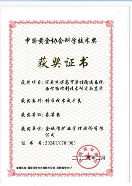

text_image

中国黄金协会科学技术奖
获奖证书
获奖项目：深井竞得高可靠性输送系统
与智能控制技术研究总应用
获奖类别：科学技术成果转化类
获奖等级：武学奖
获奖单位：金诚信矿业管理股份有限公司
证书号：2024HJ070-D03
二〇一四年七月

深井充填高可靠性输送系统与智能控制技术研究与应用

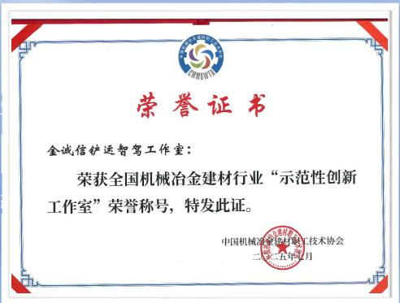

text_image

荣誉证书
金诚信护运智驾工作室：
荣获全国机械冶金建材行业“示范性创新
工作室”荣誉称号，特发此证。
中国机械冶金建材工程技术协会
二〇一五年五月

金诚信铲运智驾工作室荣获全国机械冶金建材行业“示范性创新工作室”荣誉称号

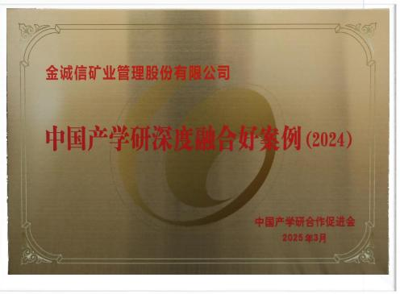

text_image

金诚信矿业管理股份有限公司
中国产学研深度融合好案例 (2024)
中国产学研合作促进会
2025年3月

金诚信矿业管理股份有限公司获中国产学研深度融合好案例

## 公司基本信息

公司是一家以矿山服务和资源开发业务为主的集团化矿业公司。公司的矿山服务业务以矿山工程建设、采矿运营管理为基石并在矿山产业链上下游不断拓展，形成了集矿山设计与技术研发、矿山工程建设、采矿运营管理、矿山机械设备制造等业务一体化的矿山综合服务能力，服务对象为大中型非煤类地下固体矿山，涉及矿山资源品种主要包括铜、铅、锌、铁、镍、钴、金、银、磷、钾等。矿山资源开发业务主要是铜、磷等矿产资源的勘探、开采、选冶及相关产品销售业务。目前在境内外设有40余家分子公司。公司拥有一支高素质、高水平的专业技术、管理人才队伍，现有中外籍员工14000余人。

公司自成立以来，始终专注于非煤地下固体矿山的开发服务业务，经过多年的发展，在矿山工程建设、采矿运营管理业务领域基本确立了领先地位，拥有矿山工程施工总承包壹级资质、隧道工程专业承包贰级资质、爆破作业单位一级资质；全资子公司云南金诚信拥有矿山工程施工总承包壹级资质；全资子公司金诚信技术公司获得矿山工程施工总承包贰级资质；全资子公司金诚信设计院拥有矿山工程施工总承包贰级资质、冶金行业（冶金矿山工程）专业甲级工程设计资质，目前已具备集矿山工程建设、采矿运营管理、矿山设计与技术研发、矿山设备制造等业务于一体的综合服务能力，是能够为矿山提供综合服务的高端开发服务商之一。

以矿山工程建设、采矿运营管理、矿山设计与技术研发、矿山机械设备制造在内的矿山服务业务为公司的传统主业。近年来，公司借助并充分发挥传统主业优势，利用多年沉淀的矿山服务管理经验、技术优势和品牌优势，积极向资源开发领域延伸，逐步探索出具有金诚信特色的“服务+资源”的业务模式，以“矿山服务”、“资源开发”双轮驱动，推动公司从单一的矿山服务企业向集团化的国际矿业公司全面转型。公司的资源开发业务已涵盖矿山资源的并购、勘探、建设、采矿、选矿、冶炼、产品销售等环节，现有两岔河磷矿、刚果（金）Dikulushi铜矿、刚果（金）Lonshi铜矿、赞比亚Lubambe铜矿、哥伦比亚San Matias铜金银矿5处矿区，其中在产项目4个，产品主要涉及铜、磷矿石。

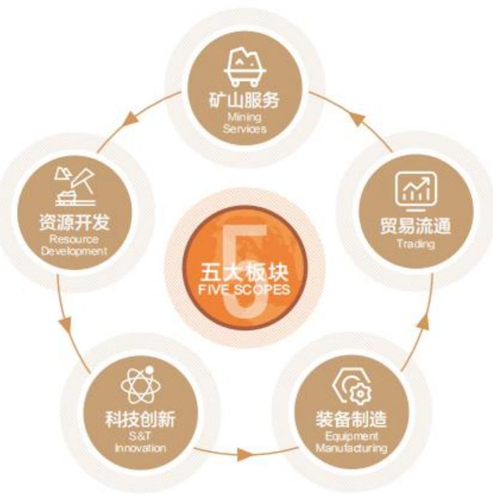

flowchart

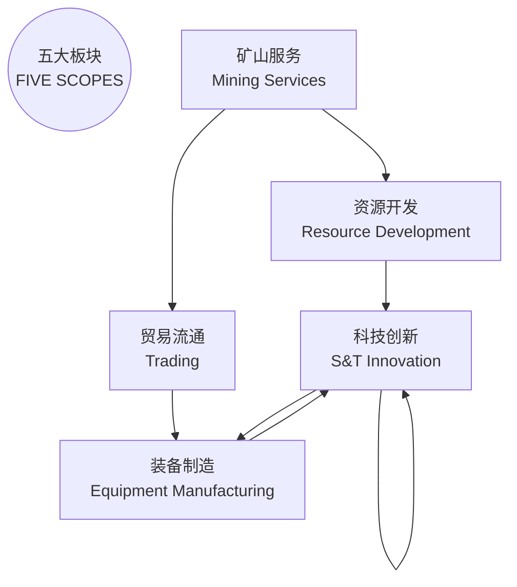
```mermaid
graph TD
  Center(("五大板块\nFIVE SCOPES"))
  
  A["矿山服务\nMining Services"] --> B["资源开发\nResource Development"]
  C["贸易流通\nTrading"] --> D["装备制造\nEquipment Manufacturing"]
  E["科技创新\nS&T Innovation"] --> E
  E --> D
  
  A --> C
  B --> E
  D --> E
```

## 2025年大事记

## 一月

1月15-17日，金诚信召开2025年工作会暨三届九次职代会，动员全体员工乘势而为，万众一心，众志成城，奋力完成“五五战略”既定目标，为“六五战略”开创崭新局面。

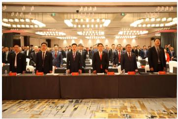

text_image

Group photo of officials in formal attire at a conference or meeting, with nameplates and red folders visible on the table.

## 二月

2月, 中证指数有限公司发布公告，金诚信矿业管理股份有限公司入选中证A500指数。此次入选是对金诚信行业地位、综合实力及稳健市值表现的充分认可，标志着金诚信迈入资本市场高质量发展新阶段。

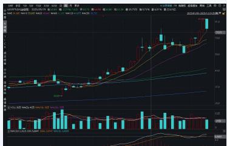

candlestick

| Metric | Value |
| --- | --- |
| MA(5) | 10.82 |
| MA(10) | 10.69 |
| MA(30) | 10.47 |
| MA(60) | 10.25 |
| Volume MA(5) | 10.82 |
| Volume MA(10) | 10.69 |
| Volume MA(30) | 10.47 |
| Price (Current) | 10.82 |
| Price (Previous) | 10.69 |
| Price (Last) | 10.47 |
| Price (Change) | +0.2% |
| Price (Change %) | -0.2% |
| Volume MA(5) | 10.82 |
| Volume MA(10) | 10.69 |
| Volume MA(30) | 10.47 |
| Volume MA(60) | 10.25 |
| Volume MA(100) | 10.02 |

## 三月

3月3日，总部机关党总支联合科技创新事业部和资源开发事业部党总支召开“争当先锋，凝聚共识，深化总部机关作风建设”专题会。荣获2024年度优秀管理团队和优秀个人荣誉的总部机关代表从各自的专业领域出发，分享了在工作中持续提升专业能力、创新工作方法、落实工作责任的实践与感悟，充分展现了爱岗敬业、脚踏实地、迎难而上、追求卓越的拼搏进取精神。

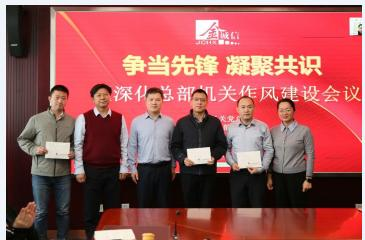

text_image

争当先锋 凝聚共识
深化总部机关作风建设会议

3月，金诚信承接赞比亚Mufulira矿山基建及基础设施支护工程。

3月，自然资源部公布了“矿产资源开发利用方案审查专家库人员名单”，金诚信推荐的丁金刚、龚清田、李红辉等8位专家全部入选。截至目前，金诚信在自然资源部矿产资源开发利用方案审查专家库的在库专家已达到12人。

3月4日至15日 集团公司党委书记、董事长王先成深入塞尔维亚公司所属金塞、波尔、佩吉、瓦萨项目公司视察指导，就项目安全生产、运营管理、员工关怀、团队建设、人才培养、市场拓展等工作提出具体要求，并亲切看望慰问项目一线中外员工。

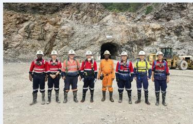

natural_image

Group photo of eight workers in safety gear standing in front of a tunnel entrance (no visible text or symbols)

## 2025年大事记

## 四月

4月 鲁班比铜矿荣获赞比亚环境管理局颁发的“助力行业完善管理实践之最佳设施奖”。

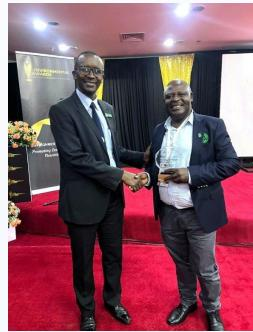

natural_image

Two men shaking hands on a red carpet in front of a backdrop with golden banners (no visible text or symbols)

4月11日，由金诚信股份援建的赞比亚铜带省龙溪边关基础及配套设施正式交付赞比亚政府并投用。赞比亚内政部长Jack Mwiimbu、内政部常秘Dickson Matembo、移民总局局长、铜带省省长等政府官员出席交接仪式，为项目揭牌并发表讲话。

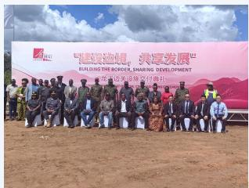

text_image

“建设边疆，共享发展”
BUILDING THE BORDER, SHARING DEVELOPMENT
“共享-迈美经济合作论坛”

4月 由金诚信鲁班比铜矿公司援建的驻地社区Golden Eagle学校四间教室如期竣工。赞比亚矿业与矿产发展部长、Chililabombwe选区议员Paul Kabuswe出席教室移交仪式，并对鲁班比铜矿积极响应Hakainde Hichilema总统及其政府推行的全民优质免费教育愿景，持续回馈社区，支持当地教育事业表示衷心感谢。

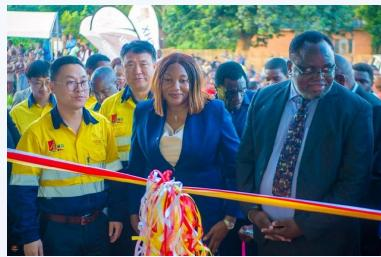

natural_image

Group of people including a woman and officials in yellow uniforms, gathered around a ribbon-cutting ceremony (no visible text or symbols)

4月25日 乔治·布什美中关系基金会主席尼尔·布什（Neil Bush）一行应邀到访金诚信总部，受到金诚信集团董事长王先成、总裁彭怀生的热情接待。

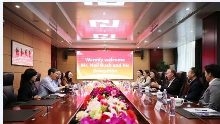

text_image

Warmly welcome
Mr. Neil Bush and his
delegation

## 五月

5月 金诚信股份全资子公司金诚信博茨瓦纳矿山建设有限公司与科马考铜矿有限公司（ Khoemacau Copper Mining ProprietaryLimited）就科马考铜矿地下采矿业务签署服务合同，合同总价款约8.05亿美元，标志着公司在非洲矿山开发服务项目再扩新国别。

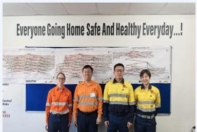

text_image

Everyone Going Home Safe And Healthy Everyday...!

5月28日 在“六一”国际儿童节来临之际，金诚信萨布韦公司代表来到驻地社区刚果（金）上加丹加省卢本巴希市坎博韦镇龙溪村学校，以一场热烈温馨的公益捐赠活动，为孩子们送上节日祝福，也以教育之光，照亮海外项目社区可持续发展之路。

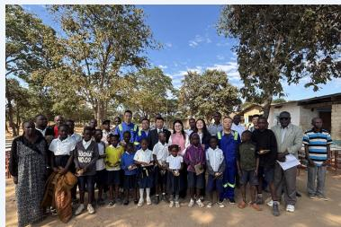

natural_image

Group photo of people outdoors under trees, no visible text or symbols

5月30日 金诚信鲁班比铜矿深部工程开工典礼隆重举行。赞比亚总统希奇莱马，赞比亚矿业部、商贸工部、交通部、信息媒体部部长，铜带省省长等赞比亚政府官员，中国驻赞比亚特命全权大使韩镜，中国驻赞比亚大使馆经济商务处参赞靳钧，金诚信股份董事长王青海、总裁黄海根、副总裁兼鲁班比铜矿董事长王友成、鲁班比铜矿总经理武拴军，鲁班比铜矿管理层及中赞员工代表，当地行业协会、中赞企业代表、赞比亚国家媒体和民众逾2000人共同见证开工盛况。

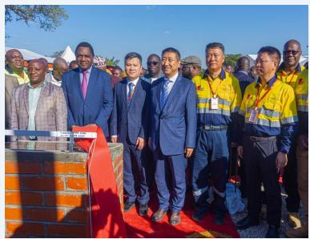

natural_image

Group photo of officials and workers at a ribbon-cutting ceremony outdoors (no visible text or symbols)

## 2025年大事记

## 六月

6月17日 博茨瓦纳外长布塔莱博士及博茨瓦纳驻华大使巴特朗·塞雷马阁下率团到访金诚信，受到金诚信集团董事长王先成，金诚信股份董事长王青海、总裁黄海根的热情接待。

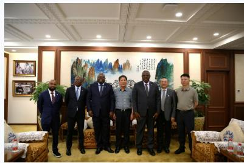

natural_image

Group photo of seven men in formal attire posing indoors with decorative wall art and furniture (no visible text or symbols)

6月 在全国第24个“安全生产月”，海内外各单位积极响应股份公司号召，围绕“人人讲安全、个个会应急——查找身边安全隐患”主题，以“安全无小事”的敬畏之心和“时刻在行动”的务实之举，结合各项目实际，开展风险辨识、隐患排查和应急演练活动，共同营造树牢安全理念、压实安全责任，将安全意识融入日常、化作行动浓厚氛围。

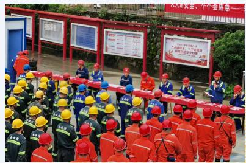

text_image

Group photo of workers in safety gear gathered around a banner with Chinese text, likely during an emergency drill or training session.

6月27日 公司党委隆重举行以“齐心再创业·奋力再出发”为主题的纪念中国共产党成立104周年暨先进事迹报告会。全体员工通过现场参会或视频连线方式在总部主会场，各分（子）公司、事业部和项目部分会场参加此次大会。股份公司党委书记、董事长王青海发表重要讲话。

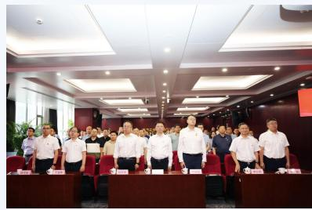

natural_image

Group of people standing in a conference hall with red seating and ceiling lights (no visible text or signage)

6月24日至29日 集团公司董事长王先成赴老挝开元项目检查指导，仔细查看现场重点区域，详细询问生产组织提效和工程质量把控情况，深入了解项目生产运营进展，针对工程重、难点提出系统性指导意见和改进要求，并看望慰问一线中老员工。

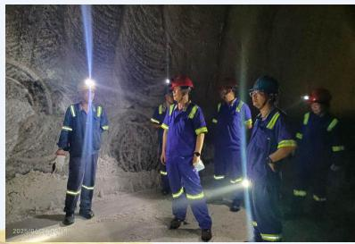

natural_image

Group of workers in blue uniforms and hard hats standing inside a dim underground tunnel with illuminated light beams (no visible text or symbols)

6月27日 由我司牵头主编的国家标准《金属非金属矿山超深竖井施工安全技术规范》（以下简称《规范》）编制组成立暨工作大纲（草案）审查会在公司总部大厦召开。来自矿山安全行业标准化技术委员会矿井建设分技术委员会、中国恩菲工程技术有限公司等7家国内知名非煤矿山设计、施工和设备厂家单位的专家和代表参会。

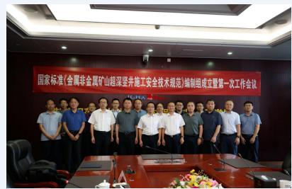

text_image

国家标准《金属非金属矿山超深竖井施工安全技术规范》编制组成立暨第一次工作会议

## 七月

7月14—15日 公司在总部大厦举行2025年年中工作会，全面部署下半年重点工作，为“五五”决胜收官，“六五”奠基蓄势统一思想、统一行动、坚定信心、激扬斗志。

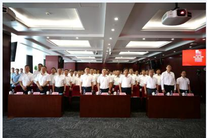

natural_image

Group photo of people in white shirts standing at tables in a conference hall with red carpet and large screen (no visible text or symbols)

7月25日 密云区工匠学院（金诚信学院）正式揭牌。金诚信股份党委书记、董事长王青海和密云区人大党组副书记、副主任，区总工会主席耿智慧，北京市总工会职工服务中心副主任刘桂萍，中关村密云园工委书记、管委会主任张治等领导出席揭牌仪式。

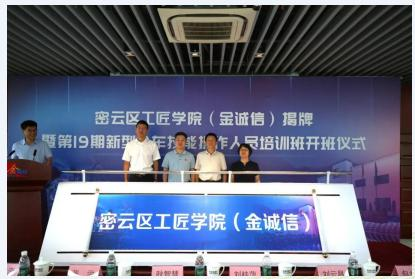

text_image

密云区工匠学院（金诚信）揭牌
暨第19期新型青年技能操作人员培训班开班仪式
密云区工匠学院（金诚信）

## 2025年大事记

## 八月

8月4日 金诚信股份向密云区防汛救灾捐赠仪式在区人大会议室举行。仪式由区人大常委会党组书记、主任任武军主持。金诚信集团党委书记、董事长王先成和密云区副区长施辉阳等领导出席捐赠仪式。

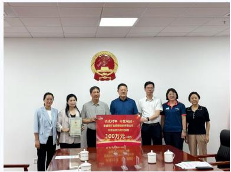

text_image

100万元

8月1日至11日 以“青春无畏 不负相遇”为主题的金诚信2025年应届大学生入职培训在中国社会科学院密云基地圆满举行。

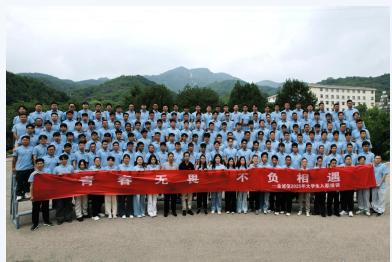

text_image

青春无畏不负相逢
2023年10月1日中华人民共和国青年委员会

8月 金诚信股份副总裁兼海外事业部总经理王友成前往博茨瓦纳，对科马考项目进行视察指导。

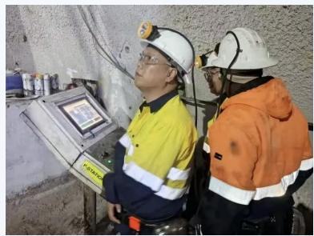

natural_image

Two workers in hard hats and safety vests inspecting an electrical control panel outdoors (no visible text or symbols)

8月29日 金诚信高端智能重型矿山装备制造项目签约仪式在大冶市委市政府办公楼隆重举行。这一重大产业项目的落地不仅标志着金诚信装备在构建现代化矿山建设体系、打造矿山装备智造高地的征程上又迈出坚实一步，也是政企协同推进高端装备制造产业升级的关键举措。

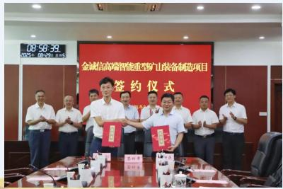

text_image

金诚信高端智能重型矿山装备制造项目
签约仪式

## 九月

9月 由鲁班比公司援建的水井工程正式移交赞比亚Chililabombwe市新孔科拉学校，将惠及2500多名师生。Chililabombwe市政府官员、学校师生和社区居民代表共同见证移交仪式。

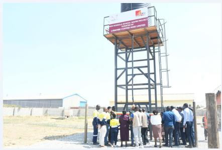

text_image

NEW EUROPE & BURGERY
GARANTIC COMPANY LIMITED

9月 金诚信集团董事长王先成应邀赴瑞典斯德哥尔摩，拜访全球知名矿山设备制造商山特维克集团，并代表金诚信股份与山特维克签署井下无轨设备采购协议。

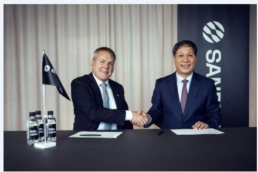

natural_image

Two men in suits shaking hands at a table with a bank flag and water bottles, against a dark background (no visible text or symbols)

## 十月

10月 金诚信萨布韦公司历时一年精心规划、设计、建造的职业培训学校教学设施正式启用，并举行首期培训开班仪式，标志着公司海外资源开发项目在全方位、多层次属地人才培养和履行社会责任方面迈出新的坚实一步。

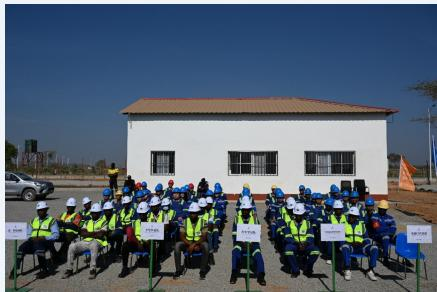

text_image

Group photo of construction workers in safety vests and helmets gathered outside a building, holding signs with Chinese text.

10月 公司收到由中国机械冶金建材职工技术协会颁发的2025年度行业创新成果获奖证书。金诚信EPC总包管理部、铲运智驾工作室获评全国机械冶金建材行业“示范性创新工作室”；北京金诚信矿山技术研究院有限公司、云南金诚信矿业管理有限公司荣获“工会经济技术工作先进单位”荣誉称号；刚果（金）公司副总经理袁平勇、膏体充填实验室常务副主任刘伟涛、金诚信（湖北）智能装备有限公司研发部副经理付贤杰荣获“行业工匠”称号。

## 2025年大事记

## 十一月

11月 由北京市贸促会组织的“联通世界 投资北京 共享未来”系列活动之沙特阿拉伯矿业公司代表团赴金诚信调研交流活动成功举办。

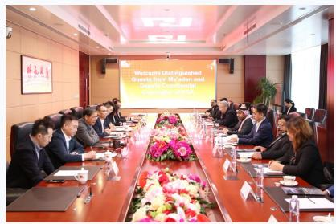

text_image

Welcome Distinguished
from the Gate and
Security Committee
Distinguished by China

11月 安百拓集团总裁兼首席执行官HelenaHedblom、CEO高级助理Mayelin Axelsson、大中华区总裁卫武贤一行到访我司总部，受到金诚信集团董事长王先成、金诚信股份常务副总裁王慈成的热情接待。

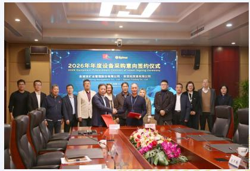

text_image

2026年年度设备采购意向签约仪式
2026年年度设备采购意向签约仪式

11月11日 公司召开管理诊断宣讲大会，为奋进“六五”统一思想凝聚共识，向公司海内外员工系统宣讲。集团公司党委书记、董事长王先成亲自主持大会并作重要指示。

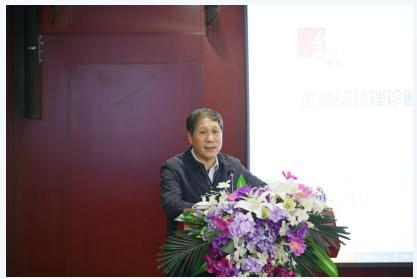

text_image

Photo of a man speaking at a podium with floral decoration, background screen displaying Chinese text about financial management and mental health.

11月8日至12日 股份公司董事长王青海赴开元项目视察督导，深入现场重点区域，实地查看生产组织、质量控制、设备管理、降本增效等关键环节，并就进一步推动矿业管理 4.0与日常管理全面深度融合，充分运用矿业管理4.0的思路与方法推进重点工作作指示。

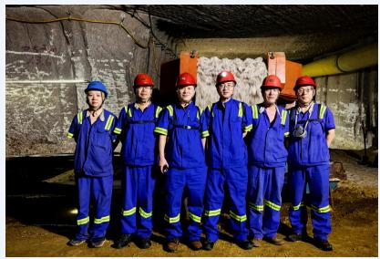

natural_image

Group photo of six workers in blue uniforms and red helmets standing in front of a tunnel entrance (no visible text or symbols)

## 十二月

12月8日 加纳矿业委员会首席执行官艾萨克·坦多（Isaac Tandoh）先生，赤峰黄金集团副总裁、金星瓦萨董事长陈志勇等一行到访金诚信北京总部，受到金诚信集团董事长王先成、金诚信股份总裁黄海根的热情接待。

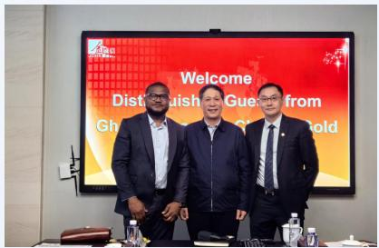

text_image

Welcome
Distrustish Guest from
Ghost Gold

12月 2025年度（第十一届）加纳矿业大奖揭晓。金诚信股份驻加纳子公司——开拓者投资有限公司(Setters Investment LimitedCompany）从众多参评企业中脱颖而出，荣获“最佳矿山承包商”季军殊荣，成为本年度获得该专业奖项的唯一中资企业，体现了当地权威行业机构对金诚信在安全管理、质量管控、合规运营、生产组织和技术创新等方面综合实力的高度认可。

text_image

AWARDS
EST DOR
GMIA
AWARDS

12月 金诚信股份党委书记、董事长王青海于近日出席中国—赞比亚“一带一路”联合实验室国家级科技创新平台建设工作推进会。

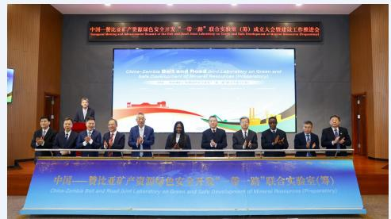

text_image

中国—冀北矿产资源绿色安全开发“一带一路”联合实验室（筹）成立大会暨建设工作推进会
China-Zambia Belt and Road Joint Laboratory on Green and Safe Development of Mineral Resources (Preparatory)
中国—冀北矿产资源绿色安全开发“一带一路”联合实验室(筹)
China-Zambia Belt and Road Joint Laboratory on Green and Safe Development of Mineral Resources (Preparatory)

12月 公司与京东科技就携手打造金诚信人工智能应用平台举行项目启动会。双方就依托京东智能一体化平台，推动AI技术与人力资源管理、物资管理、财务管理等具体业务场景深度融合，从经验驱动向数据驱动转型，以人工智能赋能精益管理进行交流研讨。

## 议题重要性评估

作为矿山建设运营和开发企业，本公司深知可持续发展对于行业长远发展的重要性。根据《上海证券交易所上市公司自律监管指引第14号——可持续发展报告（试行）》要求，本公司建立并不断完善可持续发展相关影响、风险和机遇的识别、评估及管理流程，将可持续发展理念深度融入公司战略决策和日常运营中。

natural_image

Black and white photo of a pen resting on a dark surface with a computer keyboard in the background (no visible text or symbols)

## 双重重要性分析

## 了解公司活动和业务关系背景

-了解公司活动和业务关系  
-了解外部客观环境  
-了解主要受影响的利益相关方

## 建立议题清单

-以《指引》设置的21个议题为基础，并识别其他潜在的重要性议题  
-识别议题相关影响、风险和机遇，汇总形成公司议题清单

## 议题重要性的评估与确认

-影响重要性评估  
-财务重要性评估  
-整合影响与财务重要性结果

## 议题报告

-汇总议题双重重要性分析的流程、方法及结论  
-依据《指引》要求披露相关内容

## 一、识别与评估方法

## （一）多维度风险识别体系

本公司采用"自上而下"与"自下而上"相结合的风险识别方法，构建覆盖全价值链的可持续发展风险识别网络：

1. 数据驱动的内部扫描  
•生产运营数据监测：通过部署于各矿区的传感器和物联网设备，采集重要数据指标，为风险识别提供基础。  
•员工反馈机制：鼓励一线员工上报潜在风险隐患，并及时处置。  
•内部审计发现：开展日常专项审计，形成风险清单并跟踪整改。

2. 外部环境监测

•政策法规追踪：设立政策研究团队，动态跟踪国内外矿业相关法律法规变化和最新要求。

•利益相关方沟通：建立常态化沟通机制，定期与地方政府、社区居民、环保组织、行业协会等进行对话。

•行业标杆对标：参与有关行业组织，学习最佳实践，识别自身差距。

## 3. 专业识别工具应用

•情景分析法：针对气候变化风险，公司构建多种未来场景，评估不同气候路径下对公司资产、运营成本和市场需求的潜在影响。  
•“能量本源 + 要素全覆盖”的双重危险源辨识体系：针对关键领域，公司采用能量危险源辨识法。在日常运营中，公司全面推行危害因素危险源辨识法。依据“人、机、料、法、环”五维度模型，组织全员开展岗位风险辨识。

## 双重重要性分析

## （二）量化评估模型

在识别与公司有关的各类风险和机遇的基础上，公司采用定量与定性相结合的评估方法，对每项风险/机遇的发生可能性、影响程度进行科学评估：

1. 风险评估矩阵

建立5×5风险评估矩阵，从"发生概率"（极低、低、中、高、极高）和"影响程度"（轻微、较小、中等、重大、灾难性）两个维度进行打分，明确需要纳入分析范围的议题。例如：

•尾矿库溃坝风险：发生概率评定为"低"（基于历史数据和工程措施），但影响程度为"灾难性"，综合风险等级为"高"。  
•社区冲突风险：在部分新建矿区，发生概率评定为"中"，影响程度为"重大"，综合风险等级为"中高"。

2. 影响重要性评估

对环境和社会影响，采用专业评估工具。例如：

•生态足迹分析：评估矿区开发对当地生物多样性、生态系统服务功能的影响。  
•社会影响评估：在项目前期，评估对当地就业、基础设施、文化传承等方面的影响。

3. 财务重要性评估

对可量化的风险/机遇，公司财务部门协同业务部门进行财务影响测算。例如：

•资源效率收益：评估节水、节能技术改造的投资回报期和经济收益。  
•声誉损失估算：参考行业案例，估算重大环境事故可能导致的市值损失、融资成本上升等间接成本。

## 二、优先级排序及排序标准

公司遵循“双重重要性”原则，构建了科学的议题实质性评估矩阵，不仅关注可持续发展议题对公司财务状况、经营成果和现金流量的财务重要性，同样高度重视公司运营对外部环境、社会及利益相关方产生的影响重要性。通过独立评估与整合分析，确定报告期内的优先管理议题。

1. 评估维度与标准体系

分别从“影响视角”和“财务视角”进行打分，随后进行整合。

（1）影响重要性评估：评估公司活动对经济、环境、人群（包括价值链上下游）产生的实际或潜在正面/负面影响的大小、规模、不可逆性及受关注度。  
（2）财务重要性评估：评估可持续发展相关风险与机遇对公司企业价值（包括收入、成本、资产、负债、资本获取能力及声誉）产生实际或潜在影响的程度。

2. 整合评估与优先级判定流程

公司将上述两个维度的评估结果纳入“双重重要性矩阵”进行整合分析，具体步骤如下：

第一步：独立打分。由ESG委员会牵头，联合财务、生产、安环、法务等部门及外部利益相关方，分别对初选议题进行“影响重要性”和“财务重要性”打分。

第二步：矩阵定位。将各议题映射至四象限矩阵中，第一象限（双高区）：影响重要性高 + 财务重要性高；第二象限（影响主导区）：影响重要性高 + 财务重要性低（短期）；第三象限（财务主导区）：影响重要性低 + 财务重要性高；第四象限（双低区）：影响重要性低 + 财务重要性低。第三步：确认议题优先级。

非常重要议题：凡落入“第一象限”的议题。

重要议题：落入“第二象限”或“第三象限”。

次重要议题：落入“第四象限”的议题，纳入日常合规管理，仅在报告中简要提及或不单独披露。

## 双重重要性分析

## 3. 排序结果的动态调整机制

公司认识到重要性议题并非一成不变。我们建立了年度重估机制，当出现以下情况时，将即时启动临时评估并调整优先级：

法律法规突变：如国家突然出台更严格的尾矿库治理法规或碳税政策。

重大突发事件：行业内发生重大安全事故或本公司遭遇重大环境舆情。

战略目标调整：公司并购新矿山或进入新金属品种领域。

利益相关方诉求剧变：主要投资者或客户提出新的强制性ESG要求。

## 三、监测管理机制

## （一）组织架构保障

公司建立了"董事会—战略和可持续发展委员会—ESG工作小组—执行部门"四级可持续发展治理架构：

•董事会：对可持续发展重大事项负最终责任，每年专题审议ESG工作报告。  
•战略和可持续发展委员会：对公司 ESG 工作进行监督，定期检查公司 ESG 管理活动的实施与进展，评估风险并制定应对方案；  
•ESG工作小组：组织推进公司 ESG 管理活动及管理目标的实现，识别和评估日常管理中 ESG 相关风险并提出具体的应对措施；  
•执行部门：执行ESG相关管理措施和年度工作计划；配合统计与收集相关ESG指标信息及主要举措；

## （二）具体监测流程

实时监测预警，对于环境监测、安全生产、社区舆情等关键事项或指标实时监控，且将监控纳入各个执行部门的日常工作任务。

## 尽职调查

## 一、尽职调查总体概况

本公司高度重视可持续发展领域的尽职调查工作，将其视为识别、预防、减轻及问责可持续发展相关负面影响的核心机制。报告期内，公司严格参照相关国家法律法规和公司内控制度，建立覆盖全链条的尽职调查体系。公司坚持按照“风险导向、全程覆盖、动态管理”原则，对潜在的环境破坏、人权侵犯、社区冲突或腐败等风险进行了系统性排查与应对。

## 二、尽职调查的组织架构与责任主体

为确保尽职调查的独立性与专业性，公司构建了多层级的执行架构：

1.领导机构：董事会战略与可持续发展委员会负责审议重大风险事项的调查报告及整改方案。  
2.牵头部门：ESG小组作为常设执行机构，负责制定调查标准、组织实施现场审核及跟踪整改闭环。

## 3.实施主体：

（1）内部专项组：由具备地质、环保、安全、法律背景的内部专家组成。  
（2）利益相关方代表：在部分社区影响调查中，邀请当地社区代表或工会代表参与联合调查，确保视角的客观性。  
报告期内，公司尽职调查的范围实现了从“核心运营”向“全价值链”的延伸，包括：员工、客户、供应商、政府和社区等。  
公司采用“文件审阅 + 现场核查 + 利益相关方访谈 + 数据监测”四位一体的识别程序。

## 三、尽职调查的范围与覆盖对象

## 四、识别程序与方法

## 利益相关方沟通

公司注重与内外部利益相关方保持紧密沟通，通过建立多元化的沟通渠道，充分了解各利益相关方的期望与诉求并及时作出回应，不断调整可持续发展战略及ESG实质性议题，让各利益相关方有效参与金诚信ESG管理工作，与其携手共同发展。报告期内，我们基于《上海证券交易所上市公司自律监管指引第14号——可持续发展报告（试行）》，并参考香港联交所《环境、社会及管治报告守则》、全球报告倡议组织（GRI）《可持续发展报告标准》和联合国可持续发展目标（SDGs）等标准指引，选定主要利益相关方群体，记录并回应各利益相关方的关注问题，持续提升与各利益相关方的沟通。

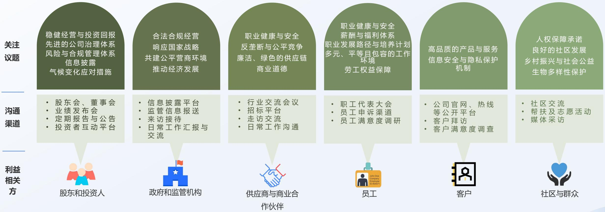

flowchart

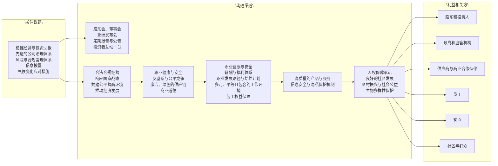
```mermaid
graph LR
  subgraph sg["\"关注议题\""]
    A["稳健经营与投资回报\n先进的公司治理体系\n风险与合规管理体系\n信息披露\n气候变化应对措施"]
  end

  subgraph sg_2["\"沟通渠道\""]
    B["股东会、董事会\n业绩发布会\n定期报告与公告\n投资者互动平台"]
    C["合法合规经营\n响应国家战略\n共建公平营商环境\n推动经济发展"]
    D["职业健康与安全\n反垄断与公平竞争\n廉洁、绿色的供应链\n商业道德"]
    E["职业健康与安全\n薪酬与福利体系\n职业发展路径与培养计划\n多元、平等且包容的工作环境\n劳工权益保障"]
    F["高质量的产品与服务\n信息安全与隐私保护机制"]
    G["人权保障承诺\n良好的社区发展\n乡村振兴与社会公益\n生物多样性保护"]
  end

  subgraph sg_3["\"利益相关方\""]
    H["股东和投资人"]
    I["政府和监管机构"]
    J["供应商与商业合作伙伴"]
    K["员工"]
    L["客户"]
    M["社区与群众"]
  end

  A --> B
  A --> C
  C --> D
  D --> E
  E --> F
  F --> G
  G --> H
  G --> I
  G --> J
  G --> K
  G --> L
  G --> M
```

## 议题重要性分析结论

报告期内，公司基于国家宏观政策导向、国内外社会责任标准研究、行业对标等方面，结合企业业务发展战略、经营管理情况，以及利益相关方关注重点，通过识别、评估、确认等工作流程，开展实质性议题分析，并参考上一年度重要议题的实际情况，选定2025年度ESG实质性议题，积极回应利益相关方诉求。按照“影响重要性”和“财务重要性”，整合影响与财务重要性结果，公司将ESG实质性议题进行重要性排序，有助于确定本年度可持续发展管理工作重点及优先次序。

报告期内，我们按照《上海证券交易所上市公司自律监管指引第14号——可持续发展报告（试行）》要求，并参考香港联交所《环境、社会及管治报告守则》，明确和识别实质性议题，共识别出9项非常重要议题。

<table><tr><td>非常重要议题</td><td>重要议题</td><td>次重要议题</td></tr><tr><td>1、产品和服务安全与质量</td><td>10、应对气候变化</td><td>20、平等对待中小企业</td></tr><tr><td>2、环境合规管理</td><td>11、创新驱动</td><td>22、科技伦理</td></tr><tr><td>3、职业健康与安全</td><td>12、数据安全与客户隐私保护</td><td>23、乡村振兴</td></tr><tr><td>4、反商业贿赂及反贪污</td><td>13、污染物排放</td><td></td></tr><tr><td>5、反不正当竞争</td><td>14、废弃物处理</td><td></td></tr><tr><td>6、员工雇佣与权益</td><td>15、社会贡献</td><td></td></tr><tr><td>7、尾矿管理</td><td>16、循环经济</td><td></td></tr><tr><td>8、员工培训与发展</td><td>17、供应链安全</td><td></td></tr><tr><td>9、公司治理</td><td>18、生态系统和生物多样性保护</td><td></td></tr><tr><td></td><td>19、能源利用</td><td></td></tr><tr><td></td><td>21、水资源管理</td><td></td></tr></table>

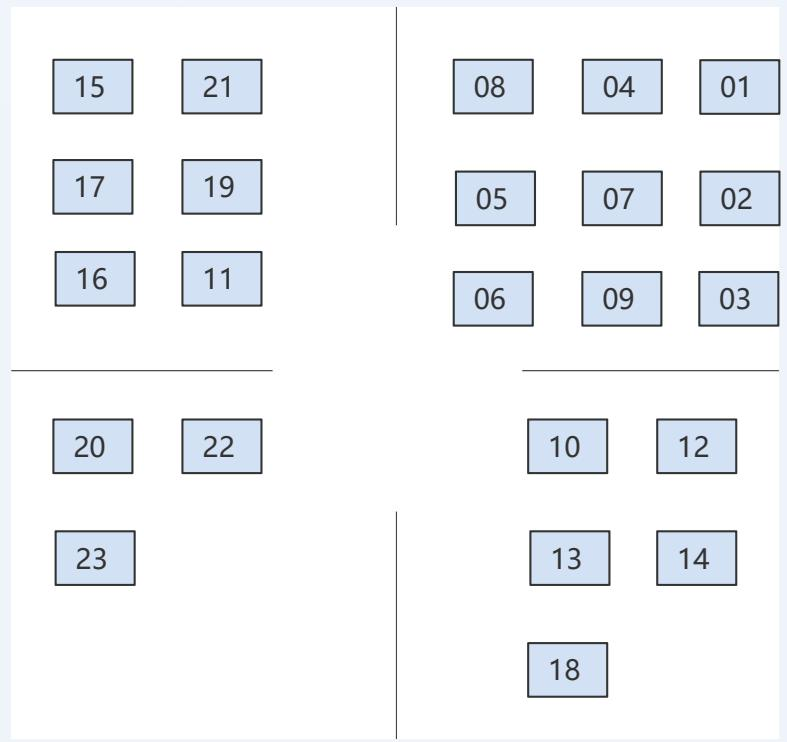

text_image

15 21
17 19
16 11
08 04 01
05 07 02
06 09 03
20 22
23
10 12
13 14
18

财务重要性

# 公司ESG治理及可持续发展相关治理

公司立足于依法治企，致力于构建透明、公平且高效的治理体系，确保所有决策与运营不仅严格遵循法律法规，更充分兼顾股东及其他利益相关方的核心利益。在坚持党建引领的核心原则下，公司将ESG理念深度融入顶层治理架构，统筹推动可持续发展战略的落地。通过建立健全ESG信息披露机制，公司以卓越的治理效能保障稳健运行，推动经济、社会与生态效益的和谐统一，最终实现高质量的可持续发展与长期价值创造。

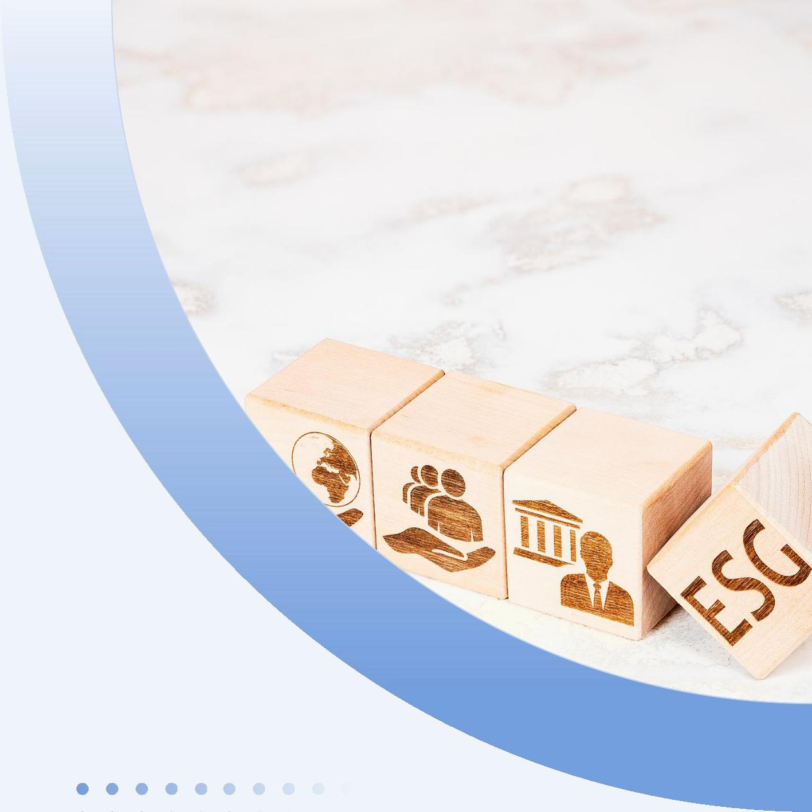

natural_image

Wood blocks with icons representing global economy, finance, and social services (no text or symbols)

## ESG治理安排

在全球ESG发展浪潮下，作为国际化矿业公司，公司深刻认识到，ESG已从外部期待内化为企业可持续发展的刚需与核心能力，金诚信致力于将ESG理念全面融入战略指定与运营执行各环节，以更高标准的治理体系推动可持续价值创造，回应利益相关方期待，塑造负责任的企业形象。

## 治理机构

报告期内，公司在上一年度完善ESG管理规划，构建从董事会、管理层到各职能部门和事业部的ESG管理组织体系的基础上，细化ESG监督和管理组织架构，明确各职能中心和业务部门的ESG事务对接人员，将ESG管理进一步延申和下沉。

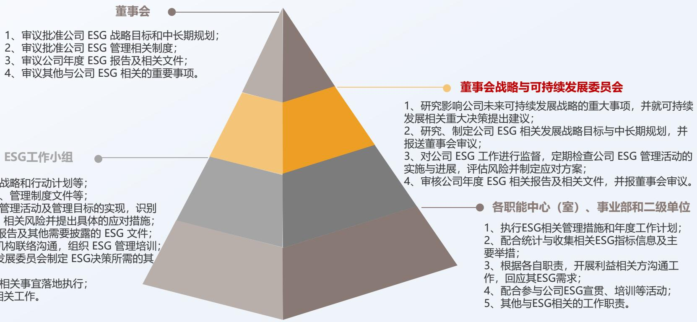

flowchart

```mermaid
graph LR
  A["董事会"] --> B["董事会战略与可持续发展委员会"]
  B --> C["各职能中心（室）、事业部和二级单位"]
  C --> D["ESG工作小组"]
  D --> E["ESG工作小组<br/>战略和行动计划等；/、管理制度文件等；/管理活动及管理目标的实现，识别相关风险并提出具体的应对措施；/报告及其他需要披露的 ESG 文件；/机构联络沟通，组织 ESG 管理培训；/发展委员会制定 ESG决策所需的其/相关事宜落地执行；/相关工作。"]
  
  subgraph Subscales
    direction TB
    A --- B --- C --- D --- E --- F --- G --- H --- I --- J --- K --- L --- M --- N --- O --- P --- Q --- R --- S --- T --- U --- V --- W --- X --- Y --- Z --- AA --- AB --- AC --- AD --- AE --- AF --- AG --- AH --- AI --- AJ --- AK --- AL --- AM --- AN --- AO --- AP --- AQ --- AR --- AS --- AT --- AU --- AV --- AW --- AX --- AZ --- BA --- BB --- BC --- BD --- BE : CF : CF1 : CF2 : CF3 : CF4 : CF5 : CF6 : CF7 : CF8 : CF9 : CF10 : CF11 : CF12 : CF13 : CF14 : CF15 : CF16 : CF17 : CF18 : CF19 : CF20 : CF21 : CF22 : CF23 : CF24 : CF25 : CF26 : CF27 : CF28 : CF29 : CF30 : CF31 : CF32 : CF33 : CF34 : CF35 : CF36 : CF37 : CF38 : CF39 : CF40 : CF41 : CF42 : CF43 : CF44 : CF45 : CF46 : CF47 : CF48 : CF49 : CF50 : CF51 : CF52 : CF53 : CF54 : CF55 : CF56 : CF57 : CF58 : CF59 : CF60 : CF61 : CF62 : CF63 : CF64 : CF65 : CF66 : CF67 : CF68 : CF69 : CF70 : CF71 : CF72 : CF73 : CF74 : CF75 : CF76 : CF77 : CF78 : CF79 : CF80 : CF81 : CF82 : CF83 : CF84 : CF85 : CF86 : CF87 : CF88 : CF89 : CF90 : CF91 : CF92 : CF93 : CF94 : CF95 : CF96 : CF97 : CF98 : CF99 : FC100: FC101: FC102: FC103: FC104: FC105: FC106: FC107: FC108: FC109: FC110: FC111: FC112: FC113: FC114: FC115: FC116: FC117: FC118: FC119: FC120: FC121: FC122: FC123: FC124: FC125: FC126: FC127: FC128: FC129: FC130: FC131: FC132: FC133: FC134: FC135: FC136: FC137: FC138: FC139: FC140: FC141: FC142: FC143: FC144: FC145: FC146: FC147: FC148: FC149: FC150: FC151: FC152: FC153: FC154: FC155: FC156: FC157: FC158: FC159: FC160: FC161: FC162: FC163: FC164: FC165: FC166: FC167: FC168: FC169: FC170: FC171: FC172: FC173: FC174: FC175: FC176: FC177: FC178: FC179: FC180: FC181: FC182: FC183: FC184: FC185: FC186: FC187: FC188: FC189: FC190: FC191: FC192: FC193: FC194: FC195: FC196: FC197: FC198: FC199: FC200: FC201: FC202: FC203: FC204: FC205: FC206: FC207: FC208: FC209: FC210: FC211: FC212: FC213: FC214: FC215: FC216: FC217: FC218: FC219: FC220: FC221: FC222: FC223: FC224: FC225: FC226: FC227: FC228: FC229: FC230: FC231: FC232: FC233: FC234: FC235: FC236: FC237: FC238: FC239: FC240: FC241: FC242: FC243: FC244: FC245: FC246: FC247: FC248: FC249: FC250: FC251: FC252: FC253: FC254: FC255: FC256: FC257: FC258: FC259: FC260: FC261: FC262: FC263: FC264: FC265: FC266: FC267: FC268: FC269: FG_0_0_0_0_0_0_0_0_0_0_0_0_0_0_0_0_0_0_0_0_0_0_0_0_0_0_0_0_0_0_0_0_0_0_0_0_0_0_0_0_0_0_0_0_0_0_0_0_0_0_<nl>
```

## l ESG管理培训

为提升中高层管理人员对于ESG发展的理解，从人员意识到工作能力等多个方面促进公司ESG管理水平，报告期内，公司在全体中层和高级管理人员范围内，组织ESG培训，通过介绍行业内最新ESG发展理念和实践案例，结合公司实际情况，明确后续提升方向和工作重点。

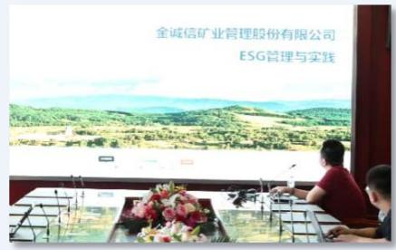

text_image

金诚信矿业管理股份有限公司
ESG管理与实践

1、研究起草公司 ESG 战略和行动计划等；  
2、拟订 ESG 管理架构、管理制度文件等；  
3、组织推进公司 ESG 管理活动及管理目标的实现，识别和评估日常管理中 ESG 相关风险并提出具体的应对措施；  
4、组织编制ESG 年度报告及其他需要披露的 ESG 文件；  
5、负责与咨询、评级机构联络沟通，组织 ESG 管理培训；  
6、提交战略与可持续发展委员会制定 ESG决策所需的其他资料；  
7、负责协调推进 ESG 相关事宜落地执行；  
8、其他ESG日常管理相关工作。

## ESG治理安排

## 信息报告

2025年，在实行ESG重大信息实时报告制度的基础上，公司增加各部门和分支机构的定期报告制度，明确相关负责人为本单位信息报告的责任人。

##

出现、发生或即将发生与ESG有关的重大事项，负责人不能行使重大事项报告义务时，由单位负责人指定的人员履行其报告义务，事后由该单位负责人予以确认

情况紧急时，各单位可先以电话形式上报，事后补送书面报告

##

公司各部门、各级分支机构和子公司负有报告义务的有关人员在每个会计年度结束后的2个月内根据ESG小组编制的ESG资料清单内容，收集整理有关ESG信息，提交各类数据或报告。

## 目标设定、流程嵌入与动态监控

公司依据自身情况，设立ESG管理的目标，并嵌入战略规划、投资决策、运营管理、绩效考核等核心管理流程，并对执行进展实行监控

1. 目标设定与分解

• 长期目标：将ESG管理内化为企业发展的刚需和核心能力；  
• 年度目标：将长期目标分解为年度具体KPI，如：设定”工亡事故为零、千人负伤率≤7.0‰、新增职业病为零、环保事故为零“的安全环保底线目标。  
• 层层分解：将年度目标逐级分解至各级分公司和项目部，签订责任书，确保“人人肩上有指标”。

2. 纳入各项管理流程

• 战略决策嵌入，在公司"六五"战略规划中，将可持续发展管理的提升列入重点工作之一。  
• 投资管理融合，对于新项目须开展ESG影响评估。  
• 运营管理整合，将ESG指标统计纳入生产系统。  
• 绩效考核挂钩，将ESG指标纳入中高层管理人员绩效考核体系。  
3. 目标实现进展监控  
• 建立“每周通报、及时分析纠偏、年度总结”的动态监控机制。  
• 各项任务建立台账，对进度滞后单位限期整改。

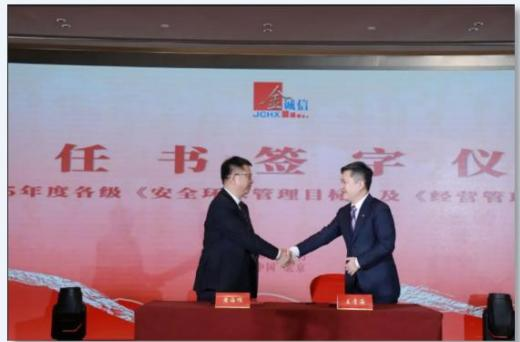

text_image

诚信
JGHS Inc.
任书签字仪
5年度各级《安全环》管理目标及《经营管理
2015年
中国·北京

管理层签署年度《安全环保管理目标责任书》

## 内部控制与监督

公司将可持续发展要求深度嵌入内部控制体系，形成了一套覆盖全业务流程的制度规范：

## 顶层制度设计

《金诚信矿业管理股份有限公司环境、社会和公司治理（ESG）管理办法》，明确治理架构、职责分工及管理原则。

## 专项管理制度

针对矿业特点，分别建立并修订了涉及环境、社会和治理的多项专项制度以及声明与承诺。

## 监督程序与措施

公司建立了“内部审计 + 专项检查+举报反馈”三位一体的监督程序，确保制度有效执行：内部审计部门定期开展专项审计；安全生产管理部门定期进行安全生产检查，及时发现和消除隐患；开通举报热线、邮箱及小程序，支持员工、供应商匿名举报隐患或违规违纪行为。

## 可持续发展相关治理

金诚信严格遵循《中华人民共和国公司法》《中华人民共和国证券法》《上市公司治理准则》《上海证券交易所股票上市规则》等相关法律法规的规定，构建了以股东会、董事会及高级管理层为主体的公司治理架构，有效确立了权力机构、决策机构、监督机构与经营管理层之间权责清晰、相互协调、相互制衡的运行机制，保障了公司治理结构职责明确、协作紧密、运作高效。

报告期内，公司结合治理结构调整及《公司章程》修订情况，不再设监事会，将原有关监事会的义务与责任，适应性调整为审计与风险管理委员会的义务与责任；将“股东会”更名为“股东会”。

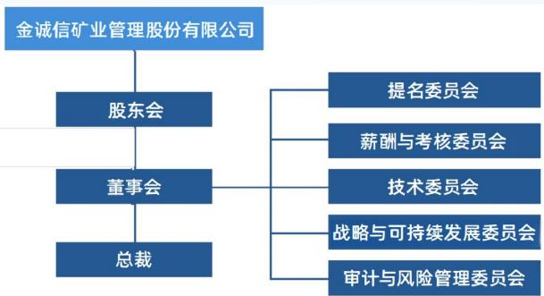

flowchart

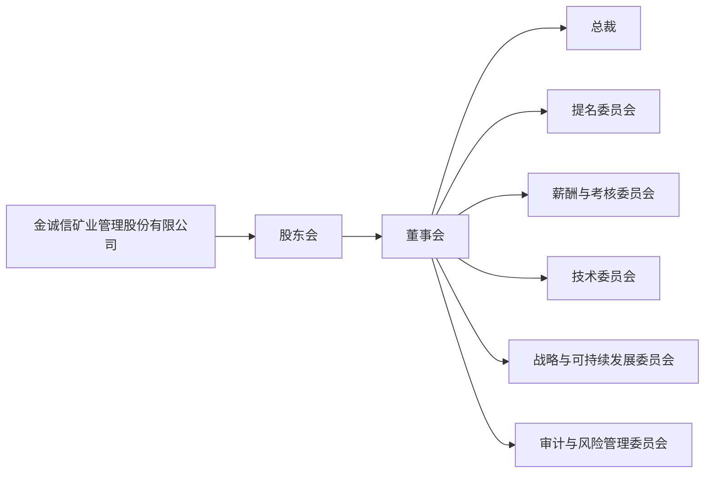
```mermaid
graph LR
  A["金诚信矿业管理股份有限公司"] --> B["股东会"]
  B --> C["董事会"]
  C --> D["总裁"]
  C --> E["提名委员会"]
  C --> F["薪酬与考核委员会"]
  C --> G["技术委员会"]
  C --> H["战略与可持续发展委员会"]
  C --> I["审计与风险管理委员会"]
```

## 股东与股东会

股东会是公司的最高权力机构。公司股东会职责清晰，有明确的议事规则并得到切实执行。报告期内，公司召开了1次年度股东会，3次临时股东会，均采取现场和网络投票相结合的表决方式。股东会的召集、召开程序严格按照《公司章程》、公司《股东会议事规则》、上海证券交易所《上市公司股东会规则》等规定和要求，所有议案均对中小股东单独计票，保证公司全体股东特别是中小股东享有平等的权利，充分行使自己的表决权。

公司在人员、资产、财务方面与控股股东完全分开，机构、业务独立运作。公司控股股东严格按照《公司法》《公司章程》等相关规定行使股东权利。公司控股股东严格遵守对公司做出的避免同业竞争的承诺。报告期内没有发生公司控股股东利用其特殊地位侵占和损害上市公司和其他股东利益的行为。

## 董事与董事会

董事会是公司的日常决策机构。公司董事会共9名成员，独立董事占比约为33.33%。公司董事会职责清晰，全体董事能够认真、负责地履行职责。报告期内，公司共召开12次董事会会议，董事会成员出席率100%。董事会会议召开、召集程序均符合《公司章程》《董事会议事规则》《独立董事工作制度》等规定。公司董事会严格按照《公司章程》对权限范围内的事项履行相应的审议程序。

<table><tr><td colspan="2"></td><td>2023年</td><td>2024年</td><td>2025年</td></tr><tr><td colspan="2">董事会成员数量(名)</td><td>9</td><td>9</td><td>9</td></tr><tr><td rowspan="2">按性别披露</td><td>男性董事(名)</td><td>8</td><td>8</td><td>8</td></tr><tr><td>女性董事(名)</td><td>1</td><td>1</td><td>1</td></tr><tr><td rowspan="2">按类型披露</td><td>独立董事(名)</td><td>3</td><td>3</td><td>3</td></tr><tr><td>非独立董事(名)</td><td>6</td><td>6</td><td>6</td></tr></table>

报告期内，公司根据治理结构调整的需要，将原有关监事会的义务与责任，适应性调整为董事会审计与风险管理委员会的义务与责任。

公司董事会具有多元化管理体系，下设战略与可持续发展委员会、提名委员会、审计与风险管理委员会、薪酬与考核委员会以及技术委员会五个专门委员会，并针对制定委员会议事规则，明确各委员会组成、职责、会议等内容。报告期内，各专门委员会根据公司实际情况并按照各自议事规则，以认真负责、勤勉诚信的态度忠实履行各自职责，在公司治理、战略规划、薪酬体系管理、技术指导、内控体系建设、定期报告编制、关联交易审核等方面发挥了积极作用，有效促进了董事会的规范运作及科学决策。

<table><tr><td rowspan="2">专门委员会</td><td colspan="3">会议召开次数(次)</td></tr><tr><td>2023年</td><td>2024年</td><td>2025年</td></tr><tr><td>战略与可持续发展委员会</td><td>1</td><td>1</td><td>3</td></tr><tr><td>审计与风险管理委员会</td><td>6</td><td>6</td><td>7</td></tr><tr><td>提名委员会</td><td>1</td><td>1</td><td>2</td></tr><tr><td>薪酬与考核委员会</td><td>2</td><td>2</td><td>4</td></tr></table>

独立董事每年向董事会进行述职，就当年度的履职情况进行陈述，同时，董事会对独立董事的独立性进行自查，并对外披露相关上述履职和自查情况。报告期内，公司独立董事均保持其独立性，并勤勉尽责地履行了各自在相关领域的工作。同时，审计与风险管理委员会按照要求每年对履职情况进行报告，报告期内，该委员会勤勉尽责，认真履行委员会的各项职责。董事会每年对公司内部控制的有效性进行评价并对外披露，报告期内，公司在所有重大方面保持了内部控制的有效，达到了内部控制的目标，并得到第三方的审计认可。

## 可持续发展相关治理

## 风险管理与内部控制

健全高效的风险管理与内部控制体系是企业实现稳健经营与高质量发展的核心保障。金诚信构建的内部控制体系完整涵盖内部环境、风险评估、控制活动、信息与沟通、内部监督五大要素。公司严格遵循《企业内部控制基本规范》《企业内部控制应用指引》等监管要求，系统建立健全内部控制制度，编制《内部控制手册》，为内控体系的建立、执行、评价与持续优化提供标准化依据。同时，针对多元化业务场景与潜在风险，公司细化制定了一系列专项管理制度，包括《重大信息内部报告制度》《突发事件处置制度》《法律事务管理办法》《反舞弊与反商业贿赂管理制度》《舆情管理制度》《期货和衍生品交易管理制度》等，切实强化风险前置识别与防范能力，提升突发事件的响应与处置效率。

在组织保障层面，公司董事会下设审计与风险管理委员会，依据《董事会审计与风险管理委员会议事规则》等制度，全面负责内外部审计工作的协调、监督与核查。委员会下设审计监察中心，配备专业化审计团队，持续对公司内部控制体系的健全性与执行有效性、财务信息质量及相关经营活动开展独立监督与评估，有力推动内控机制完善、管理效能提升与经营效益增长。报告期内，公司结合业务发展实际，深入推进“工作制度化、业务流程化、流程标准化”建设，持续优化内控体系；严格依照企业内部控制规范体系及相关规定，在财务报告与非财务报告内部控制的所有重大方面均保持有效运行，确保财务信息真实准确、经营活动合法合规，全面达成内部控制的既定目标。

## 内部审计

随着公司五大板块快速发展，资源项目逐步投产，装备制造、贸易、科技创新板块的发力，结构持续优化，审计监察的范围越来越广，对审计监察工作要求也越来越高，做好公司审计监察工作的责任和意义更加重大。2025年度，按照董事会的要求，审计监察中心全面落实公司关于审计工作部署，在2025年各季度与各中心针对2024年修订的内控制度进行深入的沟通交流，对于内控制度中的风险点由各中心进行确认，并在审计过程以及内控穿行测试过程重点关注。

报告期内，审计监察中心完成了对国内21个项目部、4个职能中心、2个分（子）公司、海外13个项目公司和4个自有资源项目的现场审计工作。结合现场审计督查情况，均下达审计整改事项，要求有整改措施方案，整改期限，整改责任人，到期上传整改结果进行复核验证，审计整改问题有始有终，整改完成率100%。

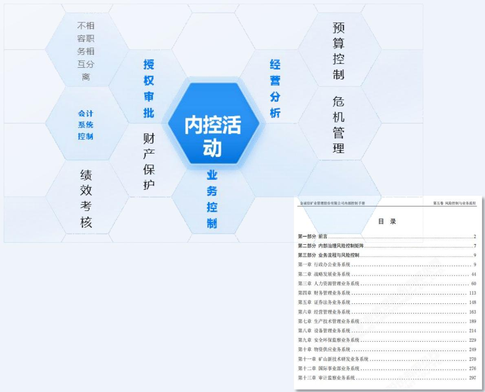

flowchart

```mermaid
graph LR
  Center["内控活动"]
  
  subgraph Core Components
    direction TB
    A1["不相容职务相互分离"]
    A2["会计系统控制"]
    A3["绩效考核"]
    A4["授权审批"]
    A5["财产保护"]
    A6["业务控制"]
  end
  
  subgraph Core Components
    direction TB
    B1["经营分析"]
    B2["预算控制"]
    B3["危机管理"]
  end
  
  subgraph Core Components
    direction TB
    C1["内控活动"]
    C2["财务保护"]
    C3["绩效考核"]
  end
  
  subgraph Core Components
    direction TB
    D1["会计系统控制"]
    D2["会计系统控制"]
  end
  
  subgraph Core Components
    direction TB
    E1["绩效考核"]
    E2["会计系统控制"]
  end
  
  subgraph Core Components
    direction TB
    F1["经营分析"]
    F2["预算控制"]
    F3["危机管理"]
  end
  
  subgraph Core Components
    direction TB
    G1["内控活动"]
    G2["财务保护"]
    G3["绩效考核"]
  end
  
  subgraph Core Components
    direction TB
    H1["经营分析"]
    H2["预算控制"]
    H3["危机管理"]
  end
  
  subgraph Core Components
    direction TB
    I1["内控活动"]
    I2["财务保护"]
    I3["绩效考核"]
  end
  
  subgraph Core Components
    direction TB
    J1["经营分析"]
    J2["预算控制"]
    J3["危机管理"]
  end
  
  subgraph Core Components
    direction TB
    K1["内控活动"]
    K2["财务保护"]
    K3["绩效考核"]
  end
  
  subgraph Core Components
    direction TB
    L1["经营分析"]
    L2["预算控制"]
    L3["危机管理"]
  end
  
  subgraph Core Components
    direction TB
    M1["内控活动"]
    M2["财务保护"]
    M3["绩效考核"]
  end
  
  subgraph Core Components
    direction TB
    N1["经营分析"]
    N2["预算控制"]
    N3["危机管理"]
  end
  
  subgraph Core Components
    direction TB
    O1["内控活动"]
    O2["财务保护"]
    O3["绩效考核"]
  end
  
  subgraph Core Components
    direction TB
    P1["经营分析"]
    P2["预算控制"]
    P3["危机管理"]
  end
  
  subgraph Core Components
    direction TB
    Q1["内控活动"]
    Q2["财务保护"]
    Q3["绩效考核"]
  end
  
  subgraph Core Components
    direction TB
    R1["经营分析"]
    R2["预算控制"]
    R3["危机管理"]
  end
  
  subgraph Core Components
    direction TB
    S1["内控活动"]
    S2["财务保护"]
    S3["绩效考核"]
  end
  
  subgraph Core Components
    direction TB
    T1["经营分析"]
    T2["预算控制"]
    T3["危机管理"]
  end
  
  subgraph Core Components
    direction TB
    U1["内控活动"]
    U2["财务保护"]
    U3["绩效考核"]
  end
  
  subgraph Core Components
    direction TB
    V1["经营分析"]
    V2["预算控制"]
    V3["危机管理"]
  end
  
  subgraph Core Components
    direction TB
    W1["内控活动"]
    W2["财务保护"]
    W3["绩效考核"]
  end
  
  subgraph Core Components
    direction TB
    X1["经营分析"]
    X2["预算控制"]
    X3["危机管理"]
  end
  
  subgraph Core Components
    direction TB
    Y1["内控活动"]
    Y2["财务保护"]
    Y3["绩效考核"]
  end
  
  subgraph Core Components
    direction TB
    Z1["经营分析"]
    Z2["预算控制"]
    Z3["危机管理"]
```

## 可持续发展相关治理

## 风险管理文化培育

告期内，公司持续推进风险管理文化建设，依托全员参与、全流程覆盖的风险管控机制，进一步夯实内部控制体系，提升合规经营水平，增强风险防范与化解能力，为公司高质量发展提供坚实保障。

## • 中高层管理人员培训

2025年6月至2025年11月，审计监察中心分五次对公司三期中高层管理人员进行公司风险管理体系、风险管理内控制度、内审内控监察体系、审计监察工作思路以及廉洁自律、风险管控等方面，进行培训。

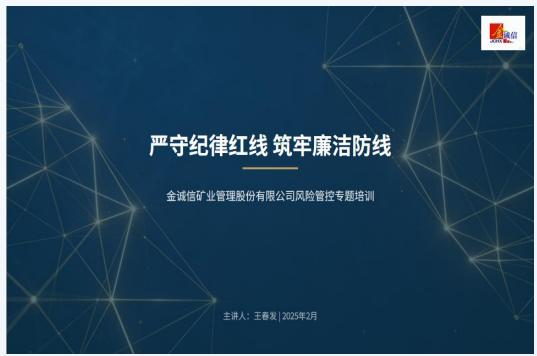

text_image

严守纪律红线 筑牢廉洁防线
金诚信矿业管理股份有限公司风险管控专题培训
主讲人：王春发 | 2025年2月

## 对关键部门及关键岗位人员进行风险管理及合规培训

公司纪委于2025年2月和10月对股份公司关键部门及关键岗位人员培训风险防范与相关案例、金诚信矿业管理股份有限公司反舞弊与反商业贿赂管理制度等内容。

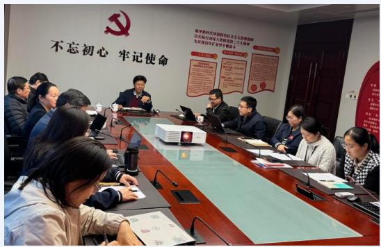

text_image

不忘初心 牢记使命

## 税务管理

报告期内，公司系统推进税务管理工作，严格依法履行纳税义务，规范税务操作流程，有效防控税务风险。海外分支机构在执行该办法时，同步遵守业务所在地的法律法规要求。

在组织架构上，公司实行“统一领导、分级管理”原则：财务管理中心在财务总监统筹下，全面负责公司及所有下属机构的税务事务；各二级单位承担本单位及所辖项目的税务管理职责；海外事业部与海外资源公司专注所在国税务政策研究、方案设计、日常管理与监督检查；各项目部具体落实税务方案，完成申报缴纳等操作，并按权限向所属级单位汇报，重大事项直报总部。

公司对税务管理全流程作出规范，涵盖纳税方式、登记、核算、申报复核、发票管理、报告分析、监督检查、培训教育及档案管理等环节。其中，各二级单位须每年对所辖单位开展至少一次纳税自查并提交报告，公司层面同步组织全范围专项检查；财务管理中心每年至少举办一次全公司税收政策培训，并提供学习资料，要求各单位结合实际开展多样化内部培训。

在税务风险管理方面，公司围绕“责任识别、强化学习、事前沟通、及时整改、严格检查”五大环节系统推进。总部建立专项税务事项应对机制，全面梳理风险点、规范处理流程，针对问题制定专项方案并跟踪落实；对下属单位反馈的税务疑问或潜在风险及时研判、反馈与监督，复杂事项引入外部专业机构协同解决。报告期内，专项税务方案落实责任的监督与检查实现100%全覆盖。

## 可持续发展相关治理

## 投资者关系管理

为了规范公司信息披露行为，加强公司与投资者之间的信息沟通，进一步完善公司治理结构，切实保护投资者特别是社会公众投资者的合法权益，金诚信结合实际情况，根据《公司法》、《证券法》、《上市公司信息披露管理办法》、《上海证券交易所股票上市规则》和相关法律、法规以及《公司章程》的规定，制定了《信息披露管理制度》、《投资者关系管理制度》、《投资者来访接待工作管理办法》和《市值管理制度》。报告期内，公司严格遵守执行上述规则。公司秉着“公平、公正、公开”原则，客观、真实、准确、完整地进行投资者沟通和信息披露，增强市场信任度和投资者信心，并重视投资者的意见和建议，积极回应投资者关切，进而实现公司价值与投资者利益的共同增长，并常态化组织高级管理人员和相关部门负责人进行投资者关系工作相关知识的培训。

报告期内，公司根据中国证监会《上市公司章程指引》《上市公司信息披露管理办法》《上市公司信息披露暂缓与豁免管理规定》以及上海证券交易所更新发布的《上海证券交易所股票上市规则》、各项上市公司自律监管指引、业务指南等的相关要求，结合公司情况，对有关制度进行同步调整，以适应监管要求。同时，根据中国证监会《上市公司章程指引》的要求制定《董事离职管理制度》。

## 投资者沟通渠道

报告期内，公司通过电话沟通会、现场调研交流会、路演活动等方式与投资者进行交流；利用“上证e互动”平台、投资者调研会议、投资者热线电话和邮箱等多种形式回答投资者问题，建立平等畅通的沟通平台；定期召开业绩说明会进行专项交流，积极参与辖区组织的投资者网上集体接待日活动；进行专项投资者交流会，跟踪分析主要股东变动情况，保持与投资者的畅通沟通渠道。通过以上措施，公司有效促进了投资者对公司的了解和认同，保护投资者合法权益，促进公司与投资者之间建立长期、稳定的良性关系。

<table><tr><td>指标</td><td>2025年</td></tr><tr><td>发布公告</td><td>106份</td></tr><tr><td>上证e服务上市公司发布</td><td>15次</td></tr><tr><td>投资者沟通次数</td><td>47次</td></tr><tr><td>投资者接待人次</td><td>270人</td></tr><tr><td>投资者提问回复率</td><td>100%</td></tr><tr><td>业绩说明会</td><td>4场</td></tr><tr><td>股东会</td><td>4次</td></tr><tr><td>股东出席率</td><td>51.00%</td></tr></table>

## • 公司股东会

公司高管对于参会中小股东的问题进行了完整的回答，也认真听取了中小股东的意见，确保中小股东的利益得到尊重和体现。。

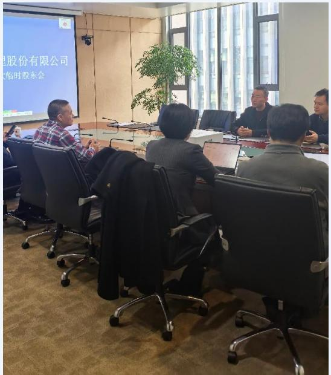

text_image

股份有限公司
临时股东会

# 可持续发展相关治理

## 党建引领

金诚信矿业管理股份有限公司党委成立于2012年3月，是引领企业高质量发展和践行ESG理念的核心力量，截至本报告期末，共有党员405名，下设4个党总支、12个党支部（含2个直属党支部）始终坚持“企业发展到哪里，党组织就建到哪里，党员作用就发挥到哪里”的原则，将支部建在项目上，实现国内总部、海内外项目部党建工作全覆盖，为企业践行环境责任、履行社会责任、完善公司治理提供坚强的政治保障和组织保障，推动党建工作与ESG建设深度融合、同频共振。2025年，金诚信党委深入贯彻落实党的创新理论，紧扣ESG发展要求，聚焦“环境友好、社会担当、治理高效”目标，立足矿业行业特点，补短板、强弱项、固根基，在思想引领、组织建设、赋能发展、品牌辐射等方面精准发力，切实把党的政治优势、组织优势转化为企业ESG实践优势、发展优势，全年各项工作取得阶段性成效。

## 党员培养与教育活动

党委始终将政治建设摆在首位，以规范治理、强化引领为核心，推动党建与公司治理深度融合。一是强化思想铸魂，夯实治理思想基础。严格落实“第一议题”制度，组织中央八项规定精神、党的二十届四中全会精神等专题学习活动，创新开展特色主题教育，通过观看红色影片、举办建党纪念活动、先进事迹报告会等形式，全年累计开展各类学习活动14场，覆盖职工1.2万人次，引导全体党员职工坚定理想信念。二是优化组织治理，健全责任体系。聚焦企业党员流动性强、海外项目分布广的行业特点，完成党工团组织调整优化，选优配强基层班子，推动“支部建在项目上”，确保基层治理无死角；严把党员发展入口关，2025年新发展党员9人，35岁及以下占比78%，持续优化党员队伍结构，为企业治理注入年轻活力。三是完善监督机制，规范权力运行。针对党建与业务融合不深等问题，推动党建工作与矿山生产、安全管理、人才培育等核心业务同部署、同考核，健全党员干部履职监督体系，建立问题收集、交办、督办、反馈全闭环机制，问题解决率超90%，确保公司治理合规高效、公开透明。

## 党建工作亮点

一是擦亮党建品牌，搭建实践载体。深化“党旗领航，五维同进”党建品牌建设，搭建“三大平台”履职载体，推动党建与业务发展深度融合，其经验做法被中关村密云园公众号刊发，受邀出席中国职业安全健康协会党建论坛作经验分享，发挥行业示范引领作用；二是开展党团组织“两优三先”评选活动，评选出公司优秀共产党员7名，优秀党务工作者2名，青年先锋6名，先进基层党组织4个，先进基层团组织1个。

##

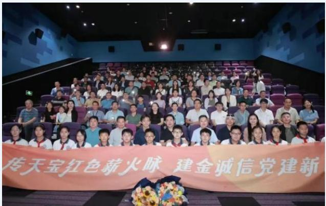

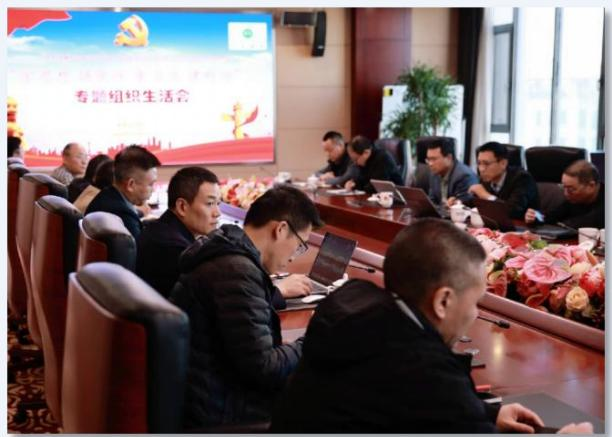

text_image

专题组织生活会

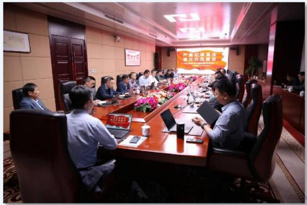

text_image

Meeting room photo with visible banner text and participants seated around a long table

## 可持续发展相关治理

## 反商业贿赂及反贪污

公司严格遵守《中华人民共和国刑法》《中华人民共和国反不正当竞争法》《中华人民共和国公司法》《中华人民共和国审计法实施条例》《中华人民共和国证券法》《企业内部控制基本规范》《上海证券交易所上市公司自律监管指引第 1号——规范运作（2023 年 12 月修订）》《上海证券交易所上市公司自律监管指引第 14 号— 可持续发展报告（试行）》及其他与反舞弊、反商业贿赂、企业内部控制相关的适用法律、法规、司法解释和规范性文件等有关规定，以及《联合国反腐败公约》等海外下属单位当地所适用的相关法律，确保国内国外一把尺子，严格遵守经营所在国法律法规及国际准则。报告期内，公司未有因贪污、贿赂、勒索、欺诈等事项引起的诉讼案件发生。

l• 报告期内，公司根据有关法律、法规、司法解释和规范性文件等规定，结合《公司章程》和公司实际，制定《金诚信反舞弊与反商业贿赂管理制度》《金诚信纪检监察工作制度》，并发布《金诚信矿业管理股份有限公司商业道德管理政策声明》，且在所有商务合同中强制嵌入廉洁条款，明确约定一旦发现贿赂行为，立即终止合同并追究违约责任。  
• 公司反商业贿赂及反贪污方面的工作在董事会的监督下进行，由董事长直接管理，并逐层执行相应工作；

## 董 事 会 审 计 与 风 险 管 理 委 员 会

反舞弊、反商业贿赂工作的领导机构和主要负责机构，负责公司反舞弊、反商业贿赂行为的指导工作以及相关制度文件的编制工作，对反舞弊、反商业贿赂工作进行持续监督

## 审 计 监 察 中 心

反舞弊、反商业贿赂的监督管理部门,独立行使监督权，直接向董事会审计与风险管理委员会汇报，代表公司接待和处理员工申诉、检举和控告的专业部门，负责受理员工、关联单位对各级管理人员违反公司制度、安全规程、工作指令、利用职权谋取私利及其它损害公司利益、破坏公司风气行为的检举、控告。

flowchart

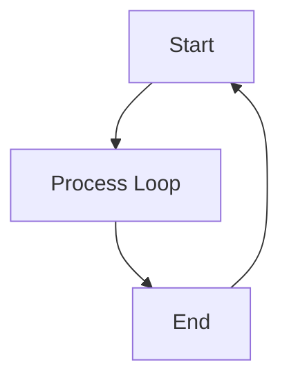
```mermaid
graph TD
  A["Start"] --> B["Process Loop"]
  B --> C["End"]
  C --> A
```

## 下 属 各 单 位 负 责 人

本单位反舞弊及反商业贿赂工作的第一责任人和对接人，负责开展本单位反舞弊及反商业贿赂工作

## 法 务 部 门

为反舞弊及反商业贿赂工作的事实提供法律支持

## 举报程序与举报人保护制度

金诚信支持并鼓励所有员工以及客户、承包商、供应商等相关方对不当行为或渎职行为等进行举报，设立举报电子邮箱、举报电话、在各个项目部现场还设立了举报信箱、在飞书及微信设立举报二维码等。审计监察中心严格保守举报人员信息，维护举报人合法权益，确保举报人能够安全、合法地揭露任何其确信的举报事宜，对因泄露举报人信息和事项的审计监察人员按公司内控制度给予处理，造成严重后果的，移送司法机关。

## 可持续发展相关治理

## 反商业贿赂及反贪污

反商业贿赂及反贪污相关影响、风险及机遇识别 本公司严格遵守《中华人民共和国刑法》、《反不正当竞争法》及国际反腐败公约（如《联合国反腐败公约》），结合矿业行业特点（如矿权获取、大宗物资采购、产品销售、社区关系维护等关键环节），系统识别了报告期内及未来面临的反商业贿赂及反贪污相关影响、风险与机遇。

<table><tr><td>类别</td><td>具体事项/风险点</td><td>影响时间范围</td><td>影响程度评估</td><td>潜在财务/战略/声誉影响描述</td></tr><tr><td>风险采购与供应链环节</td><td>供应商围标串标、回扣风险(涉及大型设备采购、基建工程外包、备件耗材供应)</td><td>短期-中期</td><td>高</td><td>财务:导致采购成本虚高,直接侵蚀利润;面临合同无效、资金损失风险。法律:相关责任人面临刑事责任,公司面临处罚风险。声誉:被列入政府采购或大型国企黑名单,供应链断裂。</td></tr><tr><td>风险销售与市场环节</td><td>客户行贿、违规佣金风险(涉及矿产品定价、长协合同签订、物流安排)</td><td>短期-中期</td><td>中高</td><td>财务:面临反垄断调查罚款、没收违法所得。战略:失去核心大客户信任,出口业务受阻。</td></tr><tr><td>风险行政许可与社区关系</td><td>政府审批寻租、社区“保护费”风险(涉及采矿证延续、环评安评审批、征地拆迁、社区捐赠)</td><td>长期</td><td>极高</td><td>法律:核心高管被逮捕,采矿许可证被吊销,项目被迫停工。战略:引发重大舆情危机,导致股价暴跌,融资渠道受阻。</td></tr><tr><td>风险内部职务侵占</td><td>资产盗窃、虚假报销、利益输送(涉及金属产品盘点、废旧物资处置、关联交易)</td><td>持续存在</td><td>中</td><td>财务:直接资产流失,财务报表失真。管理:破坏内部公平文化,导致人才流失,内控体系失效。</td></tr><tr><td>机遇廉洁品牌与合规溢价</td><td>“清廉矿山”建设与合规认证</td><td>长期</td><td>高</td><td>战略:获得国际高端客户(如欧美车企、电子巨头)的优先采购权;提升ESG评级,降低融资成本(绿色/可持续挂钩贷款)。管理:优化内部流程,降低隐性交易成本,提升运营效率。</td></tr><tr><td>机遇数字化风控赋能</td><td>大数据反腐与透明化管理</td><td>中期-长期</td><td>中</td><td>管理:通过数字化手段实现业务全流程留痕,大幅降低人为操纵空间,提升决策科学性。</td></tr></table>

应对战略与管理策略 针对上述识别出的风险与机遇，公司确立了“以刚性审计监察护航公司健康发展，严防内部管理风险”的反腐败战略，通过强化监督执纪，深化教育引导，构建了立体化的防控体系。

  
举报渠道

建立“信、访、网、电”四位一体举报平台，严格保护举报人隐私

  
专项巡察

每年开展专项 巡察

  
严肃问责

坚持“一案双查”，既查当事人责任，也查领导管理责任对一线员工在入职就进行廉洁教育；对中层以上干部每年开展不少于2次警示教育培训（董事、管理层及员工培训率均达到100%）

  
分层培训

  
文化活动

观看警示教育片、参观廉政基地，营造“以廉为荣、以贪为耻”的氛围

公司位于刚果（金）的DikulushiLonshi、赞比亚的Lubambe和哥伦比亚的Alacran均是“采掘业透明度倡议(EITI) ”各自国家层面的成员。EITI是由英国前首相托尼·布莱尔发起，旨在通过提高石油、天然气和采矿业的财政透明度及问责制，缓解资源丰富国家因管理不善引发的腐败与贫困问题。

• 对二级单位人员进行商业道德与廉政建设培训

2025年12月，审计监察中心对二级单位员工进行线下结合线上方式进行商业道德与廉政建设培训。

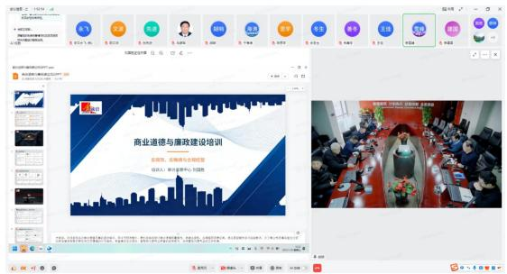

text_image

商业道德与廉政建设培训
应用场景：在城市中进行智慧
培训人：李云云等中心问题

## 可持续发展相关治理

## 反不正当竞争

金诚信在生产经营活动中，严格遵循《中华人民共和国反不正当竞争法》《反不正当竞争保护示范规定》等国家法律法规及相关标准，恪守商业道德底线，坚决杜绝损害其他企业商誉与声誉、贬损其信用或活动公信力，误导公众等行为，积极营造并维护公平，公正，有序的市场竞争环境，相关反不正当竞争的工作在公司董事会统一领导下推进，由董事会秘书分管，合规管理部门具体承担反垄断与反不正当竞争合规管理职责，包括法律法规动态追踪与解读、制度体系建设、合规风险识别与评估、合规审查及专项培训等。公司结合法律法规更新、业务模式特点及外部环境变化，系统开展合规风险研判，明确自身合规义务，并制定针对性改进与落实措施，切实保障合规管理工作的有效性与前瞻性。报告期内，公司正式发布《金诚信矿业管理股份有限公司商业道德管理政策声明》《金诚信矿业管理股份有限公司数据管理政策声明》及《金诚信矿业管理股份有限公司供应商管理政策声明》，清晰阐明公司坚决反对垄断及任何形式的不公平竞争行为，将规范市场交易行为、强化知识产权与商业秘密保护等要求全面纳入合规管理体系，持续健全反不正当竞争制度机制。报告期内，公司未发生因不正当竞争行为引发的诉讼案件或受到重大行政处罚的情形。

» 本公司严格遵循《中华人民共和国反不正当竞争法》《广告法》及国际通行商业准则，结合矿业行业特性（资源属性强、产业链长、客户集中度高、国际竞争激烈），系统识别反不正当竞争领域的影响、风险与机遇。  
公司通过建立健全制度、优化流程、开展风险管理、商业道德宣传和教育培训畅通举报渠道等手段，防止不正当竞争行为的发生。

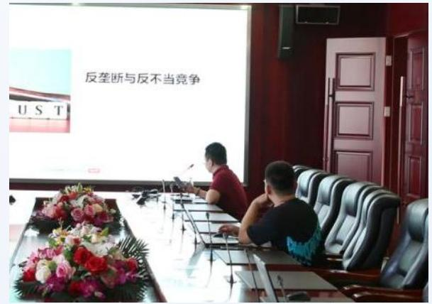

text_image

反垄断与反不当竞争
UST

<table><tr><td>类别</td><td>具体事项/风险点</td><td>影响时间范围</td><td>影响程度评估</td><td>潜在财务/战略/声誉影响描述</td></tr><tr><td>风险商业秘密泄露</td><td>勘探数据、选矿工艺参数、客户采购策略、成本结构等核心信息被窃取或员工离职泄露</td><td>长期</td><td>极高</td><td>竞争:技术优势丧失,竞争对手针对性压价;财务:重大项目投标失败;战略:核心价值贬损;</td></tr><tr><td>风险商业诋毁</td><td>恶意散布不实信息;社交媒体恶意炒作</td><td>短期</td><td>高</td><td>声誉:引发社区抗议、政府介入调查;运营:项目审批延迟、停产整顿;财务:股价大幅波动,融资成本上升;</td></tr><tr><td>机遇诚信品牌溢价</td><td>通过真实、透明的产品信息披露(如碳足迹标签、负责任矿产溯源),建立“可信矿业”形象</td><td>长期</td><td>高</td><td>获得高端客户合约、品牌溢价、ESG评级提升</td></tr><tr><td>机遇行业标准引领</td><td>牵头制定绿色矿产品认证标准、数据披露规范,掌握行业话语权</td><td>中长期</td><td>高</td><td>降低全行业“劣币驱逐良币”风险,巩固市场领导地位</td></tr><tr><td>机遇数字化透明营销</td><td>利用区块链技术实现产品全链条溯源,向客户开放关键数据(能耗、水耗、社区投入)</td><td>中期</td><td>中高</td><td>增强客户信任,减少信息不对称引发的质疑与纠纷</td></tr><tr><td>机遇健康竞争生态</td><td>联合行业协会建立“矿业反不正当竞争公约”,推动行业自律</td><td>长期</td><td>中</td><td>优化市场竞争环境,降低合规成本,吸引负责 任资本</td></tr></table>

## 环境维度议题

金诚信公司严格遵循《中华人民共和国环境保护法》《建设项目环境保护管理条例》《建设项目环境保护管理程序》等中国环境保护法律法规，同时全面遵守刚果（金）、赞比亚、塞尔维亚等海外下属单位所在国的环保法律要求。公司持续推进内部环境管理体系的建设与完善，以“成为国际知名、国内领先的安全矿山、生态矿山、智慧矿山的规划者、建设者和运营者”为发展目标，坚定践行“严格规范、节能降耗，文明施工、保护环境”的环境保护方针。在矿山全周期建设与运营中，公司以构建绿色化、生态化的采矿工艺系统为核心准则，着力推动资源高效开发与生态环境保护的有机融合，切实履行企业环保责任。

natural_image

Hand holding a globe with green circular icons representing energy sources (wind, solar, CO2) against a blurred green background, no text or symbols present.

## 环境合规管理

## 政策法规、管理制度与架构

金诚信严格遵守《中华人民共和国环境保护法》《建设项目环境保护管理条例》《建设项目环境保护管理程序》等环境保护相关的法律法规以及海外下属单位所在国的环保相关法律，积极推进内部司环境管理体系建设工作；始终坚持“严格规范、节能降耗、文明施工、保护环境”的环境保护方针，以建立绿色化、生态化的采矿工艺系统为矿山建设和运营总则，实现矿山高效开发与环境有效保环护的有机结合。 文明施工现场90%

flowchart

```mermaid
graph LR
  A["Input Icon"] --> C["Central System"]
  C --> D["Final Output Icon"]
```

根据有关法律和公司的实际情况，公司制定有《金诚信环境保护管理制度》、《尾矿库安全管理制度》、《环境因素识别、评价和控制制度》等相关制度。并设立安全生产管理中心，实行环保责任制，负责水资源保护、废弃物处理、尾矿库管理等环保议题的管理工作，依据 GB/T

2 4 0 0 1 / I S O 1 4 0 0 1 《 环 境 管 理体系要求及使用指南》，建立并持续改进体制完备、责任明确的环保管理体系。报告期内，公司发布《金诚信矿业管理股份有限公司环境管理政策声明》，就公司科学应对气候变化、水资源利用、维护生物多样性、废弃物管理和污染物排放进行了相关承诺。

公司每年邀请中建协认证中心专家组到现场，通过询问、审查各类资料、察看工程现场等方式，对公司环境管理体系进行监督审核，不断提出改进计划，优化风险管理，持续提升环境管理水平。截至报告期末，公司已通过

I S O 1 4 0 0 1 : 2 0 1 5 环 境 管 理 体系认证，证书覆盖范围包括资质范围内的矿山工程施工总承包及相关的环境管理活动。

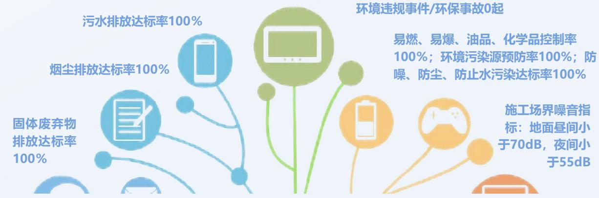

flowchart

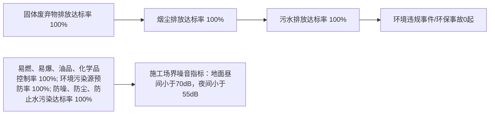
```mermaid
graph LR
  A["固体废弃物排放达标率 100%"] --> B["烟尘排放达标率 100%"]
  B --> C["污水排放达标率 100%"]
  D["易燃、易爆、油品、化学品控制率 100%; 环境污染源预防率 100%; 防噪、防尘、防止水污染达标率 100%"] --> E["施工场界噪音指标：地面昼间小于70dB，夜间小于55dB"]
  C --> F["环境违规事件/环保事故0起"]
```

认家业公司在业务开展过程中注重矿山环保培训，包括对环保法规与政策、矿山污染的来源、特点和危害以及公司环保制度的境培训学习，进而提高矿山从业人员的环保意识，掌握环保知识和技能，推动矿山的绿色发展。同时，公司及各项目部单心公安位每周组织开展现场文明、环保和卫生的检查，对环保措施的落实进行日常监督。报告期内，公司环保管理目标全部达标，亦未受到项目所在地生态环境行政主管部门的处罚。。

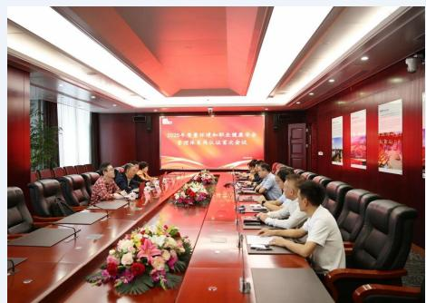

text_image

2023年暨环球国际职业健康咨询
暨环球国际会议正式会议

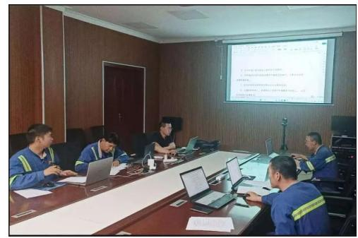

text_image

Meeting room scene with participants in blue uniforms seated at a long table, laptops and documents, and a presentation screen showing Chinese text.

## 环境合规管理

## 相关影响、风险及机遇识别与应对策略

本公司严格依据法律法规及地方监管要求，结合矿业行业“高资源消耗、高环境敏感”特性，确保识别精准、响应及时。

<table><tr><td>类别</td><td>具体事项/风险点</td><td>影响时间范围</td><td>影响程度评估</td><td>潜在财务/战略/声誉影响描述</td></tr><tr><td>风险污染物排放合规</td><td>废水(重金属、COD)、废气( $SO_{2}$ 、NOx、粉尘)、噪声超标排放</td><td>短期</td><td>高</td><td>行政处罚:罚款、责令限产/停产整治声誉损失:环保处罚信息公示,影响项目投标</td></tr><tr><td>风险尾矿与固废管理</td><td>尾矿库渗漏/溃坝隐患、危险废物(废油、废酸)处置不合规、超期堆存</td><td>长期</td><td>中高</td><td>刑事责任:重大环境污染事故罪巨额赔偿:生态修复费用+民事赔偿;证照吊销:安全生产许可证、采矿许可证被撤销;社区冲突:水源污染引发群体性事件,项目停滞;</td></tr><tr><td>风险生态修复履约</td><td>土地复垦率未达标、植被恢复效果差、矿山地质环境治理基金计提不足</td><td>中期-长期</td><td>高</td><td>业务:新项目开发受阻;财务:补提修复基金直接侵蚀当期利润;社区关系:影响与当地居民和政府、NGO关系;</td></tr><tr><td>机遇政策红利</td><td>税收减免、生态修复专项资金补贴、碳减排收益</td><td>短期-中期</td><td>高</td><td>财政补贴、碳配额交易收益</td></tr><tr><td>机遇市场准入与溢价</td><td>产品获“绿色产品认证”“负责任矿产认证”,进入高端供应链</td><td>中期</td><td>高</td><td>品牌溢价</td></tr><tr><td>机遇资源循环价值</td><td>尾矿制建材、废石回填、矿井水100%回用、光伏+矿山能源自给</td><td>中期-长期</td><td>中高</td><td>尾矿充填、节水、光伏发电降低成本</td></tr><tr><td>机遇品牌与融资优势</td><td>ESG评级提升、绿色债券低利率发行、吸引ESG基金持仓</td><td>长期</td><td>高</td><td>发行低利率绿色债券;ESG基金持股比例提升</td></tr></table>

为应对上述风险，公司一方面严格执行国家法律法规和行业规范对安全环保的有关规定；同时，加强安全环保生产管理，通过制订和持续完善安全管理制度、强化安全环保责任及考核，不断加大安全环保投入，推动安全管理标准化，提高本质作业安全。报告期内，公司在环境保护方面共投入8,951.75万元。

识别和评价对环境具有或可能具有重大影响的风险  
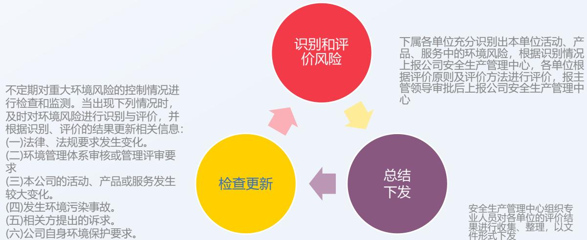

flowchart

```mermaid
graph TD
  A["识别和评价风险"] --> B["检查更新"]
  B --> C["总结下发"]
  
  subgraph Details
    direction TB
    D["下属各单位充分识别出本单位活动、产品、服务中的环境风险，根据识别情况上报公司安全生产管理中心，各单位根据评价原则及评价方法进行评价，报主管领导审批后上报公司安全生产管理中心"]
  end
  
  E["不定期对重大环境风险的控制情况进行检查和监测。当出现下列情况时，及时对环境风险进行识别与评价，并根据识别、评价的结果更新相关信息：(一)法律、法规要求发生变化。(二)环境管理体系审核或管理评审要求(三)本公司的活动、产品或服务发生较大变化。(四)发生环境污染事故。(五)相关方提出的诉求。(六)公司自身环境保护要求。”
```

<table><tr><td>重要环境因素</td><td>指标</td><td>方案方法</td></tr><tr><td>噪音排放</td><td>地面昼间小于70dB,夜间小于55dB;</td><td>1.选择设备须符合环保要求,噪音超标的设备须增加消音罩减低噪音;2.工艺过程中采取减低噪音的施工工艺。</td></tr><tr><td>烟尘排放</td><td>有毒物质(GB16424-1996)1. $CO \leq 30mg/m^3$ ;2. $NOx \leq 5mg/m^3$ ;3. $SO_2 \leq 15mg/m^3$ ;4. $H_2 \leq 10mg/m^3$ ;5.含游离二氧化硅10%以下,滑石粉尘 $\leq 4mg/m^3$ 。</td><td>1.购买环保设备,减少烟尘排放;2.运输道路经常洒水;3.加强对烟尘排放重点部位的洒水降尘。</td></tr><tr><td>污水排放</td><td>1.pH6-9;2.悬浮物(SS) $\leq 400mg/L$ ;3.石油类 $\leq 20mg/L$ ;4.动植物油 $\leq 100mg/L$ </td><td>1.井下工作面污水经沉淀后,排入业主方排水系统2.辅助生产和生活污水集中沉淀后排放至业主方排水系统。</td></tr><tr><td>固体废弃物</td><td>分类处理</td><td>1.弃碴排入业主方指定弃碴场,碴场定期洒水;2.工程结束后会同业主方对碴场进行环保处理;3.辅助生产和生活固体废弃物执行固体废弃物控制程序。</td></tr><tr><td>易燃易爆、油品及化学品控制</td><td>达标率100%</td><td>1.按照环保标准设立专门仓库;2.使用过程中减少遗撒;3.对失效的油料和火工品100%回收。</td></tr></table>

## 能源利用

## 政策法规、管理制度与架构

公司所处的矿山服务和矿山资源开发行业，在生产环节主要消耗的能源包括外购的电力、车辆和设备使用的汽油和柴油，日常办公环节所消耗的能源包括液化石油气、汽油和外购电力。

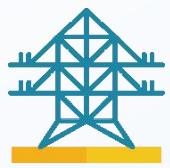  
外购电力  
生产施工、办公用电

  
汽油、柴油  
设备和车辆运行、发电机运行

  
液化天然气  
员工食堂

## 监督与考核

1. 监督程序

• 项目部成立能源现场稽查组，由主管能源副经理负责，开展能源现场检查  
• 两级公司设备管理部门不定期组织能源现场检查，监督项目部稽查组履职情况  
• 设备管理中心对中小型节能技改项目和"节能小改小革"项目进行检查和验收  
• 节能技术改造项目竣工运行后，组织验收鉴定，进行节能效果评价

2. 监督措施

• 建立重点耗能设备档案和卡片，记录设备规格、型号、容量、负荷率和热效率等参数  
• 每半年组织一次重点用能单位能源管理、节能技术改造、节能新产品应用等方面的情报交流  
• 重点用能单位之间不定期进行节能经验交流  
• 能源计量装置安装、改装、拆除实行严格审批制度，确保计量准确

3. 考核情况

• 将能源管理纳入绩效考核体系，对违反制度规定的单位和个人按相关规定处罚  
• 设备管理中心制定能源考核办法和指标，各单位层层分解落实，确保总能耗和单位产品能耗不超标  
• 节能技术改造项目经鉴定后效果不达标的，组织责任分析并进行考核  
• 对因管理不善影响公司节能目标完成的单位给予通报批评  
• 能源管理不善造成经济损失的，参照设备事故处理；情节严重的，报行政部门处理

公司严格遵守《中华人民共和国节约能源法》和《北京市实施(中华人民共和国节约能源法)办法》等国家与地方相关法律法规与标准，加强能源管理体系建设。在组织层面，由相应的总裁助理分管，并组建覆盖所有分支机构和项目部的、自上而下的运营体系能源管理，由设备管理中心全面统筹能源管理工作。为加强金诚信能源管理，合理使用能源，提高能源利用效率，降低生产成本，增强企业竟争力，依据《中华人民共和国节约能源法》和《北京市实施(中华人民共和国节约能源法)办法》的有关规定，公司制订有《金诚信矿业管理股份有限公司能源管理制度》并发布《金诚信矿业管理股份有限公司环境管理政策声明》。

作为公司能源管理主管部门，负责执行领导小组决定，制定能源消耗指标，负责能源数据统计分析，制定节能技术政策和管理制度，组织节能技术改造及新技术推广应用

负责落实各级公司节能管理制度，分解执行能源消耗指标，组织员工节能培训，负责能源消耗数据统计上报

##

## 能源管理领导小组

## 设备管理中心

## 二级单位设备物资部

## 项目部设备部门

由主管领导任组长，成员由设备管理中心、二级单位相关管理人员及部分项目部的分管经理组成；负责公司能源管理工作的决策，审核公司节能技术政策、年度计划、长远规划、目标责任制和考核办法，组织落实政府节能政策

负责本单位节能日常管理，分解能源消耗指标，收集统计能源数据，审核项目部能源管理考核细则，组织实施节能计划

## 能源利用

## 风险和机遇

本公司立足矿业高能耗行业特性，依据《节约能源法》及“双碳”政策导向，构建识别体系，识别相关风险和机遇。

<table><tr><td>类别</td><td>具体事项/风险点</td><td>影响时间范围</td><td>影响程度评估</td><td>潜在财务/战略/声誉影响描述</td></tr><tr><td>风险能源价格波动</td><td>电力、柴油、天然气采购成本大幅上涨</td><td>短期-中期</td><td>极高</td><td>财务:能源成本上升现金流压力:能源款项增加,营运资金紧张。</td></tr><tr><td>风险能源供应中断</td><td>电网老化、限电、柴油运输受阻、自备电厂故障导致停产</td><td>短期</td><td>高</td><td>生产停滞:停电导致全线停产;合同违约:无法按期交付,支付违约金;设备损伤:停机导致设备损坏,淹井</td></tr><tr><td>风险能效低下与合规问题</td><td>单位产品综合能耗高于国家/行业限额标准;未完成政府下达的节能目标</td><td>中期</td><td>中高</td><td>政策处罚:被列为“高耗能企业”,执行差别电价;项目受限:新建/技改项目节能审查不予通过;</td></tr><tr><td>风险技术迭代滞后</td><td>未及时应用高效节能技术,能效落后于行业标杆</td><td>长期</td><td>中)</td><td>成本劣势:单位能耗比行业先进水平高;</td></tr><tr><td>机遇节能降本增效</td><td>通过技术改造、管理优化降低单位产品能耗</td><td>短期-中期</td><td>高</td><td>财务:通过节能技改,节约能源成本</td></tr><tr><td>机遇可再生能源替代</td><td>利用矿区闲置土地建设“光伏+储能”系统</td><td>中期</td><td>高</td><td>财务:替代外购电,降低电力成本</td></tr><tr><td>机遇能源结构优化</td><td>采购绿电、使用生物质燃料替代部分化石能源</td><td>中期</td><td>中高</td><td>获“绿色电力消费认证”,提升ESG评级</td></tr><tr><td>机遇碳资产开发与交易</td><td>开发CCER项目(如光伏碳减排量)、参与碳市场交易</td><td>中期-长期</td><td>中</td><td>通过碳配额交易盈利</td></tr><tr><td>机遇智慧能源管理</td><td>建设能源管控平台,实现用能精细化、预测性维护</td><td>短期</td><td>中</td><td>通过精细化管理降低生产成本</td></tr></table>

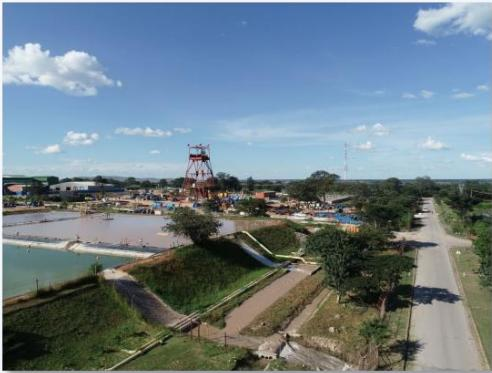

natural_image

Aerial view of a riverside urban area with a red tower, green fields, and a paved walkway under a blue sky (no visible text or symbols)

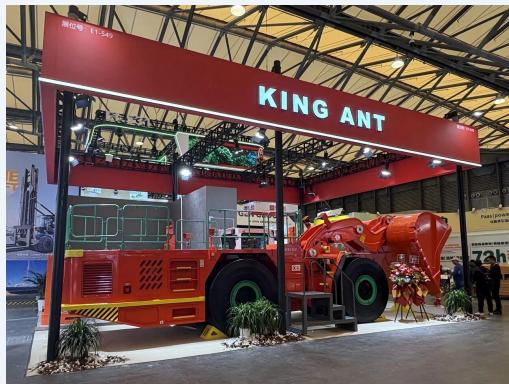

natural_image

Exterior view of a King Ant exhibition booth featuring a red fire truck and large machinery (no signage visible on main subjects)

金诚信设备研发团队将“5G+工业互联网”技术与自主研发的新能源纯电动铲运机相结合，通过新能源蓄电池驱动电动铲运机代替传统内燃铲运机以及电缆卷盘的电动铲运机，实现无污染、使用便捷的矿石铲装作业。该系统配备高能量密度锂电池，可实现快速充、放电，结合强大的整车控制器，通过5G基站的无线网络技术，实现矿山建设系统化、可视化、自动化和设备操作远程化、无人化、便捷化和快速化，最大限度地减少矿产资源开发过程中的污染和生态破坏，提高资源回采率和利用率，促进矿产资源开发与环境保护的协调发展。

## 规划、管理策略与措施

Ø 长远规划机制  
• 设备管理中心按公司生产经营规划、年度计划、产品实际用能指标及节能潜力分析，结合国内同行业先进水平，定期编制公司长远能源消耗和节能规划；  
• 各单位根据公司规划要求，编制本单位长远能源消耗和节能规划；  
• 设备管理中心负责将经过论证的节能技改项目编入公司长远节能技术改造规划  
Ø 定额与限额管理策略  
• 公司主要生产系统、辅助生产系统实行单位产品能耗定额管理；  
• 无定额考核单位实行能源消耗限额管理  
• 能源定(限)额指标保持相对稳定并具有可比性，每两年修订一次  
Ø 管理措施  
• 资金支持：公司每年安排专项资金用于节能技术改造和节能"四新"应用，用于节能的资金数额占公司年技改资金的5%  
• 技术支持：新建项目设备配置采用先进节能技术和生产工艺，禁止使用国家明令淘汰的工艺和设备；重点用能单位每年组织实施中小型节能技改项目和节能小改小革项目；定期开展能量平衡测试和合理用能监测，设备管理中心定期组织一次能量平衡测试；建立重点耗能设备档案，记录设备规格、型号、容量、负荷率和热效率等参数  
• 人力支持：设备管理中心及各单位每年组织节能培训，制定培训计划；重点耗能设备和操作岗位人员必须通过岗前培训，不合格不予上岗；每年组织开展"全国节能宣传周"活动；每半年组织一次重点用能单位能源管理经验交流，学习先进节能经验

## 水资源利用

## 政策法规、管理制度与架构

公司在生产环节的主要用水来自井下建设和采矿过程中产生的渗水的回用，在日常办公环节用水来自市政供水。

公司高度重视水资源节约再利用，严格遵循《中华人民共和国水法》《中华人民共和国水污染防治法》等法律法规以及海外项目所在国水资源相关法律规定，规范和加强公司节水工作，提升资源利用效率。公司制订有《金诚信矿业管理股份有限公司能源管理制度》并发布《金诚信矿业管理股份有限公司环境管理政策声明》，其中，对于水资源的使用和保护均做出了明确规定和承诺。同时，公司将水资源利用归在能源利用的范围内，沿用能源利用的治理框架与结构（详情见上一节P33中的有关表述）。

风险和机遇  
公司通过系统性的评估，识别出水资源管理在环境、社会及经济层面的多重影响和机遇

<table><tr><td>类别</td><td>具体事项/风险点</td><td>影响时间范围</td><td>影响程度评估</td><td>潜在财务/战略/声誉影响描述</td></tr><tr><td>风险水资源利用</td><td>大量取水可能导致当地水资源储量减少,影响河流、湖泊和地下水水位,对农业灌溉及居民生活造成压力。</td><td>长期</td><td>中高</td><td>财务:新鲜水采购成本逐年上涨;战略:区域水资源超载时,新增产能取水许可被冻结,限制业务扩张;声誉:被当地社区贴上“耗水大户”标签,引发群体性投诉。</td></tr><tr><td>风险水质变化</td><td>取水或排水过程可能引入污染物或改变水的物理化学性质(如高矿化度、酸性),影响饮用水源安全。</td><td>中期-长期</td><td>高</td><td>财务:超标排放罚款叠加生态修复费用;声誉:水质污染事件经媒体曝光,导致ESG评级下调,被客户移出供应链。</td></tr><tr><td>风险生态环境</td><td>过度取水可能导致河流断流、湿地干涸,破坏水生生物栖息地;地下水破坏可能诱发表塌陷。</td><td>长期</td><td>高</td><td>财务:生态修复基金计提比例提升,直接侵蚀当期利润;战略:生态红线内项目被强制退出,前期投资无法收回;声誉:被NGO组织列为“生物多样性破坏者”,长期损害国际品牌形象。</td></tr><tr><td>风险社会经济</td><td>与当地农业、工业争水,引发分配矛盾;取水设施建设可能影响当地经济结构。</td><td>中期</td><td>中</td><td>财务:社区冲突导致停产停工损失;战略:新项目审批受阻;声誉:当地媒体持续负面报道,影响企业在区域内的投资环境。</td></tr><tr><td>风险运营安全</td><td>矿井水害直接威胁人员生命安全;水源中断影响生产连续性。</td><td>短期</td><td>极高</td><td>财务:重大水害事故直接经济损失,叠加停产损失;战略:安全生产许可证被吊销,全矿区停产整顿;声誉:重大安全事故引发关注,企业社会形象受损。</td></tr><tr><td>机遇非常规水源替代</td><td>将矿井水转化为“新水源”,纳入区域水资源统一配置,缓解缺水地区的供需矛盾。</td><td>中期</td><td>高</td><td>财务:替代新鲜水采购,节省水费;战略:水资源方面做出贡献,优先获取新项目取水指标;声誉:媒体报道,提升品牌美誉度。</td></tr><tr><td>机遇资源价值化</td><td>通过高效利用,每立方米水可带来显著经济价值。</td><td>长期</td><td>高</td><td>财务:水资源循环利用创造新收入来源(如向周边企业售水);战略:形成循环经济产业链,提升抗风险能力;声誉:成为资源综合利用示范企业,获得政策补贴。</td></tr><tr><td>机遇绿色转型优势</td><td>提升水效和利用率有助于降低碳排放(节水即节能),提升ESG评级,获得绿色金融支持。</td><td>中期</td><td>中高</td><td>财务:绿色债券发行,节省利息;战略:满足客户的供应链ESG要求,获得高端订单;声誉:ESG评级提升,吸引ESG基金增持。</td></tr></table>

## 水资源利用

## 风险和机遇

为应对上述风险并把握机遇，公司制定了从理念到措施的系统性应对方案。理念上，将传统的“开采-排放”模式调整为“开采-处理-利用-回补”的循环经济模式，并采取了多维度的技术和管理措施，以提高水效和循环利用水平。

## 节水措施

在施工场地设置截流沟与集水池，收集地坪冲洗水、初期雨水，并进行循环使用

在矿井水处理站安装进水口、出水口流量计，实时监控用水量

对于井下渗出的水，项目部将其收集到专用水箱，在施工过程中利用，如凿岩过程中、出渣清底时降尘使用等

在日常办公生活区域进行节水宣传

生活用水经沉淀后进行植物浇灌，实现水资源的二次利用

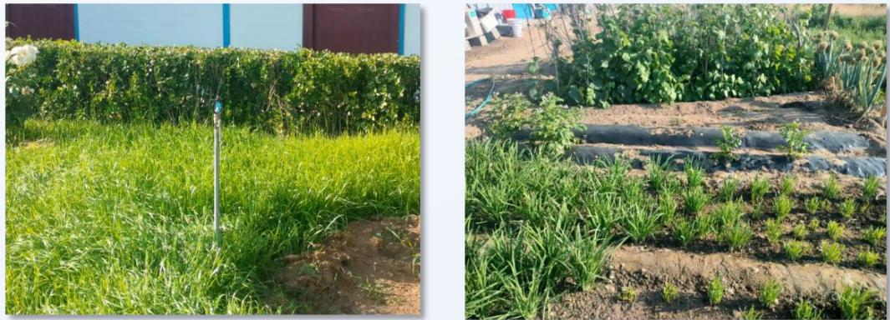  
生活用水沉淀后进行植物浇灌，完成废水利用；办公区使用喷灌方式浇水，节约用水

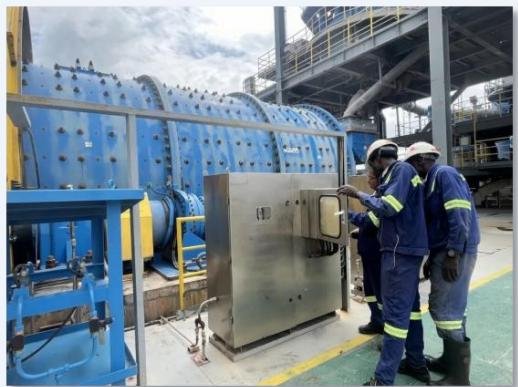

natural_image

Two workers in blue uniforms inspecting industrial equipment inside a large industrial facility (no visible text or symbols)

鲁班比、萨布韦、金景选厂生产均使用尾矿回水循环利用，回水利用率80%以上，节水效果显著

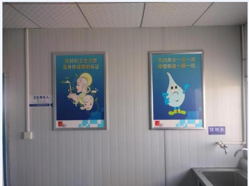

text_image

良好的卫生习惯
是身体健康的保证

节约用水一点一滴
珍惜饮食一眼一粒

卫生责任人：
饮用水

在项目部生活区进行节水宣传

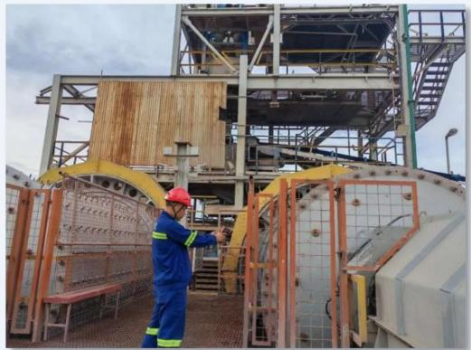

natural_image

Industrial worker in blue uniform and red helmet operating equipment at a high-rise industrial facility (no visible text or symbols)

natural_image

Illustration of a hand holding a globe with water droplet and circular arrows, surrounded by gears (no text or symbols)

## 污染物排放

## 政策法规、管理制度与架构

公司严格遵守《中华人民共和国环境保护法》《中华人民共和国大气污染防治法》《中华人民共和国水污染防治法》《城镇排水与污水处理条例》等法律法规及条例，以及在不同国家地区经营所涉及的法规和行业规范。同时，公司制定《金诚信矿业管理股份有限公司环境保护管理制度》，并发布《金诚信矿业管理股份有限公司环境管理政策声明》，对生产过程中的污染物排放进行了规定，避免或减少因公司生产运营对环境造成影响。相关工作由公司副总裁分管，并由公司安全生产管理中心负责具体工作。相关排放和环境目标值见前述P31的环境合规管理章节，报告期内，公司未发生较大以上生产安全环保事故，未受到项目所在地生态环境行政主管部门的处罚。

<table><tr><td>污染物种类</td><td>产生过程</td><td>处理方式</td></tr><tr><td>水污染物:废水(统计包括化学需氧量(COD)、五日生化需氧量(BOD5)、悬浮物、氨氮等)</td><td>湿式凿岩</td><td rowspan="2">矿服业务过程中产生的废气、废水、废渣均按照业主的安排进入其内部通风、排水、排渣系统,具体处理和对外排放接受业主的管理和当地环保行政主管部门的监督管理;自有资源项目产生的上述废弃物均按照项目所在地的法律法规要求,进行处理和排放</td></tr><tr><td>大气污染物:废渣、废气(统计包括颗粒物、硫氧化物)</td><td>巷道掘进、采掘工作面通风</td></tr><tr><td>噪音</td><td>爆破和地表装卸,装备生产</td><td>合理控制作业时间段,技术和物理降噪</td></tr></table>

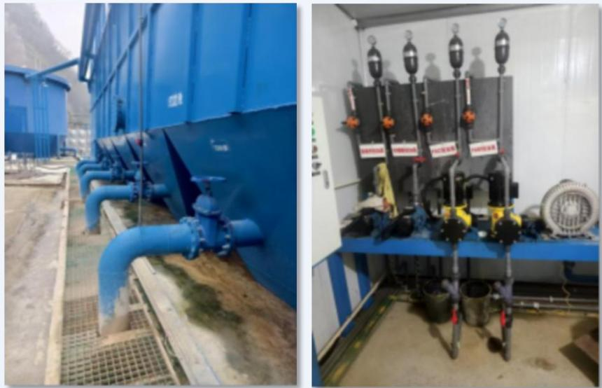  
公司两岔河磷矿北区污水处理站（处理能力为800m³/h）

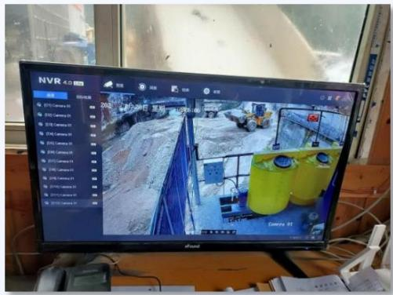

text_image

NVR 4.0
2023年6月29日 星期一 (2023-01)
Camera 81

在进水口、出水口设置视频监控

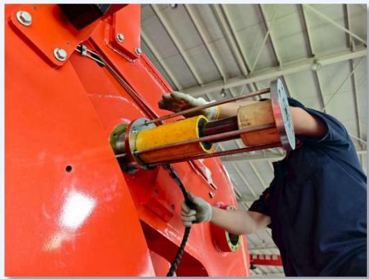

natural_image

Worker operating industrial machinery with a cylindrical component being handled (no visible text or symbols)

实行分级监督与管理的架构：

Ø 公司安全生产管理中心：

监督权：对全公司业务所在区域包括污染物排放/废弃物处理工作在内的的环境保护工作实施统一监督管理。

协调与指导：在公司及各单位从投标文件到指导施工生产的全过程（包括施工组织设计、施工方案、专项措施等技术文件）中，要求必须考虑环保工作，并将环保内容纳入其中。

制度制定：跟踪环境保护有关法律法规和排放标准，负责制定和解释相关内部制度。

Ø 各二级单位安全环保部门：对所辖区的环境保护工作实施统一监督管理。  
Ø 项目部安全环保部门：对项目部辖区的环境保护工作实施统一监督管理。

## 污染物排放

## 风险和机遇

公司依据《环境保护法》《大气污染防治法》《排污许可管理条例》等法律法规，结合矿业行业特性，构建污染物排放风险与机遇识别体系。

<table><tr><td>类别</td><td>具体事项/风险点</td><td>影响时间范围</td><td>影响程度评估</td><td>潜在财务/战略/声誉影响描述</td></tr><tr><td>风险大气污染物排放</td><td>采矿爆破、矿石破碎、运输及燃煤锅炉产生的颗粒物、二氧化硫、氮氧化物,导致空气质量下降,诱发员工及周边居民呼吸道疾病</td><td>短期-中期</td><td>极高</td><td>财务:超标罚款;员工职业病赔偿战略:被列入“重点排污单位”,面临限产、停产整治,新项目环评不予通过;声誉:被监管部门通报,ESG评级下调;</td></tr><tr><td>风险水污染物排放</td><td>矿井水、选矿废水含铅、镉、砷等重金属及化学需氧量(COD)、氨氮,若未经处理直排,污染地表水及地下水,威胁居民饮水安全,破坏水生态系统。</td><td>中期-长期</td><td>极高</td><td>财务:生态修复费用,潜在民事赔偿;战略:生产许可被吊销;声誉:被监管部门通报,ESG评级下调;</td></tr><tr><td>风险噪声与振动污染</td><td>爆破、大型设备(球磨机、空压机)运行产生高强度噪声干扰居民生活,导致听力损伤、睡眠障碍</td><td>短期-中期</td><td>中高</td><td>财务:噪声投诉赔偿,隔音设施改造投入;战略:社区冲突导致项目停工;声誉:负面报道,影响企业形象;</td></tr><tr><td>机遇超低排放改造红利</td><td>通过技改实现粉尘、 $SO_{2}$ 、NOx排放浓度优于国标</td><td>中期</td><td>高</td><td>财务:环保奖励;声誉:提升品牌溢价;</td></tr></table>

为控制风险，公司从战略到措施均制定了明确的规划：

## 合规与双赢

• 防止生产活动损害公众生活和生态，规避环境事故导致的财产损失。  
• 严格遵守国家法律法规，同时尊重并执行业主方及当地地方法规

## 全过程融入

• 将环境保护作为企业生存和发展的核心要素，强调“全员培训”和“全员环保意识”，将环保要求贯穿于从投标、设计到施工的每一个环节

## 预防为主

强调事前风险评估（如施工前的环境因素识别）和源头控制（如采用低噪设备、闭路循环）而非事后治理

##

## 废水处理

从源头减少废水产生，实施清污分流，矿山排水引流至沉降池，用于选厂生产用水从到  
• 安装并持续优化废水处理设施。在项目施工期，施工矿井废水进入矿井废水处理系统处理后达标外排战措  
• 项目生活废水进入生活污水处理站处理达标消毒后外排  
• 在选冶生产过程中产生的选冶废水，排送至尾矿库，在尾矿库沉淀后进行循环利用

## 粉尘处理

设备板块在产品研发阶段，秉持无配焊理念，取消装配线的配焊，降低噪声、粉尘：铰接矿卡实现无现场配焊，10吨和14吨系列铲运机只有铲斗销轴护板一处配，从源头减少焊接污染，提升制造标准化的绿色制造。  
• 矿区采用喷雾、洒水、加设除尘和通风装置等措施处理开采、选矿和运输过程中产生的粉尘，并持续完善运输道路喷淋防尘设施  
• 井下爆破后采用洒水降低粉尘，凿岩采用湿式凿岩

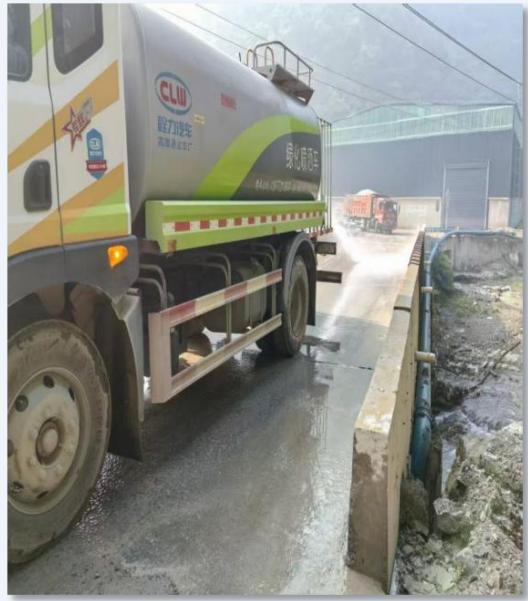

text_image

CLW
程力汽车
高净值大厂
身化研磨车
0444-18725000000000

## 废弃物处理

## 政策法规、管理制度与架构

公司在日常生产运营中产生的无害废弃物主要是办公区和生活区产生的办公生活垃圾以及在井下掘进和采矿过程中产生的废石，有害废弃物主要是部分自有矿山项目选矿后产生的尾矿。对于办公和生活垃圾等无害废弃物，矿服业务中根据业主的环保要求统一进行处理；自有资源项目和日常办公中所产生的办公与生活垃圾等，均按照市政管理要求放置在规定的垃圾处理地点。

公司严格遵守《中华人民共和国环境保护法》《中华人民共和国固体废物污染环境防治法》等法律法规及条例，以及在不同国家地区经营所涉及的法规和行业规范，同时，公司制定《金诚信环境保诚安效遏库源护管理制度》《金诚信尾矿库安全管理制度》等内部制度，并发布《金诚信矿业管理股份有限公司环境管理政策声明》，针对废弃物进行制度化管理，避免因公司生产运营对生态环境造成影响。相膏、特采坝利关工作由公司副总裁分管，并由公司安全生产管理中心负责具体工作。报告期内，公司未发生较大以上生产安全环保事故。相关排放和环境目标值见前述P31的环境合规管理章节，分级监督与管理体环点空，用的架构见前述P37的污染物排放章节。

<table><tr><td>废弃物</td><td>产生过程</td><td>处理方式</td></tr><tr><td>无害废弃物:办公与生活垃圾</td><td>日常办公与员工生活</td><td>矿服业务中根据业主的环保要求统一进行处理;自有资源项目和日常办公中所产生的办公与生活垃圾等,均按照市政管理要求放置在规定的垃圾处理地点。</td></tr><tr><td>无害废弃物:废石</td><td>井下掘进和采矿</td><td>利用膏体充填技术,用于对采空区的回填;</td></tr><tr><td>有害废弃物:尾矿</td><td>自有矿山项目选矿后产生</td><td>设置尾矿库严格管理、监测和利用,采空区回填</td></tr><tr><td>有害废弃物:废油</td><td>维修运输车辆和机械设备</td><td>交由有资质的单位统一回收处理</td></tr></table>

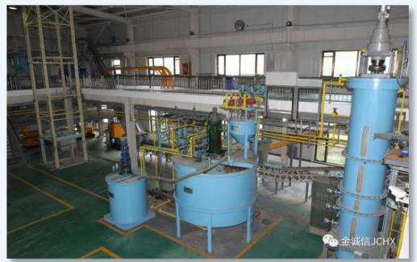

natural_image

Interior view of a large industrial facility with blue machinery and piping (no visible text or symbols)

## 风险和机遇

公司依据《固体废物污染环境防治法》，构建了“全生命周期、全要素覆盖”的废弃物管理识别体系，确保识别精准、响应前瞻。

<table><tr><td>类别</td><td>具体事项/风险点</td><td>影响时间范围</td><td>影响程度评估</td><td>潜在财务/战略/声誉影响描述</td></tr><tr><td>风险尾矿与废石堆存</td><td>尾矿库溃坝、废石场滑坡导致泥石流,掩埋村庄、农田;酸性矿山排水(AMD)污染地下水,重金属(铅、镉、砷)长期淋溶,破坏生态系统。</td><td>长期</td><td>极高</td><td>财务:溃坝事故直接损失;治理费用;战略:尾矿库被列为“重大风险源”,项目审批冻结;安全生产许可证被吊销;声誉:ESG评级降级,公司形象严重受损;</td></tr><tr><td>风险固废综合利用率低</td><td>尾矿、废石等大宗固废综合利用率低,大量堆存占用土地,增加环境风险,错失资源化收益。</td><td>中期</td><td>高</td><td>财务:堆存成本;错失资源化收益战略:无法享受循环经济效益;新项目能评、环评受限声誉:失去“绿色矿山”企业形象;</td></tr><tr><td>机遇固废资源化利用</td><td>尾矿制建材(砖、瓷砖)、废石石回填采空区、变废为宝,创造新收入来源。</td><td>中期</td><td>高</td><td>财务:固废销售收入,降低处置成本战略:构建“采矿-固废-建材”循环经济产业链,提升抗风险能力;声誉:获“绿色矿山”企业形象;</td></tr><tr><td>机遇尾矿库生态修复</td><td>在闭库尾矿库实施“光伏+植被恢复”复合项目,发电的同时修复土地实现“废地变宝地”</td><td>中期</td><td>高</td><td>财务:环境修复资金降低,发电收入;战略:修复后土地可用于农业,拓展业务边界声誉:提升品牌美誉度和ESG评级;</td></tr><tr><td>机遇危废处置服务外溢</td><td>将成熟的危废处理技术(如膏体充填技术)产品化,为其他矿山提供“合同服务”,创造新利润增长点。</td><td>中期</td><td>中高</td><td>财务:服务收入;战略:从“废弃物产生者”转型为“环境服务商”,提升行业话语权;声誉:增强行业影响力;</td></tr></table>

## 废弃物处理

## 尾矿管理

公司深知尾矿管理对于矿业企业的重要性，以及尾矿对于周边环境和居民的潜在风险。为此，公司制定了详尽的战略和管理措施，“安全为基，环保并重”，即通过全生命周期的精细化管理，在确保尾矿库物理安全、防范溃坝等重大风险的同时，严格控制其对水体、土壤和生态的污染。

## 核心战略

natural_image

Abstract geometric pattern with radial segments and a central circle (no text or symbols)

## 全生命周期闭环管理

• 管理范围覆盖了从勘察设计（地质勘察、参数设定）、建设施工（资质审查）、生产运行（排放、筑坝、监测）、到闭库与复垦（闭库设计、生态修复）的全过程，不留死角。

natural_image

Silhouette of a person wearing headphones at a window during sunset (no visible text or symbols)

## 本质安全与合规

合规性： 严 格 遵 守《矿山安全法》《尾矿库安全规程》及当地法规，并尊重业主方规定。  
本质安全：强调通过科学的勘察设计（查明地质、设定控制参数）和严格的施工标准，从源头上确立尾矿库的安全基础。属平方刷沉。

natural_image

Close-up of a laptop keyboard with glowing effect against a dark background (no text or symbols visible)

## 技防与人防结合

• 采用“在线监测+人工检查”双轨并行的手段，结合定期的调洪演算和风险评估，确保对尾矿库状态的实时掌控。

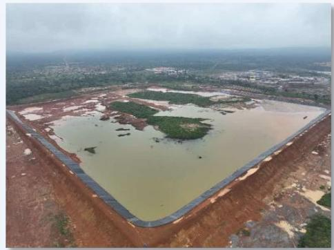

natural_image

Aerial view of a large wetland or industrial site with a central water body and surrounding greenery, under overcast skies (no visible text or symbols).

具体管控措施

<table><tr><td>源头控制与工程标准(设计与建设)</td><td>➢资质门槛:新建、改建、扩建的勘察、设计、施工必须由具备相应资质的单位承担。➢参数锁定:设计文件必须明确最终堆积高程、坝体高度、库容、堆积坡比、水位控制等关键安全参数。➢严禁擅自变更:任何单位和个人不得变更入库尾矿量、排放方式、筑坝方式、坝型及排渗设施等设计内容;设计以外的废石或废水严禁进库</td></tr><tr><td>运行过程精细化管控(生产期)</td><td>➢计划管理:编制年度、季度作业计划和详细运行图表,严格按计划生产。➢排放控制:指标监测:每周检测入库尾矿比重、浓度、粒度。筑坝要求:岸坡清理、尾矿排放、坝体堆筑、排渗设施施工必须按设计要求进行。水位控制:库内设置醒目的水位观测标尺,汛期前进行调洪演算,确定运行水位和干滩长度。浸润线管理:加强浸润线观测,控制埋深,防止管涌或滑坡。</td></tr><tr><td>立体化监测与隐患排查</td><td>➢日常巡查:运营期间每天巡查,大雨/暴雨期间实时巡查。➢定期体检(三级检查体系):定期安全检查:每季度不少于1次(汛期每月不少于1次)。专项检查:包括防洪安全、坝体安全(变形、裂缝、渗漏)、放矿安全、库区违章作业、监测系统有效性等。数据校验:在线监测结果与人工检查结果每周对比1次(暴雨期间每日对比),发现异常及时治理。</td></tr><tr><td>环境保护与污染防治</td><td>➢水污染防治:尾矿库废水(库内水)需按设计要求控制水位,通过回水系统回收利用或达标排放,严禁未经处理直排。防止库内水体渗漏污染地下水和土壤。➢扬尘与生态控制:闭库后需做好防尘、防冲刷工作。闭库后实施环保复垦,恢复生态环境。</td></tr><tr><td>闭库与应急管理</td><td>➢闭库程序:达到设计最终标高或不再排尾后,一年内完成闭库。需进行安全现状评价和闭库设计,施工按设计进行。➢应急响应:发现一般隐患限时整治;发现重大隐患立即停产,制定治理方案。发生事故(如溃坝、泄漏)需立即启动应急预案,并向业主方、当地环保部门及公司总部报告。</td></tr><tr><td>责任与考核</td><td>➢制度落地:各资源项目需制定实施细则,将职责明确到部门、具体到人。➢考核挂钩:环保与安全管理工作纳入经济责任制考核,对造成污染或事故的实行“一票否决”并追究责任。</td></tr></table>

## 废弃物处理

## 尾矿库运行和管理情况

公司严格遵守所在国家及地方关于尾矿库管理的各项法规，并参照《全球尾矿管理行业标准》（GISTM），对尾矿库实施覆盖选址、设计、运营至闭库的全生命周期管理。我们承诺通过负责任的选址与设计，从源头降低环境风险，并严禁任何形式的违规弃置，包括沿河弃置。

为持续提升管理水平，公司定期审视国际标准的最新变化，并积极借鉴行业先进经验。报告期内，我们进一步完善了尾矿库管理体系，为全部3个在用尾矿库（2处位于刚果（金），1处位于赞比亚）建立了详细台账、审查机制及应急预案，并持续开展运营记录与安全巡检。经全面风险评估，公司所有尾矿库均不属于高风险类别。

此外，为保障矿山长期稳定运营，公司已于2025年下半年启动刚果（金）萨布韦矿业有限公司龙溪铜矿南侧二期尾矿库的清表工作。该项目计划分三阶段建设，届时总库容将提升至1506.67万立方米，可满足矿山全生命周期的尾矿堆存需求。

Ø 酸性矿排水的矿区和处理或预防措施  
• 萨布韦公司冶炼厂浸出渣集中存放，严禁外排；浸出废液往尾矿库排放，与尾砂中的钙镁离子以及弱碱性尾矿水自然中和。  
• 萨布韦公司尾矿库水外排每日定期检测、每班巡检（观察尾矿水颜色变化），目前PH值控制在7-7.5之间（当地标准6.5-9）；一旦尾矿外排水pH值接近7，或日常巡检发现尾矿水变黄、变红，公司将会从工艺流程上查找原因，及时调整工艺（例如：适当调整沸腾炉炉温、采用调整尾砂中和的方式，调整浸出工艺铁离子含量；延长浸出工艺尾砂中和时间，确保尾砂中和后的浸出废水pH值在设计范围内（3-5之间）；浸出废水如进入选矿尾矿管道，在尾矿输送过程中自然中和）。

开展系统性安全风险辨识  
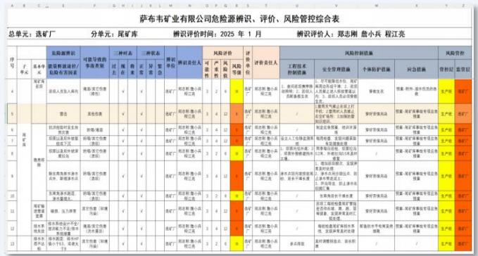

text_image

萨布韦矿业有限公司危险源辨识、评价、风险管控综合表
总单元：选矿厂
分单元：尾矿库
辨识评价时间：2025年1月
辨识评估人：郑志刚 盘小兵 程江亮
序号	子项	基本内容<fcel>危险源辨识
危险源辨识/危险有害因素<fcel>可辨识的
事故类别<fcel>三种时点
过去
现在<fcel>正常
异常<fcel>辨识单位<fcel>辨识责任人<fcel>风险评价<lcel><lcel><fcel>评卷责任人<fcel>风险控制措施<lcel><lcel><lcel><fcel>风险管控<lcel><nl>
<ucel><ucel><ucel><ucel><ucel><ucel><ucel><ucel><ucel><fcel>可辨识性<fcel>严重性<fcel>风险等级<ucel><fcel>评价单位<fcel>工程技术
控制措施<fcel>安全与管理措施<fcel>个险防护措施<fcel>应急措施<fcel>管护计划<fcel>监管计划<nl>
<fcel>4<fcel>高风险隐患<fcel>废水污染治理<fcel>出入口至入站内<fcel>危废/危废/危废/危废<fcel>√<fcel>√<ecel><fcel>选矿厂<fcel>职业病、登记中心相关<fcel>3<fcel>2<fcel>6<fcel>无<fcel>选矿厂<fcel>职业病、登记中心相关<fcel>1. 风险识别和鉴定工作流程，发现污染物、危险废物、危险废物、危险废物、危险废物、危险废物、危险废物、危险废物、危险废物、危险废物、危险废物、危险废物、危险废物、危险废物、危险废物、危险废物、危险废物、危险废物、危险废物、危险废物、危险废物、危险废物、危险废物、危险废物、危险废物、危险废物、危险废物、危险废物、危险废物、危险废物、危险废物、危险废物、危险废物、危险废物、危险废物<fcel>警告记录<fcel>质量、操作、安全评估的整改<fcel>/<fcel>/<fcel>/<nl>
<fcel>5<ucel><ucel><fcel>警告<fcel>其他责任<fcel>√<fcel>√<ecel><fcel>选矿厂<fcel>职业病、登记中心相关<fcel>3<fcel>4<fcel>12<fcel>无<fcel>选矿厂<fcel>职业病、登记中心相关<fcel>/<fcel>警告情况表<fcel>质量、煤矿安全验收报告总经办
/<fcel>/<fcel>/<nl>
<fcel>6<ucel><ucel><fcel>利用现场环境及作业人员<fcel>拆除/维修<fcel>√<fcel>√<ecel><fcel>选矿厂<fcel>职业病、登记中心相关<fcel>3<fcel>4<fcel>12<fcel>无<fcel>选矿厂<fcel>职业病、登记中心相关<fcel>/<fcel>警告情况表<fcel>质量、煤矿安全验收报告总经办
/<fcel>/<fcel>/<nl>
<fcel>8<ucel><ucel><fcel>职业病/职业病处置或下岗人员<fcel>拆除/危废/危废/危废<fcel>√<fcel>√<ecel><fcel>选矿厂<fcel>职业病、登记中心相关<fcel>3<fcel>4<fcel>12<fcel>无<fcel>选矿厂<fcel>职业病、登记中心相关
承办人:工会保障委员会
现场检查员:国家环保建设部
/<fcel>警告情况表
警报信息表
警报信息表
警报信息表
警报信息表
警报信息表
警报信息表
警报信息表
警报信息表
警报信息表
警报信息表
警报信息表
警报信息表
警报信息表
警报信息表
警报信息表
警报信息表
警报信息表
警报信息表
警报信息表
警报信息表
警报<nl>

人工位移监测点和浸润线监测点  
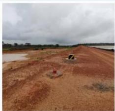

natural_image

Rural landscape with a dirt path and scattered vegetation under cloudy sky (no visible text or symbols)

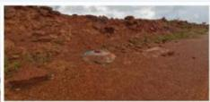

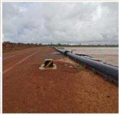

natural_image

Roadside scene with a large pipe and a small yellow warning sign, no visible text or symbols

natural_image

Close-up of a water surface with a vertical measurement ruler resting on the surface (no text or symbols visible)

溢洪道可用于应急泄洪  
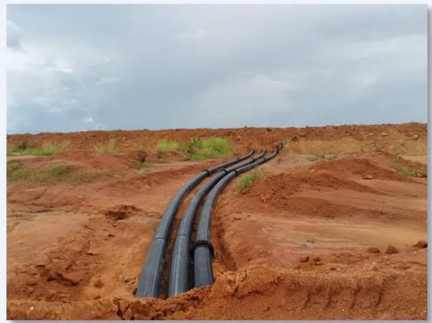

natural_image

Exterior view of a black pipe system installed in a reddish-brown, tilled landscape under cloudy sky (no signage or text visible)

在坝坡与高渗透区域铺设HDPE土工膜，增强防渗性能  
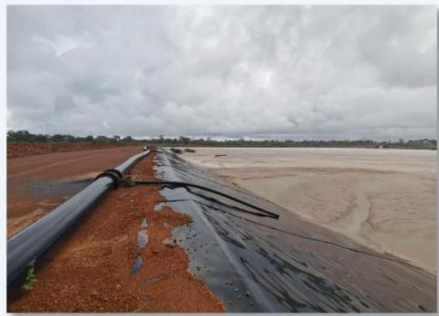

natural_image

Exterior view of a wetland with a long pipe and plastic slabs, under cloudy skies (no signage or text visible)

## 应对气候变化

## 政策法规、管理制度与架构

公司直接温室气体排放(范围一)主要来源于生产经营过程中的汽油和柴油消耗造成的温室气体排放；间接温室气体排放(范围二)主要来源于外购电力。公司严格遵守中国在应对气候变化领域的顶层设计，将国家“双碳”目标作为自身发展的核心指引。

公司积极响应并遵循国务院发布的《2030年前碳达峰行动方案》，制定了《金诚信矿业管理股份有限公司能源管理制度》，发布《金诚信矿业管理股份有限公司环境管理政策声明》，明确提出节能降耗，减少传统化石能源的使用的目标方向。公司严格遵循《工业企业温室气体排放核算和报告通则》（GB/T 32150-2025）等国家标准，建立了完善的碳排放统计核算体系，并持续完善范围一、二的排放数据披露。作为跨国经营的矿业企业，公司在全球多个国家拥有项目，严格遵守各运营所在地的环保及气候法规。同时，公司作为中国矿业联合会成员，遵循中国矿业联合会发布的《绿色矿业公约》。该公约倡导矿业企业坚持科学发展观，将“矿产资源开发与环境保护并重”的理念贯穿于矿山生产建设的全过程。为夯实管理基础，公司遵循ISO 14001环境管理体系标准，不断完善基于风险管理的环境与能源管理体系，确保气候相关治理体系全面整合进日常运营中。公司气候变化议题的管理工作以能源管理为出发点，依托能源管理的治理结构，具体见前述P33能源利用章节中的有关安排。

风险和机遇

<table><tr><td>风险和机遇</td><td>转型风险</td><td>转型风险</td><td>物理风险</td><td>物理风险</td><td>气候机遇</td><td>气候机遇</td><td>气候机遇</td></tr><tr><td>具体事项/风险点</td><td>政策和法规变化·随着气候变化相关的法律法规的实施,公司需增加在碳减排、环境监测、信息披露等方面的投入</td><td>市场与需求变化·全球能源转型加速,传统化石能源需求下降,而铜、锂等绿色金属需求上升</td><td>极端天气事件·洪水、干旱、风暴等极端天气可能导致矿山停产、设备损坏、基础设施损毁</td><td>水资源短缺·采矿作业高度依赖稳定水源和电力,长期干旱或降雨模式改变可能导致供水不足或水力发电设施不稳定</td><td>绿色金属需求增长·能源转型带动对铜、镍、锂等关键矿产的需求</td><td>碳交易与绿色金融·参与碳排放权交易、购买绿色电力证书、开发温室气体自愿减排项目等</td><td>技术创新与效率提升·通过节能技术改造、数字化矿山建设、水资源循环利用等措施,降低能耗和排放</td></tr><tr><td>潜在财务/战略/声誉影响描述</td><td>➢提高温室气体排放定价➢强化排放量披露义务➢面临诉讼风险➢增加合规成本和资本支出,影响融资渠道和资本成本</td><td>➢可能影响公司现有资产和业务的经济价值和未来发展方向</td><td>➢停产和设备损坏影响运营连续性和资本支出</td><td>➢停电导致停产➢影响矿石处理和污染控制,增加运营成本</td><td>➢增加绿色金属开采和相关业务,提升业绩</td><td>➢带来新的收益来源➢符合绿色金融标准的企业可获得更低成本的融资</td><td>➢提升运营效率,减少运营成本</td></tr><tr><td>影响时间范围</td><td>中期-长期</td><td>中期-长期</td><td>短期-中期</td><td>中期-长期</td><td>中期-长期</td><td>中期</td><td>短期-中期</td></tr><tr><td>影响程度评估</td><td>高</td><td>高</td><td>高</td><td>高</td><td>高</td><td>中</td><td>中</td></tr></table>

## 应对气候变化

## 应对策略

公司现有的矿山服务业务和资源开发业务，主要生产场景位于地下，除少数项目所在位置因公共基础设施欠发达，受到雨季部分影响外，受气候变化影响的特征在短期内并不明显。尽管如此，公司深知气候变化可能给公司带来的长期风险和机遇，并为此制定了战略和具体措施。

## 战略重塑与商业模式调整：从“矿山服务商”向“绿色矿业综合运营商”跃迁

l 面对全球气候治理的紧迫性与能源转型的历史性机遇，公司深刻认识到，唯有主动拥抱变革，方能穿越周期。基于对气候相关风险与机遇的深度研判，公司对当前及未来的战略方向、商业模式及资源配置进行了系统性的重塑。  
在战略层面，公司确立了“矿山服务+资源开发”双轮驱动的长期发展战略。这一战略调整的核心逻辑在于：气候变化加速了全球能源结构向低碳化转型，进而引发了矿产资源需求的结构性剧变。化石能源需求面临长期下行风险，铜、磷等关键矿产作为新能源、新能源汽车及储能产业的基础材料，其战略地位日益凸显。基于此，公司战略性地将资源配置向“绿色金属”倾斜，通过收购铜矿项目，成功切入全球绿色供应链的上游核心环节。这一举措不仅有效规避了传统高碳资产可能面临的“搁浅风险”，更使公司从气候变化的被动适应者转变为绿色经济的主动受益者。

在商业模式层面，公司正加速从“人力密集型”向“技术密集型”与“智能装备型”转变。针对矿业客户对低碳、高效开采的迫切需求，公司构建了“技术+装备+服务”的一体化解决方案模式。我们不再单纯依赖劳务输出，而是依托高效的开采方式、膏体充填等绿色采矿技术，以及电池铲运机等新能源装备，为客户提供全生命周期的低碳矿山建设服务。这种商业模式的韧性在于，它既顺应了日益严苛的环保法规要求，又通过技术溢价提升了公司的盈利质量，实现了经济效益与环境效益的深度耦合。

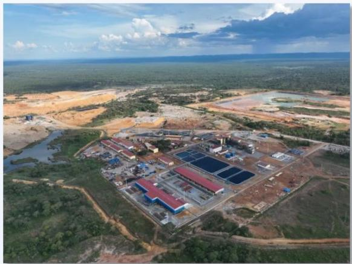

natural_image

Aerial view of a large industrial facility with multiple buildings and surrounding greenery under a partly cloudy sky (no visible text or symbols)

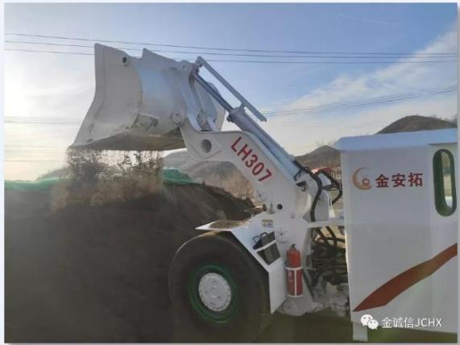

text_image

LH307
金安拓
金诚信JCHX

## 转型计划、关键假设与资源保障：科学布局与全方位投入

l 公司在对全球宏观经济、能源政策及技术路径的科学预判之上计划通过有序的资源更替与技术迭代，逐步迈向碳达峰和碳中和。  
l 转型计划的核心假设之一是“关键矿产需求的长期刚性增长”。我们假设全球能源转型（如电动汽车普及、可再生能源并网）将按预期或更快的速度推进，这将导致铜金属市场在长期内维持“紧平衡”甚至短缺状态。基于这一假设，公司坚定了“以铜为主、多矿种并举”的资源开发战略。另一个关键假设是“绿色溢价与低碳技术的商业化可行性”，即随着碳市场的完善，低碳产品将获得市场溢价，且绿色采选技术的成本将随着规模化应用而下降。此外，我们还假设各国政府将继续执行严格的环保法规，因此公司主动对标国际最高标准，建立了完善的环境、社会及治理管理体系。  
l 为确保转型计划的顺利实施，公司承诺并正在执行强有力的资源保障机制。在资金支持方面，公司充分利用金融工具募集资金，专项用于自有铜矿采选工程及地下绿色无人智能设备研发项目。在技术研发方面，公司依托博士后科研工作站等创新平台，构建了覆盖深井工程、智能装备、绿色采矿等领域的研发体系，每年投入大量研发经费，专项支持节能减排技术的攻关与应用。在人才建设方面，公司大力引进和培养懂技术、懂管理、懂环境的复合型专业人才，并将气候绩效指标纳入管理层与员工的考核体系，形成了“上下同欲”的转型文化。

## 应对气候变化

## 措施实践与成果展望

为直接应对气候相关风险并把握减排机遇，公司在生产工艺改进与设备更新方面实施了实质性的举措，力求在运营全链条中实现“降本、增效、减碳”。

l 在工艺改进方面，公司大力推广资源利用率高、环境扰动小的先进采矿方法。例如，在深部开采项目中，公司应用自然崩落法技术，该技术利用岩体自重实现矿石崩落，大幅减少了炸药使用量和废石排放，显著降低了单位矿石的碳排放强度。  
在设备更新方面，公司积极响应“机械化换人、自动化减人、电动化降碳”的行业趋势。公司自主研发并规模化应用了15T电池铲运机、无人驾驶运输系统等绿色智能装备。以刚果（金）及赞比亚的运营项目为例，公司引入新能源电动铲运机替代传统柴油设备，不仅实现了井下尾气的“零排放”，显著改善了作业环境，还大幅降低了通风能耗与设备维护成本。此外，公司正在推进矿山运输系统的智能化改造，通过5G+工业互联网技术实现设备的远程操控与协同作业，进一步提升了能源利用效率。  
l 在适应气候变化方面，公司重点关注物理气候风险对矿山安全与运营连续性的影响。针对极端天气可能引发的洪涝、干旱等灾害，公司在项目设计与运营阶段强化了水文地质勘查与灾害预警机制。特别是在水资源管理方面，公司建立了“取-用-治-回-补”的全链条循环体系，通过矿井水深度处理与回用技术，极大降低了对新鲜水资源的依赖，提高了企业在缺水地区的气候韧性。

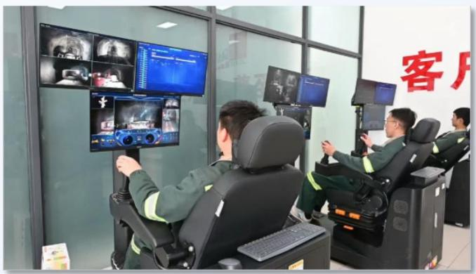

text_image

Photo of operators in a control room with multiple monitors displaying medical imaging and diagnostic scans, featuring visible Chinese characters '客户' (customer) in the background.

矿  
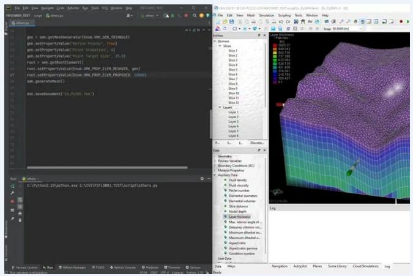

text_image

C:\Python3.15\python.exe C:\C:\PHYFUM81_TEST\script\latthers.py
File Edit View Mesh Simulation Scripting Tools Window Help
GEN: 01
gen = sn.getrendemulator(tsun.SM_GEN_TRIMBLE)
gen.setpropertyvalue(tsun_pvalue_tive)
gn.setPropertyvalue-->root_target_size_25.6
root = sn.getrendemument()
root.setpropertyvalue(tsun.SM_PGP_ELM_PROGSED_gen)
root.setpropertyvalue(tsun.SM_PGP_ELM_PROGSED_10000)
sn.generate(tst()
doc leveDocument("tx，在件, run")
Domain
Size
Size 1
Size 2
Size 3
Size 4
Size 5
Size 6
Size 7
Size 8
Size 9
Size 10
Size 11
Size 12
Layer
Layer 1
Layer 2
Layer 3
Layer 4
Layer 5
Layer 6
Data
Geometry
Policies Variables
Boundary Conditions (BC)
Manual Properties
Auxiliary Data
Fluid density
Fluid density
Pseudo number
Elemental diameter
Elemental volume
Slope distance
Nodal depth
Max. outlier height of...
Debure criterion of...
Minimum dihedral angle.
Maximum dihedral angle.
Aspect ratio
Aroude max degree
Condition number
Size: High
Activity

公司坚持客观、审慎的原则，对减排措施取得的成果及新技术研发进展进行展望。

l 通过实施上述工艺改进、设备电动化及能效提升措施，公司在报告期内取得了显著的减排成效。  
l 新能源电动铲运机与无人驾驶系统：2023年-2025年，研发制造出多款新能源设备。10吨、15吨锂电池铲运机，30吨锂电池铰卡均具备实际应用能力。实现无污染，零排放。以15吨锂电池铲运机为例，单次运输15吨矿石，年产能100万吨以上，较传统柴油设备，单台设备减少年碳排放量80吨以上。  
l 目前，公司的气候转型计划已取得显著的阶段性成果。Lubambe铜矿的股权交割与技改工作正在有序推进，选矿厂的扩建与井下系统的优化已初见成效。哥伦比亚San Matias铜金银矿的环境影响评估报告已提交审批，项目前期准备工作正按计划开展。总体而言，金诚信的气候转型计划正从蓝图走向现实，我们有信心在未来的低碳经济浪潮中，成为全球矿业绿色转型的有力贡献者。

## 循环经济

## 政策法规、管理制度与架构

Ø 公司将循环经济理念深度融入矿山服务与资源开发的全生命周期，通过技术创新与模式重构，努力实现资源利用效率的最大化。公司的循环经济活动主要覆盖以下核心运营环节与资源类别：  
在矿山建设与采矿运营环节，公司重点聚焦于固体废弃物（废石、尾矿）的循环利用。依托自主研发的膏体充填技术，公司将选矿产生的尾矿与胶结材料混合，制备成膏体回填至井下采空区。这一过程不仅解决了尾矿库堆存带来的环境风险，还实现了废石的井下就地消纳，将“废弃物”转化为维持井下岩层稳定的“充填材料”，实现了固体废弃物的闭环管理。  
• 在资源开发与选矿环节，公司致力于水资源的综合利用，对矿坑水、选矿废水进行深度处理与回用，构建了“取-用-治-回”的水资源循环体系，大幅减少了新鲜水资源的消耗。  
• 在设备制造与维护环节，公司推行设备再制造与零部件循环利用，建立了完善的设备维修与再制造体系，通过对旧设备的修复、升级与零部件更换，延长设备使用寿命，减少金属资源的消耗与工业固废的产生。  
Ø 公司高度重视循环经济相关的法律法规遵循，确保在不同司法管辖区的经营活动符合当地及国际的环保标准。在中国境内，公司严格遵守《中华人民共和国循环经济促进法》、《固体废物污染环境防治法》以及工信部关于工业资源综合利用的相关政策。公司严格执行尾矿库安全监督管理规定，确保尾矿充填工艺符合国家安全生产与环境保护标准。在海外经营区域，公司严格遵循运营所在国的环境法规。对标国际一流矿山的循环经济标准，确保在跨国经营中不仅“合规”，更能达到“优秀”的行业标杆水平。同时，公司制定《金诚信积压物资管理办法》《海外事业部废旧物资处置管理办法》等内部制度，并发布《金诚信矿业管理股份有限公司环境管理政策声明》，针对废弃物、废旧物的综合利用和资源化进行制度化管理，提高资源使用效率。相关工作由公司副总裁分管，并由物资管理中心负责具体工作。

## 风险和机遇

公司依据自身的业务特性与全球矿业发展趋势，公司对循环经济相关的影响、风险及机遇进行了系统性识别与评估

<table><tr><td>类别</td><td>具体事项/风险点</td><td>影响时间范围</td><td>影响程度评估</td><td>潜在财务/战略/声誉影响描述</td></tr><tr><td>机遇关键金属增储与价值挖掘</td><td>随着全球能源转型,铜、锂等关键金属需求激增。通过循环经济手段(如提高回收率、处理低品位矿石或尾矿再选),公司可从现有资源中挖掘额外价值</td><td>中期-长期</td><td>高</td><td>财务:直接增加资源储量估值,提升长期现金流预测;战略:增强资源安全保障,确立在关键矿产供应链中的核心地位;声誉:树立资源高效利用的行业标杆形象。</td></tr><tr><td>机遇技术服务输出与新模式</td><td>公司领先的膏体充填技术不仅能解决自身环保问题,还可作为一种高附加值的“绿色服务”输出给其他矿山客户。从单纯采矿服务向“废弃物综合处理与资源化”延伸,构建新的商业增长极。</td><td>中期</td><td>高</td><td>财务:开辟高毛利的技术服务收入流,优化营收结构;战略:实现商业模式从“工程承包”向“技术+服务”的转型升级,增加客户粘性;声誉:强化“科技型”企业的市场认知。</td></tr><tr><td>机遇绿色金融与融资优势</td><td>实施循环经济显著降低环境足迹,符合ESG投资标准。这有助于公司获得绿色信贷、发行绿色债券等低成本融资机会,降低资本成本,提升资本市场形象。</td><td>短期-中期</td><td>中</td><td>财务:直接降低债务融资成本(利息支出),拓宽融资渠道;战略:优化资本结构,吸引长期耐心资本(如ESG基金);声誉:提升在资本市场的ESG评级,增强投资者信心。</td></tr><tr><td>风险环保法规与合规成本</td><td>全球范围内(特别是中国、非洲运营国)对尾矿库安全、固废处理的法规日益严苛。若未能有效实施循环经济,可能罚款、停产整顿甚至法律诉讼的风险。</td><td>短期-长期</td><td>高</td><td>财务:面临突发性罚款支出、整改资本开支增加,甚至资产减值风险;战略:可能导致项目延期或被迫退出高合规成本区域;声誉:严重的合规事故将严重损害企业公信力。</td></tr><tr><td>风险资源约束与供应链中断</td><td>水资源短缺是矿山运营的主要物理风险。若缺乏完善的水循环体系,干旱地区的项目可能面临产能受限。此外,关键原材料(如充填剂、备件)的供应波动也可能影响生产连续性。</td><td>中期</td><td>中</td><td>财务:因停产或减产导致的营收损失,以及寻找替代水源/原料带来的成本上升;战略:限制产能扩张,影响长期交付能力;声誉:被视为资源管理不善,影响与当地政府及社区的契约关系。</td></tr></table>

## 循环经济

## 规划、管理策略与措施

基于上述分析，公司制定了“绿色矿山、循环发展”的战略规划。确立了“变废为宝”的管理策略。通过大规模推广膏体充填技术，将尾矿治理成本转化为资源开发效益。同时，在日常施工和项目运营的过程中，充分利用各类具备循环利用价值的废旧物资，降低对自然资源的损耗。例如，下属的萨布韦公司对废轮胎、废皮带等有回收价值的工业垃圾，“变废为宝”，将废轮胎用于选冶厂道路路肩保护，有效防止车辆压塌路肩和排水沟损坏，将废皮带用作配电室绝缘垫，形成了独具特色的内部循环利用模式。这一体系从根本上解决了以往垃圾散排造成的环境污染问题，将环保压力转化为资源循环的动力。又如，下属的鲁班比公司在报告期内将约42,225吨废弃物出售给持证回收商进行资源化处理。

## l 厨余垃圾转化为菜园有机肥

公司Mopani项目部所在国赞比亚的旱季漫长而燥热，矿区周边土地贫瘠，土壤含沙量高且肥力严重不足。面对“吃新鲜蔬菜难、品种单一”等现实困境，项目部充分利用厨余垃圾，购买鸡粪和木屑混合进行发酵压肥以改善土质，自种蔬菜不仅丰富员工餐桌、降低生活成本，更在物流不便的特殊时期起到了“压舱石”的作用。

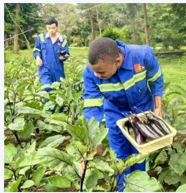

natural_image

Two workers in blue uniforms harvesting eggplants in a garden, one holding an eggplant basket (no visible text or symbols)

## l 利用废旧物资建设充填设备

金景公司就地取材因材施策争，利用现场废旧材料改制成满足工艺需要的水泥储仓。

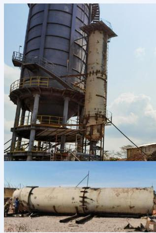

natural_image

Industrial facility with large cylindrical tank and metal structure, alongside a close-up of a large cylindrical tank under construction (no visible text or symbols)

## l 通过物资盘点对废旧物资进行清查，便于管理与利用

金科项目公司设备物资部对仓库区域进行全面自检与规划，废旧物资按照SOP标准重新划分“交旧领新”区域，设立集中回收库，实行统一管理和利用。

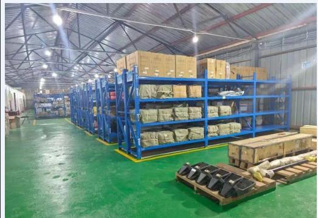

natural_image

Interior view of a large warehouse with blue shelving units and stacked cardboard boxes (no visible text or signage)

## l 金诺公司将供应商提供的外包装进行再利用

金诺公司对于供应商供货时提供木托盘、木箱或纸箱，能够直接使用的均用于产成品的销售发货，部分不成形的木制框架在重新加工固定后也进行了再利用，一些带有供应商信息，无法用于发货的纸箱，则在仓库中作为散装原材料或配件的存放容器使用。

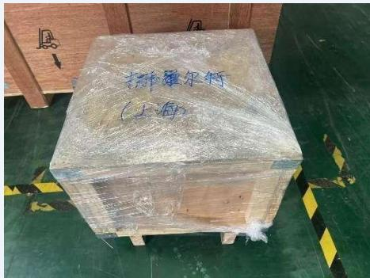

text_image

萨韦塞尔柯
(上海)

## 生态系统和生物多样性保护

## 政策法规、管理制度与架构

公司的业务布局跨越国界，分布在中国境内（如云南、贵州、甘肃等地）以及亚非欧等地区（如刚果（金）、赞比亚、塞尔维亚、老挝等国家），涵盖了从地下开采到地表设施建设的多种作业环境。我们深知，矿业活动与自然环境紧密交织，因此对运营点及其周边的生态系统保持高度敏感。其中，在矿山服务业务中，生态系统和生物多样性的尽职调查与保护工作由业主方进行和执行，公司作为承包商，一方面严格按照业主方的要求执行，另一方面也始终秉承“驻守一地，建设一方，美化环境，生态和谐”的理念，坚持边开采建设，边绿化美化环境，积极参与生态系统和生物多样性保护工作；在自有的资源开发业务中，公司现有的矿山包括两岔河磷矿（贵州省）、Lubambe铜矿（赞比亚）、San Matias铜金矿（哥伦比亚）、Dikulushi铜矿和Lonshi铜矿（均位于刚果（金）），这些区域通常拥有独特的热带草原或森林生态系统，运营环节贯穿了勘探、开采及矿石处理过程；供应链端，虽然公司的直接影响力主要集中在自有或管理的项目现场，但我们在采购环节（如设备采购、基建工程外包）也积极倡导绿色供应链理念，要求供应商遵守相应的环境合规要求，间接减少对生物多样性的潜在影响。

公司坚持“依法合规、敬畏自然”的原则，构建了覆盖国内外的生物多样性保护合规体系，确保所有运营活动均在法律框架内进行。在中国，公司严格遵守《中华人民共和国环境保护法》、《中华人民共和国野生动物保护法》《中华人民共和国森林法》《中华人民共和国湿地保护法》以及《中华人民共和国生物安全法》等核心法律，我们严格执行《中华人民共和国环境影响评价法》在自有资源项目启动前进行详尽的环评，确保避让生态红线。同时，公司积极响应《关于进一步加强生物多样性保护的意见》和《中国生物多样性保护战略与行动计划（2023—2030年）》，将国家战略转化为具体的企业行动，确保在生态脆弱区的经营活动受到最严格的监管。在海外运营中，公司遵循《生物多样性公约》和《湿地公约》的精神，尊重并执行运营所在国（如刚果（金）、赞比亚）的矿业法与环境管理法。

相关工作由公司副总裁分管，并由公司安全生产管理中心统筹全公司的生物多样性保护工作，各项目部（特别是海外项目）均配备了安全环保部门和专职的安全环保工作人员，形成了“总部统筹-区域监管-项目落实”的三级管理网络。同时，公司在报告期内制定了《环境、社会和公司治理（ESG）管理办法》，发布了《金诚信矿业管理股份有限公司环境管理政策声明》，对生态系统和生物多样性保护的具体落实做出了规定和声明。公司现有项目评价范围内均不涉及生态敏感区，未发现珍稀动植物，公司亦未受到任何与违反生态系统和生物多样性保护有关政策法规的处罚。

<table><tr><td>项目</td><td>是否开展生态系统和生物多样性评估</td><td>结论</td></tr><tr><td>两岔河磷矿</td><td>是(包含在环境评价报告中)</td><td>评价范围内不涉及生态敏感区,未发现珍稀动植物</td></tr><tr><td>Lubambe铜矿</td><td>是(包含在环境评价报告中)</td><td>评价范围内不涉及生态敏感区,未发现珍稀动植物</td></tr><tr><td>Dikulushi铜矿</td><td>是(包含在环境评价报告中)</td><td>评价范围内不涉及生态敏感区,未发现珍稀动植物</td></tr><tr><td>Lonshi铜矿</td><td>是(包含在环境评价报告中)</td><td>评价范围内不涉及生态敏感区,未发现珍稀动植物</td></tr><tr><td>SanMatias铜金矿</td><td>是(包含在环境评价报告中)</td><td>评价范围内不涉及生态敏感区,未发现珍稀动植物</td></tr></table>

鲁班比铜矿对新竖井的建设进行环境与社会影响评估  

natural_image

Outdoor public gathering under a tent, showing a speaker addressing seated citizens (no visible text or signage)

鲁班比铜矿荣获赞比亚环境管理局颁发的“助力行业完善管理实践之最佳设施奖”

金诚信鲁班比铜矿公司凭借“人工湿地”创新项目斩获年度“助力行业完善管理实践之最佳设施”奖。鉴于传统絮凝剂方案的局限性，为更好地解决选矿工艺中矿石细磨导致的浊水难题，鲁班比铜矿研发了“人工湿地”过滤系统，有效改善了固体颗粒沉降，显著提高了排放水体的透明度。当地监管机构曾对该创新成果进行现场考察，并给予高度评价。

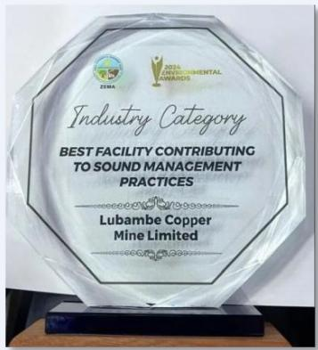

text_image

ZENRA
2024 ENVIRONMENTAL AWARDS
Industry Category
BEST FACILITY CONTRIBUTING
TO SOUND MANAGEMENT
PRACTICES
Lubambe Copper
Mine Limited

## 生态系统和生物多样性保护

## 风险和机遇

公司深刻认识到，矿业活动与自然环境是共生共存的关系。健康的生态系统不仅是矿山运营的物理基础，更是企业可持续发展的生命线。基于此认知，公司对生物多样性相关的依赖、影响、风险和机遇进行了系统性识别

<table><tr><td>类别</td><td>具体事项/风险点</td><td>影响时间范围</td><td>影响程度评估</td><td>潜在财务/战略/声誉影响描述</td></tr><tr><td>风险资源枯竭</td><td>水资源短缺、地质灾害</td><td>中期-长期</td><td>高</td><td>财务影响:生态系统退化导致水源枯竭,直接威胁生产连续性.水土流失增加泥石流风险,可能导致设备损毁和修复成本上升;</td></tr><tr><td>风险法规与社会许可</td><td>合规成本</td><td>短期-中期</td><td>高</td><td>财务影响:随着环保法规趋严,生态破坏的罚款和修复成本将大幅增加若损害社区赖以生存的环境,可能引发社会抗议导致停产;声誉影响:企业声誉受损;</td></tr><tr><td>机遇生态修复与土地增值</td><td>闭矿复用、碳汇交易</td><td>长期</td><td>中</td><td>财务影响:通过“边开采、边修复”,将废弃矿山转化为光伏或农业用地,实现资产增值。植被恢复增加的碳汇可参与碳交易,创造额外收入流;声誉影响:改善区域生态环境,提升土地承载力,建立良好社区关系;</td></tr><tr><td>机遇绿色品牌与融资优势</td><td>ESG评级、绿色信贷</td><td>中期</td><td>中</td><td>财务影响:卓越的生物多样性绩效将提升ESG评级,吸引绿色基金投资,降低融资成本声誉影响:树立行业生态保护的标杆,增强在国际市场的竞争力。</td></tr></table>

针对上述识别出的风险和机遇，公司制定了“预防为主、修复为辅、和谐共生”的战略规划，并将生物多样性保护深度融入商业模式调整中，采用“避让-减缓-补偿”的层级管理策略，严格遵循国际通用的生物多样性保护层级策略，以管理风险。技术上公司引入了先进的数字化监测手段，对矿区及周边的植被覆盖度、水体变化进行定期监测，及时发现并处置潜在的生态破坏风险，确保运营活动始终处于环境承载力范围内，保障资产安全。

natural_image

Abstract geometric shapes in blue shades, no text or symbols present

## 避让（预防）

•在项目选址和设计阶段，通过高精度的生态勘察，主动避让自然保护区、珍稀动植物栖息地和生态红线区域。例如，在刚果（金）和赞比亚的项目规划中，我们严格评估了对周边森林和湿地的影响，优化工业场地布局，最大限度减少对原生植被的占用，从源头规避财务和法律风险。

## 减缓（控制）

•在运营过程中，采取严格的污染控制措施。利用公司自主研发的膏体充填技术，将尾矿回填至井下采空区，从源头上消除尾矿库对地表生态的压占和污染风险。同时，实施雨污分流和废水深度处理回用，确保不对周边水体生态系统造成破坏，保障水资源的可持续利用。

## 补偿与修复（再生）

•对于不可避免的土地占用，公司实施“边开采、边复垦”策略。在采矿过程中同步进行表土剥离与保存，待开采结束后进行植被重建。公司计划在未来几年内，在主要矿区开展本土植物种植计划，恢复受损地表，构建生物多样性走廊。

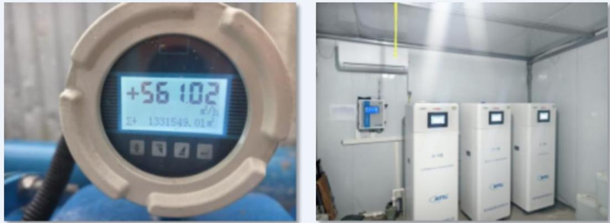  
矿井水处理站安装进水口、出水口流量计及在线监测

## 社会维度议题

金诚信在稳健经营的基础上，积极履行社会责任，致力于推动整个价值链的可持续发展。公司以技术创新和技术优势地位作为核心战略导向，不断提升工程服务水准和资源开发能力。在质量管控方面，公司建立了完善的质量诚信体系，包括工程内部验收机制和质量管控机制，严格遵循国家和行业标准进行生产和提供服务。通过持续优化服务体系、提升产品品质，不断增强客户信任度和企业核心竞争力。在员工关怀方面，金诚信秉承"以人为本"的安全经营理念，着力营造多元化、包容性的职场环境，为员工提供职业技能培训和职业发展支持，实现企业与员工的共同成长。此外，公司长期积极参与公益事业，主动推动行业合作与国际化进程，为全球矿业的可持续发展作出积极贡献。

text_image

COMMUNITY
S TEAMWORK COOPERATION SOCIAL PEOPLE
WORK FRIENDSHIP RELIEF LIFE
HUMANITY
TEAMWORK DONATION VOLUNTEERING SERVICE
FRIENDSHIP RELIEF DIVERSIT
LOVE WORK FOOD GIVE GIVING MONEY HUMANITAR
GIVING HOME
GROW LIFE
COMMUNITY TOGETHERNESS HOPE

## 员工雇佣与权益

## 政策法规、管理制度与架构

金诚信高度重视合规用工，并积极保护员工权益，严格遵守《中华人民共和国劳动法》《中华人民共和国劳动合同法》《中华人民共和国工会法》《未成年人保护法》及海外下属单位所在国与劳工相关的法律法规。公司建立了完善的人力资源管理体系与制度，包括《人力资源规划管理办法》《员工招聘管理制度》《劳动关系管理制度》等内部制度，并持续优化更新，确保所有员工的权益得到合法保护，报告期内，公司发布《金诚信矿业管理股份有限公司人力资源管理政策声明》，对于尊严与人权保障的切实践行进行承诺，明确反童工及强制劳工。公司的人力资源工作由董事长分管，并建立从总部人力资源管理中心、二级单位到项目部的架构。报告期内，公司未发生员工歧视或雇用童工事件，且在雇佣及劳工准则方面未发生重大违法违规事件或者受到重大行政处罚的情况。

<table><tr><td>制度名称</td><td>制度概述</td></tr><tr><td>人力资源规划管理办法</td><td>规范人力资源规划编制,确保与企业战略和目标一致。</td></tr><tr><td>员工招聘管理制度</td><td>明确招聘流程,确保招聘工作规范化、科学化。</td></tr><tr><td>劳动关系管理制度</td><td>加强劳动关系管理,规范用工行为,规避风险。</td></tr><tr><td>员工人事档案管理办法</td><td>规范人事档案管理,确保档案真实、完整。</td></tr><tr><td>薪酬福利管理制度</td><td>建立合理的薪酬福利体系,激励员工积极性。</td></tr><tr><td>绩效考核管理制度</td><td>全面、客观、公正地评价员工工作绩效,明确绩效沟通绩效、反馈与申诉渠道</td></tr><tr><td>员工考勤与劳动纪律管理制度</td><td>规范工时考勤管理,维护工作秩序。</td></tr><tr><td>员工请休假管理制度</td><td>明确请休假流程,假期制度,保障员工权益。</td></tr><tr><td>人才开发管理制度</td><td>系统化人才开发活动,提升员工能力。</td></tr><tr><td>大学毕业生培养管理办法</td><td>帮助新毕业大学生快速融入企业,培养成为企业中坚力量。</td></tr><tr><td>干部管理制度</td><td>规范干部选拔、培养、管理和使用,建设高效干部队伍。</td></tr><tr><td>执业资格管理办法</td><td>推进员工获取国家执业资格,提供人员与业绩保障。</td></tr><tr><td>内部职称评定管理办法</td><td>建立专业技术人员职业发展通道,规范职称评价与职务聘任。</td></tr><tr><td>员工奖惩管理办法</td><td>表彰先进,规范员工行为,严明纪律。</td></tr><tr><td>员工出差管理办法</td><td>规范员工出差管理,提高出差效率。</td></tr><tr><td>员工职业健康管理办法</td><td>规范职业健康管理,保障工作环境与条件,维护员工健康权益。</td></tr><tr><td>产业工人队伍建设管理办法</td><td>加强产业工人培育,激励进取创新,培养高技能产业工人队伍。</td></tr><tr><td>退休人员返聘管理办法</td><td>规范退休人员返聘管理,发挥专家型退休人员作用。</td></tr><tr><td>员工亲属回避管理制度</td><td>避免亲属因素影响工作,确公平招聘。</td></tr><tr><td>劳务派遣用工管理制度</td><td>规范劳务派遣用工管理,保障派遣工权益。</td></tr><tr><td>外事管理办法</td><td>反歧视与多元化管理</td></tr></table>

公司坚持平等雇佣，公平对待不同国籍、种族、性别、宗教信仰和文化背景的员工，禁止任何形式的歧视，避免出现雇佣童工、强制劳动以及性别歧视情况发生。公司非常重视员工的合法权益，严格遵守项目所在国相关法律法规，采取了一系列措施来保护员工权益、避免使用童工及强制劳动。

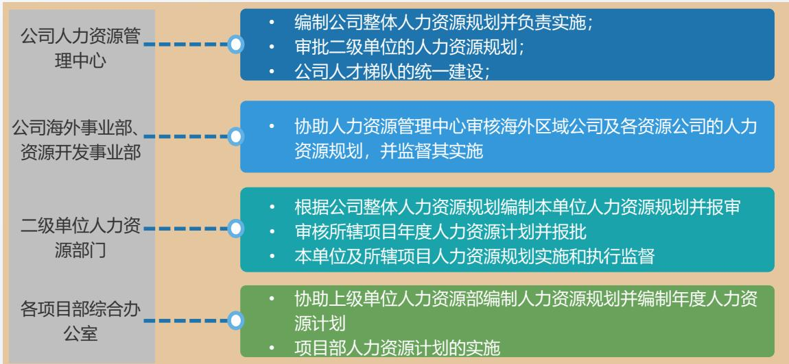

flowchart

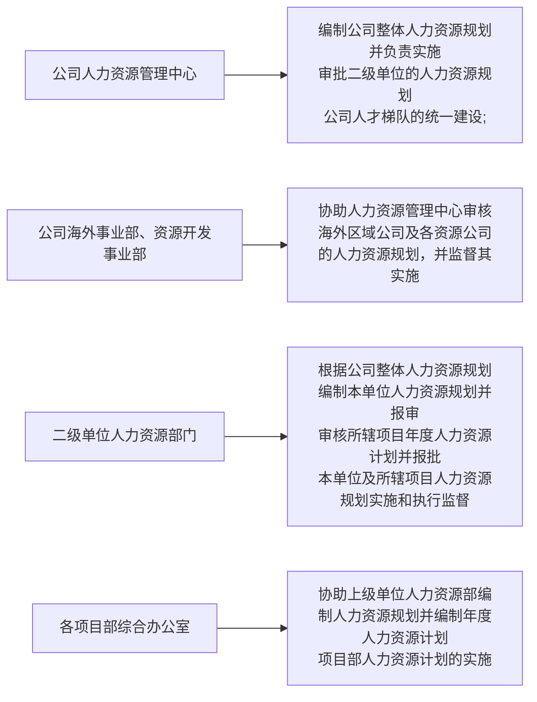
```mermaid
graph LR
  A["公司人力资源管理中心"] --> B["编制公司整体人力资源规划并负责实施\n审批二级单位的人力资源规划\n公司人才梯队的统一建设;"]
  C["公司海外事业部、资源开发事业部"] --> D["协助人力资源管理中心审核海外区域公司及各资源公司的人力资源规划，并监督其实施"]
  E["二级单位人力资源部门"] --> F["根据公司整体人力资源规划编制本单位人力资源规划并报审\n审核所辖项目年度人力资源计划并报批\n本单位及所辖项目人力资源规划实施和执行监督"]
  G["各项目部综合办公室"] --> H["协助上级单位人力资源部编制人力资源规划并编制年度人力资源计划\n项目部人力资源计划的实施"]
```

<table><tr><td>法律法规</td><td>公司严格遵守国内外项目所在地劳工、未成年人保护相关的法律法规,确保所有员工的权益得到合法保护。</td></tr><tr><td>招聘流程</td><td>在招聘过程中,公司会进行严格的年龄和身份验证,确保所有应聘者均符合法定工作年龄,避免使用童工。</td></tr><tr><td>劳动合同</td><td>与所有员工签订正式的劳动合同,明确双方的权利和义务,保障员工的合法权益。</td></tr><tr><td>工作环境</td><td>提供安全、健康的工作环境,确保员工在工作时的人身安全和健康。</td></tr><tr><td>监督机制</td><td>建立内部监督机制明确奖惩制度,鼓励员工对任何违规行为进行举报,公司将对举报情况进行调查并采取相应奖惩措施。</td></tr></table>

natural_image

Grid of 20 stylized human head icons in various colors and attire, no text or symbols present

## 员工雇佣与权益

## 风险和机遇

公司秉持“家文化”的核心价值观，深刻认识到员工是企业发展的基石。我们将员工雇佣与权益视为影响公司可持续发展能力的关键实质性议题，通过系统性的识别与评估，明确了相关的影响、风险和机遇，并据此制定了“共生共荣”的战略规划。

<table><tr><td>类别</td><td>具体事项/风险点</td><td>影响时间范围</td><td>影响程度评估</td><td>潜在财务/战略/声誉影响描述</td></tr><tr><td>风险核心人才流失与短缺</td><td>海内外项目多位于偏远艰苦地区,面临人才“引不进、留不住”的挑战。</td><td>短期-中期</td><td>高</td><td>战略影响:核心技术人员或管理人员的流失将直接影响项目交付和安全生产。</td></tr><tr><td>风险合规与劳工权益纠纷</td><td>不同国家劳动法差异巨大(如工会力量、解聘限制)。</td><td>短期</td><td>高</td><td>声誉影响:若未能严格遵守当地法规(如最低工资、工时、社保),将面临法律诉讼、罚款及声誉受损。</td></tr><tr><td>风险职业健康与安全</td><td>矿业属于高危行业,井下作业环境复杂。若安全管理不到位,发生工伤事故,将对员工生命健康造成不可逆伤害</td><td>长期</td><td>高</td><td>财务:项目停工整顿,部分业务中断。声誉影响:企业声誉受损;</td></tr><tr><td>机遇股权激励与利益捆绑</td><td>通过实施员工持股计划,将核心骨干利益与公司长远发展绑定</td><td>中期</td><td>高</td><td>战略影响:激发员工的主人翁意识,提升团队稳定性。</td></tr><tr><td>机遇雇主品牌与人才高地</td><td>打造“家文化”雇主品牌,提供优于行业的薪酬福利</td><td>长期</td><td>中</td><td>战略影响:有助于在全球范围内吸引顶尖矿业人才。</td></tr></table>

## 多维度的激励体系

为应对人才流失风险并把握人才发展机遇，公司构建了极具竞争力的激励与保障机制。

• 薪酬与福利倾斜：公司实行向艰苦地区、关键岗位及核心专业人员倾斜的薪酬制度。海外员工享有极具竞争力的税后年薪，并配备高原高寒津贴、取证津贴及完善的五险一金。  
股权激励：公司分别于2017年和2022年推出员工持股方案，覆盖不同层级的管理人员。这不仅让股东受益，更让核心员工成为公司的“合伙人”，共享发展红利，有效解决了核心人才流失的痛点。  
职业发展双通道：为员工搭建行政职务与内部职称序列并行的职业发展路径，确保技术型人才与管理型人才均有广阔的晋升空间。

## 共生共荣

## “家文化”引领的共生共荣战略

公司将“家文化”确立为主题文化，旨在消除雇佣关系中的单纯契约属性，赋予其情感与责任的内核。

Ø 战略规划：我们致力于打破地域与国籍界限，将中外员工纳入统一的关怀体系。例如：在老挝开元等项目，公司通过深入宣贯文化、优化薪酬体系，使数百名属地员工从制度服从走向文化认同，实现了中外团队的深度融合。  
Ø 管理策略：推行“公平、公正、公开”的管理氛围。通过矿业管理4.0体系，实现考核透明、制度统一，确保每位员工无论国籍、岗位，都能在同一起跑线上竞争与发展。

## 严格的合规与权益保障机制

针对跨国经营的合规风险，公司建立了严密的制度防火墙。

反舞弊与零容忍：公司发布《反舞弊与反商业贿赂管理制度》，对侵害员工利益、利用职务谋取私利的行为实行“零容忍”，并设立畅通的举报渠道，保护举报人权益。  
劳动权益保护：严格遵守《中华人民共和国劳动法》及项目所在国法律，坚决杜绝童工和强制劳动。在招聘环节实施严格的年龄和身份验证；在合同环节，确保全员签订正式劳动合同，明确权利义务。  
健康与安全：将安全生产视为员工权益的底线。通过持续的安全投入、标准化建设及职业健康体检，最大限度降低职业健康风险，保障员工生命安全。

## 员工雇佣与权益

## 就业机会与员工关怀

金诚信秉持“家文化”，践行“企业就是员工，员工就是企业”的理念，通过企业与员工的共同努力，建立企业与员工“共生共荣”的事业之家，通过高效的员工沟通、多维度的员工关怀，持续提升员工归属感与满意度，共同铸就美好未来。公司每年为社会，尤其是海外社区创造大量就业岗位且平等对待所有员工，为特殊人群创造就业机会，帮助困难员工。报告期内，公司劳动合同签订比例、社会保险覆盖率和员工体检覆盖率继续保持100%，并承担社会责任和实际技能情况，雇佣残疾人和退伍军人。

## l 鲁班比公司对当地就业的贡献

公司2024年完成鲁班比铜矿收购后，基本保留了原有员工队伍，并将原有生产承包商人员并入公司成为鲁班比员工。鲁班比自主员工队伍从600多人提升为1700多人。报告期内，公司为当地创造了近2900个工作岗位。其中150多人的社区工是为了支持当地社区就业与发展，专门制定执行的帮扶计划的一部分，体现了公司对赞比亚当地就业和社区发展的强有力的支持。

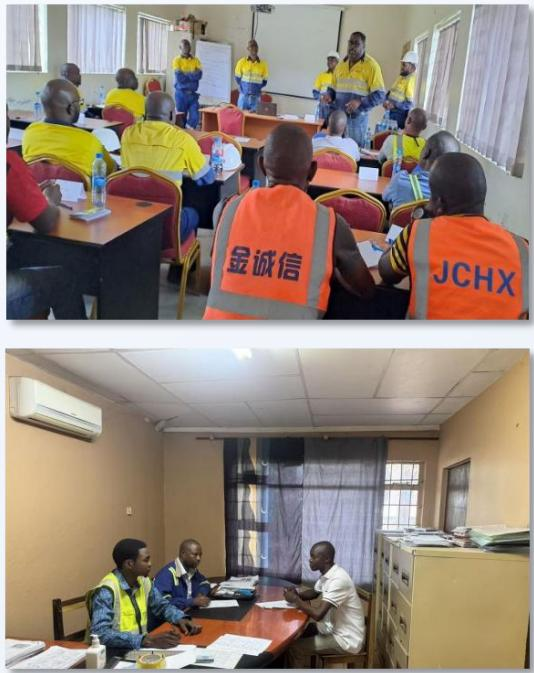

## l 金景公司对当地就业的贡献

金景公司深耕刚果（金）属地运营，始终将促进本地就业、带动民生改善、推动社区可持续发展作为重要使命，截至报告期末，公司属地正式员工360人，临时工750人，直接为当地提供近1110个稳定就业岗位，有效吸纳本地劳动力就业，切实提升居民收入与生活水平。除直接创造岗位外，公司积极构建属地协同发展生态，通过与本地医院、学校、供应商等多方合作，延伸产业链与服务链，间接带动一批配套就业机会，形成“企业发展—产业联动—就业增长”的良性循环。

• 公司建立《困难员工补助管理办法》，每年对员工本人及困难家庭因遭遇突发意外伤害、遭遇重大变故等特殊情况，深入了解情况，及时进行关怀慰问；每年还在春节前夕集中开展困难员工慰问活动，为困难员工困难发放慰问金，报告期内，共帮扶困难员工人数10人。

<table><tr><td>指标</td><td>单位</td><td>2023年</td><td>2024年</td><td>2025年</td></tr><tr><td>困难员工帮扶人数</td><td>人</td><td>17</td><td>21</td><td>10</td></tr></table>

## 员工福利

公司员工福利体系、制度与举措主要包括社会保险、住房公积金、住房补贴、交通补贴、通讯补贴和企业年金等内容。其中，社会保险和住房公积金是强制保险，公司为员工缴纳养老保险、失业保险、工伤保险、基本医疗保险（含计划生育险）、大病保险和住房公积金。员工在离职或退休时，公司会为其办理各项社保的减少与转移；住房补贴是公司为两级机关工作人员提供的福利，根据员工级别和工作单位所处地域不同分别予以设定；交通补贴针对总部机关员工提供，根据员工级别和业务性质分别予以设定；通讯补贴根据员工级别和业务性质分别予以设定；企业年金，根据《公司企业年金方案》，符合条件的员工自愿加入。公司通过这些福利政策，旨在保障员工的基本权益，提高员工满意度，促进员工稳定和忠诚度，同时支持公司人力资源的长期发展。

公司专项设置艰苦补贴，优化员工福利。艰苦补贴旨在弥补员工在艰苦边远地区工作时所额外消耗的劳动。该补贴根据项目所在地区的自然地理和人文环境等因素，综合考虑不同地域间的气候、海拔、交通和物价等条件差异，对项目部管理人员、技术人员、辅助和后勤人员实行分级管理。补贴标准根据岗位的不同而有所差异，按照出勤天数与月度工资同时发放。对于执行计件薪酬的员工，公司会根据情况适度调整计件单价。

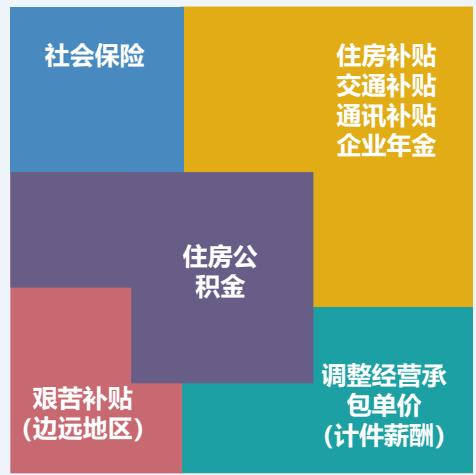

text_image

社会保险
住房补贴
交通补贴
通讯补贴
企业年金
住房公积金
艰苦补贴
(边远地区)
调整经营承
包单价
(计件薪酬)

## 员工雇佣与权益

## 员工意见与反馈

公司通过职工代表大会、在线平台和问卷调查等多种渠道，建立常态化的民主沟通制度，接受员工意见表达并积极给予反馈和问题解决，切实保障员工权益。

## l 在线服务平台

精心打造“你来说我来办”综合服务平台，整合公司纪律投诉、思想倾诉、“三热”（热点、难点、焦点）问题反馈三大核心功能，倾听职工心声、化解职工诉求的“连心桥”。2025年，该平台累计接收员工倾诉、建议及意见67条，内容主要聚焦食堂菜品质量提升、工作纪律规范、休息休假保障等职工关注度高、与日常工作生活密切相关的重点领域。平台坚持“有诉必接、有接必办、有办必复”的原则，健全诉求收集、交办、督办、反馈全闭环工作机制，高效推进各类问题整改落实，全年问题解决率达90%以上，切实将职工的“呼声”转化为“掌声”，不断增强职工的归属感、幸福感和获得感。

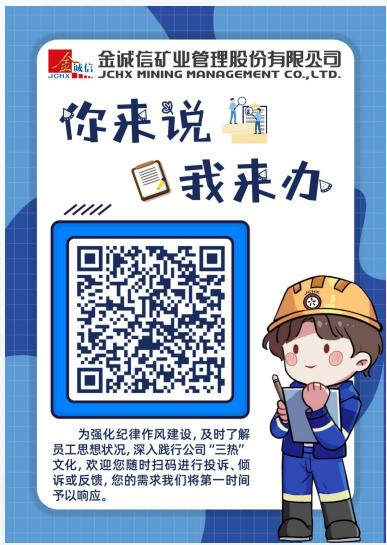

text_image

金诚信矿业管理股份有限公司
JCHX MINING MANAGEMENT CO.,LTD.
你来说
我来办
为强化纪律作风建设，及时了解员工思想状况，深入践行公司“三热”文化，欢迎您随时扫码进行投诉、倾诉或反馈，您的需求我们将第一时间予以响应。

• 秉持“以人为本” 的理念，公司建立了覆盖食堂、宿舍及公共区域的全方位后勤服务、管理和反馈机制。为了更精准地响应员工诉求，本年度我们将调查频次从半年提升至每季度一次，通过高频次的动态监测形成了高效的闭环管理。2025年员工食堂满意度从年初的86%提升至年底的90%，宿舍满意度从82%提升至94%，有力验证了公司在提升员工福祉方面的扎实成效。

<table><tr><td colspan="2">披露项</td><td>单位</td><td>2023</td><td>2024</td><td>2025</td></tr><tr><td rowspan="2">员工沟通</td><td>职代会召开次数</td><td>次</td><td>2</td><td>4</td><td>4</td></tr><tr><td>员工工会入会率</td><td>%</td><td>55</td><td>59</td><td>63</td></tr></table>

## 员工活动

公司以特色主题教育为引领，丰富员工精神文化生活，凝聚发展合力，精心组织开展各类员工文化活动，覆盖职工累计达2.5万人次，成效显著。包括“接续奋斗 耀启新程”主题年度文化系列活动，组织健康体检报告分析与常见疾病健康知识讲座，守护员工身心健康。

此外，搭建多元展示与互动平台，开展“跨越山海，律动同行”线上运动PK赛、2025年外文演讲比赛及外文歌曲演唱活动，激发员工活力；举办庆祝“三·八”妇女节活动，彰显人文关怀；开展2025年度好新闻、好文稿、优秀通讯员评选及摄影、短视频大赛，挖掘员工特长，营造积极向上、团结奋进的文化氛围，切实增强员工归属感与凝聚力。

“三·八”妇女节活动  
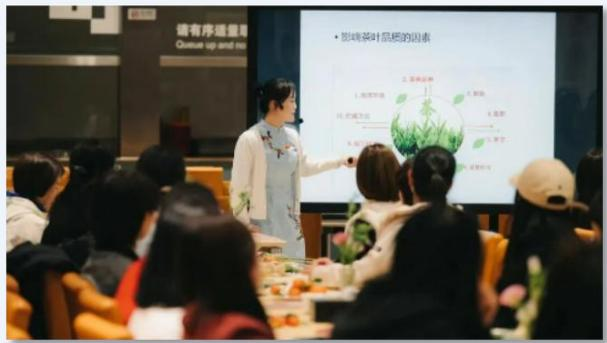

text_image

请有序适量茶
Queue up and no
• 影响茶叶品质的因素

急救知识讲座

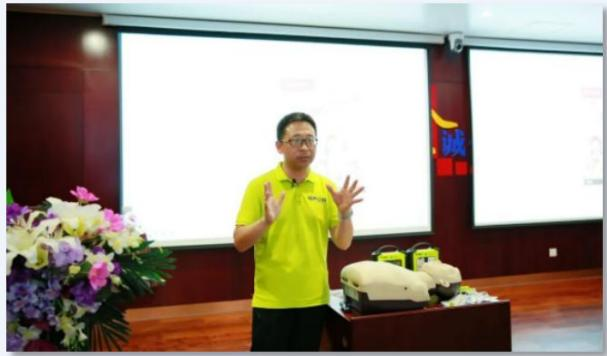

natural_image

Man in yellow polo shirt giving presentation at podium with floral arrangement and projection screens (no visible text or symbols)

## 职业健康与安全

## 政策法规、管理制度与架构

金诚信高度重视员工职业健康安全，严格遵守《中华人民共和国安全生产法》《中华人民共和国职业病防治法》《用人单位职业健康监护监督管理办法》《工作场所职业卫生管理规定》等法律法规，并通过了ISO 45001职业健康安全管理体系认证。报告期内，公司未发生较大以上生产安全事故。

为应对职业健康与安全方面的风险，公司积极建立公司级、二级单位级和岗位级的风险分级管控机制，明确各级人员职责，制定了《安全教育培训制度》《职业危害预防制度》并持续进行更新优化，报告期内，新增《安全检查分级复核制度》，并对《安全信息化管理制度》和《生产安全事故报告和调查处理制度》进行了修改补充，在日常工作中监督员工做好各类防护，同时现场设置各种防护措施，降低或减轻职业危害。报告期，公司设定的安全生产目标为工亡事故为零、新增职业病为零。

## 公司的职业健康工作由相应副总裁分管，并由安全生产管理中心具体执行

公司副总裁，组织公司职业病危害因素的辨识与评价工作，对全公司的职业病防治工作全面负责

安全生产管理中心，对主要职业危害因素的防控措施进行策划，二级单位安环部负责对下属单位职业危害因素的防控工作进行指导、监督和检查

二级单位总经理，组织二级单位职业病危害因素的辨识与评价工作，对二级单位的职业病防治工作全面负责

项目经理，组织项目部职业病危害因素的辨识与评价工作，对项目部的职业病危害因素防治工作全面负责

金诚信始终秉持“人为业本”的经营理念，坚持“预防为主，防治结合”的职业病防治方针，关注员工健康，关爱员工生命。公司持续加大安全投入，按照安全生产监督管理部门、卫生行政部门的规定组织上岗前、在岗期间和离岗时的职业健康检查，并将检查结果书面告知员工。同时，公司加强职业卫生知识和职业病危害因素防控知识培训，完善并维护职业病防护设施，为员工配备符合防治职业病要求的职业病防护用品，不断改善员工的作业环境和作业条件，致力于创造一流的职业健康安全管理绩效。公司持续开展职业健康管理体系认证工作，职业健康管理水平不断提升。报告期内，公司任中国职业安全健康协会常务理事单位，并通过 ISO45001职业健康安全管理体系认证。

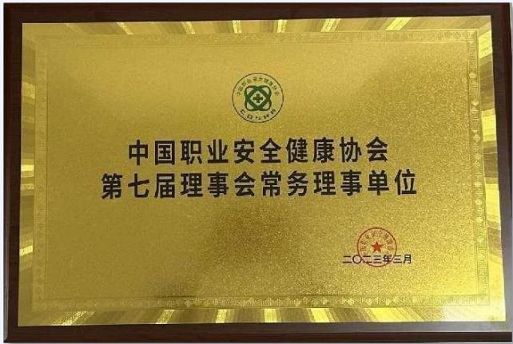

text_image

中国职业安全健康协会
第七届理事会常务理事单位
二〇二三年三月

中国职业安全健康协会第七届理事会常务理事单位

<table><tr><td colspan="2">对于公司各单位员工在职业活动中,因接触粉尘、噪声和其他有毒、有害因素而引起疾病的风险,公司采取完备的职业健康保护措施,有效预防和控制作业环境中职业病危害因素出现以及员工职业病发生。</td></tr><tr><td>粉尘的防控</td><td>采用湿式凿岩、潮喷、湿喷工艺防尘措施。采用冲洗岩壁、装岩洒水、水幕净化风流等降尘措施。路面洒水、定期清理路面粉尘、车辆限速行驶等措施。实施机械通风,合理配置局部通风机,加强风筒维护,及时延伸风筒,确保通风除尘效果。接尘人员按规定正确佩戴符合国家标准的防尘口罩。设置注意防尘、戴防尘口罩、注意通风等安全警示牌。</td></tr><tr><td>噪声的防控</td><td>采掘设备控噪措施:优先选用电动采掘设备;加强对风动凿岩机的维修,确保消音罩齐全、完好。风机控噪措施:应选用低噪高效局部通风机;对老式局部通风机,在进风口安装消音装置;对局部通风机及消音装置进行定期检查和维护,保证其完好。接噪人员按规定正确佩戴塞栓式耳塞或耳罩。设置注意防噪、戴耳塞、戴耳罩等安全警示牌。</td></tr><tr><td>有毒、有害气体的防控</td><td>选择零氧平衡炸药。按一次爆破设计炸药用量校核通风能力,现场禁止超设计用药。采用机械通风,加强通风管理,确保在规定的时间内吹净炮烟,保证工作面有足够的新鲜风量。合理设计通风系统,避免串联通风和循环风。装药时要坚持使用炮泥,防止爆燃现象发生,减少有毒有害气体生成。加强盲巷管理,及时进行封闭并悬挂醒目的“禁止入内”安全警示标志。因工作需要必须进入时,应制定落实专项方案,严禁盲目冒险进入。携带并使用便携式有毒有害气体检测报警仪。设置注意检测有毒有害气体、注意通风等安全警示牌。</td></tr></table>

## 职业健康与安全

## 风险和机遇

公司始终将职业健康与安全视为企业生存的底线和发展的红线。我们深刻认识到，矿业作为高危行业，安全管理不仅关乎员工的生命尊严，更直接影响公司的运营连续性与可持续发展能力。基于此，公司依据ISO 45001职业健康安全管理体系标准，结合“矿业管理4.0”战略，对相关影响、风险和机遇进行了系统性识别与评估。

<table><tr><td>类别</td><td>具体事项/风险点</td><td>影响时间范围</td><td>影响程度评估</td><td>潜在财务/战略/声誉影响描述</td></tr><tr><td>风险生产安全事故</td><td>井下坍塌、透水、火灾或设备故障等事故可能导致人员伤亡、资产损毁,甚至导致矿山停产整顿</td><td>短期-长期</td><td>极高</td><td>财务影响:造成巨大的直接经济损失和现金流中断;声誉影响:公司名誉受损,影响ESG评级</td></tr><tr><td>风险合规与法律责任</td><td>随着《安全生产法》及海外矿山安全法规的趋严,任何违规行为都可能招致巨额</td><td>短期</td><td>高</td><td>财务影响:高额罚款战略影响:停产整顿,相关责任人可能面临刑事责任。</td></tr><tr><td>风险职业健康危害</td><td>粉尘(矽肺病)、噪声、高温及有毒有害气体是矿山作业的主要职业病危害因素。长期暴露可能导致员工慢性健康受损</td><td>长期</td><td>中</td><td>财务影响:引发劳资纠纷和赔偿负担声誉影响:公司名誉受损,影响ESG评级</td></tr><tr><td>机遇智能化与“机械化换人”</td><td>推广无人驾驶铲运机、远程操控等智能化设备,将员工从高危作业面替换出来,实现“少人则安、无人则安”</td><td>中期</td><td>高</td><td>战略影响:大幅降低事故概率,并利用机械提高效率</td></tr><tr><td>机遇安全标准化与品牌溢价</td><td>提升公司在国际高端矿业市场的品牌形象</td><td>长期</td><td>中</td><td>战略影响:成为获取优质业主(如大型跨国矿企)订单的关键敲门砖。</td></tr></table>

Ø 为应对上述议题，公司制定了以“本质安全”为目标，以“科技兴安”和“文化强安”为双轮驱动的战略规划，并将安全管理深度融入商业模式创新中。

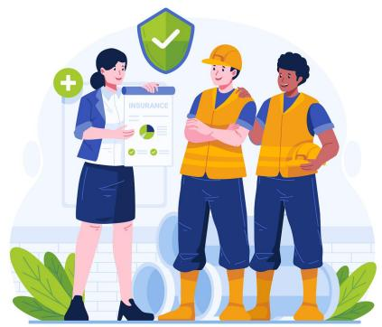

natural_image

Illustration of three workers in safety vests and hard hats discussing insurance (no text or symbols present)

## “矿业管理4.0”引领的智能化安全战略

公司深刻洞察到，传统的人防模式已触及天花板，必须向技防、智防转型。

战略规划：公司将“机械化换人、自动化减人”作为核心安全战略。依托自主研发的铲运机无人驾驶系统，在井下穿脉内实现铲矿、运矿、卸矿的全流程自动化，彻底消除了人员在狭窄、高危环境下的作业风险。  
管理策略：深化推进“矿业管理4.0”，利用移动互联、大数据和AI技术，建立安全风险分级管控和隐患排查治理双重预防机制。通过数字化平台，实时监控井下人员定位、设备状态和环境参数，实现安全管理的透明化和实时化。

## 全员参与的“家文化”安全体系

公司认为，安全管理的各种制度最终要靠人来执行，因此将“家文化”融入安全管理，从“要我安全”向“我要安全”转变。

班组建设标准化：公司高度重视作为最小作战单元的班组建设，开展“安全管理标准化示范班组”创建活动。将安全责任压实到每一名员工，确保SOP（标准作业程序）的严格执行。  
手指口述与安全确认：引入并推广“手指口述”安全确认法，要求员工在操作前通过肢体动作和语言确认环境安全，通过行为干预减少人为失误。  
教育培训常态化：建立公司级学习平台，制作专业安全培训教材与视频，确保全员（含外籍员工）接受系统的安全教育，提升全员安全素养。

## 严格的合规与应急管理机制

针对法律与合规风险，公司构建了严密的制度防火墙。

体系建设：公司建立并持续通过ISO 45001职业健康安全管理体系认证，确保管理流程符合国际标准。设立安全总监职位，赋予其对安全生产的一票否决权。  
应急管理：制定完善的应急救援预案，并定期组织实战演练。针对井下可能发生的火灾、水灾等突发情况，储备充足的应急物资，确保在极端情况下的响应能力。  
职业健康监护：定期组织员工进行职业健康体检，建立健康档案，严格控制作业场所的粉尘和噪声浓度，从源头预防职业病的发生。

## 职业健康与安全

## 安全文化建设

Ø 扎实开展全员安全教育培训  
• 管理人员培训。各项目单位组织开展了管理技术人员“三管三必须”、“一岗双责”、“业务保安”等培训，确保各级管理技术人员肩负岗位职责和安全生产监督责任。  
• 作业人员培训。各项目单位职能部室分工种组织开展了案例教育、SOP操作流程、岗位应知应会“手指口述”确认法、现场应急处置措施等培训，全面强化员工操作技能和意识，加强现场安全监管力度，及时消除现场事故隐患，将事故扼杀在萌芽状态。  
• 违章人员培训。各二级单位梳理出了2025年习惯性违章人员、严重违章人员，并督导各项目部组织开展了多轮次的专项培训工作，并利用提问、考试、现场评估等方式进行培训效果评估，评估合格后方可返岗。此外各项目部还利用班前会通报近期典型违章，让违章人进行现身说法，严厉打击违章行为，营造“不敢违、不想违、不能违”的安全氛围。  
各项目单位结合业主方应急演练计划，组织开展了井下火灾、防汛、冒顶片帮、透水等事故应急演练，并对井下避灾路线、应急逃生等知识进行专项培训，下发并更新了岗位应急处置卡，确保安 安业全员掌握应急处置知识。  
• 报告期内，公司开展职业健康与安全生产培训课程2652次，接受职业健康与安全生产安全培训识 传险总32236人次，安全培训总时长244,525.5小时，安全生产投入金额16,118.65万元。竞 、告

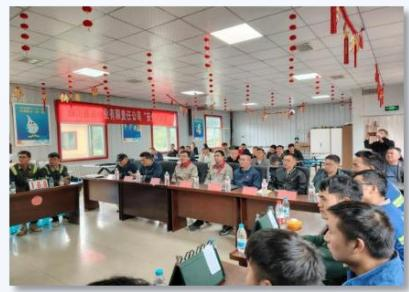

text_image

Meeting room photo with visible presentation screen and red decorations, showing attendees and a large screen displaying Chinese text about a 2019 event.

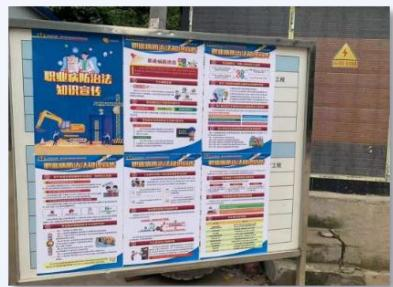

text_image

职业健康法治
知识宣传

职业健康法治·法治建设

职业健康法治·法治建设

职业健康法治·法治建设

职业健康法治·法治建设

职业健康法治·法治建设

职业健康法治·法治建设

职业健康法治·法治建设

职业健康法治·法治建设

职业健康法治·法治建设

职业健康法治·法治建设

职业健康法治·法治建设

职业健康法治·法治建设

职业健康法治·法治建设

职业健康法治·法治建设

职业健康法治·法治建设

职工
2018
2019
2020
2021
2022
2023
2024
2025
2026
2027
2028
2029
2030
2031
2032
2033
2034
2035
2036
2037
2038
2039
2040
2041
2042
2043
2044
2045
2046
2047
2048
2049
2050
2051
2052
2053
2054
2055
2056
2057
2058
2059
2060
2061
2062
2063
2064
2065
2066
2067
2068
2069
2070
2071
2072
2073
2074
2075
2076
2077
2078
2079
2080
2081
2082
2083
2084
2085
2086
2087
2088
2089
2090
2091
2092
2093
2094
2095
2096
2097
2098
2099
2100

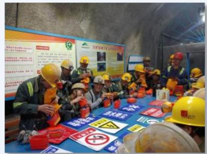

text_image

Group of construction workers in safety gear gathered around a table with safety warning signs and safety symbols, likely at a tunnel or construction site.

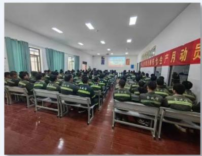

text_image

Classroom photo with students seated in rows, red banner displaying Chinese text about a labor union production month volunteer

## 应急管理

为了预防和控制潜在的事故或紧急情况发生，做出应急准备和响应，保障员工健康和生命安全，最大限度地减少财产损失、环境损害和社会影响，提高公司抗击风险和防范事故的能力，金诚信根据《中华人民共和国安全生产法》《安全生产许可证条例》《北京市采掘施工和地质勘探企业安全生产监督管理办法》《生产安全事故应急条例》《关于加强金属非金属地下矿山外包工程安全管理的若干规定》等法律法规，制定《生产安全事故应急管理制度》《生产安全事故应急预案》。公司坚持“以人为本、预防为主、统一领导、分级负责、科学实用”的原则，充分发挥各级应急领导小组的作用，做好常态下的风险评估、物资储备、队伍建设、完善装备、预案演练等工作，按照事故的危害程度和影响范围，实施分级应急响应。公司坚持全员参与，组织开展常态化应急演练活动，报告期内，公司组织事故应急演练累计211场。

l 应急预案演练

根据各项目部的主要风险和所发生的事故类型，各项目单位结合属地政府及业主方安排，开展了多种形式的应急救援演练，通过演练检验了本项目单位的应急救援能力，找到了应急救援工作的薄弱环节，补齐短板，为今后的实际应急救援工作打好了基础。

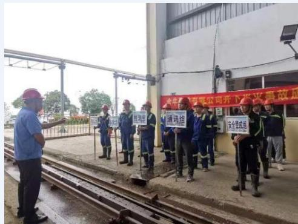

text_image

Group photo of railway workers in uniform at a station platform, with visible banners and signs in Chinese

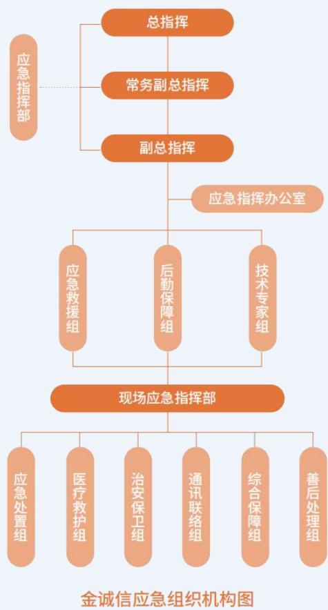

flowchart

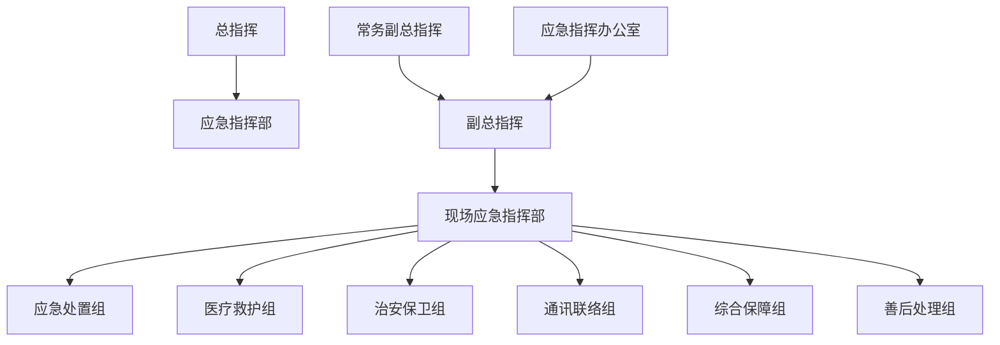
```mermaid
graph TD
  A["总指挥"] --> B["应急指挥部"]
  C["常务副总指挥"] --> D["副总指挥"]
  E["应急指挥办公室"] --> D
  D --> F["现场应急指挥部"]
  F --> G["应急处置组"]
  F --> H["医疗救护组"]
  F --> I["治安保卫组"]
  F --> J["通讯联络组"]
  F --> K["综合保障组"]
  F --> L["善后处理组"]
```

## 职业健康与安全

## 安全生产检查与技术措施

面对矿山建设与开发固有的风险，金诚信深知安全生产对员工及其家庭的意义，为此公司构建了具有自身安全生产特点的风险分级管控和隐患排查治理双重预防机制，形成“风险单元划分——风险辨识——风险评估——风险分级管控——安全检查任务下发与执行——逐级抽查复核安全检查工作落实情况”的风险管控流程，制定了各岗位、各场所有针对性的安全检查表，定期组织全公司范围的各类专项安全检查，不断堵塞管理漏洞，改善劳动作业环境，规范作业人员的行为，保证设备系统的安全、可靠运行。

## 隐患排查和反“三违”管理举措

制定员工对不同风险级别风险单元的安全检查频次标准

根据风险单元的风险级别及专业检查要求，讨论制定了各风险单元安全检查频次的基本标准，主要包括班组的安全点检频次标准及管理人员对班组的 SOP 检查和对场所环境的现场标准化检查频次标准。根据现场管理人员、专业部室管理人员和经理层安全检查的频次要求，制定项目部管理人员每周的检查计划，并按计划执行检查，两级公司抽查复核现场执行情况，敦促指导项目部按标准执行安全检查工作。

强化实质性违章行为的查处力度

公司的安全信息化系统内置了违章行为规范录入的业务流，杜绝了非实质性违章行为凑指标的现象，提高了现场纠违治违质精细化管理现场隐患排查治理工作

利用安全信息化平台对现场安全管理数据的实时分析，使安全管理的关注点从简单的数据统计向隐患排查治理工作的落实方向转变，通过信息化平台常态化跟踪现场隐患整改闭合和违章人员帮教、考核情况，及时采取有针对性的措施，确保物的不安全状态和人的不安全行为可控，杜绝同类型安全隐患重复出现或反复发生，形成了长效治理机制。

在报告期内，公司通过系统化流程对安全生产因素进行排查、识别与评估，并取得以下量化成果：

## 一、排查/识别与评估流程

1）全员风险辨识：每年组织全员参与区域风险再辨识，覆盖重点区域，确保风险辨识无遗漏。采用作业条件危险性评价法（LEC） 或风险矩阵法（LS） 对辨识出的风险进行量化定级。通过综合考虑事故发生的可能性（L）、人员暴露频率（E）及后果严重程度（C），计算风险值（D=L×E×C）并据此将风险划分为"红橙黄蓝"四等级（重大风险、较大风险、一般风险、较小风险）。  
2）体系化检查机制：公司通过每日巡检、周检、月度综合检查及专项排查，结合“五定”原则闭环整改隐患。  
3）信息化与标准化工具：推行矿业4.0持表检查，使用安全巡检APP实现隐患线上提报与复核，完善SOP检查表及风险单元检查表。  
4）动态风险更新：依据事故案例和实际生产变化，定期修订“三违”清单、风险评估表及应急预案，确保管控措施针对性。

## 二、安全管理措施量化结果

1）隐患治理：2023年查改隐患52958项、2024年查改隐患59424项、2025年查改隐患56823项。  
2）三违查处：2024年纠违15824人次，100%帮教，闭环管理；2025年纠违12996人次，100%帮教，闭环管理。2025年推行违章超限人员清退，逐步替换超限人员，杜绝现场违章作业。

## • 金诚信安全信息化管理平台

积极推进安全信息化管理工作，提升安全管理技术手段。报告期内，安全生产管理中心联合软件开发公司经过多次跟踪测试与优化，成功解决了“手指口述”视频无法播放难题，完成了安全检查任务自动生成、三违管理流程变更、违章超限人员统计、安全文明生产标准化、管理平台信息分享、学习培训记录的自动获取和教育培训档案整理功能、SOP评分功能升级优化等，通过信息化使各项安全管理更为便捷基本实现了安全确认可追溯、安全检查全覆盖、分级复核有逻辑、统计分析更便利的信息化提效目标。

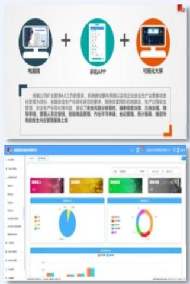

• 建立职业健康档案各项目部为每一名新员工做好入岗前的职业健康体检，给每一名员工建立独立的职业健康监护档案，并将每年的岗中体检、现场职业危害检测情况记录在案。对受职业危害影响的岗位加强检测与检查频次，确保各项防护措施落实到位。同时，定期安排员工体检，有异常的及时调整岗位。

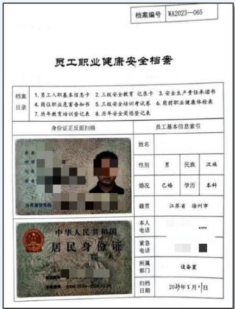

text_image

档案编号
WA2023-065
员工职业健康安全档案
档案
目录
1.员工入职基本信息卡 2.三级安全教育 记息卡 3.安全生产责任承诺书
4.岗位职业危害告知书 5.三级安全培训考试卷 6.前职职业健康体检表
7.历年教育培训登记表 8.历年安全奖惩登记表
身份证正反面扫描
员工基本信息索引
姓名
性别 男 民族 汉族
婚况 巴格 学历 本科
籍贯 江苏省 徐州市
中华人民共和国
居民身份证
本人
电话
紧急
电话
所属
部门 设备室
归档
日期 20岁年5月1日 日

## 员工培训与发展

## 政策法规、管理制度与架构

金诚信高度重视员工培训与发展，严格遵循《中华人民共和国劳动法》《中华人民共和国职业教育法》《中华人民共和国安全生产法》与《生产经营单位安全培训规定》等核心法律及海外下属单位所在国与劳工相关的法律法规，确保培训工作的合法合规性，保障员工职业发展的权益。为此，公司建立了完善的人力资源管理体系与制度，包括《大学毕业生培养管理办法》《执业资格管理办法》《人才开发管理制度》《内部职称评定管理办法》等内部制度文件，并进行持续优化更新，确保所有员工的职业发展得到合法保护，报告期内，公司发布《金诚信矿业管理股份有限公司人力资源管理政策声明》，承诺构建涵盖“薪资福利、职业发展、工作生活平衡”的全方位薪酬计划。公司的人力资源工作由董事长分管，并建立从总部人力资源管理中心、二级单位到项目部的层级架构。

公司具备成熟完备的职业发展路径与人员晋升机制。通过内部职称序列的考试方式、管理职员序列的选拔或竞聘方式和技工序列的竞赛或比武方式开展。

## 专业技术序列考评方式

适用于专业技术人员，公司通过设立不同的内部职称序列，如对应工程序列教授级高工、高级工程师、工程师、助理工程师、技术员等16个专业序列的13级内部职称，员工可以通过参加考试来晋升职称和获得相应的薪酬和福利待遇。公司制定详细的考试大纲和考试规则，并设立专门的考试机构和评委员会，确保考试的公正性和科学性

## 管理序列选拔和竞聘

适用于管理类人员，公司通过设置不同的管理职位，如主管、高级主管、经理助理、副经理、经理、总经理助理副总经理、总经理等，员工可以通过选拔或竞聘的方式来争取职位晋升的机会。公司会设立岗位要求和选拔标准，并组织相关部门和专业人士参与选拔和考核，以确保选拔的公平和合理

## 技能序列 竞赛或比武

适用于技能人员，公司通过举办技能竞赛或比武比赛，对员工的技能水平和应变能力等进行考核和评估，从而确定员工的职业水平和晋升方向，共设13级技师晋升职级。企业一般会设立专门的技能考核委员会或技能培训机构，为技工员工提供综合性技能培训和考核，以确保员工的技能水平的全面和提高

公司采用分序列、分层次的方式全面规划建立人才体系，注重管理人才、技术人才和技能人才的均衡发展。通过内部培养、校园招聘和社会招聘等多元化方式补充人才缺口，强调德才兼备、以德为先、履职业绩的评价选拔标准。对于海外人才，公司有系统全面的招聘步骤与管理体系，注重合法合规并适应当地文化。

公司围绕矿业管理4.0（标准化）对应不同类别人群搭建管理类课程体系、技术类课程体系、技能类课程体系三大类

<table><tr><td>管理类课程体系</td><td>技术类课程体系</td><td>技能类课程体系</td></tr><tr><td rowspan="2">金诚信创业史与公司战略课程</td><td>安全专业类课程</td><td></td></tr><tr><td>采矿专业类课程</td><td></td></tr><tr><td rowspan="2">矿业管理4.0(标准化)融合课程</td><td>测量专业类课程</td><td></td></tr><tr><td>地质专业类课程</td><td>台车操作SOP课程</td></tr><tr><td>思维转型课程</td><td>会计专业类课程</td><td>铲运机操作SOP课程</td></tr><tr><td>精细化管理课程</td><td>机械专业类课程</td><td>矿卡操作SOP课程</td></tr><tr><td>管理人员的行为标准与能力要求课程</td><td>经营专业类课程</td><td>提升机操作SOP课程</td></tr><tr><td>矿业管理4.0财务管理课程</td><td>井建专业类课程</td><td>特种设备操作SOP课程</td></tr><tr><td>矿业管理4.0经营成本管理课程</td><td>人力专业类课程</td><td>无轨设备维修SOP课程</td></tr><tr><td>矿业管理4.0安全管理课程</td><td>IT专业类课程</td><td>钳工维修SOP课程</td></tr><tr><td>矿业管理4.0设备管理课程</td><td>物资专业类课程</td><td>电工维修SOP课程</td></tr><tr><td>采矿技术的应用及发展课程</td><td>行政专业类课程</td><td>焊工维修SOP课程</td></tr><tr><td>矿山建设技术管理课程</td><td>电气专业类课程</td><td></td></tr><tr><td>审计存在问题及案例分析课程</td><td>资源专业类课程</td><td></td></tr><tr><td></td><td>装备专业类课程</td><td></td></tr></table>

## 员工培训与发展

## 风险和机遇

公司视人才为“第一资源”，深刻认识到在矿业技术快速迭代和全球化扩张的背景下，员工的技能水平与职业发展直接决定了企业的核心竞争力。我们依据“矿业管理4.0”战略需求及ESG可持续发展目标，对员工培训与发展相关的影响、风险和机遇进行了系统性识别与评估。

<table><tr><td>类别</td><td>具体事项/风险点</td><td>影响时间范围</td><td>影响程度评估</td><td>潜在财务/战略/声誉影响描述</td></tr><tr><td>风险关键技能短缺与断层</td><td>随着智能化矿山建设的推进,若传统矿工无法掌握数字化、自动化设备操作技能,将面临“有设备无人会用”的困境</td><td>中期</td><td>高</td><td>战略影响:导致产能闲置或效率低下。</td></tr><tr><td>风险人才流失与培训投资回报</td><td>高投入的培训若未能配合有效的留人机制,可能导致“为他人做嫁衣”的风险</td><td>短期-中期</td><td>中</td><td>财务影响:造成培训成本的沉没和核心人才的流失。战略影响:为竞争对手培养人才,影响业务拓展。</td></tr><tr><td>风险合规与资质认证</td><td>特种作业人员(如电工、焊工、爆破工)若未持证上岗或证书过期</td><td>短期</td><td>中</td><td>财务影响:违反安全生产法规,面临监管处罚战略影响:停工风险</td></tr><tr><td>机遇产教融合与人才造血</td><td>通过与高校合作建立“工匠学院”或实习基地,前置人才培养环节</td><td>长期</td><td>高</td><td>战略影响:确保公司获得源源不断的高素质对口人才,降低外部招聘难度</td></tr><tr><td>机遇管理输出与技术变现</td><td>将公司成熟的培训体系(如矿业管理4.0课程、安全操作规程)转化为咨询服务或技术服务,向业主或行业输出</td><td>中期</td><td>中</td><td>战略影响:创造新的收入增长点。</td></tr></table>

Ø 为应对上述议题，公司制定了以“赋能成长”为核心，以“产教融合”和“数字化培训”为抓手的战略规划，致力于将人力资源转化为驱动公司高质量发展的核心引擎。

natural_image

Illustration of a presenter presenting to two people at a conference table, with no visible text or symbols.

## 产教融合战略

公司深刻认识到，单纯的社会招聘已无法满足对高技能人才的渴求，必须建立自主造血机制。

战略规划：公司联合密云区总工会及职业院校，成立“密云区工匠学院（金诚信学院）”。这不仅是公司人才培养的“孵化器”，也是行业技能交流的“高地”。  
管理策略：推行“企业主导、工会推动、多方参与”的办学机制。通过“名师带徒”、“订单式培养”等模式，将企业岗位标准植入学校课程体系，实现学生毕业即上岗，上岗即熟练。  
技能竞赛与激励：定期举办职业技能大赛，以赛代练，选拔高技能人才。同时，建立“技能工资浮动机制”，将技能等级与薪酬直接挂钩，激发员工主动学习、钻研技术的热情。

## 全生命周期培训体系

针对不同层级、不同阶段的员工，公司设计了精准的培训方案，确保培训内容与业务发展同频共振。

新员工“起跑线”计划：针对应届大学生，开展以“青春无畏 不负相遇”为主题的入职培训。由公司高管亲自授课，通过拓展训练、急救技能培训、企业文化宣贯，帮助新人完成从“校园人”到“职场人”的角色转变。  
• 中高层“领航”计划：针对管理人员，举办中高层管理培训班。聚焦“矿业管理4.0”思维、AI时代挑战、标准化与本地化管理等前沿课题，通过分组研讨和案例诊断，提升管理者的战略视野和解决复杂问题的能力。  
• 产业工人“强基”计划：针对一线产业工人，制定《年度产业工人队伍建设实施方案》。全面推行班长制及SOP检查，利用视频培训教材实现周检查、月评价，提升一线队伍的标准化作业水平。

## 数字化与智能化的培训模式

为应对技能断层风险，公司积极引入数字化手段，提升培训效率和覆盖面。

云端学习平台：建立公司级学习平台，制作并上传专业安全培训教材与视频，打破时空限制，让海外项目和偏远矿区的员工也能随时随地获取知识。  
• 实战化教学：在培训中引入模拟演练和实操考核，特别是在应急救援、设备操作等领域，强调“做中学”，确保培训成果能直接转化为安全生产力。

## 员工培训与发展

## 薪酬激励与培训目标

员工薪酬及激励的管理体系采用职能工资制，具体是以职位相对价值和员工能力作为综合确定薪酬标准的依据。建立宽带薪酬架构，在同一职位上，依据员工能力的不同确定不同档级的薪酬标准。公司员工薪酬由年薪、年功津贴、福利和社会保险费组成。

公司优化薪酬及激励政策，设立超额利润特别奖励，实际完成当年度的利润目标后，将从超额利润中提取部分金额用于奖励；  
为充分调动员工的主动性和创造性，吸引和保留优秀的人才，多维度打造人力资源优势，设立员工持股计划；  
为加大应收款回收力度，制定了《应收账款回收绩效考核与专项奖励管理办法》设立了应收款超额回收奖；  
当公司取得重大管理创新、科技创新、投资取得显著成效、公司获得政府、行业等特别嘉奖的情况下,经董事会薪酬与考核委员会同意，高管团队可获得一定的其他特别奖励。

超额利润奖励员工持股计划应收账款回收绩效其他特别奖励

  
薪酬激励

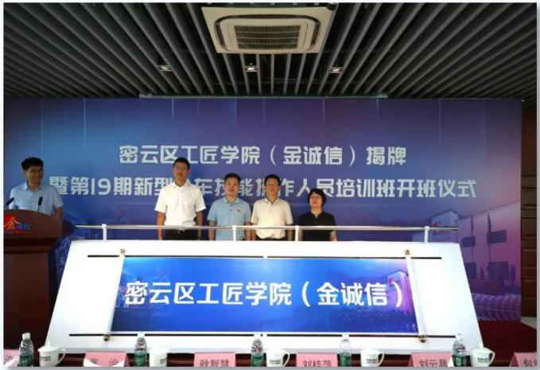

text_image

密云区工匠学院（金诚信）揭牌
暨第19期新型青年技能操作人员培训班开班仪式
密云区工匠学院（金诚信）

成立工匠学院并开班授课

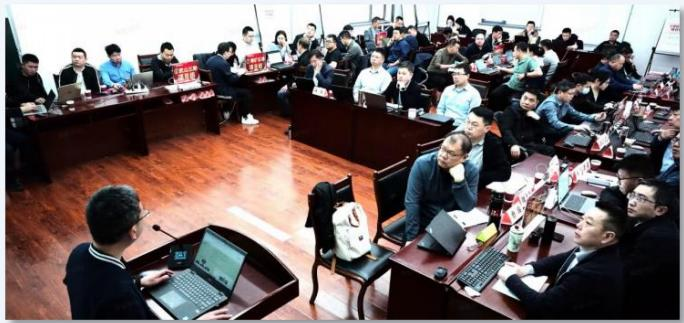

natural_image

Interior view of a conference room with attendees seated at desks, laptops, and microphones (no visible text or signage)

2025年中高层培训

## 培训管理目标

持续提供专业技能培训，确保员工技能与岗位需求同步发展；定制个性化培训计划，支持员工根据自身特点和职业规划进行能力提升；强化终身学习理念，鼓励员工不断学习新知识，适应行业发展趋势。

## 综 合 素 质 提 升

培养团队合作精神，通过团队项目和协作训练，增强员工的集体责任感；提高沟通协调能力，通过模拟演练和实际案例分析，提升员工的交流技巧；激发创新思维，通过创意工作坊和思维训练，培养员工的创新解决问题能力。

flowchart

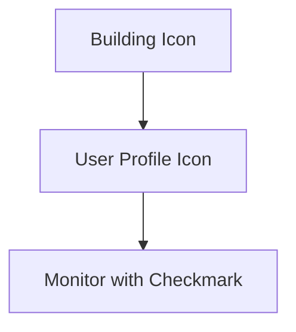
```mermaid
graph TD
  A["Building Icon"] --> B["User Profile Icon"]
  B --> C["Monitor with Checkmark"]
```

## 组 织 发 展 需 要

与组织发展战略紧密结合，确保培训活动与公司长远目标一致；支持可持续发展，通过培训提升员工的环境意识和社会责任感，促进公司的社会责任实践；解决组织层面问题，通过培训提高员工对组织运作的理解，增强解决组织问题的能力。

<table><tr><td>措施</td><td>具体内容</td></tr><tr><td>梯队计划</td><td>通过明确的梯队计划,确保关键岗位的人才储备和顺利交接。</td></tr><tr><td>培训</td><td>提供定期和针对性的培训课程,帮助员工提升专业技能和管理能力。</td></tr><tr><td>轮岗</td><td>鼓励员工在不同部门或岗位之间轮岗,以增加工作经验和视野。</td></tr><tr><td>考试</td><td>通过定期的专业考试,检验员工的知识和技能水平。</td></tr><tr><td>选拔</td><td>通过公平、透明的选拔机制,选拔优秀人才担任更高职位。</td></tr><tr><td>竞聘</td><td>鼓励员工通过竞聘的方式,争取更高级别的职位。</td></tr><tr><td>技能竞赛</td><td>举办技能竞赛,激发员工的学习热情和创新能力。</td></tr></table>

## 岗 位 需 要 与 问 题 解 决

紧密对接岗位需求，设计针对性强的培训课程，确保培训内容与工作紧密相关；强化问题解决培训，通过案例分析和角色扮演，提高员工面对挑战时的应对能力；促进培训成果的实际应用，通过工作坊和实践项目，使员工能够将所学知识应用于工作。

## 员工培训与发展

## 产业工人培养

2025年，产业工人队伍建设紧扣公司“五五战略”技能人才培养目标，完成招聘、培训、班组建设3项核心制度制定，以及年度产业工人五大目标落地、教官团队建设、现场帮服与管理创新。同步推进矿业管理4.0（人力资源）创新，编制检查指导书，推动检查从“经验判断”转向“标准指引”，管理规范性与执行效率显著提升。

## 产业工人体系建设

为确保“五五战略”技能人才培养目标落地，进一步夯实产业工人队伍建设根基，本年度围绕“选（招聘）、育（培训）、管（班组建设）”三大关键环节，完成相应管理制度的制定与实施，构建起权责清晰、流程规范、闭环可控的产业工人管理体系

## 产业工人队伍建设基础管理推进成效

• 矿业管理4.0（人力资源）创新

编制检查指导书：针对检查人员能力不均衡问题，编制涵盖预算、培训、薪酬等关键领域的检查指导书，推动检查工作从“经验判断”向“标准指引”转变。

修订评分表：将检查类别调整为“产业工人培养、评价”，聚焦培训实际成 效，提升评分表针对性与实用性。

• 台车操作工技术等级鉴定

鉴定概况：对操作手技能等级鉴定全覆盖，涵盖掘进、锚杆等四类台车。。实施成效：摸清技能底数，规范作业标准，筑牢安全生产防线。

natural_image

Illustration of two workers in work uniforms interacting with a CNC machine (no text or symbols)

## 产业工人队伍建设核心目标完成情况

• 产业工人培养

模式与执行：创新培养模式，年度培训计划完成率100%，完成47个SOP视频录制。数字化评价：线上评价系统全国推广，100%完成基础配置，拟实施“一部一策”优化。队伍稳定：在职人员稳定率不断提升。

• 班组建设

试点成效：试点项目部实现班组自主管理，产值超计划17%。

全面推广：完成国内项目部内部评选和跨项目评优。

• 重点队伍培养

竖井队伍：试点的非洲项目完成人员组建；东南亚项目招聘完成验收。

安装队伍：超额完成年度目标。

• 违章与招聘管理

违章治理：严格执行针对违章操作的清退制度。

人才储备：人员到岗和试点项目情况良好。

## 教官团队建设与帮服成效

• 团队建设与管理创新

制度规范：制定教官帮服管理制度，明确全流程要求与行为规范，实现管理标准化。模式转型：帮服模式从“主动对接”转向“靶向服务”，依据基层需求精准匹配资源

• 现场帮服成效

设备提效：试点项目部铲运机利用率提升，残孔率下降，水泥消耗下降，海外设备故障时间大幅减少。

• 培训基地与学员培养

基地建设：密云、开阳、萨布韦三大基地建成投用，实现理论+实操一体化培训，在确保培训质量的前提下，培训周期缩短。

人才输送：台车学员合格率100%；反井钻、装配工等专项培训完成率100%，精准填补岗位缺口。

## 创新驱动

## 政策法规、管理制度与架构

公司始终坚持“科技创新、技术领先”的发展战略，将创新视为企业发展的核心驱动力。公司严格遵守国家关于科技进步、知识产权及数字化转型的法律法规,包括《中华人民共和国科学技术进步法》《中华人民共和国专利法》与《中华人民共和国促进科技成果转化法》等，积极响应国家创新驱动发展战略，并在国际化经营中遵循相关国际规范，尊重并遵守当地的法律法规及国际通行规则，构建了合规、高效的创新管理体系。

公司根据国家法律法规及行业专业规范，建立了完善的制度体系，制定《科技管理制度》《科研计划项目管理实施细则》《技术革新与合理化建议管理实施细则》等科技创新制度，持续完善企业创新创效机制。公司董事会下设技术委员会，负责制定、审核和决定技术研发有关的规划、制度和项目等事宜，相关工作由公司相应的总裁助理分管，并由总部科技创新事业部执行具体工作，公司坚持将科技与工程设计实践紧密结合，先后组建了金诚信矿山工程设计院有限公司、金诚信矿山技术研究院有限公司、博士后科研工作站和膏体充填实验室，针对矿山工程中的“深、大、碎”等重大疑、难、新课题，不断探索和实践，为强化企业核心竞争力提供了强大的科技支撑。

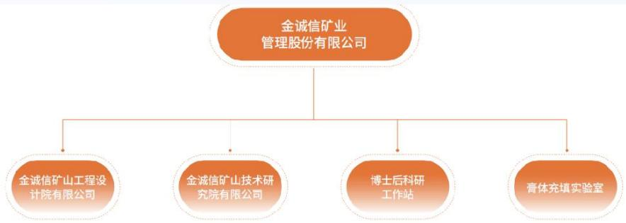

flowchart

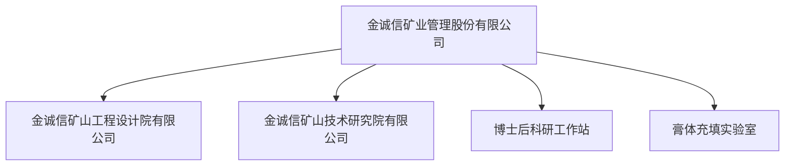
```mermaid
graph TD
  A["金诚信矿业管理股份有限公司"] --> B["金诚信矿山工程设计院有限公司"]
  A --> C["金诚信矿山技术研究院有限公司"]
  A --> D["博士后科研工作站"]
  A --> E["膏体充填实验室"]
```

金诚信坚持以技术创新为核心驱动力，致力于成为“国际知名、国内领先的安全矿山、生态矿山、智慧矿山的规划者、建设者和运营者”，在研发创新方面不断加大投入，持续攻关关键领域难题，创造多项技术创新成果。截至报告期末，公司的研发团队现有专业技术研发人员436人，其中5人具有博士学位，45人具有硕士学位。

<table><tr><td>科技研发</td><td>单位</td><td>2023</td><td>2024</td><td>2025</td></tr><tr><td>研发投入</td><td>万元</td><td>10,277.00</td><td>9,976.61</td><td>14,247.48</td></tr><tr><td>研发人员数量</td><td>人</td><td>377</td><td>373</td><td>436</td></tr></table>

《 T / C N I A 0 3 1 8 - 2 0 2 5 金 属非金属地下矿山油料管道输送工程设计标准》：标准编号：T / C N I A 0 3 1 8 - 2 0 2 5 ， 标 准名称：《金属非金属地下矿山油料管道输送工程设计标准》制定机构：中国有色金属工业协会，参与编制单位：由金诚信矿业管理股份有限公司牵头联合金川集团、长沙矿山研究院、北京金诚信矿山技术研究院、北京中储能、韶关市均能石化等单位共同起草，2025年9月23日通过了专家组的最终审查。

1 .参与国家重大专项"地下金属矿大规模强化落矿高效低贫损开采关键技术"研究,并承担了国家自然科学基金面上项目1项首次获得北京市博士后经费资助创新研发 A 类 项 目

2.部级科学技术奖4项

（1）科技创新事业部完成的“深井充填高可靠性输送系统与智能控制技术研究与应用”获2025年度中国黄金协会科学技术二等奖；  
（2）科技创新事业部完成的“移动式膏体充填试验平台”获2025年度中国有色金属建设协会科技成果奖；  
（3）信息化发展中心完成的“井下计量与人机隔离安全辅助系统”获2025年度中国有色金属建设协会科技成果奖；  
（4）科技创新事业部完成的“稳车群智能调控系统研究与应用”获2025年度中国有色金属建设协会科技成果奖。

报告期内，公司的科技工作取得了可喜成绩，对公司的科技进步安全生产和降本增效起到了重要的促进作用。其中获外部成果奖的有：编制行业团体标准 1 项，部级科学技术奖 4 项，国家发明专利 12 项、实用新型专利 20项，国家级设计奖 1 项、部级设计奖 2 项、咨询奖 14 项，部级优质工程 2 项，部级新技术应用工程 2 项，部级工法 4 项，部级 QC 小组活动成果奖 7 项，软件著作权

5 项。获公司内部成果奖的有：司科学技术奖 6 项，设计咨询1 项 ， 小 改 小 革 技 术 奖 2 1 项 。司举行了年度（第九届）论文赛，收编优秀作品 275 篇，获奖 论 文 6 6 篇 。

完善技术支撑体系

技术创新成效显著

持续鼓励科技创新

## 创新驱动

## 风险和机遇

公司将科技创新视为企业发展的核心驱动力，并深刻认识到其在推动行业新质生产力发展中的关键作用。公司依托“矿服+资源”双轮驱动战略，系统性地识别了科技创新带来的多维影响、潜在风险与战略机遇，并据此制定了清晰的应对策略。

<table><tr><td>类别</td><td>具体事项/风险点</td><td>影响时间范围</td><td>影响程度评估</td><td>潜在财务/战略/声誉影响描述</td></tr><tr><td>风险技术研发与迭代</td><td>前沿技术(如深部资源开发、智能化开采)研发投入大、周期长,存在研发失败或成果不及预期的风险。同时,若不能紧跟AI、大数据等技术迭代速度,现有技术优势可能被削弱。</td><td>中期</td><td>高</td><td>财务影响:研发支出无法获得合理回报;战略影响:技术落后导致市场开拓受限</td></tr><tr><td>风险核心人才流失</td><td>科技创新高度依赖高端技术人才。在激烈的行业竞争下,若无法有效激励和保留核心研发人员,将导致技术断层</td><td>短期-中期</td><td>高</td><td>战略影响:影响公司的核心竞争力</td></tr><tr><td>风险技术成果转化</td><td>实验室成果向大规模工业化应用转化的过程中,可能面临地质条件复杂、设备适配性差等挑战</td><td>中期</td><td>中</td><td>战略影响:导致转化效率低下,无法及时形成经济效益。</td></tr><tr><td>机遇引领行业标准制定</td><td>公司作为主编或参编单位,参与了《有色金属采矿设计规范》《全尾砂膏体充填技术规范》等多项国家及行业标准的制定。</td><td>长期</td><td>高</td><td>战略影响:不仅巩固了公司的技术优势地位,也为行业健康发展贡献了“金诚信方案”。</td></tr><tr><td>机遇商业模式升级与拓展</td><td>凭借行业内稳固的技术实力,公司从单一的工程承包商,升级为能够提供“设计-研究-施工-运营”一体化解决方案的综合服务商。</td><td>中期</td><td>高</td><td>战略影响:增强客户粘性,开辟技术咨询、方案设计等高附加值业务的新增长点。</td></tr></table>

为应对上述议题，公司制定了以“技术创新、技术领先”为理念，以“研-设-施”良性循环为核心的战略规划，确保科技创新能力持续转化为发展新动能。

natural_image

Black-and-white circular photo of a modern city skyline with a large glass building and curved road markings (no visible text or symbols)

“研-设-施”良性循环

公司构建了由金诚信研究院、金诚信设计院和项目部组成的闭环创新模式，确保科技创新与市场需求紧密结合。

战略规划：形成“研究院对疑难问题开展研究、设计院吸收转化研究成果、项目部将设计蓝图建成矿山”的良性循环。该模式打通了从基础研究到工程应用的“最后一公里”，有力提高了公司的核心竞争力。  
管理策略：设立科技创新事业部，统筹管理研发资源。充分利用国内外多个非煤矿山的施工和生产实际，发现问题、解决问题，不断积累经验和创新技术，为业主提供合理化建议，优化设计方案。

natural_image

Abstract digital illustration of a lightbulb with glowing nodes above a city skyline, symbolizing innovation or smart transformation (no text or symbols)

聚焦前沿与绿色发展

公司的研发活动紧密围绕行业痛点与国家战略，重点布局深部资源开发和绿色采矿技术。

深部资源开发：针对世界范围内浅部资源枯竭的趋势，公司大力发展深部开采技术。例如，承建的会泽3#竖井（深1,526米）是国内已完工最深的竖井工程，展现了在超深井施工领域的绝对技术优势。  
绿色采矿技术：以膏体充填技术为核心，公司总投资超5,000万元的膏体充填实验室是北京市国际科技合作基地，承担了“十三五”国家重点研发课题，率先实现了膏体充填参数的工业级精准测试与自动控制，为绿色矿山建设提供了坚实的技术支撑。

natural_image

Group of people celebrating with a trophy on a balcony (no visible text or symbols)

开放合作与人才激励

公司通过开放合作和内部激励，为科技创新提供持续的动力和人才保障。

• 产学研用深度融合：公司与北京科技大学等高校及科研院所建立了紧密的合作关系，共同承担国家重大专项课题，并建立了博士后科研工作站。这种合作模式有效整合外部智力资源，加速了技术突破。  
成果激励与荣誉体系：公司建立了完善的科技成果奖励机制，对获得专利、工法及科技奖项的团队和个人给予重奖。公司多项工程荣获“鲁班奖”，极大地激发了全员的创新热情。

## 创新驱动

科技成果-2025年

<table><tr><td colspan="3">规范标准</td></tr><tr><td>序号</td><td>成果名称</td><td>完成单位</td></tr><tr><td>1</td><td>《T/CNIA0318-2025金属非金属地下矿山油料管道输送工程设计标准》</td><td>科技创新事业部</td></tr><tr><td colspan="3">科技奖</td></tr><tr><td>序号</td><td>成果名称</td><td>奖项名称</td></tr><tr><td>1</td><td>深井充填高可靠性输送系统与智能控制技术研究与应用</td><td>2025年度中国黄金协会科学技术二等奖</td></tr><tr><td>2</td><td>移动式膏体充填试验平台</td><td>2025年度中国有色金属建设协会科技成果奖</td></tr><tr><td>3</td><td>井下计量与人机隔离安全辅助系统</td><td>2025年度中国有色金属建设协会科技成果奖</td></tr><tr><td>4</td><td>稳车群智能调控系统研究与应用</td><td>2025年度中国有色金属建设协会科技成果奖</td></tr><tr><td colspan="3">国家发明专利</td></tr><tr><td>序号</td><td>专利名称</td><td>完成单位</td></tr><tr><td>1</td><td>一种地下矿山侧帮和顶板矿岩低损伤爆破方法</td><td>科技创新事业部</td></tr><tr><td>2</td><td>一种用于测试及优化填充料浆运行参数的测试管段及装置</td><td>科技创新事业部</td></tr><tr><td>3</td><td>静液压传动及其换挡系统</td><td>湖北金诚信矿业服务有限公司</td></tr><tr><td>4</td><td>一种湿喷台车</td><td>金诚信(湖北)智能装备有限公司</td></tr><tr><td>5</td><td>一种井下运矿车</td><td>金诚信(湖北)智能装备有限公司</td></tr><tr><td>6</td><td>一种矿山开采用矿车</td><td>金诺矿山设备有限公司</td></tr><tr><td>7</td><td>一种用于缓倾斜中厚矿体低贫损高效回采的采矿方法</td><td>海外事业部金刚项目公司</td></tr><tr><td>8</td><td>一种用于金属矿山矿石溜井的修复加固方法</td><td>北京分公司金川项目部</td></tr><tr><td>9</td><td>一种矿房矿柱结合处的炮孔施工方法</td><td>北京分公司逊克项目部</td></tr><tr><td>10</td><td>一种底侧卸式卸载站的分层施工方法及装置</td><td>北京分公司肃北项目部</td></tr><tr><td>11</td><td>一种注浆头及其组成的注浆系统与注浆方法</td><td>萨布韦公司</td></tr><tr><td>12</td><td>一种充填竖管降速增阻系统</td><td>萨布韦公司</td></tr></table>

<table><tr><td colspan="3">优质工程</td></tr><tr><td>序号</td><td>工程名称</td><td>获奖名称</td></tr><tr><td>1</td><td>刚果(金)龙溪铜矿采选冶工程</td><td>2024年度有色金属工业优质工程</td></tr><tr><td>2</td><td>莱州汇金矿业投资有限公司纱岭金矿副井井筒掘砌工程</td><td>2024年度有色金属工业优质工程</td></tr><tr><td colspan="3">国家实用新型专利</td></tr><tr><td>序号</td><td>专利名称</td><td>完成单位</td></tr><tr><td>1</td><td>柴油管道输送监测装置</td><td>科技创新事业部</td></tr><tr><td>2</td><td>地下矿山切割槽光面爆破炮孔装药结构</td><td>科技创新事业部</td></tr><tr><td>3</td><td>一种混凝土3D打印实验设备</td><td>科技创新事业部</td></tr><tr><td>4</td><td>一种掘进爆破炮孔堵塞装置</td><td>科技创新事业部</td></tr><tr><td>5</td><td>一种矿用井下燃油输送自动控制系统</td><td>科技创新事业部</td></tr><tr><td>6</td><td>一种尾砂絮凝沉降实验检测装置</td><td>科技创新事业部</td></tr><tr><td>7</td><td>一种便于拆装的底盘式井下矿山用车厢</td><td>金诺矿山设备有限公司</td></tr><tr><td>8</td><td>一种井下矿山用柴油车厢</td><td>金诺矿山设备有限公司</td></tr><tr><td>9</td><td>一种矿用乳化基质泵送装置</td><td>金诺矿山设备有限公司</td></tr><tr><td>10</td><td>一种车桥防过热降温装置</td><td>金诺矿山设备有限公司</td></tr><tr><td>11</td><td>一种输送混凝土的减速装置和浇筑系统</td><td>北京分公司焦家金矿项目部</td></tr><tr><td>12</td><td>一种千米深井浇筑系统</td><td>北京分公司焦家金矿项目部</td></tr><tr><td>13</td><td>一种流量控制装置和浇筑系统</td><td>北京分公司焦家金矿项目部</td></tr><tr><td>14</td><td>一种矿用掘进作业移动防护罩</td><td>南方分公司普朗项目部</td></tr><tr><td>15</td><td>一种用于管缝式锚杆拉拔的连接装置</td><td>南方分公司海矿石禄项目部</td></tr><tr><td>16</td><td>一种多维度流态化造浆喷嘴</td><td>金景公司</td></tr><tr><td>17</td><td>一种全尾砂高效分级浓缩充填系统</td><td>金景公司</td></tr><tr><td>18</td><td>一种放料储仓装置</td><td>金景公司</td></tr><tr><td>19</td><td>一种矿山水仓排泥总成</td><td>萨布韦公司</td></tr><tr><td>20</td><td>一种增阻降速阀及充填竖管增阻降速系统</td><td>萨布韦公司</td></tr></table>

## 创新驱动

## 科技成果-2025年

此外，公司还获得有以下类别奖项共计35项目：

<table><tr><td>类别</td><td>数量</td></tr><tr><td>国家级设计奖</td><td>1项</td></tr><tr><td>部级设计奖</td><td>2项</td></tr><tr><td>咨询奖</td><td>14项</td></tr><tr><td>部级新技术应用工程</td><td>2项</td></tr><tr><td>部级工法</td><td>4项</td></tr><tr><td>部级QC小组活动成果奖</td><td>7项</td></tr><tr><td>软件著作权</td><td>5项</td></tr></table>

公司高度重视知识产权保护工作，严格遵守《专利法》《商标法》《著作权法》等知识产权相关法律法规，制定《科技管理制度》《专利申请文件撰写与申请实施细则》等内部管理制度，规范管理公司内部专利申请、使用和保护工作，保障科研成果转化。公司已获得高新技术企业认证。报告期内，公司未发生知识产权侵权或被侵权事件。截至2025年末，公司累计重要科研成果如下：

<table><tr><td>成果类别</td><td>成果级别</td><td>数量/项</td></tr><tr><td rowspan="2">国家标准</td><td>主编</td><td>6</td></tr><tr><td>参编</td><td>9</td></tr><tr><td rowspan="2">国家专利</td><td>发明</td><td>39</td></tr><tr><td>实用新型</td><td>200</td></tr><tr><td rowspan="2">工法</td><td>国家级</td><td>4</td></tr><tr><td>部级</td><td>99</td></tr></table>

• 中国—赞比亚“一带一路”联合实验室是由北京科技大学和赞比亚大学牵头，中国有色矿业集团有限公司、铜陵有色金属集团股份有限公司以及我司共同成立的聚焦绿色矿产开发的国家级科技创新平台，是中赞两国首个“一带一路”联合实验室。此次与合作伙伴携手共建实验室是金诚信积极参与高质量共建“一带一路”和矿产资源领域国际合作的重要举措。

# 中国一赞比亚矿产资源绿色安全开发“一带一路”联合实验室（筹）

China-Zambia Belt and Road Joint Laboratory

on Green and Safe Development of Mineral Resources (Preparatory)

中华人民共和国科学技术部

Ministry of Science and Technology of the People's Republic of China金诚信膏体充填实验室构建了集尾砂浓密、制备、输送、自控系统“四位一体”的膏体测试平台，能够开展尾砂旋流分级、尾砂深锥浓密、膏体制备、膏体泵送环管输送等探究试验和方案验证试验。4个室内实验室——基本理化性能实验室、力学性能实验室、充填试块制备室和尾矿元素检测室各展其能，可用于开展充填材料基本物理性质、充填料浆流变性能、充填体强度性能等方面的检测工作。上述实验室先后承担了数十项国家重大专项课题和行业企业委托实验任务，获得超过50项科研成果。

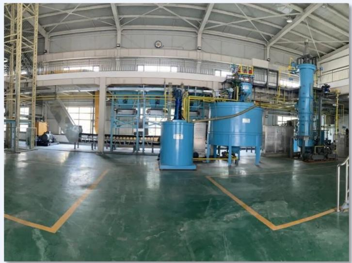

natural_image

Interior view of a large industrial facility with blue machinery and green flooring (no visible text or symbols)

## 创新驱动

行业合作

<table><tr><td>公司参与的协会名称</td><td>任职</td></tr><tr><td>中国有色金属工业协会</td><td>副会长单位</td></tr><tr><td>中国有色金属建设协会(含施工分会)</td><td>副理事长</td></tr><tr><td>《中国矿山工程》《中国有色冶金》期刊董事会</td><td>副董事长单位</td></tr><tr><td>中国机械冶金职工技术协会</td><td>理事单位</td></tr><tr><td>中国黄金协会</td><td>理事单位</td></tr><tr><td>中国产学研合作促进会</td><td>副会长单位</td></tr><tr><td>中国机电产品流通协会智能化矿山分会</td><td>副会长单位</td></tr><tr><td>中国职业安全健康协会</td><td>常务理事单位</td></tr><tr><td>中国矿业联合会</td><td>会员单位</td></tr><tr><td>中国矿业大学(北京)</td><td>理事单位</td></tr><tr><td>《金属矿山》《现代矿业》期刊</td><td>-</td></tr><tr><td>有色金属协会信息化分会</td><td>-</td></tr><tr><td>中国有色建设协会智能建造分会</td><td>-</td></tr><tr><td>对外承包工程商会</td><td>-</td></tr><tr><td>北京国际经济技术协会</td><td>-</td></tr><tr><td>中国安全生产协会</td><td>-</td></tr><tr><td>中国建设协会安全生产分会</td><td>-</td></tr><tr><td>中国工程爆破协会、北京工程爆破协会</td><td>-</td></tr><tr><td>澳大拉西亚矿业与冶金学会(AusIMM)</td><td>-</td></tr></table>

报告期内，公司参加的行业活动

<table><tr><td>序号</td><td>活动名称</td><td>主题</td><td>会议目标</td></tr><tr><td>1</td><td>2025矿业前沿与信息化智能化科技年会</td><td>大模型加速矿山数智化转型</td><td>为进一步推进我国有色金属、冶金、黄金、建材、化工、核工业、煤炭等矿山行业智能化建设发展。</td></tr><tr><td>2</td><td>2025年第六届全国浆体浓缩与管道输送技术和装备研讨会</td><td>数智引领,创新图强,让中国浆体管道通向全球!</td><td>为深入交流与展示浆体浓缩与管道输送技术领域的工程经验、科技成果、先进技术、设备及相关信息,深度探讨行业发展趋势和前景,以成功应用案例为依托,探讨浆体浓缩与管道输送理论、输送工艺与装备技术。</td></tr><tr><td>3</td><td>第七届中国矿业全产业链产学研融合大会</td><td>新矿法、新挑战、新机遇</td><td>为尽快推进矿产资源法的实施,保障矿产资源安全,协同推进矿业上下游高质量发展,持续推进新一轮找矿战略突破行动,助力地方矿业经济发展。</td></tr><tr><td>4</td><td>第五届中国膏体充填采矿国际学术研讨会</td><td>安全 绿色 智能 高效</td><td>持续推动膏体充填采矿新思想、新理论、新技术、新装备的交流,探讨绿色矿山建设方案,打造我国矿山领域专业化、前瞻性、开放式的学术高端交流平台”。</td></tr><tr><td>5</td><td>2024矿业前沿与信息化智能化科技年会</td><td>新质生产力赋能矿业高质量发展</td><td>大会构建一个多元、开放、创新的矿山行业智能化共享平台,汇聚全球有识之士、专家学者、产业界精英,分享我国矿山智能化建设新成果,探索我国矿山行业的发展未来,为我国矿业智能化发展提供理论与技术支撑,助推我国矿业高质量发展,增强我国经济发展新动能。</td></tr></table>

## 科技伦理

## 情况说明

公司在推进科技创新与数字化转型的过程中，始终秉持“科技向善”的理念。经对公司现有业务、研发活动及应用场景的全面梳理与评估，公司确认现有业务不涉及生物技术、人类基因编辑、生殖技术、人工智能算法歧视、大数据杀熟或侵犯个人隐私等典型的科技伦理高风险领域。

公司的科技创新主要聚焦于工程技术、装备制造与矿山生产管理系统，其核心目标是提升生产效率、保障人员安全及保护生态环境。具体情况说明如下：

## 业务属性与技术应用边界

公司所处的行业为矿山工程建设与采矿运营管理，属于传统工业与现代技术结合的领域。公司现有的科技伦理评估主要基于以下业务边界：

• 无生物伦理风险：公司的研发与业务不涉及生命科学领域，不存在对人类或动物基因、胚胎等进行操作的行为，完全规避了生物伦理相关的争议与风险。  
• 无算法歧视与社会伦理风险：公司开发的数字化系统（如铲运机无人驾驶系统、膏体充填在线监测系统）主要应用于工业生产控制与设备管理，不面向C端消费者，不涉及利用算法进行价格歧视、诱导沉迷或侵犯用户隐私等互联网常见的伦理问题。

## 技术应用中的伦理考量与正向价值

虽然公司不涉及敏感的科技伦理议题，但在技术应用过程中，公司始终将“以人为本、安全至上、绿色低碳”作为技术伦理的最高准则，确保科技发展服务于人的福祉和社会的可持续发展。

• 生命至上（安全伦理）：公司大力推广“机械化换人、自动化减人”战略，自主研发了井下铲运机无人驾驶系统和远程操控系统。这一技术应用的伦理核心是“保护生命”——通过将工人从高风险、高强度的井下作业环境中解放出来，降低职业病和工伤事故的发生率。这是科技对生命尊严的最高尊重，符合科技伦理中“不伤害”的基本原则。  
• 环境友好（生态伦理）：公司深耕膏体充填技术和自然崩落法，致力于实现“无尾矿山”和绿色开采。这些技术的应用旨在最大程度减少对地表生态的破坏，实现资源的最大化回收和废弃物的最小化排放。这体现了公司在技术应用中对代际公平和生态责任的担当，符合可持续发展的伦理要求。  
• 公平就业与技能提升（社会伦理）：在推进智能化的过程中，公司并未简单地“淘汰”员工，而是通过建立工匠学院和开展大规模技能培训，帮助传统产业工人掌握新技能，转型为智能化设备的操作者和维护者。这种做法避免了技术进步带来的结构性失业，体现了科技发展中的人文关怀和社会责任。

## 结论

综上所述，金诚信矿业管理股份有限公司的科技创新活动严格限定在工业工程与装备制造范畴内。公司现有业务不涉及任何违反科技伦理的敏感议题。相反，公司始终致力于通过技术进步解决行业安全痛点、改善作业环境、保护生态环境，推动矿业向更安全、更绿色、更智能的方向发展，实现了科技价值与社会伦理的和谐统一。

## 产品和服务安全与质量

## 政策法规、管理制度与架构

公司始终视质量为生命，将“客户至尊”作为核心价值观。公司严格遵守国家关于工程建设质量、安全生产及标准化服务的法律法规，建立了覆盖矿山工程建设、采矿运营管理及装备制造全生命周期的质量管理体系。在中国境内，公司严格遵循国家法律框架，确保矿山工程建设和运营服务的质量合规性，重点遵循以下法规：《中华人民共和国建筑法》《建设工程质量管理条例》《中华人民共和国安全生产法》《中华人民共和国产品质量法》（针对公司旗下的装备制造业务，如金安拓装备生产的铲运机、矿卡等）。同时，作为主编或参编单位，参与了《有色金属采矿设计规范》等多项标准的制定，确保服务输出符合甚至高于行业平均水平。公司严格遵守包括《有色金属矿山井巷工程施工规范》《矿山井巷工程施工及验收规范》《工程建设施工企业质量管理规范》GB/T50430-2017在内的国家、行业和地方现行有关标准和规范，公司及下属单位已通过GB/T19001-2016/ISO9001:2015质量管理体系认证。该体系覆盖了资质范围内的矿山工程施工总承包及相关的职业健康安全管理活动，确保从项目立项、设计、施工到交付的每一个环节都有章可循、有据可查。在国际化经营中，公司尊重并遵守项目所在国的法律法规及国际工程惯例，在刚果（金）、赞比亚、塞尔维亚等海外项目运营中，公司严格遵守当地的建筑法、矿业法及工程质量验收标准。公司积极引入国际先进的工程管理理念，部分海外项目参照FIDIC（国际咨询工程师联合会）条款进行合同管理和质量控制，确保工程质量满足国际业主的严苛要求，树立了“中国建造”的良好品牌形象。

公司遵循“顾客至尊、管理严谨、科技先导、质量卓越”的质量方针，认真贯彻质量、环境和职业健康安全管理体系，制定并执行包括《工程质量管理制度》《施工组织设计管理制度》《工艺技术纪律管理制度》《工程验收管理制度》《矿山工程测量技术管理制度》和《通风管理制度》在内的一系列与技术质量相关的内部制度；同时，公司严格落实项目质量计划；建立和完善工程质量管理终身负责制，加强全过程的质量监督控制，促进质量管理的程序化、标准化、科学化。相关工作由副总裁兼总工程师分管，并建立了从总部技术管理中心、二级单位技术质量部门到项目部技术质量室的质量管理和监督体系，并配套相应的质量管控制度。报告期内，公司未发生项目违规事件。

## 质量管理的目标— 工程验收一次合格率100%

(一)全部工程达到国家及行业现行施工质量验收标准，并满足设计要求。

(二)杜绝施工重大质量事故。

(三)分项、分部、单位工程验收合格率达到100%。

(四)工程安全、环保、文明生产达标。

(五)竣工文件按规定编制，各种资料有效完整，实现一次验收合格。

对于业务中收到的客户投诉，公司始终恪守《客户管理办法》所确立的流程规范，坚持 “及时、诚恳、责任”三大原则来处理客户投诉。当接收到客户投诉，公司会迅速将信息汇总至公司运营管理中心或海外事业部，然后组织相关团队展开详尽的调查，以确认投诉的具体内容，并在核实后立即提出处理及整改措施。所有决策在报请公司总裁批准后，公司将在七个工作日内以书面形式向客户详尽反馈处理结果。报告期内，公司未发生的产品和服务相关的安全与质量重大责任事故。  
在处理过程中，公司始终秉持“诚恳”的态度。不论投诉内容是否属实，各部门都将以热情真诚和虚心的态度对待每一位客户，确保他们的声音被听到并得到尊重。同时，公司也强调“责任”的重要性。对于被投诉的单位或个人，公司将进行公正的责任划分，并根据情况采取相应的经济处罚或考核措施，以确保类似问题不再发生。  
• 为了持续提升客户服务质量，公司坚持每年开展一次全面的客户满意度调查。调查聚焦于公司提供的服务，包括工程质量、施工进度、安全环保以及服务等多个关键维度，并根据客户反馈情况进行相应整改，以确保公司能够精准把握客户需求，不断优化公司的服务流程和标准。

<table><tr><td></td><td>2023年</td><td>2024年</td><td>2025年</td></tr><tr><td>客户投诉数量(起)</td><td>2</td><td>1</td><td>1</td></tr><tr><td>客户投诉处理率(%)</td><td>100</td><td>100</td><td>100</td></tr><tr><td>客户满意度(%)</td><td>92</td><td>90</td><td>88</td></tr></table>

2025年度（第十一届）加纳矿业大奖（Ghana Mining IndustryAwards）于近日揭晓。金诚信股份驻加纳子公司——开拓者投资有限公司(Setters Investment Limited Company）从众多参评企业中脱颖而出，荣获“最佳矿山承包商”(Best Performer in ContractMining）季军殊荣，成为本年度获得该专业奖项的唯一中资企业，体现了当地权威行业机构对金诚信在安全管理、质量管控、合规运营、生产组织和技术创新等方面综合实力的高度认可。

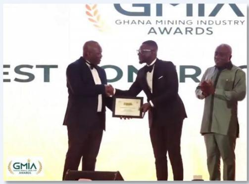

text_image

GHANA MINING INDUSTRY AWARDS
EST DMR
GMIA
AWARDS

## 产品和服务安全与质量

## 风险和机遇

公司深知在矿业服务与资源开发领域，产品与服务质量不仅关乎工程的物理属性，更直接影响矿山的安全运行、资源回收效率及生态环境的可持续性。公司基于“矿服+资源”双轮驱动战略，系统识别了质量相关的多重影响、风险与机遇，并制定了以“品质卓越”为目标，以“标准化建设”和“技术创新”为双轮驱动的质量管理战略，确保从工程交付到装备制造的全方位质量受控。

<table><tr><td>类别</td><td>具体事项/风险点</td><td>影响时间范围</td><td>影响程度评估</td><td>潜在财务/战略/声誉影响描述</td></tr><tr><td>风险矿山本质安全与稳定性</td><td>高质量的井巷工程建设和采矿设计是矿山安全的物理基础。公司的工程质量直接决定了围岩的稳定性,影响矿山在数十年运营期内的坍塌、透水等事故风险,关乎从业人员的生命安全。</td><td>长期</td><td>极高</td><td>财务风险:事故会造成巨大的财务损失;战略风险:影响公司业务开展声誉风险:企业公关危机,ESG评级降低</td></tr><tr><td>风险资源回收与利用效率</td><td>采矿工艺的精度(如贫化率和损失率控制)直接决定了矿产资源的回收利用率。</td><td>长期</td><td>高</td><td>财务风险:回收率下降会造成财务损失;战略风险:影响企业对外承接新项目;</td></tr><tr><td>风险生态环境影响</td><td>工程质量(如充填站的施工质量、尾矿库的防渗处理)直接关系到是否会发生环境污染事故。</td><td>长期</td><td>高</td><td>财务风险:如发生环境污染,可能面临赔偿;战略风险:停业整顿;声誉风险:影响ESG评级,企业形象受损;</td></tr><tr><td>风险工程质量缺陷与返工</td><td>若工程出现质量缺陷(如井壁开裂、巷道变形),将导致巨额返工成本和工期延误。</td><td>短期-中期</td><td>高</td><td>财务风险:严重的质量事故可能引发法律诉讼和赔偿声誉风险:损害公司声誉,导致客户流失。</td></tr><tr><td>风险供应链与设备质量波动</td><td>公司涉及大量设备采购与外包服务,若上游供应链(如钢材、水泥、设备零部件)质量失控,将直接传导至最终交付的工程或产品中,造成系统性质量隐患。</td><td>中期</td><td>中</td><td>战略风险:影响企业工程质量声誉风险:损害公司声誉,导致客户流失。</td></tr><tr><td>机遇品牌溢价与市场拓展</td><td>凭借高质量交付记录,公司建立了高端品牌形象。这使得公司在竞标国际大型矿业公司项目时具备极强的竞争力</td><td>长期</td><td>高</td><td>战略影响:有助于获取高毛利的优质订单</td></tr><tr><td>机遇技术输出与标准制定</td><td>通过输出高于行业标准的质量管理体系,公司有机会主导行业标准的制定,将技术优势转化为行业话语权,构建深厚的护城河。</td><td>长期</td><td>中</td><td>战略影响:树立行业标杆,引领行业发展方向</td></tr></table>

## “标准化+数字化”的质量管控体系

公司深刻认识到，标准化的作业流程和数字化的监控手段是保障工程质量的根本。

战略规划：全面推进“矿业管理4.0”在质量管理中的应用，构建“源头把控、过程受控、结果可溯”的数字化质量管理体系。  
管理策略：严格遵循强制性标准—公司严格执行国家及行业强制性标准，并在内部推行高于国标的企业标准。全过程质量监测—利用数字化手段对施工过程进行实时监控，落实“三检制”（自检、互检、专检），确保每一道工序（如掘进、支护、充填）都符合设计要求。供应链质量协同—将质量管理延伸至供应链上游，对关键原材料和设备供应商实施严格的准入和考核机制，确保输入端的质量稳定。

## 以技术创新提升交付品质

公司将技术创新作为提升产品和服务质量的“倍增器”，通过先进工艺解决传统质量痛点。

核心技术赋能：依托公司在自然崩落法和膏体充填技术领域的领先优势，通过精准的地质勘探和开采设计，大幅降低采矿贫化率和损失率为客户提供“高回收率、低贫化率”的高品质采矿服务。  
装备制造质量升级：在装备制造板块，公司引入先进的加工工艺和检测手段，确保自研的铲运机、矿卡等设备在井下恶劣环境下的可靠性与耐用性，以高质量的装备反哺矿山服务业务，形成“装备+服务”的质量闭环。

## 品牌引领与持续改进机制

公司确立了以高端品牌引领质量提升的战略方向，并建立了长效的改进机制。

创优夺杯战略：公司设立了明确的工程质量目标，积极争创“鲁班奖”“国家优质工程奖”等国家级荣誉。通过树立标杆项目，带动全公司质量管理水平的整体跃升。  
客户反馈闭环：建立完善的客户满意度调查与投诉处理机制，将客户反馈作为质量改进的输入。定期开展管理评审，针对客户痛点和行业共性质量问题进行专项攻关，确保持续满足并超越客户期望。

## 数据安全与客户隐私保护

## 政策法规、管理制度与架构

公司在矿山服务业务经营中涉及到大量客户信息和项目数据的获取，同时，供应商和员工的各类数据也在公司的经营过程中不断累积，公司深刻认识到数据安全与客户隐私保护是企业数字化生存的基石。公司严格遵循《中华人民共和国数据安全法》《中华人民共和国个人信息保护法》及《网络安全法》等法律法规，构建了覆盖全业务链条的数据安全防护体系。

公司依据相关信息安全管理体系制定了《计算机信息网络安全管理办法》，并在报告期内发布了《金诚信矿业管理股份有限公司数据管理政策声明》，明确规定了公司获取、使用、存储、传输信息的程序，全面落实网络信息安全与隐私保护方面的保障体系。相关工作由董事长分管，并由总部信息化发展中心负责具体工作。报告期内，公司未发生数据安全或泄露客户隐私事件。

<table><tr><td>关键环节</td><td>数据类型</td><td>客户隐私及敏感信息</td></tr><tr><td>生产与项目运营环节</td><td>· 工程与地质数据:包括矿山地质建模数据、储量计算数据、开采设计方案、工程图纸、生产进度数据、设备运行参数(如铲运机无人驾驶系统数据)、质量检测数据及安全生产监测数据。· 项目经营数据:涉及项目预算、成本核算、招投标报价方案、合同草案及验收报告。</td><td>· 客户专项技术信息:这是公司保护的重中之重,包括业主的矿体分布、品位详情、核心工艺流程参数等商业秘密。· 客户专项经营信息:包括客户的产能规划、未公开的战略布局及财务结算数据。· 现场人员信息:在智慧矿山建设中,涉及作业人员的位置轨迹、个人生物识别信息(如用于门禁或考勤的人脸识别数据)及个人健康与医疗信息(如职业健康体检报告)。</td></tr><tr><td>科研创新与技术设计环节</td><td>· 研发过程数据:包括研发方案、试验记录、测试报告、技术参数及仿真模拟数据。· 知识产权数据:涵盖专利申请文件、技术交底书、专有技术(Know-how)文档及软件著作权代码。</td><td>· 联合研发数据:在与高校或业主合作研发过程中,涉及合作方提供的原始实验数据、未公开的技术路线图及双方共享的专利池信息。· 核心技术秘密:涉及公司自身及合作伙伴的膏体充填配方、深井支护核心技术等关键机密。</td></tr><tr><td>办公与职能管理环节</td><td>· 经营管理数据:包括财务报表、资金往来记录、审计报告、公文流转记录及会议纪要。· 人力资源数据:涉及员工全生命周期管理数据,如招聘简历、劳动合同、薪酬福利记录、绩效考核结果及培训档案。</td><td>· 员工个人基本信息:包括姓名、身份证号、联系方式、家庭住址等敏感个人信息。· 个人生物识别信息:用于办公区通行及考勤的面部识别特征值。· 供应商及合作伙伴信息:包括供应商的银行账户信息、联系人隐私信息及商业谈判记录。</td></tr><tr><td>供应链与市场营销环节</td><td>· 供应链数据:包括采购计划、供应商名录、采购价格库、物流信息及库存数据。· 市场营销数据:包括市场调研报告、客户拜访记录、营销策略方案及公开宣传材料。</td><td>· 客户基本信息:包括潜在及现有客户的企业名称、统一社会信用代码、注册地址及官方联系方式。· 交易数据:涉及历史成交价格、付款账期、订单详情及售后服务记录。· 个人客户信息:在与客户对接过程中获取的客户方关键联系人(如采购负责人、技术总监)的姓名、职务、手机号及个人邮箱。</td></tr></table>

01

## 防 火 墙 巡 检

• 如发现重大系统漏洞将及时解决  
• 如发现产品事件库、病毒库、漏洞库等未更新到最新，将及时更新  
• 如发现产品配置不当，将及时调整配置

02

## 安 全 网 关 巡 检

主要对各设备检查硬件情况、系统运行情况及功能使 用 情 况

03

## E D R 巡 检

主要确认系统版本和运行状态，检查日志报表、授权信息和资产情况

针对信息安全风险，公司充分结合自身实际、监管要求与行业最佳实践，将公司网络进行统一化建设部署及网络资源分配，对可能发生的信息安全与隐私泄露事件进行及时识别与有效应对，全力保障客户、员工及供应商等相关方的数据与隐私安全。报告期内，公司信息系统正常运行，无出现信息安全和隐私泄露事件，并聘请外部专业机构对防火墙、安全网关、EDR 等进行巡检，并出具巡检报告。

## 数据安全与客户隐私保护

## 风险和机遇

在数字经济时代，数据已成为企业的核心资产。有效管理数据安全与客户隐私，不仅是满足合规要求的必要之举，更是构建企业核心竞争力、实现可持续发展的战略关键。

<table><tr><td>类别</td><td>具体事项/风险点</td><td>影响时间范围</td><td>影响程度评估</td><td>潜在财务/战略/声誉影响描述</td></tr><tr><td>风险合规与法律</td><td>监管处罚与跨境传输违规:违反《数据安全法》《个人信息保护法》或GDPR等法规,特别是涉及核心数据出境未通过安全评估。</td><td>短期-长期</td><td>极高</td><td>财务:面临罚款;;战略:业务被暂停、海外市场准入受阻;声誉:声韵受损,引发投资者信心危机;</td></tr><tr><td>风险运营与技术</td><td>勒索软件与数据泄露:黑客攻击、内部人员越权访问或供应链漏洞导致客户敏感信息(如生物识别、金融账户)泄露。</td><td>短期</td><td>高</td><td>财务:系统恢复成本及法律诉讼赔偿;战略:核心知识产权流失,竞争优势受损;声誉:客户信任受损,导致业务流失。</td></tr><tr><td>风险技术与AI</td><td>AI模型隐私推断与滥用:在利用AI大模型进行数据分析时,模型通过训练数据反向推导出隐私和泄密。</td><td>中期</td><td>中高</td><td>财务:面临罚款;战略:研发投资回报受损;声誉:声誉受损</td></tr><tr><td>机遇市场竞争</td><td>隐私差异化竞争优势:建立超越行业标准的隐私保护体系,打造“最安全品牌”形象。</td><td>长期</td><td>高</td><td>财务:获取高隐私敏感度客户,提升溢价能力;战略:在同质化竞争中脱颖而出,构建品牌护城河;声誉:树立行业标杆,增强品牌忠诚度。</td></tr><tr><td>机遇业务创新</td><td>数据要素价值释放:利用隐私计算实现数据“可用不可见”,在合规前提下进行数据交易或联合建模。</td><td>中期</td><td>高</td><td>财务:开辟数据产品与服务的新收入增长点;战略:打破数据孤岛,构建跨界生态合作伙伴关系;声誉:被视为数字化转型的先行者。</td></tr><tr><td>机遇运营优化</td><td>数据治理与资产可视:以安全合规为切入点,倒逼企业进行全面的数据资产盘点与治理。</td><td>短期-中期</td><td>中</td><td>财务:降低冗余数据存储成本,提升运营效率;战略:提升数据质量,为高层决策提供精准依据;声誉:内部管理规范化,降低运营内耗。</td></tr></table>

针对各环节的数据，公司采取了严格的管控措施：

• 分类分级管理：将数据划分为核心数据、重要数据和一般数据，针对不同级别实施差异化的加密存储与访问控制策略。  
技术防护：部署防火墙、安全网关及EDR系统，定期进行漏洞扫描与渗透测试；利用飞书等数字化工具实现文档权限隔离与操作留痕。  
• 制度保障：签署保密协议，开展全员信息安全培训，并设立审计监察中心对数据泄露风险进行常态化监督与举报受理。

公司定期组织开展信息安全相关培训与演练活动，覆盖公司总部，国内两个分公司机关，国内18个项目部和海外14个项目部，进一步夯实员工的信息安全与隐私保护意识。报告期内，公司通过线上和线下结合的形式开展信息安全相关培训，累计时长42小时达1900余人次。

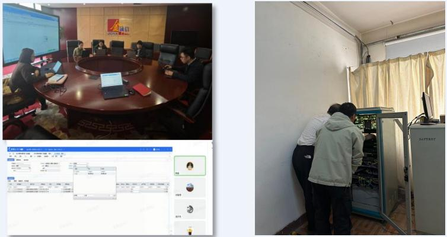

公司每日进行机房巡检，每月进行用户行为汇总并出具月报，每季度进行第三方信息安全审计。

## 供应链安全

## 管理制度与架构

公司建立了从总部物资管理中心、二级单位，到项目部的供应商准入、管理和评价体系，同时，为优化采购资源、规避采购风险、保证采购质量、控制采购成本，制定了《设备、物资采购管理制度》《招标采购管理办法》和《供应商管理办法》，报告期内，公司分布《金诚信矿业管理股份有限公司供应商管理政策声明》，明确公司维护供应链的合规性与稳定性的态度。

## 供应商管理

## 三大原则

natural_image

Line drawing of a handshake over two people, with a checkmark inside a hand (no text or symbols)

## 供应商准入

金诚信从源头严格把控供应商准入，制定了《物资供应商准入评审项目和内愿入容》、《合格供应商评审表》等标准文件，所有意向供应商需按照申请推荐、，，资格预审、准入评审、合格准入的程序办理。公司物资管理中心和采购单位竞互依据权限负责组织供应商准入申请资料预审；可组织对申请准入的供应商进行现场考察，从企业概况、生产设备和经营情况、质量控制、研发能力、产品实际使用情况等方面形成考察报告，以此作为供应商评审的重要依据。

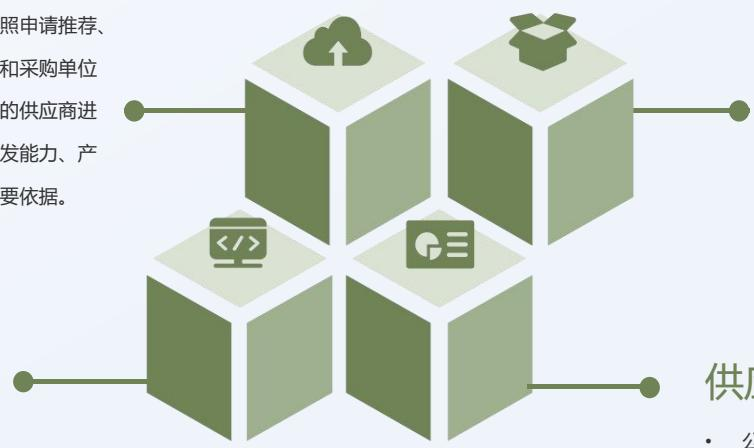

flowchart

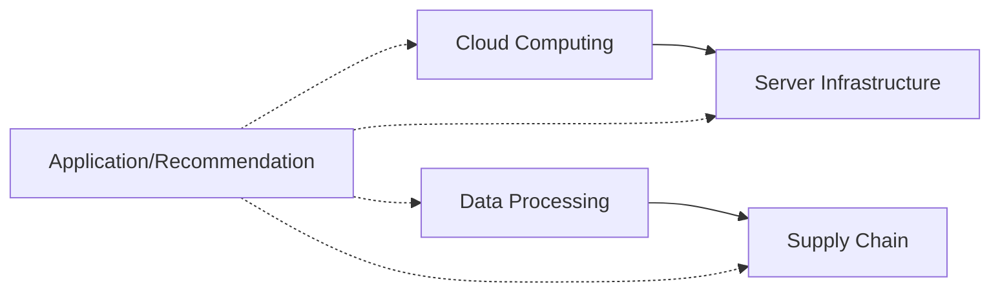
```mermaid
graph LR
  A["Cloud Computing"] --> B["Server Infrastructure"]
  C["Data Processing"] --> D["Supply Chain"]
  E["Application/Recommendation"] -.-> A
  E -.-> B
  E -.-> C
  E -.-> D
```

## 供应商日常管理与评价

供应商跟踪：公司采用日常管理和季度评价相结合的方式对供应商进行管理与评价。公司对物资的产品质量、价格、交货期、信用额度、售后服务等进行日常跟踪，发现问题通过《供应商产品质量、服务及违规问题记录表》及时登记反馈。

供应商评价：公司物资管理中心每年第二、四季度组织对上、下半年发生交易的供应商进行半年度评价，评价考核内容中的“质量水平”和“交货能力”应由使用单位据实进行评价打分，评价结果作为划分供应商等级的依据。  
供应商评级：公司根据评价结果，对供应商进行分级管理。评价合格的分A、B、C三级管理，A级供应商为战略供应商，B级供应商为重要供应商，C级供应商为一般供应商。公司在设备物资采购时优先选择A、B级供应商，在A、B级供应商均无法满足供货的情况下，经审批后方选择C级供应商。

## 供应商审计

公司物资管理中心和二级单位应对本单位供应商管理进行日常监督和季度检查。公司审计监察中心应按照职责权限，对供应商管理进行监察。每季度对下属单位的合格供应商管理情况进行抽查，抽查项数不低于其合格供应商总数的30%；对发现的问题要下达整改通知书，并监督其落实整改，整改完成率应达到100%。  
主要监察内容：未按照规定进行供应商准入的；串通或协助供应商伪造资料或提供虚假资料的；对供应商存在重大质量问题或隐患知情不报的；未经批准在供应商库以外选择供应商的；在供应商管理过程中玩忽职守、营私舞弊和收受贿赂的；私自将相关信息更改、销毁或泄漏的。

## 供应商管理培训

公司对物资管理中心和二级单位工作人员展开了物资管理中心新增供应商资质审核及审批培训，旨在加强管控供应商的合同执行能力、确保供应商交货质量为现场提供更好的材料及售后服务、产生纠纷时保证公司利益。

## 供应链安全

## 风险和机遇

在当前全球地缘政治复杂化与产业链重构的背景下，供应链安全已超越传统的物流与采购范畴，上升为关乎企业生存与国家经济安全的战略议题。公司深刻认识到，构建韧性强、透明度高且合规的供应链体系，是应对不确定性挑战的关键。

<table><tr><td>类别</td><td>具体事项/风险点</td><td>影响时间范围</td><td>影响程度评估</td><td>潜在财务/战略/声誉影响描述</td></tr><tr><td>风险地缘政治与贸易管制</td><td>受国际贸易摩擦、出口管制清单(如“实体清单”)及技术封锁影响,关键设备、零部件或软件可能面临断供风险,导致技术路线受阻或市场准入受限。</td><td>中期-长期</td><td>高</td><td>财务影响:违约导致的赔偿战略影响:影响业务拓展</td></tr><tr><td>风险单一来源与供应中断</td><td>过度依赖单一供应商或特定地理区域,一旦该节点发生自然灾害、罢工或破产,将产生“多米诺骨牌”效应,造成严重产能损失。</td><td>短期-中期</td><td>高</td><td>财务影响:违约导致的赔偿战略影响:影响业务拓展</td></tr><tr><td>风险ESG与合规传导风险</td><td>上游供应商若违反环保、劳工权益或反腐败法规,将导致公司面临连带责任及品牌声誉受损,尤其是在欧盟等严苛市场。</td><td>中期</td><td>中</td><td>战略影响:影响业务拓展声誉影响:品牌受损</td></tr><tr><td>机遇供应链韧性与国产替代</td><td>利用技术和政策窗口,加速关键设备和技术的国产化替代,培育本土优质供应商,不仅能降低对外依赖,还能通过扶持本土生态提升产业链话语权。</td><td>长期</td><td>高</td><td>财务影响:降低进口采购成本;战略影响:通过自建上游,培育新的业务增长点</td></tr><tr><td>机遇数字化与透明化升级</td><td>通过引入AI、区块链等技术构建数字化供应链,实现端到端可视与风险预警。这不仅能提升响应速度,还能通过数据洞察优化成本结构,从“成本中心”转向“价值中心”。</td><td>中期</td><td>高</td><td>财务影响:减少原材料和备品呆滞,降低资金占用导致的成本;</td></tr><tr><td>机遇生态协同与标准制定</td><td>建立紧密的战略供应商联盟,共同研发、共享产能。通过输出供应链安全管理标准,提升整个生态圈的安全水位。</td><td>长期</td><td>中</td><td>战略影响:从产业链合作的角度构筑企业优势声誉影响:打造负责任的ESG供应链</td></tr></table>

为应对上述议题，公司制定了以“安全、精准、智能、可靠、高效”为核心的供应链战略规划，确立了以安全为基石、智能为驱动的供应链演进路线。  
Ø 战略目标：打造“安全、精准、智能、可靠、高效”的供应链体系，实现从“被动响应”向“主动预测”的转型。

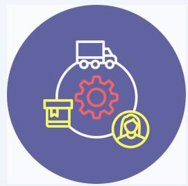

natural_image

Icon depicting logistics or delivery services with a truck, package, gear, and speedometer inside a circle (no text or symbols)

natural_image

Abstract diagram with a central dollar sign surrounded by eight surrounding circles, set against a teal gradient background (no text or symbols)

## 风险预案与多元化布局

• 风险动态识别：定期评估地缘政治、自然灾害等风险，针对不同等级风险制定专项预案。  
• 多元化与“AB角”策略：资源多元化：坚决执行多源采购策略，避免单一来源依赖。战略储备：对关键原材料和核心零部件建立战略库存，平衡“零库存”效率与“安全库存”韧性。

natural_image

Laptop with keyboard and speaker stand against a colorful abstract background (no text or symbols visible)

## 数字化与智能化赋能

端到端可视化：利用物联网和大数据技术，打通系统数据孤岛，实现从供应商工厂到客户现场的全链路实时监控。  
• 风险预警：实时关注分析全球舆情、天气、政策变动等外部数据，提前预测潜在断供风险。

natural_image

Close-up of two hands holding interlocking gears against a cloudy sky (no text or symbols visible)

## 生态协同与合规共建

• 供应商赋能与合规：将ESG与合规要求纳入供应商准入与考核，共同构建安全的产业生态。  
• 技术替代攻关：针对关键零部件或设备开展独立或联合研发，从根本上保障供应链自主可控。

## 平等对待中小企业

## 政策法规、管理制度与架构

Ø 金诚信在产业链中主要扮演服务提供者的角色（服务于大型矿业公司，如紫金矿业、中国有色、艾芬豪等），作为一家专注于“矿服+资源”双轮驱动的企业，金诚信的管理重心在于保障矿山生产的安全、高效和连续。由于金诚信所处的矿山服务行业具有高技术壁垒、高安全要求、项目高度定制化的特征，且公司主要采购对象为具备特定资质的大型工业供应商，“平等对待中小企业”这一议题并不构成公司供应链管理的核心风险或机遇。尽管如此，公司深知中小企业是产业链的重要组成部分，下面从供应链安全和管理的角度做进一步阐述。  
Ø 作为矿山服务与资源开发行业的大型企业，公司严格遵守国家关于促进中小企业发展的法律法规，坚持“公平准入、及时支付、合作共赢”的原则，积极履行大型企业的社会责任，致力于构建健康、稳定、公平的供应链生态。公司严格遵循包括《中华人民共和国中小企业促进法》《保障中小企业款项支付条例》和《优化营商环境条例》等国家层面的法律法规，将其作为供应链管理的最高准则公司遵循该法关于“公平竞争”和“权益保护”的规定，在采购活动中不设置歧视性条件，保障中小企业公平参与市场竞争。

为确保上述法律法规落地，公司制定了严格的内部管理制度，并将其融入日常运营：阳光采购与公平准入机制，公司建立了公开透明的供应商管理体系。无论供应商规模大小，均适用统一的准入标准（包括资质、质量、安全、环保等）。在招投标过程中，公司坚持公开、公平、公正原则，不设定排斥中小企业的门槛（如不合理的注册资本要求或业绩门槛），确保中小企业享有平等的知情权和参与权。规范的合同与付款管理，公司在合同中明确约定付款期限和违约责任。财务部门建立了专门的应付账款监控机制，对于无争议的款项，公司确保在合同约定时间内完成支付，从制度上根除“拖欠”隐患。除了资金和准入支持，公司还通过技术输出和管理共享赋能中小供应商。例如，向分包商和供应商输出公司的安全管理标准和绿色施工理念，帮助其提升管理水平和合规能力，实现与大企业的协同发展。  
相关工作由物资管理中心（负责供应商准入和招标）以及财务管理中心（负责向上游企业按照合同支付款项）执行，分别由公司副总裁兼总经济师和财务总监负责。报告期内，公司或控股子公司不存在需要通过国家企业信用信息公示系统向社会公示逾期尚未支付中小企业款项信息的情况。  
Ø 截至报告期末，公司与21,725家供应商建立合作，较上一个报告期增加2958家，已有供应商100%按公司的供应商准入制度执行

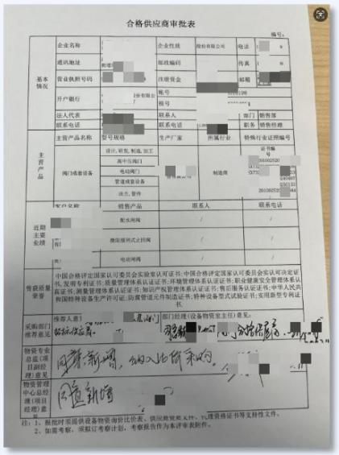

text_image

合格供应商审批表
编号：
企业名称
通讯地址
营业执照号码
开户银行
法人代表
联系电话
主营产品名称
阀门成套设备
客户信息
产品名称
阀门成套设备
客户信息
产品名称
配电网
配电开关
管道连接器
开关、管件
销售产品
联系人
/ 
/ 
/ 
/ 
/ 
/ 
/ 
/ 
/ 
/ 
/ 
/ 
/ 
/ 
/ 
/ 
/ 
/ 
/ 
/ 
/ 
/ 
/ 
/ 
/ 
/ 
/ 
/ 
/ 
/ 
/ 
/ 
/ 
/ 
/ 
/ 
/ 
/ 
/ 
/ 
/ 
/ 
/ 
/ 
/ 
/ 
/ 
/ 
/ 
/ 
/ 

采购部门
推荐意见

供货专业
总监（项目部经理）
物资管理中心总经理（项目部经理）

请参阅，请仔细阅读物资询价表、供应商备案文件、采购资格证书等支持性文件。
2. 如需备案，须拟订考察计划，考察报告作为本评表附件。

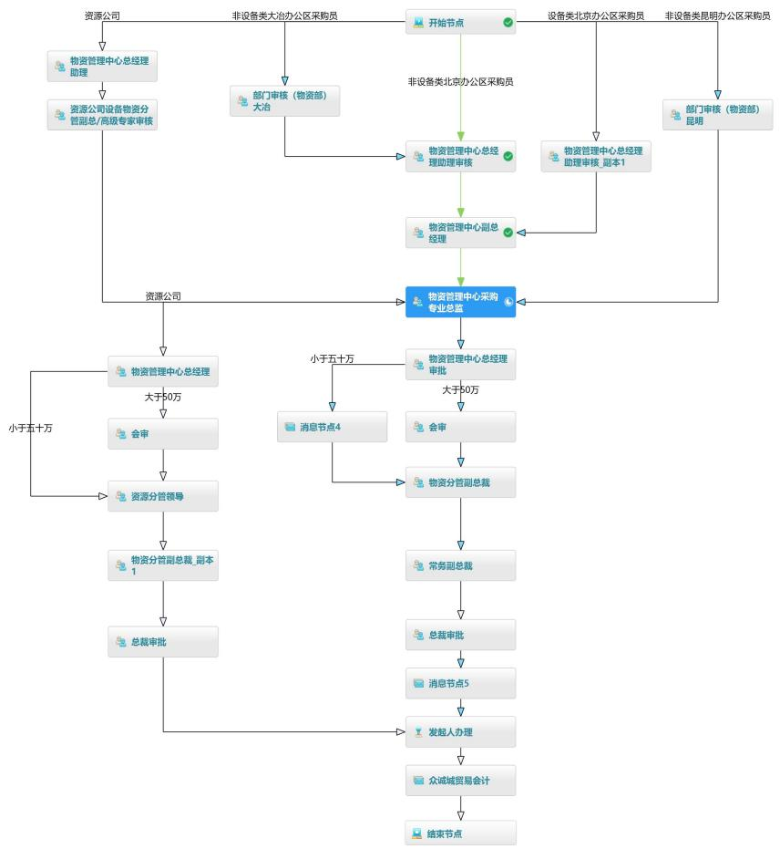

flowchart

```mermaid
graph TD
  A["资源公司"] --> B["物资管理中心总经理助理"]
  B --> C["资源公司设备物资分管副总/高级专家审核"]
  C --> D["部门审核（物资部）大治"]
  E["开始节点"] --> F["非设备类北京办公区采购员"]
  G["设备类北京办公区采购员"] --> H["物资管理中心总经理助理审核"]
  I["非设备类昆明办公区采购员"] --> J["部门审核（物资部）昆明"]
  
  K["资源公司"] --> L["物资管理中心总经理"]
  L --> M["会审"]
  M --> N["资源分管领导"]
  N --> O["物资分管副总裁_副本1"]
  O --> P["总裁审批"]
  
  Q["物资管理中心副总经理助理审核\n副本1"] --> R["物资管理中心副总经理助理审核"]
  S["物资管理中心副总经理助理审核\n副本1"] --> T["物资管理中心副总经理助理审核"]
  
  U["物资管理中心采购专业总监"] --> V["物资管理中心总经理审批"]
  V --> W["会审"]
  W --> X["物资分管副总裁"]
  X --> Y["常务副总裁"]
  
  Z["物资管理中心副总经理审批\n大于50万"] --> AA["消息节点4"]
  AA --> X
  
  AB["物资管理中心副总经理审批\n大于50万"] --> AC["会审"]
  AC --> X
  
  AD["物资管理中心副总经理助理审核\n小于五十万"] --> AE["消息节点4"]
  AE --> X
  
  AF["物资管理中心副总经理助理审核\n小于五十万"] --> AG["物资分管副总裁"]
  
  AH["物资管理中心副总经理助理审核\n小于五十万"] --> AI["物资分管副总裁_副本1"]
  
  AJ["物资管理中心副总经理助理审核\n小于五十万"] --> AK["物资分管副总裁_副本1"]
  
  AL["物资管理中心副总经理助理审核\n小于五十万"] --> AM["物资分管副总裁_副本1"]
  
  AN["物资管理中心副总经理助理审核\n小于五十万"] --> AO["物资分管副总裁_副本1"]
  
  AP["物资管理中心副总经理助理审核\n小于五十万"] --> AQ["物资分管副总裁_副本1"]
  
  AR["物资管理中心副总经理助理审核\n小于五十万"] --> AS["物资分管副总裁_副本1"]
  
  AT["物资管理中心副总经理助理审核\n小于五十万"] --> AU["物资分管副总裁_副本1"]
  
  AV["物资管理中心副总经理助理审核\n小于五十万"] --> AW["物资分管副总裁_副本1"]
  
  AX["物资管理中心副总经理助理审核\n小于五十万"] --> AZ["物资分管副总裁_副本1"]
  
  BA["物资管理中心副总经理助理审核\n小于五十万"] --> AC["物资分管副总裁_副本1"]
  
  AD["物资管理中心副总经理助理审核\n小于五十万"] --> AE["物资分管副总裁_副本1"]
  
  AF["物资管理中心副总经理助理审核\n小于五十万"] --> AG["物资分管副总裁_副本1"]
  
  AH["物资管理中心副总经理助理审核\n小于五十万"] --> AI["物资分管副总裁_副本1"]
  
  AJ["物资管理中心副总经理助理审核\n小于五十万"] --> AK["物资分管副总裁_副本1"]
  
  AL["物资管理中心副总经理助理审核\n小于五十万"] --> AM["物资分管副总裁_副本1"]
  
  ANF["物资管理中心副总经理助理审核\n小于五十万"] --> AO["物资分管副总裁_副本1"]
  
  APF["物资管理中心副总经理助理审核\n小于五十万"] --> AQ["物资分管副总裁_副本1"]
  
  AGF["物资管理中心副总经理助理审核\n小于五十万"] --> AHF["物资分管副总裁_副本1"]
  
  AIF["物资管理中心副总经理助理审核\n小于五十万"] --> AJF["物资分管副总裁_副本1"]
  
  AKF["物资管理中心副总经理助理审核\n小于五十万"] --> ALF
  
  AMF["物资管理中心副总经理助理审核\n小于五十万"] --> ANG["物资分管副总裁_副本1"]
  
  AOF["物资管理中心副总经理助理审核\n小于五十万"] --> APG["物资分管副总裁_副本1"]
  
  AQF["物资管理中心副总经理助理审核\n小于五十万"] --> APH["物资分管副总裁_副本1"]
  
  AJG["物资管理中心副总经理助理审核\n小于五十万"] --> API["物资分管副总裁_副本1"]
  
  AJH["物资管理中心副总经理助理审核\n小于五十万"] --> APJ["物资分管副总裁_副本1"]
  
  AKH["物资管理中心副总经理助理审核\n小于五十万"] --> APK["物资分管副总裁_副本1"]
  
  ALG["物资管理中心副总经理助理审核\n小于五十万"] --> APL["物资分管副总裁_副本1"]
  
  AMG["物资管理中心副总经理助理审核\n小于五十万"] --> APM["物资分管副总裁_副本1"]
  
  ANH["物资管理中心副总经理助理审核\n小于五十万"] --> APN["物资分管副总裁_副本1"]
  
  AOH["物资管理中心副总经理助理审核\n小于五十万"] --> APQ["物资分管副总裁_副本1"]
  
  APK["物资管理中心副总经理助理审核\n小于五十万"] --> APR["物资分管副总裁_副本1"]
  
  APQ["物资管理中心副总经理助理审核\n小于五十万"] --> APS["物资分管副总裁_副本1"]
  
  APR["物资管理中心副总经理助理审核\n小于五十万"] --> APT["物资分管副总裁_副本1"]
  
  APQ --> U
  APR --> U
  APS --> U
  APT --> U
  APU --> U
  APV --> U
  APX --> U
  APY --> U
  APZ --> U
  U -.->|资源公司 | A
  U -.->|资源公司 | B
  U -.->|资源公司 | C
  U -.->|资源公司 | D
  U -.->|资源公司 | E
  U -.->|资源公司 | F
  U -.->|资源公司 | G
  U -.->|资源公司 | H
  U -.->|资源公司 | I
  U -.->|资源公司 | J
  U -.->|资源公司 | K
  U -.->|资源公司 | L
  U -.->|资源公司 | M
  U -.->|资源公司 | N
  U -.->|资源公司 | O
  U -.->|资源公司 | P
  U -.->|资源公司 | Q
  U -.->|资源公司 | R
  U -.->|资源公司 | S
  U -.->|资源公司 | T
  U -.->|资源公司 | U
  U -.->|资源公司 | V
  U -.->|资源公司 | W
  U -.->|资源公司 | X
  U -.->|资源公司 | Y
  U -.->|资源公司 | Z
  U -.->|资源公司 | AA
  U -.->|资源公司 | AB
  U -.->|资源公司 | AC
  U -.->|资源公司 | AD
  U -.->|资源公司 | AE
  U -.->|资源公司 | AF
  U -.->|资源公司 | AG
  U -.->|资源公司 | AH
  U -.->|资源公司 | AI
  U -.->|资源公司 | AJ
  U -.->|资源公司 | AK
  U -.->|资源公司 | AL
  U -.->|资源公司 | AM
  U -.->|资源公司 | AN
  U -.->|资源公司 | AO
  U -.->|资源公司 | AP
  U -.->|资源公司 | AQ
  U -.->|资源公司 | AR
  U -.->|资源公司 | AS
  U -.->|资源公司 | AT
  U -.->|资源公司 | AU
  U -.->|资源公司 | AV
  U -.->|资源公司 | AW
  U -.->|资源公司 | AX
  U -.->|资源公司 | AZ
  U -.->|资源公司 | BA
  U -.->|资源公司 | BB
  U -.->|资源公司 | BC
  U -.->|资源公司 | BD
  U -.->|资源公司 | BE
  U -.->|资源公司 | BF
  U -.->|资源公司 | BG
  U -.->|资源公司 | BH
  U -.->|资源公司 | BI
  U -.->|资源公司 | BJ
  U -.->|资源公司 | BK
  U -.->|资源公司 | BL
  U -.->|资源公司 | BM
  U -.->|资源公司 | BN
  U -.->|资源公司 | BO
  U -.->|资源公司 | BP
  U -.->|资源公司 | BR
  U -.->|资源公司 | BC
  U -.->|资源公司 | BD
  U -.->|资源公司 | BE
  U -.->|资源公司 | BF
  U -.->|资源公司 | BG
  U -.->|资源公司 | BH
  U -.->|资源公司 | BI
  U -.->|资源公司 | BJ
  U -.->|资源公司 | BK
  U -.->|资源公司 | BS
  U -.->|资源公司 | BT
  U -.->|资源公司 | BU
  U -.->|资源公司 | BV
  U -.->|资源公司 | BW
  U -.->|资源公司 | BX
  U -.->|资源公司 | BY
  U -.->|资源公司 | BB
  U -.->|资源公司 | BC
  U -.->|资源公司 | BD
  U -.->|资源公司 | BE
  U -.->|资源公司 | BF
  U -.->|资源公司 | BG
  U -.->|资源公司 | BH
  U -.->|资源公司 | BI
  U -.->|资源公司 | BJ
  U -.->|资源公司 | BJT
  U -.->|资源公司 | BJU
  U -.->|资源公司 | BJV
  U -.->|资源公司 | BJW
  U -.->|资源公司 | BJX
  U -.->|资源公司 | BJY
  U -.->|资源公司 | BJZ
```

公司严格按照标准和流程进行供应商询价和准入

## 平等对待中小企业

## 风险和机遇

金诚信处于充分竞争的市场环境，虽非垄断企业，但作为产业链中的核心大型采购方（甲方），相对于上游众多的中小供应商（如设备零部件制造商、劳务分包商、原材料供应商等）处于相对优势地位，基于上述情况，公司对于相关的风险和机遇识别如下

<table><tr><td>类别</td><td>具体事项/风险点</td><td>影响时间范围</td><td>影响程度评估</td><td>潜在财务/战略/声誉影响描述</td></tr><tr><td>风险合规与法律风险</td><td>拖欠账款违反相关法律法规,面临监管通报、罚款或诉讼风险。</td><td>短期-长期</td><td>高</td><td>财务影响:诉讼导致的成本与罚款声誉影响:影响企业形象</td></tr><tr><td>风险供应链断裂风险</td><td>若因不公平待遇导致关键供应商流失,在产能紧张时可能面临“有钱买不到货”的困境,影响项目交付进度。</td><td>中期</td><td>中</td><td>战略影响:影响企业业务开展</td></tr><tr><td>机遇成本优化与创新</td><td>通过公平竞争引入“专精特新”的中小企业,能获得更具性价比的产品或创新技术方案。</td><td>长期</td><td>高</td><td>财务影响:降低综合成本战略影响:提高企业竞争力</td></tr><tr><td>机遇ESG评级提升</td><td>在ESG报告中展现对供应链中小企业的赋能与公平对待,有助于提升ESG评分,吸引责任投资。</td><td>中期</td><td>中</td><td>声誉影响:提升企业形象和认知度</td></tr></table>

为应对上述议题，金诚信制定了以“阳光采购、公平准入、及时支付”为核心的管理策略，旨在构建共生共荣的供应链生态。

natural_image

Close-up of green maple leaves with sunlight filtering through, surrounded by blurred foliage (no text or symbols)

## 构建“阳光、共赢”的供应链体系

• 公司将供应链安全与公平纳入公司治理层面，强调与合作伙伴的长期协同发展，而非单纯的博弈压价。公司致力于通过数字化手段提升采购透明度，确保各类规模的供应商享有平等的竞争机会。

natural_image

Close-up of a hand holding a thin object, with faint background graphics (no readable text or symbols)

## 核心管理策略

公平准入：打破壁垒，一视同仁公司建立了《供应商管理办法》，无论供应商规模大小，均适用统一的资格预审、准入评审和现场考察流程。  
阳光采购机制：坚持“公开、公平、公正”的招标原则。除公开招标外，邀请招标和询比价也在合格供应商库中随机或择优抽取，确保中小企业只要有技术、有质量、有价格优势，就能公平获得合作机会。  
• 权益保障：严守法规，杜绝拖欠，严格按合同执行付款条例  
生态赋能：技术输出，共同成长，鉴于矿山行业的高危性，金诚信不仅采购产品，还向中小供应商（特别是分包商和设备商）输出公司的安全管理标准和质量控制体系，帮助其提升管理水平和合规能力。  
• 长期战略合作：对于表现优秀的企业，公司倾向于建立长期战略合作伙伴关系。

natural_image

Business people interacting with a digital tablet displaying various icons (no readable text or symbols)

## 商业模式调整

数字化供应链平台：公司推进财务管理数字化转型，利用信息化平台打通采购与支付环节，实现采购过程全留痕、可追溯，进一步减少了人为干预空间，从技术层面保障了交易的公平性。

## 乡村振兴

## 情况说明

公司作为专注于矿山工程建设、采矿运营管理及矿山机械设备制造的大型专业化技术服务企业，经审慎评估，乡村振兴议题为低重要性议题，且不进行风险与机遇识别评估。具体说明如下：

## 业务领域与乡村振兴核心方向存在差异

Ø 乡村振兴战略的核心在于推动农业现代化、农村基础设施建设及农民增收，重点涵盖现代种养业、农产品加工、乡土特色产业、农业科技创新及农业农村基础设施等领域。公司的主营业务为非煤矿山的井建、采矿服务及高端矿山装备制造，属于工业领域的生产性服务业，与农业生产、农村发展及农民生活改善等乡村振兴直接关联领域无涉。  
Ø 公司的服务对象为国内外大型矿业集团及资源型企业，客户群体集中于工业领域，而非农户、合作社或农村集体经济组织。尽管部分矿山项目位于乡村周边地区，但项目的本质是工业开采活动，其产出为矿石资源及工业技术服务，与粮食安全、特色农产品开发、乡村旅游等乡村振兴核心产业无直接关联。

## 战略重点与乡村振兴任务不同

Ø 公司的战略定位聚焦于“安全矿山、生态矿山、智慧矿山”的建设与运营，资源主要投向采矿技术研发、智能化装备升级及矿山安全生产体系构建。例如，公司依托金诚信研究院等平台，重点攻关深井开采、膏体充填等工业技术，与农业科技创新、生物育种、智慧农业等乡村振兴技术方向存在差异。  
Ø 公司的资本性支出主要用于购置凿岩台车、铲运机等井下采矿设备，与农村道路、水利、电网等基础设施建设投入方向不同。尽管公司在项目所在地可能通过雇佣当地劳动力、采购生活物资等方式对周边经济产生间接影响，但此类行为属于工业项目对区域经济的溢出效应，而非公司主动参与乡村振兴战略的直接举措。

## 社会责任实践与乡村振兴核心目标差异

Ø 公司在项目所在地开展的社区公益活动，如捐资助学、修路等，属于企业履行社会责任的范畴，与乡村振兴战略中“产业振兴、人才振兴、文化振兴、生态振兴、组织振兴”的系统性目标存在区别。例如，公司设立的奖学金主要面向矿业相关专业的高校学生，而非根据农村与非农村身份。

## 结论

综上所述，金诚信的业务模式、战略重点及社会责任实践均围绕矿山工业领域展开，与乡村振兴议题在产业属性、服务对象及实施路径上均无直接关联。

公司在专注于矿山技术服务领域的专业化发展，同时依法合规履行企业社会责任，为区域经济发展贡献力量，相关社会贡献将在下一章节中详细阐述。

## 社会贡献

## 政策法规、管理制度与架构

公司积极履行社会责任，在社会公益慈善领域持续投入，包括，在教育领域，与高校合作设立奖学金并提供社会实践机会，在社区帮扶领域，为矿区周边居民兴修基础设施和公共硬件，同时，面对突发灾害，公司也积极主动地提供救助帮扶。公司通过系统化、规范化的社会贡献活动，切实履行企业公民责任，为促进社会和谐发展贡献力量。

公司在社会贡献方面严格遵守国家相关法律法规和政策规定，包括《中华人民共和国慈善法》《中华人民共和国公益事业捐赠法》以及有关部门关于公益性捐赠支出企业所得税税前扣除政策等，同时，公司基于自身情况，也对捐赠等社会公益行为的财务支出和信息披露做出了有关规定，报告期内，公司发布《金诚信矿业管理股份有限公司社区与公益政策声明》，明确表达了公司致力于自地方至国家多层级构建互信共赢的社区关系网络，通过ESG实践与长期价值投入，全面提升项目所在地社区的福祉水平的理念。目前，公司在教育领域的公益事务主要由人力资源管理中心具体执行，周边社区帮扶由各个项目部或资源公司根据周边社区情况上报各自公益捐赠或帮扶事项后，按照内部制度审批后执行，对于与突发灾害有关的临时性救助，由综合行政管理中心统筹对接。

## 风险和机遇

公司作为大型矿山服务及资源开发企业的行业属性，结合“和谐共生”的社会责任理念，公司在教育帮扶、灾害救助及基础设施建设领域的社会贡献活动，不仅是履行公民义务的体现，更是维系企业与社区共生关系的关键纽带。

<table><tr><td>类别</td><td>具体事项/风险点</td><td>影响时间范围</td><td>影响程度评估</td><td>潜在财务/战略/声誉影响描述</td></tr><tr><td>风险合规与资金管理</td><td>社会捐赠涉及大额资金流出,若内部审批流程不规范、资金使用监管不到位,可能面临财务合规风险。</td><td>短期</td><td>中</td><td>财务影响:税务处理和信息披露不当</td></tr><tr><td>风险期望管理与舆情</td><td>随着社会贡献投入的增加,受赠方或公众的期望值可能水涨船高。若公司因经营波动导致捐赠规模缩减,或项目效果未达预期,可能引发负面舆情。</td><td>中期</td><td>中</td><td>声誉影响:影响企业形象</td></tr><tr><td>机遇教育公平与人才储备</td><td>通过“大学生资助和就业”项目,直接改善贫困学子受教育机会,从长远看,为行业培养并储备了潜在的专业技术人才,缓解了未来“招工难”与“人才断层”问题。</td><td>长期</td><td>高</td><td>战略影响:人才培养,为业务储备力量</td></tr><tr><td>机遇政策支持与税收优化</td><td>符合国家政策导向的社会贡献活动(如乡村振兴、教育捐赠),可享受企业所得税税前扣除等税收优惠政策,直接优化公司财务报表;同时有助于争取地方政府在项目审批、资源获取上的政策倾斜。</td><td>短期-长期</td><td>高</td><td>财务影响:享受税收优惠政策战略影响:有利于业务的长期稳定</td></tr><tr><td>机遇ESG评级与责任投资</td><td>在全球及国内资本市场日益关注ESG(环境、社会及治理)表现的背景下,卓越的社会贡献表现是ESG评级的核心加分项,有助于吸引注重长期价值的ESG基金投资。</td><td>中期</td><td>高</td><td>战略影响:吸引长期资本的投资</td></tr></table>

## 社会贡献

## 风险和机遇

Ø 为应对上述议题，公司制定了以“和谐共生”为核心的管理策略。

总体战略：构建“可持续、可量化”的社会价值体系

## 01

## 聚焦核心，深耕细作

• 教育为本： 集中资源深耕“大学生资助和就业”领域，建立从“入学资助”到“实习就业”的全链条帮扶机制。通过与高校合作，实现人才培养与企业需求的无缝对接，解决“毕业即失业”与“企业招人难”的双重矛盾。  
• 应急与常态结合： 针对“自然灾害捐助”，建立快速响应的应急基金机制；针对“基础设施建设”，则采取长期规划、分步实施的策略，确保援建项目的质量与可持续性。

## 02

## 规范流程，阳光运作

• 制度先行： 建立完善的管理制度，明确捐赠的审批权限、决策流程和监督机制。确保所有捐赠行为均经过合法合规的内部审议，资金流向清晰可查。

## 03

## 授人以渔，协同发展

• 产业带动： 在援助修建基础设施的同时，根据赞比亚出台的本地化法案的相关要求，优先雇佣和采购当地居民和中小企业的原材料或服务，带动当地社区实现自我造血。  
• 员工参与： 建立员工志愿者服务体系，鼓励员工利用专业技能（如工程技术人员）参与受援地的设施维护与技术指导，增强员工的归属感与社会责任感，实现企业与员工的共同成长。

截至报告期末，金诚信奖学金累计获奖人数超过4500人

<table><tr><td>序号</td><td>学校名称</td><td>累计人数</td></tr><tr><td>1</td><td>中南大学</td><td>1035</td></tr><tr><td>2</td><td>北京科技大学</td><td>352</td></tr><tr><td>3</td><td>西安建筑科技大学</td><td>612</td></tr><tr><td>4</td><td>昆明理工大学</td><td>1170</td></tr><tr><td>5</td><td>东北大学</td><td>360</td></tr><tr><td>6</td><td>江西理工大学</td><td>470</td></tr><tr><td>7</td><td>中国矿业大学(北京)</td><td>500</td></tr><tr><td>8</td><td>西南科技大学</td><td>75</td></tr></table>

2025年，结合“教育部第四期供需对接就业育人项目”，金诚信组织了来自全国11所高校的22名教师和30余名学生，前往公司项目部、总部机关、智能装配中心等地参观学习，并共同参与金诚信暑期实习实践活动。实践期间，有18名学生与企业达成就业意向。在随后的2026届秋季招聘中，累计与25所院校的120名毕业生签约。

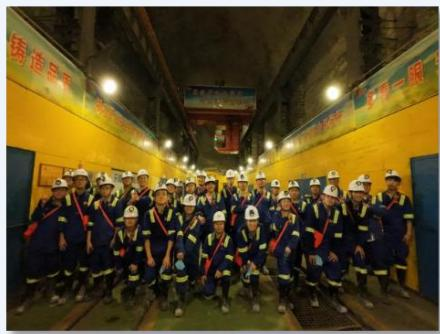

text_image

Group photo of workers in hard hats inside a tunnel with visible Chinese banners and signage

为高校学生开设就业指导课程，自2023年起，公司与中南大学、东北大学、中国矿业大学（北京）、江西理工大学、西南科技大学等院校开展合作，为大三学生系统地讲解行业趋势与求职技巧，有效解决了学生的就业困惑。在现有合作院校的基础上，公司积极履行社会责任，2025年陆续与北京科技大学、四川外国语大学、昆明理工大学等院校推进“就业指导课程—企业进校园”活动。

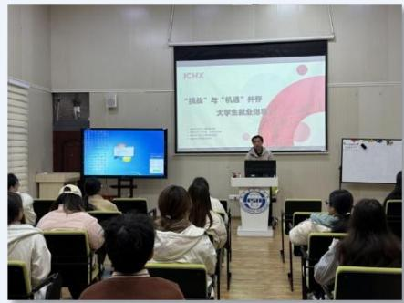

text_image

“挑战”与“机遇”并存
大学生就业指导

## 社会贡献

## 公益慈善与社区参与

## • 金诚信鲁班比公司荣膺赞比亚年度CSR权威大奖

在赞比亚企业社会责任网络（CSR Network Zambia）主办的第七届“企业社会责任与可持续发展奖”颁奖典礼上，金诚信旗下鲁班比公司凭借在助力社区教育基础设施建设方面的卓越贡献，从众多参评企业中脱颖而出，荣获“企业社会责任卓越奖——教育基础设施发展奖”。

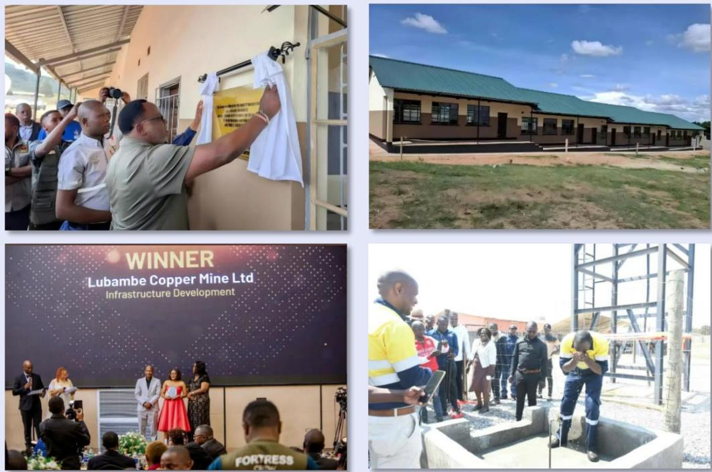

随着赞比亚政府免费优质教育政策的持续推进，帮助周边社区建设完善的教学设施与配套空间，让更多孩童能在家门口圆上学梦，始终是鲁班比公司履行社会责任的重要方向。截至目前，鲁班比公司已累计为驻地周边Konkola镇和Kasumbalesa镇的 Konkola 联 合 学 校 、 Miyanda 小 学 、Golden Eagle小学和新Konkola学校新建16间教室，惠及学生超过4000人，以实际行动响应赞比亚基础教育发展扶持政策。

在修建校舍之外，鲁班比公司还通过为新Konkola学校援建水井，解决了困扰2500余名师生多年的饮水难题。此前，由于校内缺乏供水设施，师生每天需往返步行约两公里，前往附近一家私人旅馆取水，改善用水条件成为学校的迫切诉求。水井建成后，清澈的水流随着水龙头轻轻拧开源源不断地涌出，不仅让师生彻底告别了长途取水的辛劳，也浸润着他们的心田。与此同时，水井还为校园内的蔬菜种植和果树灌溉提供了稳定水源，帮助学生在实践中掌握农业知识与生活技能，进一步拓展助学行动的深度与广度。

萨布韦公司赞助的第三届“龙溪杯”足球赛于在金诚信龙溪铜矿项目所在社区刚果（金）卢本巴希市Kipilingu社区龙溪村举行。自2022年11月为龙溪村修缮足球场地以来，萨布韦公司已连续三年赞助当地社区足球比赛。金诚信持续关注和支持龙溪铜矿所在社区发展的承诺和具体规划。在海外项目稳步发展的同时，金诚信也始终将履行社会责任摆在重要位置。足球运动的价值不仅体现在绿茵场上的竞技，更在于助力个体成长和推动体育精神的传播和发扬。未来，萨布韦公司将一如既往积极履责，以“好邻居”的角色持续造福矿区周边社区，推动形成更为紧密的联动与共建机制，与社区共同发展。

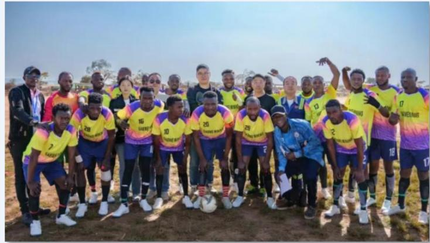

natural_image

Group photo of soccer players in yellow and purple jerseys posing outdoors on a dirt field (no visible text or symbols)

natural_image

Abstract wave pattern with layered curves in yellow and green tones (no text or symbols)

## 社会贡献

## 公益慈善与社区参与

## • 金诚信股份向密云区捐赠100万元 驰援防汛救灾及灾后重建

2025年夏天，北京市遭遇连续强降雨天气，密云区受灾情况尤为严重，在防汛救灾关键期，作为密云区注册企业，金诚信股份捐赠100万元善款驰援当地防汛救灾及灾后重建工作。

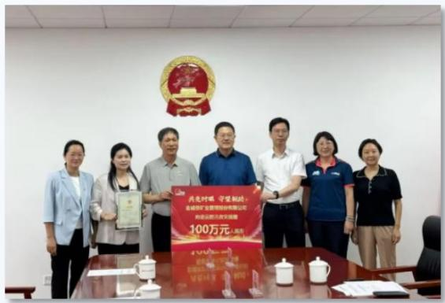

text_image

向光时哦 守望相结
金城矿业资产管理有限公司
向光时哦支付首期
100万元

## • 金诚信援建赞比亚龙溪边关设施交付投用

2025年4月11日，由金诚信股份援建的赞比亚铜带省龙溪边关基础及配套设施正式交付赞比亚政府并投用。龙溪边关地处赞比亚与刚果（金）两国交界，是联通两国的重要关口之一。为改善边关办公条件，促进地区互联互通，2023年4月，金诚信启动援建赞比亚龙溪边关基础设施项目，工程内容包括一栋综合办公楼、三栋员工宿舍楼以及一座公共卫生间，及相关办公、生活设施和设备，总投资逾100万美元。该项目在设计时充分考虑使用需求和当地气候特点，严格遵循赞比亚工程建设标准进行施工，并在建设过程中优先雇佣当地居民，有效带动了区域就业与劳动力技能提升。

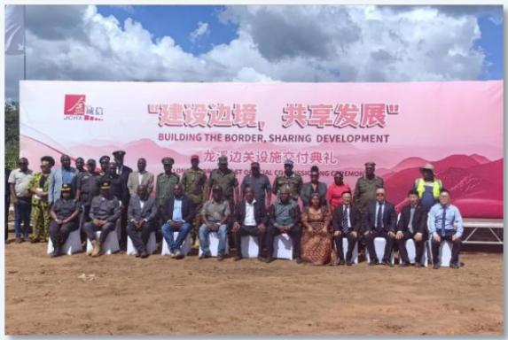

text_image

"建设边境，共享发展"
BUILDING THE BORDER, SHARING DEVELOPMENT
龙溪边关设施交付典礼

## • 一张新课桌 一片新天地 萨布韦公司公益捐赠

龙溪学校位于萨布韦公司龙溪项目所在社区，共有师生1400余人，自建校起一直面临课桌椅紧缺的问题。自2022年起，在为学校教职工们提供补助的同时，萨布韦公司向龙溪学校师生已分四批次捐赠了课桌椅和校服等物资。2025年5月28日，萨布韦公司再次向学校捐赠了188套课桌椅，目前共已累计捐赠和修复逾400套。金诚信萨布韦公司在为龙溪铜矿所在地经济发展、社会和谐、居民就业、民生改善做出积极贡献的同时，也为社区教育事业持续添砖加瓦。

## • 关爱儿童 赋能青年 鲁班比公司持续践行ESG理念

鲁班比铜矿多次向驻地社区Golden Eagle学校移交新建校舍，大大缓解了之前学校554名学生共用两间教室的窘迫状况。除校舍建设外，鲁班比铜矿还将继续为学校提供学习用品、课桌椅等物资。除了支持基础教育，鲁班比铜矿还在资助80名学子在高等院校从事学习和研究。助力青年成才成长也是鲁班比公司积极践行ESG理念的重要举措。鲁班比铜矿一直致力于社区青年个人发展，向所有18岁及以上的求职者开放就业机会，并为青年员工定制长期和短期培训计划，通过制定完善的人才培养方案，同构“师徒培养”等方式由资深专业人士指导青年员工积累实践经验，快速提升专业技能。目前，鲁班比铜矿有132名青年员工，其中，13人已跻身管理层。

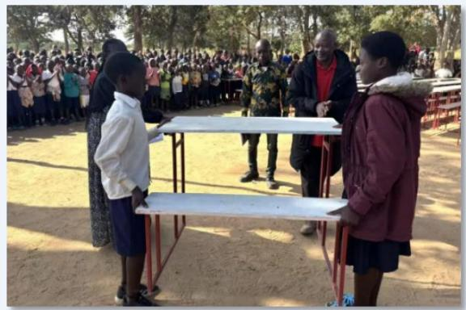

natural_image

Outdoor public event with people interacting around a table, surrounded by trees (no visible text or symbols)

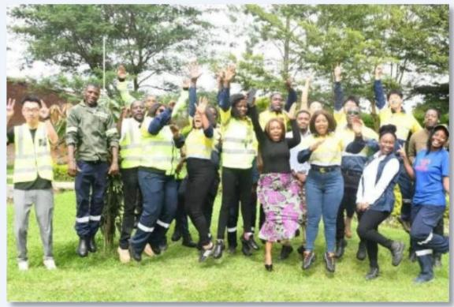

natural_image

Group photo of people in safety vests posing joyfully on a grassy outdoor area (no visible text or symbols)

## 附录

• 关键绩效数据表  
• 对标索引表

bar

| Category | Value |
| --- | --- |
| 1 | ~15 |
| 2 | ~40 |
| 3 | ~60 |
| 4 | ~85 |
| 5 | ~75 |
| 6 | ~50 |
| 7 | ~20 |
| 8 | ~10 |
| 9 | ~10 |
| 10 | ~10 |
| 11 | ~10 |
| 12 | ~10 |
| 13 | ~10 |
| 14 | ~10 |
| 15 | ~10 |
| 16 | ~10 |
| 17 | ~10 |
| 18 | ~10 |
| 19 | ~10 |
| 20 | ~10 |
| 21 | ~10 |
| 22 | ~10 |
| 23 | ~10 |
| 24 | ~10 |
| 25 | ~10 |
| 26 | ~10 |
| 27 | ~10 |
| 28 | ~10 |
| 29 | ~10 |
| 30 | ~10 |
| 31 | ~10 |
| 32 | ~10 |
| 33 | ~10 |
| 34 | ~10 |
| 35 | ~10 |
| 36 | ~10 |
| 37 | ~10 |
| 38 | ~10 |
| 39 | ~10 |
| 40 | ~10 |
| 41 | ~10 |
| 42 | ~10 |
| 43 | ~10 |
| 44 | ~10 |
| 45 | ~10 |
| 46 | ~10 |
| 47 | ~10 |
| 48 | ~10 |
| 49 | ~10 |
| 50 | ~10 |

关键绩效数据表

<table><tr><td colspan="2">指标名称</td><td>单位</td><td>2023年</td><td>2024年</td><td>2025年</td></tr><tr><td colspan="6">经济绩效</td></tr><tr><td colspan="2">营业收入</td><td>万元</td><td>739,921.45</td><td>994,240.64</td><td>1,389,396.83</td></tr><tr><td colspan="2">净利润</td><td>万元</td><td>103,122.73</td><td>158,382.50</td><td>233,870.33</td></tr><tr><td colspan="2">纳税总额</td><td>万元</td><td>63,170.49</td><td>108,894.34</td><td>158,026.06</td></tr><tr><td colspan="2">每股派发现金股利</td><td>元</td><td>0.20</td><td>0.45</td><td>0.66</td></tr><tr><td colspan="6">治理绩效</td></tr><tr><td colspan="2">董事会成员平均任期</td><td>年</td><td>6.1</td><td>7.1</td><td>7.6</td></tr><tr><td colspan="2">公司CEO是否担任董事长</td><td>/</td><td>否</td><td>否</td><td>否</td></tr><tr><td colspan="2">女性董事占比</td><td>%</td><td>11.11%</td><td>11.11%</td><td>11.11%</td></tr><tr><td colspan="2">独立董事比例</td><td>%</td><td>33.33%</td><td>33.33%</td><td>33.33%</td></tr><tr><td colspan="2">审计与风险管理委员会中独立董事占比</td><td>%</td><td>67%</td><td>67%</td><td>67%</td></tr><tr><td colspan="2">审计与风险管理委员会召集人是否为会计专业人士</td><td>/</td><td>是</td><td>是</td><td>是</td></tr><tr><td colspan="2">薪酬委员会独立董事占比</td><td>%</td><td>67%</td><td>67%</td><td>67%</td></tr><tr><td colspan="2">提名委员会独立董事占比</td><td>%</td><td>67%</td><td>67%</td><td>67%</td></tr><tr><td colspan="6">环境绩效</td></tr><tr><td colspan="2">年度环保总投入</td><td>万元</td><td>4,681.99</td><td>13,771.32</td><td>8,951.75</td></tr><tr><td colspan="2">年度环保培训次数6</td><td>次</td><td>5,955</td><td>6,496</td><td>2,652</td></tr><tr><td colspan="2">能源消耗总量*</td><td>吨标准煤</td><td>39,135.90</td><td>51,820.93</td><td>57,069.20</td></tr><tr><td rowspan="5">能源消耗*</td><td>天然气</td><td>立方米</td><td>33,336.00</td><td>32,968.30</td><td>59,164.07</td></tr><tr><td>煤炭</td><td>吨</td><td>279.20</td><td>168.97</td><td>18.02</td></tr><tr><td>柴油</td><td>升</td><td>12,971,563.54</td><td>24,846,840.60</td><td>24,880,327.19</td></tr><tr><td>汽油</td><td>升</td><td>79,475.33</td><td>75,822.51</td><td>91,624.57</td></tr><tr><td>外购电力</td><td>千瓦时</td><td>181,973,525.14</td><td>172,819,597.87</td><td>215,670,914.52</td></tr><tr><td rowspan="3">温室气体排放*</td><td>范围一温室气体排放量1</td><td>吨二氧化碳当量</td><td>35,346.99</td><td>65,124.55</td><td>65,191.24</td></tr><tr><td>范围二温室气体排放量2</td><td>吨二氧化碳当量</td><td>97,646.99</td><td>92,734.99</td><td>115,729.01</td></tr><tr><td>温室气体排放总量</td><td>吨二氧化碳当量</td><td>132,993.98</td><td>157,859.54</td><td>180,920.25</td></tr><tr><td>水资源使用*</td><td>总用水量</td><td>吨</td><td>690,158.40</td><td>723,450.83</td><td>729,828.56</td></tr><tr><td colspan="2">能耗强度</td><td>吨标煤/万元营收</td><td>0.05</td><td>0.05</td><td>0.04</td></tr><tr><td colspan="2">温室气体排放强度</td><td>吨二氧化碳当量/万元营收</td><td>0.18</td><td>0.16</td><td>0.13</td></tr><tr><td colspan="2">水资源使用强度</td><td>吨/万元营收</td><td>0.93</td><td>0.73</td><td>0.53</td></tr></table>

<table><tr><td colspan="2">指标名称</td><td>单位</td><td>2023年</td><td>2024年</td><td>2025年</td></tr><tr><td colspan="6">环境绩效</td></tr><tr><td rowspan="3">废弃物排放*</td><td>无害废弃物总量3</td><td>吨</td><td>9</td><td>11</td><td>985.97</td></tr><tr><td>有害废弃物总量4</td><td>吨</td><td>-</td><td>-</td><td>57.35</td></tr><tr><td>回收再利用废弃物总量5</td><td>吨</td><td>-</td><td>-</td><td>1,007,508.54</td></tr><tr><td rowspan="7">气体污染物排放*</td><td>废气排放总量</td><td>吨</td><td>-</td><td>-</td><td>35,894.00</td></tr><tr><td>悬浮粒子与颗粒物</td><td>吨</td><td>-</td><td>-</td><td>2.83</td></tr><tr><td>非甲烷总烃</td><td>吨</td><td>-</td><td>-</td><td>0</td></tr><tr><td>氮氧化物</td><td>吨</td><td>-</td><td>-</td><td>0</td></tr><tr><td>硫氧化物</td><td>吨</td><td>-</td><td>-</td><td>0.008</td></tr><tr><td>汞及其化合物</td><td>吨</td><td>-</td><td>-</td><td>0</td></tr><tr><td>VOC排放量</td><td>吨</td><td>-</td><td>-</td><td>0</td></tr><tr><td rowspan="5">水体污染物排放*</td><td>废水排放总量</td><td>吨</td><td>-</td><td>-</td><td>32,053,287.00</td></tr><tr><td>化学需氧量(COD)</td><td>吨</td><td>-</td><td>-</td><td>232.46</td></tr><tr><td>五日生化需氧量(BOD5)</td><td>吨</td><td>-</td><td>-</td><td>5.00</td></tr><tr><td>悬浮物</td><td>吨</td><td>-</td><td>-</td><td>460.62</td></tr><tr><td>氨氮</td><td>吨</td><td>-</td><td>-</td><td>7.51</td></tr><tr><td colspan="6">社会绩效</td></tr><tr><td colspan="2">员工总人数</td><td>人</td><td>11,225</td><td>12,424</td><td>14,099</td></tr><tr><td rowspan="2">按性别划分</td><td>男</td><td>人</td><td>10,717</td><td>11,803</td><td>13,394</td></tr><tr><td>女</td><td>人</td><td>508</td><td>621</td><td>705</td></tr><tr><td rowspan="2">按雇佣类型划分</td><td>劳动合同制</td><td>人</td><td>11,225</td><td>12,424</td><td>14,099</td></tr><tr><td>劳务派遣制</td><td>人</td><td>375</td><td>408</td><td>-</td></tr><tr><td rowspan="4">按年龄划分</td><td>51岁及以上</td><td>人</td><td>1,614</td><td>1445</td><td>1,652</td></tr><tr><td>41岁至50岁</td><td>人</td><td>3,560</td><td>2964</td><td>3,653</td></tr><tr><td>31岁至40岁</td><td>人</td><td>3,532</td><td>4471</td><td>4,890</td></tr><tr><td>30岁及以下</td><td>人</td><td>2,519</td><td>3544</td><td>3,904</td></tr><tr><td rowspan="2">按地区</td><td>在中国大陆工作的员工</td><td>人</td><td>3,938</td><td>4,796</td><td>3,971</td></tr><tr><td>在其他国家和地区</td><td>人</td><td>7,287</td><td>7,628</td><td>10,128</td></tr><tr><td rowspan="3">按职级划分</td><td>高级管理层</td><td>人</td><td>17</td><td>16</td><td>20</td></tr><tr><td>中级管理层</td><td>人</td><td>3,128</td><td>3,674</td><td>4,152</td></tr><tr><td>基层员工</td><td>人</td><td>8,080</td><td>8,734</td><td>9,927</td></tr><tr><td colspan="2">新员工人数</td><td>人</td><td>4,380</td><td>4,292</td><td>4,365</td></tr><tr><td colspan="2">少数民族雇佣数量</td><td>人</td><td>328</td><td>363</td><td>503</td></tr></table>

关键绩效数据表

<table><tr><td colspan="2">指标名称</td><td>单位</td><td>2023年</td><td>2024年</td><td>2025年</td></tr><tr><td colspan="6">社会绩效</td></tr><tr><td colspan="2">雇佣海外当地员工数量</td><td>人</td><td>7,287</td><td>7,628</td><td>8,173</td></tr><tr><td colspan="2">员工总流失率</td><td>%</td><td>25.62%</td><td>25.85%</td><td>17.02%</td></tr><tr><td colspan="2">接受培训的员工总数 $^{6}$ </td><td>人次</td><td>26,702</td><td>33,679</td><td>32,236</td></tr><tr><td colspan="2">开展培训课程总次数 $^{6}$ </td><td>次</td><td>5,955</td><td>6,496</td><td>2,652</td></tr><tr><td colspan="2">员工接受培训的总时长 $^{6}$ </td><td>小时</td><td>219,710.00</td><td>242,282.22</td><td>244,525.50</td></tr><tr><td colspan="2">员工接受培训的平均时长 $^{6}$ </td><td>小时</td><td>8.23</td><td>7.19</td><td>7.59</td></tr><tr><td rowspan="11">员工安全</td><td>工伤人数</td><td>人</td><td>11</td><td>9</td><td>10</td></tr><tr><td>千人负伤率</td><td>‰</td><td>0.71</td><td>0.48</td><td>0.58</td></tr><tr><td>工伤事故发生数</td><td>起</td><td>11</td><td>9</td><td>10</td></tr><tr><td>安全生产事故死亡人数 $^{7}$ </td><td>人</td><td>0</td><td>3</td><td>0</td></tr><tr><td>工伤事故死亡率</td><td>%</td><td>0</td><td>33.33</td><td>0</td></tr><tr><td>安全应急演练次数</td><td>次</td><td>110</td><td>164</td><td>211</td></tr><tr><td>安全培训覆盖率</td><td>%</td><td>100</td><td>100</td><td>100</td></tr><tr><td>职业病发生人数</td><td>人</td><td>2</td><td>0</td><td>2</td></tr><tr><td>百万工时死亡率</td><td>%</td><td>0</td><td>0.09</td><td>0</td></tr><tr><td>LTIFR</td><td>次</td><td>0.32</td><td>0.26</td><td>0.27</td></tr><tr><td>TRIFR</td><td>次</td><td>2.41</td><td>3.44</td><td>2.76</td></tr><tr><td rowspan="3">健康安全投入</td><td>安全生产投入金额</td><td>万元</td><td>15,469.86</td><td>16,149.39</td><td>16,118.65</td></tr><tr><td>安全培训总时长</td><td>小时</td><td>219,710.00</td><td>242,282.22</td><td>244,525.50</td></tr><tr><td>社会保险覆盖率</td><td>%</td><td>100</td><td>100</td><td>100</td></tr><tr><td colspan="2">困难员工帮扶数量</td><td>人</td><td>17</td><td>21</td><td>10</td></tr><tr><td colspan="2">社会公益投入总金额</td><td>万元</td><td>790.69</td><td>1,716.01</td><td>4,177.02</td></tr></table>

\*公司在2023年度和2024年度的相关报告中披露的数据范围仅为金诚信注册地所在的密云办公区；2025年起，披露范围涵盖金诚信及其附属公司，并相应追溯调整2023年度和2024年度数据。  
注 1、2：参考《工业企业温室气体排放核算和报告通则》（GB/T 32150-2025）、《企业温室气体排放核算方法与报告指南 发电设施》：参考其对于化石燃料燃烧排放的计算逻辑（活动数据 × 排放因子）、关键参数更新——电力排放因子：为生态环境部发布的最新全国电网平均排放因子0.5366 kgCO₂ /kWh，燃料排放因子——柴油/汽油：采用了基于燃料低位发热量和单位热值含碳量的标准计算值（柴油约3.11tCO₂ /t，汽油约3.10tCO₂ /t），煤炭——采用了标准推荐的缺省值（0.7482 tCO₂ /t）。  
注 3：无害废弃物统计范围为办公与生活垃圾，不包括废石。  
注 4：有害废弃物统计范围为废油和含油废物，不包括尾矿。  
注 5：回收再利用废弃物统计范围为用于充填的尾矿。  
注 6：统计范围包括公司及下属公司和项目部。  
注 7：2025年，公司收到发生于2024年的事故认定结论：1）2024 年 6 月，公司银山项目部发生了一起工亡事故，工亡 1 人；2）2024 年 8 月，公司银山项目部发生一起车辆伤害事故，造成1人死亡；3）2024 年 8 月，公司海矿石碌项目部发生一起1人高处坠落事件，该人员经抢救无效死亡。

natural_image

Illustration of stylized mountain peaks in warm tones (no text or symbols)

## 对标索引表

《上海证券交易所上市公司自律监管指引第14号——可持续发展报告（试行）》对标索引表

<table><tr><td>披露要求</td><td>对应章节</td></tr><tr><td>第一章 总则</td><td>关于本报告</td></tr><tr><td>第二章 可持续发展信息披露框架</td><td>议题重要性评估</td></tr><tr><td>第三章 环境信息披露</td><td></td></tr><tr><td>第一节 应对气候变化</td><td></td></tr><tr><td>应对气候变化</td><td>环境维度议题-应对气候变化</td></tr><tr><td>第二节 污染防治与生态系统保护</td><td></td></tr><tr><td>污染物排放</td><td>环境维度议题-污染物排放</td></tr><tr><td>废弃物处理</td><td>环境维度议题-废弃物处理</td></tr><tr><td>生态系统和生物多样性保护</td><td>环境维度议题-生态系统和生物多样性保护</td></tr><tr><td>环境合规管理</td><td>环境维度议题-环境合规管理</td></tr><tr><td>第三节 资源利用与循环经济</td><td></td></tr><tr><td>能源利用</td><td>环境维度议题-能源利用</td></tr><tr><td>水资源利用</td><td>环境维度议题-水资源利用</td></tr><tr><td>循环经济</td><td>环境维度议题-循环经济</td></tr><tr><td>第四章 社会信息披露</td><td></td></tr><tr><td>第一节 乡村振兴与社会贡献</td><td></td></tr><tr><td>乡村振兴</td><td>社会维度议题-乡村振兴</td></tr><tr><td>社会贡献</td><td>社会维度议题-社会贡献</td></tr><tr><td>第二节 创新驱动与科技伦理</td><td></td></tr><tr><td>创新驱动</td><td>社会维度议题-创新驱动</td></tr><tr><td>科技伦理</td><td>社会维度议题-科技伦理</td></tr><tr><td>第三节 供应商与客户</td><td></td></tr><tr><td>供应链安全</td><td>社会维度议题-供应链安全</td></tr><tr><td>平等对待中小企业</td><td>社会维度议题-平等对待中小企业</td></tr><tr><td>产品和服务安全与质量</td><td>社会维度议题-产品和服务安全与质量</td></tr><tr><td>数据安全与客户隐私保护</td><td>社会维度议题-数据安全与客户隐私保护</td></tr><tr><td>第四节 员工</td><td></td></tr><tr><td>员工</td><td>社会维度议题-员工雇佣与权益、职业健康与安全、员工培训与发展</td></tr><tr><td>第五章 可持续发展相关治理信息披露</td><td></td></tr><tr><td>第一节 可持续发展相关治理机制</td><td></td></tr><tr><td>尽职调查</td><td>议题重要性评估-双重重要性分析、尽职调查、议题重要性分析结论</td></tr><tr><td>利益相关方沟通</td><td>议题重要性评估-利益相关方沟通</td></tr><tr><td>第二节 商业行为</td><td></td></tr><tr><td>反商业贿赂及反贪污</td><td>公司ESG治理及可持续发展相关治理-可持续发展相关治理-反商业贿赂及反贪污</td></tr><tr><td>反不正当竞争</td><td>公司ESG治理及可持续发展相关治理-可持续发展相关治理-反不正当竞争</td></tr><tr><td>第六章 附则和释义</td><td>关于本报告</td></tr></table>

##

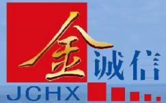

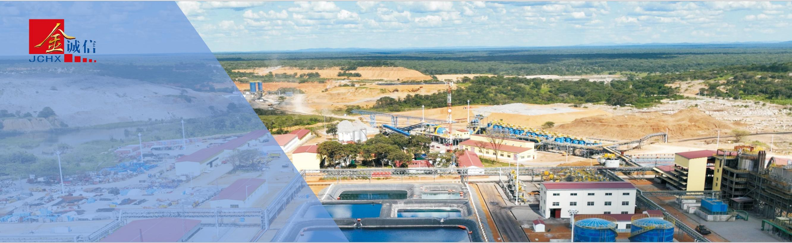

natural_image

Aerial view of an industrial facility with storage tanks, processing units, and a large mining site under construction (no visible text or symbols)

