葫芦娃药业

HULUWA PHARMACEUTICAL

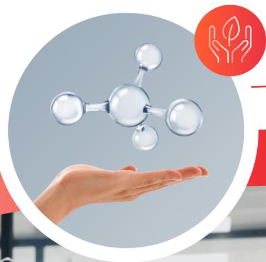

natural_image

Hand holding a transparent water molecule with a leaf icon, symbolizing eco-friendly or sustainable life (no text or symbols on the molecule)

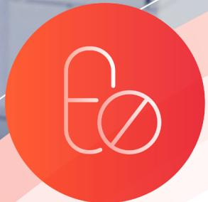

natural_image

Icon of a pill and a stopper inside a red circle (no text or symbols)

## 2025

环境、社会和公司治理(ESG)报告

海南葫芦娃药业集团股份有限公司

## 目录

报告编制说明 03

关于本公司 06

公司简介 06

公司荣誉 08

数说葫芦娃 09

关键量化绩效表 85

附录 89

可持续发展专栏 11

ESG管理体系 13

利益相关方沟通 14

实质性议题分析 16

坚持党建引领，完善治理体系 17

党建引领 19

公司治理 23

风险控制 25

商业道德 27

践行环保理念，助力绿色转型 29

构建管理体系 31

提升资源效率 35

加强排污管理 37

应对气候变化 39

保护生态系统 42

强化创新驱动，升级产品服务 43

推动科技创新 45

保障产品质量 52

发挥服务价值 59

坚持责任采购 64

注重员工关怀，构建幸福职场 67

员工雇佣与福利 69

人才培养与发展 72

职业健康与安全 75

履行社会责任，深化公益行动 79

普惠医疗 81

公益慈善 83

natural_image

Lighthouse against a sunset sky with abstract orange and pink graphic elements (no text or symbols)

## 报告编制说明

本报告是海南葫芦娃药业集团股份有限公司发布的第5份《环境、社会和公司治理（ESG）报告》，向投资者等利益相关方披露了公司在经营中对于ESG议题所秉持的理念、建立的管理方法、推行的工作与达到的成效。

## 报告范围

本报告范围涵盖海南葫芦娃药业集团股份有限公司及其附属公司（简称“葫芦娃药业”“葫芦娃”“公司”）。除非特别说明，与葫芦娃药业（股票代码：605199）同期合并财务报表范围一致。

本报告涉及的合并报表范围分/子公司的全称与对应简称见下表。

<table><tr><td>序号</td><td>公司全称</td><td>公司简称</td></tr><tr><td>1</td><td>海南葫芦娃药业集团股份有限公司美安基地</td><td>美安基地</td></tr><tr><td>2</td><td>海南葫芦娃药业集团股份有限公司药谷区生产基地</td><td>葫芦娃药谷厂区</td></tr><tr><td>3</td><td>广西维威制药有限公司</td><td>广西维威</td></tr><tr><td>4</td><td>来宾市维威药物提取有限公司</td><td>来宾维威</td></tr><tr><td>5</td><td>江西荣兴药业有限公司</td><td>江西荣兴</td></tr><tr><td>6</td><td>海南葫芦娃科技开发有限公司</td><td>葫芦娃科技</td></tr><tr><td>7</td><td>海南葫芦娃药业有限公司</td><td>葫芦娃药业</td></tr><tr><td>8</td><td>浙江葫芦世家药业有限公司</td><td>浙江葫芦世家</td></tr><tr><td>9</td><td>海南葫芦娃医疗保健生物科技有限公司</td><td>葫芦娃医疗保健</td></tr><tr><td>10</td><td>广西来宾葫芦娃药业有限公司</td><td>来宾葫芦娃</td></tr></table>

## 报告期间

本报告期间为2025年1月1日至2025年12月31日，为保持信息的连续性与完整性，部分内容超出上述范围。

## 编制依据

• 《上海证券交易所上市公司自律监管指引第1号——规范运作》（2025年5月修订）  
• 全球报告倡议组织GRI《可持续发展报告标准》（2021）  
《国际财务报告可持续披露准则第2号——气候相关披露》  
• 《上海证券交易所上市公司自律监管指引第14号——可持续发展报告（试行）》

## 编制原则

本报告参考全球报告倡议组织GRI《可持续发展报告标准》（2021）的报告原则，确保报告信息的质量以及适当呈现：

## 重要性原则

公司识别出投资者等利益相关方关注的与经营相关的实质性议题，作为本报告汇报重点。本报告中对实质性议题的汇报同时关注公司运营涉及的行业特征以及所在地区特征。实质性议题的分析过程及结果详见本报告“可持续发展专栏”章节。同时，本报告对环境、社会和公司治理方面可能对投资人及其他相关方产生重要影响的事项进行重点汇报。

## 准确性原则

本报告尽可能确保信息准确。其中，定量信息的测算已说明数据口径、计算依据与假定条件，以保证计算误差范围不会对信息使用者造成误导性影响。定量信息及附注信息详见本报告“关键量化绩效表”章节。董事会对报告的内容进行保证，不存在虚假记载、误导性陈述或重大遗漏。

## 平衡性原则

本报告内容反映客观事实，对涉及公司正面、负面的信息均予以不偏不倚的披露。

## 清晰性

本报告以简体中文发布。本报告中包含表格、模型图以及专业名词表等信息，作为本报告中文字内容的辅助，便于利益相关方更好地理解报告中文字内容。为便于利益相关方更快获取信息，本报告提供目录及ESG标准的对标索引表。

## 量化及一致性

木报告披露关键定量绩效指标，并尽可能披露历史数据，木报告对同一指标在不同报告期内的统计及披露方式保持一致若统计及披露方式有更改 在报告附注中予以充分说明以便利益相关方进行有意义的分析，评估公司ESG绩效水平发展趋势。

## 完整性

本报告披露对象范围与公司合并财务报表范围保持一致。

## 时效性

本报告为年度报告，覆盖时间范围为2025年1月1日至2025年12月31日。公司尽力在报告年度结束后尽快发布报告，为利益相关方决策提供及时的信息参考

## 可验证性

本报告中案例和数据来自公司实际运行的原始记录或财务报告。

## 数据说明

报告中数据和案例来自公司实际运行的正式记录。

报告中的财务数据均以人民币为单位；财务数据与公司年度财务报告不符的，以年度财务报告为准。

报告中的环境数据仅涵盖开展实际生产运营业务的子公司。海南葫芦娃药业有限公司、海南葫芦娃科技开发有限公司、浙江葫芦世家药业有限公司，海南葫芦娃医疗保健生物科技有限公司因不涉及实质性生产经营活动 对环境几平不造成影响因此不纳入环境数据统计范围。

## 报告获取方式

本报告通过电子版形式发布，发布平台包括证券交易所指定的信息披露平台。

## 联系我们

本如对报告有建议，可通过以下方式与我们联系：

联系地址：海南省海口市秀英区安读一路30号

联系邮箱：huluwa@huluwayaoye.com

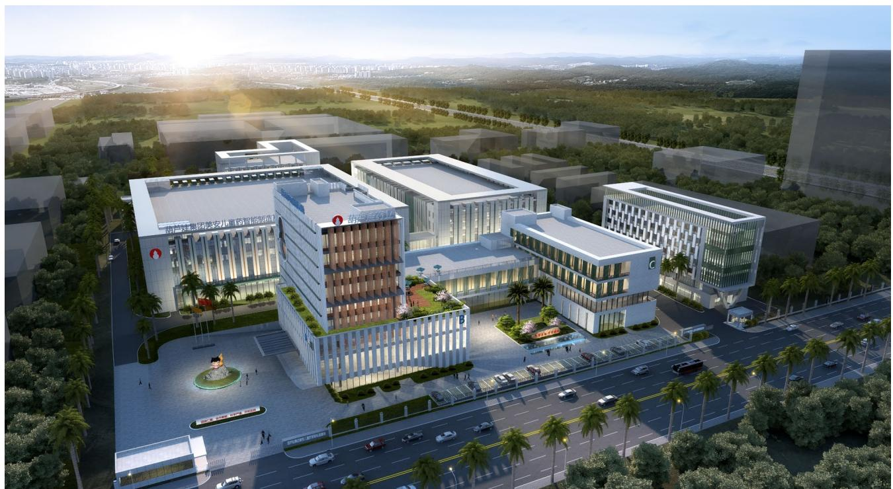

natural_image

Architectural rendering of a modern multi-building campus with palm trees and roads, no visible text or symbols.

## 关于本公司

## 公司简介

葫芦娃（股票代码：605199）是总部设立在海口的集团化企业，2020年7月在上交所主板上市，是海南自贸港建设总体方案公布以来海南省首家上市企业。经过十几年的发展，葫芦娃始终聚焦实业、做精主业，为中国儿童健康成长保驾护航，现已成长为中国儿童健康领域领军企业之一。

基本情况

<table><tr><td>企业名称</td><td>海南葫芦娃药业集团股份有限公司</td></tr><tr><td>总部注册地址</td><td>海南省海口市海口国家高新区药谷工业园二期药谷四路8号</td></tr><tr><td>总部办公地址</td><td>海南省海口市秀英区安读一路30号</td></tr><tr><td>主要业务</td><td>聚焦儿童药领域,专注于药品的研发、生产和销售</td></tr><tr><td>主要运营地</td><td>海南海口、广西南宁、广西来宾、浙江杭州、江西宜春</td></tr><tr><td>员工总数</td><td>1,451人</td></tr><tr><td>资产总额</td><td>260,295.40万元</td></tr><tr><td>营业收入</td><td>90,083.52万元</td></tr></table>

公司主要从事医药及健康产品的研发、生产、销售，已构建成以特色中药、化学药为核心，覆盖多治疗领域与健康需求的产品体系。基于对医药制造业的长期深耕，公司确立“儿童全生命周期健康”战略核心，聚焦打造儿童健康领域的“葫芦娃”核心品牌，通过多元化传播深化品牌影响力，致力成为中国儿童健康领域家喻户晓的领导品牌。

公司产品布局以儿童药为核心、成人药为辅助、保健品为延伸，形成具有特色的业务协同。在药品领域，重点覆盖呼吸系统、消化系统、抗感染等核心治疗品类。公司在海口市、南宁市等地建立了现代化生产基地与研发中心，投资建设了片剂、胶囊剂、颗粒剂、口溶膜剂、软胶囊剂、口服混悬剂、口服溶液剂散剂粉针冻干粉针酊剂滴剂吸入制剂等十九类药品制剂生产线，是国内剂型较为齐全的制药企业。在研发与产品储备方面，公司持续推进产品管线拓展在研产品聚焦儿童及成人呼吸系统，神经系统用药相关疾病领域的布局，报告期内获批12个规格的药品批文。此外，公司通过控股江西荣兴药业有限公司，延伸上游产业链，布局原料药前端化学中间体业务。

## 报告期内

公司拥有药品批文

351 个 个

其中产品进入国家医保目录

130 种

## 葫芦娃业务种类

儿童药业务

公司共有40个在产在销的儿童药品种，治疗范围覆盖了0\~14岁儿童全年龄段，儿童疾病领域70%以上病种，用于治疗儿童感冒、感染性疾病、功能性消化不良、过敏性疾病等多种临床需求迫切的常见疾病。公司药品在研品种200个，主要集中在儿童常用的呼吸系统、神经系统及补益类等治疗领域，将为广大患儿提供更多临床创新产品。

## 葫芦娃企业文化

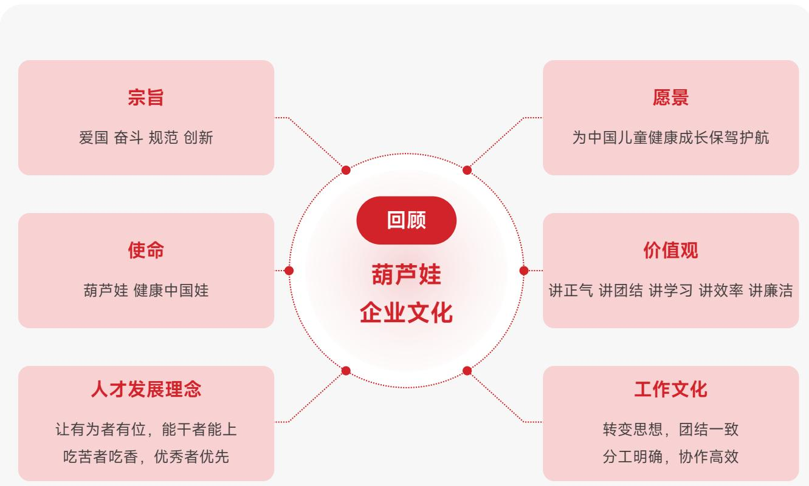

flowchart

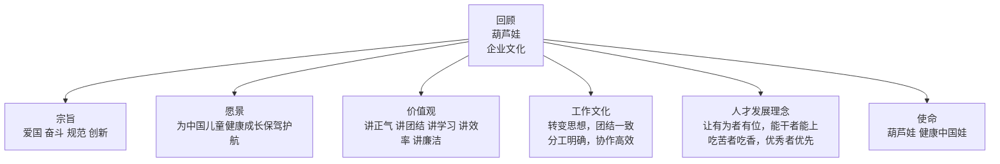
```mermaid
graph TD
  A["回顾\n葫芦娃\n企业文化"] --> B["宗旨\n爱国 奋斗 规范 创新"]
  A --> C["愿景\n为中国儿童健康成长保驾护航"]
  A --> D["价值观\n讲正气 讲团结 讲学习 讲效率 讲廉洁"]
  A --> E["工作文化\n转变思想，团结一致\n分工明确，协作高效"]
  A --> F["人才发展理念\n让有为者有位，能干者能上吃苦者吃香，优秀者优先"]
  A --> G["使命\n葫芦娃 健康中国娃"]
```

## 公司荣誉

## 综合实力类

## 工业和信息化部

2025年度中国消费名品名单

## 药智网、中新社国际传播集团、《中国药业》杂志等

“2025中国化药研发实力前100强”第61位

## 乌镇健康大会

西湖奖·医药零售数字化领军企业20强

## 中国医药物资协会

2024年中国医药市场药企（中药）百强榜

## 海南省工商联

2025海南民营企业100强第34位、研发投入20强第5位

## ESG类

## 中诚信绿金科技（北京）有限公司

ESG综合评级A-

## 上海华证指数

ESG综合评级B

## 数说葫芦娃

2025年

## 经济绩效

营业收入

90,083.52 万元

研发费用投入

12,025.73 万元

累计获得授权专利数量

112 件

## 环境绩效

温室气体排放总量（范围一、二）

21,162.22 吨二氧化碳当量

年度环保投资支出

117.30 万元

因违反环境保护法律法规而受到处罚的事件数

0 件

危险废弃物产生密度

0.0020 吨/万元营收

## 社会绩效

女性员工占比

46.11 %

员工培训覆盖率

100 %

员工人均培训时长

14.25 小时/人

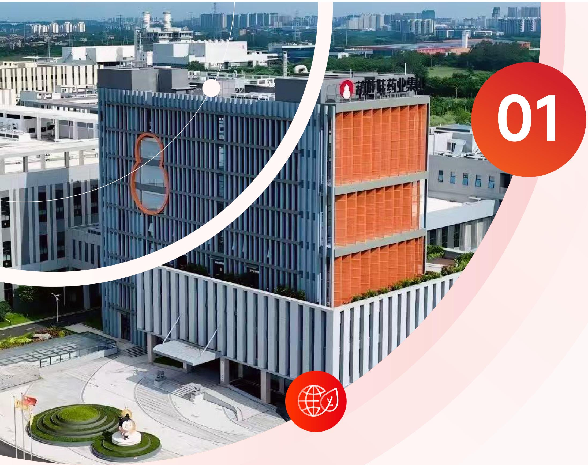

text_image

润旺药业集团
01

## 01

## 可持续发展专栏

回应可持续发展议题

利益相关方沟通

## ESG管理体系

葫芦娃持续完善ESG管理架构，将ESG理念融入公司发展战略和日常运营，保障ESG工作的持续有效开展，为各利益相关方创造价值。

## 公司ESG管理架构

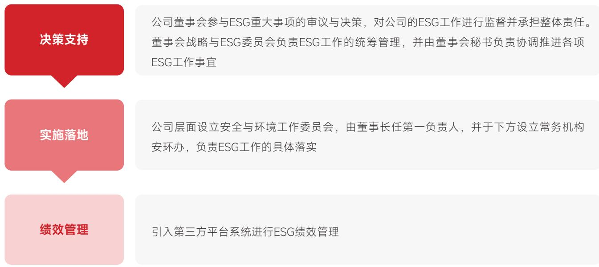

flowchart

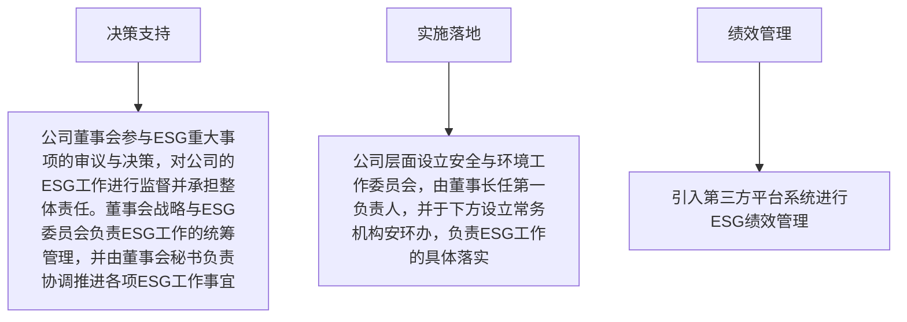
```mermaid
graph TD
  A["决策支持"] --> B["公司董事会参与ESG重大事项的审议与决策，对公司的ESG工作进行监督并承担整体责任。董事会战略与ESG委员会负责ESG工作的统筹管理，并由董事会秘书负责协调推进各项ESG工作事宜"]
  C["实施落地"] --> D["公司层面设立安全与环境工作委员会，由董事长任第一负责人，并于下方设立常务机构安环办，负责ESG工作的具体落实"]
  E["绩效管理"] --> F["引入第三方平台系统进行ESG绩效管理"]
```

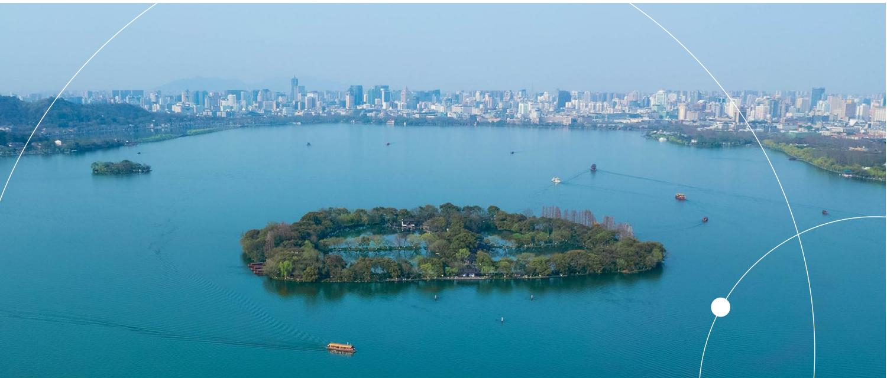

natural_image

Aerial view of a large lake with a circular island surrounded by boats, with a city skyline in the background (no visible text or symbols)

## 利益相关方沟通

作为负责任的公司，葫芦娃与股东及投资者、客户及消费者、员工、政府及监管机构、供应商及合作伙伴、社区、公众及媒体等利益相关方建立常态化的沟通机制，把利益相关方的诉求纳入运营和决策过程，持续推动ESG管理水平提升，为各方创造价值。

## 利益相关方关注议题与葫芦娃的回应方式

<table><tr><td>关键利益相关方</td><td>关注议题</td><td>沟通方式和渠道</td></tr><tr><td>股东及投资者</td><td>公司治理党建引领合规内控与风险管理反商业贿赂及反贪污尽职调查利益相关方沟通</td><td>股东会公司官网、官方微信公众号交易所网站信息披露投资者沟通交流会议电话、邮件及上证e互动平台合规制度与合规文化建设知识产权管理体系</td></tr><tr><td>客户及消费者</td><td>产品和服务安全与质量客户服务医疗普惠与健康可及性负责任营销创新驱动数据安全与客户隐私保护科技伦理</td><td>产品展览客户咨询与投诉客户满意度调查公益赠药活动合理的药物定价便捷的药物采购渠道规范化用药引导技术研讨会</td></tr><tr><td>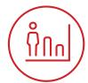员工</td><td>员工职业健康与安全利益相关方沟通</td><td>员工培训、绩效考核员工活动职工代表大会活动安全生产管理、职业健康安全管理</td></tr><tr><td>政府及监管机构</td><td>污染物排放废弃物处理生态系统和生物多样性保护环境合规管理</td><td>信息披露配合监管机构核查参与政府调研活动政策执行</td></tr><tr><td>供应商及合作伙伴</td><td>供应链安全创新驱动平等对待中小企业反不正当竞争反商业贿赂及反贪污利益相关方沟通</td><td>日常沟通、不定期走访学术研讨会、行业展会招投标活动反腐败举报渠道与检举人保护</td></tr><tr><td>社区、公众及媒体等</td><td>社会贡献乡村振兴医疗普惠与健康可及性污染物排放废弃物处理循环经济利益相关方沟通</td><td>公益活动合理的药物定价便捷的药物采购渠道新闻稿、社群媒体“三废”排放检测</td></tr></table>

natural_image

Aerial view of a red car driving along a winding road through turquoise ocean waters, surrounded by dense green trees and sunlight (no text or symbols visible)

## 实质性议题分析

根据上海证券交易所《上市公司自律监管指引第14号——可持续发展报告（试行）》（《指引》）和全球报告倡议组织（GRI）《可持续发展报告标准》中对实质性议题的管理要求，葫芦娃药业定期开展ESG议题重要性分析，以准确了解利益相关方的诉求与期望，作为公司开展ESG管理工作的基础。

报告期内，公司基于《指引》设置的21项议题，以及根据国内外政策调研、同业对标分析以及公司内部意见征集等渠道自主识别的7项议题（医疗普惠与健康可及性、党建引领、负责任营销、公司治理、合规内控与风险管理、知识产权保护、职业健康与安全），确定本年度ESG议题重要性分析范围。

## 葫芦娃2025年ESG实质性议题矩阵

## 高

党建引领

能源利用

利益相关方沟通

污染物排放

医疗普惠与健康可及性

水资源利用

社会贡献

循环经济

公司治理

产品和服务安全与质量

创新驱动

数据安全与客户隐私保护

员工

环境合规管理

废弃物处理

职业健康与安全

## 对
经
济
、
社
会
和
环
境
的
重
要
性

应对气候变化

生态系统和生物多样性保护

乡村振兴

合规内控与风险管理

供应链安全

反商业贿赂及反贪污

知识产权保护

反不正当竞争

科技伦理

尽职调查

平等对待中小企业

负责任营销

## 低

对公司财务的重要性

## 高

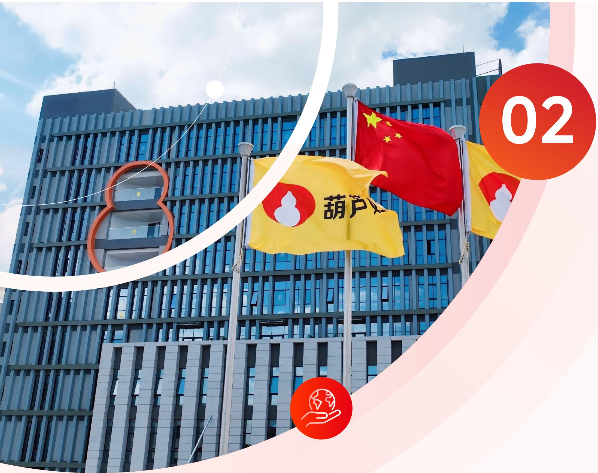

text_image

02
葫芦岛

## 坚持党建引领完善治理体系

## 回应可持续发展议题

党建引领

公司治理

合规内控与风险管理

反不正当竞争

反商业贿赂及反贪污

## 党建引领

葫芦娃始终坚持党建与业务工作的深度融合，把党的领导融入公司治理各环节，以高质量党建引领企业高质量发展。葫芦娃构建了以公司委员会为核心，统筹工会、妇联、科协和共青团等组织的党群工作架构，下设第一、第二党支部，不断强化党对企业的全面领导。

海南葫芦娃药业集团股份有限公司党群组织架构  
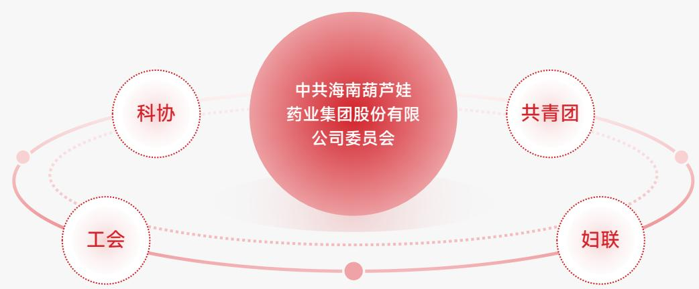

flowchart

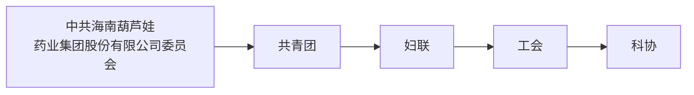
```mermaid
graph LR
  A["中共海南葫芦娃\n药业集团股份有限公司委员会"] --> B["共青团"]
  B --> C["妇联"]
  C --> D["工会"]
  D --> E["科协"]
```

报告期内，公司从组织发展、党员成长、党建活动等多领域全方位推进党建工作。截至报告期末，公司党员总数74人，吸收入党积极分子10人，接收入党申请书2份、预备党员4名，党组织建设及党员团队实现显著发展。

## 海南党组织

现有固定党员21名。报告期内，2名积极分子转为正式党员，新发展预备党员2名

## 广西党组织

共有正式党员26名（其中固定党员22名、流动党员4名)、预备党员2名、入党积极分子10名、发展对象0名、入党申请人2名。队伍持续壮大，活力不断增强

葫芦娃“五心护童红旗扬“党建品牌  
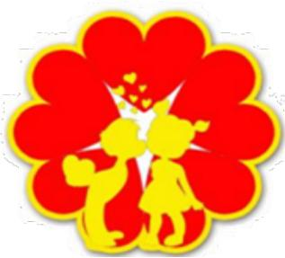

natural_image

Stylized graphic of two yellow figures embracing in a red floral background (no text or symbols)

## 创品牌添动力抓党建促发展

 品牌标志

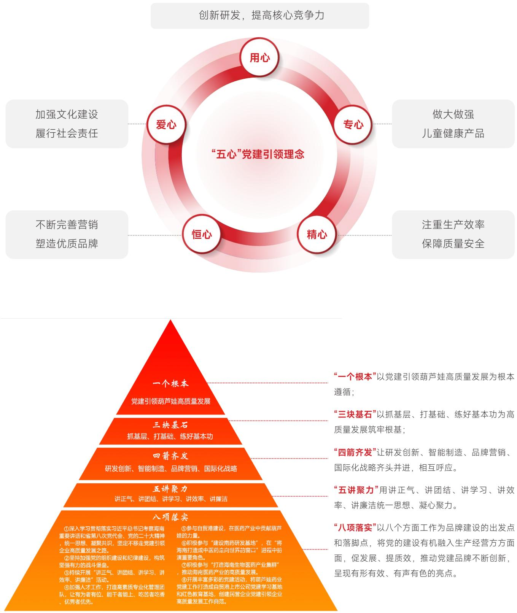

## 葫芦娃2025年党建主要工作

<table><tr><td>主要工作</td><td>主要内容</td></tr><tr><td>制度更新</td><td>·海南党组织完善《党建办工作职责》《党委及党建工作例会制度》《党组织印章的管理要求》《主题党日管理制度》《党员联系群众制度》等党组织建设制度。</td></tr><tr><td>党员成长</td><td>海南党组织:·开展集中学习12次、专题活动3场、党委书记讲党课1次,党员参学率达80%以上·开展现场警示教育活动1次,组织观看警示教育片3部,党员干部撰写廉洁自律心得体会20余份,有效遏制了形式主义、官僚主义等“四风”问题,营造了风清气正的政治生态广西党组织:·常态化开展“党建+质量管控”主题党课,覆盖全体党员,单场时长约1小时,每季度开展一次党课,总计开展4次党课·全年召开2场组织生活会,8月以“敞开心扉、共叙情怀、共克时艰”为主题开展恳谈会,凝聚发展合力</td></tr><tr><td>党建活动</td><td>海南党组织:·慰问困难职工:春节前夕,党委携工会、妇联走访12户困难职工家庭,送去慰问金及物资价值1.3万余元,解决子女就学、医疗等实际困难,增强职工归属感与凝聚力·走进福利院:组织管理团队和党员志愿者走进海口社会福利院,开展“关爱儿童·与爱同行”活动,陪伴儿童互动游戏、绘画剪纸,践行社会责任,提升企业形象·抗击台风灾后重建:台风“博罗依”后成立党员突击队,清理倒树杂物10余吨,抢修设施30余处,志愿服务超80小时,推进灾后重建工作,保障企业正常生产生活秩序·预防基孔肯亚热病毒:开展“消除病媒滋生环境”专项行动,党员干部带头清理积水坑槽20余处、杂草地面500多平方米,有效降低病媒密度,守护群众健康·拥抱人工智能:主办“创新驱动,智领未来”高新区生物医药党建联盟活动,分享DeepSeek等AI应用经验,30人参与交流,促进企业共享创新成果广西党组织:·强化思想引领:组织全体党员参加集团党委“弘扬伟大建党精神,引领企业健康发展”纪念建党104周年主题活动,通过专题学习党史、交流学习感悟、分享工作心得等形式,进一步激发党员的责任感和使命感</td></tr></table>

## 主题党日强化思想引领

2025年4月，公司党委组织第一、第二党支部部分党员前往海南革命烈士纪念碑和冯马驹纪念亭开展“加强国家总体安全，守护改革发展成果，告慰革命烈士先辈”主题党日活动。活动期间，全体党员向先烈敬献花篮，列队默哀，寄托对革命先辈的崇敬与哀思，随后，全体党员参观了冯白驹纪念亭。

通过缅怀革命先辈，党员们进一步赓续红色精神，激发不忘初心、砥砺前行的奋斗意志，为企业健康、高质量发展凝聚力量。

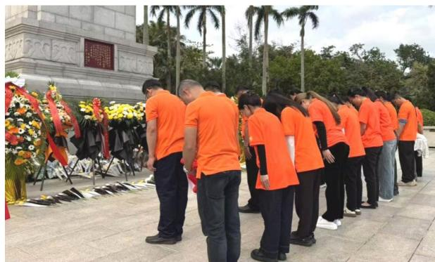

natural_image

Group of people in orange shirts bowing at a memorial site with floral tributes and palm trees (no visible text or symbols)

 主题党日活动现场

## 广西党支部组织骨干参加江南区“两新”组织党务骨干培训班

广西党支部结合党建工作实际需求，组织党务骨干参加江南区“两新”组织党务骨干培训班2期，系统学习基层党建工作规范、组织生活流程优化、党员教育管理方法等内容，参训人员认真研学、学以致用，将培训成果快速转化为支部工作提质增效的实际举措，推动支部党建工作从“有形覆盖”向“有效覆盖”深度转变。

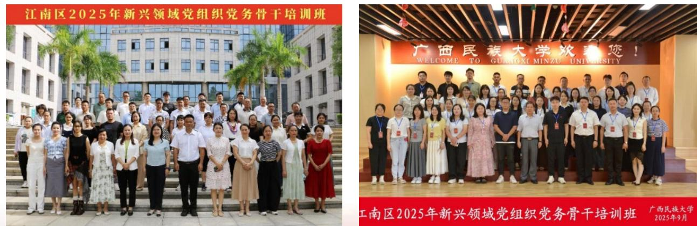  
 党组织党务骨干培训班合影

natural_image

Lighthouse silhouetted on a rocky shore at sunset, with orange and red sky background (no text or symbols)

## 公司治理

葫芦娃严格遵守《中华人民共和国公司法》《中华人民共和国证券法》《上市公司治理准则》《上海证券交易所股票上市规则》等相关规定，根据《上市公司章程指引（2025年修订）》修订《公司章程》《股东会议事规则》《监事会议事规则》《独立董事工作制度》《信息披露管理办法》等公司治理层面的管理制度，并新制定了《董事和高级管理人员离职管理制度》。同时也根据《章程指引》要求，取消了监事会，《海南葫芦娃药业集团股份有限公司监事会议事规则》相应废止，由董事会审计委员会行使《公司法》中规定的职权。

## 公司治理架构

公司设置股东会，董事会，监事会和管理层“三会一层”的法人治理结构各机构权责分明，各司其职，相互制衡，协调运作，为公司重大决策的有效执行及日常经营提供有力保障，2025年，公司取消监事会，废止了监事会议事规则监事会的职权由董事会审计委员会承接，并在10月开展第四届换届选举。

葫芦娃公司治理架构  
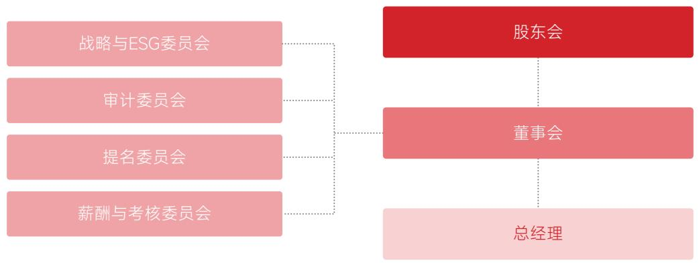

flowchart

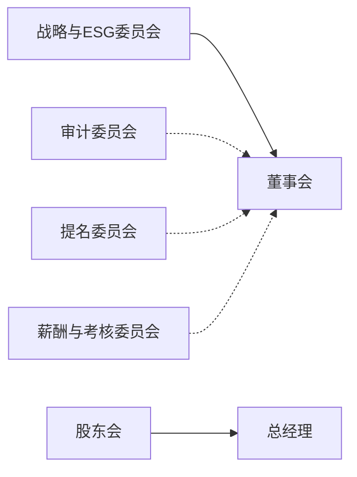
```mermaid
graph LR
  A["战略与ESG委员会"] --> B["董事会"]
  C["审计委员会"] -.-> B
  D["提名委员会"] -.-> B
  E["薪酬与考核委员会"] -.-> B
  F["股东会"] --> G["总经理"]
```

董事会及监事会成员构成及相关会议开展情况

## 董事会及监事会组成

董事会董事

7 名

其中，独立董事

3 名

女性董事

4 名

## 三会召开情况

股东会4次，共审议议案20项

董事会会议10次，共审议议案44项

董事会各专门委员会会议16次

## 信息披露

葫芦娃按照《上海证券交易所股票上市规则》及公司现行的信息披露制度，履行信息披露义务，提升信息披露的质量和有效性。

公司指定董事会秘书负责公司信息披露工作，指定《中国证券报》《上海证券报》《证券日报》《证券时报》为公司信息披露刊物。

## 报告期内

公司全年累计披露报告

162 份

## 投资者关系

公司建立并持续完善投资者沟通相关制度，严格遵循公开、公平、公正原则，通过线业绩说明会、投资者热线、投资者邮箱、上证路演中心互动平台等多渠道与投资者常态化沟通，切实维护全体股东尤其是中小股东合法权益。

公司已制定《投资者关系管理办法》《特定对象来访接待制度》《股东会议事规则》等制度，明确沟通流程、信息披露边界与公平接待要求，保障沟通规范、透明、均等。2025年9月，公司对《投资者关系管理办法》《特定对象来访接待制度》《股东会议事规则》等多项制度进行集中修订，规范沟通行为、提升信息披露质量。

为切实保障中小股东表决权，公司构建了完善的中小股东权益保障机制。在会议组织方面，公司在股东会中设置由上证所信息网络有限公司（简称上证信息）提供的股东会提醒服务 委托上证信息根据股权登记日的股东名册通过智能短信等形式主动向每一位投资者推送参会邀请，议案情况等信息，确保有投票意愿的中小投资者能够及时参会和投票，在表决机制方面，公司对中小投资者利益有重大影响的议案实施单独投票与单独计票机制，确保中小股东能够便捷、有效行使股东权利，平衡各类股东利益，促进公司治理与经营稳定健康发展。

## 葫芦娃投资者沟通主要渠道

上海证券交易所平台“上证e互动”交流平台

公司官网-投资者关系专栏投资者热线电话、电子邮箱

业绩说明会

报告期内，公司召开业绩说明会4次，依托上交所e互动平台、投资者电话、邮箱等渠道，e互动全年累计回复投资者提问47个，回复率100%，常态化接听投资者来电，重点解答公司业绩波动、ST风险、立案调查进展、研发项目等投资者关注焦点问题。

## 风险控制

葫芦娃严格遵守《中华人民共和国审计法》《企业内部控制评价指引》等法律法规及相关规定，制定《内部审计整改工作管理办法》《内部审计处理处罚管理办法》《市场监察举报管理制度》等风险管理及内控相关制度文件，发挥风险职能部门在业务制度和流程制定方面的作用，构建支撑战略落地和诚信建设的风险管理机制，保障企业稳健运营。

公司根据业务板块的运营特点及风险管理要求，设立各部门负责人作为相关负责领域的风险负责人，负责流程的设计与优化，确保流程能够合规高效的支持公司业务目标的实现。我们设立三级风险管理体系，完善公司内控管理工作，提高风险防范能力。

## 管理架构

公司建立自上而下的环境管理组织架构，由公司总经理作为环保工作第一责任人，指导安环领导小组及下属部门，组织开展公司环境保护工作，确保环境管理合规。

## 三级风险管理体系

## 事前

各部门负责人为流程第一责任人，通过识别部门业务板块风险，设定部门的制度和流程，并通过IT系统进行管控

## 事中

中后台部门通过监控和分析业务执行过程中出现的问题，提交管理层进行决策。例如，财务部监督各部门资金使用情况、财务报表分析，销售部门的经营分析汇报等

## 事后

审计部和监察部对于制度执行情况，人员违纪情况等事项进行检查

公司设立审计部作为风险管理与内部控制的主要职能部门坚持“查错纠弊”与“防错防弊”并重，定期开展对公司及主要控股子公司重点业务制度执行情况的检查 针对发现的缺陷发出审计整改通知单 要求相关部门限时整改 并定期检查整改情况，充分发挥内部审计在事前，事中，事后全过程的日常性监督作用并定期向董事会审计委员会汇报。

在内部控制方面，公司执行“三个层级+一个监督”的内部控制管理架构，各层级职责明确、协同运转，确保内控体系有效运行。

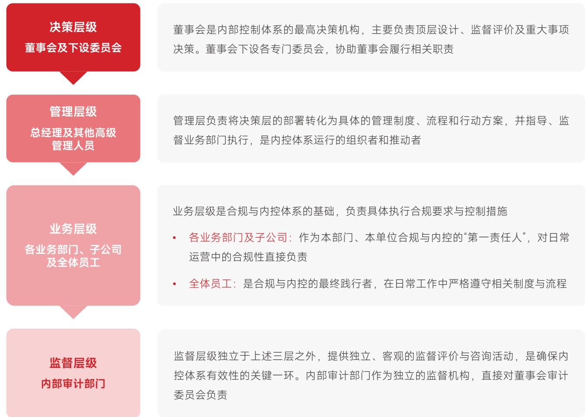

flowchart

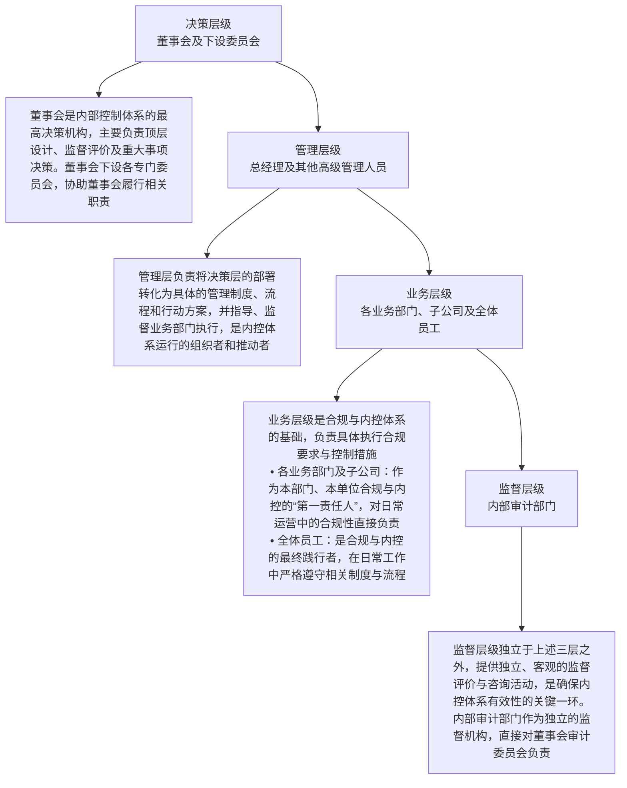
```mermaid
graph TD
  A["决策层级\n董事会及下设委员会"] --> B["董事会是内部控制体系的最高决策机构，主要负责顶层设计、监督评价及重大事项决策。董事会下设各专门委员会，协助董事会履行相关职责"]
  A --> C["管理层级\n总经理及其他高级管理人员"]
  C --> D["管理层负责将决策层的部署转化为具体的管理制度、流程和行动方案，并指导、监督业务部门执行，是内控体系运行的组织者和推动者"]
  C --> E["业务层级\n各业务部门、子公司及全体员工"]
  E --> F["业务层级是合规与内控体系的基础，负责具体执行合规要求与控制措施\n• 各业务部门及子公司：作为本部门、本单位合规与内控的“第一责任人”，对日常运营中的合规性直接负责\n• 全体员工：是合规与内控的最终践行者，在日常工作中严格遵守相关制度与流程"]
  E --> G["监督层级\n内部审计部门"]
  G --> H["监督层级独立于上述三层之外，提供独立、客观的监督评价与咨询活动，是确保内控体系有效性的关键一环。内部审计部门作为独立的监督机构，直接对董事会审计委员会负责"]
```

针对内部控制否定意见审计报告及保留意见财务审计报告所反映的问题，公司成立由董事长牵头的专项整改小组，全面复盘内控缺陷。在制度建设方面，公司修订了《研发立项管理办法》《研发费用核算管理制度》等制度，明确“先审批、后签约”流程，杜绝研发项目流程倒置，在财务核算方面，公司严格执行以“控制权转移”为标准的收入确认原则，系统梳理不同销售模式下的单据流，建立跨部门核对机制，从源头杜绝提前确认收入行为。截至本报告披露日，公司已完成2023年年度及2024年半年度相关财务报表的会计差错更正和追溯调整。

2025年，审计部由单一监督职能逐步向“监督+风险提示+整改协同”的综合治理支持角色过渡，以“提效能，抓节流，促创新，控风险”为工作主线，通过加强对集团各部门及各分、子公司的监督检查，以提出管理改进建议的方式，督促企业在运行中不断完善各项制度和流程。报告期内，公司共开展2次内部审计专项检查工作，包含1次内控专项检查；完成制度修订或新增共38项，其中23项已审批并在OA发布，15项处于审批中；重点核查覆盖研发、采购工程三大业务板块的业务板块合同，审计部持续深化职能转型，强化风险预警与整改协同，助力集团管理效能持续提升。

## 报告期内

公司共开展内部审计专项检查工作

完成制度修订或新增共

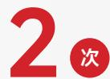

## 商业道德

葫芦娃秉持“守法诚信、优质服务”的经营理念，严格遵守《中华人民共和国反洗钱》《中华人民共和国反垄断法》《中华人民共和国反竞争法》《中华人民共和国招标投标法》等法律法规，在报告期内修订《葫芦娃药业集团反商业贿赂合规管理办法》《廉洁自律制度细则》，并制定《反舞弊与举报制度》《营销人员反商业贿赂管理制度》。公司与客户签署《反商业贿赂合规承诺书》，与员工签订《员工合规承诺书》及《员工廉洁从业承诺书》，通过制度约束与承诺机制，全面构建廉洁合规的企业文化。

## 葫芦娃商业道德三级管理

生产端

确保产品质量与安全

02

销售端

实现销售人员责任书100%签订，在责任推广、反不当竞争、反商业贿赂法方面严格承诺

03

经销商

于经销条款中明确规定推广产品时不能出现违背反商业贿赂条款的行为

## 葫芦娃反腐败措施

## 压实责任

对营销系统范围内从事管理、销售等工作的人员，统一实行预防商业贿赂承诺制，与公司签订《员工合规承诺书》《员工廉洁从业承诺书》。截至报告期末，《职业高压线承诺书》签订覆盖率为100%

## 监督检查

对营销系统以外的采购部、中层及以上的管理于部进行日常反贪腐管理。若日常工作中存在舞弊嫌疑的员工，立刻开展舞弊调查，按《葫芦娃药业集团反商业贿赂合规管理办法》《廉洁自律制度细则》《反舞弊与举报制度》相关规章制度处理

## 监督检查

治理商业贿赂领导机构明察暗访，及时发现苗头性和倾向性问题，研究预防商业贿赂的对策和措施  
• 开展调查研究，掌握腐败行为和商业贿赂的特点规律，提出有效预防策略

## 投诉举报

设立企业举报邮箱/举报电话，接受并鼓励检举，由专人负责接受举报信息并对检举行为严格保密  
公司接获举报后，对举报事件进行分析，逐级汇报至董事长，并依据线索开展舞弊调查；对于确存在舞弊违法行为的经管理层审批后移交司法机关立案处理

## 利益相关方商业道德管理

所有与公司有推广业务来往的合作企业需签订《推广机构/配送企业守法经营承诺书》。对违反《推广机构/配送企业守法经营承诺书》的合作企业人员，坚决取消其服务/代理资格，构成商业贿赂犯罪的，交由司法机关追究刑事责任

## 文化建设

公司通过部门专项宣贯与领导在季度会，年度会，党课讲话中持续强调相结合的方式加强公司反贪腐管理、意识宣贯。报告期内，广西党支部专题组织中高层领导干部、全体党员、入党积极分子集中观看教育片《永远在路上》，海南党委组织党员集中观看反腐宣传片《反腐为了人民》，提升员工廉洁自律意识和拒腐防变能力，公司党员和中高层员工反腐败培训覆盖率达100%

2025年，公司未发生贪污、贿赂等违法违规事件，亦未因不正当竞争行为引发诉讼或受到重大行政处罚。

## “知敬畏、存戒惧、守底线 廉洁自律警钟长鸣”主题党日活动

2025年5月 公司党委组织部分党员与高新区党工委一起前往位于海口市监狱内的海南省反腐倡廉警示教育基地开展“知敬畏、存戒惧、守底线——廉洁自律警钟长鸣”主题党日活动。通过基地展厅落马官员的案例讲解，以及观看身陷囹圄者的忏悔短片，参观的同志们思想深受教育，也使大家从中看到党中央抓党风建设，风腐同治的决心和收到的成果。

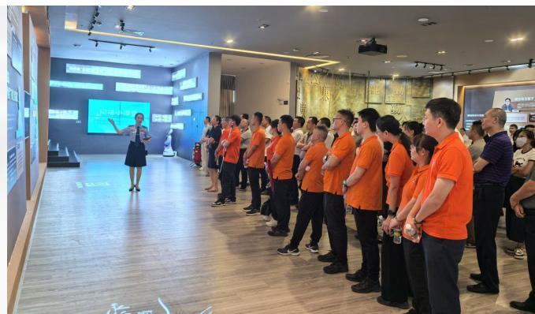

text_image

Group of people in orange shirts listening to a presenter in a modern exhibition hall with large display screens and informational panels.

 “知敬畏、存戒惧、守底线——廉洁自律警钟长鸣”主题党日活动现场

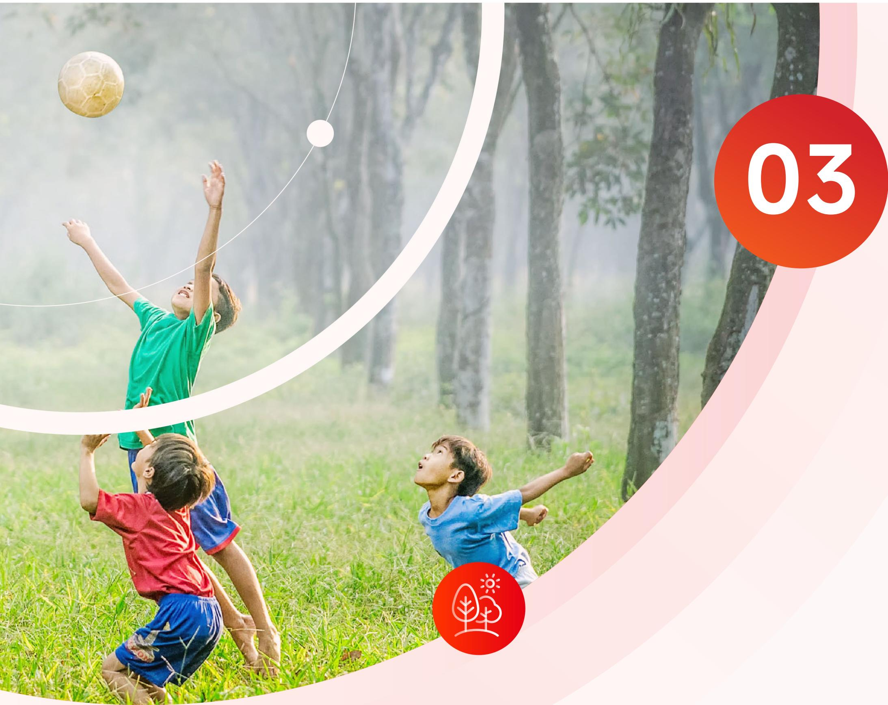

natural_image

Children playing soccer in a grassy field with trees in the background, no visible text or symbols

## 03

## 践行环保理念助力绿色转型

## 回应可持续发展议题

环境合规管理

能源利用

水资源利用

循环经济

污染物排放

废弃物处理

应对气候变化

生态系统和生物多样性保护

## 构建管理体系

葫芦娃坚持"全面规划、革新技术、综合利用、科学管理、防止污染"的环境保护方针，严格遵守《中华人民共和国环境保护法》《建设项目环境保护管理条例》《生态环境统计管理办法》等法律法规及相关规定，制定《环境保护管理制度》等内部制度，构建系统化的环境保护管理体系，将环保指标纳入增产节约计划、融入经济责任制考核体系、列入企业管理核心内容、整合进生产调度管理系统、落实到各部门工作计划中，形成了全方位、多层次的环保工作机制，实现经济效益与生态效益的协调发展。

公司获得GB/T 24001-2016 / ISO 14001:2015环境管理体系认证，获评省级、国家级绿色工厂。报告期内，公司完成多项环保手续办理，取得美安、药谷厂区排水许可证及药谷厂区排污许可证，有效期均至2030年；完成美安厂区突发环境事件应急预案备案及污水在线联网等工作。同时，公司积极与主管部门沟通对接，在确保合规的前提下，争取政策豁免，免除美安厂区土壤污染隐患排查报告，节约费用5.8万元，实现成本节约与合规管理的双赢。

在环保信用评价方面，公司被海口市生态环境局评定为2025年度海口市环境信用评价等级最高级“环保诚信企业”，充分体现公司在环境合规管理方面的持续努力与成效。

## 管理架构

公司建立自上而下的环境管理组织架构，由公司总经理作为环保工作第一责任人，指导安环领导小组及下属部门，组织开展公司环境保护工作，确保环境管理合规。

## 葫芦娃环境管理架构

## 总经理

作为公司环保工作的第一责任人，全面指导和监督公司的环境保护工作

## 安环领导小组

• 审定公司环境管理策略和计划  
• 监督、评估公司环境管理策略和计划的执行

## 安环部门

• 制定公司环境管理策略和计划  
• 贯彻、执行公司环境管理策略和计划

## 安全环保专员

• 负责公司环境保护设施设备的日常运营管理  
• 负责监测公司“三废”的排放情况，并对“三废”的达标排放负直接责任  
• 负责填报环保台账，配合生态环境局填报每年度自行监测与报告数据  
• 制定公司的环境保护防范措施和整改计划，以及监督环境隐患整改工作的完成情况

## 影响分析

为落实环境保护的监管要求，切实做好环境保护工作，促进公司经济效益、社会效益和环境效益的协同增长，公司识别出各环节的环境因素输入和输出，并采取恰当的管理办法，尽可能减少公司的环境足迹。

葫芦娃各环节环境影响因素分析

<table><tr><td>业务类型</td><td>环境因素输入</td><td>环境因素输出</td></tr><tr><td>研发及生产</td><td>能源:电力、天然气、蒸汽水源:市政供水等生产物料:生产原辅材料、包装耗材</td><td>温室气体:二氧化碳等废气:颗粒物、二氧化硫、氮氧化物等废水:悬浮物、化学需氧量、生化需氧量等一般废弃物:包装材料等危险废弃物:医药废物、废药品等</td></tr><tr><td>日常运营</td><td>能源:电力、汽油、柴油等水源:市政供水等</td><td>废气:厨房油烟等废水:生活废水等一般废弃物:生活垃圾等</td></tr></table>

## 预防监督

公司编制《突发环境事件应急预案》，在主管部门进行备案；定期组织开展环境应急处置演练及相关培训，检验《突发环境事件应急预案》的适用性和可操作性，检验在事故状态下公司内部应急响应机制及突发事件协同作战能力：配置建设应急设备设施如增设应急池消防沙等全方位避免环境污染事故发生，减少公司生产经营活动对自然环境和周边社区的影响。

为进一步监督环保工作的进展，公司通过环保主管部门督办系统，落实完成专项环保检查整改。报告期内，公司共排查3起环境保护隐患，均已整改完成，防患整改率达100%，最大化降低事故发生的风险及未及时整改产生行政处罚的风险。公司顺利通过14批次专项环保检查，包括双随机检查、大气专项检查、危险废物评估等，监测结果均达标。

## 报告期内

防患整改率达

100 %

## 目标导向

为落实环境管理责任，提升环境管理效果，公司结合自身生产经营特点和实际情况以及对环境保护的社会责任与义务，经过全面评估和科学论证，制定了系统的环境管理目标

## 葫芦娃2025年度环境管理目标

• 所有污染物100%符合国家、地方标准合规  
• 不发生突发环境事件  
废弃物分类收集和处理率达100%，一般固废100%交由有资质专业第三方进行合作处理，危险废弃物100%委托有资质的专业第三方单位进行合作处理  
• 在线监测指标数量高于政府要求，总氮等原手工计量污染物指标通过联网在线监测系统进行监测

为实现上述环境管理目标，公司制定并实施了11项环境管理方案，有效推动了报告期内环境管理目标的完成。

## 葫芦娃2025年度环境管理方案

## 设施改造

• 加固部分设备的底座

## 工艺提升

• 合理使用和生产纯化水  
• 反渗透浓水回收

## 能力建设

• 加强对岗位人员的技术培训  
• 加强职工清洁生产培训

## 管理优化

加强设备的管理和及时维修泄漏设备  
• 无纸化办公  
• 加强车间照明管理  
• 电脑管理  
• 办公室空调温度控制  
• 改进地板清洗清洁方法

natural_image

Sunset over a calm water surface with soft pastel sky and faint sunset reflections (no text or symbols)

## 意识培养

为增强员工环境保护意识，提升业务部门环境管理能力，公司在报告期内不定期开展安全生产月、危险废物规范化管理培训、外部主管部门专题培训等活动，及时跟进最新的环境管理政策及规则，确保环境管理的规范性与科学性。

## 报告期内

公司积极参加上级主管部门组织的环保培训

全年共参训

及时跟进最新环保政策与监管要求

员工环境管理培训覆盖率为

葫芦娃2025年度外部环境培训参与情况

<table><tr><td>组织单位</td><td>培训主题</td><td>培训内容</td><td>培训覆盖范围</td></tr><tr><td>海南省工信厅和信息化厅</td><td>国家级绿色工厂申报和管理培训</td><td>新政策主要调整分析;线上填报操作介绍;评价要点介绍等</td><td>公司各个部门</td></tr><tr><td>海南省生态环境厅</td><td>2025年海南省生态环境统计业务培训</td><td>生态环境统计业务系统功能介绍等</td><td>制造、安环、财务、工程相关部门</td></tr><tr><td>海口市生态环境局</td><td>一般工业固废申报登记线上培训</td><td>一般工业固体废物申报要点及主要事项</td><td>公司各个部门</td></tr><tr><td>海口市生态环境局</td><td>关于海南省切换使用全国危险废物全过程环境管理信息系统的线上培训</td><td>系统功能介绍、操作演示、“五即”规范与一码贯通</td><td>公司各部门</td></tr><tr><td>海口市生态环境局秀英分局</td><td>关于举办2025年秀英区六五环境日进企业宣传活动暨危险废物规范化管理培训</td><td>企业危险废物的贮存;危险废物泄露应急处置流程;固体废物管理要点</td><td>安环部门</td></tr><tr><td>海口市生态环境局秀英分局</td><td>关于举办秀英区2025年全国生态日主题“进企业”宣传活动</td><td>企业环境合规管理与常见违规问题防范</td><td>安环部门</td></tr></table>

## 提升资源效率

葫芦娃严格遵守《中华人民共和国节约能源法》等相关法律法规，制定《能源管理制度》《用水计量管理制度》《节水目标责任制和考核制度》《节水器具、管道定期巡查检修制度》等管理文件，形成覆盖能源使用、水资源管理等各个环节的管理制度网络，规范资源使用标准，持续提升资源利用效率，推动企业向绿色低碳发展模式转型。

## 能源管理

葫芦娃使用的主要能源类型为电力、蒸汽、天然气等，主要耗能环节为公司生产以及日常运营。公司大力推进精益生产、智能制造、绿色工厂建设等一系列举措，持续加强能源管理，不断推进节能降耗。公司构建覆盖公司、车间、班组三级能源管理架构。通过细化各级管理职责，明确责任主体，规范能源使用标准和管理流程，实现了能源管理的系统化、规范化和精细化运作。

为提升能源管理水平，降低公司生产以及日常运营过程中的能源消耗，公司从建筑结构、设备改造及设备管理三方面入手，实施多项节能措施，如仓库厂房采取用地集约化设计、厂区安装屋面光伏、不同办公区域采用分级照明、路灯进行太阳能改造、老旧高能耗设备持续进行迭代更新、采购节能环保设备、蒸汽冷凝水排水采购优质疏水阀等，提高能源利用效率。

2025年，公司针对冻干等产品开展小型化设备技改项目，通过优化换模流程、实施快速换模措施、开展操作演练与技能培训等方式，有效提升能源利用效率。

## 能源管理目标

## 2025年目标

公司综合能耗

较2024年

同比下降

5%

## 2025年目标进展

公司综合能耗

较2024年

同比下降

45%

## 2026年目标进展

公司综合能耗

较2025年

同比下降

1%

## 水资源管理

公司重视水资源的保护与持续利用，将节水管理作为企业履行社会责任的重要抓手。通过建立科学完善的用水与节水管理体系，公司系统推进水资源管理工作，规范用水与节水行为，实现水资源的高效利用。葫芦娃主要用水来源于市政供水和外购电厂的冷却水，主要耗水环节有生产用水、办公用水、员工生活用水、消防用水和厂区绿化用水。

公司制定《海南葫芦娃药业集团股份公司年度节水计划》，建立《节水目标责任制和考核制度》《节水岗位责任制》，成立节水领导小组，将年度节水目标逐级分解至各部门，对列入节水考核评价范围内的部门统一考核，以提高全公司节水目标责任意识，更好地完成各项节水目标。为此，公司实施了全方位的节水技术改造工程。在硬件设施升级方面，我们将美安、药谷厂区传统冲洗设备更换为智能感应式自动冲水器具，通过红外感应技术实现精准用水控制，减少不必要的冲洗用水浪费，杜绝跑冒滴漏现象。同时，我们在厂区绿化区域全面安装使用微灌、滴灌等高效节水灌溉设备，提升节水效率。

报告期内，公司持续推进水资源集约利用，围绕生产环节开展多项节水技改与资源回收举措，取得显著成效。

## 生产用水循环利用

• 美安厂区：对生产过程中产生的蒸汽冷凝水进行回收再利用，减少新鲜水取用量  
药谷厂区：原真空循环泵（蒸水泵）冷却用水使用自来水，现优化为采用一级浓水回收再利用，用于设备降温，有效降低自来水消耗  
广西厂区：将蒸汽冷凝水进行回收，并作为热能资源再利用；同时，空调机组冷却水实现循环利用，水循环利用率达100%

## 不合格注射用水梯级利用

针对注射用水生产中电导率超标的不合格水，公司将该部分水质优良、已完成软化处理的水进行收集，作为锅炉补水使用，杂质含量低，不易造成锅炉结垢

节水减排：减少新鲜水取用量，同时降低废水排放量

节能降耗：回收水温度达80–90℃，利用其高温特性，有效降低锅炉加热所需能耗

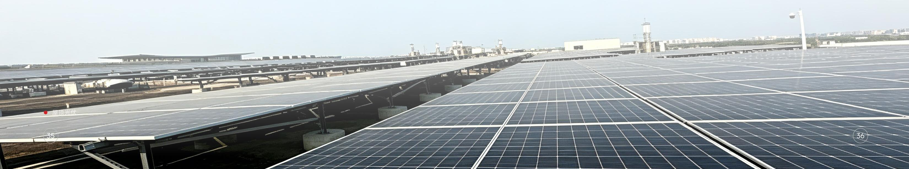

natural_image

Rows of solar panels installed on a rooftop with industrial buildings in the background (no visible text or symbols)

## 循环经济

公司深化循环经济实践，采取多种措施确保资源利用最大化。报告期内，公司持续推进绿色办公，多措并举降低运营对环境的影响。

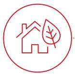

在绿色办公方面，公司依托OA系统、钉钉等信息化平台，实现文件线上审批、流转与查阅，相关记录均采用电子化方式保存，大幅减少纸张打印与浪费

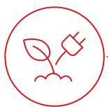

在节能意识培养方面，公司各办公室张贴节水、节电提示，加强员工节能意识，做到随手关灯、关水、关空调，并合理设置空调温度，有效降低办公能耗

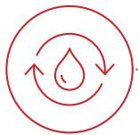

在中水回收方面，美安厂区设计并投用中水回收系统，办公楼卫生间冲厕用水全部采用中水回收再利用，与洗手用自来水实行分管道、分系统供应，实现水资源梯级利用

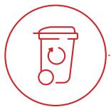

在废弃物处置方面，美安基地实现包装物100%回收；药谷厂区将生产过程中产生的药渣进行可再生资源循环利用，废渣经发酵处理后，用于周边社区绿化种植肥料，有效提高资源利用率，实现废弃物资源化处置

## 加强排污管理

葫芦娃全面贯彻落实《中华人民共和国水污染防治法》《中华人民共和国固体废物污染环境防治法》《中华人民共和国大气污染防治法》等法律法规，制定并实施《“三废”管理制度》《污染防治责任制度》等内部管理文件，明确各级管理人员的职责。

公司严格执行环保“三同时”制度，即建设项目需要配套建设的环境保护设施，必须与主体工程同时设计、同时施工、同时投产使用，全面履行环境责任，减少公司污染排放对环境造成的影响。

公司严格监测公司及各子公司的废水，废气及噪声排放情况 编制环保检测方案并定期委托有资质的单位开展污染物检测工作，同时公司依照相关政策及环境保护主管部门要求 对污染因子的监测采用实时在线自动监测和手动检测两种方法进行，在线自动监测设备已通过环境保护主管部门验收，并与环境保护主管部门联网。

公司海南生产基地经海口市科工信局、海口市生态环境局和海口国家高新区联合评定为海口市“无废医药企业”。

报告期内，葫芦娃高效完成8个环保系统数据填报与维护，无逾期通报现象。公司按时完成生态环境统计业务系统年报、企业环境信息依法披露系统报告年报、排污许可证执行报告季报及年报等填报工作。

自行监测

信息公开完成率

100%

信息公开达标率

信息公开公开率

## 废水管理

公司生产运营过程中产生的废水主要包括生产废水与生活废水，排放废水中主要监测的污染物指标根据不同厂区有所差异。我们对生产运营过程中废水排放进行科学有效的监测与处理，保证废水排放严格执行《化学合成类制药工业水污染物排放标准》（GB21904-2008）《中药类制药工业水污染物排放标准》（GB21906-2008）等国家及行业标准，配套相关废水处理设施对废水进行处理，实现废水排放的减量与达标。

报告期内公司持续规范污水站运行管理 完善操作规程及应急流程 按时完成设施保养 仪器校准等工作确保污染物稳定达标排放，全年未发生环保事故。公司重点监管水污染相关指标，将海南基地与监管部门进行联网在线监测，在广西基地新增设立污水处理站设施，进一步加大废水管理力度。公司各生产单位水污染物类型及处理处置方式详见本报告附录“2025年葫芦娃各厂区污染物类型与处理/处置方式”。

葫芦娃药谷厂区，来宾提取车间，江西荣兴厂区属于水环境重点排污单位。报告期内 葫芦娃药谷厂区，江西荣兴厂区环保设施运行状况良好，各项监测因子达标排放，且编制《突发环境污染事故应急预案》，并向环境保护主管部门登记备案。葫芦娃药谷厂区、江西荣兴厂区水环境重点排污单位排放情况详见本报告附录“2025年葫芦娃环境重点排污单位排放情况”。

## 废气管理

公司生产运营过程中产生的废气主要包括锅炉废气与工艺废气。针对不同厂区的生产工艺特点，我们建立了差异化的污染物监测指标体系。为确保废气排放全面达标，公司严格执行《锅炉大气污染物排放标准》 (GB13271-2014)和《大气污染物综合排放标准》(GB16297-1996)等国家标准规范，构建了完善的废气治理体系。我们对生产运营过程中废气排放进行科学有效的监测与处理，持续优化废气处理工艺不断提升废气治理效率确保各项污染物排放指标稳定优于国家标准要求，切实履行企业环保责任。公司各生产单位大气污染物类型及处理处置方式详见本报告附录“各厂区主要废气污染物及处理/处置方式"。

## 废弃物管理

公司生产运营过程中产生的废弃物主要包括一般废弃物与危险废弃物，具体废物种类和产生量因各厂区的生产工艺而有所差异。葫芦娃严格依据内部管理文件中废弃物管理的相关规定，建立完善的固体废物分类收集、贮存、运输和处置管理体系。针对一般废弃物，公司主要通过第三方回收或内部处理的方式进行资源再利用；有害废弃物则储存在专用危险品仓库，交由具有处理资质的第三方专业机构进行无害化处置避免对环境及公众健康产生影响。2025年，公司达成危险废物100%无害化处理的目标。公司各生产单位废弃物类型及处理处置方式详见本报告附录“各厂区废弃物类型及处理/处置方式”。

## 应对气候变化

葫芦娃积极响应国家“双碳”战略，致力于推动自身低碳转型发展。报告期内，公司参考国际可持续准则理事会（ISSB）发布的《国际财务报告可持续披露准则第2号——气候相关披露》，从治理、战略、风险管理、指标与目标四个层面，构建气候变化管理体系，识别气候变化相关的风险和机遇，将气候变化减缓与适应纳入日常管理中。

## 治理

将气候变化议题纳入公司关注的实质性议题中，由董事会参与包含气候变化议题在内的ESG重大事项的审议与决策，对公司的气候变化工作进行监督并承担整体责任，董事会战略与ESG委员会负责气候变化工作的统筹管理，相关职能部门及业务部门将气候变化的管理纳入日常工作重点。

## 策略

公司识别气候变化对公司生产运营的风险及机遇，围绕低碳生产经营、低碳产品服务、低碳价值链制定适应性策略。

气候变化风险与机遇识别和应对

<table><tr><td colspan="3">气候变化风险与机遇类型</td><td>潜在财务影响</td><td>应对措施</td></tr><tr><td rowspan="6">风险</td><td rowspan="6">转型风险</td><td>法律和政策风险</td><td></td><td></td></tr><tr><td>监管部门对公司碳排放要求逐步提升,如无法降低碳排放,可能面临罚款、停产等风险</td><td>运营成本增加</td><td>关注国内外碳管理政策,及时分析政策对公司生产经营影响</td></tr><tr><td>市场风险</td><td></td><td>提升气候风险重要性,将气候风险纳入公司日常风险管理体系</td></tr><tr><td>随着消费者将产品碳排放纳入采购考量因素中,如果公司未能及时提供低碳产品及服务,可能在市场环境变化中面临较大竞争压力</td><td>营业收入减少</td><td>实施温室气体核算与核查,结合公司业务制定碳中和战略与路径建设低碳工厂,设计低碳产品,加强价值链低碳管理</td></tr><tr><td>声誉风险</td><td></td><td rowspan="2">加强气候信息披露,积极参与低碳活动,打造绿色品牌</td></tr><tr><td>气候变化与碳排放在监管与市场的重视度不断提升,如公司无法及时回应利益相关方对于低碳转型的诉求,可能产生负面形象</td><td>营业收入减少</td></tr></table>

<table><tr><td colspan="3">气候变化风险与机遇类型</td><td>潜在财务影响</td><td>应对措施</td></tr><tr><td rowspan="5">风险</td><td rowspan="5">实体风险</td><td>急性风险</td><td></td><td></td></tr><tr><td>气候变化导致极端天气及自然灾害增加可能会影响公司及生产基地运营,造成经济损失</td><td>运营成本增加</td><td>制定极端天气应对应急预案</td></tr><tr><td>慢性风险</td><td></td><td>定期开展自然灾害事故应急演练以及培训</td></tr><tr><td>气候变化导致的持续性高温天气、海平面上升等可能会导致公司业务运营中断,造成财务损失</td><td>运营成本增加</td><td>按照当地政府及生态环境部门的相关要求,采取洒水降尘等有效措施</td></tr><tr><td>结合公司所处地域特性,季节性粉尘增多问题亦对生产环境、员工健康及设备运行构成一定挑战</td><td></td><td></td></tr><tr><td rowspan="4" colspan="2">机遇</td><td>转型变化:能源转型与能效提升</td><td></td><td>加强能源精细化管理,研究低碳生产工艺,使用高能效设备,减少能源使用</td></tr><tr><td>通过工艺提升以及设备升级,使用更高比例的自产清洁能源,将有效减少外部能源依赖以及对能源供应和价格的敏感度</td><td>经营成本降低</td><td>安装分布式光伏等小型清洁能源发电设备,提升清洁能源自产比例</td></tr><tr><td>转型变化:低碳产品与低碳营销</td><td></td><td>进行低碳产品设计,减少产品全生命周期碳排放</td></tr><tr><td>随着更多消费者对于碳排放关注度的提升,推出低碳产品、实施低碳营销将占有更多市场份额</td><td>经营收入增加</td><td>实施低碳产品认证与宣传,打造绿色品牌</td></tr></table>

## 风险管理

公司将气候变化的风险与机遇纳入整体运营风险管理，识别气候变化对公司生产运营的风险及机遇，并对应制定风险缓解措施，以应对气候变化趋势为公司带来的挑战与机遇，报告期内公司委托外部机构对美安基地的能源消耗和碳排放情况进开展专项评价，为进一步优化碳管理、提升气候风险应对能力提供数据支撑与改进依据。

公司成立防风抗险专项小组，密切关注政府发布的天气变化预警信息，依法依规采取预防措施，确保及时响应极端天气事件。公司针对极端天气制定专项应急预案，并每年组织一次覆盖全体员工的应急演练。演练涉及所有部门内容包括但不限于室内关窗等安全防护措施，以及包括食堂餐饮供应在内的后勤保障等 确保极端天气下企业安全运行与员工基本生活保障。

## 指标与目标

公司定期统计与披露温室气体排放量与排放密度，评估公司应对气候变化工作的效果；开展年度温室气体排放数据测算，为制定量化气候目标打下基础。报告期内，公司积极推动自身温室气体减排工作，通过节能技改、增加清洁能源比例等方式，减少温室气体排放。

## 2025年

公司温室气体排放总量为

21,162.22

吨二氧化碳当量

密度为

0.2349

吨二氧化碳当量/万元营业收入

密度同比下降

16.11

%

葫芦娃药谷厂区2025年度温室气体减排措施  

方式

内容

减排效果（tCO e）

减少能源消耗通过冷凝水回收用于锅炉房节约天然气使用

报告期内，累计减少

天然气使用266,702.00 m3

约减少354.90 吨二氧化碳排放

减少能源消耗通过照明、电脑、空调等用电设备管理减少电力使用

报告期内，累计减少

电力使用3,441.32 MWh

约减少1,962.58 吨二氧化碳排放

增加清洁能源比例药谷厂区分布式光伏发电项目（运营中）

报告期内，累计发电

1357.6 MWh，占总体用电量 24%

约减少774.24 吨二氧化碳排放

## 保护生态系统

公司始终坚守生物多样性保护原则，系统推进生态环境保护工作。

## 项目选址规划阶段

我们严格遵循并主动融入政府规划中的生物多样性保护要求，高度关注项目对当地社区的潜在影响，科学评估项目选址对生态系统的影响，确保选址方案符合生态保护要求

## 项目立项阶段

我们建立完善的环境影响评估机制：在投入新工艺、产品或流程之前，严格开展环境影响评估，进行重大环境因素识别，确保通过审批后才进行建设，制定并落实响应的防范措施，以最大限度降低项目对生态环境的影响

## 建设完成后

及时组织环评验收，确保各项环保措施落实到位，实现企业发展与生态保护的和谐统一

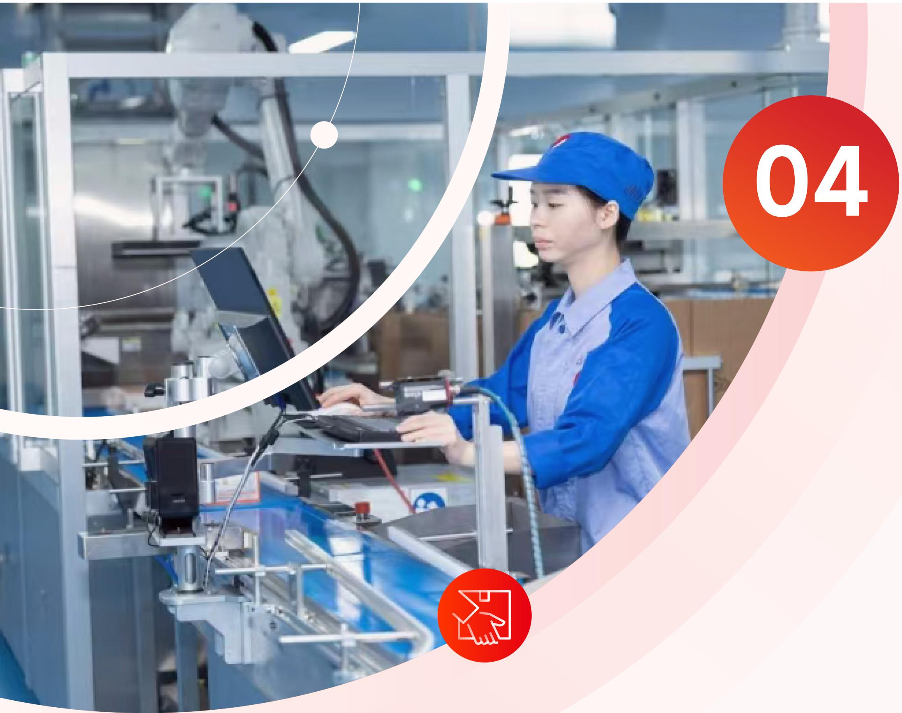

natural_image

Factory worker in blue uniform operating machinery on a production line, with circular graphic highlighting '04' and handshake icon (no readable text or symbols)

## 04

## 强化创新驱动升级产品服务

## 回应可持续发展议题

创新驱动

知识产权保护

科技伦理

产品和服务安全与质量

负责任营销

数据安全与客户隐私保护

供应链安全

平等对待中小企业

尽职调查

## 推动科技创新

葫芦娃严格遵守《中华人民共和国科学进步法》《中华人民共和国专利法》《中华人民共和国商标法》《中华人民共和国著作权法》等法律法规，执行《药物临床试验质量管理规范》《药品注册核查要点与判定原则》《药物警戒质量管理规范》《药物临床试验伦理审查工作指导原则》等行业规范标准。

## 研发创新

公司秉持创新驱动发展理念，立足医药行业社会责任，将药物研发与创新视为企业高质量发展的核心内容，始终坚守合规研发、科学研发、责任研发底线，稳步推进新药研发和技术创新工作。

为规范研发管理流程、强化创新激励、保障研发质量，公司制定《创新改进及合理化建议管理办法》《技术创新管理体系制度》《研发资金管理办法》《研发项目绩效考核奖励办法》等管理制度，构建标准化、规范化的科技创新体系。同时，我们在公司层面组织科学技术协会，建立以内部研发力量为核心、依托并联合国内一流科研机构的药品自主开发及委托合作开发体系，打造覆盖药物发现、临床前研究到临床试验的全流程研发体系，保障公司研发项目、新产品开发项目的高效开展。

公司密切关注行业政策导向，结合集采政策调整、仿制药审批尺度优化等新形势，对创新研发体系进行优化升级，围绕研发平台搭建核心研发架构 调整研发思路与方向。本年度 公司调整化学药品研发策略 缩减常规仿制药的研发规模 重点布局二类改良药，聚焦有技术门槛的仿制药开发，不断扩大药品适应症覆盖范围，新增精神分裂症等特殊人群用药研发方向。

为保障研发方向精准适配市场与社会需求公司通过多渠道调研，全流程论证 实现精准化研发策略落地 依托中药领学术交流、多维度市场调研洞察需求，确保研发方向与社会、客户需求高度契合，研发工作科学高效、贴合实际。

## 葫芦娃科技创新体系建设

为持续强化核心竞争优势，加快创新驱动发展，公司围绕儿童用药领域构建完善的科技创新体系，在战略引领、目标落地平台支撑，人才培养，产学研合作方面系统推进，协同发力

## 科技创新战略

2025年，公司以“儿童用药研发为核心，多品类协同发展，数字化驱动研发全流程，产学研融合促转化，国际化布局提价值”为科技创新核心战略，聚焦儿童友好型剂型创新开发、创新药研发、特殊人群用药拓展，深化产学研合作，推动研发成果高效转化，稳步推进国际化研发与知识产权布局，提升公司核心竞争力。

## 科技创新目标

围绕年度科技创新工作部署，公司设定清晰可量化的研发目标并全力推进落实。其中，中药领域计划完成3个中药制剂项目的临床电报并获得临床默示许可儿童中药制剂研发实现阶段性突破:化学药领域计划完成1个二类改良药电报申请，3个项目进入临床试验阶段；全年计划完成10个研发项目申报受理，16个项目完成中试及验证生产。截至2025年底上述目标已全部实现 各研发项目按计划完成阶段性任务

## 平台建设

着力促进创新平台建设，搭建以儿童用药研发为核心，覆盖化学药、中药领域，集研发、工艺、成果转化于一体的研发平台。围绕儿童用药剂型创新、特殊人群用药研发、高壁垒仿制药开发等重点方向，公司实现研发与生产的高效协同，提升研发项目转化效率。

葫芦娃创新平台建设成果

<table><tr><td>1个企业合作创新平台</td><td>·儿童高端制剂国际化创新平台</td></tr><tr><td>3个省部级创新载体</td><td>·张强院士工作站·博士后科研工作站·海南省中药制剂工程技术研究中心</td></tr><tr><td>1个省级技术中心</td><td>·海南省级企业技术中心</td></tr><tr><td>1个市级创新载体</td><td>·海口市中药制剂现代化工程技术研究中心</td></tr><tr><td>1个中小型企业平台</td><td>·海南省“专精特新”中小企业</td></tr><tr><td>1个集团内部研发中心</td><td>·海南葫芦娃科技开发有限公司</td></tr><tr><td>3个知识产权体系平台</td><td>·高新技术企业·国家知识产权示范企业·知识产权贯标企业</td></tr></table>

## 长效合作

公司围绕高端儿科用药药剂研发，经典名方等领域开展战略合作，建立长效合作机制，推动新品开发及商业化工作同时，公司持续拓展行业合作与交流渠道，在中药领域积极参加国内中医药领域核心学术组织、年度学术年会及行业高端论坛与行业专家，同行企业深入交流 精准把握研发前沿，行业趋势与市场需求 捕捉研发机遇:在化药领域 通过贸易渠道 医药流通平台临床医疗机构调研等方式收集集采政策下化药市场的需求变化 重点关注儿童适用剂型、高壁垒仿制药、特殊人群用药的临床需求，为后续研发立项与产品布局提供有力支撑。

## 群策群力

公司积极开展创新改进项目及合理化建议收集活动，紧密跟踪国家及省、市各级政策动态，结合经营实际与发展目标开展政策分析与项目申报，主动对接国内外优质科技资源，助力前沿科技项目的引进与落地。

## 人才培养

公司组建以科学技术协会会员为核心、专业知识储备深厚、行业经验丰富的研发团队，为研发创新提供强有力的人才支持与保障。2025年，公司围绕“精准研发”战略，持续加强研发人才培养与团队建设，不断优化研发团队结构，将研发资源集中投向核心治疗领域与高潜力创新项目，为产品创新与升级提供了有力支撑，截至报告期末，公司研发团队共计174名研发科技人员，占公司员工总数12%。为激发科研人才创新动力，公司搭建覆盖薪资、职称、员工关爱的人才发展体系，于不同节点定期开展职称晋升、提高薪资待遇，并依据项目研发进度、阶段性成果发放项目研发奖金。在此基础上，公司常态化开展内部技术培训与外部行业交流活动，推动研发人员持续更新专业知识、掌握前沿技术，全面提升团队整体研发实力与创新效能。

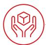

## 能力提升

公司持续深化协同创新产学研用合作平台建设，与国内知名高校、科研院所、行业协会开展联合研发、课题研究、技术交流、人才培养等多维度合作。2025年，公司与北京大学药学院张强院士团队合作成立院士工作站，聚焦儿童高端制剂研发。在强化外部合作的同时，公司积极对接各级科研项目，成功申报并立项海南省博士后科研专项、海口市重大科技计划项目等政府科技研究项目，获得政府专项资金支持。

## 共建院士工作站，赋能儿童药研发与成果转化

2025年5月，公司与北大药学院张强院士团队正式合作成立葫芦娃药业-张强院士儿童高端制剂院士工作站，以儿童高端制剂研发、儿童用药剂型优化为核心研究方向，为后续技术攻关和成果转化奠定坚实基础。

为保障合作高效推进，工作站实行“院士指导、团队攻坚、产学研融合、成果产业化”的运作模式，院士团队定期派驻专家到公司开展技术指导，公司组建核心研发团队与院士团队联合开展研究，实现技术创新与产业转化的高效协同。报告期内，公司开展儿童口溶膜、雾化吸入等高端剂型的核心技术攻关进展顺利，推动儿童用药剂型创新与技术升级，为儿童健康提供更优质的用药保障。

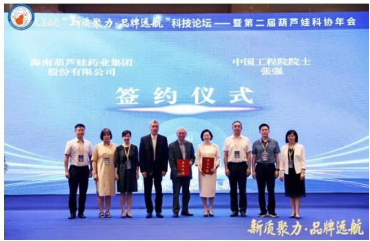

text_image

X324 “新质聚力·品牌远航”科技论坛——暨第二届葫芦娃科协年会
海南葫芦娃药业集团
股份有限公司
中国工程院院士
张强
签约仪式
新质聚力·品牌远航

 葫芦娃药业与张强院士合作签约现场

此次合作，双方将聚焦新技术提升用药安全性与依从性，探索中药现代化与纳米递送技术的结合路径，进一步提升公司在儿童用药领域的创新能力与核心竞争力。

为确保研发创新工作有序开展、资金供给稳定可控，公司通过自有资金、政府科技项目专项资金、产学研合作项目资金等多渠道筹措经费，建立研发资金专项管理机制，对研发资金实行专户管理、专款专用，按研发项目进度合理分配资金。同时，公司根据年度研发战略与目标，提前制定研发资金预算，保障研发项目的资金需求。

依托稳定的资金保障与精细化管理，公司研发工作高效推进，创新成果持续转化落地。

## 报告期内

公司获得规格药品注册证书

12 个

试产以及验证生产项目

16 个

其中有儿童用法用量的药品注册证书

4 个

并新开展研究项目

2 个

完成项目申报受理

10 个

截至报告期末，公司药品在研品种200个，主要集中在儿童常用的呼吸系统、神经系统及补益类等治疗领域。

持续的研发投入与成果转化，也为公司带来多项权威认可与资质荣誉

本年度，公司创新实力与行业地位得到多方印证：

## 公司通过国家高新技术企业重新认定

## 科技伦理

公司制定标准化的流程，持续健全科技伦理管理体系，新增临床项目管理部门，设立临床项目经理和CRA1等岗位，实现临床试验全流程、研发全环节的伦理管控。在药物临床试验启动前，公司均开展充分的前期研究与数据验证，确认药物安全性与可控性后方可推进人体临床试验，从源头保障试验合规性。同时，在药品开发的各关键里程碑节点，公司均对项目进度与研究数据进行严格审查确认，并结合临床研究结果，科学作出项目继续、调整或终止的决策。

在受试者权益保护方面，公司严格按照伦理规范，确保每一位受试者充分了解试验药物特性、试验流程，确保受试者参与试验完全基于其自由权益。在临床研究过程中，公司按预定程序对临床试验的全过程进行定期检查，以确保其符合适用法律和指南。公司坚持自主研发与数据合规管理，严格防范隐私数据泄露风险，切实保障受试者信息安全。

## 知识产权

公司注重专利商标，著作权等知识产权的保护，通过知识产权战略布局保护创新成果，促进科技成果的转化应用，为企业的创新发展提供了强劲动力，形成研发创新与知识产权保护相互促进的良性循环。

2025年，公司结合整体研发战略与产品布局，优化调整知识产权保护方向，聚焦核心研发环节，进一步提升保护工作的精准性与实效性。

专利布局：公司调整专利申请与保护策略，合理配置资源，减少对已有非核心产品、停产产品的知识产权关注，对已有非核心停产产品的专利进行选择性维护，降低知识产权保护成本。同时，公司将知识产权保护核心资源向在研产品、核心研发项目核心技术倾斜 在研发项目立项阶段即开展知识产权布局，针对在研产品的核心技术剂型创新，配方优化等方面及时申请专利，实现研发过程与专利保护的同步推进，确保核心研发成果的知识产权保护。

## 报告期内

公司临床研究与伦理管控工作规范有序

## 未发生

损害受试者权益而造成的违法违规事件

商标管理：公司围绕葫芦娃核心品牌与核心产品，在儿童用药、高端制剂、特医食品等重点领域完善商标布局，持续推进商标的国际化布局，为核心产品拓展海外市场、开展国际化销售提供知识产权保障。

知识产权管理：在研发全流程，公司新增知识产权审查环节，严格防范侵权风险，确保研发活动合规开展。同时，我们及时将研发过程中的创新成果转化为知识产权，实现创新成果的有效保护。

能力建设：公司积极组织员工参与知识产权相关培训，本年度相关人员参与专利转化运用专项行动政策解读、专题授课培训，及2025年度企业研发活动规范化管理培训，持续提升团队知识产权运营与管理能力。

<table><tr><td>专利名称</td><td>专利编号</td><td>奖项名称</td></tr><tr><td>小儿肺热咳喘颗粒的制备方法</td><td>ZL201010134951.X</td><td>· 海南省专利优秀奖· 中国专利优秀奖</td></tr><tr><td>清热利湿颗粒的制备方法</td><td>ZL200910152604.7</td><td>· 海南省专利优秀奖</td></tr><tr><td>克咳片及其制备方法</td><td>ZL201010238070.2</td><td>· 海南省专利奖金奖</td></tr><tr><td>一种提高地氯雷他定片质量的生产工艺</td><td>ZL202310451225.8</td><td>/</td></tr></table>

本年度，葫芦娃新增商标注册10件。公司跟随国家“一带一路”倡议，稳步推进国际化业务布局，相关专利与商标在印度尼西亚、马来西亚、老挝、柬埔寨、越南等13个国家及地区进行同步布局，有效降低海外知识产权风险，为减少知识产权纠纷、加强知识产权保护奠定了基础。

葫芦娃知识产权保护成果

<table><tr><td>知识产权类型</td><td>数量</td></tr><tr><td>截至报告期末,累计获得授权专利数(件)</td><td>112</td></tr><tr><td>其中,发明专利(件)</td><td>102</td></tr><tr><td>其中,实用新型(件)</td><td>8</td></tr><tr><td>其中,外观设计(件)</td><td>2</td></tr><tr><td>截至报告期末,累计登记商标(件)</td><td>637</td></tr><tr><td>其中,2025年登记商标(件)</td><td>10</td></tr><tr><td>截至报告期末,累计著作权(件)</td><td>12</td></tr></table>

1. 葫芦娃始终坚持党建与业务工作的深度融合把党的领导融入公司治理各环节 以高质量党建引领企业高质量发展。

## 数字转型

公司以数字化为抓手，从三个维度全面推进数字化转型，促进企业高质量发展：

赋能各项业务创新发展，通过数字化技术拓展业务边界

实现精细化管理，运用数字化工具细化管理颗粒度，提升管理效能

促进整体效能提升，构建数字化运营体系，优化资源配置，提高运营效率

数字化转型不仅为经营管理提质增效，更为技术创新与产业升级提供坚实支撑，成为培育新质生产力的关键路径。本年度，公司以剂型创新、智能制造为核心的科技创新成果，为新质生产力发展注入核心动力，推动医药研发、生产向智能化、高效化、高端化转型。

海口美安儿童药智能制造基地作为公司培育和发展新质生产力的重要载体与数字化转型重点项目，已顺利通过药品生产质量管理规范（GMP）认证。基地在生产、质量、安全、办公等方面广泛应用物联网、人工智能等先进技术，实现生产流程与质量管理的自动化与智能化运行。

## 生产环节

新增自动化生产、智能检测设备，实现原料投料、生产加工、包装入库的全流程自动化；搭建生产智能化管控平台，实现生产数据的实时监控、智能预警与远程控制，动态优化生产流程，显著提升生产效率与产品质量安全水平

## 仓储 物流 环节

升级数字仓储系统，配置智能立体仓库、AGV无人搬运车等智能物流设备，实现仓储货物的自动化存取、智能化管理，大幅提升仓储效率

## 管理环节

推进生产，营销，财务，人力资源等系统的数字化联通，搭建一体化企业数字化管理平台，建立企业与合作伙伴之间数据驱动的信息主动反馈机制:依托资源共享和数据集成，强化研发端和制造端、消费端的协同创新，实现企业管理的数字化、精细化

2025年，基地持续推进产能扩容与产业链升级，不断夯实智能制造发展根基，新增儿童高端制剂生产线1条，扩大儿童高端制剂产能：持续完善配套设施 打造集研发，生产，检测，转化于一体的儿童药全产业链智能制造基地。凭借一系列数字化创新实践与突出建设成效，基地及相关项目收获多项国家级、省级荣誉认可。本年度，数字仓储项目凭借突出的数字化应用成果入选海南省工业互联网应用优秀案例，成为行业智能化转型的标杆。

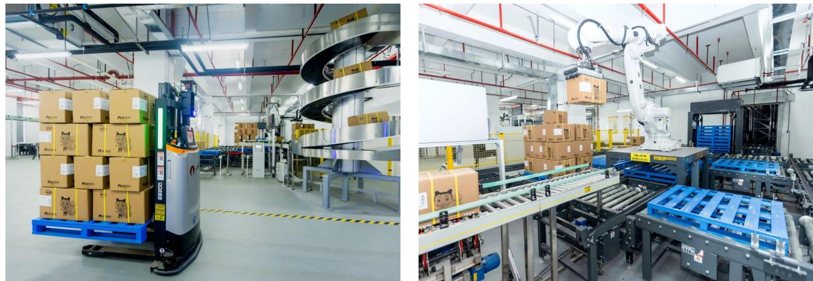  
 智能化仓储

## 保障产品质量

葫芦娃严格遵守《中华人民共和国药品管理法》《中华人民共和国药典》《药品生产质量管理规范》(GMP)《药品生产监督管理办法》《药物警戒质量管理规范》等法律法规及相关规定，制定并实施《不合格物料 中间体，成品管理制度》《质量风险管理制度》《药品召回管理制度》《个例药品不良反应报告处理程序》《药品上市后风险管理制度》《药品风险沟通管理程序》《产品退货操作规程》等管理制度，持续强化药品全生命周期质量与安全管控。

## 葫芦娃 质量方针

满足顾客需求，致力持续改进，追求卓越品质，以创新为动力，以质量求生存，以诚信为基石

## 产品质量管理

药品质量是企业经营的重要基石和长远发展的根本 公司自成立以来，便将药品质量作为经营管理的重中之重，持续完善质量管理休系架构，不断完善内部制度文件与标准操作规程，从严推动各项质量规范认证要求落地见效，全面保障药品全生命周期质量管控合规有效

## 在质量体系方面

公司构建以ISO9001质量管理体系、ICHQ10药物质量管理体系、GMP为主线，覆盖研发、生产、流通全链条的质量管理体系。通过明确各环节质量标准、规范操作规程，公司实现全过程闭环监控，筑牢药品质量安全防线。依托完善的体系支撑与严格的内部管控，公司质量体系运行成效显著，顺利通过多项外部核查与认证审核。本年度，公司顺利完成并通过四次GMP符合性检查，获得ISO 9001:2015质量管理体系认证。

## 在质量控制方面

公司建立覆盖药品全生命周期的质量管理文件与标准流程，从源头到终端实行严格的闭环管控，确保每一批产品均符合质量标准要求，具体管控措施如下：

## 源头管控与供应商管理

严格执行供应商准入与动态评估机制，对原料药、原辅包等关键物料实施入场抽检与验收 制度，从源头把控物料质量，杜绝不合格原料流入生产环节

## 生产过程精准监控

在生产现场实施全过程质量跟踪，严格执行中间产品抽检、工艺参数核对与现场监督，确保生产过程严格遵循《药品生产质量管理规范》（GMP）及标准操作规程（SOP）

## 终端放行与 检验审核

依托独立的质量部门（QA/QC），对成品开展全项检验，并对批生产记录、批检验记录进行逐项审核，确认生产 检验流程合规结果准确后方可签发放行

## 长期稳定性与验证管理

建立产品留样观察与稳定性考察体系，定期对产品质量进行追踪验证，开展设备、工艺、清洁等验证工作，规范管理偏差与变更，确保质量体系持续处于受控状态

## 多维质量监督检查机制

公司建立了多层次、跨部门的内部监督与外部协同检查体系，确保质量管控要求落地执行。由内审、质量部开展内部质量责任审计，对各部门质量履职情况进行监督考核；各厂区质量部门联合对药物警戒部实施内部审核，确保跨部门流程合规；质量部积极配合客户方开展ISO等第三方审计及各类现场核查，主动接受外部监督，持续提升质量管理水平

为锚定质量提升方向，公司明确年度质量目标：产品出厂合格率100%，市场抽检合格率100%，产品质量满意度95%，并针对目标的完成情况进行评估考核，以目标管理持续驱动质量改进

## 葫芦娃亮相西鼎会，核心产品斩获行业重磅荣誉

2025年3月15日，葫芦娃药业集团总经理受邀出席以“优化存量，创造增量”为主题的第十届健康商品交易大会（2025西鼎会），担任大会主席并主持“把脉商品变迁”核心论坛，与行业专家共议健康商品创新路径。

大会期间，葫芦娃旗下产品“小儿肺热咳喘颗粒（4g）”凭借优质质量及市场认可度，荣获“2024-2025年度中国药品零售市场畅销产品”奖。该产品已入选国家卫健委《流行性感冒诊疗方案》《国家医保目录》及《国家基本药物目录》，广泛应用于流感、支气管炎等呼吸道疾病治疗。此次获奖充分体现了公司在产品研发、质量管控及市场服务方面的综合实力，进一步巩固了其在儿童健康用药领域的品牌影响力与市场地位。

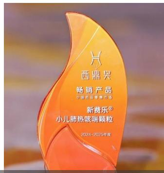

text_image

西鼎兴
畅销产品
中国的品牌啤酒市场
新费乐®
小儿肺热咳喘颗粒
2024-2025开放

荣获“2024-2025年度中国药品零售市场畅销产品”奖  
 “小儿肺热咳喘颗粒（4g）”

## 在风险防控方面

公司持续健全药品安全保障工作 依托高效运行的药物警戒管理体系 开展定期风险评估 及时识别并预警药品安全隐患，实现风险前置防控。同时，公司推行系统化的质量风险防控，实施完善的不合格品处理机制，明确产品召回调查、评估、计划制定与执行流程，确保各类质量问题能够快速响应、妥善处置。

## 葫芦娃不合格品处理机制

## 针对上市前出现质量检测不合格的产品

根据《不合格品处理管理制度》规定的流程进行审批处理，杜绝不合格产成品出厂，并对其进行风险评估，根据风险评估结果进行销毁处理或返工处理  
将已经发现的不合格品及时控制，存放至不合格品区域，启动检验结果超标调查和偏差处理程序，对检测不合格项目进行调查分析，找出产品不合格的根本原因，采取针对性的纠正措施和预防措施，避免类似情况再次发生

## 针对上市后出现质量检测不合格的产品

根据《产品发运与召回管理制度》《产品召回操作规程》规定，立即启动产品召回程序，避免一切可能对客户的不利影响  
• 做好召回产品的接收统计工作，召回结果及时通报药品监管部门  
针对不合格产品可能对客户造成的不良影响拟定相应的赔偿处理方案尽可能降低对客户的不良影响

## 葫芦娃产品召回程序

<table><tr><td>药品安全信息收集</td><td>由质量部负责药品不良反应信息收集,专职产品召回的质量保证(QA)人员统筹开展药品安全信息归集工作</td></tr><tr><td>药品安全隐患调查</td><td>针对存在安全不良信息的药品,由产品召回QA人员开展安全隐患调查,情况复杂时成立专项调查小组协同调查</td></tr><tr><td>药品安全隐患评估</td><td>由负责产品召回的QA员工或专项调查小组进行药品安全隐患评估</td></tr><tr><td>产品召回计划制定</td><td>在药品安全隐患评估中认为需实行药品召回,或接到药监部门的责令召回要求时,立即成立药品召回小组,制订专项产品召回计划</td></tr><tr><td>召回实施</td><td>召回小组成员及其他相关岗位人员严格按照产品召回计划实施产品召回工作</td></tr><tr><td>召回评估及报告</td><td>召回完成后,召回小组应及时开展召回效果评估,编制药品召回调查评估报告,并将调查评估报告和召回计划提交省级药监部门备案</td></tr><tr><td>召回产品处理</td><td>按照召回调查评估报告确定的方案处置召回产品;需销毁的产品,在药监部门监督下规范销毁,并完整形成召回药品处理记录</td></tr></table>

## 在意识培养方面

公司以提升全员质量意识、强化专业管控能力为核心，围绕质量培训、行业交流、资质提升三大维度开展系列产品质量管理活动，全方位夯实质量管控基础。公司面向研发、质量保证、生产制造、市场营销等核心部门，开展法规更新、实操规范、风险管控等专业化质量培训，报告期内累计参与质量培训2,000人次，有效提升员工质量风险管理能力。

在内部培训的基础上，公司拓展外部学习与交流渠道，持续拓宽专业视野，参与行业内用药安全、质量保障类行业合作交流活动，与监管机构、同行企业、学术组织深度沟通，分享质量管控先进经验，助力行业整体质量水平提升。此外，公司积极与专业第三方机构合作，定期选派员工参加制剂工艺、饮片真伪鉴别、微生物检验技术等领域专题培训，全面提升员工专业素养与实操能力，以人才能力升级赋能产品质量管理效能持续升级。

通过多层次的质量培训与能力建设工作，公司全员质量合规意识、专业实操能力、质量风险识别与管控能力显著提升，各项生产、质量管控工作严格契合《中华人民共和国药典》、GMP及最新监管要求，为产品全生命周期质量安全提供了坚实的人才与能力保障。

## 产品安全管理

为规范药物警戒工作，切实保障公众用药安全，实现药品风险与获益的最佳平衡，公司持续建立健全相关管理程序，系统开展药品不良反应处置、药品安全性风险防控工作，确保公司药物警戒工作正常、有序开展。

为保障药物警戒工作的落地执行，公司成立药品安全委员会，设立药物警戒部门，建立以药物警戒部门为主导、其他相关部门协同配合的药物警戒组织机构，清晰划分各部门的药物警戒相关职责、工作机制与工作程序，形成跨部门联动的药物警戒工作模式。

同时，公司持续强化专业队伍能力建设，积极选派人员参加由药师协会组织的药物警戒风险管理培训班，系统学习药物警戒相关法律法规、行业政策及风险管理实践，不断提升团队的专业素养和合规意识。本年度，公司未发生产品和服务相关的安全与质量重大责任事故。

海南区域药品安全委员会组织架构  
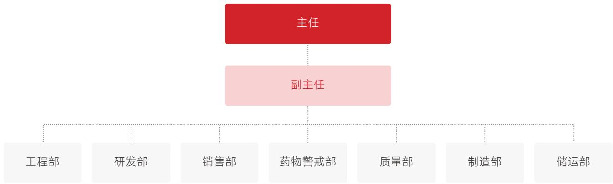

flowchart

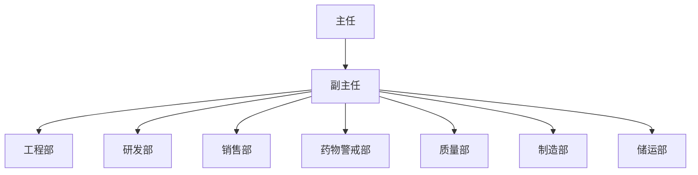
```mermaid
graph TD
  A["主任"] --> B["副主任"]
  B --> C["工程部"]
  B --> D["研发部"]
  B --> E["销售部"]
  B --> F["药物警戒部"]
  B --> G["质量部"]
  B --> H["制造部"]
  B --> I["储运部"]
```

广西区域药品安全委员会组织架构  
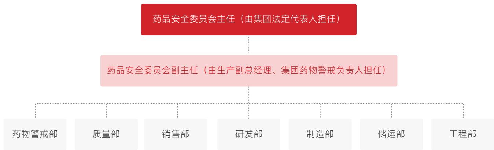

flowchart

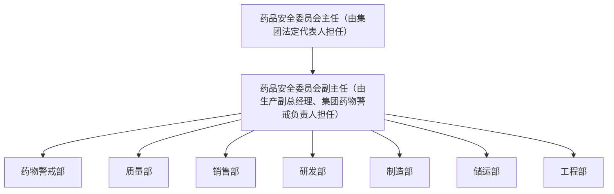
```mermaid
graph TD
  A["药品安全委员会主任（由集团法定代表人担任）"] --> B["药品安全委员会副主任（由生产副总经理、集团药物警戒负责人担任）"]
  B --> C["药物警戒部"]
  B --> D["质量部"]
  B --> E["销售部"]
  B --> F["研发部"]
  B --> G["制造部"]
  B --> H["储运部"]
  B --> I["工程部"]
```

## 药品安全委员会及各药物警戒部门主要职责

<table><tr><td>部门名称</td><td>主要职责</td></tr><tr><td>药品安全委员会</td><td>·负责公司药品重大风险的研判、重大或紧急药品事件处置、风险控制决策以及其他药物警戒的有关的重大事项·负责不良反应聚集性事件、群体不良事件等重大或紧急药品事件的调查与处置·贯彻落实国家有关药物警戒相关的法令、政策、规章制度等,对药物警戒体系及活动进行质量管理·审核药物警戒计划等</td></tr><tr><td>药物警戒部</td><td>·负责建立和维护药物警戒体系·负责进行药物警戒风险管理,并制定、更新、提交、执行和评估风险管理计划·负责疑似药品不良反应信息的收集、处置与报告·负责识别和评估药品风险,提出风险管理建议,组织或参与开展风险控制、风险沟通等活动·负责组织或参与开展药品上市后安全性研究·负责与监管部门、患者、医护人员及公众进行安全性信息沟通·负责组织药物警戒体系内审工作·负责其他与药物警戒相关的工作</td></tr><tr><td>质量部</td><td>·收集用户投诉报告及管理工作·负责标签、说明书的修改和审核·负责药品不良反应/事件中药品、原辅料质量方向的调查分析工作和产品召回质量评价工作·参与新的、严重的药品不良反应评价·参与死亡、群体药品不良反应/事件的调查分析·参与公司产品不良反应信息收集</td></tr><tr><td>销售部门</td><td>·不良反应信息收集、反馈、病例回访、严重及死亡病例调查·负责对医疗机构、药品经营企业等药品使用单位及个人宣贯本公司药品安全性信息·参与药品重大安全性事件如死亡事件、群体不良事件等的调查分析,协助上市后药品的召回</td></tr><tr><td>制造部、技术总监</td><td>·负责生产过程中的调查分析工作·参与产品重大工艺变更对药品安全性影响论证·负责药品安全性问题涉及药品生产过程方面的调查分析·参与新的、严重的药品不良反应/事件评价·参与死亡、群体药品不良反应/事件的调查分析·参与公司药品不良反应信息收集</td></tr></table>

<table><tr><td>部门名称</td><td>主要职责</td></tr><tr><td>研发部</td><td>负责药品上市前临床试验阶段的安全性管理及药品不良反应监测、识别、评估和控制负责药品标签、说明书修改进行变更备案参与新的、严重的药品不良反应评价工作参与新的、严重的药品不良反应评价参与死亡、群体药品不良反应/事件的调查分析参与公司上市后不良反应信息收集</td></tr><tr><td>储运部</td><td>负责药品安全性问题涉及的制剂产品、原辅料、包装材料等的贮存、运输等方面的调查分析参与新的、严重的药品不良反应评价参与死亡、群体药品不良反应/事件的调查分析对经销商进行电话回访,收集药品不良反应信息负责公司产品不良反应信息收集</td></tr><tr><td>工程部</td><td>负责与药物警戒有关的重大事项中所涉及药品生产过程中公用工程及设备方面的调查分析工作</td></tr></table>

公司对药物不良反应进行定期调查分析，采取一系列措施以全面监测和评估药品安全性：

公司基于药品上市许可持有人药品不良反应直接报告系统反馈的不良反应数据，及公司收集的药品不良反应信息，开展全面调查、分析与评估，形成不良反应评估意见文件，并定期填报至直接报告系统

公司建立年度不良反应回顾机制每年填写药物警戒年报并提交监管机构:每五年开展药品安全性评估，形成定期安全性更新报告并提交监管机构

在日常监测中公司定期对不良反应趋势进行信号分析针对异常信号产品主动开展深入评估并根据评估结果采取相应措施

本年度 公司持续强化药物警戒工作队伍建设 开展药物警戒年度培训，风险控制及药物上市后研究等专题培训确保员工精准掌握工作要求切实提升其专业履职能力

## 发挥服务价值

葫芦娃严格恪守《药品经营质量管理规范》等法律法规，制定《质量保证——管理标准规程》《产品质量投诉、信息反馈处理管理制度》等专项管理文件，搭建标准化、规范化的客户服务体系，保障客户服务工作有序高效开展。

## 客户服务管理

公司秉持“以专业化赢得客户信赖，全生命周期赋能客户服务”的核心宗旨，持续完善服务体系、提升服务效能，明确客户投诉的处理流程、执行方式与办结时限，全力为客户打造优质、高效的服务体验。

## 葫芦娃客户服务体系

## 组建专业化服务团队，强化能力赋能

公司设立专属客户服务部门，配置专职人员负责客户服务对接与全流程跟踪，全面强化售前咨询、售中协助、售后保障全链条技术服务，为压实服务责任保障服务质量稳定可控 公司建立客户服务人员绩效考核机制将考核结果与客户满意度直接挂钩，推动服务质量持续提升。

为进一步强化团队专业素养，2025年，公司面向包含OTC板块在内的全营销系统，累计开展400余场次内部专项培训，覆盖人员约6,000人次，并通过考核评估闭环检验培训成效。针对零售业务板块，公司优化精简销售团队配置围绕营销相关法律法规、产品质量管控、销售流程规范、儿科产品用法用量等核心内容开展专题培训，全面提升全员客户服务专业能力。

## 建立客户投诉处理机制，闭环管控问题

公司制定《用户投诉管理制度》《投诉处理操作规程》等规范文件，明确客户投诉接收、登记建档、分类调查、分级审批闭环处置复盘改进的全流程标准与操作规范，为高效响应客户诉求 公司配置专人专职负责客户投诉处理工作，对所有投诉事项全程记录、溯源分析、制定解决方案并落实纠正预防措施。

收集投诉并进行登记、初步评 价与分类

进行调查分析和评估，并出具初步处理意见

提交管理层审批，通过后进行结果反馈与追踪

客户投诉处理目标：客户投诉处理率100%，所有投诉在24小时内及时响应，7天内处理完成，确保问题得到彻底解决。

本年度，公司接到的所有客户投诉均已完成妥善处理，处理率达100%。

## 开通专属质量服务专线，快速响应诉求

为防范产品及服务风险、保障客户健康与安全，公司开通两条质量专线电话（0771-4885986、400-1605-199），专项用于接收、反馈、处理客户提出的产品质量、使用方法、不良反应等各类诉求，实现客户问题快速对接、高效处置。

## 搭建常态化沟通体系，持续优化客情维系

公司建立标准化客户沟通机制，通过定期回访、季度不定期调研相结合的方式，常态化开展客户回访与满意度调查工作，精准掌握客户需求，持续优化服务举措。

## 以品质与服务赋能，提升客户体验

为持续提升患者用药体验与客户服务价值，公司围绕用药安全性、使用便捷性及治疗依从性，开展多项产品与服务优化工作。

公司以用药安全与绿色环保为导向，2025年重点推广儿童精准用药方案，采用适配儿童的安全包装设计，有效降低用药差错风险。同时公司严格落实国家药品追溯码要求，迭代升级包装一体化追溯码，实现“一物一码”全链条可追溯，并联通头部客户的会员系统，方便患者扫码获取用药指导，进一步提升用药信任感。此外，公司积极推进口味升级与特殊人群剂型改良，聚焦儿童用药口感开展技术优化，显著提升儿童患者用药依从性，减少因拒服药物导致的治疗中断，切实改善治疗体验。

## 推进数字化升级，赋能服务提质增效

公司运用数字化手段优化服务流程，全面提升专业服务能力与患者服务体验。依托智能供应链协同平台，公司与头部连锁药房开展供应链协同优化，完善补货，库存及配送管理机制实现按需配送，效期预警 有效减少药品过期浪费，降低环境废弃物产生，持续提升供应链运营效率与绿色低碳发展水平。

在夯实供应链服务能力的同时，公司进一步将数字化延伸至终端专业服务环节，与头部连锁药房合作搭建智能药品知识小程序或培训平台，为店员提供药品知识库、联合用药禁忌提醒、患者用药指导，帮助药店药师提升专业服务能力。

同时，公司深化数字化服务场景，联合头部连锁共建患者教育平台，依托健之佳杏林学堂、益丰“绚星云”等工具，围绕慢病管理，儿童健康等场景提供用药提醒与健康科普以精准数字化服务切实提升患者获得感

## 葫芦娃客户服务措施

## 城市及县域医疗

• 点对点进行招商经理客户服务能力提升指导  
• 与各级人员市场走访宣导葫芦娃药业经营理念、县域事业部销售模式、企业产品与相关疾病治疗  
• 基于医院药事委员会搭建市场部与市场终端直接反馈通道，实现网络+电话形式直接对接反馈服务问题  
• 面向社区服务站畅通服务群聊直接留言反馈渠道

## OTC-KA

• 开展“希望之翼”培训  
• 邀请客户参观公司或参与公司活动  
• 参与客户团建活动、区域培训活动  
• 新增设立高层互动、拜访、战略对接会等互动活动，与全国20家连锁店形成战略合作伙伴

## OTC省区

• 通过门店拜访、贴柜培训、门店引流等活动提升服务  
• 根据季节和节气的不同，针对不同连锁店开展特色推广活动，提升品牌价值  
• 对门店客户加强定期高频、专业化拜访，针对所提到的问题进行逐级沟通、解决

## 葫芦世家

• 与广告媒体共同打造、提升公司美誉度、广告知名度

## 新零售

• 加强员工素质教育，制定考核标准，强化员工专业技能及服务培训  
建立有效的沟通渠道与平台等业务合作方直接沟通进行相关信息反馈:与电商客户通过线上沟通渠道进行直接对接

报告期内，公司每季度通过问卷调查的形式不定期开展客户满意度调查，客户平均满意度达97.35%。为建立常态化客户沟通机制，公司每季度召开“头部客户满意度共创会”，邀请核心客户参与服务流程优化、新品开发建议、营销活动策划，并将客户满意度指标与OTC事业部管理层绩效紧密挂钩，保障服务质量持续提升。

客户平均满意度达

97.35 %

在此基础上，公司各事业部围绕客户需求落地多项提升举措，全面推进服务与专业能力双升级。在服务体系升级方面，公司在头部连锁药店打造“葫芦娃健康驿站”，提供儿童身高体重测量、用药咨询、科普互动等沉浸式体验；同步推出“药房一对一”服务，为慢病患儿家庭提供用药提醒、复诊提醒及个性化健康指导。在专业赋能升级方面，公司注重客户能力共建，为连锁药店药师开展儿童用药专业培训；并联合头部客户开展“葫芦娃儿童健康月”主题活动，由公司产品部专家支持开展社区科普与门店义诊，有效提升合作客户在消费者端的专业形象与用户粘性。

## 客户隐私保护

葫芦娃严格遵守《中华人民共和国计算机信息系统安全保护条例》制定《计算机安全管理制度》《重点应用信息系统运行维护管理办法》《保密管理规定》等内部文件 建立数据安全管理体系，并通过信息系统安全等级保护二级评测全面保障数据安全，通过防攻击风险评估和漏洞扫描，我们确保数据存储，传输和处理的全链路安全。

公司始终坚持“最小化数据收集”原则，仅在必要范围内收集客户信息，严格按照《保密管理规定》落实客户隐私数据保护工作，向客户清晰地说明数据的使用目的及其享有的权利。

为持续强化网络与信息安全保障能力，公司依据《网络与信息安全应急事件处理规程》每年开展一次系统权限确认及应急处理（或数据备份有效性）演练。同时公司在钉钉系统接入AI工具并应用于日常办公场景主要用于潜在客户与供应商精准定位、市场信息搜集以及合同、制度等文档的校验辅助，相关应用均不涉及重要保密数据，在提升办公效率的同时严守信息安全底线。

## 本年度

## 公 司未发生

涉及数据安全及客户隐私泄露相关事件

## 负责任营销

公司遵循《中华人民共和国广告法》《中华人民共和国药品管理法》中关于药品生产，销售，宣传的相关规定，制定《销售中心秩序管理办法》，始终秉持负责任营销的理念，坚持以道德、科学、客观的方式推广药品和服务。在营销实践中，公司保证广告、药品说明书、宣传资料均客观真实，杜绝宣传虚假、误导性陈述，确保监管机构、客户及患者可及时、准确地获取公司的产品和医疗信息。

## 葫芦娃负责任营销策略

在营销方面

公司坚持走专业化之路不动摇，以产品学术赢得临床专家认可，以质量和疗效赢得商业渠道信息和消费者赞誉。公司在品牌传播方面严格遵守法律法规，未经国家审批备案的产品、图片、视频等一律不得对外宣传

在市场推广方面

公司与市场推广人员签订反商业贿赂承诺书，实现由内到外全方位监督

在产品定价方面

公司结合医保政策及集采价格合理定价，顺应市场规律，不损害消费者利益

在产品信息标签方面

公司在产品内外包装上均印有明显产品名称，规格，生产日期，厂名和地址电话等完整信息，还在产品内外包装上均粘贴可追溯码，消费者可扫描追溯码了解产品详细信息和辨别产品真伪

在产品溯源方面

公司从源头上控制，实施数字化管理，在产品出厂、配送及终端等全过程均需扫描追溯码登记，确保产品在每一个流通环节上的可塑性和信息的完整性

在广告方面

公司严格遵守先审批后传播的流程，广告内容严格遵守《中华人民共和国广告法》要求，同时严格管控在广告传播时不存在随意改动的图文

葫芦娃高度重视宣传工作的规范性和合规性，成立品牌战略决策委员会，并建立完善的宣传管理体系和审计监管体系，公司对宣传材料的真实性和合法性负责，建立严格的传播资料审批OA程序，规范对外宣传管理。所有线上、线下宣传内容统一由市场部负责对外发布，禁止销售人员擅自发布传播产品信息。所有外发内容需经市场部审核，确保符合广告法及相关法规。广告文案、视频、图片等宣传材料需提前向市场局备案，避免出现比较性或误导性内容。

为确保宣传工作落实到位 公司内部实行追责制 明确划分各部门，各岗位的宣传管理职责 形成层层负责，环环相扣的责任体系，为强化宣传过程管控，运营部联合市场部，质量部定期随机抽查销售人员对产品功效适用人群 用法用量的掌握情况，严控并杜绝夸大宣传等违规行为。在推广传播层面，公司坚持以临床数据和工艺提升为核心依据，着重突出产品的权威性与专业性，避免过度依赖销售技巧，以专业可信的传播构建长期稳定的品牌口碑。

公司高度重视营销人员专业能力与合规意识建设，本年度围绕负责任营销主题，为员工及经销商组织专项培训共3场，累计受训超1,000人次。为进一步规范一线宣传口径，公司统一使用重点零售品种的标准化培训PPT与沟通话术，让所有人员传播内容均有据可依从源头保证宣传内容的科学性和准确性切实维护公司品牌形象与市场信誉。

## 坚持责任采购

葫芦娃制定《绿色采购方案》《供应商审计管理制度》《合格物料供应商目录》等内部管理文件，构建覆盖供应商筛选、审核、风险管控的全流程体系，推动供应链管理规范化、系统化运行。

公司始终秉持公平、公正的合作原则，平等对待包括中小企业在内的所有供应商，致力于构建互信共赢的合作关系。在采购管理过程中，公司严格遵守合同条款，规范履约，始终按约定期限支付货款，未发生逾期付款情况，切实保障供应商的合法权益，推动产业链健康稳定发展。

公司根据物料对产品质量的影响程度，将供应商分为Ⅰ类物料供应商和Ⅱ类物料供应商。在严格遵守GMP规范的基础上，公司综合评估供应商对产品质量控制，供货保障能力，供货价格，生产产能，资金支持，环境管理，职业健康安全管理等方面的因素，确保确保筛选出资质合规、适配度高且合作稳定的供应商。

## Ⅰ类物料供应商（关键物料供应商）

提供对药品质量、疗效及安全性存在关键影响物料的供应商，主要为原料药、中药材（饮片）、对药品疗效或安全性有关键影响的辅料、内包材等物料的供应商

## Ⅱ类物料供应商（非关键物料供应商）

提供对产品内在质量没有直接影响的供应商，包括共用外包材、消毒剂、干燥剂、检验化学试剂、培养基等物料的供应商

## 供应商筛选

公司秉持可持续发展理念，将环境、社会标准纳入供应商核心评估体系。在供应商产品质量达标合规的基础上，优先遴选已取得ISO9001质量管理体系、ISO14001环境管理体系、ISO45001职业健康安全管理体系等认证的合作方。

此外，公司持续深化绿色供应链建设，将环保要求贯穿采购全流程，在采购端全面推行绿色采购政策，优先选用低碳环保原料制成的产品。为压实环保管理责任，公司要求所有合作供应商提供正式的环保承诺书，明确其在生产、供应全流程需严格遵守国家及地方生态环保法律法规与标准规范；同时督促供应商对上游供应链实施全链条环保管控，保障其供应的原材料、零部件均符合环保要求，构建绿色合规的供应链体系。

## 供应商审核

公司重视供应商审核管理工作，建立完善的供应商评估体系，通过常态化审核机制强化源头管控，公司每年对所有供应商开展一次全面评估，评估内容涵盖产品质量、交付能力、合作成本、配套服务、技术水平、环保绩效、社会责任等关键维度，对评估结果未达标的供应商，依规终止合作关系，持续优化供应商结构。

## 葫芦娃供应商审核流程

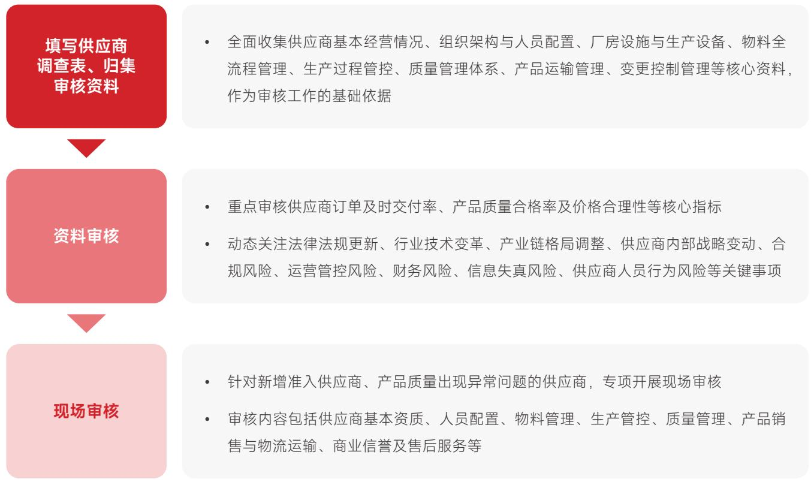

flowchart

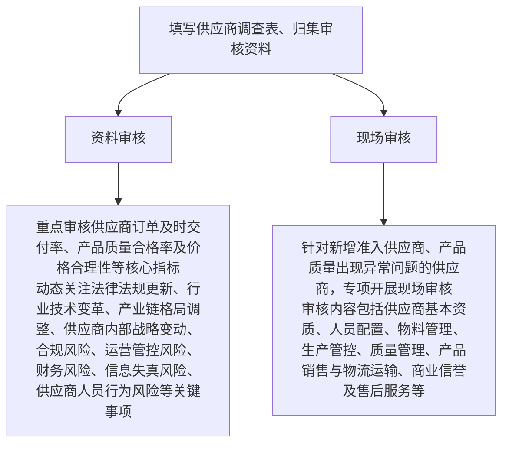
```mermaid
graph TD
  A["填写供应商调查表、归集审核资料"] --> B["资料审核"]
  A --> C["现场审核"]
  B --> D["重点审核供应商订单及时交付率、产品质量合格率及价格合理性等核心指标\n动态关注法律法规更新、行业技术变革、产业链格局调整、供应商内部战略变动、合规风险、运营管控风险、财务风险、信息失真风险、供应商人员行为风险等关键事项"]
  C --> E["针对新增准入供应商、产品质量出现异常问题的供应商，专项开展现场审核\n审核内容包括供应商基本资质、人员配置、物料管理、生产管控、质量管理、产品销售与物流运输、商业信誉及售后服务等"]
```

## 报告期内

公司完成供应商审核

236 家

审核覆盖率达

到100 %

## 供应商风险管理

公司秉持"预防为主、持续改进"的理念，建立系统化、全方位的供应商风险管理体系。该体系以风险识别、动态监控、合规审计、应急应对为核心闭环，精准识别并化解供应商潜在风险，最大限度预防、消除或降低各类风险造成的损失，切实保障供应链的安全稳定与可持续运行。公司高度重视可持续发展相关风险的识别与应对，对于可能产生相关影响的业务活动积极开展相关尽职调查工作。

在廉洁合规管理领域，公司将供应链廉洁建设纳入核心管理范畴，针对供应商制定严格的反贪腐管理政策，明确廉洁合作底线要求。为确保商业合作的透明性与合规性，为保障商业合作的透明合规，公司在采购全流程中明确要求，所有供应商签署采购协议时，必须同步附加商业道德与反贪腐专项条款，明确权责边界与违规责任。同时，公司畅通多渠道举报途径，鼓励社会公众、供应商及内部员工对违规贪腐行为进行及时举报，对举报事项依规处置、全程留痕，全力维护供应链管理的公开、公正、透明。

## 葫芦娃供应商风险管理措施

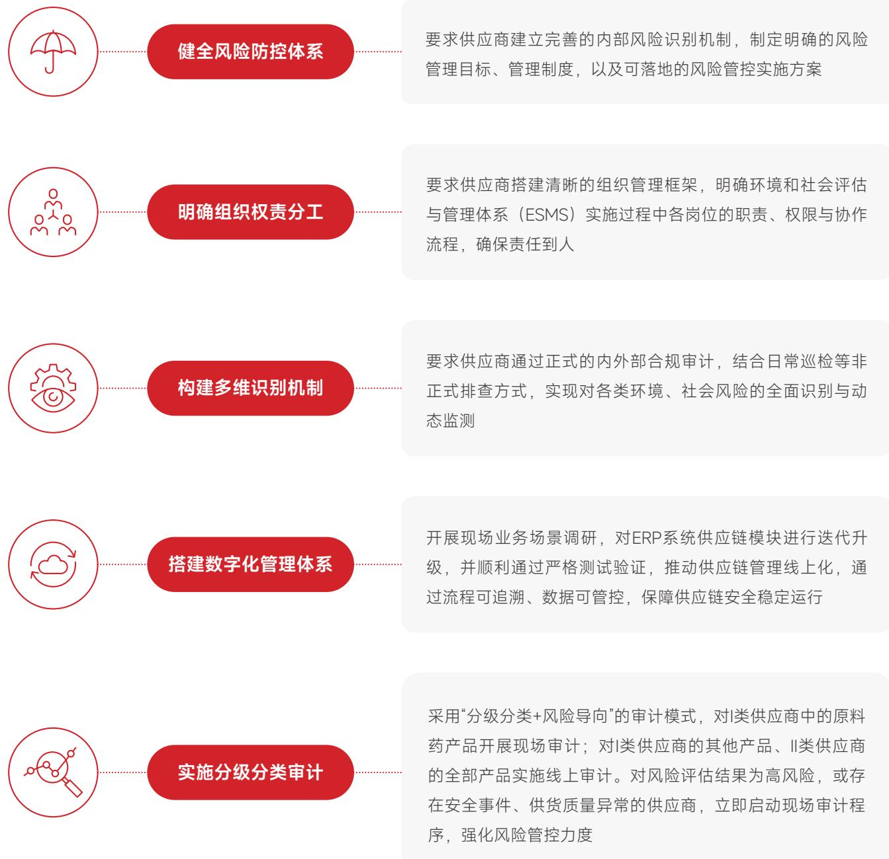

natural_image

Silhouettes of people jumping joyfully on a beach at sunset, with no visible text or symbols

## 05

## 注重员工关怀构建幸福职场

回应可持续发展议题

员工

职业健康与安全

## 员工雇佣与福利

葫芦娃严格遵守《中华人民共和国劳动法》《中华人民共和国劳动合同法》《女职工劳动保护规定》等法律法规，制定《员工手册》《薪酬管理办法》《员工福利管理办法》等人力资源管理制度。公司坚持以人为本的管理理念，构建完善的员工权益保障体系保护，切实维护员工合法权益。

## 雇佣与权益保护

公司秉持“人才兴企”的基本人才战略，规范用工管理流程，制定《人力资源管理办法》《薪酬福利管理办法》《工资支付暂行规定》《员工考勤管理办法》《员工奖惩管理办法》等内部制度，围绕员工招聘录用、薪酬绩效、考勤休假、奖惩激励等关键环节，构建起覆盖员工雇佣全周期的规范化管理体系。通过制度化、规范化运行，保障招聘录用、职业发展等各环节程序公正，管理公平，严格落实平等就业原则切实维护员工合法权益。

## 报告期内

公司雇佣的员工类型为劳动合同工、退休返聘工和兼职员工，劳动合同签订率

达100%

针对建立劳务关系的退休返聘人员，公司依法与其签订劳务协议、退休返聘协议。本年度，公司及下属各子公司未出现因用工问题违反国家劳动法律法规被行政部门处罚的情况，公司未发生与雇佣童工和强制劳工相关案件

## 精准引才

合规雇佣：在招聘过程中，对候选人年龄进行严格把关，要求新员工入职前须提供包括身份信息在内真实有效文件从源头上杜绝雇佣童工与强制劳工的情况发生

平等招聘：将多元化与平等原则嵌入员工雇佣与招聘全流程，明确规定杜绝基于性别、民族、宗教信仰、身体原因等任何形式的招聘歧视；严禁在招聘广告中使用任何涉及性别、地域、年龄等非岗位相关限制的歧视性表述，保证劳动者的公平就业机会。积极响应政府组织的公益性招聘，招聘岗位覆盖职能岗、基础岗等

人才引进：执行《海口市引进人才住房补助等激励政策》等多项政府出台的人才激励政策，积极落实人才引进相关保障措施，通过线上招聘平台、线下招聘会、行业协会、校企合作招聘、内部推荐等多种渠道精准引才，建立完善的人才甄选流程，涵盖MBTI测评、分级背调、试用期指标和薪酬评估四个方面，实现人才的全方面评估。此外，公司搭建健全的人才储备系统，涵盖职能类，研发及营销类和生产质量类的人才信息，助力公司人才体系的可持续发展

## 权益保障

工时：制定《员工考勤管理办法》《员工奖惩管理办法》管理制度，实行标准工时制、综合工时制、不定时工时制相结合的多元化工时管理体系，综合考量岗位情况，对不同岗位性质人员进行不定时工时制度适配

保险：在依法为全体正式员工缴纳社会保险的同时，为实习生及劳务派遣人员购买商业保险

加班：合理安排工作和休息时间，优先考虑调休制度，严格控制超时加班现象

休假：包括但不限于带薪年休假、婚假、丧假、生育假、病假等

## 共同富裕

竞争力薪酬发放：基于科学化、规范化原则构建职位序列、职级评定与薪级体系；通过市场化对标确立具有行业竞争力的薪酬标准；参照海南省最低工资标准、国家法律法规及政策要求、行业平均标准、重点人才引进待遇标准等多维度参数对员工薪酬水平实施月度动态对标管理，确保员工薪酬达到当地生活水平基准线；建立差异化薪酬分配机制，贯彻“按劳分配、多劳多得”原则，依据部门职能特性与岗位价值差异实施精准化薪酬设计，确保内部薪酬分配公平性；建立现金流动态监控与预警机制，并设有专项工资保障准备金，确保在资金流动性波动时，优先保障员工工资按时足额发放

绩效考核与晋升：建立绩效管理体系，坚持绩效导向，全面推行全员绩效考核，对于绩效考核结果优异的人员给予奖励，并作为薪酬调整与职务晋升的核心依据；针对考核结果不达标的员工，将组织安排培训，帮助其提升能力、改进绩效

## 关爱与福利待遇

公司遵守内部管理制度 建立完善的员工福利管理体系保障全体员工均能享受法定，非法定福利以提升员工的幸福感，我们坚持为全体正式员工缴纳社保及五险一金，为员工提供职工之家，活动室，篮球场等便利设施，营造和谐，稳定、积极向上的工作氛围。

## 员工福利管理体系

## 福利津贴

包含但不限于结婚津贴、大病慰问、丧慰金等

## 困难员工关爱

困难员工子女大学入学救助困难员工工会补助（丧慰金、补贴等）为残障人士等弱势群体提供工作岗位

## 其他福利

免费工作餐、免费健康体检等

## 关爱员工家庭，助力妇女健康

2025年春节期间，葫芦娃党委携手工会、妇联，对10位困难员工家庭进行走访慰问。通过前期调查与意见征集，公司深入海南困难职工家庭，发放食用油、大米等生活物资切实传递组织关怀。

广西党支部积极响应妇联组织号召，协助开展“两癌”救助中央专项公益金发放工作，为患病妇女提供切实帮扶与关爱，助力妇女健康公益行动。

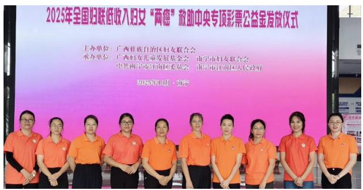

text_image

2025年全国妇联低收入妇女“两倍”救助中央专项彩票公益金发放仪式
主办单位：广西壮族自治区妇女联合会
承办单位：广西妇女儿童发展基金会 南宁市妇女联合会
中共荆门市江南区委委员会 南宁市荆门区人民政府
2025年10月“两倍”

 开展“两癌”救助帮扶

## 沟通与民主管理

公司致力于营造开放的工作环境，推动员工沟通，成立覆盖全体员工的工会，并建立多元的员工沟通渠道，通过总经理信箱、员工座谈会等形式，确保公司能及时、有效地接收员工反馈的问题、需求和建议。

## 葫芦娃员工沟通渠道

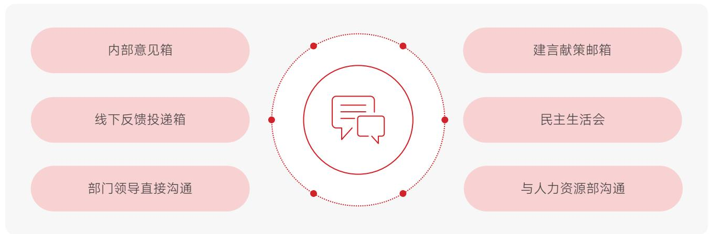

flowchart

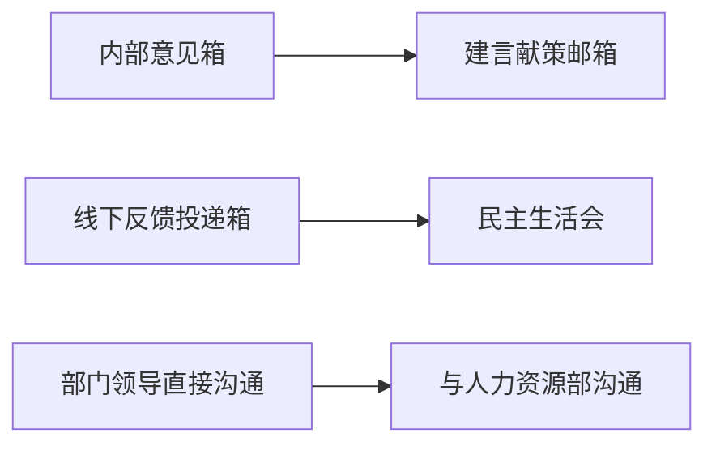
```mermaid
graph LR
  A["内部意见箱"] --> B["建言献策邮箱"]
  C["线下反馈投递箱"] --> D["民主生活会"]
  E["部门领导直接沟通"] --> F["与人力资源部沟通"]
```

葫芦娃开放员工沟通渠道，增设线下意见反馈投递箱，鼓励员工积极参与公司治理经营管理、流程优化等，就经营发展中的战略机遇、管理优化及潜在风险等事项提出建设性意见。公司管理层系统性分析员工建议，精准识别业务痛点，制定针对性改进方案，持续提升运营效率与员工满意度，实现组织发展与员工成长的良性互动。公司深入一线生产岗位，建立定期访谈与问题处理机制，做好关键岗位核心人员稳定工作，关注困难员工、爱心员工以及双职工家庭动态，及时了解员工处境并给予反馈和帮助。

为健全民主管理机制公司建立并规范运行职工代表大会制度 依法保障职工的知情权 参与权，表达权和监督权持续完善民主管理体系，积极构建和谐稳定的劳动关系。报告期内，公司员工代表大会召开2次，覆盖全体职工代表，职工代表参与人数比例为三分之二。

## 人才培养与发展

葫芦娃制定并实施《员工培训管理办法》等制度，构建了覆盖人才选、育、用、留全周期的人才培养机制。有效激发了员工潜能，提升了员工队伍的整体素质，为企业的可持续发展提供了强有力的人才支撑。

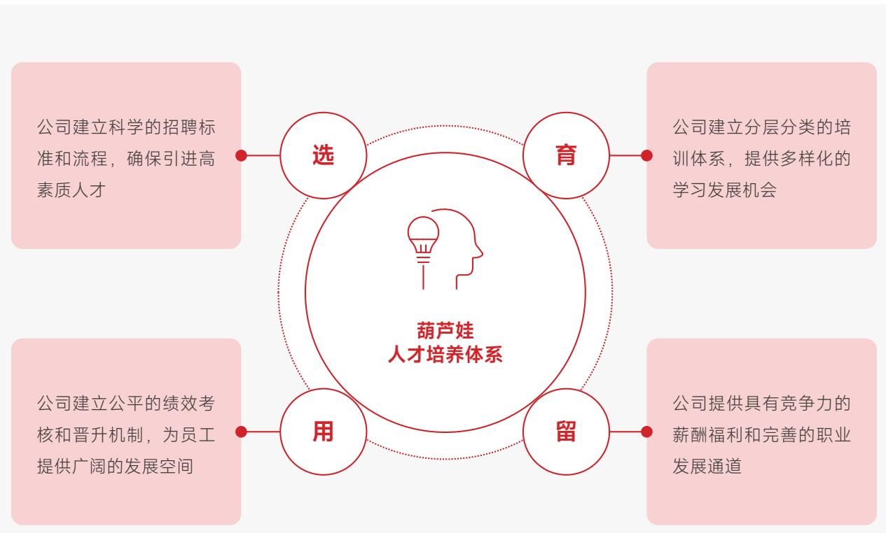

flowchart

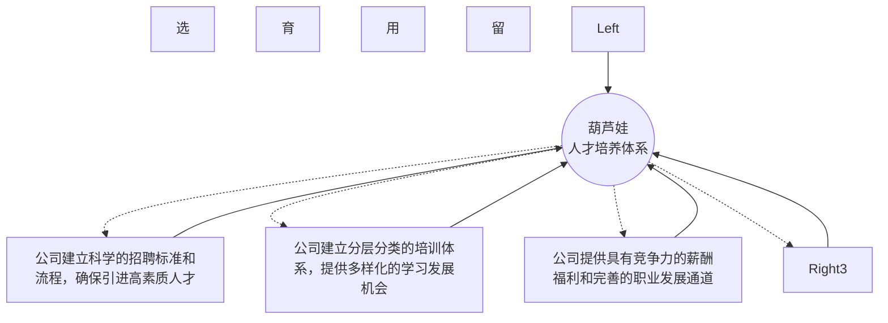
```mermaid
graph TD
  Center(("葫芦娃\n人才培养体系"))
  
  sub1["选"]
  sub2["育"]
  sub3["用"]
  sub4["留"]
  
  Left1["公司建立科学的招聘标准和流程，确保引进高素质人才"]
  Right1["公司建立分层分类的培训体系，提供多样化的学习发展机会"]
  Right2["公司提供具有竞争力的薪酬福利和完善的职业发展通道"]
  
  Left --> Center
  Center -.-> Left1
  Center -.-> Right1
  Center -.-> Right2
  Center -.-> Right3
  
  Left1 --> Center
  Right1 --> Center
  Right2 --> Center
  Right3 --> Center
```

## 员工培训

公司注重员工的培养与发展 聚焦于公司发展战略，核心需求和员工发展需求等因素 构建适合于公司和员工发展的员工培训体系以实现公司和员工的共同成长

公司每年要求各部门依据业务发展需求制定系统化培训计划并严格执行。针对生产运营部、安全环保部、质量部等重点部门，实行差异化培训管理，通过设定最低培训时长标准、建立培训效果评估机制等措施，确保关键岗位人员专业技能持续提升，为生产经营提供有力保障。

为夯实人才培育基础，拓宽员工成长路径 公司鼓励员工积极参加各项外部专业技能和职业资格培训并向其提供相应费用支持。

葫芦娃员工培训体系

<table><tr><td>项目</td><td>主要目标</td><td>培训主题</td></tr><tr><td>新员工培训</td><td>帮助新入职员工快速了解公司发展历程和相关管理制度</td><td>人力资源制度培训GMP知识培训</td></tr><tr><td>岗位SOP培训</td><td>确保员工熟悉并严格执行岗位标准操作规程,保证生产过程的规范化和一致性</td><td>岗位SOP文件解读操作流程与关键控制点</td></tr><tr><td>设备操作培训</td><td>使员工掌握设备操作技能,了解设备性能和维护要求,确保设备安全稳定运行</td><td>操作规程与注意事项日常维护与保养</td></tr><tr><td>安全管理培训</td><td>增强员工安全意识,掌握安全知识和应急技能,预防安全事故</td><td>安全法规与公司制度危险源识别与防护</td></tr></table>

## 报告期内

公司共组织培训

130 场

参与培训的员工超过

2,500 人次

覆盖生产人员、专业技术人员、质量管理人员等多岗位员工，旨在提升各级别、各类别人员的综合管理能力和专业技术能力。2025年，公司有2名员工获得高层次人才认定证书。

## 员工发展

公司注重员工的个人发展，坚持“让有为者有位、能干者能上、吃苦者吃香、优秀者优先”的员工选拔理念，搭建管理与技术双晋升通道 保障员工能在公司内获得适合于自身的发展机会：建立绩效管理体系，全面推行全员绩效考核， 对于绩效考核结果优异的人员给予奖励，并提供薪酬调整、职位晋升的机会。报告期内，公司为34名优秀员工提供薪酬提升，增强员工工作积极性，转岗10人，存在正常流失。

为持续稳固人才队伍，降低核心人才流失，公司在提供具有市场竞争力薪酬待遇的基础上，着力营造包容归属感的工作氛围，并推出多元化人才服务举措，包括协助开展高层次人才认定，各类职称评定申报，人才住房补贴电报，帮助员工向相关政府机构开展落户、子女就学、住房安置申请等，帮助员工实现其诉求。

## 员工服务措施

  
职称评定申报

  
落户、子女就学、 住房安置申请

  
人才住房补贴申报

  
高层次人才认定

公司结合行业实践与自身发展需求，完善内部岗位职级体系，针对不同岗位序列员工设置差异化职业发展通道，明确各序列职级层级与晋升路径，构建清晰、多元的职业发展体系。

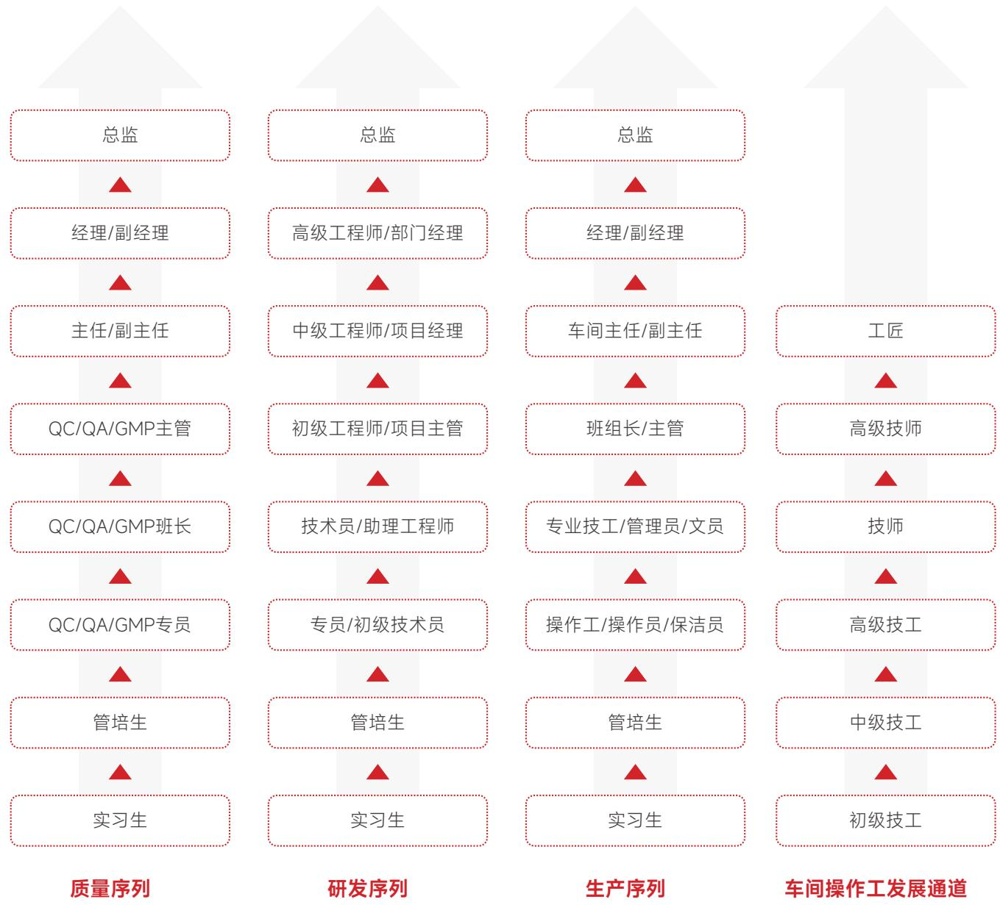

flowchart

```mermaid
graph LR
  subgraph Quality_Seq ["质量序列"]
  A["总监"] --> B["经理/副经理"]
  B --> C["主任/副主任"]
  C --> D["QC/QA/GMP主管"]
  D --> E["QC/QA/GMP班长"]
  E --> F["QC/QA/GMP专员"]
  F --> G["管培生"]
  G --> H["实习生"]
  end

  subgraph R_D_Seq["R&D_Seq [\"研发序列\"]"]
  I["总监"] --> J["高级工程师/部门经理"]
  J --> K["中级工程师/项目经理"]
  K --> L["初级工程师/项目主管"]
  L --> M["技术员/助理工程师"]
  M --> N["专员/初级技术员"]
  N --> O["管培生"]
  O --> P["实习生"]
  end

  subgraph Production_Seq ["生产序列"]
  Q["总监"] --> R["经理/副经理"]
  R --> S["车间主任/副主任"]
  S --> T["班组长/主管"]
  T --> U["专业技工/管理员/文员"]
  U --> V["操作工/操作员/保洁员"]
  V --> W["管培生"]
  W --> X["实习生"]
  end

  subgraph Vehicle_Op ["车间操作工发展通道"]
  Y["工匠"] --> Z["高级技师"]
  Z --> AA["技师"]
  AA --> AB["高级技工"]
  AB --> AC["中级技工"]
  AC --> AD["初级技工"]
  end
```

## 职业健康与安全

葫芦娃严格遵守《中华人民共和国安全生产法》《安全生产事故隐患排查治理暂行规定》《中华人民共和国职业病防治法》《用人单位职业病防治指南》《职业健康检查管理办法》等法律法规，制定《安全生产规章制度汇编》《职业健康管理制度》等内部管理文件，确保安全生产工作有章可循、有据可依。

本年度，公司获得GB/T45001-2020/ISO45001:2018职业健康安全管理体系认证。

## 落实安全生产

公司认真贯彻“安全第一、预防为主、综合治理”的方针，严格遵循《安全生产规章制度汇编》中《安全教育培训管理制度》《危险作业管理制度》《劳动防护用品管理制度》《警示标志和安全防护管理制度》等制度 全面落实安全生产各项要求。

在完善制度体系的基础上，公司同步强化安全生产组织保障，健全安全管理组织体系建设，规范公司安全生产管理机构的设置和安全管理人员的配备，成立安全生产委员会，全面负责安全生产工作的组织领导和监督管理，确保安全管理责任落实到位。

葫芦娃安全生产委员会组织架构  
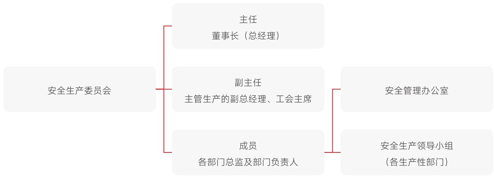

flowchart

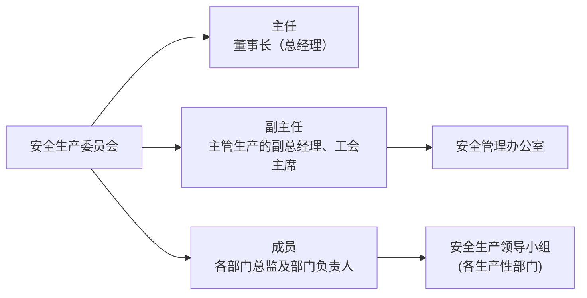
```mermaid
graph LR
  A["安全生产委员会"] --> B["主任\n董事长（总经理）"]
  A --> C["副主任\n主管生产的副总经理、工会主席"]
  A --> D["成员\n各部门总监及部门负责人"]
  C --> E["安全管理办公室"]
  D --> F["安全生产领导小组\n(各生产性部门)"]
```

为建立安全生产事故隐患排查治理长效机制，筑牢全员安全思想防线，公司制定《安全生产风险分级管控与隐患排查治理管理制度》，成立风险分级管控与隐患排查治理领导小组，按照“分级管理、管生产必须管安全、管业务必须管安全”的原则，有序开展风险辨识、分级管控及隐患排查治理等工作，减少事故损失，最大限度保障员工生命财产安全。

在常态化开展风险管控与隐患治理的同时公司不断细化安全管理标准，补齐关键环节管理短板，本年度修订《有限空间安全管理专项制度及应急处置流程》规范易制毒化学品全流程管理，进一步提升安全管理标准化水平使各部门的安全工作有目标、行为有规范、考核有标准、奖惩有依据。

报告期内，公司持续加强安全生产管理工作，从管理方法与规范、风险识别与排查、设施设备配置与完善、安全意识与能力建设等多个维度提升安全生产管理能力，降低安全生产事故发生率，2025年 公司未发生重大安全生产事故 未发生违反职业健康与安全法律法规的事件，实现了“零伤亡、零事故”的职业健康与安全目标。

## 葫芦娃安全生产管理措施

## 管理方法与规范

• 按照相关法律法规，规范配备兼职安全管理人员和专职职业健康管理人员，负责管理公司安全生产工作和职业健康安全管理工作  
• 各部门负责人、各城市、各车间、各班组层层签订安全生产责任书，并将其与签署人的绩效考核挂钩  
• 实行年/月度的安全绩效考核，安全绩效与绩效工资直接挂钩，并对检举违章行为进行奖励  
• 落实特种作业审批与外来施工人员安全协议签订，2025年度共签订12份

## 风险识别与排查

成立风险分级管控与隐患排查治理领导小组，有序开展危险源识别、风险辨识、分级管控及隐患排查治理等工作  
开展涵盖冷库、燃气、电动车等领域的日常及节假日重点风险防范排查。通过各项日常安全检查、节前安全检查等多形式的隐患排查活动减少隐患  
• 2025年，公司共排查安全生产隐患213起，均已整改完成，整改率达98.6%

## 设施设备配置与完善

• 智慧消防管理达标升级，从“良好”提升至“优秀”等级，完成系统数据填报、日常巡查  
• 完善消防应急设施配置，及时更换、维修和保养消防设施和物料，包括灭火器、应急照明灯、防火门、防火门闭门器等，本年度落实重点厂区防火巡查及消防设施维护工作  
• 完善安全警示标识，包括完善厂区内限高、限速、禁止烟火、消防防火卷帘、有限空间作业等安全警示标示牌  
• 开展防雷检测与整改工作，报告期内已完成葫芦娃药谷厂区建筑物防雷检测与防雷隐患年度整改工作  
• 开展危险源辨识，组织综合性检查4次、节假日/季节性检查11次、专项检查（冷库、危化品、电气设备等）8次，开展防台防汛应急保障5次，组织“防灾减灾周”“安全月”“消防月”等主题活动，参训参演超500人次

## 安全意识与能力建设

要求兼职安全管理人员和专职职业健康管理人员均接受专门的安全生产知识和技能培训，安全生产管理人员持证上岗。报告期内，公司持续开展安全生产教育：  
– 面向新入职员工开展2次入职安全知识培训  
– 面向生产车间、仓库等作业人员开展车间安全事故专题培训  
– 组织开展防灾减灾周、安全生产月、消防月等专题活动  
– 组织厂区人员参加职业卫生和安全生产管理人员安全教育培训，提高职业卫生及安全管理人员的管理水平  
组织员工参加危化品，重大事故隐患，有限空间作业安全，危险废物规范化管理专题培训考核及专项应急处置演练  
• 在员工活动的各个区域开展安全意识宣贯，包括：  
– 利用食堂电视播放关于安全生产事故案例  
– 利用办公楼大厅LED屏进行安全月和消防日主题宣传  
– 将主管部门的宣传板报在车间和食堂进行张贴宣传  
– 利用工作群转发各类安全生产、消防安全案例进行宣贯学习  
组织开展应急演练活动，包括但不限于乙醇泄漏事故应急预案演练、火灾事故应急救援演练、危化品泄漏应急演练、化学灼伤事故和中毒窒息应急救援演练、应急救援队伍人员轮训等，保证每类应急预案、演练均每年至少开展一次

## 安全生产月——人人讲安全、个个会应急

2025年6月，公司开展为期一个月的安全生产月活动，以“人人讲安全、个个会应急—查找身边安全隐患”为主题，共110余人参加。此次安全生产月包括安全文化宣传、安全管理人员培训班、安全隐患大扫除、安全生产知识培训、灭火器材及突发事件综合应急演练等多专题活动。通过事故模拟，全员参与的形式，加强员工安全教育培训和隐患排查整改工作，探索新的安全生产管理理念和方法推动企业安全生产工作不断向前发展。

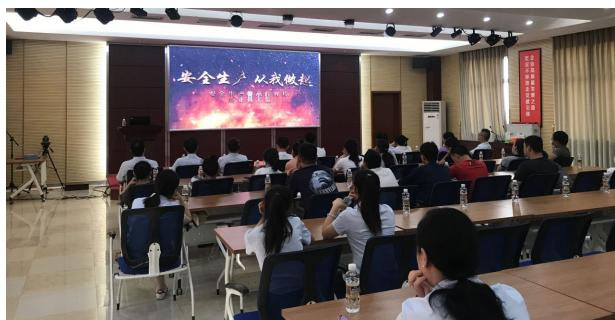

text_image

安全生命 从我做起
安全生命 从我做起

 安全生产知识培训

## 职业健康安全

为保障员工职业健康安全，公司严格遵循《中华人民共和国职业病防治法》《用人单位职业病防治指南》（GB/T225-2010）《职业健康检查管理办法》等法律法规及相关规定，制定《职业健康管理制度》，为公司职业健康安全工作提供重要的制度保障和指引。

公司潜在职业病危害因素有高温，噪音，粉尘 甲醛，公司严格按照相关法律法规及内部管理制度相关要求 积极落实各项职业健康安全管理工作，确保全体员工的健康与安全。公司实施多维度的措施以保护员工免受职业病危害，包括配备劳动防护用品、生产环境优化、职业健康体检、意识培训、工作场所职业病危害因素检测等。

## 葫芦娃职业健康保护措施

## 配备劳动防护用品

为员工提供相应的防护措施，包括：

• 对高温设备和工艺采取隔热处理，向相应岗位员工免费配置隔热手套等，并督促其规范使用  
• 确保涉及甲醛、粉尘等职业病危害因素的生产环节、场所有良好的通风，为相应岗位员工免费提供防尘口罩、安全防护眼镜、防护服、橡皮手套等，并督促其规范佩戴  
• 向接触噪音岗位员工免费提供耳塞、耳罩等，并督促其规范佩戴

## 生产环境优化

• 安装除尘装置  
• 优化厂区隔热和通风情况

## 工作场所职业病危害因素检测

•定期开展工作场所职业病危害因素检测 并依据监测结果落实各项职业健康安全管理工作

## 职业健康体检

•对接触职业病危害作业的员工开展上岗前在岗期间、离岗时的健康检查  
• 提供覆盖全员的年度职业病健康检测  
•报告期内公司组织160位员工开展职业病健康体检接触职业病危害因素岗位员工的体检覆盖率为100%，未发现职业病病例

## 意识培训

• 在岗前，对相应员工进行职业病危害告知和安全生产岗前培训  
·定期开展安全教育宣传相关工作，提升员工对职业健康安全的认知  
对所有新员工入职时进行安全教育及职业健康培训

natural_image

Group of people forming a heart shape against a bright sky, with a red circular badge containing the number 06 (no text or symbols on the figures themselves)

## 06

## 履行社会责任深化公益行动

回应可持续发展议题

医疗普惠与健康可及性

乡村振兴

社会贡献

## 普惠医疗

公司致力于为国内患者提供更多高质量的药物，积极践行医药企业社会责任，紧扣普惠医疗发展导向，以科技创新提升药品品质与临床价值，以负责任定价保障群众用药可负担，持续推动优质药品惠及更多患者，切实增强人民群众用药获得感、幸福感与安全感。

## 负责任定价

公司始终秉持“一切以消费者为中心”的理念，通过开展深入的消费者调研，全面了解患者需求与市场动态。在定价策略上，公司综合考虑原材料、包装材料、生产能耗等运营成本，以及医疗集采政策的影响，科学制定药品价格。

公司构建四层产品定价机制，依托原料、辅料和包材等成本研究专项小组进行前瞻性评估，由市场部调研小组进行产品市场价格体系指导策略的制定，由价格管理委员会进行决策，最终形成市场反馈机制，以此不断完善内部负责任定价管理。

## 葫芦娃产品定价机制

原料、辅料和包材等成本研究专项小组

收集成本费用数据，并根据市场影响造成的原材料价格变动等因素进行前瞻性评估每季度对产品成本进行调整与预估，让企业的成本能具有市场竞争力

市场部调研小组

公司市场部综合行业数据 市场调研区域销量预测消费者支付能力原辅包材市场趋势，以及产品定位等因素，多方论证，制订产品市场价格体系指导策略

价格管理委员会

公司以市场部价格体系指导策略为依据，经价格管理委员会及高层领导集体审议，围绕临床价值与国家政策导向，结合药物经济学评价、企业社会责任及消费者支付能力，最终确定市场供货价格体系

市场反馈机制

根据产品市场销售情况，结合行业和市场变化进行动态调整

本年度，公司持续加大医保及集采工作推进力度，主动对接国家及地方医保目录动态调整要求，积极参与各级集中带量采购招标工作，持续扩大核心产品市场覆盖面，切实提升民生保障服务质效，各项工作取得扎实成效。

## 医保产品

年内新增13个产品纳入国家医保目录，截至2025年底，公司累计118个产品纳入国家医保目录，涵盖中成药、化药等多个治疗领域，其中儿童用药、清热解毒类等核心品类医保覆盖率达90%以上，进一步扩大医保受益患者范围

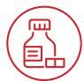

## 集采参与

年内新增5个产品纳入国家或地方集采目录，截至2025年底，公司处于集采目录有效期内的产品达16个，通过规模化、规范化的集中采购模式，有效降低药品终端售价，提升药品可负担性

## 普惠成效

目前，医保及集采产品覆盖全国各省市，切实减轻了患者用药负担，尤其是基层患者、慢性病患者等群体的长期用药成本，获得市场广泛认可

## 可及性策略

公司持续优化产品矩阵布局，健全医疗终端销售网络，积极拓展线上营销渠道，以多元化市场策略全面提升医药保健服务的可及性与覆盖面。公司不断扩大推广网络覆盖范围，推动渠道向基层及偏远地区延伸，逐步实现全国各级医疗机构全覆盖。

公司聚焦优质儿童药供给，持续提升消费者可触及性，线下持续深化市场细分与终端下沉，打通基层流通渠道；线上同步推进B端渠道赋能与C端直达服务，构建线上线下一体化的普惠供给格局，切实保障群众用药便利度与可负担性。

## 葫芦娃提升药物可及性措施

## 线下细分终端并下沉到基层农村

• 构建多层次、广覆盖的医药营销与分销网络，医疗端精准覆盖城市医疗、县乡医疗、基层医疗，零售端布局KA 连锁、NKA连锁、三终端零售  
• 截至报告期末，公司建立近1,000家主流商业分销体系，终端网络遍及全国30个省、市、县、乡，覆盖公立医疗机构25,000余家，诊所、卫生室、服务站近26万家，连锁、单体药店累计超过40万家，药品可及性持续提升

## 拓展线上营销

• 与京东、美团、淘宝合作，全方位打造线上线下相互呼应的立体式营销网络生态，满足消费者购买行为新需求

## 公益慈善

公司积极履行作为上市公司的社会责任，主动组织参与社会公益慈善活动。报告期内，公司开展多场公益捐赠活动，以实际行动回馈社会，持续传递企业温暖与责任担当。

## 投身慈善公益

持续与海南省旭日东升慈善基金会合作，聚焦弱势人群医疗健康及基层儿童健康教育服务:秉持“情暖千万家、健康中国娃”的宗旨，“健康中国娃”儿童安全用药公益讲座已累计服务超万名儿童，荣获多项表彰

## 助力 乡村振兴

面向周边乡村开展招聘活动，拓宽农村劳动力就业渠道，促进村民就近就业与稳定增收，助力乡村人才振兴与共同富裕

## 守护群众健康

配合高新区及永庄村委会开展基孔肯雅热蚊虫防治工作，切实守护群众健康安全

## 公益科普实践

面向海口市第一中学学生开放参观体验，带领青少年感受“智能制造”在探索中激发兴趣，在体验中规划未来，积极履行科普育人责任

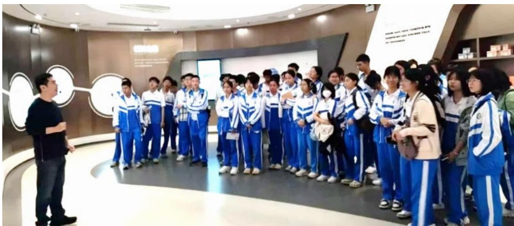

natural_image

Group of students in blue and white uniforms gathered indoors, listening to a presenter (no visible text or symbols)

 接待海口市第一中学学生体验“智能制造”

## 九年暖心守护，携手绘梦未来

2025年3月，葫芦娃联合海南省旭日东升慈善基金会连续第九年走进海口社会福利院，开展公益活动。活动现场志愿者与孩子们共同创作绘画与剪纸作品，描绘自贸港美好愿景。九年如一日，葫芦娃始终以“健康中国娃”为使命，以恒心践行公益，以责任守护成长，用持续行动诠释了本土药企对社会责任的执着坚守与使命担当。

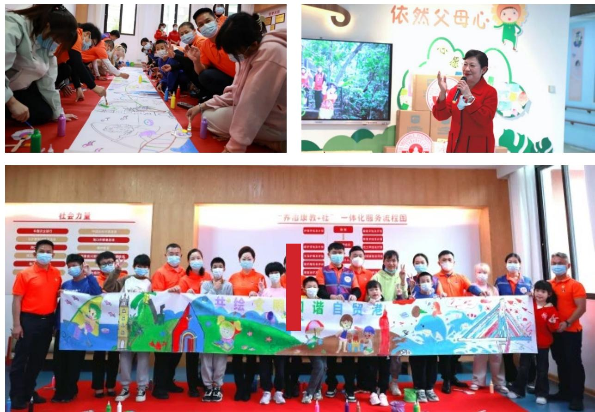  
 葫芦娃联合海南省旭日东升慈善基金会举办“相伴成长，绘梦未来”公益活动

natural_image

Close-up of two hands holding a large white egg against a bright sky background (no text or symbols)

## 关键量化绩效表

## 环境绩效

能源管理与碳排放

<table><tr><td>指标</td><td>单位</td><td>2023</td><td>2024</td><td>2025</td></tr><tr><td>能源消耗总量2</td><td>兆瓦时</td><td>-</td><td>97,176.18</td><td>53,126.85</td></tr><tr><td>直接能源消耗总量</td><td>兆瓦时</td><td>-</td><td>28,274.95</td><td>17,438.08</td></tr><tr><td>天然气用量</td><td>立方米</td><td>1,983,111.00</td><td>2,579,985.98</td><td>1,562,187.04</td></tr><tr><td>汽油用量</td><td>升</td><td>24,508.89</td><td>19,491.93</td><td>34,443.60</td></tr><tr><td>柴油消耗量</td><td>升</td><td>22,366.72</td><td>17,251.00</td><td>22,651.34</td></tr><tr><td>间接能源消耗总量</td><td>兆瓦时</td><td>-</td><td>68,901.23</td><td>35,688.77</td></tr><tr><td>外购电量</td><td>兆瓦时</td><td>21,370.76</td><td>34,602.78</td><td>19,923.57</td></tr><tr><td>外购蒸汽用量</td><td>吉焦</td><td>110,630.73</td><td>123,474.43</td><td>56,754.73</td></tr><tr><td>温室气体排放总量(范围一、二)</td><td>吨二氧化碳当量</td><td>26,234.86</td><td>39,053.04</td><td>21,162.22</td></tr><tr><td>范围一温室气体排放量3</td><td>吨二氧化碳当量</td><td>4,428.90</td><td>5,736.89</td><td>3,556.79</td></tr><tr><td>范围二温室气体排放量4</td><td>吨二氧化碳当量</td><td>21,805.96</td><td>33,316.15</td><td>17,605.43</td></tr><tr><td>温室气体排放密度</td><td>吨二氧化碳当量/万元营业收入</td><td>0.14</td><td>0.28</td><td>0.23</td></tr></table>

环境管理

<table><tr><td>指标</td><td>单位</td><td>2023</td><td>2024</td><td>2025</td></tr><tr><td>年度环保投资支出</td><td>元</td><td>142.17</td><td>287.01</td><td>117.30</td></tr><tr><td>因违反环境保护法律法规而受到处罚的事件数</td><td>件</td><td>0</td><td>1</td><td>0</td></tr><tr><td>因违反环境保护法律法规而受到处罚的金额</td><td>万元</td><td>0</td><td>33.40</td><td>0</td></tr></table>

水资源管理

<table><tr><td>指标</td><td>单位</td><td>2023</td><td>2024</td><td>2025</td></tr><tr><td>总耗水量(按来源计)</td><td>立方米</td><td>550,088.00</td><td>608,840.90</td><td>362,673.00</td></tr><tr><td>市政供水</td><td>立方米</td><td>493,970.00</td><td>583,968.90</td><td>349,970.00</td></tr><tr><td>其他来源</td><td>立方米</td><td>53,284.00</td><td>24,872.00</td><td>12,703.00</td></tr></table>

排放与废弃物管理

<table><tr><td>指标</td><td>单位</td><td>2023</td><td>2024</td><td>2025</td></tr><tr><td>废水排放总量5</td><td>立方米</td><td>309,985.64</td><td>355,048.60</td><td>259,890.22</td></tr><tr><td>(废水中)总磷排放量</td><td>吨</td><td>0.16</td><td>0.87</td><td>0.57</td></tr><tr><td>(废水中)总氮排放量</td><td>吨</td><td>0.80</td><td>0.38</td><td>4.14</td></tr><tr><td>(废水中)化学需氧量(COD)排放量</td><td>吨</td><td>13.40</td><td>11.72</td><td>30.20</td></tr><tr><td>(废水中)生化需氧量(BOD)排放量</td><td>吨</td><td>2.37</td><td>0.94</td><td>11.10</td></tr><tr><td>(废水中)氨氮( $NH_3-N$ )排放量</td><td>吨</td><td>0.18</td><td>0.42</td><td>1.74</td></tr><tr><td>废气排放总量</td><td>立方米</td><td>8,709,612.35</td><td>16,500,829.08</td><td>12,751,911.90</td></tr><tr><td>(废气中)颗粒物(PM)排放量6</td><td>千克</td><td>14.27</td><td>123.00</td><td>219.70</td></tr><tr><td>(废气中)二氧化硫( $SO_2$ )排放量</td><td>千克</td><td>17.53</td><td>19.23</td><td>27.93</td></tr><tr><td>(废气中)氮氧化物( $NO_x$ )排放量7</td><td>千克</td><td>1,435.41</td><td>2,707.83</td><td>585.21</td></tr><tr><td>一般废弃物总量8</td><td>吨</td><td>40.70</td><td>413.92</td><td>12,203.51</td></tr><tr><td>一般废弃物产生密度</td><td>吨/万元营业收入</td><td>-</td><td>0.0029</td><td>0.1355</td></tr><tr><td>危险废弃物总量</td><td>吨</td><td>63.33</td><td>213.46</td><td>181.08</td></tr><tr><td>危险废弃物产生密度</td><td>吨/万元营业收入</td><td>-</td><td>0.0015</td><td>0.0020</td></tr></table>

2. 2025年，受整体人员规模缩减、产品产量下降影响，公司能源消耗相关用量、总耗水量、废水排放总量降低，并进一步导致温室气体排放总量，范围二温室气体排放量等数据上升。  
3. 范围一温室气体排放量主要来源于天然气、汽油、柴油燃烧产生的温室气体排放，计算方式参考《企业温室气体排放核算与报告指南发电设施》（2022）、《陆上交通运输企业温室气体排放核算方法与报告指南（试行）》《中国能源统计年鉴2021》（2022）等。  
4. 范围二温室气体排放来自公司外购电力、外购蒸汽产生的温室气体排放，计算方法参考生态环境部《关于做好2023-2025年发电行业企业温室气体排放报告管理有关工作的通知》《工业其他行业企业温室气体排放核算方法与报告指南（试行）》（2015）。  
5. 2025年，公司部分基地委托第三方机构开展废水检测，采样时段为满负荷生产阶段，排污浓度相对较高，致使废水污染物含量较往年有所上升。  
6.2024年 江西荣兴首次监测颗粒物，因此自2024年起公司总休颗粒物排放量明显上升，2025年 受生产负荷下降 锅炉频繁启停影响积碳现象增多 导致年度颗粒物排放量进一步增加  
7. 2024年，广西南宁开展二期厂房建设工作，期间增加氮氧化物的监测，以前年度数据仅包括葫芦娃药谷厂区与远保税厂区，因此2024年总体氮氧化物排放量明显上升；2025年，广西南宁厂房建设完成，未再开展氮氧化物数据监测，总体氮氧化物排放量大幅下降。  
8.2025年，来宾维威一般废弃物数据由第三方处置单位填报，因第三方场地及人员扩建，2024年度积存废弃物于2025年初集中处置并纳入2025年度数据统计 导致数据相应上升。

## 社会绩效

创新研发

<table><tr><td>指标</td><td>单位</td><td>2023</td><td>2024</td><td>2025</td></tr><tr><td>研发费用投入9</td><td>万元</td><td>15,730.90</td><td>24,953.98</td><td>12,025.73</td></tr><tr><td>研发费用占营业收入比例</td><td>%</td><td>8.76</td><td>17.58</td><td>13.35</td></tr><tr><td>研发人员数量</td><td>人</td><td>78</td><td>88</td><td>41</td></tr><tr><td>在研项目个数</td><td>个</td><td>128</td><td>116</td><td>200</td></tr><tr><td>报告期内专利授权数量</td><td>件</td><td>16</td><td>5</td><td>0</td></tr><tr><td>累计授权的专利个数</td><td>个</td><td>107</td><td>112</td><td>112</td></tr><tr><td>发明专利</td><td>件</td><td>98</td><td>102</td><td>102</td></tr><tr><td>实用新型专利</td><td>件</td><td>7</td><td>8</td><td>8</td></tr><tr><td>外观设计专利</td><td>件</td><td>2</td><td>2</td><td>2</td></tr></table>

客户服务

<table><tr><td>指标</td><td>单位</td><td>2023</td><td>2024</td><td>2025</td></tr><tr><td>接获关于产品及服务的投诉数目</td><td>件</td><td>3</td><td>3</td><td>3</td></tr><tr><td>投诉处理率</td><td>%</td><td>100</td><td>100</td><td>100</td></tr></table>

供应商管理

<table><tr><td>指标</td><td>单位</td><td>2023</td><td>2024</td><td>2025</td></tr><tr><td>供应商总数</td><td>家</td><td>171</td><td>251</td><td>236</td></tr><tr><td>其中:大陆地区的供应商数</td><td>家</td><td>171</td><td>243</td><td>212</td></tr></table>

员工权益及福利

<table><tr><td>指标</td><td>单位</td><td>2023</td><td>2024</td><td>2025</td></tr><tr><td>员工总数</td><td>人</td><td>2,468</td><td>2,158</td><td>1,451</td></tr><tr><td>男性员工数</td><td>人</td><td>1,084</td><td>919</td><td>782</td></tr><tr><td>女性员工数</td><td>人</td><td>1,384</td><td>1,239</td><td>669</td></tr></table>

9. 2025年，公司依据会计差错更正要求追溯重述了2023年的研发投入数据。

<table><tr><td>指标</td><td>单位</td><td>2023</td><td>2024</td><td>2025</td></tr><tr><td>30岁以下的员工人数</td><td>人</td><td>439</td><td>334</td><td>142</td></tr><tr><td>30岁至50岁的员工人数</td><td>人</td><td>1,805</td><td>1,579</td><td>1,086</td></tr><tr><td>50岁以上的员工人数</td><td>人</td><td>224</td><td>245</td><td>223</td></tr><tr><td>参与体检的员工人数</td><td>人</td><td>1,669</td><td>2,158</td><td>1,451</td></tr><tr><td>员工体检覆盖率</td><td>%</td><td>67.63</td><td>100</td><td>100</td></tr><tr><td>社会保险覆盖率</td><td>%</td><td>100</td><td>100</td><td>100</td></tr><tr><td>员工培训覆盖率</td><td>%</td><td>100</td><td>100</td><td>100</td></tr><tr><td>员工接受培训平均小时数</td><td>小时</td><td>16.75</td><td>18.96</td><td>14.25</td></tr></table>

职业健康与安全

<table><tr><td>指标</td><td>单位</td><td>2023</td><td>2024</td><td>2025</td></tr><tr><td>因工伤关系而死亡的员工人数</td><td>人</td><td>0</td><td>0</td><td>0</td></tr><tr><td>因工伤关系而死亡的员工比例</td><td>%</td><td>0</td><td>0</td><td>0</td></tr><tr><td>职业病风险岗位员工人数</td><td>人</td><td>439</td><td>240</td><td>160</td></tr><tr><td>参加职业病体检的员工人数</td><td>人</td><td>439</td><td>240</td><td>160</td></tr><tr><td>职业病确诊员工人数</td><td>人</td><td>0</td><td>0</td><td>0</td></tr></table>

公益慈善

<table><tr><td>指标</td><td>单位</td><td>2023</td><td>2024</td><td>2025</td></tr><tr><td>员工志愿服务人次</td><td>人次</td><td>2,646</td><td>1,236</td><td>34</td></tr><tr><td>员工志愿服务总时长</td><td>小时</td><td>722,854</td><td>7,144</td><td>51</td></tr></table>

公司治理绩效

<table><tr><td>指标</td><td>单位</td><td>2023</td><td>2024</td><td>2025</td></tr><tr><td>董事会人数</td><td>人</td><td>7</td><td>7</td><td>7</td></tr><tr><td>女性董事人数</td><td>人</td><td>5</td><td>4</td><td>4</td></tr><tr><td>独立董事人数</td><td>人</td><td>3</td><td>3</td><td>3</td></tr><tr><td>董事会召开次数</td><td>次</td><td>4</td><td>6</td><td>10</td></tr><tr><td>股东会召开次数</td><td>次</td><td>1</td><td>3</td><td>4</td></tr></table>

## 附录

上海证券交易所《上海证券交易所上市公司自律监管指引第14号——可持续发展报告（试行）》索引表

<table><tr><td>议题</td><td>对应条款</td><td>报告章节</td></tr><tr><td>应对气候变化</td><td>第二十一条至第二十八条</td><td>践行环保理念,助力绿色转型-应对气候变化关键量化绩效表-环境绩效</td></tr><tr><td>污染物排放</td><td>第三十条</td><td>践行环保理念,助力绿色转型-加强排污管理关键量化绩效表-环境绩效</td></tr><tr><td>废弃物处理</td><td>第三十一条</td><td>践行环保理念,助力绿色转型-加强排污管理关键量化绩效表-环境绩效</td></tr><tr><td>生态系统和生物多样性保护</td><td>第三十二条</td><td>践行环保理念,助力绿色转型-保护生态系统</td></tr><tr><td>环境合规管理</td><td>第三十三条</td><td>践行环保理念,助力绿色转型-构建管理体系</td></tr><tr><td>能源利用</td><td>第三十五条</td><td>践行环保理念,助力绿色转型-提升资源效率关键量化绩效表-环境绩效</td></tr><tr><td>水资源利用</td><td>第三十六条</td><td>践行环保理念,助力绿色转型-提升资源效率关键量化绩效表-环境绩效</td></tr><tr><td>循环经济</td><td>第三十七条</td><td>践行环保理念,助力绿色转型-提升资源效率关键量化绩效表-环境绩效</td></tr><tr><td>乡村振兴</td><td>第三十九条</td><td>履行社会责任,深化公益行动-公益慈善</td></tr><tr><td>社会贡献</td><td>第四十条</td><td>履行社会责任,深化公益行动-公益慈善关键量化绩效表-社会绩效</td></tr><tr><td>创新驱动</td><td>第四十二条</td><td>强化创新驱动,升级产品服务-推动科技创新关键量化绩效表-社会绩效</td></tr><tr><td>科技伦理</td><td>第四十三条</td><td>强化创新驱动,升级产品服务-推动科技创新</td></tr><tr><td>供应链安全</td><td>第四十五条</td><td>强化创新驱动,升级产品服务-坚持责任采购</td></tr><tr><td>平等对待中小企业</td><td>第四十六条</td><td>强化创新驱动,升级产品服务-坚持责任采购</td></tr><tr><td>产品和服务安全与质量</td><td>第四十七条</td><td>强化创新驱动,升级产品服务-保障产品质量、发挥服务价值履行社会责任,深化公益行动-普惠医疗关键量化绩效表-社会绩效</td></tr></table>

<table><tr><td>议题</td><td>对应条款</td><td>报告章节</td></tr><tr><td>数据安全与客户隐私保护</td><td>第四十八条</td><td>强化创新驱动,升级产品服务-发挥服务价值</td></tr><tr><td>员工</td><td>第五十条</td><td>注重员工关怀,构建幸福职场关键量化绩效表-社会绩效</td></tr><tr><td>尽职调查</td><td>第五十二条</td><td>强化创新驱动,升级产品服务-坚持责任采购</td></tr><tr><td>利益相关方沟通</td><td>第五十三条</td><td>可持续发展专栏-利益相关方沟通</td></tr><tr><td>反商业贿赂及反贪污</td><td>第五十五条</td><td>坚持党建引领,完善治理体系-商业道德</td></tr><tr><td>反不正当竞争</td><td>第五十六条</td><td>坚持党建引领,完善治理体系-商业道德</td></tr></table>

## 2025年葫芦娃各厂区污染物类型与处理/处置方式

废水主要污染物及处理/处置方式

<table><tr><td>厂区名称</td><td>排放废水中的主要/特征污染因子</td><td>处理/处置方式</td></tr><tr><td>葫芦娃药谷厂区</td><td>pH、色度、悬浮物、化学需氧量(COD)、生化需氧量(BOD)、氨氮、总氮、总磷、总有机碳、急性毒性( $HgCl_2$ 毒性当量)、总铜、挥发酚、硫化物、硝基苯类、苯胺类、二氯甲烷、总锌、总氰化物、总汞、烷基汞、总镉、六价铬、总砷、总铅、总镍</td><td>采用缺氧/好氧(Anoxic/Oxic,A/O)+膜生物反应器(Membrane Bio-Reactor,MBR)工艺,处理达标后排入外环境</td></tr><tr><td>广西维威</td><td>pH、色度、悬浮物、COD、BOD、氨氮、总氮、总磷、总有机碳、急性毒性( $HgCl_2$ 毒性当量)、总铜、挥发酚、硫化物、硝基苯类、苯胺类、二氯甲烷、总锌、阴离子表面活性剂、总氰化物、总汞、烷基汞、总镉、六价铬、总砷、总铅、总镍、动植物油</td><td>采用厌氧生物处理工艺,处理达标后排入外环境</td></tr><tr><td>来宾维威</td><td>pH、色度、悬浮物、COD、BOD、氨氮、总氮、总磷</td><td>采用升流式厌氧污泥床(Upflow Anaerobic Sludge Bed,UASB)工艺,处理达接管标准后,接入市河南污水处理厂处理达标后排入外环境</td></tr><tr><td>美安基地</td><td>重铬酸盐指数( $COD_{Cr}$ )、 $BOD_5$ 、氨氮、总磷、总氮、悬浮物</td><td>采用缺氧/好氧(Anoxic/Oxic,A/O)+膜生物反应器(Membrane Bio-Reactor,MBR)工艺,处理达标排入市政管网</td></tr><tr><td>江西荣兴</td><td>化学需氧量,氨氮(NH3-N),pH值,总有机碳,总氮(以N计),总磷(以P计),悬浮物,色度,五日生化需氧量,急性毒性,挥发酚,苯胺类,甲苯,动植物油,流量,硝基苯类,总氰化物</td><td>采用“芬顿+调节池+芬顿沉淀池+板框压滤+一体化调节池+厌氧池+缺氧池+接触氧化池+好氧曝气池1+好氧曝气池2+生化沉淀池+脱氮池+除磷池+混凝反应槽+沉淀池+压榨+清水池,经处理后的废水达到宜春经开区污水处理厂接管标准后,再次于污水处理厂深度处理达到一级A标准后将尾水排入渥江河</td></tr></table>

各厂区主要废气污染物及处理/处置方式

<table><tr><td>厂区名称</td><td colspan="2">排放废气中的主要/特征污染因子</td><td>处理/处置方式</td></tr><tr><td rowspan="4">葫芦娃药谷厂区</td><td>锅炉废气</td><td>颗粒物、二氧化硫、氮氧化物、烟气黑度</td><td>锅炉燃料为天然气,锅炉废气经15米高的锅炉烟囱排放</td></tr><tr><td>环保废气</td><td>VOCs (Volatile Organic Compounds,挥发性有机物)、臭气浓度、颗粒物、氨(氨气)、硫化氢</td><td>活性炭吸附+水喷淋装置处理</td></tr><tr><td>粉尘</td><td></td><td>经设备自带专门除尘吸尘装置收集处理</td></tr><tr><td>食堂油烟</td><td></td><td>采用油烟净化装置处理</td></tr><tr><td rowspan="2">广西维威</td><td>锅炉废气</td><td>颗粒物、二氧化硫、氮氧化物、烟气黑度</td><td>经10米高的锅炉烟囱排放</td></tr><tr><td>粉尘</td><td></td><td>经设备自带布袋除尘器、水膜除尘专门收尘,吸附、过滤后经高空的排气管排放</td></tr><tr><td rowspan="3">来宾维威</td><td>粉尘</td><td>药材粉碎粉尘、干膏粉碎粉尘</td><td>经布袋除尘器处理后,由28米高排气筒排放</td></tr><tr><td>乙醇废气</td><td>乙醇</td><td>经活性炭吸附装置处理后,由28米高排气筒排放</td></tr><tr><td>食堂油烟</td><td></td><td>采用油烟净化装置处理后引至楼顶高空排放</td></tr><tr><td>美安基地</td><td colspan="2">颗粒物、氮氧化物、二氧化硫、氨、硫化氢、非甲烷总烃、油烟。</td><td>车间废气:配套集气罩收集产生的粉尘,经设备自带布袋除尘装置进行处理锅炉废气:选择低氮锅炉,采用天然气作为介质。排放可满足《锅炉大气污染物排放标准》(GB13271-2014)表3大气污染物特别排放限值标准</td></tr><tr><td>江西荣兴</td><td colspan="2">挥发性有机物,颗粒物,臭气浓度,氨(氨气),硫化氢,氯化氢,甲苯,非甲烷总烃,溴化氢,硫酸雾,乙醇,丙酮,乙酸,异丙醇</td><td>工艺废气采用“二级冷凝”预处理,后经“深度冷凝+二级碱喷淋+一级水喷淋+一级活性炭”工艺处理,污水处理站废气经“二级碱喷淋”预处理,后并入工艺废气处理措施的活性炭吸附处理后排气筒排放,危废暂存间废气经“一级活性炭吸附”工艺处理后排放;化验室废气经“一级碱喷淋+一级活性炭”处理后排放</td></tr></table>

各厂区废弃物类型及处理/处置方式

<table><tr><td>厂区名称</td><td colspan="2">废弃物类型</td><td>处理/处置方式</td></tr><tr><td rowspan="2">葫芦娃药谷厂区</td><td>一般废弃物</td><td>包装材料</td><td>第三方回收利用</td></tr><tr><td>危险废弃物</td><td>医药废物 (HW02),废药物、药品 (HW03),其他废物 (HW49)</td><td>委托处置</td></tr><tr><td rowspan="2">广西维威</td><td>一般废弃物</td><td>包装材料</td><td>第三方回收利用</td></tr><tr><td>危险废弃物</td><td>废药物、药品 (HW03),其他废物 (HW49)</td><td>委托处置</td></tr><tr><td rowspan="2">来宾维威</td><td>一般废弃物</td><td>废药材、废药渣、污泥、包装废料</td><td>委托处置</td></tr><tr><td>危险废弃物</td><td>乙醇残液、废活性炭、不合格产品</td><td>自行利用</td></tr><tr><td rowspan="2">美安基地</td><td>一般废弃物</td><td>包装材料</td><td>第三方回收利用</td></tr><tr><td>危险废弃物</td><td>废药物、药品 (HW03),其他废物 (HW49)</td><td>委托处置</td></tr><tr><td rowspan="2">江西荣兴</td><td>一般废弃物</td><td>废包装袋、铁渣,生化污泥、废分子筛</td><td>第三方回收利用</td></tr><tr><td>危险废弃物</td><td>废包装材料 HW49,900-041-49、脱色废活性炭渣 HW02,271-003-02、釜残 HW02,271-001-02、废母液 HW02,271-002-02、深度冷凝废液 HW49,772-006-49、废活性炭 HW49,900-039-49、芬顿污泥 HW49,772-006-49、气浮污泥 HW49,772-006-49、废试剂瓶和实验废液 HW49,900-047-49</td><td>委托处置</td></tr></table>

<table><tr><td rowspan="2">公司名称</td><td rowspan="2">主要污染物及特征污染物的名称</td><td rowspan="2">排放方式</td><td rowspan="2">排放口数量</td><td rowspan="2">排放口分布情况</td><td rowspan="2">平均排放浓度mg/L</td><td colspan="2">执行的污染物排放标准</td><td rowspan="2">排放总量t/a</td><td rowspan="2">核定的年度排放总量t/a</td><td rowspan="2">达标排放情况</td></tr><tr><td>执行标准</td><td>浓度限值(mg/L)</td></tr><tr><td rowspan="18">葫芦娃药谷厂区</td><td>COD</td><td>处理排放</td><td>3个</td><td>厂区内</td><td>30</td><td rowspan="18">《化学合成类制药工业水污染物排放标准》(GB21904-2008)</td><td>100</td><td>0.394357</td><td>2.289</td><td>达标排放</td></tr><tr><td>氨氮</td><td>处理排放</td><td>3个</td><td>厂区内</td><td>0.7</td><td>20</td><td>0.0127667</td><td>0.458</td><td>达标排放</td></tr><tr><td>PH</td><td>处理排放</td><td>3个</td><td>厂区内</td><td>7.4</td><td>6-9</td><td>无需核算</td><td>无总排放量限值</td><td>达标排放</td></tr><tr><td>色度</td><td>处理排放</td><td>3个</td><td>厂区内</td><td>15.5</td><td>50</td><td>无需核算</td><td>无总排放量限值</td><td>达标排放</td></tr><tr><td>悬浮物</td><td>处理排放</td><td>3个</td><td>厂区内</td><td>12</td><td>50</td><td>无需核算</td><td>无总排放量限值</td><td>达标排放</td></tr><tr><td>BOD</td><td>处理排放</td><td>3个</td><td>厂区内</td><td>10.9</td><td>20</td><td>无需核算</td><td>无总排放量限值</td><td>达标排放</td></tr><tr><td>总氮</td><td>处理排放</td><td>3个</td><td>厂区内</td><td>11.2</td><td>30</td><td>0.145551</td><td>0.678</td><td>达标排放</td></tr><tr><td>总磷</td><td>处理排放</td><td>3个</td><td>厂区内</td><td>0.45</td><td>1.0</td><td>无需核算</td><td>无总排放量限值</td><td>达标排放</td></tr><tr><td>总有机碳</td><td>处理排放</td><td>3个</td><td>厂区内</td><td>8.87</td><td>30</td><td>无需核算</td><td>无总排放量限值</td><td>达标排放</td></tr><tr><td>急性毒性( $HgCl_2$ 毒性当量)</td><td>处理排放</td><td>3个</td><td>厂区内</td><td>0.04</td><td>1.0</td><td>无需核算</td><td>无总排放量限值</td><td>达标排放</td></tr><tr><td>总铜</td><td>处理排放</td><td>3个</td><td>厂区内</td><td>0.01</td><td>0.5</td><td>无需核算</td><td>无总排放量限值</td><td>达标排放</td></tr><tr><td>挥发酚</td><td>处理排放</td><td>3个</td><td>厂区内</td><td>0.02</td><td>0.5</td><td>无需核算</td><td>无总排放量限值</td><td>达标排放</td></tr><tr><td>硫化物</td><td>处理排放</td><td>3个</td><td>厂区内</td><td>0.009</td><td>1.0</td><td>无需核算</td><td>无总排放量限值</td><td>达标排放</td></tr><tr><td>硝基苯类</td><td>处理排放</td><td>3个</td><td>厂区内</td><td>0.0005</td><td>2.0</td><td>无需核算</td><td>无总排放量限值</td><td>达标排放</td></tr><tr><td>苯胺类</td><td>处理排放</td><td>3个</td><td>厂区内</td><td>0.00059</td><td>2.0</td><td>无需核算</td><td>无总排放量限值</td><td>达标排放</td></tr><tr><td>二氯甲烷</td><td>处理排放</td><td>3个</td><td>厂区内</td><td>0.001</td><td>0.3</td><td>无需核算</td><td>无总排放量限值</td><td>达标排放</td></tr><tr><td>总锌</td><td>处理排放</td><td>3个</td><td>厂区内</td><td>0.005</td><td>0.5</td><td>无需核算</td><td>无总排放量限值</td><td>达标排放</td></tr><tr><td>总氰化物</td><td>处理排放</td><td>3个</td><td>厂区内</td><td>0.004</td><td>0.5</td><td>无需核算</td><td>无总排放量限值</td><td>达标排放</td></tr><tr><td rowspan="6">江西荣兴</td><td>pH</td><td>处理排放</td><td>1个</td><td>厂区内</td><td>/</td><td rowspan="6">宜春经开区工业园污水处理厂纳管协议</td><td>6-9</td><td>/</td><td>/</td><td>达标排放</td></tr><tr><td>色度</td><td>处理排放</td><td>1个</td><td>厂区内</td><td>5</td><td>50</td><td>/</td><td>/</td><td>达标排放</td></tr><tr><td>悬浮物</td><td>处理排放</td><td>1个</td><td>厂区内</td><td>21</td><td>250</td><td>无需核算</td><td>/</td><td>达标排放</td></tr><tr><td>五日生化需氧量</td><td>处理排放</td><td>1个</td><td>厂区内</td><td>70.7</td><td>300</td><td>无需核算</td><td>/</td><td>达标排放</td></tr><tr><td> $COD_{Cr}$ </td><td>处理排放</td><td>1个</td><td>厂区内</td><td>45</td><td>500</td><td>无需核算</td><td>3.39</td><td>达标排放</td></tr><tr><td>氨氮(以N计)</td><td>处理排放</td><td>1个</td><td>厂区内</td><td>3.94</td><td>40</td><td>0.158</td><td>0.17</td><td>达标排放</td></tr></table>

## 2025年葫芦娃环境重点排污单位排放情况

报告期内，公司的药谷厂区属于海南省生态环境厅公布的水环境类别重点排污单位、土壤污染重点监管单位，来宾提取车间属于来宾市生态环境局公布的水环境重点排污单位，江西荣兴属于江西省宜春市水环境类别重点排污单位，其他子公司均不属于环境保护部门公布的重点排污单位。

<table><tr><td rowspan="2">公司名称</td><td rowspan="2">主要污染物及特征污染物的名称</td><td rowspan="2">排放方式</td><td rowspan="2">排放口数量</td><td rowspan="2">排放口分布情况</td><td rowspan="2">平均排放浓度mg/L</td><td colspan="2">执行的污染物排放标准</td><td rowspan="2">排放总量t/a</td><td rowspan="2">核定的年度排放总量t/a</td><td rowspan="2">达标排放情况</td></tr><tr><td>执行标准</td><td>浓度限值(mg/L)</td></tr><tr><td rowspan="10">江西荣兴</td><td>总氮</td><td>处理排放</td><td>1个</td><td>厂区内</td><td>15.5</td><td rowspan="10">宜春经开区工业园污水处理厂纳管协议</td><td>50</td><td>0.17</td><td>/</td><td>达标排放</td></tr><tr><td>总磷</td><td>处理排放</td><td>1个</td><td>厂区内</td><td>0.22</td><td>4</td><td>0.003059</td><td>/</td><td>达标排放</td></tr><tr><td>总有机碳</td><td>处理排放</td><td>1个</td><td>厂区内</td><td>39.1</td><td>/</td><td>0.0058</td><td>/</td><td>达标排放</td></tr><tr><td>急性毒性( $HgCl_2$ 毒性当量)</td><td>处理排放</td><td>1个</td><td>厂区内</td><td>0.06</td><td>0.07</td><td>0.000073</td><td>/</td><td>达标排放</td></tr><tr><td>甲苯</td><td>处理排放</td><td>1个</td><td>厂区内</td><td>/</td><td>0.5</td><td>无需核算</td><td>/</td><td>达标排放</td></tr><tr><td>挥发酚</td><td>处理排放</td><td>1个</td><td>厂区内</td><td>/</td><td>0.05</td><td>无需核算</td><td>/</td><td>达标排放</td></tr><tr><td>硝基苯类</td><td>处理排放</td><td>1个</td><td>厂区内</td><td>/</td><td>2.0</td><td>无需核算</td><td>/</td><td>达标排放</td></tr><tr><td>苯胺类</td><td>处理排放</td><td>1个</td><td>厂区内</td><td>0.85</td><td>2.0</td><td>无需核算</td><td>/</td><td>达标排放</td></tr><tr><td>总氰化物</td><td>处理排放</td><td>1个</td><td>厂区内</td><td>/</td><td>0.5</td><td>无需核算</td><td>/</td><td>达标排放</td></tr><tr><td>动植物油</td><td>处理排放</td><td>1个</td><td>厂区内</td><td>0.47</td><td>10</td><td>无需核算</td><td>/</td><td>达标排放</td></tr><tr><td rowspan="12">广西维威来宾提取车间</td><td>COD</td><td>处理排放</td><td>1个</td><td>厂区内</td><td>188</td><td rowspan="6">《提取类制药工业水污染物排放标准》(GB21905-2008)</td><td>350</td><td>24.79</td><td>无总排放量限值</td><td>达标排放</td></tr><tr><td>氨氮</td><td>处理排放</td><td>1个</td><td>厂区内</td><td>4.675</td><td>30</td><td>1.5201</td><td>无总排放量限值</td><td>达标排放</td></tr><tr><td>pH</td><td>处理排放</td><td>1个</td><td>厂区内</td><td>7.4</td><td>6</td><td>无需核算</td><td>无总排放量限值</td><td>达标排放</td></tr><tr><td>色度(倍)</td><td>处理排放</td><td>1个</td><td>厂区内</td><td>50</td><td>64</td><td>无需核算</td><td>无总排放量限值</td><td>达标排放</td></tr><tr><td>悬浮物</td><td>处理排放</td><td>1个</td><td>厂区内</td><td>10.5</td><td>200</td><td>无需核算</td><td>无总排放量限值</td><td>达标排放</td></tr><tr><td>BOD</td><td>处理排放</td><td>1个</td><td>厂区内</td><td>7.6</td><td>140</td><td>6.241</td><td>无总排放量限值</td><td>达标排放</td></tr><tr><td>总氮</td><td>处理排放</td><td>1个</td><td>厂区内</td><td>10.71</td><td rowspan="6">《来宾市城市管理局关于工业园区企业污水接入污水管网执行预处理浓度限值的复函》(来城管函【2018】285号)</td><td>40</td><td>3.5601</td><td>无总排放量限值</td><td>达标排放</td></tr><tr><td>总磷</td><td>处理排放</td><td>1个</td><td>厂区内</td><td>1.16</td><td>4.0</td><td>0.5698</td><td>无总排放量限值</td><td>达标排放</td></tr><tr><td>总有机碳</td><td>处理排放</td><td>1个</td><td>厂区内</td><td>23.6</td><td>30</td><td>无需核算</td><td>无总排放量限值</td><td>达标排放</td></tr><tr><td>急性毒性( $HgCl_2$ 毒性当量)</td><td>处理排放</td><td>1个</td><td>厂区内</td><td>0.048</td><td>0.07</td><td>无需核算</td><td>无总排放量限值</td><td>达标排放</td></tr><tr><td>总氰化物</td><td>处理排放</td><td>1个</td><td>厂区内</td><td>0.001</td><td>-</td><td>无需核算</td><td>无总排放量限值</td><td>达标排放</td></tr><tr><td>动植物油</td><td>处理排放</td><td>1个</td><td>厂区内</td><td>0.35</td><td>5</td><td>0.127</td><td>无总排放量限值</td><td>达标排放</td></tr></table>

专业名词与术语释义

<table><tr><td>术语名词</td><td>释义</td></tr><tr><td>OTC</td><td>OTC (Over The Counter)是非处方药的标志。非处方药是可以自行判断、购买和使用的药品。非处方药都是经过较长时间的全面考察,具有疗效确切、使用方便、毒副作用小,通常不会引起药物依赖性、耐药性或耐受性,也不会造成体内蓄积中毒,不良反应发生率低。</td></tr><tr><td>UV光氧催化氧化净化处理器</td><td>UV光氧催化氧化净化处理器,是一种干法净化过程,是时下较流行的一种环保设备。</td></tr><tr><td>MBR膜工艺</td><td>MBR膜工艺 (Membrane Bio-Reactor) 膜生物反应器,是一种将膜分离技术与生物技术有机结合的新型水处理技术。</td></tr><tr><td>A/O</td><td>A/O (Anoxic / Oxic) 缺氧/好氧工艺,通常是在常规的好氧活性污泥法处理系统前,增加一段缺氧生物处理过程或厌氧生物处理过程。</td></tr><tr><td>UASB</td><td>UASB (Anaerobic Sludge Blan-ket) 升流式厌氧污泥反应器,是一种处理污水的厌氧生物方法。</td></tr><tr><td>GMP</td><td>GMP (Good Manufacture Practice)《药品生产质量管理规范》是药品生产和质量管理的基本准则,适用于药品制剂生产的全过程和原料药生产中影响成品质量的关键工序。</td></tr><tr><td>EHS</td><td>EHS (Environment, Health, Safety) 培训是企业围绕环境、健康、安全三大领域开展的综合性教育培训体系,旨在提高员工对环境、职业健康及安全的识别能力。</td></tr><tr><td>三废</td><td>三废指废水、废气及固体废弃物(含危险废物和一般废弃物)。</td></tr></table>