## 2025年度

环境﹑社会和公司治理﹙ESG﹚报告

Environmental, Social and Governance Report

杭州华旺新材料科技股份有限公司

## 目录 CONTENT

报告前言 01

关于本报告 01

董事长致辞 03

## 01 走进华旺科技

公司介绍 05

业务概况 06

企业文化 07

2025年所获荣誉 08

2025年亮点绩效 09

## 02 可持续发展治理

可持续发展目标与愿景 12

可持续发展治理架构 15

利益相关方沟通 16

重要性议题管理 17

## 03 诚信治理 稳步合规经营

公司治理 21

投资者权益保护 24

合规经营与风险管理 26

商业道德 28

党政建设 31

natural_image

Illustration of stylized green trees with brown trunk and sparse shrubs, no text or symbols present

## 04 绿色生产 华旺低碳未来

应对气候变化 35

环境管理与污废治理 39

资源利用 49

生态系统与生物多样性保护 54

## 05 创新引擎守护品质承诺

创新驱动 57

产品和服务安全与质量 63

客户服务 67

信息安全与隐私保护 68

负责任供应链 71

## 06 携手同行 共建美好华旺

员工权益保障 79

职业健康与安全生产 89

践行社会责任 96

附录 97

指标索引 97

关键绩效表 99

意见反馈表 107

natural_image

Abstract illustration of green buildings and floating circles on white background (no text or symbols)

## 报告前言

## 关于本报告

本报告是杭州华旺新材料科技股份有限公司发布的第四份环境、社会和公司治理（ESG）报告（以下简称“ESG报告”）。本报告依据客观、规范、透明和全面的原则，详细披露了公司2025年度在环境、社会和公司治理的实践及绩效。

## 报告范围

本报告以“华旺科技”为主体，包括下属子公司，除特别说明外，本报告范围与本公司年报范围保持一致。

## 时间范围

本报告的时间范围为2025年1月1日至2025年12月31日（简称“报告期”）。为增强报告的可比性和完整性部分内容适当追溯以往年份或具有前瞻性描述

## 编制依据

上海证券交易所《上海证券交易所上市公司自律监管指引第14号——可持续发展报告（试行）》  
上海证券交易所《上海证券交易所上市公司自律监管指南第4号——可持续发展报告编制》  
全球报告倡议组织《GRI可持续发展报告标准（GRI Standards）》  
中国企业改革与发展研究会《中国企业可持续发展报告指南（CASS—ESG 6.0）》  
气候相关财务信息披露（TCFD）框架  
联合国可持续发展目标（SDGs）  
可持续发展会计准则委员会SASB准则

## 数据说明

本报告引用的全部信息数据均来自华旺科技正式文件、统计报告及财务报告，以及经由公司统计、汇总与审核的各职能部门、各经营单位的可持续发展实践信息。

公司承诺本报告内容不存在任何虚假记载、误导性陈述或重大遗漏。同时，本报告涉及的货币种类及金额，如无特殊说明，均以人民币为计量单位。

## 释义说明

<table><tr><td>释义项</td><td>释义内容</td></tr><tr><td>公司、华旺科技、我们</td><td>杭州华旺新材料科技股份有限公司</td></tr><tr><td>马鞍山华旺</td><td>马鞍山华旺新材料科技有限公司</td></tr><tr><td>国家、政府</td><td>中华人民共和国及其行政机构</td></tr></table>

## 确认及批准

本报告于2026年4月28日获公司董事会批准，并与年报同期发布。董事会承诺对报告内容进行监督，并确保其不存在任何虚假记载或误导性陈述，并对内容的真实性、准确性和完整性负责。

## 报告获取

本报告可以在公司网站（www.hwpaper.cn）、上海证券交易所网站（www.sse.com.cn）在线查阅和下载。

如您有任何反馈及建议，请通过以下方式联系我们：

通信地址：浙江省杭州市临安区青山湖街道滨河北路18号

联系电话：0571-63750969

公司传真：0571-63750969

电子邮箱：securities@huawon.cn

natural_image

Illustration of two people viewing a large open book with documents, set against a stylized background with gears and foliage (no text or symbols)

## 董事长致辞

2025年，面对复杂严峻的外部环境与加速推进的绿色低碳转型浪潮，华旺科技始终将ESG（环境、社会与公司治理）理念深度融入企业发展的血脉之中。我们深刻认识到，可持续发展不仅是时代赋予企业的责任担当，更是构筑长期竞争优势的战略支点。唯有将可持续发展理念深植于企业基因，方能在复杂多变的外部环境中保持韧性与活力，实现企业与环境、社会的协同共赢。

创新与品质双轮驱动，构筑企业核心竞争壁垒。华旺科技始终将研发创新视为企业发展的核心引擎，通过持续的技术投入与深厚的工艺积淀，在新产品开发、工艺优化升级等方面取得显著进展，为提升产品附加值、应用领域的拓展奠定了坚实基础。同时，公司坚持以提升产品和服务质量为核心，深知优质的产品和服务是赢得客户信任的基石，我们的产品和服务在市场上赢得了良好口碑。

勇担时代责任，共创美好未来，共享发展成果。自公司上市以来 我们持续构建并完善多层次、多元化的长效激励机制，相继推出股权激励计划与员工持股计划，通过搭建科学有效的激励体系，确保每位员工的辛勤付出都能获得应有的认可与回报，实现个人价值与企业发展的同频共振。报告期内，公司2024年员工持股计划首次授予部分第一个解锁期已解锁 这不仅是对员工过往贡献的肯定 更是公司与员工共享发展成果的直接体现。我们积极履行社会责任 持续参与乡村振兴、公益慈善事业 以实际行动回馈社会。同时，我们高度重视股东的回报，通过稳健的经营和持续的盈利能力，为股东创造长期价值。

natural_image

Stylized illustration of a renewable energy landscape with wind turbines, houses, and clouds (no text or symbols)

秉持绿色发展理念，构建环境友好型生产体系。作为国内装饰原纸行业的领军企业，我们坚持绿色发展理念。近年来，公司凭借在环保工艺创新和资源循环利用方面的突出表现，荣获“国家级绿色工厂”荣誉。在生产环节 我们全面推行清洁生产工艺通过引进先进的废气处理系统，废水循环利用装置及固废资源化设备。此外，我们还积极探索光伏等清洁能源在工厂的应用，公司已在总部及马鞍山厂区均铺设了光伏发电系统，所产清洁电力直接应用于公司生产经营全场景，致力于降低生产过程中的碳排放强度，为公司绿色低碳发展注入了强劲动力。

未来，我们将ESG理念深度融入公司战略与日常运营的各个环节。我们坚信，企业的长期价值不仅体现在财务数据上更体现在其对环境，社会及利益相关方的责任担当之中。华旺科技始终秉持负责任的态度经营企业在致力于为股东创造长期回报的同时，积极推动社会、环境与经济的和谐共生，实现多方价值的共同提升。

# 走进华旺科技

## 公司介绍

杭州华旺新材料科技股份有限公司成立于2009年12月30日，总部位于杭州市临安区青山湖科技城。公司是国内高档装饰原纸研发与生产的领先企业，在杭州、马鞍山建有两大生产基地，拥有多条国际先进的装饰原纸生产线，可生产品种超过500个，广泛应用于中高端市场。

为把握当前国内国际双循环的新发展格局，公司凭借着自身技术优势、精细化管理体系，积极开拓市场、扩大生产规模、提升管理效率，高质量发展扎实推进。

作为国家级高新技术企业，华旺科技已稳步进入全球高端装饰原纸前列。产品在耐晒度、稳定性和印刷适配性等方面表现突出，具有较强的市场引导力和竞争力。公司还拥有“省级高新技术企业研究开发中心”科研平台，并作为主要起草单位参与了《人造板饰面专用纸》国家标准的制定，进一步巩固了其在行业内的引领地位。

未来，公司将坚守“专业、专注、稳谨、发展”的核心经营理念，向着更高远的发展目标稳步迈进。

## 业务概况

公司深耕中高端装饰原纸赛道，核心业务涵盖可印刷装饰原纸、素色装饰原纸的研发、生产与销售，同时涉足木浆贸易板块。历经十余载行业积淀，依托成熟的管理体系、完备的优质人才梯队及前沿的生产设备，公司精准把握行业发展脉络，主动优化产品矩阵、强化定制化服务能力，稳步推动产品向中高端市场升级，树立细分领域引领地位。

<table><tr><td>业务类型</td><td>产品分类</td><td>产品特点</td></tr><tr><td rowspan="2">生产业务</td><td>可印刷装饰原纸</td><td>可根据个性化的需求印制各类图纹,如:皮纹、布纹、烤漆、石纹、木纹等,色彩图纹丰富,仿真性高</td></tr><tr><td>素色装饰原纸</td><td>经三聚氰胺树脂浸渍后,可直接压贴于人造板表面,色彩鲜艳亮丽,层次感突出</td></tr><tr><td>贸易业务</td><td>木浆</td><td>以木材为原材料制成的纸浆,主要用于造纸工业</td></tr></table>

## 企业文化

text_image

企业文化

## 企业使命

成为世界一流的特种纸供应商，实现股东价值最大化

## 企业愿景

从居家到办公，从商旅到出行，让华旺产品时刻陪伴在我们身边

## 核心价值观

专业、专注、稳谨、发展

## 企业目标

打造世界品质的特种纸

## 企业经营理念

以人为本、科技创新、用户至上、合作共赢

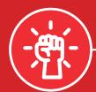

## 人才理念

选人重德、用人凭能

## 2025年所获荣誉

马鞍山华旺  
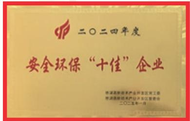

text_image

二〇二四年度
安全环保“十佳”企业
特津高新技术产业开发区管委会
特津高新技术产业开发区管委会
二〇二五年一月

·2024年度安全环保十佳企业

马鞍山华旺  
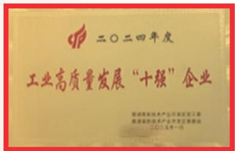

text_image

二〇二四年度
工业高质量发展“十强”企业
常熟高新技术产业开发区定增工程
推进高新技术产业开发区定增推动
二〇三五年一月

·2024年度工业高质量发展士强企业

马鞍山华旺  
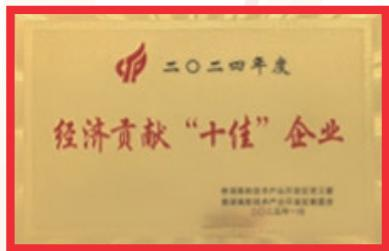

text_image

二〇二四年度
经济贡献“十佳”企业
中国高新技术产业开发区管理处
国家高新技术产业开发区管理处
2020年1月

·2024年度经济贡献十佳企业

马鞍山华旺  
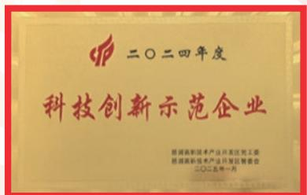

text_image

二〇二四年度
科技创新示范企业
胡湖高新技术产业开发区党工委
胡湖高新技术产业开发区管委会
二〇二五年一月

·2024年度科技创新示范企业··

马鞍山华旺  
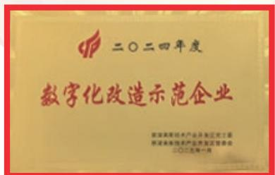

text_image

二〇二四年度
数字化改造示范企业
国家高新技术产业开发区职工安置
国家高新技术产业开发区管委会
二〇二四年六月

·2024年度数字化改造示范企业·

马鞍山华旺  
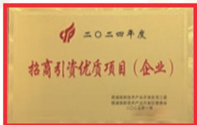

text_image

二〇二四年度
招商引资优质项目（企业）
国家高新技术产业标准化研究总署
国家高新技术产业开发区管委会
2015年第一期

·2024年度招商引资优质项目（企业）·

华旺科技  
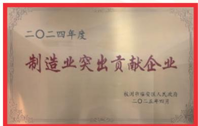

text_image

二〇二四年度
制造业突出贡献企业
杭州市临安区人民政府
二〇二五年四月

·制造业突出贡献企业

华旺科技  
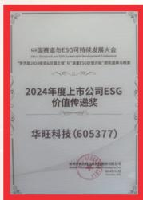  
·2024年度上市公司ESG价值传递奖·

华旺科技  
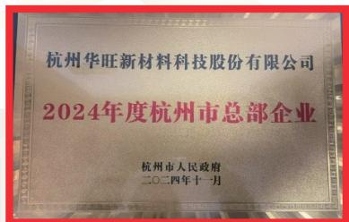

text_image

杭州华旺新材料科技股份有限公司
2024年度杭州市总部企业
杭州市人民政府
二〇二四年十一月

·杭州市总部企业

## 2025年亮点绩效

## 经济绩效

营业收入320,199.53万元  
总资产605,223.12万元  
基本每股收益0.49元/股

归母净利润27,088.54万元  
归母净资产390,547.06 万元  
每股社会贡献值0.81元/股

纳税总额6,795.97万元

## 社会绩效

员工总人数 人783  
员工满意度 %100  
安全生产投入金额249.19万元

劳动合同签订率 100 %  
员工培训投入 11.87万元  
研发投入9,010.38万元

应缴社会保险覆盖率100 %

员工培训总时长 9,945小时

## 环境绩效

直接能源消耗量  
171.30 吨标准煤  
能源消耗强度  
0.24吨标准煤/万元  
直接温室气体排放量（范围一）  
4,739.76吨二氧化碳当量  
用水强度  
14.79吨/万元

间接能源消耗量  
73,660.63 吨标准煤  
温室气体排放总量  
279,713.69 吨二氧化碳当量  
间接温室气体排放量（范围二）  
274,973.93 吨二氧化碳当量  
环保投入总金额  
967.02 万元

能源消耗总量  
76,802.90 吨标准煤  
温室气体排放强度  
0.87 吨二氧化碳当量/万元  
总用水量  
4,735,122 吨

## 治理绩效

股东会召开总次数

4次

开展法律培训时长

124小时

董事会召开次数

6次

内部风险控制培训总时长

40小时

natural_image

Exterior view of a modern industrial water treatment facility with metal trusses and reflective water surface, two workers in uniform standing nearby (no signage or text visible)

## 可持续发展治理

## 可持续发展目标与愿景

华旺科技将“专业、专注、稳谨、发展”作为核心价值观，融合环保、安全、人才与经营等多重理念，全面推进可持续发展战略。公司致力于在实现经济效益持续增长的同时，积极履行社会责任，加强环境保护，完善公司治理，追求企业与员工、社会、自然的和谐共生。

  
环境  
华旺科技秉持“循环经济，绿色引领”的发展理念，将资源高效利用和清洁生产融入公司运营的各个环节，持续降低资源消耗，积极推动废弃物资源化利用。公司始终将环境保护视为自身的重要责任，并将其作为实现可持续发展的基本要素。

  
社会  
华旺科技将履行社会责任深度融入公司发展战略在创造经济价值的同时，积极借助公益行动回馈社会，并通过促进就业、完善人才培养机制，以科技创新推动产业进步，致力于实现公司与社会的协同发展。公司坚信，长期的成长有赖于社会的共同繁荣，将持续贡献力量，与各利益相关方携手创造更美好的未来。

  
治理

华旺科技始终秉承“安全为先，人才为本”的核心原则，搭建安全健康的工作环境，将每位员工的生命健康权益摆在首位，提供全方位的保障。在人才建设领域，公司秉持“选人重德、用人凭能”的理念，充分激活团队潜能，为公司高质量持续发展注入源源不断的强劲动能。依托科学完善的治理体系与走心的人文关怀，华旺科技正与全体员工凝心聚力、携手并肩，共赴更加辉煌的发展新征程。

## 贡献可持续目标

公司围绕联合国可持续发展目标（SDGs）积极开展ESG实践工作，践行可持续发展理念，力求实现商业价值和社会价值的和谐共赢。

## SDGs

## 华旺科技SDGs响应

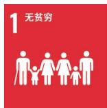

持续优化薪酬福利体系，援助在职困难员工，并积极响应乡村振兴战略，共谋富裕之路。

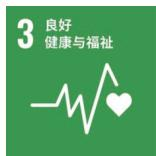

将员工的健康安全置于重要位置，全方位守护员工的生命健康。公司为员工提供完善的劳动防护工具，并定期安排职业健康体检，开展职业病危害风险因素检测。

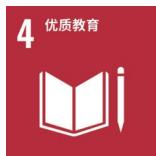

持续搭建完善培训体系，致力于为员工提供全面的培训教育机会，旨在确保每位员工，无论层级或岗位，都能享有清晰且顺畅的职业发展路径。

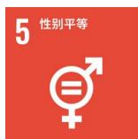

营造多元包容环境，抵制歧视，实行同岗同酬，坚持性别平等，积极雇佣残疾人与退伍军人，共筑和谐职场。

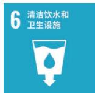

持续完善节水管理制度，加强节水宣传，通过水资源循环利用等措施，积极践行清洁用水和维护卫生设施。

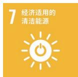

采用经济可行的清洁能源，将光伏系统融入厂区布局，为公司发展注入全新动力，有效降低生产成本，全方位提升市场竞争力。

## SDGs

## 华旺科技SDGs响应

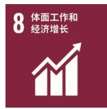

构建具有竞争力的薪酬福利体系，充分激发员工的创造力，开展多元 化的活动，提升员工幸福感。

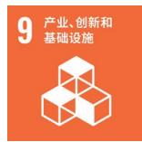

贯彻“尊重知识、尊重人才”的理念方针，积极投身新产品、新技术、新工艺研发，始终将科技创新作为公司发展的核心动力，持续强化知识产权保护。

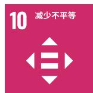

确保招聘与晋升机会公平公正，始终坚守同工同酬原则，积极推行民主化管理机制，坚决抵制强迫劳动，杜绝雇佣童工现象。

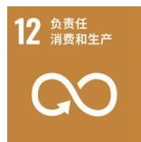

强化过程质量把控，落实从源头至出厂的全流程质量监管，确保全过程具备可追溯性，最大程度提升产品的可靠性与稳定性。

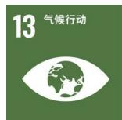

积极探索“双碳”有效路径，持续优化管理体系，加大对清洁能源的投入，降低运营过程中的碳排放，推动公司全产业链绿色低碳转型。

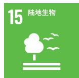

坚守绿色生态发展观，严格遵循环保法规，保障运营不扰周边生态，促成人与自然和谐相处。

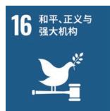

坚持合规经营原则，保障股东合法权益，确保信息披露的及时准确性不断推动廉洁文化建设，对贪腐行为采取零容忍立场。

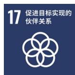

秉持积极主动的态度，致力于与供应商构建健康、和谐且稳固的商业合作关系以高度的责任感和使命感，共同维护公正，透明目有序的商业环境。

## 可持续发展治理架构

公司高度重视可持续发展工作，持续完善ESG治理体系与运行机制，强化董事会对公司ESG事务的监督与管理力度。公司已构建起涵盖决策层、管理层与执行层的三级ESG管理架构。其中，董事会作为公司ESG事务管理与信息公开披露的最高决策主体，负责公司整体的ESG战略规划及中长期发展规划，同时对ESG领域潜在的风险与发展机遇开展全面评估研判；证券事务部负责公司ESG管理工作的统筹与协调，涵盖ESG管理、内外部沟通及信息披露等职责，定期向董事会呈报ESG工作进展、阶段性成果。ESG工作小组则聚焦ESG管理工作的落地执行，重点开展ESG相关议题的信息收集、梳理、分析及改进，通过定期内部研讨，促进ESG目标的达成，同步迭代优化ESG工作流程与实施方案。

## 决策层

## 董事会

制定ESG战略规划及中长期发展规划

## 管理层

## 证券事务部

负责公司ESG管理工作的统筹与协调，内外部沟通等

## 执行层

## ESG工作小组

负责ESG管理工作的落地执行，开展ESG相关的信息收集、分析，细化工作流程和制定方案等。

## 利益相关方沟通

公司将利益相关方的核心关切，作为推进可持续发展战略落地的重要指引。通过精准识别对公司经营管理与业务发展具有现存及潜在重大影响的利益相关方群体，持续优化双向沟通体系，全面掌握并积极响应各方诉求与期望，最终达成多方协同、共生共赢的发展目标。

<table><tr><td>利益相关方</td><td>期望与要求</td><td>沟通渠道</td><td>回应</td></tr><tr><td>政府与监管机构</td><td>合规及风险管理响应国家战略环境合规管理</td><td>监管信息报送来访接待日常工作汇报与交流信息披露</td><td>合规经营加强环境管理</td></tr><tr><td>投资者和股东</td><td>稳健的投资回报高效的公司治理体系合规经营及时准确地信息披露</td><td>股东会投资者交流会定期报告与公告官网投资者关系专栏e互动平台</td><td>规范公司治理提升投关关系管理提升公司盈利水平</td></tr><tr><td>客户</td><td>优质的产品良好的服务信息安全与隐私保护研发创新</td><td>电话、公司官网客户拜访客户满意度调查</td><td>全面产品质量管理完善客户服务全流程管理确保隐私数据安全</td></tr><tr><td>员工</td><td>完善的福利与薪酬体系清晰的职业发展路径与完善的培养计划多元、平等且包容的工作环境完善的劳工权益保障体系</td><td>职工代表大会员工申诉渠道员工热线员工满意度调研</td><td>提供优质培训发放节日福利和合理薪酬倡导和谐职场</td></tr><tr><td>供应商与合作伙伴</td><td>廉洁、公平、绿色的供应链管理诚信合作</td><td>走访交流日常工作沟通</td><td>要求供应商合作伙伴签订反商业贿赂协议</td></tr><tr><td>社区与环境</td><td>良好的社区发展公益慈善活动</td><td>志愿活动社区宣传</td><td>公益活动</td></tr><tr><td>高等院校及科研院所</td><td>科研技术交流就业岗位</td><td>产学研合作科技论坛</td><td>参观拜访学习学术交流</td></tr></table>

## 重要性议题管理

华旺科技依据《上海证券交易所上市公司自律监管指引第14号——可持续发展报告（试行）》，在深入分析行业特点与公司实际运营的基础上，全面审视了各相关议题的表现。通过综合内部管理层分析与外部专家建议，并参考国际主流的可持续发展报告标准，公司识别出应对气候变化、环境合规管理、能源利用、职业健康与生产安全、创新驱动、产品和服务安全与质量、供应链安全七个具有双重重要性的议题。

## 步骤一

议题识别

基于全球可持续发展趋势、法律法规、宏观政策、造纸行业特点，以及公司的战略发展规划和生产经营实际，确定了28项对公司和利益相关方具有重要意义或影响的可持续发展议题。

## 步骤二

影响重要性分析

梳理各议题对外部环境、社会和经济潜在或实际的正面或负面影响，结合与利益相关方的沟通情况，对影响程度进行评估。

## 步骤三

财务重要性分析

公司以短期（0-1年）、中期（1-5年）及长期（5年以上）的时间框架为依据，围绕议题的风险与机遇，识别潜在的财务影响因素，结合公司相关管理层及外部专家判断，对议题的财务重要性展开综合评估与考量。

## 步骤四

议题优先级排序

公司管理层对议题的影响重要性和财务重要性评估结果进行审核讨论，并经由公司董事会最终确认议题的优先级排序情况。

重要性议题分析过程

## 2025年度议题识别清单

## 环境

应对气候变化

环境合规管理

污染物排放

废弃物处理

循环经济

能源利用

水资源利用

生态系统和生物多样性保护

## 公司治理

股东权益保护

税务合规

风险管理

ESG治理

尽职调查

利益相关方沟通

反商业贿赂及反贪污

反不正当竞争

规范公司治理

## 社会

保护员工合法权益

员工培训与发展

职业健康与生产安全

信息安全与隐私保护

产品和服务安全与质量

平等对待中小企业

供应链安全

客户权益保护

创新驱动

社会贡献

乡村振兴

注：1、较上一年议题变化说明：根据交易所指引议题清单，将议题“研发与创新”名称修改为“创新驱动”；议题“职业健康与安全”名称修改为“职业健康与生产安全”；将议题“产品质量与安全”修改为“产品和服务安全与质量”；将议题“负责任供应链管理”名称修改为“供应链安全”。  
2、科技伦理属于特定主体披露议题，公司暂不涉及，故本年度将其排除在公司议题库外。

## 重要性议题评估结果

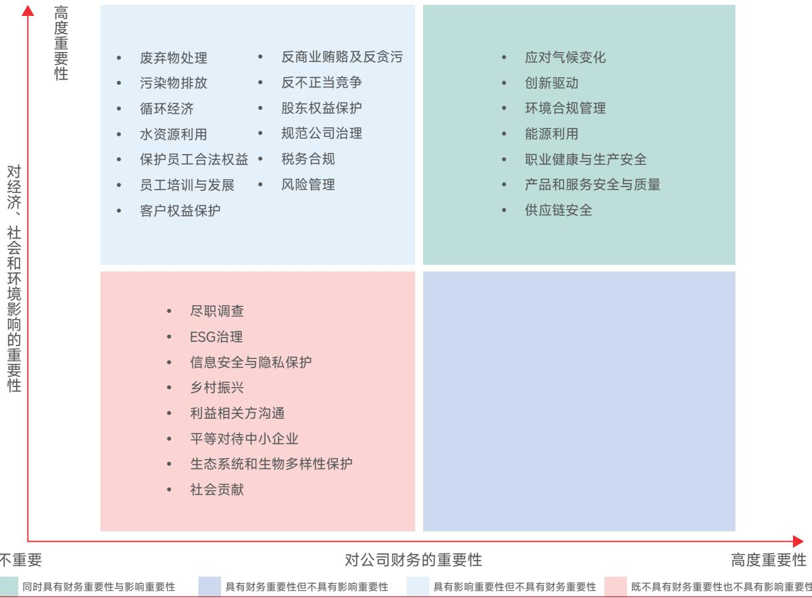

# 诚信治理 稳步合规经营

华旺科技始终以合规经营为底线，以规范治理强根基，恪守商业道德准则，依托健全治理体系与行业标杆责任，为可持续发展注入稳健动力。

## 响应的 SDGs

和平、正义与强大机构促进目标实现的伙伴关系

公司治理 21

投资者权益权益 24

合规经营与风险管理 26

商业道德 28

党政建设 31

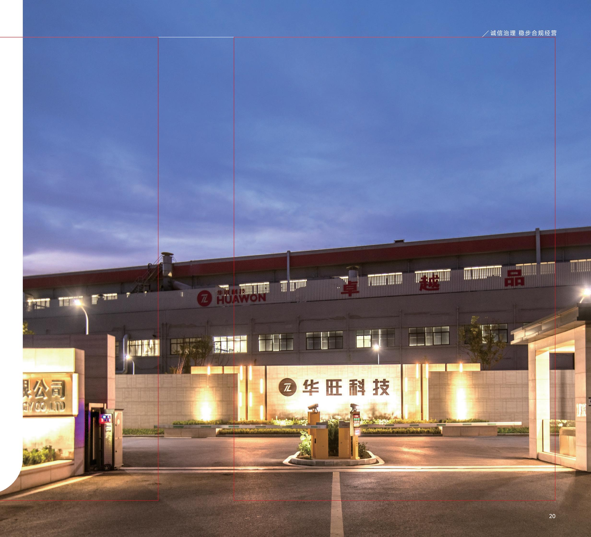

text_image

／诚信治理 稳步合规经营
HUAWON 卓越品
有限公司
GY CO., LTD
华旺科技
20

## 公司治理

## 治理结构

华旺科技严格按照《中华人民共和国公司法》《中华人民共和国证券法》《上市公司治理准则》以及中国证监会、上交所相关法律法规要求，进一步修订了《公司章程》等多项内部制度，持续完善法人治理架构、健全内部管理体系。公司已建立由股东会、董事会和管理层组成的公司治理架构，构建清晰、科学、高效的分工协作与制衡约束机制，推动公司实现科学且高效的运营。

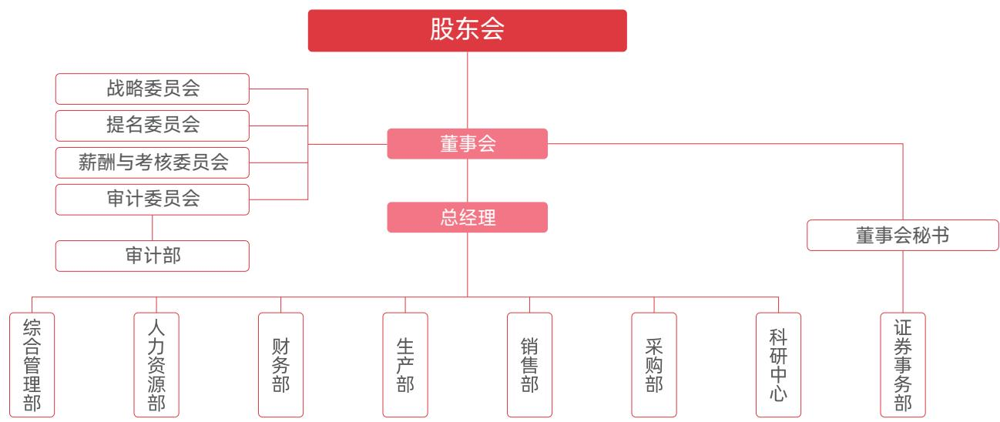

flowchart

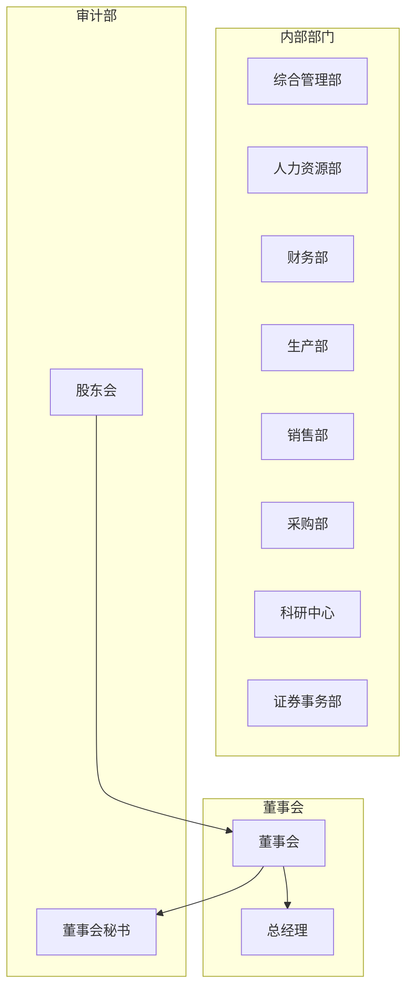
```mermaid
graph TD
  A["股东会"] --> B["董事会"]
  B --> C["总经理"]
  B --> D["董事会秘书"]
  
  subgraph Board [董事会]
    B
    C
  end
  
  subgraph Departments [内部部门]
    E1["综合管理部"]
    E2["人力资源部"]
    E3["财务部"]
    E4["生产部"]
    E5["销售部"]
    E6["采购部"]
    E7["科研中心"]
    E8["证券事务部"]
  end
  
  subgraph Audit [审计部]
    A
    B
    C
    D
  end
```

## 股东会

股东会是公司的权力机构，严格遵守《公司意程》《股东会议事规则》等相关规定依法行使职权，按规范响应股东会的召集和履行相关表决程序，决定公司经营方针和投资计划。公司为股东提供线上与线下相结合的投票方式，为股东参与股东会提供便利，确保所有股东都能依法行使权利。股东会审议影响中小投资者利益的重大事项时，对中小投资者的表决单独计票，并对计票结果进行公开披露。

## 关键

报告期内，公司共召开股东会4次，包括1次年度股东会和3次临时股东会，

共审议通过议案24项。

## 董事会

董事会是公司的常设机构，是公司经营决策和业务的领导机构，是股东会决议的执行机构，向股东会报告工作。公司严格执行《公司章程》《董事会议事规则》相关规定，明确董事会的职权范围，按程序开展董事会会议召集、审议程序、表决和信息披露等事项，确保公司决策的有效实施和规范运作。

## 关键 绩效

报告期内，公司共召开董事会6次，审议38项议案，

其中1项关于董事薪酬的议案全体回避，直接提交股东会审议，

其余37项议案均审议通过。

## 独立性与多元化

为规范公司行为 充分发挥独立董事在公司治理中的作用 促进公司独立董事尽责履职 公司于报告期内修订了《独立董事工作制度》，严格按照制度要求提名选举独立董事，独立董事参与董事会各项决策流程，对审议事项出具清晰明确的独立意见；同时监督公司与控股股东、实际控制人、董事及高级管理人员之间可能存在的重大利益冲突事项，以此保障董事会决策不对中小股东合法权益造成损害。

公司高度重视董事会多元化建设，在董事提名与委任环节，综合考量性别、年龄、教育背景、专业技能及文化素养等多重维度。现任董事会成员履历覆盖不同行业，专业领域分布广泛，全体成员均具备胜任岗位所需的履职能力与职业素养。

公司董事会共设9名成员，其中3名独立董事，1名职工代表董事，其中女性成员2名，占比达22.22%。

natural_image

Illustration of a business presentation with a presenter pointing at a chart, and three other people seated at desks (no text or symbols present)

## 董事会专门委员会

董事会下设战略委员会、提名委员会、薪酬与考核委员会、审计委员会四大委员会，并制定委员会议事规则，明确各委员会组成、职责、会议等内容。专门委员会均由公司董事、独立董事担任。各委员会成员根据公司实际情况并按照各自议事规则履行职责，为董事会提供专业、高效的决策支持。

<table><tr><td>专门委员会</td><td>独立董事(位)</td><td>独立董事占比(%)</td><td>独董是否担任召集人</td><td>召开会议次数(次)</td><td>审议通过议案(项)</td></tr><tr><td>战略委员会</td><td>1</td><td>33.33</td><td>否</td><td>0</td><td>0</td></tr><tr><td>审计委员会</td><td>2</td><td>66.67</td><td>是</td><td>6</td><td>9</td></tr><tr><td>提名委员会</td><td>2</td><td>66.67</td><td>是</td><td>1</td><td>1</td></tr><tr><td>薪酬与考核委员会</td><td>2</td><td>66.67</td><td>是</td><td>4</td><td>4</td></tr></table>

## 董高薪酬管理

为建立和完善经营者的激励约束机制，保持公司核心管理团队的稳定性，公司制定了《董事、高级管理人员薪酬管理办法》，由董事会薪酬与考核委员会制定考核标准并进行考核和审查相关薪酬决定机制、决策流程、支付与止付追索安排等政策和方案，且需经董事会同意提交股东会审议通过后方可生效。

公司董事及高级管理人员薪酬主要构成为基本薪酬、绩效薪酬和中长期激励等收入，独立董事可以在公司领取独立津贴，但不再另行发放薪酬。公司董事、高管违反义务致公司受损，或对财务造假等违法违规行为有过错的，公司依情节减少或停付未支付的绩效薪酬与中长期激励收入，并全额或部分追回相关行为发生期间已支付的上述收入，旨在维护公平公正公开的薪酬考核体系，充分发挥公司董高的积极性和保证公司运作的合规性。

bar

| Category | Value |
| --- | --- |
| Bar 1 | ~50 |
| Bar 2 | ~35 |
| Bar 3 | ~48 |
| Bar 4 | ~62 |

## 投资者权益保护

## 信息披露

公司严格遵守《上市公司信息披露管理办法》等相关法律法规，于报告期内修订了《信息披露管理制度》，进一步规范公司的信披治理架构、信披流程和信披义务，确保信息披露的真实、准确、及时、完整。

公司信息披露事务由董事长作为第一责任人，由董事会负责实施，董事会秘书协调相关事务，证券事务部为信披事务管理部门，共同开展公司报告、重大事件公告的编制、审议和披露程序，确保公司合法合规履行信息披露义务，并持续提升信息披露质量。

## 关键 绩效

报告期内，公司对外披露4份定期报告，43份临时报告，

未出现因信息披露违规而受处罚事件。

## 投资者关系管理

华旺科技将投资者关系管理视为公司价值的关键要素，始终以维护投资者合法权益为核心出发点。公司严格遵循现行法律法规及《公司章程》的相关要求，于报告期内完成了《投资者关系管理制度》的修订完善工作，为投资者关系管理工作的标准化、规范化开展筑牢制度根基。

公司积极搭建多维度、立体化的沟通桥梁，通过组织现场调研走访，举办定期业绩说明会，依托“上证e互动”平台开展线上交流等多元形式，与广大投资者建立常态化互动机制，有效地深化了投资者对公司经营理念、业务布局与发展前景的认知与认同更切实保障了投资者的知情权与参与权，助力公司与投资者构建起长期稳定、互利共赢的良性互动生态。

## 关键绩效

举办业绩说明会3次

## 股东回报

公司秉持股东权益维护与可持续价值增长并重的理念，恪守长期稳定的现金分红承诺，稳步夯实中小股东的长期投资信心。公司严格遵守《关于进一步落实上市公司现金分红有关事项的通知》等相关规定，制定《未来三年股东分红回报规划（2023年-2025年）》，以科学的分红决策及监督机制，致力于保持公司利润分配政策的连贯性与稳定性。

## 关键 绩效

截至报告期末，公司已实现连续5年现金分红，累计分红达13.62亿元。

分红履约能力与股东回馈力度的同步增强，充分彰显公司对未来发展的坚定底气，全方位保障全体股东的合法权益。

<table><tr><td colspan="5">华旺科技近3年分红情况</td></tr><tr><td>关键绩效</td><td>单位</td><td>2023年度</td><td>2024年度</td><td>2025年度</td></tr><tr><td>每股现金分红</td><td>元</td><td>1.10</td><td>0.87</td><td>0.44</td></tr><tr><td>派现总额(含税)</td><td>元</td><td>364,513,435.00</td><td>403,585,944.30</td><td>244,934,917.92</td></tr><tr><td>占合并报表中归属于上市公司股东净利润的比率</td><td>%</td><td>64.39</td><td>86.08</td><td>90.42</td></tr></table>

注：2025年度公司现金分红（包括中期已分配的现金红利）总额 244,934,917.92 元（含税）

## 舆情管理

为高效稳妥处置各类舆情给公司股价表现与商业信誉带来的潜在冲击，公司制定了《舆情管理制度》，并组建以总经理为组长、董事会秘书为副组长的专项舆情工作组。舆情工作组作为公司舆情管控体系的核心责任主体，全面统筹公司各类舆情事件的应对处置事宜，履行相关工作的决策部署职能，并结合实际情形审核确定对外披露信息的具体内容。

发生重大舆情时，舆情工作组组长需结合实际态势，牵头组织工作组专题会议，研究敲定应对策略与具体工作部署。公司证券事务部联动相关业务部门，同步启动舆情实时监测机制，动态追踪舆情发展走向；舆情工作组则根据舆情演化情况采取多元化处置手段切实遏制舆情扩散范围。

## 债权人权益保障

公司重视债权人权益，将债务履约管理纳入日常重点工作。报告期内，公司按约足额、按时偿债，无逾期还款，保持良好信用。同时，定期通报经营、项目进展等信息，保障债权人对经营风险的知情权。针对重大融资或经营变动，公司主动与债权人前置沟通，听取意见并反馈方案，构建互信共赢关系。

# 合规经营与风险管理

## 风险管理

风险管理是公司实现高效有序运营的重要基石。公司严格遵守相关法律法规，建立完善的风险管理及内部控制休系，为全面应对环境变化与内部挑战 公司持续深化风险识别与管理机制全方位审视市场，财务，运营及技术等内外部潜在风险。通过运用SWOT分析、QEMS管理体系等多种评估工具，公司对各类风险进行深入剖析与量化评估，从而精准把握经营环境的不确定性，为制定有效的风险应对策略提供依据。

公司围绕经营状况、市场竞争力、利益相关方诉求及财务状况等关键领域，系统开展风险评估工作，旨在准确识别潜在风险与发展机遇，并对这些风险和机遇依据其影响程度划分风险等级，编制《风险和机遇评估分析表》，实现风险分级管理。基于评估结果，各部门协同合作，针对各项内外部影响因素制定相应应对方案，并持续跟踪实施效果，确保风险控制措施落到实处、取得实效。

## 风险文化建设

公司重视内部风险管理能力提升，通过开展风险管理及内部控制工作，组织相关培训活动，持续提升风险监测、评估及应对能力，以有效降低公司经营过程中可能面临的各种风险。

关键 绩效

<table><tr><td>内部风险培训次数</td><td>1次</td></tr><tr><td>内部风险控制培训总人次</td><td>20人次</td></tr><tr><td>内部风险控制培训总小时</td><td>40小时</td></tr></table>

## 内部控制

公司持续推进内部控制信息化建设，全面规范内部控制管理，着力构建高效内控体系，保障公司运营合法合规，夯实合规经营基础。公司结合内外部环境变化及自身发展实际，定期对内部控制体系开展评估、更新与优化，确保其完备性与合理性，并推动各项内控措施有效落地，为公司持续健康发展提供有力支撑。

报告期内，公司对内部控制体系的有效性和执行情况进行了系统评价，并聘请第三方会计师事务所开展独立、客观的鉴证工作出具了《内部控制审计报告》公司内部控制体系持续有效运行未发现财务报告及非财务报告领域存在重大或重要的内部控制缺陷。

## 关键绩效

开展法律培训次数

开展法律培训时长

参与法律培训人数

6次

124小时

53人次

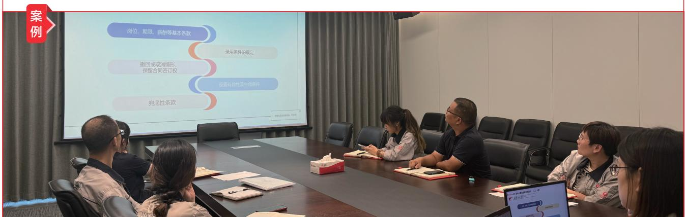

text_image

案例
岗位、期限、薪酬等基本条款
录用条件的规定
撤回或取消情形，
保留合同签订权
设置有效性及生效条件
兜底性条款

法律培训

## 税务管理

公司依据相关税务法律法规制定《华旺科技税务管理制度》，建立健全税务管理体系，通过有效的税务风险评估和考核机制实现税务风险的预警，控制和应对，公司规范涉税业务的核算，电报与评估流程，要求各法人公司及时向当地主管税务机关完成各项纳税申报并履行合并纳税义务。此外，公司通过定期审查税务风险报告强化日常培训等方式，夯实税务管理基础，从而有效规避税务风险，持续提升纳税管理的规范水平与运营效率，报告期内 公司纳税总额6.795.97万元

## 关联交易

公司制定《关联交易管理制度》，明确了关联人与关联交易、关联交易审议、关联交易披露等相关事项，以确保公司与关联方之间的关联交易符合公平、公正、公开的原则，保障公司、股东和债权人的合法权益。

## 商业道德

## 反商业贿赂及反贪污

公司恪守商业道德，严格遵守《中华人民共和国公司法》《关于禁止商业贿赂行为的暂行规定》等法律法规，制定了《反商业贿赂管控》等制度，强化对商业贿赂及贪污风险的管控，并对一切形式的商业舞弊行为持零容忍态度。

公司审计部作为公司内部反商业贿赂的监督管理部门，承担日常反商业贿赂管理职责，包括每年定期对公司整体反商业贿赂情况进行监督检查，组织并督促各部门开展反商业贿赂自查工作，并在此过程中对各部门进行随机抽查。重点检查内容涵盖自查工作的具体实施过程、自查与抽查中所发现问题的详细情况，以及针对这些问题所采取的处理措施和后续跟进情况。

同时，公司持续强化产业链、供应链的廉洁治理，致力于防范采购环节中出现违反商业道德的行为。公司每年对涉外业务经办人员的对于反商业贿赂工作进行全面评估，旨在及时识别发现工作中存在的不足并进行纠正。对于严重违反公司规定的行为视情节轻重进行上报处理涉嫌经济犯罪的人员将移送司法机关处理

## 关键 绩效

报告期内，员工廉洁从业等有关商业道德书签署率为100%。

<table><tr><td>管控对象</td><td>管控措施</td></tr><tr><td>对内</td><td>公司对所有员工进行反商业道德管控,特别是从事材料采购、外协加工、外包业务、设施工程、业务销售、设备采购和维护、质量监督以及人、财、物管理活动的相关人员将被重点关注。</td></tr><tr><td>对外</td><td>公司持续加强第三方的廉洁管理规范,要求与公司有业务往来的供应商、服务商、承包商与公司签订反商业贿赂相关协议。</td></tr></table>

## 廉洁文化建设

公司高度重视廉洁文化氛围营造及建设，面向人力资源部、销售部、车间负责人等重点部门及岗位员工，不定期开展廉洁教育相关培训，内容涵盖廉洁相关的法律法规解读与公司内部制度宣导等，以持续强化全员廉洁、合规意识。

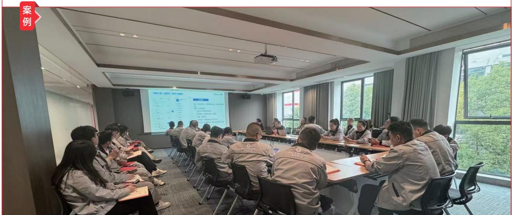

text_image

案例
功能11号—测试区（样本与例）

积极开展廉洁教育培训

<table><tr><td>指标</td><td>2024年</td><td>2025年</td></tr><tr><td colspan="3">董事</td></tr><tr><td>参与人数</td><td>6人</td><td>6人</td></tr><tr><td>人数占比</td><td>100%</td><td>100%</td></tr><tr><td>培训总时长</td><td>6小时</td><td>12小时</td></tr><tr><td>平均时长</td><td>1小时/人</td><td>2小时/人</td></tr><tr><td colspan="3">管理层</td></tr><tr><td>参与人数</td><td>50人</td><td>69人</td></tr><tr><td>人数占比</td><td>100%</td><td>100%</td></tr><tr><td>培训总时长</td><td>150小时</td><td>207小时</td></tr><tr><td>平均时长</td><td>3小时/人</td><td>3小时/人</td></tr></table>

<table><tr><td>指标</td><td>2024年</td><td>2025年</td></tr><tr><td colspan="3">员工</td></tr><tr><td>参与人数</td><td>217人</td><td>180人</td></tr><tr><td>人数占比</td><td>22.56%</td><td>25.42%</td></tr><tr><td>培训总时长</td><td>217小时</td><td>360小时</td></tr><tr><td>平均时长</td><td>1小时/人</td><td>2小时/人</td></tr></table>

## 反不正当竞争

公司严格遵循《中华人民共和国反垄断法》《中华人民共和国反不正当竞争法》等相关法律法规，持续完善诚信公平的竞争体系，坚决抵制各类不正当竞争行为，严格恪守商业道德准则。同时，公司注重引导员工树立良好的商业操守和职业品行，确保所有竞争行为合法合规，积极推动构建规范、健康的竞争环境，为行业可持续发展注入正能量。

报告期内，公司未发生重大违反不正当竞争相关法律法规的情形。

<table><tr><td>指标</td><td>2024年</td><td>2025年</td></tr><tr><td>反垄断与公平竞争的培训活动次数</td><td>1次</td><td>1次</td></tr><tr><td>反垄断与公平竞争培训参与人数</td><td>20人</td><td>20人</td></tr><tr><td>反垄断与公平竞争培训总时长</td><td>20小时</td><td>40小时</td></tr></table>

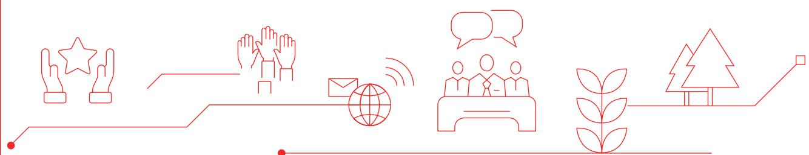

flowchart

```mermaid
graph LR
  A["Hand gesture"] --> B["Global Communication"]
  B --> C["People Meeting"]
  C --> D["Plant & Tree Systems"]
```

## 举报与举报人保护

公司建立完善的投诉举报机制，确保举报人权益得到充分保障。公司提供多元化举报渠道，包括但不限于举报平台二维码、举报电话、举报邮箱等，以便举报者能够便捷、安全地提出他们的反馈与举报。

公司对检举人信息采取严格保密措施，并对经核实的有效检举予以相应奖励。同时，公司针对涉外业务经办人员设立个人反商业贿赂档案，该档案将纳入其年度绩效评估及后续聘用的重要考量依据。

举报平台二维码  
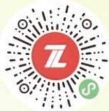

hwfk@huawon.cn

0571-63756039

## 党政建设

公司始终坚持以党建引领为核心，按照“围绕生产抓党建，抓好党建促发展”的工作思路，推动党建工作与生产经营管理有机融合、互促共进，充分发挥党员在生产经营各环节的先锋模范作用。

公司持续推进党组织规范化建设，严格落实党支部工作条例，开展相关党务工作。于报告期内完成党支部换届与党务交接工作，开展2025年度基层党组织组织生活会与民主评议党员工作。同时，重视支部党员队伍建设，按党员发展流程做好入党积极分子发展工作。截至报告期末，公司现有党支部1个，正式党员24名

2025年，公司党支部依托主题党活动扎实开展主题教育理论学习。原原本本研读党的二十大报告，党章，《习近平新时代中国特色社会主义思想专题摘编》并开展讨论：同时，深入学习贯彻中央八项规定精神及相关读本通过开展警示教育案例学习筑牢思想防线。始终紧扣贯彻习近平新时代中国特色社会主义思想这一主题，聚焦“学思想、强党性、重实践、建新功”的总要求，深刻领会习近平总书记相关重要论述及党内法规，推动理论学习与工作实效深度融合。

natural_image

Stylized illustration of a city park with red and white buildings, green trees, and people walking around a circular plaza (no text or symbols)

# 绿色生产华旺低碳未来

华旺科技主动推行节约资源和保护环境的理念，实行绿色低碳发展战略，以积极态度应对全球气候变化的挑战。公司深知环境保护与可持续发展的重要意义，严格遵循环保法律法规，不断完善环境管理体系，力求成为资源节约型、环境友好型公司。

## 响应的 SDGs

6 清洁饮水和卫生设施

13 气候行动

15 陆地生物

应对气候变化 35

环境管理与污废治理 39

资源利用 49

生态系统与生物多样性保护 54

natural_image

Paper-cut art illustration of a city with red buildings, green parks, and a bicycle on a world map, with an airplane flying overhead (no text or symbols)

## 应对气候变化

华旺科技深刻意识气候变化给生态环境、社会发展与经济运行带来的多维影响，高度重视气候变化问题，积极探索“碳达峰、碳中和”的有效路径，主动应对气候风险。公司多措并举推进降碳减排实践，并从治理、战略、风险和机遇管理、指标与目标四大维度出发，推进气候变化应对工作，推动造纸生产全产业链的绿色低碳转型，为构建绿色、低碳、可持续未来贡献力量。

## 治理

公司专项组建节能工作领导小组，搭建起以总经理为最高负责人的三级管理架构，全面统筹“双碳”相关政策的贯彻落地，牵头制定针对性的节能减排方案，并对各项举措的推进成效实施全流程监督管控，保障公司在应对气候变化的各项工作高效、有序开展。

公司常态化开展温室气体排放排查，精准定位生产运营各环节的排放源头与关键节点，推动节能减排行动深度融入公司长期战略规划，为公司的低碳转型之路明确方向，稳步迈向高质量可持续发展新阶段。

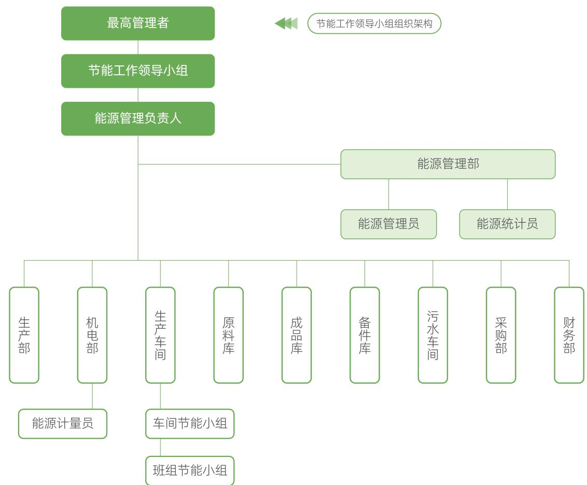

flowchart

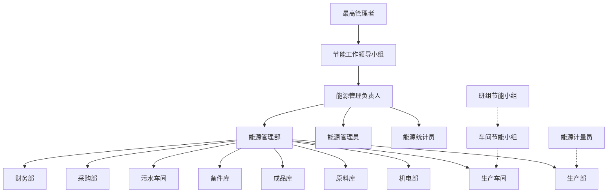
```mermaid
graph TD
  A["最高管理者"] --> B["节能工作领导小组"]
  B --> C["能源管理负责人"]
  C --> D["能源管理部"]
  C --> E["能源管理员"]
  C --> F["能源统计员"]
  D --> G["生产部"]
  D --> H["机电部"]
  D --> I["生产车间"]
  D --> J["原料库"]
  D --> K["成品库"]
  D --> L["备件库"]
  D --> M["污水车间"]
  D --> N["采购部"]
  D --> O["财务部"]
  P["能源计量员"] -.-> G
  Q["车间节能小组"] -.-> I
  R["班组节能小组"] -.-> Q
```

## 战略

为精准洞察公司运营过程中面临的各类气候相关潜在风险与发展机遇，华旺科技将气候变化影响评估结果深度嵌入公司战略规划的核心环节，持续优化业务发展布局与资源调配策略，有效提升了公司应对气候变化的适配能力与韧性。基于风险防控与机遇挖掘的双重视角，公司系统梳理了气候影响、宏观环境分析、产业政策导向等相关文献成果，结合自身业务运营特点与发展实际，完成了气候变化对公司业务可能产生的各类影响的识别、分析与评估工作。

<table><tr><td colspan="2">风险类型</td><td>风险描述</td><td>财务影响说明</td><td>发生可能性</td><td>影响大小</td><td>影响时间范围</td><td>影响价值链环节</td><td>应对措施</td></tr><tr><td rowspan="2">物理风险</td><td>极端天气事件</td><td>1.恶劣气候可能造成厂房设备损坏,阻碍员工到岗及物资配送,导致生产计划延误,最终造成营收下滑;2.作为造纸企业,生产原料中含有化学制剂,极端气象条件可能引发有害物质泄漏,造成土壤及地下水资源污染;3.强降水等极端天气易引发厂区积水,导致未经处理的污水扩散,对周边水域环境造成破坏,影响附近居民的正常生活秩序;4.异常气候事件可能导致纸浆等主要原材料市场价格波动上涨,增加公司采购成本,对整体生产运营产生不利影响。</td><td>营业收入下滑运营成本增加固定资产减值损失</td><td>高</td><td>较大</td><td>短</td><td>运营</td><td>1.实施设备全生命周期管理,建立定期检修保养机制,保障生产系统持续稳定运行;2.组织应急演练,提升突发状况响应能力;3.提前做好应急物资储备,执行日常动态巡检制度,确保关键物资库存充足;4.启动雨污分流应急程序,关闭市政雨水排放口,开启事故应急池导流阀门;5.构建上游供应链战略合作联盟,签订长期框架协议保障原料稳定供应。</td></tr><tr><td>极端温度</td><td>1.极端温度条件下,为维持生产环境稳定性需增加能源投入,进而导致温室气体排放量上升;2.极端温度可能引发生产设备故障及原辅材料变质,例如管道堵塞、原料性能劣化等问题,对产品质量稳定性和生产效率造成负面影响。</td><td>营业收入下滑运营成本增加公司市场声誉受损</td><td>中</td><td>适中</td><td>短</td><td>运营下游</td><td>1.实施能源精细化管理策略,通过技术升级与流程优化降低能源损耗;2.引入耐极端温度特性的专用生产设备,提升设备在高低温环境下的运行稳定性;3.建立原材料智能仓储调控系统,实时监测并调节温湿度参数,预防极端温度引发的原料性能劣变,确保产品质量的持续稳定。</td></tr><tr><td>物理风险</td><td>干旱</td><td>作为典型的造纸企业,其生产流程对水资源存在高度依赖性。干旱导致可用水资源供给受限,直接破坏供应链的稳定性与运营效率,不仅推高用水成本,还造成经营收入下滑。</td><td>营业收入下滑运营成本增加</td><td>中</td><td>较大</td><td>短</td><td>运营下游</td><td>实施水资源循环利用技术与节水型生产工艺,提升整体用水效率。</td></tr><tr><td rowspan="3">转型风险</td><td>政策和法律风险</td><td>造纸行业作为重点排放行业,在温室气体排放及披露政策收紧的背景下,公司面临的排放监管要求持续趋严。</td><td>运营成本增加</td><td>高</td><td>较大</td><td>长</td><td>运营</td><td>1.密切跟踪温室气体排放披露的政策法规动态,建立政策解读响应机制,为合规信息披露奠定基础;2.依据法规要求在年度ESG报告中系统披露温室气体排放核心数据及管理措施;3.实施温室气体排放常态化排查,精准定位生产全流程各环节的排放节点与量化数据。</td></tr><tr><td>技术风险</td><td>低碳转型过程中,公司需加大新技术研发投入。新技术可能存在运行不稳定或失败的风险,进而可能增加运营成本。</td><td>运营成本增加</td><td>中</td><td>适中</td><td>中</td><td>运营</td><td>研发绿色低碳工艺技术并优先应用于核心生产环节。</td></tr><tr><td>声誉风险</td><td>造纸企业在能源利用和森林资源消耗等议题上的表现直接影响公司品牌形象。如果公司未采取有效的管理措施,可能会受到相关方的质疑,进而影响品牌声誉。</td><td>营业收入下降</td><td>中</td><td>适中</td><td>短中</td><td>上游运营</td><td>1、持续完善能源管理体系,实施节能减排措施;2、加强对供应链上游的ESG管理,确保采购原材料来自可持续森林。3、主动加强气候相关议题的信息披露,增加运营透明度。</td></tr><tr><td colspan="2">机遇类型</td><td>机遇描述</td><td>财务影响说明</td><td>发生可能性</td><td>影响大小</td><td>影响时间范围</td><td>影响价值链环节</td><td>应对措施</td></tr><tr><td colspan="2">市场机遇</td><td>伴随市场对绿色低碳纸制品的需求持续攀升,公司需强化低碳纸类产品的研发投入与产能布局,精准对接环保产品市场需求,同时协助产业链下游降低碳足迹,为全球气候治理贡献公司力量。</td><td>公司声誉增加市场份额扩张收入增加</td><td>中</td><td>适中</td><td>中长</td><td>运营下游</td><td>1.减少能源消耗及温室气体排放;2.优化产品结构,研发绿色低碳、环保的纸类产品。</td></tr></table>

注：公司对时间范围的界定为：短期（0—1年）、中期（1—5年）、长期（5年以上）

## 影响、风险和机遇管理

华旺科技着眼于气候变化衍生的潜在风险与发展机遇，将气候相关风险全面嵌入集团整体风险管理框架，搭建专业化的风险评估与管控机制，构建起气候风险识别、评估、处置的管理流程，为公司的稳健经营筑牢坚实屏障。

气候变化风险管理流程

<table><tr><td>风险识别</td><td>针对法规政策、社会环境、公司运营等场景下潜在的各类风险,精准界定风险覆盖范围与核心区域,持续搜集与风险清单相关的内外部各类信息,编制风险辨识表,系统开展现有面临风险的排查与识别工作。</td></tr><tr><td>风险评价</td><td>针对已识别的风险,分析风险发生性的高低、发生条件、对公司经营发展的影响程度进行分级,分别为高、一般、低。</td></tr><tr><td>风险应对</td><td>结合风险等级划分结果及既定的风险管理规范,涵盖风险偏好、风险承受阈值等核心要素,统筹推进资源配置工作,并编制风险控制表。针对不同层级的风险等级,制定差异化管控措施;针对重大风险事项,单独制定专项控制清单。</td></tr><tr><td>风险管理监督和考核</td><td>依据各类风险的特性与等级,明确专项检查责任人及常态化检查周期;针对检查人员识别出的风险管理漏洞与缺陷,通过动态管控措施持续完善管理流程,确保风险管理工作落地见效。</td></tr></table>

指标与目标

<table><tr><td>关键指标</td><td>单位</td><td>2024年</td><td>2025年</td></tr><tr><td>温室气体排放总量</td><td>吨二氧化碳当量</td><td>285,178.89</td><td>279,713.69</td></tr><tr><td>温室气体排放强度</td><td>吨二氧化碳当量/万元</td><td>0.757</td><td>0.87</td></tr><tr><td>直接温室气排放量(范围一)</td><td>吨二氧化碳当量</td><td>316.26</td><td>4,739.76</td></tr><tr><td>间接温室气体排放量(范围二)</td><td>吨二氧化碳当量</td><td>284,862.63</td><td>274,973.93</td></tr><tr><td>温室气体减排量</td><td>吨二氧化碳当量</td><td>10,003.00</td><td>13,277.18</td></tr></table>

注：  
1 范围一温室气体排放量包含柴油，煤油等化石能源燃烧活动所产生的温室气体排放，范围一温室气体排放参考《造纸和纸制品生产企业温室气体排放核算方法与报告指南（试行）》。  
范国二温室气体排放量包含电力、热力等间接能源所产生的温室气体排放。2025年度电力二氧化碳排放因子采用0.5366kgCO2/kwh；2024年度电力二氧化碳排放因子采用全国电力平均值0.5366kgCO2/kwh；热力排放因子参考《造纸和纸制品生产企业温室气体排放核算方法与报告指南（试行）》采用0.11CO2/GJ。  
3、2024年度、2025年度统计口径为华旺科技、马鞍山华旺。  
4 温室气体减排量来源于光伏发电项目所减少的温室气体排放，减排计算方式参照光伏发电量万千瓦\*10\*0.5366

## 温室气体减排措施

为切实落实温室气体控排目标，公司积极落地系列节能减排举措，着力削减生产运营过程中的碳排放总量。报告期内，公司新增厂房屋顶光伏发电项目建设，装机规模达2.56Mw的光伏系统正式投入部署。公司已在总部及马鞍山华旺厂区均铺设了光伏发电系统，所产清洁电力直接应用于公司生产经营全场景，经核算，报告期内实现减少二氧化碳当量排放13,277.18吨。

## 环境管理与污废治理

公司以创建环境友好型企业为目标，严格遵守《中华人民共和国环境保护法》《中华人民共和国大气污染防治法》《中华人民共和国水污染防治法》《中华人民共和国固体废物污染环境防治法》等法律法规，积极开展环境管理与污染物治理工作，并不断提升环境管理水平，致力于降低公司运营全流程对环境产生的影响。

## 治理

公司秉持“节支降耗，污染预防，遵纪守法，持续改进”的环境管理方针 制定了《环境保护责任制》《建设项目环境保护管理制度》《环境治理管理制度》《环境保护设施运行管理制度》等多项制度，全面落实环保责任，明确各项工作的流程与执行标准，确保公司生产运营过程中，各项环保设施稳定运行，并严格执行污染物排放标准。

公司成立了以总经理为环保工作第一责任人的环境保护领导小组，下设安环办负责制定环境管理方针，并监督各部门负责人落实。

<table><tr><td>组织</td><td>职能</td></tr><tr><td>环境保护领导小组</td><td>建立并落实全员环保目标责任制,督促层层落实环保工作责任制。建立环保管理网络,配备专兼职环保管理员。建立健全环保机构,配备专兼职环保管理人员,定期主持召开生产环保专题会议。</td></tr><tr><td>安环部</td><td>组织制定公司环境保护目标及“三废”治理计划,并提出实施规划的具体方针和措施。监督检查执行“三同时”规定的情况,参加建设项目环保及其设施的验收工作。对各部门环保工作开展情况的考核,监督各部门建立健全管理网络。确定环境监测点,并建立制度、档案和其他基础工作。</td></tr></table>

<table><tr><td>组织</td><td>职能</td></tr><tr><td>各部门职责</td><td>严格执行生产操作规程及各项管理制度。严格执行本部门的“三废”处置规定,不得随意丢弃、放弃和私自处置。正确分析、判断和及时处理各种事故苗头,把环保事故处理在事故萌芽状态。在事故发生时,及时如实地向上级汇报,按事故预案正确处理,并保护好现场,做好记录。</td></tr></table>

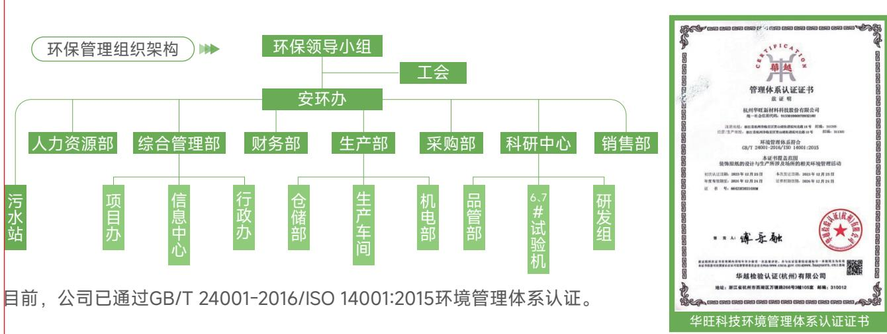  
目前，公司已通过GB/T 24001-2016/ISO 14001:2015环境管理体系认证。

## 环境保护考核

根据环境保护的需要，公司制定《环境保护考核制度》，对环境保护目标绩效以及职责的履行情况进行严格考核，将环境保护目标绩效、职责的履行情况纳入年终考核中，并根据考核结果给予奖惩，确保将环境保护责任落到实处，达成环境保护目标。

## 环境信息披露

公司高度重视环境责任，严格遵守国家及地方相关法律法规。公司如实记录排污数据并上传至监管平台，定期披露公司年度环境信息依法披露报告全方位接受环境保护主管部门和社会公众的监督 积极践行绿色发展承诺。根据《浙江省环境信用评价管理办法（试行）》，华旺科技环境信用等级为A。

natural_image

Illustration of a stylized city skyline with solar panels, buildings, and greenery under a sunny sky (no text or symbols)

## 战略

公司从环境管理的风险和机遇双面切入，参照相关法律法规和自身运营发展，识别与评估公司的环境合规问题，为后续改进提供依据，坚守环保底线，促进公司可持续发展。

<table><tr><td>风险类型</td><td>描述</td><td>财务影响说明</td><td>发生可能性</td><td>影响大小</td><td>影响时间范围</td><td>影响价值链环节</td><td>应对措施</td></tr><tr><td>政策风险</td><td>政府将来可能出台更严格的污染物排放标准,公司需投入更多资金进行处理设施升级改造、改进处理工艺。</td><td>增加环保成本</td><td>较高</td><td>较高</td><td>中期</td><td>运营</td><td>1、及时关注行业相关环保法律法规,根据环保法规的趋势,改进自身处理设施及处理工艺;2、关注环保前沿技术,紧跟新工艺动态,加强环保投入,应用先进工艺设施。</td></tr><tr><td>泄漏风险</td><td>污染物处理设施管线破裂泄漏,导致污染物泄漏到环境中,对环境和公众健康造成影响。</td><td>成本增加声誉受损</td><td>适中</td><td>较高</td><td>短期</td><td>运营</td><td>1、加强设备的检修、维护、管理;2、定期开展培训,加强操作人员的专业水平和安全意识;3、启动应急监测,对受污染水体进行收集,避免进入大的水环境。</td></tr><tr><td>末端排放故障风险</td><td>污水处理站故障、废气处理装置故障、固废管理不到位等造成污染物未得到有效处理,从而对接纳的污水处理厂、大气环境等造成不良影响,污染生态环境,对周边居民的身体健康造成潜在的危险,甚至引发社会舆论,影响公司声誉。</td><td>成本增加声誉受损</td><td>适中</td><td>较高</td><td>短期</td><td>运营</td><td>1、定期检修处理设施,确保各项设备处于良好的运行状态,可有效处理各类污染物,保障各类污染物达标排放;2、定期检查在线监测设备,使其处于良好的运行状态,可实时、动态监测污染物排放情况;3、异常时废水产生工序停止生产;4、废气装置故障,立即进行抢修并巡回检查。</td></tr></table>

<table><tr><td>风险类型</td><td>描述</td><td>财务影响说明</td><td>发生可能性</td><td>影响大小</td><td>影响时间范围</td><td>影响价值链环节</td><td>应对措施</td></tr><tr><td>环保信息披露</td><td>公司及子公司分别被杭州市生态环境局、马鞍山市生态环境局列为重点排污单位,需要根据监管要求,定期披露环境管理信息及污染物排放情况,如披露信息不符合规范,可能使公司受到处罚和声誉受损。</td><td>成本增加声誉受损</td><td>较高</td><td>适中</td><td>短期</td><td>运营</td><td>1、及时关注环境信息披露的要求、时间,及时合规地披露污染物与废弃物排放信息;2、定期对员工开展培训,确保员工了解最新环保法规、信息披露政策等,增强相关人员对信息披露要求的认识。</td></tr></table>

公司在环境合规管理方面的机遇如下：

<table><tr><td>机遇类型</td><td>描述</td><td>财务影响说明</td><td>发生可能性</td><td>影响大小</td><td>影响时间范围</td><td>影响价值链环节</td><td>应对措施</td></tr><tr><td>市场机遇</td><td>随着污染防治相关法律法规政策的收紧,下游市场对污染物低排放的需求增加。为公司发展绿色低碳的产品提供机遇。</td><td>收入增加</td><td>适中</td><td>较高</td><td>长期</td><td>运营下游</td><td>应用先进技术及设备,降低污染物排放水平,打造公司绿色纸类产品。</td></tr></table>

注：公司对时间范围的界定为：短期（0—1年）、中期（1—5年）、长期（5年以上）

## 影响、风险和机遇管理

## 环境风险管理

为确保能及时、有效地监控环境风险，公司编制《危险源的辨识与评价控制程序》《环境因素的识别与评价控制程序》等相关制度，建立科学、规范的环境风险识别和评价工作流程，以实现有效的风险管控。

<table><tr><td>环节</td><td>具体操作</td></tr><tr><td>风险识别</td><td>考虑环境因素的时态、状态、类型,各部门进行收集相关环境因素,相关部门进行识别相关环境因素。</td></tr><tr><td>风险评价</td><td>根据环境因素评价表,确定重大环境因素优先级,分别为紧急优先级、高度优先级、中度优先级、低度优先级。</td></tr><tr><td>风险应对</td><td>对紧急优先项、高度优先项重大环境因素,制定环境目标、指标和环境管理方案;对中度优先项重大环境因素,视情况制定环境目标、指标和环境管理方案;对因经济状况、技术条件等原因暂时无法实施的,制定具体的实施计划。</td></tr><tr><td>风险更新</td><td>当公司的活动、产品、服务发生较大变化或法规及其他要求更新时,各部门对环境因素进行补充识别,并报技术部组织进行环境因素评价以重新确定重大环境因素并对其进行管理。</td></tr></table>

## 环境监测

华旺科技根据排污证要求制定了杭州华旺与马鞍山华旺环境自行监测方案，在厂区合理布设废水、废气、噪声等监测点位进行监测。报告期内，公司聚焦重点排污厂区开展环境自行监测，同时，委托第三方专业机构实施监测并出具正式检测报告，监测结果同步上传至浙江省企业自行监测信息平台向社会公开。

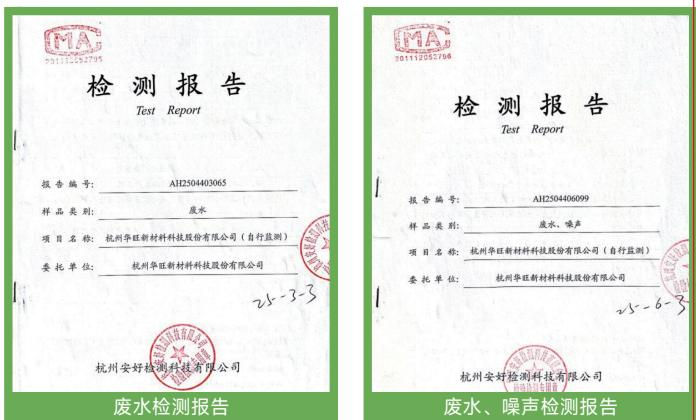

## 环境隐患排查

公司制定《环境安全隐患排查、治理制度》对安全隐患和薄弱环节展开全面排查与治理。环境隐患排查领导小组由安环办经理、生产中心经理、安全员、技术员等人员组成，共同推进风险隐患登记和现状评估工作，制订整改措施并加以落实。逐步构建风险隐患排查监管长效机制，消除各种环境安全隐患，保障环境安全，从源头上预防和减少突发环境事件的发生。

<table><tr><td>排查检查形式</td><td>具体操作</td></tr><tr><td>联合排查</td><td>由分管领导组织,各环境隐患排查领导小组成员进行环境安全隐患排查。</td></tr><tr><td>日常排查</td><td>由设备部组织实施的日常排查检查。</td></tr><tr><td>季节性排查</td><td>由分管领导组织,各环境隐患排查领导小组成员针对雨季、大风等恶劣天气易发安全进行环境安全排查检查。</td></tr><tr><td>专业性排查</td><td>由第三方运行公司实施的对环保设施、设备进行的技术性排查。</td></tr></table>

## 环境应急管理

公司贯彻落实《中华人民共和国环境保护法》《中华人民共和国突发事件应对法》等法律法规规定，根据各厂区情况制定《突发环境事件应急预案》成立应对突发环境污染事件的应急机构建立健全的环境污染事故应急机制，有效地应对公司可能突发的各种事故，迅速、有序、有效地开展应急救援行动。

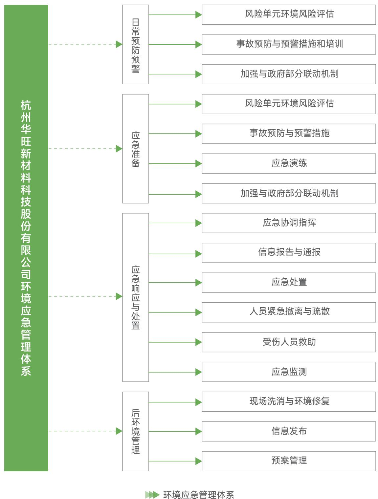

flowchart

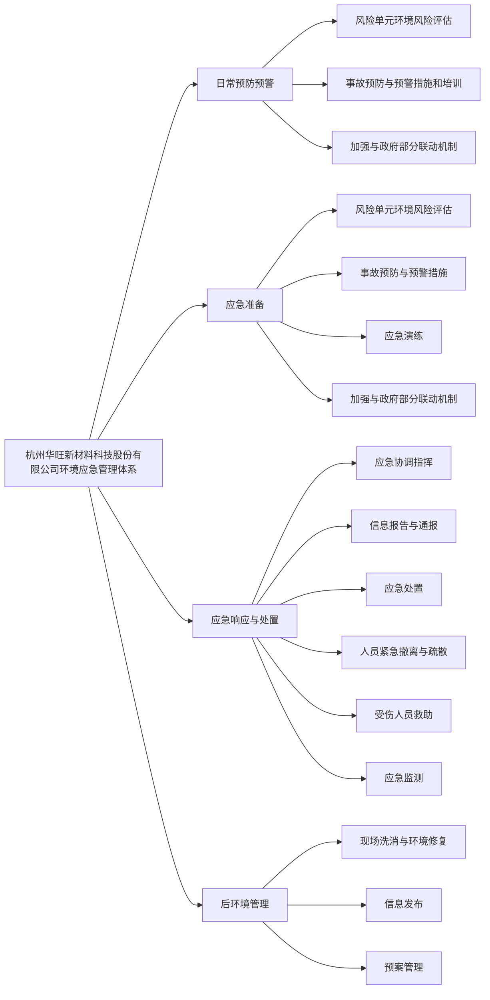
```mermaid
graph LR
  A["杭州华旺新材料科技股份有限公司环境应急管理体系"] --> B["日常预防预警"]
  A --> C["应急准备"]
  A --> D["应急响应与处置"]
  A --> E["后环境管理"]
  
  B --> F["风险单元环境风险评估"]
  B --> G["事故预防与预警措施和培训"]
  B --> H["加强与政府部分联动机制"]
  
  C --> I["风险单元环境风险评估"]
  C --> J["事故预防与预警措施"]
  C --> K["应急演练"]
  C --> L["加强与政府部分联动机制"]
  
  D --> M["应急协调指挥"]
  D --> N["信息报告与通报"]
  D --> O["应急处置"]
  D --> P["人员紧急撤离与疏散"]
  D --> Q["受伤人员救助"]
  D --> R["应急监测"]
  
  E --> S["现场洗消与环境修复"]
  E --> T["信息发布"]
  E --> U["预案管理"]
```

## 总指挥

## 副总指挥

## 现场副总指挥

通讯联络队

抢险抢修队

义务消防队

医疗救护队

物资运输队

治安队

环境检测队

## 应急组织架构图

同时，公司每年组织开展突发环境事件应急演练，以提升员工在紧急情况下的反应能力，及时响应，将事故损失和社会危害减少到最低程度。报告期内，公司共开展环保事故应急演练2次。

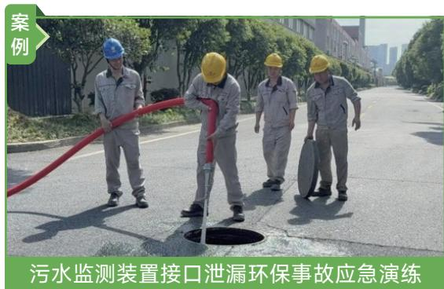

text_image

案例
污水监测装置接口泄漏环保事故应急演练

指标与目标

<table><tr><td>环境总目标</td><td>2025年完成情况</td></tr><tr><td>遵守环境管理法律法规,不发生重大污染事故。</td><td>已达成</td></tr><tr><td>确保各厂界昼夜噪音达到GB 12348-2008《工业企业厂界环境噪声排放标准》中的III类排放标准,并努力实现噪音排放最小化。</td><td>已达成</td></tr><tr><td>确保生产污水排放达到本公司与污水处理机构签订的纳管协议中的标准,三年内无污染事故发生。</td><td>已达成</td></tr><tr><td>确保生产过程中的损纸废弃物100%得到回收循环利用。</td><td>已达成</td></tr><tr><td colspan="2"></td></tr></table>

环境管理指标

<table><tr><td>指标</td><td>2025年</td></tr><tr><td>环保投入总金额</td><td>967.02万元</td></tr><tr><td>环保培训次数</td><td>2次</td></tr><tr><td>环保培训参加人次</td><td>31人次</td></tr><tr><td>环保培训时长</td><td>62小时</td></tr></table>

污废排放指标

<table><tr><td>指标</td><td>2025年</td></tr><tr><td>废水排放量</td><td>317.55万吨</td></tr><tr><td>废水处理量</td><td>426.55万吨</td></tr><tr><td>废水回收利用量</td><td>104.23万吨</td></tr><tr><td>废水回收利用率</td><td>26%</td></tr><tr><td>废气排放量</td><td>0.01吨</td></tr><tr><td>一般废弃物产生量</td><td>6,950.72吨</td></tr><tr><td>一般废弃物产生强度</td><td>0.02吨/万元</td></tr><tr><td>一般废弃物处置量</td><td>6,908.92吨</td></tr></table>

## 环保培训与宣贯

公司制定《环保培训教育制度》，由安全环保部统筹各部门环保教育培训工作，新员工上岗前必须完成环保知识培训，全体员工每年至少参与一次专项环保培训；公司建立《职工环保教育管理档案》，动态优化培训内容与形式，全面提升员工环保意识，有效防范和减少各类环境事故发生。

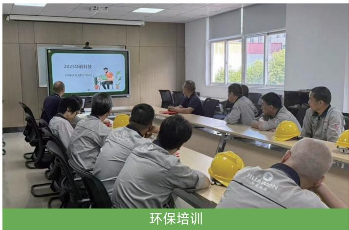

text_image

2025华旺科技
（环保考核和培训点）
环保培训

## 三废排放与处理

公司遵守相关排放标准，制定《“三废”管理制度》，制度全面涵盖废水、废气、固体废弃物的管理工作，对生产运营过程中产生的污染排放物进行严格监控，确保各项污染物达标排放。

## 废水管理

公司严格遵循《污水综合排放标准》（GB 8978-1996）、《工业企业废水氮、磷污染物间接排放限值》（DB33/887-2013）要求，制定《“跑、冒、滴、漏”管理制度》《水资源的使用（排放）管理规定》，由生产部负责全公司污水的处理，全面落实废水污染防治措施。

公司废水主要来源于生产废水与生活污水，公司及子公司马鞍山华旺分别配套20,000吨/天和10,000吨/天的污水处理中心，采用物化、A/O生化工艺进行废水处理，废水均经污水处理中心处理后排入污水厂。报告期内，公司未发生废水污染物超标排放事件。

## 废气管理

公司严格遵守《大气污染物综合排放标准》（GB 16297-1996）、《恶臭污染物排放标准》（GB 14554-93），对公司废气进行监测和管理，保证各类废气经废气处理设施处理后均达标排放。

<table><tr><td>废气种类</td><td>处置措施</td></tr><tr><td>车间粉尘</td><td>产生的粉尘收集经布袋除尘器处理后高空排放,收集效率约为80%,处理效率98%。</td></tr><tr><td>污水处理站废气</td><td>污水站恶臭发生源排放恶臭污染物NH3和H2S,均符合《恶臭污染物排放标准》(GB 14554-93)相应标准要求。</td></tr><tr><td>食堂油烟</td><td>经油烟净化器处理后高空排放。</td></tr></table>

## 废弃物管理

公司生产运营过程中产生的废弃物主要包括泥砂、边角料、包装废料、污水处理站污泥及生活垃圾。公司制定《废弃物品管理制度》《一般工业固废污染防治责任制度》《废料管理制度》等管理制度，规范生产及生活废弃物的防治、收集与处置流程。

## 一般废弃物

公司严格遵循《一般工业固体废弃物贮存、处置场污染控制标准》（GB 18599）规范，科学建设固体废弃物临时储存场，用于各类一般工业固废的集中收集，并依法合规推进一般废弃物全流程处置工作，确保各环节符合环保要求。

<table><tr><td>名称</td><td>产生工序</td><td>处置方法</td></tr><tr><td>废纤维</td><td>造纸工序</td><td rowspan="2">送华旺热能有限公司焚烧制蒸汽和发电</td></tr><tr><td>污泥</td><td>污水处理</td></tr><tr><td>边角料</td><td>原料剪裁</td><td>全部回用于生产</td></tr><tr><td>包装废料</td><td>产品包装</td><td>回收综合利用</td></tr><tr><td>生活垃圾</td><td>员工</td><td>委托环卫部门处置</td></tr></table>

## 危险废弃物

针对危险废弃物，公司严格遵循相关法律法规及标准，依据《废弃物品管理规定》，规范危险废弃物的收集、分类、贮存、搬运和处置环节的管理。

<table><tr><td>收集分类</td><td>生产现场产生的危险废物专门划出存放区域,进行专门管理。</td></tr><tr><td>贮存</td><td>危险废弃物按照要求,设置专门的危险固废暂存库进行分类贮存;采取防风、防雨、防渗、防漏等措施,且设有标识牌。</td></tr><tr><td>搬运</td><td>危险废弃物依据特性分开搬运。</td></tr><tr><td>处置</td><td>危险废弃物严格遵守相关的法律法规要求处置,委托第三方具有处理资质的单位处置。</td></tr></table>

## 噪声管理

公司噪声来源主要为泵类、生产线传动、风机等运行时产生的噪音，为防治环境污染、改善生产环境。公司严格遵守《中华人民共和国环境噪声污染防治法》《工业企业厂界环境噪声排放标准》（GB 12348-2008），制定了《噪声管理规定》管理制度，由机电部负责组织噪声排放监测和测量，其他部门负责相关预防措施和控制管理。

公司采用低噪声设备，合理布局，对高噪音的设备设置隔声罩及其他消声减振等措施实现降低噪音的影响同时对进入噪声超标工作区域的人员配置耳保护品，相关部门定期对噪声污染源设施进行检查维护并开展噪声监测，确保公司噪声满足相关标准，致力于构建一个低噪声、和谐的生产、生活环境。

## 资源利用

公司积极践行绿色低碳制造理念，坚定走一条科技含量高、资源消耗低、环境污染少的新型发展道路，通过精细化管理与技术改造，推广节能技术，致力于在生产的每一个环节减少资源消耗、提升资源使用效率，降低对环境的影响。

## 能源利用

## 治理

公司严格遵守《中华人民共和国节约能源法》等相关法律法规，制定《能源、资源使用管理规定》《能源管理制度》《节能奖惩管理制度》《能耗限（定）额管理制度》等制度文件，规范能源管理体系建设。

公司设立由生产总监牵头领导的能源管理中心，承担能源管理的基本任务，统筹、规划、协调、管理公司的各项节能工作；负责制定能源管理规章制度、节能计划、节能措施、能源消耗定额以及考核办法。同时，抓好节能工作计划的推进，落实监督各项节能管理工作。

## 能源管理培训

公司制定年度能源管理培训计划，组织节能管理和技术的教育、培训及考核工作，并安排公司能源管理员参加政府行政部门组织的能源管理员培训，旨在通过学习能源相关的法律法规及用能情况分析等内容，增强员工节能意识及技能。

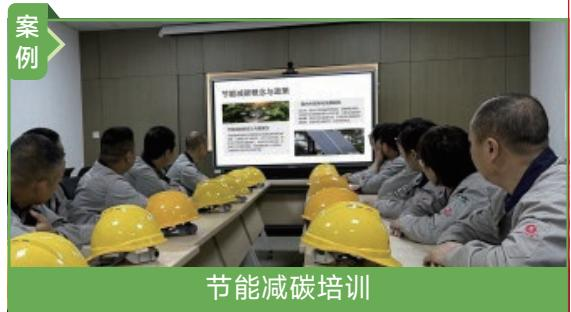

text_image

案例
节能减碳理念与政策
节能减碳培训

natural_image

Illustration of three people holding books in a garden setting (no text or symbols)

## 战略

为强化资源管理的系统性与前瞻性，公司积极识别能源利用相关风险与机遇，助力降本增效及可持续发展。

<table><tr><td colspan="2">风险类型</td><td>风险描述</td><td>潜在财务影响</td><td>发生可能性</td><td>影响大小</td><td>影响时间范围</td><td>影响价值链环节</td><td>应对措施</td></tr><tr><td>物理风险</td><td>极端天气事件</td><td>极端天气(如台风、强降水等)可能对能源相关设施造成损坏,进而引发区域电力供应紧张或阶段性中断,影响生产进度。</td><td>收入减少生产成本上升</td><td>较小</td><td>较高</td><td>短期</td><td>运营</td><td>定期巡检、维护能源相关设备,增强抗灾能力;制定突发事件应急预案,系统性提升抗风险的韧性;与当地供电部门建立常态化信息沟通机制,及时了解供电情况及停电计划等,基于供电信息灵活调整生产计划与用能安排,有效预防、管控供电风险。</td></tr><tr><td rowspan="2">转型风险</td><td>市场风险</td><td>受市场供需影响,能源价格出现剧烈波动,进而对公司盈利造成影响。</td><td>收入减少能源成本上升</td><td>较大</td><td>较高</td><td>中期</td><td>运营</td><td>持续优化能源结构,引入光伏发电,提高清洁能源使用占比。</td></tr><tr><td>政策风险</td><td>政府出台更严格的能耗限额标准及环保管控政策,可能增加公司能源合规成本,要求减少碳排放和其他环境影响。</td><td>运营成本上升收入降低</td><td>适中</td><td>较高</td><td>中长期</td><td>运营</td><td>推广实施节能减排、清洁生产等措施,推动低能耗的发展战略;加强高能耗设备的监测与管控,通过技术升级与节能改造,降低能源消耗。</td></tr></table>

<table><tr><td>机遇类型</td><td>机遇描述</td><td>潜在财务影响</td><td>发生可能性</td><td>影响大小</td><td>影响时间范围</td><td>影响价值链环节</td><td>应对措施</td></tr><tr><td>政策机遇</td><td>政府对企业节能改造、新能源应用给予补贴、激励措施,鼓励采用清洁能源或提高能源效率。</td><td>增加收入</td><td>适中</td><td>大</td><td>中期</td><td>运营</td><td>及时关注能源相关政策,调整能源发展战略,开展清洁生产和节能技术改造。</td></tr><tr><td>技术机遇</td><td>投资绿色清洁能源,如太阳能光伏,以提升公司能源自主供给能力,降低对外部依赖。</td><td>降低运营成本</td><td>较高</td><td>大</td><td>长期</td><td>运营下游</td><td>关注能源相关技术,合理预算新兴技术投资,布局能源结构转型规划;引入光伏发电系统等清洁能源项目,优化能源管理。</td></tr></table>

注：公司对时间范围的界定为：短期（1年以内，含1年）、中期（1年至5年，含5年）、长期（5年以上）

## 影响、风险和机遇管理

为有效防范能源相关风险并及时把握机遇，公司建立完善、科学的风险识别、评估流程，对潜在风险进行识别和评价，并结合自身经营情况与内部管理流程，制定风险和机遇应对措施。

资源利用风险管理流程

<table><tr><td>风险识别</td><td>结合公司业务开展情况及相关法律法规,确定能源管理影响的重点环节,识别能源管理对公司自身运营及价值链活动可能带来的风险与机遇。</td></tr><tr><td>风险评估</td><td>基于已识别的影响、风险与机遇,通过专家分析等方法,对其潜在的财务影响、发生的概率、影响的大小以及影响的时间范围进行综合评估。</td></tr><tr><td>风险应对</td><td>根据不同等级风险,制定相应控制措施。</td></tr><tr><td>风险管理</td><td>设立监督岗位,定期进行检查,确保控制措施有效实行。</td></tr></table>

## 指标与目标

公司制定《车间节能目标责任书》《节能奖惩管理制度》，设立节能奖励基金，建立节能激励、节能目标考核机制，鼓励和调动公司员工的节能积极性，同时建立公司、车间、班组三级节能管理领导小组责任制，由各层级节能管理领导小组负责能源考核、监督和节能奖罚工作，确保公司年度节能工作目标的实现。

<table><tr><td>关键指标</td><td>单位</td><td>2025年</td></tr><tr><td>柴油</td><td>吨</td><td>108.44</td></tr><tr><td>煤油</td><td>吨</td><td>2.15</td></tr><tr><td>外购电力总量</td><td>千瓦时</td><td>182,116,879.20</td></tr><tr><td>外购热力总量</td><td>吉焦</td><td>1,595,415.68</td></tr><tr><td>光伏发电</td><td>千瓦时</td><td>24,173,855.40</td></tr><tr><td>间接能源消耗总量</td><td>吨标准煤</td><td>73,660.63</td></tr><tr><td>直接能源消耗总量</td><td>吨标准煤</td><td>171.30</td></tr><tr><td>能源消耗强度</td><td>吨标准煤/万元</td><td>0.24</td></tr><tr><td>清洁能源使用总量</td><td>吨标准煤</td><td>2,970.97</td></tr><tr><td>清洁能源使用占比</td><td>%</td><td>3.87</td></tr></table>

## 节能措施

公司积极挖掘节能改造潜能，持续聚焦工艺及流程优化、设备改造及前沿技术创新，全方位提升能效水平。报告期内，公司在生产基地投入开展多项节能改造项目，合计投入资金568万元，实现节约504吨标准煤。

## 节能技术改造实践

新增光伏2.56兆瓦，投入金额526万元，年节能量约320吨标煤，公司对主变压器进行更换，投入50多万元，年节省约28吨标煤。  
8号机烘干热风系统冷凝水散热器更新改造投入2.5万元，年节省约36吨标煤。

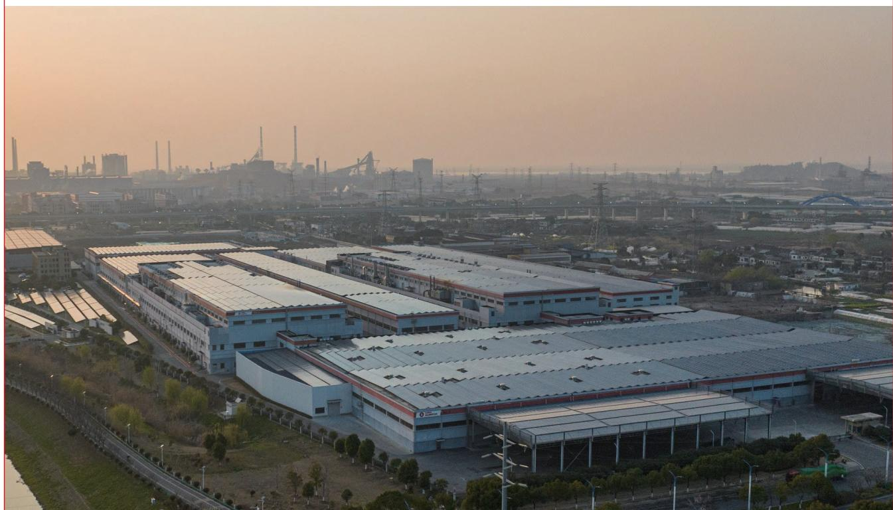

natural_image

Aerial view of a large industrial complex at sunset, with factory buildings and surrounding urban skyline in the background (no visible text or signage)

## 水资源利用

公司严格遵循《中华人民共和国水法》等法律法规，制定了《节约用水会议制度》《节约用水巡回检查制度》《计划用水管理制度》等一系列制度，明确水资源使用与管理规范，同时制定了《节水管理岗位责任制》设立节水领导小组，构建三级管理机制，由节水领导小组负责制定相关规章制度、节水工作目标及计划，执行节水奖惩规定，监督各项节水工作的落实，确保水资源管理工作有效落实。

此外，公司高度重视节水宣传工作，通过定期举办节水宣传周活动，普及节水知识，提升员工的节水意识与操作技能，营造节水减排的良好氛围。

关键绩效

<table><tr><td>新鲜水取水总量</td><td>3,692,832吨</td></tr><tr><td>其中:市政购水量</td><td>66,917吨</td></tr><tr><td>其中:地表水取水量</td><td>3,625,915吨</td></tr><tr><td>新鲜水用量</td><td>3,692,832吨</td></tr><tr><td>水循环与再利用总量</td><td>1,042,290吨</td></tr><tr><td>总用水量</td><td>4,735,122吨</td></tr><tr><td>用水强度</td><td>14.79吨/万元</td></tr><tr><td>循环用水占总用水量的比例</td><td>22.01%</td></tr></table>

注：统计口径为华旺科技、马鞍山华旺。

## 物料利用

公司严格遵循《中华人民共和国循环经济促进法》等相关法律法规，结合自身运营实际，制定《仓库物资管理方法》《材料采购管理办法》《化学品管理规定》等制度，明确各部门在原材料采购、入库、仓储流转、领用到使用及监控等环节的操作要求，通过建立一套完整的管理流程，实现对各环节的严格管控，有效提升物料整体使用效率，减少浪费与环境影响，为公司物料管理行为的合法性、规范性提供保障。目前，公司已获得FSC权威认证。

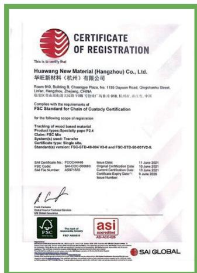

text_image

CERTIFICATE OF REGISTRATION
This is to certify that
Huawang New Material (Hangzhou) Co., Ltd.
华旺新材料（杭州）有限公司
Room 910, Building 8, Chiangyao Plaza, No. 1155 Dayuan Road, Gloginshou Street,
Lianti Hangzhou, Beijing, China
客服热线：400-888-6788 1555 号印刷厂号 910, 杭州东、浙江东、中国
Complies with the requirements of
FSC Standard for Chain of Custody Certification
for the following scopes of registration:
Tracking of wood based material
Product Type/Specialty page P2.4
Claim: FSC Ma
Systems: Transfer
Certificate type: Single site.
Standard(s) version: FSC-STD-004 V3-0 and FSC-STD-001V2-0.
SAI Certificate No.: FCCCA4446
FSC Code: SAI-OCQ-00683
SAI File Number: A9971555
Issue Date: 11 June 2021
Original Certification Date: 10 June 2021
Current Certification Date: 10 June 2021
Certificate Expiry Date: 9 June 2020
Issue Number: 1
SAI Global

<table><tr><td>原料供应</td><td>公司作为纸类生产企业,深刻认识到可持续的原材料是可持续发展的基石,始终坚持从源头上把控原材料的环保性,确保所使用的木材来源于经过FSC认证的可持续管理森林。同时在采购过程中严格遵循标准,尊重当地社区和林区工人的权益。建立原料严格筛选机制,推动生产链上游的清洁化,为实现绿色、清洁生产奠定基础。</td></tr><tr><td>产品设计</td><td>在产品设计与开发端,主动融入FSC认证所倡导的理念,致力于开发兼具市场竞争力与环境友好性的绿色产品。</td></tr><tr><td>包装设计</td><td>全面推行绿色包装理念,采用可降解、环境友好的纸质包装材料,向消费者传递出公司对于可持续发展和环境保护的坚定承诺与实际行动。</td></tr></table>

关键绩效

<table><tr><td>包装材料使用总量</td><td>2,447.39吨</td></tr><tr><td>纸类包材</td><td>2,318.31吨</td></tr><tr><td>塑料类包材</td><td>129.08吨</td></tr></table>

## 践行绿色办公

公司全力践行绿色办公，将可持续发展融入日常运作。公司广泛采用视频会议技术，由视频会议取代线下会面，降低员工参会出行而产生的碳排放；对垃圾分类严格落实，设置垃圾分类标识与投放点，助力资源循环，营造绿色、健康的工作环境。

# 生态系统与生物多样性保护

华旺科技始终关注自身活动对生物多样性的影响，严格遵循《中华人民共和国环境保护法》及国务院办公厅《关于进一步加强生物多样性保护的意见》等相关法律法规和政策，开展生产活动。

报告期内 公司及子公司马鞍山华旺运营地址均为成熟工业区内公司不存在位于自然保护区内部或保护区外生物多样性丰富区域的生产基地。公司所有生产运营活动、产品和服务均未发现对生物多样性造成重大影响的情况。

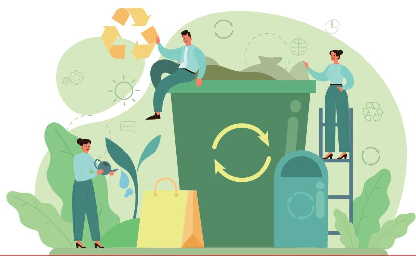

natural_image

Illustration of people recycling waste through a trash bin with recycling symbols and recycling icons (no text present)

# 创新引擎守护品质承诺

公司专注研发创新，打造顶尖研发团队，稳固可持续供应链，坚定维护客户权益，筑牢信息安全屏障，与合作伙伴共建稳固信任桥梁。

## 响应的 SDGs

产业、创新和 基础设施

负责任消费和生产促进目标实现的伙伴关系

创新驱动 57

产品和服务安全与质量 63

客户服务 67

信息安全与隐私保护 68

负责任供应链 71

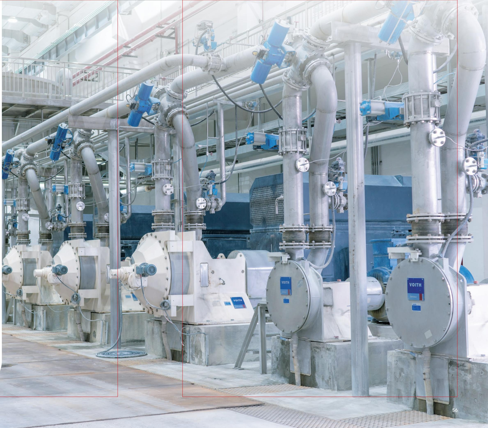

natural_image

Industrial facility interior with large metallic piping and valves, no visible text or symbols

## 创新驱动

## 治理

公司始终将提升自主创新能力置于战略核心位置以此持续巩固和强化市场竞争力。公司制定并实施了《研发中心管理办法》《项目研发管理制度》《设计和开发控制程序》等制度，严格规范各项研发工作，明确界定了研发项目输入评审、产品调研、样品试用、项目成果等管理流程，确保公司研发项目立项与研发工作顺利进行。公司总经理是研究与开发的总体负责人，在董事会的授权范围内决定公司的研究与开发事项。

公司设立科研中心，包含一名主任及一名化验室主管，根据公司的经营模式和生产组织机构的实际情况，采用分级负责管理机制。

## 科研中心分级管理机制

## 第一级

科研中心重大项目管理与实施

组织专家委员会和产品开发组进行项目可行性论证。

论证内容包括市场前景、经济效益、核心技术、生产设备工艺条件、经费安排及实施计划等。

## 第二级

项目负责人开展攻关试产

项目总负责人领导技术队伍进行技术攻关。

协调设备、物资、技术、生产、质检及市场销售等部门提供支撑。

产品试验成功后，项目开发组提出投产前技术工艺、设备配置等解决方案。

经项目总负责人审批后，执行投产前准备工作。

## 科研中心职责

负责公司新产品研发、产品质量管理、试验纸机试产等工作;

组织技术改造、新过程建设、生产设施改进、新产品开发的实施;

指导生产部完成“四新”项目的年度开发;

负责督导公司原辅材料的质量标准的制定、检测和验收工作;

负责督导公司产品的质量标准的制定、检测工作;

负责企业标准的编制工作。

## 创新平台认证

公司高度重视创新平台能力建设，目前，公司已拥有“国家级高新技术企业认证”“省级高新技术企业研究开发中心”“省级研究院”“安徽省数字化车间”“安徽省‘专精特新’中小企业”“慈湖高新区科技创新示范企业”等认证。

<table><tr><td>指标</td><td>2025年</td></tr><tr><td>专精特新企业</td><td>1个</td></tr><tr><td>国家高新技术企业</td><td>2个</td></tr></table>

## 研发团队

公司高度重视人才培养，着力组建一支既专业又富有创新能力的研发团队，以此为技术突破与创新成果的高效转化奠定坚实基础。

<table><tr><td>指标</td><td>2025年</td></tr><tr><td>研发团队总人数</td><td>109人</td></tr><tr><td>研发人员数量占公司总人数的比例</td><td>13.92%</td></tr><tr><td colspan="2">按学历划分</td></tr><tr><td>本科以下</td><td>93人</td></tr><tr><td>本科及以上</td><td>16人</td></tr><tr><td colspan="2">按年龄划分</td></tr><tr><td>30岁以下(不含30岁)</td><td>12人</td></tr><tr><td>30-40岁(含30岁,不含40岁)</td><td>42人</td></tr><tr><td>40-50岁(含40岁,不含50岁)</td><td>29人</td></tr><tr><td>50-60岁(含50岁,不含60岁)</td><td>25人</td></tr><tr><td>60岁以上</td><td>1人</td></tr><tr><td colspan="2">按性别划分</td></tr><tr><td>男</td><td>96人</td></tr><tr><td>女</td><td>13人</td></tr></table>

战略

<table><tr><td>风险类型</td><td>风险描述</td><td>潜在财务影响</td><td>发生可能性</td><td>影响大小</td><td>影响时间范围</td><td>影响价值链环节</td><td>应对措施</td></tr><tr><td>技术风险</td><td>公司在新技术和新产品的研发中需要投入较大资金和人才,如果无法攻破技术难点、或长时间无法取得有效成果转化,可能导致研发项目失败,易对公司发展和竞争力构成威胁。</td><td>收入减少成本增加</td><td>中</td><td>大</td><td>中期</td><td>运营下游</td><td>·财务部门及时做好研发预算,明确各阶段资金需求,严格控制成本支出,确保资金合理使用;·以敏捷研发模式加强项目管理,灵活调整,且提前规划好规模化经营策略;·跟踪行业前沿技术,并深入了解客户需求,积极拓展多元化市场渠道。</td></tr><tr><td>市场风险</td><td>公司目前主要产品市场容量毕竟有限,同时市场中的竞争对手可能迅速推出类似产品,对公司产品的竞争力和价格都产生较大压力。</td><td>收入减少</td><td>中</td><td>中</td><td>中期</td><td>运营下游</td><td>·及时关注公司产品市场的情况,积极开拓新产品市场,储备新的产品,提高市场容量。</td></tr><tr><td colspan="8"></td></tr><tr><td>机遇类型</td><td>机遇描述</td><td>潜在财务影响</td><td>发生可能性</td><td>影响大小</td><td>影响时间范围</td><td>影响价值链环节</td><td>应对措施</td></tr><tr><td>技术突破与市场领先</td><td>公司研发项目紧跟装饰原纸行业最新的发展动态与市场需求,研发技术突破有利于优化生产流程,提高效率,形成差异化竞争,助力公司在市场中脱颖而出。</td><td>成本降低收入增加</td><td>中</td><td>大</td><td>中长期</td><td>运营</td><td>·根据行业发展趋势和市场调研结果,合理规划资金分配;·建立并完善创新激励机制,设置合理的绩效奖励、知识产权奖励等,激发研发人员的创新潜力,提高科技成果转化的效率;·与高校、校企共建实验室等组织建立长期稳定的合作关系,通过产学研合作等方式,引进外部智力资源,拓宽研发思路,提升团队整体的研发能力和创新水平。</td></tr></table>

注：公司对时间范围的界定为：短期（0—1年）、中期（1—5年）、长期（5年以上）

## 影响、风险和机遇管理

为驱动创新并管理风险，公司持续开展风险和机遇的识别评估工作，并形成风险与机遇评估分析表，通过全面识别研发环节的潜在风险，并落实相对应的控制措施，确保风险得以快速响应与有效管控。

## 风险识别

项目团队通过市场调研、技术分析等方法，识别出源于技术、市场、政策等多方面可能影响项目进度的潜在风险。

## 风险分析

采用定量和定性的分析方法，从风险发生的可能性、严重性、频率等因素出发，对识别的风险进行排序，明确风险等级。

## 风险监测

项目执行时对风险点进行监控，定期评估研发进展中的风险，动态调整应对措施，保障项目顺利推进。

## 风险管理

对研发项目完成质量进行考核，同时在项目实施过程中项目组长进行项目相关复盘讨论；在项目实施完成后，项目组长根据各岗位成员在项目实施过程中的表现，对其在整个项目中的占比进行调整，给予适当激励。

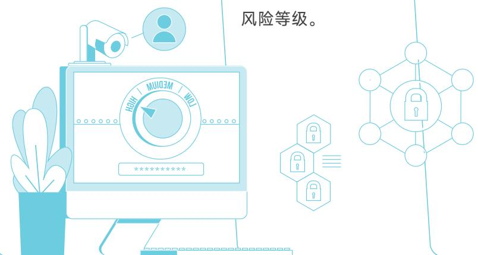

text_image

风险等级。

指标与目标

<table><tr><td>关键指标</td><td>单位</td><td>2024年</td><td>2025年</td></tr><tr><td>研发投入</td><td>万元</td><td>10,726.88</td><td>9,010.38</td></tr><tr><td>研发投入占营业收入比例</td><td>%</td><td>2.85</td><td>2.81</td></tr><tr><td>授权专利累计数</td><td>项</td><td>66</td><td>75</td></tr><tr><td>授权发明专利累计数</td><td>项</td><td>14</td><td>14</td></tr><tr><td>授权实用新型专利累计数</td><td>项</td><td>52</td><td>61</td></tr></table>

## 创新驱动措施

## 创新激励

为激发员工创新研发的积极性、主动性和创造性，公司结合自身实际情况，建立研发创新激励机制，持续挖掘并激发员工的创新潜能。针对由自筹资金项目及合作技术开发合同所产生的授权专利与已发表论文，对发明人或作者给予相应奖励。此外，专利发明人与设计人在取得专利授权后，亦可享有成果奖励，并作为职称评定与职务晋升的参考依据。

## 产学研合作

公司持续深化产学研协同创新机制，与浙江科技大学、南京林业大学等多所国内高校建立了技术和人才培养合作关系。公司充分发挥高校在人才资源与研发平台方面的优势，通过共建联合实验室、合作开展专项技术攻关等形式，逐步形成了以自主创新为核心、产学研合作协同推动的创新能力体系，有效促进了科技成果转化。

## 案例

公司于2024年底成立“高耐晒纸基饰面材料的钛白粉磷酸盐/水合氧化铝包覆留着关键技术”新产品开发项目组，通过产学研合作开发，拥有相应的自主知识产权，在开发过程中形成了三个方面的创新点，包括开发磷酸盐/水合氧化铝双层包覆技术、开发包覆改性钛白粉的两段添加技术和开发改性PAE-CMC双元助留技术。

## 行业共进

公司依托深厚的研发积淀与市场实践，积极参与行业标准建设，为相关标准的完善贡献重要力量。作为《人造板饰面专用纸》标准的主要起草单位之一，公司深入参与了国家标准GB/T 28995-2022的起草制定工作，以此促进行业健康、有序发展，体现了公司的责任意识与行业担当。

同时，公司积极加入行业组织并担任重要职位，携手合作伙伴共同助力行业发展与创新。目前，公司已成为中国林产工业协会装饰纸与饰面板专业委员会的副理事单位。

## 创新成果展示

## 水性聚氨酯型无醛装饰纸关键技术

项目产品以木浆和钛白粉为主要原料，开发了孔隙调控技术，提升了装饰纸的透气性和对水性聚氨酯的吸收渗透性能；采用了三元复合增强体系，提高了纸页的干湿抗张强度；开发了纸页伸缩变形的磨浆技术和表面在线微涂技术，提高了产品的表面平滑度和尺寸稳定性。

## 高耐晒纸基饰面材料

项目产品以木浆和钛白粉为主要原料，开发了磷酸盐/水合氧化铝双层包覆技术，提升了钛白粉的耐候性和纸基饰面材料的耐晒性，解决了装饰板材的褪色问题，延长了使用寿命：采用改性钛白粉的两段添加技术和PAE-CMC双元助留技术，减少了钛白粉的流失，提高了耐晒性和遮盖性。

## 知识产权保护

公司高度重视知识产权保护严格遵守《中华人民共和国专利法》《中华人民共和国著作权法》《中华人民共和国商标法》等法律法规，持续完善相关知识产权管理体系。在充分维护自主知识产权的同时，公司亦注重避免侵犯他人知识产权，通过常态化宣导与培训，全面提升员工知识产权保护意识，明确要求所有研发、生产及经营活动必须恪守知识产权规范，禁止未经授权使用、传播或模仿他人的专利、商标和著作权等内容。

natural_image

Illustration of two people pointing at documents and a pen, symbolizing document review or approval (no text present)

# 产品和服务安全与质量

## 治理

公司严格遵守《中华人民共和国产品质量法》等法律法规，贯彻ISO 9001:2015《质量管理体系要求》和“追求品质永无止境，满足顾客精益求精”的质量方针，建立了科学的质量管理体系，制定《质量、环境和职业健康安全管理体系管理手册》《装饰原纸原辅料质量管理办法》《装饰原纸颜色管理办法》等管理文件，明确了装饰原纸系列产品原辅料从订购、检验到投用各环节标准，还有母样、色差检验、质量问题处理等标准。公司总经理承担质量管理体系的最终责任，负责公司质量、环境和职业健康安全管理体系的构建、资源保障、方针目标制定、监督评审与持续改进；管理者代表负责按照标准进行管理，确保体系有效运行并向最高管理者报告。

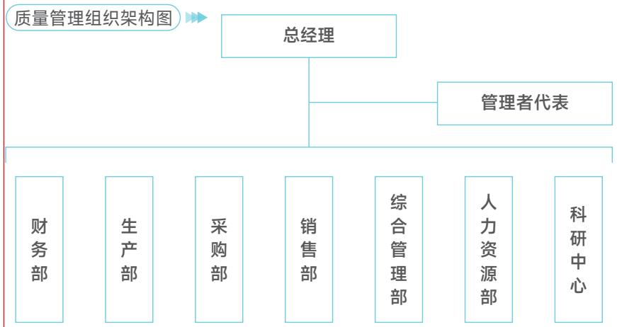

flowchart

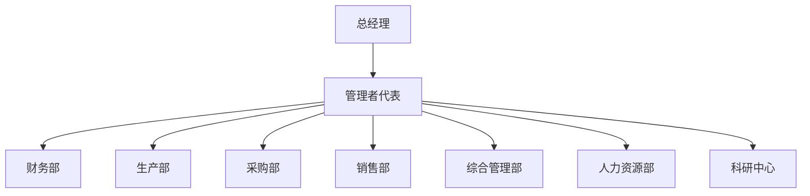
```mermaid
graph TD
  A["总经理"] --> B["管理者代表"]
  B --> C["财务部"]
  B --> D["生产部"]
  B --> E["采购部"]
  B --> F["销售部"]
  B --> G["综合管理部"]
  B --> H["人力资源部"]
  B --> I["科研中心"]
```

报告期内，公司聘请第三方机构对质量管理体系进行第二次监督审核，经CYC评定确认，公司管理体系运行持续符合GB/T19001-2016/ISO 9001:2015认证标准要求。

## 质量培训

公司将质量文化视为可持续发展的基石，公司每年定期规划产品质量培训方案，通过持续开展全员质量意识教育与技能培训，不断巩固员工的专业能力，从而为产品品质提供全面保障。

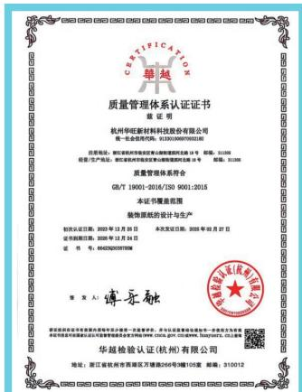

text_image

质量管理体系认证证书
致证明
杭州华旺新材料科技股份有限公司
统一社会信用代码：9132000007895183X
注册地址：杭州市滨江区东胜街道文一西路潘家桥路北段15号  邮编：913200
办公地址：浙江省杭州市滨江区东胜街道文一西路潘家桥路北段15号  邮编：913200
质量管理体系符合
GB/T 19001-2016/T30 9001:2015
本证书覆盖范围
微生物源的设计与生产
初次认证日期：2023年12月25日      本次登记日期：2024年10月27日
证书到期日期：2024年12月31日
证书号：45042020078770X
发人：傅永融
华证检验认证（杭州）有限公司
地址：浙江省杭州市西湖区万塘路255号恒健大厦  邮编：310012

质量管理体系认证证书

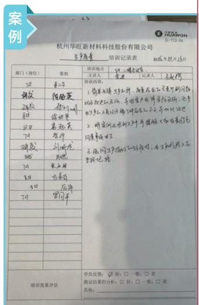

text_image

案例
杭州华旺新材料科技股份有限公司
生产准备 培训记录表
部门（岗位）	案例
培训地点	培训内容
12	李二平
13
徐发	陈怡英
14
张成	徐可明
84	徐怡英
97	徐起英
74	徐伟
106
周杰	刘晓亮
110
杨红	陈熙
74	张玉萍
12
方美芳
9日	石伟
79	罗月平
培训政策评估
学员反馈：□好、□一般、□差
测试结果的分析：□好、□一般、□差
其他：

生产质量培训记录表

## 战略

公司遵循产品质量管理方面的法律法规和行业标准，结合自身运营实际情况，系统识别、评估关键产品质量与安全的各类因素，包括潜在影响、风险挑战以及发展机遇。聚焦于提升产品和服务的质量与安全，实施有效的应对措施，以持续提升产品质量，满足客户需求。

<table><tr><td>风险类型</td><td>风险描述</td><td>潜在财务影响</td><td>发生可能性</td><td>影响大小</td><td>影响时间范围</td><td>影响价值链环节</td><td>应对措施</td></tr><tr><td>声誉风险</td><td>产品质量出现问题,可能导致公司赔偿、形象受损。</td><td>营业收入减少</td><td>中</td><td>高</td><td>短</td><td>运营</td><td>·严控产品出厂检验,针对生产过程中出现的不合格品制定严格的控制程序;·当产品交付如出现质量异常,品管部应对不合格状况进行确认并通知销售部与顾客协商处理。</td></tr><tr><td>相关方要求</td><td>客户对产品质量标准提高,以及对供应周期和售后服务的期望值提升,给公司质量和售后管理提出新的要求。</td><td>营业收入减少</td><td>高</td><td>高</td><td>短</td><td>运营</td><td>·销售部加强与客户进行质量标准制定的沟通,统一双方的标准和检测方法;·采购部做好采购的安排,保证采购计划的执行;·销售部门加强与客户交流沟通,及时处理客户的需求和意见。</td></tr></table>

<table><tr><td>机遇类型</td><td>机遇描述</td><td>潜在财务影响</td><td>发生可能性</td><td>影响大小</td><td>影响时间范围</td><td>影响价值链环节</td><td>应对措施</td></tr><tr><td>高质量产品需求增加</td><td>经济发展与生活水平提升促使消费者对产品和服务质量提出更高要求,这既为企业强化品牌形象、扩大市场提供了机遇,也为其探索新市场及国际化战略开辟了新方向。</td><td>营业收入增加</td><td>高</td><td>高</td><td>长期</td><td>运营</td><td>· 加大研发投入,改进产品性能与开发更高品质的产品;· 建立全面质量管控体系,从采购到出厂严格把控;· 通过加强培训与实操,增强全员质量意识与技能水平。</td></tr></table>

注:公司对时间范围的界定为:短期(0—1年)，中期(1—5年)，长期(5年以上）

## 影响、风险和机遇管理

公司高度重视产品和服务质量安全相关风险及机遇的管理，针对产品生命周期的不同阶段，公司建立清晰的管理流程，明确划分各部门职责，系统识别活动、产品及服务全程中的潜在风险因素，并运用量化评估方法定位关键风险，进而制定针对性控制措施，以降低或消除风险影响。

  
产品和服务安全与质量风险管理流程

<table><tr><td>风险识别</td><td>分析活动、产品和服务过程,识别潜在风险因素,考虑法律、市场、技术、供应商等多方面因素。</td></tr><tr><td>风险评价</td><td>对识别出的产品风险进行量化评估,确定其可能性和影响程度,采用适当工具进行排序。</td></tr><tr><td>风险应对</td><td>针对主要风险制定控制措施,确保产品控制措施的有效性和可实施性。</td></tr><tr><td>风险监控与评审</td><td>实施产品监控计划,定期再评估风险,通过内部审核和管理评审持续优化流程。</td></tr><tr><td>资源保障</td><td>提供必要的人力、物力和财力资源支持产品风险管理活动,确保资源的合理配置和利用。</td></tr></table>

## 指标与目标

公司将质量考核作为关键管理环节，制定《公司各部门质量目标及考核细则》，明确公司及各职能部门在质量目标上的要求与评估标准，设立定期考评机制，用以衡量公司及各部门质量目标的达成情况，进而评估公司管理体系运行的整体有效性。根据考评反馈，公司及时进行优化与调整，确保质量管控体系持续有效运转，持续降低风险。

<table><tr><td>质量目标</td><td>2025年达标情况</td></tr><tr><td>成品退货率低于2%</td><td>完成</td></tr><tr><td>每年至少完成一项四新项目</td><td>完成</td></tr><tr><td>顾客满意率达到96%</td><td>完成</td></tr></table>

## 质量与安全管控措施

## 全生命周期管理

公司重视产品全生命周期质量管理 制定《原辅材料质量标准》《不合格品控制程序》等文件。公司建立覆盖原辅材料采购、生产过程管理、成品精密检测以及不合格产品规范处置的全流程管控体系。各环节检验记录完整准确，由授权人员签字确认，对特殊放行实行严格审批，实现全过程可追溯，全面保障产品的可靠性与稳定性。

<table><tr><td colspan="2">产品过程控制程序</td></tr><tr><td>源头管理</td><td>核实原、辅材料基本信息,符合要求后放置并通知研发室进行抽样检验,填写《原辅材料检测报告单》,结果送仓储部、生产部,合格品入库保存并使用,不合格品退回采购部。</td></tr><tr><td>过程管理</td><td>操作工和检验员进行自检和抽检,按照《过程检验规程》要求填入所有检测数据,并将数据存入光盘保存。</td></tr><tr><td>出厂管理</td><td>品管部负责产品放行,质检员按规程检验最终产品并进行等级判定。若不符合内控标准,立即通知调整;若超出内控但符合企业标准的成品≤2吨,隔离待评审;2吨则隔离待主管副总决定;若超出企业标准,则隔离并按要求回抄。</td></tr><tr><td>检验记录</td><td>产品检验全过程,详实记录,明确判定,授权质检员签字确认。</td></tr></table>

<table><tr><td colspan="2">不合格品管理</td></tr><tr><td>原辅材料不合格</td><td>仓储部根据《原料检测报告单》进行隔离堆放、记录并标识,品管部将不合格情况报告母公司采购部处置。</td></tr><tr><td>半成品不合格</td><td>半成品打浆度、湿重不合格,根据实际物理指标调整控制;其他指标不合格,立即报班长处理,确保最终质量;非操作偏差报车间处理。</td></tr><tr><td>成品不合格</td><td>成品检不合格需回抄,加盖“回抄”章并记录原因,班长隔离;偶发纸病,操作员标识,质检记录,复卷剔除;调色初期色差回抄品,车间隔离不记不合格;三轴连续不合格,品管开单,车间分析处理。</td></tr></table>

## 生产设备维护

公司坚持以“预防为主”的原则，制定《设施控制程序》等制度，统筹维护，计划性维修与设备更新工作，以此确保产品质量的稳定同时公司针对基础设施各环节建立标准化流程严格管控设备操作，维护，维修及外协服务等方面，保障设备高效运行。对重点设备实施规范操作、定期点检与润滑，维修计划周密，故障处理及时。此外，公司积极推进设备升级换代，以适应生产技术发展要求，并对闲置设备采取合理封存或报废处置，提升资源利用效率。

## 客户服务

公司持续优化客户服务管理体系，加强与客户沟通联系，优化客户满意度提升管理工作，确保以稳定优质的产品服务更多客户，实现客户满意度与品牌忠诚度的双重提升。

## 客户服务管理

公司制定了《销售区域及客户管理办法》，进一步加强客户关系维护管理，倾听客户意见、了解客户、经销商及终端用户需求，解决客户困难以提升服务满意度；公司建立了客户联络与保持制度，稳固客户关系；同时根据市场与客户情况变化及时调整优化服务模式，持续强化客户关系维护。

## 客户投诉管理

为建立完善的售后服务管理的纲领和行动准则，加强与客户的联系与沟通，维护公司声誉，并促使客户投诉管理规范，特制定《售后服务管理办法》。公司对售后服务实行统一领导、对口承办、分类处理的原则，业务员接到投诉后需 24 小时内以《产品质量反馈表》书面报送品管部并同步提交相关样品；品管部接报后及时联合生产部门分析质量问题成因、明确责任，并做归档管理，涵盖原纸使用异常现象、相关样品、影像资料及整改后使用情况等信息，并于一周内向客户作出明确答复，业务员跟进后续产品质量整改，防范同类问题重复发生。

## 客户满意度

公司高度重视客户满意度管理，制定《顾客满意度测量方法》，及时了解并满足顾客当前和未来的需求和期望。公司定期访问顾客并由销售部根据不同的调查时机向顾客发送满意度调查表 在一个月内进行回收 围绕产品质量、交付及时可靠性、服务及价值等方面进行评估，再根据调查结果，采取相应的纠正、预防措施；同时，相关部门建立顾客档案 记录顾客信息与反馈，进一步推动问题整改与服务优化确保客户满意度持续提升

<table><tr><td>顾客满意度测量的时间与方式</td><td>销售部每年12月份前或平日访问时发送调查表对于新产品开发,在半年后进行年度调查出现重大质量问题或其他特殊情况时组织调查</td></tr><tr><td>顾客满意程度调查表的设计</td><td>调查表中包括产品质量、交付、服务、价值等评估项目及具体小项顾客给出每一项评估小项的满意度分数</td></tr><tr><td>顾客满意程度测量的实施</td><td>发送调查表,并在一个月内回收,回收率超过90%才视为有效</td></tr></table>

<table><tr><td>顾客满意度调查结果的统计分析</td><td>·计算顾客对每个评估小项的原始分数及顾客满意度</td></tr><tr><td>纠正和预防</td><td>·针对分析结果采取相应的措施·年底整理出“顾客满意度调查结果及分析报告”·综合管理部组织相关部门组织采取纠正/预防措施,并反馈处置结果</td></tr><tr><td>顾客档案的建立</td><td>·建立顾客档案,分类保存顾客信息和反馈</td></tr></table>

## 负责任营销

公司严格遵守《中华人民共和国广告法》《中华人民共和国反不正当竞争法》《中华人民共和国消费者权益保护法》等法律法规，坚持真实、准确、完整的信息披露原则，杜绝任何夸大或误导性表述。

## 信息安全与隐私保护

公司严格遵守《中华人民共和国数据安全法》《中华人民共和国个人信息保护法》等相关法律法规，持续完善公司信息安全管理体系建设，确保信息安全管理工作有效实施，切实保护客户、供应商、员工等相关方的数据及隐私安全。报告期内，公司未发生信息安全与隐私保护违规事件。

## 信息安全管理体系

公司充分认识到信息化管理在企业运营中的重要性 始终重视信息安全管理。公司制定《信息系统管理》制度建立信息安全管理架构，由公司综合管理部根据公司的发展战略，全面负责公司信息化管理平台的规划和建设，信息中心作为公司信息系统及网络的归口管理部门，落实信息安全管理要求，确保计算机信息系统安全、高效、稳定运行。

<table><tr><td>序号</td><td>信息中心工作职责</td></tr><tr><td>1</td><td>制定信息化管理制度与操作规程;</td></tr><tr><td>2</td><td>建立信息化管理评价体系,进行风险评估与防范;</td></tr><tr><td>3</td><td>负责信息系统及网络的建设、管理和维护;</td></tr><tr><td>4</td><td>负责网络及硬件设施的管理和维护;</td></tr><tr><td>5</td><td>组织相关技术培训,为公司提供技术服务;</td></tr><tr><td>6</td><td>归口管理信息类设备及物资,做好信息类软硬件的合理配置及安全维护工作。</td></tr></table>

## 信息安全风险管理

## 数据安全评估

公司结合管理及业务层面对主要的信息技术风险进行评估，系统性管理存在的风险并制定应对策略，完善信息安全风险防护机制。公司邀请第三方机构对公司内部各类办公数据、业务系统的信息资产，进行漏洞扫描与安全评估，经检测未发现安全隐患，安全等级非常安全。

## 信息安全应急管控

公司制定《网络与信息安全应急管理办法》，将网络安全事件进行分类分级，建立四级应急响应机制，根据事件类型采取对应的处置措施，事后开展调查与评估分析，并提出改进意见及措施，避免同类事件再次发生。同时，公司设立网络安全事件应急指挥小组，负责对网络安全事件进行组织、指挥和协调，形成协同、联动的应急处置机制。

为有效应对、预防信息安全事件，公司定期组织预案演练，提高全员应急处置能力，确保信息系统安全、稳定运行和业务连贯性。

<table><tr><td>测试目的</td><td>测试节点单网卡故障存储、管理及虚拟机业务网络能正常工作</td></tr><tr><td>预置条件</td><td>1. 集群状态正常,待测试节点持有网卡运行正常;2. 在每台宿主机上部署一个业务网段测试虚拟机;3. 虚拟交换机配置LACP,则只需执行1,4-7;4. 虚拟交换机未配置LACP,则只需执行1-3</td></tr><tr><td>测试步骤</td><td>1. 在PC客户端分别长ping待测试各节点虚拟机IP2. 若虚拟交换机均配置为&quot;active-backup&quot;或&quot;balance-sib&quot;,则全改为&quot;active-backup&quot;模式,每台设备执行测试命令:network-tool check-ovs-bond-nics-bond_mode&quot;active-backup&quot;3. 将原本为&quot;balance-sib&quot;的虚拟交换机复原4. 若虚拟交换机均配置LACP,在每台设备上执行命令iperf-s mgmt-ip(此处管理IP为主机节点系统管理IP)5. 在任意节点执行iperf-c mgmt-ip(任意节非本点管理IP)6. 在每台设备上执行命令iperf-s st-ip7. 在任意节点执行iperf-c st-ip(任意节非本点存储IP)8. 终止所有节点iperf-s</td></tr><tr><td>预期结果</td><td>节点网卡配置正确,能满足故障冗余</td></tr><tr><td>实验结果</td><td>1.虚拟机 ping 测试结果</td></tr></table>

## 信息安全常态化治理

## 权限与访问管理

公司不断提高运营和生产数字化水平，实施多项管理措施以强化信息安全保障。在账号管理方面，公司严格规范审批流程、精细划分权管理；在日常监督中，强化审计追踪；针对信息系统用户，规范权限管理流程，严控口令环节；建立信息保密与泄漏责任机制，提升公司信息安全管理的规范化水平与防护能力。

<table><tr><td>账户与权限管理</td><td>· 账号权限按信息级别划分,员工仅限访问其权限内的信息
· 账号由综合管理部统一编发,确保唯一性,严禁共享
· 账号变更需经审批,离职员工账号及时注销</td></tr><tr><td>账户审计与监督</td><td>· 定期对账号使用情况进行审计,确保合规性
· 信息中心主任负责监督账号管理工作</td></tr></table>

<table><tr><td>流程管理</td><td>·账号申请、变更与停用需遵循明确流程
·系统管理员和业务管理员变更时进行严格交接</td></tr><tr><td>信息保密与泄漏处理</td><td>·用户需遵守保密原则,保护个人信息和企业数据
·泄漏事件发生时,立即报告并采取补救措施</td></tr><tr><td>用户、角色与权限划分</td><td>·基于部门职能和业务分工,明确用户角色与职责
·指定系统管理员负责用户和权限管理的具体操作</td></tr><tr><td>超级用户管理</td><td>·超级用户账号严格审批,定期查阅操作日志
·确保超级用户权限不被滥用</td></tr><tr><td>口令安全</td><td>·初始密码由系统管理员分配,用户需及时更改
·定期更换密码,严禁泄露给他人</td></tr><tr><td>合规性与法律遵守</td><td>·严格遵守国家法律法规和公司规章制度,确保数据安全和合规性</td></tr></table>

## 信息分级管理

为进一步规范信息授权程序，公司根据信息的敏感程度、重要性以及潜在泄露影响大小，将保密信息划分为五个不同密级，并匹配不同层级的权限审批流程，实现信息安全风险与业务运营效率的精准平衡。

<table><tr><td>信息等级</td><td>内容</td><td>授权</td></tr><tr><td>一级保密信息</td><td>一般信息遭到破坏和泄露后,会对相关人员的合法权益产生损害。</td><td>需经过信息中心主任签字同意方可使用。</td></tr><tr><td>二级保密信息</td><td>公司内部一般信息遭到破坏和泄露后,会对相关部门的合法权益产生损害。</td><td>需经过综合管理部经理签字同意方可使用。</td></tr><tr><td>三级保密信息</td><td>公司利益一般信息遭到破坏和泄露后,会对相关交易事项产生负面影响。</td><td>需经过综合管理部经理和相关部门负责人共同签字同意方可使用。</td></tr><tr><td>四级保密信息</td><td>公司利益的重要信息遭到破坏和泄露后,会影响公司的绝大多数交易,对公司利益产生严重影响。</td><td>需经过公司总经理签字同意方可使用。</td></tr><tr><td>五级保密信息</td><td>重大信息遭到破坏和泄露后,会影响公司正常运营,对公司的整体形象产生严重损害。</td><td>需经过公司总经理签字同意方可使用。</td></tr></table>

## 信息安全培训

公司充分利用各种传播媒介及其他有效的宣传形式，加强突发网络安全事件预防和处置的有关法律法规和政策的宣传，组织开展网络安全基础知识和技能的宣传活动，强化员工信息安全防护意识。

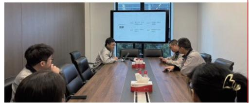

text_image

Meeting room scene with participants seated around a table, one person presenting a presentation screen; visible presentation title and cake on table

## 关键绩效

数据安全/客户隐私保护相关培训场次

4次

数据安全/客户隐私保护相关培训总时长

8小时

## 客户隐私保护

公司始终将客户隐私保护置于首要位置，严格遵守《中华人民共和国个人信息保护法》等法律法规要求，建立健全客户隐私保护机制，切实维护客户隐私权益，持续提升客户信任度，有效防范和化解客户隐私风险，为客户提供安全可靠的服务体验。

## 负责任供应链

公司坚持公平交易原则，将可持续发展理念纳入供应链管理体系中，致力于与供应商建立长期稳定、资源共享的合作关系，助力行业共同进步。

## 治理

公司严格遵守《中华人民共和国招标投标法》等相关法律法规，制定《材料采购管理制度》《采购控制程序》《物资采购管理细则》等制度规范，对材料供应商采取集中管控模式，明确规范采购业务流程、供方管理及物资采购存储，验收等环节，并由公司采购部进行统一管理由采购部经理或其指定负责人直接开发与维护管理。公司采购部经理在总经理的授权下负责全公司材料采购的战略规划，以及供应商的开发、关系维护和评价管理、质量监督配合、材料需求汇总申报及采购等工作，有效控制采购风险，保障物资产品质量，积极推动供应链在安全性、稳定性和可持续性方面的高质量发展。

## 战略

公司通过识别供应链环节过程中潜在的风险和机遇，制定应对措施，并持续优化采购策略、生产流程及仓储管理等环节，为供应链安全提供有力保障。

<table><tr><td>风险类型</td><td>风险描述</td><td>潜在财务影响</td><td>发生可能性</td><td>影响大小</td><td>影响时间范围</td><td>影响价值链环节</td><td>应对措施</td></tr><tr><td rowspan="2">市场风险</td><td>公司所使用的木浆、钛白粉等原材料价格受行业经济周期、市场供求关系、国家环保政策以及气候、自然灾害等多因素影响,导致原材料价格大幅波动。</td><td>成本增加</td><td>中</td><td>中</td><td>中期</td><td>上游</td><td>建立成熟完备的原材料采购体系,随时关注当地及周边市场的材料价格走势,做好材料采购的价格预警管理工作;根据销售预测、原材料库存和市场价格变动,合理调整库存策略,选择适度备货,以确保原材料的质量稳定、及时供应和成本控制。</td></tr><tr><td>公司进口木浆的采购业务。外汇波动,将可能对公司的经营状况产生影响,人民币贬值带来的出口效益可能导致进口成本上升有所抵消。</td><td>成本增加</td><td>中</td><td>中</td><td>中长期</td><td>上游</td><td>根据市场行情及生产计划灵活调整采购策略,优化采购节奏,通过与供应商进行议价或以同材料不同厂商供货比例调整,有效应对价格波动;与优质供应商签订长期合同,锁定关键原材料价格,降低风险;针对主要外汇币种,持续开展外汇套期交易业务,有效缓解汇率波动带来的影响。</td></tr><tr><td>机遇类型</td><td>机遇描述</td><td>潜在财务影响</td><td>发生可能性</td><td>影响大小</td><td>影响时间范围</td><td>影响价值链环节</td><td>应对措施</td></tr><tr><td>供应链数字化转型</td><td>通过整合先进的信息技术,使公司供应链管理更加智能化和自动化,从而提高供应链的响应速度、决策的准确性以及各方协作的透明度,增强企业的市场竞争力与适应能力。</td><td>成本降低</td><td>中</td><td>中</td><td>长期</td><td>运营</td><td>持续优化数字化供应链管理平台,利用数字化手段对市场需求的精准预测以及潜在风险的有效评估;与供应商建立紧密合作关系,建立信息共享与协同机制,实现信息的实时传递与透明化展示,确保供应链上下游企业之间紧密协作、高效配合。</td></tr></table>

注：公司对时间范围的界定为：短期（0-1年）、中期（1-5年）、长期（5年以上）

## 影响、风险和机遇管理

公司建立完备的供应链风险管理体系，通过对内外部因素进行识别，从风险等级、发生可能性等方面进行评估分析，并制定应对措施公司多部门紧密协作，以应对各种供应链应急情况，保障生产的稳定性与连续性。

<table><tr><td>风险识别</td><td>组织质量管理人员识别潜在供应链风险,包括原材料、成品等采购对象可能出现的质量、价格、供货期等相关风险。</td></tr><tr><td>风险分析</td><td>采用定性和定量的方法,分析已识别风险,评估潜在的影响和发生可能性,对识别的风险进行分析和排序,形成风险和机遇评估分析表。</td></tr><tr><td>风险监测</td><td>采购部定期向分管领导及总经理汇报每月材料供应商区域规划、当月供应商开发与维护情况。进行供应商考核及评价,对供应商的价格、产品质量、交期状况、服务态度等进行评估,进行综合评定并提交评定报告,从而分析并降低供应商风险。</td></tr><tr><td>风险管理</td><td>建立供应商管理档案,对供应商进行考核,根据考核结果重新进行审批,签订采购协议,调整供应商名录,调整供应商档案;考核结果低于70分以下的供应商将从合格供应商列表中除名并终止其的采购业务。</td></tr></table>

指标与目标

<table><tr><td>指标</td><td>2025年</td></tr><tr><td>供应商总数</td><td>2,034个</td></tr><tr><td>供应商廉洁协议签署率</td><td>100%</td></tr><tr><td>拥有质量管理体系认证的核心供应商数量</td><td>24个</td></tr><tr><td>拥有环境管理体系认证的核心供应商数量</td><td>18个</td></tr><tr><td>拥有职业健康安全管理体系认证的核心供应商数量</td><td>15个</td></tr><tr><td>因不合规被中止合作的供应商数量</td><td>0个</td></tr><tr><td>报告期末应付账款(含应兑票据)余额</td><td>120,582.75万元</td></tr><tr><td>报告期内(含应兑票据)余额占总资产的比重</td><td>19.92%</td></tr></table>

## 供应商全生命周期管理

公司构建了覆盖从供应商准入、考核到退出的供应商全生命周期管理体系，对供应商实施全面的管理，以保障供应链的安全性与稳定性。

## 供应商准入

对材料供应商的选择建立在把握全面信息的基础上进行全面评估，考虑区域价格稳定性、对单位净现金流的增益，以及能否带来竞争优势或战略价值等多重因素；在供应商引入过程中需经过样品的测试，检验合格的样品转入小批试用环节，试用完成后进行评审，根据供应商所供材料对公司生产和产品质量的影响程度，将供应商分为关键供应商，重要供应商，普通供应商三个级别 对不同级别供应商实行不同的控制等级

## 供应商考核评价

公司采购部定期对供应商价格、产品质量、交期状况、服务态度以及管理水平等方面进行考核，对于关键、重要供应商每半年考核一次，普通供应商每年考核一次，并且采购部根据考核结果重新进行审批，签订采购协议，调整供应商名录，调整供应商档案。

## 供应商管理

采购部应掌握全国材料状况，建立供应商管理档案，并协调与材料供应商的关系，建立长期稳定的合作关系。

## 供应商退出

供应商考核结果若低于70分，被认定为不合格供应商，从合格供应商列表中除名，终止对不合格供应商的采购业务。

## 可持续供应链

## 供应商ESG管理

公司持续推进供应商ESG管理，持续健全涵盖供应商劳动用工、环境保护、安全生产及商业道德等领域的评估机制，将其纳入供应商遴选与考核的衡量因素，并积极倡导供应商实施可持续的生产与经营模式，共建安全、可持续的供应链生态。

## 廉洁采购

公司始终秉持守法诚信的经营理念，坚持廉洁采购，严禁采购过程中出现腐败、商业贿赂及不正当利益交换等行为。公司制定《反商业贿赂管理》等制度，建立健全廉洁保证机制。各职能部门对下属人员进行严格管理和廉洁督查，并将廉洁情况列为绩效考核、任免的依据。通过强化制度监督，加大对重点环节、重点部位岗位人员的监督和管理力度，确保治理商业贿赂承诺制得以落实，严格遵循公平竞争规则，确保公司采购活动的公正与透明，与供应商共同维护良好的商业伦理和市场秩序。

## 供应商廉洁监督

对涉外业务经办人员实行预防商业贿赂承诺制，签订《反商业贿赂承诺书》；并每年对涉外业务经办人员反商业贿赂工作开展评价，指出并纠正不良行为。  
与公司有业务往来的供应商、服务商、承包商必须和公司签订《反商业贿赂协议》，或在商业合同中明确反商业贿赂条款。

<table><tr><td colspan="2"></td></tr><tr><td>员工廉洁监督</td><td>·公司所有员工均应受反商业贿赂管控,特别是从事材料采购、外协加工、外包业务、设施工程、业务销售、设备采购和维护、质量监督以及人、财、物管理活动的相关人员将被重点关注。</td></tr><tr><td>供应商反腐败处理</td><td>·公司针对反商业贿赂工作中发现的问题,涉嫌经济犯罪的将移送司法机关处理。与公司业务往来的利益方违反反商业贿赂管控的规定,坚决取消其供应商、服务商资格,构成商业贿赂(行贿)犯罪的,报告司法机关追究刑事责任。</td></tr></table>

natural_image

Isometric illustration of a business meeting with participants seated around a circular table, laptops and documents on the table (no text or symbols present)

# 携手同行 共建美好华旺

华旺科技秉持“选人重德、用人凭能”的理念，高度重视员工的生命健康，将其视为公司的重要财富。与此同时，公司积极投身公益事业，旨在以企业发展为桥梁，连接员工梦想与团队目标，实现与社会福祉的共同进步和繁荣。

## 响应的 SDGs

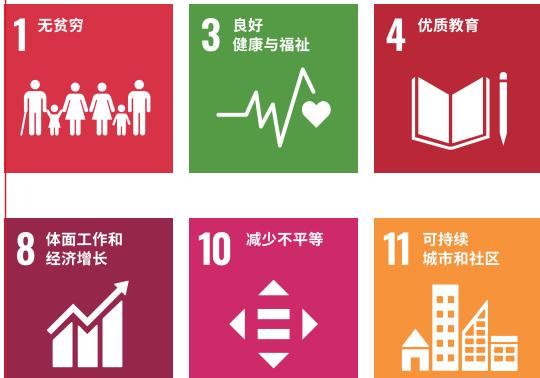

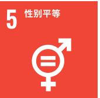

员工权益保障 79

职业健康与安全 89

践行社会责任 96

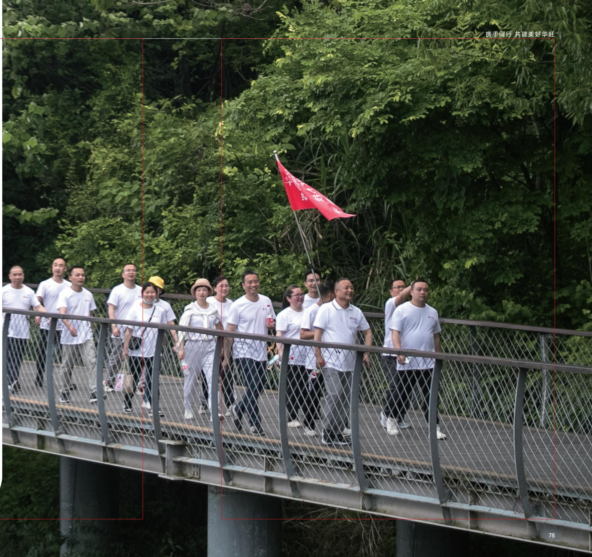

text_image

携手同行 共建美好华旺
78

## 员工权益保障

公司始终将员工权益保障置于发展首位，严格遵循《中华人民共和国劳动法》《中华人民共和国劳动合同法》《中华人民共和国民法典》等国内法律法规，同时对标《世界人权宣言》《公民及政治权利国际公约》等国际准则，制定《员工手册》《人事管理制度》《人力资源控制程序》等管理制度，全面规范员工管理各环节流程，全方位保障员工合法权益，着力营造平等尊重、和谐包容的职场生态。

## 人才吸引与招聘

公司秉承“选人重德、用人凭能”的人才理念，设置规范的人才选用机制，结合公司自身业务发展，持续优化人才结构，打造高质量人才队伍。

## 合规雇佣

公司秉承公平、公正、公开的原则，制定了《核心劳工要求政策声明》，合规开展人力资源管理工作。

## 关键 绩效

报告期内，公司未发生任何劳工歧视事件，未发生强迫劳动和雇佣童工事件。

## 反歧视

公司坚决抵制任何歧视行为。在招聘及工作过程中，所有管理人员对全体员工一视同仁，杜绝歧视行为，实行男女同工同酬。录用招聘时，不以性别为由拒绝录用妇女或提高对妇女的录用标准。员工在聘用、培训、晋升等过程中，不因民族、种族、性别、宗教、残疾等受到歧视，充分尊重员工的多样性，为员工提供公平的机会与资源。

## 禁止强迫劳动和雇佣童工

公司杜绝强迫劳动，合理规划生产，员工周工作时长不超过60小时，每七天至少休息一天；公司严禁雇佣童工，员工入职时需查看身份证并提交身份证复印件，确保应聘者年龄符合国家有关法规。同时，公司还要求供应链伙伴遵循同样的用工标准，全方位守护劳工权益，营造合规、人道的用工环境，展现企业担当。

## 多元化建设

公司坚守员工多元化与平等尊重的价值观，全力打造包容、公正的职场生态环境，让每位员工都能在此安心拼搏、绽放光彩。

## 多元化招聘

公司积极开拓多种招聘渠道，通过公众号、线上招聘平台、线下招聘会等形式开展招聘工作，以开放的姿态拥抱优秀人才。

招聘渠道

<table><tr><td>线上招聘</td><td>公司通过临安招聘网、临安猎杰人才网等在线网站,收集简历217份。同时,公司2025年新增BOSS招聘为合作单位,主要针对高端人才、销售人员的招聘。</td></tr><tr><td>校园招聘会</td><td>报告期内,公司赴杭州电子科技大学、浙江大学城市学院开展2场校园专场招聘,广纳优质人才。</td></tr><tr><td>社会招聘会</td><td>报告期内,公司依托杭州人才网开展网络社会招聘1场,联动临安区各街道组织线下社会招聘会6场。</td></tr><tr><td>退伍军人招聘会</td><td>公司实施特殊招聘政策,积极吸纳退伍军人与残疾人,与退伍军人服务机构合作,专设岗位助力军转就业;报告期内,公司召开1次退伍军人招聘会。</td></tr></table>

## 关键

报告期内，公司新进员工175人。

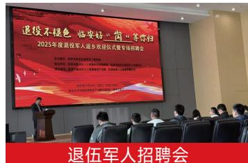

text_image

退役不褪色 临安好、简、冬你归
2025年度退役军人进乡攻坚试点暨专场招聘会
退伍军人招聘会

<table><tr><td>指标</td><td>人数(人)</td><td>占比(%)</td></tr><tr><td colspan="3">以招聘渠道划分</td></tr><tr><td>社会招聘</td><td>175</td><td>100</td></tr><tr><td>校园招聘</td><td>0</td><td>0</td></tr><tr><td>其他招聘渠道</td><td>0</td><td>0</td></tr><tr><td colspan="3">按性别划分的新进员工</td></tr><tr><td>女性</td><td>31</td><td>17.71</td></tr><tr><td>男性</td><td>144</td><td>82.29</td></tr></table>

按性别划分的新进员工

## 员工结构多元化

## 关键 绩效

截至报告期末，公司共有员工783名，其中退伍军人员工4名，残疾员工64名。

<table><tr><td>指标</td><td>人数(人)</td><td>占比(%)</td></tr><tr><td colspan="3">按性别划分</td></tr><tr><td>女性</td><td>213</td><td>27.20</td></tr><tr><td>男性</td><td>570</td><td>72.80</td></tr><tr><td colspan="3">按年龄划分</td></tr><tr><td>30岁以下(不含30岁)</td><td>59</td><td>7.54</td></tr><tr><td>30-40岁(含30岁,不含40岁)</td><td>213</td><td>27.20</td></tr><tr><td>40-50岁(含40岁,不含50岁)</td><td>245</td><td>31.29</td></tr><tr><td>50岁及以上</td><td>266</td><td>33.97</td></tr><tr><td colspan="3">按学历划分</td></tr><tr><td>本科以下</td><td>689</td><td>87.99</td></tr><tr><td>本科及以上</td><td>94</td><td>12.01</td></tr><tr><td colspan="3">以专业划分</td></tr><tr><td>生产</td><td>552</td><td>70.50</td></tr><tr><td>销售</td><td>39</td><td>4.98</td></tr><tr><td>财务</td><td>15</td><td>1.92</td></tr><tr><td>行政</td><td>68</td><td>8.68</td></tr><tr><td>研发</td><td>109</td><td>13.92</td></tr></table>

## 女职工权益保障

公司严格遵守《中华人民共和国妇女权益保障法》《女职工劳动保护特别规定》等政策法规，依法保障女员工合法权益，为女员工提供产假、哺乳假、育儿假等带薪假期，保障同工同酬，给予女员工平等的晋升发展机会，为女性员工配备高标准卫生的卫生间，关照女性特殊生理期需求，全方位守护女性员工，打造尊重、包容和支持的职场环境。

<table><tr><td>指标</td><td>2025年</td></tr><tr><td>管理人员中女性人数</td><td>10人</td></tr><tr><td>管理人员中女性人数比例</td><td>13%</td></tr><tr><td>享受产假员工数</td><td>1人</td></tr></table>

## 培训与发展

## 培训管理

公司高度重视员工培训与职业发展，制定《员工培训制度》并搭建覆盖全员的学习发展体系，结合各岗位履职需求编制年度培训计划表并狠抓落地执行，全方位提升员工安全意识、操作技能、专业知识与合规意识等综合素养，助力员工在不同职业阶段实现能力进阶与职业成长。

培训体系

<table><tr><td colspan="2">华旺科技人才培训体系</td></tr><tr><td>各类人员</td><td>培训要求</td></tr><tr><td>关键工序操作人员</td><td>车间操作人员:需熟悉制浆造纸基本知识,掌握本岗位操作与安全规程,能处理一般故障,经考试合格上岗。检验员:要熟悉产品工艺流程,掌握质量标准、检验方法及工具使用,确保检验数据准确,正确填写记录报表。</td></tr><tr><td>管理体系内部审核员</td><td>需熟练掌握管理体系要求,具备开展体系内审、综合评价及解决实际问题的能力,经培训合格并取得证书。</td></tr><tr><td>特殊工种及计量人员</td><td>针对电工、电焊工、机动车驾驶员、行车工、压力容器工及计量、仪表人员,培训重点必须符合上级部门培训条件,参加外培并完成本企业安全生产教育,经考试合格获得相应资格证书。</td></tr></table>

华旺科技人才培训体系

<table><tr><td>各类人员</td><td>培训要求</td></tr><tr><td>中层以上干部</td><td>通过培训了解质量与环境管理体系标准,熟悉公司管理体系文件及各部门职责,确保管理体系正常运行。</td></tr><tr><td>专业技术人员和管理人员</td><td>熟悉公司管理体系文件,掌握统计技术和方法,运用统计方法分析、归纳、总结影响产品质量和环境的因素。</td></tr><tr><td>销售人员</td><td>培训围绕顾客满意度测量方法、熟悉服务操作规程和营销策略等,经考试及考察合格后录用。</td></tr><tr><td>新招聘员工及转岗员工</td><td>新招聘的人员及工种变更员工需了解公司管理体系文件、安全生产及质量与环境意识教育,明确所在岗位的质量、环境要求。</td></tr><tr><td>文件资料管理员</td><td>掌握文件资料管理范围和程序,熟悉文件修改及归档工作,经培训后能胜任岗位工作。</td></tr><tr><td>其他人员</td><td>除上述培训对象外,其他人员需熟悉本岗位职责、工作依据文件,做好质量记录,了解工作接口及质量体系文件中与本职工作相关的部分。</td></tr></table>

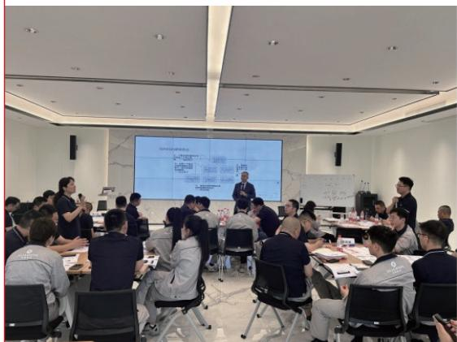

text_image

Conference room scene with attendees seated at tables facing a presentation screen displaying Chinese text and diagrams

商务谈判实战技巧

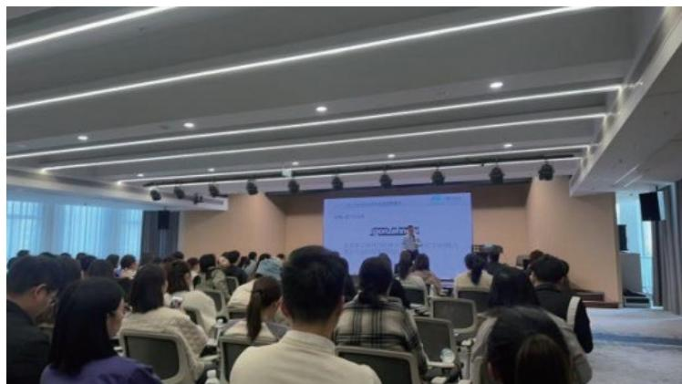

text_image

Conference hall photo with visible presentation screen displaying Chinese text and audience seated in rows

人力资源培训

## 微学平台

公司引入微学平台，整合内外部优质课程资源，邀请行业专家、资深讲师分享经验与专业智慧，实现培训课程数字化运营；同时深度萃取内部优秀工作经验形成专属课程，丰富培训内容体系，提升培训实效。

<table><tr><td>指标</td><td>2025年</td></tr><tr><td>员工培训投入</td><td>11.87万元</td></tr><tr><td>员工培训场次</td><td>123次</td></tr><tr><td>接受培训总人数</td><td>783人</td></tr><tr><td>接受培训总人次</td><td>4,922人次</td></tr><tr><td>员工培训覆盖率</td><td>100%</td></tr><tr><td>员工培训总时长</td><td>9,945小时</td></tr><tr><td>每名员工每年接受培训的平均时长</td><td>12.70小时</td></tr><tr><td colspan="2">按性别划分的受训比率</td></tr><tr><td>女性</td><td>100%</td></tr><tr><td>男性</td><td>100%</td></tr><tr><td colspan="2">按职级划分受训比率</td></tr><tr><td>高级管理层</td><td>100%</td></tr><tr><td>中级管理层</td><td>100%</td></tr><tr><td>基层员工</td><td>100%</td></tr></table>

## 晋升机制

公司持续完善人才成长机制，打造畅通的职业发展通道，为员工拓宽发展空间、搭建成长平台，助力员工达成个人职业发展目标。员工晋升遵循“德能与业绩并重”原则，实行逐级晋升为主、越级晋升为辅的机制，对为公司作出突出贡献或具备特殊才干的员工可破格越级晋升；同时支持员工根据发展方向调整晋升通道，并结合年终绩效考核实施职位能升能降的动态管理，公平评判员工表现，激励员工释放潜能，实现企业与个人双赢。

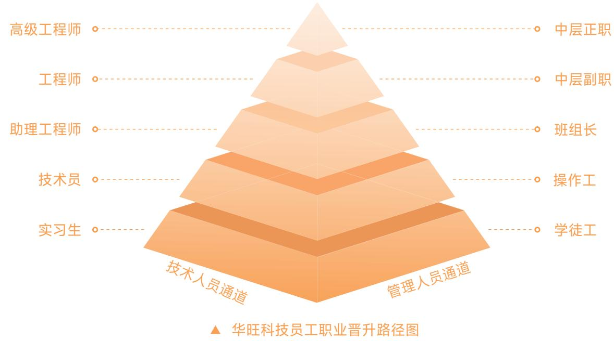

funnel

| 人员层级 | 职业 |
| --- | --- |
| 高级工程师 | 中层正职 |
| 工程师 | 中层副职 |
| 助理工程师 | 班组长 |
| 技术员 | 操作工 |
| 实习生 | 学徒工 |

## 薪酬福利管理

## 薪酬管理

公司制定《薪酬管理制度》，旨在规范薪酬策略与结构设计，确保员工劳动价值获得合理回报。通过构建科学完善的薪酬激励机制充分调动员工的工作积极性激发他们的创新活力进而有效吸引并留住核心优秀人才，形成“薪酬激励－绩效提升－业绩增长”的良性循环，推动员工绩效与企业经营业绩同步提升。

公司薪酬结构由直接薪酬、其他奖金及福利构成，其中直接薪酬包含固定薪酬、加班工资与浮动薪酬。固定薪酬根据岗位序列及职级核定，浮动薪酬对应员工业务绩效提成，实现薪酬与岗位价值、工作业绩的精准绑定。

## 绩效激励

公司严格依照《员工激励及晋升的相关制度》等规定实施全员绩效考核，采用层级考核模式，由上级对下级开展考核指导，考核结果作为员工薪酬调整、职位变动、岗位调整的核心依据。公司根据考核结果对员工进行综合排名，并依据排名实施差异化激励奖励，充分激发员工工作积极性。

## 绩效反馈

公司高度重视员工与上级主管的双向沟通，并将其融入绩效考核全流程，建立了完善的反馈与申诉机制。主管通过面谈向员工反馈考核结果及判定依据，共同分析绩效短板并制定针对性改进提升计划；员工若对考核结果存疑，可通过人力资源部热线、邮箱等多渠道反馈诉求。公司在收到反馈后，将迅速启动复核程序，重新审视考核过程与结果，以确保整个过程的公平性和公正性。

## 福利体系

公司重视员工福利保障，全面遵循国家政策法规，依法为员工缴纳五险一金，保障员工享有完善的社会福利保障体系。此外，公司关注员工的身心健康与多元化需求，为员工提供防暑降温补助，为一线员工需求发放劳动防护用品，守护员工健康与安全；通过积极改善办公环境与设施，为员工创造更加舒适与便利的办公条件；为员工提供多样的员工活动与福利，丰富员工的业余生活。

员工福利体系

<table><tr><td>社会福利保障</td><td>&gt;</td><td>为员工依法缴纳基本养老保险、基本医疗保险、失业保险、工伤保险、生育保险及住房公积金。</td></tr><tr><td>薪酬补贴</td><td>&gt;</td><td>为员工提供防暑降温补助、出差补贴、租房购房补贴、生活补贴等。</td></tr><tr><td>专项奖金</td><td>&gt;</td><td>设有专利、科技创新、管理创新单项奖金,以及重大项目上的突破和进展专项奖。</td></tr><tr><td>基础设施</td><td>&gt;</td><td>公司建有招待所、员工食堂、文体中心、健身房等,邻近公交站、地铁站、商业区。</td></tr><tr><td>设立“福利基金会”</td><td>&gt;</td><td>鼓励员工参与,并为遭遇困难的员工雪中送炭。</td></tr><tr><td>生日礼物</td><td>&gt;</td><td>员工可在生日当月获赠生日礼物一份。</td></tr></table>

## 劳动关系管理

## 劳动合同管理

公司制定《员工手册》，明确劳动关系管理标准与流程，依法与全体员工签订劳动合同，相关签订事宜统一由人力资源部统筹负责。在劳动合同变更环节，若订立合同所依据的客观情况发生重大变化，导致合同无法继续履行，经公司与员工双方协商一致，可对合同相关内容予以变更。在劳动合同解除环节，双方亦可以通过协商达成一致后解除劳动合同，全程遵循合法合规、平等自愿的原则。

## 劳动争议处理

为妥善化解劳动合同双方潜在劳动争议，保障员工合法权益与企业经营秩序，公司建立规范化争议处理渠道。若双方发生劳动争议，员工可在争议发生之日起30日内向公司工会下设的劳动争议调解委员会申请调解，也可在60日内向当地劳动争议仲裁委员会提出仲裁电请，员工对调解结果不服或对仲裁裁决有异议的，可依法向公司所在地人民法院提起诉讼，全程遵循合法、公正、高效的处理原则，确保争议得到妥善解决。

## 员工关怀与沟通

## 民主管理

华旺科技充分尊重员工民主权利，持续深化民主管理机制，鼓励员工深度参与企业建设。公司依据《中国工会章程》成立工会，并制定《工会工作制度汇编》，充分发挥其在劳动关系协调中的作用，始终坚持维护职工的合法权益。工会实行集体领导与分工负责相结合，执行会员大会决议，策划组织多样的活动，以促进劳动关系和谐稳定。

报告期内，公司召开2次职工代表大会，审议通过了《选举公司第四届董事会职工代表董事的议案》《员工薪资及工作制调整方案》等3项涉及员工利益的相关内容。

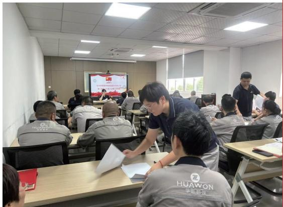

text_image

Meeting room photo with visible company branding and presentation screen showing Chinese text

职代会

## 员工沟通

公司高度重视信息沟通，强调资源共享，提倡通过沟通来促进管理，鼓励员工相互间积极公开的沟通交流，坚决反对任何不负责任的私下传言和背后议论行为。公司综合部和人力资源部作为员工关系与沟通的主要责任机构，为员工在工作满意度提升、劳动保障与申诉处理等方面提供支持与帮助，各级管理层协同参与。

同时，公司构建多元沟通渠道，员工可以通过公司网站、专用电话、电子检举信箱等渠道进行意见反馈与提供建议，确保心声能够得到及时回应。公司号召员工为公司提供合理化建议和技改创新意见，并在年终给予提出优秀建议的员工表彰奖励。

## 沟通渠道

综合管理部：

0571-63753803

华旺网址：

www.hwpaper.cn

电子检举信箱：

ij@huawon.cn

## 员工帮扶

公司致力于为每一位员工提供全面的关怀与支持，让每位员工都能感受到企业的温暖与关怀。公司特别设立“福利基金会”，在员工面临特殊困难时给予必要的经济补助和情感支持。工会时刻关注员工工作之外的实际困难，每年年底对困难员工根据困难程度发放慰问金，并定期召开困难员工座谈会。

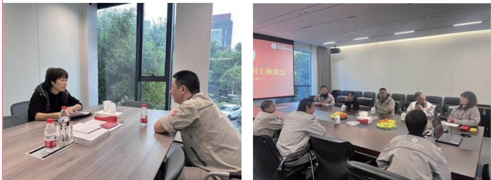  
困难职工座谈

# 职业健康与安全生产

## 治理

公司深入学习贯彻《中华人民共和国安全生产法》《职业病防护法》等安全生产、职业病防护相关法律法规，按照国家、省、市关于大力开展安全生产、职业病防护的要求，持续强化安全生产主体责任，加强安全管理，建立完善的、体系化的安全生产长效管理机制。

公司成立了职业健康工作领导小组与安全生产领导小组，负责贯彻执行国家安全生产、职业健康相关法规政策，统筹推进公司安全生产管理与职业健康工作；每季度召开会议，总结、部署工作；督促各单位建立职业健康管理台账及档案；参与事故调查处理，组织开展宣传活动等。同时，制定了《安全风险分级管控体系文件》《职业病防治责任制度》一系列管理制度作为指导文件，全面落实安全生产责任制，为公司的生产运营活动提供全面的安全保障。

安全生产方针：安全第一、预防为主、综合治理。

职业病防护方针：预防为主、防治结合。

公司建立了全面的安全生产管理体系，安全管理持续符合GB/T 45001-2020/IS0 45001:2018职业健康安全管理体系认证标准，同时经过有关部门评审，荣获安全生产标准化三级企业证书。

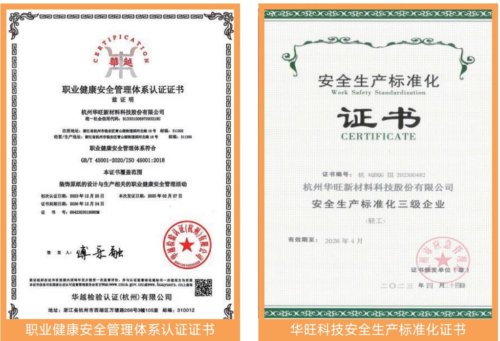

## 战略

员工的健康安全是华旺科技的发展基石。公司根据职业健康与安全生产的法律法规和行业标准，结合实际经营情况，对职业健康与安全方面的影响、风险和机遇进行识别与评估，为加强公司内部职业健康与安全生产管理提供依据，确定整改方向，助力公司实现可持续发展。

<table><tr><td>风险类型</td><td>风险描述</td><td>财务影响说明</td><td>发生可能性</td><td>影响大小</td><td>影响时间范围</td><td>影响价值链环节</td><td>应对措施</td></tr><tr><td>法律风险</td><td>企业若对法律法规认知不足、管理不到位,极易受到罚款、停产整顿等行政处罚,进而影响企业正常运营节奏,冲击财务状况。</td><td>减少营收</td><td>中</td><td>中</td><td>长期</td><td>运营</td><td>·安环部门负责职业病防治、宣传、教育与培训工作的组织;·各车间、各部门负责协助安环办进行职业病防治、宣传、教育与培训工作,并积极组织员工参与。</td></tr><tr><td>声誉风险</td><td>公司生产运营过程如发生人身伤害乃至死亡等安全事故风险,可能导致市场信任将骤降,品牌形象受损,企业市场份额缩水。</td><td>减少收入</td><td>中</td><td>中</td><td>长期</td><td>运营</td><td>·制定《职业病防治责任制度》等相关控制程序;·明确各部门安全生产责任;·制定危害事故应急救援制度,定期组织开展应急演练,开展职业病宣贯活动。</td></tr><tr><td>营运风险</td><td>如因操作、管理不当、或设备故障等问题引发职业健康或安全生产事故,极易导致公司业务中断。公司不仅需要支付员工医疗、工伤赔偿,还可能面临罚款,以及事故处置与现场复原整改,运营成本骤增。</td><td>增加营运成本</td><td>中</td><td>中</td><td>短期</td><td>运营</td><td>·汇编《安全风险分级管控体系》文件,辨析安全风险;·加强员工安全教育培训;·生产中对于设备等均标识职业健康安全风险。</td></tr><tr><td>机遇类型</td><td>机遇描述</td><td>财务影响说明</td><td>发生可能性</td><td>影响大小</td><td>影响时间范围</td><td>影响价值链环节</td><td>应对措施</td></tr><tr><td>管理效率</td><td>发现并改善职业健康安全的管理流程中可优化的环节,既能提升公司管理效率,又能降低事故风险,避免事故引发的巨额财务损失,为企业稳健发展护航。</td><td>减少费用支出</td><td>中</td><td>中</td><td>中长期</td><td>运营</td><td>编制安全风险分级管控体系,明确风险管控措施,定期开展评估,明确部门责任划分。</td></tr></table>

注：公司对时间范围的界定为：短期（0—1年）、中期（1—5年）、长期（5年以上）

## 影响、风险和机遇管理

公司构建风险分级管控与隐患排查双重预防机制，对风险进行识别管控，对隐患及时排查，防范安全事故。

1、安全风险分级管控危险源风险辨识→风险分级→风险管控

2、事故隐患排查治理隐患排查隐患→原因分析→隐患整改

3、突发事件应急管理事故应急处置→事故调查→持续改善

## 风险分级管控

公司制定《安全风险分级管控体系文件》，全面排查生产与生活各环节，精准识别员工不安全行为、物态隐患 环境因素及管理缺陷聚售人员 设备设施 环境 管理四大类危险源 提前研判并防控事故透因最大限度实现危险源的管控与消除，切实保障生产安全。

公司设立安全生产风险分级管控小组，明确职责分工：组长统筹安全风险分级管控工作，负责方案审批、考核督导与推广落地；副组长承担具体执行与全过程协调工作；组员按照组长部署，在各自分管领域开展风险分级与评估工作，确保风险评价结果精准、管控措施落地有效。

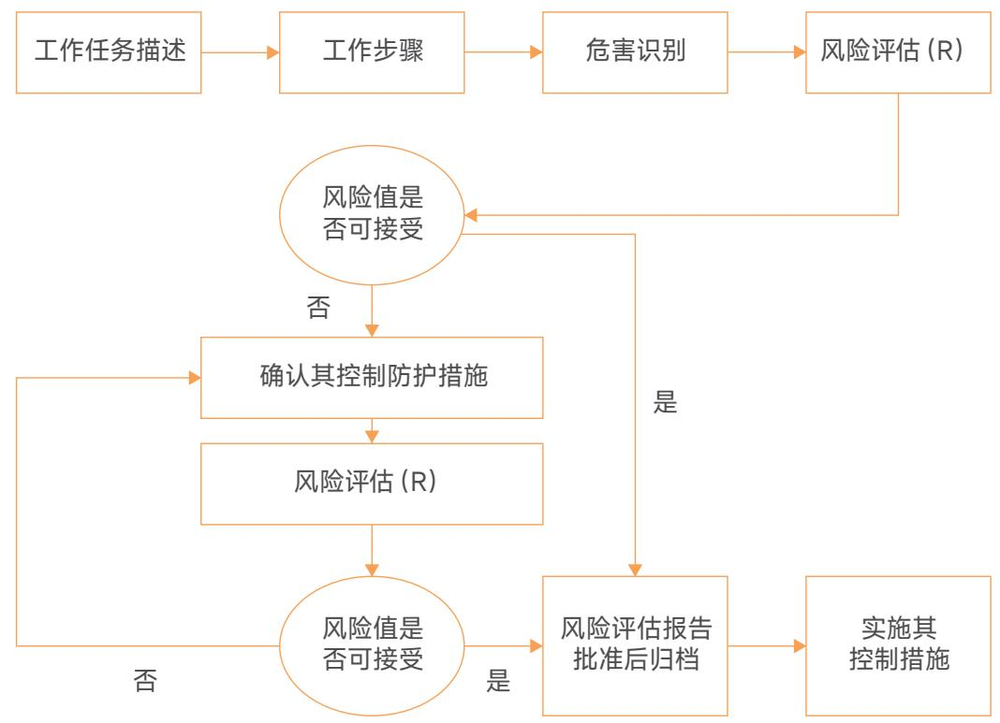

flowchart

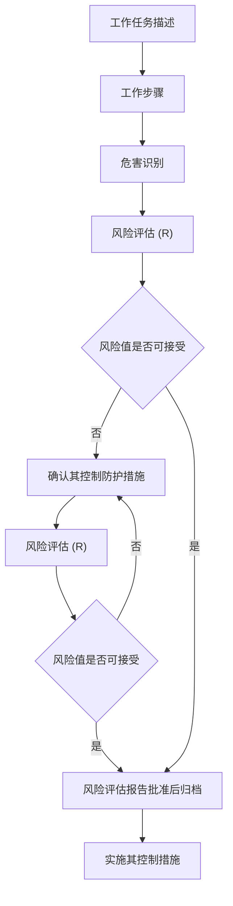
```mermaid
graph TD
  A["工作任务描述"] --> B["工作步骤"]
  B --> C["危害识别"]
  C --> D["风险评估 (R)"]
  D --> E{"风险值是否可接受"}
  E -->|否| F["确认其控制防护措施"]
  F --> G["风险评估 (R)"]
  G --> H{"风险值是否可接受"}
  H -->|否| F
  H -->|是| I["风险评估报告批准后归档"]
  I --> J["实施其控制措施"]
  E -->|是| I
```

风险辨识和评估流程

## 隐患排查

公司制定《隐患排查治理制度》明确事故隐患管理机构及职责规范隐患分类，登记，上报，建档全流程从源头排除现场安全隐患防范安全事故发生。在公司安全生产领导小组的统一领导下由安环部牵头负责全公司隐患管理工作。公司还设立了隐患排查治理考核奖惩制度，强化安全生产的监督机制，构建安全隐患排查治理长效机制。

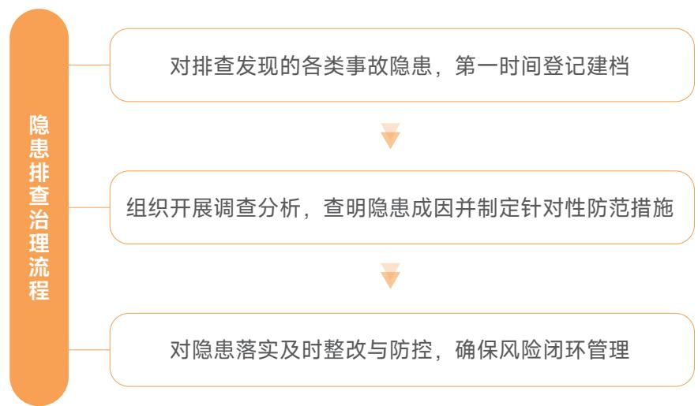

flowchart

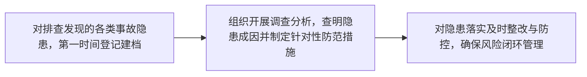
```mermaid
graph LR
  A["对排查发现的各类事故隐患，第一时间登记建档"] --> B["组织开展调查分析，查明隐患成因并制定针对性防范措施"]
  B --> C["对隐患落实及时整改与防控，确保风险闭环管理"]
```

## 安全应急管理

公司严格贯彻《中华人民共和国安全生产法》《中华人民共和国突发事件应对法》等法律法规，依照《生产经营单位生产安全事故应急预案编制导则》（GB/T 29639-2020）的规范要求，编制《生产安全事故综合应急预案》，旨在保障员工人身安全、降低企业财产损失，确保事故发生后，应急救援工作能够迅速、高效、有序开展。预案涵盖综合、专项、现场处置等多类方案，多维度防范各类安全事故发生，各部门与员工定期参与培训、演练，强化风险防范意识与应急处置能力。

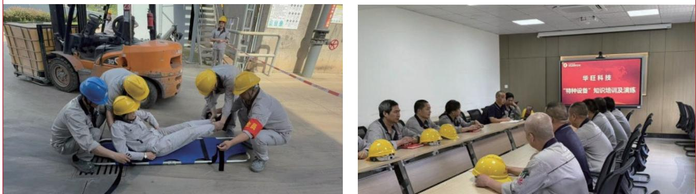  
“特种设备”演练

## 指标与目标

职业健康安全总目标

<table><tr><td>目标</td><td>2025年完成情况</td></tr><tr><td>无重大设备事故(直接损失超过拾万元事故)包含特种设备压力容器爆炸事故。</td><td>已达成</td></tr><tr><td>无重大消防事故(直接损失超过叁万元事故)</td><td>已达成</td></tr><tr><td>有序开展企业三级安全生产标准化管理工作</td><td>已达成</td></tr></table>

职业健康安全总指标

<table><tr><td>指标</td><td>2025年</td></tr><tr><td>安全生产投入金额</td><td>249.19万元</td></tr><tr><td>特种作业人员持证上岗率</td><td>100%</td></tr></table>

<table><tr><td>指标</td><td>2025年</td></tr><tr><td>工伤保险的投入金额</td><td>112.34万元</td></tr><tr><td>工伤保险人员覆盖率</td><td>100%</td></tr><tr><td>新增职业病数</td><td>0</td></tr><tr><td>职业病危害因素检测率</td><td>100%</td></tr><tr><td>隐患排查整改率</td><td>100%</td></tr><tr><td>开展安全教育培训活动</td><td>94场</td></tr><tr><td>安全教育培训总时长</td><td>6,254小时</td></tr><tr><td>安全教育培训覆盖率</td><td>100%</td></tr></table>

## 安全管理措施

## 安全文化教育

公司重视安全意识培养，进一步推进安全生产工作，定期组织员工开展安全教育培训活动，通过理论学习与实际演练相结合的方式，提升全员安全意识和安全事故处理能力。

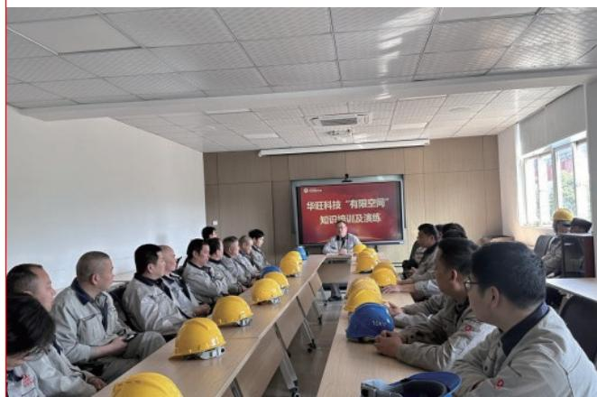

text_image

华旺科技“有限空间”
知识训练及演练

3月2日“有限空间”知识培训和演练

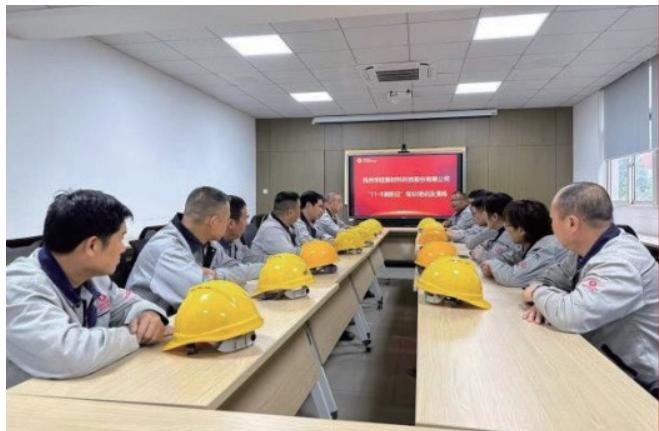

text_image

杭州市拱墅区市政建设办公室
“1个新旧”规划会议暨

11.9消防日知识培训及演练

## 安全管理数字化

公司设有消防控制室，配备火灾报警主机、联动控制主机及自动消防水炮监控系统，对8台自动消防水炮及其他各类消防设施器材实行全天候实时监控，并在消防水炮关键位置布设8个监测点位，可高效完成火灾预警、自动报警、应急处置等全流程操作，有效降低火灾发生风险，最大限度减少火灾事故造成的损失。

## 化学品安全管理

公司对危险化学品实行全面安全管理，构建制度、设施、人员三位一体的安全保障体系。一方面，公司制定安全管理制度、标准化操作规程与应急处置预案，通过常态化培训与演练，持续提升相关人员的技能与应急处理能力。另一方面，公司设立危化品专区，配备专业防渗漏设施，实时监测通风条件、温湿度等指标，确保存储环境稳定。同时，专区内张贴详细安全信息与制度，醒目提示，配备应急设施，全方位保障危化品存储、使用安全无虞。

## 相关方安全管理

公司持续强化承包商、供应商等相关方全流程安全管控，制定《相关方安全管理制度》，明确相关方资质审核、危险源辨识、日常安全监管等核心工作流程，清晰界定双方安全生产责任与义务。同时建立定期考核评价机制，对相关方安全履职情况实施动态监督，最大限度防范相关方安全事故发生，保障公司生产经营秩序稳定。

职业健康保障

<table><tr><td>职业病因素检测</td><td>公司制定《职业病危害监测及检测评价管理制度》等管理制度,定期聘请第三方专业机构,开展职业病危害因素监测、检测及评价工作。报告期内,公司聘请第三方机构开展职业病危害因素检测并出具《2025多谱职业病危害检测结果报告》,报告结果显示公司为员工提供的防护措施基本可以保证员工在工作场所工作的安全,职业病危害因素检测率100%,检测结果均符合相关法规要求。</td></tr><tr><td>职业健康体检</td><td>公司制定《劳动者职业健康监护及其档案管理制度》,针对接触职业危害作业员工,严格落实职业健康监护规定,建立专项档案,定期组织员工全面体检,覆盖在岗与离岗阶段,精准排查隐患。若遇职业病危害超标或事故,公司迅速开展救治、安排职工进行专项检查。报告期内,公司组织84名接触危害因素作业员工开展职业健康体检,体检覆盖率达100%。</td></tr></table>

<table><tr><td>心理健康保障</td><td>公司高度重视员工心理健康,为员工提供心理健康援助渠道,员工可通过拨打求助热线进行咨询与求助,公司对所有心理健康服务均遵循保密原则,切实保护员工个人隐私。此外,公司积极开展心理健康教育、心理咨询和心理疏导等形式来提高员工的心理健康水平,加强员工心理健康保护意识的培养。</td></tr><tr><td colspan="2">践行社会责任社会贡献</td></tr><tr><td colspan="2">公司在深耕行业的同时,积极投身社会公益事业,承担企业应有的社会责任,回馈社会。2025年,公司向杭州市临安区残疾人联合会、杭州市临安区红十字会捐款20万元,用于困难残疾人慰问、扶持残疾人产业发展,开展各类助残扶残活动。乡村振兴</td></tr><tr><td colspan="2">公司积极响应国家乡村振兴战略号召,持续深化企村结对帮扶与对口支援工作,扎实做好巩固拓展脱贫攻坚成果同乡村振兴有效衔接,主动履行社会责任,助力社会主义公益事业高质量发展。报告期内,公司推动临安区-白玉县企村结对帮扶工作,捐赠3万元用于开展易地搬迁点、集中安置区环境整治提升、社会化服务方面相关建设。</td></tr><tr><td>指标</td><td>2025年</td></tr><tr><td>公益慈善投入</td><td>20万元</td></tr><tr><td>乡村振兴投入</td><td>3万元</td></tr></table>

## 附录

指标索引

<table><tr><td colspan="2">报告章节</td><td>《全球可持续发展报告标准》(GRI Standards)</td><td>《中国企业社会责任报告指南(CASS-ESG 6.0)》</td></tr><tr><td colspan="2">关于本报告</td><td>2-1, 2-2, 2-3</td><td>P1.1-1.2</td></tr><tr><td colspan="2">董事长致辞</td><td>2-22</td><td>P2.1</td></tr><tr><td colspan="2">走进华旺科技</td><td>2-6</td><td>P3.1-3.3</td></tr><tr><td rowspan="6">诚信治理稳步合规经营</td><td>可持续发展治理</td><td>2-9, 2-14, 2-29,3-1, 3-2, 3-3</td><td>G1.1.1-1.1.7,G1.1.9,G1.2,G1.3</td></tr><tr><td>党政建设</td><td>/</td><td>/</td></tr><tr><td>公司治理</td><td>2-9, 2-12</td><td>/</td></tr><tr><td>合规经营与风险管理</td><td>207-1, 207-2</td><td>/</td></tr><tr><td>投资者权益保护</td><td>3-3</td><td>/</td></tr><tr><td>商业道德</td><td>205-2</td><td>G2.1,G2.2</td></tr><tr><td rowspan="3">绿色生产华旺低碳未来</td><td>应对气候变化</td><td>2-9, 3-3, 305-1, 305-2,305-4, 305-5</td><td>E1.1.1-1.1.8,E1.1.18</td></tr><tr><td>环境管理与污废治理</td><td>2-9, 3-3, 303-2, 303-4, 304-2,305-7, 306-2, 306-3, 306-4, 306-5</td><td>E2.1.1-2.1.6,E2.1.9,E2.2.1-2.2.6,E2.3.3,E2.4.1-2.4.4</td></tr><tr><td>资源利用</td><td>2-9, 3-3, 302-1, 302-3,302-4, 303-3</td><td>E3.1.1-3.1.3,E3.2.1,E3.2.2,E3.2.4,E3.3.3</td></tr><tr><td rowspan="5">创新引擎守护品质承诺</td><td>创新驱动</td><td>203-2</td><td>S2.1.1-2.1.12</td></tr><tr><td>负责任供应链</td><td>308-1, 414-1</td><td>S3.1.1-3.1.3</td></tr><tr><td>产品和服务安全与质量</td><td>417-1</td><td>S3.3.1-3.3.3</td></tr><tr><td>客户服务</td><td>418-1</td><td>S3.3.4,S3.3.6</td></tr><tr><td>信息安全与隐私保护</td><td>418-1</td><td>S3.4.1-3.4.2</td></tr></table>

<table><tr><td colspan="2">报告章节</td><td>《全球可持续发展报告标准》(GRI Standards)</td><td>《中国企业社会责任报告指南(CASS-ESG 6.0)》</td></tr><tr><td rowspan="3">携手同行共建美好华旺</td><td>员工权益保障</td><td>2-7,405-1,406-1,408-1,409-1, 2-30, 404-1,404-2</td><td>S4.1.1,S4.1.3-4.1.9,S4.1.11-S4.1.12, S4.3.1-4.3.6</td></tr><tr><td>职业健康与安全</td><td>403-1,403-2,403-3,403-5,403-6,403-7、403-10</td><td>S4.2</td></tr><tr><td>践行社会责任</td><td>203-1,413-1,415-1</td><td>S1.1.2,S1.1.3,S1.2.1-1.2.4</td></tr><tr><td rowspan="3">附录</td><td>指标索引</td><td>/</td><td>A3</td></tr><tr><td>关键绩效表</td><td>/</td><td>A2</td></tr><tr><td>反馈意见表</td><td>/</td><td>A6</td></tr></table>

《上海证券交易所上市公司自律监管指引第14号——可持续发展报告（试行）》指标索引

<table><tr><td>披露要求</td><td>对应的本报告章节</td></tr><tr><td>应对气候变化</td><td>应对气候变化</td></tr><tr><td>污染物排放</td><td>环境管理与污废治理</td></tr><tr><td>废弃物处理</td><td>环境管理与污废治理</td></tr><tr><td>生态系统和生物多样性保护</td><td>生态系统和生物多样性保护</td></tr><tr><td>环境合规管理</td><td>环境管理与污废治理</td></tr><tr><td>能源利用</td><td>资源利用</td></tr><tr><td>水资源利用</td><td>资源利用</td></tr><tr><td>循环经济</td><td>资源利用</td></tr><tr><td>乡村振兴</td><td>践行社会责任</td></tr><tr><td>社会贡献</td><td>践行社会责任</td></tr><tr><td>创新驱动</td><td>创新驱动</td></tr><tr><td>科技伦理</td><td>公司日常生产经营过程中无涉及生命科学、人工智能等科技伦理敏感领域的科学研究等活动,此议题不适用</td></tr><tr><td>供应链安全</td><td>负责任供应链</td></tr><tr><td>平等对待中小企业</td><td>负责任供应链</td></tr><tr><td>产品和服务安全与质量</td><td>产品和服务安全与质量</td></tr><tr><td>数据安全与客户隐私保护</td><td>信息安全与隐私保护</td></tr><tr><td rowspan="2">员工</td><td>员工权益保障</td></tr><tr><td>职业健康与安全生产</td></tr><tr><td>尽职调查</td><td>重要性议题管理</td></tr><tr><td>利益相关方沟通</td><td>利益相关方沟通</td></tr><tr><td>反商业贿赂及反贪污</td><td>商业道德</td></tr><tr><td>反不正当竞争</td><td>商业道德</td></tr><tr><td colspan="2">自主披露的议题:</td></tr><tr><td>股东权益保护</td><td>投资者权益保护</td></tr><tr><td>税务合规</td><td>合规经营与风险管理</td></tr><tr><td>风险管理</td><td>合规经营与风险管理</td></tr><tr><td>ESG治理</td><td>可持续发展治理</td></tr><tr><td>规范公司治理</td><td>公司治理</td></tr><tr><td>客户权益保护</td><td>客户服务</td></tr></table>

## 关键绩效表

经济绩效

<table><tr><td>指标</td><td>单位</td><td>2025</td></tr><tr><td>营业收入</td><td>万元</td><td>320,199.53</td></tr><tr><td>归母净利润</td><td>万元</td><td>27,088.54</td></tr><tr><td>总资产</td><td>万元</td><td>605,223.12</td></tr><tr><td>归母净资产</td><td>万元</td><td>390,547.06</td></tr><tr><td>基本每股收益</td><td>元/股</td><td>0.49</td></tr><tr><td>每股社会贡献值</td><td>元/股</td><td>0.81</td></tr></table>

治理绩效

<table><tr><td>议题范围</td><td>指标</td><td>单位</td><td>2025</td></tr><tr><td rowspan="6">公司治理</td><td>股东会召开总次数</td><td>次</td><td>4</td></tr><tr><td>审议通过事项</td><td>项</td><td>24</td></tr><tr><td>董事会成员人数</td><td>人</td><td>9</td></tr><tr><td>董事会召开次数</td><td>次</td><td>6</td></tr><tr><td>审议通过事项</td><td>项</td><td>37</td></tr><tr><td>董事及高级管理人员报酬(包含现任和离任)</td><td>万元人民币</td><td>758.23</td></tr><tr><td rowspan="6">合规经营与风险管理</td><td>内部风险培训次数</td><td>次</td><td>1</td></tr><tr><td>内部风险控制培训总人次</td><td>人次</td><td>20</td></tr><tr><td>内部风险控制培训总时长</td><td>小时</td><td>40</td></tr><tr><td>开展法律培训次数</td><td>次</td><td>6</td></tr><tr><td>开展法律培训时长</td><td>小时</td><td>124</td></tr><tr><td>参与法律培训人数</td><td>人次</td><td>53</td></tr><tr><td rowspan="8">商业道德</td><td>参加反商业贿赂及反贪污培训的总人数</td><td>人</td><td>255</td></tr><tr><td>参加反商业贿赂及反贪污培训的董事人数</td><td>人</td><td>6</td></tr><tr><td>向董事提供的反商业贿赂及反贪污培训总时长</td><td>小时</td><td>12</td></tr><tr><td>董事接受反商业贿赂及反贪污培训的平均时长</td><td>小时/人</td><td>2</td></tr><tr><td>廉政从业等有关商业道德书签署率</td><td>%</td><td>100</td></tr><tr><td>反垄断与公平竞争的培训活动次数</td><td>次</td><td>1</td></tr><tr><td>反垄断与公平竞争参与人数</td><td>人</td><td>20</td></tr><tr><td>反垄断与公平竞争培训总时长</td><td>小时</td><td>40</td></tr><tr><td rowspan="4">投关管理</td><td>举办业绩说明会</td><td>次</td><td>3</td></tr><tr><td>对外披露定期报告</td><td>份</td><td>4</td></tr><tr><td>对外披露临时报告</td><td>份</td><td>43</td></tr><tr><td>因信息披露方面违规而受到处罚次数</td><td>次</td><td>0</td></tr><tr><td rowspan="3">党建</td><td>党总支数量</td><td>个</td><td>0</td></tr><tr><td>党支部数量</td><td>个</td><td>1</td></tr><tr><td>党员数量</td><td>人</td><td>24</td></tr></table>

环境绩效

<table><tr><td>议题范围</td><td>指标</td><td>单位</td><td>2025</td></tr><tr><td rowspan="9">环境合规管理</td><td>环保投入总金额</td><td>万元</td><td>967.02</td></tr><tr><td>因环境事件受到生态环境等有关部门重大行政处罚的处罚事件</td><td>件</td><td>0</td></tr><tr><td>因环境事件受到生态环境等有关部门重大行政处罚的处罚金额</td><td>万元</td><td>0</td></tr><tr><td>环保培训次数</td><td>次</td><td>2</td></tr><tr><td>环保培训参加人次</td><td>人次</td><td>31</td></tr><tr><td>环保培训时长</td><td>小时</td><td>62</td></tr><tr><td>开展环保事故应急演练次数</td><td>次</td><td>2</td></tr><tr><td>开展隐患排查次数</td><td>次</td><td>20</td></tr><tr><td>隐患排查整改率</td><td>%</td><td>100</td></tr><tr><td rowspan="9">能源利用</td><td>直接能源消耗总量</td><td>吨标准煤</td><td>171.30</td></tr><tr><td>煤油</td><td>吨</td><td>2.15</td></tr><tr><td>柴油</td><td>吨</td><td>108.44</td></tr><tr><td>间接能源消耗总量</td><td>吨标准煤</td><td>73,660.63</td></tr><tr><td>外购电力总量</td><td>千瓦时</td><td>182,116,879.20</td></tr><tr><td>外购热力总量</td><td>吉焦</td><td>1,595,415.68</td></tr><tr><td>光伏发电</td><td>千瓦时</td><td>24,173,855.40</td></tr><tr><td>能源消耗总量</td><td>吨标准煤</td><td>76,802.90</td></tr><tr><td>能源消耗强度</td><td>吨标准煤/万元</td><td>0.24</td></tr><tr><td rowspan="5">水资源利用</td><td>新鲜水取水总量</td><td>吨</td><td>3,692,832</td></tr><tr><td>总用水量</td><td>吨</td><td>4,735,122</td></tr><tr><td>用水强度</td><td>吨/万元</td><td>14.79</td></tr><tr><td>循环用水量</td><td>吨</td><td>1,042,290</td></tr><tr><td>循环用水占总用水量的比例</td><td>%</td><td>22.01</td></tr><tr><td rowspan="5">应对气候变化</td><td>温室气体排放总量 $^1$ </td><td>吨二氧化碳当量</td><td>279,713.69</td></tr><tr><td>温室气体排放强度</td><td>吨二氧化碳当量/万元</td><td>0.87</td></tr><tr><td>温室气体减排量</td><td>吨二氧化碳当量</td><td>13,277.18</td></tr><tr><td>直接温室气体排放量(范围一)</td><td>吨二氧化碳当量</td><td>4,739.76</td></tr><tr><td>间接温室气体排放量(范围二)</td><td>吨二氧化碳当量</td><td>274,973.92</td></tr></table>

<table><tr><td>议题范围</td><td>指标</td><td>单位</td><td>2025</td></tr><tr><td rowspan="18">污染物排放和废弃物处理</td><td>废气排放量</td><td>吨</td><td>0.01</td></tr><tr><td>废气排放强度</td><td>吨/万元</td><td>0.00000003</td></tr><tr><td>废水排放量</td><td>吨</td><td>3,175,546.41</td></tr><tr><td>废水处理量</td><td>吨</td><td>4,265,546.41</td></tr><tr><td>废水回收利用量</td><td>吨</td><td>1,042,290</td></tr><tr><td>废水回收利用率</td><td>%</td><td>26</td></tr><tr><td>废水排放强度</td><td>吨/万元</td><td>9.92</td></tr><tr><td>废弃物产生量</td><td>吨</td><td>6,969.14</td></tr><tr><td>废弃物处置量</td><td>吨</td><td>6,919.53</td></tr><tr><td>危险废弃物产生量</td><td>吨</td><td>18.42</td></tr><tr><td>危险废弃物处置量</td><td>吨</td><td>10.61</td></tr><tr><td>废弃物合规处置率</td><td>%</td><td>100</td></tr><tr><td>化学需氧量(COD)</td><td>吨</td><td>399.39</td></tr><tr><td>五日生化需氧量(BOD5)</td><td>吨</td><td>155.72</td></tr><tr><td>悬浮物</td><td>吨</td><td>223.21</td></tr><tr><td>氨氮(NH3-N)</td><td>吨</td><td>4.05</td></tr><tr><td>总磷(以P计)</td><td>吨</td><td>0.5</td></tr><tr><td>颗粒物(PM)排放量</td><td>吨</td><td>0.01</td></tr></table>

注1:温室气体排放总量包含直接温室气体排放量(范围一)、间接温室气体排放量(范围二）。

社会绩效

<table><tr><td>议题范围</td><td>指标</td><td>单位</td><td>2025</td></tr><tr><td rowspan="15">创新驱动</td><td>研发投入</td><td>万元</td><td>9,010.38</td></tr><tr><td>研发投入占营业收入</td><td>%</td><td>2.81</td></tr><tr><td>研发团队总人数</td><td>人</td><td>109</td></tr><tr><td>研发人员占总人数比例</td><td>%</td><td>13.92</td></tr><tr><td colspan="3">按学历划分</td></tr><tr><td>本科以下</td><td>人</td><td>93</td></tr><tr><td>本科及以上</td><td>人</td><td>16</td></tr><tr><td colspan="3">按性别划分</td></tr><tr><td>男性</td><td>人</td><td>96</td></tr><tr><td>女性</td><td>人</td><td>13</td></tr><tr><td>专精特新企业</td><td>个</td><td>1</td></tr><tr><td>国家高新技术企业</td><td>个</td><td>2</td></tr><tr><td>授权专利累计数</td><td>项</td><td>75</td></tr><tr><td>授权发明专利累计数</td><td>项</td><td>14</td></tr><tr><td>授权实用新型专利累计数</td><td>项</td><td>61</td></tr><tr><td rowspan="3">供应链安全</td><td>供应商总数</td><td>个</td><td>2,034</td></tr><tr><td>国内供应商数量</td><td>个</td><td>1,990</td></tr><tr><td>海外供应商数量</td><td>个</td><td>44</td></tr><tr><td rowspan="19">合规雇佣</td><td colspan="3">员工招聘与就业</td></tr><tr><td>劳动合同签订率</td><td>%</td><td>100</td></tr><tr><td>劳务派遣人员</td><td>人</td><td>0</td></tr><tr><td colspan="3">多元化与机会平等</td></tr><tr><td>员工总人数</td><td>人</td><td>783</td></tr><tr><td>残疾员工人数</td><td>人</td><td>64</td></tr><tr><td>少数民族员工数</td><td>人</td><td>0</td></tr><tr><td>退伍军人员工数</td><td>人</td><td>4</td></tr><tr><td colspan="3">按地区划分的员工数</td></tr><tr><td>中国大陆地区</td><td>人</td><td>783</td></tr><tr><td>中国港澳台地区</td><td>人</td><td>0</td></tr><tr><td>海外地区</td><td>人</td><td>0</td></tr><tr><td colspan="3">按性别划分的员工数</td></tr><tr><td>女性</td><td>人</td><td>213</td></tr><tr><td>男性</td><td>人</td><td>570</td></tr><tr><td colspan="3">按职级划分员工数</td></tr><tr><td>高级管理层</td><td>人</td><td>6</td></tr><tr><td>中级管理层</td><td>人</td><td>69</td></tr><tr><td>其他员工</td><td>人</td><td>708</td></tr></table>

<table><tr><td>议题范围</td><td>指标</td><td>单位</td><td>2025</td></tr><tr><td rowspan="23">合规雇佣</td><td colspan="3">按专业划分员工数</td></tr><tr><td>生产</td><td>人</td><td>552</td></tr><tr><td>销售</td><td>人</td><td>39</td></tr><tr><td>研发</td><td>人</td><td>109</td></tr><tr><td>财务</td><td>人</td><td>15</td></tr><tr><td>行政</td><td>人</td><td>68</td></tr><tr><td colspan="3">按年龄划分员工数</td></tr><tr><td>30岁以下(不含30岁)</td><td>人</td><td>59</td></tr><tr><td>30-40岁(含30岁,不含40岁)</td><td>人</td><td>213</td></tr><tr><td>40-50岁(含40岁,不含50岁)</td><td>人</td><td>245</td></tr><tr><td>50岁及以上</td><td>人</td><td>266</td></tr><tr><td colspan="3">按教育程度</td></tr><tr><td>本科以下</td><td>人</td><td>689</td></tr><tr><td>本科及以上</td><td>人</td><td>94</td></tr><tr><td> $新进员工数^1$ </td><td>人</td><td>175</td></tr><tr><td colspan="3">按性别划分的新进员工</td></tr><tr><td>女性</td><td>人</td><td>31</td></tr><tr><td>男性</td><td>人</td><td>144</td></tr><tr><td colspan="3">按招聘渠道划分的新进员工</td></tr><tr><td>社会招聘</td><td>人</td><td>175</td></tr><tr><td>校园招聘</td><td>人</td><td>0</td></tr><tr><td> $员工离职数^2$ </td><td>人</td><td>387</td></tr><tr><td>其中:员工自愿辞职人数</td><td>人</td><td>289</td></tr><tr><td rowspan="15">保护员工合法权益</td><td colspan="3">女性权益保护</td></tr><tr><td>管理人员中女性人数</td><td>人</td><td>10</td></tr><tr><td>管理人员中女性人数比例</td><td>%</td><td>13</td></tr><tr><td>享受产假员工数</td><td>人</td><td>1</td></tr><tr><td> $享受产假返岗率^3$ </td><td>%</td><td>0</td></tr><tr><td colspan="3">福利与薪酬</td></tr><tr><td>社会保险参保人数</td><td>人</td><td>719</td></tr><tr><td> $社会保险覆盖率^4$ </td><td>%</td><td>92</td></tr><tr><td> $福利支出^5$ </td><td>万元</td><td>397.01</td></tr><tr><td>困难员工帮扶人数</td><td>人</td><td>12</td></tr><tr><td>困难员工帮扶金额</td><td>万元</td><td>2.40</td></tr><tr><td colspan="3">民主管理</td></tr><tr><td>职代会审议通过项目数</td><td>项</td><td>7</td></tr><tr><td>工会会员人数</td><td>人</td><td>776</td></tr><tr><td>工会会员占在职员工比例</td><td>%</td><td>99.11</td></tr><tr><td rowspan="6">保护员工合法权益</td><td colspan="3">员工满意度</td></tr><tr><td>劳动纠纷案件的数量</td><td>宗</td><td>0</td></tr><tr><td>收到员工投诉数目</td><td>宗</td><td>0</td></tr><tr><td>员工满意度</td><td>%</td><td>100</td></tr><tr><td>参与满意度调查的员工数量</td><td>人</td><td>783</td></tr><tr><td>满意度调查的员工参与率</td><td>%</td><td>100</td></tr><tr><td rowspan="20">员工培训与发展</td><td>员工培训投入</td><td>万元</td><td>11.87</td></tr><tr><td>培训场次</td><td>场次</td><td>123</td></tr><tr><td>接受培训总人数</td><td>人</td><td>783</td></tr><tr><td>接受培训总人次</td><td>人次</td><td>4,922</td></tr><tr><td>员工培训覆盖率(员工培训比率)</td><td>%</td><td>100</td></tr><tr><td>员工培训总时长</td><td>小时</td><td>9,945</td></tr><tr><td colspan="3">按性别划分平均受训时长</td></tr><tr><td>女性</td><td>小时/人</td><td>12.37</td></tr><tr><td>男性</td><td>小时/人</td><td>12.83</td></tr><tr><td colspan="3">按职级划分平均受训时长</td></tr><tr><td>高级管理层</td><td>小时/人</td><td>18.92</td></tr><tr><td>中级管理层</td><td>小时/人</td><td>12.50</td></tr><tr><td>其他员工</td><td>小时/人</td><td>12.67</td></tr><tr><td colspan="3">按职能划分平均受训时长</td></tr><tr><td>生产</td><td>小时/人</td><td>12.70</td></tr><tr><td>技术</td><td>小时/人</td><td>12.69</td></tr><tr><td>销售</td><td>小时/人</td><td>13.25</td></tr><tr><td>财务</td><td>小时/人</td><td>12.78</td></tr><tr><td>行政</td><td>小时/人</td><td>12.41</td></tr><tr><td>每名员工每年接受培训的平均时长</td><td>小时/人</td><td>12.70</td></tr><tr><td rowspan="13">职业健康与生产安全</td><td>安全生产投入金额</td><td>万元</td><td>249.19</td></tr><tr><td>隐患排查整改率</td><td>%</td><td>100</td></tr><tr><td>安全应急演练次数</td><td>场次</td><td>19</td></tr><tr><td>安全培训总投入</td><td>万元</td><td>10.61</td></tr><tr><td>开展安全教育培训活动</td><td>场</td><td>94</td></tr><tr><td>参与安全教育培训人次</td><td>人次</td><td>4,165</td></tr><tr><td>安全教育培训总时长</td><td>小时</td><td>6,254</td></tr><tr><td>特种作业人员持证上岗人数</td><td>人</td><td>120</td></tr><tr><td>应持有特种作业操作证的持证上岗人数</td><td>人</td><td>120</td></tr><tr><td>特种作业人员持证上岗率</td><td>%</td><td>100</td></tr><tr><td>工伤保险投入金额</td><td>万元</td><td>112.34</td></tr><tr><td>应参加工伤保险的总人数</td><td>人</td><td>720</td></tr><tr><td>已参加工伤保险的总人数</td><td>人</td><td>720</td></tr></table>

<table><tr><td>议题范围</td><td>指标</td><td>单位</td><td>2025</td></tr><tr><td rowspan="4">职业健康与生产安全</td><td>工伤保险人员覆盖率</td><td>%</td><td>100</td></tr><tr><td>安全生产责任险人员覆盖率</td><td>%</td><td>100</td></tr><tr><td>员工体检覆盖率</td><td>%</td><td>28</td></tr><tr><td>职业病危害因素检测率6</td><td>%</td><td>100</td></tr><tr><td rowspan="2">社会贡献</td><td>公益慈善投入</td><td>万元</td><td>20</td></tr><tr><td>乡村振兴投入</td><td>万元</td><td>3</td></tr></table>

注1：报告期内招聘员工数量，包含已离职员工。  
注2：员工离职包括自愿离职或由于解雇、退休或在职期间死亡而离开组织的员工。  
注3：享受产假返岗率=（假期结束后实际返岗的员工总数/假期结束后应返岗的员工总数)\*100%。  
注4：统计口径包含退休返聘人员，除退休返聘人员外其余员工均正常缴纳社会保险。  
注5：根据公司内部人工成本统计的福利费用、工资的各种补贴、五险一金、已休带薪假工资，其他带薪假工资、培训费用（总额）；法定节假日的相关工资暂未单项统计，因此该福利中法定节假日相关工资未统计在福利费用中。  
注6：职业病危害因素检测率=（实际检查项目数/总项目数）\*100%；实际检查项目数是指公司在报告期内定期开展检查的项目数；总项目数是指公司存在的职业病危害因素总项目。

## 意见反馈表

尊敬的读者：

感谢您阅读本报告。我们高度重视并期待聆听您对本报告的宝贵反馈。您的意见和建议是我们不断提升ESG信息披露质量、深化ESG管理与实践的重要推动力量。我们诚挚欢迎并衷心感谢您的参与支持！

1.您对我们ESG管理和实践的总体评价是：

非常好

□ 好

一般

较差

□ 差

2.您对本报告的总体评价是：

非常好

□ 好

一般

较差

□ 差

3.您认为我们在利益相关方沟通方面做得如何？

非常好

□ 好

一般

较差

□ 差

4.您认为我们在公司治理方面做得如何？

非常好

□ 好

一般

较差

□ 差

5.您认为我们在环境保护、资源管理和应对气候变化方面做得如何？

非常好

□ 好

一般

较差

□ 差

6.您认为我们在产品质量管理方面做得如何？

非常好

□ 好

一般

较差

差

7.您认为我们在供应链安全管理方面做得如何？

非常好

□ 好

一般

较差

□ 差

8.您认为我们在员工权益保障及职业健康管理方面做得如何？

非常好

□ 好

一般

较差

□ 差

8.您对我们履行ESG及本报告有何意见和建议？

您可通过以下方式联系我们：

通信地址：浙江省杭州市临安区青山湖街道滨河北路18号

联系电话：0571-63750969

公司传真：0571-63750969