# 江西晨光新材料股份有限公司

## 2025 年度环境、社会及治理（ESG）报告

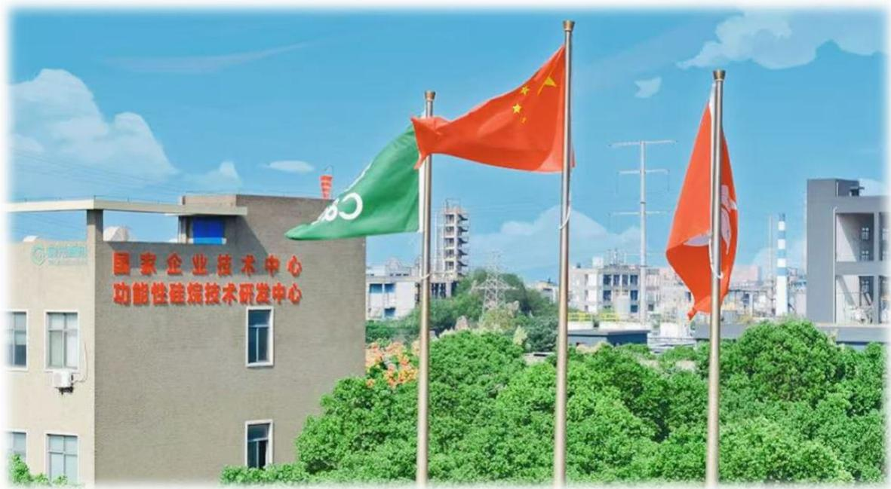

text_image

国家企业技术中心
功能性硅烷技术研发中心

九江

2026 年 4 月

## 1、走进晨光新材

## 董事长致辞

2025 年，面对国内经济动能总体偏弱、“供强需弱”的市场格局，晨光新材在严峻挑战中始终坚守“科技及创新改变生活”的使命，将可持续发展理念深度融入企业战略。我们继续通过一系列环境、社会和治理（ESG）实践，持续推动能源结构转型，积极降低对传统能源的依赖，提升能源利用效率，推动化工生产技术向低能耗、零排放方向升级，进一步夯实了可持续发展基础。

展望2026 年，国内“十五五”规划开局，叠加海外主要经济体财政与货币政策双宽，中国宏观经济运行的内外部环境整体向好。公司层面，宁夏基地与安徽基地的生产线进一步爬坡，标志着公司在生产规模、供应稳定性等方面都迈向了新的阶段。同时，为了保障多基地的生产、运营，我们也将继续加强员工培训、安全教育等，为多基地平稳运营打下坚实的基础。

路虽远，行则将至。2026 年，晨光新材将继续以创新为驱动，以可持续发展为核心，扎实推进企业高质量发展，修炼内功，并毫不动摇地朝着既定目标前行。

江西晨光新材料股份有限公司

2026 年 4 月

## 目录

江西晨光新材料股份有限公司 ....................................

2025 年度环境、社会及治理（ESG）报告.....

1、走进晨光新材....

董事长致辞................................. ........ 2

2025 年所获主要荣誉......

循环经济..................................... .......... 9

2、公司治理...

公司治理结构......................................

党风廉政建设.......................................

4、风险管理 .................................... ........ 20

廉洁管理........

反不正当竞争...... ....... 23

##

....... 25

##

生态系统和生物多样性保护..................................... ....... 29

环境合规管理.........................................

能源管理...... .......................... ........ 33

水资源管理.....................................

## 7、研发创新 ..............................................

## 8、人才管理 ..............................................

人才培养............................................

员工活动........ ....... 43

## 9、产品管理 .............................................

产品质量与安全.........................................

10、供应链管理 .....................................

11、社会责任 ...... ........ 47

........ 47

12、关于本报告 ..... ....... 48

....... 48

........ 48

发布周期.................................... ...... 48

可靠性保证..............................................

...... 49

2025 年公司 ESG 关键绩效  
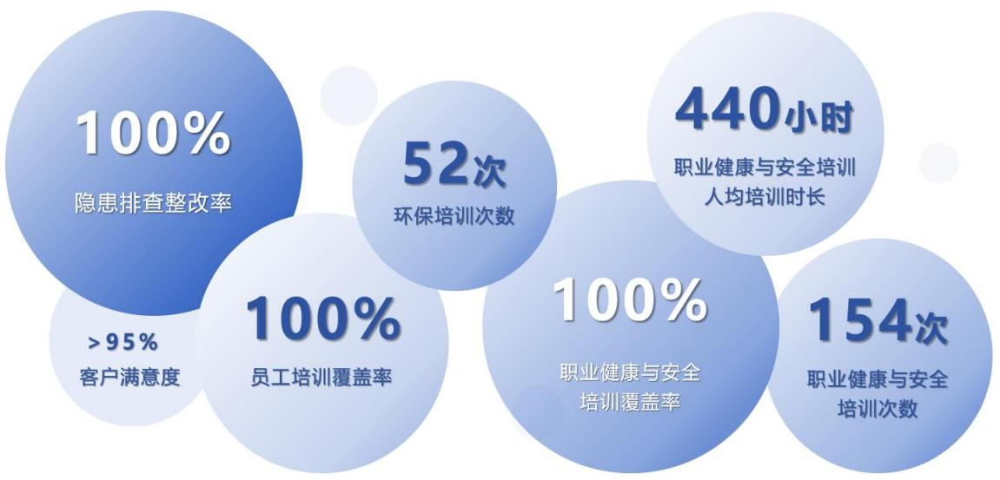

bubble

| Metric | Value |
| --- | --- |
| 隐患排查整改率 | 100% |
| 客户满意度 | >95% |
| 员工培训覆盖率 | 100% |
| 环保培训次数 | 52次 |
| 职业健康与安全培训覆盖率 | 100% |
| 职业健康与安全培训次数 | 154次 |
| 职业健康与安全培训人均培训时长 | 440小时 |

323,286.19万元

资产规模

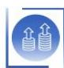

110,413.30万元

营业收入

207,832.78万元

净资产

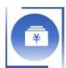

390.53%

近三年累计分红比例

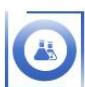

4,919.66万元

研发投入

15个

内部审计项目

100%

新增供应商廉洁协议签署覆盖率

12次

采购人员廉洁培训宣贯场次

1000+

供应商总数量

43项

应用于主营业务的发明专利数量

41项

实用新型专利

23项

技术荣获江西省科学技术成果认定

84次

有效专利数

## 公司简介

江西晨光新材料股份有限公司（股票代码：605399）是一家布局功能性硅烷基础原料、中间体、下游产品研发，生产和销售为一体的特种化学品公司。

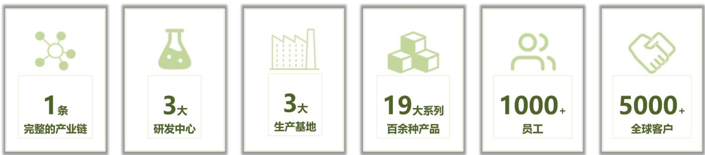

从产品的研发到生产工艺和流程的设计，再到生产设备的创新，晨光新材拥有贯穿全产业链的自主知识产权和专利保护。作为功能性硅烷行业第一家上交所主板上市公司，晨光新材既能为客户提供成熟的产品和服务，也能为客户提供创新和差异化解决方案。

用创新为客户创造价值，是晨光新材多年不变的宗旨。

## 发展历程

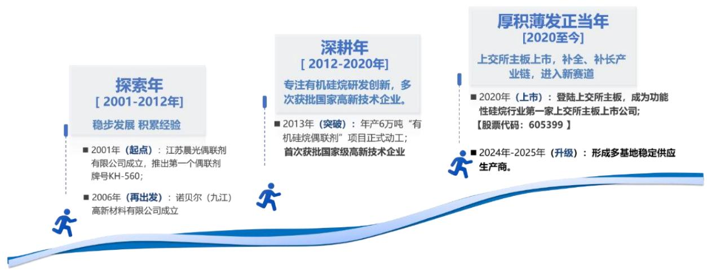

flowchart

```mermaid
graph LR
  A["&quot;探索年\n[2001-2012年"]"] --> B["稳步推进\n积累经验"]
  B --> C["2001年（起点）：江苏晨光偶联剂有限公司成立，推出第一个偶联剂牌号KH-560；"]
  C --> D["2006年（再出发）：诺贝尔（九江）高新材料有限公司成立"]
  E["&quot;深耕年\n[2012-2020年"]"] --> F["专注有机硅烷研发创新，多次获批国家高新技术企业。"]
  F --> G["2013年（突破）：年产6万吨“有机硅烷偶联剂”项目正式动工；首次获批国家级高新技术企业"]
  H["&quot;厚积薄发正当年\n[2020至今"]"] --> I["上交所主板上市，补全、补长产业链，进入新赛道"]
  I --> J["2020年（上市）：登陆上交所主板，成为功能性硅烷行业第一家上交所主板上市公司；\n【股票代码：605399】"]
  J --> K["2024年-2025年（升级）：形成多基地稳定供应生产商。"]
```

2025 年所获主要荣誉

<table><tr><td>序号</td><td>荣誉名称</td><td>获得时间</td><td>颁发单位</td></tr><tr><td>1</td><td>“全国劳动模范”——葛利伟</td><td>2025.04</td><td>中国共产党中央委员会、中华人民共和国国务院</td></tr><tr><td>2</td><td>2024年度综合考核高质量发展标杆企业</td><td>2025.04</td><td>中共湖口县委、湖口县人民政府</td></tr><tr><td>3</td><td>中国涂料工业协会会员单位</td><td>2025.04</td><td>中国涂料工业协会</td></tr><tr><td>4</td><td>先进级智能工厂</td><td>2025.05</td><td>江西省工业和信息化厅</td></tr><tr><td>5</td><td>2025年专精特新&quot;小巨人&quot;复核通过</td><td>2025.07</td><td>工业和信息化部</td></tr><tr><td>6</td><td>第十届&quot;创客中国&quot;九江市中小企业创新创业大赛三等奖</td><td>2025.08</td><td>九江市工业和信息化局、九江市财政局</td></tr><tr><td>7</td><td>第十届&quot;创客中国&quot;江西省中小企业创新创业大赛最佳投资潜力50强</td><td>2025.08</td><td>第十届&quot;创客中国&quot;江西省中小企业创新创业大赛组委会</td></tr><tr><td>8</td><td>《2025年5G工厂名录》</td><td>2025.08</td><td>工业和信息化部信息通信管理局</td></tr><tr><td>9</td><td>2025年第二批次“小灯塔”企业</td><td>2025.09</td><td>江西省工业和信息化厅</td></tr><tr><td>10</td><td>高新技术企业</td><td>2025.10</td><td>江西省科学技术厅、江西省财政厅、国家税务总局江西省税务局</td></tr><tr><td>11</td><td>2025年度九江工业企业50强</td><td>2025.11</td><td>九江市企业家协会</td></tr><tr><td>12</td><td>2024年度九江市优秀企业</td><td>2025.11</td><td>九江市企业家协会</td></tr><tr><td>13</td><td>2024年度九江市优秀厂长</td><td>2025.11</td><td>九江市企业家协会</td></tr><tr><td>14</td><td>江西名牌产品</td><td>2025.12</td><td>江西省品牌建设促进会</td></tr><tr><td>15</td><td>2025年江西省制造业单项冠军企业</td><td>2025.12</td><td>江西省工业和信息化厅</td></tr><tr><td>16</td><td>“浔城英才”创新高端人才</td><td>2025.12</td><td>中共九江市委人才工作领导小组</td></tr><tr><td>17</td><td>江西省先进非公有制企业</td><td>2025.12</td><td>中共江西省委、江西省人民政府</td></tr></table>

## 循环经济

晨光新材秉承“绿色环保、循环发展”理念，通过持续创新，构建了功能性硅烷全产业链体系，形成从基础原料、中间体到终端产品的完整产品矩阵。依托自主开发的循环生产工艺，公司正加快推进多生产战略基地协同建设。

特殊循环工艺优势：HCl、 $H _ { 2 } 、$ 乙醇循环工艺、成本和生产效率控制  
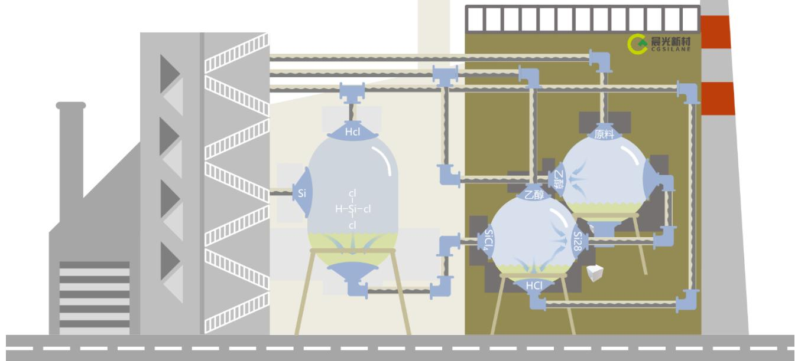

flowchart

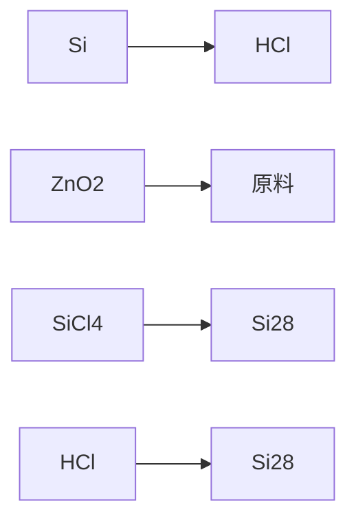
```mermaid
graph LR
  A["Si"] --> B["HCl"]
  C["ZnO2"] --> D["原料"]
  E["SiCl4"] --> F["Si28"]
  G["HCl"] --> H["Si28"]
```

## 2、公司治理

## ESG 治理架构

2025年，晨光新材ESG管理机构包括公司决策机构、领导机构、执行机构和披露机构。董事会为公司ESG 决策机构，审议批准公司ESG 总体内容；经营层为领导机构，对公司ESG进行研究并提出建议，总经理负责ESG 专项工作，带领由各职能相关部门及下属分子公司组成的执行机构（ESG 工作组）完成具体工作；ESG 工作组负责公司 ESG 内容的制定、实施、评估、调整等环节中的文件起草、组织、协调和沟通工作，负责ESG信息的收集和分析，负责组织公司所属各分子公司及各部门开展ESG相关工作的讨论、座谈，并负责组织 ESG 具体实施中的管理和 ESG 报告的编制工作，以及ESG 专业第三方的评级报送工作；证券部负责年度 ESG 报告审批、披露和沟通工作。

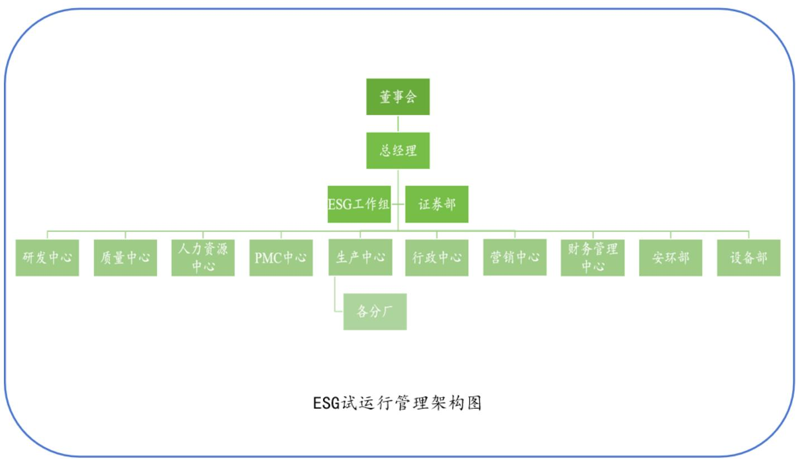

flowchart

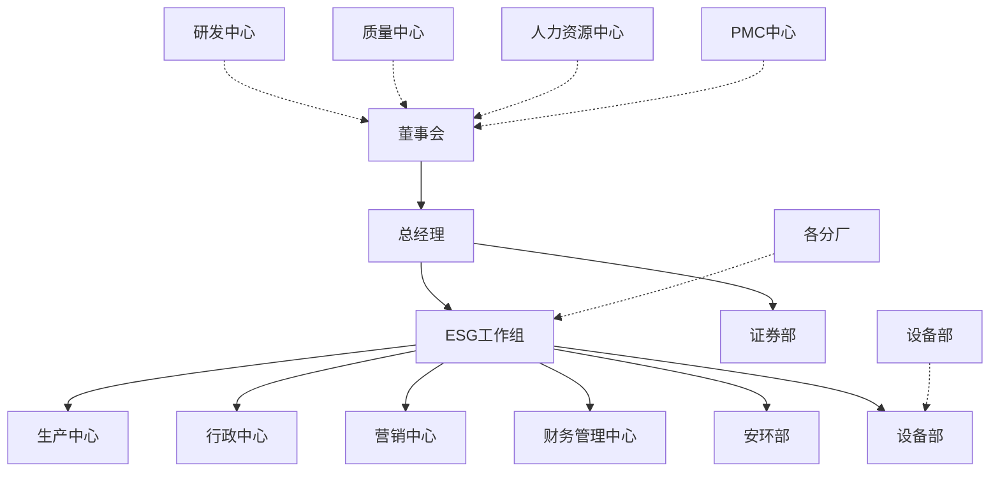
```mermaid
graph TD
  A["董事会"] --> B["总经理"]
  B --> C["ESG工作组"]
  B --> D["证券部"]
  C --> E["生产中心"]
  C --> F["行政中心"]
  C --> G["营销中心"]
  C --> H["财务管理中心"]
  C --> I["安环部"]
  C --> J["设备部"]
  K["研发中心"] -.-> A
  L["质量中心"] -.-> A
  M["人力资源中心"] -.-> A
  N["PMC中心"] -.-> A
  O["各分厂"] -.-> C
  P["设备部"] -.-> J
```

## 利益相关方参与&尽职调查

晨光新材构建了系统化的利益相关方沟通机制，明确各部门的责任分工，并制定清晰的沟通流程与响应标准。通过制度化、多层次的互动体系，公司与股东、员工、客户、供应商等关键群体保持常态化、双向的深度沟通，持续倾听并回应各方诉求，将多元视角融入企业决策与运营。这一机制不仅形成了包容、共进的良性互动生态，也有效增强了与各利益相关方之间的信任与协作，为公司的可持续发展奠定了坚实基础。

通过定期会议、问卷调查与线上反馈，持续收集意见与建议，优化管理体系。沟通内容聚焦核心ESG 相关议题，提升透明度与责任感。有效回应关切，增强信任，推动各方协同共建可持续发展环境。

同时，我们开展尽职调查，将利益相关方的反馈作为重要信息来源，充分识别潜在的可持续发展相关影响和风险，制定更具针对性的应对措施，共同推动公司可持续发展目标的实现，赢得利益相关方的信任和支持。

<table><tr><td>利益相关方</td><td>关注议题</td><td>沟通与回应</td></tr><tr><td rowspan="4">政府及监管机构</td><td>诚信合规经营</td><td>定期汇报</td></tr><tr><td>依法纳税</td><td>可持续发展/ESG报告</td></tr><tr><td>响应国家发展政策</td><td>响应政府政策</td></tr><tr><td>服务区域经济</td><td>现场视察</td></tr><tr><td rowspan="7">股东及投资者</td><td>循环经济</td><td>股东会</td></tr><tr><td>董事会治理</td><td>投资关系网站</td></tr><tr><td>公司治理</td><td>股东分红</td></tr><tr><td>风险管控</td><td>业绩说明会</td></tr><tr><td>信息披露</td><td>实地调研</td></tr><tr><td>提升投资回报</td><td>定期报告/临时公告</td></tr><tr><td></td><td>投资者服务热线</td></tr><tr><td rowspan="3">客户</td><td>产品与解决方案创新</td><td>满意度调查</td></tr><tr><td>客户关系</td><td>年度审核评估</td></tr><tr><td>数据保护与客户隐私</td><td>电话、邮件沟通</td></tr><tr><td rowspan="4">员工</td><td>员工安全与健康</td><td>员工代表大会</td></tr><tr><td>多元化、包容与平等机会</td><td>主题座谈活动</td></tr><tr><td>劳动力管理</td><td>员工关怀活动</td></tr><tr><td>培训与安全</td><td>职业培训及发展</td></tr><tr><td rowspan="2">供应商及合作伙伴</td><td>供应商社会评估</td><td rowspan="2">供应商现场调研</td></tr><tr><td>反腐败</td></tr><tr><td rowspan="4">地方社区</td><td>社会责任与</td><td rowspan="4">可持续发展/ESG报告公司网站和公众号带动地方就业</td></tr><tr><td>社区关系</td></tr><tr><td>废弃与有害物质管理</td></tr><tr><td>参与社会公益</td></tr><tr><td rowspan="5">环境</td><td>节能减排</td><td rowspan="5">温室气体排放报告可持续发展/ESG报告</td></tr><tr><td>水资源管理</td></tr><tr><td>污染防治</td></tr><tr><td>能源管理</td></tr><tr><td>废弃与有害物质管理</td></tr></table>

利益相关方沟通表

## 重要性议题

重要性议题管理是晨光新材开展可持续发展治理与管理工作的基础和核心。2025年，根据<<上海证券交易所上市公司自律监管指引第 14 号——可持续发展报告(试行)>>(以下简称“指引”)等最新披露标准更新重要性议题评估方法，首次开展双重重要性评估，围绕各产业链环节、利益相关方的诉求和主要关注问题，在以往影响重要性评估的基础上融入财务视角，全面分析 ESG 议题对公司财务以及经济、环境和社会的影响，形成本年度 25 个具有重要性的议题进行重点回应。

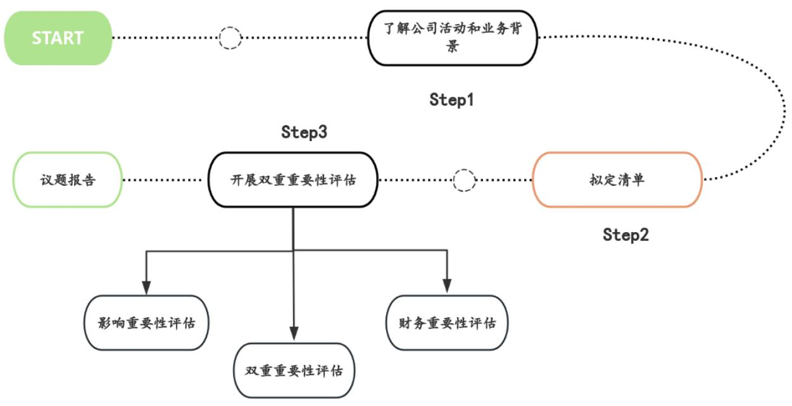

flowchart

This flowchart illustrates a three-step process for analyzing corporate activities and business background, involving steps 1, 2, and 3 with evaluation stages.

## 实质性议题披露

晨光新材通过与各利益相关方进行充分的调研与交流，围绕各产业链环节、各相关方的相关诉求和主要关注问题，评估相关议题对不同利益相关方的相对重要性，确定公司可持续发展实质性议题，并对议题内容进行分级披露。

能源管理（1）、废弃与有害物质管理、水资源管理（10）、生物多样性与土地利用（18）、环境合规管理（21）、应对气候变化（24）

研发创新（2）、员工安全与健康（3）、污染物排放（4）、职业发展与培训（5）、化学品安全（7）、循环经济（11）、反不正当竞争（12）、数据保护与客户隐私（13）、供应链管理（14）、劳动力管理、（15）、多元化、包容与平等机会（20）

商业道德与合规（8）、反贿赂反腐败（9）、公司治理（16）、尽职调查（19）、产品管理（17）、乡村振兴（22）、社会贡献（23）、利益相关方参与（25）

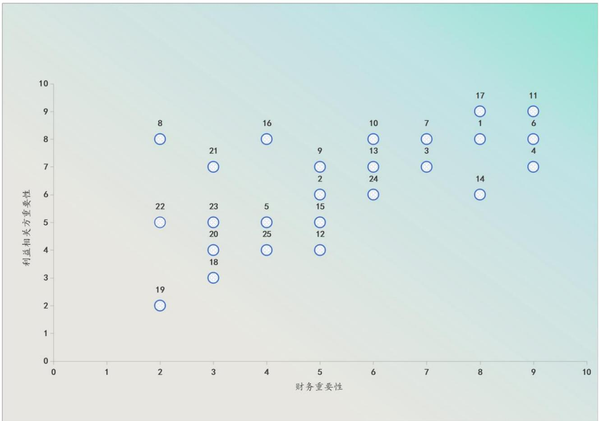

bubble

| ID | 财务重要性 | 利益相关方重要性 |
| --- | --- | --- |
| 8 | 2 | 8 |
| 21 | 3 | 7 |
| 16 | 4 | 8 |
| 22 | 2 | 5 |
| 23 | 3 | 5 |
| 20 | 3 | 4 |
| 18 | 3 | 3 |
| 5 | 4 | 5 |
| 25 | 4 | 4 |
| 9 | 5 | 7 |
| 2 | 5 | 6 |
| 15 | 5 | 5 |
| 12 | 5 | 4 |
| 10 | 6 | 8 |
| 13 | 6 | 7 |
| 24 | 6 | 6 |
| 7 | 7 | 8 |
| 3 | 7 | 7 |
| 14 | 8 | 6 |
| 17 | 8 | 9 |
| 1 | 8 | 8 |
| 11 | 9 | 9 |
| 6 | 9 | 8 |
| 4 | 9 | 7 |
| 19 | 2 | 2 |

双重重要性评估：公司就上述对议题影响重要性及财务重要性分析的结果进行了整合，并绘制了如上矩阵。

## 公司治理结构

晨光新材始终将卓越、透明的公司治理视为企业实现可持续发展的基石与生命线。我们严格遵循《中华人民共和国公司法》《中华人民共和国证券法》及上海证券交易所等监管规定，致力于构建一个权责清晰、运行高效、制衡有效、激励相容的现代企业治理体系，为公司的长期稳健运营与高质量发展提供系统性的坚实保障。

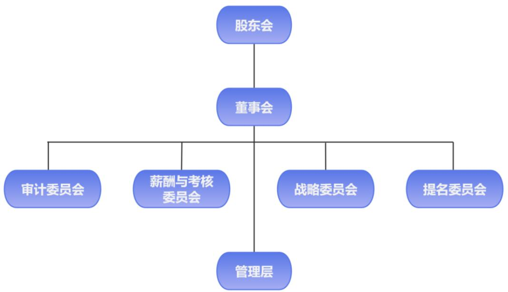

flowchart

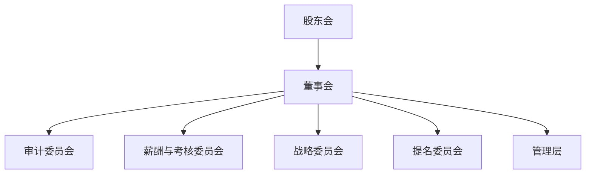
```mermaid
graph TD
  A["股东会"] --> B["董事会"]
  B --> C["审计委员会"]
  B --> D["薪酬与考核委员会"]
  B --> E["战略委员会"]
  B --> F["提名委员会"]
  B --> G["管理层"]
```

公司治理架构图

## 2025年

公司共召开股东会会议3次，其中临时股东会2次，年度股东会1次，审议通过议案14项。

公司共召开董事会会议3次，审议通过议案39项，董事会出席率100%；召开各专门委员会会议7次，审议通过议案20项。

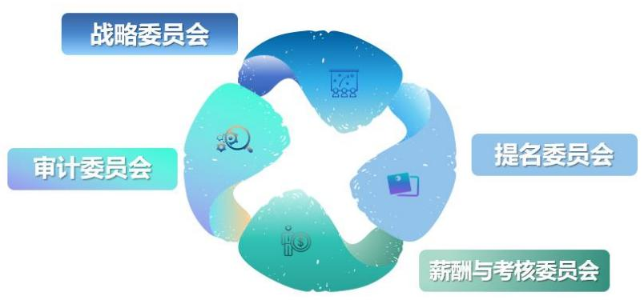

flowchart

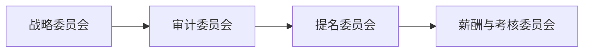
```mermaid
graph LR
  A["战略委员会"] --> B["审计委员会"]
  B --> C["提名委员会"]
  C --> D["薪酬与考核委员会"]
```

## 股东会

公司股东会自设立以来，始终严格遵循《中华人民共和国公司法》及《公司章程》《股东会议事规则》等规定，规范运作、高效履职，切实发挥公司最高权力机构作用，在战略决策、风险控制与价值创造中承担核心职能。

历次会议的召集、提案、通知、召开、议事、表决及记录等各环节均依法依规执行，程序完备、过程透明、决议有效。股东会审慎审议并决策了包括年度财务决算、利润分配、章程与关键制度修订、高级管理人员薪酬、组织机构调整以及 2025年度审计机构选聘等重大事项，为公司持续健康发展奠定了坚实的治理基础。

##

## 监督职能整合

根据新《公司法》第一百二十一条规定，公司于2025年9月9日经股东大会审议通过《关于取消监事会、变更公司注册资本并修订<公司章程>的议案》，正式取消监事会设置。相关法定监督职权已由董事会下设的审计委员会承接。公司通过提前梳理职权清单、优化工作流程，实现了监督职能的无缝衔接与平稳过渡，保障了公司治理结构的持续合规与高效运行。

## 优化治理结构

为完善董事会多元治理结构并夯实决策的民意基础，公司依据相关规定，在董事会中增设职工代表董事。董事会现由7名董事组成，其中包括1名职工代表董事，该董事由公司职工代表大会通过民主选举程序产生。职工代表董事的设立，进一步丰富了董事会成员构成的多元性，畅通了职工参与公司重大决策的渠道，增强了决策过程的科学性与民意基础。

## 体系闭环重构

为持续提升公司治理现代化水平，公司严格遵循新修订的《公司法》《上市公司治理准则》等法律法规及监管要求，并结合自身发展实际，于2025年启动了覆盖全体系的治理制度深度检视与系统性重构工作。全年累计完成制度修订与新增共32项，全面覆盖法人治理、董事会运作、专业委员会职能、董监高履职规范、内部控制、风险管控及投资者关系管理等关键领域。

## 董事会及各专门委员会

董事会作为公司核心决策机构，下设战略委员会、审计委员会、提名委员会、薪酬与考核委员会，各委员会依据《公司章程》及相应工作制度，在战略规划、内部审计、股权激励等重大事项中开展专业审议，为董事会决策提供有力支持。

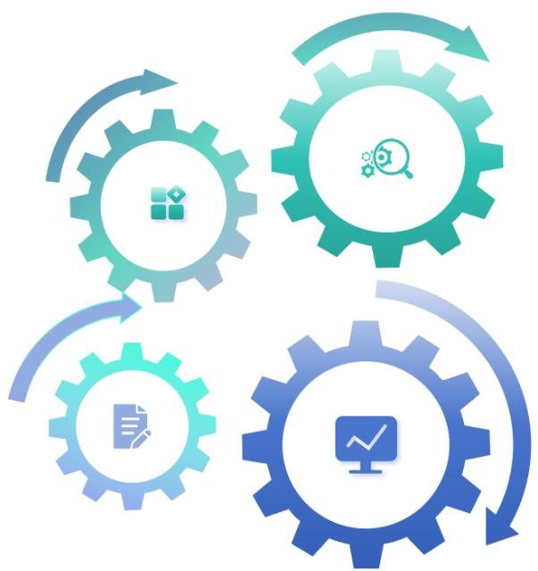

flowchart

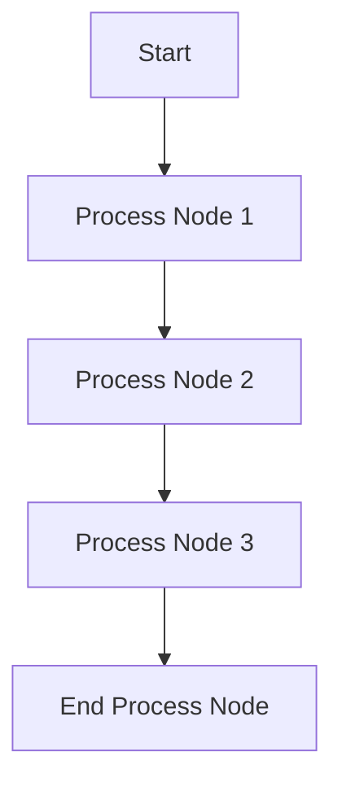
```mermaid
graph TD
  A["Start"] --> B["Process Node 1"]
  B --> C["Process Node 2"]
  C --> D["Process Node 3"]
  D --> E["End Process Node"]
```

## 董事会专门委员会规范运作

委员会就续聘会计师事务所、变更会计政策、对外担保、内部控制、股权激励等重要事项提出了专业意见，有效维护了公司及中小股东的权益。公司为独立董事履职提供充分保障，通过组织现场调研、及时提供决策信息等方式，确保其独立、客观地行使职权。董事会会议的召集、提案、通知、出席、议事、表决及记录等各环节，均严格遵循相关法律法规、《公司章程》及议事规则。全体董事勤勉尽责，依法行使权利，共同推动公司治理水平持续提升。

## 管理层

公司积极组织董事及高级管理人员，通过线上与线下相结合的方式参加上海证券交易所、中国上市公司协会及江西省上市公司协会举办的合规系列培训。通过培训，公司高级管理团队深入了解了最新监管形势与法规动态，进一步强化了合规意识和履职能力。公司高级管理团队具有丰富的行业经验和专业背景，全面负责公司生产经营与日常运营。团队恪守公司治理规范，严格在董事会授权框架内，高效、专业地推动落实股东会各项决议，确保了公司战略决策的有效传导与落地。

公司坚持从教育背景、专业经验等多维度考虑董事会、管理层成员的多元化水平，现任董事会、管理层成员涵盖经营管理、研发技术、风险合规等领域专家，确保公司拥有多元化的战略视角和深厚的专业背景。

## 信息披露与投资者关系

晨光新材高度重视信息披露与股东权益保护工作，制定了《信息披露管理办法》《内幕信息知情人登记管理制度》《年报信息披露重大差错责任追究制度》等内部管理制度，持续优化公司治理架构。公司严格按照上海证券交易所《公告格式指引》要求，建立完善的信息披露体系，规范信息披露程序及对外披露行为，通过中国证监会指定网站及时、准确、完整、公平地发布定期报告、临时公告、经营数据、重大事项及重点项目进展等信息，切实履行信息披露义务，保障投资者尤其是中小股东的知情权，维护公司和投资者的合法权益。

公司特别关注中小投资者权益保护，采取诸多切实有效的措施。在股东会的召集、召开和议事程序等方面，公司严格规范管理，确保所有股东，尤其是中小股东，对公司重大事项拥有平等的知情权、参与权和表决权。

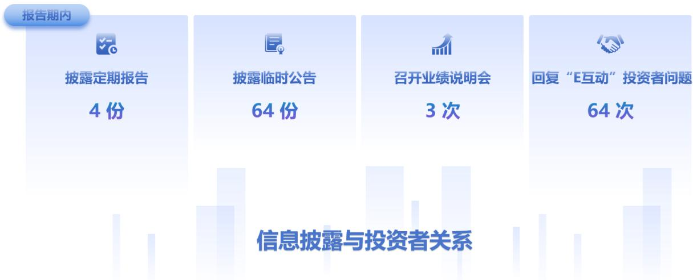

bar

| 信息 | 数量 |
| --- | --- |
| 披露定期报告 | 4份 |
| 披露临时公告 | 64份 |
| 召开业绩说明会 | 3次 |
| 回复“E互动”投资者问题 | 64次 |

## 3、党建引领

晨光新材紧紧抓住党组织和公司治理两条线，围绕落实新发展理念、构建新发展格局、推动高质量发展，矢志不渝地将党的领导融入企业各项工作，在推动党的领导融入公司治理上取得积极成效，建立起一套以党建为基、融合为要，以创造性改革为手段，系统完备、科学规范、运行高效的治理体系，打造出协同高效、蹄疾步稳、有力有序的现代化企业治理模板，为企业高质量发展提供了有力保障。

## 党组织建设

2025年，晨光新材党支部严格落实“三会一课”制度，全年召开支部党员大会 5 次、支部委员会 12 次，讲授专题党课 4 次，组织开展主题党日活动 12 次；做好九江基层党建信息化平台维护工作，严格执行民主生活会、组织生活会、民主评议党员、谈心谈话等制度，过好组织生活，严格党员管理，做好新党员培养发展工作。

## 党员活动开展

政治学习：公司定期组织党员进行政治学习，深入学习党的理论、路线、方针、政策，提高党员的政治觉悟和理论水平。

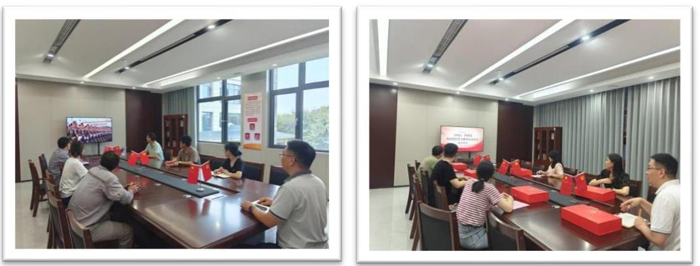  
晨光新材定期开展党日活动

主题活动：2025 年，我们扎实推进以党史为核心的“四史”学习教育，并紧密结合建党104周年、抗战胜利 80 周年等重要纪念日开展主题活动。主要举措包括：一是组织党员赴湖口县党性党风党纪教育基地，通过“行走党课”形式开展现场教学；二是集中观看《南京照相馆》主题影片，深化历史认知；三是举办故事分享会、知识问答等互动活动，巩固学习成效。

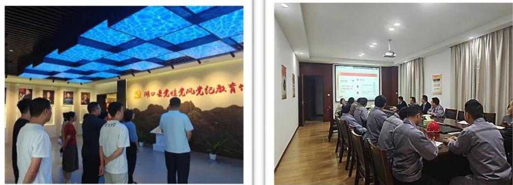

志愿服务：公司积极组织党员参与志愿服务活动，如环保、扶贫、助残等，推动党员发挥先锋模范作用，履行社会责任。

## 党风廉政建设

## 反腐倡廉

公司坚决贯彻落实中央关于反腐倡廉的决策部署，加强廉政教育和监督，建立健全反腐倡廉制度，严肃查处违纪违法行为。

02

## 作风建设

公司注重改进工作作风，推动党员干部深入基层、深入一线，密切联系群众，解决实际问题，提高工作效率和工作质量。

## 民主监督

公司加强民主监督，推动党务公开、企务公开，保障员工的知情权、参与权、表达权和监督权促进公司的民主管理和科学决策。

## 4、风险管理

## 内部控制与风险管理

公司在董事会和内部管理层面持续完善和强化风险识别、监控和防范等职能，董事会作为公司风险管理的最高领导和决策机构，对公司风险管理系统的建立健全、有效实施及持续优化承担最终责任。

公司已构建并持续完善职责清晰、协同联动的三道风险管理防线体系：第一道防线由各业务部门构成，通过内部制度、流程审批、系统控制等进行日常风险管理；第二道防线由财务、法务等职能部门负责，持续监控风险，确保第一道防线设计及运行有效；第三道防线由审计部负责，开展内部控制的日常监督和专项监督。制度层面，公司在原有《内部审计制度》《内部控制管理制度》《审计项目操作细则手册》《稽核管理制度》的基础上，新增了《内部控制评价制度》。

报告期内，公司内部审计部门聚焦关键业务领域与高风险环节，共计开展内部审计项目15个，其中专项审计 7 个，日常/合规审计8个。审计工作以风险为导向，重点关注资金活动、采购管理、销售管理、生产管理、资产管理、工程项目管理、人力资源、研究与开发、信息披露管理等领域的内部控制设计与运行有效性。对于审计过程中发现的管理漏洞、控制缺陷或潜在风险，审计部门均深入分析根源，提出了具针对性、可操作性的管理改进建议，并建立了从问题发现、整改方案制定、责任落实到整改验收的全过程跟踪督导机制。截至本报告日，所有审计发现的问题均已落实整改措施，整改完成率达到100%，有效促进了相关业务领域管理水平的提升和风险防控能力的强化。

为增强内部控制的外部验证与公信力，公司于2025 年4月履行相关审议程序，续聘容诚会计师事务所（特殊普通合伙）作为公司内部控制审计机构。该所依据《企业内部控制审计指引》及相关执业准则，对公司2025年财务报告内部控制实施情况进行审计，并出具了标准无保留意见的《内部控制审计报告》。详情请见公司于 2026 年4 月30 日在上海证券交易所指定信息披露媒体披露的相关公告。

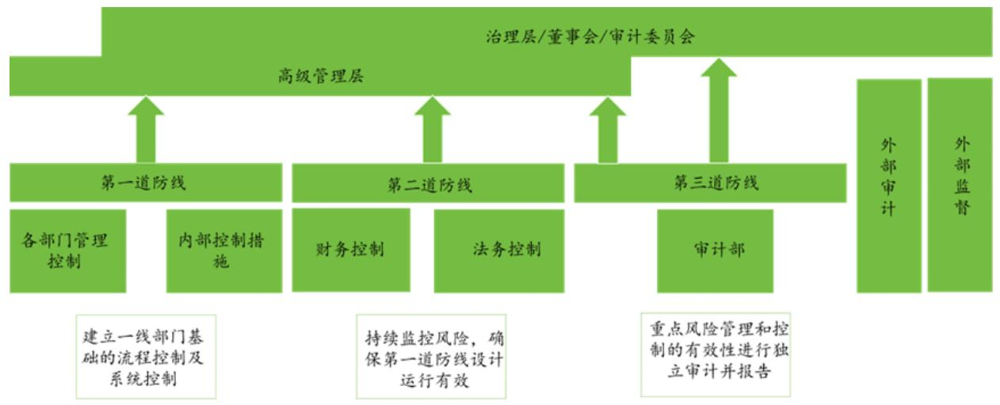

flowchart

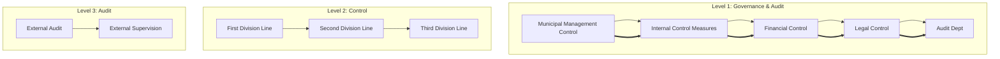
```mermaid
graph TD
  subgraph Level1["Level 1: Governance & Audit"]
  M1["Municipal Management Control"] --> M2["Internal Control Measures"]
  M2 --> M3["Financial Control"]
  M3 --> M4["Legal Control"]
  M4 --> M5["Audit Dept"]
  end

  subgraph Level2["Level 2: Control"]
  N1["First Division Line"] --> N2["Second Division Line"]
  N2 --> N3["Third Division Line"]
  end

  subgraph Level3["Level 3: Audit"]
  A1["External Audit"] --> A2["External Supervision"]
  end

  M1 ==> M2
  M2 ==> M3
  M3 ==> M4
  M4 ==> M5
```

晨光新材内部控制与风险管理制度图

## 廉洁管理

晨光新材以提升管理规范与有效性为核心，持续强化廉洁风险防控，压实责任、提升反腐效能、加强权力监督制约。2025年，公司及子公司全年共监督招标54次。

公司的廉洁供应链管理文件《员工廉洁自律管理制度》及《供应商管理制度》中，严禁任何员工及其亲属与供应商存在任何利益往来。所有新引入的供应商均需与公司签订《廉洁协议》，双方承诺共同防腐，供应商须遵守反腐败法律和道德标准，杜绝任何形式的贿赂、行贿行为。2025 年，公司（含子公司）新增正式合作的供应商 336家。对于其中采购额大、采购频率高的供应商，公司均已 100%完成《廉洁协议》的签署。

公司高度重视员工反腐意识提升，通过多种形式积极宣贯廉洁从业理念，包括新员工入职、晋升培训，以及定期开展廉洁政策宣讲等，切实将廉洁管理融入运营各环节。同时，公司还特别在重要节假日等腐败易发时期，通过张贴廉洁海报、开展警示教育等方式，向全体员工进行强化宣贯。

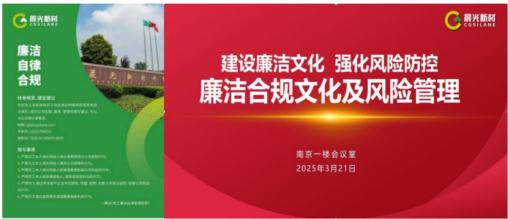

text_image

晨光新材
CGSILANE
廉洁
自律
合规
检举阐发、建言建议
任何员工发现其他员工存在违反制度规定或其格语
法情形，或对公司运营、服务、管理和建设建议，可以
与公司审计联系。
邮箱：zhyjkgsilane.com
手机号：15251768010
座机号：020-87195079-8829
禁令事项
1.严禁员工本人或仅同他人侵占或损害侵占公司财物的行为；
2.严禁员工本人或仅同他人挪用公司财物的行为；
3.严禁员工本人或仅同他人损害或损害侵害公司利益的行为；
4.严禁员工本人或亲属虚伪他人、索取或者受好处的行为；
5.严禁员工通过非法或不正当手段获取、披露、使用、出售公司商业秘密，损害公司利益
的行为；
6.严禁员工通过伪造事实或隐瞒易耗获利的行为。
-横台《员工廉洁自律管理制度》
建设廉洁文化 强化风险防控
廉洁合规文化及风险管理
南京一楼会议室
2025年3月21日

员工廉洁合规展示板及培训会议

## 举报受理

为防止腐败和垄断风险，晨光新材内部设立了举报受理与举报人保护政策与机制。公司在官网、采购合同及厂区等场所均公布了举报邮箱和电话。

审计部负责受理举报并登记。一般举报经初步核实后报总经办；紧急事项按应急预案先行处置。总经办对举报提出意见并商定处理方式。经调查属实的舞弊、违法行为，公司将依据制度及法律法规，经总经办审议后予以处罚，并视情况内部通报。2025 年，公司未收到有效举报。

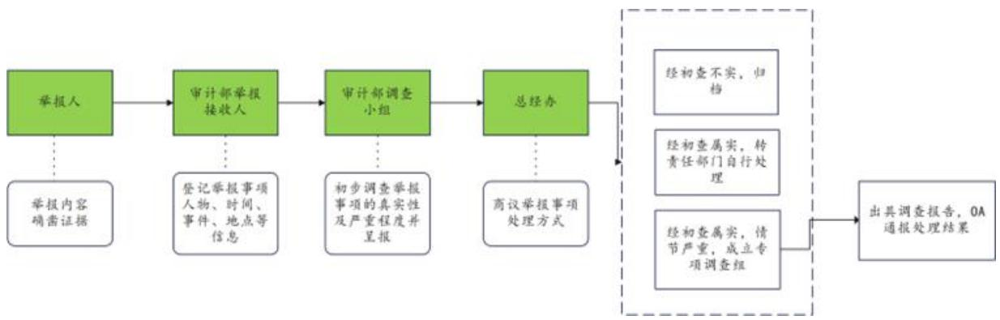

flowchart

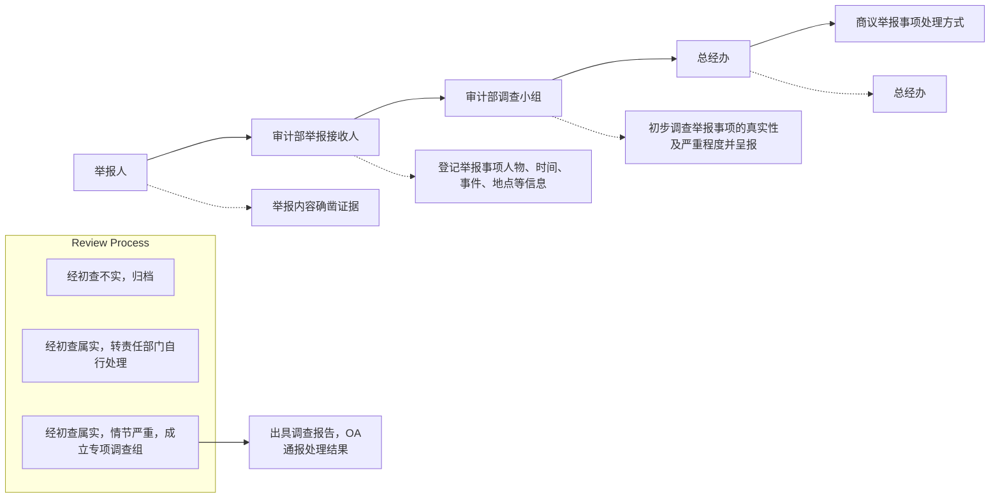
```mermaid
graph LR
  A["举报人"] --> B["审计部举报接收人"]
  B --> C["审计部调查小组"]
  C --> D["总经办"]
  
  subgraph ReviewProcess ["Review Process"]
    E["经初查不实，归档"]
    F["经初查属实，转责任部门自行处理"]
    G["经初查属实，情节严重，成立专项调查组"]
  end
  
  D --> H["商议举报事项处理方式"]
  A -.-> I["举报内容确凿证据"]
  B -.-> J["登记举报事项人物、时间、事件、地点等信息"]
  C -.-> K["初步调查举报事项的真实性及严重程度并呈报"]
  D -.-> L["总经办"]
  
  G --> M["出具调查报告，OA\n通报处理结果"]
```

举报受理流程图

## 反腐败

晨光新材严格依照国家各项法律法规要求依法合规运营。按照“标本兼治、综合治理、惩防并举、注重预防”的方针，以健全惩治和预防腐败体系为重点，整体推进反腐倡廉各项工作。公司依法纳税，遵守国家法律法规及政府监管规定。保持稳健的经营秩序和发展态势，构建完善的公司治理结构，不断提升全面风险管理水平。建立专业创造价值的企业经营文化，使企业价值不断增长。截至报告期末，公司各层级员工未发生腐败行为。

## 反不正当竞争

公司严格遵守《中华人民共和国反不正当竞争法》等相关法律法规和国际通用准则，致力于构建并持续完善完备的商业道德监督、审核与长效防控机制。我们坚持公平、诚信地参与市场竞争，确保公司在开展任何业务及商业活动中，始终遵守法律法规、行业准则与企业核心价值观所倡导的道德标准。公司制度体系明确规定，禁止在各业务环节发生任何形式的行贿受贿等行为，禁止与任何企图或已经实施价格操纵、扰乱投标程序、分割市场、限制产量、无正当理由抵制特定客户或供应商等排除、限制竞争行为的竞争对手签订合约；禁止以任何形式与竞争对手交换价格、成本、客户名单等敏感信息；禁止以任何手段侵犯合作伙伴及第三方的商业秘密与知识产权。

2025 年，公司持续强化合规经营，未开展任何形式的商业贿赂，未与竞争者达成任何具有垄断性质的协议、决定或协同行为，未与竞争对手交换敏感信息，未发生侵犯合作伙伴商业秘密等不正当竞争行为。为筑牢合规防线，公司定期开展商业保密、法律合规、风险内控等相关专题培训，切实提升员工的商业道德、合规意识与风险辨识能力。同时，公司制定并严格执行《关联交易管理制度》，确保关联交易决策程序公开透明、定价公允，报告期内相关运作规范，不存在外部质询或重大争议情形。

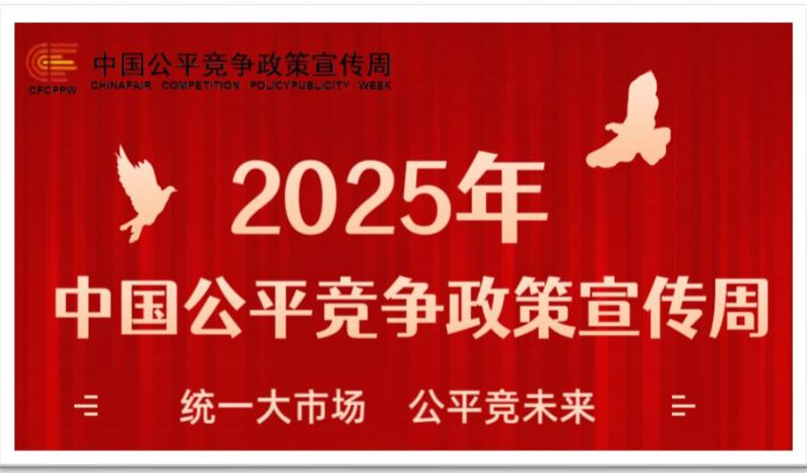

text_image

中国公平竞争政策宣传周
CHINAFAIR COMPETITION POLICYPUBLICITY WEEK
2025年
中国公平竞争政策宣传周
≡ 统一大市场 公平竞未来 ≡

公平竞争周宣传材料

## 5、安全生产

## 化学品安全管理

2025年，晨光新材将安全目标层层分解至车间、班组、个人，通过签订安全生产目标责任状，并依据《2025 年安全生产目标考核实施方案》将安全绩效与年终奖、管理奖金挂钩，有效激发全员履职积极性。围绕上述目标，公司评估修订安全生产奖惩、重大危险源管理、人员定位管理等 10项制度，强化变更管理要求，针对设备设施及工艺调整制定 30余项操作规程，开展全面风险辨识，补充完善 50 余项操作指引，从源头规范操作行为，严防事故发生。

在教育培训方面，公司严格执行新员工三级安全教育，全年新进员工经考核合格后上岗，一次合格率达98%以上，二次合格率达 100%。同时，按年度计划组织开展了全员事故警示、检维修安全管理、应急管理等培训，持续强化安全意识，规范安全行为，杜绝违章操作，为装置的安全开车、平稳运行及日常操作提供了有力保障。此外，公司通过制度化、标准化的责任体系建设，将法律法规要求具体落实到每个岗位的日常工作中，实现安全职责全覆盖、无死角，构建起全员参与、齐抓共管的安全生产工作格局。

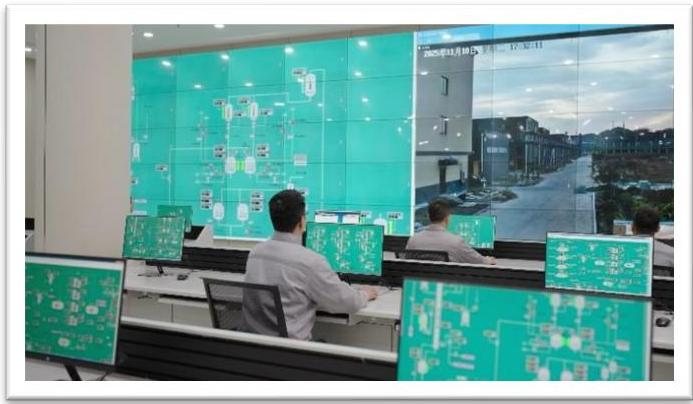

text_image

Control room with large green digital display showing data dashboards and maps, staff at workstations

化学品生产安全监测

## 生产安全信息化

晨光新材以构建“全链闭环式安全信息化管理体系”为核心，深度融合产品全生命周期的质量管控与安全生产流程，推动安全管理向数字化、智能化转型。在双重预防机制数字化建设方面，公司已完成系统投运，并于 2025 年10 月提出20 余项功能增补需求，目前正稳步推进实施。通过该系统，公司实现了风险分级管控措施的动态化、清单化管理，并建立了覆盖全员的隐患排查清单，确保责任到人、整改到位。

在治本攻坚三年行动中，公司计划推进的 18 项重点任务已完成12 项。同时，公司进一步深化安全管理，补充开展了行为安全观察、作业过程视频智能分析、安全文化示范创建等6 项专项工作，推动安全管理从“物防技防”向“人防心防”延伸。此外，公司已完成对 “两重点一重大”（重点监管危险化工工艺、重点监管危险化学品、重大危险源）及全流程自动化改造的验收工作。通过改造，公司实现了对重大危险源的 24 小时不间断在线监测预警，所有数据实时上传至省级应急管理平台，形成政府与企业联动的智能监控网络。

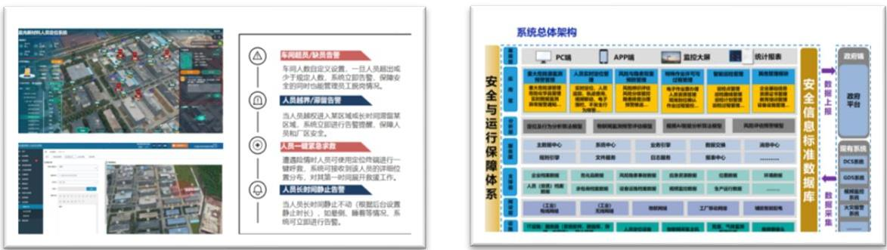  
安全与运行保障体系运行示例

## 全员安全素养提升工程活动

晨光新材以“人人讲安全、个个会应急”为核心目标，创新开展全员安全素养提升工程。公司建立了常态化的学习机制，每月开展主题安全研讨，累计完成 38项涉及流程优化与行为规范的持续改进工作。以“安全生产月”为核心载体，公司精心设计了分层次、场景化的主题活动，打造“教育培训系统化、文化浸润场景化、实践强化常态化”的推进模式，将安全知识转化为安全行为，推动全员安全素养从“被动遵从”向“主动担当”的根本性转变。

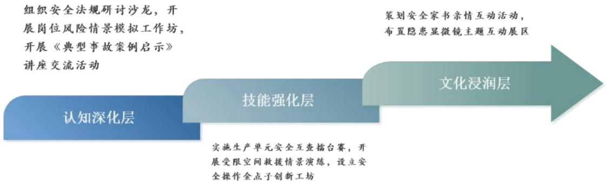

flowchart

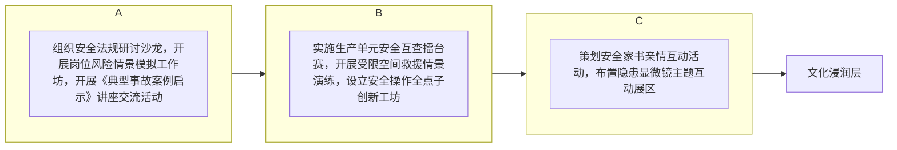
```mermaid
graph LR
  A["认知深化层"] --> B["技能强化层"]
  B --> C["文化浸润层"]
  
  subgraph A
    direction TB
    A1["组织安全法规研讨沙龙，开展岗位风险情景模拟工作坊，开展《典型事故案例启示》讲座交流活动"]
  end
  
  subgraph B
    direction TB
    B1["实施生产单元安全互查擂台赛，开展受限空间救援情景演练，设立安全操作全点子创新工坊"]
  end
  
  subgraph C
    direction TB
    C1["策划安全家书亲情互动活动，布置隐患显微镜主题互动展区"]
  end
  
  C --> D["文化浸润层"]
```

鼓励员工自主发现安全隐患，通过隐患整改能量榜激发全员参与动能。同步建立晨光学院，切实推动安全理念从认知层面向行为习惯转化。

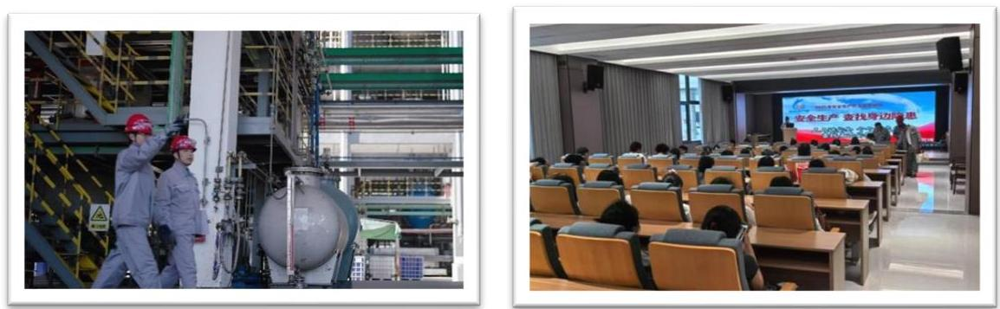  
安全生产月主题活动

## 6、环境治理

2025 年度污染物排放与废弃物处理

<table><tr><td>主要污染物及特征污染物名称</td><td>排放方式</td><td>排放浓度</td><td>排放总量</td><td>核定的排放总量</td><td>超标排放情况</td></tr><tr><td>氨氮</td><td>间歇</td><td>4.20mg/l</td><td>3.480t</td><td>4.131t/a</td><td>无</td></tr><tr><td>COD</td><td>间歇</td><td>98.80mg/l</td><td>55.160t</td><td>69.530t/a</td><td>无</td></tr><tr><td>挥发性有机物</td><td>间歇</td><td>1.79mg/m3</td><td>1.860t</td><td>14.017t/a</td><td>无</td></tr></table>

注：上表为母公司江西晨光新材料股份有限公司数据。

公司持续完善污染防治机制，积极创新污染物处理技术，严格控制排放强度，坚决杜绝超标排放，为绿色发展奠定坚实基础。

## 污染物排放管理

实时监测与技改升级确保污染物达标排放，履行绿色生产责任

## 固废排放

建立固体废物管理制度体系，配置专业组织机构和人员、确保报废、存放、处置、运输等全流程依法合规

## 其他污染物

公司严格按照《中华人民共和国大气污染防治法》等法律和标准，严格控制各类污染物达标排放，落实企业生态责任。

## 应对气候变化

晨光新材积极贯彻落实国家“双碳”战略，遵循相关国际协定与标准，系统开展气候风险评估与管理，持续完善气候变化应对体系，强化对气候变化相关事务的统筹管理。

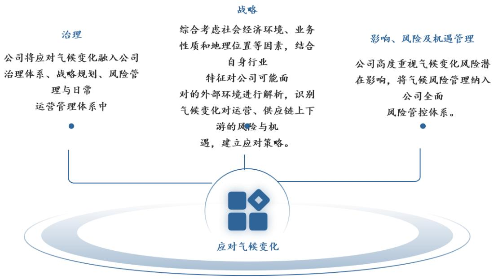

flowchart

```mermaid
graph TD
  subgraph Governance["治理"]
    A1["公司将应对气候变化融入公司治理体系、战略规划、风险管理与日常运营管理体系中"]
  end

  subgraph Strategy["战略"]
    B1["综合考虑社会经济环境、业务性质和地理位置等因素，结合自身行业\n特征对公司可能面对的外部环境进行解析，识别气候变化对运营、供应链上下游的风险与机遇，建立应对策略。"]
  end

  subgraph Impact_Ctrl["Impact/Ctrl[\"影响、风险及机遇管理\"]"]
    C1["公司高度重视气候变化风险潜在影响，将气候风险管理纳入公司全面风险管控体系。"]
  end

  subgraph Core["应对气候变化"]

  A1 --> B1
  B1 --> C1
  C1 --> D["内部框架结构"]
```

战略措施  
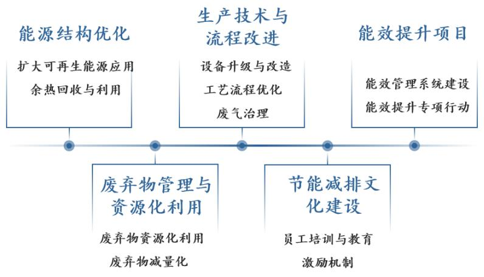

flowchart

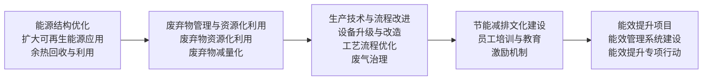
```mermaid
graph LR
  A["能源结构优化\n扩大可再生能源应用\n余热回收与利用"] --> B["废弃物管理与资源化利用\n废弃物资源化利用\n废弃物减量化"]
  B --> C["生产技术与流程改进\n设备升级与改造\n工艺流程优化\n废气治理"]
  C --> D["节能减排文化建设\n员工培训与教育\n激励机制"]
  D --> E["能效提升项目\n能效管理系统建设\n能效提升专项行动"]
```

## 生态系统和生物多样性保护

公司严格遵守《中华人民共和国自然保护区条例》，并参照联合国可持续发展目标等要求，切实履行生态环境保护责任。我们以生态文明建设为指引，践行“绿水青山就是金山银山”理念，坚持保护优先、预防为主，在各项运营中竭力保护周边生态环境与自然资源。在工程选址上，严守生态保护红线，规避生物多样性敏感区域。

例如，公司在年产 21 万吨硅基新材料及 0.5 万吨钴基新材料的项目可行性分析中，重点说明该项目根据《江西省长江经济带发展负面清单实施细则(试行)》(赣长江办[2019]13 号)第 17 条规定，禁止在长江岸线边界向陆域纵深 1 公里范围内新建、扩建化工园区和化工项目。该项目不属于文件所规定的范畴。

环境合规管理  
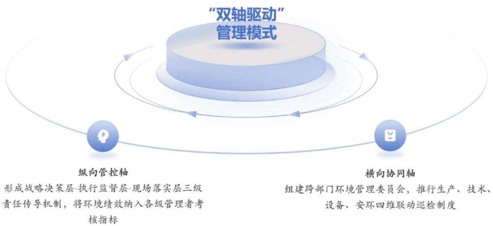

flowchart

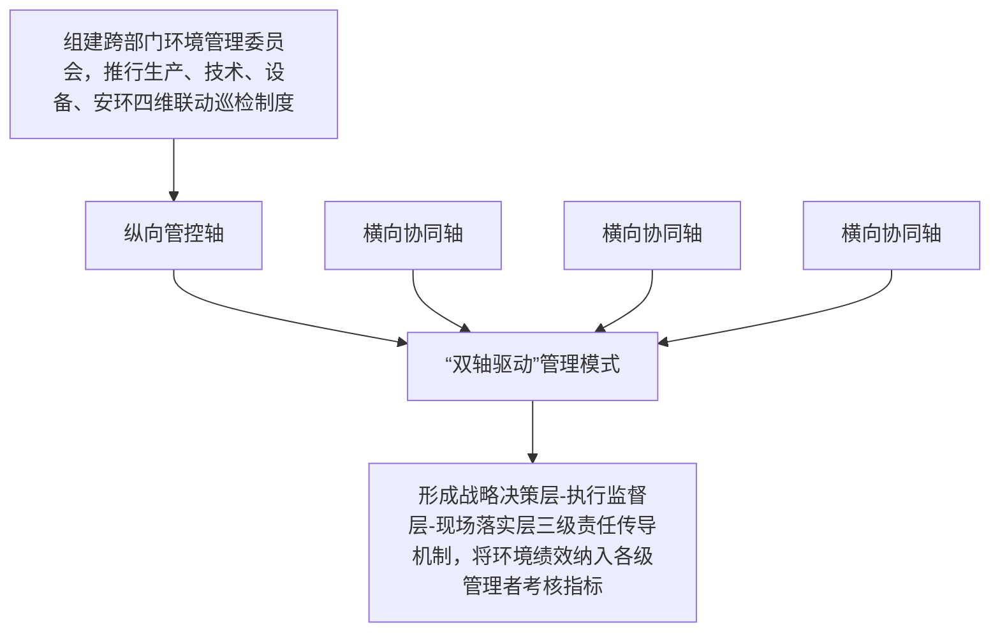
```mermaid
graph TD
  A["纵向管控轴"] --> B["“双轴驱动”管理模式"]
  C["横向协同轴"] --> B
  B --> D["形成战略决策层-执行监督层-现场落实层三级责任传导机制，将环境绩效纳入各级管理者考核指标"]
  E["组建跨部门环境管理委员会，推行生产、技术、设备、安环四维联动巡检制度"] --> A
  F["横向协同轴"] --> B
  G["横向协同轴"] --> B
```

晨光新材将6S管理与环境保护深度融合，报告期内共组织 6S管理评比12次。

体系化建设成效获得国际认可，通过ISO14001 环境管理体系认证。

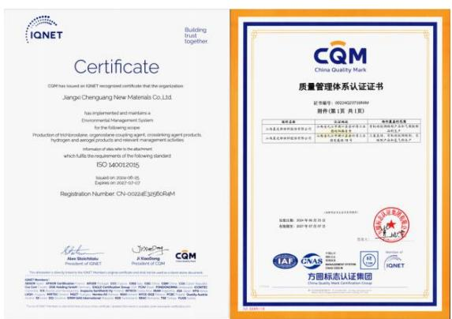  
ISO14001 环境管理体系认证

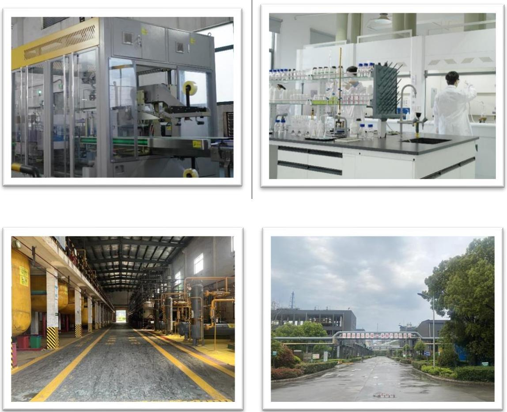  
厂区办公室及生产区 6S管理示意

## 应急管理体系

晨光新材构建环境应急管理生态系统，形成分级分类、平战结合的风险防控格局，如下：

## 智慧支撑体系

1、部署环境风险智能感知网络；  
2、建立应急资源动态管理平台

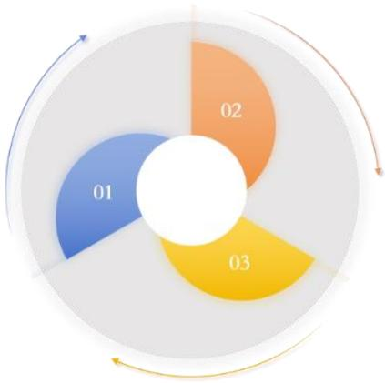

donut

| Segment | Color |
| --- | --- |
| 01 | Blue |
| 02 | Orange |
| 03 | Yellow |

##

1、风险防控层；  
2、应急准备层；  
3、处置响应层；

##

1、创新双盲演练+沙盘推演+实战考核三位一体演练模式；  
2、构建岗位处置卡+车间处置包+工厂处置库三级应急物资储备体系；  
3、实施应急处置人员技能分级

为检验公司危险废物事故应急救援预案的有效性和可操作性，加强危险废物突发情况的现场应急处置水平，提升公司在突发事故时的应急响应能力，防止事故扩大和恶化，尽量减少事故带来的人员伤亡和经济损失。公司组织了环境专项应急演练。

报告期内共计进行消防演练 2 次，应急演练 2 次，危废泄漏演练 2 次，应急管理培训3 次。

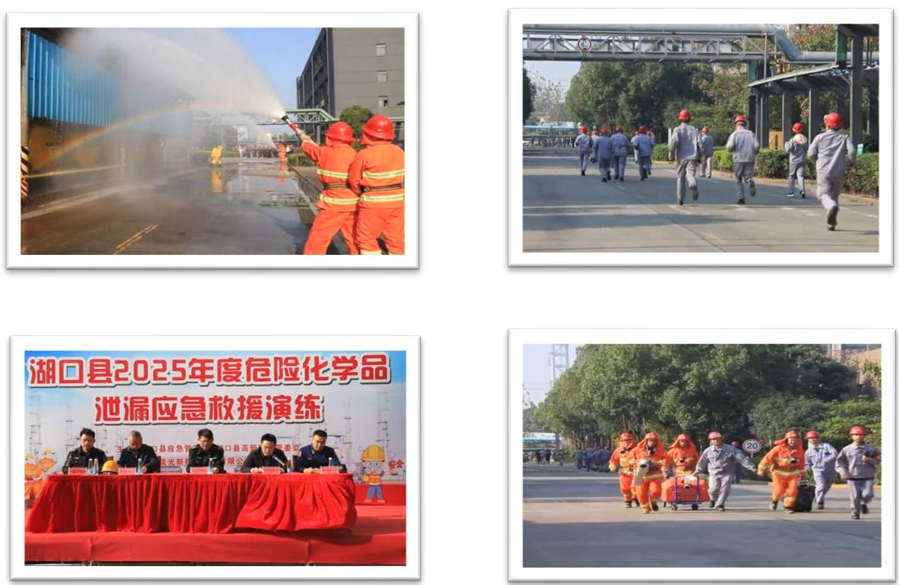

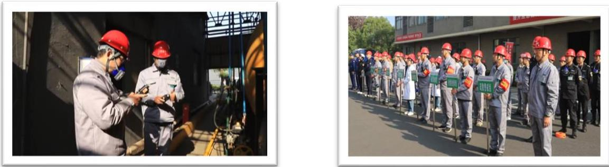  
晨光新材应急演练及培训

## 能源管理

晨光新材深入践行绿色发展理念，系统构建了标准化的能源管理框架，并为持续改进能源绩效设定了明确的目标和指标，通过制度创新与技术赋能双轮驱动，全面提升能源使用效率。

报告期内，公司主要能源采购与耗用量如下表：

<table><tr><td>主要能源</td><td>采购量</td><td>耗用量</td></tr><tr><td>蒸汽(吨)</td><td>177,852.82</td><td>177,852.82</td></tr><tr><td>天然气(立方米)</td><td>2,853,407.80</td><td>2,853,407.80</td></tr><tr><td>电(度)</td><td>65,677,422.00</td><td>65,677,422.00</td></tr><tr><td>水(吨)</td><td>737,504.60</td><td>737,504.60</td></tr></table>

## 水资源管理

晨光新材将水资源保护置于企业可持续发展战略的核心，致力于在全生产运营过程中实现高效与节约用水，积极履行企业责任，坚持以维护流域生态健康和保障社区水安全为前提。公司通过持续的技术创新、精细化管理和透明的信息披露，努力实现水资源消耗与自然补给、社区需求之间的动态平衡，为区域水生态系统的永续发展贡献力量。

具体措施包括：

实施精细化水资源管理：建立系统化用水管理体系，专人监控各车间用水量并每日上报，常态化排查治理“跑冒滴漏”现象。每月组织各车间分析自来水用量，实现管网查漏与过程管控。

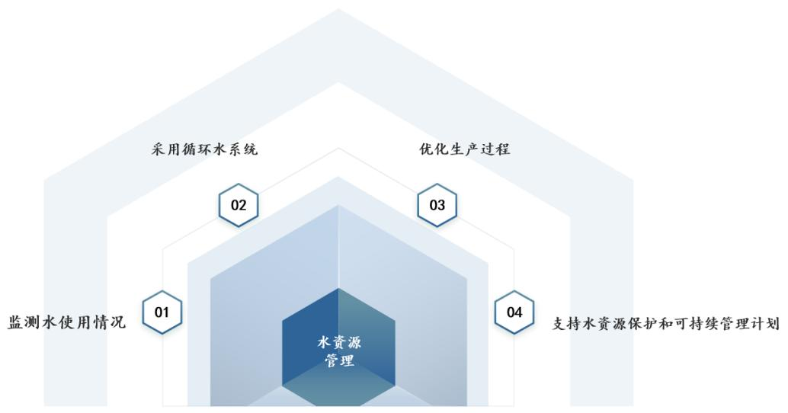

flowchart

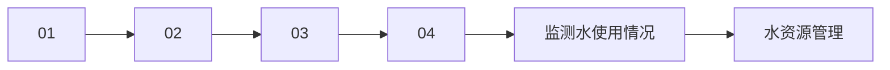
```mermaid
graph LR
  A["01"] --> B["02"]
  B --> C["03"]
  C --> D["04"]
  D --> E["监测水使用情况"]
  E --> F["水资源管理"]
```

优化循环水系统：定期清理与改造冷却塔、循环泵等设备，完善收集系统，减少循环水外漏与飘零，从而降低新鲜水需求。

推进工艺节水与回用：通过优化生产过程，实施部分工艺水回用、高难度盐水蒸发处理、蒸汽冷凝热水回用为循环水等措施，有效减少水资源浪费与污水排放。

## 节能技改项目案例

在全球倡导节能减排和可持续发展的大背景下，能源消耗的管理和控制已成为各行业关注的焦点。对于化工企业而言，提高能源利用效率不仅是履行环保责任、响应国家“双碳”目标的必然要求，更是降低运营成本、增强市场竞争力的关键路径。

公司于2025年积极推动并实施了一系列节能技术改造项目。具体案例如下：

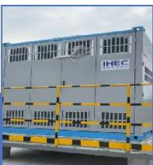

natural_image

Exterior view of a modern industrial container with IHEC branding (no visible text on main structure)

氢气发电

利用氢气与氧气的电化学反应，将化学能直接转化为电能，过程中仅产生水和少量热能，无温室气体或污染物排放，属于清洁高效的发电方式

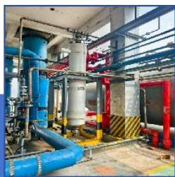

natural_image

Industrial piping and machinery setup inside a factory (no visible text or symbols)

热水回用预热

在原料进蒸发罐前增加预热器在甲醇进蒸发罐前增加预热器.利用车间蒸汽冷凝热水余热温度为90-100℃对甲醇进行预加热，减少蒸发罐蒸汽消耗

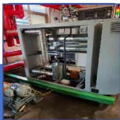

natural_image

Industrial machinery setup with pipes, valves, and a green support rail (no visible text or symbols)

电加热导热油炉

电加热导热油炉热效率更高(95%-99%)、控温精度达±1℃，适合精密温控需求。电加热系统无排放、热损失少且维护简单。环保方面，电加热依赖清洁电力时零污染，燃气锅炉存在CO₂和氨氧化物排放

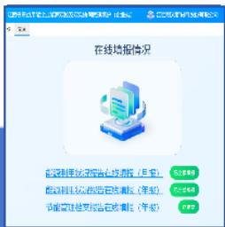

text_image

在线填报情况
您想用网络报告在线填报（年度）
您想用网络报告在线填报（年度）
您想用网络报告在线填报（年度）

能耗在线监控

能耗在线监测系统是一个综合性的技术解决方案。融合了传感器技术、数据传输技术、数据分析技术以及信息展示技术。在能源消耗的源头，各类传感器被安装在电力、水、燃气等计量设备上，实时采集能源消耗数据。

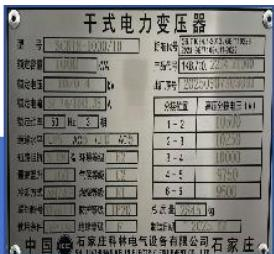

text_image

干式电力变压器
型号: 100000-10
额定容量: 10000
额定电压: 100V
额定电流: 700A/250A
输出电压: 30Ω
输出电压: 30Ω
输出电压: 30Ω
输出电压: 30Ω
输出电压: 30Ω
输出电压: 30Ω
输出电压: 30Ω
输出电压: 30Ω
输出电压: 30Ω
输出电压: 30Ω
输出电压: 30Ω
输出电压: 30Ω
输出电压: 30Ω
输出电压：100V
输出电压：100V
输出电压：100V
输出电压：100V
输出电压：100V
输出电压：100V
输出电压：100V
输出电压：100V
输出电压：100V
输出电压：100V
输出电压：100V
输出电压：100V
输出电压：100V
输出电压：
1-2
2-4
3-5
4-5
5-6
6-6
7-6
8-6
9-6
10-6
11-6
12-6
中国 石家庄科电气设备有限公司 石家庄

一级能效设备

工业领域中，电机电能消耗占据总用电量的80%以上，这一数据凸显了电机能效管理的重要性。

## 节能技改措施

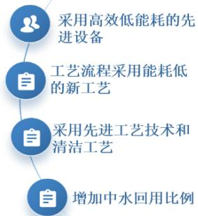

flowchart

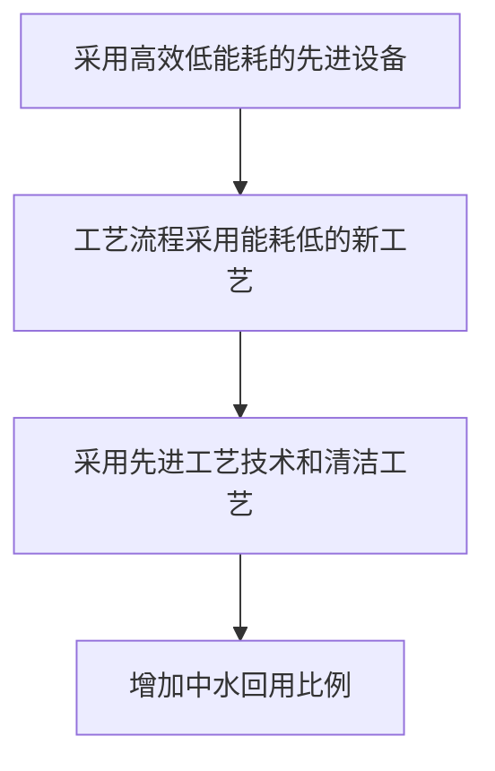
```mermaid
graph TD
  A["采用高效低能耗的先进设备"] --> B["工艺流程采用能耗低的新工艺"]
  B --> C["采用先进工艺技术和清洁工艺"]
  C --> D["增加中水回用比例"]
```

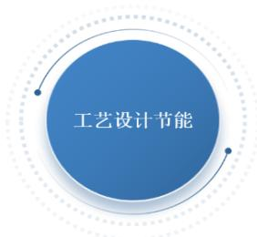

flowchart

```mermaid
graph LR
  A["Circular Icon"] --> B["Process Node"]
  B --> C["Process Node"]
```

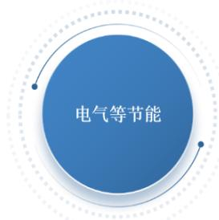

flowchart

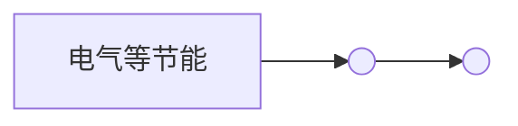
```mermaid
graph LR
  A["电气等节能"] --> B(( ))
  B --> C(( ))
```

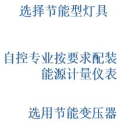

text_image

选择节能型灯具
自控专业按要求配装
能源计量仪表
选用节能变压器

## 7、研发创新

## 研发概况

晨光新材始终秉持技术立企、创新强企的发展理念，在有机硅产业链关键环节持续深耕。公司构建了以市场需求为导向、以产业化应用为目标的立体化研发体系，形成了基础研究-应用开发-工艺创新三位一体的创新闭环。

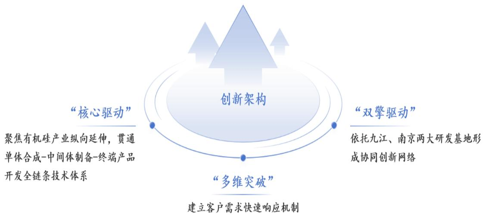

flowchart

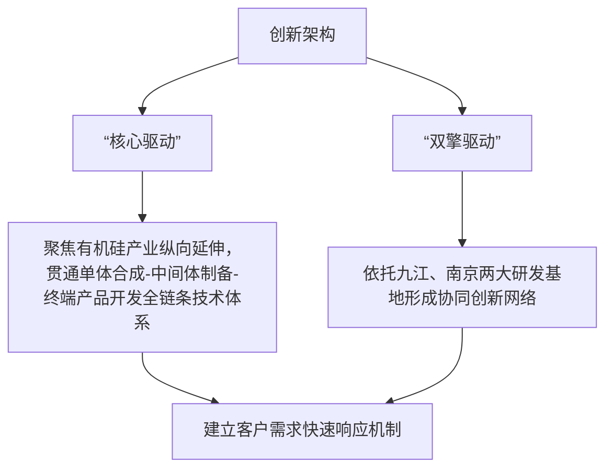
```mermaid
graph TD
  A["创新架构"] --> B["“核心驱动”"]
  A --> C["“双擎驱动”"]
  B --> D["聚焦有机硅产业纵向延伸，贯通单体合成-中间体制备-终端产品开发全链条技术体系"]
  C --> E["依托九江、南京两大研发基地形成协同创新网络"]
  D --> F["建立客户需求快速响应机制"]
  E --> F
```

在研发产业化能力建设方面，公司打造了研发-中试-量产三级孵化体系。报告期内，公司在疏水性气凝胶、高硅氧气凝胶以及气凝胶粉末等复合材料制备中持续投入资源；在有机硅下游应用领域开展深入研究，为密封材料、光伏胶膜、涂料及粘合剂等领域的客户提供支持。公司紧密围绕客户需求，不断开发新型功能性硅烷、优化反应工艺路线，开发了一系列特种功能性硅烷，部分样品已获得客户认可，同时，持续优化生产工艺，往更高效、更精细的方向，进一步提高绿色化程度。

## 研发治理

研发投入与创新宗旨  
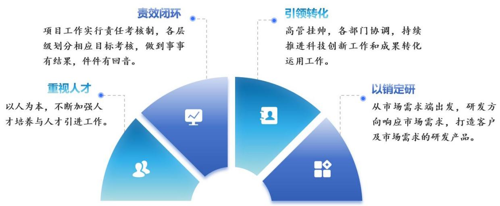

flowchart

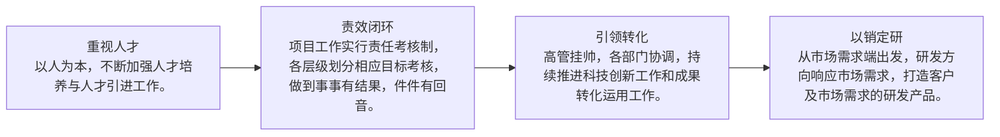
```mermaid
graph LR
  A["重视人才\n以人为本，不断加强人才培养与人才引进工作。"] --> B["责效闭环\n项目工作实行责任考核制，各层级划分相应目标考核，做到事事有结果，件件有回音。"]
  B --> C["引领转化\n高管挂帅，各部门协调，持续推进科技创新工作和成果转化运用工作。"]
  C --> D["以销定研\n从市场需求端出发，研发方向响应市场需求，打造客户及市场需求的研发产品。"]
```

## 8、人才管理

## 员工关爱

我们始终坚信，员工是晨光新材驱动公司永续发展的核心力量。我们致力营造安全、健康、包容的工作环境，激发每位员工的潜能与创造力，实现人尽其才、共同成长。公司建立了贯穿员工全职业生命周期的合规人力资源管理体系，在招聘任用、薪酬绩效、劳动关系等各环节确保规范运作，并持续提升员工敬业度与组织凝聚力，构建和谐共赢的发展格局。

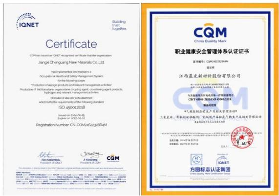

text_image

ICNET
Certificate
ICGM has issued on ICNET recognized certificate that the organization
Jiangxi Chengguang New Materials Co.,Ltd.
has implemented and maintains a
Occupational health and safety management system
for the following scope:
'Production of agrobi products and relevant management activities'
'Production of trichloroalkane, organizole coupling agent, crosslinking agent products,
hydrogen and relevant management activities
Informational details refer to the above
which fulfills the requirements of the following standard:
ISO 45002088
Registration Number: CN-CGMsG2p38Rq4
Issued Date: 2020-06-25
Expiry: 2021-07-10
CQM
China Quality Mark
职业健康安全管理体系认证证书
证书编号: CQM242323294M
资质证明
江西晨光新材料股份有限公司
与永生集团有限公司（以下简称“永生集团”）签署的《企业安全生产监督管理委员会
CXM于2021年12月19日完成工商登记
A. 民生集团
© 联合组织的生产许可证及管理活动
三氯苯醚、有机硅烷吸附剂、无机硅产品和氧气氟矿相关管理工作
国务院办公厅
发证机关：中国证券监督管理委员会
发证日期：2021年07月27日
负责人：
CQM
方图标志认证集团

ISO45001职业健康安全管理体系认证

公司已建立系统的职业健康安全管理体系，为相关工作提供了系统性框架。在此体系下，公司配备了专业的职业健康管理团队，确保对员工从入职到在职、乃至特殊岗位的全周期健康状态进行有效管理与监护。通过修订内部制度，公司以持续夯实管理基础，从而进一步健全了员工健康管理机制。

制定并实施分层级的员工体检套餐标准。

构建员工心理健康关怀体系，通过心理疏导、主题座谈等形式提供支持。

## 健康分级管理

## 心理关怀深化

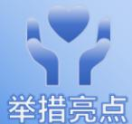

## 档案系统建设

## 职业健康闭环

建立并完善员工健康档案管理系统。

对接触职业危害的员工，每年实施职业健康检查，并依据结果闭环改进。

在人才引进与培养方面，我们通过校园招聘、社会招募、内部推荐等多渠道广纳贤才，并与高校合作开展形式多样的校企活动与实习基地建设，系统性地吸引并储备青年人才。

在生产环节，公司全面落实职业健康防护措施。为持续改善劳动条件，公司积极推动技术升级，引入先进的数控与自动化设备，有效降低了劳动强度，提升了生产效率与安全性。公司建立了系统、明确的职业安全卫生管理体系，组建管理团队，负责日常工作的组织实施、监督检查与持续改进，形成管理闭环，确保各项措施有效落实。

## 防尘

采用负压收尘系统，尘点密封抽吸，集中处理，杜绝粉尘外扬。

## 降噪

设备采用减震、隔音设计，噪声敏感区域独立隔离，确保车间噪声低于80分贝。

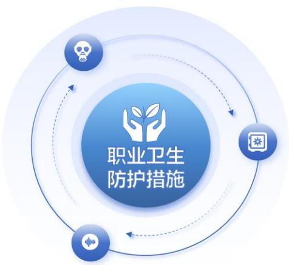

flowchart

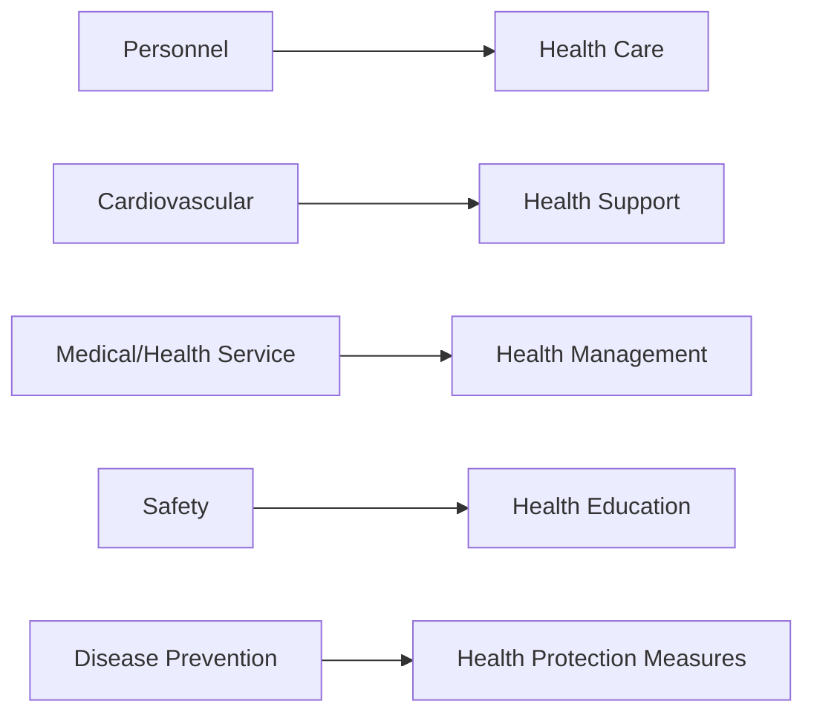
```mermaid
graph LR
  A["Personnel"] --> B["Health Care"]
  C["Cardiovascular"] --> D["Health Support"]
  E["Medical/Health Service"] --> F["Health Management"]
  G["Safety"] --> H["Health Education"]
  I["Disease Prevention"] --> J["Health Protection Measures"]
```

## 废气处理

设有强制排风与局部排风系统，及时排出烟气，保障空气清新。

## 员工权益

晨光新材严格遵循《公司法》《劳动法》《劳动合同法》等国家法律法规和用工政策，制定相关人事管理制度 18 个，规范公司在招聘、培训、绩效、薪酬福利、员工关系等方面的管理，充分保障员工权益。公司制定、修改或者决定直接涉及劳动者切身利益的规章制度或重大事项，均按业务分级授权相关规定提交审议，协调工会参与协商。

## 员工培训

2025 年，公司通过在线数字化学习平台和线下讲授、研讨、座谈等学习方式组织了多次主题不同的培训。

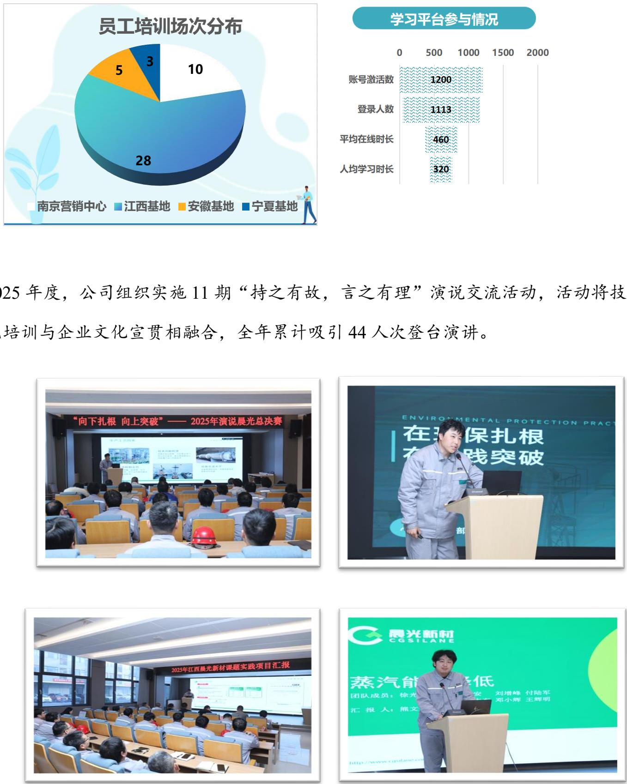

2025年度，公司组织实施 11 期“持之有故，言之有理”演说交流活动，活动将技能培训与企业文化宣贯相融合，全年累计吸引44人次登台演讲。

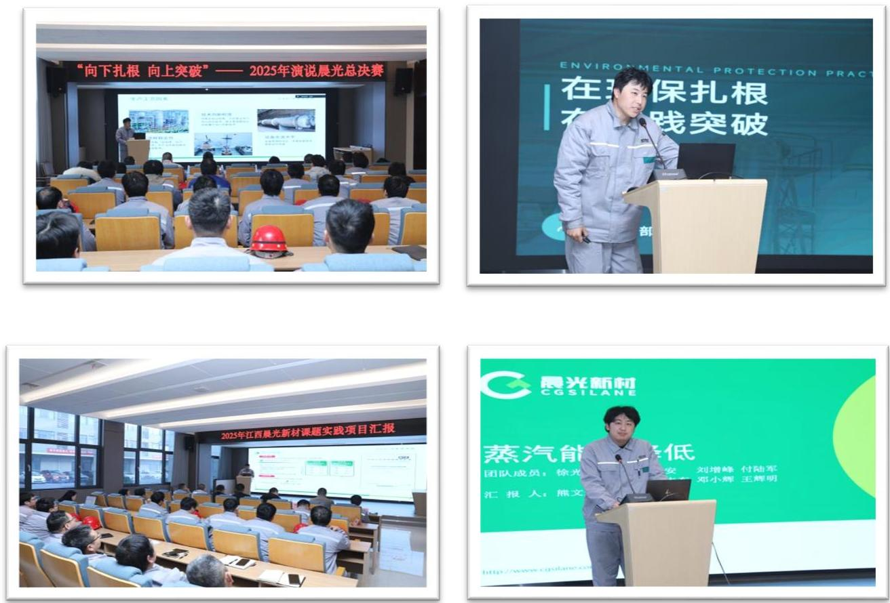  
持之有故，言之有理”演说交流活动

## 人才培养

为建立符合公司战略发展需求的培训管理体系，完善人才梯队建设机制，晨光新材设计了“晨星计划、晨曦计划和晨光计划”培训体系，统称为“晨”系列人才培养规划。

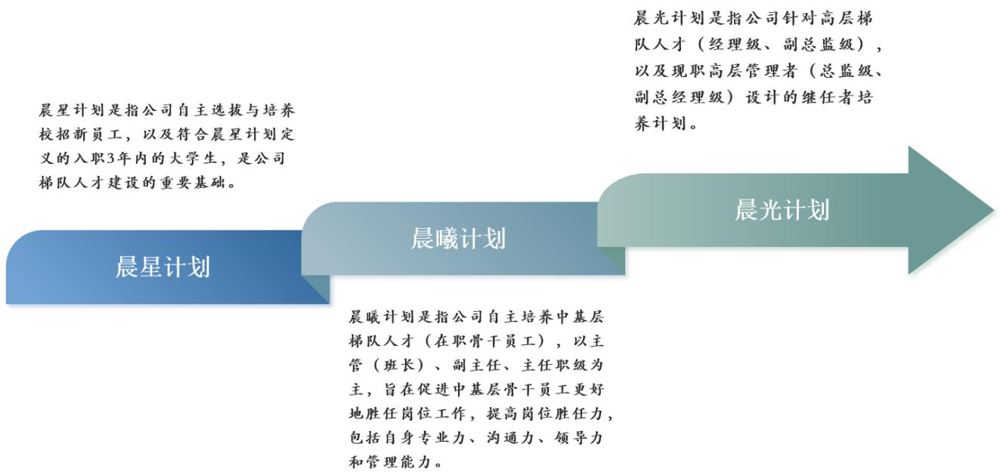

flowchart

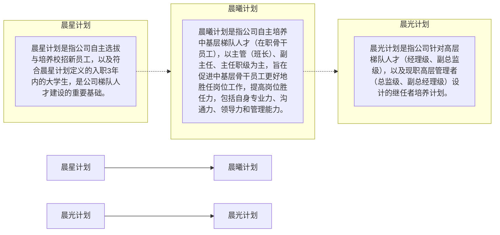
```mermaid
graph LR
  A["晨星计划"] --> B["晨曦计划"]
  C["晨光计划"] --> D["晨光计划"]
  
  subgraph Stage1 [晨星计划]
    direction TB
    A1["晨星计划是指公司自主选拔与培养校招新员工，以及符合晨星计划定义的入职3年内的大学生，是公司梯队人才建设的重要基础。"]
  end
  
  subgraph Stage2 [晨曦计划]
    direction TB
    A2["晨曦计划是指公司自主培养中基层梯队人才（在职骨干员工），以主管（班长）、副主任、主任职级为主，旨在促进中基层骨干员工更好地胜任岗位工作，提高岗位胜任力，包括自身专业力、沟通力、领导力和管理能力。"]
  end
  
  subgraph Stage3 [晨光计划]
    direction TB
    A3["晨光计划是指公司针对高层梯队人才（经理级、副总监级），以及现职高层管理者（总监级、副总经理级）设计的继任者培养计划。"]
  end
  
  A1 -.-> Stage2
  A2 -.-> Stage3
```

## 1、晨星计划人才培养策略与目标

晨星计划是公司“晨”系列人才培养的品牌项目之一，以项目制、导师制、轮岗制相结合的培养策略，设有“融入期”“哺育期”“成长期”三个阶段。将员工培养成为职业素养高、岗位能力精、业务创新强的复合型人才，基本达到基层管理者应具备的综合能力及企业认同感强、沟通能力好、执行能力强的素质要求。

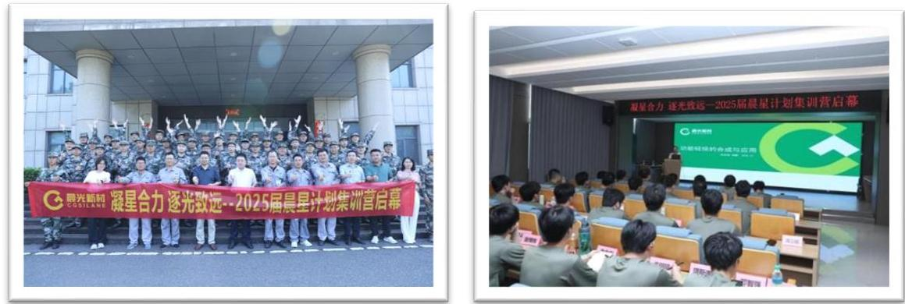

## 2、晨曦计划人才培养策略与目标

晨曦计划是公司“晨”系列中基层梯队人才培养的品牌项目，以行动学习和专项培训项目设计相结合，牵引中基层管理者提升自身专业能力和管理能力。公司设计生产储备干部训练营、销售训练营、研发训练营三个培训项目，分别培养生产、营销和研发三个体系的中基层管理者。

## 3、晨光计划人才培养策略与目标

晨光计划重点培养继任者的企业战略、理性决策、团队管理和创新思维，基本达到公司中高层管理者应具备的综合能力，有创新思维，决策能力强，能带领团队出色完成团队目标。

报告期内，晨光新材对在工作中表现突出的员工进行表彰，激发员工积极性，提升团队凝聚力，改善员工满意度，进而促进企业的整体发展。

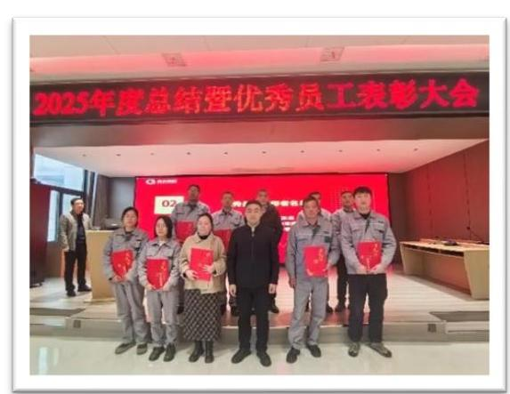

text_image

2025年度总结暨优秀员工表彰大会

晨光新材优秀员工表彰大会

## 员工活动

公司秉持“快乐工作、幸福生活”的理念，在持续营造温馨、和谐、安全、舒适工作环境的同时，高度重视员工身心健康与精神文化需求，着力丰富员工业余生活，促进工作与生活的健康平衡。

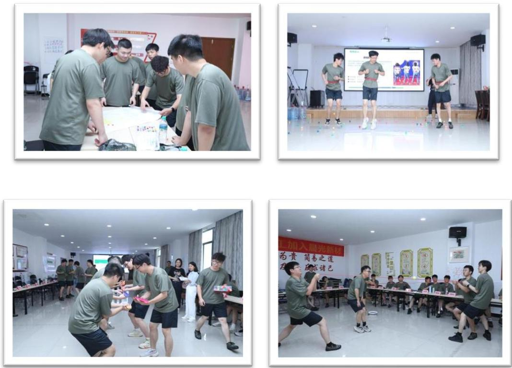  
员工团建活动

## 9、产品管理

## 产品质量与安全

晨光新材秉承“满足需求，标杆导向”的质量理念，实施 QES 管理体系，以客户为关注焦点，建立从原料进厂到产品出厂的全过程质量管理，持续完善自身的质量管理体系，严格管控质量风险，落实质量管理措施，以提供可靠、安全的产品和服务。近年来，公司未出现过重大质量投诉，在历年接受各级质量的抽检中，合格率均达 100%，经 NSF-ISR 评估，晨光新材所建立的质量环境体系符合 IATF16949:2016 标准，公司多个产品通过SGS检测，符合欧盟 ROHS指令要求。

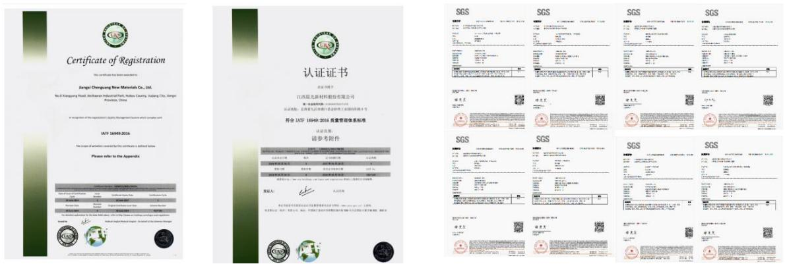  
质量环境体系认证证书及SGS 检测产品

质量培训方面，公司实行三级质量诚信教育培训，牢固树立全体员工的诚信意识。由公司组织一级教育工作。各部门根据公司要求，编制教育培训计划和内容，认真组织开展质量教育培训；各车间负责组织开展班组长及员工的诚信宣传教育工作。公司通过专题培训、书面文字进行张贴或传达、质量诚信先进员工经验交流、利用早会或班前会等多种方式对企业员工实施质量诚信教育。

晨光新材每年定期开展“质量主题月”专题活动，包含质量专题培训、质量法规标准宣贯、质量文化海报展、质量知识普及等活动。推动质量宣传进车间（部门）、进班组、进施工现场，积极营造“质量主题月”活动良好氛围。

## 售后服务

公司秉持“以客户价值创造为核心”的服务理念，构建全流程客户关系管理体系。

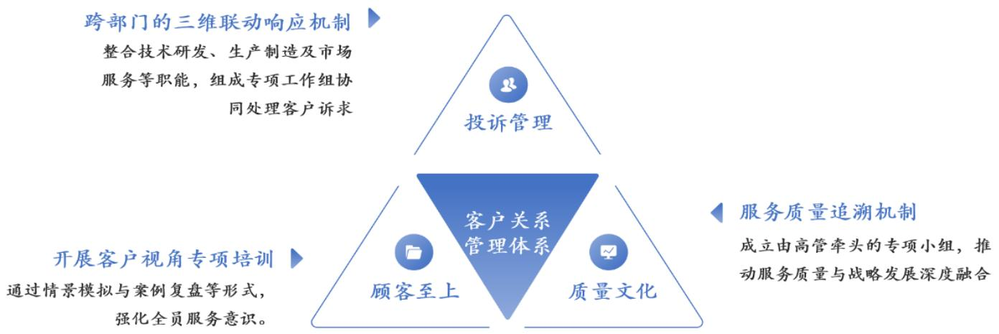

flowchart

```mermaid
graph TD
  A["投诉管理"] --> B["客户关系管理体系"]
  C["顾客至上"] --> B
  D["质量文化"] --> B
  E["跨部门的三维联动响应机制\n整合技术研发、生产制造及市场服务等职能，组成专项工作组协同处理客户诉求"] -.-> A
  F["服务质量追溯机制\n成立由高管牵头的专项小组，推动服务质量与战略发展深度融合"] -.-> C
  G["开展客户视角专项培训\n通过情景模拟与案例复盘等形式，强化全员服务意识。"] -.-> F
```

公司实施客户生命周期管理，将服务延伸至应用场景优化。专业化客户服务团队与分层级沟通机制均已建立，在常态化满意度调研与深度访谈基础上，创新推行高管层与战略客户的定期对话制度，确保企业决策与市场需求同步。

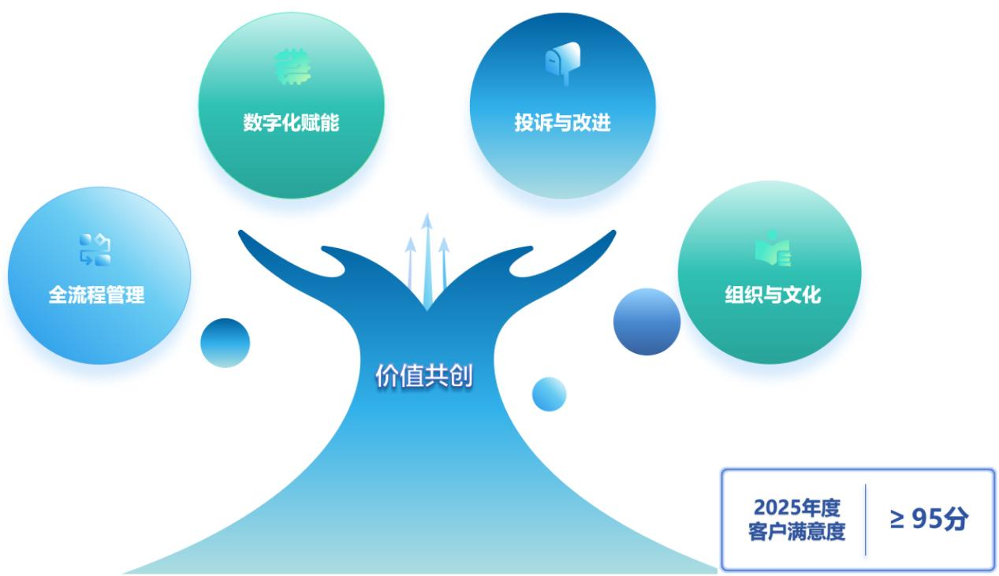

flowchart

```mermaid
graph LR
  A["全流程管理"] --> B["数字化赋能"]
  B --> C["投诉与改进"]
  C --> D["组织与文化"]
  D --> E["价值共创"]
  F["2025年度客户满意度\n≥ 95分"] -.-> B
  F -.-> C
  F -.-> D
  F -.-> E
```

## 10、供应链管理

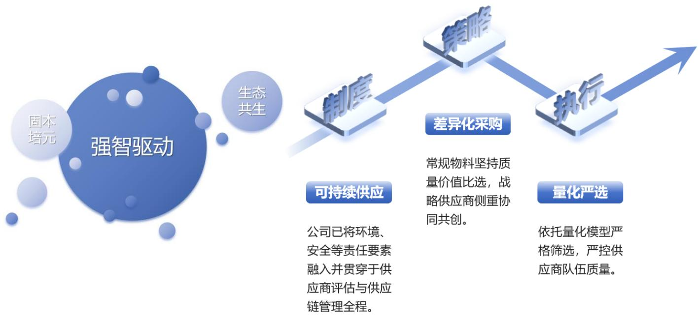

flowchart

```mermaid
graph LR
  A["固本培元"] --> B["强智驱动"]
  C["生态共生"] --> B
  B --> D["制度"]
  D --> E["策略"]
  E --> F["执行"]
  F --> G["差异化采购\n常规物料坚持质量价值比选，战略供应商侧重协同共创。"]
  G --> H["量化严选\n依托量化模型严格筛选，严控供应商队伍质量。"]
```

## 2025年度合作供应商

新增

336家

晨光新材注重培育战略合作伙伴关系，通过技术交流、联合改进项目，推动供应商实现管理升级与技术迭代。未来将持续推进数字化采购平台建设，深化与核心供应商战略协同，共同构建更具韧性、更可持续的产业生态体系，为高质量发展注入新动能。

公司平等对待中小企业合作伙伴，严格遵守法律法规要求以及合同条款规定，及时足额支付中小企业账款。截至本报告期末，公司不存在逾期未支付中小企业款项的情况。

## 数据保护与客户隐私

晨光新材高度重视全供应链数据安全，依据国家法律法规与行业标准，建立了涵盖信息安全管理制度在内的制度体系，并定期开展数据安全风险评估，及时发现和修复潜在风险与漏洞。通过日常监督与定期检查相结合，确保各项制度落实到位、有效运行。

公司客户以企业客户为主，严格遵守《中华人民共和国个人信息保护法》等规定，通过技术手段严格限制个人隐私数据访问权限，保障个人数据的安全存储与合法使用。报告期内，未发生数据安全事件，未出现客户隐私泄露情况。

## 11、社会责任

## 乡村振兴

2025 年，公司通过江西省民建同心思源基金会定向帮扶湖口县流泗镇东风村，城山镇东港社区，张青乡长塘村，流芳乡沙港村、均桥镇文联社区，用于各村脱贫、扶贫产业、乡村振兴、农村环境治理、村部基础设施建设、公益活动场所等建设。

## 社会贡献

晨光新材深知教育对于个人和社会的重要性，自 2017年起，公司设立了专项教育资助基金，旨在资助厂区基地地区的优秀贫困学生完成学业，为更多有志于求学的学子提供了实现梦想的机会。为帮助学生了解职场、积累实践经验并提升综合能力，公司积极履行社会责任，为在校学生提供多样化实习机会。

此外，公司还通过举办开放日、公益讲座等多种形式，致力于为学生提供全方位的职业发展支持，帮助他们在未来的职业道路上更加自信从容。这些校企合作举措，为学生创造了宝贵的学习与实践平台。

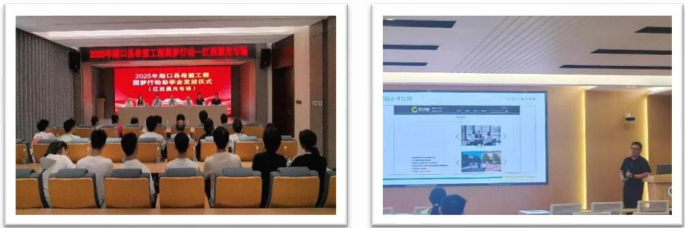  
教育资助帮扶与求职公益讲座

## 12、关于本报告

## 报告简介

本报告秉承客观、规范、透明和全面的原则，旨在向股东与投资者、客户、供应商、员工、政府及监管机构等利益相关方披露公司2025 年在环境、社会和公司治理方面的理念及实践成绩。

## 时间范围

除特别说明外，本报告数据时间范围为 2025 年 1 月 1 日至 2025 年 12 月 31 日，为增强报告的可比性和完整性，部分内容适当追溯以往年份或延伸到 2026 年。

## 发布周期

本报告为年度报告。

## 称谓说明

为便于表述和阅读，江西晨光新材料股份有限公司在报告表述中使用“晨光新材”“公司”“我们”等称谓。此外，报告中的“国家”“政府”均指中华人民共和国及其行政机构。文中涉及简称内容的释义参照《江西晨光新材料股份有限公司 2025 年年度报告》中释义部分。

## 编制依据

本报告的编制主要参考以下标准与指引:

《上海证券交易所上市公司自律监管指引第 14 号--可持续发展报告(试行)》《上海证券交易所上市公司自律监管指南第 4 号--可持续发展报告编制(2026 年 1 月修订)》《上海证券交易所上市公司环境信息披露指引》。同时本报告结合国际及国内相关可持续发展与 ESG 信息披露框架进行编制，联合国全球契约(United Nations GlobalCompact)“十项原则”、气候变化相关财务信息披露工作组(TCFD)、全球报告倡议组《GRI可持续发展报告标准(GRIStandards)》 (2021年版)、中国社会科学院《中国企业社会责任报告指南(CASS-ESG6.0)》等相关要求。

## 数据说明

报告使用数据来源包括政府部门公开数据、晨光新材内部相关统计报表、第三方问卷调查、行政文件及报告和第三方评价访谈等。本报告的财务数据以人民币为单位，若与财务报告不一致之处，以财务报告为准。

## 可靠性保证

本报告于 2026 年 4 月 28 日获公司董事会批准，并与年报同期发布。晨光新材保证本报告内容真实、准确、完整，不存在任何虚假记载、误导性陈述或重大遗漏。

## 获取方式

本报告为中文，以电子版形式发布。可通过上海证券交易所官网及江西晨光新材料股份有限公司官网（https://www.cgsilane.com/）浏览或下载报告电子文本，并获取更多信息。