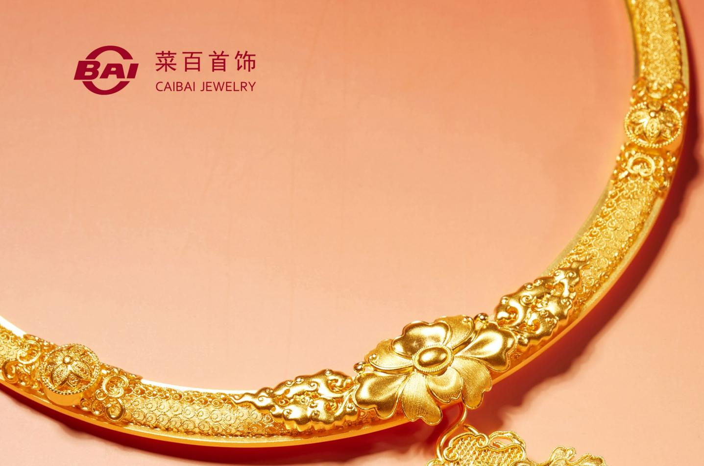

text_image

BAI 菜百首饰
CAIBAI JEWELRY

natural_image

Golden ornamental pendant with floral motif and multiple hanging beads (no text or symbols)

natural_image

Ornate golden pendant with intricate floral and cloud motifs, no visible text or symbols

## 2025

环境、社会和公司治理（ESG）报告

ENVIRONMENTAL, SOCIAL, AND GOVERNANCE (ESG) REPORT

##

关于本报告 01董事长致辞 03走进菜百股份 07ESG 管理 15

## 01 强基固本夯实治理根基

党建引领企业发展 21完善治理规范运作 24健全风控稳健运营 27坚守底线诚信经营 31规范信披强化沟通 34

## 02 品质经营 打造信任品牌

严控品质筑牢根基 39用心服务提升体验 44守护信息保障安全 55创新驱动增强活力 58知识产权护航品牌 67规范采购协同发展 70

## 附录

关键绩效表 99 指标索引表 100 读者反馈表 102

## 03 绿色运营推动低碳发展

环境合规守护生态 75资源节约与循环利用 75污染防治与排放管理 77积极应对气候变化 78

## 04 以人为本共建责任企业

关爱员工促进成长 83健康安全守护发展 92公益行动回馈社会 96助力振兴服务民生 98

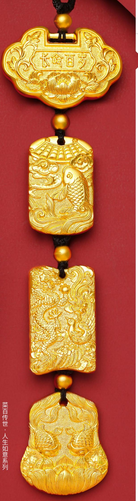

text_image

长命百年
菜百传世·人生如意系列

## 关于本报告

## 报告说明

本报告为北京菜市口百货股份有限公司公开发布的2025年度环境、社会和公司治理（ESG）报告。报告系统、真实、客观地呈现公司在报告期内，于环境、社会及公司治理三大领域的战略落地、管理实践、履责成果与发展规划，全面回应股东、员工、监管机构、客户、合作伙伴及社会公众等各利益相关方的核心关切。

## 编制依据

上海证券交易所《上海证券交易所上市公司自律监管指引第14号—可持续发展报告（试行）》《上海证券交易所上市公司自律监管指南第4号—可持续发展报告编制》国务院国有资产监督管理委员会《关于国有企业更好履行社会责任的指导意见》

全球报告倡议组织《可持续发展报告标准》（GRStandards 2021）

联合国可持续发展目标(SDGs)

## 报告范围

本报告的组织披露范围以北京菜市口百货股份有限公司为主体，涵盖旗下分、子公司。除特别注明外，本报告的披露边界与公司2025年年度报告的合并报表范围保持一致确保披露信息的统一性、完整性与可比性。

## 时间范围

本报告为年度报告，核心披露内容的时间范围为2025年1月1日至2025年12月31日。为增强报告的可比性和完整性，部分内容适度追溯或延伸至前后年度。

## 数据来源

本报告所使用的各类数据与信息，均来源于公司日常经营的原始运营数据、内部管理统计报表、经审计的年度财务数据、政府主管部门公开数据、第三方机构问卷调查等合规、可追溯渠道。报告中财务数据以人民币为单位，若本报告所载财务数据与公司2025年经审计的年度财务报告存在差异，均以年度财务报告为准。

## 报告称谓说明

为便于报告行文表述与读者阅读，除特殊说明外，本报告中提及的“菜百股份”“菜百”“公司”“我们”等称谓，均统一指代“北京菜市口百货股份有限公司”。

## 报告获取方式

您可通过上海证券交易所官方网站（http://www.sse.com.cn）免费下载、查阅本报告的电子文本，同时可获取公司更多经营发展与可持续治理相关的公开信息。

联系电话：010-83520088-638

电子邮箱：cb\_investors@bjcaibai.com.cn

## 董事长致辞

natural_image

Portrait of a woman in a white traditional-style jacket standing beside a wooden table, with floral background and greenery (no visible text or symbols)

菜百股份党委书记、董事长谢华萍

大潮奔涌，奋楫者先。2025年，是“十四五”圆满收官之年，也是“十五五”谋篇布局之年。当前，中国式现代化迈入新阶段，高质量发展与新质生产力引领时代变革。黄金珠宝行业正经历从“规模增长”向“价值共创”的深刻转型—绿色消费、文化自信与数字化零售成为核心发展议题。作为国有控股的上市公司，菜百股份坚持以习近平新时代中国特色社会主义思想为指导，完整、准确、全面贯彻新发展理念。

这一年，菜百股份在变局中开新局，公司经营业绩再创新高，利润实现双位数增长，市场拓展与品牌影响力同步跃升，设计研发能力持续增强，数字化转型与管理效能取得显著突破，探索出了一条有温度、有格局、可持续的发展之路，奋力书写着中国式现代化的菜百篇章。

## 治理为基，行稳致远

菜百股份坚持党建引领，将党的领导融入公司治理各环节，持续优化现代企业制度，以透明、规范、负责任的姿态赢得市场信任。我们强化内控与风险管理，坚持合规经营，让坚实的治理体系为企业行稳致远保驾护航

## 数智赋能，美好共创

菜百股份全面推进数字化转型，以科技驱动服务升级与管理提效。通过智能会员运营与精准服务推荐，让每一次互动都更贴合消费者的需求；线上线下融合的场景，让购物体验更流畅、更温暖。数字化不仅提升了公司的管理效能，更让菜百能够用心倾听、快速响应，把对每一位顾客的关怀落到实处。智慧赋能，让菜百的服务更有温度，我们相信，每一次贴心的服务，都是为消费者的美好生活增添一份光彩。

## 匠心为魂，守正创新

产品质量是企业的生命线，菜百股份以严干国标的企业标准守护消费者信任，深植中华优秀传统文化沃土，让国潮经典焕发时代光彩。坚持创新驱动，以精湛工艺与美学追求不断满足人民对美好生活的向往，做对消费者负责、对社会负责的企业。

## 责任为重，心比金纯

企业不仅是经济发展的引擎，更是社会进步的推动力量。菜百股份坚持投资于人，构建全链条人才发展生态，营造多元包容、和谐共进的奋斗者家园，厚植高质量发展根基。公司积极履行国企社会责任，广泛开展志愿服务，助力就业促进、乡村振兴与教育公平，以真情回馈社会，以实际行动诠释“心比金纯”的核心价值观让温度与善意在更广阔的土地上生根发芽。

展望未来，菜百股份将始终赓续初心、肩负使命，以改革攻坚破局立新；以创新驱动引领发展；以智慧赋能提质增效；以人才强企筑牢发展根基：在传承中突破，在突破中传承：以绿色守护家园，以责任回馈社会。站在“十五五”开局与菜百七十周年的历史交汇点上，我们将继续坚持合作共赢，携手各利益相关方，共同迈向可持续的美好未来，为打造基业长青、铸就金字招牌而不懈奋斗！

## 2025 年度关键绩效

经营绩效

<table><tr><td>营业收入</td><td>同比增长:</td></tr><tr><td>2,881,954.74万元</td><td>42.44%</td></tr><tr><td>归母净利润</td><td rowspan="2">同比增长:</td></tr><tr><td>113,306.64万元</td></tr><tr><td>总资产</td><td>基本每股收益</td></tr><tr><td>951,510.64万元</td><td>1.46元</td></tr></table>

公司治理绩效

<table><tr><td>股东会召开4次</td><td>董事会召开7次</td><td>开展董事与高级管理人员培训36次</td></tr><tr><td>董事人数11人</td><td>独立董事占比36.36%</td><td>女性董事占比36.36%</td></tr><tr><td colspan="2">开展反商业贿赂及反腐败培训与警示教育4次</td><td>接受反商业贿赂及反腐败培训覆盖率100%</td></tr><tr><td colspan="2">公开披露投关活动13次</td><td>投资者回复率100%</td></tr></table>

环境绩效

<table><tr><td colspan="2">外购电力总量5,980,456.27千瓦时</td><td>能源消耗总量754,155.17千克标准煤</td></tr><tr><td>取水量(自有物业范围)12,965立方米</td><td>重大环境事件0</td><td>生态环境相关行政处罚0</td></tr></table>

社会绩效

<table><tr><td>产品抽检合格100%</td><td colspan="2">公司总店及各直营连锁门店的客户满意度均保持在96%以上</td></tr><tr><td>客户投诉解决率100%</td><td colspan="2">重大数据安全事件、客户隐私泄露事件发生数量0起</td></tr><tr><td>数据安全与隐私保护全员培训覆盖率100%</td><td>员工总数1,470人</td><td>劳动合同签订比例100%</td></tr><tr><td>少数民族员工总数66人</td><td>残疾员工总数11人</td><td>新入职员工总数194人</td></tr><tr><td>员工社会保险覆盖率100%</td><td>年度培训支出金额65.5万元</td><td>员工培训覆盖率为100%</td></tr><tr><td>安全培训覆盖率100%</td><td>组织开展各类公益活动、志愿服务834次</td><td>累计志愿服务超5,000小时</td></tr></table>

## 走进菜百股份

## 公司简介

北京菜市口百货股份有限公司是一家在上海证券交易所主板上市的黄金珠宝专营公司，是商务部第一批命名的“中华老字号”企业，作为国有控股企业，菜百股份是西城区国资委的重要子企业。

菜百股份主要经营黄金饰品、贵金属投资产品、贵金属文化产品和钻翠珠宝饰品等在内的全品类、多款式黄金珠宝商品，服务于广大、多样化的消费者群体。公司总店（总部）位于北京市西城区广安门内大街306号，营业面积约8,800平方米，同时，也是一家在北京市文物局正式备案的博物馆一北京菜百黄金珠宝博物馆。

菜百股份拥有包括北京总店、覆盖华北等地区的百余家直营连锁门店、银行渠道在内的线下销售网络，以及天猫菜百旗舰店、京东菜百首饰旗舰店、菜百首饰官方商城等覆盖全国市场的线上电商销售网络，为消费者提供集“博物馆式的鉴赏、专业知识的普及、体验式的购物、个性化的定制”于一体的沉浸式购物体验。

未来，菜百股份将始终秉承“以情经商，以质取胜”的经营理念，大力践行“做每个人的黄金珠宝顾问”的企业使命，坚持“心比金纯”的服务理念，为消费者持续提供优质的黄金珠宝商品及服务。

企业文化  
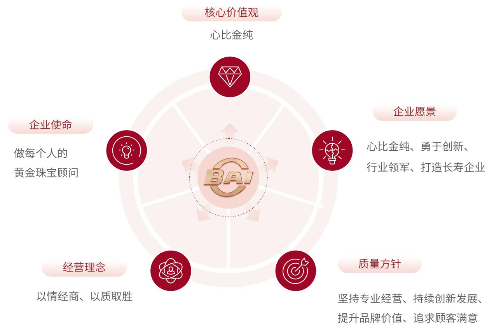

flowchart

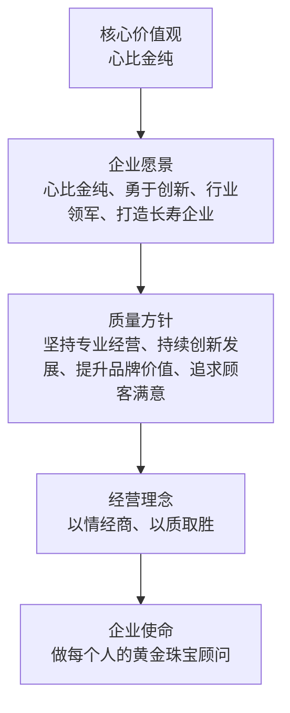
```mermaid
graph TD
  A["核心价值观\n心比金纯"] --> B["企业愿景\n心比金纯、勇于创新、行业领军、打造长寿企业"]
  B --> C["质量方针\n坚持专业经营、持续创新发展、提升品牌价值、追求顾客满意"]
  C --> D["经营理念\n以情经商、以质取胜"]
  D --> E["企业使命\n做每个人的黄金珠宝顾问"]
```

## 业务布局

公司始终专注于黄金珠宝零售主业，以“菜百首饰”主品牌为核心，协同专注古法黄金的子品牌“菜百传世”与主打时尚轻奢风格的子品牌“菜百悦时光”，构建立体化的品牌矩阵。公司精准定位消费市场的多元需求，销售涵盖黄金饰品、贵金属投资产品、贵金属文化产品以及钻翠珠宝饰品等全品类、多款式的黄金珠宝商品，为广大消费者提供便捷目全面的一站式珠宝购物体验。公司通过开展包括珠宝定制、个性化设计、首饰咨询、以旧换新等特色服务，为消费者提供高附加值的增值服务，促进黄金珠宝销售收入的增长。

公司构建线上线下深度融合的全渠道销售网络，包括线下直营店渠道、线上电商渠道和银行渠道等。截至报告期末，公司拥有包括覆盖北京各行政区和天津、河北、包头、西安、苏州、武汉等地的106家直营连锁线下门店：以及包括菜百首饰自营官方商城及在京东、天猫、抖音、快手等电商平台开设的线上店铺、直播销售等在内的覆盖全国市场的线上销售网络；并与北京农商银行、民生银行、北京银行等多家银行开展合作，利用银行渠道体系完善、网点众多的优点在银行网点开展销售。

公司持续完善黄金珠宝全产业链布局，在上游构建稳定、合规、可持续的原料采购体系，依托上海黄金交易所综合类会员资质从源头把控原料品质：中游打造专业化原创设计研发体系，设立数字化转型创新工作室，以AI技术赋能产品设计与研发，持续提升自主创新能力：下游搭建全流程质量管理体系与全生命周期客户服务体系，实现从原料采购到终端销售、从产品研发到售后服务的全链条管理，为企业可持续发展筑牢坚实根基。

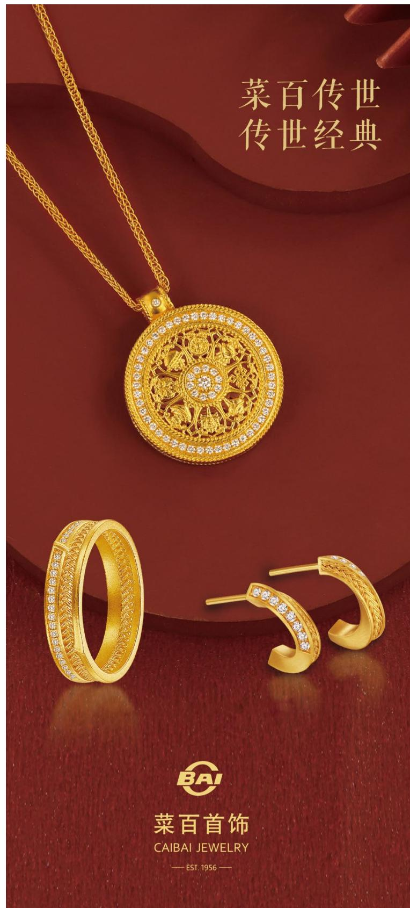

text_image

菜百传世
传世经典
BAI
菜百首饰
CAIBAI JEWELRY
—— EST. 1956——

# 1956-1997

## 1956 年

菜百股份前身菜市口百货商场正式成立。

## 1985 年

经中国人民银行批准《黄金内销零售许可证》，成为北京市第一批经营黄金首饰的百货商场。

## 1992 年

销售破亿元，特色经营模式崭露头角。

## 1994 年

在国家倡导推动国企改革背景下，公司进行了公司化改制，成立菜百有限责任公司，并实现了主要骨干员工入股。

## 1997 年

北京市商业委员会授予“京城黄金第一家”牌匾与证书。

# 1998-2000

## 1998 年

通过ISO9002质量体系认证，成为北京市国有商业企业中第一家通过该项认证的单位。

## 1999 年

于新中国成立50周年之际发售“千禧金条”。

## 2000 年

•变更设立为股份公司，引入多元化社会资本完成有限责任公司向股份公司的转制，实现国有资本放大；  
·总店迁址，“不铺地毯铺未来，庆典经费献教育”，形成“万人空巷送菜百”的壮观景象，是轰动京城的新闻头条：自此开始，菜百在根植教育、捐资助学的路上一路前行，连续26年向北京青少年发展基金会捐赠善款，做青少年“梦想的接力者”，筑梦未来，捐助青少年教育项目、开展青少年文化科普建设。

# 2001-2004

## 2001 年

“菜百”首饰商标成功注册，“买首饰到菜百”深入人心。

## 2002 年

· 菜百是上海黄金交易所（以下简称“上金所”）第一批综合类会员单位之一成功敲定黄金和铂金试营业交易第一单，上金所的成立，标志着中国黄金行业市场化的历史性变革；  
• 在全国首发贺岁金条，贺岁经济初现端倪。

## 2003 年

设立东安菜百首饰店，走出了连锁经营第一步。

## 2004 年

中国商业企业管理协会授予“中国黄金第一家”称号。

# 2005-2009

## 2005 年

菜百成为中国金币特许零售商。

## 2006 年

中华人民共和国商务部授予菜百“中华老字号”牌匾、证书，成为第一批“中华老字号”企业。

## 2007 年

公司管理层成为全国珠宝玉石标准化技术委员会（TC298）委员和全国首饰标准化技术委员会（TC256）委员。

## 2008 年

作为2008年北京奥运会特许零售商，销售特许贵金属投资产品。

## 2009 年

中国商业联合会、中华老字号工作委员会授予菜百中国改革开放30年“中华老字号传承创新优秀企业”荣誉。

# 2010-2017

## 2010 年

成为黄金珠宝专业经营公司，百货业态全面退出，开启菜百首饰行业领军的辉煌篇章。

## 2014 年

成立电商子公司一北京菜百电子商务有限公司，进入全渠道、多元化、覆盖多地域的经营模式。

## 2015 年

·作为当时唯一一家商业企业单位荣获首届北京市人民政府质量管理奖提名奖；  
•实施信息化升级建设项目，全面提升企业信息化应用水平。

## 2016 年

荣获“第二届中国质量奖提名奖”。

## 2017 年

•作为当时北京市唯一一家商贸企业，获批国家级服务业标准化试点项目：  
•荣获“第二届北京市人民政府质量管理奖提名奖”。

## 2018-202

## 2018 年

公司总店、大兴、延庆、顺义分店四家店铺先后经“北京2022年冬奥会和冬残奥会组织委员会”批准，成为2022年北京冬奥会第一批特许商品零售店。

## 2019 年

•11月28日，公司总店重装亮相，为消费者提供集“博物馆式的鉴赏、专业知识的普及、体验式的购物、个性化的定制于一体的沉浸式购物体验；  
• 12月通过国家级服务业标准化试点项目验收。

## 2020 年

• 三年一次的干部岗位竞聘、员工择优上岗顺利完成，为企业未来发展积蓄人才力量。  
•8月27.日，中国证监会正式接收北京菜市口百货股份有限公司的首次公开发行股票并上市的申请材料；  
• 公司总店正式通过北京市文物局备案成为北京市国有博物馆—北京菜百黄金珠宝博物馆。

## 2021-2023

## 2021 年

• 7月 22日，顺利通过中国证券监督管理委员会第十八届发行审核委员会2021 年第78次发审委会议；  
• 9月9日，在上海证券交易所主板上市。

## 2022 年

•公司组织机构调整，为更好扩大市场与精细化管理，新增连锁经营二部负责北京市以外区域直营连锁门店运营；  
·与多家机构、企业党组织开展共建，共同提升党建工作水平；  
• 启动“金色传承·希望之星”管理人才提升培训项目；  
• 实施数字化转型升级建设，一期项目成功上线。

## 2023 年

•设立市场拓展二部，负责北京市以外连锁门店开发  
•三年一次的于部岗位竞聘、员工择优上岗顺利完成，为企业未来发展积蓄人才力量。

## 2024-2025

## 2024 年

• 直营连锁门店达百家；  
• 公司在行业影响力实现新突破，历经20年与中国地质大学（北京）珠宝学院联合编著的 9 本套系丛书全面出版，共创珠宝文化新篇章；  
• 承办北京市首届贵金属与宝玉石检测员项目赛事；  
• 启动菜百股份“金色工程”人才体系发展项目；  
• 电商子公司成立十周年。

## 2025 年

•4月19日，菜百首饰祥云店盛大开业，以1.675平方米的旗舰空间创新升级总店“馆店结合”模式，构筑集“博物展陈，匠心设计。定制服务与艺术体验”四位一体的文化消费新场域：7月19日，该店正式挂牌成为北京菜百黄金珠宝博物馆祥云小镇分馆  
• 荣获中国上市公司协会“2025年度上市公司董事会最佳实践案例”；  
· 圆满完成监事会改革工作，由董事会审计委员会行使《公司法》规定的监事会职权进一步完善公司治理架构。

荣誉时刻

<table><tr><td>荣誉称号</td><td>颁奖单位</td></tr><tr><td>北京市模范集体</td><td>中共北京市委、北京市人民政府</td></tr><tr><td>北京十大商业品牌</td><td>北京日报报业集团、北京市商业联合会</td></tr><tr><td>2025企业100强</td><td>北京企业联合会、北京市企业家协会</td></tr><tr><td>希望工程建设者(北京希望工程30周年)</td><td>希望工程北京发展中心、北京青少年发展基金会</td></tr><tr><td>首都无偿献血公益事业感谢状</td><td>北京市红十字血液中心</td></tr><tr><td>全国“安康杯”竞赛优胜单位</td><td>中华全国总工会、中华人民共和国应急管理部、国家卫生健康委员会</td></tr><tr><td>2025年上市公司董事会最佳实践案例</td><td>中国上市公司协会</td></tr><tr><td>上市公司2024年报业绩说明会优秀实践</td><td>中国上市公司协会</td></tr><tr><td>2025年上市公司董事会办公室优秀实践</td><td>中国上市公司协会</td></tr><tr><td>北京市第十五届商业服务业技能大赛活动商品展示技术(团队)竞赛项目优胜奖</td><td>北京市第十五届商业服务业技能大赛活动组委会</td></tr><tr><td>商业服务业优质服务品牌</td><td>北京市商业联合会服务质量专业委员会</td></tr><tr><td>2025国牌盛典年度品牌</td><td>大国品牌</td></tr><tr><td>2025《大国品牌》年度荣誉品牌</td><td>大国品牌</td></tr><tr><td>菜百“万春纳福九龙祥瑞”联名贵金属文创系列入选2025“北京礼物”全球文创大赛古都印记赛道</td><td>北京市文化和旅游局</td></tr><tr><td>菜百传世【人生如意】足金项坠入选2025“北京礼物”全球文创大赛场景创新赛道</td><td>北京市文化和旅游局</td></tr></table>

<table><tr><td>荣誉称号</td><td>颁奖单位</td></tr><tr><td>硬足金饰品 2025 联合推广商金创奖</td><td>世界黄金协会</td></tr><tr><td>2026 中国丙午(马)年 15 克梅花形金质纪念币图稿设计者</td><td>中国金币集团有限公司</td></tr><tr><td>美国缪斯时尚设计奖金奖(东方花园--多变式东方美学首饰系列)</td><td>IAA 国际奖项协会</td></tr><tr><td>美国缪斯时尚设计奖金奖(福禄传世代代相传)</td><td>IAA 国际奖项协会</td></tr><tr><td>2025 新质生产力创新先锋企业</td><td>商业新质生产力星光盛典组委会</td></tr><tr><td>2025 年度优秀反洗钱工作单位</td><td>上海黄金交易所</td></tr><tr><td>2025 年度综合类优秀会员三等奖</td><td>上海黄金交易所</td></tr><tr><td>消费者满意著名品牌</td><td>中国轻工企业投资发展协会</td></tr><tr><td>全国产品和服务质量诚信承诺企业</td><td>中国质量检验协会</td></tr><tr><td>北京市信用承诺企业</td><td>北京企业评价协会</td></tr><tr><td>2025 年北京国际钱币博览会十佳展商</td><td>北京国际钱币博览会</td></tr><tr><td>西城区 2025 年度消防安全工作先进单位</td><td>北京市西城区防火安全委员会</td></tr><tr><td>西城区商务行业第十五届安全生产知识竞赛优秀奖</td><td>西城区商务局</td></tr><tr><td>北京市西城区博物馆联盟成员单位</td><td>北京市西城区博物馆联盟</td></tr><tr><td>北京市中小学生社会大课堂资源单位(2024-2025)</td><td>西城区教育委员会</td></tr></table>

## ESG 管理

菜百股份始终将可持续发展理念深度融入企业经营全流程，建立系统化、规范化的可持续发展管理体系。公司在董事会及管理层层面已形成对ESG理念的共识，并将可持续发展要求纳入企业发展战略与经营管理全过程;在治理机制上，依托董事会战略发展委员会对ESG相关事项进行研究与指导，并审阅公司年度ESG报告，从制度层面强化对可持续发展工作的统筹与监督。

在此基础上，公司以完善的ESG治理架构为支撑，通过常态化的利益相关方沟通与科学化的重要性议题评估，精准识别并回应各利益相关方核心关切。同时，公司结合自身业务特点，持续推动社会责任实践与经营发展的深度融合，通过公益实践、文化传播及产学研协同等方式，不断丰富可持续发展内涵，推动企业与社会、环境的协同高质量发展，践行“心比金纯”的核心价值观与国有控股上市公司的责任担当。

公司围绕可持续发展相关要求，持续开展ESG培训与宣贯工作，提升员工对环境、社会及公司治理相关议题的认知与执行能力。培训内容涵盖合规管理、反商业贿赂与反洗钱、数据安全与隐私保护、安全生产与资源利用等重点领域

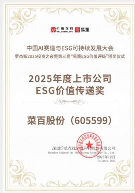

text_image

荣信在线
VALIDENLINE
易量
中国AI赛道与ESG可持续发展大会
罗杰斯2025投资之夜暨第三届“易量ESG价值评级”颁奖仪式
2025年度上市公司
ESG价值传递奖
菜百股份（605599）
深圳价值在线科技股份有限公司
Shenzhen ValiantStar Technology Co., Ltd.
2025年12月
December 2025

2025 年度上市公司  
ESG 价值传递奖

## 利益相关方沟通

利益相关方的信任与支持是公司可持续发展的重要基石。菜百股份始终秉承公开透明、双向互动、互利共赢的原则，建立覆盖全维度利益相关方的常态化沟通机制，充分听取各方诉求与建议，持续优化可持续发展管理举措，与各利益相关方携手共创长期价值。

<table><tr><td rowspan="2">利益相关方识别</td><td></td><td></td><td></td><td></td><td></td><td></td><td></td></tr><tr><td>股东与投资者</td><td>政府及监管机构</td><td>客户与消费者</td><td>员工</td><td>供应商</td><td>媒体</td><td>社区及社会公众</td></tr><tr><td>关注议题</td><td>ESG治理利益相关方沟通创新驱动产品安全与质量</td><td>商业道德与反腐倡廉尽职调查反不正当竞争ESG治理环境合规管理平等对待中小企业</td><td>产品质量与安全数据安全与客户隐私保护客户服务应对气候变化循环经济</td><td>科技伦理社会贡献员工雇佣</td><td>数据安全与客户隐私保护原材料和包装采购与使用平等对待中小企业供应链安全水资源利用能源利用</td><td>利益相关方沟通应对气候变化社会贡献</td><td>生态系统和生物多样性保护应对气候变化污染物排放废弃物管理乡村振兴社会贡献</td></tr><tr><td>沟通渠道</td><td>股东会定期报告投资者热线实地调研</td><td>政策培训信息披露监督检查</td><td>客户满意度调研官方网站线下门店</td><td>职工代表大会领导干部接待日面对面沟通走访慰问</td><td>供应商管理项目合作对接行业交流</td><td>新闻发布媒体采访官方新媒体平台</td><td>党员回社区报到公益项目开展志愿服务活动</td></tr><tr><td>回应措施</td><td>健全公司治理体系完善利益相关方沟通渠道提升信息披露透明度建立全流程风险管理机制</td><td>强化企业ESG与合规管理严格落实监管政策要求加强政企常态化沟通联动</td><td>完善产品质量与服务管理体系优化信息安全管理措施筑牢客户隐私安全防护防线</td><td>完善员工雇佣与晋升机制强化员工职业健康安全关怀健全薪酬福利保障体系</td><td>完善全周期供应链管理体系严格落实合规采购制度坚持平等合作阳光采购原则</td><td>及时公开披露企业信息主动回应媒体相关关切全面传递企业可持续发展理念</td><td>常态化开展社会公益与捐款持续开展志愿者服务全力支持乡村振兴建设</td></tr></table>

## 双重重要性议题矩阵

重要性议题评估是公司 ESG 战略制定与可持续发展管理的核心依据。菜百股份结合上交所监管要求、行业发展动态、企业经营实际与各利益相关方核心诉求，建立标准化的重要性议题识别、评估、更新全流程管理机制从“财务重要性”与“影响重要性”双维度开展双重重要性评估。精准识别对公司经营发展与利益相关方具有重大影响的重要性议题，为公司可持续发展战略落地、资源配置优化、管理举措升级提供科学支撑。

## 识别流程

## 性议题矩流程阶段

对标分析与议题初选

## 核心工作内容

对标国内外ESG监管标准、行业最佳实践、资本市场评级机构核心关注维度结合黄金珠宝行业特性与公司主营业务特点，初步筛选ESG重要性议题清单

利益相关方调研

全面调研各利益相关方关注的核心议题，充分收集各方诉求与建议，明确议题的影响重要性排序

管理层分析研讨

由公司董事会战略发展委员会牵头，组织管理层、核心业务部门负责人开展专题研讨，结合公司发展战略与经营实际，分析议题对公司财务表现的影响程度

双重重要性评估

从“财务重要性”与“影响重要性”两个维度，对初选议题开展量化评分与分级评估，明确议题的重要性等级，形成议题评估结果

议题矩阵构建与动态更新

基于双重重要性评估结果，构建重要性议题矩阵，明确核心重要性议题：结合监管政策更新、行业环境变化、公司业务发展，对议题清单开展年度动态更新与复盘优化

## 重要性议题矩阵图

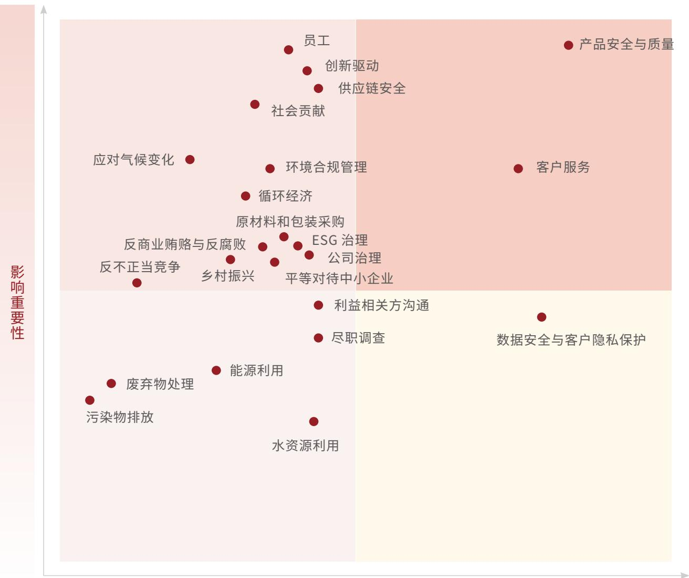

scatter

| Topic | X-axis Position (Relative) | Y-axis Position (Relative) |
| :--- | :--- | :--- |
| 产品安全与质量 | High | High |
| 员工 | Medium-High | High |
| 创新驱动 | Medium-High | High |
| 供应链安全 | Medium-High | High |
| 社会贡献 | Medium-High | High |
| 客户服务 | High | Medium-High |
| 应对气候变化 | Low-Medium | Medium-High |
| 环境合规管理 | Medium | Medium-High |
| 循环经济 | Medium | Medium |
| 原材料和包装采购 | Medium | Medium |
| ESG 治理 | Medium | Medium |
| 反商业贿赂与反腐败 | Low-Medium | Medium |
| 公司治理 | Medium | Medium |
| 平等对待中小企业 | Medium | Medium |
| 反不正当竞争 | Low-Medium | Medium |
| 乡村振兴 | Low-Medium | Medium |
| 利益相关方沟通 | Medium | Low-Medium |
| 尽职调查 | Medium | Low-Medium |
| 数据安全与客户隐私保护 | High | Low-Medium |
| 能源利用 | Low-Medium | Low-Medium |
| 废弃物处理 | Low-Medium | Low-Medium |
| 污染物排放 | Low-Medium | Low-Medium |
| 水资源利用 | Medium | Low-Medium |

财务重要性

## 同时具有财务重要性与影响重要性

产品安全与质量、客户服务

## 具有财务重要性但不具有影响重要性

数据安全与客户隐私保护

## 具有影响重要性但不具有财务重要性

应对气候变化、反商业贿赂与反腐败、乡村振兴、平等对待中小企业、反不正当竞争、创新驱动、供应链安全、员工、社会贡献、环境合规管理、循环经济、原材料和包装采购、ESG 治理、公司治理

## 既不具有财务重要性也不具有影响重要性

废弃物处理、污染物排放、能源利用、水资源利用、尽职调查、利益相关方沟通

text_image

菜百首饰·龙马精神足金转运珠
菜百首饰·午马足金转运珠

## 强基固本

## 夯实治理根基

公司持续完善公司治理体系，将可持续发展要求融入治理架构与经营管理全过程，形成由董事会统筹决策、管理层组织推进、各部门协同落实的运行机制。围绕规范运作与风险管控，公司不断健全内部控制与合规管理体系，强化重大事项决策与监督程序推动可持续发展相关影响、风险与机遇融入战略与经营决策。同时，公司持续提升信息披露质量与利益相关方沟通水平，夯实稳健发展的治理基础。

党建引领企业发展

完善治理规范运作

健全风控稳健运营

坚守底线诚信经营

规范信披强化沟通

菜百首饰·午马足金转运珠

## 党建引领企业发展

公司始终坚持和加强党的全面领导，以习近平新时代中国特色社会主义思想为指导，将党的领导融入公司治理与经营管理全过程各环节，充分发挥党委把方向、管大局、保落实的领导核心作用，以“红心聚力创领金彩党建品牌为核心抓手，推动党建工作与企业改革发展、生产经营、社会责任履行深度融合，以高质量党建引领企业高质量可持续发展，切实彰显国企使命担当。

## 筑牢政治根基

公司严格落实“党建进章程”要求，坚持和完善“双向进入、交叉任职”领导体制，严格执行“三重一大”党委前置研究决策程序，推动党组织在公司治理中的领导核心作用制度化、规范化、程序化，确保企业发展始终沿着正确政治方向前行。

公司始终把政治建设摆在首位，严格执行“第一议题”制度，全年组织党委理论学习中心组学习研讨14次将季度学习范围扩大至各支部委员，持续深化党的创新理论学习。扎实开展抗战胜利80周年相关服务保障工作常态化推进中央八项规定精神学习教育，将非党员于部纳入学习范围，推动重点学习内容覆盖全体职工。公司党委书记带头开展《新形势新阶段新任务一凝心聚力，奔赴高质量发展新征程》专题党课宣讲，推动党委委员全员进党课。严格落实“三会一课”制度，各支部坚持每月开展两次党员学习教育，并规范落实每月主题党日活动，推动党员教育常态化、制度化。通过参观抗日战争纪念馆、开展党建品牌创建、党建专项督导等活动，持续提升党员教育质效；自主研发上线“菜百智慧党建平台”，推动党员教育管理数字化、智能化升级。

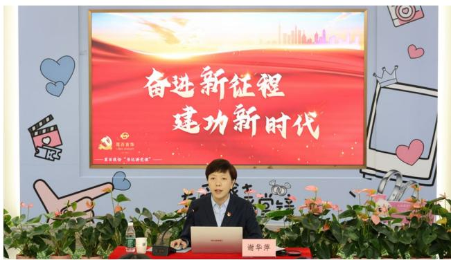

text_image

奋进新征程
建功新时代
谢华萍

党委书记、董事长谢华萍同志开展主题党课宣讲

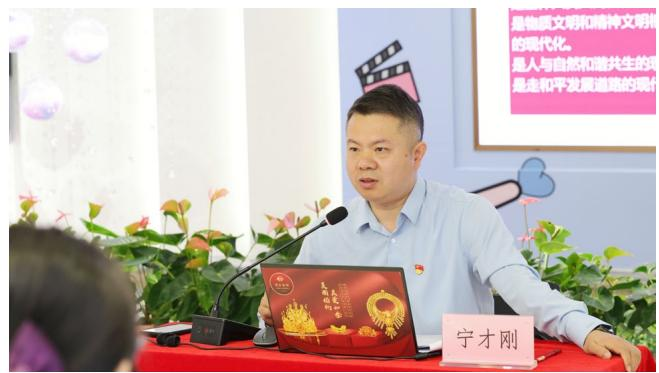

text_image

是物质文明和精神文明的现代化。
是人与自然和谐共生的现
是走和平发展道路的现代
宁才刚

党委副书记、总经理宁才刚同志开展主题党课宣讲

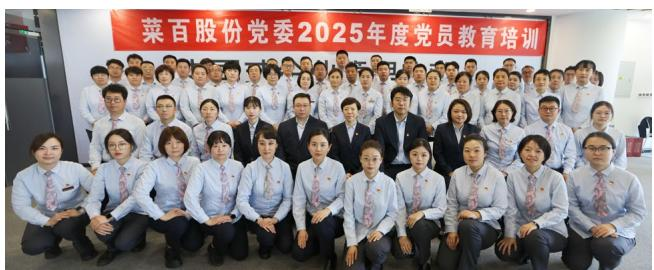

text_image

菜百股份党委2025年度党员教育培训

党员教育培训第一期

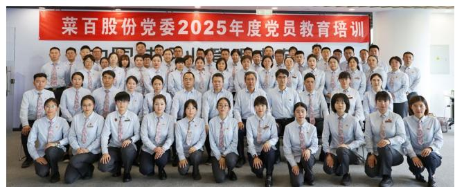

text_image

菜百股份党委2025年度党员教育培训

党员教育培训第二期

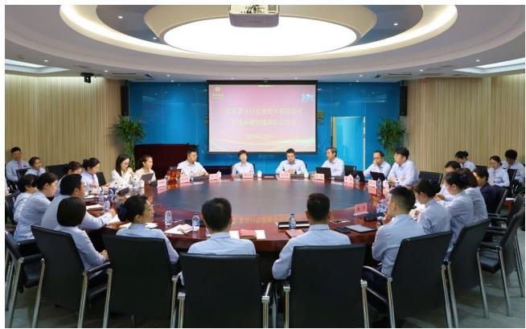

text_image

Meeting room photo with visible presentation screen showing Chinese text about a 2023 business meeting

党建品牌创建项目启动会

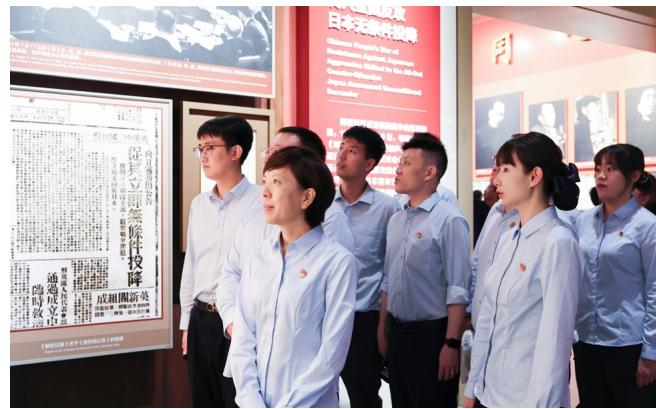

text_image

Group of people in uniform viewing a historical Japanese public notice board with text and diagrams, including a large red banner for the 'Japan's Natural History'.

参观抗日战争纪念馆

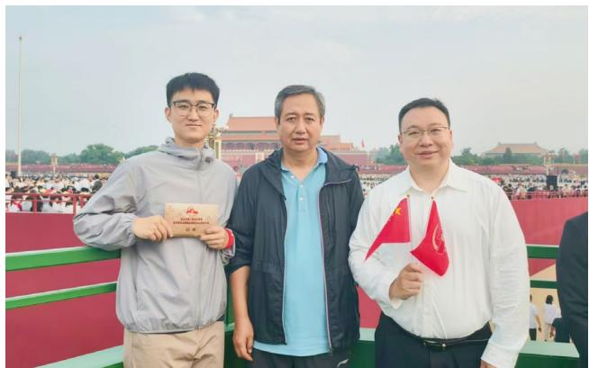

natural_image

Three men posing for a flag at an outdoor event, with Tiananmen Gate in the background (no visible text or symbols)

现场观礼九三阅兵

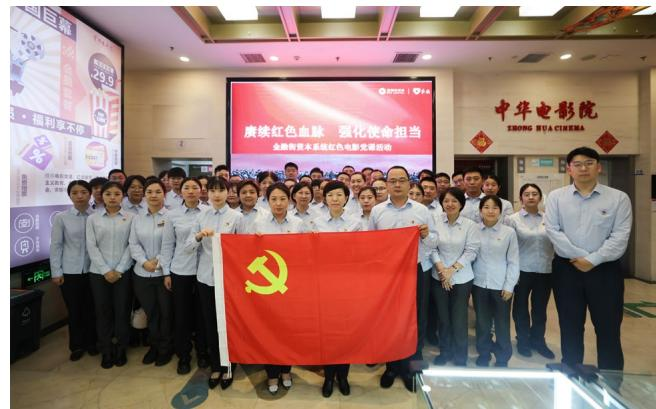

text_image

25.9
• 福利事不停
赓续红色血脉 强化使命担当
金融街资本市场系统红色电影党派活动
中华电影院
ZHONG HUA CINEMA

红色电影党课活动

公司持续夯实基层党组织建设，严格落实全面从严治党主体责任，牵头制定年度党建工作要点，组织班子成员签订全面从严治党责任书，常态化开展支部党建督导，鼓励支部开展特色党建活动，激发基层组织活力。

报告期内，公司党委及2个下属党支部获评中共北京金融街资本运营集团有限公司“先进基层党组织”，5名同志获评“优秀党务工作者”，15名同志获评“优秀共产党员”。

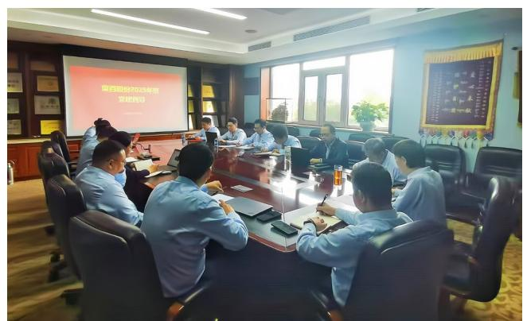

text_image

聚百联创2025评审
全球领导

党建督导

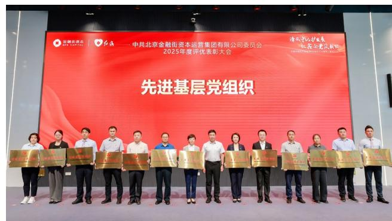

text_image

中共北京金融街资本运营集团有限公司委员会
2025年度评优表彰大会
先进基层党组织

荣获“先进基层党组织”

<table><tr><td>获奖名单</td><td>荣誉称号</td><td>颁奖单位</td></tr><tr><td>菜百股份党委</td><td>2025年度先进基层党组织</td><td>中共北京金融街资本运营集团有限公司委员会</td></tr><tr><td>第三党支部</td><td>2025年度先进基层党组织</td><td>中共北京金融街资本运营集团有限公司委员会</td></tr><tr><td>第四党支部</td><td>2025年度先进基层党组织</td><td>中共北京金融街资本运营集团有限公司委员会</td></tr><tr><td>连锁经营二部</td><td>2025年度奉献先锋集体</td><td>中共北京金融街资本运营集团有限公司委员会</td></tr><tr><td>菜百股份直播团队</td><td>2025年度聚力先锋集体</td><td>中共北京金融街资本运营集团有限公司委员会</td></tr><tr><td>数字化转型创新工作室</td><td>2025年度攻坚先锋集体</td><td>中共北京金融街资本运营集团有限公司委员会</td></tr><tr><td>党委副书记、工会主席陈捷</td><td>首都劳动奖章</td><td>北京市总工会、北京市人力资源和社会保障局</td></tr></table>

## 赋能经营发展

公司始终坚持“围绕经营抓党建、抓好党建促发展”工作理念，推动党建工作与生产经营同频共振，切实把党建优势转化为企业发展动能与竞争优势。在业务旺季、重点项目攻坚中，公司牵头组建“党员先锋队”，组织党员干部、团员青年下沉一线支援经营；在关键管理岗位、核心业务环节优先选拔党员担任负责人，推动党员于部既当经营发展的“排头兵”，又做党建工作的“宣传员”。

公司坚持党管于部、党管人才原则，将政治标准放在首位，严格执行选人用人各项规定，全年选拔聘任、于部轮岗共59人，新入职员工194人，其中研究生5人，覆盖宝石学、金融学等领域。持续加强干部队伍建设，积极引导并激励年轻于部“走出去”，投身市场开拓最前沿，在业务一线经风雨、见世面、长才于。深入实施“金色工程”人才培养战略，推进“金色纽带”中层梯队建设、“金色未来”潜能于部培养、“驻店培养”基层人才赋能三大项目，组建20个课题小组，由班子成员牵头开展实战研讨，对125名优秀干部和业务骨于进行重点培养，为企业可持续发展筑牢人才根基。公司坚持并深化干部下基层制度，推动管理干部深入一线、密切联系群众，在倾听心声、解决难题中锤炼务实作风。

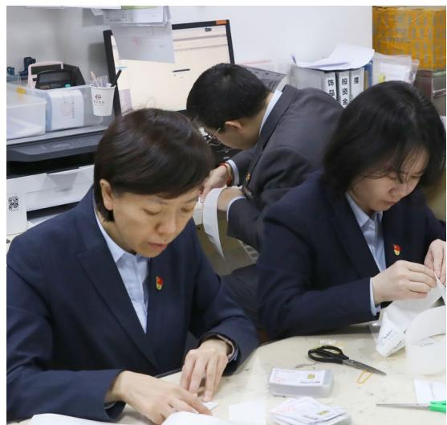

natural_image

Three women in business attire working at a desk, focused on handling documents and tools (no visible text or symbols)

“党员先锋队”下沉一线支援经营工作

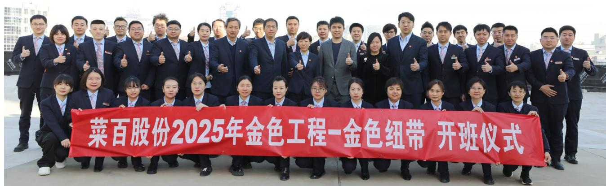

text_image

菜百股份2025年金色工程-金色纽带 开班仪式

“金色工程-金色纽带”开班仪式

## 坚守初心使命

公司持续深化党风廉政建设，不断完善监督执纪体系，报告期内设立专职纪委书记，对“三重一大”决策、于部选聘、工程项目等关键事项实施全程监督；优化纪检监察、审计监管、行政管理、群众监督、信息系统管控“五位一体”上下联动风险防控体系，重要节日节点下发廉洁自律工作通知，对180余名重点岗位人员实施证照专项管理，对3名新聘于部实施全流程监督。公司班子成员全年开展基层调研超百次，实现所有直营门店全覆盖，切实推动监督下沉、责任落地，营造风清气正的干事创业环境。

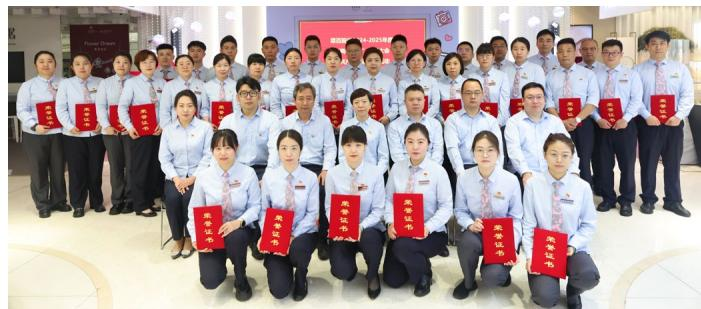

text_image

Group photo of staff in uniform holding red certificates, likely at a corporate event or award ceremony

“两优一先”表彰大会暨党员献爱心活动

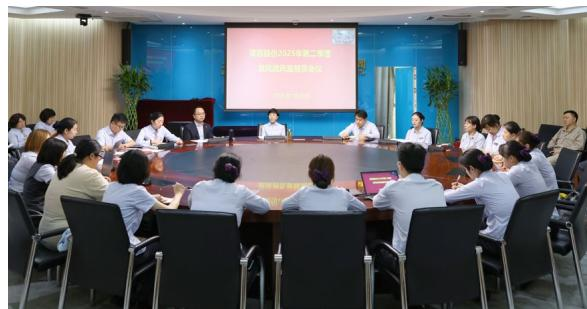

text_image

第四届2025年第二季度
风电场风能投资会议
2025年10月

党风政风监督员会议

## 完善治理规范运作

公司严格遵守《公司法》《证券法》等法律法规及监管要求，建立由股东会、董事会及其专门委员会构成的治理体系，权责划分清晰，决策与监督机制规范运行。报告期内，公司积极响应新修订《公司法》相关要求，优化治理结构安排，取消监事会，由董事会审计委员会依法承接相关监督职责，并选举产生新的独立董事及职工董事，持续完善公司治理架构。

公司以《公司章程》为基础，结合治理实践对制度体系进行修订完善，报告期内完成章程及配套制度20余项关键条款修订，进一步提升治理制度的适应性与规范性。同时，公司积极践行可持续发展理念，将ESG管理要求融入公司治理与日常经营，不断提升治理水平与市场形象，为公司稳健发展奠定基础。

公司治理架构  
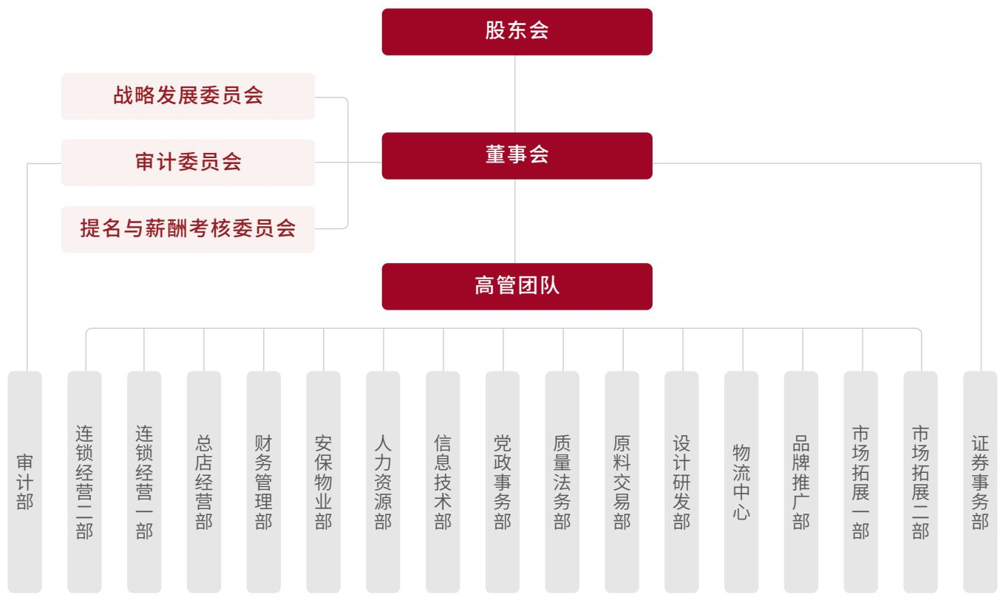

flowchart

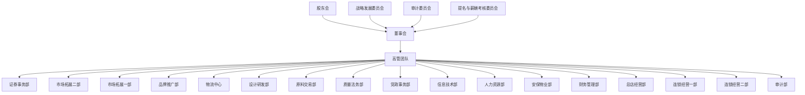
```mermaid
graph TD
  A["股东会"] --> B["董事会"]
  C["战略发展委员会"] --> B
  D["审计委员会"] --> B
  E["提名与薪酬考核委员会"] --> B
  B --> F["高管团队"]
  F --> G["证券事务部"]
  F --> H["市场拓展二部"]
  F --> I["市场拓展一部"]
  F --> J["品牌推广部"]
  F --> K["物流中心"]
  F --> L["设计研发部"]
  F --> M["原料交易部"]
  F --> N["质量法务部"]
  F --> O["党政事务部"]
  F --> P["信息技术部"]
  F --> Q["人力资源部"]
  F --> R["安保物业部"]
  F --> S["财务管理部"]
  F --> T["总店经营部"]
  F --> U["连锁经营一部"]
  F --> V["连锁经营二部"]
  F --> W["审计部"]
```

## 股东会规范履职

股东会作为公司最高权力机构，按照《股东会议事规则》规范运作，依法审议公司重大事项并作出决策，保障股东依法行使知情权、参与权和表决权维护全体股东特别是中小股东的合法权益。

## 报告期内

召开股东会 4 次，审议议案 24 项

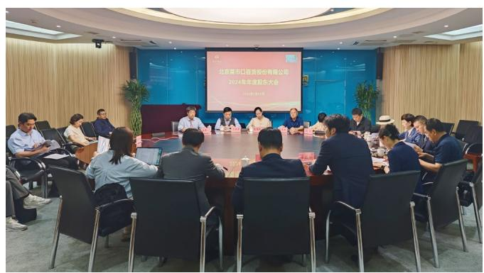

text_image

北京市口首置业股份有限公司
2024年年度股东大会

菜百股份2024年年度股东大会

## 董事会高效运作

董事会作为公司经营决策机构，依据《董事会议事规则》规范履职，负责公司发展战略制定及重大经营决策，对公司整体经营管理情况进行指导与监督。公司通过完善议事程序与决策机制，持续提升董事会运行的规范性与决策效率。

## 报告期内

召开董事会 7 次，审议议案 60 项

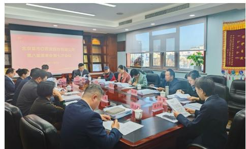

text_image

北京市白盲院股份有限公司
第八届董事会第七次会议

菜百股份第八届董事会第七次会议

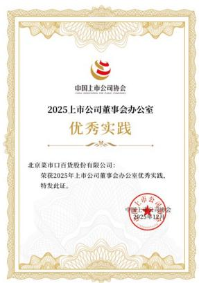

text_image

中国上市公司协会
2025上市公司董事会办公室
优秀实践
北京菜市口百货股份有限公司：
荣获2025年上市公司董事会办公室优秀实践，
特发此证。
中国上市公司协会
2025年12月

2025 年上市公司董事会办公室优秀实践

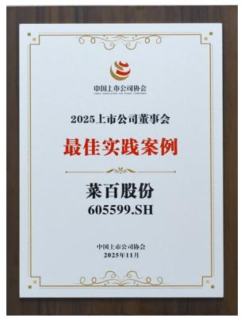

text_image

中国上市公司协会
2025上市公司董事会
最佳实践案例
菜百股份
605599.SH
中国上市公司协会
2025年11月

2025年上市公司董事会最佳实践案例

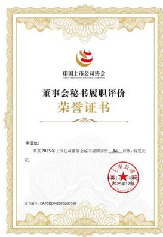

text_image

中国上市公司协会
CHINA STOCKHUA UNIVERSITY OF STOCKS
董事会秘书履职评价
荣誉证书

李雨法：
荣获2025年上市公司董事会秘书履职评价—4A__评级，特发此证。
上海市
福州市
2025年12月
证书编号：CAPCC0040025605599

2025 年上市公司董事会秘书履职评价4A评级

## 董事会多元化与独立性

公司持续优化董事会结构，强化独立董事履职机制，制定《独立董事工作制度》《独立董事专门会议制度》保障独立董事在重大事项决策中的独立意见表达与监督作用。公司关注并推进董事会成员在专业背景、行业经验及性别结构等方面的多元化配置，促进不同视角的有效融合，有助于提升决策的科学性与前瞻性。

## 关键绩效

公司董事会共 11 人  其中：女性董事 4 名，占比 36.36%

独立董事 4名，占比36.36%

报告期内，公司围绕公司治理、法律合规及行业发展等主题，组织开展董事及高级管理人员培训，持续提升履职能力与规范运作意识，推动治理要求在决策与经营管理中有效落实。

## 报告期内

训36 次

## 专门委员会专业支撑

公司董事会下设战略发展委员会、审计委员会及提名与薪酬考核委员会，并分别制定专门会议事规则。各专门委员会围绕公司战略规划财务与审计监督、董事及高级管理人员选聘与考核等事项开展专业研究与审议，为董事会科学决策提供支持。其中，审计委员会在承接原监事会监督职责的基础上，持续强化财务监督及内部控制审查功能，进一步提升公司治理的有效性。

## 报告期内，公司

战略委员会召开 1 次审计委员会召开 7 次

## 健全风控稳健运营

公司围绕规范运作与稳健经营要求，构建了涵盖合规管理、内部控制及风险管理的协同管理体系，通过制度建设、流程运行及持续监督相结合的方式，将相关管理要求嵌入日常经营活动，不断提升公司治理的规范性与区险防控能力。

## 合规与制度体系建设

公司以制度体系为基础推进合规管理，围绕法律法规及监管规则要求，持续完善内部控制与合规管理制度体系并以内控体系为支撑强化合规管理。公司对内部控制评价相关流程、职责及实施要求进行规范，持续提升制度体系的系统性与可执行性。

公司通过持续开展制度宣贯与培训，推动合规要求在业务环节中的有效落实。针对董事及高级管理人员，公司围绕监管政策与履职要求开展专项培训，强化“关键少数”的合规意识与责任意识：同时面向相关业务部门开展常态化培训与宣贯，提升员工对制度要求的理解与执行能力。

## 案例 以案为鉴筑防线，合规经营促发展

为深入推进企业合规体系建设，切实提升全员法律素养与合规经营能力，菜百股份紧扣 “强化法律意识，护航企业发展”主题，成功举办年度法律专题培训。本次活动特邀西城区人民检察院第二检察部专家授课，公司全体领导班子成员及各职能部门代表共计200余人参加学习。此次培训不仅是菜百股份落实法律合规管理要求的具体行动，更是推动法律合规思维融入企业经营决策全流程的重要步。未来，菜百股份将以年度合规建设规划为指引，持续完善法律合规制度体系，常态化开展形式多样的法律培训活动。

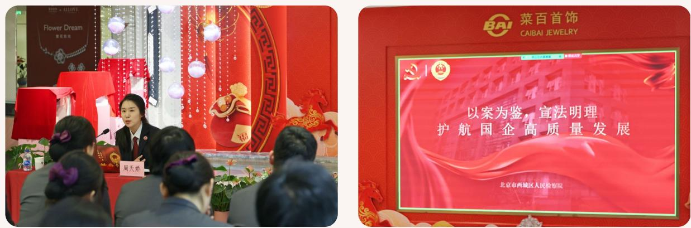  
法律专题培训

## 案例 开展法律培训，提升风险防范能力

2025年10月，公司围绕采购、销售、合同管理及纠纷处理等核心业务场景，组织开展专项法律培训，由质量法务部相关人员分批授课，覆盖线上线下近300名于部及员工。培训结合实际业务流程，对常见法律风险及合规要求进行进解与提示，强化员工在业务开展中的风险识别与规范操作意识。相关举措有助于提升员工依法合规开展业务的能力，推动合规要求在日常经营中的落实。

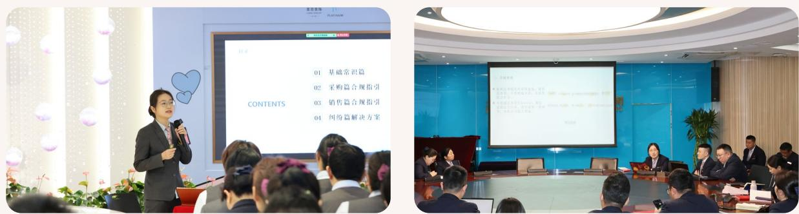  
专项法律培训

## 内部控制运行机制

公司依据《企业内部控制基本规范》《企业内部控制配套指引》及相关法律法规，结合经营实际，建立并持续完善内部控制体系，将内控要求嵌入日常经营管理。在此框架下，菜百电商子公司于2025年12月正式发布《内部控制手册》，聚售其采购、对账、物流等核心业务环节，推动电商子公司内控管理迈向标准化、规范化、系统化新阶段。

公司在董事会下设审计委员会，并设立审计部直接向董事会及审计委员会报告，保持独立性，负责内部控制的监督与评价工作。依据《内部审计工作制度》，持续对内部控制执行情况开展检查与评估。

围绕经营管理关键环节，公司不断完善控制措施，定期及不定期开展内部审计，覆盖财务、重大项目及其他业务活动，保障资产安全及信息披露的真实、准确与完整。同时，公司建立内部控制自我评价机制，并聘请外部审计机构对财务报告及内部控制进行审计，强化监督约束。

报告期内，公司内部控制运行有效，未发现财务报告及非财务报告相关的重大缺陷或重要缺陷。

## 案例 深化内控治理，护航稳健运营

2025年11月，公司组织开展了“企业内控管理经验”专题培训，邀请外部审计专家授课，以理论结合案例的方式，系统讲解了风险内控的核心概念、上市公司内控监管体系、业务流程内控实操指南及内部控制典型案例，并与学员深入交流研讨。此次培训是公司深化ESG治理体系建设的重要举措之一。通过强化风险内控意识与实操能力，进一步夯实了企业在公司治理层面的管理根基，有助于提升合规运营水平、防范经营风险、保障利益相关方权益，为持续推进企业稳健运营与可持续发展提供了有力支撑。

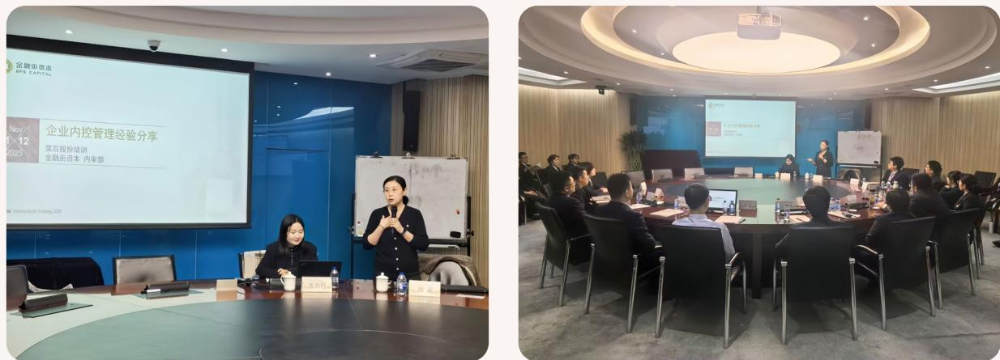  
“企业内控管理经验”专题培训

## 案例 健全电商子公司内控运行机制，筑牢稳健发展根基

2025年12月，菜百股份电商子公司成功召开内控手册发布暨宣贯大会。这标志着其内控建设已从制度建设层面向行为习惯与文化认同深化，初步形成了一套可操作、可检验、可持续的运营机制，为公司高质量发展夯实了管理根基。展望未来，电商子公司将以《内部控制手册》为抓手，持续强化全员合规意识，推动内控要求与业务流程深度融合，为菜百股份电商业务实现健康、持续、高质量发展保驾护航。

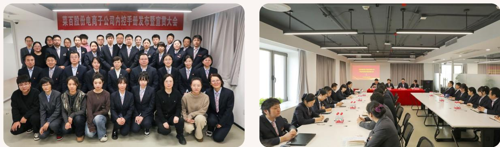  
菜百股份电商子公司内控手册发布暨宣贯大会

## 风险识别与管理机制

公司建立了覆盖风险识别评估及应对的风险管理机制，并依据企业标准《风险与机遇管理规范》开展相关工作，明确风险分类、识别流程及管理要求。在各业务部门设立风险管理责任人，围绕经营过程识别和收集潜在风险与机遇，形成《风险与机遇记录表》，并由审计部门进行汇总评估，形成公司层面的风险分析结果，定期向管理层及董事会报告。

针对识别出的各类风险，公司结合不同风险类型制定相应的应对措施，并通过持续跟踪与动态监测，推动风险应对措施的落实与优化，降低风险发生的可能性及其潜在影响。同时，公司将风险管理要求嵌入日常经营管理通过明确职责分工与流程设计，确保风险识别、报告及处置机制的有效运行。

公司通过多种方式提升风险管理水平，句括组织开展线上学习，现场培训及专题交流活动，支持员工参与专业培训与行业学习，不断增强风险识别与应对能力。同时，公司结合实际需要引入外部专业力量开展指导，提升对复杂经营环境下各类风险的识别与应对能力。

## 报告期内

公司未发生重大风险事项，相关问题已完成整改

## 坚守底线诚信经营

公司将诚信经营与廉洁从业作为规范运作的重要基础，围绕制度约束、监督机制与教育引导，构建覆盖事前防范、事中管控及事后问责的管理体系，推动廉洁要求嵌入公司治理与经营全过程。

## 廉洁管理

公司已形成以制度为基础、监督为支撑的廉洁管理体系。以《公司章程》确立的忠实与勤勉义务为根本要求明确董事及高级管理人员不得利用职权谋取不正当利益：以《内部控制基本制度》为总体框架，将合规经营要求纳入风险管理体系；同时，通过《内幕信息知情人登记管理制度》《关联交易管理制度》等制度，对利益冲突、内幕交易等关键风险设定行为边界。

围绕重点风险领域，公司细化廉洁从业管理要求，严格执行《菜百公司礼品、礼金管理要求》，对礼品礼金的登记、上交及处置流程进行规范，明确行为“红线”。在重要节假日前，向合作伙伴发出廉洁自律相关通知进一步强化外部交往中的合规约束，延伸廉洁管理边界。

公司依托董事会审计委员会及内部审计职能，对内部控制及廉洁风险实施独立监督，并通过重大信息内部报告机制强化风险预警。同时，通过责任追究制度，对违反信息披露及合规要求的行为进行问责，形成有效约束。

公司注重将廉洁要求与教育引导相结合，通过专题党课、警示教育、典型案例剖析等形式开展常态化教育。报告期内组织开展2次专题警示教育，实现对党员群体的全覆盖，并逐步向关键岗位员工延伸；同时由董事会秘书组织董事及高级管理人员开展法规培训，并特邀北京市嘉源律师事务所的专业律师，围绕证券监管规则及相关法律法规进行专题讲解，持续强化团队的履职能力与合规意识。

公司建立多渠道举报机制。畅通员工及相关方反映违规行为的途径，并对举报信息实行严格保密管理。举报电话设于公司党办，举报邮箱设置专门访问权限并采取密码保护措施。由专人负责接听电话及处理邮件，确保举报线索在传递与处理过程中的信息安全。公司明确举报受理、调查及反馈流程，对举报人身份信息进行分级管理与权限控制，严禁泄露举报人相关信息。同时，公司制定举报人保护措施，禁止任何形式的打击报复行为对相关情况进行持续跟踪与监督，切实保障举报人的合法权益。报告期内，公司未发生贿赂、贪污等重大违规事件。

## 举报电话

010-83520479

natural_image

Iconic graphic showing a telephone handset, envelope with warning symbol, and two red circular icons (no text or symbols)

## 邮箱

caibaijiwei@163.com

## 报告期内，公司

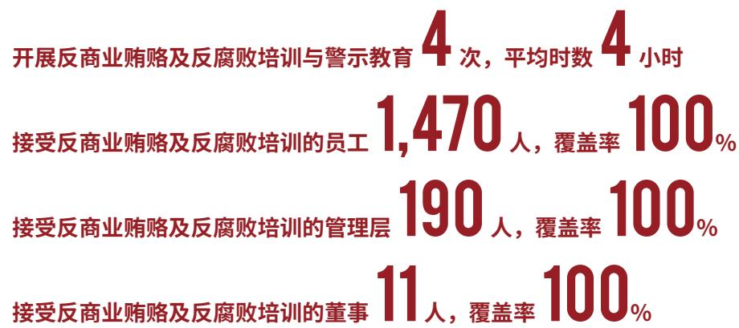

funnel

| 维度 | 数值 |
| --- | --- |
| 开展反商业贿赂及反腐败培训与警示教育 | 4次, 平均时数 4小时 |
| 接受反商业贿赂及反腐败培训的员工 | 1,470人, 覆盖率 100% |
| 接受反商业贿赂及反腐败培训的管理层 | 190人, 覆盖率 100% |
| 接受反商业贿赂及反腐败培训的董事 | 11人, 覆盖率 100% |

## 反垄断与公平竞争

公司持续规范市场经营行为，将公平竞争要求纳入制度管理与日常运营控制之中。通过完善内部管理制度及业务流程，对商品宣传、客户服务及业务合作等环节进行规范，防范虚假宣传、侵犯商业秘密等风险。报告期内公司未发生任何反垄断相关违规行为。

同时，公司结合消费者权益保护及相关法律法规要求，组织开展普法宣贯活动，不断提升员工在市场经营中的合规意识与风险识别能力，推动形成规范有序的市场竞争环境

## 目案例

## 强化反不正当竞争合规能力建设

菜百股份高度重视反不正当竞争合规能力建设，2025年1月，公司受邀参加《中华人民共和国反不正当竞争法（修订莫案）》意见征询座谈会，结合珠宝首饰行业经营实践，梳理了行业竞争格局与合规挑战，分享自身在反不正当竞争方面的合规管理实践，并针对法律修订提出多项贴合行业实际的意见建议，助力完善反不正当竞争法治体系。会后，公司将参会核心内容及法律修订导向转化为内部专项培训与合规宣贯材料，常态化开展合规教育，切实提升全体员工反不正当竞争法律意识与执行能力；同时，相关经验也为规范行业竞争秩序、优化公平竞争环境提供有益参考。

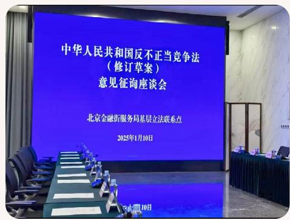

text_image

中华人民共和国反不正当竞争法
（修订草案）
意见征询座谈会
北京金融街服务局基层立法联系点
2025年1月10日

《中华人民共和国反不正当竞争法（修订草案）》意见征询座谈会

## 反洗钱管理

公司高度重视反洗钱相关工作，严格遵循《中华人民共和国反洗钱法》《贵金属和宝石从业机构反洗钱和反恐怖融资管理办法》等相关法律法规，结合黄金珠宝零售业务资金流动频繁的特点，持续完善制度体系与管理机制，防范经营中的合规与资金风险。公司制定《反洗钱内部控制制度》，明确反洗钱工作的基本原则、职责分工及操作要求，推动反洗钱工作规范运行。

公司设立反洗钱领导小组，由董事长任组长、总经理任副组长，负责反洗钱工作的统筹部署与监督管理。领导小组下设工作小组，负责日常管理及对外沟通协调，组织落实客户识别、交易监测及信息报送等具体工作，确保反洗钱管理在各业务环节有效执行。公司围绕门店销售、会员管理及资金收付等重点环节，持续加强交易行为监测与风险识别，规范客户信息采集与留存，提升异常交易识别的及时性与准确性。

公司开展反洗钱专题培训，开展日常反洗钱意识宣贯，强化员工对相关法律法规及内部制度的理解，提升一线人员风险识别能力与合规操作水平，推动各业务环节有效落实管理要求。同时，公司积极参与行业交流与监管沟通，不断提升反洗钱管理水平。

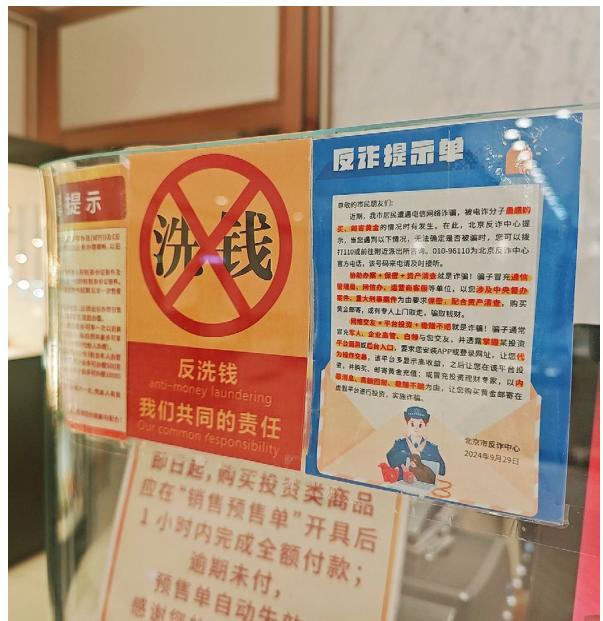

text_image

反洗钱
anti-money laundering
我们共同的责任
Our common responsibility

反正提示单
尊敬的市民志愿者：
近期，我市疫情防控电信网络协调，被电话分子最温暖的
微信公众号像实时采集。在此，北京反诈中心提
示，微信通过以下情况，平台确定是否最短时，您可以缓
打110或反洗钱所涉消费，010-98110为北京反诈中心
官方电话，该号码来电请及时接通。
协助客服：+微信+资产清查过程中需！骗子冒充通信
垃圾箱、购物办、巡查客服等单位，以及涉及中央督办
办理：重大事项作为由要求提前，配合资产清查，购买
秀会餐厅；还有个人上门购买，输配电材。
微信交友：+不支持您！@微信扫码登录终端！骗子通常
百大军人、企业高管、白领与网友，并邀请客服核实投资
平台是红色后补入口，需求您安装APP或登录网址，让您传
动到消息，请平台多显示收益，之后让您在遵守后台设
言，并购买，帮助消费者充值；假冒违反理财产品专家，以作
骗信息、风险防范、保险不能保全，让您购买黄金部门曾在
是最早进行投诉，实话诈骗。
北京市反诈中心
2024年9月29日

反洗钱明示

## 案例

## 参与行业培训强化反洗钱履职能力

2025年9月，公司组织相关岗位人员参加上海黄金交易所举办的反洗钱培训会议，围绕反洗钱法律法规修订要点、行业监管要求及义务履行开展专题学习，重点了解大额交易和可疑交易报告相关标准与操作要求。通过培训，相关人员对反洗钱政策及业务执行要点的理解进一步加深，风险识别与合规操作能力得到提升，为公司规范开展反洗钱工作提供了支撑。

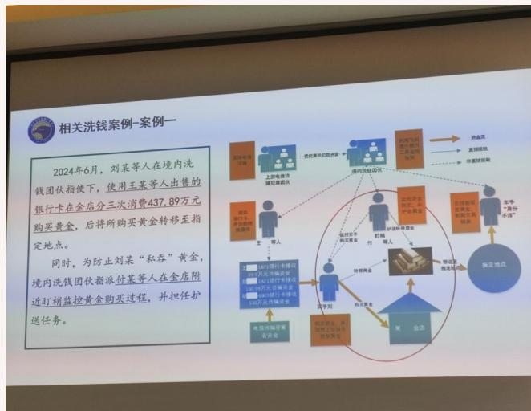

flowchart

This image illustrates the transaction process for a gold purchase in a bank, detailing steps from initial purchase to final sale and the subsequent distribution of funds.

反洗钱专题培训

报告期内，公司反洗钱管理运行平稳，相关工作获得行业及监管认可。

## 荣誉证书

北京菜市口百货股份有限公司：

荣获上海黄金交易所“2025年度优秀反洗钱工作单位”称号。特发此证，以兹鼓励。

上海黄金交易所2026年1月2日

荣获上海黄金交易所

“2025年度优秀反洗钱工作单位”

## 荣誉证书

李洋同志：

荣获上海黄金交易所“2025年度优秀反洗钱工作个人”称号。特发此证，以兹鼓励。

上海黄金交易所2026年1月2日

荣获上海黄金交易所

“2025年度优秀反洗钱工作个人”

## 规范信披强化沟通

公司高度重视资本市场沟通与股东价值管理工作，围绕信息披露、投资者关系管理及股东回报机制，持续完善相关制度与执行体系，提升公司治理透明度与市场认可度，促进公司长期价值稳步实现。

## 信息披露管理

公司严格按照《信息披露管理制度》等制度要求开展信息披露工作，依法履行上市公司信息披露义务，确保报露内容真实、准确、完整，简明清晰、通俗易懂。报告期内，公司持续优化信息披露流程，强化内部信息报送与审核机制，确保重大信息在规定时限内规范披露，避免选择性披露或信息不对称情况发生。

在具体执行方面，公司以定期报告和临时公告为核心载体，全面披露公司经营情况、财务状况及重大事项进展并通过规范的信息披露流程，保障各类投资者平等获取信息的权利。同时，公司注重信息披露的可读性与有效性，对重要事项进行必要的说明与解读，提升信息使用价值。

## 报告期内，公司

披露临时公告 52 份，定期报告 4 份

## 投资者关系管理

在规范信息披露的基础上，公司持续完善投资者关系管理体系，依据《投资者关系管理制度》，由董事会秘书统筹负责投资者沟通工作，建立多渠道、常态化的沟通机制，增强与投资者之间的互动与信任

公司通过业绩说明会、投资者调研、电话及邮件沟通、上证e互动平台等多种方式，与投资者保持持续交流围绕公司经营情况、发展战略及行业趋势等内容进行沟通，及时回应市场关切，促进信息对称。

报告期内，公司持续开展投资者交流活动，投资者主要就公司经营发展、战略规划及行业环境等方面与公司进行沟通，公司均通过规范渠道进行回应，保障沟通内容的一致性与合规性。

## 报告期内，公司

投资者回复率 100

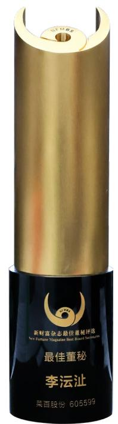

text_image

新财富杂志最佳董秘洋路
New Fortune Magazine Best Master Avenue
最佳董秘
李沄沚
架百股份 605599

新财富杂志最佳董秘奖

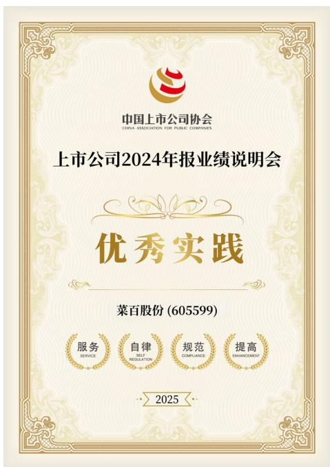

text_image

中国上市公司协会
CHINA ASSOCIATION FOR PUBLIC COMPANIES
上市公司2024年报业绩说明会
优秀实践
菜百股份 (605599)
服务
SERVICE
自律
SELF REGULATION
规范
COMPLIANCE
提高
ENHANCEMENT
2025

上市公司2024年报业绩说明会优秀实践

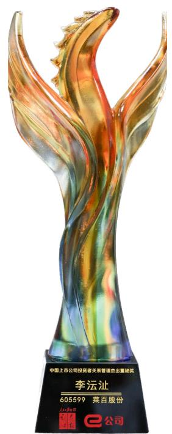

text_image

中国上市公司投资者关系管理杰出董秘奖
李沄沚
605599 菜百股份
e公司

第十六届天马奖- 中国上市公司投资者关系管理杰出董秘奖

## 股东回报与价值创造

公司结合经营业绩、资金状况及发展需求，依法制定利润分配方案并持续实施现金分红，推动股东共享经营成果

2021 年至 2024 年，公司现金分红占当年归属于母公司股东净利润的比例分别为 76.93%、 77.76%、 77.03%和77.89%，累计分红金额约17.42亿元。报告期内，公司延续以现金分红为主的利润分配方式，在保障经营发展所需资金的前提下，合理安排利润分配节奏。

<table><tr><td>指标名称</td><td>单位</td><td>2021年度</td><td>2022年度</td><td>2023年度</td><td>2024年度</td></tr><tr><td>现金分红总额(含税)</td><td>万元人民币</td><td>28,000.00</td><td>35,777.78</td><td>54,444.45</td><td>56,000.00</td></tr><tr><td>每10股派发现金股利</td><td>元人民币</td><td>3.60</td><td>4.60</td><td>7.00</td><td>7.20</td></tr></table>

## 平等对待中小股东

公司在公司治理与信息披露过程中坚持公平对待全体股东，重点从参与机制、信息获取及沟通渠道等方面保障中小股东权益。

在决策参与方面，公司依法规范召开股东会，对涉及中小股东利益的重要事项严格履行审议程序，并提供网络投票渠道，确保中小股东能够以便捷方式参与表决。在信息获取方面，公司通过定期报告、临时公告及上证6互动平台等渠道统一披露信息，避免信息差异带来的不公平情况。在沟通反馈方面，公司设置投资者热线、电子邮箱等渠道，及时回应中小投资者关注的问题，并在合规范围内进行说明与解答。

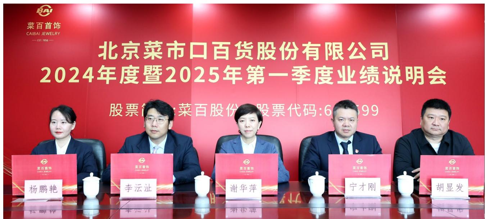

text_image

BAI
菜百首饰
CAIBAI JEWELRY
——EST 1956——
北京菜市口百货股份有限公司
2024年度暨2025年第一季度业绩说明会
股票简称:菜百股份 股票代码:600799
杨鹏艳
李沄沚
谢华萍
宁才刚
胡显发

菜百股份2024年度暨2025年第一季度业绩说明会

natural_image

Product display of gold jewelry including gourds, pearls, and a necklace on red pedestals (no text or symbols visible)

# 品质经营

# 打造信任品牌

公司以产品质量与客户需求为导向，持续完善覆盖产品全生命周期的管理体系。在产品与服务管理过程中，公司围绕质量控制供应链管理及售后服务等关键环节，建立规范化制度与流程，强化风险防控与过程管理，保障产品与服务的稳定可靠。同时，公司结合业务发展不断优化产品结构、深化服务能力，持续提升客户满意度与市场竞争力。

严控品质筑牢根基

用心服务提升体验

守护信息保障安全

创新驱动增强活力

知识产权护航品牌

规范采购协同发展

菜百传世·福禄长安系列

## 严控品质筑牢根基

## 治理

公司围绕黄金珠宝产品质量管理，持续强化高级管理层统筹与质量法务部的专业支撑，建立覆盖采购、检验、销售等环节的质量控制体系，将质量管理要求嵌入商品流转全过程。

围绕商品管理，公司始终坚守“以质取胜、诚信经营”的产品管理理念，形成“源头把控、过程管控、终端严检、常态监督”的管理机制，对工艺外观、商品印记、质量证明及商品重量等关键要素进行核验，并通过提货检验、柜台检验、上货检验及销售前核验等流程，实现全过程质量控制

公司制定《不合格商品管理规范》《黄金珠宝类商品退换货服务规范》等相关管理制度，对不合格商品处理及质量控制流程进行规范。同时，公司执行严于国家标准的内部质量要求，并通过第三方检测机构开展检测，保障商品质量的真实性与一致性。

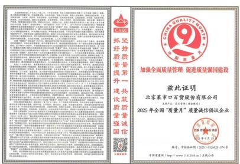

text_image

2021年全国“质量月”质量诚信倡议企业
加强全面质量管理 促进质量强国建设
兹此证明
北京莱市口百货股份有限公司
（盖章）：北京莱市口百货股份有限公司
2025年全国“质量月”质量诚信倡议企业
编号：中冶财通（2023）0403-574号
中国证券报（http://www.cninfo.com.cn）及公司

2025年全国“质量月”  
质量诚信倡议企业

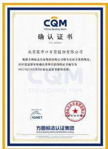  
2025年质量管理体系证书

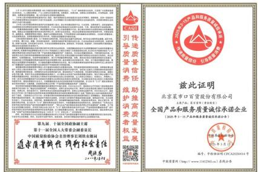

text_image

2020年1月16日北京科技集团质量管理体系认证
中国质量认证协会
中国质量认证委员会质量管理体系认证中心
第十一届全国质量评审团
北京莱士顿（集团）股份有限公司
（A.）
（B.）
（C.）
（D.）
（E.）
（F.）
（G.）
（H.）
（I.）
（J.）
（K.）
（L.）
（M.）
（N.）
（O.）
（P.）
（Q.）
（R.）
（S.）
（T.）
（U.）
（V.）
（W.）
（X.）
（Y.）
（Z.）
（AB.）
（AC.）
（AD.）
（AE.）
（AF.）
（AG.）
（AH.）
（AI.）
（AJ.）
（AK.）
（AL.）
（AM.）
（AN.）
（ABN.）
（ABN.）
（ABN+ACN+ACN+ACN+ACN+ACN+ACN+ACN+ACN+ACN+ACN+ACN+ACN+ACN+ACN+ACN+ACN+ACN+ACN+ACN+ACN+ACN+ACN+ACN+ACN+ACN+ACN+ACN+ACN+ACN+ACN+ACN+ACN+ACN+AC
国药集团
中国药品监督管理委员会
国家食品药品监督管理委员会
中国药品监督管理委员会质量管理体系认证中心
国药集团
中国药品监督管理委员会质量管理体系认证中心
国药集团
中国药品监督管理委员会质量管理体系认证中心
国药集团
中国药品监督管理委员会质量管理体系认证中心
国药集团
中国药品监督管理委员会质量管理体系认证中心
国药集团
中国药品监督管理委员会质量管理体系认证中心
国药集团
中国药品监督管理委员会质量管理体系认证中心
国药集团
中国药品监督管理委员会质量管理体系认证中心
国药集团
中国药品监督管理委员会质量管理体系认证
国药集团
中国药品监督管理委员会质量管理体系认证
国药集团
中国药品监督管理委员会质量管理体系认证
国药集团
中国药品监督管理委员会质量管理体系认证
国药集团
中国药品监督管理委员会质量管理体系认证
国药集团
中国药品监督管理委员会质量管理体系认证
国药集团
中国药品监督管理委员会质量管理体系认证
国药集团
中国药品监督管理委员会质量管理体系认证
国药集团
中国药品监督管理委员会质量管理体系认证
国药集团股份有限公司
(2020年)《产品标准要求》

全国产品和服务质量  
诚信承诺企业

战略

<table><tr><td>风险名称</td><td>具体描述</td><td>影响时间</td><td>应对措施</td></tr><tr><td>产品质量偏差风险</td><td>原材料或加工环节控制不到位可能导致产品质量不达标,引发退换货及客户投诉,增加赔付成本并影响销售收入</td><td>短期、中期</td><td>强化供应商准入与管理,落实来料检验及全过程质量控制</td></tr><tr><td>检测与标识不规范风险</td><td>商品标签、证书信息不准确可能引发消费者纠纷及监管处罚,带来罚款支出并影响产品销售</td><td>短期</td><td>规范标签及证书管理,强化质量审核与培训</td></tr><tr><td>供应链质量波动风险</td><td>上游供应质量不稳定可能导致采购波动及库存损耗,增加采购成本并压缩毛利空间</td><td>中期、长期</td><td>建立稳定供应体系,开展供应商评价与动态管理</td></tr></table>

<table><tr><td>机遇名称</td><td>具体描述</td><td>影响时间</td><td>应对措施</td></tr><tr><td>质量管控能力提升</td><td>通过完善质量管理体系与检验机制,降低质量问题发生率,减少退换货次数并提升客户复购率,带动收入增长</td><td>中期、长期</td><td>持续优化检验机制与质量管理体系</td></tr><tr><td>标准体系建设</td><td>推动质量管理标准化与流程规范化,有助于提升运营效率,降低管理成本并改善利润水平</td><td>中期、长期</td><td>推动标准体系中各项标准落地执行</td></tr><tr><td>品牌信任提升</td><td>稳定的产品质量增强消费者信任,增强客户粘性、提升品牌口碑,促进销售增长</td><td>中期、长期</td><td>提升质量透明度与产品可靠性</td></tr></table>

## 产品质量全生命周期管控

在产品质量管理方面，公司围绕黄金珠宝产品特点，构建覆盖原材料采购、供应商管理、生产加工、质量检验入库出库及销售等环节的全过程质量管控体系，将质量控制嵌入业务流程各关键节点。通过明确质量标准、强化过程控制及完善检验检测机制，公司实现对产品质量的全链条管理与动态监控，确保产品质量稳定可靠、来源可溯。

在此基础上，公司结合业务实际，梳理形成质量管理关键控制环节，对各环节实施分级管控与标准化执行，持续提升质量管理的系统性与有效性。

质量管理七环节

<table><tr><td>01</td><td>作为上海黄金交易所会员,采购标准金,从源头把关产品质量</td></tr><tr><td>02</td><td>在严于国家及行业黄金珠宝首饰相关标准的基础上,制定“菜百首饰”质量标准</td></tr><tr><td>03</td><td>根据《供方管理规范》对供应商实施动态管理与优胜劣汰,并严格按照“菜百首饰”质量标准组织生产,保障产品质量</td></tr><tr><td>04</td><td>针对黄金、铂金饰品,严格按珠宝行业各类标准进行控制,确保产品质量符合标准</td></tr><tr><td>05</td><td>对每一件加工完成的黄金珠宝首饰,均通过国家认可检测机构进行第三方检测,并确保检测合格后上柜销售</td></tr><tr><td>06</td><td>所有商品均需经过外部检验、入库检验、提货检验等多道检验机制</td></tr><tr><td>07</td><td>对每件首饰实施系统化管理,实现从原料到成品、从生产到销售的全过程追溯与控制</td></tr></table>

## 案例 构建全流程质量管控体系，提升产品质量稳定性

2025 年，公司围绕生产加工与成品出货环节，建立覆盖全流程的质量管控体系，由产品质量管理部门及相关业务部门协同推进。公司严格执行首饰质量标准，对成品实施外观100%全检，并对每批次出货商品开展抽样检查，检测项目涵盖贵金属含量及有害元素等破坏性检测内容；同时对非深圳区域供应商及产品实施全覆盖抽检。通过完善质检记录与追溯机制，并规范商品标识、价签及证书信息，实现关键数据标准化管理，有效提升产品质量一致性与可追溯水平。

公司建立多层级、常态化的质量监督机制。营业员对责任区商品实行每月100%全覆盖自查，确保账实一致及商品状态可控；各门店及相关部门定期开展交叉互查，强化内部监督与问题识别；同时，结合库存情况开展常态化抽检，重点核查商品质量、证书有效性及防护规范。通过自查、互查与抽检相结合的方式，公司持续强化质量管控执行力度，推动质量管理要求在各环节有效落实。

公司建立月度存货审计监盘体系，实现对终端、后台、线上等关键部门的全面覆盖。通过严格核实存货的数量、质量与价值，保障资产安全与数据准确，结合业绩与风险维度，动态调整监盘重点，前瞻性防范库存管理风险驱动存货管理效能持续提升。

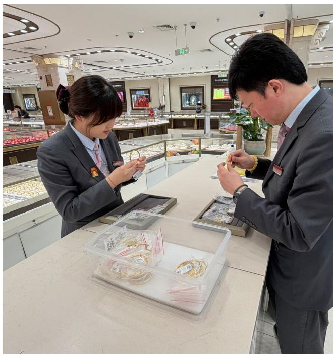

natural_image

Two business professionals in a jewelry store examining jewelry items, with display cases and signage visible (no readable text on main subjects)

产品交叉互查

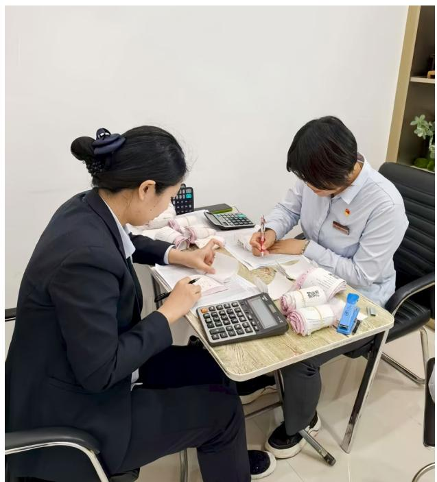

natural_image

Two women in business attire reviewing documents at a table, no visible text or symbols

月度存货监盘

公司围绕产品质量管理要求，持续强化员工规范认知与管理体系运行，通过专业培训、内部审核及外部审核相结合的方式，推动质量标准在业务中的有效落实，并对质量管理体系运行情况进行检验与优化

## 案例 开展“3·15”质量培训，强化产品规范认知

2025年3月，公司开展“3:15”产品质量专题讲座，邀请国家珠宝玉石质量检验检测中心专家对产品标签标识及相关规范进行讲解，覆盖公司各部门及连锁分店员工共计353人。培训围绕首饰命名规则、价签标注要求及常见质量问题展开，结合实际案例进行分析，提升员工对产品标识及质量要求的理解。相关培训为规范商品信息管理及提升产品合规性提供了支持。

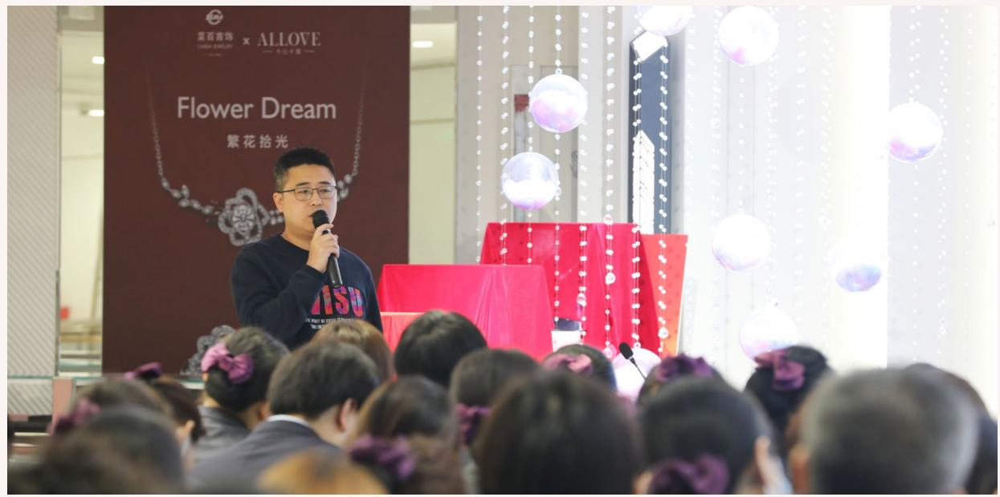

text_image

菜百首饰
CHINA BROWN FOR
× ALLOVE
——中心十第——
Flower Dream
繁花拾光

“3·15”产品质量专题讲座

## 案例 开展内部审核，检验质量管理体系运行情况

2025年3月，北京菜百电子商务有限公司开展年度首次内部审核工作，对质量管理体系的运行情况进行全面评估。审核围绕体系执行、流程规范及持续改进等内容展开，对关键业务环节进行检查与验证。作为质量体系试运行后的首次系统性评估，本次内审有助于识别体系运行中的问题与改进空间，推动质量管理机制持续优化，提升服务与运营的规范性。

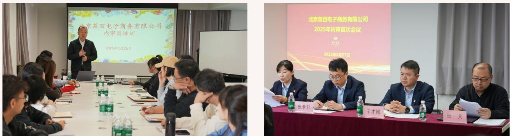  
电商子公司开展年度内审工作

## 影响、风险和机遇管理

公司围绕产品质量管理，将相关风险纳入统一的风险管控体系，依据《风险与机遇管理规范》对质量风险进行识别、分类与评估，明确风险类型及其对经营活动的潜在影响。结合业务实际，公司将质量风险与市场风险操作风险等一并纳入日常管理范围，提升风险识别的系统性与全面性。

在风险监测与评估过程中，公司依托商品检测、抽检及日常检查机制，对产品质量状况进行持续跟踪，并通过记录与分析相关数据，识别质量管理中的关键问题及薄弱环节。

针对识别出的质量风险，公司通过完善供应商管理、强化内部控制及提升员工专业能力等方式开展针对性应对对已发生问题，通过内部流程进行反馈、追溯与整改，并结合原因分析持续优化检验标准与管理流程，降低同类问题重复发生的可能性。公司建立产品缺陷识别与召回管理机制，当发现产品存在系统性缺陷或潜在安全区险时，及时启动风险处置程序，包括暂停销售、信息披露、通知相关方及实施召回或整改措施，确保风险得到有效控制并减少对消费者的影响。

公司将风险管理与质量管理体系相结合，通过制度建设与标准化运行不断提升风险应对能力，将潜在风险转化为改进管理与优化流程的契机，促进产品质量水平与经营稳健性的持续提升。

## 指标与目标

## 报告期内，

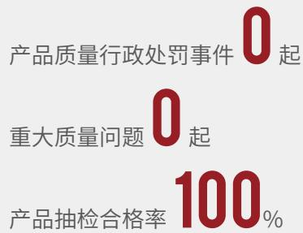

text_image

产品质量行政处罚事件 0 起
重大质量问题 0 起
产品抽检合格率 100%

内部商品有损检测

## 全部合格

外部全国市监商品抽检

## 全部合格

未发生产品召回事件

text_image

小心触电
43
北京菜百黄金珠宝博物馆
银鲤蓝花池
小心触电

## 用心服务提升体验

## 治理

公司建立涵盖客户服务、权益保护及售后管理的制度体系，由高级管理人员统筹，总店经营部及各连锁大区协同推进相关工作，依据《营业员服务规范》《首饰清洗服务规范》《投诉处理服务规范》《顾客回访服务规范等制度，对服务流程及执行标准进行规范。同时，通过服务过程监测及标准化管理，对服务执行情况进行持续跟踪与管控。

战略

<table><tr><td>风险名称</td><td>具体描述</td><td>影响时间</td><td>应对措施</td></tr><tr><td>服务质量不稳定风险</td><td>服务标准执行不到位可能影响客户体验,导致客户流失并降低销售收入,同时增加投诉处理成本</td><td>短期</td><td>加强员工培训与服务规范执行</td></tr><tr><td>投诉处理不及时风险</td><td>客户诉求响应不及时可能引发纠纷升级,导致额外的客诉处理资源消耗,增加赔付支出并对销售转化产生负面影响</td><td>短期</td><td>完善投诉处理流程,提升响应效率</td></tr><tr><td>客户需求识别不足风险</td><td>对客户偏好与需求把握不足,可能导致营销与服务匹配度下降,影响转化率并增加营销成本</td><td>中期、长期</td><td>完善客户反馈与满意度调研机制</td></tr><tr><td>机遇名称</td><td>具体描述</td><td>影响时间</td><td>应对措施</td></tr><tr><td>客户体验提升</td><td>通过优化服务流程与互动体验,提升客户满意度与客单价,促进复购并带动收入增长</td><td>中期、长期</td><td>优化服务流程与场景化体验</td></tr><tr><td>多渠道服务体系完善</td><td>打通线上线下服务渠道,提升客户触达与转化效率,促进销售增长</td><td>中期、长期</td><td>推进线上线下融合服务</td></tr><tr><td>品牌口碑提升</td><td>良好的服务体验带来正向评价与口碑传播,降低获客成本并提升收入稳定性</td><td>中期、长期</td><td>提升服务一致性与客户满意度</td></tr></table>

## 服务管理体系与能力建设

公司坚持“心比金纯”的服务理念，推出涵盖售前、售中、售后的33项服务承诺，围绕客户需求构建覆盖售前顾问售中陪伴及售后增值的服务体系，形成标准化、可追溯的服务流程管理机制。通过明确咨询受理、需求响应产品交付、问题处理及结果反馈等关键环节，确保服务过程清晰、职责明确、衔接顺畅。

菜百股份服务流程图  
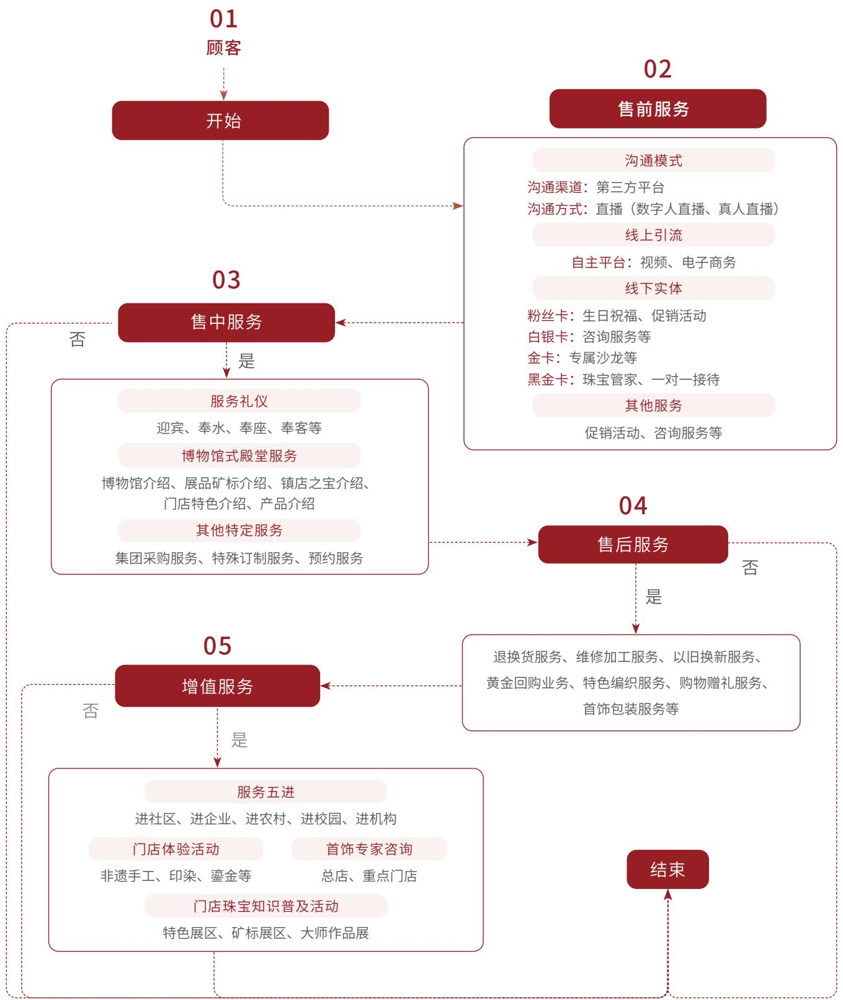

flowchart

```mermaid
graph TD
  Start["01\n顾客"] --> A["开始"]
  A --> B["售前服务"]
  A --> C["售中服务"]
  C --> D{"否"}
  C --> E{"是"}
  
  subgraph Pre_Service ["售前服务"]
    direction TB
    F1["沟通模式"]
    F2["沟通渠道：第三方平台"]
    F3["沟通方式：直播（数字人直播、真人直播）"]
    F4["线上引流"]
    F5["自主平台：视频、电子商务"]
    F6["线下实体"]
    F7["粉丝卡：生日祝福、促销活动"]
    F8["白银卡：咨询服务等"]
    F9["金卡：专属沙龙等"]
    F10["黑金卡：珠宝管家、一对一接待"]
    F11["其他服务"]
    F12["促销活动、咨询服务等"]
  end
  
  subgraph Mid_Service ["售中服务"]
    direction TB
    G1["服务礼仪"]
    G2["迎宾、奉水、奉座、奉客等"]
    G3["博物馆式殿堂服务"]
    G4["博物馆介绍、展品矿标介绍、镇店之宝介绍、门店特色介绍、产品介绍"]
    G5["其他特定服务"]
    G6["集团采购服务、特殊订制服务、预约服务"]
  end
  
  subgraph Post_Service ["售后服务"]
    direction TB
    P1["售后服务"]
    P2["退换货服务、维修加工服务、以旧换新服务、黄金回购业务、特色编织服务、购物赠礼服务、首饰包装服务等"]
  end
  
  subgraph Value_Service ["增值服务"]
    direction TB
    V1["增值服务"]
    V2["服务五进"]
    V3["进社区、进企业、进农村、进校园、进机构"]
    V4["门店体验活动"]
    V5["非遗手工、印染、鎏金等"]
    V6["首饰专家咨询"]
    V7["总店、重点门店"]
    V8["门店珠宝知识普及活动"]
    V9["特色展区、矿标展区、大师作品展"]
  end
  
  C -.-> G1
  C -.-> G2
  C -.-> G3
  C -.-> G4
  C -.-> G5
  C -.-> G6
  
  P1 -->|"否"| EndNode
  P2 -->|"是"| EndNode
  
  V1 -->|"否"| EndNode
  V1 -->|"是"| EndNode
  
  V2 -->|"否"| EndNode
  V2 -->|"是"| EndNode
  
  EndNode --> Finish["结束"]
```

依托《营业员服务规范》等制度要求，公司推动陪伴式服务在一线落地执行，并通过持续培训与实操演练提升员工专业能力与服务水平。

## 案例 以驻店实战赋能，锻造高品质终端服务体系

公司深入推进门店定制化落地支持项目，以精准适配单店需求为核心，通过驻店实战带教等方式，系统提升终端服务与销售能力。采用“理论+演练”实战模式，强化服务与销售流程的系统衔接，同步沉淀形成《终端销售赋能实战手册》，为门店提供可复制、可落地的标准化工具。通过持续提升门店运营效率与人员专业水平，构建系统化终端能力建设体系，驱动服务品质与销售业绩双提升，为品牌高质量发展筑牢一线根基。

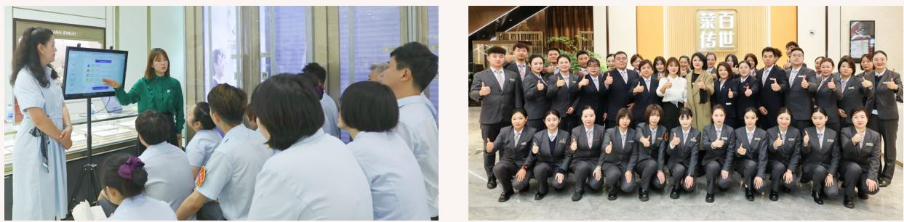  
驻店专项赋能项目

通过门店沙龙，顾客互动及多样化服务活动，公司持续了解客户需求，提升顾客参与感与休验感。在此基础上公司通过流程化管理与日常监测机制，不断优化服务执行效果，提升服务响应效率与整体服务体验。

## 案例 优化线上服务流程，保障消费者权益

2025年，菜百电商子公司客服部在日常服务中针对消费者线上换货流程不熟悉的问题，提供全流程指导与跟进服务。某消费者在购买首饰后提出换货需求，但对申请流程、寄回要求及售后保障存在疑问，多次咨询。客服人员在沟通过程中耐心解答相关问题，并对换货流程进行逐步说明，协助消费者完成申请、寄回及验收等环节。最终，消费者顺利完成换货并收到符合预期的商品。相关服务有效提升了消费者对售后流程的理解与信任，保障了消费者合法权益。

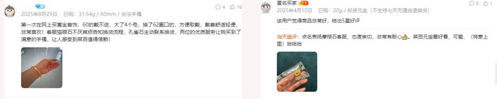

text_image

2025年8月29日 | 已购：31.54g / 60mm / 古法手镯
第一次在网上买黄金首饰，60的戴不进，大了4个号，换了62圈口的，方便取戴，戴着舒适轻便，
非常喜欢！客服猫眼石不厌其烦告知换货流程，孔雀石主动联系换货，两位的优质服务让我买到了
满意的手镯，让人感受到菜百值得信赖！
匿名买家
2025年4月10日 | 已购：20g / 投资元宝（不支持七天无理由退换货）
该用户觉得商品非常好，给出5量好评
当天追评：点名表扬摩根石客服、态度亲切、非常有耐心。菜百元宝最好看、可爱、（特意上
图）哈哈哈

菜百电商子公司消费者权益保护

报告期内，公司收获了众多表扬信与锦旗，顾客认可度、满意度持续提升。

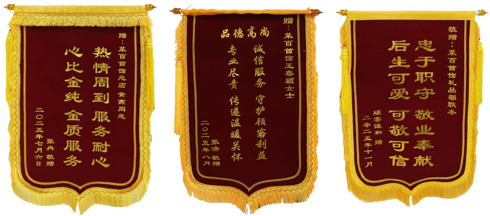  
获得顾客赠予的锦旗

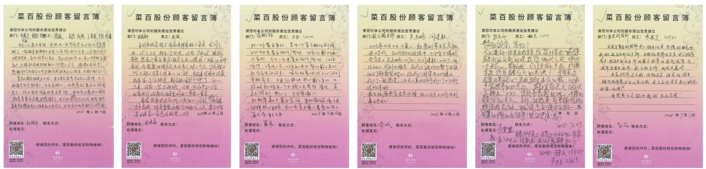  
获得顾客表扬信

## 投诉与反馈

公司建立覆盖受理、处理与反馈的客户投诉管理机制，制定《投诉处理服务规范》，配套《顾客投诉明细登记表》等工具，明确投诉分类、处理时限及责任分工，确保问题处理规范、有序推进。公司设立专门部门统筹客户诉求响应，通过门店电话、官方网站、官方公众号及第三方平台等渠道受理客户反馈，各门店每日对线上评价信息进行查看与处理，保障客户诉求及时响应

## 客户投诉管理举措

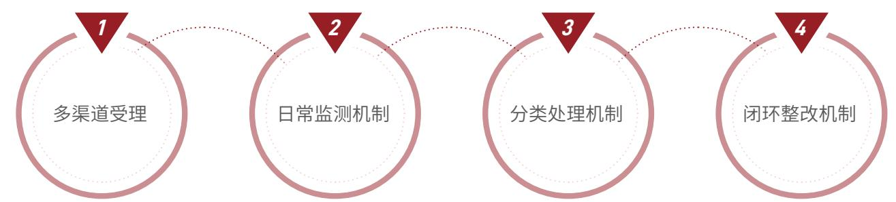

flowchart

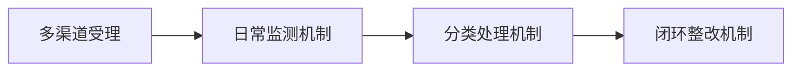
```mermaid
graph LR
  A["多渠道受理"] --> B["日常监测机制"]
  B --> C["分类处理机制"]
  C --> D["闭环整改机制"]
```

门店电话、官网、公众号及第三方平台同步开放

门店每日查看并按制度要求及时处理线上反馈信息

商品和服务投诉分别对应处理流程

问题纳入考核并推动责任部门整改

## 客户投诉处理流程

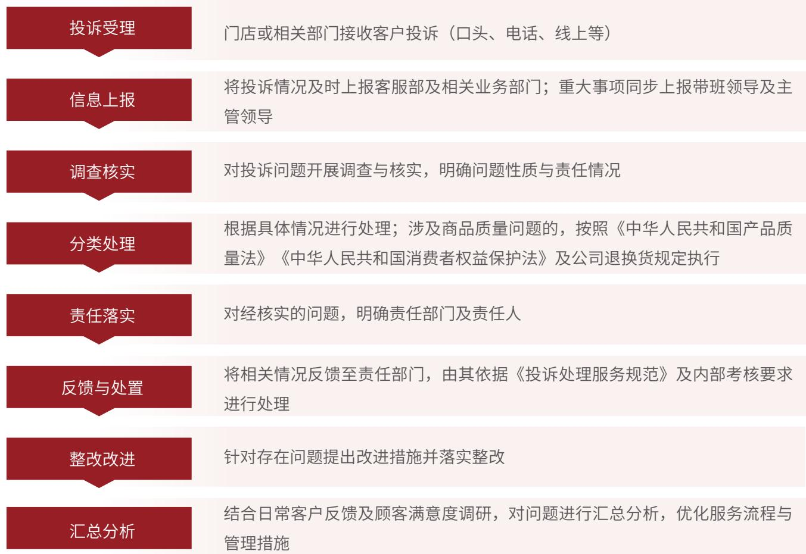

flowchart

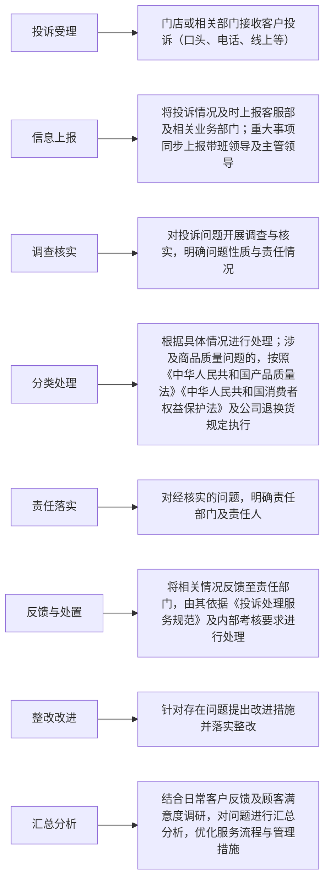
```mermaid
graph LR
  A["投诉受理"] --> B["门店或相关部门接收客户投诉（口头、电话、线上等）"]
  C["信息上报"] --> D["将投诉情况及时上报客服部及相关业务部门；重大事项同步上报带班领导及主管领导"]
  E["调查核实"] --> F["对投诉问题开展调查与核实，明确问题性质与责任情况"]
  G["分类处理"] --> H["根据具体情况进行处理；涉及商品质量问题的，按照《中华人民共和国产品质量法》《中华人民共和国消费者权益保护法》及公司退换货规定执行"]
  I["责任落实"] --> J["对经核实的问题，明确责任部门及责任人"]
  K["反馈与处置"] --> L["将相关情况反馈至责任部门，由其依据《投诉处理服务规范》及内部考核要求进行处理"]
  M["整改改进"] --> N["针对存在问题提出改进措施并落实整改"]
  O["汇总分析"] --> P["结合日常客户反馈及顾客满意度调研，对问题进行汇总分析，优化服务流程与管理措施"]
```

## 产品可及性

公司通过多场景服务与渠道延伸提升服务可及性。依托“北京菜百黄金珠宝博物馆”，将产品展示、文化传播与消费体验深度融合，打造集参观、讲解与购物于一体的特色服务场景，并通过不同主题陈列及专业讲解服务，增强顾客对黄金珠宝及传统文化价值的认知。在此基础上，公司结合非遗技艺展示与体验活动，丰富到店互动形式，推动服务由单一销售向“文化体验+消费”转变。同时，公司通过门店空间升级及“臻新计划”推动陈列优化与服务标准落地，持续提升到店体验质量。

## 案例 开展大师作品展，打造文化消费体验场景

2025年4月，公司在总店举办“菜百与大师同行—中华玉都玉石雕刻大师亲工作品展”，集中展示多位玉雕大师作品，涵盖多类玉石工艺品。活动依托门店与博物馆空间，融合产品展示与文化讲解，为顾客提供沉浸式观赏与消费体验。相关举措将黄金珠宝产品与传统文化传播相结合，提升了顾客对玉文化及产品价值的认知。

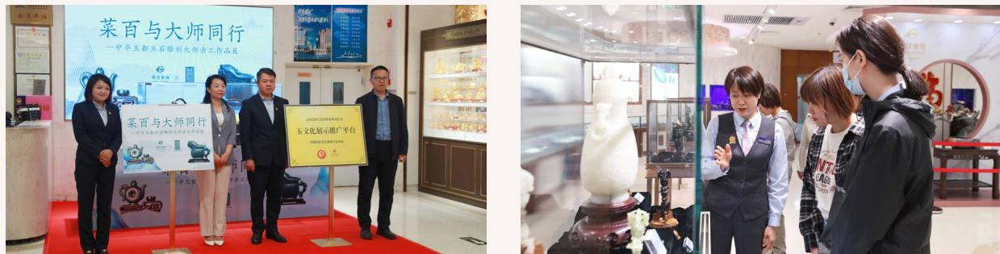  
菜百与大师同行—中华玉都玉石雕刻大师亲工作品展

## 案例 开展非遗体验活动，增强互动与服务体验

2025年2月，公司开展非遗文化体验活动，通过点翠工艺发簪制作及竹编画手作体验等形式，邀请专业讲师进行现场讲解与指导。顾客在参与制作过程中，加深了对传统工艺及珠宝文化的理解，同时提升了到店互动体验。相关活动将产品展示、文化传播与顾客参与相结合，增强了服务体验的参与感与趣味性。

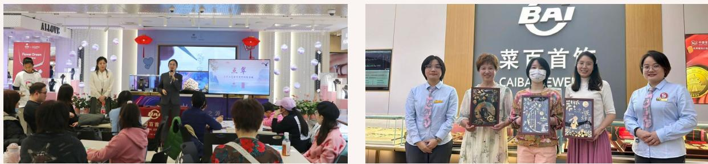  
非遗文化体验活动

同时，公司持续开展“服务进社区、进企业、进农村、进校园、进机构”等活动。将首饰清洗、保养及科普服务延伸至多类场景，2025年累计开展相关活动900余场，服务近万人。在服务过程中，公司关注不同客群需求，为特殊群体提供针对性服务支持，提升服务的可达性与便利性。

## 案例 开展“服务五进”活动，拓展服务触达边界

2025年，菜百股份围绕便民服务与文化传播，持续开展“服务五进”志愿服务活动。公司根据社区、企业、校园等不同场景特点，提供贴近实际需求的服务内容，并通过规范服务流程与统一服务标准，保障服务质量与体验一致性。活动过程中，员工以专业服务与现场互动提升顾客参与感，使服务从门店延伸至多元场景，增强客户获得感与便利性。

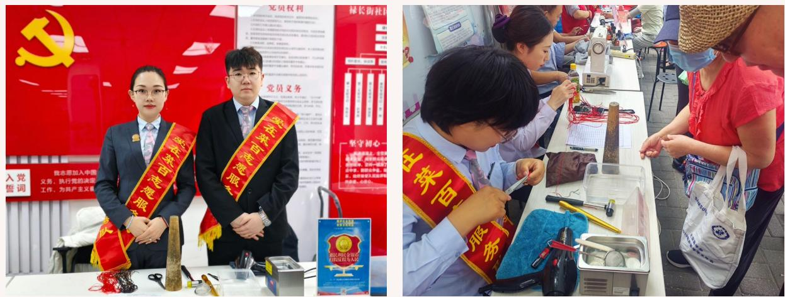  
菜百股份志愿服务活动

## 负责任营销

公司在产品销售过程中保持信息透明与价格公开。贵金属产品价格根据市场情况动态调整，与市场价格保持联动：商品均通过检测并由国家认证检测机构出具质量证明文件，确保产品信息真实可靠。

同时，公司在产品宣传中坚持客观、审慎原则，依据国家相关标准对产品信息进行规范标注，对产品性能及特性进行真实说明，不使用夸大或未经科学验证的表述，避免对消费者形成误导。公司通过黄金珠宝知识宣传及文化传播活动，引导消费者理性认知产品属性，提升消费决策的透明度与合理性。

## 客户运营与营销协同

菜百股份始终围绕客户需求变化，持续推进客户运营与服务能力的协同提升。

2025年，公司积极拓展高品质消费场景，旗下规模最大的直营连锁门店菜百首饰祥云店盛大开业。门店通过空间场景与文化体验的深度融合，推动服务从产品销售向文化价值延伸，进一步增强了客户对品牌的情感联结与文化认同，成为公司深化“商文旅+”融合发展、创新客户运营与营销协同的重要实践。

此外，公司持续完善会员等级与权益体系，全年新增会员21.3万名，通过分层运营增强客户黏性，并结合促销活动、消费券项目等举措促进消费转化。在此基础上，公司通过多平台内容传播与用户互动，持续扩大品牌触达范围；同时推进门店空间优化、动线调整及员工服务培训，带动客户体验与服务匹配度同步提升。

## 案例 深化“商文旅+”融合发展，满足客户多元需求

2025年4月19日，菜百首饰祥云店于中粮·祥云小镇隆重开业。作为全国范围内规模最大的直营连锁门店，这座1.675平方米的旗舰空间以“黄金珠宝与文化共生”为核心理念，创新升级总店“馆店结合”模式，构筑集“博物展陈、匠心设计、定制服务与艺术体验”四位一体的文化消费新场域。作为公司深化“商文旅+”融合发展的重要实践，门店通过构建可感知、可交互、可收藏的文化消费新范式，将产品与服务深度融入场景体验，不仅丰富了顾客的购物旅程，也持续强化了品牌认同与情感联结，实现品牌价值与客户运营的双向赋能与协同增长。

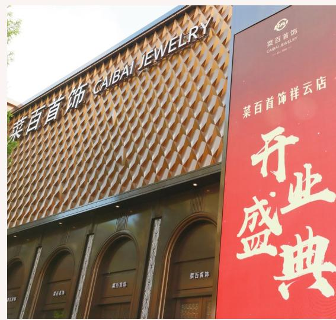

text_image

菜百首饰 CAIBAI JEWELRY
菜百首饰
CAIBAI JEWELRY
菜百首饰祥云店
开业典

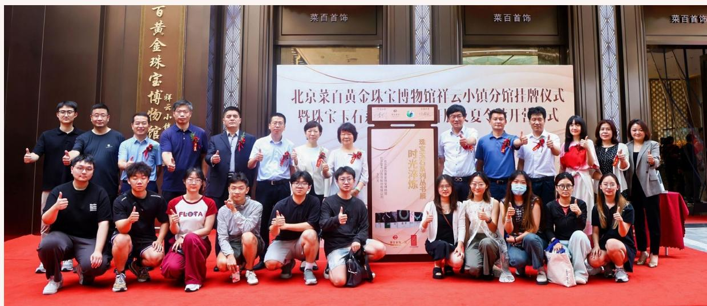

text_image

百黄金珠宝博物馆
菜百首饰
菜百首饰
菜百首饰
北京菜百黄金珠宝博物馆祥云小镇分馆挂牌仪式
暨珠宝玉石展
时光淬炼
珠宝玉石系列丛书展

菜百首饰祥云店

## 案例 优化消费场景与服务分层，提升客户体验

2025年，公司围绕不同客群需求，对门店空间与产品布局进行优化升级。在总店二层打造“菜百典藏”，通过独立空间及专属服务提升高净值客户的消费体验；同时对黄金品类动线进行整合优化，提升顾客选购效率与品类认知清晰度。相关举措有效改善门店消费环境，增强客户停留时长与消费体验，促进产品销售转化。

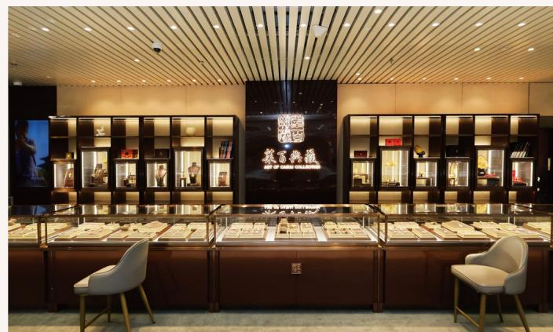

natural_image

Interior of a jewelry store with display cases and signage, featuring wooden shelves and matching furniture (no readable text on main subjects)

“菜百典藏”

## 案例 以场景体验重塑客户运营，赋能品牌年轻化战略

2025年5月，大吉巷菜百首饰店在西城区中海大吉巷购物中心隆重开业，作为公司子品牌菜百传世2.0升级版的首次亮相，大吉巷店以国潮古法工艺为核心、融合现代审美与场景体验，全面升级空间形象、产品结构与服务体验，集中呈现菜百传世在文化表达、匠心工艺、时尚设计上的最新成果，进一步强化多品牌矩阵的差异化定位。大吉巷店的开业是以子品牌迭代创新为突破口，推动品牌年轻化、场景化体验化升级，充分彰显菜百股份深耕文化赋能、优化渠道生态、提升品牌价值的战略定力，标志着公司在子品牌建设、门店形态创新、区域市场深耕方面取得关键突破、迈上新台阶，为文商旅体展深度融合与高质量发展注入新动能。

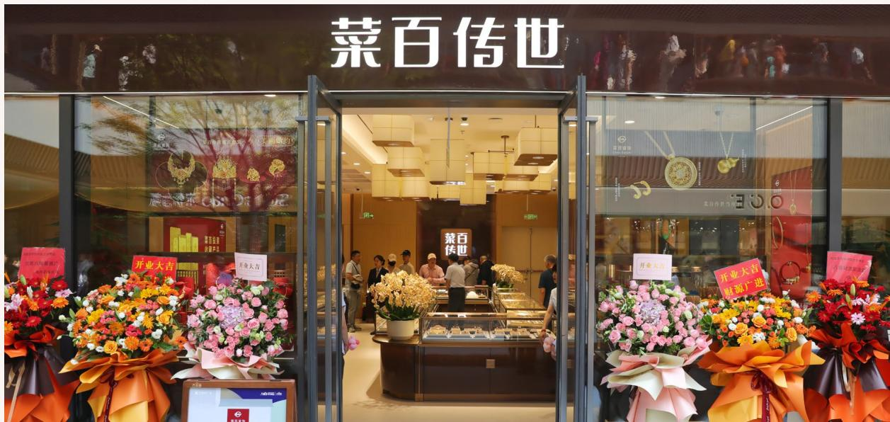

text_image

菜百传世
菜百传世
开业大吉
开业大吉
开业大吉
开业大吉
开业大吉
开业大吉
开业大吉
开业大吉
开业大吉
开业大吉
开业大吉
开业大吉
开业大吉
开业大吉
开业大吉
开业大吉
开业大吉
开业大吉
开业大吉
开业大吉
开业大吉
开业大吉
开业大吉
开业大吉
开业大吉
开业大古
开业大古
开业大古
开业大古
开业大古
开业大古
开业大古
开业大古
开业大古
开业大古
开业大古
开业大古
开业大古
开业大古
开业大古
开业大古
开业大古
开业大古
开业大古
开业大古
开业大古
开业大古
开业大古
开业大古
开业大古

大吉巷菜百首饰店

## 案例

## 完善会员体系与服务培训，提升客户粘性

2025年，公司持续完善会员体系，实施差异化服务与权益配置，增强客户互动与复购意愿。同时，通过“服务礼仪阳光操”“观博望语”“臻新计划”等培训与活动，强化员工服务规范及专业能力，提升服务致性与文化传播能力。相关举措推动服务体验持续优化，增强客户对品牌的认同感。

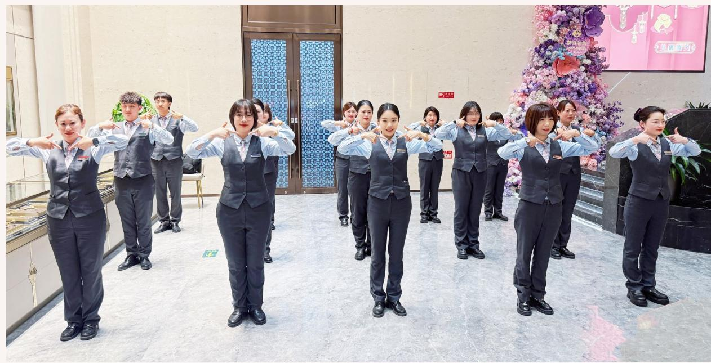

natural_image

Group of uniformed staff performing synchronized gestures in a modern indoor lobby with floral decorations (no visible text or symbols)

服务礼仪阳光操

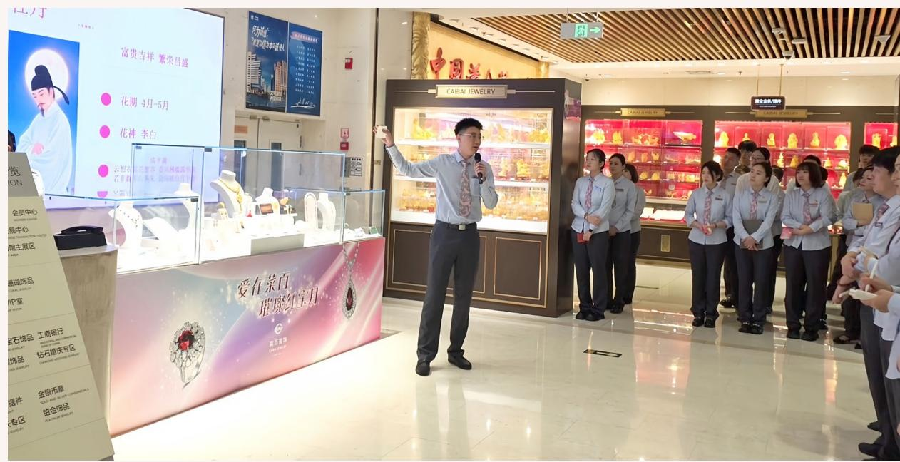

text_image

富贵吉祥 聚荣昌盛
花期 4月-5月
花神 李白
云想花
若不鲜
爱在茶白
璀璨红字月
中国光人社
CARBAI JEWELRY
金风证券 珠海证券
金风证券 珠海证券
金风证券 珠海证券
金风证券 珠海证券
金风证券 珠海证券
金风证券 珠海证券
金风证券 珠海证券
金风证券 珠海证券
金风证券 珠海证券
金风证券 珠海证券
金风证券 珠海证券
金风证券 珠海证券

观博望语

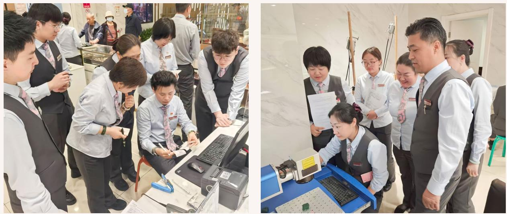  
臻新计划

## 影响、风险和机遇管理

公司围绕客户需求与服务质量管理，建立由信息收集。分析评估及改进落实构成的识别与管理机制。通过门店反馈、线上评价及投诉受理等渠道，持续获取客户在产品与服务过程中的问题与意见；同时，通过问卷调查及顾客访谈等方式开展满意度调研，并将第三方平台评价数据纳入分析范围，提升信息获取的全面性。

公司对收集的客户反馈及调研结果进行分类整理。识别服务流程、产品质量及客户体验中的关键问题，并评估其对客户满意度及业务运营的影响程度，作为改进依据。公司将识别出的重点问题反馈至相关部门，推动服务流程优化及管理措施调整，并结合客户回访及日常反馈信息，对服务流程进行持续优化与调整。针对投诉及高频问题，结合处理过程中的问题分析，持续完善服务响应机制，减少重复性问题发生。同时，公司推进客户管理系统建设，探索线上线下协同服务模式，提升客户管理效率与服务响应能力。

## 指标与目标

## 报告期内，

公司总店及各直营连锁门店的客户满意度均保持在 96% 以上

客户投诉解决率 100% %

## 守护信息保障安全

## 治理

公司将数据安全与客户隐私保护全面纳入公司整体治理框架与内控管理体系，在董事会统一领导下，由审计委员会履行监督职责，对数据安全与隐私保护相关内控制度的有效性、执行情况及合规管理工作开展常态化监督、专项审计与风险核查，审计部独立行使内部审计职能，直接向董事会、审计委员会报告相关重大事项。管理层统筹推进数据安全与隐私保护战略落地与日常运营管理，明确信息技术部为核心执行牵头部门，联动质量法务部、总店及连锁经营部、人力资源部、证券事务部等相关部门，划定各环节权责边界，建立跨部门协同联动的管理机制，确保数据安全管理要求覆盖原料采购、产品销售、会员服务、线上运营等全业务流程。

公司严格遵循《中华人民共和国网络安全法》《中华人民共和国数据安全法》《中华人民共和国个人信息保护法》等法律法规及监管要求，结合黄金珠宝行业经营特性与数字化转型发展需求，持续完善数据安全与隐私保护制度体系，制定并修订《菜百公司信息系统密码管理规定》《菜百公司网络运维管理指导规定》《信息保密规范》《网络安全事件应急预案》等专项制度文件，规范数据采集、传输、存储、使用、销毁全生命周期管理流程同步建立权限分级管控、合规性前置评审、全流程审计、责任追究等配套管理机制

## 战略

公司紧扣数智化转型核心发展战略，将数据安全与客户隐私保护作为数字化运营、全渠道业务拓展的核心底座结合黄金珠宝行业大额交易高频、会员信息敏感、线上线下业务融合的行业特性，系统识别数据安全领域的区险与机遇。公司以安全合规为前提，一方面通过技术架构升级、防护体系完善防范潜在经营风险，降低合规成本与意外损失；另一方面以合规数据应用赋能精细化运营，挖掘客户需求价值，提升品牌信任度与市场竞争力，实现安全防护与经营发展的双向赋能。

<table><tr><td>风险名称</td><td>具体描述</td><td>影响时间</td><td>应对措施</td></tr><tr><td>数据泄露风险</td><td>引发监管处罚、客户流失,造成营收下滑,大幅增加合规与品牌修复成本</td><td>短期、长期</td><td>搭建分级加密体系,7×24小时监测预警,定期攻防演练,严控数据访问权限</td></tr><tr><td>系统中断风险</td><td>导致交易停滞、营收损失,增加售后与客户维护成本,损害品牌信誉</td><td>短期</td><td>核心设备双机热备,定期开展应急演练,建立全流程运维巡检机制</td></tr><tr><td>合规处罚风险</td><td>触发监管罚款、业务整改,增加整改成本,影响资本市场信誉与融资成本</td><td>中期、长期</td><td>动态跟踪监管政策,定期开展合规自查,新业务上线前置合规评审</td></tr><tr><td>网络攻击风险</td><td>导致系统瘫痪、数据窃取,造成直接经济损失,大幅提升应急处置成本</td><td>短期、长期</td><td>升级国产化安全架构,部署入侵防御系统,建立闭环应急处置机制</td></tr></table>

<table><tr><td>机遇名称</td><td>具体描述</td><td>影响时间</td><td>应对措施</td></tr><tr><td>国产化降本机遇</td><td>降低海外技术依赖与授权成本,减少运维投入,实现长期运营成本下降</td><td>中期、长期</td><td>推进设备国产化替代,搭建自主可控架构,培养内部技术运维团队</td></tr><tr><td>数据赋能营收机遇</td><td>合规挖掘客户需求,实现精准营销,提升会员复购率与客单价,带动营收增长</td><td>中期、长期</td><td>上线合规CRM系统,搭建会员全景画像,严格管控数据使用审批流程</td></tr><tr><td>安全壁垒构建机遇</td><td>形成差异化竞争优势,降低合作准入门槛,提升行业话语权,巩固市场地位</td><td>长期</td><td>完善安全管理体系,参与行业标准制定,输出行业领先实践经验</td></tr><tr><td>合规信任增值机遇</td><td>提升品牌公信力与客户粘性,扩大市场份额,增强品牌溢价能力</td><td>中期、长期</td><td>公开隐私保护实践,强化全流程合规管控,持续优化客户服务体验</td></tr></table>

在技术防护体系建设方面，公司持续升级“三地一云”架构，建成行业领先的国产化高性能数字基座，形成万兆交换机与千兆以太网交换机协同高效的数据网络，实现总店数据中心、电商机房与异地灾备中心的数据双活与热备容灾，为线上线下大额交易业务提供稳定可靠的技术支撑。报告期内，公司完成核心网络安全设备全面升级，采用国产新华三SD-WAN技术构建安全可信的数据传输环境，通过加密隧道实现端到端通道加密结合严格的身份认证、策略隔离、行为审计与防泄露机制，实现数据传输全流程可管可控可追溯，全方位保障客户数据与交易信息安全

## 案例 2025年度安全设备升级及网络切换应急演练

公司组织开展2025年度安全设备升级及网络切换专项演练，覆盖核心业务系统、交易链路、灾备中心全场景，全面检验设备升级后的系统稳定性、应急响应速度与灾备切换能力。演练全程模拟真实故障场景，完成核心网络设备切换、异地机房容灾接管、运营商网络冗余设计以筑牢网络安全防线，实现业务系统无中断恢复等核心工作，切换过程中业务零中断、数据零丢失，全面验证了国产化安全架构的可靠性与应急处置体系的有效性，进一步提升了公司应对网络故障、系统宕机等突发事件的能力，最大限度降低突发故障带来的运营风险。

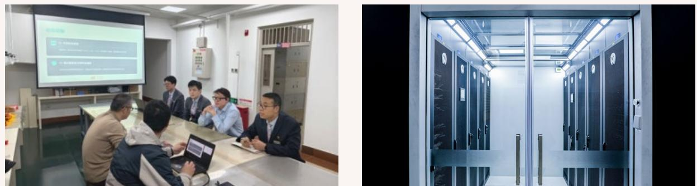  
2025年度安全设备升级及网络切换演练

在应急管理体系建设方面，公司制定了覆盖网络攻击、数据泄露、系统故障、网络中断等全场景的专项应急预案。针对春节、国庆等销售旺季，公司制定专项保障方案与应急预案，实行 7×24 小时值班值守制度；每年常态化开展数据恢复演练、网络故障演练、异地机房切换演练、网络攻击应急演练等多场景专项演练，全面检验应急响应流程、团队处置能力与系统容灾能力，确保突发风险事件能够快速响应、高效处置，最大限度降低事件造成的经济损失与品牌影响。

## 影响、风险和机遇管理

公司建立了标准化、全流程的风险与机遇识别、评估、管控管理机制，确保数据安全与客户隐私保护相关风险全面可控、机遇有效把握。公司在各相关部门设置专职风险管理对接人员，常态化识别与收集数据安全全流程中出现的风险与机遇，填写《风险与机遇记录表》。由审计部进行整体汇总、复核与评估，形成公司层面的数据安全风险与机遇评估表，从财务重要性与影响重要性两个维度开展双重重要性评估，明确风险等级与机遇价值，并定期向管理层与董事会进行汇报。

针对评估识别出的风险事项，公司制定针对性的防范措施，明确责任部门与管控要求，降低风险发生的可能性与负面影响，所有识别出的问题均实现整改：针对识别出的机遇事项，公司明确落地责任部门与实施路径，将其转化为具体的技术升级与管理优化举措，纳入公司重点工作推进，定期评估实施成效。同时，公司建立动态更新机制，结合监管政策更新、业务模式升级、技术环境变化等情况，即时开展专项风险识别与评估，动态调整管控措施与实施策略，确保管理机制与内外部环境变化高度适配。

指标与目标

<table><tr><td>指标</td><td>单位</td><td>2025年度数据</td></tr><tr><td>重大数据安全事件、客户隐私泄露事件发生数量</td><td>起</td><td>0</td></tr><tr><td>数据安全与隐私保护全员培训覆盖率</td><td>%</td><td>100</td></tr></table>

text_image

做每个人的
黄金珠宝顾问
57

## 创新驱动增强活力

公司始终将创新驱动作为企业高质量发展的核心引擎，围绕黄金珠宝产品开发、工艺提升、门店运营优化及数字化应用持续推进全维度创新实践，不断完善创新管理体系，深化产学研融合，以文化赋能产品、以数智提效运营，持续增强品牌吸引力和市场核心竞争力，为企业可持续发展注入源源不断的创新动能。

## 创新管理体系

公司以“创新引领，质量为基、文化赋能，IP驱动、数智赋能，技术提效、人才为本，机制保障”为核心管理理念，将创新贯穿设计研发全流程，以质量为基石筑牢创新发展根基：深度挖掘中华优秀传统文化内涵，以“黄金珠宝+文化IP”为核心打造自主IP与文旅文创矩阵，让产品设计兼具文化底蕴与市场号召力：深化数智化转型以大数据、AI、RFID等技术重构研发与运营全链路，通过数智化运维、RPA机器人、智能系统提升研发效率与管理精细化水平；完善设计师培养与创新激励机制，聚焦手绘、金工、展陈等核心技能培育专业人才，搭建创新平台鼓励工艺突破与技术迭代。为企业持续创新提供坚实的人才支撑与机制保障

公司高度重视创新管理的制度化、规范化建设，制定并严格执行《设计开发管理规范》专项制度文件，建立覆盖产品创意构思、设计研发、工艺落地、市场转化全流程的标准化管理体系，明确各环节权责边界与管控要求确保创新研发工作有章可循、规范推进。同时，公司锚定行业发展趋势，制定创新发展中长期目标规划，持续加大研发投入，聚焦传统工艺现代化转化、数智化技术场景应用、原创品设计研发三大核心方向，推动创新成果与主营业务深度融合，不断巩固企业在行业内的创新领先地位。

马年贺岁系列  
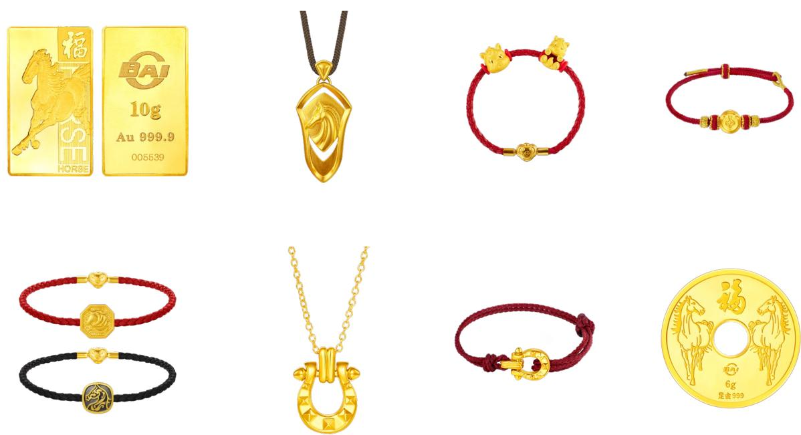

natural_image

Collection of gold jewelry accessories including barbreads, beaded rings, and a coin (no text or symbols visible)

菜百东方花园系列  
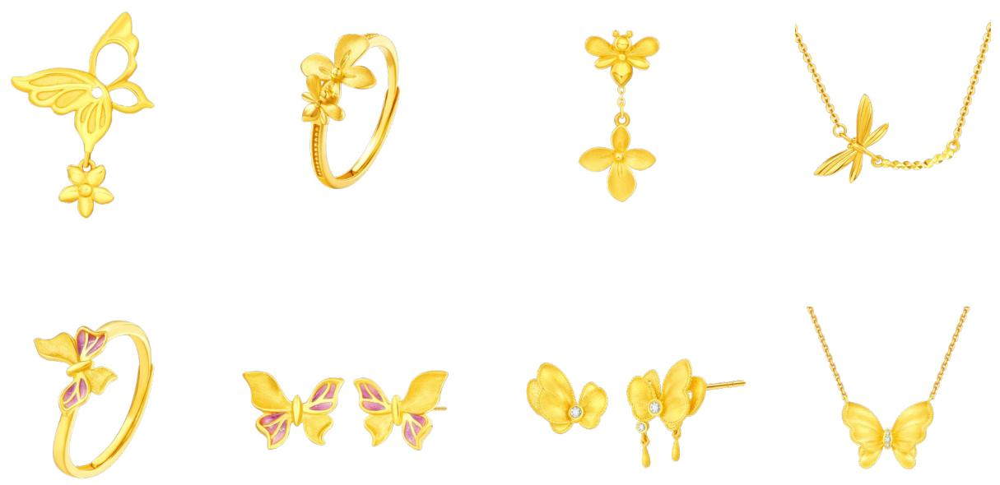

natural_image

Collection of gold jewelry and accessories including ring, flower rings, and butterfly ornaments (no text or symbols)

菜百首饰 × 景山公园联名系列  
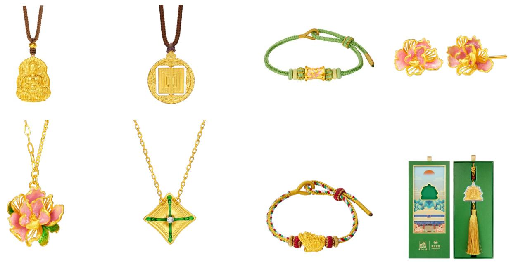

natural_image

Collection of gold jewelry and accessories including beaded necklaces, decorative tassels, and floral designs (no text or symbols visible)

菜百LOVIN恋意系列  
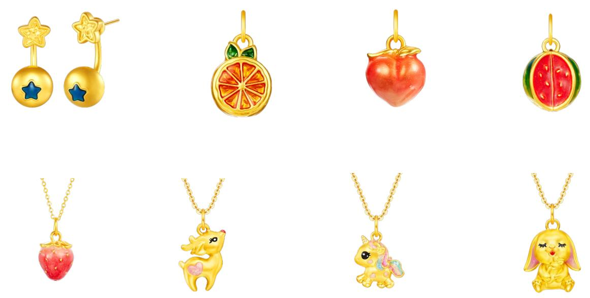

natural_image

Six decorative pendant ornaments including cherries, oranges, strawberries, and rabbits with star and butterfly motifs, displayed side by side (no text or symbols)

菜百首饰×北京动物园联名系列  
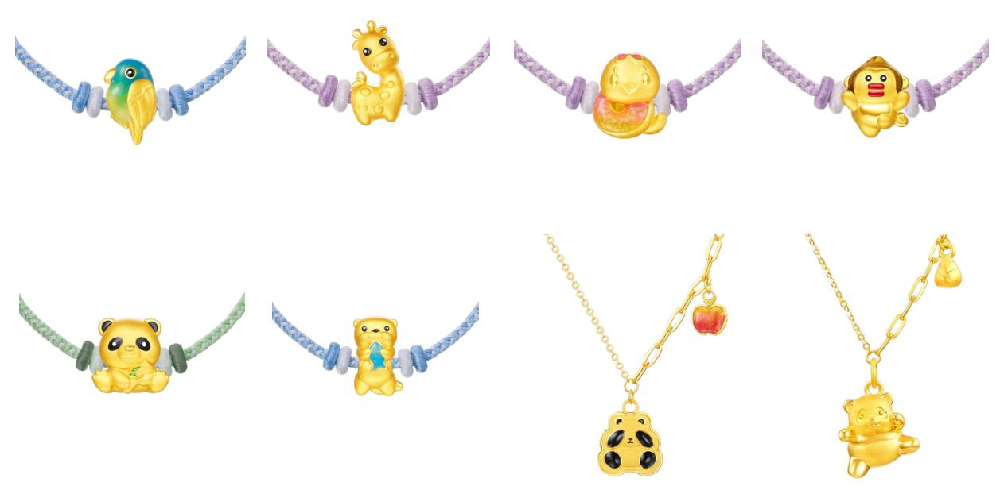

natural_image

Six identical cartoon characters with decorative accessories and chains, arranged in a row (no text or symbols)

菜百传世 • 家和祥瑞系列  

natural_image

Collection of gold jewelry and necklaces including beaded rings, ring, pendant, and ornate necklaces (no text or symbols visible)

菜百股份在产品包装设计中，注重功能融合与体验提升，以创新设计延伸包装的生命周期。

与景山公园联名的文创产品包装，借鉴女十粉饼盒的造型与尺寸，并内置化妆镜，兼顾便携性与补妆实用性，提升了日常使用频率：与北京动物园联名的包装，则融合珍宝收纳、手机支架等多重功能，让首饰包装盒不再是闲置“负担”，而是兼具美学与实用价值的日常用品，显著提高了包装的重复使用率。

这些创新设计不仅增强了客户体验，也以“轻量化、长效化”的方式践行了可持续发展理念，推动消费行为向更环保、更持久的方向转变。

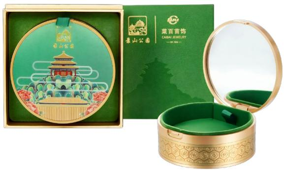

text_image

泰山公园
泰山公园
菜西首饰
CANDAO JEWELERY
一品

菜百首饰×景山公园联名系列产品包装

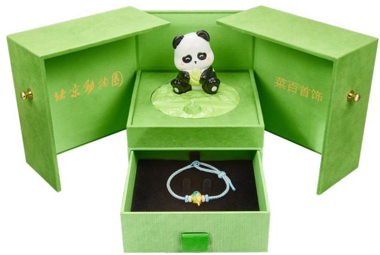

natural_image

Green cardboard box with a panda figurine inside, featuring Chinese text labels (no readable document content)

菜百首饰×北京动物园联名系列产品包装

## 工艺研发创新

公司深耕黄金珠宝工艺创新与产品研发，实现传统非遗技艺与现代设计理念的深度融合，完成刻丝工艺与点钻工艺的双重升级。在刻丝工艺领域，公司通过“丝韵金”系列产品深度挖掘古法技艺，以纯手工雕刻黄金表面打造细腻如丝的立体纹理，精准模拟丝绸的流动感与光泽感，将传统刻丝工艺与现代设计理念结合，让产品既保留东方美学底蕴，又兼具当代艺术价值。在点钻工艺领域，公司依托自有设计师团队与前沿镶嵌技术，对钻石与金属的衔接细节进行深度优化，通过精密排列的微镶小钻模拟大面积钻石的璀璨光泽，既提升了产品精致度，也契合了年轻消费者的日常佩戴需求。同时，公司设计团队深度挖掘生肖文化内涵，成功中标2026中国丙午（马）年 15 克梅花形金质纪念币设计，以创新写意手法突破传统具象刻画，在方寸间实现传统生肖文化与现代活力的碰撞融合，彰显了公司卓越的原创设计实力。

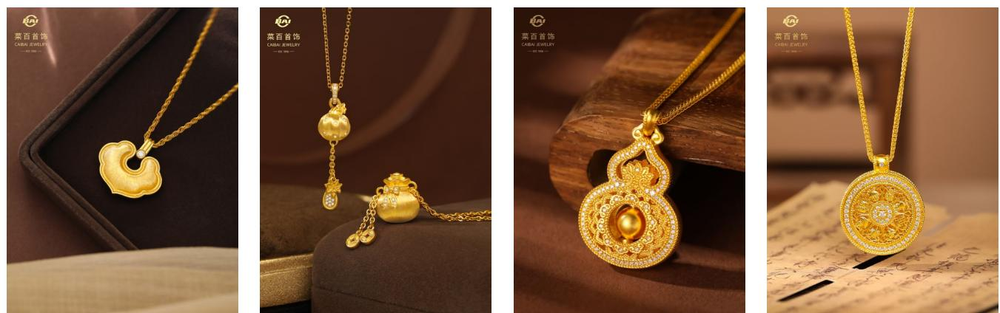

## 案例 2026中国丙午（马）年15克梅花形金质纪念币的设计者：菜百股份 姚麟芳

15 克梅花形金质纪念币以“奔马动态剪影”为核心，通过剪影写意手法突破传统具象刻画，以虚实渐变的笔触定格奔马速度感，将“自由奔放”的精神视觉化；梅花形币面的古典雅韵与奔马剪影的现代锐利形成刚柔对冲。黑釉与金辉的撞色，拉丝纹理的动态延伸，赋予静态金属以疾驰带风的生命力；层次布局上，实剪影、虚笔触与空留白巧妙结合，配以精密镀覆工艺与梅瓣弧边设计，使传统生肖文化与现代活力在方寸间碰撞出火花，传递“2026年如风自由”的新年寓意。

text_image

丙午
200元

2026中国丙午（马）年15克梅花形金质纪念币

公司始终坚持开放合作理念，以专业研究输出深化产学研融合、赋能行业高质量发展，持续输出行业前沿研究成果，不断提升行业影响力。

## 案例

## 菜百股份在专业期刊上发表文章

2025年，菜百股份在行业权威期刊发表《珐琅工艺的历史演变与规范发展路径研究》《硬足金标准解读》《馆店结合模式助力博物馆发展》三篇专业文章，系统展现公司在传统工艺研究、行业标准建设及商业模式创新方面的成果。相关研究为珐琅工艺传承与创新提供支撑，深化了行业对硬足金标准的认知，并为珠宝行业与文化产业融合发展提供了新思路，体现了公司在行业中的专业积淀与引领作用。

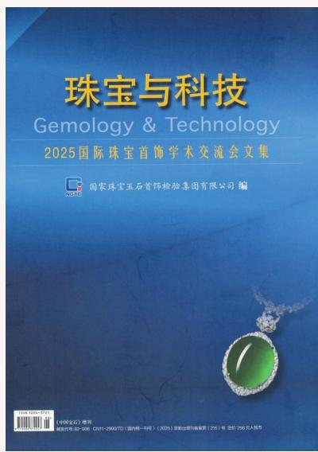

text_image

珠宝与科技
Gemology & Technology
2025国际珠宝首饰学术交流会文集
国家珠宝玉石首饰检验集团有限公司 编
中国珠宝(深圳)有限公司
地址: 02-900 CHN-2060YTD (深圳市第一年) (2025) 非银企财瑞备案 [2025] 号 京价:256 买人网

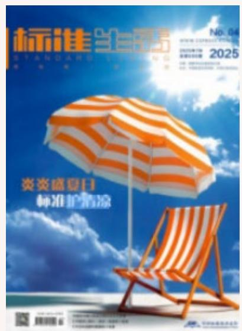

text_image

标准兰生活
STANDARD 1000
No. 04
2025
炎炎盛夏日
标准护清凉

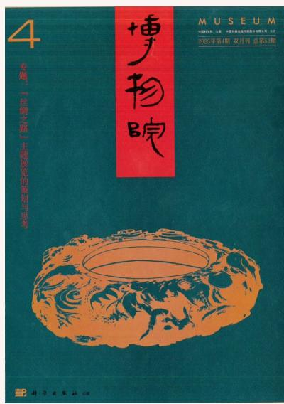

text_image

4
博物院
MUSEUM
专题：《丝绸之路》主题展览的策划与思考
2005年第4期 立刊 第13期
科学出版社

## 珐琅工艺的历史演变与规范发展路径研究

## Evolution and Standardized Development of Enamel

LU Hui. NING Zhenhua. XIE Huaning, LI Jia

## 1珐琅工艺的历史测源

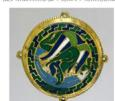

l fv Me M d

## 《珐琅工艺的历史演变

## 与规范发展路径研究》

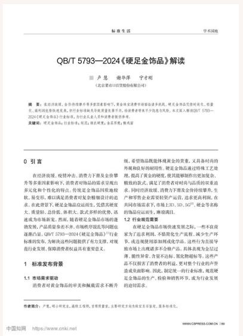

text_image

标准生活
学研领域
QB/T 5793—2024《硬足金饰品》解读
产品 谢件件 宇才刚
（北京密尔·181号股份有限公司）
摘要：在经济周期、资金供给等多因素影响下，黄金珠宝消费有望持续领先。硬足金饰品有望同步领先，供需量、库存等因素也呈现，行业面临高增长前景严重且不齐，消费者普遍关注价格与需求。截至图表中显示的Q/B/T 5793—2024《硬足金饰品》已开启招标。当日行业人员对黄金饰品提供服务。
关键词：硬足金饰品；行业标准：规范、商业管理、金属矿产、物流商
0 引言
在经济放缓、疫损冲击，消费力下滑及全球攀升等多重因素影响下，消费者对饰品的需求呈现出多元化和个性化的特点。传统是全饰品向低端较弱、易变弱，难以满足消费者对整体发展趋势的设计追求。在此背景下，硬足金饰品的运销、优质趋势度、质量倍、总价值、价格大、款式多样的优势，迅速成为市场新发。然而，随着硬足金饰品的蓬勃发展，产品质量差不齐，市场秩序混乱等问题逐渐凸显。QB/T 5793—2024《硬足金饰品》行业标准的发布，为解决这些问题提供了有力支撑，对规范行业发展，保障消费者权益具有重要意义。
1 标准发布背景
标准发布内容
1.1 市场需求推动
消费者对黄金饰品的审美和佩戴需求不断升
作者简介：产量、硕士研究生、最新工程师、首席质量官，主要研究力量突出于实验室、登录标准。
WWW.CSPRESS.COM.CN 188
中国官网 https://www.cnki.net

## 《硬足金标准解读》

## “馆店结合”模式助力博物馆发展

—以北京菜百黄金珠宁博物馆为侧

The "Muscum-store Integration" Model Boosts the Development of Museums

## 0 引言

范行业发展，保障消费者权益具有重要意义。

## 1 标准发布背景

1.1 市场需求驱动消费者对黄金饰品的重美和

WWBNCRPRESS.COM.CN I

空、实现标会改益与经济效益统理事、对深者公来文化照务使经的新机制具有重要疫示

Abstract: As publis cultural institutions, museums traditicmelly fece sustainability chellenees dse meoure cosirairts The mueunatore ieteartion" model ae an inrov arrach led by cerporat viably ahmi a piea bee beta ein ea emc beaea This res critical ii

Key Werds: Museum-store integretion; cultural-cormercial relations public eultural service; corporat entity mesew

## 《馆店结合模式助力博物馆发展》

## 数智化创新

公司持续深化数智化转型，以技术创新重构零售“人、货、场”，推进会员系统、数字孪生、RFID应用、智能终端等建设，实现研发、生产、销售全链路数字化管理，形成多项标杆性创新成果，以数字化手段为企业全链路运营降本增效。

## 案例

## 市级职工创新工作室申报成功

菜百股份数字化转型创新工作室获评北京市总工会市级职工创新工作室，核心研发团队针对黄金珠宝行业门店扩张成本高、周期长的痛点，正式推出新一代 AI 智能门店项目。项目集成 RFID 物联网、AL大模型技术，实现商品全流程一站式服务，斩获行业科技奖项，为行业数字化转型树立标杆。

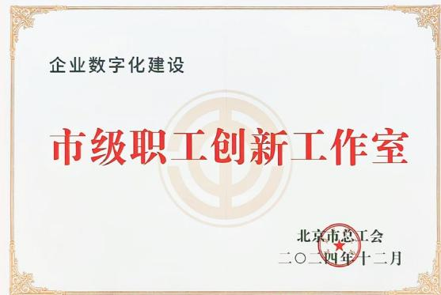

text_image

企业数字化建设
市级职工创新工作室
北京市总工会
二〇二四年十二月

市级职工创新工作室

## 案例

## CRM 会员系统全新升级上线

2025年，菜百股份CRM会员管理平台与新会员小程序的同步上线，搭建起企业营销全流程闭环体系。平台累计发放各类优惠券近百万张，有效带动销售转化，通过会员全景画像实现用户需求精准洞察既提升了会员服务满意度，也强化了企业精细化运营能力，为业务持续增长筑牢数智化根基。

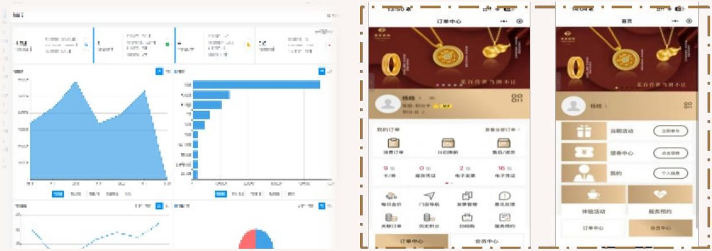  
会员系统页面与小程序

## 案例

## 数字员工多场景正式投用

2025年，菜百股份完成数字员工的研发与正式投用，该数字员工依托真人形象与3D合成技术打造，具备24小时无休值守、多场景适配的核心优势，全面覆盖四大核心业务场景。其既填补了非营业时间的服务空白，有效降低人力运营成本，也提升了服务效率与用户体验，以数字化创新为企业全链路运营实现降本增效。

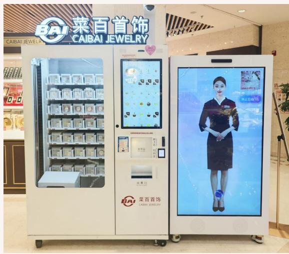

text_image

BAI 菜百首饰
CAIBAI JEWELRY
BAI 菜百首饰
CAIBAI JEWELRY

菜百智能自助购物机

natural_image

Woman in traditional white attire standing in front of a decorative pink lotus and floral backdrop, with an inset photo of a modern interior (no visible text or symbols)

菜百数字员工、好物推荐官

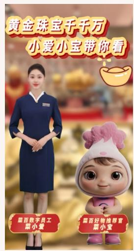

text_image

黄金珠宝千千万
小爱小宝带你看
黑百数字员工
黑小爱
黑百好物推荐宜
黑小宝

<table><tr><td>指标</td><td>单位</td><td>2025年度</td></tr><tr><td>研发人员数量</td><td>人</td><td>27</td></tr><tr><td>研发人员数量占比</td><td>%</td><td>1.84</td></tr><tr><td>研发经费</td><td>万元</td><td>863.25</td></tr><tr><td>研发投入金额占主营业务收入比例</td><td>%</td><td>0.03</td></tr></table>

## 行业协同与标准引领

公司积极参与行业协同发展与标准化建设，依托“中华老字号”品牌优势，持续加强与行业机构、科研单位及产业链合作伙伴的交流合作，推动行业规范发展与价值提升。报告期内，公司通过参与行业会议、开展标准研讨、深化与专业机构合作等方式，持续提升在黄金珠宝领域的专业影响力与行业参与度。

公司积极参与行业标准制定与技术交流，围绕贵金属饰品、玉石分级等重点领域参与多项标准起草及讨论工作并通过与北京市标准化研究院等机构开展合作，推动标准研究与应用落地。同时，公司通过开展标准化培训、强化内部宣贯，持续提升员工标准化意识与专业能力，促进标准在经营管理中的有效执行。

## 2025 年

##

公司依托进博会、消博会、钱币博览会等重要平台，积极展示产品创新成果与文化价值，深化与行业头部机构及文化单位的合作，推动“文化+产品+科技”的融合发展路径。通过对外交流与合作，公司不断拓展资源渠道，提升品牌影响力，并为行业高质量发展贡献力量。

## 案例

## 深化产业协同合作，拓展行业发展空间

2025年11月，在第八届中国国际进口博览会期间，公司与上海金币投资有限公司签署合作协议。双方围绕行业标准建设、数字化转型、人才培养及品牌共建等方面开展多维度合作，推动资源共享与优势互补。该合作在既有业务基础上实现进一步深化，有助于提升公司在贵金属领域的专业能力与市场竞争力，同时为行业协同发展与创新升级提供新动能。

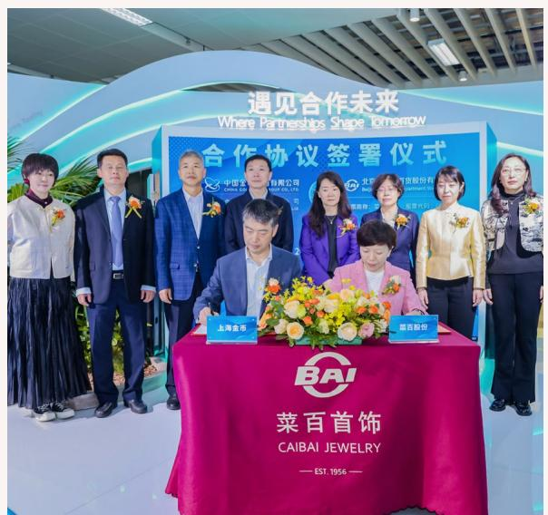

text_image

遇见合作未来
Where Partnerships Shape Tomorrow
合作协议签署仪式
上海金币
百百股份
BAI
菜百首饰
CAIBAI JEWELRY
—EST.1956 —

菜百股份与上海金币签署合作协议

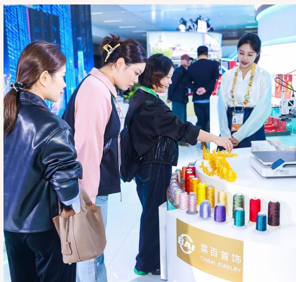

text_image

菜百首饰
CAIBAI JEWELRY

亮相第八届中国国际进口博览会

## 案例 亮相国际消费平台，探索“文化+科技”发展路径

2025年，公司亮相第五届中国国际消费品博览会，展示国潮文创产品及数字化创新成果，并结合非遗技艺展示，推动传统文化与现代消费场景融合。同时，公司通过智慧零售设备及数字化应用提升消费体验，探索“文化赋能+技术驱动”的发展模式。该举措进一步拓展了品牌展示渠道，也为行业创新发展提供了实践参考。

## 知识产权护航品牌

公司始终将知识产权保护作为品牌创新发展的核心基石，严格遵循《中华人民共和国商标法》《中华人民共和国专利法》《中华人民共和国著作权法》等法律法规。将知识产权全生命周期管理深度融入产品研发、设计生产、市场销售、品牌运营全业务流程，持续完善知识产权管理体系，强化商标、专利、著作权等无形资产全维度保护，以完善的制度建设、规范的流程管控、高效的风险处置，为原创设计创新、品牌长效发展筑牢法治根基，护航企业高质量创新发展。

## 制度体系建设

公司设立知识产权领导小组、知识产权保护办公室及知识产权管理工作小组三级管理架构，清晰划分各级权责边界，构建统筹决策、日常管理落地执行的全链条工作体系。其中，领导小组统筹整体战略与重大事项决策：知识产权保护办公室由质量法务部兼任，专职推进制度落地、知识产权申请注册、日常维护、侵权维权及各类纠纷协调处置等工作：知识产权管理工作小组抓好一线落地执行，层层压实管理责任，全面筑牢公司知识产权保护防线。

知识产权管理架构图  
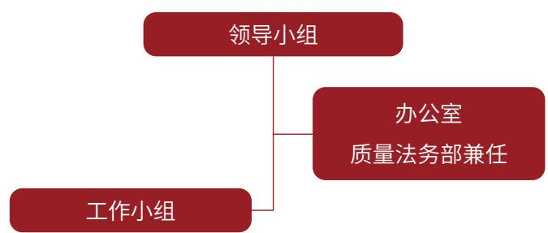

flowchart

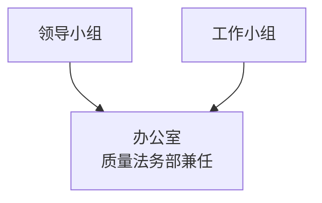
```mermaid
graph TD
  A["领导小组"] --> B["办公室\n质量法务部兼任"]
  C["工作小组"] --> B
```

围绕知识产权全流程管理，公司制定并持续优化《知识产权管理规范》等系列制度文件，全面覆盖知识产权创造、申请、运维、风控、维权全链条，实现各环节标准化管理、规范化运行、闭环化管控，确保知识产权管理工作有意可循、合规可控。

公司积极营造尊重创新、保护知识产权的优良企业文化氛围，依托常态化宣传普及、专题合规培训、制度宣贯等多元举措，持续深化全员知识产权保护理念，筑牢全员风险防范意识。充分调动各部门、各岗位创新主动性与积极性，鼓励全员立足岗位深耕创新、自主创造，全面激活企业内部创新活力与发展内生动力，为公司稳健经营与高质量发展夯实创新根基、积蓄发展势能，持续助力品牌价值升级，稳步提升企业核心竞争力与行业品牌影响力。

严格规范外部合作方IP类产品全流程管理，建立常态化审核机制，核验合作企业主体资质及关联关系等关键信息，从严审查授权链条的完整性与合规性，确保授权链路完整、合法、有效，从源头杜绝授权瑕疵、违规使用及第三方侵权等法律风险，保障合作业务合规有序开展。

强化自有知识产权全域化、系统化保护，聚焦公司原创设计、文创产品、宣传素材等自有版权核心成果，统筹推进知识产权布局，及时申报外观设计专利、著作权及商标权。

建立知识产权台账动态管理机制，紧盯各类权利有效期限，按期完成商标续展、费用缴纳、权益维护等工作实现自有知识产权全周期闭环管理，全方位筑牢自主知识产权安全防护壁垒。

持续完善品牌立体化防御布局，围绕核心品牌加大防御性商标、关联类别商标注册布局力度，构建多层次商标保护体系。常态化开展线上线下市场巡查及近似商标筛查，精准识别仿冒侵权、恶意抢注、混淆误导等违规行为高效推进商标异议、无效宣告、侵权投诉等维权处置工作，严厉打击各类侵权违法行为，持续净化公平规范的市场经营环境。2025年，公司累计提交商标异议申请16件、商标无效申请7件，切实守护企业品牌合法权益

报告期内，公司“菜百首饰”等多件商标纳入北京重点商标保护名录，获评北京知名商标品牌、北京首饰·时尚引领品牌，知识产权管理能力与品牌价值获得行业与市场的高度认可。

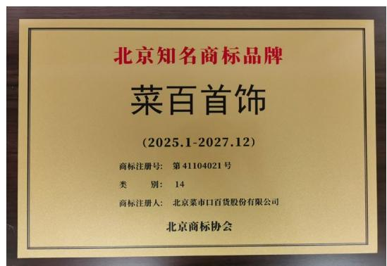

text_image

北京知名商标品牌
菜百首饰
(2025.1-2027.12)
商标注册号: 第41104021号
类别: 14
商标注册人: 北京菜市口百货股份有限公司
北京商标协会

北京知名商标品牌

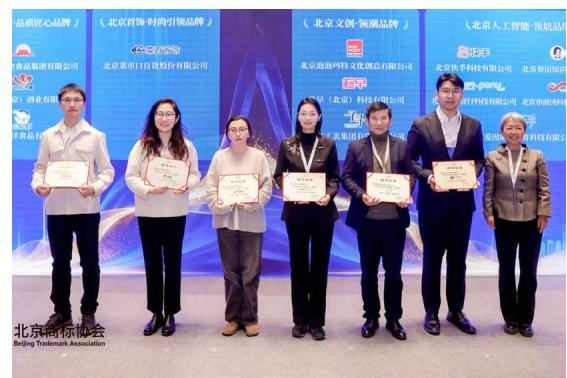

text_image

（北京首饰·时尚引领品牌）
（北京文创·领源品牌）
（北京人工智能·领航品牌）
北京佳手科技有限公司
北京春田科技有限公司
北京西单科技有限公司
北京高保协会
Beijing Trademark Association

北京首饰·时尚引领品牌

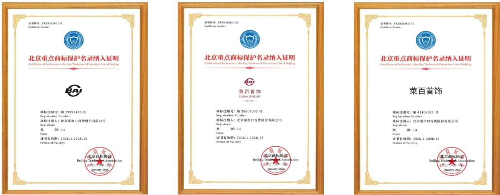  
北京重点商标保护名录纳入证明

关键绩效

<table><tr><td>指标</td><td>单位</td><td>数据</td></tr><tr><td>拥有专利授权数量</td><td>件</td><td>199</td></tr><tr><td>拥有注册商标数量</td><td>件</td><td>478</td></tr><tr><td>拥有著作权数量</td><td>件</td><td>12</td></tr><tr><td>拥有软件著作权数量</td><td>件</td><td>3</td></tr><tr><td>年度新申请专利数量</td><td>件</td><td>35</td></tr><tr><td>年度新申请著作权数量</td><td>件</td><td>3</td></tr></table>

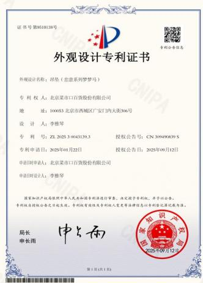

text_image

外观设计专利证书
证书号第9510138号
外观设计名称：吊垫（意意系列梦梦马）
专利权人：北京菜市口百货股份有限公司
地址：100053 北京市西城区广安门内大街306号
设计人：李维琴
专利号：ZL 2025 3 0043139.3
专利申请日：2025年01月22日
授权公告号：CN 309490839.8
授权公告日：2025年09月12日
申请时间单位：北京菜市口百货股份有限公司
申请时设计人：李维琴
国家知识产权局按照中华人民共和国专利法进行审查，决定授予专利权，并予以公告。
专利权自授权公告之日起生效，专利权有效期及专利权人变更等法律信息以专利登记机关为准。
局长
申长雨
申与雨
2025年07月12日
第1页（共1页）

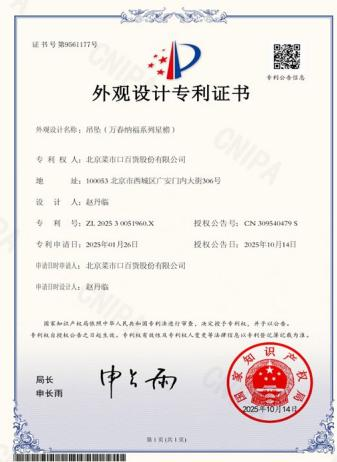

text_image

外观设计专利证书
证书号第9561177号
外观设计专利证书
外观设计名称：昂垫（万春纳福系列星楷）
专利权人：北京菜市口百货股份有限公司
地址：100053 北京市西城区广安门内大街306号
设计人：赵丹临
专利号：ZL 2025 3 0051960.X
授权公告号：CN 309540479.S
专利申请日：2025年01月26日
授权公告日：2025年10月14日
申请时间申请人：北京菜市口百货股份有限公司
申请时间设备人：赵丹临
国家知识产权局按照中华人民共和国专利法进行审查，决定授予专利权，并予以公告。
专利权应授权公告之日起生效。专利权属国有专项权利人变更等法律信息以书面形式登记为准。
局长
申长雨
申小雨
2025年10月14日
第1页（次1页）

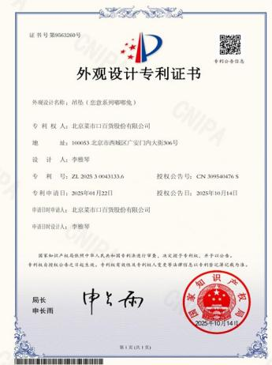

text_image

外观设计专利证书
证书号第9563280号
外观设计名称：吊坠（盒意系列嘟嘟兔）
专利权人：北京菜市口百货股份有限公司
地址：100053 北京市西城区广安门内大街306号
设计人：李维琴
专利号：ZL 2025 3 0043333.6
授权公告号：CN 30954076 5
专利申请日：2025年01月22日
授权公告日：2025年10月14日
申请时间：北京菜市口百货股份有限公司
申请时间：李维琴
国家知识产权局根据中华人民共和国专利法进行审查，决定授予专利权，并予以公告。
专利权属授权公告之日起生效。专利权属所有权人变更等法律意见以书面形式为准。
局长
申长雨
申小雨
2025年10月14日
第1页（共1页）

## 规范采购协同发展

公司结合黄金珠宝行业经营特点，始终秉持公平公正、互利共赢的合作原则，持续完善采购管理制度与供方合作管理机制，严格遵循公司《供方管理规范》《采购管理规范》等企业标准，明确供方引入与管理标准，形成覆盖准入、运维、评价、清退的全流程管理机制，将合规管理、品质管控要求全面融入采购业务全流程，保障采购业务规范有序开展，打造稳定、可持续的供应链体系，与上下游合作伙伴保持长期稳定的合作关系，携手推动行业规范化、高质量发展。

公司构建高级管理人员统筹推进、多部门协同联动的采购管理体系，明确各部门在采购与供方管理中的核心权责，确保各环节管理要求全面落地执行。

<table><tr><td>责任部门</td><td>核心管理职责</td></tr><tr><td>质量法务部</td><td>·牵头开展潜在供方调研、资质审核工作;·负责建立并动态管理供方档案与台账;·组织开展供方年度考核与评价工作;·负责供方资质、业务员信息的常态化核验;·负责新供方入场、供方信息变更、供方退场等事项的审核工作</td></tr><tr><td>物流中心</td><td>·负责开展潜在供方调研工作;·负责供方日常运维管理,提供供方评价相关数据;·参与供方资质与商品评审</td></tr><tr><td>总店经营部</td><td rowspan="2">·负责收集市场与供方相关信息,及时向质量法务部反馈;·参与供方年度重新评价工作;·负责供方日常合作对接与管理</td></tr><tr><td>连锁经营部</td></tr><tr><td>财务管理部</td><td>·负责供方账目核对、费用交纳等相关工作,提供供方财务维度评价数据</td></tr><tr><td>人力资源部</td><td>·负责供方人力合作、人员管理相关维度的评价工作</td></tr></table>

公司围绕供方全生命周期管理，建立标准化、规范化的全流程管控机制，从准入筛选、日常运维、年度评价到分级清退，实现供应链管理各环节有章可循、规范可控。

在供方准入环节，公司建立严格的筛选与评审机制，针对潜在供方开展全面调研，重点核查供方行业知名度，生产实力、产品质量、市场信誉等核心维度，优先选择环境保护、用工情况、商业道德、产品质量、安全生产等方面表现更佳的供应商，不定期对供方开展实地考察，形成完整考察记录。通过初步考察的供方，需提供商品含量检测报告及相关资质文件，接受公司组织的商品鉴定与专项评审，评审合格后方可进入新供方入场审批流程，经多部门逐级审核、公司领导逐级审批通过后，方可正式成为公司合作供方并签订合作协议。

在日常运维管理中，公司对供方资质实施常态化动态筛查，每月月初核查供方营业执照、业务授权等核心资质的有效性：核对确认供方业务员信息，确保合作主休与业务对接信息合规准确。供方出现名称变更，资质更新业务关系转移、新增经营品类等重大变化时，需提交变更说明及全套资质材料，按准入流程要求重新履行审批手续：新增合作业务员需履行专项审批流程，经审核通过后方可开展业务对接。

公司每年至少开展一次供方全面评价工作，以全面、客观、定量与定性相结合为基本原则，建立多维度评价体系。基于年度评价结果，公司对供方实施分级管理，按考评得分划分为五个等级，并匹配差异化的合作管理措施。

<table><tr><td>供方等级</td><td>考评得分标准</td><td>对应管理措施</td></tr><tr><td>战略供方</td><td>85分及以上</td><td>可优先取得订单、增大订单数量,可优先支付货款或缩短账期,可优先续签合作合同</td></tr><tr><td>紧密供方</td><td>70-84分</td><td>正常接受订单,维持现有合作规模与合作政策</td></tr><tr><td>一般供方</td><td>60-69分</td><td>实施订单减量管理,开展专项稽查与改善辅导,督促限期整改</td></tr><tr><td>待清退供方</td><td>60分以下</td><td>要求限期整改并提交整改报告,整改后仍不达标的,停止采购并取消供方资格</td></tr><tr><td>已清退供方</td><td>/</td><td>已停止交易,违反国家法律法规、停止营业清算解散、发生重大质量事故的供方直接纳入此等级,永久取消合作资格</td></tr></table>

公司注重与供应商的沟通与反馈机制建设，在年度评价基础上，定期面向供应商开展满意度调查，围绕付款周期、合作规范、商业道德、环境与社会责任、公司治理等维度收集供应商意见与建议，了解合作过程中的实际体验与改进需求。公司对反馈结果进行汇总分析，并结合供应商管理实际，持续优化采购流程、合作机制及管理要求，推动形成双向沟通、协同改进的供应链管理模式。

公司坚持阳光采购原则，在采购合作全流程遵循公平、公正、公开的准则，在合作协议中明确廉洁合作相关条款，防范商业贿赂等违规行为，规范采购行为，维护良好的合作秩序。

公司平等对待各类合作主体，结合中小企业经营特点，制定相应的合作管理要求，积极与优质中小企业开展合作，推动供应链协同发展。在合同履约与账期管理方面，公司按照协议约定履行权责，规范开展账目核对、费用结算等工作，保障合作流程规范透明；针对产品质量问题，明确供需双方责任，督促供应商及时整改，保障公司及消费者合法权益。

公司关注负责任采购要求，所涉贵金属原料主要通过规范交易渠道采购，确保所有原材料均来自非冲突地区供应链整体风险可控。同时，公司面向供应商开展合规与风险管理相关培训，内容涵盖反商业贿赂、反洗钱等要求，持续强化供应商合规意识与风险防范能力，推动构建规范、透明的供应链合作体系。

报告期内，公司采购供应链运行稳定，合作协议履约情况良好，未发生重大采购合规纠纷事件。

关键绩效

<table><tr><td>指标</td><td>单位</td><td>数据</td></tr><tr><td>供应商总数</td><td>家</td><td>138</td></tr><tr><td>供应商本地化比例</td><td>%</td><td>100</td></tr><tr><td>本地化采购比例</td><td>%</td><td>100</td></tr><tr><td>签署供应商行为准则的百分比</td><td>%</td><td>100</td></tr><tr><td>新供应商总数</td><td>家</td><td>3</td></tr></table>

text_image

菜百首饰·十二花神系列

## 绿色运营

## 推动低碳发展

公司始终秉持“绿水青山就是金山银山”的发展理念，将绿色低碳发展全面融入企业经营全流程，以合规管理为底线、以节能降碳为核心、以循环利用为抓手，持续完善环境管理体系，在门店运营、办公管理、供应链合作、产品设计等各环节落实绿色发展举措，不断降低运营过程中的资源消耗与环境影响，积极响应国家“碳达峰、碳中和”战略目标，以实际行动践行国有控股上市公司与中华老字号企业的生态环保责任，推动企业经营与生态环境保护协同发展。

环境合规守护生态

资源节约与循环利用

污染防治与排放管理

积极应对气候变化

菜百首饰·十二花神系列

## 环境合规守护生态

公司严格遵循《中华人民共和国环境保护法》《中华人民共和国环境影响评价法》《中华人民共和国固体废物污染环境防治法》等法律法规，结合黄金珠宝零售行业经营特性，持续构建系统化、全流程的环境合规管理体系，制定《工作环境管理规范》《卫生管理规范》《垃圾分类管理制度》等专项制度文件，明确各部门、各门店的环境管理职责，将生态环保要求贯穿于门店运营、办公管理、仓储物流、供应链合作等全经营环节，为环境合规管理提供坚实的制度支撑。

公司建立常态化环境风险识别、评估与监测机制，由安保物业部作为牵头管理部门，联动各直营门店、总部职能部门，全面识别运营过程中的环境风险点，重点覆盖废弃物处置、能源消耗、水资源使用、污染物排放等关键环节，定期开展全范围环境合规自查与专项检查。针对识别出的环境风险，公司按照影响程度实施分级管控，明确责任部门、整改要求与完成时限，确保各类环境风险全面可控。

natural_image

Simple line drawing of a target with an arrow hitting the center (no text or symbols)

natural_image

Simple line icon of a clipboard with a gear and bar chart, no text or symbols present

公司制定环境相关专项应急预案，针对突发环境事件、废弃物违规泄漏，环保设施故障等场景，明确应急处置流程、责任分工与应急保障措施，配备充足的应急物资，定期组织总部及各门店开展环境应急相关培训与实战演练，持续提升全员环境风险防范意识与应急处置能力，最大限度降低突发环境事件带来的负面影响。

报告期内，公司持续开展环境合规自查与专项整改工作，所有经营活动均严格符合国家及地方生态环境相关法律法规要求，未发生重大环境事件，未收到任何生态环境相关行政处罚。同时，公司高度重视生态系统和生物多样性保护，将生物多样性保护理念融入供应链管理与产品设计环节，优先选择践行环保与生物多样性保护要求的供应商开展深度合作：依托北京菜百黄金珠宝博物馆平台，常态化开展矿物宝石科普、自然生态保护主题宣传等公益活动，向公众传递生物多样性保护理念，助力提升全民生态保护意识。

## 资源节约与循环利用

公司始终将资源高效利用贯穿于门店运营、办公管理、仓储物流等核心经营场景，持续完善资源管理专项制度通过节能设备升级、智能化技术应用、精细化运营管理、绿色办公推广等多项举措，不断提升资源利用效率减少运营过程中的资源消耗，稳步推进绿色运营实践落地见效。

## 能源利用与节能管理

公司持续推进能源精细化管理，在高级管理人员统筹推动下，由安保物业部具体负责日常执行，制定《能源管理规范》，建立覆盖总部、各直营门店、仓储物流中心的全流程能源管理体系，通过多项举措持续降低运营能耗，减少碳排放。报告期内，公司持续推进全场景节能改造，货场及办公区全部采用|FD节能光源照明，南向办公室日间优先采用自然采光，严格执行“人走灯灭”的用电管理规范，最大限度减少照明能源消耗；扶梯直梯系统全部采用变频控制技术，实现客流感应式自动调速，减少设备空转带来的无效电力消耗：空调系统全部采用高效变频主机，配备先进的楼宇自动化控制系统，可根据外部气候条件、各楼层实时温湿度精准调控运行参数，夏季严格控制室内温度不低于26C，同时结合分层计量表实时优化空调出水温度及冷却塔风机转速在保障舒适消费与办公环境的同时，有效降低空调系统能耗

<table><tr><td>指标</td><td>单位</td><td>数据</td></tr><tr><td>外购电力总量</td><td>千瓦时</td><td>5,980,456.27</td></tr><tr><td>汽油</td><td>升</td><td>17,835.12</td></tr><tr><td>直接能源消耗总量</td><td>千克标准煤</td><td>19,157.09</td></tr><tr><td>间接能源消耗总量</td><td>千克标准煤</td><td>734,998.08</td></tr><tr><td>能源消耗总量</td><td>千克标准煤</td><td>754,155.17</td></tr></table>

## 节能管理目标

持续强化能源日常管理，落实节能降耗措施，稳步提升能源利用效率，常态化推进企业低碳节能运营。

## 水资源利用与节水管理

公司高度重视水资源节约与高效利用，制定精细化的水资源管理制度，在全部门店与办公区全面推广节水技术与设备，从源头降低自来水消耗量。报告期内，公司所有卫生间均配备节水型器具，从硬件端减少水资源浪费：针对空调冷却系统，采用变频技术，根据实时温湿度调整冷却塔风扇转速，精准控制冷却水蒸发损耗，持续提升水资源循环利用效率。

<table><tr><td>指标</td><td>单位</td><td>数据</td></tr><tr><td>取水量(自有物业范围)</td><td>立方米</td><td>12,965</td></tr></table>

## 废弃物处置与循环利用

公司在高级管理人员统筹监督下，持续推进运营全流程的废弃物减量化与资源化管理，建立覆盖全经营场景的可回收物循环利用体系。制定《产品管理部物料管理制度》，对包装物料的设计、使用及管理进行规范，在产品包装设计中融入可重复使用理念，将实用功能与包装设计相结合，提升包装二次利用率，减少一次性物料消耗：在门店橱窗展陈中采用可循环使用的物料，实现展陈物料循环复用，降低资源浪费：办公环节全面推行无纸化办公，优先使用再生纸制品，严控非必要纸质文件打印，从经营细节处推进资源循环利用。

## 包装材料管理目标

优化包装使用管理，推行简约绿色包装，逐步减少非环保包装消耗，降低包装废弃物排放。

## 污染防治与排放管理

公司严格遵循《中华人民共和国大气污染防治法》《中华人民共和国水污染防治法》《中华人民共和国噪声污染防治法》等法律法规，制定完善的污染物排放管理制度与全流程防治措施，规范经营活动中的污染物排放管理，最大限度减少运营行为对周边生态环境的影响。

公司经营活动以线下门店零售、总部办公为主，污染物产生量较少，主要污染物为生活污水、运营生活垃圾设备运行噪声等。

## 生活污水

公司所有经营及办公场所均接入市政污水管网。生活污水经市政污水处理系统统一处理后达标排放，建立全流程管控机制，严格禁止污水违规排放。

## 大气污染物

公司严禁在经营及办公区域使用高污染燃料，门店装修、设备维护等环节优先选用环保型材料与涂料减少挥发性有机物排放。

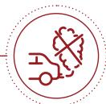

## 噪声污染

公司对空调机组、电梯、通风设备等产噪设备采取基础减震、隔音降噪等防护措施，合理安排设备维保作业时间，确保符合《社会生活环境噪声排放标准》相关要求，避免对周边环境与居民造成影响。

## 生活垃圾

公司在卖场及办公区指定区域配置分类垃圾桶，明确可回收物、厨余垃圾、有害垃圾、其他垃圾的分类标准与投放要求，每日指派专人定时清理、分类归集，每年定期与具备合规资质的专业公司签订清运合同，实现各类垃圾每日按时合规清运，为消费者与员工营造整洁、环保的购物与办公环境。

公司建立常态化污染物排放监测机制，定期对经营场所的噪声、污水排放等开展自查与第三方专业检测，确保各类污染物排放持续符合国家及地方排放标准：同时建立污染物排放与处置管理台账，对废弃物清运、环保设备运行、检测结果等内容进行全流程记录，实现污染防治全链条可追溯管理。报告期内，公司各类污染物排放均符合国家标准要求，未发生污染物超标排放情况，未收到任何与污染物排放相关的行政处罚

## 积极应对气候变化

## 治理

公司建立董事会统筹决策，管理层牵头落实，多部门协同执行的气候变化专项治理架构，明确董事会战略发展委员会负责对气候变化相关战略、重大事项进行研究审议与监督指导，对气候相关治理工作的有效性开展常态化监督；管理层统筹推进应对气候变化各项举措落地执行，明确安保物业部为气候变化管理牵头部门，联动物流中心、品牌推广部、信息技术部等相关部门，划定各环节权责边界，建立跨部门协同联动的工作机制，将应对气候变化要求融入门店运营、供应链管理、能源管控、技术升级等全业务流程，确保低碳发展战略全面落地见效。

## 战略

公司紧扣国家“双碳”战略方向，将应对气候变化与企业数智化转型、高质量发展战略深度融合，系统识别气候变化对公司生产运营，供应链稳定性及长期发展带来的风险与机遇

<table><tr><td>风险名称</td><td>具体描述</td><td>影响时间</td><td>应对措施</td></tr><tr><td>极端天气影响门店运营</td><td>暴雨、大风等极端天气可能导致门店短期停业或客流下降,带来营业收入减少及额外运维成本增加</td><td>短期</td><td>完善极端天气应急预案,加强门店巡检与防护,优化排班与库存调配,降低运营中断影响</td></tr><tr><td>环境合规与政策风险</td><td>环保监管趋严可能带来合规成本增加(如改造投入、管理成本提升)</td><td>中期、长期</td><td>持续完善环境管理体系,强化合规监测与制度执行,提前适应监管要求</td></tr></table>

<table><tr><td>机遇名称</td><td>具体描述</td><td>影响时间</td><td>应对措施</td></tr><tr><td>节能降耗带来的成本节约</td><td>LED照明、变频设备及能效管理系统应用,有助于降低电力消耗,减少运营成本支出</td><td>短期、中期</td><td>持续推进节能设备升级与精细化能耗管理,扩大节能改造覆盖范围</td></tr><tr><td>绿色消费需求增长</td><td>消费者对绿色产品及环保理念关注提升,有助于带动绿色产品销售与品牌溢价能力提升</td><td>中期、长期</td><td>打造绿色消费场景,强化品牌传播与产品绿色属性设计</td></tr></table>

报告期内，公司持续推进门店节能改造、总部能效管理升级、国产化低碳技术应用等重点工作，推动低碳运营举措落地见效。

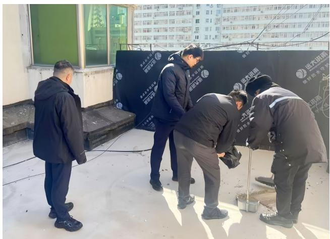

text_image

Street photo showing four men in winter coats inspecting a white surface, with visible Chinese signage on the wall and background posters.

大风天气前检查五层平台

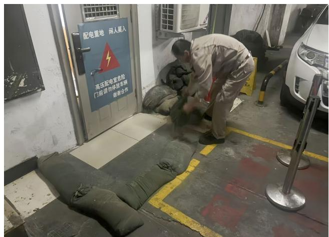

text_image

配电重地 闲人出入
高压配电变色的
门街诱导次级车辆
谢谢合作

汛期前检查沙袋

## 影响、风险和机遇管理

公司建立了标准化、全流程的气候变化相关风险与机遇识别、评估、管控管理机制。公司在各相关部门设置专职风险管理对接人员，常态化识别与收集气候变化全流程中出现的风险与机遇，填写《风险与机遇记录表》由审计部进行整体汇总、复核与评估，形成公司层面的气候变化风险与机遇评估表，从财务重要性与影响重要性两个维度开展双重重要性评估，明确风险等级与机遇价值，并定期向管理层与董事会进行汇报。

针对评估识别出的气候相关风险事项，公司制定针对性的防范措施，明确责任部门与管控要求，降低风险发生的可能性与负面影响，所有识别出的问题均实现闭环整改；针对识别出的机遇事项，公司明确落地责任部门与实施路径，将其转化为具体的技术升级、管理优化与业务创新举措，纳入公司年度重点工作推进，定期评估实施成效。同时，公司建立动态更新机制，结合气候相关监管政策更新、行业低碳技术发展、极端天气变化等情况即时开展专项风险识别与评估，动态调整管控措施与实施策略，确保管理机制与内外部环境变化高度适配。

## 指标与目标

公司围绕国家“双碳”战略要求，致力于达成 2030 年碳达峰、2060 年碳中和的目标，明确以节能降耗、优化用能结构为主要方向，推动运营环节能源使用效率持续提升，逐步降低碳排放水平

<table><tr><td>指标</td><td>单位</td><td>数据</td></tr><tr><td>直接温室气体排放(范围一)</td><td>吨二氧化碳当量</td><td>38.08</td></tr><tr><td>间接温室气体排放(范围二)</td><td>吨二氧化碳当量</td><td>3,173.23</td></tr><tr><td>温室气体排放总量</td><td>吨二氧化碳当量</td><td>3,211.31</td></tr></table>

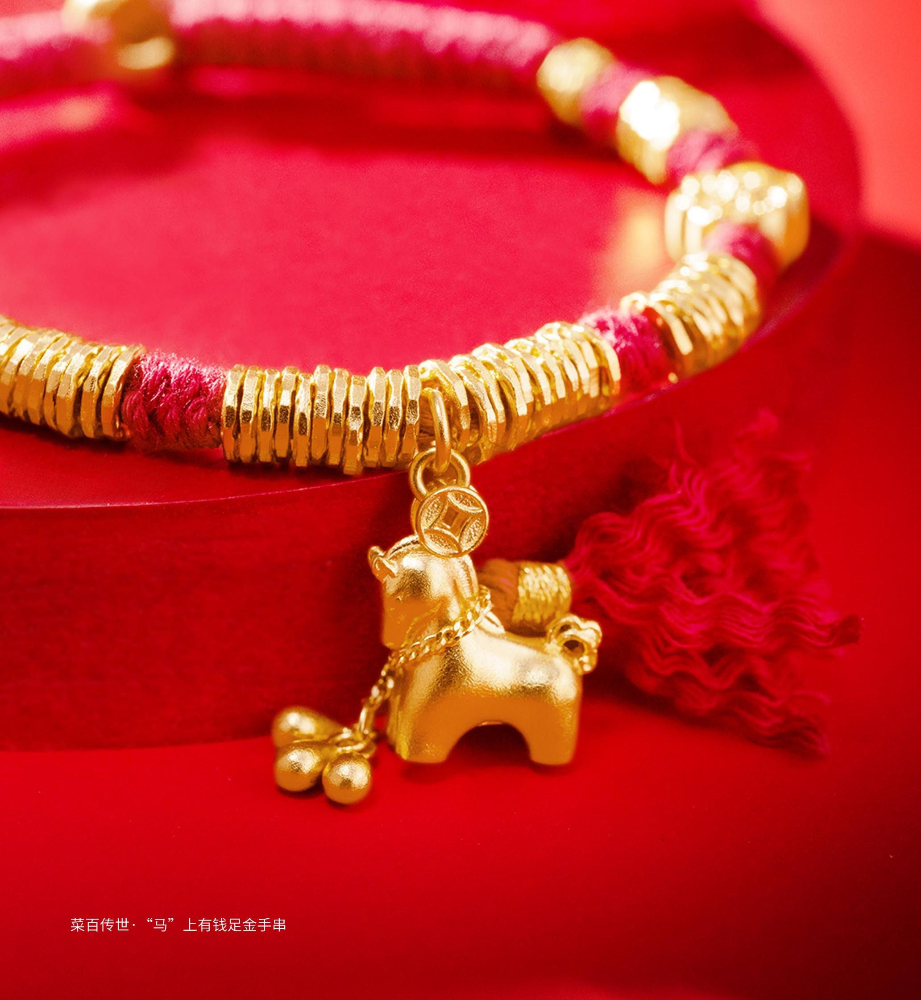

text_image

菜百传世·“马”上有钱足金手串

# 以人为本

# 共建责任企业

公司始终秉持“心比金纯”核心价值观导向，坚持以人为本的管理理念，致力于营造一个多元包容、和谐融洽且充满活力的工作环境。公司高度重视员工权益保障，不断完善员工福利体系，提供多样化、具有竞争力的薪酬激励措施，并目注重对员工的持续培养，通过系统的培训计划、职业发展通道，支持员工成长与进步。同时，公司主动投身社会公益事业，关注社会民生，助力社区共建与乡村振兴。

关爱员工促进成长

健康安全守护发展

公益行动回馈社会

助力振兴服务民生

菜百传世：“马”上有钱足金手串

## 关爱员工促进成长

公司持续完善员工权益保障机制，优化薪酬与福利安排，提升员工稳定性与获得感。通过系统化培训及职业发展通道建设，支持员工能力提升与职业发展，营造积极、健康的工作环境。

## 员工雇佣

菜百股份严格遵守《中华人民共和国劳动法》《中华人民共和国劳动合同法》等法律法规，结合公司情况制定《招聘管理规范》《劳动关系管理规范》等内部制度，依法与员工签订劳动合同。公司始终坚持平等就业、公平公正的用人原则，在招聘全流程中杜绝性别、年龄、民族、宗教信仰、财产状况等任何形式的歧视，严格禁止雇佣童工、强迫劳动行为，切实保障员工合法权益，构建合规公平、和谐稳定的劳动关系。

## 2025 年

100少数民族员工总数 66 人，残疾员工总数 11 人新入职员工总数 194

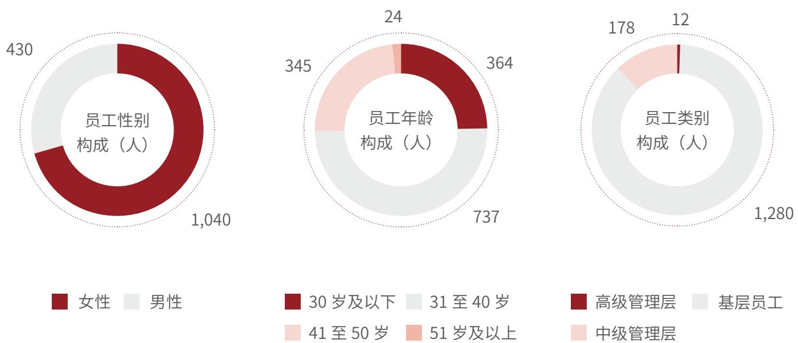

## 公司招聘渠道

## 校园招聘

公司以产教融合为抓手，持续强化校园招聘与基础岗位人才储备工作。公司通过与财贸商学院深化合作，联合开设企业综合实践课程，共同推进人才定向培养。同时，公司积极参与校园双选会、宣讲会，走进高校与毕业生沟通交流，宣传企业雇主品牌、展示发展优势，不断提升企业在高校群体中的认知度。2025年，公司共参与校园双选会、宣讲会25场，通过校园招聘与实习项目共吸纳高校青年人才70余人。

## 社会招聘

在社会招聘方面，公司坚持积极主动的人才引进策略，持续拓展与优化招聘渠道。一方面，充分运用各类专业招聘平台，广泛发布岗位信息，精准对接优质人才；另一方面，积极与人社局、工会、街道社区、退役军人事务局等政府部门及企事业单位建立长效合作机制，通过直播带岗、线上线下双选会等多元化招聘形式不断拓宽人才来源，为企业高质量发展持续输送优秀人才。

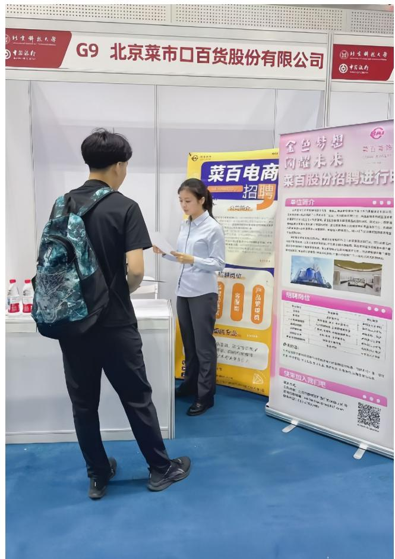

text_image

G9 北京菜市口百货股份有限公司
金丝梦想
闪醒未来
菜百电商
招聘
单位简介
免费
免费
免费
免费
免费
免费
免费
免费
免费
免费
免费
免费
免费
免费
免费
免费
免费
免费
免费
免费
免费
免费
免费
免费
免费
免费
免费
免费
免费
免费
免费
免费
免费
免费
免费
免费
免费
免费
免费
免费
免费
免费
免费
免费
免费
免费
免费
免费
免费
免费
免卡卡卡卡卡卡卡卡卡卡卡卡卡卡卡卡卡卡卡卡卡卡卡卡卡卡卡卡卡卡卡卡卡卡卡卡卡卡卡卡卡卡卡卡卡卡卡卡卡卡卡卡卡卡卡卡卡卡卡卡卡卡卡卡卡卡卡卡卡卡卡卡卡卡卡卡卡卡卡卡卡卡卡卡卡卡卡卡卡卡卡卡卡卡卡卡卡卡卡卡
免费加入我们吧

公司参与高校校园双选会

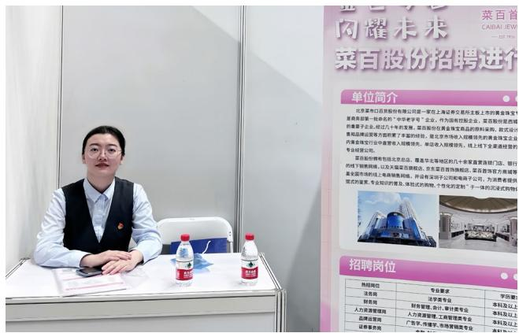

text_image

闪耀未来
菜百股份招聘进
单位简介
北京菜百百货股份有限公司是一家在上海证券交易所主板上市的董事会办公室
北京菜百百货股份有限公司是一家在上海证券交易所主板上市的董事会办公室
系南昌县第一批命名的“中中学校”企业，作为国有控股企业，菜百股份在西藏
的重要企业，经过12个的发展，菜百股份在黄金珠宝商品的面料采购、款式设计
等高端商品管理方面的丰富经验，是在市场中纳入规模最大的黄金珠宝企业
的黄金珠宝行业中主营收入规模领先，单位为销售收入，线上线下全面覆盖经营的
专业就业岗位。
菜百股份将积极结合本店、理念等本地地区的几十多家资源部门、银行
的线下销售网络，以及天猫在店铺网站，京东淘宝终端相应。卖方首饰与商城等
盒全国市场的线上电商销售网络，并设有关于公司收购该子公司，为消费者提供
低式的渠道、专业知识的普及、体验式的购物、个性化的定制“于一体”的沉浸式购物
招聘岗位
热招岗位	专业素养	学历背景
法咨询	法学类专业	本科及以上
财务咨询	财务管理、会计、审计类专业	本科及以上
人力资源管理	人力资源管理、工商管理类专业	本科及以上
品牌咨询	广东粤、直辖市、市域管理类专业	本科及以上

走入校园进行宣讲招聘

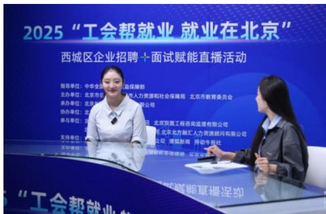

text_image

2025“工会帮就业 就业在北京”
西城区企业招聘+面试赋能直播活动
指导单位：中华全国总工会
主办单位：北京市总工会
承办单位：北京双面工程咨询监理有限公司
协办单位：北京双面工程咨询监理有限公司
参与单位：北京双面工程咨询监理有限公司
支持单位：北京双面工程咨询监理有限公司
“工会帮就业”

公司参与北京市工会直播带岗

## 案例

## 产教融合促发展，校企共建育新才

2025年，公司积极拓展人才引进与培养渠道，与中国地质大学（北京）、北京财贸职业学院、北京经济管理职业学院、陕西国际商贸学院、天津国土资源和房屋职业学院、苏州科技大学天平学院、苏州工业职业技术学院、苏州工艺美术职业学院等多所京内外高校深化校企合作，积极推进参访交流、校园宣讲、企业导师进课堂系列活动，与高校师生保持密切联系。其中，年内企业进一步与陕西国际商贸学院共建就业基地。通过推动“校企双师共建”与“企业教师进高校”项目，将公司独具特色的非遗编织、服务礼仪等实战课程引入高校课堂，并持续开展“课程综合实践”联合培养工作，实现了教学内容与岗位需求的无缝衔接，目前已有36名在校生开展综合实践课程。此举不仅为在校学生提供了宝贵的实践平台，也为公司建立了一支稳定、优质的青年人才后备队伍，有效促进了教育链、人才链与产业链的深度融合。

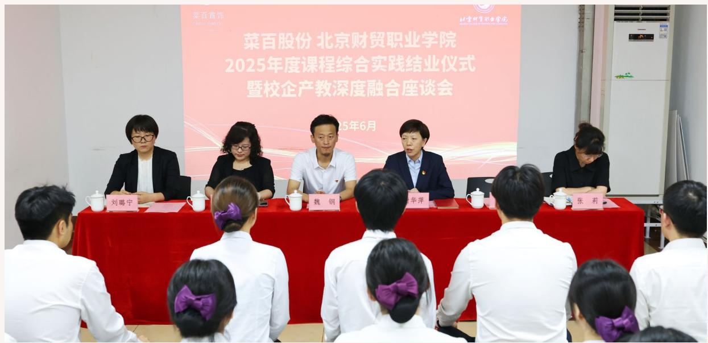

text_image

菜百首饰
北京财贸职业学院
2025年度课程综合实践结业仪式
暨校企产教深度融合座谈会
2025年6月
刘鹭宁
魏钢
张莉

校企产教深入融合座谈会

## 权益保障

菜百股份始终高度重视员工权益保障与民主管理工作，依法建立工会组织，定期召开职工代表大会，支持员工代表参与公司重大事项的讨论与民主评议，切实保障员工知情权、参与权与监督权。公司搭建线上线下多渠道沟通平台，畅通意见反馈与申诉机制，鼓励员工积极建言献策，及时倾听基层声音、妥善回应员工诉求，有效预防与化解劳动争议。同时，公司不断完善员工保障体系，为员工提供完备的社会保险，规范劳动能力鉴定流程，切实维护员工合法权益。持续营造开放包容、和谐稳定的用工环境，不断增强员工归属感与满意度，助力企业高质量发展。

## 员工沟通渠道

## 高层领导沟通

员工可就公司发展等相关事宜，通过专设的领导沟通企业邮箱及联系电话反馈意见与建议。

## 领导干部接待日

公司每月开展领导于部接待日活动，为员工提供当面向公司领导反映诉求的渠道。

## 参加部门例会

公司高度重视一线员工的意见与建议，公司领导深入一线商品部、各分店参与部门例会，切实关心基层情况。

## 职工代表大会

公司每年召开不少于两次职工代表大会，鼓励职工代表围绕企业发展充分建言献策，切实保障职工代表的知情权、参与权、表决权。

## 员工满意度调查

公司每年开展员工满意度调查，围绕公司管理、职业发展、公司发展等维度，全面收集员工评价及意见建议。针对满意度偏低及员工集中反映的事项，明确责任主体，开展专项分析并进行整改。

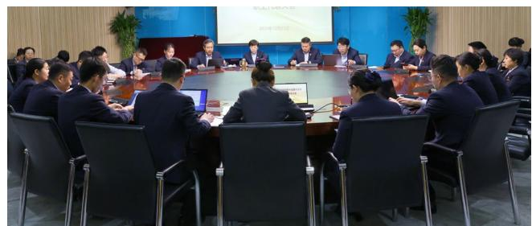

natural_image

Group of professionals in formal attire seated around a conference table in a meeting room (no visible text or signage)

菜百股份职工代表大会

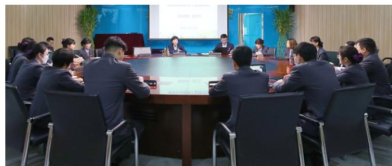

natural_image

Group of professionals in formal attire seated around a conference table in a meeting room (no visible text or symbols)

菜百股份领导干部接待日

## 2025 年

公司员工社会保险覆盖率 1.93员工满意度调查有效反馈人数为 825 人，满意度得分为 97.30%。

## 薪酬福利

菜百股份不断完善员工薪酬福利体系，制定《薪酬管理规范》《绩效管理规范》，建立科学规范的薪酬激励机制，公司坚持“向一线员工倾斜，向专业技术人才倾斜，向做出突出贡献的管理人员倾斜”的原则，持续优化薪酬结构，将员工个人发展与公司发展目标紧密结合，激发员工工作热情与主观能动性。同时，公司严格执行同工同酬制度，保障相同岗位、同等职责员工获得同等劳动报酬，并统一各类用工形式员工的福利待遇，维护薪酬福利公平性，实现责、权、利相统一，为公司稳健发展提供有力支撑。

为保障绩效考评过程的公平、公正与透明，公司建立常态化绩效申诉机制，畅通员工反馈渠道。员工如对绩效考核结果存在异议，或认为考评过程中存在程序不规范、事实认定不清晰、评价标准执行不一致等情形，可提出申诉。公司设立集体合同监督检查小组作为申诉受理与处理机构，按照相关规定对申诉事项进行独立核实与协调处理，切实保障员工合法权益，持续提升绩效管理的公正性与规范性。

## 公司薪酬福利管理措施

## 薪酬管理

公司构建高效规范的薪酬管理与激励机制，对工资总额实行月度统计及动态监测，保障薪酬发放合规透明、高效。公司坚持多劳多得分配原则，针对销售部门及门店，以销售额、毛利额、销售件数等为核心指标开展月度考核，优化分级分类销售激励方案，实现精准激励；针对职能部门及专业岗位，围绕业绩、能力、态度、服务等多维度开展综合考评，由薪酬评委会核定奖金标准。同时，公司将奖金分配与经营效益紧密挂钩，依据企业效益与员工绩效考评结果制定分配方案，实现员工收入与公司发展同步增长有效激发员工工作活力与积极性。

## 福利管理

公司为员工构建完善、多元的福利体系，助力员工实现工作与生活的平衡。公司严格按照国家相关法律法规，依法保障员工享有带薪年假、婚假、产假、陪产假等假期，同时允许员工根据个人需求灵活安排休假。此外，公司在春节、中秋等传统节日为员工发放节日礼品，并送上节日慰问。对于派驻外地的员工公司提供宿舍及补贴，以增强员工的归属感和福利体验。

## 案例

## 开展薪酬激励体系专项优化改革

为充分激发饰品销售活力、助力企业高质量发展，2025年公司聚焦薪酬激励体系开展专项优化改革。公司创新推出饰品销售专项激励方案，以销售完成率、销售总额同比增幅、饰品品类销售同比及金价波动等多维核心指标为依据，对各部门及门店实施分档分级、精准高效的奖励分配。本次改革重点优化薪酬分配结构，全面落实向一线销售岗位倾斜的激励导向，有效调动一线员工的销售积极性与创造力，为公司饰品销售业绩稳步提升提供了坚实动力。

## 人才发展

## 职业晋升

菜百股份以提升人才质量为核心。持续优化人才选拔、晋升与发展机制。营造公开、平等、竞争、择优的用人环境，构建完善的人才梯队体系。公司建立专业、管理、顾问三条并行晋升通道，助力员工多元化职业发展，打造兼具服务、技术与管理能力的高素质人才队伍。在人才选拔与任用方面，公司坚持每三年开展干部岗位竞聘与员工择优上岗工作，通过笔试、面试、综合测评等规范化流程选拔优秀人才，并综合运用岗位竞聘、民主推荐、外部选聘等多种方式充实干部队伍，同时落实干部能上能下机制，注重年轻骨于培养与储备，为员工提供公平发展平台与广阔晋升空间，持续增强企业创新活力与核心竞争力。

公司人才晋升通道  
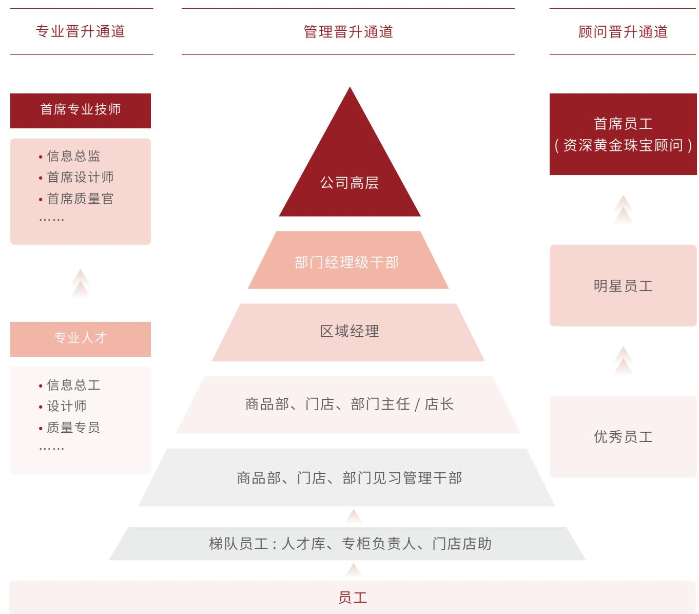

flowchart

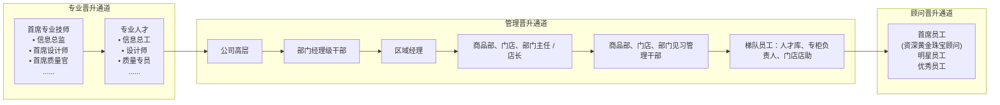
```mermaid
graph LR
  subgraph Professional_Appliation["专业晋升通道"]
    direction TB
    A["首席专业技师\n• 信息总监\n• 首席设计师\n• 首席质量官\n......"]
    B["专业人才\n• 信息总工\n• 设计师\n• 质量专员\n......"]
  end

  subgraph Management_Planimental["管理晋升通道"]
    direction TB
    C["公司高层"]
    D["部门经理级干部"]
    E["区域经理"]
    F["商品部、门店、部门主任 / 店长"]
    G["商品部、门店、部门见习管理干部"]
    H["梯队员工：人才库、专柜负责人、门店店助"]
  end

  subgraph Customer_Planimental["顾问晋升通道"]
    direction TB
    I["首席员工\n(资深黄金珠宝顾问)\n明星员工\n优秀员工"]
  end

  A --> B
  B --> C
  C --> D
  D --> E
  E --> F
  F --> G
  G --> H
  H --> I
```

## 员工培训

菜百股份制定《员工培训工作规范》《培训管理规范》等培训制度，搭建起覆盖全员、贯穿职业全周期的多层次人才培养体系。依托多元化、系统化的培育机制，公司成功打通人才选拔、培养、评价、输送全流程，构建起完备的“金色人才链”，实现人才梯队建设与企业长远发展战略的深度契合，为企业高质量发展筑牢坚实的人才根基。

## 公司重点培训项目

## 金色工程

“金色工程”人才体系培养项目是公司人才战略的标志性工程，项目下设金色传承、金色纽带、金色未来三大子项目，分别针对高层管理者、中层骨干及高潜员工实施精准赋能，构建起覆盖全员、全周期的梯队化人才培养路径。项目采用集中授课、专题研讨、沙盘模拟、标杆访学、课题攻关等多元化实战化教学模式。2025年，公司重点开展“金色纽带”与“金色未来”两大项目，课程内容涵盖人工智能+、企业数智化、新媒体运营等前沿领域，全年累计赋能员工120余人。此举不但全面提升了骨干队伍的综合素养与创新视野，更打通了“选拔一培养一任用”全链条人才培育机制，为企业转型升级与高质量发展积蓄了充沛的人才动力。

## 自主技能认定

公司依托西城区技能人才实训基地资质，搭建起覆盖方案制定、制度建设、内督员与考评员队伍组建的全流程自主技能认定体系，并开发形成完善的培训课程。2025年，公司顺利开展“贵金属首饰与宝玉石检测员(中级)”培训及自主认定工作，成为北京市西城区及黄金珠宝行业内率先实现技能人才自主评价的标杆企业。该项工作不仅创新了职业技能等级认定机制、夯实了专业技能人才队伍，更为行业人才标准建设与公司专业引领地位巩固提供了有力支撑。

## 驻店专项培训

公司打造驻店定制化系列培训，以定制化课程筑牢员工服务能力。培训兼顾基础服务标准化、客户关系深度运营，实现员工能力阶梯式提升，推动服务体系闭环落地。全力构建以客户为中心的服务生态。培训秉持以专业深耕，让温度成金的理念，精准洞察客群需求，推动VIP服务体系化升级，扎实落地专业技能，同时深度融合驻店实训实战经验，全面升级《营业员服务规范》。

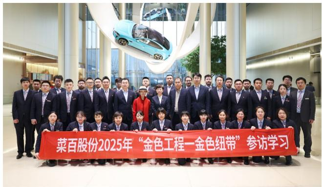

text_image

菜百股份2025年“金色工程—金色纽带”参访学习

“金色工程-金色纽带”参访学习

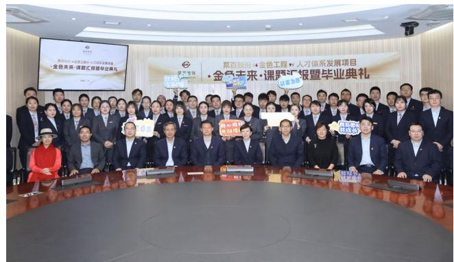

text_image

菜百股份·4金色工程·人才体系发展项目
·金色未来·课题汇报暨毕业典礼

“金色未来”课题汇报暨毕业典礼

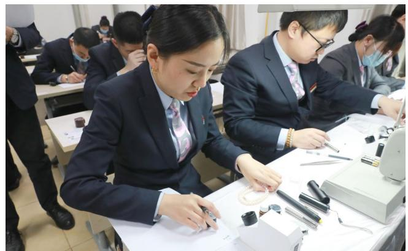

natural_image

Group of students in formal attire working at desks with tools and writing (no visible text or symbols)

贵金属首饰与宝玉石检测员培训

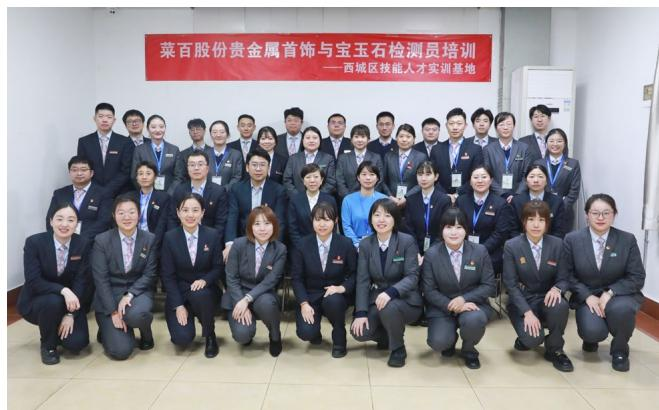

text_image

菜百股份贵金属首饰与宝玉石检测员培训
——西城区技能人才实训基地

## 案例

## 公司开展“金色纽带”项目，提升中层管理人员能力

2025年，公司共选拔34名中层核心管理于部进入“金色纽带”培训项目。项目历时11个月，累计开展培养逾100学时，聘请相关领域知名专家，围绕战略执行、跨部门协作、思维能力、财务管理、风险管理等核心素养与重点业务领域开展授课，全面提升学员的团队领导力、管理技能、跨部门协同、系统思维与综合管理能力：同时，项目聚售业务发展与管理创新，组织学员开展基于实际工作的专项课题研究，为解决当下实际问题提出切实可行的创新方案，实现了人才价值提升与企业高质量发展的深度融合。

## 2025 年

员工培训开展次数达 479 次；年度培训支出金额达 65.5 万元；为 170 小时。

## 员工关怀

公司将员工关怀融入日常，着力构建有温度、有责任、有凝聚力的员工发展生态。围绕员工身心健康、困难帮扶、工作便利、女职工关爱及退休员工关怀等方面，系统开展文体活动、精准帮扶、弹性工时、健康保障与节日慰问等多元举措，切实保障员工权益、提升员工幸福感与归属感，推动企业与员工共同成长、协同发展。

公司通过建立困难员工帮扶机制，持续开展员工关怀工作。公司每年组织申报困难员工，由相关基金通过西城区慈善协会进行发放帮扶资金，2025年年初共计为12名困难员工提供帮扶支持，切实缓解员工实际困难。

## 公司员工关怀举措

## 员工活动

公司积极组织开展趣味运动会、健步走等内部文体活动，并组建员工队伍参与各级文体赛事，增强员工身体素质与团队凝聚力，展现企业良好精神风貌。

## 困难帮扶

公司定期开展困难员工走访慰问，重点在节假日深入员工家庭了解实际需求，建立困难员工专项档案，精准记录家庭、经济及致困原因，并依规发放慰问金，实施精准帮扶，传递企业关怀。

## 生活关怀

公司针对员工因家庭照料、个人事务等突发情况产生的灵活用工需求，在合理范围内提供班次临时调整与弹性工作安排，切实为员工提供工作便利与人文关怀。

## 关注女性

公司高度关注女性员工健康，实施年度健康体检、开展健康讲座、设立健康管理员同时对孕期及产后女性员工给予专项关怀，开展产后走访并赠送慰问品。

## 退休慰问

公司重视企业文化传承，始终关心关怀退休员工，注重提升退休员工的归属感与荣誉感在重大节假日开展退休员工走访慰问。

## 案例 开展妇女节主题活动，关爱女性员工与社会群体

2025年妇女节期间，菜百股份开展巾帼表彰及插花艺术等系列主题活动，表彰女性员工风采、丰富女员工精神文化生活；同时组织志愿服务队深入楼宇，为外部女性群体提供首饰清洗、整形、编织等公益便民服务，以实际行动传递对女性群体的关怀与敬意。

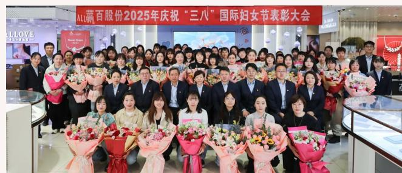

text_image

ALL萬百股份2025年庆祝“三八”国际妇女节表彰大会

庆祝“三八”国际妇女节表彰大会

## 案例 公司开展走访慰问送温暖活动

2025年春节期间，公司深入开展“送温暖”慰问活动，重点对离休干部、孕期及生育女性员工、患病员工等进行走访慰问，切实传递公司的关怀与温暖。对不便上门慰问的人员，通过寄送年货与慰问信致以新春祝福。公司全年累计慰问40余人次，加强了公司与员工之间的联结，有效提升了员工的凝聚力与向心力。

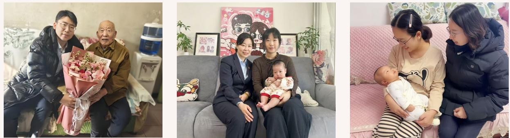  
公司开展慰问活动

## 健康安全守护发展

菜百股份始终秉持“生产必须安全，安全方能保障生产”的安全生产理念，将员工生命安全与职业健康置于首要位置。公司持续健全安全生产管理体系，压实全员安全生产责任，不断强化安全风险防控与隐患治理，全力降低职业健康与安全风险，着力打造安全、规范、稳定的作业环境。

## 安全生产

公司严格遵循《中华人民共和国安全生产法》等法律法规，由高级管理人员统筹推动，安保物业部落实，构建覆盖全员、全流程、全要素的安全生产管理体系。制定《安全生产工作责任制》，清晰界定各部门及各岗位人员安全职责，严格执行“谁主管、谁负责”原则，推动安全责任层层压实、落实到人。

同时，公司建立《安全防范管理制度》《安全风险分级管控制度》《消防安全管理制度》等一系列内部管理制度，为安全生产提供坚实制度保障。通过制度规范、监督考核、隐患排查治理等多措并举，持续健全安全生产长效机制，保障安全管理体系高效稳定运行。

## 公司安全生产管理架构

公司安全生产工作委员会统筹安全生产工作，制定安全管理制度并推进执行。

党委办公室对安全管理工作实施监督

团委负责团员青年安全生产宣传教育。

人力资源部负责职业健康制度的制定与实施。

工会依法维护员工安全健康权益

## 公司安全生产管理架构

安保物业部负责公司安全管理工作的统筹协调，落实安全法律法规和标准执行，开展日常安全检查和隐患排查。

各部门负责人对本部门安全工作负总责，严格执行安全生产规章制度，落实安全防范措施。

## 案例 公司开展“安全生产月”系列活动

2025年6月，公司围绕第24个全国“安全生产月”部署开展系列活动。公司以“人人讲安全、个个会应急—查找身边安全隐患”为核心主题，采用线上线下相结合的形式，进一步压实安全生产责任强化安全风险防控，切实防范各类生产安全事故发生。

## 案例 公司组织开展“消防月”系列主题活动

2025年11月，公司组织开展“消防月”系列主题活动。活动紧扣“预防为主、防消结合”的消防工作方针，聚焦规范用火用电安全管理，通过多样化消防宣传教育与实操演练，进一步提升全员消防安全意识与自防自救能力，强化消防安全风险防控，切实压实消防安全主体责任。

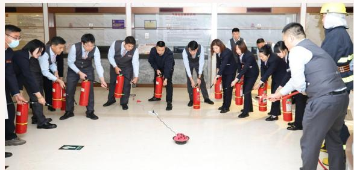

natural_image

Group of people in uniform and safety gear conducting fire extinguisher training indoors (no visible text or symbols)

公司组织开展消防演练

## 安全风险评估

公司成立安全风险评估小组，报告期内对公司开展全面安全风险排查、辨识与评估工作。通过对重点区域、重点部位等进行全方位、全过程的安全风险排查、辨识与评估，公司建立了安全风险数据库，绘制风险平面分布图。

公司结合安全风险特征及评估、分级结果，从组织、制度、技术、应急等维度制定管控措施，通过隔离危险源运用技术手段、落实个体防护、强化监测监控等方式，对风险源实施有效管控，实现风险规避、降低与动态监测。同时，对安全风险实行分级、分层、分类、分专业管理，逐一明确管控层级，落实责任部门、责任人员及具体管控措施，确保风险管控到位。

## 安全生产应急管理

菜百股份持续健全安全风险预防与控制体系，强化应急资源保障与实战化应急演练，全面提升突发事件应急处置能力。公司严格依据《中华人民共和国突发事件应对法》《中华人民共和国安全生产法》《生产安全事故应急预案管理办法》等法律法规，制定《安全应急处置预案》，构建安全应急管理长效机制，切实保障员工生命安全与企业正常经营秩序。

## 案例 公司组织开展突发事件应急处置培训

2025年9月，公司组织开展“突发事件应急救援及处置”专题安全生产培训。培训围绕突发情况处置流程、应急救援技巧、疏散避险等内容展开教学，结合实操讲解，熟练掌握应急技能，强化安全防范意识。此次培训有效提升了公司应对突发事件的实战能力

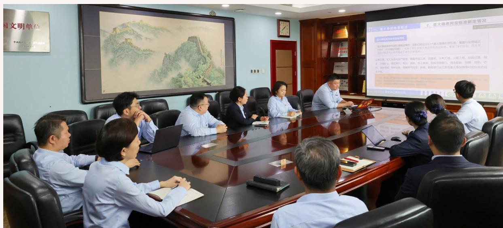

text_image

Meeting room scene with visible presentation screen and Chinese text on the left, showing officials seated around a conference table.

“突发事件应急救援及处置”专题培训

## 职业健康

菜百股份严格遵守《中华人民共和国职业病防治法》《特种作业人员安全技术培训考核管理规定》等法律法规坚持安全第一、预防为主、全员共治的职业健康安全方针，将员工身心健康视为企业核心竞争力。公司建立健全覆盖全职业周期的职业健康安全管理体系，明确各级管理责任与考核机制，通过健全规章制度、开展安全培训、组织健康检查、完善风险监测与风险评估等一系列预防管控措施，持续打造安全、健康、舒适的工作环境切实防范安全与职业健康风险，全力保障员工身心健康与合法权益。

## 公司职业健康管理举措

制定明确的职业健康与安全战略规划和目标，将员工健康安全融入公司发展战略，实现安全与效益的互促共进。

开展多样化的职业健康与安全培训，提升安全教育的针对性与实效性。重点培养员工的风险辨识能力、应急处置能力。

明确各级管理人员的职业健康安全职责，确保管理体系的持续有效运行，为公司的稳定发展提供有力保障。

对特种作业人员严格按人力资源和社会保障部有关规定，确保经专业安全技术培训并考核合格后，持有有效资格证书、具备相应安全技术能力方可上岗，从源头筑牢特种作业安全防线。

为员工举办健康讲座，科普健康知识，组建健康管理员团队，呼吁员工加强体育锻炼，健康生活。

持续完善职业健康与安全管理体系，优化风险分级管控与隐患排查治理双重预防机制，确保职业健康与安全管理的有效运行。

建立高效透明的职业健康安全沟通机制，鼓励员工积极参与安全决策，确保安全资讯、风险预警优秀实践案例实时畅通传递，营造人人关心安全、人人参与安全的协同氛围。

新员工上岗前进行入职体检，确保其身体状况符合岗位要求，避免有职业病或职业禁忌症者从事禁忌作业。

每年为员工提供项目完备的健康体检套餐，定期组织员工体检，及时发现和预防疾病。

提供全面的保险保障，包括工伤保险、安全生产责任险等。

## 2025 年

公司员工职业病发生率为 0%，工伤率为 0.48%，因工死亡人数 0 人。

公司工伤保险投入金额为 35.9万元，工伤保险人员覆盖率达100%，安全生产责任险人员覆盖率达 100%。

组织安全培训 23场，参与安全培训32,844人次；

安全培训总时长34,272小时，人均安全培训时长24小时；安全培训覆盖率 100%

## 职业健康与安全生产管理目标

不发生重大安全责任事故

## 公益行动回馈社会

公司持续开展多层次社会公益活动，将资源投入与专业服务相结合，围绕教育支持、公益捐赠及志愿服务等方向，构建常态化公益参与机制。

公司通过多种形式支持社会公益事业。报告期内，公司组织开展主题捐款活动，发动员工参与公益捐赠；同时向北京青少年发展基金会捐助10万元，持续支持青少年教育发展项目。公司长期参与“希望工程”等公益项目形成稳定、持续的公益投入机制

## 案例

## “爱在菜百”公益基金助力教育发展

2025年9月，公司联合北京青少年发展基金会开展“爱在菜百金色未来公益基金”专项活动，通过专项资金支持与长期帮扶机制，持续资助在校学生完成学业。该项目已连续开展多年，累计资助学生近千名，并荣获“北京希望工程30周年建设者”称号。通过稳定的资金投入与项目化运作，公司不断提升公益项目的持续性与覆盖范围，推动教育资源向有需要的群体延伸 。

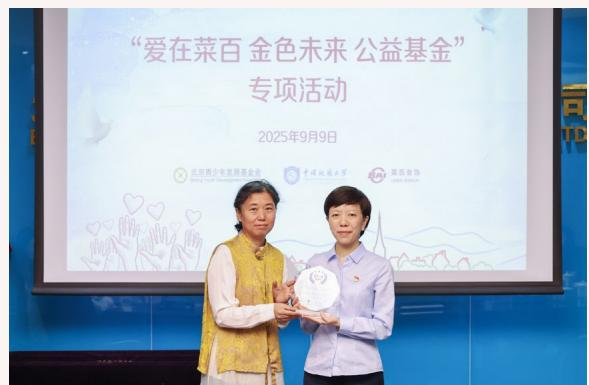

text_image

“爱在菜百 金色未来 公益基金”
专项活动
2025年9月9日
北京青少年发展基金会
中国航天大学
南京首饰

“爱在菜百金色未来公益基金”专项活动

公司常态化开展志愿服务，组织员工参与无偿献血、植树护绿等公益活动，并依托“五进”活动，将首饰清洗、保养及科普服务延伸至基层场景。报告期内累计开展相关活动900余场，服务群众超一万人次，在满足群众实际需求的同时，持续提升服务可及性。

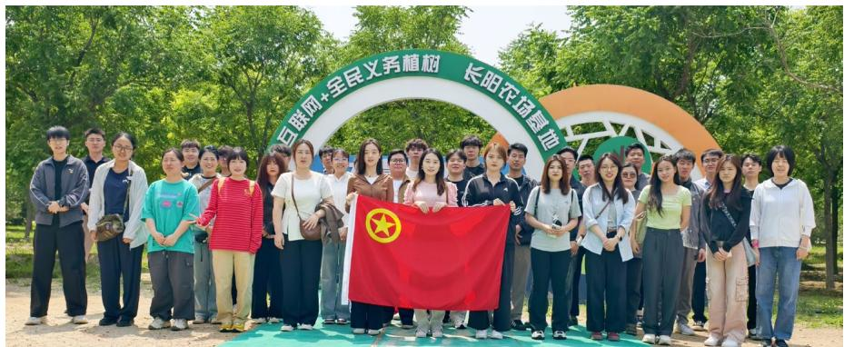

text_image

互联网+全民义务植树 长阳农垦基地

“青春‘碳’路·绿动未来”植树活动

在此基础上，公司结合自身业务特点，探索以技能培训为抓手的公益实践路径，通过开展面向社区居民及重点群体的编织技能培训等项目，帮助参与者掌握实用技能，提升就业能力与收入来源，推动公益向能力赋能转变。

## 案例 技能赋能促就业，拓展公益实践新路径

2025年5月，公司联合北京市西城区相关单位开展“西承技弈·巧手织梦”公益项目，通过面向社区居民及就业困难群体开展免费编织技能培训，帮助参与者掌握首饰编织等实用技能，提升灵活就业能力。项目以“技能培训+实践指导”的方式开展，首批吸引50余名居民参与，在专业团队指导下完成作品制作。该项目将企业在珠宝领域的专业优势转化为社会服务能力，不仅拓宽了公益参与形式，也为相关群体创造了就业与增收的可能，推动公益由单一帮扶向可持续发展转变。

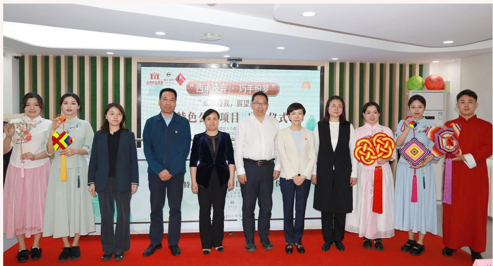

text_image

“西承技弈·巧手织梦”
“成就自我，展望着
特色公司项目启动仪式
2025年5月

“西承技弈·巧手织梦”特色公益项目

公司通过将公益捐赠、志愿服务与业务能力相结合，逐步推动公益实践由阶段性活动向常态化、可持续开展转变，持续提升社会服务覆盖面与实际成效。

<table><tr><td>指标名称</td><td>单位</td><td>2025年</td></tr><tr><td>组织开展各类公益活动、志愿服务</td><td>次</td><td>834</td></tr><tr><td>累计志愿服务时长</td><td>小时</td><td>超5,000</td></tr><tr><td>员工参与志愿服务</td><td>人次</td><td>约2,100</td></tr></table>

## 助力振兴服务民生

公司结合自身资源与行业特点，将教育帮扶作为参与乡村振兴的重要切入点，通过持续推进“黄金书屋”等公益项目，助力乡村地区教育资源改善与文化发展

公司联合公益机构及合作伙伴开展“黄金书屋快乐阅读”项目，通过捐赠图书、配置阅读设施及开展阅读活动等方式，为乡村学校提供学习支持。截至报告期末，该项目已在多地落地实施，持续为乡村学生提供阅读资源与成长支持。

同时，公司积极探索多方协同的公益模式，通过与基金会、企业及社会组织合作，整合资源推动项目实施，提升公益项目的覆盖范围与实施效率。通过长期投入与持续推进，公司不断强化教育帮扶在乡村振兴中的支撑作用。

## 案例 “黄金书屋”助力乡村教育振兴

2025年6月，公司联合合作伙伴在湖北武穴市第二实验小学落成“黄金书屋快乐阅读”项目，通过捐赠图书及学习物资，为学校打造阅读空间。项目以改善乡村教育条件为目标，不仅丰富了学生的阅读资源，也为当地教育环境提供了持续支持。通过该项目的实施，公司将公益资源向基层延伸，助力乡村教育发展与人才培养。

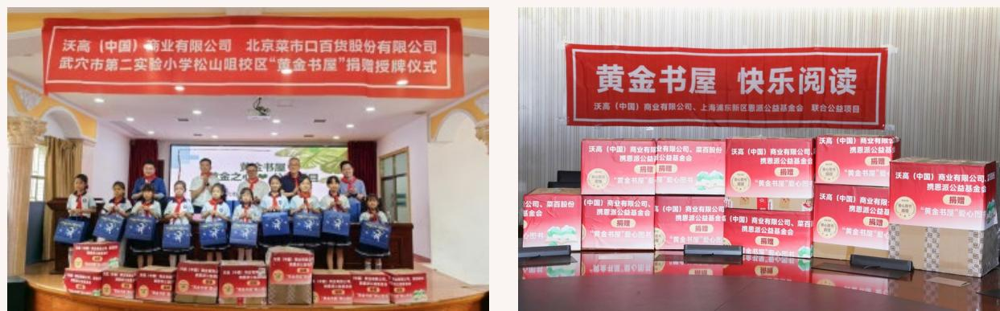  
“黄金书屋快乐阅读”项目

## 关键绩效表

治理绩效

<table><tr><td>指标名称</td><td>单位</td><td>2025年度数据</td></tr><tr><td>营业收入</td><td>万元</td><td>2,881,954.74</td></tr><tr><td>归母净利润</td><td>万元</td><td>113,306.64</td></tr><tr><td>总资产</td><td>万元</td><td>951,510.64</td></tr><tr><td>股东会召开次数</td><td>次</td><td>4</td></tr><tr><td>董事会召开次数</td><td>次</td><td>7</td></tr><tr><td>董事人数</td><td>人</td><td>11</td></tr><tr><td>独立董事占比</td><td>%</td><td>36.36</td></tr><tr><td>女性董事占比</td><td>%</td><td>36.36</td></tr><tr><td>独立董事专门会议召开次数</td><td>次</td><td>2</td></tr><tr><td>董事与高级管理人员培训次数</td><td>次</td><td>36</td></tr><tr><td>战略发展委员会召开次数</td><td>次</td><td>1</td></tr><tr><td>审计委员会召开次数</td><td>次</td><td>7</td></tr><tr><td>提名与薪酬考核委员会召开次数</td><td>次</td><td>2</td></tr><tr><td>反商业贿赂及反腐败培训与警示教育次数</td><td>次</td><td>4</td></tr><tr><td>反商业贿赂及反腐败培训员工覆盖率</td><td>%</td><td>100</td></tr><tr><td>反商业贿赂及反腐败培训管理层覆盖率</td><td>%</td><td>100</td></tr><tr><td>反商业贿赂及反腐败培训董事覆盖率</td><td>%</td><td>100</td></tr></table>

<table><tr><td>指标名称</td><td>单位</td><td>2025年度数据</td></tr><tr><td>公开披露投关活动次数</td><td>次</td><td>13</td></tr><tr><td>投资者回复率</td><td>%</td><td>100</td></tr><tr><td>披露临时公告数量</td><td>份</td><td>52</td></tr><tr><td>披露定期报告数量</td><td>份</td><td>4</td></tr></table>

环境绩效

<table><tr><td>指标名称</td><td>单位</td><td>2025年度数据</td></tr><tr><td>能源消耗总量</td><td>千克标准煤</td><td>754,155.17</td></tr><tr><td>直接能源消耗总量</td><td>千克标准煤</td><td>19,157.09</td></tr><tr><td>间接能源消耗总量</td><td>千克标准煤</td><td>734,998.08</td></tr><tr><td>取水量(自有物业范围)</td><td>立方米</td><td>12,965</td></tr><tr><td>直接温室气体排放(范围一)</td><td>吨二氧化碳当量</td><td>38.08</td></tr><tr><td>间接温室气体排放(范围二)</td><td>吨二氧化碳当量</td><td>3,173.23</td></tr><tr><td>温室气体排放总量</td><td>吨二氧化碳当量</td><td>3,211.31</td></tr><tr><td>生态环境相关行政处罚</td><td>起</td><td>0</td></tr><tr><td>重大环境事件</td><td>起</td><td>0</td></tr></table>

社会绩效

<table><tr><td>指标名称</td><td>单位</td><td>2025年度数据</td></tr><tr><td>产品质量行政处罚事件</td><td>起</td><td>0</td></tr><tr><td>重大质量问题</td><td>起</td><td>0</td></tr><tr><td>产品抽检合格率</td><td>%</td><td>100</td></tr><tr><td>客户投诉解决率</td><td>%</td><td>100</td></tr><tr><td>数据安全与隐私保护全员培训覆盖率</td><td>%</td><td>100</td></tr><tr><td>重大数据安全事件、客户隐私泄露事件数量</td><td>起</td><td>0</td></tr><tr><td>研发人员数量</td><td>人</td><td>27</td></tr><tr><td>研发人员数量占比</td><td>%</td><td>1.84</td></tr><tr><td>研发经费</td><td>万元</td><td>863.25</td></tr><tr><td>研发投入金额占主营业务收入比例</td><td>%</td><td>0.03</td></tr><tr><td>拥有专利授权数量</td><td>件</td><td>199</td></tr><tr><td>拥有注册商标数量</td><td>件</td><td>478</td></tr><tr><td>拥有著作权数量</td><td>件</td><td>12</td></tr><tr><td>拥有软件著作权数量</td><td>件</td><td>3</td></tr><tr><td>年度新申请专利数量</td><td>件</td><td>35</td></tr><tr><td>年度新申请著作权数量</td><td>件</td><td>3</td></tr><tr><td>供应商总数</td><td>家</td><td>138</td></tr></table>

<table><tr><td>指标名称</td><td>单位</td><td>2025年度数据</td></tr><tr><td>供应商本地化比例</td><td>%</td><td>100</td></tr><tr><td>本地化采购比例</td><td>%</td><td>100</td></tr><tr><td>签署供应商行为准则的百分比</td><td>%</td><td>100</td></tr><tr><td>新供应商总数</td><td>家</td><td>3</td></tr><tr><td>员工总数</td><td>人</td><td>1,470</td></tr><tr><td>劳动合同签订比例</td><td>%</td><td>100</td></tr><tr><td>新入职员工总数</td><td>人</td><td>194</td></tr><tr><td>少数民族员工总数</td><td>人</td><td>66</td></tr><tr><td>残疾员工总数</td><td>人</td><td>11</td></tr><tr><td>员工社会保险覆盖率</td><td>%</td><td>100</td></tr><tr><td>员工流失率</td><td>%</td><td>1.93</td></tr><tr><td>员工满意度得分</td><td>%</td><td>97.3</td></tr><tr><td>年度培训支出金额</td><td>万元</td><td>65.5</td></tr><tr><td>员工培训开展次数</td><td>次</td><td>479</td></tr><tr><td>员工培训覆盖率</td><td>%</td><td>100</td></tr><tr><td>员工培训平均时长</td><td>小时</td><td>170</td></tr><tr><td>安全培训场次</td><td>场</td><td>23</td></tr><tr><td>安全培训参与人次</td><td>人次</td><td>32,844</td></tr><tr><td>安全培训总时长</td><td>小时</td><td>34,272</td></tr><tr><td>人均安全培训时长</td><td>小时</td><td>24</td></tr><tr><td>安全培训覆盖率</td><td>%</td><td>100</td></tr><tr><td>工伤保险投入金额</td><td>万元</td><td>35.9</td></tr><tr><td>工伤保险人员覆盖率</td><td>%</td><td>100</td></tr><tr><td>安全生产责任险人员覆盖率</td><td>%</td><td>100</td></tr><tr><td>员工职业病发生率</td><td>%</td><td>0</td></tr><tr><td>工伤率</td><td>%</td><td>0.48</td></tr><tr><td>因工死亡人数</td><td>人</td><td>0</td></tr><tr><td>组织开展各类公益活动、志愿服务</td><td>次</td><td>834</td></tr><tr><td>累计志愿服务时长</td><td>小时</td><td>超5,000</td></tr><tr><td>员工参与志愿服务</td><td>人次</td><td>约2,100</td></tr></table>

指标索引表

<table><tr><td colspan="2">报告目录</td><td>SDGs</td><td>可持续发展报告标准(GRI Standards-2021)</td><td>上海证券交易所上市公司自律监管指引第14号——可持续发展报告(试行) $^{1}$ </td></tr><tr><td colspan="2">关于本报告</td><td>-</td><td>2-2、2-3</td><td>-</td></tr><tr><td colspan="2">董事长致辞</td><td>-</td><td>2-22</td><td>-</td></tr><tr><td colspan="2">走进菜百股份</td><td>-</td><td>2-1、2-6</td><td>-</td></tr><tr><td colspan="2">ESG管理</td><td>-</td><td>2-12、2-14、2-16、2-29、3-1、3-2、3-3</td><td>利益相关方沟通、尽职调查</td></tr><tr><td rowspan="5">强基固本夯实治理根基</td><td>党建引领企业发展</td><td rowspan="5">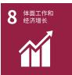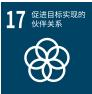</td><td></td><td></td></tr><tr><td>完善治理规范运作</td><td>2-9、2-10、2-19、2-20、2-27</td><td></td></tr><tr><td>健全风控稳健运营</td><td></td><td></td></tr><tr><td>坚守底线诚信经营</td><td>2-25、205-2</td><td>反商业贿赂及反贪污,反不正当竞争</td></tr><tr><td>规范信披强化沟通</td><td>2-16、2-27</td><td></td></tr><tr><td rowspan="6">品质经营打造信任品牌</td><td>严控品质筑牢根基</td><td rowspan="3">8 体面工作和经济增长[IMAGE]9 工业、创新和基础设施[IMAGE]</td><td></td><td>产品和服务安全与质量</td></tr><tr><td>用心服务提升体验</td><td>417-1</td><td>产品和服务安全与质量</td></tr><tr><td>守护信息保障安全</td><td></td><td>数据安全与客户隐私保护</td></tr><tr><td>创新驱动增强活力</td><td rowspan="3">12 全争的伙伴关系生产[IMAGE]16 精事、正义与强大机构[IMAGE]</td><td></td><td>创新驱动</td></tr><tr><td>知识产权护航品牌</td><td>2-27</td><td></td></tr><tr><td>规范采购协同发展</td><td>204-1、308-1、414-1</td><td>供应链安全,平等对待中小企业</td></tr></table>

<table><tr><td colspan="2">报告目录</td><td>SDGs</td><td>可持续发展报告标准(GRI Standards-2021)</td><td>上海证券交易所上市公司自律监管指引第14号——可持续发展报告(试行) $^{1}$ </td></tr><tr><td rowspan="4">绿色运营推动低碳发展</td><td>环境合规守护生态</td><td rowspan="4">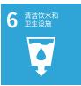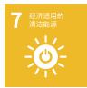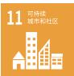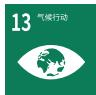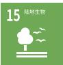</td><td>101-2、2-23、2-27</td><td>环境合规管理</td></tr><tr><td>资源节约与循环利用</td><td>103-1、103-5、301-2、301-3、302-1、302-4、303-5</td><td>能源利用,水资源利用,循环经济</td></tr><tr><td>污染防治与排放管理</td><td>305-6、305-7、306-1、306-2、306-4、306-5</td><td>污染物排放,废弃物处理</td></tr><tr><td>积极应对气候变化</td><td>201-2</td><td>应对气候变化</td></tr><tr><td rowspan="4">以人为本共建责任企业</td><td>关爱员工促进成长</td><td rowspan="4">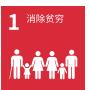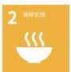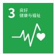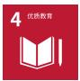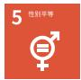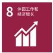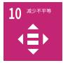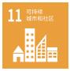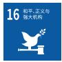</td><td>2-7、401-1、401-2、401-3、404-1、404-2、405-1</td><td>员工</td></tr><tr><td>健康安全守护发展</td><td>403-1、403-2、403-3、403-5、403-6、403-9</td><td>员工</td></tr><tr><td>公益行动回馈社会</td><td>413-1</td><td>社会贡献</td></tr><tr><td>助力振兴服务民生</td><td>413-1</td><td>乡村振兴</td></tr><tr><td rowspan="3">附录</td><td>关键绩效表</td><td>-</td><td>-</td><td>-</td></tr><tr><td>指标索引表</td><td>-</td><td>-</td><td>-</td></tr><tr><td>读者反馈表</td><td>-</td><td>-</td><td>-</td></tr></table>

## 读者反馈表

## 尊敬的读者：

您好！

感谢您能抽出宝贵时间阅读本报告。为向您及其他利益相关方提供更完善、更专业、更有价值的 ESG 信息，提升我们的FSG报告质量，我们诚挚地邀请您协助完成反馈信息表中的相关问题，请您不吝赐教。

1. 您对本报告的总体印象是否满意？

是 □

一般 □

否 □

2. 您认为本报告是否能反映菜百股份对可持续发展的重大影响？

是 □

一般 □

否 □

3.您认为本报告识别出的利益相关方及其与菜百股份关系的分析是否准确、全面？

是 □

一般 □

否 □

4.您认为本报告提供的信息是否全面？

是 □

一般 □

否 □

5. 您认为本报告提供的信息是否具有可读性

是 □

一般 □

否 □

6. 您认为本报告的整体设计是否满意？

是 □

一般 □

否 □

7. 您对《菜百股份 2025 年度环境、社会和公司治理 (ESG) 报告》的其他意见与建议，欢迎提出。

您可以选择以下方式告知我们您的宝贵意见

电话：010-83520088-638

地址：北京市西城区广安门内大街 306 号

电子邮箱：cb\_investors@bjcaibai.com.cn

联系人：北京菜市口百货股份有限公司证券事务部

natural_image

Green jade pendant with black stringed neck and diamond accents (no text or symbols visible)

natural_image

Close-up of a green beaded necklace with water droplets, set against a blurred background (no text or symbols)

## 菜百首饰

## CAIBAI JEWELRY

natural_image

3D rendering of a polished silver ring with green gem and diamond accents (no text or symbols)

natural_image

Green jade bangle with smooth, smooth texture (no text or symbols)

