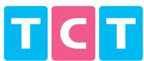

交控科技股份有限公司

TRAFFIC CONTROL TECHNOLOGY CO., LTD.

## CONTENTS

关于本报告 02

致利益相关方的一封信 03

走进交控科技 04

社会责任暨ESG管理 08

专题：科技守护自然！交控 10

科技无人机巡检系统助力七

里海湿地生态保护

01

治理责任

尊重规则，至诚守信

14优化公司治理

18提升内部管控

21保障股东权益

02

经济责任

客户至上，持续创新

26践行品质交付

30创新驱动发展

33强化安全管控

37提质量优服务

40供 应 链 管 理

41信息安全保护

03

人才责任

多元包容，终身学习

44人才多元管理

48赋能人才成长

52保障人才权益

56倾心人文关怀

N4

环境责任

践行低碳，和谐共生

62环境合规管理

64节用降废管理

66守护生态环境

05

社会责任

成就他人，助力进步

70推动行业发展

76开展科普活动

78投身社会公益

N6

未来可期

拥抱变化，奋斗拼搏

附录

82ESG关键绩效

83ESG报告索引

84其他称谓说明

85意见反馈

## 关于本报告

本报告是交控科技股份有限公司向社会公开发布的年度社会责任暨环境、社会及治理（ESG）报告（简称“本报告”）。本报告为了更好地履行社会责任，向各利益相关方披露公司在日常经营中推动可持续发展方面的理念、制度以及取得的成果。

## ■ 称谓说明

为便于表述和阅读，“交控科技股份有限公司”在报告中简称为“交控科技”“公司”或“我们”。

## ■ 报告范围

以交控科技股份有限公司为主体，涵盖旗下全资及控股子公司。

## ■ 时间范围

2025年1月1日至2025年12月31日，考虑到披露事项的连续性和可比性，部分内容适当向前追溯、向后延伸。

## ■ 参考标准

上海证券交易所上市公司自律监管指引第14号 可持续发展报告（试行）

上海证券交易所科创板上市公司自律监管指南第13号 可持续发展报告编制

中国社会科学院《中国企业社会责任报告编写指南》（CASS-ESG5.0）

香港联合交易所《环境、社会及管治报告指引》

联合国可持续发展目标（SDGs）

全球可持续发展标准委员会《可持续报告发展标准》（GRI Standards）

## ■ 数据说明

本报告引用数据均引自公司正式文件、统计报告，以及公司日常梳理、总结的优秀社会实践案例等。如无特别说明，本报告中所涉及货币金额均为人民币。

## ■ 发布形式

报告以印刷版和电子版形式发布，您可通过上海证券交易所网站（http://www.sse.com.cn）及本公司网站（http://www.bj-tct.com）查阅电子版报告。

## ■ 联系方式

交控科技股份有限公司

地址：北京市丰台区智成北街3号院交控大厦

邮箱：ir@bj-tct.com

电话：（010）83606086

## 致利益相关方的一封信

您好！当您展开这份报告时，我们正站在年度节点上，回望过去一年交控科技在可持续发展道路上的足迹。在全球交通行业深刻变革，机遇与挑战并存的当下我们始终怀揣“成为世界级技术领袖创造出行美好生活”的愿景，为社会、环境和治理创造长期价值。

## 践行精神，筑牢企业文化根基

2025 年，我们将德鲁克管理哲学深度融入企业管理，依托“客户至上、持续创新、安全为本”核心价值观，以九大文化凝聚全员共识。我们搭建高管沟通、员工互动、文化宣贯等多元平台，让企业文化从理念落地为行动，以强大的组织韧性与战略定力，为可持续发展筑牢精神根基。

## 双轮驱动，开拓未来交通格局

作为智慧交通的引领者，创新是为了更好的安全，2025年，我们持续创新，在PB-TACS，虚拟编组，智能调度等方面均取得了突破性进展：优化安全管理体系，确保产品全生命周期的可靠性，与此同时，我们积极将轨交领域的技术能力延伸至低空经济，通过综合管服系统赋能低空飞行管理等，无论是地下轨道还是低空航路，我们始终以技术创新服务于人让每一次出行更加安心、便捷。

## 夯实根基，护航治理稳健发展

完善的治理结构是企业可持续发展的基石。我们持续优化董事会构成，强化独立董事的专业性与独立性，推动决策更加科学、透明。风险管控方面，我们建立了覆盖业务全流程的内控体系，将合规管理嵌入日常运营，确保公司在快速变革中行稳致远。我们坚信，唯有以规范、透明、负责任的治理，方能赢得各方的长期信任。

## 践行责任，与员工、社会共成长

员工是公司宝贵的财富。我们致力于打造安全、包容、有温度的工作环境，2025年，我们进一步优化薪酬福利体系关注员工身心健康，通过丰富的文化活动增强组织凝聚力。环境方面，我们通过先进的技术为轨道交通和低空场景赋能在节省能耗的同时保护生态环境，社会层面，我们继续关注教育及社区发展，通过捐赠，志愿服务，奖学全等形式，以爱心与责任守护社会温暖。

展望未来，我们将持续坚持“轨交筑基、低空突破”双轮驱动战略，以科技创新驱动产业升级、以技术突破创造长期价值，在稳健经营、提升效益的同时，大力统筹推进环境保护、员工发展与社会责任履行。交控科技的每一步成长，都离不开您的信任与支持，衷心感谢一路相伴。期待与您携手同行，共同构建更智慧、更绿色、更高效的未来交通生态！

交控科技股份有限公司

## 走进交控科技

交控科技股份有限公司（简称“交控科技”，688015.SH）成立于2009年12月，并于2019年7月成为首批科创板上市企业。公司总部位于中国北京，同时在全国各地拥有多个子公司和项目部。

公司是领先全生命周期提供创新技术、安全产品和定制服务的轨道交通整体解决方案高新技术企业，为城市建设、公众出行，持续创造美好生活。公司在专业从事轨道交通信号系统的基础上，将业务范围延伸至城轨云、智能运维、智能培训，智能列车等生态链业务， 并围绕“低空经济”积极展开探索和战略布局，目前业务已覆盖全国大部分区域 并走出国门延伸至越南、澳大利亚、土耳其等多个国家。

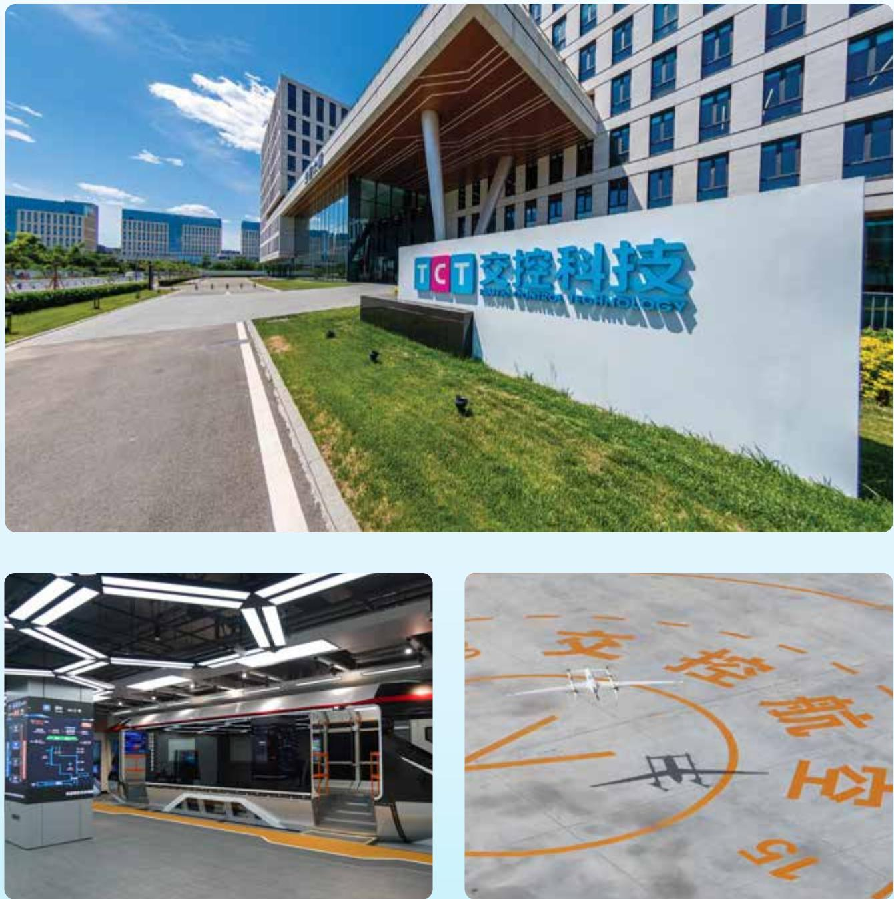

## 企业文化

交控科技“PMV&CV文化体系”是基于遵循国际先进的德鲁克管理理论框架及标准梳理出的具有交控基因与特质的企业愿景、宗旨、使命、文化及价值观体系。该体系为公司未来发展指明了方向，并深入每一位交控人的内心，成为共同认同的价值准绳及行为准则，也在凝心聚力、指导决策、甄选和识别人才等方面发挥了巨大的指引作用。

<table><tr><td rowspan="6">交控科技PMV&amp;CV灯塔</td><td rowspan="6">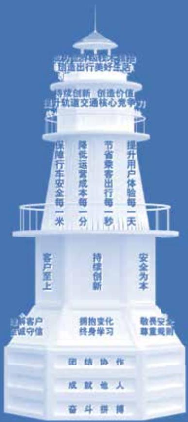</td><td>愿景Vision</td><td colspan="6">成为世界级技术领袖 创造出行美好生活</td></tr><tr><td>宗旨Purpose</td><td colspan="6">持续创新,创造价值提升轨道交通核心竞争力</td></tr><tr><td>使命Mission</td><td>保障行车安全每一米</td><td colspan="2">降低运营成本每一分</td><td colspan="2">节省乘客出行每一秒</td><td>提升用户体验每一天</td></tr><tr><td>核心价值观Values</td><td colspan="2">客户至上</td><td colspan="2">持续创新</td><td colspan="2">安全为本</td></tr><tr><td rowspan="2">文化Culture</td><td>理解客户</td><td>至诚守信</td><td>拥抱变化</td><td>终身学习</td><td>敬畏安全</td><td>尊重规则</td></tr><tr><td colspan="6">团结协作 成就他人 奋斗拼搏</td></tr></table>

## 荣耀时刻

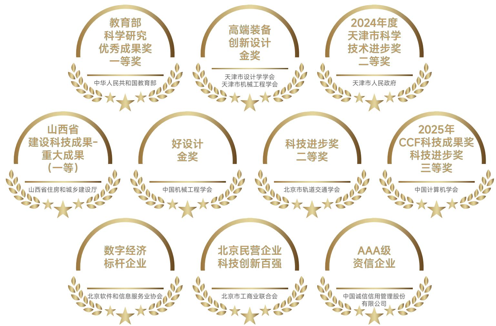

flowchart

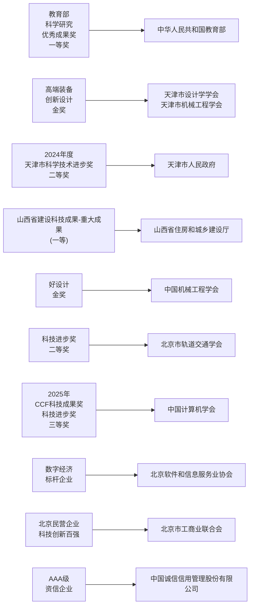
```mermaid
graph LR
  A["教育部\n科学研究\n优秀成果奖\n一等奖"] --> B["中华人民共和国教育部"]
  C["高端装备\n创新设计\n金奖"] --> D["天津市设计学学会\n天津市机械工程学会"]
  E["2024年度\n天津市科学技术进步奖\n二等奖"] --> F["天津市人民政府"]
  G["山西省建设科技成果-重大成果\n(一等)"] --> H["山西省住房和城乡建设厅"]
  I["好设计\n金奖"] --> J["中国机械工程学会"]
  K["科技进步奖\n二等奖"] --> L["北京市轨道交通学会"]
  M["2025年\nCCF科技成果奖\n科技进步奖\n三等奖"] --> N["中国计算机学会"]
  O["数字经济\n标杆企业"] --> P["北京软件和信息服务业协会"]
  Q["北京民营企业\n科技创新百强"] --> R["北京市工商业联合会"]
  S["AAA级\n资信企业"] --> T["中国诚信信用管理股份有限公司"]
```

## 交控信号

国家高新技术企业证书

北京市科学技术委员会北京市财政局国家税务总局北京市税务局

## 交控装备

天津市试点建设培育产教融合型企业

天津市发展和改革委员会交控科技（天津）低空经济科创园科普基地

天津市科学技术局天津市教育委员会、天津市科学技术协会天津市猎豹企业

天津市科学技术局

天津市“技能强企”行动企业培训中心

天津市人力资源和社会保障局

天津市先进级智能工厂

天津市工业和信息化局

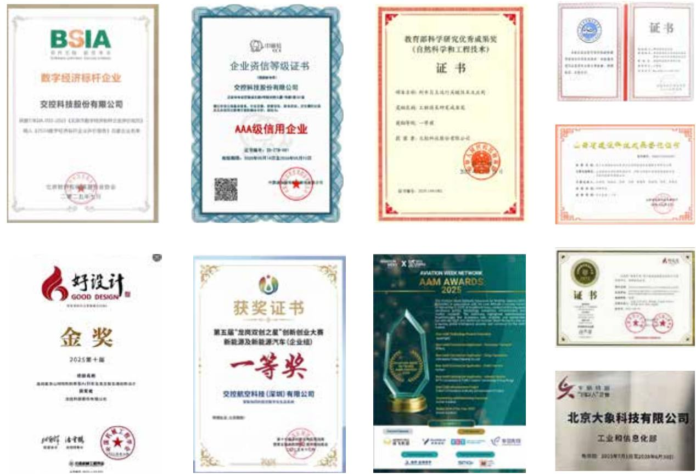

金奖

2025第+部

## 交控航空

2025AAM技术创新奖

航空周报

深圳第五届龙岗双创之星创新创业大赛一等奖

第十七届深创赛龙岗区预选赛暨第五届龙岗双创之星大赛组委会

## 交控安捷

第二十一届全国交通企业管理现代化创新成果二等奖

中国交通企业管理协会与交通行业优秀企业管理成果评审委员会

## 交控智维

2025年科技型中小企业认定

广西壮族自治区科学技术厅

2025年高新技术企业认定

全国高新技术企业认定管理工作领导小组办公室

## 大象科技

国家级专精特新“小巨人”企业

工业和信息化部

2025年北京市首批“产教评”技能生态链（低空技术）链主单位

北京市人社局

丰台区职业技能培训学院实训基地

丰台区人力资源和社会保障局

## 社会责任暨ESG管理

作为综合立体交通的引领者，交控科技将ESG理念深度融入企业治理与运营决策。我们始终秉持“成为世界级技术领袖，创造出行美好生活”的愿景，聚焦数智创新与绿色低碳，推动轨道交通与低空经济协同发展。通过完善ESG管理体系，强化责任担当，公司致力于以安全、高效、智能的技术方案赋能社会进步，携手各方共创可持续发展的美好未来。

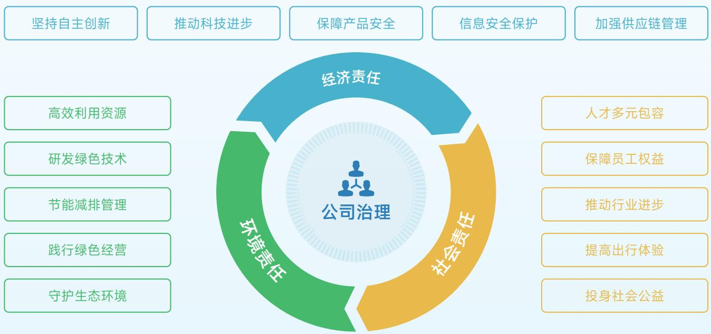

flowchart

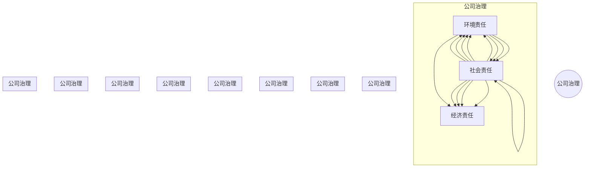
```mermaid
graph TD
  Center(("公司治理"))
  
  subgraph Left_Bottom ["公司治理"]
    direction TB
    Env["环境责任"]
    Soc["社会责任"]
    Econ["经济责任"]
  end
  
  subgraph Right_Bottom ["公司治理"]
    direction TB
  Soc --> Env
  Soc --> Econ
  end
  
  subgraph Bottom_Left ["公司治理"]
    direction TB
  Env --> Soc
  Soc --> Econ
  end
  
  subgraph Bottom_Right ["公司治理"]
    direction TB
  Soc --> Env
  Soc --> Econ
  end
  
  subgraph Bottom_Center ["公司治理"]
    direction TB
  Env --> Soc
  Soc --> Econ
  end
  
  subgraph Bottom_Center_Left ["公司治理"]
    direction TB
  Env --> Soc
  Env --> Econ
  end
  
  subgraph Bottom_Center_Right ["公司治理"]
    direction TB
  Soc --> Env
  Soc --> Soc
  end
  
  subgraph Bottom_Center_Right_Left ["公司治理"]
    direction TB
  Soc --> Env
  Soc --> Soc
  end
  
  subgraph Bottom_Center_Right_Right ["公司治理"]
    direction TB
  Soc --> Env
  end
```

## ESG职责与管理

2025年，交控科技进一步完善ESG治理机制，构建了“决策-组织-执行”三级联动体系。集团统筹战略方向，各子公司及职能部门围绕责任议题开展实践活动，形成常态化沟通与闭环管理。该架构有效促进责任理念与业务全流程融合，为提升公司综合价值、回应利益相关方期待提供坚实保障。

## 决策层

董事会、总办会

全面决策ESG重大议题；审阅对外披露的信息；重大事项监督落地情况等

## 组织层

ESG管理小组

统筹ESG体系建设；相关组织及报告的规划；持续优化ESG实践等

## 执行层

各部门及控股子公司强化相关方沟通；维护和报送ESG指标数据；落地与实施ESG相关具体工作等

## 实质性议题分析

2025年，公司遵循双重重要性原则，结合行业趋势与利益相关方诉求，系统识别并筛选关键ESG议题，作为报告重点披露方向，精准回应各方期待，持续提升可持续发展管理水平。

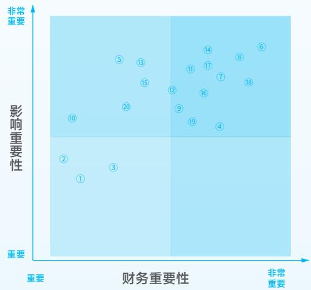

scatter

| Item | Financial Importance (approx.) | Impact Importance (approx.) |
| --- | --- | --- |
| 1 | ~0.25 | ~0.35 |
| 2 | ~0.25 | ~0.45 |
| 3 | ~0.45 | ~0.40 |
| 4 | ~0.65 | ~0.50 |
| 5 | ~0.45 | ~0.85 |
| 6 | ~0.95 | ~0.90 |
| 7 | ~0.75 | ~0.80 |
| 8 | ~0.85 | ~0.85 |
| 9 | ~0.60 | ~0.65 |
| 10 | ~0.25 | ~0.60 |
| 11 | ~0.70 | ~0.80 |
| 12 | ~0.65 | ~0.75 |
| 13 | ~0.55 | ~0.85 |
| 14 | ~0.75 | ~0.90 |
| 15 | ~0.60 | ~0.75 |
| 16 | ~0.75 | ~0.70 |
| 17 | ~0.75 | ~0.80 |
| 18 | ~0.90 | ~0.75 |
| 19 | ~0.75 | ~0.60 |
| 20 | ~0.45 | ~0.65 |

<table><tr><td>E:环境</td><td>S:社会</td><td>G:治理</td></tr><tr><td>1加强环境管理</td><td>4维护股东权益</td><td>16强化合规经营</td></tr><tr><td>2绿色办公管理</td><td>5提升客户服务</td><td>17企业管理模式</td></tr><tr><td>3废弃物管理</td><td>6系统安全稳定</td><td>18企业发展规划</td></tr><tr><td></td><td>7注重技术创新</td><td>19供应链管理</td></tr><tr><td></td><td>8科技成果转化</td><td>20注重安全生产</td></tr><tr><td></td><td>9人才多元化</td><td></td></tr><tr><td></td><td>10沟通和民主发声</td><td></td></tr><tr><td></td><td>11关注员工发展</td><td></td></tr><tr><td></td><td>12保障员工权益</td><td></td></tr><tr><td></td><td>13推动行业发展</td><td></td></tr><tr><td></td><td>14保障乘客出行</td><td></td></tr><tr><td></td><td>15开展社会公益</td><td></td></tr></table>

竞争议题，但在运营中逐步开展管理，对可能产生的负面影响持续监控。

## 利益相关方沟通

公司通过交流会、路演等多渠道与利益相关方积极互动，充分了解各方诉求，明确ESG管理重点并融入日常运营，及时回应期待、传递公司价值，携手各方实现共赢发展。

<table><tr><td colspan="2">重要利益相关方</td><td>共同的可持续发展目标</td><td>沟通与回应</td></tr><tr><td rowspan="2"></td><td rowspan="2">政府及监管机构</td><td>守法合规经营 促进经济发展</td><td>政企沟通 调研考察</td></tr><tr><td>产品安全可靠 服务国计民生</td><td>监督检查</td></tr><tr><td rowspan="2"></td><td rowspan="2">股东及投资者</td><td>公司治理 经营业绩</td><td>股东大会 业绩发布会 投资者交流会</td></tr><tr><td>信息披露 社会责任</td><td>及时信息披露 邮件及电话</td></tr><tr><td rowspan="2"></td><td rowspan="2">客户及乘客</td><td>创新技术 系统安全</td><td>客户日常交流 客户满意度调查 项目工程交付</td></tr><tr><td>客户服务 绿色产品 安全高效出行</td><td>展会论坛活动 重视乘客体验</td></tr><tr><td rowspan="2"></td><td rowspan="2">供应商与合作伙伴</td><td>供应链管理 产品责任</td><td>技术交流</td></tr><tr><td>互利共赢 产业链完备</td><td>供应商调查 供应商大会</td></tr><tr><td rowspan="2"></td><td rowspan="2">员工</td><td>员工成长发展 保障劳动权益</td><td>民主沟通 多开岔道</td></tr><tr><td>职业健康安全 关注员工生活</td><td>职业发展培训 员工多彩活动</td></tr><tr><td rowspan="2"></td><td rowspan="2">行业协会</td><td>公平竞争 科技创新研发</td><td>参加行业论坛 考察互访</td></tr><tr><td>助力行业进步</td><td>加强合作交流</td></tr><tr><td rowspan="2"></td><td rowspan="2">社会和环境</td><td>行业进步 社会公益</td><td>行业交流 信息披露</td></tr><tr><td>志愿服务 绿色经营</td><td>公益活动 开展志愿服务</td></tr></table>

## 专题：科技守护自然！交控科技无人机巡检系统助力七里海湿地生态保护

## 项目背景：京津绿肺的保护挑战

天津七里海湿地自然保护区位于天津市宁河区，总面积达149.28平方公里，素有“京津绿肺”之称，是东亚—澳大利西亚候鸟迁徙路线上的重要驿站。每年数百万只候鸟在此停歇、栖息，麋鹿等珍稀动物在此繁衍生息。然而，这片生态宝地的保护工作却面临诸多挑战：44.85平方公里的核心保护区面积广阔，传统人力巡护成本高昂；芦苇荡等区域地形复杂，交通工具难以进入，严重限制了巡查效率与频次；违法闯入、偷盗捕猎等行为的发现和执法取证十分困难。

过去人力巡逻几个小时才能完成一轮工作，且很难做到全覆盖，如何运用科技手段提升保护效能，成为摆在管理者面前的迫切课题。

## 项目落地：交控科技的科技赋能

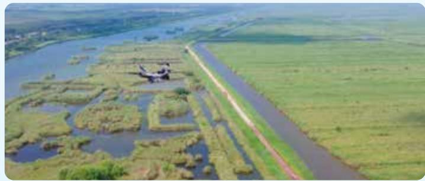

natural_image

Aerial view of a helicopter hovering over a river with wetlands and a long canal lined up (no visible text or symbols)

2024年，交控科技中标“天津七里海湿地自然保护区无人机巡护服务项目”。公司作为国内轨道交通信号系统领域的领军企业，将多年积累的智能控制、多传感器融合、AI识别等核心技术延伸至低空经济领域，为七里海湿地量身打造了无人机巡检系统。交控智飞科技（天津）有限公司承担项目具体实施，该项目构建的“天空地”一体监测体系，实现了对湿地的全方位守护。

## 技术方案：构建天空地一体化监测体系

项目在保护区内布设了5套智能化无人机自动化机库，每套机库均可独立完成无人机放飞任务，实现精准降落，快速充电，确保24小时不间断巡检。5架无人机可同时起飞作业，通过定制化的飞行指控软件与智能识别系统，构建了具备可持续拓展能力的生态保护及综合巡护系统。

## 多机高效协同：

多架无人机协同作业，快速巡航保护区全域，在复杂地形中精准飞行，高效排查各类隐患。针对可疑区域，无人机可进行低空精细化巡查

## 智能AI识别：

无人机搭载的AI算法实时分析图像数据，精准识别非法闯入行为与烟火迹象。一旦发现违法闯入或火情隐患，系统即刻触发告警机制，同步将目标位置、现场画面等信息推送至运行中心，确保风险第一时间响应处置。

## 大型动物统计：

通过图像识别与AI算法，系统可精准识别麋鹿个体，实现数量统计与种群分布监测，快速处理海量图像数据，为保护区制定科学的生态保护与管理策略提供数据支撑。

## 多部门数据联动：

系统与现有平台实现数据共享，可联动公安、消防、林业等部门，发现违法闯入、火情等问题时实时推送现场信息，实现多部门协同处置。

为最大限度减少无人机巡护对鸟类的影响，工作人员将无人机巡航高度设定在鸟类常规活动层之上，同时结合季节性生态监测数据，在鸟类繁殖期、栖息地等生态敏感时段与区域动态调整飞行轨迹，保持安全监测距离。这一设计既确保巡护任务高效执行，又降低了对野生动物的惊扰。

## 项目成效：智慧守护的显著成果

项目实施以来，七里海湿地的保护工作实现了质的飞跃。

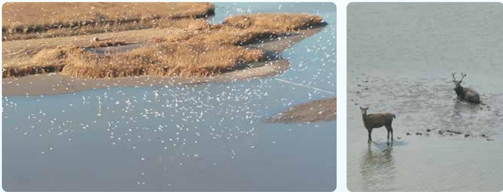

## 效率大幅提升：

无人机巡查一圈仅需20分钟，较传统人力巡逻数小时大幅提升效率。5架无人机可在半小时内完成保护区全域覆盖，24小时内进行十轮巡检，基本覆盖保护区的全部范围，实现全天候守护。

## 成本显著降低：

巡护人员数量减少56%，巡检效率提升8倍，管理成本下降至少20%，应急处置时间大幅缩短。

## 保护更加精准：

系统能够精准定位鸟窝位置，为生物多样性保护提供了前所未有的数据支撑。七里海湿地的生物多样性保护因此拥有了“千里眼”般的监测能力。

## 生态环境持续向好：

近年来，随着科技手段的应用和生态环境修复七里海湿地鸟类数量大幅增加。以往一年过境的候鸟仅有十几万只，如今已增至五十多万只，甚至还能观察到在本地越冬的灰鹤，充分展现了生态保护的积极成效。

## ESG价值：科技创新赋能生态保护

天津七里海湿地无人机巡护项目是交控科技将轨道交通领域积累的智能控制技术延伸至低空经济领域的成功实践。项目展示了公司以科技创新赋能生态保护的ESG承诺，体现了企业对社会责任的担当。

该项目构建的“天空地”一体化监测体系，不仅为七里海湿地打造了全天候守护网，也为其他自然保护区提供了可复制、可推广的智慧保护模式。高科技手段的应用，使七里海湿地的保护更加精准、完善、系统。交控科技正以实际行动，在科技与生态之间架起一座温柔的桥梁，让科技之光守护自然之美。

# 01 治理责任

# 尊重规则，至诚守信

完善的公司治理架构，是企业实现高质量、可持续发展的重要基石。交控科技坚守合规诚信的经营准则，持续搭建科学高效的现代化治理体系 不断优化治理架构、健全监督管理机制保障决策公开透明与运营依法合规，切实维护各方利益相关者权益，为企业长期稳健经营与创新发展筑牢根基。

## 回应联合国可持续发展

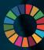

## 目标（SDGs）：

5 性别平等

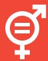

11 可持续城市和

12 负责任消费和生产

16 和平，正义与强大机构

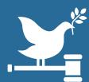

17 促进目标实现的伙伴关系

natural_image

Three business professionals shaking hands at a long conference table in an office setting with large windows and cityscape in the background (no visible text or symbols)

## 优化公司治理

公司严格遵照《中华人民共和国公司法》《中华人民共和国证券法》等法律法规，以及中国证监会、上海证券交易所的相关要求，以《交控科技股份有限公司章程》为基础，持续完善内部治理体系，健全内部法人治理结构，不断优化内部控制制度体系，提高公司治理水平。

2025年，公司始终坚守合规底线，积极创新公司治理方式，不断提升三会运作效率，发挥独立董事的独立性，贯彻执行股东会的决议，及时履行信息披露义务，实现公司高质量、可持续发展，荣获多方认可。

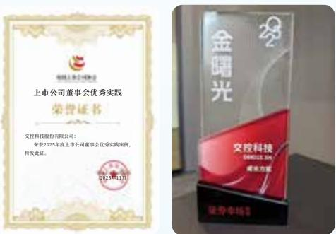

## 治理结构

目前，公司建立了由股东会、董事会、专门委员会组成的公司治理架构，形成了科学规范、权责明晰、互相制衡、运作高效的治理体系，有力保障公司稳健运营与可持续发展。

报告期内，公司积极响应新公司法、证监会、上交所的要求，根据《公司法》《上市公司章程指引》等相关法律法规、规章及规范性文件的规定，以及中国证监会《关于新<公司法>配套制度规则实施相关过渡期安排》的有关要求，公司取消监事会与监事，由董事会审计委员会行使监事会的职权，同时对《公司章程》等相关制度作出相应修订。

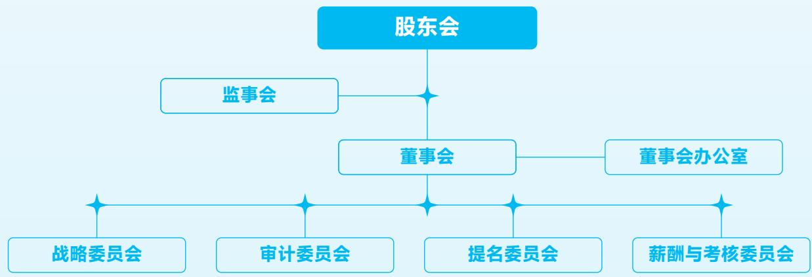

flowchart

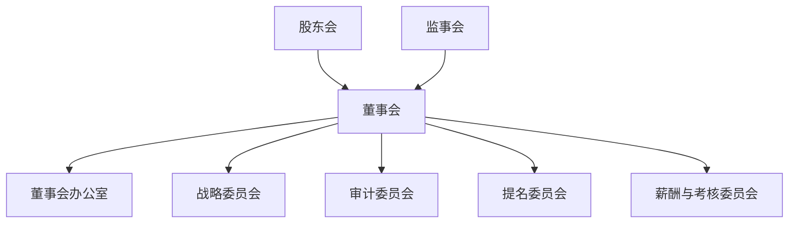
```mermaid
graph TD
  A["股东会"] --> B["董事会"]
  C["监事会"] --> B
  B --> D["董事会办公室"]
  B --> E["战略委员会"]
  B --> F["审计委员会"]
  B --> G["提名委员会"]
  B --> H["薪酬与考核委员会"]
```

## 三会制度

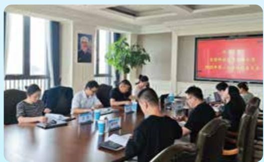

text_image

Meeting room photo with visible presentation screen showing Chinese text and portrait in background

公司建立健全了完善公司治理制度，修订了《公司章程》等一系列文件，依法依规科学界定和落实股东会、董事会职权。公司股东会、董事会等按照《公司法》《公司章程》及公司各项议事规则和工作制度的规定，行使各自的权利，履行各自的义务，形成了权力机构、决策机构、监督机构和管理层相互独立、权责明确、相互协调相互制衡的内部治理结构。

## 股东会

股东会是公司最高权力机构。股东会召集、召开及表决程序严格遵守相关法律法规及《公司章程》的要求，确保股东对公司经营方针，利润分配，股权激励等重大事项的知情权，参与权，表决权保证所有股东特别是中小股东的合法权益。

召开股东大会3次

审议通过议案13项

## 董事会

董事会作为公司经营决策的常设机构，对股东会负责，组成科学、职责清晰、制度健全。依据《公司法》和《公司章程》规定，针对股东会决议事项，董事会对公司重大生产经营计划、投资方案、主要管理制度、关联交易等作出有效决议，督促管理层贯彻执行各项工作，确保公司依法合规运作，公平对待所有股东，并维护其他利益相关者的合法权益。

召开董事会5次

审议通过议案41项

## 董事会独立性

独立性是董事会规范履职与科学决策的重要保证。独立董事按照《公司章程》《独立董事工作制度》等规定独立履行职责 在董事会中发挥参与决策，监督制衡，专业咨询作用，维护公司整体利益，保护中小股东的合法权益，发挥了积极的作用。2025年，共召开独立董事专门会议4次，审议通过议案5项。

## 董事会规范性

优化董事会结构，施行职工董事制度。职工董事作为公司内部员工，对公司业务和经营有着深入的了解，为董事会提供有价值的意见和建议，同时推进民主管理更好融入公司法人治理，董事会结构进一步优化。公司高度重视治理能力的提升，及时向董监高推送监管动态信息，积极组织董监高培训。

## 2025年重大调整：

董事会成员人数由11人调整为12人，新增职工董事1人

其中，独立董事4人

非独立董事7人

职工董事 1人

其中，男性董事8人

女性董事4人

## 监事会

2025年11月，公司依据新公司法的最新要求，取消监事会，由审计委员会承接监事会职能。

2025年度监事会履职期间，监事会按照《公司章程》《监事会议事规则》以及相关法律法规的要求认真履行职权，依法检查公司财务，监督董事、高级管理人员履职的合法合规性，行使公司章程规定的其他职权，维护公司及股东的合法权益。监事会的召开有利于有效保障公司股东权益、公司利益和员工的合法权益，促进公司规范运作。

召开监事会5次

审议通过议案25项

## 董事会下设专委会

战略委员会

<table><tr><td>成员</td><td>郜春海(主任委员)、邓爱群、陈博雨</td></tr><tr><td>关键数据</td><td>召开战略委员会1次 审议通过议案1项</td></tr></table>

对公司长期发展战略规划和重大投资决策进行研究并提出建议；  
对《公司章程》规定须经董事会批准的重大投资、融资方案进行研究并提出建议；  
对以上事项的实施进行检查；  
董事会授权的其他事项。

对公司的经营战略包括但不限于产品战略、市场战略、营销战略、研发战略、人才战略进行研究并提出建议；  
对《公司章程》规定须经董事会批准的重大资本运作、资产经营项目进行研究并提出建议；  
对其他影响公司发展的重大事项进行研究并提出建议；

审计委员会

<table><tr><td>成员</td><td>彭红星(主任委员)、吴智勇、王梅</td></tr><tr><td>关键数据</td><td>召开审计委员会4次 审议通过议案21项</td></tr></table>

审核上市公司的财务信息及其披露；  
监督及评估内部审计工作，负责内部审计与外部审计的协调；  
行使《公司法》规定的监事会的职权；

监督及评估外部审计工作，提议聘请或更换外部审计机构；  
监督及评估公司的内部控制；  
法律法规、证券交易所自律规则、公司章程规定及董事会授权的其他事项。

提名委员会

<table><tr><td>成员</td><td>吴智勇(主任委员)、陈飞、陈颖</td></tr><tr><td>关键数据</td><td>召开提名委员会0次</td></tr></table>

提名委员会负责拟定董事、高级管理人员的选择标准和程序，对董事、高级管理人员人选及其任职资格进行遴选、审核，并就下列事项向董事会提出建议：

提名或者任免董事；

聘任或者解聘高级管理人员；

法律、行政法规、中国证监会规定和公司章程规定的其他事项。

董事会对提名委员会的建议未采纳或者未完全采纳的，应当在董事会决议中记载提名委员会的意见及未采纳的具体理由，并进行披露。

薪酬与考核委员会

<table><tr><td>成员</td><td>陈飞(主任委员)、彭红星、李飞、冯波、乔栋</td></tr><tr><td>关键数据</td><td>召开薪酬与考核委员会1次 审议通过议案2项</td></tr></table>

公司董事会薪酬与考核委员会负责制定董事、高级管理人员的考核标准并进行考核，制定、审查董事、高级管理人员的薪酬政策与方案，并就下列事项向董事会提出建议：

董事、高级管理人员的薪酬；

制定或者变更股权激励计划、员工持股计划，激励对象获授权益、行使权益条件成就；

董事、高级管理人员在拟分拆所属子公司安排持股计划；

法律、行政法规、中国证监会规定和公司章程规定的其他事项。

董事会对薪酬与考核委员会的建议未采纳或者未完全采纳的，应当在董事会决议中记载薪酬与考核委员会的意见及未采纳的具体理由，并进行披露。

## 提升内部管控

## 健全制度

公司建立健全内部控制框架体系，制定了《公司章程》、《股东会议事规则》《董事会议事规则》等内部控制制度，覆盖公司主要业务的内部控制流程，对风险和内部控制进行分析和评估，以完善和加强公司的内部控制管理，促进内部控制目标的实现。

报告期内公司根据《公司法》《上市公司意程指引》等相关法律法规，规意及规范性文件的规定以及中国证监会《关于新<公司法>配套制度规则实施相关过渡期安排》的有关要求，取消监事会，并对《公司章程》及各项内部控制制度进行修订、完善，并制定《董事、高级管理人员离职管理制度》规范董事、高级管理人员离任后续事项，进一步完善公司内部控制制度治理体系。

## 2025年主要制度修订亮点：

取消监事会相关条款，明确审计委员会承接监事会职能；  
制定《董事、高级管理人员离职管理制度》规范离任后续事项；

增加职工董事制度，完善董事会成员结构；

更新《信息披露管理制度》，提升信息披露质量和透明度。

## 规范决策

总经理办公会是公司总经理发起、经营管理部组织的高层级决策与沟通机制，采取现场召开与传签相结合的方式。原则上每周召开一次现场会议，遇紧急事项则以传签方式高效决策，确保经营事项及时响应、规范审批。

总办会的规范运行，体现了公司内控管理的严谨性与执行力，通过集体决策、权责清晰、程序透明，强化了对重大事项的管控与监督，有效防范经营风险，保障决策科学、合规、可追溯。作为公司治理的重要环节，总办会为健全内控体系、提升治理效能提供了坚实支撑。

总经理办公会38次

审议通过议案151项

natural_image

Illustration of business professionals reviewing a calendar with gears in the background (no text or symbols)

## 完善体系

公司将社会责任管理体系作为实现可持续发展的核心支撑，深度融合“客户至上，持续创新，安全为本”的管理方针，构建覆盖质量、环境、职业健康安全、信息安全等多维度的综合管理体系。

结合公司战略规划、内外部环境变化，顾客需求，对公司体系进行顶层策划，共识别管理过程（MP）1个、顾客导向过程（COP）3个、支持过程（SP）6个，通过严格的过程控制，确保过程上下游之间衔接紧密，环环相扣，最终达成顾客满意。

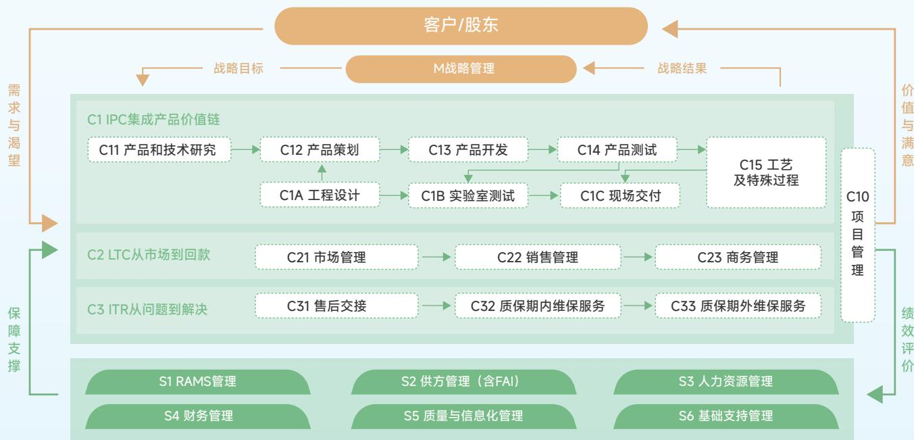

flowchart

```mermaid
graph TD
  subgraph C1_IPC["\"C1 IPC集成产品价值链\""]
  A["C11 产品和技术研究"] --> B["C12 产品策划"]
  B --> C["C13 产品开发"]
  C --> D["C14 产品测试"]
  D --> E["C15 工艺及特殊过程"]
  F["C1A 工程设计"] --> G["C1B 实验室测试"]
  G --> H["C1C 现场交付"]
  end

  subgraph C2_LTC["\"C2 LTC从市场到回款\""]
  I["C21 市场管理"] --> J["C22 销售管理"]
  J --> K["C23 商务管理"]
  end

  subgraph C3_ITR["\"C3 ITR从问题到解决\""]
  L["C31 售后交接"] --> M["C32 质保期内维保服务"]
  M --> N["C33 质保期外维保服务"]
  end

  subgraph sg["\"客户/股东\""]
  O["M战略管理"] -->|"战略目标"| P["需求与渴望"]
  Q["客户/股东"] -->|"价值与满意"| R["战略结果"]
  end

  subgraph sg_2["\"绩效评价\""]
  S1["S1 RAMS管理"] --> T["S2 供方管理（含FAI）"]
  U["S3 人力资源管理"] --> V["S6 基础支持管理"]
  end

  style A fill:#f9f9f9,stroke:#333
  style B fill:#f9f9f9,stroke:#333
  style C fill:#f9f9f9,stroke:#333
  style D fill:#f9f9f9,stroke:#333
  style E fill:#f9f9f9,stroke:#333
  style F fill:#f9f9f9,stroke:#333
  style G fill:#f9f9f9,stroke:#333
  style H fill:#f9f9f9,stroke:#333
  style I fill:#f9f9f9,stroke:#333
  style J fill:#f9f9f9,stroke:#333
  style K fill:#f9f9f9,stroke:#333
  style L fill:#f9f9f9,stroke:#333
  style M fill:#f9f9f9,stroke:#333
  style N fill:#f9f9f9,stroke:#333
  style O fill:#f9f9f9,stroke:#333
  style P fill:#f9f9f9,stroke:#333
  style Q fill:#f9f9f9,stroke:#333
  style R fill:#f9f9f9,stroke:#333
  style S fill:#f9f9f9,stroke:#333
  style T fill:#f9f9f9,stroke:#333
  style U fill:#f9f9f9,stroke:#333
  style V fill:#f9f9f9,stroke:#333
  style W fill:#f9f9f9,stroke:#333
  style X fill:#f9f9f9,stroke:#333
  style Y fill:#f9f9f9,stroke:#333
  style Z fill:#f9f9f9,stroke:#333
  style AA fill:#f9f9f9,stroke:#333
  style AB fill:#f9f9f9,stroke:#333
  style AC fill:#f9f9f9,stroke:#333
  style AD fill:#f9f9f9,stroke:#333
  style AE fill:#f9f9f9,stroke:#333
  style AF fill:#f9f9f9,stroke:#333
  style AG fill:#f9f9f9,stroke:#333
  style AH fill:#f9f9f9,stroke:#333
  style AI fill:#f9f9f9,stroke:#333
  style AJ fill:#f9f9f9,stroke:#333
  style AK fill:#f9f9f9,stroke:#333
  style AL fill:#f9f9f9,stroke:#333
  style AM fill:#f9f9f9,stroke:#333
  style AN fill:#f9f9f9,stroke:#333
  style AO fill:#f9f9f9,stroke:#333
  style AP fill:#f9f9f9,stroke:#333
  style AQ fill:#f9f9f9,stroke:#333
  style AR fill:#f9f9f9,stroke:#333
  style AS fill:#f9f9f9,stroke:#333
  style AT fill:#f9f9f9,stroke:#333
  style AU fill:#f9f9f9,stroke:#333
  style AV fill:#f9f9f9,stroke:#333
  style AW fill:#f9f9f9,stroke:#333
  style AX fill:#f9f9f9,stroke:#333
  style AY fill:#f9f9f9,stroke:#333
  style AZ fill:#f9f9f9,stroke:#333
  style AC fill:#f9f9f9,stroke:#333
  style AD fill:#f9f9f9,stroke:#333
  style AE fill:#f9f9f9,stroke:#333
  style AF fill:#f9f9f9,stroke:#333
  style AG fill:#f9f9f9,flow://process/]
  style AH fill:#ff0000000000000000000000000000000000000000000000000000000000000000000000000000000000000000000000000000
```

公司构建了覆盖管理手册、过程乌龟图、流程、标准、方法五类层级的体系文件架构，结构清晰、逻辑严密，为各体系高效运行提供了制度保障。该架构体现了公司内控管理的系统性与规范性，确保各项业务有章可循、有据可依，有效支撑风险防控与持续改进，为公司稳健运营与可持续发展夯实管理基础。

共有管理手册3个

过程乌龟图31个

流程文件152个

标准类文件126个

方法类文件491个

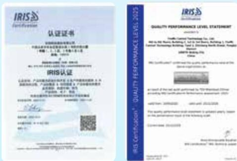

2025年9月，交控科技顺利通过ISO 22163标准监督审核，持续保持“银牌”质量管理体系认证。

交控航空在体系建设方面成效显著，截至2025年12月底，梳理涉及10个一级过程，27个二级过程，规划产出87个体系流程制度已完成发布86个流程制度（184个记录模板）梳理涉及20个岗位共计33个作业指导书，6个业务作业指导书，均已完成评审发布。

## 监督审计

公司对审计部采用双重领导模式，在审计业务职能上，对董事会及董事会下设审计委员会负责并报告，行政内容上，对集团公司总经理负责并报告。在审计委员会的指导下，对公司各部门、子公司经营活动的真实性、合规性，以及各种内控制度的科学性和有效性进行审查、核实和评价。

审计部的核心目标是，识别对集团公司的股东利益、投资价值和品牌价值造成损害的潜在风险，并防范集团公司承担潜在的事故法律责任，守住公司最后红线。

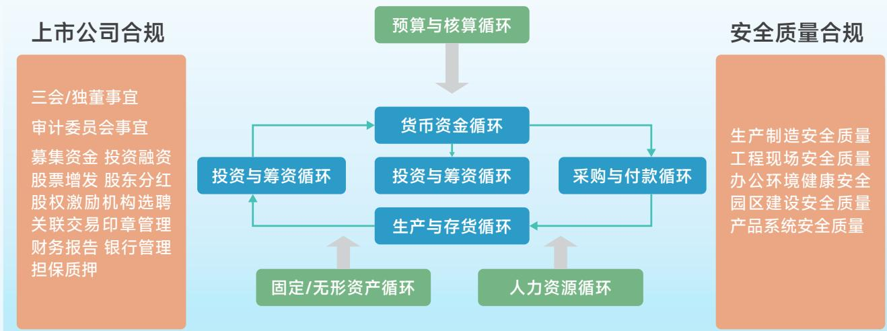

flowchart

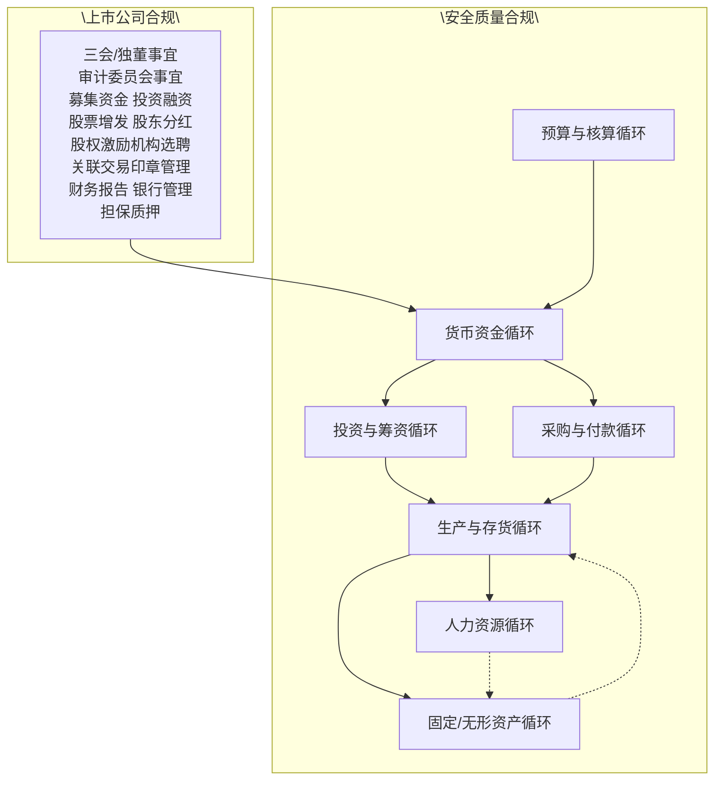
```mermaid
graph TD
  subgraph sg["\"上市公司合规\""]
    A["三会/独董事宜\n审计委员会事宜\n募集资金 投资融资\n股票增发 股东分红\n股权激励机构选聘\n关联交易印章管理\n财务报告 银行管理\n担保质押"]
  end

  subgraph sg_2["\"安全质量合规\""]
    B["预算与核算循环"]
    C["货币资金循环"]
    D["投资与筹资循环"]
    E["采购与付款循环"]
    F["生产与存货循环"]
    G["固定/无形资产循环"]
    H["人力资源循环"]
  end

  A --> C
  B --> C
  C --> D
  C --> E
  D --> F
  E --> F
  F --> G
  F --> H
  G -.-> F
  H -.-> G
```

2025年，公司审计工作以制度完善为引领、以重点领域为抓手、以闭环管理为保障，内控体系持续优化，风险防控能力稳步提升。

制度完善：2025年10月 依据新《公司法》要求修订《内部审计制度》，将监事会相关职责调整至审计委员会，进一步健全治理机制。

监督汇报：审计委员会每3一4个月听取专题汇报，围绕审计问题、整改落实、次年计划等形成闭环管理，持续强化监督效能。

重点审计：全年完成上市公司合规重点审计3次、募投项目专项审计2次、合并报表范围内子公司审计20个、重点参股及生态链企业分析6个，实现定期报告审计2次、内部控制自我评价1次。

2025年内部审计评价结果

未发现财务报告及非财务报告内部控制重大/重要缺陷

natural_image

Illustration of business analytics with bar chart, document, upward trend arrow, and pie chart (no text or symbols)

## 保障股东权益

## 合规透明

信息披露是投资者了解公司经营情况的核心渠道，对于传递公司价值起着至关重要的作用。公司建立了《信息披露管理制度》《信息披露暂缓与豁免事务管理制度》《重大信息内部报告制度》等信息披露相关制度并严格遵守，公司董事会办公室持续总结梳理历年信息披露的宝贵经验，形成极具操作指导意义的《公告编制及审核作业指导书》，持续细致规范做好信息披露工作。

同时 公司积极组织董事，高级管理人员参加监管部门及上市公司协会举办的各类业务培训及时传达监管政策精神与最新监管要求。全体董事、高管认真参与学习培训，深入研习最新法律法规及监管规则，履职能力与合规意识持续提升，有效推动公司规范运作水平不断提高。此外，公司定期对子公司信息披露相关人员开展专项业务培训，着力提升信息披露质量与合规管理水平，确保信息披露真实、准确、完整、及时，切实维护投资者合法权益。

组织董监高内、外部培训10余次 内部组织董监高及员工培训3次

2025年公司发布2024年年度报告、2025年第一季度报告、2025年半年度报告、2025年第三季度报告等公告，披露内容涉及三会决议、项目中标、利润分配、关联交易等。公告编制过程中，公司使用通俗易懂、简单平实的语言，将投资者关切的问题在公告中体现，完善公告内容的深度和广度，实现高质量的信息披露，为投资者决策提供了有力依据。

披露公告文件98份

自愿披露重大信息3次

报告期内，公司严格按相关制度加强内幕信息的管理，未发生内幕信息违规行为。

具体内容详见上海证券交易所网站（http://www.sse.com.cn/）和公司网站（http://www.bj-tct.com/）。

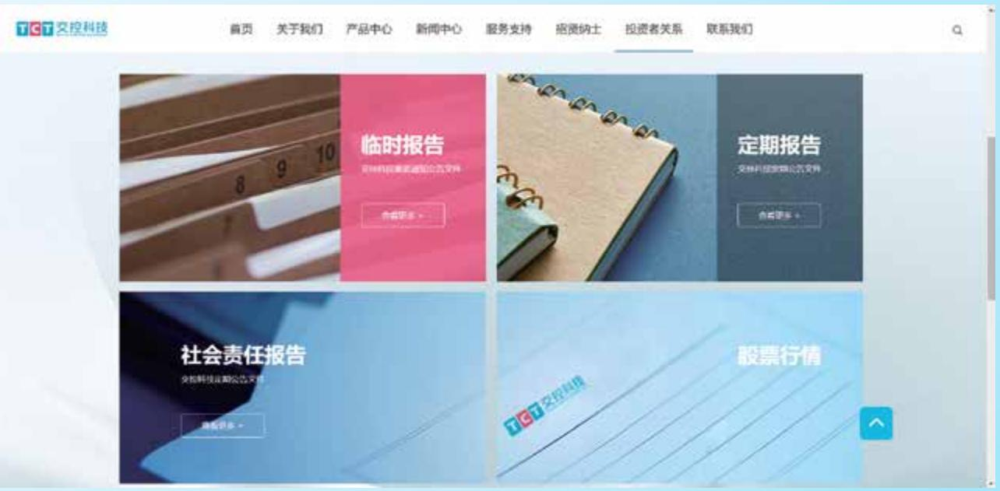

text_image

TCT 交控科技
首页 关于我们 产品中心 新闻中心 服务支持 招商纳士 投资者关系 联系我们
临时报告
交控科技重要通知公告文件
会员更新 >
定期报告
交控科技重要公告文件
会员更新 >
社会责任报告
交控科技近期公告文件
会员更新 >
股票行情
TCT 交控科技

## 投资者关系

2025年，公司认真贯彻保护投资者利益的要求，高度重视投资者关系管理，根据公司《投资者关系管理制度》，从各个维度开展了投资者关系管理和维护工作。

2025年，公司秉持透明高效原则，通过业绩说明会、路演等多元渠道加强与投资者深度互动，主动回应市场关切。确保信息及时准确传递，切实保障投资者权益，携手共享长期价值。

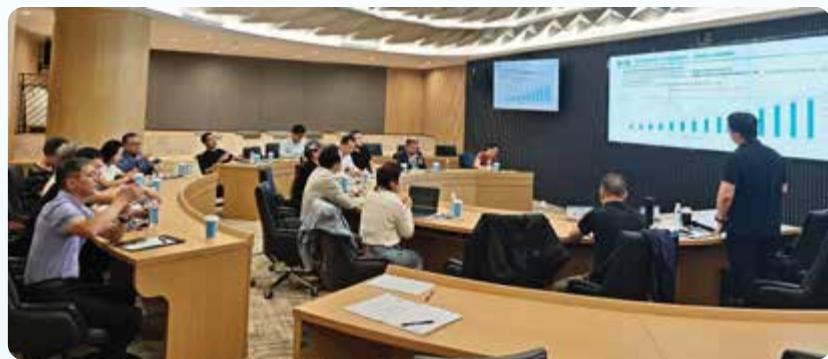

natural_image

Interior view of a modern conference room with attendees seated around tables, facing a large screen displaying charts (no visible text or signage)

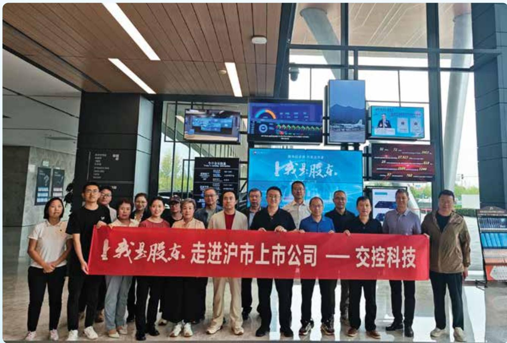

text_image

我县股东. 走进沪市上市公司 —— 交控科技

特定股东关系维护：针对5%以上股东，公司利用召开董事会、股东会的机会，与股东派任的董事积极沟通、交流公司生产经营，对外投资以及重大经营事项，力争获得股东理解和支持。

拓宽投资者交流方式：公司积极参与“股东来了”投资者调研活动吸引数士名投资者现场参加，公司相关领导就公司经营情况，未来发展规划做了详细介绍，进一步拓宽投资者了解公司的渠道，加强与中小投资者的交流沟通。

加强投资者定期交流：2025年，公司通过召开5次业绩说明会及组织投资者现场调研，加强与投资者的深度交流，增进其对经营发展的了解与认同。同时，积极响应交易所号召，参与科创板行业集体业绩说明会，主动传递公司价值，持续挖掘市场潜力，切实维护投资者权益。

## 与投资者沟通交流方式

公司公告

股东大会

业绩说明会

路演会议

投资者交流会

来访接待

媒体采访

公司公众号

抖音视频号

上证E互动

投资者专用热线（010）83606086

投资者专用邮箱ir@bj-tct.com

上证e互动

全年累计回复问题29条

答复率达100%

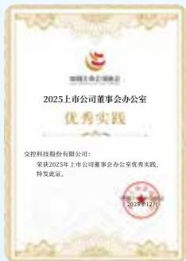

text_image

2025上市公司董事会办公室
优秀实践
交控科技股份有限公司：
荣获2025年上市公司董事会办公室优秀实践，
特此征。
2025年12月

值得一提的是，2025年董事会办公室通过高质量信息披露、精细化三会运作、专业化投资者关系管理，持续完善法人治理结构，为公司高质量发展筑牢资本端“压舱石”，荣获中国上市公司协会“2025年上市公司董事会办公室优秀实践”。

## 股东分红

上市以来，公司始终保持回馈股东的传统，积极构建与股东的和谐关系，重视对投资者的合理回报，充分保障广大投资者利益。

根据证监会《上市公司监管指引第3号-上市公司现金分红》和《公司章程》的相关规定，公司专注于长期和可持续的发展，并综合考虑公司的具体情况，实施科学、持续、稳定的回报规划，上市以来，公司每年保持30%以上的利润分红，2025年度分红比例继续超过50%。

公司近三年分红情况如下

<table><tr><td>年度</td><td>每10股派发现金红利(含税)(元)</td><td>现金分红总额(万元)</td><td>占合并报表中归属于上市公司普通股股东的净利润的比例</td></tr><tr><td>2025</td><td>4.20</td><td>7,924.59</td><td>50.66%</td></tr><tr><td>2024</td><td>2.30</td><td>4,339.66</td><td>51.93%</td></tr><tr><td>2023</td><td>2.00</td><td>3,773.61</td><td>42.41%</td></tr></table>

## n2经济责任

客户至上，持续创新

2025年，交控科技坚守“保障行车安全每一米、降低运营成本每一分、节省乘客出行每一秒、提升用户体验每一天”的使命，在主营业务稳健发展的同时 积极培育新质生产力 实现了经济价值与社会价值的同步提升。

回应联合国可持续发展

目标（SDGs）：

8 体面工作和 经济增长

9 产业、创新和 基础设施

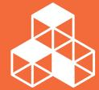

12 负责任消费和生产

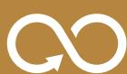

17 促进目标实现的伙伴关系

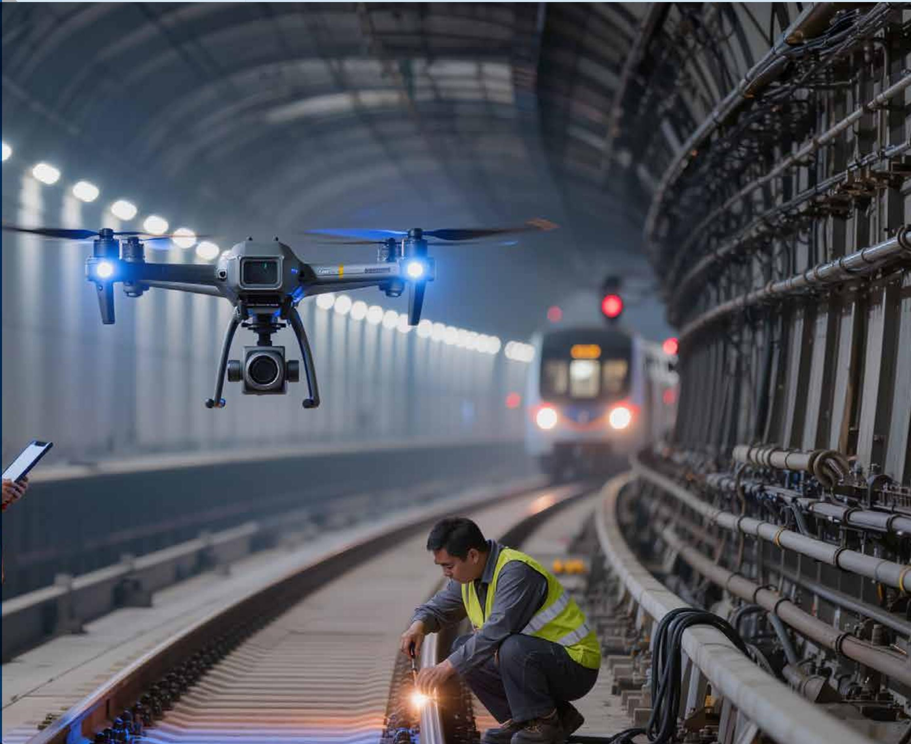

natural_image

Drone flying over a tunnel with a worker in safety vest and smartphone, no visible text or symbols

## 践行品质交付

2025年，交控科技秉承“客户至上、持续创新、安全为本”的核心价值观，持续推进城市轨道交通和低空经济领域市场开拓，凭借创新技术和优质服务，持续赢得客户信赖。

## 持续经营

公司坚持“以市场为导向、以客户需求为中心、合理配置资源”的原则，稳中求进，持续巩固轨道交通信号系统核心市场优势，并精准布局“低空经济”新业务领域，成果显著。

营业收入253,023.89万元 较去年同期增加15.76%

归属上市公司股东的净利润为15,642.89万元 同比增加87.18%

## 轨道交通领域

作为轨道交通信号系统的创新引领者，公司持续推动技术升级与市场开拓，报告期内新增中标4条新建线路，市场地位稳居行业前列。2025年是国际业务实现“点状突破”与“网络化布局”的关键之年，成效显著。2026年初，公司相继签订悉尼地铁西线TSMO合约信号系统分包项目，并中标土耳其安卡拉A1线更新改造及延长线项目，海外拓展迈入新阶段。

## 低空经济领域

公司基于行业趋势深刻洞察，精准布局低空经济新业务，快速突破验证了战略前瞻性与运营管理水平。报告期内，江都区部署37套自动机库实现政务巡检全域覆盖:南宁打造“轨道+低空”标杆工程，构建空轨一体智慧服务体系:铁路自动巡检项目实现重载铁路低空巡检装备专业化与标准化，公司与港铁合作成立低空轨道研究中心入选香港监管沙盒首批试点；同时拓展低空文旅场景，构建覆盖多元业态的服务网络，形成可复制的标准化模式。

## 品质交付

公司坚守“客户至上”核心价值观，践行“保障行车安全每一米、降低运营成本每一分、节省乘客出行每一秒、提升用户体验每一天”的使命，依托覆盖全国的专业化项目团队，确保工程高质量交付。

## 高质量开通

2025年，公司携手合作伙伴助力多座城市多条线路高水平开通，兑现对客户的承诺，以卓越实力稳居行业领先地位。特别是年末“六线一云”的同步开通，充分体现了公司强大的项目管理和资源协同能力。

截至报告期末，共承担城市32个

信号系统建设项目里程2,912公里

累计交付 FAO 线路达572公里

PB-TACS线路77公里

稳居行业领先水平

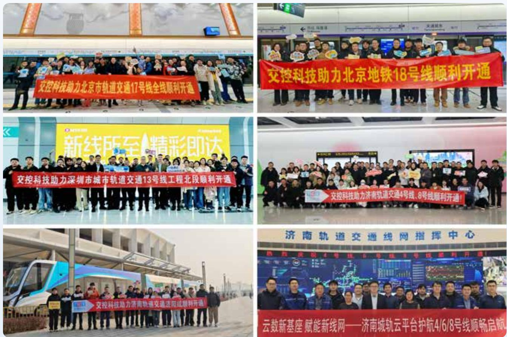

## 太原1号线

公司实现首条PB-TACS系统落地应用

## 乌鲁木齐机场改扩建市政配套工程

极寒气候下提前完成信号系统攻坚，助力丝路枢纽“零距离”接驳

## 宁波4号线延伸线

延伸线全线贯通，实现对既有线“零影响”

## 南宁4号线后通段

实现“无感”贯通，高效完成系统升级

## 天津7号线南段

以智能视频监控与魔窗系统，打造智慧服务新标杆

## 东莞1号线

引入低空巡检，助力定义轨道安全新范式

## 成都13号线

成都首条交流制式全自动运行城轨快线

## 北京18号线

车车通信+智能鹰眼，构筑智慧安全新标杆

## 济南8号线

湿轨模式护航，实现跨线贯通运营

## 深圳13号线北段

全自动运行，赋能湾区高效互联

## 朔黄重载铁路移动闭塞项目

实现多制式列车混跑与不停车切换

■ 案例：济南轨道交通云平台：首建云数融合平台，实现集约智能运维

作为山东省首个线网级云数融合平台，旨在实现资源集约化与运维智能化。平台整合计算，存储及数据资源，承载4、6、8号线核心生产系统，实现多云纳管、自动化运维与数据共享，助力业主年节约运营成本超千万元，为数字化转型提供了可复制的样板。

■ 案例：朔黄项目高质量交付，破解重载运输 瓶颈

2025年12月 朔黄重载铁路移动闭塞项目正式交付，在350公里线路实现示范应用。项目完成调度中心及20个车站的系统改造，实现不同制式列车混跑与不停车切换。实践证明，该系统大幅提升编组站发车能力，缩短发车间隔，有效缓解运输瓶颈，树立了重载

## 成都30号线

首次实现“车车通信+车地通信”双制式同步交付

## 济南4号线

全电子联锁，激活泉城“黄金轴线”

## 北京17号线中段

GoA4级全自动运行，打造南北高效动脉

## 济阳线

有轨电车线路，中低运量轨道交通领域的技术示范样本

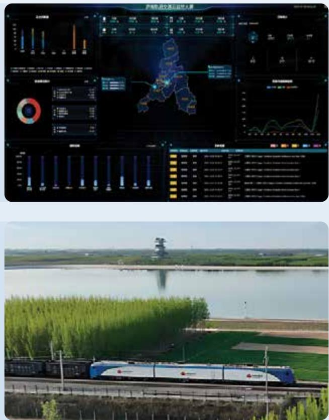

## 客户满意

## 以客户为中心，持续提升全周期服务满意度

交控科技始终坚持“客户至上”的核心价值观，以为客户创造价值、让客户满意为目标，不断提升管理和服务水平。公司根据《顾客满意度管理流程》规定，每年两次进行顾客满意度调查，涵盖售前、售中、售后全生命周期。

公司非常重视客户的意见和建议，为了调查结果更加准确客观，公司根据上半年的顾客问卷调查反馈结果，将问题进行量化完善，并在下半年顾客满意度调查中发放，增加颗粒度，让客户在填写问卷时更加明确，也使顾客满意度报告更加清晰精准。我们对客户提出的宝贵意见进行分析总结，并结合各地具体情况深入分析梳理问题根源，针对顾客提出的指导意见逐一回访并给予解决方案回复，确保客户对企业的充分信任和满意。

2025年，累计回收有效问卷310份

上半年、下半年的客户满意度平均9.98分（满分为10分）

## 卓越交付铸就口碑，品质赢得业主赞誉

2025年 交控科技凭借深厚的技术研发积淀与稳定可靠的产品实力 结合专业高效的项目交付团队持续为客户创造价值。公司在全国多地轨道交通项目中展现出色的履约能力，以高质量交付赢得各地业主广泛认可与赞誉，涵盖科技进步奖，优秀供应商，突出贡献单位等多个类别，这些荣誉不仅是对公司产品与服务的高度肯定 更是对交控科技持续引领行业发展、践行“客户至上”理念的有力证明。

2025年，累计获得业主嘉奖及表彰28次

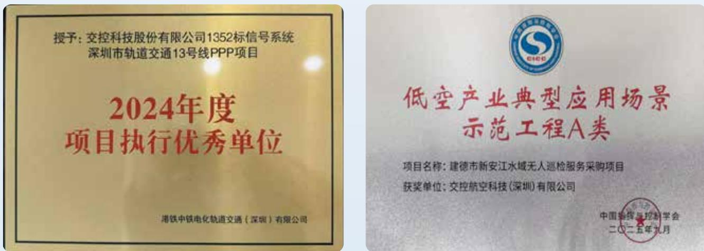

## 创新驱动发展

创新是交控科技的基因。2025年，我们围绕“AI·低空双驱”战略，持续加大研发投入，在核心技术攻关与新兴领域拓展上均取得丰硕成果。

研发投入30,177.97万元 较去年同期增加13.14%

## 创新技术

公司将持续深化“应用一代、开发一代、研究一代”技术创新体系，以前瞻性布局推动核心技术攻关，加速技术成果向产品与解决方案的高效转化，不断提升自主创新能力，巩固在行业内的技术引领地位。

轨道交通领域  
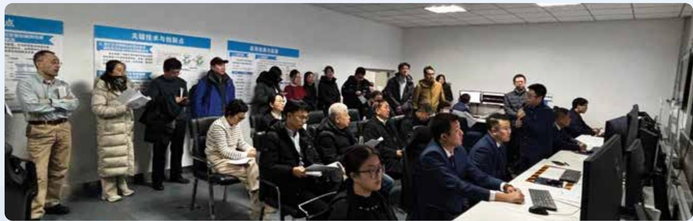

text_image

Group of people in an office setting with visible Chinese signage on the wall, likely during a technical and collaborative event.

## 新一代PB-TACS系统实现工程化批量应用

在太原1号线首开先河后，成都30号线，北京18号线相继开通，标志着该技术已通过工程验证，进入规模化推广阶段。公司董事长郜春海发布了《基于感知的车车通信列控系统（PB-TACS）》专著，为行业贡献了重要知识成果。

## 自主化安全云平台完成样机定型

安全云平台项目基于通用服务器开发，不依赖专用硬件，可降低采购、使用与维护成本，减少设备占地，提升资源利用效率。国产化方案保障供应链安全自主，解决传统系统供货周期长，备件难获取等问题，本年度已完成样机定型。

## 前沿技术AVCOS系统取得实质性进展

自主虚拟编组系统（AVCOS）在报告期内完成保定试车线调试，深化机械与虚拟编组关键技术研究，实现性能提升与同步性优化，并获得产品认证授权。同时，利用北京19号线新增两组车完成单4编组及4+4机械编组全场景调试，目前正在开展4+4虚拟编组正线调试。

## 智能行车调度系统实现升级应用

该系统具备辅助决策，动态调整功能，突破运行图自动编制及动态调整关键技术，2024年上半年在北京19号线投运。报告期内完成产品迭代，扩展至13个场景的运行图在线动态调整，并在北京19号线完成升级验证，有效提升调度指挥效率。

低空经济领域  
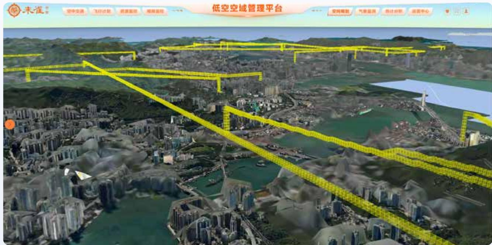

text_image

来雀
空中交通 飞行计划 贵源监控 摄影监控 低空空域管理平台 空间规划 气象监测 统计台架 渲雾中心

## 低空应用运营平台：多设备兼容与极速部署

平台突破多设备兼容性壁垒，适配7类无人机及主流上云方式，实现4小时快速搭建能力，远超行业平均周期。支持综合政务、地铁隧道、水利水务等多场景飞行数据与业务需求高效匹配，完成20余个项目交付，合同功能覆盖率100%，从“单一项目定制”迈向“标准化+场景化”服务。

## 多场景AI模型：全领域覆盖与精准感知

AI模型实现从单一场景向多领域全覆盖转型，无人机动态飞行目标精确定位技术取得重大突破，支持云台任意角度下实时定位与测速，摆脱传统垂直向下拍摄局限。报告期内完成21个模型落地，覆盖15个项目，累计44项可应用模型，动态感知与目标跟踪能力显著提升。

## 封闭空间无人机：高精度定位与场景定制

针对封闭空间无卫星导航场景，公司研发高精度定位技术突破隧道等环境技术瓶颈。机型从通用型向场景定制型升级，已在地铁隧道、物业、铁路沿线3类典型场景实现应用，为特殊环境下的无人机作业提供可靠解决方案。

## 知识产权

公司始终将知识产权作为创新发展的核心驱动力，围绕“强化知识产权优势、助推行业领跑”战略，建立覆盖创造、管理、保护、利用全流程的规范化体系，以高层统筹与全周期管理持续夯实自主创新能力。

2025年，申请专利150件 授权专利121件

截至报告期末，累计授权专利1340件

授权发明专利1143件 海外专利45件

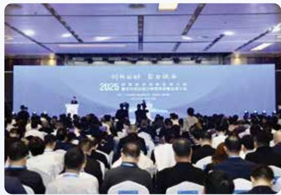

text_image

2025
中国石油天然气集团
2025

## 管理机制与组织保障

公司依据《企业知识产权合规管理体系要求》（GB/T29490-2023），建立全生命周期的《专利管理流程》及《专利管理规定》《知识产权管理手册》等完善的管理制度，通过风险识别、人员培训和经费投入等措施确保有效运行。整体工作由总裁直接分管，下设知识产权委员会，已建立全生命周期流程制度并纳入内审体系。

## 战略定位与执行落地

公司制定“持续强化知识产权优势、助推行业领跑”的战略，围绕创造、管理、利用、保护等环节扎实推进。专利、商标、软著管理贯穿研发全周期，已形成多技术体系专利组合，检索分析与保护工作同步覆盖全过程。

## 国家级荣誉与行业认可

2025年9月，公司入选“2025民营企业发明专利500家”榜单，位列第93位。该榜单是观察民企创新活力的重要风向标，此次上榜充分肯定了公司的创新能力和知识产权工作，彰显了聚力核心技术攻关、提升自主创新能力的坚定追求。

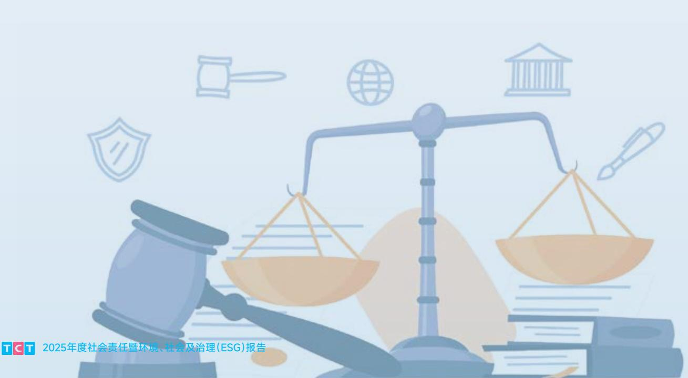

text_image

TCT 2025年度社会责任暨环境、社会及治理(ESG)报告

## 强化安全管控

安全是公司不可逾越的红线，我们致力于构建覆盖产品、项目、人员及运营的全方位安全防控网络，将安全发展理念贯穿于研发、生产、交付、运营的全生命周期。

安全事故、环境影响事件、轻伤及安全损失等关键安全指标均保持为0起

## 安全管理

2025年，交控科技股份有限公司以“安全为本”为核心价值观，通过组织架构调整与系统性安全体系建设，构建覆盖产品、项目、人员及运营的全方位安全防控网络，为轨道交通运营安全提供坚实保障。

## 调整组织架构

2025年初，公司响应行业安全需求升级，将“安全质量部”正式更名为“安全质量与运营表现保障部”，标志着“运营安全”被提升至与“功能安全”同等重要的战略高度。此次调整旨在深化对运营风险的精细化管控，确保产品与服务全生命周期安全，为轨道交通项目提供定制化解决方案。

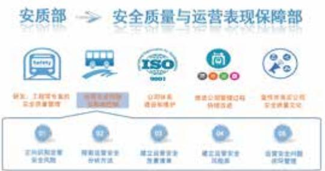

flowchart

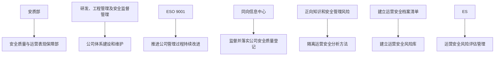
```mermaid
graph TD
  A["安质部"] --> B["安全质量与运营表现保障部"]
  C["研发、工程管理及安全监督管理"] --> D["公司体系建设和维护"]
  E["ESO 9001"] --> F["推进公司管理过程持续改进"]
  G["同向信息中心"] --> H["监督并落实公司安全质量登记"]
  I["正向知识和安全管理风险"] --> J["隔离运营安全分析方法"]
  K["建立运营安全档案清单"] --> L["建立运营安全风险库"]
  M["ES"] --> N["运营安全风险评估管理"]
```

## 筑牢防控体系

公司安全体系以产品、项目、人员及运营为核心维度，形成技术合规、流程规范、培训赋能与预防管理相结合的防控机制。

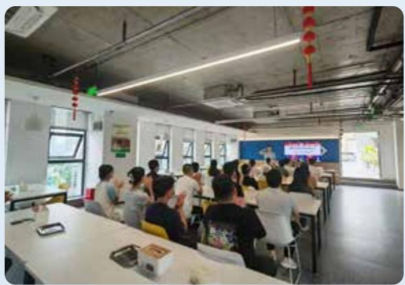

natural_image

Interior of a modern classroom or training room with students seated at desks facing a presentation screen (no visible text or symbols)

产品安全：通过国际安全标准落地，确保设计、开发及测试全流程合规，核心产品故障率显著低于行业平均水平。  
项目安全：制定工程授权、分包管理及数字化流程控制措施，保障项目全生命周期风险可控。  
人员安全：开展内外部安全培训，提升全员安全意识与应急能力。  
运营安全：深化运营风险精细化管控，通过数据驱动分析替代感性判断，系统提升运营表现与客户信任度。

## 安全攻坚要点

强化管控：对运营安全风险实施精细化管控，坚持产品、工程、现场飞检机制。系统识别深层次管理问题，并对控制措施100%闭环跟踪，确保问题整改不反弹。  
不怕问题：坚持并推广各环节自查机制，通过奖励机制鼓励主动暴露风险，形成“发现问题—解决问题—奖励先进”的良性循环。

持续改进：优化可靠性方法，通过数据驱动分析识别运营短板，制定针对性改进方案，推动产品质量与服务可靠性持续提升。  
问题闭环：严格执行问题上报决策机制，对识别出的问题坚持闭环管控，确保从发现到解决全流程可追溯，守好安全底线。

## 强化产品认证

本年度获得独立第三方授权，产品180次产品和工程安全交付成功率均为100%

工程200次

产品授权规模化：覆盖FAO、CI、ATS、RC、车车通信等核心产品确保从设计验证到量产交付各环节符合国际与国内双重标准，为轨道交通项目提供技术合规保障。

工程授权高效落地：公司承担的项目完成工程授权实现从单线测试到网络化运营的全场景覆盖，保障信号系统在复杂工程环境下的功能安全与互联互通。

CURC认证升级：2025年顺利完成CURC换证，延续对EN50128等国际标准的符合性，新增对国标GB/T28809-2012的支持，实现国际标准与国内规范深度融合。

此外，交控航空首创安全决策引擎，将一体指挥能力纳入安全决策引擎，实现从“人工研判”到“系统自主决策”的跨越，并创新性引入“双标准独立评估”模式，获得全球首个IEC 61508 SIL2级安全认证和DO-278A AL3级航空软件评估证明。

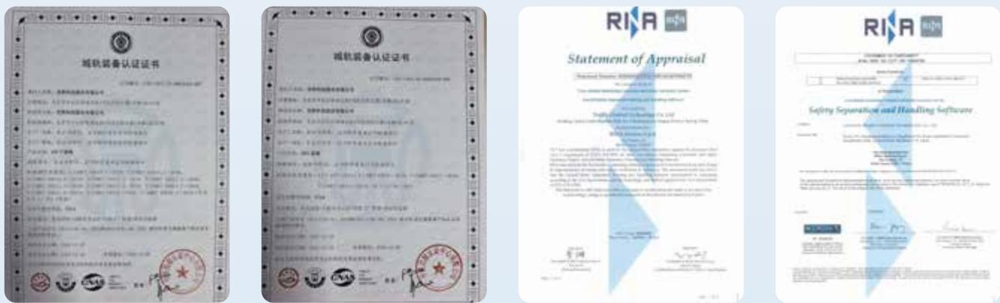

## 注重安全培训

公司构建了“标准—实践—管理”三位一体的安全培训体系，通过专业化、场景化的培训体系，全员安全意识与技能显著提升，为轨道交通行业安全发展提供坚实保障。

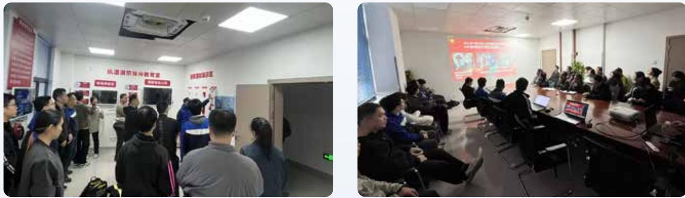

外部专业培训：围绕急救技能、铁路软件安全标准、信号系统安全评估及网络安全防护等关键领域，组织多场专业外部培训，有效提升员工在突发事件响应、软件开发可靠性、系统风险管控及信息安全防护等方面的综合能力。

内部系统培训：针对技术研发、工程实施及项目管理等核心环节，开展多场内部安全培训，形成“标准解读—实践应用—风险管控”的全链条培训机制，覆盖安全标准落地、工程风险防控、项目合规管理等维度。

## 安全生产

## 深化安全文化建设，筑牢思想防线

2025年，公司深入开展“安全生产月”系列活动，围绕“人人讲安全、个个会应急——查找身边安全隐患”主题，在北京、深圳、苏州等多地组织了形式多样的安全宣教与实践活动。活动通过线下安全隐患识别、消防器材使用教学、火线救援休验，安全知识竞猜等互动环节，有效提升了全员安全意识和应急处置能力，公司还创新性地开展了“AI慧眼安全创想活动，鼓励员工利用AI工具发现并可视化身边隐患，营造了“全员参与、共筑安全”的浓厚文化氛围。

## 取得显著安全成果，践行安全承诺

通过全方位的安全体系建设与扎实工作，公司在2025年取得了显著的安全成果。全年安全事故、险性事件、环境影响事件、轻伤、安全损失以及新增重复运营安全事件等六项关键指标实际值均为0。员工体检覆盖率100%，职业病发生率为0。多家子公司实现了安全生产责任事故为0、财产损失为0、环保处罚为0的年度目标。公司通过评选“安全之星”等方式，激励先进，树立安全标杆，持续巩固“安全为先”的企业文化，为员工、客户及社会公共安全提供了坚实保障。

## 案例

## 深入开展“安全生产月”活动，筑牢全员安全防线

2025年6月，公司围绕“人人讲安全、个个会应急——查找身边安全隐患”主题，精心组织安全生产月系列活动，全面提升员工安全意识和应急处置能力。

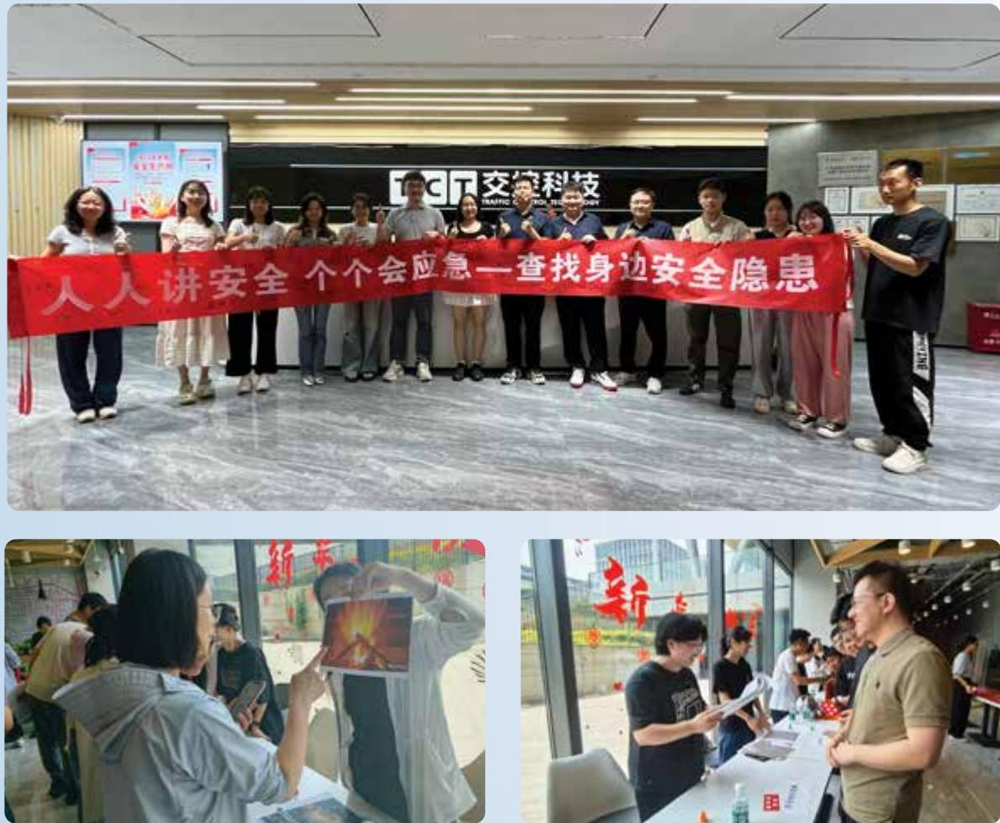

## 丰富线下活动，强化实践体验

活动设置隐患识别、火灾场景判断、消防器材使用、安全装置辨识、知识竞答等环节，通过互动体验帮助员工掌握实用安全技能。北京、深圳两地共140余人参与，现场气氛热烈，有效营造了浓厚的安全文化氛围。

## 聚焦隐患查找，推动AI赋能

公司以项目为单位，组织交付团队利用AI工具系统识别项目执行过程中的安全隐患，并制定针对性应急措施。通过评优激励，推动隐患排查工作常态化、智能化，切实将“安全第一”理念落到实处。

此次活动显著提升了全员安全素养和风险防范能力，为公司持续稳健运营筑牢安全根基。

## 提质量优服务

## 产品质量

公司坚守“客户至上，持续创新，安全为本”的核心价值观，构建覆盖产品全生命周期的质量安全管理体系，强化过程管控与可追溯管理，明确质量安全红线。持续提升全员质量意识，确保所有已开通线路安全高效运营，以卓越品质兑现对客户的承诺。

交付产品质量达标99.99%

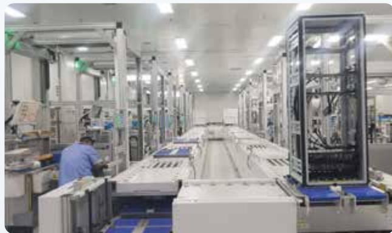

natural_image

Interior view of a cleanroom manufacturing facility with automated production lines and workers (no visible text or symbols)

## 管理优化

强化体系认证与持续改进：保持ISO22163银牌资质成熟度提升3%通过体系监控计划推进年度重点活动，确保管理事务有序执行。  
健全审核闭环与问题整改：完成公司内审及专项审核，发现问题均落实整改责任并持续跟进，推动流程控制与人员执行持续优化。

开展表单革命和流程管控：减少文字描述问题，增加检查单与流程表单，新增OA电子流程表单，有效减少文件二义性  
加强人员培训与快速响应：组织体系培训活动，覆盖新员工及关键岗位；通过工单快速处理流程需求，平均处理时间控制在1天以内，保障高效运转。

## 管控严格

严控进货质量：通过优化供应商管理与检验要求，供应商到货合格率显著提升。关键举措包括淘汰不合格供应商、实施分类供货管理及加强来料检验，成功将生产过程中的相关型号错误降至0。

严守出厂品质：通过工艺创新与工装改良，增加检验工装、压接工装及紧固防护等举措，持续优化过程质量管控。出厂环节严格对标产品标准开展全面检测确保交付产品质量达标切实维护客户利益与公司品牌口碑。

## 不合格品管理

全流程检测管控，筑牢质量防线：建立入厂、过程、出厂三位一体检测体系，配备专职检验人员与专业设备，严格执行标准、全程监控关键工序，实现全生命周期质量管控。

闭环管理不合格品，严防外流流转：执行不合格品闭环管理制度，落实标识隔离、根源分析、分级处置、整改预防，形成完整管控链条，杜绝不合格品进入下道工序或交付客户。

深化整改预防，持续提升质量：联合多部门深挖问题根源，制定纠正与预防措施，形成质量改进闭环，从源头消除隐患，推动产品质量稳步提升。

## 售后服务

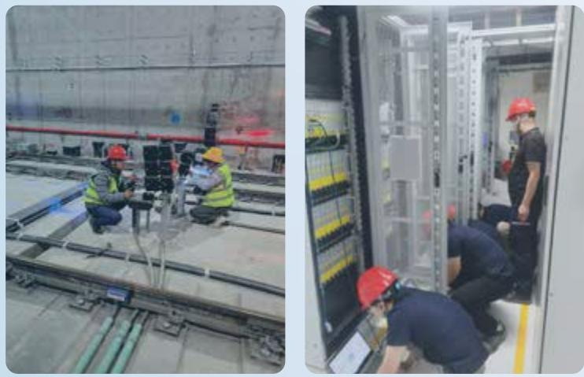

我们致力于成为客户运营中最值得信赖的伙伴，通过构建并持续完善覆盖“制度、措施、效果”全链条的售后服务体系，推动“主动赋能”的服务模式快速发展，不仅保障了运营的长期安全稳定，更深层次地创造了客户价值，赢得了广泛认可。

## 制度建设：构建标准化可量化体系

## 强化安全质量管控

建立“预防-响应-处置”三级安全保障体系，编制极端天气及专项故障应急预案，将影响运营故障率、运营可靠度等核心指标纳入量化考核。  
依托《顾客满意度管理流程》，建立全生命周期客户满意度调查机制，明确投诉处理闭环流程，将顾客满意度得分与投诉次数作为核心考核指标。  
完善运营安全风险库，对已识别的风险事件制定专项防控措施，通过重复运营安全事件数指标，持续验证措施有效性。

## 深化流程效率优化

形成“顾客导向四板斧”核查优化清单，对交付流程进行系统性梳理。  
优化维保订单全流程管理机制，从被动响应需求转向主动规划，提升回款效率与业务中标规模。

制定现场升级作业规范，明确失败判定标准与回退流程，将现场升级失败次数纳入严格管控。

## 夯实人员技术支撑

建立系统化的人员培养与晋升机制，通过职级提升、技术打基线评估等方式，提升维保团队专业能力。  
依托电子履历平台，建立故障自主定位与分析机制，要求维保人员自主定位问题率不低于80%，强化技术支撑能力。

## 关键措施：多维度提升售后效能

技术支撑： 聚焦ATS数据故障倒切、测速故障机制等核心产品优化点，推动运维实践反哺产品迭代，形成“运维驱动优化、产品支撑运维”的良性循环  
品质升级： 依托“维保人员应知应会”体系，实现现场作业的精细化、标准化管理。全面优化用户交底机制，强化与业主的协同，有效降低运营潜在风险。  
协同共享： 内部构建“通号－调度－站务－乘务”跨岗位协同机制；外部与北京、深圳、成都等多地开展典型故障案例交流，推动行业经验共享。

## 实施效果：核心指标全面达标

安全运营： 影响运营故障率、运营可靠度、影响客户体验故障率均优于年度目标，重复运营安全事件数为 0，有效保障了运营安全。  
客户满意： 售后顾客满意度得分达 9.96 分（满分 10 分），表现优异；顾客投诉数量严格控制在目标范围内，管控成效显著。  
效率与业绩： 交付流程有效性评估完成率达 100%；维保订单回款及中标额均超额完成年度目标；现场升级失败次数为0。  
能力建设： 人员培养计划稳步推进，5 名员工完成职级晋升，维保人员自主定位问题能力持续提升。

## 供应链管理

供应链的健康与稳定是地铁运营安全的基石，分包商及供应商既是资源提供者，也是价值链上不可或缺的重要合作伙伴。

公司致力于构建安全、稳定、负责任、有韧性的供应链体系。通过严格的供应商准入与绩效评估，优先与理念相符的伙伴合作。我们强调公平交易、技术协同与长期共赢，通过定期交流，共同提升产业链的质量与合规水准，确保最终产品的安全可靠。

## 分包商管理

2025年度，交控科技重点推进战略合作生态圈建设，不断丰富和深化合作模式，大力开展财务清欠工作，通过工艺改进、现场审核、绩效考评等手段，既有效促进了供应链产品和服务质量提升，又推动增强信号系统的综合竞争力，同时有助于建设更加良好的集成商信誉和品牌。

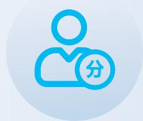

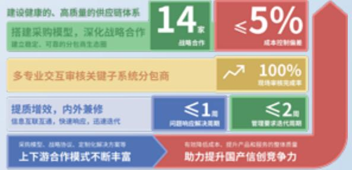

flowchart

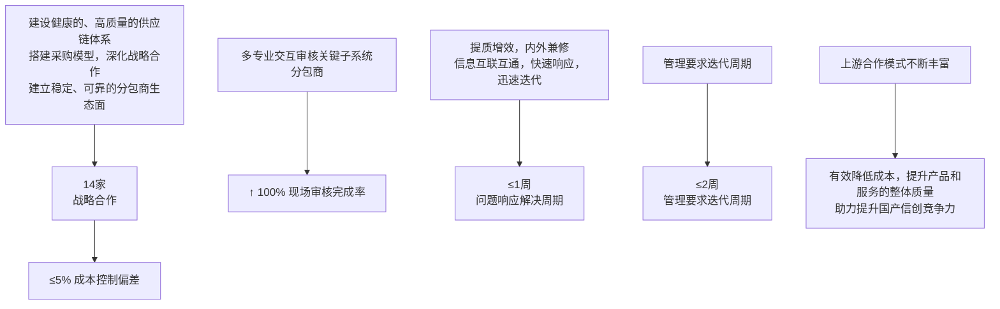
```mermaid
graph TD
  A["建设健康的、高质量的供应链体系\n搭建采购模型，深化战略合作\n建立稳定、可靠的分包商生态面"] --> B["14家\n战略合作"]
  B --> C["≤5% 成本控制偏差"]
  D["多专业交互审核关键子系统分包商"] --> E["↑ 100% 现场审核完成率"]
  F["提质增效，内外兼修\n信息互联互通，快速响应，迅速迭代"] --> G["≤1周\n问题响应解决周期"]
  H["管理要求迭代周期"] --> I["≤2周\n管理要求迭代周期"]
  J["上游合作模式不断丰富"] --> K["有效降低成本，提升产品和服务的整体质量\n助力提升国产信创竞争力"]
```

## 供应商管理

公司建立供应商分级分类与动态考评机制，将环境管理体系认证纳入核心评价指标，推动上游供应商实现合规化、低碳化发展。推行集中采购与需求整合，减少分散采购频次，降低运输与包装浪费。同时，持续推进框架协议签订，优化采购流程，减少纸张与快递消耗，提升供应链协同效率与绿色管理水平。

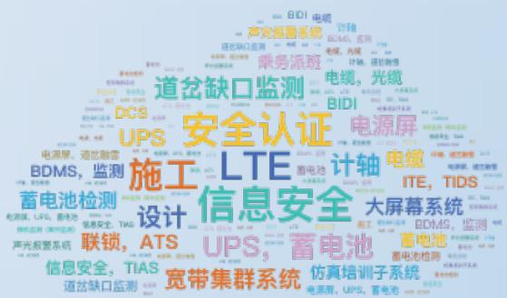

text_image

道岔缺口监测
DCS 安全认证
UPS
施工
储能电池检测
设计
信息安全
联锁，ATS
信息安全，TIAS
宽带集群系统
BIDI 电缆
声光报警系统
无线接口监测
乘务派班
BIDI 电缆
电缆，光缆
电源屏
电源屏，通芯融雪
BDMS，监测
蓄电池检测
计轴
ICTE，TIDS
大屏幕系统
BTDS，监测
蓄电池
仿真培训子系统
电源源，UPS，蓄电池
蓄电池检测

## 信息安全保护

面对日益严峻的网络安全挑战，交控科技构建了以国际标准为框架，以法律法规为准绳的全方位防护体系，守护公司及客户的数据与隐私安全。

交控科技于2025年11月获得信息安全管理体系认证，证明其与轨道交通列车运行控制系统相关 的 信 息 安 全 管 理 活 动 符 合ISO/IEC 27001:2022标准。

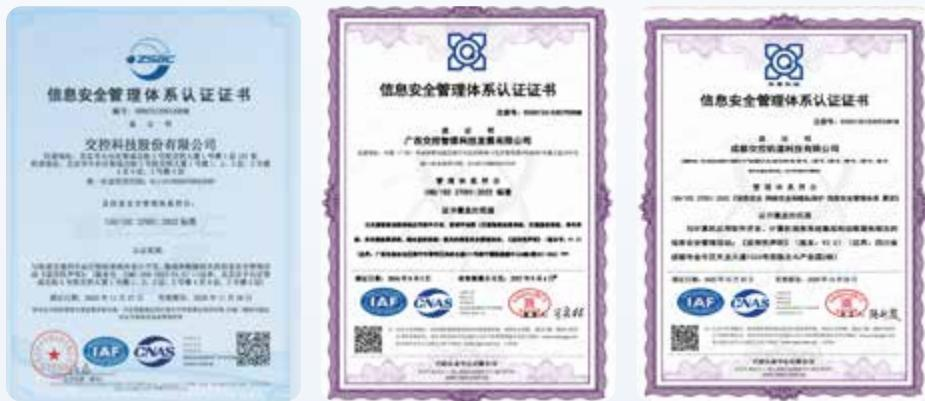

## 构建合规性管理体系

公司严格遵守《中华人民共和国网络安全法》《中华人民共和国数据安全法》等国家法律法规，制定并动态更新《信息安全管理流程》，明确了数据安全管理的组织职责与执行流程，确保信息处理行为的合法合规性，为数据安全治理奠定坚实的制度基础。2025年成功通过ISO/IEC 27001:2022版认证，以国际标准保障业务连续性与客户信任。

## 打造纵深防御体系

公司采用“加密+认证+防护+评估”的四位一体技术策略，构建全方位技术防护网：

数据加密：引入平台加密系统，对核心代码及敏感信息实施全生命周期加密，建立严格的泄露防护机制。  
主动防御：网络侧部署防火墙与入侵检测系统；终端侧部署杀毒客户端与自动化补丁更新，提升整体系统免疫能力。

访问控制：实施“角色权限管理+多因素认证”双保险，实现精细化权限分配与强身份验证，杜绝非授权访问。  
风险审计：定期依据后台审核数据出具审计报告对违规行为通报处理实现风险的闭环管理与持续改进。

## 建立全维度保障机制

预案演练：针对网络攻击，火灾断电等突发事 件制定详尽预案，通过多维度模拟演练确保团 队快速响应，保障业务连续性。

数据备份：严格执行每年不少于2次的备份恢复演练，验证备份数据的完整性与一致性，确保灾难发生时数据可快速恢复。

## 强化全员安全意识

通过开展常态化信息安全培训，提升员工对敏感信息的辨识能力与防范社交工程攻击的技能，将安全理念植入日常工作细节，降低人为风险。

#

# 人才责任

# 多元包容，终身学习

在交控科技，我们深信员工是企业最宝贵的财富，员工的身心健康与幸福感是企业可持续发展的根基。报告期内我们秉持“以奋斗者人为本”的理念，构建了覆盖物质保障、身心健康、成长发展、情感归属的全方位员工关怀体系。

回应联合国可持续发展

目标（SDGs）：

无贫穷

3 良好 健康

4 优质教育

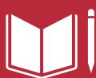

5 性别平等

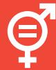

8 体面工作和 经济增长

10 减少不平等

natural_image

Group of five professionals in a modern office setting, engaged in discussion around a conference table with laptops and tablets (no visible text or signage)

## 人才多元管理

## 合规雇佣

我们严格遵守《中华人民共和国劳动法》《中华人民共和国劳动合同法》等相关法律法规和劳动用工政策要求，制定《人力资源管理制度》等内部制度，秉持“合法、公平、平等自愿”原则与员工签订劳动合同。坚持公平、公正、公开的招聘原则，杜绝任何形式的就业歧视，为不同性别、年龄、民族的人员提供平等就业与发展机会，打造多元化人才队伍。

公司严格执行《禁止使用童工规定》《中华人民共和国未成年人保护法》等法规，参照国际劳工组织核心公约及《世界人权宣言》，严格核实员工身份，杜绝聘用童工，抵制一切形式的强迫及强制性劳动。

公司未发生任何形式的雇用童工、强迫劳动、职场骚扰及歧视等事件。

## 平等纳贤

公司积极拓宽人才选拔渠道，广泛招纳多元化优秀人才，在境外运营中践行本地化用工，为不同专业背景人员提供多元就业机会。2025年度，公司以国际化视野广纳贤才，面向中西部高校招聘高精尖人才，联动北京高校建立实习实践基地，并参与港澳台人才专项活动，推动企业人才多元化发展。

同时，公司通过“校企联合培养计划”“第三届全国博士后创新创业大赛”等平台，推动产学研融合与科研成果转化，加快培养具有国际竞争力的高层次创新型青年人才。未来，交控将持续深化产学研合作，构建“选－育－用－留”全链条国际化人才培养生态，为促进全球产业链协同创新贡献力量。

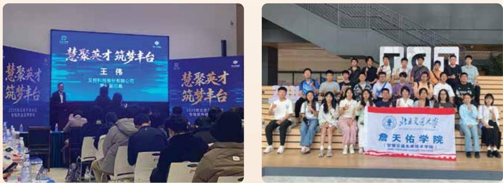

## 多元包容

我们坚信，不同的背景、视角和经验是创新与进步的源泉。我们致力于构建一个真正体现多元、平等与包容的职场环境，让每一位员工因独特而被珍视，因归属而发挥潜能。

截至报告期末，员工总计1894人

其中，女性员工有453人 占比23.92%

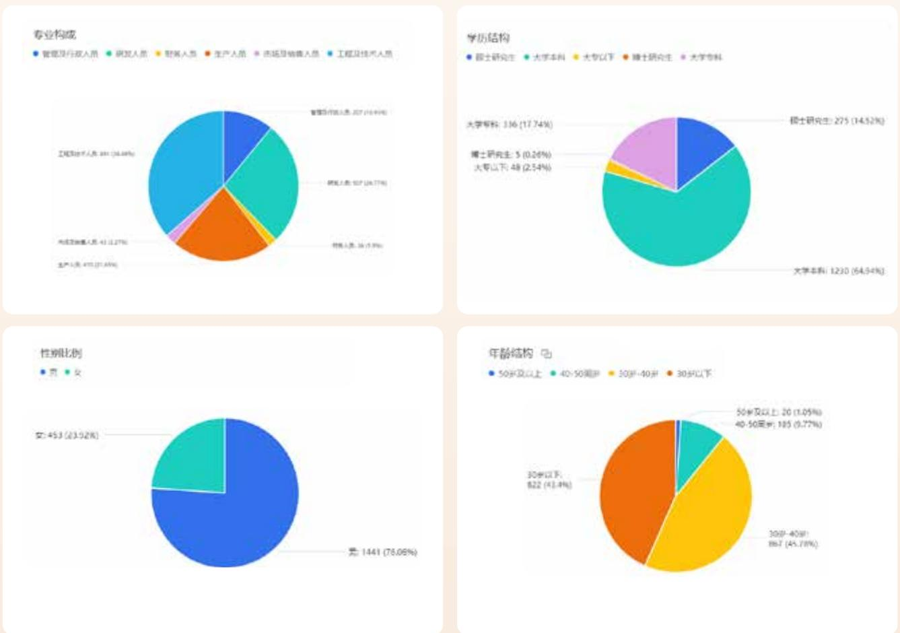

## 文化铸魂

交控科技以独具特色的企业文化体系引领人才多元管理。公司发布“愿景、宗旨、使命、价值观及文化体系”（PM-V&CV)融合中西方管理思想 为企业可持续发展明晰方向，PMV&CV来源于每一位员工的个人信念 构建强烈的使命感，凝聚全体员工奔赴共同目标，成为企业甄选及吸引人才的试金石。公司通过营造包容、多元、创造力浓厚的文化氛围，为来自五湖四海的多元化人才提供统一的价值准绳和行为标尺。

## 文化延展

公司以集团总部企业文化为根基 指导各子公司结合自身定位与业务特点构建适配的文化体系。交控信号传承《交控公约2.0》，创新形成《交控信号公约》，始终以集团企业文化为核心；交控装备于2025年7月召开企业文化启动会，正式发布全新企业文化体系，凝练企业发展使命、愿景与核心价值观；交控航空在集团总部基础上，发布契合自身业务特点的新企业文化，为多元人才提供统一的价值导向。

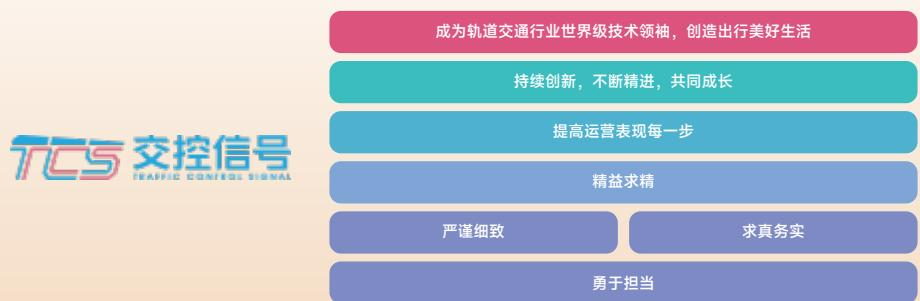

flowchart

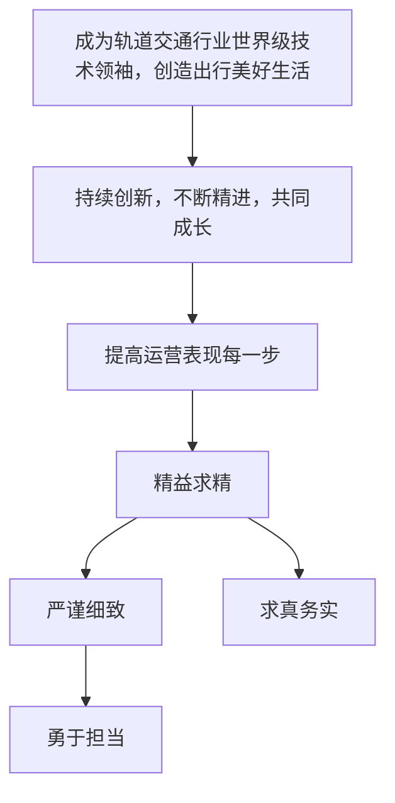
```mermaid
graph TD
  A["成为轨道交通行业世界级技术领袖，创造出行美好生活"] --> B["持续创新，不断精进，共同成长"]
  B --> C["提高运营表现每一步"]
  C --> D["精益求精"]
  D --> E["严谨细致"]
  D --> F["求真务实"]
  E --> G["勇于担当"]
```

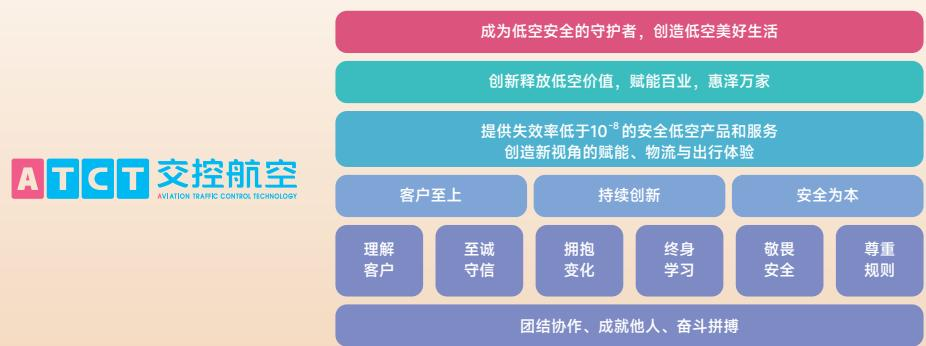

flowchart

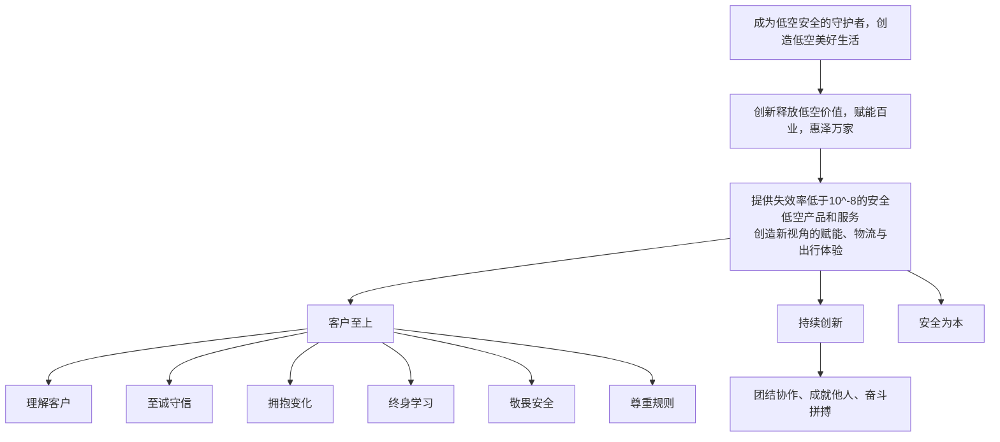
```mermaid
graph TD
  A["成为低空安全的守护者，创造低空美好生活"] --> B["创新释放低空价值，赋能百业，惠泽万家"]
  B --> C["提供失效率低于10^-8的安全低空产品和服务\n创造新视角的赋能、物流与出行体验"]
  C --> D["客户至上"]
  C --> E["持续创新"]
  C --> F["安全为本"]
  D --> G["理解客户"]
  D --> H["至诚守信"]
  D --> I["拥抱变化"]
  D --> J["终身学习"]
  D --> K["敬畏安全"]
  D --> L["尊重规则"]
  E --> M["团结协作、成就他人、奋斗拼搏"]
```

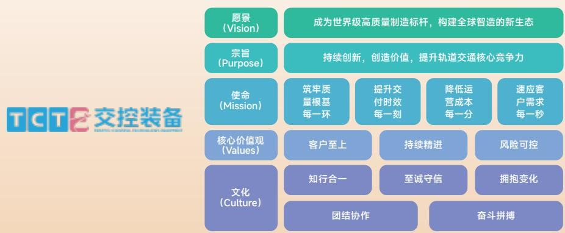

flowchart

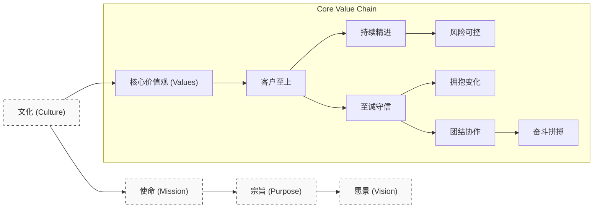
```mermaid
graph LR
  A["文化 (Culture)"] --> B["核心价值观 (Values)"]
  A --> C["使命 (Mission)"]
  C --> D["宗旨 (Purpose)"]
  D --> E["愿景 (Vision)"]
  
  subgraph Core Value Chain
    direction TB
  B --> F["客户至上"]
  F --> G["持续精进"]
  G --> H["风险可控"]
  F --> I["至诚守信"]
  I --> J["拥抱变化"]
  I --> K["团结协作"]
  K --> L["奋斗拼搏"]
  end
  
  style A fill:#f9f9f9,stroke:#333,stroke-dasharray: 5 5
  style C fill:#f9f9f9,stroke:#333,stroke-dasharray: 5 5
  style D fill:#f9f9f9,stroke:#333,stroke-dasharray: 5 5
  style E fill:#f9f9f9,stroke:#333,stroke-dasharray: 5 5
```

## 宣贯入心

公司通过多层次举措推动文化理念深植员工内心。针对管理层安排德鲁克管理培训课程，提升管理干部认知水平；借助主题活动、企业文化墙、封面人物等载体，激发员工兴趣、强化协作、深化文化认同，树立榜样力量。交控装备同步推进企业文化上墙专项工作，结合生产运营特色打造兼具视觉美感与文化内涵的展示载体，让文化理念可视化、具象化，浸润员工日常工作场景。

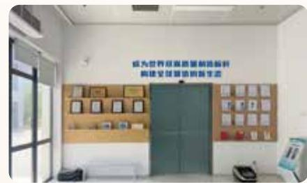

text_image

成为世界环境质量创造新材
构建全球智造的新生态

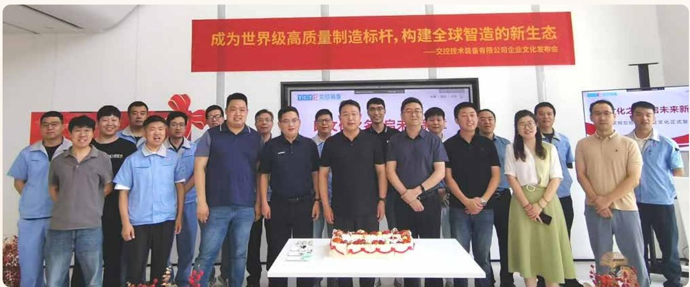

text_image

成为世界级高质量制造标杆,构建全球智造的新生态
——交控技术装备有限公司企业文化发布会

## 出海凝力

香港交控作为集团国际化布局的重要支点，积极践行本地化用工理念，在境外运营中融合中西方管理文化，适应不同国家与地区的法律法规与人文环境，为多元化人才提供广阔发展平台。公司以文化为纽带，凝聚各方国际化人才，为全球业务拓展提供强大的精神支撑。

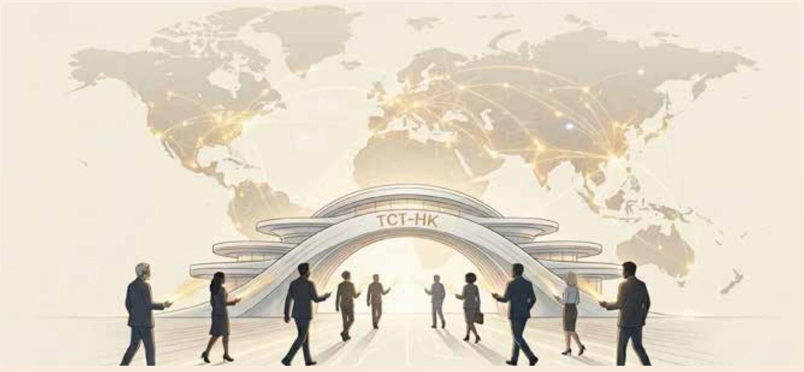

natural_image

Illustration of business people walking under a TCT-HK arch with a world map background (no text or symbols on figures)

## 赋能人才成长

新时代下，交控科技紧扣国际业务拓展、低空经济、AI 布局等战略方向，着力打造“文化匹配、技能匹配、方向匹配”的高水平人才队伍。以“AI 赋能 + 风险意识 + 能力支撑”强化技能与业务场景深度融合，持续提升管理效能与工作质效，赋能新业务发展与有机增长，以高素质人才支撑企业战略目标落地。

同时，公司构建“有成果+有宣传+有大奖”三位一体的人才成长机制，以 “你得行（有成果）、有人说你行（有宣传）、说你行的人得行（有大奖）”为评价导向，激发人才内生动力，打造一支支撑企业高质量发展的高素质人才队伍。

## 人才培养

我们始终将人才视为企业发展的核心驱动力。为此，基于“雁计划”全生命周期培训体系，我们打造了“线上学习平台+线下实战工坊+导师辅导计划”相结合的多元化培养模式，精准覆盖新员工融入、专业人才深钻及管理干部进阶的全路径，以系统化的人才培养机制驱动科技创新、价值创造与社会责任的有力践行。

## 新生力量：构筑人才根基

新员工培训围绕交控科技PMV&CV体系，打造涵盖企业文化、核心产品及价值链过程的“3C课程”，帮助新员工快速了解公司业务与发展历程，顺利融入团队。

专项培训10场

参训251人次

人均培训时长24小时

## ■ 案例：育才强基，助力新员工快速胜任

香港公司积极响应本地人才发展战略，自2025年起陆续招聘本地员工、提供专业岗位与职业发展平台，助力提升本地就业率，为交通行业注入专业活力。交控航空同步推行《新员工入职指引》，从组织架构、规章制度到办公平台操作提供系统化指导，确保新员工快速胜任岗位。

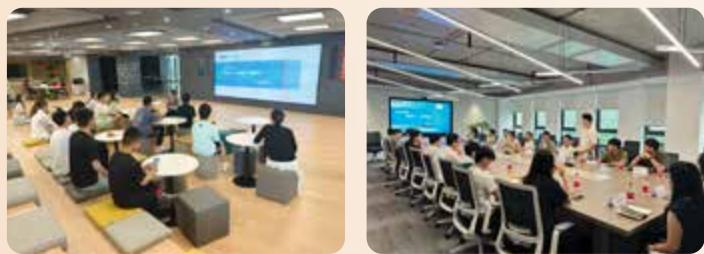

## “雁计划”人才全生命周期课程体系

雏雁计划

新员工

●新员工前置培训

●黄埔新兵训练营

## 在职员工

公司围绕业务需求构建系统化培训体系，覆盖研发、维保、工程管理等多个专业领域。通过内外部培训相结合，持续提升员工专业技能与综合素养，强化安全规范与管理能力，为员工职业发展和组织效能提升提供有力支撑。

专项培训124场

参训5000+人次

人均培训时长72小时

## ■ 案例：AI赋能人才培养，打造数字化先锋团队

公司联合飞书开展“效率先锋”专项活动，通过系统培训与案例辅导 持续培养数字化人才 推动效能实践落地。活动有效识别微创新骨干，助力数字化转型稳步推进，充分体现了公司对员工专业成长与创新能力提升的重视与投入。

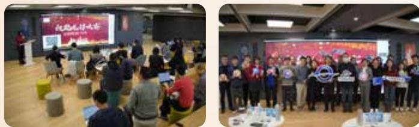

## 关键岗位：驱动创新发展

公司聚焦关键岗位人群，组织干部海外考察与游学，提供广阔学习交流平台，助力海外业务拓展。同时，通过产品技能、管理等多元培训，帮助员工快速成长。

专项培训8场

参训82人

人均培训时长62小时

## ■ 案例：强化核心资质认证，筑牢关键岗位能力根基

2025年，交控轨道以季度化培训计划覆盖安全、技能、管理、认证四大维度，强化知识内化与传承，重点投入业务技能提升、安全教育、特种作业等核心资质认证，全面赋能员工成长与组织发展。

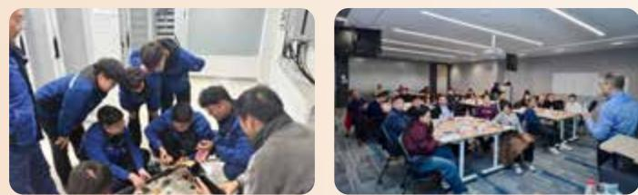

头雁计划 关键/核心岗位员工

●领航＆关键岗位持证培训

鸿鹄计划 中高层管理者（含后备）

●依托极星管理研究院

●定制化培训

凌雁计划 在职员工

●职级体系应知应会培训

## 全球领航：锻造卓越领袖

依托极星管理研究院，面向中高管邀请美国德鲁克管理学院教授级讲师开展国际化培训，提升干部战略眼光与国际视野。首届交控科技管理论坛聚焦解决组织实际问题，有效提升管理能力。

## 专项培训8场 参训30人次 人均培训时长56小时

## ■ 案例：对标国际卓越实践，锻造一流管理团队

公司以“提升组织效能、聚焦人才发展与管理创新”为核心，成功举办2025年度首届管理论坛。通过主题汇报、高管分享、分组研讨等形式，深入探讨新时代下的管理挑战与机遇，系统提升管理者能力，助力组织持续创新与发展。

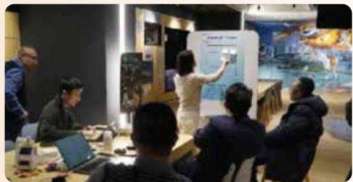

natural_image

Group of people gathered around a table in a meeting room, observing a large mural on display (no visible text or symbols)

## 人才发展

公司深化基于马斯洛需求层次理论的人才激励与保障体系建设，在员工成长三要素方法指引下，重点围绕人才成长发展、人才质量提升两方面开展。

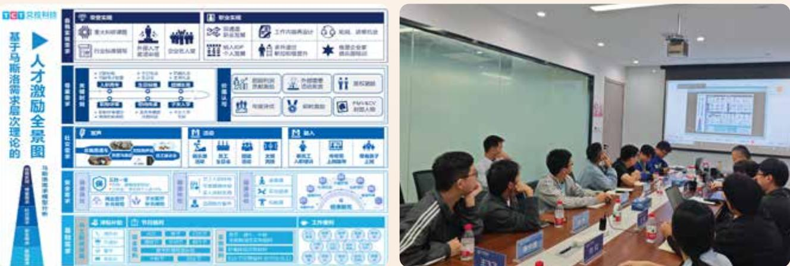

## 人才晋升输送

2025年度聚焦面向未来业务需要的人才发展，通过人才访谈识别40余名高潜力人才，推动22名优秀人才实战轮岗担任核心岗位，同时向国际、低空等新业务板块输送近20名骨干，构建起高质量人才梯队。

## 人才质量提升

搭建体系化人才保障机制，聚焦职称申报辅导、人才奖项申报、人才引进等关键需求提供核心服务，累计服务289人次，全方位满足不同层级员工需求，助力员工实现高层次发展。

## 及时激励

激励不仅是物质上的回报，更是精神上的认同与尊重。我们在完善薪酬体系的同时，着力打造“即时认可”的激励文化，让员工的每一份努力都能在第一时间被看见、被肯定。

集团年度评优以“文化引领、专业标杆、人才梯队”为主线，围绕集团四大业务板块（信号、低空经济、智能列车、生态链）及国际化布局，开展以价值创造为导向、覆盖全业务板块的集团激励表彰。

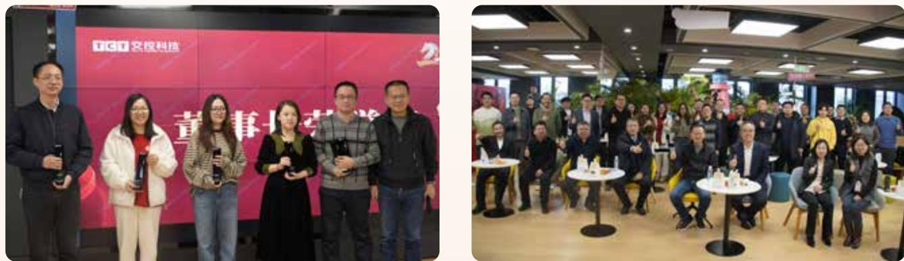

交控信号设立创新、精进专项奖励基金，鼓励员工自发践行“持续创新、不断精进”精神。2025年共收到7个项目提案，经两轮专家评审，5个项目符合评定标准，有力推动技术、管理、营销及成本控制等领域的提升。

交控装备每两月举办员工运营大会，拆解标杆案例与内部经验，复盘实战成果，同步表彰优秀团队及个人，激发全员热情。搭建创新交流平台，赋能运营效能稳步提升，彰显员工成长与组织发展的深度融合。

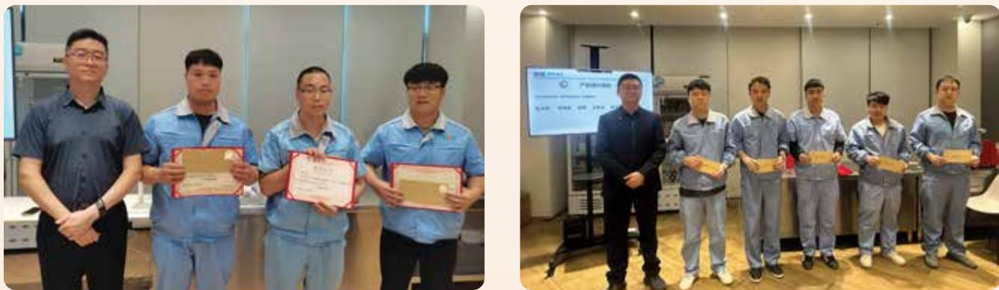

natural_image

Illustration of five people raising hands up a golden trophy, symbolizing achievement or success (no text or symbols present)

## 保障人才权益

## 福利保障

为适应公司战略发展需要，公司结合所处地区及行业特点，构建了以岗位价值为基础、以业绩贡献为导向的薪酬管理体系。坚持“以岗定薪，按绩取酬”的原则，确保薪酬分配的内部公平性，同时通过市场对标机制，保持公司整体薪酬水平的外部竞争力。

<table><tr><td> 五险一金</td><td> 年度健康体检</td><td> 家属团购体检</td></tr><tr><td> 补充医疗保险</td><td> 带薪年假</td><td> 节日补助</td></tr><tr><td> 婚育津贴</td><td> 生日福利</td><td> 用餐补助</td></tr><tr><td> 通讯补助</td><td> 团建活动</td><td> 个性化福利</td></tr></table>

劳动合同签订率100%

社会保险覆盖率100%

公积金参缴率100%

## 在薪酬结构方面

公司实行多元化激励模式，综合运用项目奖金、绩效奖金、超额业绩奖励及股权激励等工具，将员工利益与公司长远发展深度绑定，形成利益共享、风险共担的长效机制，有效激发积极性与创造力。

## 在福利保障方面

公司依法足额缴纳五险一金，并建立补充医疗商业保险及健康管理计划，提升员工健康保障水平。同时提供带薪假期、节日福利及个性化补助，营造关爱员工、和谐共赢的组织氛围。

## 在女性权益方面

公司保障女性员工拥有良好的职场环境，严格落实产假，生育假、哺乳假及育儿假，并通过单独妇科体检，节日福利等举措表达关爱与尊重，营造平等温馨的工作氛围，助力女性员工身心健康与职业发展。

## 民主沟通

为构建开放透明的企业生态，交控科技推出“董事长直通车”“总裁直通车”活动，通过线上匿名问卷、高管直播答疑等多元形式，打破层级壁垒，实现高管与员工的直接对话。活动不仅赋能员工成长，更将一线智慧转化为管理效能，印证了“倾听即责任”的承诺。未来，我们将持续深化数字化沟通渠道，拓展全球员工参与，让“直通车”成为企业与员工共谋发展、共享成果的永恒桥梁。

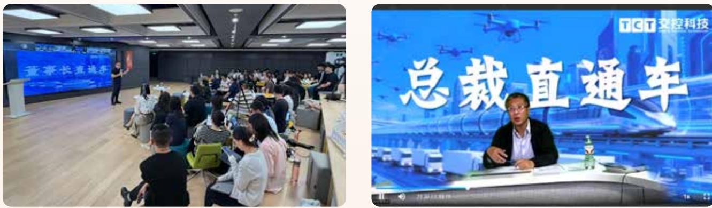

举办直通车4场 累计参与3000+人次

2025年 交控装备搭建高效沟通桥梁 管理层深入一线听取员工心声 聚售技术革新，流程优化、团队协作等议题。员工积极建言献策，共同剖析痛点、梳理路径，为公司提质增效注入坚实内生动力。

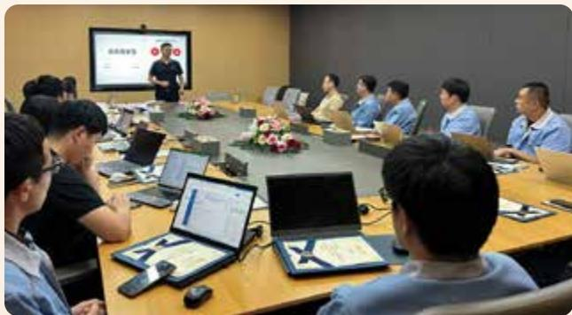

text_image

Meeting room scene with participants seated around a conference table, one person presenting in front of a presentation screen displaying Chinese text.

2025年11月，交控航空在深圳、北京组织员工线下交流会，中高层领导现场倾听员工代表心声、解答疑问，帮助员工明晰公司规划，有效推进后续工作落实。

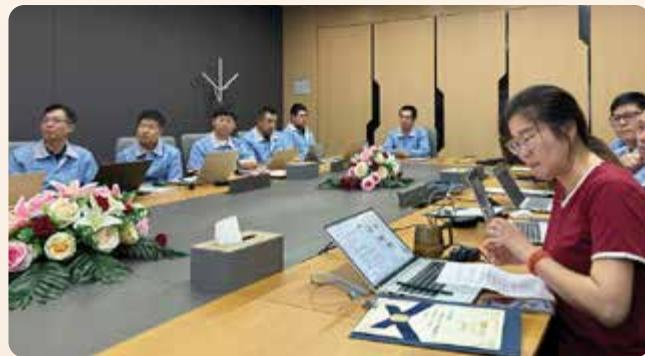

natural_image

Group of professionals in blue uniforms seated around a conference table with laptops and documents, no visible text or signage

交控轨道完善民主管理机制，通过3次项目现场座谈会搭建透明发声平台。围绕薪酬、职业发展、培训、流程等维度收集40余条建议，采取“现场回应+专人跟进+限期落实”方式，确保每条意见得到闭环处理。

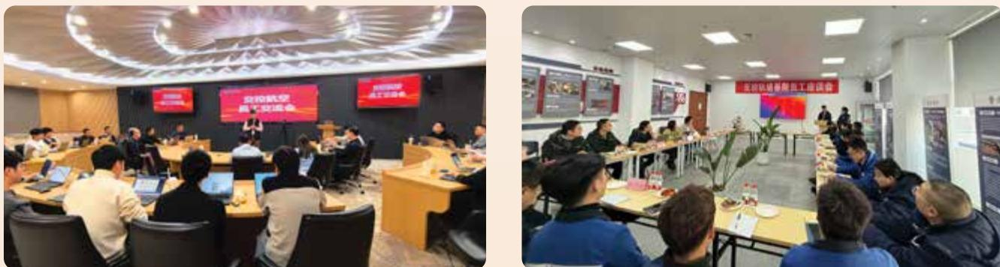

## 职业健康

## 体系认证

2025年，公司持续完善职业健康安全管理体系，顺利通过ISO 45001监督审核，确保体系运行合规有效。我们严格遵守《中华人民共和国安全生产法》《中华人民共和国职业病防治法》等国家法律法规，将职业健康管理融入日常运营，为员工筑牢安全屏障。

与此同时，公司聚焦作业场所风险防控，定期开展职业病危害因素检测与评估，为员工配备合规防护用品。通过组织职业健康培训、应急演练及健康知识宣贯，全面提升员工安全意识与防护能力，切实守护每一位员工的职业健康与安全。

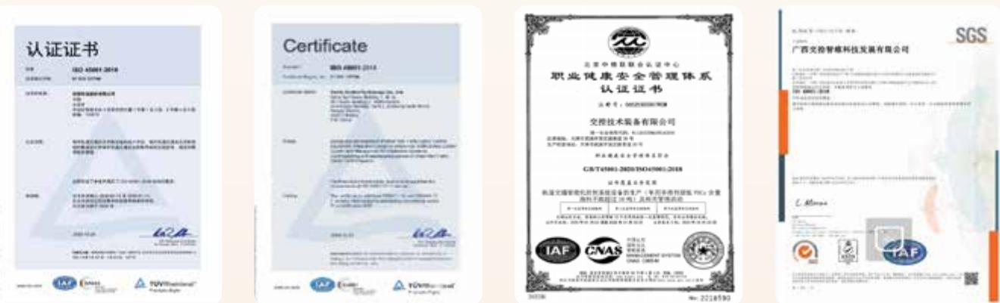

## 特殊场景人员安全

## 现场人员

交控科技高度重视现场调试人员作业安全，严格执行职业健康安全管理：

劳动防护：配备安全帽、绝缘手套、防护眼镜等标准防护装备，特殊环境提供专项防护  
作业规范：电气作业断电挂牌，高空作业系安全带，严禁带病上岗  
安全检查：作业前检查现场环境，进行安全交底，做好安全措施  
应急能力：熟悉应急预案和疏散路线，掌握救知识，事故发生后立即急救并上报  
培训教育：开展安全规程培训和事故警示教育，提升安全意识

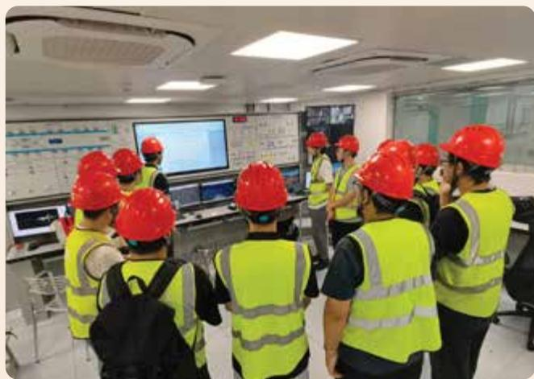

natural_image

Group of construction workers in safety vests and red helmets gathered around a control room with a large display screen (no visible text or symbols)

## 生产人员

精准健康体检：公司基于岗位危害因素精准锁定37名高风险员工，委托专业机构开展专项体检，全额承担费用，确保员工健康权益。  
闭环管理体系：以ISO 45001为框架，构建全流程闭环机制，明确三级责任体系。2025年体检结果显示无职业禁忌、疑似或确诊职业病病例。  
档案长期留存：为高风险员工建立职业健康监护档案，实行“纸质+电子”双备份，保存至离职后30年，确保可追溯、可核查。  
源头风险防控：定期开展职业病危害因素检测，强化防护设施与PPE管理。检测显示噪声、粉尘等全部符合国家限值，无超标点，未发生相关投诉或处罚。

  
编号：BC-I-DX-501-00L-584.21  
交前放术展备业图公司1台三业工新质细作施职业病危害放射防护现状评价报告书

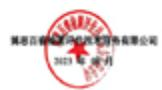

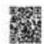  
职业病危害因素检测报告  
报传编号：T0ZA-P-2025-00

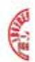  
按术类部：天津市天歌正安检温股余有限公司

## 应急演练

公司制定了《涉安事故、事件管理规定》《消防安全及危险作业管理流程》《危险源和环境因素识别、评价、控制管理规定》等内部制度，每年系统识别职业健康安全相关危险源，评估风险程度并确定重要危险源。同时，定期开展多形式安全隐患排查，对发现问题及时整改，确保办公、生产及现场环境安全得到有效控制。

## 举办培训30+场 各类应急演练80余次 覆盖员工达100%

公司高度重视员工职业健康与应急能力建设，建立了完善的应急管理体系，涵盖火灾、防汛、人身意外等专项应急预案。2025年，按照年度演练计划，有序完成消防、防汛、食物中毒、电梯困人、燃气泄漏、现场人身伤害等多场景应急演练，确保处置流程清晰、措施到位、分工明确，最大限度降低事故风险与损失。

与此同时，公司通过课程培训、实景体验、急救技能等多形式活动，持续增强员工安全意识与自救互救能力。在办公区及健身房配备AED急救设备，并定期开展急救操作培训，切实提升紧急救护响应水平，全方位守护员工生命安全与职业健康。

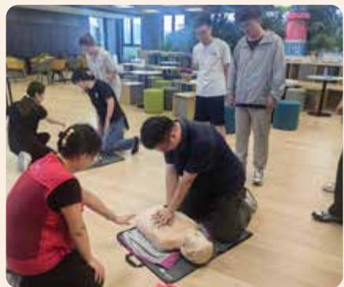

natural_image

Medical training session with instructor performing CPR on a mannequin in a clinical setting (no visible text or symbols)

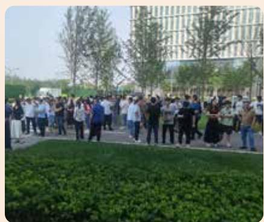

natural_image

Group of people gathered outdoors in a park-like setting with greenery and modern buildings in the background (no visible text or signage)

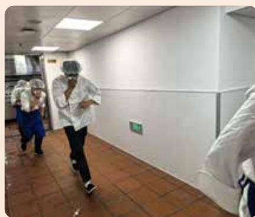

natural_image

Interior hallway scene with people in protective gear, no visible text or symbols

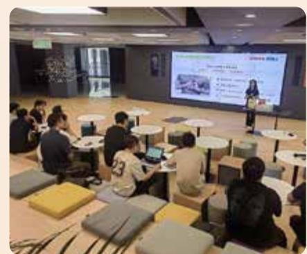

text_image

Classroom scene with students seated at desks facing a presenter on a large screen displaying a presentation slide with Chinese text and diagrams.

## 倾心人文关怀

## 关注女性

我们深知，女性员工在职场与家庭之间承担着多重角色，需要更多细腻的理解与支持。报告期内，我们升级了“柔情守护”女性关爱计划，从身心健康到生活平衡，全方位呵护女性员工的特殊需求。

## 健康讲座

公司特邀中医院专业老师举办春季养生专题讲座并指导八段锦实操 聚售女性员工的健康需求 传递对女性身心健康的专属守护。在快节奏工作背景下，活动倡导科学养生与活力生活理念，助力女性员工以更充沛的精力投入工作与生活，充分彰显公司以人为本、关爱女性、守护成长的文化内核。

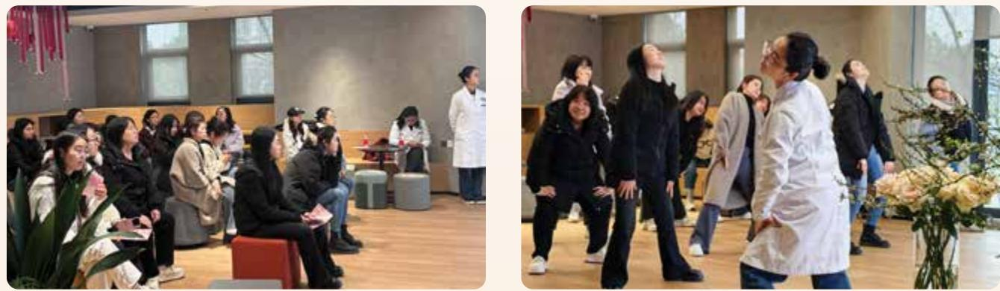

## 节日福利

在国际三八妇女节期间 公司围绕“关爱女性，致敬成长”的主题，为全体女员工精心策划了一系列暖心惊喜与节日仪式。

集团层面统一发放专属福利与礼品，传递对女性员工的尊重与感谢；交控装备公司组织插花活动，现场备有各色鲜花，花器与茶歇，女员工们在互帮互助中修剪花枝，自由搭配，创作出一束束清新雅致的插花作品，在动手创作中感受宁静与美好；重庆交控公司也为员工准备了鲜花与茶歇，营造温馨轻松的节日氛围。系列活动让女性员工在被看见、被珍视的细节中，弱化了“职场工具人”的疏离感，显著提升了归属感与幸福感。

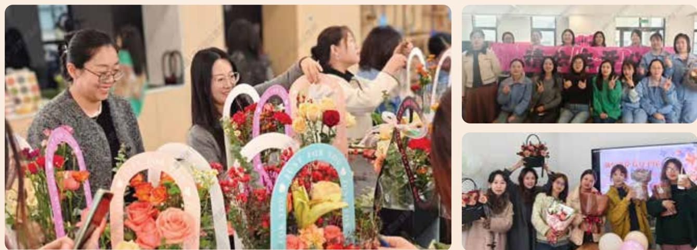

## 温情聚力

我们深信，工作中的默契源于工作之外的深度连接。2025年，公司精心策划并组织了覆盖全员的系列主题活动，涵盖爱国教育、思辨交流、知识分享、健康关爱、生活服务及体育运动等多个方面。这些多元形式的活动有效打破了部门壁垒，增进了员工之间的情感交流，并在细节中体现了对员工身心与生活的切实关怀。在温暖的组织氛围中，每一位员工都能收获归属感与活力，真正实现工作与生活的美好融合。

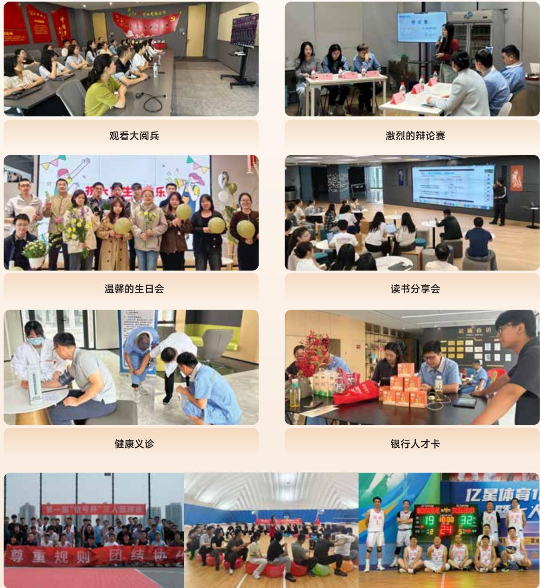  
丰富的体育活动

## 案例

## 以爱为桥，共筑家企共融

2025年9月，交控轨道举办“交轨同心，共赴未来”亲子开放日，邀请员工家属走进公司，了解亲人的工作环境与企业文化。活动搭建起连接员工“小家”与公司“大家”的桥梁，传递了对员工及其家庭的深切关怀与感谢，增强了员工的自豪感与归属感，让家庭支持成为安心工作的温暖力量 营造了家企共融的和谐氛围

natural_image

Group of women in a classroom setting, one writing on paper while others observe (no visible text or symbols)

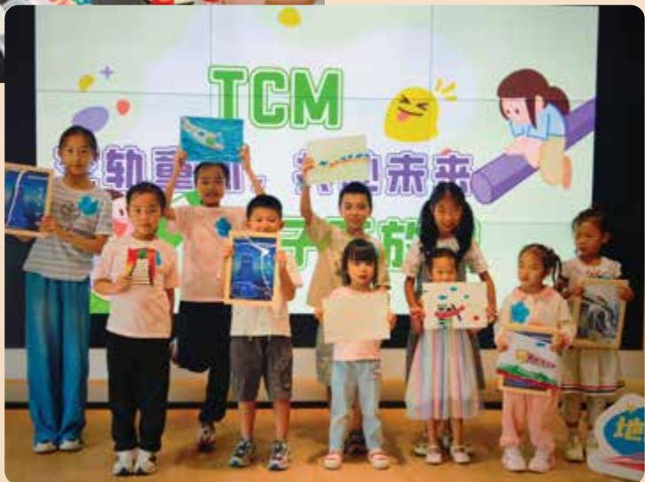

text_image

TCM
轨重未来

## 案例

## TCS“交轨寻迹 城市同行” 地铁城市漫游活动

在此次活动中，交控信号员工化身城市探索家，以轨道为纽带，融合业务亮点与城市特色，设计出历史文化、技术案例、美食烟火等多元路线。从创作到投票，“创造出行美好生活”的使命贯穿始终，镜头与文字间尽显专业与人文的交融。活动将轨道业务与市民生活深度链接，解锁“轨道+人文”的丰富体验，生动展现了员工生活的多彩与活力。

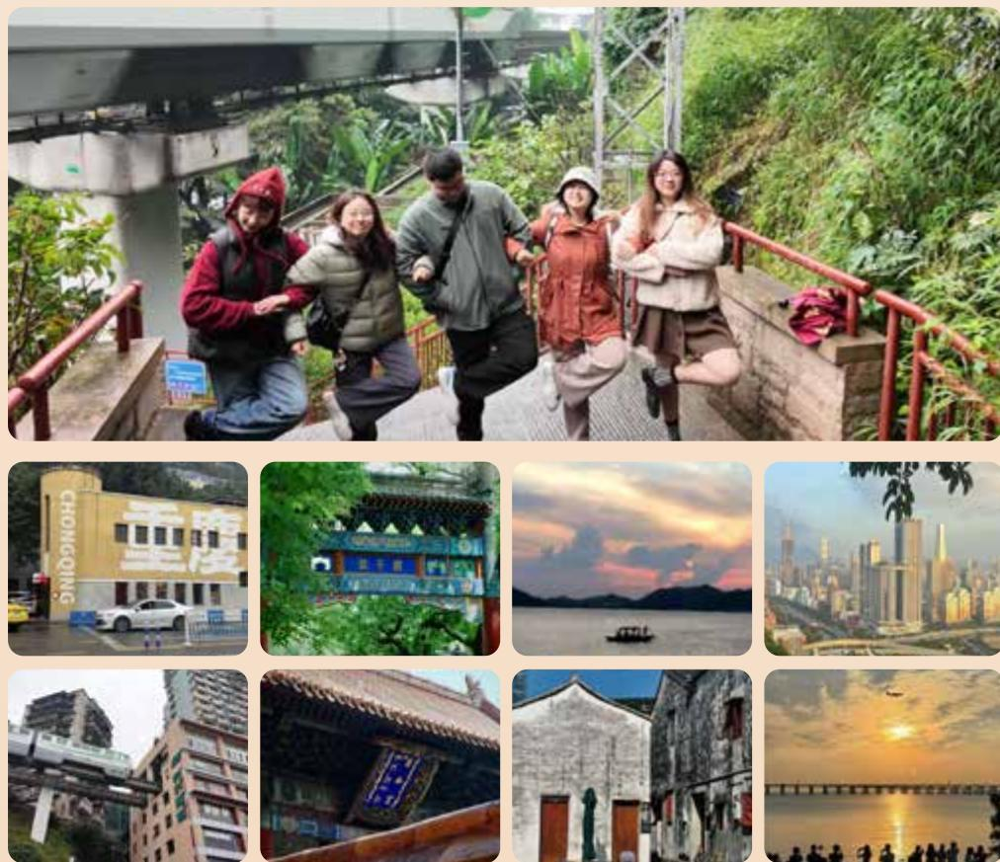

## 环境责任

## 践行低碳，和谐共生

交控科技将绿色发展融入企业日常经营，持续完善环境管理体系，健全节能降耗与生态保护机制，强化环境合规风险管控。我们积极响应国家“双碳”战略，以智慧交通技术赋能低碳出行，推动全员，全过程全覆盖的环保实践，减少运营碳足迹，与利益相关方共建绿色生态、共享可持续发展未来。

## 回应联合国可持续发展

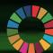

## 目标（SDGs）：

清洁饮水和卫生设施经济适用的清洁能源

14 水下生物

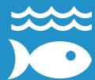

15 陆地生物

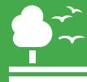

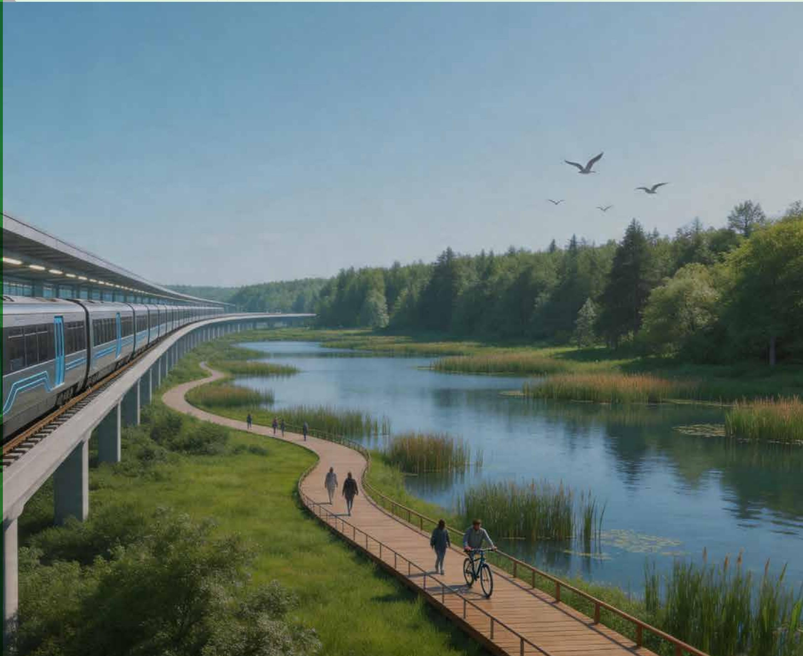

natural_image

Panoramic rendering of a modern high-speed train crossing a curved bridge over a river, surrounded by greenery and birds flying overhead (no text or symbols visible)

## 环境合规管理

## 体系管理

交控科技作为智慧交通领域的科技型企业，不属于高污染、高排放行业，运营过程本身对环境的影响较小。但我们仍以高标准自我要求，严格遵循《中华人民共和国环境保护法》《中华人民共和国固体废物污染环境防治法》《中华人民共和国节约能源法》等国家环保法律法规，构建了涵盖办公、施工、产品全生命周期的制度体系，包括《办公区环境安全管理规定》《施工建设“三同时”管理规定》《危险源和环境因素识别、评价、控制管理规定》等内部制度。通过EHS管理体系的系统化运行，我们确保各项活动对生态环境的影响最小化，以制度之力筑牢绿色发展根基。

报告期内

未发生重大环境污染事故，

未发生因违反环境保护方面的法规而被处罚的情形。

## 风险精准识别

持续推进环境因素深度识别，系统梳理形成《环境因素清单》，量身定制防控措施，强化经营全流程环境风险管控，将风险遏制于萌芽阶段。

## 隐患全面排查

建立常态化环境监测机制，定期对环保设施及重点环节开展“地毯式”隐患排查，建立详细台账，明确整改责任人与时限确保隐患闭环治理。

## 应急能力提升

定期组织突发环境事件应急演练，模拟多元复杂场景，检验并优化应急预案。持续升级环境应急物资与装备配置，提升应急响应速度与处置能力。

## 绩效科学考核

年初制定环境保护管理目标与指标，将环保责任逐级分解至部门与岗位。通过定期检查与考核，严格落实各项环保措施，确保环保工作取得实效。

## 培训文化渗透

将环保意识融入员工培训体系，定期开展环保法规与制度宣贯，提升全员环保责任感，推动绿色理念从“要我环保”向“我要环保”转变。

## 持续改进机制

建立环境管理月度回顾与年度评审机制，结合内外部审核发现，持续优化管理制度与控制措施，推动环境绩效逐年提升，践行可持续发展承诺。

## 环境认证

交控科技高度重视环境管理体系的系统化建设与权威认证，持续推动集团及各子公司对标国际标准，构建覆盖全员、全流程的规范化管理框架。

2025年，公司邀请外部机构进行EHS标准专项培训，统一全员EHS管理认知与术语体系，消除跨部门沟通壁垒。借助外部专业视角，精准识别现行管理与体系文件之间的差距，为制度动态优化及内审类型拓展提供专业建议，显著提升体系适配性与运行效率。

报告期内，交控科技顺利通过ISO 14001环境管理体系换证审核认证；交控装备自2021年起连续五年保持体系认证；交控航空通过年度监督审核；交控智飞首次取得ISO 14001认证。上述成果充分体现了公司在环境管理领域的持续投入与体系化能力。

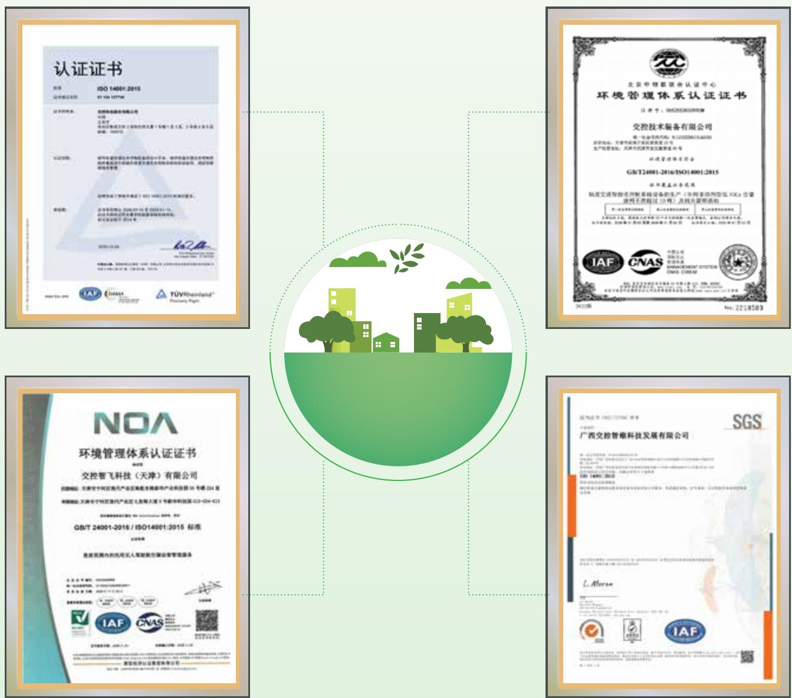

text_image

认证证书
ISO 14001:2015
证书编号：ISO 138127744
证书有效期：
美国标准委员会颁发《关于加快推动高质量发展（电能+卫星）的证书》。
证书编号：
深圳市安联达科技有限公司
证书类型：标准文件
证书编号：深圳市安联达科技有限公司
证书有效期：2016年1月1日
证书编号：深圳市安联达科技有限公司
证书有效期：2016年1月1日
证书编号：深圳市安联达科技有限公司
证书有效期：2016年1月1日
证书编号：深圳市安联达科技有限公司
证书有效期：2016年1月1日
证书编号：深圳市安联达科技有限公司
证书有效期：2016年1月1日
证书编号：深圳市安联通科技有限公司
证书有效期：2016年1月1日
证书编号：深圳市安联通科技有限公司
证书有效期：2016年1月1日
证书编号：深圳市安联通科技有限公司
证书有效期：2016年1月1日
证书编号：深圳市安联通科技有限公司
证书有效期：2016年1月1日
证书编号：深圳市安联通科技有限公司
证书有效期：2
证书编号：深圳市安联通科技有限公司
证书有效期：2016年1月1日
证书编号：深圳市安联通科技有限公司
证书有效期：2016年1月1日
证书编号：深圳市安联通科技有限公司
证书有效期：2016年1月1日
证书编号：深圳市安联通科技有限公司
证书有效期：2016年1月1日
证书编号：深圳市安联达科技有限公司
证书有效期：2016年1月1日
证书编号：深圳市安联达科技有限公司
证书有效期：2016年1月1日
证书编号：深圳市安联达科技有限公司
证书有效期：2016年1月1日
证书编号：深圳市安联达科技有限公司
证书有效期：2
证书编号：深圳市安联达科技有限公司
证书有效期：2016年1月1日
证书编号：深圳市安联达科技有限公司
证书有效期：2016年1月1日
证书编号：深圳市安联达科技有限公司
证书有效期：2016年1月1日
证书编号：深圳市安联达科技有限公司
证书有效期：2016年1月1日
证书编号：深圳市安联远科技有限公司
证书有效期：2016年1月1日
证书编号：深圳市安联远科技有限公司
证书有效期：2016年1月1日
证书编号：深圳市安联远科技有限公司
证书有效期：2016年1月1日
证书编号：深圳市安联远科技有限公司
证书有效期：2016年1月1日
证书编号：深圳市安联远科技有限公司
证书有效期：2
证书编号：深圳市安联远科技有限公司
证书有效期：2016年1月1日
证书编号：深圳市安联远科技有限公司
证书有效期：2016年1月1日
证书编号：深圳市安联远科技有限公司
证书有效期：2016年1月1日
证书编号：深圳市安联远科技有限公司
证书有效期：2016年1月1日
证书编号：深圳市安联达科技有限公司
证书有效期：2016年1月1日
证书编号：深圳市安联达科技有限公司
证书有效期：2016年1月1日
证书编号：深圳市安联达科技有限公司
证书有效期：2016年1月1日
证书编号：深圳市安联达科技有限公司
证书有效期：2

## 节用降废管理

## 绿色办公

公司将绿色理念深植于日常运营，2025年聚焦办公区节能环保与资源高效利用，系统实施一系列优化措施，在降低环境影响的同时，为员工营造健康舒适的办公体验。

年度集团办公用水量7973.63吨

天然气消耗量10162立方米

办公用电量270万千瓦时

汽油消耗量6880升

## 行为规范与监督

内部宣贯环保要求，推动绿色理念融入日常，打造全员参与的低碳办公文化。  
建立每日午餐及下班时段巡查机制，明确整改责任，确保节能措施持续有效。

提升办公环境6S管理水平，营造整洁规范、高效有序的工作氛围。  
全面推行无纸化办公，从源头减少纸张消耗与废弃物产生。

## 能源消耗管控

加强公共区域照明巡查管控，严格执行“人离电断”用电规范，杜绝长明灯及设备空转现象。  
张贴节能标识，强化员工节能意识，引导养成随手关灯、节约用水等日常习惯。

优化空调运行策略与设备待机管理，机房及平台设备除必要长时上电外，均遵循“随用随起、用完即关”原则。

## 健康与资源循环

持续监测办公室内空气质量，结合绿植布设，优化员工健康办公体验。

全面推进垃圾分类与资源回收，规范废弃物处理流程，提升资源利用效率。

## 绿色生产

交控装备生产区本年度持续深化环保合规管理，已构建起覆盖环境监测与废弃物处置的系统化机制，最大限度降低运营活动对生态环境的影响。依托《园区安全和环境管理规定》《生产安全和环境管理规定》《危险化学品和废弃物管理规定》《生产安全事故应急预案》等内部制度体系，公司顺利通过ISO14001环境管理体系及ISO45001职业健康安全管理体系双认证。

15126吨

用电量298万千瓦时

同时，公司严格落实国家环保法规，统筹推进污水、废气、固废及噪声的规范化治理，并取得安全标准化三级证书，确保各类污染物得到有效处置并稳定达标排放。全年未发生环境污染事件或环保处罚，环境绩效保持持续稳定合规的良好态势。

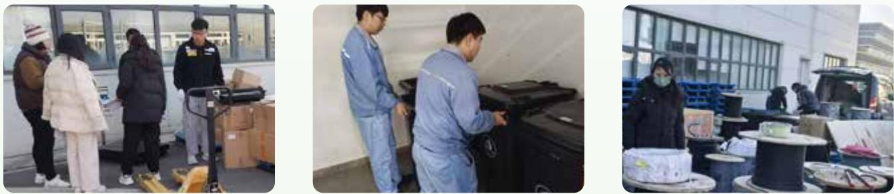

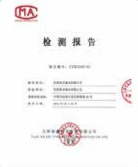

text_image

检测报告
联系单位：北京国信证券有限责任公司
客服电话：010-63288888
联系人：张巍
注册地址：北京市西城区金融大街3号
联系电话：010-63288888
联系人：张巍
北京国信证券有限责任公司
地址：北京市西城区金融大街3号
法定代表人：张巍

2025年第一季度

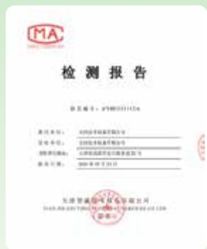

text_image

检测报告
登记编号：0748033211524
委托单位：中国证券监督管理委员会
受理单位：全国社保基金理事会转持二户
招股意向书编号：中国证券报字[2016]第100号
服务日期：2020年07月21日
MA
检测报告
http://www.mszq.com.cn/10000000000000000000000000000000000000000000000000000000000000000000000000000
来源：国家统计局

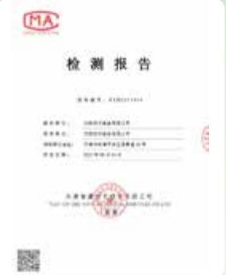

text_image

检测报告
业务编号：20230111844
联系单位：中国电子集团有限公司
联系电话：0755-83968888
公司网站：www.haojun.com.cn
客服电话：021-63333333
注册地址：北京市西城区金融大街3号
MA
检测报告

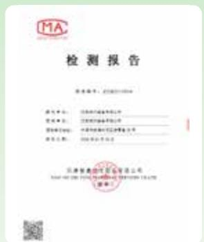

text_image

检测报告
负责人：刘志明
公司名称：中国船舶工业集团有限公司
注册地址：北京市西城区复兴门内大街1号
法定代表人：王洪波
检测报告（2023年1月1日）
检测报告（2023年1月1日）

2025年第四季度

## 废水管理

对厂区废水总排口实施常态化监测，严格执行废水排放标准。  
经第三方检测机构监测，废水全部指标满足DB12/356-2018间接排放三级标准，达标排放。

## 噪声管理

对厂界噪声实施定期监测，确保生产活动不对周边环境造成噪声污染。  
经检测，厂界噪声满足GB12348-2008 3类区标准要求。

## 废气管理

对有组织废气（三防、焊接）及无组织废气实施常态化监测与管控。  
经检测，VOCs、锡、臭气浓度全部达标，符合DB12/524-2020及GB16297-1996标准要求。

## 一般废弃物管理

对锡渣、废线及报废物料等一般废弃物实行分类存放、台账清晰、转移合规管理。  
全部交由具备资质的第三方单位回收处理， 杜绝随意堆放和非法处置，显著降低对土壤、 水体及空气的潜在污染风险。

## 危险废物管理

建立危险废物全生命周期管理体系，实行专人管理、定点存放、闭环管控。  
生产过程产生的危险废物分类收集、规范贮存，全部由具备资质的第三方机构合规处置。  
危险废物合规处置率达100%，全年未发生危废泄漏、非法转移及安全事故。

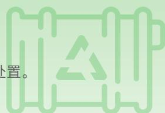

## 守护生态环境

## 绿色交通

## 赋能智慧绿色出行，助力减碳降排

公司深耕轨道交通信号控制系统的自主研发，通过优化列车运行图、缩短发车间隔、提升准点率，有效提高轨道交通运输能效。轨道交通作为大容量，低排放的绿色出行方式公司以技术创新吸引更多公众选择公共交通出行从源头减少私家车使用带来的碳排放和空气污染，持续为城市绿色低碳转型贡献专业力量。

安全云平台产品研发项目：该项目基于通用服务器设备开发，不依赖专用硬件，从设计源头践行资源高效利用与低碳发展理念，该平台通过减少专用硬件设备数量及空间占地需求，有效降低生产制造环节的原材料消耗和电子废弃物产生，同时缩短供货周期、降低全生命周期能耗。国产化设计保障供应链自主可控的同时，减少了长距离运输带来的碳排放。本年度，项目已完成样机定型，为公司绿色产品矩阵增添新动能。

## 拓展低空经济新赛道，赋能生态环境治理

低空经济本身就是绿色经济形态。以新能源无人机、电动垂直起降飞行器为代表的低空航空器，在运行阶段可实现零排放与低噪声飞行。在生态巡护、环境监测等领域，无人机加速替代传统高碳作业方式，显著降低碳排放与生态干扰，为绿色可持续发展贡献专业力量。

湿地保护：公司以“无人机+AI识别+自动化机库”技术创新，赋能天津七里海湿地生物多样性保护。项目实现全天候自动化巡护，精准监测珍稀物种动态并联动处置非法行为，有效维护候鸟栖息地与区域生态稳定。该模式为全国湿地保护提供了可复制的智慧化方案，推动生态保护从“人海战术”向“科技赋能”转型。

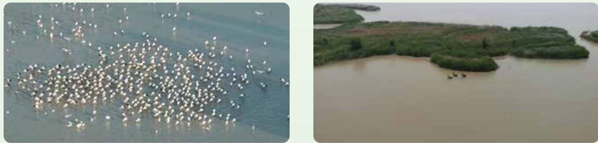

河道监测：公司以“无人机+无人船+AI识别”技术构建新安江智慧河道监测体系，实现41.4公里水域全覆盖、日均多次自动巡检。系统高效识別蓝藻，垃圾，非法排污等异常并实时告警 事件处理缩短至15分钟，巡检效率提升10倍，显著增强水域环境管控与应急响应能力。

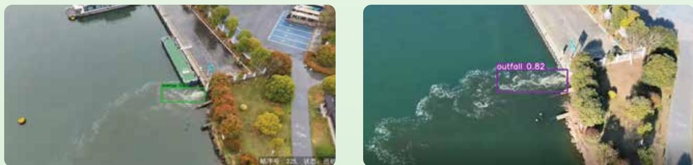

## 绿色行动

交控安捷积极践行绿色发展理念，将环保行动融入党建活动与员工文化建设，2025年围绕铁路沿线、社区公园等场景，系统开展环境整治、环保宣导、植绿护绿等系列行动，以实际行动守护生态环境、履行社会责任，持续推动绿色生活理念深入人心。

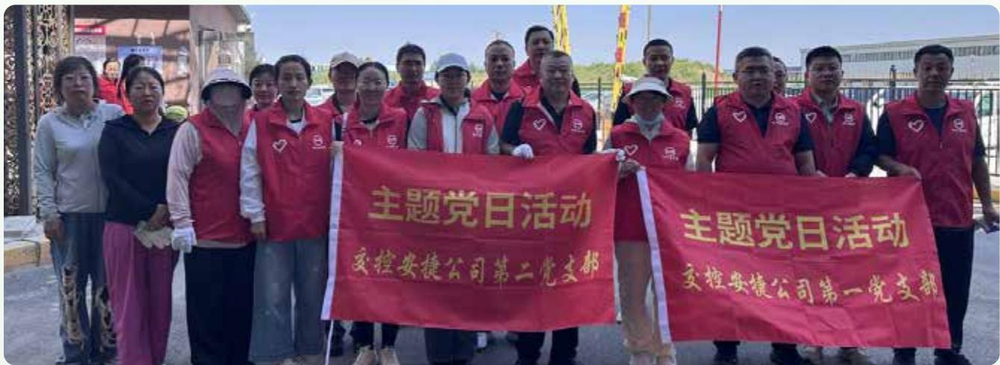

text_image

主题党日活动
交控安捷公司第二党支部
主题党日活动
交控安捷公司第一党支部

## 志愿服务净家园

2025年4月，交控安捷组织志愿者深入社区开展志愿服务活动，分组擦拭楼道、清扫路面、清理绿化带死角，将烟头、包装袋等垃圾一一捡拾归集。社区环境显著改善，赢得居民点赞，活动美化了居住环境，传递了文明新风尚。

## 铁路沿线环境整治

2025年8月，公司组织志愿者开展铁路沿线垃圾清理及蒿草清除活动。志愿者们沿铁轨两侧清理塑料瓶、废纸等散落垃圾，并对蒿草进行集中清运。活动有效改善了铁路沿线生态环境，消除垃圾对土壤与水体的潜在影响，同时为铁路行车安全增添保障。

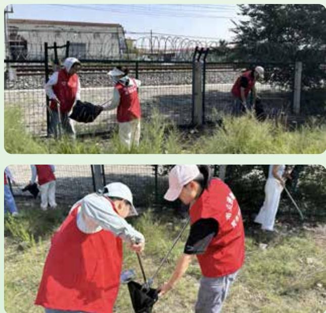

## 社区植绿护生态

2025年6月，公司组织志愿者赴社区开展植绿护绿活动，挥锹铲土、扶苗浇水、播撒草籽，面对土质坚硬等挑战，全力保障绿植成活率。同时向居民宣传环保知识倡导绿色生活方式，增加社区绿化面积，为共建美丽家园贡献企业力量。

natural_image

Group of people in red vests and white clothing cleaning outdoors near a building entrance (no visible text or symbols)

## 环保健步行活动

交控安捷在大黑河郊野公园开展健步行暨趣味运动户外活动，将环保理念融入活动细节。通过环保健步行，垃圾清理等环节，员工在锻炼身体的同时参与环境维护，以常态化宣导提升环保意识，将绿色生活理念转化为日常自觉行动。

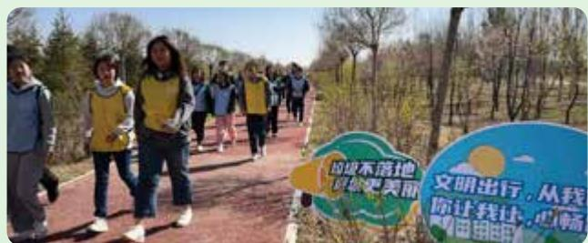

text_image

垃圾不落地
你更美丽
文明出行，从我
你让我让，心畅
加油用好

## 05社会责任

## 成就他人，助力进步

交控科技始终深耕智慧交通前沿技术研发，聚焦安全高效、稳定可靠，绿色经济的技术方向坚持核心技术自主创新。公司深度融入国家高质量发展战略，积极培育新质生产力，持续推动技术突破与产业升级，在助力社会进步与可持续发展进程中肩负重要使命、发挥关键作用，以 “成为世界级技术领袖，创造出行美好生活” 为企业愿景不懈奋进。

回应联合国可持续发展

目标（SDGs）：

无贫穷

3 良好健康

4 优质教育

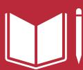

10 减

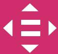

11 可城

17 促的

natural_image

Group of people standing on a grassy hill overlooking a river at sunset, with a city skyline in the background under a dramatic cloudy sky.

## 推动行业发展

## 行业标准

交控科技主动担当、积极作为，深度参与国家及行业标准体系建设，在城市轨道交通、低空经济等重点领域承担多项标准的主编与参编工作，以专业力量推动行业规范化进程，助力构建安全、高效、绿色的综合立体交通体系。

## 城市轨道领域

2025年 公司深度参与城市轨道交通领域标准体系建设 覆盖信号系统，全自动运行，大数据平台，智能运维等核心技术方向。

牵头编制并发布国家标准1项

参与编制并发布国家标准3项

团体标准1项

地方标准 1项

团体标准6项

<table><tr><td>类型</td><td>名称</td><td>发布方</td><td>参与方式</td></tr><tr><td rowspan="4">国家标准</td><td>城市轨道交通信号系统车载设备人机界面显示技术规范</td><td>国家市场监督管理总局</td><td>主编</td></tr><tr><td>城市轨道交通全自动运行系统通用技术条件</td><td>国家市场监督管理总局</td><td>参编</td></tr><tr><td>城市轨道交通信号系统报警信息及故障分级技术规范</td><td>国家市场监督管理总局</td><td>参编</td></tr><tr><td>城市轨道交通车辆报警信息及故障分级技术规范</td><td>国家市场监督管理总局</td><td>参编</td></tr><tr><td>地方标准</td><td>城市轨道交通信号继电器检修规程</td><td>南宁市市场监督管理局</td><td>参编</td></tr><tr><td rowspan="7">团体标准</td><td>城市轨道交通 CBTC信号系统报警技术规范</td><td>中国城市轨道交通协会</td><td>主编</td></tr><tr><td>城市轨道交通 大数据平台 数据要求</td><td>中国城市轨道交通协会</td><td>参编</td></tr><tr><td>城市轨道交通 计算机联锁与计轴设备 通信接口规范</td><td>中国城市轨道交通协会</td><td>参编</td></tr><tr><td>城市轨道交通 正线联锁表 编制导则</td><td>中国城市轨道交通协会</td><td>参编</td></tr><tr><td>市域(郊)铁路调度集中系统技术条件</td><td>中关村轨道交通视频与安全产业技术联盟</td><td>参编</td></tr><tr><td>货运铁路综合调度及控制一体化系统技术要求</td><td>中关村轨道交通视频与安全产业技术联盟</td><td>参编</td></tr><tr><td>市域(郊)铁路基础设施智能运维平台技术规范</td><td>中关村轨道交通视频与安全产业技术联盟</td><td>参编</td></tr></table>

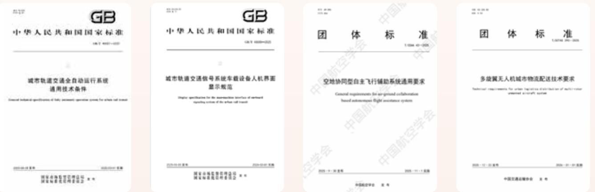

## 低空经济领域

2025年，公司积极布局低空经济领域标准制定，覆盖安全术语、风险评估、飞行间隔、物流配送、清洗喷涂等关键应用场景。

牵头编制并发布团体标准1项

参与编制并发布团体标准5项

<table><tr><td>类型</td><td>名称</td><td>发布方</td><td>参与方式</td></tr><tr><td rowspan="6">团体标准</td><td>低空运行安全风险评估与分级指南</td><td>中国指挥与控制学会</td><td>主编</td></tr><tr><td>空地协同型自主飞行辅助系统通用要求</td><td>中国航空协会</td><td>参编</td></tr><tr><td>低空安全术语</td><td>中国指挥与控制学会</td><td>参编</td></tr><tr><td>低空飞行安全间隔管控规范</td><td>中国指挥与控制学会</td><td>参编</td></tr><tr><td>多旋翼无人机城市物流配送技术要求</td><td>中国交通运输协会</td><td>参编</td></tr><tr><td>无人机清洗与喷涂技术操作规程</td><td>深圳市无人机协会</td><td>参编</td></tr></table>

## 战略合作

2025 年，交控科技秉持开放协同、互利共赢的发展理念，持续深化与行业优质企业、高等院校及科研机构的全方位合作。通过资源共享、优势互补与联合攻关，不断夯实产业协同基础，拓宽技术创新边界，以长效稳定的合作机制赋能产业高质量升级。

## ■ 案例：交控科技与港铁共建“低空轨道研究中心”

公司与香港铁路有限公司携手合作，共同探索低空无人机技术在铁路领域的创新应用旨在提升铁路运营与维护效率。该合作成功入选香港低空经济“监管沙盒”首批试点项目。

2025年4月，双方共同成立“低空轨道研究中心”，此次战略合作不仅为大湾区智慧交通发展注入新动能，也为全球低空经济与轨道交通的融合发展贡献了解决方案，有力推动行业向智能化、立体化迈进。

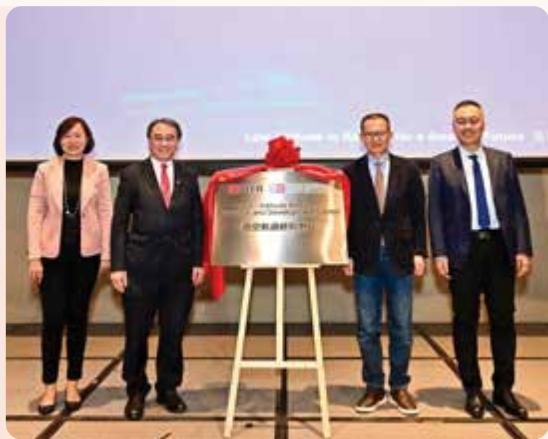

text_image

Group photo of four people at a ceremony with a plaque unveiling a golden emblem, likely for an event or award.

## ■ 案例：深化区域战略合作，推动低空产业升级

2025年，公司与孝感市临空经济区管理委员会签署战略合作协议，共同打造“孝感市低空经济综合试验区”与“鄂北低空经济产业基地”。双方将充分发挥公司在数字化平台、场景化应用等领域的技术优势，结合临空区区位与产业基础，在平台建设、产业落地、创新集聚等方面开展深度合作。

此次战略布局不仅助力孝感培育新质生产力、推动产城融合升级，也为武汉都市圈低空经济发展注入新动能，有力推动区域经济高质量发展与低空产业生态构建。

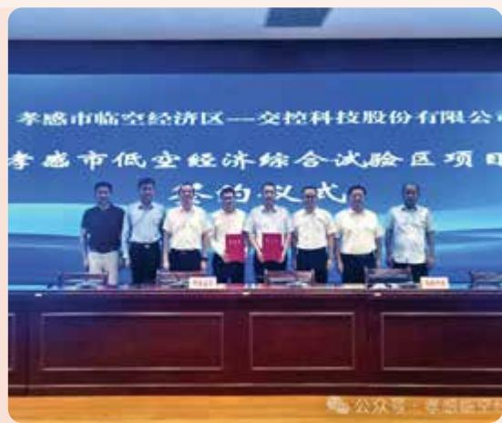

text_image

孝感市临空经济区—交控科技股份有限公司
孝感市低空经济综合试验区项目
仪式

## 行业交流

2025 年，交控科技秉持开放共赢理念，与业内优秀伙伴构建常态化交流合作机制，共同研判产业发展趋势、共谋可持续发展方案，以协同之力推动行业整体创新能力与发展质量稳步提升。

## 专业论坛

2025年，公司积极搭建行业交流平台，通过主办及参与多场专业展会与论坛，推动轨道交通与低空经济领域的技术共创与产业协同。

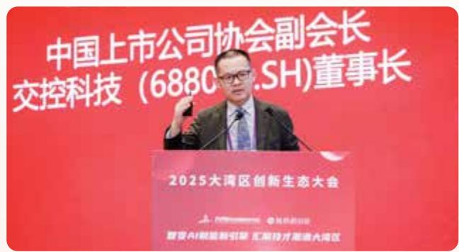

text_image

中国上市公司协会副会长
交控科技 (6880SH.SH)董事长
2025大湾区创新生态大会
群安AI赋能引领 汇聚技术激励大湾区

2025年大湾区创新生态大会

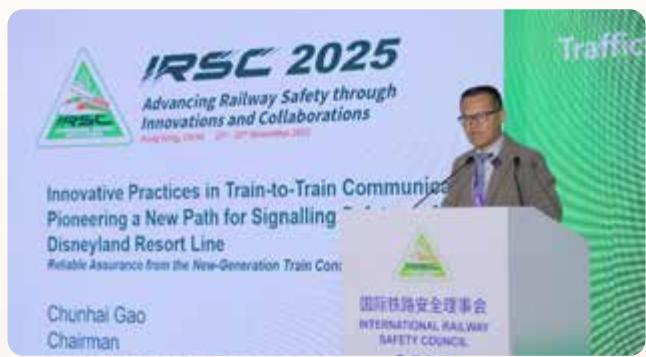

text_image

IRSC 2025
Advancing Railway Safety through
Innovations and Collaborations
Aung Wang, China 20th-21st December 2023
Traffic
Innovative Practices in Train-to-Train Communie
Pioneering a New Path for Signalling
Disneyland Resort Line
Reliable Assurance from the New-Generation Train Con:
Chunhai Gao
Chairman
国际铁路安全理事会
INTERNATIONAL RAILWAY
SAFETY COUNCIL

国际铁路安全理事会会议（IRSC2025）

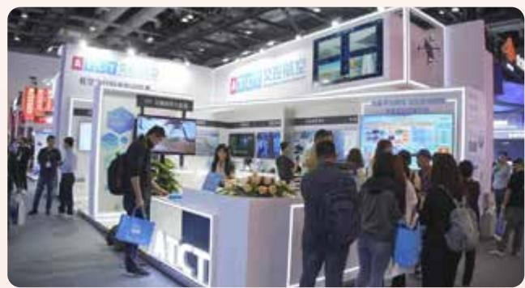

text_image

Exhibition hall photo with visible signage including 'LACO' and Chinese text on booths and display screens

2025北京国际低空产业博览会

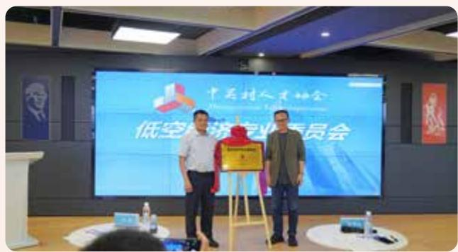

text_image

中寿村人才协会
Huangyuan Economic Research Committee
低空经济收委委员会

中关村人才协会低空经济专业委员会成立大会

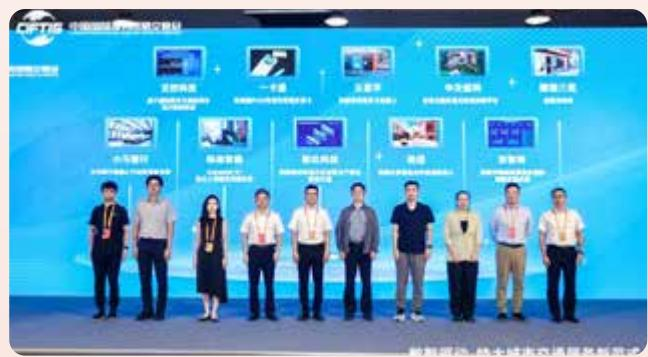

text_image

Group photo of a presentation event with multiple participants on stage and logos displayed above them.

数智驱动·特大城市交通服务新范式论坛

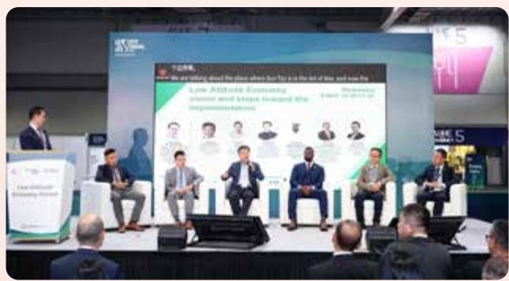

text_image

Low Albania Economic
convenience and social development the
improvements

香港2025超级枢纽博览会低空经济论坛

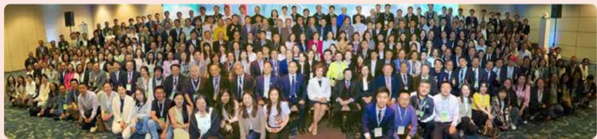

natural_image

Group photo of a large indoor gathering with attendees in formal attire, no visible text or signage

第十三届交通大学美洲校友峰会

## ■ 案例：主办产业论坛，引领低空场景落地

随着低空经济被列为国家重点推动的战略性新兴产业，2025年9月，公司在中国指挥与控制学会指导下，于成都成功主办“2025国际低空产业大会·低空产业上市公司论坛”。论坛以“以场景为驱动，赋能低空经济”为主题，汇聚政府、企业、科研院所等百余位嘉宾，围绕低空技术创新与跨界协同展开深入对话。

论坛期间，公司联合编制并发布《低空应用场景指南》，涵盖轨道交通、高速公路、水利水务三大专项手册，系统梳理低空技术在各领域的应用路径与实施参考。本次论坛通过政策解读、案例分享与成果发布，为行业搭建了高质量的交流平台，有力推动了低空经济从概念走向场景化落地，为成渝地区及全国低空产业发展注入了新动能。

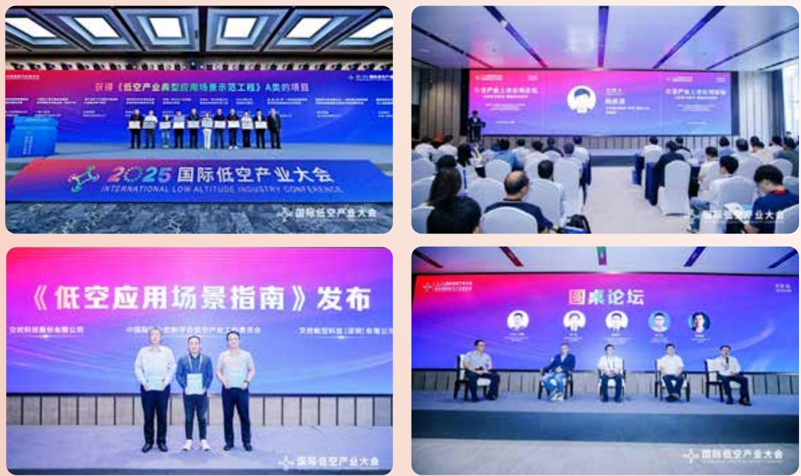

## ■ 案例：亮相行业盛会，共探城轨未来

2025年9月公司亮相2025中国国际城市轨道交通展览会暨CAMET论坛（MetroTrans 2025）以“AI:低空双驱智焕城轨新程”为主题 集中展示多项AI赋能技术与低空经济融合成果。展会期间 公司通过多场论坛发言与行业同仁深度交流，分享技术突破与前瞻思考 共同探索城轨未来发展路径，以开放姿态推动行业技术共创与进步。

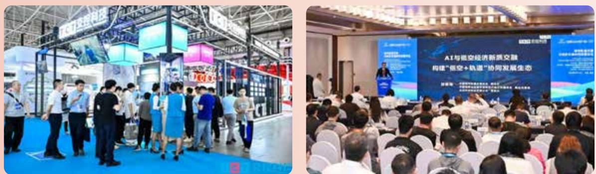

## 国际交流

2025年，公司积极拓展国际交流合作，通过技术访团接待、国际研学、区域文化交流等多种形式，推动轨道交通与零碳交通领域的经验共享与标准对接，以开放姿态促进技术互鉴与人才培养，助力中国智慧走向世界。

2025年4月，来自“一带一路”沿线8个国家的30余名学员，带着对零碳交通的思考不远万里、跨越山海来到中国，走进交控。以文明互鉴，用科技赋能，通过“专题授课+实地考察+探讨交流”等学习形式在人工智能时代寻找发展中国家高质量发展路径共筑智慧未来。

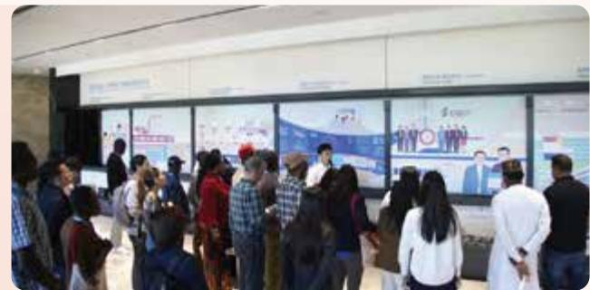

text_image

Crowd of people viewing a large display screen with visible charts and text, likely in an exhibition or conference room.

2025年8月，坦桑尼亚国家铁路局技术骨干代表团一行70人赴公司参观学习。此次交流旨在推动中非在基础设施与人才标准领域的对接，让非洲同行深入了解中国城轨发展成就及人才培养体系，助力中国技术、中国标准走进非洲，深化“一带一路”框架下的技术合作。

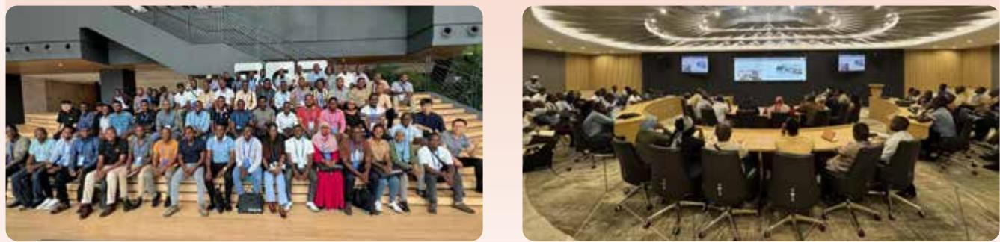

2025年10月，公司董事长应邀赴美参加国际高端研学活动，与全球顶尖管理学者共同探讨企业战略与领导力提升。此次交流为公司拓展全球视野、升级战略管理注入新动能，公司将持续融合全球智慧与中国实践，推动行业创新与高质量发展。

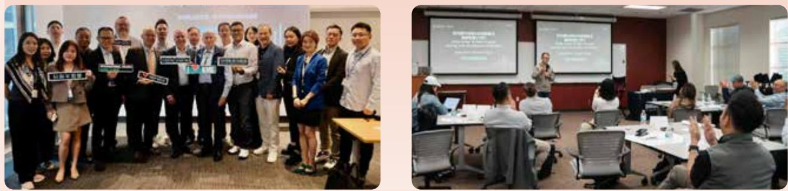

2025年12月，马来西亚交通部部长率高级于部考察团到访公司 实地考察中国轨道交通技术创新成果。此次活动深化了中马在智慧交通领域的技术交流与产业对接，展示了中国先进技术实力，公司将持续助力中国标准与技术走向国际，推动区域交通发展，为全球智慧交通贡献专业力量。

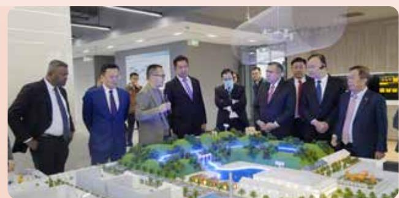

natural_image

Group of professionals in business attire observing a detailed architectural model of a modern building complex (no visible text or symbols)

## 开展科普活动

公司始终积极投身社会科普事业，依托集团及子公司属地科普基地，2025年持续开展多类型科普活动，以生动易懂的方式引领公众走进轨道交通与低空经济领域。

## 科普基地建设

公司北京总部作为北京市科普基地及丰台区智慧城市轨道交通科普基地，2025年累计接待50余次，科普受众达4000余人。公司承担北京市科协“科技馆之城”示范项目，2024年度项目获评优秀，并继续承担2025年度项目。同时，交控装备公司获评“交控科技（天津）低空经济科创园科普基地”，成功打造质量与规模并重的科普研学课程体系。

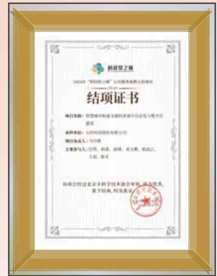

text_image

结项证书
2014年“同创立新”系列图书数量证明
项目
编辑人员：贾雪梅、刘晓峰、王健、周玉辉、杨志江、
签字盖章：张伟
项目负责人：韦世强
主要参与人：付明、徐波、孙伟、周玉辉、杨志江、
日期：高宇
该项目经过北京科学技术协会审核，通过登录，
准予结项，特发此页

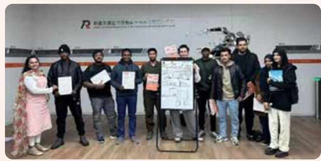

text_image

Group photo of people holding documents and a poster in front of a wall with visible Chinese text and logo

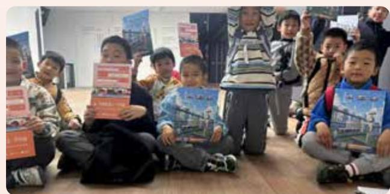

text_image

Group photo of children holding books with visible Chinese text, likely in a classroom or educational setting

## 科普赋能成长

交控装备针对不同群体开展差异化科普活动。精品小团活动聚焦课程打磨，累计服务87人次，满意度近100%。在此基础上成功承接超500人规模研学订单 单场最高接待215名学员 累计惠及超600个家庭 形成标准化全流程管理方案。此外，在天津粉丝节活动中搭建无人机足球体验区，以“科技+运动”互动形式普及无人机技术，有效提升公众科学素养。

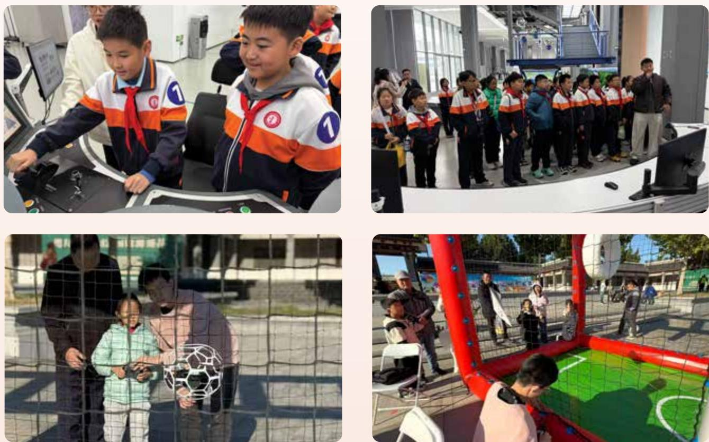

## 校企协同育人

交控装备与天津大学未来学院，天津铁道技术学院合作，在低空经济科创园科普基地启动校企协同育人项目，双方共同开发低空交通，无人机系统等交叉课程，企业专家担任产业教师：学生团队围绕物流无人机路径规划、飞行测试等真实课题开展实践。此举将行业前沿与人才培养紧密结合，为低空经济高质量发展提供人才支撑。

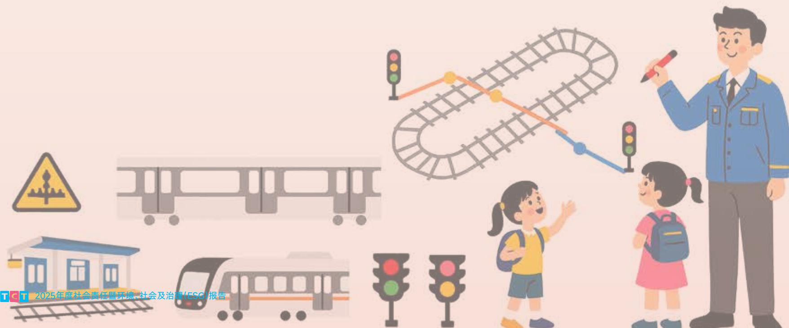

text_image

TCT 2025年度社会责任暨环境、社会及治理(ESC)报告

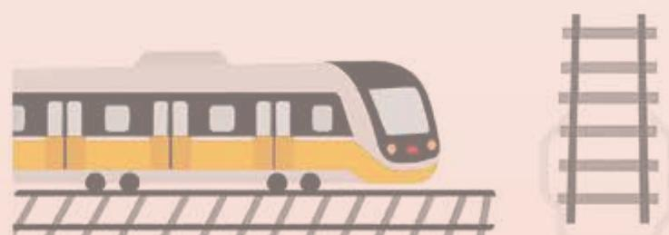

natural_image

Illustration of a modern train on tracks with a ladder in the background (no text or symbols)

## 投身社会公益

## 公益捐款

2025年，交控科技积极履行企业社会责任，通过一系列主题活动，展现了企业在社会公益、文化传承、环境保护等方面的担当与作为。

对外捐赠款项合计860.73万元

开展其他各类志愿服务10+次

## 关切社会事件，支持灾后重建

交控科技积极履行社会责任，密切关注北京密云洪涝灾害和香港大埔宏福苑火灾。2025年9月，向“丰宜福台基金会”捐款3.5万元，助力密云区灾后重建；2025年11月，第一时间通过香港子公司向“大埔宏福苑援助基金”捐款50万港元，支援现场救援与灾后重建。两次捐赠均彰显了“一方有难、八方支援”的大爱精神与企业的责任担当。

## 助力乡村振兴，巩固脱贫成果

2025年是巩固拓展脱贫攻坚成果同乡村振兴有效衔接的收官之年，也是广东省、深圳市深入实施“百千万工程”深入实施的关键之年。值此“6·30”助力乡村振兴活动之际，我公司积极响应深圳福田区工商联号召捐赠现金，用于支持乡村振兴事业，以实际行动巩固脱贫成果，助力城乡区域协调发展，为推进乡村治理现代化、实现共同富裕贡献企业力量。

## 重视青少年成长，推动教育发展

北京十二中与中关村丰台园于2023年起，联合开展园企校青少年创新人才协同培养计划（“丰生计划”），并委托丰宜福台基金会作为“丰生计划”托管单位。交控科技作为“丰生计划”首批发起成员单位，2025年对“丰生计划”进行捐赠10万元，用于导师培养、名师交流、跨学科教育、科研探索和实践考察，助力丰台区教育事业发展。

此外，作为轨道交通领域的深耕者，交控科技始终怀揣对行业的深厚情感，高度重视教育体系的完善与人才培养。2025年 我们与北京交通大学，西南交通大学，兰州交通大学等高校建立密切联系 通过教育基金的形式开展合作 专项用于科学研究、技术创新、平台建设及高层次人才培养等项目，旨在推动轨道交通领域的知识创新与技术进步，为未来行业发展培育更多高素质人才。

## ■ 案例：党建引领，情暖童心

2025年5月，交控科技党支部联合诺德党群服务中心前往顺义区光爱学校开展爱心捐赠活动，为困难儿童送去米面油等生活物资。党员代表与师生亲切交流，走进教室、宿舍了解孩子们的学习生活情况，传递关怀与鼓励，送去温暖与希望，公司将持续开展公益活动，以实际行动回馈社会、传递爱心。

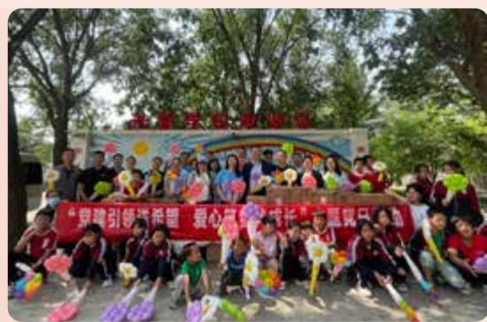

text_image

“党建引领党希望 爱心凝聚”成长“愿祝日\n

## 志愿服务

## 传递真情关爱，共护特殊儿童

2025年3月，交控安捷党支部走进“爱加倍星儿公益助残中心”，开展关爱自闭症儿童主题党日活动。针对孩子们生活物资紧缺的情况，党支部送去米面，水果，卫生纸等爱心物资，党员们耐心陪伴孩子们互动交流，参观他们的书法，绘画作品，感受多彩内心世界。此次活动以实际行动践行雷锋精神，为特殊儿童送去温暖与希望，彰显企业关注弱势群体、助力公益事业的责任担当。

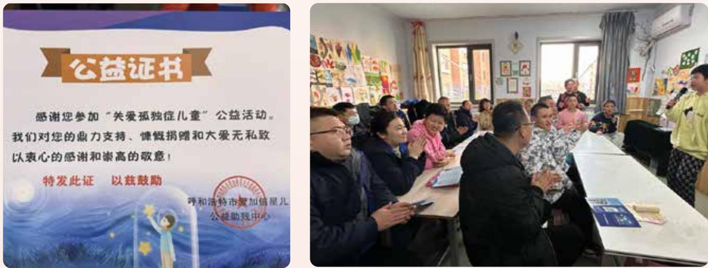

## 践行敬老初心，共建和谐社区

2025年5月，交控安捷党支部走进社区与养老院，开展端午主题党日活动。党员们与老人一起包粽子、话家常，送去节日关怀；同时向居民宣传民族政策法规，增强民族团结意识。活动弘扬了敬老爱老传统美德，促进了社区和谐共融，以实际行动践行企业社会责任，助力构建温暖、团结的美好社会。

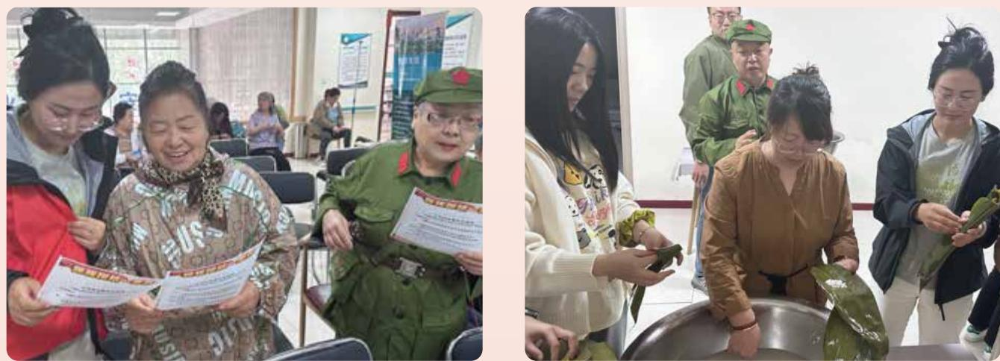

## Nh未来可期

## 拥抱变化，奋斗拼搏

2025年，我国顺利完成“十四五”规划收官任务，同步启动“十五五规划的谋篇布局。站在承上启下的关键节点，展望 2026 年，面向新征程，我们将以更加坚定的步伐，在治理、创新、人才、国际化和责任担当上持续深耕。

## 治理为基，行稳方能致远

我们将持续完善公司治理结构，强化董事会专业化建设，提升决策的科学性与透明度。在风险管控方面，我们将进一步健全内控体系，将合规管理嵌入业务全流程，确保公司在快速变革中始终保持稳健。我们坚信，唯有以规范、透明、负责任的治理，才能赢得各方的长期信任。

## 创新为核，双轮驱动未来

公司持续聚焦智慧轨道交通战略，推动列车自主感知、虚拟编组、运行图动态调整等新一代技术与行业需求深度融合，实现前沿技术在信号系统中的验证与推广，助力未来轨道交通实现低成本、高效率、高安全。低空方面，聚焦复杂场景技术攻关，加快产品迭代，围绕封闭空间等核心场景，通过示范项目积累数据、优化性能，筑牢场景运营基础。

## 人才为本，成就奋斗者梦想

员工是交控科技最宝贵的财富。我们将继续完善职业发展双通道，为员工提供转岗轮岗、全生命周期培训的成长机会。研发岗位的“F1研发专列计划”将持续吸引高潜人才，以行业大咖一对一指导、专项晋升通道和具有竞争力的薪酬，助力年轻一代快速成长。我们还将持续优化薪酬福利体系，保障员工安居乐业，营造安全、包容、有温度的工作环境，让每一位奋斗者在这里实现价值。

natural_image

Satellite view of Earth with glowing interconnections and blue sky background (no text or symbols)

## 国际为翼，拥抱全球机遇

2026年，我们将继续推动中国原创的城轨信号系统和低空经济解决方案走向世界。公司将全力保障重点项目落地，组建专项团队紧盯东南亚、土耳其等区域投标突破，依托与海外国央企的稳固合作，加速南美洲、非洲等新兴市场布局，并探索联合投标与生态合作，提升国际化经营能力。低空方面，以场景规模化落地驱动差异化产品开发，夯实业务基础，初步建立稳定销售渠道，打开市场局面。

## 责任为魂，共创社会价值

公司将深化绿色低碳实践，持续优化产品设计与运营模式，降低全生命周期碳排放，助力国家“双碳”目标，依托国家级科研平台，推动产学研融合，为行业培养专业人才。通过高质量工程交付，提升乘客体验与公共安全，赋能智慧城市与生态保护。同时，积极投身公益事业，回馈社会，以切实行动创造综合价值，践行企业社会责任。

未来已来，行则将至。我们将秉持开放、务实的心态，与每一位利益相关方携手同行，在追求经济效益的同时，致力于环境保护、员工福祉与社会价值的平衡。交控科技的每一步成长，都离不开您的信任与支持。让我们共同期待一个更加智慧、绿色、高效的立体交通未来！

## 附录1：ESG关键绩效

经济绩效

<table><tr><td colspan="2">绩效指标</td><td>分项指标</td><td>单位</td><td>2023年</td><td>2024年</td><td>2025年</td></tr><tr><td rowspan="5"></td><td rowspan="5">经济效益</td><td>资产总额</td><td>万元</td><td>571,334.24</td><td>620,614.07</td><td>662,852.75</td></tr><tr><td>营业收入</td><td>万元</td><td>199,463.86</td><td>218,583.31</td><td>253,023.89</td></tr><tr><td>利润总额</td><td>万元</td><td>12,240.89</td><td>13,700.20</td><td>23,764.01</td></tr><tr><td>归属上市公司股东的净利润</td><td>万元</td><td>8,898.79</td><td>8,357.22</td><td>15,642.89</td></tr><tr><td>基本每股收益</td><td>元/股</td><td>0.47</td><td>0.44</td><td>0.83</td></tr><tr><td rowspan="13"></td><td rowspan="13">科技创新</td><td>研发总投入</td><td>万元</td><td>28,142.03</td><td>26,672.02</td><td>30,177.97</td></tr><tr><td>研发投入占营业收入比重</td><td>%</td><td>14.11</td><td>12.20</td><td>11.93</td></tr><tr><td>申请专利数量</td><td>件</td><td>249</td><td>108</td><td>150</td></tr><tr><td>专利授权数量</td><td>件</td><td>129</td><td>302</td><td>121</td></tr><tr><td>发明专利授权数量</td><td>件</td><td>93</td><td>292</td><td>109</td></tr><tr><td>累计:专利授权数量</td><td>件</td><td>951</td><td>1244</td><td>1340</td></tr><tr><td>其中累计:发明专利授权数量</td><td>件</td><td>752</td><td>1046</td><td>1143</td></tr><tr><td>其中累计:海外专利授权数量</td><td>件</td><td>28</td><td>37</td><td>45</td></tr><tr><td>登记软件著作权数量</td><td>项</td><td>47</td><td>13</td><td>72</td></tr><tr><td>累计:登记软件著作权数量</td><td>项</td><td>755</td><td>768</td><td>840</td></tr><tr><td>发布标准</td><td>项</td><td>2</td><td>29</td><td>18</td></tr><tr><td>累计:标准总数量</td><td>项</td><td>——</td><td>——</td><td>186</td></tr><tr><td>发布白皮书</td><td>本</td><td>1</td><td>2</td><td>0</td></tr><tr><td rowspan="5"></td><td rowspan="5">产品责任</td><td>高质量开通项目里程数</td><td>公里</td><td>84.36</td><td>137</td><td>672.34</td></tr><tr><td>累计:承担项目建设里程数</td><td>公里</td><td>2520</td><td>2841</td><td>2912</td></tr><tr><td>国际第三方独立安全认证率</td><td>%</td><td>100</td><td>100</td><td>100</td></tr><tr><td>业主表彰</td><td>次</td><td>13</td><td>36</td><td>28</td></tr><tr><td>客户满意度</td><td>分</td><td>9.97</td><td>9.97</td><td>9.98</td></tr></table>

环境绩效

<table><tr><td colspan="2">绩效指标</td><td>分项指标</td><td>单位</td><td>2023年</td><td>2024年</td><td>2025年</td></tr><tr><td rowspan="4"></td><td rowspan="4">能源使用</td><td>生产用电量</td><td>万千瓦时</td><td>173.27</td><td>255.08</td><td>298</td></tr><tr><td>办公用电量</td><td>万千瓦时</td><td>278.83</td><td>268.58</td><td>270</td></tr><tr><td>天然气消耗量</td><td>立方米</td><td>30484</td><td>33711.9</td><td>10162</td></tr><tr><td>汽油消耗量</td><td>升</td><td>5300</td><td>6061</td><td>6880</td></tr><tr><td rowspan="2"></td><td rowspan="2">水资源</td><td>生产用水量</td><td>吨</td><td>7300</td><td>13270</td><td>15126</td></tr><tr><td>办公用水量</td><td>吨</td><td>17857</td><td>19500</td><td>7973.63</td></tr><tr><td></td><td>污染事件</td><td>造成环境污染事件</td><td>件</td><td>0</td><td>0</td><td>0</td></tr></table>

社会绩效

<table><tr><td colspan="2">绩效指标</td><td>分项指标</td><td>单位</td><td>2023年</td><td>2024年</td><td>2025年</td></tr><tr><td rowspan="13"></td><td rowspan="13">员工发展</td><td>员工总数</td><td>人</td><td>1852</td><td>1775</td><td>1894</td></tr><tr><td>男性员工人数</td><td>人</td><td>1415</td><td>1357</td><td>1441</td></tr><tr><td>女性员工人数</td><td>人</td><td>437</td><td>418</td><td>453</td></tr><tr><td>女性员工占比</td><td>%</td><td>24</td><td>23.55</td><td>23.92</td></tr><tr><td>研发人员人数</td><td>人</td><td>444</td><td>448</td><td>507</td></tr><tr><td>研发人员占比</td><td>%</td><td>23.97</td><td>25.24</td><td>26.77</td></tr><tr><td>培训考试通过率</td><td>%</td><td>100</td><td>100</td><td>100</td></tr><tr><td>劳动合同签订率</td><td>%</td><td>100</td><td>100</td><td>100</td></tr><tr><td>社保覆盖率</td><td>%</td><td>100</td><td>100</td><td>100</td></tr><tr><td>员工健康体检覆盖率</td><td>%</td><td>100</td><td>100</td><td>100</td></tr><tr><td>安全演练次数</td><td>次</td><td>63</td><td>31</td><td>82</td></tr><tr><td>安全培训覆盖率</td><td>%</td><td>100</td><td>100</td><td>100</td></tr><tr><td>新增职业病例</td><td>人</td><td>0</td><td>0</td><td>0</td></tr><tr><td rowspan="6"></td><td rowspan="6">公益活动</td><td>公益现金捐赠总额</td><td>万元</td><td>270</td><td>270</td><td>860.73</td></tr><tr><td>其中,高校教育基金</td><td>万元</td><td>130</td><td>270</td><td>801</td></tr><tr><td>其中,乡村建设</td><td>万元</td><td>40</td><td>0</td><td>0.5</td></tr><tr><td>捐赠物资折合总额</td><td>万元</td><td>21.38</td><td>20.41</td><td>0</td></tr><tr><td>其中,乡村建设</td><td>万元</td><td>20.86</td><td>20.41</td><td>0</td></tr><tr><td>组织志愿活动参与人次</td><td>人次</td><td>158</td><td>125</td><td>168</td></tr></table>

附录2：ESG报告索引

<table><tr><td>报告目录</td><td>联合国可持续发展目标(SDGs)</td><td>上交所可持续发展报告披露指引</td></tr><tr><td>关于本报告</td><td>——</td><td>第4条/第6条</td></tr><tr><td>致利益相关方的一封信</td><td>——</td><td>第19条/第42条</td></tr><tr><td>走进交控科技</td><td>——</td><td>第42条</td></tr><tr><td>社会责任暨ESG管理</td><td>——</td><td>第5条/第9条/第12条/第16条/第17条/第51条/第53条/第59条</td></tr><tr><td>专题:科技守护自然!交控科技无人机巡检系统助力七里海湿地生态保护</td><td>——</td><td>第20条/第32条/第42条</td></tr><tr><td colspan="3">1治理责任:尊重规则,至诚守信</td></tr><tr><td>优化公司治理</td><td rowspan="3">5/11/12/16/17</td><td>第12条</td></tr><tr><td>提升内部管控</td><td>第12条</td></tr><tr><td>保障股东权益</td><td>第12条/第53条</td></tr></table>

<table><tr><td>报告目录</td><td colspan="2">联合国可持续发展目标(SDGs)</td><td>上交所可持续发展报告披露指引</td></tr><tr><td colspan="4">2经济责任:客户至上,持续创新</td></tr><tr><td>践行品质交付</td><td rowspan="6" colspan="2">8/9/12/17</td><td>第42条</td></tr><tr><td>创新驱动发展</td><td>第41条</td></tr><tr><td>强化安全管控</td><td>第47条</td></tr><tr><td>提质量优服务</td><td>第47条</td></tr><tr><td>供应链管理</td><td>第44条/第45条</td></tr><tr><td>信息安全保护</td><td>第48条</td></tr><tr><td colspan="4">3员工责任:多元包容,终身学习</td></tr><tr><td>人才多元管理</td><td rowspan="4" colspan="2">1/3/4/5/8/10</td><td>第49条/第50条</td></tr><tr><td>赋能人才成长</td><td>第49条/第50条</td></tr><tr><td>保障人才权益</td><td>第49条/第50条/第53条</td></tr><tr><td>倾心人文关怀</td><td>第49条</td></tr><tr><td colspan="4">4环境责任:践行低碳,和谐共生</td></tr><tr><td>环境合规管理</td><td rowspan="3" colspan="2">6/7/14/15</td><td>第29条/第30条/第33条</td></tr><tr><td>节用降废管理</td><td>第20条/第29条/第30条/第31条/第34条/第35条/第36条/第37条</td></tr><tr><td>守护生态环境</td><td>第20条/第32条/第42条</td></tr><tr><td colspan="4">5社会责任:成就他人,助力进步</td></tr><tr><td>推动行业发展</td><td rowspan="3" colspan="2">1/3/4/9/10/11/17</td><td>第42条</td></tr><tr><td>开展科普活动</td><td>——</td></tr><tr><td>投身社会公益</td><td>第38条/第39条/第40条</td></tr><tr><td colspan="4">6未来可期:拥抱变化,奋斗拼搏</td></tr><tr><td colspan="4">附录</td></tr><tr><td>ESG关键绩效</td><td>——</td><td colspan="2">第19条/第33条/第35条/第36条/第39条/第40条/第42条/第47条/第50条</td></tr><tr><td>ESG报告索引</td><td>——</td><td colspan="2">第57条</td></tr><tr><td>其他称谓说明</td><td>——</td><td colspan="2">——</td></tr><tr><td>意见反馈</td><td>——</td><td colspan="2">第9条</td></tr></table>

  
附录3：其他称谓说明

<table><tr><td>公司全称</td><td>报告中的简称</td></tr><tr><td>交控科技股份有限公司</td><td>交控科技</td></tr><tr><td>交控信号科技(北京)有限公司</td><td>交控信号</td></tr><tr><td>交控技术装备有限公司</td><td>交控装备</td></tr><tr><td>山东交控科技有限公司</td><td>山东交控</td></tr><tr><td>重庆交控科技有限公司</td><td>重庆交控</td></tr><tr><td>交控科技(香港)有限公司</td><td>香港交控</td></tr></table>

<table><tr><td>公司全称</td><td>报告中的简称</td></tr><tr><td>成都交控轨道科技有限公司</td><td>交控轨道</td></tr><tr><td>北京大象科技有限公司</td><td>大象科技</td></tr><tr><td>内蒙古交控安捷科技有限公司</td><td>交控安捷</td></tr><tr><td>广西交控智维科技发展有限公司</td><td>交控智维</td></tr><tr><td>交控航空科技(深圳)有限公司</td><td>交控航空</td></tr><tr><td>交控智飞科技(天津)有限公司</td><td>交控智飞</td></tr></table>

## 附录4：意见反馈

## 尊敬的读者：

您好！非常感谢您在百忙之中关注和阅读本报告。为了提升公司履行社会责任的

能力，我们非常重视并期望聆听您的意见和建议，您的意见是我们推进ESG管理和实

践的重要依据。期待您的回复！

## 1、您属于以下哪类利益相关方？

政府人员  
投资者  
客户  
合作伙伴  
行业人员  
媒体  
员工  
其他

## 2、您对哪部分内容最为关注？

科技创新  
公司治理  
行业贡献  
员工关怀  
绿色环保  
爱心公益  
社会影响力  
其他

## 3、您对报告的整体评价？

非常好

较好

一般

较差

差

## 4、您对利益相关方关切问题的回应评价？

非常好

较好

一般

较差

## 5、您认为报告的哪些方面需要改进？

版面设计

报告篇幅

议题内容

发布形式

## 6、您对我们的报告和履责实践还有哪些意见和建议？

电子邮箱：ir@bj-tct.com

邮寄地址：北京市丰台区智成北街3号院交控大厦

