## 2025 年

## 罗克佳华科技集团股份有限公司

## 环境、社会和治理（ESG）报告

  
Rockontrol  
佳华科技

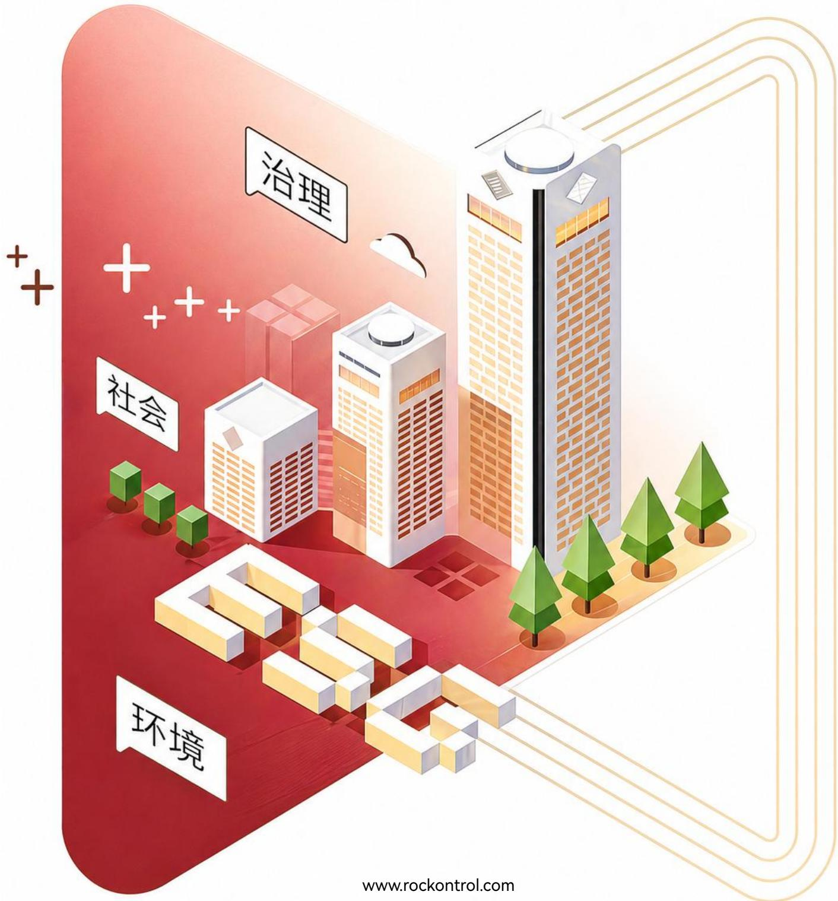

text_image

治理
社会
环境
www.rockontrol.com

## 关于本报告

本 报 告 是 罗 克 佳 华 科 技 集 团 股 份 有 限 公 司（ 简 称“ 佳 华 科 技 ”， 股 票 代 码 688051.SH）2025 年度环境、社会和治理（以下简称“ESG”）报告，旨在客观、公开、透明地披露公司 2025 年度融入环境管理、社会责任履行、公司治理等核心活动的实践成果与绩效数据。

## 报告范围

时间范围：2025 年 1 月 1 日至 2025 年 12 月31 日。

组织范围：罗克佳华科技集团股份有限公司及其分子公司。

发布周期：本报告为年度报告。

议 题 范 围： 依 据《 上 海 证 券 交 易 所 科 创 板上市公司自律监管指引第 14 号——可持续发展报告（试行）》（以下简称《14 号指引》）设定的21 项核心议题，结合公司核心业务特点，重点披露应对气候变化、创新驱动、数据安全等具有财务重要性与影响重要性的议题。

## 编制依据

严格遵循《上海证券交易所科创板上市公司自律监管指南第 13 号——可持续发展报 告 编 制》 之《 第 一 号 总 体 要 求 与 披 露 框 架》《第二号应对气候变化》（以下简称《第一号指南》《第二号指南》），确保议题识别、财务影响评估、温室气体核算等流程符合政策要求。

## 数据说明

财务相关数据来源于公司 2025 年度经审计的财务报告；ESG 绩效数据（如温室气体排放量、研发投入、员工培训人次等）来源于公司内部信息统计系统、业务部门台账等；政策引用、行业数据来源于生态环境部、国家发展改革委、上海证券交易所等官方渠道。

## 责任保证

本报告经公司董事会审议通过，董事会及全体董事保证本报告不存在虚假记载、误导性陈述或重大遗漏，对报告内容的真实性、准确性和完整性承担个别及连带责任。

## 发布形式

本 报 告 发 布 中 文 版， 以 PDF 电 子 版形 式 发 布， 欢 迎 登 录 佳 华 科 技 官 方 网 站（www.rockontrol.com）， 或 登 录 上 海 证 券交易所网站（www.sse.com.cn）查询和下载。

natural_image

Stylized blue-toned cityscape illustration with modern skyscrapers and abstract wave patterns (no text or symbols)

## 目 录

关于本报告 01

董事长致辞 03

2025 年 ESG 核心绩效表现 04

创新绩效 04

碳排放情况 04

社会绩效 05

环境绩效 05

走进佳华 06

公司介绍 06

行业地位 07

国家荣誉 07

发展历程 08

企业文化 09

可持续发展管理 10

ESG治理架构 11

ESG 战略 12

ESG 治理 12

利益相关方沟通 14

实质性议题识别 15

可持续发展供应链 16

## 践行智能化、绿色化、融合化 18转型发展

持续进行数字技术研发 19

全面推进绿色转型 22

知识产权管理 26

产业合作交流 27

## 应对气候变化 30

应对气候变化专项行动 31

环境管理体系 34

## 责任与担当 36

党建引领 37

员工管理 38

员工发展 39

员工安全 41

社会公益 41

## 尽责治理 42

透明公司治理 43

全面的风险管控 46

廉洁的道德建设 52

未来展望 54

附录·术语解释 56

## 董事长致辞

## 李 玮

## 佳华科技董事长、总经理

“以数据为锚点，以算法为引擎，让智能化、绿 色 化、 融 合 化 成 为 新 质 生 产 力 的 核 心 动 能， 是佳华科技践行‘高科技要深入基层，面向应用’的不变初心。

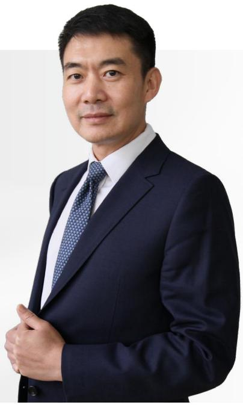

natural_image

Portrait of a man in a dark suit and patterned tie, no visible text or symbols

尊敬的各位股东、合作伙伴及社会各界同仁：

2025年，是行业承压、我们躬身攻坚的一年；也是佳华科技深耕ESG实践、笃行致远的一年。这一年，《关于推进绿色低碳转型加强全国碳市场建设的意见》正式落地，为双碳数字化领域带来历史性机遇。作为生态环境部涉碳领域核心系统建设运营单位，我们始终站在行业前沿，将 ESG 理念融入发展战略，以技术创新破解气候治理难题，在逆境中坚守初心、积蓄力量。

回望 2025 年，尽管市场竞争加剧，但我们践行 ESG 的决心从未动摇，始终将绿色发展、社会责任与规范治理作为高质量发展的核心支撑。我们坚守技术初心，聚焦双碳与环保赛道，深化 “带着数据做产品、带着算法做服务、带着平台做市场”的商业模式，用技术创新筑牢 ESG 发展根基。

环境责任（E）方面，我们以科技守护绿水青山。全国碳市场管理平台实现 8 大行业 6800 余家控排企业全覆盖，每月处理碳排放报告存证数万份；“全国非二氧化碳温室气体管理平台”“全国 CCER联网监测平台” 顺利落地，构建全链条监测体系；AI 双碳智能体、环保智云实现环境治理全流程升级。同时，我们承建国家级绿色低碳专项，打造零碳园区样板，推进自身运营低碳化，助力全社会降碳减污。

社会责任（S）方面，我们坚守“科技惠民”理念。通过“数字碳表”助力工业企业实现碳排放“电算化”，联合高校开展双碳技术研发；采购扶贫地区农产品，助力乡村振兴；关注员工权益，优化关怀体系，吸纳高科技人才，同时以大模型方案支撑跨区域生态协同治理，守护公共生态福祉。

公司治理（G）方面，我们坚守合规底线，完善治理体系。2025 年启动产业链并购，补齐能力短板、提升核心竞争力；规范决策流程，强化风险与回款管控，保障稳健运营；以党建引领 ESG 实践，坚持信息公开透明，坚守对股东的责任与承诺。

科技企业成长从来非坦途，唯有坚守长期主义方能行稳致远。企业价值不仅源于业绩，更源于对环境、社会、治理的持续坚守，这是我们穿越周期的核心底气。

未来，我们将依托国家战略与“十五五”红利，锚定“AI+ 双碳”主航道，推动内生增长与产业链并购双轮驱动，深化 ESG 实践，打通数据壁垒，探索数据资产化，践行“科技惠民”，为“双碳”目标贡献“佳华方案”，与各方携手共创绿色可持续未来，共享长期发展价值。

## 2025 年ESG核心绩效表现

natural_image

Hand holding a transparent globe with green and moss-covered terrain, symbolizing global sustainability or biodiversity (no text or symbols visible)

## 创新绩效

营业收入

20650.71万元

研发人员总数

178人

新获软件著作权

13项

研发投入

4816.00万元

占公司总人数比例

30.17 %

新获商标

3项

研发投入占营业收入的

23.78 %

新获发明专利

7项

## 碳排放情况

合计碳排放量

6449.29吨

合计用油量

116692.60 L

合计能耗

1059.39吨

合计用热量

35.95GJ

合计用电量

7298.14MW·h

## 社会绩效

员工人数

590人

女性员工

160人

劳动合同签订率

100 %

员工线下培训场次

35场

线上培训活动

75场

员工培训

10964 人次

## 环境绩效

## 环境管理风险情况

废水、噪声监测

符合排放要求

全年环境污染及环保投诉事件

0起

因环保事件造成的经济损失

0起

## 职业健康安全目标达成情况

应急事故和工伤事故

0起

重伤和死亡事故

0起

员工职业健康、安全培训

12 次

职业健康、安全培训人员

500余人

员工例行体检

500余人

## 信息安全目标实现情况

信息安全事件

0起

信息泄密事件

0起

因信息安全引起企业业务中断事件

0起

业务非计划中断

0次

与员工签署保密协议

100%

## 公司介绍

罗克佳华科技集团（股票代码：688051）是2020年3月20日登陆上海证券交易所科创板的上市企业，作为打通感知层、平台层、应用层的物联网大数据企业，是智能化、绿色化、融合化的新质生产力代表企业，作为全国数字经济试点示范企业、全国绿色双碳示范企业，公司始终以数据为核心，聚焦生态环境双碳领域和智慧城市综合应用，创新性构建行业智能体，为政企用户提供物联网软硬件产品、整体解决方案及全流程数据运营服务。

公司秉持“带着数据做产品，带着算法做服务，带着平台做市场”的发展模式，融合人工智能、区块链、云计算、大数据、物联网五大核心技术，构建起智能制造、物联网工程、软件开发、运营服务、数据算力、数据能力六大核心技术体系。拥有由国家特聘专家领衔的核心技术团队，汇聚人工智能、大数据、物联网等领域高科技人才，与知名高校、科研院所深度合作打造产学研用科技高地，公司承担 50 余项国家及政府课题，拥有 1000 余项自主知识产权，主导多项行业标准编制。

在数据资产化领域，公司打造万亿条生态环境双碳大数据库，率先完成数据资产登记 - 评估定价 -融资贷款 - 交易 - 入表全链条贯通，成为全国首批数据资产入表试点企业，斩获全国首个上市公司数据资产登记凭证、全国首笔银行数据资产质押贷款等突破性成果。绿色低碳数字赋能平台作为国家发展改革委、国家数据局首批数字经济专项成果，覆盖全国的绿色低碳数据底座，面向政府机构及企业提供SaaS/ 本地化“菜单式”服务，实现账号自动生成便捷接入。

公司创新构建“数据工厂”模式，通过“数据资源化 - 资产化 - 资本化”全链路转化，实现传统软硬件交付与数据资产化交付双轨并行，建立深度价值共创合作关系。依托核心技术与数据能力，公司围绕节能、减污、降碳一体化主线，构建起全方位绿色服务体系。节能作为源头控制，通过智能算法实时分析设备运行数据，动态优化运行参数，精准定位高能耗环节，打造零碳园区、零碳工厂、零碳建筑等智慧城市解决方案；减污作为过程治理，构建省、市、县、园区、企业多层级智慧环保平台，整合大气、水、声、土壤等全维度环境要素，融合大模型数据分析与决策能力，打造生态环境指挥决策平台，生态环境大模型低碳环保管家等核心产品；以降碳作为目标导向，作为生态环境部涉碳领域三大核心系统建设与运营单位，全面覆盖二氧化碳与非二氧化碳温室气体、CCER 的监测、管理与交易全链条，打造双碳智能体“国家队”，推出政府碳账本、集团碳账本、企业数字碳表等产品，助力政府厘清区域碳家底、管控碳目标，帮助企业完成碳核算、碳减排、碳交易，实现碳资产增值与企业创收。

站在新起点，依托国家数字经济与双碳长期战略，把握“十五五”政策红利，公司将继续秉承“高科技要深入基层，面向应用”的理念，以“学习就是力量，简单就是智慧”为司训，传承“薪火相传，拼搏奔跑”的企业精神，坚持智能化、绿色化、融合化发展方向，持续深耕物联网大数据领域，为各行业高质量发展贡献数智之力，助力国家数字经济与绿色低碳发展战略落地实施。

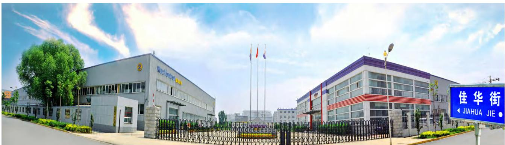

natural_image

Exterior view of two modern industrial buildings with flags and a blue directional signboard in the foreground (no readable text on buildings)

## 行业地位

## 全国数字经济试点示范企业

国家级物联网应用工程研究中心  
行业大数据库、智能体  
数据治理、算法训练、数据资源管理  
全国率先走通数据资产登记、评估定价、融资贷款、数据交易、数据入表等全链条环节

## 全国绿色双碳示范企业

全国节能减排领军企业  
生态环境部工程技术中心  
全国碳市场管理平台、全国温室气体管理平台、全国CCER联网监测平台

2019年国家发展改革委首批人工智能专项——城市人工智能平台

2025年国家发展改革委、国家数据局首批数字经济专项——全国绿色低碳数字赋能平台

## 国家荣誉

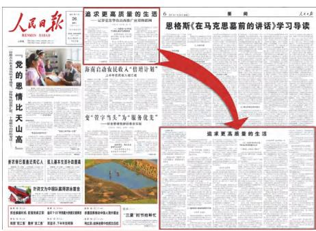

text_image

人民日报
RENMIN ZHUA
党的思情比天山高
海南自动包装收入“借记计划”
变“晋字鸟头”为“服务优先”
——中国教育和高等教育委员会
思格斯《在马克思墓前的讲话》学习导读
要求更高质量的生活
让读者在读得中国文明历史中的社会上，把读者在读得中国文明历史中的社会上，把读者在读得中国文明历史中的社会上，把读者在读得中国文明历史中的社会上，把读者在读得中国文明历史中的社会上，把读者在读得中国文明历史中的社会上，把读者在读得中国文明历史中的社会上，把读者在读得中国文明历史中的社会上，把读者在读得中国文明历史中的社会上，把读者在读给中国文明历史的社会上，把读者在读给中国文明历史的社会上，把读者在读给中国文明历史的社会上，把读者在读给中国文明历史的社会上，把读者在读给中国文明历史的社会上，把读者在读给中国文明历史的社会上，把读者在读给中国文明历史的社会上，把读者在读给中国文明历史的社会上，把读者在读给中国文明历史的社会上，将读者在读给中国文明历史的社会上，将读者在读给中国文明历史的社会上，将读者在读给中国文明历史的社会上，将读者在读给中国文明历史的社会上，将读者在读给中国文明历史的社会上，将读者在读给中国文明历史的社会上，将读者在读给中国文明历史的社会上，将读者在读给中国文明历史的社会上，将读者在读送给中国文明历史的社会上，将读者在读送给中国文明历史的社会上，将读者在读送给中国文明历史的社会上，将读者在读送给中国文明历史的社会上，将读者在读送给中国文明历史的社会上，将读者在读送给中国文明历史的社会上，将读者在读送给中国文明历史的社会上，将读者在读送给中国文明历史的社会上，将读者在读送给中国文明历史的社会上，将读者在读送给中国文明历史的社会上，将读者在读送给中国文明历史的社会上，将读者在读送给中国文明历史的社会上，将读者在读送给中国文明历史的社会上，将读者在读送给中国文明历史的社会上，将读者在读送给中国文明历史的社会上，将读者在读送给中国文明历史的社会上，将读者在读送给中国文明历史的社会上，将读者在读送给中国文明历史的社会下，将读者在读送给中国文明历史的社会下，将读者在读送给中国文明历史的社会下，将读者在读送给中国文明历史的社会下，将读者在读送给中国文明历史的社会下，将读者在读送给中国文明历史的社会下，将读者在读送给中国文明历史的社会下，将读者在读送给中国文明历史的社会下，将读者在读送给中国文明历史的社会下，将读者在读送给中国文明历史的社会下。<nl>

## 人民日報

《人民日报》头版专题报道，大力弘扬了佳华人拼搏奋斗的精神

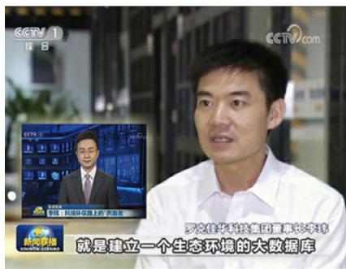

text_image

CCTV 1
R 8
罗光胜华科技集团 罗光与球
就是建立一个生态环境的大数据库

中央电视台《新闻联播》专题报道：《至诚报国—李玮科技环保路上的奔跑者》。

特别强调：佳华这么多年做了一件事，就是建立全国生态环境大数据库，做个物联网的大数据平台。

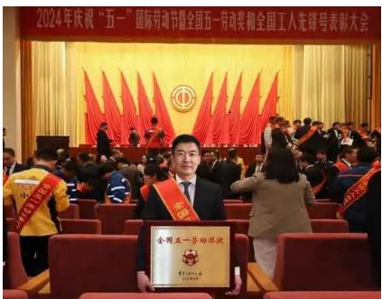

text_image

2024年庆祝“五一”国际劳动节暨全国五一劳动党和全国工人先锋号表彰大会
全国五一劳动奖状

2024 年荣获国家最高荣誉全国五一劳动奖

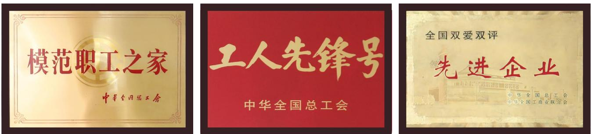  
佳华科技先后荣获全国工人先锋号、全国先进企业等称号

## 发展历程

## 佳华科技的发展历程

可分为三个阶段

初创期

2004 年 - 2009 年

智能制造与自动化控制

发展期

2010 年 - 2019 年

物联网大数据服务

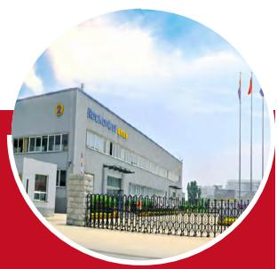

natural_image

Exterior view of a modern industrial building with flagpoles and personnel in front (no visible signage or text)

创新期

2020 年至今

智能化、绿色化、融合化

## 2004 年

海外归国的年轻团队在山西太原高新区创业，开展智能设备研发制造及自动化工程运营

## 2006 年

公司深入环保领域，自主研发全国首套既监又控的污染源在线监控系统并推广

## 2012 年

负责全国能耗监测系统顶层设计与试点示范，荣获“全国节能减排领军企业”称号

## 2014 年

公司拓展智慧城市综合应用，获建筑智能化设计和施工壹级资质，承担大型公建智能化项目并获鲁班奖

## 2023 年

公司积极响应“3060”战略，承担全国碳市场管理平台建设运营，推出双碳系列产品；持续建设生态环境大数据库，开发生态环境双碳大模型

## 2025 年

公 司 持 续 承 担 全 国 温 室 气 体 管 理 平 台、全 国 CCER 联 网 监 测 平 台 等 涉 碳 平 台； 自 主 开 发“绿色低碳数字赋能平台”；构建双碳智能体

## 2005 年

公司聚焦煤矿安全，通过煤矿物联网体系，承担国家级项目，构建数字矿山

## 2010 年

我国推动物联网技术发展，佳华科技抓住机遇，承担国家多部门物联网重大工程与专项

## 2013 年

开发大气网格化监测技术，在北京副中心率先应用并向全国推广

## 2020 年

2020 年 3 月 20 日，佳华科技在上交所科创板上市

## 2024 年

在数字经济领域，公司成为全国数字经济试点示范企业，打通数据资产全链条

自主开发“数据资源管理平台”，为用户提供数据增值服务

## 企业文化

## 高科技要深入基层 面向应用

物联网不再是概念，高科技不仅仅在实验室里，我们崇尚务实求真高科技是工具和手段，最终要为行业提供智能服务

## 学习就是力量 简单就是智慧

学习积累知识，勤奋得到进步，持续不断地进步是企业发展的力量简单是境界、是速度，大道至简，大象无形

## 薪火相传 拼搏奔跑

从2008年北京奥运会，到2022年北京冬奥会，佳华人代表两次参加奥运火炬接力，佳华将这种拼搏向上的奥运精神，薪火相传

## 奥运精神 拼搏向上 薪火相传

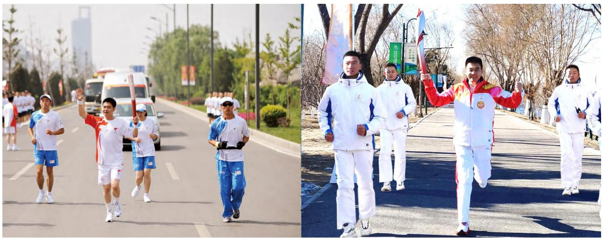

natural_image

Two outdoor sports scenes: left shows runners in white and blue uniforms marching on a paved road; right shows athletes in white and red uniforms participating in a torch relay race outdoors.

  
2008 年  
北京奥运会火炬接力

  
2022 年  
北京冬奥会火炬接力

## 科技创新 报国使命

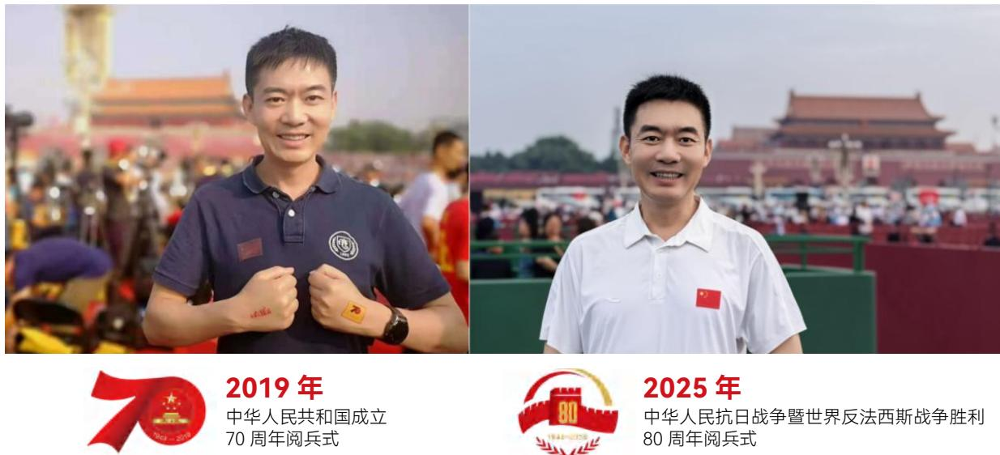

## 01

## 可持续发展管理

聚售ESG 管理体系建设 明确董事会，战略委员会，ESG 工作组及备部门构成的决策一管理一执行三级治理架构，确立环境，社会治理三大维度核心议题与风险应对策略，同步开展利益相关方沟通与实质性议题识别，通过规范治理机制、强化跨部门协同，夯实公司可持续发展的管理根基。

## ESG治理架构

公司及董事会严格遵循中国证监会《上市公司治理准则》《上海证券交易所科创板上市公司自律监管指引第 14 号——可持续发展报告（试行）》等监管规定，始终将环境、社会和公司治理（ESG）理念深度融入战略规划与日常运营，以推动可持续发展目标落地。2025 年，公司持续强化 ESG 管理的全过程监督与深度参与，直面气候变化、资源高效利用、社会责任履行等核心挑战，通过完善治理架构、强化风险管控、深化责任践行，实现 ESG 表现稳步优化。

四级ESG治理架构  
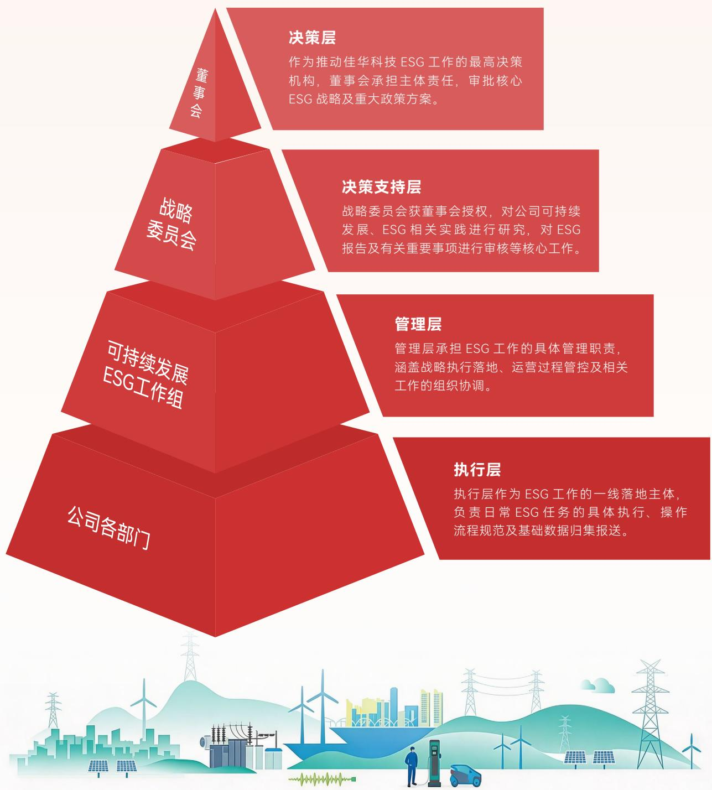

flowchart

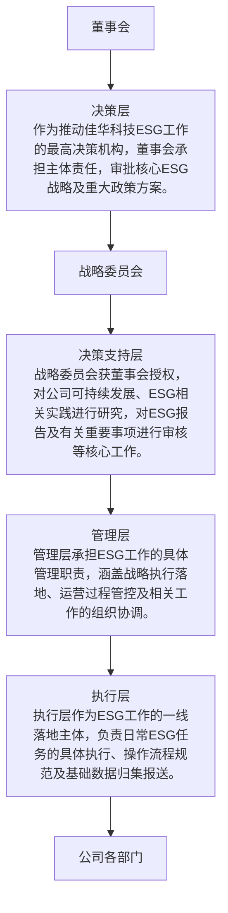
```mermaid
graph TD
  A["董事会"] --> B["决策层\n作为推动佳华科技ESG工作的最高决策机构，董事会承担主体责任，审批核心ESG战略及重大政策方案。"]
  B --> C["战略委员会"]
  C --> D["决策支持层\n战略委员会获董事会授权，对公司可持续发展、ESG相关实践进行研究，对ESG报告及有关重要事项进行审核等核心工作。"]
  D --> E["管理层\n管理层承担ESG工作的具体管理职责，涵盖战略执行落地、运营过程管控及相关工作的组织协调。"]
  E --> F["执行层\n执行层作为ESG工作的一线落地主体，负责日常ESG任务的具体执行、操作流程规范及基础数据归集报送。"]
  F --> G["公司各部门"]
```

## ESG 战略

佳华科技将可持续发展作为公司工作的核心，致力于将可持续发展目标全面融入企业经营的各个环节。在此过程中，公司统筹兼顾各利益相关方的需求，建立健全 ESG 管理体系，并持续深入推进 ESG 管理的提升工作，以此构建具有公司特色的可持续发展战略体系。公司注重长期可持续发展，融合经济、环境和社会效益于战略经营中，积极响应国家“双碳”战略，制定发展目标，打造 ESG 品牌形象，全面助力 ESG 发展。

natural_image

Stylized icon of a hand holding a leaf, symbolizing eco-friendly or sustainable life (no text or symbols)

<table><tr><td>维度</td><td>议题</td><td>主要风险</td><td>应对措施</td></tr><tr><td rowspan="3">环境</td><td rowspan="2">环境合规管理</td><td>政策法律、环境合规等风险</td><td>响应全球气候行动</td></tr><tr><td>合规效率机遇</td><td rowspan="2">科技赋能低碳未来</td></tr><tr><td>应对气候变化</td><td>物理风险和转型风险等风险产品和服务的市场机遇</td></tr><tr><td rowspan="3">社会</td><td>创新驱动</td><td>宏观环境、技术等风险转型机遇</td><td rowspan="3">以创新为引领以品质为保障守护数据安全</td></tr><tr><td>数据安全与客户隐私保护</td><td>外部、内部等风险技术机遇</td></tr><tr><td>产品和服务安全与质量</td><td>政策、运营等风险市场机遇</td></tr><tr><td>治理</td><td>合规风控</td><td>监管、法规合规等风险</td><td>透明公正责任进取法治民主效率共赢稳健创新协同共享</td></tr></table>

## ESG 治理

在日常 ESG 工作推进中，公司通过管理层定期会议跟踪目标执行进展，统筹跨部门协同落地；董事会持续优化 ESG 治理框架，深化 ESG 指标与财务绩效的融合分析，积极探索碳资产管理与绿色金融工具创新。同时，公司高度重视利益相关方诉求，通过产学研合作推动行业标准共建，助力“双碳”目标与国家高质量发展战略深度衔接，促进产业链上下游协同发展，携手各方共建可持续发展生态。

2025 年，公司 ESG 治理实践与可持续发展成效获得权威机构多重认可，在获得行业荣誉的同时，评级表现也实现显著跃升。

权威评级表现

<table><tr><td>评级机构</td><td>评级时间</td><td>综合评级</td><td>行业分类</td><td>行业排名(样本数量)</td><td>ESG 评级体系</td></tr><tr><td>华证指数</td><td>2025 年 7 月31 日</td><td>B 级</td><td>信息技术服务行业</td><td>70/143(较上一期跃升20 位)</td><td>环境(E)、社会(S)、公司治理(G)3 个维度</td></tr><tr><td>华证指数</td><td>2025 年 10 月31 日</td><td>BB 级</td><td>信息技术服务行业</td><td>38/155(较上一期跃升32 位)</td><td>环境(E)、社会(S)、公司治理(G)3 个维度</td></tr></table>

## 荣誉认定

2025 年 11 月，佳华科技凭借在双碳数字化领域的突出实践，成功入选中国上市公司协会 2025 年上市公司可持续发展优秀实践案例，该荣誉由中国上市公司协会颁发，是对公司 ESG 战略落地、可持续发展能力的国家级权威肯定。

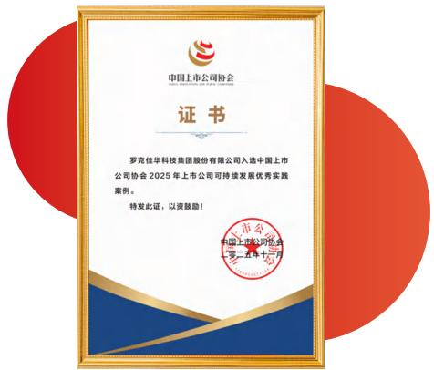

text_image

中国上市公司协会
证书
罗克佳华科技集团股份有限公司入选中国上市公司协会2025年上市公司可持续发展优秀实践案例。
特发此证，以资鼓励！
中国上市公司协会
二零二五年十二月

## 行业标准共建与平台赋能

作为 ESG 领域的积极践行者与生态共建者，公司深度参与行业标准制定与公共服务平台搭建，以技术赋能 ESG 生态规范化发展：

2025 年 6 月，公司旗下全资子公司北京佳华智联科技有限公司作为起草单位之一，全程参与中国标准化协会主导的《企业环境、社会、治理（ESG）绩效评价导则》（T/CAS 1033—2025）团体标准制定。为企业提供从信息披露、管理建设到绩效评价的全流程标准化指引。佳华智联依托在碳数据智能核验、环境风险监测、绿色供应链管理等领域的技术沉淀与实践经验，为标准的科学化、可操作性提供核心支撑，有效解决企业 ESG 管理“评价无据、改进无方”的痛点。

2025 年 9 月，在 2025 北京绿色发展论坛“绿色技术创新与发展”平行论坛上，公司自主开发的北京市 ESG 综合服务平台 1.0 版正式发布上线。该平台由北京绿色交易所于 2024 年 12 月启动建设，聚焦中小微企业 ESG 信息披露“轻量化、简易化、低成本”需求，提供信息采集、信息披露、鉴证评价和服务对接一站式解决方案。企业可通过模块化、案例化在线填报技术及个性化配置，便捷生成 ESG 信息披露报告，并可定向申请鉴证评价服务，向金融机构披露 ESG 信息以获取相关金融支持。平台的发布为“全国 ESG 发展高地和国际绿色经济标杆城市”建设提供重要支撑，后续公司将配合持续迭代升级，完善核心功能，构建完整 ESG 市场服务生态。

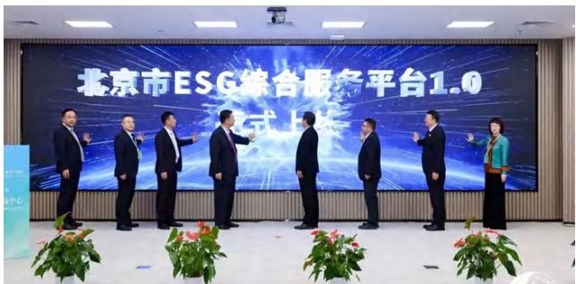

text_image

北京市ESG综合服务平台1.0
正式上线

## 利益相关方沟通

利益相关方与公司可持续发展密切相关，在公司业务开展和战略决策过程中扮演重要角色。佳华科技充分尊重和维护各利益相关方的合法权益，重视利益相关方的期望和诉求，积极搭建多元的沟通渠道与反馈机制，将利益相关方的期望和诉求纳入公司可持续发展管理及信息披露中，保持与各利益相关方的有效沟通及良好信任关系。

佳华科技为客户提供高质量的产品与高标准的服务，为股东创造价值和回报，与合作伙伴共建行业生态，始终关注员工的健康与成长，积极履行企业的社会责任，努力实现公司与客户、股东、合作伙伴、员工以及社会之间的和谐共赢。

<table><tr><td colspan="2">利益相关方</td><td>关注议题</td><td>沟通渠道</td></tr><tr><td></td><td>股东投资者</td><td>·公司治理·信息披露·商业道德·合规管理·投资者权益保护·风险管理·研发创新·公司可持续发展</td><td>·报告与公告·股东会·上证e互动·业绩说明会</td></tr><tr><td></td><td>政府部门</td><td>·守法合规运营·环境管理·商业道德·响应国家战略</td><td>·政企座谈会·行业协会活动·政务热线</td></tr><tr><td></td><td>客户</td><td>·商业道德·服务保障·产品品质保障·隐私和数据安全·产品全生命周期服务管理</td><td>·400服务热线·官方网站及社交媒体·客户反馈邮箱·客户满意度调查·会议会展</td></tr><tr><td></td><td>员工</td><td>·基本权益保障·薪酬福利保障·职业健康安全保障·员工培训与发展·平等雇佣与多元文化</td><td>·内部沟通平台·部门会议·意见箱·培训、文化活动·员工满意度调查</td></tr><tr><td></td><td>供应商及合作伙伴</td><td>·业务合规·商业道德·生态合作·供应链管理</td><td>·供应商评审·供应商考核评价·供应商交流·合作项目会议·高层互访</td></tr><tr><td></td><td>媒体及社会公众</td><td>·商业道德·合规管理·环境管理·承担社会责任·提供就业岗位·信息公开透明</td><td>·媒体报道·参观、来访·信息公开·ESG报告</td></tr></table>

## 实质性议题识别

佳华科技依据内外部利益相关者的期望、业务范围及可持续发展态势，参考国际可持续准则理事会（ISSB）的可持续披露准则，包括气候相关披露（FRS S2）等国际及国内相关的披露标准，对其评估体系进行了更新升级。公司开展了双重重要性评估，在以往影响重要性评估的基础上融入了财务重要性分析，全面审视 ESG 议题对公司财务以及经济、环境和社会各方面的影响，以更有效地回应利益相关方的诉求和期望。

## 财务重要性评估流程

•识别议题  
•确认风险/机遇  
•识别风险/机遇类型并描述种类  
•确定职责部门  
•描述具体如何影响价值链途径  
•与财务部门公开讨论判断是否使用财务重要性

## 影响重要性评估流程

•影响维度分析  
•制定利益相关方调查问卷并发放  
•与外部ESG专家针对问卷结果讨论分析  
•制定从一般/中等/较高影响重要性议题

重要性议题分析矩阵  
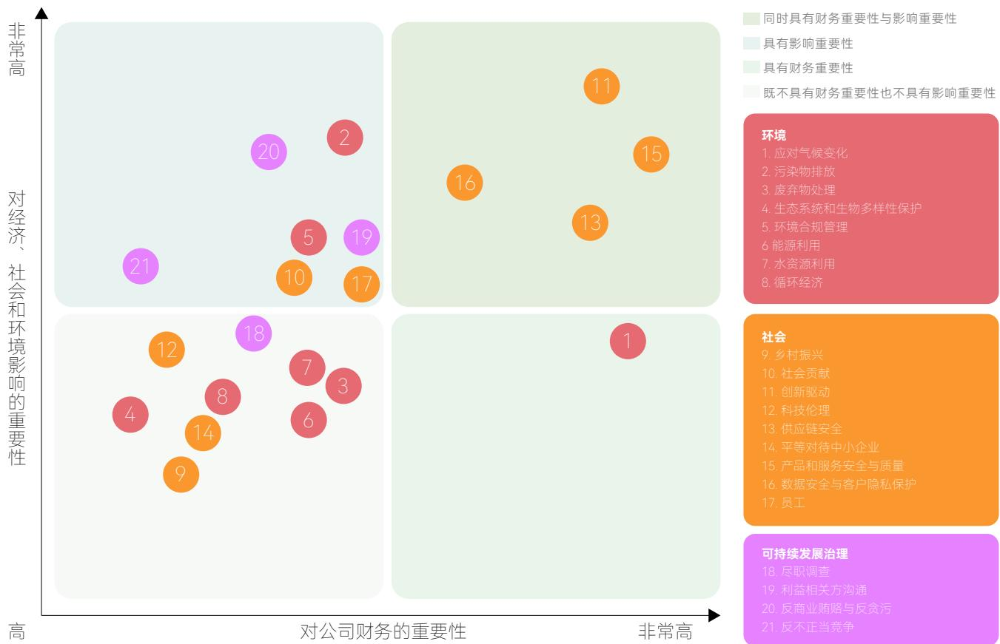

bubble

| Category | Topic | Importance to Finance & Society (X-axis) | Importance to Finance & Society (Y-axis) |
| --- | --- | --- | --- |
| 环境 | 应对气候变化 | High | High |
| 环境 | 污染物排放 | High | High |
| 环境 | 废弃物处理 | High | High |
| 环境 | 生态系统和生物多样性保护 | High | High |
| 环境 | 环境合规管理 | High | High |
| 环境 | 能源利用 | High | High |
| 环境 | 水资源利用 | High | High |
| 环境 | 循环经济 | High | High |
| 社会 | 乡村振兴 | Low | Low |
| 社会 | 社会贡献 | Low | Low |
| 社会 | 创新驱动 | Low | Low |
| 社会 | 科技伦理 | Low | Low |
| 社会 | 供应链安全 | Low | Low |
| 社会 | 平等对待中小企业 | Low | Low |
| 社会 | 产品和服务安全与质量 | Low | Low |
| 社会 | 数据安全与客户隐私保护 | Low | Low |
| 社会 | 员工 | Low | Low |
| 可持续发展治理 | 尽职调查 | Low | Low |
| 可持续发展治理 | 利益相关方沟通 | Low | Low |
| 可持续发展治理 | 反商业贿赂与反贪污 | Low | Low |
| 可持续发展治理 | 反不正当竞争 | Low | Low |
| 其他/未明确标注的议题 | 11 | High | High |
| 其他/未明确标注的议题 | 20 | Medium-High | High |
| 其他/未明确标注的议题 | 21 | Medium-High | Medium-High |
| 其他/未明确标注的议题 | 5 | Medium-High | Medium-High |
| 其他/未明确标注的议题 | 19 | Medium-High | Medium-High |
| 其他/未明确标注的议题 | 17 | Medium-High | Medium-High |
| 其他/未明确标注的议题 | 16 | Medium-High | Medium-High |
| 其他/未明确标注的议题 | 13 | High | Medium-High |
| 其他/未明确标注的议题 | 15 | High | High |
| 其他/未明确标注的议题 | 18 | Medium-High | Medium-High |
| 其他/未明确标注的议题 | 17 (员工) | Medium-High | Medium-High |
| 其他/未明确标注的议题 | 7 | Medium-High | Medium-High |
| 其他/未明确标注的议题 | 3 | Medium-High | Medium-High |
| 其他/未明确标注的议题 | 6 | Medium-High | Medium-High |
| 其他/未明确标注的议题 | 18 (其他) | Medium-High | Medium-High |
| 其他/未明确标注的议题 | 12 (其他) | Low-Medium | Medium-High |
| 其他/未明确标注的议题 | 4 (其他) | Low-Medium | Medium-High |
| 其他/未明确标注的议题 | 8 (其他) | Low-Medium | Medium-High |
| 其他/未明确标注的议题 | 14 (其他) | Low-Medium | Medium-High |
| 其他/未明确标注的议题 | 9 (其他) | Low-Medium | Medium-High |
| 其他/未明确标注的议题 | 10 (其他) | Medium-High | Medium-High |
| 其他/未明确标注的议题 | 17 (其他) | Medium-High | Medium-High |
| 其他/未明确标注的议题 | 20 (其他) | Medium-High | High |
| 其他/未明确标注的议题 | 21 (其他) | Medium-High | High |
| 其他/未明确标注的议题 | 20 (其他) | Medium-High | High |
| 其他/未明确标注的议题 | 2 (其他) | High | High |
| 其他/未明确标注的议题 | 5 (其他) | Medium-High | Medium-High |
| 其他/未明确标注的议题 | 19 (其他) | Medium-High | Medium-High |
| 其他/未明确标注的议题 | 21 (其他) | Medium-High | Medium-High |
| 其他/未明确标注的议题 | 1 (其他) | High | Medium-High |

注：公司将《14 号指引》中规定的废弃物处理、生态系统和生物多样性保护、能源利用、水资源利用、循环经济、乡村振兴、科技伦理、平等对待中小企业识别为不具有重要性的议题。  
公司以物联网大数据，软件开发与系统集成为主，生产环节简单，废弃物产生量极少，故“废弃物处理”未纳入重要性议题：  
公司生产经营不涉及对生态系统与生物多样性造成重大影响的活动，故“生态系统和生物多样性保护”未纳入重要性议题  
公司能源消耗以办公及数据机房为主，能耗规模有限，无高耗能工序，故“能源利用”未纳入重要性议题：  
公司生产经营无大量用水工序，水资源消耗较低，故 “水资源利用” 未纳入重要性议题；  
公司产业链以技术服务与软硬件集成为主，资源消耗与物料循环规模有限，故“循环经济”未纳入重要性议题  
公司生产经营未对乡村发展产生重大直接影响，故“乡村振兴”未纳入重要性议题  
公司核心业务不涉及生命科学、高敏感人工智能伦理相关研发应用，故 “科技伦理” 未纳入重要性议题  
公司平等对待中小企业，无逾期未支付中小企业款项情形，故“平等对待中小企业”未纳入重要性议题

## 可持续发展供应链

natural_image

Simple icon of a document with horizontal lines, no text or symbols present

建章立制构建ESG治理新范式

经过多年持续优化整合《采购管理制度》，这一里程碑式的制度变革标志着公司 ESG 供应链管理进入了规范化、标准化的新阶段。新制度体系通过梳理各环节可持续管理要求，形成了覆盖采购全流程的ESG 管理规范，实现了从传统采购管理向可持续采购管理的战略转型。

制度重构的核心在于建立了“集团统筹、多部门协同、全流程闭环”的管理模式。这一模式的创新之处在于打破了传统的部门壁垒，通过明确各部门在 ESG 供应链管理中的职责边界与协作机制，形成了高效协同的治理架构。集团层面负责战略制定与资源配置，各业务部门负责具体执行与日常管理，监督部门负责合规审查与绩效评估，形成了权责明晰、运转顺畅的管理体系。

配套的一体化采购管理系统实现了全流程数字化管控，将 ESG要求嵌入采购业务的每一个环节，从供应商准入、采购需求发布、招投标管理、合同签订到交付验收。系统还具备实时监控、预警提醒、数据分析等功能，为管理层提供了决策支持。

natural_image

Blue icon of two hands shaking, symbolizing agreement or partnership (no text or symbols)

源头把控 打造可持续供应商生态

在供应商准入管理方面，公司建立了多维度ESG评估体系，从环境、社会、治理三个维度全面考察供应商的可持续发展能力。

优化多维度供应商准入审核机制，从资质合规、规模实力、履约能力、服务水平、经营信誉等方面综合评估供应商，对于主线业务供应商，除营业执照、履约能力证明等基础资料外，鼓励提供环境管理体系认证、社会责任报告、员工社会保障缴纳证明、财务审计报告等材料，优先纳入具备可持续发展能力的合作伙伴。同时实施供应商“潜在 / 合格 / 不合格” 三级分类管理，建立集团共享的合格供应商资源库。资源库不仅记录了供应商的基本信息、业务能力、ESG 表现等静态数据，还实时跟踪供应商的绩效表现、合规状况、改进进展等动态信息。

natural_image

Blue icon of a clipboard with a checkmark inside, set against a light blue circular background (no text or symbols)

规范采购推行公开透明的采购模式

公司搭建先进招采平台，实现采购业务全面线上化、数字化，招标、竞价、谈判等全流程在线开展，保障采购公平、公开、透明。平台集成需求、供应商、招投标、合同及订单管理等功能模块，技术架构完善。平台实现全流程可视化与可追溯，各环节全程留痕、形成完整审计轨迹，提升采购效率与透明度。供应商可实时查看进度、参与投标、获知结果，优化参与体验。

公司严格依规执行公开招标、邀请招标、竞争性谈判、单一来源等多种采购方式，固定需求实行集中采购，研发产品配件规范询比价后纳入 BOM，各类方式均明确适用范围与流程。建立违规采购处罚标准，严禁指定供应商或品牌；实行严格决策机制，重大采购项目集体决策，防范风险与腐败。

natural_image

Purple circular icon with a stylized infinity symbol inside a rounded rectangle, no text or symbols present.

生态协同深化产业链上下游合作  
供应链生态系统的建设，通过搭建多层次、多形式的沟通平台，促进供应链各方的深度交流与合作。平台不仅包括线上的信息共享平台，还包括线下的定期会议、研讨会、培训等活动。及时对接采购需求、交付进度、质量反馈等核心信息，保障合作高效顺畅；定期结合项目技术、研发需求，组织供应商开展技术交流与培训活动，推动技术共享、经验互通；建立采购价格保障、市场业务开拓、研发渠道共享等多层次生态合作模式，与优质供应商深化合作，同时，还可以分享各自在ESG管理方面的成功经验，也可以共同探讨面临的挑战和解决方案。这种开放式的交流模式，推动了整个供应链生态系统的共同进步，提升供应链整体协同能力与抗风险能力。

natural_image

Red circular icon with a checkmark inside, set against a light pink background (no text or symbols)

多维评价建立科学的供应商激励约束机制

建立了多部门协同的供应商评价体系，该体系是采购、实施、法务、业务、财务多部门协同的供应商年度评价体系，从报价响应、交付能力、产品质量、技术支持、合同履约、客户满意度等多维度开展综合评分，评价结果直接与后续订单分配、合作深度挂钩，实现 “优进劣汰”；所有合作供应商均签署《供应商廉洁承诺书》，营造公开、透明、廉洁的合作环境。

natural_image

Abstract green icon with interconnected rectangular blocks and a central diamond shape, no text or symbols present.

全流程管控保障供应链合规有序运营

实现采购合同全生命周期管控，事前核查供应商经营风险并做好风险预警，在合同条款中明确履约标准、验收规范与权责要求；物料交付全程跟踪进展，到货后严格执行质量检验标准，建立不合格品管理台账；结算管理严格，规范付款流程与工程量审计，监督供应商合规经营，同时完成年度供应商账务核对，确保供应链各环节运营合规、全程可追溯。

text_image

保障供应链合规有序运营
罗克佳华科技集团 www.rockontrol.com
2025年环境、社会和治理（ESG）报告 股票名称：佳华科技 股票代码：688051
17

## 02

# 践行智能化、绿色化 融合化转型发展

立足公司核心业务与技术沉淀以智能化、绿色化、融合化为发展方向，聚焦数字技术研发，构建智能制造、软件开发、物联网工程等六大核心能力体系依托研发投入与人才储备，强化知识产权布局与产业合作，以技术赋能节能、减污、降碳全链条，推动数字化与绿色化协同转型，助力国家双碳战略与数字经济发展落地。

## 持续进行数字技术研发

佳华科技始终秉持“带着数据做产品，带着算法做服务，带着平台做市场”的商业模式，以智能化、绿色化、融合化为发展方向，立足二十余年技术沉淀，构建起智能制造、物联网工程、数据算力等六大核心能力体系，以“数据”为核心、“平台”为载体打造“数据工厂”，通过以节能源头控制、减污过程治理、降碳目标导向的全链条解决方案，为千行百业绿色低碳转型提供核心支撑，同时以“平台服务 + 数据资产”双交付模式，实现数据价值共创共享，成为新质生产力背景下绿色低碳发展的标杆企业。

公司始终重视人才队伍的建设，重视对有潜力骨干员工的培养与选拔，形成了不断扩大的优秀研发团队和深厚的人才储备。公司通过绩效管理的手段，对相关人员的岗位能力、职责待遇等持续进行优化管理，并提供优厚的薪酬待遇、技能培训等措施，吸引、留住并激励优秀研发人才，为公司的长远发展奠定坚实基础。

## 2025年研发建设情况

研发投入

4816.00万元

研发投入占营业收入的

23.78 %

研发人员总数

178人

占公司总人数比例

30.17 %

## 智能制造能力

• 2万平方米工业厂房  
• 具备年产10万台（套）智能设备的生产能力  
• 完备的嵌入式产品研发生产体系

• 智能设备远程管控与在线升级  
• 全国领先的智能制造基地

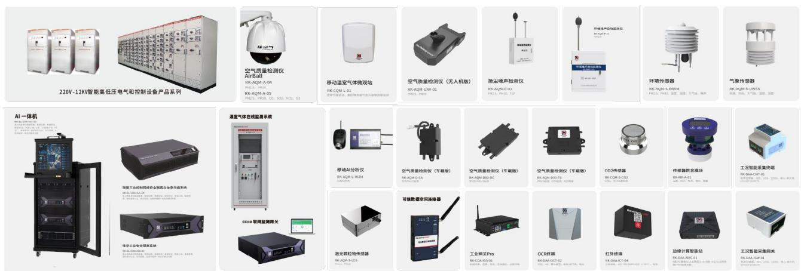

## 运营服务能力

• 在全国数十个省、数百个地市建立服务运营机构  
• 面向数千家企业，数十万用户  
• 提供SaaS 化与本地化相结合的软硬件产品和数据服务  
• 建立覆盖全国的研发、生产、工程、服务体系

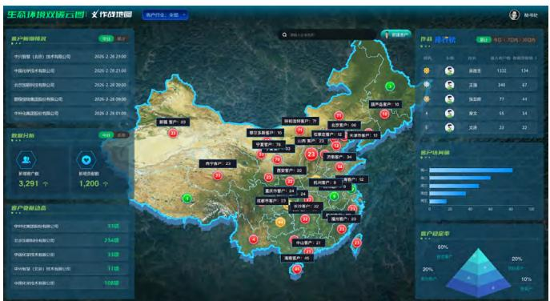

text_image

生态块指双碳云图 义作捷地图
资产解剖情况
中国建银（北京）技术有限公司
2010-2-28 23:00
中国化学技术有限公司
2010-2-28 23:30
沈阳国轩科技有限公司
2010-2-28 26:00
新疆国轩集团建材有限公司
2010-2-28 26:00
中化集团股份有限公司
2010-2-28 01:00
账龄分析
新客户数
3,291
1,200
新项目标段
3,291
新项目标段
1,200
资产委建动态
郑州亿联股份有限公司
5.1倍
北京亿联软件有限公司
2.54倍
华能亿联信息技术有限公司
3.3倍
郑州亿联（北京）技术有限公司
1.1倍
功能亿联技术有限公司
1.0倍
资产总值：3.7亿元
资产总价值：3.7亿元
资产总价值：3.7亿元
资产总价值：3.7亿元
资产总价值：3.7亿元
资产总价值：3.7亿元
资产总价值：3.7亿元
资产总价值：3.7亿元
资产总价值：3.7亿元
资产总价值：3.7亿元
资产总价值：3.7亿元
资产总价值：3.7亿元
资产总价值：
1.5%
1.4%
1.3%
1.2%
1.1%
1.0%
1.0%
1.0%
1.0%
1.0%
1.0%
1.0%
1.0%
1.0%
1.0%
1.0%
1.0%
1.0%
1.0%
1.0%
1.0%
1.0%
1.0%
1.0%
1.0%
1.0%
1.0%
1.0%
1.0%
1.0%
1.5%
1.4%
1.3%
1.2%
1.1%
1.0%
1.0%
1.0%
1.0%
1.0%
1.0%
1.0%
1.0%
1.0%
1.0%
1.0%
1.0%
1.0%
1.0%
1.0%
1.0%
1.0%
1.0%
1.0%
1.0%

## 软件开发能力

• 最高级别的软件管理体系  
• 国家级高水准软件设计和开发团队  
• 主导全国软件成本度量元标准的编制

• 承担多项国家级平台开发建设和运营  
• 50余项国家及政府课题  
• 1000余项自主知识产权

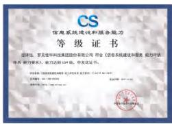

text_image

CS
信息系统运维和服务能力
等级证书
总经理：罗美华华科技集团股份有限公司 符合《信息系统运维和服务 能力评估专项章》(现行章)，能证证号：10000000000000000000000000000000000000000000000000000000000000000000000000000
中国电子集团财务有限责任公司（以下简称“财务部”）2018年1月1日发布

信息系统建设和服务能力CS4

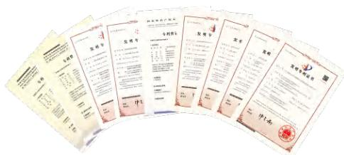

text_image

Scanned image of multiple Chinese document pages with dense text, likely from a legal or administrative form.

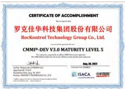

text_image

CERTIFICATE OF ACCOMPLISHMENT
罗克佳华科技集团股份有限公司
RockControl Technology Group Co., Ltd.
CMMI®-DEV V3.0 MATURITY LEVEL 5
The company has granted a Certificate of Compliance and Quality Assurance for the RockControl Technology Group Co., Ltd.
Date: August 28, 2017
ISSN: 604-900000000
Registration No: 6-10-2017
Registration Date: Aug. 28, 2017
ISSN: 604-900000000
ISSN: 604-900000000
ISSN: 604-900000000
ISSN: 604-900000000
ISSN: 604-900000000
ISSN: 604-900000000
ISSN: 604-11-2017
ISSN: 604-11-2017
ISSN: 604-11-2017
ISSN: 604-11-2017
ISSN: 604-11-2017
ISSN: 604-11-2017
ISSN: 604-11-2017
ISSN:
ISSN: 604-11-2017
ISSN: 604-11-2017
ISSN: 604-11-2017
ISSN: 604-11-2017
ISSN: 604-11-2017
ISSN: 604-11-2017
ISSN: A.S.C.
ISSN: C.C.
ISSN: D.C.
ISSN: E.C.
ISSN: F.C.
ISSN: G.C.
ISSN: H.C.
ISSN: I.C.
ISSN: J.C.
ISSN: K.C.
ISSN: L.C.
ISSN: M.C.
ISSN: N.C.
ISSN: O.C.
ISSN: P.C.
ISSN: Q.C.
ISSN: R.C.
ISSN: S.C.
ISSN: T.C.
ISSN: U.C.
ISSN: V.C.
ISSN: W.C.
ISSN: X.C.
ISSN: Y.C.
ISSN: Z.C.
ISSN: AA.C.
ISSN: AB.C.
ISSN: AC.C.
ISSN: AD.C.
ISSN: AE.C.
ISSN: AF.C.
ISSN: AG.C.
ISSN: AH.C.
ISSN: AI.C.
ISSN: AJ.C.
ISSN: AK.C.
ISSN: AL.C.
ISSN: AM.C.
ISSN: AN.C.
ISSN: AO.C.
ISSN: AP.C.
ISSN: AQ.C.
ISSN: AR.C.
ISSN: AS.C.
ISSN: AT.C.
ISSN: AU.C.
ISSN: AV.C.
ISSN: AW.C.
ISSN: AX.C.
ISSN: AZ.C.
ISSN: BA.C.
ISSN: BA.A.
ISSN: BA.B.
ISSN: BA.C.
ISSN: BA.D.
ISSN: BA.E.
ISSN: BA.F.
ISSN: BA.G.
ISSN: BA.H.
ISSN: BA.I.
ISSN: BA.J.
ISSN: BA.K.
ISSN: BA.L.
ISSN: BA.M.
ISSN: BA.N.
ISSN: BA.O.
ISSN: BA.P.
ISSN: BA.R.
ISSN: BA.S.
ISSN: BA.T.
ISSN: BA.U.
ISSN: BA.V.
ISSN: BA.W.
ISSN: BA.X.
ISSN: BA.Y.
ISSN: BA.Z.
ISSN: BA.Z.A.
ISSN: BA.Z.B.
ISSN: BA.Z.C.
ISSN: BA.Z.D.
ISSN: BA.Z.E.A.
ISSN: BA.Z.F.A.
ISSN: BA.Z.G.A.
ISSN: BA.Z.H.A.
ISSN: BA.Z.I.A.A.
ISSN: BA.Z.J.A.A.
ISSN: BA.Z.K.A.A.
ISSN: BA.Z.L.A.A.
ISSN: BA.Z.M.A.A.
ISSN: BA.Z.N.A.A.
ISSN: BA.Z.O.A.A.
ISSN: BA.Z.P.A.A.
ISSN: BA.Z.P.A.A.
ISSN: BA.Z.P.A.A.A.
ISSN: BA.Z.P.A.A.A.A.
ISSN: BA.Z.P.A.A.A.A.A.
ISSN: BA.Z.P.A.A.A.A.A.A.A.A.AA
Issued at:
Issued by:
Issued by:
Issued by:
Issued by:
Issued by:
Issued by:
Issued by:
Issued by:
Issued by:
Issued by:
Issued by:
Issued by:
Issued by:
Issued by:
Issued by:
Issued by:
Issued by:
Issued by:
Issued by:
Issued by:
Issued by:
Issued by:
Issued by:
Issued by:
Issued by:
Issued BY:
Issued BY:
Issued BY:
Issued BY:
Issued BY:
Issued BY:
Issued BY:
Issued BY:
Issued BY:
Issued BY:
Issued BY:
Issued BY:
Issued BY:
Issued BY:
Issued BY:
Issued BY:
Issued BY:
Issued BY:
Issued BY:
Issued BY:
Issued BY:
Issued BY:
Issued BY:
Issued BY:
Issued BY:
Issued B.V.C.
Issued BY:
Issued BY:
Issued BY:
Issued BY:
Issued BY:
Issued BY:
Issued BY:
Issued BY:
Issued BY:
Issued BY:
Issued BY:
Issued BY:
Issued BY:
Issued BY:
Issued BY:
Issued BY:
Issued BY:
Issued BY:
Issued BY:
Issued BY:
Issued BY:
Issued BY:
Issued BY:
Issued BY:
Issued BY:

CMMI5 级

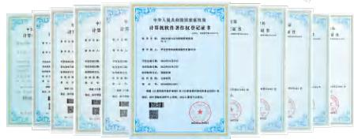

text_image

Scanned image of multiple Chinese legal documents and official seals, including administrative or judicial records with titles and seals.

发明专利与软件著作权1000 余项

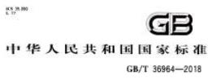  
软件工程 软件开发成本度量规范

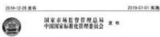  
软件开发成本度量规范标准编制单位

国家发改委环保物联网示范工程

生态环境部全国碳市场管理平台

农业农村部全国优质农产品溯源系统

国家工信部智能海量数据中心

国家科技部国家科技部科技支撑计划

国家住建部全国可再生能源监测系统

## 数据算力

• 国家发展改革委首批人工智能专项——城市人工智能服务  
• 占地近百亩  
• 具备5000 台机柜、五万台服务器、1000P算力的规模  
• 国内A级、国际最高等级的大数据算力中心

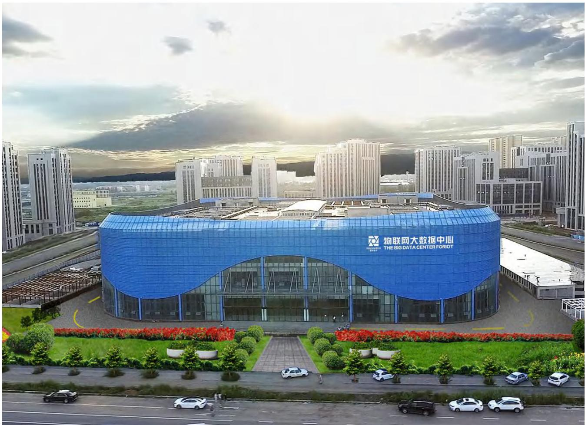

natural_image

Exterior view of the The Big Data Center foriot building with a blue curved roof and surrounding urban architecture (no signage visible on main structure)

## 物联网工程能力

• 智能化工程设计、实施及承包的国家最高资质  
• 现场设备互联互通、快速接入、即插即用  
• 丰富的智能化工程实施经验及遍布全球的业绩  
• 提供领先的物联网大数据解决方案

智能体  
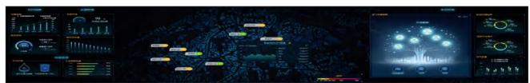

text_image

Dashboard screenshot showing data visualization, analytics dashboard, and AI-driven system interface with Chinese labels

管理者驾驶舱

应用层  
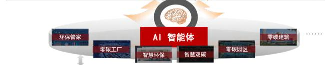

flowchart

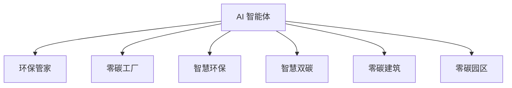
```mermaid
graph TD
  A["AI 智能体"] --> B["环保管家"]
  A --> C["零碳工厂"]
  A --> D["智慧环保"]
  A --> E["智慧双碳"]
  A --> F["零碳建筑"]
  A --> G["零碳园区"]
```

平台层

数据层  
感知层  
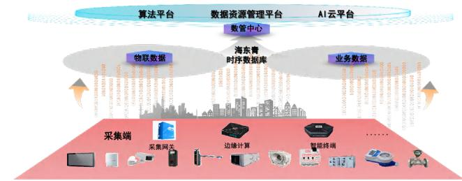

flowchart

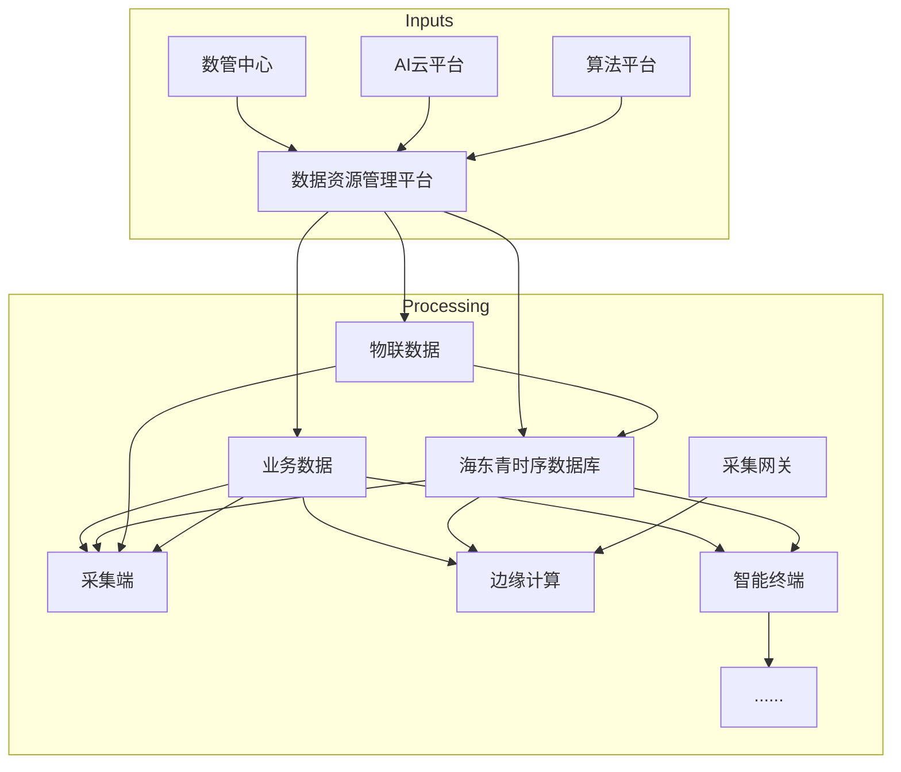
```mermaid
graph TD
  subgraph Inputs
  A["算法平台"] --> B["数据资源管理平台"]
  C["AI云平台"] --> B
  D["数管中心"] --> B
  end

  subgraph Processing
  E["物联数据"] --> F["海东青时序数据库"]
  G["业务数据"] --> H["采集端"]
  I["采集网关"] --> J["边缘计算"]
  K["智能终端"] --> L["......"]
  end

  B --> E
  B --> F
  B --> G
  E --> H
  F --> H
  F --> J
  F --> K
  G --> H
  G --> J
  G --> K
```

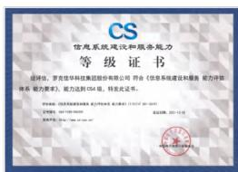

text_image

CS
信息系统建设和服务能力
等级证书
经评估，罗克佳华科技集团股份有限公司符合《信息系统建设和服务能力评价体系（规范要求）》，能达到C54标准，特此发证申请。
评审委员会：国信证券有限责任公司
以下简称：国信证券
审核通过：2016-03-01
批准日期：2016-03-01
发布机关：国家统计局

信息系统建设和服务能力CS4

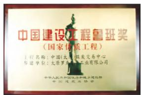

text_image

中国建设工程鲁班奖
（国家地质工程）
工程名称：中国(天津)煤炭交易中心
参建单位：太原罗曼工业有限公司
中华人民共和国社会科学院法典
中国建筑协会

中国建设工程鲁班奖

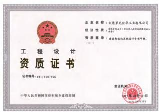

text_image

工程设计
资质证书
证书编号：A1114007656
企业名称：大连罗克佳华工业有限公司
经济性质：根据《中华人民共和国建筑施工许可证》
资质等级：建筑智能化系统设计专项审核。
发证机关：
中华人民共和国住房和城乡建设部制
发证日期：2023-03-18

智能化专业设计甲级

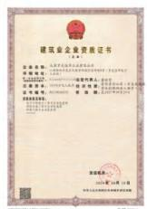  
智能化专业承包壹级

## 数据能力

• 行业权威的大数据库，数据量达万亿条规模  
• 专业的数据技术团队，荣获DCMM等级认证  
• 全国首批数据资产入表试点企业

• 全国首个上市公司数据资产登记凭证  
• 全国首笔银行数据资产质押贷款  
• 快速完善数据管理体系，优化数据资源

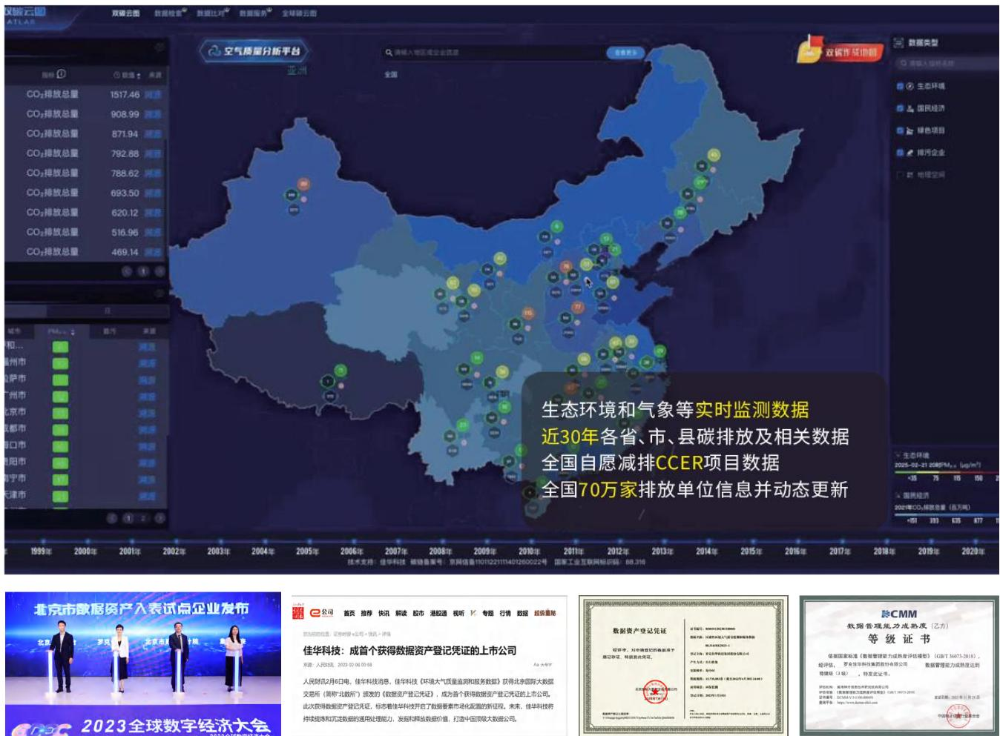

## 全面推进绿色转型

双碳智能体：通过 AI 大模型和行业算法对高质量数据集深度训练，为双碳管理提供智能分析与决策支撑，深度赋能行业降碳应用。

绿色低碳数字赋能平台：国家发展改革委、国家数据局首批数字经济专项，应用可信数据空间技术，为企业提供 SaaS 化或本地化服务模式，面向数千家管理单位、数十万家企业开放开源，有效破解数据孤岛难题。

数据资产双交付：在提供双碳软硬件平台的同时，将平台产生的高质量数据集交付客户，实现数据资源化、资产化、资本化，助力客户将数据转化为可交易、可融资的金融资产，实现降碳与价值创造双重目标。

## 节能：源头把控能效提升，构建全场景节能体系

以数字化为核心实现能源高效利用，聚焦园区、工厂、建筑三大核心场景，打造定制化节能解决方案，从能源消耗源头实现精细化管控、能效提升与碳排放降低，同时依托全国领先的智能制造与物联网工程能力，为节能落地提供全流程技术支撑。

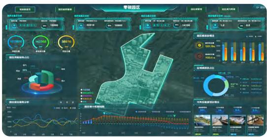

text_image

零跑园区
数据采集
数据存储
数据处理
数据管理
数据应用
数据共享
数据共享
数据共享
数据共享
数据共享
数据共享
数据共享
数据共享
数据共享
数据共享
数据共享
数据共享
数据共享
数据共享
数据共享
数据共享
数据共享
数据共享
数据共享
数据共享
数据共享
数据共享
数据共享
数据共享
数据共享
数据共享
数据共享
数据共享
数据共享
数据共享
数据共享
数据共享
数据共享
数据共享

## 零碳园区

通过能源集中管控、智慧运营，推动园区各子系统与智慧管控深度融合，实现园区能源高效利用，从源头降低碳排放。典型案例如某零碳机场项目，大幅提升园区整体能效。

## 零碳工厂

打造绿色低碳企业赋能系统，通过专业化运维与智能化技术实现生产工艺精细化管控，在保障生产达标前提下，优化能源消耗结构。典型案例如某电厂脱硫节能项目，成为火电行业绿色低碳示范。

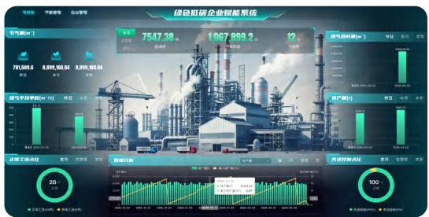

bar

| Metric | Value |
| --- | --- |
| 产量 (万吨) | 7547.38 |
| 产量 (万吨) | 1067.389 |
| 现金产量 (万吨) | 19 |
| 现金效率 (%) | 20.0 |
| 现金成本 (万元/吨) | 20.0 |
| 现金毛利率 (%) | 100 |

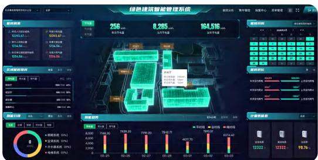

text_image

绿色建筑智能管理系统
256
8,285
164,516
数据采集
数据存储
实时监控
实时反馈
实时分析
实时报告
实时管理
实时反馈
实时分析
实时报告
实时管理
实时反馈
实时分析
实时报告
实时管理
实时反馈
实时分析
实时报告
实时管理
实时反馈
实时分析
实时报告
实时管理
实时反馈
实时分析
实时报告
实时管理
实时反馈
实时分析
实时报告
实时管理
实时反馈
实时分析
实时报告
实时管理
实时反馈
实时分析
实时报告
实时管理
实时反馈

## 零碳建筑

针对建筑空调、照明等重点用能系统搭建智能管理体系，实现用能可视化与智能化调控，在保障使用体验的同时实现降碳增效。典型案例如某省直机关建筑节能项目，为公共机构绿色办公树立标杆。

## 减污：全过程精准治理管控，打造智慧环保全体系

作为生态环境部工程技术中心依托单位，构建起覆盖感知、分析、决策、处置的全链条智慧环保体系，融合多元感知技术与大模型算法，实现污染精准溯源、动态管控、高效处置，同时提供“管家式”环保服务，助力政企实现污染精细化治理。

公司拥有全国环境影响评价资质、国家级环境咨询服务认证，具备智能化工程设计、实施及承包国家最高资质，荣获环保科技进步奖一等奖，累计承担全国百余个地市的生态环境大数据运营服务，拥有万亿条规模的生态环境领域海量数据，为减污治理提供数据与技术双重支撑

## 核心平台与技术应用

## 智能分析与决策平台

打造指挥决策平台、生态环境大模型、大气联防联控管理平台等核心系统，整合多源多维环境数据，利用算法和大模型分析构建溯源 预测管控调度四位一体决策体系：通过“线索发现智能研判智慧裁量”能力，为非现场监管提供“千里眼”与“智慧脑”，实现环境问题快速感知与处置。

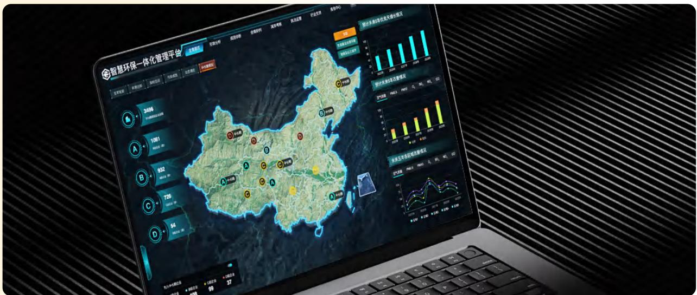

text_image

智慧环保一体化管理平台
A
B
C
D
E
F
G
H
I
J
K
L
M
N
O
P
Q
R
S
T
U
V
W
X
Y
Z
统计未来三年优化天数情况
2023年
2024年
2025年
2026年
2027年
2028年
2029年
2030年
2031年
2032年
2033年
2034年
2035年
2036年
2037年
2038年
2039年
2040年
2041年
2042年
2043年
2044年
2045年
2046年
2047年
2048年
2049年
2050年
2051年
2052年
2053年
2054年
2055年
2056年
2057年
2058年
2059年
2060年
2061年
2062年
2063年
2064年
2065年
2066年
2067年
2068年
2069年
2070年
2071年
2072年
2073年
2074年
2075年
2076年
2077年
2078年
2079年
2080年
2081年
2082年
2083年
2084年
2085年
2086年
2087年
2088年
2089年
2090年
2091年
2092年
2093年
2094年
2095年
2096年
2097年
2098年
2099年
2100年

## 已在全国多地落地全场景智慧环保解决方案 :

为北京某水泥厂打造全厂环境管控平台，实现有组织/无组织排放、清洁运输一体化监管。

构建北京某区空天地一体化监测网络，形成“实时监测—污染溯源—预测预报—调度管控—事件闭环”完整链条。

助力内蒙古某市建成生态环境数据中心与“生态环境一张图”管控体系。

支撑四川某市构建长江上游水环境智能监管平台。

为广东中山某镇绿色化工园区搭建一体化智慧环保系统，实现园区环境精细化、智能化监管。

## 生态环境大模型

通过排污许可证、执行报告、企业自行监测等公开数据，结合各类多源数据进行大模型训练，建立“线索发现、智能研判、智慧裁量”等能力，为非现场监管提供“千里眼”与“智慧脑”，建立完善的环境预警和合规管理体系。

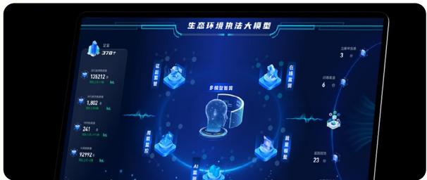

text_image

生态环境执法大模型
3
133212
1,802
241
92792
多模型智慧
6
6
22
3

## 针对环保执法痛点，专项打造垂直领域大模型，实现四大核心突破：

## 01. 污染源在线监测核验

用机器学习异常检测算法自动生成违规线索，精准识别数据造假、偷排漏排、治污设施不正常运行等行为。

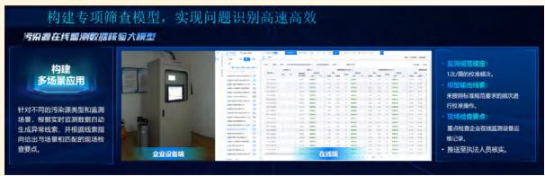

text_image

构建专项筛查模型，实现问题识别高速高效
污染源在线监测数据核发大模型
构建
多场景应用
针对不同的污染源类型和监测
场景，根据实时监测数据自动
生成并网线索，并依据线索群
向路由与场景相匹配的现场检查
要求。
企业监测端
在线端
- 监测管理理念：
1.0/周的业务频次。
- 问题输出线索：
未按照标准规范要求的频次进
行校准操作。
- 可传输信息要素：
- 请用覆盖企业监测数据量
验证功能。
- 验证执法人员核实。

## 03. 视频 AI 智能识别

基于现有感知体系，自动识别环境异常、留存证据并推送线索，实现实时报警与快速处置。

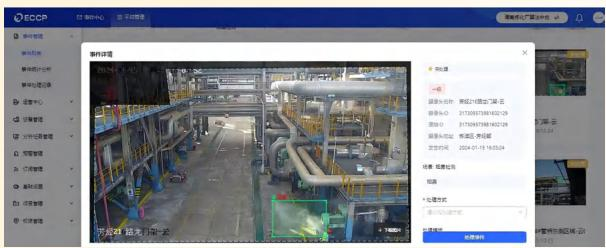

text_image

ECCP
事件详情
事件名称: 现场21楼空门-22层
地址: 03710507894162129
电话: 03710507894162129
视频地址: 校准, 李志敏
发布时间: 2024-01-18 16:03:24
场景: 基础设施
场景
+场景方式
+场景设置方式
应用程序
应用中心
ECCP
管理软件区域 -22

## 02. 排污许可证证后合规审查自动化

依托文本识别与语义理解，自动审查企业报告与台账，快速定位合规问题，提升审查效率与准确性。

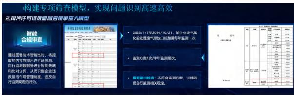

text_image

构建专项筛查模型，实现问题识别高速高效
2.排污许可证层面合规审查不典型
智能
合规审查
通过国家技术智能比对、将提取的内容与排污许可证信息、自行监测数据等进行智能关联和对比分析，从而识别企业违规排污许可管理制度、违反自行监测规定的行为。
• 2023/1/1至2024/10/21，某企业废气氧化前处理废气排放7周检测每年监测一次
• 监测方案1次/半年监测频次
• 模型输出链条，不符合监测方案，涉嫌违反自行监测相关规定。

## 04. 行政处罚智慧裁量

深度学习法律法规与历史判例，构建科学裁量体系，提供公平透明处罚建议，规范执法裁量权。

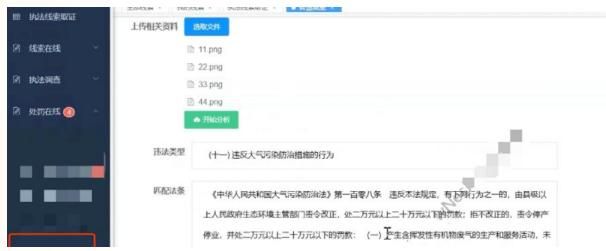

text_image

执法线索提证
线索在线
执法调查
处罚在线
上传相关资料
选取文件
11.png
22.png
33.png
44.png
开始分析
违法类型
(十一)违反大气污染防治措施的行为
匹配法条
《中华人民共和国大气污染防治法》第一百零八条 违反本法规定，有下列行为之一的，由县级以上人民政府生态环境主管部门责令改正，每二万元以上二十万元以下的罚款：拒不改正的，责令停产停业，并处二万元以上二十万元以下的罚款：（一）∑生态挥发性有机物废气的生产和服务活动，未

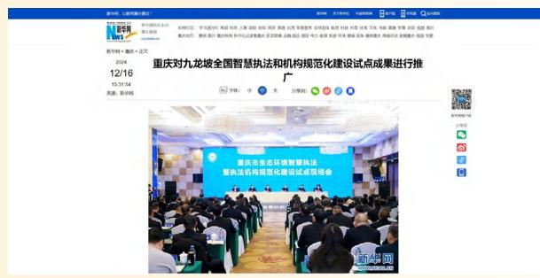

text_image

重庆对九龙坡全国智慧执法和机构规范化建设试点成果进行推
12/16
10:31:54
来源：新9996
重庆市生态环境智慧执法
复杂执法机构规范化建设试点现场会

落地实践中，已助力重庆九龙坡区建成全国唯一生态环境保护综合行政执法机构规范化建设和智慧执法“双试点”，打造智慧发现、智慧取证、智慧核查、智慧判案、智慧督导五大应用场景，形成“线索→取证→案审→决定→稽查复盘”一体化智慧执法新模式，实现污染源远程追溯、非现场智能执法，大幅提升执法效率与公正性。

## 低碳环保管家服务

推出“低碳环保管家”服务，涵盖环保手续、污染防治、日常监管、环境检测、碳排放管理咨询 5 大类 16 个种类业务的智能化管理；同时运营脱硫、除尘、脱硝等环保净化设施，通过智能体持续优化算法，为企业提供安全生产、环保减排、提质增效的一体化运营服务。

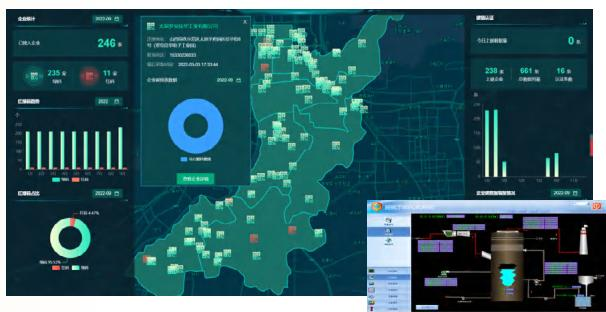

text_image

总规模
2023年 246%
工人总数
235k
11k
GB1
2022
总规模
2023年 17.04A
总规模占比
68.98%
2022年
总规模占比
68.98%
2023年
总规模占比
238k
661k
16k
上机订单
中建订单
订单数
主要销售数据及服务
2023年 246%
2022年 11K
总规模占比
68.98%
2022年

## 降碳：目标导向精准赋能，打造全国双碳服务标杆

公司承建运营全国碳市场管理平台、全国温室气体管理平台、全国 CCER 联网监测平台三大国家级平台，以“目标导向”为核心，构建覆盖政府、园区、企业的全维度智慧双碳体系，依托双碳智能体、绿色低碳数字赋能平台等核心产品，实现碳数据精准核算、碳资产高效管理、碳减排科学落地，助力国家“双碳”战略目标实现。

## 国家级平台核心支撑

## 全国碳市场管理平台

• 被国家、省、市、企业、交易机构、核查机构、检测机构、咨询机构等数万家涉碳主体使用。  
• 对排放1万吨标准煤，2.6亿吨碳排放量以上的全国6800多家单位，实现企业月报和企、省、市三级联审的数据校核、配额发放、交易监管、监督执法。  
• 碳排放数据月度存证近19万份，月度结构化数据4000万项，非结构化文件约500万项。  
• 应用运营数百个双碳算法模型和双碳智能体，核定和签发超330亿吨、2.64万亿元（按80元/吨估算）以上配额总量。

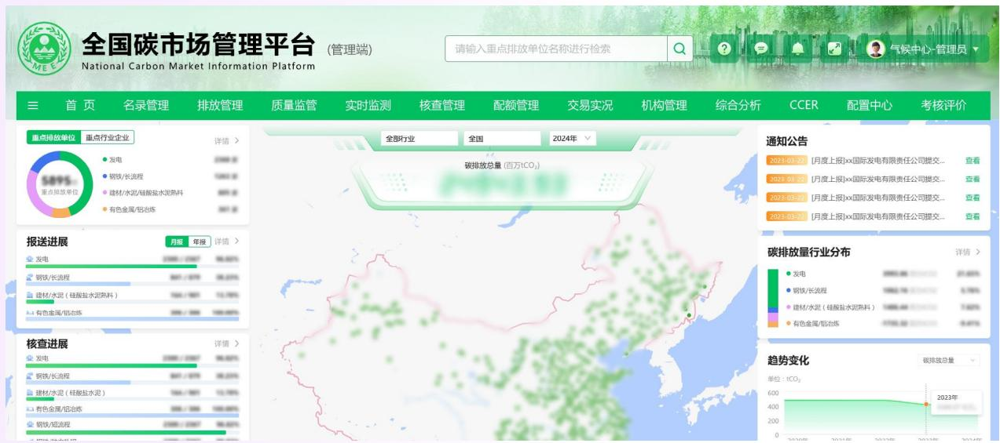

text_image

全国碳市场管理平台
(管理端)
请输入重点排放单位名称进行检索
气候中心-管理员
首页  名录管理  排放管理  质量监管  实时监测  核查管理  配额管理  交易实况  机构管理  综合分析  CCER  配置中心  考核评价
重点排放单位 重点行业企业
详情 >
● 发电
● 钢铁/长流程
● 建材/水泥/硅酸盐水泥熟料
● 有色金属/铝冶炼
全部行业  全国  2024年
碳排放总量 (百万tCO₂)
通知公告
2023-08-25 [月度上报]xx国际发电有限责任公司提交...
查看
2023-08-25 [月度上报]xx国际发电有限责任公司提交...
查看
2023-08-25 [月度上报]xx国际发电有限责任公司提交...
查看
报送进展
月份  年报  详情 >
发电
钢铁/长流程
建材/水泥（硅酸盐水泥熟料）
有色金属/铝冶炼
核查进展
详情 >
发电
钢铁/长流程
建材/水泥（硅酸盐水泥）
有色金属/铝冶炼
核查进展
详情 >
发电
钢铁/长流程
建材/水泥（硅酸盐水泥）
有色金属/铝冶炼
核查进展
详情 >
碳排放量行业分布
详情 >
发电
钢铁/长流程
建材/水泥（硅酸盐水泥熟料）
有色金属/铝冶炼
趋势变化
单位：tCO₂
2023年
碳排放总量
单位：tCO₂

## 全国温室气体管理平台

• 实现我国对全球的承诺目标：到 2035 年，中国全经济范围温室气体净排放量比峰值下降7%到10%，力争做得更好。  
• 对二氧化碳之外的甲烷、氧化亚氮、氢氟碳化物、全氟碳化物和六氟化硫进行全面管控，建设和运营温室气体管理平台。  
•面向农业种植养殖 矿山开采 氟化物 氮化物生产和使用单位，范围扩及千行百业。

## 全国 CCER 联网监测平台

对申报和签发的CCER项目进行实时监测联网，实现监测、注册登记及交易的统一。  
•具备碳减排量实时核算功能，签发碳减排配额。  
全面启动碳减排数据校核，确保数据及时性、真实性和有效性，为CCER项目减排效果提供高效管理与决策分析。

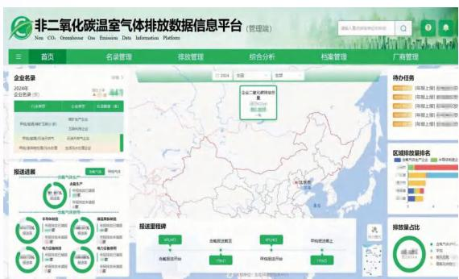

text_image

非二氧化碳温室气体排放数据信息平台（管理端）
首页
名谈管理
排放管理
综合分析
档案管理
厂商管理
企业名录
2024年
企业名称（）
企业类型：工业
主要污染物：无
甲烷、乙烷、丙烷、丁二醇
甲烷与乙烷的生产、销售及供应
甲烷与乙烷的生产、销售及供应
甲烷与乙烷的生产、销售及供应
报送进展
1. 企业名称
企业类型
主要污染物
主要污染物
主要污染物
主要污染物
主要污染物
主要污染物
报送进展
1. 企业名称
企业类型
主要污染物
主要污染物
主要污染物
主要污染物
主要污染物
报送进展
1. 企业名称
企业类型
主要污染物
主要污染物
主要污染物
主要污染物
主要污染物
报送进展
1. 企业名称
企业类型
主要污染物
主要污染物
主要污染物
主要污染物
主要污染物
报送进展
1. 企业名称
企业类型
主要污染物
主要污染物
主要污染物
主要污染物
主要污染物
报送进展

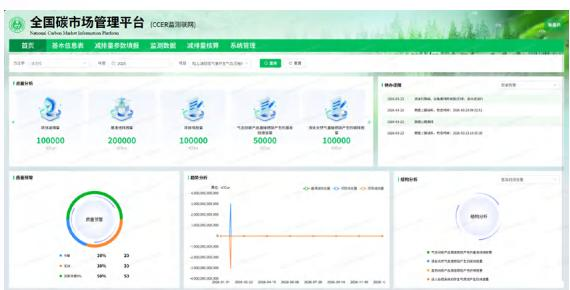

line

| Category | Total Emissions (100000) | Emission Rate (%) |
| --- | --- | --- |
| 1 | 100000 | 25% |
| 2 | 200000 | 23% |
| 3 | 100000 | 26% |
| 4 | 50000 | 33% |
| 5 | 100000 | N/A |

## 全维度双碳解决方案

## 政府碳账本

为各级政府搭建双碳管理平台，实现区域碳排放与碳减排管理、碳数据核验、碳金融、碳普惠等全维度服务，构建省市两级联动监管体系，提升区域碳管理效能。

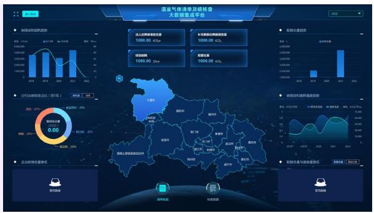

donut

| Year | Gas Consumption (kWh) |
| --- | --- |
| 2018 | ~3500 |
| 2019 | ~4000 |
| 2020 | ~3000 |
| 2021 | ~4000 |
| 2022 | ~1000 |

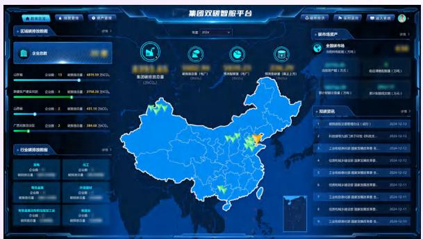

text_image

集团双碳智报平台
实时销售数据
全量总销量
山河港  全部 13  销售总量  4819.59 (30%)
新能源汽车总销量  全部 2  销售总量  4766.39 (30%)
山河港  全部 2  销售总量  481.19 (30%)
广东壮族自治区  全部 2  销售总量  384.48 (30%)
行业领用数据
客户
销售总量
电汇
市场交易
市场交易
市场交易
市场交易
市场交易
市场交易
市场交易
市场交易
市场交易
市场交易
市场交易
市场交易
市场交易
市场交易
市场交易
市场交易
市场交易
市场交易
市场交易
市场交易
市场交易
市场交易
市场交易
市场交易
市场交易
市场交易
市场交易
市场交易
市场交易
市场交易
市场交易
市场交易
市场交易
市场交易

## 集团碳账本

为大型企业集团打造数字化碳管理体系，实现多级碳排放数据汇聚、溯源与智能核算，提供数据治理和双碳智能体服务，达成“平台服务 +数据资产”双交付，优化企业碳资产管理。

## 数字碳表

为企事业单位提供碳核算、减排、资产、碳足迹等全功能服务，通过多维多源数据快速采集和智能核算，帮助企业盘点碳资产、指导碳交易、实现碳收益。典型案例如某排污企业平台覆盖 86 家水泥企业，实现智能减排与成本优化。

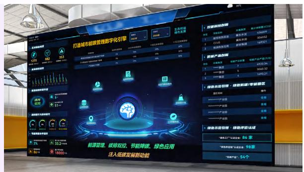

text_image

打造城市新能源管理数字化引擎
1235 862 313
打造城市新能源管理数字化引擎
1000000
新能源管理数字化引擎
新能源管理数字化引擎
新能源管理数字化引擎
新能源管理数字化引擎
新能源管理数字化引擎
新能源管理数字化引擎
新能源管理数字化引擎
新能源管理数字化引擎
新能源管理数字化引擎
新能源管理数字化引擎
新能源管理数字化引擎
新能源管理数字化引擎
新能源管理数字化引擎
新能源管理数字化引擎
新能源管理数字化引擎
新能源管理数字化引擎
新能源管理数字化引擎
新能源管理数字化引擎
新能源管理数字化引擎
新能源管理数字化引擎
新能源管理数字化引领
新能源管理数字化引领
新能源管理数字化引领
新能源管理数字化引领
新能源管理数字化引领
新能源管理数字化引领
新能源管理数字化引领
新能源管理数字化引领
新能源管理数字化引领
新能源管理数字化引领
新能源管理数字化引领
新能源管理数字化引领
新能源管理数字化引领
新能源管理数字化引领
新能源管理数字化引领
新能源管理数字化引领
新能源管理数字化引领
新能源管理数字化引领
新能源管理数字化引领
新能源管理数字化引领
新能源管理数字化引
新能源管理数字化引领
新能源管理数字化引领
新能源管理数字化引领
新能源管理数字化引领
新能源管理数字化引领
新能源管理数字化引领
新能源管理数字化引领
新能源管理数字化引领
新能源管理数字化引领
新能源管理数字化引领
新能源管理数字化引领
新能源管理数字化引领
新能源管理数字化引领
新能源管理数字化引领
新能源管理数字化引领
新能源管理数字化引领
新能源管理数字化引领
新能源管理数字化引领
新能源管理数字化引领
新能源管理数字化引导
新能源管理数字化引导
新能源管理数字化引导
新能源管理数字化引导
新能源管理数字化引导
新能源管理数字化引导
新能源管理数字化引导
新能源管理数字化引导
新能源管理数字化引导
新能源管理数字化引导
新能源管理数字化引导
新能源管理数字化引导
新能源管理数字化引导
新能源管理数字化引导
新能源管理数字化引导
新能源管理数字化引导
新能源管理数字化引导
新能源管理数字化引导
新能源管理数字化引导
新能源管理数字化引导
新能源管理数字化引
新能源管理数字化引导
新能源管理数字化引导
新能源管理数字化引导
新能源管理数字化引导
新能源管理数字化引导
新能源管理数字化引导
新能源管理数字化引导
新能源管理数字化引导
新能源管理数字化引导
新能源管理数字化引导
新能源管理数字化引导
新能源管理数字化引导
新能源管理数字化引导
新能源管理数字化引导
新能源管理数字化引导
新能源管理数字化引导

## 知识产权管理

实施企业知识产权管理是企业获得持续发展的关键。佳华科技重视知识产权保护，建立了完善的知识产权制度体系，形成了《知识产权管理手册》，要求所有从事知识产权职能活动的人员认真学习“以技术创新促进企业转型，以知识产权提升行业优势” 的知识产权管理方针，不断提高公司知识产权管理水平，增强公司知识产权的创造、运用及保护能力，提升核心竞争力。

报告期内，公司新获授权专利 7 项，均为发明专利；另获软件著作权 13 项，获商标 3 项。

截至报告期末，公司累计拥有知识产权 1,048 项。

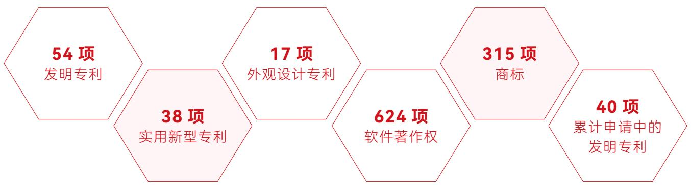

flowchart

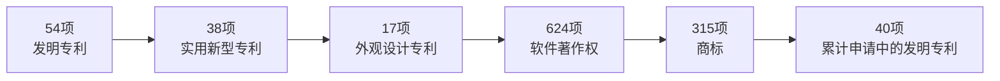
```mermaid
graph LR
  A["54项\n发明专利"] --> B["38项\n实用新型专利"]
  B --> C["17项\n外观设计专利"]
  C --> D["624项\n软件著作权"]
  D --> E["315项\n商标"]
  E --> F["40项\n累计申请中的发明专利"]
```

## 产业合作交流

公司始终秉持开放合作的发展理念，深度链接高校、科研院所、政企机构等多方资源，以产学研融合为核心、标准制定为抓手、产业协同为路径，积极参与国内外双碳领域、数字经济领域的产业交流与合作，同时主动投身各类行业高端论坛、赛事交流，持续推动技术成果落地与行业生态共建，助力绿色低碳转型与数字经济高质量发展。

## 产学研深度融合，校地企协同创新

## 中华环保联合会碳资产与绿色转型专业委员会成立大会

## 授牌仪式

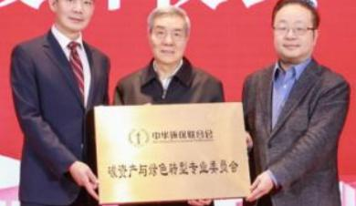

text_image

① 中华新优联经
碳资产与绿色转型专业委员会

与顶尖学府共建专业委员会，开创“顶尖学府 + 产业龙头”协同新模式，2025 年与清华大学联合发起成立中华环保联合会碳资产与绿色转型专业委员会。汇聚百余位政企学研代表，共同推动我国绿色低碳发展迈入体系化、专业化新阶段。

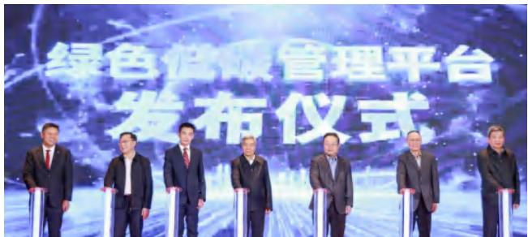

text_image

绿色偿债管理平台
发布仪式

依托高校科研资源与自身工程化能力，联合打造全球首个绿色低碳数字赋能平台，融合顶尖学术机构科研成果与产业界技术落地能力，破解碳数据孤岛难题，为全球气候治理提供“中国方案”。

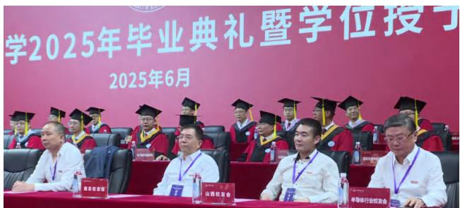

text_image

学2025年毕业典礼暨学位授予
2025年6月
蒋景林先生
山西校医会
华导体行业联合会

深化与高校的人才培养与科研合作，公司董事长李玮作为华中科技大学杰出校友代表，受邀出席 2025 年毕业典礼，未来将持续与华中科技大学在人才培养、科研创新等方面开展深度合作，通过产学研融合将科研智慧转化为行业变革实践力量。

## 政企机构战略合作，赋能产业绿色转型

积极参与地方经济建设与双碳发展实践，先后应邀参加 2025 济宁“圣城有约・儒商回家”投资经贸合作交流会、2025 阜阳投资贸易洽谈会暨第二届 RCEP 企业家合作会议等地方产业交流活动。依托智慧双碳解决方案为山东、安徽阜阳等地的双碳目标落地提供技术支持，助力当地企业碳交易收益提升。

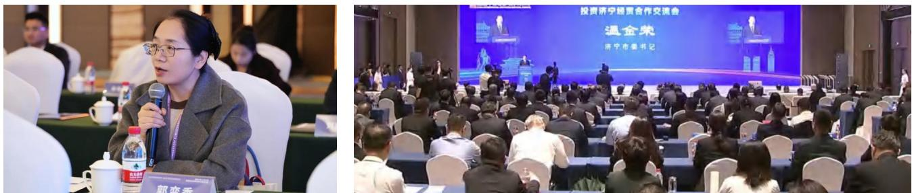

2025 年 8 月，公司全资子公司北京佳华智联科技有限公司与山西省检验检测中心（山西省标准计量技术研究院）签署战略合作协议，共建碳计量中心，结合双方在数字化技术与权威计量、政策研究方面的优势，为煤炭行业提供“计量 + 数字化”双引擎支撑，赋能山西省乃至全国煤炭行业绿色低碳转型。

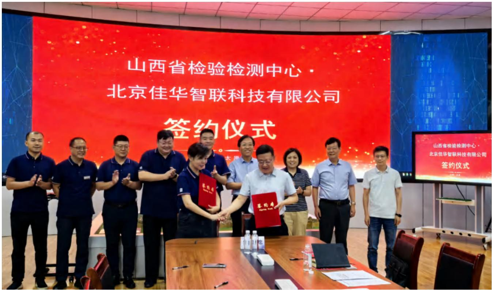

text_image

山西省检验检测中心
北京佳华智联科技有限公司
签约仪式
山西省检验检测中心
北京佳华智联科技有限公司
签约仪式

## 积极参与标准制定，引领行业技术规范

公司将标准建设作为战略核心，2025 年在标准制定领域实现国内国际双线突破，主导及参编多项国家标准，参与国际标准编制，填补多项行业标准化空白，提升我国在环保科技、资产管理等领域的国际话语权。

附件  
2024年国际标准化组织（ISO）发布的我国牵头制修订的国际标准清单

<table><tr><td>序号</td><td>所属国际组织编号</td><td>标准编号</td><td>标准中文名称</td><td>标准英文名称</td><td>制修订信息</td><td>项目负责人</td><td>参与单位</td></tr><tr><td></td><td>ISO/TC 1</td><td>ISO9652-2024</td><td>ISO米制普通螺纹 公系第二部分简条紧固件螺纹的极限尺寸</td><td>ISO general purpose metric screwthreads→Tolerances Part 2.Limits of sizes for internal andesteral threads tolerance clause01 and fig for M1.6 to M100 and 3Hand thb for M1 to M1.4)</td><td>修订</td><td></td><td></td></tr><tr><td></td><td>ISO/TC 2/SC 11</td><td>ISO4766-2024</td><td>紧固件 开槽末端紧定螺钉</td><td>Fasterns—Slotted set screws with flat point</td><td>修订</td><td></td><td></td></tr><tr><td></td><td>ISO/TC 2/SC 11</td><td>ISO7434-2024</td><td>紧固件 开槽锥端紧定螺钉</td><td>Fasterns—Slotted set screws with cone point</td><td>修订</td><td></td><td></td></tr><tr><td></td><td>ISO/TC 2/SC 11</td><td>ISO7435-2024</td><td>紧固件 开槽圆柱端紧定螺钉</td><td>Fasterns—Slotted set screws with dog point thione</td><td>修订</td><td></td><td></td></tr><tr><td></td><td>ISO/TC 251</td><td>ISO55012-2024</td><td>资产管理 人员参与和能力指南</td><td>Asset management—Guidance on people involvement and competence</td><td>制定</td><td></td><td></td></tr></table>

主导编制国家标准：主导编制的国家标 准（GB/T 45795-2025）《 大 气 颗 粒 物PM10、PM2.5 质量浓度观测光散射法》正式发布，由中国气象局主管，规范了光散射法的应用流程与技术参数，公司相关监测设备依据该标准设计生产，服务全国百余个地市。

<table><tr><td>委员会</td><td>分技术委员会</td><td>标准类别</td><td>标准编号</td><td>标准名称</td></tr><tr><td>TC28</td><td>大数据标准工作组</td><td>国标</td><td>GB/T 45408-2025</td><td>信息技术 生态环境大数据 数据分类与代码</td></tr><tr><td>TC28</td><td>SC37</td><td>国标</td><td>GB/T 45284.1-2025</td><td>信息技术 可扩展的生物特征识别数据交换格式部分: 框架</td></tr><tr><td>TC28</td><td>SC37</td><td>国标</td><td>GB/T 45284.4-2025</td><td>信息技术 可扩展的生物特征识别数据交换格式部分: 指纹图像数据</td></tr><tr><td>TC28</td><td>SC37</td><td>国标</td><td>GB/T 45284.5-2025</td><td>信息技术 可扩展的生物特征识别数据交换格式部分: 人脸图像数据</td></tr><tr><td>TC28</td><td>SC37</td><td>国标</td><td>GB/T 45284.6-2025</td><td>信息技术 可扩展的生物特征识别数据交换格式部分: 虹膜图像数据</td></tr><tr><td>TC28</td><td>SC37</td><td>国标</td><td>GB/T 45284.9-2025</td><td>信息技术 可扩展的生物特征识别数据交换格式部分: 血管图像数据</td></tr><tr><td>TC28</td><td>SC37</td><td>国标</td><td>GB/T 45284.16-2025</td><td>信息技术 可扩展的生物特征识别数据交换格式部分: 全身图像数据</td></tr><tr><td>TC28</td><td>SC37</td><td>国标</td><td>GB/T 45284.17-2025</td><td>信息技术 可扩展的生物特征识别数据交换格式部分: 步态图像序列数据</td></tr></table>

参编多项国家标准：2025 年 4 月，作为核心参编单位，参与的《信息技术生态环境大数据数据分类与代码》等八项国家标准正式发布，覆盖生态环境大数据、生物特征识别数据交换格式等领域，为行业提供统一的数据分类与交换规范。

## 投身行业高端交流，分享技术实践成果

2025 年，公司应邀出席国内外多场行业高端论坛、大会，分享在双碳、大数据、人工智能等领域的技术应用与实践成果，加强行业交流与技术探讨，推动产业协同发展。

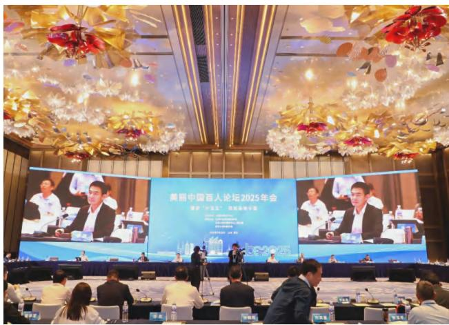

text_image

美丽中国百人论坛2025年会
主办“三全五”国际商务中心

出席 2025 年美丽中国百人论坛年会，董事长李玮在论坛上分享公司在生态环境领域的技术应用成果，介绍“数据工厂”体系、绿色低碳管理平台、大模型一体机等技术成果在碳数据管理、环境监测、减排策略制定中的应用。

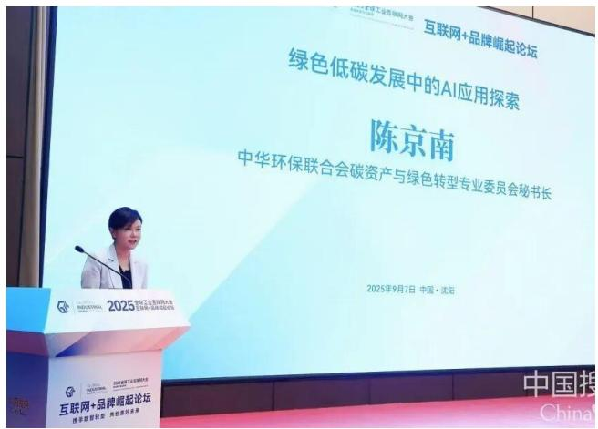

text_image

互联网+品牌崛起论坛
绿色低碳发展中的AI应用探索
陈京南
中华环保联合会碳资产与绿色转型专业委员会秘书长
2025年9月7日 中国·沈阳
互联网+品牌崛起论坛
中国投
China

参加 2025 全球工业互联网大会，公司相关负责人在“互联网 + 品牌崛起论坛”上发表《绿色低碳发展中的 AI 应用探索》主旨演讲，展示八大 AI 模型、“双碳智能体”等技术成果，并分享在能源、建材、电解铝等行业的实战案例。

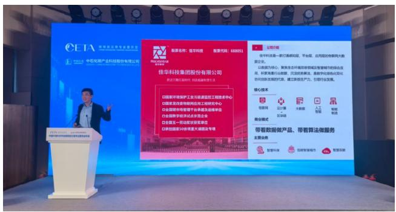

text_image

CETA 中国石化产业科技股份有限公司
佳华科技集团股份有限公司
股票名称：佳华科技 股票代码：688051
2023/12/27
佳华科技系第一代打造新起点、平台底、应用层的协同大数据支撑。
以国家为中心，发展生态与环境治理深度融合等领域的协同效应，实现多维协同创新，实现高质量、高效协同融合和优化协同创新的成果，聚焦业务生产力、公司信息化发展。
核心理念
智能、行业、大容量、智慧、智能、智能
商业模式
带着数据做产品，带着算法做服务
主要功能
智慧升级 促进智能制造 专家挖掘

亮相 2025 全国碳市场大会，董事长李玮发表《全国碳市场中的大数据应用》主旨发言，展现公司在碳数据全链条管理的技术能力，分享数据资产化成果及在能源、金融、机场、综合化工等领域的碳市场服务应用案例。

## 参与行业赛事交流，彰显技术创新实力

作为全国数字经济试点示范企业、国家发展改革委人工智能创新合作伙伴，公司携环保与双碳领域核心数据产品参与 2025 年“数据要素 ×”大赛，凭借深厚的技术积累与场景落地能力，在北京、山东两大赛区均斩获大奖。申报的《大模型赋能的通武廊生态环境智能协同保护与溯源预测》《跨区域高排放行业碳账本协同管理平台》《“智碳云”——数据要素赋能下的智慧双碳解决方案》三大核心项目从众多参赛作品中脱颖而出，充分彰显了公司在数据要素融合创新、双碳数字化领域的行业领军实力。

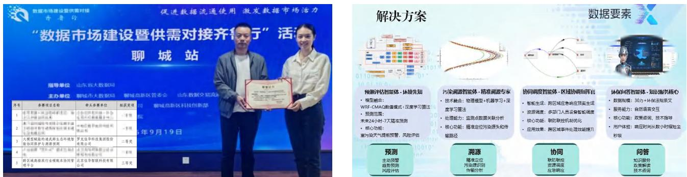

## 03

## 应对气候变化

围绕应对气候变化核心议题，搭建完善的气候治理体系，一方面推进自身运营低碳化规范披露温室气体排放能源资源消耗等核心数据，落实减排举措；另一方面发挥技术优势，开展社会低碳赋能实践，构建从自身减排到行业降碳的全链条行动，践行企业气候责任。

佳华科技高度重视气候变化风险与机遇对公司经营所产生的影响，为把握气候变化带来的机遇，公司以“数字化赋能绿色低碳”为核心，聚焦应对气候变化、能源高效利用、环保合规管理等核心议题，将环境责任深度融入生产运营、技术研发、业务拓展全流程。通过构建完善的气候治理体系，实现自身运营减排与赋能社会减排双向发力。以数智技术创新推动企业绿色发展；同时赋能千行百业低碳转型；实现环境效益与产业价值的协同提升；全力支撑美丽中国建设与国家“双碳”战略落地。

natural_image

Coastal landscape with steep cliffs overlooking a turquoise lake under a partly cloudy sky (no text or symbols visible)

## 应对气候变化专项行动

作为生态环境部工程技术中心、涉碳领域核心系统建设运营单位，公司以气候治理为基础、技术赋能为核心、成果落地为导向，开展全维度应对气候变化专项工作，形成“自身减排有实效、赋能减排有支撑”的双轮驱动格局。

## 气候治理体系建设

公司明确各业务板块减排职责与落地推进路径，建立完善的温室气体核算与减排管理体系，规范排放核算范围、方法及实施举措，开展全维度温室气体排放核算与减排工作。将自主研发的集团碳账本、数字碳表应用于公司碳监测全流程，实现碳数据实时化、精准化管理，确保数据真实、准确、可追溯，为减排工作开展提供科学、坚实的数据支撑。

搭建全流程数字化能源管理体系，配备专职能源管理团队，对全国各分子公司、智能制造基地、算力中心的能源消耗进行统一管控；依托物联网技术打造能源消耗实时监测平台，实现能源消耗数据自动采集、智能分析，每月开展能源消耗深度分析，精准识别能耗痛点并制定针对性节能措施。

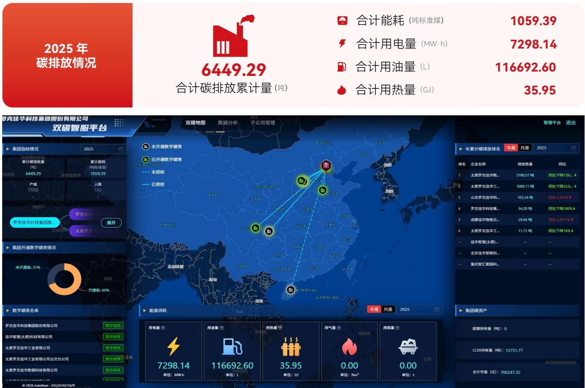

<table><tr><td>合计能耗(吨标准煤)</td><td>1059.39</td></tr><tr><td>合计用电量(MW·h)</td><td>7298.14</td></tr><tr><td>合计用油量(L)</td><td>116692.60</td></tr><tr><td>合计用热量(GJ)</td><td>35.95</td></tr></table>

## 自身绿色减排实践

佳华科技始终遵循绿色低碳运营理念，将支持美丽中国建设、生态环境保护融入公司发展战略和公司治理过程，落实《中华人民共和国环境保护法》《中华人民共和国节约能源法》《中华人民共和国固体废物污染环境防治法》等环境管理制度，采取有效措施履行生态环境保护责任，提高内外部利益相关者对环境管理政策和环境影响的认识。

公司亦积极响应国家“碳达峰、碳中和”目标，致力于持续发展循环经济，呼吁员工、供应商及合作伙伴减少对生态环境的负面影响，携手共建可持续供应链。同时，我们也承诺将有效减少商业活动对环境和社会的负面影响。根据生态环境部《国家突发环境事件应急预案》中突发环境事件分级标准，公司从事软件研发工作，不涉及生产、储存或运输有毒有害物质等活动，故不涉及重大环境事件。

## 绿色数据中心：技术升级 + 绿色管理，打造高效节能标杆

子公司太原罗克佳华数据科技有限公司以构建绿色、高效、可持续的数据中心为目标，从技术选型、运维管理、采购回收全流程推进节能改造。

## 绿色技术产品应用

在数据中心的建设和运营过程中，佳华科技子公司太原数据科技公司严格参照《国家绿色数据中心先进适用技术产品目录》中的技术及产品进行选型，已启用的机房模块采用了具有 freecooling技术的制冷机组、高效精密空调、湿膜加湿器、变频水泵、高频 UPS 等节能技术和产品。同时，未来新启用的机房模块将采用间接蒸发制冷、板载式液冷、高频模块化 UPS、磁悬浮等技术及产品，能更大程度地提高能效，达到节能降耗的目的。经设计优化后，数据中心设计PUE（能效比）从1.498降低到 1.195。

## 绿色采购与回收

数据科技在采购过程中，制定了供应商负面行为处理规则，明确规定采购产品需满足国家绿色设计产品评价及节能节水低碳环保等相关标准要求。这不仅有助于推动供应链的绿色化，也为数据中心的绿色发展提供了有力支撑。

在回收方面，数据科技积极推行电子废弃物回收和再利用，降低了资源消耗和环境污染。同时，数据科技还与相关机构合作，开展废旧设备拆解和资源化利用研究，以实现更加环保的处置方式。

通过应用绿色技术产品、规范运维和管理、实施绿色采购和回收等主要做法，公司的绿色数据中心实践取得了显著成效。数据显示，相较于传统数据中心，数据科技的绿色数据中心在能耗、碳排放等方面均有了明显降低。这不仅为数据科技自身带来了经济效益和社会效益的双重提升，也为行业绿色发展提供了可借鉴的经验和案例。

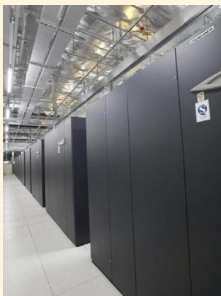

natural_image

Interior view of a data center or server room with rows of dark server cabinets and overhead lighting (no visible text or symbols)

高效精密空调及湿膜加湿器

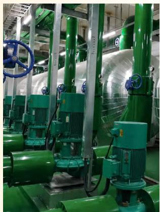

natural_image

Industrial plant interior with green machinery and piping (no visible text or symbols)

变频输送系统

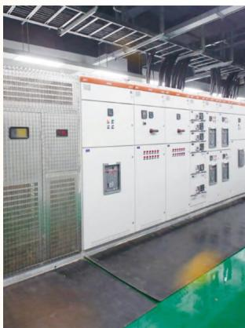

natural_image

Interior view of an industrial control room with large white panel cabinets and ventilation grilles (no visible text or symbols)

智能化、高效配电 及高频UPS

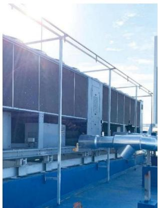

natural_image

Industrial cooling system with large cylindrical tanks and piping under a clear sky (no visible text or symbols)

制冷机组(带 Freecooling 功能)

## 全维度绿色运营：多管齐下，构建全流程低碳运营体系

公司制定“开源”“节流”双重环境管理策略，将绿色理念贯穿生产运营与经营管理各环节，从低碳办公、能源管理、绿色交通、绿色研发、绿色采购五大维度全方位落地。

坚持绿色采购原则，优先选用国家及相关机构绿色认证的原料、产品和建材，从源头实现环保节约。

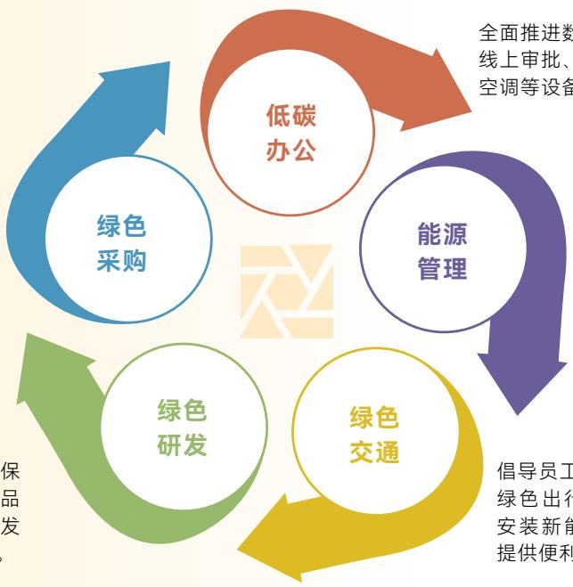

flowchart

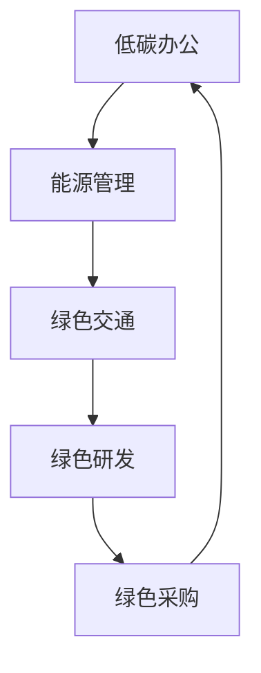
```mermaid
graph TD
  A["低碳办公"] --> B["能源管理"]
  B --> C["绿色交通"]
  C --> D["绿色研发"]
  D --> E["绿色采购"]
  E --> A
```

全面推进数字化办公，实现电子文档流转、线上审批、视频会议全覆盖，对办公照明、空调等设备进行智能化升级。

安 装 智 能 电 表、 水 表 等计量设备，对能源消耗进行实时监测与分析，精准制定节能措施，提升能源利用效率。

秉持绿色设计理念，选用环保材料、优化产品结构，延长产品使用寿命，加大绿色技术研发力度，推出低碳节能环保产品。

绿色研发绿色交通

倡导员工采用公共交通、骑行、步行等绿色出行方式，设置自行车停放区、安装新能源汽车充电桩，为绿色出行提供便利。

## 赋能社会低碳减排

依托二十余年物联网大数据技术沉淀与双碳领域全链条服务能力，公司聚焦碳市场建设、企业碳管理、环保智能监测三大核心领域，打造数智化减排产品与解决方案，成为国家“双碳”战略落地的核心数字化服务商，赋能千行百业实现绿色低碳转型。

  
碳市场平台运维

## 打造国家级双碳平台，支撑全国碳市场规范运行

承建并运营全国碳市场管理平台、全国非二氧化碳温室气体管理平台、全国 CCER 联网监测平台三大国家级平台，实现电力、钢铁、水泥等 8 大行业 6800 余家控排企业全覆盖，每月处理碳排放报告存证数万份，核定和签发数百亿吨、数万亿元配额总量，为全国碳市场的规范、有序、高效运行提供核心技术与平台支撑。

  
环保智能监测

## 打造核心产品体系，助力企业全流程碳管理

打造核心产品数字碳表，开发 “双碳智能体”为工业企业提供碳排放精准核算、减排潜力预测碳足迹追溯碳资产管理全流程服务，到2025年助力数士家工业企业实现碳排放“电算化”精准识别减排潜力降低碳排放成木：为冀东水泥国家能源集团等大型企业集团打造定制化碳管理解决方案，实现多级碳排放数据汇聚、溯源与智能核算，优化企业碳资产配置。

  
企业碳管理服务

## 升级 AI 智能体，以减污协同实现降碳目标

升级 AI 环保智能体，实现“智能问答 - 污染成因分析 - 智慧执法”全流程升级，构建从“问题发现”到“裁量决策”的非现场监管全链条智能解决方案，已在全国数十个省市落地应用；融合多元感知技术与大模型算法，实现污染物精准溯源、动态管控，助力太原、萍乡、海口等多地生态环境质量显著提升，通过减污与降碳的协同效应，间接推动全社会温室气体减排。

## 环境管理体系

## 完善管理体系，通过权威认证

公司健全环境管理体系，持续优化自身环境行动，确保管理举措与国际国内标准保持一致。2025 年，佳华科技集团及太原罗克佳华工业有限公司、太原罗克佳华数据科技有限公司等多家子公司顺利完成管理体系换证和新证审核，山东罗克佳华科技有限公司、北京佳华智联科技有限公司更是斩获五体系认证，充分印证了公司在环境管理体系建设和维护方面的硬实力。

罗克佳华集团三体系证书  
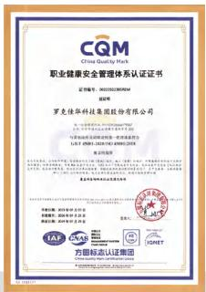

text_image

CQM
China Quality Mark
职业健康安全管理体系认证证书
证书编号：00153228000000000
授权事项
罗克佳科技集团股份有限公司
深圳市深南大道4008号合作大厦
办公地址：深圳市深南大道4008号合作大厦
法定代表人：王健
经营范围：医疗保健、医疗设备、医疗器械、医疗器械及配件、医疗器械的销售、技术开发、技术咨询、技术交流、技术转让、技术推广；食品添加剂（不含危险化学品）的销售、技术开发、技术咨询、技术交流、技术转让、技术推广；互联网数据服务（除互联网数据服务），网络技术服务，网络工程设计，网络工程咨询，网络工程安装，网络工程监理，网络工程造价咨询，网络工程造价评估，网络工程造价咨询，网络工程造价评估，网络工程造价咨询，网络工程造价评估，网络工程造价咨询，网络工程造价评估，网络工程造价咨询，网络工程造价评估，网络工程造价咨询，网络工程造价评估，网络工程造价咨询，网络工程造价评估，网络工程造价咨询，网络工程造价评估，网络工程造价咨询，网络工程造价评估，网络工程造价咨询，网络工程造价评估，网络工程造价咨询，网络工程造价资产评估，网络工程造价资产评估，网络工程造价资产评估，网络工程造价资产评估，网络工程造价资产评估，网络工程造价资产评估，网络工程造价资产评估，网络工程造价资产评估，网络工程造价资产评估，网络工程造价资产评估，网络工程造价资产评估，网络工程造价资产评估，网络工程造价资产评估，网络工程造价资产评估，网络工程造价资产评估，网络工程造价资产评估，网络工程造价资产评估，网络工程造价资产评估，网络工程造价资产评估，网络工程造价资产评估，网络工程造价评估（含评估）

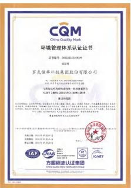

text_image

CQM
China Quality Mark
环境管理体系认证证书
证书编号: 01020300000000
深圳证券
罗克佳单科技集团股份有限公司
IAP 2021年1月1日
ICAR
方案标准认证人集团
CHINA QUALITY MARKS CO.,LTD.
ICQNET

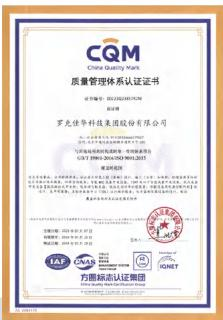

text_image

CQM
China Quality Vision
质量管理体系认证证书
证书编号：20210328100745
证书类型：
证书名称：
罗光佳华科技集团股份有限公司
注册地址：
深圳市福田区深南大道6008号招商银行大厦9楼
办公地址：北京市西城区金融大街3号
法定代表人：王洪章
经营范围：技术开发、技术咨询、技术服务；计算机软硬件及辅助设备制造；电子元器件销售；汽车零配件批发；汽车零配件零售；汽车零配件批发（不含许可类商品）。
企业类型：有限责任公司
经营范围：技术开发、技术咨询、技术服务；计算机软硬件及辅助设备制造；电子元器件销售；汽车零配件批发；汽车零配件零售；汽车零配件批发（不含许可类商品）。
企业法人营业执照号码：370100000000000000000000000000000000000000000000000000000000000000000000000000000
法定代表人：王洪章
经营范围：技术开发、技术咨询、技术服务；计算机软硬件及辅助设备制造；电子元器件销售；汽车零配件批发；汽车零配件零售；汽车零配件批发（不含许可类商品）。
企业法人营业执照号码：370100000000000000000000000000000000000000000
法定代表人：王洪章
经营范围：技术开发、技术咨询、技术服务；计算机软硬件及辅助设备制造；电子元器件销售；汽车零配件批发；汽车零配件零售；汽车零配件批发（不含许可类商品）。
企业法人营业执照号码：3121111111111111111111111111111111111111111111111111111111111111111111111111111111111111111111111111111
法定代表人：王洪章
经营范围：技术开发、技术咨询、技术服务；计算机软硬件及辅助设备制造；电子元器件销售；汽车零配件批发；汽车零配件零售；汽车零配件批发（不含许可类商品）。
企业法人营业执照号码：372222222222222222222222222222222222222222222222222222222222222222222222222222222222222222222222222222<nl>
法定代表人：王洪章
经营范围：技术开发、技术咨询、技术服务；计算机软硬件及辅助设备制造；电子元器件销售；汽车零配件批发；汽车零配件零售；汽车零配件批发（不含许可类商品）。
企业法人营业执照号码：37333333333333333333333333333333333333333333333333333333333333333333333333333333333333333<nl>
法定代表人：王洪章
经营范围：技术开发、技术咨询、技术服务；计算机软硬件及辅助设备制造；电子元器件销售；汽车零配件批发；汽车零配件零售；汽车零配件批发（不含许可类商品）。
企业法人营业执照号码：374444444444444444444444444444444444444444444444444444444444444444444444444444444444444444444444444444<nl>
法定代表人：王洪章
经营范围：技术开发、技术咨询、技术服务；计算机软硬件及辅助设备制造；电子元器件销售；汽车零配件批发；汽车零配件零售；汽车零配件批发（不含许可类商品）。
企业法人营业执照号码：3755555555555555555555555555555555555555555555555555555555555555555555555555555555555555555555555<nl>
法定代表人：王洪章
经营范围：技术开发、技术咨询、技术服务；计算机软硬件及辅助设备制造；电子元器件销售；汽车零配件批发；汽车零配件零售；汽车零配件批发（不含许可类商品）。
企业法人营业执照号码：376666666666666666666666666666666666666666666666666666666666666666666666666666666666666666666666<nl>
法定代表人：王洪章
经营范围：技术开发、技术咨询、技术服务；计算机软硬件及辅助设备制造；电子元器件销售；汽车零配件批发；汽车零配件零售；汽车零配件批发（不含许可类商品）。
企业法人营业执照号码：378888888888888888888888888888888888888888888888888888888888888888888888888888888888888888888888888888<nl>
法定代表人：王洪章
经营范围：技术开发、技术咨询、技术服务；计算机软硬件及辅助设备制造；电子元器件销售；汽车零配件批发；汽车零配件零售；汽车零配件批发（不含许可类商品）。
企业法人营业执照号码：379999999999999999999999999999999999999999999999999999999999999999999999999999999999999999999999999999<nl>
法定代表人：王洪章
经营范围：技术开发、技术咨询、技术服务；计算机软硬件及辅助设备制造；电子元器件销售；汽车零配件批发；汽车零配件零售；汽车零配件批发（不含许可类商品）。
企业法人营业执照号码：37777777777777777777777777777777777777777777777777777777777777777777777777777777777777777777777777777<nl>
法定代表人：王洪章
经营范围：技术开发、技术咨询、技术服务；计算机软硬件及辅助设备制造；电子元器件销售；汽车零配件批发；汽车零配件零售；汽车零配件批发（不含许可类商品）。
企业法人营业执照号码：378888888888888888888888888888888888888  福建集团有限公司
法定代表人：王洪章
经营范围：技术开发、技术咨询、技术服务；计算机软硬件及辅助设备制造；电子元器件销售；汽车零配件批发；汽车零配件零售；汽车零配件批发（不含许可类商品）。
企业法人营业执照号码：3799999999999999999999999999999999<nl>
法定代表人：王洪章
经营范围：技术开发、技术咨询、技术服务；计算机软硬件及辅助设备制造；电子元器件销售；汽车零配件批发；汽车零配件零售；汽车零配件批发（不含许可类商品）。
企业法人营业执照号码：37A  中国证券登记结算有限责任公司深圳分公司
法定代表人：王洪章
经营范围：技术开发、技术咨询、技术服务；计算机软硬件及辅助设备制造；电子元器件销售；汽车零配件批发；汽车零配件零售；汽车零配件批发（不含许可类商品）。
企业法人营业执照号码：3TJ  中国证券登记结算有限责任公司深圳分公司
法定代表人：王洪章
经营范围：技术开发、技术咨询、技术服务；计算机软硬件及辅助设备制造；电子元器件销售；汽车零配件批发；汽车零配件零售；汽车零配件批发（不含许可类商品）。
企业法人营业执照号码：TJ  中国证券登记结算有限责任公司深圳分公司
法定代表人：王洪章
经营范围：技术开发、技术咨询、技术服务；计算机软硬件及辅助设备制造；电子元器件销售；汽车零配件批发；汽车零配件零售；汽车零配件批发（不含许可类商品）。
企业法人营业执照号码：TJ  中国证券登记结算有限责任公司深圳分公司
法定代表人：王洪章
经营范围：技术开发、技术咨询、技术服务；计算软件系统集成服务;计算机软硬件及辅助设备制造;电子元器件销售;汽车零配件批发;汽车零配件零售;汽车零配件批发(不含许可类商品)。
企业法人营业执照号码：TJ  中国证券登记结算有限责任公司深圳分公司
法定代表人：王洪章
经营范围：技术开发、技术咨询、技术服务；计算机软硬件及辅助设备制造;电子元器件销售;汽车零配件批发;汽车零配件零售;汽车零配件批发(不含许可类商品)。
企业法人营业执照号码：TJ  中国证券登记结算有限责任公司深圳分公司
法定代表人：王洪章
经营范围：技术开发、技术咨询、技术服务；计算机软硬件及辅助设备制造;电子元器件销售;汽车零配件批发;汽车零配件零售;汽车零配件批发(不含许可类别)。
企业法人营业执照号码：TJ  中国证券登记结算有限责任公司深圳分公司
法定代表人：王洪章
经营范围：技术开发、技术咨询、技术服务；计算机软硬件及辅助设备制造;电子元器件销售;汽车零配件批发;汽车零配件零售;汽车零配件批发(不含许可类别)。
企业法人营业执照号码：TJ  中国证券登记结算有限责任公司深圳分公司
法定代表人：王洪章
经营范围：技术开发,技术咨询,技术服务;计算机软硬件及辅助设备制造;电子元器件销售;汽车零配件批发;汽车零配件零售;汽车零配件批发(不含许可类别)。
企业法人营业执照号码：TJ  中国证券登记结算有限责任公司深圳分公司
法定代表人：王洪章
经营范围：技术开发,技术咨询,技术服务;计算机软硬件及辅助设备制造;电子元器件销售;汽车零配件批发;汽车零配件零售;汽车零配件批发(不含许可类别) ICNET> ICNET> ICNET> ICNET> ICNET> ICNET> ICNET> ICNET> ICNET> ICNET> ICNET> ICNET> ICNET> ICNET> ICNET> ICNET> ICNET> ICNET> ICNET> ICNET> ICNET ICNET> ICNET> ICNET> ICNET> ICNET> ICNET> ICNET> ICNET> ICNET> ICNET> ICNET> ICNET> ICNET> ICNET> ICNET> ICNET> ICNET> ICNET> ICNET> ICNET; ICNET; ICNET; ICNET; ICNET; ICNET; ICNET; ICNET; ICNET; ICNET; ICNET; ICNET; ICNET; ICNET; ICNET; ICNET; ICNET; ICNET; ICNET; ICNET; ICNET, ICNET; ICNET; ICNET; ICNET; ICNET; ICNET; ICNET; ICNET; ICNET; ICNET; ICNET; ICNET; ICNET; ICNET; ICNET; ICNET; ICNET; ICNET; ICNET; ICNET);\n\n

太原罗克佳华工业有限公司三体系证书  
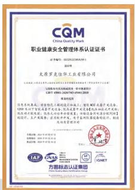

text_image

CQM
China Quality Assurance
职业健康安全管理体系认证证书
证书编号：GDZ 02122824MA1
企业名称：天津京克佳华工业有限公司
经营范围：医疗器械、医疗器械工程设计、施工、检测及技术开发；药品生产（涉及许可经营的项目除外，涉及行政许可审批的项目须取得许可后方可开展经营活动）。
企业法人营业执照复印件、营业执照复印件、营业执照复印件、营业执照复印件、营业执照复印件、营业执照复印件、营业执照复印件、营业执照复印件、营业执照复印件、营业执照复印件、营业执照复印件、营业执照复印件、营业执照复印件、营业执照复印件、营业执照复印件、营业执照复印件、营业执照复印件、营业执照复印件、营业执照复印件、营业执照复印件、营业执照复印件、营业执照复印件、营业执照复印件、营业执照复印件、营业执照复印件、营业执照复印件、营业执照复印件、营业执照复印件、营业执照复印件、营业执照复印件、营业执照复印件、营业执照复印件、营业执照复印件、营业执照复印件、法定代表人：XXX
地址：北京市海淀区东北旺西路9号A座16层
办公地址：北京市海淀区东北旺西路9号A座16层
法定代表人：XXX
组织机构代码：330000000000000000000000000000000000000000000000000000000000000000000000000000000000000000000000
地址：北京市海淀区东北旺西路9号A座16层
办公地址：北京市海淀区东北旺西路9号A座16层
法定代表人：XXX
组织机构代码：3300000000000000000000000000000000000000000000
地址：北京市海淀区东北旺西路9号A座16层
法定代表人：XXX
组织机构代码：330000000000000000
地址：北京市海淀区东北旺西路9号A座16层
法定代表人：XXX
组织机构代码：331111111111111111111111111111111111111111111111111111111111111111111111111111111111111
地址：北京市海淀区东北旺西路9号A座16层
法定代表人：XXX
组织机构代码：33275555555555555555555555555555555555555555555555555555555555555555555555555555555555555555555555555555<nl>

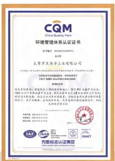

text_image

CQM
China Quality Assurance
环境管理体系认证证书
证书编号: 32000000049618
证书类型:
太厚克华电子有限公司
CQM证书编号: 32000000049618
证书有效期: 2015年12月27日至2023年12月26日
签发机构：
国信证券股份有限公司
注册地址：北京市西城区金融大街3号
办公地址：北京市西城区金融大街3号
法定代表人：王洪波
组织机构代码：32000000049618
经营范围：环保工程、建筑智能化工程、建筑智能化工程、建筑智能化工程、建筑智能化工程、建筑智能化工程、建筑智能化工程、建筑智能化工程、建筑智能化工程、建筑智能化工程、建筑智能化工程、建筑智能化工程、建筑智能化工程、建筑智能化工程、建筑智能化工程、建筑智能化工程、建筑智能化工程、建筑智能化工程、建筑智能化工程、建筑智能化工程、建筑智能化工程、建筑智能化工程、建筑智能化工程、建筑智能化工程、建筑智能化工程、建筑智能化工程、建筑一体化项目管理服务。中国证监会批准的项目除外，但未获审批的项目,不得以任何方式开展经营活动。经营范围：环保工程、建筑智能化工程、建筑智能化工程、建筑智能化工程、建筑智能化工程、建筑智能化工程、建筑智能化工程、建筑智能化工程、建筑智能化工程、建筑智能化工程、建筑智能化工程、建筑智能化工程、建筑智能化工程、建筑智能化工程、建筑智能化工程、建筑智能化工程、建筑智能化工程、建筑智能化工程、建筑智能化工程、建筑智能化工程、建筑智能化工程、建筑智能化工程、建筑智能化工程、建筑智能化工程、建筑智能化工
制单位：中国建设银行股份有限公司
注册地址：北京市东城区建国门内大街1号
办公地址：北京市东城区建国门内大街1号
法定代表人：李晓峰
组织机构代码：32000000049618
经营范围：环保工程、建筑智能化工程、建筑智能化工程、建筑智能化工程、建筑智能化工程、建筑智能化工程、建筑智能化工程、建筑智能化工程、建筑智能化工程、建筑智能化工程、建筑智能化工程、建筑智能化工程、建筑智能化工程、建筑智能化工程、建筑智能化工程、建筑智能化工程、建筑智能化工程、建筑智能化工程、建筑智能化工程、建筑智能化工
制单位：中国建设银行股份有限公司
注册地址：北京市东城区建国门内大街1号

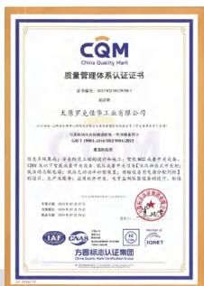

text_image

CQM
China Quality Mark
质量管理体系认证证书
证书编号：2017-032
证书有效期：2018年06月19日

太原市龙华工业集团有限公司

公司名称：中国证券登记结算有限责任公司
注册地址：山西省太原市西城区钢铁大街甲1号山西国际贸易中心
法定代表人：周明军

经营范围：一般经营项目：新型化工原料及副产品、化工原料、能源开采业务，仪器仪表、仪器仪表零配件、仪器仪表、仪器仪表零配件、仪器仪表零配件、仪器仪表零配件、仪器仪表零配件、仪器仪表零配件、仪器仪表零配件、仪器仪表零配件、仪器仪表零配件、仪器仪表零配件、仪器仪表零配件、仪器仪表零配件、仪器仪表零配件、仪器仪表零配件、仪器仪表零配件、仪器仪表零配件、仪器仪表零配件、仪器仪表零配件、仪器仪表零配件、仪器仪表零配件、仪器仪表零配件、仪器仪表零品种（不含危险化学品）。

企业法人营业执照复印件：

1. 企业法人营业执照复印件：

2. 企业法人营业执照复印件：

3. 企业法人营业执照复印件：

4. 企业法人营业执照复印件：

5. 企业法人营业执照复印件：

6. 企业法人营业执照复印件：

7. 企业法人营业执照复印件：

8. 企业法人营业执照复印件：

9. 企业法人营业执照复印件：

10. 企业法人营业执照复印件：

11. 企业法人营业执照复印件：

12. 企业法人营业执照复印件：

13. 企业法人营业执照复印件：

14. 企业法人营业执照复印件：

15. 企业法人营业执照复印件：

16. 企业法人营业执照复印件：

17. 企业法人营业执照复印件：

18. 企业法人营业执照复印件：

19. 企业法人营业执照复印件：

20. 企业法人营业执照复印件：

21. 企业法人营业执照复印件：

22. 企业法人营业执照复印件：

23. 企业法人营业执照复印件：

24. 企业法人营业执照复印件：

25. 企业法人营业执照复印件：

26. 企业法人营业执照复印件：

27. 企业法人营业执照复印件：

28. 企业法人营业执照复印件：

29. 企业法人营业执照复印件：

30. 企业法人营业执照复印件：

31. 企业法人营业执照复印件：

32. 企业法人营业执照复印件：

33. 企业法人营业执照复印件：

34. 企业法人营业执照复印件：

35. 企业法人营业执照复印件：

36. 企业法人营业执照复印件：

37. 企业法人营业执照复印件：

38. 企业法人营业执照复印件：

39. 企业法人营业执照复印件：

40. 企业法人营业执照复印件：

41. 企业法人营业执照复印件：

42. 企业法人营业执照复印件：

43. 企业法人营业执照复印件：

44. 企业法人营业执照复印件：

45. 企业法人营业执照复印件：

46. 企业法人营业执照复印件：

47. 企业法人营业执照复印件：

48. 企业法人营业执照复印件：

49. 企业法人营业执照复印件：

50. 企业法人营业执照复印件：

51. 企业法人营业执照复印件：

52. 企业法人营业执照复印件：

53. 企业法人营业执照复印件：

54. 企业法人营业执照复印件：

55. 企业法人营业执照复印件：

56. 企业法人营业执照复印件：

57. 企业法人营业执照复印件：

58. 企业法人营业执照复印件：

59. 企业法人营业执照复印件：

60. 企业法人营业执照复印件：

61. 企业法人营业执照复印件：

62. 企业法人营业执照复印件：

63. 企业法人营业执照复印件：

64. 企业法人营业执照复印件：

65. 企业法人营业执照复印件：

66. 企业法人营业执照复印件：

67. 企业法人营业执照复印件：

68. 企业法人营业执照复印件：

69. 企业法人营业执照复印件：

70. 企业法人营业执照复印件：

71. 企业法人营业执照复印件：

72. 企业法人营业执照复印件：

73. 企业法人营业执照复印件：

74. 企业法人营业执照复印件：

75. 企业法人营业执照复印件：

76. 企业法人营业执照复印件：

77. 企业法人营业执照复印件：

78. 企业法人营业执照复印件：

79. 企业法人营业执照复印件：

80. 企业法人营业执照复印件；

81. 企业法人营业执照复印件；

82. 企业法人营业执照复印件；

83. 企业法人营业执照复印件；

84. 企业法人营业执照复印件；

85. 企业法人营业执照复印件；

86. 企业法人营业执照复印件；

87. 企业法人营业执照复印件；

88. 企业法人营业执照复印件；

89. 企业法人营业执照复印件；

90. 企业法人营业执照复印件；

91. 企业法人营业执照复印件；

92. 企业法人营业执照复印件；

93. 企业法人营业执照复印件；

94. 企业法人营业执照复印件；

95. 企业法人营业执照复印件；

96. 企业法人营业执照复印件；

97. 企业法人营业执照复印件；

98. 企业法人营业执照复印件；

99. 企业法人营业执照复印件；

100.

©2017年10月1日

太原罗克佳华数据科技有限公司三体系证书  
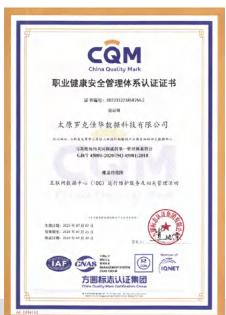

text_image

CQM
China Quality Mark
职业健康安全管理体系认证证书
证书编号：0019232284000A1
企业名称：
太原罗克佳数据科技有限公司
注册地址：太原市小店区西街69号山西国际贸易中心
客服电话：400-850-2017/00192323
集团别别
王振明科技中心（ODC）运维维护服务安全管理部
IAP 云服务管理有限公司
方通技术认证集团

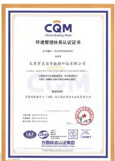

text_image

CQM
China Quality Mark
环境管理体系认证证书
证书编号：202302000041
检测机构
大西洋龙津数据科技有限公司
GEME认证证书编号：2023-005
GB/T 14961-2047301/2023-005
检测单位
环联科技中心（ISO）自动化协同认证管理办公室
IAP 标准证书
方盛标志认证集团
CHINA EQUITY MARK
©2023-004-0048

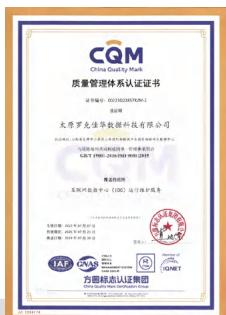

text_image

CQM
China Quality Mark
质量管理体系认证证书
证书编号：202103200000000
供应商
大摩罗戈佳数据科技有限公司
CAOY COQTY COQTY COQTY COQTY COQTY COQTY COQTY COQTY COQTY COQTY COQTY COQTY COQTY COQTY COQTY COQTY COQTY COQTY COQTY COQTY COQTY COQTY COQTY COQTY COQTY COQTY COQTY COQTY COQTY COQTY COQTY COQTY COQTY COQTY
集团有限公司
北京科瑞资本中心（有限合伙）执行事务所
IAT-CASAN
方程标志认证集团

山东罗克佳华科技有限公司五体系证书  
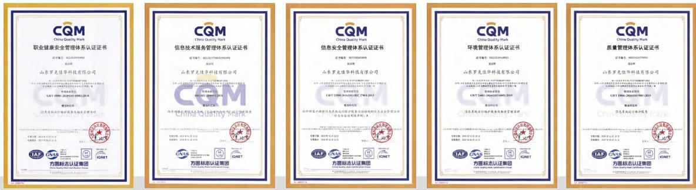

北京佳华智联科技有限公司五体系证书  
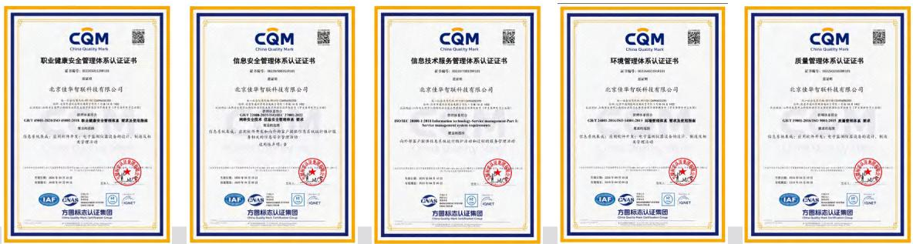

北京佳华智联科技有限公司太原分公司  
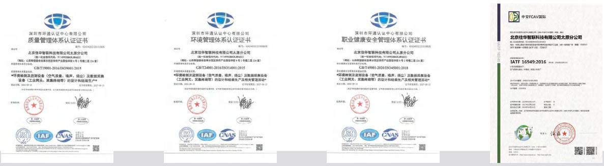

## 多项目标全面达成，实现绿色安全运营

2025 年公司环境、职业健康安全、信息安全等多项目标均圆满达成，为应对气候变化、实现绿色发展奠定坚实基础：

环境管理：废水、噪声监测均达标排放，全年无环境污染及环保投诉事件，无因环保事件造成的经济损失，多款环保产品通过专业认证；

职业健康安全：全年无应急事故、工伤事故，无重伤和死亡事故；组织员工职业健康、安全培训12次，覆盖 600 余人，完成 600 余名员工例行体检，切实保障员工身心健康；

信息安全：全年无信息安全事件、信息泄密事件，无因信息安全引起的业务中断事件，业务非计划中断0次，与员工签署保密协议覆盖率100%。

## 04

## 责任与担当

坚守社会责任与企业担当，以党建为引领，全面保障员工基本权益、薪酬福利与职业健康安全，通过多形式培训助力员工成长，同时积极投身社会公益、助力乡村振兴，多维度践行以人为本的发展理念，彰显企业回馈社会的责任与初心。

## 党建引领

2025 年，公司设有一个党总支，三个党支部，公司以党建引领高质量发展为主线，深入学习贯彻党的二十大精神，坚持党建与经营同频共振、党建与 ESG 深度融合，把党的政治优势、组织优势转化为公司治理效能、创新动能与可持续发展竞争力。

natural_image

Red circular icon with a white ship wheel symbol (no text or numbers)

## 强化政治引领，把舵公司治理

坚持党的领导贯穿企业决策、经营、管理全过程，对数字化转型、碳市场管理平台运维等重大事项前置把关；推动公司确立数字化绿色化协同发展核心战略，承接国家首批数字经济专项，建成绿色低碳数字赋能平台，面向全国政企与生态环境领域提供数据服务，以党建护航合规运营与资本市场稳健发展。

natural_image

Red circular icon with three white human figures, no text or symbols present

## 建强组织队伍，夯实发展根基

完善联合支部共建机制，联动多家生态环保与科技企业凝聚党建合力；建立党员骨干 + 青年人才帮带机制，推动技术骨干入党、党员走上研发与管理关键岗位，2025 年公司有 7 名员工入选青年后备人才；设立党员先锋岗，将技术攻关、客户服务、合规履职纳入考核，打造敢担当、善创新的骨干队伍。

natural_image

Icon of an open book inside a red circle (no text or symbols)

## 深化文化融合，厚植责任底色

构建红色基因 + 科技赋能特色文化，将技术攻坚、绿色低碳、民族品牌、社会责任融入企业文化；开展党员带头树品牌行动，党员在行业标准、核心技术、标杆案例中冲锋在前，强化国产自主可控品牌形象；以党建凝聚全员共识，推动降本增效、创新创效，为降碳减污、扩绿增长注入红色动能。

natural_image

Red circular icon with a white upward-trending graph symbol (no text or numbers)

## 党建赋能经营，提升 ESG 绩效

紧扣提质增效重回报，推动党建全面嵌入信息披露、公司治理、投资者沟通、合规管理等关键环节，严守合规底线、提升透明度；围绕绿色转型、社会责任、公司治理等 ESG 核心维度，以党建引领生态环保、双碳服务、数字赋能等业务落地助力区域数字经济与绿色低碳发展。

natural_image

Red circular icon with a white flag symbol in the center (no text or numbers)

## 坚持问题导向，持续改进提升

针对党建与上市公司治理融合、经费统筹、人才精准培育等薄弱环节，加快完善党建嵌入治理、经费闭环管理、精准人才培育体系，深化党建 + 科技创新，推进数字碳中和示范建设，以更高质量党建支撑公司 ESG 水平与可持续发展能力持续提升。

## 员工管理

人才是企业兴衰之本，企业是人才远航之舟，同舟共济方能到达彼岸。公司严格遵守《中华人民共和国劳动法》及《中华人民共和国劳动合同法》《中华人民共和国社会保险法》《中华人民共和国工会法》等法律法规，从劳动用工、民主管理等各个方面切实维护员工合法权益。

## 招聘管理

公司坚持公平、公开、公正的招聘原则，尊重员工多样性，严禁以性别、民族、年龄、教育程度、宗教信仰、残疾等为由的歧视行为。不存在雇佣童工、强迫劳动等情况。

截至报告期末，公司员工总数为 590 人，劳动合同签订率 100%；女性员工 160 人，女性中高层管理人员占中高层管理团队比例为 27.07%。2025 年，公司新招聘员工 45 人，其中男性 35 人、女性 10 人，持续优化人员结构与人才配置。

## 薪酬管理

公司不断完善薪酬福利体系和绩效考核体系，遵循按劳分配、效率优先、兼顾公平及可持续发展的原则，以体现公平、公正、公开为导向，让每一位员工的价值最大限度得到回报，增加员工对企业的认同感和归属感。公司稳步推进各项薪酬、福利和社会保险制度的改革，建立突出岗位价值、工作业绩的薪酬制度，每年通过绩效考核评选出优秀员工并进行激励。

涵盖劳工政策与实践（反歧视与骚扰、自由结社、员工多元化等）、人权政策与实践（人权承诺、人权尽职调查机制等）、职业健康安全、培训与职业发展、人才吸引与留存（人才规划、绩效评估体系等）等方面。

公司绩效评估体系包含月度绩效考核、年度绩效考核、事业集群考核、产品线考核等。定期接受绩效和职业发展考核的员工比例 100%。

natural_image

Red gradient icon of a person with a gender symbol (no text or numbers)

natural_image

Abstract graphic with a red circular shape containing a yen symbol and horizontal lines, no text or symbols present.

## 福利管理

我们为员工构建了全面多元的福利保障体系，严格遵照国家相关规定全面落实。公司依法建立健全员工社会保险管理体系，为全体员工缴纳基本养老、基本医疗、失业、工伤、生育等社会保险，保障职工享有劳动权利和履行劳动义务，促进劳资关系的和谐稳定。助力员工达成工作与生活的动态平衡，切实强化员工的企业归属感与认同感。

五险一金、带薪假期、健康体检、团建活动、就餐补贴、通讯补贴、节日福利（三八节福利、过年福利、中秋节福利)免费停车妈咪小屋文体活动等。

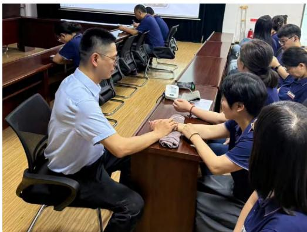

natural_image

Group of people in a meeting or training session, one man receiving a medical check while others observe (no visible text or symbols)

中医义诊

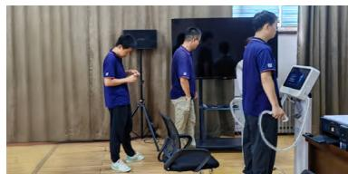

natural_image

Three people in blue shirts operating a medical or testing machine indoors, with no visible text or symbols.

“人体成分分析仪”体检

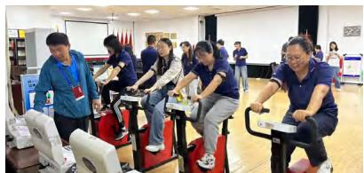

natural_image

Group of people exercising on a red exercise machine in a gymnasium (no visible text or symbols)

全员专属体质检测活动

natural_image

Interior of a gym or training room with two people in white uniforms practicing on mats, no visible text or symbols

心脏复苏急救技能与呼吸放松减压活动

natural_image

Group of people in lab coats gathered indoors, no visible text or symbols

健康减脂指导活动

## 员工发展

## 培训

公司 2025 年培训体系设计秉承集中培训、集中选拔的宗旨，通过“培训”塑造与“精英”选拔，先“育”再“用”，并定期进行岗位任职能力考核评估，打造具备领先的研发技术能力和产品整合能力、团队营销的专业能力和市场策划能力、快速反应的专业技术服务能力及领先一步的智能制造能力、核心运营能力的复合型人才。

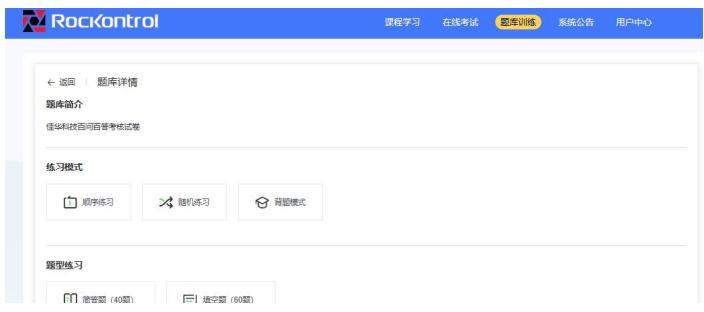

text_image

RockControl
课程学习 在线考试 您库训练 系统公告 用户中心
← 选题 题库详情
题库简介
佳华科技百问百景考核试卷
练习模式
顺序练习 随机练习 路型模式
题型练习
语言节 (40段) 选字节 (60段)

## 课程体系丰富多样

针对不同职类员工提供丰富的职业技能培训课程，包括产品技术培训课程、产品管理培训课程、市场营销培训课程、职能管理培训课程、通用技能类培训课程；针对社会、校园招募新人、轮岗人员提供快速融入培训课程，包括新人入司企业培训课程、新人入职各部门岗位培训课程；针对公司全体员工提供企业文化宣导培训课程，包括价值观与企业文化、佳华发展史，以提升企业文化知晓度、理解度、认同度、践行度。

公司鼓励员工自我提升、自我发展，员工在职期间获得学历提升，公司予以相应补贴。公司鼓励员工参与专业技术职称等级的评定。员工获得职称后需将原件及扫描件提交企业管理中心核验报备，公司根据本手册薪资福利管理规定实行补贴。

2025 年，公司持续推进培训工作多元化与全面化，累计组织线下培训 35 场次、线上培训 75 场次，培训总人次约 10964，培训总时长约 352 小时，以充足的学习资源与培训投入，助力员工精进专业知识、提升综合技能，实现个人能力与企业发展同步提升。

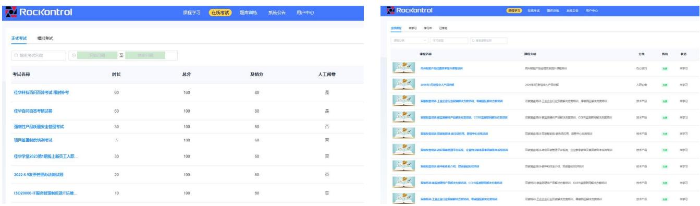

## 晋升

公司致力于为员工搭建广阔的职业发展平台，建立了公平透明、科学合理的晋升机制。员工的晋升机会不仅仅取决于工作年限，更重要的是个人的工作业绩、能力表现以及发展潜力。在晋升过程中，公司会进行全面的评估，包括员工的工作成果、团队协作能力、沟通能力、创新思维等多个方面，助力员工在公司内部实现职业理想，与公司共同成长、共同进步。

## 加入佳华

我们开频进取，追求卓越，在成功的经验和失败的教训中不断学习成长！我们为曾经

## 人力资源邮

Email: hr@rockontrol.com T-1\~9251 7529606

## 社会招票

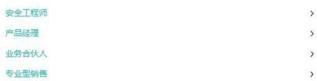

natural_image

Person sitting at a wooden table with glasses and red liquid, no visible text or symbols

## 文化

公司不定期开展多样化文体活动，丰富员工的业余生活，增强团队凝聚力。2025 年公司组织了“绿色同行·悦享自然”“书香满园·思享共生”“太原马拉松”“葫芦挂件非遗手工”“自制艾草锤”等活动，让员工在工作之余得到了放松和娱乐，同时也增强了对公司的认同感和归属感，进一步促进了员工的发展和公司的稳定发展。

“用数据证明优秀，让榜样成为力量”，为了更好地贯彻公司文化，通过公正、客观的数据，为公司遴选优秀人才，表彰在日常工作中表现突出、成绩显著的优秀员工。2025 年佳华科技启动佳华之星评选。“佳华之星”评选活动以数据为依据，完全以数字化的方式呈现每位参评员工的工作表现。此次评选所涉及的指标均来源于日常工作中使用的相关工具所留痕的数据，确保评选结果的客观性和公正性。2025 年共评选出周佳华之星 108 名、季度“佳华之星”16 名。

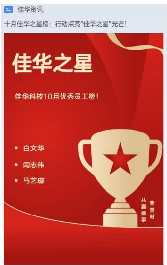

text_image

佳华资讯
十月佳华之星榜：行动点亮"佳华之星"光芒！
佳华之星
佳华科技10月优秀员工榜！
• 白文华
• 闫志伟
• 马艺璇
共襄盛事 荣善时

“佳华之星”通知公告

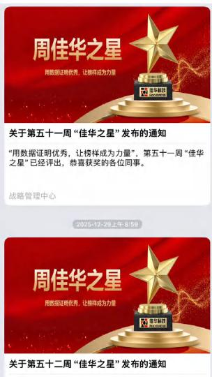

text_image

周佳华之星
用数据证明优秀，让榜样成为力量

关于第五十一周“佳华之星”发布的通知
“用数据证明优秀，让榜样成为力量”，第五十一周“佳华之星”已经评出，恭喜获奖的各位同事。

战略管理中心

2025-12-29 上午 8:59

周佳华之星
用数据证明优秀，让榜样成为力量

关于第五十二周“佳华之星”发布的通知

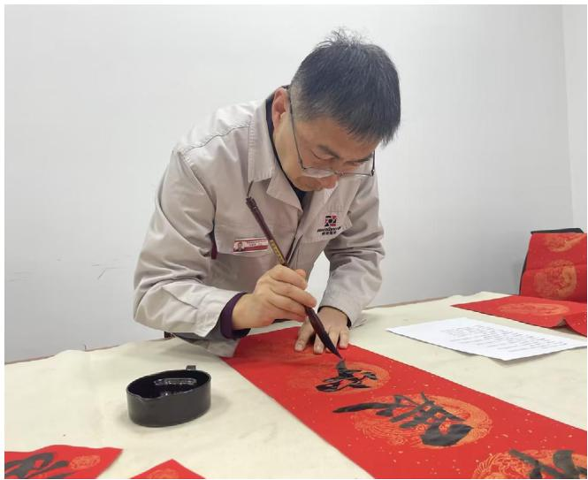

text_image

Man practicing Chinese calligraphy with red paper-cutting, featuring large characters and traditional calligraphy elements

春节写对联

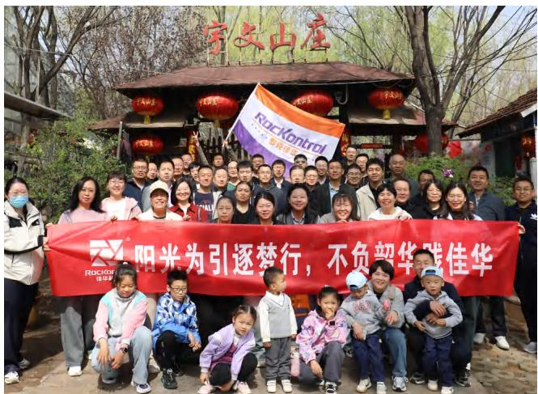

text_image

宁文山庄
RockControl
阳光为引逐梦行，不负贺华践佳华

团建活动

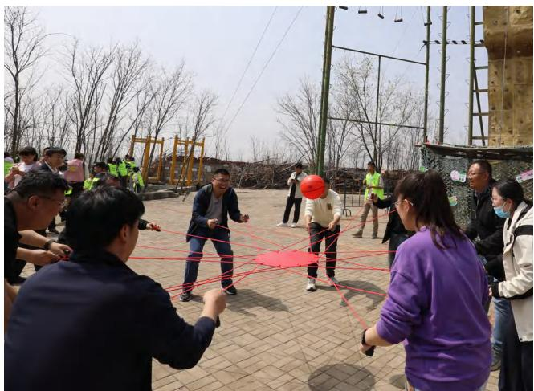

natural_image

Outdoor group of people participating in a rope game outdoors, with red ropes and spectators watching (no visible text or symbols)

团建活动

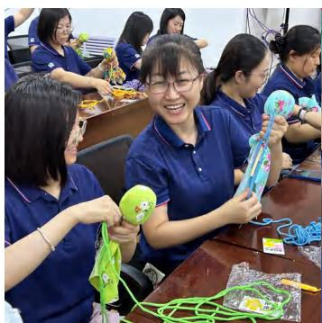

natural_image

Group of women in blue uniforms participating in a craft activity, handling handmade items and textiles (no visible text or symbols)

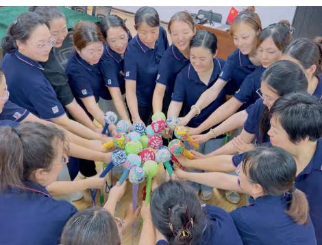

natural_image

Group of women in blue uniforms gathered around a colorful, patterned ball cluster (no text or symbols visible)

艾草锤活动

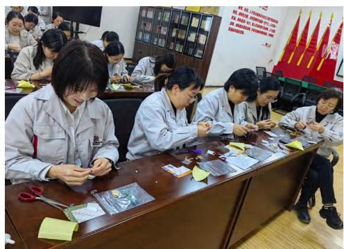

text_image

Group of women in lab coats working at a table with handwritten notes and scissors, with Chinese text on the wall in the background.

宋锦葫芦

## 员工安全

为了增强员工的安全、职业健康、消防和环境保护管理意识，有效辨识安全生产管理工作中存在的漏洞和死角，加强公司员工突发事件应急管理能力，建立快速反应和应急的处置机制，最大程度降低突发事件造成的影响和损失，佳华科技制定了完善的安全管理规范，包括：《安全检查管理规范》《环境、职业健康安全运行控制程序》《劳动防护用品管理规范》《危险作业安全管理规范》《消防安全管理规范》《安全生产责任制度》《安全教育培训管理规范》等。通过严格执行这些规范，有效提升了公司的安全管理水平，确保了员工的生命财产安全，为公司的稳健发展奠定坚实的基础。

## 2025 年研发建设情况

安全生产事故0起

员工职业健康、安全培训12次

职业健康、安全培训人员500余人

text_image

17.597
5.479
31.153
8.957

## 社会公益

公司始终不忘初心、牢记使命，积极承担企业社会责任，坚持经济效益与社会效益的统一。关爱善待每一位员工并与其共同成长，精准帮扶并关爱弱势群体；追求健康可持续发展，在努力实现自身发展壮大的同时，增加对行业的贡献，实现企业与社会的共同进步与发展。

## 水果飘香助农行

公司将员工节日福利与助农扶贫相结合，在春节、中秋节等节日，采购苹果、梨等扶贫水果作为员工节日福利，不仅为员工带来了实惠和惊喜，更在无形中传递了关爱社会的正能量。员工在享受水果美味的同时，也能深刻感受到公司对社会责任的积极履行和对欠发达地区农民的深情关怀，促进了欠发达地区的经济发展和农民的增收致富。

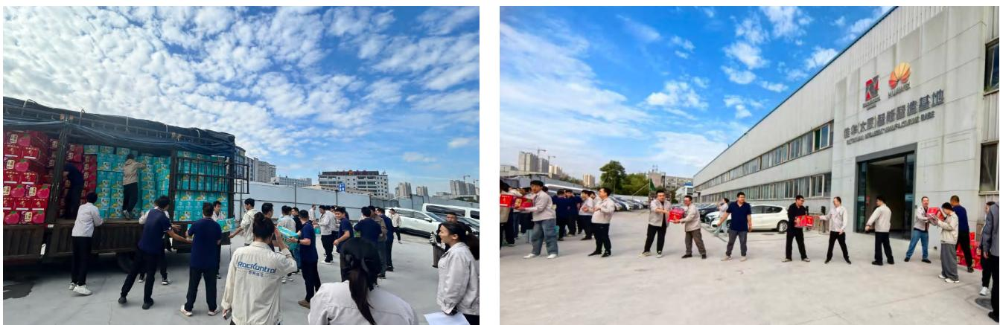

## 05

## 尽责治理

坚持规范治理、合规运营，搭建透明高效的公司治理架构强化风险管控与廉洁道德建设，完善全流程数据安全与隐私保护体系，通过严格的合规管理、健全的风控机制，筑牢公司高质量发展的治理根基，保障企业稳健运营。

合规筑基，透明运营是企业稳健发展的压舱石，佳华科技以透明公司治理为核心，同步搭建合规管理体系、规范的信息披露机制与全流程信息安全防护体系，筑牢规范、可靠的企业运营生态。公司不仅注重外部培训、廉洁反舞弊等商业道德的深化落地，夯实运营的安全根基，还主动推进信息公开与多方监督，凝聚信任共识，为企业高质量发展注入持久的稳健动力。

## 透明公司治理

## 科学治理架构

公司严格遵循《公司法》《证券法》《上市公司治理准则》《公司意程》以及中国证监会和上海证券交易所发布的有关上市公司治理的规范性文件要求，结合公司经营管理的实际需求与具体状况，持续完善法人治理结构，健全内控管理制度与业务流程，全面提升公司规范运作水平。公司股东会、董事会及管理层等各职能部门均严格依照内控制度规范化运作，切实保障公司及全体股东的合法权益，确保公司治理的透明度与高效性。

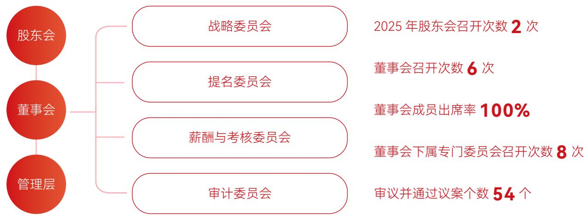

flowchart

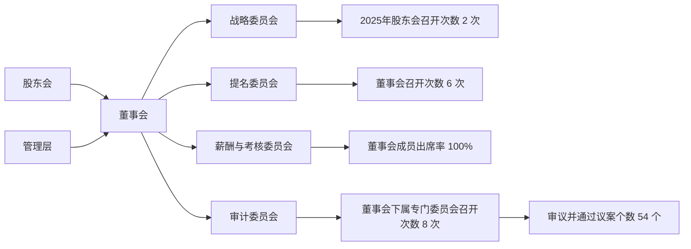
```mermaid
graph LR
  A["股东会"] --> B["董事会"]
  C["管理层"] --> B
  B --> D["战略委员会"]
  B --> E["提名委员会"]
  B --> F["薪酬与考核委员会"]
  B --> G["审计委员会"]
  D --> H["2025年股东会召开次数 2 次"]
  E --> I["董事会召开次数 6 次"]
  F --> J["董事会成员出席率 100%"]
  G --> K["董事会下属专门委员会召开次数 8 次"]
  K --> L["审议并通过议案个数 54 个"]
```

## 治理亮点突出

## 01 增设职工董事优化董事会结构

通 过 职 工 代 表 大 会 民 主选举程序，选出既代表职工利益、又具备能源物联网行业专业素养的职工董事，同步制定专属培训计划，涵盖公司治理规则、业务流程、监管政策等内容，助力职工董事快速胜任履职，进一步完善了董事会多元治理结构，打通了职工参与公司重大决策的渠道，提升了决策的科学性与民意基础。

## 系统修订治理制度 02 形成闭环管理

依据新《公司法》《上市公司治理准则》等法律法规和规范性文件，结合公司经营发展实际，全面梳理现有制度的合规性与适用性，2025 年累计完成治理制度修订及新增共 42 项，其中修订《公司章程》《股东会议事规则》等 治 理 制 度 共 37 项， 新 增《职工代表董事选任制度》《独立董事专门会议制度》等5 项。

## 03 取消监事会审计委员会承接职权

依 据 新《 公 司 法 》 第一百二十一条的相关规定，公司启动组织架构优化工作，2025 年 12 月 1 日 经 股 东 会审议通过《关于取消监事会暨修订〈公司章程〉的议案》，正式决定不再设立监事会，其法定职权已由公司董事会审计委员会承接，通过提前梳理职权清单、优化工作流程，实现监督职能无缝衔接与平稳过渡。

## 关于股东与股东会

公司平等对待所有股东，充分尊重和维护股东利益，特别是中小股东享有的地位和充分行使自己的权利，保护其合法权益，确保股东对法律、行政法规所规定的公司重大事项享有知情权和参与决策权。

## 报告期内，公司共召开股东会 2 次

审议与董事会换届选举、年度报告、董事会工作报告、修订《公司章程》及配套治理制度、续聘会计师事务所等事项相关议案。

## 关于董事与董事会

2025 年，董事会召开次数 6 次，董事会成员出席率 100%，审议并通过议案个数 54 项。依托董事会长期以来规范高效的运作机制与持续创新的发展理念，佳华科技董事长李玮入选“上证鹰·金质量”优秀企业家奖。

为强化治理效能与全球运营适配性，公司组建了兼具多元专业背景与互补能力结构的董事会，形成了兼具代表性与专业性的治理团队。董事会共 9 名董事，其中女性董事 4 名，占比 4/9；独立董事 3 名，占比 1/3；职工代表董事 1 名，占比 1/9。董事会成员在企业战略管理、核心业务运营、能源物联网专业技术研发、合规风险管控、金融财务决策及审计内控体系建设等关键领域积累了深厚实践经验与行业洞察。

## 独立董事履职

独立董事是公司治理结构优化的推动者、是公司规范经营的监督者、更是中小投资者利益的保护者。公司 3 名独立董事分别来自金融、财务、法律领域，均具备相关领域丰富的从业经验。

报告期内，共召开了 2 次独立董事专门会议，审议通过了《关于续聘会计师事务所的议案》，以及讨论公司拟发行股份及支付现金购买资产并募集配套资金方案事项，独立董事充分了解有关事实并按要求发表了相关意见，充分发挥了独立董事作用，有效地维护了公司和所有股东的合法权益。

## 董事会专门委员会规范运作

公司董事会下设审计委员会、战略委员会、提名委员会、薪酬和考核委员会 4 个专门委员会，各专门委员会均严格按照《公司法》《证券法》《公司章程》及公司董事会各专门委员会工作细则开展工作，认真履职、勤勉尽责，规范公司治理架构，为董事会决策提供专业的建议和支持。

报告期内，公司董事会审计委员会共召开 5 次会议，审议通过了各定期报告、续聘会计师事务所、聘任公司财务总监以及重大资产重组事项等相关议案，同时听取了公司每季度的内部审计工作报告，并就公司年度审计情况与会计师进行了充分沟通。

报告期内，公司董事会薪酬和考核委员会召开 1 次会议，审议通过了公司董事及高管的薪酬方案。公司董事会战略委员会共召开 1 次会议，审议通过了公司拟发行股份及支付现金购买资产并募集配套资金方案等相关议案。公司董事会提名委员会共召开 1 次会议，对第四届独立董事候选人、非独立董事候选人的任职资格进行审核，并提交董事会审议。

natural_image

Abstract blue and white swirling pattern with smooth gradients (no text or symbols)

## 合规信息披露

2025 年度，公司累计发布各类公告文件 106 份，切实履行信息披露主体责任，全方位、多层次、及时准确地向广大投资者传递公司经营发展关键信息，充分保障投资者的知情权、参与权和监督权，搭建起公司与投资者之间高效畅通的沟通桥梁，彰显了公司规范治理、诚信经营的核心理念。

同时，公司严格落实信息披露相关规范要求，结合公司信息管理实际需求，健全信息披露管理制度与保密机制，细化信息披露责任人职责，同时通过专业培训提升关键人员履职能力，全面保障信息披露的真实、准确、完整与及时性。公司相关部门及人员依循制度规范开展信息披露与保密工作，切实维护投资者及公司的合法权益，有效提升信息披露的规范性与市场公信力。

强化信息披露规范性方面，佳华科技严格遵守《中华人民共和国公司法》《中华人民共和国证券法》等相关法律法规及监管要求，通过制定《信息披露管理制度》《内幕信息知情人登记制度》规范信息披露与内幕信息管理，保障利益相关者权益、维护披露公平，并组织董监高专业培训，提升核心人员规范履职能力。其中，《信息披露管理制度》规范公司及相关信息披露义务人的信息披露行为，保护投资者等利益相关者的合法权益；《内幕信息知情人登记制度》加强公司内幕信息保密工作，规范公司内幕信息管理行为，维护信息披露的公平原则；公司积极组织董事、监事及高级管理人员参加专业培训，以提高核心关键人员的规范履职能力。

提高信息披露有效性方面，佳华科技坚持真实、准确、完整、及时、公平的信息披露原则，积极推动自愿性信息披露，及时发布与投资者作出价值判断和决策相关的信息，并结合行业政策和市场动态，主动披露公司经营性信息，帮助投资者更好地了解公司运营情况。同时，致力于信息披露形式的多元化创新，注重信息内容的简明清晰、语言通俗易懂，并采用图文、视频等多种形式，促进投资者全面洞察公司情况，减少市场对公司的认知壁垒。

## 提质投关效能

公司始终将投资者关系管理作为连接市场与公司的重要纽带，围绕“信息披露更透明、沟通机制更规范、价值传递更精准、投资者获得感更增强”的目标，构建多元、高效、透明的沟通体系，持续深化信息传递与双向互动，同时切实保障投资者的知情权与参与权，通过系统化、数字化的投关实践，推动市场价值共识形成。

多维举措落地，夯实投关工作基础。公司长期以来高度重视投资者关系管理工作，建立了多元高效的沟通渠道，确保公司信息及时传递。

natural_image

Abstract financial growth graphic with upward arrow, gold coins, and mountainous background (no text or symbols)

## 全面的风险管控

## 风险管控

公司建立了风险管控三道防线，将企业风险管理的各项要求融入企业管理和业务流程中，使得公司的管理质量得到有效提升。

natural_image

Blue shield icon with a white checkmark, enclosed in a shield-like border (no text or symbols)

## 佳华科技风险管控三道防线

第一道防线

风险所有方

由集团相关职能部门和业务单位构成，负责了解企业战略目标及影响企业达标的风险，识别风险类别，对相关风险作出评估。

第二道防线

风险管理方及合规管理部门

由成立的风险管理团队构成，负责协助管理层制定政策、定义角色和职责、制定目标，负责度量风险和评估风险的界限，开展风险管理及内部风险信息系统的建设。负责监督业务内部控制的充分性，报告机制的准确性和完整性、对法律法规的合规性。

第三道防线

风险保证方

由公司的内部审计机构构成，负责对企业治理、风险管理和内部控制的有效性进行确认，以评价是否达到风险管理和控制的目标，帮助企业实现经营目标。

## 风险识别

风险识别作为风险管理的核心环节，对于公司的稳健运营和持续发展有着重要意义。佳华科技高度重视风险识别工作，围绕治理、经营、环境政策、信息披露等维度，深入剖析可能对公司运营产生影响的各类风险因素，以全面、系统地识别公司所面临的潜在风险。

## 突发事件范围

## 治理风险

公司大股东出现重大风险，对公司造成重大影响；  
• 大股东之间存在纷争诉讼，或出现明显分歧；  
公司与社会、股东、员工之间存在纷争诉讼；  
●公司董事 监事及高管人员涉及重大违规甚至违法行为；  
公司管理层对公司失去控制；  
●公司资产被大股东或有关人员转移，藏匿到海外或异地无法调回。

## 经营风险

公司的经营和财务状况恶化；  
公司面临退市风险；  
公司因重大质量事故等无持续经营能力；  
涉及重大经济损失或民事赔偿风险。

## 政策及环境风险

国际重大事件波及公司；  
国内重大事件或政策的重大变化波及公司；  
自然灾害造成公司经营业务受到影响；  
公司内的各类安全事故、交通事故、公共设施和设备事故等灾难，造成公司正常经营受到影响；  
公司涉及重大行政处罚风险。

## 信息披露风险

公司的股价异常波动；  
报刊、媒体对公司问题集中或不实报道；  
社会上存在不实的传言或信息，给公司造成了影响；  
公司发布的信息出现重大的遗漏或错误，对市场造成了影响；  
可能或已经造成社会不稳定，引发投资者群体上访或投诉事件等

## 风险评估

组织风险评估是一种战略性的考虑，其结果将受组织的业务战略、业务流程、安全需求、系统规模和结构等方面的影响。公司成立了以管理层、相关业务骨干、IT 技术等人员为主的风险评估小组，开展常态化风险评估。公司每年至少执行一次全集团的风险评估，按照《环境、职业健康安全和信息安全运行程序》，根据满足组织业务持续发展在安全方面的需要、法律法规的规定等内容，对集团及下属各分子公司的数据、硬件、服务、人员及其他信息资产进行风险管控，及时识别现有信息资产及管理上的不足，提出有针对性地抵御威胁的防护对策和整改措施，

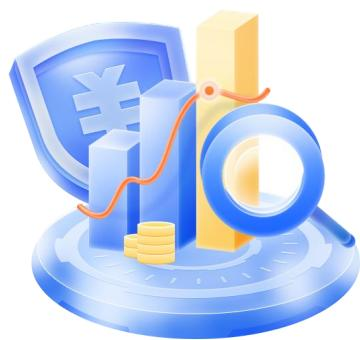

natural_image

Illustration of financial data with a shield, coins, and magnifying glass (no text or symbols)

## 当发生以下重大变更时，风险评估应及时进行：

•公司组织机构发生重大变化时；  
•技术发生重大创新时；  
•客户要求发生重大变化时；  
•业务目标和过程发生重大变化时；

•已识别的威胁发生重大改变时；  
•已实施控制措施的有效性发生变化时；  
•外部事件，如法律法规环境的变更，合同义务的变更和社会环境的变更等。

风险评估要素关系图  
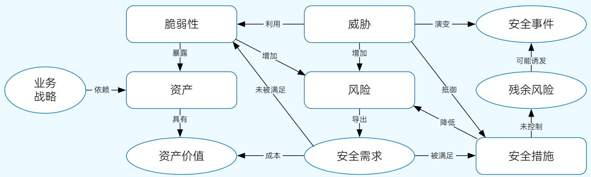

flowchart

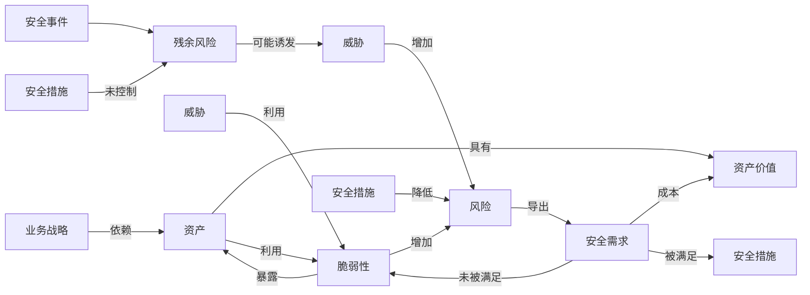
```mermaid
graph LR
  A["业务战略"] -->|依赖| B["资产"]
  B -->|具有| C["资产价值"]
  B -->|利用| D["脆弱性"]
  D -->|暴露| B
  D -->|增加| E["风险"]
  E -->|导出| F["安全需求"]
  F -->|成本| C
  F -->|未被满足| D
  F -->|被满足| G["安全措施"]
  H["威胁"] -->|增加| E
  I["威胁"] -->|利用| D
  J["安全事件"] --> K["残余风险"]
  K -->|可能诱发| H
  L["安全措施"] -->|降低| E
  M["安全措施"] -->|未控制| K
```

## 风险应对

为加强公司突发事件应急管理，建立快速反应和应急处置机制，最大限度地降低突发事件造成的影响和损失，维护公司正常的生产经营秩序和企业稳定，保护广大投资者的合法利益，根据《中华人民共和国公司法》《中华人民共和国证券法》《中华人民共和国突发事件应对法》等法律法规、规范性文件，公司编制了《突发事件应急处理制度》，成立突发事件处置工作领导小组，并制定相应的应对措施，及时开展处置工作。

## 应急保障体系

## 通信保障

公司的值班电话及突发事件处置工作领导小组成员的手机必须保证畅通，确保与各部门的联系。

## 物资 保障

公司相应部门应做好突发事件处置工作的物资保障，准备好相关的设施、设备及资金、交通工具等。

## 队伍 保障

突发事件处置工作领导小组有权根据突发风险处置工作的需要，召集参与处置人员，被召集人必须服从安排。

## 培训 保障

公司内部要广泛宣传应急法律法规和预防、避险等常识，增强应急意识，提高应急处置能力，要有计划地进行应急预案和应急知识的专业培训工作。

<table><tr><td colspan="7">风险与机遇辨识及应对措施表</td></tr><tr><td>序号</td><td>维度</td><td>影响因素</td><td>风险辨识(Threats)</td><td>机遇辨识(Opportunities)</td><td>受影响的相关方</td><td>综合应对措施与策略(融入相关方管理)</td></tr><tr><td>1</td><td>环境(气候变化)</td><td>气候变化(物理风险)</td><td>风险R-C1:·极端天气(洪水/高温)导致自有或客户数据中心断电、硬件损坏。·员工通勤受阻,项目交付延期。</td><td>机遇O-C1:·提供容灾备份即服务,帮助客户建立跨地域的IT容灾机制。</td><td>客户(业务连续性)员工(通勤安全)股东(资产损失)</td><td>1.基础设施双活:建议客户采用多云/多地域部署,并将此写入SLA(服务等级协议),保障客户业务连续性。2.远程办公预案:建立极端天气下的全员远程办公机制,保障员工安全,同时确保项目进度不受影响。</td></tr><tr><td>2</td><td>环境(气候变化)</td><td>气候变化(转型风险/政策)</td><td>风险R-C2:·高耗能客户(如制造业)因碳配额收紧而减产,导致IT项目暂停。·未能通过绿色招投标门槛,失去客户。</td><td>机遇O-C2:·开发碳排放管理软件,帮助高耗能客户监测与优化碳排放。·提供绿色数据中心解决方案,降低PUE值。</td><td>客户(合规压力)监管机构(环保)股东(市场准入)</td><td>产品研发:针对监管机构的环保要求,研发碳核算SaaS平台,帮助客户应对合规压力。</td></tr><tr><td>3</td><td>环境(气候变化)</td><td>气候变化(声誉/社会)</td><td>风险R-C3:·被环保组织批评为“高碳排放企业”(如使用非清洁能源数据中心),导致品牌受损,难以招聘年轻员工。</td><td>机遇O-C3:·承诺2030年实现自身运营碳中和,打造绿色科技公司”品牌形象,吸引注重环保的Z世代人才和客户。</td><td>社会公众(环保期待)员工(雇主品牌)客户(供应链ESG)</td><td>1.碳中和路线图:向社会公众公布碳中和时间表,购买绿色电力证书,提升品牌形象。2.绿色福利:向员工推出“种树换调休”等低碳活动,提升内部凝聚力和雇主品牌吸引力,满足员工对价值观的追求。</td></tr><tr><td>4</td><td>宏观政治</td><td>信创政策</td><td>风险R-01:未能进入信创目录,失去政府采购市场。</td><td>机遇O-01:获得信创资质,切入国产替代蓝海市场。</td><td>客户(政府/国企)、股东(增长潜力)</td><td>1.适配认证:主动申请国产芯片/OS认证,满足客户的合规刚需。2.生态绑定:与国产厂商互认证,向股东展示在关键赛道的布局。</td></tr><tr><td>5</td><td>宏观政治</td><td>数据安全法规</td><td>风险R-02:合规成本激增;数据泄漏导致停业风险。</td><td>机遇O-02:提供数据合规/安全加固服务,增加附加值。</td><td>客户(数据安全)、监管机构(合规)、股东(法律风险)</td><td>1.安全产品化:开发自动化合规检查工具,降低交付成本,满足客户安全需求。2.透明化:向监管机构定期提交合规报告,向股东证明内控有效性。</td></tr><tr><td>6</td><td>宏观经济</td><td>企业IT预算</td><td>风险R-03:客户削减IT预算,导致订单减少。</td><td>机遇O-03:客户倾向选择降本增效的服务。</td><td>客户(成本可控)、员工(工作量)、股东(营收)</td><td>1.价值销售:向客户展示ROI(投入产出比),强调方案帮其省钱。2.灵活用工:在业务波动期,通过外包商补充弹性人力,保障员工核心团队稳定。</td></tr><tr><td>7</td><td>社会文化</td><td>人才供需失衡</td><td>风险R-04:核心技术人员流失;招聘成本高。</td><td>机遇O-04:建立远程研发中心,吸纳低成本人才。</td><td>员工(薪酬/发展)、股东(人力成本)、客户(交付质量)</td><td>1.AB角机制:保障客户项目不受人员变动影响。2.非核心远程:将非核心开发放在低成本地区,满足股东降本诉求,同时为核心员工提供复杂技术挑战,满足其发展需求。</td></tr><tr><td>8</td><td>技术变革</td><td>AI技术颠覆</td><td>风险R-05:传统编码被AI替代,商业模式受冲击。</td><td>机遇O-05:利用AI提效30%;开发AI解决方案。</td><td>员工(技能过时)、客户(效率)、股东(利润率)</td><td>1.全员AI赋能:强制培训员工使用Copilot,承诺因效率提升带来的利润部分作为奖金。2.转型顾问:引导客户从“买人头”转为“买解决方案”,提升股东回报率。</td></tr><tr><td>9</td><td>行业环境</td><td>客户议价能力</td><td>风险R-06:陷入低价竞争,毛利率下滑。</td><td>机遇O-06:从“项目制”转为“订阅制”。</td><td>股东(利润率)、客户(成本)、员工(成就感)</td><td>1.产品化:封装通用模块,降低定制比例,提升股东利润。2.订阅制:降低客户一次性付款压力,换取长期现金流。员工从做“一次性项目”转为“长期迭代产品”,提升成就感。</td></tr><tr><td>10</td><td>行业环境</td><td>供应商依赖</td><td>风险R-07:云厂商提价侵蚀利润;被其竞品替代。</td><td>机遇O-07:成为云厂商顶级伙伴,获返点和商机。</td><td>供应商(生态)、客户(稳定性)、股东(成本)</td><td>1.多云架构:避免绑定单一供应商,保障客户服务稳定性,向股东展示抗风险能力。2.联合销售:与供应商建立Joint Business Plan,获取返点和客户线索。</td></tr><tr><td>11</td><td>内部资源</td><td>客户集中度</td><td>风险R-08:单一客户流失导致营收断崖式下跌。</td><td>机遇O-08:深耕大客户,挖掘其上下游业务。</td><td>股东(营收风险)、员工(岗位稳定性)、客户(依赖度)</td><td>1.客户健康度:监控单一客户收入占比,向股东披露多元化进展。2.行业复制:将大客户经验提炼为行业方案,向同行业推广,降低对单一客户的依赖,也为员工提供跨行业经验。</td></tr><tr><td>12</td><td>内部资源</td><td>自有知识产权</td><td>风险R-09:核心技术泄露,缺乏法律保护。</td><td>机遇O-09:形成技术壁垒,获得授权收入。</td><td>股东(资产价值)、员工(创新保护)、竞争对手(模仿)</td><td>1.专利布局:奖励员工申请专利,将技术转化为公司资产,提升股东估值。2.开源战略:非核心代码开源,建立社区壁垒,核心代码闭源,合法阻止竞争对手模仿。</td></tr><tr><td>13</td><td>运营管理</td><td>交付</td><td>风险R-10:项目延期 /Bug多,导致客户索赔。</td><td>机遇O-10:高质量交付形成标杆,带来复购。</td><td>客户(质量/时效)、员工(返工压力)、股东(利润)</td><td>1.自动化测试:引入CI/CD流水线,保障客户质量,减少员工手工重复劳动。2.定义“完成”:与客户在合同中明确验收标准,管理期望,避免无休止的返工消耗股东利润。</td></tr><tr><td>14</td><td>运营管理</td><td>市场定位模糊</td><td>风险R-11:什么都做,什么都不精,缺乏辨识度。</td><td>机遇O-11:在细分赛道建立专家形象,获取溢价。</td><td>客户(信任)、员工(专注)、股东(品牌价值)</td><td>1.战略聚焦:砍掉边缘业务,让股东资源集中在高价值区。2.内容营销:输出行业白皮书,让客户在采购时第一个想到企业,同时吸引对该行业感兴趣的顶尖员工。</td></tr><tr><td>15</td><td>财务资源</td><td>现金流状况</td><td>风险R-12:垫资项目过多,现金流断裂。</td><td>机遇O-12:健康现金流支持逆周期收购。</td><td>员工(工资)、供应商(付款)、股东(生存)</td><td>1.回款考核:将回款率计入项目组KPI,确保员工工资按时发放,保障供应商款项。2.储备金:向股东建议设立6个月的运营现金储备,以应对突发风险。</td></tr><tr><td>16</td><td>员工关系</td><td>职业发展通道</td><td>风险R-13:技术骨干因看不到晋升前景而离职。</td><td>机遇O-13:建立双通道机制,留住资深技术专家。</td><td>员工(发展)、客户(服务连续性)、股东(人才成本)</td><td>1.双轨制:设立技术专家岗和管理岗两条路径,满足员工发展需求,避免优秀技术人员因只能“当官”而流失。2.导师制:资深员工带新人,既体现其价值,又保障客户项目的人才梯队。</td></tr><tr><td>17</td><td>社会责任</td><td>技术伦理</td><td>风险R-14:开发的应用被用于诈骗或侵犯隐私,引发舆论危机。</td><td>机遇O-14:建立伦理委员会,打造负责任的技术品牌。</td><td>社会公众(伦理)、监管机构(合规)、客户(声誉)</td><td>1.客户背调:拒绝为有不良意图的客户开发产品,维护社会公众利益。2.伦理培训:对员工进行技术伦理培训,设立内部匿名举报通道,向监管机构展示企业的自律形象。</td></tr></table>

## 廉洁的道德建设

## 反舞弊

公司全面落实反腐败、反舞弊工作，根据《中华人民共和国民法典》《公司章程》《企业内部控制基本规范》等相关法律法规和证券交易市场、监管机构的规定要求，制定了《反舞弊管理制度》。要求公司全员严格遵守相关法律、行为规范和准则、职业道德及公司规章制度，树立廉洁、勤勉敬业的良好风气，并组织签订《供应商廉洁承诺书》《智慧数据中心人员廉洁自律承诺书》，不断引导员工行为规范，落实公司诚信经营。

natural_image

Abstract graphic with red rectangles and crosses on a pink background, no text or symbols present.

## 审计机制

natural_image

Close-up of a hand holding a balance scale with chains, against a blurred office background (no text or symbols visible)

为了规范公司内部审计工作，提高内部审计工作质量，保护投资者合法权益，公司在董事会下设立审计委员会，并设立独立的审计部门（内审部），建立《内部审计制度》。

佳华科技内审部，作为公司内部活动审查和评价的服务单位，将审计范围从传统的财务领域拓展到了公司经营和管理的各个领域，以确保公司运营的透明度、公正性和合规性。在常态化审计方面，内审部聚焦于公司的资金使用情况、销售合同和采购合同签订情况、供应商管理情况、资产管理情况以及研发等方面。在专项审计方面，则针对控制环境相关的组织架构、人力资源、企业文化等领域展开审计。此外，还积极探索拓展多元化的审计方式，发起问卷满意度调查、收集各项制度及流程的优化改进建议等，提升公司的管理水平和运营效率。

## 隐私保护

  
保护员工隐私  
公司注重对员工个人隐私的保护，要求企业工作人员不得随意透露公司和员工信息。同时，本着平等、自愿、公平和诚实信用的原则，与公司全员签署了岗位保密及竞业限制协议，要求员工从技术、经营、网络、数据使用等方面进行安全保密。

  
保护客户隐私

公司高度重视客户信息及隐私安全的保护工作，围绕国家信息安全相关法律法规，全方位开展信息安全工作。2025 年，公司无重大信息安全事件，无接获官方机构有关公司泄露客户隐私事件的投诉。

## 数据安全

信息安全是维系客户信任、保障业务持续稳定运营的核心基石。佳华科技以“全流程管控”为核心，构建合规化、标准化的信息安全管理体系，确保公司在数字化转型加速推进的复杂环境中，能够系统性应对各类信息安全风险与挑战，为业务持续发展筑牢安全屏障。

制度建设方面，公司根据《中华人民共和国网络安全法》《中华人民共和国数据安全法》，制定《数据安全管理程序》，明确数据安全管理要求和责任，确保数据的保密性、完整性、可用性和可控性，为数据全生命周期营造安全、可信的环境。

休系认证方面佳华科技通过信息安全管理休系认证筑牢全链路防护保障各方信息资产安全坚决杜绝违规操作与合规风险事件。

## 数据安全组织与制度保障

公司建立决策层—执行层—监督层—支持层—业务层五级数据治理组织架构，由数据治理委员会统筹数据安全战略决策，云链大数据中心牵头数据安全制度建设、技术落地、安全审计与应急处置，资源管理中心负责监督管控，企业管理中心、财务中心提供人力、财务与考核支撑，各业务部门履行数据安全主体责任，形成权责清晰、协同高效的安全管理机制。

以 DCMM 数据管理能力成熟度模型为指引，建立覆盖数据全生命周期的安全策略、安全标准、风险管控、应急响应、审计考核与知识库管理体系，将数据安全纳入全员绩效考核，强化安全责任落地。

## 数据全生命周期安全管控

## 数据采集安全

对外部数据提供方与数据来源开展合法性、正当性核验及风险评估；按数据安全等级实施脱敏、加密、链路加密等防护措施；通过身份认证、设备认证、接口认证保障采集主体可信，杜绝数据泄露与非法采集。

## 数据存储安全

高等级数据实施加密存储；存储介质实行身份认证、权限管控与分类标识，介质报废执行不可逆销毁；逻辑存储系统落实访问控制、操作日志、病毒防护；建立本地 + 异地多副本备份机制，核心数据每日增量备份、每周全量备份，每季度开展恢复验证，确保数据可恢复、不丢失。

## 数据交换与共享安全

对数据导入导出、接口调用、共享流转实施身份认证与权限管控；建立数据发布前审核、发布中审查、发布后应急处置机制；接口遵循 HTTPS、OpenAPI 规范，实现身份认证、防篡改、防泄漏可追溯；对外共享数据建立目录清单与审批流程，确保合规安全。

## 数据传输安全

重要数据采用 SSL 加密传输；关键传输链路与网络节点实施冗余建设，提升网络可用性；使用密钥管理系统完成密钥全生命周期管理；接口采用 Token 认证、防重放、防篡改机制，保障传输过程安全可控。

## 数据处理安全

遵循最小够用授权原则分配数据访问与使用权限；建立统一计算与开发环境，实施访问控制、监控审计与职责分离；在数据使用环节采取查询脱敏、导出脱敏；对数据分析结果开展安全风险评估，防止衍生数据越权泄露。

## 数据退役安全

依据监管要求、业务需求与技术规范，制定分级分类数据保留与销毁策略；按长期（10 年以上永久）、中期（4–10 年）、短期（4 年以下）实施归档存储；对退役数据采取覆写、消磁、物理销毁等不可逆方式处理；建立退役数据恢复检查机制，确保合规可追溯。

## 数据安全防护与运营

建立覆盖基础设施、应用系统、网络边界、终端、账号权限的纵深防御体系，落实堡垒机运维审计、双因子认证、弱口令治理、入侵检测、防病毒、防暴力破解、防 DDoS 攻击等措施；操作日志留存不少于 6 个月，实现全流程可审计，可追溯。

定期开展安全巡检、风险评估、渗透测试与漏洞治理，建立数据安全风险库与应急处置流程，按一般、重大、特大等级实施事件分级响应，快速处置数据泄露、篡改、丢失等安全事件。

## 安全审计与持续改进

公司每年至少开展1次全面数据安全审计，项目结项必审，审计覆盖权限，备份日志 安全事件 合规落实等维度，形成审计报告并跟踪整改闭环。通过安全培训、宣贯与知识库建设，提升全员数据安全意识与防护能力，持续优化安全策略与管控机制，保障数据安全体系动态适配业务发展与监管要求。

## 06 未来展望

## 未来展望

站在双碳战略深入推进与数字经济快速发展的交汇点，佳华科技将始终坚守“智能化、绿色化、融合化发展战略”战略，以《14 号指南》为引领，立足“生态环境双碳 + 智慧城市”核心业务，持续深化ESG 实践，将可持续发展理念融入公司治理、技术研发、业务拓展、社会责任履行全流程。

未来，公司将以应对气候变化为核心，持续加大双碳数字化技术研发投入，优化核心产品与服务，赋能产业链供应链低碳转型助力国家“2030碳达峰，2060碳中和”目标实现：以员工发展为根本，持续完善员工权益保障与发展体系，打造高素质、专业化的人才团队，激发企业创新活力；以客户需求为导向，持续提升产品质量与服务水平，保障客户权益，构建长期稳定的客户合作关系；以供应链协同为抓手，推动供应链绿色、合规、可持续发展，提升供应链韧性；以完善治理为保障，持续优化 ESG 治理体系，提升治理水平，保障股东权益与利益相关方诉求得到充分回应。

佳华科技将始终牢记“高科技要深入基层，面向应用”的使命，持续提升 ESG 绩效，积极履行社会责任，追求经济价值、环境价值与社会价值的统一，努力成为双碳数字化领域 ESG 实践标杆，为推动生态环境高质量发展、实现可持续发展贡献更多“佳华方案”！

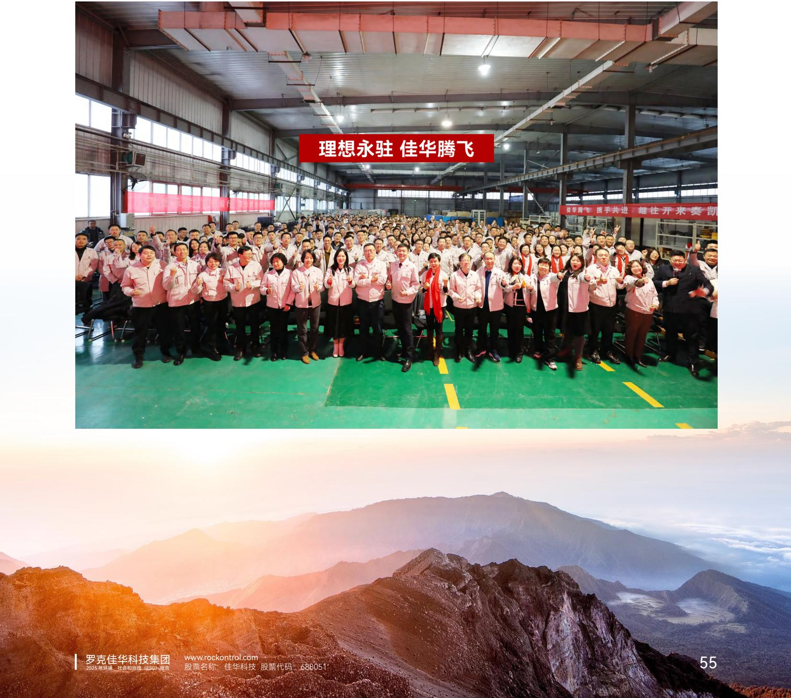

## 附录·术语解释

## ESG

由成立的风险管理团队构成，负责协助管理层制定政策、定义角色和职责、制定目标，负责度量风险和评估风险的界限，开展风险管理及内部风险信息系统的建设。负责监督业务内部控制的充分性，报告机制的准确性和完整性、对法律法规的合规性。

## 双碳

指“2030 年前碳达峰、2060 年前碳中和”，是国家提出的重大战略目标，旨在推动绿色低碳发展，应对全球气候变化。

## 温室气体（GHG）

指大气中能吸收地面反射的长波辐射，并重新发射辐射的一些气体，主要包括二氧化碳（CO₂）、甲烷（CH₄）、氧化亚氮（N ₂ O）等，本次报告中温室气体排放量以二氧化碳当量（tCO ₂ e）为核算单位。

## CCER

国家核证自愿减排量（Chinese Certified Emission Reduction）的缩写，指对我国境内可再生能源、林业碳汇、甲烷利用等项目的温室气体减排效果进行量化核证，并在国家温室气体自愿减排交易注册登记系统中登记的温室气体减排量。

## IFRS S2

国际可持续准则理事会（ISSB）发布的《气候相关披露准则》，旨在规范企业气候相关信息披露，提升气候相关信息的可比性与可信度。

## 数字碳表

佳华科技核心产品之一，通过数字化技术实现企业碳排放精准核算、减排潜力预测、碳足迹追溯等功能，助力企业实现碳管理数字化、精细化。

## 环保智云

佳华科技研发的 AI 环保智能体，融合大数据、AI、物联网等技术，实现污染物监测、成因分析、智慧执法等全流程升级，助力生态环境精准治理。

# 物联网大数据企业

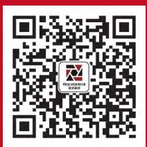

text_image

QR code with embedded logo and Chinese text '中国银行股份有限公司' in the center

官方微信

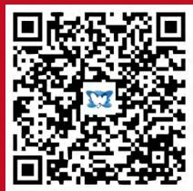

text_image

QR code with a central logo, likely linking to a digital resource or webpage.

关注双碳 加入微精灵

## 罗克佳华科技集团股份有限公司

RocKontrol Technology Group Co., Ltd.

联系电话：010-57230290

联系邮箱：rk@rockontrol.com

联系地址：北京市通州区观音庵南街2号院保利 大都汇T3栋14层