## 2025年度

## 环境、社会及公司治理(ESG)报告

江苏微导纳米科技股份有限公司

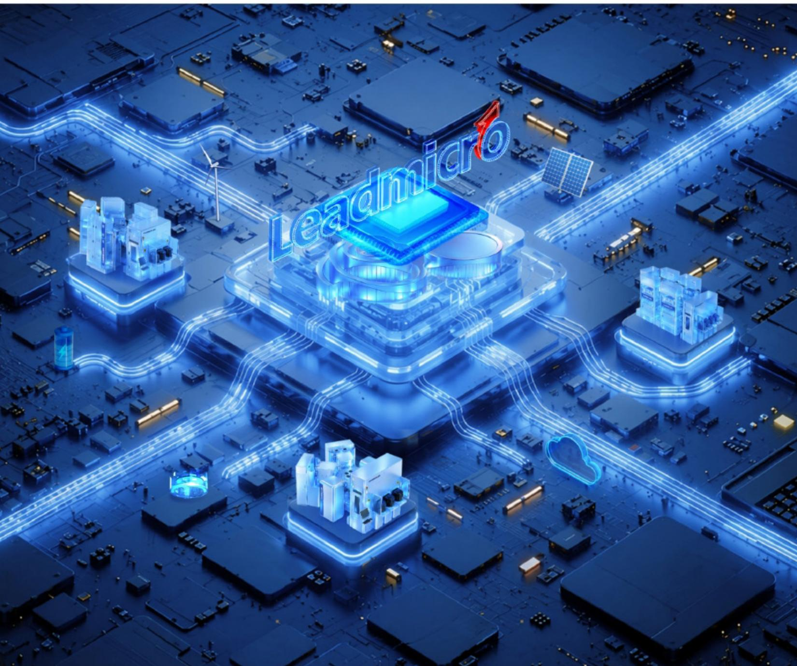

natural_image

Futuristic digital circuit board with glowing blue glowing nodes and 'Leadmicro' branding, no readable text or symbols beyond the logo.

## 目 录

## CONTENTS

关于本报告 04

领导致辞 06

关于我们 08

ESG 治理 20

附录 90

读者反馈 100

## G 治理 overnance

## 夯实

## 治理根基

治理架构 30

合规内控 34

知识产权 35

商业道德 38

信息安全 40

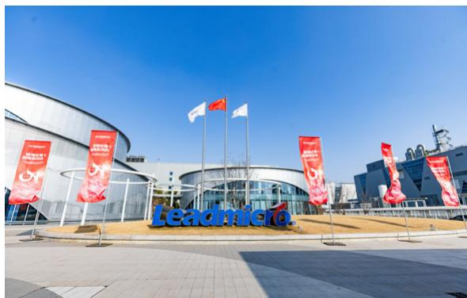

text_image

Leadmicro.

## S 社会ocial

## 共创

## 社会价值

产品与服务 44

韧性供应链 55

多元化与平等机会 57

人力资本与发展 59

职业健康安全 66

价值共创 71

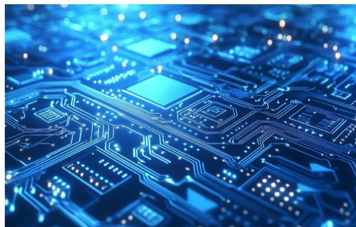

natural_image

Close-up of a glowing blue circuit board with integrated circuits and connectors (no visible text or symbols)

## E 环境 nvironmental

## 推动

## 绿色发展

环境管理 78

排放与废弃物管理 80

能源与资源管理 82

应对气候变化 88

natural_image

Lush green terraced hills with misty valleys and scattered trees, no visible text or symbols

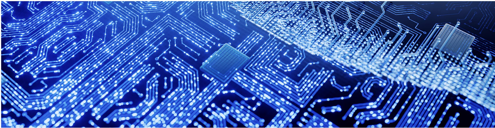

natural_image

Close-up of a blue printed circuit board with glowing traces and a central chip (no text or symbols visible)

## 关于本报告

本报告是江苏微导纳米科技股份有限公司（下称“微导纳米”“公司”或“我们”）发布的第二份环境、社会及公司治理（以下称“ESG”）报告（以下称“本报告”），旨在向各利益相关方披露公司在经营中对可持续发展议题所秉持的理念、建立的管理方法、推行的工作与达到的成效。

## 报告编制依据

本报告参考《上海证券交易所上市公司自律监管指引第14号—可持续发展报告（试行）》《上海证券交易所科创板上市公司自律监管指南第13号——可持续发展报告编制（2026年1月修订）》、全球可持续发展标准委员会(GlobaSustainability Standards Board,GSSB) 《可持续发展报告标准》(简称“GRI标准”）、联合国可持续发展目标(UnitedNations Sustainable Development Goals, UN SDGs)、气候相关财务信息披露工作组(TCFD) 《气候相关财务信息披露工作组建议》等相关标准、框架、原则编制。

natural_image

Pattern of evenly spaced dots in a row, no text or symbols present

## 报告范围①

本报告披露信息的范围涵盖江苏微导纳米科技股份有限公司。

## 报告时间范围

本报告为年度报告，报告时间范围为2025年1月1日至2025年12月31日。考虑到披露事项的连续性和可比性，部分内容或数据适当向前或向后延伸。

## 报告数据说明

报告中所披露的财务数据来自微导纳米2025年年度报告。相关数据与公司年度报告不符的，以年度报告为准。

## 发布周期与获取方式

本报告每年发布一次。本报告可在江苏微导纳米科技股份有限公司官方网站（https://www.leadmicro.com/）下载电子版。如您对本报告或公司的社会责任方面的表现有任何意见或建议，欢迎联系 0510-81975900。

①公司全资子公司微导纳米科技(武汉)有限责任公司于2025年12月22日成立，截至报告期末，尚未开展实质性经营业务，尚未有人员安排，因此暂未纳入报告边界中

## 领导致辞

当今时代，数字浪潮与绿色变革深度交织，半导体集成电路、先进封装与高效光伏等产业蓬勃兴起，高端微纳制造设备的基石地位愈加凸显。微导纳米自创立以来，始终扎根这一核心领域，将技术突破与绿色低碳、责任担当一道，融入企业发展的每一步进程。2025年，恰逢公司成立十周年、上市三周年。十年间，我们从原子层沉积（ALD）技术的早期探索出发，逐步建立起覆盖半导体与泛半导体领域的高端微纳装备制造能力。十年深耕，不仅夯实了技术根基与产业化经验，更使我们深切认识到：真正可持续的竞争力，源自对技术创新的专注、对绿色发展的坚守，以及对治理规范的敬畏。站在承前启后的关键节点，我们愈加笃定地锚定技术创新与可持续发展双轮驱动的长期主义路径。

过去一年，公司继续围绕原子层沉积（AID）、化学气相沉积（CVD）等核心工艺精进主业，在半导体集成电路、先进封装及高效光伏电池等关键环节，稳步推进技术迭代与量产验证，产品覆盖度与平台化能力持续增强。我们将质量、能效与环境影响三重考量前置到研发设计阶段，以持续加大的研发投入和严密的知识产权体系，构筑核心技术壁垒，亦为产业链的绿色升级贡献切实力量。

我们笃信，ESG的本质不在于报告篇幅，而在于经营章法。2025年，公司进一步将环境、社会及治理要求融入管理全流程：董事会层面明确ESG责任分工，业务单元层面形成执行闭环，供应链层面更新准入与评估标准。我们持续完善内控与合规机制，深化与投资者、客户的常态化沟通，以清晰的制度规范和透明的信息披露，构筑值得信赖的企业治理根基。在供应链环节，环境表现、劳工权益等关键指标逐步纳入合作考量的实质环节，通过系统培训与深度交流，推动上下游形成更具责任意识的工作方式，合力构建高效、透明目富有韧性的供应链生态。

我们始终坚信，装备制造的核心在于人。微纳量级的精度实现，归根结底依靠工程师的专注、技师的严谨和团队的高效协同，2025年，我们持续深化人才培养与组织建设：完善技术与管理双通道晋升休系，扩大核心骨于激励覆盖面，提升工作场所的安全与健康标准。我们致力营造的环境清晰而有力：让专注技术者有为，让踏实实干者有成。员工成长与企业长远发展，本就是同一命题的一体两面，这一认知贯穿于我们人力资源实践的始终。

绿色发展，首在筑牢自身根基，2025年，公司持续推进生产环节的节能降耗，水资源循环利用和废弃物规范处置，将能耗与环境指标纳入工厂运营考核体系。在产品研发端，我们紧密关注设备运行中的电力消耗、化学品使用等实际参数，着力在新一代薄膜沉积平台中实现更低功耗、更少物料的绿色设计目标。我们深知，微导纳米自身碳排放体量有限，然而作为客户产线的关键组成，设备能效将持续传导至整条产业链的碳足迹之中。这既是我们精进产品绿色性能的深层动力，亦是助力行业低碳转型的责任所在。

站在十年节点回望，微导纳米正步入厚积薄发的新阶段。我们已积累起扎实的技术储备与产业化基础。ESG理念日益融入公司治理与日常运营的肌理。我们深知，可持续发展从不是一句口号，而是一系列需要逐年推进，逐项生根的具体行动。我们将致力于提升治理效能、加速人才发展、优化产品能效、深化透明沟通，一步一个脚印，将可持续理念转化为可衡量的实践成果。

展望未来，我们将继续秉持长期主义与责任担当，坚持创新引领，稳健治理，以人为本，绿色发展，将可持续理念深度融入生产经营的每一个环节。我们愿与股东、客户、员工、供应商及社会各界携手同行，共同迈向更加绿色、高效、富有韧性且可持续发展的未来。

我们将与股东、客户、员工、供应商、合作伙伴及社会各界携手同行，共同迈向更加绿色、高效、韧性和可持续的未来。

江苏微导纳米科技股份有限公司总经理周仁

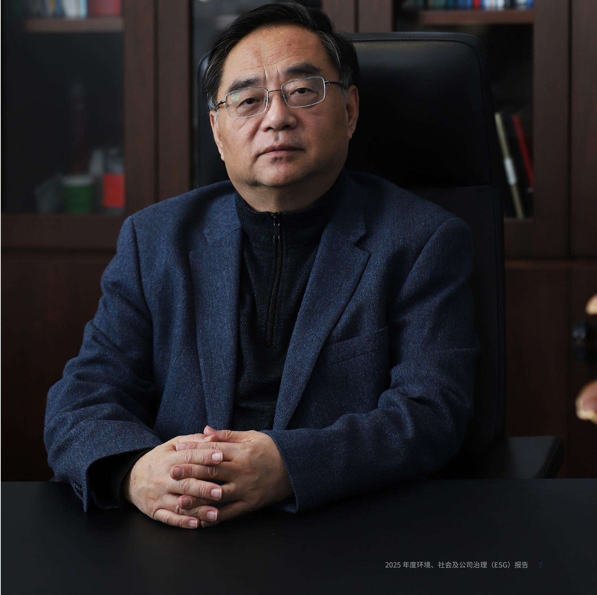

text_image

2025 年度环境、社会及公司治理（ESG）报告 7

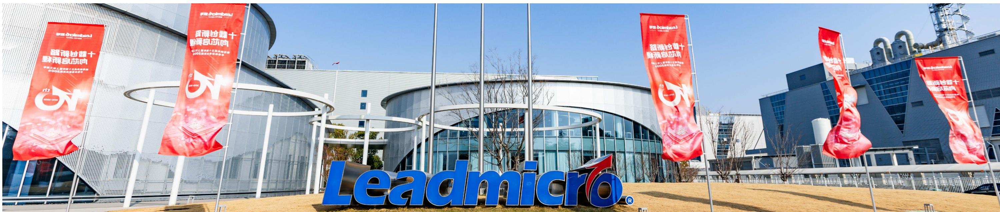

text_image

留浦哈普十
野演自我培训
LEAdmicro®

## 关于我们

江苏微导纳米科技股份有限公司成立于2015年12月，是一家面向全球的半导体、泛半导体高端微纳装备制造商。公司于2022年12月23日在上海证券交易所科创板上市，股票代码688147.SH。

## 我们的愿景、使命与核心价值观

## 愿景

成为世界级的

微纳技术解决

方案装备制造商

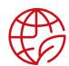

## 使命

创新驱动

引领未来

为客户创造价值

## 核心价值观

以客户为中心、艰苦奋斗

诚信务实、无私担责、全面创新

专注、极致、口碑、快

8.81 亿元

半导体设备收入

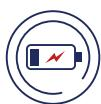

169.12%

半导体业务同比增长

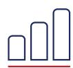

165.62%

半导体业务近四年复合增长

natural_image

Pattern of evenly spaced dots in a row, no text or symbols present

## 公司战略

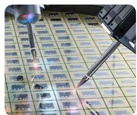

作为绿色家园的推动者，以及科技创新、自立自强的践行者，公司坚持全球化布局与多元化发展，通过构建以原子层沉积(ALD)技术为核心，化学气相沉积(CVD)等多种真空薄膜技术梯次发展的产品体系，依托创新中心平台，引领创新性应用，不断向各领域横向及纵深发展。通过自主创新，积极开发半导体、下一代光伏电池、固态电池、柔性电子等领域具有市场竞争力的产品。公司通过为客户提供一流技术，一流品质和一流服务，不断扩展市场占有率，打造高端装备制造商的优质品牌实现高端技术装备的国产化、产业化，针对新兴产业形成一整套技术解决方案，力争成为全球微纳制造装备领导者。

在半导体领域内，公司将利用现有的核心技术，持续拓展市场空间，保持在ALD和CVD等高端薄膜沉积设备市场的竞争优势。公司将瞄准国内外半导体先进技术和工艺的发展方向，构建和完善ALD、CV等多种先进真空技术平台，持续丰富产品矩阵，满足客户新器件、新架构、新材料的工艺需求，提供多场景全方位解决方案，覆盖逻辑、存储、先进封装、化合物半导体、新型显示等细分应用领域，满足国内先进半导体下一代技术迭代的需求，从而占据技术的最前沿，引领行业创新发展。

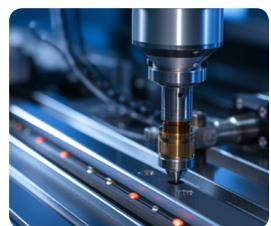

在光伏领域内，公司将紧跟下游行业电池技术迭代和扩产的发展趋势，充分发挥ALD.CVD等多种先进真空技术平台的优势，横向拓宽产品线，提高市场覆盖率，为客户提供ALD、PEALD、PECVD、LPCVD、PVD、扩散等配套产品，定位于新型高效电池工艺整线设备供应商，从而抓住当前行业发展机遇，储备未来增长点，稳固自身在光伏领域薄膜沉积设备市场的领先地位

其他新兴行业如新能源，光学、显示等领域内，依托公司创新中心行业拓展的战略部署，加快产品布局和规划，持续进行新技术及新应用的开发，并进入新市场领域，不断推出引领行业的创新型产品，推进产业化验证和应用。通过多领域市场空间的拓展，降低了单一细分领域周期性波动带来的影响。

## 发展历程

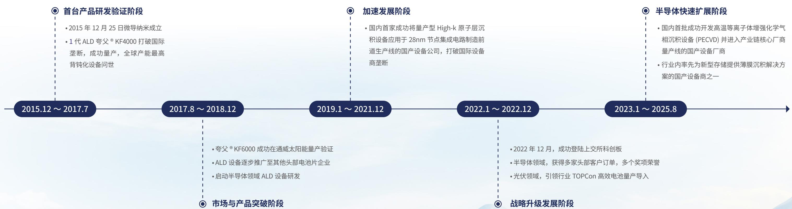

flowchart

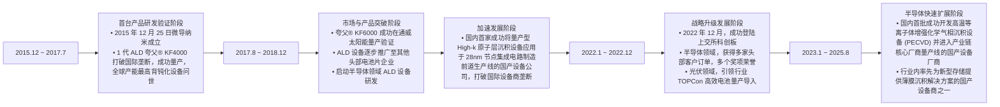

## 业务范围

作为一家面向全球的半导体、泛半导体高端微纳装备制造商，公司形成了以原子层沉积（ALD）技术为核心，化学气相沉积(CVD）等多种真空薄膜技术梯次发展的产品体系，专注于先进微米级、纳米级薄膜设备的研发、生产与销售，向下游半导体、泛半导体客户提供尖端薄膜设备、配套产品及服务。

作为国家高新技术企业，公司先后荣获工信部“专精特新”小巨人企业、国家知识产权优势企业、苏南国家自主创新示范区独角兽企业、江苏省小巨人企业（制造类）等称号。公司拥有七个国家级、省级研发平台，包括国家博士后科研工作站、江苏省原子层沉积技术工程技术研究中心、江苏省原子层沉积技术工程研究中心、江苏省省级企业技术中心、江苏省外国专家工作室等，并承担了多项国家、省级重大科技专项。

公司以“创新驱动，引领未来，为客户创造价值”为使命，不断引领行业技术创新，成立至今已开发多款高端薄膜沉积设备并成功实现产业化。公司iTomic HiK 系列半导体 AID 设备和 KF 系列光伏 ALD 设备入选江苏省首台（套）重大装备产品目录，iTronix系列半导体 CVD 设备入选江苏省“两新”技术产品，多款半导体设备荣获“中国半导体创新产品和技术奖”及“集成电路产业技术创新奖”。

## 半导体

公司是国内首家成功将量产型 High-k 原子层沉积设备（ALD）应用于集成电路制造前道生产线的国产设备厂商，是国内首批成功开发并进入产业链核心厂商量产线的硬掩模化学气相沉积设备(CVD)国产厂商，也是行业内率先为新型存储提供薄膜沉积技术支持的设备厂商之一。目前公司已与国内多家厂商建立了深度合作关系，产品已广泛应用于逻辑存储、先进封装、化合物半导体、新型显示（硅基OLED等）等诸多细分应用领域，多项设备关键指标达到国际先进水平，能够满足国内客户当前技术的需求以及未来技术更迭的需要。

## 半导体领域代表产品② / ③

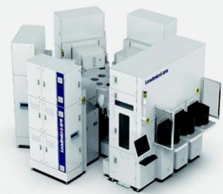

natural_image

Exterior view of a modern industrial machine with multiple control units (no visible text or symbols)

iTomic HiK 系列原子层沉积系统

半导体领域 ALD设备，适用于高介电常数（High-k）栅氧层、N/P-MOS Dipole、MIM 电容器层等薄膜工艺需求

产业化应用  
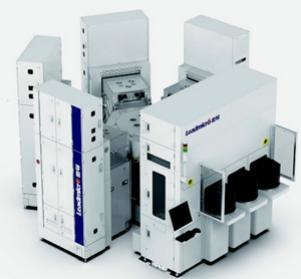

natural_image

Exterior view of a modern industrial machine with multiple control units (no visible text or symbols)

iTomic MeT 系列原子层沉积系统

半导体领域ALD设备，适用于栅极金属、MIM金属电极、扩散阻挡层等关键工艺

产业化应用  
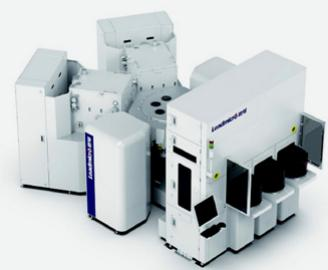

natural_image

Exterior view of a large industrial machine with multiple white components and control panels (no visible text or symbols)

iTomic MW 系列原子层沉积系统

半导体领域ALD设备，每个工艺腔可一次处理25片12英寸晶圆，适用于成膜速率低，厚度厚，以及产能要求高的关键工艺及应用

产业化应用  
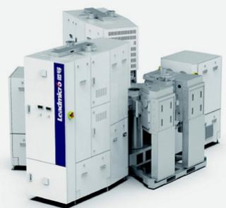

natural_image

Industrial machine with multiple control units and a blue label reading 'LoamMicro.exe' (no visible text on main components)

iTomic Lite 系列 轻型原子层沉积系统

半导体领域ALD设备，可满足6、8英寸晶圆制造量产工艺需求，同时也可满足客户高端研发和新工艺试量产需求

产业化应用  
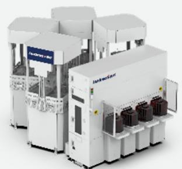

natural_image

Industrial machine with multiple white and gray units, no visible text or symbols

iTomic PE 系列 等离子体增强原子层沉积系统

半导体领域PEALD设备，可为逻辑芯片、存储芯片、先进封装等提供掩膜层、介质层、图案化等关键工艺解决方案

产业化应用  
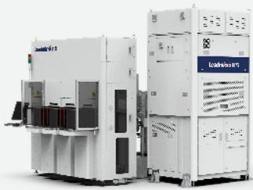

natural_image

Exterior view of two industrial automation units, one with control panel and one with control panel (no visible text or symbols)

iTomic SPX 系列空间型原子层沉积系统

半导体领域空间型ALD设备，可单批次处理多片晶圆，前驱体空间独立，颗粒表现优越，节省化学源消耗，提升产能

产业化验证  
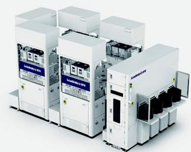

natural_image

Industrial machine assembly with multiple control panels and control boxes (no visible text or symbols)

iTronix MTP 系列等离子体增强化学气相沉积系统

半导体领域 PECVD设备，可在多种温度，尤其是高温工艺条件下沉积的具有高硬度和高刻蚀比等特性的含碳介电层薄膜，为逻辑和存储等领域芯片制造提供特殊工艺及解决方案

产业化应用  
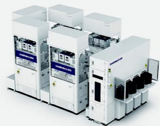

natural_image

Exterior view of a modern industrial machine with multiple control panels and control units (no visible text or symbols)

iTronix PE 系列  
等离子体增强化学气相沉积系统

半导体领域 PECVD 设备，可沉积 SiO 、SiN、SiON、SiCN、a-Si等不同种类薄膜，涵盖的工艺温度范围 200\~700℃

产业化验证  
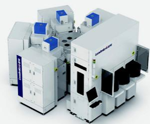

natural_image

Industrial laboratory equipment with multiple white and blue components, no visible text or symbols

iTronix LP 系列低压化学气相沉积系统

半导体领域LPCVD设备可满足 SiGe、 -Si、doped a-Si、monocrystal-Si 等薄膜沉积工艺的开发和量产需求

产业化验证  
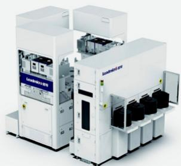

natural_image

Industrial machine with white and black components, no visible text or symbols

iTronix LTP 系列 低温等离子体增强化学气相沉积系统

半导体领域 PECVD设备，可为先进封装制造领域提供薄膜沉积解决方案，满足SiO₂、SiN、SiCN 等薄膜工艺的应用需求

开发实现  
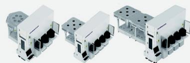  
Trancendor 系列晶圆真空传输系统

公司针对不同处理站的工艺腔独立研发的、适用于高产能半导体制程设备的晶圆传输系统

产业化应用

随着公司产品种类的不断丰富，公司持续完善产品型号命名规则；  
③产业化应用是指已实现销售，产业化验证是指已签署合同并正在履行，开发实现是指已形成研发样机，虽未与客户签署销售合同但已进行试样验证，下同。

## 光伏

公司作为率先将ALD技术规模化应用于国内光伏电池生产的企业，已成为行业内提供高效电池技术与设备的领军者之一，与国内头部光伏厂商形成了长期合作伙伴关系。同时，公司跟随下游厂商的量产节奏，持续优化XBC、HJT、钙钛矿、钙钛矿叠层电池等新一代高效电池技术，引领光伏行业技术迭代。根据公开的市场数据统计，公司ALD产品已连续多年在营收规模、订单总量和市场占有率方面位居国内同类企业第一。

## 光伏领域代表产品

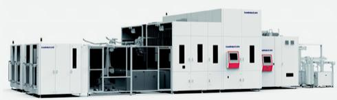

## 夸父（KF）系列

## 批量式 ALD 系统

光伏领域ALD设备，可用于PERC、TOPCon、XBC、HJT、钙钛矿等光伏电池技术路线

产业化应用

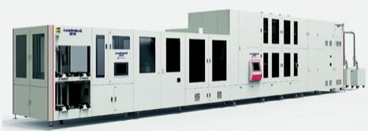

natural_image

Industrial machine with multiple control panels and control panel (no visible text or symbols)

## 祝融（ZR）管式PECVD系统

## PEALD/PECVD 集成系统

光 伏 领 域 PECVD/PEALD 设 备， 可 用 于 PERC、XBC、TOPCon、HJT 等技术路线

产业化应用

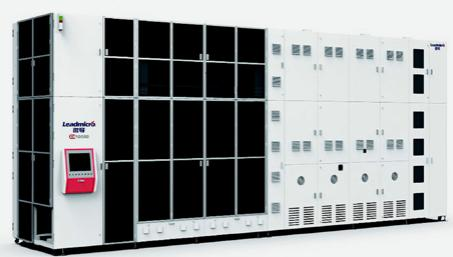

natural_image

Exterior view of a large industrial control unit with multiple panels and control buttons (no visible text or symbols)

## 羲和（XH）系列

## 高温低压系统

光伏领域扩散/退火设备，兼容磷、硼两种扩散工艺，同时提供退火，氧化和|PCVD功能

产业化应用

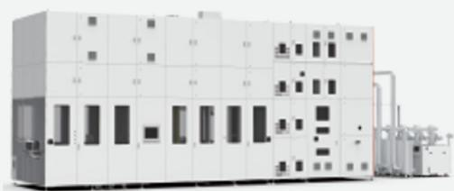

natural_image

Exterior view of a large industrial control room with multiple panels and piping (no visible text or symbols)

## 精卫（JW）系列

## 管式边缘钝化系列

光伏领域ALD设备，通过制备Al₂O₃钝化膜实现电池切割面钝化，进一步提高 TOPCon 等高效电池的效率

产业化验证

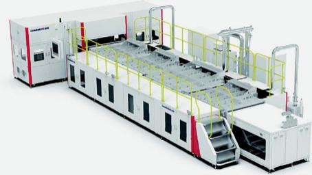

natural_image

Industrial machine assembly with control panel and conveyor systems (no visible text or symbols)

## 后羿（HY）系列

## 板式ALD系统

光伏领域空间型ALD设备，适用于正式或反式、单结或叠层的钙钛矿光伏电池技术路线

产业化应用

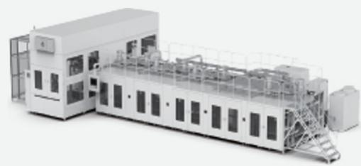

natural_image

Industrial factory machine with control panel and conveyor systems (no visible text or symbols)

## SuiR EVA 系列

## 卧式蒸镀系统

光伏领域PVD设备，适用于制备钙钛矿电子传输层、钝化层等功能薄膜，技术与设备指标达到国内一流水平

产业化验证

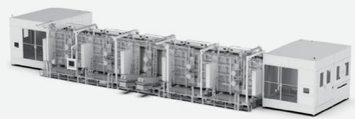

natural_image

Industrial machinery assembly line with multiple cylindrical tanks and piping (no visible text or labels)

## SuiR MS 系列

## 立式磁控溅射系统

光伏领域PVD设备，针对钙钛矿太阳能电池器件开发的空穴传输层制备工艺，也可用于钝化层、电极层的制备工艺技术与设备指标达到国内一流水平

产业化验证

## 其他新兴应用领域主要产品

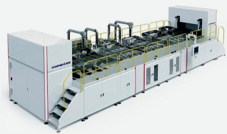

natural_image

Industrial machinery system with robotic arms and control panels (no visible text or symbols)

## iSparol 系列

## 卷对卷ALD系统

柔性电子领域卷对卷AID镀膜平台，适配于大面积柔性衬底实现连续卷对卷镀膜

产业化应用

除上述专用设备外，公司还为客户提供配套产品及服务，主要包括设备改造、备品备件及其他两类业务。

设备改造。公司的设备采用模块化设计，公司可以针对市场需求和技术发展趋势，为已销售的在役设备提供改造服务，以帮助下游客户用较少的成本达到降本增效的效果，提高设备服役年限。公司目前的设备改造集中在光伏领域设备，设备改造的内容主要包括尺寸改造、工艺改造等。  
备品备件及其他。公司设备在运行过程中，部分零部件会出现正常损耗，因此下游客户需向公司采购易损耗的零部件。公司还针对设备提供载具清洗、耗材更换等后续服务。

natural_image

Close-up of a blue printed circuit board with glowing traces and circuit components (no visible text or symbols)

全球布局  
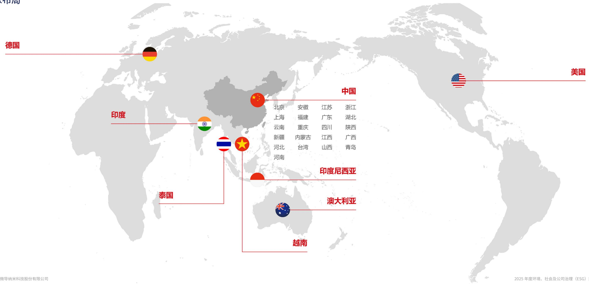

text_image

德邦
德国
美国
中国
北京	安徽	江苏	浙江
上海	福建	广东	湖北
云南	重庆	四川	陕西
新疆	内蒙古	江西	广西
河北	台湾	山西	青岛
河南
印度尼西亚
泰国
澳大利亚
越南
2025年度环境、社会及公司治理（ESG）

## 年度社会认可

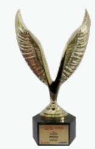  
上证鹰·金质量科技创新奖

微导纳米

上海证券报

  
通力合作奖

微导纳米

通威太阳能

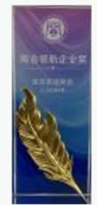  
商会领航企业奖

微导纳米

无锡市新吴区旺庄街道商会

  
全球合作伙伴&卓越企业奖

微导纳米

第八届中国国际光伏与储能产业大会

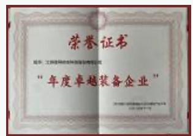  
2025·湾芯奖技术创新奖·技术领先企业

微导纳米

湾区半导体产业生态博览会（湾芯展）组委会

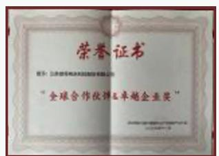  
年度卓越装备企业

微导纳米

第八届中国国际光伏与储能产业大会

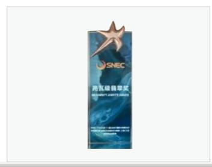

text_image

SNEC
海氧级硅基聚醚
SHENQI SHI YUAN ZHONG
2018.12.15

兆瓦级翡翠奖

微导纳米 极致美观无绕镀边缘钝化新技术与装备

第十八届国际太阳能光伏和智慧能源&储能及电池技术与装备（上海)大会暨展览会组委会

  
2025年度江苏省绿色工厂

微导纳米

江苏省工业和信息化厅

  
2025年江苏省先进级智能工厂

微导纳米基于原子层沉积（ALD）技术的智能工厂

江苏省工业和信息化厅

  
上交所信息披露最高评价“A”级

微导纳米

上海证券交易所

  
江苏省高新技术企业

微导纳米

全国高新技术企业认定管理工作领导小组办公室

  
2025 年江苏省“两新”技术产品

微导纳米iTronix系列等离子体化学气相沉积系统

江苏省工业和信息化厅

  
无锡市半导体薄膜沉积技术重点实验室

微导纳米

无锡市科技局

Leadmicko

## ESG 治理

ESG 治理

利益相关方沟通

重要性议题评估

回应联合国可持续发展目标

## ESG 治理

## ESG治理架构

公司高度重视ESG管理工作，将可持续发展理念深度融入企业战略规划与日常运营中。为系统推进ESG实践、提升信息披露质量与透明度，并有效识别、管理与应对相关风险和机遇，公司自上而下建立了健全的“决策层-管理层-执行层”三层级ESG管理架构。该架构确保ESG事务贯穿战略决策、运营执行与绩效评估全过程，与公司现有治理体系实现有机融合，体现董事会层面的战略引领、管理层的统筹协调以及执行层的落地落实。

## 决策

董事会作为公司最高治理机构，对可持续发展事务承担最终监督与领导责任。董事会下设战略委员会，专责公司可持续发展相关工作的统筹规划与决策指导，具体职责包括：

1）了解、分析和掌握国际国内行业现状及可持续发展相关政策，全面掌握公司经营管理情况；  
2）监督公司可持续发展相关影响、风险和机遇的评估工作；  
3）指导并审阅公司可持续发展方针、战略及目标；  
4)审批公司《可持续发展报告》；  
5) 对可持续发展相关工作执行情况进行监督检查，并适时提出指导意见；

## 管理

公司组建由董事会委托总经理办公室领导的ESG工作小组，成员涵盖公司各相关部门负责人。该小组专门负责ESG日常管理工作，对重大ESG议题的工作目标设定、信息披露、对外报告等进行讨论、评估与审批。其职责范围包括但不限于：对公司环境与社会事宜实施监管，包括优先次序厘定、风险识别与管理、绩效监督与检讨等，从而为企业可持续发展提供方向指引与执行支撑。

## 执行

各业务单元及职能部门负责具体执行公司ESG政策与措施，并承担公司内所有ESG相关定量与定性信息的收集、统计、汇总、上报及存档工作，确保数据的真实性、准确性、完整性和及时性。

展望未来，公司将继续深化ESG各项工作，对标国内外优秀实践，将《可持续发展报告》作为检视管理水平、驱动持续改进的重要工具，积极把握可持续发展机遇，实现经济、社会与环境价值的统一，为公司高质量发展提供坚实保障。

## 利益相关方沟通

公司高度重视利益相关方沟通与参与，将其视为ESG治理体系的核心要素之一。通过系统化、常态化的沟通机制。公司深入了解各方期望与诉求，及时回应关切，并将相关反馈有效融入可持续发展战略制定、重要性议题评估及运营决策过程

公司环境、社会与治理的主要利益相关方包括政府及监管机构、股东及投资者、客户、员工、供应商或其他商业合作伙伴、社区与公众、媒体或行业协会。公司构建“线上+线下”相结合的立体化互动体系，增进各方对公司发展战略与运营方针的理解，同时为利益相关方提供便捷的建议反馈途径。

<table><tr><td>利益相关方</td><td>关注议题</td><td>沟通与回应</td></tr><tr><td>政府及监管机构</td><td>·循环经济·创新驱动</td><td>·实施废弃物资源化与循环经济·加大研发投入与技术交流</td></tr><tr><td>股东及投资者</td><td>·反商业贿赂及反贪污·反不正当竞争·利益相关方沟通</td><td>·强化治理与内部控制·构建“线上+线下”常态化沟通机制·及时公开披露信息并开展投资者交流·平等对待所有股东</td></tr><tr><td>客户</td><td>·产品和服务安全与质量·商业道德·数据安全与客户隐私保护·反商业贿赂及反贪污·反不正当竞争</td><td>·加强产品质量与安全管理·强化治理与内部控制·落实数据安全与隐私保护措施·完善反商业贿赂及反贪污内控制度·持续开展全员合规培训与审计·严格执行反不正当政策·开展客户满意度调查并改进服务</td></tr><tr><td>员工</td><td>·员工权益与福利·职业健康安全</td><td>·提供多层次培训与职业发展通道·优化薪酬福利与人文关怀·实施职业健康安全管理体系</td></tr><tr><td>供应商或其他商业合作伙伴</td><td>·反商业贿赂及反贪污·数据安全与客户隐私保护·商业道德·产品和服务安全与质量</td><td>·强化治理与内部控制·完善反商业贿赂及反贪污内控制度·持续开展全员合规培训与审计·落实数据安全与隐私保护措施·加强产品质量与安全管理</td></tr><tr><td>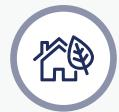社区与公众</td><td>·乡村振兴·社会贡献</td><td>·开展乡村振兴与公益项目·优先本地化用工与采购·积极履行社会责任回馈社会</td></tr><tr><td>媒体或行业协会</td><td>·反商业贿赂及反贪污·数据安全与客户隐私保护·产品和服务安全与质量</td><td>·完善反商业贿赂及反贪污内控制度·持续开展全员合规培训与审计·落实数据安全与隐私保护措施·加强产品质量与安全管理</td></tr><tr><td>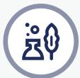环境</td><td>·应对气候变化·污染物排放·环境合规管理·水资源利用·能源利用·废弃物处理·生态系统与生物多样性保护·循环经济</td><td>·制定应对气候变化行动方案·加强污染物排放监测与治理·推动能源与水资源高效利用·实施废弃物资源化与循环经济·开展生态保护</td></tr></table>

## 重要性议题评估

重要性议题评估是识别公司ESG管理工作的重要环节，有助于公司聚焦关键领域，明确ESG战略规划方向与工作重点。公司参考《上海证券交易所上市公司自律监管指引第14号—可持续发展报告（试行)》及《GRI3：实质性议题2021》等标准要求。通过以下流程开展可持续发展议题的双重重要性评估与分析

## 了解背景

·分析公司内部活动与价值链上下游可持续影响；  
• 了解外部客观环境，涵盖 2025 年度宏观政策、半导体及光伏等产业政策、监管要求与行业热点；  
• 梳理主要利益相关方。

## 建立议题清单

在《上海上海证券交易所上市公司自律监管指引第14号—可持续发展报告（试行）》设置的21项议题基础上，结合公司战略、行业特性、监管政策及同业实践，增补特定议题，最终形成共计25项议题清单。

## 议题双重重要性评估

  
影响重要性评估

通过访谈与问卷调查，收集利益相关方对议题重要程度（对利益相关方的影响）的评分，形成评估结果

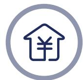  
财务重要性评估

邀请公司高层管理团队，从重要程度、影响性质（机遇/挑战)、影响发生周期、财务影响程度及不可补救/逆转程度维度进行评分，形成评估结果

## 议题确定

·综合影响重要性与财务重要性评估结果，设定重要性阈值标准，形成双重重要性议题分析矩阵并界定披露边界  
·最终清单经由公司ESG决策及管理层确认，对高度重要性议题在本报告中重点披露

重要性议题矩阵  
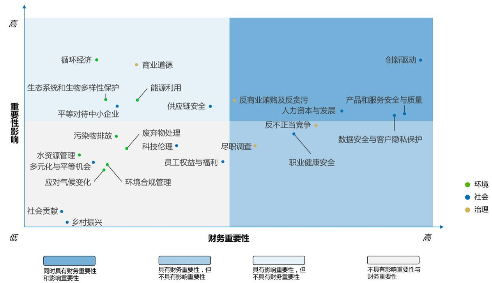

scatter

| Topic | Sector | Financial Importance (Relative) | Impact on Economy (Relative) |
| :--- | :--- | :--- | :--- |
| 创新驱动 | 社会 | High | High |
| 产品和服务安全与质量 | 社会 | High | High |
| 人力资源资本与发展 | 社会 | High | High |
| 数据安全与客户隐私保护 | 社会 | High | High |
| 职业健康安全 | 社会 | High | Medium-High |
| 反不正当竞争 | 治理 | High | Medium-High |
| 再商贿赂及反贪污 | 治理 | High | Medium-High |
| 应对气候变化 | 环境合规管理 | Low-Medium | Low-Medium |
| 员工权益与福利 | 社会 | Low-Medium | Low-Medium |
| 废弃物处理科技伦理 | 社会 | Low-Medium | Low-Medium |
| 污染物排放 | 环境 | Low-Medium | Low-Medium |
| 生态系统和生物多样性保护 | 社会 | Low-Medium | Medium-High |
| 平等对待中小企业 | 社会 | Low-Medium | Medium-High |
| 供应链安全 | 社会 | Medium-High | Medium-High |
| 能源利用 | 环境 | Medium-High | Medium-High |
| 商业道德 | 治理 | Medium-High | High |
| 循环经济 | 环境 | Low-Medium | High |
| 水资源管理多元化与平等机会 | 社会 | Low-Medium | Low-Medium |
| 社会贡献 | 社会 | Low | Low |
| 乡村振兴 | 社会 | Low | Low |
| 尽职调查 | 治理 | Medium-High | Low-Medium |

## 回应联合国可持续发展目标

## 目标4：

## 优质教育

构建多层次人才培养和终身学习机制

公司建立系统化培训体系，覆盖新员工培养、专业技能提升、管理赋能和合规培训，并持续推进校企合作、产学研协同及博士后联合培养，促进人才成长与知识共享。

## 目标3：

## 良好健康与福祉

持续提升员工职业健康安全与福祉保障水平

公司建立职业健康安全管理体系，持续开展安全培训、应急演练、职业健康体检及员工关怀活动，保障安全、健康的工作环境。

## 目标8：

## 体面工作和经济增长

保障合规用工，促进员工发展与企业稳健成长

公司严格遵守劳动法律法规，完善招聘、培养、晋升、绩效与激励机制，关注员工权益保护与职业发展，推动实现员工成长与企业发展的协同共进。

## 目标5：

## 性别平等

营造公平、包容、无歧视的职场环境

公司坚持公平招聘、同工同酬和平等晋升原则，保障女性员工在育儿假、哺乳假等方面的合法权益，推动建设多元包容的职场文化。

## 目标7：

## 经济适用的清洁能源

推动能源结构优化与清洁能源利用

公司推进能源管理体系建设，通过屋顶光伏、储能配置及绿色电力使用等举措，持续提升可再生能源利用水平和能源使用效率。

## 目标12：

## 负责任消费和生产

推进绿色制造、资源高效利用和责任供应链建设

公司持续完善产品质量与安全管理、环境与有害物质管控、责任采购、废弃物管理、节能降耗和精益生产机制，推动形成更规范、更绿色、更高效的生产运营模式

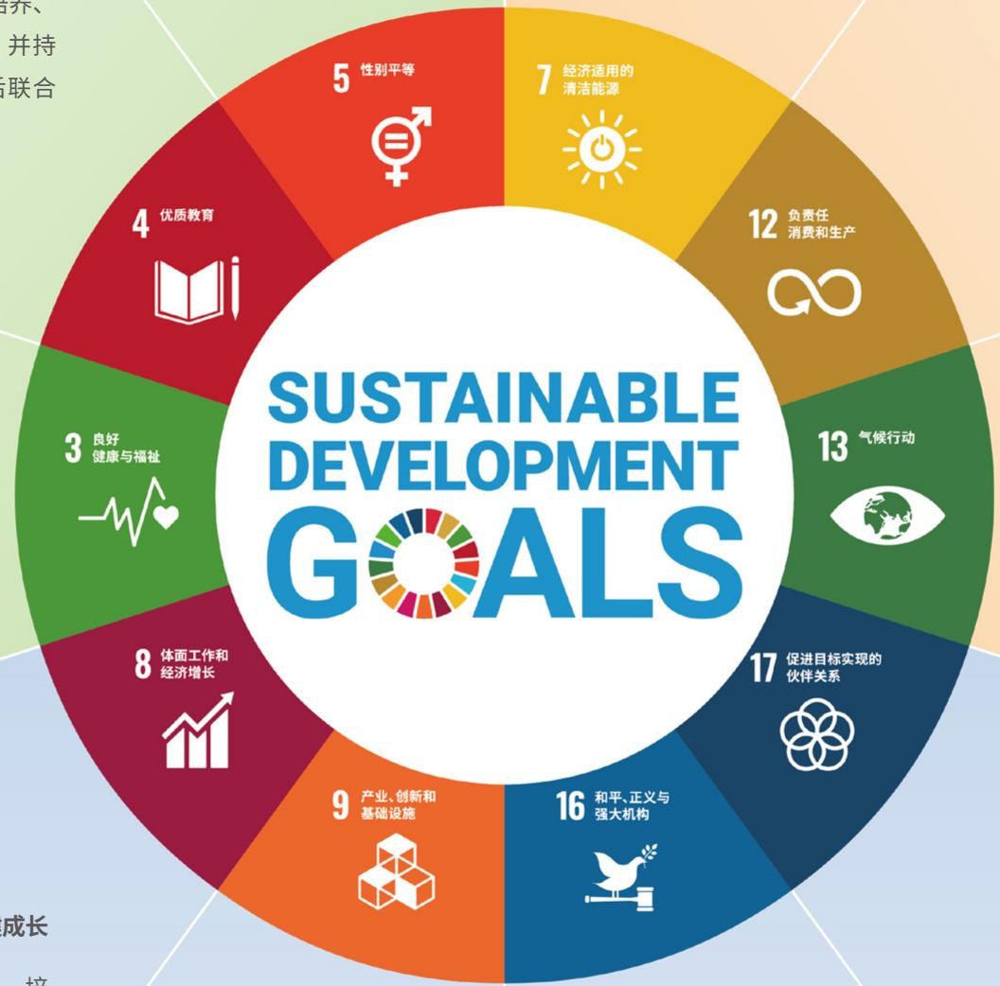

donut

| Goal ID | Category |
| --- | --- |
| 5 | 性别平等 |
| 4 | 优质教育 |
| 3 | 良好健康与福祉 |
| 8 | 体面工作和经济增长 |
| 9 | 产业、创新和基础设施 |
| 16 | 和平、正义与强大机构 |
| 17 | 促进目标实现的伙伴关系 |
| 13 | 气候行动 |
| 12 | 负责任消费和生产 |

## 目标9:

## 产业、创新和基础设施

坚持科技创新驱动，提升高端装备研发与产业化能力

公司以 ALD 技术为核心，持续推进 CVD 等多种真空薄膜技术发展，强化研发投入、知识产权管理、创新文化建设和产业化应用，助力高端装备国产化与行业技术进步。

## 目标16：

## 和平、正义与强大机构

完善公司治理，强化合规经营与商业道德建设

公司持续健全治理架构、ESG管理机制合规内控、反贪腐、信息安全和信息披露体系，努力提升治理透明度、合规水平和风险管理能力。

## 目标13：

## 气候行动

强化气候风险应对与低碳运营能力

公司持续开展温室气体排放核算、节能减排、能源结构优化和气候相关管理工作，并将绿色低碳要求融入环境管理与运营实践。

## 目标17:

## 促进目标实现的伙伴关系

深化产业链、学术界和行业组织协同合作

公司积极参与行业联盟、标准制定和技术交流，推进供应商赋能、产学研合作与多方协同，携手合作伙伴共同推动产业高质量可持续发展。

## 夯实治理根基

治理架构

合规内控

知识产权

商业道德

信息安全

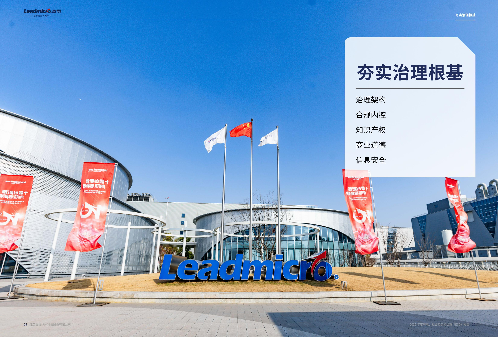

text_image

Leadmicro®
2025年度环境、社会及公司治理（ESG）推广
夯实治理根基
治理架构
合规内控
知识产权
商业道德
信息安全
Leadmicro®
江苏致导纳米科技股份有限公司

## 夯实治理根基

## 治理架构

公司严格遵循《中华人民共和国公司法》《中华人民共和国证券法》《上市公司治理准则》《上海证券交易所股票上市规则》《上海证券交易所科创板上市公司自律监管指引第1号—规范运作》等法律法规及《公司章程》相关规定，建立健全完善的公司治理架构，形成权力机构、决策机构、监督机构和管理层之间权责明确、运作规范的相互协调与相互制衡机制。

报告期内，为贯彻落实《中华人民共和国公司法》《上市公司章程指引》《关于新<公司法>配套制度规则实施相关过渡期安排》等相关法律法规和规范性文件规定，进一步完善公司法人治理结构、提升公司规范运作水平，结合公司实际情况，公司对公司治理架构进行调整，取消监事会设置，由董事会审计委员会履行《公司法》规定的监事会职权，有效提升公司可持续健康发展和管理运作水平。

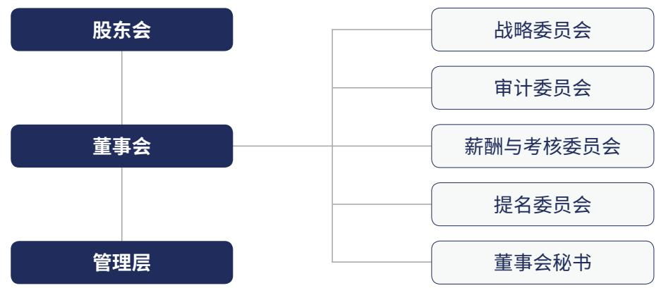

flowchart

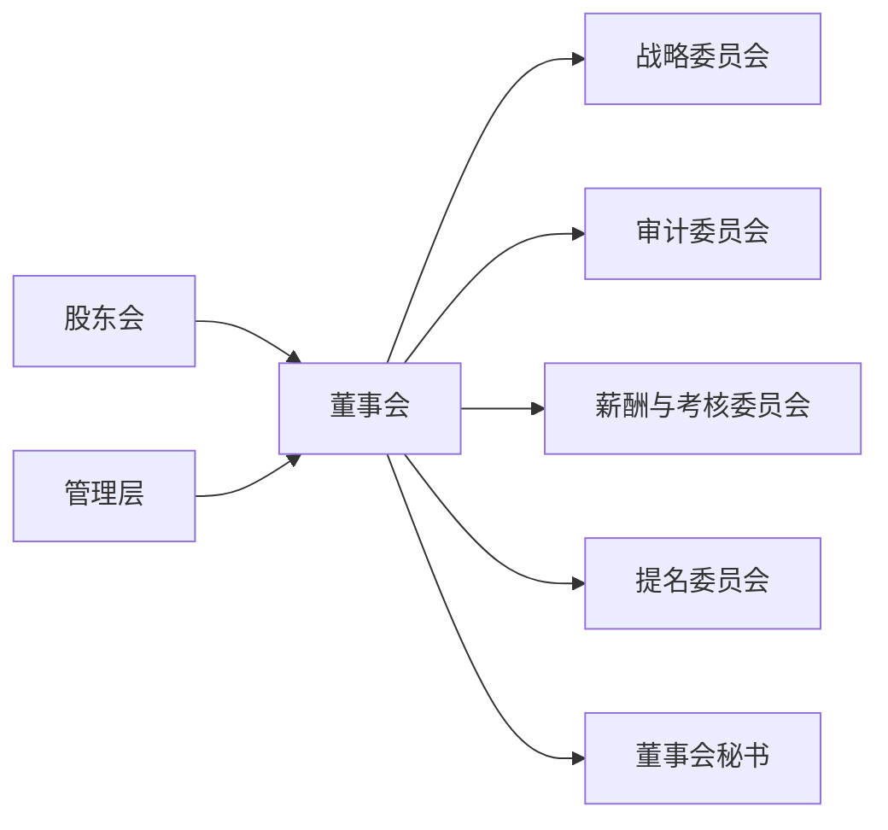

报告期内，公司顺利完成了董事会换届及新一届高级管理人员的聘任工作，并在董事会中设立职工代表董事，持续优化董事会组成结构，增强董事会决策的科学性与准确性。现有董事会由6名董事组成，其中独立董事2名，职工代表董事1名，其他非独立董事3名。

现有董事会由组成

6 名

其中独立董事

2名

职工代表董事

1名

其他非独立董事

3名

natural_image

Line drawing of a person reading a book, no text or symbols present

## “两会”运作情况

股东会会议

5 次

董事会会议

11次

独立董事专门会议

4次

## 专门委员会运作情况

战略委员会会议

5 次

审计委员会会议

11次

薪酬与考核委员会会议

3次

提名委员会会议

4次

natural_image

Line drawing of a woman reading a book, no text or symbols present

2025年6月，公司实施了2024年度权益分配，向股东每10股派发0.44元现金红利。总计2.012.79万元。同时，提质增效重回报行动方案纵深推进，2025年度，公司披露了《2024年度“提质增效重回报”行动方案》及《2025年度“提质增效重回报”行动方案的半年度评估报告》，推动公司通过聚焦本行业、科技创新、依法合规运作、提高信息披露质量、加强投资者沟通、持续稳定分红政策等措施提升经营质量和投资价值。并持续评估执行效果，有效实现了公司价值提升可操作、可追溯、可调节。

报告期内，公司向不特定对象发行可转换公司债券，成功募集资金11.7亿元，执行效率高、核心条款设计合理，契合公司战略发展。资金全部投向公司核心的半导体薄膜沉积设备生产和研发，增强了市场对慕资项目前景和公司成长性的信心。

## 董事会独立性

报告期内，公司持续深化董事会独立性建设，不断完善内部控制体系与公司治理结构。在严格遵循《国务院办公厅关于上市公司独立董事制度改革的意见》《上市公司独立董事管理办法》等最新监管要求的基础上，公司紧密跟踪新《公司法》及配套规则的变化，对现有治理制度进行了系统性梳理与全面升级，在原有基础上进一步细化独立董事专门会议机制，完善专门委员会的职责边界与议事规则，持续推动规范化治理框架的完善。

## 投资者关系管理

公司持续秉持公开、透明、规范的投资者关系管理理念，严格遵循《中华人民共和国公司法》《中华人民共和国证券法》及《上市公司投资者关系管理指引》等相关法律法规要求，同时依照《江苏微导纳米科技股份有限公司投资者关系管理制度》等内部制度，以多元、专业及高效的沟通方式持续深化与投资者的双向互动，推动公司价值在资本市场的充分展现。

报告期内，公司围绕定期报告发布时间节点，持续开展多场次、体系化的业绩说明活动，确保投资者及时获取公司经营表现、财务成果及关键事项的权威信息。

## 2025.5.9

公司通过上交所上证路演中心召开“2024年度暨2025年第一季度业绩说明会”，就年度及季度经营情况与投资者深入交流，并在信息披露许可范围内回应了市场普遍关注的问题。

## 2025.9.10

公司参与“2025年半年度科创板半导体设备及材料行业集体业绩说明会”，详细介绍公司2025年半年度的经营与财务状况。

## 2025.11.4

公司参加“2025无锡上市公司投资者集体接待日活动暨2025年第三季度业绩说明会”，进一步强化与投资者的互动沟通。

公司不断丰富与投资者沟通的方式和场景，完善“线上+线下”立体化的互动网络，使不同类型投资者均可便捷地获取公司信息。我们持续拓展线下深度沟通场景，包括但不限于路演交流、策略会、机构实地调研、投资者开放日等形式；我们也不断优化线上多触点响应体系包括价值在线路演平台、上证e互动、投资者关系专线、投资者关系电子邮箱等全渠道响应体系，确保信息咨询高效、及时、可追溯。

## “投资者走进微导纳米”参访活动

2025年，公司特别组织了“投资者走进微导纳米”参访活动，邀请多位中小投资者深入公司一线场景，包括工艺流程、设备调试、研发平台等实际作业环境，全面展示公司在高端薄膜沉积设备领域的技术能力、研发实力与业务发展路径。

## “我是股东”投资者教育活动

公司积极承办由中国中金财富证券联合上交所、江苏证监局等机构组织的“我是股东”投资者教育活动。公司证券部为调研人员安排了先进生产线及研发实验室的参观行程，中金公司首席分析师亦在现场开展了《半导体—AI 浪潮下的发展趋势与投资展望》主题分享，进一步提升了投资者对行业与公司长期价值的认知。

公司持续推动董事长、总经理、财务负责人、首席技术官等核心管理层参与投资者活动，通过高层沟通，确保关键战略方向、核心技术优势、行业趋势判断等信息能够精准传递给资本市场，提高沟通的深度和权威性，为投资者提供根据决策价值的参考。

## 中小股东权益保护

公司始终高度重视中小股东合法权益的保障，将其视为完善公司治理与维护资本市场信任的重要基础。在持续遵循《中华人民共和国公司法》《中华人民共和国证券法》等法律法规及《公司章程》相关规定的前提下，公司不断强化制度化、规范化的治理机制，确保中小股东在公司经营活动中依法享有平等的知情权、参与权和收益权。公司持续完善包括《投资者关系管理制度》《股东会议事规则》《关联交易管理制度》《信息披露制度》等在内的内部管理体系，通过明确决策流程、严格规范关联交易行为、优化信息披露要求等方式，有效预防控股股东及关联方可能引发的利益侵占风险，切实保障由小股东合法权益。

报告期内

未发生损害中小股东权益及重大违法违规行为

natural_image

Line drawing of a woman reading a book, no text or symbols present

Leadmicro

## 信息披露

公司秉持真实、准确、完整、及时、合规的理念，持续加强重大内部信息的报告机制，关注重大敏感事项，并落实到具体责任人，确保信息的及时传递和披露。同时，公司对外披露文件实施严格的流程管控，通过多人复核、层层审批，确保信息披露的准确性和合规性。此外，注重对董事及高级管理人员等相关人员的培训宣贯工作，提升其合规意识和信息披露知识。

在确保合规底线的基础上，公司主动提升信息披露的可用性与可读性，全年编制“一图看懂”等可视化宣传材料3期参加上交所“科创3分钟”年报主题短视频制作，将财务与业务关键信息进行图形化、场景化提炼，显著增强了公告的“悦读性”与传播效率。

全年披露公告

216 份

公告数量排名全市场前4%。荣获上海证券交易所2024-2025年度

信息披露最高评级“A”级，信息披露质量获得监管认可

natural_image

Line drawing of a woman reading a book, no text or symbols present

## 合规内控

## 合规管控

2025年，公司从财务、人力资源、法务、贸易等角度持续加强合规管控体系建设，在遵循法律法规及行业监管要求的基础上，紧密跟进新《公司法》及监管政策要求，对公司治理及相关配套制度进行梳理和完善。

公司持续强化员工合规意识，通过线上线下相结合的方式推进法律与合规培训，包括《劳动用工风险防范》《加强法律意识》《知识产权保护》《信息安全》《反诈宣传》等主题课程，全年培训覆盖全员。这些课程有效增强了员工的法律素养与风险防范能力，并在公司治理层面进一步强化“依法经营、合规先行”的组织文化基础。审计、信息等部门亦同步推进相关内控合规培训，使合规理念不断向深层渗透，形成跨部门、全覆盖的合规认知体系。

公司持续强化合同与法律事务的闭环管理机制，优化合同审核、履约监管、争议应对等全链条流程。针对年度内多起合同纠纷案件，法务部门通过诉讼、仲裁或调解等方式有效推动货款回收与风险化解，维护了公司资产权益并减少潜在损失。同时，公司对合同审批流程进行了结构性优化，明确合同审核与用印流程的区分，纠正以往存在的流程交叉问题，并重新统一采购端合同管理制度，显著提升合同办理的规范性和运营效率。

在合规监控方面，面对日益复杂的国际政治与贸易局势，公司建立了相关监管法规及清单更新的实时追踪机制，确保第一时间将最新政策要求以专项通报形式精准推送至业务前端，并严格依据最新要求执行订单、物项、用途风险筛查，在保证合规体系灵活性的同时，有效实现了业务操作与监管时效的零时差对接。以动态合规弥补了静态制度的滞后短板。报告期内，公司共完成33份通告发布，包括出口管制公告、出口管制法律法规变化等内容

报告期内，公司共完成

33份

通告发布，包括出口管制公告、出口管制法律法规变化等内容

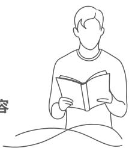

## 风险管理

2025年，公司坚持“三道防线”风险管理模式，从业务部门、内控体系到审计监督逐级落实责任，构建覆盖全过程的风险识别、评估与应对机制。审计部门在报告期内共组织开展13项审计项目，其中包括6项常规审计与7项专项审计，全年累计提出并推动整改29项审计建议，为公司避免或挽回损失超13万元，有效提升了整体运营的规范性与风险抵御能力。

公司持续推动各业务单元主动参与风险识别与评估，通过例会沟通、跨部门协作、数据分析和内部自查等方式，强化对经营过程中的关键风险点进行动态监控。风险管理覆盖信息安全、利益冲突、合规风险、工作场所安全等关键维度，业务部门按要求开展风险可能性与影响程度分析，并结合公司制度执行情况梳理风险优先级与应对路径

在合同、采购、税务、财务等核心风险领域，公司通过多项制度与流程强化风险管理。例如，在税务风险方面，持续执行信息收集、风险评估、应对与监控的闭环流程：在财务风险方面，通过月度指标分析与资金流动性、盈利能力与债务结构监测强化风险识别：在投资风险方面，严格执行事前调研、风险量化分析、投资决策与后续管理的全过程管理机制，确保投资行为稳健、透明并与公司战略相一致。

同时，公司积极借助外部审计或专业咨询力量对内部控制进行诊断，为风险管理能力的进一步提升提供专业支持。

全年累计提出并推动整改审计建议

29 项

为公司避免或挽回损失超

13万元

## 知识产权

公司高度重视知识产权管理工作，将其视为推动创新驱动发展战略的核心保障。公司已建立健全的知识产权管理体系，严格依据《中华人民共和国专利法》《中华人民共和国商标法》等法律法规，以及GB/T29490-2023企业知识产权合规管理体系和ISO.56005创新管理-知识产权管理指南等标准，制定了《知识产权管理手册》《知识产权获取、维持、运营，放弃控制程序》《对外信息披露管理制度》《专利管理制度》《商标管理制度》《软件著作权管理制度》《知识产权争议处理控制规范》等一系列制度文件，确保知识产权全生命周期的规范管理与风险防控。这些制度在2025年保持稳定运行，并继续作为公司开展知识产权管理各环节的依据

报告期内，公司顺利获得了基于ISO.56005的《创新与知识产权管理能力》3级认证，成为全国仅100金家获证企业中行业首家突破者，标志着公司实现了知识产权管理与创新项目全声明周期的系统化融合

报告期内，公司顺利获得了基于ISO.56005的《创新与知识产权管理能力

## 3 级认证

成为全国仅100余家获证企业中行业首家突破者，标志着公司实现了知识产权管理与创新项目全生命周期的系统化融合

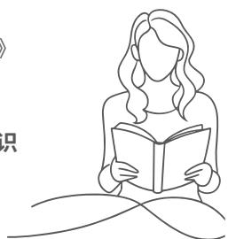

## 基于ISO 56005的《创新与知识产权管理能力》等级证书（3级）

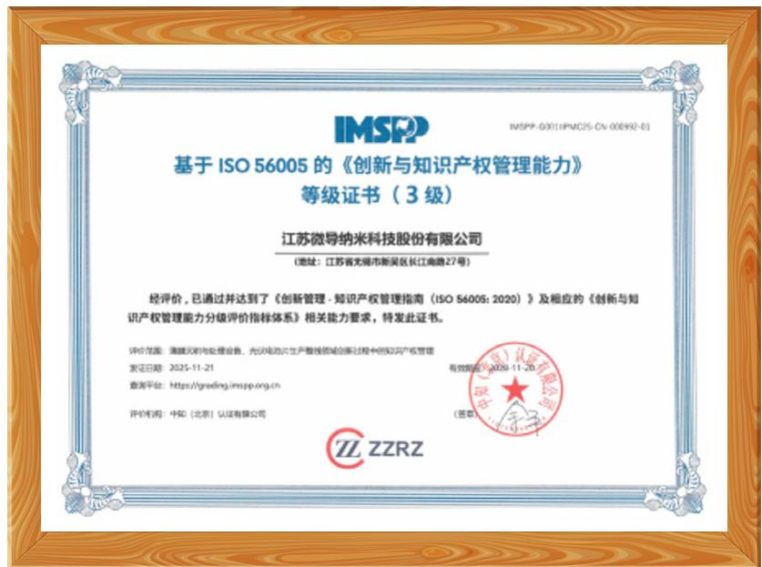

text_image

IMSPP
基于 ISO 56005 的《创新与知识产权管理能力》
等级证书（3 级）
江苏微导纳米科技股份有限公司
（地址：江苏省无锡市新吴区长江南路27号）
经评价，已通过并达到了《创新管理-知识产权管理指南（ISO 56005: 2020）》及相应的《创新与知识产权管理能力分级评价指标体系》相关能力要求，特发此证书。
评价范围：搭建无形与处理设备，光伏电站生产整机领域创新过程中的知识产权管理
发证日期：2025-11-21
查询平台：https://greiding.imspp.org.cn
评价机构：中和（北京）认证有限公司
有效期限：2028-11-20
（签章）
ZZRZ

2025年，公司通过流程嵌入、培训强化、监督考核加强对内贯标：

## 流程嵌入

根据 GB/T 29490-2023 进行流程修订，重点增加“合规义务”“合规管理”等相关内容。

## 培训强化

2025年9月组织了专场培训。

## 监督考核

由知识产权部门与供应链部门合作，对供应商开展知识产权体系评价，并形成处理流程闭环。

报告期内，公司引入知识产权管理系统，实现数字化管理升级。该系统覆盖专利、商标、专有技术/商业秘密等模块全面覆盖知识产权从创造、申请到维护、运营的全生命周期。

## 强化专利管理

公司依据《专利管理制度》，鼓励发明创造与技术创新，同时规范专利申请、布局和风险管理。报告期内，公司结合新部署的数字化管理系统持续开展全球风险专利排查，实现风险实时监控、出海风险排查(协作机制、重点区域监控)，有效规避产品侵犯专利权风险。

本报告期内，公司共申请149项发明专利，其中23项已授权。此外，公司申请了47项实用新型专利，其中52项授权公司累计申请专利807项，其中有261 项已获授权。

## 发明专利

报告期内公司共申请发明专利

149项

报告期内发明专利已授权

23项

## 实用新型专利

报告期内公司申请实用新型专利

47项

报告期内实用新型专利已授权

52项

## 累计申请专利

公司累计申请专利

807项

申请专利 已授权

261项

## 知识产权能力建设

公司高度重视知识产权管理与能力建设工作，将其视为提升全员创新意识和合规能力的关键举措，报告期内，公司开展12次知识产权相关培训，时长达12.5小时，旨在强化员工专业素养，促进知识产权保护与应用。

## 商业道德

公司严格遵守《中华人民共和国刑法》《中华人民共和国反垄断法》《中华人民共和国反不正当竞争法》等各项法律法规等有关法律法规，制定了《廉洁管理规定》，进一步加强公司员工的廉洁从业行为，完善公司舞弊行为问责规则，坚决反对并明令禁止贪腐行为。报告期内，公司审计监察团队秉持公司核心价值观，紧密围绕“三不腐”总体目标，积极开展反舞弊工作。

## 不敢腐：

## 精准问责与高压打击

公司对舞弊行为实施高压政策，通过廉洁举报和高风险领域排查，确保每起案件得到彻查，形成有效威慑。同时，对高风险人员进行约谈排查，揭示违纪事实，以案例推动整改，建立“不敢腐”的长效机制。报告期内，举报渠道共接收12条线索，全部按规定时限处理完毕，对违纪员工施以警告、劝退或开除等处分；涉及供应商的案件，由法务部依据《供应商反商业贿赂声明》追究责任。公司规定所有新入职员工签署《廉洁职业行为承诺书》，并接受廉洁培训：供应商须签署《供应商反商业贿赂声明》，承诺避免与公司员工及其近亲属发生不当利益往来，并承担违约后果。

## 不想腐：

## 廉洁文化宣贯

公司注重廉洁宣传，通过线下轮训和线上推送等方式，向员工传播廉洁理念。报告期内，以廉洁从业为重点开展6场线下轮训，覆盖1400余人次：线上平台推送28篇文章，内容包括节日廉洁提醒，政策解读及处罚通报。这些活动提升了员工的法律素养和风险防范能力，同时强化了合规文化基础，从思想层面筑牢廉洁壁垒。

## 不能腐：

## 强化内控与堵塞漏洞

公司以审计管理为重点，报告期内实施13项审计项目。同时，进行全面内部控制检查和定期评估，及时整改缺陷，封堵舞弊途径，巩固“不能腐”的防御体系。公司针对《反不正当竞争法》(2025年修订)识别关键风险，包括商业贿赂治理和避免滥用优势地位损害中小企业权益，通过审计监察部门的全员推送与培训，以及采购部门要求供应商签署《反商业贿赂承诺》，构建防控机制，涵盖采购、销售和合作等业务领域。

为确保全体员工了解并遵守反贪腐政策。《员工手册》明确列出禁止贪污、挪用公款、行贿受贿、敲诈勒索等行为的要求。公司设立多种举报渠道，包括电话、邮箱和线上平台，并实施奖励机制。

廉洁文化宣贯  
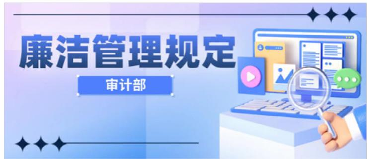

text_image

廉洁管理规定
审计部

廉洁管理规定  
廉洁制度

text_image

廉洁作风宣传
预防蝇贪蚁腐 从“小”严起

预防蝇贪蚁腐从“小”严起  
筑牢思想防线，从细微处守廉洁

廉洁培训  

## 信息安全

公司致力于在运营全过程严格规范信息安全工作，严格遵守《中华人民共和国数据安全法》《中华人民共和国网络安全法》《中华人民共和国计算机信息系统安全保护条例》等相关法律法规。公司秉持“信息安全，人人有责；积极防御，综合治理；客户信赖，永续经营”的方针，建立信息安全管理体系，确保信息的保密性、完整性与可用性(CIA)。通过风险评估程序，公司识别、分析并评价信息资产面临的风险，并据此制定实施风险管理计划，采用物理、技术和管理等多维度安全措施。同时，公司持续监控、审核与评审体系的有效性，并参照ISO27001国际标准，确保管理体系与国际最佳实践高度契合，实现持续改进。

公司严格执行项目文件保密要求，涵盖技术方案、图件、档案、进度、实施细节及用户指定保密资料等。通过内网存储与权限严控，实现事前预防、事中监控与事后追踪，有效保护企业和相关方信息安全。

## 信息安全管控

  
防止信息泄露  
报告期内，公司优化客户信息及核心业务数据保护措施，包括构建“零信任”架构(精细化身份与权限管理、动态授权与行为分析）、实施全生命周期数据加密(终端、传输与存储加密）、强化终端与移动存储介质管控（严格限制使用、打印控制、屏幕水印及数据防泄漏客户端部署)。此外，员工离职权限回收机制高效执行，全年开展4次信息系统权限审计，每季度一次，确保及时清理。

  
信息规范化管理

公司引入信息化系统建设成果，包括深化PLM系统应用（提升产品数据管理效率，实现单一数据源、变更管理与跨部门协同)及上线WMS系统(提高作业准确性、优化库存管理与空间利用、强化数据驱动与系统协同）。

  
信息安全事件应急预案

公司制定《信息安全事件管理规定》，定义应急小组运作与事件处置流程，包括事件报告、初步评估、分级响应、处置执行、恢复与总结。公司应急小组由信息安全部牵头，跨部门协作，确保快速响应。报告期内，员工发现事件后可通过专用邮箱或企业微信反馈，实现事件定级、取证（断网镜像或监控调取）、业务恢复与闭环告知。

## 信息安全工作建设

报告期内，公司信息安全领域取得多项进展，通过系统建设、培训宣贯与奖惩机制，提升整体管理水平与运营韧性。

公司设定2025年信息安全核心目标为“信息安全零事故”，达成情况包括：无数据泄露事件；发现系统漏洞6个，修复率100%；新员工安全培训覆盖率100%。为实现目标，公司开展IT内审，针对重要系统（如PLM、PDM、邮箱、OA、ERP等）发现离职账号未删除、公共账号长期未使用等问题，提出整改建议：接收离职申请后立即禁用/删除账号；主数据对接人事系统自动处理；每月复核在职清单。整改后，系统权限合规性显著提升。

在数字化方面，公司全面部署数据防泄漏(DLP）系统，核心功能包括敏感数据监控与外发控制，报告期内阻止13起数据泄露事件，有效保障企业数据安全。同时，两地三中心备份架构稳定运行，全年备份成功率 99%，数据恢复成功率 100%。

为提升员工信息安全意识，公司要求员工签署《信息安全承诺书》，并组织多次培训：新员工入职信息安全培训多次、全体员工信息安全培训4次 文件外发专题培训1次 采用线上+线下方式 总覆盖率高，公司信息安全文化建设通过企业邮箱与企业微信工作台小程序定期推送网络安全、数据安全事件案例，增强全员参与感。

## 信息安全宣贯

关于加强数据安

全保护的通知

关于加强数据安全保护的通知

公司建立信息安全奖惩机制，将“风险管理”纳入全休员工KPL考核，根据事件等级（一般，较大、重大）扣分(如重大事件一票否决，部门整体考核为0)：同时奖励发现风险及时上报、举报事件或提供线索的行为，促进主动防范。

## 共创社会价值

产品与服务

韧性供应链

多元化与平等机会

人力资本与发展

职业健康安全

价值共创

# 共创社会价值

## 产品与服务

## 产品责任

公司坚持“以客为先，诚信、服务”的运营理念，秉持“创新、质量、诚信、服务”的质量方针，建立覆盖产品全生命周期的质量管理体系。通过《产品生命周期控制流程》《研发设计控制程序》《生产过程控制程序》《售后管理控制程序》等制度文件，系统规范各阶段质量管控要求，构建标准化、可追溯、高效协同的质量管理架构。公司持续完善质量管理体系，每年开展一次内部审核，并结合管理需求不定期实施专项审核及管理评审，推动质量管理体系持续优化。

公司构建覆盖供应商、研发、制造及客户服务全价值链的质量管理体系，明确各环节质量职责与协同机制，确保质量活动系统、高效、闭环运行。

## 研发质量管控

公司推行设计失效模式与影响分析及经验教训库管理机制，系统识别并前置规避设计风险。同时，建立OFM选型评审流程，强化技术评审与变更管理，确保设计输出符合规范要求并受控运行。

## 供应商质量管理

公司建立并实施严格的供应商准入与动态评估机制，围绕零部件重复性、稳定性及综合绩效开展系统评价。通过供应商端验收、入厂检验及质量问题归零管理，持续强化供应质量保障能力。

natural_image

Abstract circular logo with four petal-like segments in varying shades of orange and beige, no text or symbols present.

## 制造过程质量控制

公司实施自检、互检、专检相结合的多层次检查体系，通过关键参数在线监测、统计抽样等手段，实现生产过程质量状态的实时监控与偏差预警。报告期内，产品出货检验及时率与整机出厂前问题关闭率均达到100%。

## 客户质量管理与持续改进

针对客户反馈的质量问题，公司组织跨部门团队开展根本原因分析，制定并验证纠正及预防措施的有效性。同时，依托质量数据系统化分析，前瞻识别风险趋势，驱动产品与过程质量的持续改进。

公司已通过 ISO 9001:2015 质量管理体系认证，并于 2022 年、2023 年连续荣获 “新吴区质量管理优秀奖”，2024年获“无锡市市长质量奖提名奖”。

## ISO 9001:2015 质量管理体系认证

## 质量管理举措

公司持续推进质量文化建设与绩效目标管理双轮驱动，系统构建覆盖产品全生命周期的质量管控体系。

  
绩效目标管理  
公司结合产品特性与工艺要求，针对供应商来料、关键零部件及整机交付等核心环节设定差异化质量合格率目标，确保产品一致性符合行业标准及客户规范。报告期内，公司在供应商质量管控、零部件异常流出预防、关键物料合格率、季度交付机台单位缺陷数等维度均达成或超越既定目标。此外，2025年度新增图纸符合率及OEM件选型失效管控指标亦均处干受控范围，相关质量目标全面达标。

  
质量文化建设

公司持续推动全员参与和持续改进机制落地，通过常态化质量培训，问题闭环管理及改善提案机制，将质量意识融入日常运营，夯实全面质量管理体系基础。

## 质量月主题活动

2025年9月，公司响应国家“质量月”号召，首次开展覆盖全公司及核心供应商的系列质量活动。通过跨部门培训、全员知识竞赛与改善提案征集，持续深化质量文化建设，活动共吸引1160余人次参与知识竞赛，征集改善提案 30 项。公司以此为契机，推动建立月度质量抽查、季度专题培训及 “反馈 - 跟进 - 改善”闭环管理机制，促进质量文化长效落地。

## 产品安全与合规认证

公司主要产品已通过国际半导体协会 SEMIS2.SEML F47SEMIS6.SEMLS23 等多项安全与性能认证，覆盖设备安全、电气安全、环境安全及能耗管理等关键维度，从设计、制造到交付全流程强化安全管控；光伏领域KF10000SKE1000Y产品通过CE安全合规认证，在电气安全，环保合规及使用可靠性方面均满足欧盟及国际标准要求:同时，我们的部分新能源产品已取得ETL认证，进一步验证了产品在电气安全与合规性方面符合北美市场相关要求，有效降低生产与使用环节的安全风险，为客户提供更可靠的安全保障。

## 创新驱动

技术创新是公司产品品质提升与核心竞争力构建的重要支撑。公司坚持以“创新驱动，引领未来，为客户创造价值”为使命，秉持“共同目标、传播、沟通、信任、理解、分享、允许建设性冲突、尊重”的创新价值观，持续推动技术与管理创新体系建设。

公司在高管层的高度重视与创新文化引领下，积极营造全员参与的创新生态，通过制度化、多元化激励举措，激发员工创新活力。具体包括：

## 创新攻关项目奖励

对核心技术攻关项目设立奖励，并纳入关键绩效指标；

## 研发薪酬制度

对创新人员实施薪酬倾斜并挂钩业绩，提升主观能动性；

## 创新人才晋升通道

员工在开展创新活动并符合条件后，即可获得岗位晋升通道；

## 知识共享与基层参与

建立内部讲师机制；面向全员月度评选优秀合理化建议予以奖励。

为持续提升技术创新质量与成果转化效能，公司已设立月度创新评审会议机制，依托分级创新评审委员会，围绕技术方案的新颖性、创造性及实用性等核心维度开展评估，科学指导知识产权布局，强化创新活动的战略导向与管理效能。

常态化的创新表彰机制，组织评选并授予“最佳IP奖”“最佳创新奖”等荣誉称号，因技术和管理创新而获得奖励的员工超过300人，有效引导全体员工深度参与核心技术突破与高质量知识产权创造

natural_image

Robotic hand interacting with a digital binary code grid background (no text or symbols)

## 知识产权·合规活动月

公司秉承坚持创新的使命，多次举办各类活动鼓励创新，吸引超千名员工参与。

公司设置宣传窗口，提供创新岗位人员和创新过程管理专家一对一沟通，切实提升员工对创新成果保护的意识与能力，进-步营造全员参与、尊重创造的创新生态。

公司持续加大研发投入，深化全球化人才战略，为技术创新提供坚实保障。报告期内，研发投入达人民币3.76亿元，占营业收入的14.26%。截至报告期末，公司拥有研发人员340人，占员工总数的28.84%。

natural_image

Line drawing of a person reading a book, no text or symbols present

截至报告期末，公司拥有研发人员

340人

占员工总数的28.84%

## 创新合作

开放协同的合作生态是技术创新的重要支撑。公司积极搭建产学研深度融合的协同创新格局，与复旦大学、上海交通大学、南京大学等国内顶尖院校，及芬兰赫尔辛基大学、澳大利亚新南威尔士大学等国际高校建立良好稳定合作，围绕半导体装备、集成电路、新能源材料等方向开展联合研究及人才培养，实现“产学研用”高效联动。

2025年，作为国家级博士后科研工作站，公司与南京大学联合培养多名博士后，聚焦半导体装备和新能源材料方向开展研究，1 名在站博士后获评 A 类卓越博士后。

公司作为国内原子层沉积（ALD）技术，联合多家高校、研究所和企业共同发起和组建了原子级制造创新发展联盟，并担任联盟首批副理事长单位。公司认真落实联盟宗旨，围绕国家重大需求，持续开展关键技术聚力攻坚，抢占原子级制造领域科技制高点，为培育发展原子级制造产业贡献力量。

## 创新成果

公司构建以原子层沉积（ALD）技术为核心，化学气相沉积（CVD）等多种真空薄膜技术梯次发展的产品体系，多项设备关键工艺指标达国际先进水平，并持续推进关键核心技术自主可控，以创新驱动产业高质量发展。

基于完整的ALD和CVD技术产品布局，公司在半导体及泛半导体工艺专用装备领域夯实了覆盖半导体集成电路、新能源、新型显示等多个应用场景的技术能力。报告期内，公司围绕关键工艺持续攻关，在高温PECVD专用设备、LPCVD专用设备、钙钛矿电池专用ALD设备等方面取得突破性成果。

未来，公司计划继续深化核心技术研发与产业化应用，稳步推进各业务板块技术迭代与客户验证工作。

## 2025年关键性创新成果

## 半导体事业部

公司ALD和CVD相关产品获得批量订单，且多款新产品取得重要的产业化突破，主要包括

iTomic MeT 系列产品获得批量量产订单

## 实现规模化量产

iTomic HiK 系列、iTronix MTP 系列和 iTronix PE 系列分别在逻辑、存储和先进封装领域取得新突破，部分产品成功导入到客户厂商

## 进行产业化验证

## 新能源事业部

JW 系列管式 EPD 边缘钝化产品

## 迈入量产成熟阶段

适于 xBC 电池技术的管式 P-Poly PECVD 装备

## 成功开发

## 创新中心

## 半导体新制程突破

聚焦金属工艺开发，自主研发设备实现介质层沉积，器件成功开发多种氧化物介质层批量工艺支撑关键客户Demo验证与量产推进

## 光伏领域创新应用

ALD超薄薄膜技术赋能钙钛矿光伏，同步实现界面钝化、能级匹配与扩散阻挡三大功能，显著提升器件效率与稳定性

## 锂电性能优化升级

通过 ALD 界面修饰技术，提升电池容量密度、热稳定性与循环寿命

## 多领域客户验证成效显著

2025年完成近70次跨领域（半导体、锂电、光伏）客户Demo验证，打通工艺路线，形成3个量产推进方向，实现从工艺开发到产业化运用

text_image

江苏微导纳米科技股份有限公司
2025年度环境、社会及公司治理（EPSC）报告

公司通过承担重点领域联合攻关项目、推动并参与各类标准制定、参与行业活动与技术交流等方式，攻关行业关键技术难题，共享技术创新成果，推动行业规范化发展。

## 创新荣誉

公司作为国家高新技术企业，持续完善创新体系，已获批国家级博十后科研工作站，并拥有江苏省原子层沉积技术工程技术研究中心、省级企业技术中心等多项创新平台，先后获评工信部专精特新“小巨人”企业、国家知识产权优势企业、苏南国家自主创新示范区独角兽企业等荣誉。

报告期内，公司获得以下创新相关荣誉与认证：

成功通过国家高新技术企业重新认定；

通过《创新管理一知识产权管理指南（ISO56005:2020）》认证，获颁“创新与知识产权管理能力 3 级证书”，认证覆盖公司主营业务领域的创新管理活动；

获“2025湾芯奖·技术创新奖—技术领先企业”；

获“上海有色网光伏行业智能装备创新奖”；

获上海证券报“上证鹰·金质量 2025科技创新奖”；

## 2025湾芯奖·技术创新奖 技术领先企业

2025年10月，公司凭借在原子层沉积（ALD)与化学气相沉积（CVD）领域的持续技术创新，及在逻辑电路高难度薄膜工艺等关键技术方向的研发积累，荣获“2025 湾芯奖·技术创新奖—技术领先企业”。

text_image

2025
海芯奖
技术创新奖·技术领先企业
江苏领导纳米科技股份有限公司
WITERMANY AWARD'S Awards

## 上海证券报“金质量·2025科技创新奖

natural_image

Golden trophy with feathered wings mounted on a black base (no visible text or symbols)

## 优化服务

公司高度重视与客户的长期合作关系，致力于构建稳定、高效的双向沟通机制。客户可通过邮件、电话、公司官网、定期会议、技术评审会议(TRM)、高层互访及投诉处理等多种渠道，及时反馈需求与期望。为切实保障客户隐私、商业秘密等合法权益，公司已制定并实施《售后管理控制制度》等相关规范。

为保障设备运行连续性与客户生产稳定性，公司针对服务请求及投诉建立了系统化的分级响应与闭环处理机制。依据问题对客户产线运行的影响程度，将事项划分为四个响应等级（Level1-4)，明确从即时响应至72小时不等响应要求，并配套“客户人员一基层工程师一中层技术经理一高层管理者”的逐级升级路径：对于重大或紧急事项，支持直报机制，确保第一时间协调资源介入。

## 客户认可与荣誉

公司始终以客户需求为导向的服务理念与卓越的服务实践，获得了客户与行业的双重认可。在客户服务领域，公司曾获“最佳客户服务奖”“快速响应服务奖”及“创新客户服务奖”等多项行业殊荣，专业的服务团队亦凭借优质、高效的服务表现获评“专业服务团队奖”。

公司定期开展满意度调查，覆盖交付、产品、服务响应及协作等核心维度，并通过持续完善客户反馈机制与优化服务体系，推动客户满意度不断提升：

报告期末，准时交货满意度达

100%

较2024年12月（93%）显著提升

报告期末，客户满意度核心指标均达成目标

100%

客户满意度水平迈入高位稳定阶段

报告期内，协作配合、现场响应时效及沟通态度3项 指标满意度持续保持

100%

natural_image

Line drawing of a person reading a book, no text or symbols present

## 负责任营销

公司坚守负责任营销理念，严格遵循法律法规及行业规范，确保对外宣传信息真实、准确、完整，杜绝虚假及误导性表述，公司已设立专业审核团队对所有对外宣传内容进行严格审查，切实抵制虚假宣传行为及行业内卷，保障投资者消费者等各方利益相关方合法权益。

## 韧性供应链

## 供应链管理

供应链的稳定韧性是企业可持续发展的重要基石，更是产业链协同共赢的关键支撑。公司构建了覆盖供应商筛选，管控与协同的全生命周期供应链管理体系，通过制度规范、技术赋能与精准帮扶，持续提升供应链的稳定性、合规性与可持续性，助力产业高质量发展。

公司严格遵守相关法律法规及行业监管要求，制定《供方管理控制程序》等内部管理规定，明确供应商准入、考评、协同的全流程规范，并将廉洁合规、ESG表现（含环保、劳动合规、商业诚信）、质量稳定性等纳入核心考核维度。

## 准入阶段

建立多维度供应商评估体系，综合审核技术能力、合规资质、产能保障、ESG 表现及 ISO 系列管理体系认证情况等核心要素，将质量管理、环境管理、职业健康安全管理等相关体系认证作为重要评价依据，动态更新合格供应商名录。

## 考评阶段

实施定期评估与现场核验相结合的管控模式，每季度从质量、交付、成本、服务四大维度开展综合考评，每年至少开展一次现场审核并辅以不定期巡检，覆盖材料管控、标准执行、环保合规等关键领域：对紧急及关键物料强化全流程质量跟踪，建立科学的激励与淘汰机制，持续优化供应商结构。

## 协同阶段

依托供应链管理系统(SRM)实现供应商绩效指标动态监控与量化评估，支撑采购订单、送货管理、供应商绩效评价等全流程线上协同，提升供应链运营效率与透明度。

公司重视供应链安全稳定与风险防控，通过优化供应商布局、构建多源供应体系、深化区域协同配套等方式，持续提升供应链韧性与抗风险能力。报告期内，公司合作供应商共计 880 家，其中无锡本地供应商 176 家，本地化供应比例达20%；依托本地化与多元化供应布局，有效缩短供货周期、降低物流成本，保障供应链高效稳定运行，全年未发生重大供应链中断事件，整体风险可控。

公司积极面向核心供应商开展全方位帮扶与赋能，重点围绕运营管理、过程管控、体系建设与技术能力提升等维度，通过专项支持、质量培训、标准宣贯、质量工具导入及流程优化等方式，系统提升供应商管理水平与综合竞争力。报告期内，公司已组织开展11场技术培训，有效强化供应商能力建设。

text_image

报告期内，公司合作供应商共计
880家
公司已组织开展技术培训
11场

## 供应商赋能与协同提升实践案例

2025年4月，公司组建团队针对A供应商加工的核心零部件进行为期3.个月的专项整改，目的是提升供应商过程管控能力，使其能按时交付质量稳定的产品。通过专项小组和供应商的协同努力，在整改期内优化6项制造工序，修订5份作业指导书和检验文件，并对核心工序作业人员进行定岗和定期技能培训和考核，最终达成供应商交付及时率提升12%和年度零功能性异常的成绩。

报告期内，公司重点协助某精密制造行业企业开展综合改善提升工作，从质量体系完善、生产过程规范、物料精准管控、现场安全标准化、检验效率提升等方面进行系统优化，累计落地改善项目42项，项目完成率95%以上，显著提升了供应商的产品一致性、交付稳定性与可持续供应能力，实现供需双方协同发展、价值共创。

报告期内，累计落地改善项目

42项

项目完成率超

95%

## 责任采购

公司积极落实责任采购原则，将环境、社会、廉洁合规等要求全面融入供应链管理全流程，推动上下游共同履行社会责任，构建规范、绿色、可持续的供应链生态

## 环境与有害物质管控

公司积极践行绿色供应链理念，引导供应商强化环保与安全管理。公司建立环境与有害物质管控体系，制定《有害物质管控标准》《承包商环境健康安全管理协议》等管理文件，对供应商在环境影响、危险废弃物管理、职业健康安全等方面提出明确要求，从源头防范供应链环境与安全风险。

## 冲突矿产管理

公司恪守供应链社会责任与合规要求，承诺不使用冲突矿产，并将相关合规要求纳入供应商管理范畴，明确要求供应商共同履行责任、抵制冲突矿产使用，推动构建合规、透明、负责任的原材料供应体系。

## 廉洁合规管控

公司依据内部管理规定，将廉洁合规、公平竞争作为合作前提。对内规范采购全流程管理；对外要求所有合作供应商签署《供应商反商业贿赂声明》，报告期内，供应商廉洁协议签署率达100%。严禁商业贿赂、不正当竞争及利益输送等行为，对违规供应商依规采取管理措施，推动构建公平诚信、合规透明的供应链生态。

## 多元化与平等机会

## 雇佣管理体系

公司严格遵守《中华人民共和国劳动法》《中华人民共和国劳动合同法》等相关法律法规以《员工手册》《招聘管理制度》为核心搭建完善的劳动用工管理体系，从制度层面明确禁止童工，杜绝骚扰，合理工时，保障弱势群体权益等核心要求，多方位保障劳动者依法享有劳动权利、履行劳动义务。同时将多元化与人权管理融入核心经营管理，由总经办作为最高级别管理者统筹监督员工多元化绩效落地执行，从合规管理，职场环境，权益沟通多维度落实管理要求

## 严守用工合规底线

严禁招用未满16周岁人员，从源头规范用工管理，夯实企业用工合规根基。

## 筑牢职场安全屏障

严禁工作场所任何形式的骚扰及不当行为，配套建立保密举报与调查机制，全方位保障员工职场基本权益。

## 健全民主沟通机制

公司依法建立健全职工代表大会制度，2025 年召开职代会 2 次，重大运营变更前召开职代会民主投票，并提前一周通过邮件、公示告知员工及代表，充分保障员工知情权与民主参与权。

## 包容职场

公司致力于构建多元化与包容性的工作环境，尊重并接纳不同性别、年龄、民族、宗教信仰、文化背景、教育程度及工作经验的员工，以多元化的人员结构促进内部创新与协作，提升公司整体竞争力。在人才选拔、职业晋升全流程坚守公平公正、公开原则，以能力、业绩和潜力为核心评价标准，为全体员工搭建无差别的职业发展平台，切实保障不同群体的平等发展权利。

## 用工薪酬平等

招聘、晋升、薪酬等核心环节，不因性别、年龄、种族、宗教、残障等受法律保护的特征实施差别对待，坚守全流程公平用工原则；定期监控性别比例及性别薪酬差距，严格执行同工同酬相关规定。

## 女性权益保障

切实落实产检假、产假、育儿假、哺乳假等女性专属福利政策。2025年共有142名女性员工、17名男性员工享受育儿假，休育儿假员工返岗率及12个月留任率均达100%，禁止性别歧视，保障妇女就业同等晋升权力、孕期和哺乳期保护、同工同酬、晋升机会平等。

## 考核晋升同权

建立全覆盖的绩效考核与职业发展体系，报告期内，男女员工定期接受考核覆盖率均达100%。考核结果作为薪酬调整，岗位晋升的统一依据。保障男女员工享有平等的职业发展机会。

截至报告期末，公司共有员工 1,179 人，按性别、年龄、层级、地区划分的员工分布如下所示。

## 总人数

员工总数

$$
1, 1 7 9 \text {人}
$$

## 按性别划分

男性员工总数

$$
9 9 2 \text {人}
$$

女性员工总数

$$
1 8 7 \text {人}
$$

## 按年龄划分

50 岁以上员工总人数

$$
1 3 \text {人}
$$

年龄在30至50岁之间的员工总数

$$
7 6 5 \text {人}
$$

30 岁以下员工总数

$$
4 0 1 \text {人}
$$

## 按地区划分

中国大陆员工总数

$$
1, 1 7 0 \text {人}
$$

香港、澳门和台湾地区员工总数

$$
2 \text {人}
$$

其他国家或地区的员工总数

$$
7 \text {人}
$$

## 按层级

管理层员工总数

$$
236\text{人}
$$

非管理层员工总数

$$
943\text{人}
$$

## 人力资本与发展

公司以人才为核心发展动力，坚持公平规范、引育并举、激励相容的人力资源管理理念，构建覆盖“招聘、培养、晋升、绩效、激励”全周期的人力资本管理体系，持续提升员工价值与组织效能，为企业高质量可持续发展提供坚实人才保障。公司依托规范的人才发展体系与良好的雇主品牌形象，先后荣获，“无锡市最佳聚才单位”“优秀雇主奖”“高层次人才引进贡献奖”等荣誉。

## 人才招聘

公司以《招聘管理制度》为规范，建立校园招聘，社会招聘，内部推荐三位一体的多元化招聘体系，招聘流程全程秉持公平，公正，透明原则，实现人岗精准匹配，同时，公司围绕引才，育才，聚才，留才全链条，构建系统化人才供给与培养体系，为可持续发展储备优质人才资源。

## 引才

多渠道招聘 : 校园招聘聚焦机械、材料、化学、等离子体、电气、软件等核心专业，吸纳专业对口人才；社会招聘依托专业招聘网站、人才市场及地方专场活动，引进资深行业人才：内部推荐鼓励员工推荐与公司文化契合的优秀人员，提升招聘效率与人才适配度。

## 育才

深度校企合作：与南京大学、上海交通大学、无锡太湖学院等院校开展多层次合作，与上海交通大学太阳能研究所达成战略合作，与南京大学开展产学研联合培养；与地方院校共建实训基地，开展学生实践与实习项目，实现人才培养与企业需求精准对接。

## 聚才

广泛人才储备：与地方政府人才集团深度合作，参与寒假班、暑假班、青年旅舍等人才储备活动：与北京大学、哈尔滨工业大学、合肥工业大学、中科院、新南威尔士大学等国内外高校及科研机构保持长期联络，搭建稳定的优质人才储备渠道。

## 留才

定制化实习培养：针对不同岗位实施差异化培养，非研发类岗位采用“实习+就业”模式，由导师一对一指导:研发类应届毕业生纳入“微导星”培养计划，通过为期1年的导师带教、岗位轮换、阶段考核等方式，实现系统化、专业化成长。

赋能青年成长 微导纳米助力澳门青年赴无锡高新区交流  

text_image

Leadmicro.微导
雙灣融合 錫澳同心
澳門青年赴無錫高新區交流
主辦單位 澳門青年發展服務中心、無錫高新區（新興區）旅戰部、無錫高新區（新興區）人社局
承辦單位 澳門青年發展服務中心與國基地、無錫市暨創英才青年創新創業促進中心、無錫高新區人才集團
支持單位 江蘇（高校）澳門學生聯合會

## 培养与晋升

公司以《培训管理制度》为基础，构建以核心价值观和企业文化为引领、以专业能力提升为重点、以管理梯队培养为目标的系统化培训体系，并建立多路径职业发展通道，为员工提供终身学习、持续成长的平台，全力打造高素质、专业化的人才队伍。

公司持续开展各类专业化培训项目，形成线上与线下相结合、必修课与选修课互补的培训模式，培训内容覆盖各岗位、各层级员工发展需求。报告期内，公司员工培训覆盖全员，并协助 130 余名员工完成人才认定、开展职称申报，全方位支持员工职业成长与发展。

## 分层分类精准培训

针对新员工开展系统化入职培训，助力快速融入企业文化、适应岗位要求；面向在岗员工开展电气安全设计、编程开发、等离子体基础等业务技能培训，提升专业实操能力；针对管理人员实施 “管理三部曲”“主管赋能训练营” 等专项培训，强化管理履职能力。

## 内部讲师体系建设

建立标准化、规范化的内部讲师管理制度，严格开展讲师选拔、认证、等级晋升与津贴激励，已培养认证内部讲师超50名，开发多门核心课程，推动公司核心知识与专业能力的内部传承与迭代。

## 技能证书 专项培训

为员工提供免费职业技能提升培训，覆盖电工证、登高证、项目管理证等职业资格，助力员工提升职业竞争力，实现个人与企业共同发展。

## 人员素养通识培训

每年开展安全培训、保健培训、信息安全、知识产权、反商业贿赂与反贪污等通识培训，持续强化员工安全意识与职业素养。

## 职业晋升

公司已建立管理通道、专业通道、技能通道三大并行的职业发展通道，以岗位任职资格标准为导向，引导员工持续学习提升综合能力，各通道间可实现双向流转，充分满足员工多元化职业发展需求。同时，公司建立并落地标准化任职资格评价体系，晋升流程全程公开、公平、透明，以员工能力与工作业绩为核心评价依据；所有晋升人员（含管理人员）均需参加晋升培养训练营，通过课堂学习、行动计划、结果评估三个维度开展为期半年的系统化培养，全面提升通用能力与专业管理能力。

text_image

管理能力。
2025 年度环境、社会及公司治理（ESG）报告 61

## 绩效与激励

公司以《绩效考核管理制度》为核心，建立覆盖全体员工的绩效考核与人才激励机制。绩效指标围绕财务、客户、内部运营、学习与成长、风险管理五大维度，并将公司可持续经营相关要求纳入考核体系，指标还涵盖信息安全、合规体系建设、廉政反舞弊、工作场所安全等内容，确保机制公平、规范运行。

## 规范化绩效考核管理

## 绩效指标设定

基于公司年度经营管理目标，设定公司级绩效指标并逐级分解至部门与岗位，明确指标口径、核算规则、评价周期与责任主体。

## 综合绩效评估

以工作实绩为核心，激励与约束相结合设置加减分项，形成综合绩效得分。评估采用员工自评、部门复评、横向考评相结合的方式，以量化数据为支撑，确保评价客观公正。

## 异议处理机制

建立绩效申诉通道，员工如对考核结果存在异议，可在公示期内向人事行政部或主管领导提出电诉，公司按程序复核并及时反馈结果。

## 长效化人才激励体系

## 绩效与职业发展联动

绩效考核结果应用于员工培训规划，薪资调整，奖金发放，职务晋升与岗位调整，落实优绩优酬、优绩晋升的激励导向。

## 核心人才长期激励

针对管理层等核心员工实施股权激励，将个人成长与公司长期发展深度绑定，共建利益共同体。

## 人才留存与离职管理

公司以绩效与激励体系为基础，建立系统化人才留存与离职管理机制，针对核心员工实施专项培育计划，综合运用股权激励、薪酬调整、职业发展规划、工作环境优化等措施稳定人才队伍，并通过持续开展离职原因分析，不断优化人力资源管理体系，提升人才稳定性

## 员工福祉

公司以《员工关怀管理制度》为纲领，秉持人性化管理理念，从福利保障、健康关怀、文化建设、专项慰问等多维度构建全方位的员工关怀体系，报告期内，员工满意度98.81%，满意度调查覆盖率100%，持续提升员工的幸福感、认同感和归属感，打造有温度、有凝聚力的企业文化。

## 多层级福利保障

为全体正式员工足额缴纳五险一金，同步配置雇主责任险、境外出差专属保险及特殊岗位高保额团体商业保险。报告期末，社会保险与医疗保险覆盖 1,179 人，商业保险覆盖 1,179 人。严格执行带薪年假、产假、育儿假、哺乳假等法定假期制度，并配套节日慰问、生日关怀、生病探望、育贺仪等福利。

## 全方位健康关怀

每年组织全员职业健康体检，报告期内，年体检参检率100%；开设瑜伽课程、配备健身设施，常态化组织羽毛球、篮球、足球等竞技类体育活动，引导员工健康生活，增强集体凝聚力

## 员工关怀与文体共建

定期举办集体生日会、歌唱比赛、家庭日、企业庆典等特色文化活动，丰富员工业余生活，营造温馨有爱的团队氛围，助力企业文化建设，促进企业与员工家庭和谐共融。

## 节日关怀与福利

在各种传统节日开展主题活动并发放节日福利，传递企业温暖关怀。

## 针对性专项慰问

为员工提供理发、配镜、贴膜等便民服务:对长期出差、驻外员工开展季度走访慰问，并为出差满3个月员工报销探亲路费；开展跳蚤市场、联谊交友等活动，满足员工个性化生活需求。

## 十周年暨上市三周年庆典

2025年12月，公司于无锡总部举办成立十周年暨上市三周年庆典，同期实现半导体设备出货超500台，各级政府、行业协会及产业链合作伙伴齐聚见证，活动获人民日报、新华网等主流媒体报道。庆典回顾公司十年发展与上市三年营收四倍增长、半导体业务七倍增长的成果，发布新十年深耕核心技术、拓宽全球视野、深化产业协同的发展战略。本次活动凝聚员工共识与团队向心力，厚植企业文化底蕴，深化产业链协同联结，为企业高质量发展凝聚合力。

## 十周年暨上市三周年庆典

## 歌唱比赛

## 篮球赛

text_image

年
唱歌比赛
决赛场
——声波## 景波##

text_image

青春力量
2019 FIFA
LOUWI
光灯不许
2000

## 家庭日

text_image

2月1日心玩梦做导
生日活动
洋快乐

## 职业健康安全

## 制度保障

公司始终秉持 “绿色节约、安全第一、预防为主、全员参与、综合治理、持续改进”的环境、职业健康与安全（EHS）方针，严格遵守职业健康安全相关法律法规，构建标准化、流程化的职业健康安全管理体系，通过完善组织架构、健全制度体系，为安全管理工作落地实施提供坚实支撑。

公司已发布《安全生产责任制管理规定》《职业卫生管理规定》《安全检查及隐患排查管理规定》《相关方EHS管理规范》等核心制度，覆盖安全生产责任、职业健康管理、隐患排查、承包商安全管控等全流程环节，明确各环节管理要求与操作规范。同时，设立安全生产委员会（安委会）作为安全管理最高决策机构，由总经理担任组长，厂务及FHS负责人任副组长，各一级部门负责人为成员；安委会每季度召开专项会议，开展合规稽核、事故通报、法律法规宣贯等工作，确保管理决策高效落地。

公司已通过IS045001:2018职业健康安全管理体系认证，并每年定期开展法律法规合规性评价，全面审查职业健康安全管理运行情况，确保体系持续合规、高效运转。为保障体系有效运行，公司核心管理团队具备完备的安全管理资质，总经理、首席运营官均已取得主要负责人安全管理员证书。公司建立明确的年度安全生产绩效目标，对轻伤事故等关键指标实施严格管控，并配套健全安全生产奖惩机制，将事故责任落实、隐患整改成效及安全工作贡献纳入薪酬考核体系，切实推动安全管理责任全面压实、闭环落地。

## ISO 45001:2018 职业健康安全管理体系

text_image

认证证书
职业健康安全管理体系
GB/T 45001-2020 / ISO 45001:2018
江苏微导纳米科技股份有限公司
证书编号： 24CS345097265
统一社会信用代码： 91320213MA1MDBFY36
注册地址： 无锡市新吴区长江南路27号
办公及生产地址： 江苏省无锡市新吴区长江南路27号
认证范围： 基于原子层沉积技术的光伏及
柔性电子设备和半导体设备的研发和生产
高介电常数氧化层原子层堆栈设备的研发和生产
IAF 15019
保证审计机构建立健全内部审计部门和募集资金管理流程符合相关要求。
在证书有效期内每年接受一次监督审批并经审核合格，此证书方能提供有效。
本证书可在本机网站（www.suzhchina.com）和中国国家认证认可监督管理委员会官方网站
（www.cscs.gov.cn）查询。
初次注册日期： 2020年12月10日
发证日期： 2024年08月27日
证书有效期至： 2026年12月09日
ICM
认证机构信息表
ICM
ACM
Accredited Management Systems Certification Italy
ISO-345
总经理

## 安全生产管理

公司从风险分级管控、常态化隐患排查、化学品管控、相关方管理等维度强化作业安全保障，将安全管理关口前移，从源头识别、防控各类安全风险，实现隐患闭环治理、作业全流程可控

## 风险分级 管控

每年组织各部门开展全面安全风险识别，结合生产工艺、设备设施、作业环境等维度精准识别风险源，建立风险台账并实施分级管控，针对较大及以上风险制定专项管控措施，确保风险受控。

## 常态化隐患排查

建立多频次、全覆盖的安全检查机制，报告期内，安全检查覆盖率100%，累计开展内部及外部安全检查286次，其中每日开展日常检查，每月针对化学品、消防、电气等重点领域实施专项检查，每季度组织综合检查、季节性检查及节前安全检查。所有隐患均纳入台账管理，明确整改责任与时限报告期内，整改率100%。同时开通全员隐患上报通道，配套安全提案改善管理办法及相关激励机制，对主动发现上报隐患、提出合理化安全建议的员工给予薪酬奖励，有效提升全员参与度。

## 化学品全生命周期管控

依据《化学品安全管理规定》，实现气态、液态化学品从采购（供应商资质审核、提供MSDS）、储存（分库专管、专业人员持证上岗）、使用（按规操作、防泄漏防倾倒)到处置（分类回收、合规处理）的全流程管控。

## 承包商与相关方安全管控

依据《相关方EHS管理规范》《特种作业管理规定》等制度，建立入厂作业全流程安全管控与审批机制。承包商作业前签订安全管理协议，长期作业人员完成专项培训并取得厂商作业证，特种作业额外办理专项申请，确保作业安全可控。

## 隐患排查

## 安全改善提案闭环管理

2025年，公司持续深化全部门安全改善提案闭环管理机制，面向各业务部门广泛收集生产现场磕碰划伤、高空作业、物料搬运等各类安全风险改善提案，全年累计推进 127 项，持续排查整改生产环节安全隐患，完善安全生产防控体系。

## 职业健康管理

公司严格遵循《中华人民共和国职业病防治法》《职业健康监护技术规范》等法律法规，建立覆盖危害辨识、防护保障、健康监护及应急处置的全流程职业健康管理体系，从制度、设施、人员等多维度落实职业健康主体责任，切实保障员工职业健康权益。

危害辨识与告知

每年组织专业团队开展职业病危害因素辨识，委托第三方机构进行年度检测；通过公告栏专项培训、劳动合同等方式向员工告知危害信息，并按规定完成职业病危害项目申报。

防护设施与个体防护

配备防尘、防毒、防噪声等防护设施，实行定人定岗管理与定期点检:为接触危害岗位员工配备个体防护用品，要求岗前培训合格后方可上岗作业。

健康监护与档案管理

严格落实岗前、岗中、离岗及应急职业健康体检，对体检不适合原岗位的员工及时调岗；为每位员工建立职业健康监护档案，依法保障员工及家属的档案查阅权。

职业病危害应急处置

在作业现场设置应急药箱、洗眼设施等应急设备并定期点检：发生职业病危害事故时，立即启动应急救援，对出现不适或急性中毒的员工及时开展健康检查与处置。

## 安全能力建设

公司围绕安全能力提升与应急处置保障，构建系统化、全覆盖的安全教育培训体系，同步完善全流程应急管理机制，持续强化全员安全意识，确保应急处置有章可循、有据可依。

  
安全教育培训  
建立全员普及、专项提升、资质取证的三级培训体系，定期组织全体员工开展安全生产责任制、化学品安全、特种作业安全等专题培训；组织核心岗位员工参加外部资质培训，确保特种作业、化学品管理等关键岗位人员持证上岗。常态化开展“安全生产月”“消防月”等主题活动，进一步强化全员安全意识，营造人人参与、人人负责的安全文化氛围。报告期内，员工健康安全培训覆盖率达100%，员工累计安全培训时长达24112小时。

  
生产安全应急管理

编制《生产安全事故应急预案》并完成备案，预案涵盖化学品泄漏、气体泄漏、火灾及台风、暴雨等极端天气处置流程，按影响程度划分异常等级并明确处置标准。每年至少组织一次综合应急演练，针对化学品泄漏、特种气体泄漏等开展专项演练，定期组织全厂应急疏散演练，切实提升员工应急处置能力：生产现场规范设置应急物资柜，安排专人每月点检，确保应急物资完

好可用，为突发事故处置提供坚实保障。报告期内，累计开展各类安全演练 13 次。

## 安全培训

2025年，公司聚焦制造环节各岗位安全风险防控，系统性开展13项季度安全专题培训，培训内容涵盖7S现场管理、特殊气体认识与防护、登高作业规范、灭火器实操、防爆柜安全使用等核心模块，覆盖钳工、电工、包装等生产全岗位。通过常态化、针对性的安全培训与实操教学，全面提升员工安全操作意识与应急处置能力2025年实现全年零安全事故，筑牢生产运营安全防线。

## 消防月

2025年11月消防月期间，我厂围绕消防安全工作要求，组织开展系列宣传教育与应急演练活动。

活动期间，通过悬挂宣传横幅、布置消防知识展板等形式，营造浓厚消防宣传氛围，普及消防安全常识。同时，组织开展全厂无预警应急疏散演练，检验应急响应效率与人员疏散流程；组织ERT应急队员开展灭火器实操训练，SCBA使用及防化服、消防服穿戴训练，规范灭火器材使用方法，提升队伍初期火灾扑救能力。

## 应急演练

2025年共计完成两次全厂消防疏散演练，每月进行1次专项应急演练，包括化学品泄漏、特种设备、高处坠落、触电事故、有限空间、突发环境事件等，进一步完善了应急处置流程，强化了各部门应急联动与协同作战能力。

公司持续加大职业健康安全资源投入，将安全生产相关支出纳入年度预算，在员工培训、防护设施升级及EHS团队专业化等方面提供坚实保障。报告期内，职业健康与安全生产投入达227.87万元。

在体系化管理与资源保障双重驱动下，公司安全绩效持续提升  
员工安全生产培训率100%  

natural_image

Icon of a document with a line chart and pie chart inside, enclosed in a circular border (no text or symbols)

安全检查覆盖率100%  
隐患整改率100%  
未发生职业病诊断病例  
未发生重大及以上生产安全事故

## 价值共创

公司秉持共助社会繁荣的发展理念，以产业创新推动行业协同发展，积极响应国家战略号召，以多元公益履行企业社会责任，实现产业价值、社会价值的深度融合，推动多方协同共赢。

## 产业协同与行业发展

依托在半导体与光伏装备领域的深厚技术积累，公司于2025年度主导、参与制定发布了多项关键标准，在半导体、光伏零部件等，旨在推动高端装备从“材料-核心工艺-关键零部件”全链路的国产化替代与标准化协同。

行业生态共建  
  
深化国际交流

报告期内，公司积极参与行业前沿技术交流，承办、参加了SEMI中国光伏标准技术委员会2025年度秋季会议，参加首届亚大原子层沉积会议，在SEML先进N型大阳电池技术与标准论坛等行业学术会议，德国慕尼黑太阳能光伏储能展，发表了主题演讲，分享核心技术成果及行业发展趋势。同时，公司还亮相SEMICON China2025、湾芯展、上海 SNEC国际太阳能光伏与智慧能源大会等展会，展示核心技术解决方案，全面彰显国产半导体与光伏设备的技术实力持续深化与国内及全球行业伙伴的技术交流与产业合作。

## SEMI先进N型太阳电池技术与标准论坛

2025年5月于安徽宣城举办，由 SEMI中国主办的光伏领域核心技术论坛，公司新能源事业部CTO廖宝臣教授受邀发表《新一代TOPCon电池设备技术最新进展》主题演讲，解读 TOPCon/TBC 电池 LPCVD、PECVD、ALD 等核心设备技术突破，分享边缘钝化设备、半片设备的技术进展与发展方向，为 N 型电池技术标准化、产业化发展提供技术参考。

text_image

SEMI
先进N型太阳电池技术与标准论坛
SEMIS Physicalized Plating Solar Cell Technology and Standard Forum

## 2025 SMM（第四届）光伏产业大会

text_image

中国光伏装备出海：
从单销售到整线交钥匙方案的
黎微明
（CTO）
SMM
上海有色网
2025
SMM光伏产业大会

2025年9月于江苏苏州举办，公司副董事长兼首席技术官黎微明受邀出席并发表《中国光伏装备出海从单机销售到整线交钥匙方案的升级》主题演讲，聚焦光伏装备全球化布局痛点与升级路径，分享公司在光伏设备技术研发、海外市场布局的核心成果与行业见解，深度参与光伏产业全球化发展交流。

## 第十三届半导体设备与核心部件董事长论坛

2025年9月于江苏无锡举办，由中国电子专用设备工业协会等主办的半导体领域高端论坛，公司首席技术官兼副董事长黎微明发表《先进制程国产化镀膜设备新进展》主题演讲，分享原子层沉积(AID)技术在半导体先进制程的应用突破，介绍公司半导体设备国产化成果、供应链布局及技术创新方向，呼吁产业链协同创新推动国产半导体设备升级。

text_image

our V party.
oplier of film
almost all of these
made domestically
CSEAC
2015
China 欧强中国芯·湖南芯世界
第十三届中国电子专用设备工业协会半导体设备年会(CSEAC 2015)
The 13th China National Equipment and Technology Conference of the Chinese Industrial Association of the Founding Year

## SEMI中国光伏标准技术委员会2025年度秋季会议

2025年11月，公司承办由SEMI中国主办的光伏标准技术委员会秋季会议，汇聚一道新能源等30余家光伏产业链企业及科研院所的50余位委员专家参会。公司深度参与光伏标准行业治理，会议审议推动4项光伏标准进入2026年全球投票、5项光伏标准正式立项及修订，助力光伏产业标准体系完善与国际接轨。

## SEMICON CHINA 2025

## 上海SNEC国际太阳能光伏与智慧能源大会

text_image

Exhibition hall photo featuring multiple booths with visible signage including 'Leadmicro 微导' and 'AirtAE', attendees seated at tables with visible text on screens.

## 社会共荣

公司始终践行社会主义核心价值观，秉持以人为本、反哺社会的理念，积极助力行业发展、区域共建，助力乡村振兴建设，围绕教育助学、员工关怀、就业帮扶、社会和谐等方向开展多元化公益实践，彰显企业社会担当。

爱心助学，助力教育发展：公司与上海交通大学太阳能研究所签署战略合作协议，在2021-2026年合作期间设立微导专项奖学金，每年投入10万元资助优秀学子，助力光伏领域专业人才培养，以教育赋能产业发展与社会进步。共建和谐稳定、友爱互助的社会环境。

员工帮扶，筑牢暖心防线：公司设立微导“微光”爱心基金，为遭遇伤残、疾病、意外等困难员工提供专项援助，并组织自愿捐款、困难慰问等活动，构建“企业帮扶+员工互助”机制，切实帮助困难员工渡过难关，增强员工归属感与幸福感

助力乡村就业与职业发展：公司积极助力乡村人才振兴，在招聘用工中优先录用来自国家重点帮扶县镇村的外来务工人员，并结合实际需求增设适配岗位。同时通过系统化职业培训，帮助员工提升劳动技能、拓宽职业视野、增强就业竞争力，实现稳定就业与持续增收。乡村就业与职业发展方面，公司为江苏、内蒙古、广西、四川等10个省份的县镇村安排就业170余人，并通过职业培训帮助农村家庭提高收入、掌握劳动技能、增长见识、开阔视野，从而提升其未来就业的竞争力。

践行社会责任，共建和谐社会：公司始终坚持合规经营、诚信发展，与地方政府、社区保持良好协作关系，积极配合地方发展规划，推动企业发展与地方经济社会协同进步。同时，公司将社会责任融入生产经营全流程，通过安全运营、绿色发展、稳定就业等举措，为社会创造更多就业岗位、推动区域经济发展，共建和谐稳定、友爱互助的社会环境。

natural_image

Person using a tablet displaying financial charts and graphs, with blurred background figures (no readable text or symbols)

## 推动绿色发展

环境管理

排放与废弃物管理

能源与资源管理

应对气候变化

## 推动绿色发展

## 环境管理

## 环境管理体系建设

公司以环境保护为己任，始终贯彻落实绿色发展理念，严格遵守《中华人民共和国环境保护法》等法律法规，持续完善内部环境管理体系，依法落实生态保护与生物多样性相关合规要求，维护区域生态环境稳定。

公司设立EHS委员会作为环境管理方面的最高领导机构，由总经理担任组长，厂务及EHS负责人担任副组长，各一级部门负责人担任组员。该委员会负责公司内部环境管理方针、目标的制定，监督环境管理相关政策的执行情况，组织各部门推动部门内各项环境管理相关工作。

公司根据国际标准ISO14001建立环境管理体系，每年定期取得第三方机构认证证书，确保体系有效运行。报告期内，公司顺利通过了ISQ14001第二次监督审核。

text_image

认证证书
环境管理体系
GB/T 24001-2016 / ISO 14001:2015
江苏微导纳米科技股份有限公司
证书编号：240343490782F
统一社会信用代码：91320213MA1WJF12B
存续地址：无锡市新吴区松江东路17号
办公及生产地址：江苏省无锡市新吴区长江南路37号
认证范围：基于原子层沉积技术的反馈类
提供的电子设备和半导体设备的研发与生产
高介电常数氧化层离子质谱设备的研发和生产
IAF B35
授权日期：2020年12月16日
发证日期：2020年08月27日
登记机关：2020年12月06日
科技经济部：2020年12月16日
发证日期：2020年08月27日
登记机关：2020年12月06日
ACM
IAF
IAS
ACCREATED
ISO 14001:2015
总经理

## 环境保护文化建设

公司积极开展环保文化建设，将其作为实现有效环境管理的重要措施，通过系统化举措提升全员环保意识，推动绿色理念融入日常运营。

## 全员环境培训

2025年，公司针对全员进行年度《环境培训》，内容包括全球环境问题、公司内废水废气、噪声管理措施，以及日常运营中的节能减排宣贯。

## 环保知识宣贯

公司利用企业微信作为环保宣贯的主要通道，向全员宣传环保小知识。

## 绿色工厂

公司积极响应国家绿色制造体系建设号召，将绿色发展理念融入生产运营全过程，持续推进节能减排、技术创新与资源循环利用。报告期内，公司成功获得江苏省绿色工厂认定，这是继 2024 年度获评无锡市绿色工厂后，公司在绿色制造领域的又一重要里程碑。绿色工厂认定涵盖基础设施、管理体系、环境排放及绩效水平等多项维度，公司通过优化生产工艺、引入高效设备和数字化管理系统，实现了能源资源利用效率提升、污染物排放减少，体现了公司在微纳装备制造领域的绿色制造实践。

text_image

江苏省绿色工厂
企业名称: 江苏微导纳米科技股份有限公司
编号: JS2025171
江苏省工业和信息化厅
2025年12月

未来，公司将继续深化绿色工厂建设，对标国家级绿色工厂标准，进一步整合数字化工具，持续完善各项管理体系为行业可持续发展贡献力量。

## 排放与废弃物管理

公司严格遵守《中华人民共和国大气污染防治法》《中华人民共和国水污染防治法》《中华人民共和国噪声污染防治法》等法律法规，《大气污染物综合排放标准》（GB 16297-1996）、《污水综合排放标准》（GB 8978-1996）等相关标准开展污染物排放管理工作，对各类污染物排放和废弃物处置进行严格管控，确保合法合规，将自身运营对环境影响尽可能降低。

公司定期委托第三方机构对废水、废气及噪声等污染物开展检测，结果显示排放符合国家和地方的限值要求。

公司制定并发布《环保设施运行管理制度》，明确EHS、厂务等相关部门的职责，确保环保设施稳定运行。

## 大气污染物排放管理

公司制定《废气管理规定》，明确纳入管控的废气范围，以及相关部门在废气管理工作中的职责。

## 废气管理要求及方式

## 管理制度

《废气管理规定》

## 排放来源

• 清洗和溶液配置废气  
• 工艺研发和调试废气（包括镀膜废气、硼扩散废气）  
• 污水处理站废气  
· 食堂油烟  
· 危废间废气

• 清洗和溶液配置废气：收集后经碱液喷淋洗涤吸收塔处理后通过30m高排气筒排放  
·工艺研发和调试废气:经尾气处理装置(焚烧+水喷淋+静电除尘)处理后经过碱液喷淋洗涤吸收塔处理后通过30m高排气筒排放  
·污水处理站废气：碱液喷淋洗涤吸收塔处理后通过30m 高排气筒排放  
·食堂油烟：经油烟净化器处理后通过排烟道引至楼顶排气筒排放  
• 危废间废气：经活性炭装置处理后经15m高排气筒排放

报告期排放情况

## 均实现达标排放

text_image

气筒排放
放

## 处理方式

## 水污染物排放管理

公司水污染物排放管理按照《废水控制管理规定》执行。公司污水排放类型主要为工业废水和生活污水，其中未直接参与生产工艺的未污染或污染程度极轻的生产废水及生活污水达到接管标准后接入市政污水管道，经市政污水处理厂处理后达标排放；污染程度较高的生产污水经污水站处理后进行回用，可用于喷淋塔及 Scrubber尾气处理设施，生产污水实现循环利用零排放。

## 废水管理要求及方式

## 管理制度

《废水控制管理规定》

## 排放来源

•生产污水  
•生产废水  
•生活污水

生活污水与生产废水达到接管标准后接入市政污水处理厂集中处理；• ·生活污水与生产废水达到接管标准后接入市政污水处理厂集中处理；  
·生产污水经收集池分类处理后汇入厂区内污水处理站，利用提升泵通过架空管道输送至公司综合污水处理站进行处理。达到《城市污水再生利用工业用水水质》(GB/T19923-2024)中工艺与产品用水水质指标要求后回用于尾气处理装置中喷淋用水、碱液喷淋塔中喷淋用水

报告期排放情况

## 生活污水、生产废水实现达标排放生产污水实现循环利用零排放

natural_image

Line drawing of a person reading a book, no text or symbols present

## 废气处理设施

## 污水处理设施

## 污水处理设施

## 废弃物管理

公司严格遵守《中华人民共和国固体废物污染环境防治法》等相关法律法规，建立健全废弃物管理体系，确保废弃物产生，收集，贮存，运输和处置的全过程合规有序。报告期内，公司修订了制定《废弃物管理规定》，该规定进一步规范废弃物分类标准、管理流程、责任分工及应急响应机制，强化对有害和无害废弃物的闭环管控，提升资源化利用效率并减少环境风险。

对于有害废弃物。公司委托具备资质的专业供应商进行处理，确保处置过程符合环保要求。公司危险废弃物主要包括污泥、浓缩液、废活性炭、废抹布手套等防护用品。公司对有害废弃物的产生环节、种类和处理量进行详细统计，并根据《废弃物管理规定》实施专项措施，如设立专用贮存区、实时监测转移台账及第三方审计验证。

在无害废弃物管理方面，公司推行分类收集和处理制度。一般固废主要包括生活垃圾、食堂厨余垃圾、废包装材料、废金属零部件及金属屑等。其中，生活垃圾及食堂厨余垃圾由环卫部门清运，其余无害废弃物通过外售方式处置。公司通过《废弃物管理规定》优化分类指南，鼓励资源回收利用。

未来，公司将继续完善废弃物管理体系，对标循环经济原则，探索废弃物减量化技术和数字化追踪平台，进一步降低废弃物产生量并提升处置效率。

## 能源与资源管理

## 能源管理

公司持续推进能源管理体系建设，依据ISO 50001 和GB/T 23331要求，建立、实施并保持能源管理体系有效运行，并通过《江苏微导纳米科技股份有限公司能源管理手册》及相关程序文件，对能源管理方针，目标及对应负责人员的职责分工和运行要求进行规范化管理，持续提升能源利用效率和能源管理水平。公司不断加强能源利用全过程管理，将节能理念融入厂房建设、公辅设备选型、能源替代及日常运营管理之中。报告期内，公司通过多个方面的措施持续推进相关工作。

text_image

萬泰認證
能源管理体系认证证书
江苏微导纳米科技股份有限公司
註冊地址/生产地址:无锡市東吴区長江南路27号
统一社会信用代码:91320213MA4MDFY76
设立的经营主体:无锡市宁德经济技术开发区管理委员会
GZ/T33311-2008/ISO0001-2016/EB/T13-2017
认证范围
以原子结构(CAD)技术为核心，CVD等多料真空薄膜技术梯次发展的
产品体系、激光板、纳米玻璃膜设备的研究和生产涉及的能源管理
证书名称：CVD证书编号：CVD证书编号：CVD证书编号：CVD证书编号：CVD证书编号：CVD证书编号：CVD证书编号：CVD证书编号：CVD证书编号：CVD证书编号：CVD证书编号：CVD证书编号：CVD证书编号：CVD证书编号：CVD证书编号：CVD证书编号：CVD证书编号：CVD证书编号：CVD证书编号：CVD证书编号：CVD证书号
证书类型：电子版
授权人：中国电建集团
授权人身份证号码：
第一章
第二章
第三章
GB/T23311-2008/ISO0001-2016/EB/T13-2017

在清洁能源应用方面，公司持续优化能源结构。公司在厂房屋顶建设太阳能光伏系统，装机容量达到1.9MWp，年发电量可达201.25万千瓦时；同时，配套建设0.8MW/1.72MWh储能设备及相关安全设施，形成小型智能微电网，有效提升可再生能源消纳能力和电力系统稳定性。报告期内，公司购买绿色电力证书20.879MWh，进一步提高绿色电力使用比例，推动运营用能向低碳化转型。

## 屋顶光伏系统

## 绿色电力证书

在节能降耗方面，公司持续推动设施优化和余热回收利用。公司配备中温带热回收冷水机组，在制取制造所需的中温冷冻水的同时，对运行过程中排放的废热进行回收再利用，全年累计节省热量6.626.942.400kJ，节省蒸汽2.386吨，有效提升能源综合利用水平。

此外，公司在办公与厂区管理中推进多项节能举措，包括优先利用自然采光、办公区和厂区全面采用LED灯具、实施分区分组及定时自动调光、规范空调温度设定、推广下班关闭电源及声控感应照明等，持续强化员工节能意识，推动绿色办公理念落地。公司在厂房建设与设施配置过程中持续采用高效节能方案，例如冰水主机选用一级能耗变频设备。空压机采用变频高效设备，从源头提升能源效率。

除运营端节能外，公司也将能源效率理念延伸至产品设计与技术开发，持续探索通过设计优化帮助客户降低使用阶段能耗。2025年，产品安全部门已购置电能质量分析仪、水流量计、气体流量计、红外测温仪等测试设备，具备独立开展 SEMI S23 测试和设备能耗计算的能力，可对半导体设备在电力、排风、氮气、压缩空气、冷却水及热负荷等维度开展能耗测量，为产品节能提供数据支撑。公司围绕设备Footprint优化、产能效率提升、排放效率优化、驱动气体替代、电力负载优化及设备待机节能等方向持续开展产品节能改进，推动设备在满足工艺和安全要求的前提下降低能耗水平。同时，公司积极参与客户“半导体设备制造产品能源管理体系建设指南”项目并参与相关文件编写与验证，相关指南目前已发布。公司持续致力于降低自身生产的半导体设备在客户使用阶段的能耗，助力客户减少使用环节能耗与碳排放，并通过技术迭代持续支持下游产业链绿色转型。

natural_image

Aerial view of a lush green forest with a winding dirt path and a small vehicle driving along it (no visible text or symbols)

## 资源管理

## 水资源管理

公司持续重视水资源的节约与高效利用，严格遵守《无锡太湖流域零排放要求》《江苏省水污染防治条例》《无锡市水环境管理条例》等相关法律法规，围绕节约用水、用水计量、宣传教育、废水回用和水环境监测等方面持续推进水资源管理工作。公司运营用水情况整体稳定，但基于外部水风险识别结果，公司持续关注所在区域较高的流域水压力风险，并通过回用、节水和监测等措施提升水资源韧性。

在水风险识别方面，公司结合世界资源研究所(WRI)Aqueduct Water Risk Atlas 等外部工具，对所在地的水资源风险进行分析。Agueduct是面向企业、投资者和政府等用户的全球水风险识别工具，可用于识别和优先排序不同地区面临的水相关风险：其中，水压力指标主要反映区域总取水量与可再生地表水和地下水供给之间的关系，用于衡量区域层面的水资源竞争压力。根据工具分析结果，公司所在区域的整体水风险(overall water risk)处于高水平，水压力(water stress)处于极高水平，虽然公司目前未面临缺水或水淹情况，且公司取水来源主要为市政自来水而非天然水体，我们仍将基于上述识别结果，公司持续将节水增效、废水回用和水环境风险防控作为水资源管理的重要方向，不断增强在高水压力区域背景下的运营韧性。

整体水风险评估  

text_image

江苏省华美新材料股份有限公司
Input address:
Mash address:
Latitude: 31.5209°
Longitude: 138.4729°
Country: China
Province: Jiangxi
Major Basin: China Coast
Minor Basin: Lake Tai An
Aquifer: North China Plain Aquifer
System
Overall Rate: High (3-4)
Risk
Overall Water Risk
Level Low Medium Medium High Extremely
(6-1) (1-2) (2-3) (3-4) (4-5)

水压力评估  

text_image

江苏省号地移动科技股份有限公司
Hgvd
address:
Match:
Latency: 34 62261
Longitude: 120-47324
Country: China
Precise: Jiangsu
Major Basin: China Coast
Minor Basin: Lake Tai Hu
Aquifer: North China Plain Aquifer
Syndon
Stress: Extremely High (>50%)
Water Stress
Low Low medium Medium High High Closmily high
>50% (10-20%) (20-60%) (80-90%) (>40%)

在运营管理方面，公司持续推进生产废水处理与回用。报告期内，公司生产废水经废水站处理达标后回用于废气处理设施碱液喷淋塔及半导体镀膜设备配套 scrubber尾气处理设施。生产废水实现零排放。公司废水站采用“强氧化批式处理池，板框压滤池、滤液中和池、MVR 蒸发器、冷凝水除氨池及回用池”等处理工艺，2025 年共处置废水 474.78 吨，在保障合规运行的同时持续提升水资源循环利用水平。

2025年共处置废水

474.78 吨

在保障合规运行的同时持续提升水资源循环利用水平

natural_image

Line drawing of a woman reading a book, no text or symbols present

公司也持续从日常运营细节入手提升用水效率。通过开展节水宣传和环境培训，持续增强员工节水章识：在车间，办公区等区域推广应用感应式、按压式等节水器具，减少不必要的水资源浪费；同时定期开展废水、雨水等相关监测，确保处理和排放过程符合环保要求，最大程度降低运营活动对周边水环境的影响。

## 生产资源管理

公司持续推进生产运营过程中的资源高效利用，围绕材料优化、库存盘活、包装循环和无纸化替代等方面减少资源浪费、提升资源使用效率。报告期内，公司从源头推动多机型降本工作，通过供应商对标、常用件和标准件替代定制件、优化厂内外人工配置、加强辅材管控等方式，推动主力产品资源投入更加集约高效。

同时，公司持续推进呆滞及超储物料消耗机制，通过成本中心、供应链、PMC、项目及研发等部门协同，对超单超储及呆滞库存开展周度分析、跟踪和源头治理，并在投料前进行库存筛选和替代匹配，促进存量资源优先消耗。

公司还针对新能源和半导体业务分别建立呆滞物料消耗奖励机制，进一步提升研发、采购等相关部门参与资源盘活的积极性。

## 精益生产

公司持续践行精益生产理念，推动精益思想与数字化工具，现场改善和跨部门协同深度融合，持续提升制造休系的柔性、效率和稳定性。报告期内，制造中心继续通过合理化建议、项目制改善和数字化系统导入等方式推动精益生产。形成了覆盖物料管理、装配作业、质量追溯、现场管理和工时优化等多维度的持续改进机制。

## 提升措施

## 作业标准

精细化每个环节的作业标准，光伏与国际标准接轨

## 安全

继续加强安全培训与教育，提升员工安全意识

## 数字化

推动MOM、PLM、ERP系统的整合，提升数据准确率

## 效率提升

继续提高生产效率，2025年目标降低光伏标准工时

## 成本控制

建立预算成本跟踪 chart，实时追踪装配成本

## 质量

提升首次合格率，继续降低设备 DPU 目标≤ 2

## 精益改善

持续推动精益生产，优化工艺流程，确保生产高效精准

## 辅材

优化需求管理，减少库存损耗，降低现有库存

## 核心理念

## 精益目的

消除浪费

## 精益支柱

自动化和准时化生产

## 精益本质

流动和柔性

## 精益定义

少投入，多产出，持续经营的思考方式

## 五大原则

## 降低成本改善质量缩短生产周期

## 价值

## 价值流

永远站在客户的立场上

从接单到发货的一切过程

## 流动

像开发的河流一样畅通流动

## 需求拉动

按需求生产

## 完美

没有任何事物是完美的持续改进

## 七大目标

## 零不良

## 零切换

## 零库存

## 零浪费

## 零故障

## 零停滞

## 零灾害

## 管理原则

## 消除八大浪费

关注流程，提高总体效益

建立无间断流程以快速应变

## 降低库存

全过程的高质量，一次做对

基于顾客需求的拉动生产

natural_image

Illustration of three people in a lab setting with tools and gear, enclosed in a circular border (no text or symbols)

## 标准化与工作创新

尊重员工，给员工授权

## 团队工作

## 满足顾客需要

## 精益供应链

自我反省和现地现物

2025 年，公司共收集合理化建议 283 项，预计年节省成本超 150 万元，一线员工参与改善的氛围进一步增强。

公司还持续推进数字化与精益制造融合，推动派工系统、扫码系统、叫料管理模块和物料跟踪模块在生产现场应用，提升物料管理、生产调度和过程追溯的准确性与响应效率。与此同时，

2025年，公司共收集合理化建议

283 项

预计年节省成本超150万元

text_image

合理化建议
50 万元

## 应对气候变化

面对全球气候变化带来的长期影响以及国家“双碳”目标持续推进带来的转型要求，公司关注气候变化对经营发展和可持续运营的影响，并围绕治理、战略、影响、风险和机遇管理及指标与目标四大方面逐步完善应对机制。公司结合自身业务特点，持续识别气候变化相关风险与机遇，推动低碳理念融入经营决策、运营管理和产品价值创造之中，以提升企业发展韧性并支持绿色低碳转型。

## 治理

公司高度重视气候变化议题，并将其纳入可持续发展治理框架统筹推进。公司已建立“决策层一管理层一执行层”三层级ESG管理架构，其中董事会作为公司ESG及可持续发展事务的最高监督机构，对包括气候变化在内的重大可持续发展议题承担最终监督责任；董事会下设战略委员会，负责统筹气候变化相关影响、风险与机遇的评估工作，指导并审阅相关方针、战略及目标，并对相关工作的执行情况进行监督检查。管理层方面，公司组建由总经理办公室领导的ESG工作小组，负责气候变化相关议题的日常管理、目标讨论、信息披露和对外报告协调。执行层由各业务单元及职能部门具体落实相关政策与措施，承担定量与定性信息的收集、统计、汇总和报送工作，确保气候变化相关管理要求能够贯穿战略决策与运营执行全过程。

## 战略

公司持续关注气候变化背景下的政策变化、市场趋势和技术演进，并结合业务发展实际，将节能降耗、能源结构优化绿色制造及绿色产品开发作为应对气候变化的重要方向。在风险方面，公司识别到，随着气候治理政策持续深化，企业可能面临能源成本波动、低碳合规要求提升、客户对产品能效及碳管理要求增强等转型压力；同时，极端高温、暴雨、台风等异常天气也可能对生产运行、公辅系统保障、供应链交付及员工安全带来潜在影响。在机遇方面，绿色低碳发展已成为产业升级的重要方向，公司所处的半导体、光伏及高端装备相关领域与能源转型、能效提升和绿色制造密切相关，为公司持续开发和推广更高效、更低碳的产品与服务提供了广阔空间。公司将继续依托技术积累和前沿研发能力，把握产业绿色转型带来的市场机遇，提升产品竞争力和可持续发展能力。

## 影响、风险和机遇管理

公司将气候变化相关议题纳入风险管理体系，并逐步形成覆盖“识别一评估一排序一应对一监测”的管理流程

## 影响、风险和机遇管理流程

## 识别

公司结合政策法规变化、行业发展趋势、运营实际及外部环境变化，对转型风险、物理风险及机遇进行识别

## 评估

从发生可能性、影响程度及对经营活动的相关性等维度对相关事项进行分析评估

## 排序

结合公司业务实际进行优先级排序

## 应对

统筹制定应对措施，将节能减排、能源结构优化、设施韧性提升、绿色产品开发及相关管理机制建设纳入应对策略

## 监测

## 4.4.4指标与目标

公司持续识别并跟踪与气候变化相关的关键指标，并按年度开展统计与披露，重点包括能源使用量和温室气体排放量等指标。公司依据ISO.14064、JSO.14067等相关标准，逐步推进温室气体排放核算和产品碳足迹核算工作，推动相关工作常态化开展，以支持绩效跟踪和管理提升。与此同时，公司持续推进节能降耗、提高清洁能源使用比例、优化能源结构等重点工作，并结合经营发展实际不断完善相关目标和管理举措，以提升公司应对气候变化的能力并支持长期可持续发展。

## 附录

行业联盟与协会

<table><tr><td colspan="3">行业联盟与协会名称</td></tr><tr><td>原子级制造创新发展联盟副理事长单位</td><td></td><td>亚洲光伏产业协会会员</td></tr><tr><td>国际半导体设备与材料协会中国区会员</td><td></td><td>中国电子专用设备工业协会理事单位</td></tr><tr><td>中国半导体行业协会会员</td><td></td><td>中国集成电路装备创新联盟会员</td></tr><tr><td>国家集成电路封测产业链技术创新战略联盟会员</td><td></td><td>中国光伏行业协会会员</td></tr><tr><td>中国国际科技促进会暨钙钛矿产业分会会员</td><td></td><td>中国机电商会/中国机电产品进出口商会会员</td></tr><tr><td>江苏省半导体行业协会理事</td><td></td><td>上海产学合作教育协会(集成电路专业委员会)专委会副主任单位</td></tr><tr><td>旺庄街道商会会员</td><td></td><td>中关村芯链集成电路制造产业联盟会员</td></tr><tr><td>深圳市半导体与集成电路产业联盟理事</td><td></td><td>无锡市半导体行业协会会员</td></tr><tr><td>中国青年企业家协会理事</td><td></td><td>无锡市工商业联合会会员</td></tr></table>

## 绩效指标④

## 经济与治理

财务表现

<table><tr><td>指标</td><td>单位</td><td>2024年</td><td>2025年</td></tr><tr><td>资产总额</td><td>万元</td><td>826,100</td><td>966,900</td></tr><tr><td>营业收入</td><td>万元</td><td>270,000</td><td>260,000</td></tr><tr><td>归母净利润</td><td>万元</td><td>22,700</td><td>21,190</td></tr></table>

商业合规

<table><tr><td>指标</td><td>单位</td><td>2024年</td><td>2025年</td></tr><tr><td>接受反商业贿赂及反贪污培训的员工总数</td><td>人</td><td>1,514</td><td>1,179</td></tr><tr><td>接受反商业贿赂及反贪污培训的员工占比</td><td>%</td><td>100</td><td>100</td></tr><tr><td>泄露客户/用户信息的事件数</td><td>次</td><td>0</td><td>0</td></tr><tr><td>信息安全检查的次数</td><td>次</td><td>12</td><td>16</td></tr><tr><td>信息安全培训的次数</td><td>次</td><td>2</td><td>3</td></tr></table>

## 社会

雇佣管理

<table><tr><td colspan="2">指标</td><td>单位</td><td>2024年</td><td>2025年</td></tr><tr><td colspan="2">员工总数</td><td>人</td><td>1,514</td><td>1,179</td></tr><tr><td rowspan="2">按性别划分</td><td>男性员工总数</td><td>人</td><td>1,317</td><td>992</td></tr><tr><td>女性员工总数</td><td>人</td><td>197</td><td>187</td></tr><tr><td rowspan="3">按年龄划分</td><td>年龄大于50岁员工总数</td><td>人</td><td>16</td><td>13</td></tr><tr><td>年龄30-50岁员工总数</td><td>人</td><td>871</td><td>765</td></tr><tr><td>年龄小于30岁员工总数</td><td>人</td><td>627</td><td>401</td></tr><tr><td rowspan="2">按层级划分</td><td>管理层员工总数</td><td>人</td><td>234</td><td>236</td></tr><tr><td>非管理层员工总数</td><td>人</td><td>1,280</td><td>943</td></tr><tr><td rowspan="3">按地区划分</td><td>中国大陆员工总数</td><td>人</td><td>1,506</td><td>1,170</td></tr><tr><td>港澳台地区员工总数</td><td>人</td><td>1</td><td>2</td></tr><tr><td>其他国家或地区员工总数</td><td>人</td><td>7</td><td>7</td></tr><tr><td colspan="2">少数民族员工数</td><td>人</td><td>29</td><td>25</td></tr><tr><td colspan="2">新雇佣员工人数</td><td>人</td><td>257</td><td>195</td></tr></table>

④部分绩效指标因统计口径调整、数据收集底稿归档等客观原因，2024年度相关数据暂无法披露

## 社会

雇佣管理

<table><tr><td>指标</td><td>单位</td><td>2024年</td><td>2025年</td></tr><tr><td>新雇佣员工人数</td><td>人</td><td>257</td><td>195</td></tr><tr><td>劳动合同签订率</td><td>%</td><td>100</td><td>100</td></tr></table>

员工权益

<table><tr><td>指标</td><td></td><td>单位</td><td>2024年</td><td>2025年</td></tr><tr><td rowspan="2">按性别划分的有权享受育儿假的员工总数</td><td>男性</td><td>人</td><td>187</td><td>142</td></tr><tr><td>女性</td><td>人</td><td>26</td><td>17</td></tr><tr><td rowspan="2">按性别划分休育儿假的员工总数</td><td>男性</td><td>人</td><td>170</td><td>137</td></tr><tr><td>女性</td><td>人</td><td>25</td><td>17</td></tr><tr><td rowspan="2">按性别划分育儿假结束后在报告期内返岗的员工总数</td><td>男性</td><td>人</td><td>170</td><td>137</td></tr><tr><td>女性</td><td>人</td><td>25</td><td>17</td></tr><tr><td rowspan="2">按性别划分育儿假结束后返岗且12个月后仍在职的员工总数</td><td>男性</td><td>人</td><td>170</td><td>137</td></tr><tr><td>女性</td><td>人</td><td>25</td><td>17</td></tr><tr><td rowspan="2">按性别划分休育儿假的员工的返岗率返岗率=100%*(育儿假结束后实际返岗的员工总数/育儿假结束后应返岗的员工总数)</td><td>男性</td><td>%</td><td>100</td><td>100</td></tr><tr><td>女性</td><td>%</td><td>100</td><td>100</td></tr><tr><td rowspan="2">按性别划分休育儿假的员工的留任率留任率=100%*(育儿假返岗后12个月仍在职的员工总数/先前报告期的育儿假结束后返岗员工总数)</td><td>男性</td><td>%</td><td>100</td><td>100</td></tr><tr><td>女性</td><td>%</td><td>100</td><td>100</td></tr></table>

培训与发展⑤

<table><tr><td>指标</td><td></td><td>单位</td><td>2024年</td><td>2025年</td></tr><tr><td rowspan="3">总体情况</td><td>参与培训总人数</td><td>人</td><td>1,427</td><td>1,035</td></tr><tr><td>参与培训总人次</td><td>人次</td><td>9,799</td><td>4,707</td></tr><tr><td>员工参与培训百分比</td><td>%</td><td>94.25</td><td>87.79</td></tr><tr><td rowspan="2">培训时长</td><td>参与培训总小时数</td><td>小时</td><td>24,702.00</td><td>12,242.50</td></tr><tr><td>人均参与培训时长</td><td>小时</td><td>16.86</td><td>10.38</td></tr><tr><td rowspan="2">按性别划分的员工参与培训总时长</td><td>男性员工培训总时长</td><td>小时</td><td>21,426.00</td><td>10,284.00</td></tr><tr><td>女性员工培训总时长</td><td>小时</td><td>3,275.59</td><td>1,958.50</td></tr></table>

⑤培训与发展相关指标仅包含公司级培训，暂未纳入部门级、班组级培训。报告期内，部门级培训增加，故培训时长及投入下降。

培训与发展

<table><tr><td>指标</td><td></td><td>单位</td><td>2024年</td><td>2025年</td></tr><tr><td rowspan="2">按性别划分的员工人均参与培训时长</td><td>男性员工人均参与培训时长</td><td>小时</td><td>16.27</td><td>10.37</td></tr><tr><td>女性员工人均参与培训时长</td><td>小时</td><td>16.63</td><td>10.47</td></tr><tr><td rowspan="2">按员工层级划分的员工参与培训的总时长</td><td>管理层培训总时长</td><td>小时</td><td>2,102.00</td><td>2,448.50</td></tr><tr><td>非管理层培训总时长</td><td>小时</td><td>22,600.00</td><td>9,794.00</td></tr><tr><td rowspan="2">按员工层级划分的员工人均参与培训时长</td><td>管理层人均参与培训时长</td><td>小时</td><td>8.98</td><td>9.53</td></tr><tr><td>非管理层人均参与培训时长</td><td>小时</td><td>17.66</td><td>10.39</td></tr><tr><td>培训投入</td><td></td><td>万元</td><td>34.69</td><td>20.57</td></tr></table>

供应链管理

<table><tr><td>指标</td><td>单位</td><td>2024年</td><td>2025年</td></tr><tr><td>供应商总数</td><td>个</td><td>511</td><td>880</td></tr><tr><td>供应商廉洁协议签署率</td><td>%</td><td>100</td><td>100</td></tr><tr><td>举办供应商培训场次</td><td>次</td><td>NA</td><td>11</td></tr></table>

职业健康安全

<table><tr><td>指标</td><td>单位</td><td>2024年</td><td>2025年</td></tr><tr><td>职业健康与安全生产投入</td><td>万元</td><td>209.43</td><td>227.87</td></tr><tr><td>员工健康安全培训覆盖率</td><td>%</td><td>100</td><td>100</td></tr><tr><td>重大影响的安全违规事件数</td><td>次</td><td>0</td><td>0</td></tr><tr><td>员工因工亡故人数</td><td>人</td><td>0</td><td>0</td></tr><tr><td>员工因工身亡事件数</td><td>次</td><td>0</td><td>0</td></tr><tr><td>因工伤损失工作日</td><td>天</td><td>124</td><td>42</td></tr><tr><td>百万工时伤害率 $^6$ </td><td>次/百万工时</td><td>1.18</td><td>0.9</td></tr><tr><td>安全检查覆盖率</td><td>%</td><td>100</td><td>100</td></tr><tr><td>安全演练次数</td><td>次</td><td>13</td><td>13</td></tr></table>

⑥百万工时伤害率=工伤事故次数×1000000÷报告期总作业工时数。

## 社会

创新驱动

<table><tr><td>指标</td><td>单位</td><td>2024年</td><td>2025年</td></tr><tr><td>研发投入金额</td><td>亿元</td><td>4.19</td><td>3.76</td></tr><tr><td>研发投入占营收比例</td><td>%</td><td>15.52</td><td>14.26</td></tr><tr><td>研发人员数量</td><td>人</td><td>413</td><td>340</td></tr><tr><td>研发人员占比</td><td>%</td><td>27.28</td><td>28.84</td></tr></table>

知识产权

<table><tr><td>指标</td><td>单位</td><td>2024年</td><td>2025年</td></tr><tr><td>发明专利申请数</td><td>个</td><td>188</td><td>149</td></tr><tr><td>发明专利授权数</td><td>个</td><td>23</td><td>23</td></tr><tr><td>实用新型专利申请数</td><td>个</td><td>64</td><td>47</td></tr><tr><td>实用新型专利授权数</td><td>个</td><td>26</td><td>52</td></tr><tr><td>累计申请专利数量</td><td>个</td><td>613</td><td>807</td></tr><tr><td>累计已授权专利数量</td><td>个</td><td>178</td><td>261</td></tr><tr><td>有效专利数</td><td>个</td><td>178</td><td>250</td></tr><tr><td>知识产权培训的次数</td><td>次</td><td>7</td><td>12</td></tr><tr><td>知识产权培训总时长</td><td>小时</td><td>8</td><td>12.5</td></tr></table>

## 环境

环境管理与排放

<table><tr><td>指标</td><td>单位</td><td>2024年</td><td>2025年</td></tr><tr><td>因环境事件受到的处罚事件</td><td>次</td><td>0</td><td>0</td></tr><tr><td>环境保护方面资金投入</td><td>万元</td><td>76.64</td><td>138.72</td></tr><tr><td>产生的有害废弃物总量</td><td>吨</td><td>1.13</td><td>9.8</td></tr><tr><td>产生的无害废弃物总量 $^{7}$ </td><td>吨</td><td>25.87</td><td>255.64</td></tr><tr><td>污水排放总量</td><td>吨</td><td>12,080</td><td>19,246</td></tr></table>

⑦2025年无害废弃物统计口径较2024年有所扩大(2024年仅包含废纸箱)，两期数据不具可比性。

能源与资源

<table><tr><td>指标</td><td></td><td>单位</td><td>2024年</td><td>2025年</td></tr><tr><td rowspan="4">直接能源</td><td>汽油总耗量</td><td>公升</td><td>23,650</td><td>16,935</td></tr><tr><td> $柴油总耗量^8$ </td><td>公升</td><td>1,424.00</td><td>127</td></tr><tr><td>直接能源使用总量</td><td>吨标准煤</td><td>27.67</td><td>18.72</td></tr><tr><td> $直接能源使用强度^9$ </td><td>吨标准煤/亿元</td><td>1.02</td><td>0.71</td></tr><tr><td rowspan="4">间接能源</td><td>外购电力总耗量</td><td>千瓦时</td><td>20777760.00</td><td>23602495.00</td></tr><tr><td>外购蒸汽总耗量</td><td>吨</td><td>4,257.00</td><td>3,873.00</td></tr><tr><td>间接能源使用总量</td><td>吨标准煤</td><td>2,955.70</td><td>3,266.59</td></tr><tr><td>间接能源使用强度</td><td>吨标准煤/亿元</td><td>109.47</td><td>124.05</td></tr><tr><td>综合能源使用总量</td><td></td><td>吨标准煤</td><td>2,983.37</td><td>3,285.31</td></tr><tr><td>综合能源使用强度</td><td></td><td>吨标准煤/亿元</td><td>110.50</td><td>124.76</td></tr><tr><td>节能措施节能总量</td><td></td><td>千瓦时</td><td>NA</td><td>636,120.00</td></tr><tr><td>水资源使用量</td><td></td><td>吨</td><td>95,435.27</td><td>81,057.00</td></tr><tr><td>水资源使用强度</td><td></td><td>吨/亿元</td><td>3,534.77</td><td>3,078.15</td></tr></table>

温室气体排放 10

<table><tr><td>指标</td><td>单位</td><td>2024年</td><td>2025年</td></tr><tr><td>范围一排放量 $^{11}$ </td><td>公吨二氧化碳当量</td><td>4,362.54</td><td>14,775.13</td></tr><tr><td>范围二排放量</td><td>公吨二氧化碳当量</td><td>12,420.94</td><td>14,109.57</td></tr><tr><td>范围一与范围二温室气体排放总量</td><td>公吨二氧化碳当量</td><td>16,783.48</td><td>28,884.70</td></tr><tr><td>范围一与范围二温室气体排放强度</td><td>公吨二氧化碳当量/亿元</td><td>621.61</td><td>1,096.90</td></tr><tr><td>项目减排温室气体总量 $^{12}$ </td><td>公吨二氧化碳当量</td><td>173.22</td><td>380.27</td></tr></table>

⑨2025年柴油消耗量显著下降，主要系自7月起，公司将部分柴油资产及相关消耗业务划转至武汉子公司，故柴油消耗量相应减少。  
⑨各项强度指标均以营业收入(亿元)作为分母核算。  
⑩本报告温室气体排放量依据ISO14064标准核算。  
2025年范围一温室气体排放量显著增加，主要系三氟化氮(NF3)用量较2024年增长较多，故范围一温室气体排放量相应增加。  
报告期内，因重新设计生产流程、改造设备、改进工艺、更换燃料等减排措施直接减少的温室气体排放量。

## 内容索引

《上海证券交易所上市公司自律监管指引第14号—可持续发展报告（试行）》指标索引

<table><tr><td>维度</td><td>披露要求</td><td>条款</td><td>对应章节</td></tr><tr><td rowspan="8">环境</td><td>应对气候变化</td><td>第二十一条至第二十八条</td><td>应对气候变化</td></tr><tr><td>污染物排放</td><td>第三十条</td><td>排放与废弃物管理</td></tr><tr><td>废弃物处理</td><td>第三十一条</td><td>排放与废弃物管理</td></tr><tr><td>生态系统和生物多样性保护</td><td>第三十二条</td><td>环境管理</td></tr><tr><td>环境合规管理</td><td>第三十三条</td><td>环境管理</td></tr><tr><td>能源利用</td><td>第三十五条</td><td>能源与资源管理</td></tr><tr><td>水资源利用</td><td>第三十六条</td><td>能源与资源管理</td></tr><tr><td>循环经济</td><td>第三十七条</td><td>能源与资源管理</td></tr><tr><td rowspan="9">社会</td><td>乡村振兴</td><td>第三十九条</td><td>价值共创</td></tr><tr><td>社会贡献</td><td>第四十条</td><td>价值共创</td></tr><tr><td>创新驱动</td><td>第四十二条</td><td>产品与服务</td></tr><tr><td>科技伦理</td><td>第四十三条</td><td>/</td></tr><tr><td>供应链安全</td><td>第四十五条</td><td>韧性供应链</td></tr><tr><td>平等对待中小企业</td><td>第四十六条</td><td>/</td></tr><tr><td>产品和服务安全与质量</td><td>第四十七条</td><td>产品与服务</td></tr><tr><td>数据安全与客户隐私保护</td><td>第四十八条</td><td>信息安全</td></tr><tr><td>员工</td><td>第五十条</td><td>多元化与平等机会人力资本与发展职业健康安全</td></tr><tr><td rowspan="4">可持续发展相关治理</td><td>尽职调查</td><td>第五十二条</td><td>/</td></tr><tr><td>利益相关方沟通</td><td>第五十三条</td><td>利益相关方沟通</td></tr><tr><td>反商业贿赂及反贪污</td><td>第五十五条</td><td>商业道德</td></tr><tr><td>反不正当竞争</td><td>第五十六条</td><td>商业道德</td></tr></table>

GRI内容索引

<table><tr><td>使用说明</td><td>江苏微导纳米科技股份有限公司在2025年1月1日至2025年12月31日参考GRI标准报告了在此份GRI内容索引中引用的信息。</td></tr><tr><td>使用的GRI 1</td><td>GRI 1: 基础 2021</td></tr></table>

<table><tr><td>GRI 标准</td><td>披露项</td><td>位置</td></tr><tr><td rowspan="18">GRI 2: 一般披露 2021</td><td>2-1 组织详细情况</td><td>关于我们</td></tr><tr><td>2-2 纳入组织可持续发展报告的实体</td><td>关于本报告</td></tr><tr><td>2-3 报告期、报告频率和联系人</td><td>关于本报告</td></tr><tr><td rowspan="2">2-6 活动、价值链和其他业务关系</td><td>关于我们</td></tr><tr><td>共创社会价值</td></tr><tr><td>2-7 员工</td><td>共创社会价值</td></tr><tr><td>2-9 管治架构和构成</td><td>夯实治理根基</td></tr><tr><td rowspan="2">2-12 在管理影响方面,最高管治机构的监督作用</td><td>夯实治理根基</td></tr><tr><td>ESG 管理</td></tr><tr><td>2-14 最高治理机构在可持续发展报告中的作用</td><td>ESG 管理</td></tr><tr><td>2-16 关键问题的沟通</td><td>ESG 管理</td></tr><tr><td>2-17 最高治理机构的共同知识</td><td>夯实治理根基</td></tr><tr><td>2-22 关于可持续发展战略的声明</td><td>领导致辞</td></tr><tr><td rowspan="2">2-26 寻求建议和提出关切的机制</td><td>夯实治理根基</td></tr><tr><td>共创社会价值</td></tr><tr><td>2-27 遵守法律法规</td><td>报告各章节</td></tr><tr><td>2-28 协会的成员资格</td><td>共创社会价值</td></tr><tr><td>2-29 利益相关方参与的方法</td><td>ESG 管理</td></tr><tr><td rowspan="3">GRI 3: 实质性议题 2021</td><td>3-1 确定实质性议题的过程</td><td>ESG 管理</td></tr><tr><td>3-2 实质性议题列表</td><td>ESG 管理</td></tr><tr><td>3-3 实质性议题的管理</td><td>ESG 管理</td></tr><tr><td>GRI 201: 经济绩效 2016</td><td>201-1 直接产生和分配的经济价值</td><td>绩效指标</td></tr><tr><td rowspan="2">GRI 203: 间接经济影响 2016</td><td>203-1 基础设施投资和支持性服务</td><td>共创社会价值</td></tr><tr><td>203-2 重大间接经济影响</td><td>共创社会价值</td></tr><tr><td rowspan="2">GRI 205: 反腐败 2016</td><td>205-1 已经进行腐败风险评估的的运营点</td><td>夯实治理根基</td></tr><tr><td>205-2 反腐败政策和程序的传达及培训</td><td>夯实治理根基</td></tr><tr><td>GRI 206: 反竞争行为 2016</td><td>206-1 针对反竞争行为、反托拉斯和反垄断实践的法律诉讼</td><td>夯实治理根基</td></tr><tr><td rowspan="2">GRI 301: 物料 2016</td><td>301-2 所用循环利用的进料</td><td>推动绿色发展</td></tr><tr><td>301-3 再生产品及其包装材料</td><td>推动绿色发展</td></tr><tr><td rowspan="4">GRI 302: 能源 2016</td><td>302-1 组织内部的能源消耗量</td><td>绩效指标</td></tr><tr><td>302-2 组织外部的能源消耗量</td><td>绩效指标</td></tr><tr><td>302-3 能源强度</td><td>绩效指标</td></tr><tr><td>302-4 减少能源消耗</td><td>推动绿色发展</td></tr><tr><td rowspan="4">GRI 303: 水资源和污水 2018</td><td>303-1 组织与水作为共有资源的相互影响</td><td>推动绿色发展</td></tr><tr><td>303-2 管理与排水相关的影响</td><td>推动绿色发展</td></tr><tr><td>303-5 耗水</td><td>绩效指标</td></tr><tr><td>303-6 排水</td><td>绩效指标</td></tr><tr><td rowspan="4">GRI 305: 排放 2016</td><td>305-1 直接(范围 1)温室气体排放</td><td>绩效指标</td></tr><tr><td>305-2 能源间接(范围 2)温室气体排放</td><td>绩效指标</td></tr><tr><td>305-4 温室气体排放强度</td><td>绩效指标</td></tr><tr><td>305-5 温室气体减排量</td><td>绩效指标</td></tr><tr><td rowspan="3">GRI 306: 废弃物 2020</td><td>306-1 废弃物的产生及废弃物相关重大影响</td><td>推动绿色发展</td></tr><tr><td>306-2 废弃物相关重大影响的管理</td><td>推动绿色发展</td></tr><tr><td>306-3 产生的废弃物</td><td>绩效指标</td></tr><tr><td rowspan="2">GRI 308: 供应商环境评估 2016</td><td>308-1 使用环境评价维度筛选的新供应商</td><td>共创社会价值</td></tr><tr><td>308-2 供应链中的负面环境影响以及采取的行动</td><td>共创社会价值</td></tr></table>

<table><tr><td>GRI 标准</td><td>披露项</td><td>位置</td></tr><tr><td rowspan="3">GRI 401: 雇佣 2016</td><td>401-1 新进员工雇佣率和员工流动率</td><td>绩效指标</td></tr><tr><td>401-2 提供给全职员工(不包括临时或兼职员工)的福利</td><td>共创社会价值</td></tr><tr><td>401-3 育儿假</td><td>绩效指标</td></tr><tr><td>GRI 402: 劳资关系 2016</td><td>402-1 有关运营变更的最短通知期</td><td>共创社会价值</td></tr><tr><td rowspan="9">GRI 403: 职业健康与安全 2018</td><td>403-1 职业健康安全管理体系</td><td>共创社会价值</td></tr><tr><td>403-2 危害识别、风险评估和事故调查</td><td>共创社会价值</td></tr><tr><td>403-5 工作者职业健康安全培训</td><td>共创社会价值</td></tr><tr><td>403-6 促进工作者健康</td><td>共创社会价值</td></tr><tr><td>403-7 预防和减缓与业务关系直接相关的职业健康安全影响</td><td>共创社会价值</td></tr><tr><td>403-8 职业健康安全管理体系覆盖的工作者</td><td>共创社会价值</td></tr><tr><td>403-9 工伤</td><td>绩效指标</td></tr><tr><td rowspan="2">403-10 工作相关的健康问题</td><td>共创社会价值</td></tr><tr><td>绩效指标</td></tr><tr><td rowspan="3">GRI 404: 培训与教育 2016</td><td>404-1 每名员工每年接受培训的平均小时数</td><td>绩效指标</td></tr><tr><td>404-2 员工技能提升方案和过渡援助方案</td><td>共创社会价值</td></tr><tr><td>404-3 定期接受绩效和职业发展考核的员工百分比</td><td>绩效指标</td></tr><tr><td>GRI 406: 反歧视 2016</td><td>406-1 歧视事件及采取的纠正行动</td><td>共创社会价值</td></tr><tr><td>GRI 408: 童工 2016</td><td>408-1 具有重大童工事件风险的运营点和供应商</td><td>共创社会价值</td></tr><tr><td>GRI 409: 强迫或强制劳动 2016</td><td>409-1 具有强迫或强制劳动事件重大风险的运营点和供应商</td><td>共创社会价值</td></tr><tr><td rowspan="2">GRI 414: 供应商社会评估 2016</td><td>414-1 使用社会标准筛选的新供应商</td><td>共创社会价值</td></tr><tr><td>414-2 供应链中的负面社会影响和采取的行动</td><td>共创社会价值</td></tr><tr><td rowspan="2">GRI 416: 客户健康与安全 2016</td><td>416-1 评估产品和服务类别的健康与安全影响</td><td>共创社会价值</td></tr><tr><td>416-2 涉及产品和服务的健康与安全影响的违规事件</td><td>共创社会价值</td></tr><tr><td rowspan="3">GRI 417: 营销与标识 2016</td><td rowspan="2">417-1 对产品和服务信息与标识的要求</td><td>夯实治理根基</td></tr><tr><td>共创社会价值</td></tr><tr><td>417-2 涉及产品和服务信息与标识的违规事件</td><td>夯实治理根基</td></tr><tr><td>GRI 418: 客户隐私 2016</td><td>418-1 涉及侵犯客户隐私和丢失客户资料的经证实的投诉</td><td>夯实治理根基</td></tr></table>

## 意见反馈表

尊敬的读者：

您好！感谢您在百忙之中阅读《江苏微导纳米科技股份有限公司2025年度环境、社会及公司治理(ESG)报告》。为了更好地向您及其他利益相关方提供有价值的信息，同时促进我们持续改善环境、社会及公司治理工作，我们殷切地期望您能够对本报告提出宝贵意见，并通过以下方式反馈给我们

地址：江苏省无锡市新吴区长江南路27号

电话 / 传真：0510-81975900

网站：https://www.leadmicro.com/

1. 您属于哪类利益相关方？

□股东与投资者

□员工

□供应商

□分销商

□合作伙伴

□政府部门

□媒体

□公益慈善机构等社会组织

□顾客 / 消费者

□行业协会/商会等行业组织

2. 您对本报告的总体评价是：

□很好

□较好

□一般

3.您认为本报告披露的信息、数据、指标是否清晰、准确和完整？

□是

□一般

□否

4.您认为本报告是否全面反映了微导纳米在环境、社会及公司治理方面的表现？

□是

□一般

□否

5. 您认为公司在维护相关方利益方面做得如何？

□好

□一般

□差

6.您对公司报告编制及可持续发展管理的其他建议？

## 如果方便，请留下您的联系方式

姓名：

职业：

工作单位：

邮编：

邮箱：

联系电话：

联系地址：

我们将充分考虑您的意见和建议，并承诺妥善保管您的信息。

## Leadmicró微导

股票代码：688147