## 凌云光2025年环境、社会及公司治理（ESG）报告

知识和理性是我们事业腾飞的翅膀

Knowledge and Reasons are Our Arms to Embrace the World

## 目录

natural_image

Simple line drawing of a mobile phone with screen (no text or symbols)

关于本报告

2025年ESG声明

走进凌云光

公司荣誉

ESG战略与管理

关键绩效表

指标索引

## 01 创新驱动发展

视觉+AI引领新气象

创新发展体系

助力智能制造

产品质量提升

共创价值供应链

## 03 营造共赢文化

员工雇佣与薪酬

员工培养与发展

员工健康与安全

维护员工权益

## 02 打造合规生态

强化公司治理

投资者权益保护

遵守商业道德

数据安全与客户隐私保护

## 04 同创绿谐家园

绿色发展

资源利用

社会贡献

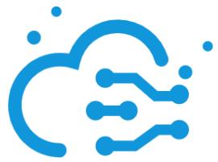

natural_image

Abstract blue icon of a cloud with circuit-like nodes and dots, no text or symbols present

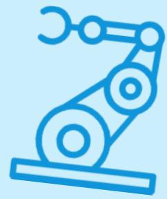

natural_image

Blue line icon of a conveyor belt system (no text or symbols)

natural_image

Blue silhouette of an industrial factory with smokestacks emitting smoke (no text or symbols)

natural_image

Blue stylized illustration of a winding mountain path with growing plants and trees (no text or symbols)

## 关于本报告

本报告阐述了凌云光技术股份有限公司（以下简称“凌云光”“公司”“本公司”）及其子公司在可持续发展方面的理念，以及2025年在社会、治理、环境三方面的工作计划及进度。

## 报告的范围

本报告覆盖凌云光及下属子公司，其中财务相关数据采用2025年合并财务报表统计口径，与2025年年报保持一致。本报告时间覆盖范围为2025年1月1日至2025年12月31日，其中数据如无特别说明，均为此期间内数据。

## 报告编制依据

本报告的编制遵循了上海证券交易所的《上海证券交易所上市公司自律监管指引第14号-可持续发展报告（试行) 》，同时参考了全球可持续发展委员会（GSSB)发布的《GRI可持续发展报告标准（GRI Standards)》。

## 报告数据说明

本报告所使用的信息与数据来源于公司实际运营中的原始记录、统计报告及财务报告，统一以人民币作为计量单位。

## 报告可靠性声明

凌云光董事会对报告内容的真实性、准确性和完整性负责，此报告不存在任何虚假记录、误导性陈述或重大遗漏。

## 报告审批流程

本报告于2026年4月27日获得董事会审议通过。

## 报告发布

凌云光ESG报告与年报同期发布，您可在公司官网或上海证券交易所网站（www.sse.com.cn )中获得简体中文、英文电子版。

## 2025年ESG声明

凌云光深耕机器视觉与光电信息领域近30年，始终以“为机器植入眼睛和大脑，赋能光速互联，创造和实现客户梦想”为使命，将环境、社会及治理（ESG）理念深度融入企业发展实践，以“视觉+AI”技术为基础，以市场客户为中心创造核心价值，以技术创新驱动可持续发展，致力于成为视觉人工智能领域的全球领导者。

2025年，公司立足机器视觉“提质、增效、减耗”的业务本质，构建“决策-规划-执行”三级ESG管理架构，通过战略与可持续发展（ESG）委员会统筹重大决策，筑牢业务、内审、审计三道风险管理防线，将ESG要求贯穿“器件-系统-装备-智能工厂”全产品链条，实现技术创新与可持续发展的深度融合。

在环境维度，公司以机器视觉技术赋能全产业链绿色转型，通过高精度智能检测方案，助力客户提高产品良率、减少生产浪费与返工环节的碳排放，推动制造业降本减碳；同步推进绿色工厂建设，布局可再生能源应用与数字化绿色运营，建立全流程环境管理体系，规范废水、废气、废弃物的处置流程，全年未发生重大环境违法违规事故。在社会维度，公司以机器视觉技术推广与价值共创为核心，扎实践行社会责任：通过校企合作、技能培训及行业赛事培育行业专业人才，深化供应链协同赋能，推动上下游企业协同实现可持续发展；在治理维度，公司以合规治理筑牢高质量发展根基，健全法人治理结构，优化ESG治理机制与信息披露体系，强化供应链全周期合规管控与知识产权保护；严守商业道德底线，筑牢反贪反腐与数据安全防线，以透明、合规的治理生态赢得各利益相关方的信赖，为业务稳健运行提供坚实保障。

未来，凌云光将持续以“视觉+AI”创新为核心，深化技术在绿色制造、智能制造、数字经济等领域的场景化应用，携手各利益相关方，共创经济、环境与社会价值协同发展的可持续未来，走出一条自己的IAI道路。

## 走进凌云光

凌云光以光技术创新为基础，围绕机器视觉与光纤光学开展业务，致力于成为视觉人工智能与光电信息领域的全球领导者。公司坚持以“视觉+AI”为机器植入眼睛和大脑，服务工业智能制造与具身智能数据采集。基于近30年在光学成像、视觉软件与算法、精密自动化等领域的技术积累，持续推进产品创新，努力成为客户最优的、战略的、信赖的和荣耀的选择。

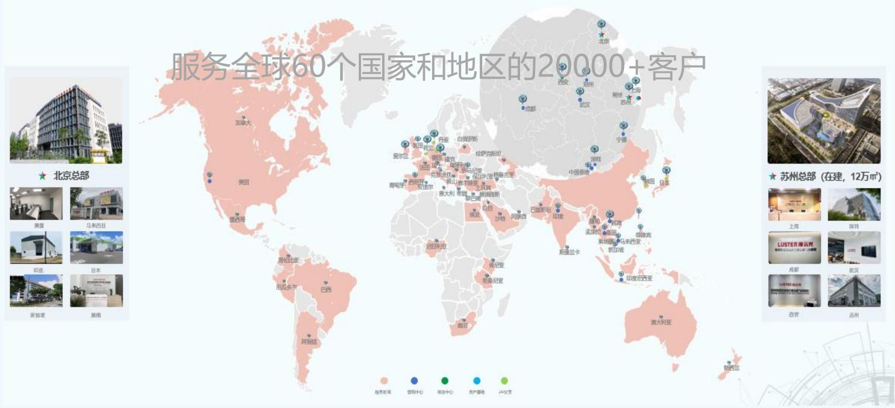

text_image

服务全球60个国家和地区的20000+客户
北京总部
美国
马来西亚
印度
日本
新加坡
越南
新加坡
美国
墨西哥
加拿大
美国
墨西哥
南非
南非多尔
巴西
阿根廷
南非比索
尼西亚
尼西亚
南非
南非
南非
南非
南非
南非
南非
南非
南非
南非
南非
南非
南非
南非
南非
南非
南非
南非
南非
南非
南非
南非
南非
南非
南非
韩国
韩国
韩国
韩国
韩国
韩国
韩国
韩国
韩国
韩国
韩国
韩国
韩国
韩国
韩国
韩国
韩国
韩国
韩国
韩国
韩国
韩国
韩国
韩国
韩国
韩国
韩国
韩国
韩国
韩国
韩国
韩国
韩国
韩国
韩国
韩国
韩国
韩国
韩国
韩国
韩国
韩国
韩国
韩国
韩国
韩国
韩国
韩国
韩国
韩国
新加坡
新加坡
新加坡
新加坡
新加坡
新加坡
新加坡
新加坡
新加坡
新加坡
新加坡
新加坡
新加坡
新加坡
新加坡
新加坡
新加坡
新加坡
新加坡
新加坡
新加坡
新加坡
新加坡
新加坡
新加坡
新加坡
新加坡
新加坡
新加坡
新加坡
新加坡
新加坡
新加坡
新加坡
新加坡
新加坡
新加坡
新加坡
新加坡
新加坡
新加坡
新加坡
新加坡
新加坡
新加坡
新加坡
新加坡
新加坡
新加坡
新加坡
苏州总部（在建，12万㎡）
上湾  深圳  LUSTER 建云光  成都  西安  苏州

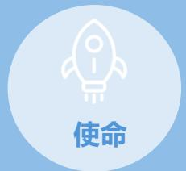

text_image

使命

为机器植入眼睛和大脑，赋 能光速互联，创造和实现客 户梦想

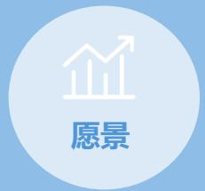

text_image

愿景

成为视觉人工智能与光电信息领域的全球领导者

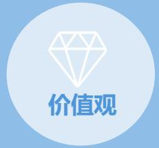

text_image

价值观

以推动行业发展为己任，集体艰苦奋斗。把知识转化为财富让财富归属于它真正的创造者

## 业务智能化

方案、产品与服务智能化

## 员工智能化

AI赋能工作

## 组织智能化

经营管理、项目管理

## 园区智能化

“体验提升+管理增效+运营绿色”

## 工业智能制造

公司深耕工业视觉二十余年，是行业领先的可配置视觉系统、智能视觉装备和核心视觉器件的产品和解决方案提供商。面向工业智能制造的多个行业，为客户提供智能制造与质量检测的多元化产品和解决方案，通过产品持续创新助力工业制造的转型升级。

## 文化元宇宙

基于计算摄像与人工智能技术创新，面向虚拟现实、Web3.0时代数字人、VR沉浸媒体等应用，自主研发了光场建模、全景摄制、运动捕捉、虚拟拍摄等一系列先进产品及解决方案，实现数字人、物、场、境的整合，是国内领先的元宇宙数字内容创作工具平台提供商。

## 光通信

扎根光纤技术的5大主要应用领域（数据通信、电信通信、科学通信、光纤激光、光纤传感），挖掘国际领先技术的高端光电器件、高端设备和仪表等优秀产品资源，持续构建领先的高端产品解决方案，引领和创造国内行业客户需求，赋能数字经济转型升级。

## 支撑业务长期发展的主要战役

面向未来五年，公司围绕工业人工智能、文化元宇宙、光纤通信三大战略赛道，将以战略客户聚焦、国际化布局、多产品组合、四个智能化、资本运作等战略任务为抓手，做好中长期发展的战略能力构建，确保公司在AI驱动的社会变革中实现持续稳健发展。

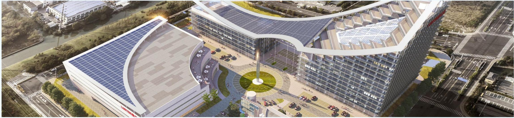

natural_image

Aerial rendering of a modern architectural complex with solar panels and landscaped courtyards, surrounded by roads and greenery (no visible text or symbols)

## 公司发展历程

## 300人机器视觉先行实践

2005

• 分销全球领先机器视觉产品  
自研首台人民币大张凹印在线质量检测系统

## 1000人深耕多行业应用

自研产品应用：印刷包装、显示屏、3C电子、新能源等市场

2015

## 2000人视觉+AI+自动化能力跃迁

• 自动化+AOI，GMQM工业软件+大数据  
• 深度学习 + 模式识别，AI渗透率提升+F.Brain  
• A+B-C战略  
• 收购JAI，机器视觉全球化拓展

2025

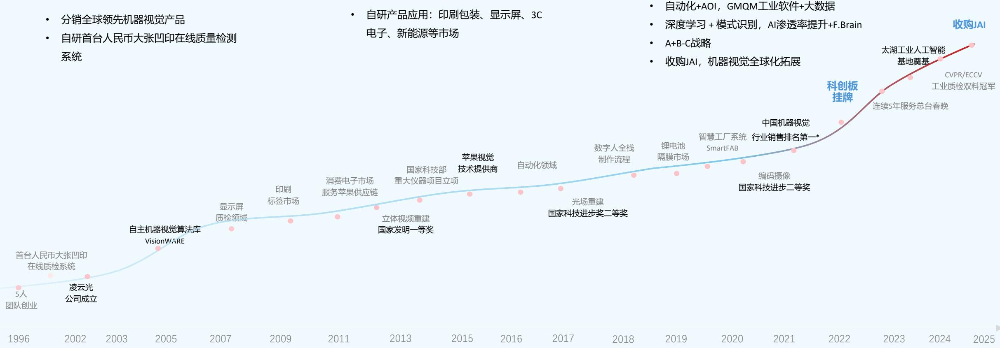

line

| Year | Milestone |
| --- | --- |
| ~1996 | 5人 团队创业 |
| ~2001 | 首台人民币大张凹印 在线质检系统 |
| ~2002 | 凌云光 公司成立 |
| ~2004 | 自主机器视觉算法库 VisionWARE |
| ~2007 | 显示屏 质检领域 |
| ~2009 | 印刷 标签市场 |
| ~2011 | 消费电子市场 服务苹果供应链 |
| ~2013 | 立体视频重建 国家发明一等奖 |
| ~2014 | 国家科技部 重大仪器项目立项 |
| ~2015 | 苹果视觉 技术提供商 |
| ~2016 | 自动化领域 |
| ~2018 | 数字人全栈 制作流程 |
| ~2019 | 锂电池 隔膜市场 |
| ~2020 | 智慧工厂系统 SmartFAB |
| ~2021 | 编码摄像 国家科技进步二等奖 |
| ~2022 | 中国机器视觉 行业销售排名第一* |
| ~2023 | 连续5年服务总台春晚 |
| ~2024 | 太湖工业人工智能 基地奠基 |
| ~2024 | CVPR/ECCV 工业质检双料冠军 |
| ~2025 | 收购JAI |

## 全资收购JAI：全球化战略纵深与产业生态升级

以负责任并购推动"AI+视觉"全产业链整合，实现技术、市场与组织的协同进化

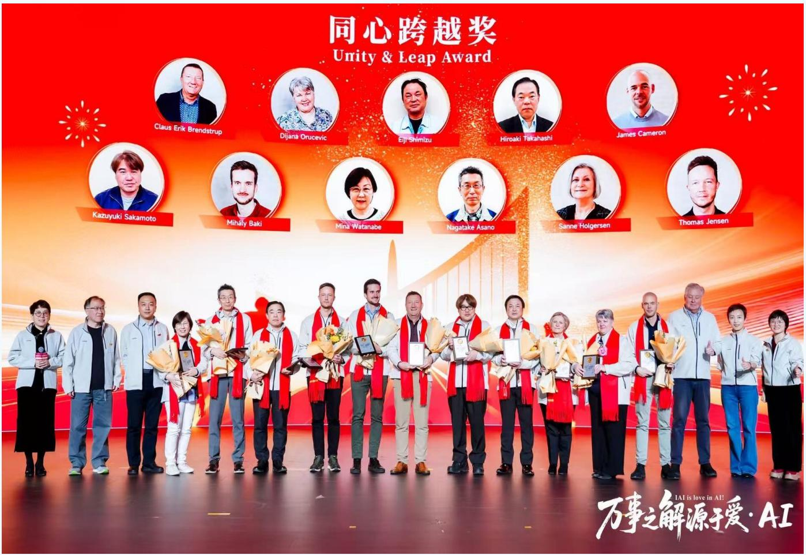

text_image

同心跨越奖
Unity & Leap Award
Claus Erik Brendstrup
Dijana Orucevic
Eji Shimizu
Hiroaki Takahashi
James Cameron
Kazuyuki Sakamoto
Mihály Baki
Mina Watanabe
Nagatake Asano
Sanne Holgersen
Thomas Jensen
IAI is love in AI!
万事之解源于爱·AI

## 本地化治理嵌入

2025年1月完成全资收购，将JAI六十余年光学成像技术与欧美日韩成熟渠道纳入生态，补强全球化布局。快速优化治理结构，推动JAI聚焦核心战略方向，2025年业绩同比提升。

## 技术、市场与组供应链与产品线协同

JAI工业相机补齐公司产品类型，启动互补型号日本转产。整合全球采购需求，构建“中国+日本”双制造基地，共享工程工艺能力，保障全球供应韧性。

## 跨文化组织融合

秉持“尊重专业、本土运营”原则，任命Masao Watabe担任JAI的经营管理负责人，本土团队主导日常经营。建立常态化客户服务渠道共享机制，双方研发团队统一技术规划、共建平台，销售端共享资源双向拓展，实现人才、技术与市场的有机流动。

## 2025年荣誉与奖项

## 科技创新奖项

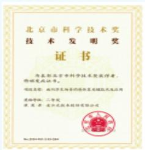

text_image

北京市科学技术奖
技术发明奖
证书

为某单位在科学技术奖获得者，
特颁发此证书。

司址：南京市东阳街的徐延至城建武夷公园
英語年錄：二年號
洪美青：北京光能股份有限公司

北京市技术发明二等奖

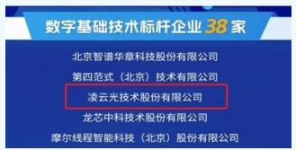

text_image

数字基础技术标杆企业38家
北京智谱华章科技股份有限公司
第四范式（北京）技术有限公司
凌云光技术股份有限公司
龙芯中科技术股份有限公司
摩尔线程智能科技（北京）股份有限公司

2024年北京市数字基础技术标杆企业

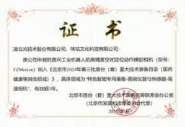

text_image

证书
凌云光技术股份有限公司、咪咕文化科技有限公司：
贵公司申报的面向工业机器人的高精度空间定位动作捕捉相机（型号：FZMotion）纳入《北京市2024年第三批首座（套）重大技术装备目录（医药健康等其他领域）》，具体领域为“特色智能专用装备-高端仪器与传感器-高速相机”，有效期3年。
北京市首台（套）重大技术装备智慧库会议室办公室
（北京市发展和改革委员会办公室）
2018年6月

北京市2024年首台重大技术装备

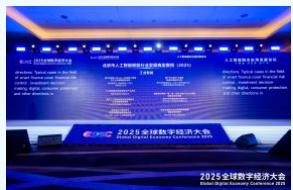

text_image

2025全球数字经济大会
2025全球数字经济 Conference

北京市人工智能赋能行业发展典型案例

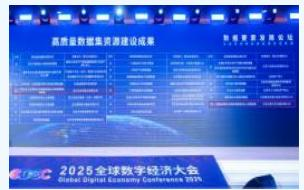

text_image

高质量数据集资源建设成果
2025全球数字经济大会
Global Digital Economy Conference 1979%

北京市行业高质量数据集资源建设成果

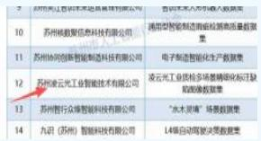

flowchart

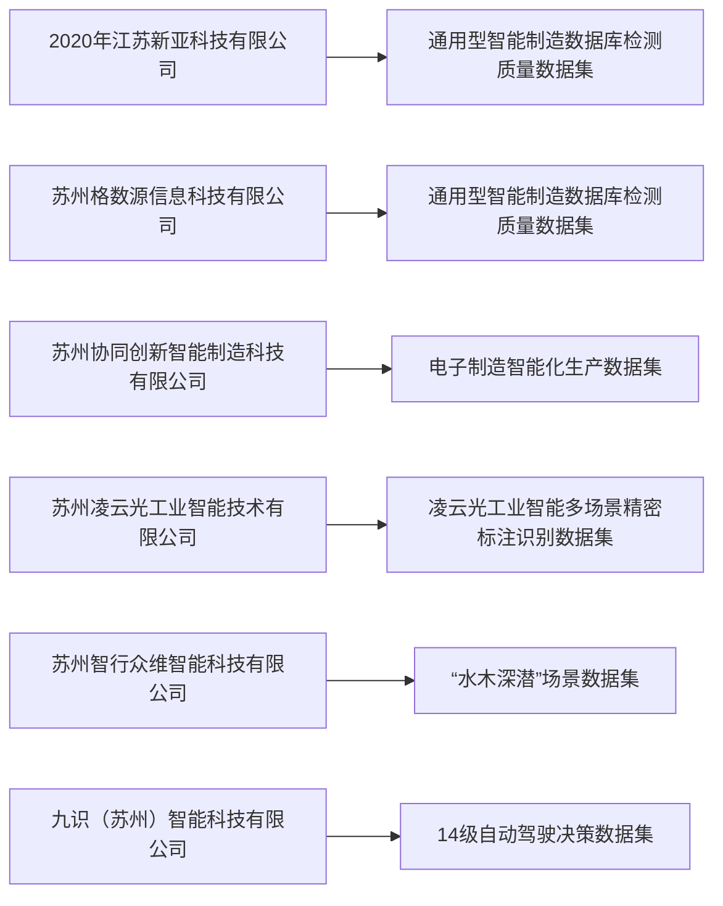
```mermaid
graph LR
  A["2020年江苏新亚科技有限公司"] --> B["通用型智能制造数据库检测质量数据集"]
  C["苏州格数源信息科技有限公司"] --> D["通用型智能制造数据库检测质量数据集"]
  E["苏州协同创新智能制造科技有限公司"] --> F["电子制造智能化生产数据集"]
  G["苏州凌云光工业智能技术有限公司"] --> H["凌云光工业智能多场景精密标注识别数据集"]
  I["苏州智行众维智能科技有限公司"] --> J["“水木深潜”场景数据集"]
  K["九识（苏州）智能科技有限公司"] --> L["14级自动驾驶决策数据集"]
```

苏州市制造业领域高质量数据集

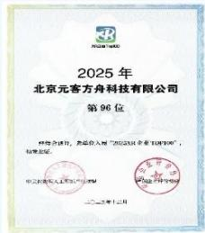

text_image

2025年
北京元客方舟科技有限公司
第96位
特此公告，经办人审字“2025京客方舟”（P19100），
特此公告。
中国证券报（深圳）公司
2025年12月

2025年中国XR100强企业

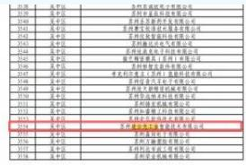

flowchart

```mermaid
graph TD
  A["Step 1"] --> B["Step 2"]
  B --> C["Step 3"]
  C --> D["Step 4"]
  D --> E["Step 5"]
  E --> F["Step 6"]
  F --> G["Step 7"]
  G --> H["Step 8"]
  H --> I["Step 9"]
  I --> J["Step 10"]
  J --> K["Step 11"]
  K --> L["Step 12"]
  L --> M["Step 13"]
  M --> N["Step 14"]
  N --> O["Step 15"]
  O --> P["Step 16"]
  P --> Q["Step 17"]
  Q --> R["Step 18"]
  R --> S["Step 19"]
  S --> T["Step 20"]
  T --> U["Step 21"]
  U --> V["Step 22"]
  V --> W["Step 23"]
  W --> X["Step 24"]
  X --> Y["Step 25"]
  Y --> Z["Step 26"]
  Z --> AA["Step 27"]
  AA --> AB["Step 28"]
  AB --> AC["Step 29"]
  AC --> AD["Step 30"]
  AD --> AE["Step 31"]
  AE --> AF["Step 32"]
  AF --> AG["Step 33"]
  AG --> AH["Step 34"]
  AH --> AI["Step 35"]
  AI --> AJ["Step 36"]
  AJ --> AK["Step 37"]
  AK --> AL["Step 38"]
  AL --> AM["Step 39"]
  AM --> AN["Step 40"]
  AN --> AO["Step 41"]
  AO --> AP["Step 42"]
  AP --> AQ["Step 43"]
  AQ --> AR["Step 44"]
  AR --> AS["Step 45"]
  AS --> AT["Step 46"]
  AT --> AU["Step 47"]
  AU --> AV["Step 48"]
  AV --> AW["Step 49"]
  AW --> AX["Step 50"]
```

2025年创新型中小企业

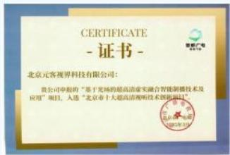

text_image

CERTIFICATE
- 证书 -
北京元客视界科技有限公司:
贵公司申报的“基于光场的最高清晰实融合智能制图技术及应用”项目。入选“北京市十大超高清视听技术研究院项目”

北京十大高清视听技术创新项目

## 科技创新发展资质

<table><tr><td>8711</td><td>常州市锦坤食品机械有限公司</td></tr><tr><td>8712</td><td>常州市杰洋精密机械有限公司</td></tr><tr><td>8713</td><td>苏州凌云光工业智能技术有限公司</td></tr><tr><td>8714</td><td>加腾智能科技(常熟)有限公司</td></tr></table>

子公司苏州凌云光工业智能技术有限公司被认定为国家高新技术企业

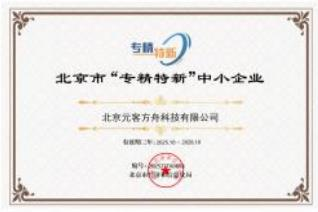

text_image

专精特新
北京市“专精特新”中小企业
北京元客舟科技有限公司
客服热线: 021-8535-90-2020.10
邮编: 600718
北京科汇科技有限公司

北京元客方舟科技有限公司北京市专精特新中小企业

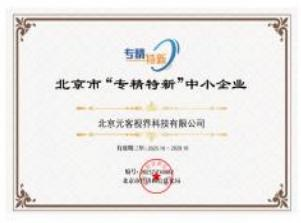

text_image

专精特新
北京市“专精特新”中小企业
北京元客投资科技有限公司
有效期：2018-2023年-2024年
身份证号：6511-00000000
北京市国资委登记处

北京元客视界科技有限公司北京市专精特新中小企业

## 资本市场影响力与ESG专项奖项

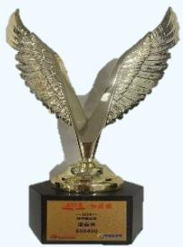

natural_image

Golden winged trophy on a black pedestal (no visible text or symbols)

2025并购重组奖（上海证券报+中国证券报）

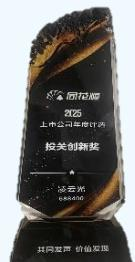  
投关创新奖

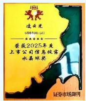  
2025年度上市公司信息披露水晶球奖

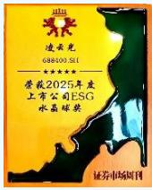  
2025年度上市公司ESG水晶球奖

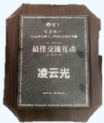  
最佳交流互动

## 2025年关键ESG指标

## 核心经济贡献

2025年营业收入

29.12亿元

分红+回购

5,111万元

基本每股收益

0.35元/股

## 科技创新

研发投入

研发投入/收入

5.11亿元

17.53%

研发人员

研发人员/总人数

687人

36%

深度融合AI算法与自主可控平台，产品全线智能跃迁

## 知识产权

累计专利895个

2025年专利139个

2025年发明专利93个

## 产品质量

产品良率

客户满意度

＞99%

＞90%

客户投诉关闭率100%

全年重大质量事故0起

通过ISO9001认证审核

## 供应链

供应商反腐协议签订比例

95%

同比提升5%

安全协议签署率

95%

同比提升5%

## 人力资源

员工社保覆盖率

补充医疗比率

100%

100%

享受产假、陪产假的员工总数

124人

产假结束后返岗的员工比例

99%

## 绿色环保

2025年环保投入

21.9万元

通过ISO14001认证审核

首年对应气候变化识别机遇

与挑战

## 社会贡献

2025年全年慈善捐赠

172.6万元

实控人连续三年捐款累计

485万元

社校企共建，开设青训班

## ESG战略与管理

凌云光一直以来重视自身的可持续发展能力，致力于建立清晰、匹配当前发展的可持续发展治理结构，旨在协同各相关利益方共同成长、实现共赢，携手推动可持续发展的未来。

在ESG管理架构层面，公司形成了“决策—规划—执行”的三层管理机制。董事会下设战略与可持续发展（ESG）委员会作为决策层，负责对战略、经营及社会生产中的可持续发展重大事项进行统筹决策；在委员会下，公司按照客户、供应链、员工等不同维度的可持续发展议题进行分层规划与执行；其中，董秘办作为治理体系的核心推动单元，负责具体规划和执行的推进。公司通过以上组织运作方式，将年度重点ESG主题、调研、重点事项信息同步、推进决策闭环，形成上下联动、重点贯通的常态化运作机制。

## 战略与可持续发展（ESG）委员会职责

• 研究制定公司长期发展战略规划  
• 对《公司章程》规定须经董事会批准的重大投资融资方案进行研究并提出建议  
• 对《公司章程》规定须经董事会批准的重大资本运作、资产经营项目  
• 进行研究并提出建议  
识别评估包含环境、社会和公司治理在内的重大 ESG 风险和机遇，参与建议公司ESG 策略，包括战略规划、目标设定、政策制定、执行管理、风险评估等事宜  
对公司 ESG 工作进行监督并提出建议，审阅公司 ESG 报告并提出建议、落实董事会授权的其他事宜并监督 ESG 事项推进进度  
• 对其他影响公司发展的重大事项进行研究并提出建议  
• 对以上事项的实施进行检查  
• 董事会授权的其他事宜

凌云光高度重视可持续发展过程中的风险管理，构建了业务、内审、审计协同联动的三道风险防线。通过这一机制，公司能够及时识别运行过程中的各类风险，并采取有效措施进行防控和管理；同时，以风险事项为切入点，反哺内部管理和制度，促进流程与制度的持续完善，保障公司的长期可持续发展和稳健运营。

## ESG风险管理

## 业务防线

业务环节涉及从客户获取到签署、从发货到收款的全过程。公司按照实际业务情况，对业务一线和管理人员进行风险合规培训，将各环节参与人作为风险把控人，杜绝“带病”流程进入后续环节

## 内审防线

公司内部专设内审部，聚焦经营重点和年度重点项目，对公司主要经营活动及流程进行审核，深度把控合规风险，将风险隐患控制在公司内部。内审部作为牵头部门，负责提出系统可行的解决方案，并推动流程的持续优化和完善

## 审计防线

公司在董事会下设审计委员会，通过定期/不定期召开会议，审议业务、管理层决策、会计处理等关键事项，从而履行对重大风险的监督、稽核与防控职责，确保业务防线和内审防线的有效运行

## 产品责任风险

## 商业道德风险

## 供应链风险

## 社会舆情风险

## 人才断层风险

## 数据安全与隐私

利益相关方沟通

<table><tr><td rowspan="2">利益相关方</td><td colspan="2">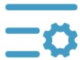</td><td></td></tr><tr><td colspan="2">关注议题</td><td>沟通渠道</td></tr><tr><td rowspan="5">政府和监管机构</td><td>创新发展体系</td><td>产品质量提升</td><td>汇报沟通</td></tr><tr><td>共创价值供应链</td><td>强化公司治理</td><td>监督检查</td></tr><tr><td>投资者权益保护</td><td>遵守商业道德</td><td>调研座谈</td></tr><tr><td>绿色发展</td><td>资源利用</td><td>培训</td></tr><tr><td>社会贡献</td><td></td><td></td></tr><tr><td rowspan="3">股东/投资者</td><td>创新发展体系</td><td>助力智能制造</td><td>公开业绩交流会</td></tr><tr><td>强化公司治理</td><td>投资者权益保护</td><td>定期公告与临时公告</td></tr><tr><td>遵守商业道德</td><td>社会贡献</td><td>股东会</td></tr><tr><td rowspan="3">客户</td><td>产品质量提升</td><td>共创价值供应链</td><td>产品需求调研 客户拜访与来访</td></tr><tr><td>遵守商业道德</td><td>助力智能制造</td><td>产品维护与服务 客户满意度调查</td></tr><tr><td>创新发展体系</td><td></td><td></td></tr><tr><td rowspan="3">供应商</td><td>产品质量提升</td><td></td><td>公开采购</td></tr><tr><td>共创价值供应链</td><td></td><td>供应商大会</td></tr><tr><td>遵守商业道德</td><td></td><td>供应商准入与评估</td></tr><tr><td rowspan="3">员工</td><td>维护员工权益</td><td>员工雇佣与薪酬</td><td>员工绩效与工作沟通 员工大会</td></tr><tr><td>员工健康与安全</td><td>遵守商业道德</td><td>员工投诉 员工满意度调查</td></tr><tr><td>强化公司治理</td><td></td><td></td></tr><tr><td rowspan="4">社会</td><td>社会贡献</td><td>绿色发展</td><td>调研采访</td></tr><tr><td>资源利用</td><td>员工权益保护</td><td>公司披露信息</td></tr><tr><td>强化公司治理</td><td></td><td>行业活动与论坛</td></tr><tr><td>创新发展体系</td><td></td><td>招聘活动</td></tr></table>

## 重要议题识别与评估

公司依据《上海证券交易所上市公司自律监管指引第14号——可持续发展报告（试行）》及GRI Standards 等相关标准，结合自身发展阶段与经营重点，系统开展实质性议题识别工作。通过综合内外部发展环境、经营影响及行业实践进行议题初筛，并围绕影响重要性与财务重要性开展双维度评估，最终确定符合公司发展实际的实质性议题，为可持续发展管理与信息披露提供科学依据。

## 步骤一：遵循规范标准，系统识别议题

## 步骤二：结合内外部环境，开展议题初筛选

## 步骤三：基于双重重要性原则，完成最终议题确定

公司严格遵循《上海证券交易所上市公司自律监管指引第14号—可持续发展报告》及GRI Standards结合企业自身实际与工作重点，系统开展可持续发展相关议题的识别与梳理

公司立足可持续发展宏观背景与自身战略发展方向，综合考量经营活动对环境、社会及利益相关方产生的影响，同时对标产业链上下游及同行业优秀实践，形成初步实质性议题清单结合自身业务模式、核心价值链及与环境、社会的关键关联领域，分别从影响重要性与财务重要性两个维度开展结构化、系统性评估，科学论证议题的相关性与重要程度，最终确定契合公司现阶段发展实际的实质性议题，为可持续发展管理与信息披露提供坚实支撑

## 双重重要性分析

## 财务重要性分析

在影响重要性评估方面，公司从影响的可能性与严重性两大核心维度开展研判。其中，“可能性”结合影响规模、范围及不可补救性三个角度进行量化与定性分析。评估过程中，公司充分聚焦客户、供应商、政府、员工等各利益相关方关切，通过问卷调研等方式收集意见，结合评估分析结果进行综合研判，最终形成议题的影响重要性评价结论。

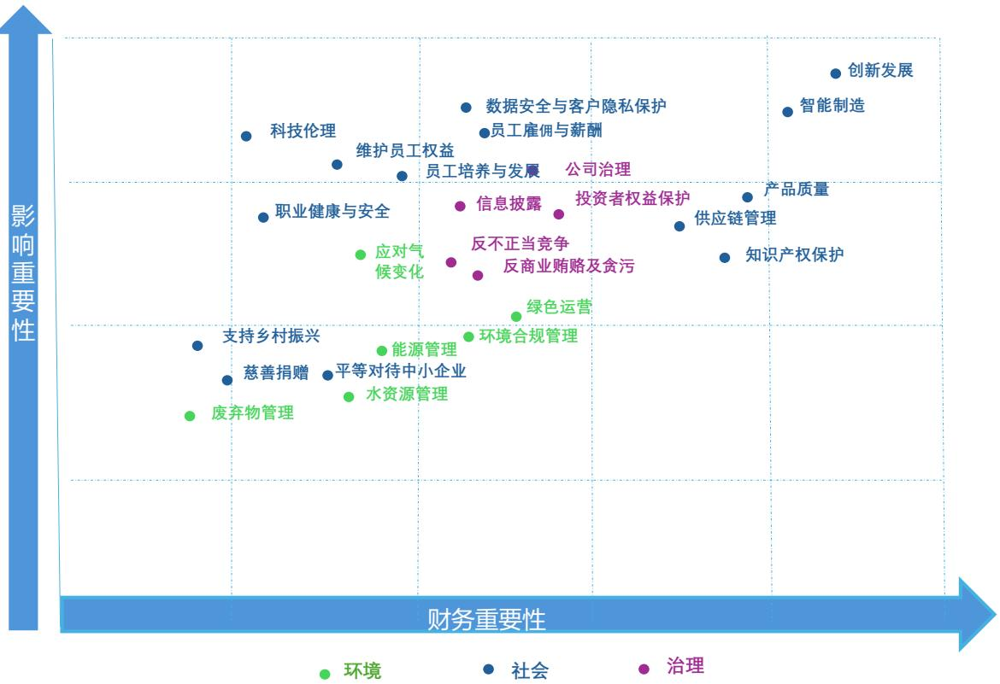

scatter

| Topic | Sector | Financial Importance (Relative) | Impact Importance (Relative) |
| :--- | :--- | :--- | :--- |
| 创新发展 | 社会 | High | High |
| 智能制造 | 社会 | High | High |
| 数据安全与客户隐私保护 | 社会 | Medium-High | High |
| 员工雇佣与薪酬 | 社会 | Medium-High | High |
| 科技伦理 | 社会 | Low-Medium | High |
| 维护员工权益 | 社会 | Low-Medium | High |
| 员工培养与发展 | 社会 | Low-Medium | High |
| 公司治理 | 社会 | Medium-High | High |
| 产品质量 | 社会 | High | High |
| 供应链管理 | 社会 | Medium-High | Medium-High |
| 职业健康与安全 | 社会 | Low-Medium | Medium-High |
| 投资者权益保护 | 治理 | Medium-High | Medium-High |
| 信息披露 | 治理 | Medium-High | Medium-High |
| 应对气候变化 | 环境 | Low-Medium | Medium-High |
| 反不正当竞争 | 治理 | Medium-High | Medium-High |
| 反商业贿赂及贪污 | 治理 | Medium-High | Medium-High |
| 知识产权保护 | 社会 | High | Medium-High |
| 绿色运营 | 环境 | Medium-High | Medium-High |
| 支持乡村振兴 | 社会 | Low-Medium | Medium-High |
| 慈善捐赠 | 社会 | Low-Medium | Medium-High |
| 平等对待中小企业 | 社会 | Low-Medium | Medium-High |
| 水资源管理 | 环境 | Low-Medium | Medium-High |
| 废弃物管理 | 环境 | Low-Medium | Medium-High |
| 环境合规管理 | 环境 | Medium-High | Medium-High |

## 影响重要性分析

在财务重要性评估方面，公司结合短期（1年-3年）、中期（3年-5年）、长期（5年以上）三个时间周期，从财务影响发生的可能性与影响程度两方面进行系统评估。通过定向沟通董事会成员、首席执行官、财务团队负责人等关键利益相关方，最终形成契合企业经营实际的财务重要性议题评估结果。

## 双重重要性议题

创新发展

智能制造

产品质量

供应链管理

知识产权保护

公司治理

投资者权益保护

## 影响重要性议题

数据安全与客户隐私保护

员工雇佣与薪酬

员工培养与发展

维护员工权益

职业健康与安全

绿色运营

反商业贿赂及贪污

信息披露

科技伦理

应对气候变化

反不正当竞争

## 非重要性议题

环境合规管理

能源管理

水资源管理

废弃物管理

支持乡村振兴

平等对待中小企业

慈善捐赠

相关议题说明：公司业务聚焦于机器视觉与光通信，生产经营活动主要在已开发的工业园区，尚未涉及生态保护红线、自然保护地、自然栖息地保护等区域。公司的生产经营活动对生态系统及生物多样性的直接影响小，对公司为非实质性议题，未进行详细披露。

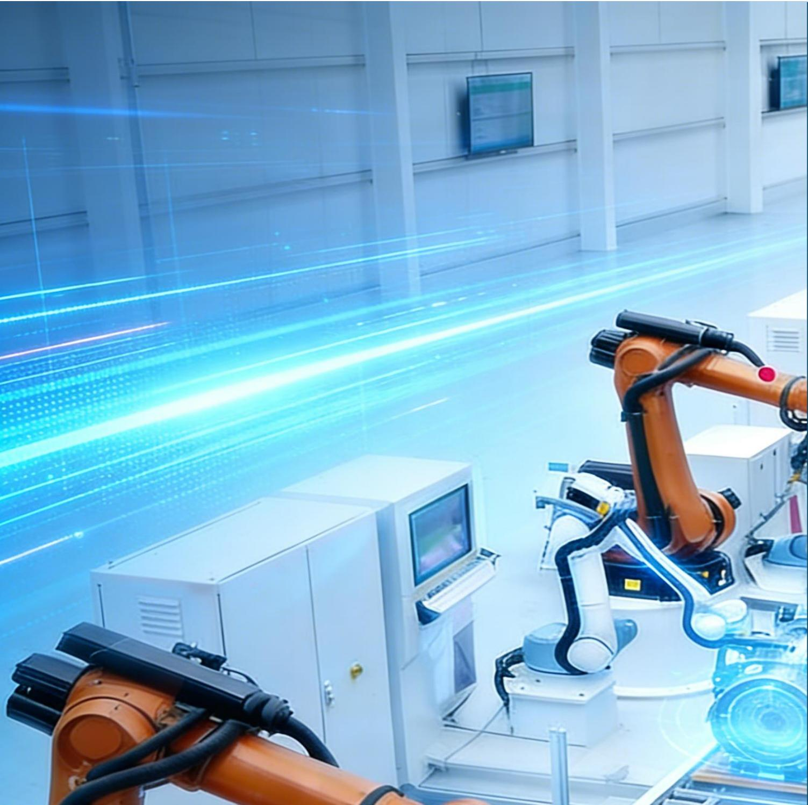

natural_image

Industrial factory scene with robotic arms and glowing blue light trails, no visible text or symbols

## 创新驱动发展

公司构建 “视觉 + AI” 创新体系，完善三级研发架构与 IPD 流程，深耕智能制造，推出多款 ESG 价值突出的创新产品。同时，强化质量管理与供应链风控，推动全链条绿色升级，以创新驱动高质量发展

专题：视觉+AI引领新气象

创新发展体系

助力智能制造

产品质量提升

共创价值供应链

natural_image

Industrial factory floor with robotic arms and automated machinery (no visible text or symbols)

## 专题

## AI 赋能智能制造 底层算法再升级

机器视觉软件平台及AI算法软件方向相关研发的投入最高且增长最快。技术革新特别是AI技术的进步，正在为行业提供新的增长动力。

2025年，公司对底层AI能力升级，实现了核心工具的智能化升级，进一步解决工业质检“深水区”难题，助力客户实现智能制造升级

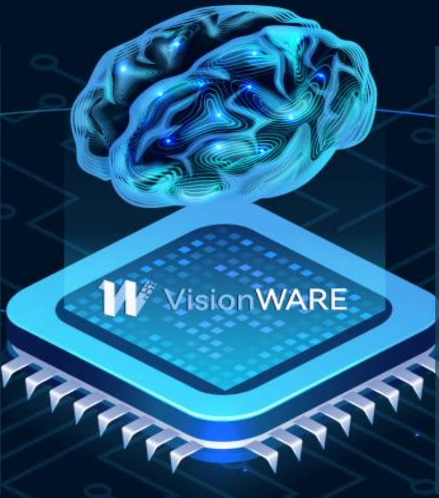

natural_image

Digital illustration of a 11th VisionWARE chip with a brain above it, set against a circuit board background (no text or symbols on the chip itself)

兼顾工业场景效率、精确性和鲁棒性的视觉算法最优解

◼ 170+项专利  
◼ 工业应用算法的10大模块  
◼ 近200个算法工具  
◼ 10000套/年视觉系统应用落地  
◼ 年均1000+个规模项目

## 专题

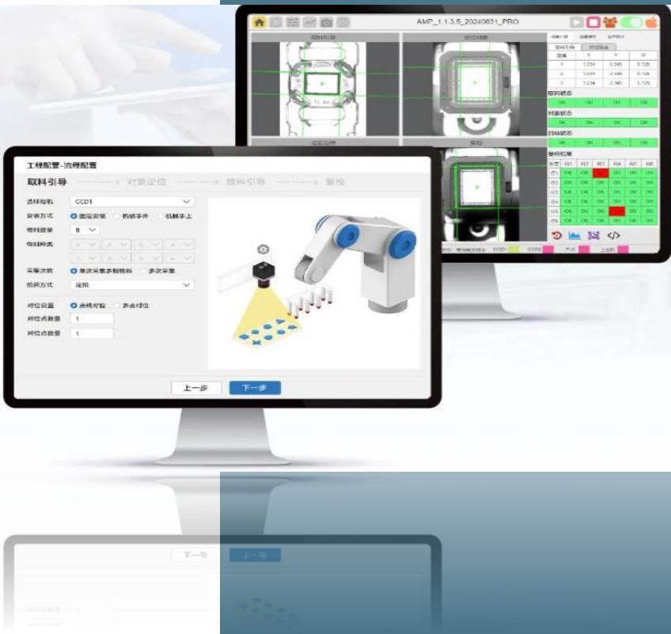

text_image

AMP_1.1.3.5_20240631_PRO
工程配置-流程配置
取料引导
选择钻机: CCD1
安装方式: 固定安装 构质手件 线杆手上
物料信息: 8
钻料种类:
安装次数 单次采集多颗铁屑 多次采集
拍摄方式: 定拍
对位设置: 条线对位 多点对位
对位点数量: 1
对位点数量: 1
上一步 下一步

## AI智驭精密组装

在3C电子领域，凌云光长期深耕视觉工艺创新，为客户提供覆盖精密贴装、量测、检测及激光加工等关键工序的全自主知识产权视觉系统，推动产线向自动化、智能化、无人化转型，已深度服务全国消费电子制造产线。

2025年推出的VisionAssembly Pro智能组装视觉系统，正是在消费电子高精度、快节奏的产线需求中打磨成熟。系统以AI算法与向导式交互将复杂视觉工程简化为产线技师可快速上手的标准操作，支持多相机协同实现引导、贴装、复检全流程闭环，以亚毫米级精度适配各类运控平台，显著提升装配一致性与良品率。内置轻量化AI与智能成像系统，可自适应攻克反光、划痕等复杂工况，保障定位读码稳定可靠；独创九步精度排查法，快速锁定全链路问题、压缩停机时间，保障产线长期稳定运行。

依托在消费电子领域积累的成熟技术能力与场景Know-How，该系统已实现向锂电、汽车、半导体等精密装配场景的跨行业复用，有效降低客户综合制造成本。

## 智印时代 万机同脉

人们对美好生活的向往，是工业生产走向智能制造的原动力。高精度的加工，个性化的制造，零缺陷的产品需求，使得人工无法满足加工制造的要求，机器视觉和人工智能成为新一代智能制造的核心。

公司在印刷行业，提供自动化印刷过程检测、出厂质量终检及智能化大数据质量信息管理的解决方案，实现印刷缺陷检测。目前已有几千套印刷质量检测系统应用于客户现场，并成功进入国际市场，推动印刷工业质量工艺大幅提升。

凌云光在2025年大印展全面展示了智能工厂、彩盒、卷料等领域全工艺印刷质量检测方案。开幕首日，中央广播电视总台新闻频道聚焦印刷行业的数字化转型升级，报道了凌云光以“AI+光学”技术推动印刷业从“人工挑错”到“AI秒杀”智造升级。以凌云光VP8人工智能视觉检测系统检测药盒为例，结合大模型深度学习和光学技术8k工业相机，系统可在印刷喷墨过程中识别13米/秒生产线上的包装瑕疵，AI识别发现瑕疵仅需8毫秒。它还可以预知监测、识别错误预警，避免重复印刷后的浪费，生动展示了中国智造的实力。

## 专题

text_image

Smartphone screen displaying app icons and a grid of function buttons

natural_image

Laptop displaying a satellite image with grid overlay (no visible text or symbols)

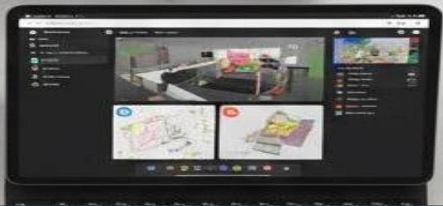

text_image

Screenshot of a video player interface displaying multiple 3D scene thumbnails with Chinese labels and status indicators.

## 智能视觉+AI引领新型显示产业新机遇

在新型显示领域，凌云光聚焦智能视觉检测与全链路质量管理，以高精度光学检测装备和AI大模型双引擎驱动，赋能MicroOLED、柔性显示等前沿技术规模化量产。

公司自主研发的SuperTrain-XMX Micro智能视觉检测装备专为Micro OLED设计，搭载自研1.5亿像素超高分辨率成像模组与集成色度检测系统，支持4K屏最高5000 PPI精准检测，实现100%缺陷追溯，检测速度提升30%，复判效率提升50%。

BrittleMaster-DXN全柔性模组外观检测装备采用全柔性架构，兼容2D至3D双曲/四曲及异形孔等复杂结构，将新机种调试周期由3天压缩至4小时，覆盖100余种缺陷类型，大幅降低漏检率与过检率。此外，公司基于LusterLVM-2B视觉大模型研发模组外观检工业AI大模型，突破传统规则算法限制，实现十级缺陷信息精准分级，通过AIGC技术生成缺陷样本，支持跨机种、跨产线、跨工厂快速适配，显著缩短新产线爬坡周期，为新型显示智能化质造提供坚实底座。 0216

## 专题

## 提升制造质量 助力绿色发展

在新能源制造复杂度不断提升的今天，对智能检测的要求不仅限制于“能发现缺陷”，还需要进一步回复“缺陷是什么”到“为什么出现”的问题。公司将视觉图像（缺陷/形貌）、工艺参数（温度、线速、压力等）、电池物性（致密度、界面接触）这三类信息实现数据化融合，使AI能够真正跨模态地理解制造过程。

以锂电池隔膜检测为例，可以将缺陷细分至27/32类，并自动映射到工艺问题，实现单条产线节省2.5人力、整体良率提升0.3%，整体投资回报周期约1年。

凌云光GMQM+ LUSTERLVM大模型方案，已在锂电、光伏等头部客户中实现规模化落地，帮助客户有效管理检测数据和提升漏检指标，将绿色可持续发展融入产品和服务全过程。该方案有效减少了制造过程中的材料浪费，降低了因原材料、制造模组不良及制造工艺问题导致的重复加工和返工，从而有效减少温室气体排放，提升了制造环节的可持续性。

## 专题

## 助力汽车领域智能制造

随着汽车车身结构愈发复杂、胶路设计愈发精细，传统人工检测效率低、稳定性差的弊端日益凸显，高精度、智能化的涂胶质量管理的需求应运而生。

凌云光推出2D在线式高精度汽车涂胶检测方案，实现涂胶全过程的自动化在线检测与过程控制，融合多场景成像、AI涂胶检测、回流补胶及快速建模工具，可精准检测胶水有无、胶宽、位置及连续性，实现高对比成像和实时高效检测，全面提升涂胶工艺的稳定性与良率。

## 凌云光方案

胶宽测量±0.1mm

位置偏差±0.1mm

800mm/s边涂边检

AI胶检，检出率99.8%

减少人工成本60%，降低返工率80%

## 传统方案

±0.5mm以上

人工抽检，耗时10-30分钟

依赖经验，漏检率>10%

高人力成本与质量风险

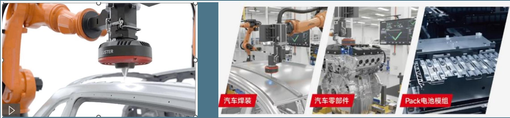

## 专题

## 春晚《梦底》惊艳出圈

2026年央视春晚《梦底》实现业界首次规模化4D高斯光场体积视频直播。节目中，演员与5位亚毫米级高精度数字分身同台共舞、跨时空互动，依托360°多视角光场采集与建模，精准还原肢体动态发丝纹理与微表情，实现真人与数字分身无缝同框。

此次技术落地的核心是凌云光·元客视界LuStage立体光场拍摄系统与4D高斯泼溅（4DGS）技术的深度融合。该方案实现演员1:1超写实动态捕捉、光场重建与4K级实时渲染，构建全流程低延迟、高可靠的体积视频流，完成全球首例4K超高清4D光场重建直播工程，填补了行业内大规模实时光场体积视频播出的技术空白。

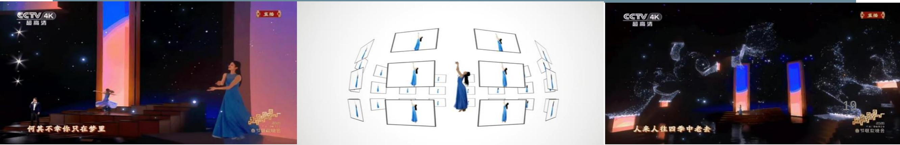

## 专题

## FZMotion动捕助力机器人“走”向应用

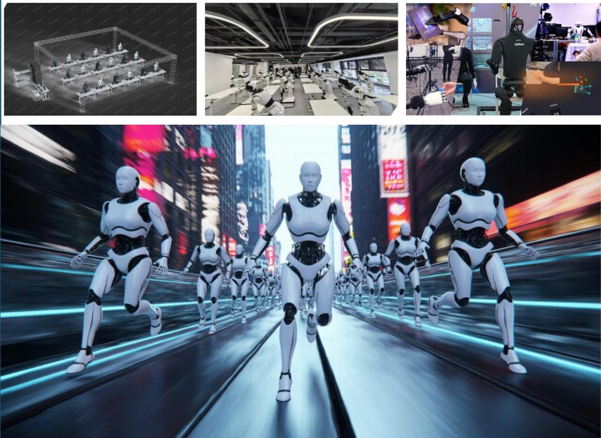

公司FZMotion动捕系统应用于机器人动作采集和出厂检测两个环节，2025年已在多家机器人企业及应用基地实现落地，是技术驱动行业发展的典型实践。

杭州市人形机器人中试基地暨应用推广中心即是今年落地的项目之一。凌云光在此项目中为具身智能数据采集与检测评测提供关键基础设施支撑，既为机器人大脑和小脑提供数据采集支撑，也承担了机器人检测与性能评估的核心功能。

在杭州人形机器人中试基地，公司构建了多工位同步采集与管理平台，年产能超400万条数据，支撑多型号机器人高效训练。

## 创新发展体系

## 研发创新架构

凌云光所在行业具有强科创性的特征，因此建立以客户需求和创新的研发组织体系至关重要。为兼顾当下产品线应用需求、不同行业下一代需求，融合并平衡对于长短期发展的诉求，公司建立了应用产品开发、底层技术开发、下一代新业务预研的三级研发架构，其中：

•应用产品开发聚焦1年内可落地的客户痛点，按产品线敏捷迭代，快速变现；  
•底层技术开发由研究院牵头，沉淀可复用的光学、AI算法、自动化平台，支撑核心底层竞争力；  
•新业务预研设立前沿创新实验室，高校-供应链-大客户联合，3-5年布局，每年以技术Charter评审动态淘汰，确保资源向高潜赛道集中。

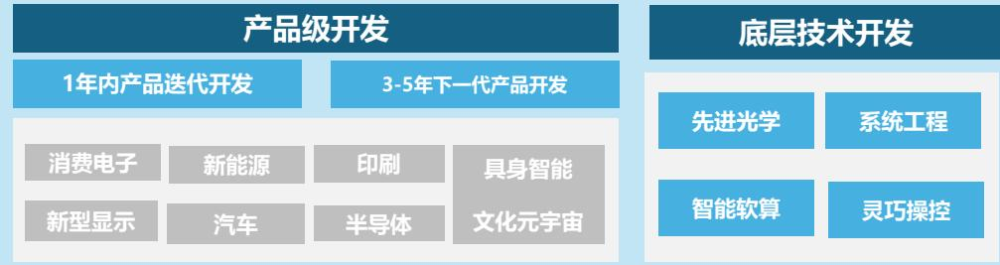

flowchart

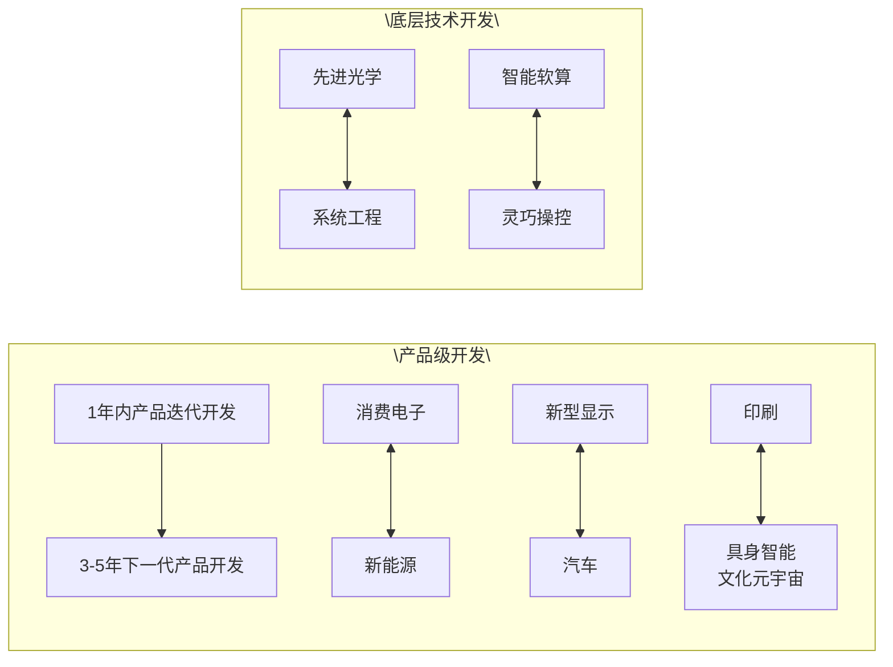
```mermaid
graph LR
  subgraph sg["\"产品级开发\""]
  A["1年内产品迭代开发"] --> B["3-5年下一代产品开发"]
    C["消费电子"] <--> D["新能源"]
    E["新型显示"] <--> F["汽车"]
    G["印刷"] <--> H["具身智能\n文化元宇宙"]
  end

  subgraph sg_2["\"底层技术开发\""]
    I["先进光学"] <--> J["系统工程"]
    K["智能软算"] <--> L["灵巧操控"]
  end
```

公司同步发布《IPD开发流程》《Charter开发管理办法》《技术评审操作流程》，覆盖产品全生命周期：IPD将TR1-5评审、计划、责任人固化到系统，节点未过自动锁权，确保开发质量；Charter把客户痛点量化成可实施、分步骤的商业计划，评审一票否决，杜绝盲目立项；三条研发线共用同一套模板和指标，月度LPMT会公开里程碑、资源、专利红黄灯，亮红灯即刻调整，让规范落地、市场导向、投入快速变现。

## 合作研发

为加强市场需求、前沿技术与产品应用的深度融合，公司积极构建产学研协同创新体系。作为牵头单位及核心参与者，公司与清华大学、智谱AI等顶尖学术机构及企业开展深度合作，将前沿光学、自然语言大模型等尖端技术与智能制造、具身智能等多元应用场景紧密结合，打造了一系列具有示范意义的合作标杆。同时，公司与多行业头部客户建立战略级伙伴关系，共同攻关下一代引领性技术与产品解决方案。在产业生态构建方面，公司与富士康等合作伙伴共建中原智能制造研究院，聚力破解产业自动化关键难题；并联合洲明科技、智谱AI合资成立深圳市智显机器人科技有限公司，共同打造"智能化、交互性、场景适应性"三位一体的AI智能终端创新生态，加速推动智能体在教育、会议、文旅等场景的"显示具身化"落地应用。

## 激发创新动能

为强化研发创新驱动力，公司构建了“即时反馈，分层激励，战略聚焦”的立体化研发激励体系。该体系以技术创新平台化、产品竞争力领先、研发成果商业化为核心导向，通过月度、季度、半年度多周期及时激励，将个人贡献、团队攻坚与组织能力建设深度绑定。重点围绕统一研发环境、端侧研发平台、CBB模块共享等核心技术资产沉淀，以及明星产品可靠性、产品化收入等商业化突破设置专项奖励，同时建立“问题产品断舍离”负向约束机制，推动资源向战略级产品集中，实现从“单点技术突破”到“系统性创新能力”的跃升。

在激励机制设计上，突出“知识沉淀”与“跨部门协同”两大特色，以产品开发团队作为核心激励单元，打破部门壁垒。通过阶梯式激励、正负向结合及四算落实（概算、预算、核算、决算）的项目管理机制，形成“技术攻坚—成果转化—流程固化—能力复用”的完整闭环，持续提升组织能力成熟度和研发效能。2025年，公司研发侧及时激励超百万元。

<table><tr><td>维度</td><td>核心导向</td></tr><tr><td>技术平台化</td><td>1研发效率提升;2缩短开发周期;3产品模块化,产品库建设</td></tr><tr><td>产品竞争力</td><td>可靠性设计领先</td></tr><tr><td>商业化落地</td><td>技术价值通过收入闭环验证</td></tr><tr><td>敏捷决断</td><td>战略聚焦,资源优化配置</td></tr><tr><td>组织能力</td><td>经验萃取与流程标准化</td></tr></table>

## 研发关键岗位培训

为进一步提升关键岗位的研发核心能力，公司在2025年举办了PM（项目管理）专项能力提升培训和SR（解决方案）专业能力培训，构建专业的PM和SR团队。

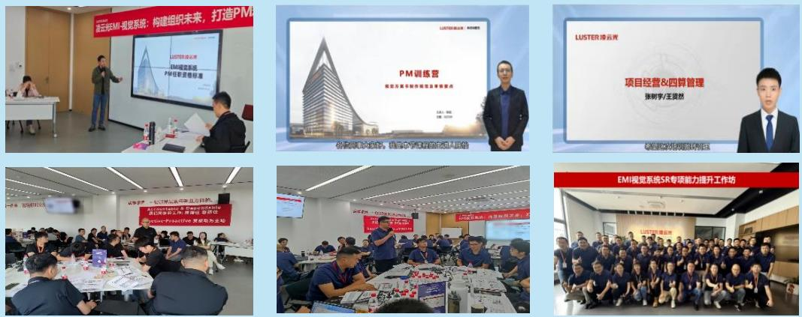

## 研发流程

公司采用 IPD 集成产品开发流程，以实现产品开发高质高效、成果转化顺畅为核心目的，并将管理重点贯穿于概念、计划、开发、验证、发布及生命周期全阶段。通过跨职能团队协同、多节点技术评审与决策评审，统筹需求管理、成本控制、质量保障与知识产权规划，同时联动市场、制造、客服等环节实现全流程闭环管控，既保障了产品竞争力与商业目标达成，也通过规范流程与协同机制筑牢了可持续发展的研发治理基础。

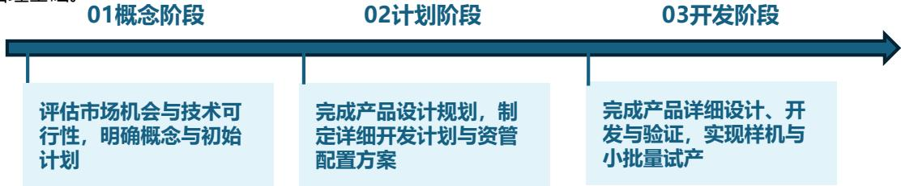

flowchart

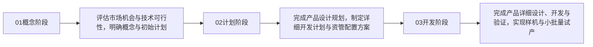
```mermaid
graph LR
  A["01概念阶段"] --> B["评估市场机会与技术可行性，明确概念与初始计划"]
  B --> C["02计划阶段"]
  C --> D["完成产品设计规划，制定详细开发计划与资管配置方案"]
  D --> E["03开发阶段"]
  E --> F["完成产品详细设计、开发与验证，实现样机与小批量试产"]
```

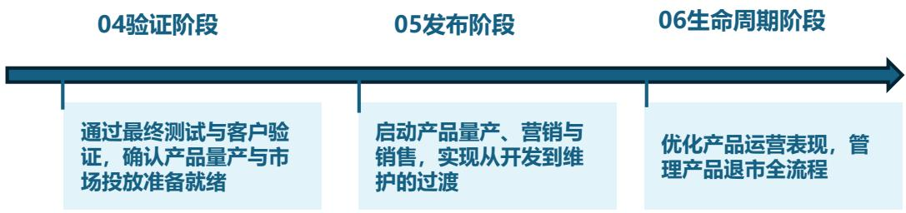

flowchart

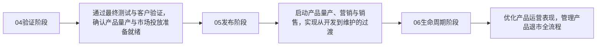
```mermaid
graph LR
  A["04验证阶段"] --> B["通过最终测试与客户验证，确认产品量产与市场投放准备就绪"]
  B --> C["05发布阶段"]
  C --> D["启动产品量产、营销与销售，实现从开发到维护的过渡"]
  D --> E["06生命周期阶段"]
  E --> F["优化产品运营表现，管理产品退市全流程"]
```

## 助力智能制造

## 研发ESG战略

凌云光坚守技术向善、产业赋能的发展原则，以光技术创新为底层支撑，构建以“视觉+AI”为核心的发展格局，围绕技术自主化、场景深度适配与可持续运营构建核心竞争力，聚焦智能制造与数字经济核心需求，将ESG理念融入业务全流程，助力产业绿色升级、社会高效发展与治理能力提升。

## 工业领域：深耕智能制造，推动产业降本减碳

◼ 在工业领域应用的机器视觉业务以“提质、增效、减耗”为核心目标，覆盖“器件-系统-装备-智能工厂”全产品链条，深度融合“视觉感知+AI决策”能力，聚焦绿色低碳与高效协同。聚焦消费电子、新型显示、新能源、印刷包装、汽车、半导体等工业领域，为各行业头部客户提供精密检测与生产优化服务，以自动化检测替代人工操作，既提升生产效率与产品合格率，又减少人力投入与资源浪费。  
◼ 构建完善的四级产品体系，通过收购JAI完善高端视觉器件布局，构建可配置视觉系统、智能视觉装备及智能工厂解决方案，助力企业实现生产流程智能化升级。  
◼ 依托自主研发的VisionWARE算法平台与工业通用视觉大模型F.Brain，突破工业检测技术瓶颈，推动核心技术自主可控，筑牢产业安全与技术合规底线，践行ESG治理层面的技术责任。

## 元客视界：布局前沿智能，丰富数字服务场景

◼ 构建“后台要素-中台方案-前台应用”三级产品架构，凭借高精度光学运动捕捉、光场建模等核心技术，打造XR虚实融合、数字人等产品及解决方案，应用于文化传播、电商服务等场景，丰富数字服务形态，助力文化产业创新发展。  
◼ 以计算摄像与人工智能技术为核心，支撑虚拟现实、沉浸媒体、具身智能等前沿领域发展，布局未来智能生态，同时坚守技术合规与伦理底线，推动前沿技术正向应用，践行科技创新的社会责任。

## 光通信：聚焦AI算力基础设施核心需求，助力数字基础设施高效、低碳、安全发展

◼ 引进国际领先企业的高端光纤器件与仪器，聚焦高门槛、高服务需求的高端市场，合规开展代理业务，服务光通信产学研及行业头部客户，避开中低端同质化竞争，构建合规、高效的业务模式。  
◼ 围绕AI算力基础设施“高带宽、低时延、低功耗”核心需求，布局OCS全光交换机、全自动光子引线键合等下一代光通信产品，助力数字基础设施节能降耗、高效协同，支持数字经济绿色可持续发展。

## 2025年研发成果

公司持续深耕机器视觉领域，2025年密集推出多款创新产品，服务工业智能制造的多领域下游，覆盖消费电子、新能源、印刷、汽车等核心场景。2025年新产品呈现“高精度、智能化、多场景适配”三大特征：一方面，突破亚微米级成像、超高速飞拍、多光谱光学等关键技术；另一方面，深度融合AI算法与自主可控平台，实现从传统视觉检测向智能决策的跃迁。这一整体布局体现了持续推动制造业数字化转型升级的决心。

公司的新品通过AI视觉技术替代人工作业，在提升制造安全性的同时提高了生产效率；以高精度检测减少资源浪费，践行绿色制造；以自主可控平台建设保障治理与供应链安全，将ESG理念和社会责任融入产品研发全生命周期，助力客户实现经济效益与社会价值的双重提升。

## 2025年典型新品

## VisionWARE核心算法平台

产品简介：聚焦AI智能升级，核心工具已经实现了「AI+规则」融合，定位、识别以及检测成功率99.99%以上，解决多行业的应用检测难题

社会价值：降低工业制造企业转型门槛，推动产业链升级

ESG价值：突破工业软件"卡脖子"难题，降低供应链安全风险，保障产业数据安全

## JAI Sweep16K线扫描相机

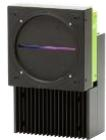

产品简介：16K分辨率（3 x 16384像素，RGB线），100kHz扫描速率和5μm灵敏度

社会价值：为动力电池等新能源产业提供核心检测零部件，助力清洁能源产业发展与能源结构转型

ESG价值：高灵敏成像减少重复检测次数，低功耗设计降低设备能耗

## VisionPrint8智能视觉系统

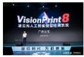

产品简介：自研AI算法，450米/分钟高速检测，0.08mm缺陷识别精度，应用于包装领域

社会价值：将工人从高强度、高重复的目检作业中解放，改善职业健康环境，提升劳动尊严

ESG价值：替代传统人工目检，减少印刷废品与材料浪费，降低生产能耗；高速检测提升产能效能

## 3D模组外观检测设备

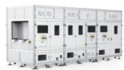

产品简介：兼容2D/2.5D/3D/四曲面全形态，成像一致性>99%，缺陷检出率提升至99%

社会价值：为消费者提供更高品质保障，减少因质量缺陷导致的产品召回与资源浪费

ESG价值：统一多场景质检标准，实现跨制程、跨厂级质量数据贯通，提升制造业管理透明度与可追溯性

## 2025年研发投入

2025年，公司共计研发投入 5.1亿元，研发投入占收入比重为17.46%

累计专利895个

累计发明专利484个

累计实用新型专利379个

累计外观设计专利32个

新增专利139个

新增发明专利93个

新增实用新型专利44个

新增外观设计专利2个

2025年研发人员 687人

研发人员占总人数比例 36%

博士 1.46%

硕士 41%

本科以下 57%

近5年研发投入  
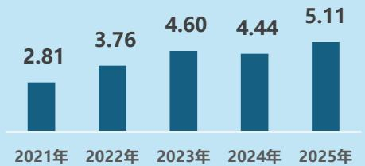

bar

| Year | Value |
| --- | --- |
| 2021年 | 2.81 |
| 2022年 | 3.76 |
| 2023年 | 4.60 |
| 2024年 | 4.44 |
| 2025年 | 5.11 |

公司一直重视研发投入，近5年研发投入复合增长率达16%，主要投向底层技术及应用产品开发

## 新获创新资质与奖项

2025年，公司继续以“视觉＋AI”为锚点，一边深耕工业制造现场，一边布局具身智能赛道，两条线的产品和服务同步收获客户口碑与社会认可。报告期内，苏州凌云光工业智能技术有限公司通过国家高新技术企业认定，并入选江苏省“2025 创新型中小企业”；元客视界与元客方舟双双获评“北京市专精特新中小企业”。智能制造与具身智能两大板块获得十余项奖项，技术实力与成长潜力得以体现。

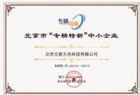

text_image

专精
北京市“专精特新”中小企业
北京元客方舟科技有限公司
客服热线：010-8536-99 2025-09-2025-11
编号：2025-074
承办单位：北京京客方舟科技有限公司

元客方舟专精特新中小企业

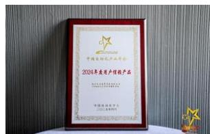

text_image

中国纺织品进出口协会
2024年度用户倍的产品
中国纺织品进出口协会
中国纺织品进出口协会

年度用户信赖产品奖

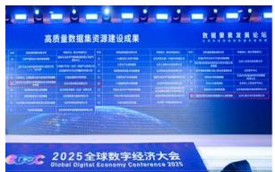

text_image

高质量数据集资源建设成果
数据要素发展论坛
2025全球数字经济大会
Global Digital Economy Conference 2025

北京市行业高质量数据集典型案例

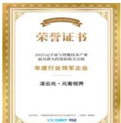

text_image

荣誉证书
2025元宇宙与智能技术产业
最具潜力挖掘价值关注榜
年度行业领军企业
凌云光·元客视界

元宇宙年度行业领军企业

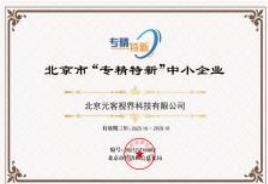

text_image

专精
创新
北京市“专精特新”中小企业
北京元客视界科技有限公司
有效期: 2015-2018-2020年
身份证号: 91370000
联系电话: 021-63461888

元客视界专精特新中小企业

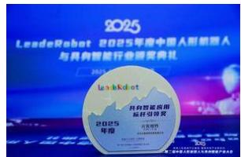

text_image

2025
LEadeRobot 2025年度中国人形机器人
与具有智能行业研究典礼
LEadeRobot
2025年度
具有智能应用
科技研究院

2025年具身智能智能应用标杆引领奖

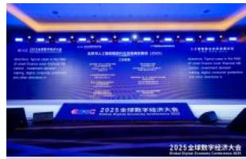

text_image

2025全球数字经济大会
2025全球数字经济大会

北京市人工智能赋能行业发展典型案例

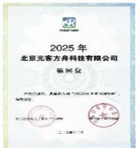

text_image

2025年
北京元客方舟科技有限公司
第96位
公司名称：北京元客方舟科技有限公司
董事会秘书：
北京市东方航空工业集团有限公司
监事会主席：

2025年中国XR100强企业

## 参编行业标准

凌云光把工业人工智能与具身智能在产线和训练场里跑出的真实参数、算法阈值与检测流程，应用于行业标准的编制——工业大模型的缺陷判定指标、数字孪生的接口字段等关键内容，均先经客户现场验证，再成为通用条文；这种将实践经验转化为标尺的做法，既让同行少踩坑，也让公司的先发优势转化为成长期护城河。

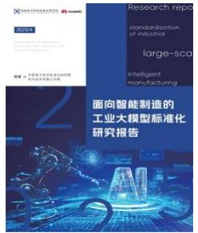

text_image

Research repo
standardization
of industrial
large-sca
intelligent
manufacturing
面向智能制造的
工业大模型标准化
研究报告

工业大模型数据、多行业应用与成功实践的凝练

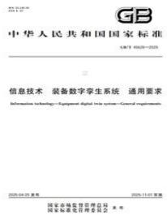

text_image

中华人民共和国国家标准
GB/T 0500-2025
信息技术 装备数字孪生系统 通用要求
Information technology - Equipment digital data system - General requirements
2025-06-25 星期
国家市场监督管理总局
国家标准监督局委员会
2025-11-01 星期

基于在智能产品、智能制造及智能运营等多个场景中数字孪生的实践经验编写 2

## 参与行业论坛

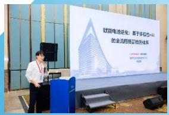

text_image

数据电动说化：基于多层小-1
的全面的视觉体验体系

在2025年固态电池智造与产业链创新论坛上，凌云光围绕《赋能电池进化：基于多模态+AI的全流程质量检测系统》作专题报告，分享公司在电池检测领域的实践与探索。

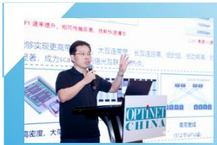

text_image

PI 速率提升，相同传输距离，红外光谱增加
够实现更高宽带、大自连线宽、长自连距离、短时延、低功耗等，高密度、大自
著，成为scand、长波光互联、射频点
OPTNET
CHINA
1000 8000
高密度、大自
高密度、大自

凌云光受邀参加“智算中心光网络论坛”，公司发表《面向智算中心Scale-Up网络光互联探讨》主题演讲，探讨了在AI大模型持续扩展的趋势下，光IO与OCS协同构建智算中心光互联的前沿方案，支撑大规模GPU集群互联。

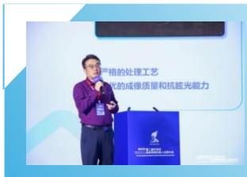

text_image

严格的处理工艺
成像质量和抗眩光能力

凌云光全资子公司元客视界受邀参加2025年第二届中关村具身智能机器人应用大会，并在论坛上发表《基于运动捕捉的具身智能解决方案》的主题演讲，展示了元客视界高精度运动捕捉技术在具身智能领域一系列的新突破。

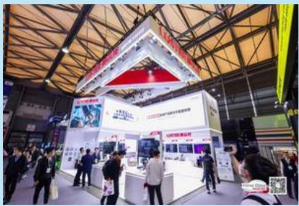

natural_image

Exterior view of a modern office building (no signage)

VisionChina

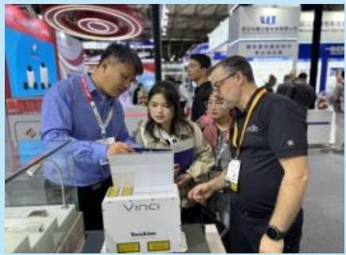

text_image

Street photo with visible store signboards and people examining a box labeled 'Vinci' at an exhibition booth

2025慕尼黑上海光博会

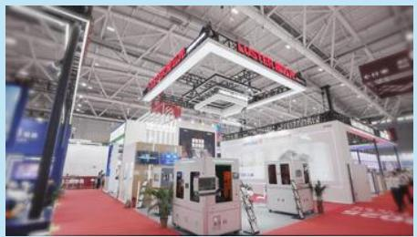

natural_image

Exterior view of a modern office building (no signage)

第十七届中国国际电池技术展览会

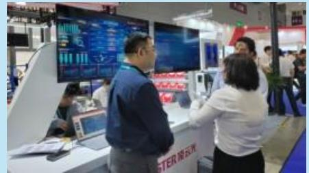

text_image

Exhibition booth scene with attendees and large display screens showing financial data and charts

CHINAPLAS 2025国际橡塑展

## 知识产权保护

公司制定了《凌云光技术股份有限公司专利管理办法》《凌云光技术集团商业秘密与分享管理办法》《凌云光商标管理办法》《凌云光计算机软件著作权管理办法》《知识产权法律红线守则》等各项制度。公司建立了系统化的知识产权管理体系，将专利管理深度融入企业可持续发展战略。公司设立法务部归口管理、研发部门主责、人力资源与财务协同的四位一体组织架构，覆盖专利全生命周期管理——从年度指标规则、技术挖掘专利、三级申请到权利维护与运营转化，形成标准化流程闭环。

在风险防控方面，公司建立了“专利权人预警+技术主题预警+黑匣子件预警”的三层防御机制，将专利检索与侵权风险评估前置至产品开发冻结前，并通过合同条款实现供应链知识产权风险转移，确保技术创新合法合规。同时，公司建立职务发明权属管理制度与分级培训赋能体系，强化员工知识产权意识，以专利质量提升驱动核心竞争力，支撑企业长期价值创造与社会责任履行。

## 产品质量提升

## 质量管理体系

公司以“科学度量，优化基准；实事求是，持续改进；领导带头，全员担当；创造实现客户梦想！”为质量方针，严格遵循《产品检测控制程序》《供应商管理控制程序》《不合格品控制程序》《交付和售后服务控制程序》《持续改进控制程序》等质量管理规范，建立了从研发、供应链、生产、销售服务的全链条的质量管理体系。

公司建立从管理层到基层全员参与的质量管理架构，总裁、经营管理委员会、质量管理部及各个部门负责人均为参与者。一方面由总裁及经营管理委员会、质量管理部共同完成年度质量KPI的制定；另一方面各部门负责人按照产品线的实际情况，进一步拆分为可量化的部门指标；一线员工可提供员工意见通道，提出针对性的改进意见，进一步提升改进质量的执行闭环效果。

## 2025年，公司针对过往质量问题的复盘，明确行之有效的质量举措：

• 首先，质量管理系统全线E化上线，包含研发过程、供应商来料检测及储存、生产制造、成品出厂等各个环节的质量数据E化，推进质量度量科学化、质量问题可追溯；  
• 再次，优化和简化客户问题解决流程，提升客户现场快速响应的能力和解决问题的效率，并通过对照流程与执行的偏差，进一步纠正偏离流程的执行过程，保证流程的贯彻一致性；  
• 最后，公司将客户现场的问题进一步递推根因，从研发端和供应链端根本上解决问题，并补充创建研发设计、产品生命周期管理和产品开发等一系列规范化制度和流程，将质量问题从根本上解决闭环。

报告期内，凌云光技术、凌云光工业智能、凌云光通信、凌云视界、元客方舟等公司主体均通过了ISO9001：2015质量管理体系认证，持续推进质量管理系统标准化。

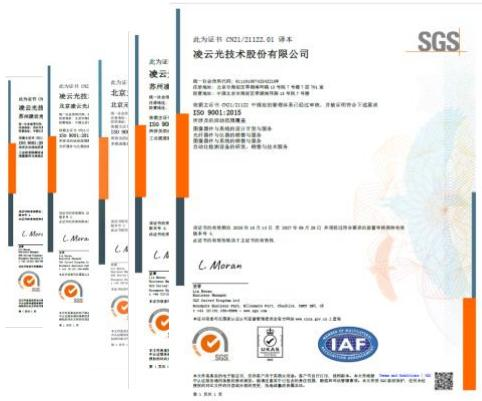

text_image

此为证
CN21/21122.01 译本
凌云光技术股份有限公司
SGS
L.Moran
L.C.Moran
L.C.A.
L.C.A.
L.C.A.
L.C.A.
L.C.A.
L.C.A.
L.C.A.
L.C.A.
L.C.A.
L.C.A.
L.C.A.
L.C.A.
L.C.A.
L.C.A.
L.C.A.
L.C.A.
L.C.A.
L.C.A.
L.C.A.
L.C.A.
L.C.A.
L.C.A.
L.C.A.
L.C.A.
L.C.A.
L.C.A.

## 不合格品控制

公司一直坚持“质量兴业”，将质量作为战略及经营重点层级，建立了多层质量防控措施，在原材料/零部件初到公司时，按照《产品检验控制程序》，在入厂检测、过程检测、成品检测三个主要环节把控产品质量，防止未经检验的不合格品投入使用、加工和交付的环节。

## 入厂检测

入厂检测覆盖采购与外包品，依据合同、图纸、验收准则，核对数量外观及质量证明，功能物料需测试，合格后SAP入库

## 过程检测

生产加工过程按照检测规程、相关检验标准等要求进行检测测定或验证。按照检测类型，按照批量检、全检、抽样等方式开展检测

## 成品检测

对于交付/出厂状态的产品的检测，公司要求检测人员按照成品检测标准执行，对于检测合格后的产品，由库房入库

对来料、生产及成品/半成品检测环节发现的不合格品，严格按《不合格品控制程序》建立风险防线：依据严重性分级审理，确定返工、返修、让步或报废，并在1个工作日内将结论书面传递至执行、仓储、采购等部门，确保及时隔离、标识与处置。质检部每月汇总不合格数据，运用统计工具分析趋势、追溯根因，制定并验证纠正预防措施；结果作为评价产品质量与体系运行绩效的依据，于质量例会专题汇报，对重复及重大问题进行升级督办，实现PDCA闭环，持续优化流程与标准，降低内外部质量损失。

## 售后服务与召回

为规范公司售后服务工作各项业务流程，明确在售后各环节中的工作内容、联系与负责人，公司制定《交付和售后服务控制程序》，规范交付、安装、培训、内外场维修及远程指导各环节职责。交付时资料备件一次到位；安装、培训、报修、内外场、远程全程记录，工程师按约定到场排故，缺件即寄。客服每月汇总服务记录，立改立验，保障及时、规范的服务。公司2025年产品良率达99%以上，产品召回率连续三年为0。

## 客诉问题处理

针对客服投诉问题，公司以制度、流程规范每级问题的响应度，保证问题的快速响应和解决。公司将客诉拆成致命、严重、一般三级，公司制度规定“1小时内必联系、48小时内出临时+长期方案”，责任人和升级路径一目了然；所有事件生成工单，验收签字才能关闭，节点留痕可溯。超4天未解决自动升至事业部总经理或客服总监，质量部专题督办并按月提取共性缺陷，平台同步统计关闭率，CQE逐单回访，形成闭环改进。2025年报告期内，公司的客诉问题解决率为100%。

## 客户问题投诉

分级定责1小时响应

致命/严重/一般三级问题在ITR管理制度中对应明确的第一、第二主责人；所有级别均要求“接收后1小时内联系客户”，确保第一时间安抚并掌握细节

48小时 出具对策

对致命及严重产品技术问题，CQE须在24小时内输出临时举措，48小时内给出“现场临时方案+长期对策方向”，并持续更新进展

单据闭环节点清晰

从ITR事件创建、产品技术问题处理单到客户需求处理单，全流程留痕；验收人签字后方可关闭，避免问题悬空

多维升级专人督办

超过4天未解决的致命、严重问题自动升级至事业部总经理或客服总监； 质量部专题推进、定期稽核，直至闭环

回访+指标 持续改进

CQE在事件关闭后进行满意度回访；平台自动统计“客户关闭率”，每月复盘共性缺陷，推动产品和流程源头优化

## 客户满意度

公司通过对顾客满意度的调查，了解公司是否正确理解并满足顾客当前和未来的需求和期望，根据调查结果持续改进质量管理体系，不断提高客户的满意程度。

## 顾客满意度信息

◼ 客户的需求和期望  
◼ 客户对产品质量、交付、服务等方面的反映  
◼ 客户的投诉信息  
◼ 所在行业的市场动态

## 满意度收集方式

◼ 客户的投诉和意见反馈  
◼ 通过走访、座谈会、问卷调查等主动与客户沟通  
◼ 定期市场调研，收集市场、政府、行业、媒体等相关信息

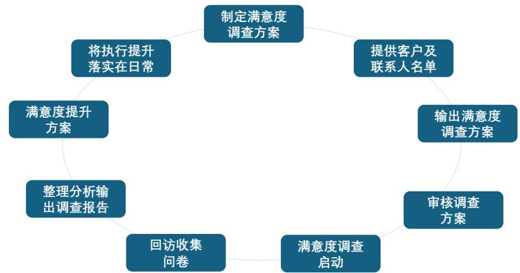

flowchart

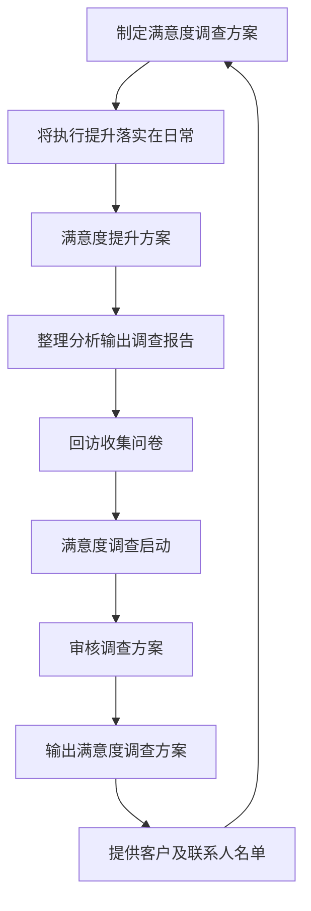
```mermaid
graph TD
  A["制定满意度调查方案"] --> B["将执行提升落实在日常"]
  B --> C["满意度提升方案"]
  C --> D["整理分析输出调查报告"]
  D --> E["回访收集问卷"]
  E --> F["满意度调查启动"]
  F --> G["审核调查方案"]
  G --> H["输出满意度调查方案"]
  H --> I["提供客户及联系人名单"]
  I --> A
```

<table><tr><td>主要指标</td><td>单位</td><td>达成数据</td></tr><tr><td>2025年客户满意度</td><td>%</td><td>91%</td></tr></table>

## 共创价值供应链

## 供应链风险管理

2025年，公司以ESG理念为引领，以"绿色低碳、安全可控、合规高效、韧性协同"为目标，推进ISC流程优化，构建"3+4"采购管理框架，推动供应链从"高效执行"向"可持续赋能"升级。

核心价值流程聚焦全链条效能与绿色管控：SRM供应商管理融入绿色筛选与培育；STC品类管理推动降本减耗；PTP采购履行优化流程、减少浪费。使能流程强化战略引领与合规保障：采购战略锚定可持续方向，成本管理兼顾控制与绿色投入，合同管理嵌入ESG责任条款，运作管理推动数字化转型，形成战略引领、风险可控、绿色可持续的闭环体系。

风险管控迭代《采购风险流程》，将ESG风险嵌入项目全周期，识别交付质量、成本波动、商业舞弊及供应商环保合规、劳工权益等风险，制定防控预案；发布《采购信息管理流程》，规范数据安全与权限管理，夯实治理基础。

数字化建设持续优化SRM系统，将绿色合规、廉洁经营、劳工权益等ESG指标纳入供应商准入与考核；完成《阳光采购协议》与《供应商廉洁管理协议》换签，强化廉洁建设；针对人力供应商新增技术服务、劳务派遣、劳务外包等协议，明确合规用工要求。通过数字化与合规体系完善，从源头消除风险隐患，推动供应链绿色化、智能化转型，带动上下游共同践行ESG理念，实现协同发展。

## 供应商准入

凌云光供应商准入管理以可持续发展理念为核心，构建“资质合规、质量可控、环境友好、廉洁透明”的全维度筛选机制。

## 准入评估

组建跨部门评审组，组建跨部门评审组，从技术、质量、响应、交付、成本五维度综合评分，按业界领先程度与合作规模将供应商分为S/A/B/C/D五级，ESG表现优异者优先纳入战略供应商体系

## 协议管控

签署《诚信廉洁协议》《环境与安全协议书》《采购保密协议》三大核心文件，明确商业道德、信息安全、废弃物管理、安全生产等合规责任，重大负面事项一票否决

## 资质要求

优先选择通过ISO9001质量管理体系、ISO14001环境管理体系认证企业；特种作业人员须持证上岗，禁止强迫劳动与职场歧视；具备知识产权保密能力

## 采购风险评估

## 启动风险 识别

## 组织采购风险识别

## 风险评估

## 预案制定

启动节点：IPD项目环节、年度/半年度节点、重要采购、重大事项主要风险控制点：国际关系、独家供应、交期控制质量风险、环境风险

识别组织：质量代表、技术代表、测试代表、计划代表等共同参与识别目的：对采购代表初步识别的风险进行补充、核实，确保风险识别无遗漏

从“发生概率、影响程度、可控性”三个维度对识别的风险进行量化评估，明确风险等级及核心影响范围

针对性：针对具体风险点制定措施可执行性：明确具体操作步骤、责任人员、完成时限多方案：核心风险需制定主预案+备用预案

## 预案评审

## 风险处理

采购风险评审小组评审BU财委会评审集团评委会

建立“周跟踪、月复盘”机制，对高风险事项执行情况进行专项汇报执行过程中遇到新风险或预案无法落地，立即启动预案优化

## 供应商评价

公司建立全维度、闭环式供应商管理评价体系，紧扣ESG可持续发展要求，从评价、稽核、改进、退出四大环节实现供应商全生命周期规范化、绿色化、合规化管控，持续提升供应链生态的ESG表现与可持续运营能力。公司以技术、质量、服务、交期、成本为核心考评维度，设置定期分级考评机制，将环保合规、廉洁经营、责任履约等ESG元要求融入考评指标，通过量化评分划定A-D四级考评等级，实现供应商绩效的客观公正；同时建立常态化稽核机制，全面把控供应商在生产经营、环保践行、用工合规等方面的实际表现。针对考评及稽核中发现的问题，公司建立专项供应商改进机制，对C级及以下供应商开展约谈沟通，明确ESG及运营层面的改进方向与整改时限，监督整改落地并跟踪验证改进效果，推动供应商持续提升可持续供应能力；公司严格执行供应商退出机制，对连续考评不达标、ESG合规存在重大问题且整改无效的供应商，采取暂停订单、终止合作等措施，从供应链源头剔除风险隐患，保障供应链的绿色、合规、稳定与韧性。 2

## 供应商培训

2025年，公司持续开展供应链培训，聚焦可持续竞争力构建，以“零缺陷、零浪费、零风险”为核心目标。培训要求供应商建立全生命周期质量追溯体系，从SRM系统受控图纸准入，到OQC固定人员100%检验出货，确保数据真实可溯、过程透明可控；推行精益制造标准，通过关键尺寸全检、设备定期校准、工艺防错设计，将良率目标提升至98.5%以上，从源头削减返工报废带来的资源浪费与碳排放；强化商业道德与合规治理，严禁私自变更、弄虚作假等行为，实行廉洁协议全覆盖与黑名单一票否决制；建立双向赋能机制，以"质量卫士奖"投资供应商员工能力建设，以"质量标杆奖"订单份额倾斜激励持续改进。最终推动供应商从被动合规转向主动创造价值，实现质量、成本、交付与可持续性的协同优化。

<table><tr><td>主要指标</td><td>单位</td><td>达成数据</td></tr><tr><td>2025年新增供应商</td><td>家</td><td>480</td></tr><tr><td>供应商稽核</td><td>家</td><td>48</td></tr><tr><td>供应商培训</td><td>次</td><td>21</td></tr><tr><td>供应链廉洁协议签署率</td><td>%</td><td>95</td></tr></table>

## 供应链安全管理

为切实维护供应链安全稳定，筑牢企业可持续运营的供应链根基，公司以保障供应链自主可控、韧性抗风险、合规可持续为核心，通过供应商采购策略制定、供应链协同立项推进、供应链关键环节投资并购实施等多元举措，构建全链条、多层级的供应链安全管理体系，从源头把控、协同赋能、核心掌握多维度强化供应链安全保障能力，推动供应链生态与企业ESG发展深度融合，全方位守护供应链安全。

## 供应商采购策略

公司聚焦供应商安全管理核心目标，构建全流程、多层级、动态化的在采购环节的安全策略，全力保障供应链安全稳定。针对长交期、独家供应、涉美物料等高风险品类供应商，建立多场景触发的风险识别机制，围绕质量、交付、合规、廉洁等安全维度，由采购代表牵头、跨部门评审小组协同开展全面识别与量化定级，严控高风险占比。

组建专业评审小组对供应商相关风险进行三维量化评估，针对不同安全风险等级制定可落地的管控预案，核心风险配套主备双方案，通过开发二供/三供、优化供应商结构、签订长期协议等举措，从根源化解单一供应、交付延迟、质量波动等安全风险。

对预案执行实施“周跟踪、月复盘”全过程管控，根据市场、政策、供应商状况变化及时优化预案，明确跨部门风险对接人强化协同，针对不可抗力启动应急响应，全方位防范供应商安全风险传导，筑牢供应链安全防线。

## 供应商协同创新

2025 年公司成功举办首届供应商大会，以奖项评选树立供应链合作标杆、深化核心供应商合作黏性，同时以此为契机正式发起供应商协同立项行动，将协同立项作为供应链安全管理的重要举措，从技术创新、质量提升、增效降本、出海交付四大维度规划十个协同方向，项目覆盖算力创新、降本增效、国产化等供应链安全关键领域，以供应链上下游技术与资源的深度协同，强化供应链自主可控、韧性抗风险能力，从创新合作层面筑牢供应链安全根基，助力供应链生态的可持续发展。

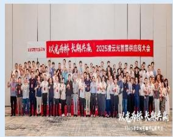

text_image

以光招标 长期共商 2025暨云光智慧供应商大会
以光招标 长期共商

## 投资并购驱动自主可控

为保障供应链连续性与安全，公司在机器视觉上游通过 “自研 + 并购 + 投资” 布局核心环节：2025年初正式并购国际知名机器视觉公司 JAI，补充相机产品线；在芯片领域，先后投资长光辰芯、珏芯微及中科融合感知智能研究院，强化核心器件自主可控；在镜头领域，投资湖南长步道光电，定制开发高精度工业镜头。通过对芯片、镜头、相机等关键环节的投资并购，有效提升了供应链自主可控能力，增强了供应链韧性与安全，为企业可持续发展筑牢根基。

## 平等对待中小企业

公司建立了规范透明的供应商付款管理体系，涵盖对账、审核、执行全流程，公司积极在实际执行中减少对供应商的信用占用，切实降低中小企业贴现成本；大额及计划外付款严格按授权签批，结合资金情况动态调整并与供应商沟通，维护合作伙伴现金流健康，实现互利互赢。2

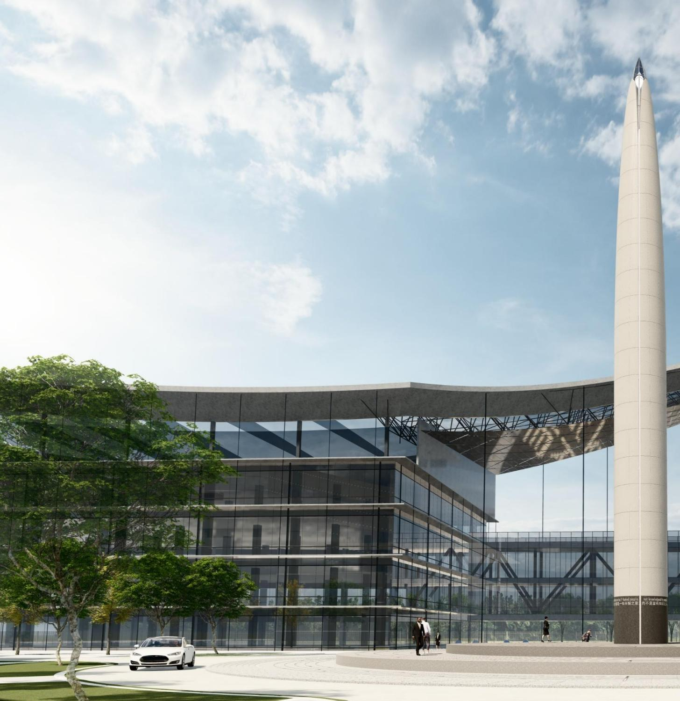

natural_image

Exterior view of a modern glass building with a tall, pointed tower in the foreground and surrounding trees (no visible signage or text)

## 打造合规生态

公司健全法人治理结构，设立 ESG 专门委员会，优化治理架构。完善薪酬、风控与信息披露体系，严守商业道德，强化反贪反腐，筑牢数据安全与隐私保护防线，打造合规治理生态

强化公司治理

投资者权益保护

遵守商业道德

数据安全与客户隐私保护

## 强化公司治理

公司严格遵守《中华人民共和国公司法》《中华人民共和国证券法》《上市公司治理准则》等法律法规和规范性文件要求，构建了由股东会、董事会构成的核心治理架构，并在董事会下设战略与可持续发展（ESG）委员会、审计委员会、提名委员会、薪酬与考核委员会，协助董事会决策，形成权责明确、协调制衡的运行机制。其中，为提升公司环境、社会及公司治理（ESG）管理水平，增强公司可持续发展能力，公司于2025年1月，将原战略委员会调整为战略与可持续发展（ESG）委员会，以加强对可持续发展议题的穿透式管理。同时，依据《上市公司章程指引（2025年修订）》取消监事会，由审计委员会承接监事会职能，通过审计委员会在董事会内部的嵌入式监督，实现了从“事后监督”向“全流程风控”的转变，依托审计委员会成员的专业性与独立性，强化了董事会对财务健康、内部控制及合规治理的直接监管效能。

治理结构  
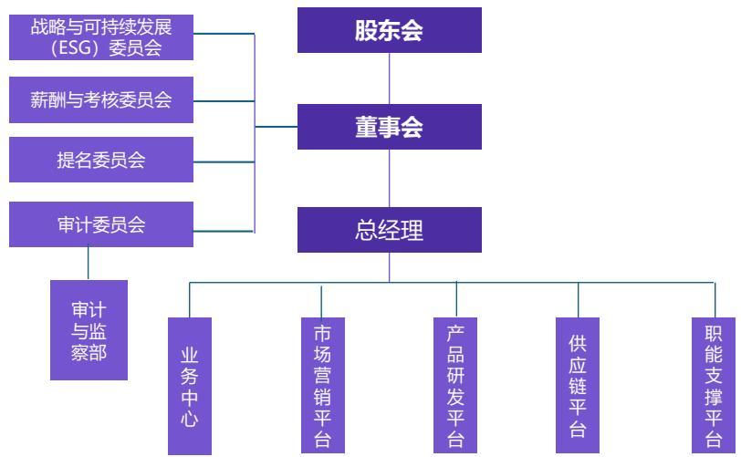

flowchart

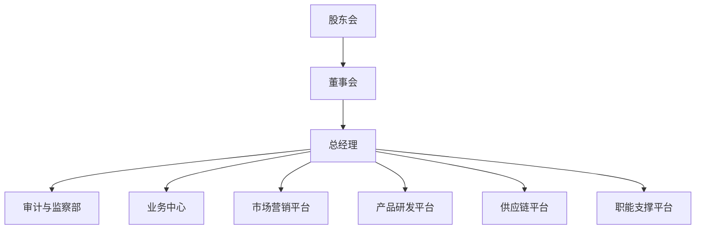
```mermaid
graph TD
  A["股东会"] --> B["董事会"]
  B --> C["总经理"]
  C --> D["审计与监察部"]
  C --> E["业务中心"]
  C --> F["市场营销平台"]
  C --> G["产品研发平台"]
  C --> H["供应链平台"]
  C --> I["职能支撑平台"]
```

<table><tr><td>会议类型</td><td>股东会</td><td>董事会</td><td>监事会</td><td>战略与可持续发展(ESG)委员会</td><td>审计委员会</td><td>提名委员会</td><td>薪酬与考核委员会</td></tr><tr><td>召开次数</td><td>4次</td><td>12次</td><td>5次</td><td>2次</td><td>8次</td><td>1次</td><td>1次</td></tr><tr><td>审议议案</td><td>29个</td><td>59个</td><td>25个</td><td>6个</td><td>30个</td><td>1个</td><td>2个</td></tr></table>

## 加强治理措施

为深化公司治理效能，2025年公司系统性制定、更新20余项核心管理制度。其中，针对国家秘密、商业秘密等敏感信息的披露管理，新制定《信息披露暂缓与豁免业务管理制度》，让敏感信息披露有章可循、有据可依；同步制定了《董事及高级管理人员离职管理制度》，既厘清了离任人员的权责边界，也使关键岗位管理形成了完整闭环。

在制度执行层面，公司严守法律法规及《章程》要求，持续强化关联交易程序管控与独立董事履职保障。一方面，严把关联交易关口。在《关于确认2024年度及预计2025年度日常关联交易额度的议案》《关于全资子公司对外投资暨关联交易的议案》等重大事项审议过程中，均严格执行关联董事回避表决机制，确保决策的公平、公开、公正。另一方面，为适配监事会职能调整后的治理新要求，公司通过强化合规培训、优化监察流程、完善行权支撑等举措，充分激活独立董事监督效能，切实筑牢内部监督防线。

## 董事会构成

公司董事会成员结构呈现高度多元化特征：性别维度上男性7名、女性2名；年龄分布横跨40-50岁、50-60岁及60岁以上三个区间，配比均衡；专业背景涵盖市场、技术、会计、法律、经济等多领域。

在董事会成员构成中，外部董事占比56%，独立董事占比33%。该多元化和独立性强的治理架构有效保障治理决策的科学性与公正性，显著提升董事会整体胜任力与综合治理水平。

<table><tr><td>董事会成员</td><td>职务</td><td>战略与可持续发展委员会</td><td>审计委员会</td><td>提名委员会</td><td>薪酬与考核委员会</td></tr><tr><td>姚毅</td><td>董事长、总经理</td><td>√</td><td></td><td></td><td></td></tr><tr><td>王文涛</td><td>副董事长、副总经理</td><td></td><td></td><td>√</td><td>√</td></tr><tr><td>杨艺</td><td>董事、副总经理</td><td></td><td></td><td></td><td></td></tr><tr><td>赵严</td><td>董事、副总经理</td><td>√</td><td></td><td></td><td></td></tr><tr><td>邬曦</td><td>董事</td><td></td><td>√</td><td></td><td></td></tr><tr><td>许兴仁</td><td>董事</td><td></td><td></td><td></td><td></td></tr><tr><td>王琨</td><td>独立董事</td><td></td><td>√</td><td>√</td><td>√</td></tr><tr><td>西小虹</td><td>独立董事</td><td></td><td>√</td><td>√</td><td>√</td></tr><tr><td>孙富春</td><td>独立董事</td><td>√</td><td></td><td></td><td></td></tr></table>

## 高管薪酬管理

公司对内部董事实行业绩导向薪酬机制，与经济环境、经营结果及个人考核强挂钩，并年度动态评估调整。薪酬结构采用"基本薪酬+长期激励"双元模式，构建股东与核心经营层利益共享、风险共担的共同体，引导董事会平衡短期业绩与长期战略，驱动可持续价值创造，切实保障股东权益与公司基业长青。

## 加强风险管理

公司构建合规嵌入、风险穿透的全面风控体系，以"流程负责人+控制人"双轨制压实责任，实现19项业务全链条监控。事前通过不相容职务分离、分级授权审批设防；事中对资金、采购、研发等关键节点动态预警与评价；事后依托盘点、审计、归档实现可追溯问责。聚焦战略决策、资金安全、供应链、研发成果四大风险领域，形成"目标-识别-控制-监督"闭环，确保经营合规与资产安全。

## 分层授权与权责明晰

◼ 分级审批：建立董事会-总裁-分管副总-部门总监五级审批体系，根据交易金额和事项性质实施分级授权  
◼ 集体决策：所有重要决策需经战略委员会、经营管理委员会集体审议，实现集体决策与个人负责的平衡

## 不相容职务分离机制

◼ 职务分离：在资金、采购、存货、研发等全流程中强制分离申请/审批、执行/监督、保管/记账等不相容岗位  
◼ 双负责制：每个流程明确设置流程负责人和流程控制人，分别负责流程运行和流程监督

## 风险识别与评估机制

◼ 事前风险评估：在立项、采购、外包等关键环节强制要求编制风险评估报告  
◼ 多维度审核：技术、质量、财务、法务等多部门参与专业评审，形成评审意见

## 过程监督与控制

◼ 系统固化流程：通过SAP/CRM/OA/PLM等系统实现流程标准化和自动化控制  
◼ 定期盘点核查：对现金、存货、股东资产等实施定期多次盘点  
◼ 关键控制点标识：在流程图中明确标注关键控制点，强化重点环节管控 1

## 信息透明度

凌云光构建了“对内协同筑基，对外主动披露”的双向透明机制，系统性提升信息披露质量。对内层面，公司加强跨部门信披责任矩阵管理，将财经、投资、法务等关键部门纳入统一责任体系，推动核心事项实现系统化管理与实时信息同步，配套开展针对性合规培训，从源头提升信息生成质量与响应效率；

对外层面，在合规基础上主动增加自愿性披露，在法定公告之外积极推动自愿性信息披露，全年发布多份自愿性公告，涵盖提质增效重回报、参股公司挂牌上市、ESG报告、产业基金设立、回购进展等类别，助力投资者全面了解公司运营动态与发展态势。同时持续深化信息披露形式创新，采用“一图读懂”等可视化方式解读定期报告，降低投资者理解门槛，增强信息的可读性。

这一机制推动公司实现从“被动合规”到“主动价值传递”的关键转型——通过内部流程再造与技术系统固化，打破部门信息壁垒，使自愿披露不再局限于偶发性行为，而是内化为组织化、流程化的日常运作。

## 投资者权益保护

公司高度重视投资者关系管理，致力于与投资者建立长期、稳定、互信的关系。公司严格遵守《公司法》《证券法》《上市公司信息披露管理办法》等法律法规，在2025年8月进一步完善更新《凌云光技术股份有限公司投资者关系管理制度》，确保信息披露真实、准确、完整、公平，主动披露有利于保护投资者合法权益的信息。

公司倡导与投资者开展多种形式的交流，遵循“合规性、平等性、主动性、诚实守信”原则，通过业绩交流会、专项说明会、路演/反路演、电话、投资者热线、上证E互动、股东会等多元化渠道，与机构投资者和个人投资者进行无差别沟通。同时，公司积极参加卖方策略会，安排现场调研、反向路演等活动，并依托官网、微信公众号等媒体平台，及时向投资者传递公司发展战略、经营情况、财务表现等最新动态，深入了解投资者诉求，增进投资者对公司的了解与认同，切实提高公司诚信度，保障投资者合法权益。

<table><tr><td>投资者关系绩效指标</td><td>单位</td><td>达成数据</td></tr><tr><td>大规模公开说明会</td><td>次</td><td>3</td></tr><tr><td>小规模投资者交流会</td><td>次</td><td>100+</td></tr><tr><td>年度投资者接待人数</td><td>人</td><td>850+</td></tr><tr><td>投资者热线接听率</td><td>%</td><td>100%</td></tr><tr><td>E互动问题回复</td><td>个</td><td>86</td></tr></table>

## 投资者权益保护措施

2025年，为进一步加强公司的投资者关系管理，保护投资者权益，公司进行了一系列投资者权益保护的活动、培训和践行实施动作：

## 回购+分红

回购：截至2025年末，公司累计回购股份887万股，累计回购金额1.91亿元；2025年内回购股份30万股，回购金额1,100万元

分红：自2022年上市以来，连续三年分红超过当年净利润的30%（含回购）

## 注销回购

实施目的：提升每股收益水平，切实提高 投资者回报

注销数量：252万股，占注销前总股本的0.54%

## 不减持承诺

承诺主体：控股股东、实际控制人、董事长姚毅及实际控制人、董事杨艺女士承诺自2025年7月7日起未来12个月内，不以任何方式转让或减持其持有的股票

涉及股份：合计22,378万股

## 提质增效重回报

凌云光2025年通过"提质增效重回报"行动，实施内生研发创新与外延投资并购双轮驱动，以产融协同促进主业提质增效，并统筹业绩增长与股东回报的动态平衡

## 未来三年股东分红回报规划

每年现金分红≥当年可分配利润10%

现金股利政策目标：稳定增长股利

三项例外情况：审计非标、资产负债率＞70%、经营现金流为负

## 遵守商业道德

公司恪守商业道德，对腐败行为保持“零容忍”。公司建立《员工商业行为准则》《反舞弊管理制度》等完整体系，覆盖全员及供应商；审计与法务部专设舞弊调查、行权监督等六大职能，通过强制签署廉洁承诺书、定期专项检查筑牢防线。报告期内，公司未发生贪污贿赂、反垄断等违法违规事件，未受到相关处罚。

## 反贪污及反贿赂

在2025年，公司着重于专项审计和合规审计两部分展开反贪污和反贿赂工作。专项审计方面，公司围绕投并购项目、非人工费、太湖基地工程审计、管理层及关键人员离职审计等发起专项审计；另一方面，完成2025年募集资金、年报、ESG报告等上市合规审计报告的编制与发布，切实履行上市合规义务。整体以"以审促建"为核心，通过查清事实、追究责任、完善内控，保障公司健康合规发展。

## 2025年，公司通过构建廉洁合规体系强化反贪腐

工作：完成10场廉洁宣贯培训覆盖400余人次，

干部及太湖基地全员签署廉洁承诺书；实施干部任前调查与诫勉谈话，并将合规风险纳入KPI考核；全面刷新BCG行为准则、阳光协议等制度并组织全员考试；升级供应商廉洁管理制度，增设违约风险预防措施等。

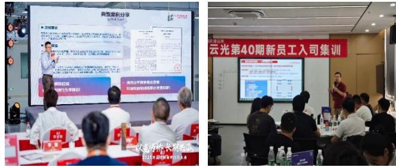

## 举报流程与举报者保护

凌云光为举报人构建全方位保护体系：设立电话、邮箱、信函三种举报渠道，并在集团官网、公司OA、采购协议中公开；实行重奖制度，查实后奖励500-2000元，另按追回损失5%-20%给予最高10万元额外奖励；全流程严格保密，严控调查信息知悉范围，严禁向被举报人或无关第三方透露任何信息。

## 反不正当竞争

凌云光严守法律法规红线，在反腐败基础上严格规范商业行为。公司以核心技术构建差异化竞争力，坚持通过持续创新与效率提升赢得市场，坚决抵制不正当竞争。知识产权保护方面，既筑牢自身权益防线，也充分尊重他人成果，避免侵权。2025年全年未发生任何不当竞争或侵犯知识产权行为。

## 风险管理

凌云光构建权责清晰、覆盖全面的风险治理架构：总经理统筹决策，总裁办主导识别评估与方案策划，各业务部门承担执行主体责任，形成“高层主导、跨部门协同”的治理格局。该体系将风险管理深度融入集团战略、运营与合规全过程，覆盖所有事业部及子公司，通过量化评估、动态监控与定期评审机制，实现风险闭环管理，尤其强化上市公司合规风险、税务风险、经营风险管控，确保重大事项合规，系统性提升公司治理能力与可持续发展水平。

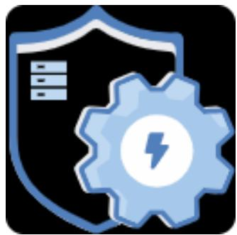

natural_image

Icon of a shield with a gear and lightning bolt symbol, representing cybersecurity or system optimization (no text present)

## 数据安全与客户隐私保护

## 信息安全风险防控

公司针对信息安全的主要风险（未经授权访问、数据篡改、病毒攻击、外部入侵），从账号权限、终端防护、网络隔离、安全意识及上网行为等维度建立了完善的管理制度，确保信息资产安全。在2025年报告期内，公司信息泄露事件0起，持续漏洞修复39次。

## 账号管控防护

实行授权审批、密码定期更换、系统/数据库管理员职责分离，操作日志定期抽查监督

## 终端安全防护

强制安装防病毒软件，定期查杀与病毒预警，防范恶意软件破坏

## 网络隔离防护

生产与办公环境物理/逻辑隔离，防火墙设置最小端口权限，定期巡检网络配置

## 上网行为管理

禁止私自拨号上网及非授权接入，限制大流量下载，工作需要需审批开通

## 信息安全培训

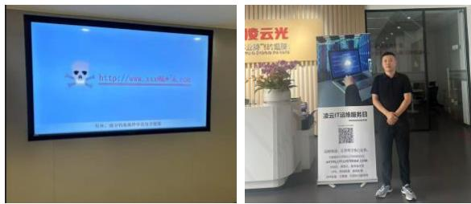

2025年重点培训内容：反钓鱼专项宣传：通过真实钓鱼邮件案例（如异常链接http://.xx+.co）开展警示教育，提升员工识别与防范钓鱼攻击的能力；IT服务自助赋能：推出“凌云IT运维服务日”，正式上线IT教程中心网站，聚合VPN/邮箱配置、SAP安装、亿赛通加密等高频IT服务场景教程，实现自主学习，减少因误操作导致的安全事件。2025年的防范意识培训覆盖公司全体员工。

## 客户隐私保护

公司通过系统化、多层次的防控措施构建隐私保护体系：信息分级管控将全公司信息按重要性分为四个等级，分别配置权限、水印及归档要求，高度保密资料需专项审批并脱敏后使用；存储安全管理统一存储权限，严禁员工在个人计算机处理商业秘密信息，对研发人员实行网络隔离，高层管理人员设备由信息化部专门管控；重点区域防护在关键场所建立门禁制度，外部人员及非邀请员工未经许可禁止进入，由行政管理部归口管理；信息共享管控建立统一共享制度，由系统管理员分配应用权限，搭建文档共享平台并根据机密程度设置部门访问权限。

## 信息化体系升级

在报告期内，公司持续推进数字化与智能化建设，着力推动技术深度赋能业务发展与组织运营。在运营执行层面，通过部署“数字员工RPA”技术，成功实现财务开票、商机获取、采购付款申请等高频率业务流程的自动化处理，显著提升运营效率，同时推动人力资源结构从传统劳动密集型向智力贡献型转型升级。此外，为强化对四大中台的服务支撑，

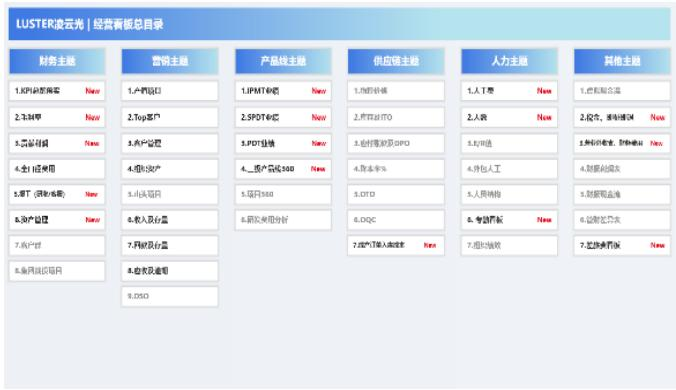

flowchart

This flowchart illustrates the LUSTER凌云光 | 经营新版本目录, detailing the process from core business to other themes.

“数字化BI项目”顺利落地，上线11类数据看板，为运营决策提供实时、精准的数据支持，持续提升管理效能与组织韧性。在专业业务层面，以MOM（制造运营管理系统）、售后宝、TeamCenter及资产管理系统为核心，构建覆盖产品全生命周期与制造、服务全流程的数字化体系。通过技术集成与流程优化，将实践经验与管理规则沉淀为标准化、可复用的数字化解决方案，有效推动生产透明化、服务标准化及运营精细化，为公司高质量发展奠定了坚实的系统基础。

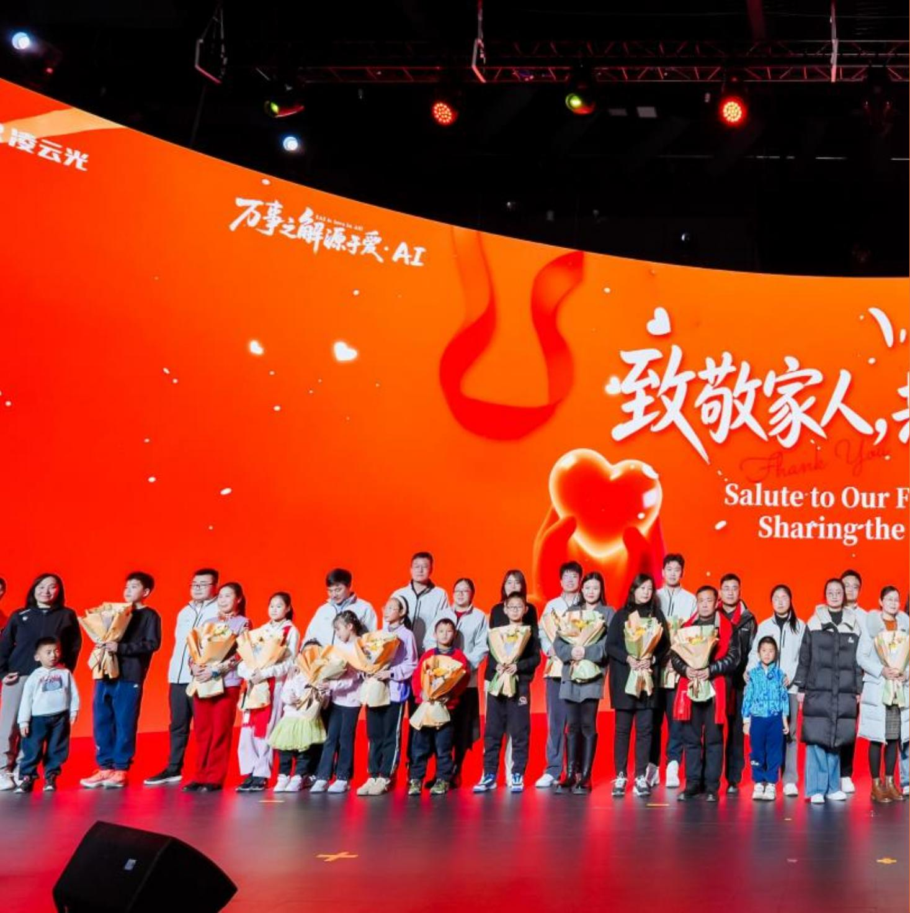

text_image

凌云光
万事之解源于爱·AI
致敬家人，
Thank You
Salute to Our F
Sharing the

## 营造共赢文化

公司践行 ESG 理念，构建规范的员工雇佣与薪酬体系，深化分层分类培养与关键岗位培训。筑牢职业健康安全防线，落实安全生产与研发安全管理，保障员工权益，丰富关怀形式，打造多元包容的职场生态

员工雇佣与薪酬  
员工培养与发展  
员工健康与安全  
维护员工权益

## 员工雇佣与薪酬

## 员工雇佣

公司深度践行ESG理念，将合规治理、社会责任与可持续运营有机融入人才战略全链条：以劳动法律法规为基石构建制度化治理体系，通过回避机制、标准化测评与双轨责任制确保招聘全流程公平、公正、公开，岗位需求、录用标准及评估规则全透明公示，面试环节实行多维度交叉评估与集体决策，杜绝人为干预与暗箱操作，以透明化治理筑牢雇主信任根基；坚决杜绝童工聘用，设立学历核验与应届生资格审核等多重风控机制，规范实习协议与补贴标准保障青年群体合法权益，践行双向选择与内部人才优先激活机制，拓宽员工职业发展通道，促进就业公平与多元化包容；以计划性招聘科学规划人才结构，优化资源配置效率，缩短招聘周期降低运营能耗，将社会责任内化为组织基因，打造值得信赖的可持续雇主品牌，实现企业发展与社会价值的共生共赢。

2025年公司向社会和学校持续引进新鲜血液，新提供350个就业岗位。公司在2025年面向北京理工大学、北京交通大学、哈尔滨工程大学、长春理工大学等多个高校展开校招活动，并在招聘进入公司后按照对毕业生1V1的培养计划和对应培养导师，加速学生从校园踏入社会身份的转变，提升与岗位和文化的匹配。2025年公司招聘了75名应届毕业生。

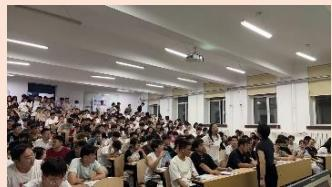

natural_image

Interior view of a large conference hall filled with attendees seated at desks (no visible text or signage)

长春理工大学宣讲会

2025VPC全国大学生虚拟制作大赛由中国电影家协会电影数字制作工作委员会、中国虚拟现实技术与产业创新平台和中国高校影视学会影视产业与管理专业委员会共同指导支持，北京元客视界科技有限公司、上海随幻科技有限公司作为技术支持单位，共同推动虚拟制作行业前沿科技的推广与应用，促进高校与企业在影视制作技术研发、人才培养、就业择业等方面的深度合作。

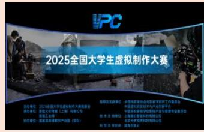

text_image

IPC
2025全国大学生虚拟制作大赛
主办单位：中国电建集团有限公司
承办单位：重庆文冲（上海）有限公司
协办单位：重庆渝富资产管理（深圳）有限公司
项目及支持单位：中国电建集团有限公司
中国电建集团有限公司
中国电建集团有限公司
中国电建集团有限公司
中国电建集团有限公司
北京天源科技有限公司
财务总监：温丽霞

2025全国大学生虚拟制作大赛

## 员工薪酬与福利

公司以《薪酬管理制度》为基础，以“价值贡献者获得竞争力薪酬”为核心理念，采用固定薪酬（基于职位价值评估与能力定档）、浮动薪酬（年度绩效奖金与利润/部门/个人绩效强挂钩)、长效i激励及法定/自有福利四部分组合结构。强调外部竞争与内部公平，男女员工执行同工同酬。人力资源部每年开展薪酬调查，调整方案由总裁办公会审批，形成动态优化的闭环管理体系，支撑公司战略并激励核心人才。

2025年，公司根据战略和经营目标，进一步调整完善了《2025年公司获取分享制实施细则》《2025年长效激励》》《凌云光2025年多元化及时激励奖项》。进一步在奖金分配、长期股权激励及长效激励、及时激励的奋斗者导向的倾向性。

公司构建"四位一体"福利生态体系，以100%劳动合同与五险一金覆盖率筑牢合规基石，补充医疗保险全员覆盖加码健康保障，在此基底上层叠多元关怀：生活保障（午餐/通讯/应届生住房补贴）解除后顾之忧；健康守护（年度体检、家属优惠）护航员工身心；特殊关爱（节日贺礼、节点慰问、境外出差险）传递企业温度；发展共鸣（英才购房低息贷、团建基金）深化长期人才绑定，全方位践行"让价值贡献者共享发展成果"的核心人才观。

## 员工培养与发展

员工的适配性和成长性是关乎企业持续性的关键课题，公司在人才培养方面秉持“分层分级、能力导向、内源驱动”原则，面向高、中、基层及管理者搭建定向培训体系，聚焦新员工融入、基层员工岗位纵向拓展与管理层综合能力提升三大方向。通过年度能力评估动态优化干部梯队、关键岗位等专业人才培养专项，依托线上学习平台与任职资格牵引的课程体系，实现知识沉淀、经验萃取与培训效率提升。同时，系统性构建导师认证与内训师选用预留一体化机制，盘活内部资源打造学习型组织，践行“让知识转化为财富”的社会责任，促进全员成长与组织赋能。

2025年培训投入金额

365万元

2025年培训总时长

18,831h

2025年培训人数

1,903人

## 2025年关键岗位培训

2025年，公司立足线上课程积累，针对新员工、高管及产品经理、客服主管、PM、SR等一线关键岗位，专项打造跨部门协作训练营，深层践行ESG战略承诺：社会层面，通过赋能核心业务人才构建公平成长通道，提升人力资本质量；治理层面，建立标准化梯队培养机制，强化组织执行力与抗风险韧性。该举措深度支撑业务规模化扩展与长期可持续发展，彰显对人才价值创造的战略性投资。

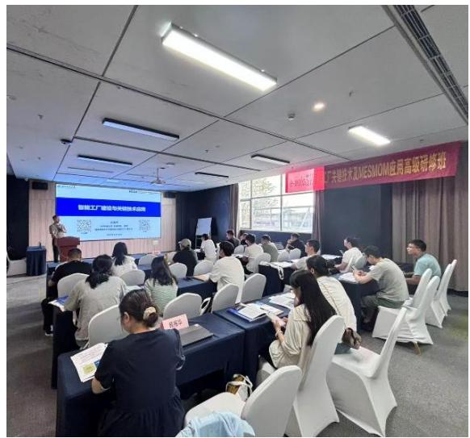

text_image

Conference room photo with visible presentation screen and banners, showing attendees seated at tables and a presentation on the stage.

高管外派学习

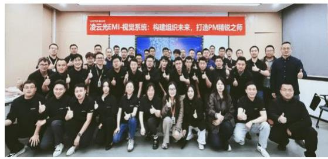

text_image

凌云光EMI-视觉系统：构建组织未来，打造PM晴锐之师

PM训练营  
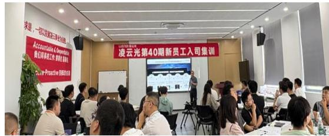

text_image

吴晨，一仪以新员工进岗培训
Accountability & Commitment
来自国家新工作考核基地
Jiangyun Guang 40期新员工入司集训
Clear-Protective 员工培训

新员工入司培训

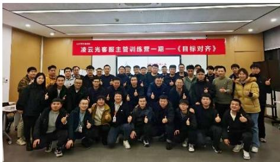

text_image

凌云光客版主管训练营一期——《目标对齐》

客服主管训练营

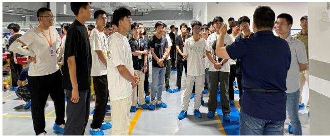

natural_image

Group of people gathered indoors in a factory or lab setting, observing equipment (no visible text or symbols)

新员工培训

## 员工绩效及晋升

凌云光以战略目标为牵引，构建“公司-部门-个人”目标链，通过经营分析与季度复盘形成闭环管理，强化高效协同与目标落地。以“个人绩效+组织绩效”为核心考核方式，为企业可持续发展提供坚实的人才与组织保障。

## 组织绩效

围绕公司战略与经营目标，自上而下分解形成目标体系，通过经营分析、季节复盘实现闭环管理，推动高效协同与目标落地

## 个人 绩效

以绩效结果为核心，综合评价业务贡献、能力提升与岗位胜任力，绩效结果与薪酬、晋升、培训直接挂钩，实现公平激励与职业发展。

公司建立了统一的员工晋升管理流程，将个人职级与绩效考核、晋升相衔接，以责任结果和能力提升为导

向，秉持公平公正原则执行实施。

公司为员工提供管理通道和专家通道双轨发展路径：管理通道：从基层管理者、部门中层管理者、公司中层管理者，到公司高层管理者

专家通道：从部门骨干、部门资深骨干、公司级专家到公司级资深专家

员工发展通道  
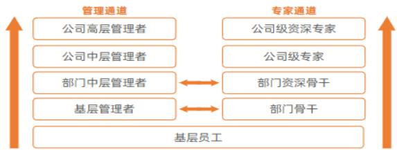

flowchart

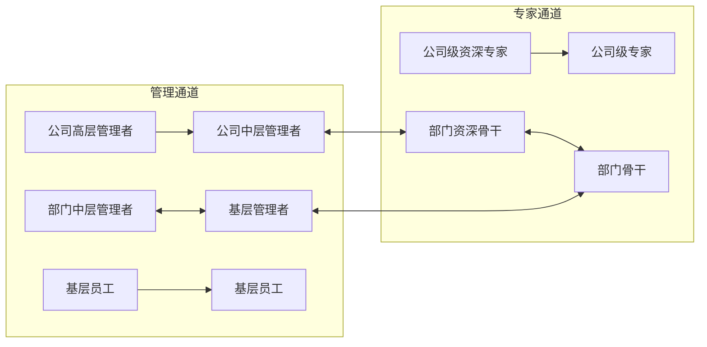
```mermaid
graph LR
  subgraph Management_Correction["管理通道"]
  A["公司高层管理者"] --> B["公司中层管理者"]
    C["部门中层管理者"] <--> D["基层管理者"]
  E["基层员工"] --> F["基层员工"]
  end

  subgraph Expert_Correction["专家通道"]
  G["公司级资深专家"] --> H["公司级专家"]
    I["部门资深骨干"] <--> J["部门骨干"]
  end

  %% Connections between levels
  B <--> I
  D <--> J
```

## 员工健康与安全

## 职业健康安全管理体系

公司秉承“杜绝污染、节约能源；安全第一、预防事故；回报员工与社会；遵守法规、持续改善”的EHS方针，以“零事故”为目标，于2025年系统制定并全面实施了一系列EHS管理提升措施。同年，凌云光技术股份有限公司、苏州凌云光工业智能技术有限公司、苏州凌云视界智能设备有限责任公司等核心运营主体均成功通过ISO 45001职业健康安全管理体系认证，标志着公司坚持并改善EHS运行的规范性与持续性。

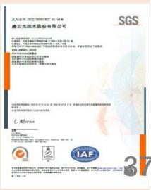

text_image

SGS
建立光电股份有限公司
L.Mirao
IAF

## 安全生产

公司于 2025 年 4 月发布更新安全管理架构，为落地公司安全管理工作，践行 “安全第一、预防为主、有效监查、循环改进” 的安全方针、达成 “零事故” 安全目标，经公司批准刷新安全委员会成员任命，该委员会设置主任、副主任岗位，下设核心组成员、扩展组成员，并配备执行秘书，相关任命通知面向公司各事业部、职能部、各办事处及分公司发布，在全集团内扩散应用。

公司按照《安全生产规章制度》《安全生产教育和培训制度》《凌云光安全生产责任制》等系列规范，保证公司的生产和经营安全。在报告期内，在安全行动上，公司积极按照相关制度流程执行，并按照季、月、日进行安全培训和管理宣贯；为保障员工生产安全，公司在报告期内更换了多地的安全消防设备并定期检修施工设备，在安全方面投入金额近20万元。

## 安全事故应急预案

公司制定设立《企业安全隐患排查治理制度》《关于企业安全生产事故应急预案管理办法》《生产安全事故应急预案》《重大安全隐患报告制度》等系列制度，将重点放在安全隐患的排查和防患上；在生产安全事故发生时，建立工伤、火灾/爆炸、化学品泄露、安全设施失效等多环节中的安全应急预案，保证事故发生时，员工能够获得有效的应对能力；公司同步建立了安全事故报告、处罚和制度改善的机制，确保已经发生的安全事故不再二次发生。

## 安全生产培训

基于制造工艺的关键风险环节，并充分汲取既往风险防控实践经验，公司于2025年面向生产制造部门全员开展危险源辨识与风险控制专项培训。培训采用"以老带新"的传帮带模式，将资深员工在长期生产实践中积累的宝贵经验系统化传承，确保新老员工均能熟练掌握风险识别与应急处置技能，为员工生产安全构筑全方位保障体系。此外，公司坚持每年在全员范围内定期开展消防应急演练及化学品泄漏处置演练，持续强化员工安全意识和实战应对能力，切实筑牢安全生产防线。

## 安全研发

研发实验期间的安全管理以“生命至上”为核心，建立了《研发实验室安全规范制度》《研发实验室操作规范》《研发实验室设备仪器管理办法》《研发实验室行为规范制度》等制度，围绕用电、静电、消防、职业健康及行为规范五大维度，通过一系列刚性制度，构建全员、全过程、全方位的安全防护体系，确保实验室人员、设备及环境安全可控。公司对研发的安全性防控措施能够体现公司对ESG责任的履行。

安全生产专项培训  
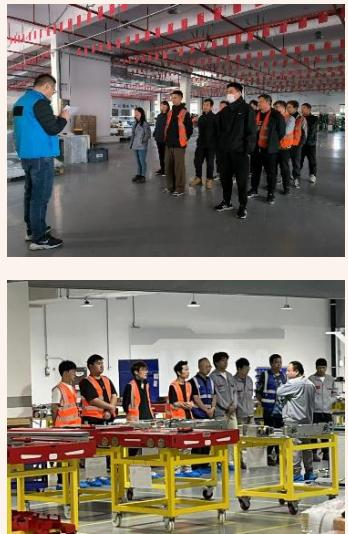

防火演习  
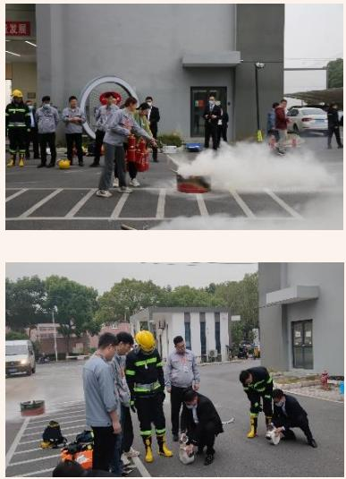

## 对环境保护的体现

严格管控焊接烟雾及挥发性化学品的排放与处置，确保通风设施有效运行，降低有害物质对大气及人员健康的影响

## 保障员工生命权益

建立健全职业健康安全制度，涵盖用电防护、静电防护、物理伤害预防及化学品安全操作，保障员工生命健康权益；通过定期培训提升员工安全意识，强化应急响应能力

## 提升治理防控

制定并执行标准化安全规范文件，明确“十不准”等红线禁令及分级审批流程；建立安全隐患上报与追责机制，确保制度落地执行，形成闭环管理，提升组织治理效能与风险防控水平

<table><tr><td>主要指标</td><td>单位</td><td>达成数据</td></tr><tr><td>2025年因工作关系死亡、重伤人数</td><td>人</td><td>0</td></tr><tr><td>发生职业病例</td><td>例</td><td>0</td></tr><tr><td>职业健康体检率</td><td>%</td><td>100%</td></tr></table>

## 职业健康

为贯彻"预防为主、防治结合"的职业健康方针，公司建立全流程职业病防控体系：定期组织接触职业病危害因素的员工进行专项职业健康体检，系统识别职业健康安全隐患，并针对性制定防控措施、开展应急演练；同时为员工配备并定期维护个人防护装备，对作业环境实施工程改造与设备升级。经专业识别与评估，公司现存的职业病危害因素主要包括化学因素（焊锡烟尘）及物理因素（噪声），可能导致的职业病为呼吸系统损伤、噪声聋等。对此，公司已落实以下针对性防控措施：

## 对有害的工作环境的消除

针对焊锡烟尘：焊锡车间安装集气过滤装置，并每周确认集气系统的过滤芯的有效性，定期进行过滤芯的更换和保养维护

针对噪音：对产生噪音的环境加设隔音墙，日常关门作业，减少噪音的影响

## 对工作个体的防护措施

防护工具：焊接岗位员工在生产过程中必须佩戴防尘口罩，在噪音作业区域人员佩戴防护耳塞；有加工搬运的岗位需佩戴护目镜和橡胶手套等

定期体检：焊烟尘物质岗位人员每1年健康体检一次；作业场所噪音8h等效声级≥85dB,每1年体检一次

## 维护员工权益

## 多元包容文化

公司致力于构建开放、包容、多元化的工作环境，将尊重员工基本权益与促进民主参与深度融入人才管理全周期：在招聘与雇佣环节，为所有候选人及在职员工提供公平一致的发展机会与开放包容的组织氛围；在结社自由保障方面，充分尊重并维护员工依法组建、加入或退出社团组织的权利，员工选择不受任何制约，公司不仅零干预，更主动赋能——每年为符合条件的员工自组织社团提供5000元专项经费支持，激发员工自治活力与组织归属感；在表达自由建设方面，专项设立钉钉沟通社区作为员工自由发表观点、共享信息与知识的开放平台，确保多元声音被听见，并建立建议收集与闭环改进机制，将员工智慧转化为组织进化动力；在权益救济层面，畅通多维度申诉举报渠道，对员工反馈的问题给予积极、及时、公正的回应与处理，以透明化治理筑牢信任根基，真正实现企业与员工共生共长的可持续发展。

公司制定《反歧视、反骚扰、反强迫管理制度》，从招聘选拔、行为规范到待遇保障全流程杜绝歧视行为，坚持不因种族、性别、国籍、宗教、年龄、残疾、婚姻状况、怀孕、性倾向、社团倾向等因素而区别对待；公司特别关注女性就业权益，承诺不歧视已婚或怀孕妇女，对怀孕的妇女做合理的工作量调整，并为哺乳期的女性提供母婴室等专属设施；

截至2025年12月31日

女性员工人数

375

残疾人数

16

## 民主沟通

公司意向建立积极、开放、透明的沟通机制，高层领导积极建立、完善内部双向沟通渠道，鼓励员工能够为企业经营管理提出建议，反馈心声与诉求。公司同样通过各种宣传方式鼓励员工积极沟通，对于员工对企业发展、管理的合理意见和建议积极采纳，形成良好的双向沟通氛围，保证公司高效、平等开展内部沟通与技能共享，促进员工成长。

公司建立健全员工反馈机制，以季度征集和定期反馈制度的模式，收集员工改善专项及合理化建议；并通过定期发布公司内刊，宣传价值观，宣贯公司文化，促进员工理解、反馈、参与价值相关活动，鼓励员工深入参与公司经营管理。

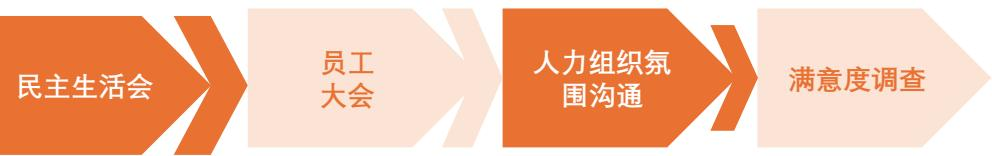

flowchart

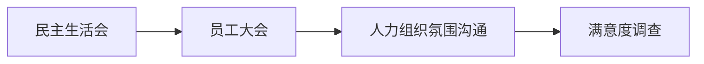
```mermaid
graph LR
  A["民主生活会"] --> B["员工大会"]
  B --> C["人力组织氛围沟通"]
  C --> D["满意度调查"]
```

此外，公司重视所有员工对公司治理的满意程度，定期开展员工满意度调查，通过线上问卷的形式关注与员工息息相关的衣食住行、部门工作、员工活动等方面，并认真倾听员工的建议和意见，针对性制定改善计划，切实回应员工合理诉求。

## 员工关怀

公司建立完善的员工帮扶与慰问体系，聚焦员工实际困难，对遭遇重大疾病、意外事故、家庭困境的员工提供专项帮扶及慰问金支持；同时覆盖员工人生关键场景，设立生日、结婚、生育、丧葬等各类慰问金，辅以普惠福利兜底，切实传递企业温度，筑牢员工生活保障防线，践行 ESG 员工责任。

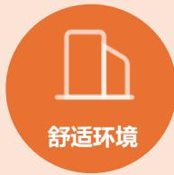

公司持续投入优化员工办公与工作环境，全面排查办公及生产区域安全隐患，完善安全培训体系，为员工提供安全、舒适、便捷的工作空间；同步配套完善的办公保障设施，兼顾员工工作便捷性与身心舒适度，切实保障员工职场安全与健康权益，彰显以人为本的 ESG 理念。

公司高度重视员工心理健康，构建全方位身心关怀机制。定期开展全员健康体检、职业病筛查与义诊，实现生理与心理健康双重保障；通过员工沟通会、多元意见反馈通道，及时疏导职场压力，同时依托团队建设活动，促进劳逸结合，营造平等包容、沟通顺畅的职场氛围，守护员工心理健康。

为丰富员工业余生活，缓解工作压力，公司积极举办各类文体、社团及节假日特色活动，搭建员工互动交流的平台；通过多样化活动开展，增强员工凝聚力，引导员工劳逸结合，营造积极向上、团结协作的团队氛围，助力员工实现工作与生活的平衡，推动员工与企业共同成长。

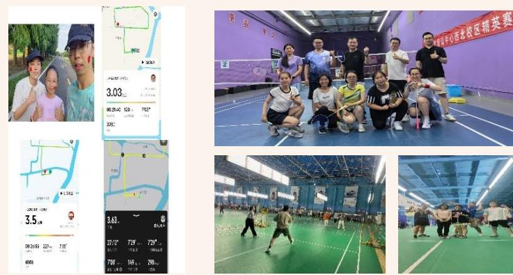  
多色社团活动

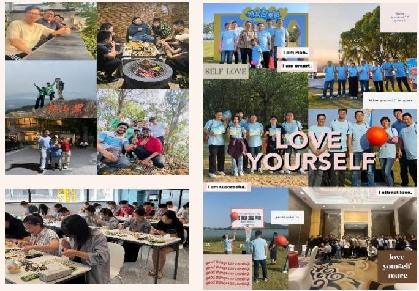  
团建、家庭日、妇女节

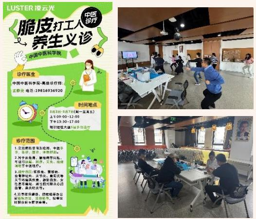  
义诊

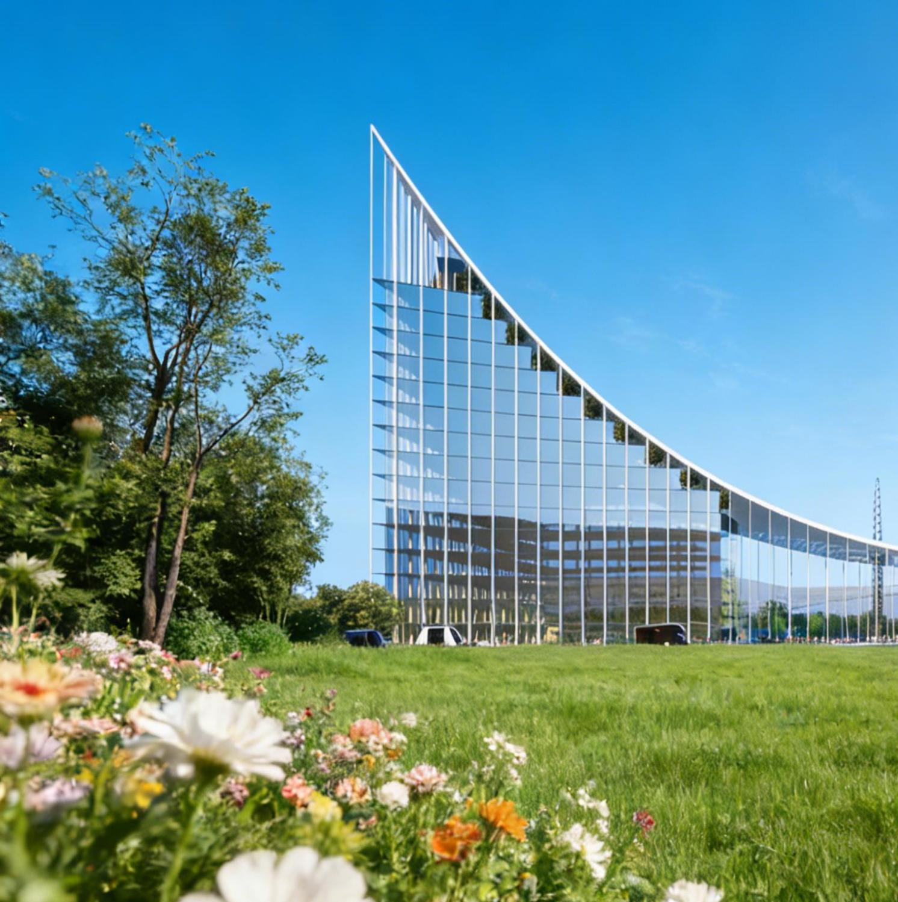

natural_image

Modern glass building with curved roof against blue sky, surrounded by greenery and flowers (no visible text or symbols)

## 同创绿谐家园

公司构建全流程环境管理体系，推进绿色工厂建设，优化能源结构、提升资源利用效率，践行低碳发展。同时，积极投身乡村振兴、人才培养与社会公益，以实际行动履行社会责任，实现经济、环境与社会价值协同发展

绿色发展

资源利用

社会贡献

## 绿色发展

## 环境管理体系

公司严格遵循《环境保护法》《环境影响评价法》《大气污染防治法》《水污染防治法》《固体废物污染环境防治法》等国家环保法律法规，构建覆盖全业务链条的环境管理体系，制定《环境保护管理制度》《废气废水噪声管理制度》《废弃物管理规定》等内部规范，细化污染防治与危废管理要求，为环境管理工作的规范化运行奠定坚实基础。

公司建立健全环境管理组织架构，明确总经理为企业环保第一责任人、各部门经理为部门环保第一责任人，全面落实环保管理主体责任，严格践行“全面规划、革新技术、综合利用、科学管理、防治污染”的环保

工作方针。公司将环境保护工作纳入各部门经济责任考核体系，建立奖惩机制，对违规操作造成环境污染的责任主体严肃追责问责，全面保障企业环保管理工作规范化、常态化推进。

2025年，公司环保投入21.9万元，主要投向应用于三废咨询、检测及处理、污染源识别与控制等方面。在报告期内，公司主要生产主体均通过了ISO14001环境管理体系认证，全年无重大环境违法违规事故。

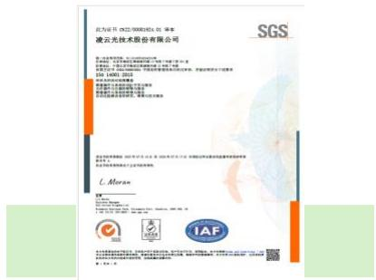

text_image

此为公司(地址:601988)的股份有限公司(简称:凌云光技术股份有限公司)
SGS
C. Moran

## 环境风险防控

凌云光建立了环境因素识别评价表，定期对主要影响环境的因素进行识别和评价，通过对办公活动、采购活动、车间生产、质量检测、测试、仓储和客服等多个主要影响因子进行识别后，识别出主要影响环境的清单并对应做出控制措施。

<table><tr><td>重要环境因素</td><td>控制措施</td></tr><tr><td>废硒鼓、废色带、废墨盒的废弃</td><td>由打印机供应商方回收处理</td></tr><tr><td>废电脑、废打印复印机的废弃</td><td>由打印机供应商方回收处理</td></tr><tr><td>含有有害物质的废弃物产生</td><td>产品策划时选用环保材料</td></tr><tr><td>用电造成火灾发生</td><td>由资质单位进行电气防火检测;公司每日巡查</td></tr></table>

## 环境突发应急预案

公司制定《环境突发事项应急预案》，贯彻"保护优先、预防为主、综合治理"原则，建立联合排查、日常排查、季节性排查、专业性排查四级机制。针对重大环境风险源，建立档案与资金投入保障，健全安全管理制度，开展岗位技能培训，设置警示标识，定期专项检查与应急演练，建立隐患整改档案，实现环境风险全过程管控。

## 污染防御治理

## 废水管理

本公司无生产废水，只有生活废水。各相关部门应尽可能避免或减少使用能产生污水的设施和装置。所有废水的浓度由行政管理部联系有资质的第三方监测，所有雨污最终排放口需张贴标识牌，监测频率每年一次。当发生废水排放浓度超过标准时，行政管理部将有关情况上报副总经理，并召集相关部门进行分析处理，直到排放达标为止。

## 废气管理

公司内产生废气的来源是无尘车间电焊工序，电焊产生的烟尘由集气装置吸收通过活性炭进行吸附过滤，排放、过滤的废活性炭交由有资质的处理方进行处理。生产车间无组织排放的废气，公司需加强车间通风、换气等措施。每年对公司车间外废气危害因子进行检测，当发现排放浓度超过标准时，组织相关部门进行分析处理，直到排放达标为止。

## 噪音管理

钻床、车床、磨床、空压机、焊接废气净化器等设备是噪音的主要来源。本公司尽量选用低噪音的设备；噪音的控制制造部门负责上述设备日常运作及定期的保养维护，操作按设备操作手册或作业指导书实行；对产生噪音较大的设备加设隔音罩。每年对车间内外的噪音危害因子进行监测，发现超过标准时，召集相关部门进行分析处理，直到排放达标为止。

## 废弃物管理

公司建立“产生及分类—搬运—最终处置”全流程管理体系。废弃物可按回收与不可回收分类收集暂存，危险废弃物由行政部专项登记管理，最终交由有资质处理商合法处置。行政部负责监督，人力资源部负责开展培训，通过监督测量与矫正预防机制，实现废弃物减量化、资源化、无害化管理目标。

## 智慧园区建设

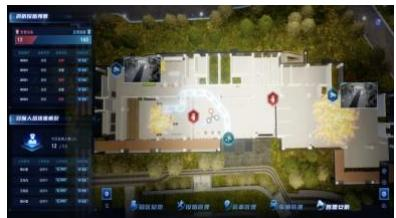

text_image

Smart city map interface showing building layout with user interface and navigation icons

安防监控  
集成安防系统和设备数据，实现安全态势监测一张图，使安防管理高效、稳定

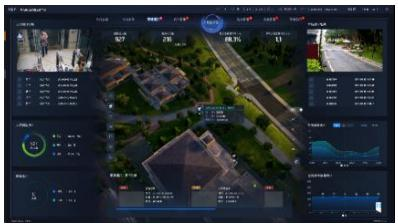

text_image

Dashboard screenshot showing real estate monitoring interface with real estate views, data panels, and status indicators

智能门禁  
对接对各主出入口、各区域、各通道的人流信息，人流信息可视化

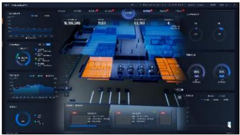

text_image

Dashboard screenshot showing data visualization with multiple metrics and charts, including a large value display and status indicators.

智能通行  
全局了解停车位的使用情况，停车位分布，车位占比用数据展示

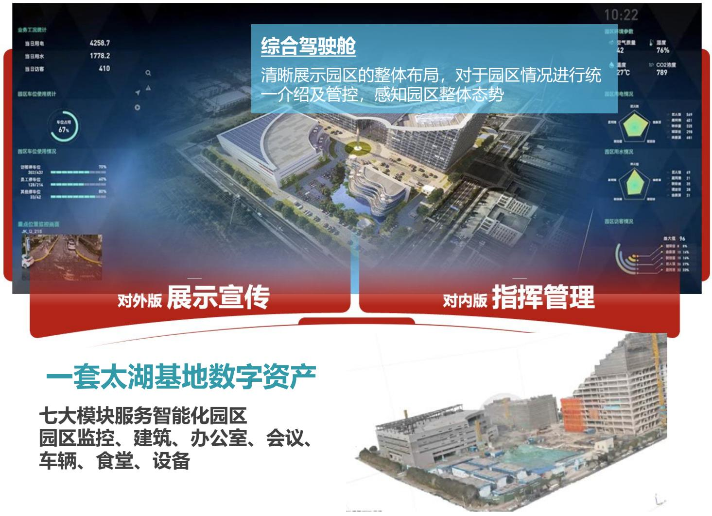

text_image

综合驾驶舱
清晰展示园区的整体布局，对于园区情况进行统一介绍及管控，感知园区整体态势
业务工况统计
当日用电 4258.7
当日用水 1778.2
当日访客 410
园区车位使用统计
车位占率 67%
园区车位使用情况
访客停车位 79%
员工停车位 49%
12M/214
其他停车位 80%
33/42
重点位置监控画面
KQ-216
对外版 展示宣传
对内版 指挥管理
一套太湖基地数字资产
七大模块服务智能化园区
园区监控、建筑、办公室、会议、
车辆、食堂、设备

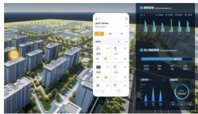

text_image

Screenshot of a smart city planning interface showing real estate model, data visualization, and user dashboard with Chinese text labels.

环境管理  
对空间资源使用情况进行可视分析，对环境设备、园区环境的监测

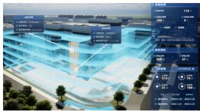

text_image

Architectural rendering of a modern building complex with overlaid digital dashboard and performance metrics

能耗管理  
对园区供暖、供排水、供气、能源能耗、供电等各个子系统生产运行态势进行实时监控

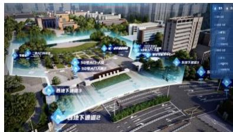

text_image

地下建面2
地下建面1
地下建面3
地下建面4
地下建面5
地下建面6
地下建面7
地下建面8
地下建面9
地下建面10
地下建面11
地下建面12
地下建面13
地下建面14
地下建面15
地下建面16
地下建面17
地下建面18
地下建面19
地下建面20
地下建面21
地下建面22
地下建面23
地下建面24
地下建面25
地下建面26
地下建面27
地下建面28
地下建面29
地下建面30
地下建面31
地下建面32
地下建面33
地下建面34
地下建面35
地下建面36
地下建面37
地下建面38
地下建面39
地下建面40
地下建面41
地下建面42
地下建面43
地下建面44
地下建面45
地下建面46
地下建面47
地下建面48
地下建面49
地下建面50
地下建面51
地下建面52
地下建面53
地下建面54
地下建面55
地下建面56
地下建面57
地下建面58
地下建面59
地下建面60
地下建面61
地下建面62
地下建面63
地下建面64
地下建面65
地下建面66
地下建面67
地下建面68
地下建面69
地下建面70
地下建面71
地下建面72
地下建面73
地下建面74
地下建面75
地下建面76
地下建面77
地下建面78
地下建面79
地下建面80
地下建面81
地下建面82
地下建面83
地下建面84
地下建面85
地下建面86
地下建面87
地下建面88
地下建面89
地下建面90
地下建面91
地下建面92
地下建面93
地下建面94
地下建面95
地下建面96
地下建面97
地下建面98
地下建面99
地下建面100

设备管理  
管理园区IOT硬件资产设备，设备点位、状态全掌控，同时满足业务中台告警信息呈现

公司深度推进绿色工厂建设，以“节能降耗、绿色发展”为核心，立足生产运营全流程构建绿色制造体系，打造集约化、低碳化标杆工厂。在建设实践中，公司践行循环经济理念，打造现代土壤技术和节能低碳系统，推进资源高效利用与环境协同治理，厂区绿化及生态景观建设正在积极推进中。同时，将绿色发展融入管理与生产各环节，从源头优化工艺、淘汰高耗能设备，严格落实清洁生产与安全管控，优化工时与能源调度。公司以太湖基地为核心打造绿色工厂，将节能理念贯穿全流程。

◼ 基地为甲级建筑，节能水平 72%，绿色建筑目标二星级  
◼ 屋面光伏装机约 200kW，年发电量 38.63 万 kWh，

占建筑总用电量 3.92%

◼ 项目充电桩车位占比 10%  
◼ 光伏热水使用比例 20%  
◼ 景观水体雨水补水超蒸发量 60%

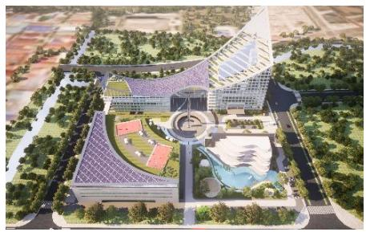

natural_image

Architectural rendering of a modern campus or architectural complex with landscaped grounds, pathways, and central building (no visible text or symbols)

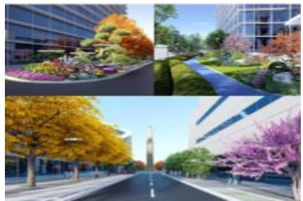

natural_image

Composite image showing three urban landscapes: a garden with colorful trees, a modern building with greenery, and a street lined with blooming trees (no text or symbols visible)

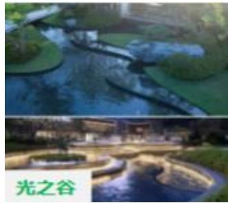

natural_image

Two scenic views of a lakeside park: top shows a winding river with greenery, bottom shows a stone embankment and a small building (no text or symbols visible)

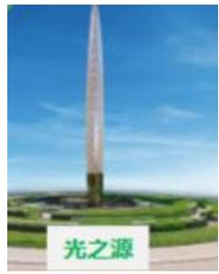

text_image

光之源

## 资源利用

## 应对气候变化

全球气候变化正深刻重塑行业竞争格局。随着“双碳”目标深入推进及欧盟碳边境调节机制等国际规则落地，产业链脱碳压力加速向下游传导。机器视觉作为智能制造的核心感知层技术，既面临下游新能源、高端制造等领域绿色转型带来的市场机遇，也承受自身算力扩张与供应链碳管理的双重挑战。

气候变化影响因素识别

<table><tr><td>气候影响因素</td><td>机遇项</td><td>预期措施</td></tr><tr><td>制造业低碳转型需求激增</td><td>视觉检测赋能绿色制造</td><td>为多行业制造业提供高精度视觉检测,降低制造耗能与废品率</td></tr><tr><td>可再生能源装机爆发</td><td>风电/光伏智能运维等</td><td>拓展新领域产品缺陷检测,抢占新能源后市场</td></tr><tr><td>循环经济政策推动</td><td>废旧产品视觉分拣</td><td>开发再生资源智能分拣分选系统,应用于废塑料、废旧电池回收产线</td></tr><tr><td>极端天气导致质检环境恶化</td><td>无人化智能质检</td><td>推广新型视觉检测方案,减少人工巡检碳排放与风险</td></tr></table>

<table><tr><td>气候影响因素</td><td>挑战项</td><td>预期措施</td></tr><tr><td>视觉算力中心能耗攀升</td><td>AI训练碳排放激增</td><td>部署液冷服务器与绿电直供,优化模型压缩算法降低训练能耗</td></tr><tr><td>客户ESG审核趋严</td><td>供应链碳数据穿透</td><td>建立视觉设备全生命周期碳核算体系,优先采购低碳芯片与光学器件</td></tr><tr><td>绿色贸易壁垒实施</td><td>出口产品碳足迹认证</td><td>获取产品碳足迹国际认证,开发低能耗边缘计算视觉应对方案</td></tr><tr><td>气候灾害冲击交付</td><td>供应链韧性不足</td><td>多元化布局光学元器件供应商,建立气候风险预警与应急响应机制</td></tr></table>

## 气候变化影响应对举措

公司应对机遇的现行措施：将机器视觉技术深度融入绿色制造。在技术层面，持续迭代AI大模型与算法平台，将视觉检测从单一缺陷识别升级为跨模态工艺理解，实现制造过程的数字化、智能化管控，从源头降低能耗与资源消耗。在应用层面，聚焦新能源电池、新能源汽车、光伏等战略性绿色产业，提供覆盖生产全流程的视觉解决方案，助力客户提升质量一致性、减少返工浪费、优化能源使用率，间接削减产业链碳排放。在智造升级层面，为客户提供数字化咨询规划、智能产线实施、智能物流优化等整体解决方案，实现ERP/MES/质检、仓储全流程智能化管理，帮助客户建设高效、柔性、低碳的现代化工厂，实现从单点视觉检测到系统性绿色制造的能力跃迁。

公司应对挑战的现行措施：凌云光通过“投资并购+供应链安全管控”双轮驱动应对气候挑战：上游投资长光辰芯、长步道等芯片和镜头企业，并购JAI补强高端相机技术和产品，实现核心器件安全可控；同步针对长交期、独家供应、涉敏感地域物料等高风险品类开展多场景风险识别与量化定级，严控高风险占比，加强核心供应链的气候韧性。

## 气候变化应急预案

为系统性提升气候变化适应性与极端事件抗风险能力，保障员工人身安全及生产经营连续性，公司构建了“专项预案覆盖—分级预警防控—标准化处置执行”的全链条气候应对体系，形成科学的应急管理机制。

一是完善专项预案体系，实现高风险场景覆盖。聚焦气候变化衍生风险及极端工况，制定《防洪防汛应急预案》《高温中暑应急预案》，并配套火灾、爆炸、化学品泄漏、台风、地震等突发事件专项预案，明确各类场景下的处置原则、责任主体与执行流程，为应急响应提供制度支撑。

二是建立分级预警机制，强化源头风险防控。以防洪防汛为核心搭建预警体系，依据6小时/3小时降雨量等核心指标设立三级预警标准，同步落实常态化危险源监控、汛期24小时值班巡查及暴雨放泵定期检修机制；针对不同预警等级匹配差异化处置措施，从三级状态的设备排查到一级状态的极端险情防控，实现风险的梯次化、前置化管控。

三是规范化应急处置流程，保障响应高效落地。针对高温中暑风险，公司固化 “搬移、降温、补水、促醒、转送” 五步标准化急救流程，并开展实战演练，筑牢员工职业健康防线。针对极端事件，明确统一撤离规范：当现场处置失效时，由总指挥下达撤离指令，人员沿指定通道撤离至安全集合点，各部门主管完成人员清点与上报，必要时联动专业救援，确保响应有序高效。

## 高效能源利用

根据《中华人民共和国节约能源法》等法规要求，结合自身实际生产经营情况，建立了《资源能源管理制度》，明确了行政管理部负责能源、资源的使用和监督，各部门综合制定节能指标，总经理审议的管理机制，建立了适用于公司当前业务范围和规模的资源和能源使用节能方式，为水资源、电、能源等资

源使用建立常态化机制。

公司在2025年3月25日面向全体员工发布了《关于2025年ESG节能减排倡议书》,从节电、节水、绿色办公、低碳出行四个层面推出节能减排，旨在响应环保号召，减少资源浪费，营造绿色可持续的工作环境，将节能减排转化为员工共同责任，通过点滴行动汇聚保护环境的集体力量。

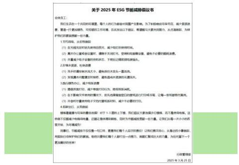

text_image

关于2025年ESG节能减排倡议书
全体员工：
同生活在一个共同环境满足，每个人的行为是必须向国家产业转移。为了有效控制非竞争性，减少能源消费，更是一致的能源消耗，可使职工在环境、经济状况以下保证，希望吸引大家共同努力，从直接制造、为保护相对资源提供一台力量。
1. 因何的是，从其帮助：
（1）在发挥良好的技术应用和相关能力，减少核心资源的使用；
（2）利用办公室和会议室，帮助个人与职工之间交流，安排相关服务等事宜，避免不必要的燃料浪费。
（3）尽量减少电子设备的耗材状态，下架相应功能的防火墙。
2. 生物水源、社会资源
（1）洗手习惯与用水大小无关，避免相互关系一直无关。
（2）发现雾化与烟雾化现象，避免造成火灾或火灾无关。
3. 项目可行性，减少项目进展。
（1）通过现场调研，建立现场研究团队，组织现场调研。
（2）在需要文件和操作时要求下，灵活构建数据层的微波进行打样并实施，让每一位系统进行其他。
（3）会随时对重要电子文具设置材料，减少不需要及时访问。
4. 开始执行，从其帮助
根据最新参与实际的通信标准“对于1-3周的工作，同时又对主要方案进行梳理，否则是在网络上，这种不与数量或用户端协同，建议以各种协同模式，同时针对需要接受另一方要求，让我们从每一次小的次变动到，为完成提交！
同时，要将不超过不超过一半的员工，重新将个人应向客户转让比例提升，在各自的一个步骤起，按照自己的程序向客户支付款项。我们也可以将个人账户划一点拨付。根据关键岗位大的要求，为应对下一个更新或新的工作计划。
行政管理部
2025年3月25日

## 碳排放数据统计与监控

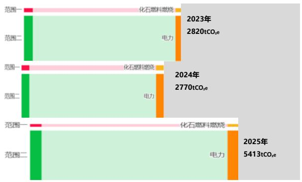

bar_stacked

| Year | Scope | Source | Emissions (tCO2e) |
| --- | --- | --- | --- |
| 2023 | 范围一 | 化石燃料燃烧 | 2820 |
| 2023 | 范围二 | 电力 | — |
| 2024 | 范围一 | 化石燃料燃烧 | 2770 |
| 2024 | 范围二 | 电力 | — |
| 2025 | 范围一 | 化石燃料燃烧 | — |
| 2025 | 范围二 | 电力 | 5413 |

公司不属于高资源能耗型和高排放物的企业，主要的碳排放来源于工厂制造过程中和办公区域中的电力消耗。2023年-2024年排放总量基本持平，体现了公司在既有产能规模下，通过节能管理与有效优化实现了排放稳定控制。2025年碳排放总量扩大，主要系公司为支撑中长期业务发展，推进新园区建设与产能扩张所致。

尽管短期排放随产能扩张所有上升，公司仍持续推进绿色低碳运营：通过推广高效节能设备、优化能源管理、优化生产工艺等措施，稳步提升单位产值能源利用率。

## 节能措施

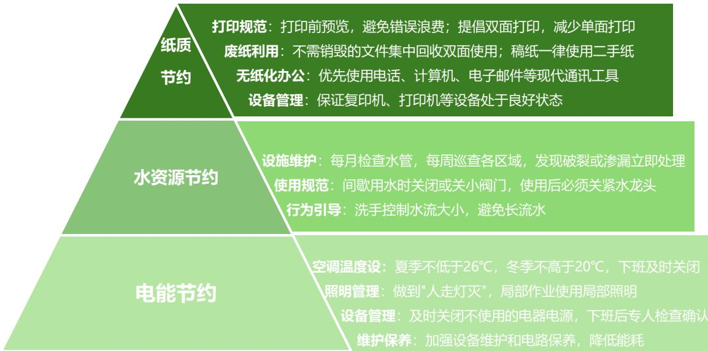

flowchart

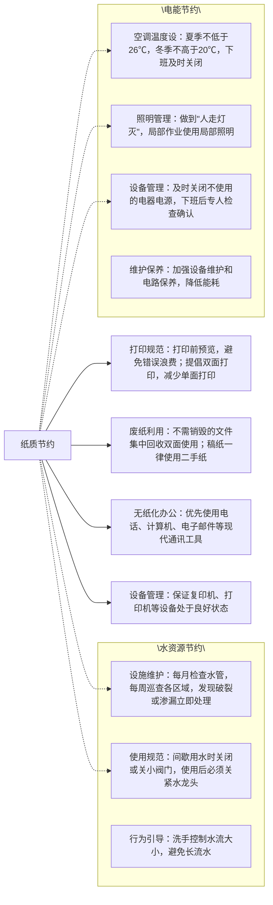
```mermaid
graph LR
  A["纸质节约"] --> B["打印规范：打印前预览，避免错误浪费；提倡双面打印，减少单面打印"]
  A --> C["废纸利用：不需销毁的文件集中回收双面使用；稿纸一律使用二手纸"]
  A --> D["无纸化办公：优先使用电话、计算机、电子邮件等现代通讯工具"]
  A --> E["设备管理：保证复印机、打印机等设备处于良好状态"]

  subgraph sg["\"水资源节约\""]
    F["设施维护：每月检查水管，每周巡查各区域，发现破裂或渗漏立即处理"]
    G["使用规范：间歇用水时关闭或关小阀门，使用后必须关紧水龙头"]
    H["行为引导：洗手控制水流大小，避免长流水"]
  end

  subgraph sg_2["\"电能节约\""]
    I["空调温度设：夏季不低于26℃，冬季不高于20℃，下班及时关闭"]
    J["照明管理：做到&quot;人走灯灭&quot;，局部作业使用局部照明"]
    K["设备管理：及时关闭不使用的电器电源，下班后专人检查确认"]
    L["维护保养：加强设备维护和电路保养，降低能耗"]
  end

  A -.-> F
  A -.-> G
  A -.-> I
  A -.-> J
  A -.-> K
```

## 节能宣传

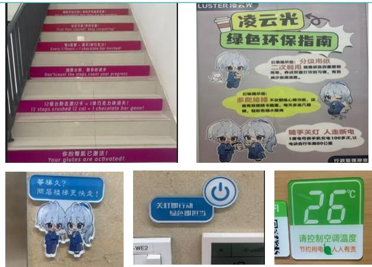  
张贴节能减排标识

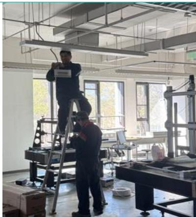

natural_image

Interior of a technical laboratory with technicians assembling equipment and large windows (no visible text or symbols)

更换节能灯具

## 绿色运营

公司坚持绿色低碳发展理念，将环境友好、资源高效利用融入生产经营全过程，持续推进数字化、智能化、低碳化运营实践，以实际行动构建高效、清洁、低碳、循环的绿色运营体系。

## 推进智能仓储建设，提升资源运营效率

为应对业务高速增长对仓储效率与单位面积产出的迫切需求，公司于 2025 年 6 月导入智能仓储系统，以自动化、智能化手段重构仓储运营模式。通过 AGV 跨楼层搬运、人货不混行等技术，实现 “黑灯仓储”，大幅降低能源消耗与工伤风险；同时，项目投资回报期仅 21 个月，发料

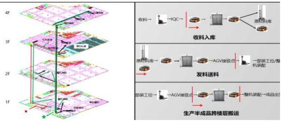

人力需求显著下降，员工加班负荷从 80% 降至 40%，在提升运营效率的同时，有效降低了运营对环境与员工健康的影响。

## 推广 MOM 无纸化作业，构建绿色低碳生产模式

为响应绿色低碳发展要求，公司上线 MOM 系统，将供应链全流程表单从线下打印流转转变为线上化流转，实现数据全链路追溯。项目通过 SRM 与 MOM 系统协同，使纸质文档减少 60%，节约金额达12 万元，不仅直接降低了纸张消耗与碳排放，更通过数字化管理提升了运营透明度与效率。

## 布局可再生能源应用，推动基地绿色用能

为践行 “双碳” 目标、优化能源结构，公司在太湖基地布局 0.8MW 分布式光伏发电项目，覆盖约 6000平方米屋顶，实现绿色能源就地消纳。项目 25 年可节约 702 万度电，有效降低了基地对传统化石能源的依赖，减少了运营过程中的碳排放，为企业实现能源转型、推动绿色低碳发展提供了有力支撑。

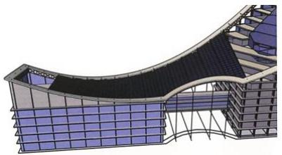

natural_image

Architectural rendering of a curved, layered building structure with grid-patterned sections (no text or symbols visible)

2号楼屋顶光伏及1-2号连廊顶上光伏

## 社会贡献

## 支持乡村振兴

公司积极响应国家乡村振兴战略，将支持地方特色农业发展融入社会责任实践。通过向苏州吴中区农产品经营部采购当地碧螺春茶叶，以实际消费助力本地农产品产销对接，稳定农户与经营主体收益，支持地方特色农业产业可持续发展。此举既助力拓宽本地优质农产品销路，也推动城乡资源互通、产业互助，以负责任采购践行企业社会责任，为乡村振兴与地方共同富裕贡献力量。

## 慈善捐赠

公司坚持绿色低碳发展理念，将环境友好、资源高效利用融入生产经营全过程，持续推进数字化、智能化、低碳化运营实践，以实际行动构建高效、清洁、低碳、循环的绿色运营体系。

公司实际控制人姚毅先生和杨艺女士积极践行社会责任，持续关注并支持养老公益事业。自2023年起，二人以个人名义累计捐赠485万元，用于养老院的重建工程，为孤寡老人打造安全、舒适的养老环境，为敬老院重建提供了坚实的资金保障。该项目一方面提升了孤寡老人的生活品质，也表达了公司核心管理团队对社会民生的深切关怀，为推动民生福祉贡献自己的力量。

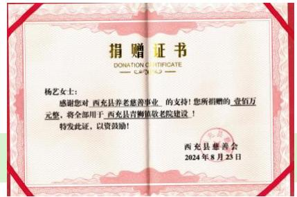

text_image

捐赠证书
DONATION CERTIFICATE
杨艺女士：
感谢您对西充县养老慈善事业的支持！您所捐赠的壹佰万元整，将全部用于西充县青御敬老院建设！
特发此证，以资鼓励！
西充县慈善会
2024年8月23日

2025年，公司累计慈善捐赠总额达172.6万元，聚焦高等教育发展与社会公益帮扶两大领域，积极践行社会责任。

在教育科研领域，公司持续投入资源支持高等教育事业发展，捐赠资金主要用于计算机与人工智能、控制科学等前沿技术方向的教学科研、设备更新及人才培养，助力高校学术创新与技术交流，为国家科技创新与高端人才储备注入动力，夯实数字经济与智能产业发展根基。

在社会公益领域，公司向苏州吴中区慈善总会捐赠2万元，用于济困、助学、助老等民生帮扶项目，覆盖困难老人、残疾人、外来务工人员等群体，切实传递企业温度。

## 社校企共建

凌云光联合河南机电职业学院、河南地矿职业学院共同面向社会人员开设机器视觉技术青训班，聚焦机器视觉基础知识、工业场景和工厂实操技能，采用课堂授课+现场实操+结业考核的一体化培养模式，为社会人员、在校学生提供高质量技能提升与就业通道。项目以产教融合、定向培养为目标，将企业真实岗位需求前置到培训环节，有效缓解智能制造领域技能人才供给缺口，助力参训人员实现高质量就业。通过校企协同育人，公司切实履行社会责任，促进教育资源与产业需求精准对接，为地方人才发展、社会就业稳定与制造业数字化转型贡献力量。

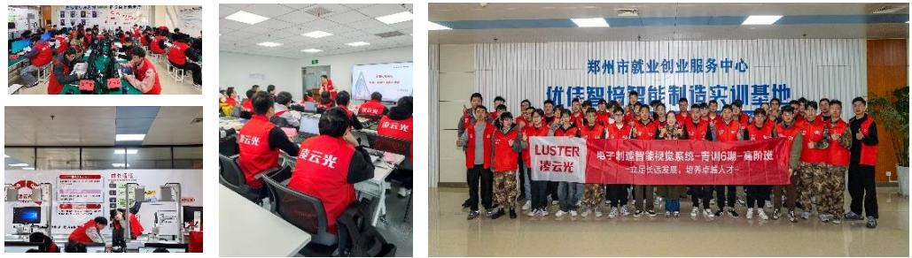

Knowledge and Reasons are Our Arms to Embrace the World!附件一 关键绩效数据

<table><tr><td colspan="5">经营关键绩效</td></tr><tr><td>关键绩效指标</td><td>单位</td><td>2023年</td><td>2024年</td><td>2025年</td></tr><tr><td>直接经济价值</td><td>百万元</td><td>2,641</td><td>2,234</td><td>2,912</td></tr><tr><td>资产总额</td><td>百万元</td><td>5,085</td><td>5,459</td><td>6,229</td></tr><tr><td>现金分红(含回购金额)</td><td>百万元</td><td>50</td><td>164</td><td>51</td></tr><tr><td>(回购+分红)/营业收入</td><td>%</td><td>31%</td><td>153%</td><td>32%</td></tr><tr><td>基本每股收益</td><td>元/股份</td><td>0.35</td><td>0.23</td><td>0.35</td></tr><tr><td colspan="5">环境绩效指标</td></tr><tr><td>关键绩效指标</td><td>单位</td><td>2023年</td><td>2024年</td><td>2025年</td></tr><tr><td>温室气体排放总量</td><td>吨二氧化碳当量</td><td>2,820</td><td>2,770</td><td>5,413</td></tr><tr><td>范围1</td><td>吨二氧化碳当量</td><td>232</td><td>280</td><td>279</td></tr><tr><td>范围2</td><td>吨二氧化碳当量</td><td>2,588</td><td>2,490</td><td>5,134</td></tr><tr><td colspan="5">能源消耗量</td></tr><tr><td>直接能源消耗量</td><td>吨标煤</td><td>127</td><td>154</td><td>133</td></tr><tr><td>汽油</td><td>升</td><td>26,260</td><td>28,250</td><td>27,183</td></tr><tr><td>柴油</td><td>吉焦</td><td>0</td><td>0</td><td>0</td></tr><tr><td>天然气</td><td>立方米</td><td>81,632</td><td>102,041</td><td>102,041</td></tr><tr><td>间接能源消耗量</td><td>吨标煤</td><td>500</td><td>481</td><td>992</td></tr><tr><td>废弃物产生总量(范围为生产工厂)</td><td>吨</td><td>3.8</td><td>3</td><td>6.7</td></tr><tr><td>无害废弃物产生量</td><td>吨</td><td>3.6</td><td>2.8</td><td>3.9</td></tr><tr><td>纸板</td><td>吨</td><td>1.3</td><td>1</td><td>1.3</td></tr><tr><td>塑料</td><td>吨</td><td>0.8</td><td>0.6</td><td>0.8</td></tr><tr><td>栈板</td><td>吨</td><td>1.5</td><td>1.2</td><td>1.8</td></tr><tr><td>危险固态废弃物产生量</td><td>吨</td><td>0.2</td><td>0.2</td><td>2.8</td></tr><tr><td>废活性炭过滤网</td><td>吨</td><td>0.006</td><td>/</td><td>/</td></tr><tr><td>废包装桶</td><td>吨</td><td>0.01</td><td>0.006</td><td>/</td></tr><tr><td>废抹布和废电路板</td><td>吨</td><td>0.2</td><td>0.03</td><td>/</td></tr><tr><td>废切削液</td><td>吨</td><td>/</td><td>0.2</td><td>2.8</td></tr></table>

<table><tr><td>关键绩效指标</td><td>单位</td><td>2023年</td><td>2024年</td><td>2025年</td></tr><tr><td colspan="5">从处置中转移的废弃物</td></tr><tr><td>危险废弃物回收利用量</td><td>吨</td><td>0</td><td>0</td><td>0</td></tr><tr><td>进入准备再使用的危险废弃物转移量</td><td>吨</td><td>0</td><td>0</td><td>0</td></tr><tr><td>进入循环利用的危险废弃物转移量</td><td>吨</td><td>0</td><td>0</td><td>0</td></tr><tr><td>无害废弃物回收再利用量</td><td>吨</td><td>3.6</td><td>2.8</td><td>3.9</td></tr><tr><td>进入准备再使用的无害废弃物转移量</td><td>吨</td><td>0</td><td>0</td><td>0</td></tr><tr><td>进入循环利用的无害废弃物转移量</td><td>吨</td><td>3.6</td><td>2.8</td><td>3.9</td></tr><tr><td colspan="5">进入处置的废弃物</td></tr><tr><td>废弃物进入处置(含转移)总量</td><td>吨</td><td>3.8</td><td>3.0</td><td>6.7</td></tr><tr><td>进入焚烧(有能源回收)的危险废弃物处置量</td><td>吨</td><td>0.2</td><td>0.2</td><td>2.8</td></tr><tr><td>进入焚烧(无能源回收)的危险废弃物处置量</td><td>吨</td><td>0</td><td>0</td><td>0</td></tr><tr><td>进入填埋的危险废弃物处置量</td><td>吨</td><td>0</td><td>0</td><td>0</td></tr><tr><td>无害废弃物处置量</td><td>吨</td><td>0</td><td>0</td><td>0</td></tr><tr><td>进入焚烧(有能源回收)的无害废弃物处置量</td><td>吨</td><td>0</td><td>0</td><td>0</td></tr><tr><td>进入焚烧(无能源回收)的无害废弃物处置量</td><td>吨</td><td>0</td><td>0</td><td>0</td></tr><tr><td colspan="5">水资源</td></tr><tr><td>总取水量(整体)</td><td>吨</td><td>13,158</td><td>12,421</td><td>28,120</td></tr><tr><td>总排水量(工厂)</td><td>吨</td><td>6,206</td><td>6,209</td><td>10,362</td></tr><tr><td>PH</td><td>无量纲</td><td>7.4-7.5</td><td>8.1</td><td>7.2</td></tr><tr><td>悬浮物</td><td>mg/L</td><td>38</td><td>9</td><td>62</td></tr><tr><td>CODcr</td><td>mg/L</td><td>299</td><td>44</td><td>79</td></tr><tr><td>氨氮</td><td>mg/L</td><td>24.6</td><td>30.9</td><td>0.3</td></tr><tr><td>总磷</td><td>mg/L</td><td>3.61</td><td>3.14</td><td>2.92</td></tr><tr><td>涉及公司的污水排放行政处罚次数</td><td>次</td><td>0</td><td>0</td><td>0</td></tr><tr><td>环保投入总金额</td><td>万元</td><td>9.6</td><td>4.4</td><td>21.9</td></tr><tr><td colspan="5">供应链管理</td></tr><tr><td>关键供应商总数</td><td>家</td><td>63</td><td>60</td><td>74</td></tr><tr><td>海外供应商</td><td>家</td><td>240</td><td>151</td><td>159</td></tr><tr><td>中国供应商</td><td>家</td><td>1,496</td><td>1,074</td><td>1,154</td></tr><tr><td>服务类供应商</td><td>家</td><td>45</td><td>65</td><td>60</td></tr><tr><td>原辅材料供应商</td><td>家</td><td>1,691</td><td>1,160</td><td>2,220</td></tr><tr><td>供应商培训</td><td>次</td><td>28</td><td>30</td><td>21</td></tr><tr><td>供应商稽核</td><td>次</td><td>22</td><td>44</td><td>48</td></tr><tr><td>供应商反腐协议签订比例</td><td>%</td><td>66%</td><td>90%</td><td>95%</td></tr><tr><td>安全协议签署率</td><td>%</td><td>81%</td><td>90%</td><td>95%</td></tr><tr><td colspan="5">质量管理</td></tr><tr><td>产品召回率</td><td>%</td><td>0</td><td>0</td><td>0</td></tr><tr><td>产品良品率(标准产品)</td><td>%</td><td>98.82%</td><td>99.56%</td><td>99.20%</td></tr><tr><td>客户满意度</td><td>%</td><td>90%</td><td>91%</td><td>91%</td></tr><tr><td>客户投诉解决率</td><td>%</td><td>100%</td><td>100%</td><td>100%</td></tr><tr><td>产品质量改进数量</td><td>个</td><td>1,462</td><td>1,446</td><td>1,687</td></tr><tr><td>产品质量闭环数量</td><td>个</td><td>1,345</td><td>1,360</td><td>1,569</td></tr><tr><td>产品质量问题关闭率</td><td>%</td><td>92%</td><td>94%</td><td>93%</td></tr><tr><td colspan="5">员工</td></tr><tr><td>雇佣员工总数</td><td>人</td><td>1,981</td><td>1,850</td><td>1,896</td></tr><tr><td>男性</td><td>人</td><td>1,584</td><td>1,479</td><td>1,521</td></tr><tr><td>女性</td><td>人</td><td>397</td><td>371</td><td>375</td></tr><tr><td>40岁以上</td><td>人</td><td>199</td><td>179</td><td>359</td></tr><tr><td>31-40岁(含40岁)</td><td>人</td><td>1,131</td><td>1,035</td><td>1,033</td></tr><tr><td>30岁以下(含30岁)</td><td>人</td><td>651</td><td>636</td><td>504</td></tr><tr><td>博士</td><td>人</td><td>17</td><td>18</td><td>16</td></tr><tr><td>硕士</td><td>人</td><td>503</td><td>462</td><td>449</td></tr><tr><td>本科</td><td>人</td><td>829</td><td>791</td><td>837</td></tr><tr><td>专科及以下</td><td>人</td><td>632</td><td>579</td><td>594</td></tr><tr><td>新进员工总数</td><td>人</td><td>416</td><td>268</td><td>362</td></tr></table>

<table><tr><td>关键绩效指标</td><td>单位</td><td>2023年</td><td>2024年</td><td>2025年</td></tr><tr><td>男性</td><td>人</td><td>356</td><td>220</td><td>321</td></tr><tr><td>女性</td><td>人</td><td>60</td><td>48</td><td>41</td></tr><tr><td>40岁以上</td><td>人</td><td>21</td><td>17</td><td>31</td></tr><tr><td>31-40岁(含40岁)</td><td>人</td><td>117</td><td>97</td><td>123</td></tr><tr><td>30岁以下(含30岁)</td><td>人</td><td>278</td><td>154</td><td>208</td></tr><tr><td>博士</td><td>人</td><td>0</td><td>2</td><td>0</td></tr><tr><td>硕士</td><td>人</td><td>133</td><td>40</td><td>51</td></tr><tr><td>本科</td><td>人</td><td>144</td><td>137</td><td>196</td></tr><tr><td>专科及以下</td><td>人</td><td>139</td><td>89</td><td>115</td></tr><tr><td>员工流失率</td><td>%</td><td>22.17%</td><td>21.08%</td><td>22.20%</td></tr><tr><td>男性流失率</td><td>%</td><td>22.79%</td><td>21.49%</td><td>23.54%</td></tr><tr><td>女性流失率</td><td>%</td><td>19.78%</td><td>19.41%</td><td>16.80%</td></tr><tr><td>40岁以上</td><td>%</td><td>21.33%</td><td>15.48%</td><td>14.21%</td></tr><tr><td>31-40岁(含40岁)</td><td>%</td><td>19.27%</td><td>20.29%</td><td>20.72%</td></tr><tr><td>30岁以下(含30岁)</td><td>%</td><td>26.64%</td><td>24.44%</td><td>30.95%</td></tr><tr><td colspan="5">育儿假</td></tr><tr><td>享受产假、陪产假的员工总数</td><td>人</td><td>107</td><td>133</td><td>124</td></tr><tr><td>享受陪产假的数量(男性)</td><td>人</td><td>85</td><td>100</td><td>80</td></tr><tr><td>享受产假的数量(女性)</td><td>人</td><td>22</td><td>33</td><td>44</td></tr><tr><td>假期结束后返岗的员工总数</td><td>人</td><td>107</td><td>132</td><td>123</td></tr><tr><td>假期结束后返岗的数量(男性)</td><td>人</td><td>85</td><td>100</td><td>79</td></tr><tr><td>假期结束后返岗的数量(女性)</td><td>人</td><td>22</td><td>32</td><td>44</td></tr><tr><td colspan="5">员工健康与安全</td></tr><tr><td>员工社保百分比</td><td>%</td><td>100%</td><td>100%</td><td>100%</td></tr><tr><td>员工补充医疗百分比</td><td>%</td><td>100%</td><td>100%</td><td>100%</td></tr><tr><td>因工受伤人数</td><td>人</td><td>0</td><td>5</td><td>3</td></tr><tr><td>因工死亡人数</td><td>人</td><td>0</td><td>0</td><td>0</td></tr><tr><td colspan="5">员工培训</td></tr><tr><td>培训投入金额</td><td>万元</td><td>188</td><td>234</td><td>364</td></tr><tr><td>培训总时长</td><td>小时</td><td>22,946</td><td>23,548</td><td>18,832</td></tr><tr><td>总培训人数</td><td>人</td><td>2,068</td><td>2,459</td><td>1,903</td></tr><tr><td>线上参加人数</td><td>人</td><td>1,443</td><td>1,948</td><td>1,903</td></tr><tr><td>线下参加人数</td><td>人</td><td>625</td><td>511</td><td>579</td></tr><tr><td>中高层管理人员</td><td>人</td><td>82</td><td>94</td><td>61</td></tr><tr><td>普通员工</td><td>人</td><td>1,500+</td><td>1,600+</td><td>1,600+</td></tr><tr><td>本年度新增培训讲师数量</td><td>人</td><td>8</td><td>10</td><td>8</td></tr><tr><td colspan="5">科技创新</td></tr><tr><td>研发投入金额</td><td>百万元</td><td>460</td><td>444</td><td>511</td></tr><tr><td>研发投入占收入比例</td><td>%</td><td>17%</td><td>20%</td><td>18%</td></tr><tr><td>研发人数</td><td>人</td><td>777</td><td>735</td><td>687</td></tr><tr><td>研发人数占比</td><td>%</td><td>39%</td><td>40%</td><td>36%</td></tr><tr><td>博士</td><td>%</td><td>1.42%</td><td>1.63%</td><td>1.46%</td></tr><tr><td>硕士</td><td>%</td><td>46%</td><td>44%</td><td>41%</td></tr><tr><td>本科及以下</td><td>%</td><td>53%</td><td>54%</td><td>57%</td></tr><tr><td>新增专利数量</td><td>个</td><td>199</td><td>181</td><td>139</td></tr><tr><td>累计专利总数</td><td>个</td><td>709</td><td>799</td><td>895</td></tr><tr><td>累计发明专利</td><td>个</td><td>311</td><td>387</td><td>484</td></tr><tr><td>累计实用新型专利</td><td>个</td><td>344</td><td>381</td><td>379</td></tr><tr><td>累计外观设计专利</td><td>个</td><td>54</td><td>31</td><td>32</td></tr><tr><td>累计软件著作权</td><td>个</td><td>263</td><td>288</td><td>307</td></tr><tr><td colspan="5">治理关键绩效</td></tr><tr><td>股东大会</td><td>次</td><td>4</td><td>2</td><td>4</td></tr><tr><td>董事会</td><td>次</td><td>9</td><td>11</td><td>12</td></tr><tr><td>监事会</td><td>次</td><td>9</td><td>9</td><td>5</td></tr></table>

<table><tr><td>关键绩效指标</td><td>单位</td><td>2023年</td><td>2024年</td><td>2025年</td></tr><tr><td>专门委员会</td><td>次</td><td>13</td><td>14</td><td>12</td></tr><tr><td>董事数量</td><td>名</td><td>9</td><td>9</td><td>9</td></tr><tr><td>外部董事占比</td><td>%</td><td>56%</td><td>56%</td><td>56%</td></tr><tr><td>独立董事占比</td><td>%</td><td>33%</td><td>33%</td><td>33%</td></tr><tr><td>女性董事占比</td><td>%</td><td>22%</td><td>22%</td><td>22%</td></tr><tr><td colspan="5">投资者关系</td></tr><tr><td>大规模公开说明</td><td>次</td><td>3</td><td>3</td><td>3</td></tr><tr><td>小规模投资者交流</td><td>次</td><td>80+</td><td>50+</td><td>100+</td></tr><tr><td>年度投资者接待人数</td><td>人</td><td>600+</td><td>550+</td><td>850+</td></tr><tr><td>投资者热线接听率</td><td>%</td><td>100%</td><td>100%</td><td>100%</td></tr><tr><td>E互动问题回复</td><td>个</td><td>159</td><td>117</td><td>86</td></tr><tr><td>对外披露公告总数</td><td>个</td><td>159</td><td>174</td><td>211</td></tr><tr><td>定期报告披露数</td><td>个</td><td>4</td><td>4</td><td>4</td></tr><tr><td>临时公告披露数</td><td>个</td><td>79</td><td>96</td><td>103</td></tr><tr><td>自愿披露公告数</td><td>个</td><td>3</td><td>1</td><td>5</td></tr><tr><td colspan="5">反腐败治理及培训</td></tr><tr><td>反贪污腐败培训次数</td><td>次</td><td>6</td><td>4</td><td>10</td></tr><tr><td>员工参与反贪污培训人数</td><td>人</td><td>96</td><td>231</td><td>458</td></tr><tr><td>员工接收反贪污培训总小时数</td><td>小时</td><td>100</td><td>462</td><td>900</td></tr><tr><td>接收到的贪污举报次数</td><td>次</td><td>3</td><td>2</td><td>2</td></tr><tr><td>反贪腐年度专题立项</td><td>个</td><td>2</td><td>1</td><td>2</td></tr><tr><td>经确认的贪腐事件总数</td><td>个</td><td>1</td><td>1</td><td>1</td></tr><tr><td>经确认的贪腐的法律诉讼</td><td>个</td><td>1</td><td>0</td><td>0</td></tr></table>

《上海证券交易所上市公司自律监管指引第14号—可持续发展报告（试行）》索引

<table><tr><td>维度</td><td>序号</td><td>议题</td><td>对应条款</td><td>所在章节</td></tr><tr><td rowspan="8">环境</td><td>1</td><td>应对气候变化</td><td>第二十一条至第二十八条</td><td>同创绿谐家园—资源利用</td></tr><tr><td>2</td><td>污染物排放</td><td>第三十条</td><td>同创绿谐家园—污染防御治理</td></tr><tr><td>3</td><td>废弃物处理</td><td>第三十一条</td><td>同创绿谐家园—污染防御治理</td></tr><tr><td>4</td><td>生态系统和生物多样性保护</td><td>第三十二条</td><td>不适用</td></tr><tr><td>5</td><td>环境合规管理</td><td>第三十三条</td><td>同创绿谐家园—绿色发展</td></tr><tr><td>6</td><td>能源利用</td><td>第三十五条</td><td>同创绿谐家园—资源利用</td></tr><tr><td>7</td><td>水资源利用</td><td>第三十六条</td><td>同创绿谐家园—资源利用</td></tr><tr><td>8</td><td>循环经济</td><td>第三十七条</td><td>同创绿谐家园—资源利用</td></tr><tr><td rowspan="9">社会</td><td>9</td><td>乡村振兴</td><td>第三十九条</td><td>同创绿谐家园—社会贡献</td></tr><tr><td>10</td><td>社会贡献</td><td>第四十条</td><td>同创绿谐家园—社会贡献</td></tr><tr><td>11</td><td>创新驱动</td><td>第四十二条</td><td>创新驱动发展—创新发展体系</td></tr><tr><td>12</td><td>科技伦理</td><td>第四十三条</td><td>创新驱动发展—专题</td></tr><tr><td>13</td><td>供应链安全</td><td>第四十五条</td><td>创新驱动发展—共创价值供应链</td></tr><tr><td>14</td><td>平等对待中小企业</td><td>第四十六条</td><td>创新驱动发展—共创价值供应链</td></tr><tr><td>15</td><td>产品和服务安全与质量</td><td>第四十七条</td><td>创新驱动发展—产品质量提升</td></tr><tr><td>16</td><td>数据安全与客户隐私保护</td><td>第四十八条</td><td>打造合规生态—数据安全与客户隐私保护</td></tr><tr><td>17</td><td>员工</td><td>第五十条</td><td>营造共赢文化</td></tr><tr><td rowspan="4">治理</td><td>18</td><td>尽职调查</td><td>第五十二条</td><td>ESG战略与管理—重要议题识别与评估</td></tr><tr><td>19</td><td>利益相关方沟通</td><td>第五十三条</td><td>ESG战略与管理—利益相关方沟通</td></tr><tr><td>20</td><td>反商业贿赂及反贪污</td><td>第五十五条</td><td>打造合规生态—遵守商业道德</td></tr><tr><td>21</td><td>反不正当竞争</td><td>第五十六条</td><td>打造合规生态—遵守商业道德</td></tr></table>