## 2025 年度

## 环境、社会和公司治理(ESG)报告

ENVIRONENTAL, SOCIAL & GOVERNANCE REPORT

沈阳富创精密设备股份有限公司

做中同精密制造的骄傲

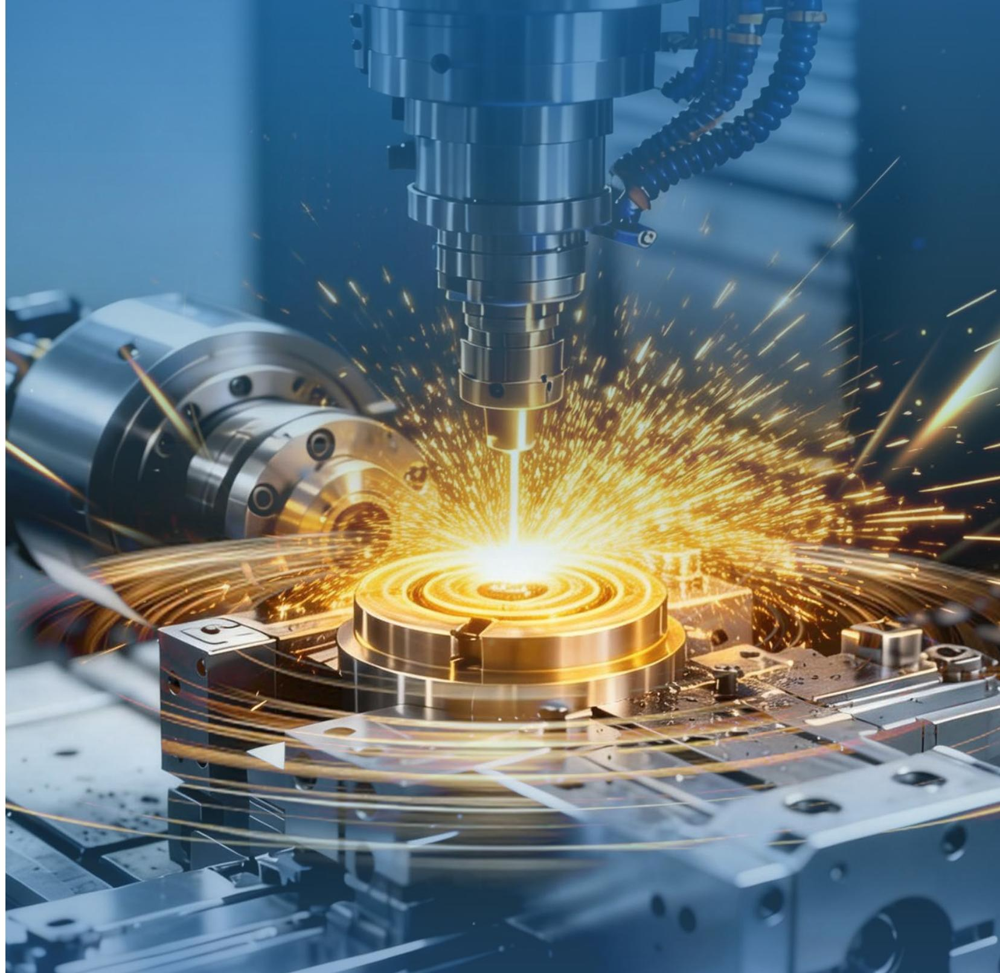

natural_image

Industrial CNC machining scene with laser cutting and sparks flying (no text or symbols visible)

## 目录

## CONTENTS

关于本报告 01

董事长致辞 05

走进富创精密 07

荣誉及奖项 13

可持续发展管理 13

## 01 卓越富创夯实治理根基

公司治理 25

合规经营 28

风险管理 28

反商业贿赂与反贪污 29

反不正当竞争 30

## 03 品质富创驱动创新引擎

创新研发 49

数智化发展 57

产品质量管理 64

客户权益保护 69

数据安全与客户隐私保护 71

负责任供应链 75

ESG关键绩效表 103

报告指标索引表 108

利益相关方沟通 19

重要性议题评估 21

## 02 绿色富创 助力低碳未来

环境合规管理 33

应对气候变化 36

污染物排放 41

废弃物处理 42

能源利用 44

水资源利用 45

循环经济 46

生态环境与生物多样性保护 46

## 04 和谐富创 携手共进共赢

员工权益保障 81

人才培养与发展 89

职业健康与安全 95

乡村振兴 101

社会贡献 102

## 前 言

## 关于本报告

《沈阳富创精密设备股份有限公司2025年度环境、社会和公司治理报告》（以下简称本报告）是沈阳富创精密设备股份有限公司（以下简称富创精密、富创、公司或我们）发布的第三份环境、社会和公司治理报告。本报告主要阐述公司环境、社会和公司治理管理理念与核心政策，系统呈现2025年度在经济运营、环境保护、社会责任及公司治理等领域的实践举措与绩效成果，旨在回应利益相关方对公司环境、社会和公司治理管理工作的关切、就公司年度环境、社会和公司治理工作进展与利益相关方进行全面的沟通。

## 时间范围

本报告所披露之信息的时间范围覆盖2025年1月1日至2025年12月31日期间（以下简称2025年度、本年度或报告期）。为增强报告的可比性及前瞻性，部分内容的覆盖时间往前后年度适度延伸。

## 组织范围

如无特别说明 本报告所披露之信息的组织范围涵盖沈阳富创精密设备股份有限公司及其控制的子公司与富创精密年度合并财务报表范围一致（具体参见《沈阳富创精密设备股份有限公司2025年年度报告》）。

## 编制依据

本报告依照或参考以下可持续发展信息披露准则、指引、指南或标准进行编制：

上海证券交易所《上海证券交易所上市公司自律监管指引第14号——可持续发展报告（试行）》；  
中国财政部《企业可持续披露准则——基本准则（试行）》；  
联合国可持续发展目标（SDGs）；  
全球报告倡议组织（GRI）《可持续发展报告标准》（GRI Standards）；  
国际可持续发展准则理事会（ISSB）《国际财务报告可持续披露准则第1号——可持续相关财务信息披露一般要求》（IFRS S1）、《国际财务报告可持续披露准则第2号——气候相关披露》（IFRS S2）；  
气候相关财务信息披露工作组（TCFD）《气候相关财务信息披露建议》。

## 发布周期

本报告为年度环境、社会和公司治理报告，每年度随当期年度报告发布一次。

## 信息来源与可靠性保证

本报告的资料和内容主要来源于公司统计数据、相关文档及内部沟通文件。报告中的部分数据摘自《沈阳富创精密设备股份有限公司2025年年度报告》，其他数据来自公司内部系统或人工记录，统计数据已经公司各职能部门审核确认。报告中涉及币种如无特别说明均指人民币元。

公司承诺本报告披露之信息和数据均已得到董事会确认，不存在任何虚假记载、误导性陈述，并对其内容的真实性、准确性和完整性负责。若本报告披露之数据或表述与年度报告存在不一致之处，均以年度报告为准。

为增强本报告前瞻性、充分展示公司所面临的潜在环境、社会和公司治理相关风险与机遇，本报告包含部分前瞻性陈述。本报告所披露的前瞻性陈述，包括但不限于除历史事实陈述外，公司预期或期望未来可能发生或即将发生的事件的陈述，会受到外界可变因素的影响，未来事件的发展可能与本报告之陈述不同。富创精密于本报告披露之日前基于针对现时及未来业务策略以及我们未来运营所处环境的多项假设而作出相关前瞻性陈述，除非监管机构另有要求，公司无义务或责任对上述前瞻性陈述进行修改或更新。

## 报告编制与发布

本报告由富创精密环境、社会和公司治理报告团队组织编制，经管理层审议后，提交到公司董事会，于2026年4月28日由董事会审议批准发布。

本报告以电子文档或纸质版公开发布，电子文档在上海证券交易所网站（https://www.sse.com.cn）、巨潮资讯网（https://www.cninfo.com.cn/new/index）及公司官网（https://www.fortune-semi.com）查阅获取。如有进一步查询需求，或对本报告及公司环境、社会和公司治理管理工作有任何意见或建议，您可通过以下方式与公司联系：

公司地址：辽宁省沈阳市浑南区飞云路18甲-1号

电子邮箱：zhengquanbu@syamt.com

联系电话：024-31692129

释义

<table><tr><td>释义项</td><td>指</td><td>释义</td></tr><tr><td>富创精密、富创、公司、我们</td><td>指</td><td>沈阳富创精密设备股份有限公司</td></tr><tr><td>沈阳融创</td><td>指</td><td>沈阳融创精密制造有限公司</td></tr><tr><td>南通富创</td><td>指</td><td>南通富创精密制造有限公司</td></tr><tr><td>广州富创</td><td>指</td><td>广州富创精密制造有限公司</td></tr><tr><td>北京富创</td><td>指</td><td>北京富创精密半导体有限公司</td></tr><tr><td>沈阳强航</td><td>指</td><td>沈阳强航时代精密科技有限公司</td></tr><tr><td>瑞特热表</td><td>指</td><td>沈阳瑞特热表动力科技有限公司</td></tr><tr><td>富创研究院</td><td>指</td><td>沈阳富创精密制造技术研究院有限公司</td></tr><tr><td>上海分公司</td><td>指</td><td>沈阳富创精密设备股份有限公司上海分公司</td></tr><tr><td>美国富创</td><td>指</td><td>FORTUNE USA, INC.</td></tr><tr><td>日本富创</td><td>指</td><td>FORTUNEジャパン株式会社</td></tr><tr><td>NOVA</td><td>指</td><td>NOVA-TECH MFG PTE. LTD.</td></tr><tr><td>精密智能</td><td>指</td><td>FABSMART PRECISION, INC.</td></tr><tr><td>本报告</td><td>指</td><td>《沈阳富创精密设备股份有限公司2025年度环境、社会和公司治理报告》</td></tr><tr><td>年度报告</td><td>指</td><td>《沈阳富创精密设备股份有限公司2025年年度报告》</td></tr><tr><td>元、万元、亿元</td><td>指</td><td>人民币元、人民币万元、人民币亿元</td></tr><tr><td>2025年度、本年度、报告期</td><td>指</td><td>2025年1月1日至2025年12月31日</td></tr></table>

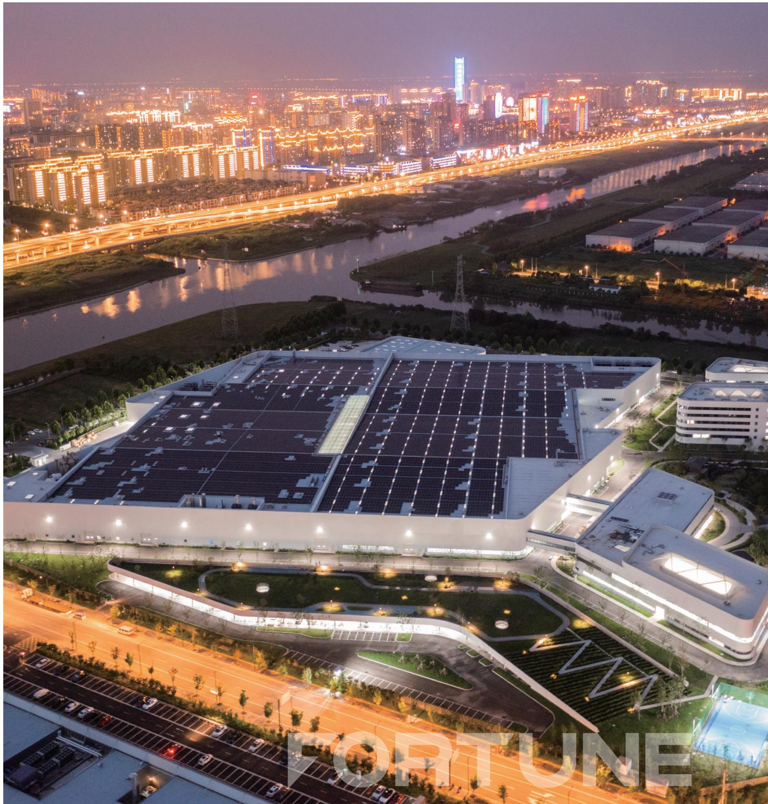

natural_image

Aerial night view of a modern industrial complex with solar panels on rooftops, surrounded by urban skyline and river (no visible text or symbols)

## 董事长致辞

尊敬的各位股东、客户、合作伙伴，全体员工及各界友人：

2025年，全球产业格局深度调整，半导体行业在技术突破与生态重构中迈向新阶，可持续发展理念也从行业共识进一步转化为企业发展的核心行动准则。作为深耕半导体设备精密零部件领域的本土企业，富创精密始终立足产业使命，将环境、社会和公司治理（ESG）作为企业高质量发展的重要基石，融入战略制定、运营管理与价值创造的全过程，在坚守主业、创新突破的同时，持续探索与环境共生、与社会共赢、与利益相关方共成长的发展之路。值此《2025年度环境、社会和公司治理报告》发布之际，我谨代表公司董事会，向长期以来关心、支持富创精密发展的各位伙伴，致以最诚挚的感谢和最崇高的敬意！

企业的可持续发展，始于坚实的治理根基。作为科创板上市企业，我们始终将规范治理视为企业行稳致远的生命线，坚守“规范，透明，高效、合规”的治理理念，持续完善股东会、董事会、管理层三层治理架构充分发挥各专门委员会的专业支撑作用，推动决策科学化、监督常态化、执行高效化。我们始终秉持诚信经营的底线思维，将合规意识根植于企业发展的每一个环节，健全全流程风险管理体系，严格落实反商业贿赂、反不正当竞争等各项要求，以清朗的经营生态守护企业品牌价值。同时我们始终珍视投资者的信任，不断完善信息披露机制，搭建多元化、全方位的沟通渠道，平等对待每一位投资者，尤其是中小投资者，以透明化的治理实践回应市场期待，让公司发展的成果与全体股东共享。

绿色是企业发展的底色，更是时代赋予的重要责任。面对国家“双碳”战略的深入推进，我们将绿色发展理念深度融入生产运营全流程，从环境合规管理到气候变化应对，从污染物精准治理到资源高效循环利用，持续构建系统化、全链条的绿色管理体系。我们坚持源头防控、过程管控、末端治理相结合的原则，不断优化生产工艺，完善废水、废气、废弃物处理机制，推动能源结构优化与清洁能源应用，让绿色生产成为企业的自觉行动。同时，我们将应对气候变化纳入企业战略考量，系统识别气候风险与发展机遇，通过技术升级、管理提升、全员参与，持续探索适合精密制造行业的低碳发展路径，不仅致力于实现自身的绿色转型，更希望以行业实践者的姿态，为半导体产业的低碳发展贡献富创智慧与方案。

创新是企业的核心竞争力，更是驱动可持续发展的不竭动力。半导体产业的竞争，归根结底是技术与创新的竞争，而精密制造领域的技术突破，更是支撑产业链自主可控的关键。2025年，我们始终锚定行业先进制程发展方向，深耕精密机械制造、表面处理特种工艺、气体传输系统集成等核心技术领域，以持续的研发投入构筑差异化技术壁垒，推动技术成果向产业化、市场化高效转化。我们以数智化转型为重要抓手，制定中长期数智化发展战略，推动生产制造、工艺设计、运营管理的全方位智能化升级，以数智化赋能生产效率与产品质量双提升。同时，我们坚守品质初心，建立全生命周期质量管理体系，以严苛的标准把控产品质量，全方位守护客户权益，筑牢数据安全与隐私保护防线，以高品质的产品和服务，赢得市场的广泛认可与持久信赖。

企业的价值，不仅在于创造经济效益，更在于肩负的社会责任。富创精密始终秉持“让员工幸福、助客户产品更有竞争力、助力祖国更加繁荣富强”的企业使命，将“以人为本”的理念落到实处。我们全力保障员工合法权益，构建公平、多元、包容的职场环境，完善具有竞争力的薪酬福利与长效激励体系，搭建多层次、系统化的人才培养与发展平台，让每一位员工都能在富创的平台上实现个人价值，与企业同成长、共进步。我们始终将员工的职业健康与安全放在首位，构建系统化、标准化的安全管理体系，全方位排查安全隐患，强化安全文化建设，让安全成为生产运营的基本保障，让每一位员工都能安心工作、舒心生活。在回馈社会方面，我们积极响应国家乡村振兴战略，聚焦乡村教育发展这一核心着力点，持续开展公益捐赠与精准帮扶活动；主动投身社会公益事业，支持高等教育与专业人才培养，以实际行动践行企业的社会担当，让企业发展的温度传递到社会的各个角落。

各位同仁，各位朋友，可持续发展是一场久久为功的征程，没有终点，只有连续不断的新起点。当前，半导体产业正处于国产替代与技术升级的关键时期，ESG作为企业高质量发展的重要维度，已成为衡量企业核心竞争力的重要标准。未来，富创精密将继续以联合国可持续发展目标为指引，持续深化ESG治理实践，进一步完善ESG管理体系，将ESG理念更深度地融入企业战略与日常运营，让ESG成为企业发展的内生动力；继续坚守创新初心，加大核心技术研发投入，攻克产业关键技术瓶颈，持续提升核心竞争力，助力半导体产业链供应链的安全稳定；继续深耕绿色发展，以更坚定的决心推进低碳转型，设定更高标准的绿色发展目标，让绿色成为企业发展的鲜明标识；继续践行社会责任，始终与员工、客户、合作伙伴同心同行，与社会同频共振，在创造企业价值的同时，创造更大的社会价值。

道阻且长，行则将至；行而不辍，未来可期。富创精密的发展，离不开每一位利益相关方的信任与支持。未来，我们将继续坚守产业报国的初心，以更务实的举措、更开放的心态、更坚定的步伐，在ESG的道路上稳步前行，持续提升企业可持续发展能力，努力成为世界精密制造典范，做中国精密制造的骄傲，为半导体产业的高质量发展，为国家实体经济的壮大，为可持续发展的美好未来，贡献更多富创力量！

最后，再次感谢各位股东、客户、合作伙伴、全体员工及社会各界对富创精密的关心与支持！

沈阳富创精密设备股份有限公司

董事长 郑广文

## 走进富创精密

沈阳富创精密设备股份有限公司是半导体零部件领域的领军企业，产品主要为半导体设备、泛半导体设备及其他领域的精密零部件，主要包括：机械及机电零组件（腔体、内衬、匀气盘等工艺零部件及腔体模组、阀体模组等模组产品）、气体传输系统（气柜、气体管路等产品），相关产品成功通过国内外龙头客户验证并实现量产。

公司核心优势在于具备7纳米及以下先进制程所需的高精密、高洁净度金属零部件的研发与量产能力，产品性能达到并超越国际主流客户标准，核心精密金属零部件已实现批量交付，打破了国际厂商在先进制程零部件领域的垄断格局。同时，公司在气体传输系统领域构建起坚实技术壁垒，产品适配先进制程对高质量、高稳定性、高交付时效性的严苛要求，2025年该板块实现营收11.35亿元，市场份额实现国内领先。

公司也是国家级企业技术中心、国家高新技术企业、国家“02重大专项 ”及国家智能制造新模式应用项目承1担单位、集成电路装备零部件精密制造技术国家地方联合工程研究中心依托单位。未来，公司将持续深化与行业龙头企业的战略合作，通过联合研发、定制化服务等方式提升公司技术水平。在经营管理领域推行精益化改革，持续建立并完善市场快速响应机制与柔性生产能力，通过动态优化资源配置提升运营效率。公司作为半导体设备核心零部件领域的系统解决方案提供商，未来也将以创新动能推动产业升级，为全球客户创造可持续价值，为股东实现稳健回报，为半导体产业链的安全贡献战略力量。

## 企业文化

## 企业定位

精密(产品定位)  
精致(环境定位)  
精益(管理定位)  
精彩(事业、人生定位)

## 企业愿景

成为世界精密制造典范  
做中国精密制造的骄傲

## 核心价值观

拼搏 感恩  
担当 超越

## 企业使命

让员工幸福  
助客户产品更有竞争力  
助力祖国更加繁荣富强

公司专注于金属材料零部件精密制造技术，陆续构建并完善精密制造全链条的核心技术体系，主要包括精密机械制造技术、表面处理特种工艺、焊接工艺及气体传输系统集成技术，通过持续研发投入形成差异化技术壁垒。基于半导体设备向更先进制程迭代的产业需求，公司相关核心技术已在工艺性能优化、量产良率提升及成本控制等方面产生一定效益，为半导体装备关键零部件的国产化替代进程赋能。主要产品包括机械及机电零组件和气体传输两大类，应用于集成电路和非集成电路领域。

公司通过聚焦大客户战略，加速全球化布局，加强产品与技术研发、构建从需求洞察到快速交付的全链条响应能力，为行业客户提供高效、精准的解决方案，进一步增强公司在国内外市场的竞争力，业务规模持续增长，巩固了公司在半导体设备零部件市场的领先地位，为业务的持续增长奠定坚实基础。通过在海内外建立研发制造中心及服务网络，富创精密进一步增强了全球市场的服务能力与响应速度，尤其在半导体设备制造领域，已成为国内外龙头半导体设备企业的重要供应商。截至报告期末，公司拥有境内全资/控股分、子公司8家，境外全资子公司4家。

## 价值链上游

股东/投资人  
材料供应商  
其他供应商  
可再生能源与传统能源供应商  
员工  
承包商  
行业协会/商会组织/媒体

## 富创精密自身运营

机械及机电零组件  
气体传输系统

## 价值链下游

客户（半导体设备）  
分销商  
当地社区/公益组织  
行业协会/商会组织/媒体

富创精密全球布局  
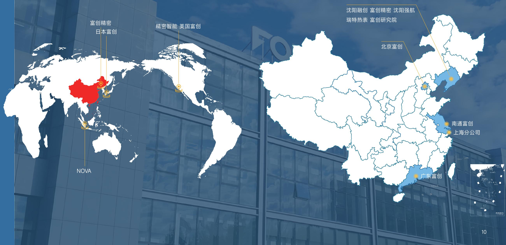

text_image

富创精密
日本富创
NOVA
精密智能 美国富创
沈阳融创 富创精密 沈阳强航
瑞特热表 富创研究院
北京富创
南通富创
上海分公司
广东富创

## 2025年度关键绩效

卓越富创 夯实治理根基

董事会会议出席率

100%

商业贿赂及贪污事件或相关诉讼案件

0件

商业道德相关培训覆盖率

100%

中小投资者电话及网络回复率

100%

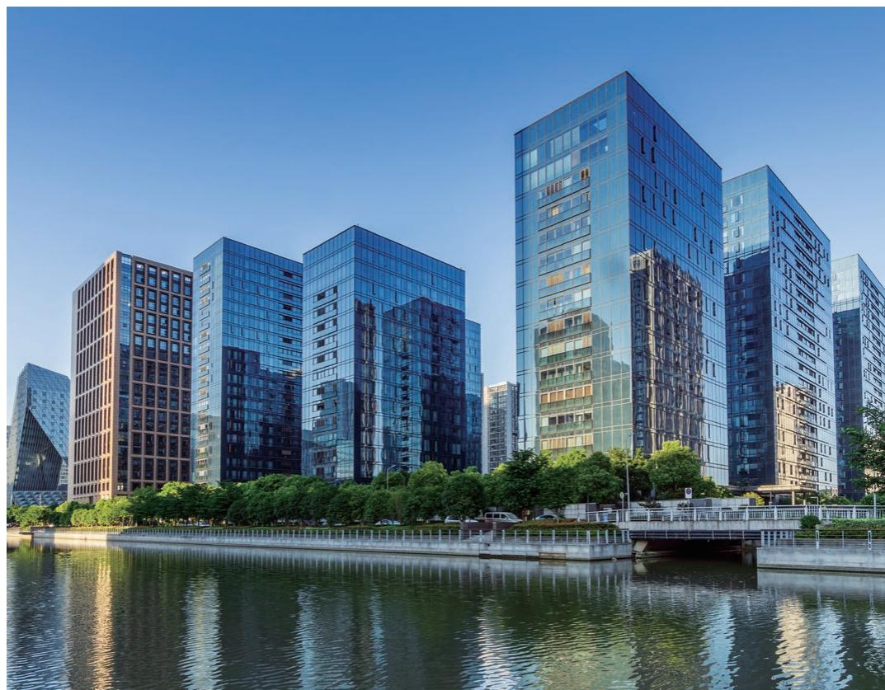

natural_image

Modern glass skyscrapers along a river under clear blue sky, surrounded by greenery (no visible text or signage)

和谐富创 携手共进共赢

劳动合同签订比例

100%

社会保险覆盖率

100%

员工满意度

4分（满分5分）

绿色富创 助力低碳未来

环保资金投入

1,795.02万元

温室气体排放总量

54,631.23吨二氧化碳当量

耗水强度

104.90吨/百万营收

外购电力消耗强度

2.71兆瓦时/百万营收

品质富创 驱动创新引擎

研发投入

27,349.93万元

研发人员占比

13.65%

持有有效发明专利

91 件

持有有效实用新型专利

300件

产品合格率

97.08%

## 荣誉及奖项

科创板上市公司价值三十强

证券时报

投资者关系管理天马奖

证券时报

2025 ESG 实践先锋奖

第四届国际绿色零碳节

最佳资本品牌价值奖

可持续价值香港峰会

natural_image

Golden trophy on a pedestal with blurred background, no visible text or symbols

## 可持续发展管理

富创精密以联合国可持续发展目标（SDGs）为指引，将可持续发展理念深度融入公司长期战略。系统构建与业务发展相匹配的可持续发展管理体系，致力于将环境、社会和公司治理治理（ESG）要素贯穿于公司治理和运营的全过程，持续在低碳运营、社会责任与公司治理等方面积极实践，推动商业模式的可持续转型，为公司及利益相关方创造长期价值。

## 可持续发展理念

富创积极响应国家“碳达峰、碳中和”战略，推动绿色能源应用与低碳技术的结合，提升生产环节的环保效能，致力于打造高效、绿色的生产模式，为推动全球气候行动和可持续发展贡献力量。

富创精密ESG价值理念

Environment

环境

富创积极响应国家“碳达峰、碳中和”战略，推动绿色能源应用与低碳技术的结合，提升生产环节的环保效能，致力于打造高效、绿色的生产模式，为推动全球气候行动和可持续发展贡献力量。

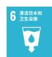

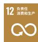

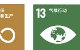

Society社会

富创始终践行企业社会责任，致力于营造平等开放的工作环境，巩固与客户和供应商的长期合作伙伴关系。积极参与社会公益事业与行业交流，促进经济社会的共同发展。

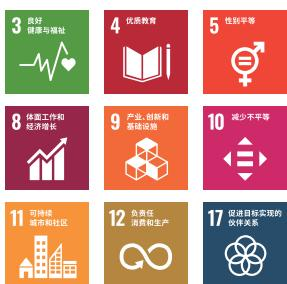

Governance公司治理

富创不断完善公司治理架构，优化决策和监督机制，确保各项管理流程的透明高效，推动企业合规运营与可持续发展，保证长期稳健的市场竞争力。

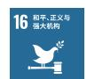

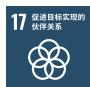

可持续发展目标及进展

<table><tr><td>报告章节</td><td colspan="2">响应的SDGs</td><td>管理目标</td><td>2025年目标进展</td><td>完成情况</td></tr><tr><td>卓越富创 夯实治理根基</td><td>[DTG2]</td><td>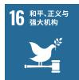 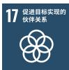</td><td>制定并开展覆盖公司全员的商业道德教育。</td><td>报告期内,公司未发生商业贿赂及贪污事件或相关诉讼案件;报告期内,公司未发生因不正当竞争行为导致诉讼或重大行政处罚事件;商业道德相关培训覆盖率100%</td><td>已完成</td></tr><tr><td>绿色富创 助力低碳未来</td><td colspan="2">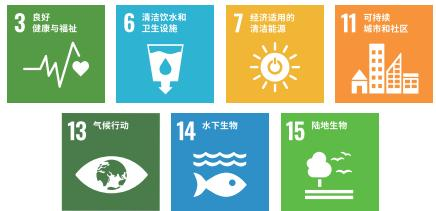</td><td>所有排放物保证合规排放</td><td>报告期内,公司废水、废气、废弃物100%合规排放。</td><td>已完成</td></tr><tr><td rowspan="4">品质富创 驱动创新引擎</td><td rowspan="4" colspan="2">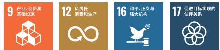</td><td>通过数智化打造超高离散精密制造行业“交付能力”的绝对领导者;</td><td>公司制定2025-2030年数智化战略,聚焦柔性化生产能力、工艺设计高效响应能力、一次制造合格能力建设与数据驱动运营能力四大能力建设。</td><td>进行中</td></tr><tr><td>完善知识产权保护制度,健全保护标准规范;</td><td>制定并执行涵盖商业秘密管理与专利管理等核心领域的一系列知识产权保护制度,为公司知识产权工作提供了制度保障。同时建立系统化的知识产权培训管理机制、分层分类的培训策略与线上线下融合的混合模式,全面提升全员知识产权意识与专业能力。</td><td>已完成</td></tr><tr><td>持续提升产品质量水平,增强客户满意度与市场竞争力;</td><td>公司依据国际质量管理标准,建立了覆盖全业务流程的质量管理体系;2025年,我们针对36家客户开展客户满意度调查,客户综合满意度99.73%。</td><td>进行中</td></tr><tr><td>定期开展信息与数据安全的内外部审查与评估。</td><td>持续完善信息安全管理体系,参照ISO 27001信息安全管理体系标准开展系统化建设,计划于2027年完成ISO 27001认证。</td><td>进行中</td></tr><tr><td rowspan="3">和谐富创 携手共进共赢</td><td rowspan="3" colspan="2">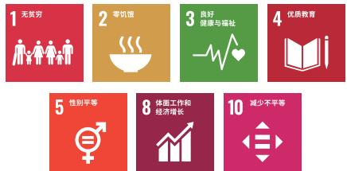</td><td>切实维护员工的各项合法权益,营造和谐、尊重、平等的工作氛围,持续提升员工的归属感、获得感与幸福感;</td><td>公司所有正式员工的劳动合同签订率、社会保险覆盖率均达到100%;制定《RBA社会责任手册》,并配套制定《员工手册》以及相关管理、补救程序;制定《薪酬管理制度》《假期管理制度》《工资、补贴及福利管理制度》,提升员工的生活品质与幸福感。</td><td>进行中</td></tr><tr><td>为员工构建公平、开放、多元的发展平台;</td><td>持续优化职位管理体系,完善员工职业发展通道,建立健全长效激励约束机制,并系统化推进各项培训与发展项目。</td><td>进行中</td></tr><tr><td>0火灾、爆炸事故 安全设施完好率100%0死亡、重伤事故 安全隐患整改率100%0职业病事故</td><td>围绕职业病防治、安全培训、事故预防与应急处置等方面,实施多项管理举措,全面提升职业健康安全管理水平。</td><td>已完成</td></tr></table>

## 可持续发展管理

在贯彻可持续发展理念的过程中，完善的ESG治理体系是重要保障。为确保公司在实现经济效益的同时，切实履行社会责任、推进环境保护，我们建立了由董事会负责的ESG治理架构。董事会承担最高监督与指导职责，统筹协调各部门落实社会责任相关举措，确保可持续发展理念贯穿公司运营。各业务与职能部门依据其专业领域，积极承担并推进具体治理工作，并通过建立透明、定期的信息披露机制，主动回应社会期待，增强与利益相关方的沟通与信任，持续提升公司的社会价值与品牌公信力。

  
董事会  
作为公司可持续发展管理及公开披露的最高责任机构，负责审议和批准公司的ESG战略与目标，确保公司在追求经济效益的同时，积极履行社会责任和环境保护的义务。

  
证券部

在可持续发展管理工作中扮演着关键角色，经董事会授权负责牵头组织和协调各个部门处理ESG相关事务，包括安排访谈、资料收集、报告编写等工作。

  
人力行政中心

通过环安管理、能源管理与厂务运维、工程基建及行政服务四大业务管理体系，确保公司在环境保护方面的合规性，包括废水、废气、废物管理和排放达标；推进新能源使用，以实现公司的绿色发展目标；通过接收员工建议、健全福利制度以及简化相关工作流程，推动公司制度公平化与高效化。

负责人力资源战略规划、政策设计及组织执行，并致力于保障员工的薪酬福利和工作与生活的平衡，建立健全福利制度，不断提升员工的满意度和忠诚度，为公司的战略和业务发展提供全面的人力资源支持和服务。

  
研发中心  
主导半导体机械及机电零组件、气体传输系统相关的新产品、新工艺研发及测试，通过自主研发、与客户协同研发以及校企合作研发，积累丰富的专业知识和经验，建立特有的技术资产，不断提升公司的技术实力和市场竞争力。

  
流程与质量中心

构建质量管理体系，不断提升内部审核和质量体系能力：建立全生命周期质量标准，通过检测监控、体系优化及持续改进确保产品可靠性和生产效率，支撑公司目标达成与提升市场竞争力；制定并下发质量标准，确保多经营单位质量执行标准一致；依据客户标准和投诉建立客户标准，提升质量效率，建立保障客户持续稳定供应能力；对供应商寻源、认证、稽核及供应商成长（能力提升）负责。

  
市场中心  
专注于提供服务支持和研发创新。该中心通过与客户协同研发和市场前瞻性研发，不断开拓市场，提升公司的市场份额和品牌影响力。

  
供应链中心  
基于公司战略目标，保障公司具备稳定可靠的供应链，负责对供应商进行计划、组织、评估、协调和控制等管理活动，持续提升供应链竞争力和快速反应能力与供应商建立长期稳定的合作关系。

  
数智化中心  
负责公司数智化建设蓝图规划，数智化项目实施建设、系统平台运行维护，赋能公司推动生产智能化、管理精细化与决策科学化，为公司的经营决策和内部运营管理提供快速、准确的数据来源支撑。

  
公共管理中心

根据公司中长期发展规划和相关政策，负责公共关系管理和维护等相关工作，协调公司内外部资源，完成公司下达的各项管理工作目标。

## 可持续发展相关影响、风险和机遇管理

公司已将ESG相关影响、风险和机遇管理融入到公司整体风险管理体系中，参照国际风险管理指南和框架，常态化开展ESG影响、风险和机遇管理、有序推进ESG影响、风险和机遇评估。通过定期评估各ESG相关议题的财务重要性与影响重要性，开展资料审查，负责人访谈等方式公司对存在财务重要性的议题开展系统性的区险和机遇识别和评估审视其对公司运营及财务表现的实际及潜在影响并据此采取相关的应对措施

报告期内公司针对产品和服务安全与质量应对气候变化两项具有财务重要性的议题开展了风险与机遇评估相关评估结果已随本报告一同由董事会审阅批准，详细评估结果及公司应对措施请参见本报告对应章节。

## 利益相关方沟通

我们与各利益相关方建立了多元化的沟通渠道，定期向投资者、股东、员工、客户、合作伙伴等利益相关方传递公司在环境保护、社会责任、企业治理等方面的进展和成果。

<table><tr><td>利益相关方</td><td>关注议题</td><td>沟通方式/频率</td><td>关注内容</td></tr><tr><td>政府/监管机构</td><td>·守法合规·环境合规管理·应对气候变化·社会贡献·职业健康与安全</td><td>·电话 实时·接受检查 不定期·公文 不定期·参与政府单位举办的说明会 / 公听会 / 研讨会 不定期</td><td>·产业发展·守法合规与风险管理·行业人才培养·能源与资源管理·环保相关法规的建言与推动</td></tr><tr><td>股东/投资人</td><td>·经济绩效·守法合规·商业道德·风险管理·研发与创新·知识产权保护·产品质量与安全</td><td>·企业微信 实时·股东群 实时·电话 实时·邮箱 实时·中小投资者问答平台 实时·股东会 每年·征集意见公告 不定期·业绩说明会 定期·投资者交流会 每年</td><td>·产业政策变化及影响·长期盈利能力·研发创新情况·人才招募·商业道德规范·经营战略规划·风险管控能力</td></tr><tr><td>员工</td><td>·职业健康与安全·员工薪酬与福利·人才培养与发展·人才吸引与留任·多元化与平等机会·员工权益保障</td><td>·企业微信 实时·企业邮箱 实时·员工满意度调查 定期·职工代表大会 定期·员工培训 定期</td><td>·未来发展潜力·人才留任·员工福利与待遇·员工培训·职业安全与健康·个人职业发展</td></tr></table>

<table><tr><td>利益相关方</td><td>关注议题</td><td>沟通方式/频率</td><td>关注内容</td></tr><tr><td>客户</td><td>·产品质量与安全·客户关系管理·数据安全和隐私保护·研发与创新·可持续供应链</td><td>·电话 实时·邮件 实时·线上会议 不定期·来访 不定期·提供驻场服务 不定期</td><td>·产品与服务质量管控·公司竞争优势·信息安全管理·商业道德规范</td></tr><tr><td>合作伙伴(供应商/承包商/分销商等)</td><td>·可持续供应链·数据安全和隐私保护·产品质量与安全·守法合规·商业道德</td><td>·电话 实时·邮件 实时·线上会议 不定期·线下会谈 不定期·供应商大会 每年</td><td>·商业道德规范·供应商可持续性管理·产品质量管控·反贪腐</td></tr><tr><td>当地社区/公益组织</td><td>·社会贡献·职业健康与安全·生物多样性保护·应对气候变化·环境合规管理·废弃物管理</td><td>·电话 实时·公益活动 不定期·志愿者服务 不定期·乡村振兴项目 不定期</td><td>·社会参与·社区建设·环境保护·生物多样性保护·公益捐助</td></tr><tr><td>行业协会/商会组织/媒体</td><td>·守法合规·职业健康与安全·商业道德·社会贡献</td><td>·行业会议 不定期·日常业务沟通走访 不定期·采访及报道 不定期</td><td>·公司治理·经济效益·外部合作·社会参与</td></tr></table>

## 重要性议题评估

公司结合内外部环境变化、《上海证券交易所上市公司自律监管指引第14号——可持续发展报告（试行）》相关要求、利益相关方的关注及行业发展趋势，识别与公司战略目标、可持续发展密切相关的议题，并按照以下流程开展重要性议题评估。

## 重要性议题识别

公司以自身业务发展战略和公司特色为基础，通过同行对标分析、标准要求对齐、外部政策研究、行业发展趋势调查等多种途径识别出27项与公司密切相关的ESG重要性议题。

## 利益相关方与内部调研

构建影响重要性传导路径，设计调研问卷和访谈提纲；编制ESG重要性议题评估在线调研问卷，收集利益相关方及公司管理层对公司在各ESG议题的表现对环境、社会和经济的影响及对公司运营的影响，共收到有效问卷回复299份。

## 重要性议题评估

依据调研问卷的结果，结合同行实践、利益相关方关切、公司经营发展方向等多个因素，全面分析公司ESG工作关注的重点领域，确定重要性议题并编制重要性分析矩阵。

## 重要性议题审阅与批准

结合公司战略规划对议题矩阵进行验证和确认，并汇报至董事会审阅批准。

## 重要性议题反馈与完善

报告发布后，公司将收集各利益相关方对本报告内容的反馈，为下一期重要性议题评估提供输入。

富创精密2025年度可持续发展议题双重重要性矩阵  
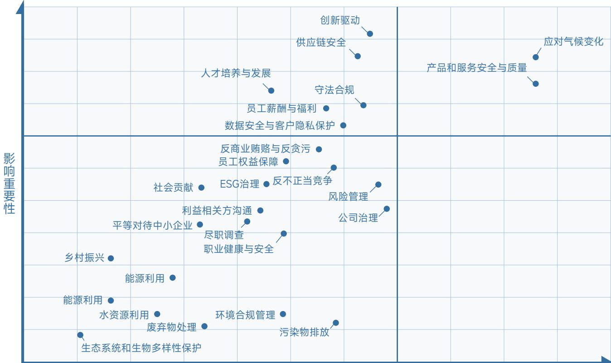

scatter

| Topic | X-axis Position (Relative) | Y-axis Position (Relative) |
| :--- | :--- | :--- |
| 创新驱动 | High | High |
| 应对气候变化 | High | High |
| 产品和服务安全与质量 | High | High |
| 人才培养与发展 | Medium-High | Medium-High |
| 守法合规 | Medium-High | Medium-High |
| 员工薪酬与福利 | Medium-High | Medium-High |
| 数据安全与客户隐私保护 | Medium-High | Medium-High |
| 反商业贿赂与反贪污 | Medium-High | Medium-High |
| 员工权益保障 | Medium-High | Medium-High |
| 社会贡献 | Low-Medium | Medium-High |
| ESG治理 | Low-Medium | Medium-High |
| 反不正当竞争 | Low-Medium | Medium-High |
| 风险管理 | Medium-High | Medium-High |
| 公司治理 | Medium-High | Medium-High |
| 利益相关方沟通 | Low-Medium | Medium-High |
| 平等对待中小企业 | Low-Medium | Medium-High |
| 尽职调查 | Low-Medium | Medium-High |
| 职业健康与安全 | Low-Medium | Medium-High |
| 乡村振兴 | Low | Medium |
| 能源利用 | Low | Medium |
| 水资源利用 | Low | Medium |
| 废弃物处理 | Low | Medium |
| 环境合规管理 | Low-Medium | Medium |
| 污染物排放 | Low-Medium | Medium |
| 生态系统和生物多样性保护 | Low | Low-Medium |

财务重要性

<table><tr><td>同时具有财务重要性与影响重要性的议题</td><td>·产品和服务安全与质量</td><td>·应对气候变化</td></tr><tr><td>具有财务重要性但不具有影响重要性的议题</td><td colspan="2">/</td></tr><tr><td rowspan="3">具有影响重要性但不具有财务重要性的议题</td><td>·创新驱动</td><td>·员工薪酬与福利</td></tr><tr><td>·供应链安全</td><td>·数据安全与客户隐私保护</td></tr><tr><td>·人才培养与发展</td><td>·守法合规</td></tr><tr><td rowspan="10">既不具有财务重要性也不具有影响重要性的议题</td><td>·反商业贿赂与反贪污</td><td>·职业健康与安全</td></tr><tr><td>·员工权益保护</td><td>·乡村振兴</td></tr><tr><td>·反不正当竞争</td><td>·能源利用</td></tr><tr><td>·ESG治理</td><td>·循环经济</td></tr><tr><td>·社会贡献</td><td>·水资源利用</td></tr><tr><td>·风险管理</td><td>·环境合规管理</td></tr><tr><td>·公司治理</td><td>·废弃物处理</td></tr><tr><td>·利益相关方沟通</td><td>·污染物排放</td></tr><tr><td>·尽职调查</td><td>·生态系统和生物多样性保护</td></tr><tr><td>·平等对待中小企业</td><td></td></tr></table>

## 01

## 卓越富创夯实治理根基

在复杂多变的商业环境中，规范透明的公司治理是企业高质量发展的根本保障，是上市公司履行社会责任、维护利益相关方权益的核心前提。富创精密始终将治理能力作为发展生命线，持续完善治理架构、健全制度体系、强化合规风控，打造诚信廉洁经营生态，保障公司长期稳健可持续发展。

## 所涉及的可持续发展议题

公司治理 反商业贿赂与反贪污  
守法合规 反不正当竞争  
风险管理

所响应的联合国可持续发展目标（SDGs）

5 性别平等

16 和平,正义与强大机构

17 促进目标实现的伙伴关系

## 公司治理

公司始终严格遵循《中华人民共和国公司法》《中华人民共和国证券法》《上市公司治理准则》《上海证券交易所科创板股票上市规则》等国家法律法规和监管规定，坚守“规范，透明高效，合规”的治理理念，持续完善公司治理架构，强化规范运作水平，逐步构建起权责清晰、运转高效、监督有力的治理体系。

公司建立了由股东会、董事会和管理层组成的三层治理架构，明确了各层级的职责边界，实现权责分明、各司其职、相互协调、相互监督，为公司的规范运作、战略落地和风险防控提供了坚实的组织保障。其中，股东会作为公司的最高权力机构，依法行使决定公司经营方针和投资计划、选举和更换非由职工代表担任的董事、审议批准董事会报告等重要职权；董事会作为公司经营决策机构，负责召集股东会并向股东会报告工作，执行股东会的决议，决定公司的经营计划和投资方案，聘任或者解聘公司高级管理人员等，主导公司战略发展方向；管理层作为公司经营执行机构，负责组织实施股东会和董事会，主持公司的生产经营管理工作，确保公司各项经营活动有序开展。

为保证董事会决策的专业性和科学性，公司董事会下设战略委员会、审计委员会、提名委员会和薪酬与考核委员会四个专门委员会，各专门委员会严格按照相应议事规则开展工作，结合自身专业领域，为董事会重大决策提供全面、专业的建议和支撑。

  
股东会召开次数

7次

  
董事会召开次数

8次

  
董事会会议出席率

100%

  
独立董事专门会议

1次

  
战略委员会召开次数

2次

  
审计委员会召开次数

4次

  
提名委员会召开次数

2次

  
薪酬与考核委员会召开次数

4次

## 董事会独立性与多元化

公司高度重视董事会的独立性建设，始终将独立性作为保障董事会决策公平、公正的核心前提，严格按照法律法规和公司制度要求配置董事会成员，确保董事会能够独立、客观地行使决策和监督职能。公司董事会由9名董事组成，其中独立董事3名，独立董事占比达到1/3，符合监管要求及公司制度规定，为董事会决策的独立性提供了人员保障。

为规范独立董事工作机制，公司专门制定《独立董事制度》，明确规定独立董事的任职条件、提名选举流程、职责权限、工作程序等内容，细化了独立董事的履职要求，确保独立董事能够独立、有效地履行职责。公司独立董事严格按照《独立董事制度》及相关监管要求，认真履行职责，每年定期对自身独立性情况进行全面自查，形成完整的自查报告并提交公司董事会；公司董事会也定期对在任独立董事的独立性情况进行全面评估，结合独立董事的自查报告、履职情况及关联关系变动情况，出具专项评估意见，确保独立董事能够独立履行职责。

在董事会多元化建设方面，公司始终坚持多元协同、优势互补的原则，在董事提名与选举过程中，充分考虑年龄，性别文化及教育背景，专业技能，行业经验，管理经验等多方面的多元化因素，着力打造结构合理、专业互补、视角多元的董事会团队。截至报告期末，公司有1名女性董事，未来将持续提升公司董事会的多元化。

## 董事会有效性与专业性

公司注重董事会及各专门委员会的专业性建设，着力提升董事及专门委员会委员的专业能力和履职水平，确保董事会能够高效，专业地履行职责。公司董事会成员及各专门委员会委员均经过严格筛选 具备相应的专业能力和丰富的履职经验，能够充分满足董事会及各专门委员会履职的专业需求。公司董事会现任成员具备丰富的行业经验和专业能力，涵盖财务、金融、法律、企业管理、计算机技术、生产制造、机械制造等多个多元化领域，形成了互补的专业结构。

为完善公司治理水平，公司建立董事履职评价机制，定期对董事的履职情况进行评估，重点评价董事出席会议情况、参与决策情况、专业贡献情况等，洞察董事会运行的不足，为后续制定针对性的改进措施提供有力依据，持续提升董事会运作效率。

## 高管薪酬管理

公司建立健全公平、公正、公开的高管薪酬管理体系，将高管薪酬与公司经营业绩、个人绩效表现紧密挂钩，充分调动高级管理人员的工作积极性和主动性，促进公司经营目标的实现。公司董事会薪酬与考核委员会作为高管薪酬管理的核心机构，负责制定公司董事及高级管理人员的考核标准并进行考核，制定、审查董事及高级管理人员的薪酬政策与方案，对董事会负责，确保薪酬管理工作的专业性和规范性。

## 投资者权益保护

公司始终将投资者权益保护放在重要位置 不断完善投资者权益保护体系切实维护全体投资者的合法权益。

信息披露方面公司严格遵循《信息披露管理办法》等相关制度规定 建立完善的信息披露管理制度明确信息披露的范围，流程，责任主体和考核要求 确保信息披露工作规范，有序开展，切实保障了投资者的知情权和参与权。

投资者沟通方面公司建立多元化 全方位的投资者沟通渠道 着力搭建公司与投资者之间的沟通桥梁，公司的沟通渠道主要包括上证e互动、投资者热线、电子邮箱、投资者调研、策略会、现场参观、官网投资者关系专栏等，其中上证e互动作为日常沟通的重要平台，安排专人负责及时回复提问，快速准确解答投资者疑问；热线和电子邮箱接受投资者的咨询和建议：定期组织投资者调研活动邀请投资者实地参观公司让投资者直观了解公司发展现状；在定期报告披露后，及时召开业绩说明会，对重点内容进行详细说明。

平等对待中小投资者方面，公司严格遵循平等性原则，在投资者关系管理活动中平等对待所有投资者，尤其注重保护中小投资者的合法权益，为中小投资者参与公司治理、行使股东权利创造机会、提供便利。

## 案例丨首届投资者开放日活动

2025年12月，公司成功举办首届投资者开放日活动。本次活动公司董事长及总经理郑广文先生、公司董事宋洋先生、董事会秘书郎羽女士以及相关业务领导全程参与，通过组织投资者实地探访北京智能工厂，全面展示了公司在精密制造领域的核心技术、智能化产线以及未来的战略布局。在交流环节，管理层与核心投资者就行业趋势、公司发展规划等议题进行了深入沟通。此次活动不仅增强了投资界对公司技术实力与发展路径的了解，也进一步提升了公司在资本市场的透明度和认同感。

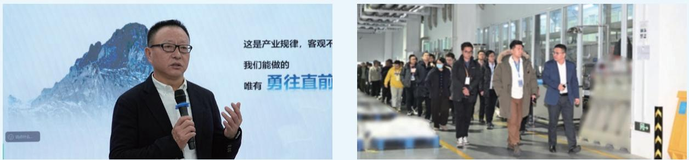

## 合规经营

合规经营是企业生存和发展的底线，公司将合规经营作为企业发展的基石，严格遵守《中华人民共和国公司法》《中华人民共和国证券法》等相关法律法规及监管规定，设置法务合规中心，并结合公司实际制定一系列管理制度规范企业经营行为，构建了全方位的合规管理体系，确保企业运营的每一个环节都有章可循、有规可依，切实防范合规风险。同时，公司加强合规培训，每年组织全体员工开展合规培训活动，培训内容包括公司合规制度解读、法律法规宣贯、常见合规风险提示、商业道德规范等，确保员工掌握合规要求。

## 风险管理

公司以预防为主、防治结合、全程管控的原则建立起风险管理体系，明确风险管理的组织架构和职责分工，确保风险管理工作有序开展。公司各部门作为风险管理的第一道防线，承担着风险识别与防控的基础职责。在这一过程中，公司法务部门积极融入业务前端，与各业务单元保持紧密协作，主动引导其系统梳理自身业务流程及跨部门协作中可能潜藏的风险点，力求做到风险识别全面、精准、无盲区。

公司法务部门以各业务部门提供的风险清单为基础，重点关注那些发生频率较高或可能对公司运营产生重大影响的领域，开展深入分析与研判，并据此提出针对性强、操作性好的管理建议。随后，各业务部门结合自身实际，对这些建议进行充分评估与讨论，最终制定出切实可行的风险管理策略。

natural_image

Modern white building with curved glass facade under clear sky, no visible text or symbols

## 反商业贿赂与反贪污

## 反商业贿赂与反贪污管理体系

公司坚决抵制商业贿赂、贪污等违法违规行为，将反商业贿赂与反贪污工作作为公司合规管理和企业文化建设的重要内容，坚持“预防为主，抓早抓小，独立监察，闭环管理”的原则切实维护公司的合法权益和良好的商业形象。公司发布《关于禁止接受礼品、礼金、宴请等的通知》规定员工不得利用职务之便索取、收受他人财物或其他利益。同时，公司严令禁止以下行为：为他人谋取不正当利益；在商业合作中采取行贿、回扣、佣金等不正当手段获取商业机会；利用职务之便侵占公司财产、挪用公司资金等。对违反规定的员工，将根据情节轻重给予警告、罚款、降职、解除劳动合同等处分，涉嫌违法犯罪的，将依法移交司法机关处理。

报告期内，公司未发生商业贿赂及贪污事件或相关诉讼案件。

## 举报管理与举报人保护

公司建立保密举报渠道，为员工、供应商、客户以及其他利益相关方提供安全的举报途径。举报渠道主要包括举报电话、举报邮箱等，并由审计监察部全面负责管理各类举报事件的接收、登记、回复和上报等工作。公司高度重视举报人保护工作，制定《检举人保护管理制度》，明确对举报人的保护措施，严格保护举报人的个人信息，严禁对举报人进行打击报复、歧视、刁难等行为，切实保障举报人的合法权益。

## 审计监察部投诉举报电话

136-1405-7766

131-9009-8522

135-0497-3168

## 审计监察部投诉举报邮箱

fc-audit@syamt.com

natural_image

Close-up of hands holding a pen and notebook, with blurred background (no visible text or symbols)

## 廉洁文化建设

公司通过持续深化廉洁文化建设，公司不断夯实合规经营根基，为健康、稳定、长远发展提供坚强保障。对内积极加强员工廉洁教育，将反商业贿赂、反贪污要求融入员工培训，提升员工的廉洁意识和法律意识，引导员工自觉抵制各类腐败行为，坚守廉洁从业底线。对合作伙伴，公司坚持高标准的廉洁要求，对供应商、合作伙伴进行严格的廉洁审核，与所有合作伙伴签订廉洁协议，明确双方在合作过程中应遵守的廉洁条款，确保合作双方秉持诚信、透明的原则开展业务往来，共同维护良好的商业秩序。

## 反不正当竞争

公司严格遵守《中华人民共和国反不正当竞争法》《中华人民共和国反垄断法》等法律法规，坚决抵制不正当竞争行为，坚持公平竞争、诚信经营的原则，自觉维护公平竞争的市场秩序，推动行业健康发展。公司始终秉持公平竞争的经营理念，在市场竞争中坚持靠产品质量、技术优势、服务水平赢得市场，坚决不实施不正当竞争行为，不损害竞争对手、消费者和社会公共利益。报告期内，公司未发生因不正当竞争行为导致诉讼或重大行政处罚事件。

## 02

## 绿色富创 助力低碳未来

所响应的联合国可持续发展目标（SDGs）

3 良好 健康与福祉

6 清洁饮水和卫生设施

11 可持续城市和社区

13 气候行动

14 水下生物

15 陆地生物

公司始终将绿色发展理念深度融入企业战略与生产运营全过程，坚守生态优先、合规经营和低碳高效，主动践行环境责任，聚焦环境合规管理、气候变化应对、污染物治理、资源循环利用等关键领域，持续完善环境管理体系，提升环境治理能力，为实现“双碳”目标、构建可持续发展的生态环境贡献力量。

## 所涉及的可持续发展议题

环境合规管理 能源利用  
应对气候变化 水资源利用  
污染物排放 循环经济就  
废弃物处理 生态系统和生物多样性保护

## 环境合规管理

环境合规是企业绿色发展的底线，也是富创精密环境管理工作的核心抓手。公司严格遵循国家及地方环境保护相关法律法规，构建覆盖生产全流程、责任全覆盖的环境合规管理体系，通过制度建设、体系认证、风险管控、应急处置及文化培育，确保各项环境工作合法合规、有序推进，切实防范环境风险，履行企业环境责任。

## 环境管理体系

公司严格遵守《中华人民共和国环境保护法》《中华人民共和国大气污染防治法》《中华人民共和国水污染防治法》等相关法律法规及行业标准，结合自身经营特点，制定并发布《环境运行控制程序》《环境职业健康安全管制程序》《废水、废气、噪声及固废管理程序》等一系列标准化制度文件，对生产及服务全流程中与环境相关的各类活动实施全面、系统的监测与管控。截至本报告期末，富创精密及其下属子公司北京富创、南通富创、沈阳强航均已顺利通过ISO 14001环境管理体系认证。

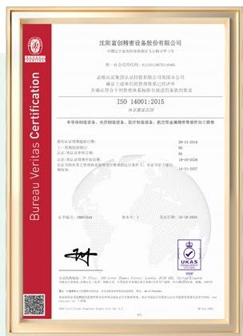

text_image

沈阳富创精密设备股份有限公司
中国辽宁农村商业银行股份有限公司
统一社会信用代码:91610100MA2WX5D4M6L
必认认证集团认可的控股有限公司部分分公司
通过上海卓信评估管理咨询本公司审计
并确认符合以下的资质和条件的全部注册申请的要求
ISO 14001:2015
本章承诺正误
半导体制造装备、光伏制造装备、医疗制造装备、航空航天金属精密零部件加工销售
身份证号码或营业执照号：99-14-2014
法人营业执照号码：无
法人证件号码：无
经办人/法定代表人：李云
登记机关/组织机构代码：99-14-2014
经营范围：以自有资金从事投资活动，项目投资、项目管理、技术开发、技术咨询、技术交流、技术转让、技术推广；依法须经批准的项目,经相关部门批准后方可开展经营活动，具体经营项目以相关部门批准文件或许可证件为准。未经有关部门批准，不得以公开方式募集资金开展投资活动。特此公告。
证券代码：0985344
证券简称：华创精密
证券代码：0985344
证券简称：华创精密
证券代码：0985344
证券简称：华创精密
证券代码：0985344
证券简称：华创精密
证券代码：0985344
证券简称：华创精密
证券代码：0985344
证券简称：华创精密
证券代码：0985345
证券简称：华创精密
证券代码：0985345
证券简称：华创精密
证券代码：0985346
证券简称：华创精密
证券代码：0985346
证券简称：华创精密
证券代码：0985347
证券简称：华创精密
证券代码：0985347
证券简称：华创精密
证券代码：0985348
证券简称：华创精密
证券代码：0985348
证券简称：华创精密
证券代码：0985349
证券简称：华创精密
证券代码：0985349
证券简称：华创精密
证券代码：0985350
证券简称：华创精密
证券代码：0985350
证券简称：华创精密
证券代码：0985351
证券简称：华创精密
证券代码：0985351
证券简称：华创精密
证券代码：0985352
证券简称：华创精密
证券代码：0985352
证券简称：华创精密
证券代码：0985353
证券简称：华创精密
证券代码：0985353
证券简称：华创精密
证券代码：0985354
证券简称：华创精密
证券代码：0985354
证券简称：华创精密
证券代码：0985355
证券简称：华创精密
证券代码：0985355
证券简称：华创精密
证券代码：0985356
证券简称：华创精密
证券代码：0985356
证券简称：华创精密
证券代码：0985357
证券简称：华创精密
证券代码：0985357
证券简称：华创精密
证券代码：0985358
证券简称：华创精密
证券代码：0985358
证券简称：华创精密
证券代码：0985359
证券简称：华创精密
证券代码：0985360
证券简称：华创精密
证券代码：0985361
证券简称：华创精密
证券代码：0985362
证券简称：华创精密
证券代码：0985363
证券简称：华创精密
证券代码：0985364
证券简称：华创精密
证券代码：0985365
证券简称：华创精密
证券代码：0985366
证券简称：华创精密
证券代码：0985367
证券简称：华创精密
证券代码：0985368
证券简称：华创精密
证券代码：0985369
证券简称：华创精密
证券代码：0985370
证券简称：华创精密
证券代码：0985371
证券简称：华创精密
证券代码：0985372
证券简称：华创精密
证券代码：0985373
证券简称：华创精密
证券代码：0985374
证券简称：华创精密
证券代码：0985375
证券简称：华创精密
证券代码：0985376
证券简称：华创精密
证券代码：0985377
证券简称：华创精密
证券代码：0985378
证券简称：华创精密
证券代码：0985379
证券简称：华创精密
证券代码：0985380

沈阳富创ISO 14001  
环境管理体系认证证书

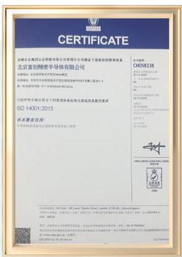

text_image

CERTIFICATE
必格认证腾讯认证股份有限公司英国分公司确认下述组织的管理体系
北京富创精密半导体有限公司
注册地址：北京市经济技术开发区南苑路69号院1号楼（国信）A
统一社会信用代码：91110100MA78FJX3L
已经评审并确认符合下列限制性标准全部现场条款的要求
ISO 14001:2015
证券事务部信息：
中车集团财务有限责任公司财务部审计部
CN058238
2015年1月1日
ISSN 10-00000000
ISBN 978-7-778-7-78
国家统计局、财政部、国家税务总局、中国证监会、上海证券交易所、深圳证券交易所、美国纽约证券交易所、美国证券交易所、美国证券交易所、美国证券交易所、美国证券交易所、美国证券交易所、美国证券交易所、美国证券交易所、美国证券交易所、美国证券交易所、美国证券交易所、美国证券交易所、美国证券交易所、美国证券交易所、美国证券交易所、美国证券交易所、美国证券交易所、美国证券交易所、美国证券交易所、美国证券交易所、美国证券交易所、美国证券交易所、美国证券交易所、美国证券交易所、美国证券交易所、美国证券交易所、美
国认证
CN058238
2015年1月1日
ISSN 10-00000000
ISBN 978-7-778-7-78
国家统计局、财政部、国家税务总局、中国证监会、上海证券交易所、美国证券交易所、美国证券交易所、美国证券交易所、美国证券交易所、美国证券交易所、美国证券交易所、美国证券交易所、美国证券交易所、美国证券交易所、美国证券交易所、美国证券交易所、美国证券交易所、美国证券交易所、美国证券交易所、美国证券交易所、美国证券交易所、美国证券交易所、美国证券交易所、美国证券交易所、美国证券交易所、美国证券交易所、美国证券交易所、美国证券交易所、美国证券交易所、美国证
证编号：CN058238
2015年1月1日
ISSN 10-00000000
ISBN 978-7-778-7-78
国家统计局、财政部、国家税务总局、中国证监会、上海证券交易所、美国证券交易市场协会、上海证券交易所有限公司
证书编号：CN058238
2015年1月1日
ISSN 10-00000000
ISBN 978-7-778-7-78
国家统计局、财政部、国家税务总局、中国证监会、上海证券交易所、美国证券交易市场协会、上海证券交易所有限公司
证书编号：CN058238
2015年1月1日
ISSn 10-00000000
ISBN 978-7-778-7-78
国家统计局、财政部、国家税务总局、中国证监会、上海证券交易所、美国证券交易市场协会、上海证券交易所有限公司
证书编号：CN058238
2015年1月1日
ISSn 10-00000000
ISBN 978-7-677-6-68
国家统计局、财政部、国家税务总局、中国证监会、上海证券交易所、美国证券交易市场协会、上海证券交易所有限公司
证书编号：CN058238
2015年1月1日
ISSn 10-00000000
ISBN 978-7-677-6-68
国家统计局、财政部、国家税务总局、中国证监会、上海证券交易所、美国证券交易市场协会、上海证券交易所所有限公司
证书编号：CN058238
2015年1月1日
ISSn 10-00000000
ISBN 978-7-677-6-68
国家统计局、财政部、国家税务总局、中国证监会、上海证券交易所、美国证券交易市场协会、上海证券交易所有限公司
证书编号：CN058238
2015年1万份

北京富创ISO 14001  
环境管理体系认证证书

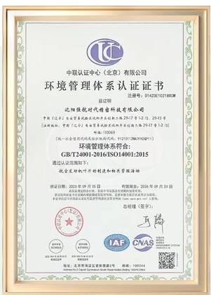

text_image

中联认证中心（北京）有限公司
环境管理体系认证证书
注册号：0142301021895CM
沈阳强航对气道装备科技有限公司
中国（辽宁）自由贸易试验区大连片区A区26-27号2-3、29-35号
（辽阳城、辽阳市、辽宁区）签署资质证书并公布之日起至2023年12月1日
编号：110069
（无一社会信用代码及相应业务代码：911211286396089*11）
环境管理体系体系：
GB/T24001-2016/ISO14001:2015
通过认证范围如下：
航空发动机叶片的制造和共享装置活动
登记日期：2023年09月30日 有效期至：2024年09月24日
经营范围：许可经营项目：汽车零部件及配件、汽车零部件及配件及零部件销售；非机动车机动车的销售；机动车维修服务；机动车租赁；机动车修理；机动车维修；机动车信息咨询；机动车维修；机动车维修服务；机动车维修服务；机动车维修服务；机动车维修服务；机动车维修服务；机动车维修服务；机动车维修服务；机动车维修服务；机动车维修服务；机动车维修服务；机动车维修服务；机动车维修服务；机动车维修服务；机动车维修服务；机动车维修服务；机动车维修服务；机动车维修服务；机动车维修服务；机动车维修服务；机动车维修服务；机动车维修服务；机动车维修服务；机动车维修服务；机动车维修服务；机动车维修服务；机动车维修服
总规模（签字）：

沈阳强航ISO 14001  
环境管理体系认证证书

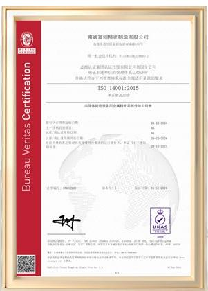

text_image

南通富创精密制造有限公司
南通富创精密制造有限公司
统一社会信用代码：91330612862296XJ
必认认证集团认证股份有限公司有限责任公司
确定上述单位的管理体系认证标准
并确认符合下列标准的体系安全规范要求的项目要求
ISO 14001:2015
申请者必须经过
半导体制造企业及品牌精密零部件加工检验部
首次认证管理规定日期：
24-12-2024
年审
24-12-2024
年审
24-12-2024
证书号：CNW12001
证书号：1
发证日期：24-12-2024
Bureau Veritas Certification
ISO 14001:2015
申请者必须经过
本次认证，经中国证监会核准，取得认证证书后方可进入市场监督管理局（以下简称“国家工商行政管理总局”）。

南通富创ISO 14001  
环境管理体系认证证书

<table><tr><td>指标</td><td>单位</td><td>2024年</td><td>2025年</td></tr><tr><td>环保资金投入</td><td>万元</td><td>3,068.87</td><td>1,795.02</td></tr></table>

## 环境风险管理

富创精密重视环境风险识别与管理，制定《环境因素 识别与评价控制程序》，并针对生产运营活动开展环境风险识别工作，出具《环境风险评估报告》，结合自身运营情况及周边环境特点，将环境风险评估工作深 入项目建设及生产的过程中，保证环境风险敏感点及 重大危害源得到有效识别、监控和管理。同时，公司在投资建设新项目时，会依据实际情况开展生态环境影响分析，预测项目潜在环境后果，对涉及到环境、社会、健康风险采取的措施予以说明。

公司将环境风险管理贯穿于项目建设、生产运营的全过程。公司制定《环境因素识别与评价控制程序》《重要环境因素清单》等文件，定期组织专业人员针对各生产环节开展环境风险识别工作，出具《环境因素识别及评价记录》《环境风险评估报告》等，明确环境风险敏感点及重大危害源，制定针对性的管控措施，确保各类环境风险得到有效识别、实时监控和科学管理。同时，在投资建设新项目时，公司严格开展生态环境影响分析，评估项目建设及运营过程中可能产生的潜在环境后果，详细说明针对环境、社会、健康风险拟采取的防控措施，从源头防范环境风险，保障项目建设与生态环境协调发展。

富创精密环境和危险因素的识别与评价流程  
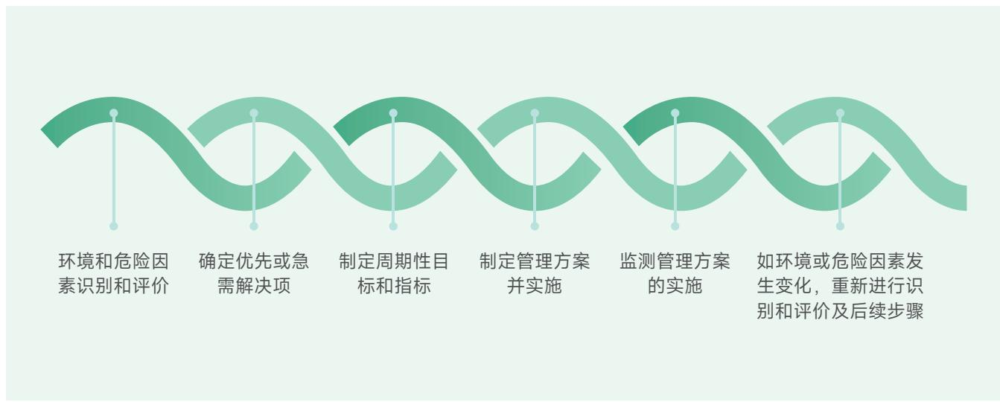

flowchart

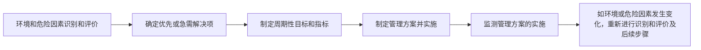
```mermaid
graph LR
  A["环境和危险因素识别和评价"] --> B["确定优先或急需解决项"]
  B --> C["制定周期性目标和指标"]
  C --> D["制定管理方案并实施"]
  D --> E["监测管理方案的实施"]
  E --> F["如环境或危险因素发生变化，重新进行识别和评价及后续步骤"]
```

## 环境应急管理

为有效应对各类突发环境事件 降低事件对环境及人员健康的影响，富创精密制定并发布《突发环境事件应急预案》将应急管理工作与各岗位工作职责紧密结合，构建分级响应 高效有序，权责清晰的应急管理机制针对危废间、氢气站、化学品暂存间、表面处理车间等易发环境风险事件的场所，制定专门的应急处置卡，包括联系人、预防措施、应急物质、响应步骤等关键内容，确保突发环境事件发生后能够快速响应、科学处置，及时控制事故危害，最大限度减少对周边环境及人员健康的损害。同时，公司定期组织开展应急培训与应急演练，提升员工的应急处置意识和实操能力。2025年9月，北京富创针对化学品泄露情景组织实战应急演练，检验应急预案的科学性和可操作性，确保相关人员明晰职责。

## 环保文化培育

富创精密关注员工低碳环保意识的培育，着力打造全员参与的绿色办公氛围。公司在生产车间、办公区及生活区显著位置张贴环保宣传材料，安全警示标语及节能提示 通过多种宣传渠道向员工普及环境保护，节能降耗相关知识，并倡导绿色办公实践，从点滴细节入手，推动员工养成节约资源、保护环境的良好习惯。

## 富创精密绿色办公具体措施

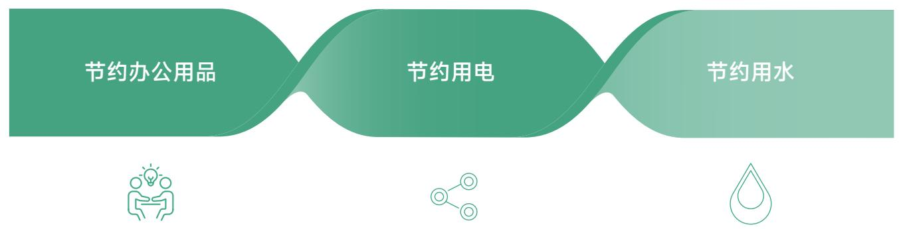

flowchart

```mermaid
graph LR
  A["节约办公用品"] --> B["节约用电"]
  B --> C["节约用水"]
```

推进无纸化办公，依托线上办公系统减少纸质文件流转，确需用纸时优先选择双面打印，从源头减少纸张消耗；

加强办公用品管控，宣导节约使用理念，鼓励员工对可重复使用的办公用品进行循环利用。

定期统计电力消耗，监控各区域用电情况，及时优化用电方案；

通过宣传标语、现况板展示及培训等方式，开展节电宣传教育，强化员工节电意识，倡导“人走灯灭、人走电断”的良好习惯；

规范空调运行管理，合理设定制冷、制热温度，非工作时间及时关闭空调设备；

建立重点耗电设备作业基准，优化生产作业计划，合理安排设备运行时间，减少设备空载运行。

在主要用水点位张贴节水标语和提示语，引导员工养成节水习惯；

加强供水管道、阀门等设施的日常保养和维护，定期开展巡查，及时发现并修复跑冒滴漏现象。

## 应对气候变化

全球气候变化已成为经济社会共同面临的重大挑战，对企业生产运营、发展战略产生深远影响。富创精密重视气候变化应对工作，逐渐将气候变化管理融入企业经营管理过程，积极识别气候变化带来的风险与机遇，通过技术升级、管理优化、能源结构调整等多种方式应对气候变化。

## 治理

公司董事会在部署战略规划和重大决策中将气候变化作为重要的考量要素，定期审议公司气候变化应对战略、重大环保举措及相关管理制度。管理层作为气候变化治理的统筹主体，协调各部门开展气候变化相关工作，制定具体的实施计划和管控措施，定期向董事会汇报气候变化应对工作进展、存在的问题及改进方向。相关职能部门作为气候变化应对工作的具体落实主体，根据公司整体部署和实施计划，结合自身部门职责，负责节能降耗、清洁能源应用、温室气体排放管控等具体工作。

## 战略

公司将应对气候变化作为企业可持续发展的重要战略方向，通过系统梳理气候变化带来的各类风险与机遇，明确风险管控重点和机遇挖掘方向，并结合行业发展趋势和企业自身实际，制定针对性的管理措施和实践方案，推动低碳发展理念贯穿生产运营全流程。

<table><tr><td>风险/机遇种类</td><td>风险/机遇描述</td><td>实际/潜在财务影响</td><td>影响时间</td><td>发生可能性</td><td>受影响的价值链环节</td><td>应对措施</td></tr><tr><td colspan="7">实体风险</td></tr><tr><td rowspan="2">急性风险</td><td>夏季持续高温可能影响精密设备运行稳定性,冬季异常低温导致工艺流程波动,影响产品生产效率和质量</td><td>生产效率下降、产品合格率降低,导致返工成本增加、交货延迟,进而影响收入;设备维护成本上升</td><td>短期</td><td>低</td><td>自身运营客户</td><td>1.升级厂房恒温系统,安装智能温控补偿装置,实时调节厂房温度,确保生产环境稳定;2.建立极端天气监测响应机制,制定生产线柔性调节方案,及时调整生产计划</td></tr><tr><td>暴雨、洪水、台风等极端天气事件可能导致工厂设施损坏、生产中断、物流延迟,影响原材料供应和产品交付</td><td>生产中断导致产能下降、收入减少;设施维修成本增加;物流延迟产生违约金,影响客户合作关系</td><td>短期</td><td>中</td><td>自身运营供应链客户</td><td>1.在工厂选址及建设阶段强化防洪、防风工程设计标准;2.建立应急预案和灾后快速响应机制,储备应急物资,组建应急抢险队伍,确保灾后快速恢复生产</td></tr><tr><td rowspan="2">慢性风险</td><td>气候变化可能导致降水模式改变,进而引发干旱或水资源短缺,工厂可能面临限水政策,影响冷却系统及清洗工序</td><td>生产工序受限,产能下降;节水改造投入增加</td><td>中长期</td><td>低</td><td>自身运营</td><td>1.建设雨水收集与中水回用系统,提高水资源循环利用率,减少新鲜水依赖;2.应用无水或低水耗清洗技术,优化生产工艺,减少生产用水消耗</td></tr><tr><td>气候变暖可能会导致高温和极端天气的频率增加,进而影响能源供应的稳定性,例如电力需求激增,导致公司运营成本的增加</td><td>电力采购成本上升,运营成本增加;能源供应中断导致生产暂停,影响收入</td><td>中长期</td><td>中</td><td>自身运营供应链</td><td>1.建立应急备用电源,配置柴油发电机或天然气热电联产系统,保障能源供应稳定;2.制定气候应急预案,开展应急演练,提高员工对极端天气的应对能力和应急反应速度</td></tr><tr><td colspan="7">转型风险</td></tr><tr><td>政策法规趋严</td><td>国内外政府出台更为严格的环保政策法规,如提高碳排放限制标准、征收碳税等。若公司未能及时了解并适应这些政策变化,可能增加企业的运营成本</td><td>合规成本增加、行政开支上升;若未能达标,可能面临罚款、停产整顿等处罚,影响生产经营和企业声誉</td><td>中长期</td><td>高</td><td>自身运营、投资人、监管机构</td><td>1.设立专人负责跟踪国内外环保政策法规动态,确保公司运营活动符合最新合规标准;2.围绕国家“双碳”战略方向,持续推进能源使用效率优化与低碳技术应用,主动降低碳排放</td></tr></table>

<table><tr><td>风险/机遇种类</td><td>风险/机遇描述</td><td>实际/潜在财务影响2</td><td>影响3时间</td><td>发生4可能性</td><td>受影响的价值链环节</td><td>应对措施</td></tr><tr><td colspan="7">转型风险</td></tr><tr><td>客户消费偏好转变</td><td>客户对供应链碳排放管控日益严格,若不能在节能降耗等可持续发展表现方面达到客户标准和要求,可能会面临客户流失的风险,进而产生减少收入的影响</td><td>客户流失导致收入下降;为满足客户要求,需增加环保投入,运营成本上升;企业市场竞争力下降</td><td>中长期</td><td>中</td><td>自身运营客户供应链</td><td>1.在产品设计及生产工艺流程优化过程中,将节能降耗纳入核心考量,设置专职部门管理推进节能降耗目标;2.开展产品全生命周期碳足迹核算,主动向客户披露碳排放信息,提升客户认可度</td></tr><tr><td colspan="7">机遇</td></tr><tr><td>低碳技术与低碳产品</td><td>技术进步和市场需求推动半导体行业将继续深化低碳化趋势,通过技术创新,企业可以实现技术和产品的低碳化,例如应用先进材料、开发低功耗的芯片和设备等,增强市场竞争力,带来未来收入增长</td><td>低碳产品市场需求增加,带动收入增长;技术创新形成核心竞争力,提升企业盈利能力;获得政策扶持和补贴,降低运营成本</td><td>中长期</td><td>高</td><td>自身运营客户</td><td>1.在产品研发与制造环节,注重生态设计理念的实践,通过轻量化材料替代、工艺参数优化等手段降低产品全生命周期碳足迹;2.加大低碳技术研发投入,组建专业研发团队,探索低功耗、低碳排放的技术和产品路径</td></tr><tr><td>能源结构优化</td><td>气候变化促使全球向清洁能源转型,公司可借此机会减少对传统能源的依赖,增加太阳能、风能等清洁能源的使用比例,间接降低运营成本</td><td>能源采购成本下降,运营成本降低;清洁能源应用获得政策支持,提升企业社会形象;降低碳排放,避免碳税等合规成本</td><td>中长期</td><td>高</td><td>自身运营</td><td>1.建立完善的能源管理体系,对能源使用各环节进行监控和管理,优化能源使用效率;2.引入太阳能发电项目,通过布设太阳能光伏板为厂区提供绿色电力,逐步提高清洁能源使用比例</td></tr></table>

2 公司已对识别出的具有财务重要性的可持续发展议题所可能引发的财务影响进行了审慎评估。然而，由于相关分析涉及大量前瞻性假设与判断，当前阶段其不确定性较高，若在此时刻披露具体的定量财务信息，恐难以保证信息的准确性与决策相关性。为避免对公司利益相关方及本报告读者的判断造成潜在误导，经审慎权衡，我们决定本报告期内暂不披露此项财务影响的定量数据，转而提供定性说明。  
3 影响时间，即风险或机遇事件发生后，预期对公司产生影响的事件范围。短期：1年以内；中期：1至5年；长期：5年以上。  
4 风险与机遇发生的可能性是公司基于风险管理方法识别相关风险或机遇并评估的结果，不代表相关风险与机遇实际发生的可能性。

## 富创精密温室气体减排措施

## 健全管理制度

公司已制定《能源消耗和温室气体排放管理程序》，将其作为内部能源与碳排放管理的核心指引，进一步规范公司内部资源、能源及温室气体排放的管理与控制流程，明确各部门职责，推动温室气体排放管控常态化、精细化。

## 提升能源使用效率

制定合理的运行规程，优化能源设备运行参数，并优先选用清洁能源来源，降低能源设备能耗，实现温室气体排放减量目标。

## 优化生产流程

科学规划制造过程，优化生产流程，提高生产效率，降低单位产品的能源消耗和温室气体排放。

## 选择最优运输线路和交通工具

选用最优的运输线路和采用合理的运输方式，优先选择新能源运输车辆，减少车辆设备移动燃烧产生的碳排放。

## 完善设备检查工作

加强能源设备检修维护，定期开展设备巡检，及时发现并处理燃烧气体泄漏问题，减少温室气体无组织排放。

## 提高全员低碳意识

积极倡导绿色经营理念，加强员工节能降耗教育培训，开展环境保护宣传活动，提升全员环境保护和低碳发展意识。

## 影响、风险和机遇管理

为应对气候变化带来的各类影响，富创精密结合行业特点和企业自身运营实际，初步开展了气候风险情景分析。在综合联合国政府间气候变化专门委员会（IPCC）、央行与监管机构绿色金融网络（NGFS）、国际能源署（IEA）等国际权威机构的气候情景，公司重点考虑温和情景与极端情景两种不同气候情景下，对公司生产运营、供应链、客户合作等方面的潜在影响，为风险管控和机遇挖掘提供依据。

在温和情景下，全球通过采取强有力的政策措施下，气候变化趋势平稳，极端天气事件发生频次维持在合理水平。此情景下，公司面临的实体风险相对较低，但面临较高的政策合规压力、客户需求升级压力以及短中期内的投资金额增加的压力。

在极端情景下，各国未采取有效措施，全球气候变化加剧，极端高温、暴雨、洪水等极端天气事件频发。此情景下，公司面临的实体风险显著上升，极易出现生产中断、供应链不稳定、能源供应不足等问题。

## 指标与目标

富创精密始终致力于推进低碳发展，积极应对气候变化，持续以推进各项低碳举措落地为目标，助力国家“双碳”目标实现。

公司已组织专业人员开展温室气体核算工作，全面梳理温室气体排放源，精准统计排放数据，为更全面的碳排放管理和减排规划夯实基础，为后续应对气候变化、推进低碳发展提供数据支撑。

<table><tr><td>指标</td><td>单位</td><td>2024年</td><td>2025年</td></tr><tr><td>温室气体排放总量</td><td>吨 $CO_{2}e$ </td><td>49,376.73</td><td>54,631.23</td></tr><tr><td>温室气体排放强度</td><td>吨 $CO_{2}e$ /百万元营收</td><td>16.49</td><td>15.42</td></tr><tr><td>温室气体排放量(范畴一) $^{5}$ </td><td>吨 $CO_{2}e$ </td><td>7,133.89</td><td>7,605.16</td></tr><tr><td>温室气体排放量(范畴二) $^{6}$ </td><td>吨 $CO_{2}e$ </td><td>42,242.83</td><td>47,026.07</td></tr></table>

5 温室气体直接排放量为直接能源消耗对应的二氧化碳当量排放量，依据《综合能耗计算通则（GB/T2589-2020）》《2006年IPCC国家温室气体清单指南》计算得出。  
6 温室气体间接排放量为间接能源消耗对应的二氧化碳当量排放量，依据《关于发布2022年电力二氧化碳排放因子的公告》计算得出。

## 污染物排放

富创精密坚持源头防控、过程管控、末端治理的污染物排放管控理念，针对生产运营过程中产生的废水、废气、噪声等各类污染物，建立分类管控、精准治理的管理体系，严格遵循相关排放标准，通过技术升级、工艺优化、设备改造等多种方式，持续降低污染物排放浓度和排放量，确保各类污染物达标排放，减少对周边环境的影响。

## 废水管理

公司高度重视废水管控工作，严格识别生产运营过程中的各类废水来源，建立分类收集、分源管控的废水管理体系，确保废水经处理后达标排放。公司废水主要分为生活污水、生产废水（含工艺废水、废液）及酸洗塔排水三类，针对不同类型废水的水质特点，采取差异化的处理方式，实现废水规范化管理。

生活污水主要来源于办公区、生活区员工日常生活，公司对生活污水采取预处理措施，经化粪池沉淀、降解处理后，严格按照当地环保要求合规排放至市政污水处理管网。酸洗塔排水和生产废水则统一排入厂内污水处理站进行集中处理，针对含油废水等危险废水，由各生产车间单独收集于专用密封容器，及时转移至危废库进行规范贮存，实现分源管控与危废定向转移，杜绝废水乱排乱放现象。为确保废水排放合规，公司明确各废水排放口的标识与污染物名称并委托有资质的检测机构对废水各项指标定期进行监测确保废水污染物经处理后稳定达标排放。

<table><tr><td>指标</td><td>单位</td><td>2024年</td><td>2025年</td></tr><tr><td>废水总排水量</td><td>立方米</td><td>428,360.20</td><td>485,611.19</td></tr></table>

## 废气管理

富创精密在生产运营过程中产生的废气主要为生产废气（工艺废气、锅炉废气）和汽车尾气等类型，不同类型废气的污染物成分存在差异，公司针对废气排放特点，采取分类管控、精准治理的措施。

对含尘废气，公司在收售后采取经滤筒除尘器处理后排放的措施:对表面处理产生的废气，在收集后经酸洗塔处理后排放；对焊接烟尘，采取经焊烟净化器处理后排放的管理方式；对汽车尾气，公司要求汽车使用的汽油应符合国家相关标准，并要求车辆按交管部门的规定，定期对尾气排放进行监测确保汽车尾气排放符合国家标准。

同时，通过制定《年度自行监测计划》富创精密委托具备相应资质的检测机构，定期对各废气排放口的排放浓度进行检测，确保废气排放符合国家标准，杜绝废气超标排放。

<table><tr><td>指标</td><td>单位</td><td>2024年</td><td>2025年</td></tr><tr><td>废气排放总量</td><td>吨</td><td>11.14</td><td>6.89</td></tr></table>

## 噪声管理

富创精密构建完善的噪声管控体系，覆盖生产设备、运输车辆及工程施工等主要噪声源，严格依据《工业企业厂界环境噪声排放标准》（GB 12348-2008），明确作业场所与厂界分区管理目标，定期监测噪声合规情况，确保厂界噪声排放达标，保障员工职业健康和周边居民生活环境。

在噪声源头防控方面公司在新设备采购和安装过程中严格遵循降噪设计规范对高噪声设备增设隔离沟槽 隔音置等降噪设施降低设备振动产生的噪声，同时 公司建立噪声动态监测机制委托具备相应资质的单位，定期对作业场所及厂界噪声进行检测，及时掌握噪声排放情况，对检测中发现的问题及时整改。新设备投入使用前，须通过噪声合规评估，确保噪声排放符合相关标准后才可启用。

## 废弃物处理

富创精密严格遵循减量化、资源化、无害化的废弃物管理原则，建立分类收集、规范贮存、合规处置的管理体系，加强各环节管控，减少废弃物对环境的污染。

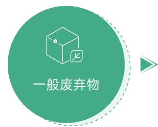

flowchart

This diagram illustrates the classification of waste materials, specifically highlighting 'General Waste' (一般废弃物).

一般废弃物指的是不属于危险废物的工业固体废物，通过对各类一般废弃物进行分类收集、分区贮存，张贴清晰的标识，明确废弃物名称、收集方式及处置去向，确保一般废弃物贮存规范。对于可回收利用的一般废弃物，如废纸箱，废纸，金属边角料，报废件等，公司要求将其放在指定地点由行政部负责处置。对于不可回收的一般废弃物，则放入暂存处，由环安部处置。同时，公司加强一般废弃物产生量的管控，通过工艺优化、节约使用等方式，减少一般废弃物产生量，推动废弃物减量化。

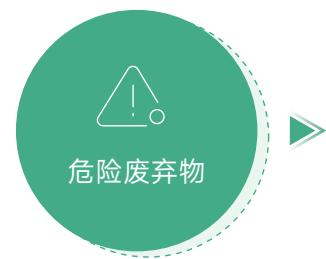

text_image

危险废弃物

危险废弃物指的是列入国家危险废物名录或者根据相关标准认定的具有危险特性的固体废弃物。根据危险废弃物类型，公司使用专用密封容器进行收集，张贴危险废物标识，明确废弃物成分、危险特性及收集日期，及时运输至厂内危险废物贮存库进行分类贮存。同时，公司建立危险废弃物管理台账，详细记录危险废弃物的产生量、收集量、贮存量、转移量及处置量，实现危险废弃物管理流程可追溯。公司委托具备危险废物处置资质的单位，对危险废弃物进行合规处置，确保危险废弃物处置合规、安全，防止造成渗漏、泄漏等二次污染或安全事故。

此外，公司制定规范危险废弃物应急管理机制，通过《危险废物突发环境事件专项应急预案》明确危险废弃物贮存、转运、处置过程中可能发生的突发环境事件及应急处置措施，定期开展应急培训与演练，提升员工危险废弃物应急处置能力，确保突发环境事件发生后能够快速响应，降低对员工健康和周围环境的危害

## 案例丨"绿色运营”新标杆 危废循环创效超百万

通过自主技术攻关，公司成功实现废酸碱与脱脂药水内部循环处理，全年处理危废超380吨，隆低外部排放的同时节约委外费用逾170万元，该创新实践实现了环保与降本双重效益，成为公司推动绿色制造与可持续发展的标杆案例。

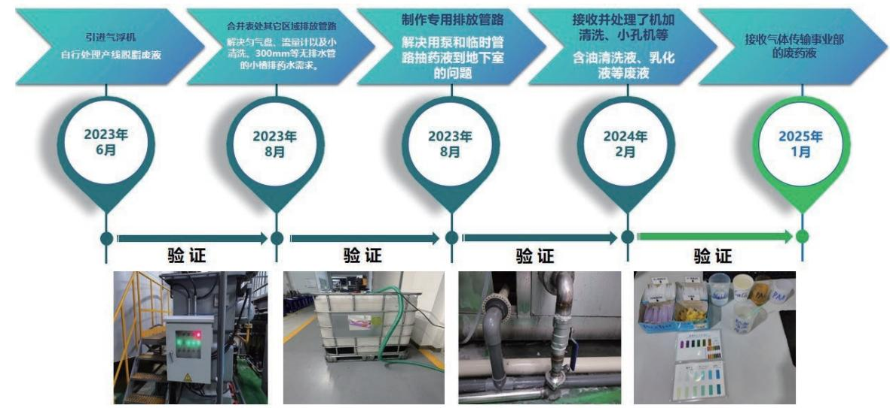

flowchart

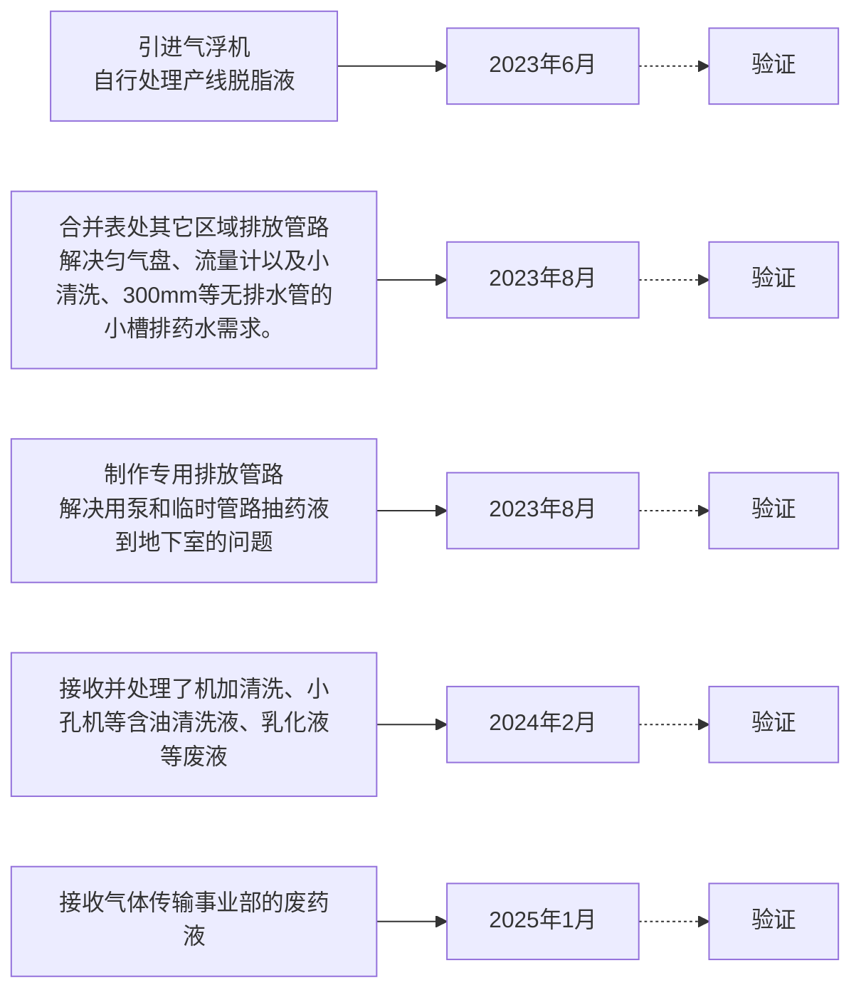
```mermaid
graph LR
  A["引进气浮机\n自行处理产线脱脂液"] --> B["2023年6月"]
  C["合并表处其它区域排放管路\n解决匀气盘、流量计以及小清洗、300mm等无排水管的小槽排药水需求。"] --> D["2023年8月"]
  E["制作专用排放管路\n解决用泵和临时管路抽药液到地下室的问题"] --> F["2023年8月"]
  G["接收并处理了机加清洗、小孔机等含油清洗液、乳化液等废液"] --> H["2024年2月"]
  I["接收气体传输事业部的废药液"] --> J["2025年1月"]
  
  B -.-> K["验证"]
  D -.-> L["验证"]
  F -.-> M["验证"]
  H -.-> N["验证"]
  J -.-> O["验证"]
```

<table><tr><td>指标</td><td>单位</td><td>2025年</td></tr><tr><td>无害废弃物排放总量</td><td>吨</td><td>1,046.48</td></tr><tr><td>危险废弃物排放总量</td><td>吨</td><td>699.52</td></tr></table>

## 能源利用

富创精密始终将能源高效利用作为绿色发展的核心举措，严格遵循《中华人民共和国节约能源法》等法律法规，不断完善能源管理体系，持续提升能源利用效率并降低能源消耗，推动能源结构优化。

<table><tr><td>流程严格管控</td><td>合理安排生产计划,优化设备启停时间,提高负载率,并加强设备巡检,及时发现问题并抢修</td></tr><tr><td>设备改造升级</td><td>推进生产设备节能改造,逐步淘汰老旧高耗能设备,更换为高效节能设备</td></tr><tr><td>节能照明优选</td><td>优先选用节能环保灯具并配置感应照明,在建筑设计中考虑照明用电的节能需求,分区、分路设置开关</td></tr><tr><td>清洁能源使用</td><td>公司子公司南通富创、北京富创、沈阳强航的厂房顶等区域布设高效太阳能光伏板,构建分布式光伏发电系统,并提升天然气的使用比例,持续扩大可再生能源使用比例</td></tr></table>

<table><tr><td>指标</td><td>单位</td><td>2025年</td></tr><tr><td>直接能源消耗</td><td></td><td></td></tr><tr><td>天然气消耗量</td><td>立方米</td><td>5,784.05</td></tr><tr><td>间接能源消耗</td><td></td><td></td></tr><tr><td>外购电力</td><td>兆瓦时</td><td>9,616.56</td></tr><tr><td>外购电力消耗强度</td><td>兆瓦时/百万元</td><td>2.71</td></tr><tr><td>能源节约量</td><td>兆瓦时</td><td>10,202.52</td></tr></table>

## 水资源利用

富创精密严格遵守《中华人民共和国水法》等法律法规 始终坚持节水优先，循环利用，精准管控的水资源管理理念，致力于打造节水型企业，全面提升水资源利用效率，减少水资源消耗，践行水资源保护责任。公司优化生产工艺，推广应用逆流漂洗、喷淋洗等节水技术，减少生产用水需求，并将处理后的中水重新用于生产线，进一步提高水资源利用效率，减少新鲜水用量。同时，公司在各生产车间安装用水计量仪表，实现生产用水精准计量，结合日常用水情况巡查，实现对用水情况的有效监控，及时发现并整改用水浪费问题。

<table><tr><td>指标</td><td>单位</td><td>2024年</td><td>2025年</td></tr><tr><td>总取水量</td><td>吨</td><td>670,979.42</td><td>857,310</td></tr><tr><td>取水强度</td><td>吨/百万元营收</td><td>220.75</td><td>241.94</td></tr><tr><td>总耗水量</td><td>吨</td><td>242,619.22</td><td>371,698.81</td></tr><tr><td>耗水强度</td><td>吨/百万元营收</td><td>79.82</td><td>104.90</td></tr></table>

## 循环经济

公司在生产运营及产品运输过程中产生纸质包装，泡沫缓冲材料等包装材料。为践行循环经济理念减少包装废弃物产生，公司坚持源头减量和重复使用，持续深化包装材料绿色转型，进一步优化包装材料选型，完善回收复用机制，探索包装材料循环利用的新路径、新方法，不断提升包装材料循环利用效率。

## 生态系统与生物多样性保护

公司始终秉持尊重自然、顺应自然、保护自然的生态保护理念，结合各厂区地理位置特点，聚焦厂区生态绿化周边生态保护 生态环境监测等核心环节采取多元化保护措施减少企业运营对生态系统及生物多样性的影响，助力生态环境可持续发展。报告期内，公司未发生破坏生态系统、影响生物多样性的相关事件，厂区及周边生态环境保持良好。

natural_image

Green globe with grass and water features floating on a grassy field, surrounded by pink flowers (no text or symbols)

## 03

## 品质富创驱动创新引擎

所响应的联合国可持续发展目标（SDGs）

9 产业、创新和基础设施

12 负责任消费和生产

16 和平、正义与强大机构

17 促进目标实现的伙伴关系

品质是企业可持续发展的根基，创新是核心竞争力来源。公司以研发创新为引领，持续提升精密制造技术水平；以数智化转型为抓手，推进生产与管理效率变革；以全生命周期质量管理为保障，确保产品可靠交付；同时重视客户权益、数据安全与供应链可持续，构建高品质、高效率、高韧性的产业生态。

## 所涉及的可持续发展议题

创新驱动

供应链安全

产品和服务质量与安全

尽职调查

数据安全与客户隐私保护

平等对待中小企业

## 创新研发

富创精密始终将创新视为企业发展的核心引擎，持续深耕半导体设备精密零部件领域的关键技术攻关。

## 创新研发战略

公司确立了以"1+2+N"为核心的战略发展架构，旨在通过技术革新、资源优化与全球协同，构建面向未来的产业竞争体系。在业务拓展上，公司在巩固传统精密零部件业务优势的同时，重点培育气体传输系统作为新的增长引擎，并通过深化客户协作、并购产业链优质企业，构建多元化的业务增长格局。为达成产业链自主可控的战略愿景，公司正加速推进跨领域资源整合，未来将通过战略投资与并购重组强化上下游协同效应，提升关键工艺与产品的自主化水平。

公司将进一步加强与行业领先企业的战略合作，通过联合研发与定制化服务提升技术实力，并在内部推行精益管理变革，建立健全市场快速响应机制与柔性生产能力，通过动态资源配置提升运营效能。作为半导体设备核心零部件的系统解决方案提供商，公司将以持续创新驱动产业升级，为全球客户创造长期价值，为股东带来稳定回报，并为半导体产业链的安全稳定贡献核心力量。

富创精密多层次的创新研发激励体系  

natural_image

Abstract graphic with a dollar sign inside concentric circles, enclosed by a partial red arc (no text or symbols)

创新奖项评选

设立创新奖项，定期评选并为获奖个人和团队颁发奖项，激发团队创新活力：

各职能部门对在创新过程中表现突出的团队和个人给予及时的奖励与表彰，评选出“月度金牌创新项目”。  
●每年依据月度评选结果 评选出“年度创新大奖”并给予奖励。

natural_image

Abstract icon of a document with a ribbon, enclosed in a circular border (no text or symbols)

技术分红

制定技术分红制度，通过科学的激励机制，加速新产品与新技术的迭代升级，并将研发成果的商业收益与人才团队共享：

●设立研发项目节点奖金，聚焦项目论证，技术攻关，样品试制等关键阶段，通过及时激励和资源向核心人才倾斜的策略，鼓励团队在研发过程中持续突破技术瓶颈。  
推行商业成功奖金 将激励与项目的市场化表现深度绑定，当研发成果实现产业化并产生盈利后，根据实际商业成效向团队发放奖励。

## 富创精密创新研发战略举措

## 推动数字化转型与供应链协同

深化智能系统在研发、生产、运营等环节的应用，实现制造全流程的数字化管理。借助公司平台整合产业链资源，加强与上下游伙伴的技术合作，提升供应链的自主性与韧性，支持中国集成电路产业生态的完善。

## 加强技术攻关与工艺创新

加大研发资源投入，着力攻克先进制程设备零部件的关键技术瓶颈。运用智能化设计平台提升研发效率，并行推进复杂模块化组件的开发，促进产品向高端集成方向演进，深化与全球领先客户的协同研发关系。

## 深化客户协作与市场渗透

建立敏捷的客户需求响应体系，积极参与客户新产品的早期设计，通过个性化解决方案增强客户依存度。瞄准高价值细分市场，扩大市场占有率，加快从零部件供应商向组件及系统模块供应商的转型，拓展与全球半导休设备领军企业的合作空间

## 践行绿色运营与可持续实践

全面推行绿色制造模式，提升能源利用效率，建设智慧型绿色生产基地。公司将定期披露ESG绩效，健全环境管理机制，推动生产流程的低碳转型，减少资源耗用与排放，积极履行社会责任。

## 提升产能效率与精益运营

加快推进生产基地的投建与达产，缩短客户认证时间，保障产能及时兑现。依托全生命周期管理优化资源分配，完善标准化流程与风控体系，降低运营成本及资产折旧影响。

## 富创精密研发创新方式

## 自主创新驱动

通过建立专业的研发团队和鼓励员工开展创新性研究等方式投入大量资源进行自主研发，不断推出具有自主知识产权的新产品与新技术。

## 客户协同合作

深入了解客户需求并快速响应市场变化，与客户建立紧密的创新合作关系，为客户提供定制化的解决方案。

## 产学研深度融合

积极与高校、科研机构开展产学研合作，实现资源共享和优势互补，联合培养科研人才。通过外部科研力量，加速技术创新与成果转化。已与东北大学、中国科学院、大连理工大学、哈尔滨工业大学等高校建立合作伙伴关系。

## 创新研发成果

公司持续推进技术升级与产品迭代，强化研发能力并深化市场拓展。技术研发方面，公司重点深耕精密机械制造技术、表面处理特种工艺、焊接工艺及气体传输系统集成技术等几大关键领域，并形成了差异化技术壁垒。

## 富创精密创新核心技术及研发成果

## 精密机械制造领域

以“高精密微孔&深孔加工技术”，“超高光洁度制造技术”，“超高精密加工技术”，“大型腔体一站式加工技术”为核心工艺矩阵系统性应用于半导体设备核心零部件制造。

通过“超高精密加工技术”实现μm级形位公差控制，成功交付超临界清洗设备核心零部件；  
通过“超高光洁度制造技术”突破深径比50倍以上的超深孔加工瓶颈，表面粗糙度稳定维持机加高光标准，奠定超细深流道设计基础。  
●通过“大型腔体一站式加工技术”实现大型腔体700余个尺寸工位连续加工成为国内稀缺的一站式解决方案供应商，并持续开发800+工位的先进制程腔体，满足严苛形位公差与耐腐蚀要求。

## 表面处理特种工艺领域

公司构建了以“耐腐蚀涂层技术”为核心、“高洁净度精密清洗技术”为支撑的先进表面处理工艺体系。

喷涂技术方面，自主开发的“致密YO涂层”在2024年完成国内头部客户首件认证后，2025年快速导入量产阶段。  
纳米薄膜技术领域，开发的“N系列膜层、O系列膜层”全面量产交付，其中“O系列膜层”凭借高洁净度控制及耐腐蚀性能，成功通过国内头部客户认证，并稳定应用于核心部件；  
在镀金核心技术方面，反射率已达国际前沿水平，并成功突破高长径比（＞20倍）深孔均匀镀金，“鱼鳞纹”漫反射等关键镀金技术难点，可满足行业相关性能最高标准。  
在阳极氧化技术领域，2025年自主开发深孔脉冲阳极技术，实现孔径≥0.4mm的一阶及多阶小孔阳极膜均匀成膜，突破行业无法满足小孔内均匀生长阳极膜层的难题，该技术能力已达国际前沿水平。

## 焊接工艺

已形成以“电子束焊接技术”、“激光焊接技术”、“真空钎焊”、“扩散焊”和“超洁净管路焊接技术”为核心的技术矩阵，全面覆盖半导体设备精密零部件（如匀气盘、加热盘、水冷盘、抛光盘、框架、静电卡盘基座、气体管路及内衬）的制造需求。

电子束焊接技术在报告期内，完成了大型电子束焊接腔体的交付，其微变形精密焊接工艺，应用于匀气盘稳定量产。  
激光焊接技术在报告期内，替代了部分钨极氩弧焊产品，提高了焊接效率，降低了焊接变形，应用于多个框架的焊接交付；  
真空钎焊技术在报告期内，开发了800mm大型盘体钎焊技术，用于CMP产品，钎着率优秀，量产稳定。  
扩散焊技术：在真空中，对零件进行加热及加压，使材料之间发生原子间扩散，无需填充金属，可实现大面积有效连接。报告期内已用于窄间隙流道产品交付；高洁净度半导体零部件精密焊接；水冷盘、匀气盘等精密零部件加工制造。

## 富创精密合作项目

沈阳富创获得首批“国家数字化\*\*专项”，是对公司数字化制造技术实力与创新能力的权威认可。

沈阳富创牵头承担的“国家制造业\*\*专项（L 材料）”与“国家制造业\*\*专项（Y材料）”，联合产业链上下游企业协同研发，突破半导体设备关键材料国产化技术瓶颈。

沈阳富创联合客户承担的2项“国家重大专项”通过验收，在客户面临断供的情况下，保障了客户生产线运行，为国家集成电路产业链安全提供重要支撑。

沈阳富创联合客户承担的“国家科技\*\*专项”通过验收，取得14nm验证并批量供货，为国家集成电路供应链自主可控提供保障。

南通富创获得首批“国家集成电路\*\*专项”，标志着公司信息化技术创新能力与智能制造水平方面获得国家认可。

## 关键绩效

2025年，

公司研发投入

27,349.93万元

研发投入总额占营业收入

7.72%

## 富创精密获得的创新研发相关荣誉奖项

沈阳富创获得辽宁省高新技术企业认定。

沈阳富创获批“国家制造业单项冠军企业（集成电路设备金属零部件）”，彰显在集成电路设备金属零部件领域的技术实力与市场地位，标志核心技术及全球占有率双重跨越。

沈阳富创获批“国家卓越级智能工厂”，成为国内基于A|的集成电路装备零部件精密制造智能工厂典范，标志智能化转型重大突破，实现从“制造”到“智造”跨越，对智能制造技术实力与创新能力的权威认可。

## 案例丨参与2025 SEMICON CHINA盛会

在2025 SEMICON CHINA盛会上，富创精密以180㎡核心展位亮相，与国际顶级客户深入交流，全面展现技术实力与服务能力。展会期间，富创全面展示“研发工艺图谱”，并首次推出子品牌“精芯气体”，强化了“技术可信赖”与“产业链升级”的品牌形象。此次亮相彰显了公司在全球双循环格局中的战略布局，巩固了行业领军地位，向业界彰显富创持续创新的实力与决心。

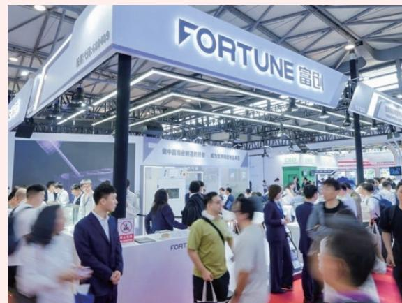

text_image

FORTUNE 富创
FORTUNE 富创

2025 SEMICON CHINA 富创精密展台

## 知识产权保护

我们严格遵守所在地区的知识产权相关法律法规，对内坚决保护公司核心技术及商业秘密，对外充分尊重并防范侵犯他人知识产权，确保公司经营活动合规稳健。公司内部已组建了知识产权保护团队，联合多地工厂和部门，共同搭建起全方位的知识产权管理架构，为知识产权保护工作提供了坚实的组织保障。

我们致力于构建系统化、规范化的知识产权管理体系，以支撑公司技术创新与核心竞争力提升。我们制定《商业秘密管理办法》《专利管理办法》等制度文件，涵盖商业秘密管理与专利管理等核心领域，为公司知识产权工作提供了制度保障。同时，公司在沈阳、南通、北京等地的子公司协同推进知识产权管理工作，确保制度执行与资源整合的一致性，整体知识产权管理格局日趋成熟。

## 案例丨沈阳融创知识产权培训

沈阳融创明确提出“建立专业化知识产权管理团队，提升全员知识产权意识”的目标。通过建立系统化的知识产权培训管理机制、分层分类的培训策略与线上线下融合的混合模式，全面提升全员知识产权意识与专业能力。针对管理层、技术人员及业务人员设置差异化培训内容，涵盖知识产权专项培训、合规意识培训及IP保护培训等主题。采用线上+线下混合培训模式，利用内部学习平台实现随时学习、随时考核与自动存档，并引入外部专家授课以提升培训专业度。设立培训目标，要求全体员工年度知识产权培训覆盖率和通过率均达到100%。通过配备专职/兼职知识产权管理人员、定期开展专利申请与商业秘密保护培训、建立知识产权考核与激励机制，以及与专业服务机构建立长期合作等举措，推动知识产权管理能力持续提升。

## 案例丨IP保护金点子活动

2025年4月，公司举办IP保护“金点子”征集活动，旨在激发全员创新意识，共同筑牢企业信息安全防线。活动围绕知识产权保护、流程优化及风险防范等方向，广泛征集员工建议。本次活动共评选出三枚银牌，以表彰个人及团队在IP保护主题活动中的突出贡献和务实建议。获奖人员来自不同部门，充分体现了跨部门协同与全员参与的氛围。此次“金点子”活动不仅收集到多项可落地的改进建议，也进一步强化了员工的“主人翁”意识，推动IP保护从制度约束向文化认同转变。

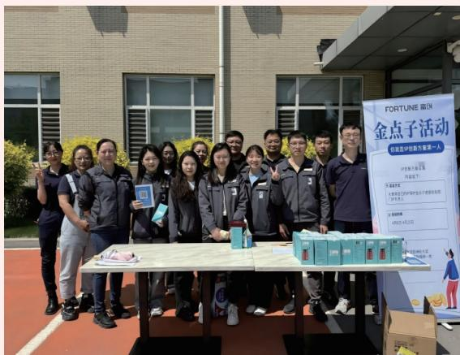

text_image

FORTUNE 瑞OH
金点子活动
金点子活动方案第一
护龄及服务
年均完了
护龄要求
本单位的护龄与护龄会于新的阶段的
工作环节。
护龄要求
护龄人须知

“金点子”活动现场

## 关键绩效

## 截至报告期末，

公司共获得专利授权和软件著作权

395项

其中发明专利

91项

实用新型专利

300项

报告期内获得的知识产权列表：

<table><tr><td rowspan="2"></td><td colspan="2">本年新增</td><td colspan="2">累计数量</td></tr><tr><td>申请数(个)</td><td>获得数(个)</td><td>申请数(个)</td><td>获得数(个)</td></tr><tr><td>发明专利</td><td>72</td><td>25</td><td>539</td><td>91</td></tr><tr><td>实用新型专利</td><td>59</td><td>48</td><td>415</td><td>300</td></tr><tr><td>外观设计专利</td><td>0</td><td>0</td><td>2</td><td>2</td></tr><tr><td>软件著作权</td><td>0</td><td>0</td><td>2</td><td>2</td></tr><tr><td>其他</td><td>0</td><td>0</td><td>0</td><td>0</td></tr><tr><td>合计</td><td>131</td><td>73</td><td>958</td><td>395</td></tr></table>

natural_image

Hand holding a shield icon against a digital circuit background (no text or symbols)

## 数智化发展

在国家制造业转型升级的背景下，富创精密积极践行数字化智能制造战略，深化智能化系统在研发、制造及运营环节的应用，推动生产全流程数字化管控。公司持续构建十大数字化平台和八大系统，聚焦智能化技术突破，打造自动化、柔性化生产模式，显著提升生产效率与质量水平。

富创精密代表性的八大系统  
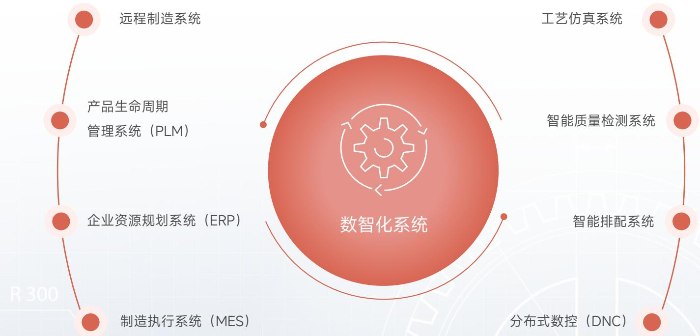

flowchart

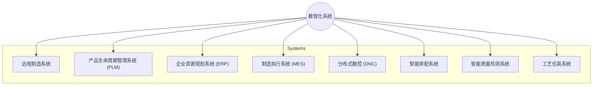
```mermaid
graph TD
  Center(("数智化系统"))
  
  subgraph Systems
    A["远程制造系统"]
    B["产品生命周期管理系统 (PLM)"]
    C["企业资源规划系统 (ERP)"]
    D["制造执行系统 (MES)"]
    E["分布式数控 (DNC)"]
    F["智能排配系统"]
    G["智能质量检测系统"]
    H["工艺仿真系统"]
  end
  
  Center --> A
  Center --> B
  Center --> C
  Center --> D
  Center --> E
  Center --> F
  Center --> G
  Center --> H
```

富创精密代表性的十大数字化平台  
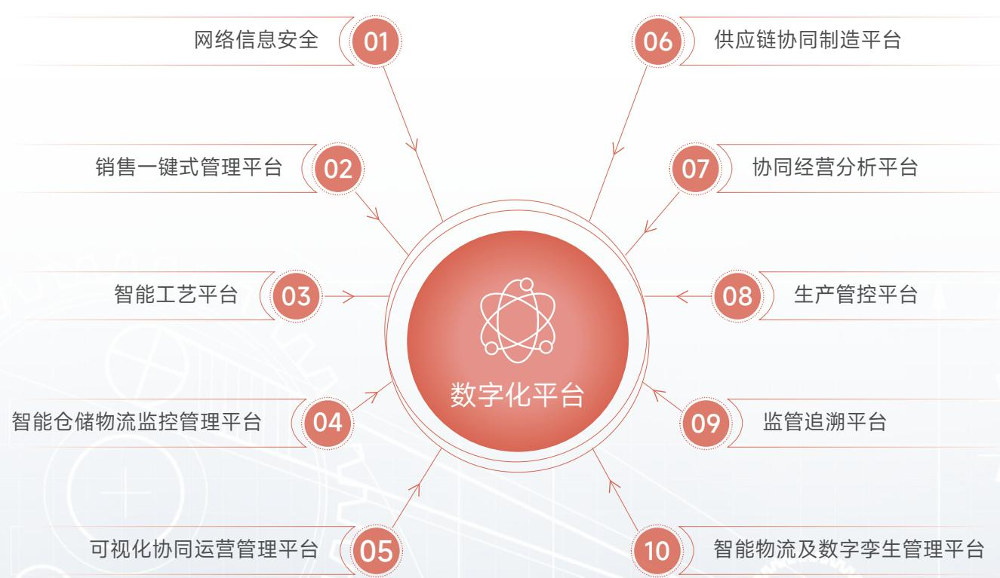

flowchart

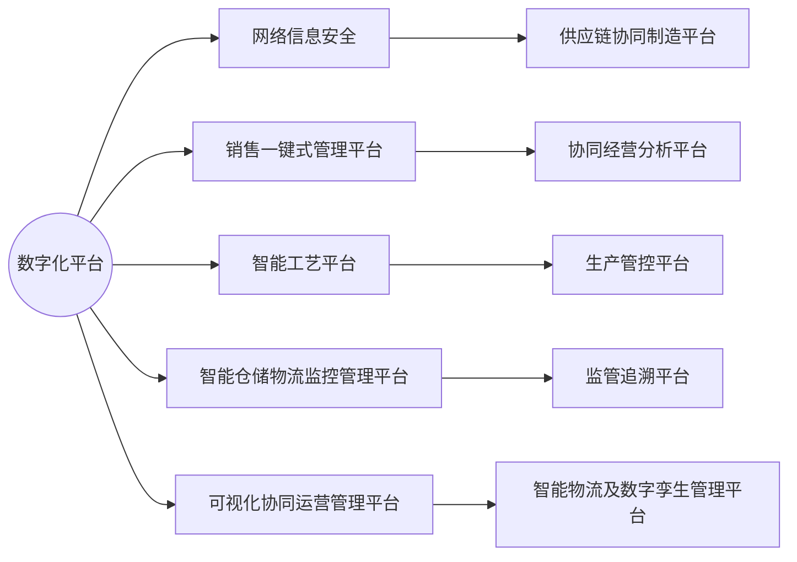
```mermaid
graph LR
  Center(("数字化平台")) --> Node1["网络信息安全"]
  Center --> Node2["销售一键式管理平台"]
  Center --> Node3["智能工艺平台"]
  Center --> Node4["智能仓储物流监控管理平台"]
  Center --> Node5["可视化协同运营管理平台"]
  
  Node1 --> Node6["供应链协同制造平台"]
  Node2 --> Node7["协同经营分析平台"]
  Node3 --> Node8["生产管控平台"]
  Node4 --> Node9["监管追溯平台"]
  Node5 --> Node10["智能物流及数字孪生管理平台"]
```

## 智能制造

公司制定了《富创智能制造建设标准》，以智能制造成熟度模型为指引，明确了从基础自动化到智慧化运营的多阶段发展目标，并全面覆盖了人员、技术、资源和制造等关键能力要素。这一标准为公司在智能制造的转型升级提供了清晰的路径与规范化的指导框架，助力富创精密成为智能制造领域的标杆企业。报告期内，公司聚焦工艺智能化、制造智能化、管理智能化三大核心方向持续深耕布局，以系统性智能化升级助力半导体行业优化产业链响应效率、筑牢高端产品质量管控体系，精准适配半导体行业客户个性化定制需求与先进制程产品严苛性能标准，为半导体高端制造环节提质增效提供坚实支撑。

公司制定2025-2030年数智化战略，聚焦柔性化生产能力、工艺设计高效响应能力、一次制造合格能力建设与数据驱动运营能力四大能力建设，致力于通过数智化打造超高离散精密制造行业“交付能力”的绝对领导者。

富创精密2025-2030年智能制造战略  
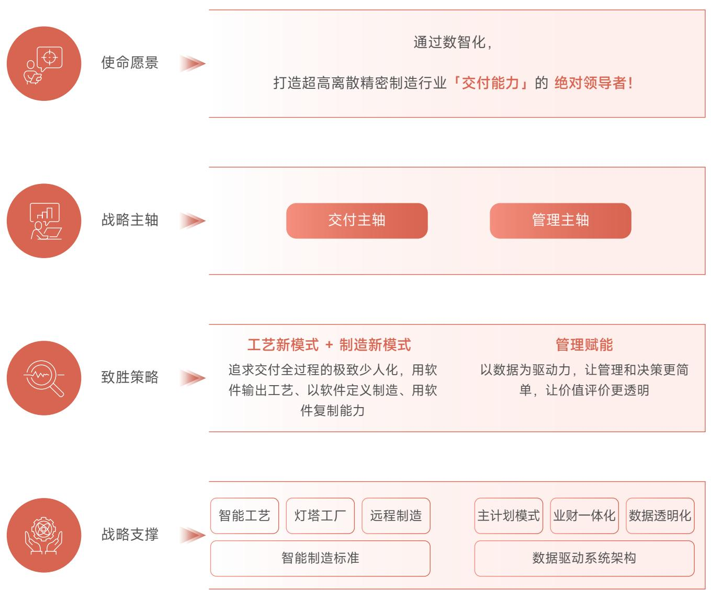

flowchart

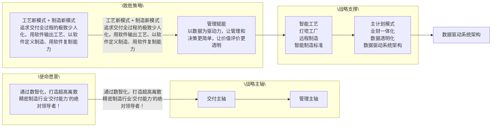
```mermaid
graph LR
  subgraph sg["\"使命愿景\""]
    A["通过数智化，打造超高离散精密制造行业‘交付能力’的绝对领导者！"]
  end

  subgraph sg_2["\"战略主轴\""]
    B["交付主轴"]
    C["管理主轴"]
  end

  subgraph sg_3["\"致胜策略\""]
    D["工艺新模式 + 制造新模式\n追求交付全过程的极致少人化，用软件输出工艺、以软件定义制造、用软件复制能力"]
    E["管理赋能\n以数据为驱动力，让管理和决策更简单，让价值评价更透明"]
  end

  subgraph sg_4["\"战略支撑\""]
    F["智能工艺\n灯塔工厂\n远程制造\n智能制造标准"]
    G["主计划模式\n业财一体化\n数据透明化\n数据驱动系统架构"]
  end

  A -->|"通过数智化，打造超高离散精密制造行业‘交付能力’的绝对领导者！"| B
  B --> C
  D -->|"工艺新模式 + 制造新模式\n追求交付全过程的极致少人化，用软件输出工艺、以软件定义制造、用软件复制能力"| E
  E --> F
  F --> G
  G --> H["数据驱动系统架构"]
```

## 品 案例丨柔性化生产能力——灯塔项目

依托AI技术的深度迭代与场景化落地，公司自主研发富创柔性智造单元（FIU），打造适配全球高端制造场景的离散制造智能化解决方案，破解传统离散制造依赖专业技术人员、交付效率不均、质量一致性难保障的行业共性痛点，可在全球任意部署点位，实现批量制造级别的生产节拍效率与高度统一的产品品质输出，保障规模化量产与确定性准时交付，全力助推高端先进制造业尤其是半导体产业实现高速技术创新与产能升级，填补半导体精密零部件离散智造领域的技术与模式空白。

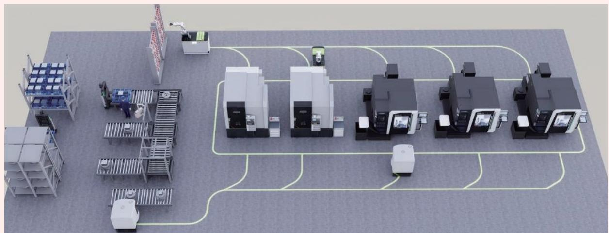

natural_image

Overhead view of a modern industrial production line with multiple CNC machines and automated assembly units (no visible text or symbols)

灯塔项目模拟图

## 8品 “六个一键”工艺新模式，打造工艺设计高效响应能力

我们创新“一键特征、一键方案、一键复用、一键平台化、一键产品、一键产业链”的工艺新模式，提升质量、编制效率和加工效率，形成智能制造标准、统一跨专业基准，进而延伸至客户协同设计，缩短工艺时间。

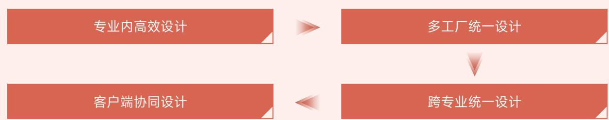

flowchart

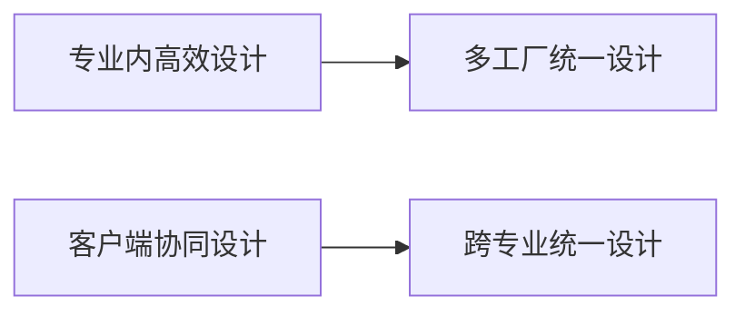
```mermaid
graph LR
  A["专业内高效设计"] --> B["多工厂统一设计"]
  C["客户端协同设计"] --> D["跨专业统一设计"]
```

## 案例丨通过智能工艺提升一次制造合格能力

我们通过“智能编制、智能检核、智能优化”，减少工程师需要参与的决策，最大化降低不同工艺工程师的经验差异，自动化验证软件输出的工艺，使确定性的质量结果在工艺输出时保证，让多版本工艺能够在虚拟空间中模拟，将工艺优化从事后分析走向事前最优，持续提升一次设计合格率。

## 数智化发展

公司制定了数智化发展规划及战略部署，全力推进信息化、数字化、智能化和平台化建设。通过构建转型与变革体系，着力推动业务与IT的深度融合，为公司的数智化转型注入强大动力。

富创精密数智化战略  
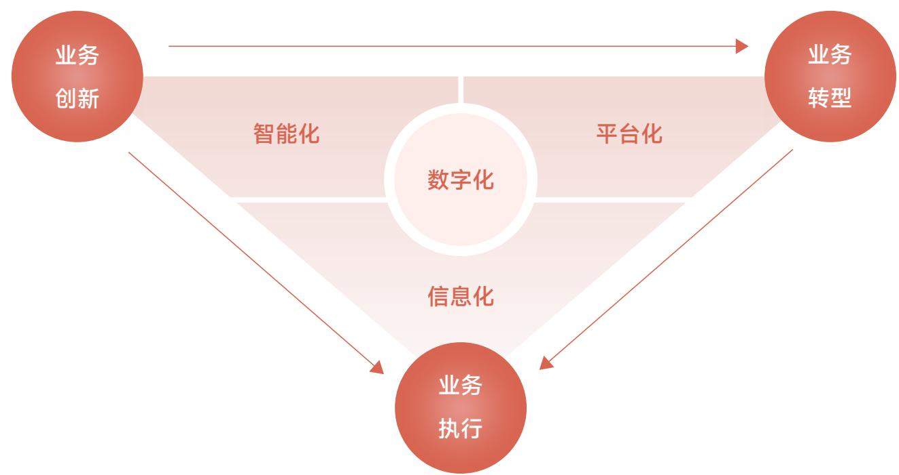

flowchart

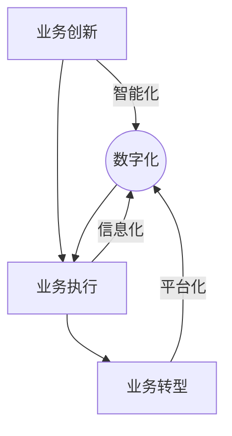
```mermaid
graph TD
  A["业务创新"] -->|"智能化"| B(("数字化"))
  C["业务转型"] -->|"平台化"| B
  D["业务执行"] -->|"信息化"| B
  A --> D
  B --> D
  D --> C
```

## 信息化

承接公司经营发展战略，围绕全业务价值链流程的标准化、一体化，加速推动“研、产、供、销、服、人、财”各业务域信息化平台建设完善，构建敏捷高效的业务管理能力，保障公司健康可持续发展。加强数据治理，以数据驱动运营管理的精细化。

## 数字化

秉持“标准先行”的原则，通过构建统一的数字化标准体系，确保在复杂业务环境下，管理和执行的高度一致性。数字化战略不仅着眼于内部的高效协同，还致力于将高效的管理模式和业务流程与产业链上下游链接、协同，提升整体运营效率。

## 智能化

致力于为工艺端、制造端、质量端、管理端提供全方位的价值赋能。通过工艺智能化、生产智能化、质量智能化、管理智能化，结合人工智能、视觉感知、图像识别、路径优化等技术方式，有效解决超高离散制造行业多品种、小批量特点所带来的问题，显著提升效率、改进质量和降低成本。

## 平台化

初步建立了平台化和远程制造的新模式，并主动寻找内部和外部的机会，完成了新模式的验证和初步应用。通过将工作任务分解为工作包，调用平台上的各种资源，无论这些资源位于何处，公司都会选择最优的资源进行生产制造，确保产品质量的一致性。

## 数智化关键成果

<table><tr><td>项目</td><td>措施</td></tr><tr><td>机加工艺</td><td>全智能工艺车床覆盖,实现车、铣智能工艺全覆盖,单件编制平均时间缩短近一半,编制效率大幅提升围绕SAP和TC的相关系统改造,实现工艺系统上传效率提升80%</td></tr><tr><td>表处工艺</td><td>消除氧化钇喷涂非异形件涂层不匀问题FlowTest工序OEE提升20%以上,零件装夹效率大幅提升</td></tr><tr><td>气柜设计</td><td>降低导入项目BOM数量核算错误、物料选型错误、更改项识别错误风险</td></tr><tr><td>焊接工艺</td><td>通过工艺参数的自适应,消除长期困扰的电子束不可控异常放电导致的产品缺陷顽疾</td></tr></table>

natural_image

Modern office desk with gray tufted chairs, a laptop, and a coffee cup on the table (no visible text or symbols)

## 产品质量管理

富创精密始终坚持 “质量第一、客户至上” 的理念，将质量管理贯穿于产品设计、生产制造、供应链管理及售后服务的全过程。公司通过构建系统化的质量管理体系、强化过程控制、推动质量文化建设，持续提升产品质量水平，增强客户满意度与市场竞争力。

## 治理

各子公司依据国际质量管理标准，建立了覆盖全业务流程的质量管理体系，质量体系文件涵盖《生产制造过程管理程序》《质量信息管理细则》《不合格品控制程序》《成品检验及放行规定》》《供应商管理与评鉴规定》《产品标识和可追溯性管理规定》等关键制度，确保质量管理工作有章可循、责任明确。报告期内，公司国内已投入生产运营的全部工厂均已取得相关质量管理体系认证（ISO 9001:2015、AS9100:2016）。

我们已构建以质量策划能力中心、质量保证能力中心、质量控制能力中心、质量工程能力中心四大质量管理平台为核心，本公司平台质量中心和各工厂质量部协同执行的质量管理体系组织保障，各层级分工明确、紧密配合，共同推进产品质量保障工作。

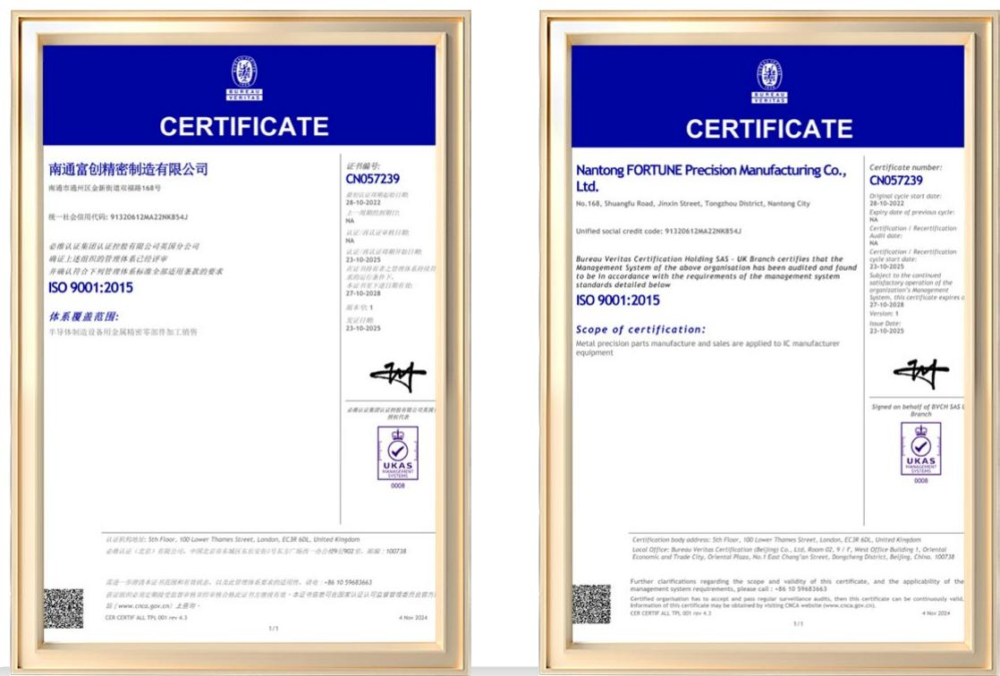  
南通富创质量管理体系证书

## 战略

<table><tr><td>名称</td><td>描述及潜在影响</td><td>影响时间</td><td>发生可能性</td><td>应对措施</td></tr><tr><td colspan="5">实体风险</td></tr><tr><td>产品退货/召回风险</td><td>下游客户对公司产品要求日益严格,若公司产品质量不能满足客户预期,则可能发生客户投诉或退货事件;若产品质量管理失控,公司可能因产品质量问题召回某一批次产品,从而增加公司营业外支出、增加运营成本</td><td>短期中期</td><td>低</td><td>严格遵循《不合格品控制程序》,对不合格品实施识别、隔离、评审与处置的全流程闭环管理;建立从原材料到成品的唯一性标识和全流程追溯系统;制定《产品召回管理制度》,明确召回触发条件、处置流程及预防机制,确保出厂产品符合客户要求。</td></tr><tr><td>产品质量标准提升风险</td><td>随着行业上下游及产业链不断发展,下游客户对产品质量的要求不断提高,公司需要不断投入资源以满足客户质量需求,否则可能面临产品不符合要求而丢失市场份额的风险,进而导致公司营业收入下降。</td><td>长期</td><td>低</td><td>构建覆盖全业务流程的质量管理体系,已取得ISO 9001:2015及AS9100:2016相关认证;在研发阶段通过《新产品试制控制》《工艺评审管理》等制度识别潜在质量风险,优化工艺设计;持续将严格的质量标准延伸至供应链,对关键供应商实施严格审核与现场认证。</td></tr><tr><td>声誉风险</td><td>如出现产品质量问题,公司品牌形象将会受到影响,进而损害公司市场形象及客户信任,导致公司丢失市场份额,进而导致公司营业收入下降。</td><td>中期</td><td>低</td><td>实施从研发、采购、制造到售后的全生命周期质量管理机制;售后阶段严格执行“客户投诉-根本原因分析-纠正预防措施-有效性验证”的闭环流程;围绕质量策划、质量保证、质量检验、质量工程四大环节开展持续性质量培训与意识提升,将质量绩效纳入员工考核体系,推动质量改进项目落地。</td></tr><tr><td colspan="5">机遇</td></tr><tr><td>市场竞争机遇</td><td>通过不断提高公司产品与服务质量,公司可以树立良好的品牌形象,提升影响力和竞争优势,从而提升公司市场份额及营业收入。</td><td>长期</td><td>高</td><td>密切关注客户对更高质量产品和服务的不断变化需求,主动调整战略部署,采取多项措施确保产品设计、生产、交付等环节充分满足客户需求,不断精进产品质量。</td></tr></table>

## 产品生命周期管理

公司实施从研发、采购、制造到售后的全生命周期质量管理机制，确保产品质量可控、可追溯。

## 富创精密产品质量生命周期管理

## 研发阶段

制定《新产品试制控制》《工艺评审管理》等制度，识别潜在质量风险，优化工艺设计，提升产品可制造性与可靠性；

编制工艺规程，进行工艺评审，确保工艺规程、数控程序版本有效

## 采购阶段

将严格的质量标准衍生至供应链，针对供应商制定《采购管理》《供应商质量手册》《供应商质量考核管理办法》等管理与指导文件，严格把控供应链包括来料检验、供应商审核等环节在内的产品质量；

对关键原材料和外包工序供应商进行严格审核与现场认证，对关键物料实施全尺寸检测、材质光谱分析、力学性能测试等

## 制造阶段

建立《产品质量评审》《产品检验管理细则》《不合格品管理细则》《质量信息管理细则》《特殊过程管理》等文件，生产过程定期进行设备预防性维护和工装精度校验，建立从原材料到成品的唯一性标识和全流程追溯系统

## 售后阶段

制定《售后服务管理制度》《客户抱怨处理程序》等文件，严格执行“客户投诉-根本原因分析纠正预防措施-有效性验证”的闭环流程

## 不合格产品控制

公司严格遵循《不合格品控制程序》，对不合格品实施从识别、隔离、评审到处置的全流程闭环管理。一旦发现不合格品，现场人员立即将异常工件转移至专用隔离区并暂停相关生产，确保不合格品不被误用或流入下道工序。同时，根据异常内容开具《不合格品处理单》，查明根本原因，并经评审后采取返工、报废或让步接收等方式分类处置，确保出厂产品符合客户要求。

为构建产品交付的全流程可追溯体系 公司从客户需求端到产品交付端建立严苛的质量管控节点 确保每一件产品的质量状态可追溯、可验证。公司制定《产品召回管理制度》，明确召回触发条件、处置流程及预防机制。

## 质量文化建设

公司围绕质量策划、质量保证、质量检验、质量工程四大质量管理环节开展持续性质量培训与意识提升工作。同时，我们将质量绩效纳入员工与考核体系，奖励评价表现优秀的人员，激发员工参与质量管理建设的热情与积极性，推动质量改进项目落地。同时，我们制定了适用于北京、沈阳和南通工厂的质量红线规定，对于触发质量红线的行为，根据行为严重程度，采取警告、接触劳动合同等措施。旨在构建全员质量意识，推动质量标准快速完善，秉持“一次就做对”的理念，形成“建标—执标—改进”的闭环管理，保障质量标准刚性落地。

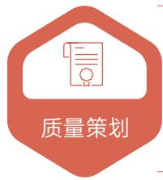

通过系统策划制造流程，识别各环节关键活动与质量要求，强化管理者质量意识，推动质量管理深度融入日常运营，确保质量目标贯穿全过程。

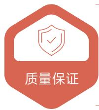

围绕质量文化建设，策划并组织开展质量案例学习、专题研讨、现场现物观摩等多种形式活动；常态化开展质量文化宣传与培训，定期审视质量要求落实情况，构建持续改进的质量氛围。

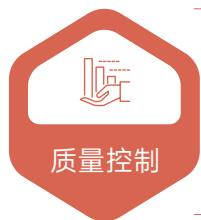

系统识别质量能力短板制定质量工程方法与工具的推广策略：建立并动态维护质量工程能力档案，针对性识别短板并在实战中开展辅导改进，确保质量控制能力持续提升。

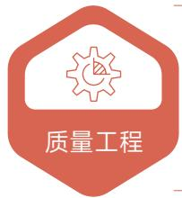

组织开展质量工程方法与工具的培训、辅导及效果评估；策划并推动团队内外经验共享与交流，积极引入先进方法和优秀实践，提升质量工程整体水平。

## 品 案例丨召开首届“匠人匠心·传承共进”工匠日活动

2025年5月，富创首届“匠人匠心·传承共进”工匠日活动正式召开，传承自2018年首批大工匠聘任承诺。以表彰激励、技艺共学、难题攻坚为载体，大力弘扬工匠精神，厚植质量文化根基。通过匠心传承、技能传帮带与质量理念共融，推动精湛技艺与严苛质量标准代代相传，持续夯实产品品质与核心能力，为富创高质量、可持续长远发展筑牢坚实根基。

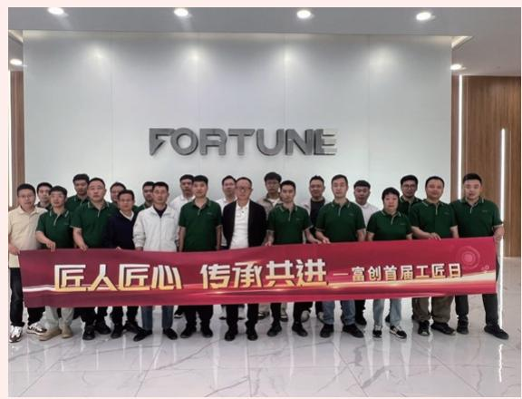

text_image

FORTUNE
匠人匠心 传承共进 —富创首届工匠日

## 风险和机遇管理

公司已将可持续发展相关风险和机遇管理融入公司整体风险管理体系中，参照国际风险管理指南和框架，常态化开展ESG风险管理、有序推进ESG风险评估。通过问卷调查、情景分析等方式，对产品与服务质量管理相关风险和机遇进行持续性识别、评估与应对。

## 指标与目标

通过设定关键绩效指标、开展质量文化建设等举措，确保质量目标的实现与持续提升。报告期内，未发生产品召回事件，也未发生因产品质量问题导致的重大安全责任事故。

natural_image

Abstract graphic with a red target and arrow in the center, flanked by gray gear icons (no text or symbols)

## 客户权益保护

公司始终坚持以客户为中心，通过建立健全的产品质量保障体系、透明的客户沟通机制与高效的投诉处理流程，全方位保障客户合法权益，持续提升客户满意度与信任度。我们秉持着“助客户产品更有竞争力”的企业使命，始终坚持以客户为中心的发展理念，前瞻性地开展研发工作，及时推出与客户设备相匹配的精密零部件，持续优化现有产品，以适应客户工艺制程的不断演进和产品迭代的加速步伐。公司推广“铁三角”服务模式，协调项目经理、销售团队、技术专家等角色，快速响应需求，赋能客户价值提升。

## 客户投诉处理

我们建立了《客户抱怨处理程序》《售后服务管理》等制度，明确投诉受理、分级、调查、反馈及关闭的全流程。

富创精密产品质量生命周期管理

## 高效协同机制

明确客户投诉相关部门的具体职责，形成了高效协同的工作机制。

## 客诉处理流程信息化系统

通过客户投诉的信息化管理系统，实现从客诉问题接收至问题关闭的全链条信息化管理，提高客户诉求的响应速度，并增强流程的透明度与可追溯性。

## 客诉问题常态化分析与改善

每月整理客户投诉问题报告，组织相关部门召开客诉月报会议，深入分析问题并制定行动，持续跟踪直至问题关闭，以此及时复盘关键问题，避免问题重复出现。

## 重点问题稽查回溯

基于客诉问题类型，开展双周回溯会议跟进问题处理进展，并线下稽查确认执行情况，确保重点问题得到及时和有效解决。

## 重点问题专项整改

通过深入分析客诉问题，识别重点改善项目，集中资源开展专项整改来解决同类关键问题。

## 关键绩效

2025年度，

客户投诉数量

20条

处置率

100%

natural_image

Office desk with laptop displaying a bar chart, coffee cups, and documents (no visible text or symbols)

## 客户满意度调查

公司将客户满意度作为衡量服务水平的核心指标，每半年开展一次系统客户满意度调查，广泛收集客户意见与建议。我们将客户抱怨、退货等情况纳入评价体系，通过数据收集与分析，制定改进方案，在月度对接会上跟踪落实进展，确保措施闭环推进。调查结束后1个月内，公司将改善结果反馈客户，持续提升客户体验。

2025年，我们针对36家客户开展客户满意度调查，客户综合满意度99.73%。

## 客户隐私保护

我们严格遵守《中华人民共和国数据安全法》《中华人民共和国个人信息保护法》等法律法规，高度重视客户信息及隐私保护。我们制定了《信息化管理制度》《商业秘密管理办法》等内部制度，明确客户信息的收集、使用、存储及销毁规范。我们定期开展信息安全和隐私保护培训，提升员工保密意识。

## 数据安全与客户隐私保护

富创精密严格遵守《中华人民共和国网络安全法》《中华人民共和国数据安全法》《中华人民共和国个人信息保护法》等法律法规要求，设立多项信息与数据安全规章制度在富创及其下属分子公司范围内执行。我们搭建系统化的信息安全管理组织架构，有效监督并落实信息管理相关措施，持续完善信息安全管理体系建设，并定期开展内外部审查以评估信息管理体系运行的有效性。报告期内，公司未发生客户信息泄露及数据安全重大事故。

## 信息安全管理体系

公司持续完善信息安全管理体系，参照 ISO 27001 信息安全管理体系标准开展系统化建设，计划于 2027 年完成 ISO 27001 认证。我们制定了《信息化管理制度》《IT 网络设施信息安全管理制度》《网络管理制度》等系列制度文件，明确信息安全管理的规范要求与执行标准。

公司设立由信息安全管理委员会统筹、信息安全专人负责的分级管理机制，组建信息安全管理小组与 IP 管控小组，明确各级职责分工，同步建立配套的应急预案，提升风险响应能力。

信息安全与隐私保护管理架构  
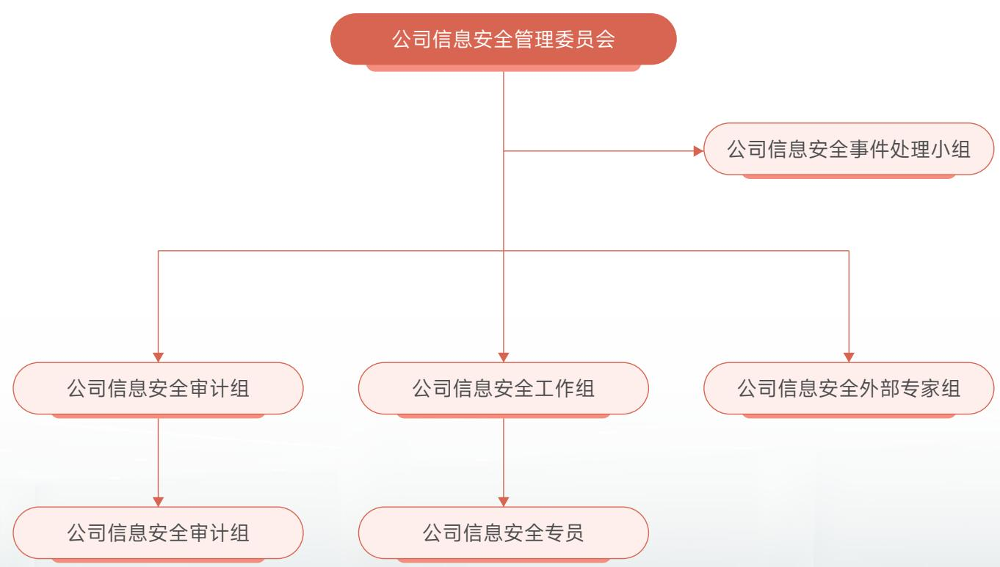

flowchart

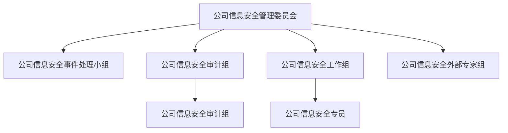
```mermaid
graph TD
  A["公司信息安全管理委员会"] --> B["公司信息安全事件处理小组"]
  A --> C["公司信息安全审计组"]
  A --> D["公司信息安全工作组"]
  A --> E["公司信息安全外部专家组"]
  C --> F["公司信息安全审计组"]
  D --> G["公司信息安全专员"]
```

## 信息安全管理举措

富创精密构建并实施了多层次的信息安全技术体系，实现信息和数据安全的全生命周期管理。报告期内，未发生客户隐私泄露或信息安全事件。

## 富创精密信息安全管理举措

## 多层技术防护体系

构建了覆盖态势感知、防火墙、入侵防御检测、终端加密及数据防泄漏（DLP）等多层次的技术防护架构，实现对核心信息资产的主动防御与动态监测。

## 数据分类与权限管控

依据数据分类分级标准，制定差异化的安全管控策略与访问权限，配套相应的审批流程，确保数据在全流转过程中的安全可控。采用先进第三方数据防泄密系统，实现从数据加密、访问控制到行为监控和事后审计的全方位数据安全保护，从而有效防止数据在创建、存储、传输和使用过程中的泄露风险。

## 定期安全测试与防护

常态化开展漏洞扫描、攻防演练等高强度安全测试，通过模拟攻击及时发现并修复系统隐患，持续提升整体安全水位。

## 专项应急演练保障

针对重大活动或特殊时段，组织开展专项应急演练，检验应急预案的有效性与响应流程的协同性，保障业务连续性与系统运行稳定。

## 信息安全应急响应

制定信息安全事件应急响应机制，明确事件报告流程和相关负责人员的职责，并确保安全事件解决后，要及时清理系统、恢复数据、程序、服务，恢复工作应避免出现误操作导致数据丢失。

## 信息安全意识提升

定期开展信息安全培训与教育，加强全体员工信息安全意识。

## 关键绩效

## 报告期内，

信息/数据安全与隐私保护培训次数

12次

信息/数据安全与隐私保护培训参与人次

811人次

相关人员信息/数据安全与隐私保护培训参与率

100%

## 信息安全审查与评估

公司定期开展信息与数据安全的内外部审查与评估，推动对公司信息安全与数据保护的全面监督与落实。报告期内，我们通过第三方专业机构对公司系统进行了全方位的网络完全风险评估，针对所识别出的安全风险，依据 GB/T 20984 - 2022《信息安全技术 信息安全风险评估方法》《OWASP Top 10 Application SecurityRisks-2023》 等相关标准和评估方案 从网络环境安全安全计算环境业务应用安全安全管理 物理环境五大方面制定整改措施，并持续监控整改措施的有效性，以进一步提升公司信息与网络安全管理水平，以应对不断变化的安全威胁。

## 负责任供应链

富创精密致力于构建负责任、可持续且富有韧性的供应链体系，与供应商伙伴共同成长，为客户创造长期价值。我们深知供应链的稳健与可持续性对公司业务成功至关重要，因此我们不断完善供应商全生命周期管理，将环境、社会和治理（ESG）理念融入采购全流程，并积极拥抱数字化，提升供应链的透明度和运营效率。

## 供应商管理体系

我们建立了系统化的供应商管理休系覆盖从寻源准入到合作退出的全过程，确保供应商在质量，成木，交付、技术和服务等方面满足公司要求的同时，也符合我们的可持续发展标准。我们制定《供应商管理与评鉴规范》《供应商绩效管理》《供应商质量管理考核办法》等文件。2025年，我们主要聚焦于优化供应商寻源准入标准与强化供应商风险管控，对相关制度进行多次修订。

## 供应商准入与分级管理

我们依据《采购作业规范》《供应商管理与评鉴规范》等制度，建立供应商准入标准和规则。在新供应商准入环节，我们不仅审核其基础的资质能力（如要求必须具备ISO9001或同等资质），还会对潜在供应商进行现场评鉴，评估其综合能力。

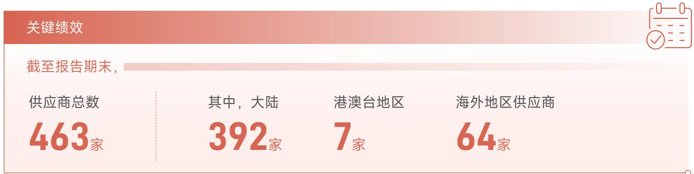

funnel

| 指标 | 数量 (家) |
| --- | --- |
| 供应商总数 | 463 |
| 其中，大陆 | 392 |
| 港澳台地区 | 7 |
| 海外地区供应商 | 64 |

## 供应商评估与绩效管理

我们遵循《供应商绩效管理》文件，我们定期对供应商进行绩效评价。评估结果直接应用于订单分配，供应商级别调整等管理决策。我们根据供应商的绩效表现进行分级管理，将供应商划分为S，A、B.C四个等级 实现差异化管理，确保资源向核心合作伙伴倾斜。对于考核中未达标的供应商，我们要求其限期整改，并在必要时进行QBR（季度业务回顾）拜访，跟踪行动项的改善情况，确保问题闭环。

2025年，我们对238家供应商进行了绩效考评。同时，针对考核不达标、年审不符合的情况，对75家供应商进行年度审核，9家供应商为达标，限期一个月整改，均改善完成。

## 供应链风险管理

我们遵循《供应商管理与评鉴规范》，在供应商年审和准入审核中进行供应链尽职调查。我们对所有准入的供应商进行风险评估及管控，除财务、生产管理、地缘政治等风险外，同时考虑其ESG风险。我们依据采购业务内容进行供应商分类管理，开展风险管理培训。

## 供应商风险管理举措

要求100%新准入供应商持有ISO 9001认证，或与其等同或高于的认证证书

针对制造型涉及废水排放的，要求必须具有ISO 14001相关环境认证证书

对供应商风险进行评估、排查，考虑供应商的地缘政治、战争等方面，对供应商进行风险等级的评估，通过主辅备的管理策略保证供应持续性

针对关键物料的供应商协商备库机制

## 本地化采购

我们高度重视本地化采购，将其视为保障供应链安全、响应速度和支持本地经济发展的重要战略。我们优先选择当地供应商，促进就地经济发展，助力区域经济发展。公司依据工厂布局，在周边地区开发外协加工供应商资源，缩短供应链距离，降低物流成本与碳排放。同时，我们推荐供应商使用周边配套原材料供应商，优化供应链布局，提高供应链效率与稳定性。

## 供应商培训与交流

供应商的能力提升是供应链整体竞争力提升的关键。为此，我们建立了包含线上培训、线下实操培训、现场审核指导，驻场辅导，ESG政策宣贯相关的供应商培训和交流机制2025年，我们组织了多种形式的赋能活动，全年累计供应商人员培训达34次，供应商管理要求培训18次，累计培训2,000人次，累计培训时长4,378小时，切实帮助供应商与富创精密共同成长。

## 供应商ESG管理

我们将ESG要求作为与供应商合作的基本前提，并将其贯穿于供应商管理的各个阶段，致力于打造绿色、负责任的供应链。

## 供应商行为规范

我们制定了《供应商RBA管理规范》，明确了对供应商在环境、劳工、商业道德等方面的具体要求。我们要求所有关键供应商签署包括《廉洁协议》《环安卫管理协议书》在内的框架合同附件。2025年，已有367家供应商签署供应商行为准则，覆盖公司供应商总数的80.13%。

## 供应商ESG审核

我们将ESG审核融入供应商的准入审核和年度例行审核中，在准入和年审过程中，我们会对供应商的ESG相关政策和执行情况进行审核，对已准入的供应商如无相关文件的，帮助其建立体系文件，审核过程中的不符合项要求供应商按规定期内改善完成，关闭改善项。2025年，使用环境、社会评价维度的新供应商数量139家，占比30%。

## 供应链数字化能力建设

为提升供应链管理效率和透明度，我们全面推行供应链业务的数字化管理，搭建供应商关系管理（SRM平台）。目前，从供应商准入流程、绩效管理、询比价、订单管理、合同管理到付款结算，所有核心业务均已实现系统平台化运作。通过供应链业务数字化管理，极大提高工作效率，确保数据的准确性和可追溯性，为供应链的风险管理和决策分析提供了坚实基础。

## 绿色采购

我们积极践行绿色采购理念，优先选择环境友好型的供应商和产品。在采购过程中，我们要求与产品直接相关的物料供应商提供ROSH报告，确保其产品符合有害物质限制要求。同时，我们将环境表现作为供应商筛选和绩效评估的重要考量因素之一，鼓励供应商不断提升其环境管理水平。

我们注重采购人员能力培养，要求采购高级管理人员具备CPPM专业证书。同时，通过交流分享活动、培训活动，就供应链内的社会和环境问题为公司采购专业人员提供培训，确保他们了解社会和环境议题。

## 冲突矿产管理

我们严格遵循负责任的矿物采购原则坚决不使用来自武装冲突、人权侵犯区域的“冲突矿产”。我们在《供应商RBA管理规范》中明确了对冲突矿产的管理要求。在供应商年审和准入过程中，我们会对“不使用冲突矿产”的相关内容进行审核，向不了解相关政策的供应商进行宣贯，并要求其增加相关管理。我们致力于与供应链伙伴共同构建一个透明、合规的矿物采购体系。为落实冲突矿物承诺，公司要求所有供应商签署《不使用冲突矿产承诺书》，并要求其在签署后定期提供所用矿产来源的相关证明和审核报告。

## 平等对待中小企业

我们平等对待所有供应商，不因其规模而制定差异化标准，不存在任何打压等情况，付款条款明确，报告期内不存在逾期未支付中小企业款项的情形。同时，我们无条件提供富创精密的技术、质量等培训、帮助中小企业供应商与我们一同成长。

## 04

## 和谐富创携手共进共赢

企业的价值不仅在于经济效益的创造，更在于与员工、与社会同频共振的深度。我们深知，可持续的发展离不开和谐的内外环境。我们秉持“以人为本、回馈社会”的理念，对内构建共生共长的职涯沃土，对外践行产业报国的责任担当。通过构建完善的保障体系、搭建多元的成长平台、守护全员的身心健康，并积极投身乡村振兴与公益慈善，以实际行动推动共同发展，构建和谐共融的发展环境。

## 所涉及的可持续发展议题

员工权益保障 乡村振兴  
人才培养与发展 社会贡献  
职业健康与安全

所响应的联合国可持续发展目标（SDGs）

无贫穷

2 零饥饿

3 良好 健康与福祉

4 优质教育

5 性别平等

8 体面工作和经济增长

10 减少不平等

## 员工权益保障

公司坚持以人为本，严格遵守国家法律法规，致力于构建合法合规、公平公正、开放透明的用工环境。公司切实维护员工的各项合法权益，营造和谐、尊重、平等的工作氛围，持续提升员工的归属感、获得感与幸福感。

## 员工雇佣与劳工风险

我们严格遵守《中华人民共和国劳动法》《中华人民共和国劳动合同法》《中华人民共和国未成年人保护法》《中华人民共和国妇女权益保护法》等法律法规，坚持“公开、公平、公正、择优”的招聘原则，确保雇佣程序的合法性与透明度。报告期内，公司所有正式员工的劳动合同签订率、社会保险覆盖率均达到100%，劳务派遣等其他用工形式亦均符合国家相关法律规定。

## 合规雇佣

我们严禁聘用童工，要求雇佣人员年龄必须符合各运营地法律法规要求，制定《招聘与配置管理》制度，明确招聘流程与录用标准，并在员工入职时严格核查身份信息，从源头杜绝使用童工的风险。我们坚决反对任何形式的强迫劳动，制定《禁止使用强迫劳动管理制度》，保障员工自愿受雇、自由离职的权利，不向员工收取任何形式的押金或扣留证件，确保员工在非工作时间可自由出入厂区，并提供申诉渠道以应对任何潜在的强迫劳动行为。

## 劳工人权管理

我们制定《RBA社会责任手册》，并配套制定《员工手册》以及相关管理、补救程序，针对劳工、环境、职业健康安全、道德规范和社会责任制定管理目标与工作程序，通过管理评审会议审查目标的适宜性。报告期内，公司未发生任何重大劳资纠纷或负面劳工事件。2025年本公司已通过第三方专业机构基于RBA（Responsible Business Alliance）行为准则和VAP（Validated Audit Process）审核清单完成外部稽核工作，并产出审核报告。

<table><tr><td>劳工人权承诺</td><td>相关政策及制度</td><td>相关预防及缓解举措</td></tr><tr><td>禁止使用童工</td><td>《未成年人保护控制程序》《禁止使用童工和补救控制程序》</td><td>预防举措:依法禁止童工并对未成年工实施特殊保护;严格执行招聘年龄核查机制,入职时核验身份证原件;建立未成年工名册,定期评估岗位风险,禁止安排未成年工从事危险工作;每年组织未成年工健康体检。缓解举措:一旦发现误用童工,立即停止劳动并报告当地劳动部门;安排健康检查并承担医疗费用;努力帮助其继续就学或提供必要的支持直至符合法定年龄。</td></tr><tr><td>禁止强迫劳动</td><td>《禁止强迫和强制性劳动控制程序》</td><td>预防举措:坚持招聘自愿原则,不收取押金或扣留证件;加班坚持自愿原则,建立加班申请审批制;员工可自由离职(提前30日书面通知);保安员严禁对员工搜身、限制人身自由。缓解举措:设立申诉邮箱受理强迫劳动投诉;调查属实后立即纠正并对相关责任人进行处理;深夜出入宿舍需报备登记以平衡安全与管理。</td></tr><tr><td>女性权益保护</td><td>《囚工/童工/青年员工/女职工管理作业指引》</td><td>预防举措:禁止性别歧视,不因“三期”(孕期、产期、哺乳期)降低工资或解除合同;建立“三期”女工名册;不安排怀孕及哺乳期女工从事禁忌岗位、加班或夜班;怀孕7个月以上安排适当休息。缓解举措:根据医疗证明调岗或减轻劳动量;提供产检假、哺乳时间(每天1小时);开展女工劳动保护宣传和保健讲座。</td></tr><tr><td>工作时间</td><td>《工作时间控制程序》</td><td>预防举措:依法实行标准工时制或综合计算工时制;加班时长不超过法定限制(月加班不超过36小时),保证每周至少休息1天;加班需经员工同意并按规定支付加班费。缓解举措:建立工时记录系统定期核查加班情况;发现违规及时调整排班计划;员工可拒绝违章加班且不受打击报复。</td></tr><tr><td>工资与福利</td><td>《工资和补贴管理程序》</td><td>预防举措:支付工资不低于当地最低工资标准;依法计算和支付加班费;每月定期通过银行转账发放工资;提供带薪年休假、社保和公积金。</td></tr><tr><td>人道待遇</td><td>《惩戒性措施控制程序》《员工投诉管理作业指引》</td><td>预防举措:严禁体罚、殴打、搜身、侮辱或任何形式的言语/身体/心理/性别上的骚扰;纪律处罚仅限于书面警告等合法方式;禁止保安对员工采取压迫性措施。缓解举措:设立员工投诉机制;接到申诉后由相关部门查证,情节轻微的教育纠正,严重的依法追责;保护投诉人不受打击报复。</td></tr><tr><td>反歧视</td><td>《反歧视控制程序》</td><td>预防举措:坚持平等雇佣,不因种族、民族、性别、宗教信仰、残疾、年龄、政治归属等区别对待;实行同工同酬。缓解举措:对员工进行反歧视培训;收到歧视投诉后由相关部门调查核实,情况属实的立即纠正并教育相关责任人;设立申诉邮箱受理歧视相关举报。</td></tr><tr><td>自由结社与集会</td><td>《结社自由及集体谈判控制程序》《员工代表选举程序》</td><td>预防举措:尊重员工依法组建和参加工会的权利;支持员工选举工人代表,提供必要的活动条件;不干涉、不报复参与工会或集体谈判的员工。缓解举措:管理者代表与工人代表就员工关注问题进行对话;确保工人代表不因其身份受到歧视、骚扰或打击报复。</td></tr></table>

## 员工多元化

我们积极营造多元、平等、包容的文化氛围，坚决杜绝任何形式的歧视与骚扰。我们制定《禁止歧视管理制度》及《员工手册》，明确规定在招聘、录用、薪酬、培训、晋升及解聘等环节，不因民族、种族、性别、宗教信仰、年龄、残疾、国籍、政治归属等因素而给予不同待遇，实行男女同工同酬。

## 女性权益保障

公司高度重视女性员工权益，制定《女工（孕妇）保护管理制度》，对女员工的“三期”（孕期、产期、哺乳期）给予特殊保护，包括不安排孕期及哺乳期女员工从事禁忌岗位及加班、夜班劳动，并提供产检假、每天一小时的哺乳时间等。公司为女性员工提供母婴室，每年组织专属体检，并在妇女节发放节日礼品，多方位关爱女性员工身心健康。

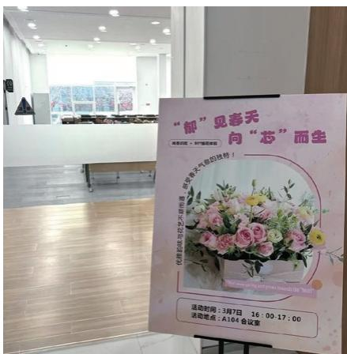

text_image

“郁”见春天
向“芯”而生
优秀传统文化与艺术新机遇，您是春天气氛的独特！
活动时间：387日 16:00-17:00
活动地点：A104会议室

富创精密妇女节活动

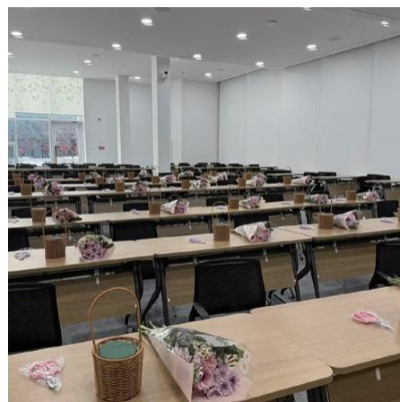

natural_image

Interior of a conference hall with rows of wooden tables filled with floral arrangements and a basket (no visible text or symbols)

富创精密妇女节活动

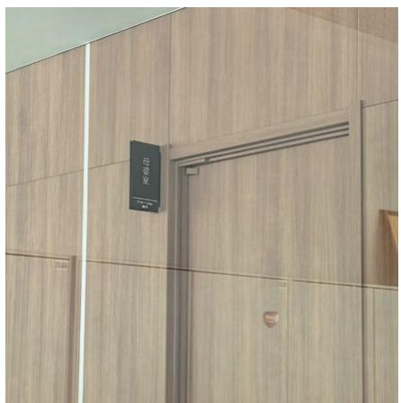

text_image

母婴室

富创精密母婴室照片

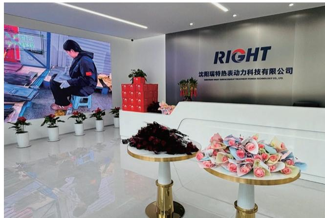

text_image

RIGHT
沈阳瑞特热表动力科技有限公司
RICHARDIEN METROPOLITIC TREATMENT POWER TECHNOLOGY CO., LTD.

瑞特热表妇女节活动

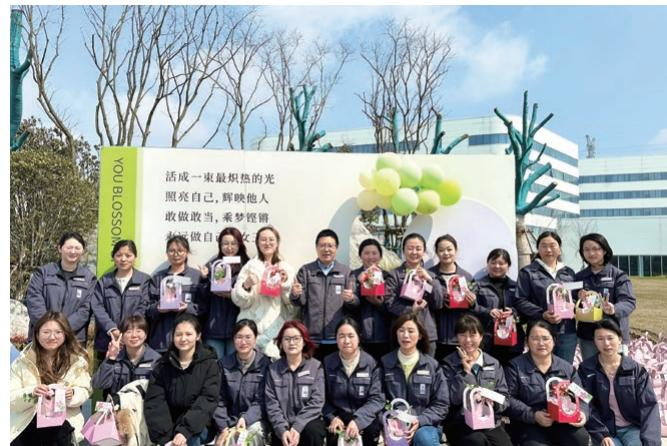

text_image

活成一束最炽热的光
照亮自己,辉映他人
敢做敢当,乘梦铿锵
去实做自己美女。

南通富创妇女节活动

## 促进包容性就业

公司积极履行社会责任，主动吸纳残障人士就业，通过优化招聘渠道、提供无障碍工作区域等方式，为他们创造平等的职业发展机会，报告期内，公司在各运营地共计15名残障员工就业，并参与地方残联组织的招聘会以实际行动支持残疾人事业发展。公司禁止任何形式的性骚扰及基于宗教信仰的歧视，设立了专门的申诉邮箱，确保员工在遭受不公待遇时有畅通的投诉与解决途径

## 关键绩效

报告期内，

员工总数

3,488人

其中，少数民族员工人数

459人

管理层女性人数

44人

占比

19.38

按类别划分的员工构成

## 按员工雇佣类型划分

全职员工人数3,488人

其他类型员工人数（兼职、劳务派遣等）0人

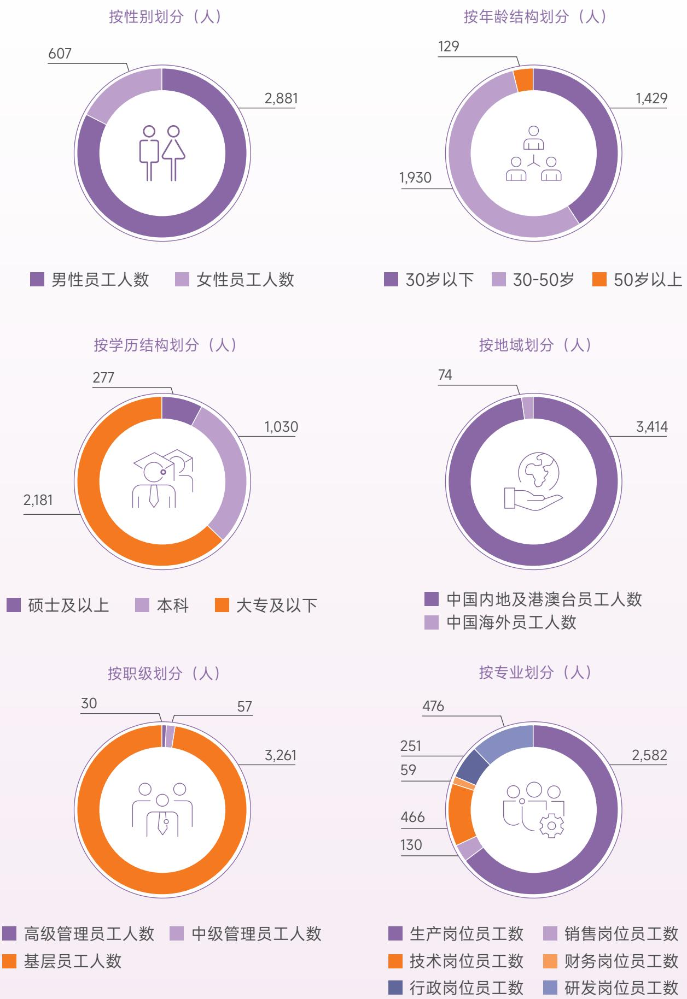  
男性员工人数  
女性员工人数  
30岁以下  
30-50岁  
50岁以上  
硕士及以上  
本科  
大专及以下  
高级管理员工人数  
中级管理员工人数  
基层员工人数  
中国内地及港澳台员工人数  
中国海外员工人数  
生产岗位员工数  
销售岗位员工数  
技术岗位员工数  
财务岗位员工数  
行政岗位员工数  
研发岗位员工数

## 员工薪酬、休假及福利

公司制定《薪酬管理制度》《假期管理制度》《工资、补贴及福利管理制度》，致力于提供具有竞争力的全面薪酬福利体系，以吸引、激励和保留优秀人才，提升员工的生活品质与幸福感。

## 薪酬与激励

公司遵循按劳分配、绩效导向的原则，确保薪酬支付的合规性与公平性，为员工打造并持续优化“固定工资津贴福利+绩效奖励+专项奖励”的全面薪酬方案。公司高度重视创新型和技术型人才的使用，对创新人才通过设立创新奖、专项奖等措施，给予激励。同时，公司还通过股权激励计划将员工利益与公司长远发展深度绑定。

为进一步健全长效激励机制，吸引、留住并激励优秀人才，公司已在2023年、2024年连续推出股权激励计划，形成常态化、制度化的人才激励体系。2025年10月，公司正式发布《沈阳富创精密设备股份有限公司2025年限制性股票激励计划》及配套考核管理办法，激励对象涵盖公司董事、高级管理人员、核心技术人员及其他核心员工。本次计划以公司营业收入增长率对标全球半导体设备销售额增长率作为公司层面业绩考核指标，结合个人绩效考核结果，设置差异化权益归属比例。2025年11月，公司以38.70元/股的授予价格，向399名符合条件的激励对象授予398.62万股限制性股票，进一步绑定核心人才与公司长远发展，激发团队内生动力。

## 富创精密薪酬激励体系

flowchart

```mermaid
graph LR
  A["Process Icon"] --> B["Process Arrow"]
  B --> C["Process Arrow"]
  C --> D["Process Arrow"]
```

  
固定工资  
基本工资+岗位工资

  
绩效奖励  
季度绩效奖励、年终绩效奖

  
津贴福利  
通讯津贴、交通津贴、驻外津贴、环境津贴等其他津贴

  
专项奖励  
专利奖金、超额奖、工艺激励、质量奖等

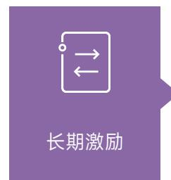

  
股票激励计划 面向公司高管及核心技术人员制定股票激励计划

## 员工福利

公司建立了多元化的员工福利体系，涵盖津贴补助、健康保障、生活关怀等多个方面。

natural_image

Illustration of five people raising arms in a celebration, with books and a clock in the background (no text or symbols)

## 津贴补助

餐费补贴、司龄补贴、节日福利、环境津贴、夜班补助、交通补助、话费补助及专利补贴等

## 健康与保障

提供“五险一金”；

定期组织覆盖全员的福利体检；

## 员工关怀

提供家属福利（生日金、孝敬金）及产妇福利；

提供免费充电、优惠修车等生活便利服务；

设立“爱心基金”（资金来源为工会经费），为遭遇重大疾病、意外事故或家庭重大损失的员工及其直系亲属提供经济援助

## 假期福利

严格执行国家及地方法律法规为员工提供包括法定节假日，带薪年休假，婚假，产假、陪产假、丧假、病假及事假在内的各类假期

## 关键绩效 7

## 报告期内，

公司休育儿假的男性员工数量

16人

育儿假结束后返岗的男性员工数量

16人

女性员工数量

1人

女性员工数量

1人

返岗率

100%

## 员工活动

公司定期组织团建、节日活动、趣味运动会及“夏季送清凉”等慰问活动，持续增强员工的幸福感与归属感。

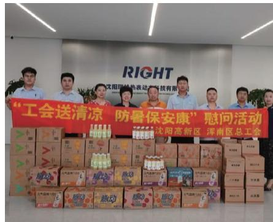

text_image

“工会送清凉 防暑保安康”慰问活动
沈阳高新区 津南区总工会

瑞特热表“夏季送清凉”慰问活动

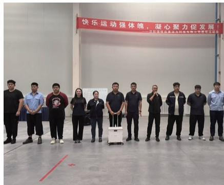

text_image

快乐运动强体魄，凝心聚力促发展！
——北京科技城联动科技服务中心管理委员会

瑞特热表趣味运动会活动

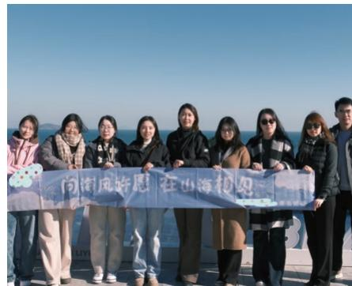

text_image

向南风好愿 在山海初恩

强航时代公司团建活动

## 案例丨“以赛促学、以学促干”

公司子公司瑞特热表高度重视技能人才队伍建设，在企业内部形成了浓厚的创先争优氛围。其员工荣获“五一劳动奖章”杰出个人、“浑南青年工匠”、“沈阳市青年工匠”等奖项，展现了扎实的专业素养和拼搏精神。同时，公司子公司瑞特热表在劳动竞赛中荣获“先进集体”和“先进个人”荣誉。

## 员工沟通

公司倡导“善言、敢言、建言”的和谐沟通文化，制定《员工代表选举管理制度》《工会组织管理制度》《自由加入工会管理制度》《结社自由及集体谈判管理制度》等制度文件，建立了多元化、多渠道的沟通机制，确保员工意见得到倾听、权益得到保障。

## 工会与集体协商

公司尊重并保障员工依法自由结社和进行集体谈判的权利。各运营主体均依法成立工会组织，工会作为员工代表，积极参与公司重大制度的民主讨论，组织召开职工代表大会，就员工关心的薪酬福利、工作条件等问题与管理层进行平等协商，切实维护员工合法权益。员工可通过申诉邮箱（feedback@syamt.com）进行举报和反馈。

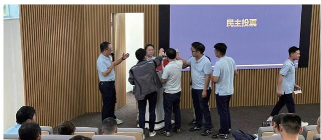

text_image

民主投票

南通富创工会投票现场

## 多元化沟通渠道

公司会定期和不定期利用员工大会、宣传栏、会议、邮件、微信工作群等渠道向员工通报公司近期的经营管理信息，员工能够及时掌握公司的战略规划、业务动态和市场趋势。

## 敬业度调查

公司每年开展员工敬业度调查通过深度访谈与数据分析精准识别员工需求 形成从倾听，分析到反馈，改进的管理闭环，有效提升了员工参与感和团队凝聚力。2025年度，公司开展全员满意度调查，员工总体满意度得分4分（满分5分）。

## 人才培养与发展

人才是企业可持续发展的核心驱动力，公司始终致力于为员工构建公平、开放、多元的发展平台。本报告期内，公司持续优化职位管理体系，完善员工职业发展通道，建立健全长效激励约束机制，并系统化推进各项培训与发展项目，旨在激发员工潜能，提升团队整体战斗力，实现员工成长与公司战略发展的同频共振。

## 员工发展

为规范员工职业发展管理，我们制定《职位管理制度》，确立标准化、规范化的职位体系框架，为人才引入、选拔、晋升与发展提供了明确的制度依据与路径指引。

## 职位体系设置

我们基于全球职位评估系统，结合业务发展现状，将职位按工作性质划分为四大职位族：管理族（M类）、技术族（T类）、职能族（P类）和技能族（O类）。在此基础上确定职等，并进一步将责任与能力要求相近的职等合并为职级，形成清晰的层级关系。明确各岗位的价值定位，也为员工提供了横向发展与纵向晋升的坚实基础。

## 员工绩效管理

我们制定《绩效管理制度》，落实以责任结果为导向的考核激励机制，对所有员工进行且度，季度和年度的绩效评估。按照“目标设定-过程辅导-考核评估-结果应用”的全周期管理流程，促进公司与员工的绩效管理水平持续提升。我们设立全面的员工绩效电诉机制，若员工对绩效评定结果存在异议，可向人力资源中心提出电诉。2025年，定期接受绩效和职业发展考核的员工比率100%。

## 员工晋升机制

职级晋升主要依据年度任职资格评估及绩效评定结果。我们专门制定《干部管理》制度，明确干部来源外部招聘、内部晋升及公开竞聘三种方式。我们秉持文化导向、业绩导向、综合考察、梯队建设及红线原则，干部选拔侧重于综合素质、实际业绩与管理能力，并强调梯队建设，通过岗位轮换与有序循环，培养具有综合管理能力的后备人才。2025年，共计首席专家1名、功勋技术专家2名、高级技术专家8名、技术专家16人、功勋大工匠4人、高级大工匠5人、大工匠6人实现职级晋升。

## 关键绩效

报告期内，

员工流失

1,191人

流失率

34.1%

新进员工

908人

新进员工比例

26.92%

## 员工变动情况

按性别划分新进员工情况（人）  
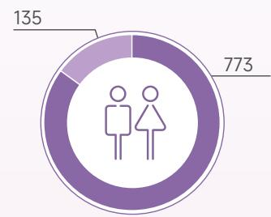

donut

| Category | Value |
| --- | --- |
| Segment 1 | 135 |
| Segment 2 | 773 |

新进男性员工数量  
新进女性员工数量

按性别划分员工流动情况（%）  
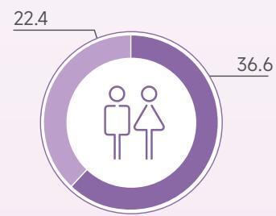

donut

| Category | Value |
| --- | --- |
| Purple segment | 36.6 |
| Light purple segment | 22.4 |

男性员工流动率  
女性员工流动率

按年龄划分新进员工情况（人）  
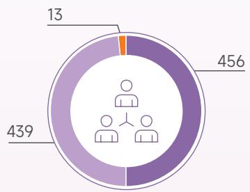

donut

| Category | Value |
| --- | --- |
| Purple | 456 |
| Light Purple | 439 |
| Orange | 13 |

30岁以下新进员工数量  
30-50岁新进员工数量  
50岁以上新进员工数量

按年龄划分新进员工情况（%）  
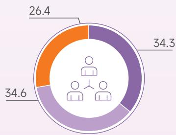

donut

| Category | Value |
| --- | --- |
| Purple segment | 34.3 |
| Light purple segment | 34.6 |
| Orange segment | 26.4 |

30岁以下员工流动率  
30-50岁员工流动率  
50岁以上员工流动率

按地域划分新进员工情况（人）  
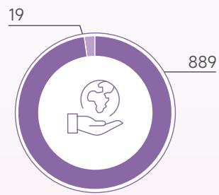

donut

| Category | Value |
| --- | --- |
| Segment 1 | 889 |
| Segment 2 | 19 |

中国大陆及港澳台新进员工数  
中国海外新进员工数

按地域划分新进员工情况（人）  
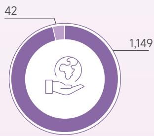

donut

| Category | Value |
| --- | --- |
| Segment 1 | 1,149 |
| Segment 2 | 42 |

中国大陆及港澳台新进员工数  
中国海外新进员工数

## 员工培训

我们建立了完善的培训管理体系，制定《培训管理》制度，实行公司级与部门级两级培训管理。以公司战略和企业文化为导向，致力于打造学习型组织，通过系统化的培训提升员工的岗位胜任力与职业素养。

## 多元化培训项目

报告期内，公司组织开展了多层次、多形式的培训项目，全方位覆盖各类员工群体。

## 富创精密培训项目

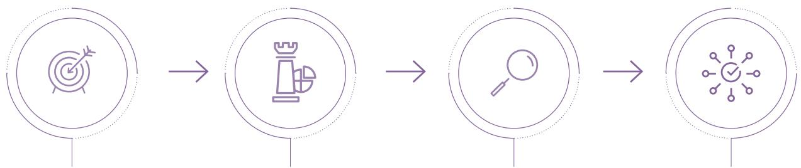

flowchart

```mermaid
graph LR
  A["Goal"] --> B["Strategic Planning"]
  B --> C["Optimization"]
  C --> D["Implementation"]
```

新员工培训  
校招生培养项目  
后备干部培养项目  
在岗专业培训

实现新员工入职培训100% 覆盖，帮助新同事快速了解公司文化、制 度 流 程，适 应 岗 位要求。

针对应届毕业生实施“新帆计划”，通过系统化入职培养，帮助校招生完成从校园到职场的平稳过渡，本年度累计培养60人。

稳步推进针对中层储备干部的“启航计划”与高层储备干部的“领航计划”，与外部专业机构合作开设领导力、战略管理等课程，全年累计参训60人次，有效提升管理层综合能力。

各部门依据年度计划开展常态化在岗培训，并推行关键岗位的交叉培训，以提升员工的多技能水平与流程协同能力。对于焊接等特种岗位，严格执行资质认证与定期复审制度，确保持证上岗与操作规范。

## 培训资源

我们不断丰富内外部培训资源，制定涵盖通用培训课程，专业能力课程和管理培训课程的课程休系，同时积极引入行业前沿课程，并通过建设在线学习平台，逐步扩大线上培训的覆盖范围。2025年，年度培训支出50万元。

我们高度重视内部知识经验的传承与分享。通过建立内部讲师选拔、培养、聘任、考核与激励的全流程机制，发掘并培养了一批具备丰富实践经验和优秀表达能力的业务骨干与管理干部担任内部讲师，并按初、中、高三级给予差异化的课酬激励。同时，推行导师制度，为新员工或转岗员工指定资深员工进行“传、帮、带”，帮助其快速成长。

<table><tr><td>课程类型</td><td>通用培训课程</td><td>专业能力课程</td><td>管理培训课程</td></tr><tr><td>课程内容</td><td>包括新员工入职培训、职场沟通、时间管理、职业心态素养、问题分析与解决等,提升员工基本职业素养与团队协作能力</td><td>分为研发/工艺工程师、生产、质量、人资、财务等专业课程,紧密结合工作任务,提升专业能力</td><td>培养领导力与组织协调等能力,推动团队高效运作,实现目标</td></tr><tr><td>适用范围</td><td>全体员工</td><td>全体员工</td><td>在职管理干部、后备人才</td></tr></table>

  
案例丨2025届“创芯生”训练营圆满结营，新生力量正式启航

2025年7月，25届“创芯生”正式加入富创。作为新生力量与创新火种，他们满怀热忱，正式开启了为期12天的新员工训练营。

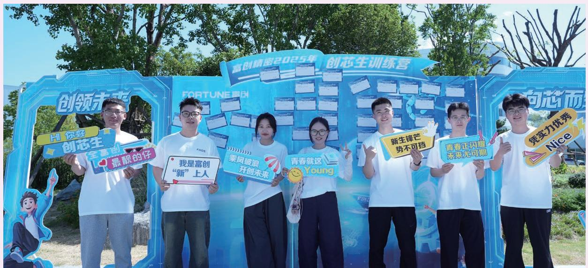

text_image

创领未来
HI 你好
创芯生
全富创
最親的仔
我是富创
“新”上人
喜创精密2025年 创芯生训练营
FORTUNE 联创
乘凤破浪
开创未来
青春就这
Young
新生锋芒
势不可挡
青春正闪腹
未来尤可期
向芯而
凭买力优秀
Nice

2025届“创芯生”训练营

## 案例丨强航时代2025届管培生训练营

2025年7月，子公司强航时代为新员工提供为期14天的训练营。以文化融入与业务实战为核心，涵盖人力资源、安全保密、专业技术等系列课程，帮助新员工快速完成从校园到职场的角色转换，为公司关键岗位培养优质后备人才。

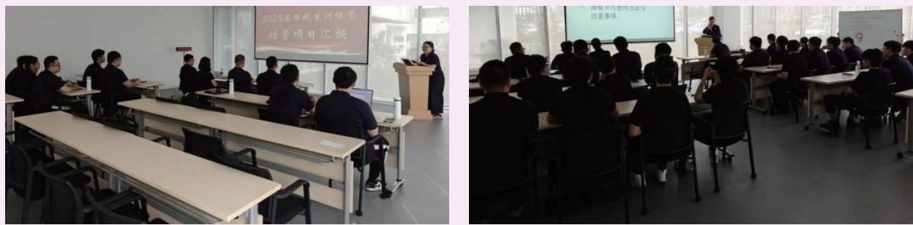  
强航时代新员工培训现场

## 关键绩效

报告期内，

培训总次数

总时长

169次

23,562小时

参与培训员工总数

人均培训时长

员工培训覆盖率

3,488人

6.76小时

100%

富创精密员工培训绩效

按层级划分的培训人数（人）  
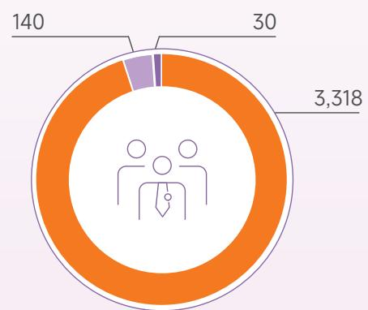

donut

| Category | Value |
| --- | --- |
| Orange | 3,318 |
| Purple | 140 |
| Dark Blue | 30 |

参与培训员工数-高层管理人员  
参与培训员工数-中级管理人员  
参与培训员工数-一般员工

按性别划分的培训时长（小时） 16,851

培训时长-男性

4,538

培训时长-女性

按性别划分的平均培训时长（小时/人）5.85

人均培训时长-男性

7.48

人均培训时长-女性

按职级划分的培训时长（小时）760

培训时长-高层管理人员

2,430

培训时长-中层管理人员

18,108

培训时长-一般员工

按职级划分的平均培训时长（小时/人）25.33

人均培训时长-高层管理人员

17.36

人均培训时长-中层管理人员

5.46

人均培训时长-一般员工

## 职业健康与安全

富创精密始终将员工的生命安全与身体健康置于首位，致力于构建系统化、标准化的职业健康安全管理体系，持续优化安全生产环境，强化员工安全意识，推动形成积极向上的职业健康安全文化。

## 安全体系管理

公司遵守《中华人民共和国安全生产法》《中华人民共和国消防法》《中华人民共和国职业病防治法》《生产安全事故应急预案管理办法》等安全生产相关法律法规，并制定《环境及职业健康安全目标、指标和管理方案控制程序》《环境职业健康安全管制程序》等多项管理制度。

公司持续推进 ISO 45001 职业健康与安全管理体系认证工作，目前已覆盖主要生产单位，未来将逐步实现全资子公司全覆盖。公司按照ISO 45001的要求，建立健全并有效运行职业健康安全和环境（HSE）管理体系。制定了明确的职业健康与安全生产管理架构，明确各级管理职责，确保安全管理工作落实到位。

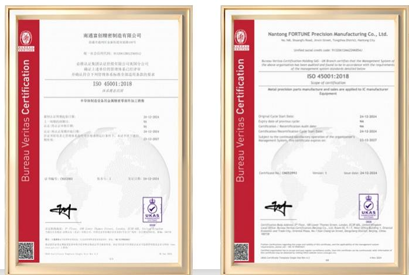  
南通富创ISO 45001:2018职业健康与安全管理体系认证证书

## 2025年度管理目标及达成情况

火灾、爆炸事故为0

已达成

安全设施完好率100%

已达成

死亡、重伤事故为0

已达成

安全隐患整改率100%

职业病事故为0

已达成

## 安全管理举措

公司围绕职业病防治、安全培训、事故预防与应急处置等方面，实施多项管理举措，全面提升职业健康安全管理水平。

## 开展安全评估与隐患防护

公司制定并发布《建立安全风险分级管控和隐患排查治理双重预防机制建设汇编》，成立由公司主要负责人、分管负责人及其他各岗位负责人组成的安全生产双重预防体系建设领导小组，全面负责本公司安全生产风险分级管控体系与隐患排查治理体系建设工作。

公司建立“危险辨识与风险评估-安全风险分级管控-隐患排查与整改”的职业健康安全风险评估机制，定期识别岗位安全风险，形成风险清单制定并落实分级管控措施，报告期内共计排查隐患551项整改闭环率达100%。

公司建立安全事故调查流程，对已发生事故进行根本原因分析，制定整改措施并跟踪落实，防止同类事件再次发生。报告期内，未发生重大安全事故发生。

<table><tr><td>指标</td><td>单位</td><td>2025年</td></tr><tr><td>可记录事故数/工伤事件总数</td><td>件</td><td>2</td></tr><tr><td>可记录事故率(TRIR)</td><td>件/百万小时</td><td>0.289</td></tr><tr><td>死亡事故数</td><td>件</td><td>0</td></tr><tr><td>死亡事故率(FIR)</td><td>件/百万小时</td><td>0</td></tr><tr><td>因工亡故人数</td><td>人</td><td>0</td></tr><tr><td>因工死亡率(FAR)</td><td>人/百万小时</td><td>0</td></tr><tr><td>因工伤亡人数</td><td>人</td><td>0</td></tr><tr><td>因工伤亡率(百万工时)</td><td>人/百万小时</td><td>0</td></tr><tr><td>因工伤损失工作日数</td><td>工日</td><td>78</td></tr><tr><td>安全隐患排查与整治数量</td><td>个</td><td>551</td></tr><tr><td>安全隐患排查与整治闭环率</td><td>%</td><td>100</td></tr></table>

## 职业健康服务保障

公司严格遵守《中华人民共和国职业病防治法》并制定相关管理政策规范公司职业健康管理工作。公司定期聘请具备专业资质的第三方机构，对厂区进行工作场所职业危害检测，精准识别职业危害种类，并据此制定和落实相应的预防措施。

## 职业病防治措施

## 专业体检与保险

对接医疗机构开展员工岗前，岗中，离岗职业病体检，确保员工无职业禁忌证。为员工缴纳工伤保险和安全生产责任险。

报告期内，公司职业健康体检覆盖率达100%。

## 安全提示

现场张贴职业危害风险告知卡，让员工清晰岗位涉及职业危害种类及应急处理流程。

## 提供防护用品

需要从事特种作业的人员，如电工应持有国家权威机构颁发的资格证，并对绝缘鞋等防护用品正确穿戴，才能上岗作业。

进入生产现场的人员必需按照《安全生产的防护用品佩戴》的规定，正确佩戴防护用品，以保证安全可靠。

<table><tr><td>指标</td><td>单位</td><td>2025年</td></tr><tr><td>职业病发生人数</td><td>人</td><td>0</td></tr><tr><td>百万工时职业病发病率(OIFR)</td><td>%</td><td>0</td></tr><tr><td>工伤保险、安全生产责任险的投入金额</td><td>元</td><td>4,555,571.97</td></tr><tr><td>工伤保险、安全生产责任险的人员覆盖率</td><td>%</td><td>100</td></tr><tr><td>安全生产投入金额</td><td>万元</td><td>768.21</td></tr></table>

## 安全文化建设

公司致力于营造“人人讲安全、事事为安全”的职业健康安全文化，提升全员安全意识和行为自觉。

## 系统性安全培训与演练

我们依据《安全培训管理实施细则》的规定，制定年度安全培训计划，定期组织各类人员的安全培训活动，覆盖新员工入职安全培训、岗位操作规程培训等。同时，公司定期组织消防演练，旨在提升员工应急处置能力。

## 富创精密常规安全培训内容

## 培训对象

## 主要培训内容

  
主要负责人

国家安全生产方针、政策和有关安全生产的法律、法规、规章及标准；  
重大危险源管理、重大事故防范、应急管理和救援组织以及事故调查处理的有关规定；  
安全生产管理、基本知识、安全生产技术、安全生产专业知识；  
典型事故和应急救援案例分析等。

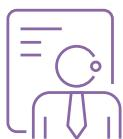  
安全生产管理人员

国家安全生产方针、政策和有关安全生产的法律、法规、规章及标准；  
安全生产管理、安全生产技术、职业卫生等知识；  
应急管理、应急预案编制和调查处理方法；  
典型事故的应急救援案例分析等。

  
新从业人员

新从业人员上岗前必须接受三级教育培训，即公司级、部门（车间）级、班组级安全培训。

## 案例丨瑞特热表安全培训

2025年，子公司瑞特热表严格按照年度安全培训计划，组织开展消防安全、危化品安全管理等专题培训。培训结合生产实际，系统讲解消防常识、隐患排查、初期火灾处置、应急疏散及危化品储存、使用、应急处置等要点，通过理论授课、案例警示与实操教学相结合，强化全员安全红线意识，提升岗位安全操作与突发事件应急处置能力，为公司安全生产与平稳运营筑牢安全防线。

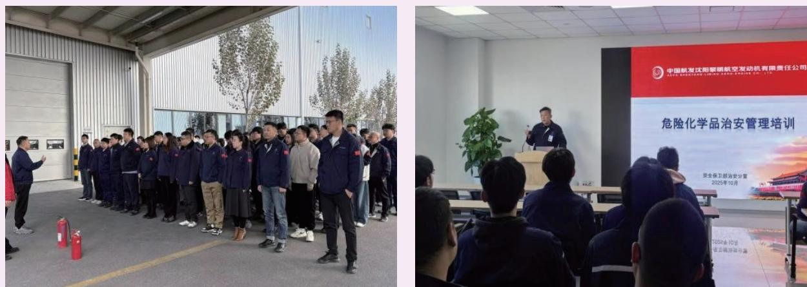  
培训现场

<table><tr><td>指标</td><td>单位</td><td>2025年</td></tr><tr><td>接受安全培训的总人数</td><td>人</td><td>3,332</td></tr><tr><td>安全相关培训次数</td><td>次</td><td>260</td></tr><tr><td>员工接受安全培训的总时数</td><td>小时</td><td>14,877.5</td></tr><tr><td>员工接受安全培训的总平均时数</td><td>小时</td><td>4.27</td></tr><tr><td>消防演习次数</td><td>次</td><td>13</td></tr><tr><td>消防演习参与人次</td><td>人次</td><td>1,698</td></tr><tr><td>全年安全投入</td><td>万元</td><td>768.21</td></tr></table>

## 推行安全事务员工参与机制

公司鼓励员工参与安全管理，通过意见征询等方式，收集一线员工对安全工作的建议。对于采纳的建议，形成“建议—落实”的闭环管理机制。通过持续推动员工从“被动执行”向“主动参与”转变，进一步强化了“人人都是安全员”的责任意识，营造全员安全文化氛围，筑牢企业安全生产的基层防线。

## 强化承包商安全管理

公司重视相关方的安全培训工作，旨在确保所有合作单位及人员充分了解并严格遵守公司的安全规定。我们制定《相关方安全管理细则》相关制度，明确承包商入场安全规定，要求所有入厂承包商签署安全承诺书，并接受安全培训，共同营造安全的工作环境。

我们提供包括安全劳护、动火及危险作业、厂内交通安全、水电气管理、消防环境、应急救援、6S工作等相关的安全培训，旨在提升相关方的安全知识和技能，有效预防和应对各类安全风险，保障人员和财产安全。

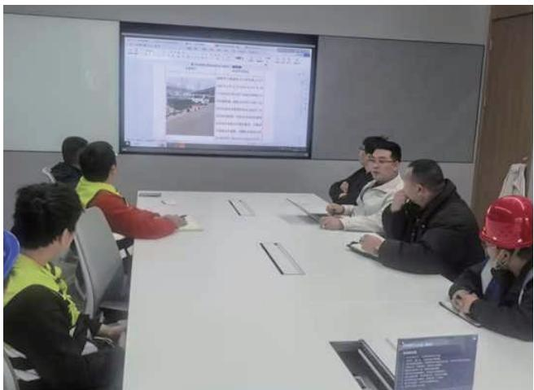

text_image

Meeting scene with participants in safety vests and hard hats, one person presenting a presentation screen with Chinese text.

北京富创承包商培训现场

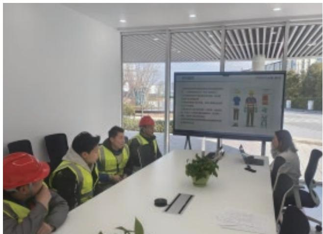

text_image

Meeting scene with participants in safety vests and red helmets, one person presenting a presentation screen with diagrams on the screen.

南通富创承包商培训现场

## 关键绩效

2025年，

开展承包商安全培训

91场

承包商参与人次

346人次

承包商因工死亡人数

0人

## 乡村振兴

公司积极响应国家乡村振兴战略，通过定向捐赠切实支持乡村教育发展。2025年，公司持续深化与辽宁省华易公益基金会的公益合作，按计划推进“晨曦筑梦”乡村教育赋能项目的捐赠与实施，以实际行动支持辽宁省乡村教育事业的发展。该项目旨在精准支持辽宁省乡村教育的核心力量，以及资助品学兼优、有发展潜力的优秀学生，并开展多样化的乡村儿童研学活动和乡村教育发展交流论坛，通过表彰与激励、资源补给与视野拓展，激发乡村教育的内在活力。

公司通过独立第三方审计、项目成效评估及社会公示等多重机制，确保资金精准用于乡村教育工作者能力提升、学生学业保障及教育创新实践。目前项目已形成“捐赠-执行-反馈-优化”的闭环管理体系，切实将企业公益投入转化为乡村振兴长效动力。

## 关键绩效

报告期内，

报告期内，公司捐赠100万元专项用于“晨曦筑梦”乡村教育赋能项目。捐赠资金重点用于资助沈阳市8个区县的130名乡村校长、教师及100名品学兼优学生，开展20场乡村儿童研学活动和1场教育发展论坛，惠及400余个乡村家庭。

## 社会贡献

公司秉持“以人为本、回馈社会”的理念，对内构建共生共长的职涯沃土，对外践行产业报国的责任担当，主动参与地方文体、敬老、教育事业建设，积极投身积极投身于各类公益慈善项目，在推广公益慈善理念方面贡献企业力量。报告期内，我们开展了多项公益慈善捐赠活动。

## 关键绩效

报告期内，

万元，同步开展产学研专题公益讲座促进校企合

参与南通市通州区慈善总会组织的“善美通州慈润万家”公益项目，捐款 $1 0 _ { \mathcal { \overline { { { D } } } \mathcal { \overline { { { \pi } } } _ { \circ } } } }$

## 案例丨设立“富创育‘材’奖学金”支持教育事业

2025年7月，子公司强航时代为新员工提供为期14天的训练营。以文化融入与业务实战为核心，涵盖人力资源、安全保密、专业技术等系列课程，帮助新员工快速完成从校园到职场的角色转换，为公司关键岗位培养优质后备人才。

## 附录

## ESG关键绩效表

环境绩效

<table><tr><td>指标名称</td><td>单位</td><td>2025年</td><td>2024年</td></tr><tr><td>环保资金投入</td><td>万元</td><td>1,795.02</td><td>3,068.87</td></tr><tr><td>天然气消耗总量</td><td>吨标煤</td><td>5,784.05</td><td>4338.95</td></tr><tr><td>取水总量</td><td>吨</td><td>857,310</td><td>670,979.42</td></tr><tr><td>取水强度</td><td>吨/百万元营收</td><td>241.94</td><td>220.75</td></tr><tr><td>耗水总量</td><td>吨</td><td>371,698.82</td><td>242,619.22</td></tr><tr><td>耗水强度</td><td>吨/百万元营收</td><td>104.90</td><td>79.82</td></tr><tr><td>废水排水量</td><td>立方米</td><td>485,611.19</td><td>428,360.20</td></tr><tr><td>废气排放总量</td><td>吨</td><td>6.89</td><td>11.14</td></tr><tr><td>温室气体排放总量</td><td>吨二氧化碳当量</td><td>54,631.23</td><td>49,376.73</td></tr><tr><td>温室气体排放强度</td><td>吨二氧化碳当量/百万元营收</td><td>15.42</td><td>16.49</td></tr><tr><td>温室气体排放量(范围一)</td><td>吨二氧化碳当量</td><td>7605.16</td><td>7,133.89</td></tr><tr><td>温室气体排放量(范围二)</td><td>吨二氧化碳当量</td><td>47,026.07</td><td>42,242.83</td></tr></table>

社会绩效

<table><tr><td>指标名称</td><td>单位</td><td>2025年</td><td>2024年</td></tr><tr><td>员工总数</td><td>人</td><td>3,488</td><td>3,259</td></tr><tr><td colspan="4">按性别划分划分</td></tr><tr><td>男性员工总数</td><td>人</td><td>2,881</td><td>2,699</td></tr><tr><td>女性员工总数</td><td>人</td><td>607</td><td>560</td></tr><tr><td colspan="4">按年龄划分</td></tr><tr><td>30岁以下员工总数</td><td>人</td><td>1,429</td><td>1,303</td></tr><tr><td>30-50岁员工总数</td><td>人</td><td>1,930</td><td>1,814</td></tr><tr><td>50岁以上员工总数</td><td>人</td><td>129</td><td>142</td></tr><tr><td colspan="4">按地区划分</td></tr><tr><td>中国(含港澳台地区)员工总数</td><td>人</td><td>3,414</td><td>3,159</td></tr><tr><td>海外员工总数</td><td>人</td><td>74</td><td>100</td></tr><tr><td colspan="4">按专业构成划分</td></tr><tr><td>生产人员员工总数</td><td>人</td><td>2,572</td><td>2,292</td></tr><tr><td>销售人员员工总数</td><td>人</td><td>130</td><td>138</td></tr><tr><td>技术人员员工总数</td><td>人</td><td>476</td><td>548</td></tr><tr><td>财务人员员工总数</td><td>人</td><td>59</td><td>57</td></tr><tr><td>行政人员员工总数</td><td>人</td><td>251</td><td>224</td></tr><tr><td>员工流失率</td><td>%</td><td>34.10</td><td>13.50</td></tr><tr><td>劳动合同签订比例</td><td>%</td><td>100</td><td>100</td></tr><tr><td>社会保险覆盖率</td><td>%</td><td>100</td><td>100</td></tr><tr><td>由独立工会代表或由集体谈判协议覆盖的员工占比</td><td>%</td><td>100</td><td>100</td></tr><tr><td>有关员工权益(人权、劳工、反歧视、反骚扰等)方面的申诉事件</td><td>件</td><td>0</td><td>0</td></tr><tr><td>职业健康体检覆盖率</td><td>%</td><td>100</td><td>100</td></tr><tr><td>因公亡故的人数</td><td>人</td><td>0</td><td>0</td></tr><tr><td>工伤事件总数</td><td>起</td><td>0</td><td>5</td></tr><tr><td>因工伤损失工作日数</td><td>日</td><td>78</td><td>200</td></tr><tr><td>参与安全培训的员工总数</td><td>人</td><td>3,332</td><td>607</td></tr><tr><td>安全相关培训场数</td><td>次</td><td>260</td><td>36</td></tr><tr><td>消防演练场次</td><td>次</td><td>13</td><td>8</td></tr><tr><td>社会公益捐赠</td><td>万元</td><td>169</td><td>370.6</td></tr><tr><td>产品合格率 $^{8}$ </td><td>%</td><td>97.08</td><td>99.8</td></tr><tr><td>研发投入</td><td>万元</td><td>27,349.93</td><td>22,139.81</td></tr><tr><td>研发人员数量占公司总人数的比例</td><td>%</td><td>13.65</td><td>16.81</td></tr></table>

8 公司总体产品合格率为沈阳、南通、北京三地工厂产品合格率（机加）之平均数。

<table><tr><td>指标名称</td><td>单位</td><td>2025年</td><td>2024年</td></tr><tr><td>申请发明专利数</td><td>个</td><td>72</td><td>49</td></tr><tr><td>申请实用新型专利数</td><td>个</td><td>59</td><td>90</td></tr><tr><td>申请外观设计专利数</td><td>个</td><td>0</td><td>0</td></tr><tr><td>申请软件著作权数</td><td>个</td><td>0</td><td>0</td></tr><tr><td>新授权发明专利数</td><td>个</td><td>25</td><td>21</td></tr><tr><td>新授权实用新型专利数</td><td>个</td><td>48</td><td>70</td></tr><tr><td>新授权外观设计专利数</td><td>个</td><td>0</td><td>0</td></tr><tr><td>新授权软件著作权数</td><td>个</td><td>0</td><td>1</td></tr><tr><td>持有有效发明专利数</td><td>个</td><td>91</td><td>66</td></tr><tr><td>持有有效实用新型专利数</td><td>个</td><td>300</td><td>253</td></tr><tr><td>持有有效外观设计专利数</td><td>个</td><td>2</td><td>2</td></tr><tr><td>持有有效软件著作权数</td><td>个</td><td>2</td><td>2</td></tr><tr><td>供应商总数</td><td>家</td><td>463</td><td>450</td></tr><tr><td>中国境内供应商总数</td><td>家</td><td>392</td><td>348</td></tr><tr><td>港澳台供应商总数</td><td>家</td><td>7</td><td>4</td></tr><tr><td>海外供应商总数</td><td>家</td><td>64</td><td>98</td></tr><tr><td>供应商培训覆盖率</td><td>%</td><td>36</td><td>70</td></tr><tr><td>签署不使用冲突矿产的供应商数量</td><td>家</td><td>367</td><td>348</td></tr><tr><td>签署不使用冲突矿产的供应商百分比</td><td>%</td><td>80</td><td>77</td></tr><tr><td>签署供应商行为准则的供应商数量</td><td>家</td><td>367</td><td>348</td></tr><tr><td>签署供应商行为准则的百分比</td><td>%</td><td>80.13</td><td>77</td></tr><tr><td>供应商廉洁审计频次</td><td>次/年</td><td>3</td><td>1</td></tr><tr><td>供应商廉洁审计覆盖率</td><td>%</td><td>100</td><td>100</td></tr></table>

公司治理绩效

<table><tr><td>指标名称</td><td>单位</td><td>2025年</td><td>2024年</td></tr><tr><td>董事会成员数量</td><td>人</td><td>9</td><td>9</td></tr><tr><td>独立非执行董事数量</td><td>人</td><td>3</td><td>3</td></tr><tr><td>女性董事占比</td><td>%</td><td>11.11</td><td>11.11</td></tr><tr><td>董事会召开次数</td><td>次</td><td>8</td><td>13</td></tr><tr><td>董事会会议出席率</td><td>%</td><td>100</td><td>100</td></tr><tr><td>独立董事专门会议召开次数</td><td>次</td><td>1</td><td>3</td></tr><tr><td>股东(大)会召开次数</td><td>次</td><td>7</td><td>5</td></tr><tr><td>审计委员会召开次数</td><td>次</td><td>4</td><td>10</td></tr><tr><td>提名委员会召开次数</td><td>次</td><td>2</td><td>1</td></tr><tr><td>薪酬与考核委员会召开次数</td><td>次</td><td>4</td><td>6</td></tr><tr><td>战略委员会召开次数</td><td>次</td><td>2</td><td>3</td></tr><tr><td>投资者关系活动开展数量</td><td>场</td><td>7</td><td>8</td></tr><tr><td>中小投资者电话及网络回复率</td><td>%</td><td>100</td><td>100</td></tr><tr><td>公司发生的商业贿赂及贪污事件</td><td>件</td><td>0</td><td>0</td></tr><tr><td>公司因不正当竞争行为导致诉讼或重大行政处罚事件</td><td>件</td><td>0</td><td>0</td></tr><tr><td>商业道德相关培训覆盖率</td><td>%</td><td>100</td><td>100</td></tr></table>

报告指标索引表

<table><tr><td>报告章节标题</td><td>《上海证券交易所上市公司自律监管指引第14号——可持续发展报告(试行)》</td><td>联合国可持续发展目标(SDGs)</td></tr><tr><td colspan="3">前言</td></tr><tr><td>关于本报告</td><td></td><td rowspan="7"></td></tr><tr><td>董事长致辞</td><td></td></tr><tr><td>走进富创精密</td><td></td></tr><tr><td>荣誉及奖项</td><td></td></tr><tr><td>可持续发展管理</td><td>尽职调查</td></tr><tr><td>利益相关方沟通</td><td>利益相关方沟通</td></tr><tr><td>重要性议题评估</td><td>尽职调查</td></tr><tr><td colspan="3">卓越富创 夯实治理根基</td></tr><tr><td>公司治理</td><td></td><td rowspan="5">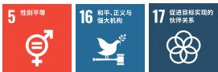</td></tr><tr><td>合规经营</td><td></td></tr><tr><td>风险管理</td><td></td></tr><tr><td>反商业贿赂与反贪污</td><td>反商业贿赂与反贪污</td></tr><tr><td>反不正当竞争</td><td>反不正当竞争</td></tr><tr><td colspan="3">绿色富创 助力低碳未来</td></tr><tr><td>环境合规管理</td><td>环境合规管理</td><td rowspan="8">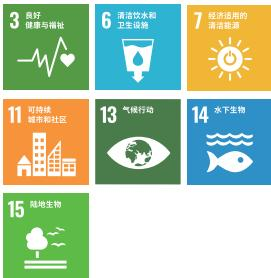</td></tr><tr><td>应对气候变化</td><td>应对气候变化</td></tr><tr><td>污染物排放</td><td>污染物排放</td></tr><tr><td>废弃物处理</td><td>废弃物处理</td></tr><tr><td>能源利用</td><td>能源利用</td></tr><tr><td>水资源利用</td><td>水资源利用</td></tr><tr><td>循环经济</td><td>循环经济</td></tr><tr><td>生态系统和生物多样性保护</td><td>生态系统和生物多样性保护</td></tr><tr><td colspan="3">品质富创 驱动创新引擎</td></tr><tr><td>创新研发</td><td>创新驱动</td><td rowspan="6">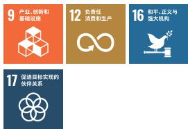</td></tr><tr><td>数智化发展</td><td>创新驱动</td></tr><tr><td>产品质量管理</td><td>产品和服务质量与安全</td></tr><tr><td>客户权益保护</td><td>产品和服务质量与安全</td></tr><tr><td>数据安全与客户隐私保护</td><td>数据安全与客户隐私保护</td></tr><tr><td>负责任供应链</td><td>供应链安全</td></tr><tr><td colspan="3">和谐富创 携手共进共赢</td></tr><tr><td>员工权益保障</td><td>员工</td><td rowspan="5">1无贫穷2零饥饿3良好健康与福祉4优质教育5性别平等8体面工作和经济增长9减少不平等10</td></tr><tr><td>人才培养与发展</td><td>员工</td></tr><tr><td>职业健康与安全</td><td>员工</td></tr><tr><td>乡村振兴</td><td>乡村振兴</td></tr><tr><td>社会贡献</td><td>社会贡献</td></tr><tr><td colspan="3">附录</td></tr><tr><td>关键绩效表</td><td></td><td></td></tr><tr><td>报告指标索引表</td><td></td><td></td></tr></table>

## FORTUNE 富创