## 常州聚和新材料股份有限公司

股票代码：聚和材料（688503）

2026年4月

## 报告概况与范围

本报告是常州聚和新材料股份有限公司面向利益相关方系统披露可持续发展管理与实践的核心载体

## 组织范围

以常州聚和新材料股份有限公司为主体，覆盖纳入合并报表范围的各级子公司及主要运营实体

生产基地：常州、泰国、宜宾

核心子公司：上海匠聚、德朗聚等

涵盖全业务链条：生产、研发、采购、销售、管理

## 时间范围

核心披露期：2025年1月1日—2025年12月31日部分内容适度追溯往期或进行前瞻性说明。

## 编制依据与数据说明

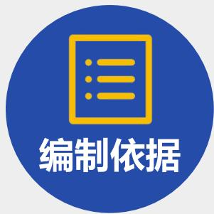

text_image

编制依据

• 上海证券交易所《上市公司自律监管指引第14号——可持续发展报告》  
• 全球报告倡议组织（GRI）《可持续发展报告标准》  
• 联合国2030年可持续发展目标（SDGs）  
• 中国社会科学院《中国企业社会责任报告指南（CASS-ESG 5.0）》  
• 香港联交所《环境、社会及管治报告指引》

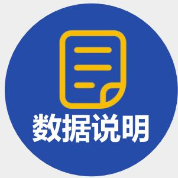

text_image

数据说明

• 财务数据来源：2025年年度报告  
• ESG数据来源：内部管理报表、信息系统统计、职能部门汇总  
• 部分关键数据经第三方合规验证  
• 计量单位：人民币（除特别说明外）  
• 董事会已审阅并承担真实性责任

## 发布形式与联系方式

## 发布形式

中英文电子版发布

## 查阅渠道

上海证券交易所网站：www.sse.com.cn

公司官网：www.fusion-materials.com

natural_image

Illustration of a document with checkmarks and a blue circular icon, no text or symbols present.

## 联系方式

地址：江苏省常州市新北区浏阳河路66号

邮编：213031

电话：021-33882061

电子邮箱：ir@fusion-materials.com

公司将持续完善ESG信息披露工作，重视利益相关方反馈，持续提升ESG信息披露水平与治理透明度

## 董事长致辞

2025年宏观背景：世界经济复苏与不确定性交织，全球能源格局深度重塑，“双碳”目标引领光伏产业技术迭代加速与全球化竞争加剧

维ESG管理定位：将ESG理念从合规要求提升为发展逻辑，嵌入战略规划、经营决策与风险管理全过程

##

## 环境

（E）

践推进光伏电站建设（1.261MW）、污水处理站要升级、中水零外排回用、包装循环回收13万个

## 社会

（S）

管理与专业双通道发展、全方位福利体系、全生命周期供应商管理、公益捐赠与产业赋能

## 治理

（G）

完善治理架构与专门委员会机制、强化合规管理与内控、多元化利益相关方沟通

## “十五五”重点方向

环境：完善温室气体统计、提升清洁能源比例、推进绿色低碳转型

社会：加大员工成长、产品服务、产业链协同投入

治理：优化治理结构与激励约束，ESG目标融入绩效考核

natural_image

Silhouette of a man in a suit holding papers, gesturing with one hand (no text or symbols visible)

## 目录 CONTENTS

公司战略与可持续发展治理

四

公司治理与合规运营机制低碳运营与环境管理体系

展望未来社会责任与人力资本管理体系

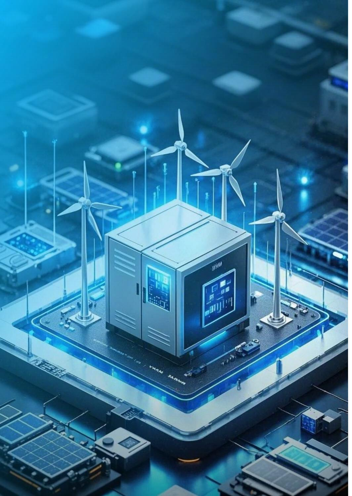

natural_image

Futuristic digital illustration of a smart grid with wind turbines and a central server unit (no text or symbols)

## 公司战略与可持续发展治理01

## 1.1公司基本情况

常州聚和新材料股份有限公司（688503）是专业从事新型电子浆料研发、生产与销售的高新技术企业。  
聚焦光伏导电浆料核心领域，同时布局电子元器件浆料、导电胶及半导体材料等。

生产基地：常州、泰国、宜宾

研发平台：全球领先粉体研发中心及工程技术中心

市场覆盖：国内主要省市及中东、印度、非洲等海外市场

## 1.2核心业务与产业链定位

核心业务：光伏导电浆料（含N型TOPCon、HJT、X-BC等全技术路线产品）、电子元器件专用浆料、钙钛矿叠层电池浆料、无银化铜浆产品等。

产业链中游定位：上游衔接银粉、玻璃粉、有机原料等供应商，下游服务太阳能电池片制造、电子元器件、汽车电子等行业。通过供应商本地化布局、循环包装回收机制、协同技术创新等举措，推动产业链协同降碳。

## 2.1治理架构

• 建立由董事会统筹、管理层负责、各职能部门协同落实的ESG管理架构。  
• 以《质量、环境、职业健康安全体系手册》为核心构建一体化管理体系。

<table><tr><td>角色</td><td>职责</td></tr><tr><td>管理者代表</td><td>统筹质量、环境、职业健康安全体系的建立、实施与改进,审批重要环境因素及重大危险源清单,主持内部审核与管理评审</td></tr><tr><td>员工代表</td><td>监督劳动保护、劳动保险法规执行,参与职业健康安全决策及危险源评价,协助重大事故调查处理</td></tr><tr><td>风险机遇管理小组</td><td>统筹全公司ESG相关风险的识别、评估、应对及效果验证</td></tr><tr><td>各职能部门</td><td>落实质量管控、环境治理、职业健康安全管理中的核心职责</td></tr></table>

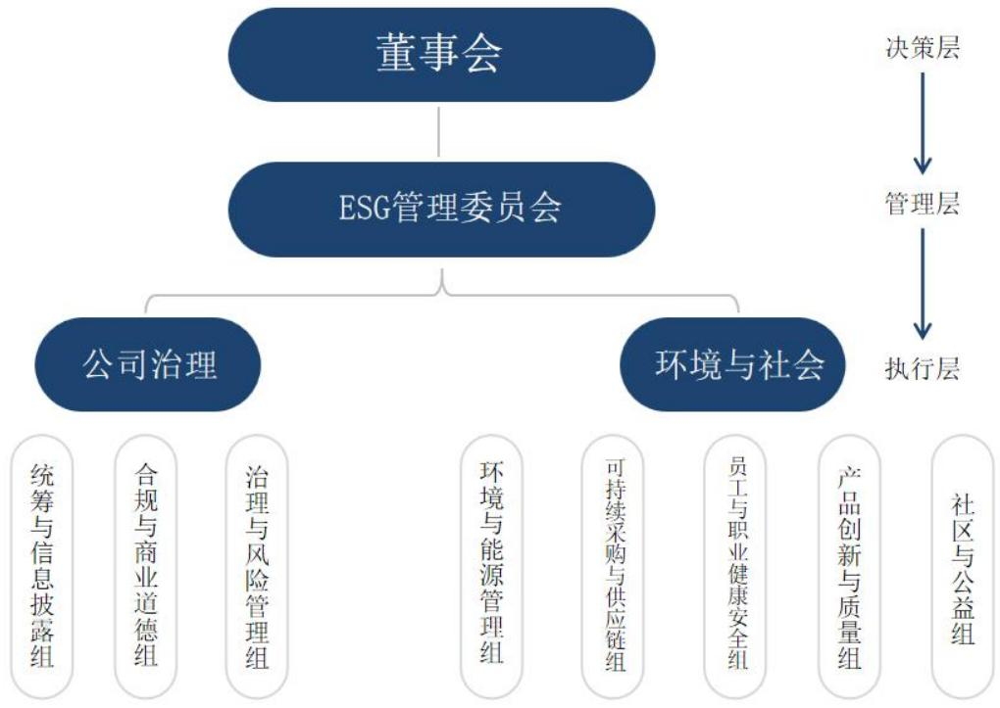

flowchart

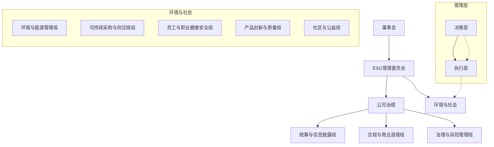
```mermaid
graph TD
  A["董事会"] --> B["ESG管理委员会"]
  B --> C["公司治理"]
  B --> D["环境与社会"]
  
  subgraph ManagementLevel ["管理层"]
    direction TB
  E["决策层"] --> F["执行层"]
  end
  
  C --> G["统筹与信息披露组"]
  C --> H["合规与商业道德组"]
  C --> I["治理与风险管理组"]
  
  subgraph EnvironmentalLevel ["环境与社会"]
    direction TB
    J["环境与能源管理组"]
    K["可持续采购与供应链组"]
    L["员工与职业健康安全组"]
    M["产品创新与质量组"]
    N["社区与公益组"]
  end
  
  E -.-> F
  F -.-> D
```

## 2.2管理制度体系

## 环境类

《环境因素识别评价更新管理程序》

《废水排放控制管理程序》《废气排放控制管理程序》

……

## ESG管理制度体系

## 社会类

《考勤休假管理制度》《员工培训管理办法》《供应商管理程序》

……

## 治理类

《合规管理制度》《信息安全管理制度》《反商业贿赂管理制度》

……

## 2.3 ESG战略定位

## ESG愿景

绿色低碳、责任共生、合规卓越

## 三大核心目标

优化环境绩效、强化社会责任、完善治理体系

使命：持续为光伏行业增效降本，助力太阳能早日成为人类的主力能源

核心举措：清洁能源替代、循环经济实践、员工权益保障、供应链协同治理等

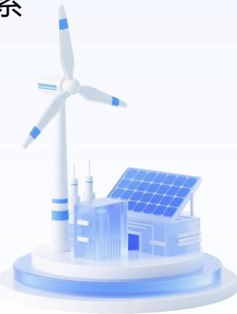

natural_image

Illustration of a wind turbine and solar panel on a circular platform (no text or symbols)

## 2.4 与联合国可持续发展目标（SDGs）的对接与响应

## SDG5 性别平等

• 2025年末职级13级以上高管中女性占比达26%  
• 构建公平的雇佣与职业发展环境，为女性员工提供同等晋升、培训机会

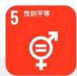

## SDG7 经济适用的清洁能源

• 厂区车棚顶部及天台铺设1.261MW光伏板  
• 2025年光伏发电量达133.88万度  
• 建立ISO 50001能源管理体系

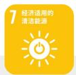

## SDG8 体面工作和经济增长

• 为729名员工提供合规劳动合同、五险一金及补充福利保障  
• 落实各类带薪休假制度  
• 建立管理与职业双职业发展通道

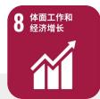

## SDG9 产业、创新和基础设施

• 持续投入研发资金，新增多项专利与研发 成果转化  
• 升级改造生产、环保、安全基础设施  
• 新建污水处理站、光伏电站等设施

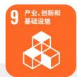

## SDG12 负责任消费和生产

• 建立供应商小黑桶回收机制，2025年回收13万个实现包装循环利用  
• 生产固废分类收集与资源化处理  
• 污水处理站实现中水零外排并回用于生产  
• 优化产品包装方案选用可回收材料

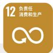

## SDG13 气候行动

• 将双碳目标纳入企业长期发展战略  
• 制定节能降碳、清洁能源替代等四大应对路径  
• 2025年单位产品综合能耗较上年稳步下降  
• 建立完善的气候风险识别与应对机制

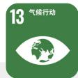

## 3.1双重重要性议题识别

## 战略契合性

与ESG愿景及核心使命的匹配度

## 识别 四原则

## 行业适配性

光伏新能源、电子材料行业技术迭代趋势及同业实践

## 合规相关性

结合《环境保护法》《劳动合同法》等法律法规要求

## 双重影响重要性

财务重要性影响重要性

<table><tr><td>环境维度</td><td>社会维度</td><td>治理维度</td></tr><tr><td>应对气候变化</td><td>职业健康与安全生产</td><td>公司治理与决策机制</td></tr><tr><td>能源利用与节能减排</td><td>员工权益保障与薪酬福利</td><td>合规管理与风险防控</td></tr><tr><td>污染排放控制</td><td>人力资本发展与培训</td><td>反商业贿赂与廉洁建设</td></tr><tr><td>水资源利用与节水管理</td><td>产品质量与安全</td><td>信息披露与投资者沟通</td></tr><tr><td>循环经济与资源回收</td><td>客户服务与满意度</td><td>反不正当竞争</td></tr><tr><td>化学品安全管理</td><td>可持续供应链管理</td><td></td></tr><tr><td>生态系统和生物多样性保护</td><td>社区参与与公益实践</td><td></td></tr><tr><td></td><td>信息安全与数据保护</td><td></td></tr><tr><td></td><td>研发创新与技术进步</td><td></td></tr></table>

## 3.2利益相关方调研研

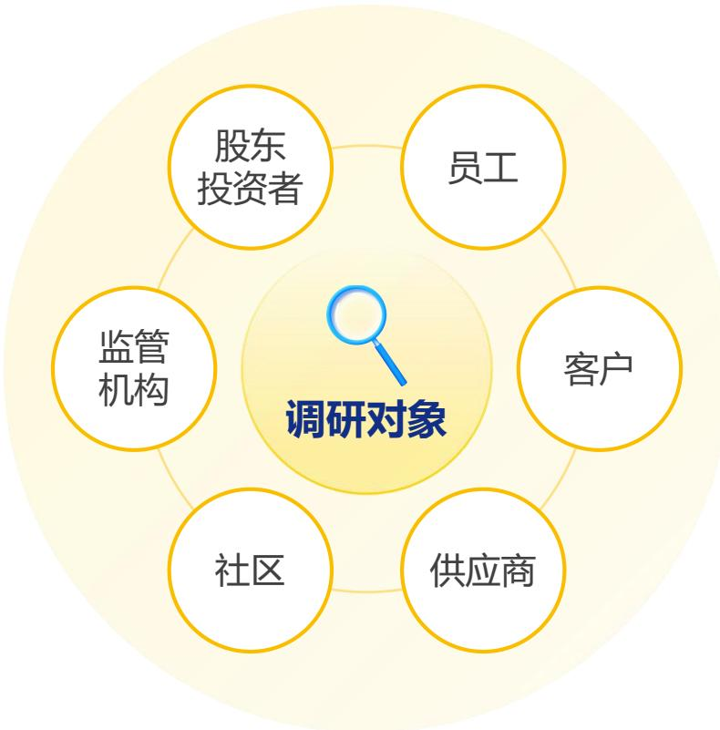

flowchart

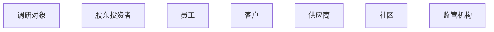
```mermaid
graph TD
  Center["调研对象"]
  
  Stakeholders["股东投资者"]
  Employees["员工"]
  Customers["客户"]
  Suppliers["供应商"]
  Community["社区"]
  Supervisors["监管机构"]
```

##

## 定量调研

标准化问卷，对备选议题进行1-5分核重要性评级

## 定性调研

业绩说明会、客户走访、供应商评估会、员工座谈会、社区沟通会

##

股东及投资者：治理透明度、ESG绩效对长期价值的支撑  
• 员工：职业健康安全、职业发展通道  
• 客户：产品质量稳定性与技术支持  
• 供应商：合作公平性与协同赋能  
• 社区：环保合规与公益贡献  
• 监管机构：合规经营与环境治理成效

## 3.3 议题重要性评估

评估框架：构建“影响重要性——财务重要性”双轴分析框架

## 财务重要性评估维度

战略关联性：议题与公司核心业务及ESG战略目标的匹配程度

行业趋势契合度：结合“双碳”转型、无银化技术迭代、供应链可持续升级等趋势

## 影响重要性评估维度

评估经营活动对资源环境、气候变化、员工权益、产品责任及产业链可持续发展的实际与潜在影响结合利益相关方调研结果量化分析关注程度与影响范围

natural_image

Illustration of a document with checkmarks and a pencil, magnifying glass, and pie chart (no text or symbols)

## 评估结论

高重要性议题：应对气候变化、职业健康与安全生产、产品质量与安全、客户服务与满意度、信息安全与数据保护、信息披露与投资者沟通

## 3.4审核议题矩阵

将初步评估结果提交ESG管理委员会审议

结合董事会战略导向及管理层执行反馈进行优化调整最终形成《2025年度ESG双重重要性议题矩阵》

聚和材料2025年双重重要性议题矩阵图

<table><tr><td rowspan="7">非常重要</td><td rowspan="7">对经济、社会和环境影响的重要性</td><td colspan="2">对公司财务的重要性</td></tr><tr><td>员工权益保障与薪酬福利化学品安全管理</td><td>职业健康与安全生产</td></tr><tr><td>水资源利用与节水管理污染排放控制能源利用与节能减排反不正当竞争</td><td>合规管理与风险防控公司治理与决策机制人力资本发展与培训反商业贿赂与廉洁建设</td></tr><tr><td>社区参与与公益实践循环经济与资源回收生态系统和生物多样性保护</td><td>研发创新与技术进步</td></tr><tr><td></td><td>产品质量与安全应对气候变化</td></tr><tr><td></td><td>信息安全与数据保护信息披露与投资者沟通客户服务与满意度</td></tr><tr><td></td><td>可持续供应链管理</td></tr></table>

## 高重要性议题

纳入重点管理范围，分解至各部门核心工作指标，配套专项资源

## 中等重要性议题

持续过程管理与绩效跟踪

## 较低重要性议题

动态观察与适时调整

## 动态管理机制

原则上每年开展一次系统性重评估宏观政策重大调整、行业技术路径变化、业务结构显著变化时启动专项评估

<table><tr><td>利益相关方</td><td>核心关注议题</td><td>主要沟通渠道</td></tr><tr><td>股东及投资者</td><td>公司治理规范性、ESG绩效表现、长期发展战略、经营业绩与风险管控、信息披露透明度</td><td>股东会、年度季度业绩说明会、投资者专项调研、公司定期报告与临时公告、投资者互动平台、一对一沟通洽谈</td></tr><tr><td>员工</td><td>权益保障与薪酬福利、职业健康与安全生产、职业发展通道、培训赋能、企业文化与员工关怀、意见建议表达</td><td>职工代表大会、员工座谈会、一对一绩效面谈、总经理接待日、内部意见箱、微信沟通群、部门例会、团建及文化活动</td></tr><tr><td>客户</td><td>产品质量与稳定性、技术支持与创新、交付效率、客户服务与投诉处理、数据安全与隐私保护、产业链协同降碳</td><td>客户走访与现场调研、年度满意度专项调查、标准化投诉处理机制、技术交流会议、线上线下客户服务平台、供应链协同沟通会</td></tr><tr><td>供应商与合作伙伴</td><td>供应链合规管理、合作公平性、账款结算及时性、协同研发与技术赋能、责任采购与绿色供应链建设</td><td>供应商评估审核会议、年度供应商大会、现场走访与调研、常态化技术交流机制、供应商投诉专属对接渠道、合作合同履约沟通、绿色供应链培训赋能</td></tr><tr><td>政府与监管机构</td><td>合规经营、环境治理成效、安全生产管控、税务合规、信息披露合规、产业政策落实</td><td>政策文件执行与反馈、合规申报与材料提交、监管部门现场检查对接、定期信息通报、产业发展座谈会、政企协同项目沟通</td></tr><tr><td>社区与公众</td><td>环境保护与生态保护、公益贡献与乡村振兴、就业支持、厂区运营周边影响、企业社会责任履行</td><td>社区沟通会、公益捐赠与志愿服务活动、环境信息公开、就业招聘专场、区域生态保护协同项目、公众开放日</td></tr></table>

natural_image

Close-up of a solar panel array under blue sky, no visible text or symbols

## 低碳运营与环境管理体系02

## 1.1 环境管理体系与制度

## 突发环境事件隐患排查制度

自查、自报、自改、自验闭环流程；公司级综合排查每年2次、车间级日常排查、专项排查每季度

## 重大事故隐患督办制度

挂牌督办机制，责任人每周至少1次现场跟 踪

## 环境安全隐患记录报告制度

隐患分类（一般/重大）、登记造册、跟踪管理；

公司级排查每年≥2次、车间级每月≥1次、班组每班≥2次；重大隐患即时上报

## 重大事故隐患治理制度

四类治理手段（设备管理、安全管理、安全教育、应急措施）；

一般隐患≤24h、复杂隐患≤72h

## 隐患分类分级管理规定

重大/一般隐患定义，A/B/C三级划分；A级总经理督办、B级副总督办、C级EHS部督办

## 环境因素识别评价更新管理程序

过程分析法识别，是非判断法+打分法评定（分值≥7分为重要环境因素）；

每年定期更新环境因素

## 1.1 环境管理体系与制度

## 突发环境事件隐患排查制度

自查、自报、自改、自验闭环流程；

公司级综合排查每年2次、车间级日常排查、专项排查每季度

## 重大事故隐患督办制度

挂牌督办机制，责任人每周至 少1次现场跟踪

## 环境安全隐患记录报告制度

隐患分类（一般/重大）、登记造册、跟踪管理；

公司级排查每年≥2次、车间级每月≥1次、班组每班≥2次；重大隐患即时上报

## 重大事故隐患治理制度

四类治理手段（设备管理、安全管理、安全教育、应急措施）；

一般隐患≤24h、复杂隐患≤72h

## 隐患分类分级管理规定

重大/一般隐患定义，A/B/C三级划分；

A级总经理督办、B级副总督办、C级EHS部督办

## 环境因素识别评价更新管理程序

过程分析法识别，是非判断法+打分法评定（分值≥7分为重要环境因素）；

每年定期更新环境因素

## 1.2环境认证

已通过GB/T 24001-2016 / ISO 14001:2015环境管理体系认证

认证覆盖：电子新材料（银浆）的生产及相关管理活动

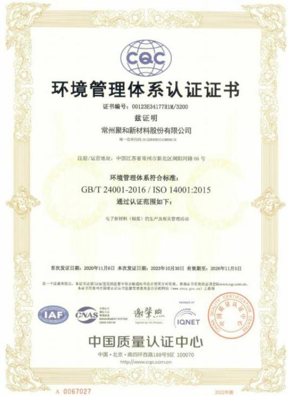

text_image

CQC
环境管理体系认证证书
证书编号：00123E3417781M/3200
兹证明
常州聚和新材料股份有限公司
统一信用代码：91320400101388661B
注册/运营地址：中国江苏省常州市新北区闽阳河路66号
环境管理体系符合标准：
GB/T 24001-2016 / ISO 14001:2015
通过认证范围如下：
电子新材料（银浆）的生产及相关管理活动
首次发证日期：2020年11月6日 本次发证日期：2023年10月30日 有效期至：2026年11月5日
在一个连续期间，本证书必须以GQC国发的监督半导体通信通知书合并使用方可有效。有确证书有效状态登记www.cqc.com.cn。
本证书信息可在国家认证认可监督管理委员会公告的网站（www.cttc.gov.cn）上查询
IAF CNAS 谢学明 IQNET
中国质量认证中心
中国·北京·南四环西路188号9区 100070
http://www.cqc.com.cn
A 0067027 2022年底

## 1.3突发环境风险事件预案

应急救援组织机构  
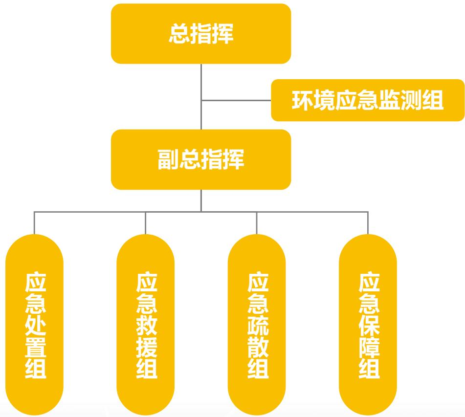

flowchart

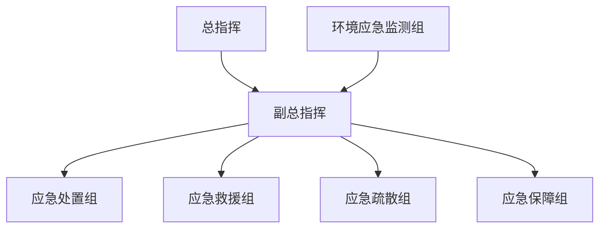
```mermaid
graph TD
  A["总指挥"] --> B["副总指挥"]
  C["环境应急监测组"] --> B
  B --> D["应急处置组"]
  B --> E["应急救援组"]
  B --> F["应急疏散组"]
  B --> G["应急保障组"]
```

管控机制

<table><tr><td>管控维度</td><td>核心实施内容</td></tr><tr><td>制度支撑</td><td>以隐患排查、记录报告、分类分级、督办、治理五项制度形成闭环体系</td></tr><tr><td>组织架构</td><td>总指挥为核心,下设副总指挥及各专业组,分工明确、协同联动</td></tr><tr><td>风险识别与预防</td><td>聚焦化学品泄漏、火灾、废水废气超标排放;常态化多层级排查</td></tr><tr><td>应急响应流程</td><td>预警启动→分级处置→现场管控(撤人、警戒、停产)→外部告知</td></tr><tr><td>整改与销号</td><td>一般隐患EHS确认销号;重大隐患技术人员+专家联合验收</td></tr><tr><td>应急保障</td><td>物资台账定期维护、每年培训演练、资金专款专用</td></tr></table>

2025年应急演练

<table><tr><td>演练名称</td><td>开展时间</td><td>演练场景与目标</td></tr><tr><td>化学品飞溅演练</td><td>2025年5月</td><td>检验应急处置流程、个人防护装备使用、现场洗消能力</td></tr><tr><td>易制毒化学品防盗抢演练</td><td>2025年6月</td><td>检验报警响应流程、现场封控与处置、监控追溯、公安联动</td></tr><tr><td>化学品泄漏演练</td><td>2025年6月</td><td>检验泄漏控制、围堰围堵、废水收集、环境监测联动</td></tr></table>

## 1.4 环境保护相关培训

## 培训名称

持续过程管理与绩效跟踪

## 时间

2025年8月

## 内容

环保法律法规宣贯、危废规范处置、突发环境事 件应急处置、污染物排放控制要求

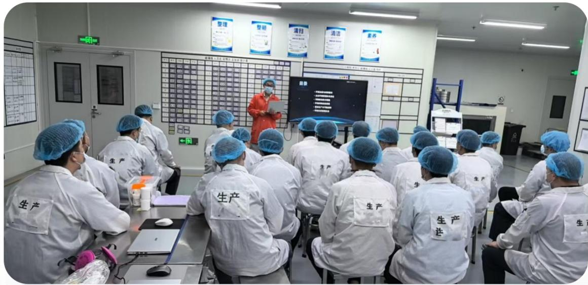

text_image

Classroom scene with medical staff in protective gear attending to a presenter; wall displays Chinese safety and cleaning products with visible signage.

## 1.5 环保投入

2025年总额：约300万元

## 污染治理设施

新建/升级1套污水处理设施，新建/运维11套废气处理设施

环保监测设备、危废暂存间升级改造

## 环保技术研发

清洁生产工艺优化与低碳技术应用

## 1.6业务对环境的影响及管控

潜在影响：废气、废水、噪声、固体废弃物

## 源头控制

优选环保原料与低污染助剂，优 化生产配方

## 过程管控

密闭设备、集气罩减少无组织排放；清污分流、雨污分流；设备定期维护降噪

## 末端治理

专业设施处理达标排放固废分类收集规范处置

经第三方监测及内部监控，未对周边生态环境造成重大负面影响。

2025年未发生因环境事件受到生态环境等有关部门重大行政处罚或被追究刑事责任的情况。

2.1能源管理体系与制度  
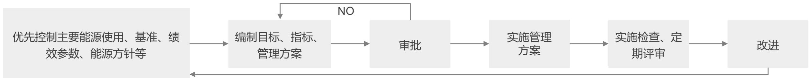

flowchart

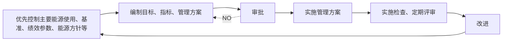
```mermaid
graph LR
  A["优先控制主要能源使用、基准、绩效参数、能源方针等"] --> B["编制目标、指标、管理方案"]
  B --> C["审批"]
  C --> D["实施管理方案"]
  D --> E["实施检查、定期评审"]
  E --> F["改进"]
  C -.->|NO| B
  F --> A
```

通过GB/T 23331-2020 / ISO 50001:2018能源管理体系认证

认证范围：电子新材料（银浆）的研发及生产所涉及的能源管理活动能源方针：遵守法规 清洁生产；健全系统 资源达标；提高能效 持续改进；绿色低碳 客户满意

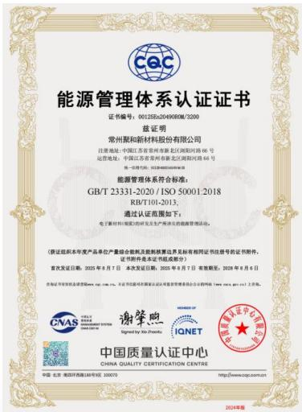

text_image

COC
能源管理体系认证证书
证书编号：00125926494900M/3200
兹证明
常州聚和新材料股份有限公司
注册地址：中国江苏省常州市金山区太湖西路48号
运营地址：中国江苏省常州市金山区太湖西路48号
统一社会信用代码：9132000004444444444444444444444444444444444444444444444444444444444444444444444444444444444444444444444444
能源管理体系符合标准：
GB/T 23331-2020/ISO 50001:2018
RBT101-2013:
通过认证范围如下：
电子材料(按国家规定)为本厂所从事的能源管理活动。
（获证组织本年度产品单位产量综合能耗数据监测边界及所有相同证书注册号的证书附件，
证书附件是本证书组成部分）
首次发证日期：2020年8月7日 本次发证日期：2020年8月7日 有效期至：2020年8月8日
在证券交易所网站www.sse.com.cn，本公司指定信息披露义务人或其管理的业务办公场所（www.sse.com.cn）上刊登。
CNAS
中国质量认证中心
CHINA QUALITY CERTIFICATION CENTRE
谢荣熙
IQNET
中国质量认证中心
2020年8月7日
中国·北京·南京环西路18号院 10073
http://www.cqcc.com.cn

<table><tr><td>核心制度名称</td><td>主要作用</td><td>责任部门</td></tr><tr><td>能源管理手册</td><td>阐述能源方针、体系架构及核心要求,作为能源管理纲领性文件</td><td>政府关系部</td></tr><tr><td>能源方针、目标、指标、管理方案控制程序</td><td>规范能源方针制定、目标分解及管理方案编制与实施</td><td>政府关系部、各业务部门</td></tr></table>

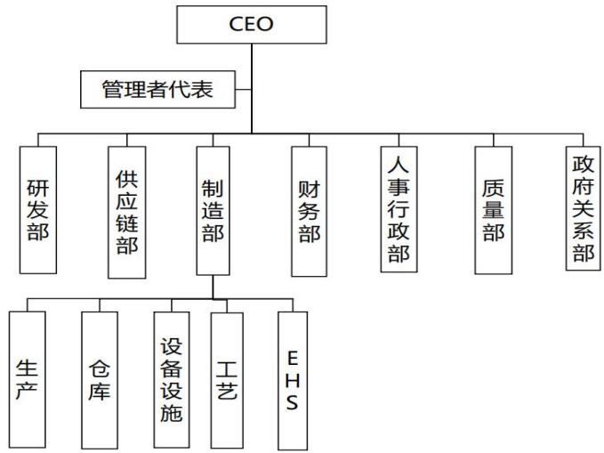

flowchart

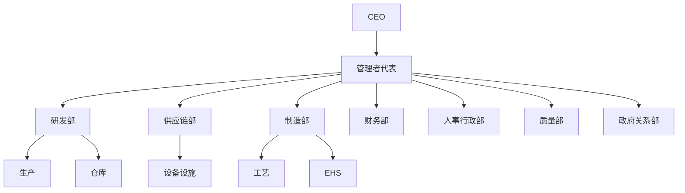
```mermaid
graph TD
  A["CEO"] --> B["管理者代表"]
  B --> C["研发部"]
  B --> D["供应链部"]
  B --> E["制造部"]
  B --> F["财务部"]
  B --> G["人事行政部"]
  B --> H["质量部"]
  B --> I["政府关系部"]
  C --> J["生产"]
  C --> K["仓库"]
  D --> L["设备设施"]
  E --> M["工艺"]
  E --> N["EHS"]
```

## 2.2能源使用与节能改造

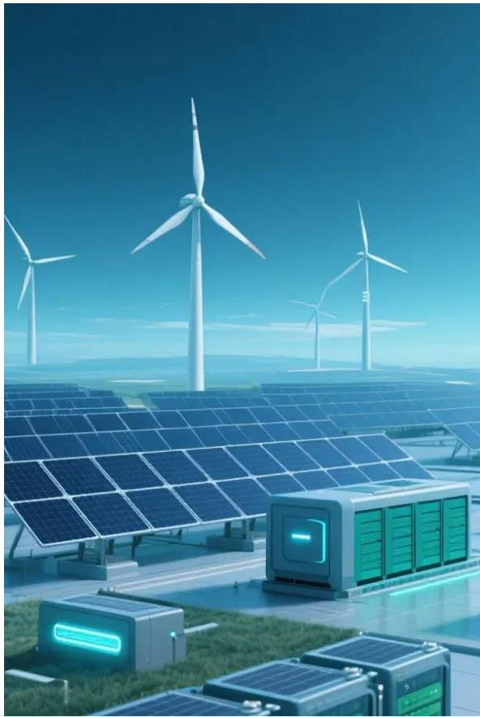

natural_image

Futuristic renewable energy facility with solar panels, wind turbines, and battery storage units under a clear blue sky (no text or symbols visible)

811.01万

千瓦时

可再生能源光伏用电

133.88万千瓦时

电力

1.1394万

立方米

天然气

无消耗

煤炭/柴油

能源使用环节：生产设备运行、车间照明、办公保障

在业务平稳发展背景下，通过结构优化和节能管理有效控制综合能耗水平与能耗强度。

法规遵循《中华人民共和国水污染防治法》《中华人民共和国大气污染防治法》《中华人民共和国固体废物污染环境防治法》《污水综合排放标准》（GB8978-1996）及地方环保规定

管控体系从源头、过程到末端强化废气、废水、化学品及废弃物的规范化管理各类污染物排放及处置均符合合规要求

## 3.1废气排放管理

颗粒物排放量：1.374吨（100%达标）

挥发性有机物（VOCs）排放量：2.591吨（100%达标）

## 源头 管控

优化生产工艺，优先选用低VOCs原料

## 过程收集

密闭设备、集气罩高效收集，减少无组织排放

治理方针：源头消减、过程控制、末端治理

## 末端治理

RTO蓄热式热氧化装置、活性炭吸附、水喷淋+碱洗塔

## 设施 运维

日常维护与定期检修，废气排放口在线监测联网环保部门

## 3.2废水排放管理

## 分类收集

清污分流、雨污分流，生产/生活废水分质处理

## 集中处理

达标后部分回用于绿化灌溉、地面冲洗等，其余排入市政管网

实行分类收集和分级处理，配套建设调节—反应—超滤—生化—外置MBR—炭滤—RO—低温蒸发等综合废水处理设施，设置在线监控装置，结合年度自行监测

11520 吨

达标率 100%

生活污水排放量

## 预处理工艺

生产废水：隔油+气浮+生化+深度过滤；生活污水：化粪池

## 排放与回用

达标后部分回用于绿化灌溉、地面冲洗等，其余排入市政管网

## 3.3化学品管理

<table><tr><td>管理环节</td><td>具体措施</td></tr><tr><td>分类管控</td><td>按易燃、易爆、有毒等危险性对化学品分类,建立完善化学品管理台账,明确各类化学品储存条件、使用规范及应急处置措施</td></tr><tr><td>采购管理</td><td>优先采购环保型、低毒性化学品,供应商需提供化学品安全技术说明书(MSDS),经合规审核通过后方可准入合作</td></tr><tr><td>储存运输</td><td>设置专用化学品仓库,配备通风、防爆、防渗、应急吸附等配套设施,规范化学品装卸、运输流程,防止运输及储存过程中泄漏污染</td></tr><tr><td>使用管理</td><td>操作人员经化学品安全培训并考核合格后方可上岗,严格按照操作规程开展投料、转移、废弃等作业</td></tr></table>

## 3.4废弃物处理

## 管理原则

减量化、资源化、无害化

## 核心制度

《固体废物管理制度》《危险废物管理制度》

## 2025年产生量

无害废弃物：76.24吨 有害废弃物：47.21吨

<table><tr><td>废弃物类型具体处理措施</td><td>废弃物类型具体处理措施</td></tr><tr><td>无害废弃物</td><td>可回收类(废包装材料、生产边角料等)交由专业回收机构回收再利用;不可回收类交由市政环卫部门或合规处置机构处理</td></tr><tr><td>有害废弃物</td><td>建立专项管理台账,分类收集后规范储存于专用危废暂存间;委托具备相应资质的第三方机构进行无害化处置,严格执行危险废物转移联单制度</td></tr></table>

natural_image

Illustration of Earth partially submerged in water, enclosed in a transparent glass dome (no text or symbols)

遵守《中华人民共和国水法》《中华人民共和国水污染防治法》等法律法规，践行节水优先、过程管控、全员参与的用水原则，

## 4.1用水结构与总体用水情况

全年总用水量：21907吨

生产用水 生活用水 其他用水

## 4.2节水管理机制与技术措施

<table><tr><td>管理环节</td><td>主要实践做法</td><td>实现效果</td></tr><tr><td>用水计量与统计管理</td><td>各车间/环节用水实时监测,定期分析</td><td>提升透明度,及时识别异常</td></tr><tr><td>污水处理与回用技术</td><td>物化+生化+外置MBR+RO+蒸发工艺;在线监测2025年11月投用</td><td>中水全部回用于生产车间清洗,废水零外排;截至2026.1.30回用水量122.344吨</td></tr><tr><td>回收利用实践</td><td>达标废水回用于绿化灌溉、地面冲洗、设备冷却</td><td>减少新鲜水消耗</td></tr><tr><td>设施运维与漏损防控</td><td>供水管网巡检、水表校验、节水器具维护</td><td>降低跑冒滴漏风险</td></tr></table>

## 4.3行为节水与宣传培训

## 制度约束

明确各部门、各岗位节水责任，将节水要求纳入日常管理规范，引导员工在生产和办公过程中自觉控制用水需求，减少非必要用水。

## 宣传引导

充分利用内部宣传栏、企业公众号、培训课件等载体，结合 “世界水日”“全国城市节约用水宣传周” 等节点，开展主题宣传活动，通过直观标语和案例增强员工对水资源稀缺性和节水重要性的认知。

## 能力建设

定期开展节水宣传培训，普及节水知识、节水器使用方法及水资源管理要求，提升员工节水意识和实操能力，推动节水理念融入日常工作。

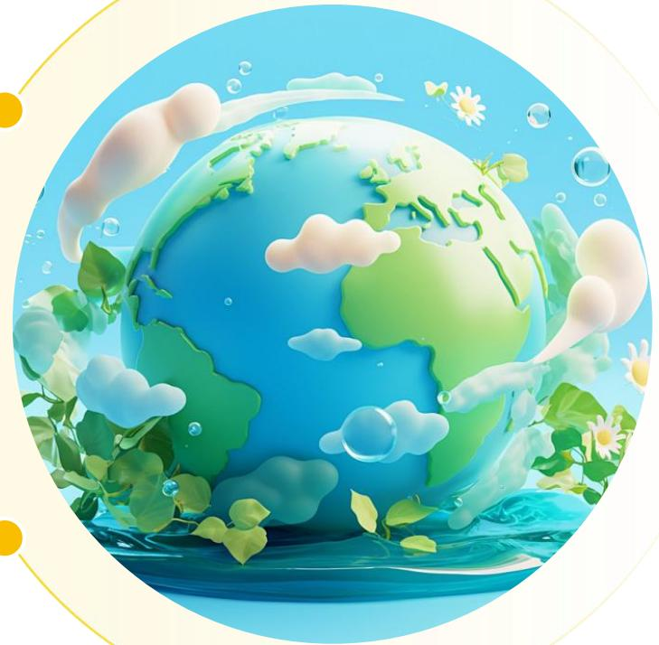

natural_image

Illustration of a stylized globe with floating clouds and aquatic plants, no text or symbols present.

## 5.1 治理

董事会统筹气候相关重大事项

管理层依托ESG管理委员会协调推进

制造、EHS、供应链、研发按职责分工执行

将气候目标纳入年度重点工作，定期汇报与专项评估

natural_image

Shield-shaped image showing a globe inside, symbolizing global protection or conservation (no text or symbols)

## 5.2 战略

总体方向：2030年前碳达峰、2060年前碳中和

四大路径：节能降碳、清洁能源替代、循环经济、技术创新

<table><tr><td>全生命周期环节</td><td>核心实践方向</td></tr><tr><td>低碳规划</td><td>设施设备规划、可再生能源规划、循环项目规划、信息化与智能化管理</td></tr><tr><td>低碳设计</td><td>节能设备选型、清洁生产工艺应用、研发环节节能降碳评审、低碳产品开发</td></tr><tr><td>低碳供应</td><td>低碳供应链建设、低碳材料采购、回收材料使用、供应链数据监控</td></tr><tr><td>低碳制造</td><td>能源管理体系建设、能源审计、设备能效提升、数字化碳管理、提高清洁能源比例</td></tr><tr><td>低碳运输</td><td>新能源运输车辆应用、运输方案优化、包材减量化、包材循环再使用</td></tr><tr><td>低碳回收</td><td>产品回收利用、包材回收、生产废料回收、余热回收、废水回收</td></tr></table>

5.3 影响、风险与机遇管理

<table><tr><td>风险类别</td><td>主要表现</td><td>应对措施</td></tr><tr><td>物理风险</td><td>极端天气导致生产中断、设备损坏、供应链受阻、人员安全风险</td><td>低气候风险选址、应急预案与物资储备、定期演练、足额投保、合理调整作业时段</td></tr><tr><td>转型风险</td><td>环保政策收紧、碳成本上升、低碳技术迭代、市场偏好转变</td><td>跟踪政策法规、加大低碳技术研发、优化能源结构、参考ISO 14064开展碳管理</td></tr></table>

<table><tr><td>机遇类型</td><td>核心方向</td><td>实施路径</td></tr><tr><td>政策机遇</td><td>享受绿色低碳政策红利</td><td>关注政府补贴、税收优惠</td></tr><tr><td>市场机遇</td><td>拓展绿色低碳市场</td><td>加大低碳产品研发推广,协同上下游打造低碳供应链</td></tr><tr><td>效率机遇</td><td>降本增效与可持续发展</td><td>精细化能源管理、设备技改、工艺优化、再生材料与循环利用</td></tr></table>

## 5.4指标与目标

## 能源结构优化

厂区车棚及屋顶分布式光伏总装机：1.261MW

2025 年 光 伏 发 电 量 ： 133.88 万 kwh （ 其 中128.86万kwh自用，5.02万kwh上网）

## 资源循环

推进再生材料使用及生产废料、余热、废水回收利用

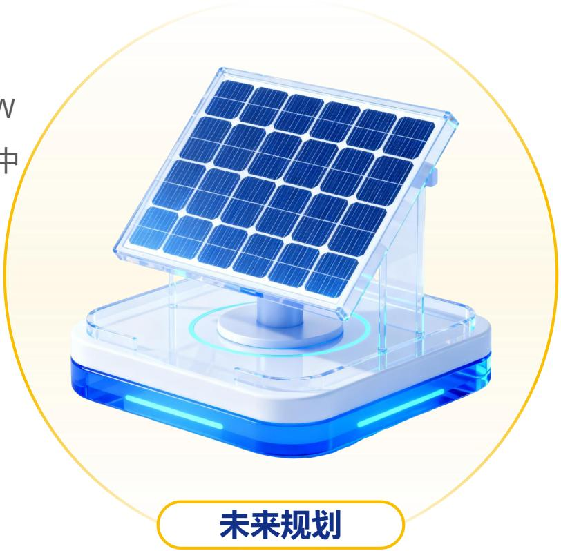

text_image

V
中
未来规划

持续完善温室气体排放核算体系，强化量化指标与阶段性减排目标管理

## 生产运营减排

优化流程与设备能效，降低单位产品能耗依托数字化碳管理实现能耗与排放实时监控

## 碳汇补充

参与植树造林等碳汇项目

## 6.1生物多样性保护举措与实施

保护原则：预防为主、防控结合、协同保护

<table><tr><td>实施维度</td><td>核心举措</td><td>实施目标</td></tr><tr><td>合规布局</td><td>生产基地均选址于成熟工业园区工业用地,不涉及自然保护区、生态红线区、重要水源地等生态敏感区域</td><td>从源头规避经营活动对自然生态系统、生物栖息地的破坏</td></tr><tr><td>厂区生态优化</td><td>开展厂区绿化提升工作,优先选用本土适生树种和植被,丰富厂区绿化层次与物种多样性</td><td>打造绿色生态生产环境,改善厂区及周边局部生态条件</td></tr><tr><td>理念宣贯与能力提升</td><td>将生物多样性保护纳入员工环保培训体系,通过专题培训、案例分享普及保护知识</td><td>提升全员生态保护意识,推动保护理念融入日常工作</td></tr><tr><td>社会协同公益保护</td><td>联动周边社区、行业伙伴开展生态保护公益行动,参与区域生态治理、科普宣传等活动</td><td>履行企业生态社会责任,推动形成政企社协同的保护氛围</td></tr></table>

natural_image

Golden shield icon with a white checkmark symbol (no text or symbols present)

## 6.2经营活动生态风险防控机制

## 项目立项建设

## 战略契合性

立项环评、建设“三同时”、优化施工工艺、配套生态保护措施

## 日常运营管理

## 生态风险识别评估机制

制定内部制度，定期排查风险点，建立动态风险台账

## 环境监测预警

## 常态化生态监测机制

对周边植被、水体等生态要素监测，隐患即时响应

## 措施落地监督

## 生态保护考核监督机制

纳入各部门环境管理考核，定期检查与专项督查

## 7.1再生材料使用

2025年常州工厂产生固废

76.24吨

生产边角料、废包装材料等可回收资源分类处理后重新投入生产

natural_image

Recycling symbol with a globe at the center, surrounded by green arrows (no text or symbols)

## 7.2循环经济相关实践措施

<table><tr><td>实践维度</td><td>核心措施</td><td>实施效果</td></tr><tr><td>包装物循环利用</td><td>供应商专用小黑桶回收机制,集中回收转售原供应商循环复用</td><td>2025年回收约13万个,减少一次性包装采购</td></tr><tr><td>生产废料回收</td><td>边角料、不合格品分类收集,专业处理后重新用于生产</td><td>提升资源利用率,减少固废产生</td></tr><tr><td>能源梯级利用</td><td>生产余热回收用于车间供暖、热水供应</td><td>提高能源综合利用效率</td></tr></table>

natural_image

Abstract digital illustration of a person with interconnected nodes and a glowing globe, set against a blurred background of human silhouettes (no text or symbols)

## 社会责任与人力资本管理体系03

## 公益定位

践行企业公民责任，围绕乡村振兴战略深化社区公益实践

重点投入领域：教育支持、扶贫济困、环境保护、文化建设

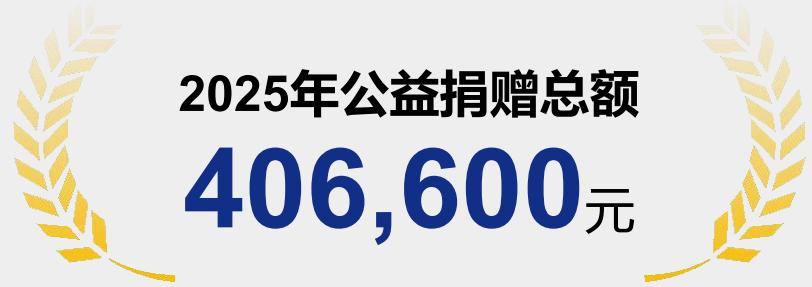

text_image

2025年公益捐赠总额
406,600元

<table><tr><td>受赠方</td><td>金额</td><td>用途</td></tr><tr><td>新北区幸福龙虎基金会</td><td>100,000</td><td>公益基金</td></tr><tr><td>紫阳县瓦庙镇九年制学校</td><td>6,600</td><td>学生助学金</td></tr><tr><td>华东理工大学</td><td>300,000</td><td>化学与分子工程学院奖学金、奖教金、实验室修缮</td></tr></table>

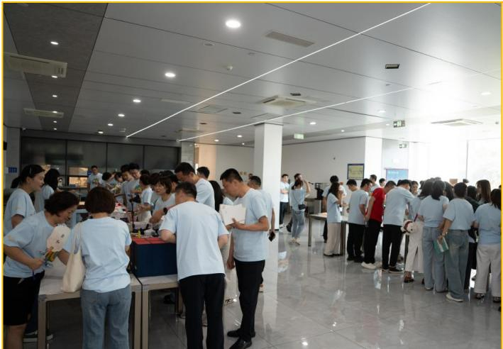

natural_image

Interior view of a busy service hall with many people gathered around a counter, no visible text or signage

## 捐赠证书

常州聚和新材料股份有限公司

您捐赠的 壹拾万元整

我们将按照《慈善法》规定，全部用于慈善事业。

特颁此证，谨致谢忱

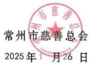

搭建员工公益参与平台，组织社区敬老、环保宣传、公益支教等志愿活动

## 2.1治理

管理层统筹质量目标与体系建设质量管理部门牵头建立、运行与持续改进

各业务部门落实全流程质量控制

## 制度体系

核心手册：《质量、环境、职业健康安全体系手册》专项制度：《产品检验管理制度》《不合格品管理制度》

## 体系认证

ISO 9001质量管理体系ISO 14001环境管理体系ISO 45001职业健康安全管理体系核心产品获CE、UL、RoHS认证

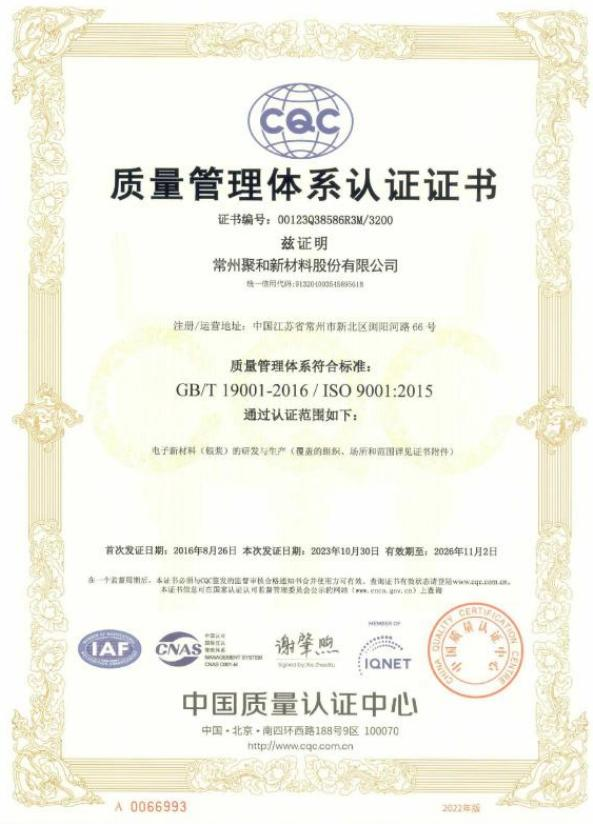

text_image

CQC
质量管理体系认证证书
证书编号：00123Q38586R3M/3200
兹证明
常州聚和新材料股份有限公司
统一信用代码：913204003645805618
注册/运营地址：中国江苏省常州市新北区浏阳河路66号
质量管理体系符合标准：
GB/T 19001-2016 / ISO 9001:2015
通过认证范围如下：
电子新材料（锐瓷）的研发与生产（覆盖的组织、场所和范围详见证书附件）
首次发证日期：2016年8月26日 本次发证日期：2023年10月30日 有效期至：2026年11月2日
在一个质量期间，本证书必须与QC颁发的监督审核合格通知书公开使用方可有效。查询证书有效期请登录www.cqc.com.cn。
本证书信息可经国家认证认可质量管理委员会公示的网站（www.cqc.gov.cn）上查阅
IAF CNAS 谢肇昀 IQNET
中国质量认证中心
中国·北京·南四环西路188号9区 100070
http://www.cqc.com.cn
A 0066993 2022年版

## 2.2 治理战略实施

核心理念：以客户需求为导向，将产品质量与绿色发展相结合

## 生产与过程控制

强化关键工序质量控制，落实检验与不合格品管理

## 检验与交付

完善检验流程，确保符合客户与标准要求

## 产品包装管理

PE内包装、可回收纸箱、EPE/EPS缓冲材料，提高可回收性

## 2.3影响、风险与机遇管理

风险管控

<table><tr><td>不合格品管理</td><td>质量部门组织评审处置,推动问题整改</td></tr><tr><td>产品追溯</td><td>批次唯一标识,记录全链条数据</td></tr><tr><td>产品召回</td><td>明确触发条件、流程及责任分工,定期演练</td></tr></table>

## 机遇把握

• 提升质量稳定性增强客户粘性与市场认可度  
• 绿色包装顺应下游客户环保关注趋势

2.4指标和目标

<table><tr><td>指标</td><td>2025年表现</td></tr><tr><td>产品一次性合格率</td><td>98.94%（高于97.5%年度目标）</td></tr><tr><td>产品召回情况</td><td>未发生召回事件</td></tr></table>

## 客户满意度调研

覆盖率：80%合作客户

平均满意度：97.25分（满分100分，远超90分KPI）

认可维度  
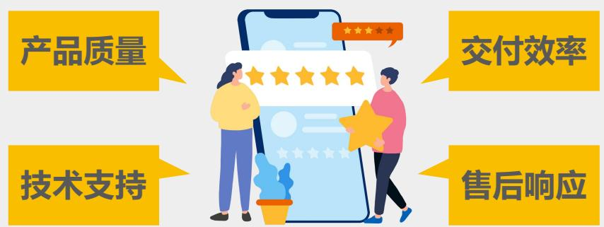

flowchart

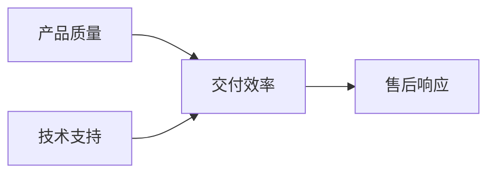
```mermaid
graph LR
  A["产品质量"] --> B["交付效率"]
  C["技术支持"] --> B
  B --> D["售后响应"]
```

## 客户投诉管理

全年投诉量：14起

客诉率：0.59%（低于1.0%年度KPI）

投诉处理完成率：100%

natural_image

Illustration of two people in conversation, one holding a clipboard and the other gesturing with hands (no text or symbols present)

## 投诉处理流程

建立《客户投诉跨部门处理主流程》管理文件

覆盖：现场调查→合规审批→内部核查→客户处置→投诉闭环→持续改进

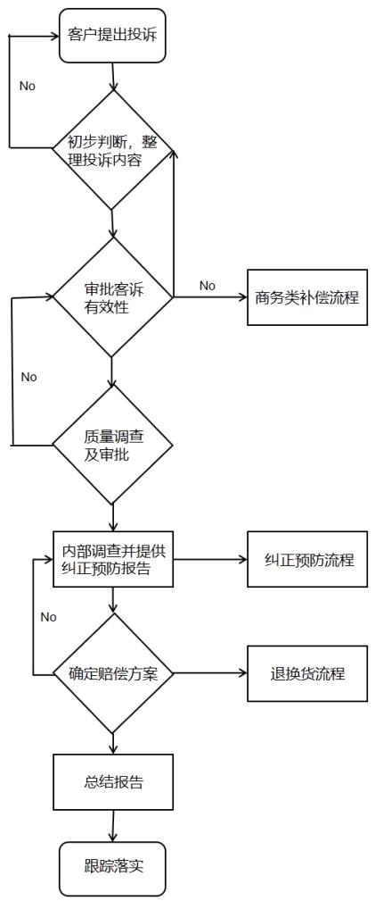

flowchart

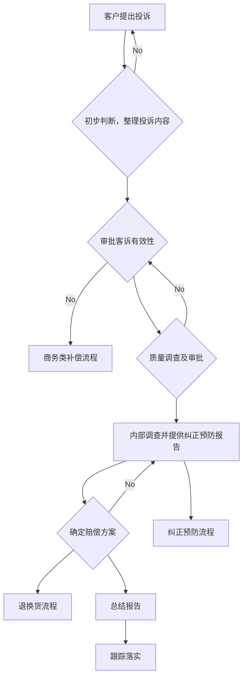
```mermaid
graph TD
  A["客户提出投诉"] --> B{"初步判断，整理投诉内容"}
  B -->|No| A
  B --> C{"审批客诉有效性"}
  C -->|No| D["商务类补偿流程"]
  C --> E{"质量调查及审批"}
  E -->|No| C
  E --> F["内部调查并提供纠正预防报告"]
  F --> G{"确定赔偿方案"}
  G -->|No| F
  G --> H["退换货流程"]
  F --> I["纠正预防流程"]
  G --> J["总结报告"]
  J --> K["跟踪落实"]
```

严格遵循《采购控制管理程序》《供应商管理程序》等专项制度。

围绕本地化布局、协同赋能、公平合作三大方向，深化供应链价值共生，提升供应链整体韧性与可持续性。

4.1供应商管理体系与职责分工

<table><tr><td>责任部门</td><td>核心职责</td><td>具体工作内容</td></tr><tr><td>供应链部</td><td>供应商管理主导</td><td>(1) 主导供应商选择、评价、导入及验收;(2) 制定和更新《合格供方名录》并报采购总经理审批;(3) 负责采购合同、相关协议签订、评审及存档;(4) 组织导入前供方现场审核验证,与质量部共同开展供应商业绩评定;(5) 处理供应商投诉、退货退款及应付账款对账。</td></tr><tr><td>质量部</td><td>质量管控与审核</td><td>(1) 主导供应商品质评价及质量改进推动;(2) 编制年度供方审核计划并组织实施,跟踪供方改善情况;(3) 负责来料检验、统计来料合格率及异常反馈;(4) 签署、评审并存档《供应商质量协议》;(5) 参与供应商导入前审核及贸易安全审核。</td></tr><tr><td>研发部</td><td>技术支持与需求提报</td><td>(1) 提出新物料、新供应商需求,告知采购部门;(2) 负责新物料导入跟踪验证及前期技术指标确认;(3) 编制新物料内部型号并同步至供应链部;(4) 参与供应商年度审核计划制定及供应商评估。</td></tr><tr><td>工艺部</td><td>生产验证支持</td><td>负责实验物料的生产验证,为供应商评估提供工艺层面意见。</td></tr></table>

4.2供应商准入与分类管理

<table><tr><td>供应商</td><td>定义</td><td>准入审核要求</td><td>自评/审核最高等级</td></tr><tr><td>A类</td><td>关键原材料供应商(如银粉、银包铜粉等金属粉)</td><td>1.需提供合法合规经营资质、生产许可、检测能力等资料;2.优先选择通过质量管理体系认证的厂家;3.需签署《质量协议》《技术规格书》《相关方环境、安全、社会责任管理协议》;4.原料类A供应商需进行现场审核,代理商等无生产工序的除外;5.填写《供应商行为规范承诺书》《供应商贸易安全承诺书》。</td><td>现场审核最高A级(90分以上)</td></tr><tr><td>B类</td><td>次要物料及直接接触包装物供应商(如玻璃粉、有机类物料等)</td><td>1.提供营业执照、经营该产品年限证明等资料;2.经《供应商体系审核表》评估得分≥70分;3.签署《供应商行为规范承诺书》;4.无需强制现场审核,可通过自评或资料审核准入。</td><td>自评/审核最高B级(80-89分)</td></tr><tr><td>C类</td><td>关键性设备厂家、外包校准机构及辅助类包装物供应商</td><td>1.提供营业执照及相关资质证明;2.填写《供方情况调查表》,经资料审核合格后直接列入合格供应商;3.无需签署额外承诺书(特殊要求除外)。</td><td>资料审核合格即准入无等级评定</td></tr></table>

## 紧急采购流程

供应链部组织研发、质量、生产紧急会议风险评估→部门负责人审批→战略副总审核→总经理审批（特殊情形签署质量约束协议）

4.3供应商评估与考核机制

<table><tr><td>评估类型</td><td>评估周期</td><td>评估维度</td></tr><tr><td>年度例行审核</td><td>至少每年1次</td><td>质量表现、交付能力、ESG合规、贸易安全等</td></tr><tr><td>贸易安全审核</td><td>每年1次</td><td>贸易安全管理、物流合规、信息安全等</td></tr><tr><td>日常绩效考核</td><td>A类银粉:月度;外购玻璃粉:年度;其他材料:半年度;B/C类:年度</td><td>来料合格率、交付及时率、异常处理响应速度等</td></tr></table>

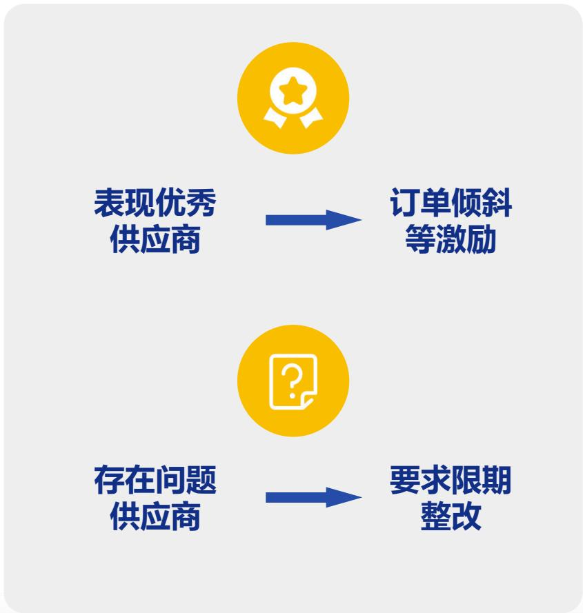

flowchart

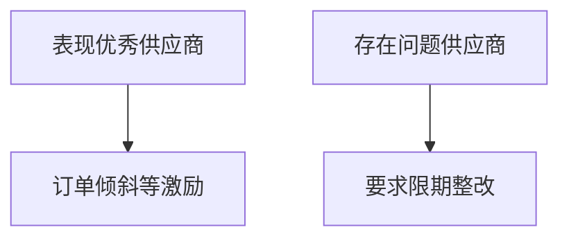
```mermaid
graph TD
  A["表现优秀供应商"] --> B["订单倾斜等激励"]
  C["存在问题供应商"] --> D["要求限期整改"]
```

4.4供应商变更与退出管理

<table><tr><td>变更类型</td><td>包含内容</td><td>管理要求</td></tr><tr><td>供应商替换</td><td>产能不匹配、重大品质事故、合作意愿下降、成本控制需求等</td><td>需提前90日书面告知公司,提供免费样品供评估验证,通过后可逐步放量。</td></tr><tr><td>设计变更</td><td>图纸、材料、性能等变更</td><td>提前90日书面告知,提交样品及变更说明,经公司验证确认后生效。</td></tr><tr><td>工艺变更</td><td>生产场地、流程、设备、模具变更,半年以上停产后复工等</td><td>提前90日书面告知,提供工艺变更文件及样品,验证合格后方可供货。</td></tr><tr><td>其他变更</td><td>企业名称、法人、股权、经营范围变更等</td><td>及时提供变更后的资质文件,经公司审核确认后延续合作。</td></tr></table>

<table><tr><td>退出情形</td><td>具体描述</td><td>处理流程</td></tr><tr><td>提供虚假信息</td><td>供应商开发过程中提供的资料与事实不符</td><td>直接淘汰,取消合格供应商资质。</td></tr><tr><td>合同期内违约</td><td>未完全履行合同义务或履行不符合约定</td><td>1. 停止交易,要求限期整改;2. 限期未整改的予以淘汰。</td></tr><tr><td>重大质量事故</td><td>造成公司或客户损失50万元及以上</td><td>直接淘汰,不再合作。</td></tr><tr><td>绩效考核不达标</td><td>连续三周期考核为D级,且无可执行整改计划</td><td>启动退出程序,从《合格供方名录》中剔除。</td></tr><tr><td>长期无业务往来</td><td>两年及以上未发生业务</td><td>1. 取消合格供应商资质;2. 需恢复合作的,重新按准入流程审核。</td></tr></table>

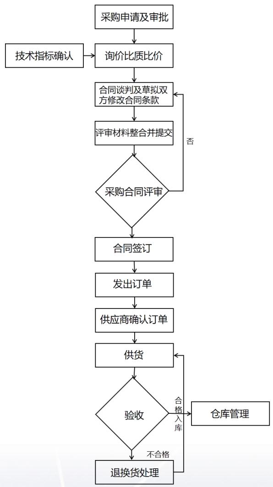

flowchart

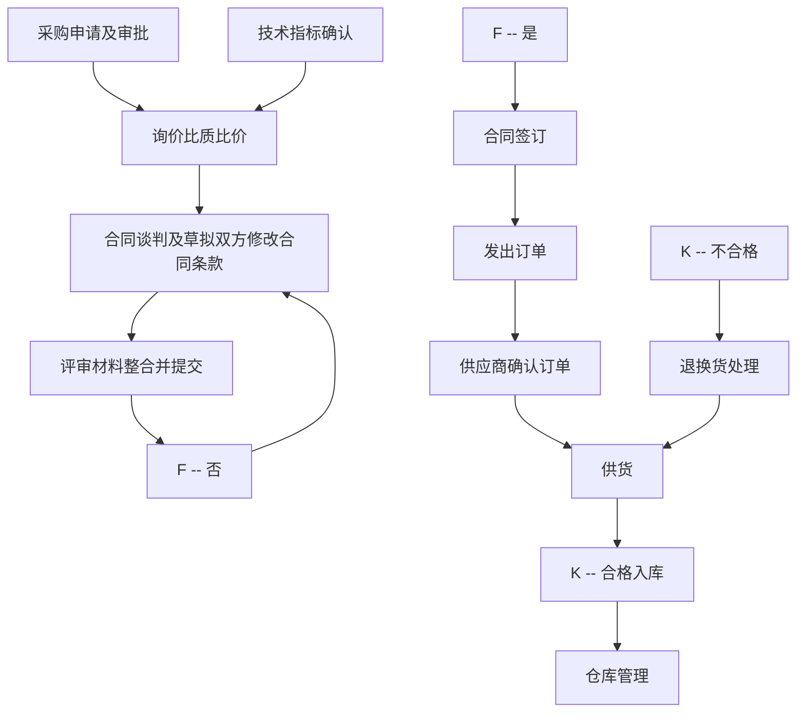
```mermaid
graph TD
  A["采购申请及审批"] --> B["询价比质比价"]
  C["技术指标确认"] --> B
  B --> D["合同谈判及草拟双方修改合同条款"]
  D --> E["评审材料整合并提交"]
  E --> F{"采购合同评审"}
  F["F -- 否"] --> D
  F2["F -- 是"] --> G["合同签订"]
  G --> H["发出订单"]
  H --> I["供应商确认订单"]
  I --> J["供货"]
  J --> K{"验收"}
  K["K -- 合格入库"] --> L["仓库管理"]
  K2["K -- 不合格"] --> M["退换货处理"]
  M --> J
```

## 4.5采购流程与合同管理

## 规范的投诉处理机制

## 对接人

由供应链部指定专人作为投诉对接人，统一承接供应商投诉，投诉需通过指定邮箱或加盖公章的书面函件提交；

## 提交方式

对接人将详细记录投诉事项、诉求及提交时间，并在10个工作日内完成核实；

## 处理闭环

向供应商出具书面或邮件说明调查结果及依据，同时做好沟通记录。

## 4.6供应链可持续发展实践

## 供应商本地化布局

银粉供应商共10家，江苏本地化供应商5家

本地化比例：50%

价值：缩短供应链半径、降低运输碳排放、提升供应及时性与灵活性

## 供应商协同赋能

与银粉供应商建立定期技术交流机制共享应用问题与性能优化需求，明确研发方向

形成需求反馈→技术迭代→产品升级协同闭环

## 公平合作与账款保障

差异化结算周期：月结30天、款到 发货等

合作前写入合同，保障支付透明及时

## 5.1员工队伍结构

2025年末公司员工总人数 729人，校园招聘录用10人  
性别结构  
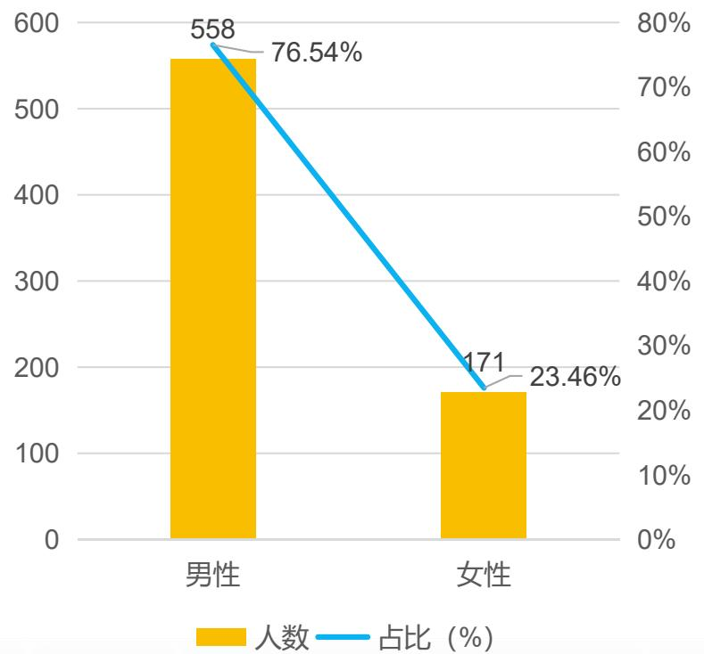

bar_line

| 性别 | 人数 | 占比 (%) |
| --- | --- | --- |
| 男性 | 558 | 76.54 |
| 女性 | 171 | 23.46 |

学历结构  
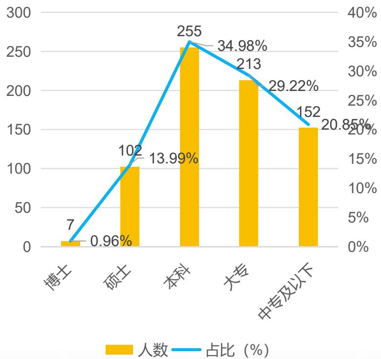

bar_line

| Category | 人数 | 占比 (%) |
| --- | --- | --- |
| 博士 | 7 | 0.96% |
| 硕士 | 102 | 13.99% |
| 本科 | 255 | 34.98% |
| 大专 | 213 | 29.22% |
| 中专及以下 | 152 | 20.85% |

年龄结构  
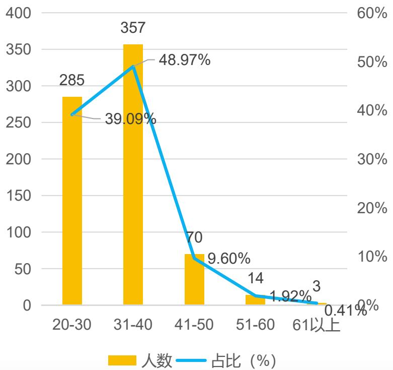

bar_line

| Age Group | 人数 | 占比 (%) |
| --- | --- | --- |
| 20-30 | 285 | 39.09% |
| 31-40 | 357 | 48.97% |
| 41-50 | 70 | 9.60% |
| 51-60 | 14 | 1.92% |
| 61以上 | 3 | 0.41% |

## 5.2 合规用工管理

## 严格遵循《劳动法》《劳动合同法》《社会保险法》

1

依法与符合条件的员工签订劳动合同、实现试用期管理、用工形式、合同解除与终止等用工全流程合规可控

2

围绕员工核心需求构建起覆盖法定保障、补充关怀、专项激励的全方位、多层级福利体系。

3

同时公司定期开展行业薪酬对标，持续优化内部薪酬结构与绩效激励机制，以业绩结果和价值贡献为重要依据，推动员工与公司共享发展成果。

## 5.3多层级福利保障体系

## 法定保障

五险一金足额缴纳；企业年金计划；补充医疗保险、商业意外伤害保险

## 评优激励

季度/年度评优，现金奖励与荣誉表彰

text_image

增)
哺
儿

## 带薪假期

法定年休假（按累计工龄分级）、福利年假（随司龄递增）、婚假、产假、陪产假、哺乳假、丧假、流产假、育儿假（属地差异化执行）；产检时间计入工作时间

## 特殊关怀

## 政策宣贯

社保、住房保障、个税等政策调整专项解读

疾病、工伤期间保障工资待遇与岗位权益，提供就医协助与人文关怀

## 5.4企业文化与员工文化生活

## 2025年，公司围绕团队融合、文化传承、知识提升三大方向，策划开展多场特色活动

## 年度总结会

• 全面复盘年度工作成果，部署下一年度规划，表彰先进  
• 强化“目标同向、责任同担”团队理念

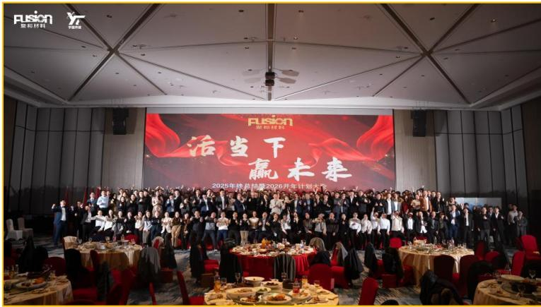

text_image

Fusion
治当下
赢未来
2026年扶贫发展2026开车计划人

## 十周年庆典篮球赛

• 各部门、各子公司组成多支代表队参赛  
• 展现顽强拼搏、协同作战精神风貌

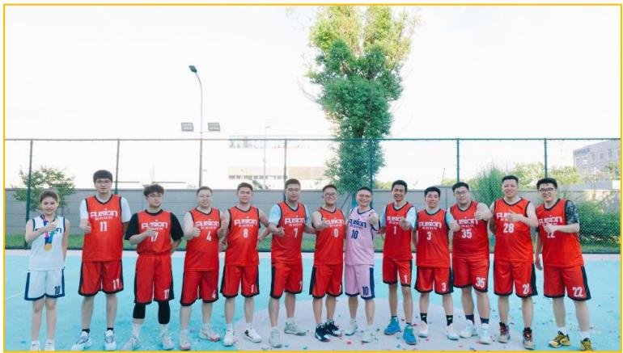

natural_image

Group photo of basketball players in red uniforms posing on a blue sports court, with a tree and buildings in the background (no visible text or symbols)

## 文化讲座

• 内容涵盖历史文化、人文素养、职业成长  
• 专业讲师分享、员工互动交流

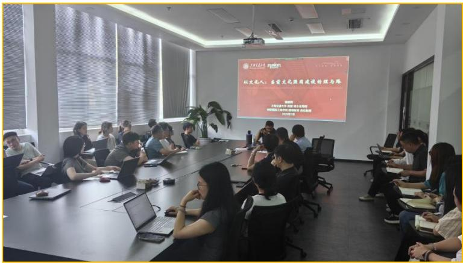

text_image

以文化人：当前文化强国建设的路与路
上海交通大学、硕士生导师
中国科学技术大学、清华大学、清华大学出版社

## 6.1双通道人才晋升机制

## 双职业发展路径

## 管理通道

## 专业通道

明确各通道晋升标准、考核流程与年度晋升机会，为不同岗位、不同发展诉求的员工提供多元化、常态化的职业上升通道，充分保障员工发展权益与成长空间。

## 6.2分层分类员工培训体系

制定《2025年度培训计划》，规划20场专项培训

<table><tr><td>培训类别</td><td>核心培训内容</td><td>覆盖对象</td></tr><tr><td>业务知识类</td><td>光伏银浆基础知识、电池片工艺、有机材料及合成、印刷烧结对浆料影响</td><td>营销、研发、生产</td></tr><tr><td>岗位技能类</td><td>浆料日常管理、生产计划、仓库管理、设备介绍、质量测试</td><td>制造、仓库、质量</td></tr><tr><td>合规与安全类</td><td>海关法规、贸易安全、信息安全、危机处理、禁用物质管控</td><td>物流、全员、EHS</td></tr><tr><td>综合能力类</td><td>商务关系管理、光伏技术趋势</td><td>营销、MKT</td></tr></table>

## 特色赋能课程

• 奥德赛™项目管理理念与实操  
• 高温浆料专业培训  
• 理解变革管理

## 覆盖情况

• 基层员工参与率：100%  
• 新员工入职培训覆盖管理制度、岗位基础、安全生产

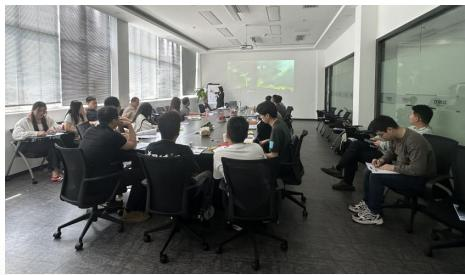

natural_image

Interior of a modern conference room with participants seated around a long table, facing a presentation screen (no visible text or symbols)

## 7.1 职业健康安全管理体系建设

遵循《中华人民共和国职业病防治法》《安全生产法》等法规要求，制定《安全生产责任制度》《职业卫生管理制度》等管理规范，构建覆盖全员的职业健康安全管理体系。

• 核心支撑：通过GB/T 45001-2020 / ISO 45001:2018职业健康安全管理体系  
• 认证范围：电子新材料（银浆）生产及相关管理活动  
方针：安全第一，预防为主；以人为本，强化监督；遵守法规，保障健康；综合治理，持续发展  
制订规范：《安全生产责任制度》《职业卫生管理制度》《危险源识别与风险评价控制程序》

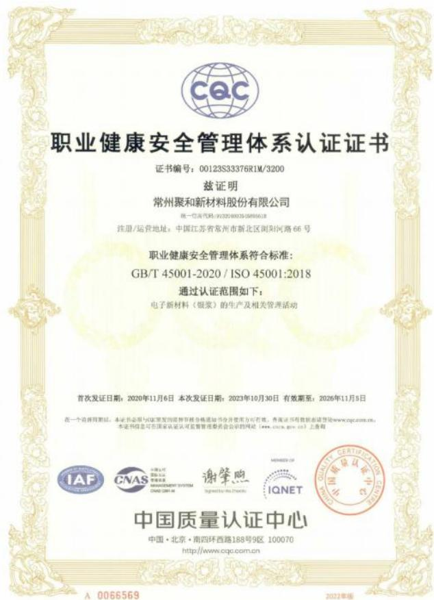

text_image

CQC
职业健康安全管理体系认证证书
证书编号：00123S33376R1M/3200
兹证明
常州聚和新材料股份有限公司
统一代码:9132040035-58895618
注册/运营地址：中国江苏省常州市新北区浏阳河路66号
职业健康安全管理体系符合标准：
GB/T 45001-2020 / ISO 45001:2018
通过认证范围如下：
电子新材料（银浆）的生产及相关管理活动
首次发证日期：2020年11月6日 本次发证日期：2023年10月30日 有效期至：2026年11月5日
在一个选择周期时，本证书必须与GCP颁发的推荐审核合格通知书合并使用方可有效。具体内容将按前述登录www.cqc.com.cn。
本证书信息可在国家认证认可监督管理委员会公安的网站（www.cqc.gov.cn）上查阅
IAF CNAS 谢擎照 IQNET
中国质量认证中心
中国·北京·南四环西路188号9区 100070
http://www.cqc.com.cn
A 0066569 2022年版

## 7.2 2025年EHS工作目标完成情况

## 核心安全事故零发生

死亡及重伤、急性中毒、火灾爆炸、重大设备、重大环境污染、职业病、治安事件等重大安全事故均保持为0，轻伤事故控制在年度目标以内。

## 可控事故合规达标

可记录事故共发生3起（常州工厂、德朗聚（常州、上海）、宜宾工厂各1起），在年度≤6起的目标范围内，公司已完成事故原因复盘并落实整改。

## 过程管理100%达标

特种作业持证率、特种设备定期检测率、事故隐患整改率、新员工三级教育及全员教育培训覆盖率、安全生产费用投入率均达到100%，实现安全合规全流程管控。

<table><tr><td>指标名称</td><td>年度目标</td><td>常州工厂</td><td>研发(常州、上海)</td><td>德朗聚(常州、上海)</td><td>匠聚</td><td>宜宾工厂</td></tr><tr><td>死亡及重伤事故</td><td>0</td><td>0</td><td>0</td><td>0</td><td>0</td><td>0</td></tr><tr><td>急性中毒事故</td><td>0</td><td>0</td><td>0</td><td>0</td><td>0</td><td>0</td></tr><tr><td>火灾爆炸事故</td><td>0</td><td>0</td><td>0</td><td>0</td><td>0</td><td>0</td></tr><tr><td>重大设备事故</td><td>0</td><td>0</td><td>0</td><td>0</td><td>0</td><td>0</td></tr><tr><td>重大环境污染事故</td><td>0</td><td>0</td><td>0</td><td>0</td><td>0</td><td>0</td></tr><tr><td>轻伤事故</td><td>≤1</td><td>0</td><td>0</td><td>0</td><td>0</td><td>0</td></tr><tr><td>职业病事故</td><td>0</td><td>0</td><td>0</td><td>0</td><td>0</td><td>0</td></tr><tr><td>可记录事故</td><td>≤6起</td><td>1起</td><td>0</td><td>1起</td><td>0</td><td>1起</td></tr><tr><td>治安事件</td><td>0</td><td>0</td><td>0</td><td>0</td><td>0</td><td>0</td></tr></table>

## 7.3安全生产资源投入

25年投入金额613746.34元

安全设施购置与运维

安全培训

安全专业检测

应急物资储备

## 7.4安全培训与应急演练

2025 年安全培训累计达2093人次，人均接受安全培训次数约6次

2025年2月

安全生产责任制培训

安全生产责任制宣贯、岗位安全职责、考核要求

2025年7月

交通安全培训

道路交通安全法规、厂区车辆行驶规范、事故预防与应急处置

2025年12月

职业健康培训

职业病预防、职业健康检查、工作场所防护措施

2025年3月

高处坠落应急处置演练

模拟高处坠落场景，检验现场急救、伤员转运及医疗联动能力

2025年11月

消防演练

模拟火灾场景，检验消防设施使用、人员疏散、初期火灾扑救及与外部消防力量联动能力

## 7.5全员职业健康管理

natural_image

Silhouettes of four business professionals in profile, standing and interacting (no text or symbols visible)

## 体检全覆盖

2025年为全体员工提供免费福利体检，针对化学品接触、设备操作等接害岗位，严格按国家职业健康规范组织岗前、岗中、离岗专项体检，全年体检覆盖率达100%。

## 健康档案动态管理

为全体员工建立个人职业健康档案，实现员工健康状况实时跟踪、动态更新，及时发现并干预健康风险。

## 身心双重关怀

策划开展读书日、猜灯谜、篮球比赛、羽毛球比赛、乒乓球比赛、安全月竞答等多维度文体活动，缓解员工工作压力，增强团队凝聚力，满足员工多样化身心需求。

## 8.1信息安全体系与责任分工

全员参与、分级负责的管理格局

<table><tr><td>网络安全和信息化工作领导小组</td><td>主要领导责任</td></tr><tr><td>信息技术部</td><td>制度落地、技术防护、日常运维、应急处置</td></tr><tr><td>各部门负责人</td><td>本部门直接领导责任</td></tr><tr><td>网络管理员</td><td>网络系统日常维护</td></tr><tr><td>员工</td><td>本人使用设备及数据的直接责任人</td></tr></table>

<table><tr><td>管理维度</td><td>核心管理要求</td><td>具体执行规范</td></tr><tr><td>设备安全</td><td>规范计算机及移动设备使用,防范硬件风险</td><td>1. 优先使用公司提供设备,禁止私自调换、拆卸;2. 离开座位锁定系统,移动存储介质专人保管;3. 公共笔记本实行谁借用、谁管理,及时归还</td></tr><tr><td>电子文件安全</td><td>管控文件存储、加密、流转全流程</td><td>1. 重要文件需加密存储并定期备份,公共设备使用后及时删除资料;2. 严禁通过个人介质带离公司文件,出差拷贝需上级批准并使用公司存储设备;3. 员工离职时,部门负责人需完成工作资料交接存档</td></tr><tr><td>软件与系统安全</td><td>保障软件合规使用及信息系统稳定</td><td>1. 服务器及计算机强制安装防病毒软件,定期更新病毒库;2. 禁止安装危害网络安全的软件,原始软件资料由信息技术部统一保管;3. 内部网络、ERP、MES、OA等系统按专项规定管控权限</td></tr><tr><td>数据库安全</td><td>强化数据备份与访问控制</td><td>1. 采用阿里云RDS进行数据库管理,实行两日增量+一日全量循环备份策略;2. 备份数据妥善保管,严禁未经授权拷贝转出;3. 信息技术部负责数据备份、恢复及监控全流程</td></tr><tr><td>密码安全</td><td>规范密码设置与管理,降低泄露风险</td><td>1. 密码需含字母、数字、符号组合,长度不少于8位,禁止使用弱密码;2. 员工密码每3个月更换一次,泄露或异常时立即更改并报备;3. 管理员级密码实行双重管理,每年至少更换一次,人员变动时即时更新</td></tr></table>

## 8.2技术防护与风险防控机制

## 边界防护

部署防火墙作为安全屏障，对外界数据进行隔离管控，定期更新防护规则，防范外部攻击

## 权限管理

业务系统服务器执行云盘备份策略，备份数据长期留存并上传至OSS存储，保障数据可恢复性

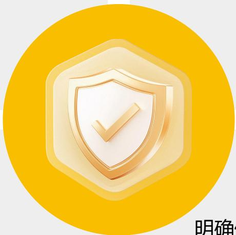

natural_image

Golden shield icon with a checkmark inside, set against a yellow circular background (no text or symbols)

## 数据备份

业务系统服务器执行云盘备份策略，备份数据长期留存并上传至OSS存储，保障数据可恢复性

## 行为管控

明确信息安全禁止行为，包括非法侵入他人系统、篡改数据、泄露公司信息、传播有害内容等，从源头规避风险

建立常态化风险巡查机制，信息安全工作领导小组不定期抽查，违规责令整改通报

## 8.3应急响应与人员保障

## 规范的信息安全应急响应机制，确保突发情况快速处置

## 预警与上报

发现设备故障、网络异常、数据泄露等问题，立即通知信息技术部，重大事件同步上报高层

## 应急处置

工作日管理员维护，节假日值班支持；隔离风险、排查、记录

## 预警与上报

故障排除后，通过备份数据恢复系统功能，事后分析事件原因，优化防护措施与应急预案

natural_image

Illustration of people reading a book with a screen showing a person speaking (no text or symbols present)

• 定期开展信息安全培训，每年10月集中开展一次，确保涉密部门覆盖率100%、非涉密部门覆盖率70%；  
• 对涉密系统操作员实施定期考核，各部门主管领导组织、信息安全员监管，对未达标人员开展专项培训与阶段监管；  
• 强化全员安全意识，通过制度宣贯、案例警示等方式，明确违规操作的责任后果，推动安全规范落地执行。

## 8.4客户隐私保护

## 数据采集

仅收集业务所需的客户必要信息，不额外获取无关数据，采集过程明确告知客户用途

## 存储与使用

客户敏感信息分类加密存储，实行严格访问控制，仅授权人员可接触，严禁用于业务外其他用途

## 合规管控

杜绝未经授权泄露、传播客户隐私信息的行为，若因违规操作导致客户隐私泄露，将按规定追究相关人员责任

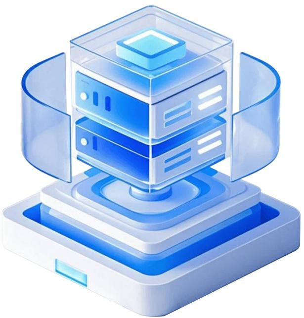

natural_image

Isometric illustration of a server rack with blue modules and a container, no text or symbols present

报告期内，公司未发生重大信息安全事故及客户隐私泄露事件，信息安全管理体系有效运行，为业务持续稳定开展提供坚实保障。

natural_image

Silhouettes of people walking on a glowing circuit board with abstract light effects (no text or symbols)

## 公司治理与合规运营机制04

职级13级以上的高管  
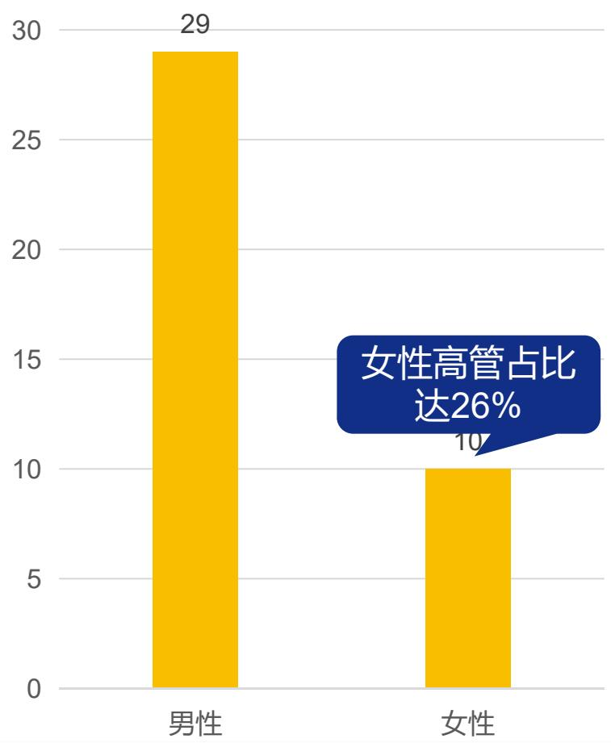

bar

| Category | Value |
| --- | --- |
| 男性 | 29 |
| 女性 | 10 |

经2025年5月20日年度股东会审议通过，公司正式取消监事会，并将其监督职能由具备独立性与专业性的董事会审计委员会承接，同步修订《公司章程》。

调整后董事会由9成员组成，包括5名非独立董事、3名独立董事及1名职工代表董事。

形成自我评估、外部审计、董事会监督的内部控制与合规管理框架，构建了规范的“三会”运作体系与职责分工机制。

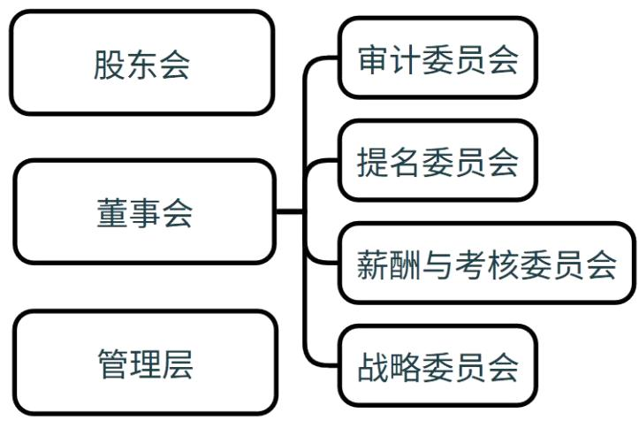

flowchart

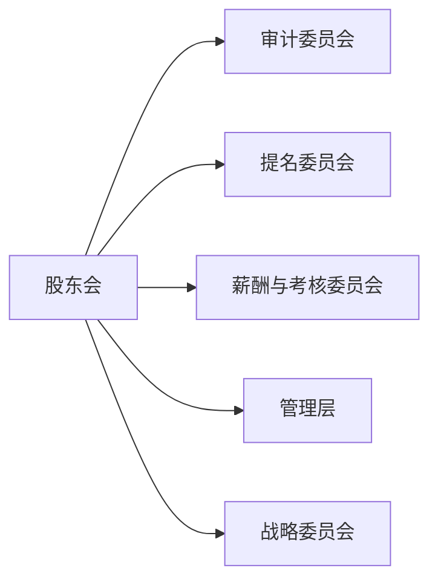
```mermaid
graph LR
  A["股东会"] --> B["审计委员会"]
  A --> C["提名委员会"]
  A --> D["薪酬与考核委员会"]
  A --> E["管理层"]
  A --> F["战略委员会"]
```

## 1.1关于股东与股东会

## 平等对待所有股东，保障中小股东知情权和参与决策权

## 2025年临时股东会主要议案

## 01

关于取消监事会并修订《公司章程》的议案

## 02

关于选聘2025年度审计机构的议案

## 03

关于限制性股票激励相关事项的议案

## 04

关于H股上市相关事项的议案

## 1.2关于董事与董事会

## 董事会履职情况

2025 年，公司董事会共召开8 次会议，董事会成员出席率100%，审议并通过重大事项议案，确保公司战略决策高效落地。

## 董事会成员多样化

• 董事会共9名成员，其中非独立董事5名、独立董事3名、职工代表董事 1名  
• ·包含1名女性独立董事  
• ·50岁以下董事5人，50岁以上董事4人，平均年龄50岁

## 专业背景多元互补

• 多名董事在先进材料行业拥有15-40年资深经验  
• 核心成员曾任职于国际头部企业核心技术岗位  
• 独立董事团队专业配置完善，分别来自法律、财务审计领域，具备近10年执业律师经验及30余年财务审计经验，持有高级会计师、注册会计师等多项权威资质，

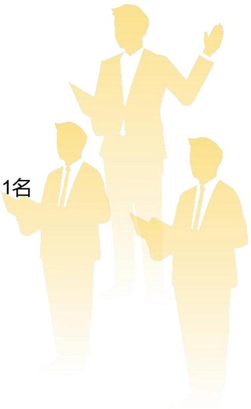

text_image

1名

## 1.3独立董事履职

3名独立董事分别来自法律、财会专业领域

2025年出席率100%无反对/弃权议案

2026年1月7日完成独立董事更换

1.4董事会专门委员会规范运作

<table><tr><td>委员会名称</td><td>2025年度履职重点与关键议案</td><td>会议次数</td><td>审议情况</td></tr><tr><td>审计委员会</td><td>审议年度/半年度/季度报告、内部审计工作报告、募集资金存放与使用情况、外部审计机构选聘、金融机构申请授信额度及担保额度等事项,监督审计工作质量</td><td>7次</td><td>100%通过</td></tr><tr><td>提名委员会</td><td>审议更换独立董事、确定公司董事角色、调整董事会专门委员会委员等事项,确保公司董事高管符合监管合规要求</td><td>1次</td><td>100%通过</td></tr><tr><td>薪酬与考核委员会</td><td>核查审议2024年股权激励第一期归属事项、董事及高级管理人员薪酬方案、董高责任险等议案,推动薪酬与业绩挂钩</td><td>6次</td><td>100%通过</td></tr><tr><td>战略委员会</td><td>审议收购境外公司股权协议、首次公开发行H股股票并在香港联合交易所上市、同意公司在香港进行非香港公司注册等事项,开启公司H股上市进程</td><td>2次</td><td>100%通过</td></tr></table>

委员会会议次数  
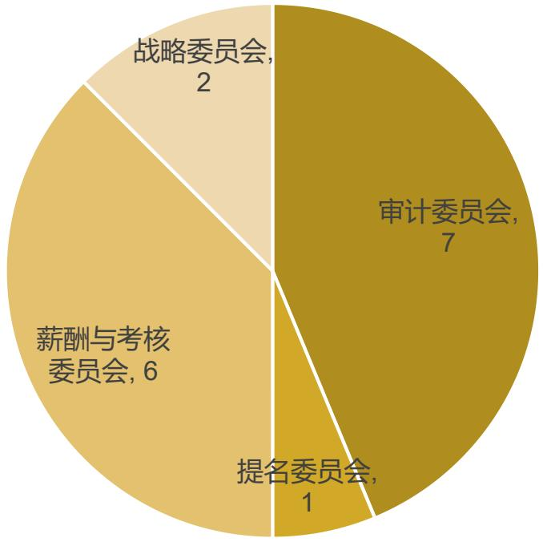

pie

| Category | Value |
| --- | --- |
| 审计委员会 | 7 |
| 提名委员会 | 1 |
| 薪酬与考核委员会 | 6 |
| 战略委员会 | 2 |

## 1.5关键治理动作

## 01 监事会取消

2025年5月 20日经年度股东会审议通过，同步修订《公司章程》，监督职能移交审计委员会

## 02 限制性股票激励

作废2023/2024年部分限制性股票、调整2024年授予价格、解锁2个归属期

## 03 重大投融资事项

2025年度金融机构综合授信、开展金融衍生品交易、收购境外公司股权

## 04 H股上市推进

2025年12月19日董事会审议 23项H股上市相关议案

## 05 审计机构选聘

2025年11月12日临时股东会审议通过选聘2025年度审计机构

## 2025年全面贯彻落实党的二十大精神、高质量完成 “十四五” 规划目标任务、为 “十五五” 良好开局奠定基础。

坚持以习近平新时代中国特色社会主义思想为指导

强化理论武装，发挥党员先锋模范作用

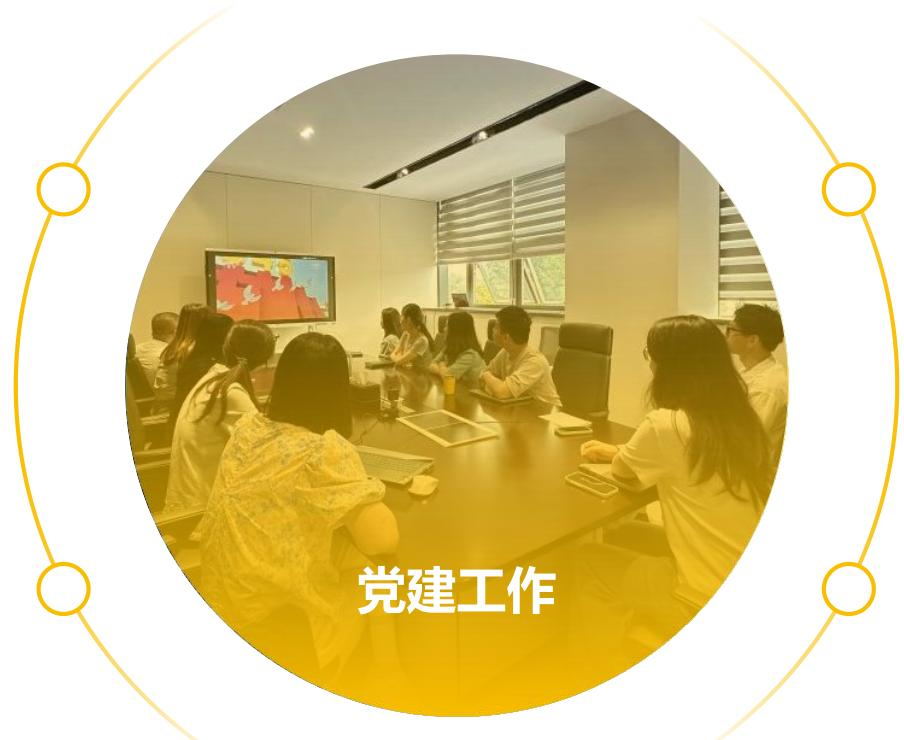

text_image

党建工作

党支部现有党员：20人

将党建工作融入公司治理结构和决策体系

强化在战略执行、风险管控和企业文化建设中的引领作用

## 建立《法律、法规及其它要求管理程序》

法律法规获取、识别、更新，年度合规性评价

## 《内部审核管理程序》

年度内审计划，对QES体系符合性、有效性审核，跟踪整改

## 管理评审

最高管理者定期组织，评价体系适宜性、充分性、有效性

<table><tr><td>培训课程</td><td>核心内容</td></tr><tr><td>合规基础</td><td>含义、特点与价值,案例分析与风险识别</td></tr><tr><td>反腐败与反商业贿赂</td><td>法律法规、风险识别应对、廉洁自律</td></tr><tr><td>数据安全</td><td>重要性、问题场景及应对措施</td></tr><tr><td>职场行为规范</td><td>专业行为标准、职业素养提升</td></tr><tr><td>商业秘密</td><td>定义、法律法规、侵权分析、保护意识</td></tr><tr><td>利益冲突</td><td>定义分类、内外部分析、管理要求</td></tr><tr><td>道德伦理与社会责任</td><td>诚信正直价值判断、对利益相关方责任</td></tr></table>

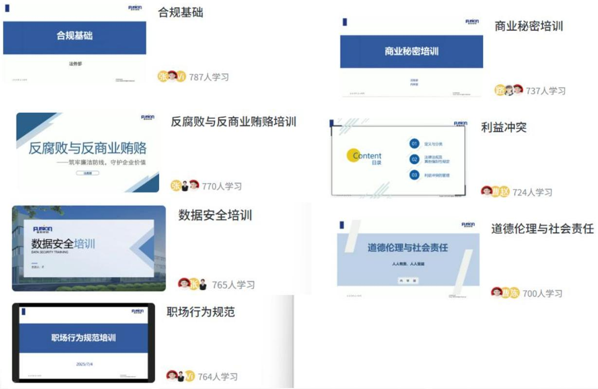

## 4.1 风险管理架构

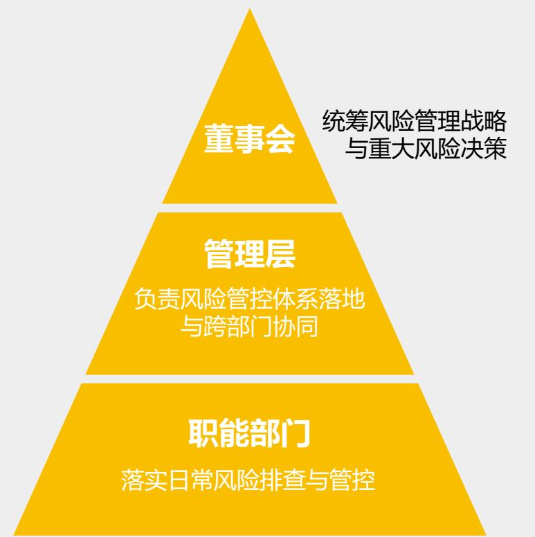

flowchart

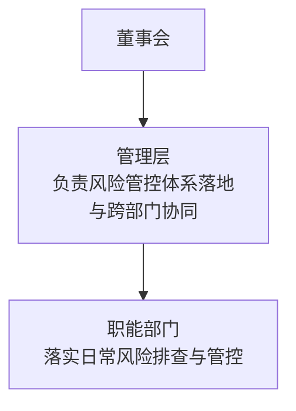
```mermaid
graph TD
  A["董事会"] --> B["管理层\n负责风险管控体系落地\n与跨部门协同"]
  B --> C["职能部门\n落实日常风险排查与管控"]
```

## 4.2 风险管理与内部控制运行

在既有内控基础上，公司持续完善风险管理工作机制，将风险管理融入公司治理和日常经营管理之中。通过风险管理制度等内部制度，明确董事会、审计委员会、管理层、职能部门和子公司的风险管理职责。

## 按风险识别→评估→应对→持续监控→反馈改进路径推进

• 重大投资、重要业务、资金运用强化事前论证与合规审查  
• 内控评价、自查自纠、内部审计结合推动优化

## 内部控制执行方面

• 公司设置内控节点和授权边界，各业务条线及子公司需按制度履行审批、备案和报告程序；  
• 总部内控评价小组对制度执行情况进行抽查和评估。

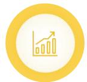

## 第三方审计结论

• 在所有重大方面保持有效财务报告内部控制  
• 报告期内无重大违法违规或对持续经营构成重大不利影响的风险事件

## 4.3 风险管理制度与识别体系

制定风险管理制度，系统识别市场、信用、环境、社会、操作等各类风险

建立动态风险台账与应对预案，制定专项应对预案，明确风险识别标准、责任主体与处置流程

## 4.4 ESG尽调与风险评估流程

在项目立项、投资决策、供应商合作环节纳入ESG因素

开展环境合规、社会责任、治理规范专项尽调

风险评估流程

识别→评估→分级→跟踪

对风险发生概率、影响程度综合研判

## 4.5 风险应对措施

## 规避

高风险事项优先规避

## 降低

中低风险通过流程优化、技术升级、制度完善降低影响

## 转移

合规保险配置分散压力

2025年未发生重大风险事件，风险整体可控

## 5.1 公告披露情况

2025年规范披露各类公告（定期报告、临时公告）

信息披露及时率100%

## 5.2 披露质量保障

建立多层级信息披露审核机制

坚守真实、准确、完整、及时、 公平原则

对披露内容进行严格把关无虚假记载、误导性陈述或重大遗漏

## 5.3 投资者交流活动

形式业绩说明会、投资者调研、路演

建立投资者反馈回应机制，对投资者提出的问题及时、全面回应，回应率100%

## 6.1 税务管理体系与职责分工

制定《税务管理办法》，对税务管理的目标、原则、组织架构及业务流程作出系统规定:

## 股份公司财务会计部负责税务工作的归口管理

承担税务制度完善

税收政策研究和传达

重大事项税务筹划建议

对子公司税务管理工作的指导

组织税务风险分析与检查

## 各子公司财务部门负责本公司涉税业务的具体执行

合规会计处理

按期纳税申报

涉税资料保管

配合税务机关问询和检查

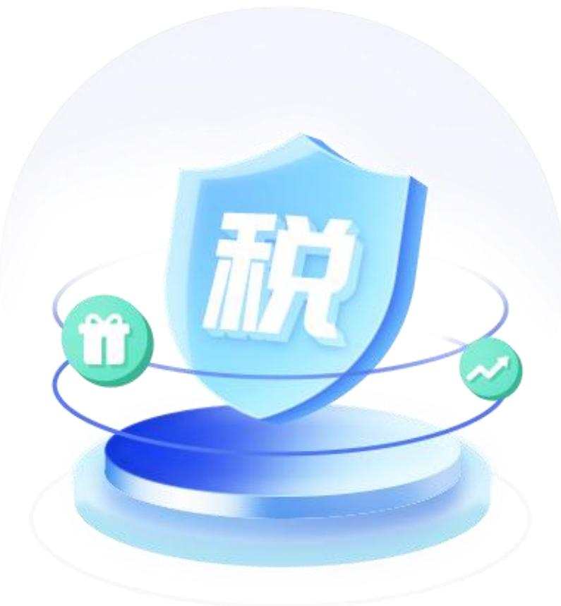

text_image

税

6.2 日常涉税与发票管理

<table><tr><td>管理环节</td><td>核心管理措施</td><td>具体实施内容</td></tr><tr><td rowspan="3">涉税处理</td><td>合规核算与申报</td><td>依规准确核算,按期申报,数据一致</td></tr><tr><td>政策适配与调整</td><td>税收政策变化及时分析优化</td></tr><tr><td>高风险事项管控</td><td>新业务/高不确定性事项多部门讨论,征询外部意见</td></tr><tr><td rowspan="4">发票管理</td><td>事前防范</td><td>业务真实性审核,合同条款合规审查</td></tr><tr><td>事中控制</td><td>开票/取票核对核心要素,确保三流一致</td></tr><tr><td>事后管理</td><td>妥善保管资料,定期自查,配合协查</td></tr><tr><td>数字化升级</td><td>推动数电发票应用,与专业机构合作系统直连</td></tr></table>

## 6.3 税务风险防控与培训

## 风险自查

• 财务会计部牵头，每半年组织自查，邀请外部机构支持；  
• 形成自查报告督促整改；  
• 年度监督检查

## 培训提升

与外部财税机构合作，围绕税务稽查整治、“以数治税”监 管、增值税立法变化、稽查风险应对、董监高个税风险管理 等开展培训

## 6.4 税务合规表现

报告期内，公司坚持依法诚信纳税，严格遵守国家和业务所在地区适用的税收法律法规，未发生涉税违规事件。

natural_image

Illustration of a blue open book with a magnifying glass resting on it, no text or symbols visible.

## 7.1 行为规范与反腐制度

遵循反垄断法、反不正当竞争法、关于禁止商业贿赂行为的暂行规定  
遵循反垄断法、反不正当竞争法、关2于禁止商业贿赂行为的暂行规定  
遵循反垄断法、反不正当竞争法、关3于禁止商业贿赂行为的暂行规定

## 7.2 举报机制建设

搭建常态化举报渠道，公开举报方式与处理流程  
2 明确举报人保护措施  
3 闭环处理：及时核查、依法处置

## 7.3 廉洁教育与实践表现

定期开展合规培训：反腐败反贿赂、 内部举报及合规监督、商业秘密保护  
形式：廉洁讲座、典型案例警示、场2景化演练  
2025年未发生侵犯客户隐私、知识3产权侵权、商业贿赂等行为

## 8.1 制度体系构建

• 制定反不正当竞争管理制度  
• 明确防范虚假宣传、垄断行为、侵犯商业秘密的具体措施与部门职责

## 8.2 专项机制与保障措施

• 市场行为合规审查：广告宣传、营销推广事前审核  
• 商业秘密保护体系：明确界定、存储、使用、保密责任要求

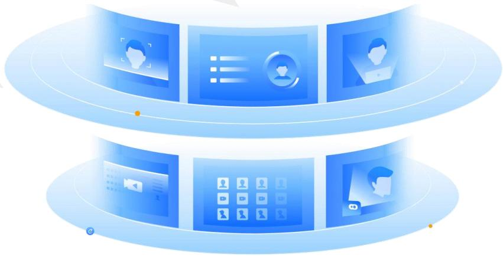

natural_image

Illustration of digital interfaces with user profiles and icons, no text or symbols present

## 8.3 培训与举报及违规情况

• 开展反不正当竞争专题培训  
• 建立内部举报机制  
• 2025年未发生因不正当竞争行为导致的诉讼或重大行政处罚

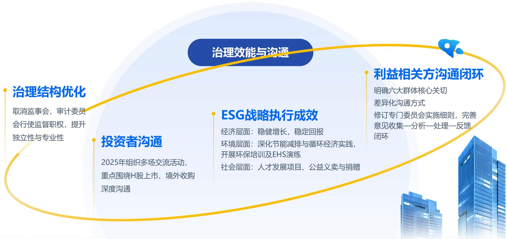

flowchart

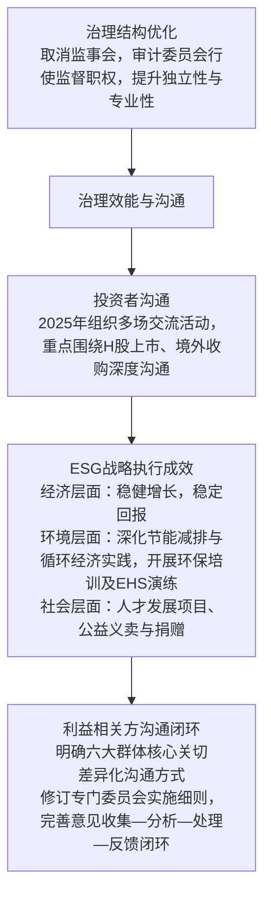
```mermaid
graph TD
  A["治理结构优化\n取消监事会，审计委员会行使监督职权，提升独立性与专业性"] --> B["治理效能与沟通"]
  B --> C["投资者沟通\n2025年组织多场交流活动，重点围绕H股上市、境外收购深度沟通"]
  C --> D["ESG战略执行成效\n经济层面：稳健增长，稳定回报\n环境层面：深化节能减排与循环经济实践，开展环保培训及EHS演练\n社会层面：人才发展项目、公益义卖与捐赠"]
  D --> E["利益相关方沟通闭环\n明确六大群体核心关切\n差异化沟通方式\n修订专门委员会实施细则，完善意见收集—分析—处理—反馈闭环"]
```

natural_image

Person standing on a snow-covered mountain peak under a bright blue sky with clouds, no text or symbols visible.

## 展望未来

05

## 核心驱动力：技术创新与价值共生

natural_image

Black-and-white cityscape illustration featuring a modern skyscraper against a yellow background (no text or symbols visible)

## 01

## 深耕核心赛道

光伏银浆工艺迭代与配方优化，提升产品能效与低碳属性联动上下游推动产业链绿色转型

## 前瞻布局

• 下一代电子材料与新能源应用场景  
• 加大研发投入、深化产学研协同  
• 打造全生命周期绿色材料解决方案

## 02

## 全球化视野

• 推动绿色材料标准与实践经验共享输出  
• 构建跨区域、跨领域产业协同生态圈

## 愿景

• 成为全球领先材料科技集团

## 谢谢观看

2026年4月