## 2025 年度

## 环境、社会和公司治理（ESG）报告

## ENVIRONMENTAL,SOCIAL AND GOVERNANCE REPORT

## 明冠新材料股份有限公司

natural_image

Illustration of a modern electric vehicle charging in front of wind turbines and solar panels, with no visible text or symbols on the main elements.

地址:江西省宜春市宜春经济技术开发区经发大道32号  
邮箱：ir@mg-crown.com  
官网：www.mg-crown.com

## 目录

## CONTENTS

## 报告前言

关于本报告 01

走进明冠新材 03

## 可持续发展治理

ESG治理体系 09

利益相关方沟通 10

重要性议题管理 11

## 专题：

科技赋能，智造未来 13

## 01

## 规范明冠治理 合规诚信经营

公司治理 23

投资者权益保护 25

内控与风控 26

合规与商业道德 28

党建引领 30

## 02

## 绿色环保新材 探索低碳路径

环境合规管理 33

应对气候变化 37

资源利用 41

## 03

## 协同共生共链 品质至臻至稳

产品和服务安全与质量 47

负责任供应链 52

数据安全与隐私保护 56

## 04

## 员工成就价值 共担共创未来

保护员工合法权益 61

员工培训与发展 67

职业健康与安全 70

践行社会责任 72

## 附录

指标索引 73

关键绩效表 75

意见反馈表 86

## 报告前言

## 关于本报告

本报告是明冠新材料股份有限公司（以下简称“明冠新材”“公司”或“我们”）发布的第4份环境、社会和公司治理（ESG）报告（以下简称“本报告”）。本报告依据客观、规范、透明和全面的原则，详细披露了公司2025年度在环境、社会和公司治理的实践及绩效。

## 报告范围

本报告以“明冠新材料股份有限公司”为主体，包括下属子公司，除特别说明外，本报告范围与本公司年报范围保持一致。

## 时间范围

本报告的时间范围为2025年1月1日至2025年12月31日（简称“报告期”）。为增强报告的可比性和完整性，部分内容适当追溯以往年份或具有前瞻性描述。

## 编制依据

上海证券交易所《上海证券交易所上市公司自律监管指引第14号——可持续发展报告（试行）》  
上海证券交易所《上海证券交易所科创板上市公司自律监管指南第13号——可持续发展报告编制》  
全球报告倡议组织《GRI可持续发展报告标准（GRI Standards）》  
中国企业改革与发展研究会《中国企业可持续发展报告指南（CASS—ESG 6.0）》  
气候相关财务信息披露（TCFD）框架

联合国可持续发展目标（SDGs）

可持续发展会计准则委员会SASB准则

## 数据说明

本报告引用的全部信息数据均来自明冠新材正式文件、统计报告及财务报告，以及经由公司统计、汇总与审核的各职能部门、各经营单位的可持续发展实践信息。

公司承诺本报告内容不存在任何虚假记载、误导性陈述或重大遗漏。同时，本报告涉及的货币种类及金额，如无特殊说明，均以人民币为计量单位。

## 释义说明

<table><tr><td>释义项</td><td>释义内容</td></tr><tr><td>明冠新材、公司、我们</td><td>明冠新材料股份有限公司</td></tr><tr><td>明冠锂膜</td><td>江西明冠锂膜技术有限公司</td></tr><tr><td>越南明冠</td><td>越南明冠新材料有限公司</td></tr><tr><td>国家、政府</td><td>中华人民共和国及其行政机构</td></tr></table>

## 确认及批准

本报告于2026年4月27日获公司董事会批准，并与年报同期发布，董事会承诺对报告内容进行监督，并确保其不存在任何虚假记载或误导性陈述，并对内容真实性，准确性和完整性负责

## 报告获取

本报告可以在公司网站（www.mg-crown.com）、上海证券交易所网站（http://www.sse.com.cn）查阅及下载本报告电子文本，获取更多公司信息。

## 走进明冠新材

## 公司介绍

明冠新材（股票代码：688560）成立于2007年，于2020年在上交所科创板上市，是全球领先的新能源电池封装材料研发制造国家高新技术企业。

公司产品应用于光伏电池和软包电池封装。在光伏领域，公司为HJT、BC、TOPCon等电池封装设计开发的多种功能型胶膜、光伏电池专用皮肤膜以及背板等整套封装产品，尤其应用在HJT、BC等电池上，组件长期可靠性稳居行业第一，成为n型高效无主栅电池的封装龙头；在软包电池领域，公司铝塑膜采用首创干热复合工艺，具有超耐电解液、高冲深、高一致性、长寿命等优势，不仅用于锂电池封装，同时成功应用于钠电池及固态电池封装，产品系列匹配动力、储能、数码等全场景需求。

公司建有江西省级光电复合材料工程技术研究中心和苏州研发中心，2024年获批国家级博士后科研工作站，拥有69人研发团队，92项专利，参与起草和修订多项产品的国家与行业标准。产品通过CQC、TUV、JET、UL等认证，符合ROHS、REACH和PFAS检测标准，保障全球客户的品质要求。同时，越南明冠与国内基地形成产能互补，保障对全球客户敏捷交付。

公司实施“国内+海外”双轮驱动战略，以越南基地为桥头堡辐射全球市场，保障对客户敏捷交付。目前客户覆盖隆基、爱旭、晶澳、比亚迪、协鑫、Hanwha、REC等国际90%头部光伏组件及时代、冠宇、蜂巢、派能、孚能、赣峰等锂电龙头厂商，彰显中国先进制造的世界影响力。

公司始终以“专注新材料，创造绿色美好生活”为使命，致力于为全球新能源电池客户提供高价值、差异化、高可靠的封装解决方案，凭借先进产品、过硬品质及良好口碑，赢得全球光伏头部组件厂商和电池龙头厂商的长期合作，实现公司“人才领先、奋力创新”的发展战略。

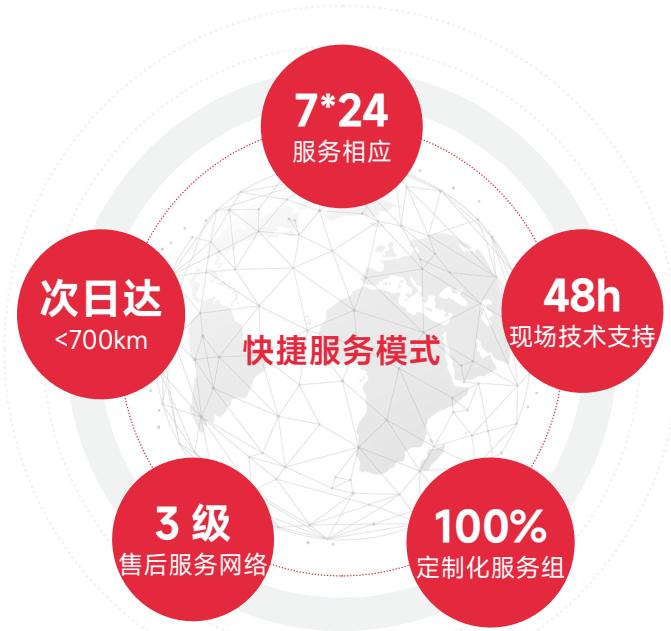

donut

| 服务模块 | 相应功能 |
| --- | --- |
| 7*24 | 服务相应 |
| 48h | 现场技术支持 |
| 100% | 定制化服务组 |
| 3级 | 售后服务网络 |
| 次日达 | <700km |

## 企业文化

## 使命

专注新材料，创造绿色美好生活

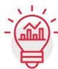

## 愿景

可靠材料价值伙伴

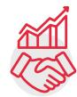

## 价值观

正直务实、活力创新坦诚清晰、共创共赢

## 产业布局

## 太阳能电池材料系列

公司专注于 n 型电池封装材料的研发和销售，凭借多年在封装材料领域的技术积累，率先提出 TOPCon、HJT、IBC 等 n 型电池封装材料整体解决方案。近几年，服务客户包括晶澳、韩华、比亚迪、通威、国电投、REC、隆基绿能、爱旭、协鑫、东方日升、天合、中节能、New materials 等世界 500 强和国内外行业领军企业，累计服务客户超200家。

## 锂电池材料系列

公司专业从事软包锂电池封装铝塑膜的研发、生产和销售，首创干热复合工艺，耐电解液、高冲深、热封稳定和成型性能大幅提升，产品广泛应用于动力、储能、数码电池领域，至今装车10年，应用里程超20万公里零客诉。

  
背板

  
胶膜

  
功能膜

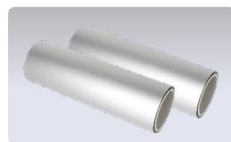  
铝塑膜-银色

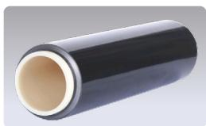  
铝塑膜-黑色

## 制造基地

公司在国内与海外双布局，致力于为高质量发展集聚势能。目前拥有江西宜春、越南及苏州（在建）3 个制造基地，规划n 型电池专用胶膜总产能 60GW（宜春 45GW、越南 15GW）、背板总产能 28GW（宜春 20GW、越南 8GW），网栅膜总产能15GW；公司根据 2026年铝塑膜客户开发及订单增量情况，预计再新建3000万平米产能。

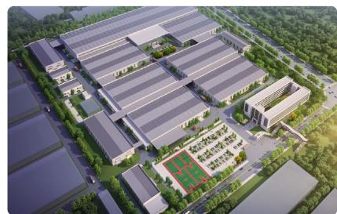

natural_image

Aerial rendering of a large industrial complex with multiple factory buildings, green spaces, and surrounding infrastructure (no visible text or symbols)

宜春基地

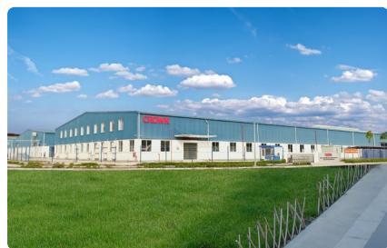

natural_image

Exterior view of a modern industrial building with green roof and white facade, surrounded by grass under a blue sky (no signage visible)

越南江北基地

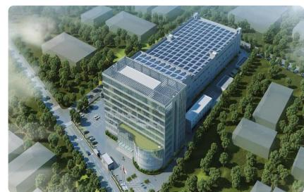

natural_image

Aerial rendering of a modern industrial or factory complex surrounded by greenery and roads (no visible text or signage)

苏州（在建）

## 发展历程

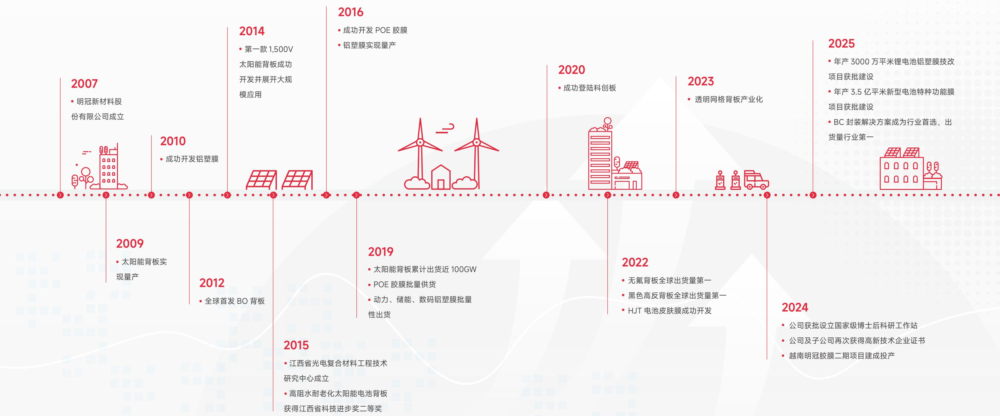

state_timeline

| Year | Milestone |
| --- | --- |
| 2007 | • 明冠新材料股份有限公司成立 |
| 2009 | • 太阳能背板实现量产 |
| 2010 | • 成功开发铝塑膜 |
| 2012 | • 全球首发 BO 背板 |
| 2014 | • 第一款 1,500V 太阳能背板成功开发并展开大规模应用 |
| 2015 | • 江西省光电复合材料工程技术研究中心成立 • 高阻水耐老化太阳能电池背板获得江西省科技进步奖二等奖 |
| 2016 | • 成功开发 POE 胶膜 • 铝塑膜实现量产 |
| 2019 | • 太阳能背板累计出货近 100GW • POE 胶膜批量供货 • 动力、储能、数码铝塑膜批量性出货 |
| 2020 | • 成功登陆科创板 |
| 2022 | • 无氟背板全球出货量第一 • 黑色高反背板全球出货量第一 • HJT 电池皮肤膜成功开发 |
| 2023 | • 透明网格背板产业化 |
| 2024 | • 公司获批设立国家级博士后科研工作站 • 公司及子公司再次获得高新技术企业证书 • 越南明冠胶膜二期项目建成投产 |
| 2025 | • 年产 3000 万平米锂电池铝塑膜技改项目获批建设 • 年产 3.5 亿平米新型电池特种功能膜项目获批建设 • BC 封装解决方案成为行业首选，出货量行业第一 |

## 2025年所获荣誉

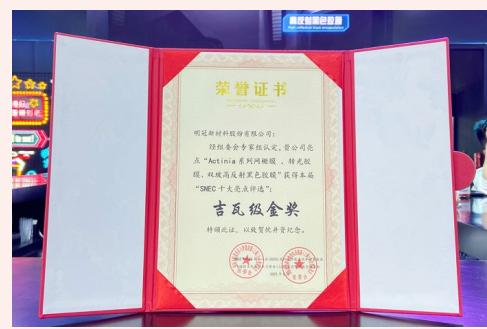

text_image

荣誉证书
明冠新材料股份有限公司：
经组委会专家组认可，贵公司亮点
“Actinia系列同侧眼、特光胶膜、双玻高反射黑色胶膜”获得本届
“SNEC十大亮点评选”；
吉瓦级金奖
特颁此证，以致贫优尊纪念。

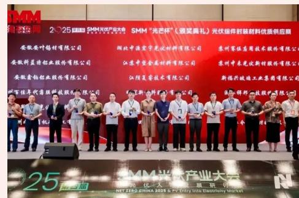

text_image

2025 SMM 光大产业大会 SMM “光芒杯”（颁奖典礼）光伏组件封装材料优质供应商
安徽安叶脉材有限公司
安徽科蓝特铝业股份有限公司
安徽鑫铂铝业股份有限公司
湖北中源宝光光伏材料有限公司
江苏中曼金通科技有限公司
江阴复星技术有限公司
贵州赛佳通用技术股份有限公司
贵州中兆光伏新材料股份有限公司
新疆兴威瑞工业集团有限公司
阿坝州华兴新能源科技股份有限公司
新能环保科技有限公司
25
SMM 光大产业大会
SMM 光大产业大会
SMM 光大产业大会
SMM 光大产业大会
SMM 光大产业大会
SMM 光大产业大会
SMM 光大产业大会
SMM 光大产业大会
SMM 光大产业大会
SMM 光大产业大会
SMM 光大产业大会
SMM 光大产业大会
SMM 光大产业大会
SMM 灵光人 联研研
NIT ZEO CHINA 2026 & PLC (China) Electrochemistry Sport

  
上海有色网

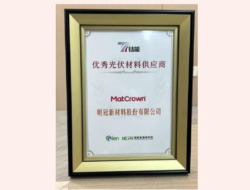

text_image

7钛能
优秀光伏材料供应商
MatCrown
明冠新材料股份有限公司

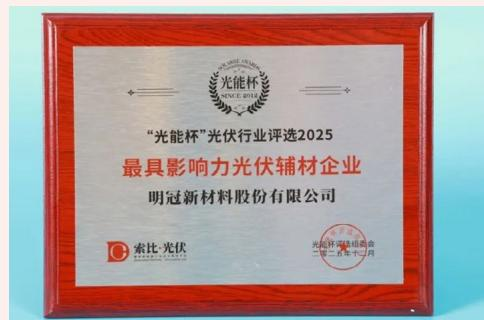

text_image

“光能杯”
SINCE 2018
“光能杯”光伏行业评选2025
最具影响力光伏辅材企业
明冠新材料股份有限公司
索比·光伏
光明区深南街道
二零二四年十二月

  
索比光伏网

## 2025年亮点绩效

## 经济绩效

营业总收入 7.20亿元

资产总额 27.92亿元

## 治理绩效

股东会审议通过事项12项

董事会审议通过事项41项

廉洁协议签订率100%

投资者问题回复率100%

## 环境绩效

环保投入 121万元

固体废弃物合规处置率100%

使用绿色电力减少碳排放量3,312.79吨二氧化碳当量

光伏发电总量 4,035,064千瓦时

## 社会绩效

劳动合同签订率100%

社会保险覆盖率100%

员工培训覆盖率 100%

重大安全生产事故数 0起

公益慈善投入3.47万元

研发投入 3,397.67 万元

产品合格率 98.20%

## 可持续发展治理

公司秉持可持续发展核心导向，把可持续发展理念全面贯穿于战略制定、经营决策、管理机制与业务运营各环节，精准研判并妥善应对发展中的潜在风险，积极寻求与把握发展新契机，不断优化适配企业自身的可持续发展路径与战略愿景。公司致力于通过合规尽责的商业运营模式与紧密协同的伙伴合作关系，构筑可持续发展未来格局，立志成为全球利益相关方推进ESG建设过程中的可靠合作伙伴。

## 愿景

到 2030 年，通过行业协作与创新，推动 90% 以上的合作伙伴实现碳中和目标，重塑商业与社会的共生关系。

## ESG 治理体系

公司严格遵循国家相关法律法规与社会责任管理体系标准，构建完善的社会责任管理体系，制定并落实《社会责任管理手册》各项要求，同时，明确各层级管理职责，形成自上而下协同推进的工作机制，确保各项社会责任工作规范落地、高效执行。公司将持续深化ESG治理能力建设，以手册要求为指引稳步推进可持续发展战略，实现企业高质量、可持续发展。

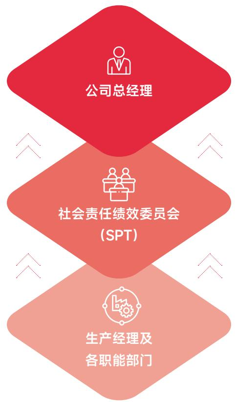

flowchart

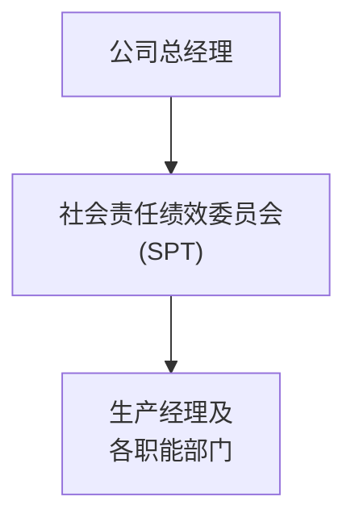
```mermaid
graph TD
  A["公司总经理"] --> B["社会责任绩效委员会\n(SPT)"]
  B --> C["生产经理及\n各职能部门"]
```

负责公司社会责任管理体系方针性策划，对公司的社会责任实施承担最终的责任

负责监督实施情况、协助内部审核与参加公司社会责任管理体系管理评审会议

负责贯彻落实和管理与自身业务相关的社会责任工作

## 利益相关方沟通

公司高度重视与利益相关方的良性互动，结合自身经营发展实际，系统识别各类利益相关方群体，搭建多元化的沟通交流渠道，广泛吸纳各方诉求与合理化建议，主动做好沟通反馈与诉求响应工作，构建起互利共赢的互动格局，为公司营造稳定、优质的内外部运营生态。

<table><tr><td>利益相关方</td><td>关注议题</td><td>沟通与回应</td></tr><tr><td>投资者及股东</td><td>○创新驱动○股东权益保护○风险管理○规范公司治理</td><td>○加强信息披露○重视投关交流○强化内控和风控管理</td></tr><tr><td>供应商</td><td>○数据安全与隐私保护○供应链安全○反商业贿赂及反贪污</td><td>○打造负责任供应链○供应商交流大会○开展供应商培训○坚守商业道德</td></tr><tr><td>客户</td><td>○产品和服务安全与质量○数据安全与隐私保护○创新驱动</td><td>○加强产品质量管控○优化客户服务流程○满意度调查与投诉渠道○保护客户信息与隐私○推进创新研发</td></tr><tr><td>社会组织</td><td>○应对气候变化○环境合规管理○社会贡献○乡村振兴</td><td>○健全环境管理体系○节能减排○热心社会公益○助力乡村振兴○关注社区反馈</td></tr><tr><td>员工</td><td>○保护员工合法权益○员工培训与发展○职业健康与安全</td><td>○员工民主管理渠道○完善薪酬福利体系○落实培训计划○完善职业发展机制○加强健康与安全管理○开展员工关爱活动</td></tr><tr><td>政府及监察机构</td><td>○环境合规管理○应对气候变化○污染物排放○反商业贿赂及反贪污○反不正当竞争</td><td>○健全环境管理体系○节能减排○遵守法律法规○依法纳税○坚守商业道德</td></tr></table>

## 重要性议题管理

公司参考《上海证券交易所上市公司自律监管指引第14号——可持续发展报告（试行）》和GRI Standards等国内外披露标准的评估方法，引入影响重要性和财务重要性的分析视鱼，识别出应对气候变化，创新驱动，产品和服务安全与质量供应链安全四个具有财务重要性的议题，并按照治理、战略、影响、风险和机遇管理、指标与目标框架进行披露。

## 双重重要性分析过程

## 议题识别

基于全球趋势和中国产业发展趋势的宏观环境、光伏组件行业和公司的商业模式分析，识别公司的利益相关方与公司面临的影响、风险与机遇，确定了 23 项对公司和利益相关方具有重要意义或影响的可持续发展议题。

## 影响重要性分析

从正面影响和负面影响、实际影响和潜在影响等维度对议题开展分析，梳理出相关影响，并结合与利益相关方的沟通情况，对影响程度进行评估。

## 财务重要性分析

公司以短期（0-1年）、中期（1—5年）及长期（5年以上）的时间框架为依据，围绕议题的风险与机遇，识别潜在的财务影响因素，并对议题的财务重要性展开综合评估与考量。

## 议题优先级排序

公司管理层对议题的影响重要性和财务重要性评估结果进行审核讨论，并经由公司董事会最终确认议题的优先级排序情况。

## 2025年实质性议题清单

## 环境

应对气候变化  
环境合规管理  
污染物排放  
废弃物处理  
循环经济  
能源利用  
水资源利用

## 社会

员工培训与发展  
保护员工合法权益  
职业健康与安全  
数据安全与隐私保护  
产品和服务安全与质量  
供应链安全  
社会贡献  
创新驱动  
乡村振兴

## 治理

股东权益保护  
规范公司治理  
风险管理  
尽职调查  
利益相关方沟通  
反商业贿赂及反贪污  
反不正当竞争

注：公司不涉及从事科技伦理敏感领域的科学研究、技术开发活动，因此未将“科学伦理”列为实质性议题；公司不存在应付账款余额超过300 亿元或占总资产超 50%，以及通过国家企业信用信息公示系统向社会公示逾期未支付中小企业款项信息的情况，因此未将“平等对待中小企业”列为实质性议题。公司生产经营活动对生态系统和生物多样性保护不构成重大影响，因为未将“生态系统和生物多样性保护”列为实质性议题。

## 重要性议题矩阵

实质性议题重要性分析  
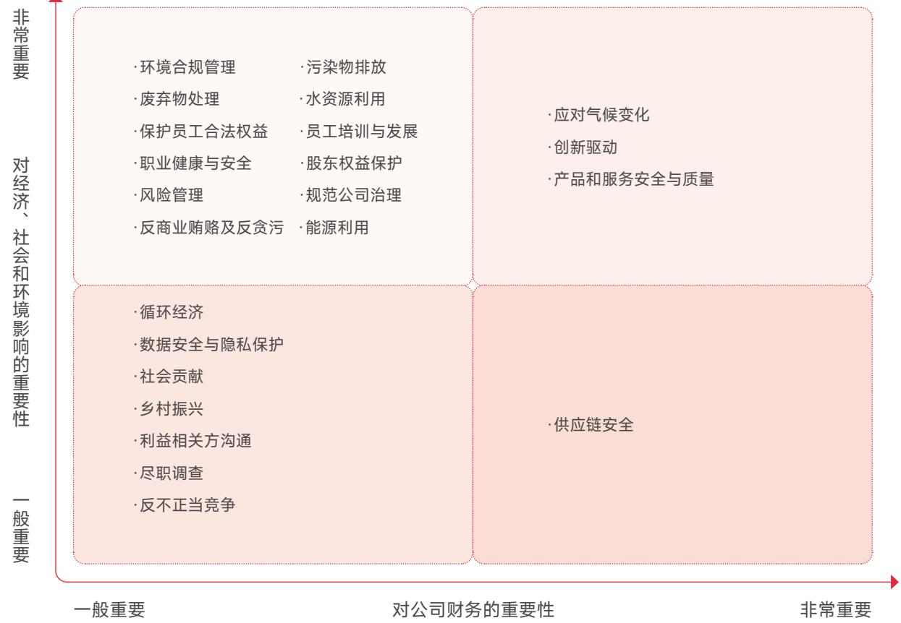

other

| Category | Topic 1 | Topic 2 |
| --- | --- | --- |
| 非常重要 (Top) | 环境合规管理 | 污染物排放 |
| 非常重要 (Top) | 废弃物处理 | 水资源利用 |
| 非常重要 (Top) | 保护员工合法权益 | 员工培训与发展 |
| 非常重要 (Top) | 职业健康与安全 | 股东权益保护 |
| 非常重要 (Top) | 风险管理 | 规范公司治理 |
| 非常重要 (Top) | 反商业贿赂及反贪污 | 能源利用 |
| 对经济、社会和环境影响的重要性 (Bottom Left) | 循环经济 | 数据安全与隐私保护 |
| 对经济、社会和环境影响的重要性 (Bottom Left) | 社会贡献 | 乡村振兴 |
| 对经济、社会和环境影响的重要性 (Bottom Left) | 利益相关方沟通 | 尽职调查 |
| 对经济、社会和环境影响的重要性 (Bottom Left) | 反不正当竞争 | — |
| 对经济、社会和环境影响的重要性 (Bottom Right) | 应对气候变化 | 创新驱动 |
| 对经济、社会和环境影响的重要性 (Bottom Right) | 供应链安全 | — |

## 专题

## 科技赋能 智造未来

公司以 “专注新材料，创造绿色美好生活”为企业使命，始终将技术研发视为提升企业核心竞争力的源泉，不断加大核心技术开发，持续推进研发体系建设，致力于新能源新型复合膜材料的研发与创新，引领封装技术发展方向。

## 治理

加快新技术开发与成果转化应用，规范研发项目全过程管理，公司制定了《研发中心设备管理制度》《科研项目管理办法》《研发项目立项验收管理办法》等一系列制度，对研发设备、科研项目及研发人员等关键领域实施全面管理，有效推动研发流程的规范化与标准化。研发部牵头组织公司项目立项评审流程，各相关部门参与，共同填写《项目立项评审表》。研发部根据评审意见形成结论，报请研发总监或总工程师批准后执行。

## 研发平台建设

公司在江西宜春和江苏苏州设立了两大研发中心，拥有一支专业的研发团队和先进的设备仪器，具备雄厚的研发硬件基础。研发中心紧密贴合市场脉搏，聚焦客户需求，持续攻克技术难关，致力于开发更高品质的专利封装产品，以此巩固和提升企业的市场竞争力。

研发组织架构图  
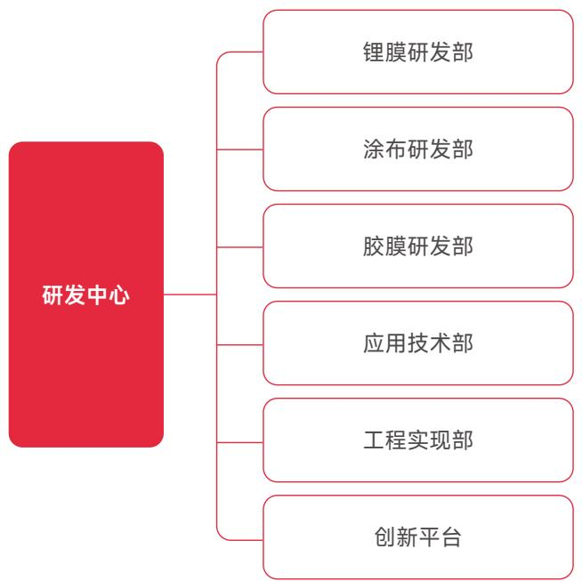

flowchart

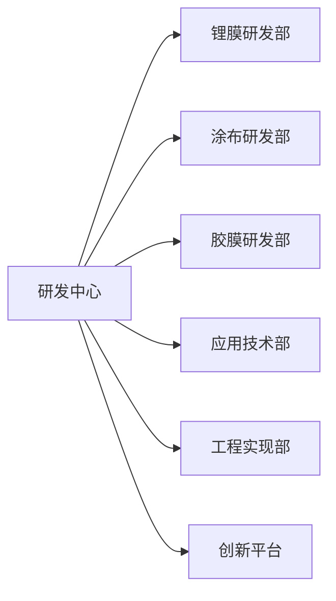
```mermaid
graph LR
  A["研发中心"] --> B["锂膜研发部"]
  A --> C["涂布研发部"]
  A --> D["胶膜研发部"]
  A --> E["应用技术部"]
  A --> F["工程实现部"]
  A --> G["创新平台"]
```

此外，公司还获批设立了博士后科研工作站，并以此为契机，深化产学研协同创新，不断优化研发团队结构，整合内外部创新资源，强化自主核心技术储备，全面提升企业的技术创新实力与产品开发水平。

## 明冠新材

博士后科研工作站、国家高新技术企业、国家知识产权优势企业、国家专精特新“小巨人”企业、江西省“专精特新”中小企业

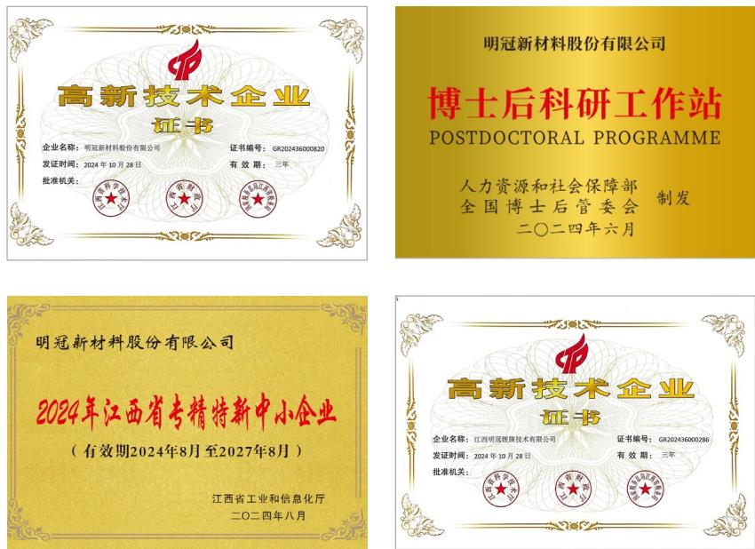

## 明冠锂膜

国家高新技术企业

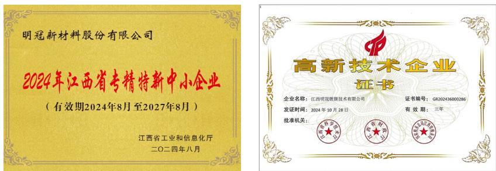  
研发平台认定

## 研发团队

公司始终重视研发团队的建设和培养，通过持续打造高素质、专业化的研发队伍，为企业可持续创新发展提供坚实支撑。截至报告期末，公司研发团队共计 69人，占员工总数的13.75%。

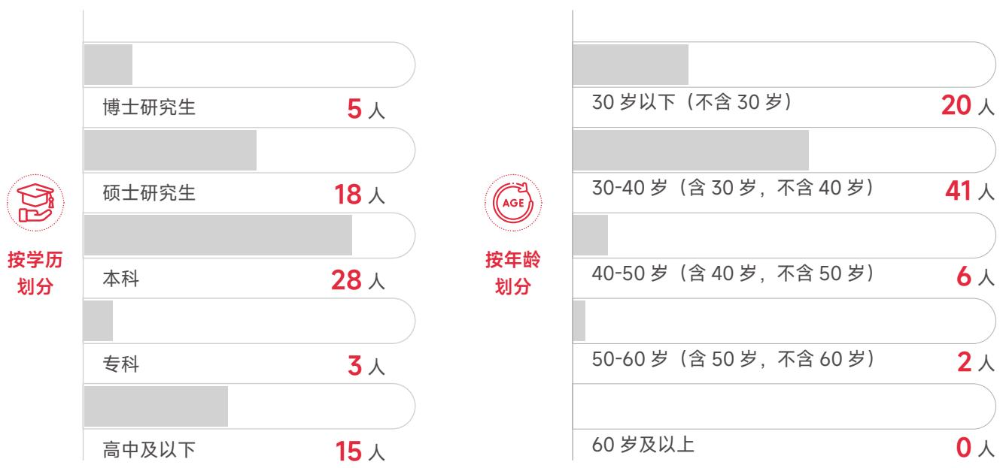

## 战略

<table><tr><td>风险类型</td><td>描述</td><td>影响周期1</td><td>潜在财务影响</td><td>应对措施</td></tr><tr><td>市场风险</td><td>随着技术更新迭代和行业竞争的加剧,市场与客户对产品要求也日趋多样。如果公司未来相关产品的研发进展与技术迭代无法满足行业发展需求,可能导致公司产品市场竞争力下降,进而影响公司的盈利能力。</td><td>中长期</td><td>研发投入增加,营业收入下降</td><td>主动跟踪市场动向,快速响应和把握市场趋势及需求。完善创新研发相关制度,持续加大研发投入力度,确保研发进展与技术迭代满足行业发展需求。</td></tr><tr><td>技术风险</td><td>随着N型光伏技术的不断优化,传统P型光伏技术因在效率和制程上的限制而逐渐被淘汰,拥有更高效率的N型产品渗透率正在急速提升中。公司在技术创新过程中,可能会遇到技术瓶颈或技术难题,这些障碍如果无法克服,将导致技术创新失败。</td><td>短中期</td><td>研发投入成本增加</td><td>加强研发中心建设与人才队伍建设,抓紧部署国家级博士后科研工作站;持续推进产学研合作交流,推动关键技术突破,实现成果转化。</td></tr></table>

<table><tr><td>机遇类型</td><td>描述</td><td>影响周期1</td><td>潜在财务影响</td></tr><tr><td>技术机遇</td><td>通过持续创新研发,实现技术突破,开发更多新产品,可以提升企业的竞争力,为公司带来丰厚的利润回报。</td><td>中长期</td><td>营业收入增加</td></tr><tr><td>市场机遇</td><td>全球光伏行业总体发展趋势向好,且随着固态电池、储能装机量增长,低空经济和人形机器人等产业发展,带来新的市场需求空间。</td><td>中长期</td><td>营业收入增加</td></tr></table>

1 影响周期：  
短期(1年以内):对公司的影响通常是快速目临时的 持续时间较短通常不会超出1年  
中期（1—5年）：对公司的影响较为持续，通常在1至5年内具有较大影响力。  
长期（5年以上）：对公司的影响是深远且持久的，持续时间通常超过5年。

## 影响、风险和机遇管理

公司通过制定《风险和机遇应对控制程序》和《FMEA 控制程序》等文件，规范产品设计开发及设计变更过程中的风险与机遇管理。研发中心负责统筹相关活动，采用集思广益等方式进行分析判断，识别可能存在的风险并拟定应对措施，将识别与评价结果填写在《过程/活动风险和机遇识别、评价及控制计划表》中。

公司成立由总经理牵头的风险控制小组，品质部负责组织风险评价会议。由风险控制小组对已识别的风险和机遇进行评审，确定风险等级，评估所定控制措施的充分性，并制定相应措施以规避或降低风险，确保各项措施得到有效落实。

## 指标与目标

公司贯彻“使用一代、储备一代、研发一代”的产品开发管理策略，坚持以技术创新引领市场变化。每年结合整体经营情况及客户实际需求 制定年度研发计划 聚售行业前沿 重点开发符合产业发展方向的新产品加快推动研发技术成果转化

2025 年指标

<table><tr><td>研发投入3,397.67万元</td><td>新增授权专利数7项</td><td>参与制修订国家标准2项</td><td>授权专利累计数92项</td></tr><tr><td>授权发明专利累计数44项</td><td colspan="2">授权实用新型专利累计数48项</td><td>授权外观设计专利累计数0项</td></tr></table>

## 研发成果

公司经过多年的研发积累，已形成具有自主知识产权的核心技术体系，其主要包括功能性高分子薄膜研制技术、特种粘合剂开发技术、材料界面处理技术、材料光学设计技术、精密涂布复合技术和功能性材料分散技术等。在薄膜基材和胶粘剂制备、材料表面处理以及涂布复合工艺方面形成公司的核心能力，增强了公司的比较优势和核心竞争力。

报告期内，公司研发成果主要聚焦于光伏封装、材料创新与前沿传感领域，围绕 0BB 技术、无主栅组件、耐高温铝塑膜、功能母粒及电子皮肤等方向取得关键突破，各项目在提升产品性能，降本增效，推动产业升级的同时，兼顾绿色制造与可持续性为新能源，高端膜材及智能感知领域提供了坚实的技术支撑与产业化路径

## 0BB 截止膜

0BB 截止膜分 EPE 和 EVA（EE 结构）两类，胶膜流动性和克重调节范围广，可满足 BC 电池低克重要求。截止波段越长，初始功率影响越大，但抗 UVID 性能越强。为平衡功率与老化性能，截止膜实现多层结构设计，可进行 320nm、340nm 等特定区间截止，满足不同客户的需求。

重大影响：推动0BB封装技术进步、给客户提供更多的选择，提高生产效率，具有更加高效的发电功率，推动绿色能源产业发展。

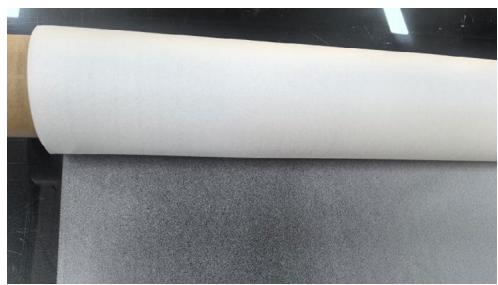

natural_image

Roll of white paper rolling on a dark fabric surface (no text or symbols visible)

## 耐高温铝塑膜

当前干法铝塑膜在高温环境（如 120℃）下剥离力仅为0\~2N/15mm，而热法铝塑膜可达 4N/15mm 以上，导致干法产品在某些场景下无法满足应用需求。现开发了耐高温铝塑膜，通过引入环氧体基团接入改性聚烯烃树脂，有效提高 AL/CPP界面剥离力，使产品在保持其他性能不变的前提下，高温剥离力达到与热法铝塑膜相当的水平。

重大影响：于法铝塑膜耐高温比肩热法 兼具边电压，边电阻冲壳优势；降本提性能，拓宽市场，增强竞争力与可持续性。

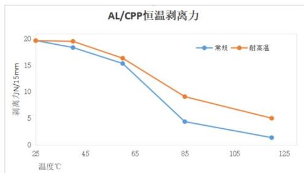

line

| 温度 \(({}^{\circ}C)\) | 常规 (N/15mm) | 耐高温 (N/15mm) |
| --- | --- | --- |
| 25 | ~19.5 | ~19.5 |
| 40 | ~18.3 | ~19.5 |
| 60 | ~15.2 | ~16.3 |
| 85 | ~4.3 | ~9.0 |
| 120 | ~1.4 | ~5.0 |

## 功能母粒

目前功能母粒行业助剂分散性差、易迁移析出、批次波动大、多功能复配兼容性差等痛点通过配方定向优化、核心结构创新与生产工艺升级，打造高稳定、高适配、多功能一体化产品，从源头解决下游黄变、性能衰减、良率低、成本高等问题，为光伏封装，高端功能膜材等领域实现提质，降本，增效

重大影响：攻克功能母粒稳定性、一致性与适配性难题，完善高端产品体系，推动光伏与膜材升级，提升终端性能及生产效率，助力新能源新材料高质量发展。

natural_image

Close-up of white crystalline particles in a clear glass bowl on a metal surface (no text or symbols visible)

## 电子皮肤

电子皮肤是公司战略核心项目，紧扣AI与机器人产业趋势，聚焦人机交互与机器人感知，延伸至可穿戴、医疗康养等场景，践行ESG理念。项目2025年一季度启动，完成压阻式压力传感器研发送样并完成两轮迭代，柔性温度传感器研发取得阶段性进展；储备

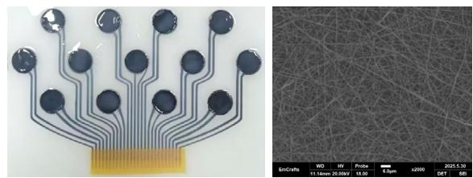

静电纺丝技术，实现原材料降本超99%，提升竞争力与可持续性。

重大影响：填补柔性传感器空白，推动产业升级与降本增效，服务医疗康养民生，带动人才就业，践行绿色降本与可持续发展。

## 激发创新活力

## 创新激励

为规范研发项目管理，充分调动技术人员的工作积极性，公司制定《研发人才激励制度》，将研发项目奖励与项目研发完成情况及经济效益挂钩，并设立了物质奖励和精神奖励，对新产品研发、现有产品的技术改进、工艺优化等项目进行考核奖励，持续激发创新活力与创造力。

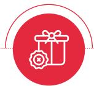  
物质奖励

项目进度完成奖励

产业化激励基金

专利申报奖励

发表学术期刊论文奖励

政府申报项目奖励

  
精神奖励

宣传表彰

培训学习/考察

独立承担研发课题

职位晋升

国内旅游

## 产学研合作

公司积极深化产学研合作，与多家知名高校建立长期战略合作关系，共同开展材料科学、结构设计等前沿领域的基础研究。通过整合高校科研优势与企业实践经验，加速科研成果向实际产品的转化进程，不断增强公司在固态电池、隔热材料等新兴领域的技术储备与创新能力，实现创新资源共享与互利共赢。

## 知识产权保护

公司高度重视知识产权保护工作，严格遵守《中华人民共和国专利法》《中华人民共和国著作权法》《中华人民共和国商标法》等相关法律法规，制定《专利管理制度》和《商标管理制度》，并设立知识产权办公室，负责全面统筹专利和商标的管理工作。公司不断加强知识产权的管理，确保公司各项专利技术规范使用，积极维护商标信誉，在保护自主知识产权成果的同时规避侵权行为发生，促进公司可持续发展。

同时，公司鼓励员工积极进行发明创造，促进企业技术创新和形成企业自主知识产权，推动生产技术进步，提高公司市场竞争力和经济效益。

## 案例

## 专利撰写培训

报告期内，公司组织相关人员开展专利专项主题培训，培训围绕专利挖掘、专利检索、案例分析、专利维权等维度展开，进一步提高员工知识产权管理意识与能力。

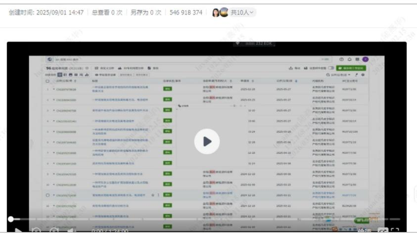

text_image

创建时间: 2025/09/01 14:47 | 总查看 0 次 | 另存为 0 次 | 546 918 374 | 共10人
名称: 2025/09/01
标识
- 一种直流电源的全电压相位的控制电路及其制造方法
- 一种智能开关的电流及其制程方法、电控元件
- 染子驱动电机的电动机和外部装置及制作方法
- 一种智能优化的电流及其制程方法
- 染子系统控制的电动机和外部装置及其制造方法
- 运输式变频器的控制电路及其控制电路及其控制电路
- 染子变频器的控制电路及其控制电路及其控制电路
- 运输性变频器的控制电路及其控制电路
- 染子变频器的控制电路及其控制电路
- 染子变频器的控制电路及其控制电路
- 染子变频器的控制电路及其控制电路
- 染子变频器的控制电路及其控制电路
- 染子变频器的控制电路及其控制电路
- 染子变频器的控制电路及其控制电路
- 染子变频器的控制电路及其控制电路

natural_image

Illustration of a business meeting with people at a table, one person presenting to the screen (no text or symbols visible)

## 行业交流

公司通过积极参与行业学术会议、展会等交流活动，与各界合作伙伴建立紧密联系，深入探讨行业发展趋势，分享前沿技术与实践案例，持续推动产品技术创新融合，共同促进新能源行业的可持续发展。

2025 年 5 月 7 日—9 日，Intersolar Europe 全球新能源行业盛会在德国慕尼黑盛大开幕，明冠新材在本次展会上展示了其领先的光伏封装材料技术及解决方案，并与全球客户展开了深入的技术交流与合作。

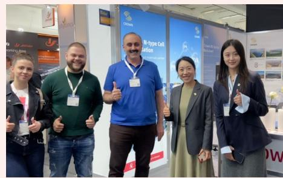

text_image

Group photo of five people posing with thumbs up at an exhibition booth, with visible signage and banners in the background.

2025 年 6 月 11 日—13 日，第十八届（2025）国际太阳能光伏与智慧能源展览会在国家会展中心盛大举行，明冠新材携多款新品重磅亮相，再度引发行业关注。围绕TOPCon、BC、HJT 等 n 型电池主流技术路线，明冠全面展示适配“高颜值、高可靠、高功率场景”的先进封装材料解决方案。

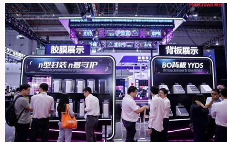

text_image

胶膜展示
n型封装 n多守护
背板展示
BO两板YYDS

2025 年 10 月 30 日至 11 月 1 日，印度新德里可再生能源展览会（REI）在 Greater Noida 展览中心隆重举行。明冠新材携多款创新产品亮相为快速增长的印度光伏市场带来先进的封装解决方案。

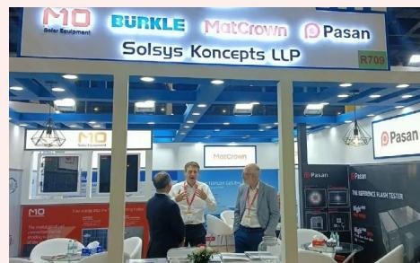

text_image

MO BURKLE MatCrown Pasan
Solsys Koncepts LLP R709
MOL
MatCrown
Pasan
PASAN
THE BEVRING FLASH TEXTURE

2025 年 11 月 27 日至 29 日，21st CSPV 在安徽淮南隆重举行，明冠新材携两场专题报告重磅登场 聚售光伏新技术驱动下封装材料的机遇与挑战，以及高效 n 型组件 0BB 封装方案的前沿研究。深度解析光伏新技术浪潮下封装材料的转型路径与创新方案，为行业同仁带来一场兼具前瞻性与实操性的技术盛宴。

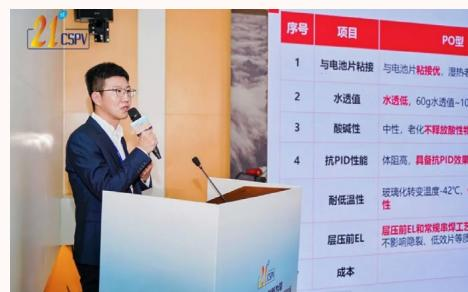

text_image

序号	项目	P0型
1	与电池片粘接	与电池片粘接优,湿性老
2	水透值	水透低,60g水透值-10%
3	酸碱性	中性,老化不释放酸性物
4	抗PID性能	体距高,具备抗PID效果
	耐低温性	玻璃化转变温度-42℃,1
	层压前EL	层压前EL和常规涂焊工艺
	不影响隐裂、低效片等度
	成本

## 01 规范明冠治理 合规诚信经营

明冠新材秉持“守正出奇、行稳致远”的企业精神，不断完善公司治理体系，健全内控与风险管控机制，优化信息披露及投资者关系管理，切实维护全体投资者的合法权益。与此同时，公司恪守商业道德准则，积极履行相关责任，为公司稳健运营与长期可持续发展筑牢根基。

<table><tr><td>公司治理</td><td>23</td></tr><tr><td>投资者权益保护</td><td>25</td></tr><tr><td>内控与风控</td><td>26</td></tr><tr><td>合规与商业道德</td><td>28</td></tr><tr><td>党建引领</td><td>30</td></tr></table>

SDGs

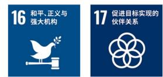

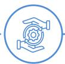

natural_image

Composite image showing a hand holding a smartphone against a city skyline with modern skyscrapers in the background (no text or symbols visible)

## 公司治理

## 治理结构

为全面贯彻落实最新法律法规及规范性文件要求，进一步提升公司治理水平，根据《上市公司章程指引》等相关法律法规，结合公司发展的实际情况及需要，公司对《公司章程》及部分治理制度进行了修订并制定了相关制度，明确规定股东会、董事会职责，切实履行各自应尽的职责和义务，不断优化管理体系和改善内部治理，确保公司规范运作，治理科学、规范、透明。

## 股东会

股东会是公司的最高权力机构，为保证股东会的正常秩序和决议的合法性，公司于报告期内修订了《股东会议事规则》，明确规定了股东会的召集召开程序、参会人员资格、会议表决程序等内容。股东会采用网络投票或现场投票等方式，对影响中小投资者利益的重大事项，实施中小投资者单独计票，并聘请律师事务所对股东会出具法律意见书，切实保障中小股东的投资利益与合法权益。

## 报告期内

公司召开股东会3次，审议通过事项 12项。

## 董事会

公司于报告期内修订了《董事会议事规则》，进一步规范公司董事会的议事方式和决策程序，促使董事和董事会有效地履行其职责。公司董事会对股东会负责，召集股东会并向股东会汇报工作，贯彻执行股东会决议，制定公司经营计划和投资方案，全面承担公司与经营管理相关的重大决策工作。

## 报告期内

公司召开董事会8次，审议通过事项41项。

## 独立性与多元化

为进一步完善法人治理结构，充分发挥独立董事在公司治理中的作用，公司于报告期内修订了《独立董事工作制度》，独立董事作为公司董事会成员，需恪守忠实义务与勤勉义务，独立履行职责，依法参与董事会各项议案的审议与表决，基于自身专业判断发表客观独立意见，并予以监督制衡以及提供专业咨询的作用。

公司高度重视董事会构成的多元化建设，在董事选拔环节，充分兼顾不同性别、各异专业背景及多元行业经验的人才，确保董事会能够从多维度、多视角开展决策工作，有效提升公司决策的科学性与合理性。

2025 年 8 月，公司严格按照法律法规及《公司章程》要求，顺利完成董事会换届工作。目前，公司第五届董事会共由7名董事组成，其中包含3名独立董事与1名职工代表董事；女性董事3名，女性董事占比42.86%。

## 董事会专门委员会

公司董事会下设审计委员会、提名委员会、薪酬与考核委员会及战略委员会，对董事会负责，协助董事会履行决策和监控职能，在促进公司规范运作、健康发展等方面发挥着重要作用。其中，审计委员会、提名委员会、薪酬与考核委员会的主任委员均为独立董事，且成员中有半数以上为独立董事，审计委员会主任委员为会计专业人士。

<table><tr><td>专门委员会名称</td><td>人数(名)</td><td>其中,独立董事(名)</td><td>独立董事占比</td><td>召开次数(次)</td></tr><tr><td>审计委员会</td><td>3</td><td>2</td><td>66.67%</td><td>6</td></tr><tr><td>提名委员会</td><td>3</td><td>2</td><td>66.67%</td><td>2</td></tr><tr><td>战略委员会</td><td>3</td><td>1</td><td>33.33%</td><td>1</td></tr><tr><td>薪酬与考核委员会</td><td>3</td><td>2</td><td>66.67%</td><td>1</td></tr></table>

## 董高薪酬管理

公司结合宏观经济走势、行业发展态势及自身经营规模，以行业薪酬水平为基准，科学构建董事、高级管理人员薪酬体系，旨在激发核心管理团队的履职动能与创新活力。薪酬发放实行分类管理：非独立董事依据其在公司担任的具体管理职务获取薪酬，不重复领取董事相关报酬；独立董事仅领取履职津贴。决策机制上，董事薪酬方案由股东会审议决策，高级管理人员薪酬方案由董事会审定实施。

公司根据相关法律法规和《公司意程》等规定 制定《2025年度公司高级管理人员薪酬方案》明确高级管理人员年薪水平与其承担的青任，风险和经营业绩挂钩，年薪中基本薪酬和绩效薪酬两部分组成，其中绩效薪酬根据个人岗位绩效考核结果，公司年度目标完成情况等综合评定按各考核周期进行考核发放。

## 投资者权益保护

## 信息披露

报告期内，公司严格遵循《上市公司信息披露管理办法》及《公司章程》等有关规定，修订《信息披露管理办法》《重大事项内部报告制度》《信息披露暂缓与豁免制度》等制度，对公司信息披露相关行为进行全面规范与约束，明确界定信息披露义务人的具体职责、信息披露的核心原则、披露范围及完整流程，保证披露信息真实、及时、准确、完整，持续提升信息披露透明度和质量，最大限度地保障广大投资者特别是中小投资者享有公平知情权。

为切实强化信息保密管理，严防内幕交易行为出现，公司制定了《内幕信息知情人登记管理制度》《信息保密制度》，明确规定所有重大信息及尚未公开披露的相关内容，严禁向外界擅自泄露、传播、报道及传递，确保未公开信息的保密性，维护公司信息披露的公平、公正、公开。

## 报告期内

公司对外披露4份定期报告，94 份临时公告及公告附件；因信息披露违规被处罚事件0起

## 投资者关系管理

公司严格遵守相关监管规定，制定并施行《投资者关系管理办法》，明确投资者关系管理工作应以全面、准确、真实及完整为前提，客观呈现公司运营现状，确保各类信息传递不偏不倚，避免因过度营销引发认知偏差。公司通过官网、上证互动、投资者热线、邮件、接待投资者调研等线上线下途径，与投资者展开沟通交流，并定期召开业绩说明会，以文字问答与交流形式回应投资者关切问题，增进投资者对公司的了解和认同。

## 报告期内

召开业绩说明会

3 次

在上证e互动与投资者互动次数

15 次

投资者问答回复率

100%

## 2025年江西辖区上市公司投资者网上集体接待日活动

为进一步加强与投资者的互动交流，参加由江西省上市公司协会举办的“2025 年江西辖区上市公司投资者网上集体接待日活动，届时，公司财务总监、董事会秘书与投资者开展沟通交流，围绕公司 2024 年度业绩、公司治理、发展战略、经营状况、融资计划、股权激励及可持续发展等投资者关心的问题进行详细介绍，并逐一解答投资者相关疑问，充分回应市场关切。

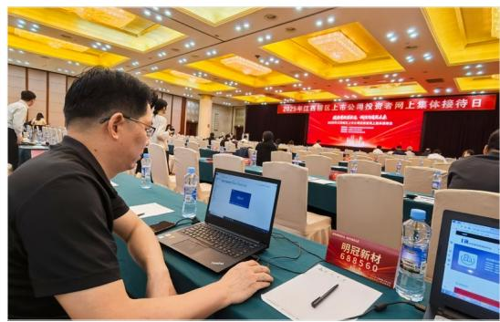

text_image

国际电商联盟暨上海公用投资者网上集体接待日
699560
明冠新材
699560

## 投资者利益保护宣传活动

公司高度重视投资者利益保护工作，积极响应监管号召，依托江西省证监会“12·4”宪法宣传周、公平竞争政策宣传周两大重要载体，开展法治思想、投资者权益保护宣传活动。宣传期间，公司紧扣“法治护航投资”“公平守护权益”核心主题，通过统一标识和主题海报等多元形式，广泛宣传《法治宣传教育法》等相关法律法规，提倡公平竞争意识，引导投资者树立权益保护意识。

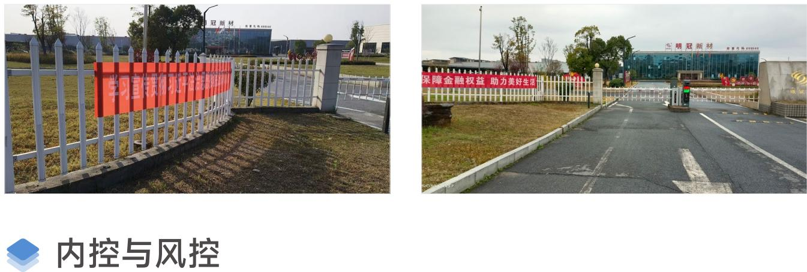

## 内控与风控

## 内部控制

公司董事会及管理层持续监督内控制度的执行情况，通过系统检查及时发现制度设计与运行中存在的不足，并采取有效措施进行优化，确保内部控制体系持续有效运行。风控审计部作为公司的内部审计部门，负责对公司内部控制制度的建立和实施、公司财务信息的真实性和完整性等情况进行检查监督，对审计委员会负责，并向其汇报工作。报告期内，公司修订制定《内部控制制度》和《内部审计制度》，明确不同业务领域的内控要求与管理规范，持续推进内部控制体系的完善与优化。

报告期内，在董事会审计委员会的指导下，公司依据年度审计计划并结合实际情况，完成了年度审计、内部控制审计报告，进一步提升了内控管理水平，加强了对经营活动和各部门的监督与管控。

## 风险管理

公司依据《风险与机遇应对控制程序》，建立了系统化、规范化的风险防控体系，各部门负责识别及评估本部门涉及过程的风险，并制定措施规避或降低风险及落实执行。同时，公司每年至少对风险识别、应对措施的完成情况和进度实施一次评审，以验证其有效性。通过不断加强风险管理，持续提升风险控制水平，实现对风险的有效控制，保障公司稳健运营与发展。

## 风险管理全流程

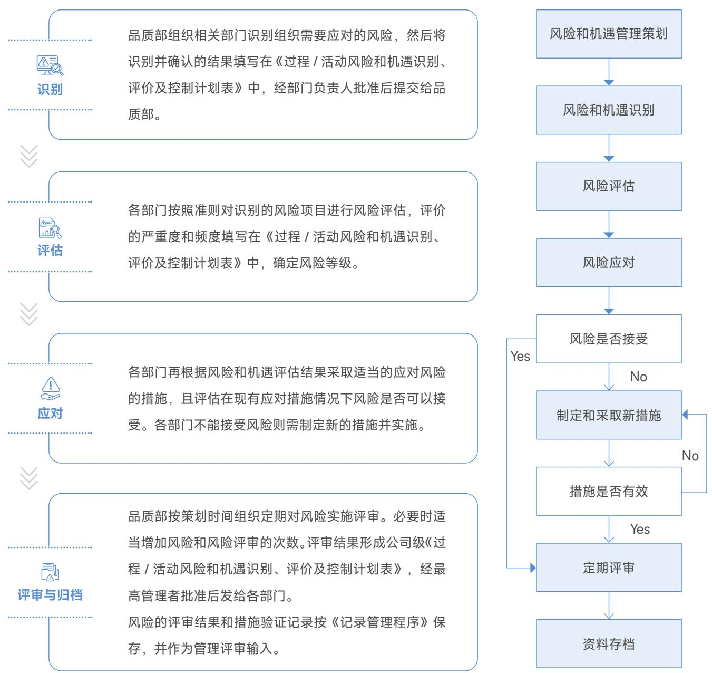

flowchart

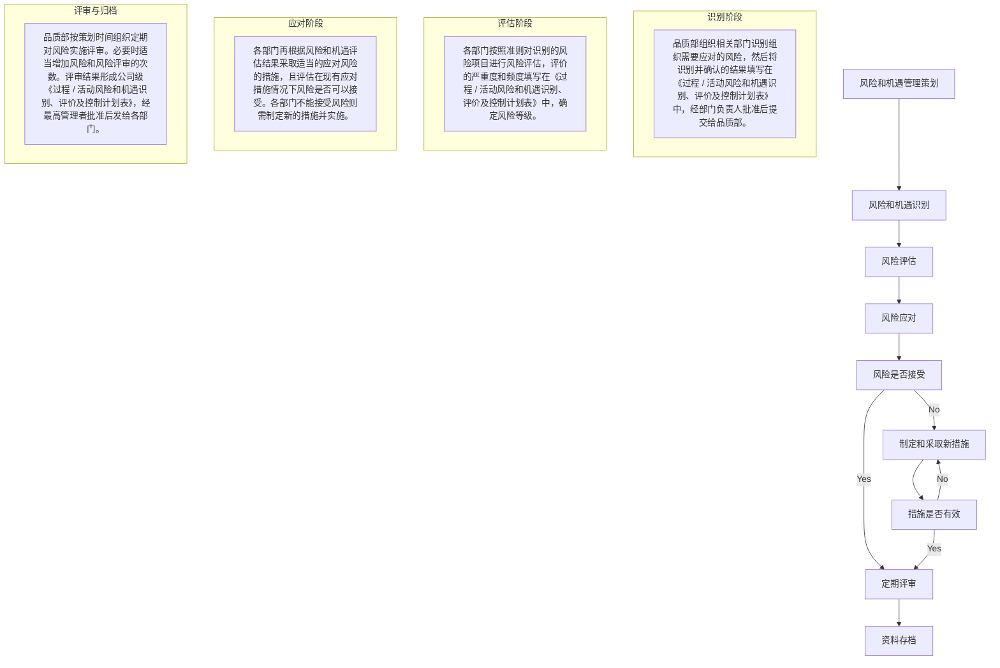
```mermaid
graph TD
  A["风险和机遇管理策划"] --> B["风险和机遇识别"]
  B --> C["风险评估"]
  C --> D["风险应对"]
  D --> E["风险是否接受"]
  
  E -->|Yes| F["定期评审"]
  E -->|No| G["制定和采取新措施"]
  G --> H["措施是否有效"]
  H -->|Yes| F
  H -->|No| G
  
  subgraph Stage1 [识别阶段]
    I["品质部组织相关部门识别组织需要应对的风险，然后将识别并确认的结果填写在《过程 / 活动风险和机遇识别、评价及控制计划表》中，经部门负责人批准后提交给品质部。"]
  end
  
  subgraph Stage2 [评估阶段]
    J["各部门按照准则对识别的风险项目进行风险评估，评价的严重度和频度填写在《过程 / 活动风险和机遇识别、评价及控制计划表》中，确定风险等级。"]
  end
  
  subgraph Stage3 [应对阶段]
    K["各部门再根据风险和机遇评估结果采取适当的应对风险的措施，且评估在现有应对措施情况下风险是否可以接受。各部门不能接受风险则需制定新的措施并实施。"]
  end
  
  subgraph Stage4 [评审与归档]
    L["品质部按策划时间组织定期对风险实施评审。必要时适当增加风险和风险评审的次数。评审结果形成公司级《过程 / 活动风险和机遇识别、评价及控制计划表》，经最高管理者批准后发给各部门。"]
  end
  
  F --> M["资料存档"]
```

## 税务管理

公司严格遵守《中华人民共和国企业所得税法》《中华人民共和国税收征收管理法》等税务法律法规，建立了完善的税务管理体系，制定《税务管理制度》，对各项税务工作实施严格管理，确保税务操作流程规范、透明，有效降低错误与舞弊风险。

在账簿管理方面，公司建立了完善的发票管理制度，加强发票开具、取得与保管等环节的规范管理，严格按照会计准则和相关制度进行核算，为税务申报提供准确可靠的数据支持。公司按时、准确完成纳税申报和缴纳工作，确保不发生逾期申报、漏报或少报等情况。

同时，公司持续关注税收政策动态，与税务机关保持良好沟通，及时掌握政策变化和征管要求，合理调整纳税申报策略。定期组织开展税务培训和学习活动，培训内容涵盖税收法规政策、税务风险管理、税务筹划等方面，旨在提升员工的税务风险意识和专业素养，确保其在税务工作中严格遵守法律法规和职业道德要求。

## 合规与商业道德

## 合规管理

公司高度重视合规管理 制定《合规管理手册》明确合规管理基本原则，合规管理机构与职责及合规行为规范准则。公司设立合规委员会，负责公司的合规管理体系建设及实施，健全合规管理机制，识别、监控、防范、应对经营管理过程中可能存在的合规风险，监督、预防、遏制不合规行为，将合规理念融入公司运营、管理和业务的各个环节，确保公司经营管理行为合法合规。

## 案例

## 反腐与合规专项培训

公司针对销售、供应计划及人力资源等核心职能部门，开展了反腐与合规专项培训，帮助相关人员明确负责领域的合规风险点，掌握业务流程中的合规操作要求，进一步强化合规意识，筑牢廉洁从业思想防线。

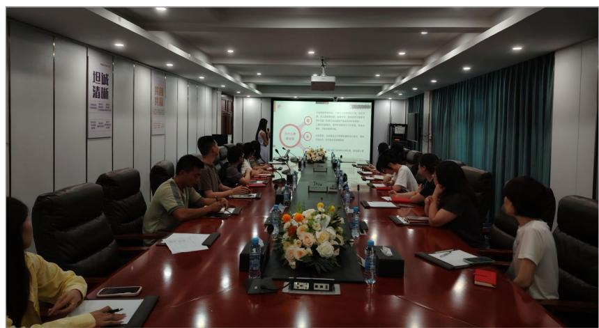

text_image

Meeting room photo with visible presentation screen and wall posters containing Chinese text

## 反商业贿赂及反贪污

公司始终恪守商业道德，严格遵守《关于禁止商业贿赂行为的暂行规定》等相关法律法规。为强化制度监督，推进制度反腐，公司建立了《反腐败管理办法》，进一步加强对腐败易发、多发环节及重点岗位人员的监督与管理，确保反贿赂工作落实到位。同时，公司对《反舞弊与举报保护制度》进一步修订，有效防范舞弊行为，降低经营风险，规范全体员工行为，保障公司经营目标的实现，推动公司持续、稳定、健康发展。报告期内，公司没有发生商业贿赂及贪污事件相关的重大处罚。

在组织架构方面，公司审计监察中心作为反贿赂/反腐败工作的监督管理部门，依法开展反贿赂相关事务，通过监督检查、制度建设与廉洁记录等手段，从源头上预防和治理关键领域和环节的腐败问题。董事会审计委员会作为反舞弊工作的领导机构，负责对反舞弊工作进行指导和监督；公司管理层则负责建立健全并有效执行内部控制机制，降低舞弊发生的可能性，并对已发生的舞弊行为采取及时、有效的补救措施。

为强化员工廉洁从业意识，筑牢拒腐防变思想防线，报告期内，公司组织销售部、计划物控部、人力资源部开展“反腐倡廉”专题培训。同时，公司持续加强对管理人员及供应商、客户等合作方的引导，倡导依法合规、诚实守信经营，抵制见利忘义、损公肥私、失信欺诈等行为，积极维护企业良好形象。

在廉洁管理方面，公司构建内外协同的制度体系：对内与全体员工签订《廉洁自律承诺书》及《廉洁协议》，强化自我约束；对外与相关方签订《反商业贿赂协议》，规范合作行为，推动廉洁理念融入经营各环节，切实提升商业道德治理水平。

## 报告期内

员工《廉洁协议》签订率100%。

## 反不正当竞争

公司严格遵守《中华人民共和国反不正当竞争法》及相关反垄断法律法规，积极倡导并践行公平，诚信的市场竞争原则，在生产经营活动中，鼓励合规开展业务活动，坚决反对以不正当手段限制或排除市场竞争的行为，包括但不限于生产销售假冒伪劣商品、虚假宣传、串通投标、侵犯商业秘密，以及通过分割市场或限制产量等方式排除、限制市场竞争，致力于营造透明、公正、有序的市场环境。报告期内，公司没有发生不正当竞争行为导致的诉讼或重大行政处罚。

## 举报与举报人保护

公司建立了完善的举报机制，设立专门的违规举报平台，鼓励员工及社会各界通过电话、邮箱等渠道反映问题。所有涉及舞弊事件的投诉与举报均由审计部统一接收，跟进处理并予以反馈，为切实保护举报人权益 公司明确规定，参与举报受理或舞弊调查的工作人员，不得擅自向任何部门或个人透露举报人信息及举报内容，严禁任何形式的歧视或打击报复行为。

## 举报途径

## 反舞弊专用举报电子邮箱

专设邮箱：

fanwubi@matcrown.com

## 向审计部/反舞弊小组举报

邮箱：fksj@matcrown.com

手机：13914095542

## 来信举报：

地址：宜春经济开发区经发大道明冠新材料股份有限公司

邮编：336000 收件人：风控审计部

## 党建引领

公司坚持以习近平新时代中国特色社会主义思想为指引，深入学习贯彻党的二十届三中全会精神，持续推进党组织建设与企业发展深度融合，切实将党的政治优势与组织优势，转化为驱动公司高质量发展的强劲动能。

公司积极响应党和国家号召，推进党组织建设工作，在政治、思想、组织、作风、纪律五大建设上深入思考，紧扣“围绕中心、建设队伍、服务群众”三大核心任务谋划机关党的建设工作，以制度建设促进中心工作高效落实。并通过发展优秀党员方式加强队伍建设，充分发挥基层党组织政治核心、战斗堡垒和党员先锋模范作用。自2022年起，公司被选入“江西省‘两新’组织高水平党建创新计划”专项，被列为“两新党建示范点”。

截至报告期末，公司共有党委数量1个，党支部数量1个，正式党员共17人，召开党委会12次。

党支部组织架构  
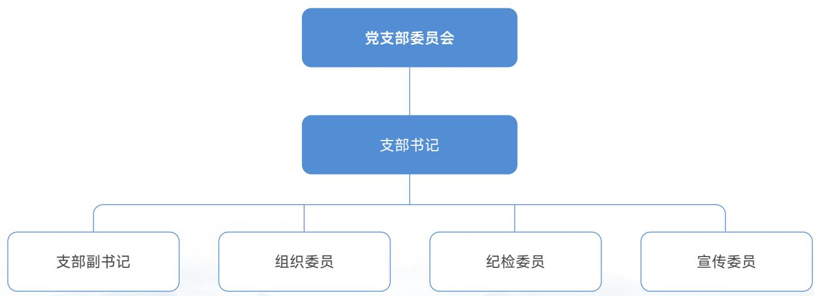

flowchart

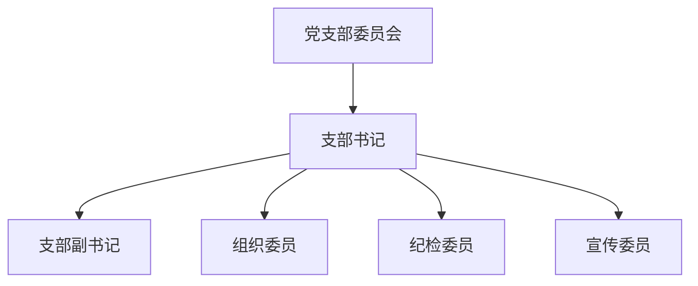
```mermaid
graph TD
  A["党支部委员会"] --> B["支部书记"]
  B --> C["支部副书记"]
  B --> D["组织委员"]
  B --> E["纪检委员"]
  B --> F["宣传委员"]
```

## 02 绿色环保新材 探索低碳路径

明冠新材始终坚持“专注新材料，创造绿色美好生活”的企业使命，深入贯彻国家“双碳”目标，将绿色发展融入企业的日常经营中，持续加强环境管理体系建设，积极应对气候变化挑战，践行绿色低碳运营，减少能源消耗与碳排放，以光伏发展为引擎，构建美好绿色未来，致力于推动事业经营和环境保护协调发展。

<table><tr><td>环境合规管理</td><td>33</td></tr><tr><td>应对气候变化</td><td>37</td></tr><tr><td>资源利用</td><td>41</td></tr></table>

SDGs

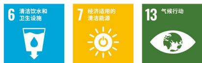

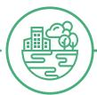

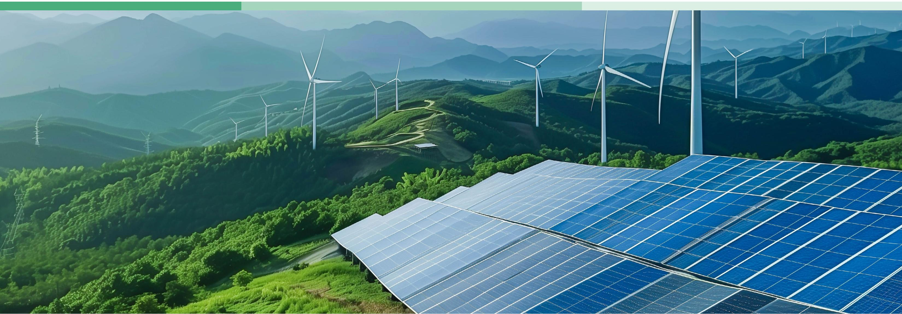

natural_image

Scenic view of renewable energy with solar panels and wind turbines on rolling green hills (no text or symbols visible)

## 环境合规管理

公司坚持绿色运营理念，严格遵守《中华人民共和国环境保护法》等法律法规，不断完善环境管理体系，系统开展污染防治，持续提升环境管理水平，致力于降低生产经营过程对生态环境产生的影响。

2025 年

公司环保投入121 万元

## 环境管理体系

公司秉持“污染预防、强化环保意识、遵纪守法、节能降耗、绩效持续改进、共创绿色美好生活”的环境方针，制定《环保管理制度》等制度，全面规范环境管理与污染物治理工作，明确环境管理职责，搭建规范化的环境管理组织架构。公司总经理担任环境管理第一责任人，下设安环部负责环境保护统筹管理工作，各部门负责具体执行与协同配合，保障各生产基地环保管理及污废防治工作规范、高效、有序推进。

截至报告期末，公司及明冠锂膜均通过ISO 14001环境管理体系认证。

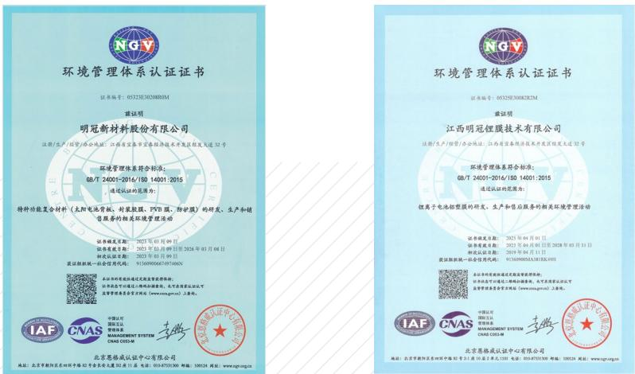  
环境管理体系认证证书

公司积极开展全员环保能力建设与意识提升工作，通过组织环保通识培训、专项技能培训及配套考核，持续强化员工环保知识储备与实操技能。

## 案例

## 开展环保能力培训

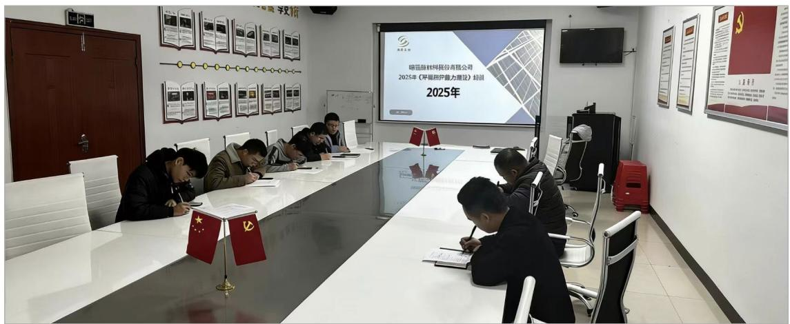

text_image

福昌新材料股份有限公司
2025年（平星招伊鼎力建设）培训
2025年

## 环境风险管理

公司建立源头管控、应急保障相结合的环境管理机制，系统识别并评估生产经营全过程环境风险。针对重点风险点位定期开展环境风险评估与应急演练，及时消除环境隐患，从源头防范环境污染事故，保障企业绿色稳定运营。

## 环境因素识别

公司制定《环境因素识别与评价程序》等管理制度，规范环境因素识别与评价流程，采用专家判断法、是非判断法、评价打分法等方法识别并判定重要环境因素，依据发生频次、影响范围、危害程度、相关方关注、控制现状及资金投入等维度，形成重要环境因素清单，并制定针对性防控措施，实施持续监测、定期评审与动态优化，确保风险管控措施有效落地，降低环境风险。

## 应急管理

公司关注突发环境事件的防范和应对，制定《突发环境事件应急预案》建立健全环境安全应急体系与应急处置机制，确保突发环境事件发生时应急响应快速启动、处置高效有序，最大限度控制、减轻与消除环境危害，减少人员伤亡与经济损失。同时，公司定期组织进行应急演练，实现全公司环境应急响应能力的提升。

应急组织机构  
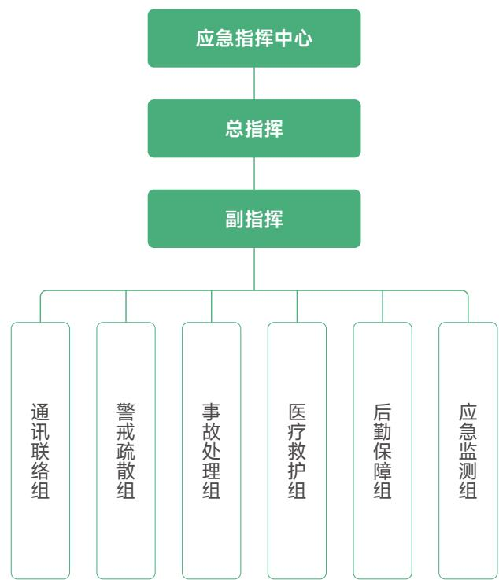

flowchart

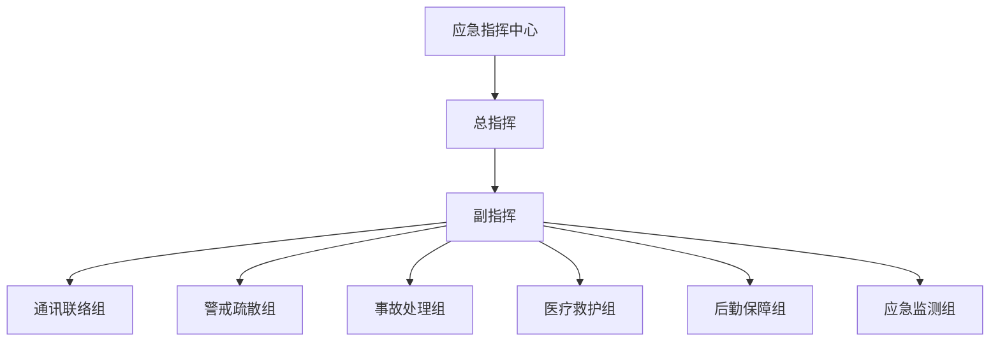
```mermaid
graph TD
  A["应急指挥中心"] --> B["总指挥"]
  B --> C["副指挥"]
  C --> D["通讯联络组"]
  C --> E["警戒疏散组"]
  C --> F["事故处理组"]
  C --> G["医疗救护组"]
  C --> H["后勤保障组"]
  C --> I["应急监测组"]
```

## 污废排放

公司严格遵守《中华人民共和国水污染防治法》《中华人民共和国大气污染防治法》《中华人民共和国固体废物污染环境防治法》等法律法规，制定《废水、废气、噪声控制程序》《固体废弃物控制程序》等管理制度，持续强化污染物排放管控与规范废弃物处置。公司结合自身实际情况定期开展环境监测工作，通过不定期监督、检查和定期委托第三方专业机构对废水、废气、噪声排放进行监测，严格监控污染物排放状况，确保环保设施稳定运行、污染物达标合规排放，有效降低各类污染对周边环境及人员的影响。

## 废气管理

公司严格执行《大气污染物综合排放标准 GB 16297-1996》，规范废气排放管理。公司主要废气污染源包括化学品挥发、汽车尾气、含 CFCs 物质电器及熟化箱，通过明确各污染源管控责任部门，针对污染点位实施精准治理，并设置专门的废气处理工序与治理设施，确保废气处置与排放全程合规达标。

## 废气管控措施

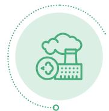

规范使用化学危险品，尽量减少其挥发，使用完毕后将容器封闭，置于指定位置。  
公司空调添加符合规定的制冷剂。  
汽车不得加用含铅汽油，并按每年定期年审。  
对于排出的废气量较多、环境影响较大的设备设置排气处理装置。

## 废水管理

公司产生的废水主要包括生活污水和生产清洁废水，严格按照《污水综合排放标准 GB 8978-1996》实施废水排放管理。公司明确污水处理主体责任，严格执行雨污分流制度，确保废水达标处理与合规排放。

## 废水管控措施

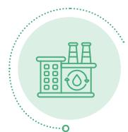

污水管道与雨水管道严格分开，禁止将污水排入雨水管道、混合使用。  
废油、废化学品禁止倒入下水道，放置专门容器中并回收。  
定期清理污水雨水管道。  
食堂设置隔油池并定期清理，含油量较多的废水需分离后倒入下水道。  
食堂污水排放口设置过滤网，滤出的垃圾按生活废物处理。  
对生活污水经隔油池、化粪池处理后进入污水处理厂。

## 废弃物管理

公司严格遵守相关法律法规及运营地相关固体废物管理要求，积极做好固体废弃物识别、分类、贮存、转运及处置等规范化管理工作，并设置考核要求，要求各部门人员按照减废降本方案开展工作，加强废弃物的控制，减少废弃物的产生和对环境造成影响。

## 一般废弃物

<table><tr><td colspan="2">固废种类</td><td>处置措施</td></tr><tr><td>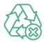不可回收</td><td>工程施工及生活中产生的建筑垃圾、食物垃圾、生活垃圾等。</td><td>放入不可回收垃圾区域或垃圾桶内,再由环卫部门或受委托单位统一运送到垃圾场处理。</td></tr><tr><td>可回收</td><td>生产及办公活动中产生的废包装袋、边角料、报废不合格成品与材料、废纸箱、废木箱、玻璃瓶、废塑料膜、废纸、打包袋等。</td><td>· 生产中产生的边角料、报废的不合格成品与材料直接回收放置废品库;产生的废编织袋、废纸箱、废瓶罐、废纸、打包带等放入一般可回收废弃物指定区域或存放箱;已经报废不能使用的设备放入报废设备区。· 由各单位安排人员统一将一般固体废弃物整理,转卖给物资回收部门。</td></tr></table>

## 危险废弃物

公司高度重视对危险废弃物的管理，与有资质的第三方签订《危废处理合同》，规范危废存放、转运及处置的管理，做好危险废弃物的摆放、卫生清洁、安全存放等工作，保证危险废弃物排放、处置合规安全。公司每年制定年度危险废弃物管理计划并按期实施工作，及时进行危废品的月报、季报，加强对危废的管理。

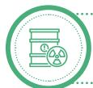

## 危废种类

各部门产生的沾有化学物质的包装袋或桶、废胶黏剂、助剂废液，废溶剂，实验室废液，废矿物油  
承包单位或承租单位施工或生产时产生的废旧涂料，废化学品、残余油漆、废沥青余料等。

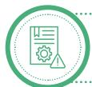

## 处置措施

收集、分类存放到指定危废暂存点，并张贴危废标签，后由安环部委托第三方单位进行转移处理。  
相关方单位合规收集，存放在指定的有害废弃物场所并自行委外进行合规处理。

同时，公司积极实施危险废弃物减量化计划，严格控制每次清洁生产设备的溶剂用量并回收再利用，避免浪费；通过工艺改进、提高污染防治水平等方式，减少危险废弃物产生。

## 噪声管理

公司严格遵守《工业企业厂界噪声标准GB 12348-2008》国家标准，制定《噪声控制程序》，明确噪声的管理控制方法，对高噪音设备采取基础减震、隔声等防护设施，减少噪声扩散。

## 噪声管理措施

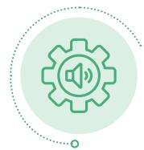

生产作业时，尽量关闭门窗、控制厂界内噪声，必要时，员工佩戴耳机。  
对噪声大的设备进行隔声防震处理，保障厂界噪声达标。  
生产部按机器设备规范操作，设备部定期对机器设备进行维护和保养；出现异常情况时，停止使用，并及时联络外部进行维修。  
设备部对空压机定期点检/保养，定期更换易损配件。

## 应对气候变化

公司高度重视气候变化带来的潜在影响，将气候风险管理嵌入战略决策与日常运营中，积极应对政策法规趋势与行业转型需求，通过系统识别气候相关风险与机遇，严格管控温室气体排放等举措，以持续提升气候适应与应对能力。

## 治理

公司董事会负责全面监督和统筹气候变化相关的工作、各职能及业务部门负责落实与推进气候变化行动的实施，确保有效应对气候变化挑战，有序推进公司气候变化治理体系建设工作。

## 战略

公司综合考量气候变化相关政策，内外部环境因素及自身经营情况 积极识别气候变化带来的相关风险及机遇，评估风险及机遇可能产生的影响周期、潜在的财务影响，并基于评估结果，制定针对性的应对措施，以降低气候变化带来的风险，把握机遇。

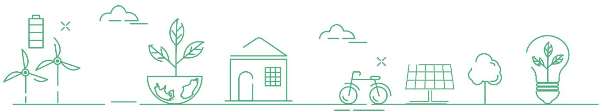

natural_image

Line art illustration of various green icons representing energy, sustainability, and environmental concepts (no text or symbols)

物理风险

<table><tr><td>风险类型</td><td>风险描述</td><td>影响周期1</td><td>潜在财务影响</td><td>应对措施</td></tr><tr><td>急性风险</td><td>突发的极端天气事件,如台风、寒潮、暴雨等,导致基础设备、办公场所等遭遇破坏,进而可能造成生产中断或影响正常营业。</td><td>短中期</td><td>设备维修、保养导致成本上升,收入减少。</td><td>建立应急抢救小组,开展应急演练。加强设备、建筑检修维护,增强抵御能力。</td></tr><tr><td>慢性风险</td><td>由于全球气候变暖,平均气温持续上升,导致公司空调、制冷、供电等能耗增加、设备维护保养成本增加。</td><td>长期</td><td>能源支出增加</td><td>加强能源管理,减少能源消耗。定期进行设备和配件的检查、维修和保养工作。开展节能技术改造项目,提高能源使用效率。</td></tr></table>

转型风险

<table><tr><td>风险类型</td><td>风险描述</td><td>影响周期1</td><td>潜在财务影响</td><td>应对措施</td></tr><tr><td>政策和法律风险</td><td>随着气候变化相关政策的不断更新,公司若不及时制定并执行相应应对策略,以符合政策和披露要求,可能面临合规风险。</td><td>短中期</td><td>合规、运营成本增加</td><td>动态跟踪气候变化等法规要求,确保公司遵守相关政策、法规。持续推进节能减排工作,降低能源资源消耗,减少温室气体排放。</td></tr><tr><td>市场风险</td><td>随着我国“双碳”政策的提出与持续推进,未来光伏行业将保持良好发展,但若未来光伏产业政策的动态调整及对可再生能源发展目标出现重大不利变化,公司未能及时调整业务模式和战略。</td><td>中期</td><td>营业收入降低,运营成本增加。</td><td>持续跟踪市场变化和客户需求,及时调整业务模式和战略。持续加大研发投入,强化企业研发创新实力,巩固核心竞争力。</td></tr><tr><td>声誉风险</td><td>利益相关方对公司ESG表现、气候相关信息等方面的关注,公司若未能及时披露相关行动与实践绩效,无法满足利益相关方期望,可能会面临声誉损失。</td><td>中长期</td><td>营业收入降低</td><td>及时披露与气候变化相关风险与应对措施,在提升企业自身可持续发展治理水平的同时提升信息披露透明度。</td></tr></table>

机遇

<table><tr><td>机遇类型</td><td>风险描述</td><td>影响周期1</td><td>潜在财务影响</td></tr><tr><td>能源替代</td><td>在低碳转型的背景下,公司采用清洁能源替代传统能源,逐步增加光伏的绿色电力的使用比例,助力低碳发展,减少碳排放。</td><td>中长期</td><td>降低运营成本</td></tr><tr><td>产品与服务</td><td>公司立足于新能源复合膜材料产业,通过加大研发投入,提供各类高质量的产品,以满足市场和客户对低碳产品和服务的需求。</td><td>中长期</td><td>营业收入增加</td></tr></table>

影响周期1：  
短期（1年以内）：对公司的影响通常是快速且临时的，持续时间较短通常不会超出1年。  
中期（1—5年）：对公司的影响较为持续，通常在1至5年内具有较大影响力。  
长期（5年以上）：对公司的影响是深远且持久的，持续时间通常超过5年。

## 影响、风险和机遇管理

为有效应对气候变化挑战，公司建立起识别、分析和评估及应对的气候风险管理流程，以持续提供公司整体风险管理能力，确保公司在应对气候变化的过程中稳健前行。

## 风险管理流程

识别

参考 IFRS S2 框架列举的气候相关风险和机遇清单，基于公司业务、经营情况及行业特征，识别出对公司运营及业务有影响的气候相关风险和机遇。

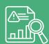

分析和评估

结合公司业务和战略实际情况，对已识别风险及机遇从影响的周期，潜在的财务影响等维度进行评估，确定管理优先级，确保公司能够优先处理具有较大财务影响的气候风险，为资源分配提供依据。

应对

据风险评估结果，制定并执行针对性的控制措施，最大程度降低潜在气候变化风险对公司的不利影响，把握机遇。

## 指标与目标

为加强气候变化治理，公司识别出与气候相关的指标，每年依照ISO 14064-1相关准则定期盘查各厂区的温室气体排放量，并以此检视、制定和改善减碳措施，通过推广清洁能源使用和实施节能技改等一系列措施，逐步降低温室气体排放量，减缓温室气体排放对地球暖化所造成的环境及气候影响，助力国家“双碳”目标实现。

温室气体排放总量  
吨二氧化碳当量  
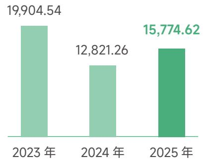

bar

| Year | Value |
| --- | --- |
| 2023年 | 19,904.54 |
| 2024年 | 12,821.26 |
| 2025年 | 15,774.62 |

直接温室气体排放量（范围一）  
吨二氧化碳当量  
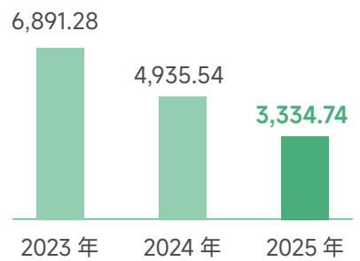

bar

| Year | Value |
| --- | --- |
| 2023年 | 6,891.28 |
| 2024年 | 4,935.54 |
| 2025年 | 3,334.74 |

间接温室气体排放量（范围二）  
吨二氧化碳当量  
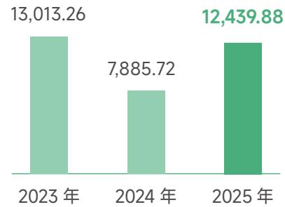

bar

| Year | Value |
| --- | --- |
| 2023年 | 13,013.26 |
| 2024年 | 7,885.72 |
| 2025年 | 12,439.88 |

注：2023 年、2024 年温室气体排放数据根据来自公司开展温室气体盘查报告。2025 年温室气体排放数据，因公司暂未开展本年度温室气体盘查活动，根据《工业其他行业企业温室气体排放核算方法与报告指南（试行）》等进行温室气体排放量计算。2025 年：范围一包括天然气，范围二包括外购电力。2025年产线投产线同比去年增加，整体电力使用量较2024年增长，故温室气体排放总量较去年增长。

## 绿色产品

公司始终践行绿色发展理念，在光伏封装材料的高效化、环保化赛道上持续发力，为构建清洁低碳的现代能源体系注入更坚实的力量。

## n型单玻封装的可靠背板方案

BO系列背板，是集环保、高效与可靠于一身的创新产品，已通过3倍IEC加严测试和PFAS环保认证，其中，高反黑背板反射率≥55%，可提升组件功率达1.6%，其独特的“呼吸性”结构能有效排出组件内部有害气体，强韧材质可充分释放内部应力，确保户外运行寿命超过16年，绿色无氟环保，创造绿色美好生活。

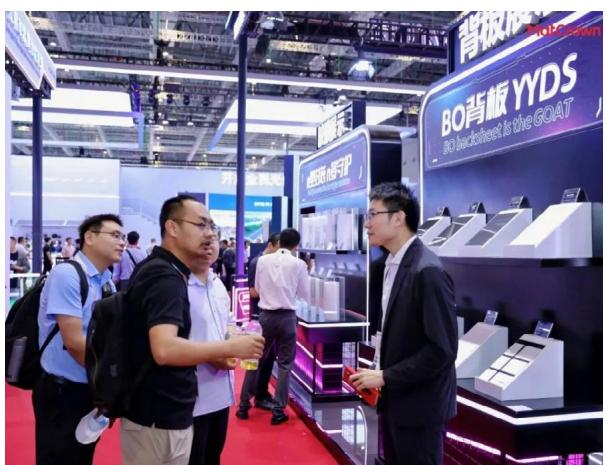

text_image

BO背板YYDS
BO backsheet is the GOAT

## 案例

## 网栅膜

公司现已推出PO型与EVA型两大类型网栅膜，网栅膜作为IFC直接覆膜、SmartWire覆膜工艺的关键封装材料，可精准定位焊带、低温稳定粘结，全面保障组件电学与机械可靠性，完美适配TOPCon、HJT、BC等主流N型电池，具备低析出、高耐候、低水汽透过等环保特性，能够减少银浆消耗与废弃物产生，显著改善环境质量，助力“双碳”目标。

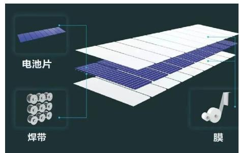

text_image

电池片
焊带
膜

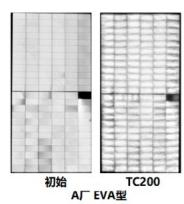

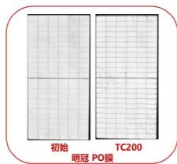

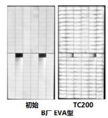

## 资源利用

公司严格遵守《中华人民共和国能源法》《中华人民共和国节约能源法》《中华人民共和国可再生能源法》等国家法律法规及相关规章制度，不断提高资源利用效率，减少资源消耗，确保资源利用活动符合合规要求。

## 能源利用

公司在生产、运营环节中主要的用能类型包括电力和天然气。公司始终坚持“节能降耗，创造绿色美好生活”的管理方针，通过制定《节能管理制度》加强对用电、用气的管理与控制，将节能降耗工作细化到每个环节 以降低能源消耗，公司明确规定由行政部负责对节能管理工作的执行情况进行监督；各部门主管负责人实施节能管理工作并做好监督，形成落实到岗，责任到人的管理体系，公司还建立了节能激励机制加大管理考核力度以激励全员参与节能减排行动

natural_image

Stylized illustration of a green landscape with solar panels, wind turbines, and modern buildings (no text or symbols)

## 节能减排措施

进一步加强对办公、宿舍等区域用电情况的监督及管理，降低电力使用。  
加强设备的全生命周期维护与保养，确保设备始终处于最佳运行状态，通过提升设备综合效能，杜绝非计划停机与低效运转，以精细化管理促进能源消耗的实质性降低。  
大力推广使用节能灯具、变频设备等节能设备，从源头降低能源消耗。  
有序推进重点节能技术改造项目，通过工艺优化与设备升级，实现能源利用效率的显著提升。  
推进光伏发电项目建设，加大清洁能源使用占比，优化能源消费结构，逐步降低对传统化石能源的依赖，实现节能降耗。

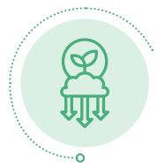

<table><tr><td colspan="2">指标</td><td>单位</td><td>2024年</td><td>2025年</td></tr><tr><td></td><td>天然气</td><td>万立方米</td><td>198.86</td><td>154.23</td></tr><tr><td>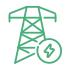</td><td>外购电力总量</td><td>千瓦时</td><td>13,517,526</td><td>23,444,926</td></tr><tr><td></td><td>光伏发电</td><td>千瓦时</td><td>2,529,008</td><td>4,035,064</td></tr><tr><td></td><td>能源消耗总量</td><td>吨标准煤</td><td>4,386.88</td><td>5,250.13</td></tr><tr><td>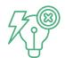</td><td>不可再生能源消耗量</td><td>吨标准煤</td><td>4,076.06</td><td>4,754.22</td></tr><tr><td></td><td>可再生能源消耗量</td><td>吨标准煤</td><td>310.82</td><td>495.91</td></tr><tr><td>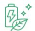</td><td>清洁能源使用总量</td><td>吨标准煤</td><td>2,725.58</td><td>2,368.75</td></tr><tr><td>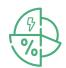</td><td>清洁能源使用占比</td><td>/</td><td>62.13%</td><td>45.12%</td></tr></table>

## 水资源利用

公司在生产运营中主要用水来源于市政购水。公司严格遵循《中华人民共和国水法》等国家法律法规及相关标准，在管理层面上，公司严格规范员工用水行为，不断加强对取水、用水的管理与监督控制，通过定期巡检、维修保养设备、开展节水宣传等措施，提高员工节水意识与水资源利用效率；在技术层面上，通过循环冷却、热水回用等清洁生产技术来降低单位产品耗水量，为节约用水和水资源高效利用的长期管理目标奠定坚实基础，促进公司水资源管理的持续改进与可持续发展。

## 案例

公司将蒸汽锅炉每天产生的40吨热水重新收集起来，收集后的热水通过热交换器重新送入蒸汽锅炉，实现水资源的循环再利用。

## 节水管理措施

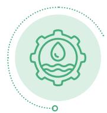

及时修复水管的“跑、冒、滴、漏”等故障，确保用水的正常供应，防止水资源的浪费。  
提倡节约用水，使用水龙头后要随手关闭，不得放任自流，浪费水资源。  
加强对用水的监督与管理，及时发现和制止浪费水资源行为，严肃处理破坏、损坏节水设施、设备等行为。  
不得随意弄脏水源，或随手将垃圾扔入水池中。  
加强日常值班巡逻，发现渗水、漏水、流水等现象及时联系维修人员处理。

<table><tr><td>指标</td><td>单位</td><td>2024年</td><td>2025年</td></tr><tr><td>总用水量</td><td>吨</td><td>85,459</td><td>80,567</td></tr></table>

## 物料利用

公司在《采购控制程序》《产品防护和交付控制程序》等制度中，明确规定了各部门在物料采购、生产领用与使用、仓储流转及废弃处置环节的职责边界与全链条管理流程，为物料管理的合法合规、规范运行提供了坚实的制度保障。同时，各生产部门根据生产需求合理配备化工原材料、原辅料及包装材料，积极推广成品包装使用循环包材，并通过定期物料核算，实时掌握物料使用情况、及时发现并杜绝浪费，实现物料利用最大化。

同时，公司注重物料管理相关人员能力提升，组织开展原材料管理方面的培训，通过培训传递物料节约知识，进一步提升员工节能操作技能。

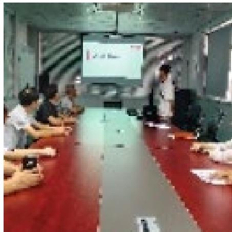

natural_image

Interior view of a modern conference room with attendees seated around a long table, facing a large screen displaying 'i.e. Bao' (no visible text on attendees or table)

## 绿色办公

公司积极践行绿色办公理念，在日常办公及运营过程中注重节水省电、加强资源合理利用，积极倡导全员参与节能减排，共同营造绿色、高效的工作环境。

## 办公垃圾分类

积极推行办公室垃圾分类

## 合理化建议

动员员工提出节能降耗新措施、新技术，公司结合可操作性，对建议人进行表彰奖励。

## 合理利用办公用纸

复印、打印时使用双面，鼓励资料袋、复印纸二次使用。  
提倡使用线上OA系统，推行无纸化办公，尽量减少打印。

## 03 协同共生共链 品质至臻至稳

明冠新材始终秉持“创造价值、成就客户”的理念，持续提升质量管理水平，保障产品安全可靠，致力于为客户提供更优质的产品与服务，同时 公司积极推动可持续供应链建设，携手上下游伙伴共同构建互利共赢的商业生态。

产品和服务安全与质量 47

负责任供应链 52

数据安全与隐私保护 56

SDGs

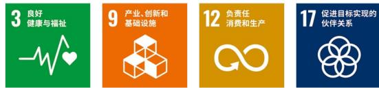

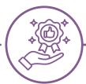

natural_image

Futuristic digital interface with glowing nodes and abstract light effects, set against a sunset sky (no text or symbols)

## 产品和服务安全与质量

公司始终将产品质量作为企业生存与发展的核心基石，以严谨的科学管理态度贯穿生产全过程，从原材料筛选到成品交付，不断提升产品质量和服务水平，持续满足客户需求与期待。

## 治理

公司严格遵守《中华人民共和国产品质量法》等法律法规，贯彻执行ISO 9001质量管理体系要求，建立了健全的质量管理体系，制定《标准和可追溯性控制程序》《产品过程监视和测量控制程序》等质量管理文件，明确各项职责分工及具体质量控制措施，全面加强质量控制，保障产品质量安全。公司品质部负责对原材料、外协件、半成品及成品进行检验、报告结果，并做好检验状态标识。

目前，公司已通过ISO 9001:2015质量管理体系认证。报告期内，未发生重大质量安全事故，亦未出现大规模质量安全投诉。

## 战略

风险

<table><tr><td>风险类型</td><td>风险描述</td><td>影响周期1</td><td>潜在财务影响</td><td>应对措施</td></tr><tr><td>过程控制风险</td><td>因关键设备故障、操作工艺等问题导出产品质量问题,引发售后质量问题或客户投诉,可能损害企业品牌形象,降低客户忠诚度。</td><td>短期</td><td>售后赔偿成本增加,营业收入减少</td><td>明确各生产环节的操作规范与质量标准,实施严格的检验与验收标准。建立客户服务机制,与客户保持良好沟通,及时跟进客户需求与反馈。</td></tr><tr><td>供方风险</td><td>供应商资质、材料性能、运输路线、包装方式以及运输过程中的变化,均可能影响原材料质量,从而对产品质量产生影响或导致交付延期,进而影响客户信任度。</td><td>中长期</td><td>生产成本增加,营业收入减少</td><td>加强对原材料供应商的审核机制,确保供应商资质与能力。加强原材料检验与抽检,确保符合生产要求。建立多家供应商竞争机制。</td></tr></table>

机遇

<table><tr><td>机遇类型</td><td>机遇描述</td><td>影响周期1</td><td>潜在财务影响</td><td>应对措施</td></tr><tr><td>市场机遇</td><td>市场需求促使公司持续提升产品安全性和质量标准,提供更优质的产品,以吸引更多客户,推动市场份额的稳步增长。</td><td>中长期</td><td>营业收入增加</td><td>加强品质管理和服务体系的建设,实施全面质量控制措施,保障产品质量标准。</td></tr></table>

影响周期1：

短期（1年以内）：对公司的影响通常是快速且临时的，持续时间较短通常不会超出1年。

中期（1—5年）：对公司的影响较为持续，通常在1至5 年内具有较大影响力。

长期（5年以上）：对公司的影响是深远且持久的，持续时间通常超过5 年。

## 影响、风险和机遇管理

公司依据《风险和机遇应对控制程序》，对过程控制、供方等关键环节的风险实施动态监测与跟踪，针对检查中发现的问题及时采取应对措施，确保持续、高效的风险管控能力，确保产品质量与安全。同时，公司主动识别并把握市场机遇，以风险管理保障稳健运营，以机遇捕捉推动价值增长，全面提升可持续发展竞争力。

## 指标与目标

公司制定并持续改进质量管理体系相关的关键绩效指标，以保障产品质量稳定可靠，持续满足客户的期望与需求。

产品合格率指标  
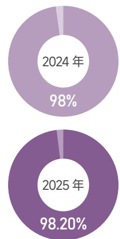

2026年目标值指标  
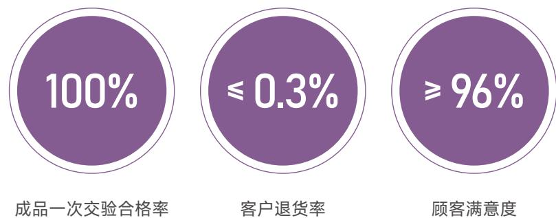

## 质量管控措施

公司恪守“一次做好，缺陷为零”的质量管理原则，实施产品全生命周期管理，在原材料采购、生产制造到成品交付的每一个环节均执行严格的标准把控，持续追求产品“零缺陷”的最高目标。通过优质产品塑造值得信赖的品牌形象，以切实行动兑现质量承诺，为企业的长期可持续发展构筑坚实根基。

## 全生命周期质量控制

## 进料

通过严格供应商准入、加强原材料采购管控、强化物资入库检验等方式，避免不合格物料流入，做好源头风险控制。

## 制程

研发阶段：在研发设计方面，树立科学的设计理念，从设计源头预防或消除质量问题隐患。  
执行唯一标识，全过程可追溯：公司对产品、原材料的检视和测量状态进行标识，避免不同产品、物料之间发生混淆；并执行唯一性标识，实现对外购物资接收到产品交付全过程的管控，确保所有产品具有可追溯性。  
各环节严格检验，确保产品合格交付生产过程：每日生产前进行首件检验，检验合格方可批量生产；过程通过定期自检、互检、巡检方式进行产品质量检验。

## 成品

成品验收：生产部根据检验标准对成品外观及性能进行检验，品质部进行抽样检测，以确保产品质量符合要求。  
成品入库：生产部对检验合格的产品进行包装，品质部对包装进行检验，确认签字才能办理成品入库。  
出厂检验：品质部根据《OQC作业规范》，对出厂的产品进行严格检验，检验合格的产品方可允许发货；若产品为不合格品，则严格按照《不合格品控制程序》进行处理。

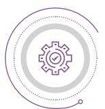

## 不合格品控制

公司制定《不合格品控制程序》等制度，将产品缺陷进行分级，明确处理方式，确保对可能存在的不合格品进行控制，防止不合格品的非预期使用。

公司在各环节均严格执行质量管理制度与控制程序，以确保产品质量与安全。同时，持续推进质量人才队伍培养与数智化能力建设，多维度开展质量提升工作，促进产品质量水平稳步提升。

## 质量文化建设

公司积极推动员工参与质量管理活动，着力营造全员共建、全员担责的质量文化氛围，使质量意识深入人心。

## 案例

## 质量体系知识培训

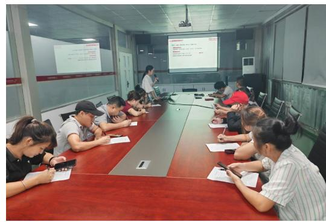

text_image

Meeting room scene with participants seated around a long table, one person presenting in front of a presentation screen

## 案例

## 不合格品处理流程培训

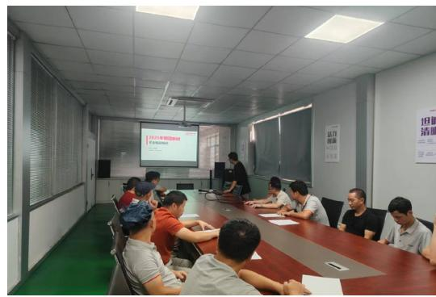

text_image

Meeting room photo with visible presentation screen and wall posters containing Chinese text

## 数字化建设

公司积极推进数智化转型项目围绕“智能制造，智慧管理，精准服务”三大核心方向构建了覆盖生产，研发，供应链。营销等全链条的数字化体系。公司引入工业互联网平台，搭建智能生产车间，推进实现产品全生命周期管控，实现生产制造环节人机料法高效协同，通过打造可追、可控、可视的数智化制造管理平台，实现材料生产的自动化、可视化，持续提高产品良率。

## 信息化

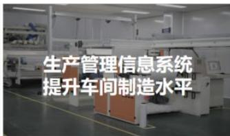

## 智能化

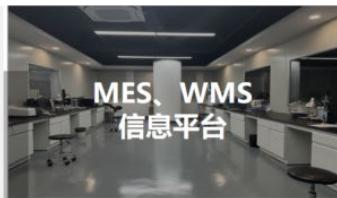

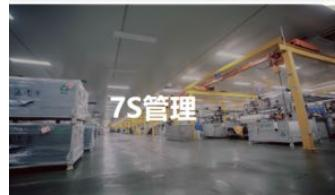

## 精益化

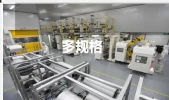

## 高效响应客户需求打造行业智造工厂标杆

## 自动化

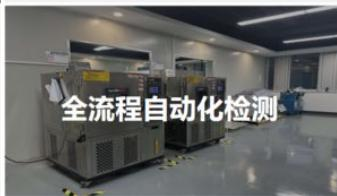

## 定制化

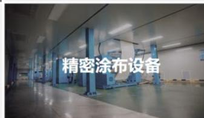

## 客户服务管理

公司始终坚持“以客户为中心”的管理理念，构建以客户需求为导向的运营服务体系，制定并修订了《客户服务控制程序》，规范售前、售中和售后及服务信息反馈管理流程；不断健全完善客户沟通及服务管理机制，了解客户诉求，及时解决客户投诉、退货等问题，持续提升产品质量和优化服务流程，提高客户满意度和忠诚度。

## 客户投诉机制

公司通过设置客服中心、邮箱等多元化的沟通渠道，及时了解客户意见、反馈及投诉问题，并设立销售部负责与顾客沟通和协商磋商，品质部负责顾客投诉的调查、原因分析、纠正/预防措施与改善对策标准化确认、后期改善执行情况的跟踪反馈，确保客户投诉问题得到有效地响应和处理。

客户投诉处理流程  
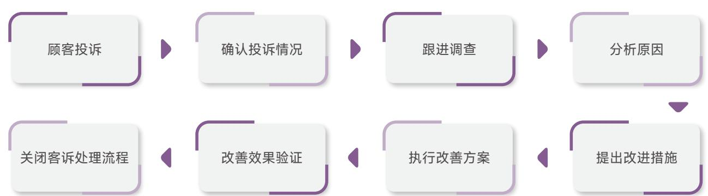

flowchart

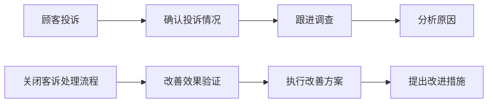
```mermaid
graph LR
  A["顾客投诉"] --> B["确认投诉情况"]
  B --> C["跟进调查"]
  C --> D["分析原因"]
  E["关闭客诉处理流程"] --> F["改善效果验证"]
  F --> G["执行改善方案"]
  G --> H["提出改进措施"]
```

## 2025 年

客户投诉数量 61次

应对客户投诉响应考核次数 61次

客户投诉解决率100%

应对客户投诉响应考核通过率100%

## 客户满意度

公司将客户满意度视为衡量服务质量的关键指标，每年采用发函或走访等形式开展客户满意度调查工作，从产品质量、产品性能、交付及时性、物料运输、服务态度等维度展开分析，精准把握客户的需求。基于调查结果，针对不足之处制定有效的改善方案，计划建立动态监控机制，以驱动持续改善，不断提升客户满意度，持续为客户提供优质的服务体验，为构建良好的合作关系奠定基础。

报告期内，公司客户满意度总分97.10分。

## 负责任营销

公司严格遵循《中华人民共和国广告法》《中华人民共和国反不正当竞争法》《中华人民共和国消费者权益保护法》等法律法规，明确要求坚持真实、准确、完整的信息披露原则，坚决杜绝任何形式的虚假宣传或夸大其词行为，确保用户能够在充分了解的基础上做出明智的消费决策。报告期内，公司未发生任何市场营销违规事件。

## 负责任供应链

## 治理

公司严格遵循《中华人民共和国招标投标法》等法律法规，制定并修订了《采购控制程序》《供方控制程序》等制度规范。在治理架构上，公司明确由供应链管理部负责供应商开发、导入、退出及审核等管理工作；采购部负责原物料、固定资产、间接物品及委外加工品采购下单，订单交期跟催及请款等内容；计划物控部负责公司所有物料需求计划申请及制定等内容，严格规范各责任部门在供应商管理及物资采购流程等内容，全面建立健全供应链管理体系，确保各项供应链及各项采购工作高效开展，保障公司生产营运稳定。

## 战略

风险

<table><tr><td>风险类型</td><td>风险描述</td><td>影响周期 $^{1}$ </td><td>潜在财务影响</td><td>应对措施</td></tr><tr><td>价格上涨</td><td>由于各种原因,导致原材料价格出现上涨。</td><td>短中期</td><td>生产成本增加,利润下降。</td><td>根据市场情况灵活调整采购策略,优化供应资源。搭建 SCM 竞价系统,进行比价,提高供应链议价能力,构建成本更优、风险更低且符合可持续发展趋势的供应链生态。与主要供应商签订长期合同,锁定原材料固定价格,减少原材料价格波动带来的影响。</td></tr><tr><td>供应链中断</td><td>供应商产能无法满足企业需求,供应商倒闭等问题导致交货延期或供应链中断。</td><td>短中期</td><td>导致产品生产停止,利润下降。</td><td rowspan="2">制定《应急计划策划方案》,提高公司整体应急响应能力。建立备用供应商,持续开发供应商及优化,确保所有原材料至少有两家供应商。定期开展供应商考核与评估工作,保障供应链的稳定。定期关注供应商的库存情况,对公司紧缺的原材料建立安全库存,确保能满足采购后期的生产需求。与供应商签订质量协议,明确来料不良产生的后果。</td></tr><tr><td>供应商质量风险</td><td>供应商在质量控制方面存在不足,可能会造成质量缺陷,从而影响企业声誉和客户满意度,严重时可能触发产品召回。</td><td>短中期</td><td>生产成本增加,利润下降。</td></tr></table>

机遇

<table><tr><td>机遇类型</td><td>机遇描述</td><td>影响周期1</td><td>潜在财务影响</td></tr><tr><td>多元化供应链</td><td>优化供应资源,增加供应商选择。</td><td>中长期</td><td>确保供应稳定,减少营业成本。</td></tr><tr><td>绿色供应链</td><td>推进供应链可持续发展吸引环保客户。</td><td>长期</td><td>提升绿色品牌形象,增加销售收入。</td></tr><tr><td>供应链优化</td><td>优化供应链各个流程,提升原材料运输和入库的效率。</td><td>中长期</td><td>提高供应链管理效率,增加利润。</td></tr></table>

影响周期1：  
短期（1年以内）：对公司的影响通常是快速且临时的，持续时间较短通常不会超出1年。  
中期（1—5年）：对公司的影响较为持续，通常在1至5年内具有较大影响力。  
长期（5年以上）：对公司的影响是深远且持久的，持续时间通常超过5年。

## 影响、风险和机遇管理

为进一步保障供应链的稳定性与安全性，公司综合考量供货周期、突发情况及其他不可抗力等因素，主动识别供应商潜在风险与发展机遇 并采取一系列针对性的应对措施 有效防范风险，把握机遇，同时 公司积极推进供应商审核工作，从体系、过程及产品三个维度，结合各类材料专业特性以及行业水平，对新老供应商定期进行质量审核评定，确保原辅材料采购及物资供应的及时性、有序性与质量安全，切实降低供应链风险。

公司建立了完备供应链应急响应机制 定期组织开展原材料短缺或质量问题，关键设备故障等应急演练，总结和评估演练成果，不断提升应对供应链环节突发事件的能力。

  
注1：统计口径为合格供方名录

## 案例

## 原材料短缺或质量问题应急演练

2025 年 2 月 10 日，公司组织采购专员、仓管及 PMC 等人员开展关键原材料 MGP-24P 现场报警，因质量问题导致无法生产的应急演练，通过演练及时发现潜在问题，提高了相关部门的应急应对能力。

## 指标与目标

供应商总数 1111 个

拥有质量管理体系认证的供应商数目53个

拥有环境管理体系认证的供应商数目 48个

拥有职业健康安全管理体系认证的供应商数目 48个

因不合规被中止合作的供应商数目0个

因不合规被否决的潜在供应数目0个

供应商廉洁协议签署率 81.08%

向当地供应商采购支出的比率 1.31%

## 供应商全生命周期管理

公司制定了规范的管理制度和严格的审核流程，对供应商准入、分级、考核及退出等环节实施全生命周期管理，并通过建立供应商管理档案，全面记录供应商从注册、参与采购活动、合同履行到绩效表现等各阶段的详细信息，保证从供应商各个阶段都处于有效地控制和管理状态，确保供应链的质量与稳定性。

## 供应商准入

公司对供应商准入环节实行严格的管理机制，保障其质量和可靠性。在选择供应商之前，公司会根据具体的采购需求开展全面的市场调研，并对潜在供应商的资质进行审查。对于通过初步筛选的供应商，公司会进行样品检验和试用，并从资质要求、商业道德、产品质量等多个维度进行综合评估，确保其具备满足公司高标准要求的能力。

在供应商资质审查阶段，对于 A 类物资供应商，即直接影响产品安全性、法律法规及功能、性能的原材料，如：PET、PVDE，EVA，胶水等的供应商 公司特别要求必须提交ISO体系相关认证证书以及针对指定材料的有害物质检测报告，此外供应商还需填写《供应商调查评鉴报告》只有当评鉴总分达到公司设定的标准后，才会进入样品送检环节。

## 供应商分级

公司建立了系统化、规范化的供应商评估体系，从供应商的基本资质、供货质量、合同履行情况、服务能力以及社会责任感等多个维度进行综合评估。根据评估结果，将供应商划分为 A、B、C、D 四个等级，针对不同等级的供应商实施差异化的管理策略，以激励其不断提升综合表现，并采用动态量化考核方法，确保评估结果的时效性和准确性，最终根据考核结果，对供应商进行升级或降级管理，从而优化供应链管理，确保其稳定性与高效运作。

## 供应商退出

公司采购部与品质部开展供应商群体的年度评估工作，重点围绕产品质量、交货时效、服务水平以及合作稳定性等关键指标进行全面审查。对于评估中表现不佳的供应商，公司将为其提供专业的辅导计划，帮助其精准识别自身不足。若供应商在完成必要改进并通过后续重新评估后，公司将继续恢复与其的采购合作。对于那些持续表现不合格的供应商，公司将终止采购关系，并将其从《合格供方名录》中移除。

## 供应商ESG管理

公司致力于构建可持续发展供应链，严格遵守国际标准化组织等国际权威标准以及公司内部管理体系，要求供应商遵循在环境保护、职业健康安全管理、商业伦理等方面的管理标准，将ESG表现纳入供应商准入与审核的核心指标，在新供应商的开发及供方管理体系开发环节过程中，公司明确规定A类供方都应取得环境管理体系、职业健康安全管理体系及质量管理体系认证、ROHS、REACH等有害物质的检测报告。并在评估环节建立正向激励机制，鼓励供应商积极开展ESG相关工作，共同推动整个供应链的可持续发展。

## 廉洁供应链

公司大力推行廉洁采购政策，与供应商签署《供应商廉洁协议》，明确要求供应商严格遵守商业道德和市场规则，确保公司采购活动的公正与透明，与供应商共同维护良好的商业伦理和市场秩序。

## 供应商培训

报告期内，公司组织开展供应商 ESG 培训，涵盖供应链劳工管理、供应商在环境、社会、治理方面的审核要求等方面内容，使供应商了解 ESG 理念及其对企业可持续发展的意义，提高供应商对 ESG 的认识和参与度，共同推动供应链的可持续发展。

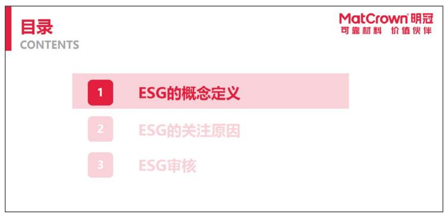

flowchart

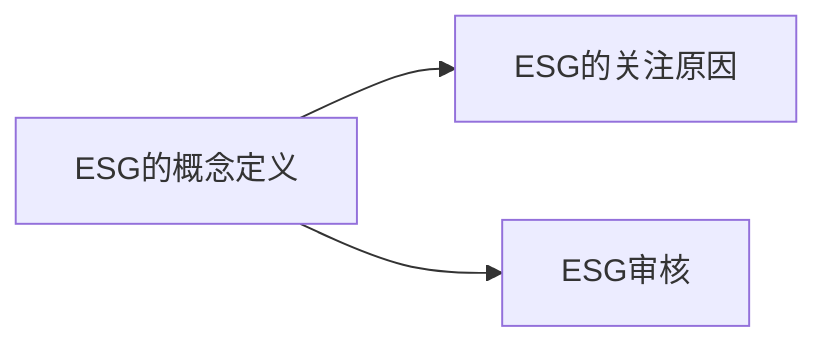
```mermaid
graph LR
  A["ESG的概念定义"] --> B["ESG的关注原因"]
  A --> C["ESG审核"]
```

## 报告期内

针对供应商开展的ESG 培训次数1次

ESG培训覆盖的供应商数量110个

## 无冲突矿产说明

公司理解和重视冲突矿产相关问题，持续优化公司责任矿产管理，在与供应商合作时，公司要求其填写《无冲突金属调查表》并签订《无使用冲突矿产保证书》，明确要求供应商对其产品中含有的所有锡、钽、钨和金对整个供应链展开尽职调查及冲突矿产的尽职管理工作，确保供应商使用及销售的金属材料不存在冲突情形。

## 数据安全与隐私保护

## 信息安全管理

公司严格遵循《中华人民共和国网络安全法》《中华人民共和国数据安全法》等法律法规，制定《计算机信息安全规范》《共享文件夹管理制度》等一系列内部制度规范，明确财务信息部、部门负责人以及体系工程师等相关职责，规范公司信息使用、内部共享文件夹使用以及访问权限等内容，持续确保信息资源的安全性和完整性，保障管理体系高效运行。报告期内，公司未发生信息安全违规事件与泄露客户隐私事件。

## 信息安全风险管理

公司结合业务实际情况，积极通过各种技术手段识别信息安全相关的核心风险，制定相应的信息安全防控措施，并对终端行为、网络数据进行监测和分析，及时发现敏感数据外发、业务数据泄密等行为，不断完善安全技术防护体系。同时，公司定期组织开展网络通讯中断、信息系统攻击等应急演练，模拟风险场景，检验应急响应机制有效性，提高公司整体应对信息安全风险的能力。

## 案例

2025 年 5 月公司组织财务信息部、生产部、营销部及 PMC 等相关人员开展因信息系统被黑客攻击，导致无法访问ERP系统，不能查询订单，相关信息资料丢失的应急演练，通过演练加强了公司员工病毒防范意识。

## 信息安全实践

## 信息安全管理措施

公司针对网络安全、数据安全与 IT 运维安全方面展开分析，制定建设方案，在网络安全方面，以等级保护安全框架为依据和参考，在满足国家法律法规和标准体系的前提下通过“一中心、三防护”的安全设计方案，建立网络安全综合技术防护体系，叠加安全可视、动态感知、协同防御三种安全能力构建主动防御体系，提供持续安全保护，并通过集中运维、安全可视等人性化的技术手段，让安全运维管理更简单高效；在数据安全方面，公司针对数据泄密的方式、不同的办公场景，从识别、管控、监测、追溯四大技术层面，形成覆盖高密、普通办公、远程办公三大场景的数据防泄密解决方案。目前，公司已部署华为USG “入侵防御” “反病毒” License等软件，实现对外网入侵进行阻断，对内网访问的网页包含恶意代码进行阻断连接，提高网络安全。

## 数据防泄密解决方案

## 办公场景

## 高密场景

## 普通办公场景

## 远程办公场景

## 数据泄密防护思路

## 识别

关键字

正则表达式

OCR

机器学习

## 管控

终端准入

权限管控

非法外联

文件加密

## 监测

Web 应用

通讯软件

移动介质

文件打印

## 追溯

关键字搜索

文件相似度搜索

OCR图片追溯

敏感文件流转分析

## 信息安全培训

报告期内，公司组织员工开展数据安全及隐私保护、企业信息保密与信息安全法律培训，从多方面讲解信息安全相关知识，熟悉日常信息安全要求规范，进一步提升员工安全信息保护意识与技能。

## 案例

## 数据安全及隐私保护培训

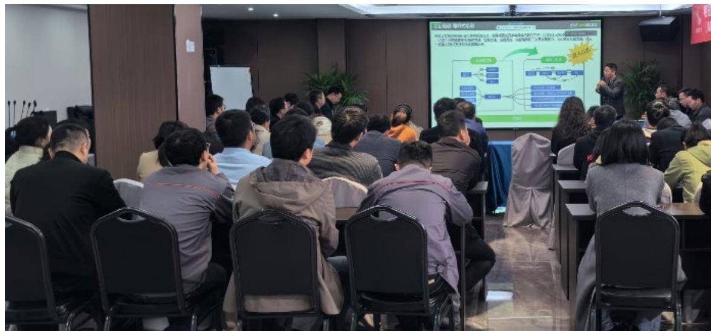

text_image

Conference room scene with presentation slide showing business model and data flow graph, audience seated facing presenter

## 2025 年

数据安全/客户隐私保护相关培训场次1次

参与数据安全/客户隐私保护相关培训的人数 26人

## 客户隐私保护

公司高度重视客户隐私保护，严格遵守中国《中华人民共和国个人信息保护法》等相关法律法规，规范客户资料的收集、存储和使用流程，对用户个人数据进行严格保护，明确禁止任何形式的机密信息泄露，切实维护员工、客户及供应商等相关方的隐私权益。

## 04 员工成就价值 共担共创未来

明冠新材依法维护员工合法权益，积极打造多元，平等与包容的企业文化 通过持续优化人力资源管理体系推行民主管理，持续巩固和谐稳定的劳动关系。生产经营过程中，不断健全安全管理体系，切实保障员工生命健康与职业安全，积极履行社会责任，携手共建和谐美好未来。

<table><tr><td>保护员工合法权益</td><td>61</td></tr><tr><td>员工培训与发展</td><td>67</td></tr><tr><td>职业健康与安全</td><td>70</td></tr><tr><td>践行社会责任</td><td>72</td></tr></table>

SDGs  
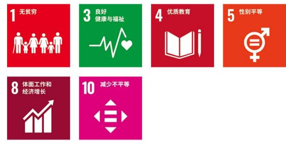

natural_image

Silhouettes of people raising hands in front of a futuristic cityscape at sunset, with glowing light effects (no text or symbols)

## 保护员工合法权益

公司严格遵守《中华人民共和国劳动法》《中华人民共和国劳动合同法》及国际劳工组织公约等相关规定，持续健全人力资源管理体系，在招聘录用、教育培训、职业发展、薪酬福利等流程中坚持公平公正、平等对待，切实保障员工合法权益，携手构建和谐稳定的劳动关系。

## 员工招聘与引进

公司严格遵守相关法律法规，坚持公开招聘、平等竞争、择优录用原则，制定《招聘管理制度》《员工手册》等规章制度，健全人才选用任用机制，规范招聘全流程管理，确保招聘过程公开透明、公平公正，人才引进精准高效。公司各部门主管根据本部门发展或职位空缺情况提出招聘申请，经审批后，人力资源部启动招聘工作；仅向符合岗位要求的应聘者发出录用通知，确保招聘的精准性和有效性。在面试过程中严格遵守合规要求，严禁询问与岗位无关的个人隐私信息，切实维护求职者合法权益。

招聘流程  
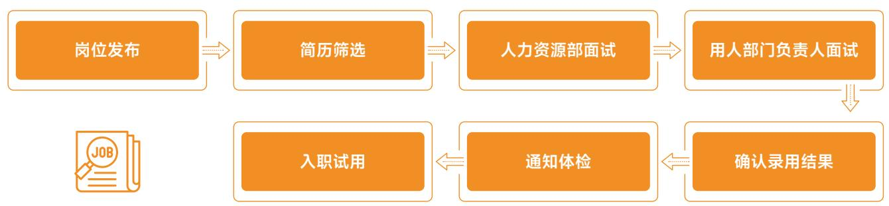

flowchart

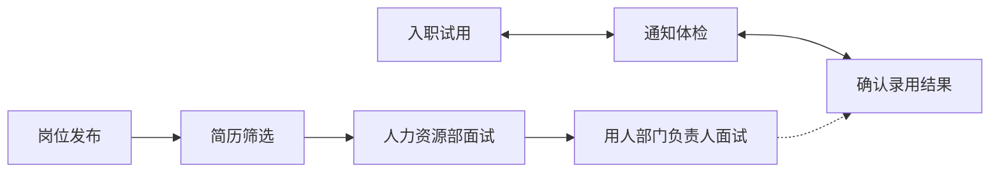
```mermaid
graph LR
  A["岗位发布"] --> B["简历筛选"]
  B --> C["人力资源部面试"]
  C --> D["用人部门负责人面试"]
  E["入职试用"] <--> F["通知体检"]
  F <--> G["确认录用结果"]
  D -.-> G
```

## 多元招聘

公司采取内部招聘与外部招聘相结合的方式，针对内部招聘，当公司管理岗位空缺时优先考虑内部竞聘。针对外部招聘，公司通过社会招聘、校园招聘等多种渠道，结合线上、现场以及猎聘服务等方式开展外部招聘工作，在招聘过程中坚决杜绝基于种族、宗教、性别、年龄、残疾等任何形式的歧视，尊重员工意愿，实行双向选择机制。

## 报告期内

新进员工

196人

其中社会招聘

180人

校园招聘

5 人

其他渠道招聘

11 人

## 员工构成

截至报告期末，员工总人数 502 人，劳动合同签订率 100%。

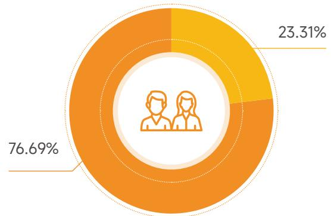

donut

| Category | Value (%) |
| --- | --- |
| Orange Segment | 76.69 |
| Yellow Segment | 23.31 |

按性别划分

<table><tr><td>■ 女</td><td>117人</td></tr><tr><td>■ 男</td><td>385人</td></tr></table>

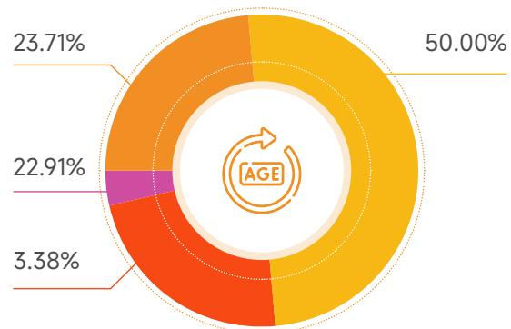

donut

| Category | Value (%) |
| --- | --- |
| Yellow | 50.00 |
| Orange | 23.71 |
| Purple | 22.91 |
| Red | 3.38 |

按年龄划分

<table><tr><td>■ 30岁以下(不含30岁)</td><td>119人</td></tr><tr><td>■ 30-40岁(含30岁,不含40岁)</td><td>251人</td></tr><tr><td>■ 40-50岁(含40岁,不含50岁)</td><td>115人</td></tr><tr><td>■ 50岁及以上</td><td>17人</td></tr></table>

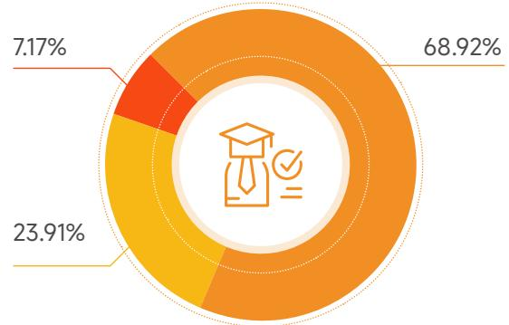

donut

| Category | Value (%) |
| --- | --- |
| Orange | 68.92 |
| Yellow | 23.91 |
| Red | 7.17 |

按学历划分

<table><tr><td>■ 大专及以下</td><td>346人</td></tr><tr><td>■ 本科</td><td>120人</td></tr><tr><td>■ 硕士及以上</td><td>36人</td></tr></table>

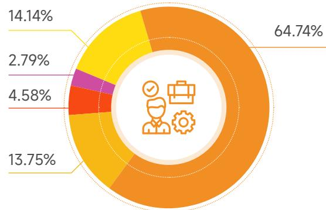

donut

| Category | Value (%) |
| --- | --- |
| Orange | 64.74 |
| Yellow | 14.14 |
| Red | 4.58 |
| Purple | 2.79 |
| Light Orange | 13.75 |

按职能划分员工数

<table><tr><td>■ 生产</td><td>325人</td></tr><tr><td>■ 技术</td><td>69人</td></tr><tr><td>■ 销售</td><td>23人</td></tr><tr><td>■ 财务</td><td>14人</td></tr><tr><td>■ 行政</td><td>71人</td></tr></table>

## 多元、平等与包容

## 人权保护

公司严格落实人权保护相关要求和标准，制定并执行《童工识别及救济程序》《禁止强迫劳动管理程序》《防止骚扰和虐待程序》《反歧视控制程序》《防止惩戒性管理程序》等多项管理程序文件，明确禁止雇用童工，坚决抵制任何形式的强迫劳动与歧视行为，充分尊重和维护每一位员工的合法权益。报告期内，公司未发生雇用童工和强迫劳动行为。

## 反骚扰及虐待

严禁在日常管理中对员工实施任何形式的体罚或身体接触、精神胁迫及言语凌辱，不应有任何威胁性行为。  
当员工遭受或目睹不当对待时，可以与员工代表沟通说明，员工代表受理投诉并展开调查，依据调查结果采取措施。

## 反歧视

严禁在聘用、报酬、培训机会、升迁、解职或退休等事务上发生基于种族、民族、宗教、残疾、性别等的歧视行为。

## 反强迫劳动

禁止及不支持任何劳役或强迫劳工，确保员工在自愿的基础上参加工作或劳动。  
招工时须以公正自愿为原则，禁止以任何强迫或欺骗手段招聘员工。  
遵循加班自愿的原则实施加班管理，为加班员工提供适当的调休安排和经济补偿。

## 反惩戒性措施

不支持对员工实行非法或不人道的惩戒性措施，如殴打、非法搜查和拘禁员工。

## 禁用童工

人力资源部在招聘员工时需辨识身份证明，公司不允许雇用童工和未成年工的行为。  
如发生误用童工行为，发现后应立即给予遣散，并根据规定采取必要补救措施  
原则上不录用未成年工，对于特殊需要或误用未成年工情况，严格按照规定实施未成年工保护措施。

## 员工多元化

公司积极营造一个多元、包容、平等的工作环境，确保对每位员工一视同仁，尊重每个员工文化背景、个性和差异，不干涉员工行使遵奉信仰和风俗的权利。

## 截至报告期末

少数民族员工24 人

残疾人员工 4 人

退伍军人 5人

## 女性员工权益

公司制定《女职工劳动保护规定》《孕期与哺乳期女工风险评估程序》等制度，不断完善女性员工权益保障体系。公司严格遵守法律法规，不因女职工怀孕、生育、哺乳降低基本工资、予以辞退或解除劳动合同，依法保障女职工假期权益。建立女职工经期、孕期、产期、哺乳期、更年期专项保健制度，强化劳动保护宣教，配备母婴室，常态化开展女职工关爱活动，全面维护女性职业健康与合法权益。

## 截至报告期末

管理人员中女性26人

管理人员中女性人数比例 30%

## 申诉与反馈

公司建立了规范的投诉与申诉机制，针对违反公司规章制度或损害公司及员工正当合法权益的行为，员工可遵循实事求是的原则进行署名投诉，以便核实与结果反馈，投诉渠道包括员工信箱、针对违法乱纪行为可联系风控审计部，其他投诉可联系本部门负责人或人力资源部；若员工认为自身所受待遇、处分或绩效评价等级与事实不符，可通过直接上级、间接领导、人力资源部门、工会及员工信箱等渠道进行申诉，充分保障员工表达诉求的权利。

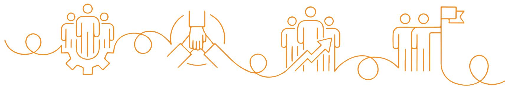

flowchart

```mermaid
TD
  A["Start Node"] --> B["Process Node"]
  B --> C["End Node"]
```

## 薪酬与福利

## 薪酬管理

公司坚持公平公正、按劳分配原则，制定《薪资管理制度》，规范公司薪酬管理，为各级管理人员开展薪酬核定、调整、发放等日常工作提供清晰依据与操作指引。通过运用科学的薪酬管理理念与专业工具，合理设计薪酬结构，持续优化薪酬水平，确保薪酬的外部竞争力和内部公平性，充分调动员工积极性。

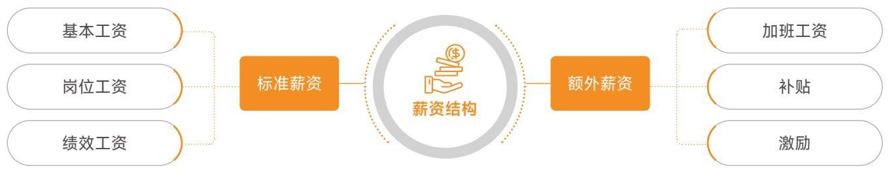

flowchart

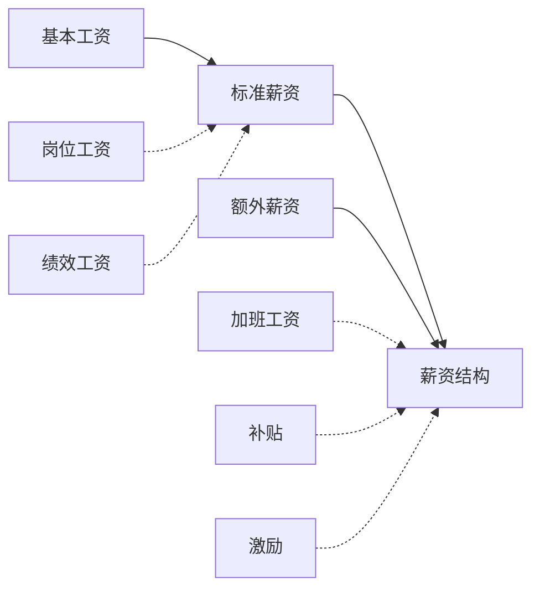
```mermaid
graph LR
  A["基本工资"] --> C["标准薪资"]
  B["岗位工资"] -.-> C
  D["绩效工资"] -.-> C
  C --> E["薪资结构"]
  F["额外薪资"] --> E
  G["加班工资"] -.-> E
  H["补贴"] -.-> E
  I["激励"] -.-> E
```

## 绩效管理

公司严格遵循统一、客观、公平、持续沟通的原则，制定《绩效管理制度》，不断完善绩效管理机制，强化正向激励，充分调动员工工作积极性与职业成就感，持续提升组织效能。

公司针对不同员工有不同的绩效评估周期，对工作业绩、综合能力及行为表现等方面开展绩效评估与考核，根据评估结果划分等级针对绩效评估结果较低的员工启动绩效改进计划促进员工提升。

如员工对当期绩效管理工作有异议，可以向直接上级或部门负责人沟通，如不能妥善解决，可向人力资源部提出书面申诉，说明申诉的具体内容和理由。公司确保申诉过程的公正、公平，保护员工的隐私权，涉及严重违纪、违法等行为，公司将依法依规进行处理。

## 福利保障

公司制定《员工福利管理规定》，持续完善员工福利休系，规范落实各项福利保障，通过为员工提供多元，贴心的福利保障切实提升员工满意度与归属感，不断增强团队凝聚力与向心力，充分彰显企业人文关怀与责任担当。

## 员工福利体系

依法为员工缴 纳五险一金。

严格执行国家法定节假日制度，为员工提供婚假、丧假、年假及产假等各类有薪假期。

提供节假日补贴、交通补贴、用餐补贴、探亲补贴、话费补贴、生日福利等福利补贴。

每年安排全体员工进行职业健康体检。

定期组织文娱活动。

## 民主管理

公司积极推进员工民主管理建设，制定《自由加入工会及集体谈判的权利管理程序》《员工代表管理程序》等制度，尊重员工依法自由结社、加入工会及参与集体谈判的合法权利，畅通公司与员工的沟通渠道，推动双方就工作及生活相关问题、改进建议开展有效交流与协商。

公司搭建多元化的内部沟通渠道，如员工 VOC、座谈会等，鼓励员工合理表达诉求，主动倾听员工心声，对于员工反馈的意见建议，公司将结合实际情况，合理纳入优化整改范畴并推进落实，以提升员工满意度与幸福感。

## 沟通渠道

## 直接沟通

员工可通过邮件、电话、面谈等方式，第一时间向所属主管反映问题或进行申诉。

## 公司信息发布

公司通过内部网站、微信公众号等多渠道发布信息，员工可及时了解行业动态、公司业务发展情况及重要通知、事件。

## 工会组织

员工在工作或生活中遇到问题时，工会可提供维护合法权益、职业心理辅导、关怀关爱等相关援助。

## 员工 VOC

人力资源部每月不定期赴生产车间及其他部门开展随机访谈加强与员工的沟通主动了解并解决员工实际困难与管理问题。

## 座谈会

员工可在座谈会上就自身职业发展、人力资源服务等方面提出意见与建议，进行有效沟通。

## 员工信箱

公司设立实体意见箱，员工可通过写信方式反映各类问题（如一般性咨询、投诉等）。

## 员工满意度

公司定期组织开展员工满意度调查，深入了解员工对公司运营各方面的真实感受，主动收集员工的反馈与建议。报告期内，公司组织开展员工满意度调查，参与员工数量 245 人，员工满意度为 83.9%，并根据调查结果形成年度员工满意度调查报告，积极挖掘改善方向。

## 员工关怀

## 员工活动

公司通过开展节日主题活动、每月员工生日会、团建活动等系列活动，丰富员工生活，增强团队活力与凝聚力。

## 案例

## “趣味中秋 FUN肆游园”

中秋佳节，公司宜春基地与苏州基地共同举办「趣玩中秋 FUN肆游园」，活动设置猜灯谜、保龄球、月宫投壶、DIY月饼等多种趣味活动，让员工及员工家人共同度过一次温馨、有趣的节日。

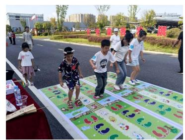

natural_image

Children playing with colorful toys on a large outdoor board outdoors, no visible text or symbols

宜春基地

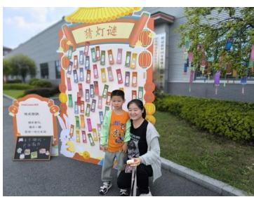

text_image

猜灯谜
吃点饼
吃点饼
吃点饼
吃点饼
吃点饼

苏州基地  
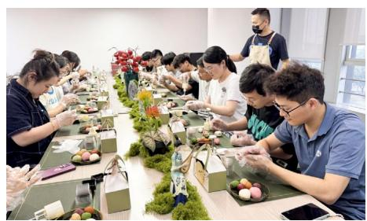

natural_image

Group of people arranging decorative items at a long table, wearing masks and aprons (no visible text or symbols)

## 困难员工帮扶

公司切实关怀员工工作和生活情况，通过多种途径为困难员工提供帮助，以缓解他们的生活压力。报告期内，公司与区总工会积极展开沟通与协调，为 5位困难职工争取到5,000元补贴。

## 员工培训与发展

公司高度重视人才培育与发展，持续提升员工专业能力与综合素养，为每位员工提供公平广阔的职业发展平台与清晰的晋升通道，鼓励员工立足岗位、精进成长，在实现自我价值的同时，与企业共同发展。

## 员工培训

公司制定《培训管理规定》等相关制度，持续健全培训管理体系。各部门结合年度工作目标制定专项培训计划，由人力资源部统一汇总、统筹推进并确保落地执行。培训结束后，组织者通过笔试、现场实操及多元化评估方式开展考核与效果评估，不断提升培训质量与实效。

公司打造了一支由公司中高级管理层、各职能部门骨干以及车间核心业务技术专家构成的精英内部讲师团队，充分利用内部讲师资源建立、积累了涉及产品、工艺、质量、职业规划等多方面课程体系，致力于为员工传授前沿知识与实用技能。截至报告期末，公司内部讲师队伍共有30人。

## 培训管理体系

## 公司级

## 入职培训

企业文化、管理制度、安全生产

## 公开课

通识课程、员工技能提升、行业知识信息、商业道德等

## 部门级

## 专业培训

完成本部门工作需要的专业知识技能

## 岗位级

## 岗位技能提升

员工个人职业发展所需技能

报告期内，公司系统开展多类型的员工培训，涵盖新员工入职培训、专业技能培训和领导力培训等，培训总次数达93次，为员工提升职业素养和专业能力提供有力支持

## 2025 年

员工培训投入

9.5万元

培训场次

93 场

培训总人次

1,354 人次

员工培训覆盖率

100%

## 职业发展

公司结合各岗位特性与发展需求，构建管理序列与专业序列双通道职业发展体系，持续畅通员工职业晋升通道，为员工提供多元化、个性化的职业发展路径。同时，公司制定《内部竞聘管理制度》，规范内部竞聘、岗位晋升与人才选拔流程，坚持公平、公正、公开原则，进一步拓宽人才发展渠道，激发员工成长动力，助力员工与企业共同成长。

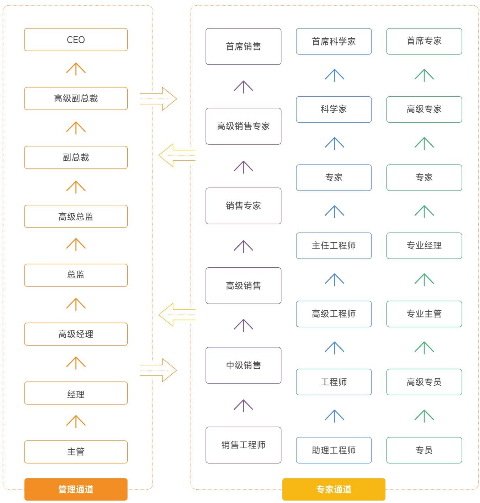

flowchart

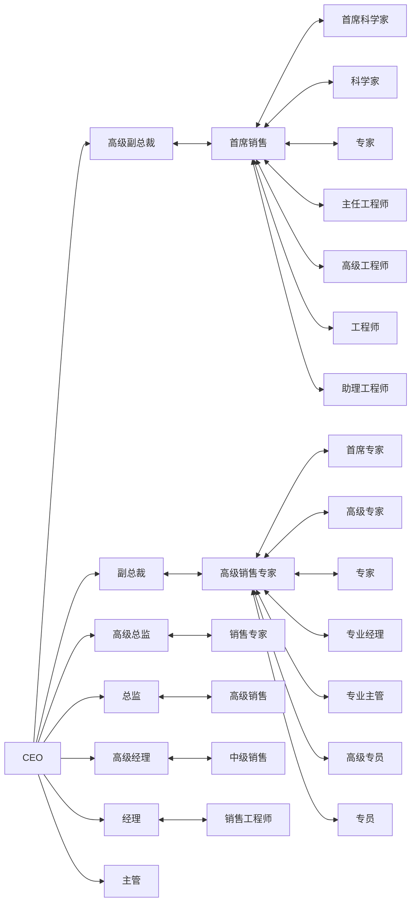
```mermaid
graph LR
  A["CEO"] --> B["高级副总裁"]
  A --> C["副总裁"]
  A --> D["高级总监"]
  A --> E["总监"]
  A --> F["高级经理"]
  A --> G["经理"]
  A --> H["主管"]
  
  B <--> I["首席销售"]
  C <--> J["高级销售专家"]
  D <--> K["销售专家"]
  E <--> L["高级销售"]
  F <--> M["中级销售"]
  G <--> N["销售工程师"]
  
  I <--> O["首席科学家"]
  I <--> P["科学家"]
  I <--> Q["专家"]
  I <--> R["主任工程师"]
  I <--> S["高级工程师"]
  I <--> T["工程师"]
  I <--> U["助理工程师"]
  
  J <--> V["首席专家"]
  J <--> W["高级专家"]
  J <--> X["专家"]
  J <--> Y["专业经理"]
  J <--> Z["专业主管"]
  J <--> AA["高级专员"]
  J <--> AB["专员"]
```

## 职业健康与安全

公司高度重视员工安全与职业健康，持续健全并优化职业健康安全管理体系，不断强化工作场所安全风险防控、改善作业环境条件、落实安全防护措施、完善职业健康监护与保障机制，全面提升安全管理水平与应急处置能力，全方位守护员工身心健康与生命安全。

## 职业健康安全管理体系

公司严格遵守《中华人民共和国安全生产法》《中华人民共和国职业病防治法》等法律法规，制定《质量、环境和职业健康安全管理手册》《职业健康安全运行控制程序》等管理制度，明确规定公司在 OH&S 管理、操作控制、化学品管理等方面的职责与要求，确保各项措施的全面性与系统性。目前，公司已通过ISO 45001职业健康安全管理体系认证。

为贯彻执行公司的安全生产方针和目标，公司制定《安全生产责任制度》《建立设置安全管理机构、配备安全管理人员管理制度》，明确各部门及岗位的安全生产职责，设立安全生产管理委员会作为安全生产的管理组织机构，规范公司安全管理人员配备，做到各生产车间设置一名兼职安全管理人员，全面落实安全生产主体责任。

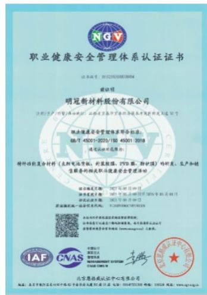

text_image

职业健康安全管理体系认证证书
证书编号: 01-5293000080004
国证号
明冠新材料股份有限公司
注册(开户行: 平安市商业银行) 业务专用章及办理本外币贷款相关手续
地址: 45001/2023/150 45001 2018
特许功能复合材料（无铅荧光胶、耐盐胶膜、PVD膜、防护膜）的研发、生产和销售服务的相关职业健康安全管理活动
身份证号码: 2021年01月09日
授权委托书: 2021年01月09日至2025年01月04日
登记机关: 2021年01月09日
企业网站: www.njyuan.com.cn
IAF CNAS
北京恩瑞高科认证中心有限公司
地址: 北京市新城区经济开发区科创园区中环路1号A座6层
电话: 010-64733338
邮箱: 388128
网址: www.njyuan.cn

ISO 45001:2018  
职业健康安全管理认证证书

## 职业健康安全目标

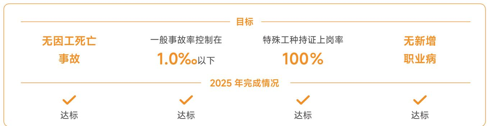

flowchart

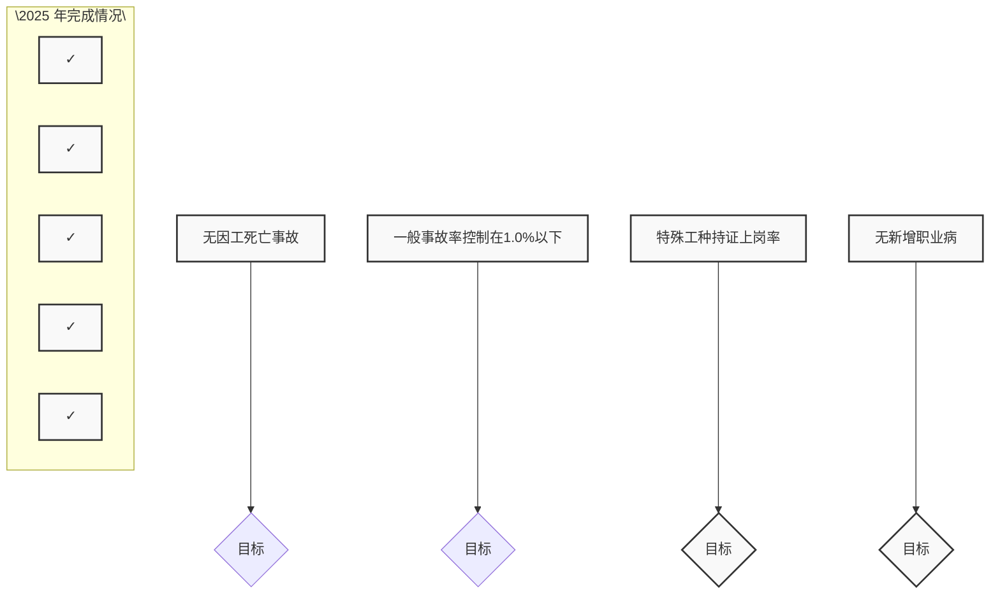
```mermaid
graph TD
  A["无因工死亡事故"] --> B{"目标"}
  C["一般事故率控制在1.0%以下"] --> D{"目标"}
  E["特殊工种持证上岗率"] --> F{"目标"}
  G["无新增职业病"] --> H{"目标"}
  
  subgraph sg_2025["\"2025 年完成情况\""]
    I["✓"]
    J["✓"]
    K["✓"]
    L["✓"]
    M["✓"]
  end
  
  style A fill:#f9f9f9,stroke:#333,stroke-width:2px
  style C fill:#f9f9f9,stroke:#333,stroke-width:2px
  style E fill:#f9f9f9,stroke:#333,stroke-width:2px
  style F fill:#f9f9f9,stroke:#333,stroke-width:2px
  style G fill:#f9f9f9,stroke:#333,stroke-width:2px
  style H fill:#f9f9f9,stroke:#333,stroke-width:2px
  style I fill:#f9f9f9,stroke:#333,stroke-width:2px
  style J fill:#f9f9f9,stroke:#333,stroke-width:2px
  style K fill:#f9f9f9,stroke:#333,stroke-width:2px
  style L fill:#f9f9f9,stroke:#333,stroke-width:2px
  style M fill:#f9f9f9,stroke:#333,stroke-width:2px
```

## 安全生产风险管理

公司持续健全并严格执行安全风险分级管控与隐患排查治理双重预防机制，对生产全过程开展风险辨识、分级管控与隐患排查治理 从源头防范化解安全风险及时消除各类生产安全事故隐患，若发生生产安全事故 公司将严格按照规定第一时间上报，并依据应急预案快速响应、规范处置，最大限度降低事故影响，切实保障人员安全与生产稳定。

## 隐患排查

公司建立安全隐患排查治理机制，围绕生产现场、设备设施、消防用电等重点领域开展定期检查，每季度组织厂级安全排查，对隐患实行登记建档、明确责任、闭环整改，并指定专人全程监督，确保及时发现与消除潜在安全风险。报告期内，公司隐患排查整改率达90%。

## 安全应急管理

为加强和规范安全生产事故应急救援管理、全面提升应急处置能力，公司建立健全安全应急管理体系，制定《安全生产事故应急救援制度》，成立安全事故应急救援指挥部，明确应急组织架构、处置流程及责任分工。公司定期组织员工学习应急知识，每年至少开展一次安全生产事故应急演练，持续提升员工应急响应与处置能力，最大限度地预防和减少安全生产事故所造成的损害。报告期内，公司共开展安全应急演练 6次。

## 安全教育培训

公司高度重视安全教育培训工作，将安全意识与安全技能提升纳入常态化管理，严格按照《培训管理规定》开展系统性安全培训。所有新入职员工上岗前必须完成安全培训并考核合格后方可上岗，行政部门统筹组织安全培训活动，培训内容涵盖安全法律法规、操作规程、职业健康防护等。

2025 年

开展安全培训34场

培训总时长34小时

## 职业健康保障

公司严格遵守《中华人民共和国职业病防治法》等相关法律法规，坚持预防为主、防治结合的原则，持续健全职业健康管理体系，不断完善职业健康监护、危害告知、防护设施配置及作业环境改善等全流程管理，强化源头管控与过程管理，营造安全、健康、舒适的工作环境。

## 职业病危害因素检测

公司制定《职业病危害监测及评价管理制度》，定期聘请有资质的检测单位进行职业病危害监测工作并出具工作场所职业病危害因素检测报告。报告期内，公司工作场所职业病危害因素检测结果均合格。

## 危害告知

公司制定《职业病危害警示与告知制度》，存在职业危害的作业场所，张贴有关职业危害防治的规章制度、操作规程、职业病危害事故应急救援措施等信息。与员工签订合同前，将工作过程中可能产生的职业危害及其后果、职业危害防护措施告知员工。

## 职业健康保障措施

## 员工职业健康体检

公司每年为职业病高风险岗位员工组织专项职业健康体检，规范建立并妥善保存职业健康监护档案，实现全过程可追溯管理。报告期内，公司新增职业病数0宗。

## 职业健康防护

公司制定《劳动防护用品管理制度》《职业病防护用品管理制度》，规范劳动防护用具管理，规定从业人员进入工作现场必须佩戴安全帽、工作服、防护手套、防护眼镜、防毒面罩等相关防护用品。

## 践行社会责任

公司在专注自身稳健经营与可持续发展的同时，积极承担社会担当，主动参与公益实践、帮扶助困、教育助学等社会公益活动，以实际行动服务社会、造福民生，传递企业温度与正向价值，为构建和谐、稳定、美丽的社会环境贡献力量。

报告期内，公司积极弘扬志愿精神，开展形式多样的志愿服务活动，志愿活动参与人次150 人次，总时长150 小时，以实际行动向社会传递温暖与关爱：积极开展教育助学帮扶行动，为3位符合条件的学生提供了必要的资金支持，确保学业得以持续。

## 附录

## 指标索引

上交所《上海证券交易所上市公司自律监管指引第 14号——可持续发展报告（试行）》

<table><tr><td>披露要求</td><td>对应的本报告章节</td></tr><tr><td>应对气候变化</td><td>绿色环保新材,探索低碳路径-应对气候变化</td></tr><tr><td>污染物排放</td><td>绿色环保新材,探索低碳路径-环境合规管理</td></tr><tr><td>废弃物处理</td><td>绿色环保新材,探索低碳路径-环境合规管理</td></tr><tr><td>生态系统和生物多样性保护</td><td>公司生产经营活动对生态系统和生物多样性保护不构成重大影响,此议题不适用</td></tr><tr><td>环境合规管理</td><td>绿色环保新材,探索低碳路径-环境合规管理</td></tr><tr><td>能源利用</td><td>绿色环保新材,探索低碳路径-资源利用</td></tr><tr><td>水资源利用</td><td>绿色环保新材,探索低碳路径-资源利用</td></tr><tr><td>循环经济</td><td>绿色环保新材,探索低碳路径-资源利用</td></tr><tr><td>乡村振兴</td><td>报告期内,公司未开展乡村振兴实践活动,故本报告未披露相关内容。</td></tr><tr><td>社会贡献</td><td>员工成就价值,共担共创未来-践行社会责任</td></tr><tr><td>创新驱动</td><td>专题:科技赋能,智造未来</td></tr></table>

<table><tr><td>披露要求</td><td>对应的本报告章节</td></tr><tr><td>科技伦理</td><td>公司不涉及从事科技伦理敏感领域的科学研究、技术开发活动,此议题不适用</td></tr><tr><td>供应链安全</td><td>协同共生共链,品质至臻至稳-负责供应链</td></tr><tr><td>平等对待中小企业</td><td>公司报告期末应付账款(含应付票据)余额未超过300亿元。占总资产的比重未超过50%,此议题不适用。</td></tr><tr><td>产品和服务安全与质量</td><td>协同共生共链,品质至臻至稳-产品和服务安全与质量</td></tr><tr><td>数据安全与隐私保护</td><td>协同共生共链,品质至臻至稳-数据安全与隐私保护</td></tr><tr><td>员工</td><td>员工成就价值,共担共创未来-员工招聘与引进员工成就价值,共担共创未来-员工培训与发展、员工成就价值,共担共创未来-职业健康与安全</td></tr><tr><td>尽职调查</td><td>规范明冠治理 合规诚信经营-内控与风控</td></tr><tr><td>利益相关方沟通</td><td>可持续发展治理-利益相关方沟通</td></tr><tr><td>反商业贿赂及反贪污</td><td>规范明冠治理 合规诚信经营-合规与商业道德</td></tr><tr><td>反不正当竞争</td><td>规范明冠治理 合规诚信经营-合规与商业道德</td></tr><tr><td colspan="2">自主披露议题:</td></tr><tr><td>股东权益保护</td><td>规范明冠治理 合规诚信经营-投资者权益保护</td></tr><tr><td>规范公司治理</td><td>规范明冠治理 合规诚信经营-公司治理</td></tr><tr><td>风险管理</td><td>规范明冠治理 合规诚信经营-内控与风控</td></tr></table>

## 关键绩效表

经济绩效

<table><tr><td>指标</td><td>单位</td><td>2024年</td><td>2025年</td></tr><tr><td>营业总收入</td><td>亿元</td><td>8.64</td><td>7.20</td></tr><tr><td>资产总额</td><td>亿元</td><td>29.31</td><td>27.92</td></tr></table>

治理绩效

<table><tr><td>指标</td><td>单位</td><td>2024年</td><td>2025年</td></tr><tr><td>股东会召开总次数</td><td>次</td><td>1</td><td>3</td></tr><tr><td>审议通过事项</td><td>项</td><td>7</td><td>12</td></tr><tr><td>董事会召开次数</td><td>次</td><td>7</td><td>8</td></tr><tr><td>审议通过事项</td><td>项</td><td>33</td><td>41</td></tr><tr><td>对外披露定期报告数量</td><td>份</td><td>4</td><td>4</td></tr><tr><td>对外披露临时报告数量</td><td>份</td><td>101</td><td>94</td></tr><tr><td>内部风险培训次数</td><td>次</td><td>2</td><td>0</td></tr><tr><td>召开业绩说明次数</td><td>次</td><td>3</td><td>3</td></tr><tr><td>接待投资者现场调研活动次数</td><td>次</td><td>1</td><td>0</td></tr><tr><td>在上证e互动与投资者互动次数</td><td>次</td><td>44</td><td>15</td></tr><tr><td>投资者问答回复率</td><td>%</td><td>100</td><td>100</td></tr><tr><td>参加反商业贿赂及反贪污培训的总人数</td><td>人</td><td>/</td><td>25</td></tr><tr><td>提供的反商业贿赂及反贪污培训总时长</td><td>小时</td><td>/</td><td>37.5</td></tr><tr><td>廉洁协议等有关商业行为书签署人数</td><td>人</td><td>/</td><td>502</td></tr><tr><td>廉洁协议等有关商业行为书签署率</td><td>%</td><td>/</td><td>100</td></tr></table>

环境绩效

<table><tr><td>指标</td><td>单位</td><td>2024年</td><td>2025年</td></tr><tr><td>环保投入总金额</td><td>万元</td><td>126.43</td><td>121</td></tr><tr><td>环保培训次数</td><td>次</td><td>/</td><td>1</td></tr><tr><td>环保培训参加人次</td><td>人次</td><td>/</td><td>9</td></tr><tr><td>环保培训时长</td><td>小时</td><td>/</td><td>1</td></tr><tr><td>总用水量</td><td>吨</td><td>85,459</td><td>80,567</td></tr><tr><td>外购电力总量</td><td>千瓦时</td><td>13,517,526</td><td>23,444,926</td></tr><tr><td>光伏发电</td><td>千瓦时</td><td>2,529,008</td><td>4,035,064</td></tr><tr><td>天然气</td><td>万立方米</td><td>194.86</td><td>154.23</td></tr><tr><td>能源消耗总量</td><td>吨标准煤</td><td>4,386.88</td><td>5,250.13</td></tr><tr><td>不可再生能源消耗量</td><td>吨标准煤</td><td>4,076.06</td><td>4,754.22</td></tr><tr><td>可再生能源消耗量</td><td>吨标准煤</td><td>310.82</td><td>495.91</td></tr><tr><td>清洁能源使用总量</td><td>吨标准煤</td><td>2,725.58</td><td>2,368.75</td></tr><tr><td>清洁能源使用占比</td><td>%</td><td>62.13</td><td>45.12</td></tr><tr><td>温室气体排放总量 $^{1}$ </td><td>吨二氧化碳当量</td><td>12821.26</td><td>15,774.62</td></tr><tr><td>直接温室气体排放量(范围一)</td><td>吨二氧化碳当量</td><td>4,935.54</td><td>3,334.74</td></tr><tr><td>间接温室气体排放量(范围二)</td><td>吨二氧化碳当量</td><td>7,885.72</td><td>12,439.88</td></tr><tr><td>使用绿色电力减少碳排放量 $^{2}$ </td><td>吨二氧化碳当量</td><td>2,076.32</td><td>3,312.79</td></tr><tr><td>危险废弃物产生量</td><td>吨</td><td>127.92</td><td>123.66</td></tr><tr><td>危险废弃物处置量</td><td>吨</td><td>125.10</td><td>123.66</td></tr><tr><td>固体废弃物合规处置率</td><td>%</td><td>100</td><td>100</td></tr><tr><td>化学需氧量(COD)</td><td>吨</td><td>/</td><td>1.2</td></tr><tr><td>五日生化需氧量(BOD5)</td><td>吨</td><td>/</td><td>1.13</td></tr><tr><td>悬浮物</td><td>吨</td><td>/</td><td>0.92</td></tr><tr><td>氨氮(NH3-N)</td><td>吨</td><td>/</td><td>0.21</td></tr><tr><td>总磷(以P计)</td><td>吨</td><td>/</td><td>0.45</td></tr><tr><td>动植物油</td><td>吨</td><td>/</td><td>0.08</td></tr><tr><td>PH</td><td>/</td><td>/</td><td>7</td></tr><tr><td>氮氧化物(NOX)排放量</td><td>吨</td><td>/</td><td>0.32</td></tr><tr><td>硫化物(SOX)排放量</td><td>吨</td><td>/</td><td>0.14</td></tr><tr><td>挥发性有机化合物(VOC)排放量</td><td>吨</td><td>/</td><td>28.5</td></tr><tr><td>颗粒物(PM)排放量</td><td>吨</td><td>/</td><td>0.13</td></tr></table>

注 1：2023 年、2024 年温室气体排放数据根据来自公司开展温室气体盘查报告。2025 年温室气体排放数据，因公司暂未开展本年度温室气体盘查活动，根据《工业其他行业企业温室气体排放核算方法与报告指南（试行）》等进行温室气体排放量计算。2025 年：范围一包括天然气，范围二包括外购电力。2025年产线投产线同比去年增加，整体电力使用量较2024年增长，故温室气体排放总量较去年增长。注 2：统计口径调整为公司使用光伏发电所减少的火力发电产生的二氧化碳排放量，同步调整 2024 年披露数据。

## 社会绩效

创新驱动

<table><tr><td>指标</td><td>单位</td><td>2024年</td><td>2025年</td></tr><tr><td>研发投入</td><td>万元</td><td>4,094.04</td><td>3,397.67</td></tr><tr><td>研发投入占营业收入比例</td><td>%</td><td>4.74</td><td>4.72</td></tr><tr><td>研发团队总人数</td><td>人</td><td>60</td><td>69</td></tr><tr><td>研发人员占员工总人数比例</td><td>%</td><td>14</td><td>13.75</td></tr><tr><td colspan="4">其中,按学历划分:</td></tr><tr><td>本科以下</td><td>人</td><td>10</td><td>18</td></tr><tr><td>本科</td><td>人</td><td>23</td><td>28</td></tr><tr><td>硕士</td><td>人</td><td>23</td><td>18</td></tr><tr><td>博士</td><td>人</td><td>4</td><td>5</td></tr><tr><td colspan="4">其中,按年龄划分:</td></tr><tr><td>30岁以下(不含30岁)</td><td>人</td><td>/</td><td>20</td></tr></table>

<table><tr><td>指标</td><td>单位</td><td>2024年</td><td>2025年</td></tr><tr><td>30-40岁(含30岁,不含40岁)</td><td>人</td><td>/</td><td>41</td></tr><tr><td>40-50岁(含40岁,不含50岁)</td><td>人</td><td>/</td><td>6</td></tr><tr><td>50-60岁(含50岁,不含60岁)</td><td>人</td><td>/</td><td>2</td></tr><tr><td>60岁及以上</td><td>人</td><td>/</td><td>0</td></tr><tr><td colspan="4">其中,按性别划分:</td></tr><tr><td>男性</td><td>人</td><td>50</td><td>59</td></tr><tr><td>女性</td><td>人</td><td>10</td><td>10</td></tr><tr><td>新增授权专利数</td><td>项</td><td>15</td><td>7</td></tr><tr><td>授权专利累计数(有效期内的专利数)</td><td>项</td><td>91</td><td>92</td></tr><tr><td>授权发明专利累计数</td><td>项</td><td>40</td><td>44</td></tr><tr><td>授权实用新型专利累计数</td><td>项</td><td>48</td><td>48</td></tr><tr><td>授权外观设计专利累计数</td><td>项</td><td>3</td><td>0</td></tr><tr><td>商标累计数</td><td>项</td><td>7</td><td>13</td></tr><tr><td>专精特新企业</td><td>个</td><td>1</td><td>2</td></tr><tr><td>国家高新技术企业</td><td>个</td><td>2</td><td>2</td></tr><tr><td>国家认定企业技术中心</td><td>个</td><td>/</td><td>1</td></tr></table>

产品和服务安全与质量

<table><tr><td>指标</td><td>单位</td><td>2024年</td><td>2025年</td></tr><tr><td>产品合格率</td><td>%</td><td>98</td><td>98.20</td></tr><tr><td>年度质量内审次数</td><td>次</td><td>/</td><td>1</td></tr><tr><td>聘请第三方机构抽检次数</td><td>次</td><td>/</td><td>4</td></tr><tr><td>客户投诉数量</td><td>次</td><td>9</td><td>61</td></tr><tr><td>客户投诉解决数量</td><td>件</td><td>9</td><td>61</td></tr><tr><td>应对客户投诉响应考核次数</td><td>次</td><td>/</td><td>61</td></tr><tr><td>应对客户投诉响应考核通过率</td><td>%</td><td>/</td><td>100</td></tr><tr><td>客户满意度/满意度总分</td><td>分</td><td>95.7/100</td><td>97.1/100</td></tr><tr><td>因质量原因需撤回和召回的产品数量</td><td>件</td><td>0</td><td>39,795</td></tr><tr><td>产品召回比例</td><td>%</td><td>/</td><td>0.05</td></tr><tr><td>客户投诉专项培训次数</td><td>次</td><td>7</td><td>6</td></tr><tr><td>质量培训人次</td><td>人次</td><td>/</td><td>158</td></tr><tr><td>质量培训总时长</td><td>小时</td><td>/</td><td>10</td></tr><tr><td>质量培训次数</td><td>次</td><td>/</td><td>8</td></tr></table>

供应链安全

<table><tr><td>指标</td><td>单位</td><td>2024年</td><td>2025年</td></tr><tr><td>供应商总数</td><td>家</td><td>83</td><td>111</td></tr><tr><td colspan="4">其中,按地区划分:</td></tr><tr><td>国内</td><td>家</td><td>82</td><td>107</td></tr><tr><td>海外</td><td>家</td><td>1</td><td>4</td></tr><tr><td>拥有质量管理体系认证的供应商数目 $^{1}$ </td><td>家</td><td>47</td><td>53</td></tr><tr><td>拥有环境管理体系认证的供应商数目 $^{1}$ </td><td>家</td><td>36</td><td>48</td></tr><tr><td>拥有职业健康安全管理体系认证的供应商数目 $^{1}$ </td><td>家</td><td>27</td><td>48</td></tr><tr><td>因不合规被中止合作的供应商数目 $^{1}$ </td><td>家</td><td>0</td><td>0</td></tr><tr><td>因不合规被否决的潜在供应数目 $^{1}$ </td><td>家</td><td>0</td><td>0</td></tr><tr><td>针对供应商开展的ESG培训次数</td><td>次</td><td>10</td><td>1</td></tr><tr><td>针对供应商开展的ESG培训时长</td><td>小时</td><td>10</td><td>1</td></tr><tr><td>ESG培训覆盖的供应商数量</td><td>个</td><td>10</td><td>110</td></tr><tr><td>签署廉洁协议的供应商总数</td><td>个</td><td>83</td><td>90</td></tr></table>

注1：统计口径为明冠新材

<table><tr><td>指标</td><td>单位</td><td>2024年</td><td>2025年</td></tr><tr><td>供应商廉洁协议签署率</td><td>%</td><td>100</td><td>81.08</td></tr><tr><td>采购总金额</td><td>万元</td><td>37,519</td><td>37,672</td></tr><tr><td>其中:向当地供应商采购的金额</td><td>万元</td><td>400</td><td>495</td></tr><tr><td>向当地供应商采购支出的比率</td><td>%</td><td>1.07</td><td>1.31</td></tr><tr><td>供应链环节中具有重大风险与影响的事件数量</td><td>件</td><td>0</td><td>0</td></tr><tr><td>涉及人员数量</td><td>人</td><td>0</td><td>0</td></tr><tr><td>涉及供应商数量</td><td>个</td><td>0</td><td>0</td></tr></table>

数据安全与客户隐私保护

<table><tr><td>指标</td><td>单位</td><td>2024年</td><td>2025年</td></tr><tr><td>数据安全/客户隐私保护相关培训场次</td><td>次</td><td>1</td><td>1</td></tr><tr><td>数据安全/客户隐私保护相关培训总时长</td><td>小时</td><td>1</td><td>1</td></tr><tr><td>参与数据安全/客户隐私保护相关培训的人数</td><td>人</td><td>26</td><td>26</td></tr><tr><td>数据安全/客户隐私保护相关培训覆盖率</td><td>%</td><td>6</td><td>5.18</td></tr><tr><td>信息安全与隐私保护违规事件</td><td>起</td><td>0</td><td>0</td></tr></table>

劳工权益

<table><tr><td>指标</td><td>单位</td><td>2024年</td><td>2025年</td></tr><tr><td>员工总人数</td><td>人</td><td>419</td><td>502</td></tr><tr><td>少数民族员工数</td><td>人</td><td>3</td><td>24</td></tr><tr><td>残疾人员工数</td><td>人</td><td>3</td><td>4</td></tr><tr><td>退伍军人员工数</td><td>人</td><td>2</td><td>5</td></tr><tr><td>少数民族员工占比</td><td>%</td><td>/</td><td>5</td></tr><tr><td colspan="4">按性别划分员工总人数:</td></tr><tr><td>女性</td><td>人</td><td>107</td><td>117</td></tr><tr><td>男性</td><td>人</td><td>312</td><td>385</td></tr><tr><td colspan="4">按年龄划分员工总人数:</td></tr><tr><td>30岁以下(不含30岁)</td><td>人</td><td>104</td><td>119</td></tr><tr><td>30-40岁(含30岁,不含40岁)</td><td>人</td><td>200</td><td>251</td></tr><tr><td>40-50岁(含40岁,不含50岁)</td><td>人</td><td>102</td><td>115</td></tr><tr><td>50岁及以上</td><td>人</td><td>13</td><td>17</td></tr><tr><td colspan="4">按职级划分员工总人数:</td></tr><tr><td>高级管理层</td><td>人</td><td>20</td><td>20</td></tr><tr><td>中级管理层</td><td>人</td><td>62</td><td>67</td></tr><tr><td>其他员工</td><td>人</td><td>337</td><td>415</td></tr><tr><td colspan="4">按学历划分员工总人数:</td></tr><tr><td>硕士及以上</td><td>人</td><td>42</td><td>36</td></tr><tr><td>本科</td><td>人</td><td>110</td><td>120</td></tr><tr><td>大专及以下</td><td>人</td><td>267</td><td>346</td></tr><tr><td colspan="4">按职能划分员工总人数:</td></tr><tr><td>生产</td><td>人</td><td>253</td><td>325</td></tr><tr><td>技术</td><td>人</td><td>60</td><td>69</td></tr><tr><td>销售</td><td>人</td><td>25</td><td>23</td></tr><tr><td>财务</td><td>人</td><td>15</td><td>14</td></tr><tr><td>行政</td><td>人</td><td>66</td><td>71</td></tr><tr><td colspan="4">按地区划分员工总人数:</td></tr><tr><td>国内</td><td>人</td><td>344</td><td>441</td></tr><tr><td>海外</td><td>人</td><td>75</td><td>61</td></tr></table>

<table><tr><td>指标</td><td>单位</td><td>2024年</td><td>2025年</td></tr><tr><td>劳动合同签订率</td><td>%</td><td>100</td><td>100</td></tr><tr><td>新进员工数</td><td>人</td><td>62</td><td>196</td></tr><tr><td colspan="4">按性别划分新进员工数:</td></tr><tr><td>女性</td><td>人</td><td>23</td><td>34</td></tr><tr><td>男性</td><td>人</td><td>39</td><td>162</td></tr><tr><td colspan="4">按招聘方式划分新进员工数:</td></tr><tr><td>社会招聘</td><td>人</td><td>51</td><td>180</td></tr><tr><td>校园招聘</td><td>人</td><td>17</td><td>5</td></tr><tr><td>其他渠道招聘</td><td>人</td><td>4</td><td>11</td></tr><tr><td colspan="4">按地区划分新进员工数:</td></tr><tr><td>国内</td><td>人</td><td>34</td><td>165</td></tr><tr><td>海外</td><td>人</td><td>28</td><td>31</td></tr><tr><td>员工离职数</td><td>人</td><td>516</td><td>475</td></tr><tr><td>管理人员中女性人数</td><td>人</td><td>29</td><td>26</td></tr><tr><td>管理人员中女性人数比例</td><td>%</td><td>36</td><td>30</td></tr><tr><td>社会保险覆盖率</td><td>%</td><td>100</td><td>100</td></tr><tr><td>困难员工帮扶人数</td><td>人</td><td>4</td><td>5</td></tr><tr><td>困难员工帮扶金额</td><td>万元</td><td>0.6</td><td>0.5</td></tr><tr><td>员工满意度</td><td>%</td><td>84</td><td>83.9</td></tr><tr><td>参与满意度调查的员工数量</td><td>人</td><td>343</td><td>245</td></tr><tr><td>满意度调查的员工参与率</td><td>%</td><td>84</td><td>49</td></tr></table>

培训与发展

<table><tr><td>指标</td><td>单位</td><td>2024年</td><td>2025年</td></tr><tr><td>员工培训投入</td><td>万元</td><td>27.6</td><td>9.5</td></tr><tr><td>员工培训场次</td><td>场次</td><td>96</td><td>93</td></tr><tr><td>接受培训总人次</td><td>人次</td><td>1,237</td><td>1,354</td></tr><tr><td>接受培训总人数</td><td>人</td><td>296</td><td>502</td></tr><tr><td colspan="4">按性别划分受训人数:</td></tr><tr><td>女性</td><td>人</td><td>74</td><td>117</td></tr><tr><td>男性</td><td>人</td><td>222</td><td>385</td></tr><tr><td colspan="4">按职级划分受训人数:</td></tr><tr><td>高级管理层</td><td>人</td><td>8</td><td>20</td></tr><tr><td>中级管理层</td><td>人</td><td>37</td><td>68</td></tr><tr><td>基层员工</td><td>人</td><td>251</td><td>414</td></tr><tr><td colspan="4">按职能划分受训人数</td></tr><tr><td>生产</td><td>人</td><td>/</td><td>372</td></tr><tr><td>技术</td><td>人</td><td>/</td><td>72</td></tr><tr><td>销售</td><td>人</td><td>/</td><td>23</td></tr><tr><td>财务</td><td>人</td><td>/</td><td>18</td></tr><tr><td>行政</td><td>人</td><td>/</td><td>17</td></tr><tr><td>员工培训覆盖率</td><td>%</td><td>72</td><td>100</td></tr><tr><td>培训总时长</td><td>小时</td><td>288</td><td>103</td></tr><tr><td>每名员工每年接受培训的平均时长</td><td>小时/人</td><td>0.97</td><td>0.21</td></tr></table>

职业健康与安全

<table><tr><td>指标</td><td>单位</td><td>2024年</td><td>2025年</td></tr><tr><td>安全生产事故数</td><td>起</td><td>0</td><td>0</td></tr><tr><td>总工伤人数</td><td>人</td><td>2</td><td>0</td></tr><tr><td>其中:公司雇员</td><td>人</td><td>2</td><td>0</td></tr><tr><td>承包商员工</td><td>人</td><td>0</td><td>0</td></tr><tr><td>因工伤损失工作时数</td><td>小时</td><td>80</td><td>0</td></tr><tr><td>因工作关系死亡人数</td><td>人</td><td>0</td><td>0</td></tr><tr><td>已整改完成的隐患数量</td><td>个</td><td>127</td><td>115</td></tr><tr><td>排查出的隐患总数</td><td>个</td><td>128</td><td>103</td></tr><tr><td>隐患排查整改率</td><td>%</td><td>99</td><td>90</td></tr><tr><td>安全应急演练次数</td><td>场次</td><td>4</td><td>6</td></tr><tr><td>安全培训总投入</td><td>万元</td><td>0.21</td><td>0.19</td></tr><tr><td>安全培训场次</td><td>场</td><td>2</td><td>34</td></tr><tr><td>参与安全培训人次</td><td>人次</td><td>6</td><td>116</td></tr><tr><td>安全培训总时长</td><td>小时</td><td>16</td><td>34</td></tr><tr><td>人均安全培训时长</td><td>小时/人</td><td>0.04</td><td>0.12</td></tr><tr><td>特种作业人员持证上岗率</td><td>%</td><td>100</td><td>100</td></tr><tr><td>工伤保险人员覆盖率</td><td>%</td><td>94</td><td>100</td></tr><tr><td>员工体检覆盖率</td><td>%</td><td>100</td><td>100</td></tr></table>

社会贡献

<table><tr><td>指标</td><td>单位</td><td>2024年</td><td>2025年</td></tr><tr><td>公益慈善投入</td><td>万元</td><td>8.45</td><td>3.47</td></tr><tr><td>志愿活动参与人次</td><td>人次</td><td>24</td><td>150</td></tr><tr><td>志愿活动时长</td><td>小时</td><td>96</td><td>150</td></tr><tr><td>参与志愿活动次数</td><td>次</td><td>10</td><td>12</td></tr></table>

## 意见反馈表

尊敬的读者：

感谢您阅读本报告。我们高度重视并期待聆听您对本报告的宝贵反馈。您的意见和建议是我们不断提升ESG信息披露质量、深化ESG管理与实践的重要推动力量。我们诚挚欢迎并衷心感谢您的参与支持！

1.您对我们ESG管理和实践的总体评价是：  
□ 非常好 □ 好 □ 一般 □ 较差 □ 差  
2.您对本报告的总体评价是：  
□ 非常好 □ 好 □ 一般 □ 较差 □ 差  
3.您认为我们在利益相关方沟通方面做得如何？  
□ 非常好 □ 好 □ 一般 □ 较差 □ 差  
4. 您认为我们在公司治理方面做得如何？  
□ 非常好 □ 好 □ 一般 □ 较差 □ 差  
5. 您认为我们在环境保护、资源管理和应对气候变化方面做得如何？  
□ 非常好 □ 好 □ 一般 □ 较差 □ 差  
6.您认为我们在产品质量管理方面做得如何？  
□ 非常好 □ 好 □ 一般 □ 较差 □ 差  
7. 您认为我们在供应链安全管理方面做得如何？  
□ 非常好 □ 好 □ 一般 □ 较差 □ 差  
8.您认为我们在员工权益保障及职业健康管理方面做得如何？  
□ 非常好 □ 好 □ 一般 □ 较差 □ 差  
9. 您对我们履行 ESG 及本报告有何意见和建议？

您可通过以下方式联系我们：

邮箱：ir@mg-crown.com

地址：江西省宜春市袁州区经发大道32 号