## 2025 年度

环境、社会和公司治理（ESG）报告

Environmental, Social and Corporate Governance Report

湖南金博碳素股份有限公司

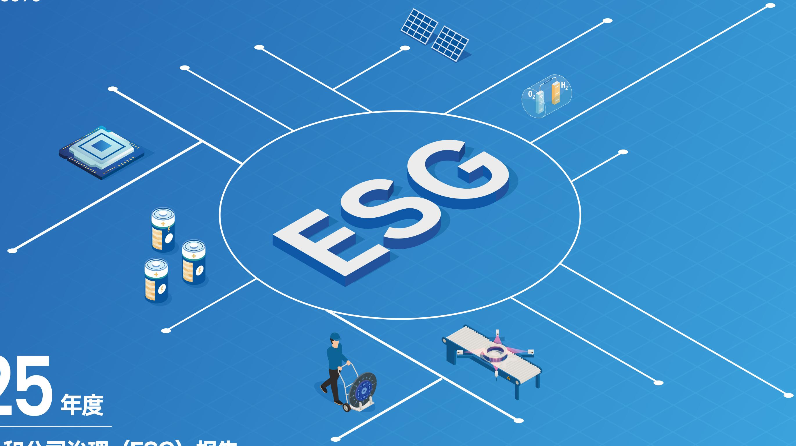

<details>
<summary>flowchart</summary>


</details>

## 目录 CONTENTS

关于本报告 01

董事长致辞 03

关于金博 05

可持续发展管理 13

附录 91

关键绩效表 91

指标索引表 96

读者反馈表 101

## 匠心精进 01

21 研发创新

25 质量安全

29 数据隐私

## 价值共生 02

33 客户权益

35 供应链协同

38 合作共赢

42 责任公益

## 聚贤育能 03

45 人权保障

50 成长赋能

55 健康护航

60 关怀凝聚

## 绿色发展04

63 环境合规

65 应对气候变化

69 资源能源管理

76 污染防控

## 稳健固本05

81 治理优化

84 风险管控

86 商业道德

90 投资者保护

## 关于本报告

## 编制说明

本报告是湖南金博碳素股份有限公司 ( 以下简称“金博股份”“公司”或“我们”) 向社会公开发布的第二份环境、社会和公司治理报告，旨在透过呈列本公司及四家全资子公司在环境，社会及治理（FSG）方面的最新政策，措施及绩效以回应利益相关方对公司可持续发展及信息披露的期望，增强各利益相关方对公司的了解和信心。

## 时间范围

本报告涵盖的时间范围与《湖南金博碳素股份有限公司 2025 年年度报告》一致，为二〇二五年一月一日至二〇二五年十二月三十一日（以下简称“本年度”或“报告期”）。为增强本报告的可比性，部分内容根据需要向其他年度适度延伸。

## 组织范围

本报告的组织边界涵盖本公司及四家全资子公司。部分内容涵盖的组织边界不同，该等内容已于相关部分注明。

## 称谓说明

为了方便表述和阅读，本公司四家全资子公司在报告中的简称如下：

<table><tr><td>金博碳陶</td><td>指</td><td>湖南金博碳陶科技有限公司</td></tr><tr><td>金博氢能</td><td>指</td><td>湖南金博氢能科技有限公司</td></tr><tr><td>金博研究院</td><td>指</td><td>湖南金博碳基材料研究院有限公司</td></tr><tr><td>金博投资</td><td>指</td><td>湖南金博投资有限公司</td></tr></table>

## 编制依据

《上海证券交易所上市公司自律监管指引第 14 号——可持续发展报告 ( 试行 )》  
全球可持续发展标准委员会（GSSB）《可持续发展报告指南》（GRI Standards）  
联合国 2030 年可持续发展目标（SDGs）

## 数据来源及可靠性声明

报告使用数据来源包括公司正式文件、统计报告及财务报告，经公司统计、汇总与审核的各职能部门、各经营单位的内部数据、第三方问卷调查、第三方评价访谈，以及政府部门公开数据和其他公开信息等。

本报告中有关数据所涉及货币种类及金额，如无特殊说明，均以人民币为计量单位。

本公司承诺本报告不存在任何虚假信息、误导信息记载，并对其内容的真实性、准确性和完整性负责。

## 报告获取

本报告以电子版形式发布，在上海证券交易所官方网站 (www.sse.com.cn) 及湖南金博碳素股份有限公司官网 (www.kbcarbon.com) 公布。

## 意见反馈

如您对本公司的可持续发展有任何意见或建议，欢迎通过下述联系方式反馈意见，帮助我们对报告进行持续改进。

电话 : +86-0737-6202107  
邮箱 : KBC@kbcarbon.com  
地址 : 湖南省益阳市高新技术开发区鱼形山路 588 号  
官网网址：www.kbcarbon.com

## 董事长致辞

## 尊敬的全体股东、合作伙伴及关注金博股份的朋友们：

2025 年，是我们攻坚克难、创新突破的一年。面对经营业绩承压的严峻挑战，我们坚定推进平台化战略，以研发创新为核心驱动，以产业协同为重要抓手，以市场拓展为战略导向，不断加快交通、锂电等新业务领域的技术迭代和市场拓展，稳步推动营收规模增长，开启高质量发展新征程。

构筑产业协同新高地。创新开发的碳陶制动盘取得全制造过程低成本制备技术的重大突破，不仅再次获得新能源汽车新势力造车品牌车企的多款新车型定点，占据国内主机厂 OEM 市场重要份额，也为公司进军欧洲市场、获得奔驰等行业龙头企业审核认可奠定了基础；我们牵头起草碳陶刹车盘轻量化团体标准，实现了从产品创新到产业引领的关键跨越；我们发布锂电负极用多孔碳新产品，充分展示锂电材料领域技术成果，为公司培育新的业绩增长点；我们获得覆盖锂离子电池负极材料（石墨类）、燃料电池气体扩散层设计与制造的 IATF16949 质量管理认证证书，标志着质量管理与运营规范化建设迈上新台阶。

彰显品牌发展硬实力。我们荣获“全国工业和信息化系统先进集体”称号，这是对我们坚持创新驱动发展、助力先进产业升级的高度肯定；我们顺利通过国家级小巨人、制造业单项冠军复核，充分印证了公司核心技术的持续领先优势与强劲的产业竞争力；我们成功通过奔驰集团 AMG 专家团队现场专项审核，持续推动碳陶制动系列产品在国际市场的验证与应用，逐步打开海外增量空间；我们与康纳制动在碳动在碳陶制动领域的强强联合，携手开拓碳陶制动后市场；我们荣获通威股份“价值伙伴奖”、双良硅材料“优秀供应商”、高景集团“同舟共济深度合作奖”，充分展示了下游客户对公司综合实力的认可；我们与氢璞创能、锋源氢能签署战略合作协议，聚焦燃料电池关键材料开展深度合作，为推动燃料电池材料国产化贡献重要力量。

共绘绿色制造新范式。我们锚定绿色低碳发展方向，通过布局分布式光伏项目提升绿电利用效能，将绿色发展理念深度融入全产业链流程，通过优先选用可回收、可降解原材料、深化资源循环利用模式，多维度优化产品低碳性能，全方位响应下游行业客户对绿色材料的高品质需求，为制造业绿色转型贡献力量。

回望 2025，每一份成绩都离不开全体同仁的并肩奋斗；展望 2026，我们将持续深耕先进新材料领域，践行绿色制造发展理念，深化产业链协同合作，加速锂电负极用多孔碳、先进陶瓷材料、钠电池用硬碳等新赛道市场突破，以更昂扬的姿态攻坚克难、锐意进取，奋力谱写公司高质量发展的新篇章。

湖南金博碳素股份有限公司

董事长：廖寄乔

## 关于金博

## 公司简介

金博股份主要从事先进碳基材料及产品的研发、生产和销售，服务于交通、锂电、光伏和半导体、氢能等国家战略性新兴产业，是一家具有自主研发能力和持续创新能力的高新技术企业，致力于为客户提供性能卓越、性价比优的先进碳基材料产品和全套解决方案。公司是唯一一家入选工信部第一批专精特新“小巨人”名单的先进碳基材料制造企业，是国家知识产权示范企业、国家火炬计划重点高新技术企业、国家级绿色工厂；荣获“全国模范职工之家”“全国五一劳动奖状”“中国造隐形冠军”“全国工业和信息化系统先进集体”；公司设计开发的碳基复合材料坩埚和导流筒两款产品获评“国家重点新产品”，碳基复合材料热场部件被国家工信部评为“制造业单项冠军产品”。

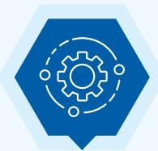  
企业战略

立足新材料、开发新技术致力新应用、创造新价值

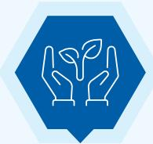  
企业使命

服务清洁能源发展助力双碳目标实现成为世界一流的先进新材料研发与产业平台

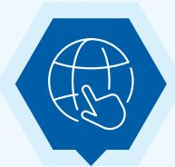  
企业愿景

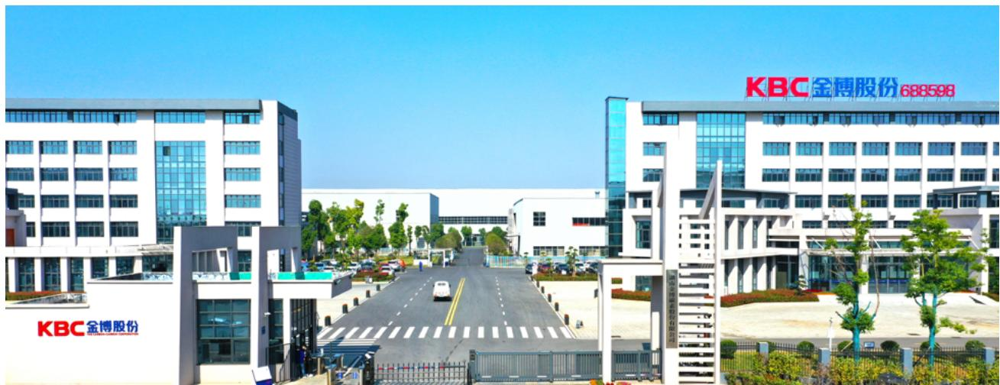

<details>
<summary>text_image</summary>

KBC金博股份 688598
KBC金博股份
</details>

## 业务布局

公司依托“碳谷”产业园项目，已在交通、锂电、光伏和半导体、氢能等应用领域形成了碳基产业链的产业结构，实现资源共享和优势互补，推动产业链的协同发展。公司将继续深化产业链协同，打造多维成长曲线，进一步扩大碳基材料在其他应用领域的行业领先优势，提高企业竞争壁垒和综合实力，为公司能源转型与产业升级提供关键材料支撑。其主要产品及应用领域如下：

## 交通领域

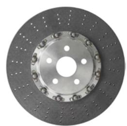

长纤碳陶制动盘 (KBCC-L 系列 )短纤碳陶制动盘 (KBCC-S 系列 )碳陶摩擦副整体解决方案

## 锂电领域

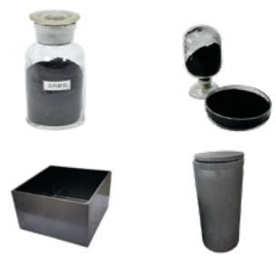

<details>
<summary>natural_image</summary>

Four types of chemical containers and containers: a glass jar with black powder, a glass cup with dark liquid, a solid container with a square base, and a gray cup with a clear glass (no text or symbols visible)
</details>

锂电负极人造石墨、多孔碳及锂电正 / 负极材料制备用热场

## 光伏领域

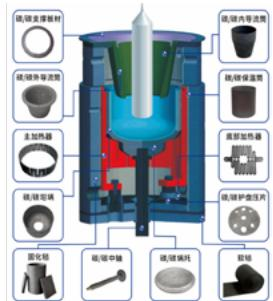

<details>
<summary>text_image</summary>

硫/碳支撑型材
硫/碳外导流器
主加热器
硫/碳可喷
硫/碳中轴
硫/碳铁耗
硫/碳内导流器
硫/碳保温层
底影加热器
硫/碳保护盘压片
硫/碳铁芯
硫/碳中轴
硫/碳铁耗
软链
</details>

多种规格的坩埚、导流筒、保温筒及加热器等光伏晶硅拉制炉热场系统的系列部件

## 半导体领域

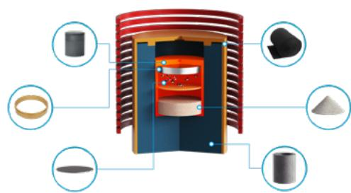

<details>
<summary>text_image</summary>

Diagram of a mechanical or material assembly with labeled components including cylinders, flanges, and powders
</details>

半导体晶硅制造用超高纯热场材料、保温材料及第三代半导体碳化硅合成用超高纯碳粉

## 氢能领域


<details>
<summary>natural_image</summary>

Two views of a black fabric roll: one plain and one rolled, both with no visible text or symbols.
</details>

气体扩散层用碳纸、气体扩散层材料

## 发展历程

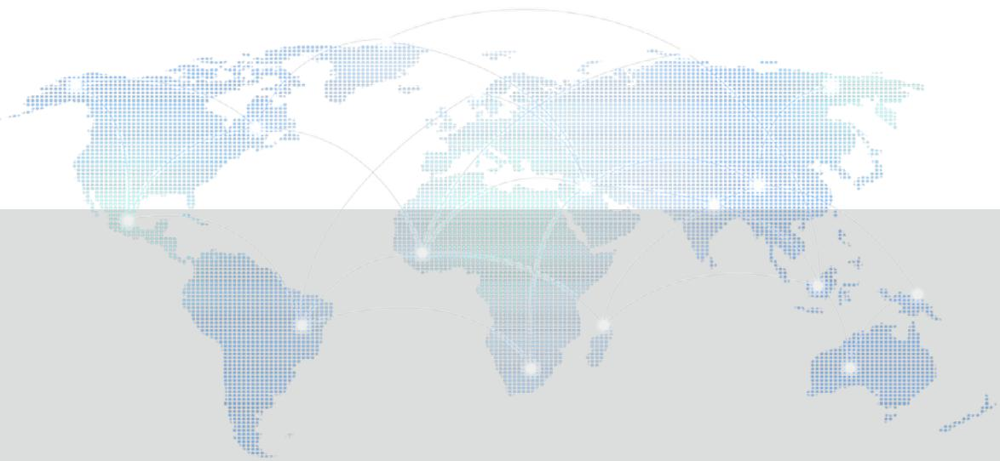

<details>
<summary>geo</summary>

| Region | Data Points |
| --- | --- |
| North America | High density (blue) |
| Europe | Moderate density (light blue) |
| Africa | Low density (dark blue) |
| South America | Low density (dark blue) |
| Asia | Low density (dark blue) |
| Oceania | Low density (dark blue) |
| Australia | Low density (dark blue) |
| Middle East | Low density (dark blue) |
| Central Asia | Low density (dark blue) |
| Southeast Asia | Low density (dark blue) |
| Eastern Europe | Low density (dark blue) |
| South America & Africa | Low density (dark blue) |
| Middle East & Africa | Low density (dark blue) |
| South America & Australia | Low density (dark blue) |
| Eastern Europe & Africa | Low density (dark blue) |
| Eastern Europe & Australia | Low density (dark blue) |
| Middle East & Africa & Australia | Low density (dark blue) |
| Eastern Europe & Australia & Africa | Low density (dark blue) |
| Eastern Europe & Australia & Africa & Middle East | Low density (dark blue) |
| Eastern Europe & Australia & Africa & Middle East | Low density (dark blue) |
| Eastern Europe & Australia & Africa & Middle East | Low density (dark blue) |
| Eastern Europe & Australia & Africa & Middle East | Low density (dark blue) |
| Eastern Europe & Australia & Africa & Middle East | Low density (dark blue) |
| Eastern Europe & Australia & Africa & Middle East | Low density (dark blue) |
| Western Europe & Africa | Low density (dark blue) |
| Western Europe & Africa & Middle East | Low density (dark blue) |
| Western Europe & Africa & Middle East | Low density (dark blue) |
| Western Europe & Africa & Middle East | Low density (dark blue) |
| Western Europe & Africa & Middle East | Low density (dark blue) |
| Western Europe & Africa & Middle East | Low density (dark blue) |
| Western Europe & Africa & Middle East | Low density (dark blue) |
| Western Europe & Africa & Middle East | Low density (\(10^{-6}\)) |
| Western Europe & Africa & Middle East | Low density (\(10^{-6}\)) |
| Western Europe & Africa & Middle East | Low density (\(10^{-6}\)) |
| Western Europe & Africa & Middle East | Low density (\(10^{-6}\)) |
| Western Europe & Africa & Middle East | Low density (\(10^{-6}\)) |
| Western Europe & Africa & Middle East | Low density (\(10^{-6}\))) |
</details>

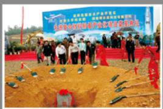  
推出光伏、半导体晶硅生长用碳基复合材料热场整体解决方案

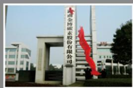

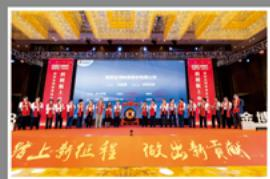

打造中国碳谷  
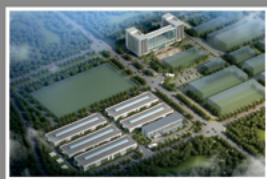

KBC

2005

起步积累

2008

2010)

2012

创新成长

2015

2019

引领跨越

-(2020

2021

2023

公司成立

开启碳基复合材料民用探索首款产品—坩埚获国家重点新产品

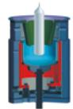

承担国家863计划成立省级工程研究中心完成股份制改造

入选工信部第一批专精特新小巨人名单登陆上交所科创板

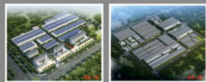

成立金博研究院

## 企业荣誉

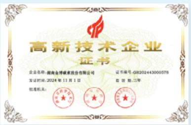

<details>
<summary>seal</summary>

高新技术企业
证书
企业名称：湖南金博碳素股份有限公司
证书编号：GR202443000578
发证时间：2024年11月1日
有效期：三年
批准机关：
</details>

国家高新技术企业

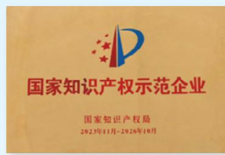

<details>
<summary>text_image</summary>

国家知识产权示范企业
国家知识产权局
2023年11月-2026年10月
</details>

国家知识产权示范企业

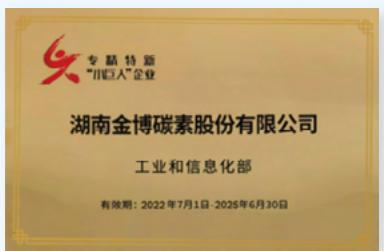

<details>
<summary>text_image</summary>

专精特新
“川归人”企业
湖南金博碳素股份有限公司
工业和信息化部
有效期：2022年7月1日-2025年6月30日
</details>

工信部专精特新小巨人企业

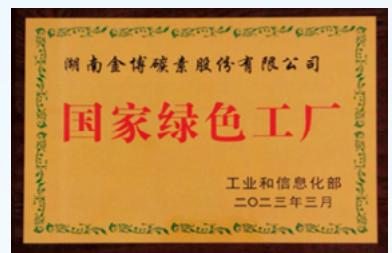

<details>
<summary>text_image</summary>

湖南金博碳素股份有限公司
国家绿色工厂
工业和信息化部
二〇二三年三月
</details>

国家绿色工厂

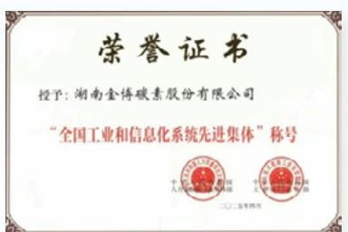

<details>
<summary>text_image</summary>

荣誉证书
授予: 湖南金傅碳素股份有限公司
“全国工业和信息化系统先进集体”称号
</details>

全国工业和信息化系统先进集体

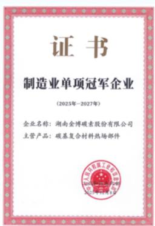

<details>
<summary>text_image</summary>

证书
制造业单项冠军企业
(2025年-2027年)
企业名称:湖南金博碳素股份有限公司
主营产品:碳基复合材料热场部件
</details>

制造业单项冠军企业

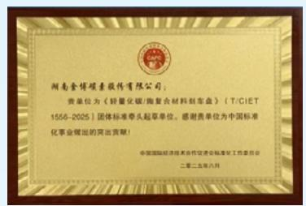

<details>
<summary>text_image</summary>

湖南金博碳素微传有限公司：
贵单位为《锌量化碳/陶复合材料制备盘》（T/CIE T
1556-2025）团体标准带头起草单位。感谢贵单位为中国标
化事业做出的突出贡献！
中国国际经济技术合作促进目标落实工作委员会
二零二五年六月
</details>

《轻量化碳 / 陶复合材料刹车盘》（T/CIET 1556-2025）团体标准牵头起草单位

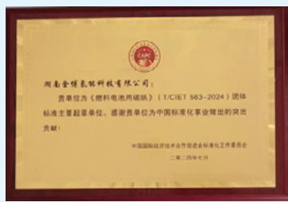

<details>
<summary>text_image</summary>

湖南金博氢能科技有限公司：
贵单位为《燃料电池用碳纸》（T/CIE T 563-2024）团体标准主要超募单位。感谢贵单位为中国标准化事业做出的突出贡献！
中国国际经济技术合作促进标准化工作委员会
二零二四年七月
</details>

《燃料电池用碳纸》(T/CIET 563-2024) 团体标准主要起草单位

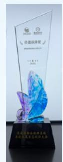  
通威股份 “价值伙伴奖”

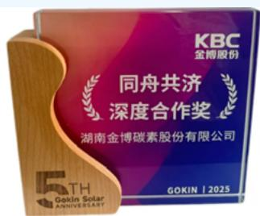

<details>
<summary>text_image</summary>

KBC
金博股份
同舟共济
深度合作奖
湖南金博碳素股份有限公司
GOKIN | 2025
5TH
Gokin Solar
ANNIVERSARY
</details>

高景集团“同舟共济深度合作奖”

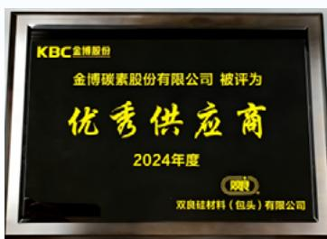

<details>
<summary>text_image</summary>

KBC金博股份
金博碳素股份有限公司 被评为
优秀供应商
2024年度
双良硅材料（包头）有限公司
</details>

双良硅材料“优秀供应商”

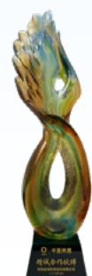  
中复神鹰 “精诚合作伙伴”

## 年度 ESG 亮点绩效

治理  


<details>
<summary>natural_image</summary>

Line drawing of a city skyline with multiple high-rise buildings and surrounding trees (no text or symbols)
</details>

营业收入

8.03 亿元

总资产

51.22 亿元

净资产

39.24 亿元

资产负债率

23.22%

商业贿赂相关违规事件

0件

内控制度覆盖率

100%

重大合规处罚事件

0件


环境  
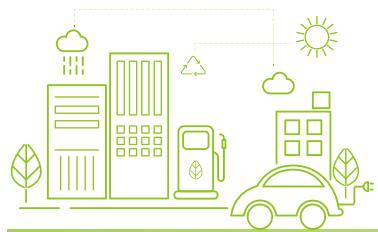

<details>
<summary>natural_image</summary>

Green line art illustration of a city with buildings, raindrops, and a car (no text or symbols)
</details>

温室气体排放总量（范围一 + 范围二）

22.66 万吨二氧化碳当量

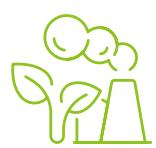

光伏设备发电量

2,004.35 万千瓦时


工业用水循环利用率

100%

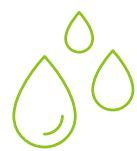

主要废弃物回收再利用占比

82.78%

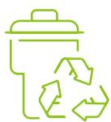

社会  
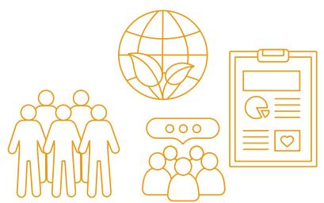

<details>
<summary>natural_image</summary>

Illustration of three human figures with a globe, a clipboard, and a chat bubble (no text or symbols)
</details>

研发投入

1.38 亿元

占营业收入比例

17.21%

研发人员

151 人

占比人数比例

25.25%

累计授权专利数

165件

累计授权发明专利

66件

客户抽样调查满意度

98.70

员工满意度

85.92%

## 可持续发展管理

## 可持续发展策略

公司以推动和实现可持续发展为核心目标，将 ESG 理念深度融入生产经营全过程，通过持续健全 ESG 管理体系，不断加强与利益相关方的沟通与协同，为企业长期高质量、可持续发展提供坚实保障。

## ESG 战略

公司坚守“服务清洁能源发展，助力双碳目标实现”使命，将可持续发展理念融入日常运营。上市至今，公司秉持“立足新材料、开发新技术、致力新应用、创造新价值”的发展战略，紧跟国家发展步伐，从单一光伏领域拓展到交通、锂电、光伏和半导体、氢能等国家战略性新兴产业，提供性能卓越、性价比优的先进碳基材料产品和全套解决方案，致力于将公司打造成为世界一流的先进碳基材料研发与产业平台，以材料创新持续赋能国家生态文明建设与绿色低碳转型进程，不断助力国家生态文明建设及绿色低碳转型。

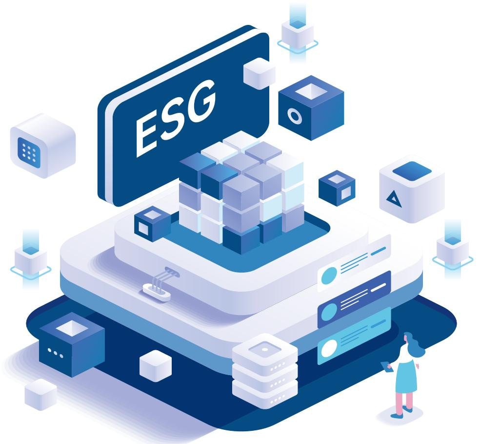

<details>
<summary>natural_image</summary>

Isometric illustration of a digital ESG platform with cubes and a person interacting, no text or symbols present.
</details>

## ESG 治理

公司构建自上而下的 ESG 治理架构，董事会负责制定 ESG 发展战略、方针目标与相关制度，评估重大议题影响；董事会下设战略与发展委员会，监督可持续发展战略相关执行情况；各职能部门、事业部及子公司负责执行落实，环保、社会责任、公司治理相关信息与数据的收集、汇总及披露工作，形成高效协同的组织保障体系。

## 战略层

## 董事会成员

董事会对可持续发展战略及信息披露承担整体责任  
制定 ESG 战略和目标，并审批涉及 ESG 相关重大决策，确保与公司整体战略和可持续发展原则契合  
监督管理层执行 ESG 工作，确保政策和措施落实，同时识别、评估 ESG 风险，确保公司合规

## 管理层

## 战略与发展委员会及委员

• 监督公司 ESG 战略执行情况，定期审查管理层 ESG 工作进展，确保政策和措施有效落实  
识别公司重大 ESG 风险议题及排序，审阅相关政策及信息披露，及时向董事会提供反馈及建议  
根据 ESG 趋势及相关风险机遇，评估公司 ESG 架构合理性、可行性等  
推动 ESG 理念传播与文化建设，协调跨部门协作，提升员工 ESG 认知与参与度

## 执行层

## 各职能部门、事业部及子公司 ESG 工作对接人

。敏锐洞察气候变化与ESG风险及时识别并预警反馈至管理目  
依据公司 ESG 政策，聚焦 ESG 负责的相关事项工作，全力推进 ESG 工作顺利开展  
积极配合董事会、管理层，高质量完成 ESG 相关工作

## ESG 能力建设

公司全面推进 ESG 能力建设，系统化开展 ESG 专项培训，覆盖管理层和相关核心业务部门，内容涵盖 ESG 价值、ESG 合规要求、评级指标管理等关键模块，切实提升全员 ESG 认知与实操能力，为企业可持续发展筑牢人才基础。

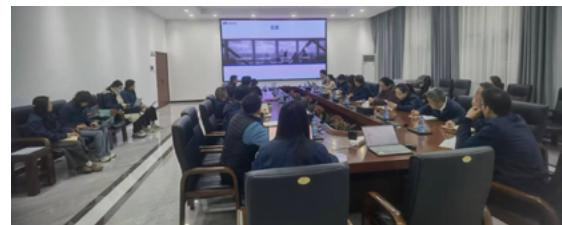

<details>
<summary>natural_image</summary>

Interior view of a conference room with attendees seated around a long table, facing a large screen displaying a video call (no visible text or symbols)
</details>

ESG 培训

## 重要性议题评估

公司参考《GRI 可持续发展报告标准》《ISO 26000：2010 社会责任指南》，并结合《上海证券交易所上市公司自律监管指引第 14 号 —— 可持续发展报告（试行）》（以下简称“上交所《指引》”），对核心议题进行筛选分类，系统性梳理 ESG 相关信息并推动披露规范化。2025 年，公司以“影响重要性问卷 + 财务重要性问卷”为核心支撑，建立双维度重要性分析方法学：其中影响重要性问卷覆盖政府与监管机构、企业员工、客户与消费者等多类利益相关方，有效填写 360 人；财务重要性问卷则聚焦董事与管理层、股东与投资者群体，有效填写 19 人。通过综合问卷反馈的定量数据与定性因素，公司明确了 ESG 议题优先级。同时，在梳理重大议题与价值链关系时，公司持续与上下游利益相关方密切沟通，在推进碳基材料产业化平台战略过程中，携手行业伙伴构建先进碳基材料产业生态圈，共同推动行业可持续发展。


了解公司活动与业务背景

分析公司内外部活动及业务关系，产业链上下游相关影响及核心利益相关方的诉求和期望；洞察最新产业政策、行业热点、国家及监管要求，识别其对公司存在的潜在影响。


建立议题清单

在上交所《指引》21 个议题基础上，结合监管要求、规则标准、行业标准及发展趋势等，识别、筛选出公司相关的可持续发展议题库（共 23 个议题），并分析 ESG 议题相关的实际和潜在影响、风险和机遇。


议题重要性评估

影响重要性评估：公司通过访谈和问卷调查分析可持续性议题的影响；通过开展与利益相关方的沟通，广泛征集并邀请他们从影响发生的可能性和影响程度（影响规模、影响范围、不可补救性）综合对议题进行评分。结合这些评分结果，对各议题进行排序，并综合利益相关方的意见，同时参考内外部专家的建议，形成对议题影响重要性的评估结果。

财务重要性评估：公司通过与内部管理层、外部专家开展讨论，从财务影响程度和财务发生的可能性出发，综合评估各议题在短期、中期和长期 ¹ 对公司财务状况及企业价值创造可能产生的影响，识别并分析其中的风险与机遇，最终确定财务重要性评估结果。


议题分析及披露

综合公司对上述议题影响重要性和财务重要性的评估结果，形成重要性议题清单。

2025 年议题清单以及变动情况

<table><tr><td>2025年议题</td><td>2024年议题</td><td>变动情况</td><td>变动原因</td></tr><tr><td rowspan="3">研发创新与科技伦理</td><td>科技创新</td><td rowspan="3">合并议题</td><td rowspan="3">依据议题内涵,对原有议题进行合并</td></tr><tr><td>科技伦理</td></tr><tr><td>先进碳基材料新产品</td></tr><tr><td>供应链管理</td><td>供应链安全</td><td rowspan="2">调整表述</td><td>依据《指引》要求,修改议题表述,拓宽议题内涵</td></tr><tr><td>产品与服务</td><td>产品和服务安全质量</td><td>对议题表述进行调整</td></tr><tr><td>合规与风险管理</td><td>-</td><td>新增议题</td><td>依据评级机构关注和同行对标,新增该议题</td></tr><tr><td>应对气候变化</td><td>应对气候变化</td><td>-</td><td>-</td></tr><tr><td>污染物排放</td><td>污染物排放</td><td>-</td><td>-</td></tr><tr><td>废弃物处理</td><td>废弃物处理</td><td>-</td><td>-</td></tr><tr><td>环境合规管理</td><td>环境合规管理</td><td>-</td><td>-</td></tr><tr><td>生态系统和生物多样性保护</td><td>生态系统和生物多样性保护</td><td>-</td><td>-</td></tr><tr><td>能源利用</td><td>能源利用</td><td>-</td><td>-</td></tr><tr><td>水资源利用</td><td>水资源利用</td><td>-</td><td>-</td></tr><tr><td>循环经济</td><td>循环经济</td><td>-</td><td>-</td></tr><tr><td>乡村振兴</td><td>乡村振兴</td><td>-</td><td>-</td></tr><tr><td>社会贡献</td><td>社会贡献</td><td>-</td><td>-</td></tr><tr><td>负责任营销</td><td>负责任营销</td><td>-</td><td>-</td></tr><tr><td>平等对待中小企业</td><td>平等对待中小企业</td><td>-</td><td>-</td></tr><tr><td>数据安全与隐私保护</td><td>数据安全与隐私保护</td><td>-</td><td>-</td></tr><tr><td>员工</td><td>员工</td><td>-</td><td>-</td></tr><tr><td>尽职调查</td><td>尽职调查</td><td>-</td><td>-</td></tr><tr><td>利益相关方沟通</td><td>利益相关方沟通</td><td>-</td><td>-</td></tr><tr><td>反商业贿赂及反贪污</td><td>反商业贿赂及反贪污</td><td>-</td><td>-</td></tr><tr><td>反不正当竞争</td><td>反不正当竞争</td><td>-</td><td>-</td></tr><tr><td>党建引领</td><td>党建引领</td><td>-</td><td>-</td></tr><tr><td>投资者保护</td><td>投资者保护</td><td>-</td><td>-</td></tr></table>

¹ 时间范围参考《上海证券交易所上市公司自律监管指南第 4 号——可持续发展报告编制》和公司运营实际设定。短期，是指报告期结束后 1 年以内（含 1 年）；中期，是指报告期间结束后 1 年至 5 年（含 5 年）；长期，是指报告期间结束后 5 年以上

2025 年重要性议题分析结果  
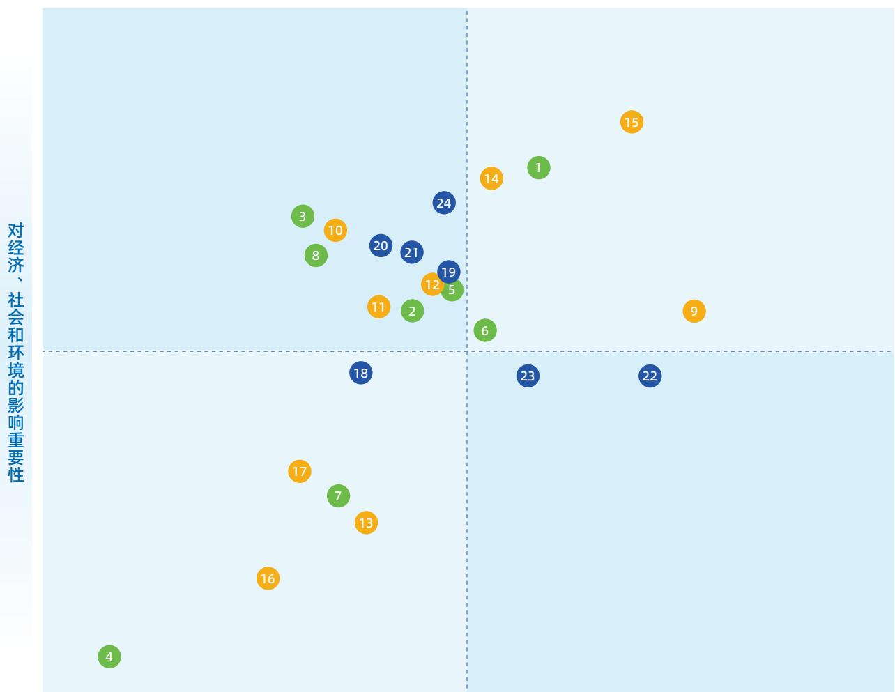

<details>
<summary>scatter</summary>

| ID | X (approx) | Y (approx) |
| --- | --- | --- |
| 15 | ~0.85 | ~0.95 |
| 1 | ~0.65 | ~0.75 |
| 14 | ~0.55 | ~0.70 |
| 24 | ~0.50 | ~0.65 |
| 3 | ~0.35 | ~0.60 |
| 10 | ~0.40 | ~0.55 |
| 20 | ~0.45 | ~0.50 |
| 21 | ~0.50 | ~0.48 |
| 19 | ~0.55 | ~0.45 |
| 12 | ~0.52 | ~0.42 |
| 5 | ~0.55 | ~0.40 |
| 11 | ~0.45 | ~0.35 |
| 2 | ~0.48 | ~0.32 |
| 6 | ~0.55 | ~0.28 |
| 18 | ~0.42 | ~0.25 |
| 23 | ~0.60 | ~0.22 |
| 22 | ~0.75 | ~0.20 |
| 9 | ~0.85 | ~0.35 |
| 17 | ~0.35 | ~0.15 |
| 7 | ~0.38 | ~0.12 |
| 13 | ~0.42 | ~0.10 |
| 16 | ~0.32 | ~0.05 |
| 4 | ~0.25 | ~0.02 |
</details>

对公司财务的重要性


## 环境

1. 应对气候变化  
2. 污染物排放  
3. 废弃物处理  
4. 生态系统和生物多样性保护  
5. 环境合规管理  
6. 能源利用  
7. 水资源利用  
8. 循环经济


## 社会

9. 产品与服务  
10. 研发创新与科技伦理  
11. 供应链管理  
12. 负责任营销  
13. 平等对待中小企业  
14. 数据安全与隐私保护  
15. 员工  
16. 乡村振兴  
17. 社会贡献


## 治理

18. 党建引领  
19. 投资者保护  
20. 尽职调查  
21. 利益相关方沟通  
22. 合规与风险管理  
23. 反商业贿赂及反贪污  
24. 反不正当竞争

## 利益相关方沟通

公司高度重视与利益相关方的协同关系，持续拓展多元沟通路径、完善互动机制，主动倾听并回应各方诉求，致力于构建更紧密的共生伙伴关系。2025 年，公司以访谈、座谈、问卷调研等形式，围绕可持续发展实践与内外部利益相关方开展深度交流；通过系统性的尽职梳理，剖析了相关议题对业务运营、商业模式的长期影响。公司已全面开放多维度沟通通道，诚邀社会各界与我们并肩同行，共促可持续发展，实现价值的共创与共享。

<table><tr><td colspan="2">利益相关方</td><td>关注重点</td><td>回应方式</td></tr><tr><td></td><td>客户</td><td>·产品质量安全可靠·客户服务及时满意·公平竞争环境·产品定制化需求·绿色产品·商业道德规范</td><td>·产品展览·交流互访·新品发布会·客户调研·技术研讨会·客户满意度调查及售后服务</td></tr><tr><td></td><td>股东及投资者</td><td>·规范公司治理·勤勉诚信管理·坚持稳步运营·实现价值提升</td><td>·股东会·股东、投资者说明会·财务及非财务报告·日常沟通</td></tr><tr><td></td><td>供应商及合作伙伴</td><td>·公平公正、互利共赢·技术交流与联合创新·信息共享与商务支持</td><td>·业务合作交流·供应商培训·定期沟通</td></tr><tr><td></td><td>政府与监管机构</td><td>·带动碳基材料产业发展·促进区域经济发展·诚信经营、依法纳税</td><td>·政策指引·日常沟通</td></tr><tr><td></td><td>员工</td><td>·保障员工权益·员工培训与教育·打造舒适工作环境·参与企业生产经营</td><td>·员工座谈会及日常沟通·职工代表大会、工会·内部网站·厂务公开</td></tr><tr><td></td><td>行业协会</td><td>·助力新材料产业发展·促进产学研一体化</td><td>·制定行业标准·组建产学研创新联合体、博士工作站、研发中心·理事会研讨</td></tr><tr><td></td><td>社区</td><td>·构建和谐关系·促进教育事业发展</td><td>·社区公益行动·爱心捐赠活动</td></tr><tr><td></td><td>公众和媒体</td><td>·信息披露公开透明·企业保障健全有效</td><td>·信息披露·媒体访谈接待</td></tr><tr><td></td><td>环境</td><td>·减少资源消耗和碳排放·助力社会全面绿色转型</td><td>·持续投入环保设施建设·强化对低碳技术的投资和创新</td></tr></table>

��

## 匠心精进

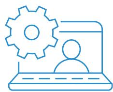

KBC金博股份

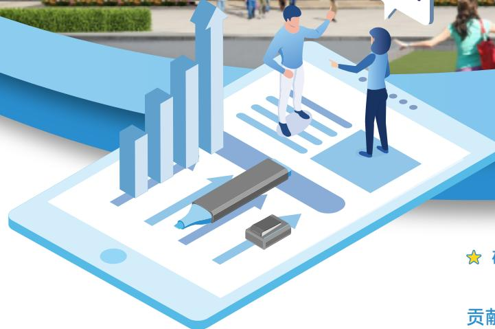

<details>
<summary>natural_image</summary>

Illustration of two people interacting on a smartphone screen with bar chart graphics (no text or symbols)
</details>

研发创新

质量安全

数据隐私

贡献联合国可持续发展目标（SDGs）：

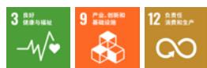

## 研发创新

公司坚持创新驱动发展战略，通过搭建五大碳基材料产业化创新平台、深化产学研协同创新，不断提升先进碳基材料产业化水平，提升自主创新驱动力。公司依托持续高效的科技成果转化，不断巩固在核心细分领域的领先优势，稳步拓展碳基材料在多领域的场景化应用，加快培育碳基材料领域新质生产力，以技术创新赋能高质量发展。

## 研发理念

“应用一代、研发一代、储备一代”

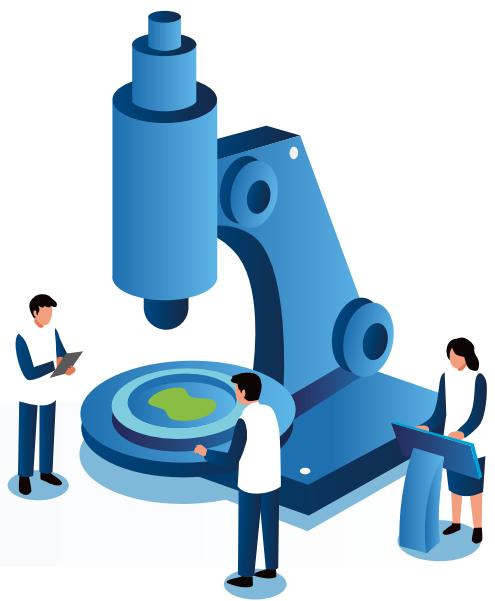

<details>
<summary>natural_image</summary>

Illustration of three people interacting with a microscope, no text or symbols present
</details>

## 2025 年

研发投入

占营业收入比例

13,818.28<sup>万元</sup>

17.21%

研发人员

占总人数比例

151 <sup>人</sup>

25.25%

## 创新平台

公司深耕先进碳基材料领域，坚持走“专、精、特、新”产品路线，以金博研究院为核心，现拥有“国家级博士后科研工作站”“C/C 复合材料低成本制备技术湖南省工程研究中心”“湖南省热场复合材料制备工程技术研究中心”“湖南省省级企业技术中心”“湖南省新材料中试平台”五大碳基材料产业化创新平台。


国家级博士后科研工作站


C/C 复合材料低成本制备技术湖南省工程研究中心


湖南省热场复合材料制备工程技术研究中心


湖南省省级企业技术中心


湖南省新材料中试平台


五大创新平台

## 研发团队

公司建立多种形式的人才激励机制和科学的绩效考核制度，为材料研发团队提供稳定的创新环境；坚持自主培养与高端引进相结合的人才战略，通过与科研院所、高等院校的深度合作，组建一支涵盖材料、化工、机械、电气等多个专业学科的核心研发团队；获批国家级博士后科研工作站，为高层次人才引进和培养提供了有力支撑，推动新材料技术的创新突破和产业化应用。未来，公司将重点加强新材料领域的人才梯队建设，完善人才培养与评价体系，持续提升在新材料领域的技术创新能力，为公司实现持续的产品与技术创新奠定坚实的人才基础。


## 我们的目标：

持续优化研发人员配置规模与团队占比，构建与业务战略相匹配的人才结构，强化系统化创新能力


## 案例

## “五小创新”评选活动

2025年，公司制定《创新合理化建议奖励办法》，并组织开展“笃行二十载，匠心筑未来” 五小创新评选活动，旨在共同营造全员参与、持续创新的企业文化氛围。

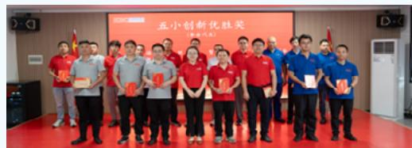

<details>
<summary>text_image</summary>

五小创新优胜奖
颁奖典礼
</details>

## 五小创新评选活动

## 小发明

围绕产品、工艺、装备及生产流程和检测控制方法等的创新和改造，以及具有解决特有问题而提出 创 新 性 方案、措施的过程和成果。

## 小创造

对已有设备、用具等进行小型改造，以提高设备使用效率、减轻劳动负荷、保证安全生产、提高工效或实现废旧利用。

## 小革新

对陈旧设备、落后工艺和操作方法等进行各种形式的革新，促进升级换代、节能减排降耗，使工艺进步和某一方面技术性能得 到 明 显 提高。

## 小设计

对 公 司 新 产品、包装、标识 等 进 行 设计，满足市场需求并提升公司品牌形象。

## 小建议

对公司研发、生产、经营、管理和安全提出的合理化建议。

## 产学研合作


## 我们的目标：

与行业优势院校开展专项技术攻关合作，实现资源深度整合与协同创新

公司与中南大学、湖南大学建立了产学研合作机制，牵头组建“湖南省高性能碳基材料研发及产业化应用创新联合体”，入选湖南省级第一批创新联合体试点单位。2025 年，公司子公司金博碳陶与中南大学持续推进碳陶刹车盘项目的联合创新和产学研合作，顺利完成该产品的关键技术攻关；子公司金博氢能与湖南大学围绕碳纸项目继续开展联合创新与产学研合作，成功攻克高性能碳纸的关键技术难题。

## 研发创新技术

公司聚焦碳基材料领域，围绕碳基材料产业化平台战略，立足于碳纤维预制体准三维编织技术、快速化学气相沉积技术、关键装备设计开发技术、先进碳基材料产品设计等碳基材料领域生产工艺和核心技术，通过碳基材料通用底层技术研究、碳基材料制备机理研究、碳基材料装备开发、碳基材料应用领域及产品拓展研发等，将工程化和产业化的研究成果快速转化，实现碳基材料在其他应用领域的拓展。

交通领域  
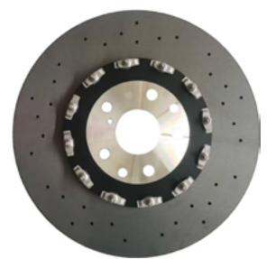

<details>
<summary>natural_image</summary>

Close-up of a black brake disc with perforated rim and central hub (no text or symbols visible)
</details>

商用汽车碳陶制动盘开发与应用

具有独特的材料结构设计、优异的风道设计和抗氧化涂层等，满足赛道工况要求。

半导体领域  


<details>
<summary>natural_image</summary>

Circular textured surface with no visible text, symbols, or markings
</details>

多孔石墨复合碳化钽涂层部件开发与应用

兼具了多孔石墨的透过性和碳化钽涂层的高温抗腐蚀优点，提高了碳基热场材料在碳化硅晶体生长热场中的使用寿命。

氢能领域  
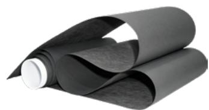  
卷对卷电解水用碳纸

通过微孔层孔结构和结合力的控制关键技术、微孔层亲疏水性设计等技术工艺的开发，使其可适用于阴离子交换膜电解槽。

## 知识产权

2025 年，公司碳基材料及其制品的设计、生产、销售顺利通过知识产权管理体系认证年度审核。公司已搭建完善的知识产权管理体系，将保护理念贯穿研发、生产、销售全业务流程，形成全链条闭环管控。组织架构上，研发中心下设知识产权部，实行“总裁授权、总工挂帅”管理机制，由总工程师担任管理者代表，严格按照《知识产权合规管理手册》及多项配套管理程序，对知识产权事务实施规范化、体系化管理，全面识别与防控各环节风险，有效防范技术泄露与侵权行为，构建权责清晰、管控到位的知识产权管理格局。

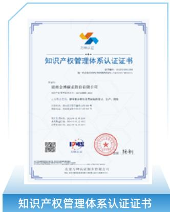

<details>
<summary>text_image</summary>

知识产权管理体系认证证书
湖南金博威控股有限公司
深圳市金博威投资有限公司
公司名称：湖南金博威科技发展有限责任公司
注册地址：湖南省长沙市芙蓉中路18号
联系电话：023-85679999
经营范围：从事企业项目管理与咨询业务（涉及行政许可的凭许可证经营）。
授权委托书：湖南金博威科技发展有限责任公司
授权委托人：湖南金博威投资有限公司
授权委托日期：2021年04月20日
IP地址：广东省深圳市福田区深南大道东侧
邮政编码：000001
知识产权管理体系认证证书
北京马牌律师事务所（特殊普通合伙）
北京市马牌律师事务所（特殊普通合伙）
北京市马牌律师事务所（特殊普通合伙）
北京市马牌律师事务所（特殊普通合伙）
北京市马牌律师事务所（特殊普通合伙）
北京市马牌律师事务所（特殊普通合伙）
北京市马牌律师事务所（特殊普通合伙）
北京市马牌律师事务所（特殊普通合伙）
北京市马牌律师事务所（特殊普通合伙）
北京市马牌律师事务所（特殊普通合伙）
北京市马牌律师事务所（特殊普通合伙）
北京马牌律师事务所（特殊普通合伙）
北京市马牌律师事务所（特殊普通合伙）
北京市马牌律师事务所（特殊普通合伙）
北京市马牌律师事务所（特殊普通合伙）
北京市马牌律师事务所（特殊普通合伙）
北京市马牌律师事务所（特殊普通合伙）
北京市马牌律师事务所（特殊普通合伙）
北京市马牌律师事务所（特殊普通合伙）
北京市马牌律师事务所（特殊普通合伙）
北京市马牌律师事务所（特殊普通合伙）
</details>


## 我们的目标：

• 建立规范化的创新披露与专利转化流程，确保技术产出高效转化为知识产权资产  
• 2025 年新增专利申请 项以上 ( 含 PCT 专利 项 )，其中发明专利占比不低于  
• 2025年布局碳陶刹车盘国际专利与商标，申请欧盟商标 项

## 2025 年


新增申请专利

26 件

其中：PCT 专利

2 项

申请欧盟商标

1 项

累计授权专利

165 件

其中：授权发明专利

66 件

新增授权专利

20 件

其中：新增授权发明专利

13 件

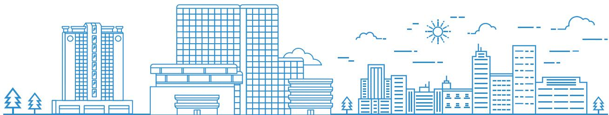

<details>
<summary>natural_image</summary>

Line art illustration of a city skyline with buildings, trees, and a sun (no text or symbols)
</details>

## 质量安全

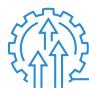

## 治理

公司建立完善的产品质量管理治理组织架构，以董事会作为质量事宜的最终责任机构，在高管层指定质量管理体系管理者代表兼质量负责人，并设立质管部统筹执行各项质量管理工作，包括质量指标的制定与监控、产品检验试验、不合格品管控等。

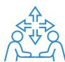

## 战略

<table><tr><td>风险描述</td><td>影响环节</td><td>财务影响</td><td>影响时间范围</td><td>应对措施</td></tr><tr><td>原材料来料检验不合格</td><td>自身运营/价值链下游</td><td>原材料来料检验不合格,导致生产延误/产品瑕疵增加返工成本、订单交付违约赔偿</td><td>短中期</td><td>严格执行《产品放行控制程序》来料管理流程,强化 $IQC^2$ 检验标准落地。</td></tr><tr><td>过程检验失效引发批量产品不合格</td><td>自身运营/价值链下游</td><td>库存积压损失、客户信任流失</td><td>中长期</td><td>落实制程“作业准备验证+自检+巡检”三阶检验,加强过程监督。</td></tr><tr><td>成品/出货检验失效导致不良品流出</td><td>自身运营/价值链下游</td><td>售后服务成本增加、品牌声誉受损</td><td>中长期</td><td>规范成品/出货抽样及判定流程,关联《不合格品控制程序》闭环处理。</td></tr></table>

<table><tr><td>机遇描述</td><td>影响环节</td><td>财务影响</td><td>影响时间范围</td><td>应对措施</td></tr><tr><td>质量管控体系完善提升产品可靠性</td><td>自身运营/价值链下游</td><td>减少返工/售后支出,增强客户粘性,扩大订单规模</td><td>中长期</td><td>持续优化《产品放行控制程序》,结合质量培训强化执行。</td></tr></table>

²IQC 是 Incoming Quality Control 的缩写，其中文意思为 “来料质量控制”


## 影响、风险和机遇管理

公司始终将产品质量与安全视作发展根基，以全流程管控贯穿研发、生产、销售至售后的每一个环节，为产品品质筑牢全周期保障。2025 年，公司碳 / 碳复合材料制品的设计、生产和销售以及燃料电池气体扩散层的设计和制造所涉及的质量管理保持 ISO 9001:2015 认证有效；锂离子电池负极材料（石墨类）与燃料电池气体扩散层设计与制造于 202年通过 IATF 16949:2016 汽车行业质量管理体系标准认证。

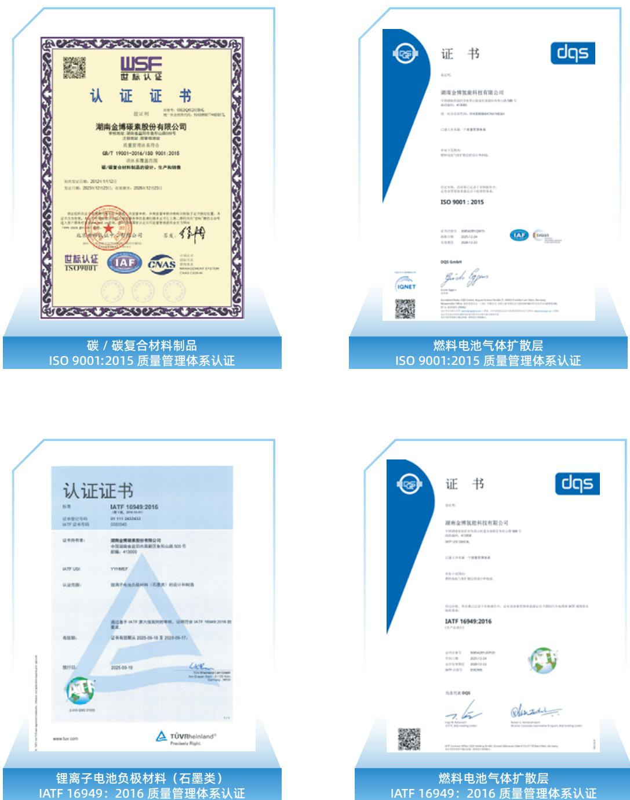

公司制定《产品放行控制程序》，从产品原材料入厂的来料检验，到生产中的过程检验，再到最后的成品检验以及出货检验，对原辅材料、生产过程产品进行监测，以确定产品是否满足规定要求，确保对放行产品的过程有效控制。公司制定《不合格品控制程序》，建立全流程、标准化的不合格品管控体系，覆盖进厂物料、半成品、成品、库存品等全场景。2025 年，公司未发生与产品相关的安全与质量重大责任事故。

2025 年，公司针对生产技术人员组织并开展了质量意识宣导培训、过程审核专业培训和质量工具 8D³ 等培训，有效提升员工质量意识及专业质量管理能力。

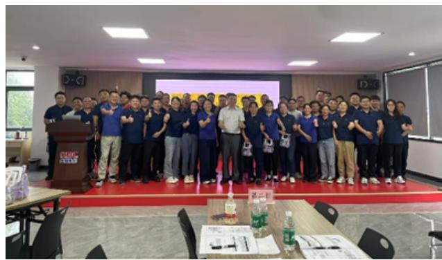

<details>
<summary>natural_image</summary>

Group photo of people in a meeting room with presentation screens and tables (no visible text or symbols)
</details>

过程审核专业培训

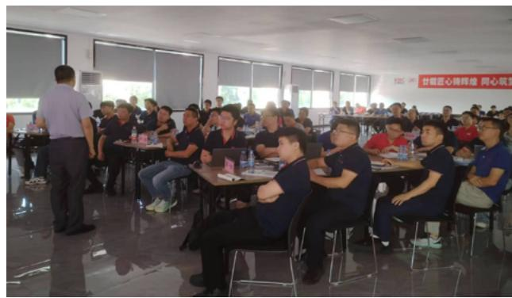

<details>
<summary>text_image</summary>

甘藏匠心排师组 同心坑
</details>

质量工具 8D 使用培训


## 案例

## 通过梅赛德斯 - 奔驰集团 AMG 专家团队专项审核

2025 年 11 月，公司通过了全球知名企业梅赛德斯 - 奔驰集团 AMG 审核专家组的专项审核，并进入其供应链体系。此次审核围绕公司碳陶制动盘的生产流程合规性、产品质量管控体系、供应链管理及售后服务标准等核心维度展开。专家组对公司在质量控制、技术应用及订单交付保障等方面的表现予以充分肯定，认可公司相关管理体系运行有效、规范、可控。


<details>
<summary>text_image</summary>

KBC
AMG Team
Welcome to KBC
</details>

梅赛德斯 - 奔驰集团 AMG 专家团队专项审核


## 指标和目标

<table><tr><td>目标、指标项目</td><td>年度目标值</td><td>完成情况</td></tr><tr><td>供货批次合格率</td><td>≥98%</td><td>已达成</td></tr><tr><td>采购产品准时交付率</td><td>100%</td><td>已达成</td></tr><tr><td>成品合格率</td><td>≥99%</td><td>已达成</td></tr><tr><td>不合格品处理及时率</td><td>100%</td><td>已达成</td></tr></table>

## 2025 年


<details>
<summary>text_image</summary>

产品召回数
0
</details>

## 数据隐私


## 治理

公司构建了“以制度约束为核心、技术防护为支撑”的协同型数据安全治理架构，涵盖管理规范、技术防护与审批管控，形成全流程防护闭环。公司通过《保密管理办法》规范员工保密行为，明确信息保密的行为边界；依据《信息系统管理办法》规范办公系统的日常运维和操作流程，为技术防护措施及审批流程的落实提供制度保障。


## 战略

<table><tr><td>风险描述</td><td>影响环节</td><td>财务影响</td><td>影响时间范围</td><td>应对措施</td></tr><tr><td>数据传输/存储环节安全漏洞,引发核心业务数据泄露</td><td>自身运营</td><td>增加合规处罚、数据修复成本</td><td>短期</td><td>启用企业微信统一沟通平台,搭建“数据传输-存储-使用”全流程纵深防御体系。</td></tr><tr><td>网络边界/终端防护不足,遭遇恶意攻击或勒索</td><td>自身运营</td><td>导致业务中断、数据损坏,产生应急处置与损失赔偿成本</td><td>短期</td><td>升级防火墙、杀毒软件,与现有办公系统联动实现实时拦截;定期开展漏洞检测。</td></tr><tr><td>数据备份机制失效,突发故障致数据丢失</td><td>自身运营</td><td>增加业务恢复成本,延误生产经营节奏</td><td>短期</td><td>更新数据备份一体机并常态化开展灾备演练,实现“主动防范风险”的安全模式。</td></tr><tr><td>员工数据安全操作不规范,引发误泄露/误操作</td><td>自身运营</td><td>提高数据安全事件概率,产生潜在损失</td><td>短期</td><td>开展加密软件、OA系统等实操培训,强化操作规范考核与日常监督。</td></tr></table>

<table><tr><td>机遇描述</td><td>影响环节</td><td>财务影响</td><td>影响时间范围</td><td>应对措施</td></tr><tr><td>数据备份与灾备能力升级</td><td>自身运营</td><td>减少数据丢失/损坏损失,保障业务连续性</td><td>中长期</td><td>迭代备份工具与流程,常态化开展灾备演练。</td></tr><tr><td>员工数据安全意识强化</td><td>自身运营</td><td>降低人为操作风险,节约信息安全事件潜在成本</td><td>中长期</td><td>定期组织专项培训,将安全操作纳入员工日常管理。</td></tr></table>


## 影响、风险和机遇管理

## 办公系统管理

公司新增防火墙与杀毒软件，实现与现有办公系统的深度联动，融合网络边界防护与终端安全防护能力，构建覆盖数据传输、存储、使用全流程的纵深防御体系，实时拦截外部非法访问与恶意攻击行为，切实防范数据泄露、篡改、破坏及勒索攻击等安全风险。

## 企业数据储存

公司完成企业数据存储一体机的更新升级，并开展灾备演练，推动企业数据安全管理从被动应对故障向主动防范风险转变，形成工具、流程、能力相结合的全方位保障体系，筑牢企业数据存储安全防线。

## 员工保密管理

公司定期组织员工开展信息安全专项培训，讲解加密软件、办公系统及安全防护管理软件的操作要点与注意事项，持续提升员工信息安全实操能力；依据《保密管理办法》，将员工敏感信息、岗位涉密资料纳入三级保密管理体系并实施差异化管控；通过入职签署保密承诺、在岗规范办公设备使用、离职交还全部涉密载体的全流程行为约束，辅以定期保密培训与监督检查，全面禁止私自传输、泄露涉密信息等行为。


<details>
<summary>natural_image</summary>

Interior of a classroom with a speaker at a podium and students seated at desks, no visible text or signage
</details>

信息安全培训


## 指标和目标

2025 年  


<table><tr><td>信息安全培训1次</td><td>信息安全应急演练1次</td><td>隐私与信息安全泄露事件0</td></tr></table>

��

## 价值共生


<details>
<summary>natural_image</summary>

Illustration of a smart home on a smartphone screen with surrounding trees and solar panels, symbolizing customer rights (no text or symbols on the main image)
</details>

客户权益 供应链协调 合作共赢 责任公益

贡献联合国可持续发展目标（SDGs）：


## 客户权益

公司秉持“服务清洁能源发展，助力双碳目标实现”的企业使命，携手客户、合作伙伴、投资者及社会各界，凝心聚力共推产业进步。公司始终将客户权益保障置于经营发展核心位置，通过建立系统化客户服务与管理体系，完善规范化投诉处理机制，践行负责任的营销实践，持续提升客户满意度与信任度，切实履行 “持续为客户创造价值” 的服务承诺。

## 客户服务体系

## 制度层面

公司制定《客户接待管理办法》《售后服务管理办法》《客户投诉处理办法》等客户权益保护制度，为客户提供标准化全流程的优质售前、售中和售后服务。

## 产品服务层面

在提供高品质产品的同时，公司依托自主创新能力和专有技术储备，为客户提供覆盖设计、测试、生产、技术应用指导、售后服务、产品迭代等全过程服务和标准化及定制化产品，并通过战略合作不断深化与下游客户的合作关系。

## 客户沟通层面

公司设置了多种沟通渠道，包括客户走访、电话和邮件沟通、客户沟通会议等，确保客户的意见及时高效反馈，全面保障客户权益，不断提升客户满意度和信任度。

## 满意度管理

公司建立了系统化的客户满意度调查机制，该机制覆盖从信息收集、任务分派、问题解决、效果验证、复盘总结等全过程，调查内容覆盖产品质量与使用、人员服务、产品价格、产品交付以及产品培训 5 个大方面，15 个细分打分点，确保客户反馈得到及时响应和高效处理。公司将通过持续优化服务流程和提升产品质量，进一步增强客户满意度和信任度。

2025年，公司荣获通威股份“价值伙伴奖”、双良硅材料“优秀供应商”、高景集团“同舟共济深度合作奖”，充分彰显下游客户对公司综合实力的认可。

## 2025 年

客户抽样调查满意度

98.70%


## 投诉处理机制

公司依据《客户投诉处理办法》建立了标准化的客户投诉受理与处理机制，确保客户可通过多元渠道便捷反馈，并执行严格的闭环跟踪与记录要求，以推动服务及管理流程的持续完善。针对客诉处理，公司明确跨部门职责分工，确保客户投诉实现快速响应、高效处置、根源解决。在客户服务与投诉处理中，公司强调倾听与理解客户诉求，致力于将每一次反馈都转化为优化服务质量、深化客户信任、巩固客户关系的重要契机。

## 2025 年

客户投诉关闭率

100%


## 负责任营销

公司严格遵守《中华人民共和国反不正当竞争法》《中华人民共和国广告法》等法律法规，建立涵盖事前、事中、事后的全流程管控体系，规范开展负责任营销，切实维护市场秩序与客户合法权益。

## 培训教育

## 通过专项培训与考核推动负责任营销能力提升

## 事前审核

公司根据“审查有依据、系统留痕迹、客户有证据”的核心要求，实施严格的内容多级审核机制。

## 过程留痕

公司要求对营销材料的制作、使用及归档保留完整记录，确保流程可追溯。

## 监督保障

公司执行常态化的审计与改进流程，全面评估营销合规性，对不规范的问题及时整改优化。


<details>
<summary>natural_image</summary>

Illustration of two people interacting with a laptop, documents, and social media devices (no text or symbols)
</details>

2025 年，公司围绕负责任营销理念，针对新入职和在职业务员开展了营销礼仪规范、客户反馈处理流程、售后服务管理办法以及客户财产管理办法等专项培训，提升业务员负责任营销能力。为保障培训成效，公司通过“精准培训 - 嵌入式考核 - 数据化评估 - 持续改进”的流程管理，推动业务员专业技能持续提升，实现客户服务质量与业绩增长双突破。

## 2025 年


负责任营销主题培训

3<sup>次</sup>

## 供应链协同

2025 年，公司致力于构建安全、可靠、负责任的价值链，通过系统化的供应商管理、严格的风险防控体系和阳光采购政策以及深入的可持续采购实践，全面提升供应链的韧性与协同效率，赋能上下游共同实现可持续发展。

## 全流程管理

我们建立了从“准入、评价到退出”的闭环管理体系，确保合作伙伴的质量与可靠性。

## 01

## 严格准入

新供应商需经多部门联合评审与技术样品验证，最终由管理者代表批准后，方可纳入《合格供方名录》。

## 02

## 动态评价

合作期内，定期由保障中心组织研发中心、质管部、财务中心、生产等相关部门从价格、质量、交期、服务等维度对供应商进行综合绩效考评。

## 03

## 分级退出

对考评结果不合格的供应商，采取暂停供货或移出名录等措施，实现供应商优胜劣汰。

## 风险防范与安全保障

为保障供应连续安全稳定，公司构建了多层次的风险防控网络。


## 供应多元化

对原材料及核心零配件实行 “主备” 供应模式，并与核心伙伴签订年度框架协议。


## 本地化优先

在保障需求的前提下，公司优先选用本地供应商，以缩短供应链距离，提升响应速度，并支持区域经济发展。


## 物流多渠道

采用公、铁、海、空多式联运，避免单一物流路径中断风险。


## 预案制度化

制定并执行 《原材料应急预案》，为应对潜在供应中断提供明确行动指南。


## 审核前置化

在准入阶段即对重要供应商进行现场审核，全面评估其企业资质，并综合评估其产能规模、生产设备先进性、工艺稳定性、交付准时率等必要条件。

## 阳光采购与廉洁治理

公司将廉洁合规作为商业合作的基石，致力于营造公平透明的采购环境。通过刚性制度约束，明确划定商业交往行为底线，建立并维护健康、公正的商业生态。

## 廉洁承诺 100% 覆盖

所有采购合同均包含廉洁承诺条款，明确禁止任何形式的商业贿赂。

## 高额违约惩戒

廉洁承诺条款规定，若供应商违约，将承担所涉金额 100 倍的违约金（10 万元起），并追究法律责任。

## 可持续采购实践

公司积极推动环境与社会责任向供应链延伸，致力于打造绿色、共荣的价值链。

<table><tr><td>合同约束</td><td>在采购合同中明确纳入职业健康、环境保护等可持续性条款。</td></tr><tr><td>审核激励</td><td>通过现场审核核查供应商 ESG 表现,并对绩效优异者在订单分配上给予倾斜,树立行业标杆。</td></tr><tr><td>绿色导向</td><td>优先采购可回收、可降解物料,并与供应商协同推动包材、托盘的回收复用,减少资源消耗。</td></tr><tr><td>认证基础</td><td>在准入评估中,公司优先选择通过 ISO 9001 质量体系认证的供应商,确保产品质量和供应链的可靠性,同时倾向合作通过环境与职业健康安全管理体系认证的供应商。</td></tr><tr><td>培训与沟通</td><td>公司重视与供应商的协同发展,通过组织核心供应商培训、开展定期现场审核、建立信息共享机制、签订专项合作协议等多种形式,持续传递公司的可持续采购理念与要求,促进双方在绿色转型、社会责任、风险管理等方面的共识与能力提升。</td></tr></table>

## 2025 年


本地化采购比例

41.26%

通过质量管理体系认证的原材料供应商比例

100%

通过环境管理体系认证的原材料供应商比例

90%

通过职业健康管理体系认证的原材料供应商比例

90%

## 合作共赢

2025 年，公司持续深化行业交流与生态合作，不断加强与上下游伙伴的协同联动。一方面，积极参与国内外专业展会、技术论坛与产业峰会，全方位展示核心技术与创新成果，持续提升品牌影响力；另一方面，紧密围绕市场趋势与客户需求，在技术研发、产品验证、国产化替代等领域深化战略合作，推动资源共享与项目落地，构建互利共赢的产业生态。

## 战略合作


## 案例

## 与康纳制动达成战略合作

2025 年 3 月，金博股份子公司金博碳陶与康纳制动正式签署战略合作协议，携手开拓碳陶制动后市场。此次合作为碳陶制动后市场的未来发展注入了新的动力，也让碳陶制动技术迎来更广阔的应用前景。


<details>
<summary>text_image</summary>

RBC 金博股份 X3T RACING 融道股份&康新制动战略合作签约仪式
双K合B
同心向C
</details>


## 案例

## 与氢璞创能达成战略合作

2025年4.月 金博股份与氢璞创能签署战略合作协议.聚焦氢燃料电池碳纸领域开展深度合作。双方将结合金博股份在碳基材料研发与产业链整合方面的优势，以及氢璞创能在燃料电池系统集成与市场布局方面的经验，以“优势互补、创新驱动”为原则，共同提升碳纸产品竞争力，推动氢能产业高质量发展。


<details>
<summary>text_image</summary>

2025 "凝聚通中·璞璞未来"
金博股份 氯璞创能
总裁 戴朝晖 董事长 欧阳沟
</details>


## 案例 与锋源氢能达成战略合作

2025 年 11 月，公司子公司金博氢能与锋源氢能签署战略合作框架协议，围绕燃料电池关键材料开展技术协同、产品验证与国产化应用合作。双方将通过资源互补与技术协同，共同提升国产关键材料竞争力，为燃料电池产品提供可靠支持。


<details>
<summary>text_image</summary>

锋源氢能&金博氢能
战略合作签约仪式
</details>

## 展会参与


## 案例 国际氢能及燃料电池产业展

2025 年 3 月，金博股份应邀参加国际氢能及燃料电池产业展，携电解水制氢用气体扩散层、碳纸等产品亮相，全面展示公司在氢能碳材料领域的创新实力和技术底蕴。


<details>
<summary>natural_image</summary>

Group of men in a trade show discussing equipment, with trucks and industrial structures in the background (no visible text or symbols)
</details>


## 案例 第十七届中国国际电池技术交流展览会

2025.年5.月金博股份应邀参加第十七届中国国际电池技术交流展览会，展示公司在锂电材料领域的最新技术成果，并于展会期间隆重发布新一代硅碳负极用多孔碳产品，获得广泛认可。


<details>
<summary>text_image</summary>

KBC金博股份 先进碳材料研发产业化平台
KBC
</details>


## 案例 第十八届 (2025) 国际太阳能及智慧能源展览会

2025 年 6 月，金博股份应邀参加第十八届 (2025) 国际太阳能及智慧能源展览会，展示了公司作为先进碳基材料行业领军企业在光伏热场材料领域二十年的深耕成果。


<details>
<summary>text_image</summary>

Group photo at an exhibition booth with visible signage including 'RBC' and '20 Aroch Research'
</details>


## 案例 2025 China Brake 中国制动年会暨展览会

2025 年 10 月，金博股份应邀参加 2025 China Brake 中国制动年会暨展览会，全面展示涵盖多系列的 7 款碳陶制动盘产品，并围绕《欧 7 排放对制动系统的挑战及碳陶摩擦副解决方案》发表主题演讲，全面阐释其针对欧 7 排放标准的碳陶摩擦副技术路线，进一步巩固了公司在碳陶制动领域的技术影响力与品牌形象。


<details>
<summary>text_image</summary>

Group photo at an exhibition booth with KBC branding and visible signage in Chinese and English
</details>


## 案例 德国埃森改装车展

2025 年 12 月，金博股份作为国内规模领先、技术领先的碳陶制动盘量产企业，参加了德国埃森改装车展，该展会为汽车改装领域最具前沿影响力与认可度的国际汽车改装展会之一。展会上，公司受到央视国际台采访，并获得行业同仁、产品专家等一致高度评价。


<details>
<summary>text_image</summary>

KBC
KBC Co.,Ltd.
KBC 宝博股份
KBC 宝博股份
产品介绍 PRODUCE
</details>

## 品牌共创


## 案例

## 协同开展“小米精英驾驶系列活动”

2025 年 10 月，金博股份与小米汽车深度协同开展“小米精英驾驶系列活动”，共同塑造高质量且具有感染力的驾驶场景体验。此次活动以品牌共建及公司碳陶制动产品的场景化体验为重点，在成都、武汉、西安、长沙四大核心城市举办。其中，湖南站特别策划“金博专场”活动，进一步深化双方品牌联动与用户生态融合。此次合作不仅是品牌曝光与产品推广，更是与生态伙伴在用户场景、内容共创与品牌互动上的深度融合，共同拓展价值增长的新空间。


<details>
<summary>text_image</summary>

小米精英驾驶
高阶驾驶培训·湖南站
</details>

“小米精英驾驶系列活动 - 湖南站”培训颁奖现场

## 责任公益

公司始终将积极履行企业社会责任作为推动可持续发展的重要战略，通过系统性实践不断提升社会影响力，树立起行业内责任典范企业形象。

社会贡献方面，公司持续在社区共建与员工关怀等多个维度积极践行。通过开展各类公益捐赠活动，助力改善教育条件；积极与周边社区建立长期合作关系，优先招聘社区居民，促进社区经济繁荣。

乡村振兴方面，公司结合自身发展围绕产业支持、就业帮扶与公共服务建设等多点推进。公司为当地居民创造就业岗位，带动当地劳动力就业；与农户建立广泛合作，多次采购当地农副产品，助力乡村产业发展；积极参与乡村教育等公共服务项目，捐赠资金以改善教学条件，为乡村可持续发展奠定基础。

未来，公司继续将社会责任理念融入发展战略与日常运营，积极投身社会贡献与乡村振兴事业，不断探索创新实践路径，以实际行动为社会全面繁荣与高质量发展贡献企业力量。


## 案例

## 持续助力乡村教育事业

公司积极履行社会责任，持续关注教育公益事业，通过长期稳定投入改善乡村教育条件、优化教学设施、提升师资水平、激励优秀学子成长，以实际行动助力教育事业高质量发展。公司已与湖南省宁乡市第一高级中学教育基金会签订长期捐赠协议。

��

## 聚贤育能


<details>
<summary>natural_image</summary>

Illustration of people interacting with a smartphone displaying financial and urban infrastructure (no text or symbols)
</details>

人权保障

成长赋能

健康护航

关怀凝聚

贡献联合国可持续发展目标（SDGs）：


## 人权保障

公司在经营管理过程中，始终将员工视为最宝贵的资源，通过构建平等包容的职场环境与清晰完善的发展平台，切实保障员工合法权益，充分激发员工的潜能，以人才高质量发展助力企业可持续发展，构建和谐稳定的劳动关系与社会关系。

## 合规雇佣

公司严格遵守《中华人民共和国劳动法》《中华人民共和国劳动合同法》等法律法规，制定《招聘录用管理办法》，以“按需招聘、人岗匹配、公平公正”为原则，严禁雇佣童工，杜绝强迫用工、担保用工等行为，所有雇佣关系均基于自愿、平等的劳动合同，切实保障员工自由离职的合法权利。

公司搭建合规沟通渠道，提供专业调解支持，高效处理劳动纠纷，并通过事后复盘，平衡员工权益与劳动关系稳定。


<details>
<summary>natural_image</summary>

Isometric illustration of various digital business workflows including computer, web, and data processing (no text or symbols)
</details>

## 平等与多元化

公司秉持多元、平等、包容的核心理念，充分尊重员工个体差异与多样性，为残疾人士、退伍军人提供就业机会。公司不因民族、种族、性别、宗教信仰、身高、体重、容貌及不合理年龄限制等因素区别对待员工，杜绝任何形式的歧视与偏见，为每位员工提供平等的发展机会。同时，公司建立公平的薪酬体系，全面实现男女同工同酬。

员工总人数：598人（截止报告期末）  
  
2025 年


<table><tr><td>退役军人员工</td><td>残疾人员工</td><td>少数民族员工</td></tr><tr><td>47人</td><td>10人</td><td>11人</td></tr><tr><td>女性员工占比</td><td colspan="2">女性高管占比</td></tr><tr><td>28.93%</td><td>11.11%</td><td></td></tr></table>

## 民主沟通

公司构建完善的员工沟通与权益保障机制，通过多渠道畅通员工诉求响应路径。公司设立职工代表大会，职工代表占比达 15%，充分保障员工的知情权、参与权；制定并实施《职工代表大会实施细则》《员工关系与沟通管理办法》，持续规范民主管理与沟通流程。同时，公司设置员工意见箱，制定《意见箱管理办法》，广泛收集员工的意见与诉求，并对匿名意见采取限制调查范围、专人处理、信息最小化管理等措施，强化隐私保护要求。

2025 年，公司以线上匿名问卷形式向全体基层员工开展员工满意度调查，涵盖归属感与文化认同、工作满意度、发展与机会、沟通与支持等调研内容。本次调查员工参与率达 70%，整体满意度为 85.92%，其中归属感与文化认同、工作满意度维度评价突出，充分反映出员工对公司整体发展与管理工作的积极认可。此外，公司广泛收集员工对食堂菜品质量、更新频次、卫生状况及服务态度的反馈意见，针对性优化食堂服务与管理水平，持续提升员工后勤保障体验。


<details>
<summary>natural_image</summary>

Illustration of people interacting with digital devices and documents, no text or symbols present
</details>

## 2025 年

召开职工代表大会

4次


民主议案落实率

100%


## 薪酬福利

公司搭建完善且具备市场竞争力的薪资福利体系，旨在保障员工获得公平合理的劳动报酬。公司结合行业与区域经济水平，定期开展市场薪酬调研，实施薪酬动态调整机制，确保员工薪资始终处于合理市场区间。公司制定的《员工薪酬管理办法》，既可适配公司经营管理需求，也能树立 “以绩效和能力为导向” 的价值分配理念，助力公司构建契合发展、兼具竞争力与激励性的薪酬体系。

## 绩效薪酬

根据《员工绩效考核管理办法》，将薪酬增长与员工的工作业绩、行为表现及团队协作相挂钩，以客观考核推动员工与公司共同成长；被考核人对于考核环节及结果存在疑义，可向部门及公司考核小组进行查询、协调确认或纠偏。

## 岗位薪酬

通过清晰的职业发展通道，员工晋升后，依据新岗位的职责、技能要求及市场价值，获得对应幅度的薪酬增长。

## 薪酬动态优化

定期调研同行业薪酬水平，若自身薪酬与市场存在差距则及时调整，保障薪酬体系的市场竞争力，助力吸引、留存优秀人才。

## 股权激励计划

适时推出契合发展需求的股权激励方案，将核心员工长期收益与公司价值深度绑定，强化人才激励效能，引导团队聚焦中长期发展目标，实现员工与公司的共赢成长。

2025 年，公司完成员工薪酬管理制度的优化升级，建立以“质量绩效 + 技能等级绩效”为核心的专项考核激励机制，并根据员工实际技能等级与工作质量评定结果，增设质量奖、技能奖，有效提升员工技能的同时，进一步强化全员工作质量管控与责任保障意识。

## 质量绩效

考核内容包括人为原因导致的产品报废、工艺标准违规、设备操作违规、操作规范违规、物料管理违规、记录管理违规等。

## 技能等级绩效

考核内容包括理论知识、实际操作技能、工作业绩、工作态度等。

在福利保障方面，公司除缴纳法定五险一金外，还涵盖补充商业保险、带薪年假、病假、育儿假、年度员工体检及健康关怀计划等多元化项目，全方位覆盖员工的工作与生活需求。


## 法定福利

公司严格按照国家法律法规的要求，为员工缴纳五险一金，包括养老保险、医疗保险、失业保险、工伤保险和生育保险，以及住房公积金，确保员工享受基本的社会保障。2025 年，劳动合同签订率 100%，社会保险覆盖率 100%。


## 节日福利

在重要的传统节日（如春节、端午节、中秋节等）为每位员工发放节日礼品，以表达对员工的节日祝福和感谢。


## 生日福利

员工生日当月，公司提供各类生日礼品供员工选择，为员工送上温馨的生日祝福，增强员工对公司的归属感。


## 健康福利

工会统一为员工购买职工医疗保险和女职工特殊疾病险。2025 年，公司通过职工互助医疗保险为 10 名员工共支付住院治疗费近万元。  
定期为员工提供免费的健康休检涵盖全面的身休检查项目，关注员工的身休健康状况，休现公司对员工健康的重视。


## 带薪休假福利

按照国家规定为员工提供带薪年假、病假、婚假、产假、陪产假等法定休假福利，保障员工在特殊时期能够得到充分的休息和调整，维护员工的合法权益。

## 成长赋能


## 治理

公司搭建“决策 - 运营 - 执行”三级培训管理体系，建立权责清晰、协同高效的培训管理机制。高管层负责审定年度培训战略与预算、评估关键人才培养项目成效、审批跨部门重大培训方案；人力资源中心统筹年度培训计划制定、核心课程研发、内外部讲师管理、培训效果评估及学习平台与数据运营等工作；各事业部及职能部门由业务骨干兼任内部讲师，承担部门培训需求调研、专项培训组织、训后转化跟踪及课程案例开发协助等职责。


## 战略

<table><tr><td>风险描述</td><td>影响环节</td><td>财务影响</td><td>影响时间范围</td><td>应对措施</td></tr><tr><td>人才培育资源投入短期回报不足</td><td>自身运营</td><td>培训资源投入暂未转化为直接业务收益</td><td>短中期</td><td>采用柯氏四级评估模型,追踪培训对业务的实际贡献;优化培训内容与业务需求的匹配度,强化“实战赋能”导向</td></tr></table>

<table><tr><td>机遇描述</td><td>影响环节</td><td>财务影响</td><td>影响时间范围</td><td>应对措施</td></tr><tr><td>知识传承与专业能力提升</td><td>自身运营</td><td>降低核心知识流失风险,促进专业能力提升,减少重复试错成本,增强企业发展潜力</td><td>中长期</td><td>建立系统化人才培养体系;明确培训管理的权责、流程、资源保障及激励约束机制</td></tr></table>


## 影响、风险和机遇管理

公司重视人才梯队建设，制定《员工培训管理办法》，构建了畅通的职业发展通道与全方位的技能提升体系。公司支持员工提升个人专业技能和全面素质，促进个人与公司的同步发展和共赢进步。

## 人才培育

公司构建了以“技术攻坚与产业化应用”为核心的系统化人才发展体系，围绕公司中长期战略目标，结合关键岗位能力要求与员工发展需求，依托重大项目、博士后平台及分层培养方式开展人才培育工作，持续强化人才队伍建设。

针对岗位要求与员工实际能力之间的差距，公司制定专项培训课程，采用线上学习、外部认证、岗位轮岗等多种方式，实现培训覆盖率 100%，推动培训与实际工作深度融合。在提升岗位能力、提高经营绩效的同时，持续夯实企业高质量发展的人才基础。

为保障培训效果，公司在培训结束后组织开展培训评估工作。对特种作业人员，公司要求需经安全技术培训并定期组织考核评估，考核合格后方可上岗。

## 员工培训体系

## 制度层面

制定《培训管理制度》，明确培训管理的权责、流程、资源保障及激励约束机制保障体系规范运转。

## 课程层面

基于岗位序列与能力模型，搭建分层分类课程体系，涵盖新员工入职培训、通用技能、领导力发展、专业深化等模块。

## 讲师层面

打造 “内训师为主、外聘专家为辅” 的队伍，建立内训师选拔、认证、激励机制，同时整合外部资源保障课程质量。

## 评估层面

采用柯氏四级评估模型，从反应、学习、行为、结果层闭环评估培训效果并持续优化。


新员工入职培训：公司定期针对新员工开展企业文化、公司制度、员工手册、安全知识方面的培训，帮助公司新员工快速融入环境，2025 年累计共 58 人参与培训。


专业技术培训：2025 年 3 月，针对研发中心及生产技术部相关员工，开展关于碳纤维复合材料成型工艺方面的培训，旨在让相关员工进一步深入学习碳纤维复合材料成型工艺，共 9 人参与培训。


通用能力培训：2025 年 4 月，开展关于图纸分类编号规则与图纸存档管理规范培训，旨在提升相关员工系统掌握技术图纸的标准化管理流程，共 17 人参与培训。

## 职业晋升

公司围绕员工职业发展构建完整的支撑体系，通过清晰的晋升通道与适配的能力培训助力员工稳步进阶。公司推行后备干部计划，构建“现任管理者—高潜人才—潜力员工”三级人才梯队，打通从基层到核心管理岗的晋升路径。同时，针对各职业阶段设计分层级、可闭环的领导力培训体系，使能力成长与岗位晋升实现正向循环。

## 分层级领导力发展

## 基层管理者

针对新任班组长，聚焦角色转变团队管理基础技能如班组长角色认知、现场 6S管理等。

## 中层管理者

针对中层管理者，聚焦“从业务执行者到战略推动者”的角色蜕变，如战略地图工作坊。

## 高层管理者

针对公司决策层，聚焦战略引领与组织发展，强化顶层设计，如公司战略规划与商业模式创新。

## 基层储备计划：

聚焦“从干事到带人”，通过导师辅导与轮值代理，培养任务分配、团队沟通等基础管理能力。

## 中层储备计划：

聚焦“从带人到经营”，通过跨部门项目与行动学习，强化战略解码、业务规划、跨团队协同及人才选拔能力。

## 高层储备计划：

聚焦“从经营到开创”，通过参与顶层决策、负责新战略单元及高管教练辅导，塑造战略思维、商业洞察、组织发展与全局领导力。


<details>
<summary>text_image</summary>

致敬优秀
基层职工干部培训
同心
</details>

<sup>基层管理干部培训：培训参与人数为</sup> 45 <sup>人。</sup>


<details>
<summary>natural_image</summary>

Group photo of people posing indoors with a presentation screen in the background (no visible text or symbols)
</details>

<sup>中层管理干部培训：培训参与人数为</sup> 30 <sup>人。</sup>


<details>
<summary>text_image</summary>

金博股份欢迎您
</details>

<sup>高层管理干部培训：培训参与人数为</sup> 15 <sup>人。</sup>

公司为员工提供与岗位相关的学历提升支持，助力员工攻读大专至博士各层级学历学位。2025 年共有 16 名员工顺利毕业，既优化了整体学历结构，也显著提升岗位胜任力。为规范职称管理、适配行业发展、增强人力资源竞争力，公司组织开展了初、中、高级职称评定工作，2025年共完成5人职称评定。截至报告期末，公司累计共有高级职称14人、中级职称 22 人、初级职称 15 人。


<details>
<summary>natural_image</summary>

Illustration of a business meeting with people working at desks, surrounded by digital displays and charts (no text or symbols)
</details>


## 指标和目标

2025 年，公司紧密围绕企业核心战略开展员工培训，以精准高效覆盖、关键技能提升、与薪酬激励深度挂钩为目标，紧密结合业务实际，持续提升培训的实用性与创新性。

<table><tr><td>目标、指标项目</td><td>年度目标值</td><td>完成情况</td></tr><tr><td>培训覆盖率</td><td>≥95%</td><td>已达成</td></tr><tr><td>关键强制性培训考核通过率</td><td>100%</td><td>已达成</td></tr></table>

2025 年


员工培训总时长⁴

14,930 <sup>小时</sup>

员工培训总投入

17.92<sup>万元</sup>

培训覆盖率  
100%

<table><tr><td>安全培训44次 577人次</td><td>技能培训29次 863人次</td></tr><tr><td>操作培训15次 688人次</td><td>品质培训24次 577人次</td></tr><tr><td>管理培训22次 764人次</td><td>管理制度培训4次 246人次</td></tr><tr><td>入职培训5次 282人次</td><td>其他通用类培训4次 108人次</td></tr></table>

## 健康护航


## 治理

公司设立安环管理委员会，全面统筹监督管理公司安全生产工作，委员会由公司高层及各部门、事业部、子公司负责人组成。安环管理委员会下设办公室于安环部，负责安全生产、职业健康卫生等日常运营管理、规划制定、考核细则编制及定期考核等工作，考核结果向安环管理委员会呈报。


## 战略

<table><tr><td>风险描述</td><td>影响环节</td><td>财务影响</td><td>影响时间范围</td><td>应对措施</td></tr><tr><td>作业、设备安全管理不到位引发事故</td><td>自身运营</td><td>引发生产停滞,影响系列财务数据</td><td>短中期</td><td>严格执行动火、高处、有限空间等危险作业分级许可制度;落实特种设备定期检测、持证上岗要求;强化作业前风险辨识、现场监护与应急演练。</td></tr><tr><td>职业危害、隐患管控不足</td><td>自身运营</td><td>增加员工职业健康危害且可能引发事故</td><td>短期</td><td>定期委托专业机构检测作业场所尘、毒、噪声等危害因素;建立隐患排查台账;完善职业危害防护设施并保障其完好性。</td></tr><tr><td>安全培训覆盖、效果不足</td><td>自身运营</td><td>增加事故赔偿、设备维修及停产损失,同时可能面临监管处罚</td><td>短期</td><td>落实三级安全教育100%覆盖;按计划定期开展安全教育培训和考核。</td></tr></table>


## 影响、风险和机遇管理

公司高度重视员工的健康与安全，持续加强职业健康与安全管理体系建设，常态化开展职业健康和安全培训，牢固树立安全红线意识，落实安全风险管控措施，为员工提供安全、健康、舒适的工作环境。

## 安全生产

公司建立覆盖全岗位的全员安全生产责任制，通过签订安全责任状，逐级明确各岗位人员安全管理职责。同时配套制定年度专项培训计划，常态化开展安全教育培训与考核，压实安全生产主体责任。


## 作业安全管理

针对动火、高处作业等危险作业制定专项管理办法，严格执行许可制度与安全操作要求；建立特种设备管理台账，要求设备操作人员持证上岗，定期维护设备，杜绝违章作业。


## 隐患排查管理

常态化开展 6S 检查，建立隐患自查自改与闭环管理机制；编制风险分级管控与隐患排查治理双重预防机制，推动各业务单元落实执行，防范安全风险。


## 应急管理

制定火灾、触电、危化品泄漏等专项应急预案，规范应急处置流程；配齐应急装备并定期组织演练。事故后严格遵循 “四不放过” 原则整改，提升快速响应能力，减少人员伤亡与财产损失。


## 案例 事故现场应急处置演练

2025 年，公司聚焦车间高频风险场景，开展了有限空间、高处坠落伤人和火灾事故的综合应急处置演练。此次演练有效检验车间应急处置预案的实用性和可操作性，同时也强化了高危场景下的风险防范意识与快速响应能力，进一步夯实公司安全生产应急管理基础。


<details>
<summary>natural_image</summary>

Emergency responders in hard hats attending to a mannequin on the ground in an industrial facility (no visible text or symbols)
</details>

事故应急演练现场


## 案例

## 特种作业安全培训

2025 年，公司组织生产车间主管、班长等 104 名员工开展特种设备及特种作业人员管理安全培训，培训内容涵盖特种设备概念类别、使用管理要求、人员管理规范，有效强化了车间特种设备作业的合规意识与管理能力。


<details>
<summary>text_image</summary>

Conference scene with attendees in blue uniforms facing a presentation screen displaying Chinese text and logos, likely at KBC conference or training session.
</details>

特种作业人员培训

## 职业健康

公司始终将员工的身心健康放在重要位置，严格落实《中华人民共和国职业病防治法》等职业健康相关法律法规，制定《职业病防治管理办法》《职业危害监测、检测和评价管理办法》《职业危害告知制度》等多项内部管理制度，每年对各类人员开展职业危害教育培训，从风险前置防控到全流程健康保障，全方位守护员工身心健康与职业幸福感。2025 年，公司碳 / 碳复合材料制品的设计、生产和销售所涉及的职业健康管理体系已通过 GB/T 45001-2020 / ISO45001:2018 认证并保持有效运行。


<details>
<summary>seal</summary>

HSF
认证证书
湖南金博碳素股份有限公司
财务专用章
注册会计师：深圳市天健会计师事务所（特殊普通合伙）
2018年6月29日
SH-740001-2020/15040001 2018
财务专用章
经营范围：碳复合材料制品的设计、生产和销售所需涉及的超大型金属碳含量安全管理活动
委托书签发日期：2019年12月23日
发证日期：2021年12月23日
有效期限：2021年12月23日至
经办人：深圳市天健会计师事务所（特殊普通合伙）
法定代表人：深圳市天健会计师事务所（深圳）有限公司
住所：深圳市福田区深南大道6008号中海国际大厦18层
办公地址：深圳市福田区深南大道6008号中海国际大厦18层
联系电话：0755-83333333
联系人：周伟
ISO45001
IAF CNAS
中国证监会
证券时报（http://www.hfzq.com.cn）
CNAS 证券日报
</details>

职业健康管理体系认证证书

## 职业危害管理

公司设立专门的职业危害管理机构，建立健全防治责任制与规章制度，为员工提供岗前、岗中、离岗全周期职业健康检查，确保各项职业危害防治工作有效落地。

## 职业危害检测

公司明确尘、毒、噪声等危害因素的监测布点与周期，委托具备资质的专业机构开展定期检测与评价，并针对存在危害的作业场所及时采取治理措施。

## 职业危害告知

公司在新老员工签订劳动合同时，明确告知职业危害及防护措施，并在生产车间及重点岗位设置公告栏与警示标识，公示相关制度与检测结果。

## 防护设施管理

公司定期维护检修职业病防护设施，及时排查并消除隐患，同时按规定发放劳保用品，强化员工日常作业防护。


## 案例

## 岗位危害及控制措施培训

2025 年，公司开展了岗位危害因素分析及控制措施培训，重点培训内容涵盖危害因素概念、常见的危害因素及预防措施以及个体防护标准，旨在进一步提高全体员工对岗位存在的危害因素认识及控制措施。


<details>
<summary>text_image</summary>

岗位危害因素及控制措施
中国国家首例
</details>

岗位危害及控制措施培训


## 案例

## 高血压的预防、控制及突发疾病应对措施培训

2025 年，公司开展以聚焦 “高血压的预防、控制及突发疾病时的应对措施”为主题的培训，内容涵盖心血管疾病的定义、诱发因素、药物治疗与预防等要点。通过此次培训，员工掌握了疾病的防护方法，以及遇到突发事件的处理方式和流程。本次培训计划共 43 人参加，培训出席率 100%。


<details>
<summary>natural_image</summary>

Interior of a classroom or training room with students seated at desks and a teacher standing, no visible text or signage
</details>

高血压防治培训


## 指标和目标

<table><tr><td>目标、指标项目</td><td>年度目标值</td><td>完成情况</td></tr><tr><td>特大、重大、较大事故</td><td>0</td><td>已达成</td></tr><tr><td>千人轻伤负伤率</td><td>小于3‰</td><td>已达成</td></tr><tr><td>特种作业人员持证上岗率</td><td>100%</td><td>已达成</td></tr><tr><td>特种设备检测率</td><td>100%</td><td>已达成</td></tr><tr><td>一般隐患整改率</td><td>100%</td><td>已达成</td></tr><tr><td>重大隐患上报率</td><td>100%</td><td>已达成</td></tr><tr><td>职业病发生率</td><td>0</td><td>已达成</td></tr><tr><td>安全装置、防护器具、消防器材及其他安全设施完好率</td><td>100%</td><td>已达成</td></tr><tr><td>生产员工体检率</td><td>100%</td><td>已达成</td></tr></table>

## 2025 年


<table><tr><td>职业病人数</td><td>因工死亡人数</td><td>工伤保险投入</td><td>覆盖率</td></tr><tr><td>0</td><td>0</td><td>44.60万元</td><td>100%</td></tr><tr><td>安全生产责任险投入</td><td>覆盖率</td><td>安全培训时长</td><td>覆盖率</td></tr><tr><td>12.63万元</td><td>100%</td><td>24小时</td><td>100%</td></tr><tr><td>安全生产总投入</td><td colspan="3">安全应急演练</td></tr><tr><td>63.20万元</td><td colspan="3">6次 1,455人次</td></tr></table>

## 关怀凝聚

公司坚持以员工需求为导向，通过生日关怀、节日慰问、专属纪念祝福等常态化关怀举措，增强员工归属感，同时建立困难员工精准帮扶机制，用心守护员工工作与生活平衡，持续提升员工获得感、幸福感与安全感。2025 年，适逢公司成立二十周年之际，公司举办了“笃行二十载、匠心筑未来”主题系列庆祝活动，包括征文比赛、建言献策、知识竞赛、趣味运动会等，旨在传承匠心精神与企业文化，通过营造积极向上的企业文化氛围，进一步增强团队凝聚力和归属感。


<details>
<summary>text_image</summary>

征文比赛一等奖
</details>

征文比赛


<details>
<summary>text_image</summary>

建言献策第一名
</details>

建言献策


<details>
<summary>text_image</summary>

Group photo of people in blue shirts seated at tables with nameplates, likely at a conference or meeting
</details>

知识竞赛


<details>
<summary>text_image</summary>

Group of people in blue shirts marching outdoors, with a banner displaying Chinese text in the background.
</details>

趣味运动会

## 2025 年


员工关爱总投入

116<sup>万元</sup>


<details>
<summary>text_image</summary>

Hospital scene with two men exchanging a red certificate to a patient in bed, hospital equipment visible in background
</details>


年度慰问

万元

04

## 绿色发展


<details>
<summary>text_image</summary>

04
绿色发展
★ 环境合规 ★ 应对气候变化 ★ 资源能源管理 ★ 污染防控
</details>

环境合规

应对气候变化

资源能源管理

污染防控

贡献联合国可持续发展目标（SDGs）：


## 环境合规

公司高度重视环境合规管理，严格遵守国家及地方环境保护法律法规，将绿色低碳发展深度融入企业战略与日常运营，通过制度建设、风险防控与应急演练、合规排放管控以及系统化培训，全力构建完善的环境管理体系，持续提升环境管理水平，确保生产经营活动绿色合规、平稳有序、可持续发展。

## 环境合规管理体系

公司已通过 GB/T24001-2016/ISO 14001:2015 环境管理体系认证，建立系统化的环境管理体系，已制定并实施《废气排放管理办法》《废水排放管理办法》《固体废弃物管理办法》《环境污染事件管理办法》《环境保护管理办法》《突发环境事件应急预案》等相关制度，明确规定了环境管理原则、控制措施、监测要求及事故处理程序，为环境合规管理提供坚实的制度基础。

公司设立“安环管理委员会 - 事业部（子公司）- 车间 - 班组”四层级管理架构，由公司法人兼总裁担任安环管理委员会主任，从监督、管理与执行三个维度落实环境管理工作。


<details>
<summary>text_image</summary>

WSF
世界认证
认证证书
湖南金博能源股份有限公司
编号：2015-038
证书有效期：2015年1月1日至2016年1月1日
编号：2015-038
证书类型：普通型
证书名称：中国证券登记结算有限责任公司
证书号：2015-038
证书有效期：2015年1月1日至2016年1月1日
ISO14001：2015 环境管理体系认证证书
</details>

## 防控与应急管理

公司将《突发环境事件应急预案》正式纳入管理制度体系，建立了覆盖环境风险识别、评估与应急响应的系统化机制。公司定期由安环部组织各部门开展环境因素辨识，明确重大环境因素，并同步制定《重大危险源风险及控制措施清单》。

为强化应急响应能力，公司常态化组织突发环境事件演练。2025 年，公司开展了危险废物泄漏专项环境污染演习，模拟车间火灾引发泄漏情景，组织人员及时处置，防止发生大规模土壤和水资源污染。各事业部亦同步组织了消防演练、特种设备事故应急演练等多项专项演练，全面增强应急处置实战水平。


<details>
<summary>natural_image</summary>

Group of workers in hard hats and uniforms standing inside a large industrial warehouse (no visible text or signage)
</details>

危险废物泄漏实践演练

## 合规与守法实践

公司严格遵守排污许可等相关规定并采取多种减排检测措施，确保所有污染物达标排放。

## 2025 年

超标排放情况

未发生

环保违法违规事件与处罚

0

## 环保培训

公司建立了常态化的环保教育培训机制，培训内容涵盖国家环境保护法律法规、公司环保制度、污染控制要求、环境风险识别与控制、应急预案及事故处置措施等。

2025 年，公司积极组织环保合规培训与知识竞赛活动，内容涵盖环保部门开展的环保系统填报、污染物监测、危险废物规范化管理等系列培训，有效提升员工环保意识和专业能力。


<details>
<summary>text_image</summary>

KBC 美锦股份
湖南金博碳素股份有限公司
2025年知识竞赛活动
</details>

环保合规知识竞赛

## 2025 年

环境管理相关培训

11<sup>场</sup> 780<sup>人次</sup>

环保总投入

143.30<sup>万元</sup>


<details>
<summary>natural_image</summary>

Line art illustration of a city skyline with buildings, trees, and a car (no text or symbols)
</details>

## 应对气候变化


## 治理

公司已将气候治理相关工作纳入 ESG 管理体系。董事会负责制定气候战略并监督整体实施；安环委员会负责研究、审议和监督气候相关风险与机遇，并向董事会汇报；ESG 专项工作小组负责跨部门协调和日常推进；各部门负责具体执行落实。公司形成了从战略到执行、及时响应、持续优化的气候治理闭环，不断提升应对气候风险的能力。


## 战略

为把握气候挑战、主动引领绿色转型，公司建立了覆盖物理风险与转型风险的分析框架，并逐步将气候因素融入战略规划与财务管理的各环节，推动气候治理从风险管控向价值创造升级，为企业的低碳可持续发展提供系统性保障。

## 财务影响评估

公司已构建气候因素与财务融合的管理体系，主要从两个维度影响财务表现：

01

将气候因素纳入年度资本开支规划，重点投向环境管控、节能降碳与监测预警等领域，具体措施包括增设恒温恒湿及烘干设备，推进光伏电站与水资源循环利用系统建设等。相关投入按会计准则计入固定资产，效益通过折旧抵扣与运营成本节约在财务报表中客观体现。

02

建立气候波动动态响应机制，对因温、湿度等气候因素导致的良率下降、能耗上升等问题及时处置，相关费用与损失计入当期损益，如实反映短期经营影响。


## 运营成本与损失管控

风险识别：原材料含水率超标致使烘干效率降低、能耗增加。

应对措施：资本性投资购置预烘干设备，优化预处理工艺。

财务成效：设备按固定资产折旧，实施后烘干效率恢复、能耗下降，提升产能利用率，减少经济损失。

气候相关风险识别与评估一览表

<table><tr><td colspan="2">类型</td><td>描述及影响</td><td>时间范围5</td><td>优先级6</td><td>应对举措</td></tr><tr><td rowspan="2">物理风险</td><td>急性风险</td><td>干旱、热浪、高湿、暴雨暴雪等极端天气事件可能引发水资源短缺、生产中断、设施损坏、物流受阻与供应链断裂,进而导致产能下降与成本上升。</td><td>短期</td><td>中</td><td>优化水资源管理与生产流程,提升用水效率。加强气象监测与预警机制,制定专项应急预案,保障极端天气下生产安全稳定。</td></tr><tr><td>慢性风险</td><td>持续高温、长期干旱可能影响生产运营效率,导致产品良率下降、原材料处理效能降低。</td><td>中长期</td><td>低</td><td>科学排产与周密部署,提升整体运营效率。制定高温等天气应对预案,合理调整生产节奏,配备相应防护设备与物料。加强对生产环境监控与调控,保障工艺稳定性。</td></tr><tr><td rowspan="4">转型风险</td><td>政策与法律风险</td><td>国内外碳管控政策趋严(如碳交易、碳税、强制披露等),公司为减排需投入绿色电力、低碳技术等,导致合规与运营成本上升。</td><td>中长期</td><td>高</td><td>推进废料回收、低温碳化等节能降耗技术。加强政策研判,提前布局低碳技术路线。保持与政府沟通,主动开展气候与环境信息披露。</td></tr><tr><td>技术风险</td><td>为顺应低碳趋势,需持续投入绿色能源、节能减排及数字化技术的研发与应用,带来较高技术投入与更新成本。</td><td>中长期</td><td>高</td><td>加大研发投入,深化与高校及科研机构合作,推动低碳技术创新。支持绿色园区建设,提升可再生资源使用比例。</td></tr><tr><td>市场风险</td><td>市场对低碳产品需求增长,但其生产成本较高,可能影响公司利润与市场竞争力。</td><td>中长期</td><td>中</td><td>积极研发与推广低碳产品,响应市场需求,提升产品绿色竞争力。</td></tr><tr><td>声誉风险</td><td>利益相关方日益关注企业在气候应对与低碳转型方面的表现,若环保措施不力或应对不当,可能引发公众质疑与负面舆论,损害企业声誉与品牌形象。</td><td>长期</td><td>中</td><td>加强与利益相关方沟通,积极响应其关切。完善社会责任管理,主动披露环保进展。参与环保公益,塑造负责任的企业形象</td></tr></table>

⁵时间范围参考《上海证券交易所上市公司自律监管指南第4号——可持续发展报告编制》和公司运营实际设定。短期，是指报告期结束后1年以内（含1年）；中期，是指报告期间结束后 1 年至 5 年（含 5 年）；长期，是指报告期间结束后 5 年以上。

⁶高优先级是指对运营、财务及战略可能造成重大直接冲击，需优先应对与投入资源；中优先级是指对部分业务可能造成一定程度影响，需持续关注并在规划中保持弹性；低优先级是指现阶段影响较小或发生概率低，应纳入常规监测及长效管理流程。

气候相关机遇识别与评估一览表

<table><tr><td>类型</td><td>描述及影响</td><td>时间范围</td><td>优先级</td><td>应对举措</td></tr><tr><td>产品与服务创新机遇</td><td>市场对低碳节能产品和环保服务的需求持续增长。通过开发绿色产品、低碳技术和循环经济解决方案,公司可开拓新市场、增强竞争力并提升品牌溢价。</td><td>中长期</td><td>高</td><td>· 加大低碳技术与产品研发投入。· 建立绿色产品线,推动产品生命周期碳足迹管理。· 参与行业标准制定,塑造绿色标杆。</td></tr><tr><td>能源结构转型机遇</td><td>可再生能源成本持续下降,政策支持力度增强。公司可通过投资清洁能源、提升能源效率和参与绿电交易,降低长期能源成本、减少碳排并增强能源安全。</td><td>中长期</td><td>高</td><td>· 推动厂区光伏、储能等分布式能源建设。· 开展能源系统优化与节能技术改造。· 签订长期绿色电力采购协议。</td></tr><tr><td>运营效率提升机遇</td><td>气候压力推动企业优化生产工艺、提升资源利用效率、推动数字化转型。通过系统化节能降耗和精益管理,可降低运营成本并增强韧性。</td><td>中短期</td><td>中</td><td>· 开展系统性能效审计与流程优化。· 推广数字化管理与智能监控系统。· 加强水资源与物料循环利用。</td></tr><tr><td>政策与市场激励机遇</td><td>政府对低碳项目提供补贴、税收优惠、绿色信贷支持,碳市场发展为减排企业带来收益。抓住政策窗口期可降低转型成本并获取先发优势。</td><td>中短期</td><td>中</td><td>· 设立专项团队跟踪并申请政策支持。· 开发绿色产品,抓住政策与市场机遇。· 探索绿色金融合作,拓展低成本融资渠道。</td></tr><tr><td>供应链与价值链协作机遇</td><td>上下游企业共同推动绿色供应链建设,通过协同减排、资源共享和绿色标准共建,公司可提升供应链韧性、降低合规风险并强化价值链影响力。</td><td>长期</td><td>中</td><td>· 推动供应商开展碳减排与环境管理工作。· 完善供应链绿色评价与激励机制。· 与价值链伙伴开展低碳技术合作。</td></tr><tr><td>声誉与品牌提升机遇</td><td>积极应对气候变化可提升企业在投资者、客户与公众中的负责任形象,增强利益相关方信任,吸引绿色投资,形成品牌护城河。</td><td>长期</td><td>中</td><td>· 定期发布环境、社会、公司治理(ESG)报告,向社会公布社会责任绩效。· 增加与国内外及行业机构的应对气候变化相关交流分享。· 开展公众沟通与绿色品牌营销。</td></tr></table>


## 影响、风险和机遇管理

公司已建立完善的风险管理体系，通过制定《内部审计制度》等相关制度，对经营过程中的各类风险进行系统识别与管理。同时，公司将气候变化相关风险纳入现有风险管理框架，统一开展气候风险的识别、评估与应对工作。

## 01

## 风险识别

根据受影响的主要利益相关方与议题，编制风险清单。

## 02

## 风险评估

公司管理层以及相关部门对风险因子发生的可能性及发生时负面影响性加以评估，量化评估风险对公司的影响，作为风险管理的依据。

## 03

## 风险管理

根据风险评估结果，确定归口管理部门或责任人，并根据内外部环境，制定各项风险管理策略和风险应对方案。各归口管理部门根据风险评估结果编制相应风险管理计划。


## 指标和目标

为完成持续节能减排、提高绩效评级的目标，实现对温室气体排放的管控，回应利益相关方要求，公司于 2025 年首次公布温室气体排放相关数据。同时，公司后续也将继续推进温室气体排放核算工作作为气候变化追踪与管理的量化目标，持续优化运营过程中的其环境绩效。

温室气体排放情况

<table><tr><td>温室气体排放指标</td><td>2025</td><td>单位</td></tr><tr><td>范围一温室气体排放量</td><td>11,623.42</td><td>吨二氧化碳当量</td></tr><tr><td>范围二温室气体排放量</td><td>214,940.34</td><td>吨二氧化碳当量</td></tr><tr><td>温室气体排放总量(范围一+范围二)</td><td>226,563.76</td><td>吨二氧化碳当量</td></tr><tr><td>温室气体排放强度</td><td>2.82</td><td>吨二氧化碳当量/万元营收</td></tr></table>

## 资源能源管理

## 能源利用

为系统化推进能源安全、效率与低碳转型，公司将能源管理纳入核心运营体系，构建了覆盖战略规划、执行监督、风险应对与绩效评估的闭环管理模式。


## 治理

公司已制定《水电气管理办法》，并建立了权责清晰的能源管理组织架构，确保管理职责的有效落实。


领导机构：公司管理层负责审批能源发展战略与相关规划，统筹领导能源安全与节约工作。


执行与保障部门：

保障中心

总体负责能源保障。其下属的能源与设备管理部具体负责生产区域能源设备设施的运行、维护、安全规范执行及违章整改考核。

行政中心

负责非生产区域（办公、生活等）能源设备设施的运行、维护与监管。

安环部

负责公司全域安全用能的监督检查与违章查处。


<details>
<summary>natural_image</summary>

Illustration of two people climbing a staircase with a downward-trending arrow, surrounded by green coins and icons (no text or symbols)
</details>


## 战略

<table><tr><td>风险描述</td><td>影响环节</td><td>财务影响</td><td>影响时间范围</td><td>应对措施</td></tr><tr><td>安全用能管理执行偏差因违规操作、设备巡检维护不到位或人员意识薄弱,可能导致能源安全事故(如触电、火灾、燃气泄漏),造成运营中断、人员伤害及资产损失。</td><td>自身运营</td><td>引发高额的事故赔偿、设备维修及停产损失;面临监管罚款及保险费用上升。</td><td>短中期</td><td>强化安环部监督检查与违章查处,落实考核通报机制。严格执行电气、燃气设备的专项与日常巡检,确保设备安全。通过全员节能安全考核激励,持续加强安全用能教育与文化宣导。</td></tr><tr><td>外部能源供应中断与成本波动外部电力、天然气供应中断或因市场因素导致能源价格大幅上涨,将直接影响生产的连续性与稳定性,并冲击运营成本。</td><td>自身运营/价值链上游</td><td>导致生产计划延误,增加赶工或违约成本;直接提高能源采购支出,影响利润。</td><td>短中期</td><td>建立内外部停能预警与应急响应流程(由行政中心统一转发,各部门制定预案)。通过建设分布式光伏及储能项目,提升能源自给率,降低对单一外部电网的依赖。与售电公司深化合作,通过绿电采购与交易策略优化,寻求长期稳定的能源成本控制。</td></tr></table>

<table><tr><td>机遇描述</td><td>影响环节</td><td>财务影响</td><td>影响时间范围</td><td>应对措施</td></tr><tr><td>能效提升与行为节能通过精细化管理(如温控标准、人离电断)和全员参与激励,持续减少能源浪费,可直接降低单位产品能耗与运营成本。</td><td>自身运营</td><td>直接减少能源费用支出,提升毛利率增强在能源价格波动环境下的成本竞争力。</td><td>短中期</td><td>· 落实生产与办公区域的用能设备规范化管理,并纳入部门考核。· 推广并固化节能行为(如空调温度设定、照明控制),对有效建议和积极行为给予奖励。· 利用能耗监测数据,识别并优化高耗能环节。</td></tr><tr><td>绿色能源投资与低碳转型大力发展光伏等可再生能源项目,并提高绿电采购比例,不仅能降低碳减排成本,更能塑造绿色品牌形象,响应政策导向,获取潜在市场与融资优势。</td><td>自身运营/价值链</td><td>减少外购电力成本,对冲电价上涨风险;通过绿证交易创造额外收益或完成消纳责任;提升ESG评级,可能获得绿色信贷等低成本融资。</td><td>中长期</td><td>· 按计划推进屋顶、车棚及空地光伏项目建设,最大化提高自发自用比例。· 规划储能及智能微电网,进一步提升绿电消纳能力与能源弹性。· 系统性地提高绿电使用比例。</td></tr></table>


## 影响、风险和机遇管理

公司围绕生产用能、生活办公用能、应急及维修施工、考核激励机制等四个管理维度，构建了覆盖全面、闭环可控的能源管理体系，系统应对能源相关的内外部影响、风险与机遇。

## 生产用能管理

公司通过提升清洁能源比例、实施专项技术改造，持续降低单位能耗强度，从能源结构和生产流程两方面协同推进节能降耗。公司日常运行中执行严格的用电用气安全规程，落实设备巡检、专项检查与档案管理，保障能源使用安全。

## 生活及办公用能管理

公司注重生活及办公用能设施安全，通过照明管控、电器管理、燃气规范使用等具体措施，培养节能习惯，防范安全风险。

## 应急、维修与施工管理

公司明确了能源应急响应与施工管理流程，建立外部通知、内部响应的协调机制，规范故障抢修、计量调整及施工用能审批，确保能源系统稳定运行。

## 考核与激励机制

公司将能源管理纳入绩效考核体系，建立奖惩分明的激励约束机制，推动形成全员参与、持续改进的能源管理氛围。

## 绿色电力使用

公司持续发展绿电项目，计划建设高电压等级变电站和储能项目，提高光伏发电的自用率，最大限度发挥绿电能源效益。

公司于 2024 年建成 21.84 兆瓦屋顶分布式光伏发电项目，2025 年持续推进 25 兆瓦车棚及空地光伏发电项目，并于 12 月起逐步投入运行，显著提升了清洁能源的自给能力与用能效率。2025 年，公司光伏设备发电量为 2,004.35 万千瓦时 , 其中上网电量 234.47 万千瓦时，自用率为 88.30％ , 为公司绿色能源布局与可持续发展提供坚实支撑。

除自发自用外，在外购电力方面，公司与售电公司进一步加强合作，提高绿电的购买比例。

## 制氮装置节能改造

公司针对制氮装置因生产负荷调节时出现富余压缩空气放空问题，实施针对性技术改造。改造前，制氮装置压缩空气被迫排放，造成了显著的能源浪费。通过在原有系统上增设回收管路与自动控制单元，将放空气体处理后接入全厂压缩空气管网，实现了对原有空压机产出气源的部分替代，从而有效提升系统能效与资源利用率。

项目实施后取得显著的综合成效。经济效益方面，制氮装置改造后可制氮装置改造后可有效降低能源成本降低能源成本。环境效益方面，该改造实现压缩空气的回收与循环利用，减少了能源消耗及相应二氧化碳排放，助力企业节能降碳与绿色低碳发展。


<details>
<summary>text_image</summary>

考核与激励机制
公司将能源管理纳入绩效考核体系，建立奖惩分明的激励约束机制，推动形成全员参与、持续改进的能源管理氛围。
</details>

## 水资源管理

为确保水资源使用安全、高效，杜绝浪费现象，公司依据《水电气管理办法》建立贯穿生产与生活环节的水资源管理体系，明确了各环节的管理职责、执行标准与监督机制。

## 管理职责与组织保障

公司已建立权责明确、覆盖全面的水资源管理组织体系，划分了从决策领导到执行监督的各层级职责：

## 决策与领导层

公司管理层作为水资源安全与节约工作的领导机构，负责审批水资源发展规划及新（改）建工程的供水方案，确保符合国家法规。

## 统筹保障层

保障中心负责公司水资源系统的整体保障工作。

## 生产区域执行与监督层

保障中心下属的能源与设备管理部是生产区域水资源管理的核心职能部门，负责生产用水系统设备设施的运行与维护、生产用水安全使用规范的落实、生产区域违章用水行为的督促整改与考核。

## 非生产区域执行与监督层

行政中心负责非生产区域（如办公、生活区）用水系统设备设施的运行、维护及相应监管。

## 公司级安全监督层

安环部负责对公司范围内所有安全用水行为进行监督检查与违章查处。


<details>
<summary>natural_image</summary>

Illustration of business analytics and data visualization elements including charts, graphs, and pie charts (no text or symbols)
</details>

## 管理体系与措施

公司已建立全面的水资源管理体系，覆盖生产、生活、应急与绩效考核四个维度，旨在实现用水过程的精细化、安全化与可持续化管理。

## 生产用水管理

公司以循环冷却水系统为核心，采用智能集中控制模式，负责日常运行、维护与参数监测。定期开展供水设施巡检与维护，确保系统稳定运行，从源头减少漏损。

## 生活用水管理

公司加强节水宣传教育，倡导节约用水，杜绝长流水等浪费现象。后勤及维修部门定期检查供水管路及相关设施，及时更换老化部件，按规定清洗水箱、监测水质，确保用水安全高效。

## 应急与维修管理

公司建立了分级响应的应急维修机制，明确外部停水与内部故障的处置流程与责任主体。严格规范用水设施安装、改造与施工审批程序，防止无序接用与施工损坏。

## 考核与奖惩

公司已将水资源管理纳入绩效考核体系，实行奖惩分明的激励约束机制，以此推动全员参与节水与安全管理工作。

## 工业循环用水

公司生产用水主要为高温炉等设备炉壁的循环冷却水。通过建设冷却池，将炉内排出的冷却水在冷却池降温后再次循环进入高温炉壁内使用，实现水资源重复利用。该过程中仅需补充少量蒸发损失，有效提高了水资源利用效率。


## 我们的目标：

公司建立节约用水管理制度，运用节水技术与节水设备，推进水资源梯级利用和循环使用，积极履行环境保护责任，助力绿色低碳发展

## 2025 年


工业用水循环利用率

100%

## 循环经济

公司大力发展循环经济，推动废弃物资源化利用，通过系统性投入与技术创新，不仅有效解决了固废处置难题，更将废弃物转化为具有经济价值的新产品，实现环境效益与经济效益的统一。

公司对生产过程中产生的碳渣及废弃碳制品等一般固体废弃物进行集中回收、粉碎与再加工，将其转化为可重新利用的碳材料产品，实现了碳基固废的内部循环利用。此外，针对脱硫系统副产物石膏，公司与具备专业资质的第三方企业合作，对其回收并作为建材生产原料进行综合利用，有效拓展循环经济路径。

公司坚持以技术创新推动固废再利用，现已形成两项核心专有技术，既实现了固体废物的资源化、高值化利用，又完成向关键原材料的升级转化，进一步拓宽资源循环利用渠道。


碳纤维预制体尾料再利用

通过自主开发短纤维材料制备技术，将碳纤维预制体生产中的边角料重新利用，制备成为高性能的碳 / 碳复合材料产品。


机加工边角料高值化利用

将机加工工艺产生的边角余料，通过优化筛选与定向处理工艺，转化为适用于下游产业所需的碳基材料产品 。

公司通过建设专业处理车间、研发关键技术、搭建外部协同网络，已构建起覆盖主要固废类型的资源化循环利用体系，有效化解固废处置的运营风险。公司将循环经济理念深度融入产业链，提升了资源利用效率和综合竞争力。未来，公司将继续提高固废资源化利用效率，不断完善绿色循环生产模式。

## 2025 年


主要废弃物回收再利用占比

82.78%

## 污染防控

在生产运营过程中，公司严格遵守《中华人民共和国固体废物污染环境防治法》《危险废物贮存污染控制标准》等国家及地方法律法规，同时制定并落实《废水排放管理办法》《废气排放管理办法》《固体废弃物管理办法》等内部制度，实现污染防控全过程规范化管理，切实降低生产经营对环境的影响。

## 废弃物与污染物处置

  
废水管理

公司生产过程中已达成零工业废水，生活污水经过市政管网排入污水处理厂处置。

  
废气管理

公司涉及的废气包括二氧化硫、氮氧化物、挥发性有机物（VOCs）和颗粒物，公司定期维保环保设施，确保其正常运行和处理效率；排口安装在线监测设备，用以实时监控与管理；聘请第三方检测公司定期监测及不定期抽测，确保各项污染物达标排放。

  
废弃物管理

一般固废以碳渣为主，公司通过再加工实现其内部循环使用；

其他可回收与不可回收废物均执行分类存放、集中外运处理。例如，废弃包装物、金属件等均委托具备资质的第三方机构进行合规回收；

工业副产物如石膏等，通过签订回收协议实现建材化再生利用，推动废弃物资源化转化。

危险废物管理方面，公司对废油、废液及沾染性废物等实施分类收集、专用暂存与台账跟踪，并统一交由具备相应处置资质的合作方进行规范处理。目前已与多家专业机构建立长期处置合作，系统降低环境风险，持续提升危险废物的管控与处置水平。

## 废弃物与污染物减排措施

## 公司采取多种措施从源头遏制废弃物与污染物排放

01

02

03

04

采用电捕焦油器和催化燃烧取代原有活性炭吸附，有效降低挥发性有机物排放。

脱硫塔采用石灰 - 石膏法，实现超低硫氧化物排放。

在碳粉制备项目中，生产过程的碳粉尘采用密封管道输送，原材料全部使用吨袋包装，从源头减少粉尘扩散。

工程建设期间，对未施工地面铺设绿网以防止扬尘，并安装雾化机，降低空气中颗粒物浓度。

2025 年，公司在污染防控与环境管理方面取得实质性突破，环保绩效评级得到提升，彰显公司践行绿色发展的坚定决心。未来，公司将不断提升整体环保管理水平与环境合规效能，助力企业高质量绿色发展。

<table><tr><td>指标名称</td><td>数据</td><td>单位</td></tr><tr><td colspan="3">废气排放</td></tr><tr><td>硫氧化物排放总量</td><td>6.08</td><td>吨</td></tr><tr><td>硫氧化物核定的年度排放总量</td><td>90.94</td><td>吨</td></tr><tr><td>氮氧化物排放总量</td><td>9.81</td><td>吨</td></tr><tr><td>氮氧化物核定的年度排放总量</td><td>19.85</td><td>吨</td></tr><tr><td>挥发性有机物排放总量</td><td>2.31</td><td>吨</td></tr><tr><td>颗粒物排放总量</td><td>6.56</td><td>吨</td></tr><tr><td colspan="3">废水排放</td></tr><tr><td>工业废水排放总量</td><td>0</td><td>吨</td></tr><tr><td colspan="3">废弃物排放</td></tr><tr><td>废弃物总量</td><td>1,324.43</td><td>吨</td></tr><tr><td>废弃物回收再利用总量</td><td>1.37</td><td>吨/百万营收</td></tr></table>


<details>
<summary>natural_image</summary>

Green plant sprouting under a glowing light bulb at sunset, symbolizing eco-energy or sustainable development (no text or symbols)
</details>

��


## 稳健固本


<details>
<summary>natural_image</summary>

Illustration of two business people interacting with a digital platform, featuring abstract icons and text elements (no readable signage or symbols)
</details>

治理优化

风险管控

商业道德

投资者保护

贡献联合国可持续发展目标（SDGs）：

## 治理优化

良好的公司治理是保障企业稳健运营、实现可持续发展的重要基础。公司坚守合规经营理念与商业道德底线，严格遵循《中华人民共和国公司法》（以下简称“《公司法》”）《中华人民共和国证券法》（以下简称“《证券法》”）《上海证券交易所科创板股票上市规则》（以下简称“《上市规则》”）及《湖南金博碳素股份有限公司章程》（以下简称“《公司章程》”）等法律法规与规范性文件要求，持续完善治理结构、强化风险管理与内控机制，不断提升治理效能，为企业高质量、长期稳健发展筑牢坚实根基。

## 公司治理

公司建立了权责清晰、制衡有效的法人治理结构，各业务单元分工明确、高效协同。2025年9月，根据《公司法》《关于新＜公司法＞配套制度规则实施相关过渡期安排》《上市公司章程指引》等有关规定，公司结合实际情况，取消监事会，由董事会审计委员会行使《公司法》规定的监事会职权。此次调整精简了治理层级，依托审计委员会的专业性和独立性，强化了事前预警与事中审查能力，有效提升治理效率与决策敏捷性，实现决策权与监督权的有机统一。


<details>
<summary>flowchart</summary>

```mermaid
graph TD
  A["战略与发展委员会"] --> B["董事会"]
  C["提名委员会"] --> B
  D["薪酬与考核委员会"] --> B
  E["审计委员会"] --> B
  F["战略规划部"] --> G["副总裁"]
  H["审计部"] --> I["保障中心"]
  J["行政中心"] --> K["副总裁"]
  L["人力资源中心"] --> M["副总裁"]
  N["锂电材料事业部"] --> O["副总裁"]
  P["陶瓷事业部"] --> Q["副总裁"]
  R["安环部"] --> S["副总裁"]
  T["质管部"] --> U["副总裁"]
  V["金博投资"] --> W["副总裁"]
  X["金博氢能"] --> Y["副总裁"]
  Z["营销中心"] --> AA["高级副总裁"]
  AB["(金博研究院)研发中心"] --> AC["高级副总裁总工程师"]
  AD["复合材料事业部"] --> AE["副总裁财务总监"]
  AF["财务中心"] --> AG["副总裁财务总监"]
  AH["证券部"] --> AI["董事会秘书"]
  AJ["管理者代表"] --> AK["总裁"]

  B --> F
  B --> G
  B --> H
  B --> I
  B --> J
  B --> K
  B --> L
  B --> M
  B --> N
  B --> O
  B --> P
  B --> R
  B --> T
  B --> U
  B --> V
  B --> X
  B --> Y
  B --> Z
  B --> AA
  B --> AB
  B --> AC
  B --> AD
  B --> AF
  B --> AG

  subgraph Departments
    F -.-> G
    G -.-> I
    I -.-> J
    J -.-> K
    K -.-> L
    L -.-> M
    M -.-> N
    M -.-> O
    N -.-> P
    O -.-> R
    P -.-> T
    Q -.-> U
    R -.-> V
    S -.-> X
    T -.-> Y
    U -.-> Z
    V -.-> AA
    W -.-> AB
    X -.-> AC
    Y -.-> AD
    Z -.-> AF
    AA -.-> AG
    AB -.-> AH
    AC -.-> AI
    AD -.-> AJ
    AE -.-> AK
    AF -.-> AL
    AG -.-> AM
```
</details>

组织架构图

## 股东会

作为公司的权力机构，股东会负责审议和批准公司的重大事项，包括重大交易、利润分配、董事、监事选举等。股东会严格按照《公司法》《证券法》《公司章程》等法律法规及规章制度的要求，规范股东会召集、召开及表决程序，平等对待所有股东，确保股东能够充分行使自己的股东权利。

## 董事会

作为公司的决策机构，董事会下设的战略与发展委员会、提名委员会、薪酬与考核委员会及审计委员会，在完善公司治理结构、强化日常经营管理以及重大事项决策等方面发挥重要作用，为公司治理提供了坚实的制度保障。

## 管理层

作为公司的执行机构，管理层负责执行公司的年度经营计划和投资方案，组织生产经营管理工作，健全内部管理体系与运行规范，进一步提升公司运营的高效性和规范性，推动公司战略目标的实现。

2025 年  


<table><tr><td>股东会5次</td><td>董事会10次</td><td>审计委员会6次</td><td>提名委员会2次</td><td>薪酬与考核委员会6次</td><td>战略与发展委员会3次</td></tr><tr><td>董事9名</td><td>其中:独立董事3名</td><td>女性董事2名</td><td></td><td>重大违法行为0次</td><td></td></tr></table>


<details>
<summary>natural_image</summary>

Illustration of business professionals collaborating around a smartphone, with charts and books in the background (no text or symbols)
</details>

## 党建引领

公司坚持党建引领与企业发展深度融合，以党建品牌建设为抓手，将红色基因融入经营管理、队伍建设与业务发展全过程，不断凝聚思想共识、强化责任担当，以党建实效赋能企业高质量稳健发展。

## 抓实党员队伍建设，夯实政治根基

公司秉持“团结、务实、创新、廉洁”理念，将政治标准作为发展党员首要考虑，重点在生产经营一线、关键岗位精准培育。2025 年，发展入党积极分子 3 名、预备党员 5 名，转正党员 4 名，持续筑牢党员队伍“红色底色”。

## 开展主题教育活动，深化党性修养

公司积极开展多元化的党建活动，提高党员对党组织的认同感、归属感。2025 年 9 月，组织党员集中观看了“中国人民抗日战争暨世界反法西斯战争胜利 80 周年”阅兵式，激发党员爱国爱企、奋勇争先的精神动力；2025 年 11 月，组织党员开展为期两日的红色之旅学习活动，通过走访企业、红色场馆及文化地标，接受深刻的党性教育与精神洗礼，增强党员对党组织的认同感与归属感。

## 推动党建融入治理，发挥先锋作用

以“党员责任区 + 先锋岗”双载体推动党建与业务同频共振。党员责任区实现 “全面覆盖、压实责任”，将党建融入生产经营全流程；先锋岗聚焦 “重点突破、树立标杆”，引导党员在急难险重任务中亮身份、作表率。二者协同发力，既推动在制度执行、团队建设等工作中提质增效，更实现 “党建引领促业务、业务提升强党建” 的良性循环，为公司发展提供坚实的红色支撑。

  
红色之旅学习活动

## 风险管控


## 治理

公司构建三级内控审计治理体系，以董事会为最高责任主体，对内部控制制度的建立健全和有效实施负最终责任，重要内控制度需经其审议通过；下设审计委员会履行监督指导职能，统筹监督指导内部审计工作、审阅内部报告，就公司内部控制有效性出具评估意见并向董事会报告；审计部作为专职执行机构，负责开展具体审计工作，对公司内部控制、财务信息等实施检查监督，向审计委员会报告工作。


## 战略

<table><tr><td>风险描述</td><td>影响环节</td><td>财务影响</td><td>影响时间范围</td><td>应对措施</td></tr><tr><td>运营流程漏洞引发的风险</td><td>自身运营</td><td>经营损失、合规处罚成本增加</td><td>短期</td><td>健全风控体系、优化防控机制;开展内控理念培训,搭建跨部门风险协同机制;定期合规审计排查隐患。</td></tr><tr><td>负面舆情处置不及时</td><td>自身运营</td><td>品牌声誉受损导致的经营收益下滑、应急处置额外成本</td><td>短期</td><td>制定《舆情管理制度》,建立负面舆情常态化管理机制;多渠道整合舆情信息,第一时间启动应急响应;协同多方快速处置舆情危机。</td></tr><tr><td>内控体系缺陷未及时整改</td><td>自身运营</td><td>风险扩大引发的持续损失、合规评级下降</td><td>短期</td><td>强化审计委员会职能,监督内控执行并开展审计评价;发现缺陷立即整改,跟踪整改进度;定期召开审计会议审议内控议题。</td></tr></table>


## 影响、风险和机遇管理

## 内控审计体系建设

公司持续完善内控审计治理体系与风险管控机制。公司设立审计部并配备专职人员，审计部向董事会审计委员会报告工作，同时制定《内部审计制度》《对外担保管理办法》等核心制度，进一步夯实内控与风险管理基础。

## 核心风险领域精准管控

公司将大额资金往来、对外投资、关联交易及募集资金使用等列为内部审计重点，严格履行董事会或股东会审批程序，健全事后跟踪管理机制。

## 外部监督与信息披露管理

公司每年聘请会计师事务所开展内部控制有效性专项审计若发现内控存在重大缺陷董事会将严格依照规定及时向交易所报备并履行信息披露义务。

## 新业务布局与风险分散

公司主动强化风险防控，提前布局交通、锂电等新业务板块，2025 年新业务收入同比大幅增长，有效降低了原单一光伏业务的经营风险。

## 舆情应急与声誉管理

公司建立舆情快速反应与应急处置机制，制定《舆情管理制度》，对涉及公司的负面不实报道、不良传闻、影响股价异常波动的信息及重大信息披露事件等舆情进行规范管理，有效维护公司股价、商业信誉与正常经营秩序，切实保障公司及投资者的合法权益。


## 指标和目标

## 2025 年

重大合规处罚事件

0

内控制度覆盖率

100%

内控缺陷整改关闭率

100%

## 商业道德

公司严格遵守《中华人民共和国反洗钱法》等相关法律法规，坚守廉洁诚信经营准则，对商业贿赂、不正当利益输送等行为坚持零容忍态度。公司高度重视合规经营与商业道德建设，恪守公平、公正、公开的市场竞争原则，建立健全举报人保护机制，持续营造合规自律、风清气正的商业生态。

## 反商业贿赂及反贪污


## 治理

公司管理层为反舞弊工作第一责任主体，负责统筹构建并落实反舞弊风险防控机制，防范舞弊行为发生，并对已发生舞弊事项及时采取妥善处置措施。审计部作为反舞弊日常工作机构，具体牵头统筹公司反舞弊工作，负责受理舞弊相关投诉举报，做好全过程记录与跟踪管理，并按程序开展相关调查与处理。


## 战略

<table><tr><td>风险描述</td><td>影响环节</td><td>财务影响</td><td>影响时间范围</td><td>应对措施</td></tr><tr><td>内部人员舞弊</td><td>自身运营</td><td>直接财产损失、财务数据失真导致的决策失误损失</td><td>短期</td><td>管理层构建并落地实施反舞弊风险防控机制;审计部加强投诉举报受理与调查;落实舞弊惩处机制。</td></tr><tr><td>舞弊风险管控失效</td><td>自身运营</td><td>舞弊事件频繁引发的持续财产损失、声誉受损导致的经营收益下滑</td><td>短期</td><td>筑牢“三腐”防线,开展廉洁教育提升员工自律。</td></tr><tr><td>舞弊风险未及时识别</td><td>自身运营</td><td>损失扩大后产生的额外挽回成本、合规处罚成本</td><td>短期</td><td>审计部定期对财务、业务流程审计;日常监督各运营环节,及时发现并纠正问题,以有效防范风险。</td></tr></table>


## 影响、风险和机遇管理

公司通过筑牢 “不敢腐、不能腐、不想腐” 三道防线，构建全面反舞弊体系。在“不敢腐”层面，持续强化反腐高压姿态，以强有力的舞弊惩处力度形成震慑，营造风清气正的运营环境；在“不能腐”层面，深化反舞弊体制机制建设，搭建覆盖战略执行、财务、生产、环保、合规等多维度的监察体系，通过定期开展贪污贿赂风险检查与日常监管，确保公司各运营环节处于受控状态；在“不想腐”层面，不断提升全员反舞弊思想认识，定期开展廉洁自律教育宣传，借助廉洁讲座、警示教育片等形式，持续强化员工的廉洁自律意识。

## 构建反舞弊防护网

公司以“内部控制 + 内部审计”为双支撑，构建全维度反舞弊监察体系。公司持续优化业务流程、落地标准化操作规范，搭配常态化合规培训，从源头防范舞弊发生的可能性。在审计端，公司定期对财务、业务、内控制度开展审计，及时发现潜在舞弊风险，并快速落实纠偏措施，把风险隐患消灭在萌芽中。

## 划实舞弊高压线

公司对舞弊行为坚持 “零容忍”。凡触碰合规红线的行为，将按情节分级处置： 情节较轻的，给予警告、降职、撤职、辞退等处分；若情节恶劣、涉嫌犯罪，直接移交司法机关追责。以刚性惩处为公司运营秩序筑牢 “防火墙”。

公司建立规范的反腐败投诉举报渠道，员工可通过投诉热线、官方邮箱等方式反馈问题，对收到的举报线索，公司及时核查、依规处置。公司严格保护举报人信息，在举报受理、调查及处置全过程依法履行保密义务。


## 案例

## 组织开展反腐败培训，畅通传递廉洁企业文化

2025 年 12 月，为扎实落实反商业贿赂相关工作，切实增强全员反腐败意识，持续传递廉洁企业文化，公司组织开展反商业贿赂与反腐败系统性专项培训。本次培训覆盖采购、销售、生产、研发、财务、人力资源及其他作业人员全岗位群体，围绕《中华人民共和国刑法修正案（十二）》《中华人民共和国反不正当竞争法》《公司法》等相关法律法规，结合实际案例开展深入宣贯与学习，引导全体员工深刻认知并自觉践行廉洁文化。


<details>
<summary>text_image</summary>

Conference hall photo with visible presentation screen displaying Chinese text and attendees in blue uniforms
</details>

反腐败培训


## 指标和目标

公司将《员工手册》作为全员合规指引，要求全体员工学习并严格遵守《员工手册》中包括反腐败、商业贿赂及禁止不正当手段牟利等相关规定。2025年，公司重点面向新员工开展合规宣贯工作，实现《员工手册》发放及签署全覆盖，筑牢全员合规底线。

## 2025 年


反商业贿赂及反贪污举报事件

0

商业贿赂相关违规事件

0

监管部门对企业或其雇员提出并已审结的贪污诉讼案件

0


反商业贿赂及反贪污培训

50<sup>人</sup>

占全体员工比例

8.36%

董事、高管培训参与率

100%


<details>
<summary>natural_image</summary>

Illustration of business people interacting with a large digital dashboard and digital interface, surrounded by icons like pie charts, clock, and gear (no text or symbols)
</details>

## 反不正当竞争

公司在业务开展过程中倡导公平竞争，严格遵守《中华人民共和国反不正当竞争法》，确保运营行为符合相关法律法规的要求，重点关注市场混淆、虚假宣传、商业诋毁、侵犯商业秘密等常见不正当竞争行为。为系统预防与管理相关风险，公司将反不正当竞争要求融入现有治理与运营框架：

## 治理与制度融合

公司将反不正当竞争纳入商业道德与合规管理体系，由审计部在日常监督工作中统筹落实风险防控职责，并在《员工合同》《供应商合同》等制度中明确相关廉洁承诺条款，形成协同有效的制度约束机制。

## 风险识别与重点防控

结合业务实际，公司重点关注以下风险点，并部署针对性控制措施：

01

## 商业秘密泄露风险

技术环节，公司针对核心商业秘密，依据《保密管理办法》建立三级保密管理体系，与员工签订保密协议，并通过信息安全技术防护措施，严格防范数据泄露风险。

02

## 虚假宣传与误导性 陈述风险

营销环节，公司严格执行负责任营销全流程管控机制，所有对外宣传材料均需经过合规审核，确保宣传内容真实、准确、合规，坚决杜绝不当比较、同业贬低等违规宣传行为，坚守诚信营销底线。

03

## 供应链不当行为 传导风险

采购环节，公司通过供应商准入审核与合同廉洁条款，约束合作伙伴行为，防止供应商实施商业诋毁或共谋等不正当竞争行为。

## 培训与检查

公司定期开展反不正当竞争法律法规的内部宣导与培训，提升全员合规意识。同时，公司依托既有的举报渠道，结合内部审计、质量体系审核及供应商评价，对相关业务环节进行监督检查，确保控制措施有效落地，并对发现的问题及时整改。通过上述全流程、嵌入式风险管理，公司致力于从源头防范不正当竞争行为，维护公平有序、健康良性的市场环境，切实保障公司与合作伙伴共同实现长期可持续发展。

## 投资者关系管理

公司致力于构建一个开放、透明的沟通渠道，制定了《投资者关系管理制度》《信息披露管理制度》，规范开展投资者交流活动与日常沟通，通过业绩说明会、投资者调研，上证 E 互动、投资者热线、公司邮箱及官方网站、微信公众号、视频号等多渠道，使投资者深入了解公司经营发展及未来战略规划，展示公司在碳基材料领域的研发创新、工程化与产业化实力，传递价值投资理念。2025 年，公司依托官方网站 “投资者保护” 专栏及微信公众号 “金博股份投资者关系”，持续更新信息披露、投资者保护宣传、股东活动等相关内容，不断深化与投资者的常态化沟通。


## 案例

## 投资者保护实践：多维度制度体系建设

公司已构建以《投资者关系管理制度》为核心，涵盖内幕信息防控、舆情管理及信息披露等多维度、立体化的投资者保护制度体系。公司于2025年修订并实施了《未来三年（2025-2027年）股东分红回报规划》，从分红形式、分红周期、决策程序等维度进一步健全科学、持续、稳定的股东回报机制，切实保障投资者权益。


2025 年 12 月，公司凭借规范化、创新化的投资者沟通实践成功入选中国上市公司协会“上市公司 2024 年报业绩说明会优秀实践”名单。

## 2025 年


## 信息披露

公告文件 其中：定期报告 临时报告

150<sup>份</sup>

4<sup>份</sup> 68<sup>份</sup>

## 沟通互动

业绩说明会 投资者关系记录表

3<sup>次</sup>

4<sup>篇</sup>

E互动回复

投资者热线接听

投资者邮件回复

39<sup>次</sup>

331<sup>次</sup>

26<sup>封</sup>

## 附录

## 关键绩效表

经济绩效

<table><tr><td>指标</td><td>单位</td><td>2025年</td></tr><tr><td colspan="3">经济表现</td></tr><tr><td>营业收入</td><td>亿元</td><td>8.03</td></tr><tr><td>总资产</td><td>亿元</td><td>51.22</td></tr><tr><td>净资产</td><td>亿元</td><td>39.24</td></tr><tr><td>资产负债率</td><td>%</td><td>23.22</td></tr></table>

社会绩效

<table><tr><td>指标</td><td>单位</td><td>2025年</td></tr><tr><td colspan="3">员工雇佣</td></tr><tr><td>员工总数</td><td>人</td><td>598</td></tr><tr><td colspan="3">按性别分类</td></tr><tr><td>男性员工</td><td>人</td><td>425</td></tr><tr><td>女性员工</td><td>人</td><td>173</td></tr><tr><td colspan="3">按年龄分类</td></tr><tr><td>30岁及以下</td><td>人</td><td>98</td></tr><tr><td>31-50岁</td><td>人</td><td>386</td></tr><tr><td>51岁及以上</td><td>人</td><td>114</td></tr><tr><td colspan="3">按学历分类</td></tr><tr><td>博士</td><td>人</td><td>5</td></tr><tr><td>硕士</td><td>人</td><td>27</td></tr><tr><td>本科及以下</td><td>人</td><td>566</td></tr></table>

<table><tr><td>指标</td><td>单位</td><td>2025年</td></tr><tr><td colspan="3">按岗位分类</td></tr><tr><td>生产人员</td><td>人</td><td>336</td></tr><tr><td>销售人员</td><td>人</td><td>20</td></tr><tr><td>技术人员</td><td>人</td><td>151</td></tr><tr><td>财务人员</td><td>人</td><td>17</td></tr><tr><td>行政人员</td><td>人</td><td>54</td></tr><tr><td>后勤人员</td><td>人</td><td>20</td></tr><tr><td colspan="3">多元化</td></tr><tr><td>少数民族员工</td><td>人</td><td>11</td></tr><tr><td>女性高管占比</td><td>%</td><td>11.11</td></tr><tr><td>女性员工占比</td><td>%</td><td>28.93</td></tr><tr><td>退役军人员工</td><td>人</td><td>47</td></tr><tr><td>残疾人员工</td><td>人</td><td>10</td></tr><tr><td>困难员工帮扶人数</td><td>人/百万营收</td><td>0.04</td></tr><tr><td colspan="3">员工培训</td></tr><tr><td>培训总投入</td><td>万元/百万营收</td><td>0.02</td></tr><tr><td>员工培训覆盖率</td><td>%</td><td>100</td></tr><tr><td colspan="3">职业健康与安全生产</td></tr><tr><td>职业病人数</td><td>人</td><td>0</td></tr><tr><td>因工死亡人数</td><td>人</td><td>0</td></tr><tr><td>工伤保险投入</td><td>万元</td><td>44.60</td></tr><tr><td>社会保险覆盖率</td><td>%</td><td>100</td></tr><tr><td>安全生产责任险投入</td><td>万元</td><td>12.63</td></tr><tr><td>安全生产责任险覆盖率</td><td>%</td><td>100</td></tr><tr><td>安全生产总投入</td><td>万元</td><td>63.20</td></tr><tr><td>开展安全应急演练</td><td>次</td><td>6</td></tr><tr><td>参与安全应急演练人数</td><td>人次</td><td>1,455</td></tr><tr><td colspan="3">产品质量与安全</td></tr><tr><td>产品召回数</td><td>件</td><td>0</td></tr><tr><td colspan="3">客户服务</td></tr><tr><td>客户抽样调查满意度</td><td>%</td><td>98.70</td></tr><tr><td>客户投诉关闭率</td><td>%</td><td>100</td></tr><tr><td colspan="3">供应商管理</td></tr><tr><td>供应商总数</td><td>家</td><td>225</td></tr><tr><td>其中,省内合格供应商数量</td><td>个</td><td>193</td></tr><tr><td>其中,省外合格供应商数量</td><td>个</td><td>32</td></tr><tr><td>新增供应商数量</td><td>个</td><td>151</td></tr><tr><td>本地化采购比例</td><td>%</td><td>41.26</td></tr><tr><td>供应商本地化比例</td><td>%</td><td>85.78</td></tr><tr><td>通过环境管理体系认证的原材料供应商比例</td><td>%</td><td>90.00</td></tr><tr><td>通过质量管理体系认证的原材料供应商比例</td><td>%</td><td>100.00</td></tr><tr><td>通过职业健康管理体系认证的原材料供应商比例</td><td>%</td><td>90.00</td></tr><tr><td colspan="3">数据安全与隐私保护</td></tr><tr><td>涉及侵犯客户隐私和丢失客户资料的经证实的投诉</td><td>件</td><td>0</td></tr><tr><td>发生泄露客户信息事件数量</td><td>件</td><td>0</td></tr><tr><td colspan="3">创新驱动</td></tr><tr><td>研发人员</td><td>人</td><td>151</td></tr><tr><td>研发人员占总人数比例</td><td>%</td><td>25.25</td></tr><tr><td>研发投入</td><td>万元</td><td>13,818.28</td></tr><tr><td>研发投入占营业收入比例</td><td>%</td><td>17.21</td></tr><tr><td>累计授权专利</td><td>件</td><td>165</td></tr><tr><td>累计授权发明专利</td><td>件</td><td>66</td></tr><tr><td>累计应用于主营业务的发明专利</td><td>件</td><td>66</td></tr><tr><td>新增授权专利</td><td>件</td><td>20</td></tr><tr><td>新增授权发明专利</td><td>件</td><td>13</td></tr><tr><td>有效专利数</td><td>件/百万营收</td><td>0.14</td></tr><tr><td colspan="3">社会公益与乡村振兴</td></tr><tr><td>社会公益投入金额</td><td>万元</td><td>51.00</td></tr></table>

环境绩效

<table><tr><td>指标</td><td>单位</td><td>2025年</td></tr><tr><td colspan="3">环境合规管理</td></tr><tr><td>环保违法违规事件与处罚</td><td>件</td><td>0</td></tr><tr><td>主要污染物排放总量</td><td>吨</td><td>24.76</td></tr><tr><td>核定主要污染物有排放总量</td><td>吨</td><td>110.79</td></tr><tr><td>环保总投入</td><td>万元</td><td>143.30</td></tr><tr><td>环境管理相关培训</td><td>人次</td><td>780</td></tr><tr><td>绿色工厂认证数</td><td>个</td><td>1</td></tr><tr><td>环境应急演练</td><td>次</td><td>1</td></tr><tr><td>应急演练参与人数</td><td>人</td><td>732</td></tr><tr><td>突发重大环境事件</td><td>件</td><td>0</td></tr><tr><td colspan="3">水资源管理</td></tr><tr><td>耗水量</td><td>吨</td><td>424,578</td></tr><tr><td>用水强度</td><td>吨/百万营收</td><td>528.86</td></tr><tr><td colspan="3">废弃物管理</td></tr><tr><td>废弃物总量</td><td>吨</td><td>1,324.43</td></tr><tr><td>废弃物回收再利用总量</td><td>吨/百万营收</td><td>1.37</td></tr><tr><td>主要废弃物回收再利用占比</td><td>%</td><td>82.78</td></tr><tr><td colspan="3">能源管理</td></tr><tr><td>光伏设备发电量</td><td>万千瓦时</td><td>2,004.35</td></tr><tr><td colspan="3">应对气候变化</td></tr><tr><td>范围一温室气体排放量</td><td>吨二氧化碳当量</td><td>11,623.42</td></tr><tr><td>范围二温室气体排放量</td><td>吨二氧化碳当量</td><td>214,940.34</td></tr><tr><td>温室气体排放总量(范围一+范围二)</td><td>吨二氧化碳当量</td><td>226,563.76</td></tr><tr><td>温室气体排放强度(范围一+范围二)</td><td>吨二氧化碳当量/万元营收</td><td>2.82</td></tr></table>

治理绩效

<table><tr><td>指标</td><td>单位</td><td>2025年</td></tr><tr><td colspan="3">公司治理</td></tr><tr><td>董事会成员数量</td><td>人</td><td>9</td></tr><tr><td>30岁及以下董事会成员</td><td>人</td><td>1</td></tr><tr><td>31-50岁董事会成员</td><td>人</td><td>1</td></tr><tr><td>51岁及以上董事会成员</td><td>人</td><td>7</td></tr><tr><td>董事会女性成员</td><td>人</td><td>2</td></tr><tr><td>董事会独董成员</td><td>人</td><td>3</td></tr><tr><td>董事会召开次数</td><td>次</td><td>10</td></tr><tr><td>董事会审议议题</td><td>项</td><td>64</td></tr><tr><td>股东会召开次数</td><td>次</td><td>5</td></tr><tr><td>股东会审议议题</td><td>项</td><td>29</td></tr><tr><td colspan="3">信息披露</td></tr><tr><td>公告文件</td><td>份</td><td>150</td></tr><tr><td>定期报告</td><td>份</td><td>4</td></tr><tr><td>临时报告</td><td>份</td><td>68</td></tr><tr><td colspan="3">反商业贿赂及反贪污</td></tr><tr><td>商业贿赂相关违规事件</td><td>件</td><td>0</td></tr><tr><td>不正当竞争行为导致诉讼或重大行政处罚的事件</td><td>件</td><td>0</td></tr><tr><td>反腐败培训次数</td><td>次</td><td>1</td></tr><tr><td>反商业贿赂及反贪污培训</td><td>人</td><td>50</td></tr></table>

## 指标索引表

《上海证券交易所上市公司自律监管指引第 14——可持续发展报告（试行）》

<table><tr><td>维度</td><td>序号</td><td>议题</td><td>对应条款</td><td>对应章节位置/备注</td></tr><tr><td rowspan="8">环境</td><td>1</td><td>应对气候变化</td><td>第二十一条至第二十八条</td><td>绿色发展-应对气候变化</td></tr><tr><td>2</td><td>污染物排放</td><td>第三十条</td><td>绿色发展-污染防控</td></tr><tr><td>3</td><td>废弃物处理</td><td>第三十一条</td><td>绿色发展-污染防控</td></tr><tr><td>4</td><td>生态系统和生物多样性保护</td><td>第三十二条</td><td>绿色发展-污染防控</td></tr><tr><td>5</td><td>环境合规管理</td><td>第三十三条</td><td>绿色发展-环境合规</td></tr><tr><td>6</td><td>能源利用</td><td>第三十五条</td><td>绿色发展-资源能源管理</td></tr><tr><td>7</td><td>水资源利用</td><td>第三十六条</td><td>绿色发展-资源能源管理</td></tr><tr><td>8</td><td>循环经济</td><td>第三十七条</td><td>绿色发展-资源能源管理</td></tr><tr><td rowspan="9">社会</td><td>9</td><td>乡村振兴</td><td>第三十九条</td><td>价值共生-责任公益</td></tr><tr><td>10</td><td>社会贡献</td><td>第四十条</td><td>价值共生-责任公益</td></tr><tr><td>11</td><td>创新驱动</td><td>第四十二条</td><td>匠心精进-研发创新</td></tr><tr><td>12</td><td>科技伦理</td><td>第四十三条</td><td>业务不涉及该类议题</td></tr><tr><td>13</td><td>供应链安全</td><td>第四十五条</td><td>价值共生-供应链协同</td></tr><tr><td>14</td><td>平等对待中小企业</td><td>第四十六条</td><td>价值共生-供应链协同</td></tr><tr><td>15</td><td>产品和服务安全与质量</td><td>第四十七条</td><td>匠心精进-质量安全</td></tr><tr><td>16</td><td>数据安全与客户隐私保护</td><td>第四十八条</td><td>匠心精进-数据隐私</td></tr><tr><td>17</td><td>员工</td><td>第五十条</td><td>聚贤育能</td></tr><tr><td rowspan="4">可持续发展相关治理</td><td>18</td><td>尽职调查</td><td>第五十二条</td><td>稳健固本-可持续发展策略</td></tr><tr><td>19</td><td>利益相关方沟通</td><td>第五十三条</td><td>稳健固本-利益相关方沟通</td></tr><tr><td>20</td><td>反商业贿赂及反贪污</td><td>第五十五条</td><td>稳健固本-商业道德</td></tr><tr><td>21</td><td>反不正当竞争</td><td>第五十六条</td><td>稳健固本-商业道德</td></tr></table>

《GRI 指标索引 14——可持续发展报告（试行）》

<table><tr><td>GRI 标准</td><td>披露</td><td>对应章节位置/备注</td></tr><tr><td rowspan="25">GRI 2一般披露 2021</td><td>2-1 组织详细情况</td><td>关于金博</td></tr><tr><td>2-2 纳入组织可持续性报告的实体</td><td>关于本报告</td></tr><tr><td>2-3 报告期、报告频率和联系人</td><td>关于本报告</td></tr><tr><td>2-6 活动、价值链和其他业务关系</td><td>关于金博</td></tr><tr><td>2-7 员工</td><td>聚贤育能</td></tr><tr><td>2-8 员工之外的工作者</td><td>聚贤育能</td></tr><tr><td>2-9 管治架构和构成</td><td>稳健固本</td></tr><tr><td>2-10 最高治理机构的提名和遴选</td><td>稳健固本</td></tr><tr><td>2-11 最高治理机构主席</td><td>稳健固本</td></tr><tr><td>2-12 在管理影响方面,最高管治机构的监督作用</td><td>稳健固本</td></tr><tr><td>2-13 为管理影响的责任授权</td><td>稳健固本</td></tr><tr><td>2-14 最高治理机构在可持续发展报告中的作用</td><td>稳健固本</td></tr><tr><td>2-15 利益冲突</td><td>稳健固本</td></tr><tr><td>2-16 关键问题的沟通</td><td>稳健固本</td></tr><tr><td>2-17 最高治理机构的共同知识</td><td>稳健固本</td></tr><tr><td>2-18 对最高管治机构的绩效评估</td><td>稳健固本</td></tr><tr><td>2-19 薪酬政策</td><td>聚贤育能</td></tr><tr><td>2-20 确定薪酬的程序</td><td>聚贤育能</td></tr><tr><td>2-22 关于可持续发展战略的声明</td><td>稳健固本</td></tr><tr><td>2-23 政策承诺</td><td>价值共生</td></tr><tr><td>2-24 融合政策承诺</td><td>价值共生</td></tr><tr><td>2-25 补救负面影响的程序</td><td>聚贤育能、价值共生、稳健固本</td></tr><tr><td>2-26 寻求建议和提出关切的机制</td><td>聚贤育能、价值共生、稳健固本</td></tr><tr><td>2-27 遵守法律法规</td><td>涉及全章节内容</td></tr><tr><td>2-29 利益相关方参与的方法</td><td>稳健固本</td></tr></table>

<table><tr><td>GRI 标准</td><td>披露</td><td>对应章节位置/备注</td></tr><tr><td colspan="3">实质性议题</td></tr><tr><td rowspan="5">GRI 3实质性议题 2021</td><td>3-1 确定实质性议题的过程</td><td rowspan="3">稳健固本</td></tr><tr><td>3-2 实质性议题清单</td></tr><tr><td>3-3 实质性议题的管理</td></tr><tr><td>201-2 气候变化带来的财务影响和其他风险和机遇</td><td>绿色发展</td></tr><tr><td>201-3 固定福利计划义务和其他退休计划</td><td>聚贤育能</td></tr><tr><td rowspan="2">GRI 203间接经济影响 2016</td><td>203-1 基础设施投资和支持性服务</td><td rowspan="2">价值共生</td></tr><tr><td>203-2 重大间接经济影响</td></tr><tr><td>GRI 204采购实践 2016</td><td>204-1 向当地供应商采购的支出比例</td><td>价值共生</td></tr><tr><td rowspan="3">GRI 205反腐败 2016</td><td>205-1 已经进行腐败风险评估的运营点</td><td rowspan="3">稳健固本</td></tr><tr><td>205-2 反腐败政策和程序的传达及培训</td></tr><tr><td>205-3 经确认的腐败事件和采取的行动</td></tr><tr><td>GRI 206反竞争行为 2016</td><td>206-1 针对反竞争行为、反托拉斯和反垄断实践的法律诉讼</td><td>稳健固本</td></tr><tr><td rowspan="3">GRI 301物料 2016</td><td>301-1 所用物料的重量或体积</td><td rowspan="3">绿色发展</td></tr><tr><td>301-2 所用循环利用的进料</td></tr><tr><td>301-3 再生产品及其包装材料</td></tr><tr><td rowspan="5">GRI 302能源 2016</td><td>302-1 组织内部的能源消耗量</td><td rowspan="5">绿色发展</td></tr><tr><td>302-2 组织外部的能源消耗量</td></tr><tr><td>302-3 能源强度</td></tr><tr><td>302-4 减少能源消耗</td></tr><tr><td>302-5 产品和服务的能源需求下降</td></tr><tr><td rowspan="5">GRI 303水资源和污水 2018</td><td>303-1 组织与水作为共有资源的相互影响</td><td rowspan="5">绿色发展</td></tr><tr><td>303-2 管理与排水相关的影响</td></tr><tr><td>303-3 取水</td></tr><tr><td>303-4 排水</td></tr><tr><td>303-5 耗水</td></tr><tr><td rowspan="6">GRI 305排放 2016</td><td>305-1 直接(范围 1)温室气体排放</td><td rowspan="6">绿色发展</td></tr><tr><td>305-2 能源间接(范围 2)温室气体排放</td></tr><tr><td>305-3 其他间接(范围 3)温室气体排放</td></tr><tr><td>305-4 温室气体排放强度</td></tr><tr><td>305-5 温室气体减排量</td></tr><tr><td>305-7 氮氧化物 (NOx)、硫氧化物 (SOx)和其他重大气体排放</td></tr><tr><td rowspan="5">GRI 306废弃物 2020</td><td>306-1 废弃物的产生及废弃物相关重大影响</td><td rowspan="5">绿色发展</td></tr><tr><td>306-2 废弃物相关重大影响的管理</td></tr><tr><td>306-3 产生的废弃物</td></tr><tr><td>306-4 从处置中转移的废弃物</td></tr><tr><td>306-5 进入处置的废弃物</td></tr><tr><td rowspan="2">GRI 308供应商环境评估 2016</td><td>308-1 使用环境评价维度筛选的新供应商</td><td rowspan="2">价值共生</td></tr><tr><td>308-2 供应链中的负面环境影响以及采取的行动</td></tr><tr><td rowspan="3">GRI 401雇佣 2016</td><td>401-1 新进员工雇佣率和员工流动率</td><td rowspan="3">聚贤育能</td></tr><tr><td>401-2 提供给全职员工(不包括临时或兼职员工)的福利</td></tr><tr><td>401-3 育儿假</td></tr><tr><td rowspan="10">GRI 403职业健康与安全 2018</td><td>403-1 职业健康安全管理体系</td><td rowspan="10">聚贤育能</td></tr><tr><td>403-2 危害识别、风险评估和事故调查</td></tr><tr><td>403-3 职业健康服务</td></tr><tr><td>403-4 职业健康安全事务:工作者的参与、意见征询和沟通</td></tr><tr><td>403-5 工作者职业健康安全培训</td></tr><tr><td>403-6 促进工作者健康</td></tr><tr><td>403-7 预防和减缓与业务关系直接相关的职业健康安全影响</td></tr><tr><td>403-8 职业健康安全管理体系覆盖的工作者</td></tr><tr><td>403-9 工伤</td></tr><tr><td>403-10 工作相关的健康问题</td></tr></table>

<table><tr><td>GRI 标准</td><td>披露</td><td>对应章节位置/备注</td></tr><tr><td rowspan="3">GRI 404培训与教育 2016</td><td>404-1 每名员工每年接受培训的平均小时数</td><td rowspan="3">聚贤育能</td></tr><tr><td>404-2 员工技能提升方案和过渡协助方案</td></tr><tr><td>404-3 定期接受绩效和职业发展考核的员工百分比</td></tr><tr><td rowspan="2">GRI 405多元化与平等机会 2016</td><td>405-1 管治机构与员工的多元化</td><td rowspan="2">聚贤育能</td></tr><tr><td>405-2 男女基本工资和报酬的比例</td></tr><tr><td>GRI 406反歧视 2016</td><td>406-1 歧视事件及采取的纠正行动</td><td>聚贤育能</td></tr><tr><td>GRI 407结社自由与集体谈判 2016</td><td>407-1 结社自由和集体谈判权可能面临风险的运营点和供应商</td><td>聚贤育能</td></tr><tr><td>GRI 408童工 2016</td><td>408-1 具有重大童工事件风险的运营点和供应商</td><td>聚贤育能、价值共生</td></tr><tr><td>GRI 409强迫或强制劳工 2016</td><td>409-1 具有强迫或强制劳动事件重大风险的运营点和供应商</td><td>聚贤育能、价值共生</td></tr><tr><td>GRI 410安保实践 2016</td><td>410-1 接受过在人权政策或程序方面培训的安保人员</td><td>聚贤育能</td></tr><tr><td rowspan="2">GRI 413当地社区 2016</td><td>413-1 有当地社区参与、影响评估和发展计划的运营点</td><td rowspan="2">价值共生、绿色发展</td></tr><tr><td>413-2 对当地社区有实际或潜在重大负面影响的运营点</td></tr><tr><td rowspan="2">GRI 414供应商社会评估 2016</td><td>414-1 使用社会标准筛选的新供应商</td><td rowspan="2">价值共生</td></tr><tr><td>414-2 供应链中的负面社会影响和采取的行动</td></tr><tr><td rowspan="2">GRI 416客户健康与安全 2016</td><td>416-1 评估产品和服务类别的健康与安全影响</td><td rowspan="2">价值共生</td></tr><tr><td>416-2 涉及产品和服务的健康与安全影响的违规事件</td></tr><tr><td rowspan="3">GRI 417营销与标识 2016</td><td>417-1 对产品和服务信息与标识的要求</td><td rowspan="3">价值共生</td></tr><tr><td>417-2 涉及产品和服务信息与标识的违规事件</td></tr><tr><td>417-3 涉及营销传播的违规事件</td></tr><tr><td>GRI 418客户隐私 2016</td><td>418-1 涉及侵犯客户隐私和丢失客户资料的经证实的投诉</td><td>价值共生</td></tr></table>

SDGs 指标索引

<table><tr><td>SDGs 目标</td><td>目标详解</td><td>对应章节位置</td></tr><tr><td></td><td>在全世界消除一切形式的贫困</td><td>价值共生、聚贤育能</td></tr><tr><td></td><td>消除饥饿、实现粮食安全、改善营养状况和促进可持续农业</td><td>价值共生</td></tr><tr><td></td><td>确保健康的生活,确保各年龄段人群的福祉</td><td>匠心精进、聚贤育能、绿色发展</td></tr><tr><td></td><td>确保包容和公平的优质教育,让全民终身享有学习机会</td><td>价值共生、聚贤育能</td></tr><tr><td></td><td>实现性别平等,增强所有妇女和女童的权能</td><td>聚贤育能</td></tr><tr><td></td><td>为所有人提供水和环境卫生并对其进行可持续管理</td><td>绿色发展</td></tr><tr><td></td><td>确保人人获得可负担、可靠和可持续的现代能源</td><td>绿色发展</td></tr><tr><td></td><td>促进持久、包容性和可持续的经济增长,充分的生产性就业和人人获得体面工作</td><td>价值共生、聚贤育能</td></tr><tr><td></td><td>建设具有适应力的基础设施,促进包容性和可持续的工业化,推动创新</td><td>匠心精进、价值共生、绿色发展</td></tr></table>

<table><tr><td>SDGs 目标</td><td>目标详解</td><td>对应章节位置</td></tr><tr><td></td><td>减少国家内部和国家之间的不平等</td><td>价值共生、聚贤育能</td></tr><tr><td></td><td>建设包容、安全、有抵御灾害能力和可持续的城市和人类住区</td><td>绿色发展</td></tr><tr><td></td><td>确保采用可持续的消费和生产模式</td><td>匠心精进、价值共生、绿色发展、稳健固本</td></tr><tr><td></td><td>采取紧急行动应对气候变化及其影响</td><td>绿色发展</td></tr><tr><td></td><td>保护和可持续利用海洋和海洋资源以促进可持续发展</td><td>绿色发展</td></tr><tr><td></td><td>保护、恢复和促进可持续利用陆地生态系统,可持续管理森林,防治荒漠化,制止和扭转土地退化,遏制生物多样性的丧失</td><td>绿色发展</td></tr><tr><td></td><td>倡建和平、包容的社会以促进可持续发展,让所有人都能诉诸司法,在各级建立有效、负责和包容的机构</td><td>稳健固本</td></tr><tr><td></td><td>加强执行手段,重振可持续发展全球伙伴关系</td><td>价值共生、稳健固本</td></tr></table>

## 读者意见反馈表

尊敬的读者：

您好！

感谢您阅读《湖南金博碳素股份有限公司 2025 年环境、社会和公司治理报告》，我们非常希望您能够对本报告进行评价并提出您的宝贵意见，您的意见和建议是帮助我们对报告进行持续改进的重要依据。请您填写下面的调查意见表，通过电子邮件发送至 KBC@kbcarbon.com 反馈给我们。

## 《湖南金博碳素股份有限公司 2025 年环境、社会和公司治理报告意见回馈表》

姓名

职务

电话

邮箱

01

您对本报告的总体评价是：

□ 很好

□ 较好

□ 一般

□ 较差

□ 很差

02

您认为本报告披露的信息准确性、完整性、及时性、清晰性如何？

□ 很好

□ 较好

□ 一般

□ 较差

□ 很差

03

您认为本报告的内容编排和风格设计是否便于阅读？

□ 很好

□ 较好

□ 一般

□ 较差

□ 很差

04

您关注哪些方面的议题？

05

您认为有哪些需要了解的信息没有在报告中反映？

06

您对本公司在环境、社会和公司治理方面的工作是否有其他意见？

## KBC

## 金博股份