## 环境、社会及治理（ESG）报告

E N V I R O N M E N TA L , S O C I A L A N D

G O V E R N A N C E R E P O R T

NanoMicro

## 目录 /CONTENTS

## 关于本报告

报告简介 数据说明

时间范围 词语释义

报告范围 发布形式

编制依据

## 董事长致辞

## 关于纳微科技 05

公司介绍 05

企业文化 05

发展历程 06

年度大事记 07

企业荣誉 09

## 议题重要性评估 11

利益相关方沟通 11

实质性议题评估与分析 12

实质性议题矩阵 13

可持续发展目标（SDGs）回应 13

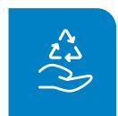

## 可持续发展治理 14

可持续发展治理架构 14

可持续发展管理机制 15

ESG 风险管理 16

ESG 交流与培训 16

## 社会篇 39

坚持创新发展 41

严守质量管控 53

重视客户服务 56

促进医疗可及 58

促进合作共赢 59

保障员工权益 63

职业健康与安全生产 73

信息安全与隐私保护 78

社会贡献 80

## 环境篇 17

应对气候变化 19

完善环境管理 23

强化污染防治 27

提升资源管理 32

绿色产品与运营 35

循环经济 38

守护绿色生态 38

## 治理篇 81

完善公司治理 83

税务管理 89

恪守商业道德 89

## ESG 绩效表 92

## 索引表 99

## 关于本报告

## 报告简介

本着客观、规范、透明和全面的原则，本报告详细披露了2025年苏州纳微科技股份有限公司在环境保护、社会责任、公司治理等领域的实践和绩效。

## 时间范围

本报告的时间范围是2025年1月1日至2025年12月31日，为增强报告的可比性和完整性，部分内容超出上述范围。

## 报告范围

本报告以纳微科技为主体，涵盖股份公司及下属分、子公司，除特别说明外，本报告范围与本公司的财务报告合并报表范围保持一致。

## 编制依据

本报告主要参照《上海证券交易所科创板股票上市规则》《上海证券交易所科创板上市公司自律监管指引第1号一规范运作》 《上海证券交易所上市公司自律监管指引14号一可持续发展报告(试行)》《上海证券交易所科创板上市公司自律监管指南第13号一可持续发展报告编制》。中国社会科学院《中国企业可持续发展报告指南CASS-ESG6.0》等报告指引或规则编制而成。

## 数据说明

本报告中所采用的信息与数据来自纳微科技及下属企业，其中财务资料如与年报有出入，应以年报为准报告中如无特别说明，所有金额均以人民币表示。公司披露排放及部分能耗数据仅涉及苏州基地与常熟基地其他子公司生产环节涉及化工排放较小，公司与营收相关的排放或能耗强度是以苏州基地与常熟基地的营业收入作为基数统计得出。

  
词语释义

<table><tr><td>公司、我们、纳微科技、纳微</td><td>指</td><td>苏州纳微科技股份有限公司</td></tr><tr><td>苏州基地</td><td>指</td><td>苏州纳微科技股份有限公司苏州厂区</td></tr><tr><td>常熟基地</td><td>指</td><td>苏州纳微科技股份有限公司常熟厂区</td></tr><tr><td>福立仪器</td><td>指</td><td>浙江福立分析仪器有限公司</td></tr><tr><td>常熟纳微</td><td>指</td><td>常熟纳微生物科技有限公司</td></tr><tr><td>微球研究所</td><td>指</td><td>苏州纳微先进微球材料应用技术研究所有限公司</td></tr><tr><td>纳谱分析</td><td>指</td><td>纳谱分析技术(苏州)有限公司</td></tr><tr><td>赛谱仪器</td><td>指</td><td>苏州赛谱仪器有限公司</td></tr><tr><td>纳信科技</td><td>指</td><td>苏州纳信科技有限公司</td></tr><tr><td>纳微生命科技</td><td>指</td><td>苏州纳微生命科技有限公司</td></tr></table>

## 发布形式

您可以在上海证券交易所（http://www.sse.com.cn）下载本报告电子文本，获取更多公司信息。

## 董事长致辞

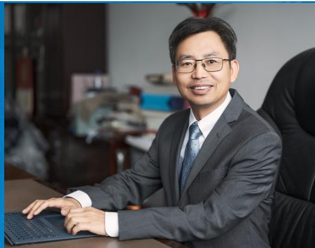

natural_image

Portrait of a man in a suit sitting at a desk with a laptop, wearing glasses (no visible text or symbols)

## 江必旺

纳微科技董事长、创始人

## 人生的逆流而行

人们常说，选择大于努力，尤其在人生的关键节点上的选择。我从福建闽北山区考上北大，后留校工作，又到美国留学深造，都是顺着人往高处走的潮流而行。经过几十年的打拼实现大多数留学生的梦想：获得博士学位、一份世界500强企业的工作和幸福稳定的家庭，这对于农村娃来说已是来之不易的生活，但一次回国探亲的经历，却让我决定放弃美国安逸的生活和工作条件。

2004年的回乡，我见到一位患糖尿病的亲戚—这种病在农村常被称为“富贵病”，因为每日必需打昂贵的胰岛素，让原本还算宽裕的家庭陷入困境。事实上，在农村，因病致贫的景象并不罕见，许多家庭因无力承担昂贵的药费，只能眼睁睁看着小病拖成大病，甚至失去生命。

这次探亲之后，我下定决心回国创业，从事生物制药用分离纯化微球的研发和产业化。因为微球是生物制药分离纯化不可或缺的材料，而分离纯化占据生物制药的主要成本也影响药品纯度，价格昂贵且每年涨价，可以说没有微球，一片生物药也做不出来，没有微球我们的手机电脑也都生产不出来，但这么重要的微球当时国内完全依赖进口。

我回国创业的阻力非常大，2006年，中美无论是生活、教育、科研条件都有较大差距。其次，我性格内向，不擅言辞，农民出身没有资源，回国创业完全不具备优势。我北大的恩师得知我拖家带口回国创业后，认为风险太大，特意把我推荐到北大深圳研究生院做教授，我组建的微纳米材料研究中心，被评为深圳市重点实验室，当时最优选择是留在深圳创业，但我还是再一次选择了逆流而行，放弃象牙塔的生活回到苏州全职创业，依托苏州的产业资源，成为苏州园区的首届领军人才，也成了苏州科技创业的开拓者之一。

当绝大多数创业者选择组装或仿造这种投资少。产出快的创业方式。而我却选择突破高难度的高性能且高垄断的微球产品。我拒绝选择国外已经成功的技术路线，或选择做自己专业领域的产品，但我却勇于跨领域探索，做之前不熟悉的无机微球材料这条原始创新之路，因为我想做一家真正的创新型企业。

创业本是九死一生，在国内高科技创业更是难上加难。尽管我已心理有准备，却依然低估了创业的艰难。

首先是资金短缺的问题。当时资本很少愿意投资高科技创业企业，因为风险高，周期长，纳微设立时，仅靠几位朋友凑集的650万元启动资金，而当时国外一台用于生产微球的筛分设备上千万，一台检测设备也要上百万，因为买不起新的仪器设备，我只好从美国背回淘汰的二手仪器。

第二，高端产业化难度大，周期长：比如说二氧化硅微球，我们花两年时间在实验室研发出来，以为很快就可以实现产业化，没想到真正实现产业化花了整整十年，这也是实验室的科研成果大都走不到市场的普遍困境。

另外，在中国做高科技产品还要花精力解决原材料和设备质量低下、人才短缺、知识产权保护以及客户对国产产品的偏见等问题。

当前两年创业的“蜜月期”结束后，无论是产品研发、产业化进度、市场拓展速度都没有达到预期，公司650万的启动资金全部花完，向股东借款数百万元也消耗殆尽。与此同时，我与合伙人在公司发展方向上产生了严重分歧当时生物制药产业尚未兴起，前景不明，合伙人选择放弃生物制药微球，如果我执意坚持，他将离开公司。创业之初我们早有分工：我负责技术与产品，他负责管理与市场。当时的我，连财务报表都看不懂，见陌生人仍会脸红，如果合作伙伴离开，我将面临更大的压力。

更让我愧疚的是对孩子的承诺无法兑现。她们出生于美国，回国前，我曾答应她们跟我来国内生活三年后就可以回到美国生活。三年期限一到，孩子们常常问我：“我们什么时候回美国？”那是我心里最痛苦的时刻一因为我已清楚，我们回不去了……在最困难的时候，我也想过放弃创业回到美国找回安稳的工作，这样既可以照顾好家人，也避免承受创业的压力。

让我熬过至暗时刻的动力是责任。正是因为朋友相信我，才拿出自己辛苦挣来的积蓄投资公司，因为信任，合作伙伴才辞掉高薪跟我一起创业，我不能辜负这份信任，再难也必须支撑下去。

因此，当公司经营遭遇困境、决定停止新产品研发时，我自掏腰包继续投入研究；当合作伙伴因失去信心而离开，我选择坚守生物制药领域，并接管了整个公司看不懂财务报表就去学，害怕见客户也硬着头皮去拜访。

当部分股东坚决反对建设厂房时，为争取他们的支持，我甚至与部分股东签订了完全不对等的协议：若项目失败，我个人愿承担赔偿。

选择逆流而行的创新之路固然漫长而艰难，但闯过来后便会发现，一切付出都是值得的。在平板显示领域，纳微成功打破了日本企业对间隔物微球和导电金球的长期垄断，凭借微球精确制造技术，将原本需要6个月的生产周期缩短至6天。在生物制药领域，公司已在单分散硅胶色谱填料、ProteinA亲和层析介质等技术领域取得国产突破，更重要的是我们通过跨领域融合创新，开发出二氧化硅微球精确制造技术，实现中国硅胶色谱填料从空白到世界引领的跨越。

如今，纳微已实现大规模出口高性能色谱填料到欧、美、日、韩等国家和地区的国际知名制药和色谱企业，成为世界色谱行业的领军企业之一，并于2021年成功登陆科创板。

人生的逆流而行注定是漫长而充满风险的道路。这样的选择，不是利益、地位或财富的驱动，而是源自内心激发的正向初心。也正是这样的初心才让我克服人生路上的重重困难，达到人生的新高度。

各位朋友，在这个内卷加剧、逆全球化蔓延的时代，我们比以往任何时候都更需要逆流而上的孤勇者—去创新，去破局，去为人类的前行之路点亮一束光。

纳微科技董事长、创始人江必旺

2025 年 4 月

## 关于纳微科技

## 公司介绍

苏州纳微科技股份有限公司，是一家专门从事高精度、高性能和高附加值纳微米球材料的研究、生产、销售的国家高新技术企业、国家专精特新“小巨人”企业，公司于2021年6月23日成功登陆上海证券交易所科创板，公司总部位于江苏苏州。

公司于2007年由国家级重大人才引进工程专家江必旺博士创办，通过十余年的持续研发创新，公司突破并掌握了微球精准制备底层技术及多项核心专有技术，成功将产品应用于生物医药工艺、平板显示、分析检测及体外诊断等众多领域。公司主要产品包括用于生物制药大规模分离纯化的色谱填料/层析介质微球、用于药品杂质分析检测的色谱柱、用于控制LCD面板盒厚的间隔物微球以及体外诊断用核心微球等，同时能够为客户提供分离纯化技术服务。

公司拥有苏州工业园区4万平方米的研发和生产基地，在常熟建成1.8万平方米大规模生产基地，并在南通洋口港取得百余亩土地，进行高性能微球材料产能建设项目，公司具备规模化生产及稳定的供货能力。公司现有员工1,200余人，研发团队300余人，拥有国际化水平的博士专家十余人。

## 企业文化

经营理念

以创新，赢尊重，得未来

愿景

微球材料智造和应用引领者

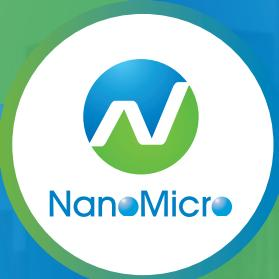

natural_image

Logo of NanMicro with stylized green and blue graphic design (no text or symbols beyond the logo)

以创新助力科技与健康产业的发展

使命

价值观

创新求精、客户至上、诚信正直、协作担当

## 发展历程

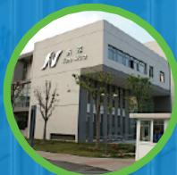

2007 年

成立苏州纳微科技有限公司

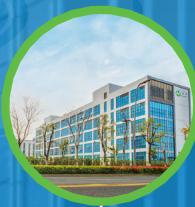

2016 年

苏州纳微总部生产基地落成

公司现有员工

1,200 余人

研发团队

人300

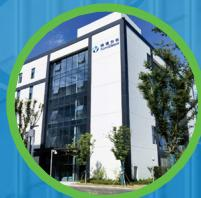

2018 年

创建纳谱分析技术（苏州有限公司

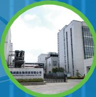

2020 年

常熟纳微生产基地落成

成立美国NanoMicro

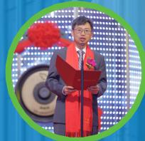

2021 年

6月23日上交所科创板上市：纳微成为中国第一家色谱纯化介质上市公司成立苏州纳微生命科技有限公司

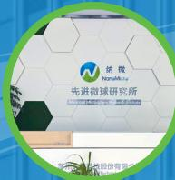

2019 年

创建先进微球材料研究所成立印度NanoMicro

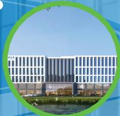

2022 年

收购苏州赛谱仪器有限公司收购美国RILAS 公司

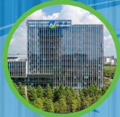

2024 年

苏州纳微研发大楼基地落成

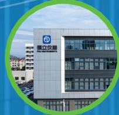

2023 年

收购浙江福立分析仪器有限公司合资创办江苏纳洋新材料科技发展有限公司

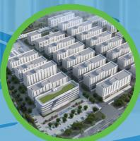

2025 年

创办南通纳微新材料有限公司

## 年度大事记

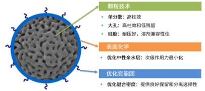

子公司纳谱分析发布 BioCoreHIC-Phenyl 疏水作用色谱柱新产品

2025 1月

2025 2月与东曜药业战略合作成果丰硕：连续两年获评“优质供应商”与“最佳合作伙伴”称号

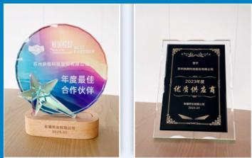

text_image

初步授出
2023年年度最佳合作伙伴
苏州捷佳科技集团有限公司
年度最佳
合作伙伴
加盟药业有限公司
2023-01
2023年年度
优秀供应商
2023年年度
优秀供应商
2023年年度

AEX discussion  
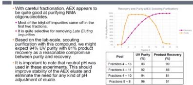

公司寡核苷酸整体解决方案亮项国际展会，获得国际专家报告认可

2025 2月

2025 4月子公司纳谱分析发布BioCore SCX 3 μm 色谱柱、BioCore HIC-OH疏水作用色谱柱新产品

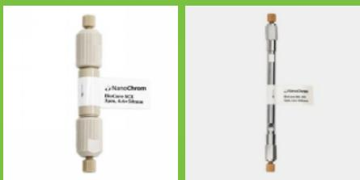

text_image

NanoChrom
Micro-ICV
Tet. 4x-Glass
NanoChrom
Micro-ICV
Tet. 4x-Glass

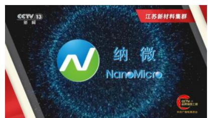

text_image

CCTV 13
新网
江苏新材料集群
纳微
NanMicro
CCTV 13
江苏新材料集群
新网·江苏新材集团

亮相“CCTV品牌强国工程”江苏专案

2025 4月

2025 5月

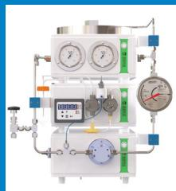

收购苏州纳信科技有限公司纳微科技集团与绿叶生命科学集团达成战略合作

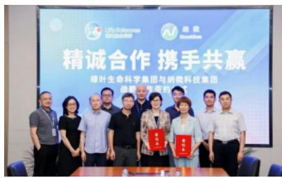

text_image

Life Sciences
绿能
精诚合作 携手共赢
绿叶生命科学集团与纳博科技集团
绿色技术签约

2025 7月

2025 7月主办“第八届（生物制药分离纯化技术大会

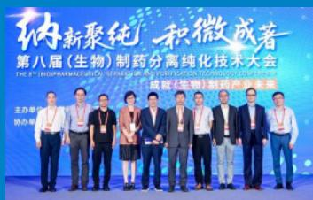

text_image

纳新聚纯 积微成著
第八届(生物)制药分离纯化技术大会
The 8TH PHARMACEUTICAL SEPARATION PRODUCTION TECHNOLOGY CONFERENCE
成都(生物)制药产业未来

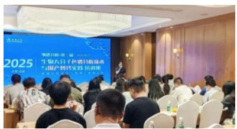

text_image

2025 生物大分子资源创新发展与国产时代实践创新图

子公司纳谱分析成功举办第三届“生物大分子色谱分析技术与国产替代实践培训班

2025 9月

202511月 多肽药物全产业链解决 方案获得“产业伙伴奖”

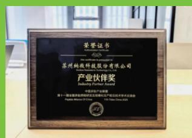

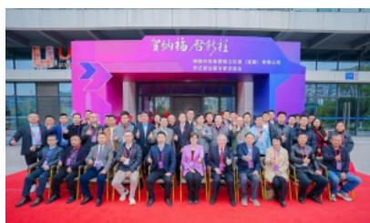

text_image

暨纳福 唐舒福
中国科技集团第五届第1届董事会第十四次会议

子公司福立仪器成都公司乔迁暨专家交流会

202511月

2025

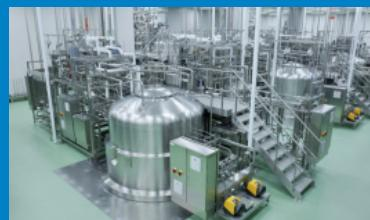

natural_image

Interior view of a large industrial chemical plant with stainless steel tanks and piping (no visible text or labels)

公司填料产品助力多家药企客户新药获批生产

## 企业荣誉

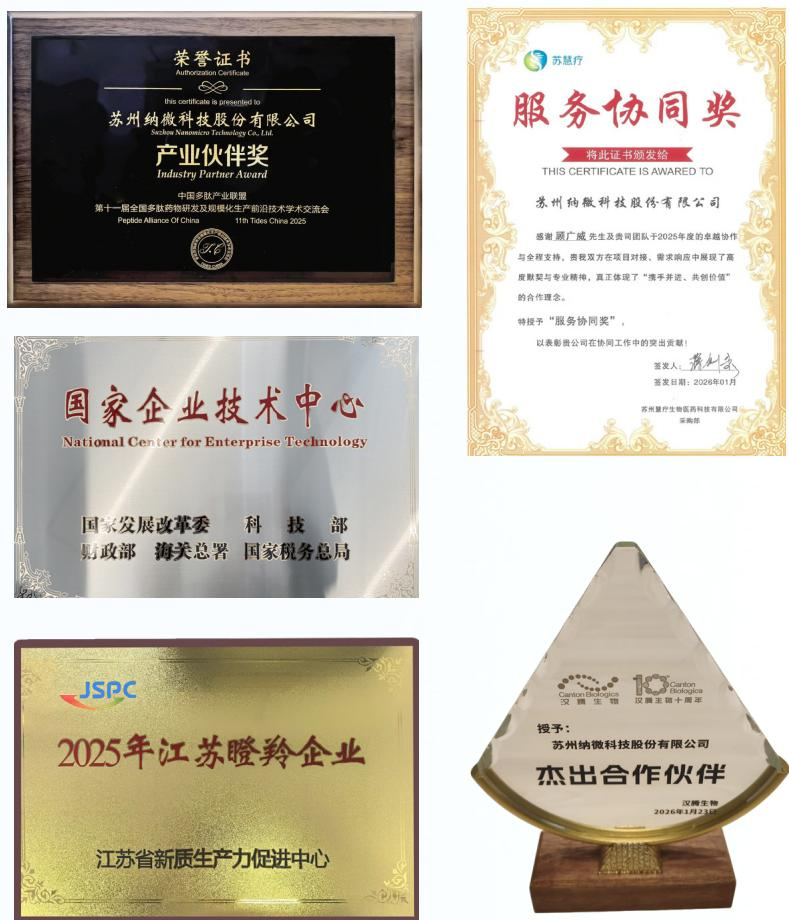

natural_image

Golden medal with two trophies and ribbon, no text or symbols visible

• 国家企业技术中心  
• 国家知识产权示范企业  
• 2025年江苏瞪羚企业-纳谱分析、常熟纳微  
· 江苏省认定机构2025年认定报备的第一批高新技术企业-纳谱分析、常熟纳微  
• 2025 年第一批江苏省民营科技企业-常熟纳微  
· 江苏省认定机构2025年认定报备的第一批高新技术企业-赛谱仪器  
· 2025年浙江省先进技术创新成果-福立仪器  
• 第一批苏州市创新领军企业先进技术研究院  
•	 2025年台州市企业技术中心评价合格名单-福立仪器

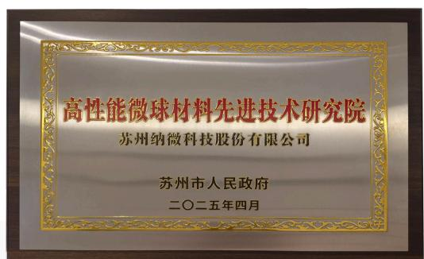

text_image

高性能微球材料先进技术研究院
苏州纳微科技股份有限公司
苏州市人民政府
二〇二五年四月

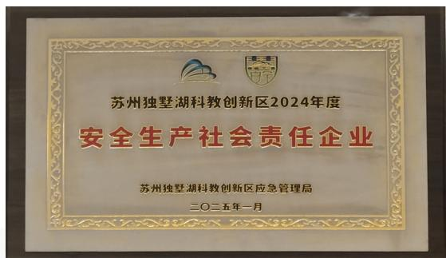

text_image

苏州独墅湖科教创新区2024年度
安全生产社会责任企业
苏州独墅湖科教创新区应急管理局
二〇二五年一月

高性能微球材料先进技术研究院

安全生产社会责任奖

text_image

科创板日报
——科创板开市六周年评选——
《2025最佳ESG
科创板上市公司》
纳微科技
688690
STAR MARKET
中国科创株式会社科创板开市六周年
新华社 编辑公司

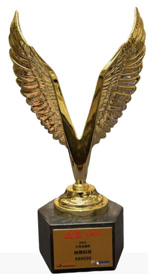

natural_image

Golden winged trophy sculpture on a black pedestal, no visible text or symbols on the trophy itself.

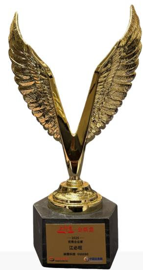

text_image

王行勇 全球奖
——2023—
优秀企业奖
江必旺
纳维科技 618592
中国证券报

2025 最佳 ESG 科创板上市公司

公司治理奖

优秀企业家江必旺

## 议题重要性评估

利益相关方沟通

<table><tr><td>利益相关方</td><td>关注议题</td><td>沟通与反馈</td></tr><tr><td>政府与监管机构</td><td>依法纳税合规经营创新研发安全生产生态保护绿色运营</td><td>遵守法律法规公文函件往来实地考察调研日常沟通交流创新研发投入EHS管理</td></tr><tr><td>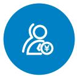股东</td><td>经营绩效创新能力公司战略信息披露公司治理风险管控回报机制</td><td>官方网站投资者热线投资者关系邮箱股东会官方公众号业绩说明会接受调研</td></tr><tr><td>客户</td><td>研发能力产品质量客户服务履约能力环境与能源管理</td><td>官方网站销售热线技术交流会实地走访客户满意度调查培训人才引进</td></tr><tr><td>员工</td><td>权益保护职业发展薪酬福利员工关怀民主管理职业健康与安全生产</td><td>职工代表大会工会活动团队建设公司年会主题活动投诉建议通道</td></tr><tr><td>供应商及合作伙伴</td><td>互利共赢供应链管理共同发展业务合规商业道德</td><td>官方网站微信公众号供应商大会招标培训</td></tr><tr><td>社区</td><td>公益活动人才就业社区服务</td><td>官方网站微信公众号带动就业依法纳税公益活动捐款</td></tr></table>

## 实质性议题评估与分析

在编制本报告过程中，公司依据《上海证券交易所上市公司自律监管指引第14号—可持续发展报告（试行）》（以下简称《指引》）的相关要求，参考GRI可持续发展报告标准以及国际可持续准则理事会（ISSB准则等国内外披露标准的评估方法，构建系统的议题识别与重要性分析流程。通过从影响重要性、财务重要性这两个维度，对各类ESG议题展开分析，识别出对公司运营发展具有实质性影响的关键议题

## 双重重要性分析流程

## 步骤一

## 公司背景调研

． 梳理企业内外部环境现状及行业可持续发展趋势。  
. 识别公司利益相关方诉求与期望。

## 步骤二

## 议题初步梳理

：通过标准对标、政策解读以及比较国内外行业相关议题，识别、筛选出公司相关的可持续发展议题。

## 步骤三

## 议题重要性评估

：影响重要性评估：通过利益相关方调研问卷和专家判断结果（合计40份），评估各议题对经济、社会和环境的潜在影响程度。  
：财务重要性：通过与内部管理层、外部专家开展讨论，评估各议题对企业价值创造可能带来的风险与机遇，即具有财务重要性的议题。

## 议题分析结果审阅披露

## 步骤四

：形成影响重要性和财务重要性议题清单，搭建双重重要性评估矩阵。  
·完成议题审议、批准及信息披露工作

公司在编制本报告时引入“双重重要性”评估框架。该框架从财务重要性(即议题对公司财务表现的影响与影响重要性(即公司活动对环境和社会的内外部影响)两个维度，对各项议题进行综合研判。评估过程中我们综合运用在线问卷调研、管理层专题研讨及专家评审等多种方式，收集并分析各利益相关方意见，以此作为判定议题双重重要性的基础依据。

## 实质性议题矩阵

根据实质性议题评估结果，遵循重要性原则，公司梳理了2025年度ESG重要议题，并根据议题重要性程度从“影响重要性”及“财务重要性”两个维度形成实质性议题矩阵。

实质性议题重要性矩阵  
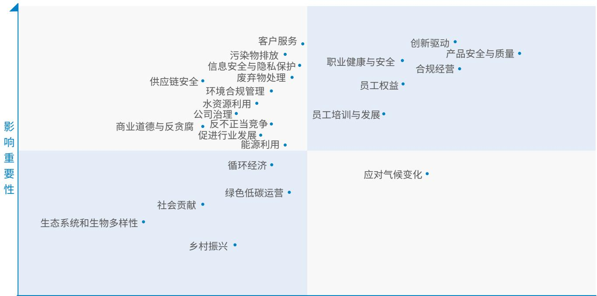

scatter

| Category | X-axis Position (Relative) | Y-axis Position (Relative) |
| --- | --- | --- |
| 客户服务 | High | High |
| 污染物排放 | High | High |
| 信息安全与隐私保护 | High | High |
| 废弃物处理 | High | High |
| 供应链安全 | Medium-High | High |
| 环境合规管理 | Medium-High | High |
| 水资源利用 | Medium-High | Medium-High |
| 公司治理 | Medium-High | Medium-High |
| 商业道德与反贪腐 | Medium-High | Medium-High |
| 反不正当竞争 | Medium-High | Medium-High |
| 促进行业发展 | Medium-High | Medium-High |
| 能源利用 | Medium-High | Medium-High |
| 循环经济 | Low-Medium | Low-Medium |
| 绿色低碳运营 | Low-Medium | Low-Medium |
| 社会贡献 | Low-Medium | Low-Medium |
| 生态系统和生物多样性 | Low | Low |
| 乡村振兴 | Low | Low |
| 员工权益 | High | High |
| 员工培训与发展 | High | Medium-High |
| 职业健康与安全 | High | High |
| 创新驱动 | High | High |
| 产品安全与质量 | High | High |
| 合规经营 | High | High |
| 应对气候变化 | High | Low-Medium |

财务重要性

## 可持续发展目标（SDGs）回应

公司以联合国可持续发展目标(SDGs)为导向，深度融合公司业务实情，紧抓新时代发展契机，于公司治理商业操守、产品服务质量提升、产业链协同管控、员工权益保障、生态环境保护以及社会公益贡献等多领域精耕细作，主动响应内外部利益相关方的关切与期望，推动可持续发展目标有效落实。

<table><tr><td>我们的目标</td><td>对应章节</td><td>对应SDGs可持续发展目标</td><td>2025年关键绩效达成情况</td></tr><tr><td>产品创新与服务升级</td><td>坚持创新发展严守质量管控重视客户服务信息安全与隐私保护</td><td>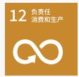 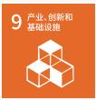</td><td>研发投入金额19,686.71万元,现有研发人员300人,累计获得专利及软件著作权总数241项,综合产品合格率99.10%,客户满意度95.5分,泄露客户隐私事件数量0件</td></tr></table>

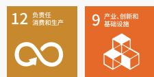

<table><tr><td>我们的目标</td><td>对应章节</td><td colspan="2">对应SDGs可持续发展目标</td><td>2025年关键绩效达成情况</td></tr><tr><td>建设可持续供应链</td><td>供应商管理绿色采购产业链协同合作</td><td>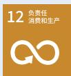</td><td>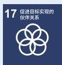</td><td>供应商本地化比例59%,通过ISO 14001体系认证供应商数为9家,公司绿色采购金额共计210万元</td></tr><tr><td>守护环境与生态</td><td>应对气候变化完善环境管理强化污染防治提升资源管理守护绿色生态</td><td colspan="2">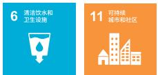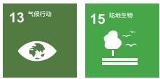</td><td>全年累计使用清洁能源6,930.80千瓦时,较2024年增长378%,环保资金总投入2,637.96万元</td></tr><tr><td>保障员工权益</td><td>合规雇佣薪酬福利民主管理员工关怀发展与培训职业健康安全生产</td><td colspan="2"></td><td>雇佣童工或强迫劳动事件数为0,歧视骚扰事件发生率为0%,女性管理者占比13.30%,集体协议覆盖的员工比例100%,员工体检覆盖率为100%,公司保障安全生产为目的的资金总投入共计430.92万元,新增职业病数量为0人</td></tr><tr><td>践行社会责任</td><td>助力公益活动促进医药可及</td><td colspan="2"></td><td>江必旺博士向北京大学教育基金会捐赠80万股无限售流通股(价值约2,000余万元),江必旺博士向建瓯市百年教育基金会捐赠现金100万元</td></tr><tr><td>坚持合规经营</td><td>完善公司治理恪守商业道德</td><td colspan="2"></td><td>在上海证券交易所信息披露考核中连续三年考评结果为A,确认的贪污腐败诉讼事件数量0件,收到的涉及不正当竞争的举报事件数量0件</td></tr></table>

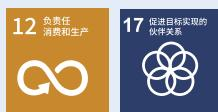

<table><tr><td>保障员工权益</td><td>合规雇佣薪酬福利民主管理员工关怀发展与培训职业健康安全生产</td><td>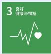 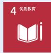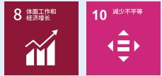</td><td>雇佣童工或强迫劳动事件数为0,歧视骚扰事件发生率为0%,女性管理者占比13.30%,集体协议覆盖的员工比例100%,员工体检覆盖率为100%,公司保障安全生产为目的的资金总投入共计430.92万元,新增职业病数量为0人</td></tr><tr><td>践行社会责任</td><td>助力公益活动促进医药可及</td><td>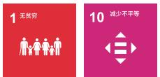</td><td>江必旺博士向北京大学教育基金会捐赠80万股无限售流通股(价值约2,000余万元),江必旺博士向建瓯市百年教育基金会捐赠现金100万元</td></tr><tr><td>坚持合规经营</td><td>完善公司治理恪守商业道德</td><td></td><td>在上海证券交易所信息披露考核中连续三年考评结果为A,确认的贪污腐败诉讼事件数量0件,收到的涉及不正当竞争的举报事件数量0件</td></tr></table>

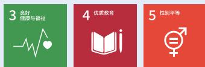

## 可持续发展治理

## 可持续发展治理架构

纳微科技持续健全可持续发展治理体系，将ESG理念深度融入公司战略与日常运营。报告期内，公司依据《指引》等要求，搭建了权责清晰。分层落实的可持续治理架构。为ESG与公司战略高效协同提供坚实保障。公司董事会为ESG最高治理机构，执行层为ESG执行小组，由公司证券事务部牵头，负责指导ESG工作管理与统筹，协调ESG报告的编制审验，对公司可持续发展以及ESG管理工作计划的拟定与实施提出意见及建议，并确保与各利益相关方就ESG议题保持紧密沟通与合作，各职能部门、子公司负责人协助管理层共同推动公司各项ESG日常工作执行和落地

<table><tr><td>层级</td><td>组织名称</td><td>职责范围</td></tr><tr><td>决策层</td><td>董事会</td><td>1、审议批准公司 ESG 战略规划、计划;2、审议批准 ESG 治理架构及重要 ESG 制度;3、审议批准公司 ESG 相关信息披露报告;4、审议批准涉及公司 ESG 治理重大信息的公开披露;5、审议批准对公司有重大影响的 ESG 相关风险、重大 ESG 负面事件应对方案。</td></tr><tr><td>执行层</td><td>ESG 工作小组</td><td>1、制定、执行公司 ESG 年度工作计划;2、根据各职能部门、子公司的具体情况,建立完善相关 ESG 专项管理制度;3、执行 ESG 各议题相关管理措施;4、执行相关 ESG 各议题风险和机遇识别与评估工作,并执行应对措施;5、执行利益相关方沟通工作,回应其 ESG 需求;6、负责本部门 ESG 信息收集整理、指标统计,报送至相对应的工作组;7、配合开展公司 ESG 宣贯、培训工作;8、参与公司 ESG 报告编制和课题研究工作。</td></tr></table>

## 可持续发展管理机制

公司积极将可持续发展的经营理念融入到企业的日常运营中，通过完善可持续发展管理机制，进一步规范ESG工作流程，夯实管理基础，注重企业社会价值创造、环境保护、公司治理水平提升、利益相关方及员工发展把社会责任转化为企业发展的动力和长期目标，推动企业可持续、高质量发展

<table><tr><td>机制内容</td><td>具体行动</td></tr><tr><td>信息报告机制</td><td>1、由公司证券事务部牵头,ESG工作小组依据相关规则、行业特点及公司实际情况,识别出重要性议题,并每年通过问卷调查的方式确定公司层面的关键重要性议题。在此基础上,小组围绕这些议题制定具体的ESG指标,形成《ESG指标体系暨信息收集表》。2、ESG工作小组通过线下《ESG指标体系暨信息收集表》对年度ESG目标及管理措施进行报送。3、执行层定期组织召开专项会议,将审议结果提交决策层,同时将审议结果反馈给ESG工作小组,以便调整、执行ESG管理工作。</td></tr><tr><td>监督机制</td><td>管理层定期检视公司ESG战略规划、策略目标的完成情况,研究指导可持续发展相关影响、风险和机遇对公司影响。</td></tr><tr><td>考核机制</td><td>将人才培养、产品与服务质量、重大责任事故管理等具体ESG议题的关键绩效指标,纳入相关部门年度考核指标体系。</td></tr></table>

## ESG风险管理

公司将ESG相关风险全面纳入企业整体风险管理框架，作为日常运营的核心组成部分。在管理层监督指导下，公司持续完善ESG风险管理机制，构建起涵盖风险识别、评估、应对、披露的体系化管控流程，推动ESG风险管理从被动响应向主动防控转变，为公司可持续发展筑牢安全屏障。

<table><tr><td>董事会</td><td>风险管理的最高决策机构,对公司内部控制和风险管理工作的有效性负责。</td></tr><tr><td>审计委员会</td><td>就风险管理工作的有效性对董事会负责。</td></tr><tr><td>审计法规部</td><td>风险管理的综合协调、组织部门,全面把控风险管理工作进展。</td></tr><tr><td>其余各部室</td><td>依据自身职能履行各自风险管理职责。</td></tr></table>

## ESG交流与培训

公司持续深化可持续发展理念的实践认知，积极投身高水平ESG专题交流与培训，不断提升治理能力。报告期内，公司主动参与监管机构及行业协会组织的ESG专题培训与行业交流，紧跟政策导向，对标先进实践将外部经验有效内化为自身治理提升的持续动力。

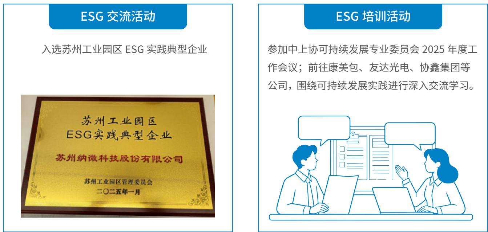

## 环境篇

text_image

01

应对气候变化  
完善环境管理◆  
强化污染防治◆  
提升资源管理  
绿色产品与运营  
循环经济◆  
守护绿色生态

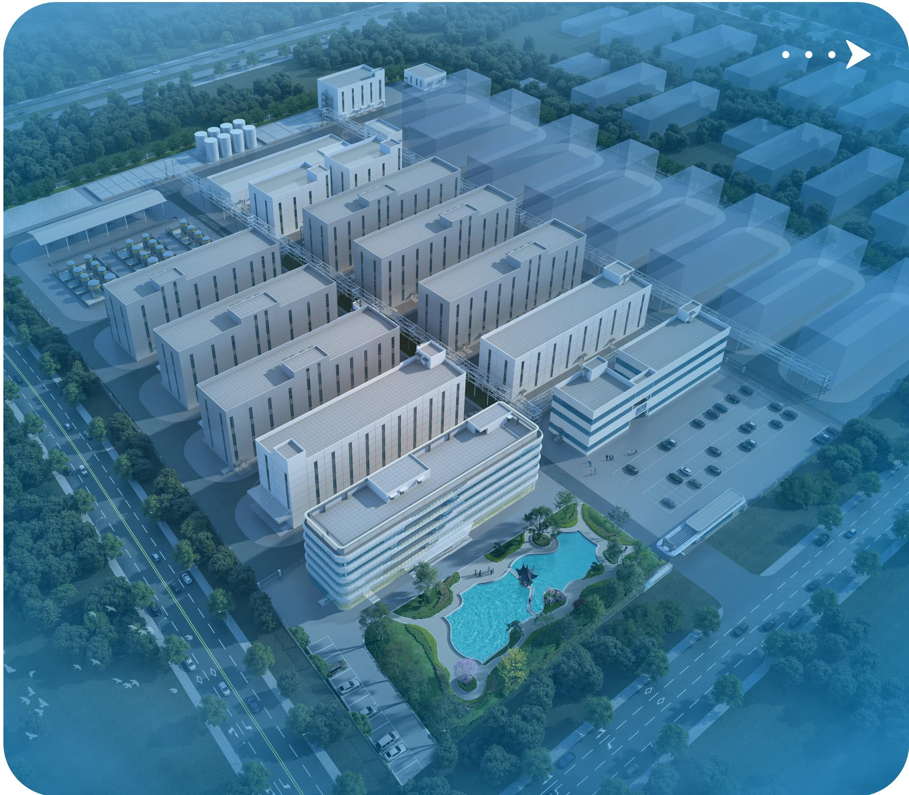

natural_image

Aerial rendering of a modern industrial complex with multiple factory buildings, parking lots, and a central swimming pool (no visible text or signage)

## 应对气候变化

## “应对气候变化”四要素分析

## 气候变化治理

在全球气候变化的大背景下，公司深刻认识到应对气候变化对于可持续发展的重要性。为积极响应国家“双碳”重大战略部署，有效化解气候变化给企业发展带来的诸多挑战，公司持续开展相关环境管理工作。

公司深刻认识气候变化对自身业务及产业链的深远影响，将气候相关议题全面纳入可持续发展框架，构建起责任清晰、分工明确的气候变化治理架构，形成“决策层一管理层一执行层”三级联动体系。

其中，董事会作为应对气候变化工作的领导和决策机构，负责研究气候变化相关战略和政策，对气候变化相关工作进行指导，确保其与公司的长期发展目标相契合。

董事长直接负责研究与指导，履行气候变化治理及监督职责，总体安排部署公司气候变化工作，审核应对气候变化的目标及策略等，审定公司气候变化相关风险机遇及应对措施。

成立由EHS委员会主导，各职能部门与子公司负责人共同组成的ESG工作小组，负责制定具体的气候变化相关政策和措施，并监督这些措施的实施情况，确保各项应对气候变化的措施能够得到有效执行。

## 气候变化战略

## 气候情景分析

气候情景分析是评估气候风险和机遇的方法，通过假设条件预测未来结果并分析应对策略。公司持续关注气候变化对公司业务的影响。公司学习并了解国际可持续准则理事会(ISSB)的《国际财务报告可持续披露准则第2号--气候相关披露》要求，结合联合国政府间气候变化专门委员会（IPCC）描述的SSP5-8.5高排放和SSP1-2.6.低排放两种温室气体排放情景。尝试分析不同排放情景下的减排路径和韧性提升措施。为后续搭建气候风险分析工具做准备。

<table><tr><td>情景类型</td><td>情景描述</td><td>温升范围(相较工业化前)</td></tr><tr><td>低碳排放情景(SSP1-2.6)</td><td>该情景下,全球以清洁能源为主,走向可持续发展。各国因意识到气候变化严峻,大力推行严格气候政策,力求把全球变暖控制在远低于2°C以内。技术进步和环保意识提升助力全球向低碳、低能耗转型,二氧化碳排放量明显下降。此情景与《巴黎协议》设置的温室气体减排目标一致,温室气体排放在2100年前达到净负排放。</td><td>低于2°C(相对于工业化前)</td></tr><tr><td>高碳排放情景(SSP5-8.5)</td><td>这一情景是减排政策没有任何改变下的排放路径,聚焦物理风险因子对气候的影响,各国无严格气候政策管控。到2055年,全球气温预计上升2.5°C以上,会引发大气中温室气体浓度增加、海平面上升、天气模式改变和极端天气事件频发。</td><td>超过4°C(相对于工业化前)</td></tr></table>

气候变化相关风险与机遇

<table><tr><td colspan="2">风险类型</td><td>潜在影响</td><td>应对措施</td><td>影响程度</td><td>影响时间范围</td></tr><tr><td rowspan="2">物理风险(SSP5-8.5)</td><td>急性天气</td><td>暴雨、洪水可能淹没厂房,损坏生产设备、原材料及成品,导致生产中断,造成巨大经济损失;极端天气也可能影响物流配送,同时因能源成本上升,运营成本可能增加。</td><td>制定《生产安全事故应急预案》,针对暴雨、洪涝、雷击、台风、高温等,搭建了自然灾害事故应急组织体系、响应程序、应急处理措施和应急保障。提高风险应急响应能力,增强企业的极端天气应对能力,有效降低极端事件带来的损失;新建项目选址时避开洪涝等灾害频发区域,加强厂房防水、防洪设计与建设。</td><td>低</td><td>短期</td></tr><tr><td>慢性天气</td><td>长期高温、海平面上升、全球变暖等慢性气候现象可能影响到公司有效运营,可能导致储存、运输的成本增加。</td><td>定期评估供应链稳定性,减少对沿海地区供应商依赖,降低原材料供应中断风险;加强对储存和运输环节的人员培训,提高员工对温度控制重要性的认识。</td><td>低</td><td>长期</td></tr><tr><td rowspan="2">转型风险(SSP1-2.6)</td><td>政策风险</td><td>随着全球碳减排目标的推进,各国政府不断出台严格的环境法规和碳政策,如碳关税、碳标签等。公司的出海产品将面临更加严格的合规要求与监督。</td><td>持续关注国内外气候环境和碳相关法律法规、政策变化,积极响应并满足合规要求。</td><td>中</td><td>中期</td></tr><tr><td>环境信息披露挑战</td><td>随着国家和地区、交易所、资本市场等对公司的环境信息披露提出了更高要求,公司面临环境信息披露不完善、不及时等带来的合规风险。</td><td>完善内部环境管理体系,确保环境信息的收集、核算和披露符合法规要求。公司已在年报及ESG报告中定期披露环境相关信息。</td><td>中</td><td>中期</td></tr><tr><td rowspan="2">转型风险(SSP1-2.6)</td><td>技术风险</td><td>为积极控制产品的碳排放,需要增强环保过程开发的有效性,提升对新技术的使用,更新清洁生产设备等以满足低排放产品的生产需求,但同时公司运营成本可能会增加,研发难度也会加大。气候变化可能引发多种疾病,影响市场需求,同时也为企业提供了在相关疾病领域探索新业务方向的机会,从而增加营业收入。</td><td>公司持续优化生产工艺,通过开展节能降耗项目、构建绿色物流体系,降低研发、生产、运输和仓储等各个环节的碳排放。关注因气候变化引起的疾病变化和相关研究,加强新产品开发的可行性研究。</td><td>中</td><td>中期</td></tr><tr><td>声誉风险</td><td>各利益相关方对企业可持续表现关注度日益提升;如果表现不佳,可能引发公众负面舆论,损害企业声誉,降低投资者、合作伙伴信任度。</td><td>积极采取环保行动,发布企业ESG报告,主动开展环保培训,树立良好企业形象。</td><td>中低</td><td>短期</td></tr></table>

注：短期指 1 年、中期指 1 ～ 5 年、长期指 5 年以上

## 气候变化影响、风险和机遇管理

公司注重气候相关影响、风险与机遇的管理，从能源结构转型、节能降耗等多方面推动自身气候风险抵御能力，全方位保障公司的稳定发展。

## 气候相关影响、风险及机遇管理流程

## 步骤

## 了解公司活动和业务关系背景

了解公司活动、业务布局及关系、外部环境影响以及受影响的利益相关方。

## 步骤二

## 气候相关影响的风险及机遇识别与评估

基于高碳排放（SSP5-8.5）和低碳排放（SSP1-2.6)两种情景下，识别出不同情境下的潜在影响、风险和机遇：并对已识别的气候相关风险进行风险影响程度、影响时间范围评估

## 步骤三

## 制定应对策略

根据气候相关风险与机遇的评估结果，制定并采取不同应对策略。

## 步骤四

## 气候相关报告

定期披露气候变化相关风险、机遇识别与管理情况。

## 气候变化相关指标与目标

## 气候相关指标

公司的温室气休主要来自企业办公运营和生产过程中的能源消耗，范围一主要来自天然气消耗，范围二来自外购电力及热力产生的间接温室气体排放。报告期内温室气体排放情况如下

<table><tr><td>指标名称</td><td>单位</td><td>2025年</td></tr><tr><td>直接温室气体排放量(范围一)</td><td>吨二氧化碳当量</td><td>163.66</td></tr><tr><td>间接温室气体排放量(范围二)</td><td>吨二氧化碳当量</td><td>14,404.10</td></tr><tr><td>温室气体排放总量</td><td>吨二氧化碳当量</td><td>14,567.76</td></tr><tr><td>温室气体排放密度</td><td>吨二氧化碳当量/百万元营收</td><td>23.95</td></tr></table>

注：1、范围一温室气体排放来自天然气。范围二温室气体排放来自外购电力、外购热力的使用  
2、统计范围：苏州基地和常熟基地。

## 气候相关目标

纳微科技积极响应国家“碳达峰、碳中和”战略目标，制定了明确的“3060”碳排放目标，承诺在2030年前实现碳达峰，并在2060年前实现碳中和。

<table><tr><td>目标内容</td><td>报告期内进度</td><td>目标的适用期间</td><td>目标实现进展</td></tr><tr><td>响应国家双碳战略目标</td><td>报告期内,公司持续加大清洁能源使用力度,全年累计使用清洁能源6,930.80千瓦时,较2024年增长378%。未来,公司将进一步优化能源结构,积极采购绿电等清洁能源。</td><td>长期</td><td>进程中</td></tr></table>

## 完善环境管理

## 环境管理体系

公司严格遵守《中华人民共和国环境保护法》《中华人民共和国节约能源法》等法律法规、行业标准及规范制定《环境风险评估控制程序》《环境应急预案及编制说明》《环境应急资源调查报告》等制度，全面规范公司环境管理及排放行为，不断提升环境治理水平。报告期内，公司顺利通过ISO14001环境管理体系认证审核。

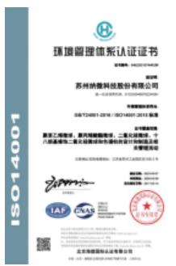

## ISO14001环境管理体系认证证书

(认证范围：聚苯乙烯微球、聚丙烯酸酯微球、二氧化硅微球、十八烷基修饰二氧化硅微球和色谱柱的设计和制造及相关管理活动

## 2025 年关键绩效

报告期内。公司未发生重大意外泄露、污染等环境违法违规事件，未受到环保监管机构的重大行政处罚环保资金总投入 2,637.96 万元，占营业收入比例 2.85%。

纳微科技始终遵循“遵纪守法、全员参与、污染预防、安全环保、呵护健康、持续改进”的环境管理方针建立职责明确的环境管理组织架构：董事长/总经理作为最高管理者，统筹环境管理战略方向；管理者代表协助推进体系运行。安环部作为核心执行部门，牵头环境管理体系建设、污染物监测及合规管控。

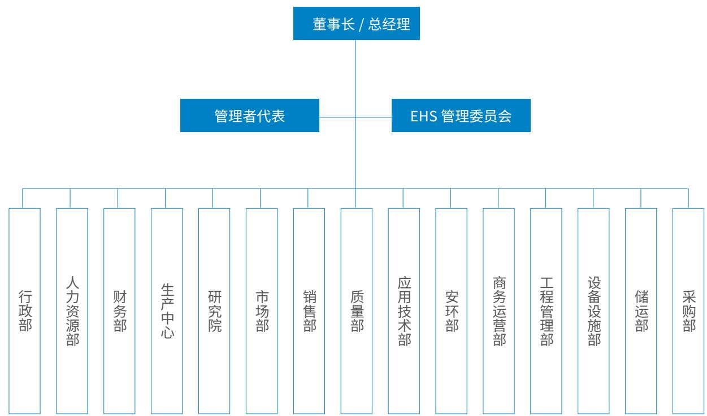

flowchart

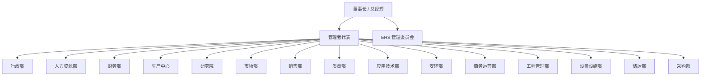

环境管理组织架构

## 环境风险管理与应对

公司切实履行环境保护责任，结合自身业务领域，全面开展环境因素识别工作，对常规生产环节的潜在风险点深入排查。公司制定并实施《环境风险评估控制程序》等文件，构建覆盖环境风险识别、评估与管控的全流程管理机制，同时，梳理重大环境风险因素清单，配套制定针对性防控措施，实现环境风险闭环管理。

## 环境风险识别、评价与监测

## 风险识别

识别准则：安环部会综合考虑多个维度进行环境因素识别，包括相关法律法规、影响范围、严重程度、发生频次、资源消耗量、利益相关方的关注程度，以及可节约的潜力等  
． 识别范围：涵盖办公、采购、生产、运输、储存等活动范围  
．识别因素：包括大气、水体、土地污染物排放，原材料和自然资源使用，能源使用，能量释放，废物和副产品产生，以及空间使用等八个方面  
•	 形成《环境风险因素清单》

## 风险评估

根据《企业突发环境事件风险分级方法》，聘请环境专家或机构，对相关对象的环境风险进行定性和定量的评估。评估环境风险等级，分为一般、较大、重大和特别重大四个等级，并形成《环境风险评估报告》

## 风险应对

•	 成立突发环境应急小组，积极组织各类应急演练  
• 制定各项环境风险防控和应急管理措施  
· 定期开展环境风险和环境应急管理宣传和培训  
•	 建立突发环境事件信息报告制度

## 环境监测与评价

开展应急监测工作，在尽可能短时间内对污染物种类、浓度、污染范围及可能的危害作出判断，以便对事件及时、正确进行处理  
在项目建设的全过程中，从新、扩、改建项目的环境影响评价，到建设过程中的环境风险防控措施落实，再到运营时的污染物排放监控，都进行了严格的管理和监控以确保环保合规运营

公司定期开展环境影响评估，结合公司实际运营制定环保管理目标，并跟进目标完成情况，持续完善公司环境表现。2025年环境管理目标均已完成

## 环境管理目标

•	 无重大环境污染事故发生；  
•	 三废污染物排放和有害因子控制 100%；  
· 厂界噪声符合法律法规及相关标准要求。

## 突发环境事件应对

公司严格遵守《中华人民共和国突发事件应对法》《突发环境事件应急管理办法》等相关法规，针对生产运营中可能发生的突发环境事件，制定并持续完善《突发环境污染事件应急预案》《环境应急资源调查报告》及各类专项计划，并在所在地生态环境部门完成备案。按照预案要求，公司定期组织开展应急演练，持续提升员工环境突发事件应急处置能力。

## 环境应急演练

2025年9月，苏州基地开展废有机溶剂泄漏并引起火灾突发环境事件应急演练。应急指挥部接到废有机溶剂泄漏并引起火灾情况报告后，立即启动突发环境事件应急预案，各应急小组在统一领导下，组织人员进行废有机溶剂泄漏清理工作、火灾灭火工作、设立警戒区、信息报告、废水收集处置及善后处理等工作。各流程环环相扣，职责明确，分工合理，演练任务最终顺利完成。

  
环境应急演练

## 环保培训宣传

纳微科技持续强化环保意识教育，通过线下培训与自主学习相结合的方式，组织员工系统学习环保法规节能减排知识及环境应急处置技能，引导全员将绿色发展理念融入日常实践，共同推动公司可持续发展目标的实现。

2025 年关键绩效

<table><tr><td>环保培训总人次</td><td>580</td><td>人次</td></tr><tr><td>环保培训人数比例</td><td>100</td><td>%</td></tr><tr><td>环保培训总时长</td><td>1,340</td><td>小时</td></tr></table>

统计范围：苏州基地和常熟基地。

## 强化污染防治

纳微科技秉持绿色发展理念，积极响应国家环保号召，持续深化污染治理工作，坚持低碳发展路径。

公司生产及研发活动产生的废气、废水经配套治理设施处理后稳定达标排放，厂界噪声符合法规要求，同时。公司编制了环境自行监测方案。并通过地方环保部门的审核，委托第三方检测单位每季度开展检测。并在自行监测平台公开相关监测数据，经第三方机构检测结果表明，公司运营不会对周边居民健康及环境质量造成影响。2025年，公司列入环境信息依法披露企业名单并完成填报，各项污染物排放均未超标。

<table><tr><td>污染防治管理指标</td><td>目标</td><td>完成情况</td></tr><tr><td>废气排放管理目标</td><td>100%合规排放</td><td>已完成</td></tr><tr><td>废水排放管理目标</td><td>100%合规排放</td><td>已完成</td></tr><tr><td>废弃物排放管理目标</td><td>100%合规处置</td><td>已完成</td></tr><tr><td>噪声排放管理目标</td><td>符合国家《工业企业厂界环境噪声排放标准》</td><td>已完成</td></tr><tr><td>土壤污染防治目标</td><td>未发生土壤污染事件</td><td>已完成</td></tr></table>

## 废气管理

纳微科技排放的大气污染物主要来源于公司的生产、研发、废水处理过程，遵守《中华人民共和国大气污染防治法》等相关规定，制定了《废气管理制度》，持续优化废气治理，落实绿色运营，减少大气污染物产生氮氧化物、硫氧化物、颗粒物、挥发性有机物排放量均得到大幅下降。

<table><tr><td>废气类型</td><td>主要污染物</td><td>处理措施</td></tr><tr><td>废气与粉尘</td><td rowspan="3">氮氧化物、非甲烷总烃、二氧化硫、二甲苯等</td><td>纳微科技在加料口设置集气罩采用全面机械通风收集各类工艺废气,并通过活性炭、UV光氧废气处理装置吸收废气(粉尘)后达标排放,以减少对大气产生的污染和减少现场作业废气(粉尘)浓度</td></tr><tr><td>工业废气</td><td>· 纳微科技每年委托有资质的监测单位对工业废气进行检测,确保废气排放满足大气污染物排放要求· 常熟纳微对尾气处理装置升级改造,对浓度高的精馏,储气罐尾气采用RCO催化燃烧,减少废气排放</td></tr><tr><td>汽车尾气</td><td>纳微科技加强公务用车保养,每年通过车辆年检,确保车辆排放符合标准,减少对大气的污染</td></tr></table>

废气排放情况

<table><tr><td>氮氧化物排放量</td><td>0.0740吨</td></tr><tr><td>硫氧化物排放量</td><td>0.0201吨</td></tr><tr><td>颗粒物(PM)排放量</td><td>0.0080吨</td></tr><tr><td>挥发性有机物排放量(非甲烷总烃)</td><td>6.1981吨</td></tr><tr><td>废气排放总量</td><td>6.3003吨</td></tr><tr><td>废气排放强度</td><td>0.0104吨/百万元营收</td></tr></table>

统计范围：苏州基地和常熟基地。

## 废水管理

公司水污染物来自公司的生产、研发过程，严格遵守《中华人民共和国水污染防治法》和当地环保部门的要求，制定《废气管理制度》《雨水管理制度》《土壤及地下水污染隐患排查制度》等制度，通过完善污水处理设施、强化日常监测与管理，确保污水达标排放，切实履行环保责任，助力绿色生态建设。

<table><tr><td>废水类型</td><td>主要污染物</td><td>处理措施</td></tr><tr><td>生活污水</td><td rowspan="2">悬浮物、化学需氧量、氨氮、有机卤化物</td><td rowspan="2">纳微科技统一收集经污水处理站,采用“絮凝沉降+水解酸化+厌氧+A/O+MBR”处理后部分回用,部分经市政管网合规排放</td></tr><tr><td>工业废水</td></tr></table>

## 废水减排措施

•	 纳微科技统计全厂各区域用水量，对异常用水排查，减少排放废水以及自来水的使用；  
. 循环水利用：2025年污水处理站使用回用废水1.336吨，减少1.336吨废水的排放

<table><tr><td colspan="2">废水排放情况</td></tr><tr><td>废水排放总量</td><td>140,778 吨</td></tr><tr><td>生活废水排放总量</td><td>17,100 吨</td></tr><tr><td>工业废水排放总量</td><td>123,678 吨</td></tr><tr><td>氨氮排放量</td><td>0.2513 吨</td></tr><tr><td>化学需氧量 COD 排放量</td><td>3.5174 吨</td></tr><tr><td>生化需氧量 BOD 排放量</td><td>0.2268 吨</td></tr><tr><td>总氮排放量</td><td>0.7308 吨</td></tr><tr><td>总磷排放量</td><td>0.0715 吨</td></tr><tr><td>废水中其他特征污染物排放量</td><td>1.4987 吨</td></tr><tr><td>废水排放强度</td><td>231.43 吨 / 百万元营收</td></tr></table>

统计范围：苏州基地和常熟基地。

## 废弃物管理

公司严格遵守《中华人民共和国固体废物污染环境防治法》《危险废物贮存污染控制标准》等国家及地方法律法规，制定《废弃物管理制度》《危险化学品安全管理制度》等文件，规范废弃物管理流程及处置措施推动资源高效利用。公司产生的废弃物主要是办公生活垃圾和生产危废物，主要来源于生产、研发、废水处理过程，对固废的收集、堆放、标识、存储和清理的全流程进行规范化管理，有效降低固体废弃物对环境的影响。

<table><tr><td colspan="3">废弃物管理及减排措施</td></tr><tr><td>分类收集</td><td colspan="2">办公生活垃圾:废墨盒、废硒鼓、废粉盒、废色带、垃圾袋、废抹布、废纸/鞋套等。生产有害废弃物:废有机溶剂、实验室有机废液、废活性炭、报废化学品、废水处理污泥、工业废渣等。</td></tr><tr><td>堆放与标识</td><td colspan="2">废弃物被妥善存放在固定场所,采取了有效措施防止扬尘和渗滤液的产生。所有垃圾存放区都明确设置了生活垃圾桶,设有危废仓库,专门存放危险固体废弃物。严格遵循《危险化学品安全管理制度》,对化学品的采购、贮存以及废弃和泄漏处理进行规范管理,确保安全无忧。</td></tr><tr><td>集中清理</td><td colspan="2">生活垃圾集中收集并送至固定点,由市政环卫部门每日清理。铁制品由第三方专业回收。危险固废由各部门收集交污水站分类存放,由第三方处理并提供无害化处置证明。</td></tr><tr><td>监督与管理</td><td colspan="2">公司严格监管危险废弃物的分类、储放和处置,并确保废弃物分类标识和储存的规范管理。若生活垃圾中发现疑似危险废弃物,将立即进行确认并采取相应纠正措施。</td></tr><tr><td>泄漏处理</td><td colspan="2">危险废弃物或生活垃圾运输过程中发生泄漏或其他事故等异常情况,参照《事件调查、不符合和纠正措施控制程序》进行处理。</td></tr><tr><td></td><td></td><td>危险废弃物贮存设施之一</td></tr></table>

废弃物排放情况

<table><tr><td>无害废弃物排放总量</td><td>14.40 吨</td></tr><tr><td>无害废弃物排放强度</td><td>0.0237 吨 / 百万元营收</td></tr><tr><td>有害废弃物排放总量</td><td>12,376.43 吨</td></tr><tr><td>有害废弃物排放强度</td><td>20.3463 吨 / 百万元营收</td></tr></table>

注：1.统计范围包括苏州基地和常熟基地  
2.2025年常熟基地增加软胶产品产量和药物合成载体的研究项目，导致当年”有害废弃物排放总量“和”有害废弃物排放强度“等两个指标有明显增加。公司已在实施工艺优化方案，预计2026年相关排放指标将有明显优化。

## 噪声管理

公司严格遵守《中华人民共和国环境噪声污染防治法》等相关法律法规，制定《噪声管理制度》，在确保生产活动最大化的同时，采取各项相应措施，减少对外界的噪声影响，保障周边环境和社区的安静与和谐。

## 噪声管理措施

•	 噪声超过 85 分贝的场所，操作人员需佩戴噪声护具或减少暴露时间。  
·当设备使用导致厂区噪声明显改变时，安全环保部需监测周界噪声，必须在符合国家标准后方可使用相关设备。

## 土壤污染管理

公司作为土壤环境污染重点监管单位，严格遵循《中华人民共和国土壤污染防治法》要求，制定《土壤及地下水污染隐患排查制度》，以保证持续有效防止有毒有害物质渗漏、流失、扬散。

## 土壤污染防治举措

·纳微科技识别土壤和地下水污染隐患源，严控有毒有害物质排放，按年度向生态环境主管部门提交排放报告。  
· 纳微科技制定并实施自行监测方案，每年委托第三方检测机构对土壤和地下水进行专项监测，年底前提交监测报告。  
•	 纳微科技定期检测地下设备设施的防腐防渗施工，防止内盛物污染土壤和地下水。  
：纳微科技组织年度土壤和地下水隐患排查，发现隐患督促整改，并提交隐患排查报告。

## 提升资源管理

## 能源管理

## 能源管理体系

公司秉持对环境与社会负责的态度，严格遵循《中华人民共和国节约能源法》等法律法规要求，践行”双碳“目标战略，制定《能源资源管理制度》，优化能源组织架构，坚持节能减排导向，践行低碳环保理念以绿色办公与精细能耗管理为抓手，不断提升能源利用效率。

## 能源管理目标

加强能源资源管理，降低损耗，节约能源，杜绝浪费，贯彻国家的能源政策。

<table><tr><td colspan="2">能源组织架构</td></tr><tr><td>生产中心 &amp; 研究院</td><td>负责全公司水电气的能源管理;行政部负责办公用品的管理。</td></tr><tr><td>设备部</td><td>负责全公司的供能设施对外联系(安装、改造、维修、保养)工作。</td></tr><tr><td>各职能部门</td><td>负责对本部门的能源进行管理。</td></tr></table>

## 节能降耗

## 节能降耗措施

## 照明节能

•	 室内照明灯功率应低于 100 瓦。  
•	 照明灯采用分区控制，生产间断时关闭照明灯。  
•	 公共场所照明应严格控制开关时间，设专人负责，白天尽量少用灯，人离灯关等。

## 设备节能

• 工作完成后，动力设备立即切断电源，减少空转时间。  
• 电机和机器设备需按设备说明配套，避免比例失调。  
•	 空调按公司规定设定温度和启停时间，由相关人员操作或监督等。

## 燃气管理

•	 定期检查公司内的各种用气设备，禁止漏气现象等。

## 使用清洁能源

公司结合自身运营场景与用能特点，积极规划并有序推进清洁能源的引入与应用，报告期内持续推进分布式光伏开发，作为优化能源结构、提升清洁能源使用水平的阶段性探索。报告期内，苏州纳微总部研发中心大楼楼顶太阳能发电板，发电量共计6.930.80千瓦时，较上年提升 378.35%。

natural_image

Exterior view of a modern building with solar panels installed on a rooftop (no visible text or symbols)

<table><tr><td colspan="3">2025年能源消耗情况</td></tr><tr><td>指标名称</td><td>单位</td><td>2025年</td></tr><tr><td>天然气</td><td>万立方米</td><td>9.30</td></tr><tr><td>外购电力</td><td>万千瓦时</td><td>1,444.74</td></tr><tr><td>外购热力</td><td>吨</td><td>14,970.26</td></tr><tr><td>清洁能源使用量</td><td>千瓦时</td><td>6,930.80</td></tr><tr><td>可再生能源占能源消耗总量的比例</td><td>%</td><td>0.0223</td></tr><tr><td>综合能源消耗量</td><td>吨标煤</td><td>3,824.44</td></tr><tr><td>综合能源消耗强度</td><td>吨标煤/百万元营收</td><td>6.2872</td></tr></table>

注：1.公司主要涉及的直接能源为天然气；间接能源主要为外购电力、外购热力。  
2. 统计范围包括苏州基地和常熟基地。

## 水资源管理

公司严格遵守《中华人民共和国水法》《中华人民共和国水污染防治法》等法律法规，实施生活与生产用水节约措施：我们安排专人负责用水设备、水箱及水龙头的日常管理，确保故障发生时设备部能够及时维修同时，定期检查各类用水设施及管道，杜绝跑、冒、滴、漏现象。

2025 年水资源消耗情况

<table><tr><td>指标名称</td><td>单位</td><td>2025年</td></tr><tr><td>年度用水量</td><td>吨</td><td>148,070</td></tr><tr><td>循环回用水量</td><td>吨</td><td>1,336</td></tr><tr><td>年度耗水强度</td><td>吨/百万元营收</td><td>243.4211</td></tr></table>

注：统计范围包括苏州基地和常熟基地。

## 绿色产品与运营

## 绿色运营

纳微始终秉持绿色低碳发展理念，围绕日常运营全流程，提倡绿色办公，将节能环保理念深入每一位员工的工作之中，持续打造资源节约、环境友好的绿色企业。

公司持续优化办公系统，陆续引进企业微信、QA、FRP、CRM、易董电子签等企业管理软件，文件管理由纸质管理升级为电子管理，减少纸张的使用，并大力倡导双面打印，废纸再利用：在办公区、休息区等处张贴节水节电提示，不断提高员工节能环保意识；在员工食堂设置分类垃圾箱，践行垃圾分类工作的推进。

text_image

今天你节能环保了吗!
建议空调开闭温度:
夏季20℃的以下
夏季20℃及以下
随手关灯, 节能用电
节能家电 电控数据

在生产端，为减少包装材料的使用，公司在保障品质不变的情况下，将小包装的辅料如二氯甲烷、D-R608(溴)更换成大包装，减少包材使用。

## 绿色设计

纳微科技将ESG理念转化为绿色设计能力，不再局限于单一环节的末端治理，而是将“绿色、低碳、环保理念全面融入产品研发与工艺创新的全过程，不断探索经济、环保型产品，帮助客户优化生产工艺，提高药企产品纯度与回收率，致力于提供从源头到终端的绿色解决方案。

## 案例 1

纳微科技通过微球精准制造技术迭代，将传统工艺微球产品合格产率从60%提升至95%。传统微球生产采用筛分法，微球粒径呈高斯分布、均匀性差，需多级筛分提纯，合格产率仅约60%，且筛分过程产生大量固废、溶剂损耗高、能耗大。纳微科技以自主研发种子法、模板法等精准制造技术为核心，通过粒径、孔径、表面功能的全流程精准调控，实现微球“一次合成、直接合格”，彻底替代传统筛分工艺，固废减排、VOCs减排、能耗降低均超过50%。

将传统工艺微球产品合 格产率从

60%

提升至

95%

## 案例 2

公司自主研发的单分散色谱填料性能优越，欧洲制药企业使用3,000升的单分散色谱填料成功替换13.000升日本厂商的填料，提升客户药品纯度2个百分点以及回收率10个百分点，大幅降低溶剂使用量，减少废水排放。

提升客户药品纯度百分点

2 个

回收率百分点

10 个

## 8

## 案例 3

针对生物医药、精细化工行业有机溶剂使用量大、回收难、能耗高、危废排放风险高的行业痛点，纳微科技自主研发高性能耐有机溶剂膜分离技术，以创新绿色工艺助力产业EHS升级与可持续发展。公司耐有机溶剂膜采用高度交联精准膜孔径设计，可在乙腈、甲醇、二氯甲烷、邻二甲苯等强极性/非极性溶剂中长期稳定运行，突破传统膜材料易溶胀、易破损、不耐腐蚀的技术瓶颈。应用于多肽药物（如司美格鲁肽）、精细化工生产场景中，可在常温常压下实现料液高效浓缩与溶剂精准回收：目标产物截留率>99%，溶剂回收率超90%大幅缩减后续蒸馏处理体积与能耗，有效规避高温导致的产品降解风险。纳微科技以材料创新+绿色工艺双轮驱动，为行业提供高效、低碳、安全的分离纯化解决方案，助力企业实现经济效益与环境效益协同提升。

目标产物截留率

＞ 99%

溶剂回收率超

90%

## 88

## 案例 4

福立仪器生产的LC5190低压超高效液相色谱仪，结合创新的分离填料，实现了低压超高效液相色谱理念，在常规高效液相色谱压力下，就能达到高分离、高灵敏度、高通量分析，同时可以适用市场上最常见的各种粒径(5，3.5，2.7，甚至1.8μm)色谱柱，能够与已有成熟分析方法无缝衔接。

LC5190 低压超高效液相色谱仪荣获“2024 年度科学仪器行业绿色仪器”奖项。

## 口

## 循环经济

纳微科技将循环经济理念深度融入产品研发与生产运营全流程，通过技术创新驱动资源高效利用与废弃物减量化，持续赋能产业绿色转型

## 88

## 案例 1

纳微科技自主研发的环孢素绿色工艺将一次性使用的无定形硅胶替换为可重复再生使用的纳微单分散硅胶，将传统工艺流动相中有毒的石油醚优化为公司绿色环保的单相无毒溶剂制备体系，新工艺降低生产成本，提高生产效率及产品质量，推动企业实现绿色安全环保无污染生产，进一步减少生产过程中的碳排放。

## 88

## 案例 2

常熟纳微研发的废液处理系统和方法以及微球生产线技术，通过膜渗透处理对废液进行高效快速净化，净化后的液体可回用于生产，显著减少废液处置费用，有效降低微球生产成本。这一创新将生产环节的“末端治理”转向“源头减量”，实现了资源闭环利用。

## 口

## 守护绿色生态

公司坚持绿色发展理念，遵守《中华人民共和国环境影响评价法》《中国生物多样性司法保护》以及生物多样性公约等要求，在项目选址和工程建设中，始终坚持生态优先原则，严格评估环境影响，优化设计方案避免对生物多样性和生态系统的破坏，确保业务经营与自然和谐共生。

公司各生产办公基地所占用土地均不属于特殊生态敏感区或重要生态敏感区，位于一般区域，项目建设与运营不会对区域生态系统结构与功能造成显著影响，亦不会导致生物多样性受损

natural_image

Underwater coral reef with colorful marine and fish formations under a blue sky (no text or symbols visible)

## 社会篇

text_image

02

坚持创新发展  
严守质量管控◆  
重视客户服务◆  
促进医疗可及  
促进合作共赢◆  
保障员工权益◆  
职业健康与安全生产  
信息安全与隐私保护  
社会贡献◆

natural_image

Interior of a modern, futuristic exhibition space with large circular digital display panels and robotic devices (no visible text or symbols)

## 坚持创新发展

## “科技创新”四要素分析

## 治理

创新管理作为公司的核心战略之一，纳微始终秉持“以创新，赢尊重，得未来”的经营理念，倾心汇聚高端人才，已形成尊重创新、重视技术的企业文化与研发氛围。报告期内，公司获国家企业技术中心认定公示新增江苏省“创新生物药”重大科技项目、苏州市创新领军企业先进技术研究院项目立项，新增江苏省“双创人才”4位，“姑苏领军人才”1位，子公司纳谱分析获得江苏省“瞪羚企业”称号。

## 创新管理机制

公司加强制度体系的建设，制定《研发项目管理控制程序》《知识产权奖惩管理办法》等创新管理规定，不断规范和不断完善研发创新流程。

## 纳微研发创新体系

董事长一直接负责人

技术委员会，由管理者高层、市场、财务、研发等部门组成，为技术决策机构

研发项目组，由研发技术团队、应用技术部门、知识产权项目部组成，为基础技术研发执行单元

## 研发创新平台建设

纳微凭借卓越的自主创新能力与核心技术积累，构建了多层次的科技创新平台体系，包括国家、省部级及市级高层次技术人才平台。

## 科技创新平台与资质

•	 国家企业技术中心  
•	 江苏省专精特新中小企业  
•	 江苏省民营科技企业  
•	 江苏省企业技术中心

•	 江苏省高性能纳米微球工程技术研究中心  
•	 江苏省纳微米球材料工程中心  
•	 园区博士后创新实践基地  
· 苏州市高性能微球材料先进技术研究院

## 研发团队建设

为持续提升研发团队的核心竞争力，纳微科技完善专家管理机制，强化专家引领作用，系统规范专家职责、考核机制及资源保障措施。董事长江必旺博士兼任首席科学家并主管研发工作，公司拥有多位国家级重大人才工程专家，核心技术团队成员稳定、技术实力强，是国家企业技术中心、江苏省高性能纳米微球工程技术研究中心和纳微米球材料工程中心。截至报告期末，公司研发人员共300人，研发人员占公司总人数的比例为 24.73%，拥有公司国家级人才 7 位，其中，江必旺博十为国家级重大人才引进工程专家，享受国务院政府特殊津贴。

公司研发人员

300 人

研发人员占公司总人数的比例

24.73%

国家级人才

7 位

战略

<table><tr><td>风险/机遇类型</td><td>风险/机遇描述</td><td>对公司的财务影响</td><td>影响大小</td><td>影响时间范围</td><td>应对措施</td></tr><tr><td>新产品研发失败或无法产业化的风险</td><td>高性能微球材料技术门槛高、研发周期长,需持续投入大量资源以保持竞争优势。在行业竞争加剧、国外厂商先发优势明显的背景下,受研发条件及产业化进程等不确定性因素影响,公司存在技术开发失败或在研项目无法产业化的风险,进而影响新产品推出节奏及盈利能力。</td><td>营业成本增加</td><td>高</td><td>短中期</td><td>持续完善研发管理体系,提升研发技术平台建设,加强对研发项目的监督与管理,降低研发失败的风险。</td></tr></table>

战略

<table><tr><td>风险/机遇类型</td><td>风险/机遇描述</td><td>对公司的财务影响</td><td>影响大小</td><td>影响时间范围</td><td>应对措施</td></tr><tr><td>人才风险</td><td>公司所处的色谱填料行业属技术密集型,长期由国际厂商主导。作为国产厂商,公司依托核心技术参与竞争,并通过专利与技术秘密加以保护。近年来,人才与市场竞争加剧,若发生第三方侵权或核心技术人员流失,可能导致技术泄露、核心竞争力受损,对公司经营造成不利影响。</td><td>营业成本增加营业收入减少</td><td>中高</td><td>短中期</td><td>加大人才引进与培养力度,建立健全人才激励机制,推进产学研合作,创新交流,为研发项目提供有力的人才保障。</td></tr><tr><td>市场机遇</td><td>将进一步拓展国际市场,提升纳微科技在医药领域的全球产品可及性。</td><td>营业收入增加</td><td>高</td><td>中长期</td><td>·加速从单一填料供应商向“分离纯化整体解决方案提供商”的转型升级;·新建厂区投入运营,产能持续扩张;·与多领域合作,共建实验室;·重视高性能微球材料的横向拓展,加大优秀人才和合作资源的整合力度;·通过FDA DMF备案,获得生物医药产品国际准入。</td></tr></table>

flowchart

## 影响、风险与机遇管理

公司主要采取自主研发的模式，针对具体研发项目，进行事前立项评审、事中跟踪管理、事后结项验收的全项目周期管理。各研发团队根据分工，分别聚焦特定领域进行专项开发，必要时邀请其他学科专家合作以实现技术突破：针对重点研发项目，公司亦组织核心研发团队进行攻关。

指标与目标

<table><tr><td>目标</td><td colspan="2">2025年完成情况</td></tr><tr><td>持续扩大研发投入金额</td><td>研发投入19,686.71万元,占营业收入比例为21.29%,较上年同期增加11.12%</td><td></td></tr><tr><td>加快研发团队建设</td><td>现有研发人员300人,占公司总人数比例为24.73%</td><td></td></tr><tr><td>持续推进新产品研究</td><td colspan="2">推出高性能核酸及多肽固相合成载体、离子交换层析介质、疏水层析介质、羟基磷灰石填料等多款重点新产品,对标国际领先企业发展路径,深耕分离纯化与分析检测主业,前瞻性布局涵盖色谱填料、色谱分析柱、分离/分析设备、耐有机溶剂膜系统等产品的“色谱全生态平台”</td></tr><tr><td>加快专利认证进度</td><td>累计获得专利及软件著作权总数241项,本年新增23项</td><td></td></tr><tr><td>商业秘密保护体系</td><td colspan="2">公司进一步完善了商业秘密保护体系,完成了1项核心技术成果的商业秘密确权工作,并取得了上海技术交易所发放的商业秘密登记凭证</td></tr></table>

## 科技创新举措

## 产学研合作

纳微科技在产学研合作方面形成了“平台建设一联合研发一人才培养一产业转化”的完整生态闭环。公司承担江苏省“1650”产业体系协同攻关项目，聚焦“1650”产业体系急需突破的方向，形成重大自主创新产品。公司与北京大学、清华大学、姑苏实验室、蒙纳十等高校科研院所开展技术座谈交流会，整合行业资源，共促产业创新发展。洋口港化工中试基地的运营实践，纳微科技正着力打通从基础研究到产业化的“最后一公里”为纳米新材料领域的国产替代与技术创新持续注入动能

## 与高校及科研机构的研发合作

华东理工大学先进技术与装备研究院团队到访纳微科技，以“碳基纳米吸波材料制备与性能研究”为主题进行了学术分享，双方围绕碳基纳米吸波材料的前沿应用、纳米尺度粒子表面包覆改性技术等展开深入交流，初步达成在联合研发项目、人才联合培养、科研成果转化等多方面的合作意向。

纳微科技到访苏州未来产业研究院，双方围绕膜材料设计与开发、自动化合成工艺开发等关键技术领域展开交流。双方计划通过人工智能技术提升合成工艺检测效率，开发定制化真空封装系统及高速图像采集分析系统，达成初步合作意向。

natural_image

Group photo of eight people standing in front of a white wall with greenery (no visible text or symbols)

natural_image

Group of people seated around a conference table in a meeting room, no visible text or signage

## 产学研协同创新平台

12月，“纳微科技洋口港创新中心”正式揭牌成立。该中心将聚焦纳米材料等前沿领域，开展关键技术攻关和产业化研究，致力干打造国内领先的纳米技术研发与应用平台。中心将充分发挥纳微科技在材料科学领域的技术优势，与入驻企业开展深度合作，共同攻克行业共性技术难题，推动相关产业技术升级。同时，中心还将积极对接高校和科研院所，构建“产学研用”协同创新体系。

2025年5月，由纳微科技深度参与的南通如东洋口港化工中试基地正式开园。该基地作为科技成果从“实验室”走向“生产线”的关键环节旨在为新材料企业在实验室试验成功后、大规模量产前，对新产品、新工艺、新技术的工艺可行性、稳定性与安全性进行验证，为攻克工业化规模生产关键技术提供科学支撑。中试基地的建设与发展，不仅是推动科技成果向现实生产力转化的核心节点，更是促进产业创新升级的重要平台。

text_image

洋口港化工中试基地
新材料产业发展座谈会

text_image

GPTC
精微科技海洋港口协同创新中心揭牌：
西藏科技口岸企业协同服务中心
GPTC

## 专业人才培养

2025年12月，纳微科技董事长江必旺走进苏州大学《高分子化学》课堂，为师生带来题为“微球材料的精准制备及应用”的专题报告。

text_image

《高分子化学》 总政以及18项教育高质量——产业教育推进党
十八年基层技术创新

## 行业交流

行业交流是企业成长与技术升级的重要引擎。2025年，纳微充分发挥创新优势，持续深化行业技术交流与生态合作，积极构建开放共赢的技术交流生态，通过共享先进经验、共探前沿动态，深度参与国内外创新技术研讨与成果分享，推动行业协同发展。

text_image

Three people standing in front of a trade show booth with visible signage for ESSIN, NonAlica, and JEOL.

参加 Pittcon2025（匹兹堡分析化学和光谱应用会议暨展览会）

text_image

赋能医疗
BIO CHINA
together. If you say I'm good this year, I don't want to say if you doesn't know. Okay, I can agree that the company must
访谈GMP+1创新药研发
李哲  青春来  江中健

江博士在 BIOCHINA2025 第十届易贸生物产业展览会参加访谈

text_image

2025产业化替代趋势与机遇
生物医药等领域
需求旺盛
生物医药行业快速发展，对资源现代化和
医药领域，市场增长率达到24%，为产业中
资源的广阔市场。
本土企业技术突破
本企业结合我国各行业及各细分领域协同技术上取得
产品生产生态显著提升
国际高端制造业竞争
ACCI 2025
数据来源：Wind资讯网
ACCI 2025

参加第十八届中国科学仪器发展年会（ACCSI2025）

text_image

圆桌讨论：国产创新药研发与国际商业化进程？
周月英（代）
瑞康医药
投资经理
张鹏
廖万生
联合创始人：姜振胜助理
李志健
兰泰制药集团
首席合伙人：刘勇负责人
宋洪彬
信达生物
ADG医疗器械战略总监
艾现伟
齐惠制药
郭志坚

第八届（生物）制药分离纯化技术大会- 圆桌论坛

text_image

B SoMC 2025
第九届百世生物C/C
技术创新大会

第九届百世生物药 CMC 技术创新大会- 纳微科技主题演讲

text_image

中国绿色房地产创新之路
2018年

中国化学会第 25 届全国色谱学术报告会及仪器展览会演讲

text_image

Group of people at an exhibition booth with visible banners and signage in Chinese

总经理牟一萍参加第十一届全国多肽药物研发及规模化生产前沿技术学术交流会

公司深度参与国际、国家、行业等各级标准制修订，以标准建设驱动行业整体发展水平与产品质量升级，切实发挥行业引领与示范作用。截至报告期末，公司累计制定2项国家标准、2项团体标准、8项企业标准。

## 公司累计制定

国家标准

2 项

团体标准

2项

企业标准

8 项

## 案例

纳微科技作为中国代表团成员单位，参加国际标准化组织纳米技术委员会（ISO/TC229）春季会议，围绕纳米材料测量方法、规范制定及技术应用等核心议题展开深入研讨。

## 科技创新成果

  
UniSil Revo 系列产品性能不断提高，GLP-1项目表现优异，硅胶系列产品实现放量

推出高性能核酸、多肽固相合成载体，满足市场需求  

## 生物制药工艺领域

  
推出离子交换层析介质、疏水层析介质、羟基磷灰石填料等多款重点新产品

对标国际领先企业发展路径，深耕分离纯化与分析检测主业，前瞻性布局涵盖色谱填料、色谱分析柱、分离/分析设备、耐有机溶剂膜系统等产品的“色谱全生态平台”  

## 应用技术团队坚持“产品 + 工艺 + 服务”理念

## 大分子领域支持项目

207个

含抗体 /ADC包含上市后工艺变更及临床三期项目

144 个

33 个

## 小分子领域支持项目

含多肽 /GLP-1

108

251个

小核酸

7 个

纳微科技团队聚焦创新工艺开发与落地，成功推广了多项关键工艺：涵盖双抗/三抗等复杂分子纯化、静丙两步纯化国产替代、重组人白蛋白三步层析、重组流感疫苗纯化：针对双/三靶点GIP-1药物建立了反相及HILIC纯化平台；在小核酸领域形成多元化下游解决方案；在万古霉素等抗生素领域，结合新一代填料开发出高载量、高效率的新型纯化工艺，实现性能与效率双提升。

纳微科技--创新国产层析技术  

flowchart

创新国产层析技术

子公司赛谱仪器推出 TruPilot 蛋白纯化系统，符合FDA/GMP要求，线性放大覆盖研发至生产；

natural_image

Front view of a SEPUARD industrial machine with control panel and ports (no visible text or symbols on main body)

实验室级蛋白纯化系统

子公司纳信科技推出耐溶剂膜分离方案常温常压浓缩回收溶剂，可减容 90% 以上实现节能降耗。

natural_image

Industrial control unit with stainless steel tank, digital display, and piping (no visible text or labels)

耐有机溶剂膜产品及系统

## 分析检测领域

纳谱分析聚焦生物制药前沿，推出电荷异质性、ADC 药物 DAR 值测定及基因治疗分析用色谱柱；

text_image

HPLC COLUMN
Excellence in Separation
NanoChrom Technologies (Southwest) Co., Ltd.

极性 & 亲水化合物反相分析利器—ChromCoreT3 色谱柱

福立仪器推出气相前处理系统、F80气相色谱仪、L75 液相色谱家族及Labmate CDS 软件，推动国产高端仪器进口替代。

  
L75 液相色谱仪

  
气质联用仪

## 体外诊断领域

子公司纳微生命科技完成 MagneStar 磁性微球工艺放大，灵敏度提升 3-5 倍，拓展高敏检测；与中科院合作实现抗体-乳胶定点偶联，用于快速检测。

flowchart

## 知识产权保护

纳微科技将知识产权作为核心战略资产与竞争壁垒，构建了覆盖创造、运用、保护、管理全流程的体系化知识产权管理机制。公司制定《知识产权管理制度》《知识产权奖惩管理办法》《保密管理控制程序》等内部规范，明确知识产权归属及保密义务，通过了知识产权管理体系 GB/T29490-2023 认证，实现从企业知识产权管理理念、管理机构、管理模式、管理人员、管理制度等多方面的升级和优化。

公司设立高级知识产权工程师岗位，推动研发项目从立项到结题全程开展专利检索、分析、挖掘与布局实现创新成果与知识产权保护的深度耦合。在保密管理方面，公司对经营策略、技术配方、研发数据等商业秘密实施严格管控，通过物理隔离与电子防护相结合的方式，规范信息存储、传输及使用权限，防范非授权接触与泄露风险。

同时，公司建立IP风险预警机制，持续跟踪市场与竞争对手动态，对收购企业开展尽职调查与合同约束，积极应对潜在知识产权纠纷，以系统化防御策略保障核心技术资产的完整性与竞争优势。

## 2025 年绩效

报告期内，新申请知识产权48项，新增授权知识产权23项。

<table><tr><td rowspan="2"></td><td colspan="2">2025新增</td><td colspan="2">累计数量</td></tr><tr><td>申请数(个)</td><td>获得数(个)</td><td>申请数(个)</td><td>获得数(个)</td></tr><tr><td>发明专利</td><td>33</td><td>14</td><td>263</td><td>95</td></tr><tr><td>实用新型专利</td><td>11</td><td>4</td><td>131</td><td>92</td></tr><tr><td>外观设计专利</td><td>0</td><td>1</td><td>15</td><td>15</td></tr><tr><td>软件著作权</td><td>4</td><td>4</td><td>39</td><td>39</td></tr><tr><td>合计</td><td>48</td><td>23</td><td>448</td><td>241</td></tr></table>

注:报告期内知识产权新增数及累计数中包含本期因非同一控制下企业合并增加的纳信科技的知识产权数量12项，报告期内累计数量与上期偏差的原因是赛谱仪器5项专利失效，福立仪器3项专利失效:另外武汉谱立注销，其电请专利21项、授权专利6项自动终止。

## 遵守科技伦理

公司加强科技伦理治理，守好科技伦理底线，通过严格遵守法律法规、责任采购、绿色供应链管理、透明信息披露、践行科技伦理原则等一系列措施，积极履行科技伦理责任，助力行业的健康发展。

公司严格遵守《中华人民共和国反不正当竞争法》等法律法规，遵循公平、公正、公开的原则开展商业活动，通过内部培训不断提升员工的合规意识。

公司始终将科技伦理融入采购和供应链管理中，推动绿色采购与可持续发展。公司要求供应商遵守《供应商管理程序》，与供应商签订RoHS环保质量协议，在采购阶段充分考虑环境保护和资源节约，优先选用可回收、可降解的物料，严格控制有害物质的使用，并从商业道德、产品安全。环保等多维度进行严格审核，推动供应商在道德。安全，环保等方面与公司理念保持一致。

公司制定了完善的《信息披露事务管理制度》，确保信息的真实、准确和完整，保护投资者和利益相关者的合法权益。此外，公司不断完善企业风险管理与内部控制体系，确保科技活动的合规性。

公司在研发和生产过程中，严格遵循科技伦理原则，确保技术应用的安全性和可靠性，并积极参与国际标准、国家标准、团体标准等的制定工作，推动科技伦理治理的标准化和法治化。

报告期内，公司未发生违反研发伦理的行为。

## 严守质量管控

## “质量管理”四要素分析

## 治理

公司构建了完善的质量管理组织架构与运行体系，为贯彻落实《质量手册》原则，实现质量方针与管理目标，建立了覆盖产品全生命周期、全员参与的全面质量管理体系及责任机制。通过系统开展质量风险的识别、评估、控制、沟通与审核等工作，确保产品质量始终处于受控状态，持续降低质量风险。同时，不断优化工艺与质量管理举措，持续提升产品质量与客户满意度。

报告期内未发生产品和服务相关的安全与质量重大责任事故。

flowchart

质量管理体系文件架构

text_image

苏州纳微科技股份有限公司
ISO 9001:2015
SGS
SGS
IAF
CEA & CO
2015

ISO9001:2015质量管理体系认证

报告期内，公司通过ISO 9001 质量管理体系认证审核，在生产过程中精准识别关键质量属性，设立关键质量控制节点，确保各环节均符合质量标准。同时，通过技术创新、工艺优化与产品迭代，持续推动产品质量改进。公司产品严格遵循相关行业标准，光电系列产品如液晶间隔物微球、智能调光膜微球、导电金球等，定期委托第三方机构检测，均符合 REACH、RoHS2.0、HalogenFree、CESL等相关行业的标准要求。

## 战略

公司建立并持续完善风险与机遇动态识别机制，系统评估产品服务质量相关风险，针对性制定应对策略与管控措施，在有效防范潜在风险的同时，主动捕捉市场机遇，持续锻造产品质量核心竞争力，为企业稳健发展提供坚实保障。

<table><tr><td>风险/机遇类型</td><td>风险/机遇描述</td><td>对公司的财务影响</td><td>影响大小</td><td>影响时间范围</td><td>应对措施</td></tr><tr><td>产品质量与客户信任风险</td><td>色谱填料/层析介质是生物药分离纯化的核心耗材,直接决定药品纯度与质量。若产品出现质量问题,可能导致下游药企药品生产中断、工艺验证失败,甚至引发药品安全事故,严重损害客户信任与品牌声誉。</td><td>营业成本增加</td><td>高</td><td>短中期</td><td>公司建立覆盖产品全生命周期的质量控制体系,报告期内,苏州和常熟两个生产基地接受客户质量体系审计及现场参观123次,审核通过率达100%;产成品出厂合格率100%;客户投诉率低于5%,解决问题时间不超过20个工作日。</td></tr><tr><td>国产替代下的质量对标风险</td><td>国产填料性能虽已接近国际水平,但客户对国产产品的质量稳定性仍存疑虑,尤其是商业化大规模生产阶段。</td><td>营业收入减少</td><td>中高</td><td>短中期</td><td>对标国际领导厂商建设长期竞争优势,持续升级质量体系,提升大批量核心产品稳定性。已有9款层析介质产品完成FDA DMF备案,助力客户进行中美双报,以国际认证背书产品质量。</td></tr><tr><td>新兴应用领域拓展机遇</td><td>GLP-1多肽药物、ADC、小核酸等新兴领域爆发式增长,小核酸药物递送系统等技术突破带来新增需求。</td><td>营业收入增加</td><td>高</td><td>中长期</td><td>成功开发双靶点/三靶点GLP-1药物平台化反相色谱纯化工艺,完善小核酸下游纯化手段,开发疏水和分子筛纯化工艺,持续跟进Revo系列硅胶新产品在客户端的应用。</td></tr></table>

## 影响、风险与机遇管理

公司通过市场调研精准识别目标客户需求，确保产品设计契合市场导向。建立覆盖开发、测试、上市全流程的质量管理体系，持续跟踪客户反馈，快速响应并制定完善的纠正预防措施，保障产品性能稳定可靠。

指标与目标

<table><tr><td>目标</td><td>2025年度目标完成情况</td></tr><tr><td>产品安全与质量重大责任事故损害涉及的金额为0</td><td>已完成</td></tr><tr><td>产品召回数量为0</td><td>已完成</td></tr></table>

## 产品质量检测

公司通过市场调研精准识别用户需求，确保产品设计契合市场导向。在研发阶段，向客户送样开展小试验证，及时发现并优化设计问题；产品定型前进行知识产权审查，有效规避侵权风险。制造环节中，对原材料引入、过程管控及产成品均制定明确质量标准并严格执行检测，不合格品一律返工或报废，确保出厂产品100%合格。

出厂产品合格

100%

## 产品召回

公司制定《产品召回管理程序》，明确召回条件、流程、责任部门及执行标准。建立多渠道客户投诉处理机制。质量部接到投诉后组织相关部门分析原因。制定退换货等解决方案。在规定时限内完成处理并向客户反馈结果。同时，定期分析投诉数据，识别高频问题与系统性风险，推动产品与服务的持续改进。

## 产品可及性

纳微科技聚售生物制药核心材料领域。成功突破耐有机溶剂新型膜材料等“卡脖子”技术。该材料可在室温下直接过滤有机溶剂并实现循环利用，已应用于多家药企多肽药生产中的药物浓缩与溶剂回收环节，有效降低生产成本。公司同时聚售GLP-1类多肽药物、寡核苷酸药物等热点领域，为下游药企提供从“合成”到“纯化”的全链条解决方案。持续赋能下游药企降本增效，推动优质药品惠及更广泛患者群体。

text_image

荣誉证书
Auctioning Certificate
This certificate is presented to:
苏州纳微科技股份有限公司
Suzhou Naoke Technology Co., Ltd.
产业伙伴奖
Industry Partner Award
中国科技产业联盟
第十一届全国多肽药物研发及规模化生产前沿技术学术交流会
Peptide Alliance Of China 11th Taka China 2025

纳微科技获产业伙伴奖

## 质量文化建设

公司坚持“聚焦重点、高效创新、工匠求精、互信协同”的行动计划，持续深化全员质量文化建设。报告期内，苏州和常熟两大生产基地系统开展质量管理专项培训共计22次，实现质量理念全覆盖、全员能力共提升。在此基础上，公司强化质量挂钩的绩效考评，将质量目标与员工绩效深度绑定，推动质量管理从制度约束向全员自觉转变，形成“人人重视质量、人人创造质量”的良好文化氛围。

natural_image

Interior view of a modern conference room with attendees seated around a long table, facing a presentation screen (no visible text or symbols)

2025 年关键绩效

<table><tr><td>指标</td><td>2025年</td><td>单位</td></tr><tr><td>报告期内发生的产品和服务相关的安全与质量重大责任事故损害涉及的金额</td><td>0</td><td>万元</td></tr><tr><td>违反有关产品和服务的健康与安全规定和规则事件数</td><td>0</td><td>件</td></tr><tr><td>收到来自客户就产品健康安全问题进行投诉的次数</td><td>0</td><td>次</td></tr><tr><td>产品召回率</td><td>0</td><td>%</td></tr><tr><td>综合产品合格率</td><td>99.10</td><td>%</td></tr></table>

## 重视客户服务

纳微科技坚持“基础创新、核心突破、链式延伸、多元并重，共创共赢”的发展战略。以技术研发为核心。市场运营为导向，持续打造具有核心竞争力的创新型企业。通过持续的技术创新、丰富的产品线与优质的服务我们与国内外客户建立了长期稳定的合作关系。

## 负责任营销

公司坚决执行“以客户为中心，以市场为导向”的营销策略，通过高层互访共享行业资源，与战略客户缔结长期合作关系，承诺在产品研发、应用技术支持、安全库存等方面集中资源优先响应。公司聚焦客户深层需求利用完整产品线和丰富应用案例，高效提供有竞争力的分离纯化工艺服务。

公司严格遵循《中华人民共和国广告法》《中华人民共和国消费者权益保护法》等法律法规，建立宣传内容审核机制，明确审核责任归属。从宣传内容、宣传方式及宣传素材等方面加强规范管理，有效防范版权纠纷，确保市场营销活动与产品标识的合规性。

## 案例

报告期内，公司参加BIOCHINA易贸生物产业大会、多肽与核酸药物前沿创新论坛等十余场专业论坛和行业展会，以“色谱技术全产业链服务商”身份亮相，展示自主研发产品与技术突破。此外公司通过网站、社交媒体等平台加强品牌推广，以知识分享打造专业形象。

natural_image

Group photo of attendees posing in front of a large exhibition hall with visible signage (no readable text on attendees or background)

BIOCHINA2025 第十届易贸生物产业展览会

text_image

2025 第九届中国(天津)核酸药物大会
构建核酸产业生态圈，开启医药发展新纪元

第九届中国(天津)核酸药物大会

## 客户关系管理

公司建立“销售部门+应用技术部门”双层跟进的一站式客户服务休系，并已在全国布局多所应用技术中心，实现从研发小试到放大生产的全流程配合，快速响应区域客户需求。专业团队可根据客户产品特性精准选择或定制专用色谱填料，提供试用支持，并在稳定产品质量体系和可靠产能保障基础上，持续优化服务品质扩大产品应用项目范围。作为国内色谱填料领域龙头企业，公司凭借品类齐全，性能优异的产品线，可靠的质量体系与供应能力，以及专业高效的应用技术服务，不断助力中国生物医药产业高质量发展。

公司获得汉腾生物颁发的“杰出合作伙伴”的称号：慧疗生物授予公司技术服务团队“服务协同奖”。

## 客户满意度调查

公司建立年度客户满意度调查机制。系统评估产品与服务与客户需求的契合度，并以此为导向推动持续改进，在不断提升客户满意度的同时，夯实品牌竞争优势

<table><tr><td>指标</td><td>单位</td><td>2025年</td></tr><tr><td>客户投诉总数</td><td>件</td><td>8</td></tr><tr><td>收到有关产品与服务的投诉数目</td><td>件</td><td>8</td></tr><tr><td>客户投诉平均回应时长</td><td>小时</td><td>24小时以内</td></tr><tr><td>客户投诉平均解决时长</td><td>小时</td><td>120小时以内</td></tr><tr><td>客户投诉回应率</td><td>%</td><td>100%</td></tr><tr><td>客户投诉解决率</td><td>%</td><td>100%</td></tr><tr><td>客户满意度</td><td>分</td><td>95.5</td></tr></table>

## 促进医疗可及

近年来，我国高端生物制药产业快速发展，生物药研发投入力度不断加大，而我国用于生物大分子药物或有机小分子药物分离纯化的色谱填料/层析介质微球等核心材料基本依赖进口，成本长期居高不下，限制了中国生物制药产业的发展

纳微科技以技术创新驱动医疗可及性提升，围绕关键材料国产化、生产工艺优化及产业链协同，构建了贯穿研发、生产到应用的全链条健康服务体系。

纳微聚焦GLP-1多肽药物、寡核苷酸药物等热点领域，为下游药企提供从“合成”到“纯化”的全链条解决方案。公司已与恒瑞医药、丽珠集团、成都倍特等多家大型药企建立合作，有力推动关键材料进口替代进程。

公司针对多肽、双抗/ADC、血制品等创新药细分领域，开发专用色谱填料及层析介质，助力临床急需药物加速上市。耐有机溶剂膜材料可高效分离回收制药过程中使用的乙醇、丙酮、乙腈等有机溶剂，已在多家药企多肽药生产中成功应用，从源头减少有害物质排放。

在降低医疗成本方面，公司自主研发的微球精准制备技术成功打破了进口垄断。公司协助抗生素、造影剂等传统制药企业升级生产工艺，大幅降低了下游制药企业的生产成本。同时，公司提供的溶剂回收膜解决方案，相较于传统的溶剂蒸馏方式，最高可为制药企业节能达90%，有力推动了传统小分子原料药产业向绿色、高效方向转型升级。此外，公司生产的分离纯化材料在性能、价格、供应稳定性方面均具有优势，有助于通过国产替代降低中国生物制药的整体成本，从而间接减轻患者用药负担，让更多老百姓用得起药。

## 促进合作共赢

## 供应商管理

公司积极构建责任供应链，制定《供应商管理制度》《新供应商导入流程》《采购控制程序》等系列制度建立“准入一考核一退出”闭环机制，建立涵盖ESG要素(如包含环境、劳工和人权要求条款）的供应商审查评估体系，强化供应商穿透式管理能力。通过推动供应商遵循商业道德并以负责任方式开展业务，确保价值链伙伴在道德、安全、健康、劳工准则及环保等方面与公司理念保持一致，促进产业链供应链安全稳定。

2025 年关键绩效

<table><tr><td>指标</td><td>2025年</td></tr><tr><td>截至报告期末的供应商总数</td><td>53家</td></tr><tr><td>供应商本地化比例</td><td>59%</td></tr><tr><td>本地化采购比例</td><td>70%</td></tr><tr><td>年度审查供应商数</td><td>9家</td></tr><tr><td>通过ISO 14001体系认证供应商数</td><td>9家</td></tr><tr><td>新增已签署供应商行为守则的比例</td><td>100%</td></tr></table>

注：以上供应商的统计口径为填料类产品的原材料供应商。

## 供应链安全管理

纳微科技通过构建多维度协同机制，保障产业链供应链安全稳定。公司牵头组建先进微球材料开发及应用创新联合体，联合8家科研院所及上下游企业，聚焦生物医药、体外诊断等领域“卡脖子”技术协同攻关。在客户层面，公司深化与恒瑞医药、丽珠集团等战略客户的高层互访与资源共享，缔结战略合作伙伴关系，共享技术与资源。同时，公司连续多年举办(生物)制药分离纯化技术大会，构建产业创新生态，推动行业技术交流。在资本赋能方面，公司通过设立微球基金，采用“投资+孵化+生态”模式，投资纳米微球上下游关键技术早期项目，孵化产业链关键技术企业。此外，公司通过并购赛谱仪器、福立仪器，布局耐有机溶剂膜处理系统，形成“填料+耗材+仪器”全产业链闭环，并实施多基地产能布局，有效保障关键生产耗材稳定供应，推动生物制药上游材料国产替代与自主可控。

报告期内，纳微科技与第三方合作搭建一体化SRM供应商关系管理平台，构建覆盖“供应商一采购一财务”全链路的数字化采购体系。新平台实现供应商全生命周期线上化管理，整合注册邀约、企查查数据校验、审厂评审、物料认证、升降级及黑名单管理等功能，形成“准入一考核一退出”的闭环管理机制。平台打通 ERP 与 SRM 系统数据同步，支持采购申请自动转单、订单在线确认、送货单线上创建及物流实时跟踪在财务协同端，对账数据自动关联订单、收货与发票信息，减少人工误差。通过数字化手段，纳微科技有效强化了供应链韧性，提升了采购运营效率与合规透明度

## 绿色采购

公司积极推动绿色采购行动，优先选用可回收、可降解物料，持续提升产品的可回收利用性与废弃可降解性，强化材料环保属性。通过与供应商签订RoHS 环保质量协议，严格管控铅，汞等有毒有害物质的使用。定期开展可持续采购培训，持续提升采购队伍ESG认知水平，规范采购管理体系，增强供应商管控能力，有效传导绿色采购理念，全力打造绿色供应链。报告期内，公司绿色采购金额共计210万元

公司绿色采购金额共计

210 万元

## 产业链协同合作

公司秉持开放共赢、协同发展的理念，通过战略合作、资源共享与技术赋能，持续推动产业链上下游协同共进与价值共创，致力于构建更具韧性与竞争力的可持续供应链体系。公司凭借在多肽药物分离纯化领域的专业技术，荣获第十一届全国多肽药物研发及规模化生产前沿技术学术交流会颁发的“产业伙伴奖”；公司荣获第四届中国核酸药物与新型疫苗产业大会颁发的核酸汇行业之星“2025年度最佳技术突破奖”：公司携全产业链解决方案亮相BIOCHINA第十届易贸生物产业大会，荣获大会“年度供应商”奖项，国产化能力获得高度认可。

text_image

第十一届全国多肽药物研发及
规模化生产前沿技术学术交流会
产业伙伴奖
诺力昂 Krcmael®
苏州绿源生物科技有限公司
©2025.11.
主办单位：

纳微科技荣获“产业伙伴奖”称号

text_image

10BIO CHINA
Awards 2024
供应商
纳微科技
瑞普医疗

纳微科技年度供应商奖杯

text_image

ACCSI 2025
品牌合作伙伴
NEW ZENGFIVE
新质引领
服务致远
品牌合作伙伴联合宣言
以创新技术、可靠产品和优质服务，
全力支持科技创新和产业高质量发展
纳微
Nanaduo
苏州纳微科技股份有限公司
颁发机构：北京诺亚网
北京信立方科技发展股份有限公司旗下网站
颁发时间：2025年6月

仪器信息网品牌合作伙伴

在市场拓展方面，纳微科技积极深化与多家知名企业的战略合作，通过资源共享与优势互补，持续提升品牌影响力与市场占有率，致力于为客户提供更全面的解决方案。

text_image

Life Balance
Zhuhua
精诚合作 携手共赢
绿叶生命科学集团与纳微科技集团
战略合作的创新

纳微与绿叶集团开展战略合作

2025年，纳微科技通过主办多场专业论坛并积极参与行业展会，搭建起与业界同仁深度交流的平台。共同探讨行业现状、洞察未来趋势，持续加强交流与合作。

## 纳微科技主办

第八届（生物）制药分离纯化技术大会

natural_image

Large conference hall filled with attendees facing a stage with presentation screens and presentation screens (no visible text or signage)

## 纳微科技参与主办

text_image

Conference hall photo with visible presentation screen and audience, showing Chinese text on backdrop and screen

第三届纳米新材料技术与产业论坛  

## 纳微科技参展

text_image

纳微

2025 抗体 Plus 创新峰会

text_image

Group of professionals in a modern office or exhibition setting, with visible company logos and banners in the background.

第二十三届世界制药原料中国展暨第十八届世界制药机械、包装设备与材料中国展

text_image

Group photo at a corporate event with visible banners and QR codes on display tables

2025 生物药工艺发展大会

natural_image

Group photo of professionals posing in front of a branded backdrop (no visible text or symbols on the group or background)

第二十一届北京分析测试学术报告会暨展览会

公司从多个维度系统推进国际化进程，持续加快海外市场布局，完善海外营销体系，充实海外销售力量，深化与战略合作伙伴的协同，提升填料产品导入海外客户的应用机会。同时，公司通过内部资源整合组建国际业务团队，全面部署国际市场拓展战略，为高质量发展注入新动能。2025年纳微科技先后亮相全球领先的核酸与肽类药物研发会议 TIDES USA 2025；参加生物工艺发展大会 BPD@Singapore 2025；参加第 36 届世界制药原料欧洲展览会 CPHI Frankfurt 2025。

text_image

Oligonucleotide &
Peptide Therapeutics
Exhibit
Hall Hours
Tuesday, 20 May
02:30 PM - 06:30 PM
Wednesday, 21 May
10:00 AM - 06:45 PM
Thursday, 22 May
10:00 AM - 02:00 PM
纳米Micro
纳微
NanoMicro
纳米Micro
纳米Micro, Peptide Therapeutics, e.g.
纳米Micro
纳米Micro, Peptide Therapeutics, e.g.

TIDES USA 2025 大会

text_image

NanoMicro
Technologies

第 36 届世界制药原料欧洲展览会

## 平等对待中小企业

纳微科技始终秉持公平公正的合作原则，平等对待包括中小企业在内的所有合作伙伴，及时支付中小企业供应商款项。报告期内，公司未发生逾期未支付给中小企业款项事件。

## 保障员工权益

## “保障员工权益”四要素分析

## 治理

公司严格遵循《中华人民共和国劳动法》《中华人民共和国劳动合同法》《中华人民共和国妇女权益保障法》《禁止使用童工规定》等劳工权益相关法规，将合规理念贯穿人力资源管理全流程。我们构建了系统化的人力资源管理制度，覆盖员工招聘、绩效管理、职业发展，薪酬福利及劳动关系等关键环节，持续优化制度设计与流程规范，致力于营造公平、透明、高效的用人环境，在赋能员工职业成长的同时，为企业长期可持续运营筑牢组织能力根基。

战略

<table><tr><td>风险/机遇类型</td><td>风险/机遇描述</td><td>对公司的财务影响</td><td>影响大小</td><td>影响时间范围</td><td>应对措施</td></tr><tr><td>核心技术人员与关键人才梯队建设风险</td><td>作为创新驱动型创业公司,若未来不能在薪酬福利、工作环境与职业发展等方面持续提供具有竞争力的待遇,并不断完善激励机制,可能导致公司研发队伍人员不稳定,甚至出现核心技术人员及其他重要研发人员流失,对公司业务及长远发展造成不利影响。</td><td>营业成本增加营业收入减少</td><td>高</td><td>中长期</td><td>通过建立具有竞争力的激励机制和良好的人才发展环境,稳固核心技术团队,保障公司技术安全与持续创新能力。</td></tr><tr><td>外部经营环境波动影响员工稳定风险</td><td>与大型跨国公司相比,公司营业收入和净利润规模仍相对较小,抵御经营风险的能力也相对较弱,可能影响员工薪酬水平和职业发展空间,进而引发核心人才流失。</td><td>营业成本增加营业收入减少</td><td>中高</td><td>中长期</td><td>保持战略定力,加强研发投入和市场拓展,巩固公司在色谱填料领域的领先地位;通过多元化激励手段(如2026年员工持股计划)增强员工对公司长期发展的信心。</td></tr><tr><td>国际化人才团队建设</td><td>公司引进多位具有国际化背景的高管,为公司带来市场化运营经验和国际化视野,推动公司从技术驱动向“以客户为中心、市场为导向”转型。</td><td>营业收入增加</td><td>高</td><td>中长期</td><td>发挥新引进管理人才的国际化经验优势,带动团队整体能力提升;加强新老团队文化融合,构建开放包容的人才发展环境。</td></tr></table>

## 影响、风险与机遇管理

## 风险和机遇识别和评估

结合公司发展阶段与行业特征，人力资源领域的核心风险主要集中于关键人才流失、劳动法规合规、组织结构效能、员工健康安全及多元化与包容性等方面。我们综合运用离职率、劳动争议数量等定量指标，系统评估各项风险对组织稳定性、运营效率、合规表现及企业声誉的影响，并将其纳入公司ESG风险重点管控清单。

## 风险和机遇监测和管理

结合公司实际运营情况，构建覆盖招聘、在职、离职全周期的人力资源风险监控体系，通过定期开展员工调研，动态跟踪人才流动、劳动关系、职场安全、培训效果等关键指标，并实施趋势分析。建立风险预警机制，设定风险阈值，对异常波动或潜在违规行为及时预警，为管理层提供决策支持，有效防范风险于未然。

## 风险和机遇处置和应对

依据风险性质与等级，制定差异化管理策略：

对关键人才流失风险，采取激励保留、梯队建设及知识管理体系化等措施降低风险；

对法律法规合规风险，通过制度建设、流程规范与持续培训进行规避与管控

对员工健康与安全风险，完善防护设施、强化安全文化并建立应急响应机制；

对组织结构与效能风险，通过流程优化、数字化工具引入及灵活组织模式设计予以改善。

## 指标与目标

<table><tr><td>目标</td><td>2025年度目标完成情况</td></tr><tr><td>员工社保覆盖率100%</td><td>已完成</td></tr><tr><td>员工加班获得补偿率100%</td><td>已完成</td></tr><tr><td>员工依法享受假期覆盖率100%</td><td>已完成</td></tr><tr><td>雇佣童工或强迫劳动事件数为0</td><td>已完成</td></tr><tr><td>无重大安全事故发生</td><td>已完成</td></tr></table>

## 合规雇佣

## 规范雇佣

公司严格遵循国家劳动法律法规及国际劳工准则，切实保障员工合法权益。我们致力于提供公平的就业机会、安全的工作环境以及富有竞争力的薪酬福利，通过定期组织员工培训、完善职业发展通道、畅通沟通机制确保员工诉求及时响应。同时，公司坚决杜绝强迫劳动童工及任何形式的歧视行为，并推动供应链上下游伙伴共同遵守劳工准则，积极履行企业社会责任。

text_image

Classroom scene with teacher at podium and multiple screens displaying event posters, students seated at desks

校招现场

我们在《纳微员工手册》中系统明确了员工权益保障的各项制度安排，涵盖工作条件与福利、反歧视反骚扰、多元化平等与包容，禁止使用童工及未成年人保护等核心领域，确保每一位员工的合法权益得到充分尊重与有效落实。

公司严格遵守国家法律法规，确保招聘录用过程合规、透明。我们秉持公平、公正、公开的原则，杜绝任何形式的歧视或偏见。招聘信息通过官方渠道发布，明确岗位要求及录用标准。面试及选拔流程规范，由专业团队进行评估，确保择优录用。

招聘后，我们依据《劳动合同管理办法》，依法与正式员工签订劳动合同，明确劳动关系，及时为员工缴纳社会保险及住房公积金，维护员工劳动经济权益。报告期内员工入职劳动合同签约率100%；公司未发生雇用童工强迫劳动事件；歧视骚扰事件发生率0%。

劳动合同签约率

100%

歧视骚扰事件发生率

0%

## 多元与平等

公司秉持多元化与机会平等的核心价值观，致力于构建包容、公平的工作环境。我们尊重员工多样性，确保每位员工无论性别、年龄、种族，均享有平等的就业与发展机会。通过制定公平的招聘、晋升与薪酬政策充分激发员工潜力。同时，公司定期开展多元化培训，提升全员包容意识，汇聚多元智慧，为可持续发展注入动能。

2025 年员工构成

<table><tr><td colspan="3">员工总数:1,213人</td></tr><tr><td rowspan="5">专业构成</td><td>研发人员</td><td>300人</td></tr><tr><td>生产人员</td><td>369人</td></tr><tr><td>销售人员</td><td>209人</td></tr><tr><td>技术人员</td><td>157人</td></tr><tr><td>管理、行政人员</td><td>178人</td></tr><tr><td rowspan="5">教育程度</td><td>博士及以上</td><td>32人</td></tr><tr><td>硕士</td><td>117人</td></tr><tr><td>本科</td><td>522人</td></tr><tr><td>专科</td><td>424人</td></tr><tr><td>高中及以下</td><td>118人</td></tr><tr><td rowspan="5">其他</td><td>女性管理者占比</td><td>13.30%</td></tr><tr><td>新增员工数量</td><td>193人</td></tr><tr><td>少数民族员工比例</td><td>2.20%</td></tr><tr><td>员工流失率</td><td>15.30%</td></tr><tr><td>集体协议覆盖的员工比例</td><td>100%</td></tr></table>

## 灵活就业保障

公司目前员工全部为全职员工，不存在灵活就业员工。

## 薪酬福利

公司建立了科学合理的薪酬福利体系，涵盖基本工资、岗位工资、绩效奖金多样化福利。薪酬结合公司所在地区平均薪酬水平、员工岗位价值、工作能力和业绩综合制定薪酬福利制度，薪酬水平与市场接轨，充分体现岗位价值与个人贡献。我们定期开展薪酬调研，确保竞争力与公平性。同时，公司定期组织绩效面谈与薪酬面谈，帮助员工明确发展目标并了解薪酬构成；工资单以电子工资单形式发放，确保薪酬管理的透明性与规范性。

text_image

目标设定与绩效管理
工作坊

绩效管理宣讲

此外，公司提供年度体检、员工关怀计划等福利，全面保障员工身心健康，提升归属感与满意度。报告期内，社会保险覆盖率为 100%。

社会保险覆盖率为100%

  
福利体系

•	 基本社会保险  
•	 住房公积金  
•	 雇主责任险  
•	 健康检查

•	 过节福利  
•	 防暑降温费  
•	 礼金  
•	 旅游

•	 年会  
•	 工会活动  
•	 长期服务奖  
•	 餐补等其他福利

## 案例：股权激励

为持续健全长效激励机制，吸引、激励和保留优秀人才公司分别于2024年实施限制性股票激励计划、2026年初发布员工持股计划，累计激励人数超500人。

累计激励人数超

500 人

## 民主管理

## 民主沟通机制

公司构建了健全的民主管理制度，积极鼓励员工参与企业治理。通过职工代表大会、工会等组织，员工可对企业决策提出建议与意见。我们定期召开民主管理会议，倾听员工心声，推动管理透明化与民主化，切实增强员工的参与感与责任感。

在民主管理实践中，公司设立意见箱、畅通建议渠道，鼓励员工积极建言献策，并对优秀提案予以奖励。通过内部平台与定期调研，及时掌握员工需求，持续优化管理流程，营造开放包容的组织氛围

公司建立了完善的员工申诉机制，确保员工合法权益得到充分保障。员工可通过书面或邮件等方式提出电诉，公司将严格保密并快速响应。针对绩效问题。员工可依据《绩效管理制度》规定。对考核结果有异议的个人可通过邮件形式向人力资源部提出异议，所有申诉事项均会得到及时、公正地处理，结果将通过适当方式反馈给员工。

## 员工满意度调查

公司始终将员工意见作为管理优化的重要依据，建立常态化的员工诉求调研机制。通过问卷调查。深度访谈等多元化形式，围绕公司工作环境等方面精准收集和识别员工的真实诉求与期望。报告期内，员工满意度为 80%。

## 员工关怀

## 平衡工作与生活

纳微高度重视员工工作与生活的平衡发展，精心策划节日主题活动及常态化组织文化、体育活动，积极倡导健康生活方式。鼓励员工在工作之余踊跃参与，持续营造身心和谐、活力向上的组织氛围。

公司通过组建羽毛球、足球、篮球、乒乓球等兴趣小组，举办丰富多样的健身、休闲、娱乐活动，充分满足员工多样化的需求。公司关注员工和家庭的生活需求，报告期内，举办“创新征程，骑迹18年征程”骑行活动、“纳川聚众力，微步至巅峰”爬山活动、组织员工及家属集体观影等活动，公司注重文化传播，创建“纳微芯工坊”小红书账号、征集“纳微文化践行者”，生动传播企业文化，不断提升员工认同感与归属感。在节假日为员工发放节庆慰问金或礼品，福利丰富，增加集体凝聚力和员工的归属感。

natural_image

Display of various dessert cakes and flower bouquets on white pedestals in a modern indoor setting (no visible text or symbols)

2025 年生日会

text_image

骑心协人
追
同心同行，骑迹阳澄
同心同行。

骑行活动

natural_image

Group photo of people in red vests posing on a circular stage with red carpet and ceiling lighting (no visible text or symbols)

2025 年会

text_image

Two men posing with red boxes of packaged goods, one holding a product and the other holding a box, in front of a window with Chinese signage.

节日福利

natural_image

Interior view of a large auditorium with audience seated in rows under bright ceiling lights (no visible text or signage)

包场观影活动

text_image

四川聚众力 跟步至盈峰——2025年铜欧科技工会育苗山快步活动

穹窿山徒步及烧烤活动

## 特殊员工关怀

纳微科技始终秉承人文关怀，为罹患重大疾病的员工提供经济援助，以实际行动传递温暖。同时，我们严格遵守国家法律法规，落实对女性员工、残障人士等群体的平等保护政策。其中，特别为孕期、哺乳期员工设置专属休息区，以细致呵护践行平等承诺。

text_image

纳微
S 纳微 夏日送清凉
Un

夏日慰问

natural_image

Interior of a modern lounge or classroom with blue curtains, green chairs, and decorative wall art (no visible text or symbols)

母婴室

## 发展与培训

## 职业培训

公司高度重视员工的培训工作，根据实际经营发展需要，每年对公司各部门的培训需求进行充分的调查分析，将公司发展规划与员工的职业发展需要相结合制定出年度培训工作计划。目前公司员工培训已形成“内部岗位培训夯实基础、外部学术交流拓展视野、校企合作共育人才”的立体化格局，持续强化公司在高性能微球领域的人才与技术优势。

## 新员工培训

新员工入职培训包含员工安全培训、行政制度、人事制度、财务报销流程及ERP使用、公司发展历史及产品介绍、质量意识等培训

## 专业技能培训

专业技能培训包括内部岗位技能提升培训、蛋白分离纯化高级实验技能培训班、与高校和科研院所共建培训基地等形式

## 领导力培训

公司管理人员参加各类管理类培训或研讨，提升管理人员的领导能力及个人综合素质

## 案例

报告期内公司举办二期“名师大讲堂”活动，分别邀请清华大学及华东理工大学教授携博十生团队到访交流，公司科技人员与清华大学化学工程系高分子研究所教授就高分子材料领域的未来发展趋势、技术创新方向进行了深度交流，在与华东理工大学交流中涉及的前沿技术在实际应用中面临的挑战与机遇，双方共同探索产研融合的方向，初步达成了在联合研发项目、人才联合培养、科研成果转化等多方面的合作意向，为公司高层次技术人才提升与储备奠定基础。

## 员工培训绩效

员工培训总投入金额

17.62 万元

员工培训总时数

小时6,593.94

员工人均培训时数

16.57小时

员工培训覆盖率

100%

高级管理层受训人数占比

100%

高级管理层培训时数

小时165.68

中级管理层受训人数占比

100%

中级管理层培训时数

小时1,557.36

新员工受训人数占比

100%

新员工培训时数

小时762.11

研发人员受训人数占比

100%

研发人员培训时数

小时2,766.80

## 员工晋升

公司持续完善员工晋升通道，强化绩效管理。以员工的职业资格、工作经历及业绩表现为依据。通过晋升与岗位调整，为优秀及适配人才拓展职业发展空间，助力员工持续成长，为企业发展提供坚实的人才支撑。报告期内，接受过绩效和职业发展定期评估的员工比例为100%。

## 职业健康与安全生产

## 职业健康

## 职业健康管理制度

公司制定《职业卫生管理制度》，明确了组织架构、职责分工与管理流程，并在此基础上配套制定《职业病防治计划与实施方案》，细化年度目标、具体防治措施及实施步骤，系统有序地推进职业病防治工作。公司荣获“苏州市劳动关系和谐企业”荣誉称号，并连续多年被认定为“苏州工业园区5A级劳动保障信用等级单位”。

公司关注员工职业健康与安全，定期开展员工体检，构建安全的工作环境。报告期内，员工体检覆盖率为 100%。

员工体检覆盖率为

100%

  
报告期内，公司顺利通过ISO45001 职业健康安全管理体系认证审核

## 职业病防控举措

## 职业病危害项目申报：

9月通过“苏州市职业健康监管信息平台”完成定期申报任务。

## 职业病危害因素定期检测：

完成工作场所职业危害因素定期检测、评价。检测结果已在现场醒目位置进行公告，均符合国家职业下生标准。

## 职业健康体检：

7-8月组织职业病危害岗位员工进行职业健康体检，岗中体检总人数206人，未见职业禁忌证和职业病；同时公司依规组织员工岗前和离岗体检，并将检查结果书面告知员工，建立职业健康监护档案。

## 职业卫生培训：

公司主要负责人、职业健康管理人员每年接受外训，取得常熟市卫健委发放的培训证书；报告期内，公司组织全员开展“职业病危害预防与控制”专项培训及考核，合计 6 人。

## 职业病危害事故演练：

公司分组织开展受限空间中毒窒息现场处置、高温中暑现场处置演练：并组织召开了公司级综合性演练有效预防职业病危害事故的发生

## 建设项目职业病防护设施“三同时”：

新建疫苗微球生产建设项目，依规进行职业病危害预评价，编制了《建设项目职业病防护设施设计专篇》研发中心及应用技术开发建设项目完成《职业病危害控制效果评价报告书》。

## 设置职业卫生公告栏、警示标识：

公司设置职业卫生公告栏，公布有关职业病防治的规章制度、组织机构和职责等；对车间或仓库等产生严重职业病危害的作业岗位，设置了警示标识。

## 职业安全风险识别与评估

公司组织开展了安全风险辨识与分级管控，全面识别生产工艺、原辅材料、设备设施、作业环境、人员行为及管理体系等环节中存在的安全风险，并依据风险特性，从工程技术、安全管理、培训教育、个体防护及应急处置等方面制定针对性管控措施。

## 职业健康培训

公司组织开展“职业病危害预防与控制”专项培训及考核，并组织召开职业病危害事故演练包括受限空间中毒窒息现场处置演练、高温中暑现场处置演练、公司化学品泄漏人员中毒综合性演练，切实提高了员工对职业病危害防控的认知水平和整体应急处置水平。

## 案例

为及时有效地预防和处置由高温气象条件引发的中暑事件，常熟纳微在6月份举办了高温中暑现场应急演练，演练结束后，相关人员进行复盘总结，提升施工现场职工应对突发事件的处置和应急能力。

natural_image

Medical staff in protective gear attending to a patient on a stretcher inside a factory (no visible text or symbols)

## 安全生产

## 安全生产管理体系

纳微科技严格遵循法规要求，构建了完善的安全生产规章制度与全员安全生产责任制，依法设立安全生产管理机构，并健全了事故隐患排查治理及应急管理体系。公司在通过二级安全生产标准化定级后，持续巩固创建成果，确保标准化体系高效稳定运行。

## 应急管理体系

公司为高效应对各类突发事故，最大限度减少人员伤亡和财产损失，建立了三级应急预案体系。公司定期修订《生产安全事故应急预案》，明确应急组织架构，组建兼职救援队伍，细化各级职责与应对措施，并针对不同事故类型编制专项预案，针对基层作业场所编制现场处置方案。

## 安全文化建设

公司扎实推进安全生产“六化”建设，常态化开展全员安全教育及“班前班后五分钟”安全培训切实做到责任全员担、意识全员有、培训全覆盖。应急全员会。同时，围绕“安全生产月”，公司组织开展悬挂横幅、强化培训频次、应急演练、班组安全宣誓、消防技能竞赛等系列活动，有效营造了良好的安全文化氛围。

text_image

实验室安全管理
苏州新创药业企业管理咨询有限公司

实验室安全管理培训

## 隐患排查与整治

公司制定并执行《安全检查与隐患排查管理制度》，依据不同检查形式开展专项排查，对发现的隐患及时组织复查，形成“自查、自报、自纠”的闭环管理机制。同时，按隐患等级建立台账并开展统计分析，相关结果向从业人员通报。

## 危险化学品管理

公司严格遵循《危险化学品安全管理条例》等国家法律法规，制定《危险化学品安全管理制度》系统规范了危险化学品从采购、仓储、运输、装卸、使用到废弃处理的全流程管理，全方位保障危险化学品在各流转阶段的安全性。

## 安全生产管理绩效

  
公司保障安全生产为目的的资金总投入

430.92 万元

  
安全培训总人次

7,674人

  
安全培训总场次

229场

  
安全培训覆盖率

100%

  
安全演练总场次

17 场

  
安全演练参与总人次

354 人

## 安全事故及工伤应对绩效

  
新增职业病数

0 人

  
安全隐患排查与整治数

875 件

  
安全生产事故数

1 件

natural_image

Silhouette of a group of business people raising hands, surrounded by stylized human figures (no text or symbols)

员工工伤事故伤害人数

1 人

员工工伤事故亡故人数

0 人

员工工伤事故伤害频率

0.55%

员工工伤事故伤害严重率

0%

员工因工伤损失的工作日数

13 天

员工工伤保险投入金额

69.85 万元

员工安全生产责任险投入金额

8.14 万元

员工工伤保险覆盖率

100%

## 信息安全与隐私保护

## 信息安全管理体系

公司构建了规范的信息安全管理体系，涵盖日常巡检、漏洞扫描、渗透测试、应急演练及安全意识培训形成完整的风险识别、处置与应急管理流程。信息管理部统筹网络及系统安全，采用多层次技术防护体系保护客户隐私，并通过定期安全培训提升员工操作规范性，从源头减少信息安全风险

公司全年常态化开展信息安全项目建设，有序推进系统巡检、漏洞扫描、安全应急演练及信息安全培训等工作，持续夯实信息安全基础，强化风险防控能力。2025年度公司发布了信息安全管理制度，制度约定了用户访问网络须经企业身份认证，自然年度内须定期执行信息安全审计，项目含巡检、漏扫、渗透、钓鱼演练等并对审计出的风险做处置。2025年完成1次资产梳理、2次漏洞扫描。1.次钓角测试、1次渗透。每周一次运程巡检，每月一次现场巡检，并出具安全服务报告。针对审计出的风险做出及时处置，如漏洞、渗透处理扫描中的高危风险，及时采取修改密码、对接口文件进行身份认证校验、禁用部分文件等解决方案；完成钓鱼测试推进覆盖全部部门的网络安全培训，并出具总结报告。

资产梳理

1 次

漏洞扫描

2 次

钓鱼测试

1 次

渗透

1次

## 客户隐私管理

公司构建了完善的客户隐私管理制度，将客户信息纳入商业秘密保护体系，通过内部保密制度实现全流程管控。客户名单，采购信息，合作细节等经营信息均属于商业秘密保护范畴，所有知情人须签署《保密承诺书》，严格履行保密义务。在信息披露环节，公司依据《信息披露事务管理制度》及《信息披露暂缓与豁免事务管理制度》，对客户名称、合作细节等敏感信息进行脱敏处理，在确保合规披露的前提下，最大限度保护客户隐私权益

## 信息化建设

纳微科技持续推动公司信息化建设与业务发展深度融合，紧密围绕“降本、增效、控风险”三条主线，聚售合同签署，生产计划、子公司业务高效协同、财务结算四个业务链，全力推动重点项目落地，助力集团业务高质量发展。

## 基础设施建设

在基础设施建设方面，认真维护信息化机房硬件设施、安保和消防系统。机房全新的安保系统引入了先进的监控设备和门禁系统，严格控制人员进出，有效防止未经授权的访问。消防系统则配备了更先进的火灾报警和自动灭火装置，确保机房在突发情况下能够迅速响应，最大限度地降低火灾风险，保障设备和数据的安全。

## 网络建设

公司对工业网络设备进行升级，提升了网络的传输速度和稳定性；对办公网络进行了统一规划，实现了网络权限的规范化管理；通过划分不同的网络区域，为不同部门和岗位的员工分配相应的网络权限，确保网络资源的合理分配和使用。

## 数据安全

在研发实验室，应用实验室和质量实验室等关键区域，公司部署了文档日志审计系统，对实验室的文档操作进行实时监控和记录，确保数据的完整性和可追溯性：公司加强了对USB外接设备的管控，通过技术手段限制未经授权的外接设备接入，有效降低数据外泄风险：公司引入备份设备，针对公司核心业务数据实施实时备份策略，确保在数据丢失或系统故障的情况下，能够快速恢复数据，保障业务的连续性。

## 业务信息化

在业务信息化方面，公司调研并完成SRM系统选型，全面梳理优化采购流程，进一步打通采购协同环节。提升供应链协同效率：公司对产品线进行了全面梳理，制定科学合理的计划方案，并在系统中开发了相应的计划数据报表，有效协助了生产计划的制定与执行，助力生产环节的高效运作：公司建立了一套标准化的业务流程模板，涵盖采购、生产、销售。库存、财务等关键业务领域，完成新并购子公司的ERP系统财务端上线，快速实现产品流程覆盖和财务合并：启动银企直连项目，实现ERP系统与网银的直连，完成财务端资金日常处理业务的自动化与信息化：公司开展人工智能应用场景的调研，探寻人工智能在智能客服、合同审查、风控预警等领域的潜在应用价值。

## 财务管理

公司完成了契约锁电子签章平台的投入使用，实现了合同签署的全流程线上化管理，提升了合同签署效率，同时有效降低了快递、纸张等办公成本，为集团降本增效目标的实现提供了有力支撑。

信息安全与客户隐私绩效

<table><tr><td>违反数据泄露 / 客户信息泄露事件相关法律法规造成的损失</td><td>万元</td><td>0</td></tr><tr><td>信息安全投诉事件</td><td>件</td><td>0</td></tr><tr><td>泄露客户隐私事件数</td><td>件</td><td>0</td></tr></table>

## 社会贡献

## 乡村振兴

福建省建瓯市委领导在苏州考察纳微科技时，双方就回乡投资、科技研发、产业合作、人才培育及教育慈善基金等方面达成合作共识，未来，公司将依循自身发展战略，助力推进乡村振兴相关工作。

## 社会公益

纳微科技积极履行企业社会责任，实际控制人江必旺博士通过捐赠股份和现金等方式持续支持高等教育与科研创新。2025年11月，江必旺博十与北京大学教育基金会签署协议，捐赠80万股无限售流通股(价值约2.000余万元），用于支持北京大学深圳研究生院的教学科研与人才培养：江必旺博十向建瓯市百年教育基金会捐赠现金100万元，推进当地教育事业的发展。上述公益举措将企业资源与高校智力优势相结合，为培养高层次人才、推动关键技术攻关贡献了“纳微力量”。

与北京大学教育基金会签署协议，捐赠

80

万股无限售流通股

价值约

2,000

余万元

向建瓯市百年教育基金会捐赠现金

100 万元

## 治理篇

text_image

03

完善公司治理  
税务管理◆  
恪守商业道德◆

natural_image

Interior view of a modern conference room with a long wooden table and black chairs, no visible text or signage.

## 完善公司治理

## “公司治理”四要素分析

## 治理

公司严格遵循《中华人民共和国公司法》《中华人民共和国证券法》《上市公司治理准则》及上交所股票上市规则等法律法规，全面落实证监会关于上市公司治理的各项要求。在此基础上，公司持续完善治理制度优化股东会、董事会、审计委员会等治理架构。在战略决策中，综合考量内外部环境、法规要求及利益相关方期望，明确治理目标，强化内部控制，提升信息披露透明度，加强与利益相关方沟通，并持续推动治理创新。

公司构建相互制衡的治理结构，明确股东会、董事会和管理层的权责边界，形成决策科学、执行有力、监督有效的制衡机制，防止权力滥用，保障各方利益。

flowchart

## 股东会

公司股东会作为公司最高权力机构，负责审议和批准公司的重大决策，并依法保障全体股东平等行使表决权、知情权与参与权，确保公司重大事项符合股东整体利益。

## 董事会

公司董事会作为核心决策主体，严格遵循《公司法》《公司章程》及《董事会议事规则》开展运作。下设战略、提名、审计、薪酬与考核四个专业委员会，在重大战略、财务监督及人事聘任等方面提供系统性专业支持，助力董事会决策科学性与治理透明度持续提升

## 董事会有效性评估

公司董事会及各专门委员会严格履行股东会赋予的职责，全面落实股东会决议，围绕公司发展战略与经营目标。以维护公司及全休股东利益为出发点，勒勉尽责，规范运作，持续优化法人治理结构，确保董事会决策科学、执行有力。

董事会及各专门委员会按年度编制工作报告，系统总结上一年度工作并规划下一年度重点任务：专门委员会工作报告由董事会评估审议，董事会工作报告提交股东会审议，形成权责清晰、闭环有效的治理机制。独立董事年度述职报告充分体现其在维护公司整体利益、保障中小股东权益方面的独立作用，有效提升了董事会的独立性与治理效能

公司非独立董事由股东提名或委派，并经公司提名委员会提名，经董事会审议通过后提交股东会选举产生。

## 董事会独立性与多元化

公司强化董事会建设，助力企业高质量发展。公司董事会成员大多具有深厚的材料、生物技术、化学及财务背景，确保决策的专业性及有效性，可以高效提升公司治理效能。公司聘请行业专家担任外部董事，并在审计、战略、薪酬与考核、提名等专门委员会中赋予实质性审核与建议权，使各项治理制度严格落地执行，避免流于形式的治理模式，充分发挥董事会作为企业重要治理主体的作用。公司通过多种渠道及时向董事、高管传递最新监管要求，明确“关键少数”在公司治理、战略执行和风险防控中的关键作用。

公司董事会成员 9 人，非担任董事的高级管理人员 6 人，

其中，女性董事 2 人，占比 22.22%；女性高管 3 人，占比 37.50%。

公司治理层中，博士研究生 7 人，硕士研究生 3 人，本科 5 人。

年龄集中在40-60岁区间，整体学历高，专业经验及管理经验丰富。

9 名董事包括 2 名外部非独立董事、

3 名独立董事、3 名内部董事及 1 位职工代表董事。

外部董事及独立董事中有公司所在行业的专业投资人及高级管理人、生物医药及互联网背景的企业创始人、财务背景的高校教授，公司董事会成员多元化。

公司有 $^ 3$ 位独立董事，占董事会总人数的比例为 33.33%。

报告期内，独立董事出席 $^ 8$ 次董事会、 $^ 3$ 次股东大会。

独立董事提出的关于对外投资建议、加强公司年度预算管理工作、加强投资者沟通、定期报告中的部分经营状况和财务情况分析等内容的补充建议等建议被公司充分采纳，并指导公司审计部完成对《内部审计管理制度》的修订

## 审计委员会

公司审计委员会有效承接原监事会职能，切实履行监督职责。通过对财务报表、关联交易、内部控制及董事、高级管理人员履职情况进行持续审查，强化事中事后监督，健全风险防控机制，持续提升公司治理与合规管理水平，为稳健运营提供坚实保障。

## 管理层

公司管理层在董事会授权范围内全面负责日常经营，管理层成员包括总经理、副总经理、董事会秘书兼财务总监，均由董事会统一任免。全体高级管理人员恪守忠实与勤勉义务，严格执行董事会各项决策，持续推动公司规范运作与可持续发展。

股东会召开次数

3 次

董事会召开次数

8 次

监事会（取消前）召开次数

3 次

三会审议议案通过率

100%

战略

<table><tr><td>风险/机遇类型</td><td>风险/机遇描述</td><td>对公司的财务影响</td><td>影响大小</td><td>影响时间范围</td><td>应对措施</td></tr><tr><td>董事会与决策治理风险</td><td>董事会成员构成若不合理(如独立董事占比偏低、专业背景单一),可能削弱战略决策的科学性与监督有效性;缺乏科学的议事规则与决策程序,则可能导致重大投融资决策失误或形成独断局面;此外,战略方向不清晰或频繁变动,加之缺乏有效的战略落地与评估体系,将制约企业的长期稳健发展。</td><td>营业成本增加营业收入减少</td><td>高</td><td>中长期</td><td>公司注重优化董事会成员的专业构成,涵盖财务、技术等领域,确保独立董事的合理占比与话语权。同时,严格执行《董事会议事规则》,重大决策须经专业委员会前置研究,并强制开展可行性研究与外部专家评审,建立决策失误问责机制,以保障决策的科学民主与风险可控。</td></tr><tr><td>内部控制与合规风险</td><td>若内控体系存在缺陷或执行不到位,可能导致财务信息失真、资产安全受损及运营效率下降。同时,如未能及时、准确、完整履行信息披露义务,可能引致监管处罚与声誉折损。</td><td>营业成本增加</td><td>高</td><td>中期</td><td>通过完善内控制度、强化审计监督、规范信息披露及加强合规培训,系统防范财务失真与信披风险,筑牢企业合规根基。</td></tr></table>

## 影响、风险与机遇管理

公司持续完善治理结构和内部控制体系，审计部门定期制定并执行详细的合规审计计划，评估内部控制有效性，确保业务与治理合规，推动审计整改闭环，保证有效防范运营、财务及合规风险。公司严格按照《上市公司信息披露管理办法》等规定，真实、准确、完整、及时、公平地推动披露信息工作，公司自上市以来在上海证券交易所信息披露考核中连续三年考评结果为A，信息披露的规范性保持在较高水平。

## 内控管理

公司依据《企业内部控制基本规范》及相关监管要求，持续完善内部控制体系，制定《内部审计管理制度》等文件，保障业务流程合规、运行高效。

## 内部审计

2025年，公司审计部在审计委员会指导下，以风险为导向完成12项核心审计任务（完成率92.31%)，聚焦采购、销售、资产等关键领域，并推动历史问题整改闭环。年度到期整改事项65项，完成整改59项（整改率90.77%），采购、印章管理等实现100%整改。审计建议推动修订或新建《资金管理制度》等6项关键制度，同时完成《内部审计管理制度》修订，有效夯实内控基础，形成“审计一整改一提升”管理闭环。报告期内，公司共开展6个审计项目。

## 风险管理

公司构建以董事会为核心的风险管理架构，明确各层级风险管理职责，确保风险管理贯穿所有业务环节。在知识产权、舆情、信息化等重点领域，公司建立并引入风险预警系统，对重大风险实施实时监控与预警。同时，公司建立健全内部控制体系，保障业务流程合规高效，并通过内部审计部门定期评估风险管理体系的有效性。

## 合规管理

公司通过审计闭环管理与分层精准合规培训，强化全员合规意识。审计部门制定合规计划、评估内控有效性并推动整改闭环，有效防范运营、财务及合规风险。同时，针对业务骨于、高管及业务部门分别开展反商业贿赂、知识产权、数据安全、法规案例及常态化合规宣传，营造“时时讲合规、事事要合规”的企业氛围。

natural_image

Interior view of a conference room with attendees seated around a long table, facing a presentation screen (no visible text or signage)

合规培训

## 指标与目标

公司致力于构建专业多元、权责清晰的公司治理架构，持续提升决策科学性与监督效能。2025年11月，股东大会审议通过取消监事会并修订《公司章程》的议案，原监事会职权由董事会审计委员会承接。报告期内，公司未因信息披露违法违规行为受到监管部门处罚，治理透明度与合规水平持续提升。

## 信息披露及投资者关系管理

## 信息披露

公司严格按照《上市公司信息披露管理办法》等规定，制定了《信息披露事务管理制度》等制度规范，真实、准确、完整、及时、公平地披露有关信息，切实履行信息披露义务，保障公司，股东、债权人及其他利益相关方的合法权益，持续优化信息披露质量。

## 投资者关系管理

公司高度重视投资者关系管理，构建了覆盖机构投资者、中小投资者及媒体的多层次沟通体系包括投资者专线电话(设置呼叫转移确保畅通)，IR邮箱上证e互动平台，官网投资者关系专区及定期业绩说明会，确保投资者问询渠道畅通无阻。同时，公司邀请中小投资者现场参加股东会，畅通沟通渠道，切实维护其合法权益。此外，公司通过央视、第一财经等媒体进行品牌与价值传播，连续四年实施现金分红，上市以来累计分红超1.1.亿元。公司发布“提质增效重回报”行动方案，持续提升投资者回报。自上市以来每年披露ESG报告，有效传递可持续发展理念，助力公司声誉与国际化发展。

## 股东权益保护

公司以制度规范、程序公开与多维监督保障股东会公平透明，确保决议过程公正、结果公开。表决严格遵循法律法规及交易所规则，设置中小股东便利投票机制，充分保障全体股东尤其是中小投资者的合法权益。

## 薪酬管理

公司建立了权责清晰、分层决策的薪酬管理体系。薪酬与考核委员会负责研究并审查董事、高级管理人员的薪酬政策与方案，其中高级管理人员薪酬方案由董事会批准后执行，董事薪酬方案经董事会批准后还需提交股东会审议通过。在公司担任具体职务的董事、高级管理人员及核心技术人员的薪酬由基本工资与年终绩效考核奖金构成，薪酬水平根据岗位需要、职责履行及工作表现综合确定，确保具备行业与市场竞争力。薪酬与考核委员会每年对相关人员的履职情况进行审查与绩效考评，最终由董事会或股东会审议确认。

## 税务管理

公司严格遵守《中华人民共和国税收征收管理法》等法律法规，持续优化税务管理，确保税务合规，合理运用税收优惠政策，有效控制税务风险。在合规电报方面，公司严格按时电报缴纳各项税款：在税务筹划方面依法利用税收优惠政策降低税负：在内外部审计监督方面，财务部与审计部定期开展内部审计，外部审计机构及审计委员会共同审查税务事项，确保税务处理准确合规。同时，公司密切关注税收政策变化，定期评估税务风险并制定应对措施，确保税务风险可控。

## 恪守商业道德

## 反商业贿赂

公司始终将商业诚信置于首位，制定并严格执行《廉洁合作协议》 《廉洁自律承诺》，持续强化纪律教育，从源头防范舞弊与欺诈行为。公司对任何违反商业道德、扰乱公平竞争秩序、泄露双方机密，排挤其他经营者、欺诈，恶意操纵报价及串通投标等行为均持零容忍态度。监察部门或其授权人员按规定对项目洽谈、业务合作及招投标等环节实施全程监督，并对相关投诉与举报认真调查、秉公处理。

<table><tr><td colspan="2">反商业贿赂举措</td></tr><tr><td>供应商管理</td><td>·供应商准入审查:在与供应商建立合作关系前,公司会对供应商进行严格的合规审查,确保其经营活动合法合规。·廉洁培训:公司为供应商提供廉洁诚信培训,通过录制培训视频、组织考试等方式,强化供应商对反商业贿赂的理解。·签署廉洁协议:公司要求供应商签署《廉洁合作协议书》,明确其在商业活动中的廉洁义务。</td></tr><tr><td>合同约束</td><td>在与商业伙伴签订的合同中,公司明确规定了反贿赂条款,明确违约责任,确保商业伙伴遵守相关法律法规。</td></tr><tr><td>举报机制</td><td>公司建立多渠道举报平台,包括举报邮箱、通信地址和电话等,鼓励员工及外部人员积极举报违规行为。为保护举报者,我们承诺:·匿名保障:支持匿名举报,全程隐匿身份。·禁止报复:任何打击报复行为公司都将重视、合理处置。·严格保密:举报人信息仅限专人处理,防止泄露。</td></tr><tr><td>评估与监督</td><td>公司定期对供应商的经营资质、财务状况和商业行为进行审查,评估其合规风险。同时,公司内部审计部门会对商业伙伴的合作情况进行监督,确保其遵守反贿赂规定。</td></tr><tr><td>危机应对</td><td>如果发现商业伙伴涉嫌商业贿赂行为,公司会立即停止合作,暂停执行相关合同,并对合作伙伴的业务进行重新评估,必要时开展内部调查。</td></tr><tr><td>反贪腐培训</td><td>报告期内,公司组织开展企业链接自律专题培训,培训后通过考试形式巩固培训成果。 </td></tr></table>

2025 关键绩效

<table><tr><td>管理层参与反商业贿赂及反贪污培训总人数</td><td>4人</td></tr><tr><td>董事参与反商业贿赂及反贪污培训总人数</td><td>1人</td></tr><tr><td>员工参与反商业贿赂及反贪污培训总人数</td><td>56人</td></tr><tr><td>员工参与反商业贿赂及反贪污培训占比</td><td>13.97%</td></tr><tr><td>收到的涉及贪污腐败的举报事件数量</td><td>0件</td></tr><tr><td>确认的贪污腐败诉讼事件数量</td><td>0件</td></tr></table>

## 反不正当竞争

公司及全体员工严格遵守《反不正当竞争法》《招标投标法》等法律法规，秉持公平、公正、公开原则开展商业活动。通过系统化措施有效预防与应对不正当竞争行为，营造了公平有序的市场环境，合规管理成效显著。

反不正当竞争行为成效

<table><tr><td>无重大违规事件</td><td>在过去三年中,公司未发生任何违反反不正当竞争法的重大事件。</td></tr><tr><td>合规文化与意识提升</td><td>通过培训和教育,公司员工对反不正当竞争的意识显著提升,有助于在日常业务中主动避免不正当竞争行为。</td></tr><tr><td>供应链管理优化</td><td>通过严格的供应商管理,公司确保供应链的合规性和稳定性,减少了因供应商不正当行为带来的风险。</td></tr></table>

2025 关键绩效

<table><tr><td>收到的涉及不正当竞争的举报事件数量</td><td>0件</td></tr><tr><td>报告期内因公司不正当竞争行为导致诉讼或重大行政处罚的涉案金额</td><td>0万元</td></tr><tr><td>未决或已完成的关于不当竞争行为且已被确定为参与者的法律诉讼数</td><td>0件</td></tr></table>

## ESG 绩效表

注：1.合计统计范围为苏州基地和常熟基地。  
2.2025年常熟基地增加软胶产品产量和药物合成载体的研究项目，导致当年”有害废弃物排放总量“和”有害废弃物排放强度“等两个指标有明显增加。公司已在实施工艺优化方案，预计2026年相关排放指标将有明显优化。

<table><tr><td>维度</td><td>指标名称</td><td>单位</td><td>基地名称</td><td>2025年数值</td><td>2024年数值</td><td>2023年数值</td></tr><tr><td rowspan="23">环境维度</td><td rowspan="2">直接温室气体排放量(范围一)</td><td rowspan="2">吨二氧化碳当量</td><td>合计</td><td>163.66</td><td>44.46</td><td>43.88</td></tr><tr><td>其中,苏州基地</td><td>163.66</td><td>44.46</td><td>43.88</td></tr><tr><td rowspan="2">间接温室气体排放量(范围二)</td><td rowspan="2">吨二氧化碳当量</td><td>合计</td><td>14,404.10</td><td>10,457.44</td><td>9,910.18</td></tr><tr><td>其中,苏州基地</td><td>6,458.87</td><td>4,470.75</td><td>4,364.87</td></tr><tr><td rowspan="2">温室气体排放总量</td><td rowspan="2">吨二氧化碳当量</td><td>合计</td><td>14,567.76</td><td>10,501.90</td><td>9,954.06</td></tr><tr><td>其中,苏州基地</td><td>6,622.53</td><td>4,515.21</td><td>4,408.75</td></tr><tr><td rowspan="2">温室气体排放强度</td><td rowspan="2">吨二氧化碳当量/百万元营收</td><td>合计</td><td>23.95</td><td>21.51</td><td>22.00</td></tr><tr><td>其中,苏州基地</td><td>11.25</td><td>9.40</td><td>9.74</td></tr><tr><td>环保资金总投入</td><td>万元</td><td>合计</td><td>2,637.96</td><td>2,023.11</td><td>1,822.06</td></tr><tr><td rowspan="2">环保培训总人次</td><td rowspan="2">人</td><td>合计</td><td>580</td><td>480</td><td>-</td></tr><tr><td>其中,苏州基地</td><td>400</td><td>300</td><td>-</td></tr><tr><td rowspan="2">环保培训人数比例</td><td rowspan="2">%</td><td>合计</td><td>100</td><td>100</td><td>-</td></tr><tr><td>其中,苏州基地</td><td>100</td><td>100</td><td>-</td></tr><tr><td rowspan="2">环保培训总时长</td><td rowspan="2">小时</td><td>合计</td><td>1,340</td><td>550</td><td>-</td></tr><tr><td>其中,苏州基地</td><td>800</td><td>450</td><td>-</td></tr><tr><td rowspan="2">氮氧化物排放量</td><td rowspan="2">吨</td><td>合计</td><td>0.0740</td><td>0.0392</td><td>0.0446</td></tr><tr><td>其中,苏州基地</td><td>0.0740</td><td>0.0392</td><td>0.0446</td></tr><tr><td rowspan="2">硫氧化物排放量</td><td rowspan="2">吨</td><td>合计</td><td>0.0201</td><td>0.0039</td><td>0.0076</td></tr><tr><td>其中,苏州基地</td><td>0.0201</td><td>0.0039</td><td>0.0076</td></tr><tr><td rowspan="2">颗粒物(PM)排放量</td><td rowspan="2">吨</td><td>合计</td><td>0.0080</td><td>0.0091</td><td>0.0697</td></tr><tr><td>其中,苏州基地</td><td>0.0010</td><td>0.0011</td><td>0.0511</td></tr><tr><td rowspan="2">挥发性有机物排放量(非甲烷总烃)</td><td rowspan="2">吨</td><td>合计</td><td>6.1981</td><td>0.2820</td><td>1.4491</td></tr><tr><td>其中,苏州基地</td><td>0.0988</td><td>0.1080</td><td>0.1391</td></tr><tr><td rowspan="24">环境维度</td><td rowspan="2">废气排放总量</td><td rowspan="2">吨</td><td>合计</td><td>6.3003</td><td>0.3342</td><td>1.5709</td></tr><tr><td>其中,苏州基地</td><td>0.1940</td><td>0.1522</td><td>0.2423</td></tr><tr><td rowspan="2">废气排放强度</td><td rowspan="2">吨/百万元营收</td><td>合计</td><td>0.0104</td><td>0.0007</td><td>0.0035</td></tr><tr><td>其中,苏州基地</td><td>0.0003</td><td>0.0003</td><td>0.0005</td></tr><tr><td rowspan="2">废水排放总量</td><td rowspan="2">吨</td><td>合计</td><td>140,778</td><td>118,804</td><td>125,420</td></tr><tr><td>其中,苏州基地</td><td>34,500</td><td>35,328</td><td>59,700</td></tr><tr><td rowspan="2">生活废水排放总量</td><td rowspan="2">吨</td><td>合计</td><td>17,100</td><td>18,103</td><td>40,142</td></tr><tr><td>其中,苏州基地</td><td>17,100</td><td>18,103</td><td>40,142</td></tr><tr><td rowspan="2">工业废水排放总量</td><td rowspan="2">吨</td><td>合计</td><td>123,678</td><td>100,701</td><td>85,278</td></tr><tr><td>其中,苏州基地</td><td>17,400</td><td>17,225</td><td>19,558</td></tr><tr><td rowspan="2">氨氮排放量</td><td rowspan="2">吨</td><td>合计</td><td>0.2513</td><td>0.1159</td><td>0.1372</td></tr><tr><td>其中,苏州基地</td><td>0.2073</td><td>0.0869</td><td>0.0995</td></tr><tr><td rowspan="2">化学需氧量COD排放量</td><td rowspan="2">吨</td><td>合计</td><td>3.5174</td><td>4.3329</td><td>4.5773</td></tr><tr><td>其中,苏州基地</td><td>0.7464</td><td>1.6550</td><td>1.7100</td></tr><tr><td rowspan="2">生化需氧量BOD排放量</td><td rowspan="2">吨</td><td>合计</td><td>0.2268</td><td>1.3047</td><td>-</td></tr><tr><td>其中,苏州基地</td><td>0.2268</td><td>0.5888</td><td>-</td></tr><tr><td rowspan="2">总氮排放量</td><td rowspan="2">吨</td><td>合计</td><td>0.7308</td><td>0.5158</td><td>-</td></tr><tr><td>其中,苏州基地</td><td>0.4558</td><td>0.1792</td><td>-</td></tr><tr><td rowspan="2">总磷排放量</td><td rowspan="2">吨</td><td>合计</td><td>0.0715</td><td>0.0521</td><td>-</td></tr><tr><td>其中,苏州基地</td><td>0.0468</td><td>0.0309</td><td>-</td></tr><tr><td rowspan="2">废水中其他特征污染物排放量</td><td rowspan="2">吨</td><td>合计</td><td>1.4987</td><td>0</td><td>-</td></tr><tr><td>其中,苏州基地</td><td>1.4987</td><td>0</td><td>-</td></tr><tr><td rowspan="2">废水排放强度</td><td rowspan="2">吨/百万元营收</td><td>合计</td><td>231.43</td><td>243.34</td><td>277.20</td></tr><tr><td>其中,苏州基地</td><td>58.59</td><td>73.57</td><td>131.95</td></tr></table>

<table><tr><td>维度</td><td>指标名称</td><td>单位</td><td>基地名称</td><td>2025年数值</td><td>2024年数值</td><td>2023年数值</td></tr><tr><td rowspan="24">环境维度</td><td rowspan="2">无害废弃物排放总量</td><td rowspan="2">吨</td><td>合计</td><td>14.40</td><td>8.10</td><td>-</td></tr><tr><td>其中,苏州基地</td><td>8.00</td><td>2.30</td><td>-</td></tr><tr><td rowspan="2">无害废弃物排放强度</td><td rowspan="2">吨/百万元营收</td><td>合计</td><td>0.0237</td><td>0.0166</td><td>-</td></tr><tr><td>其中,苏州基地</td><td>0.0136</td><td>0.0048</td><td>-</td></tr><tr><td rowspan="2">有害废弃物排放总量</td><td rowspan="2">吨</td><td>合计</td><td>12,376.43</td><td>5,341.73</td><td>4,653.93</td></tr><tr><td>其中,苏州基地</td><td>1,306.78</td><td>728.60</td><td>929.07</td></tr><tr><td rowspan="2">有害废弃物排放强度</td><td rowspan="2">吨/百万元营收</td><td>合计</td><td>20.3463</td><td>10.9411</td><td>10.2858</td></tr><tr><td>其中,苏州基地</td><td>2.2192</td><td>1.5173</td><td>2.0534</td></tr><tr><td rowspan="2">天然气</td><td rowspan="2">万立方米</td><td>合计</td><td>9.30</td><td>11.40</td><td>12.41</td></tr><tr><td>其中,苏州基地</td><td>9.30</td><td>11.40</td><td>12.41</td></tr><tr><td rowspan="2">外购电力</td><td rowspan="2">万千瓦时</td><td>合计</td><td>1,444.74</td><td>1,048.89</td><td>1,155.25</td></tr><tr><td>其中,苏州基地</td><td>647.83</td><td>448.42</td><td>437.8</td></tr><tr><td rowspan="2">外购热力</td><td rowspan="2">吨</td><td>合计</td><td>14,970.26</td><td>12,287.00</td><td>9,881.70</td></tr><tr><td>其中,苏州基地</td><td>0</td><td>0</td><td>0</td></tr><tr><td rowspan="2">清洁能源使用量</td><td rowspan="2">千瓦时</td><td>合计</td><td>6,930.80</td><td>1,448.90</td><td>-</td></tr><tr><td>其中,苏州基地</td><td>6,930.80</td><td>1,448.90</td><td>-</td></tr><tr><td rowspan="2">综合能源消耗量</td><td rowspan="2">吨标煤</td><td>合计</td><td>3,824.44</td><td>3,020.82</td><td>2,641.92</td></tr><tr><td>其中,苏州基地</td><td>919.86</td><td>702.73</td><td>687.68</td></tr><tr><td rowspan="2">可再生能源占能源消耗总量的比例</td><td rowspan="2">%</td><td>合计</td><td>0.0223</td><td>0.0253</td><td>-</td></tr><tr><td>其中,苏州基地</td><td>0.0223</td><td>0.0253</td><td>-</td></tr><tr><td rowspan="2">综合能源消耗强度</td><td rowspan="2">吨标煤/百万元营收</td><td>合计</td><td>6.2872</td><td>6.1873</td><td>5.8390</td></tr><tr><td>其中,苏州基地</td><td>1.5621</td><td>1.4634</td><td>1.5199</td></tr><tr><td rowspan="2">年度用水量</td><td rowspan="2">吨</td><td>合计</td><td>148,070</td><td>125,955</td><td>127,700</td></tr><tr><td>其中,苏州基地</td><td>50,066</td><td>52,675</td><td>59,700</td></tr><tr><td rowspan="4">环境维度</td><td rowspan="2">循环回用水量</td><td rowspan="2">吨</td><td>合计</td><td>1,336</td><td>976</td><td>700</td></tr><tr><td>其中,苏州基地</td><td>1,336</td><td>976</td><td>700</td></tr><tr><td rowspan="2">年度耗水强度</td><td rowspan="2">吨/百万元营收</td><td>合计</td><td>243.4211</td><td>257.9853</td><td>282.2346</td></tr><tr><td>其中,苏州基地</td><td>85.0241</td><td>109.6916</td><td>131.9452</td></tr><tr><td rowspan="20">社会维度</td><td>研发人员数量</td><td>人</td><td>-</td><td>300</td><td>288</td><td>210</td></tr><tr><td>研发人员数量占比</td><td>%</td><td>-</td><td>24.73</td><td>24.04</td><td>27.45</td></tr><tr><td>研发投入</td><td>万元</td><td>-</td><td>19,686.71</td><td>17,716.56</td><td>16,163.63</td></tr><tr><td>研发投入占比</td><td>%</td><td>-</td><td>21.29</td><td>22.64</td><td>27.54</td></tr><tr><td>累计获得专利及软件著作权数量</td><td>项</td><td>-</td><td>241</td><td>232</td><td>91</td></tr><tr><td>本年新增专利及软件著作权数量</td><td>项</td><td>-</td><td>23</td><td>36</td><td>9</td></tr><tr><td>质量管理专项培训次数</td><td>次</td><td>-</td><td>22</td><td>-</td><td>-</td></tr><tr><td rowspan="2">报告期内发生的产品和服务相关的安全与质量重大责任事故损害涉及的金额</td><td rowspan="2">万元</td><td>-</td><td>0</td><td>0</td><td>0</td></tr><tr><td>苏州基地</td><td>0</td><td>0</td><td>0</td></tr><tr><td rowspan="2">违反有关产品和服务的健康与安全规定和规则事件数</td><td rowspan="2">件</td><td>-</td><td>0</td><td>0</td><td>0</td></tr><tr><td>苏州基地</td><td>0</td><td>0</td><td>0</td></tr><tr><td rowspan="2">收到来自客户就产品健康安全问题进行投诉的次数</td><td rowspan="2">次</td><td>-</td><td>0</td><td>0</td><td>0</td></tr><tr><td>苏州基地</td><td>0</td><td>0</td><td>0</td></tr><tr><td rowspan="2">产品召回率</td><td rowspan="2">%</td><td>合计</td><td>0</td><td>0</td><td>0</td></tr><tr><td>苏州基地</td><td>0</td><td>0</td><td>0</td></tr><tr><td>综合产品合格率</td><td>%</td><td>合计</td><td>99.1</td><td>99.52</td><td>99.18</td></tr><tr><td>客户投诉总数</td><td>件</td><td>合计</td><td>8</td><td>3</td><td>-</td></tr><tr><td>收到有关产品与服务的投诉数目</td><td>件</td><td>合计</td><td>8</td><td>3</td><td>-</td></tr><tr><td>客户投诉平均回应时长</td><td>小时</td><td>合计</td><td>24小时以内</td><td>24小时以内</td><td>7个工作日</td></tr><tr><td>客户投诉平均解决时长</td><td>小时</td><td>合计</td><td>120小时以内</td><td>120小时以内</td><td>7-15个工作日</td></tr></table>

<table><tr><td>维度</td><td>指标名称</td><td>单位</td><td>基地名称</td><td>2025年数值</td><td>2024年数值</td><td>2023年数值</td></tr><tr><td rowspan="21">社会维度</td><td>客户投诉回应率</td><td>%</td><td>合计</td><td>100</td><td>100</td><td>-</td></tr><tr><td>客户投诉解决率</td><td>%</td><td>合计</td><td>100</td><td>100</td><td>-</td></tr><tr><td>客户满意度</td><td>分</td><td>合计</td><td>95.5</td><td>96.42</td><td>96.01</td></tr><tr><td>截至报告期末的供应商总数</td><td>家</td><td>合计</td><td>53</td><td>46</td><td>42</td></tr><tr><td>供应商本地化比例</td><td>%</td><td>合计</td><td>59</td><td>59</td><td>-</td></tr><tr><td>本地化采购比例</td><td>%</td><td>合计</td><td>70</td><td>70</td><td>-</td></tr><tr><td>年度审查供应商数</td><td>家</td><td>合计</td><td>9</td><td>14</td><td>-</td></tr><tr><td>通过ISO14001体系认证供应商数</td><td>家</td><td>合计</td><td>9</td><td>11</td><td>-</td></tr><tr><td>新增已签署供应商行为守则的比例</td><td>%</td><td>合计</td><td>100</td><td>-</td><td>-</td></tr><tr><td>绿色采购金额</td><td>万元</td><td>合计</td><td>210</td><td>110</td><td>50</td></tr><tr><td>员工总数</td><td>人</td><td>-</td><td>1,213</td><td>1,198</td><td>765</td></tr><tr><td>其中,苏州基地女性员工人数</td><td>人</td><td>苏州基地</td><td>125</td><td>116</td><td>107</td></tr><tr><td>其中,苏州基地女性员工占比</td><td>%</td><td>苏州基地</td><td>31.17</td><td>29.37</td><td>29.97</td></tr><tr><td>女性管理者占比</td><td>%</td><td>-</td><td>13.30</td><td>13.20</td><td>19.00</td></tr><tr><td>新增员工数量</td><td>人</td><td>-</td><td>193</td><td>211</td><td>99</td></tr><tr><td>少数民族员工比例</td><td>%</td><td>苏州基地</td><td>2.2</td><td>-</td><td>5.6</td></tr><tr><td>员工流失率</td><td>%</td><td>-</td><td>15.3</td><td>15.0</td><td>21.0</td></tr><tr><td>集体协议覆盖的员工比例</td><td>%</td><td>苏州基地</td><td>100</td><td>100</td><td>100</td></tr><tr><td rowspan="2">接受过绩效和职业发展定期评估的员工比例</td><td rowspan="2">%</td><td>-</td><td>100</td><td>100</td><td>100</td></tr><tr><td>苏州基地</td><td>100</td><td>100</td><td>100</td></tr><tr><td>员工培训总投入金额</td><td>万元</td><td>-</td><td>17.62</td><td>46.70</td><td>5.94</td></tr><tr><td>维度</td><td>指标名称</td><td>单位</td><td>合计</td><td>2025年数值</td><td>2024年数值</td><td>2023年数值</td></tr><tr><td rowspan="22"></td><td>员工培训总时数</td><td>小时</td><td>合计</td><td>6,593.94</td><td>6,515.00</td><td>7,365.00</td></tr><tr><td>员工培训覆盖率</td><td>%</td><td>-</td><td>100</td><td>100</td><td>100</td></tr><tr><td>高级管理层受训人数占比</td><td>%</td><td>-</td><td>100</td><td>100</td><td>100</td></tr><tr><td>中级管理层受训人数占比</td><td>%</td><td>-</td><td>100</td><td>100</td><td>100</td></tr><tr><td>新员工受训人数占比</td><td>%</td><td>-</td><td>100</td><td>100</td><td>100</td></tr><tr><td>员工体检覆盖率</td><td>%</td><td>-</td><td>100</td><td>100</td><td>100</td></tr><tr><td>公司保障安全生产为目的的资金总投入</td><td>万元</td><td>-</td><td>430.92</td><td>246.30</td><td>576.00</td></tr><tr><td>安全培训总人次</td><td>人</td><td>合计</td><td>7,674</td><td>3,176</td><td>3,203</td></tr><tr><td>安全培训总场次</td><td>场</td><td>合计</td><td>229</td><td>205</td><td>60</td></tr><tr><td>安全培训覆盖率</td><td>%</td><td>合计</td><td>100</td><td>100</td><td>100</td></tr><tr><td>安全演练总场次</td><td>场</td><td>合计</td><td>17</td><td>14</td><td>23</td></tr><tr><td>安全演练参与总人次</td><td>人</td><td>合计</td><td>354</td><td>382</td><td>357</td></tr><tr><td>新增职业病数</td><td>人</td><td>-</td><td>0</td><td>0</td><td>0</td></tr><tr><td>安全隐患排查与整治数</td><td>件</td><td>-</td><td>875</td><td>699</td><td>828</td></tr><tr><td>员工工伤事故亡故人数</td><td>人</td><td>-</td><td>0</td><td>0</td><td>0</td></tr><tr><td>员工因工伤损失的工作日数</td><td>天</td><td>-</td><td>13</td><td>12</td><td>87</td></tr><tr><td>员工工伤保险投入金额</td><td>万元</td><td>-</td><td>69.85</td><td>8.76</td><td>-</td></tr><tr><td>员工安全生产责任险投入金额</td><td>万元</td><td>-</td><td>8.14</td><td>6.34</td><td>-</td></tr><tr><td>员工工伤保险覆盖率</td><td>%</td><td>-</td><td>100</td><td>100</td><td>100</td></tr><tr><td>违反数据泄露/客户信息泄露事件相关法律法规造成的损失</td><td>万元</td><td>-</td><td>0</td><td>0</td><td>0</td></tr><tr><td>信息安全投诉事件</td><td>件</td><td>-</td><td>0</td><td>0</td><td>0</td></tr><tr><td>泄露客户隐私事件数</td><td>件</td><td>-</td><td>0</td><td>0</td><td>0</td></tr><tr><td rowspan="2">治理维度</td><td>股东会召开</td><td>次</td><td>-</td><td>3</td><td>4</td><td>2</td></tr><tr><td>三会审议议案通过率</td><td>%</td><td>-</td><td>100</td><td>100</td><td>100</td></tr></table>

<table><tr><td>维度</td><td>指标名称</td><td>单位</td><td>基地名称</td><td>2025年数值</td><td>2024年数值</td><td>2023年数值</td></tr><tr><td rowspan="14">治理维度</td><td>董事会召开</td><td>次</td><td>-</td><td>8</td><td>8</td><td>9</td></tr><tr><td>监事会(取消前)召开次数</td><td>次</td><td>-</td><td>3</td><td>7</td><td>7</td></tr><tr><td>独立董事占比</td><td>%</td><td>-</td><td>33.33</td><td>33.33</td><td>33.33</td></tr><tr><td>女性董事占比</td><td>%</td><td>-</td><td>22.22</td><td>11.11</td><td>11.11</td></tr><tr><td>女性高管占比</td><td>%</td><td>-</td><td>37.50</td><td>-</td><td>-</td></tr><tr><td>管理层参与反商业贿赂及反贪污培训总人数</td><td>人</td><td>-</td><td>4</td><td>-</td><td>-</td></tr><tr><td>董事参与反商业贿赂及反贪污培训总人数</td><td>人</td><td>-</td><td>1</td><td>-</td><td>-</td></tr><tr><td>员工参与反商业贿赂及反贪污培训总人数</td><td>人</td><td>-</td><td>56</td><td>-</td><td>-</td></tr><tr><td>员工参与反商业贿赂及反贪污培训占比</td><td>%</td><td>-</td><td>13.97</td><td>-</td><td>-</td></tr><tr><td>收到的涉及贪污腐败的举报事件数量</td><td>件</td><td>-</td><td>0</td><td>0</td><td>0</td></tr><tr><td>确认的贪污腐败诉讼事件数量</td><td>件</td><td>-</td><td>0</td><td>0</td><td>0</td></tr><tr><td>收到的涉及不正当竞争的举报事件数量</td><td>件</td><td>-</td><td>0</td><td>0</td><td>0</td></tr><tr><td>报告期内因公司不正当竞争行为导致诉讼或重大行政处罚的涉案金额</td><td>万元</td><td>-</td><td>0</td><td>0</td><td>0</td></tr><tr><td>未决或已完成的关于不当竞争行为且已被确定为参与者的法律诉讼数</td><td>件</td><td>-</td><td>0</td><td>0</td><td>0</td></tr></table>

索引表

<table><tr><td>报告章节</td><td>《上海证券交易所上市公司自律监管指引第14号——可持续发展报告(试行)》</td></tr><tr><td>关于本报告</td><td>第六条</td></tr><tr><td>董事长致辞</td><td>/</td></tr><tr><td colspan="2">关于纳微科技</td></tr><tr><td>公司介绍</td><td>/</td></tr><tr><td>企业文化</td><td>/</td></tr><tr><td>发展历程</td><td>/</td></tr><tr><td>年度大事记</td><td>/</td></tr><tr><td>企业荣誉</td><td>/</td></tr><tr><td colspan="2">议题重要性评估</td></tr><tr><td>利益相关方沟通</td><td>第九条、第五十三条</td></tr><tr><td>实质性议题评估与分析</td><td>第五条</td></tr><tr><td>实质性议题矩阵</td><td>第五条</td></tr><tr><td>可持续发展目标(SDGs)回应</td><td>/</td></tr><tr><td colspan="2">可持续发展治理</td></tr><tr><td>可持续发展治理架构</td><td>第十二条</td></tr><tr><td>可持续发展管理机制</td><td>第十二条</td></tr><tr><td>ESG风险管理</td><td>第十二条</td></tr><tr><td>ESG能力提升</td><td>第十二条</td></tr><tr><td colspan="2">环境篇</td></tr><tr><td>应对气候变化</td><td>第二十一条至第二十七条</td></tr><tr><td>完善环境管理</td><td>第三十三条</td></tr></table>

<table><tr><td>报告章节</td><td>《上海证券交易所上市公司自律监管指引第14号——可持续发展报告(试行)》</td></tr><tr><td>强化污染防治</td><td>第三十条、第三十一条</td></tr><tr><td>提升资源管理</td><td>第三十四条至第三十六条</td></tr><tr><td>绿色产品与运营</td><td>第二十条</td></tr><tr><td>循环经济</td><td>第三十七条</td></tr><tr><td>守护绿色生态</td><td>第三十二条</td></tr><tr><td colspan="2">社会篇</td></tr><tr><td>坚持创新发展</td><td>第四十一条、第四十二条</td></tr><tr><td>严守质量管控</td><td>第四十七条</td></tr><tr><td>重视客户服务</td><td>第四十七条</td></tr><tr><td>促进医疗可及</td><td>第四十七条</td></tr><tr><td>促进合作共赢</td><td>第四十五条、第四十六条</td></tr><tr><td>保障员工权益</td><td>第四十九条、第五十条</td></tr><tr><td>职业健康与安全生产</td><td>第四十九条、第五十条</td></tr><tr><td>信息安全与隐私保护</td><td>第四十八条</td></tr><tr><td>社会贡献</td><td>第三十九条、第四十条</td></tr><tr><td colspan="2">治理篇</td></tr><tr><td>完善公司治理</td><td>第五十一条</td></tr><tr><td>税务管理</td><td>/</td></tr><tr><td>恪守商业道德</td><td>第五十五条、第五十六条</td></tr><tr><td>ESG绩效表</td><td>/</td></tr><tr><td>索引表</td><td>/</td></tr></table>