

text_image

格科
GALAXYCORE

## 格科微有限公司

地址：中国（上海）自由贸易试验区盛夏路560 号2幢第11层整层、第12层整层

电话：021-60126212

传真：021-58968522

邮箱：ir@gcoreinc.com

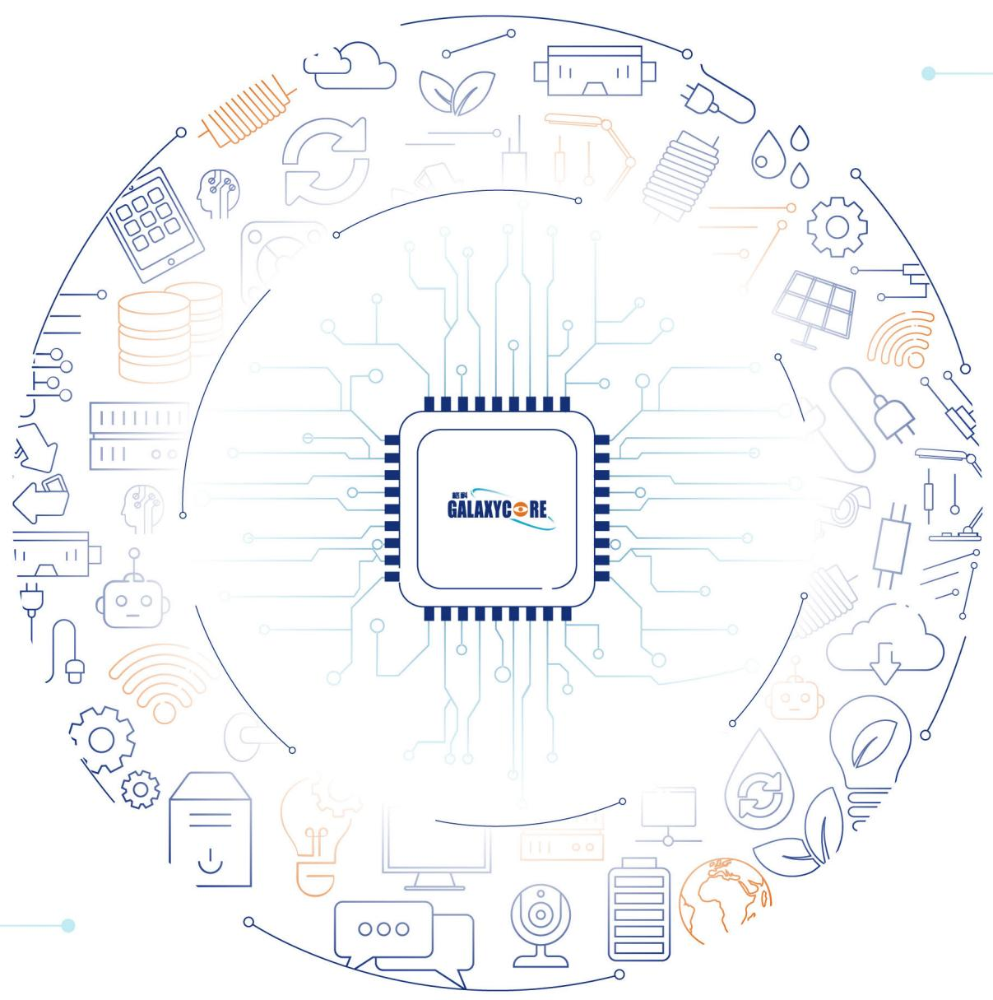

flowchart

```mermaid
graph TD
  Center(("GALAXYCORE"))
  
  %% Core Components
  Node1["Digital Computer Icon"]
  Node2["Cloud Icon"]
  Node3["Battery Icon"]
  Node4["Solar Panel Icon"]
  Node5["Power Grid Icon"]
  Node6["Circuit Icon"]
  Node7["Sensor Icon"]
  Node8["Radio Icon"]
  Node9["Wireless Component"]
  Node10["Electrical Component"]
  Node11["Electronic Component"]
  Node12["Electronic Component"]
  Node13["Electronic Component"]
  Node14["Electronic Component"]
  Node15["Electronic Component"]
  Node16["Electronic Component"]
  Node17["Electronic Component"]
  Node18["Electronic Component"]
  Node19["Electronic Component"]
  Node20["Electronic Component"]
  Node21["Electronic Component"]
  Node22["Electronic Component"]
  Node23["Electronic Component"]
  Node24["Electronic Component"]
  Node25["Electronic Component"]
  Node26["Electronic Component"]
  Node27["Electronic Component"]
  Node28["Electronic Component"]
  Node29["Electronic Component"]
  Node30["Electronic Component"]
  Node31["Electronic Component"]
  Node32["Electronic Component"]
  Node33["Electronic Component"]
  Node34["Electronic Component"]
  Node35["Electronic Component"]
  Node36["Electronic Component"]
  Node37["Electronic Component"]
  Node38["Electronic Component"]
  Node39["Electronic Component"]
  Node40["Electronic Component"]
  Node41["Electronic Component"]
  Node42["Electronic Component"]
  Node43["Electronic Component"]
  Node44["Electronic Component"]
  Node45["Electronic Component"]
  Node46["Electronic Component"]
  Node47["Electronic Component"]
  Node48["Electronic Component"]
  Node49["Electronic Component"]
  Node50["Electronic Component"]
```

2025

## 环境、社会和公司治理

Environmental, Social and

Governance (ESG) Report

（ESG）报告

## 目录

关于本报告 03

董事长致辞 05

2025 大事记 07

走进格科微 09

公司概况 09

主营业务 09

发展历程 10

全球布局 11

企业文化 13

企业荣誉 14

ESG 管理 15

ESG 管理机制 15

利益相关方沟通 17

重要性议题评估与管理 18

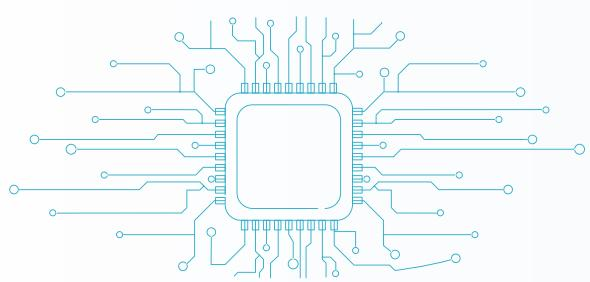

natural_image

Abstract circuit board pattern with interconnected nodes and lines (no text or symbols)

## 格物致知

## 盈科后进 23

创新驱动 25

产品质量管理 31

客户权益管理 34

供应链管理 36

行业共进 40

## 绿色运营

## 守护环境 41

环境合规管理 43

污染物排放管理 47

废弃物管理 48

水资源管理 52

能源管理 54

应对气候变化 56

## 人本关怀

## 回馈社会 61

员工权益保障 63

职业发展与培训 68

职业健康与安全 71

助力社会发展 76

## 规范治理

## 筑牢根基 77

公司治理 79

合规经营与风险管理 82

商业道德 84

信息安全与隐私保护 86

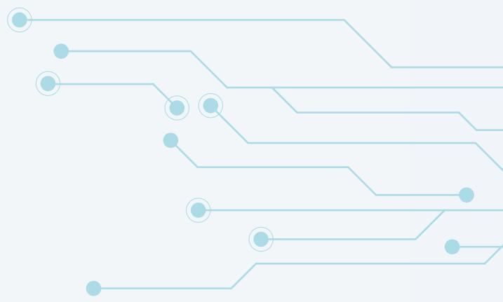

natural_image

Abstract line pattern with interconnected nodes and lines, no text or symbols present

## 附录 88

ESG数据表和附注 88

指标索引 96

读者反馈表 97

## 关于本报告

《格科微有限公司 2025 年度环境、社会和公司治理报告》是格科微有限公司（以下简称“格科微”）面向利益相关方发布的第四份 ESG 报告，系统披露了格科微 2025 年环境、社会及公司治理等议题的管理方法与绩效，系统地回应利益相关方关注的重要可持续发展议题。

## 时间范围

本报告为年度报告，时间范围为 2025 年 01 月 01 日至 2025 年 12 月 31 日（简称“报告期”）。为增强本报告的对比性和前瞻性，部分内容适当溯及以往年份或超出上述范围。

## 报告主体

本报告内容覆盖格科微有限公司及下属子公司。为了便于表述和阅读，本报告中“格科微有限公司”也以“格科微”“公司”或“我们”表示。

<table><tr><td>公司全称</td><td>简称</td></tr><tr><td>格科微电子(上海)有限公司</td><td>格科微上海</td></tr><tr><td>格科微电子(浙江)有限公司</td><td>格科微浙江</td></tr><tr><td>格科微电子(香港)有限公司</td><td>格科微香港</td></tr><tr><td>格科半导体(上海)有限公司</td><td>格科半导体</td></tr><tr><td>格科集成电路(上海)有限公司</td><td>格科集成电路</td></tr><tr><td>格科(浙江)置业有限公司</td><td>格科置业</td></tr></table>

## 编制依据

本报告编制参考的标准、框架、原则及相关要求如下：

《上海证券交易所上市公司自律监管指引第 14 号——可持续发展报告（试行）》

《联合国可持续发展目标企业行动指南（UN SDGs）》

## 数据来源

本报告中使用的数据与案例来自格科微内部原始台账、公司实际运转的有关统计与记录、政策文件、公开披露的年度报告等。报告中的财务数据均以人民币为单位。

## 数据保证

格科微承诺本报告内容不存在任何虚假信息、误导性陈述或重大遗漏，并对内容真实性、准确性和完整性负责。

## 报告获取

本报告以电子版形式发布。电子版可在格科微有限公司的官方网站（www.gcoreinc.com）、上海证券交易所官网（www.sse.com.cn）等平台下载阅读。

## 联系方式

地址：中国（上海）自由贸易试验区盛夏路 560 号 2 幢第 11 层整层、第 12 层整层

电话：021-60126212

传真：021-58968522

邮箱：ir@gcoreinc.com

## 董事长致辞

2025 年，是格科微深耕半导体领域的第二十二个年头，也是我们用 ESG 理念助力高质量发展、朝着世界一流影像整体解决方案提供商稳步前行的关键一年。2003 年在上海张江起步以来，格科微始终抱着 “格物致知，盈科后进” 的初心，聚焦 CMOS 图像传感器与显示驱动芯片这两大核心业务稳步推进。从首颗国产 CMOS 图像传感器量产，到如今构建起覆盖“设计 - 晶圆制造 - 特色封测”的全产业链布局，从手机影像主要领域拓展至可穿戴设备、汽车电子、智慧物联等多元场景，我们始终以技术创新打破壁垒、以品质坚守赢得市场。

## 以创新驱动发展

技术创新是格科微的立身之本。2025 年，我们在像素技术上继续发力，全球首发 0.64μm 与 0.8μm 两款单芯片 5000万像素图像传感器，进一步完善高像素产品多规格布局；3200 万与 5000 万像素 CIS 全年出货量突破 1 亿颗，标志着公司单芯片高像素产品获得市场广泛认可。在非手机 CIS 领域，尤其是 AI 眼镜、车载等新兴市场，我们同样取得突破性进展，发布首颗大靶面黑光全彩图像传感器 GC8602，进一步丰富公司在智慧物联领域的产品矩阵；高性能 500 万像素传感器 GC5605 为 AI PC 应用注入新动能；推出车规级图像传感器系列产品及高可靠封装工艺，满足车载应用对安全性与可靠性的严苛要求。在显示驱动芯片领域，公司首颗 AMOLED 显示驱动芯片成功交付客户，开启穿戴显示新篇章。这些创新成果，是格科人对“格物致知”精神的最好诠释。

## 以人才筑牢根基

半导体产业的竞争，归根结底是人才的竞争。我们持续加码研发投入，研发人员总数达 1,074 人，占员工总数 45.43%。2025 年，我们深入推进产学研融合，与多所高校共建合作平台，连续多年支持中国研究生创“芯”大赛等青少年科技竞赛，从源头培育未来“芯”力量。我们坚信，只有扎实做好人才队伍建设，才能为技术创新提供持续动力。

## 以绿色践行责任

我们持续秉持“生态优先、绿色发展”理念，严格执行 ISO 14001 环境管理体系，将环保责任贯穿于运营全流程，确保污染物稳定达标排放，以低碳、减碳为方针，指引公司能效管理方向，用行动守护绿水青山。具体措施包括，格科半导体全年完成臭氧废水回收利用73.000 吨 MAU加湿泵变频改造项目实现单台设备日节电 530KWh等。

## 以使命领航未来

展望未来，格科微将继续聚焦核心技术自主化、产品化，围绕“研发 - 制造 - 封测”三位一体的 Fab-lite 模式，逐步完善产业链布局，提升综合竞争力。我们会以更开放的心态开展全球合作，用更务实的行动落实可持续发展，通过科技创新让企业价值不断提升，把社会责任落到实处，为社会发展尽一份力。

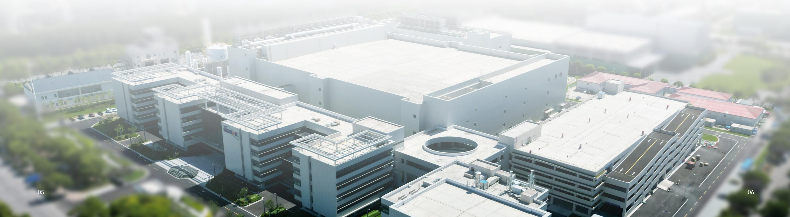

natural_image

Aerial view of a modern industrial complex with multiple white buildings and surrounding greenery, no visible text or signage.

## 2025 大事记

  
1 月推出第二代 0.7μm单芯片 5000 万像素图像传感器

  
3 月传音 Infinix Note50超感光主摄搭载GC50B2

  
6 月首颗 AMOLED 显示驱动芯片 GC3A71 成功交付智能手表客户

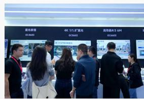  
10 月亮相安博会，发布首颗大靶面 4K 黑光旗舰产品

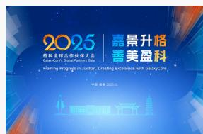  
10 月嘉景升格，善美盈科，格科全球合作伙伴大会圆满举行

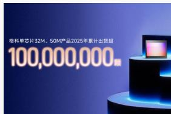  
12 月 3200 万 与 5000万像素 CIS 2025 年出货量超过 1 亿颗

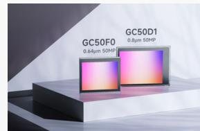  
12 月 推 出 行 业 首 颗0.8μm 及 0.64μm 单 芯片 5000 万像素图像传感器

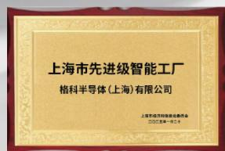  
1 月临港工厂获评“上海市先进级智能工厂”

  
4 月 500 万像素 CIS 在 AI眼镜应用量产

  
9 月 vivo Y500 主摄搭载格科 5000 万像素图像传感器

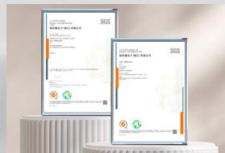  
10 月格科微上海与格科微浙江（嘉善工厂）顺利获得 IATF 16949 质量体系认证

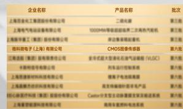  
11 月通过工业和信息化部第六批制造业单项冠军企业复核

  
12 月 OPPO Reno15 超广角搭载格科 5000 万像素图像传感器

## 走进格科微

## 公司概况

格科微有限公司（股票代码：688728）成立于 2003 年，总部设于中国上海，在全球拥有 9 个分支机构。格科微采用Fab-Lite 经营模式，成为了芯片设计在上海张江，工艺研发和部分晶圆制造在上海临港，特色封测在浙江嘉善的半导体全产业链集团。

“格物致知，盈科后进”格科凭借出色产品，创新技术和全球影响力，获评国家技术企业中心第六批制造业单项冠军企业高新技术企业、十大中国 IC 设计企业等。未来，公司将不断巩固和提升在 CMOS 图像传感器和显示驱动芯片等领域的竞争力和影响力，持续为客户、员工、股东以及所处产业链创造价值，致力于成为受人尊敬的世界一流影像整体解决方案提供商。

## 主营业务

公司是国内领先、国际知名的半导体和集成电路设计企业之一，主营业务为 CMOS 图像传感器（CIS）和显示驱动芯片（DDIC）的研发、设计、制造、封测和销售。公司目前主要提供QVGA（8万像素）至5,000万像素的CMOS图像传感器，和LCD DDIC/TDDI（分辨率涵盖从QQVGA到FHD+）以及AMOLED穿戴类显示驱动IC。产品广泛应用于手机、智慧物联、汽车电子、平板电脑、笔记本电脑、可穿戴设备、移动支付、医疗显示等领域。

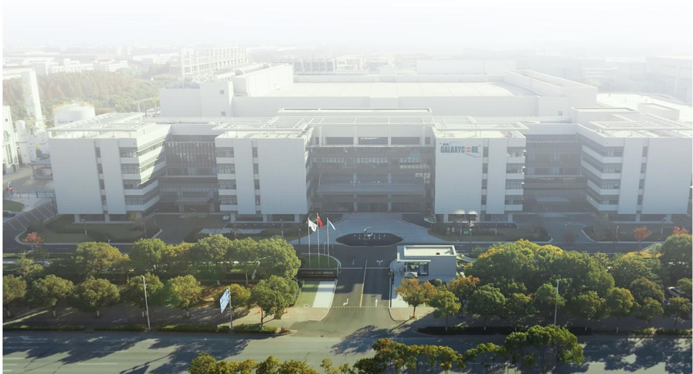

natural_image

Aerial view of a modern industrial campus with large white buildings and surrounding greenery (no visible signage or text)

发展历程

<table><tr><td>2003年</td><td>·格科微电子(上海)有限公司在上海张江成立</td></tr><tr><td>2005年</td><td>·首颗国产CIS成功量产</td></tr><tr><td>2010年</td><td>·DDIC产品线成立·2M CIS量产</td></tr><tr><td>2011年</td><td>·首颗DDIC产品量产</td></tr><tr><td>2013年</td><td>·5M BSI CIS量产</td></tr><tr><td>2014年</td><td>·非手机CIS产品线成立</td></tr><tr><td>2015年</td><td>·8M BSI CIS量产·首颗智能机FW VGA DDIC量产</td></tr><tr><td>2017年</td><td>·COM封装成功量产·13M BSI CIS量产·HD DDIC量产</td></tr><tr><td>2019年</td><td>·非手机4M星光级CIS成功量产·格科浙江嘉善封测厂成功投产</td></tr><tr><td>2020年</td><td>·格科半导体12吋CIS特色工艺研发与产业项目开工·FHD/HD TDDI产品投入量产</td></tr><tr><td>2021年</td><td>·8月18日在科创板上市</td></tr><tr><td>2022年</td><td>·发布全球首款单芯片0.7μm 3,200万像素CIS·非手机5M CIS量产</td></tr><tr><td>2023年</td><td>·发布全球首款单芯片5,000万像素CIS·格科半导体12英寸CIS特色工艺研发与产业项目投产·智慧物联8M CIS正式发布</td></tr><tr><td>2024年</td><td>·5000万像素CIS量产</td></tr><tr><td>2025年</td><td>·发布单芯片0.64μm、0.8μm5000万像素CIS·5M CIS在AI眼镜应用量产·AMOLED DDIC交付</td></tr></table>

## 全球布局

公司总部位于中国上海，在全球拥有 9 个分支机构。

深圳分公司、北京（办事处）、西安（办事处）、杭州（办事处）、香港（办事处）、台湾（办事处）、

韩国（办事处）、浙江嘉善（制造基地）、上海临港（制造基地）。

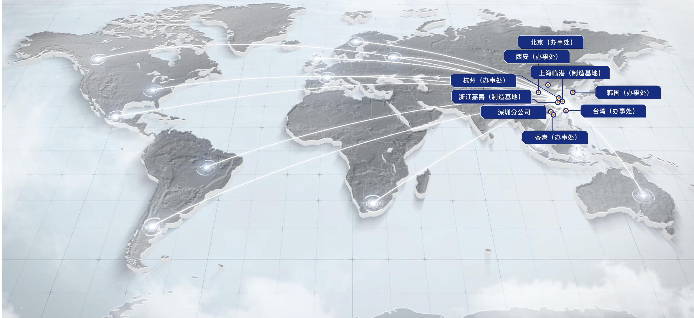

text_image

北京（办事处）
西安（办事处）
上海临港（制造基地）
杭州（办事处）
浙江嘉善（制造基地）
深圳分公司
香港（办事处）
韩国（办事处）
台湾（办事处）

## 企业文化

公司秉持开放创新、求真务实、团队协作、艰苦奋斗和勇于担当的核心价值观，以“知、信、习、行”作为文化落地逻辑，致力于让世界看见中国的创新，让世界感受中国企业的君子之风，成为受人尊敬的世界一流影像整体解决方案提供商，通过卓越的产品和服务，引领行业发展，赢得全球客户的信赖与尊重。

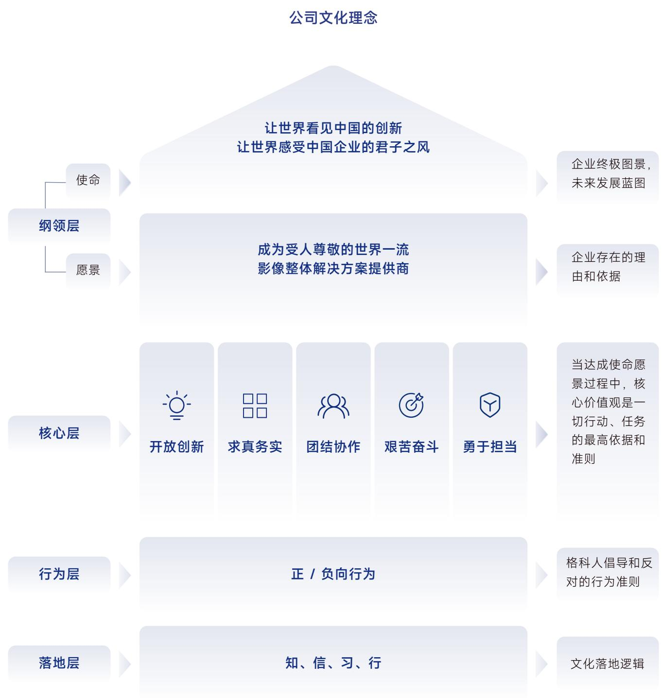

flowchart

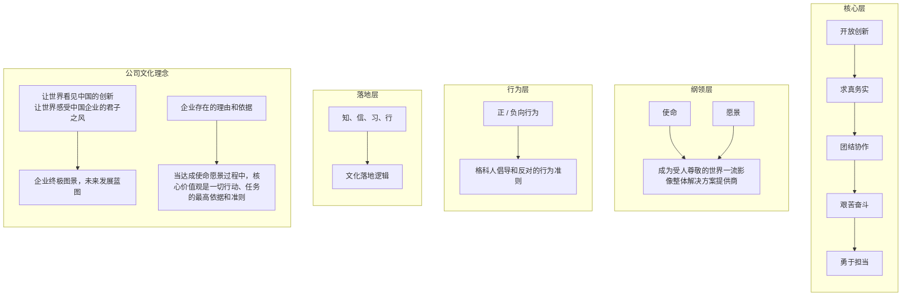
```mermaid
graph TD
  subgraph Core_Layer["核心层"]
    direction TB
  A["开放创新"] --> B["求真务实"]
  B --> C["团结协作"]
  C --> D["艰苦奋斗"]
  D --> E["勇于担当"]
  end

  subgraph Sub_Levels["纲领层"]
    direction TB
  F["使命"] --> G["成为受人尊敬的世界一流影像整体解决方案提供商"]
  H["愿景"] --> G
  end

  subgraph Sub_Bodies["行为层"]
    direction TB
  I["正 / 负向行为"] --> J["格科人倡导和反对的行为准则"]
  end

  subgraph Sub_Layers["落地层"]
    direction TB
  K["知、信、习、行"] --> L["文化落地逻辑"]
  end

  subgraph Top_Center["公司文化理念"]
    direction TB
  M["让世界看见中国的创新\n让世界感受中国企业的君子之风"] --> N["企业终极图景，未来发展蓝图"]
  O["企业存在的理由和依据"] --> P["当达成使命愿景过程中，核心价值观是一切行动、任务的最高依据和准则"]
  end
```

## 企业荣誉

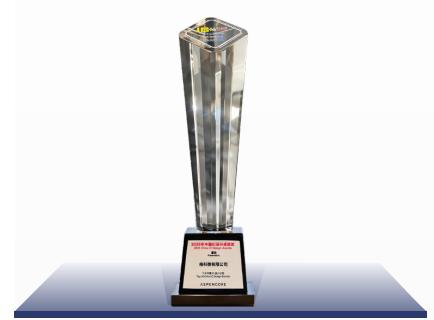

natural_image

Exterior view of a modern glass trophy on a pedestal (no visible text or symbols)

中国 IC 设计成就奖十大中国IC 设计公司

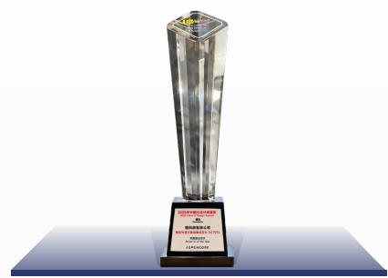

text_image

中国证券报
证券时报
证券日报
上海证券报
证券日报

中国 IC 设计成就奖年度驱动芯片 GC7272

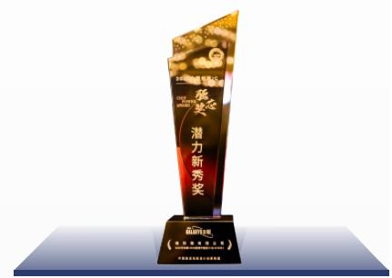

text_image

深爱之
潜力新秀奖
中国青年出版社

中国创新 IC 强芯奖潜力新秀奖 GC50E1

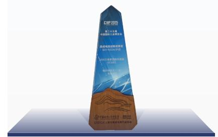

text_image

2013-2015
第三年五期
玻璃钢基与金属基
玻璃钢基与玻璃基
玻璃钢基与玻璃基
玻璃钢基与玻璃基
玻璃钢基与玻璃基
玻璃钢基与玻璃基
玻璃钢基与玻璃基
玻璃钢基与玻璃基
玻璃钢基与玻璃基
玻璃钢基与玻璃基
玻璃钢基与玻璃基
玻璃钢基与玻璃基
玻璃钢基与玻璃基
玻璃钢基与玻璃基
玻璃钢基与玻璃基
玻璃钢基与玻璃基

第二十五届中国国际工业博览会集成电路创新成果奖 GC50E1

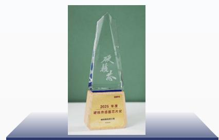

text_image

双核芯
2025 年度
硬砖传感器芯片奖
硬砖传感器芯片奖

硬核传感器芯片奖 GC50F6

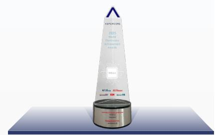

text_image

EXPENSIVE
2025
World Progress Achievement Goals
BRAA
After-After
scall 100 scall
After-After

全球电子成就奖之年度创新企业

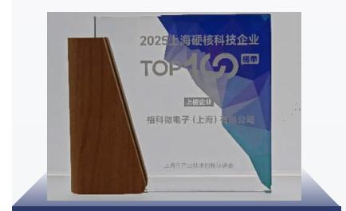

text_image

2025上海硬核科技企业
TOP10
上榜企业
榕科微电子（上海）有限公司
上海年产山技术创新博览会

上海硬核科技企业 TOP100 榜单

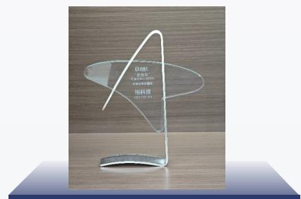

text_image

联创汇
“新价值”100%
资产净值100%
货币市场价100%
货币市场
2017年1月

格隆汇金格奖年度卓越公司评选年度信息披露奖

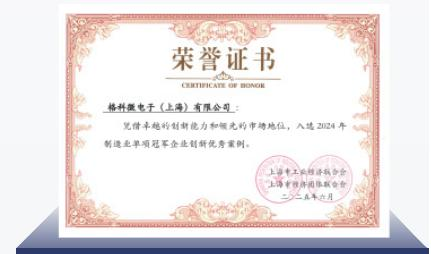

text_image

荣誉证书
CERTIFICATE OF HONOR
格科微电子（上海）有限公司：
凭借卓越的创新能力和领先的市场地位，入选2024年制造业单项冠军企业创新优秀案例。
上海市总工会经济联合会
上海市政协团保联会
二〇二五年六月

制造业单项冠军企业创新优秀案例

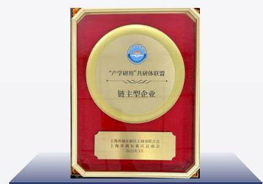

text_image

“产学研用”共研体联盟
链主型企业
上海市浦东新区工商联合会
上海浦东新区总工会
2023年3月

产学研用共研体联盟链主型企业

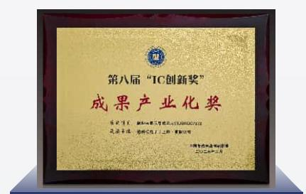

text_image

第八届“IC创新奖”
成果产业化奖
徐学明： 解析与指导工作委员会（以下简称“中国证监会”）
吴永华： 徐究师：丁云峰、黄丽娟
中国证券报·上海证券报
2022年5月16日

第八届“IC 创新奖”成果产业化奖

## ESG 管理

## ESG管理机制

格科微将 ESG 理念融入战略规划与日常运营，通过持续优化管理机制助力高质量发展。2025 年，公司进一步完善 ESG管理体系，制定《ESG 指标体系管理手册》，为 ESG 工作提供系统指引。手册明确了各层级职责与指标落地路径，保障 ESG 实践有效开展。通过统一规范的管理机制，公司将 ESG 目标与要求传导至各级员工，提升跨部门共识，为公司ESG 工作的深化与转型提供规范支持。

## 管治架构

为适应企业战略与可持续发展的需要，格科微构建了“董事会统筹决策，战略委员会综合管理，ESG工作小组协同执行的三层可持续发展管理组织架构。

ESG管治架构

<table><tr><td>决策层</td></tr><tr><td>董事会</td></tr><tr><td>ESG管理层</td></tr><tr><td>战略委员会</td></tr><tr><td>ESG执行层</td></tr><tr><td>ESG工作小组</td></tr></table>

董事会是ESG工作的领导和决策机构，对公司的可持续发展规划及披露承担全部责任，战略委员会为研究与指导机构辅助决策并监督执行。ESG 工作小组为执行与协调机构，负责议题管理、报告编制及进展汇报，并在日常工作中识别和分析 ESG 相关风险与机遇。基于短期（1 年以内）、中期（1 至 5 年）和长期（5 年以上）的时间维度，工作小组对议题的影响、风险与机遇进行系统识别，对于超出管理权限的不可控事项，按程序上报管理层，并由管理层提交董事会决策，形成覆盖识别、评估、上报与应对的全流程管理机制。

## 各层级职责

## 董事会

确定公司ESG战略目标和中长期规划；

确定公司ESG工作管理制度；

审议、批准公司年度ESG报告；

审议、批准其他与公司ESG相关的重要事项。

制定公司ESG提升方案，并就相关重大决策提出建议；

定期监督检查公司ESG工作活动相关事宜的实施与进展情况；

审核公司年度ESG报告等ESG相关披露文件；

董事会授予的其他与公司ESG相关的职权。

## 战略委员会

## ESG 工作小组

研究实质性议题，负责指导科技创新、员工发展、商业道德等 ESG 核心议题管理及实践；

参与ESG报告的编制及利益相关方调研，把控信息披露质量与连续性：

监测、收集、分析相关数据和信息，定期向战略委员会汇报ESG工作进展。

## 专业能力保障

董事会成员具备企业治理战略管理，风险控制及可持续发展等领域的综合经验，能够从长期价值鱼度，对可持续发展议题的潜在影响与发展机遇进行判断与决策。ESG工作小组成员来自各核心职能部门具备相关专业背景与实践经验推动可持续发展要求融入日常经营管理。

## 信息报告与监督

ESG 工作小组负责日常数据监测与信息收集，定期向战略委员会提交进展报告，内容涵盖关键绩效指标完成情况、风险识别及应对进展。如遇重大突发事项，随时通过邮件、专题报告形式向管理层及董事会汇报。战略委员会每年不定期召开会议，审议目标执行情况，评估风险应对措施的有效性，并提出改进建议。董事会每年审议 ESG 整体工作，对目标完成情况进行综合评定，推动管理持续优化。

## 利益相关方沟通

公司建立多层次、多渠道的沟通机制，根据自身业态和发展情况，识别出股东与投资者、客户、政府及监管机构、合作伙伴、员工、社区与公益组织、行业协会等七大关键利益相关方。报告期内，公司主动了解各方的关注重点，及时回应利益相关方的诉求。

<table><tr><td>利益相关方</td><td>关注议题</td><td>我们的回应</td></tr><tr><td rowspan="4">股东与投资者</td><td>公司治理</td><td>电话/邮件/网络回复</td></tr><tr><td>合规与风险管理</td><td>各类信息披露平台</td></tr><tr><td>投资者关系</td><td>股东大会</td></tr><tr><td></td><td>现场调研</td></tr><tr><td rowspan="4">客户</td><td>创新驱动</td><td>即时沟通工具</td></tr><tr><td>客户服务与沟通</td><td>客户服务热线</td></tr><tr><td>产品质量与安全</td><td>现场拜访</td></tr><tr><td>商业道德</td><td></td></tr><tr><td rowspan="4">政府与监管机构</td><td>商业道德</td><td>证券交易所会议</td></tr><tr><td>合规与风险管理</td><td>政府调研</td></tr><tr><td>环境合规管理</td><td>各类信息披露平台</td></tr><tr><td>职业健康与安全</td><td>政府会议</td></tr><tr><td rowspan="3">合作伙伴</td><td>可持续供应链</td><td>行业论坛</td></tr><tr><td>商业道德</td><td>交流会议</td></tr><tr><td></td><td>即时沟通工具</td></tr><tr><td rowspan="4">员工</td><td>职业发展与培训</td><td>员工交流会</td></tr><tr><td>员工权益保障</td><td>意见反馈箱</td></tr><tr><td>职业健康与安全</td><td>一对一沟通</td></tr><tr><td></td><td>《格科圈儿》文化公众号</td></tr><tr><td rowspan="4">社区与公益组织</td><td>环境合规管理</td><td>信息披露平台</td></tr><tr><td>污染物排放管理</td><td>公司官网</td></tr><tr><td>废弃物管理</td><td>微信公众号等</td></tr><tr><td>社会贡献</td><td></td></tr><tr><td rowspan="3">行业协会</td><td>产品质量与安全</td><td>技术论坛</td></tr><tr><td>创新驱动</td><td>行业博览会</td></tr><tr><td></td><td>合作伙伴峰会</td></tr></table>

## 重要性议题评估与管理

## 重要性议题分析

公司依据全面、科学、与时俱进的原则，结合内外部发展环境、宏观政策指引、利益相关方期望及行业同行实践经验，形成符合公司战略与实际情况的 ESG 议题清单。在此基础上，从“对财务绩效的重要性”与“对经济、社会及环境的影响程度两个维度进行综合评估，识别并排序ESG重大议题。

## 格科微重要性议题分析流程

## 步骤一

## 背景识别与了解

分析公司及行业特征，解读宏观政策与行业热点，明确公司履责的政策导向与发展机遇，制定《2025年年度风险管理评估调查表》。

## 步骤二

## 议题初步识别

根据上海证券交易所政策要求，行业相关政策以及同业实践，识别半导体行业重点议题，进一步形成公司议题库。

## 步骤三

## 议题重要性评估

根据利益相关方沟通 及调研结果，结合行 业特性和专家意见， 从双重重要性维度， 对议题进行重要性排 序，确定重要性议题 及重要性程度。

## 步骤四

## 议题确认与审批

由公司董事会审议并确认形成重要性矩阵，对于高重要性议题，在 ESG 报告中进行重点披露。

为精准识别对公司具有重要影响的 ESG 议题，本年度我们结合利益相关方与行业关注焦点，对现有议题进行系统性的新增、归并及更名，使议题结构更清晰、更贴合业务实际，支撑后续精细化管理工作。

## 重要性议题评估结果

格科微2025 年影响重要性议题矩阵  
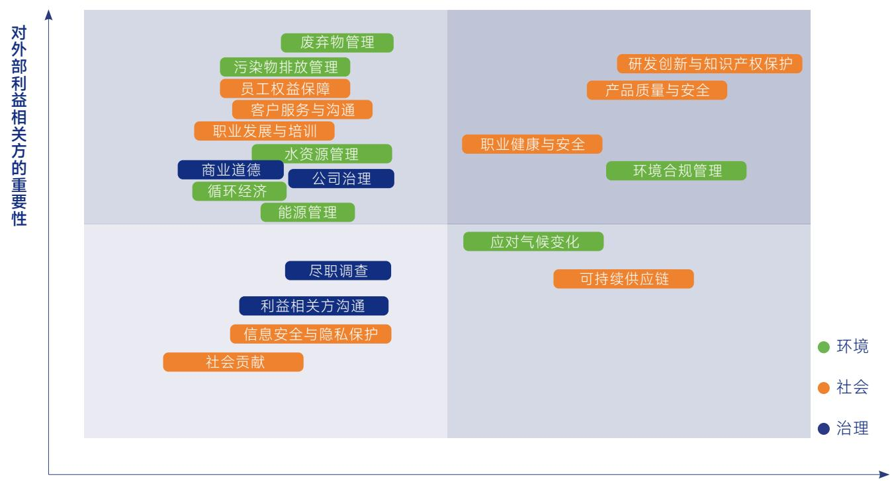

bubble

| Topic | Category | Importance to External Profit & Related Factors |
| :--- | :--- | :--- |
| 废弃物管理 | 环境 | High |
| 污染物排放管理 | 环境 | High |
| 员工权益保障 | 社会 | High |
| 客户服务与沟通 | 社会 | High |
| 职业发展与培训 | 社会 | High |
| 水资源管理 | 环境 | Medium-High |
| 商业道德 | 治理 | Medium-High |
| 循环经济 | 环境 | Medium-High |
| 能源管理 | 环境 | Medium-High |
| 研发创新与知识产权保护 | 社会 | High |
| 产品质量与安全 | 社会 | High |
| 职业健康与安全 | 社会 | Medium-High |
| 公司治理 | 治理 | Medium-High |
| 应对气候变化 | 环境 | Low-Medium |
| 可持续供应链 | 社会 | Low-Medium |
| 尽职调查 | 治理 | Low-Medium |
| 利益相关方沟通 | 治理 | Low-Medium |
| 信息安全与隐私保护 | 社会 | Low-Medium |
| 社会贡献 | 社会 | Low-Medium |

对企业可持续发展的重要性

<table><tr><td colspan="3">环境议题</td><td colspan="3">社会议题</td><td colspan="3">治理议题</td></tr><tr><td>序号</td><td>实质性议题</td><td>重要性议题</td><td>序号</td><td>实质性议题</td><td>重要性议题</td><td>序号</td><td>实质性议题</td><td>重要性议题</td></tr><tr><td>1</td><td>应对气候变化</td><td>财务重要性</td><td>8</td><td>社会贡献</td><td></td><td>17</td><td>公司治理</td><td>影响重要性</td></tr><tr><td>2</td><td>环境合规管理</td><td>双重重要性</td><td rowspan="2">9</td><td rowspan="2">研发创新与知识产权保护</td><td rowspan="2">双重重要性</td><td>18</td><td>尽职调查</td><td></td></tr><tr><td>3</td><td>污染物排放管理</td><td>影响重要性</td><td>19</td><td>利益相关方沟通</td><td></td></tr><tr><td>4</td><td>废弃物管理</td><td>影响重要性</td><td>10</td><td>客户服务与沟通</td><td>影响重要性</td><td>20</td><td>商业道德</td><td>影响重要性</td></tr><tr><td>5</td><td>循环经济</td><td>影响重要性</td><td>11</td><td>产品质量与安全</td><td>双重重要性</td><td></td><td></td><td></td></tr><tr><td>6</td><td>能源管理</td><td>影响重要性</td><td>12</td><td>可持续供应链</td><td>财务重要性</td><td></td><td></td><td></td></tr><tr><td>7</td><td>水资源管理</td><td>影响重要性</td><td>13</td><td>信息安全与隐私保护</td><td></td><td></td><td></td><td></td></tr><tr><td></td><td></td><td></td><td>14</td><td>职业发展与培训</td><td>影响重要性</td><td></td><td></td><td></td></tr><tr><td></td><td></td><td></td><td>15</td><td>员工权益保障</td><td>影响重要性</td><td></td><td></td><td></td></tr><tr><td></td><td></td><td></td><td>16</td><td>职业健康与安全</td><td>双重重要性</td><td></td><td></td><td></td></tr></table>

## 重要性议题管理

公司基于实质性议题的识别结果，指导 ESG 信息披露与管理提升，重点披露对自身运营具有重大影响或利益相关方高度关注的议题，在明确重要议题的基础上 公司构建系统性的ESG指标体系，通过定性与定量相结合的方式，持续追踪评估在环境、社会及治理维度的表现，提升 ESG 管理的全面性与系统性。报告期内，公司依据交易所可持续发展信息披露框架，对财务重要性议题进行针对性披露。

实质性议题：应对气候变化

<table><tr><td colspan="2">时间范围:短期中期长期</td></tr><tr><td colspan="2">价值链范围:价值链上游自身运营价值链下游</td></tr><tr><td>风险简述</td><td>风险应对</td></tr><tr><td>随着全球持续加强气候和环保政策及碳排放管控措施,可能面临不断增加的合规运营成本和低碳技术升级需求;需着力保障极端天气下的生产连续性。</td><td>严格落实地方碳排放管理要求,规范完成年度温室气体排放报告编制;强化上海及嘉善生产基地的资产韧性;制定应急预案、统筹应急物资以及定期组织极端天气应急演练。</td></tr><tr><td>机遇简述</td><td>机遇应对</td></tr><tr><td>公司在气候友好型技术方面的创新投入,研发更高效、更环保的产品,能够提升市场竞争力和品牌声誉。</td><td>依托低碳产品与能效创新塑造差异化竞争力;深化绿色价值链布局,依托低碳工艺与能效创新,将碳约束转化为差异化竞争优势。</td></tr></table>

实质性议题：环境合规管理

<table><tr><td colspan="2">时间范围:中期长期</td></tr><tr><td colspan="2">价值链范围:价值链上游自身运营价值链下游</td></tr><tr><td>风险简述</td><td>风险应对</td></tr><tr><td>国家颁布更严格的安全、环保及质量标准,颁布节能减排政策等,导致项目延期、成本上升;现有技术/设备水平低于国家许可的产业、环保等政策标准而亟需改造技术/设备。</td><td>密切关注环保监管要求,严格按照环保监管要求执行;报废处置行为按照国家环保要求执行,跟踪报废商品的后续处置行为。</td></tr><tr><td>机遇简述</td><td>机遇应对</td></tr><tr><td>卓越的环境管理实践可能吸引更多关注ESG风险的投资者和客户,持续巩固企业的绿色品牌形象与市场声誉。</td><td>定期发布规范的ESG报告,主动向资本市场展示公司在环境管理方面的绩效与进展。</td></tr></table>

## 实质性议题：可持续供应链管理

时间范围： 中期 长期

价值链范围： 价值链上游 自身运营

## 风险简述

主要供应商业务经营发生不利变化、产能受限或合作关系紧张，可能导致其不能足量及时出货，从而对公司生产经营产生不利影响。

## 机遇简述

建立可持续供应链可以增强公司对环境和社会风险的识别和管理能力，提高整体运营的韧性，降低潜在的业务风险。

## 风险应对

公司实现了 Fabless 到 Fab-lite 的转型，掌握部分晶圆生产、封装测试能力，同时持续扩大、深化产业链上游合作关系，最大可能保证供应稳定。

## 机遇应对

组建专家评选小组通过量化打分机制对供应商进行准入评估。定期更新供应商库，依据供应商类型实施差异化管理，建立淘汰机制。

## 实质性议题：产品质量与安全

时间范围： 短期 中期 长期

价值链范围： 价值链上游 自身运营 价值链下游

## 风险简述

产品质量问题可能会增加售后服务和维护的成本，从而导致额外的人力成本和召回处理的费用，也可能导致客户流失和营收下降。

## 风险应对

结合行业要求与客户期望，制定具有竞争力的产品质量标准。严格依照质控规范执行抽样检验，确保检验结果的代表性与准确性。建立质量问题分析处理程序，通过闭环管理实现持续改善。

## 机遇简述

通过完善的产品质量管理体系，有利于提高公司的产品竞争力，提升客户满意度，从而增强客户忠诚度，进而推动营收增长。

## 机遇应对

持续加强公司质量标准体系建设、维护与动态更新，并组织开展标准的宣导与传达，确保相关要求有效落地。

## 实质性议题：研发创新与知识产权保护

时间范围： 短期 中期 长期

价值链范围： 价值链上游 自身运营 价值链下游

## 风险简述

无法开发新技术以满足客户需求或克服上述挑战，从而影响销售额、降低公司的收入和盈利能力；研发成本缺乏过程控制或控制不到位，存在研发成本过高的情况，影响研发投入产出比的合理性。

## 机遇简述

在技术创新领域取得成功的公司往往更能吸引投资者的关注，研发成就可能为公司带来更多的融资机会，创造新的业务机遇。

## 风险应对

确保研发计划与公司的整体战略目标和长远愿景相一致，深入了解客户需求和市场趋势，以指导研发方向；建立成本跟踪系统，实时监控成本支出，与预算进行比较，加强采购流程管理。

## 机遇应对

基于公司 Fab-lite 模式，凭借全产业链能力，快速开发更先进技术并实现技术产品化。

## 实质性议题：职业健康与安全

时间范围： 中期 长期

价值链范围： 价值链上游 自身运营

## 风险简述

若安全意识宣贯与培训执行不到位将直接削弱员工对生产风险的识别与防范能力。在高强度生产环境下，潜在隐患易引发安全事故导致员工受伤甚至更为严重的后果，

## 风险应对

公司建立了明确的安全管理标准并进行宣导，通过公告栏，邮件，QA等多渠道进行了安全意识宣贯，通过线下培训安全演练强化安全意识与应对效率

## 机遇简述

通过加强职业健康与安全管理，有助于提高安全标准，减少事故发生，降低潜在的法律和财务风险，创造一个更安全的工作环境

## 机遇应对

制定突发情况的安全预案。建立安全事故反馈机制，确保能快速准确的上报并且在第一时间得到解决，

## 01

## 格物致知盈科后进

格科微将创新驱动融入发展内核，以持续研发投入加速产品迭代，精准对接高端市场需求。以全周期质量管理筑牢根基，严控产品设计至交付各环节标准。以客户权益保障为导向，通过高效投诉处理与多元沟通机制增进信任。以可持续供应链为延伸，依托严格准入、动态评估及定期培训构建高效可靠的供应体系。公司聚力技术突破与卓越价值创造，以高品质产品与服务赋能行业进步，践行可持续发展承诺。

## 本章节所涉及重要性议题：

研发创新与知识产权保护  
可持续供应链

客户服务与沟通  
尽职调查

产品质量与安全

本章节所响应 SDGs：

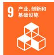

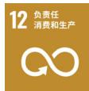

## 创新驱动

格科微严格遵守《中华人民共和国科学技术进步法》等法律法规，以完善的创新研发管理体系与激励机制为支撑，保障项目高效推进，创新成果持续积累，市场竞争力稳步提升。同时，健全的知识产权管理体系为创新成果的保护与运用提供制度保障。公司还积极推进产学研深度融合，支持科创赛事等途径，推动技术转化与人才培养，为可持续发展夯实基础。

## 治理

公司围绕研发创新与知识产权保护建立系统化治理架构，推动相关影响、风险和机遇融入日常决策与管理流程。

在研发管理方面，公司制定《研发项目管理制度》，实行项目经理负责制。研发中心负责人与 CEO 共同指定项目经理，授权其对项目从立项到量产的全过程进行统筹协调。项目经理接受管理层、研发中心及相关职能部门的检查与监督，确保研发活动有序推进。项目经理具备专业技术背景与跨部门协调经验，通过明确的职责划分，在项目执行中系统识别和评估技术路线选择、资源配置及市场适配过程中的风险与机遇。

在知识产权管理方面，公司设置知识产权部门，配备专职人员，牵头协调知识产权申请、维护、运营及维权等事项，各职能部门配合落实相关管理工作。公司执行《专利管理制度》《知识产权风险防范与应急方案》等内部制度，将知识产权创造、运用和保护融入研发、生产、经营各环节，在提升自主创新能力的同时，形成对知识产权相关风险的系统化应对能力。

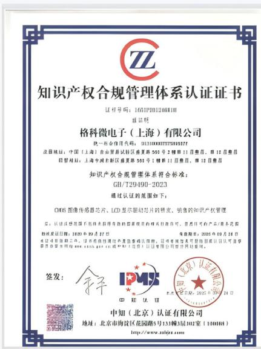

text_image

知识产权合规管理体系认证证书
证书号码：1601P01246818
经证明
格科微电子（上海）有限公司
统一社会信用代码：91310000757844577
注册地址：中国（上海）自由贸易试验区盛夏路355号2幢第11层叠首、第12层叠首
经营地址：上海市浦东新区盛夏路355号1幢第11层叠首、第12层叠首
知识产权合规管理体系符合标准：
GB/T29490-2023
通过认证的范围如下：
CDO图像传感器芯片、LCD显示驱动芯片的研发、销售的知识产权管理
证。认证注册范围不包括不得持有专利的机器组件的相关软件许可，但须凭可的产品/服务范围
数据认证日期：1920年03月27日
有效期至：2025年03月24日
或24年到期之日，以本授权书中涉及查询范围的，证书有效期为可使用国际认证认可国
监督会员身份证明 www.cdo.org.cn 和 电话：(全国) 认证有限公司
签发：
中知（北京）认证有限公司
地址：北京市海淀区花园路5号131幢3层103室（180HB）
http://www.njzq.com

2025 年，公司按照 GB/T29490-2023 新版标准要求持续运行知识产权合规管理体系，并通过监督审核，保持认证有效性。

公司建立覆盖各类研发项目的创新激励机制定期对创新成果进行评审激励，公司针对技术研发，产品开发设定差异化的评选标准，由各业务单元（BU）负责人对项目成果及奖金分配进行最终审定。确保激励与项目绩效紧密挂钩，持续激发研发团队创新活力。

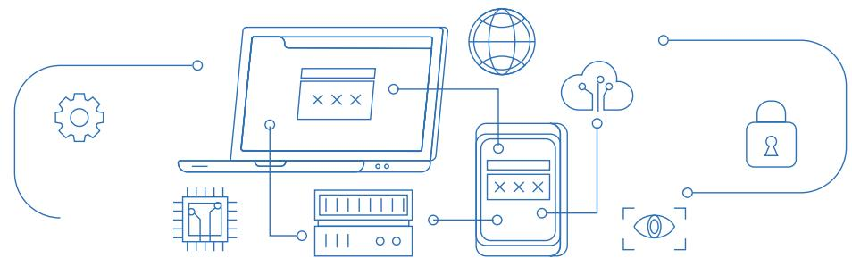

flowchart

```mermaid
graph LR
  A["Gear Icon"] --> B["Computer Interface"]
  B --> C["Global Globe Icon"]
  C --> D["Cloud Icon"]
  D --> E["Security Icon"]
  E --> F["Key Security Icon"]
```

## 战略

公司以“紧扣客户需求，推动核心技术产品化”为发展战略，将创新驱动贯穿于研发决策与执行全过程。在战略制定层面，公司依托产学研合作与市场研判，通过分析行业专利布局、跟踪学术前沿动态、调研技术方案，持续评估技术创新对产品推广及市场应用带来的影响、风险与机遇，以此校准研发方向，确保技术路线选择与长期价值创造相契合。

基于清晰的战略导向，公司在核心领域持续积累知识产权成果，围绕 CMOS 图像传感器、显示驱动芯片等关键技术构建专利组合，形成覆盖专利、商标、软件著作权及集成电路布图设计的全方位 IP 保护体系。

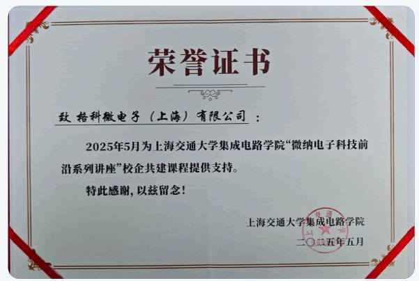

text_image

荣誉证书
致格科微电子（上海）有限公司：
2025年5月为上海交通大学集成电路学院“微纳电子科技前沿系列讲座”校企共建课程提供支持。
特此感谢，以兹留念！
上海交通大学集成电路学院
二〇二五年五月

校企共建课程支持——上海交通大学微电子学院

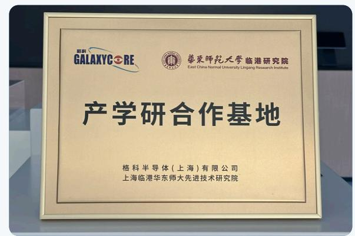

text_image

GALAXYCORE
華東師紀大學 临港研究院
East China Normal University Lingtang Research Institute
产学研合作基地
格科半导体（上海）有限公司
上海临港华东师大先进技术研究院

产学研合作基地——华东师范大学先进技术研究院临港研究院

## 案例 九载同“芯”，共育未来——格科微携手第八届中国研究生创“芯”大赛

中国研究生创“芯”大赛作为面向全国高校及科研院所研究生的集成电路设计实践赛事，以“创芯、选星、育芯”为宗旨，致力于发掘和培育未来“芯”力量。自2017 年大赛前身“格科杯”集成电路专业赛起，格科微已与创“芯”大赛携手同行九载。本届赛事共吸引206 所研究生培养单位、1483 支队伍、4160 名硕博学子参赛。格科微深度参与其中，设立五道企业命题，并为指导老师颁发奖牌。在人才集市环节，公司技术专家与人力资源团队与学子面对面交流，就岗位发展与技术前沿进行深入分享。

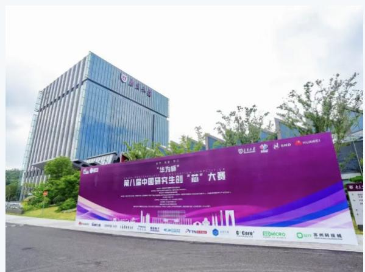

text_image

华为研
华为研
华为研
华为研
华为研
华为研
华为研
华为研
华为研
华为研
华为研
华为研
华为研
华为研
华为研
华为研
华为研
华为研
华为研
华为研
华为研
华为研
华为研
华为研
华为研
华为研
华为研
华为研
华为研
华为研
华为研
华为研
华为研
华为研
Huawei
华为研
华为研
华为研
华为研
华为研
华为研
华为研
华为研
华为研
华为研
华为研
华为研
华为研
华为研
华为研
华为研
华为研
华为研
华为研
华为研
华为研
华为研
华为研
华为研
华为研
华为研
华为研
华为研
华为研
华为研
华为研
华为研
华为研

## 案例 助力前沿科研，赋能创新探索——清华大学采用格科动芯片光学防抖马达技术成果登上国际期刊

清华大学精密仪器系团队在国际权威期刊《Light:Science&Applications》发表最新科研成果，提出一种新型双模态激光雷达（LiDAR）系统，实现光束扫描与闪光探测双模式切换，显著提升三维探测精度与适应性。研究中使用的 GCDS01A 光学防抖马达由格科微提供，实现微米级高精度位移控制，为核心光束扫描提供关键支持。格科以高性能产品赋能前沿科研，持续为产业创新体系注入动能。

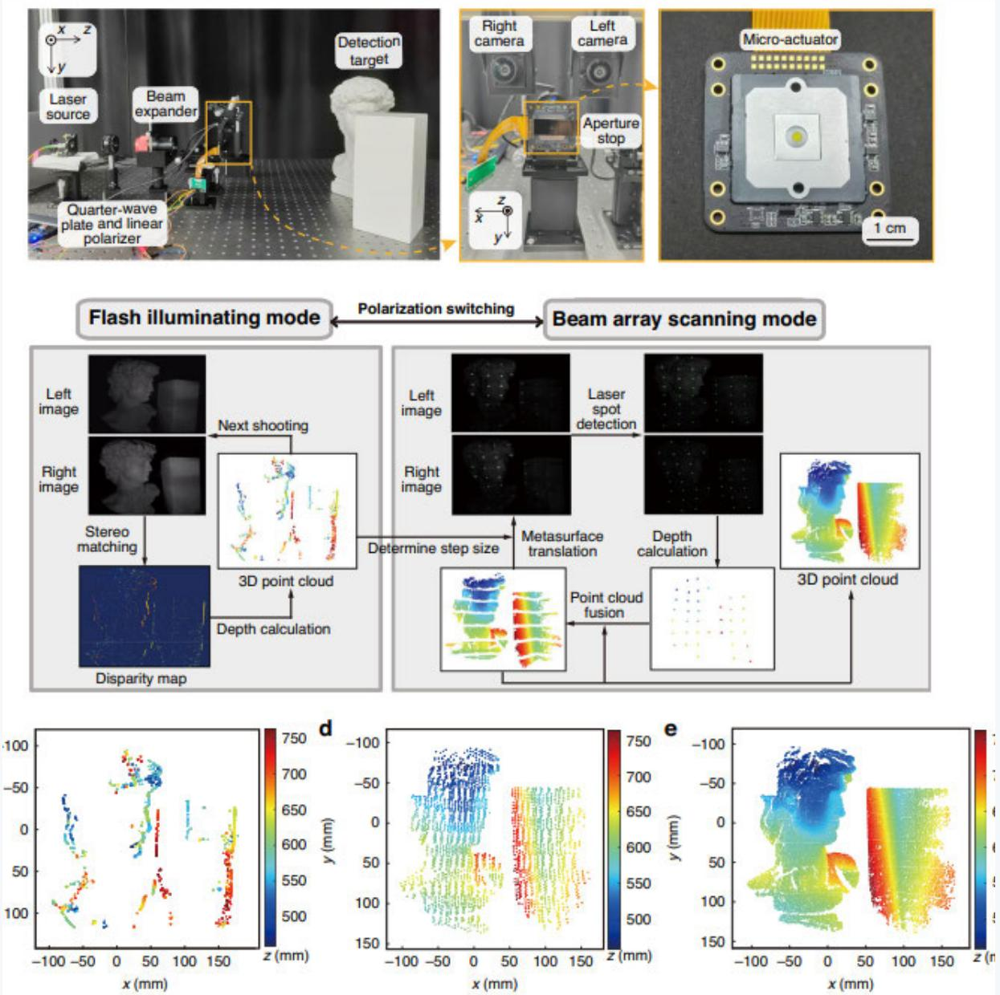

## 影响、风险和机遇管理

公司建立覆盖产品全生命周期的研发管理体系，通过分阶段的技术评审机制和生命周期管理流程，系统识别、评估及应对与技术创新相关的可持续发展影响、风险与机遇。

## 研发创新管理流程

## 识别与评估

持续跟踪 CMOS 图像传感器及显示驱动芯片领域的技术演进趋势，评估像素技术、工艺节点等变化对产品迭代的影响。  
定期审查内部 IP 积累与技术储备，确保研发资源与产品规划相匹配。  
系统识别技术障碍、市场接受度、供应链变动等潜在风险，评估风险发生可能性和对项目进度、成本的影响。

## 管理与优化

针对不同问题建立专项跟进机制，组织技术攻关优化工艺方案，提升产品良率与可靠性。  
加速核心业务向高端化转型，积极布局车载芯片、AR/VR 等新兴应用场景，把握市场升级带来的增长机遇。  
依托项目经理负责制建立灵活高效的决策流程，快速识别、响应风险量产条件、盈亏平衡点等关键指标，确保产品从开发到量产平稳过渡

## 技术研发管理

技术研发

项目管理

## 产品规划

技术

平台开发

产品规划

## 生命周期管理

生命周期管理

产品试产

产品验证

产品设计

## 产品开发

产品定义

公司以 GB/T29490-2023 知识产权合规管理体系等为基础，围绕 CMOS 图像传感器、显示驱动芯片等核心业务，建立体系化的知识产权侵权防范体系，明确法务、研发、供应链等跨部门在风险防控中的职责分工，配套侵权风险监测、预警及应急处置流程，通过常态化的合规管理保障核心技术的自主可控与市场活动的有序开展。

## 知识产权管理流程

## 识别与评估

在产品立项阶段系统识别潜在侵权风险，评估技术方案的知识产权壁垒。  
研发过程中持续监测竞品专利布局及行业技术动态，评估设计变更对项目进度及技术指标的影响。

## 管理与优化

形成“识别—处置—复盘”的闭环管理机制。  
严格审核第三方技术引入及供应链环节的知识产权权属，确保IP来源清晰、授权合规，从源头降低侵权风险。  
定期开展知识产权专项培训，将 IP 风控要求融入各岗位业务流程，提升全员风险意识和专业能力，保障产品在全球市场的自由实施。

## 指标与目标

截至报告期末 公司在核心领域持续积累国内及国际专利技术创新成果不断丰富，上述成果为公司在CMOS图像传感器显示驱动芯片等领域的持续升级提供了支撑。未来，公司将继续坚持自主创新的研发模式，持续保证研发投入，以面向行业前沿的创新技术和市场需求为研发导向，丰富核心技术 提升现有产品的性能与品质 同时不断开发新产品，新工艺。

## 关键绩效

累计国内发明专利授权 344344 项、实用新型 217 项，国际专利授权 1717 项

<table><tr><td>指标</td><td>单位</td><td>2025年表现</td></tr><tr><td>研发投入</td><td>万元</td><td>97,347.997</td></tr><tr><td>研发投入占主营业务收入比例</td><td>%</td><td>12.51</td></tr><tr><td>研发人员总数</td><td>人</td><td>1,074</td></tr><tr><td>研发人员占员工总人数比例</td><td>%</td><td>45.43</td></tr><tr><td>累计获得专利数量</td><td>件</td><td>578</td></tr><tr><td>其中:累计获得发明专利数</td><td>件</td><td>360</td></tr></table>

<table><tr><td>指标</td><td>单位</td><td>2025年表现</td></tr><tr><td>报告期专利申请数</td><td>件</td><td>233</td></tr><tr><td>其中:发明专利申请数</td><td>件</td><td>225</td></tr><tr><td>报告期专利授权数</td><td>件</td><td>75</td></tr><tr><td>其中:发明专利授权数</td><td>件</td><td>72</td></tr></table>

<table><tr><td>议题</td><td>2025年目标</td><td>2025年主要进展</td></tr><tr><td rowspan="4">研发</td><td>·迭代高像素产品性能,增强核心竞争力,提升市场份额、扩大领先优势·持续投入高性能CIS研发,为客户提供创新性、多样化解决方案,以精确的图像感知赋能智能</td><td>·全球首发 $0.64\mu m$ 与 $0.8\mu m$ 两款单芯片5000万像素手机应用图像传感器,进一步完善高像素产品多规格布局,灵活满足不同手机影像的多样化需求·截至12月5日,本年度3200万及5000万像素图像传感器产品累计出货超1亿颗· $0.61\mu m$ 、 $0.7\mu m$ 、 $1.0\mu m$ 多规格5000万像素产品被广泛应用于多个品牌客户的前后主摄·新一代5000万像素图像传感器产品收到国际知名品牌ODM订单</td></tr><tr><td rowspan="2">围绕非手机应用技术需求进行研发设计优化,包括优化读出电路噪声、极低功耗等技术</td><td>发布首颗大靶面黑光全彩图像传感器GC8602,具备优异黑光全彩成像能力,搭载自研低功耗技术,功耗低于业内同规格产品,集成DAGHDR实现单帧高动态输出</td></tr><tr><td>推出新一代超低功耗传感器GC4053,搭载升级低功耗技术,全尺寸30fps输出时功耗仅87mW,较业内同规格产品降低约35%-40%</td></tr><tr><td>关注新兴市场发展,积极推进相关技术研发与产品落地</td><td>·推出高性能500万像素图像传感器GC5605,专为AIPC应用打造,具备高分辨率、高动态、超低功耗特性·带来车规级图像传感器系列产品及高可靠封装工艺,可满足车载应用对安全性与可靠性的严苛要求·创新高性能CIS封装技术TCOM,专为空间敏感应用研发,模组尺寸较COB封装缩小10%,具备显著成本优势和更高背压可靠性</td></tr><tr><td>知识产权</td><td>在持续提升核心竞争力的同时,完成科技创新成果的合理保护与高效转化,为公司高质量发展提供有力支撑。</td><td>·围绕CMOS图像传感器、显示驱动芯片等关键技术构建专利组合,形成全方位IP保护体系·申请发明专利225件,实用新型专利8件,软件著作权18件·授权发明专利72件,实用新型专利3件,软件著作权18件</td></tr></table>

## 产品质量管理

格科微严格遵守《中华人民共和国产品质量法》等法律法规，构建全面系统的产品质量管理体系，依托质量中心的统筹管理与数字化管控系统，公司对产品各环节进行有效监控与风险识别，确保产品在全生命周期内保持高可靠性与稳定性。同时，围绕成品良率、交付准时率及客户满意度等关键绩效指标，通过数据化分析与持续改进机制，推动产品品质稳步提升。

## 治理

公司建立覆盖产品全生命周期的质量管理治理架构，设立质量中心，定期向管理层及董事会汇报质量工作进展，确保质量战略与目标有效落地。公司导入项目管理 PMS 系统对产品生命周期进行管控，依据《IATF16949 汽车质量管理手册》《有害物质过程管理手册》等内部制度，明确质量方针与目标，细化各职能部门质量职责，将制度规范与质量标准融入研发，生产，供应链等日常运营各环节。

截止报告期末，公司通过

ISO9001:2015、ISO14001:2015、ISO45001:2018、IECO OC080000:2017 及IATF16949:2016 管理体系认证保障质量管理体系的有效性与合规性。

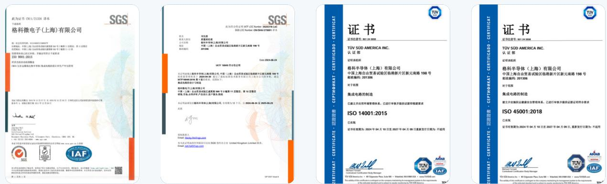

## 战略

公司以质量为战略核心，将质量管理作为应对市场变化与业务风险的重要支撑。通过建立严格的质量管理体系，系统识别和评估产品从开发到交付全过程中的潜在风险，确保质量要求融入战略规划与日常运营，增强公司对外部环境的适应能力。在供应链管理方面，引入 PSCM、SRM 及孤波系统，强化供应商质量管控与产品追溯能力，形成从物料采购到成品交付的端到端质量闭环。每年开展质量管理培训，推动产品质量的稳步提升与改进机制的常态化运行。

## 案例 体系深化专项改进——2025年度质量文化建设与技能提升实践

2025 年，公司围绕质量管理体系的深化应用，组织开展 ISO9001 体系及 IATF16949 六大质量工具等专项培训，强化技术及管理骨干对标准工具的理解与实操能力。

举办年度 CIT 大赛，鼓励跨部门团队围绕生产瓶颈、良率提升等实际课题开展攻关，推动改进成果在一线落地。通过培训与竞赛的有机结合，持续夯实质量管理的技术基础，为产品质量优化提供支撑。

## 影响、风险和机遇管理

公司建立覆盖产品全流程的质量风险识别、评估与管理机制，将质量管控贯穿于供应、生产、流通及售后各环节，系统应对与产品质量相关的可持续发展影响、风险与机遇。

产品质量管理流程

<table><tr><td>风险识别</td><td>依托数字化追溯系统与自动化检测手段,对全供应链各工艺节点开展常态化质量监测。所有产品均执行可靠性验证,从源头识别潜在质量风险。设置质量异常自动报警机制,对生产及检测过程中的异常数据进行实时监控,确保风险早发现、早预警。</td></tr><tr><td>风险评估</td><td>针对报警或检测中发现的质量异常,公司启动标准化评估程序,由专业评估团队对问题进行深入分析和影响判定。依据评估结论,对异常批次的风险等级、影响范围及处置方式进行界定,为后续决策提供依据。</td></tr><tr><td>风险管理与应对</td><td>制定严格的质量异常处理程序,对经评估确认的质量问题实行100%闭环处置。依托完备的产品追溯系统,实现从供应到售后的全生命周期信息可查,在出现质量问题时能够迅速锁定源头、查明原因、明确责任,提升风险应对效率与产品可靠性保障能力。</td></tr></table>

## 指标与目标

公司围绕质量管理，设定年度可持续发展相关目标，涵盖成品良率、交付准时率及客户满意度三项核心指标。针对各项指标，公司明确计算方式与监控频次，并定期采集与跟踪目标完成情况。在此基础上，将总目标分解至各职能部门及核心业务环节，形成分层级的目标管理体系。确保目标可落地、可衡量，支撑公司运营效率与客户服务能力的持续提升。

上述目标的持续推进与有效落实，为公司赢得客户广泛认可。2025年度，公司荣获客户“优秀质量奖”、“最佳交付奖”及“最具价值合作伙伴奖”等多项荣誉，体现了合作伙伴对公司产品质量、交付能力及综合服务水平的充分信任与肯定。

<table><tr><td>指标</td><td>单位</td><td>2025年目标</td><td>2025年表现</td></tr><tr><td>产品召回次数</td><td>次</td><td>相较于上一年降低15%</td><td>相较于上一年降低20%</td></tr><tr><td>重大安全事故</td><td>次</td><td>0</td><td>0</td></tr><tr><td>成品良率</td><td>%</td><td>95%</td><td>95%</td></tr><tr><td>交付准时率</td><td>%</td><td>100%</td><td>100%</td></tr><tr><td>客户满意度</td><td>分</td><td>85</td><td>91</td></tr></table>

## 2025年提升质量举措

增加产品全可靠性评估测试项目，完善评估机制；  
搭建公司车载产品 AECQ100 可靠性评价测试标准，助力车载产品业务的拓展；  
制定 FAB、封装供应商管控要求文档，细化对工艺细节、产品合格率等要求，提高对供应链的管控力度。

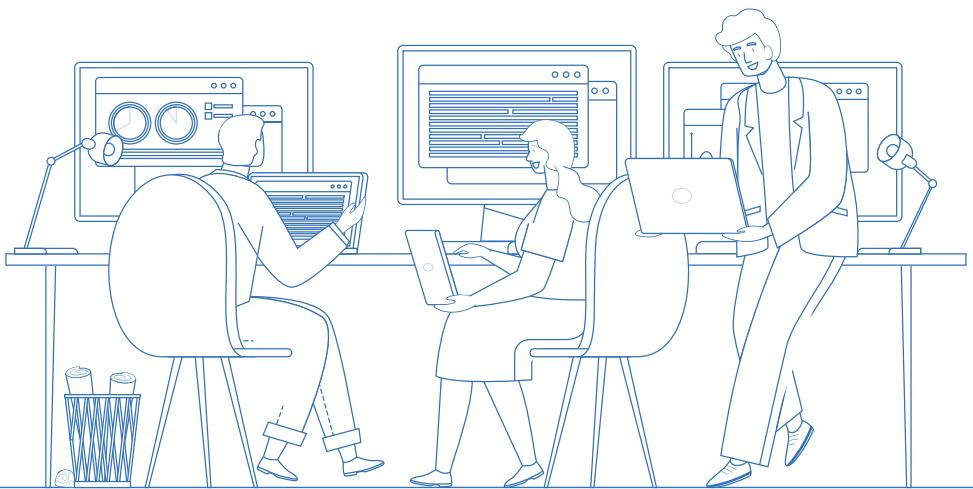

natural_image

Line drawing of three people working at computer terminals with laptops, no text or symbols present

## 客户权益管理

格科微构建了高效的客户投诉处理流程和多元化的客户交流机制，致力于提升客户满意度并增强客户信任，为建立长期稳定的合作关系奠定坚实基础。通过系统化的投诉处理和多层次的沟通渠道，快速响应客户需求，不断优化服务质量。

## 客户权益管理体系

以客户为关注点，公司制定覆盖客户投诉与权益保障的管理制度，明确客诉处理流程及响应时效，确保客户诉求得到及时回应与有效解决。

## 客诉处理流程

## 信息接收与响应

通过电话、微信、邮件等渠道接收客诉  
与客户沟通背景信息，明确解决方案

## 初步分析

不良品初步分析  
更新初步分析报告及下一步计划

## 深度分析

更新调查报告与改善计划  
与客户沟通是否需要进一步进行晶圆级分析

## 效果确认与结案

实行改善措施并确认是否有效  
同步更新报告，直至问题关闭

## 提升客户服务质量

2025 年，公司持续提升客户服务质量，通过组织售后技能培训、跨部门协同交流以及与客户定期开展品质技术交流，增强团队专业能力与响应效率。以开放协同的态度，与客户共同攻坚技术难点，有效管控“三新三高”风险，确保关键质量指标稳定达标。团队高效响应客户反馈，积极推动技术规范共建，赢得客户广泛认可。

## 案例 持续高质量交付，荣获OPPO优秀质量供应商

2025 年，格科微单层 BSI 高像素 50M GC50F6 顺利实现量产，临港 Fab 厂产品保持质量稳定。在项目合作过程中，格科微团队以专业、开放的态度协同攻坚，针对“三新三高”实施策略性管控，有效保障了产品表现。

凭借扎实的质量管理体系与高效的问题响应机制，格科微产品在 OPPO 各项质量数据指标中达成既定目标：实现 0 次上线重大制程异常、0 次市场批退，多项关键质量指标均稳定达标。基于持续的优质交付与可靠表现，格科微连续两年获评 OPPO 摄像头组“优秀质量供应商”。

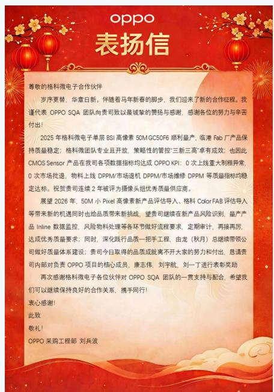

text_image

OPPO
表扬信

尊敬的格科微电子合作伙伴
岁序更替，华章日新。伴随着马年新春的脚步，我们迎来了新的合作征程。我谨代表 OPPO SQA 团队向贵司致以最诚挚的赞扬与感谢，感谢各位的努力与辛苦付出！

2025 年格科微电子单层 BSI 高像素 50M GC50F6 顺利量产，临港 Fab 厂产品保持质量稳定；格科微团队专业且开放，策略性的管控“三新三高”卓有成效；也因此 CMOS Sensor 产品在我司各项数据指标均达成 OPPO KPI：0 次上线重大制程异常，0 次市场批退，物料上线 DPPM/市场退机 DPPM/市场维修 DPPM 等质量指标均稳定达标。祝贺贵司连续 2 年被评为摄像头组优秀质量供应商。

展望 2026 年，50M 小 Pixel 高像素新产品评估导入、格科 Color FAB 评估导入等带来新的机遇同时也给品质带来新挑战，望贵司继续在新产品风险识别，量产产品 Inline 数据监控、风险物料处理等各环节做好流程要求，定期审计，再接再厉，达成优秀质量要求；同时，深化践行品质一把手工程，由龙（秋月）总继续带领公司做好质量体系建设；贵司今日取得的品质成就离不开大家的努力和付出，恳请贵司内部对负责 OPPO 项目的核心成员、康志伟、刘宇就、刘一丁进行表彰奖励

再次感谢格科微电子各位伙伴对 OPPO SQA 团队的一贯支持与配合，希望我们可以继续保持良好的合作关系，携手同行！

衷心感谢！

此致

敬礼！

OPPO 采购工程部 刘兵波

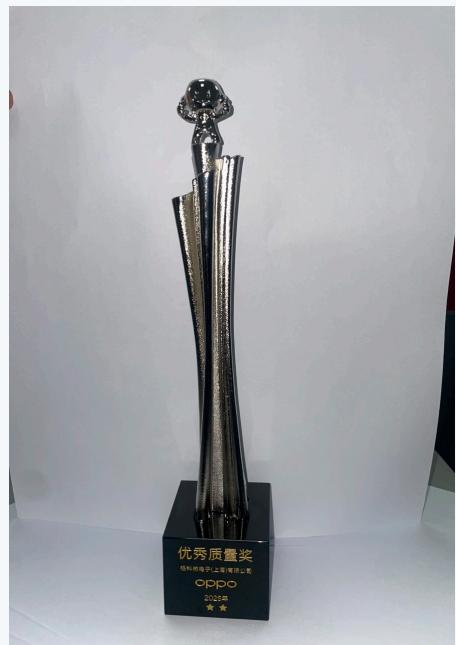

text_image

优秀质量奖
OPPO
2022年
食·食

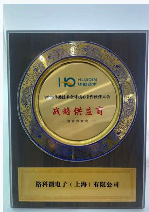

text_image

HUAQIN
华融技术
2019华融技术全球核心合作伙伴大会
战略供应商
G科微电子（上海）有限公司

HQ战略供应商

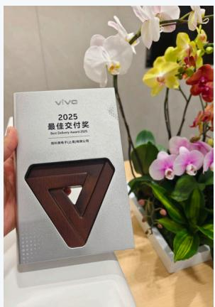

text_image

vivo
2025
最佳交付奖
vivo 2025
Best delivery award 2025
新世界电子上海有限公司

vivo最佳交付奖

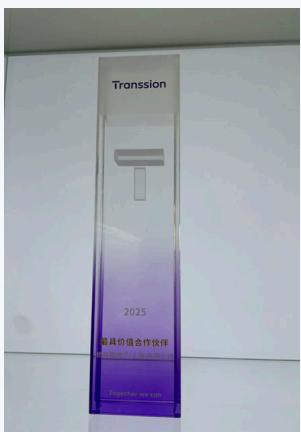

text_image

Transsion
2025
最具价值合作伙伴
易得利货币/上海国富信托
Sagetian 2025

Transsion 最具价值合作伙伴

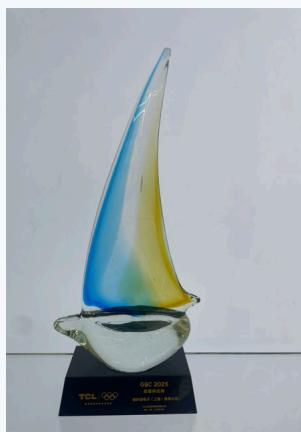

natural_image

TCL 2023 Olympic medal sculpture on a black base (no visible text or symbols on the sculpture itself)

TCL战略供应商

## 供应链管理

格科微供应链管理注重高效协同与可持续发展。公司建立严格的供应商管理体系，筛选优质合作伙伴并定期评估绩效，强化风险管理，提前识别并应对潜在问题，保障供应链安全。此外，积极推动可持续供应链建设，践行负责任采购，降低环境影响。通过定期培训与交流，提升供应商能力，促进供应链整体升级，为公司业务发展提供坚实保障。

## 治理

公司建立覆盖供应商全生命周期的可持续供应链治理架构与内控管理制度，多部门协同分工，形成导入、评审、履约、改善、淘汰与重启的闭环管理机制，系统性识别、管控供应链相关可持续发展影响、风险与机遇，保障供应链合规稳健、绿色可持续发展。

## 战略

公司通过建立系统化的供应链管理流程，将多维度风险与机遇纳入整体战略，推动可持续供应链建设。公司定期识别和评估供应链中的关键影响因素，包括原材料合规、供应商环境表现、社会责任履行及市场波动等，动态优化管理策略，确保供应链体系具备应对外部环境冲击与市场变化的韧性。

## 绿色采购导向

推动供应商采用环保原材料进行产品制造，从源头降低产品全生命周期的环境风险。

## 尽职调查机制

严格开展供应商及承包商尽职调查，全面评估其运营对环境与社会的实际影响。供应商评审体系中引入环境管理能力、安全生产措施、社会责任履行等指标，通过审核清单进行量化评价。

公司要求供应商签署系列文件，将负责任采购要求嵌入合作全流程，与合作伙伴共同构建绿色、透明、可持续的供应链体系。

## 《产品有害物质禁用限制规格书》

明确承诺不采购、不使用、不销售冲突矿产，并对冲突矿产进行了明确定义，要求供应商严格遵守不使用冲突矿产的规定。

## 《冲突矿产调查表》

对自营工厂、代工制造商、经销商等生产和销售环节的相关方进行全面调查，确保供应链中不存在冲突矿产。

## 《贸易安全管理告知书》

从场所安全、进入安全、人员安全、商业伙伴安全等多个维度确保供应链的各个环节符合海关 AEO 高级认证的要求，提升整体贸易安全水平。

## 《供应商不使用有害物质协议》

公司与供应商签订《供应商不使用有害物质协议》，并定期收集产品的环保测试报告，以确保所有产品均符合关于有害物质的国际标准。

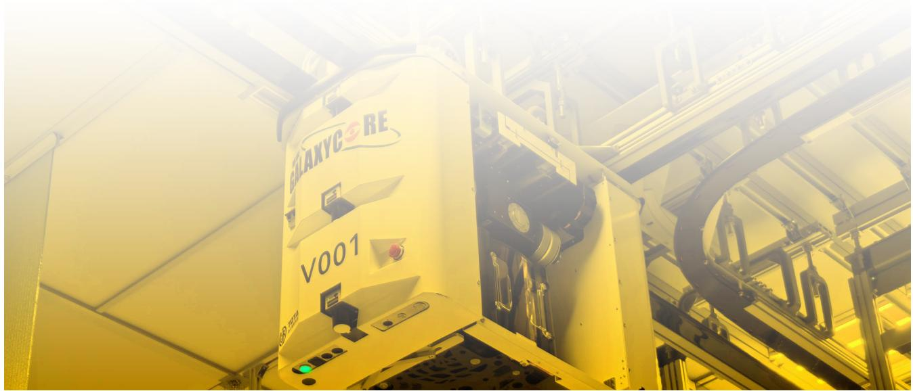

natural_image

Industrial machine labeled 'V001' in a factory setting, no visible text or symbols on the machine itself.

## 影响、风险和机遇管理

公司建立覆盖识别、评估、监测与管理的全流程供应链风险管控体系，系统应对可持续发展相关影响、风险与机遇。在管理工具方面，导入 PSCM、SRM 及孤波系统，强化供应链数字化管控与质量追溯能力。通过 Fab-Lite 模式构建“设计 -晶圆制造 - 特色封测”产业链布局，提升核心环节自主可控能力。

## 可持续供应链管理流程

<table><tr><td>导入</td><td>·公司针对不同类别供应商设置差异化准入机制;·组建多部门调查小组,从价格、技术、环保、品质等方面评估,确保供应商提供优质产品服务并履行社会责任。</td></tr><tr><td>考核</td><td>·构建全面的合格供应商审核与考核机制,结合现场审核与自评,依据《供应商审核表》《绩效考核表》等形成综评分,保障契合公司需求。</td></tr><tr><td>评价</td><td>·按照评估结果,将供应商划分等级;·等级结果直接作为供应商准入、淘汰及制定未来采购策略的重要依据,有效控制采购风险。</td></tr><tr><td>淘汰</td><td>·因不履行合同或采取非正当竞争手段而淘汰的供应商将拉入黑名单,永不录用。</td></tr></table>

## 保障供应链安全举措

## 原物料管控

所有原物料供应商均被纳入“供应商管理系统”，进行系统化管理和监控，确保原材料的质量与合规性。

## 信息安全保障

与供应商签订保密协议，明确保密责任、违约纠纷处理方式和索赔条款，确保合作中敏感信息不被泄露和不当使用

## 业务连续性管理

制定《业务连续性管理程序》，通过风险识别、评估、预案制定以及定期演习，在突发事件或危机时快速恢复业务运作，减少业务受影响程度，提升抗风险能力。

公司高度重视供应商廉洁建设，通过完善制度、加强监管等举措，致力于构建公平、公正、公开的合作环境，确保合作各环节廉洁规范，促进与供应商长期稳定、健康共赢的合作关系。

供应商廉洁建设

<table><tr><td>签署廉洁承诺</td><td>与供应商签订《供应商廉洁诚信承诺书》,明确要求供应商严格遵守法律法规,坚守廉洁诚信原则,坚决杜绝商业贿赂和不正当竞争行为。</td></tr><tr><td>规范内部管理</td><td>督促供应商及其工作人员不得向公司员工及其亲属提供任何形式的贿赂;要求供应商建立健全内部廉洁制度和监督机制,主动披露利益关系,积极配合公司开展廉洁检查。</td></tr><tr><td>设立举报渠道</td><td>公司设立专门举报渠道,鼓励各方积极举报不廉洁行为,构建起全方位的监督网络。</td></tr><tr><td>严格违规惩处</td><td>对于违反廉洁承诺的供应商,公司将采取中止合作、追究法律责任、要求赔偿损失等严厉措施,确保廉洁诚信理念贯穿合作始终,维护良好的商业环境。</td></tr></table>

## 指标与目标

公司将可持续发展要求系统融入供应商全生命周期管理。通过将 ESG 要求嵌入新供应商准入评估，从源头筛选符合可持续发展理念的合作伙伴，报告期内，公司推动供应商采用环保原材料进行产品制造，降低产品环境风险。依托定期稽核、绩效考核与动态分级，持续跟踪供应商目标达成情况。针对未达标供应商提供培训及改进建议，推动供应链整体水平提升。同时，依托数字化供应链管理系统，逐步实现目标完成情况的实时监控与数据追溯。

<table><tr><td>指标</td><td>单位</td><td>2025年目标</td><td>2025年表现</td></tr><tr><td>供应商年度评审完成率</td><td>%</td><td>100%</td><td>100%</td></tr><tr><td>《产品有害物质禁用限制规格书》签署率</td><td>%</td><td>100%</td><td>100%</td></tr><tr><td>《供应商不使用有害物质协议》签署率</td><td>%</td><td>100%</td><td>100%</td></tr><tr><td>冲突矿产调查覆盖率</td><td>%</td><td>100%</td><td>100%</td></tr><tr><td>指标1</td><td>单位</td><td></td><td>2025年表现</td></tr><tr><td>供应商数量</td><td>个</td><td></td><td>40</td></tr><tr><td>其中:按地区(中国内地)</td><td>个</td><td></td><td>35</td></tr><tr><td>按地区(港澳台及海外)</td><td>个</td><td></td><td>5</td></tr><tr><td>供应商本地化比例</td><td>%</td><td></td><td>87.50</td></tr><tr><td>签署供应商行为准则的百分比</td><td>%</td><td></td><td>90.00</td></tr><tr><td>开展供应商培训的次数</td><td>次</td><td></td><td>4</td></tr></table>

注1:本部分数据统计范围为公司主材供应商

## 行业共进

公司紧跟全球产业趋势，通过深度参与国际行业协会及高端技术论坛，汇聚上下游核心伙伴，精准洞察技术前沿与市场动态，驱动技术研发与战略布局协同创新。

## 案例 嘉景升格·善美盈科——2025格科微全球合作伙伴大会圆满举行

2025 年 10 月，格科微全球合作伙伴大会在浙江嘉善圆满举行。政府领导、国内外核心客户及产业链上下游合作伙伴代表齐聚一堂，共同回顾合作成果，展望未来发展。大会设立品质、服务、创新、成本、可持续发展及长期合作六大奖项，致敬过去一年中表现卓越的合作伙伴，充分彰显格科微与各方同心共进、共创共赢的紧密纽带。

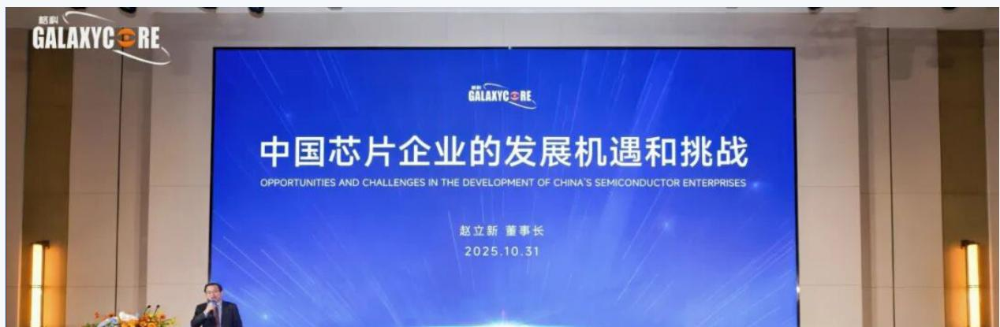

text_image

GALAXYCORE
中国芯片企业的发展机遇和挑战
OPPORTUNITIES AND CHALLENGES IN THE DEVELOPMENT OF CHINA'S SEMICONDUCTOR ENTERPRISES
赵立新 董事长
2025.10.31

## 案例 2025中国半导体行业协会集成电路设计分会理事会+ICCAD-Expo展览会

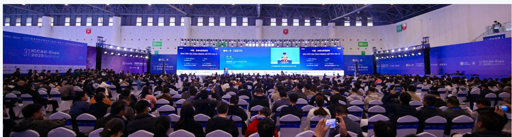

text_image

31ICCAD-Expo
2025
中国·北京·深圳
China's China Market will win the A1
中国·北京·深圳
China's China Market will win the A2
31ICCAD-Expo
2025
中国·北京·深圳
China's China Market will win the A3
31ICCAD-Expo
2025

## 公司参与的行业协会

上海市集成电路行业协会

浙江省半导体行业协会

中国半导体行业协会

中国集成电路设计创新联盟

上海市产业技术创新促进会

## 02

## 绿色运营守护环境

格科微以环境友好为准则，将环境因素全面融入业务运营，坚持绿色生产方式。公司构建完善的安全环境管理体系，严格管控废水、废气、废弃物，从源头防范环境风险，确保合规运营。公司持续强化能源与水资源管理，深入推进节能节水措施，加快绿色转型步伐，致力于实现企业高质量发展与生态环境保护的协同共进。

natural_image

Globe with reflective green and white lines, showing continents and oceans (no text or symbols)

## 本章节所涉及重要性议题：

环境合规管理  
污染物排放管理  
废弃物管理  
循环经济  
水资源管理  
能源管理

应对气候变化

## 本章节所响应 SDGs：

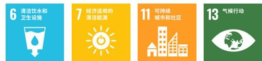

## 环境合规管理

格科微严格遵守《中华人民共和国环境保护法》《中华人民共和国水污染防治法》《中华人民共和国大气污染防治法》《中华人民共和国固体废物污染环境防治法》等环保相关法律法规、国家地方标准及行业相关规定，将可持续发展融入战略核心，通过技术创新与资源优化，携手利益相关方共建低碳未来。

## 治理

格科微建立了完善的环境管理架构与环境管理流程，将环境相关影响、风险与机遇的监督与管理职责明确落实到各层级。

在治理层面，CEO 对公司环保管理负全面领导责任，统筹战略部署与资源保障。EHS 部门作为统筹监督及日常管理机构，负责各厂区环境管理工作以及检查与指导。各部门依照“谁主管、谁负责”原则，协同推进环境管理目标落地，确保环境管理体系有效运行。

在内部制度层面，公司制定《环境因素识别与评价控制程序》《废弃物回收与处置管理制度》《环境保护管理制度》《危险化学品安全管理制度》《EHS法律法规标准规范管理程序》等专项制度，系统规范环境因素识别、废弃物管控、能源资源利用及合规性管理等关键环节，将环境管理要求深度融入日常运营。报告期内，公司修订《环境保护管理制度》，围绕废气收集与排放、废水产物信息、固废管理要求、环境监测因子及频次、在线监测规范等方面进行全面细化与补充，持续提升环境管理制度的系统性与可操作性。

## 战略

格科微以“引领行业绿色转型，成为环境管理与资源效率标杆企业”为战略愿景，围绕全生命周期环境管理、资源效率最大化及价值链协同三大使命，系统推进环境可持续发展工作。

公司致力于构建覆盖研发、生产、物流各环节的全生命周期环境管理体系，推动废弃物减量及资源循环利用，实现风险可控的绿色发展，逐步创建绿色工厂。在合规管理层面，公司以严格遵循中国环保法规为基础，对标国际ESG最佳实践，将环境合规要求融入战略决策与日常运营。

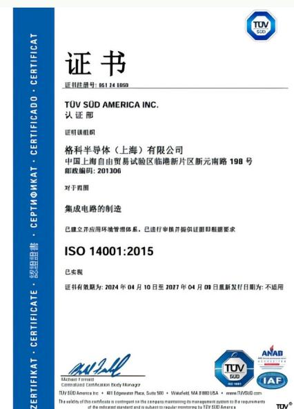

text_image

证书
证书注册号：961241892
TÜV SÜD AMERICA INC.
认证部
证明证组织
格科半导体（上海）有限公司
中国上海自由贸易试验区临港新片区新元南路198号
邮政编码：201306
对于范围
集成电路的制造
已建立并应用环境管理体系，已进行审核并提供证明和根据要求
ISO 14001:2015
已实现
证书有效期为：2024年04月10日至2027年04月09日重新发行日期为：不适用
Certification Certificate of Certification Authority
TÜV SÜD America Inc. • BY Logovar Place, Suite 90 • Wakefield MA 88816CA • www.tUVSUD.com
This validity of this certificate is common as the company maintaining an management system to the requirements of the material standard and to submit to regular monitoring to TUV SÜD America

格科半导体已建立了ISO14001：2015环境管理体系，并取得了认证。

## 法规领先

严格遵循中国环保法规要求，对标 国 际 ESG 最佳实践，将合规要求转化为管理优势。

## 气候行动

制定减碳目标，实施节能节水与可再生能源替代战略，稳步降低运 营 碳 排 放 强度。

## 循环创新

开发绿色工艺，促进材料闭环利用与污染源头防控，推动废弃物减量。

## 伙伴赋能

通过供应商绿色认证与客户协同设计，提升全供应链环境表现。

## 透明治理

采用智能监测平台与第三方审计相结合的方式，确保环境绩效持续优化与公开透明。

## 影响、风险和机遇管理

公司持续健全环境风险管控体系，建立覆盖环境风险全流程的识别、评估与管控机制，将环境管理要求融入日常运营各环节，系统应对环境相关影响、风险与机遇。

相关措施包含且不限于：

格科半导体于2025年根据《企业事业单位突发环境事件应急预案备案管理办法（试行）》等文件要求，更新了环境应急预案并完成备案。  
格科半导体购买环境污染责任保险，建立并落实责任保险机制，抵御污染事故带来的经营风险，承担社会责任。  
格科微浙江建立了完善的环境风险管理体系，每年定期开展环境因素识别，所有扩建项目均依法进行环境影响评价，从源头识别和预防环境风险，并根据已备案的《突发环境事件应急预案》定期组织演练以确保有效应对。

环境合规管理流程

<table><tr><td>风险识别</td><td>制定《环境因素识别与评价控制程序》及配套识别评价表,常态化开展环境因素识别,确保各项环境风险早发现、早处置。</td></tr><tr><td>风险评估</td><td>对识别出的环境因素进行分级评价,确定重点管控对象,为风险应对提供依据。</td></tr><tr><td>监测管控</td><td>定期开展外部环境审计与年度环保监测,委托有资质第三方进行环保检测,查找管理漏洞并及时补救;每日对环保设施运行情况进行监督管理,确保污水、废气、噪声达标排放;严格按照排污许可证要求开展环境监测,确保污染物排放量及浓度符合总量及标准要求。</td></tr><tr><td>应急管理</td><td>各厂区编制突发环境事件应急预案并向当地政府备案;对环境风险事件实施分级管理,制定针对性预防与应急措施;定期开展应急管理培训与演练,提升快速、有序、有效的应急响应能力</td></tr><tr><td>培训赋能</td><td>定期开展环境管理培训,覆盖环保法律法规、岗位环境操作规程、污染物控制要点等内容。新员工入职环保教育覆盖率达100%</td></tr></table>

案例 《CMP&DIFF 火灾事故应急演练》《ETCH&WET 气体泄漏事故应急演练》

报告期内开展《CMP&DIFF 火灾事故应急演练》《ETCH&WET 气体泄漏事故应急演练》，演练过程无遗漏环节，参演人员熟练运用救援器材，基本达成演练目的，并对不足项提出改善措施。

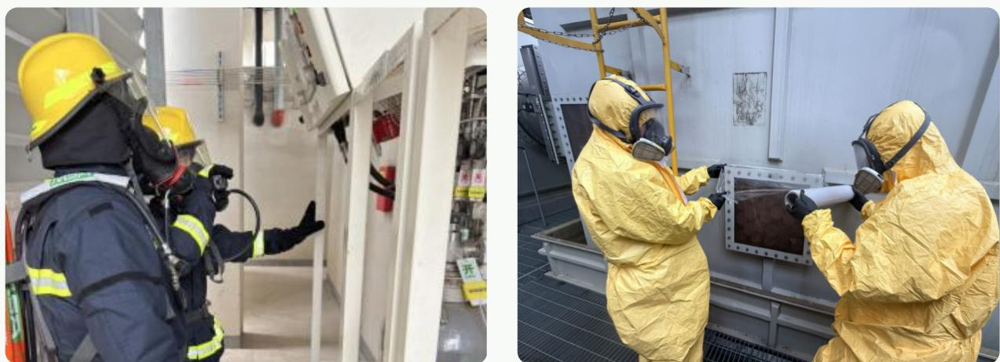

## 指标与目标

公司围绕环境管理设立量化目标，由 EHS 部门牵头定期监测与评估目标进展及管控措施成效，确保环境管理体系有效运行。同时，积极规划将环保能源考核目标纳入管理层及各工厂绩效奖励机制，推动环境责任与经营绩效挂钩。

<table><tr><td>指标</td><td>2025年进展</td></tr><tr><td>污染物排放量不超过总量控制要求</td><td rowspan="3">各项目标已达成,报告期内,公司未发生环境违规事件,未受到环境相关行政处罚。</td></tr><tr><td>无重大环境污染事件发生</td></tr><tr><td>固体废物100%合规处置</td></tr></table>

natural_image

Aerial view of a lush green forest with misty valleys, no visible text or symbols.

## 污染物排放管理

格科微涉及生产制造的单位包括格科半导体（上海工厂）以及格科微浙江（嘉善工厂）其中格科半导体是上海市水环境重点排污单位、环境风险重点监控单位，每年依法公开环境披露信息，2025 年度所有污染物排放均符合国家及地方排放标准，第三方检测数据和在线监测数据均显示稳定达标，未发生超标排放情况，污染物排放符合总量管理要求。格科微浙江是排污登记管理单位，2025年度所有污染物排放均符合国家及地方排放标准，第三方检测数据均显示稳定达标，未发生超标排放情况。

## 废水管理

格科微严格遵循《中华人民共和国水污染防治法》《污水综合排放标准》及运营所在地的法律制度要求，将废水按源头和成分进行分类管理同时实施二级废水处理流程，提升废水处理质量减少废水排放的负面环境影响。

<table><tr><td>类型</td><td>污染物</td><td>单位</td><td>格科半导体排污许可中允许排放量</td><td>格科半导体2025年披露排放量</td><td>符合性</td></tr><tr><td rowspan="4">废水</td><td>CODcr</td><td>t/a</td><td>288.72</td><td>72.578</td><td>☑</td></tr><tr><td> $NH_{3}-N$ </td><td>t/a</td><td>33.11</td><td>28.194</td><td>☑</td></tr><tr><td>TN</td><td>t/a</td><td>93.96</td><td>40.81</td><td>☑</td></tr><tr><td>TP</td><td>t/a</td><td>6.31</td><td>0.835</td><td>☑</td></tr></table>

## 废气管理

格科微严格遵守《中华人民共和国环境保护法》《中华人民共和国大气污染防治法》等法律法规的要求，不断完善废气管理制度体系，日常维护废气处理技术和设备，不断优化生产流程，确保每个生产环节产生的废气都经过达标处理后排放。

<table><tr><td>类型</td><td>污染物</td><td>单位</td><td>格科半导体排污许可中允许排放量</td><td>格科半导体2025年披露排放量</td><td>符合性</td></tr><tr><td rowspan="5">废气</td><td>颗粒物</td><td>t/a</td><td>7.33</td><td>1.50</td><td>☑</td></tr><tr><td> $SO_2$ </td><td>t/a</td><td>7.36</td><td>0</td><td>☑</td></tr><tr><td>NOX</td><td>t/a</td><td>19.569</td><td>3.61</td><td>☑</td></tr><tr><td>VOCs</td><td>t/a</td><td>14.98</td><td>3.04</td><td>☑</td></tr><tr><td>砷及其化合物</td><td>t/a</td><td>0.000519</td><td>0.000001</td><td>☑</td></tr></table>

## 废弃物管理

格科微严格遵循《中华人民共和国固体废物污染环境防治法》及相关法规要求，建立完善的废弃物管理制度，对废弃物产生、收集、转运、贮存、利用及处置等各环节实施全过程管控。公司构建分类清晰的废弃物管理体系，将废弃物划分为一般工业固体废物、危险废物及生活垃圾，并针对不同类别制定相应的处置路径。

公司依据《废弃物回收与处置管理制度》，建立了覆盖危险废物、一般工业固废及生活垃圾分类的全流程管理体系，明确 EHS、生产部门、仓库及采购等各方职责。危废台账、转移联单、处置单位资质及培训记录等文件存档备查。遵循“减量化、资源化、无害化”原则，公司与专业处置机构合作，持续跟踪处理流程，确保废弃物 100% 合规处置，最大限度降低环境影响。

## 一般废弃物

公司对一般工业固体废物实施分类收集与合规处置，交由合规回收商进行资源化利用。处置过程均符合环保法规要求，确保废弃物得到妥善处理。

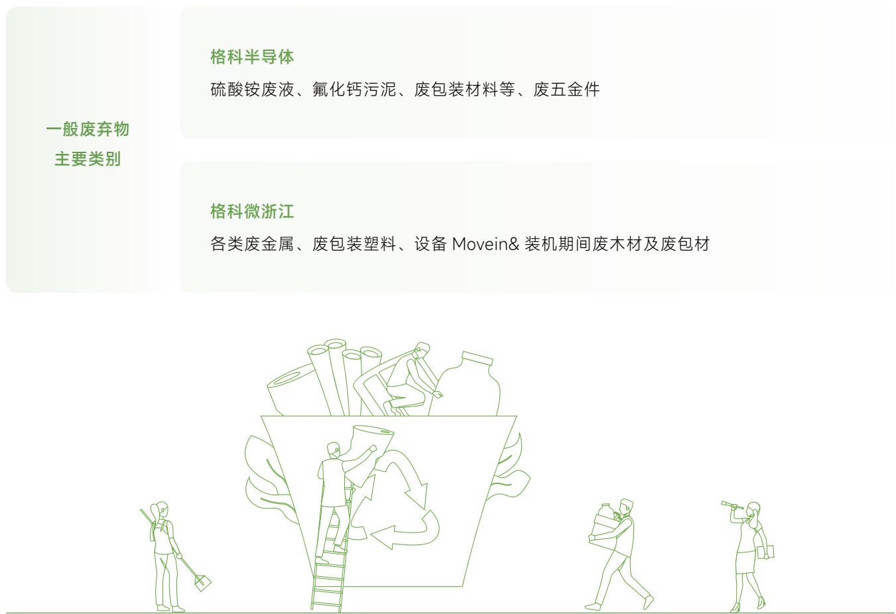

flowchart

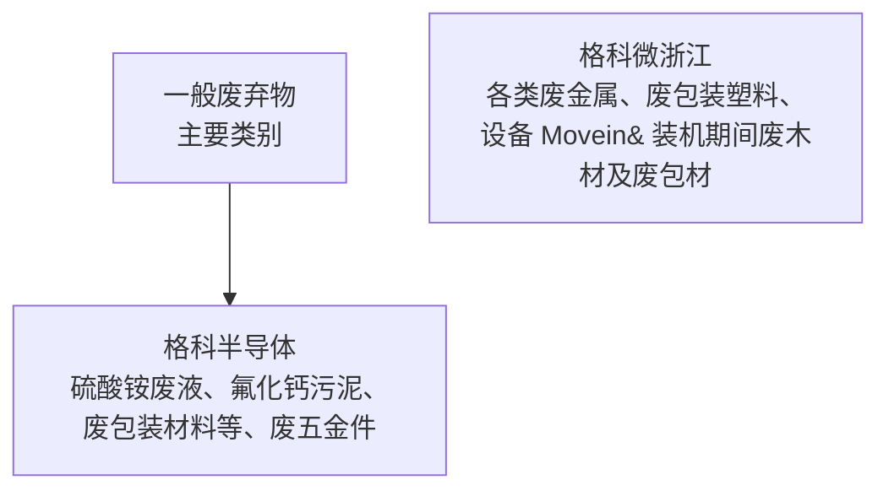
```mermaid
graph TD
  A["一般废弃物\n主要类别"] --> B["格科半导体\n硫酸铵废液、氟化钙污泥、废包装材料等、废五金件"]
  C["格科微浙江\n各类废金属、废包装塑料、设备 Movein& 装机期间废木材及废包材"]
```

## 危险废弃物

公司严格遵循国家危险废物管理要求，对危险废物实施全过程管控。所有危险废物均委托具备《危险废物经营许可证》的专业资质单位处置。严格执行《危险废物转移管理办法》执行转移联单制度，并按照《危险废物管理计划和台账制定技术导则》（HJ1259-2022）要求完成台账管控，按照危险废物备案要求完成年度制定危险废物管理计划和网上备案工作。危险废物暂存场所设立符合危险废物贮存污染控制标准（GB18597-2023）要求。

<table><tr><td></td><td>格科半导体硫酸废液、异丙醇废液、废光刻胶及稀释剂、硝酸废液、磷酸废液、铜制程废液、废试剂空瓶、含砷及沾染危险化学品物质、废过滤材料(废活性炭)、废矿物油、溶剂空桶、含铜污泥、COD仪表检测废液</td></tr><tr><td>危险废弃物</td><td>格科微浙江废胶渣、废酒精瓶、废酒精抹布、废水废活性炭、废交换树脂、废气废活性炭</td></tr></table>

此外，公司制定了《化学品管理办法》，明确了废弃危险化学品管理的组织架构及职责分工，规定了废弃化学品化安全管理控制体系及要求。

危险化学品管理体系

<table><tr><td></td><td></td><td></td><td></td></tr><tr><td>运输与拆卸
• 运输装卸应当遵循公司作业流程，要求相关驾驶人员持有相应证件。</td><td>储存
• 储存仓库应专门设置，分区、分类设置警示标示，仓库设施符合安防技防的要求。</td><td>使用
• 使用人员应配备和穿戴相应功能的PPE，现场应配备专门地急救药剂。</td><td>废弃
• 化学品废弃应分类、分区域包装，标识，按照危废种类处置。
• 废弃化学品进行委外危废处置。</td></tr></table>

## 运输与拆卸

## 储存

## 使用

## 废弃

格科半导体积极响应《关于进一步推进危险废物环境管理信息化有关工作的通知》（环办固体函〔2022〕230 号）等文件要求，2025 年全面落实危险废物信息化管理要求，配备电子地磅、电子标签等信息化管理设备。

格科半导体产生量（t）

<table><tr><td rowspan="9">危险废弃物</td><td>含铜污泥</td><td>125.15</td></tr><tr><td>废活性炭</td><td>4.21</td></tr><tr><td>含砷固废等沾染危险废物的废介质及废填料</td><td>37.23</td></tr><tr><td>溶剂空桶</td><td>131.54</td></tr><tr><td>仪表检测废液</td><td>0.52</td></tr><tr><td>硫酸废液</td><td>2,880.72</td></tr><tr><td>硝酸废液</td><td>812.77</td></tr><tr><td>其他危险废物</td><td>582.91</td></tr><tr><td>总计</td><td>4,575.04</td></tr><tr><td rowspan="7">一般固体废弃物</td><td>硫酸铵废液</td><td>2,608.70</td></tr><tr><td>含氟污泥</td><td>1,338.32</td></tr><tr><td>废木材</td><td>103.67</td></tr><tr><td>废纸板类</td><td>53.30</td></tr><tr><td>废塑料及废包装</td><td>37.31</td></tr><tr><td>其他废弃物</td><td>232.83</td></tr><tr><td>总计</td><td>4,374.13</td></tr></table>

格科微浙江产生量（t）

<table><tr><td rowspan="7">危险废弃物</td><td>废胶渣</td><td>0.06</td></tr><tr><td>废酒精瓶</td><td>4.71</td></tr><tr><td>废酒精抹布</td><td>4.57</td></tr><tr><td>废水废活性炭</td><td>20.53</td></tr><tr><td>废交换树脂</td><td>19.35</td></tr><tr><td>废气废活性炭</td><td>2.53</td></tr><tr><td>总计</td><td>51.75</td></tr><tr><td rowspan="5">一般固体废弃物</td><td>污泥</td><td>73.37</td></tr><tr><td>废塑料</td><td>1.03</td></tr><tr><td>废铁</td><td>7.37</td></tr><tr><td>纸板</td><td>7.56</td></tr><tr><td>总计</td><td>89.33</td></tr></table>

## 循环经济

循环经济作为一种可持续的发展模式，旨在实现资源的最大化利用和废弃物的最小化排放，减少对自然资源的依赖，缓解环境压力，促进经济的绿色增长。格科微积极践行循环经济理念，推动循环经济具体目标和计划，致力于在生产运营环节中融入资源回收再利用工艺，推动形成低碳、环保、高效的经济体系，为实现可持续发展目标贡献力量。

公司已建立完善的清洁生产管理体系，如与专业回收机构合作回收再利用可回收物，安全处置有害垃圾，以及通过生物降解或焚烧发电等方式处理湿垃圾和干垃圾，力求实现废弃物的减量化、资源化和无害化处理，为保护环境和促进循环经济做出积极贡献。

格科微在源头实施污染源减量优化项目，将废弃物减量化纳入生产运营管理策略中，通过提升原材料使用效率以减少废弃物的产生。具体措施包含且不限于：

将格科半导体产生的废硫酸与工业级浓硫酸按一定比例配比，作为合作企业钛白粉生产过程中的替代原料，实现废硫酸资源化再利用。  
格科半导体多种废液、污泥实现废物循环利用。  
格科半导体通过强制清洁生产审核评估报告，提出总计 12 个无 / 低费方案，无 / 低费方案实施率 100%，从原料节约、维护优化、管线改造、刻蚀液利用率提升等角度实现循环经济促进。

<table><tr><td>部分方案内容</td><td>实施效果</td></tr><tr><td>氮气消耗减量</td><td>1、节约部分原辅材料</td></tr><tr><td>提升干法刻蚀机台单位时间产能</td><td>2、减少部分废气污染物排放</td></tr><tr><td>设备维护频次优化</td><td>3、减少废水排放量</td></tr><tr><td>金属靶材寿命提升</td><td>4、减少危废产生量</td></tr><tr><td>供气管线改造</td><td>5、减少一般固废产生量</td></tr><tr><td>刻蚀液利用率提升</td><td></td></tr></table>

## 水资源管理

格科微严格遵循《中华人民共和国水法》不断完善各厂区的生产用水管理体系，每年年初根据企业运营情况制定各月用水计划及各季度水资源管理目标。为更好地管理水资源使用指标，持续开展多项废水回收项目，将原本可能对环境造成负担的废水转化为可再利用的水资源，降低对自然水体的污染风险，也实现了水资源的高效循环利用。

<table><tr><td>指标</td><td>单位</td><td>格科半导体</td><td>格科微浙江</td></tr><tr><td>取水总量</td><td>吨</td><td>2,872,322.00</td><td>450,575.00</td></tr><tr><td>新鲜水用量</td><td>吨</td><td>1,799,066.00</td><td>384,856.00</td></tr><tr><td>废水排放总量</td><td>吨</td><td>1,141,039.00</td><td>285,077.00</td></tr><tr><td>其中:工业废水排放量</td><td>吨</td><td>1,112,110.00</td><td>127,395.00</td></tr><tr><td>生活废水排放量</td><td>吨</td><td>28,929.00</td><td>15,957.00</td></tr><tr><td>工业废水回收量</td><td>吨</td><td>1,073,256.00</td><td>65,719.00</td></tr><tr><td>工业废水利用量</td><td>吨</td><td>1,073,256.00</td><td>65,719.00</td></tr><tr><td>水循环与再利用率</td><td>%</td><td>37.37</td><td>14.59</td></tr></table>

上海工厂结合清洁生产审核工作，对公司进行了全面排摸并研究试验论证节水及可回用水环节，提出了水资源利用优化方案，包括（1）CMP和DIFE机台待机状态下超纯水用量调整（2)回用清洗工艺中超纯水冲洗废水和机台启用前后超纯水冲洗废水。

## 2025 年关键绩效

Y 格科半导体完成臭氧废水的回收利用，回收量 73,000 73,000 吨 / 年。  
1 格科微浙江浓水 RO、回收水 RO、仪表取样水回收利用 吨 / 年。65,719

## 案例 臭氧废水回收利用

针对厂区机台运行特点，公司开展臭氧废水水质检测与工艺方案研讨，克服机台工艺波动大、臭氧强氧化性强等技术难点。该项目实施后，每日回收水量约 220 立方米，推动工厂水回收率提升，每年产生经济效益超 40 万元，是公司循环经济与节水降本相结合的典型实践。

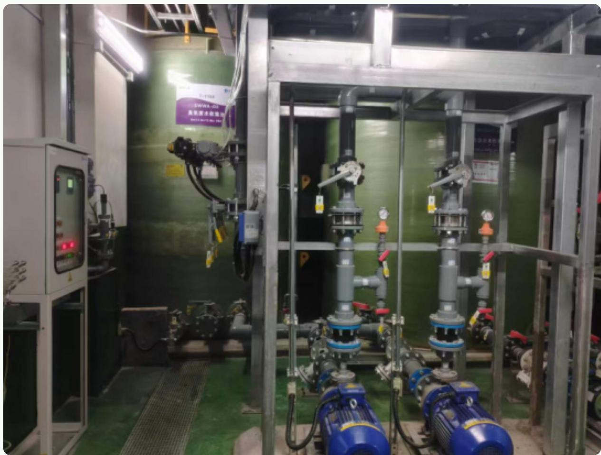

natural_image

Industrial water treatment facility with valves and piping (no visible text or symbols)

natural_image

Line drawing of a water pump and forest with clouds and rain, no text or symbols present

## 能源管理

格科微执行“合规经营，科学管理，优化运行，持续改进”的能源方针。承诺遵守能源相关的法律法规及其他要求；确保能源绩效提升所需的人力、财力、信息等各项资源得到有效支持；合理采购和使用节能产品和服务；积极挖掘节能潜力，实施能源管理方案，实现目标和能源指标，持续提升能源绩效；持续改进能源管理体系。

## 合规经营

严格遵守国家及地方的能源法律法规、行业标准，确保所有能源相关活动合法合规。

## 科学管理

将科学的管理方法和工具应用到能源管理的各个环节，确保公司的能源策划、支持、运行、采购、设计、监测和改进等管理活动得到良好开展。

## 优化运行

通过优化运行模式、实施技术改造，提升能源利用效率，改进能源绩效。

## 持续改进

秉持合规经营的理念，通过持续的科学管理和运行优化，不断改进公司能源管理体系和能源绩效。

公司根据 GB/T23331-2020《能源管理体系要求及使用指南》（IDT,ISO50001:2018）和 RBT101-2013《能源管理体系电子信息企业认证要求》制定了《能源管理体系管理手册》，并落实执行。

格科半导体通过落实强制清洁生产审核评估报告中提出的总计 12 个无 / 低费方案，结合清洁生产审核工作计划实施节能改造，包括：空调水系统一次泵变频改造；MAU 加湿泵变频改造和增加水源热泵替代锅炉燃气。

报告期内，格科半导体获得能源管理体系认证证书，建立的能源管理体系符合标准：

GB/T23331-2020/1SO50001:2018能源管理体系要求及使用指南；RB/T 101-2013 能源管理体系电子信息企业认证要求。

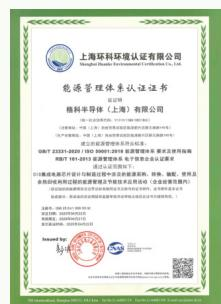

## 案例 行业创新——MAU 加湿泵变频改造项目

报告期内，格科半导体针对 MAU（新风处理机组）加湿泵实施变频改造。项目团队通过跨行业调研，在确保夏季 AMC（气态分子污染物）去除效率与冬季加湿效果不受影响的前提下，对 2 台加湿泵加装变频器，对运行频率进行优化。此项行业首创性改造使单台设备日节电量达 530KWh，年产生经济效益逾 80 万元，实现了工艺稳定与节能降本的双重突破，为半导体行业能效管理提供了新的实践范例。

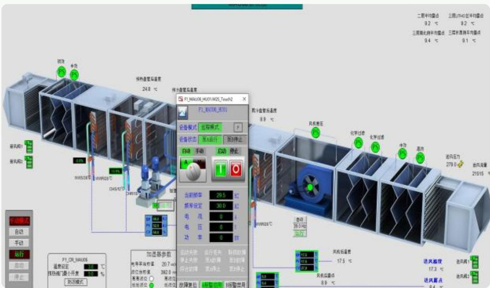

text_image

二层平均温点
9.2 ℃
三层JTH40处平均温点
8.2 ℃
三层南侧平均温点
9.4 ℃
三层南侧侧平均温点
9.1 ℃
预冷盘管后温度
24.8 ℃
预冷盘管后温度
F1_MA06_HU01MA25_Teeh2
F1_MW06_5X01
合器模式  运行模式
设备状态 家A运行 防止停止
控制 手动 启动 停止
当前频率 29.5 红
频率设定 30.0 红
电流 0
电压 0
功率 0
电动失效率  直行失效率 联锁故障
停上失效  家A的停
停合的增  二次停止  率的停止
故障复位  初步停用  初步停用
风机压力
279 B
台风容量
21615
自动
手动
运行
启动
停止
P1_CR_MA06
温度设定  2.0 ℃
预热阀门最小开度  7.0 %
防冻模式
加湿器参数
电导平衡绝对值  20.7 μs
额位当转速  382.0 m/s
高高限位 ○ 高高限位 ○ 高高限位 ○ 高高限位 ○ 高高限位 ○ 高高限位 ○ 高高限位 ○ 高高限位 ○ 高高限位 ○ 高高限位 ○ 高高限位 ○ 高高限位 ○ 高高限位 ○ 高高限位 ○ 高高限位 ○ 高高限位 ○ 高高限位 ○ 高高限位○ 高高限位○ 高高限位○ 高高限位○ 高高限位○ 高高限位○ 高高限位○ 高高限位○ 高高限位○ 高高限位○ 高高限位○ 高高限位○ 高高限位○ 高高限位○ 高高限位○ 高高限位○ 高高限位○ 高高阻尼
风机后温度
17.5 ℃
17.5 ℃
17.5 ℃
17.3 ℃
送风阀1
送风阀2

## 应对气候变化

面对日益严峻的全球气候变化形势，公司深刻认识到应对气候变化是实现可持续发展的关键。为此，公司搭建自上而下的气候治理架构，制定应对气候变化的发展战略，持续提升气候适应性，并逐步减少自身运营对环境的影响。

## 治理

公司董事会定期审议气候变化应对策略、管理目标及进展，履行监督决策职责。ESG 工作小组负责制定气候变化应对策略与管理目标，根据外部监管要求和市场动态，及时调整管理方针，确保其时效性与适应性，并定期向董事会汇报进展。各工厂具体落实温室气体排放核查、减排行动及数据收集汇总，自查目标达成情况。在此基础上，公司将进一步结合运营实际制定应对气候变化风险的相关制度，将气候风险识别、评估、应对及监督职责纳入制度化轨道，推动应对气候变化工作规范化、常态化运行。

## 战略

格科微积极应对气候变化带来的物理风险与转型风险，将气候适应性管理纳入企业可持续发展核心议题。

在物理风险管理方面公司建立健全极端天气应急响应机制围绕人员安全，设备防护及生产稳定制定应急预案定其开展隐患排查与应急演练，最大限度降低极端气候事件可能造成的人员伤害与财产损失，提升自身气候韧性。

在转型风险管理方面，公司积极响应国家碳达峰碳中和战略，围绕“能效提升、资源循环、工艺优化”三大方向系统推进减碳工作。各工厂具体落实温室气体排放核查、减排行动及数据收集汇总，持续降低单位产品碳排放强度，稳步适应低碳转型带来的政策与市场变化。

公司围绕应对气候变化风险，构建了涵盖事前预防、应急响应及事后改进的全流程管理机制。

<table><tr><td>风险机遇类型</td><td>气候风险名称</td><td>潜在财务影响</td><td>时间范围</td><td>应对举措</td></tr><tr><td rowspan="2">实体风险</td><td>急性实体风险</td><td>公司在上海和嘉善的运营地可能受到台风、洪水、极端降水等极端天气的影响,可能造成停电、涝灾等,导致安全生产事故或者研发、生产被迫暂停的情况,进而造成运营成本增加。</td><td></td><td rowspan="2">EHS部门负责气候风险评估、应急预案制定、应急物资统筹及极端天气应急演练组织,并根据演练与实战情况动态完善应对策略;厂长全面负责应急救援工作的指挥协调,确保在极端天气事件中各项应急措施有序执行,各职能部门协同落实生产保障与安全防护,最大限度降低气候风险对人员及生产运营的影响。</td></tr><tr><td>慢性实体风险</td><td>公司目前的主要运营地位于中国东部沿海地区,或将受到海平面上升、运营地受损的威胁。气温上升将导致生产制冷需求增加,运营成本或将增加。</td><td></td></tr><tr><td rowspan="3">转型风险</td><td>声誉风险</td><td>碳中和及可持续发展等议题日益深入人心,客户、投资者等利益相关方更加重视环境相关信息披露,当披露信息低于利益相关方预期时,可能将对公司的企业形象及声誉造成不良影响,降低资本市场对公司的认可度</td><td></td><td>每年定期开展碳排放量盘查与核算工作;在年度ESG报告中披露相关碳排放信息。</td></tr><tr><td>政策法律风险</td><td>为积极控制产品的碳排放,需要增强环保过程开发的有效性,提升对新技术的使用,更新清洁生产设备等以满足低排放产品的生产需求。为达到这些要求,短时间内可能会带来运营成本的增加。</td><td></td><td>积极优化自身生产工艺,持续推进减排技术,鼓励低排放生产工艺创新;在所有厂区推行清洁生产理念。</td></tr><tr><td>市场风险</td><td>客户倾向于选择更加低碳的产品,若不能在节能降耗等可持续发展表现方面达到客户要求,公司可能会面临客户流失的风险,进而带来减少收入的影响。</td><td></td><td>在产品设计及生产工艺流程优化过程中,将节能降耗纳入重要考量因素;设置专职部门管理推进节能降耗目标;每年对目标进行回顾以实现低能源消耗、高生产效率。</td></tr></table>

<table><tr><td>风险机遇类型</td><td>气候风险名称</td><td>潜在财务影响</td><td>时间范围</td><td>应对举措</td></tr><tr><td>机遇</td><td>产品与服务</td><td>公司在气候友好型技术方面的创新投入,研发更高效、更环保的产品,能够提升市场竞争力和品牌声誉,从而增加收入。</td><td></td><td>依托低碳产品与能效创新塑造差异化竞争力,研发低功耗图像传感器;供应商评审体系中引入环境管理、社会责任履行等指标,全面评估其运营对环境与社会的实际影响。</td></tr></table>

## 影响、风险和机遇管理

公司将应对气候变化纳入公司风险管理体系，系统识别与气候相关的物理风险和转型风险，建立覆盖风险识别、监测与应对的全流程管理机制。通过落实针对性应对举措，持续降低气候变化对业务运营的潜在影响，保障公司在气候挑战下的长期稳定经营。

气候风险和机遇管理流程

<table><tr><td>识别</td><td>通过收集和分析气候相关的历史数据,识别出可能对业务运营产生潜在影响的气候风险。对已识别的风险进行系统整理,形成风险清单,明确每个风险的具体表现形式、发生可能性及影响程度。</td></tr><tr><td>评估</td><td>结合风险发生的概率和潜在影响程度,利用风险矩阵对识别出的气候风险进行优先级排序。</td></tr><tr><td>应对</td><td>结合自身运营特点,针对识别与评估结果,制定增强基础设施韧性、优化能源结构、多元化供应链布局等具体有效的应对举措。</td></tr><tr><td>监测</td><td>定期监测气候风险与机遇的变化趋势,以便及时采取应对行动。EHS部门负责定期回顾过往一段时间内的风险管理活动,评估策略的有效性,及时调整和优化风险管理措施。</td></tr></table>

## 指标与目标

公司积极响应国际倡议与国家“双碳”战略，持续在上海、嘉善两厂开展碳盘查工作，系统识别温室气体排放源与种类，并进行量化核算，全面掌握碳排放状况。运营过程中产生的温室气体主要来源于天然气、汽油、柴油等燃料燃烧及工艺过程逸散（直接排放），以及外购热力与电力所产生的间接排放。

报告期内，公司部分碳排放目标未按计划达成。针对上述情况，公司深入分析原因，进一步强化能耗管理：安装电力监测系统，实时监控各车间及设备能耗数据，精准识别高能耗环节与异常能耗点，及时整改；同步实施能耗分级管控，将能耗指标分解至各车间、各班组，并纳入绩效考核，确保后续减排目标有效推进。

<table><tr><td>指标与目标</td><td>2025年度关键进展</td></tr><tr><td>格科微浙江设定2025年度减排目标为单位产值碳强度在2024年滚动基准年基础上降低1%,即0.0611tCO2e/万元。</td><td>2025年度单位产值碳强度为0.0702tCO2e/万元。主要原因是2025年下半年新建产线开始动工,产生部分施工用电。</td></tr><tr><td>格科半导体设定报告期内完成2项节能改造:MAU系统增加变频器控制加湿泵;CUB增加水源热泵利用废水预热和中温回收热产生热水供应纯废水,减少锅炉供应使用的天然气。</td><td>报告期内完成两项节能改造:MAU系统加装变频器控制加湿泵,年节约电费64万元;增设水源热泵,年节约燃气费用85万元。</td></tr></table>

## 2025年减少温室气体排放措施

## 格科微浙江

使用 LED 灯泡、安装节能空调、厕所使用感应灯  
无纸化办公、非必要不打印、双面打印、电子化文档储存、实行线上审批和其他内部工作流程、使用电子签字盖章系统

## 格科半导体

优化 CMP 切边工艺，减少切边机运行电耗  
针对待机状态的 DIFF 外延生长设备，利用改善措施，在保障设备待机需求的同时，有效降低能耗

## 案例 新一代超低功耗图像传感器 GC4053

在智慧物联领域，摄像头常年持续运行，对功耗与系统稳定性提出了更高要求。针对传统方案中启动慢、功耗高、配置复杂等痛点，格科推出新一代超低功耗传感器 GC4053。

该产品采用升级的低功耗技术，在硬件上增加 AOV 控制单元，支持低功耗快速启动、待机与常规工作模式，显著提升系统响应速度与功耗表现。

实测显示，GC4053 在全尺寸 30fps 输出时，功耗仅为 87mW，较业内同规格产品降低约 35%-40%，展现出领先的能效比，可帮助长时运行的物联系统降低能耗

## 低功耗产品及解决方案

## 常规模式低功耗

·以下产品为格科新一代低功耗技术2.0产品，实现了产品功耗的大幅降低。

<table><tr><td>Sensor</td><td>Mode</td><td>功耗</td><td>同类竞品功耗</td></tr><tr><td rowspan="2">GC20C3</td><td>1920x1080@30fps</td><td>69mW</td><td>~85mW</td></tr><tr><td>1920x1080@15fps</td><td>46mW</td><td>~60mW</td></tr><tr><td rowspan="2">GC4053</td><td>2560x1440@30fps</td><td>86mW</td><td>~150mW</td></tr><tr><td>2560x1440@15fps</td><td>54mW</td><td>~100mW</td></tr><tr><td rowspan="2">GC4683</td><td>2560x1440@30fps</td><td>105mW</td><td>~130mW</td></tr><tr><td>2560x1440@15fps</td><td>57mW</td><td>~95mW</td></tr><tr><td rowspan="2">GC8602</td><td>3840x2160@30fps</td><td>161mW</td><td>~210mW/350mW</td></tr><tr><td>3840x2160@15fps</td><td>105mW</td><td>~160mW/240mW</td></tr></table>

## AOV低功耗

· 常规工作模式低功耗 + Sensor待机低功耗  
· Quick Start减少SOC空转时间节省系统功耗

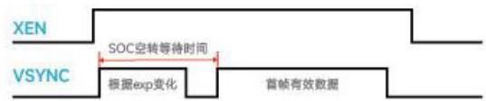

## Pre-Roll低功耗

• GC4103专为Pre-Roll设计，AO mode下能实现极低功耗

<table><tr><td>Mode</td><td>功耗</td></tr><tr><td>2048x2048@30fps</td><td>110mW</td></tr><tr><td>512x512(full FOV) @5fps</td><td>1.98mW</td></tr><tr><td>512x512(full FOV) @1fps</td><td>0.98mW</td></tr><tr><td>256x256(full FOV) @1fps</td><td>0.64mW</td></tr></table>

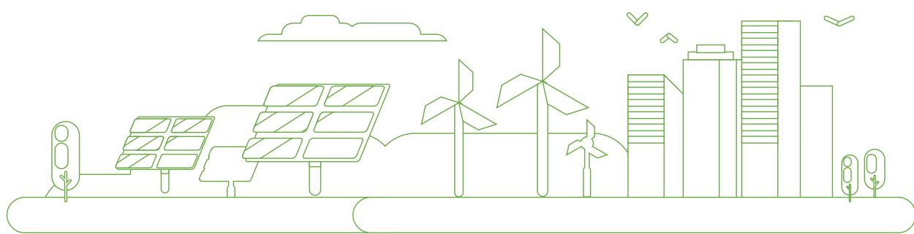

natural_image

Line art illustration of a city skyline with solar panels, wind turbines, and buildings (no text or symbols)

## 03

# 人本关怀回馈社会

在追求可持续发展的道路上，格科微始终将员工的雇佣与发展、福祉保障、职业健康与安全生产作为核心关切。公司秉持“知人善用”的理念，持续为团队注入活力与创新力。通过完善的福利关怀体系，切实增强员工的归属感与幸福感，激励员工不断挑战自我，与企业共同成长。在安全生产方面，公司视安全为生命线，全力保障生产作业的安全高效运行。格科微结合自身实际开展社会公益实践，努力回馈社会。

## 本章节所涉及重要性议题：

员工权益保障

职业发展与培训

职业健康与安全

社会贡献

本章节所响应 SDGs：

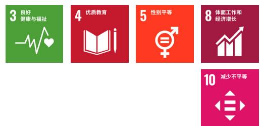

## 员工权益保障

格科微严格遵守《中华人民共和国劳动法》《中华人民共和国社会保险法》《中华人民共和国工会法》等法律法规，坚决反对歧视和骚扰，禁止童工与强迫劳动。公司坚持平等多元雇佣，保障员工合法权益。搭建民主沟通渠道，倾听员工真实心声。建立具有竞争力的薪酬激励与完善的福利关怀，并通过精准的人才服务政策，助力员工成长与安居。公司持续营造简单、快乐、激情的工作氛围，不断提升员工归属感与凝聚力，实现员工与企业共同发展。

## 平等多元雇佣

公司于报告期内修订《招聘管理制度》，明确保障候选人平等就业与自由择业权利，不因民族、种族、性别、宗教信仰等因素区别对待。在人才引进中坚持公平、公正、公开原则，优先内部发展机会，兼顾外部优秀人才引进，持续优化招聘流程以提升人岗匹配效率。所有雇佣均基于双方自愿，依法签订劳动合同。同时，公司关注女性员工职业发展与家庭需求，提供产假、产检假、育儿假、哺乳假等完善假期保障，在妇女节等节点传递人文关怀，持续营造多元、平等、包容的职场环境。

## 促进就业

2025 年，公司通过支持青少年科技创新大赛、共建高校教学基地、开展专项招聘等举措，持续拓宽人才引进渠道，促进高质量就业。同时依托实习见习基地建设，为高校毕业生提供实践平台与职业发展通道，积极构建校企协同的就业新生态。

## 案例 校企协同育人，共筑实习就业平台

格科微与上海理工大学光电信息与计算机工程学院签署校企共建协议，共同建立学生实习与就业基地，通过资源共享与协同育人为学生提供实践平台与就业通道同时精准对接光电领域专业人才实现校企互惠共赢。

为深化产教融合，2025 年 10 月 28 日，上理工光电学院联合机械学院、材化学院师生代表及就业指导中心人员走访格科微临港工厂。此次走访是校企协同育人的切实举措，师生们近距离感受半导体领军企业的创新活力与智能制造实力，为理论知识与产业实践深度融合提供了宝贵契机。未来，双方将持续拓展合作，共建产学研用协同育人平台，为集成电路产业培养更多卓越工程人才。

## 案例 用心培育，成就未来——格科微见习基地结硕果，人才转化见实效

报告期内，格科半导体（上海）有限公司积极推进大学生实习基地与见习基地建设，目前实习基地已获授牌，见习基地完成转正初审。通过系统化培养与岗位实践，累计吸纳见习申报人员26人，其中12人成功转正，转化率达 46%，覆盖 Module、职能部门等多个业务领域，有效拓宽人才引进渠道。

同时，公司见习基地补贴申请成功获批，本次补贴金额 20,878 元，惠及 4 名见习学员，切实降低人才培养成本。通过“引育留”全链条机制，格科微持续打造有温度、有保障的人才成长平台，为临港新片区建设注入青年力量。

## 多元职场

公司秉持平等雇佣原则，持续构建多元化与包容性的职场环境。通过吸纳不同性别、年龄、地区及专业背景的人才，汇聚多元思维、经验与技能，增强团队创新能力与问题解决能力，营造融洽和谐的团队氛围，为组织可持续发展注入活力。

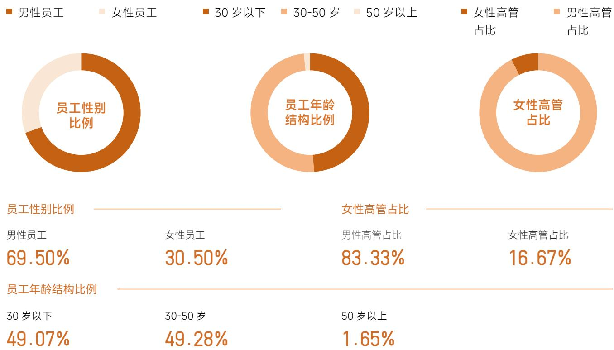

donut

| Category | Employee Type | Percentage (%) | Age Group | High School Education (%) |
| --- | --- | --- | --- | --- |
| 男性员工 | 男性员工 | 69.50 | 30岁以下 | 49.07 |
| 女性员工 | 女性员工 | 30.50 | 30-50岁 | 49.28 |
| 30岁以下 | 30岁以下 | — | 50岁以上 | 1.65 |
| 30岁以下 | 30岁以下 | — | 50岁以上 (Total) | — |
| 30岁以下 | 女性高管 | — | 50岁以上 (Total) | — |
| 30岁以下 | 女性高管 | — | 50岁以上 (Total) | — |
| 30岁以下 | 女性高管占比 | — | 50岁以上 (Total) | — |
| 30岁以下 | 女性高管占比 | — | 50岁以上 (Total) | — |
| 30岁以下 | 女性高管占比 | — | 50岁以上 (Total) | — |
| 30岁以下 | 女性高管占比 | — | 50岁以上 (Total) | — |
| 30岁以下 | 女性高管占比较 | — | 50岁以上 (Total) | — |
| 30岁以下 | 女性高管占比较 | — | 50岁以上 (Total) | — |
| 30岁以下 | 女性高管占比较 | — | 50岁以上 (Total) | — |
| 30岁以下 | 女性高管占比较 | — | 50岁以上 (Total) | — |
| 30岁以下 | 奇性高管占比较 | — | 50岁以上 (Total) | — |
| 30岁以下 | 奇性高管占比较 | — | 50岁以上 (Total) | — |
| 30岁以下 | 奇性高管占比较 | — | 50岁以上 (Total) | — |
| 30岁以下 | 奇性高管占比较 | — | 50岁以上 (Total) | — |
| 30-50岁 | 男性员工 | — | 30岁以下 | — |
| 30-50岁 | 女性员工 | — | 30岁以下 | — |
| 30-50岁 | 30岁以下 | — | 30-50岁 | — |
| 30-50岁 | 30-50岁 | — | 30-50岁 (Total) | — |
| 30-50岁 | 30-50岁占比 | — | 30-50岁 (Total) | — |
| 30-50岁 | 女性高管占比 | — | 30-50岁 (Total) | — |
| 30-50岁 | 女性高管占比 | — | 30-50岁 (Total) | — |
| 30-50岁 | 女性高管占比 | — | 30-50岁 (Total) | — |
| 30-50岁 | 奇性高管占比较 | — | 30-50岁 (Total) | — |
| 30-50岁 | 奇性高管占比较 | — | 30-50岁 (Total) | — |
| 30-50岁 | 奇性高管占比较 | — | 30-50岁 (Total) | — |
| 30-50岁 | 奇性高管占比较 | — | 女性高管 (Total) | — |
| 30-50岁 | 奇性高管占比较 | — | 女性高管 (Total) | — |
| 30-50岁 | 奇性高管占比较 | — | 女性高管 (Total) | — |
| 50岁以上 | 男性员工 | — | 30岁以下 | — |
| 50岁以上 | 女性员工 | — | 30岁以下 | — |
| 50岁以上 | 30岁以下 | — | 30岁以下 | — |
| 50岁以上 | 30岁以下 | — | 30岁以下 (Total) | — |
| 50岁以上 | 30岁以下 (Total) | — | 30岁以下 (Total) | — |
| 50岁以上 | 30岁以下 (Total) | — | 30-50岁 (Total) | — |
| 50岁以上 | 30岁以下 (Total) (Total) | — | 30-50岁 (Total) (Total) | — |

## 民主沟通渠道

公司严格遵循《员工沟通管理办法》，以消除信息壁垒、真诚平等、真实可靠为原则，持续完善员工沟通管理体系，搭建多元化的思想交流渠道，营造和谐协同的工作氛围。在福利管理方面，本年度集团所有节庆类福利均通过“综合部提案—工会成员投票—全员发放”的流程实施，确保员工直接参与福利决策。该流程是公司落实民主协商制度的具体实践，员工在切身利益事项上的知情权与选择权得到有效保障。

## 民主沟通交流渠道

## 高层面对面

由公司高层主持召开全员会议，传达发展战略、项目进展及企业文化，同时听取员工意见建议，由相关部门跟进解决。

## 员工交流会

按组织架构分层级开展，围绕特定议题确定沟通对象与内容，实现有目的、有针对性的双向交流。

## 部门内沟通

部门负责人通过小范围或一对一形式，了解员工思想动态与工作困难，及时排忧解难，营造和谐工作氛围。

## 人力资源部沟通

人力资源部以第三方视角开展计划性沟通，了解员工对组织发展、制度建设及个人发展等方面的看法，解释相关政策，引导员工认同组织价值观。

## 员工满意度

公司每年开展员工满意度调查，系统收集员工在组织氛围、职业发展、薪酬福利等方面的真实反馈，了解员工的切身感受与实际需求。调查结果作为优化管理机制的重要依据，持续推动内部改进，营造简单、快乐、激情的工作环境。2025年数据显示，员工敬业度与满意度各项指标表现良好反映出公司在员工关系，企业文化及薪酬福利等方面的持续投入取得积极成效，员工整体认可度逐年增强。

<table><tr><td rowspan="2" colspan="2">维度</td><td>2025</td></tr><tr><td>维度得分</td></tr><tr><td>敬业度</td><td>宣传、留任、努力</td><td>4.28</td></tr><tr><td rowspan="3">满意度</td><td>氛围环境</td><td>4.27</td></tr><tr><td>直接上级</td><td>4.17</td></tr><tr><td>薪酬发展</td><td>4.02</td></tr></table>

## 员工申诉

公司建立规范的员工投诉处理机制，明确人力资源部门及相关管理层在投诉处理中的角色与职责，确保员工诉求得到及时响应与公正解决。通过标准化的处理流程与进度同步机制，保障投诉处理的透明性与有效性，持续营造公平、尊重的职场环境。

员工申诉处理流程

<table><tr><td>投诉受理</td><td>HR接收投诉并启动处理流程</td></tr><tr><td>调查协调</td><td>HR与被投诉人领导共同了解情况,协同推进解决</td></tr><tr><td>反馈实施</td><td>被投诉人及其领导制定并落实解决方案,同步告知投诉人</td></tr><tr><td>结果跟进</td><td>HR跟踪处理结果,确保问题闭环</td></tr><tr><td>升级裁定</td><td>HR领导或高层对复杂或超时投诉介入决策</td></tr></table>

## 薪酬与激励

公司构建体系化的薪酬福利架构，员工月薪酬由基本工资、绩效工资及固定补贴构成，同时享有十三薪、年终奖等激励。同时，公司每年结合绩效考核结果与经营状况实施调薪，建立常态化的工资增长机制，切实保障员工合法权益，营造公平、激励并重的薪酬环境。为进一步健全长效激励约束机制，吸引和留住优秀人才，充分调动核心团队的积极性和创造性，通过制定限制性股票激励计划，共同关注公司长远发展，确保战略目标有效落地。

<table><tr><td colspan="3">常规薪酬福利</td><td colspan="3">多元激励机制</td></tr><tr><td>基本工资十三薪</td><td>绩效工资加班报酬</td><td>固定补贴</td><td>年终激励年度评优</td><td>薪酬增长机制长期服务奖</td><td>股权激励专项表彰奖励</td></tr></table>

## 股权激励

为建立，健全公司长效激励约束机制吸引和留住公司优秀人才充分调动其积极性和创造性 有效提升核心团队凝聚力和企业核心竞争力有效地将股东，公司和核心团队三方利益结合在一起，使各方共同关注公司的长远发展，确保公司发展战略和经营目标的实现 在充分保障股东利益的前提下 按照收益与贡献对等的原则2024年12月 公司制定《格科微有限公司 2024 年限制性股票激励计划（草案）》，采取的激励形式为第二类限制性股票，激励对象共计 152 人，包含公司公告本激励计划时在公司（含子公司下同）任职的董事会认为需要激励的人员拟授予激励对象的限制性股票数量为1.000.00万股 约占激励计划草案公布日公司股本总额的0.38%

## 福利活动

公司严格遵循国家及地方法律法规，为员工足额缴纳社会保险及住房公积金，并按规定提供法定假期，全面保障员工基本权益。在法定福利基础上，公司持续完善补充福利体系，涵盖健康关爱、节日关怀、团队建设等多维度项目，切实提升员工归属感与幸福感。

案例 格科微人才扶持——精准赋能，厚植人才成长沃土

报告期内，公司聚焦人才服务体系建设，通过高效的政策申报与专项服务，全方位保障员工福利权益，助力高价值人才成长。

在政策申报方面，格科半导体系统梳理职称申报要点，首次争取到职称直通车通道，年度成功申报职称 23 人，覆盖 T 序列与 M 序列多个岗位类别，为员工职业发展提供有力支撑。同时，格科半导体积极对接区域人才政策，累计协助员工申报购房补贴超 590 万元，切实降低安居成本，增强人才归属感。

在高层次人才服务领域，格科半导体再次成功申报东方英才项目，持续加强高价值人才的服务保障能力。通过一系列精准、高效的赋能举措，公司不断优化人才发展生态，为技术创新与业务发展夯实人才根基。

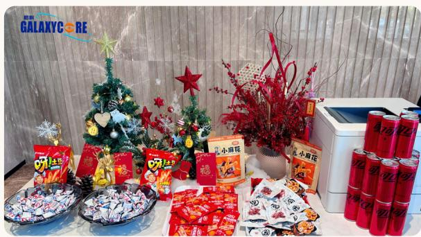

natural_image

Display of various Christmas-themed items including Christmas trees, small canopies, and red beverage cans on a shelf (no visible text or symbols)

开工大吉零食助兴

text_image

白芷
露蒲
艾叶
空調花
法座香
陳鸡
遠香
遠衣草
紫竹叶
茶樹叶

礼遇女神节福利发放

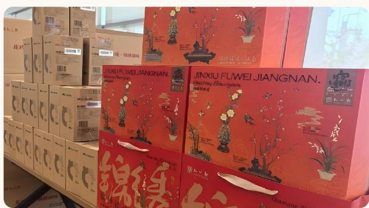

text_image

JINXIU FUWEI JIANGNAN.
Jiangxing Zhenyuan
锦iber

text_image

阳蟹大闸蟹

## 职业发展与培训

格科微专注于构建一个支持员工个人与职业成长的平台，通过建立员工晋升体系和培训计划，以支持员工职业成长，提升员工技能和知识，推动公司整体发展，同时确保公司有稳定和高效的人才供应。

## 职业发展

在格科微，人才是公司宝贵的资产，是走向成功的基石。格科微坚持树立正确的人才理念，建立公正的人才评估制度，提供丰富的人才发展举措，推行多元化的员工发展通道，充分激发员工潜质，让员工的个人发展与企业发展相结合，为所有格科人创造良好的职业发展环境。

## 职级体系

格科微建立专业与管理发展双通道职业发展体系，横向划分五大职位族。公司每年组织一次职级认证，基于岗位典型工作任务定义各职级的任职资格标准，将职级年资与绩效等级作为晋升门槛条件，认证流程由人力资源部统一组织评审结果经人力资源部与业务部门共同审定后正式发布。

员工职业发展双通道  
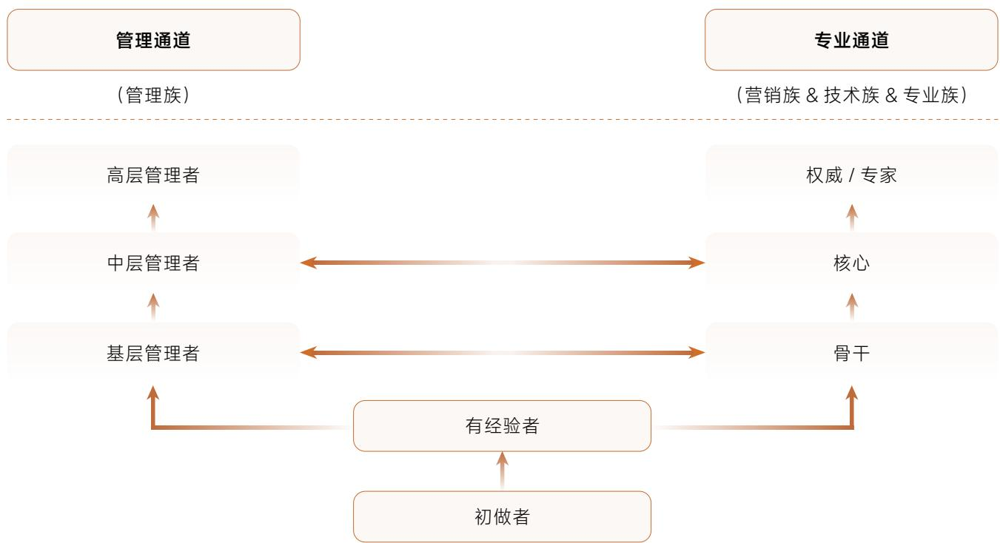

flowchart

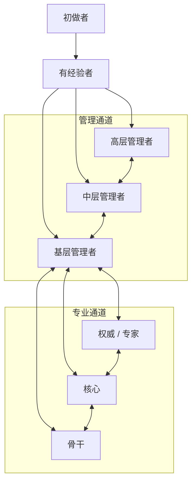
```mermaid
graph TD
  subgraph Management_Collaboration [管理通道]
    M1["高层管理者"]
    M2["中层管理者"]
    M3["基层管理者"]
  end

  subgraph Professional_Collaboration [专业通道]
    P1["权威 / 专家"]
    P2["核心"]
    P3["骨干"]
  end

  E["初做者"]

  E --> F["有经验者"]

  F --> M1
  F --> M2
  F --> M3

  M1 <--> M2
  M2 <--> M3

  M3 <--> P1
  M3 <--> P2
  M3 <--> P3

  P1 <--> P2
  P2 <--> P3
```

## 绩效考核

公司以目标过程管理为导向，建立覆盖全员、贯穿全流程的绩效管理体系。通过分层分类的评估机制，将战略目标有效传导至各层级岗位，在规范绩效评定的基础上，使高绩效员工获得相应的激励与发展支持。

<table><tr><td>绩效管理理念</td><td>绩效等级评定</td></tr><tr><td>推行绩效目标过程管理,承接公司战略目标实施全员绩效全流程管理,分层分类评估实现员工价值认可与激励</td><td>采用相对绩效概念,比较员工对组织的绩效贡献度分层分类区分高绩效与相对低绩效人员按季度及年度输出组织及个人考核等级</td></tr></table>

## 员工培训

公司以“服务于企业利益、服务于企业员工”为宗旨，构建分层分类的培训体系，制定《培训管理制度》，持续提升员工业务能力与管理素养。依托在线学习平台与线下课程资源，建立学习分享机制，沉淀组织智慧。员工可根据岗位要求及个人发展规划，自主选择培训资源，实现成长与发展的双向促进。同时，公司通过导师带教、内训授课及课程开发三项机制激发员工参与人才培养的积极性助力组织经验沉淀与人才梯队建设

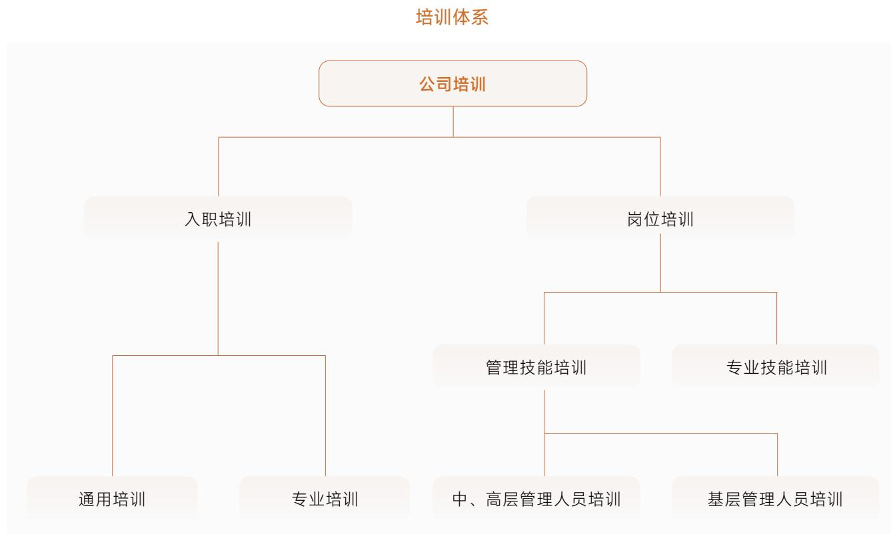

flowchart

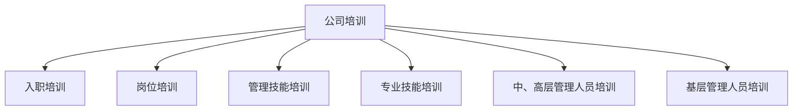
```mermaid
graph TD
  A["公司培训"] --> B["入职培训"]
  A --> C["岗位培训"]
  A --> D["管理技能培训"]
  A --> E["专业技能培训"]
  A --> F["中、高层管理人员培训"]
  A --> G["基层管理人员培训"]
```

2025 年，公司围绕“学习与发展型”组织建设人才培养机制，公司系统推进培训体系优化与资源升级，助力每位员工提升自我，在课程建设、导师赋能、新人培养及产教融合等方面取得显著成效。课程体系建设方面，完成格科学院教材评审，课程数量同比增长 23.6%，新增团队破冰、翻转课堂等创新形式，学员反馈良好。导师能力持续提升，通过优化线上导师赋能与辅导方式，进一步强化带教能力。新人培养深化推进，24 届应届工程师年度答辩及 25 届阶段答辩完成率均达100%并优化优秀学员表彰与宣传机制有效激发成长动力。培训形式不断创新，推出各层级管理层线上课程整体课程完成率保持100%。专项技术培训方面，新增量测基础、设备基础培训项目，夯实技术人才基础。产教融合实现突破，临港新片区芯片制造人才培养基地建成，深化校企协同育人机制。

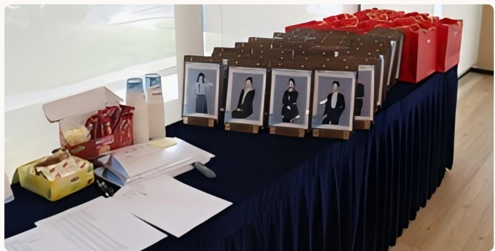

natural_image

Display table setup with framed portraits, gift boxes, and documents on a dark table (no visible text or symbols)

“知识芯传、感恩有您”教师节活动

<table><tr><td colspan="4">培训绩效</td></tr><tr><td colspan="4">线上课程——格科学院</td></tr><tr><td>课程数/考试数</td><td>培训项目</td><td>累计登录人次</td><td>累计学习时长</td></tr><tr><td>1,086门/944场</td><td>696个</td><td>94,721人次</td><td>19,123时20分</td></tr><tr><td colspan="4">线下课程——面授课与各类活动</td></tr><tr><td>面授课程数</td><td>专业教材数</td><td>主题活动</td><td>委外培训</td></tr><tr><td>210门</td><td>1,211门</td><td>4场</td><td>27人次</td></tr></table>

## 职业健康与安全

格科微严格遵守《中华人民共和国职业病防治法》《中华人民共和国安全生产法》等法律法规，以风险分级管控与隐患排查治理为核心，构建覆盖全员、全流程的安全生产管理体系。通过制定针对性应急预案并常态化开展多元培训，强化员工安全意识与应急处置能力，为员工职业健康与职场安全提供坚实保障。

## 治理

公司秉承“管生产必须管安全”的原则，建立覆盖各层级、各业务环节的职业健康安全管理治理架构。公司设立安全生产管理委员会，由安全生产负责人及各部门负责人组成，定期召开安全专题会议，协调解决安全生产问题，监督职业健康安全目标指标的达成情况，确保安全战略有效落地。

在内部制度方面，公司构建系统化的职业健康安全管理体系。各下属公司结合业务实际分别制定针对性制度，格科半导体制定《安全教育培训管理制度》《劳动者职业健康监护及其档案管理制度》等文件，格科微浙江制定《环境和职业健康安全运行控制程序》《EHS 管理评审控制程序》等制度，形成覆盖全面、分级管理的制度体系。

公司通过安全生产目标考核、绩效管理等机制，对职业健康安全相关风险进行识别、评估与监督，确保员工在工作环境中免受伤害，持续提升健康与福祉保障水平，维护公司运营的可持续性。

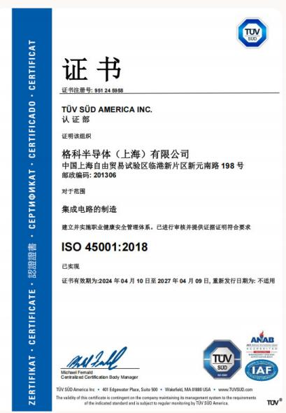

text_image

证书
证书注册号: 951 24 5958
TÜV SÜD AMERICA INC.
认证部
证明该组织
格科半导体（上海）有限公司
中国上海自由贸易试验区临港新片区新元南路198号
邮政编码: 201306
对于范围
集成电路的制造
建立并实施职业健康安全管理体系, 已进行审核并提供证据证明符合要求
ISO 45001:2018
已实现
证书有效期为:2024年04月10日至2027年04月09日, 重新发行日期为:不适用
TMU
Michael Fernald
Centralesic Certification Body Manager
TÜV SÜD
ANAB
IAF
TÜV®

格科半导体（临港工厂）于2024年通过ISO45001:2018体系认证。

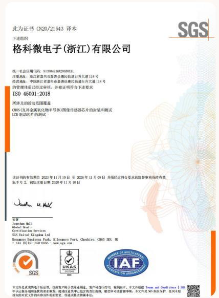

text_image

此为证书 CN20/21543 译本
下述组织
格科微电子(浙江)有限公司
统一社会信用代码: 9133042MA28N031L
注册地址: 浙江省嘉兴市嘉善县惠民街道丹东大道118号
经营地址: 中国浙江省嘉兴市嘉善县惠民街道丹东大道118号
的管理体系已经过审核，并被证明符合下述要求
ISO 45001:2018
所涉及的活动范围覆盖
CNOS(允许金属化物半导体)图像传感器芯片的封装和测试
LCD驱动芯片的测试
该证件的有效期自2023年11月10日至2026年11月09日并须经过符合要求的监督审核保持有效
版本号: 2. 钢轮注册日期 2020年11月10日
Jiangsu Hu Hui
签署
Jonathan Hall
Global Deal-
Certification Services
SGS United Kingdom Ltd
Business Business Park, Eliosmere Port, Chashiro, CHSS 3K, UK
t +41 10111 330-6066 - www.sgs.com
UCAS OF INDUSTRIES
UNICaja
IAAF
深圳市深南中路
www.Industries.com
本文件是真实的电子版证明。应向客户共享商业用途，客户可自行打印。视图副本，本文件根据Town and Conditions | SLS
中证业务服务标准的要求，按照信息及公司已知的任何范围，提供公司经营管理事务。本文件是SGS保护、隐私与透明
授权范围在其它文件范围内的一切，负责通过法律领域法。

45001:2018 体系认证。

## 战略

公司致力于在集成电路制造领域追求卓越的同时，将员工健康与安全作为可持续发展的核心基石，系统规划职业健康安全相关影响、风险与机遇的应对策略。

公司以“实现零安全事故，打造行业领先的健康安全职场环境”为战略愿景，致力于树立行业职业健康安全标杆。通过系统性规划与资源投入，持续提升职业健康安全管理绩效，保障员工身心健康，助力实现工作与生活的和谐平衡。

公司培育以人为本的安全文化，构建本质安全型工作环境，将职业健康安全要求融入战略规划与日常运营各环节，通过目标设定、过程管控与绩效评估的闭环管理，系统性应对职业健康安全相关影响、风险与机遇。

## 合规超越

全面遵守并力争超越中国职业健康安全法规、国际行业标准及客户要求，将合规要求转化为管理优势。

## 风险防控

通过本质安全设计与动态风险评估，从源头消除或最小化职业健康安全风险，构建预防为主的管理机制。

## 全员参与

建立多层次培训体系，提升全员安全素养；完善职业健康安全委员会机制，保障员工代表深度参与安全决策与监督。

## 供应链协同

与客户、供应商及承包商共建安全管理体系，将职业健康安全要求延伸至全供应链，系统性降低职业健康安全危害。

## 持续改进

通过数字化监测手段与定期审核机制，实现管理效能的动态评估与持续优化。

natural_image

Line drawing of six stylized human figures in various poses, raising arms and making hand gestures (no text or symbols)

## 影响、风险和机遇管理

公司建立系统化的危险源识别与风险评估机制，将职业健康安全相关影响、风险与机遇的识别、评估及管理贯穿于日常运营各环节。

职业健康与安全风险管理流程

<table><tr><td>风险识别</td><td>制定《危险源识别评价控制程序》《环境因素识别评价控制程序》,明确识别标准与方法;每年开展危险源及环境因素识别培训与考核,组织全员参与识别评价;建立常态化安全风险管理机制,对危险源进行动态评估与分级管控。</td></tr><tr><td>风险评估</td><td>综合考虑发生可能性、影响程度及可控性等因素,确定风险等级;基于评估结果,明确各类风险管控优先级,为后续防控措施提供依据。</td></tr><tr><td>风险管控与预防</td><td>针对评估确定的重点风险,多维度制定针对性防控方案;通过安全培训与应急预案演练提升现场防护能力;对承包商实施严格的准入审核与全过程动态监管,确保违规行为及时闭环处置。</td></tr><tr><td>事故应急与闭环管理</td><td>发生事故立即启动应急预案,开展应急救援,防止事故扩大;组织事故调查会议复盘根本原因,制定改进措施;整改方案经安委会审议通过后实施,确保问题闭环管理并持续优化防控体系。</td></tr></table>

医疗保障措施

<table><tr><td>应急设备配置</td><td>·在工厂关键出入口及健康中心配置自动体外除颤器,设备位置设有明确标识,确保紧急情况下可快速取用;·各办公楼栋每层固定公共区域均配备急救小药箱,实现急救物资就近获取。</td></tr><tr><td>急救物资保障</td><td>·急救药箱内常备创可贴、无菌纱布、一次性手套等基础医疗耗材,并定期补充;·健康中心储备防暑降温药品、外伤处理药品等常用应急药品。</td></tr><tr><td>健康监测支持</td><td>·健康中心配置电子血压计、体温计等基础监测设备,由专业护士协助员工开展日常健康管理。</td></tr></table>

## 指标与目标

2025 年，公司围绕“零事故、零伤害、零污染”的核心目标，设定涵盖事故防控、环保合规及过程管理三类职业健康安全指标。报告期内，各项事故类指标、环保类指标及管理类指标均完成既定目标，安全生产形势保持稳定。

<table><tr><td>指标</td><td>单位</td><td>目标</td><td>2025年表现</td></tr><tr><td>重伤、死亡事故</td><td>起</td><td>0</td><td>0</td></tr><tr><td>火灾、爆炸事故</td><td>起</td><td>0</td><td>0</td></tr><tr><td>重大设备事故</td><td>起</td><td>0</td><td>0</td></tr><tr><td>职业病发生</td><td>起</td><td>0</td><td>0</td></tr><tr><td>重大化学品泄漏事故</td><td>起</td><td>0</td><td>0</td></tr><tr><td>重大事故隐患整改率</td><td>%</td><td>100</td><td>100</td></tr><tr><td>安全培训教育率</td><td>%</td><td>100</td><td>100</td></tr><tr><td>特种工种持证率</td><td>%</td><td>100</td><td>100</td></tr><tr><td>特种设备检验率</td><td>%</td><td>100</td><td>100</td></tr></table>

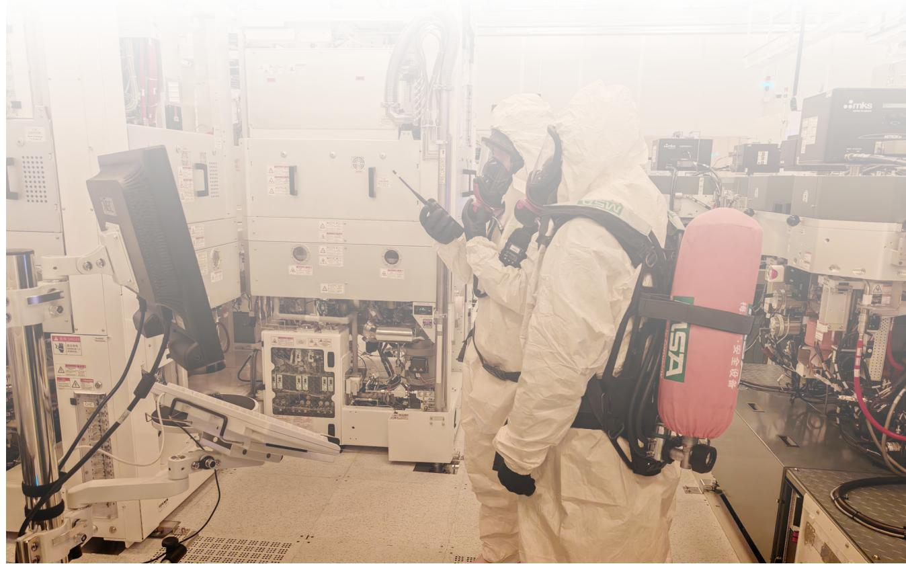

natural_image

Interior of a cleanroom facility with personnel in full protective suits operating equipment (no visible text or symbols)

## 案例 安全培训与演练

安全培训：新员工入厂后按国家规定组织开展三级安全教育，EHS 每年制订厂级安全培训计划，根据培训计划开展全员、专项安全培训。各部门制订本部门 SOP 及制度培训计划并按照计划开展培训。

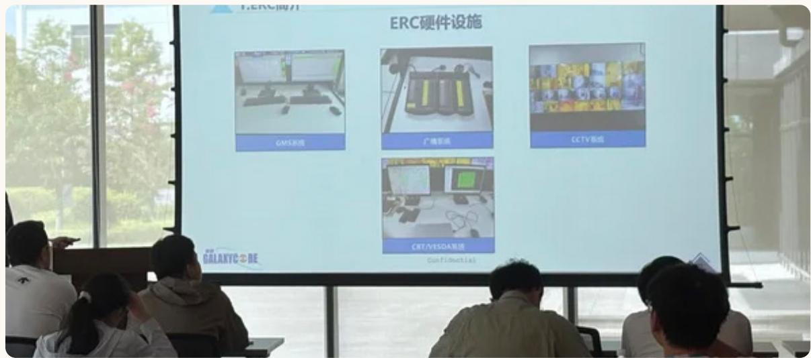

text_image

ERC硬件设施
GMSR系统
广播影视
CCTV视频
CRT/VESDA视频
Confiducti.ai

安全演练：开展全厂消防疏散演练、Fab 疏散演练、季度救灾演练、季度集结演练。

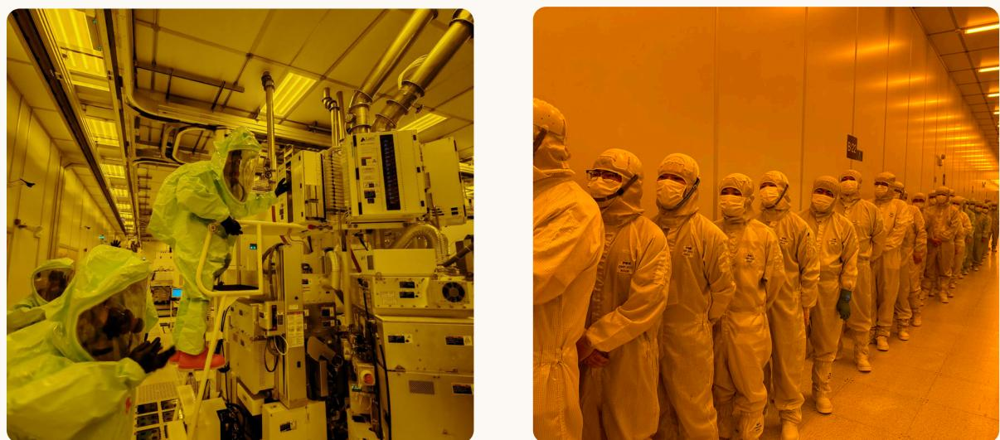

## 助力社会发展

公司积极践行社会责任，聚焦教育培训，提升人才素养；助力文化体育事业，丰富精神生活；开展扶贫济困，关爱弱势群体，全方位维护社会、文化、经济等层面的良好关系，推动企业与社会协同共进。

## 案例 定向采购助农产品，助力乡村振兴

2025 年，公司将员工福利发放与消费帮扶相结合，定向采购云南省广南县特色农产品大米 2407 袋，采购金额 12 万元。此次采购直接带动当地农户增收，支持乡村特色产业发展，惠及种植户及合作社群体。通过农产品福利，员工对乡村振兴的参与感和认同感进一步增强。该举措是公司履行社会责任的务实行动，也为深化企地合作、探索可持续帮扶模式积累了经验。

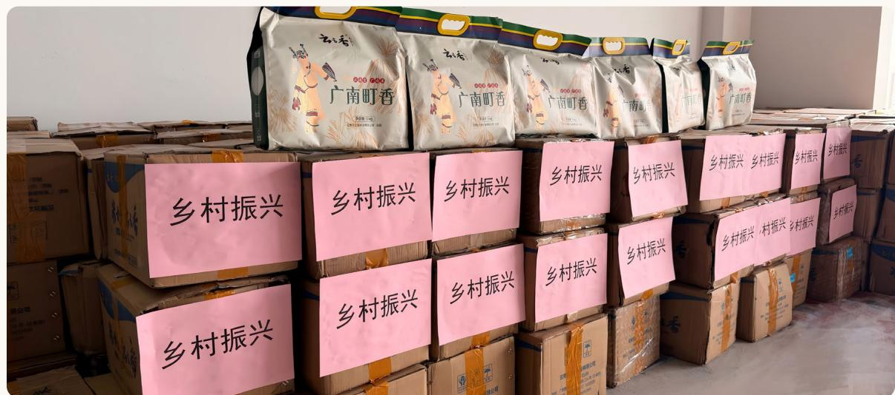

text_image

乡村振兴
乡村振兴
乡村振兴
乡村振兴
乡村振兴
乡村振兴
乡村振兴
乡村振兴
乡村振兴
乡村振兴
乡村振兴
乡村振兴
乡村振兴
乡村振兴
乡村振兴
乡村振兴
乡村振兴
乡村振兴
乡村振兴
乡村振兴
乡村振兴
乡村振兴
乡村振兴
乡村振兴
乡村振兴
乡村振兴
乡村振兴
乡村振兴
乡村振兴
乡村振兴
乡村振兴
乡村振兴
乡村振兴
乡村振兴
乡村振兴
乡村振兴
乡村振兴
乡村振兴
乡村振兴
乡村振兴
乡村振兴
乡村振兴
乡村振兴
乡村振兴
乡村振兴
乡村振兴
乡村振兴
乡村振兴
乡村振兴
乡村振兴
乡村振兴

## 案例 守护绿色园区，共筑美好办公家园

2025年，格科工会联动园区举办“守护绿色园区，共筑美好办公家园”环保公益活动，组织13名志愿者对盛夏路 560 号园区及周边公共绿地开展垃圾清理，累计服务时长超 4 小时。活动有效改善了园区及周边公共环境，以实际行动践行低碳环保理念，营造了共建共享的绿色办公氛围。

## 04

## 规范治理筑牢根基

格科微以治理为基石，保障企业高质量发展。公司搭建科学治理架构，强化董事会建设，切实保障股东权益，从顶层设计上确保决策科学、运营高效。在合规与风控领域，构建完善的内部控制体系，持续识别和管控潜在风险，加强信息安全管理，严守合规底线。积极推进商业道德建设，健全廉洁管理机制，完善举报管理流程，从源头防范贪腐，营造透明规范的企业环境。

## 本章节所涉及重要性议题：

公司治理

合规与风险管理

商业道德

信息安全与隐私保护

本章节所响应 SDGs：

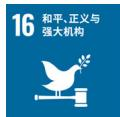

## 公司治理

格科微立足行业特性与发展战略，持续优化公司治理架构，推动决策专业化与运行高效化。公司深化董事会建设，注重成员多元背景与独立履职，发挥独立董事监督职能，完善权力运行制衡机制。同时，公司切实保障投资者权益，严格履行信息披露义务，维护中小股东合法权益，以规范运作与透明管理夯实治理根基，赋能企业高质量发展。

## 治理架构

公司根据《开曼群岛公司法》等相关法律法规的规定，并参照《上海证券交易所科创板股票上市规则》《上市公司章程指引》的要求，制定了《公司章程》，并在章程的基础上制定了《股东大会议事规则》《董事会议事规则》《独立董事工作制度》等相关治理制度。公司建立了由股东会、董事会和公司管理层组成的治理机构。董事会下设审计委员会、战略委员会、提名委员会及薪酬与考核委员会，各专门委员会依法履职以保障董事会议事，决策的专业化和高效化

组织架构  
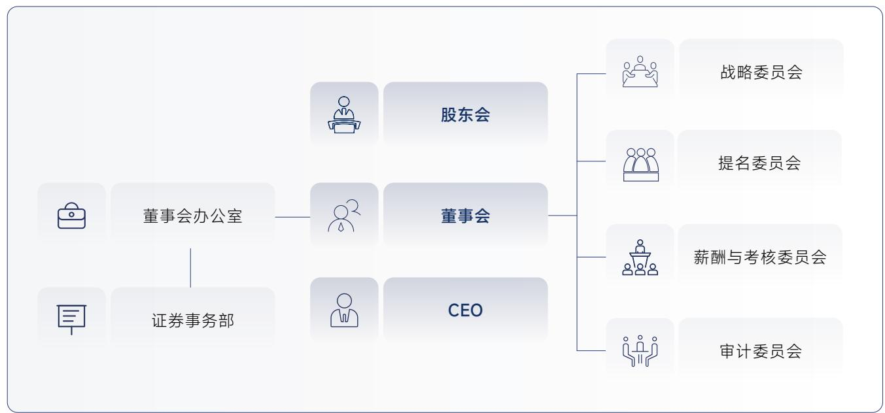

flowchart

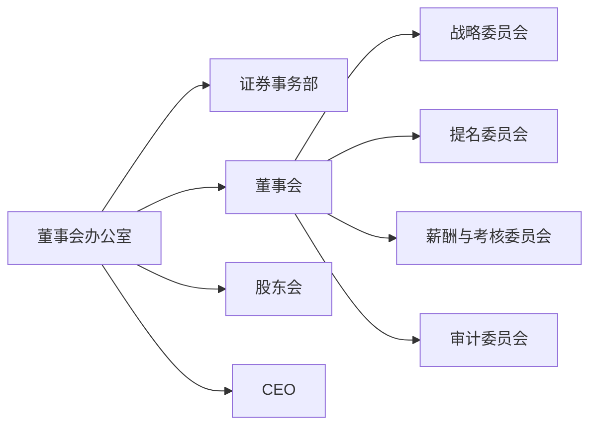
```mermaid
graph LR
  A["董事会办公室"] --> B["证券事务部"]
  A --> C["董事会"]
  A --> D["股东会"]
  A --> E["CEO"]
  C --> F["战略委员会"]
  C --> G["提名委员会"]
  C --> H["薪酬与考核委员会"]
  C --> I["审计委员会"]
```

## 2025 年关键绩效

公司共召开会议

战略委员会

审计委员会

提名委员会

1次

薪酬与考核委员会

## 董事会多元化与独立性

公司持续深化董事会治理建设，致力于构建兼具多元视角与独立性保障的科学决策体系。

在独立性方面，独立董事由董事会或单独 / 合计持股 1% 以上的股东提名，经股东会选举产生，任期三年且连续任职不超过六年，确保独立性的有效延续。独立董事在重大决策、风险防范及权益保障等方面发挥关键监督作用，形成对权力运行的有效制衡。同时，公司合理控制内部董事比例，兼任高级管理人员的董事人数不超过董事总数的二分之一，进一步保障了董事会的独立判断与监督效能。

在多元化方面，公司注重董事会成员在性别、年龄及专业背景（涵盖管理、技术、财务等领域）的合理配置。多元化的知识结构与经验视角形成了优势互补的决策智慧，有效提升了公司应对复杂行业环境与战略机遇的判断力。

<table><tr><td rowspan="2">姓名</td><td rowspan="2">类型</td><td rowspan="2">年龄</td><td colspan="4">专业委员会任职(报告期内)</td></tr><tr><td>审计</td><td>提名</td><td>战略</td><td>薪酬与考核</td></tr><tr><td>赵立新先生</td><td>董事长首席执行官</td><td>59</td><td></td><td>☑</td><td>☑</td><td></td></tr><tr><td>HING WONG</td><td>董事</td><td>63</td><td></td><td></td><td>☑</td><td></td></tr><tr><td>曹维女士</td><td>董事</td><td>52</td><td></td><td></td><td></td><td>☑</td></tr><tr><td>WENQIANG LI</td><td>董事</td><td>60</td><td></td><td></td><td>☑</td><td></td></tr><tr><td>郭少牧先生</td><td>独立董事</td><td>60</td><td>☑</td><td>☑</td><td>☑</td><td></td></tr><tr><td>宋健先生</td><td>独立董事</td><td>59</td><td>☑</td><td>☑</td><td></td><td>☑</td></tr><tr><td>周易女士</td><td>独立董事</td><td>40</td><td>☑</td><td></td><td></td><td>☑</td></tr></table>

## 股东权益保护

公司通过建立健全的信息披露机制确保公司信息传递的真实准确，完整，及时与公平，切实维护投资者的知情权。公司尤其重视中小投资者的合法权益 持续优化投资者参与决策的渠道，并严格执行利润分配政策，确保股东共享公司发展成果。上述举措有效巩固了股东权益保障的基础，也促进了公司在资本市场建立良好的信任关系。

## 信息披露

公司制定《信息披露管理办法》，系统规范信息披露的基本原则、内容标准、审批流程及职责分工，明确信息披露事务管理部门、董事及高级管理人员的责任，并对子公司信息报告、股东问询、信息保密、档案管理及责任追究等事项作出规定。通过定期报告与临时报告等途径，公司严格履行信息披露义务，确保信息真实、准确、完整、及时，切实维护股东、债权人及其他利益相关方的合法权益，促进公司依法规范运作。

## 投资者关系管理原则

真实

准确

完整

及时

公平

易于理解

## 2025 年关键绩效

公司对外披露

定期报告

发布临时报告

2024-2025 年度上海证券交易所给予公司信息披露工作评价

4 项

44 项

A 类

## 投资者关系管理

公司制定《投资者关系管理办法》对投资者关系管理的对象，内容，方式及组织与实施作出系统规定，该制度旨在畅通公司与投资者的双向沟通渠道，构建长期稳定的良性互动关系，倡导理性投资理念。通过规范运作与透明管理，增进投资者对公司的了解与信任，推动公司价值与股东利益共同提升。

## 投资者关系管理原则

合规披露

严格遵守相关法律法规及监管要求，确保信息披露真实、准确、完整、及时。

权利保障

充分保障投资者知情权，平等对待所有投资者，避免选择性披露。

客观沟通

客观、真实、准确传递信息，避免过度宣传和误导。

互动优化

主动听取投资者意见建议，提高沟通效率，降低沟通成本，实现双向良性互动。

## 股东回报与权益保障

公司高度重视投资者回报，在聚焦主业、持续提升经营业绩的同时，通过现金分红等方式给予投资者长期稳定的投资回报，与全体股东共享发展成果。同时，基于对公司未来发展的信心及维护广大投资者利益，公司积极开展股份回购工作。

公司依据《利润分配管理制度》建立科学合理的利润分配机制，在方案制定过程中，严格遵循制度明确的分配原则，综合考量经营状况、发展战略及中小投资者利益诉求。通过规范决策流程保障中小投资者在利润分配中的知情权与参与权，以公平透明的分配方式将经营成果合理回馈投资者，切实维护其合法权益，推动公司与中小投资者形成长期稳定的共赢关系。

## 合规经营与风险管理

格科微始终坚持合规经营理念，将风险管理贯穿于日常运营各环节。公司依托健全的内部控制体系，持续优化运营管理流程，围绕潜在风险建立系统化识别与评估机制，提升风险应对能力。同时，公司高度重视信息安全与隐私保护，持续完善相关制度建设与技术防护措施，保障公司及客户数据安全。

## 风险管理

公司建立系统化的全面风险管理体系，制定并实施《全面风险管理办法》，明确风险管理目标、组织架构及工作流程。内控评价工作遵循《企业内部控制基本规范》及其配套指引，每年定期开展，覆盖风险识别与评估等核心环节。公司将风险管理审计纳入内控评价体系，综合运用问卷访谈、穿行测试、抽样分析等方法，全面评估内部控制设计的合理性与执行的有效性，确保风险管理体系持续稳健运行。

## 控制与追踪风险、加强合规管控的举措

## 动态研判

将风险识别、评估与跟踪融入日常经营管理，通过高管定期召开经营管理研讨会，动态研判内外部风险，确保应对策略及时有效。

## 内部廉洁管控

要求重要关键敏感岗位人员签订《保密及廉洁自律承诺书》，强化员工合规意识与廉洁责任。

## 外部合规延伸

与供应商、承包商签订《供应商廉洁诚信承诺函》，将廉洁合规要求延伸至合作伙伴，构建覆盖内外的系统化风险防控机制。

## 合规内控

公司依据《企业内部控制基本规范》及其应用指引制定《内部控制评价制度》从内部环境，风险评估，控制活动信息与沟通，内部监督等维度，对内部控制设计与运行情况开展全面自我评价，评价范围覆盖公司经营活动的各环节下各项管理制度，公司每年定期开展内部控制审计及专项审计工作，形成内部控制评价报告，并在工作中向业务部门宣导内控合规文化，确保内控体系有效运行

## 合规管理组织架构

公司建立层次分明、制衡有序的内部控制治理架构，明确各层级在内控体系建设与运行中的职责边界，形成闭环管理机制。

## 董事会

负责公司内部控制的建立健全和有效实施；  
认定与批准内部控制重大缺陷与年度内部控制评价报告。  
负责公司内部控制设计、运行有效性的监督工作，并向董事会报告。

## 审计委员会

## 公司各管理层级

负责组织领导公司内部控制的日常运行，督促所管辖的机构建设、实施和完善内部控制体系；  
负责主导所管辖机构的问题改善与管理优化工作。

## 各职能部门与下属子公

负责内部控制规章制度的具体执行；  
自检内部控制运行情况，并整改优化。

## 内审部

负责公司年度内控评价的具体组织实施工作，并督促相关职能部门落实整改；  
编制内部控制评价报告。

natural_image

Line drawing of a person working at computer terminals with multiple monitors and chairs (no text or symbols)

## 商业道德

格科微严格遵守《中华人民共和国刑法》《中华人民共和国反不正当竞争法》等法律法规，恪守诚信经营原则，将商业道德作为企业可持续发展的根基。公司致力于营造公开、公平、公正的市场环境，通过建立健全的反贪污、反商业贿赂及反不正当竞争管理体系，系统防范各类违规行为。公司搭建多渠道举报机制，畅通内外部监督力量，定期开展专项培训，强化员工合规意识。同时，与全体员工及合作伙伴签订廉洁从业与公平竞争协议，将合规要求贯穿于内部运营与外部协作各环节，持续筑牢企业廉洁防线。

## 廉洁建设

为深化廉洁文化建设，规范员工及利益相关方的商业行为，公司结合运营实际制定《廉洁管理制度》，以防范各类不正当行为，确保诚信合规要求贯穿合作始终。

## 廉洁管理组织架构

公司建立以內审部为核心、多部门协同的商业道德管理机制。通过将廉洁风险防控贯穿于制度执行、教育培训与日常监管全过程，构建起覆盖反贪污、反商业贿赂及反不正当竞争的闭环管理体系。

## 内审部

•负责廉洁日常监管 包括廉洁风险评估 受理举报 组织案件调查与跟踪处理  
加强对重要环节、重点岗位人员的廉洁监督；  
跟踪制度执行情况 , 定期制作工作汇报。

## 法务部

配合内审部开展廉洁管理，提供法律支持；  
协同受理廉洁相关咨询与举报。

## 人力资源部

在员工入职及在职培训中开展廉洁制度宣导；  
确认重点岗位范围，组织重点岗位人员签署承诺书并移交内审部。

## 各部门负责人

在日常工作中宣导廉洁文化及制度精神；  
每季度 / 半年组织员工开展廉洁情况自查；  
发现违规或异常及时与内审部沟通。

案例 廉洁格科——筑牢思想防线，全员廉洁文化线上培训

为持续推进廉洁文化建设，公司内审与法务部联合开发“廉洁文化专题培训”课程，于报告期内正式在“格科学院”线上平台上线。课程面向全体员工开放，要求于 12 月 31 日前完成学习。通过系统化的线上培训，强化员工廉洁从业意识，筑牢拒腐防变的思想防线，营造风清气正的职场环境，为公司健康发展提供坚实保障。

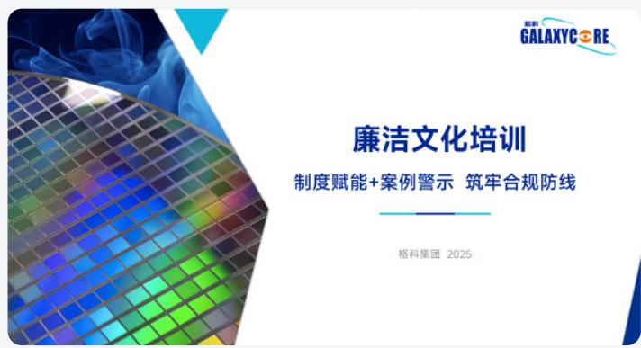

text_image

GALAXYCORE
廉洁文化培训
制度赋能+案例警示 筑牢合规防线
格科集团 2025

## 举报管理

公司制定《举报调查管理制度》，由内控内审部作为举报管理归口部门，在审计委员会指导下开展举报调查工作。内审部负责设立并维护举报渠道，统一受理各类举报事项，做好举报登记与分类，组织对举报案件的调查核实，提出处理意见，并向管理层出具调查报告，确保举报渠道畅通、调查程序规范、处理结果可追溯，切实保障员工及利益相关方合法权益。

## 举报方式

电话举报：0086-21-51083755-8239

邮件举报：gc-supervise@gcoreinc.com

## 举报人保护

信息保密 : 对举报人身份及举报内容严格保密，严禁向被举报人或无关人员透露任何信息  
禁止报复：严禁任何部门或个人以降级、解雇、歧视等方式打击报复举报人  
文件管控：举报调查相关文件按绝密级管理，传递与存档全程严格保密  
匿名保护：对匿名举报材料，不得进行笔迹或声音鉴定

## 信息安全与隐私保护

公司严格遵守《中华人民共和国数据安全法》《中华人民共和国个人信息保护法》等法律法规，遵循合法、正当、必要原则开展数据处理活动。在客户信息保护方面，公司采取必要的安全保护措施。通过建立健全的数据安全管理机制，公司确保数据处于有效保护和合法利用的状态，持续提升安全保障能力。

## 信息安全保障

公司严格遵循《数据管理制度》《信息安全管理制度》《数据备份管理制度》，规范业务数据管理，明确数据备份规范，全方位降低数据风险，提升数据流转效率，确保数据安全可信赖，有力支撑业务生产需求。

## 信息安全组织架构

公司成立信息安全委员会及工作组，构建职责分明的信息安全管理架构，有效保障公司数据安全与用户隐私。

## 信息安全委员会

负责审定信息安全总体规划、经费预算、技术标准及管理规范；  
审批信息安全方针与管理体系；  
研究决定重大事项，监督规划实施；  
提供资源保障；  
建立内外沟通渠道，统一对外信息发布。

## 信息安全工作组

负责信息安全体系的具体实施与推进；  
建立并督促执行信息安全管理制度；  
规划监督信息安全项目，确保风险评估与管理落实；  
制定年度评审计划及业务连续性计划；  
协调咨询公司推进项目实施，组织内部落地与知识转化。

## 信息安全管理措施

建立健全应急响应机制：依据《网络与信息安全事件应急预案》，对安全事件进行分类分级管理，明确应急小组职责分工，遵循积极防御原则，覆盖监测预警、先期处置等流程，并落实通信、装备等应急保障资源。

持续开展信息安全风险评估：每年至少一次委托第三方专业机构，对物理安全、终端安全、网络安全、系统安全、人员安全及软件安全等维度进行全面评估，覆盖集团及下属子公司，确保风险动态识别与有效管控。

常态化落实监督与能力提升：通过开展安全培训、知识竞赛、应急演练及奖惩机制，强化全员安全意识与应急响应能力，持续提升集团网络安全保障水平。

## 客户隐私保护

公司严格依据相关法律法规，出台《客户隐私保护制度》，严格规范客户隐私管理。公司遵循合法性等原则收集、使用、存储、共享和删除客户信息，运用技术手段保障安全，实施权限管理、日志审计与监控，同时开展内外部监督并对违规行为进行处理切实保护客户隐私权益确保客户个人信息安全提升公司信誉，增强客户对公司的信任促进业务的稳定、健康发展。

客户隐私保护原则

<table><tr><td>合法性</td><td>公开透明</td><td>最小化</td><td>安全保护</td><td>共享限制</td><td>信息准确性</td></tr></table>

ESG数据表和附注

<table><tr><td colspan="3">经济</td></tr><tr><td>指标名称</td><td>单位</td><td>2025</td></tr><tr><td>营业收入</td><td>万元</td><td>778,180.36</td></tr><tr><td>归属于上市公司股东的净利润</td><td>万元</td><td>5,050.91</td></tr><tr><td colspan="3">环境管理</td></tr><tr><td>指标名称</td><td>单位</td><td>2025</td></tr><tr><td>环保总投入</td><td>万元</td><td>2,826.70</td></tr><tr><td>环保总投入占营业收入比例</td><td>%</td><td>0.36</td></tr><tr><td>环保处罚金额</td><td>万元</td><td>0</td></tr><tr><td>环境处罚次数</td><td>次</td><td>0</td></tr><tr><td>应急培训</td><td>次</td><td>361</td></tr><tr><td>应急演练次数</td><td>次</td><td>54</td></tr><tr><td colspan="3">应对气候变化</td></tr><tr><td>指标名称</td><td>单位</td><td>2025</td></tr><tr><td> $温室气体排放总量^1$ </td><td>吨二氧化碳当量</td><td>102,411.80</td></tr><tr><td>范围一温室气体排放量强度</td><td>吨二氧化碳当量/营业收入(万元)</td><td>0.0019</td></tr><tr><td>范围二温室气体排放量强度</td><td>吨二氧化碳当量/营业收入(万元)</td><td>0.1297</td></tr><tr><td> $范围一温室气体排放量^2$ </td><td>吨二氧化碳当量</td><td>1,480.95</td></tr><tr><td>范围二温室气体排放量(基于位置)</td><td>吨二氧化碳当量</td><td>100,930.85</td></tr></table>

注 1：温室气体核算方法依据《电子设备制造企业温室气体排放核算方法与报告指南 ( 试行 )》，电力排放因子选用《关于发布 2023 年电力二氧化碳排放因子的公告》中2023年全国电力平均二氧化碳排放因子

<table><tr><td colspan="3">污染物排放</td></tr><tr><td>指标名称</td><td>单位</td><td>2025</td></tr><tr><td colspan="3">废水排放</td></tr><tr><td>废水排放总量</td><td>吨</td><td>1,426,116.00</td></tr><tr><td>工业废水排放量</td><td>吨</td><td>1,239,505.00</td></tr><tr><td>生活废水排放量</td><td>吨</td><td>44,886.00</td></tr><tr><td>工业废水回收量</td><td>吨</td><td>1,129,580.00</td></tr><tr><td>工业废水利用量</td><td>吨</td><td>1,129,580.00</td></tr><tr><td>化学需氧量(COD)</td><td>吨</td><td>77.02</td></tr><tr><td>氨氮</td><td>吨</td><td>28.21</td></tr><tr><td>总氮(TN)</td><td>吨</td><td>43.16</td></tr><tr><td>总磷(TP)</td><td>吨</td><td>0.88</td></tr><tr><td colspan="3">废气排放</td></tr><tr><td>二氧化硫排放量( $SO_2$ )</td><td>吨</td><td>-</td></tr><tr><td>氮氧化物(NOX)排放情况</td><td>吨</td><td>9.12</td></tr><tr><td>非甲烷总烃(NMHC)排放情况</td><td>吨</td><td>7.29</td></tr><tr><td>颗粒物质(PM)排放情况</td><td>吨</td><td>1.50</td></tr><tr><td>挥发性有机化合物(VOC)排放情况</td><td>吨</td><td>3.04</td></tr><tr><td>砷及其化合物排放情况</td><td>吨</td><td>0.000001</td></tr><tr><td colspan="3">废弃物处理</td></tr><tr><td>指标名称</td><td>单位</td><td>2025</td></tr><tr><td colspan="3">危险废弃物</td></tr><tr><td>危险废弃物产生量</td><td>吨</td><td>4,626.79</td></tr><tr><td>危险废弃物排放密度</td><td>吨/营业收入(万元)</td><td>0.0059</td></tr><tr><td colspan="3">一般固体废弃物</td></tr><tr><td>一般固体废弃物产生量</td><td>吨</td><td>4,463.46</td></tr><tr><td>一般固体废弃物排放密度</td><td>吨/营业收入(万元)</td><td>0.0057</td></tr><tr><td>回收再利用废弃物总量</td><td>吨</td><td>4,110.00</td></tr><tr><td>回收再利用的废弃物占比</td><td>%</td><td>92.08</td></tr></table>

<table><tr><td colspan="3">能源利用3</td></tr><tr><td>指标名称</td><td>单位</td><td>2025</td></tr><tr><td>间接能源总消耗量</td><td>吨标准煤</td><td>23,524.40</td></tr><tr><td>电力消耗</td><td>兆瓦时</td><td>186,709.64</td></tr><tr><td>热力消耗</td><td>吉焦</td><td>16,933.78</td></tr><tr><td>间接能源总消强度</td><td>吨标准煤/营业收入(万元)</td><td>0.0302</td></tr><tr><td>直接能源总消耗量</td><td>吨标煤</td><td>905.82</td></tr><tr><td>天然气</td><td>立方米</td><td>664,800.00</td></tr><tr><td>柴油</td><td>吨</td><td>2.54</td></tr><tr><td>汽油</td><td>升</td><td>16,700.00</td></tr><tr><td>直接能源消耗强度</td><td>吨标准煤/营业收入(万元)</td><td>0.0012</td></tr><tr><td>综合能源消耗量(直接+间接能源)</td><td>吨标准煤</td><td>24,430.22</td></tr><tr><td>综合能耗强度(直接+间接能源)</td><td>吨标准煤/营业收入(万元)</td><td>0.0314</td></tr><tr><td colspan="3">水资源利用</td></tr><tr><td>指标名称</td><td>单位</td><td>2025</td></tr><tr><td>取水总量</td><td>吨</td><td>3,322,897.00</td></tr><tr><td>新鲜水用量</td><td>吨</td><td>2,184,282.00</td></tr><tr><td>取水强度</td><td>吨/营业收入(万元)</td><td>4.2701</td></tr><tr><td>水资源循环利用量</td><td>吨</td><td>1,138,975.00</td></tr><tr><td colspan="3">社会贡献</td></tr><tr><td>指标名称</td><td>单位</td><td>2025</td></tr><tr><td>社区公益投入金额</td><td>万元</td><td>203.21</td></tr><tr><td>员工志愿活动参与人次</td><td>人</td><td>13</td></tr><tr><td>员工志愿活动参与时长</td><td>时</td><td>4</td></tr><tr><td>乡村振兴总投入金额</td><td>万元</td><td>12.08</td></tr></table>

注 3：折算系数来源：GB/T2589-2020《综合能耗计算通则》《能源统计工作手册》国家统计局能源司，2010

<table><tr><td colspan="3">研发创新</td></tr><tr><td>指标名称</td><td>单位</td><td>2025</td></tr><tr><td>累计获得专利数量</td><td>件</td><td>578</td></tr><tr><td>其中:累计获得发明专利数</td><td>件</td><td>360</td></tr><tr><td>报告期专利申请数</td><td>件</td><td>233</td></tr><tr><td>其中:发明专利申请数</td><td>件</td><td>225</td></tr><tr><td>报告期专利授权数</td><td>件</td><td>75</td></tr><tr><td>其中:发明专利授权数</td><td>件</td><td>72</td></tr><tr><td>累计获得软件著作权数量</td><td>件</td><td>20</td></tr><tr><td>研发投入</td><td>万元</td><td>97,347.997</td></tr><tr><td>研发投入占主营业务收入比例</td><td>%</td><td>12.51</td></tr><tr><td>研发人员总数</td><td>人</td><td>1,074.00</td></tr><tr><td>研发人员占员工总人数比例</td><td>%</td><td>45.43</td></tr></table>

员工权益保障

<table><tr><td>指标名称</td><td>单位</td><td>2025</td></tr><tr><td colspan="3">员工雇佣</td></tr><tr><td>劳动合同签订率</td><td>%</td><td>100.00</td></tr><tr><td>社保保险覆盖率</td><td>%</td><td>99.00</td></tr><tr><td>劳动纠纷案件数量</td><td>个</td><td>0</td></tr><tr><td>员工总数</td><td>人</td><td>2,364</td></tr><tr><td>按性别(男性员工)占比</td><td>%</td><td>69.50</td></tr><tr><td>按性别(女性员工)占比</td><td>%</td><td>30.50</td></tr><tr><td>按年龄(30岁以下)占比</td><td>%</td><td>49.07</td></tr><tr><td>按年龄(30-50岁)占比</td><td>%</td><td>49.28</td></tr><tr><td>按年龄(50岁以上)占比</td><td>%</td><td>1.65</td></tr><tr><td>按地区(中国内地)占比</td><td>%</td><td>99.58</td></tr><tr><td>按地区(港澳台及海外)占比</td><td>%</td><td>0.42</td></tr></table>

<table><tr><td>指标名称</td><td>单位</td><td>2025</td></tr><tr><td>残障人士雇佣数量4</td><td>人</td><td>23</td></tr><tr><td>残障人士雇佣比例</td><td>%</td><td>0.97</td></tr><tr><td>高级管理层总数</td><td>人</td><td>12</td></tr><tr><td>女性高管占比</td><td>%</td><td>16.67</td></tr><tr><td>新进员工比例</td><td>%</td><td>22.12</td></tr><tr><td colspan="3">员工流失</td></tr><tr><td>员工流失率5</td><td>%</td><td>12.67</td></tr><tr><td>按性别(男性)流失率</td><td>%</td><td>9.43</td></tr><tr><td>按性别(女性)流失率</td><td>%</td><td>3.25</td></tr><tr><td>按年龄(30岁以下)流失率</td><td>%</td><td>9.33</td></tr><tr><td>按年龄(30-50岁)流失率</td><td>%</td><td>3.34</td></tr><tr><td>按年龄(50岁以上)流失率</td><td>%</td><td>0</td></tr><tr><td>按地区(中国内地)流失率</td><td>%</td><td>12.67</td></tr><tr><td>按地区(港澳台及海外)流失率</td><td>%</td><td>0</td></tr></table>

员工健康与安全

<table><tr><td>指标名称</td><td>单位</td><td>2025</td></tr><tr><td>安全事故数量</td><td>件</td><td>0</td></tr><tr><td>因工作关系的死亡人数</td><td>人</td><td>0</td></tr><tr><td>工伤率</td><td>%</td><td>0</td></tr><tr><td>因工伤损失工作日</td><td>天</td><td>0</td></tr><tr><td>百万工时伤害率</td><td>/</td><td>0</td></tr><tr><td>员工接受安全培训的总时数</td><td>小时</td><td>46,782.50</td></tr></table>

注4：截止报告期末公司雇佣残障认识23名 其中1名是报告期内新进员工

注5：年度员工流失率=年度离职人员总数/(年初员工总数+年末员工总数)/2

各类别员工流失率=年度该类别离职人员总数/(年初该类别员工总数+年末该类别员工总数)/2

<table><tr><td>指标名称</td><td>单位</td><td>2025</td></tr><tr><td>职业病体检人数</td><td>人</td><td>449</td></tr><tr><td>职业病体检覆盖率</td><td>%</td><td>100</td></tr><tr><td>职业病发生率</td><td>%</td><td>0</td></tr><tr><td>职业健康与安全生产投入</td><td>万元</td><td>1,140.17</td></tr><tr><td>安全生产投入占营业收入比例</td><td>%</td><td>0.15</td></tr><tr><td>工伤保险覆盖率</td><td>%</td><td>99.00</td></tr></table>

员工发展及培训

<table><tr><td>指标名称</td><td>单位</td><td>2025</td></tr><tr><td>受训总人数</td><td>人</td><td>2199</td></tr><tr><td>其中:按性别(男性员工)</td><td>人</td><td>1528</td></tr><tr><td>按性别(女性员工)</td><td>人</td><td>671</td></tr><tr><td>员工培训覆盖率</td><td>%</td><td>93.00</td></tr><tr><td>员工培训总时长</td><td>小时</td><td>120,945.00</td></tr><tr><td>人均培训时长</td><td>小时</td><td>55</td></tr><tr><td>员工培训投入金额</td><td>万元</td><td>125</td></tr></table>

产品服务责任

<table><tr><td>指标名称</td><td>单位</td><td>2025</td></tr><tr><td>接获关于产品及服务的投诉数目</td><td>件</td><td>4</td></tr><tr><td>其中:关于产品和服务的质量的投诉</td><td>件</td><td>4</td></tr><tr><td>关于广告和实际不符等情况的投诉</td><td>件</td><td>0</td></tr><tr><td>关于泄露或侵犯消费者/客户个人情况和隐私的投诉</td><td>件</td><td>0</td></tr><tr><td>客户投诉处理率</td><td>%</td><td>100</td></tr><tr><td colspan="3">隐私保护</td></tr><tr><td>确认的信息安全事件数量</td><td>件</td><td>0</td></tr></table>

<table><tr><td>指标名称</td><td>单位</td><td>2025</td></tr><tr><td>客户隐私保护及隐私泄露事件</td><td>件</td><td>0</td></tr><tr><td>客户隐私保护及隐私泄露事件涉及的金额</td><td>万元</td><td>0</td></tr><tr><td>信息安全与隐私保护培训次数</td><td>次</td><td>17</td></tr><tr><td>信息安全与隐私保护培训参培人数</td><td>人</td><td>886</td></tr><tr><td>信息安全与隐私保护培训参培率</td><td>%</td><td>41</td></tr></table>

反贪污

<table><tr><td>指标名称</td><td>单位</td><td>2025</td></tr><tr><td>董事会总人数</td><td>人</td><td>7</td></tr><tr><td>独立董事占比</td><td>%</td><td>42.86</td></tr><tr><td>女性董事占比</td><td>%</td><td>28.57</td></tr><tr><td>审计委员会独立董事占比</td><td>%</td><td>100</td></tr><tr><td>提名委员会独立董事占比</td><td>%</td><td>66.67</td></tr><tr><td>薪酬委员会独立董事占比</td><td>%</td><td>66.67</td></tr><tr><td>反贪污相关培训次数</td><td>次</td><td>1</td></tr><tr><td>接受反商业贿赂及反贪污培训的董事人数占比</td><td>%</td><td>100</td></tr><tr><td>监管部门对发行人或其雇员提出并已审结的贪污诉讼案件的数目</td><td>件</td><td>0</td></tr><tr><td>与贪污有关的罚款、处罚或和解成本</td><td>万元</td><td>0</td></tr><tr><td>与不正当竞争有关的罚款、处罚或和解成本</td><td>万元</td><td>0</td></tr><tr><td>反贪污反腐败举报事件数</td><td>件</td><td>1</td></tr><tr><td>企业对于收到的反贪污反腐败举报事件的调查完成率</td><td>%</td><td>100</td></tr><tr><td>公司开展定期、不定期廉洁从业检查的次数</td><td>次</td><td>4</td></tr><tr><td>员工廉洁承诺书签署率</td><td>%</td><td>100</td></tr><tr><td>定期报告发布数</td><td>项</td><td>4</td></tr><tr><td>临时报告发布数</td><td>项</td><td>44</td></tr><tr><td>召开年度股东会</td><td>次</td><td>1</td></tr><tr><td>召开临时股东会</td><td>次</td><td>2</td></tr><tr><td>召开董事会次数</td><td>次</td><td>7</td></tr><tr><td>董事会审议事项数量</td><td>项</td><td>37</td></tr><tr><td>董事会发布公告数量</td><td>个</td><td>44</td></tr><tr><td>董事会成员出席率</td><td>%</td><td>100</td></tr><tr><td>战略委员会召开会议次数</td><td>次</td><td>2</td></tr><tr><td>战略委员会审议事项数量</td><td>项</td><td>2</td></tr><tr><td>审计委员会召开会议次数</td><td>次</td><td>4</td></tr><tr><td>审计委员会审议事项数量</td><td>项</td><td>12</td></tr><tr><td>提名委员会召开会议次数</td><td>次</td><td>1</td></tr><tr><td>提名委员会审议事项数量</td><td>项</td><td>1</td></tr><tr><td>薪酬与考核委员会召开会议次数</td><td>次</td><td>2</td></tr><tr><td>薪酬与考核委员会审议事项数量</td><td>项</td><td>7</td></tr></table>

投资者关系

<table><tr><td>指标名称</td><td>单位</td><td>2025</td></tr><tr><td>接听投资者电话</td><td>人</td><td>86</td></tr><tr><td>召开业绩说明会</td><td>场</td><td>3</td></tr><tr><td>现场回答投资者提问</td><td>条</td><td>30</td></tr><tr><td>组织董监高参加上市协会、上交所、证监局等各项专题培训</td><td>人次</td><td>15</td></tr></table>

ESG数据表和附注

<table><tr><td>维度</td><td>议题</td><td>对应条款</td><td>所在章节</td></tr><tr><td rowspan="8">环境</td><td>应对气候变化</td><td>第二十一条至第二十八条</td><td>绿色运营,守护环境</td></tr><tr><td>污染物排放</td><td>第三十条</td><td>绿色运营,守护环境</td></tr><tr><td>废弃物处理</td><td>第三十一条</td><td>绿色运营,守护环境</td></tr><tr><td>生态系统和生物多样性保护</td><td>第三十二条</td><td>报告期内不涉及</td></tr><tr><td>环境合规管理</td><td>第三十三条</td><td>绿色运营,守护环境</td></tr><tr><td>能源利用</td><td>第三十五条</td><td>绿色运营,守护环境</td></tr><tr><td>水资源利用</td><td>第三十六条</td><td>绿色运营,守护环境</td></tr><tr><td>循环经济</td><td>第三十七条</td><td>绿色运营,守护环境</td></tr><tr><td rowspan="9">社会</td><td>乡村振兴</td><td>第三十九条</td><td>人本关怀,回馈社会</td></tr><tr><td>社会贡献</td><td>第四十条</td><td>人本关怀,回馈社会</td></tr><tr><td>创新驱动</td><td>第四十二条</td><td>格物致知,盈科后进</td></tr><tr><td>科技伦理</td><td>第四十三条</td><td>报告期内不涉及</td></tr><tr><td>供应链安全</td><td>第四十五条</td><td>格物致知,盈科后进</td></tr><tr><td>平等对待中小企业</td><td>第四十六条</td><td>报告期内不涉及</td></tr><tr><td>产品和服务安全与质量</td><td>第四十七条</td><td>格物致知,盈科后进</td></tr><tr><td>数据安全与客户隐私保护</td><td>第四十八条</td><td>规范治理,筑牢根基</td></tr><tr><td>员工</td><td>第五十条</td><td>人本关怀,回馈社会</td></tr><tr><td rowspan="4">可持续发展相关治理</td><td>尽职调查</td><td>第五十二条</td><td>格物致知,盈科后进</td></tr><tr><td>利益相关方沟通</td><td>第五十三条</td><td>ESG管理</td></tr><tr><td>反商业贿赂及反贪污</td><td>第五十五条</td><td>规范治理,筑牢根基</td></tr><tr><td>反不正当竞争</td><td>第五十六条</td><td>规范治理,筑牢根基</td></tr></table>

## 读者反馈表

尊敬的读者：

感谢您阅读《格科微有限公司 2025 年度环境、社会及管治报告》。为向您及其他利益相关方提供更专业、更有价值的企业 ESG 信息，请您协助我们完成反馈意见表中的相关问题，以帮助我们在今后进一步提升 ESG 工作水平。

1. 您认为本报告是否能反映格科微对经济、社会和环境的重大影响？

是

一般

否

2. 您认为本报告辨识出的利益相关方及其与格科微关系的分析是否准确、全面？

是

一般

否

3. 您认为本报告披露的信息是否全面？

是

一般

否

4. 您认为本报告披露的信息是否具有可读性？

是

一般

否

5. 您认为还有哪些您关注的信息未在本报告中披露？

6. 您认为本报告还有哪些可以改进的地方？

我们的联系方式：ir@gcoreinc.com