## 2025

# 环境、社会和公司治理(ESG)报告

ENVIRONMENTAL, SOCIAL AND GOVERNANCE REPORT

关于本报告01  
走进电科蓝天03  
ESG 治理07

## 守正笃行

## 夯实治理基础

完善治理架构 13  
强化合规风控 16  
真诚透明沟通 18  
坚持廉洁公平 19  
党建引领业务 23

## 创新提质

## 护航星海征途

坚持创新驱动 45  
提升产品质量 53  
优化客户服务 58  
保障数据安全 61  
打造责任供应链 62

数据绩效表83  
报告索引表87  
读者反馈表89

## 绿色运营

## 守护碧水蓝天

健全环境管理 27  
应对气候变化 30  
优化资源利用 34  
落实污染防治 39  
保护绿色生态 42

## 凝心聚力

## 共绘发展蓝图

平等多元雇佣 67  
守护健康安全 74  
助力人才发展 78  
践行社会责任 81

## 关于本报告

## 报告说明

本报告是由中电科蓝天科技股份有限公司（简称“电科蓝天”“公司”或“我们”）向社会发布的首份环境、社会和公司治理（ESG）报告。报告面向公司的所有利益相关方，秉持“重要性”“量化”“平衡”和“一致性”原则，如实披露了公司 2025 年度在经济、环境、社会及公司治理等责任领域的实践和绩效，旨在与各利益相关方进行有效交流，更好地履行社会责任。

## 报告范围

·时间范围：本报告披露时间范围为2025年1月1日至2025年12月31日，为增强报告可比性和完整性，部分内容适当溯及以往年份。  
·组织范围：本报告披露范围包括公司及纳入合并财务报表范围的下属子公司。

## 发布周期

本报告为年度环境、社会和公司治理（ESG）报告，每年度随年度报告发布一次。

## 编制依据

本报告编制过程参考《上海证券交易所上市公司自律监管指引第 14 号—可持续发展报告 ( 试行 )》《上海证券交易所上市公司自律监管指南第 4 号—可持续发展报告编制》《上海证券交易所科创板上市公司自律监管指南第 13 号—可持续发展报告编制》、联合国可持续发展目标（UN SustainableDevelopment Goals，UN SDGs）、全球报告倡议组织《可持续发展报告标准》（GRI Standards）、国务院国资委《关于中央企业履行社会责任的指导意见》。

## 数据来源与可靠性保证

本报告的文字资料和案例主要来源于公司统计数据、相关文档及内部沟通文件。报告中数据来自公司内部系统或人工记录。统计数据已经公司各职能部门审核确认。报告中涉及币种如无特别说明均指人民币。

公司承诺本报告披露之信息和数据均已得到董事会确认，不存在任何虚假记载、误导性陈述，并对其内容的真实性、准确性和完整性负责。

## 报告获取

本报告电子版可在上海证券交易所网站 (http://www.sse.com.cn/) 或公司官网 (https://www.

lantiantech.com.cn/) 查阅获取。公司践行节约环保理念，原则上不再提供纸质报告。如需获取纸质报告或对报告内容有疑问或建议，欢迎通过以下方式与公司联系：

·联系电话：022-23721098  
·邮箱：aerospace@lantiantech.com.cn  
·联系地址：天津市滨海高新技术产业开发区海泰华科七路 6 号（邮政编码：300392）  
·传真：022-23383783

报告释义

<table><tr><td>释义项</td><td>指</td><td>释义内容</td></tr><tr><td>电科蓝天、公司、我们</td><td>指</td><td>中电科蓝天科技股份有限公司</td></tr><tr><td>本报告</td><td>指</td><td>《电科蓝天2025年度环境、社会和公司治理(ESG)报告》</td></tr><tr><td>报告期、本年度</td><td>指</td><td>2025年1月1日至2025年12月31日</td></tr><tr><td>元、万元、亿元</td><td>指</td><td>元人民币、万元人民币、亿元人民币</td></tr><tr><td>蓝天太阳</td><td>指</td><td>天津蓝天太阳科技有限公司,电科蓝天的全资子公司</td></tr><tr><td>空间电源</td><td>指</td><td>天津空间电源科技有限公司,电科蓝天的全资子公司</td></tr><tr><td>蓝天特电</td><td>指</td><td>天津蓝天特种电源科技股份公司,电科蓝天的控股子公司</td></tr><tr><td>研究院公司</td><td>指</td><td>天津中电新能源研究院有限公司,电科蓝天的全资子公司</td></tr></table>

## 走进电科蓝天

## 公司简介

中电科蓝天科技股份有限公司，是我国电能源领域从事特种先进电能源、电源控制、电能源系统集成以及材料等核心技术的研究、产品开发、生产、销售、服务的大型国有高科技企业，本部位于天津滨海高新区海泰华科七路 6 号。公司坚持以“先进电源服务国家、绿色能源造福人类”为宗旨，以“引领电能源技术及产业发展”为主责，在电能源领域深耕数十年，主要从事电能源产品及系统的研发、生产、销售及服务，拥有发电、储能、控制和系统集成全套解决方案，产品应用领域实现深海（水下1 公里）至深空（距地球 2.25 亿公里）广泛覆盖，致力于成为中国先进电能源系统解决方案和核心产品的供应商。

公司研制的宇航电源产品贯穿中国航天发展史，是国内宇航电源的核心供应商。近年来公司已为载人航天、深空探测、北斗导航、低轨卫星星座等国家重大航天工程等多个国家级重点型号工程提供了优质可靠的电源产品，在国内宇航电源产品市场覆盖率达到 50% 以上，是中国航天事业取得辉煌成就背后主要的支撑力量。公司是国内特种电源重要供应商，提供的特种锂电池广泛应用于携行装备、特种车辆、水中装备、无人机、AGV 等领域。在新能源应用及服务领域，公司依托在电源控制领域的优势，在微电网、储能等多种新能源应用场景持续突破，子公司蓝天太阳在南极泰山站建成我国首套风光燃储互补智能微电网，获得天津市科技进步一等奖。

公司是中国化学与物理电源行业协会理事长单位，在电能源领域有着深厚的技术积淀，拥有高效砷化镓空间太阳电池阵技术、高效薄膜砷化镓太阳电池技术、高可靠长寿命空间锂离子电池组技术等11 项核心技术，多项核心技术达到国际领先或国际先进水平。公司拥有天津蓝天太阳科技有限公司、天津空间电源科技有限公司、天津中电新能源研究院有限公司及天津蓝天特种电源科技股份公司四家子公司。

## 主要产品与服务

公司是国内领先的先进电能源系统解决方案提供商，专注于电能源领域的发电、储能、电源控制、系统集成及配套服务全链条业务，核心技术源于航天工程长期积累，产品与服务覆盖宇航电源、特种电源、新能源应用及服务三大核心领域，实现从“水下到深空、从国防到民用、从产品到服务”的全场景布局。

## 企业文化

## 企业愿景

建设电能源领域世界一流创新型科技企业

## 企业宗旨

先进电源服务国家 绿色能源造福人类

## 企业精神

忠诚 创新 协同 务实

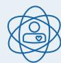

## 经营理念

创新引领发展 科技创造价值

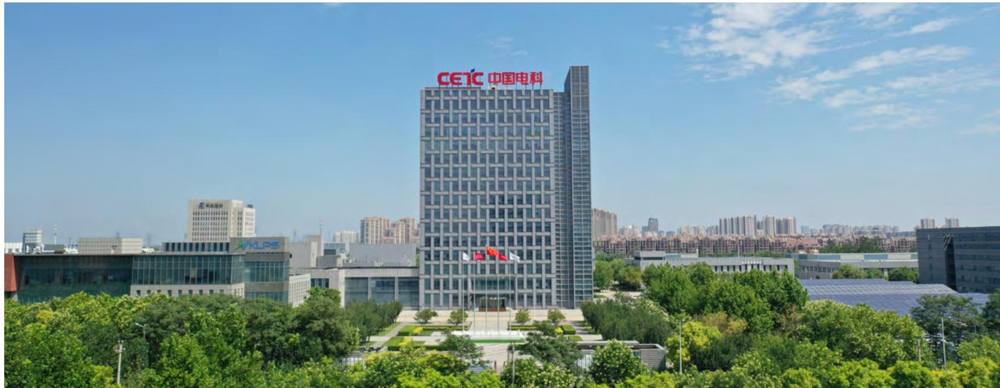

text_image

CETC 中国电科
KLPS

## 发展历程

## 1992 年 10 月

天津蓝天电源公司成立，为全民所有制企业，由中国电子科技集团公司第十八研究所出资设立

## 2014 年 4 月

经中国电子科技集团有限公司批准，天津蓝天电源公司完成改制，由全民所有制企业转制为有限责任公司

## 2017 年 6 月

天津蓝天电源有限责任公司更名为中电力神有限公司，成为中国电科全资控股的二级成员单位

## 2020 年 12 月

公司更名为“中电科能源有限公司”

## 2021 年 1 月

公司启动混合所有制改革

## 2022 年 5 月

全面完成混合所有制改革

## 2022 年 12 月

完成股份制改造，并更名为“中电科蓝天科技股份有限公司”

## 2026 年 2 月 10 日

公司正式登陆上交所科创板，完成首发上市

## 亮点荣誉

## 2024 年 6 月

电科集团民品产业单项冠军企业

中国电子科技集团有限公司

## 2025 年 2 月

国防科技进步二等奖（空间高效多级顺序开关MPPT型电源控制系统）

工业和信息化部

## 2025 年 3 月

集团科技进步三等奖（IMM TJ33柔性薄膜砷化镓太阳电池技术及应用）

中国电子科技集团有限公司

## 2025 年 3 月

集团科技进步三等奖

（新一代GEO卫星锂离子蓄电池组）

中国电子科技集团有限公司

natural_image

Golden trophy with star emblem and two handles, no visible text or symbols

## 2025 年 5 月

国务院国资委2024年度

“ 双百改革 ”优秀企业

国务院国资委

## 2025 年 4 月

2024 年度

航天贡献奖

中国航天基金会

## 2025 年 8 月

天津市

猎豹企业

天津市科学技术局

## ESG 治理

电科蓝天积极践行可持续发展理念，将 ESG 要求融入战略规划与经营管理全过程，持续提升环境、社会与治理绩效水平，推动企业稳健发展与社会价值创造协同实现。

## ESG 管理体系

公司持续完善 ESG 治理机制，将 ESG 理念纳入企业战略规划，推动环境、社会及治理要求与经营管理深度融合。公司以董事会为核心构建 ESG 治理体系，明确 ESG 发展愿景，将可持续发展理念融入战略决策与经营管理全过程，主动践行上市公司社会责任。

董事会作为 ESG 治理的最高决策与监督机构，统筹 ESG 重大事项；董事会下设战略委员会，承担ESG 相关工作的统筹协调职责；各职能部门依据职责分工推进 ESG 具体工作落实，形成自上而下推动、横向协同联动的治理机制。

<table><tr><td>决策监督层</td><td>董事会</td><td>作为ESG治理的最高决策与监督机构,确立ESG发展愿景,将ESG理念融入企业战略规划,对ESG相关重大事项进行统筹决策与监督</td></tr><tr><td>统筹协调层</td><td>战略委员会</td><td>承担ESG相关工作的统筹与协调职责,推动ESG内外部相关事项的协同开展</td></tr><tr><td>执行落实层</td><td>各职能部门</td><td>根据职责分工推进ESG具体工作落实,形成协同推进机制</td></tr></table>

公司围绕前期调研、专项研讨、监督推进及持续优化等环节推进 ESG 管理工作，不断夯实管理基础并完善体系建设。同时，结合发展愿景、行业趋势及政策导向，构建覆盖短期与中长期的 ESG 目标体系，其中短期聚焦基础工作落地，中长期着力提升 ESG 管理能力与价值创造水平。

围绕目标落实，公司建立常态化审核评估机制，通过定期评估、动态调整及成果总结，持续提升管理成效，并将 ESG 要求纳入高级管理人员绩效考核体系，将相关内容嵌入分管业务重点任务，与薪酬激励机制相衔接，推动 ESG 责任在经营管理中的有效落实。

## 利益相关方沟通

公司围绕高质量发展要求，持续深化与各类利益相关方的沟通与协同，通过多渠道识别利益相关方关注重点与核心诉求，构建常态化沟通机制与反馈闭环，推动 ESG 管理与公司经营实践深度融合，不断提升公司治理水平与可持续发展能力。

公司结合业务特点，识别政府及监管机构、股东及投资者、员工、客户、供应商及合作伙伴以及公众及社区等主要利益相关方，围绕其核心关切，持续完善沟通方式与响应机制。

<table><tr><td colspan="2">利益相关方</td><td>期望与诉求</td><td>沟通与回应</td></tr><tr><td></td><td>政府及监管机构</td><td>响应国家战略依法合规经营服务国家重大需求依法履行纳税义务</td><td>政策执行信息报送与披露日常工作对接税务申报</td></tr><tr><td></td><td>股东及投资者</td><td>经营业绩稳健持续回报规范治理长期发展能力</td><td>信息披露股东会投资者交流活动ESG报告发布</td></tr><tr><td></td><td>员工</td><td>薪酬福利保障职业发展通道职业健康与安全参与管理关怀机制</td><td>薪酬与福利体系培训与发展机制绩效考核与晋升安全生产培训内部沟通机制员工关怀活动</td></tr><tr><td></td><td>客户</td><td>产品与服务质量客户服务体验信息安全保障绿色与可持续产品</td><td>客户沟通与反馈机制满意度调研数据与信息安全管理质量管理与培训</td></tr><tr><td></td><td>供应商及合作伙伴</td><td>公平合作互利共赢规范采购合作稳定性</td><td>规范采购管理合作平台建设合同履约与结算管理</td></tr><tr><td></td><td>公众及社区</td><td>促进区域发展履行社会责任参与公益事业</td><td>公益活动开展社区互动与支持志愿服务</td></tr></table>

## 双重实质性议题分析

## 双重实质性议题分析流程

## 议题 识别

通过开展政策研究、行业分析、同业对标及利益相关方沟通与调研等方式，系统识别与公司发展相关的重要趋势，结合国家政策导向及资本市场关注重点，筛选形成初步重要性议题清单；

## 重要性评估

基于调研结果，对识别出的议题进行综合分析与合理性评估，并结合国家政策要求、资本市场关注方向及行业发展情况，对议题进行排序，形成利益相关方视角下的实质性议题结果；

## 管理层确认

公司管理层对实质性议题评估结果进行审议与确认，明确报告重点披露内容，并据此确定后续 ESG 管理工作的重点方向及实施安排。

电科蓝天 2025 年双重实质性议题矩阵  
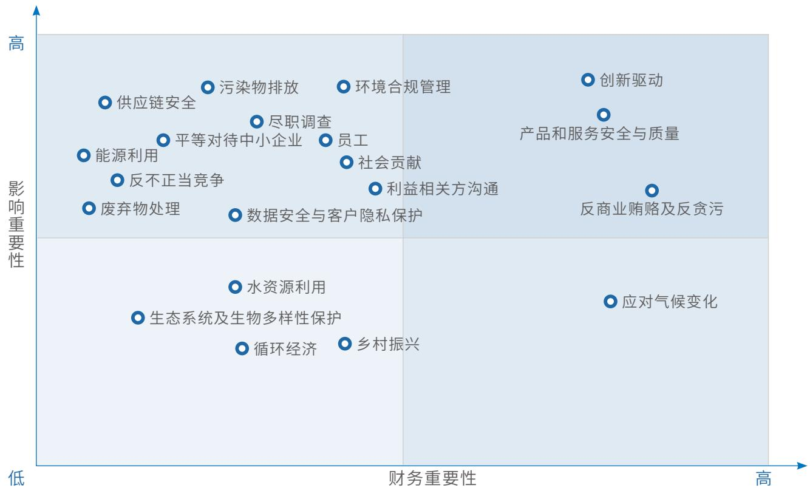

scatter

| Topic | Financial Importance (X) | Impact Importance (Y) |
| :--- | :--- | :--- |
| 创新驱动 | High | High |
| 产品和服务安全与质量 | High | High |
| 反商业贿赂及反贪污 | High | Medium-High |
| 应对气候变化 | High | Low-Medium |
| 污染物排放 | Low-Medium | High |
| 环境合规管理 | Low-Medium | High |
| 供应链安全 | Low | High |
| 尽职调查 | Low-Medium | High |
| 员工 | Low-Medium | High |
| 平等对待中小企业 | Low-Medium | High |
| 能源利用 | Low | High |
| 社会贡献 | Low-Medium | Medium-High |
| 反不正当竞争 | Low | Medium-High |
| 利益相关方沟通 | Low-Medium | Medium-High |
| 数据安全与客户隐私保护 | Low-Medium | Medium-High |
| 废弃物处理 | Low | Medium-High |
| 水资源利用 | Low-Medium | Low-Medium |
| 生态系统及生物多样性保护 | Low | Low-Medium |
| 循环经济 | Low-Medium | Low-Medium |
| 乡村振兴 | Low-Medium | Low-Medium |

## 既具有财务重要性又具有影响重要性的议题

产品和服务安全与质量

创新驱动

反商业贿赂及反贪污

## 具有财务重要性但不具有影响重要性的议题

应对气候变化

## 具有影响重要性但不具有财务重要性的议题

数据安全与客户隐私保护

员工

供应链安全

平等对待中小企业

社会贡献

环境合规管理

污染物排放

废弃物处理

能源利用

利益相关方沟通

尽职调查

反不正当竞争

## 具有一般重要性的议题

乡村振兴

循环经济

水资源利用

生态系统和生物多样性保护

natural_image

Illustration of a person presenting to a large screen displaying charts and a browser, with money bills and decorative elements in the background (no text or symbols)

## 0 1

## 守正笃行 夯实治理基础

电科蓝天恪守国家法律法规及监管要求，持续完善公司治理架构、强化合规风控能力，健全投资者沟通机制，坚守廉洁公平经营底线。公司通过系统化的制度建设、规范化的流程管控和全方位的监督举措，全面提升治理效能与合规水平，切实保障全体利益相关方权益，为公司长期稳健发展奠定坚实基础。

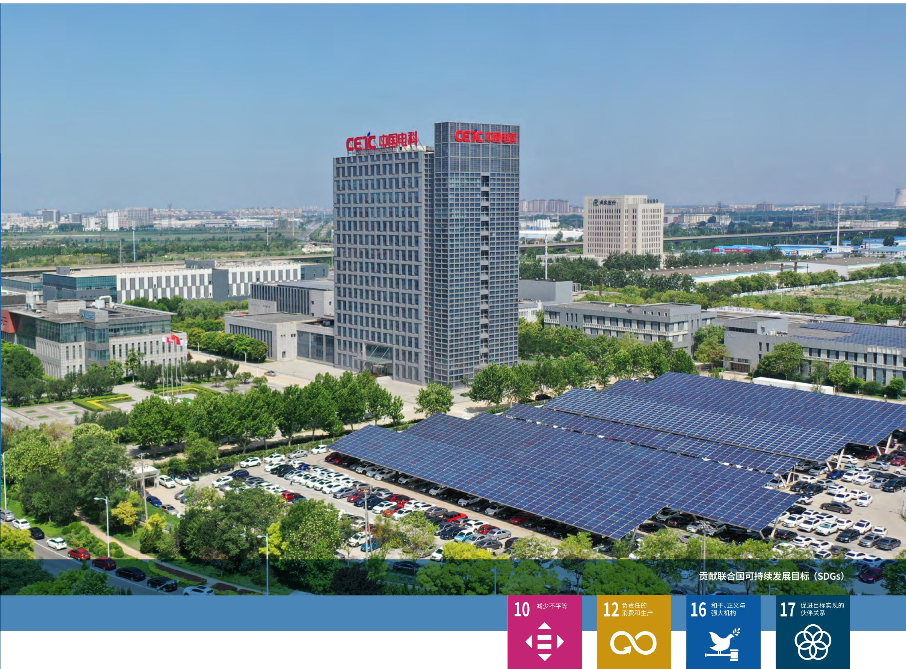

text_image

CETC 中国科技
CETC 中国
贡献联合国可持续发展目标（SDGs）
10 减少不平等
12 负责任的消费和生产
GO
16 和平、正义与强大机构
17 促进目标实现的伙伴关系

## 完善治理架构

公司严格落实《中华人民共和国公司法》《中华人民共和国证券法》等法律法规，完善了《公司章程》《股东会议事规则》《董事会议事规则》等一系列治理基本制度，推动公司建立符合上市公司要求的公司治理和经营管理机制，建立并完善满足双重监管要求的公司治理体系，着力推动规范全级次董事会建设提质增效。

## 公司治理架构

公司遵守上市公司规范运作及监管要求，建立健全现代企业治理体系，进一步完善权责法定、权责透明、协调运转、有效制衡的公司治理机制，严格规范公司运作，提升治理水平。

公司组织架构图  
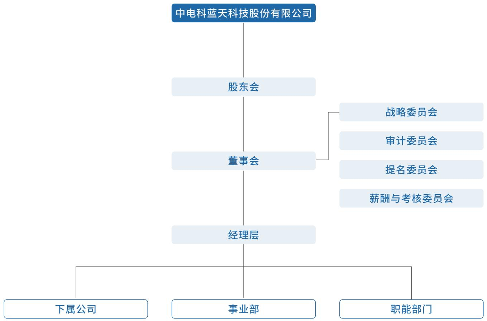

flowchart

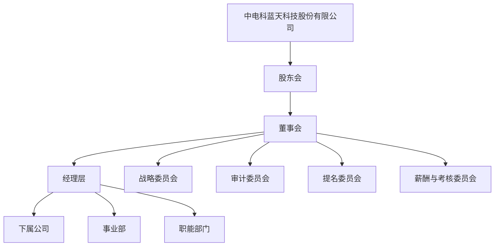
```mermaid
graph TD
  A["中电科蓝天科技股份有限公司"] --> B["股东会"]
  B --> C["董事会"]
  C --> D["经理层"]
  C --> E["战略委员会"]
  C --> F["审计委员会"]
  C --> G["提名委员会"]
  C --> H["薪酬与考核委员会"]
  D --> I["下属公司"]
  D --> J["事业部"]
  D --> K["职能部门"]
```

## 股东会

公司制定了《股东会议事规则》，规范股东会的召集、召开及表决程序。股东会审议的议案涵盖公司改革发展方案、利润分配方案、年度预决算、投资计划、公司章程修订、董事会工作报告等重大事项。公司依法合规向股东披露公司经营情况及改革发展最新进程，依法维护股东的知情权。

## 关键绩效

报告期内，召开股东会 4 次。

## 董事会治理

公司建立了完善的董事会治理体系，制定了《独立董事工作制度》《董事会秘书工作细则》及各专门委员会实施细则等治理基本制度，为董事会规范履职、科学决策提供坚实的制度保障。

公司董事会成员 11 人，其中女性董事 1 人，占比 9%，独立董事 4 人，占比 36%。董事会成员具有财务、法律、科研、生产经营等专业背景，结构上注重配备熟悉公司战略方向、主营业务与风险防控的专业人才，提升董事会专业经验的多元化和能力结构的互补性。

## 关键绩效

公司召开董事会 6 次，共审议议案 52 项。

公司制定《独立董事工作制度》，规定独立董事占比不低于董事会成员的三分之一且至少包括一名会计专业人士，独立董事与公司及其主要股东不存在影响独立客观判断的关系。制度规定独立董事在关联交易等重大事项中须经全体独立董事过半数同意方可提交董事会审议，并在薪酬与考核、审计专门委员会中过半数并担任召集人，有效保障了董事会的独立性。

2025 年，公司建立董事会标准化运行机制，完善外部董事预沟通、专门委员会会前审议及董事会决议跟踪督办等制度，独立董事全程参与重大事项审议，全年董事会会议应出席率 100%，有力提升了董事会决策的科学性和有效性。

## 董事会专门委员会

公司董事会下设战略委员会、审计委员会、薪酬与考核委员会、提名委员会四个专门委员会。报告期内，公司修订了各专门委员会实施细则，确保各专门委员会职责明确、分工协作，向董事会提供了专业建议与决策支持，进一步提升了董事会决策的科学性和有效性。

<table><tr><td>专门委员会名称</td><td>成员人数</td><td>独立董事占比</td><td>主要职责</td></tr><tr><td>战略委员会</td><td>3人</td><td>33.33%</td><td>研究公司长期发展战略、重大投资决策及年度经营计划,监督战略实施和投资绩效评估。</td></tr><tr><td>审计委员会</td><td>3人</td><td>66.67%</td><td>负责公司内外部审计的沟通与监督,审核财务报告,检查风险管理、内部控制及合规体系,监督内外部审计机构工作,及时报告重大风险和问题。</td></tr><tr><td>薪酬与考核委员会</td><td>3人</td><td>66.67%</td><td>研究制定董事及高级管理人员的考核标准与薪酬政策,依据考核结果提出薪酬兑现建议,组织检查绩效管理和薪酬工作。</td></tr><tr><td>提名委员会</td><td>3人</td><td>66.67%</td><td>研究董事及高级管理人员的选任标准和程序,对候选人进行资格审查并向董事会提出建议。</td></tr></table>

## 关键绩效

报告期内

公司召开董事会专门委员会会议 14 次；

其中，召开审计委员会会议 6 次，召开战略委员会会议 5 次，召开薪酬与考核委员会会议 1 次，召开提名委员会 2 次；共审议议案 54 项。

natural_image

Two business professionals reviewing documents at a desk with a laptop and documents (no visible text or symbols)

## 强化合规风控

电科蓝天高度重视风险管理与内部控制体系建设，通过持续完善风险识别、评估、应对与监督机制，健全内控流程与制度体系，不断提升风险防范能力与治理效能，切实保障利益相关方权益，为公司长期稳健运营与可持续发展筑牢坚实基础。

## 风险管理

公司依据国资委《中央企业全面风险管理指引》等文件，结合公司实际情况，建立并实施《全面风险管理基本制度》，遵循“统筹规划、总法负责、全面防范、分级管理、重点监控、持续改进”的原则，对风险管理计划制定、风险信息收集、风险识别、风险评估、风险应对、风险监控与预警、风险信息库及资信黑名单建设等内容做出系统规范，为实现全面风险管理总体目标提供合理的实施过程和方法。

风险管理体系

<table><tr><td colspan="3">双向网络的风险管理组织体系</td></tr><tr><td rowspan="2">横向网络</td><td>公司层面</td><td>董事会(审计委员会)- 经营班子 - 合规部 - 各部门</td></tr><tr><td>下属公司层面</td><td>董事会 / 总经理办公会 - 风险管理部门 - 各部门</td></tr><tr><td colspan="2">纵向网络</td><td>公司合规部 - 各下属公司风险管理部门 - 专 / 兼职风险管理人员</td></tr></table>

公司全面风险管理工作的三道防线

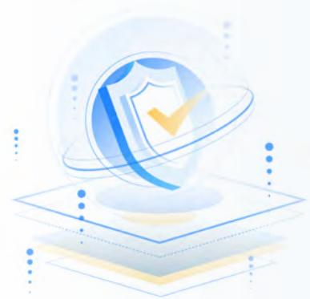

natural_image

Abstract digital illustration of a shield with checkmark inside a circular emblem, surrounded by layered transparent layers (no text or symbols)

第一道防线 各业务主管部门、业务单位

第二道防线 风险管理部门

第三道防线 纪检监察部门、内部审计部门

## 风险的识别、防控与应对

公司遵循“识别 - 评估 - 防控 - 应对”的闭环管理流程，定期开展风险识别与评估，采取定性与定量相结合的方式，对各风险项的等级、表现形式、危害程度等方面进行合理评估；建立风险监控与预警机制，合规部组织各相关职能部门做好日常风险监控及预警工作，及时采取风险应对措施，防范风险于未然。

## 内控合规

公司结合实际业务特点和管理模式，制定了《内部控制体系监督评价管理办法》《内部审计管理基本制度》等内控制度，规范了内控监督评价程序和方法。公司每年定期开展内控体系监督评价工作，通过穿行测试、访谈、调阅资料等方式，对公司内部控制整体有效性进行现场评价，督促提升内控体系管理。

报告期内，公司按照《内部控制体系监督评价管理办法》要求，围绕内部环境、风险评估、控制活动、信息与沟通、内部监督五要素，采用“全面自查与重点评价相结合”方式，组织对本部及 4 家下属公司 2025 年度内部控制设计与执行情况进行评价，编制 2025 年度内部控制评价报告，促进公司高质量、可持续发展。

## 风险管理和内控合规培训

公司围绕合规管理体系建设，分层分类开展多维度、全覆盖的合规培训工作，持续强化全员合规意识与风险防控能力。

针对业务管理要求，组织各级领导干部及采购、招投标、市场、工程建设、财务等关键岗位人员，专题学习《业务违规处罚防范处置合规指引》，进一步健全业务合规管理机制，切实提升违规风险的预防、应对与处置能力，从源头防范各类违规处罚风险。

公司面向全级次合同管理人员与法务合规人员开展两次专项法务合规培训，围绕《民法典》等合同相关法律法规、典型法律实务案例以及反垄断法律法规与风险识别防控要点进行系统学习，有效增强相关岗位人员的合规素养，持续提升公司合同管理与风险防范水平。

在公司上市筹备阶段，专门组织全体高级管理人员及相关部门负责人开展上市前合规专题培训，聚焦法律合规、风险管理、内部控制等核心要求，强化全员责任意识与风险理念，筑牢上市合规基础，全面提升公司整体合规管控能力。

## 真诚透明沟通

公司高度重视投资者关系管理工作，持续构建规范高效、运行顺畅的投资者沟通机制。公司 IPO 阶段已参照《上市公司投资者关系管理工作指引》《上海证券交易所科创板股票上市规则》等监管要求，制定了上市后适用的《投资者关系管理制度》《信息披露管理制度》并在公司章程中明确了相关内容，切实保障投资者知情权、参与权等合法权益，提升公司治理透明度与资本市场公信力，为公司稳健发展营造良好的外部环境。

## 投资者关系管理

公司制定《投资者关系管理制度》，明确董事会秘书为投资者关系管理负责人，公司董事会办公室负责具体承办落实，遵循公开、公平、公正原则，客观、真实、准确、完整地介绍公司实际状况，促进公司与投资者之间的良性关系。

## 投资者交流

公司通过公司官网、新媒体平台、电话、传真、电子邮箱、股东会、投资者说明会、路演、分析师会议、接待来访等多种渠道与投资者进行沟通，并设立投资者联系电话、传真和电子邮箱，由熟悉情况的专人负责，保证在工作时间线路畅通。

## 公司投资者交流渠道

电话：022-23721226

电子邮箱：dshbgs@lantiantech.com.cn

传真：022-23383783

natural_image

Illustration of people interacting with laptops and social media icons (no text or symbols)

## 关键绩效

2025 年，公司配合股东开展各类日常工作超 100次。

## 信息披露机制

公司制定《信息披露管理制度》，规定信息披露义务人真实、准确、完整、及时地披露信息，不得有虚假记载、误导性陈述或者重大遗漏，并同时向所有投资者公开披露信息。该制度明确了公司定期报告须经董事会审议通过，财务信息经审计委员会全体成员过半数同意后提交董事会；发生可能对公司证券及其衍生品种交易价格产生较大影响的重大事件时，公司应当立即披露临时报告。

公司董事会办公室是信息披露事务的常设机构，董事会秘书是公司信息披露的具体执行人和上海证券交易所的指定联络人，确保信息披露工作规范、有序、高效落地。

## 坚持廉洁公平

## 反商业贿赂及反贪污

电科蓝天始终把“廉洁从业”作为各级各类岗位人员的基本要求，树立“廉洁从业、合规经营”的经营管理理念，营造“崇德守正、诚实担当、勤廉兴业”的廉洁文化氛围。

## 治理

公司建立了覆盖反腐败与反商业贿赂的多层次制度体系，制定并出台《纪委工作规则》《监督执纪工作基本制度》《领导人员廉洁从业承诺实施细则》等制度文件，围绕权力运行制约监督、廉洁风险防控、监督执纪问责、领导人员及员工廉洁从业管理与考核等方面作出系统规范，持续筑牢廉洁风险防控屏障。公司通过组织干部职工签署《廉洁从业承诺书》等举措加强内部监督约束。

## 战略

影响、风险和机遇分析及应对措施

<table><tr><td>风险名称</td><td>风险描述及潜在影响</td><td>影响时间(短期/中期/长期)</td><td>发生可能性(小/中/大)</td><td>应对措施</td></tr><tr><td>关键岗位廉洁风险</td><td>权力集中、资金密集的关键岗位人员可能利用职务便利收受贿赂、利益输送,损害公司利益。</td><td>短期</td><td>中</td><td>·对采购、销售、工程建设等重点部门开展定期廉洁风险专项排查,识别潜在的违规行为,发现问题立即整改并追究相关人员责任。</td></tr></table>

<table><tr><td>风险名称</td><td>风险描述及潜在影响</td><td>影响时间(短期/中期/长期)</td><td>发生可能性(小/中/大)</td><td>应对措施</td></tr><tr><td>内控执行缺陷风险</td><td>2025年度内控自评价发现的执行缺陷,若整改不到位,可能在未来引发商业贿赂或利益输送事件,甚至导致监管处罚。</td><td>短期</td><td>中</td><td>·明确执行缺陷的责任部门、责任人和完成时限,建立整改台账并每周跟踪督办;·将内控缺陷整改完成情况纳入相关部门及人员的月度绩效考核,对因整改不到位导致发生商业贿赂或利益输送事件的,严肃追究相关人员责任。</td></tr></table>

<table><tr><td>机遇名称</td><td>机遇描述及潜在影响</td><td>影响时间(短期/中期/长期)</td><td>发生可能性(小/中/大)</td><td>应对措施</td></tr><tr><td>市场信誉提升机遇</td><td>公司持续营造“崇德守正、诚实担当、勤廉兴业”的廉洁文化氛围,通过签署廉洁承诺书、开展廉洁培训等措施,有助于提升公司在客户、投资者和合作伙伴中的信誉。</td><td>中期</td><td>大</td><td>·将廉洁文化建设纳入企业品牌宣传,向社会传递公司诚信合规的形象;·对在反腐败工作中表现突出的部门和个人给予表彰,形成正向激励。</td></tr><tr><td>数智化管理机遇</td><td>公司已建立月度风险监控和季度评估机制,未来可进一步利用数智化管理手段,实现采购、销售、招投标等关键环节的实时监控和异常预警,提高反腐败工作效率。</td><td>长期</td><td>中</td><td>·开发反腐败数据监控平台,对合同、付款、供应商信息等进行交叉分析,识别异常交易。</td></tr></table>

## 举报与投诉

公司纪委制定《信访举报和问题线索集中管理工作细则》，建立了完善的举报与投诉机制。设置了来信、来电、来访、网络举报以及相关部门转办交办等渠道，并制定了严格的举报人保护制度。

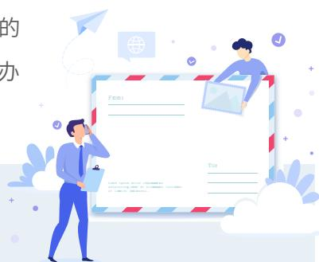

text_image

的
办
Firm
Top

通信地址：天津市滨海高新区海泰华科七路 6 号 58 号信箱

举报邮箱：cetc18jubao@163.com

公司纪检部门依规依纪受理对党组织、党员违反党的纪律行为的检举控告，以及对员工涉嫌贪污贿赂、利益输送等职务违法犯罪行为的检举控告。公司指定专人负责信访举报的编号、登记、流转，对属于受理范围的信访举报，在收到问题线索之日起 1 个月内召开线索专题分析会研究提出处置意见。

公司严格按照《中国共产党纪律检查机关监督执纪工作规则》及公司《信访举报和问题线索集中管理工作细则》所规定的方式和要求开展核实工作，在受理登记、呈批流转、跟踪督办、归档整理等全过程中严格执行保密制度，不准私自留存、隐匿、查阅、摘抄、复制、携带信访举报和问题线索，严格控制知悉范围，不得擅自扩大报送、抄送范围，不得违规将信访举报转给被反映人，坚决防止跑风漏气和失泄密情况发生。对私存信访举报、跑风漏气、以案谋私等行为，依照有关规定从严处理。公司承诺对举报人信息严格保密，并对核实的问题严肃处理，切实保障举报人的合法权益不受侵害。

## 商业伙伴廉洁监管

公司对供应商实施严格的廉洁管理，通过制度约束、协议签署、动态监督和负面清单等措施构建全流程廉洁监管体系。公司制定《供应商负面清单管理实施细则》向供应商宣贯，明确将利用商业贿赂等不正当手段谋取利益的行为纳入供应商负面清单，规定了禁止期及终止合作等处理措施。

公司组织开展清链 2025 专项整治行动，对供应商资质进行复核，剔除低资质供方、空壳公司，并前往重点供应商生产场所开展现场监督检查、签署承诺书，建立诚信供应商“护城河”。同时，公司组织重点供应商召开廉洁共建大会，向全体参会供应商传递公司对商业贿赂、利益输送、围标串标等违规行为的零容忍态度，明确划定合作廉洁红线，清晰告知相关行为的禁止性要求。大会同步公布举报渠道，详细说明违规行为将面临的列入黑名单、追究法律责任等严重后果，期间与供应商逐一签订阳光合作协议，将公司廉洁合规要求全面转化为供应商主动遵循、严格恪守的行为准则，筑牢供需双方廉洁合作防线。

## 影响、风险和机遇管理

公司结合巡视巡察、内外部审计、监督检查等发现问题，系统梳理廉洁风险点，从发生频率、人为因素、制度漏洞、危害程度等维度分析排序，确定重点管控风险，编制《风险管理信息库》《岗位重要风险防控手册》。建立 “月度数据监控 + 季度综合评估” 风险预警机制，科学设置可量化监控指标与阈值，按月归集数据、突破阈值即时上报，实现风险早发现、早处置。

聚焦投资决策、外协外包、物资采购、工程建设、招标投标等重点领域关键环节，精准制定廉洁风险防控措施，坚持标本兼治、惩防并举，强化全过程监督，严防商业贿赂、利益输送、职务侵占等问题，以制度刚性约束筑牢廉洁从业防线。

指标与目标

<table><tr><td>管理指标</td><td>2025年数据</td></tr><tr><td>经确认的腐败事件总数</td><td>0件</td></tr><tr><td>反商业贿赂及反贪污培训开展次数</td><td>10次</td></tr><tr><td>反商业贿赂及反贪污培训覆盖的董事总数</td><td>9人</td></tr><tr><td>反商业贿赂及反贪污培训覆盖的董事百分比</td><td>81.82%</td></tr><tr><td>反商业贿赂及反贪污培训覆盖的管理层人员总数</td><td>8人</td></tr><tr><td>反商业贿赂及反贪污培训覆盖的管理层人员百分比</td><td>100%</td></tr><tr><td>反商业贿赂及反贪污培训覆盖的员工总数</td><td>88人</td></tr><tr><td>签署廉洁承诺书的员工人数</td><td>117人</td></tr><tr><td>签署反贿赂承诺书的供应商数量</td><td>123家</td></tr></table>

## 反垄断与反不正当竞争

公司依据《中华人民共和国反不正当竞争法》《中华人民共和国反垄断法》及《中央企业商业秘密保护暂行规定》等相关法律法规，制定《商业秘密事项目录》《商业秘密保护管理办法（试行）》《新闻宣传工作管理办法》等制度文件，在强化商业秘密全流程保护、筑牢公平竞争底线的基础上，围绕公司使命责任与发展目标，规范开展成就宣传、主题宣传、典型宣传及品牌宣传工作，坚决杜绝虚假宣传、商业诋毁、侵犯商业秘密等不正当竞争及违法违规行为，切实维护公平有序的市场竞争环境。同时，公司对供应商开展培训，要求供应商坚持诚信原则，做到商业行为合规、反不正当竞争，并明确投诉调查、违约责任等相关要求。报告期内，公司未发生因不正当竞争行为导致诉讼或重大行政处罚的情况。

## 风险管理

公司坚持落实“月度数据监控 + 季度综合评估”的风险预警机制，从可行性与可量化角度完成风险监控指标、阈值的设置，按月收集监控指标数据，发生突破阈值情况立刻上报，持续关注公司反不正当竞争风险。

公司每年开展内控体系监督评价工作，通过穿行测试、访谈、调阅资料等方式，对公司内部控制整体有效性进行现场评价，内控评价过程中持续关注反不正当竞争情况，发现问题责令整改，涉及违规违纪行为移交纪检部门处置。

## 党建引领业务

电科蓝天党委坚持以习近平新时代中国特色社会主义思想为指导，深入贯彻党的二十大和二十届历次全会精神，充分发挥党委“把方向、管大局、保落实”领导作用，在完善公司治理中加强党的领导，在推进改革转型中深化党建工作，推动党建效能持续向科技创新、产业发展、合规管理等方向发力，以高质量党建引领保障高质量发展。

## 政治引领，领航高质量发展

公司坚持以政治建设为统领、创新理论学习为牵引，自觉把电能源事业发展放到国家战略全局中来谋划推动，聚焦习近平总书记关于科技创新、人工智能等重要论述及党的二十届四中全会精神开展联学共悟与专题研讨。深化 “党委 + 基层” 贯通机制，体系化谋划“十五五”发展布局，制定电能源解决方案，以高质量党建引领治理，坚决履行央企使命责任。

## 党的领导，推进高质量发展

公司将党建工作写入公司章程，全级次修订党组织工作规则、“三重一大”决策制度，分层分类、细化优化前置研究讨论重大事项清单，逐步构建“权责分明、各司其职、协调运转、科学高效”的工作体系。公司党委聚焦重大工程任务建立“定期听取汇报、协调解决问题、全程跟踪问效”闭环机制，成功保障载人航天、深空探测、南极科考等任务圆满完成，加速壮大商业航天、钠电储能等新兴产业。

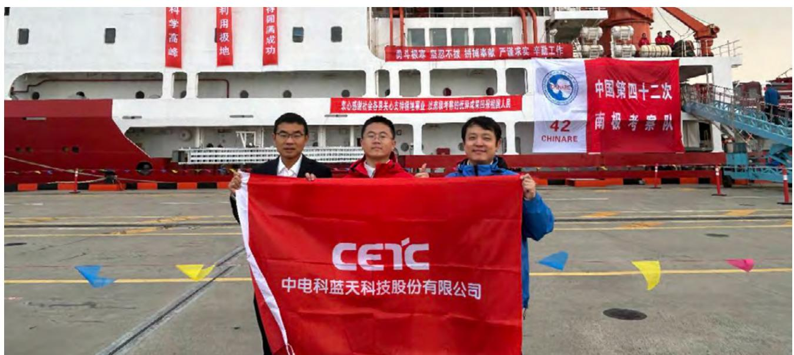

text_image

科学高峰
利用极地
待附属成功
勇斗极寒 堤忍不拔 拼捕奉献 严谨求实 辛勤工作
核心感谢社会各界关心支持各地事业 汉南省考察的性别成果四届全国人民
42 CHINARE
中国第四十二次
南极考察队
CETC
中电科蓝天科技股份有限公司

公司组织南极新能源微电网保障队员举行出征壮行仪式，激励队员圆满完成系统搭建与越冬供能任务。

## 党建增效，赋能高质量发展

公司坚持党建工作与中心工作深度融合，推动基层规范开展“三会一课”、主题党日等，紧盯重大任务建立“勇攀科技高峰”攻关团队，开展“多链协同发展”联建共建，搭建工匠比武、劳动竞赛等岗位建功平台，组织开展暑期托管班、产业园骑行、心理健康月等特色活动，汇聚干事创业强大活力合力，科技创新、改革发展等成果获得央视网、天津新闻等主流媒体关注，切实增强基层党组织政治功能和组织功能。

## 管党治党，保障高质量发展

扎实开展深入贯彻中央八项规定精神学习教育，一体推进学查改，引领全员强党性、转作风、干实事。召开 2025 年全面从严治党工作会议，谋划部署全年重点任务，并分类签订责任书，逐项分解任务、层层传导压力，推进全面从严治党向纵深发展。常态化开展廉洁教育，建立月度警示通报机制，引导党员、干部知敬畏、存戒惧、守底线，筑牢全员思想防线、涵养发展良好生态。

## 案例

## 公司党委集中学习贯彻党的二十届四中全会精神

公司党委召开理论学习中心组（扩大）会议，专题学习党的二十届四中全会精神，建立“党委领学 + 基层践学”机制，自上而下推动全会精神入脑入心。党委强调以高质量党建引领保障高质量发展，强化思想引领与底线思维，激励党员干部担当作为，为加快建设电能源领域世界一流创新型科技企业贡献力量。

## 02

## 绿色运营守护碧水蓝天

面向绿色低碳发展新阶段，电科蓝天将环境责任融入发展理念与经营实践之中，在持续提升治理能力与运行质效的过程中，不断夯实绿色发展的内生基础。公司以系统化思维推进环境管理与资源配置优化，统筹降碳减污与风险防控，强化对生态环境的守护与修复，在高质量发展进程中实现人与自然和谐共生的价值追求。

natural_image

Hand interacting with a digital recycling symbol on a green background, surrounded by icons representing energy sources and sustainability (no text or symbols)

贡献联合国可持续发展目标（SDGs）

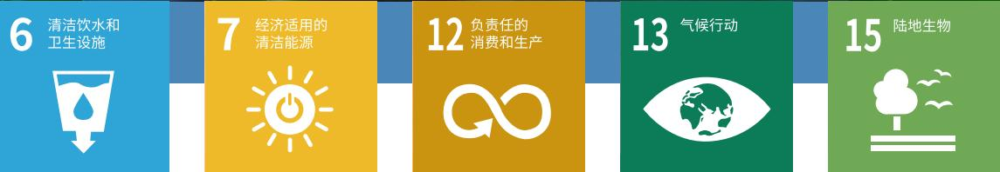

## 健全环境管理

电科蓝天严格遵循国家环境保护法律法规，持续完善环境合规管理体系，将环境管理要求全面融入生产经营全过程。公司围绕制度建设、责任落实、项目管控与风险防控等关键环节，构建形成系统化、规范化的环境管理机制，持续提升环境治理能力与合规管理水平，保障企业稳健运营与绿色发展。

## 关键绩效

报告期内，环境管理总投入 94.12万元，未发生违反环境法律法规的事件，未发生因环境事件受到生态环境等有关部门重大行政处罚的情况。

## 管理制度与体系建设

公司持续夯实环境合规管理基础，围绕制度建设与体系运行，建立了较为系统的环境管理机制。公司编制《环境、职业健康安全管理手册》，明确管理框架与方针，并制定《环境保护管理制度》，对环境管理工作的具体要求与流程进行细化，形成覆盖日常管理与风险防控的制度体系。同时，公司由技术安全部作为环保监督管理部门，设置专职环保管理员，各事业部及下属公司均配备环保管理人员，为环境管理工作的有序开展提供组织保障。

公司依据 ISO 14001:2015 标准建立、实施并持续改进环境管理体系，报告期内已取得环境管理体系认证证书，进一步提升环境管理的规范化与体系化水平。

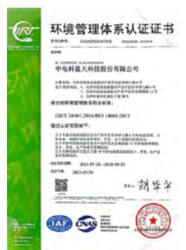

text_image

环境管理体系认证证书
申请号：C2014030018765 证书类型：环保型
审核人：胡华华
中电科蓝天科技股份有限公司
注册地址：北京市东城区东直门内大街25号东方文化大厦A座19层
办公地址：北京市西城区东直门内大街25号东方文化大厦A座19层
法定代表人：王洪波
经营范围：许可经营项目：电子设备及元器件制造、销售、安装、调试、维修、维护、保养、维护服务；依法须经批准的项目，经相关部门批准后方可开展经营活动，具体经营项目以相关部门批准文件或许可证件为准）。
GB/T 24001-2016/ISO 14001-2015
通过认证范围如下：
1. 位于上海市浦东新区浦东大道200号环球金融中心办公楼18层和21层
2. 位于上海市浦东新区浦东大道200号环球金融中心办公楼18层和21层
3. 位于上海市浦东新区浦东大道200号环球金融中心办公楼18层和21层
4. 位于上海市浦东新区浦东大道200号环球金融中心办公楼18层和21层
5. 位于上海市浦东新区浦东大道200号环球金融中心办公楼18层和21层
6. 位于上海市浦东新区浦东大道200号环球金融中心办公楼18层和21层
7. 位于上海市浦东新区浦东大道200号环球金融中心办公楼18层和21层
8. 位于上海市浦东新区浦东大道200号环球金融中心办公楼18层和21层
9. 位于上海市浦东新区浦东大道200号环球金融中心办公楼18层和21层
10. 位于上海市浦东新区浦东大道200号环球金融中心办公楼18层和21层
11. 位于上海市浦东新区浦东大道200号环球金融中心办公楼18层和21层
12. 位于上海市浦东新区浦东大道200号环球金融中心办公楼18层和21层
13. 位于上海市浦东新区浦东大道200号环球金融中心办公楼18层和21层
14. 位于上海市浦东新区浦东大道200号环球金融中心办公楼18层和21层
15. 位于上海市浦东新区浦东大道200号环球金融中心办公楼18层和21层
16. 位于上海市浦东新区浦东大道200号环球金融中心办公楼18层和21层
17. 位于上海市浦东新区浦东大道200号环球金融中心办公楼18层和21层
18. 位于上海市浦东新区浦东大道200号环球金融中心办公楼18层和21层
19. 位于上海市浦东新区浦东大道200号环球金融中心办公楼18层和21层
20. 位于上海市浦东新区浦东大道200号环球金融中心办公楼18层和21层
21. 位于上海市浦东新区浦东大道200号环球金融中心办公楼18层和21层
22. 位于上海市浦东新区浦东大道200号环球金融中心办公楼18层和21层
23. 位于上海市浦东新区浦东大道200号环球金融中心办公楼18层和21层
24. 位于上海市浦东新区浦东大道200号环球金融中心办公楼18层和21层
25. 位于上海市浦东新区浦东大道200号环球金融中心办公楼18层和21层
26. 位于上海市浦东新区浦东大道200号环球金融中心办公楼18层和21层
27. 位于上海市浦东新区浦东大道200号环球金融中心办公楼18层和21层
28. 位于上海市浦东新区浦东大道200号环球金融中心办公楼18层和21层
29. 位于上海市浦东新区浦东大道200号环球金融中心办公楼18层和21层
30. 位于上海市浦东新区浦东大道200号环球金融中心办公楼18层和21层
31. 位于上海市浦东新区浦东大道200号环球金融中心办公楼18层和21层
32. 位于上海市浦东新区浦东大道200号环球金融中心办公楼18层和21层
33. 位于上海市浦东新区浦东大道200号环球金融中心办公楼18层和21层
34. 位于上海市浦东新区浦东大道200号环球金融中心办公楼18层和21层
35. 位于上海市浦东新区浦东大道200号环球金融中心办公楼18层和21层
36. 位于上海市浦东新区浦东大道200号环球金融中心办公楼18层和21层
37. 位于上海市浦东新区浦东大道200号环球金融中心办公楼18层和21层
38. 位于上海市浦东新区浦东大道200号环球金融中心办公楼18层和21层
39. 位于上海市浦东新区浦东大道200号环球金融中心办公楼18层和21层
40. 位于上海市浦东新区浦东大道200号环球金融中心办公楼18层和21层
41. 位于上海市浦东新区浦东大道200号环球金融中心办公楼18层和21层
42. 位于上海市浦东新区浦东大道200号环球金融中心办公楼18层和21层
43. 位于上海市浦东新区浦东大道200号环球金融中心办公楼18层和21层
44. 位于上海市浦东新区浦东大道200号环球金融中心办公楼18层和21层
45. 位于上海市浦东新区浦东大道200号环球金融中心办公楼18层和21层
46. 位于上海市浦东新区浦东大道200号环球金融中心办公楼18层和21层
47. 位于上海市浦东新区浦东大道200号环球金融中心办公楼18层和21层
48. 位于上海市浦东新区浦东大道200号环球金融中心办公楼18层和21层
49. 位于上海市浦东新区浦东大道200号环球金融中心办公楼18层和21层
50. 位于上海市浦东新区浦东大道200号环球金融中心办公楼18层和21层

公司本部

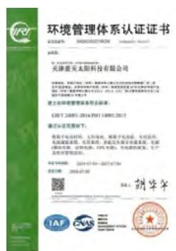

text_image

环境管理体系认证证书
天津蓝天太阳科技有限公司
JINYU ZHONGTIAN TAIYU TECHNOLOGY CO.,LTD.
《环境管理体系认证证书》
JINYU ZHONGTIAN TAIYU TECHNOLOGY CO.,LTD.
通过ISO认证网下载：
根据电子邮箱、上传地址、服务器电子地址、文件格式、
机载数据来源、业务类型、使用范围及功能等，电源
设备型号、功能等级、功耗等级、电压等级、电池容量、电池组容量、电容
资料来源：2014-07-01-2014/07/15
 doi: 2014-07-01
胡华华
IAF CVS

蓝天太阳

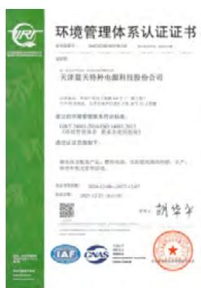

text_image

环境管理体系认证证书
天津蓝天特种电源科技股份有限公司
通过环境管理体系认证标准：
（2017年1月1日-2021年1月1日）
（2021年1月1日至2021年1月1日）
通过认证措施如下：
请尽快完成产品生产、销售及采购，无需提交政府审批的申请。生产、销售等业务均须经审查。
2021.03.06-2021.03.07
2021.03.07-2021.03.08
胡华华

蓝天特电

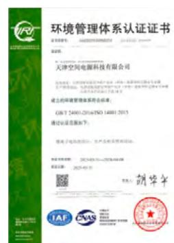

text_image

环境管理体系认证证书
天津空间电源科技有限公司
GB/T 24001-2016/ISO 14001-2015
通过认证范围如下：
电子电气研究院、生产单位和实验室。
证书编号：2016-03-01
申请人：胡华华
IAF
ENAS
中国环保认证中心
国家环境保护总局
国家环境保护总局

空间电源

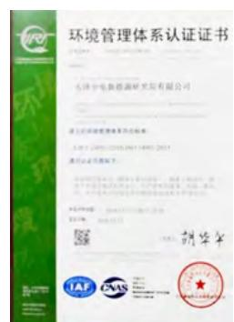

text_image

环境管理体系认证证书
天津中电新能源研究院有限公司
LIAF CO.,LTD. 2014
通过认证系统下载：
胡华华
IAF
ENAS
中国证券报
证券时报

研究院公司

## 管理架构与责任落实

公司严格执行环境保护“一把手”负责制，构建权责清晰、分工明确的环境保护责任体系，并通过四级责任机制推动环境保护工作层层压实、有序开展。

## 董事长及下属公司总经理

统筹部署环境保护工作，协调环境保护与公司发展的关系，保障环保资源配置落实到位。

## 主管环保的公司领导及下属公司分管领导

推动环境保护管理体系优化与日常工作落实，组织实施各项环保制度。

## 技术安全部及下属公司安全管理部门

作为环保归口管理单位，负责贯彻落实环保政策法规，建立公司环境管理制度体系，统一组织监督、检查与考核环保工作，并组织污染事故调查与整改落实。

## 各部门

对本部门责任区域内的环境保护工作承担主体责任，全面执行环保制度，确保环境管理要求有效落实。

## 项目合规与能力建设

报告期内，公司严格落实建设项目环境保护与安全生产“三同时”制度要求，同步开展环境影响评价、安全评价等专项评估与审查工作，为项目合规建设与安全生产提供基础保障。

同时，公司持续开展环境保护管理活动与相关培训。2025 年度，公司组织开展环境保护应急演练及专题培训，通过全员参与环境影响因素识别与防控培训，有效提升员工环境风险防范意识与应急处置能力，为环境管理体系的有效运行与持续提升提供支撑。

## 风险识别与应急管理

公司制定《环境风险评估报告》，系统识别、分析运营活动中可能产生的环境风险，明确风险等级并提出管控措施与改进建议，以预防环境事件发生，持续提升环境管理绩效。

公司依据《突发事件应急预案管理办法》等相关要求，结合自身环境风险特点，编制《突发环境事件应急预案》，并完成属地生态环境主管部门备案。预案明确应急组织体系、预警机制、响应流程及后期处置要求。报告期内，公司组织开展年度应急演练，覆盖事件报告、先期处置、应急监测及协同联动等关键环节，并对演练效果进行评估总结，不断优化应急处置流程，提升突发环境事件应对能力。

## 案例 危化品泄漏应急演练实践

为提升突发环境事件应对能力，公司组织开展危险化学品泄漏专项应急演练。演练以仓库场景为背景，围绕泄漏处置等情形，系统演练了现场报告、警戒隔离、应急处置及协同联动等关键流程。通过本次演练，有效检验了应急预案的可操作性，强化了员工对防护装备使用及处置流程的掌握程度，提升了突发环境事件的快速响应与协同处置能力。

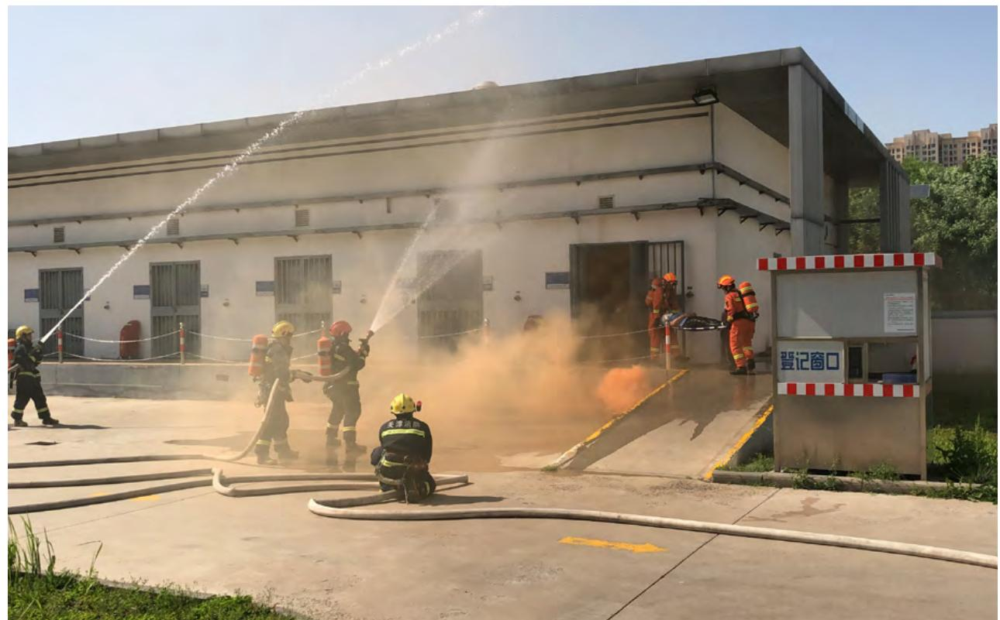

natural_image

Firefighters in orange gear performing a fire with water spray near a building entrance (no signage)

## 应对气候变化

电科蓝天将应对气候变化纳入企业发展考量，统筹推进风险防范与低碳转型，持续提升产品低碳属性与企业经营韧性，推动公司向清洁、安全、可持续方向发展。

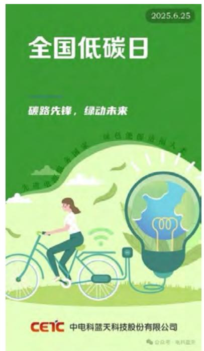

text_image

2025.6.25
全国低碳日
碳路先锋，绿动未来
先进电解质国家 绿色能源创未来
CETC 中电科蓝天科技股份有限公司
公众号：电科蓝天

“碳路先锋 绿动未来”—公司全国低碳日宣传海报

## 治理

在国家“双碳”战略引领下，公司深入贯彻落实《中共中央 国务院关于完整准确全面贯彻新发展理念做好碳达峰碳中和工作的意见》《2030 年前碳达峰行动方案》等政策要求，将气候变化议题纳入企业整体发展框架，作为推动可持续发展与环境治理的重要方向进行系统部署，持续引导企业向绿色低碳转型。

围绕国家“1+N”政策体系，公司聚焦能源结构优化、资源利用效率提升及节能降碳等关键领域，将低碳理念融入经营管理与生产运营各环节决策之中，逐步强化气候变化相关工作的统筹管理与实施力度。

公司持续提升产品低碳属性，生产的电源产品均为低碳产品，并重点推进储能等新能源应用相关技术研发，协同提升企业应对气候变化的能力与发展质量。

## 战略

顺应国家碳达峰、碳中和战略导向，公司结合主营业务结构与技术发展方向，围绕气候变化带来的转型风险与实体风险，系统识别新能源业务发展、技术迭代、供应链稳定性及极端气候事件等关键风险因素。同时，公司紧抓新型储能、多能互补微电网、新型电池技术及低碳应用场景拓展等发展机遇，持续优化业务布局与技术体系。公司通过强化技术创新、完善供应链管理及提升运营韧性等措施，积极应对气候变化相关不确定性，推动企业在先进电源与绿色能源领域实现稳健发展与长期价值提升。

影响、风险和机遇分析及应对措施

<table><tr><td>风险名称</td><td>风险描述及潜在影响</td><td>影响时间(短期/中期/长期)</td><td>发生可能性(小/中/大)</td><td>应对措施</td></tr><tr><td>极端气候与运营中断风险(实体风险:急性)</td><td>极端高温、暴雨等气候事件可能对公司生产运营、仓储物流及项目实施带来扰动,进而影响生产连续性和项目推进</td><td>短/中期</td><td>中</td><td>完善应急管理机制,提升防灾减灾能力;加强项目现场气候风险管理</td></tr><tr><td>新能源业务与技术转型风险(转型风险:市场/技术)</td><td>在“双碳”背景下,新能源及储能行业受政策导向、市场竞争及技术迭代等因素影响较大。公司新能源应用及服务板块涵盖储能、微电网、电源检测及锂电相关业务,相关业务发展可能面临市场波动、技术升级及盈利能力承压等风险</td><td>短/中/长期</td><td>中</td><td>聚焦核心业务方向,持续加大研发投入;提升系统集成能力与项目管理水平</td></tr><tr><td>原材料及供应链波动风险(转型风险:市场)</td><td>公司主营业务成本中直接材料占比较高,锂电材料、电子元器件等上游原材料价格及供应稳定性波动,可能对成本控制、产品交付及经营稳定性产生影响</td><td>短/中期</td><td>中</td><td>优化供应链体系,推进多元化采购;加强成本控制与关键材料替代</td></tr></table>

<table><tr><td>机遇名称</td><td>机遇描述及潜在影响</td><td>影响时间(短期/中期/长期)</td><td>发生可能性(小/中/大)</td><td>应对措施</td></tr><tr><td>新型储能与综合能源发展机遇(转型机遇:市场/产品)</td><td>国家持续推动新能源和新型储能发展,公司在储能系统、微电网及综合能源应用方面具备技术与场景基础,有望进一步拓展相关业务空间</td><td>短/中/长期</td><td>高</td><td>深化储能与微电网技术布局,拓展应用场景;提升系统集成与项目开发能力</td></tr></table>

<table><tr><td>机遇名称</td><td>机遇描述及潜在影响</td><td>影响时间(短期/中期/长期)</td><td>发生可能性(小/中/大)</td><td>应对措施</td></tr><tr><td>新型电池技术发展机遇(转型机遇:技术)</td><td>随着储能技术多元化发展,新型电池技术逐步应用,公司在相关方向开展技术布局,有助于提升技术储备并支持新能源业务发展</td><td>中期</td><td>中</td><td>持续推进技术研发与应用探索,完善技术储备</td></tr><tr><td>低碳应用场景拓展机遇(转型机遇:市场/应用)</td><td>随着气候变化应对及低碳发展需求提升,电源产品在气候监测、环境监测及新能源系统中的应用场景持续拓展,公司相关产品有望实现应用延伸</td><td>短/中/长期</td><td>中</td><td>拓展相关应用场景,推动电源技术在低碳及环境相关领域的应用</td></tr></table>

## 案例 钠离子储能技术助力新能源低碳应用

公司围绕新能源与低碳应用场景，推进高安全、宽温域、长寿命钠离子储能电池研发。相关产品通过改善化学体系、优化界面调控工艺和提高电导率，在安全性、环境适应性和循环寿命等方面实现突破，可在 -40℃至 70℃范围内正常使用，循环寿命突破 10,000 次。该技术有助于降低设备更换频次和固废产生，减少全生命周期能耗与碳排放，并为风光并网、分布式储能等场景提供支撑，助力能源结构向清洁、安全、可持续方向转型。

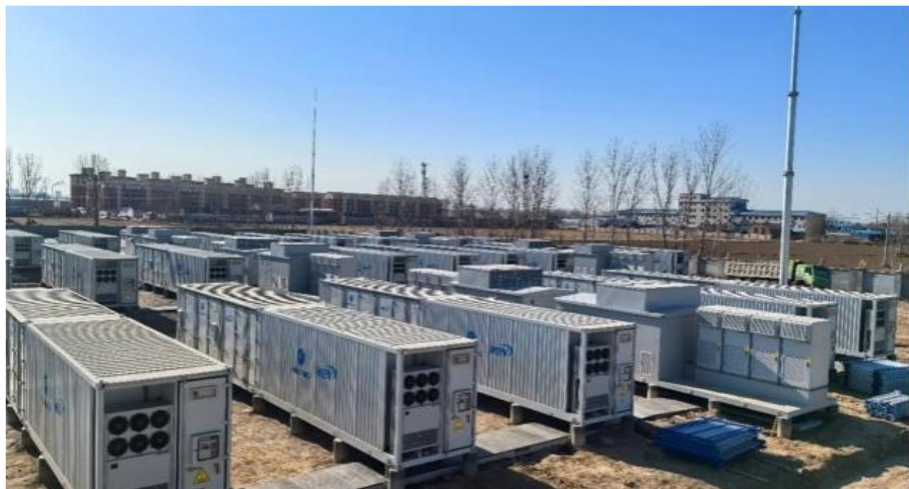

natural_image

Exterior view of a large industrial facility with rows of white refrigerated units under clear blue sky, no visible text or symbols.

## 影响、风险和机遇管理

公司将应对气候变化相关的影响、风险与机遇管理纳入公司整体风险管理体系，结合业务发展实际，对转型风险与实体风险开展识别与评估，并持续关注政策环境、技术演进及极端气候变化趋势。公司通过日常经营管理与相关工作机制，对气候相关风险与机遇进行跟踪与监测，逐步完善应对措施，提升企业应对气候变化不确定性的能力，支撑公司稳健运营与可持续发展。

公司结合生产运行安全管理需要，围绕气候变化相关的极端天气风险开展基础性管理工作。报告期内，公司开展 35kV 变电站、10kV 变电站防雷检测，并制定《防汛应急方案》，强化对雷雨、汛情等极端天气情形的预防与应对能力，保障电力设施安全稳定运行。

## 指标与目标

## 关键绩效

报告期内

温室气体排放量（范围一）23.81 吨二氧化碳当量

温室气体排放量（范围二）46,592.84 吨二氧化碳当量

温室气体排放总量（范围一 + 范围二）46,616.65 吨二氧化碳当量

温室气体排放强度 0.1419 吨二氧化碳当量 / 万元营收

natural_image

Aerial view of a rugged mountainous terrain with snow-capped peaks and sparse vegetation (no text or symbols visible)

## 优化资源利用

电科蓝天将资源高效利用与绿色发展理念融入生产经营全过程，统筹推进能源与水资源节约利用，持续优化资源配置，逐步形成节约高效、循环利用、绿色低碳的运行模式，不断提升资源利用效率与环境绩效水平。

## 能源管理

公司依据 GB/T 23331-2020 《能源管理体系要求及使用指南》（ISO50001:2018）建立并运行能源管理体系，明确能源方针、目标指标及管理职责，将能源管理融入生产经营全过程，通过制度化与系统化管理持续提升能源利用效率。

## 能源方针

## 科学管理

## 绿色发展

## 持续改进

## 节能增效

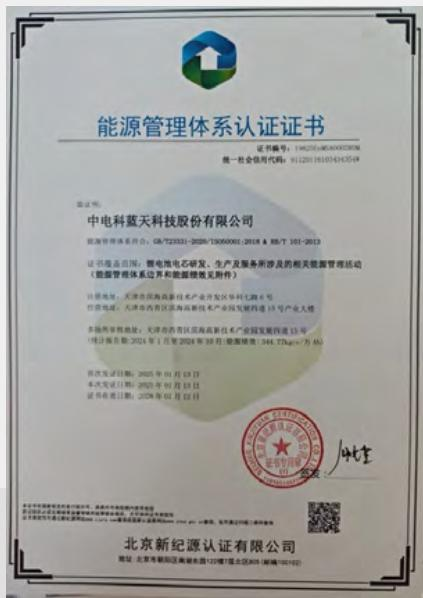

text_image

能源管理体系认证证书
证书编号：1962054ACAXX0030M
统一社会信用代码：911201161054363549
出证所：
中电科蓝天科技股份有限公司
能源管理体系协会：GB/T23331-2020/13050001 2018 & 88/7 101-2013
证书类型：组织机构；锂电池电子研发、生产及服务所涉及的相关能源管理活动（能源管理体系边界和能源绩效见附件）
注册地址：天津市滨海高新技术产业开发区华利七路6号
经营地址：天津市河西区滨海高新技术产业园发展四道15号产业大楼
多源市审批地址：天津市西青区滨海高新技术产业园发展四道15号
统计报告期：2024年1月至2024年10月；能源绩效：348.77kg/m²/万h
首次发证日期：2025年01月13日
本次发证日期：2025年01月13日
证书有效期日期：2026年01月12日
北京新纪源认证有限公司
地址：北京市朝阳区建国东路123号7层北C座20层（邮编：00102）

能源管理体系认证证书

公司明确能源管理职责分工，构建分级负责的管理机制。

## 最高管理层

作为能源管理第一责任主体，统筹能源方针与目标实施，推动能源管理体系整体运行

## 能源管理者代表

负责能源管理体系的建立、实施、保持与持续改进，并定期报告能源绩效情况

## 供应链管理部

作为归口管理部门，负责能源目标分解、数据统计、能源采购及跨部门协调管理

## 事业部及相关部门

负责能源管理措施的具体执行与落实，开展能源使用监测与分析

围绕能源绩效提升，公司建立能源绩效参数、基准及目标指标管理机制，以单位产量综合能耗等指标为核心，按月统计分析用能数据，并将目标逐级分解至各部门。通过《动力能源使用定额管理办法》，对电、气、水等实施定额管理，明确“制定—审核—审批—执行—考核”闭环机制，并要求定额水平低于上一年度实际使用水平。报告期内，公司持续跟踪单位产值用电量，2025 年较 2024 年下降约10%，能源使用效率稳步提升。

公司将节能要求同步嵌入采购与生产流程，优先选用高效节能设备，并将能源绩效纳入采购评价标准。公司围绕重点用能设备与关键环节，建立运行控制与数据监测机制，通过优化设备运行、减少空转待机、实施错峰生产等措施，持续提升能源使用效率。同时开展能效精细化管理，对重点用能部门实施单位能耗监控，强化过程管控与全员节能意识。

公司建立分层级培训机制，围绕节能法规、能源管理体系及设备操作等内容开展培训，提升员工节能意识与管理能力；并通过监测分析、内部审核及管理评审等机制，持续识别改进机会，推动能源绩效提升。

报告期内

<table><tr><td>汽油消耗量</td><td>电力使用量</td><td>蒸汽使用量</td></tr><tr><td>11,000升</td><td>64,298.58兆瓦时</td><td>927.66吨标准煤</td></tr><tr><td>热力使用量</td><td>直接能源消耗量</td><td>间接能源消耗量</td></tr><tr><td>705.70吨标准煤</td><td>11.97吨标准煤</td><td>9,750.58吨标准煤</td></tr><tr><td>综合能源消耗量</td><td>能源使用强度</td><td></td></tr><tr><td>9,762.55吨标准煤</td><td>0.0297吨标准煤/万元营收</td><td></td></tr></table>

## 水资源管理

公司坚持节约优先与合理利用原则，围绕生产运营全过程推进水资源精细化管理，持续提升用水效率与资源利用水平，为企业稳健运行提供支撑。

## 报告期内，公司以日常管理为抓手推进水资源节约利用：

·通过加强用水管控、规范用水行为及维护水管网，保障各环节用水合理可控；  
·推进循环可再生用水应用，减少设备用水量，并通过节水宣传与意识引导，提升员工参与度；  
·结合运行情况持续优化用水流程，强化设备巡检，严格控制跑冒滴漏，提升用水效率。

报告期内

<table><tr><td>总耗水量</td><td>水资源使用强度</td><td>循环/再利用水量</td></tr><tr><td>77,934.57立方米</td><td>0.2371立方米/万元营收</td><td>10,316,800立方米</td></tr></table>

## 循环经济

公司对锂电池生产过程中产生的 NMP 废液实施回收利用，通过废液回收装置进行收集，并由 NMP 生产企业再加工后重新投入民用产品生产中。报告期内，公司共回收 NMP 废料 102.26 吨，实现了生产过程中废弃物的资源化利用。

公司在新产品研发的初始阶段，将材料的生态环境属性纳入核心评估维度，系统推行绿色设计策略，通过选用可再生、可降解、易回收的环保材料，从源头上有效控制未来产品生命周期末端废弃物的产生，推动循环经济理念贯穿产品创新全过程。

## 报告期内

生产运输和包装所用物料的总质量：52,471.81 吨，其中所使用的可再生材料占比：8.50%

生产运输和包装所用物料的强度：0.1597 吨 / 万元营收

生产运输和包装所用物料的回收利用率：0.48%，其中

生产物料回收率：0.43%

包装材料回收率：0.05%

原材料认证比例：65.69%

## 绿色设计

公司将绿色理念融入产品研发设计、生产制造与回收处置全过程，持续推进产品环境友好性与全生命周期环境风险管控。针对特种电源产品出口北美、欧盟、东亚等全球市场的业务特点，公司严格按照国际RoHS 有害物质限制要求，建立覆盖研发设计、物料采购、来料检验、生产制造、过程控制、成品检验、仓储出货等环节的全流程环保管控体系，推动绿色设计要求在产品全生命周期各环节落实落细。

在新产品研发初始阶段，公司将材料的生态环境属性纳入核心评估维度，系统推进绿色设计策略，通过优先选用可再生、可降解、易回收的环保材料，从源头有效控制产品生命周期末端废弃物的产生，推动循环经济理念贯穿产品创新全过程。

公司多项配套产品取得相关环保认证。其中，AGV 配套锂电池超过 10 款核心产品取得欧盟 CE 认证，相关配套产品已大批量应用于亚马逊、大众、宝马、博世、宝洁等跨国环保工厂；消费类电子配套锂电池通过 3C 认证。公司通过持续推进产品环保合规与认证管理，不断提升产品绿色属性与市场适配能力。

## 绿色生产

公司在产品设计与生产组织过程中注重降低能源消耗。根据企业提供材料，公司产品组件选用低能耗电阻设计，在生产过程中通过产线自动化，实现三班连续运转，并利用波谷电价组织生产，以降低产品生产能耗。上述措施体现了公司从产品设计端到生产运行端对节能降耗的持续关注，有助于提升生产过程中的资源利用效率。

## 绿色运营

公司积极在日常运营中推进绿色办公与低碳宣传。报告期内，公司全年内部各类视频会议 658 次，内部通过过程材料双面打印，节省纸张 3.12 吨；同时，通过公司公众号宣传低碳减排，倡导绿色出行。公司通过线上沟通、节纸办公及绿色理念宣传等方式，将绿色运营理念融入日常管理实践，持续营造节约资源、绿色低碳的运营氛围。

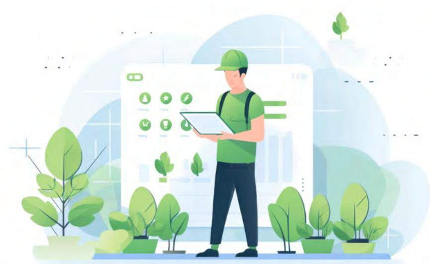

natural_image

Illustration of a person using a laptop in a green garden setting, with no visible text or symbols on the main subject.

## 落实污染防治

电科蓝天严格遵循国家及地方生态环境法律法规，围绕废水、废气及固体废弃物（含危险废弃物）等污染物的产生、收集、处理及排放全过程，建立系统化“三废”管理体系。公司坚持源头减量、过程控制与末端治理相结合，通过规范排放管理、完善治理设施及强化监测控制，确保各类污染物稳定达标排放，并持续降低污染物产生与排放水平。

## 报告期内

公司未发生污染物排放相关行政处罚或重大环境事件

## 废水管理

公司严格执行《中华人民共和国水污染防治法》《排污许可管理条例》《电池工业污染物排放标准》（GB30484-2013）等法律法规及排放标准，依法取得排污许可证并按证排污，遵循“源头减量、过程控制、末端治理、达标排放”原则开展废水管理。公司进一步从过程管控、治理与资源利用及监测管理等方面细化落实废水管理措施：

## 过程管控

公司对生产废水与生活污水实施分流管理，严禁生产废水进入生活污水系统；有机溶剂等危险物质实行分类收集并按危险废弃物管理，不得直接排放。各部门定期开展环境因素识别与评价，并制定管控措施及应急预案。

## 治理与资源利用

公司配套建设废水处理设施，对生产废水和生活污水分别采用混凝沉淀及“厌氧 + 缺氧 + 好氧+MBR”等工艺处理，并对特定生产环节废水设置预处理装置。同时，公司推进中水回用系统建设，将制水浓水回用于冲厕、清洁等场景，提高水资源利用效率。

## 监测管理

公司建立规范的废水监测机制，对主要排口污染物指标实施定期监测，并通过信息平台进行数据填报与公开，确保排放持续稳定达标。

报告期内

<table><tr><td>废水排放总量</td><td>工业废水总量</td><td>生活废水总量</td></tr><tr><td rowspan="2">2.27万立方米,其中化学需氧量(COD)</td><td>1.74万立方米</td><td>0.53万立方米</td></tr><tr><td>生化需氧量(BOD)</td><td>氨氮含量(NH3-N)</td></tr><tr><td>0.33吨</td><td>0.11吨</td><td>0.0027吨</td></tr><tr><td>总氮含量(TN)</td><td>总磷含量(TP)</td><td></td></tr><tr><td>0.18吨</td><td>0.0031吨</td><td></td></tr></table>

其他特征污染物

<table><tr><td>总砷含量</td><td>废水中固体悬浮物 ss 含量</td></tr><tr><td>0.0060 千克</td><td>36.66 千克</td></tr></table>

## 废气管理

公司严格遵守《中华人民共和国大气污染防治法》《工业企业挥发性有机物排放控制标准》（DB12/524-2020）等法律法规，制定污染排放控制及环境管理制度，明确废气排放标准、管理流程及责任机制，依法持证排污并动态更新适用法规标准清单，确保排放行为合规。在废气管理实践中，公司围绕治理措施及监测达标等关键环节，系统开展污染防治工作：

## 治理措施

公司对有组织与无组织废气实施分类管控，针对不同工艺环节配置活性炭吸附、喷淋塔、深冷系统、高效过滤及集中除尘等治理设施，并建立设施运行维护机制，定期开展清理与更换，保障治理效果稳定。

## 监测与达标

公司对排气筒及厂界无组织排放开展定期监测，涵盖非甲烷总烃、颗粒物、挥发性有机物及特征污染物等指标，执行国家及地方排放标准要求，确保废气稳定达标排放。

公司同时将废气减排纳入年度环境目标，通过优化生产工艺、推进清洁生产及强化系统化治理，持续降低污染物产生与排放水平。

报告期内

<table><tr><td>废气排放总量</td></tr><tr><td>41,151.79万立方米</td></tr></table>

<table><tr><td>挥发性有机物（VOCs）排放量</td></tr><tr><td>444.49千克</td></tr></table>

<table><tr><td>颗粒物（PM）排放量</td></tr><tr><td>77.56千克</td></tr></table>

## 固体废弃物管理

## 一般固体废弃物

公司严格遵循《中华人民共和国固体废物污染环境防治法》等法规要求，对一般固体废弃物实行分类管理与资源化利用。生产过程中产生的可回收废料由相关部门统一回收处置；其他废弃物按木质、金属、塑料、纸类等分类收集，由后勤部门统一管理与清运。

报告期内，公司无害废弃物主要包括办公生活垃圾及一般工业废料。其中生活垃圾委托市政单位清运，其他废弃物分类处置。2025 年全年无害废弃物处置量为 15.2 吨，实现资源化收益 2.24 万元。

公司同时推进源头减废与绿色设计，在物料选择与产品研发阶段优先采用低毒、可再生及易回收材料，从源头降低废弃物产生。

## 危险废弃物

公司建立《危险废弃物管理制度》，对危险废弃物实施全过程规范管理，覆盖识别、收集、标识、暂存、转移及处置等环节，确保符合《危险废物贮存污染控制标准》（GB 18597-2023）《危险废物转移管理办法》等法规要求。

公司产生的危险废弃物主要包括废溶剂、废电解液、废浆料、废油、废活性炭等。公司实行分类收集与分区储存，设置专用暂存场所并采取防渗、防漏、防腐等措施，严格控制贮存期限及混存风险。

针对处置与追溯，公司建立部门级与公司级台账，记录危废全过程信息，并通过危废转移联单实现闭环管理。危险废弃物优先通过厂家回收利用，无法回收的部分委托具备资质单位进行合规处置，确保全过程可追溯、可监管。

同时，公司加强源头替代与预防管理，定期开展物料与工艺评估，优先选用低毒、无害或可再生的环保型原料，替代高风险有害化学品（如铅、镉、六价铬等受限物质），从源头降低有害废弃物的产生量。

报告期内

<table><tr><td>废弃物产生总量</td><td>无害废弃物总量</td><td>有害废弃物总量</td></tr><tr><td>952.06吨，其中</td><td>794.98吨</td><td>157.08吨</td></tr></table>

## 噪声管理

公司将噪声管理纳入整体环境管理体系，严格遵循《中华人民共和国环境噪声污染防治法》《天津市环境噪声污染防治管理办法》等相关法规要求。公司对厂界噪声实施常态化监测，按季度开展等效声级检测，执行《工业企业厂界环境噪声排放标准》相关标准限值要求，确保厂界噪声达标排放。

## 保护绿色生态

电科蓝天秉持人与自然和谐共生的发展理念，将生态保护融入生产运营全过程，在发展过程中统筹考虑生态环境承载能力，努力降低经营活动对自然生态系统的影响。

公司在项目选址与建设阶段，关注周边生态环境状况，合理避让生态敏感区域，减少对自然生态空间的占用与扰动；在实施过程中规范作业行为，降低对地表植被、水体环境及区域生态系统的影响。

在运营阶段，公司持续关注生产活动对周边生态环境的长期影响，强化生态风险识别与过程管控，维护区域生态系统稳定。同时，公司关注生物多样性保护，在经营活动中尽量减少对动植物栖息环境的影响，维护生态系统完整性，推动企业发展与自然环境协调共生。

## 0 3

## 创新提质 护航星海征途

公司坚持创新引领，持续完善研发体系与知识产权管理，强化技术攻关与产学研合作；严格落实全流程质量保障与合规管理；构建标准化客户服务体系，提升服务响应与客户满意度；强化供应链全链条管控，实现安全、高效、稳定运行，全面支撑企业可持续高质量发展。

natural_image

Futuristic digital cityscape with glowing blue and orange cubes and glowing nodes, no text or symbols visible

贡献联合国可持续发展目标（SDGs）

9

工业、创新和基础设施

12负责任的消费和生产

17

促进目标实现的伙伴关系

## 坚持创新驱动

电科蓝天全面落实国家创新驱动发展战略，持续健全研发创新管理体系，强化创新人才队伍建设，规范知识产权全生命周期管理，聚焦核心技术开展科研攻关，不断完善创新激励与成果转化机制，深化产学研用协同创新，积极参与行业技术交流，全面提升自主创新能力与核心竞争力。

## 治理

公司构建技术驱动导向的前瞻性研发、客户需求导向的定制化研发相结合的研发模式。健全创新体制机制，制定《重点科研项目监督管理规定》《研发项目管理办法》等研发相关制度，加强创新组织领导，建立了多级、多专业协作的科研组织体系。

·科技部负责对各事业部、各子公司的重点科研项目进行监督管理，包括立项、过程监督管理与考核评价等工作；  
·财务部负责研发项目立项预算审查、财务审计及财务验收；  
·下属各事业部、各子公司是研发项目的具体承担主体，对项目的全过程负责。

公司的研发流程分为开题论证、立项评审、研发过程实施、验收归档四个阶段。开题论证及立项评审阶段，研发团队对研发项目形成方案并编制论证报告；开题论证报告编制完成后，由公司组织评审会审议研发方案；评审通过后，研发项目正式立项。研发部门以研制任务书为基础，制定详细的研发日程计划，组织团队成员进行研发。公司定期对研发项目的实施进度进行考核，并对后续工作安排进行交流或部署，保障项目按节点完成。研发项目结束后，研发团队编制研发项目总结报告并申请结题验收。

natural_image

Hand interacting with a glowing digital interface showing abstract wave patterns and arrows (no text or symbols)

## 战略

影响、风险和机遇分析及应对措施

<table><tr><td>风险名称</td><td>风险描述及潜在影响</td><td>影响时间(短期/中期/长期)</td><td>应对措施</td></tr><tr><td>知识产权管理与保护风险</td><td>知识产权布局不及时、权属界定不清、侵权防控不到位,可能造成知识产权流失、引发合规风险及经济损失</td><td>短期、中期、长期</td><td>1.健全知识产权管理制度,依托GB/T29490-2023体系持续改进,实施全流程合规管控;2.强化专利挖掘与布局,开展研发全周期知识产权审查;3.常态化开展培训,提升全员合规与风险意识。</td></tr><tr><td>科技成果转化效率不足</td><td>研发成果与市场需求、工程化应用衔接不充分,转化滞后,难以形成经济效益与产业竞争力</td><td>中期、长期</td><td>1.坚持客户需求导向研发,提升成果产业化潜力;2.完善成果转化激励机制,鼓励核心人员参与推广;3.搭建产学研用平台,加速技术工程化落地;4.建立成果转化跟踪机制,定期评估优化。</td></tr><tr><td>行业技术迭代与竞争加剧</td><td>电源领域技术更新快、竞争激烈,创新节奏滞后将导致产品竞争力下降、市场空间被挤压</td><td>中期、长期</td><td>1.参与行业交流与展会,跟踪前沿技术动态;2.优化研发体系,提升技术开发速度与响应能力;3.强化高价值专利布局,构筑技术壁垒;4.深耕细分领域,巩固差异化竞争优势。</td></tr></table>

<table><tr><td>机遇名称</td><td>机遇描述及潜在价值</td><td>影响时间(短期/中期/长期)</td><td>应对措施</td></tr><tr><td>国家创新驱动战略发展机遇</td><td>国家大力支持科技创新、高端装备与新能源产业发展,为公司技术攻关、产业升级提供政策与市场空间</td><td>中期、长期</td><td>1.紧扣国家战略布局研发方向,聚焦三大核心领域创新;2.积极申报政府科研项目与扶持资金。</td></tr><tr><td>产学研用协同创新机遇</td><td>与高校、科研院所、行业企业合作空间广阔,可整合外部资源加速技术突破与成果转化</td><td>中期、长期</td><td>1.深化与重点高校、科研院所的战略合作;2.共建创新平台,联合开展关键技术攻关;3.推进产学研项目落地,加快工程化与产业化。</td></tr><tr><td>新能源与特种电源市场增长机遇</td><td>宇航、特种、新能源电源领域需求持续提升,为技术应用与市场拓展提供广阔空间</td><td>中期、长期</td><td>1.紧跟行业趋势布局前沿技术,抢占市场制高点;2.以技术创新拓展应用场景,提升市场占有率;3.参与行业交流,增强技术话语权与行业地位。</td></tr></table>

## 创新能力认证

公司及分子公司创新能力认证：

<table><tr><td>企业全称</td><td>称号</td><td>认定时间</td></tr><tr><td>中电科蓝天科技股份有限公司</td><td>高新技术企业</td><td>2025年</td></tr><tr><td>天津蓝天太阳科技有限公司</td><td>高新技术企业</td><td>2023年</td></tr><tr><td>天津中电新能源研究院有限公司</td><td>高新技术企业</td><td>2023年</td></tr><tr><td>天津空间电源科技有限公司</td><td>高新技术企业</td><td>2025年</td></tr><tr><td>天津蓝天特种电源科技股份公司</td><td>高新技术企业</td><td>2023年</td></tr><tr><td>天津空间电源科技有限公司</td><td>专精特新“小巨人”企业</td><td>2024年</td></tr><tr><td>天津中电新能源研究院有限公司</td><td>天津市专精特新中小企业</td><td>2023年</td></tr><tr><td>天津蓝天太阳科技有限公司</td><td>天津市专精特新中小企业</td><td>2019年</td></tr></table>

## 鼓励研发创新

公司建立健全科技创新激励机制，依托《促进科技成果转化办法》等配套制度，搭建“揭榜挂帅”等内部竞争平台，对完成重大技术攻关任务的团队给予专项奖励，全力鼓励新技术新产品研发、新领域布局拓展，进一步激发全员研发创新积极性。

公司依据《知识产权管理办法》，明确按照知识产权不同等级，对主要完成人给予相应奖励；同时，在职称评定、晋职晋级工作中，将科研人员从事知识产权创造、运用、保护及效益情况纳入考评范围，在同等条件下予以优先考虑。

公司对符合条件的科技成果开展技术鉴定，科学判断研发创新成果的技术成熟度、技术先进性及预期应用前景。科技成果转化所获收入，在对完成科技成果转化作出重要贡献的人员给予奖励后，主要用于科学技术研发、知识产权管理及未来成果转化等相关工作。

## 关键绩效

2025 年，公司开展科技创新攻关奖项评选工作，共评选出“圆形柔性太阳电池阵技术”等 8 项科技创新攻关奖项，对获奖团队累计奖励金额达 95 万元。

## 知识产权保护

公司已建立完善的知识产权合规管理体系，从知识产权创造、运用、保护、管理全流程出发，严格制定《知识产权法律法规控制程序》《知识产权风险控制程序》《知识产权研发控制程序》等 23 项管理程序，积极推进知识产权布局规划及维权保护工作，确保知识产权合规管理体系有效运行。

公司搭建知识产权组织架构，明确职责分工与管理机制。其中，科技部为知识产权管理归口部门，配备专 / 兼职工作人员，统筹落实公司知识产权总体工作；各相关职能部门依据职责分工，协同推进本领域知识产权相关工作。同时，董事长作为公司最高管理者指定管理者代表，明确其权限与职责，全面负责公司知识产权管理体系的建设、运行与监督等相关工作。

公司已于2022年取得知识产权管理体系认证证书。2025年，依据《企业知识产权合规管理体系要求》(GB/T 29490-2023) 体系文件要求，公司将合规经营相关要求融入企业知识产权合规管理体系，重点围绕知识产权合规义务识别、合规审查、不合规疑虑提出、纠正与持续改进、企业环境、相关方需求和期望等内容，进一步完善体系建设，并顺利通过企业知识产权合规管理体系再认证。

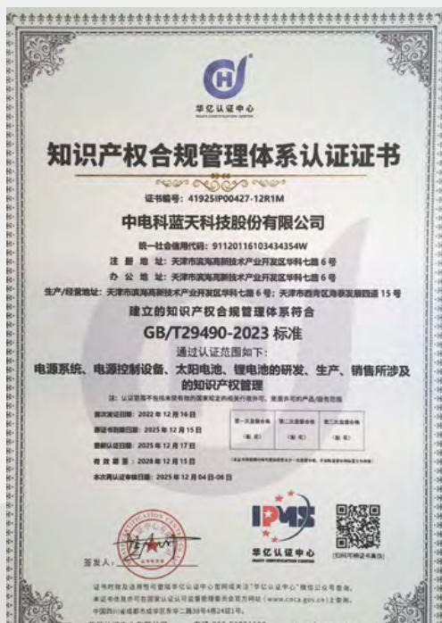

text_image

华亿认证中心
知识产权合规管理体系认证证书
证书编号：41925IP00427-12R1M
中电科蓝天科技股份有限公司
统一社会信用代码：91120116103434354W
注册地址：天津市滨海高新技术产业开发区华科七路6号
办公地址：天津市滨海高新技术产业开发区华科七路6号
生产/经营地址：天津市滨海高新技术产业开发区华科七路6号；天津市西青区海泰发展四道15号
建立的知识产权合规管理体系符合
GB/T29490-2023 标准
通过认证范围如下：
电源系统、电源控制设备、太阳电池、锂电池的研发、生产、销售所涉及
的知识产权管理
注：认识范围不包括未有效的国家规定和现行许可，更需许可的产品/服务范围
首次认证日期：2022年12月16日
颁发申请日期：2025年12月15日
需认证日期：2025年12月17日
有效期至：2028年12月15日
本次再认证审核日期：2025年12月04日-06日
第一类联合体
（第 1页）
第二类联合体
（第 1页）
第三类联合体
（第 1页）
（上证所网站www.hzq.com.cn）（以下简称“www.hzq.com.cn”）（网址:www.hzq.com.cn）
签发人：
IPSEC
华亿认证中心
（正则可验证或复核）
证书时限及适用性可登陆华亿认证中心官网或关注“华亿认证中心”微信公众号查询。
本证书信息亦可在国家认证认可监督管理委员会官方网站（www.crca.gov.cn）上查阅。
中国四川省成都市成华区东华二路36号4栋24层1号。

公司知识产权合规管理体系证书

## 案例

## 开展知识产权培训，提升全员专业能力

2025 年，公司多措并举开展知识产权专项培训工作。组织全员开展《企业知识产权合规管理体系要求》（GB/T29490-2023）培训，夯实全员知识产权合规基础；针对研发人员开展专利撰写、专利挖掘专项培训，提升研发人员知识产权创造能力；组织知识产权管理人员、研发人员参加集团公司知识产权中心、国防科工局信息中心举办的知识产权专项培训，学习先进管理经验；组织中层干部系统学习科研生产全过程知识产权管理相关知识，强化管理层知识产权管理意识。

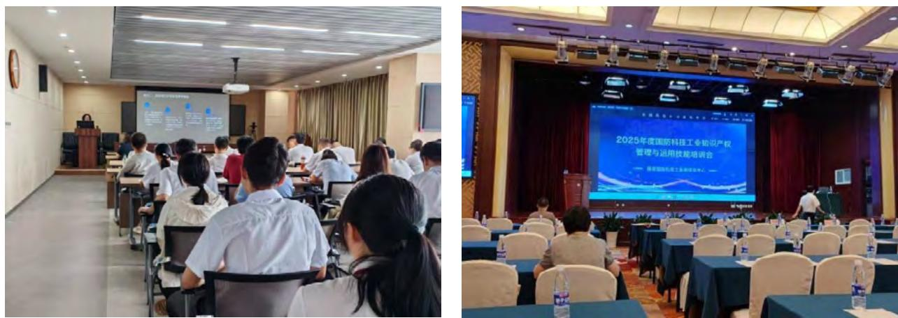

## 推动产学研合作

公司始终秉持“开放创新、协同发展”的理念，聚焦发电、储能、控制及系统集成核心技术赛道，构建“产学研用”一体化创新合作体系，通过与同行企业、知名高校开展专项项目合作，整合行业优质资源，加速推进技术创新与成果转化落地。

·公司在卷绕式柔性太阳翼研发过程中，与多所高校及企业开展协同合作，整合产学研用资源，保障项目顺利推进。  
·蓝天特电公司与多所高校等优势单位开展合作，重点推进某燃料电池研发工作，加速核心技术突破。

natural_image

Illustration of a computer monitor with a lightbulb above it, surrounded by gears, pen nibs, and icons representing ideas (no text or symbols)

## 贡献行业发展

公司主动参与各类行业交流研讨活动，密切跟踪电能源领域发展动态和前沿技术，与行业伙伴凝聚共识、共享先进经验、共探技术发展方向，助力产业高质量健康发展。

## 案例

## 参与行业展会，彰显品牌实力

2025 年 5 月，公司参加由中国化学与物理电源行业协会主办的第十七届深圳国际电池技术交流会 / 展览会（CIBF2025）。本次展会中，公司展台设于 12 号馆中心区域，共展出产品 53款，首次采用“实物 + 电子屏 + 应用终端 + 模型沙盘”多维度展出模式，有效提升观众交互体验，进一步提升了电科蓝天的品牌知名度与行业影响力。

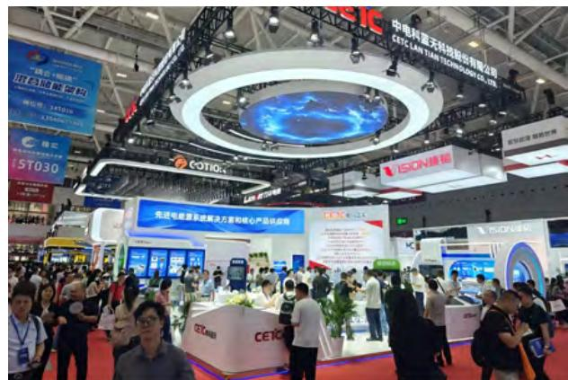

text_image

中电科蓝天科技股份有限公司
CETC-LAN TIANY TECHNOLOGY CO.,LTD.
CETC
ST030
ISION终端
完成电源驱动解决方案成功核心产品应用

## 案例

## 组织召开学术交流会，共话领域前沿发展

2025 年 9 月，公司组织召开 2025 年度学术交流会，特邀哈尔滨工业大学、南开大学、中国地质大学及中科院长春应化所等国内知名高校与科研院所的权威专家莅临指导。会议围绕高效光伏器件、大功率脉冲电源等领域的前沿热点技术方向，开展多场专题报告与深度现场交流，对电源技术从基础研究、关键技术攻关到工程化应用落地等全链条环节进行全方位探讨。通过本次会议，拓宽公司专业技术人员的知识视野与行业认知，促进对外交流合作。

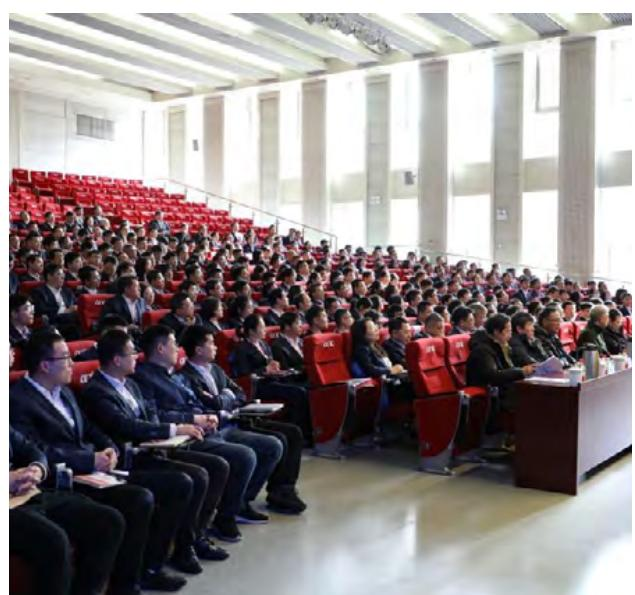

natural_image

Large conference hall filled with attendees in formal attire, seated in rows of red chairs (no visible text or signage)

## 影响、风险和机遇管理

公司构建覆盖研发创新全流程的风险与机遇协同管控机制，将风险防控与机遇把握深度嵌入项目立项、研发实施、成果转化及知识产权管理各环节，实现全过程闭环管理。公司动态跟踪行业技术迭代、市场需求及竞争格局变化，精准识别外部影响因素，围绕核心技术攻关、知识产权合规、成果转化效率、研发资源保障等关键风险点，通过制度完善、过程管控、产学研协同等措施实现风险前置防范、全程可控，同时依托创新资质、激励机制与产学研合作优势抢抓发展机遇，坚持风险防控与机遇挖掘并重，以稳健管理保障创新活动合规高效开展，以精准抢抓机遇放大创新价值，推动创新驱动与高质量发展良性循环。

## 指标与目标

## 研发创新目标

公司的研发战略和目标是面向宇航电源、特种电源、新能源应用及服务三大领域的技术优势和短板开展技术革新，不断提升公司的技术研发能力、技术开发速度以及先进技术的市场转化能力。

## 研发创新指标

## 关键绩效

·报告期内，公司申请发明专利 73 项，申请实用新型专利 27 项，申请外观设计专利 4 项，申请软件著作权 6 项；取得发明专利授权 19 项，实用新型专利授权 30 项，外观设计专利授权 5 项，软件著作权授权 5 项。  
·截至报告期末，公司累计获得各类知识产权411项，其中发明专利148项，实用新型专利221项，外观设计专利 13 项，软件著作权 29 项。

报告期内，公司

·研发投入达 2.17 亿元，占营业收入比例 6.60%  
·研发人员总人数达 227 人，占公司总人数的 19.76%

## 研发创新成果

公司在电能源领域积淀深厚，拥有丰富的实际应用经验，具备突出的研发创新能力，掌握高效砷化镓空间太阳电池技术等 11 项核心技术，其中多项核心技术达到国际领先或先进水平，为企业高质量发展奠定坚实技术基础。

## 案例

## 突破特种车辆高压动力电池技术，实现国产化替代

公司深耕特种车辆领域高压动力电池技术研发，聚焦高安全、高比能核心需求，突破热管理、能量管理、系统集成等关键技术，实现核心技术与关键部件国产化替代。依托自主研发的高可靠国产化 BMS 技术，实现电池状态监测、能量管理及安全防护，搭配高性能热管理系统，破解热安全难题。该技术已在某项目规模化应用，经极端环境验证性能稳定。

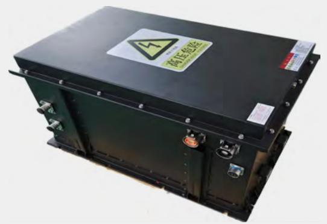

natural_image

Exterior view of a black industrial machine with warning sign (no readable text on device body)

## 案例

## 研发热电储供一体式聚光光伏系统，提升能源利用率

公司聚焦太阳能高效利用，研发推出热电储供一体式聚光光伏系统，创新融合高效率砷化镓电池与聚光方案，可同步为用户端供给电能与热能，实现 80% 的太阳能利用率。该系统核心优势显著，所用砷化镓电池光电转化效率超 40%，同时可产生不低于 40% 的热量，整体太阳光能量转化率高于 80%，接近传统硅光伏的 4 倍。在实际应用中，公司为某项目提供技术支撑，采用该技术建成 1MWp 聚光光伏场，其发电量较相同占地面积的传统硅光伏提升两倍，额外产生的热量可满足 2 万平方米办公楼全年供暖需求，切实实现能源高效综合利用，彰显技术实用价值。

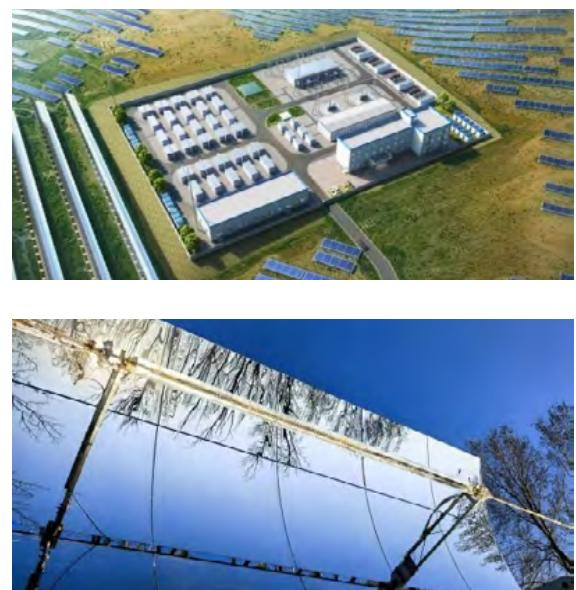

## 提升产品质量

公司以“秉承质量至上，追求卓越创新”为方针，构建权责清晰、覆盖全生命周期的质量管理体系，加强过程管控，持续推进工艺创新、质量培训与供应链管理提升，严格落实质量考核和问题归零，确保产品性能可靠、客户满意。

## 治理

公司建立董事会统筹、最高管理者牵头负责、质量部归口管理、各部门协同落实、全员参与的质量管理组织体系，明确各级质量责任，形成决策、管理、执行、监督闭环。

## 最高管理者

对质量管理体系与产品质量负总责，保障资源投入

## 质量部

统筹制度建设、体系运行、监督检查、考核奖惩、归零管理

## 业务部门

落实科研生产全流程质量管控，承担直接质量责任

## 承研承制单位

作为质量责任主体，对产品与服务质量负直接责任

公司已通过GJB9001C-2017质量管理体系认证、GB/T19001-2016质量管理体系认证，形成《质量手册》《质量管理体系程序文件》，并在科研生产中认真贯彻执行质量法规，制定了《质量管理基本制度》《质量考核管理办法》《质量问题归零管理实施细则》等制度，构建覆盖全业务、全流程的质量管理制度体系，实现质量管理标准化、规范化、制度化。

公司建立常态化监督、分级考核、严肃追责的质量监督机制，综合运用内部审核、专项检查、工艺纪律检查、现场监督、用户监督、外部审核及上级检查等多种方式开展质量监督；严格执行质量问题分级管理与 “双五归零” 要求，同步推进技术归零与管理归零，将质量考核结果与部门绩效、领导班子考评、员工薪酬直接挂钩，压实全员质量责任。

## 战略

## 质量战略定位

公司以“先进电源服务国家、绿色能源造福人类”为宗旨，以“引领电能源技术及产业发展”为主责，以新型电源技术研发、产品研制、生产、经营为主业，致力于建设具有核心技术创新能力、快速研发能力和精益制造能力的电能源基地，打造国际一流、符合国防工业发展与国家产业要求的电能源高科技公司。

影响、风险和机遇分析及应对措施

<table><tr><td>风险名称</td><td>风险描述及潜在影响</td><td>影响时间(短期/中期/长期)</td><td>应对措施</td></tr><tr><td>全流程质量管控不到位</td><td>研发、采购、生产、检验等环节管控不足,易引发质量问题,导致一次交验合格率波动、返工返修增加,影响交付进度与企业信誉</td><td>短期、中期</td><td>落实采购复验、过程巡检、最终检验三级管控,强化关键与特殊过程控制,实现全流程可追溯</td></tr><tr><td>外协外购供应链质量不稳定</td><td>供应商管控不足、来料质量波动,影响生产进度与产品一致性,降低产业链整体可靠性</td><td>短期、中期</td><td>严格供方准入与目录管理,开展供应商现场审核,对问题供应商下发归零通知单并督促整改</td></tr><tr><td>人员质量意识与专业能力不足</td><td>员工质量意识薄弱、操作不规范、专业能力不足,导致低级失误多发、体系执行不到位</td><td>短期</td><td>开展质量专项培训与质量月活动,严格执行工艺、规范操作,加强技术状态管控,提升全员质量素养</td></tr></table>

<table><tr><td>机遇名称</td><td>机遇描述及潜在影响</td><td>影响时间(短期/中期/长期)</td><td>应对措施</td></tr><tr><td>工艺优化与创新激励提升产品质量</td><td>工艺创新与改进激发员工积极性,提升产品合格率、一致性与生产效率,形成技术质量优势</td><td>短期、中期、长期</td><td>常态化开展工艺创新评选与奖励,推广获奖成果,将经验固化为标准规范</td></tr><tr><td>全链条质量管控塑造质量标杆</td><td>全生命周期质量管控与质量文化建设,提升客户满意度,树立质量品牌形象</td><td>短期、中期、长期</td><td>推进全流程质量管控,弘扬“严、慎、细、实”作风,健全质量诚信体系</td></tr><tr><td>供应链质量协同增强产业链韧性</td><td>强化供应商管控与协同归零,提升供应链稳定性与可靠性,保障产业链安全</td><td>中期、长期</td><td>严格供方准入与过程管控,推动供应商同步实施质量归零,共建产业链质量标准</td></tr></table>

## 质量全生命周期管理

公司严格遵循产品科研、生产、交付、服务全流程管控要求，建立覆盖设计、采购、制造、检验、交付、售后的质量全生命周期管理体系，实现全过程可控制、可追溯、可闭环。

## 质量检验控制体系

公司建立采购、研制、生产、交付全链条质量检验控制体系，对采购器材实施进司复验与下厂验收，合格后方可入库使用；在生产过程中开展首件鉴定、过程巡检及关键特殊过程管控，确保记录完整可追溯；产品完工后执行全项检验与试验验证，经合格判定并出具证明后予以放行交付，实现全流程质量闭环管控。

## 质量能力建设

开展技术状态管控、质量管理标准等专项质量培训，全面提升全员专业能力与质量素养；通过组织质量月宣传教育、案例警示、全员答题、现场检查及专项提升等活动，持续强化全员质量意识，保障科研生产任务高质量推进；构建起 “技术 + 管理 + 人员” 三重保障机制；同步推进工艺创新激励，2025 年组织开展工艺优化及创新奖评选，累计申报项目 92 项，其中工艺创新类获奖 18 项、工艺优化类获奖 74 项，显著提升产品合格率与质量一致性，全面夯实质量能力建设。

## 售后保障及召回机制

公司严格执行《售后服务保障管理规定》，为客户提供快速响应、高效便捷、全程可控的售后保障服务；按照《不合格品控制程序》对不合格品实施隔离、标识、审理、处置、召回与追溯全流程闭环管理；常态化开展供应商现场审核，对出现质量问题的供应商及时下发归零通知单并督促整改闭环，持续提升供应链质量保障水平。

## 案例 加强管理，打造质量牢固防线

2025 年“质量月”期间，蓝天特电公司围绕 “加强全面质量管理，促进质量强国建设”主题，践行“严慎细实、全员参与”质量文化与“一次做对、持续改进”工作主线。通过开展质量控制计划征集、检验设备操作培训、典型质量案例剖析等活动，强化全员预防为先的风险意识。活动有效提升产品一次性交验合格率，降低内部质量成本，切实将质量优势转化为经营效益，以高标准质量管理助力质量强国建设。

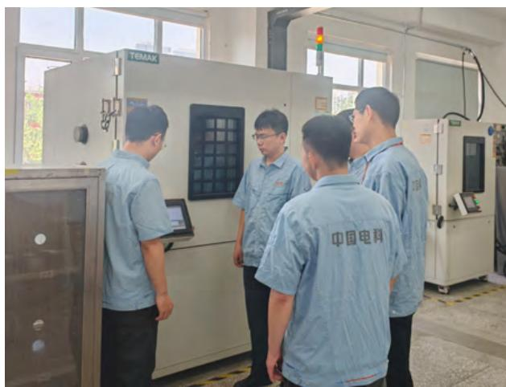

natural_image

Group of engineers in light blue uniforms gathered around industrial CNC machines in a factory setting (no visible text or symbols)

## 数字化转型提质增效

公司坚持以数字化赋能高质量发展，大力推进网络化升级与效率变革，全面打通信息流转 “大动脉”，持续提升运营效能与管理精细化水平。公司完成蓝网与安防网在主要科研生产区域的全域覆盖与一体化管理，夯实了精细化运营与集团穿透式管控的网络支撑基础。通过技术迭代升级，网络跨网传输效率提升 90%，年度可测算人工成本节约约 45 万元；桌面云分布式部署落地后，单台终端运维时长由 1 天压缩至 30 分钟，通过资源统筹优化节约硬件采购成本约 100 万元；同步完成红网邮件与集团新邮件系统异构互通，企业级网盘全面应用推动文件协同效率提升约 30%，数字化底座支撑能力显著增强。

公司以数智化技术驱动核心业务流程再造与效能升级，推动信息化与科研、生产、管理深度融合、协同增效。依托质量管理系统实现质量问题全流程闭环管理，运用制造执行系统打通电池模组生产全链条数字化链路，生产运营数字化水平持续提升。全面推广电子签审应用，质量技术文件审批周期缩短 40%；物料清单实现全线上管控，新增 BOM 签审覆盖率达 100%，业务流程规范性与运转效率显著提高。公司完成项目、研发、生产、经营等多系统数据初步整合，搭建数据主题可视化平台，为管理层决策提供跨领域、多维度数据支撑。

## 影响、风险和机遇管理

公司建立“全过程、全特性、全要素”质量风险管理与危机处置机制。

## 风险识别

覆盖研制、生产、试验、采购、交付、服务各环节。

## 风险分析

按一般、严重、重大三个等级实施分级判定与管控。

## 风险处置

制定预防与纠正措施，严格执行双五归零闭环管理。

## 应急保障

建立质量危机应急预案，降低风险损失与社会影响。

## 指标与目标

## 管理目标

研制产品一次交验合格率

≥99.2%

批量产品一次交验合格率

100%

客户满意度

≥98.0%

## 管理指标

## 报告期内，公司

产品或服务合格率

99.7%

产品召回事件

0 起

## 优化客户服务

## 客户服务体系

公司秉持以用户为中心的核心服务理念，构建覆盖产品交付后全生命周期的一体化服务体系，以标准化、专业化、全流程服务保障客户权益、创造服务价值。2025 年，公司正式成立售后服务保障中心，作为客户服务统筹管理与执行牵头机构，全面搭建规范高效的服务组织架构。

公司制定并严格执行《售后服务保障管理规定（试行）》，明确服务标准、部门职责与运行流程，组建售后管理、技术保障、产品服务三支专业团队，服务内容覆盖用户技术培训、客户走访、产品巡检、维修保障、沟通管理、满意度测评等全场景，实现售后需求快速响应、高效处置、全程闭环，推动服务模式从 “产品交付” 向 “产品 + 服务” 综合保障转型。

## 售后处理机制与客户满意度管理

公司建立健全客户权益保护管理制度，严格遵循《售后服务保障管理规定》，以 24 小时方案响应、客户最终满意为刚性要求，将客户满意度作为核心考核指标，驱动服务质量持续提升。

## 投诉闭环处理机制

公司实施全流程投诉闭环处理机制，客户发起投诉后，售后服务保障中心24小时内响应并出具解决方案，全程跟踪推进直至客户满意；所有投诉事项均完整记录、规范归档。公司定期开展投诉原因分析，提炼改进措施并纳入员工培训体系，以问题驱动服务持续优化，切实保障客户合法权益。

## 报告期内，公司

客户反馈响应率 100%，未接获关于产品及服务的投诉数目。

## 客户诉求响应流程

客户提出服务诉求各事业部及时上报

售后服务保障中心统筹协调、跨部门联动

全程跟踪事项进展

问题处置完成并闭环归档

## 客户满意度管理

公司将客户满意度作为服务质量核心评价指标，建立常态化、标准化测评机制。满意度测评覆盖产品交付、技术培训、客户走访、沟通服务等关键环节，形成“调查—分析—改进—提升”的管理闭环。

2025 年，公司面向客户开展专项走访与满意度调查，调研问卷回收率 100%，客户满意度达 99.86%，充分体现客户对公司产品质量、交付履约与服务保障的高度认可。

## 客户服务提升举措

## 高效技术应急保障

建立 “快速响应 + 现场处置 + 远程协同” 技术支持机制，针对客户现场突发技术问题提供极速支援。报告期内，某客户设备调试出现技术故障，售后服务保障中心 12 小时内派遣专家赴现场处置，联合专项工程师与供应商协同解决，确保客户利益不受影响。

## 案例化培训赋能

每年从实际服务中遴选优秀案例作为标杆，同步整理典型问题与重大事项处置过程，形成正反结合的培训教材，强化员工服务规范、风险防范与应急处置能力，以实战经验提升整体服务水平。

## 全域均等化服务可及性

面向不同区域、不同行业客户提供主动走访巡检服务，优化跨部门协同机制，确保客户服务需求均可获得平等、及时的现场支持，不增加客户额外协调成本。公司统一提供产品维护保养培训与技术指导，通过售后服务保障中心统筹调度，扩大上门服务覆盖范围，降低客户技术支持门槛，提升服务响应效率与普惠性。

## 广告与标签合规管理

公司严格遵守《中华人民共和国广告法》及内部《标识和可追溯性管理程序》，对产品宣传、标签标注、信息发布实施全流程合规管控，通过宣传手册、行业展会、专业论坛等合法渠道开展产品推广，确保宣传内容真实准确、无虚假误导。报告期内，公司未发生广告侵权、标签违规等事件，切实保障客户知情权与公平交易权。

## 案例

## 坚守一线，以专业精准保障客户项目交付

面对夏季连续高温天气，公司检测中心测试人员迎难而上、坚守岗位，始终秉持 “标准不降、数据不错” 的工作理念，全力保障客户项目进度。团队实行轮班值守、协同作战，在室外现场及高温设备环境下严谨开展测试、校准、记录与分析工作，确保数据精准可靠、报告及时交付。以专业能力与敬业担当守护客户信任，用实际行动践行高效响应、品质至上的客户服务承诺。

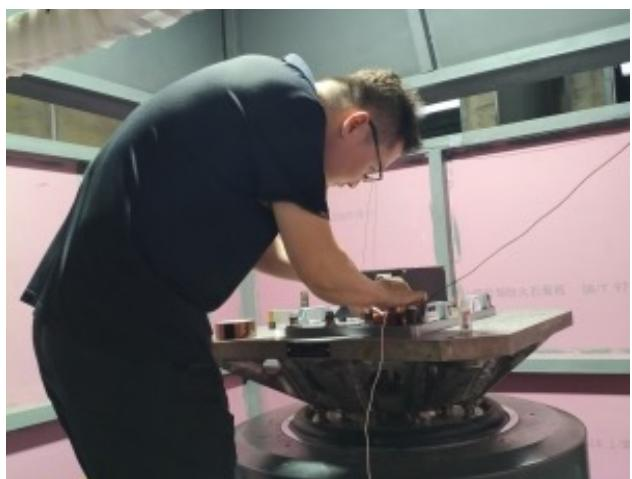

natural_image

Man in dark suit inspecting a large mechanical component in a museum or exhibition setting (no visible text or symbols)

## 保障数据安全

公司深入贯彻国家网络安全、数据安全与个人信息保护相关法律法规，坚守数据安全底线、客户隐私红线，将数据安全与客户隐私保护全面融入公司治理、运营管理与技术防护全过程，构建制度完备、组织健全、技术先进、响应高效、全员参与的数据安全治理体系，切实保障信息系统稳定运行、数据资产安全可控与客户合法权益不受侵害，以高水平安全护航企业高质量可持续发展。

## 数据安全治理体系

公司建立信息系统安全领导决策组与信息安全应急组双层组织体系，形成分工明确、协同高效的安全管理格局。信息系统安全领导决策组由分管信息化副总经理及信息化部门负责人组成，统筹信息系统安全、网络安全应急响应及数据安全重大决策与统一指挥。信息安全应急组由系统管理员、安全管理员、审计员组成，专职负责信息系统日常运维、安全配置与安全审计，确保安全管理责任层层落实。

公司构建覆盖全场景、全流程的信息安全管理制度体系，为数据安全与隐私保护提供坚实制度保障。发布实施信息系统、信息设备及存储设备管理、运行维护、等保制度、商业秘密保护等核心管理制度，严格落实国家网络安全等级保护与分级保护要求，顺利通过红网分级保护、蓝网等级保护测评，实现合规运营闭环管理。

## 数据安全保护措施

## 强化数据技术防护

公司以技术赋能安全防护，对信息系统、信息设备及存储设备实施全方位、立体化安全管控，保障数据全生命周期安全。建立全量备份 + 增量备份机制，定期对关键数据进行备份；对敏感数据实施加密存储，强化数据访问权限管控；严格执行数据输出审批与刷卡认证输出管理，规范数据流转环节，从源头防范外泄风险。

## 建设风险防控体系

公司构筑全方位的安全屏障，全面提升突发事件应对能力，奠定合规运营基石。在年度重大网络安全保障行动中，高效处置 539 项安全预警，完成 42 份专项报告，组织 6 次电话应急演练，最终实现了“零失分”的优异成绩。

## 深化安全宣贯培训

公司将信息安全与隐私保护纳入常态化教育培训体系，推动安全理念深入人心、落地见效。结合新员工岗前培训、国家网络安全宣传周等重要节点，开展年度信息安全专项培训，采用集中授课、多媒体宣传、线上答题等多元形式，实现全员覆盖、应训尽训，持续提升全员数据安全素养与合规操作能力。

## 报告期内，公司

·数据安全与客户隐私保护培训次数 2 次  
·数据安全与客户隐私保护应急演练次数 3 次

## 打造责任供应链

电科蓝天始终将可持续发展理念深度融入供应链管理全过程，坚守合规管控、质量优先、廉洁诚信、安全可控、协同共进原则，构建覆盖制度建设、准入审核、考核评价、动态退出、风险防控、阳光采购、生态协同的全链条、闭环式可持续供应链管理体系，全面提升供应链稳定性、合规性与绿色发展水平，为公司高质量发展提供坚实支撑。

## 报告期内，

供应商总数 2,560 家，供应商考核覆盖率 100%

## 健全制度体系

公司构建系统化、标准化的供应商管理制度体系，制定并发布《供应商管理办法》《合格供应商管理实施细则》《供应商负面清单管理实施细则》《合格供应商准入实施细则》《科研生产物资采购合格供方评价管理办法》等核心制度，对供应商准入条件、审核流程、评价标准、分级管理、退出机制、廉洁合规等作出全面规范，实现供应商管理全流程有章可循、有规可依，以制度刚性保障供应链管理规范高效、透明有序。

## 严格供应商准入审核

公司坚持分类管理、从严准入，对供应商实施多维度、全覆盖准入审核。针对不同类型供应商，差异化设置注册资本、实缴资金、社保人数、成立年限、行业资质、质量体系、保密资格等硬性门槛，同步开展技术生产能力、违规失信记录、商业信誉、环境及社会风险等全面核查，从源头筛选资质齐全、信誉良好、能力达标、合规可靠的优质供应商。供应商准入严格执行“初审+年度复评”双审核机制，围绕质量、交期、价格、服务、风险五大维度开展综合评定，评定结果直接作为供应商分级管理的核心依据，确保准入环节严谨规范、风险可控。

## 实施供应商动态考核

公司建立常态化、量化型供应商年度考核评价机制，以质量、交付、服务、成本、风险为核心维度，构建科学完善的考评体系。依据综合考评结果，将供应商划分为 A、B、C、D 四个等级，实施差异化激励与约束管理。同时建立供应商退出机制，对非不可抗力原因单方解除终止合同、质量交期服务问题频发且整改不力、违规分包转包、连续三年无业务往来的供应商，取消合格资格，督促资质证书过期供应商及时完成更新，持续促进供应商可持续发展。

## 供应商分级管理

A A 级优秀供应商：采取增加采购份额、优先选用、表彰推荐等激励措施；  
B B 级良好供应商：维持或适度增加采购份额，择优推荐为优选供应商；  
C C 级合格供应商：实施重点监督、限期整改，严控合作风险；  
D D 级不合格供应商：予以通报批评、减少采购份额、停止选型，整改不到位的暂停或取消合格供应商资格。

## 保障供应链安全

公司注重供应链安全，常态化开展供应链安全风险评估与隐患排查，针对高风险物料组织研发部门全力推进二元化、国产化替代工作，2025 年累计完成二元化替代 24 项、国产化替代 22 项，有效破解供应瓶颈，提升供应链自主可控能力。持续开展资质不良供应商专项清理整治，2025年全面完成问题供应商清退工作，剔除不合规、高风险供应商，从源头防范供应中断、合规失范等风险，全力保障供应链安全稳定。

## 推进阳光采购

公司坚守廉洁合规底线，全面推行阳光采购、透明采购，打造公平、公正、合法、合规的竞争环境，杜绝违规操作与不正当竞争。2025 年，公司组织全体科研生产供应商签订包含诚信廉洁专项条款的框架协议，共计签署 123 份，明确诚信经营原则、商业行为合规、关系人利益冲突防范、反商业贿赂、投诉调查机制、违约责任等核心内容，强化供应商廉洁自律意识，构建风清气正的采购生态。

## 强化协同赋能

公司坚持与供应商同心同行、共创价值，通过供应商大会、专项培训、实地走访、电子采购平台等多元化渠道，与供应商保持常态化沟通交流，及时传递管理要求、倾听合作诉求、助力能力提升。2025 年，公司组织外协供应商开展质量、廉洁专项培训，系统宣贯公司管理制度、质量管控标准、廉洁从业要求，全面提升供应商质量意识与合规素养。积极引导供应商履行环境责任与社会责任，将可持续发展要求传导至供应链上下游，推动供应商在生产运营、环境保护、合规经营等方面同步提升，构建稳定可靠、廉洁高效、绿色协同的可持续供应链生态，实现与供应商互利共赢、长期健康发展。

## CETC 中国电科

## 2025年外协供应商会议

## 携手共赢·合作创新

公司坚持平等对待中小企业，高度重视与中小型供应商构建长期稳定的合作关系，切实保障供应商合法权益；同时主动为中小型供应商提供技术指导与专业支持，助力其提升产品质量、优化服务水平，以公平公正、平等相待的合作理念，携手中小企业共同成长。

## 04

## 凝心聚力共绘发展蓝图

电科蓝天始终秉持“尚贤上善，同生共赢”的核心人才理念，着力构建包容、平等、多元的职场环境，深刻践行人才优先发展共识，将人才建设作为核心工作，致力于实现人才与公司协同发展、共同进步。

other

| Category | Silhouette Description |
| --- | --- |
| Left Group | Silhouettes of people in various poses (light blue) |
| Center Group | Silhouettes of people standing together (medium blue) |
| Right Group | Silhouettes of people standing together (medium blue) |

贡献联合国可持续发展目标（SDGs）

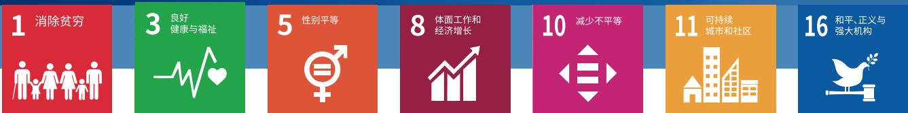

flowchart

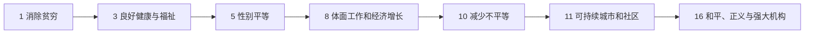
```mermaid
graph LR
  A["1 消除贫穷"] --> B["3 良好健康与福祉"]
  B --> C["5 性别平等"]
  C --> D["8 体面工作和经济增长"]
  D --> E["10 减少不平等"]
  E --> F["11 可持续城市和社区"]
  F --> G["16 和平、正义与强大机构"]
```

## 平等多元雇佣

## 公平雇佣

## 制度体系

公司严格遵循《中华人民共和国劳动法》《中华人民共和国劳动合同法》等法律法规，构建了覆盖员工雇佣全流程的合规管理体系，确保每一项用工行为有法可依、有规可循。公司以《员工手册》为核心准则，配套《员工招聘管理办法》《岗位管理办法》《劳动关系管理办法》《劳动关系合规管理办法》等一系列制度文件，形成标准化、规范化的雇佣管理体系，覆盖员工招聘、录用、培训、晋升、薪酬福利、解除劳动合同等全雇佣周期。

## 多元化管理

公司致力于构建包容、平等、多元的职场环境，《员工招聘管理办法》明确规定“坚持公开平等、竞争择优”原则，坚决杜绝任何形式的就业歧视；《劳动关系合规管理办法》进一步要求，在招聘录用、薪酬福利、职业发展、奖励惩处等方面，不因种族、民族、宗教、性别等原因对员工差别对待；在日常用工实践中，公司始终秉持平等、包容的基本原则，重点关注女性员工、残疾员工等特殊群体的权益保护；公司积极响应国家残疾人就业扶持政策和退伍军人安置政策，切实履行社会责任，推动就业多元化发展。报告期内，公司未发生经确认的歧视事件。

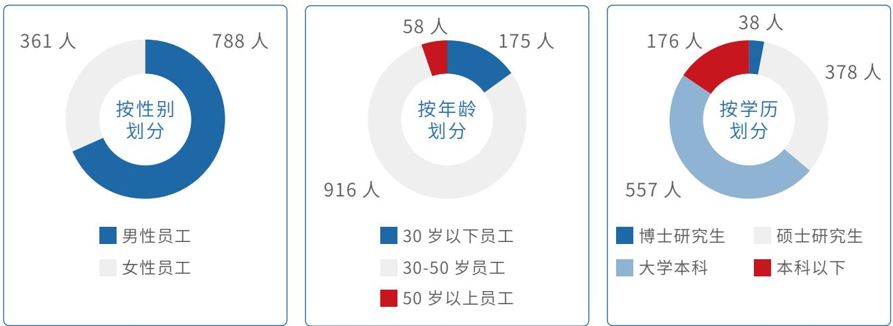

关键绩效

<table><tr><td>截至报告期末公司共录用退伍军人</td><td>报告期末在职员工的数量</td><td>报告期内新聘请员工</td></tr><tr><td>6名</td><td>1,149人</td><td>61人</td></tr></table>

## 反童工及反强制劳动

公司严格评估并全面遵循《中华人民共和国未成年人保护法》《世界人权宣言》、联合国全球契约组织十项原则及《国家人权行动计划 (2021-2025 年 )》等国内外法律政策与国际准则，坚守人权保护底线。公司制定《劳动关系合规管理办法》，明确所有员工必须符合法定劳动年龄，严禁任何形式的童工雇佣或强制劳动行为。

为全面防范风险，公司建立了事前排查、事中管控、事后复盘的全流程监察机制：事前严格执行员工入职年龄核查；事中定期开展用工合规巡查，排查强制加班、限制人身自由等强制劳动行为；事后建立违规追溯与复盘机制。对于合作伙伴，公司将反童工、反强制劳动要求纳入合作准入标准，对存在违规问题的合作伙伴暂停合作并要求限期整改。

若发现雇佣童工及强制劳工事件，公司严格遵循“快速响应、依法处置、全程管控、长效整改”的原则，执行紧急处置与隔离管控、全面调查与证据固定、依法处置与责任追究、补救帮扶与权益保障、整改复盘与长效管控的五大处理步骤，确保事件得到规范、彻底解决，坚守劳工权益保护底线，符合 SA800标准及相关法律法规要求。报告期内，公司未发生任何使用童工或强制劳动的违规事件。

## 高技术人才引进

公司通过实施“三星”工程（金星、新星、萌星）精准引进高层次人才，并为引进人才提供具有竞争力的薪酬、安家费、科研启动资金及子女教育支持等优待措施。严格落实工资总额向基层倾斜、向技术人才倾斜政策，技术人才薪酬较同级别管理岗位高15%-20%，并对高级技术人才实施工资总额单列，给予市场匹配薪酬；股权激励重点倾斜核心技术骨干。

## 关键绩效

2025 年度，公司引进高级职称人才 $1 6 z ,$ 调整出的员工持股额度 100% 给予技术人才。

## 员工权益

## 薪酬与福利

公司围绕“保障员工权益、激发员工活力、实现共同发展”的薪酬福利管理目标，制定并严格执行《“五元”薪酬管理办法》《岗位管理办法》等核心制度文件。相关制度文件通过员工手册、内部办公系统向全体员工公示，薪酬福利发放情况定期进行内部审计，确保合规透明。

在薪酬管理方面，坚持“对外具有竞争力、对内具有公平性、对个人具有激励性”的原则，建立以岗位价值为基础、以绩效贡献为导向的薪酬体系，明确岗位薪酬等级、薪酬结构和调整机制，定期开展市场薪酬调研，确保薪酬水平不低于当地市场 75 分位值，核心岗位薪酬水平处于行业领先地位；同时，严格执行最低工资标准要求，全体员工基本工资均高于当地最低工资标准，无拖欠工资、克扣工资等情况。

在福利管理方面，公司构建了“法定福利 + 企业补充福利 + 特色福利”的多层次福利体系。

## 法定福利

为全体员工足额缴纳“五险一金”（养老保险、医疗保险、失业保险、工伤保险、生育保险、住房公积金），缴费基数严格按照员工实际工资收入确定，缴费比例符合国家和地方规定；

## 企业补充福利

为员工购买补充医疗保险、企业年金、重大疾病保险，提供年度体检、带薪年假、节日福利（春节、中秋节等传统节日）、生日福利等；

## 特色福利

设立员工食堂、通勤班车、健身房、母婴室、篮球场、排球场等，切实解决员工工作生活中的实际困难。

## 绩效管理

公司高度重视员工绩效管理，切实维护全体员工的合法权益。公司制定《岗位管理办法》《劳动关系管理办法》，建立岗位价值评估体系，通过科学的岗位评价方法确定各岗位的相对价值，作为薪酬等级划分的核心依据，确保同岗同酬、岗变薪变。同时，公司建立绩效反馈申诉机制，员工若认为自身薪酬福利及绩效存在不公平情况，可通过人力资源部门、工会、纪检监察部门等提出申诉，提升了员工的薪酬满意度和组织归属感。

## 股权激励

公司为稳定核心团队和业务骨干，充分调动中高层管理人员和核心骨干员工的积极性和凝聚力，在依法履行决策程序并经中国电科批复同意后，于混合所有制改革期间开展员工持股。

## 民主管理

公司为保障员工民主权益，制定《职工代表大会实施细则》，健全以职工代表大会为基本形式的企业民主管理制度。职工代表大会为公司最高民主管理机构，每届任期为三年，每年至少召开一次，全体会议必须有三分之二以上的职工代表出席，选举和表决事项需经全体职工代表过半数通过方为有效。职代会审议公司重大决策，如薪酬方案、福利政策、发展规划等，职工代表由员工民主选举产生，覆盖率达各部门、各层级。

## 报告期内

公司共组织职代会1 次，审议通过《提升差旅报销信息化水平》《提升晚餐服务保障》等2 项重大议案，收集员工提案 2 项，落实率 100%。

公司建立了多元化的日常沟通渠道，确保员工意见有效传递。

## 意见反馈渠道

设立线上线下双重意见箱，线下在无监控处设置意见箱，线上在OA系统开通专用邮箱、职工论坛开设专门版块，安排专人负责每日查看。

## 其他渠道

通过企业微信公众号、内部宣传栏定期发布公司动态。

## 座谈会渠道

组织不同主题的员工座谈会，如新员工座谈会、技术人员座谈会、管理人员座谈会等，收集员工意见。

01

03

02

04

## 建立信访工作制

设置专门部门接待信访人员，解决员工问题。制定《信访工作实施细则》规范了信访事项的受理、办理、复查、复核全流程，确保员工诉求得到及时、合规的处理。

公司建立定期员工满意度调查机制，全面了解员工需求，并将调查结果作为管理改进的重要依据。调查内容涵盖员工工作体验与压力、个人能力提升、团队协作文化建设等维度。

## 报告期内

公司开展 1 次职工心声满意度调查，采用匿名问卷形式，调查范围覆盖全体员工（含下属公司），问卷回收率 100%，员工满意度结果 91%；

针对调查发现的问题，公司成立专项改进小组，领导班子成员牵头制定 10 项具体务实举措，并跟踪落实；同时向员工公示改进进展，确保调查结果切实转化为管理提升行动。

## 员工关怀

公司围绕“以人为本、关爱员工”理念，开展多元化关怀活动，切实保障员工权益、增强团队凝聚力。

## 女性员工关爱

设立母婴室 2 间（配备哺乳椅、冰箱、消毒设备等），提供哺乳假，为孕期员工调整工作岗位（避免重体力或高强度工作），组织“情暖三月，巾帼担当”三八妇女节系列活动，开展女性健康知识答题，惠及员工 768 人次。

## 健康 关怀

为员工提供年度体检（特殊岗位每半年 1 次），建立健康档案；为职工购买补充医疗保险及重疾医疗保险，帮助患病员工减轻经济负担。

## 举办文体活动

组织开展女职工冰壶比赛、职工气排球比赛、六一儿童节亲子活动、家庭开放日等主题活动 26 次，年度开展大型文体活动 5 次（迎新春主题文化活动、春季健步跑、产业园骑行等）；成立兴趣社团 10 个（跑步社、书法社、摄影社等），参与员工达 3,200 人次。

## 案例

## 公司组织开展蓝天产业园骑行活动

2025 年 12 月，为纪念蓝天产业园开工建设一周年，共同见证公司高质量发展的成长足迹，电科蓝天组织开展职工骑行活动，骑行共分为三条路线，依次串联三处厂区，最后抵达产业园。广大职工用汗水诠释拼搏、用协同砥砺初心，与新区共成长、与新岁共奋进。

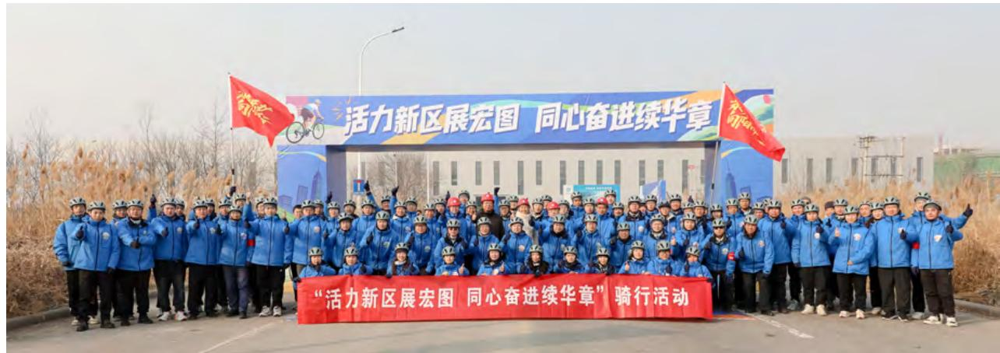

text_image

活力新区展宏图 同心奋进续华章
“活力新区展宏图 同心奋进续华章”骑行活动

## 案例

## 公司开展“弘扬航天精神，致敬星辰大海”家庭开放日活动

在第十个“中国航天日”之际，公司举办“弘扬航天精神，致敬星辰大海”主题家庭开放日，邀请近 40 组员工家庭走进公司，设置“航天护照”打卡、展厅参观、科研一线走访、青年专家科普讲座等环节。该活动增进了员工家属对公司事业的理解与支持，在孩子心中播下航天梦想，有效拉近了“小家”与“大家”的距离，提升了团队向心力。

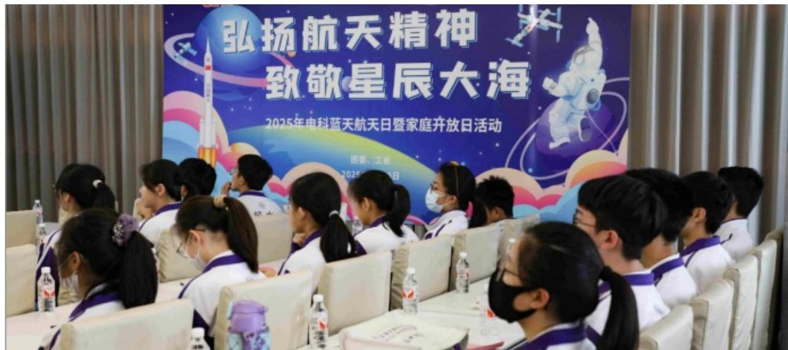

text_image

弘扬航天精神
致敬星辰大海
2025年电科蓝天航天日暨家庭开放日活动
团委、工会
2025年1月1日

## 案例 公司开展“解职工之忧，筑成长之桥”第二届“蓝天少年”夏令营

为缓解职工子女暑期“看护难”问题，公司连续两年举办“蓝天少年”夏令营。第二届夏令营历时一个月，采用“专业教师授课 + 生活辅导员照料”双师模式，为职工子女提供了涵盖体育、艺术、手工及安全科普的多元课程，并组织走进国家海洋博物馆与消防队开展研学之旅。活动配备专业师资与周全的安全保障，有力有效缓解职工暑期照顾子女的后顾之忧，提升了员工的归属感与企业的凝聚力。

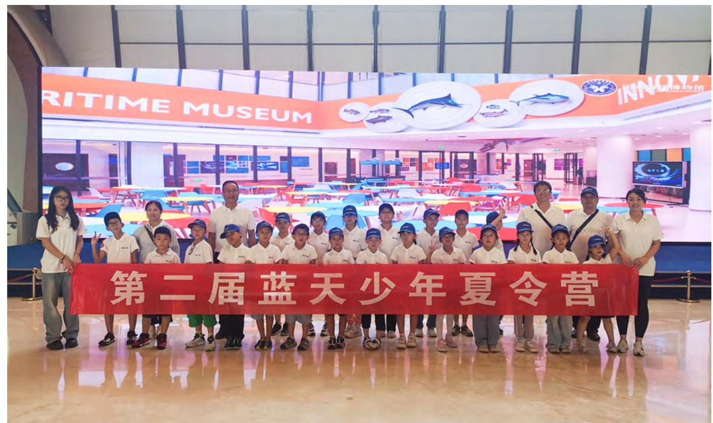

text_image

RITIME MUSEUM
第二届蓝天少年夏令营

公司建立了完善的困难员工帮扶机制，相关制度依据《工会经费收支管理办法》执行，明确了工会会员本人、配偶和子女因大病、意外事故、子女就学等原因致困的，可给予资金和物质帮助。另外，公司开展“冬送温暖、夏送凉爽”活动，为一线户外作业职工购买防暑降温或冬季防护用品。通过制度化、常态化的帮扶举措，公司切实为困难员工排忧解难，让员工感受到组织的温暖。

## 报告期内

公司工会对 18 名困难员工进行了精准帮扶，提供生活补助

## 守护健康安全

公司牢固树立安全发展理念，严格落实安全生产主体责任。持续健全安全管理制度体系，强化隐患排查治理与现场安全管控，加强全员安全教育培训与应急处置能力建设，切实保障员工职业健康与生命安全，全力筑牢企业高质量发展的坚实安全屏障。

## 职业健康与安全生产管理

## 管理体系与制度

公司明确“以人为本，安全发展；科技引领，提升本安；节能减排，低碳环保；统筹推进，持续提升”的环境、职业健康安全管理方针，编制了《安全生产管理制度汇编》，建立了涵盖《安全生产目标管理制度》《安全生产责任制管理制度》《安全检查与隐患排查治理制度》以及《危险源辨识与风险评价清单》的制度体系，同时制定了《职业健康安全管理手册》，与《职业健康管理程序文件》共同构成完整的管理框架，进一步规范和加强公司安全生产、职业健康、环保和消防工作，切实保障员工在科研生产经营活动中的安全、健康和国家财产安全，预防生产安全事故，杜绝职业病；并依据 GB/T 45001-2020《职业健康安全管理体系要求及使用指南》建立、实施并保持职业健康安全管理体系。公司各下属公司均依据自身业务特点建立了覆盖全员的安全生产责任制体系，并每年组织签订安全生产责任书。

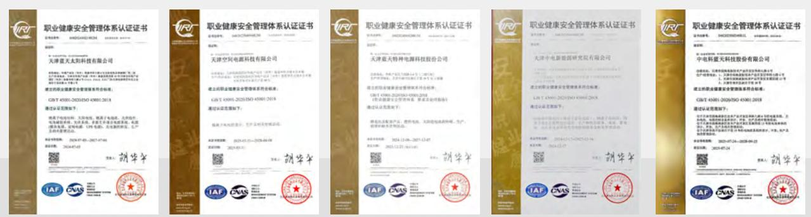

text_image

职业健康安全管理体系认证证书
天津蓝天太阳能科技有限公司
GRT 43001-2020ISO 43001.2018
通过认证范围如下：
请电子邮箱、电子邮件、传真、电子邮件、电话邮箱、电子邮件、电子邮件、电子邮件、电子邮件、电子邮件、电子邮件、电子邮件、电子邮件、电子邮件、电子邮件、电子邮件、电子邮件、电子邮件、电子邮件、电子邮件、电子邮件、电子邮件、电子邮件、电子邮件、电子邮件、电子邮件、电子邮件、电子邮件、电子邮件、电子邮件、电子邮件、电子邮件、电子邮件、电子邮件、电子邮件、电子邮件、电子邮件、电子邮件、电子邮件、电子邮件、电子邮件、电子邮件、电子邮件、电子邮件、电子邮件、电子邮件、电子邮件、电子邮件、电子邮件、电子邮件、电子邮件、电子邮件
职业健康安全管理体系认证证书
天津空间电源科技有限公司
GRT 43001-2020ISO 43001.2018
通过认证范围如下：
请电子邮箱、电子邮件、电子邮件、电子邮件、电子邮件、电子邮件、电子邮件、电子邮件、电子邮件、电子邮件、电子邮件、电子邮件、电子邮件、电子邮件、电子邮件、电子邮件、电子邮件、电子邮件、电子邮件
职业健康安全管理体系认证证书
天津蓝天特种电源科技股份公司
GRT 43001-2020ISO 43001.2018
通过认证范围如下：
请电子邮箱、电子邮件、电子邮件、电子邮件、电子邮件、电子邮件、电子邮件、电子邮件、电子邮件、电子邮件
职业健康安全管理体系认证证书
天津中电新能源研究院有限公司
GRT 43001-2020ISO 43001.2018
通过认证范围如下：
请电子邮箱、电子邮件、电子邮件、电子邮件、电子邮件、电子邮件、电子邮件、电子邮件、电子邮件
职业健康安全管理体系认证证书
中电科蓝天科技有限公司
GRT 43001-2020ISO 43001.2018
通过认证范围如下：
请电子邮箱、电子邮件、电子邮件、电子邮件、电子邮件、电子邮件、电子邮件、电子邮件
职业健康安全管理体系认证证书

职业健康安全管理体系认证

## 管理目标

公司依据GB/T 45001-2020标准，制定了中长期职业健康安全管理目标，持续提升管理绩效与运行水平：

·使危险源受控并不断降低其风险，无因作业环境因素而导致的职业病；  
强化安全意识，落实主体责任，实施隐患闭环，持续保障职工生命健康安全，推动公司职业健康安全管理水平显著提升。

2025 年度，公司下发《2025 年度安全生产工作目标、指标》，制定了覆盖安全、职业健康等多个维度的量化目标与分部门的针对性管理方案：

安全生产方面，目标包括全年安全生产无事故天数不少于 365 天，杜绝火灾、重伤、死亡及重大财产损失事故，实现轻伤事故为零等；职业健康方面，目标包括作业场所职业危害因素检测率、合同告知率、警示标识设置率、接害员工体检及建档率均为 100%，无新增职业病等。

## 管理措施

为实现管理目标，公司制定全面的战略行动计划，包括落实全员安全生产责任制、严格执行“三同时”制度、实施“三查四检”机制以确保隐患 100% 闭环整改等。公司每年年初由安委会办公室组织制定公司级安全目标，经总经理批准后，通过红头文件下发，并分解至各部门及下属公司，实行季度考核、年度统计，确保年度目标落地执行。

公司全面落实职业健康与安全全流程管控措施，常态化开展危险源辨识、风险分级管控与隐患排查治理闭环管理；规范危险作业审批、危化品专项管控，配齐劳保防护用品，定期组织应急演练与隐患整改复查，全方位筑牢生产安全与员工职业健康防线。

公司开展接害职工职业健康体检管理工作，严格落实职业病危害全周期监护，全面执行岗前、在岗定期、离岗全过程专项体检，做到应检尽检、不漏一人；严格保障全员体检全覆盖，体检资料统一建档留存，切实筑牢员工职业健康保障防线。

报告期内

<table><tr><td>安全生产总投入</td><td>员工工伤保险覆盖率</td><td>因工死亡人数</td><td>职业病发生率</td></tr><tr><td>678.15万元</td><td>100%</td><td>0人</td><td>0</td></tr></table>

## 应急管理与预案

公司依据《中华人民共和国安全生产法》《生产安全事故应急预案管理办法》及集团公司相关规定，制定并发布了《生产安全事故应急预案》，由综合预案、专项预案和现场处置方案三部分组成。预案旨在建立统一领导、分级负责、反应快捷的应急工作机制，规范生产安全事故应急管理和响应程序，最大限度地减少人员伤亡和财产损失。公司要求各部门及全体员工严格进行应急管理培训学习，定期开展应急演练，持续提升防范及应急处置能力。

公司及各下属公司 2025 年度常态化开展化学品泄漏、机械伤害、火灾消防等应急培训与实战演练，演练覆盖率、考核合格率均达 100%。

## 案例

## 蓝天太阳开展 MOCVD 特气泄漏专项应急演练

2025 年 6 月，蓝天太阳组织 MOCVD 事故专项应急救援演练，模拟特气柜内砷化氢气瓶与管道连接处泄漏并自燃场景。演练涵盖报警响应、应急疏散、防护穿戴、切断气源等环节，参演36 人。应急人员穿戴防护设备仅用 57 秒，应急处置 1 分 30 秒，全体人员在 3 分钟内完成疏散。演练有效检验了预案的科学性和团队应急能力。

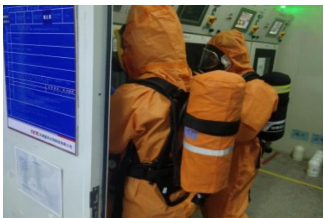

text_image

Photo of firefighters in orange protective suits operating a control panel with visible Chinese interface panels and signage

## 职业健康安全培训

公司重视提升员工职业健康安全意识与素养，常态化抓实安全生产培训宣贯工作，严格落实全员三级安全教育、年度复训、特种作业专项持证培训及岗位风险交底宣贯；通过线下授课、现场实操、案例警示、海报展板、班前会宣讲等多种形式开展安全科普与制度宣导，并在“安全生产月”期间通过多种形式培训，全面提升全员安全意识和实操能力，以安全赋能员工。

## 关键绩效

公司分层分级开展全员安全宣教培训，组织观看主题宣传片16场、警示教育片27场，累计参与2,344人次；开展“全民安全公开课”和网络教育活动8场、主题党课及专题研讨3场、安全知识竞赛和技能比武16场；针对危险作业人员开展安全实操技能专项培训 25 场，覆盖 184 人次；实施安全责任“穿透”专项帮扶培训，覆盖所属单位负责人 9 名、部门负责人 45 名、班组长 36 名、专兼职安全管理人员 35 名及标准化自评人员 25 名。2025 年度，公司实现安全培训全员覆盖率 100%、考核合格率达标。

## 案例

公司开展筑牢“心”防线 激发“新”动能—“心理关爱月”系列活动

2025 年，公司以“关爱心理健康激发创新活力”为主题，组织开展了“心理关爱月”系列活动。活动面向全体员工开展《情绪管理与压力应对》线上直播课程，普及心理健康知识；针对基层管理骨干举办EAP 管理技能培训，提升团队心理援助能力；同时制作发放心理健康宣传册及“连心卡”，重点关怀长期出差职工及家属。

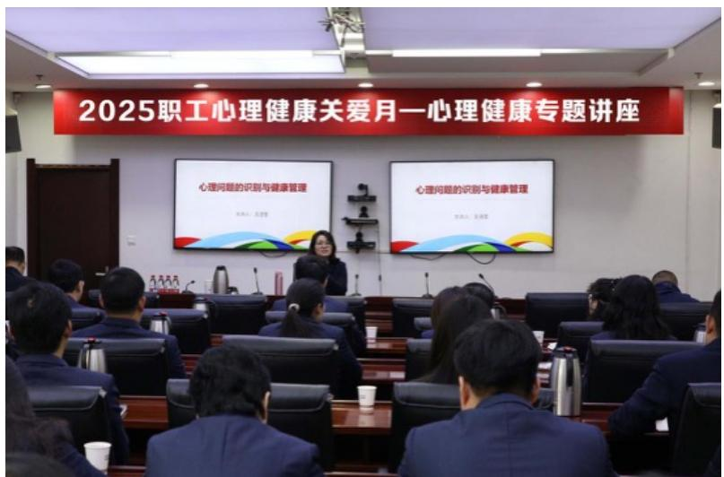

text_image

2025职工心理健康关爱月一心理健康专题讲座
心理问题的识别与健康管理
心理问题的识别与健康管理

## 助力人才发展

公司紧扣电能源事业发展，秉持“尚贤上善、同生共赢”人才理念，牢固树立人才是第一资源、生存之本、竞争之本、制胜之本的共识，坚定扛起加快建设电能源领域重要人才中心和创新高地的使命担当，营造担当作为、勇于创新的人才氛围，形成人人渴望成才、人人努力成才、人人皆可成才、人人尽展其才的良好局面，系统出台 《“十四五”人才发展规划》《员工培训管理办法》等制度办法，大力实施“三星工程”“三航计划”“三青计划”等人才专项工程，着力营造担当作为、勇于创新的干事氛围，构建人才成长与企业发展同频共振、同向共长的良好生态，为公司高质量可持续发展提供坚强人才保障。

## 职业发展

公司建立了完善的职业发展管理体系，以《岗位管理办法》为核心，明确岗位序列、岗位层级、任职要求及晋升机制。按照专业技术、经营管理、专门技能三类人才和顶尖、核心、骨干、基础四个层次，贯通岗位，形成横向分类、纵向分级的发展通道；建立“之字形交叉晋升通道”，完善职称评审、技能认定和岗位聘任办法，促进三支队伍之间流动，高技能人才和经营管理人员可参加工程系列职称评审进入专业技术岗位；实施“青蓝计划”中青蓝Ⅰ类、Ⅱ类与公司中层正职、副职“互评共用”制度，打通技术与管理的双向转任通道。

## 员工培训

为将人才理念落地生根，夯实人才培养根基，公司以《培训管理办法》为核心，建立了在党委领导下由人力资源部归口管理、各部门分工负责、分级实施的培训管理体系，形成源头培养、跟踪培养、全程培养的闭环机制。

针对技术人才培养，专项推出“三青计划”，聚焦技术人才的梯队建设与能力提升，助力技术人才快速成长为行业骨干；针对管理人才发展，专门设置“三航计划”，系统提升管理人才的综合素养与管理能力，为公司高质量发展培育核心管理力量，切实以人才赋能企业可持续发展。

公司以学分制为牵引，围绕“全员覆盖、按需施教、注重实效”原则，开展丰富的培训活动：

## 新员工入职培训

实施《新员工入职培训方案》，培训周期 13 天，内容包括企业文化、规章制度、岗位技能、安全知识等，2025 年度新员工培训 61 人，考核通过率100%。

## 在岗人员按岗位类型开展专项培训

技术岗位开展新技术、新工艺培训（如技术状态管控、航天禁限用工艺等），年度培训 38 期，覆盖 4,000 人次；管理岗位开展领导力、沟通技巧、知识产权等培训，年度培训 17 期，覆盖 810人次；技能岗位开展操作技能提升培训，年度培训 25 期，覆盖 3,500 人次。

## 特种作业人员培训

严格执行《特种作业人员安全培训管理办法》，对电工、焊工、叉车司机等特种作业人员，进行持证上岗培训和年审培训，持证率 100%。

此外，公司还建立内训师制度，内训师承担内部课程授课和人才培养，并给予讲课费及购书经费激励。

报告期内

<table><tr><td>共开展培训</td><td>培训总时长</td><td>培训支出金额</td><td>参与培训员工</td></tr><tr><td>40场次</td><td>12,086.5人·小时</td><td>23.51万元</td><td>1,049人</td></tr></table>

## 领导力培训

公司高度重视中高层干部的能力建设，定期组织专项培训，持续提升中高层干部的战略视野、管理能力和专业素养。

·10 月，选派优秀技能人才参加技能人才专题培训班，围绕先进生产制造型企业智能制造技术、现场管理等内容开展参访交流。  
·12 月，公司举办“五所两司中层干部培训交流”，由参加过集团公司青年干部培训班的 6 位学员分享战略思维、业财融合、高质量发展等主题，全体中层干部参训；公司选派高层次专家参加集团公司“总体能力提升暨体系化智能化技术转型研讨班”，学习系统工程、重大工程管理等内容。

## 公司全面建设线上学习平台，提升培训的便捷性和实效性

2025 年度，公司全面建设线上学习平台，构建“随时随地、自主学习”的培训模式。

·线上学习平台于 2025 年 10 月正式启用，命名为“蓝天学院”，主要使用部门覆盖全公司，覆盖率 100%；

·课程设置方面，平台现有课程 52 门，分为管理类、技术类、通用类三大类别，课程每半年更新 50 门；

·学习模式方面，制定年度学分要求，员工有必修学分和选修学分；

·学习效果管理方面，平台设置学习打卡、在线考试、学习积分等功能，学习积分可兑换书籍等学习相关物品。

## 校企合作

公司积极开展校企合作，构建多元化人才培养与供给体系。与电子科技大学、浙江大学签署人才联合培养协议，共同开展研究生联合培养等。与西安交通大学、哈尔滨工业大学、厦门大学、南京理工大学、哈尔滨工程大学等重点院校签署教育部第四期供需对接就业育人项目 10 项。与天津中德应用技术大学、河北工业职业技术大学、天津仁爱学院、成都工业学院等院校签订技能人才订单班合作协议，有效推动了公司人才培养。

natural_image

Illustration of people interacting with a large screen displaying data and charts, surrounded by books and pencils (no text or symbols)

## 践行社会责任

电科蓝天始终坚持科技向善、回馈社会，自觉践行企业社会责任，以实际行动回馈社会、服务人民。公司聚焦教育帮扶、社区共建、乡村振兴等领域，持续开展多元公益实践，以责任担当传递温暖力量。

## 乡村振兴

公司坚决贯彻国家乡村振兴战略，按照上级单位统筹部署，2025 年度在资金支持、消费帮扶、教育帮扶等方面持续发力，助力帮扶地区巩固拓展脱贫攻坚成果，全面推进乡村振兴。

## 报告期内

公司乡村振兴总投入金额 67.75 万元，其中，向帮扶地区捐赠帮扶款项 20 万元；同时大力开展消费帮扶行动，全年从帮扶点采购帮扶产品，拓宽当地农产品销售渠道，促进地区经济发展和农民增收。

## 案例

## 公司开展“大爱电科，航模筑梦”活动

公司心系集团公司对口帮扶的陕西省绥德县乡村教育发展，在获悉四十里铺镇中心小学等学校航模教具紧缺后，迅速通过 “大爱电科 — 梦想 1+1” 志愿服务活动，向该校科技小屋捐赠 20 台适配中小学生的航模教具，助力丰富科技教学资源、提升学生科学素养。此次行动以科技为纽带、以志愿践初心，将雷锋精神贯穿乡村助学实践，切实助力乡村振兴与科技普惠。

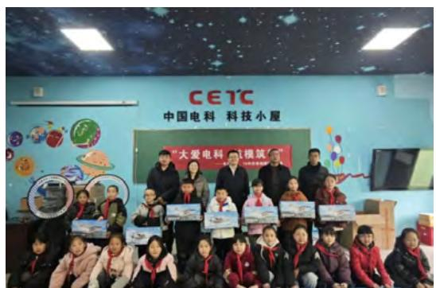

text_image

CETC
中国电科 科技小屋
“大爱电科 模筑”

## 社会公益

2025 年度，公司持续深化教育公益领域的投入，依托自身在电能源技术等领域的科技优势，联合地方教育机构开展系列科普活动，推动科技资源向青少年群体开放。公司持续打造“科普进校园”品牌项目，近年来已先后走进天津理工大学、南开中学、敖嘴小学等多所学校，并成功举办航天科普日、“红领巾爱祖国”国旗传递等活动，形成良好的社会反响。

## 报告期内

公司各项公益领域惠及人口 483 人

## 案例

## 开展“青春志愿行，科普启新程”主题活动

2025 年 3 月，第 62 个 “学雷锋纪念日” 来临之际，公司联合南开区相关单位、社区及南开中学，举办 “青春志愿行，科普启新程” 志愿服务活动。公司科技工作者通过动画视频展示太阳电池在载人航天中的应用，讲解化学电源基础知识，结合科研故事将新能源知识通俗化，激发师生科学兴趣，以社校社企联动为雷锋精神注入时代活力。

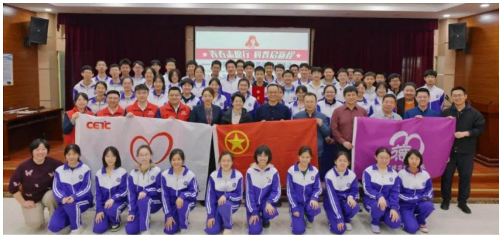

text_image

★青春志愿行 科普启新程
CETC

## 案例

## 公司举办航天日主题系列活动

2025 年 4 月，公司邀请南开中学博雅班学生走进企业，参与航天日系列活动，内容涵盖科普讲座、展厅参观、互动体验等，帮助学生在沉浸式学习中理解航天科技与国家战略的紧密联系。

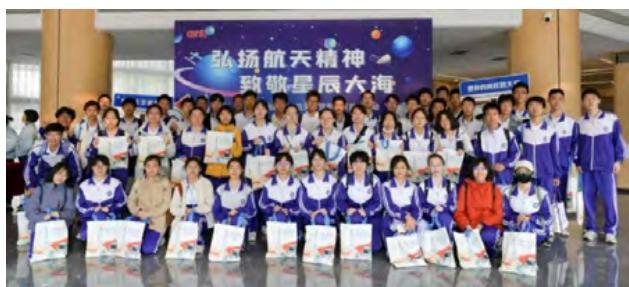

text_image

弘扬航天精神
致敬星辰大海

## 附录

## 数据绩效表

环境绩效

<table><tr><td>指标类别</td><td>指标名称</td><td>2025年</td><td>单位</td></tr><tr><td>环境合规管理</td><td>环境管理总投入</td><td>94.12</td><td>万元</td></tr><tr><td rowspan="4">应对气候变化</td><td>温室气体排放量(范围一)</td><td>23.81</td><td>吨二氧化碳当量</td></tr><tr><td>温室气体排放量(范围二)</td><td>46,592.84</td><td>吨二氧化碳当量</td></tr><tr><td>温室气体排放总量(范围一+范围二)</td><td>46,616.65</td><td>吨二氧化碳当量</td></tr><tr><td>温室气体排放强度</td><td>0.1419</td><td>吨二氧化碳当量/万元营收</td></tr><tr><td rowspan="4">能源利用</td><td>直接能源消耗量</td><td>11.97</td><td>吨标准煤</td></tr><tr><td>间接能源消耗量</td><td>9,750.58</td><td>吨标准煤</td></tr><tr><td>综合能源消耗量</td><td>9,762.55</td><td>吨标准煤</td></tr><tr><td>能源使用强度</td><td>0.0297</td><td>吨标准煤/万元营收</td></tr><tr><td rowspan="2">水资源利用</td><td>总耗水量</td><td>77,934.57</td><td>立方米</td></tr><tr><td>水资源使用强度</td><td>0.2371</td><td>立方米/万元营收</td></tr><tr><td rowspan="5">废弃物处理</td><td>废水排放总量</td><td>2.27</td><td>万立方米</td></tr><tr><td>废气排放总量</td><td>41,151.79</td><td>万立方米</td></tr><tr><td>无害废弃物总量</td><td>794.98</td><td>吨</td></tr><tr><td>有害废弃物总量</td><td>157.08</td><td>吨</td></tr><tr><td>废弃物产生总量</td><td>952.06</td><td>吨</td></tr><tr><td rowspan="2">原材料与包装材料管理</td><td>生产运输和包装所用物料总质量</td><td>52,471.81</td><td>吨</td></tr><tr><td>生产运输和包装所用物料所使用的可再生材料占比</td><td>8.50</td><td>%</td></tr></table>

社会绩效

<table><tr><td colspan="2">指标类型</td><td>指标名称</td><td>2025年</td><td>单位</td></tr><tr><td colspan="2" rowspan="4">创新驱动</td><td>研发投入</td><td>2.17</td><td>亿元</td></tr><tr><td>研发投入占营业收入比例</td><td>6.60</td><td>%</td></tr><tr><td>研发人员总人数达</td><td>227</td><td>人</td></tr><tr><td>研发人员总人数占公司总人数的比例</td><td>19.76</td><td>%</td></tr><tr><td colspan="2" rowspan="5">产品和服务安全与质量</td><td>产品或服务合格率</td><td>99.7</td><td>%</td></tr><tr><td>产品召回事件</td><td>0</td><td>起</td></tr><tr><td>客户反馈响应率</td><td>100</td><td>%</td></tr><tr><td>接获关于产品及服务的投诉数目</td><td>0</td><td>起</td></tr><tr><td>客户满意度</td><td>99.86</td><td>%</td></tr><tr><td colspan="2" rowspan="2">数据安全与客户隐私保护</td><td>数据安全与客户隐私保护培训次数</td><td>2</td><td>次</td></tr><tr><td>数据安全与客户隐私保护应急演练次数</td><td>3</td><td>次</td></tr><tr><td rowspan="11">供应链安全</td><td>供应商总数</td><td>供应商数量</td><td>2,560</td><td>家</td></tr><tr><td rowspan="2">供应商总数</td><td>按地区划分的供应商数量-境内</td><td>2,559</td><td>家</td></tr><tr><td>按地区划分的供应商数量-境外</td><td>1</td><td>家</td></tr><tr><td rowspan="4">供应商品类管理</td><td>原材料类</td><td>1,036</td><td>家</td></tr><tr><td>外协</td><td>319</td><td>家</td></tr><tr><td>设备类</td><td>550</td><td>家</td></tr><tr><td>非生产类</td><td>655</td><td>家</td></tr><tr><td rowspan="2">供应商分级管理</td><td>Tier 1(直接供应商)数量</td><td>2,139</td><td>家</td></tr><tr><td>Non Tier 1(间接供应商)数量</td><td>421</td><td>家</td></tr><tr><td rowspan="2">供应商考核</td><td>供应商考核覆盖率</td><td>100</td><td>%</td></tr><tr><td>供应商考核合格率</td><td>95.66</td><td>%</td></tr><tr><td rowspan="7">供应链安全</td><td rowspan="7">可持续采购</td><td>签署供应商行为准则的百分比</td><td>19.18</td><td>%</td></tr><tr><td>签订包含环境和劳工要求条款的供应商百分比</td><td>15.35</td><td>%</td></tr><tr><td>开展了社会影响评估的供应商数量</td><td>189</td><td>家</td></tr><tr><td>开展了环境影响评估的供应商数量</td><td>169</td><td>家</td></tr><tr><td>经确定为具有实际和潜在重大负面社会影响的供应商数量</td><td>0</td><td>家</td></tr><tr><td>经确定为具有实际和潜在重大负面环境影响的供应商数量</td><td>0</td><td>家</td></tr><tr><td>公司内部通过可持续采购培训的采购员比例</td><td>100%</td><td>%</td></tr><tr><td rowspan="17">员工雇佣</td><td rowspan="2">雇佣整体情况</td><td>总员工人数</td><td>1,149</td><td>人</td></tr><tr><td>新聘请员工人数</td><td>61</td><td>人</td></tr><tr><td rowspan="2">按性别分类的员工人数</td><td>女性员工人数</td><td>361</td><td>人</td></tr><tr><td>男性员工人数</td><td>788</td><td>人</td></tr><tr><td rowspan="3">按年龄分类的员工人数</td><td>30岁以下员工人数</td><td>175</td><td>人</td></tr><tr><td>30-50岁员工人数</td><td>916</td><td>人</td></tr><tr><td>51岁及以上员工人数</td><td>58</td><td>人</td></tr><tr><td rowspan="4">按学历划分的员工人数</td><td>本科以下员工人数</td><td>176</td><td>人</td></tr><tr><td>本科员工人数</td><td>557</td><td>人</td></tr><tr><td>硕士员工人数</td><td>378</td><td>人</td></tr><tr><td>博士员工人数</td><td>38</td><td>人</td></tr><tr><td rowspan="4">按职级划分的员工人数</td><td>高级管理层员工人数</td><td>8</td><td>人</td></tr><tr><td>中级管理层员工人数</td><td>26</td><td>人</td></tr><tr><td>初级管理层员工人数</td><td>83</td><td>人</td></tr><tr><td>普通员工</td><td>1,032</td><td>人</td></tr><tr><td rowspan="2">离职情况</td><td>员工离职人数</td><td>78</td><td>人</td></tr><tr><td>员工流失率</td><td>6.79</td><td>%</td></tr><tr><td rowspan="8">员工权益福利</td><td rowspan="4">基本权益保障</td><td>员工社保缴纳覆盖率</td><td>100</td><td>%</td></tr><tr><td>经确认的歧视事件</td><td>0</td><td>起</td></tr><tr><td>经确认的强迫劳动事件</td><td>0</td><td>起</td></tr><tr><td>经确认的童工事件</td><td>0</td><td>起</td></tr><tr><td>困难员工帮扶</td><td>困难员工帮扶人数</td><td>18</td><td>人</td></tr><tr><td rowspan="3">员工满意度调查</td><td>发放的员工满意度问卷总数</td><td>1,150</td><td>份</td></tr><tr><td>员工满意度问卷回收率</td><td>100</td><td>%</td></tr><tr><td>员工满意度结果</td><td>91</td><td>%</td></tr></table>

<table><tr><td colspan="2">指标类型</td><td>指标名称</td><td>2025年</td><td>单位</td></tr><tr><td rowspan="7">职业健康与安全生产</td><td>健康安全培训与演习</td><td>职业健康、生产安全类培训总时长</td><td>11,805</td><td>小时</td></tr><tr><td rowspan="3">安全生产投入</td><td>安全生产总投入</td><td>678.15</td><td>万元</td></tr><tr><td>员工工伤保险投入金额</td><td>128.85</td><td>万元</td></tr><tr><td>员工工伤保险覆盖率</td><td>100</td><td>%</td></tr><tr><td rowspan="3">工伤</td><td>因工受伤(轻伤及以上)人数</td><td>2</td><td>人</td></tr><tr><td>因工死亡人数</td><td>0</td><td>人</td></tr><tr><td>职业病发生率</td><td>0</td><td>%</td></tr><tr><td rowspan="7" colspan="2">人才发展培训</td><td>培训总时长</td><td>12,086.5</td><td>人·小时</td></tr><tr><td>女性员工培训总小时数</td><td>3,238.2</td><td>人·小时</td></tr><tr><td>男性员工培训总小时数</td><td>8,848.3</td><td>人·小时</td></tr><tr><td>全年培训总场次</td><td>40</td><td>场</td></tr><tr><td>年度培训支出金额</td><td>23.51</td><td>万元</td></tr><tr><td>员工培训人数</td><td>1,049</td><td>人</td></tr><tr><td>员工培训覆盖率</td><td>100</td><td>%</td></tr><tr><td rowspan="4">乡村振兴及社会贡献</td><td rowspan="2">志愿活动</td><td>员工志愿活动参与人次</td><td>22</td><td>人</td></tr><tr><td>员工志愿活动人均时长</td><td>8</td><td>小时</td></tr><tr><td rowspan="2">公益慈善</td><td>公益慈善总投入金额</td><td>68.37</td><td>万元</td></tr><tr><td>公益慈善惠及人数</td><td>483</td><td>人</td></tr></table>

治理绩效

<table><tr><td colspan="2">指标类型</td><td>指标名称</td><td>2025年</td><td>单位</td></tr><tr><td rowspan="9" colspan="2">公司治理</td><td>董事会人数</td><td>11</td><td>人</td></tr><tr><td>独立董事人数</td><td>4</td><td>人</td></tr><tr><td>女性董事人数</td><td>1</td><td>人</td></tr><tr><td>股东会召开次数</td><td>4</td><td>次</td></tr><tr><td>董事会会议次数</td><td>6</td><td>次</td></tr><tr><td>审计委员会会议次数</td><td>6</td><td>次</td></tr><tr><td>提名委员会会议次数</td><td>2</td><td>次</td></tr><tr><td>战略委员会会议次数</td><td>5</td><td>次</td></tr><tr><td>薪酬与考核委员会会议次数</td><td>1</td><td>次</td></tr><tr><td rowspan="5">商业道德</td><td>商业贿赂及贪污事件</td><td>经确认的腐败事件总数</td><td>0</td><td>起</td></tr><tr><td rowspan="3">反商业贿赂及反贪污培训</td><td>反商业贿赂及反贪污培训开展次数</td><td>10</td><td>次</td></tr><tr><td>反商业贿赂及反贪污培训覆盖的董事百分比</td><td>81.82</td><td>%</td></tr><tr><td>反商业贿赂及反贪污培训覆盖的管理层人员百分比</td><td>100</td><td>%</td></tr><tr><td>反不正当竞争</td><td>违反正当竞争诉讼/行政处罚事件总数</td><td>0</td><td>起</td></tr></table>

报告索引表

<table><tr><td>篇章</td><td>上海证券交易所《上市公司自律监管指引第14号——可持续发展报告(试行)》</td><td>中国企业改革与发展研究会《中国企业可持续发展报告指南CASS-ESG 6.0》</td><td>全球报告倡议组织(GRI)《可持续发展报告标准》(GRI Standards)</td></tr><tr><td>关于本报告</td><td>—</td><td>P1</td><td>GRI2-2,GRI2-3</td></tr><tr><td>走进电科蓝天</td><td>—</td><td>P3</td><td>GRI2-1GRI2-6</td></tr><tr><td>ESG治理</td><td>尽职调查、利益相关方沟通</td><td>G1</td><td>GRI 2-9, 2-12, 2-13, 2-29, 3-3</td></tr><tr><td colspan="4">守正笃行,夯实治理基础</td></tr><tr><td>完善治理架构</td><td>—</td><td>G1.1</td><td>GRI 2-9</td></tr><tr><td>强化合规风控</td><td>—</td><td>G1.2</td><td>GRI 2-12, 2-13, 2-27</td></tr><tr><td>真诚透明沟通</td><td>—</td><td>G1.3</td><td>GRI 2-16, 2-29</td></tr><tr><td>坚持廉洁公平</td><td>反商业贿赂及反贪污、反不正当竞争</td><td>G2.1, G2.2</td><td>GRI 205-1, 205-2, 205-3, 206-1</td></tr><tr><td>党建引领业务</td><td>—</td><td>—</td><td>—</td></tr><tr><td colspan="4">绿色运营,守护碧水蓝天</td></tr><tr><td>健全环境管理</td><td>环境合规管理</td><td>E2.4</td><td>GRI 2-27, 307</td></tr><tr><td>应对气候变化</td><td>应对气候变化</td><td>E1</td><td>GRI 201-2, 305-1, 305-2, 305-4</td></tr><tr><td>优化资源利用</td><td>能源利用、水资源利用、循环经济</td><td>E3.1, E3.2, E3.3</td><td>GRI 302-1, 302-3, 302-4, 303-3, 303-4, 303-5, 306-4</td></tr></table>

<table><tr><td>篇章</td><td>上海证券交易所《上市公司自律监管指引第14号——可持续发展报告(试行)》</td><td>中国企业改革与发展研究会《中国企业可持续发展报告指南CASS-ESG6.0》</td><td>全球报告倡议组织(GRI)《可持续发展报告标准》(GRI Standards)</td></tr><tr><td>落实污染防治</td><td>污染物排放、废弃物处理</td><td>E2.1, E2.2</td><td>GRI 305-6, 305-7, 306-1, 306-2, 306-3, 306-5</td></tr><tr><td>保护绿色生态</td><td>生态系统和生物多样性保护</td><td>E2.3</td><td>GRI 101-2</td></tr><tr><td colspan="4">创新提质,护航星海征途</td></tr><tr><td>坚持创新驱动</td><td>创新驱动、科技伦理(公司主营业务不涉及)</td><td>S2.1</td><td>GRI 203-1, 203-2</td></tr><tr><td>提升产品质量</td><td>产品和服务安全与质量</td><td>S3.3</td><td>GRI 416-1, 416-2, 417-1</td></tr><tr><td>优化客户服务</td><td>产品和服务安全与质量</td><td>S3.3</td><td>GRI 2-25, 418-1</td></tr><tr><td>保障数据安全</td><td>数据安全与客户隐私保护</td><td>S3.4</td><td>GRI 418-1</td></tr><tr><td>打造责任供应链</td><td>供应链安全、平等对待中小企业</td><td>S3.1, S3.2</td><td>GRI 2-6, 204-1, 308-1, 308-2, 414-1</td></tr><tr><td colspan="4">凝心聚力,共绘发展蓝图</td></tr><tr><td>平等多元雇佣</td><td rowspan="3">员工</td><td>S4.1</td><td>GRI 401, 405-1, 406-1, 408-1, 409-1</td></tr><tr><td>守护健康安全</td><td>S4.2</td><td>GRI 403</td></tr><tr><td>助力人才发展</td><td>S4.3</td><td>GRI 404-1, 404-2</td></tr><tr><td>践行社会责任</td><td>乡村振兴、社会贡献</td><td>S1.1, S1.2</td><td>GRI 203-1, 203-2, 413-1,</td></tr></table>

## 读者反馈表

非常感谢您关注并阅读《中电科蓝天科技股份有限公司 2025 年度环境、社会和公司治理（ESG）报告》。如您对本报告有任何疑问，或对公司可持续发展实践有宝贵的意见或建议，请及时与我们取得联系，以便我们持续做出改进。

## 您的身份是：

□股东及投资者

□客户

□员工

□政府及监管机构

□供应商及合作伙伴

□公众及社区

□其他（请说明：

## 单项选择问题：

1. 您是否认为本报告的文字表述、设计排版等易于您理解与阅读？

是 □

一般 □

否 □

2. 您是否认为本报告客观公允地反映了公司在环境维度的实践与表现？

是 □

一般 □

否 □

3. 您是否认为本报告客观公允地反映了公司在社会维度的实践与表现？

是 □

一般 □

否 □

4. 您是否认为本报告客观公允地反映了公司在公司治理维度的实践与表现？

是 □

一般 □

否 □

5. 您是否认为本报告的框架安排便于您找到您所感兴趣的内容？

是 □

一般 □

否 □

## 开放性问题：

1. 您还想进一步了解关于本公司可持续发展实践与表现的哪些信息？

2. 您对《中电科蓝天科技股份有限公司2025年度环境、社会和公司治理（ESG）报告》有何意见或建议？

3. 您对本公司环境、社会和公司治理（ESG）管理工作有何意见或建议？

联系我们：

联系地址：天津市滨海高新技术产业开发区海泰华科七路 6 号

联系电话：022-23721098

电子信箱：aerospace@lantiantech.com.cn

## CETC 电科蓝天