广新集团


国义招标

GMGITC

国势承气运

义信登云天

## 2025 年度

环境、社会和公司治理报告

国义招标股份有限公司

## 目录

关于本报告 01

领导致辞 05

走进国义 07

可持续发展管理 14

未来展望 107

关键绩效 109

指标索引 117

## 01

## 守正笃行筑牢企业治理根基

深耕稳健治理，筑牢发展根基····2

严守合规风控，护航行稳致远····34

笃行廉洁商道 坚守诚信初心·..·38

强化党建引领凝聚奋进力量:..·4

## 02

## 循环赋能探索低碳运营新路径

应对气候变化，彰显绿色担当····49

深耕双碳赛道，筑就绿色生态····54

守护生态环境 共筑美丽家园·.··58

优化资源利用推动循环发展:·.·60

## 03

## 品质立标 引领招标价值跃升

专注研发创新，激活内生动力····65

坚守服务安全，保障品质为先····73

## 04

## 开放共赢构建产业协同新生态

构建可持续供应链，延伸责任链条

··· 81

守护信息安全，筑牢隐私防线····83

## 05

## 人才赋能激发组织创新新活力

合规经营，筑牢社会责任底线····87

人才引育筑根基，员工关爱聚合力

·· 90

护航职业健康 守护平安发展:···96

## 06

## 践行民生书写社会责任新篇章

践行社会责任，赋能乡村发展··· 103

深耕“百千万工程”，推动县域协同发展


## 关于本报告

本报告是国义招标股份有限公司（以下简称“国义招标”或“公司”）第四份《环境、社会及公司治理（ESG）报告》（以下简称“ESG 报告”或“本报告”）。本报告基于客观、公开、透明的原则，向各利益相关方披露公司在经营中对于可持续发展议题所秉持的理念、建立的管理方法、推行的工作与取得的成果。

## 披露原则

本报告严格遵循实质性、完整性、平衡性、可比性、可验证性五大原则：

## 实质性

通过双重重要性评估确定核心披露议题

## 完整性

全面覆盖 ESG 核心维度及业务相关重要议题，无重大遗漏，完整披露相关信息、数据及行动举措

## 平衡性

同步披露ESG成果与面临的挑战、改进计划

## 可比性

统一数据核算口径，披露历史同期对比数据

## 可验证性

明确数据来源、核算方法，确保可追溯

## 报告数据说明

报告中所披露的文字信息和量化数据均来自公司实际运行的原始记录或年度报告。相关财务数据与公司年度报告不符的，以年度报告为准。

报告中的财务数据均以人民币为单位。

## 报告质量保证

公司高度重视ESG信息披露的规范性与公信力，严格遵循完整性、实质性、平衡性、可比性、可验证性原则，系统披露在战略发展、经济运行、环境保护，社会责任等方面的管理体系，实践举措与绩效成果。公司承诺本报告所载信息客观、准确、完整，不存在虚假记载、误导性陈述或重大遗漏。报告期内，公司未引入第三方机构开展 ESG 专项数据鉴证或报告审验，后续将持续对标行业先进实践 逐步完善ESG数据核算体系适时引入第三方鉴证机构开展专项审验，进一步提升 ESG 信息披露的公信力与专业性。未来公司将持续完善 ESG 治理与信息披露机制，深化利益相关方沟通，推动企业价值与经济、社会、环境综合效益协同发展，实现高质量可持续发展。

## 报告范围

本报告为年度报告，围绕公司环境、社会及治理（ESG）相关管理、实践与绩效开展披露，具体边界说明如下：

## 报告时间范围：

若无特别注明，本报告披露的经营数据、管理举措、实践案例及绩效指标，统计周期为 2025 年 1 月 1 日至 2025 年 12 月 31 日。为保证信息披露的连续性与完整性，部分战略规划、发展历程、长效管理机制及跨周期项目内容，可溯及报告期外相关信息。

## 组织范围:

本报告信息披露的组织范围，与国义招标（920039.BJ）2025 年度合并财务报表合并范围完全一致，覆盖公司总部及全部控股子公司、分支机构，具体纳入主体如下：

总部职能部门及业务事业部；

全资 / 控股子公司：广东省机电设备招标中心有限公司、广东国义信息科技有限公司、广州国义粤兴工程咨询有限公司、国义建设工程咨询（广州）有限公司等全部并表子公司；其经营、环境、社会相关数据全部纳入本报告合并统计范围，确保披露边界与财务报表口径完全统一。本报告无未纳入合并范围的重要主体。

## 数据统计边界：

## 环境绩效数据

统计范围为纳入合并报表范围的全部办公场所、运营环节产生的能耗、水耗、碳排放、废弃物等相关数据，不含员工居家办公等非固定运营场景的零散数据。

## 经营与业务数据

统计范围为公司及并表主体全部招标代理、咨询服务、数字化业务等主营业务相关数据，覆盖报告期内全量已结案项目。

## 员工与人力资源数据

统计范围为报告期末与公司及并表主休签订劳动合同的全部在职员工不含外聘专家、临时聘用人员。

## 编制依据

## 披露边界：

本报告基于双重重要性评估结果，重点披露对公司财务经营、利益相关方产生实质性影响的 ESG 议题，覆盖纳入组织范围的全部主体的经营管理、业务运营、对外服务全流程相关ESG实践，无重大遗漏事项。

中华人民共和国财政部《企业可持续披露准则——基本准则（试行）》

北京证券交易所《北京证券交易所上市公司持续监管指引第 11 号 - 可持续发展报告（试行）》（以下简称“北交所指引”）

国务院国资委《央企控股上市公司ESG专项报告参考指标体系》

中国社会科学院《中国企业可持续发展报告指南》（CASS-ESG6.0）

联合国《联合国可持续发展目标》（SDGs）

国际可持续准则理事会（ISSB）《气候相关财务信息披露工作组（TCFD）建议》

## 报告获取

本报告为中文，以电子版形式发布。可通过北京证券交易所官网（www.bse.cn）、国义招标官网（www.gmgitc.com）查看并下载本报告的电子文档。

## 称谓说明

本报告中，除非文义另有所指，下列词语具有如下含义：

<table><tr><td>释义项目</td><td>释义</td></tr><tr><td>广新集团、集团</td><td>广东省广新控股集团有限公司</td></tr><tr><td>国义招标、公司</td><td>国义招标股份有限公司</td></tr><tr><td>招标中心</td><td>广东省机电设备招标中心有限公司</td></tr><tr><td>国义科技</td><td>广东国义信息科技有限公司</td></tr><tr><td>国义粤兴</td><td>广州国义粤兴工程咨询有限公司</td></tr><tr><td>国义咨询</td><td>国义建设工程咨询(广州)有限公司</td></tr></table>

## 联系方式

联系地址 : 广东省广州市越秀区东风东路726号  
联系电话 : 020-87768198  
公司邮箱 : db@ebidding.com

# 领导致辞

时序更替，华章日新。2025 年，是国义招标栉风沐雨三十载的里程碑之年，更是我们锚定可持续发展航向、深耕高质量发展的攻坚之年。站在三十年发展的历史节点上，我们始终秉持“诚信、专注、创新、共享”的核心价值观，将环境、社会与治理（ESG）理念深度融入战略决策、业务运营与企业文化的每一个维度，在创造商业价值的同时，积极践行企业公民责任，与所有利益相关方携手同行，共筑共生共荣的发展生态。

以绿色为底，绘就低碳发展新图景。我们深刻认识到，应对气候变化、推动绿色转型是企业可持续发展的必由之路。这一年，我们持续深化碳管理体系建设，以实际行动响应国家“双碳”战略业务层面，我们聚焦光伏、风电、生态修复等绿色赛道，承担了佛冈县历史遗留废弃矿山生态修复、揭阳惠来石碑山风电项目风力发电机组设备采购等重点项目，不仅助力区域生态环境修复与气候韧性提升，更实现了生态效益与社会效益的有机统一。同时，我们持续优化国 e 平台碳普惠系统与碳资产管理系统功能，以招采服务为纽带，带动产业链上下游共同践行绿色发展理念。

以创新为翼，激活数智转型新动能。科技创新是驱动企业穿越周期、构筑核心竞争力的核心引擎。2025 年，我们持续加大研发投入，完成国e平台 V6 版全面上线与大模型本地化部署推出一系列数字化功能，让招标采购全流程更高效、更合规、更智能。数字化转型成效显著，我们成功获批“广东省数字供应链服务工程技术研究中心”，新增高新技术企业与省级专精特新企业多项，以技术创新破解行业痛点，为客户创造更高价值，也为行业数字化转型提供了可借鉴的实践样本。

以责任为怀，凝聚共生发展新力量。企业的价值，不仅在于创造多少利润，更在于为社会贡献多少力量。在乡村振兴领域，我们深度参与“百千万工程”，投入资金捐建“国义生态文化公园”，通过消费帮扶、助学捐赠等多元举措，让发展成果惠及更多村镇干部群众与乡村儿童；在员工关怀方面，我们始终坚持“以人为本”，完善“工会爱心妈妈小屋”等暖心设施，全年开展多场专项培训，搭建清晰的职业发展通道，让每一位员工都能在企业平台上实现个人成长与价值提升；在客户与供应链责任方面，我们坚守公平公正原则，平等对待各类市场主体，通过规范流程、透明操作保障交易公平，同时筑牢数据安全与客户隐私保护防线，以优质服务与诚信经营赢得合作伙伴的广泛信赖。

以治理为基，筑牢稳健发展新防线。规范的公司治理是 ESG 实践的核心保障，更是企业行稳致远的根本支撑。2025 年，我们以体系认证为抓手持续筑牢合规根基，通过 ISO37301 合规管理体系、 ISO37001 反贿赂管理体系认证，以此为契机进一步健全合规管理与反商业贿赂体系，善内部审计监督机制，通过常态化风险排查与专项督查，防范化解各类经营风险。同时，我们强化信息披露透明度，规范投资者关系管理，通过业绩说明会、投资者热线等多元渠道搭建沟通桥梁，WindESG 评级提升至 BBB，以透明、规范、高效的治理水平，为企业长远发展保驾护航。

三十而立，再启新程。2026 年，是“十五五”规划的开局之年，也是国义招标深化 ESG 实践、实现高质量发展的关键之年。未来我们将继续坚守可持续发展初心，以责任践行使命，以创新驱动发展，愿与大家一道并肩前行、携手共进，共同为经济社会的可持续发展贡献更大力量，在可持续发展的道路上书写更加精彩的篇章！

## 走进国义

## 公司简介

国义招标股份有限公司（简称：国义招标，股票代码：920039），创立于 1995 年，成立之初，为一家专业的国有招标采购代理综合服务商。经过 30 年的发展，公司正逐步从传统的单一招标采购服务企业向以全过程咨询服务为主体，以智能制造服务和绿色双碳发展为特色、以数字化供应链平台为亮点、以资本拉动行业上下游整合为优势，形成主业特色鲜明、市场竞争力较强的国有供应链的链主企业方向发展。

公司秉承“诚信、专业、共享、共赢”的价值理念，为客户提供专业、规范、高效的招标采购代理服务，为客户创造价值。公司积极参与“一带一路”建设，跟随广新集团及央国企出海布局，通过数智平台赋能，将国内成熟的“招标采购 + 全过程咨询”服务模式复制到境外，助力中国标准、中国服务走向国际市场。公司获评招投标行业发展 45 年·行业领军企业、2025 招标代理行业领军上市公司、2025 招标代理行业综合实力百强第四名等。

2025 年，国义招标聚焦专业化、数字化、科技化发展，高效推进各项重点工作。科技创新与数字化转型成效显著，超200家外部单位入驻，完成 DeepSeek、Qwen 等大模型本地化部署，推出多个数字产品及机场集团一体化数字交易系统。管理上，BOSS 系统核心业务模块上线，三精管理有序推进。

国义招标将以国资人“不忘初心、敢于担当”的精神，深化国企改革，聚焦主业，聚力创新，数字赋能，延伸服务链条，提升服务附加值，推动业务、经营管理高质量发展。

## 企业文化


## 国义使命

提供优质服务、促进社会发展、构建美好生活


## 国义愿景

致力成为全国一流的招标采购咨询头部企业


## 核心价值

诚信、专业、共享、共赢


## 经营理念

提供专业规范高效的招标采购咨询一体化服务，使客户付出的成本获得最大的价值

## 发展历程

1995 年

广东省机械进出口国际招标有限公司正式成立。

2007 年

完成股份制改造，变更为“广东广机国际招标股份有限公司”。

2013 年

电 子 招 投 标 交 易 平台——国e平台上线。

2021 年

成为北交所首批上市企业（证券简称：国义招标，证券代码：920039）。

2023年

获认定广东省“专精特新中小企业”；通过“高新技术企业”重新认定。

2025 年

公司迎来成立三十周年里程碑，开启全新发展阶段。综合实力排名首次晋升全国第四。

2000年

更名为“广东机械进出口国际招标有限公司”。

2010年

为实现“领军华南，走向全国”的目标，公司更名为“国义招标股份有限公司”。

2014年

成功登陆全国中小企业股份转让系统。

2019年

年度招标额首次突破千亿元。

2022年

公司成为国内招标采购行业首家实现“碳中和”的招标代理机构，引领行业绿色低碳发展。

2024年

公司首次在北京证券交易所披露 ESG 报告，开启可持续发展信息披露新征程。收购广新集团持有的广东省机电设备招标中心有限公司100%股权。

## 企业荣誉


2025招标代理行业领军上市公司  
◆ 2025招标代理行业十大领军企业  
◆ 招投标行业发展45年·行业领军企业  
◆ 2025全流程电子招投标平台技术创新奖  
◆ 2025招标采购大数据模型创新奖  
2025招标采购五星级评标专家库  
◆ 2025招标采购项目全生命周期一体化咨询服务创奖  
2025招标代理数据管理创新奖

◆ 2025招标代理行业精益管理创新奖  
2025“碳达峰碳中和”项目招标代理优秀服务商  
AI+招投标智能系统应用创新奖  
◆ 招投标行业发展45年·供应链管理创新奖  
招投标行业发展45年·业主满意成就奖  
◆ 招投标行业发展45年·评标基地建设创新奖  
◆ 广东省招标投标行业招标代理机构信用评价AAA 级  
◆ 广东省工程建设招标代理行业资信评价AAA级  
● 2024年度广东省公共资源交易信用优秀单位(交易中介服务机构)AAA 级  
◆ 2024年度广东省公共资源交易信用优秀单位(交易平台服务单位)AAA 级

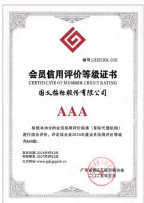

<details>
<summary>text_image</summary>

会员信用评价等级证书
CERTIFICATE OF MEMBER CREDIT RATING
国元招标股份有限公司
AAA
根据本协会的会员信用评价标准（招标代理机构）
进行综合评价，评定该企业2024年度会员信用评价等级
为AAA级。
发证日期：2023年5月12日
有效期限：2023年5月12日
办公地址：www.gd@gjcb.cn
广东顺德区东湖街道办事处
CQ-2-6-2-2-2-2-2-2-2-2-2-2-2-2-2-2-2-2-2-2-2-2-2-2-2-2-2-2-2-2-2-2-2-2-2-2-2-2-2-2-2-2-2-2-2-2-2-2-2-2-2-2-<nl>
</details>

广东省招标投标行业招标代理机构信用评价 AAA 级

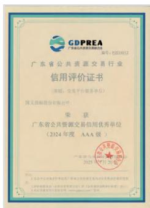

<details>
<summary>text_image</summary>

GDPREA
广东省公共资源交易中心
GDPRE
广东公共资源交易中心
信用评价证书
（类别：交易平台服务单位）
国义招标股份有限公司
荣获
广东省公共资源交易信用优秀单位
（2024年度 AAA 级）
2025年7月26日
</details>

2024年度广东省公共资源交易信用优秀单位(交易平台服务单位)AAA级

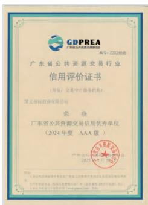

<details>
<summary>text_image</summary>

GDPREA
广东省公共资源交易协会
编号：ZC202408
广东省公共资源交易行业
信用评价证书
（周易）（交流中心服务机构）
国义招标投资有限公司
荣获
广东省公共资源交易信用优秀单位
（2024年度 AAA 级）
产品名称：GDPREA
2025 年 1 月 1 日
地址：广东省深圳市罗湖区深南大道与福华路交界处荣超商务区东侧东侧
法定代表人：陈洪波、周易、周学军、周学军、周学军、周学军、周学军、周学军、周学军、周学军、周学军、周学军、周学军、周学军、周学军、周学军、周学军、周学军、周学军、周学军、周学军、周学军、周学军、周学军、周学军、周学军、周学军、周学軍、周学军、周学军、周学军、周学军、周学军、周学军、周学军、周学军、周学军、周学军、周学军、周学军、周学军、周学军、周学军、周学军、周学军、周学军、周学军、周学军、周学军、周学军、周学军、周学军、周学航
</details>

2024 年度广东省公共资源交易信用优秀单位(交易中介服务机构)AAA级

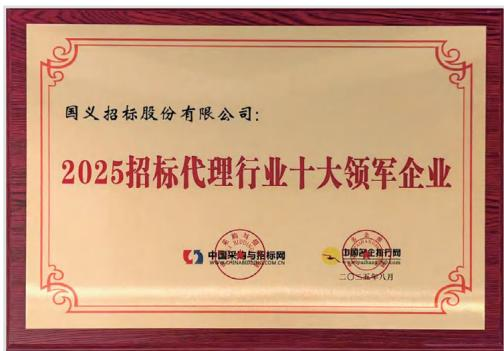

<details>
<summary>text_image</summary>

国义招标股份有限公司：
2025招标代理行业十大领军企业
中国梁沟与招标网
WWW.CNRCN.COM.CN
中国证券有限责任公司
二〇二零年八月
</details>

2025 招标代理行业十大领军企业

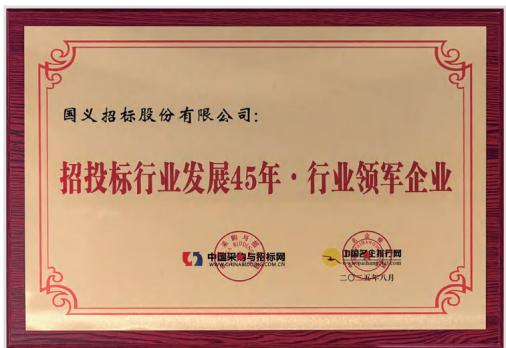

<details>
<summary>text_image</summary>

国义招标股份有限公司：
招投标行业发展45年·行业领军企业
中国采购与招标网
中国物资总行网
二〇一五年八月
</details>

招投标行业发展45年·行业领军企业


<details>
<summary>natural_image</summary>

Close-up of a red ribbon or fabric strip with layered texture and shadow (no text or symbols)
</details>


◆ 2025广东省招标代理机构 第一名  
◆ 2025招标代理行业综合实力百强 第四名  
2025城市轨道交通项目招标代理机构 10 强  
◆ 2025电力项目招标代理机构 10 强  
● 2025工程项目招标代理机构 10 强  
2025民航项目招标代理机构 10 强  
◆ 2025医疗卫生项目招标代理机构 10 强  
◆ 2025国有招标代理机构 30 强  
2025政府采购项目招标代理机构 30 强

  
2025广东省招标代理机构 —— 第一名

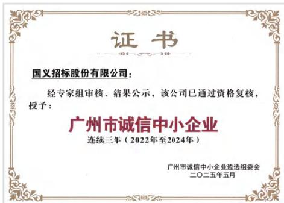

<details>
<summary>text_image</summary>

证书
国义招标股份有限公司：
经专家组审核、结果公示，该公司已通过资格复核，
授予：
广州市诚信中小企业
连续三年（2022年至2024年）
广州市诚信中小企业遴选组委会
二〇二五年五月
</details>

广州市诚信中小企业 连续三年（2022-2024年度）

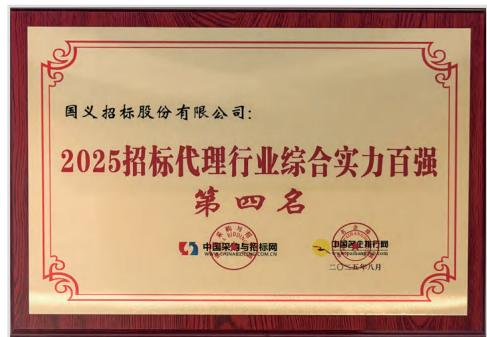

<details>
<summary>text_image</summary>

国义招标股份有限公司：
2025招标代理行业综合实力百强
第四名
中国采电与招标网
国家军民融合管理局
二〇一八年八月
</details>

2025招标代理行业综合实力百强 —— 第四名

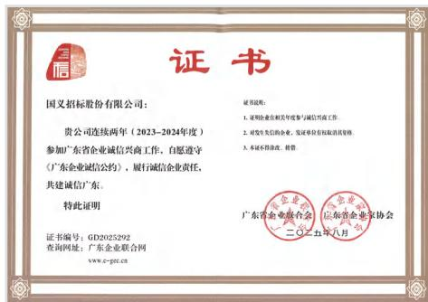

<details>
<summary>text_image</summary>

证书
国义招标股份有限公司：
贵公司连续两年（2023-2024年度）
参加广东省企业诚信兴商工作，自愿遵守
《广东企业诚信公约》，履行诚信企业责任，
共建诚信广东。
特此证明
证书说明：
1. 证明企业任职相关年度参与诚信兴商工作
2. 研发单位的营业执照号码
3. 本年不得修改、转增
广东省企业联合会 广东省企业家协会
二〇二五年八月
证书编号：GD2025292
查询网址：广东企业联合网
www.c-gcc.cn
</details>

广东省企业联合会授予“（2023-2024年度）诚信企业”称号

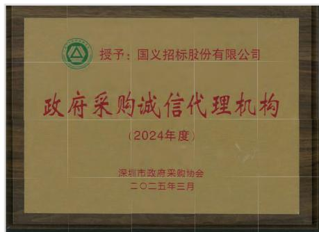

<details>
<summary>text_image</summary>

授予：国义招标股份有限公司
政府采购诚信代理机构
(2024年度)
深圳市政府采购协会
二〇二五年三月
</details>

2025政府采购项目招标代理机构 —— 30强

## 治理架构

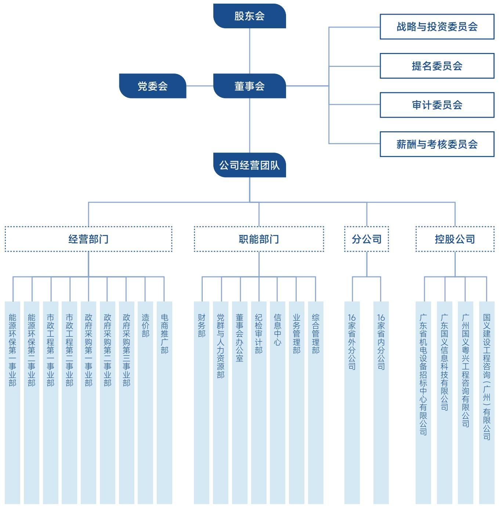

<details>
<summary>flowchart</summary>

```mermaid
graph TD
  A["股东会"] --> B["董事会"]
  C["党委会"] --> B
  D["公司经营团队"] --> B
  B --> E["战略与投资委员会"]
  B --> F["提名委员会"]
  B --> G["审计委员会"]
  B --> H["薪酬与考核委员会"]
  
  subgraph Departments
    I["经营部门"]
    J["职能部门"]
    K["分公司"]
    L["控股公司"]
  end
  
  subgraph Subsidiaries
    M["能源环保第一事业部"]
    N["能源环保第二事业部"]
    O["市政工程第一事业部"]
    P["市政工程第二事业部"]
    Q["政府采购第一事业部"]
    R["政府采购第二事业部"]
    S["政府采购第三事业部"]
    T["造价部"]
    U["电商推广部"]
  end
  
  subgraph Finance & Finance
    V["财务部"]
    W["党群与人力资源部"]
    X["董事会办公室"]
    Y["纪检审计部"]
    Z["信息中心"]
    AA["业务管理部"]
    AB["综合管理部"]
  end
  
  subgraph Provincial & Provincial
    AC["16家省外分公司"]
    AD["16家省内分公司"]
  end
  
  subgraph Clients
    AE["广东省机电设备招标中心有限公司"]
    AF["广东国义信息科技有限公司"]
    AG["广州国义粤兴工程咨询有限公司"]
    AH["国义建设工程咨询（广州）有限公司"]
  end
  
  A --> B
  B --> C
  B --> D
  B --> E
  B --> F
  B --> G
  B --> H
  B --> I
  
  I --> J
  J --> K
  J --> L
  J --> M
  J --> N
  J --> O
  J --> P
  J --> Q
  J --> R
  J --> S
  J --> T
  J --> U
  
  K --> V
  K --> W
  K --> X
  K --> Y
  K --> Z
  K --> AA
  K --> AB
  
  L --> AC
  L --> AD
  L --> AE
  L --> AF
  L --> AG
  L --> AH
  
  M -.-> I
  N -.-> I
  O -.-> I
  P -.-> I
  Q -.-> I
  R -.-> I
  S -.-> I
  T -.-> I
  U -.-> I
```
</details>

## 可持续发展管理

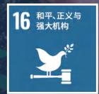

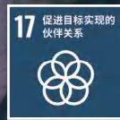


## 可持续发展治理能力

为全面提升可持续发展管理的系统化、专业化与规范化水平，国义招标坚持理论与实践并行，优化治理架构、再造工作流程、完善信息披露，将可持续发展理念深度融入公司治理与全业务链条。

公司践行国家“双碳”目标，将绿色发展纳入中长期战略，以“国 e 平台”为核心，“十四五”期间完成碳普惠平台、碳资产管理系统开发，拓展能源托管项目，参与行业绿色案例申报；2025 年聚焦制造业绿色节能项目，助力产业低碳转型。

同时，公司将 ESG 要素嵌入《国义招标“十五五”战略发展规划》及《国义招标 2026 年度商业计划书》，实现环境、社会、治理维度与企业主营业务、创新发展的全方位融合、协同推进。为公司高质量可持续发展筑牢根基，推动企业增长、行业转型与社会价值共创，实现与社会、环境和谐共生。

## 可持续发展治理架构

公司高度重视可持续发展，构建了系统完备、运转高效的 ESG 治理架构，在追求经济效益稳步增长的同时，全面履行环境、社会与治理（ESG）责任，为企业长期稳定发展筑牢根基。

为确保可持续发展工作有序推进、进程可控、成效落地，公司专门设立 ESG 报告披露工作小组，以系统化思维与专业化方法统筹推进ESG 全流程管理事务。持续提升信息统计的精准性与管控效率，强化ESG工作的协同效能与落地质量。


## 董事长

担任小组组长，领衔统筹公司可持续发展战略方向，保障ESG工作与公司整体发展战略深度融合。

## 董事会办公室

牵头负责ESG治理整体组织协调与工作规划，全面统筹信息汇总、对外披露及跨部门沟通协同。

## 公司职能部门

严格遵循既定工作流程，常态化开展 ESG 相关信息的收集、梳理、上报与审核工作

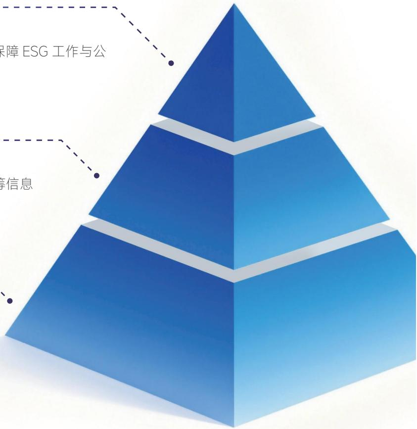

<details>
<summary>flowchart</summary>

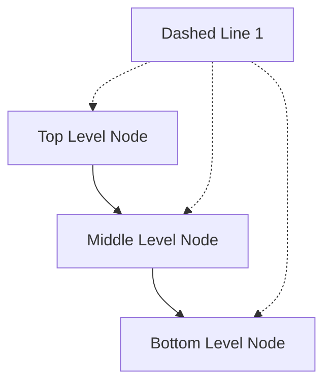
</details>

## 可持续发展目标与绩效

“十四五”期间，公司积极践行国家“双碳”目标，将绿色发展纳入公司中长期发展战略规划，致力于减少我国招标采购过程中碳排放量、核查电子招投标过程中的二氧化碳减排量、增加采购参与各方的企业经济效益公司以“国 e 平台”为落脚点，积极探索“双碳”领域业务。


## 系统开发

碳普惠平台、碳资产管理系统完成开发并上线使用


## 碳盘查成果

完成企业组织温室气体盘查，进一步提升碳排放精细化管理水平


## 案例编撰

编撰和参与《电子招标投标活动碳减排碳普惠体系案例》申报

## 可持续发展信息披露与评级成效

根据广东省国资委《关于做好2025年度《粤港澳大湾区国有企业控股上市公司ESG蓝皮书》编撰工作的函、广新集团《关于做好2024年社会责任及ESG专项报告编撰披露工作的通知》完成了《国义招标2024年度环境、社会及治理（ESG）报告》的编撰、发布及披露（公告编号：2025-041）工作，获得 WindESG 评级结果BBB。


## 利益相关方沟通

公司构建系统性利益相关方识别机制，精准定位投资者、员工及客户等核心群体的差异化诉求，通过建立常态化、多元化的沟通渠道，与利益相关方保持紧密沟通和交流，并将利益相关方的期望与诉求嵌入 ESG 治理决策流程，增强ESG实践与企业价值创造的协同效应。

<table><tr><td>利益相关方</td><td>期望与诉求</td><td>沟通渠道</td></tr><tr><td>政府及监察机构</td><td>恪守环境合规底线,践行绿色发展理念,强化党建引领,规范合规经营,杜绝违规贪腐行为,积极履行社会责任与乡村振兴义务</td><td>信息公开、监督考核、电话与邮件</td></tr><tr><td>行业协会</td><td>遵守行业法规,维护市场公平秩序,提升服务规范化水平,积极参与行业建设,推动行业整体发展,坚守合规与社会责任,发挥行业示范作用</td><td>协会会议、协会座谈、政策宣讲活动</td></tr><tr><td>投资者与股东</td><td>完善公司治理体系,强化合规风控,杜绝贪腐行为,规范尽职调查流程,公平对待合作方,保障股东权益与沟通权</td><td>股东会、业绩说明会、信息披露、投资者热线</td></tr><tr><td>客户</td><td>坚持创新驱动,恪守科技伦理,公平与中小企业合作,保障服务安全质量,严守客户数据与隐私底线</td><td>专业服务团队、客户培训、客户服务热线</td></tr><tr><td>媒体</td><td>主动披露真实信息,积极履行社会贡献,规范合规经营,恪守科技伦理,畅通媒体沟通渠道,接受社会监督</td><td>新闻发布会、媒体对接、官方声明、电话与邮件</td></tr><tr><td>合作伙伴/供应商</td><td>保障供应链稳定安全,坚持合规廉洁合作,杜绝不正当竞争,公平对待中小企业合作伙伴,实现互利共赢</td><td>电话与邮件、合作洽谈会、供应商对接会</td></tr><tr><td>员工</td><td>保障员工合法权益,营造安全健康的工作环境,完善职业发展与培训体系,畅通员工诉求与沟通渠道</td><td>内部信息沟通平台、工会交流</td></tr></table>


## 重要性议题管理

重要性议题是国义招标 ESG 战略落地的核心抓手，公司依据“北交所指引”等权威标准，结合行业实践与自身发展战略，进一步迭代优化可持续发展信息披露分析框架与方法论。公司遵循以“双重重要性”为核心原则（兼顾议题对公司财务的影响与公司对经济、环境、社会的影响），结合招标行业特性、监管要求及利益相关方诉求，建立“梳理与识别 - 调研与评估 - 确认与回应”流程，面向各利益相关方开展重要性议题调研，识别重要性议题，并在本报告中对关键议题进行重点披露与回应。

通过持续完善ESG管理体系，公司致力于将可持续发展理念融入战略决策，回应利益相关方诉求，推动经济、环境和社会的协调发展。

## 双重重要性议题评估流程

## 01

## 议题框架搭建

以“北交所指引”为核心遵循，借鉴国内外权威可持续发展报告标准，结合公司经营实际、内外部利益相关方核心关切及行业发展特质，搭建ESG议题梳理基础框架。

## 02

## 重要议题识别

基于搭建的议题框架，系统性开展ESG议题全面梳理工作，结合多维度考量，精准筛选并识别出25 项具备核心关联度的重要ESG议题，形成初步议题清单。

## 03

## 03<sub>双维调研评估</sub>

遵循双重重要性原则，建立“影响重要性”（对经济、环境、社会可持续发展的影响程度）与“财务重要性”(对公司财务状况及经营成果的影响程度）双维度评估体系，通过多利益相关方问卷调研（覆盖监管机构、股东、投资者等核心群体），构建2025年度ESG重要性议题矩阵，科学划分核心议题优先级。

## 04

## 议题审核与落地

依据调研评估结果，进一步完善议题矩阵，经公司董事会办公室审核、外部可持续发展专家专业论证确认后，明确关键ESG议题，同步推进重点披露与精细化管控工作，确保评估成果落地。

环境

社会

治理

重要性议题识别  
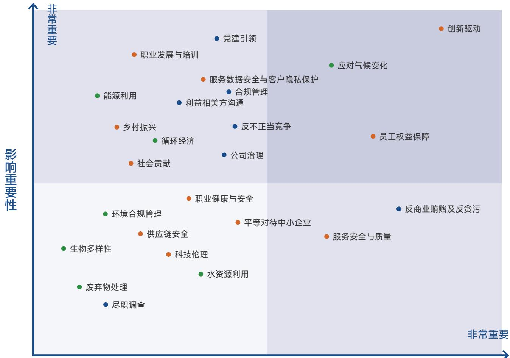

<details>
<summary>scatter</summary>

| Topic | Quadrant |
| :--- | :--- |
| 创新驱动 | 非常重要 |
| 应对气候变化 | 非常重要 |
| 职业发展与培训 | 非常重要 |
| 服务数据安全与客户隐私保护 | 非常重要 |
| 党建引领 | 非常重要 |
| 合规管理 | 非常重要 |
| 能源利用 | 非常重要 |
| 利益相关方沟通 | 非常重要 |
| 员工权益保障 | 非常重要 |
| 反不正当竞争 | 非常重要 |
| 社会贡献 | 非常重要 |
| 循环经济 | 非常重要 |
| 公司治理 | 非常重要 |
| 职业健康与安全 | 非常重要 |
| 平等对待中小企业 | 非常重要 |
| 反商业贿赂及反贪污 | 非常重要 |
| 环境合规管理 | 非常重要 |
| 供应链安全 | 非常重要 |
| 服务安全与质量 | 非常重要 |
| 生物多样性 | 非常重要 |
| 科技伦理 | 非常重要 |
| 水资源利用 | 非常重要 |
| 废弃物处理 | 非常重要 |
| 尽职调查 | 非常重要 |
</details>

财务重要性

## 议题清单及影响、风险和机遇分析

围绕国义招标可持续发展背景和业务实际，根据国内外权威标准和评估方法，并结合利益相关方沟通结果，2025 年，国义招标对可持续发展相关议题进行梳理与更新。在“北交所指引”设置的议题基础上，结合公司实际情况增设特定议题，共识别出适用于公司情况的 25 项重要性议题，其中环境议题 7 项、社会议题 11 项、治理议题7项。同时，我们初步识别和分析可持续发展议题相关的实际和潜在影响、风险和机遇。

<table><tr><td>议题</td><td>影响范围</td><td>影响周期</td><td>风险</td><td>机遇</td><td>SDGs</td></tr><tr><td>应对气候变化</td><td>公司运营、项目服务、行业生态</td><td>长期</td><td>政策合规压力、成本上升</td><td>拓展绿色招标业务</td><td>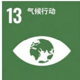</td></tr><tr><td>废弃物处理</td><td>办公运营、项目现场、供应链</td><td>短期</td><td>违规处罚、环境舆情</td><td>循环利用降本</td><td>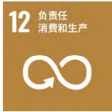</td></tr><tr><td>生物多样性</td><td>项目选址、服务链条、生态环境</td><td>短中期</td><td>生态合规风险</td><td>满足绿色采购需求</td><td>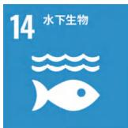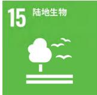</td></tr><tr><td>环境合规管理</td><td>全公司、全业务流程</td><td>中长期</td><td>违规处罚、声誉受损</td><td>强化内控与公信力</td><td></td></tr><tr><td>能源利用</td><td>办公场所、信息化系统、运营全流程</td><td>中长期</td><td>能源价格波动、能耗管控不达标</td><td>降低运营成本</td><td>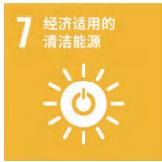</td></tr></table>

<table><tr><td>议题</td><td>影响范围</td><td>影响周期</td><td>风险</td><td>机遇</td><td>SDGs</td></tr><tr><td>水资源利用</td><td>办公运营、后勤保障</td><td>短期-中长期</td><td>水资源管控政策趋严</td><td>资源高效利用</td><td>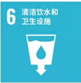</td></tr><tr><td>循环经济</td><td>采购、运营、服务全链条</td><td>中长期</td><td>供应链协同不足</td><td>创新服务产品</td><td>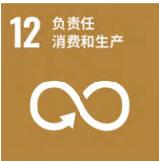</td></tr><tr><td>乡村振兴</td><td>区域发展、帮扶项目、社会服务</td><td>长期</td><td>项目落地与成效不达预期</td><td>拓展县域市场</td><td>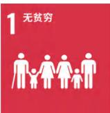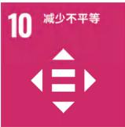</td></tr><tr><td>社会贡献</td><td>行业、社区、公共服务领域</td><td>长期</td><td>投入产出不匹配</td><td>提升stakeholder认可度</td><td>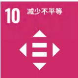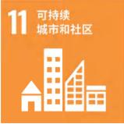</td></tr><tr><td>创新驱动</td><td>技术研发、数字化平台、业务模式</td><td>长期</td><td>技术迭代风险、投入浪费</td><td>构建技术壁垒</td><td>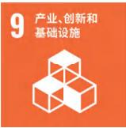</td></tr><tr><td>科技伦理</td><td>信息化建设、算法应用、数据服务</td><td>长期</td><td>舆情</td><td>强化合规与信任</td><td>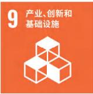</td></tr><tr><td>供应链安全</td><td>采购链条、供应商管理、服务保障</td><td>中长期</td><td>供应商合规风险传导</td><td>构建安全供应链</td><td>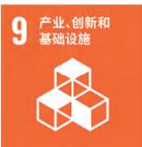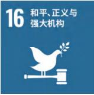</td></tr><tr><td>平等对待中小企业</td><td>招标采购、市场竞争、营商环境</td><td>中长期</td><td>质疑投诉增加</td><td>提升政策响应度</td><td>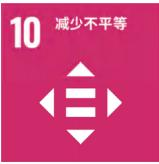</td></tr></table>

<table><tr><td>议题</td><td>影响范围</td><td>影响周期</td><td>风险</td><td>机遇</td><td>SDGs</td></tr><tr><td>服务安全与质量</td><td>全项目、全客户、全流程服务</td><td>长期</td><td>服务失误引发投诉与赔偿</td><td>打造品质标杆</td><td>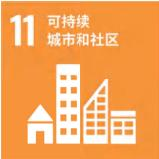</td></tr><tr><td>服务数据安全与客户隐私保护</td><td>信息系统、客户数据、业务平台</td><td>长期</td><td>机密泄露事故、合规重罚</td><td>构筑数据安全壁垒</td><td></td></tr><tr><td>员工权益保障</td><td>全体员工、人力资源管理</td><td>长期</td><td>劳动纠纷、舆情</td><td>降低流失率</td><td>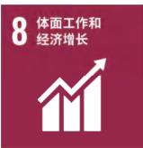</td></tr><tr><td>职业健康与安全</td><td>办公、现场、全体员工</td><td>长期</td><td>安全事故、责任赔偿</td><td>提升雇主品牌</td><td>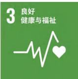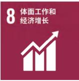</td></tr><tr><td>职业发展与培训</td><td>员工成长、组织能力、人才梯队</td><td>中长期</td><td>培训效果不佳、人才流失</td><td>打造人才优势</td><td>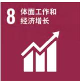</td></tr><tr><td>党建引领</td><td>公司治理、战略方向、企业文化</td><td>长期</td><td>党建与业务融合不足</td><td>强化政治引领与组织保障</td><td>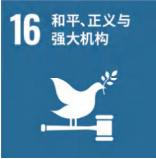</td></tr><tr><td>公司治理</td><td>公司治理、决策机制、内控管理</td><td>长期</td><td>决策效率降低、治理失效</td><td>提升治理水平</td><td></td></tr><tr><td>合规管理</td><td>全公司、全业务、全流程</td><td>长期</td><td>违规处罚、声誉危机</td><td>筑牢经营底线</td><td>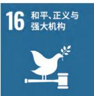</td></tr><tr><td>反商业贿赂及反贪污</td><td>全员、全业务、合作方</td><td>长期</td><td>腐败事件、法律追责</td><td>净化生态</td><td></td></tr><tr><td>反不正当竞争</td><td>市场经营、招标采购、行业秩序</td><td>长期</td><td>投诉处罚、市场受限</td><td>树立阳光形象</td><td>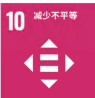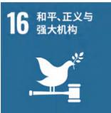</td></tr><tr><td>尽职调查</td><td>合作方、项目、投资行为</td><td>中长期</td><td>调查疏漏引发损失</td><td>前置防控风险</td><td></td></tr></table>

<table><tr><td>议题</td><td>影响范围</td><td>影响周期</td><td>风险</td><td>机遇</td><td>SDGs</td></tr><tr><td rowspan="2">利益相关方沟通</td><td rowspan="2">股东、客户、员工、政府、社会</td><td rowspan="2">长期</td><td rowspan="2">沟通不足引发误解</td><td rowspan="2">增强信任与支持</td><td>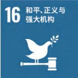</td></tr><tr><td>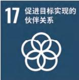</td></tr></table>

## 01

## 守正笃行

## 筑牢企业治理根基


## 深耕稳健治理，筑牢发展根基

国义招标始终将稳健治理视为企业可持续发展的基石，严格遵守《中华人民共和国公司法》《上市公司治理准则》等国家法律法规，构建了权责清晰、运作高效的治理架构。将合规管理与可持续发展理念全面融入战略规划、风险管控及制度建设全过程。通过持续强化投资者权益保护与透明沟通，不断完善内控体系，以坚实的治理基础确保规范运营，致力于在稳健发展中持续创造社会价值。

## 公司治理

公司依据《公司章程》建立了股东会、董事会、经营管理层组成的权责明确的治理架构。在此基础上，公司制定并持续完善《股东会议事规则》《董事会议事规则》等一系列内部规章制度，清晰界定各治理主体的职责权限，合理分配决策、监督、管理与执行职能，构建起各方高效协同且相互制衡的现代化治理体系。

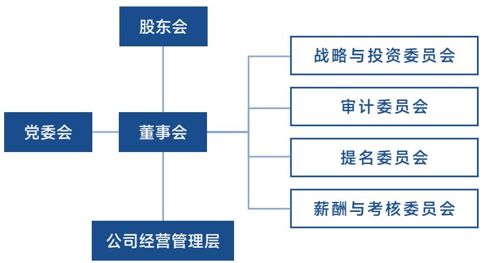

<details>
<summary>flowchart</summary>

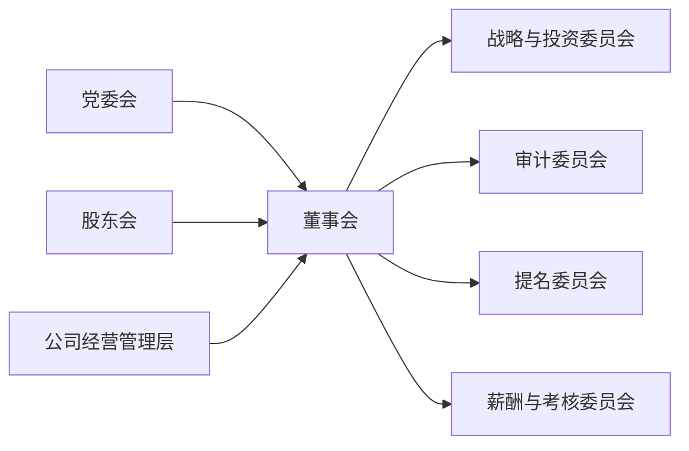
</details>

## 股东会

股东会是公司的最高权力机构，公司严格依照《中华人民共和国公司法》等法律法规及《公司章程》，《股东会议事规则》的相关规定，规范组织股东会的召集，召开与表决程序，确保所有股东，特别是中小股东，平等享有对公司重大事项的知情权、参与权和表决权。股东会作为公司与股东沟通的重要平台，其规范运行为公司健全治理、科学决策提供了坚实保障。

## 董事会

公司对董事会运作情况开展年度评估，并通过定期报告及专项报告等形式向股东披露相关工作，确保董事会履职的独立性与透明度。董事会下设战略与投资、审计、提名、薪酬与考核等专门委员会，各委员会依据相应议事规则独立履行职责。

## 专门委员会主要职责

## 战略与投资委员会

负责对公司长期发展战略、重大投资决策及可持续发展规划进行研究论证并提出建议。委员会持续关注行业发展态势与治理优化需求，推动董事会成员结构多元化，综合考虑专业技能、行业背景及管理经验等因素，为公司科学决策提供战略层面的专业意见。

## 审计委员会

主要负责监督公司财务报告质量，内部审计工作及内部控制体系建设，委员会加强内部审计与外部审计的沟通协调，审查公司财务制度及内控制度的健全性与有效性，对定期报告、关联交易等重大事项进行审核把关，促进公司规范运作与风险防范。审计委员会定期召开会议，确保监督职能的有效履行。

## 提名委员会

负责研究拟定董事及高级管理人员的选任标准与程序，对公司董事候选人及高级管理人员人选进行资格审查并提出建议。委员会持续关注公司对管理人才的需求情况，综合考虑候选人的专业技能、职业素养及行业经验，为公司治理团队建设提供人才保障。

## 薪酬与考核委员会

负责制订公司董事及高级管理人员的薪酬管理制度与考核机制，研究并推动中长期激励约束机制的完善。委员会审查董事及高级管理人员的履职表现及薪酬执行情况，促进薪酬分配的公平性与激励有效性，助力提升企业经营管理水平。

## 独立性

公司制定《独立董事工作制度》《独立董事专门会议制度》保障独立董事行使决策、监督权；为强化董事会运作的专业性与独立性，审计委员会、提名委员会、薪酬与考核委员会召集人均为独立董事。

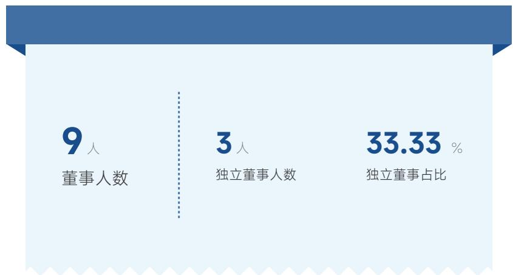

<details>
<summary>funnel</summary>

| 指标 | 数值 |
| --- | --- |
| 董事人数 | 9人 |
| 独立董事人数 | 3人 |
| 独立董事占比 | 33.33% |
</details>

## 监督职能履行

2025 年 9 月，公司经股东会审议通过《关于取消监事会并修订 < 公司章程 > 的议案》，原由监事会行使的监督职能由董事会下设审计委员会全面承接，进一步优化了治理结构，确保内部监督与治理效能的有效衔接。

## 召开会议

4 <sub>次</sub>

股东会

11 <sub>次</sub>

董事会

2 <sub>次</sub>

独立董事专门会议

5

审计委员会

2 <sub>次</sub>

提名委员会

2 <sub>次</sub>

薪酬与考核委员会

## 审议议案

16 <sub>项</sub>

股东会

35 <sub>项</sub>

董事会

2<sub>项</sub>

独立董事专门会议

8 <sub>项</sub>

审计委员会

2<sub>项</sub>

提名委员会

2<sub>项</sub>

薪酬与考核委员会

## 董事高管薪酬管理

公司高度重视董事和高级管理人员的薪酬管理工作，致力于构建科学规范、激励有效、约束有力的薪酬管理体系。依据《中华人民共和国公司法》等国家法律法规、规范性文件及《公司章程》的相关规定，结合企业经营发展实际，制定并实施《董事、高级管理人员薪酬管理制度》，以公司经营、岗位职责及个人履职情况综合考核核定薪酬，确保经营业绩评价客观公正，充分调动管理层工作积极性与创造性，推动公司持续稳健发展。

董事会下设薪酬与考核委员会作为董事、高级管理人员薪酬方案制定、管理与考核的专门机构，人力资源部门协助开展具体实施工作；其中董事薪酬方案经董事会审议后提交股东会审定实施，高级管理人员薪酬方案经董事会审议通过后实施，薪酬管理全程遵循公平、责权利统一、长远发展及激励与约束并重原则。

## 薪酬分配基本原则

公平原则

责、权、利统一原则

长远发展原则

激励与约束并重原则

## 薪酬制度原则

## 绩效导向原则

以精准绩效考核为基础，按业绩论功行赏，降低固定薪酬比重，提高与经营业绩挂钩的浮动薪酬比例，增强薪酬弹性。


<details>
<summary>natural_image</summary>

Abstract geometric logo composed of overlapping blue triangles forming a stylized shape (no text or symbols)
</details>

## 价值导向原则

完善收入分配机制，薪酬向创造价值的关键岗位和业务骨干倾斜，吸引和留住核心人才，引导人才向业务一线自主流动。

## 市场化原则

参考行业、地域及竞争对手薪酬水平，结合公司经济效益、经营规模与岗位价值，确定符合市场竞争需要的薪酬策略与水平。

## 精益运营

国义招标围绕高质量发展，制定了《三精管理精益创效实施方案 (2024-2026)》，把精益运营理念融入日常经营管理，打造国义特色的 GYBS 精益运营系统，围绕组织精健化、管理精细化、经营精益化，构建起精益服务、精益管理、精益文化三位一体的运营治理体系。

公司通过搭建三级权责休系，梳理优化全业务流程，运用数字技术赋能，落实降本提质增效措施同时完善者核激励、人才培养和文化建设机制，推动运营管理向标准化、数字化、可持续方向升级，提升治理效率与核心竞争力，为企业高质量发展夯实运营管理基础。

## 管理体系

## 管理精细化

以项目为核心推进运营标准化建设，优化再造业务管理流程，构建管理到业务的一体化运营体系，实现项目、流程与管理的规范精细。

强化岗位责任制，将运营责任落实到岗到人，实现运营管理全流程可追溯、可考核。

## 经营精益化

坚持“优质、优服、优价、优利”原则，以客户需求为核心优化服务与产品，提升专业服务价值;

打造“招标 +”咨询 +”1+N 多元服务模式，培育新业态，破解业务单一、同质化竞争问题;

落实“同步化运作 "，推动运营布局从区域集中向全国拓展。

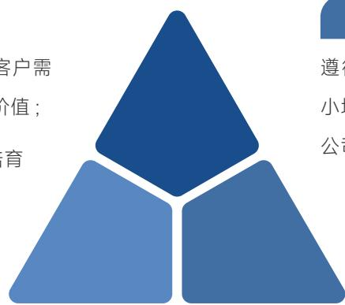

<details>
<summary>text_image</summary>

客户需
价值；
育
遵
小
公司
</details>

## 组织精健化

遵循“职能优化、精干高效”分类管理、并小培优”原则，精简总部部门、整合下属分公司，实现机构与人员精干高效。

搭建“决策层 - 推进层 - 执行层”三级运营组织体系，明晰各层级权责，实现上下贯通、横向协同，有效破解运营协同不足问题。

公司推进精益运营，重点实现降本、提质、增效、风险防控。通过四维举措，切实提升运营效益。同时从机制、人才、文化三方面搭建保障体系，完善闭环管控，打造精益人才队伍，营造全员参与的精益文化，形成长效管理模式，最终实现企业效益与客户、员工、行业多方价值的共同提升。

## 四维举措

## 品质优服

将项目“成功率”“客户满意度”“服务费回收情况”与项目团队收入挂钩，降低重招率、废标率，以精细化操作提升服务品质和客户体验。 +

## 转型增效

以科技赋能业务发展 加快数字技术成果应用，培育新业态、打造新的业务增长点，推动运营从“规模增长向“价值增长”转变。

## 四大举措


推进制度“立改废”，系统梳理规章制度体系，将风险管理与运营管理深度融合，开展业务风险评估和预警，防范安全生产、廉政、业务等各类运营风险，保障运营安全。

## 效益效率

通过部门架构优化、办公场所整合、分公司合署办公等方式优化资源配置，压降运营成本，解决招标行业微利时代成本高企痛点。

## 风险屏障

## 投资者关系

国义招标通过规范、透明、高效的沟通机制，增进投资者对公司的深入了解与价值认同。

在制度建设层面，公司严格遵循《中华人民共和国公司法》《中华人民共和国证券法》等法律法规及《公司章程》的相关规定，结合企业实际，制定并实施了《投资者关系管理制度》《信息披露管理制度》《利润分配管理制度》等一系列内部规章制度，系统规范投资者关系管理的目标、原则、内容与程序，为保障股东合法权益提供坚实的制度基础。

在沟通实践层面，公司秉持“合规、主动、平等、诚信”的原则，积极构建多元化的双向沟通渠道。通过定期举办业绩说明会、设立投资者热线及专用邮箱、组织投资者调研活动等方式，主动回应投资者关切，强化与投资者的互动交流，确保公司重大信息能够及时、公平地传递给所有投资者。

在信息披露方面，公司严格履行信息披露义务，确保披露内容的真实、准确、完整、及时，保障全体股东，特别是中小股东能够平等获取信息，公平参与公司重大事项的知情与决策。

## 公司投资者沟通渠道

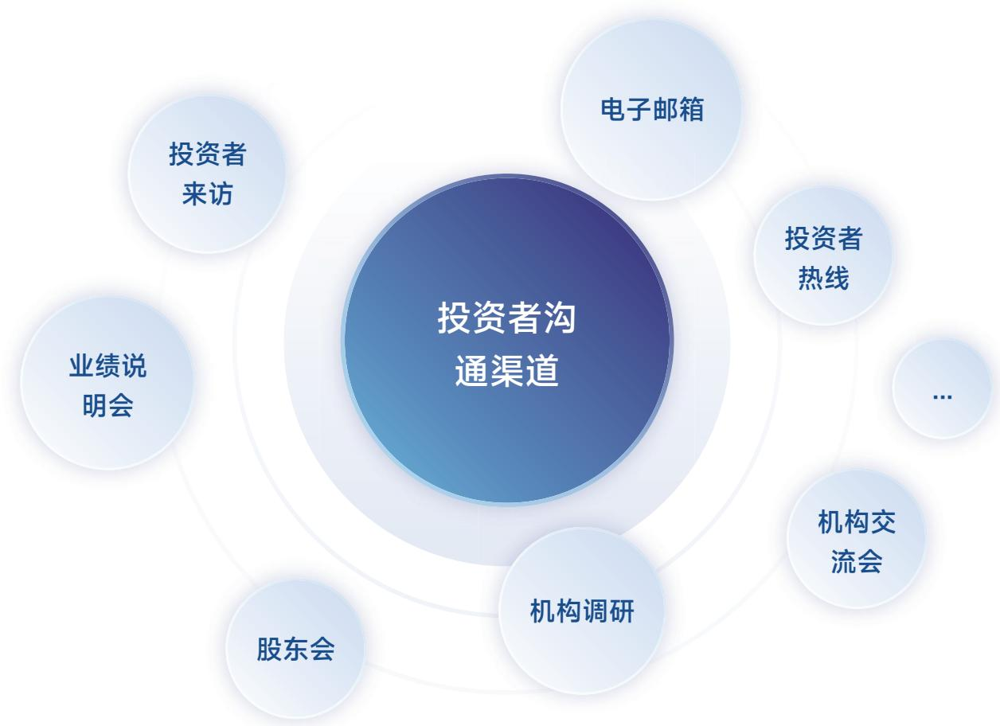

<details>
<summary>flowchart</summary>

This diagram illustrates the core components of an investor communication channel, showing its interconnected relationships with various channels such as email, online meetings, and corporate meetings.
</details>

##

## “走进上市公司”系列投资者关系活动之投资者调研活动

6 月 5 日，国义招标承办投资者调研活动，邀请投资者到访公司广州总部开展深度交流。活动中，投资者深入了解公司的商业模式和核心竞争优势，现场观看“国 e 平台”全流程数

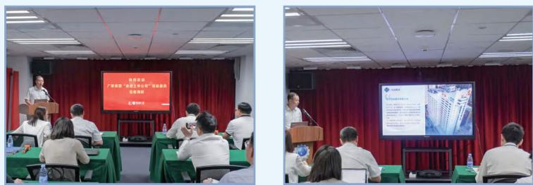

字化交易演示，与公司管理层展开深入沟通，充分向资本市场展示自身竞争实力与发展潜力，增进市场对公司的了解与认同。

## 88

## 国义招标举办“向新而进以质致远”投资者开放日活动

12 月 5 日，公司成功举办投资者开放日活动，本次活动共吸引 30 余位机构及个人投资者参与。活动围绕公司经营情况、市值管理与股东回报等核心

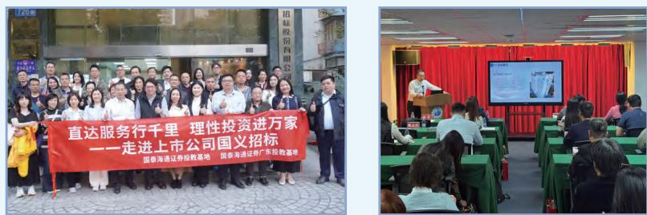

议题开展面对面交流，公司管理团队直面投资者关切并予以详尽解答，搭建起高效的投资者沟通桥梁，全面传递企业发展成果与发展信心。活动中，公司向投资者清晰传递了坚守合规经营、深耕招标代理主业，以稳健业绩为基石，通过持续提升经营效益与核心竞争力夯实企业内在价值的发展理念，切实深化投资者关系管理，提升与投资者的沟通质效。

<table><tr><td colspan="3">2025年指标</td></tr><tr><td>接待投资者现场调研次数</td><td>接待投资者现场调研人数</td><td>解答投资者问题数量</td></tr><tr><td>2次</td><td>62人</td><td>24个</td></tr><tr><td>投资者问题回复率</td><td>举办业绩说明会</td><td>接听投资者电话</td></tr><tr><td>100%</td><td>2次</td><td>8次</td></tr></table>


## 严守合规风控，护航行稳致远

## 合规管理

国义招标搭建了完善且执行力强的合规管理体系，已通过ISO37301 合规管理体系认证，始终将合规经营作为企业稳健发展的核心基础。公司严格对标《广东省省属企业合规管理办法》等监管要求，结合自身招标业务实际，制定并推行《制度管理规定》《合规管理办法》《合规审查指引》等内部规章制度，为各类经营管理工作提供清晰的合规遵循。在日常运营中，公司严格落实制度管理要求，规范开展制度的制定、修订与废止工作，定期自查制度执行情况，及时纠正执行偏差，强化制度的刚性约束，确保合规管理要求贯穿经营全流程。


<details>
<summary>text_image</summary>

35770
商杰认证
合规管理体系认证证书
安卡编号: 781238363601M
统一社会信用代码: 914400001963718642
经办人:
国义招标股份有限公司
经评定、企业合规管理体系：
ISO 37301: 2021 / GB/T 35770 - 2022 标准
证书编号范围：但须采购代理服务，委托存有服务。
内部公开管理业务的办理需要凭流动
注册地址：广东省广州市越秀区东风路12号16-18楼
李晓艳先生：广东省广州市越秀区东风路12号16-18楼
身份证号：2024 年 12 月 13 日
有效期至：2024 年 12 月 12 日
本证书由国家颁发的各类许可项目，需经有权主管部门批准并有效。本公司不得撤销。
最近12个月内因重大变化而被暂停转让，并可与证券监管部门一起完成工商变更。
签发人：王科荣
商杰国际认证
商杰认证
诚信致远
</details>

ISO37301合规管理体系认证证书

## 2025 年指标

开展法律培训次数

3 次

参与法律培训人数

108 人

开展法律培训时数

12 小时

参与培训法务人员人数

3 人

## 税务管理

依法纳税是企业履行社会责任的基本要求，也是公司治理透明规范的重要体现。公司始终秉持“依法合规、风险控制，筹划增效”的核心管理原则严格遵守国家及地方税收法律法规通过建立健全税务管理制度，规范全业务流程，强化风险防控机制，将税务管理全面融入经营管理和内部控制体系，确保各项涉税行为合法合规，并持续提升税务效益，为公司可持续发展提供有力支撑

## 税务管理举措

## 管理制度

公司依据相关法规制定《税务管理制度》《税务风险管理指引》及《发票管理暂行规定》等内部规范，围绕税务登记、会计核算、发票管理、关联交易及纳税申报等全业务流程建立标准化管控要求，确保付款记账凭证合法有效、发票开具真实合规。

## 组织保障

公司由财务负责人统筹税务管理，设立专职岗位负责日常涉税事务与风险监控，通过风险识别与分析持续查找潜在风险，将税务管理深度融入全面内控体系。

## <sup>日常</sup><sub>管控</sub>

定期开展税务风险自查，及时排查应对潜在隐患，重大事项向管理层报告 ; 在资产处置、投资筹资等环节开展税负测算，关联交易遵循独立交易原则，确保纳税申报按期完成。

## <sup>税务</sup><sub>培训</sub>

通过组织财务及业务人员开展税收法规与票据鉴别培训，不断增强全员合规意识，从源头防范涉税风险。

## 风险内控

## 治理

公司始终以风险防控为经营管理重要基础，构建系统完备、运行有效的内部控制体系，保障各项业务合规稳健开展。

在管理体系构建方面，公司聚焦“风控、内控、合规、法务”四位一体集约化管理格局，通过组织架构整合、权责清晰界定，制度流程贯通及协同平台搭建，形成集约化管理格局，确保风险管控要求贯穿各业务环节，涵盖风险管理、内控管理及合规管理等专业领域，团队结构合理、专业能力适配，为公司风险内控工作提供有力支撑。

在运行机制建设方面，公司以数字化手段为支撑、流程优化为核心，持续构建覆盖业务全流程的风险防控“三道防线”，通过前端业务环节三级审批、中端制度流程赋能、后端信息化智能预警的协同机制，将合规审查深度嵌入重大决策、合同审核及业务操作等关键环节，确保风险管控要求贯穿运营全过程。

通过上述机制的有效运行，公司实现对各类风险的系统识别与及时应对，以扎实的风险内控体系护航企业可持续发展。

## 风险内控管理组织架构

## 董事长（首席风控官）

指导监督公司全面风险管理工作，确保全面依法治企与风控、内控要求贯通全公司。

## 第一道防线：业务经营单位

严格执行公司风险管控的各项要求及管理措施，切实加强业务一线风险防范工作。

## 第二道防线：职能管理部门

围绕重点领域系统梳理业务链条、细化操作标准，以实现风险的有效制衡与控制。

## 第三道防线：内部审计监督部门

履行对经营管理活动的监督与评价，以保障治理体系持续有效。

## 风险管理体系构建

公司坚持“健全性，合理性，及时性”三大原则，构建覆盖事前，事中，事后全流程的闭环管理休系，制定并实施《关于加强全面风险管理工作的实施意见》及《风险预警管理办法》，以此为基础建立健全风险识别与应对机制，将合规审查深度嵌入重大决策、合同审核及业务流程等关键环节，确保风险管控贯穿运营全过程。围绕将风险控制在可承受范围，建立重大风险应对方案，加强内部风险信息沟通以及将风险预警融入日常经营管理四大目标，公司持续优化风险治理能力，推动风险管理从被动应对转向主动预防，以稳健的内控体系为企业高质量发展保驾护航。

## 风险预警应对流程


<details>
<summary>flowchart</summary>


</details>

公司构建四级管理组织体系，各层级分工明确、权责清晰，形成决策、执行、落实、监督的科学制衡机制，覆盖风险预警管理全流程。


## 董事会(最高管理机构)

核准风控战略与偏好，审定基本政策，决策重大事项，管控公司重大风险。


## 经营班子(决策机构)

审批管理办法、指标调整及风险处置方案，推进体系建设，指导监督预警工作落地。


## 风险管理组(牵头执行机构)

牵头搭建预警体系、制定管理办法，组织年度风险评估与指标分析，督导各单位开展预警指标设定、警情处置等工作。


## 各业务、职能部门(日常执行机构)

执行风控制度，实时监控维护预警指标，上报警情并拟定处置方案，按要求提交预警原始数据。


## 笃行廉洁商道，坚守诚信初心

## 商业道德

国义招标严格遵守《中华人民共和国公司法》《中华人民共和国证券法》等法律法规及监管要求，秉持“诚信经营、合规运作”的基本准则，将商业道德理念贯穿于经营管理的全过程。

## 对外披露定期报告数量

4 份

为规范商业道德行为，公司制定并实施《信息披露管理制度》《内幕信息知情人登记管理制度》《保密工作管理办法》等一系列内部制度，明确要求全体员工及业务往来对象在商业活动中恪守诚信原则，不得从事商业贿赂、内幕交易、不正当竞争等任何违法违规行为。公司高度重视信息公开与保密工作的平衡，通过规范的信息披露机制保障股东知情权，通过严格的保密管理防范商业信息泄露风险。员工须签署《员工保密承诺书》，以契约形式强化保密责任意识。同时，公司定期开展信息公开检查工作，及时发现并改进薄弱环节，确保各项制度要求落到实处。

## 对外披露临时报告数量

118 份

公司建立畅通的举报渠道，鼓励员工及利益相关方通过合规途径反映商业道德相关问题，并严格保护举报人合法权益，对查实的违规行为依规严肃处理，以零容忍态度维护商业道德的严肃性。通过上述制度化的商业道德管理实践，国义招标不断夯实诚信经营根基，以规范的商业行为赢得客户信任与市场认可，为可持续发展筑牢道德防线。

## 信息披露方面违规受罚

0 次

## 公司官网纪检监督信箱

公司官网：关于我们-联系我们-信访意见箱

## 举报信访电话

020-37860713

## 现场举报受理部门

纪检审计部

## 反商业贿赂及反贪污

## 治理

国义招标严格遵守《中华人民共和国反不正当竞争法》《关于禁止商业贿赂行为的暂行规定》等法律法规，持续完善反贿赂反贪污治理体系，将廉洁理念贯穿于经营管理全过程。

公司通过《干部职工廉洁从业规定》《员工手册》《信息披露管理制度》等内部制度，明确禁止任何形式的商业贿赂、贪污舞弊及不当利益输送行为，要求全体员工在业务往来中恪守诚信原则，不得提供、承诺、要求或收受任何不正当利益，确保商业活动公开透明、公平公正。公司持续推进全员廉洁承诺常态化，明确要求员工自觉抵制行贿、赠送财物、违规宴请等行为，坚决防止商业贿赂和贪污腐败发生。

## 战略

公司对腐败问题始终坚持“零容忍”，致力于营造公平公正、透明规范的商业环境。为此，公司持续推进廉洁合规建设，严格依照《中华人民共和国反不正当竞争法》《关于禁止商业贿赂行为的暂行规定》等法律法规，扎实开展反腐败各项工作。

公司构建“内部廉洁从业规范 + 外部反商业腐败约束”的双向战略架构，将廉洁要求从企业内部全体干部职工延伸至客户、供应商等利益攸关方，形成覆盖业务全链条的廉洁生态圈。在制度层面，公司以《干部职工廉洁从业规定》和《预防商业腐败和贿赂管理办法》为核心载体，其中《预防商业腐败和贿赂管理办法》进一步明确了禁止性行为清单，并要求相关人员签署《预防商业腐败和贿赂承诺书》等四类文件，以制度化手段筑牢廉洁根基。公司同步建立实体与线上相结合的举报渠道，确保问题反映畅通无阻。

## 反贿赂管理体系

公司已取得 ISO37001 反贿赂管理体系认证证书，进一步巩固了反商业贿赂及反贪污的管理体系。


<details>
<summary>text_image</summary>

37001
商杰认证
反贿赂管理体系认证证书
专利编号：91215048461M
统一社会信用代码：9144000019070376642
通知书：
国义招标股份有限公司
经审号：鲁志华先生：
ISO 37001 (2016)《反贿赂管理体系认证证书》
批准文号：
企业盖章号：91215048461M
经营范围：拍卖、鉴定、鉴定、鉴定及鉴定服务（须取得有关部门许可的项目）
经营范围：房地产开发经营；房屋租赁；物业管理；住房租赁；住房维修；住房租赁；住房租赁；住房租赁；住房租赁；住房租赁；住房租赁；住房租赁；住房租赁；住房租赁；住房租赁；住房租赁；住房租赁；住房租赁；住房租赁；住房租赁；住房租赁；住房租赁；住房租赁；住房租赁；住房租赁；住房租赁；住房租赁；住房租赁；住房租赁；住房租赁；住房租赁；住房租赁；住房租赁；住房租赁；住房租赁；住房租赁；住房租赁；住房租赁；住房租赁；
许可证编号：91215048461M
发证人：王洪霖
商杰国际认证人有限公司
身份证号码：91215048461M
统一社会信用代码：9144000019070376642
批准文号：
企业盖章号：91215048461M
经营范围：拍卖、鉴定、鉴定、鉴定及鉴定服务（须取得有关部门许可的项目）
经营范围：房地产开发经营；房屋租赁；住房租赁；住房租赁；住房租赁；住房租赁；住房租赁；住房租赁；住房租赁；住房租赁；住房租赁；住房租赁；住房租赁；住房租赁；住房租赁；住房租赁；住房租赁；住房租赁；住房租赁；住房租赁；住房租赁；住房租赁；住房租赁；住房租赁；住房租赁；住房租赁；住房租赁；住房租赁；住房租赁；住房租赁；住房租赁；住房租赁；住房租赁；住房租赁；住房租购业务（须取得有关部门许可的项目）。
许可证编号：91215048461M
发证人：王洪霖
</details>

反贿赂管理体系认证证书

## 影响、风险与机遇管理

公司聚焦商业贿赂、贪污侵占、违规利益输送三类廉洁风险，识别招投标舞弊、信息泄露、资金违规、职务牟利等行业高发场景，建立管控体系，防范法律惩戒、声誉受损、资产流失等风险，同步把握品牌信誉提升、治理效能优化机遇。


公司相关风险管控措施：

▎全体员工签订廉洁从业与反贿赂承诺书；  
▎与采购人、合作方、供应商签订廉洁风险协议，招标文件嵌入廉洁条款，要求投标人、评标专家签署廉洁承诺；  
▎执行招标全流程监督、专家回避、信息保密、关键岗位分离等管控，严防串标围标、涉密信息泄露、违规利益输送；  
▎畅通线上线下举报渠道，由纪检审计部全程监督检查，严肃追责问责。

通过全维度合规管控，公司从源头遏制贪污贿赂行为，维护公平公正的招投标市场秩序，提升企业合规形象与市场公信力，为高质量可持续发展提供保障。

## 指标与目标

反商业贿赂及反贪污培训

2 次

参加培训人数

581 人

参加培训人数占比

100%

管理层人员参加培训人数

7 人

管理层人员参加培训人数占比

100%

0起

商业贿赂及贪污事件

0起

与腐败、不正当竞争相关的诉讼案

0起

不正当竞争事件


## 强化党建引领，凝聚奋进力量

## 深耕党建重点工作

国义招标坚持以习近平新时代中国特色社会主义思想为指导，深入学习贯彻党的二十大及二十届历次全会精神，深刻领悟“两个确立”的决定性意义，增强“四个意识”、坚定“四个自信”、做到“两个维护”。2025 年，在广新集团党委的正确领导下，国义招标坚持以党建为统领，紧扣高质量发展核心任务，深度推动党建与经营发展相融相促，主动践行国企社会责任，持续深化党建带群建工作，通过抓实党建融合、扛起社会担当、凝聚群团力量三大举措，把党建政治优势、组织优势转化为企业发展优势、竞争优势，为公司改革发展注入强劲动力，各项工作取得扎实成效。

## 2025年党建工作重点

成立党委书记牵头的专班，扎实开展深入贯彻中央八项规定精神学习教育

精准查摆问题，严格审核基层党组织问题清单

开展文风专项排查，落实文稿“三审三校”机制

创新教育形式，通过专栏、警示会、旁听庭审筑牢思想防线

修订4项制度，完善行为规范

落实四维工作机制，深化“党建+”融合模式

推进“三精驱动”，扩大新客户规模、提升新客户收入占比

参与“百千万工程”，开展植树活动并捐赠树苗款项

落实帮扶举措，开展消费帮扶与助学捐赠

投入资金在柏埔镇捐建“国义生态文化公园”

践行企业文化，组织集体活动、参与集团赛事并升级劳模工作室

强化职工保障，开展公益行动并建成相关服务设施

开展职工专项慰问，高效处理日常事务提升员工幸福感

## 党建 +

## 市场开拓

成立党员“市场开拓先锋队 "，攻坚珠三角、粤东西及省外重点区域，构建全方位市场布局，创新举措

开拓市场，深耕细作扩版图。

## 重大项目

针对重大项目工期紧、难度大的特点，组建党员专项项目组以党员带头筑牢一线战斗堡垒。


<details>
<summary>text_image</summary>

党建 +
</details>

## 业务创新

党员骨干牵头推进智慧招标平台升级、电子招投标优化等攻关，开拓“全过程工程咨询”新业务。

## 夯实党组织建设

坚持党的领导、加强党的建设，是国有企业的“根”和“魂”。党的二十届三中全会通过的《中共中央关于进一步全面深化改革、推进中国式现代化的决定》指出，党的领导是进一步全面深化改革、推进中国式现代化的根本保证。新时代新征程，国义招标坚持以改革创新精神夯实党建根基，健全完善党建工作制度体系，严格落实《党委会议事规则》《党委理论学习中心组学习制度》《党委意识形态工作责任制实施细则》等党内制度规范，确保党建工作有章可循、规范有序。通过持续强化制度执行与组织建设，公司不断激发基层党组织活力，使党建工作在传承优良传统的基础上，更加贴近新时代特征、符合党员群众需求。公司各职能部门、业务板块及基层党组织在公司党委的坚强领导下，紧密围绕中心工作，充分发挥战斗堡垒和党员先锋模范作用，以高质量党建引领保障企业高质量发展，为推进中国式现代化贡献国义力量。

党总支

1 个

党支部

13个

党员

151 人

召开党委会次数

16 次

## 丰富党建活动形式

国义招标坚持把学习贯彻习近平新时代中国特色社会主义思想作为首要政治任务，构建“党委领学、支部研学、党员自学”三级学习体系，为及时开展传达学习和工作部署，公司党委高度重视、行动迅速，开展一系列开展内容丰富、形式多样的主题党日活动，加强党的组织建设、提高党员素质，进一步激发党员的责任感和使命感，促进党组织的健康发展。

## 18

## 国义招标举行深入贯彻中央八项规定精神学习教育读书班暨党委理论学习中心组学习会

为深入学习贯彻习近平总书记关于加强党的作风建设的重要论述，学习领会中央八项规定及其实施细则精神，学习会于 4 月 23 日举行。本次读书班采取集体研讨和个人自学相结合的方式，通过认真研读党章、《习近平关于加强党的作风建设论述摘编》、中央八项规定及其实施细则等内容，观看警示教育片，围绕改革发展工作实际开展研讨，提高党性修养、加强作风建设、汇聚发展共识。


<details>
<summary>text_image</summary>

Meeting room photo with visible presentation screen showing Chinese text about a 2023 corporate meeting on central business zones.
</details>

## 18

## 国义招标党委书记、董事长宣讲党的二十届四中全会精神

12 月 25 日，公司党委书记、董事长为市政工程部和总部有关部门宣讲党的二十届四中全会精神。

会议对充分认识党的二十届四中全会的重大意义，准确把握“十五五”时期我国经济社会发展的指导思想、重大原则、主要目标，全面理解“十五五”时期经济社会发展的战略任务和重大举措等方面作了系统宣讲和解读。强调坚持党

对企业全面领导，深化党建与业务融合，推动企业高质量发展。


<details>
<summary>text_image</summary>

国义招标市政工程—第二届联合发改委
学习贯彻党的二十届四中全会精神宣誓会
2025年12月25日
</details>


<details>
<summary>text_image</summary>

植树一村
植树迎全运
活力满赛场
植树迎全运 活力满赛场
国义招标股份有限公司党委、竹丝岗二马路社区党委
</details>

3月17日国义招标积极开展植树活动，助力绿美广东生态建设


<details>
<summary>text_image</summary>

Group photo of a formal meeting or conference with attendees raising hands, green tables, and a presentation screen with Chinese text on the table.
</details>

7月1日，国义招标举行重温入党誓词仪式


<details>
<summary>text_image</summary>

Classroom scene with a presenter at the front and attendees seated at tables, featuring a presentation screen with Chinese text on the right.
</details>

沙盘党课


<details>
<summary>text_image</summary>

联学联享共进步 联创联动促发展
——党建共建系列活动
</details>

党建共建活动

开展集中学习

182次

线下开展活动

5次

专题党课

17次

领导班子学习覆盖率

100%

党员干部学习覆盖率

100%

## 严守党风廉政建设

公司深入学习关于党的建设的重要思想，持续推进党风廉政建设和反腐败斗争，聚焦“两个维护”强化政治监督，扎实开展深入贯彻中央八项规定精神学习教育，保持反腐败高压态势，深入推进风腐同查同治，坚决整治不正之风和腐败问题。将党风廉政建设深度融入公司治理与运营全流程，严格遵守《中国共产党廉洁自律准则》《中国共产党纪律处分条例》等党纪党规，并结合企业实际，持续健全廉洁从业制度体系。

公司严格落实党风廉政建设责任制，强化党委主体责任与纪委监督责任，确保“一岗双责”落到实处。通过常态化开展党纪学习教育，警示教育大会，廉政谈话等方式，筑牢党员于部拒腐防变的思想防线。同时不断完善内控机制与廉洁风险防控体系，聚焦关键岗位与重点领域，加强对权力运行的监督制约，营造风清气正、干事创业的良好政治生态。

国义招标将持续深化廉洁文化建设，将廉洁从业理念融入员工行为规范与企业价值观，以党风廉政建设新成效护航企业行稳致远为高质量发展提供坚强的纪律保障。

## 2025年工作重点

## 压实“两个责任”

部署年度党风廉政工作，签订 61 份个性化责任书，完成下属单位党风廉政考核，整改集团党建考核反馈问题。

## 强化监督执纪问责

处置集团转办的信访件和问题线索，开展公车、招标业务等专项检查并追责问责，修订制度、优化机制深化源头治理。


<details>
<summary>natural_image</summary>

Four red circular icons representing different legal or institutional symbols: shield, building, book, and gavel (no text or labels)
</details>

## 深化作风与廉洁文化建设

开展党课、以案说纪、庭审旁听等纪律教育 ; 依托内部专栏推送廉洁内容，发布 8 期中央八项规定精神宣传教育文章。

## 健全监督体系

印发 2025 年综合监督工作重点文件，推动各类监督协同发力，提升监督效能。

##

## 开展深入贯彻中央八项规定精神学习教育专题党课

7 月 1 日，公司以“打造招标投标领域清廉生态标杆”为主题，深入贯彻中央八项规定精神，聚焦招标投标领域廉洁风险防控，引导全体党员干部筑牢思想防线、严守纪律底线。

通过专题学习，进一步强化全员廉洁从业意识，推动形成风清气正的从业环境，为企业规范经营、健康发展提供坚强纪律保障，助力打造招标投标领域清廉生态标杆，以清正廉洁的作风践行企业社会责任。


<details>
<summary>text_image</summary>

锚定中央八项规定精神坐标
打造招标投标领域清廉生态标杆
</details>

## 98

## 白云区法院旁听学习

为深入推进党风廉政建设，筑牢拒腐防变思想防线，9 月 12 日公司组织领导班子、中层副职及以上干部、各党支部书记等关键岗位人员，前往广州市白云区人民法院开展纪律教育庭审旁听学习。通过沉浸式以案为鉴、以案明纪，推动反腐倡廉教育，进一步强化了全员廉洁从业的思想自觉和行动自觉，为公司营造风清气正的经营环境奠定了坚实基础。


<details>
<summary>text_image</summary>

2024年度新人职公务员警示教育暨听函审活动
</details>

## 02

## 循环赋能探索低碳运营新路径


<details>
<summary>natural_image</summary>

Aerial view of a red cargo ship named 'FEDERAL BEAUFORT' sailing on blue water, leaving a wake (no visible text or symbols on the vessel itself)
</details>


## 应对气候变化，彰显绿色担当

国义招标深刻认识到气候变化对企业运营的深远影响，积极响应国家“双碳”战略，遵循《国家适应气候变化战略 2035》等政策，将气候治理纳入公司战略与风险管理体系。通过优化能源使用、提升能效、推行清洁生产持续降低碳排放，并建立常态化风险评估机制，增强应对极端天气的能力。依托规范碳盘查与分阶段减排方案，稳步推进低碳运营，为应对全球气候变化贡献力量。

## 治理

公司坚定支持国家碳达峰碳中和目标，积极响应《巴黎协定》及联合国可持续发展目标等国际气候倡议，持续对标国内外先进实践，推动运营体系的绿色低碳转型。严格遵循《国家适应气候变化战略 2035》《碳排放权交易管理暂行条例》等国家及地方应对气候变化相关法规政策将气候责任融入企业发展战略。

公司构建了“决策层—管理层—执行层”三级联动的气候治理架构，明确管理职责与行动要求。该架构通过分层协作统筹气候变化应对行动，确保应对气候变化的各项措施精准落地、高效执行，为公司系统化开展气候治理、降低气候风险提供有力支撑。

## 决策层董事战略委员会

承担国义招标气候变化相关决策的最终责任 , 负责厘定公司应对气候变化管理方针,监督公司ESG相关事宜,其中包含识别气候变化风险与机遇。

## 管理层公司高管

负责识别并规划未来的气候变化风险与机遇应对策略，安排相关职能部门执行具体任务 , 对其任务执行情况进行监督 , 并每年至少向董事会战略委员会汇报一次工作进展和成果

## 执行层公司各职能部门

负责遵循公司年度工作计划和发展规划,由总部牵头、协同各重要执行单位,实施并落实气候变化相应工作并定期汇报执行情况和工作成效 , 足进气候变化相关事宜融入日常运营。

## 战略

气候变化带来的风险与机遇具有长期性、复杂性和不确定性，会对公司的战略推进、日常经营及财务状况产生较大影响。因此，公司严格遵循“北交所指引”的相关规定，并参考气候相关财务信息披露工作组（TCFD）的建议，持续完善气候战略管理体系，将气候因素全面纳入公司战略规划与决策考量。并且积极研究并拟定面向气候风险与机遇的应对策略，致力于把握绿色转型带来的市场机遇，探索将低碳理念融入招标采购、咨询服务等核心业务，助力客户实现可持续发展目标。同时，加强物理风险监测与应对能力，提升运营体系的气候韧性；通过持续推进自身节能降碳、探索碳资产管理以及引导供应链协同减碳，稳步践行低碳运营承诺，为实现碳达峰碳中和目标贡献企业力量。

## 影响、风险与机遇管理

气候变化为招标代理行业带来风险与机遇并存的双重影响。极端天气引发项目延期、成本增加等物理风险，绿色政策趋严、市场需求转型、行业竞争加剧，叠加技术能力要求提升，给公司运营带来多重挑战。与此同时，国家“双碳”目标推动绿色招标、新能源、生态修复等领域需求快速增长，为公司创造了新的业务增长点。公司主动识别气候相关风险，紧抓绿色转型机遇，通过深化专业咨询、数智化赋能、拓展绿色业务，持续提升气候韧性与可持续发展能力。

物理风险影响评估及应对举措

<table><tr><td>风险类型</td><td>影响时长</td><td>潜在影响</td><td>应对措施</td></tr><tr><td>极端天气风险(暴雨、高温、台风等)</td><td>短中期</td><td>· 暴雨、台风等极端天气可能威胁员工人身安全,并对办公楼设备造成损坏· 持续高温天气会推高办公能耗,增加运营成本· 极端天气可能导致网络、电力中断,延误开评标等关键业务环节</td><td>· 持续关注气象预警,定期巡检维护办公楼设施· 强化环境应急管理,定期开展安全演练,提升突发事件处置能力</td></tr></table>

转型风险影响评估及应对举措

<table><tr><td>风险类型</td><td>影响时长</td><td>潜在影响</td><td>应对措施</td></tr><tr><td>政策和法规风险</td><td>中期</td><td>·国家双碳、绿色建筑、生态环保政策持续收紧,监管趋严·绿色低碳项目的评标规则、供应商资质审核标准升级,招标全流程绿色合规压力加大</td><td>·紧密跟进政策导向,推动绿色项目代理、绿色招采体系建设·精准解读绿色低碳政策,将绿色标准嵌入评标流程,保障招标全流程合规</td></tr><tr><td>技术能力风险</td><td>中期</td><td>·低碳转型对先进技术应用提出更高要求,若未能及时识别并应用低碳技术,将导致同业竞争力下降</td><td>·积极落实创新驱动、数字赋能等战略举措·通过数智化转型抵减运营碳足迹,降低碳排放,构建低碳技术应用优势</td></tr><tr><td>市场竞争风险</td><td>长期</td><td>·随着低碳、环保项目需求持续增长,需持续提升专业素养与服务能力,以匹配客户对绿色项目的服务要求</td><td>·开展专项业务培训,强化团队绿色项目服务能力·密切关注市场偏好变化,发挥公司在招标领域领先地位优势,推进公司传统业务和新业务发展,巩固产业优势</td></tr><tr><td>品牌声誉风险</td><td>短期</td><td>·在应对气候变化、可持续发展领域表现不佳,引发利益相关方负面反馈·绿色服务能力不足,削弱公司在市场的认可度</td><td>·主动披露企业可持续发展实践与ESG治理成效·强化绿色服务能力建设,树立负责任的专业品牌形象</td></tr></table>

机遇影响评估及应对举措

<table><tr><td colspan="2">风险类型</td><td>影响时长</td><td>潜在影响</td><td>应对措施</td></tr><tr><td>数智化升级机遇</td><td>技术赋能提质机遇</td><td>中期</td><td>·低碳转型驱动电子招投标、线上评审工具应用升级,技术赋能可提升服务效率,形成差异化竞争优势</td><td>·在国e平台部署AI大模型,实现标书智能生成、绿色资质自动筛查等功能·应用数智化工具,降低人工成本,提升绿色项目文件编制与审核效率</td></tr><tr><td rowspan="2">业务拓展机遇</td><td>全过程咨询增值机遇</td><td>中期</td><td>·低碳项目对一体化、全周期服务需求提升,可依托招标代理业务基础,延伸至项目前期咨询等环节·高附加值咨询服务可拓展利润空间,摆脱传统业务同质化竞争</td><td>·打造“招标代理+前期咨询”一体化服务模式·加强与设计、造价等机构的合作,构建全过程服务生态</td></tr><tr><td>绿色项目增量机遇</td><td>短期</td><td>·双碳政策推动绿色建筑、新能源、生态修复等项目扩容,绿色招采业务需求显著增长·低碳项目客户对全过程咨询、双碳配套服务的需求同步提升</td><td>·聚焦光伏、风电、生态修复等绿色赛道,设立专项业务小组拓展客户·开发碳盘查、绿色供应链咨询等特色服务产品,形成多元业务矩阵·积极与绿色产业协会、行业机构建立合作,拓展项目渠道</td></tr></table>

## 指标与目标

范围一温室气体排放量<sup>①</sup>

85.68吨二氧化碳当量

温室气体排放总量

711.82吨二氧化碳当量

电力消耗量

1,180,063.20 千瓦时

范围二温室气体排放量<sup>②</sup>

626.14吨二氧化碳当量

单位营收温室气体排放强度

0.0257 吨二氧化碳当量 / 万元

汽油消耗量

28.08吨

<sup>①</sup>汽油排放因子根据《中国能源统计年鉴 2023》提供的热值与《2006 年 IPCC 国家温室气体清单指南》提供的排放系数计算得出，全球变暖潜能值（GWP）取自《“第六次评估报告”（Sixth Assessment Report）》。  
<sup>②</sup>全国电力二氧化碳排放因子取自国家发改委《2023年电力二氧化碳排放因子》。


<details>
<summary>natural_image</summary>

Close-up of a fern leaf with natural texture and no visible text or symbols
</details>


## 深耕双碳赛道，筑就绿色生态

气候变化作为全球性重大挑战，对招标代理行业的影响呈现“危”“机”并存的态势。2025 年，随着国家“3060”双碳战略持续深化，招投标领域绿色转型步入规范化阶段，行业绿色新规逐步落地，绿色可持续发展已成为招标代理行业的主流发展趋势。国义招标作为行业领军企业，立足招采核心主业，主动将双碳发展理念与气候风险应对举措融入业务全流程，积极践行企业社会责任，全力构建招采领域绿色生态，助力全社会低碳转型。

## 战略引领笃行双碳之路

国义招标积极践行国家“3060”双碳战略，严格落实广新集团碳达峰行动方案，结合自身业务特点及运营实际，制定了贴合企业发展的碳达峰实施策略，以坚定的战略导向，引领企业及行业绿色低碳转型。


<details>
<summary>natural_image</summary>

Stylized blue-toned city skyline illustration with no text or symbols
</details>

## 国义招标碳中和战略路径

2021 年

国内首家通过购买注销碳资产实现年度碳中和的招标代理机构

2025 年

积极推进绿色低碳技术研发，拓展绿色可持续发展业务领域

预计 2028 年

二氧化碳排放总量提前达峰，通过 CCER、VCS 实现年度碳中和目标常态化，支持国家3060战略

## 绿色多元拓展深耕业务赛道

2025 年，国义招标紧扣国家绿色低碳发展趋势，积极构建“系统 + 咨询”的特色业务模式，持续拓展绿色相关业务领域。在绿色代理招标领域，重点布局可再生能源、生态修复等核心赛道，严格落实行业绿色招标新规，确保招标流程合规有序；在双碳咨询领域，精准聚焦企业绿色转型核心需求，专业提供碳交易市场服务、碳中和战略规划、碳减排解决方案等多元化服务，助力企业应对绿色转型挑战。

## 报告期内，公司绿色环保代理核心项目明细如下：

172个

光伏项目数量 / 核心成果

71个

风电项目数量 / 核心成果

重点项目 1个

生态修复数量/核心成果

## 2025年重点绿色项目实践

清远市佛冈县迳头镇全域推进农村人居环境整治项目之 2025 年清远市佛冈县历史遗留废弃矿山生态修复项目勘察设计施工总承包（EPC）项目

2025 年，国义招标承担清远市佛冈县迳头镇全域推进农村人居环境整治项目之历史遗留废弃矿山生态修复项目勘察设计施工总承包（EPC）项目，中标金额超 4000 万元，是公司应对气候变化、践行绿色发展理念的重点实践项目。

该项目针对气候变化引发的地质灾害隐患，通过地形地貌重塑、土壤污染治理与修复、植被重建、道路灌溉排水系统完善等综合措施，对历史遗留废弃矿山进行全面整治，有效提升区域生态韧性，减少极端天气引发的地质灾害风险，同时改善区域生态环境，助力碳汇能力提升，实现生态效益与气候适应性提升的双重目标，彰显了公司在生态修复领域的专业服务能力。

## 创新应用成果赋能减碳实践

国义招标以数字化转型为抓手，依托自身电子招标采购平台——“国 e 平台”，成功建设碳普惠系统和碳资产管理系统。创新打造电子招标投标活动的碳减排碳普惠体系，在国 e 平台嵌入“碳资产管理平台”，以技术创新赋能双碳实践，倡导绿色化招标，同时为智慧城市、资产处置、再生资源利用等项目提供招标采购 + 咨询 + 循环经济解决方案，助力国家双碳目标落地。

国义招标碳普惠、碳资产机制示意图:  


<details>
<summary>flowchart</summary>

```mermaid
graph LR
  subgraph sg["\"碳普惠场景行为\""]
  A["业主"] -->|"招标"| B["国e平台"]
  C["投标人"] -->|"投标"| B
  D["专家"] -->|"评标"| B
  end

  subgraph sg_2["\"减碳量计算、积分计算规则\""]
  B --> E["数据获取"]
  E --> F["减碳量计算"]
  F --> G{"积分生成\n发放至用户"}
  end

  subgraph sg_3["\"激励方式\""]
  H["减碳量荣誉证书"] --> I["积分商城\n兑换商品"]
  end

  G --> H
  G --> I

  style A fill:#fff,stroke:#333
  style C fill:#fff,stroke:#333
  style D fill:#fff,stroke:#333
  style H fill:#fff,stroke:#333
  style I fill:#fff,stroke:#333

  style B -.->|"正向激励、行为引导"| G
  style H -.->|"积累碳资产"| I
```
</details>

## 电子招投标碳普惠平台应用成果


累计减排量为 644.22 万 kgCO₂，累计节约 94,990 个纸质文件，累计减少 6,834.89 万千米行程数。


<details>
<summary>area</summary>

| Category | Value (kgCO2) |
| --- | --- |
| 快递排放 | ~170,000 |
| 会议排放 | ~10,000 |
| 交通排放 | ~300,000 |
| 物料排放 | ~480,000 |
</details>

## 规则优化与行业赋能：引领绿色转型

<table><tr><td>评标规则绿色化</td><td>严格落实行业新规,将绿色、节能、减排等指标全面纳入评标标准,并提升其权重,引导供应商进行绿色生产,用市场机制倒逼产业升级。</td></tr><tr><td>推广碳普惠机制</td><td>作为行业先行者,持续优化碳普惠机制,实现碳减排数据的精准计量与管理。激发各方参与绿色招标的积极性,为行业可持续发展提供可复制的实践经验。</td></tr></table>

报告期内，通过数字化创新与全流程绿色实践，公司持续实现显著减碳成效，进一步巩固行业技术领先优势，不仅有效应对了气候变化带来的技术升级压力，更以技术创新赋能行业绿色转型，为我国碳减排事业与气候韧性建设作出了不可或缺的贡献。


## 守护生态环境，共筑美丽家园

国义招标严格遵循国家及地方环境保护相关法律法规，将环境合规管理纳入公司治理与日常运营的核心环节。公司已明确董事会，管理层及各职能部门的环保职责，构建起权责清晰，协同高效的环境管理架构，确保各项业务活动在依法合规的前提下有序开展。

## 治理

严格遵循国家《环境保护法》及相关地方性环保法规，将依法合规作为环境管理的根本前提贯穿于经营全过程。为进一步提升环境管理的规范性与系统性，公司主动对标国际标准，已正式获得ISO14001 环境管理体系认证，标志着公司环境管理架构与运行机制达到国际公认的规范化水平。在此基础上，公司依据认证标准要求建立并持续优化内部管理流程，明确各业务环节的环保责任与行为准则，确保管理体系覆盖职能部门及分公司运营全过程。同时，通过常态化监督与环境绩效跟踪，将 ISO14001 体系要求深度融入日常管理，推动环境管理水平持续提升。


<details>
<summary>seal</summary>

国文招标股份有限公司
证书编号: 10-23
注册地址: 广东省广南区经济开发区高新大道北段10号1栋
开户证件号码:
657-24001129-618-14001:2015
招标采购代理服务、造价咨询服务所涉及的相关环境管理活动
企业登记证: 2015年12月2日
发证日期: 2015年12月2日,有效期至: 2017年12月7日
组织机构代码: 911000000000000000000000000000000000000000000000000000000000000000000000
ISO14001
IAF
GNAS
GNA
GNA
GNA
GNA
GNA
GNA
GNA
GNA
GNA
GNA
GNA
GNA
GNA
GNA
GNA
GNA
GNA
GNA
GNA
GNA
GNA
GNA
GNA
GNA
GNA
GNA
GNA
GNA
GNA
GNA
GNA
GNA
GNA
GNA
</details>

ISO14001环境管理体系认证证书

## 战略

公司严格遵守国家《环境保护法》及相关环保法规，持续优化内部环境管理流程，密切跟踪环保法规政策变化，定期开展内部检查与绩效评估，将环境管理要求全面融入招标代理、咨询服务全流程。同时，积极提升全员环保意识，落地绿色办公理念，以规范完善的环境管理体系夯实合规基础，保障企业持续稳健运营。

## 应急管理

公司全面落实国家《安全生产法》《广东省安全生产条例》等法规要求，结合自身《安全生产责任制》《安全环保事故责任追究管理规定》等内部管理规范，搭建起覆盖总部分公司及所属企业的环境应急预警管理休系坚持“预防为主防抗结合”的原则以环境风险识别应急响应处置，事后追责改进为核心环节，构建全流程闭环管理机制，将环境风险管控融入日常运营，筑牢企业绿色发展的安全屏障。

环境应急管理举措  


<details>
<summary>flowchart</summary>


</details>

## 生物多样性保护

国义招标持续关注自身运营活动对生物多样性的影响严格遵照《生物多样性公约》《中国生物多样性保护战略与行动计划》及国家、地方生态文明建设相关法律法规与政策要求，将生物多样性保护理念融入企业运营管理。

公司在招标代理及咨询服务过程中，积极引导业主与供应商重视项目生态敏感性，主动规避自然保护区、水源涵养地等生态红线区域，优先推广绿色采购与生态友好型技术应用，切实降低业务活动对自然生态的负面影响。公司坚持在发展中平衡经济效益与生态保护，为维护生物多样性和生态系统稳定贡献力量。

## 指标与目标

0次

重大环境事件

0次

环境违法违规次数


## 优化资源利用，推动循环发展

全球资源约束趋紧、环境压力持续加大，优化资源利用、推动循环发展，是国义招标履行社会责任、实现可持续发展的重要举措，公司积极响应国家“双碳”目标及《“十四五”循环经济发展规划》等政策要求，将资源节约理念贯穿于日常运营与业务发展全过程，系统推进能源、水资源、废弃物及清洁能源等关键领域的精细化管理。

## 能源管理

公司积极响应国家“双碳”目标及《“十四五”节能减排综合工作方案》等政策要求，秉持“节约能源、绿色办公”的理念，按照能源管理体系要求制定并实施内部能源管理规范，对办公场所的用电、照明、空调、设备待机等用能环节进行标准化管控，明确节能操作要求与责任分工。

公司持续关注国家和地方出台的节能法律法规及政策动态，及时更新完善能源管理制度，保证能源管理工作符合最新的法规要求。在日常运营中，公司积极推行绿色办公，倡导员工养成节约用电、及时关闭设备电源的良好习惯，推广使用节能灯具，把节能意识融入企业文化，带动全体员工参与节能行动，不断提升能源利用效率，以实际行动为建设资源节约型社会贡献力量。

## 清洁能源

公司紧跟能源结构绿色低碳转型的发展趋势，将清洁能源规划纳入企业绿色运营的重点工作。扩大清洁能源应用是降低运营碳足迹、提升能源利用效率的重要方式，公司结合自身实际用能需求，针对光伏发电等可再生能源的适用场景，开展前期调研与规划布局。

公司将结合办公场所及分支机构条件，稳步探索多场景清洁能源应用模式。公司规划重点推进办公建筑屋顶分布式光伏试点，利用总部及具备条件的分公司闲置屋顶资源，安装光伏发电设施，所发电力优先用于日间办公用电消纳，降低对传统电网电力的依赖。在绿色电力交易方面，积极参与电力市场化改革，研究通过绿证认购、长期购电协议等方式购买风电、光伏等可再生能源电量，解决租赁型办公场所无法安装光伏的用能清洁化问题逐步实现外购电力的绿色化替代。通过上述路径公司致力于以优化用能结构、降低环境影响为目标，为构建绿色低碳运营体系、助力能源可持续发展夯实基础。


<details>
<summary>natural_image</summary>

Stack of documents on a reflective surface, no visible text or symbols
</details>

## 水资源管理

公司恪守《中华人民共和国水法》《中华人民共和国水污染防治法》《节约用水条例》等国家及地方水资源管理相关法规政策，秉持“科学用能、节约用水”的绿色运营理念，将水资源节约保护融入企业日常管理。

公司依据相关法规及行业指引制定内部水资源管理规定，规范办公用水行为，明确节水操作要求与责任分工，积极响应国家节水行动号召，持续关注并更新节水政策要求，确保用水管理始终与法规导向保持一致。同时，公司严格管控办公生活污水的合规排放，督导物业公司定期对排水系统进行检查维护，防止跑冒滴漏及违规排放现象。

公司大力倡导绿色办公理念，通过加强用水设备巡检维护、开展节水宣传教育等措施引导员工养成节约用水的良好习惯，提升水资源利用效率。国义招标将节水理念融入企业文化，引导全员参与水资源节约保护行动，以务实的水资源管理实践为建设节水型社会贡献力量。

## 废弃物管理

公司落实《中华人民共和国固体废物污染环境防治法》《国家危险废物名录》及地方相关法规政策，秉持“减量化、资源化、无害化”的废弃物管理理念，将废弃物规范处置纳入企业绿色运营管理体系。

公司大力推行无纸化办公，依托国 e 平台实现招标业务全流程电子化管理，从源头有效降低纸张消耗与办公废弃物产生。目前，公司电子化招标

办公室纸张消耗量

7,485 千克

自来水消耗量

12,626.97 吨

单位营收耗水强度

0.46 吨 / 万元

已实现全覆盖，通过线上化、数字化运作，大幅减少纸张使用，有效节约森林等自然资源，显著降低文件流转环节的资源消耗与碳排放，切实践行绿色低碳发展理念。

在日常办公中，公司积极推广线上协同平台应用，倡导文件精简原则，优先采用电子文档传阅与审批。对于确需使用纸张的文件，严格执行双面打印或复印，控制纸质资料印发范围，并对单面使用后的纸张进行回收整理以便再次利用。同时，公司规范办公用纸管理，明确禁止将打印复印纸张用于个人用途，确保资源节约要求落实到位。

对于办公过程中不可避免产生的废弃物，公司严格执行分类管理。无害废弃物如废纸张、废塑料等，优先推动资源回收利用；有害废弃物如硒鼓、打印机墨盒等，统一交由具备资质的合规处置商进行专业处理，确保有害物质不混入生活垃圾、不造成环境二次污染。

公司向全体员工普及垃圾分类处理知识，引导员工正确区分无害废弃物与有害废弃物，确保分类投放准确有效。通过常态化宣传与培训，将绿色环保意识融入企业文化，推动全员参与废弃物减量与分类实践。国义招标以扎实的废弃物管理举措，持续降低运营环境影响为建设资源节约型环境友好型社会贡献力量。

## 03

## 品质立标 引领招标价值跃升


## 专注研发创新，激活内生动力

国义招标依靠创新实现高质量发展，在数字经济与绿色转型的当下，持续推进管理与技术升级，在市场竞争中保持自身优势公司以科技引领，数智赋能为方向把创新融入战略规划和日常运营通过管理创新激发团队活力，科技创新提升服务效率，不断增强内生动力，为客户创造更大价值。

## 治理

公司紧扣国家创新驱动发展战略与《中华人民共和国科学技术进步法》相关要求把创新治理融入公司整体管理体系，不断提升研发创新效能。为规范研发管理全流程，公司制定并实施《国义招标股份有限公司研发项目管理办法》，搭建立项至结题验收的全流程管理体系，明确各类研发项目管理要求，推行项目负责人负责制，规范各环节操作流程与权责划分，实现研发活动的制度化、规范化管控，为公司技术创新发展提供坚实治理保障。


<details>
<summary>flowchart</summary>


</details>

## 战略

公司以自主研发的“国 e 平台”为核心载体，推动招标代理主业与咨询新业态深度融合，持续培育“平台 + 产品 +服务”的融合发展新优势。并且坚持“以人为本”的发展理念，将人才培养作为创新根基，系统推动“技术创新、研发投入、成果转化”战略闭环，以规范化、可持续的创新机制赋能企业高质量发展。

公司依托自主研发的国 e 平台，深度融合人工智能、大数据等前沿技术，推动招标采购全流程向智能化、数字化迈进。通过持续优化平台功能、拓展服务边界，将传统代理业务与全过程咨询、绿色招标、双碳服务等新兴业态有机融合，形成以平台为支撑、以产品为载体、以服务为核心的创新生态。

公司高度重视人才培养与团队建设，将员工成长与创新发展紧密结合，通过系统化培训与激励机制激发创新活力。坚持以市场需求为导向，以客户价值为中心，将技术创新成果高效转化为市场竞争力，确保研发投入产出效益。公司以“技术创新”驱动服务升级，以“研发投入”夯实发展后劲，以“成果转化”释放市场价值，将创新战略贯穿于数字化转型与高质量发展全过程。

## 影响、风险与机遇管理

创新能够提升公司的核心竞争力、助力企业长远发展，但也伴随着一定的不确定性与潜在风险。公司结合咨询招标行业特点，系统梳理创新相关的内外部风险与机遇，并纳入全面风险管理体系，保障创新战略平稳推进。

## 技术风险

持续加大研发投入，按规范流程升级技术；和高校、科研机构合作引入前沿技术；不因为技术落后影响服务和客户体验。

## 市场风险

重点攻关绿色招标、全过程咨询、双碳服务这些新方向；根据客户反馈及时摸准市场需求，快速调整服务方向。

## 法规风险

紧盯绿色采购、低碳发展的政策变化，把政策要求融入研发，让创新成果和合规要求同步更新。

## 人才风险

建创新激励机制，优化薪酬和晋升通道；和高校合作定向培养；内部开展培训提升员工数字化技能，留住、培养创新人才，保证研发能顺利推进。

## 指标与目标


报告期内，公司共计研发投入 1,934.49 万元，占主营业务收入 6.69%。新产品开发项目数为8项，专精特新企业 2家，国家高新技术企业 3家。

同时，截至 2025 年，公司共累计获得授权发明专利 20 项，授权实用新型专利 7 项，共计 27 项授权专利。

## 北大汇丰- 剑桥嘉治全球创新创业大赛


<details>
<summary>text_image</summary>

UNIVERSITY OF CAMBRIDGE
The CHINESE
北大汇丰-剑桥嘉治
全球创新创业大赛
PHBS-CJBS Global Pitch Competition
2025赛季决赛暨北大-剑桥湾区创业创投论坛
中国·深圳
</details>

2025 年 12 月，在广新集团创新加速营活动中，公司“投标智脑”项目从 60 余个创新项目中跻身前五，成功晋级“北大汇丰-剑桥嘉治”全球创业创新大赛，并入选2025赛季全球优秀案例。

该成果充分展现公司技术研发与业务创新实力，以赛促研激发团队创新动能，拓宽国际化创新视野，推动技术成果与业务场景深度融合，为公司持续强化研发创新能力、培育核心竞争优势筑牢坚实支撑。

## 科研荣誉


<details>
<summary>text_image</summary>

高新技术企业
证书
企业名称：国义招标股份有限公司
发证日期：2025年12月19日
批准机关：
证书编号：GR202544000790
有效期：三年
广东省科学技术厅
广东省财政厅
广东省税务局
广东省税务局
</details>

## 双中心赋能创新

公司坚持创新发展，紧跟招标代理行业数字化、绿色化转型趋势，整合人才、客户、数据等核心资源，搭建“广东省数字供应链服务工程技术研究中心”与“绿色双碳技术工程中心”两大创新平台。

广东省数字供应链服务工程技术研究中心绿色双碳技术工程中心


<details>
<summary>flowchart</summary>


</details>

## 知识产权保护

公司切实抓好知识产权保护与合规管理，严格遵循《中华人民共和国专利法》《中华人民共和国著作权法》等国家法律法规和政策要求，构建全流程、体系化的知识产权管理机制。

为夯实知识产权治理基础，公司制定并实施《知识产权管理办法》，明确知识产权创造、运用、保护、管理等管理要求，规范专利、商标、商业秘密等各类知识产权的归属、使用与保护流程，强化员工知识产权意识与合规责任。同时，公司已通过 GBT29490-2023 企业知识产权合规管理体系认证，建立起符合国家标准的知识产权合规管理体系，将合规要求嵌入研发、业务运营、市场拓展等各环节，有效防范知识产权侵权、泄露等风险，保障创新成果的合法权益与有序转化。


<details>
<summary>text_image</summary>

WSF
世标认证
知识产权合规管理体系认证证书
国义招标股份有限公司
国义招标股份有限公司
GW1/29490-2023《企业知识产权合规管理体系要求》
招标代理代理服务，造价咨询等中介机构以知识产权管理体系活动
发布方式：招标代理代理服务，造价咨询等中介机构以知识产权管理体系活动
文件号：2024年6月28日
发证日期：2024年6月28日
公告编号：2024-074
文件类型：电子文档
文件名称：GNSA
法定代表人：张伟
组织机构代码：CNMA
组织机构名称：GNSA
组织机构代码：CNMA
组织机构名称：GNSA
组织机构代码：CNMA
组织机构名称：GNSA
组织机构代码：CNMA
组织机构名称：GNSA
组织机构代码：CNMA
组织机构名称：GNSA
组织机构代码：CNMA
组织机构名称：GNSA
组织机构代码：CNMA
组织机构名称：GNSA
组织机构代码：CNMA
组织机关代码：CNMA
组织机关名称：GNSA
组织机关名称：GNSA
组织机关代码：CNMA
组织机关名称：GNSA
组织机关代码：CNMA
组织机关名称：GNSA
组织机关代码：CNMA
组织机关名称：GNSA
组织机关代码：CNMA
组织机关名称：GNSA
组织机关代码：CNMA
组织机关名称：GNSA
组织机关代码：CNMA
组织机关名称：GNSA
组织机关代码：CNMA
组织机关名称：GNSA
组
</details>

GB/T29490-2023 企业知识产权合规管理体系认证

软件著作累计数

164 项

商标累计数

49 项

通过制度建设与体系认证，公司持续提升知识产权管理效能，既为自身技术创新与业务发展筑牢合规屏障，也为行业知识产权保护与创新生态建设贡献实践经验，以规范的知识产权治理推动创新成果转化与可持续价值创造。

## 遵守科技伦理

公司严格遵循《科技伦理审查办法（试行）》《关于加强科技伦理治理的意见》《生成式人工智能服务管理暂行办法》等法律法规要求，持续完善科技伦理治理体系。公司主营招标采购代理与工程咨询业务，不涉及生命科学等科技伦理敏感领域。在数字化转型与人工智能应用不断深化的背景下，公司始终坚持将伦理合规纳入公司治理体系。

在技术选型方面，公司持续采用符合国家监管要求、具备合法商用资质的主流大模型产品作为基础大模型，大模型在算法安全、内容治理及数据合规方面依法履行主体责任。在具体应用层面，公司结合业务实际，强化技术使用边界管理，完善内部审核与监督机制，加强数据来源合法性审查与权限管理，落实新技术上线前的合规评估与风险研判程序。

报告期内，公司未发生违反科技伦理及相关法律法规的情形。未来，公司将根据人工智能技术发展情况，持续优化科技伦理治理机制，稳步推动数字化创新与合规管理协同提升。

## 国e平台：数智筑守招采新生态

数字化转型是招标采购行业高质量发展的核心引擎，更是企业提升核心竞争力、规范行业秩序的关键路径。国义招标立足行业发展趋势，以科技创新为核心驱动力，深耕电子招投标领域十余年，依托国 e 平台构建数字化、智能化、全流程的招采服务体系，以数智赋能破局升级，守护招采公平，推动招标行业迈入高效、合规、可持续的数字化发展新阶段。

国义招标依托多年来为政府及大中型企业提供招标采购全过程专业服务的深厚经验于2013年启动电子招投标交易平台——国 e 平台建设，率先推动采购业务向全流程电子化、多元化、精细化、深层次管理转型，开启招标行业数字化新篇章。

报告期内公司以国e平台为核心载体 持续推进电子交易系统架构优化与功能完善，重点完成国e平台技术改造工作，成功实现国 e 平台 V6 版全面上线，在系统研发、技术运维和数据治理等方面投入专业力量，加强数据安全、系统安全及智能化应用能力建设。

电子招投标项目

10,000+ 个

中标金额

400+<sub>亿元</sub>

累计外部单位入驻平台

202 家

新增企业进驻

31 家

通过自主研发电子交易系统、大数据智能分析引擎及碳足迹核算模型，实现招标全流程效率提升 40%，交易成本大幅降低，累计减少排放超 3,266 吨二氧化碳，服务覆盖全国 28 个省份，赋能超 10 万家供应商和 200余个采购主体单位。2015 年，国 e 平台入选国家首批“电子招投标交易平台试点单位”，成为推动行业高效、透明、低碳发展的标杆示范。

## 全域服务四位一体数字化转型体系

在国义招标的创新实践中，公司始终以推动行业数字化转型为核心目标，积极整合前沿技术与丰富经验，构建起一系列具有开创性和实用性的服务平台与解决方案，助力行业迈向高效、透明、低碳的新阶段。

## 平台筑基

  
一网多擎架构

  
多租户SaaS 模式

  
降低供应商投入成本

## 数据赋能

  
大数据服务平台

  
AI国标串标识别

  
监管预警

## 绿色转型

  
电子招标投标碳减排方法学

  
提供招标采购+咨询+循经济

  
提供招标采购 + 咨询 + 循环经济解决方案

## 生态协同

  
数字供应链服务

  
帮扶地区数字化转型

## 六大服务平台

## 招标平台

公开招标

邀请招标

## 调研平台

项目调研

## 阳光采购平台

询比价、竞价

谈判、单一来源


<details>
<summary>flowchart</summary>


</details>

## 资产处置平台

在线竞价

## 招租招商平台

在线竞价+录入

## 政府采购平台

招标、竞争性谈判

竞争性磋商

单一来源采购

## 大数据搜索引擎

网罗天下招标资讯，市场商机全把握。

## 沉浸式线上开标 / 评标

运用网络实时视像方式对传统开标评标形式进行模拟重现，实时在线互动。

## 信息安全

引 入 云 计 算、 区 块链、人脸识别、视频监控系统、云安全保障等多种手段，保障项目信息安全。

## 无纸化

无纸化

## 数据互联

与全国多个公告服务平台互联互通，数据推送便利，信息覆盖全国。

## 智能 BI 看板

对复杂报表进行加工处理、分析挖掘及可视化展示。

## 企业情报分析

一键自动生成分析报告，企业招采情报不遗漏。

## 数智风控护航公平

国义招标通过技术创新与制度规范依托国e平台四位一体数字化体系，建立全流程，常态化的风险防控机制。借助数字化能力保障招标采购公平公正，以制度规范维护行业良好生态，推动招标采购行业高质量发展。

在风险防控方面，国e平台以《国义招标采购平台（国e平台）管理办法》为操作准则，融合大数据，人丁智能等前沿技术，通过训练成熟的 AI 模型实现围标串标行为识别准确率超 90%，对投标行为进行全方位、全流程分析与实时监测，及时识别潜在违规行为并发出风险预警，从制度和技术层面双重防范围标、串标等现象，切实维护招标采购行业公平竞争环境。同时，平台全流程电子化运作实现“不见面开标”“远程异地评标”，所有操作流程均严格遵循管理办法，确保招采过程公开、透明、可追溯，进一步强化合规管理。

## 数智技术赋能:效率与风险的双重保障

## 大模型本地化部署

完成DeepSeek、Qwen大模型本地化部署，确保核心业务稳定运行，通过性能优化实现毫秒级响应。

## 大数据风险精准预测

通过多维度大数据分析，精准预测供应商履约风险，提前识别供应链中断隐患，保障项目稳健运行

## 全流程绿色电子化

深化无纸化办公模式，显著减少碳排放，实现用户与投标人“零跑动”，践行绿色可持续发展理念。


## 坚守服务安全，保障品质为先

国义招标长期深耕招标代理及咨询领域，凭借专业服务能力与丰富行业经验，为客户提供高效规范的招标采购解决方案。公司紧扣客户需求优化服务方案，专业保障项目顺利推进，同时积极推进数字化转型，提升服务效率与智能化水平。并与众多政府部门、企事业单位保持长期稳定合作，以高品质服务赢得市场信赖，不断增强发展韧性。

## 治理

公司把《中华人民共和国招标投标法》及各级监管政策要求全面融入内部治理与业务运营以服务安全与品质管控为核心方向，贯穿招标代理全流程，并通过《招标业务管理规范》搭建起标准化服务管理体系，明确项目经理负责制、项目监控人负责制的权责边界，规范从项目开拓、委托建档到开评标、项目归档及争议处理的全流程服务操作标准，建立健全服务安全管控、品质核查及客户沟通机制，确保招标服务的合规性、安全性与专业品质。

在客户关系与服务反馈管理方面，公司通过项目沟通、满意度确认、业务回访等渠道，主动收集客户服务意见与改进需求。针对反馈问题，由项目监控人牵头制定改进方案，明确责任、节点与标准，全程跟踪落实并及时向客户反馈优化结果，形成服务质量提升闭环。


<details>
<summary>flowchart</summary>


</details>

## 质量管理体系

在体系建设方面，公司已通过 ISO9001 质量管理体系认证，以此为基础持续优化服务流程与管控标准，通过设立客户服务相关职能部门，配备专业人员负责客户沟通，推动服务品质持续改进。同时，不断完善质量管理体系的规范运行，与广大客户建立起长期稳定的信任关系，以专业、高效、规范的服务赢得市场认可，在保障客户权益的同时实现企业可持续发展。


<details>
<summary>text_image</summary>

Qualifying Management System Certificate
(Qingdao)
This is a security trust
QING INTERNATIONAL TENDERING CO.,
LTD.
Registration Details: QINGDAO@TENDERING.COM
Date: 08/04/2013, 08/05/2013
ISSN: 07-96-000000000000000000
Regulator: C. H. B. L. R. D. S. Y. Z. M. N. O. P. Q. R. S.
Legal Information: The United Nations Regulatory Commission of the United States
QTY: 1998-2016/3/31 9:00:12:15
The Quarterly Financial Report & Reports
TENDERING AGENT
Published by: National Association of the
CODEM
ISSN: 08-04-00000000000000000
Regulator: C. H. B. L. R. S. Y. Z. M. N. O. P. Q. R. S.
Legal Information: The United Nations Regulatory Commission of the United States
QTY: 1998-2016/3/31 9:00:12:15
The Quarterly Financial Report & Reports
TENDERING AGENT
Published by: National Association of the
CODEM
ISSN: 08-04-01-2016/3/31 9:00:12:15
Regulator: C. H. B. L. R. S. Y. Z. M. N. O. P. Q. R. S.
Legal Information: The United Nations Regulatory Commission of the United States
QTY: 1998-2016/3/31 9:00:12:15
The Quarterly Financial Report & Reports
TENDERING AGENT
Published by: National Association of the
CODEMM
ISSN: 08-04-01-2016/3/31 9:00:12:15
Regulator: C. H. B. L. R. S. Y. Z. M. N. O. P. Q. R. S.
Legal Information: The United Nations Regulatory Commission of the United States
QTY: 1998-2016/3/31
The Quarterly Financial Report & Reports
TENDERING AGENT
Published by: National Association of the
CODEMM
ISSN: 08-04-01-2016/3/31 9:00:12:15
Regulator: C. H. B. L. R. S. Y. Z. M. N. O. P. Q. R. S.
Legal Information: The United Nations Regulatory Center of the United States
QTY: 1998-2016/3/31
The Quarterly Financial Report & Reports
TENDERING AGENT
Published by: National Association of the
CODEMM
ISSN: 08-04-01-2016/3/31 9:00:12:15
Regulator: C. H. B. L. R. S. Y. D. W.
Legal Information: The United Nations Regulatory Center of the United States
QTY: 1998-2016/3/31
The Quarterly Financial Report & Reports
TENDERING AGENT
Published by: National Association of the
CODEMM
ISSN: 08-04-01-2016/3/31 9:00:12:15
Regulator: C. H. B.
LTD.
www.cqprei.org/cqprei.com
QINGDAO@CMAS Group Inc.
QINGDAO@CMAS Group Inc.
QINGDAO@CMAS Group Inc.
QINGDAO@CMAS Group Inc.
QINGDAO@CMAS Group Inc.
QINGDAO@CMAS Group Inc.
QINGDAO@CMAS Group Inc.
QINGDAO@CMAS Group Inc.
QINGDAO@CMAS Group Inc.
QINGDAO@CMAS Group Inc.
QINGDAO@CMAS Group Inc.
QINGDAO@CMAS Group Inc.
OCEPREI CERTIFICATION COPY
</details>

ISO9001 质量管理体系认证证书

## 社会责任管理体系

公司已取得 SA8000：2014 社会责任管理体系认证，在招标采购代理服务、造价咨询服务等业务开展过程中，规范管理相关社会责任活动，积极塑造良好企业形象，提升公众对公司社会责任践行工作的认知与认可。


<details>
<summary>text_image</summary>

SA8000
社会责任管理体系认证证书
证书编号：7913500036154
统一社会信用代码：91440000788735642
组织机构：
国元招标股份有限公司
组织形式：社会信用管理体系认证
SA 8000 2014 164号
注册地：南京市秦淮区秦淮镇人民政府、南京市秦淮区秦淮镇人民政府
注册地址：南京市秦淮区秦淮镇人民政府
办公地址：南京市秦淮区秦淮镇人民政府
邮政编码：100000-5999-128
日期：2022年12月22日
邮编：2022年12月27日
传真：021-63333333
电子邮箱：www.saohuang.com.cn
电子邮箱：www.saohuang.com.cn
电子邮箱：www.saohuang.com.cn
电子邮箱：www.saohuang.com.cn
电子邮箱：www.saohuang.com.cn
电子邮箱：www.saohuang.com.cn
电子邮箱：www.saohuang.com.cn
电子邮箱：www.saohuang.com.cn
电子邮箱：www.saohuang.com.cn
电子邮箱：www.saohuang.com.cn
</details>

SA8000：2014社会责任管理体系认证证书

## 招标稽查管理

公司建立覆盖招标代理全流程的标准化稽查体系，以“查问题、促整改、提品质、防风险”为核心目标，将稽查管控深度嵌入招标代理全生命周期通过定期随机抽查，不定期动态监管及专项稽查等方式开展全维度核查对照国家招投标法律法规及公司《招标业务管理规范》《招标项目稽核标准》《政府采购招标项目稽核标准》等制度，重点核查各环节流程合规性、资料完整性、操作规范性及服务品质性。

## 项目稽查维度


项目开拓


委托建档


文件编制


开标、评标


中标公示


争议处理


项目归档

稽查过程中，公司对发现的问题进行分级定性与责任认定，形成全链条管理机制：对一般问题限期整改，对较严重问题纳入绩效考核并开展专项督导，对严重违规问题依规追责并进行案例警示。同时，将稽查发现的共性问题作为制度优化、流程再造及人员培训的核心依据，推动服务质量持续迭代提升，以严格的稽查管控筑牢服务安全与品质底线，保障招标代理服务的公平、公正、公开与专业可靠。

## 稽查管理机制

问题清单

整改方案

复核闭环

结果应用

## 战略

公司将服务安全与品质提升深度融入公司整体发展战略布局，与三精管理的战略导向深度融合，成为驱动公司招标代理业务高质量发展的重要抓手。

在整体发展规划中，公司坚守合规经营底线，把招投标全流程的合规管理、风险防控、数据与操作安全等要求，纳入中长期发展布局。同时围绕专业化、标准化、精细化搭建服务体系，结合业务升级、业态创新与数字化转型，依托招标业务相关管理制度，将服务安全和品质要求贯穿项目拓展、业务开展、客户服务及品牌建设全过程。

公司围绕客户需求提升服务质量，把服务安全与品质作为拓展市场，维护客户关系的核心竞争力通过调配资源、搭建体系、培养专业能力，推动招标服务从流程执行向价值服务升级，并借助国 e 平台、BOSS 系统等数字化工具，强化安全管控、提升服务效率。

公司始终把服务安全和品质放在首位，将相关要求落实到业务各环节，不断提升招标代理服务的专业性与可靠性提高客户满意度，深化长期合作，同时以高标准的管理履行行业责任带动招投标行业服务质量提升实现企业与行业的共同高质量发展。

## 质疑异议、投诉处理

公司依据《中华人民共和国招标投标法》等国家法律法规，制定《国义招标股份有限公司受理质疑 ( 异议 )、投诉管理办法》建立标准化规范化全流程的异议与投诉处理体系明确处理权责，规范处理流程，强化闭环管理，切实维护招投标各方合法权益，以争议处理推动服务质量持续提升。

公司成立专项处理小组，清晰划分不同类型质疑、异议、投诉的处理依据与分工，对受理材料进行严格核查，确保合规受理。

## 异议处理流程


<details>
<summary>flowchart</summary>


</details>

## 投诉处理流程


<details>
<summary>flowchart</summary>


</details>

若出现异议投诉成立的情况，公司会及时开展查证核实与责任认定，依规进行追责限期整改并复盘总结持续优化服务流程。通过高效、规范的异议与投诉处理机制，公司不仅能及时化解招标采购业务中的争议问题，提升客户及相关方的服务体验，更能以异议投诉为切入点，推动服务操作的持续优化，以全流程的争议管理筑牢产品与服务质量底线。

## 处理方式

## 01

## 轻微等级

若及时改正且无危害后果则不予处罚。

## 02

## 一般等级

需向监管部门提交整改报告，责任部门总结教训并形成案例分析。

## 03

## 严重等级

由多部门组建责任追究小组开展追责，相关责任人需主动消除不良影响，若造成直接经济损失则按公司规定依规处理。

## 影响、风险与机遇管理

公司针对招标行业普遍存在的服务不透明、质量管控不严、信息安全等风险，通过精准识别、动态监测服务全链条潜在风险，以风险管理赋能客户价值创造，持续构建安全、透明、高效的高质量服务生态。

## 风险聚焦

针对招标行业服务流程不规范、招标文件编制质量瑕疵、开评标过程管控不严、客户信息与商业秘密泄露、质疑投诉处理不当、项目档案管理不规范等行业共性风险开展全流程管控。

## 管控措施

落实项目经理与质量监控人双负责制，招标文件实行三级审批，依托平台实现业务全流程电子化留痕：严格开评标管控，专家回避与信息保密，规范质疑投诉处理：落实项目标准化归档与动态抽查，同步开展客户满意度确认，全方位保障服务质量与信息安全。

## 价值机遇

通过全流程标准化管控，减少项目废标、争议纠纷与合规处罚，切实降低客户项目风险，提升核心客户粘性；依托合规透明的服务表现，在政府、国企等合规敏感型客户群体中强化品牌公信力，巩固优质项目份额；同时，规范的服务管控为拓展全过程咨询、绿色招标等增值业务筑牢信任基础，保障业务稳健运营，夯实长期发展根基。

## 指标与目标

报告期内，公司正式结案项目客户满意度达 99.81%，同比提升 0.4%；全年均未发生客户投诉事件、产品质量相关重大事故、客户信息泄露事件。

## 专业服务获认可，客户致谢显担当

## 广东海上丝绸之路博物馆

## 感谢信

国义招标  
年度招标采购工作中所提供的优质专业服务，特致此函以表达诚势测章  
贵公司在2025年度国道完或了象单位委托的项同主对行业规带十分善类、在招标文件编制，公告发布、家抽取、开评标组织等各个环节，均做到严谨规范、东效推进，确保了项目合法合规且脂别实施，在所有项效”的服务密旨。  
期待未来能能续与贵公司保持长期息好的合作系，共同推动政府采购及招投标事业的健康发展。

##

## 感谢信

国义相松粉份有限公司  
  
行业健康发展，希望责司能一如断往地关心和支持我协会的工作，同携手奋进，助力广东省工程造价咨询行业的高质量发展  
再次感谢贵司对行业的付出与主动担当，愿责司在未来的道路上乘风破浪，稳健前行，开创更加辉维的篇章


## 感谢状

当，为我市工程招标行业的进步贡献了重要力量。在此，我会向贵单位致以最诚挚的感谢！期待未来继续与贵司携手，共创工程招标行更加辉愧的明天

特发此状，以资鼓励与感谢！


<details>
<summary>natural_image</summary>

Stylized city skyline illustration with modern skyscrapers and a central building, featuring a number 78 in the corner (no text or symbols on the skyline itself)
</details>

## 04

## 开放共赢构建产业协同新生态

## 构建可持续供应链 延伸责任链条

国义招标将社会责任融入供应链管理全流程，主动延伸责任链条、强化多方协同管控，系统性构建合规可控、安全稳定、绿色可持续的供应链生态体系，以全链条责任担当夯实企业高质量发展根基。

## 阳光规范采购 铸就透明供应链

公司严格遵循《中华人民共和国招标投标法》《中华人民共和国招标投标法实施条例》等法律法规及国资监管要求、行业管理规范，结合公司实际制定并实施《国义招标股份有限公司货物与建设工程采购管理办法》和《国义招标股份有限公司服务采购管理办法》，以制度化、规范化手段构建可持续供应商管理体系，将责任链条延伸至采购全流程。

公司坚持公平，公正，公开的原则开展供应商遴选与管理通过充分的市场调研，根据采购项目的金额与性质要求，科学选用采购方式明确各类采购方式下的供应商数量与资质要求，确保潜在供应商来源多元、竞争充分。

在采购实施过程中，公司明确采购主办部门、实施部门及归□管理部门的职责边界，将内部控制深度嵌入采购决策全流程，既保障采购效率，又确保关键环节风险可控，切实维护国有资产安全与企业合法权益。

## 中小企业平等保障

公司强化责任约束，将廉洁诚信与信息保密作为合作的基本要求，所有参与采购的供应商均须签订《供应商廉洁承诺书》，明确承诺杜绝商业贿赂、不当利益输送等违规行为；涉及商业秘密及内幕信息的项目，供应商还需同步签署《保密承诺函》，严格履行信息保密义务。公司纪检审计部对采购活动实施监督，确保供应链合作伙伴在廉洁、诚信的轨道上与公司同向而行。

公司在资格条件设置上坚持合理适度，避免以过高门槛将中小企业排除在外，确保其与大型企业享有同等的竞争机会。严格执行信息公开制度，所有采购公告、澄清文件及结果公示均及时透明发布，保障中小企业能够平等获取采购信息。同时，公司严格依照合同约定及时支付款项，以规范有序的采购秩序切实维护中小企业合法权益，推动供应链向更加包容、多元的方向发展。

公司在经营活动中平等对待各类中小企业合作方严格遵守款项支付相关规定报告期内无任何逾期未支付中小企业款项的情形，且在国家企业信用公示系统中不存在未及时支付中小企业款项问题的情况。


<details>
<summary>natural_image</summary>

Close-up of a blue printed circuit board with scattered white dots and a small dark diamond (no text or symbols visible)
</details>

## 守护信息安全筑牢隐私防线

国义招标以合规为纲、以安全为本抓实信息安全与数据隐私保护工作，严格恪守国家信息安全相关法律法规，建立全流程、多维度的信息安全管理体系，将安全管控要求深度融入业务运营各环节，全方位守护企业核心数据与客户隐私，筑牢信息安全与隐私保护的坚固防线。

## 信息安全建设

公司严格遵守《中华人民共和国数据安全法》《中华人民共和国个人信息保护法》等法律法规及监管要求，将信息安全与数据保护作为公司治理的重要基石。公司已通过ISO27001 信息安全管理体系认证，以此为基础构建覆盖总部、分公司及所属企业的全方位信息安全管理体系。

在技术防护方面，公司部署多层次网络安全防护体系，对核心数据实行加密存储与传输，严格划分访问权限，确保信息仅限授权人员在业务必需范围内使用。平台定期开展安全检测与漏洞修复，建立数据修订审批机制，任何数据调整须经书面申请及逐级审批，确保操作留痕、全程可溯。


<details>
<summary>text_image</summary>

CQM
China Quality Mark
信息安全管理体系认证证书
证书编号：010205004872M
颁发日期：
国义招标股份有限公司
NO. 1962-270612022
特此公告。
中国证券报
CHINA QUALITY MARK
方圆标志认证集团
</details>

ISO27001信息安全管理体系认证证书

## 客户信息保护

公司严格遵守《中华人民共和国数据安全法》《中华人民共和国个人信息保护法》等国家及地方招投标领域数据信息保护相关法律法规要求，将客户信息保护作为服务安全管理的核心内容。公司结合招标代理业务实际，制定完善的信息安全管理与保密工作规范，构建起覆盖总部及分支机构的客户信息保护制度体系，将保护要求深度融入招标服务全流程。在此基础上，公司依托数字化管理工具与规范化业务操作流程，对客户信息及项目核心数据实行存储、传输、使用等环节的全周期规范管理，确保信息安全可控。与此同时，公司常态化组织全员开展客户信息保护及信息安全保密培训，持续强化员工合规意识与规范操作能力。通过构建制度、技术、人员三位一体的防护体系，国义招标以扎实有效的客户信息保护举措守护客户权益，为服务品质在安全合规的管理体系中稳步提升提供坚实保障。

## 05

## 人才赋能激发组织创新新活力


## 合规经营，筑牢社会责任底线

国义招标坚守社会责任初心，把员工权益保障落到实处、融入日常，切实维护员工合法权益，全方位护航员工职业发展，让员工共享企业发展成果，以暖心保障与坚实行动筑牢企业社会责任底线。

## 治理

公司严格恪守《中华人民共和国劳动法》等国家及地方劳动用工与权益保障相关法律法规，将法定的劳动报酬、社会保障、职业健康等员工权益要求，全面融入企业内部管理各环节，从制度源头确保员工法定权利得到充分落实，让员工权益保障工作始终在法治框架下推进。以《员工手册》为核心搭建员工权益保障内部管理规范，明确权责、完善流程、强化执行，构建起有法可依、有章可循的员工权益保障治理机制，从制度层面夯实社会责任底线。

## 战略

公司将平等就业、规范用工、劳动保护等要求，融入招聘录用、合同签订、日常用工管理的全流程，按照国家规定执行工作时间、职业健康、社会保障等标准，规范用工行为，从源头保障员工的合法劳动权益。

公司通过合理的薪酬与绩效制度，保障员工的劳动报酬和职业发展。依据《薪酬管理办法》，建立与岗位价值、工作业绩相匹配的薪酬体系，规范薪酬核算和发放，足额落实法定福利与企业福利，保证薪酬分配公平且有激励性。同时以《绩效考核方案》建立公正透明、可量化的考核机制，将考核结果与薪酬调整、岗位晋升直接挂钩，让员工拥有公平的职业发展和成长空间。


<details>
<summary>flowchart</summary>


</details>


<details>
<summary>flowchart</summary>


</details>

## 影响、风险与机遇管理

当前行业竞争加剧，高端复合型人才供需紧张，公司在高端人才引进、留存方面仍面临挑战，业务多元化发展对专业高端人才的需求持续提升，对公司转型发展形成一定制约。公司通过为员工搭建清晰的职业发展路径与晋升通道、强化企业文化建设等举措，吸引并留住高端人才，保障员工职业成长权益。同时，作为知识密集型技术服务企业，公司依托丰富的行业人才资源，迎来技能提升的良好机遇。

<table><tr><td>机遇类型</td><td>机遇描述</td><td>潜在影响</td><td>应对措施</td></tr><tr><td>人才吸引与留存机遇</td><td>依托国家规范劳动用工、倡导企业履行社会责任的政策导向,优化相关员工权益保障制度,完善员工权益保障体系</td><td>打造具有吸引力的人才激励与发展环境,提升团队稳定性,为企业高质量发展储备人力资源</td><td>1.结合法规政策与员工需求,持续优化薪酬体系与绩效考核机制,强化薪酬公平性与绩效激励性;2.完善员工福利保障,将权益保障与职业发展结合,提升员工归属感;3.宣传企业员工权益保障实践,提升企业人才吸引力。</td></tr><tr><td>品牌与竞争力提升机遇</td><td>将员工权益保障实践融入企业社会责任履行,打造负责任企业形象,强化品牌软实力</td><td>提升企业社会认可度与品牌美誉度,增强市场竞争力,树立行业社会责任标杆,实现社会责任与企业发展双向赋能</td><td>1.融入企业品牌宣传,传递负责企业的企业理念;2.参与行业社会责任交流,发挥标杆示范作用。</td></tr></table>

## 指标与目标

报告期内，公司社会保险、劳动合同签订、接受绩效与职业发展考核员工全覆盖，员工满意度达 100 %；未发生劳动纠纷案件。

## 民主管理与员工参与

公司坚持党建引领民主管理建设，以职工代表大会为制度基础，以工会为沟通纽带，构建起党委统筹、多方协同的企业民主管理体系，在员工与企业之间搭建起制度化、规范化的沟通机制与申诉渠道，既充分保障员工的知情权、参与权、表达权和监督权，也鼓励员工主动参与企业管理、有效表达利益诉求，推动形成员工与企业良性互动、共谋发展的和谐劳动关系。

公司严格落实职工代表大会制度，按时规范召开职代会，围绕企业经营发展重大事项、涉及员工切身利益的制度制定等关键内容，广泛征求职工意见建议。同时，公司紧扣党委会议事规则要求，将提交职工代表大会讨论的涉及职工切身利益的重大事项纳入党委前置研究讨论范围。

公司以民主管理激活员工参与企业发展的内生动力鼓励员工通过职代会工会等正规渠道表达自身利益诉求、为企业发展建言献策，让员工从企业管理的参与者成为企业发展的建设者，在保障员工合法权益的同时，凝聚起全体员工的发展合力，为企业高质量发展筑牢和谐稳定的劳动关系根基，也让民主管理成为企业践行社会责任的重要体现。

职代会/ 工会审议通过项目共16 项

在职员工占工会会员比例为 100 %

集体谈判协议覆盖率100 %


## 人才引育筑根基，员工关爱聚合力

国义招标始终坚持人才为本、关爱为基的发展理念，通过多元关怀举措厚植员工福祉，凝聚同心奋进力量，将人本实践深度融入可持续发展战略，为企业行稳致远筑牢坚实的人本根基。

## 平等就业与多元包容

公司坚定践行平等就业原则，将多元包容理念融入人才管理全流程，始终秉持“以人为本、机会平等”的理念，在招聘、录用、晋升等环节摒弃性别、年龄、民族等任何形式的歧视，保障所有求职者与员工享有平等的发展机会。

公司积极构建多元包容的职场文化，尊重员工个体差异，鼓励不同背景、不同专业的员工交流协作，通过搭建开放沟通平台，营造相互尊重、彼此赋能的工作氛围。同时，持续优化职场环境，保障各类员工群体的合法权益，让多元成为企业创新的源泉，让包容成为团队凝聚的纽带，以平等就业实践与多元包容文化，践行企业社会责任，助力构建和谐稳定的劳动关系。


## 职业发展与培训

公司注重员工职业发展，结合业务需求与员工成长诉求搭建分层分类培训休系，针对新员工骨于及管理人才开展专业技能、行业知识等针对性培训，通过线上线下、师徒带教、实操历练等形式提升培训实效。同时打通管理、专业双晋升通道，建立培训成果与职业发展挂钩的激励机制，为员工提供清晰成长路径，实现员工与企业共同成长、互利共赢。

“客户之声、精益管理”主题培训  


<details>
<summary>text_image</summary>

Conference scene with audience raising hands, projected presentation screen showing a person's portrait and text about social media platform usage
</details>

## 礼仪培训

6 月 16 日，国义招标组织全员开展职场礼仪专题培训。此次培训将助力员工将礼仪规范内化为职业习惯，以更专业的形象展现企业风采。


<details>
<summary>text_image</summary>

首届全国招标采购专业技能大赛
THE FIRST NATIONAL BIDGING AND PROCUREMENT PROFESSIONAL SKILLS COMPETITION
广东亮区线下决赛
OFFLINE FENDALS IN SHANGHAI DIVISION
招标采购专业技能大赛
广东亮区线下决赛
⑤
中国
必胜
加纳奖
广东亮区
</details>

2025年女性权益保护指标

## 招标采购专业技能大赛

8 月 24 日，国义招标选派优秀团队参加中国招标投标协会主办的首届全国招标采购专业技能大赛（广东赛区）暨广东省首届招标采购专业技能大赛，在激烈角逐中脱颖而出，斩获多项团体及个人荣誉。

培训总人次

719 人次

培训场次

102场

员工培训覆盖率

100%

培训总人时

1,887 人时

## 女职工关怀

公司切实维护女性员工合法权益，高度重视女职工职业发展与生活需求立足女性工作生活实际休谅其职场与生活兼顾的不易，构建多维度、有温度的女职工关怀体系。在职业发展上，保障女职工享有平等的招聘、晋升、培训机会，为女性员工搭建专属成长平台，助力其职业能力提升与发展进阶；在生活关怀上，落实产假、哺乳假、计划生育假等法定福利，配套建设母婴关爱室等暖心设施，针对性开展女性专属活动和策划特色文化体验活动等，丰富女职工精神生活，切实解决女职工在工作和生活中的难题。同时，公司营造尊重女性、关爱女性的职场氛围，充分倾听女职工诉求，及时回应其合理需求，让女职工在企业感受到切实的关怀与尊重，真正实现女性员工职业发展与生活保障的双重赋能，让每一位女性员工都能安心工作、舒心成长。

女性员工人数

253 人

女性员工占比

47.47%

享受产假员工数

15 人

享受产假返岗率

100%

享受育儿假员工数

30 人

享受育儿假员工返岗率

100%

## 88

## 工会爱心妈妈小屋

为深入贯彻落实国家《女职工劳动保护特别规定》及省总女职工委相关工作精神，国义招标工会高度重视女职工权益保障工作，特别是孕期、哺乳期的女职工群体。通过前期调查、座谈会等形式，广泛征求意见，打造了一间面积约 20 平方米的“工会爱心妈妈小屋”。

小屋环境整洁、通风良好、物资充足、设施齐全，自开放以来，有效解决了女职工哺乳期实际困难广受好评。未来将进一步完善服务功能，从细微处做起，切实提升女职工幸福感与归属感。


## 88

## 妇女节丝绸文化体验活动

为庆祝第 115 个国际妇女节，丰富国义招标广大女职工的精神文化生活，3 月 5 日下午，国义招标工会组织全体女职工参观丝绸文化展，让女职工在繁忙的工作之余放松身心、舒缓压力，共同领略岭南丝绸文化的独特魅力。此次参观活动不仅拓


<details>
<summary>natural_image</summary>

Visitors viewing traditional Chinese ink paintings in a gallery (no visible text or labels)
</details>

宽了对文化探索的视野，更传递了公司对全体女职工的深切关怀与美好祝愿。国义招标将持续发力，不断创新活动方式，为女职工提供更多提升自我、放松身心的机会，助力女职工成长发展。

## 88

## 三八妇女节手作活动

为庆祝“三八”国际妇女节，丰富女职工的业余文化生活，有效缓解职场压力，3 月 4 日下午举办了主题为“手作暖时光，同心共前行”的三八妇女节活动，让女职工们在慢节奏手作中重拾生活诗意。


<details>
<summary>text_image</summary>

Group of people seated at long tables in a community setting with visible posters and banners in Chinese
</details>

## 多样化员工活动

公司深耕企业文化与团队建设，常态化开展各类员工活动，搭建员工沟通互动的桥梁，丰富员工业余文化生活。多样的文化互动与团队活动，进一步凝聚团队向心力，营造和谐向上的企业氛围，以文化凝心聚力，为企业持续健康发展筑牢精神根基。

## “三十而砺鼓韵飞扬——国义招标成立三十周年”主题活动

公司举办“三十而砺鼓韵飞扬——国义招标成立三十周年”主题活动，全面回顾企业三十年发展历程与辉煌成就，充分展现员工精神风貌与企业文化底蕴。活动凝聚人心、鼓舞士气，进一步增强全体员工的归属感、荣誉感与使命感，激励大家以更昂扬的姿态奋进新征程、再创新业绩。


<details>
<summary>text_image</summary>

30
2 三十一而砺 生生不息
</details>


<details>
<summary>natural_image</summary>

Group of people participating in an outdoor event with red tents and a balloon, no visible text or symbols
</details>


<details>
<summary>natural_image</summary>

Outdoor public event with colorful inflatable poles and people dancing, no visible text or symbols
</details>


<details>
<summary>natural_image</summary>

Outdoor dragon dance performance on a grassy field with performers in red costumes and colorful costumes, surrounded by tents and trees (no visible text or symbols)
</details>


<details>
<summary>text_image</summary>

三十而砺
三十四师 鼓韵飞扬 国义招标股份有限公司三十周年纪念活动
</details>

## 五一庆祝活动

为丰富员工业余文化生活，增强团队凝聚力，展现公司文化与业务特色，同时助力乡村振兴、强化员工社会责任感，公司工会于 4 月 30 日至 5 月 30 日，成功举办“奋进共生步履不停——广新文化探寻与业务赋能”五一庆祝活动，全体员工踊跃参与。


## 新春游园会

新春佳节，招标中心举办新春游园会，精心设置各类趣味互动活动，准备丰富奖品，特邀员工携家属共同参与。活动传递企业温情，营造温馨和睦的团队氛围，丰富员工业余文化生活。


## 护航职业健康，守护平安发展

国义招标坚守员工职业健康与安全生产底线，落实健康防护和安全管理责任，不断完善防护措施、加强风险防控，切实保障员工的身心健康与生命安全，保障企业平稳有序、高质量发展。

## 关注职业健康

公司严格遵循《中华人民共和国职业病防治法》等国家及地方现行政策法规要求，以合规化、标准化、精细化为职业健康安全管理原则结合招投标行业经营管理特点，建立健全覆盖全场景全岗位的职业健康安全管理

体系，《国义招标股份有限公司总部后勤管理办法》中明确提出办公用房安全使用、办公环境维护、食品安全保障等职业健康相关的要求和落地执行办法，形成制度完善、权责明晰、管控有效的职业健康安全管理机制。

公司已正式取得 ISO45001:2018 职业健康安全管理体系认证证书，以国际标准为引领规范职业健康安全管理全流程，实现体系对全体员工、各办公经营场所及全业务环节的全面覆盖，全方位守护员工身心健康与职业安全，为企业稳健发展筑牢职业健康安全保障根基。


<details>
<summary>text_image</summary>

WSF
世标认证
认证证书
登记证明：名称：GDW@WSF
产品代码：GDW-002301-002302-002303-002304
国义招标股份有限公司
审核名称：广西广药集团医药股份有限公司（以下简称“广西广药”）注册号：广西广药中环药业有限公司（以下简称“广西广药”）注册地址：广西壮族自治区南宁市滨江区人民路198号1幢
承办国信安评咨询有限责任公司
电话：(0574)6001-2020/18546011-2018
经办人：徐东明
国际采购代理服务、选价咨询及售后服务相关风险应急健康安全管理活动
企业名称：广西广药
身份证号：2023年12月2日
住址：广西壮族自治区南宁市滨江区人民路198号1幢
组织机构代码：GNSA
企业类型：有限责任公司
经营范围：药品生产、销售、技术开发、技术咨询、技术交流、技术转让、技术推广；医疗器械销售；药品零售；药品批发；药品零售；药品进出口；药品进出口（除依法须经批准的项目外，凭营业执照依法自主开展经营活动）。企业法人营业执照号码：GNSA 1000000000000000000000000000000000000000000000000000000000000000000000000000
企业法定代表人：王洪波
ISO45001
IAF
CNAS
GNSA
GNSA 11-1-1-1-1-1-1-1-1-1-1-1-1-1-1-1-1-1-1-1-1-1-1-1-1-1-1-1-1-1-1-1-1-1-1-1-1-1-1-1-1-1-1-1-1-1-1-1-1-1-1-
企业法人营业执照号码：GNSA 11-1-1-1-1-1-1-1-1-1-1-1-1-1-1-1-1-1-1-1-1-1-1-1-1-1-1-1-1-1-1-1-1-1-1-1-1-1-1-1-1-1-1-1-1-1-1-<nl>
</details>

ISO45001:2018 职业健康安全管理体系认证证书

## 风险及应对措施

<table><tr><td colspan="2">风险类型</td><td>应对措施</td></tr><tr><td>1</td><td>室内通风不良、空气质量不佳</td><td>1 定时开窗通风,专门组织第三方机构清洗分体空调设备,改善室内空气质量</td></tr><tr><td>2</td><td>员工长期伏案引发颈肩腰腿痛、视力疲劳等职业病</td><td>2 开展职业病预防知识讲座,普及办公健康防护常识</td></tr><tr><td>3</td><td>员工心理压力大、情绪焦虑,缺乏心理疏导渠道</td><td>3 搭建员工心理疏导平台,开展心理健康科普活动,缓解员工职场心理压力</td></tr><tr><td>4</td><td>就餐环境不达标、食品卫生存在隐患</td><td>4 保障工作餐食材安全;督导供应商做好餐柜消毒、食品留样等工作;定期对就餐区域卫生情况开展监督检查,建立食品卫生反馈机制</td></tr></table>

在员工健康保障方面，公司高度重视员工身体健康状况，建立常态化、多元化员工健康体检机制，坚持为员工提供综合体检项目，并结合不同年龄段职工的身体特点设计个性化体检方案，助力员工及时掌握自身健康状况。同时，公司组织开展中医问诊等特色健康活动，为员工提供专业的健康咨询与调理建议，从体检筛查到健康指导形成全方位健康服务体系，从实处筑牢员工身体健康防线，全方位守护员工身心健康与职业安全，为企业高质量可持续发展奠定坚实的人力健康基础。

职工全身健康体检覆盖率

100%


<details>
<summary>text_image</summary>

Street photo with visible store signboards and people interacting at a service counter
</details>

7 月至 8 月期间，国义招标工会先后组织五批次中医专家团队走进公司，开展“中医诊疗进企业、关爱职工送健康”服务活动，为职工群众进行中医诊疗和贴敷三伏贴，将传统中医关怀送到企业工作一线。

## 重视安全生产

国义招标把安全生产治理作为企业持续发展的重要保障，严格遵循《中华人民共和国安全生产法》《广东省安全生产条例》等国家及地方法律法规要求，秉持“安全第一、预防为主、综合治理”的工作方针，全面落实“党政同责、一岗双责、齐抓共管、失职追责”及“三管三必须”的管理要求，构建起权责分层、组织专业、制度完善、资金保障、督导闭环的安全生产治理体系，实现安全生产管理的制度化、标准化、精细化推进。

## 安全治理组织架构


<details>
<summary>flowchart</summary>


</details>

## 安全生产委员会

由公司领导班子成员组成，统筹安全生产工作，督导责任落实，组织应急救援。

## 安委会下设办公室

负责安全管理体系建设，制度完善及相关要求落实;组织安全检查、宣教培训与台账管理;督促应急演练、事故处置及责任追究。

## 安全生产督导检查

公司建立三级安全生产督导检查机制，层层压实安全管理责任，实现安全隐患的早发现、早整改、早闭环，确保安全生产治理要求和各项制度落地执行。

## 领导带队一线督导

公司领导班子带头落实安全管理责任，带队赴多地分支机构开展安全生产现场督导检查，深入一线推动安全责任到岗到人，协调解决安全生产工作中的重点、难点问题。

## 定期开展专项检查

由安委办牵头，每月组织开展安全生产专项检查，重点排查消防、用电、办公设施等领域的安全隐患 ; 针对新增营销网点等重点区域制定专项检查计划，开展针对性安全排查，实现隐患排查全覆盖。

## 落实日常常态化巡检

建立日常安全巡检机制，对办公场所重点区域、关键设备开展常态化巡检 ; 同时统筹落实“安全生产月”“电动自行车整治”等专项行动，构建“排查 - 整改 - 复查”的隐患治理闭环，持续提升安全生产风险防控能力。

## 安全生产督查


## 安全生产培训与应急演练

公司高度重视安全生产培训与应急演练工作，构建分层分类、形式多元的培训演练体系，全面提升全员安全防范意识与应急处置能力。通过组织持证安全生产管理人员参加标准化专项培训、举办线上安全知识竞赛、电子屏和海报等载体开展安全普法常态化宣传等方式开展多维度安全培训和应急实操演练，全面提升全员安全防范意识与应急处置能力，筑牢全员安全生产思想和能力防线。

## 2025年“安全生产月”消防培训

公司于 6 月 9 日在机械大厦组织开展专项消防培训演练，公司领导、安委办成员、楼层安全员及新入职员工全员参与。培训内容包括开展以案示警教育，系统讲解火灾诱发条件与日常预防要点，现场教学灭火器、防毒面具的规范使用方法，并通过点燃烟雾弹模拟火灾烟雾现场，让参训人员沉浸式掌握火场应对技巧，同时明确节假日期间消防安全注意事项，以实战化、场景化的培训形式，切实提升关键岗位人员及新员工的消防实操能力与火场应急处置水平。


## 定期开展公司安全检查


## 消防演练

11 月 21 日，公司积极响应参与年度消防演练，按程序开展模拟救援，包括工程切断电源、迫降电梯、检查水泵压力等关键环节，同步完成火情研判、救援出动、人员集结汇报等实操演练。有效提升了应急协同处置能力与安全防范意识，为办公场所突发安全事件的快速响应奠定了坚实基础。


## 06

## 践行民生

## 书写社会责任新篇章


## 践行社会责任，赋能乡村发展

乡村振兴是国家重大发展战略，也是国有企业履行社会责任、回馈社会的核心着力点。国义招标始终坚持将社会责任融入企业发展战略，严格遵循国家乡村振兴相关政策法规，结合企业经营实际制定专项工作制度，系统推进乡村振兴与社会公益实践。2025 年，公司充分依托招标采购主业优势，以专业服务赋能乡村振兴项目落地，同时持续投身各类社会公益事业，为城乡区域协调发展与社会公益事业注入国义力量。

## 助力乡村振兴，彰显企业担当

公司锚定国家乡村振兴战略目标，紧扣乡村发展与绿美广东生态建设实际需求，将生态绿化建设与乡村振兴深度融合以实际行动为乡村发展注入绿色动能，同时充分发挥主业核心优势为全国各地乡村振兴项目提供专业、规范、高效的招标代理服务，切实保障项目落地与资金规范使用，以专业力量赋能乡村全面振兴。

累计承接并顺利完成乡村振兴相关招标代理项目4项，中标总金额逾2,955万元。

## 项目覆盖


<details>
<summary>flowchart</summary>


</details>

乡村振兴项目概览（2025年）

<table><tr><td>项目名称</td><td>中标金额(万元)</td><td>服务领域</td></tr><tr><td>清远清城区东城街乡村振兴建设系列项目</td><td>1,634.85</td><td>乡村人居环境提升</td></tr><tr><td>四川邮政乡村振兴直播基地及指挥调度中心办公家具采购项目</td><td>19.69</td><td>乡村电商新业态</td></tr><tr><td>云南红塔银行2025年乡村振兴金融服务推广员系列项目</td><td>28.20</td><td>乡村金融服务下沉</td></tr></table>

## 捐建“国义生态文化公园”，打造乡村绿色新地标

聚焦对口帮扶地区民生需求，打造特色帮扶项目，是公司深化乡村振兴工作的具体实践。公司在柏埔镇建设“国义生态文化公园”，紧扣“绿美生态小公园”标准，打造集宣传教育、生态休闲于一体的综合性公共空间，为推动乡村振兴和文旅融合提供新引擎，助力绿美紫金和镇域实现“三年初见成效”的阶段性目标。


<details>
<summary>natural_image</summary>

Interior view of a modern minimalist room with two beige patterned chairs and a concrete wall (no text or symbols visible)
</details>

## 工会采购举措

公司工会严格落实上级单位消费帮扶相关部署，结合工会工作制度，制定“爱心助农”采购实施办法。按照实施办法，工会持续常态化开展“爱心助农”采购活动，通过参与广新集团年货节、定向采购荔枝等特色农产品等方式，优先从对口帮扶地区及脱贫地区采购优质农副产品，用于员工节日慰问及工会各类活动；发动公司员工采购帮扶地区农副产品和帮扶臻品，推动消费帮扶工作落实落地，有效助力帮扶地区农户增收致富，实现企业发展与乡村振兴的双向赋能、企地共赢。

报告期内，公司在乡村振兴中总投入共计79.08万元。

## 深耕公益慈善，传递企业温度

公司遵循公益慈善相关法律法规 建立健全公益帮扶与员工关怀内部管理制度明确公益活动开展流程员丁关怀标准及实施要求。按照管理制度，公司常态化开展爱心帮扶与人文关怀活动，重点推进困难职工慰问、公益爱心捐助等工作，报告期内累计慰问困难职工7 人次。

## “情暖广新献爱心”活动

公司积极响应广新集团爱心捐助活动号召，广泛动员、精心组织，全体员工踊跃参与、自愿奉献爱心大家以实际行动践行社会责任与担当传递温暖正能量，充分展现了国义人守望相助心系大局的良好精神风貌，贡献了国义力量。


## 深耕“百千万工程”，推动县域协同发展

公司一直认真践行习近平生态文明思想，贯彻落实省委“1310”具体部署和广新集团《推动实施“百县千镇万村高质量发展工程”促进城乡区域协调发展工作方案》的部署要求，持续在投资，产业消费，绿美，特色五个方面精准发力、落地见效。公司先后开展义务植树、爱心募捐、产业调研帮扶等系列活动，以实际行动践行国有企业的责任与担当。下一步，公司将持续提高政治站位，抓实抓细各项帮扶举措，推动帮扶资源与基层需求精准对接、高效落地，全力助力“百千万工程”加力提速，为全面推进乡村振兴、促进城乡区域协调发展作出更大贡献。

## 88

## “共建绿美广东、助力乡村振兴”植树活动

公司紧扣集团“百千万工程”部署，及时召集相关人员进行传达学习，研讨开展绿化活动事宜。3 月份，分别到越秀区农林街道和紫金县柏埔镇，开展“共建绿美广东、助力乡村振兴”植树活动，以实际行动响应“我为全运种棵树”倡议，推进乡村绿化工作，以绿色动能助力乡村振兴长远发展。


## 未来展望

2026 年是“十五五”规划的开局之年，也是国义招标深化 ESG 治理、加速向“全过程咨询服务与数字供应链链主企业”转型的关键之年。站在新的历史节点，公司将锚定高质量发展目标，将可持续发展理念全面融入战略运营与业务创新，致力于打造招标采购行业可持续发展的标杆典范。

## 一、深化战略引领，筑牢可持续发展治理根基

我们将以公司“十五五”战略规划为统领，将 ESG 治理深度嵌入企业决策与运营全流程。持续健全ESG 管理架构，完善跨部门协同机制，压实各层级主体责任；全面推广“治理—战略—风险管理—指标与目标”四要素分析框架，以规范、透明的治理体系护航企业稳健前行。

## 二、加速数智赋能，激活绿色低碳创新动能

紧跟国家“双碳”战略与数字经济发展浪潮，我们将依托国e平台持续深化“数字化+绿色化”融合创新。平台升级，重点推动国 e 平台向数字供应链综合服务平台转型，强化 AI 大模型的应用，提升招采全链条效率与合规水平；绿色创新，深化电子招投标碳普惠体系建设，拓展碳资产管理系统的应用场景，以科技创新驱动主业降本增效，助力全社会绿色转型。

## 三、凝聚人才合力，打造价值共创共享生态

我们将继续秉持“以人为本”的发展理念，不断优化人才引育机制与激励体系。队伍建设，紧扣全过程咨询绿色双碳等新兴业务需求，精准引进复合型专业人才完善分层分类培养休系，打通员工元成长通道；价值共享，深化与客户的利益联结机制，积极响应乡村振兴的号召，将企业发展成果更广泛地惠及乡村与民生，以真诚的责任担当书写社会价值新篇章。

## 四、践行绿色采购，贡献国企力量

我们将以身作则，充分发挥招标代理在供应链中的枢纽作用，积极倡导并践行绿色采购，为建设资源节约型、环境友好型社会贡献国义力量。


## 关键绩效

可持续发展相关治理

<table><tr><td>指标名称</td><td>单位</td><td>2025年</td></tr><tr><td>营业收入</td><td>万元</td><td>27,718.23</td></tr><tr><td>股东会</td><td>次</td><td>4</td></tr><tr><td>股东会审议议案</td><td>项</td><td>16</td></tr><tr><td>董事会</td><td>次</td><td>11</td></tr><tr><td>董事会审议议案</td><td>项</td><td>35</td></tr><tr><td>独立董事专门会议</td><td>次</td><td>2</td></tr><tr><td>独立董事专门会议审议议案</td><td>项</td><td>2</td></tr><tr><td>审计委员会</td><td>次</td><td>5</td></tr><tr><td>审计委员会审议议案</td><td>项</td><td>8</td></tr><tr><td>提名委员会</td><td>次</td><td>2</td></tr><tr><td>提名委员会审议议案</td><td>项</td><td>2</td></tr><tr><td>薪酬与考核委员会</td><td>次</td><td>2</td></tr><tr><td>薪酬与考核委员会审议议案</td><td>项</td><td>2</td></tr><tr><td>董事人数</td><td>人</td><td>9</td></tr><tr><td>独立董事人数</td><td>人</td><td>3</td></tr></table>

<table><tr><td>指标名称</td><td>单位</td><td>2025年</td></tr><tr><td>独立董事占比</td><td>百分比</td><td>33.33</td></tr><tr><td>接待投资者现场调研次数</td><td>次</td><td>2</td></tr><tr><td>接待投资者现场调研人数</td><td>人</td><td>62</td></tr><tr><td>解答投资者问题数量</td><td>个</td><td>24</td></tr><tr><td>投资者问题回复率</td><td>百分比</td><td>100</td></tr><tr><td>举办业绩说明会</td><td>次</td><td>2</td></tr><tr><td>接听投资者电话次数</td><td>次</td><td>8</td></tr><tr><td>对外披露定期报告数量</td><td>份</td><td>4</td></tr><tr><td>对外披露临时报告数量</td><td>份</td><td>118</td></tr><tr><td>信息披露方面违规受罚</td><td>次</td><td>0</td></tr><tr><td>开展法律培训</td><td>次</td><td>3</td></tr><tr><td>开展法律培训时长</td><td>小时</td><td>12</td></tr><tr><td>参与法律培训人数</td><td>人</td><td>108</td></tr><tr><td>参与培训法务人员人数</td><td>人</td><td>3</td></tr><tr><td>反商业贿赂及反贪污培训</td><td>次</td><td>2</td></tr><tr><td>参加反商业贿赂及反贪污培训人数</td><td>人</td><td>581</td></tr><tr><td>参加反商业贿赂及反贪污培训人数占比</td><td>百分比</td><td>100</td></tr><tr><td>参加反商业贿赂及反贪污培训管理层人数</td><td>人</td><td>7</td></tr><tr><td>参加反商业贿赂及反贪污培训管理层人数占比</td><td>百分比</td><td>100</td></tr><tr><td>商业贿赂及贪污事件</td><td>件</td><td>0</td></tr><tr><td>与腐败、不正当竞争相关的诉讼案</td><td>件</td><td>0</td></tr><tr><td>不正当竞争事件</td><td>件</td><td>0</td></tr></table>

环境

<table><tr><td>指标名称</td><td>单位</td><td>2025年</td></tr><tr><td>范围一温室气体排放量</td><td>吨二氧化碳当量</td><td>85.68</td></tr><tr><td>范围二温室气体排放量</td><td>吨二氧化碳当量</td><td>626.14</td></tr><tr><td>温室气体排放总量</td><td>吨二氧化碳当量</td><td>711.82</td></tr><tr><td>单位营收温室气体排放强度</td><td>吨二氧化碳当量/万元</td><td>0.0257</td></tr><tr><td>电力消耗量</td><td>千瓦时</td><td>1,180,063.20</td></tr><tr><td>汽油消耗量</td><td>吨</td><td>28.08</td></tr><tr><td>重大环境事件</td><td>件</td><td>0</td></tr><tr><td>环境违法违规事件</td><td>件</td><td>0</td></tr><tr><td>办公室纸张消耗量</td><td>千克</td><td>7,485</td></tr><tr><td>自来水消耗量</td><td>吨</td><td>12,626.97</td></tr><tr><td>单位营收耗水强度</td><td>吨/万元</td><td>0.46</td></tr></table>

社会

<table><tr><td>指标名称</td><td>单位</td><td>2025年</td></tr><tr><td>研发投入</td><td>万元</td><td>1,934.49</td></tr><tr><td>占主营业务收入比例</td><td>百分比</td><td>6.69</td></tr><tr><td>新产品开发项目数</td><td>个</td><td>8</td></tr><tr><td>专精特新企业</td><td>家</td><td>2</td></tr><tr><td>国家高新技术企业</td><td>家</td><td>3</td></tr><tr><td>授权专利累计数</td><td>项</td><td>27</td></tr><tr><td>授权发明专利累计数</td><td>项</td><td>20</td></tr><tr><td>授权实用新型专利累计数</td><td>项</td><td>7</td></tr><tr><td>软件著作累计数</td><td>项</td><td>164</td></tr><tr><td>商标累计数</td><td>项</td><td>49</td></tr><tr><td>2025年正式结案项目满意度</td><td>百分比</td><td>99.81</td></tr><tr><td>同比增长</td><td>百分比</td><td>0.4</td></tr><tr><td>客户投诉事件</td><td>件</td><td>0</td></tr><tr><td>发生与产品质量相关的重大事故</td><td>件</td><td>0</td></tr><tr><td>客户信息泄露事件</td><td>件</td><td>0</td></tr><tr><td>社会保险覆盖率</td><td>百分比</td><td>100</td></tr><tr><td>劳动合同签订率</td><td>百分比</td><td>100</td></tr><tr><td>接受绩效和职业发展考核的员工覆盖率</td><td>百分比</td><td>100</td></tr><tr><td>员工满意度</td><td>百分比</td><td>100</td></tr><tr><td>劳动纠纷案件</td><td>件</td><td>0</td></tr><tr><td>职工代表大会审议通过项目</td><td>项</td><td>16</td></tr><tr><td>在职员工占工会会员比例</td><td>百分比</td><td>100</td></tr><tr><td>集体谈判协议覆盖率</td><td>百分比</td><td>100</td></tr><tr><td>员工总数</td><td>人</td><td>533</td></tr><tr><td colspan="3">按性别分类</td></tr><tr><td>男性</td><td>人</td><td>280</td></tr><tr><td>男性员工比例</td><td>百分比</td><td>52.53</td></tr><tr><td>女性</td><td>人</td><td>253</td></tr><tr><td>女性员工比例</td><td>百分比</td><td>47.47</td></tr><tr><td colspan="3">按年龄分类</td></tr><tr><td>30岁以下</td><td>人</td><td>117</td></tr><tr><td>30-50岁(含30岁,不含50岁)</td><td>人</td><td>376</td></tr><tr><td>50-60岁(含50岁,不含60岁)</td><td>人</td><td>38</td></tr><tr><td>60岁及以上</td><td>人</td><td>2</td></tr></table>

<table><tr><td>指标名称</td><td>单位</td><td>2025年</td></tr><tr><td colspan="3">按学历分类</td></tr><tr><td>硕士</td><td>人</td><td>34</td></tr><tr><td>本科</td><td>人</td><td>413</td></tr><tr><td>大专</td><td>人</td><td>84</td></tr><tr><td>高中学历及以下</td><td>人</td><td>2</td></tr><tr><td colspan="3">按专业分类</td></tr><tr><td>管理</td><td>人</td><td>76</td></tr><tr><td>业务</td><td>人</td><td>369</td></tr><tr><td>技术</td><td>人</td><td>68</td></tr><tr><td>财务</td><td>人</td><td>20</td></tr><tr><td>新进员工总数</td><td>人</td><td>59</td></tr><tr><td colspan="3">按性别划分类</td></tr><tr><td>女性</td><td>人</td><td>25</td></tr><tr><td>男性</td><td>人</td><td>34</td></tr><tr><td colspan="3">按招聘渠道分类</td></tr><tr><td>社会招聘</td><td>人</td><td>54</td></tr><tr><td>校园招聘</td><td>人</td><td>5</td></tr><tr><td>培训场次</td><td>场</td><td>102</td></tr><tr><td>接受培训总人次</td><td>人</td><td>719</td></tr><tr><td>员工培训覆盖率</td><td>百分比</td><td>100</td></tr><tr><td>培训总人时</td><td>人时</td><td>1,887</td></tr><tr><td>享受产假员工数</td><td>人</td><td>15</td></tr><tr><td>享受产假返岗率</td><td>百分比</td><td>100</td></tr><tr><td>享受育儿假员工数</td><td>人</td><td>30</td></tr><tr><td>享受育儿假员工返岗率</td><td>百分比</td><td>100</td></tr><tr><td>职工全身健康体检覆盖率</td><td>百分比</td><td>100</td></tr><tr><td>专项安全检查</td><td>次</td><td>18</td></tr><tr><td>安全督导检查</td><td>次</td><td>14</td></tr><tr><td>隐患排查整改率</td><td>百分比</td><td>100</td></tr><tr><td>安全应急演练次数</td><td>次</td><td>2</td></tr><tr><td>安全教育培训场次</td><td>次</td><td>3</td></tr><tr><td>参与安全教育培训人数</td><td>人</td><td>66</td></tr><tr><td>安全教育培训总时长</td><td>小时</td><td>11</td></tr><tr><td>安全教育培训覆盖比率</td><td>百分比</td><td>100</td></tr><tr><td>安全风险防护培训覆盖率</td><td>百分比</td><td>100</td></tr></table>

<table><tr><td>指标名称</td><td>单位</td><td>2025年</td></tr><tr><td>安全生产事故</td><td>件</td><td>0</td></tr><tr><td>乡村振兴总投入金额</td><td>万元</td><td>79.08</td></tr></table>


## 指标索引

《北京证券交易所上市公司持续监管指引第 11 号——可持续发展报告（试行）》

<table><tr><td>维度</td><td>议题</td><td>回应章节</td></tr><tr><td rowspan="4">可持续发展相关治理</td><td>尽职调查</td><td>笃行廉洁商道,坚守诚信初心</td></tr><tr><td>利益相关方沟通</td><td>可持续发展管理</td></tr><tr><td>反商业贿赂及反贪污</td><td>笃行廉洁商道,坚守诚信初心</td></tr><tr><td>反不正当竞争</td><td>笃行廉洁商道,坚守诚信初心</td></tr><tr><td rowspan="9">社会</td><td>乡村振兴</td><td>践行民生 书写社会责任新篇章</td></tr><tr><td>社会贡献</td><td>践行民生 书写社会责任新篇章</td></tr><tr><td>创新驱动</td><td>专注研发创新,激活内生动力</td></tr><tr><td>科技伦理</td><td>专注研发创新,激活内生动力</td></tr><tr><td>供应链安全</td><td>构建可持续供应链,延伸责任链条</td></tr><tr><td>平等对待中小企业</td><td>构建可持续供应链,延伸责任链条</td></tr><tr><td>产品和服务安全与质量</td><td>坚守服务安全,保障品质为先</td></tr><tr><td>数据安全与客户隐私保护</td><td>守护信息安全,筑牢隐私防线</td></tr><tr><td>员工</td><td>人才赋能激发组织创新新活力</td></tr></table>

<table><tr><td>维度</td><td>议题</td><td>回应章节</td></tr><tr><td rowspan="8">环境</td><td>应对气候变化</td><td>应对气候变化,彰显绿色担当</td></tr><tr><td>污染物排放</td><td>优化资源利用,推动循环发展</td></tr><tr><td>废弃物处理</td><td>优化资源利用,推动循环发展</td></tr><tr><td>生态系统和生物多样性保护</td><td>守护生态环境,共筑美丽家园</td></tr><tr><td>环境合规管理</td><td>守护生态环境,共筑美丽家园</td></tr><tr><td>能源利用</td><td>优化资源利用,推动循环发展</td></tr><tr><td>水资源利用</td><td>优化资源利用,推动循环发展</td></tr><tr><td>循环经济</td><td>优化资源利用,推动循环发展</td></tr></table>

## 意见反馈表

## 尊敬的读者：

您好！非常感谢您阅读《国义招标有限公司2025年度环境、社会及公司治理（ESG）报告》，我们对您关于公司环境、社会及治理（ESG）工作和可持续发展管理的反馈给予高度重视。报告内容的任何疑问或建议，均被视为我们改进过程中的宝贵资源。我们诚挚地欢迎您通过以下途径与我们取得联系，您所提供的每一条意见都将有助于我们持续优化并提升报告的质量。

联系地址 : 广东省广州市越秀区东风东路726号  
联系电话 : 020-87768198  
公司邮箱 : db@ebidding.com

1. 对于本公司来说，您的身份是：

□客户和消费者 □员工 □股东/ 投资者 □供应商 □政府 □媒体 □其他（请注明）

2. 您对本报告整体是否满意：

□是 □一般 □否

3. 您认为本报告结构安排和表现形式：

□合理 □较合理 □一般 □很差

4. 您认为本报告披露的信息是否准确、清晰、完整：

□很好 □较好 □一般 □很差

5. 您认为本报告是否能全面地反映公司对经济、社会、环境的重大影响？

□很好 □较好 □一般 □很差

6. 您认为本报告的内容安排和版式设计是否方便阅读：

□是 □一般 □否

7.您对本公司ESG工作和本报告还有哪些意见或建议，欢迎提出：

  
广新集团

  
国义招标  
GMGITC