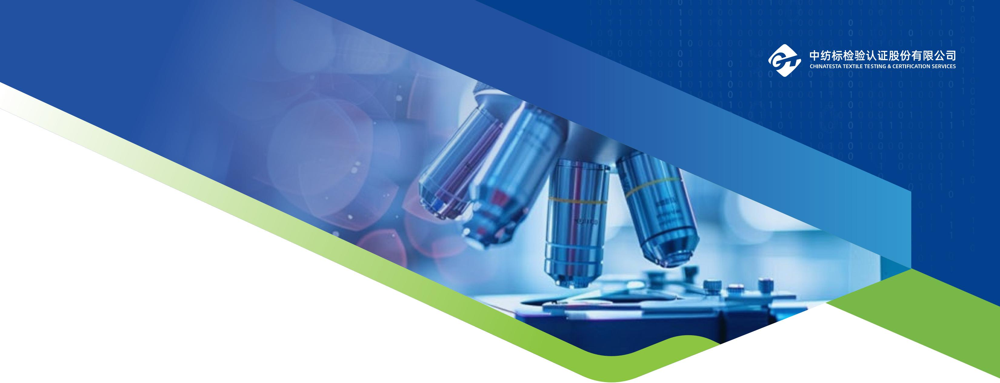

text_image

中纺标检验认证股份有限公司
CHINATESTA TEXTILE TESTING & CERTIFICATION SERVICES

## 中纺标2025年

## 环境、社会和公司治理（ESG）报告

中纺标官方微信

中纺标检验认证股份有限公司

地址：北京市朝阳区延静里中街3号

全国热线：400-086-0486

官方网站：https://www.cttc.net.cn

中纺标检验认证股份有限公司

## 目 录

## CONTENTS

## 前篇 01

<table><tr><td>报告说明</td><td>01</td></tr><tr><td>总经理致辞</td><td>03</td></tr><tr><td>企业文化</td><td>05</td></tr></table>

## 走进中纺标 06

<table><tr><td>公司简介</td><td>06</td></tr><tr><td>市场定位</td><td>07</td></tr><tr><td>发展历史</td><td>07</td></tr><tr><td>中长期规划</td><td>07</td></tr><tr><td>2025年大事记</td><td>09</td></tr><tr><td>2025年度荣誉墙</td><td>11</td></tr><tr><td>响应联合国可持续发展目标(SDGs)</td><td>12</td></tr></table>

## 专题篇—标准建设：

引领行业技术标准与国际接轨 13

## 专题篇一数字化转型：

以技术创新提升检测认证服务能力 17

## 可持续发展管理 23

<table><tr><td>可持续发展治理</td><td>23</td></tr><tr><td>利益相关方沟通</td><td>23</td></tr><tr><td>重要性议题识别与管理</td><td>25</td></tr></table>

## 治理篇 27

<table><tr><td>治理结构</td><td>27</td></tr><tr><td>风险管理</td><td>29</td></tr><tr><td>恪守商业道德</td><td>31</td></tr><tr><td>投资者关系管理</td><td>32</td></tr></table>

<table><tr><td>环境篇</td><td>35</td></tr><tr><td>应对气候变化</td><td>35</td></tr><tr><td>环境合规管理</td><td>40</td></tr><tr><td>排放物管理</td><td>43</td></tr><tr><td>循环经济</td><td>44</td></tr></table>

## 社会篇 47

<table><tr><td>产品和服务安全与质量</td><td>47</td></tr><tr><td>创新驱动</td><td>52</td></tr><tr><td>人才管理与发展</td><td>57</td></tr><tr><td>员工权益</td><td>63</td></tr><tr><td>维护信息安全</td><td>67</td></tr><tr><td>责任采购与供应商管理</td><td>68</td></tr><tr><td>社会贡献</td><td>69</td></tr></table>

<table><tr><td>结篇:未来展望</td><td>73</td></tr><tr><td>附录</td><td>75</td></tr></table>

## 报告说明

## 报告简介

本报告是中纺标检验认证股份有限公司（以下简称“公司”“我们”或“中纺标”）的2025年度环境、社会和公司治理(ESG)报告。本报告客观、真实地披露了公司2025年在环境、社会及治理方面表现的相关信息。本报告中，所有涉及资金的币种均为人民币。

## 时间范围

报告涵盖的时间范围为2025年1月1日至2025年12月31日（以下简称“报告期”），部分内容往前后年份适度延伸。

## 报告范围

如无特殊说明，本报告覆盖中纺标检验认证股份有限公司及其下属子公司。

## 数据说明

报告所披露的资料与案例来自公司正式文件、统计报告或有关公开资料。公司保证本报告内容不存在任何虚假记载、误导性陈述或重大遗漏。本报告数据如与财务报告不一致，以财务报告数据为准。

## 编制依据

《央企控股上市公司ESG专项报告参考指标体系》  
联合国可持续发展目标（SDGs）  
《北京证券交易所上市公司持续监管指引第11号—可持续发展报告(试行)》  
全球报告倡议组织（GRI）《可持续发展报告标准》

## 报告获取

本报告以电子版形式发布，电子版可在北京证券交易所网站（https://www.bse.cn/）获取。

## 总经理致辞

当下，全球可持续发展的浪潮持续奔涌，纺织行业正朝着科技、绿色、时尚的方向加速转型，以标准引领发展、以创新驱动变革、以责任践行担当，成为行业高质量发展的核心命题。中纺标始终坚守“以科技进步和品质服务引领美好生活”的使命，锚定“打造纺织领域国内领先、服务项目更加全面的综合性质量技术服务商，成为最受客户信赖的质量守护者”的愿景，将ESG理念深度融入公司战略布局、经营管理与业务发展的全维度、全过程。

## 一、绿色发展，责任担当

绿色发展是企业可持续发展的核心底色，更是中纺标深耕主业的重要战略抓手。2025年，我们紧扣国家绿色低碳发展导向，将环保理念融入自身业务发展与运营全流程，以技术研发和能力建设为核心，持续强化自身在绿色检测领域的核心竞争力。我们聚售生物基材料鉴别、纤维微塑料、纺织材料生物降解性能等绿色领域开展标准研制与技术能力打磨，完善自身绿色低碳技术服务体系，将绿色发展理念融入检测服务全流程，以自身过硬的绿色技术能力，夯实企业绿色发展根基，彰显中纺标在生态环保领域的责任与担当。

## 二、以人为本，践行社会责任

中纺标秉持“以人为本，规范高效”的管理理念，将员工发展与社会担当融入企业自身发展。对内，我们持续优化企业内部人力资源体系，完善干部选拔、培养与考核机制，为员工搭建广阔的职业发展平台；丰富招聘渠道，吸纳各类优秀人才加盟，开展精准化内部培训赋能，提升队伍专业能力;优化企业内部薪酬激励体系，实现薪酬与效益精准挂钩，让员工共享企业发展成果，同时通过工会开展各类职工活动，落实困难职工帮扶举措，打造包容、多元、温暖的内部工作环境。对外，我们积极践行企业自身社会责任，持续开展“小小绿色使者”科普公益活动，提升公众对纺织检测等领域的认知；同时规范企业自身合作运营准则，以信息技术为依托构建企业内部数字化服务体系，搭建合作伙伴数字信任体系，严格保护用户隐私与数据安全，以自身规范运营践行社会责任，传递企业正向价值。

## 三、诚信经营，强化公司治理

坚持诚信经营，持续完善公司治理结构，提升公司治理水平，是企业行稳致远的根本保障，更是中纺标ESG建设的核心根基。我们严格遵守国家法律法规和行业规范，坚持合规经营，维护市场秩序。2025年中纺标以制度建设为核心，深化自身治理能力，进一步构建合规、透明、高效的内部治理格局，取得了消费者、客户及其他利益相关方的长期信任。

道阻且长，行则将至;行而不辍，未来可期。站在新的发展起点，面对充满机遇与挑战的市场环境，中纺标将继续以ESG战略为核心引领，坚守“诚信、包容、创新、实干、卓越、共赢”的核心价值观，深耕纺织全产业链质量服务，持续强化自身标准引领与数字化双核驱动能力，加大科技创新与绿色技术研发力度，不断完善现代化内部公司治理体系，切实履行企业社会责任。同时，我们也期待与行业各界、社会各方携手并肩，汇聚可持续发展的磅礴力量，共同探索纺织行业高质量发展的新路径，让科技与品质赋能美好生活，共同迈向更加绿色、智能、可持续的未来！

中纺标总经理 李斌

2026 年 4 月

## 企业文化

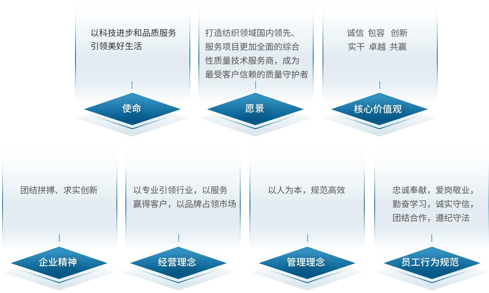

flowchart

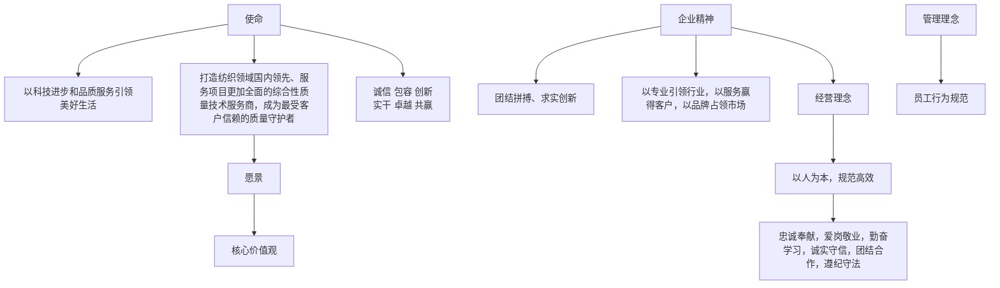

## 战略定位

以标准引领和数字化为双核驱动，打造国家质量基础设施（NQI）一站式服务平台，成为纺织全产业链质量服务领跑者；通过并购推进业务多元化，成为全球中高端品牌客户的质量合作伙伴。

## 走进中纺标

## 公司简介

中纺标检验认证股份有限公司(证券简称：中纺标，代码：920122，英文CTTC)于2004年由中国纺织科学研究院有限公司出资组建，是集标准、检验、检测、计量、认证五位一体的综合技术服务机构，可为纺织服装企业提供全方位、全产业链质量解决方案，业务多元。总部在北京，在多地设立子公司、运营中心、办事处与工作站，形成覆盖全国的服务网络。公司是检验检测品牌集群成员，拥有多个国家、省级授权检测平台，承担众多行业技术平台工作。人才队伍强大，资源与环境完善，紧跟国际趋势开拓服务，“一站式”服务受认可。目标是成为国际竞争力纺织检测机构，打造多领域综合性检验认证集团。

## 关键绩效

国际：标准数量

新发布ISO标准

2 项

成功立项新提案

国内：标准数量

全年完成制修订标准

55 项

发布标准

47项

检测参数（能力）

2025年新增校准能力

37项

新增生物安全柜

1 项

国家标准参数

9 项

主要覆盖纺织、医疗、化学等重点领域

## 数字化工作

CRM客户管理系统：签单客户全部在CRM 系统录入、客户线索全部在 CRM 系统报备计量业务管理系统：实现了校准证书全流程线上管理，从受理、派单到出具证书的全环节均可追溯，显著提升了规范化水平。

客户数量

6500+

实验室规模

25000+m2

年初出具报告量

350000+

## 市场定位

中纺标始终坚定践行环境、社会及公司治理(ESG)理念，深耕纺织品检测主营业务，并借助资本市场的力量，积极拓展检测相关领域，探索多元化发展路径。我们致力于巩固国内纺织品检测细分领域的领先地位，同时推动高质量、跨越式发展。我们凭借创新的业务模式和卓越的服务能力，不断提升行业可持续发展水平，树立绿色发展与责任担当的行业标杆。我们不仅助力行业转型升级，更致力于创造广泛而深远的社会价值，实现经济、社会与环境的和谐共生，为可持续未来贡献力量。

## 发展历史

注册成立中纺标(北京)检验认证中心有限公司成立晋江中纺标，2021年更名为福建中纺标

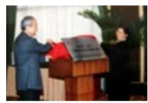  
2004

成立深圳中纺标  
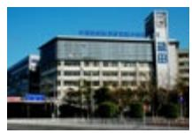  
2007

成立浙江中纺标  
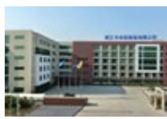  
2008

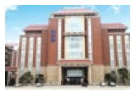  
2014

2022  
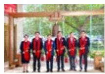  
北交所首发上市

2020  
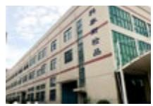  
绍兴科泰斯纳入中纺标子公司序列

2019  
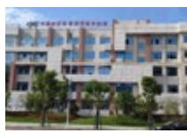  
成立于都分公司，2022年更名为江西中纺标

2018  
  
成功挂牌新三板，进入资本市场

## 中长期规划

## 做强做优做大主营业务，进一步稳固头部地位

检测业务：

中纺标将围绕国家绿色、低碳、环保的宏观政策，消费者对纺织及服装类产品舒适性、安全性的期望以及行业对于智能、快速等检测新技术的需求，开展新型纤维成分分析、纺织品中有害化学物质检测、功能性、舒适性等方面的检测技术研发和能力建设，以持续保持公司在纺织品检测领域的技术领先优势和提升核心竞争力。

## 各实验室将依据属地化资源禀赋实施差异化发展策略：

北京本部以研发结合先进设备应用为主导，开辟独具特色的专精特新项目和领域；  
深圳中纺标以常规检测项目为主，重点拓展电商品牌及平台业务，形成新的增长点；  
浙江中纺标维持传统领域业务，持续深耕功能性、抗菌等纺织品检测；深度切入汽车内饰检测领域，打开新领域市场；  
福建中纺标突出运动用品检测，深耕纺织服装检测市场；  
江西中纺标主攻羽绒检测特色业务，同时辅以实验室服务、培训等业务。

其他业务

<table><tr><td>计量业务</td><td>中纺标将聚焦纺织领域及京津冀地区医药领域计量市场,持续优化计量业务网络布局,完善资质能力建设,提升服务水平,实现更高质量、更具效益的营收增长。</td></tr><tr><td>认证业务</td><td>中纺标将锚定认证初心与使命,全力构建全国一体化认证服务体系,强化绿色低碳技术创新内核与产业协同,致力打造纺织认证领域头部品牌。</td></tr><tr><td>耗材业务</td><td>中纺标聚焦核心技术突破与标准引领,实现大宗耗材自主研发,打造行业权威的纺织标准耗材创新中心。</td></tr></table>

## 持续强化科技创新，提升公司核心竞争力

标准化布局：

结合智能纺织品的研究与应用现状，做好标准体系顶层设计与规划，率先研制智能纺织品术语、定义、分类、通用技术要求等通用基础标准及耐用性等试验方法标准；  
结合行业发展与消费需求，开展抗蛋白过敏、热反射、抗黏附性、暖体假人热阻等新型功能性纺织品及舒适消费体验相关检测方法与评价标准研制：  
围绕纺织行业绿色可持续发展，开展生物基材料鉴别、纤维微塑料、纺织材料生物降解性能等试验方法标准研制，同步跟踪研究国外技术法规与标准，完善补充新型有害化学物质痕量分析方法标准；  
配合国家新能源汽车发展战略，开展汽车内饰用纺织材料标准体系研究，研制抗菌、防螨等健康功能性产品标准，以及抗粘滑等贴合乘坐体验的试验方法标准；  
聚焦行业数字化、智能化和自动化的发展需求，加快数字、AI技术在检测领域的应用，开展基于图像识别技术的吸湿速干性能检测、基于自动溶解技术的纤维成份分析技术及标准研制；  
推动我国自主研制的试验方法标准，如疏水性、洗液沾色等模拟实际使用场景的舒适性和功能性试验方法标准走向国际，为重构以消费体验为导向的国际标准体系奠定基础。

## 2025年大事记

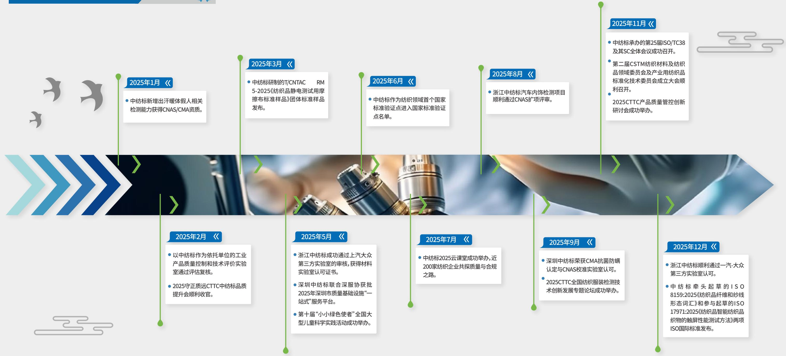

flowchart

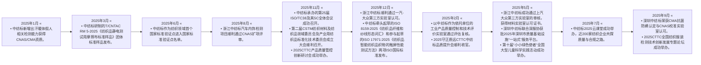

natural_image

Abstract wave pattern with blue gradient and city skyline silhouette in background (no text or symbols)

## 2025年度荣誉墙

2025年公司所获重大荣誉的列表

<table><tr><td>序号</td><td>授予时间</td><td>授予单位</td><td>证书</td><td>荣誉和资质名称</td></tr><tr><td>1</td><td>2025年2月28日</td><td>中关村汇智抗菌新材料产业技术创新联盟</td><td>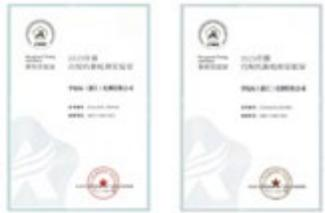</td><td>中纺标和浙江中纺标成功入选中关村汇智抗菌新材料产业技术创新联盟(CIAA)2025年度合规抗菌检测实验室暨推荐实验室名录</td></tr><tr><td>2</td><td>2025年6月26日</td><td>国家标准化管理委员会</td><td>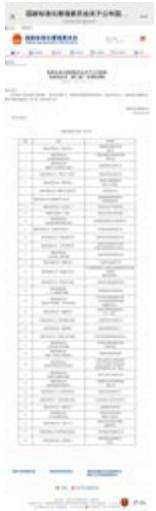</td><td>中纺标作为纺织领域首个国家标准验证点进入国家标准验证点名单</td></tr><tr><td>3</td><td>2025年11月</td><td>中国纺织工业联合会</td><td>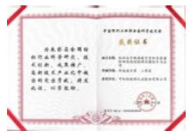</td><td>纺织品中致癌致突变和生殖毒性物质高效检测关键技术与应用,获中国纺织工业联合会科技进步二等奖</td></tr></table>

## 其他荣誉

4.中纺标、深圳中纺标、浙江中纺标、江西中纺标四地实验室喜获“中国羽绒工业协会认可实验室”称号

5.福建中纺标通过国家高新技术企业复评、福建省“专精特新”中小企业、科技型中小企业认定

6.深圳中纺标联合深服协获批2025年深圳市质量基础设施“一站式”服务平台

7.中纺标获中国仪器发展年会评选年度行业先锋奖

## 响应联合国可持续发展目标（SDGs）

中纺标响应SDGs汇总表

<table><tr><td>SDGs</td><td>目标详解</td><td>对应章节</td></tr><tr><td></td><td>在全世界消除一切形式的贫困</td><td>社会贡献</td></tr><tr><td></td><td>消除饥饿,实现粮食安全,改善营养状况和促进可持续农业</td><td>社会贡献</td></tr><tr><td>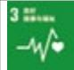</td><td>确保健康的生活方式,增进各年龄段人群的福祉</td><td>人才管理与发展、员工权益</td></tr><tr><td>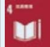</td><td>确保包容和公平的优质教育,让全民终身享有学习机会</td><td>人才管理与发展、社会贡献</td></tr><tr><td>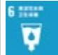</td><td>为所有人提供水和环境卫生并对其进行可持续管理</td><td>循环经济、环境合规管理</td></tr><tr><td>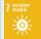</td><td>确保人人获得负担得起的、可靠和可持续的现代能源</td><td>应对气候变化</td></tr><tr><td>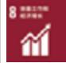</td><td>促进持久、包容和可持续经济增长,促进充分的生产性就业和人人获得体面工作</td><td>人才管理与发展社会贡献</td></tr><tr><td>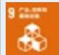</td><td>建造具备抵御灾害能力的基础设施,促进具有包容性的可持续工业化,推动创新</td><td>创新驱动、中长期规划</td></tr><tr><td>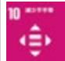</td><td>减少国家内部和国家之间的不平等</td><td>社会贡献、责任采购与供应商管理</td></tr><tr><td>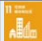</td><td>建设包容、安全、有抵御灾害能力和可持续的城市和人类住区</td><td>环境合规管理、社会贡献</td></tr><tr><td></td><td>采用可持续的消费和生产模式</td><td>循环经济、应对气候变化产品和服务安全与质量</td></tr><tr><td>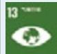</td><td>采取紧急行动应对气候变化及其影响</td><td>应对气候变化、循环经济</td></tr><tr><td>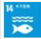</td><td>保护和可持续利用海洋和海洋资源以促进可持续发展</td><td>环境合规管理、循环经济</td></tr><tr><td>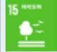</td><td>保护、恢复和促进可持续利用陆地生态系统,可持续管理森林,防治荒漠化,制止和扭转土地退化,遏制生物多样性的丧失</td><td>环境合规管理、循环经济</td></tr><tr><td>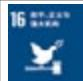</td><td>创建和平、包容的社会以促进可持续发展,让所有人都能诉诸司法,在各级建立有效、负责和包容的机构</td><td>治理结构</td></tr><tr><td>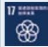</td><td>加强执行手段,重振可持续发展全球伙伴关系</td><td>社会贡献、责任采购与供应商管理</td></tr></table>

## 专题篇—标准建设：

## 引领行业技术标准与国际接轨

## 标准引领行业高质量发展

标准是推动产业技术进步和全球贸易互认的重要基础，也是促进产业绿色转型的重要工具。作为我国纺织行业重要的综合性技术服务机构，中纺标长期深度参与国内外纺织标准体系建设，持续推动技术创新成果向标准转化，在提升中国纺织产业国际话语权、完善行业技术规范以及推动绿色低碳发展方面发挥了重要作用。

2025年，公司充分发挥在标准化领域的技术优势和组织协调能力，积极参与国际标准制定与治理，持续完善国内纺织标准体系，并推动科研成果与标准应用深度融合，在国际标准研制、国家标准验证平台建设、标准科研创新以及绿色标准体系构建等方面取得多项进展，为行业高质量发展提供坚实的技术支撑。

## 公司可持续发展理念

中纺标依托承担ISO/TC38“纺织品”技术委员会国内技术对口单位以及主席单位职责，积极推动中国技术成果进入国际标准体系，持续提升我国在国际纺织标准化领域的影响力。

本年度公司持续推进国际标准研制工作，全年新发布ISO国际标准2项，成功推动1项新提案立项，为我国纺织技术成果转化为国际规则提供重要平台。同时，公司积极组织国内专家参与国际标准化事务，全年组织参与国际事务性投票、提案投票及标准复审投票179次，针对10余项国际标准项目提出的技术意见被采纳，充分体现了我国在纺织技术领域的专业能力与国际影响力。为进一步促进国际标准协同发展，公司开展国内外纺织标准体系比对研究，全年完成600余项国内外标准一致性评估，为“一带一路”沿线国家标准合作及国际标准转化应用提供了重要技术支撑。

国际标准化组织治理方面，公司持续承担ISO/TC38主席单位及ISO/TC38/SC2委员会经理单位职责，积极推动国内机构和企业参与国际标准制定，提升我国参与国际标准研制的活跃度与成功率。公司专家斯颖教授级高级工程师于2025年荣获ISO中央秘书处颁发的“ISO卓越贡献奖”，彰显我国专家在国际标准化领域的重要影响力。

## 新发布 ISO 国际标准

2 项

## 成功推动新提案立项

1 项

## 全年组织参与国际事务性投票、提案投票及标准复审投票

179 次

## 全年完成国内外标准一致性评估

600 余项

## 案例：中纺标承办的第25届ISO/TC38及其SC全体会议

2025年公司11月，公司成功承办第25届ISO/TC38“纺织品”技术委员会及其SC全体会议。会议在浙江嘉兴濮院以线上和线下相结合的形式召开，来自中国、日本、韩国、法国、英国、美国、德国、意大利、蒙古、孟加拉等十余个国家的100余名专家参与会议交流。会议期间，中国代表团提出5项新标准提案并作1项技术报告，有效推动了多项由我国牵头的国际标准研制进程，进一步提升了中国在全球纺织标准化治理中的影响力。

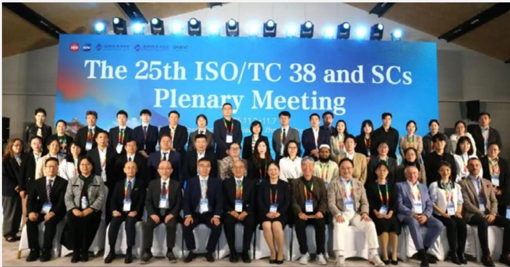

text_image

The 25th ISO/TC 38 and SCs
Plenary Meeting

全体会议参会代表合影

## 持续完善国内纺织标准体系

在国内标准化工作方面，公司作为全国纺织品标准化技术委员会（TC209）、全国纺织品标委会基础标准分会(TC209/SC1)以及全国产业用纺织品标准化技术委员会(TC606)等多个全国性标准化技术委员会秘书处单位，围绕纺织产业科技创新与高质量发展需求，持续推进重点领域标准体系建设。

2025年，公司全年申报标准项目57项，其中国家标准41项、行业标准15项、国家标准英文版翻译项目1项，涉及纺织品生态安全检测，智能纺织产品，功能性能评价以及消费者体验等关键领域，为纺织产业技术创新和产品升级提供重要标准支撑。在标准研制方面，公司不断提升标准制定效率和质量，全年组织召开标准审定会6次，完成标准制修订55项，其中发布标准47项，进一步强化了纺织产业基础通用标准供给能力，为产业高质量发展提供制度保障。

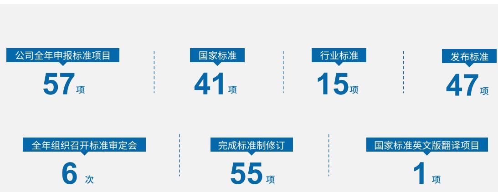

funnel

| Category | Value |
| --- | --- |
| 公司全年申报标准项目 | 57项 |
| 国家标准 | 41项 |
| 行业标准 | 15项 |
| 发布标准 | 47项 |
| 全年组织召开标准审定会 | 6次 |
| 完成标准制修订 | 55项 |
| 国家标准英文版翻译项目 | 1项 |

## 强化标准科研与成果转化

公司持续加强技术研究与标准化工作的融合，推动科研成果向标准转化。2025年，公司在研标准化科研项目4项，并新增1项省级科技计划项目，研究方向涵盖高安全防疫材料、检验检测数据风险识别技术以及高性能有机纤维标准体系建设等关键领域。

科技成果方面，公司积极推动关键技术成果申报行业科技奖励。2025年，公司申报省部级科技奖项6项，其中《纺织品中致癌、致突变和生殖毒性物质高效检测关键技术与应用》荣获中国纺织工业联合会科技进步二等奖，相关成果为纺织品生态安全检测提供了重要技术支撑。

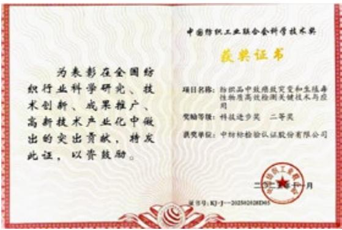

text_image

为表彰在全国纺织行业科学研究、技术创新、成果推广、高新技术产业化中做出的突出贡献，特发此证，以资鼓励。
中国纺织工业联合会科学技术奖
获奖证书
项目名称：纺织品中软维致实变和生徒毒性物质高效检测关键技术与应用
奖励等级：科技进步奖 二等奖
获奖单位：中纺标检验认证股份有限公司
二〇一一年一月
身份证号：KJ-1-202502028D65

《纺织品中致癌、致突变和生殖毒性物质高效检测关键技术与应用》获奖证书

## 案例：国家标准验证平台建设取得突破

2025年6月,公司获国家标准化管理委员会批准建设“国家标准验证点(绿色低碳纺织品)”,成为我国纺织领域首个国家标准验证点。该平台将围绕绿色低碳纺织产品标准实施效果验证、标准适用性评估以及标准优化完善等开展系统研究。

国家标准验证点的建设不仅是对公司标准化技术能力和行业服务能力的高度认可，也将为绿色低碳纺织产品标准的推广实施提供重要技术支撑，进一步提升我国纺织行业标准化科技支撑能力。

## 标准应用转化成果丰硕

公司持续推进纺织标样研发与产业化应用，任期内累计推进20余项国家及团体纺织标样项目研发，其中3项国家标准标样和1项团体标准标样已顺利完成评审，同时获批5项国家标准标样项目立项，为标样业务长期发展奠定基础。同时，公司积极推动关键检测耗材国产化替代，通过自主研发摩擦布、酚黄组件等关键检测耗材，优化产品结构，使自研耗材占比提升至69%，有效打破国外耗材长期垄断格局，为行业检测服务提供更加稳定可靠的技术保障。

作为全国纺织标样标准化技术委员会副主任及副秘书长单位，公司积极参与行业标样归口管理工作，建立纺织标样体系框架，并牵头制定《纺织标样研制技术规范》团体标准，进一步提升了公司在纺织标样领域的行业权威性和技术

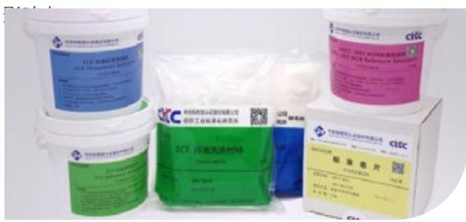

text_image

ECE 2018年1月
ECE Microplastic Filters
ECE 沉液洗涤剂
标准芯片

标准洗涤剂

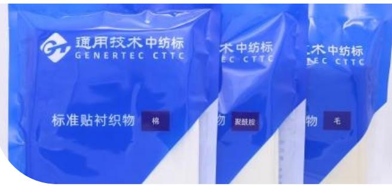

text_image

通用技术中纺标
GENERTEC CTTC
标准贴衬织物 棉
技术中纺标
EC CTTC
毛
混凝土
技术中纺标
NEC CTTC
毛

单纤贴衬

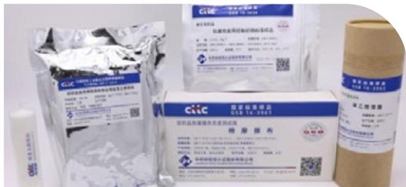

text_image

CSE 16-306D
国家标准报告
CSE 16-306D
药物推荐
华药集团有限公司

标准棉摩擦布、抗菌控制织物、酚黄测试组件等标准样品

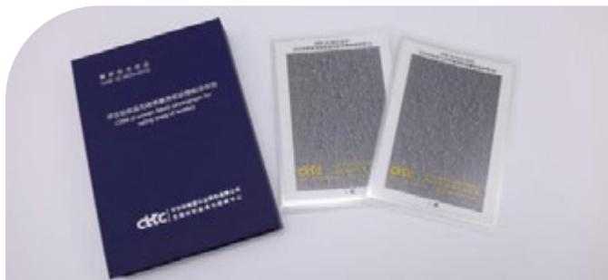

text_image

CITIC
中国邮政储蓄银行股份有限公司
CTIC
中国邮政储蓄银行股份有限公司

机织勾丝样照

## 标准助力行业绿色可持续发展

公司持续推动纺织行业绿色标准体系建设，积极发挥标准在引导产业绿色转型中的重要作用。

2025年，公司作为主要起草单位参与制定了FZ/T08009-2025《纺织产品循环利用标志》和FZ/T08010-2025《纺织品循环利用纤维分类及含量标识》两项行业标准，填补了我国纺织产品循环利用领域的标准空白，为推动纺织产品循环利用和资源高效利用提供了重要制度基础。同时，公司主导和参与了酚类物质、乙二醇醚、禁限用染料以及PFAS等多项重点有害物质检测方法标准的研制，逐步构建起完善的纺织品生态安全检测标准体系。公司通过制定循环利用标志、纤维分类标识及生物降解测试方法等标准，推动纺织行业从源头设计、生产制造到回收利用的全生命周期绿色标准化管理，持续提升我国纺织产品在国际绿色贸易中的竞争力，为行业可持续发展提供有力支撑。

## 专题篇—数字化转型：

## 以技术创新提升检测认证服务能力

中纺标积极推进数字化转型，通过构建统一业务系统和数据平台，整合业务数据、优化流程管理和强化数据应用，持续提升运营效率和服务能力，为业务高质量发展提供技术支撑。

围绕数字化转型核心目标，公司加快推进核心业务系统、管理系统的迭代升级与全覆盖，以数智科技驱动运营管理、客户服务、实验室作业全流程升级，提升服务质量与运营效益。同时，公司加强网络安全与信息技术应用创新体系建设，保障数字化系统稳定运行，为纺织行业提供高效可靠的检测认证服务。

## 以客户需求为导向推进数字化服务升级

公司始终坚持以客户为核心，通过数字化技术持续优化检测服务流程和数据应用能力。公司建设统一业务平台，并与重点客户系统实现数据对接，形成覆盖业务受理、报告查询的一站式数字化服务体系。同时上线AI辅助审核与质量分析等工具，提高业务处理效率和数据管理水平。

## 核心业务数智化升级，优化客户服务全流程

2025年，公司持续深化全业务数字化平台建设，完成团体业务系统开发与LIMS系统功能升级，优化一键下单、批量操作，线上变更电请等核心服务功能，提升客户操作与公司业务处理效率。认证管理系统，计量管理系统稳定运行，与CRM系统深度打通，实现业务数据实时同步。

## 案例：客户系统无缝对接，实现送检流程自动化

公司以客户需求为导向，打造定制化系统对接服务，为部分纺织服装品牌客户开发专属对接接口，实现客户生产系统与公司LIMS系统的数据互通，覆盖订单数据自动获取、受理确认状态回传、检测结果实时推送、检测报告线上同步等全流程功能。2025年全级次新增11家客户系统对接开发，通过接口下单量同比增长5%。

## 案例：一站式数字化服务平台，打造便捷高效客户体验

公司持续优化客户服务平台功能，为客户提供在线下单、报告查询下载、定制化检测套餐选择及线上变更申请等服务。平台通过智能信息录入、一键下单及历史订单复制等功能，简化客户送检流程，减少重复信息填写，提高业务办理效率。同时，客户可通过线上变更申请模块对订单信息进行调整，进一步提升服务便捷性和响应效率。

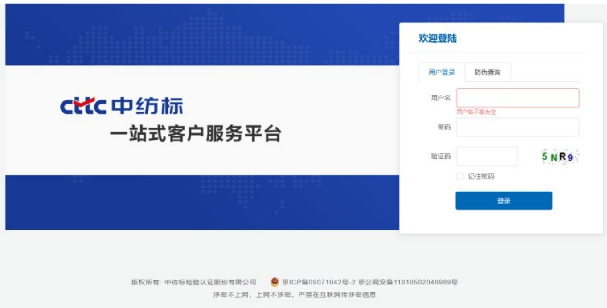

text_image

CTTC 中纺标
一站式客户服务平台
欢迎登陆
用户登录	防伪查询
用户名	
用户名不能为空
密码	
验证码	5NR9
□ 记住密码
登录
版权所有: 中纺标检验认证股份有限公司	京ICP备09071042号-2 京公网安备11010502046989号
涉密不上网，上网不涉密、严禁在互联网传涉密信息

一站式客户服务平台

## 智能录入—让信息填写更便捷

关于单位信息（委托、生产、缴费单位）、客户信息(联系人、联系电话、邮箱等)、样品、商标信息以及报告要求等的填写：可提前按照客户已有信息进行维护，进行下拉式菜单选择；并可按照客户习惯设定默认选项。

如果客户委托检验的标准和项目与之前的某个业务一样，可以通过之前的业务申请单号，进行复制并简单修改不同信息，即可完成下单。

## 复制修改—让重复工作更简易

## 服务平台的优势

## 一键下单—让委托检验更高效

根据客户需求定制个性化送检方案，按照检验标准及项目制定一个或多个套餐，客户可以按照需求选择相应的套餐，实现-键下单。

如果下单后客户发现某些信息需要变更，可通过线上进行申请。点击“变更申请”模块，找到相应的业务单号，填写需要变更的要求，即可完成变更申请。

## 变更申请—线上进行更方便

## 深化数据价值应用，驱动精准服务与决策

公司将数据视为关键战略资产，致力于深度挖掘业务数据价值，推动业务的全面数字化转型升级，借助大数据分析、人工智能技术设计并上线客户产品质量分析系统、AI智能报告审核系统，不仅大幅提高了内部工作人员的工作效率，还为客户提供了更全面、更精准的质量服务，增强了公司在市场中的核心竞争力。

## 案例：数据驱动质量分析，为客户提供专业化质量解决方案

公司依托全业务数字化平台积累的检测数据，进一步升级产品质量分析系统，为品牌客户提供多维度质量分析报告服务，以直观、详尽的数据可视化方案，帮助企业及时了解产品质量情况。质量分析报告涵盖质量数据统计、历年数据对比、行业数据对标、供应商质量状况剖析等核心内容，为客户提供送检项目不合格率、不合格项目分布等关键数据，帮助客户识别质量改进成效、明确行业定位，同时为客户制定质量提升策略、优化供应链管理提供有力的数据支撑。此外，公司可根据客户需求提供个性化报告定制服务，并配备一对一咨询服务，协助客户解读报告内容、制定针对性的质量改进计划，获得客户高度认可。

<table><tr><td>质量数据统计</td><td>为客户提供检测样品不合格统计数据,包括送检项目个数,不合格项目数,不符合率等,便于客户快速把握整体质量状况及问题分布。</td></tr><tr><td>质量数据对比</td><td>为客户提供历年检测不合格率、不合格项目等对比数据,通过图表化报表直观展示这些变化,帮助客户识别质量改进成效或潜在问题;</td></tr><tr><td>行业数据对比</td><td>提供行业质量参考数据,通过对比分析,帮助客户明确自身在行业中的位置,发现差距与机遇,为制定质量提升策略提供有力的支持;</td></tr><tr><td>供应商质量状况剖析</td><td>作为品牌方了解供应商质量情况的关键渠道,为客户评估供应商质量水平、优化供应链管理提供重要的参考数据;</td></tr><tr><td>个性化报告定制</td><td>根据客户要求进行报告定制,质量数据一目了然。同时提供一对一咨询服务,协助客户解读报告内容,制定有针对性的质量改进计划;</td></tr></table>

## 案例：AI辅助报告审核，重塑检测服务价值链

2025年初，公司构建客户要求知识图谱，将每一份合同、每一次沟通中确认的个性化报告条款，转化为结构化数据并嵌入业务系统，打造AI辅助报告审核的功能。审核人员得以从重复性工作中解放，将精力聚焦于报告核心逻辑研判、数据深度分析及结论审慎把关，大幅提升报告审核效率与准确性，实现检测服务价值链的优化升级。

## 数字化管理提升运营效率

在纺织检验检测行业数字化转型加速的背景下，公司持续推进精细化管理，将数字化技术应用于实验室作业、运营管理和安全管理等关键环节，通过系统化管理和数据应用提升运营效率和服务能力。

## 核心系统稳定运行，提升业务全流程效率

公司持续优化信息化基础设施，通过专业技术运维保障LIMS系统、计量管理系统、认证管理系统和CRM系统稳定运行，为实验室管理、业务管理和客户服务提供系统支持。2025年公司完成多项系统功能优化与升级，实现实验室作业、业务管理、客户服务等全环节的数字化、智能化升级，在效率、准确性和合规性方面取得提升。

## 案例：原始记录电子化，实现实验室提质降本增效

公司全面推进实验室原始记录电子化建设，有效减少了人工抄录、转录工作，同时提升了数据的准确性。各上线项目整体效率提升5%—30%不等，实现了实验室作业的“提质、增效、降本”三重目标。

## 案例：数字化管理流程全覆盖，提升运营管理效率

公司依托“智慧通用”平台，结合公司运营管理需求，将制度流程化、流程信息化，实现办公、采购、合同、固定资产、用章用车等全流程数字化管理。2025年全级次启用数字化流程62个，本年新建合同管理审批、购置申请、固定资产转移等流程17个，实现管理过程的可跟踪、可追溯、可管控。数字化流程的全覆盖有效减少了人工审批环节，提升了办公效率，同时强化了流程合规性，实现了管理规范、节能降耗、过程可跟踪的目标。

## 数字化管理平台支撑运营决策

公司充分利用“智慧通用”“通财云”等集团数字化平台，持续将公司各项制度流程化、流程信息化，推动财务、人力资源、客户关系、数据分析等各管理板块的数智化升级，使各类办公、管理流程稳固于系统之中。高效的数智化管理模式持续减少资源浪费，降低运营成本，从公司治理层面进一步提升整体运营效率，为全链条效能革新提供坚实支撑。

## 案例：数据可视化建设，为决策提供精准数据支撑

公司依托BI系统实现业务数据的集成与可视化分析，满足各部门、各子公司多样化的数据查询、分析需求，为经营决策提供精准支撑。2025年公司全级次拥有各类可视化看板及报表达130个，2025年新增17个看板及报表，涵盖质量跟踪、业务管理、人力资源、客户分析等多个维度，包括质量分析看板、客户项目变化明细表、成分纤维类型情况统计、实验室作业看板等。数据可视化看板实现了业务数据的实时展示、动态监控，管理层可通过看板及时掌握全级次业务开展情况、产品质量状况、客户需求变化等核心信息，优化资源配置，提高市场应变能力。

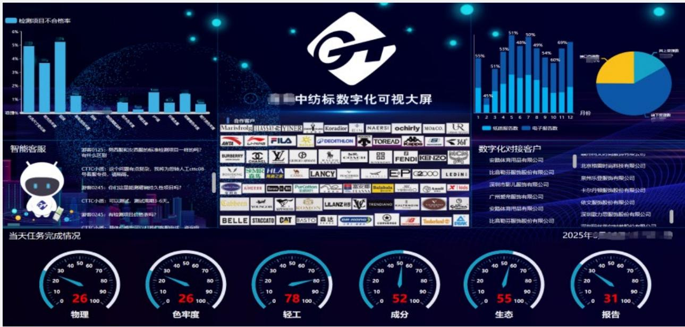

donut

| Category | Value (%) |
| --- | --- |
| 1 | 45% |
| 2 | 51% |
| 3 | 53% |
| 4 | 51% |
| 5 | 48% |
| 6 | 50% |
| 7 | 49% |
| 8 | 54% |
| 9 | 60% |
| 10 | 69% |
| 11 | N/A |
| 12 | N/A |

中纺标数字化可视大屏

## 案例：客户关系管理系统（CRM），实现客户管理精细化

公司持续运用已建成的客户关系管理系统（CRM），实现客户资源统一管理，完善营销管理体系。通过CRM系统，各业务板块实现客户资源共享，协同作战更加顺畅，资源调度更为合理；公司可综合了解客户在检测、计量、认证等各板块的业务信息，精准为客户画像，更好地拓展业务、为客户提供精准化、个性化服务。CRM系统与业务系统打通，实现数据的联动分析，为经营决策和客户服务提供数据支撑。

## 数字化与精益管理协同推进业务优化

公司将精益管理理念与数字化相结合，通过标准化管理和流程优化推动管理成果在业务管理系统中固化，持续提升业务管理规范化水平和运营效率。公司以数字化技术为基础，通过标准化建设和流程优化推动精益管理在检测、计量和认证业务中的应用，提升运营效率和管理水平。

## 统一数据标准推动业务系统整合

公司以标准化建设为基础推进数字化系统整合。此前，各地实验室分别建设定制化软件系统，存在数据标准不统一和系统接口不兼容等问题。为解决上述问题，公司组织各地技术骨干集中开展标准梳理工作，建立统一的数据标准和业务规范。

## 紧跟“AI+”战略，探索数智化应用场景

公司贯彻落实“AI+”专项行动部署，将人工智能技术融入检测认证业务流程，持续挖掘高价值数智化应用场景，推动“即插即用型”AI应用落地。员工获评集团首批“AI+”青年创新人才，积极对接集团AI基础设施资源，推动AI技术从外部接口调用向集团资源复用转型。公司除落地AI辅助报告审核场景外，还在探索更多AI应用场景，持续推动数智化技术与核心业务的深度融合，以AI技术赋能全链条效能提升。

natural_image

Abstract digital illustration of human figures with glowing nodes and a central figure, symbolizing digital connectivity or data integration (no text or symbols)

## 可持续发展管理

## 可持续发展治理

公司坚持将可持续发展理念深度融入公司治理体系与经营管理全过程，持续完善ESG治理架构，构建权责清晰、分层负责、上下协同、闭环运行的可持续发展治理机制，系统统筹并推动环境、社会及治理各项工作落地见效，为公司高质量、可持续发展提供坚实治理保障。

中纺标三级ESG治理架构  
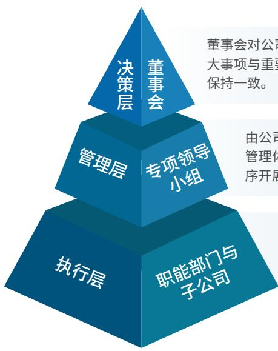

flowchart

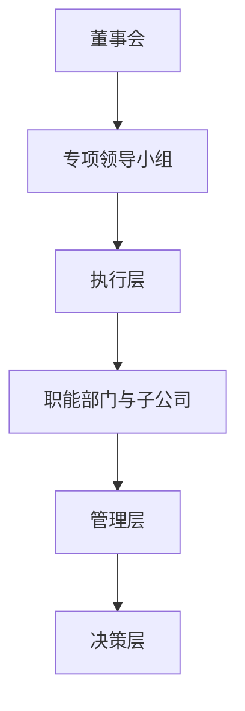

董事会对公司ESG与可持续发展工作承担最终统筹管理与监督责任，直接审议公司可持续发展战略、ESG重大事项与重要政策，将ESG理念全面融入公司整体发展战略与经营决策，确保ESG工作与公司长期发展目标保持一致。

由公司管理层成员组成,负责贯彻落实董事会关于ESG与可持续发展的决策部署,统筹组织公司ESG管理体系建设、年度重点工作规划、制度建设及信息披露管理,协调跨部门资源,保障ESG管理工作有序开展。

职能部门与子公司负责具体执行,落实ESG日常运营与专项工作。各相关职能部门结合职责分工，分别推进环境管理、人才发展、合规运营、社会责任、质量管控等具体实践，定期反馈工作进展与成效，形成分工明确、协同联动、高效执行的ESG工作机制。

## 利益相关方沟通

中纺标高度重视与利益相关方的沟通与互动，将利益相关方的期望与诉求作为完善可持续发展管理的重要依据。公司通过系统识别与公司经营活动密切相关的利益相关方群体，持续建立规范化、常态化的沟通机制，积极回应各方关注，推动企业与利益相关方实现协同发展。

结合业务特点与运营实际，识别出包括股东及投资者、客户、员工、供应商与合作伙伴、政府与监管机构、行业协会以及社会公众等在内的主要利益相关方。公司通过多元化沟通渠道与利益相关方保持密切联系，及时了解其对公司经营、环境保护、产品质量、员工发展、合规经营等方面的关注与期望，并将相关意见纳入公司管理决策和可持续发展实践。

<table><tr><td>利益相关方</td><td>关注议题</td><td>沟通方式</td></tr><tr><td>政府/监管机构</td><td>合规经营、依法纳税、信息披露、质量与安全管理、环境保护、行业规范发展</td><td>政策沟通与汇报监管检查与审计信息报送专题会议行业政策研讨</td></tr><tr><td>股东/债权人</td><td>公司治理水平经营业绩与盈利能力风险管理信息透明度长期价值创造</td><td>股东会定期报告与临时公告投资者交流会电话会议投资者关系管理平台</td></tr><tr><td>员工</td><td>职业发展与培训机会薪酬福利保障职业健康与安全工作环境企业文化建设</td><td>员工培训绩效沟通与反馈员工座谈会内部沟通</td></tr><tr><td>客户/消费者</td><td>产品与服务质量服务效率信息安全与数据保密技术支持能力</td><td>客户沟通会议客户满意度调查客户服务平台项目沟通</td></tr><tr><td>供应商/业务伙伴</td><td>公平合作与诚信履约供应链稳定性质量管理长期合作关系</td><td>供应商评估与管理业务沟通会议培训与交流活动</td></tr><tr><td>行业协会/社会组织</td><td>行业规范发展技术交流合作标准制定与推广行业能力提升与可持续发展</td><td>行业会议技术研讨标准制定参与行业合作项目</td></tr><tr><td>社区/公众</td><td>环境保护安全生产企业社会责任履行</td><td>社区沟通活动公益活动信息披露</td></tr><tr><td>媒体</td><td>信息公开透明企业发展动态社会责任实践行业影响力</td><td>媒体采访新闻发布会官方媒体平台发布专题宣传活动</td></tr></table>

## 重要性议题识别与管理

为系统识别和管理与公司经营发展及利益相关方密切相关的可持续发展议题，中纺标建立了规范化的重要性议题识别与评估机制，并将评估结果作为公司可持续发展管理及信息披露的重要依据。公司在开展重要性议题识别与评估过程中，结合《北京证券交易所上市公司持续监管指引第11号⸺可持续发展报告（试行）》及相关要求，开展双重重要性评估工作。

## 重要性议题识别

在议题识别阶段，公司综合考虑行业发展趋势、监管要求及利益相关方关注重点，对潜在可持续发展议题进行系统梳理。公司参考国内外主流可持续发展框架及监管政策，并结合检验检测行业特点，从环境、社会及治理三个维度识别相关议题。同时，公司通过利益相关方沟通、内部管理访谈及行业研究等方式，对潜在议题进行补充与筛选，形成公司可持续发展潜在议题清单，为后续评估工作提供基础。

## 重要性议题评估

完成议题识别后，公司按照双重重要性原则开展评估工作，从影响重要性和财务重要性两个维度，对各项议题的重要程度进行系统评估。

## 评估流程

<table><tr><td>开展背景分析</td><td>系统梳理宏观政策环境、行业发展趋势及资本市场对可持续发展的相关要求,重点分析监管政策、行业规范以及检验检测行业发展方向等因素,同时结合利益相关方关注重点,对公司可持续发展相关议题进行初步分析。</td></tr><tr><td>建立议题库</td><td>参考《北京证券交易所上市公司持续监管指引第11号——可持续发展报告(试行)》中设置的议题,行业标准及公司经营特点,形成涵盖环境、社会及治理领域的潜在ESG议题清单,共涉及议题22个。</td></tr><tr><td>开展利益相关方调研与内部评估</td><td>公司通过问卷调查、访谈交流等方式,收集内外部相关方如股东及投资者、员工、客户、供应商、行业协会等对相关议题的重要性评价,识别外部利益相关方的关注重点。公司组织相关管理部门及业务部门,从经营风险、业务发展、成本收益、合规要求及长期战略等角度,对各议题可能对公司财务状况、经营成果及未来发展产生的影响程度进行评估。本年度总计回收问卷200余份。</td></tr></table>

## 综合分析与矩阵构建

公司对影响重要性与财务重要性的评估结果进行综合分析，通过评分与排序方式构建双重重要性矩阵，对各议题的重要程度进行分类识别，形成议题矩阵。

## 管理层审议确认

评估结果提交公司管理层审阅确认，最终确定公司的重要性议题及高度重要议题，并将其纳入公司可持续发展管理重点及信息披露范围。

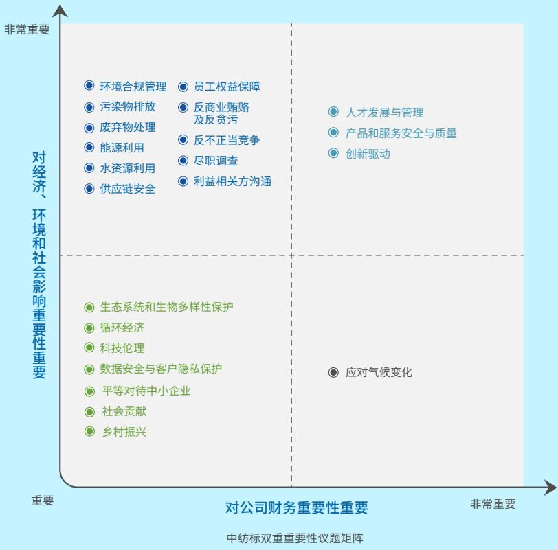

bubble

| Topic | Importance to Company Finance (X-axis) | Importance to Economy, Environment & Social (Y-axis) |
| :--- | :--- | :--- |
| 环境合规管理 | Low | High |
| 污染物排放 | Low | High |
| 废弃物处理 | Low | High |
| 能源利用 | Low | High |
| 水资源利用 | Low | High |
| 供应链安全 | Low | High |
| 员工权益保障 | Medium | High |
| 反商业贿赂及反贪污 | Medium | High |
| 反不正当竞争 | Medium | High |
| 尽职调查 | Medium | High |
| 利益相关方沟通 | Medium | High |
| 人才发展与管理 | High | High |
| 产品和服务安全与质量 | High | High |
| 创新驱动 | High | High |
| 生态系统和生物多样性保护 | Low | Low |
| 循环经济 | Low | Low |
| 科技伦理 | Low | Low |
| 数据安全与客户隐私保护 | Low | Low |
| 平等对待中小企业 | Low | Low |
| 社会贡献 | Low | Low |
| 乡村振兴 | Low | Low |
| 应对气候变化 | High | Low |

## 具有财务重要性和影响重要性的议题

人才发展与管理、产品和服务安全与质量、创新驱动

## 具有影响重要性，但不具有财务重要性的议题

环境合规管理，污染物排放，废弃物处理，能源利用，水资源利用，供应链安全，员工权益保障反商业贿赂及反贪污、反不正当竞争、尽职调查、利益相关方沟通

## 具有财务重要性，但不具有影响重要性的议题

## 应对气候变化

## 既不具有财务重要性，也不具有影响重要性的议题

生态系统和生物多样性保护、循环经济、科技伦理、数据安全与客户隐私保护、平等对待中小企业社会贡献、乡村振兴

## 治理篇

## 治理结构

中纺标严格遵守《中华人民共和国公司法》《中华人民共和国证券法》《北京证券交易所股票上市规则》等相关法律法规及业务规则，构建职责清晰、运作规范的公司治理体系。公司依照章程及议事规则，明确股东会、董事会与管理层的职能分工，确保各机构高效协同、规范运作，从而增强治理效能，促进公司稳健可持续发展。

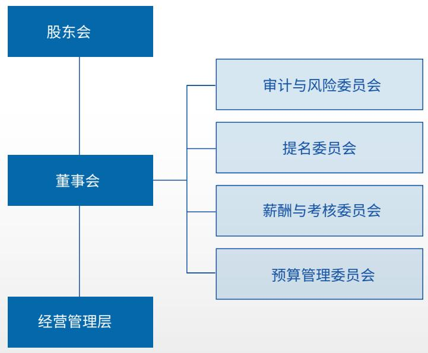

flowchart

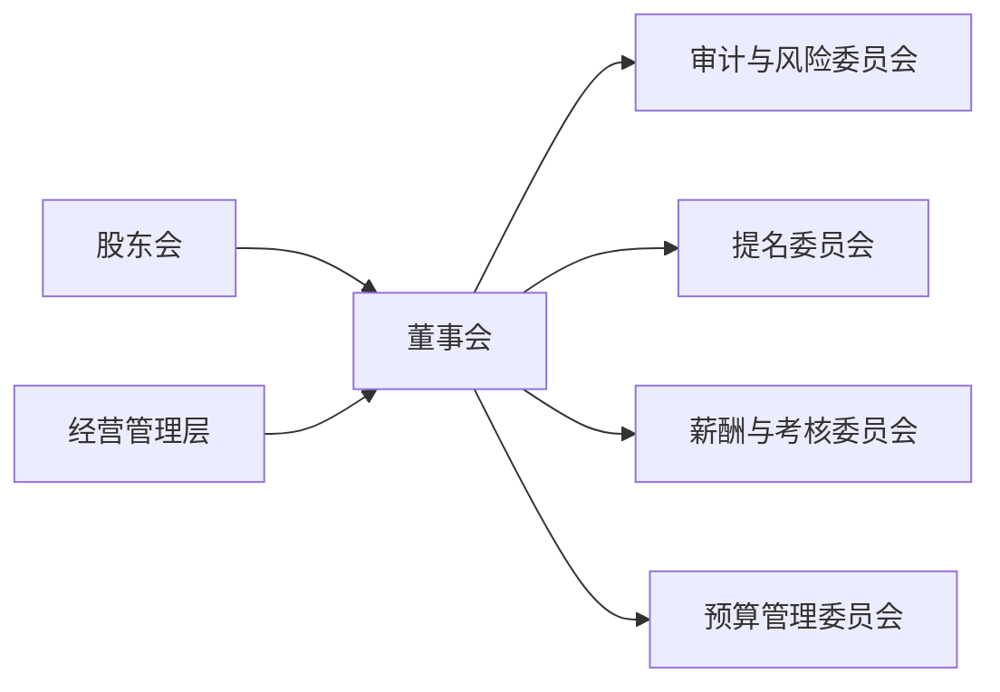

公司治理架构图

## 法人治理运作

公司严格遵循《中华人民共和国公司法》《中华人民共和国证券法》《北京证券交易所股票上市规则》等法律法规，构建职责清晰、运作规范的“两会一层”治理架构，明确股东会、董事会、管理层的职能分工，形成权责明确、协调运转、有效制衡的治理机制，确保各机构高效协同。股东会为公司最高权力机构，依法行使重大事项决策权，包括审议公司增加或减少注册资本、年度财务预决算、利润分配方案及重大投资事项等，保障股东依法行权与知情权。董事会作为公司经营决策的核心机构，负责决定公司经营计划等，对重大经营事项进行决策并监督执行情况。董事会下设四大专门委员会提供审计监督、薪酬与提名等方面的专业支持，提升决策的科学性和规范性。董事会审计与风险委员会承接原监事会职权，对财务管理及内部控制运行情况等进行监督，维护公司及全体股东的合法权益。管理层在董事会授权范围内组织实施经营管理工作，落实战略目标和年度计划，持续提升经营效率和风险管理能力。

## 亮点绩效

报告期内，公司召开:

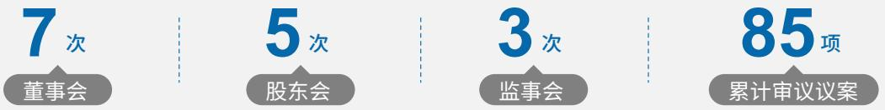

为做好新《中华人民共和国公司法》贯彻落实工作，公司依规取消监事会，于2025年8月完成监督机构调整、章程及31项配套内部管理制度修订等工作，构建了更为精简、高效的治理架构。取消监事会后，由审计与风险委员会承接相关法律法规中监事会职责，从而进一步完善治理机制，提高公司治理水平，规范公司运作。

## 专业委员会介绍

董事会下设审计与风险委员会、提名委员会、薪酬与考核委员会、预算管理委员会，各委员会明确职责权限与议事规则，提升决策专业化水平。审计与风险委员会负责审核公司财务信息及其披露、监督及评估内外部审计工作和内部控制，对重大决策、重大事件、重要业务流程进行风险评估、管理、监督和控制;提名委员会负责拟定董事、高级管理人员的选择标准和程序，对董事、高级管理人员人选及其任职资格进行遴选、审核；薪酬与考核委员会负责制定董事、高级管理人员的考核标准并进行考核，制定、审查董事、高级管理人员的薪酬决定机制、决策流程、支付与止付追索安排等薪酬政策与方案。

2025年中纺标董事会各专门委员会履职情况：

## 审计与风险委员会会议召开

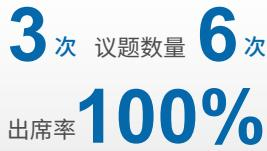

## 预算管理委员会

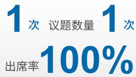

## 提名委员会

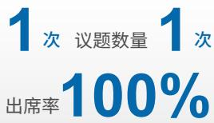

## 薪酬与考核委员会

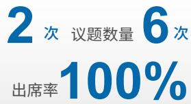

## 审计委员会

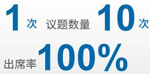

## 董事会独立性和多元性

董事会成员结构兼具独立性与多元性，现有5名董事，其中独立董事2名，占比40%，成员专业涉及多个领域，为公司决策提供专业财务、法律等视角，保障决策科学性。性别构成上，女性董事3名、男性董事2名，多元的性别结构助力决策更全面。所有独立董事均通过北交所任职资格审查，独立履行职责，不受控股股东或其他利益相关方影响，确保董事会运作的独立性与公正性。

<table><tr><td>姓名</td><td>性别</td><td>专业背景</td></tr><tr><td>马咏梅</td><td>女</td><td>纺织工程</td></tr><tr><td>李斌</td><td>男</td><td>会计学</td></tr><tr><td>周冬君</td><td>女</td><td>会计学</td></tr><tr><td>王玉萍</td><td>女</td><td>自动化、工商管理</td></tr><tr><td>吕怀立</td><td>男</td><td>会计学</td></tr></table>

## 亮点绩效

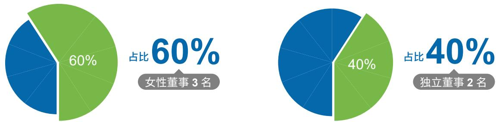

## 风险管理

## 合规与风险管理

公司建立全方位合规与风险管理体系，制定了《中纺标检验认证股份有限公司合规管理办法》《中纺标检验认证股份有限公司信用风险管理规定》等制度，夯实风险管控基础；在治理层面，公司成立董事会审计与风险委员会，期间共召开3次会议讨论内控自评价报告、持续风险评估报告等事项，统筹内部审计、风险控制等工作，充分发挥监督职能：2025年公司委托外部审计部门完成4项经济责任审计工作，同步优化审计制度体系，制定2项、修订1项、废止1项审计相关制度。构建多层级风险防控机制，将ESG风险纳入常态化管理，跟踪外部环境动态与行业趋势，运用数字化技术搭建标准化数据采集与分析流程，提升全员风险认知水平。法律合规方面，规章制度、重要决策和经济合同法律审核率100%，聘请法律顾问为公司日常规范运作及经营管理提供专业的法律合规建议和支持，确保运营合法合规。

## 亮点绩效

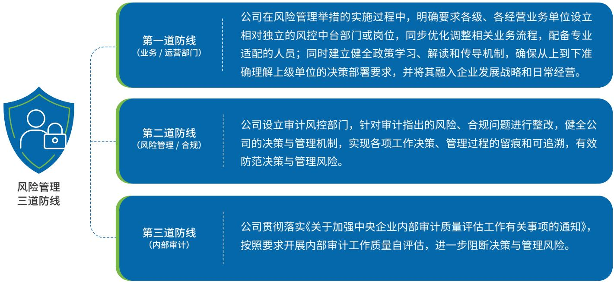

flowchart

## 管理流程

公司制定《“三重一大”决策制度实施办法》，明确重大事项决策需遵循集体决策、民主决策、科学决策等原则，从源头规范重大决策行为、防范决策风险。建立覆盖风险识别、评估、应对、监控的全流程风险管理体系：通过与利益相关方沟通、舆情监测等方式识别潜在风险：建立健全风险分级响应机制并实施差异化应对策略:审计风控部定期开展监督检查，跟踪风险应对落实情况，形成“识别一评估一应对一监控一改进”的闭环管理流程，有效防范各类运营风险。

## 税务风险

公司通过积极组织税务政策相关学习，及时了解税务政策，依法履行纳税义务，确保税务申报全流程符合国家监管要求。在税务策略制定中，将可持续发展理念、企业社会责任与风险管控要求纳入税务管理全流程，建立覆盖税务申报、税款缴纳及争议处理的全周期合规机制。

## 恪守商业道德

## 商业行为规范

公司制定《采购管理办法》《供应商管理制度》等多项规章制度，明确员工商业行为准则，要求全体员工遵守法律法规与行业规范，坚守诚信、公正的商业底线。在采购、合作等商业活动中，坚持公平、透明原则，规范业务流程，确保商业行为合法合规，维护市场秩序与行业生态。

## 反贪腐

公司将反贪腐相关内容纳入工作目标责任书，压实反腐工作责任，并严格执行廉洁从业和反腐败管理制度，筑牢反腐防线，全方位强化廉洁体系建设。对任何形式的贪污、受贿等腐败行为持“零容忍”态度，一旦发现违规行为，将依据相关法律法规和公司制度进行严肃处理。

公司不定期开展廉洁警示教育，通过观看反腐专题片、学习典型案例通报、内网开设廉洁微讲堂专栏等形式筑牢思想防线，营造清风正气的文化氛围；在选人用人工作中，严格审核候选人廉洁情况并出具廉洁意见8份，严把廉洁关口；聚焦财务、采购、销售等关键岗位，开展廉洁风险排查，梳理风险点，开展综合监督检查2次，重点核查资金使用、合同审批等重点领域，确保监督无死角。通过整合审计和纪检等监督资源，进一步提升监督效能，任何与公司业务有关的职务违法行为都可以向审计和纪检检举，对举报信息严格保密，并规范开展调查与处理，举报事项处理率达100%。

报告期内，董事、高级管理人员反贪污腐败培训覆盖率100%，培训内容涵盖反贪污腐败相关党纪法规、典型案例等，公司未发生经查实的贪污腐败诉讼案件，亦未出现违规减持或其他损害公司及股东利益的行为。

## 举报人保护

公司坚决落实反舞弊与举报管理工作，积极鼓励全体员工及所有利益相关方对任何一方违反商业道德及其他法律法规的行为进行投诉与举报。为此，我们设立了多种专项举报渠道。我们明确规定所有举报信息都将被严格保密，承诺绝不容忍任何针对举报人的打击报复行为。接受举报投诉或参与调查的工作人员不得擅自泄露举报人信息及举报内容，并对违规泄露举报人员信息或对举报人员打击报复的人员采取警告、降级、辞退或交由司法机关依法处理。

## 反不正当竞争

公司遵从《中华人民共和国反不正当竞争法》，构建公平竞争治理体系，禁止员工向竞争对手泄露公司情报、恶意传播虚假信息等损害竞争对手商业荣誉的行为。承诺不参与违反公平竞争、反垄断或招标规则的活动，2025年度未发生相关负面事件，在市场竞争中坚守公正、透明原则。

## 负责任营销

中纺标践行责任营销理念，通过品质巡讲、行业论坛等形式，向客户传递标准规范与质量理念，2025年举办了18场品牌活动、11场标准活动，参加地方行业活动6场、展会9场、培训中心活动5场。制定《中纺标营销事业部合同管理制度》《中纺标营销事业部客户信用等级评价制度》《中纺标营销事业部客户满意度调查制度》《中纺标营销事业部客户关系管理办法》等，保障交易规范与价格透明，通过客户满意度调查、个性化服务等方式，提升客户体验，塑造诚信专业的品牌形象。在营销活动中坚守真实宣传原则，不夸大产品或服务功效，维护消费者权益。

## 科技伦理

公司构建了知识产权全生命周期管理体系，制定《中纺标检验认证有限公司专利管理暂行办法》等制度，将知识产权合规条款嵌入供应商合同模板，建立侵权风险预警矩阵。在研发创新、技术应用过程中，坚守科技伦理底线，尊重知识产权，推动技术成果合规转化，避免滥用技术带来的潜在风险，确保科技研发与应用符合社会公序良俗与行业伦理规范。

## 信息安全与消费者隐私保护

为确保客户在商业、法律上的机密信息等受到保护，维护客户利益，我公司制定了《中纺标检验认证股份有限公司信息安全工作总体方针》《中纺标检验认证股份有限公司网络与信息安全应急预案实施细则》等，同时在各职能部门、事业部、分公司开展网络安全培训，巩固集团信息安全防线，以高水平安全守护高质量发展。报告期内，未发生信息安全事故和泄露客户隐私事件。

## 投资者关系管理

## 主要职责

公司投资者关系管理聚售三大核心职责：一是分析研究，统计分析投资者和潜在投资者的数量、构成及变动情况：持续关注投资者及媒体的意见、建议和报道等各类信息并及时反馈给公司董事会及管理层；二是沟通联络，整合发布投资者所需信息，举办股东会、业绩说明会等活动，接受咨询与来访，密切与各类投资者的联系；三是公共关系维护，保持与北交所、行业协会等机构的良好互动，在重大事项发生后协同制定处理方案，维护公司公共形象。

## 管理措施

## V 建立沟通机制

为进一步完善沟通机制，修订了《投资者关系管理制度》，制定了2025年投资者沟通工作方案，建立健全了常态化的公司与投资者双向互动机制。

## V 优化信息沟通渠道

持续通过官方网站、微信公众号等平台及时更新公司动态，确保投资者能够迅速获取公司最新资讯。公司还设有专门的投资者接待电话和电子邮箱，并保证沟通渠道的畅通，及时、认真地回应投资者的各类问询，切实保护投资者的知情权。

## 举办业绩说明会

在定期报告披露后，组织召开了2025年年度报告和2025年第三季度报告线上业绩说明会，向投资者解读公司所处行业现状、发展战略、经营状况、财务数据、重大事项等信息，有效帮助投资者更全面、更准确地把握公司真实状况。

## 完成分红工作

2025年，根据利润分配计划制定利润分配方案，并履行了内部决策和对外披露程序。完成2024年度及2025年第三季度分红，共计派发现金红利2500万元，积极回报投资者。

## 中小投资者保护

公司制定《中纺标投资者关系管理制度》，遵循七大原则：

## 01

## 充分披露信息原则

除强制的信息披露以外，公司可主动披露投资者关心的其他相关信息，充分保障投资者的知情权及其他合法权益；

## 02

## 合规披露信息原则

公司应遵守国家法律法规及证券监管部门、北交所对上市公司信息披露的规定，保证信息披露真实、准确、完整、及时、公平。在开展投资者关系工作时应注意尚未公布信息及其他内部信息的保密，一旦出现泄密的情形，公司应当按有关规定及时予以披露；

## 03

## 投资者机会均等原则

公司应公平对待公司的所有股东及潜在投资者，避免进行选择性信息披露，公司向特定对象提供已披露信息等相关资料的，如其他投资者也提出相同的要求，公司应当予以提供：

## 04

## 诚实守信原则

公司的投资者关系工作应客观、真实和准确，避免过度宣传和误导；

## 05

## 高效低耗原则

选择投资者关系工作方式时，公司应充分考虑提高沟通效率，降低沟通成本；

## 06

## 互动沟通原则

公司应主动听取投资者的意见、建议，实现公司与投资者之间的双向沟通，形成良性互动；

## 07

## 保密原则

公司开展投资者关系活动时注意尚未公布信息及内部信息的保密，避免和防止由此引发泄密及导致相关的内幕交易。

通过北交所指定平台披露公告约109份，无违规情形，有效减少信息不对称。建立多渠道投资者沟通机制：年度报告披露后组织业绩说明会，解答投资者疑问：股东会提供网络投票服务，涉及中小投资者重大事项单独计票并公开结果通过公司网站、微信公众号等平台及时更新信息，设立投资者接待专线和邮箱，规范现场参观接待流程，全面保障中小投资者知情权、参与权和决策权。同时，严格执行内幕信息知情人登记报备制度，加强敏感期交易提示，防范内幕交易，维护中小投资者合法权益。

natural_image

Two businessmen shaking hands in front of a large scale with books, symbolizing legal or justice (no text visible)

## 环境篇

## 应对气候变化

## 治理

中纺标建立了公司治理层、管理层、执行层的三层级ESG治理架构，将节能减碳成效作为公司的重要考核项目，编制并下发《安全环保质量目标责任书》。董事会每年负责监督与审查气候变化相关战略、风险和机遇的识别及管理，以及年度气候绩效达成情况。公司气候变化专项工作由战略发展部协同各部门管理，以保证公司所有运营地在管理相关问题时能获得足够的专业知识与资源支持。

中纺标将气候变化风险纳入公司整体风险管理流程中，以期降低气候变化风险对业务运营的影响程度，以行业前瞻性视角引领低碳发展实践，并在发展新质生产力中发现市场机会和提升竞争力。

应对气候变化相关机构责任及权限

<table><tr><td>董事会</td><td>指导和制定公司应对气候变化相关愿景、目标、战略及实施路径确定重大应对气候变化相关风险和机遇跟踪应对气候变化相关目标的执行和达成情况就气候相关议题组织年度会议</td></tr><tr><td>战略发展部</td><td>为公司应对气候变化战略,包括相关风险与机遇的管理和监控等事宜提供业务见解相关战略执行和风险管理的资源协调和保障</td></tr><tr><td>ESG 执行小组</td><td>与利益相关方沟通,为风险与机遇识别、相关战略制定等过程提供见解和建议持续跟踪应对气候变化相关绩效,为实现应对气候变化目标做出积极改善提出并落实相关议题的创新运营和实践举措,促进相关愿景的实现</td></tr></table>

## 战略

为推动相关风险机遇的识别与管理并与日常风险管理工作深度融合，中纺标始终关注政策与法律法规变动、市场动态、技术进步、企业声誉以及实体风险等相关议题，参考财政部《企业可持续披露准则第1号⸺气候（试行）》和《气候相关财务信息

披露工作组(TCFD)建议》对各项气候风险与机遇对企业价值创造和业务模式的影响及其传导路径进行详细解读整体分析能源和气候相关影响、风险和机遇，并及时制定和更新应对策略。

该项评估融入公司整体风险管理流程，在此过程中，公司充分考虑了短、中、长期时间范围(与公司战略部署时间范围一致）、法律法规要求、利益相关需求、上下游价值链，采用了情景分析方法进行了定性分析。我们选取联合国政府间气候变化专门委员会(IPCC)第六次评估报告(AR6)所提出的共享社会经济路径(SSP)框架开展情景分析，重点选取低温室气体排放情景(SSP1-2.6)与高温室气体排放情景(SSP5-7.0)，以分析不同气候行动强度下的未来发展趋势。

## 风险和机遇识别流程

## 风险识别环节

通过全面收集政策法规、市场趋势、技术革新及气候灾害类型等外部信息，结合行业对标分析与专家研判，精准识别影响企业运营的关键气候相关要素，并据此建立气候风险与机遇清单，明确各类气候相关风险及机遇事件

## 风险影响评估环节

深入分析各类风险与机遇的潜在影响及传导路径，通过部门访谈与专家评估，确定风险发生概率与影响程度，构建气候风险与机遇评估矩阵，为风险与机遇的优先级划分提供支撑。

## 风险情景分析环节

搭建气候情景模拟框架，采用多情景假设方法，对实体风险与转型风险开展系统性评估，按影响程度进行重大性排序明确不同情景下企业面临的挑战与机遇。

## 风险应对环节

结合风险清单与情景分析结论，制定针对性气候应对策略及具体举措，提升气候风险管理水平。同时建立长效管理机制持续识别、评估并统筹应对气候变化相关风险与机遇，保障企业在复杂气候环境下稳健运营、抢抓发展契机。

## 气候情景分析

为系统识别和评估气候变化对公司经营活动的潜在影响，公司参考气候相关财务信息披露框架（TCFD）的方法开展气候情景分析，并结合自身业务特点对气候风险进行分析研判。将分析时间维度按照目标进行划分，以更好地匹配企业经营规划周期与气候变化的长期趋势。

## 短期

## 2026 年

## 中期

## 2027—2030 年

## 长期

## 2031—2060 年

在此基础上，公司结合检验检测行业技术服务属性与运营特征，选取了政府间气候变化专门委员会(IPCC)提出的两种具有代表性的气候发展路径作为分析情景，包括低温室气体排放情景(SSP1-2.6)和高温室气体排放情景（SSP5-7.0）。其中，SSP1-2.6情景假设全球采取积极减排行动并实现较低升温水平，对应更为严格的气候政策与低碳转型进程;SSP5-7.0情景则假设全球温室气体排放持续增长，气候变化影响进一步加剧。在上述情景框架下，公司重点从物理风险和转型风险两个维度开展分析，识别极端天气、气温变化等气候因素对设施运营及业务连续性的潜在影响，同时评估低碳政策、技术发展及市场需求变化可能带来的转型风险与发展机遇，以支持公司在不同气候情景下提升风险应对能力与长期经营韧性

<table><tr><td>适用情景</td><td>情景来源</td><td>情景选择</td><td>情景假设</td><td>本世纪末预计升温</td></tr><tr><td>低温室气体排放情景</td><td>IPCC</td><td>SSP1-2.6</td><td>二氧化碳在 2050 年减少至现在的一半,在 2075 年左右降至净零值并在随后出现不同程度的二氧化碳负排放。二氧化碳排放量约在 2100 年增至现在的两倍。</td><td>1.5°C~3°C</td></tr><tr><td>高温室气体排放情景</td><td>IPCC</td><td>SSP5-7.0</td><td>二氧化碳排放量约在 2100 年增至现在的两倍。</td><td>&gt;3°C</td></tr></table>

高排放情境下企业运营环境面临的不确定性显著增加，物理风险逐渐成为影响企业长期经营稳定性的重要因素。

<table><tr><td>风险类别</td><td>风险类型</td><td>风险影响周期</td><td>风险与机遇描述</td><td>潜在财务影响</td><td>应对措施</td></tr><tr><td rowspan="2">物理风险</td><td>急性风险</td><td>短、中期</td><td>在高排放情景下,极端天气事件(如暴雨、洪水、台风、极端高温等)发生频率和强度可能增加,可能对公司实验室设施、办公场所及检测设备造成损害,并影响检测人员开展现场抽样与检测服务,导致部分项目延期或短期运营中断。二氧化碳排放量约在2100年增至现在的两倍。</td><td>可能导致固定资产维修或更换成本增加,实验室运营短期中断造成收入延迟确认,同时增加部分运营成本。</td><td>建立紧急预案,开展员工安全培训与演练。完善设备维护与资产管理制度;通过灵活调度检测资源与服务安排降低业务中断风险。</td></tr><tr><td>慢性风险</td><td>中、长期</td><td>长期气温上升及温湿度环境变化可能增加实验室环境控制难度,提高空调与温控系统运行负荷,并可能影响精密检测设备稳定性。同时,气候变化可能对部分行业客户生产活动产生影响。</td><td>能源消耗成本增加,实验室环境控制设备运行与维护成本上升;部分检测设备维护、校准及更新频率提高。</td><td>加强设备维护与技术升级;关注气候变化对行业需求结构的影响,拓展环境与低碳相关检测服务领域。</td></tr></table>

低排放情景下，全球各经济体通过更加积极的气候治理政策推动温室气体减排，能源结构加速向低碳化转型，碳定价机制逐步完善，相关技术创新与产业结构调整进程明显加快。气候政策、技术进步以及市场结构变化将成为影响企业经营环境的重要因素。

<table><tr><td>风险类别</td><td>风险类型</td><td>风险影响周期</td><td>风险与机遇描述</td><td>潜在财务影响</td><td>应对措施</td></tr><tr><td rowspan="4">转型风险</td><td>法律法规风险</td><td>短、中期</td><td>碳排放管理、绿色产品标准、环境信息披露及供应链可持续管理等监管要求持续强化。相关政策与标准的不断更新,可能对检验检测机构的资质管理、技术标准及业务合规提出更高要求。若公司未能及时跟进新的政策要求或完成相关资质升级,可能影响部分业务开展。</td><td>增加合规管理成本、资质维护与技术升级成本;在极端情况下可能导致部分业务暂停或资质更新成本上升,从而影响短期经营效率。</td><td>持续跟踪国内外气候政策及相关技术标准变化,完善内部合规管理体系;加强与监管机构及行业组织沟通,提前开展技术储备与资质升级工作。</td></tr><tr><td>技术风险</td><td>中、长期</td><td>低碳转型将推动碳排放核算、产品碳足迹、绿色产品评价及环境监测等相关检测技术持续发展。在新技术研发、设备更新或专业人才储备方面投入不足,可能在新兴市场竞争中处于不利地位。</td><td>增加技术研发投入和设备更新成本;若技术能力升级滞后,可能导致新业务市场份额下降或错失市场机会。</td><td>加强低碳相关检测技术研究与能力建设,持续引进专业人才;逐步完善碳核算、绿色产品认证等领域检测能力,提升技术竞争力。</td></tr><tr><td>市场风险</td><td>中、长期</td><td>随着绿色经济发展,客户对可持续发展相关检测服务需求快速增长,同时行业竞争进一步加剧。若公司未能及时调整业务结构或拓展低碳相关服务领域,可能面临部分传统检测业务需求增长放缓的风险。</td><td>导致部分传统业务收入增长放缓,同时需要投入更多资源拓展新兴市场和服务领域。</td><td>持续关注市场变化趋势,优化业务结构,积极拓展环境监测、碳管理及绿色产品评价等新业务领域。</td></tr><tr><td>声誉风险</td><td>短、中、长期</td><td>公司服务的纺织行业对可持续发展关注度高,随着客户对可持续发展及气候变化管理的关注度提升,客户可能倾向于选择ESG绩效优异的合作伙伴,若公司未能满足相关要求或在自身实践中引领可持续发展,可能削弱市场竞争力,导致市场份额下降。或为贴近客户对于可持续发展需求趋势而导致的投入成本增加</td><td>在气候相关管理及绿色运营方面表现不足,可能影响客户信任度及市场竞争力,从而对业务拓展产生间接影响。</td><td>加强企业ESG管理与信息披露,提升绿色运营水平;强化检测数据质量管理与公信力建设,持续提升品牌信誉。</td></tr></table>

## 影响、风险和机遇管理

公司结合自身业务特点、内外部发展环境及专家意见，识别具有重要潜在影响的气候风险和机遇，将气候变化相关风险纳入公司常规风险管理工作中，并向董事会汇报相关事宜。我们持续关注国际社会、国家及行业的发展趋势，及时识别并更新气候变化相关风险，相关部门将评估已识别的风险可能产生的影响，将各类气候风险按发生概率和影响程度进行分类，管理层针对重要程度和紧急度较高的风险制定应对方案并及时对内外预警。

为落实国家生态文明建设要求，中纺标召开专题会议传达上级节能环保工作要求，紧跟国家“双碳”、节能降碳行动政策导向，树立企业绿色发展形象；严格落实中国纺织科学研究院及属地政府的节能环保工作部署，完成能耗管控等各项要求，为争取集团绿色发展专项资金、地方政策扶持奠定基础。

## 目标与指标

目标：降低自身运营碳排放及能耗，拓展低碳服务范围，提升行业低碳服务影响力。

详细指标及实现情况如下表：

<table><tr><td>指标名称</td><td>计量单位</td><td>2025年度目标</td><td>2024年</td><td>2025年</td><td>与上年同期比较增减</td></tr><tr><td>综合能源消费量</td><td>吨标煤</td><td>-</td><td>490.18</td><td>428</td><td>-12.65%</td></tr><tr><td>万元营业收入能耗</td><td>吨标煤/万元</td><td>0.0200</td><td>0.0242</td><td>0.0221</td><td>-8.69%</td></tr><tr><td>万元收入CO2排放</td><td>吨二氧化碳当量/万元</td><td>0.0938</td><td>0.1066</td><td>0.0918</td><td>-13.88%</td></tr><tr><td>温室气体范围一排放总量</td><td>吨二氧化碳当量</td><td>/</td><td>45.28</td><td>45.10</td><td>-0.40%</td></tr><tr><td>温室气体范围二排放总量</td><td>吨二氧化碳当量</td><td>/</td><td>2117.57</td><td>1754.22</td><td>-17.16%</td></tr><tr><td>自身运营温室气体排放总量(范围一+范围二)</td><td>吨二氧化碳当量</td><td>/</td><td>2162.85</td><td>1799.32</td><td>-16.81%</td></tr></table>

## 案例：绿色印染 品质领航︱2025印染技术质量提升发展研讨会

2025年4月，中纺标联合中国染料工业协会、晋江市质量强市工作领导小组办公室等单位，在晋江成功举办“绿色印染 品质领航︱2025印染技术质量提升发展研讨会”，全球纺织产业正加速向高端化、智能化、绿色化转型，印染作为纺织产业链的关键环节，其技术与质量水平、绿色发展能力直接关系到行业整体发展质效。本次活动汇聚了行业领导、专家学者及纺织服装头部企业、供应商等100余名代表，围绕印染行业运行趋势、前沿技术、质量管控、绿色转型、惠企政策等核心议题展开深度分享与交流，旨在凝聚行业共识，推动印染技术质量提升与绿色低碳转型，引导纺织产业链向绿色健康消费升级。本次研讨会的圆满举办，不仅深化了企业对印染产品质量管控方法与前沿印染技术的认知，更促进了印染行业相关企业的交流合作，为纺织印染行业持续健康发展注入了新动能。

text_image

Street photo with visible store signboards and people examining documents at a table

2025 印染技术质量提升发展研讨会

## 环境合规管理

## 依法建章

公司严格遵循《中华人民共和国环境保护法》《中华人民共和国固体废物污染环境防治法》等法律法规，构建了一套完善且全面的节能环保制度体系，涵盖危险废物管理岗位责任制、污染环境防治责任制度、管理培训制度、处置安全操作规程、管理制度以及节能降耗管理制度等，并于2025年印发了《中纺标检验认证股份有限公司突发环境事件应急预案》《中纺标检验认证股份有限公司节能环保管理制度》。这些制度明确了危险废物管理各环节的标准与要求，以及节能降耗的具体措施，为公司安全与环境管理工作提供了坚实的制度保障，确保各项工作依法依规有序开展。

## 环境合规管理架构

在环境管理治理架构方面，公司设立安全环保质量工作委员会作为环境管理相关工作的领导机构，由总经理担任主任，配备专职委员统筹推进环境管理工作:委员会下设办公室，分管环保职能板块设于综合管理部，为环境管理工作提供专职执行与协调支撑。

安全环保质量工作委员会统一领导，负责宣传贯彻国家节能环保相关方针政策与法规标准并研究落实措施，研究制定节能环保领域专项规划、年度工作计划及总结等重大事项，推动公司节能环保管理体系建设，分析研判公司节能环保工作形势并决策重大问题，适时启动环保相关突发事件应急响应程序，研究环保事故处理意见并督促落实防范措施；委员会办公室具体承接环境管理相关工作，负责提出节能环保相关重要审议事项，督促落实委员会关于环境管理的会议决议，组织协调公司环保事故的调查处理并提交事故报告，协助属地相关部门开展环保事故调查处理与结案工作，同时承办委员会交办的各类环境管理相关事项。

公司建立了规范的环境管理工作运行机制，委员会原则上每季度召开一次会议，遇环保相关重要事项可随时召开，会议涵盖学习贯彻节能环保相关上级部署要求、听取环境管理工作汇报、分析节能环保工作形势、研究部署相关工作、解决重大问题、审议相关规章制度及应急预案等核心议题；会议的召开由委员会主任决定，议题需按要求事先征求相关方意见，重大决策性议题需完成调查论证并提供备选方案，会议决议由办公室负责专项检查督办，相关单位及时报送落实情况，形成环境管理工作的闭环管理机制。

## 环境风险管控

中纺标构建覆盖环境合规风险、日常运营管控风险、危废专项风险、应急风险等全维度，2025年全年未发生节能环保违规、污染事故及政府通报处罚事项，具体管控措施如下：

## 环境合规风险管控

## V 排污登记全覆盖

所有运营实体场所均完成排污登记，规避未登记排污的合规风险；

## 常态化监测管控

本部及各子公司均按要求频率委托第三方对废气、废水开展检测，均符合或优于国家标准，同时在应急预案中明确应急监测流程，并针对盐酸，硫酸泄漏等场景制定专项监测因子及点位要求，各单位均按各自业务特征及环评要求制定了相应的管理制度。

## V 污染事故风险防控

源头预防：对实验室、试剂间、危废暂存间三大风险区域开展常态化隐患排查，实验室地面做防渗处理、配备喷淋洗眼器，试剂间分类存放化学品、安装可燃气体探测装置，危废暂存间双人双锁、设置集流沟和收集池

后续保障：制定次年年度工作计划，明确“废水废气持续达标排放、加强环保巡查检查”要求，强化日常巡查与监督检查力度，健全长效管控机制，杜绝污染事故发生

## 日常运营风险管控

## 组织与制度双重保障

完成节能环保责任签订(签订率100%)，在安全环保质量目标责任书中明确节能环保奖惩规定，将考核与各单位工作挂钩；建立安全环保质量工作委员会，明确职责，包括统一领导节能环保工作、每季度召开工作会议、推动体系建设等，办公室负责会议决议督办、事故调查处理等实操工作，形成“决策－执行－监督”的闭环管理。

## V 资金与执行风险管控

2025全年节能环保预算90.32万元，实际投入78.21万元节能环保资金，重点保障污染治理设施运维、环境监测、危废处置（64.97万元）、应急救援器材（1.93万元）等工作，确保防控设施正常运行；

## 数据管理

建立每月数据更新机制，确保排污、危废处置等数据准确可追溯，规避数据错报、漏报带来的监管风险。

## 应急管理

## 应急组织架构完善

成立应急指挥部，下设隔离疏散组、通讯联络组、现场处置组等6个应急处置组，明确各小组人员构成、联系方式及核心职责，实现“专人专岗、快速响应”；

## 应急流程标准化

制定“接警－警情判断－应急启动－处置－终止－后期处理”的标准化流程，明确信息报告时限（Ⅰ级事件1小时内上报政府部门）、通报范围（周边受影响单位及居民），以及应急终止的5项核心条件；

## 应急保障到位

设立应急专项资金，储备防护用品、污染清理器材、消防器材等应急物资，明确存放地点及保管人，同时要求每年至少组织1次全员应急演练、1次无预警演练，各部门每年开展1次专项演练，提升实操能力。

## 风险处置

明确突发环境事件分|/Ⅱ/级，对应启动1/2/3级响应;成立以总经理为组长的危废管理小组，各实验室设立专职危废管理员，明确“总经理负总责、分管领导审批、各部门执行”的三级责任体系；  
制定化学品泄漏、火灾爆炸、危废泄漏等典型场景的实操处置措施，同时储备防毒面具、防护服、消防沙、吸附棉等应急物资，配备齐全的喷淋洗眼器、应急药箱，确保突发情况可快速处置。

## 排放物管理

公司在日常运营中高度重视环境风险防控，围绕大气排放、废水治理、废弃物处置、危险化学品安全管理及应急演练与培训等关键领域，构建全流程环境管理体系，持续提升环境合规与风险管控水平，积极履行环境责任，以绿色运营支撑企业高质量可持续发展。因公司为检验检测认证行业，非生产性企业，除实验室及办公运营产生的固废外，公司活动对水体及空气影响较小，制定了危险废物100%进行无害化处理的管理目标。2025年度按法规运行管理环境影响，未发生环境违规事件及投诉事件，未发生因污染物排放受到重大行政处罚或者被追究刑事责任的情况。

## 固体废弃物管理

在纺织行业绿色发展的大背景下，公司制定了危险废物100%进行无害化处理的管理目标。严格的节能环保管理、100%的危废处置率、零污染事故的记录，成为企业品牌价值的重要组成部分。公司2025年危废产生量为31吨，往年贮存危废量为2吨，2025年处理危废量为33吨，处理率为100%，完成安全环保质量目标责任书要求。

## 废水管理

中纺标采用先进的污水处理技术，确保废水达到国家排放标准。公司将继续投入资源改善污水处理设施，实施严格的污水监测和处理措施，确保不会对周围环境造成污染。

## 大气排放管理

公司将前瞻性地强化对潜在大气污染物的监测与管控举措，尤其针对汽油燃烧所产生的废气等污染物。公司将严格依照国家相关排放标准，精准施策，确保排放合规，最大限度降低对大气环境的不利影响，制定了《节能环保管理制度》等管理规范，为守护蓝天白云贡献企业力量。

## 危险废物处置

公司建立了多层次的管理架构。公司主要负责人作为第一责任人，全面领导危险废物管理工作。设立由主要负责人领导，各部门负责人参与的公司危险废物管理小组，负责决策、监督和协调公司的环境保护工作。各实验室也成立了危废管理小组，负责本部门日常废物污染防治管理工作。这种架构确保了危险废物管理工作从公司层面到基层实验室的有效落实，职责明确，分工协作，保障危险废物管理工作的高效开展。

作为检验检测企业，危废（实验废液、废弃试剂等）是核心环境风险点，公司制定了专项制度与标准化操作流程，实现危废“产生一收集一贮存一处置”全流程管控。

1.实操流程标准化：危废收集分类粘贴标签、使用专用容器，贮存于防渗、防泄漏的危废暂存间，处置前填写转移联单，委托有资质单位清运。  
2.培训与实操结合:2025年6月25日开展危废培训3场次45人次参加，《危险废物管理培训制度》要求每年至少开展1次理论培训，覆盖法律法规、管理制度、操作流程等内容，提升人员风险防控能力。

## 循环经济

公司积极响应国家绿色低碳与循环经济发展战略，将资源高效利用、废弃物减量化与资源化理念融入日常运营与服务体系。通过优化实验室管理流程、推进废弃物规范处置与分类回收、对实验废旧试剂瓶、废旧耗材等进行分类回收、联合专业机构开展资源化处理，提升能源与水资源使用效率等举措，持续降低运营环节对环境的影响，以实际行动践行绿色低碳发展要求。

## 绿色运营

在《安全环保质量目标责任书》中明确提倡无纸化办公，减少纸张浪费，充分利用集团智慧通用办公系统和通用云文档等在线协作工具，并开展了一系列其他管理举措：

提倡减少交通环节的能源消耗及碳排放：

出行减碳：公司根据业务需求，优先安排离项目地较近的员工执行商务出行任务，以减少长途商旅的频率和距离。  
推广线上会议：为减少不必要的出差需求，公司积极推广线上会议工具，鼓励员工通过远程协作方式完成沟通与项目对接。  
倡导绿色出行方式：公司大力倡导员工优先选择公共交通、自行车、电动车等低碳出行工具，并为员工提供相关支持与便利条件。

水资源集约循环举措：开展节水宣传周、在运营场所张贴节水提示

理念宣贯与全员践行举措：

①开展循环经济专项培训等活动  
②全面推行OA协同办公系统、电子流程审批管理，提倡双面打印与废旧纸张重复利用；二是节能降耗管理，严格执行空调温度设定标准（夏季不低于26℃）；推行“人走电断”制度，减少待机能耗；三是环保意识培育，定期组织环保知识讲座、节能竞赛等活动，并在办公区域设置宣传提示，持续提升全员绿色意识。

## 水资源管理

公司通过合规管控用水，制定了节水用水的管理方针。确保万元营业收入用新水量符合安全环保质量目标责任书要求，同时在《突发环境事件应急预案》中明确设备冷却水的合规排放流程，未因用水引发环保问题。2025年总耗水4.96万吨，同比增加100.81%，因实验室扩项新增项目，水处理相关设备投入增加，加之业务量持续增长，导致用水量相应增大，万元营业收入用新水量为2.56吨/万元。公司开展了节水宣传、在运营场所张贴节水提示，促进员工节约用水意识提升。因公司为非生产型企业，水耗主要由实验室运行产生，废水为实验室废液，需交由有资质的单位处置，无法循环利用，因此未设置循环用水指标。

## 能源管理

安全环保质量目标责任书中要求万元营业收入能耗逐年下降，实际2025年万元营业收入能耗为0.0221吨标准煤/万元，低于去年。在能源管理方面，公司采取多重管控措施：

设备端：排查重点用能设备，淘汰7台低能效房间空气调节器、35台照明设备，新购置电机均为能效2级及以上，2025年无新增电动机、电力变压器，从设备源头优化电力利用效率；  
制度端 ：在《节能环保管理制度-节能降耗管理制度》中明确节约用电细则，要求办公设备设置省电模式、自然采光替代照明、节假日关闭非必要用电设备，针对性降低电力消耗，2025年4月发布“节能降碳行动”重点任务工作台账，完成全部工作要求，同时通过安全环保质量工作委员会会议督办重点工作，规避执行不到位风险；建立重点用能设备台账，淘汰低能效设备，从设备端规避能源浪费及合规风险。  
日常管理：建立每月数据更新机制，确保能耗数据准确可追溯，规避数据错报、漏报带来的监管风险。

2025年全年，能源消费总量为428吨标煤，同比2024年同期490.18吨标煤，下降约12.69%。能源消费以电力为主，其中：电力能源消费总量406.3吨标煤，占比94.93%;汽油能源消费总量21.7吨标煤，占比5.07%。报告期内，暂未引入并使用清洁能源。目前公司已将清洁能源利用纳入中长期绿色发展考虑，后续将结合国家“双碳”战略要求及公司经营发展实际，稳步推进清洁能源应用相关研究与实践，逐步优化能源结构。

## 亮点绩效

单位：吨标准煤

funnel

| 类别 | 消耗量 (吨) | 占能源消耗总量 (%) |
| --- | --- | --- |
| 电力 | 406.3 | 94.93 |
| 汽油 | 21.7 | 5.07 |
| 能源消耗总计 | 428 | 100 |

## 生态系统和生物多样性保护

中纺标作为一家检验认证公司，在其运营过程中可以间接对生态系统和生物多样性保护产生影响。例如，其在纺织品检测等业务中，通过推广环保标准、推动可持续生产等方式，减少纺织行业对生态环境的负面影响，进而对生物多样性保护起到一定的间接作用。同时，中纺标在选取运营场所时均避免了生态脆弱地区，在运营过程中未对生物多样性造成任何影响。

  
环境维度绩效表

<table><tr><td>指标名称</td><td>计量单位</td><td>2024年</td><td>2025年</td><td>与上年同期比较增减(%)</td></tr><tr><td>能源消费量</td><td>吨标准煤</td><td>490.18</td><td>428.00</td><td>-12.69</td></tr><tr><td>电力</td><td>万千瓦时</td><td>380.31</td><td>330.61</td><td>-13.07</td></tr><tr><td>汽油</td><td>吨</td><td>15.48</td><td>14.73</td><td>-4.84</td></tr><tr><td>万元营业收入能耗(现价)</td><td>千克标准煤/万元</td><td>24.16</td><td>22.06</td><td>-8.69</td></tr><tr><td>万元营业收入用新水量(现价)</td><td>吨/万元</td><td>1.25</td><td>2.56</td><td>104.80</td></tr><tr><td>其中:用新水量</td><td>万吨</td><td>2.47</td><td>4.96</td><td>100.81</td></tr><tr><td>万元收入CO2排放(可比价)</td><td>吨二氧化碳当量/万元</td><td>0.1066</td><td>0.0918</td><td>-13.88</td></tr><tr><td>温室气体范围一排放总量</td><td>吨二氧化碳当量</td><td>45.28</td><td>45.10</td><td>-0.40</td></tr><tr><td>温室气体范围二排放总量</td><td>吨二氧化碳当量</td><td>2117.57</td><td>1754.22</td><td>-17.16</td></tr><tr><td>自身运营温室气体排放总量(范围一+范围二)</td><td>吨二氧化碳当量</td><td>2162.85</td><td>1799.32</td><td>-16.81</td></tr><tr><td>危险废物处置率</td><td>%</td><td>100.00</td><td>100.00</td><td>/</td></tr><tr><td>其中:危险废物处置量</td><td>吨</td><td>39.72</td><td>33.00</td><td>-16.92</td></tr><tr><td>其中:处置往年贮存量</td><td>吨</td><td>0.92</td><td>2</td><td>117.39</td></tr><tr><td>危险废物产生量</td><td>吨</td><td>38.80</td><td>31</td><td>-20.10</td></tr><tr><td>废气治理设施数</td><td>套</td><td>17</td><td>26</td><td>52.94</td></tr><tr><td>废水治理设施数</td><td>套</td><td>2</td><td>5</td><td>150.00</td></tr><tr><td>生态环境污染源</td><td>个</td><td>17</td><td>28</td><td>64.71</td></tr><tr><td>生态环境风险点</td><td>个</td><td>53</td><td>197</td><td>271.70</td></tr><tr><td>节能环保投入占收入比重</td><td>%</td><td>0.41</td><td>0.40</td><td>-2.44</td></tr><tr><td>环保投入</td><td>万元</td><td>80.20</td><td>78.21</td><td>-2.48</td></tr></table>

## 社会篇

作为纺织检测领域的“国家队”，中纺标始终坚守赋能产业升级、守护品质生活、践行社会责任的核心使命，将社会价值创造融入企业经营全流程，聚焦品质保证、创新驱动、人才发展、信息安全、产业链共赢及社会贡献六大核心领域，以标准化管理、技术化创新、体系化运营践行央企担当，推动行业高质量可持续发展

## 产品和服务安全与质量

高质量服务是行业的立身之本，也是中纺标识别的双重重要性核心议题之一。产品和服务安全与质量直接关系行业公信力、客户权益及企业可持续发展，公司始终将其置于战略高度，筑牢合规底线、强化质量管控。

## 治理

中纺标始终将产品和服务安全与质量视为企业生存发展的核心根基，结合行业监管规范与自身业务特点，建立了全面、系统、高效的质量治理体系，确保检验检测服务的公正性、科学性、准确性，同时将质量治理贯穿业务全流程。

公司依照行业标准要求，构建了覆盖多业务的质量管理体系，制定了如《样品管理程序》《不符合工作控制程序》《实施预防、纠正、改进措施程序》等多层级管理制度文件，明确检验检测全流程的质量要求、控制措施与操作规范，确保质量治理有章可循、有规可依。公司构建了“管理层统筹、质量层监督、技术层支撑、执行层落实”的三级质量治理职责架构，明确由公司总经理作为质量最终责任人，全面统筹质量方针与重大质量事项决策。

在确保服务质量的同时，公司始终以客户需求为中心，将客户满意度作为质量治理的重要评价指标，不断优化客户服务管理体系，制定《不符合工作的控制程序》《投诉管理程序》等文件，建立公司总/副经理、质量负责人、技术负责人以及业务部门组成的职责架构。建立客户需求收集、反馈、响应及闭环改进机制，及时处理客户关于检验检测结果、服务效率的咨询与诉求，持续提升客户服务质量。

## 战略

中纺标立足检验检测行业发展宏观导向，紧扣行业监管要求与市场客户核心需求，秉持“质量为先、合规经营、持续提升”的宏观战略导向，将产品和服务安全与质量融入企业整体发展布局。公司通过完善标准化流程、加强专业人才培养及推进实验室能力建设，提升服务质量与技术水平。同时，公司密切关注国家质量强国战略、行业监管政策及市场需求变化，持续优化服务模式和管理机制，以高质量的产品与服务支撑客户质量管理与风险控制需求，进一步巩固公司在检验检测领域的专业优势和市场竞争力。

公司制定《客户满意度调查制度》，规范了每年至少一次的调查、问卷设计与发放回收、结果分析、报批及改进措施等全流程管理。同时制定《客户关系管理办法（CRM）（试行）》，明确客户信息录入责任、权限分配及保密要求。

客户满意度管理形成闭环，业务流程实现全流程管控。通过展会等活动获得了众多潜在客户线索。CRM系统实现对线索、客户、商机及业务过程的全流程管控，进一步提升了团队协作效率与业务透明度。

## 影响、风险和机遇管理

中纺标持续关注产品和服务安全与质量对企业经营、客户权益所产生的影响，并在日常运营管理中建立了相应的影响、风险与机遇识别和管理机制。公司通过质量管理体系运行及内部管理流程，对检验检测全过程可能产生的质量影响进行识别与评估，确保检测数据的真实性、准确性和可追溯性，维护行业公信力与客户信任。

## 风险识别和管理机制

## 识

聚焦检测业务全流程，精准锁定收样环节“订单与样品不匹配”“样品丢失”，检测环节“延迟率、返工率过高”等核心风险，同时密切关注人员操作规范性、仪器设备稳定性、客户需求变化等内外部潜在风险构建全面风险清单。

2

结合投诉数据、差错率数据、内控成熟度评价开展量化与定性评估，按季度风险监测显示无重大质量风险。

评

## 监

通过客户满意度调查、投诉处理跟踪、月度质量数据汇总上报等多渠道联动，实现风险动态追踪。

3

4

每季度开展改进措施分析并形成报告;组织安全培训、流程优化强化风险预防。依托新增检测认证资质拓展服务边界，挖掘客户潜在需求提供定制化质量解决方案，借助数字化转型与行业协同提升市场竞争力。

管理应对

## 指标和目标

为持续提升产品和服务安全与质量管理水平，中纺标建立了覆盖服务质量与客户体验的关键绩效指标体系，并通过定期监测与评估推动质量管理持续改进。公司每年常态化开展客户满意度调查，通过多渠道收集客户意见与建议，持续优化服务流程与质量管理。

2025年，公司客户满意度达到98%，各区域服务质量整体保持均衡稳定。与此同时，公司通过月度统计与季度复盘的方式，对投诉处理及时率、项目延迟率及返工率等指标进行动态监测与分析，及时识别服务过程中的改进空间，并推动相关部门落实改进措施

## 客户满意度绩效

98%

中纺标

100%

福建中纺标

98.3%

深圳中纺标

100%

浙江中纺标

98.2%

江西中纺标

## 案例：通用技术深圳中纺标参与深圳市“质量月”商圈宣传活动

2025年9月29日，深圳市市场监督管理局福田监管局主办、深圳市质量检验协会承办的2025年深圳市“质量月”商圈宣传活动在福田区举行，深圳中纺标作为协办单位之一参与活动。

活动以“品质生活，质量先行”为主题，通过设立宣传展板、发放宣传资料、现场咨询答疑等形式，向市民普及产品质量、消费维权、标准认证等知识，引导消费者科学选购、理性消费。深圳中纺标依托在纺织及轻工产品检测领域的专业优势，组织资深技术专家现场围绕纺织品安全、纤维成分鉴别、色牢度评估、安全指标把控等关键维度，为市民提供专业咨询服务，并针对服装面料、婴幼儿纺织品、鞋类和箱包产品质量问题进行讲解与答疑，有效提升公众对纺织产品质量安全的认知与维权能力。

此次活动是公司践行社会责任、彰显行业担当的重要实践，有助于营造全社会“关注质量、崇尚品质”的良好氛围。

text_image

Group photo of officials and staff at a public event with visible banners and signage in Chinese

通用技术深圳中纺标参与深圳市“质量月”商圈宣传活动

## 案例：中纺标2025守正质远品质提升会顺利收官

2025年2月25日，中纺标在上海、北京、晋江等全国七地举办“守正质远”品质提升会，汇聚政府部门、纺织服装企业多方代表，围绕政策法规动态、新标准实践、特色检测技术等核心议题开展交流，赋能产业高质量发展。

会议对接行业需求，解读绿色低碳、体育产品技术性贸易措施等政策，系统解析纺织服装最新国标、行标;分享暖体假人系统等特色检测技术，针对羽绒、功能性纺织品质量痛点提出解决方案，推介可穿戴产品舒适性检测新工具。同时展示公司数字化服务体系建设成果，讲解绿色认证服务，助力行业数智化、绿色转型；还分析行业质量问题并给出应对策略，分享企业高质量人才培育路径。

此次活动是中纺标践行创新研发与产业服务融合的重要实践，有效整合了政产学研多方资源。未来，公司将持续深耕技术创新，完善检测认证服务体系，以专业能力持续赋能纺织服装产业质量跃升。

text_image

与有关标准的对比
Osko-Tev standan@100
GB/T 18885-2020（生态绣
绣品技术专家）
Eco-abel
HJ2546（环境标志产品技术专家
绣品）（十体）

中纺标 2025 守正质远品质提升会顺利收官

## 案例：中纺标举办2025云课堂，赋能纺织企业质量与合规能力提升

2025年7月15日，中纺标主办“破局羽绒质量与跨境合规双难题——2025中纺标云课堂”线上培训活动，国家纺织制品质量检验检测中心、中纺标（深圳）检测有限公司协办，近200家纺织服装企业、电商平台及行业协会代表参加。活动围绕羽绒服装及制品质量管控、纺织服装跨境品控合规两大模块，开展标准解读与典型案例剖析，帮助企业掌握绒子含量、充绒量等核心质量指标及欧美技术法规、电商平台规则要求，提升企业质量风险识别与合规管理能力。参会企业普遍反馈课程“干货满满、案例真实、针对性强”，有效解决了生产经营与跨境贸易中的实际困惑中纺标将持续通过云课堂、技术沙龙等形式，向行业输出标准化与合规解决方案，助力纺织行业构建“标准引领、质量为本、合规先行”的发展生态。

通用技术中纺标GENERTEC CTTO

## 破局羽绒质量与跨境合规双难题2025中纺标云课堂

主办单位：中纺标检验认证股份有限公司

协办单位：国家纺织制品质量检验检测中心中纺标（深圳）检测有限公司

## 检验认证股份有限公司

TILE TESTING& CERTIFICATION SERVICES

## 制品质量要求和风险案例分析

技术部 孙静

2025.07.15

技术中纺标

NERTECCTTC

中纺标举办2025云课堂

## 创新驱动

中纺标深入贯彻国家关于发展新质生产力的战略部署，将科技创新作为企业可持续发展的核心引擎。公司坚持以市场需求为导向，系统优化研发管理体系，深化产学研用深度融合，加速推进数字化与智能化转型，致力于以科技创新破解行业发展瓶颈，为纺织行业的绿色化、智能化升级提供坚实的技术支撑。

## 治理

作为纺织检测领域的领军企业，中纺标始终将科技创新视为提升核心竞争力的根本途径，结合行业发展需求与自身战略定位，建立了科学规范、运行高效的研发治理体系，确保创新活动有序开展、创新资源高效配置

公司依照现代企业管理要求，构建了覆盖科研项目全生命周期的制度体系，制定了《科研项目管理办法》《科研项目经费管理办法》及《专利管理暂行办法》等多层级管理制度，明确立项评审、过程监督、经费使用、知识产权保护及成果转化等各环节的管理要求。制定《科技奖励管理办法》，设立科技创新奖、小改小革奖和技术论文奖，明确奖励标准与流程，对在技术研发中做出突出贡献的员工给予实质性奖励，有效激发了科研人员的创新活力。

公司成立技术工作委员会作为科技奖励的最高评审机构，由职能部门、事业部和子公司相关领域资深、领军技术人员组成，由公司经理办公会聘任，确保研发项目符合战略导向且风险可控

## 战略

中纺标立足纺织行业绿色低碳转型与智能化发展的宏观导向，紧扣国家发展新质生产力的战略要求，将核心技术攻关与数字化转型融入企业整体发展布局。公司通过优化科研资源配置、强化产学研协同创新及推进数字化平台建设，持续提升技术服务的深度与广度。

公司制定中长期科技发展规划，系统布局六大重点研发领域：  

flowchart

此外，公司还深化产学研合作机制，与东华大学、天津工业大学等高校共建人才实习基地，拓宽优质人才引进与培育渠道，夯实专业技术人才储备。

## 影响、风险和机遇管理

中纺标持续关注科技创新对企业竞争力、行业发展所产生的影响，并在研发管理过程中建立了系统的影响、风险与机遇识别和管理机制。公司通过规范的研发流程管理，对技术创新全过程可能产生的影响进行评估，确保研发成果能够切实解决行业痛点，推动技术进步。

## 风险识别和管理机制

## 识

聚焦研发管理全过程，捕捉“项目超预算”“技术路线偏差”“知识产权侵权”等核心风险，同时密切关注技术迭代快、高端人才稀缺等内外部潜在风险，构建全面风险清单。

## 1

##

结合季度风险识别与评估机制，对立项项目进行必要性、创新性与可行性综合评审，对识别出的风险按影响程度进行分级，实施分类管理。

## 评

## 监

定期跟踪项目进展，组织技术攻关小组集中解决技术难题；建立知识产权预警机制，及时应对侵权风险；针对部分研发人员能力差距，加强高端人才引进与内部培训，确保研发活动稳健运行。

## 3

## 指标和目标

为持续提升科技创新能力与成果转化效率，中纺标建立了覆盖研发投入、产出及人才培养的关键绩效指标体系，并通过定期监测与评估推动研发管理持续改进。公司设定了明确的研发工作目标，包括完善科研管理体系、突破一批行业关键检测技术、推动成果转化并强化知识产权保护等。

2025年，公司科技创新取得多项量化成果。

资质拓展：公司通过上汽大众第三方实验室认可，检测能力覆盖80余项实验项目，成功拓展汽车材料检测新领域。

研发投入与知识产权：全年研发支出2380.09万元；内部科研项目稳步推进，目前在研项目39项，全年结题项目36项。授权专利10项，其中发明4项，实用新型6项，共申请专利19项，其中发明专利7项，实用新型12项，另外，获得软件著作权2项。

## 案例：暖体假人测试系统成果转化

科技成果转化是连接科研与生产的重要桥梁，也是培育新质生产力的关键环节。2025年，中纺标充分发挥暖体假人测试系统的技术优势，持续拓展纺织品热湿舒适性能评价领域的服务能力，为行业客户提供多维度、差异化的技术解决方案。围绕保暖性能评估、热湿舒适性检测及功能性服装评价等场景，为多家头部品牌企业提供定制化技术服务，包括开展保暖内衣热感知评价、纺织品热湿舒适性能检测培训以及防寒服装评价方法研究等，有效支撑企业产品研发与质量管控。

通过将核心检测技术与产业需求深度融合，公司不仅帮助客户提升产品性能与质量管理水平，也推动了纺织品舒适性评价技术的标准化与应用落地，进一步促进检测技术向产业价值转化，为行业技术进步与高质量发展提供有力支撑。

natural_image

Interior of a high-tech laboratory with a humanoid robot standing on metal equipment (no visible text or symbols)

暖体假人测试

## 案例:2025CTTC全国纺织服装检测技术创新发展专题论坛成功举办

2025年9月，中纺标在厦门主办全国纺织服装检测技术创新发展专题论坛，聚焦纺织品纤维含量检测新技术，汇聚行业专家、机构及仪器厂家代表，共研检测技术升级新思路，以平台搭建凝聚创新合力，彰显行业引领力。

中纺标作为TC209及相关分会秘书处单位，深耕检测新技术研究与标准化建设，牵头制定近红外、智能纤维镜分析等多项国家及行业标准。本次论坛中，邀请各方专家围绕近红外光谱分析、A图像识别、分子生物学技术等核心新技术，解析原理、应用及实操难题；中纺标内部专家也分享了AI技术应用趋势、自动溶解仪实操等内容，实现新技术理论与实践深度结合。

论坛搭建了产学研用协同交流平台，促进了检测技术领域的知识共享与资源整合，为行业检测技术标准完善、技术创新升级奠定基础。此次实践是中纺标践行创新研发战略的体现，未来公司将持续聚焦行业技术热点，深耕检测技术创新与标准化研究，强化平台赋能，推动纺织检测行业高质量发展。

natural_image

Group photo of people posing in front of a modern building with arched windows and tiled roof (no visible text or signage)

2025CTTC全国纺织服装检测技术创新发展专题论坛成功举办

## 案例:2025中国纺织科技成果供需对接暨第十二届“中国十大纺织科技”成果发布活动成功举办

2025年12月9日，中纺标作为支持单位参与2025中国纺织科技成果供需对接暨第十二届“中国十大纺织科技”成果发布活动，践行创新研发战略，推动行业创新链、产业链、人才链融合，彰显纺织科技领域的行业担当。本次活动促成了多项产学研合作项目落地。

此次参与是中纺标践行ESG理念、落实创新研发战略的重要实践，既实现了核心研发成果的行业认可，也完善了产学研协同创新体系，推动科技成果产业化。未来，公司将持续依托研发与平台优势，助力纺织行业培育新质生产力，建设现代化纺织产业体系。

text_image

12 智汇科技 织造未来
2023中国建筑材料行业高质量发展报告
暨2023年前三季度上市公司业绩预告
三六一堂
龙兴隆
刘鹏
珠海石化研究院
曹长林

2025 中国纺织科技成果供需对接暨第十二届“中国十大纺织科技”成果发布活动成功举办

## 亮点绩效

2,380.09 万元 万元

研发支出金额

12.26%

占营业收入比例

160人

研发人员

30.36%

研发人员占员工总量的比例

## 人才管理与发展

人才是企业发展的第一资源，中纺标秉持“以人为本”的理念，视人才为企业发展的核心资源。公司致力于构建公平公正的发展机制，营造尊重专业、开放包容的工作环境，赋能员工价值提升，实现员工与企业的高质量共同发展。

## 治理

公司高度重视人才队伍建设，严格遵守《中华人民共和国劳动法》《中华人民共和国劳动合同法》等相关法律法规制定了《中纺标组织手册》《中纺标薪酬管理办法》《中纺标岗位管理办法》《中纺标公司评优工作管理办法》等制度文件，建立了由管理层统筹、职能部门落实、业务部门协同的人才管理治理架构，保障人才管理相关工作的规范开展。

<table><tr><td>管理决策层面</td><td>公司成立岗位管理领导小组,负责岗位管理及人才发展的相关决策与统筹推进。领导小组由公司总经理担任组长,公司领导班子成员担任组员,负责审议人才管理相关制度与重要事项,指导人才队伍建设工作;</td></tr><tr><td>执行层面</td><td>公司设立人力资源部作为人才管理工作的牵头部门,负责制定并实施人才招聘、员工培训、绩效管理、职业发展、薪酬福利及员工关怀等制度,并定期向管理层报告相关工作进展;</td></tr><tr><td>业务协同层面</td><td>各业务部门及实验室单位结合业务发展需求,参与制定专业技术人才培养计划,开展技术能力培训和岗位技能认证管理,持续推动专业技术人才队伍建设与实验室能力提升。</td></tr></table>

## 战略

公司坚持“战略导向、精准引育、效能优先”的人才发展原则，围绕检验检测行业智能化、专业化的发展趋势，制定关键人才引进与存量人才开发并重的人才发展策略，通过系统化的人才管理机制支撑公司业务持续发展与技术能力提升。公司持续规范内部管理，优化母子公司统一管控，推动制度流程标准化和人力资源信息化建设，不断完善人才培养与激励机制，提升企业质量、效益与创新能力，助力公司高质量发展。

## 影响、风险和机遇管理

检验检测行业作为技术密集型、人才驱动型行业，人才管理与发展不仅直接影响公司经营效能、技术竞争力与ESG绩效，更关系到公司的公信力与可持续发展。中纺标持续关注人才管理对企业经营和可持续发展的影响，并结合行业发展趋势，对相关风险与机遇进行识别、评估与管理。

<table><tr><td>风险</td><td>影响</td><td>应对</td></tr><tr><td>核心技术人才流失</td><td>检验检测行业核心技术人才依赖度高,核心人才的流失可能导致技术成果流失、检测能力下降、业务拓展受阻。</td><td>完善薪酬福利体系,优化激励机制;搭建多元化职业发展平台,为核心技术人才提供晋升通道、技术研发支持与培训。</td></tr><tr><td>人才专业能力与行业发展错配风险</td><td>检验检测行业技术更新迭代快,行业标准、检测方法持续优化,若人才专业能力无法及时跟上行业发展步伐,可能导致检测服务不符合标准要求,影响服务质量与公司竞争力。</td><td>公司建立常态化培训机制,由人力资源部协同各业务部门、实验室,结合行业技术升级方向与业务需求,制定针对性的培训计划。确保人才专业能力与行业发展、业务需求精准匹配。</td></tr><tr><td>人才管理体系不完善</td><td>随着公司业务拓展与母子公司管控优化,可能出现人才管理混乱、权责不清,影响人才管理效能。</td><td>定期梳理人才管理制度与流程,结合上市公司规范治理要求、ESG建设目标与业务发展需求,持续优化人才招聘、培训、绩效管理、职业发展等相关制度。</td></tr><tr><td>人才储备不足风险</td><td>检验检测行业对专业人才的需求旺盛,若招聘渠道单一、储备机制不完善,可能导致人才供给不足,无法满足业务发展需求。</td><td>公司拓宽人才招聘渠道,聚焦高校、行业协会、同行企业等优质人才来源,搭建多元化招聘体系。</td></tr></table>

## 管理实践

## 人才培养与发展

中纺标重视人才为企业发展的核心驱动力，系统构建覆盖“选拔一培养一考核一晋升”的全周期人才培养机制，通过多元化渠道引才、系统化培训育才、科学化考核用才、多元化通道成才，致力于打造一支适应公司战略发展需要的高素质、专业化人才队伍。

## 人才选拔与引进

公司坚持“公开、平等、竞争、择优”的选人原则，构建内外部相结合的多元化招聘体系，持续拓宽人才引进渠道。

外部渠道：通过校园招聘、社会公开招聘、行业高端人才引进以及与高校、科研机构合作等多种方式，广泛吸引高潜人才与行业精英。校园招聘聚焦国内重点高校，提前储备优秀应届毕业生;社会招聘依托专业招聘平台、行业渠道及猎头服务，精准匹配关键岗位需求；

内部渠道：建立内部竞聘与人才举荐机制，为内部人才提供公平竞争与职业转换机会。2025年，公司持续优化招聘流程与评价体系，确保选拔过程的规范性与科学性，通过结构化面试、专业能力测试及综合素质评估，精准识别并引进符合公司发展战略的各类人才。

## 人才培养体系

公司建立分层分类、全覆盖的培训培养体系，将员工个人成长与组织战略目标紧密结合。

新员工：实施入职培训，帮助其快速融入团队、掌握岗位技能；

在职员工:开展岗位技能培训、管理能力提升培训及职业资格认证培训，内容涵盖专业技能、管理知识、安全规范及企业文化等。2025年，公司制定了详细的年度培训计划，覆盖检测技术、标准应用、安全环保等多个领域，并通过内部技术交流、外部专家授课、在线学习平台等多种形式，提升培训效果。

## 人才梯队建设

实施分层分类的精准培养工程。针对检测技术研发、数字化运营、高端市场拓展等关键领域，通过多元化招聘渠道重点引进紧缺型人才。同时，强化内部造血功能，制定了涵盖标准应用、新项目开发及安全培训等内容的年度培训计划，系统提升检测技术人员的专业素养。针对管理及骨于人才，重点开展战略思维与领导力专题培训，推动管理团队能力转型，为公司业务扩张与复杂管理提供坚实的人才保障。

## 职业发展路径

公司岗位设置为管理序列、职能序列、技术序列、业务序列、技能序列等五个序列。公司设计 Y 型职业发展双通道，打造“管理、专业”两支人才队伍梯队。管理通道包括管理序列相关岗位；专业通道包括职能序列、技术序列、业务序列以及技能序列等四个序列的相关岗位。

## 案例：深圳中纺标开展质量技术知识竞赛活动

2025年5月16日，深圳中纺标开展“智汇青春·质胜未来”质量技术知识竞赛活动。青年员工秉承“科学、进步、责任”的精神，以精准数据筑牢质量安全防线，在工作中践行质量强国使命，活动充分彰显中纺标青年在质量技术领域的专业追求与时代担当。

text_image

质量技术知识竞赛活动
领导致辞
特明三部
大名宝

深圳中纺标开展质量技术知识竞赛活动

## 案例：举办实验室管理体系内审员培训班，服务行业质量基础建设

2025年9月18日，中纺标培训中心在浙江绍兴举办“实验室管理体系内审员培训班”，面向全国纺织服装、检测认证等领域质量管理者、实验室负责人及技术骨干，系统提升实验室内审能力，服务行业人才队伍建设。

培训围绕CNAS-CL01:2018《检测和校准实验室能力认可准则》（ISO/IEC 17025:2017）及相关准则，采用“理论教学+案例研讨+实操训练”相结合的方式，帮助学员深入理解内部审核策划、实施及评价要点，切实提升企业质量管理体系运行的有效性。

本次培训是中纺标发挥行业“国家队”技术优势、推动纺织领域质量升级的重要实践，为行业培养了一批具备标准理解力和实战应用能力的复合型质量人才，助力产业链企业高质量发展。

text_image

中纺标（浙江检测有限公司）
CHINA CONSTRUCTION ZHUIAN ZHEJIANG ELECTRIC CO., LTD.

中纺标举办实验室管理体系内审员培训班

## 案例：举办营销团队培训研讨会

2025年7月25日至26日，公司举办2025年度营销团队培训研讨会。本次研讨会以“战略为纲协同聚力，洞察为钥增长破局”为主题，通过内部研讨和共创方式，凝聚战略共识、强化责任担当，直面问题和挑战，精准把握应对策略，发现新机遇，实现新突破。

  
中纺标举办营销团队培训研讨会

## 人才激励与管控体系

## 薪酬激励体系

构建与岗位价值、员工业绩及团队绩效紧密挂钩的统一科学薪酬体系，建立具有市场竞争力的薪酬水平，吸引和保留优秀人才;着力解决新老员工薪酬不平衡问题，确保内部公平性，并探索建立宽带薪酬模式，对关键岗位实施精准激励;适时引入中长期激励，优化薪资结构，激发核心骨干的持久动力，打造了“能者多劳、多劳多得”的激励性分配环境。

## 干部队伍建设

推动干部“能上能下”机制落地，全面推行经理层成员任期制和契约化管理，依据《经理层成员任期制和契约化管理办法》，签订契约、明确权责。推动公开透明的选拔任用机制，促进优秀人才晋升，优化岗位匹配。

## 人员能力评价体系建设

公司建立了科学的人才评价体系，确保员工能力与岗位需求匹配。依据教育背景、工作经历和培训情况进行初步评估，对不达标者实施培训考核后再上岗。定期组织全员专业培训，确保员工具备履职能力。

## 人事管理

公司对内部管理进一步规范，优化母子公司统一管控，确保制度流程的一致性，从而提升企业经营效率、市场竞争力和创新能力。通过完善的人才招聘、薪酬考核、考勤等一系列管理制度，有效保障了员工权益与组织效率的平衡。

## 任期制契约化

公司积极推进经理层成员任期制契约化管理工作，明确经理层成员考核指标，始终坚守市场化导向，精准把握激励与约束的平衡，切实落实责权利对等原则。发挥经理层成员的示范引领作用，确保公司经理层成员及各级子公司全面签订并严格执行任期制契约化合同。依据合同要求开展年度和任期考核，强力推动干部能上能下、薪酬能增能减，充分激发公司改革发展的内生动力。

  
指标和目标

<table><tr><td>项目</td><td>计量单位</td><td>2023年(人)</td><td>2024年(人)</td><td>2025年(人)</td><td>2025年占比%</td></tr><tr><td rowspan="2">按性别</td><td>男性人数</td><td>219</td><td>195</td><td>206</td><td>39.09%</td></tr><tr><td>女性人数</td><td>349</td><td>329</td><td>321</td><td>60.91%</td></tr><tr><td rowspan="3">按年龄</td><td>30岁以下</td><td>-</td><td>-</td><td>195</td><td>37.00%</td></tr><tr><td>30-50岁</td><td>-</td><td>-</td><td>321</td><td>60.91%</td></tr><tr><td>50岁以上</td><td>-</td><td>-</td><td>11</td><td>2.09%</td></tr><tr><td rowspan="5">按教育程度分类</td><td>博士</td><td>0</td><td>0</td><td>0</td><td>0.00%</td></tr><tr><td>硕士</td><td>69</td><td>65</td><td>71</td><td>13.47%</td></tr><tr><td>本科</td><td>272</td><td>274</td><td>272</td><td>51.61%</td></tr><tr><td>专科</td><td>139</td><td>132</td><td>132</td><td>25.05%</td></tr><tr><td>专科以下</td><td>88</td><td>53</td><td>52</td><td>9.87%</td></tr><tr><td colspan="2">总人数</td><td>568</td><td>524</td><td>527</td><td></td></tr></table>

## 员工权益

中纺标秉持“以人为本”的理念，将员工的权益保障与福祉提升视为企业可持续发展的重要基石，致力于构建和谐、健康、充满关怀的职场环境，切实履行企业对员工的社会责任。

## 保障员工权益

公司严格遵循国家法律法规，与全体员工签订规范的劳动合同，按时足额缴纳“五险二金”，并落实带薪年休假制度，以规范透明的用工模式切实履行社会责任

充分发挥工会职能，构建了全方位的员工关爱体系。公司定期组织员工进行年度健康体检，关注员工身心健康；建立健全补充医疗保障机制，为员工投保意外伤害保险及补充医疗保险，并积极参与职工互助保障活动，包含重疾险及女工特疾险，构筑多层次医疗保障网。公司持续完善困难职工帮扶机制，通过春节专项慰问金等形式，对生活困难员工给予物质援助与精神关怀，切实排忧解难。此外，公司注重人文关怀细节，在年节、员工生日及婚丧嫁娶等重要时刻提供慰问；在炎炎夏日开展“送清凉”活动，全方位提升员工的幸福感与归属感。

## 丰富员工活动

公司注重员工工作与生活的平衡，通过组织多样化的团建活动和健康向上的文体活动，增强团队凝聚力，丰富员工业余文化生活。

## 案例：“游峡赏秋，聚心赋能”秋游团建活动

2025年10月25日，公司组织开展了以“游峡赏秋，聚心赋能”为主题的秋季团建活动，选址于集自然风光与历史文化于一体的北京怀柔青龙峡国家AAAA级景区。活动依托优越的自然生态环境，通过景区参观、分组任务打卡竞技及团建游戏等多元化形式，为员工提供了放松身心、亲近自然的契机。

此次活动不仅有效缓解了员工的工作压力，更在轻松愉悦的氛围中促进了跨部门沟通与协作，显著提升了团队凝聚力与向心力，生动诠释了公司关注员工福祉、倡导健康工作生活方式的理念

text_image

“游峡赏秋，聚心赋能”中纺标2025年度秋游团建活动

“游峡赏秋，聚心赋能”秋游团建活动

## 案例：浙江中纺标春季团建活动

为践行“以人为本”的管理理念，关注员工身心健康与工作生活平衡，浙江中纺标于3月29日组织员工前往绍兴平水开展春季团建活动。活动精心设置了多项团队协作项目，旨在通过户外互动形式打破部门壁垒，增进员工间的沟通与信任。活动过程中，员工们展现了高度的团队协作精神与凝聚力，有效缓解了工作压力。

此次活动的成功举办，不仅营造了积极向上、和谐融洽的组织氛围，更进一步增强了员工的归属感与向心力，激发了员工以更饱满的热情投入工作，为公司持续发展注入活力。

text_image

乐动当下 领跑未来
中纺标（浙江）检测有限公司工会春季活动

浙江中纺标春季团建活动

## 案例：中纺标举办劳动技能竞赛

2025年6月21日，中纺标组织pH值检测项目技能比武，搭建技术交流比拼平台。检测事业部及浙江、福建、江西中纺标共6名技术骨干参赛，以赛促学、以赛促练，凝聚技能强企合力。

本次比武设置实操和笔试两个环节，全面检验选手实操技能与理论储备。竞赛中，参赛选手沉着应战、奋勇争先，展现出扎实的专业功底、过硬的技术本领及精益求精的工作作风。

中纺标以此次比武为契机，传递“百年征程展匠心，技能强企建新功”精神，弘扬工匠精神与劳动精神。通过比拼，选手们相互学习、取长补短，提升了专业技能与综合素质，带动全员钻研技术的积极性。

text_image

中标检验认证股份有限公司
ESTA TEXT TESTING Certification SERVICES
组织与质量检测中心
PH值
检测项目

中纺标举办劳动技能竞赛

## 促进民主沟通

公司尊重员工的主人翁地位，致力于构建透明、开放、双向的沟通渠道。通过职工代表大会、公开意见箱、定期座谈会、内部信息平台等多种形式，确保公司重大决策、涉及员工切身利益的事项能够广泛听取员工意见和建议，保障员工的知情权、参与权和监督权。公司鼓励员工通过规范途径表达诉求，并对员工反馈进行及时回应与处理，营造民主、和谐的内部环境。

## 维护女性权益

公司高度重视女性员工在企业高质量发展中的重要作用，严格遵守《中华人民共和国就业促进法》《中华人民共和国妇女权益保障法》等相关法律法规，坚持性别平等原则，致力于营造公平、尊重、包容的工作环境。公司坚决落实同工同酬制度，确保女性员工在薪酬福利方面享有与男性员工平等的待遇；在岗位聘用、晋升发展与绩效考核中，坚持以能力和业绩为导向，为女性员工提供平等的晋升机会与职业发展通道，保障女性员工的合法权益与职业发展空间。

截至2025年末，公司女性员工占比达60.91%，是推动公司高质量发展不可或缺的重要力量。公司积极落实女职工特殊权益保护，关注女性身心健康。在年度员工体检中，专门设置女性专项检查项目，切实保障女性健康权益。2025年“三八”国际妇女节期间，公司工会组织开展“绽放她力量，共筑美好未来”主题活动，通过管理层与女职工座谈交流、慰问一线女职工、发放节日礼物等形式，倾听女性员工心声，传递组织关怀。

## 案例：深圳中纺标开展“三八”妇女节活动

3月7日下午，深圳中纺标工会开展“绽放她力量，共筑美好未来”为主题的国际“三八”国际妇女节活动。

通过此次活动，营造了温馨浓厚的节日氛围，使女职工们真切地感受到公司的关怀与温暖，进一步增强彼此情感交流。大家纷纷表示，感谢公司为女职工提供的发展平台和贴心关怀，未来将继续以饱满的热情和昂扬的斗志，立足岗位、勇于担当，为公司发展贡献更多“她力量”。

text_image

通用技术中纺标
GENERTEC CTTC
三度男女快乐

深圳中纺标开展“三八”妇女节活动

## 保障员工安全

公司始终将员工的生命安全与职业健康置于首位，严格依据《中华人民共和国安全生产法》《中华人民共和国职业病防治法》等国家法律法规，建立健全安全生产责任制和职业健康安全管理体系，定期开展安全生产检查与隐患排查，确保工作环境符合安全标准。公司定期组织全员安全教育与应急演练，提升员工的安全意识与自救互救能力，并对接触职业病危害因素的员工进行专项培训和健康监护。通过持续改进，致力于实现“零事故、零伤害、零职业病”的目标，切实保障每一位员工的职业健康与生命安全。

## 关键绩效

2025年未发生较大及以上急性职业病危害事故。

中纺标全级次员工均依法参加工伤保险，无新增职业病病人，无因职业卫生受到政府部门处罚。

## 维护信息安全

中纺标高度重视数据与信息安全，将其视为企业稳健运营的基石与履行社会责任的关键环节。公司严格遵守《中华人民共和国网络安全法》《中华人民共和国数据安全法》等法律法规，筑牢信息安全防线。

## 完善信息安全管理体系

公司构建了权责清晰的治理架构，制定并实施《信息安全工作总体方针》《信息系统管理制度》《机房安全管理制度》等多项规范化文件，确保信息安全工作有章可循。公司将信息安全战略深度融入数字化转型，落实安全防护措施与业务系统“同步规划、同步实施、同步运行”的原则，实现信息安全管理的系统化与规范化。

## 强化网络与技术防护

公司积极把握数字化机遇，依托集团“通用云”统一基础设施，实现计算存储资源的集约共享与安全能力的协同提升，有效降低自建运维风险。严格执行物理环境安全标准，规范机房人员出入、设备用电及环境维护管理。

## 深化风险管控与应急响应

公司建立常态化风险识别与评估机制，制定《网络与信息安全应急预案实施细则》，明确四级安全事件分类标准，构建“研判－资源调度－根因分析”的标准化处置流程，实现分级精准响应。实施信息系统建设、运维、变更全过程闭环管理，确保风险可控在控。

## 关键绩效

2025 年全年未发生重大信息安全事件，有效保障了业务连续性与客户数据安全。

## 责任采购与供应商管理

中纺标将可持续发展理念深度融入供应链管理，坚持“公开透明、公平竞争、诚实信用”的原则，积极推进阳光采购，致力于构建稳定、高效、共赢的可持续供应链体系。

## 完善供应商管理体系

公司建立健全采购管理制度体系，修订发布《供应商管理制度》《采购管理办法》等文件，设立采购工作小组作为唯一评审机构，确保采购流程规范透明。实施供应商全生命周期管理，建立《合格供应商名录》，严格执行供应商准入调查、选定流程及年度复审机制，实现从准入、调查、选定到复审的全链条闭环管理，确保供应商资质合规、质量可靠。

## 推动供应商赋能与激励

公司建立完善的供应商评价与激励机制，从品质、价格、交期、服务四个维度进行综合评分。实施分级分类管理，对评分高于90分的优质供应商加大采购份额，促进优胜劣汰，激励供应商持续提升履约能力。同时，建立严格的“黑名单”管理制度，对存在违规行为的供应商实施禁用措施，强化责任追究，营造良性竞争环境，推动供应链整体质量与服务水平的提升。

## 平等对待中小企业

公司秉持公平公正原则，对所有潜在供应商一视同仁，坚决杜绝人为设置不合理门槛，保障各类市场主体公平竞争。通过规范的信息发布渠道与严格的评审纪律，确保采购机会公开透明，为中小企业提供平等的参与机会。公司致力于与供应商建立长期稳定的合作关系，通过及时支付款项、共享技术标准等方式，促进产业链上下游协同发展，实现合作共赢。

在应付账款管理方面。公司建立了规范的付款管理机制，严格按照合同约定开展结算与支付工作，持续提升资金使用效率与供应链协同水平。报告期内，公司不存在拖欠中小企业账款或无故延迟支付的情况，切实保障供应商合法权益，维护良好的商业信用与合作关系。

## 社会贡献

中纺标秉持“专业服务社会”的责任理念，将企业高质量发展与社会价值创造深度融合。报告期内，公司充分发挥行业“国家队”技术优势，在赋能产业升级、助力乡村振兴、开展公益科普等领域积极履责，实现企业与社会共生共荣。

## 赋能合作伙伴与行业发展

公司主动构建“平台支撑、技术驱动”的赋能体系，协同合作伙伴共同提升核心竞争力，推动产业链高质量发展。

平台赋能，服务产业生态：依托专业技术资源，主动融入区域质量基础设施建设。2025年，深圳子公司成功入选深圳市质量基础设施“一站式”服务平台，通过聚合检测、标准、认证等优质资源，为区域内中小企业提供全链条质量技术服务，有效降低中小企业质量技术门槛，助力区域产业提质增效。  
技术赋能，引领绿色转型·积极响应国家“双碳”战略。以技术服务推动产业链绿色升级。公司协助客户搭建绿色认证体系，深入供应链环节开展循环再利用产品认证，引导上下游企业协同转型。

## 案例：深圳中纺标联合深服协获批2025年深圳市质量基础设施“一站式”服务平台

2025年，深圳市市场监督管理局发布2025年深圳市质量基础设施“一站式”服务平台名单，由深圳中纺标牵头、联合深圳市服装行业协会申报的“现代时尚产业服务平台”成功入选。

平台聚焦现代时尚产业需求，整合公司在检验检测、标准研制、质量研究等领域的专业技术能力，以及行业协会在品牌培育、产业资源对接、政策推动等方面的优势，为纺织服装企业提供标准服务、检验检测、质量诊断、人才培养、知识产权支持等“一站式”综合服务。平台以服务重点产业、助力企业升级、促进内外循环为导向，重点面向中小企业提供全流程质量技术支持，精准解决行业共性质量问题，助力企业提升产品品质与核心竞争力，推动产业链协同升级。未来，平台将深化质量数据分析应用，为政府监管和产业政策优化提供支撑，推动深圳时尚产业向高端化、国际化迈进，助力深圳打造具有全球影响力的时尚之都。

2025年深圳市质量基础设施“一站式”服务平台名单

<table><tr><td>序号</td><td>平台牵头单位</td><td>联合建设单位</td><td>服务项目</td><td>主要服务产业领域</td></tr><tr><td>9</td><td>中纺标(深圳)检测有限公司</td><td>深圳市服装行业协会</td><td>标准、检验检测、知识产权、品牌培育、质量现状研究分析、人才培养、研究开发等服务</td><td>现代时尚产业</td></tr></table>

深圳中纺标联合深服协获批2025年深圳市质量基础设施“一站式”服务平台

## 开展公益科普教育

公司致力于普及纺织科学知识，传播绿色低碳理念，提升全民质量素养。2025年，公司举办“儿童绿色实践活动”，通过寓教于乐的形式向青少年普及纺织安全与环保知识，培养下一代可持续发展意识;积极参与各类质量科普活动向社会公众传播专业质量知识，营造“崇质尚检”的良好社会氛围。

## 案例：中纺标承办第十届“小小绿色使者”全国大型儿童科学实践活动

2025年5月24日，中纺标于浙江绍兴实验室承办第十届“小小绿色使者”全国大型儿童科学实践活动主会场，该活动深耕十年，以科技赋能儿童科学实践，同时助力中国绿色标准的国际化传播。

活动期间，公司推动“绿色亲子空间守护计划”，联动合作方整合行业资源，依托专业技术能力为儿童构筑安全、健康的成长环境；同时携手《风采童装》杂志，借助媒体传播、亲子实践活动等多元形式，向全国乃至全球传递中国绿色健康发展理念，推动绿色理念的普及与传播。

此次活动是中纺标践行ESG发展理念、履行社会责任的重要实践，公司以科普实践活动为载体，将绿色技术攻关与绿色理念传播相结合，在守护儿童健康成长的同时，积极推动绿色发展理念落地传播，彰显了企业在绿色公益领域的责任与担当。

通用技术中纺标

GENERTEC CTTC

中國纺织出版社

## 十年深耕科学 再启绿色未来

全国大型儿童科学实践活动“小小绿色使者”走进中纺标实验室(第十届)

全国大型儿童科学实践活动“小小绿色使者”走进中纺标实验室（第十届）

## 助力乡村振兴事业

公司坚决贯彻国家乡村振兴战略，建立长效化消费帮扶机制，将采购需求与助农增收紧密结合。2025 年，公司积极响应集团号召，优先采购定点帮扶县⸺内蒙古武川县、商都县的特色农产品。通过“以购代捐”“以买代帮”的务实举措，全年累计采购帮扶地区农产品金额 6.38 万元，切实帮助解决农产品销路问题，以实际行动巩固脱贫攻坚成果，助力乡村产业振兴。

## 关键绩效

赋能行业：入选深圳市质量基础设施“一站式”服务平台。

乡村振兴：全年采购定点帮扶县农产品金额 6.38 万元。

公益科普：举办儿童绿色实践活动与检测技术论坛，传播可持续发展理念。

natural_image

Scenic rural landscape with terraced fields, a winding river, and lush green mountains under a blue sky (no text or symbols visible)

## 结篇：未来展望

展望未来，中纺标将始终锚定“打造纺织领域国内领先、服务项目更加全面的综合性质量技术服务商，成为最受客户信赖的质量守护者”的愿景，以 ESG 战略为核心牵引，系统推进环境、社会与治理各领域能力建设，持续提升企业高质量发展水平与行业引领能力。

应对气候变化、推动绿色低碳发展作为长期战略任务，公司将持续深耕碳盘查、碳足迹核算、绿色产品认证等全链条低碳服务，升级生物基材料鉴别、纤维微塑料检测等核心技术能力，助力纺织产业链上下游企业高效实现“双碳”目标，以专业技术服务为全球纺织行业绿色转型贡献中坚力量。在企业内部，我们将持续深化“以人为本”的管理理念，完善人才培养与激励体系，搭建多维度职业发展通道，同时加速数字化、智能化转型纵深推进，迭代升级 LIMS、CRM 等核心业务系统，深挖 AI、大数据在检测认证领域的应用场景，为员工打造更具活力的发展平台，为合作伙伴构建更高效、更智能的协同服务生态。公司将积极履行社会责任，助力乡村产业提质升级；同时充分发挥行业引领作用，持续推进纺织领域ESG标准体系建设，深化产学研协同创新，带动行业整体绿色发展水平提升。

中纺标将以科技创新筑牢质量根基，以专业服务赋能产业发展，携手各方共同推动纺织行业向科技、绿色、时尚方向迈进，为构建更加美好的产业与社会生态持续贡献力量。

natural_image

Digital globe with glowing blue dots and star trails against a dark background, resembling Earth's atmosphere (no text or symbols)

## 附录

ESG关键绩效  
治理绩效

<table><tr><td colspan="6">治理范畴</td></tr><tr><td colspan="2">指标名称</td><td>单位</td><td>2023</td><td>2024</td><td>2025</td></tr><tr><td colspan="6">公司治理</td></tr><tr><td colspan="2">披露报告数量</td><td>份</td><td>118</td><td>93</td><td>109</td></tr><tr><td colspan="2">董事会召开次数</td><td>次</td><td>7</td><td>7</td><td>7</td></tr><tr><td colspan="2">监事会召开次数</td><td>次</td><td>7</td><td>7</td><td>3</td></tr><tr><td colspan="2">股东会召开次数</td><td>次</td><td>6</td><td>5</td><td>5</td></tr><tr><td colspan="2">审计与风险委员会召开次数</td><td>次</td><td>2</td><td>5</td><td>4</td></tr><tr><td colspan="2">预算管理委员会召开次数</td><td>次</td><td>0</td><td>2</td><td>1</td></tr><tr><td colspan="2">提名委员会召开次数</td><td>次</td><td>/</td><td>0</td><td>1</td></tr><tr><td colspan="2">薪酬与考核委员会召开次数</td><td>次</td><td>/</td><td>0</td><td>2</td></tr><tr><td colspan="2">审议议案</td><td>项</td><td>109</td><td>103</td><td>85</td></tr><tr><td colspan="2">董事会成员人数</td><td>人</td><td>7</td><td>5</td><td>5</td></tr><tr><td colspan="2">从当地社区雇佣高管的比例</td><td>%</td><td>75</td><td>100</td><td>100</td></tr><tr><td rowspan="2">按性别披露</td><td>男性董事</td><td>人</td><td>3</td><td>2</td><td>2</td></tr><tr><td>女性董事</td><td>人</td><td>4</td><td>3</td><td>3</td></tr><tr><td rowspan="2">按类型披露</td><td>独立董事</td><td>人</td><td>2</td><td>2</td><td>2</td></tr><tr><td>非独立董事</td><td>人</td><td>5</td><td>3</td><td>3</td></tr><tr><td colspan="6">反贪污数据</td></tr><tr><td>监管部门对发行人或其雇员提出并已审结的贪污诉讼案件的数目</td><td rowspan="2">根据相关监管部门披露数据统计</td><td>件</td><td>0</td><td>0</td><td>0</td></tr><tr><td>反贪污反腐败举报事件数</td><td>次</td><td>0</td><td>0</td><td>0</td></tr><tr><td colspan="6">公司经营绩效指标</td></tr><tr><td rowspan="5">经济指标</td><td>营业收入</td><td>万元人民币</td><td>19,172.74</td><td>20,283.24</td><td>19,405.70</td></tr><tr><td>净利润</td><td>万元人民币</td><td>3,166.03</td><td>2,729.61</td><td>2,237.23</td></tr><tr><td>纳税总额</td><td>万元人民币</td><td>523.78</td><td>1,024.78</td><td>886.92</td></tr><tr><td>现金分红总额(含税)</td><td>万元人民币</td><td>2,460.00</td><td>2,700.00</td><td>1,800.00</td></tr><tr><td>每10股派发现金股利(含税)</td><td>元人民币</td><td>2.665064</td><td>2.927079</td><td>1.951386</td></tr></table>

社会绩效

<table><tr><td colspan="6">社会范畴</td></tr><tr><td colspan="2">指标名称</td><td>单位</td><td>2023</td><td>2024</td><td>2025</td></tr><tr><td colspan="6">员工权益</td></tr><tr><td colspan="2">劳动合同签订比例</td><td>%</td><td>100%</td><td>100%</td><td>100%</td></tr><tr><td colspan="6">员工雇佣</td></tr><tr><td colspan="2">员工总数</td><td>人</td><td>568</td><td>524</td><td>527</td></tr><tr><td rowspan="2">按性别</td><td>男性</td><td>人</td><td>219</td><td>195</td><td>206</td></tr><tr><td>女性</td><td>人</td><td>349</td><td>329</td><td>321</td></tr><tr><td rowspan="3">按地区</td><td>在中国大陆工作的员工</td><td>人</td><td>568</td><td>524</td><td>527</td></tr><tr><td>在港澳台工作的员工</td><td>人</td><td>0</td><td>0</td><td>0</td></tr><tr><td>在其他国家和地区</td><td>人</td><td>0</td><td>0</td><td>0</td></tr><tr><td rowspan="4">按学历</td><td>博士及教授</td><td>人</td><td>0</td><td>0</td><td>0</td></tr><tr><td>硕士</td><td>人</td><td>69</td><td>65</td><td>71</td></tr><tr><td>本科</td><td>人</td><td>272</td><td>274</td><td>272</td></tr><tr><td>大专及以下</td><td>人</td><td>227</td><td>185</td><td>184</td></tr><tr><td rowspan="5">按类型</td><td>销售人员</td><td>%</td><td>8.98</td><td>7.63</td><td>7.78</td></tr><tr><td>技术人员</td><td>%</td><td>74.47</td><td>72.7</td><td>72.30</td></tr><tr><td>财务人员</td><td>%</td><td>2.99</td><td>2.67</td><td>2.47</td></tr><tr><td>行政人员</td><td>%</td><td>4.58</td><td>6.29</td><td>6.64</td></tr><tr><td>管理人员</td><td>%</td><td>8.98</td><td>10.7</td><td>10.82</td></tr><tr><td colspan="6">业务经营</td></tr><tr><td colspan="2">资产总额</td><td>万元</td><td>42,202.97</td><td>39,717.89</td><td>38,839.50</td></tr><tr><td colspan="2">所有者权益</td><td>万元</td><td>34,744.14</td><td>34,548.43</td><td>33,928.42</td></tr><tr><td colspan="2">营业收入</td><td>万元</td><td>19,172.74</td><td>20,283.24</td><td>19,405.70</td></tr><tr><td colspan="2">利润总额</td><td>万元</td><td>3,522.04</td><td>3,016.00</td><td>2,490.13</td></tr><tr><td colspan="2">资产负债率</td><td>%</td><td>17.67</td><td>13.02</td><td>12.64</td></tr><tr><td colspan="2">基本每股收益</td><td>元</td><td>0.36</td><td>0.32</td><td>0.23</td></tr><tr><td colspan="6">创新研发</td></tr><tr><td colspan="2">研发人员数量</td><td>人</td><td>167</td><td>140</td><td>160</td></tr><tr><td colspan="2">研发人员数量占公司总人数的比例</td><td>%</td><td>29.40</td><td>26.72</td><td>30.36</td></tr><tr><td colspan="2">研发投入资金</td><td>万元</td><td>1,812.43</td><td>2,019.52</td><td>2,380.09</td></tr><tr><td colspan="2">研发费用占营业收入比例</td><td>%</td><td>9.45%</td><td>9.96%</td><td>12.26%</td></tr><tr><td colspan="2">拥有的专利数量</td><td>个</td><td>131</td><td>126</td><td>111</td></tr><tr><td colspan="2">拥有的发明专利数量</td><td>个</td><td>7</td><td>13</td><td>17</td></tr></table>

环境绩效

<table><tr><td>指标名称</td><td>单位</td><td>2023</td><td>2024</td><td>2025</td></tr><tr><td>能源消费量</td><td>吨标准煤</td><td>400.25</td><td>490.18</td><td>428.00</td></tr><tr><td>电力</td><td>万千瓦时</td><td>309.90</td><td>380.31</td><td>330.61</td></tr><tr><td>汽油</td><td>吨</td><td>13.17</td><td>15.48</td><td>14.73</td></tr><tr><td>万元营业收入能耗</td><td>吨标准煤/万元</td><td>0.02</td><td>0.02</td><td>0.02</td></tr><tr><td>万元营业收入用新水量</td><td>吨/万元</td><td>1.31</td><td>1.25</td><td>2.56</td></tr><tr><td>用新水量</td><td>万吨</td><td>2.37</td><td>2.47</td><td>4.96</td></tr><tr><td>万元收入二氧化碳排放</td><td>吨二氧化碳当量/万元</td><td>0.11</td><td>0.11</td><td>0.10</td></tr><tr><td>温室气体范围一排放总量</td><td>吨二氧化碳当量</td><td>/</td><td>45.28</td><td>45.10</td></tr><tr><td>温室气体范围二排放总量</td><td>吨二氧化碳当量</td><td>/</td><td>2117.57</td><td>1754.22</td></tr><tr><td>危险废物处置率</td><td>%</td><td>100.00</td><td>100.00</td><td>100.00</td></tr><tr><td>其中:危险废物处置量</td><td>吨</td><td>39.88</td><td>39.72</td><td>33.00</td></tr><tr><td>其中:处置往年贮存量</td><td>吨</td><td>1.30</td><td>0.92</td><td>2</td></tr><tr><td>危险废物产生量</td><td>吨</td><td>38.6</td><td>38.80</td><td>31</td></tr><tr><td>废气治理设施数</td><td>套</td><td>17</td><td>21</td><td>26</td></tr><tr><td>废气治理设施处理能力</td><td>万立方米/年</td><td>/</td><td>157915.30</td><td>157915.30</td></tr><tr><td>废水治理设施数</td><td>套</td><td>2</td><td>2</td><td>5</td></tr><tr><td>废水治理设施处理能力</td><td>万吨/年</td><td>/</td><td>1.21</td><td>1.21</td></tr><tr><td>生态环境污染源</td><td>个</td><td>17</td><td>21</td><td>28</td></tr><tr><td>生态环境风险点</td><td>个</td><td>41</td><td>53</td><td>197</td></tr><tr><td>节能环保投入占收入比重</td><td>%</td><td>0.45</td><td>0.41</td><td>0.40</td></tr><tr><td>环保投入</td><td>万元</td><td>81.15</td><td>80.20</td><td>78.21</td></tr></table>

## 报告编制标准索引表

中纺标2025年ESG报告-索引表

<table><tr><td rowspan="2">目录</td><td rowspan="2">GRI 披露指标</td><td colspan="2">《北京证券交易所上市公司持续监管指引第11号——可持续发展报告(试行)》</td><td rowspan="2">报告位置</td></tr><tr><td>议题</td><td>对应条款</td></tr><tr><td>报告说明</td><td>-</td><td>-</td><td>-</td><td></td></tr><tr><td>总经理致辞</td><td>-</td><td>-</td><td>-</td><td></td></tr><tr><td>企业文化</td><td>-</td><td>-</td><td>-</td><td></td></tr><tr><td colspan="5">走进中纺标</td></tr><tr><td>公司简介</td><td>2-1/2-6/201-1/203-2/207</td><td>-</td><td>-</td><td></td></tr><tr><td>市场定位</td><td>-</td><td>-</td><td>-</td><td></td></tr><tr><td>发展历史</td><td>-</td><td>-</td><td>-</td><td></td></tr><tr><td>中长期规划</td><td>201-2/306-2</td><td>创新驱动</td><td>第四十二条</td><td></td></tr><tr><td>2025年大事记</td><td>203-2</td><td>-</td><td>-</td><td></td></tr><tr><td>2025年度荣誉墙</td><td>203-2</td><td>-</td><td>-</td><td></td></tr><tr><td>响应联合国可持续发展目标(SDGs)</td><td>-</td><td>-</td><td>-</td><td></td></tr><tr><td>专题篇—数字化转型:以技术创新提升检测认证服务能力</td><td>416-1/416-2/302-5</td><td>创新驱动</td><td>第四十二条</td><td></td></tr><tr><td>专题篇—标准建设:引领行业技术规范与国际接轨</td><td>201-2/306-2</td><td>创新驱动</td><td>第四十二条</td><td></td></tr><tr><td colspan="5">可持续发展管理</td></tr><tr><td>可持续发展治理</td><td>2-29/3-1/3-2/3-3</td><td>尽职调查、利益相关方沟通</td><td>第五十二条 / 第五十三条</td><td></td></tr><tr><td>利益相关方沟通</td><td>2-24/2-27/207-1/207-2</td><td>利益相关方沟通</td><td>第五十三条</td><td></td></tr><tr><td>重要性议题识别与管理</td><td>2-2/2-22/5-2</td><td>全维度议题重要性评估</td><td>第五条</td><td></td></tr></table>

中纺标2025年ESG报告-索引表

<table><tr><td colspan="5">治理篇</td></tr><tr><td>治理结构</td><td>2-9/2-10/2-11/2-12/2-13/2-14/2-15/2-16/2-17/2-22/2-23/2-24/2-25/2-26/2-27</td><td>尽职调查</td><td>第五十二条</td><td></td></tr><tr><td>风险管理</td><td>-</td><td>尽职调查</td><td>第五十二条</td><td></td></tr><tr><td>恪守商业道德</td><td>205-1/205-2/205-3</td><td>反商业贿赂及反贪污、反不正当竞争</td><td>第五十五条 / 第五十六条</td><td></td></tr><tr><td>投资者关系管理</td><td>205-1/205-2/205-3</td><td>利益相关方沟通</td><td>第五十三条</td><td></td></tr><tr><td colspan="5">环境篇</td></tr><tr><td>应对气候变化</td><td>201-2/3-3/302-1/302-3/302-4/305-1/305-2/305-4</td><td>应对气候变化、能源利用</td><td>第二十一条至第二十八条 /第三十五条</td><td></td></tr><tr><td>环境合规管理</td><td>3-3/301-1/301-2</td><td>环境合规管理、生态系统和生物多样性保护</td><td>第三十三条 / 第三十二条</td><td></td></tr><tr><td>排放物管理</td><td>3-3/303-1/303-2/303-3/303-4/303-5</td><td>污染物排放、废弃物处理</td><td>第三十三条 / 第三十二条</td><td></td></tr><tr><td>循环经济</td><td>2-2/2-22/5-2</td><td>循环经济、水资源利用</td><td>第三十七条 / 第三十六条</td><td></td></tr><tr><td colspan="5">社会篇</td></tr><tr><td>产品和服务安全与质量</td><td>2-6/2-25/416-1/416-2</td><td>产品和服务安全与质量</td><td>第四十七条</td><td></td></tr><tr><td>创新驱动</td><td>201-2/306-2</td><td>创新驱动、科技伦理</td><td>第四十二条 / 第四十三条</td><td></td></tr><tr><td>人才管理与发展</td><td>2-7/2-29/2-30/3-3/401-1</td><td>员工</td><td>第五十条</td><td></td></tr><tr><td>员工权益</td><td>2-19/2-20/2-21/202-1/405-1/405-2/404-1/404-2</td><td>员工</td><td>第五十条</td><td></td></tr><tr><td>维护信息安全</td><td>13-20/418-1</td><td>数据安全与客户隐私保护</td><td>第四十八条</td><td></td></tr><tr><td>责任采购与供应商管理</td><td>204-1/13-23/306-2</td><td>供应链安全、平等对待中小企业</td><td>第四十五条 / 第四十六条</td><td></td></tr><tr><td>社会贡献</td><td>3-3/2-29/4-8/308-1/308-2/414-1/414-2/101-3</td><td>乡村振兴、社会贡献</td><td>第三十九条 / 第四十条</td><td></td></tr></table>

## 建议反馈

## 读者反馈渠道

亲爱的读者：

您好!非常感谢您在百忙之中阅读《中纺标检验认证股份有限公司2025年度ESG报告》!为了持续改进ESG报告管理工作，我们特别希望倾听您的意见和建议，恳请您协助完成意见反馈表中的相关问题，并反馈给我们

联系地址：北京市朝阳区延静里中街3号

客服：400-086-0486

联系电话：010-65987585

官方网站：https://www.cttc.net.cn/

## 意见反馈表

选择性问题：（请在相应的位置打“ √ ”）

1.请您评价本报告反映中纺标对经济、社会、环境的重大影响程度：

□ 很好 □ 较好 □ 一般 □ 较差 □ 很差

2.请您评价本报告对利益相关方关心问题进行的回应和披露：

□ 很好 □ 较好 □ 一般 □ 较差 □ 很差

3.请您评价本报告披露信息、指标、数据的清晰度、准确性、完整性：

□ 很好 □ 较好 □ 一般 □ 较差 □ 很差

4.请您评价本报告的可读性：

□ 很好 □ 较好 □ 一般 □ 较差 □ 很差

5.请您对《中纺标检验认证股份有限公司ESG报告》进行综合性评价：

□ 很好 □ 较好 □ 一般 □ 较差 □ 很差