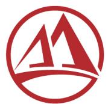

常山北明

www.csbmkj.com

# 石家庄常山北明科技股份有限公司

地址：河北省石家庄市长安区广安大街34号天利商务大厦九层

邮编: 050011

电话：0311-86255070

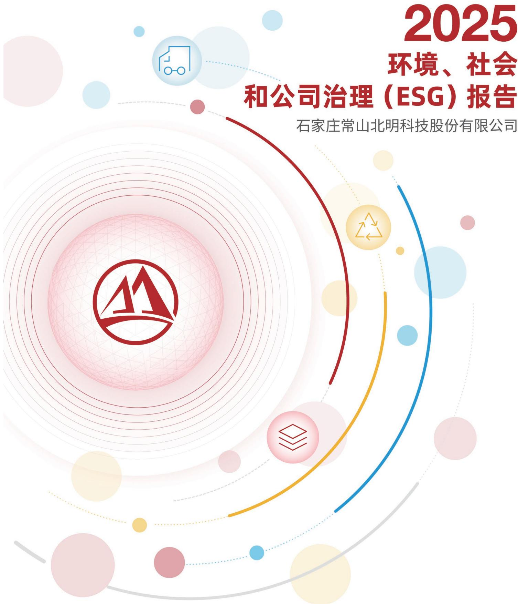

text_image

2025
环境、社会
和公司治理（ESG）报告
石家庄常山北明科技股份有限公司

# 2025

# 环境、社会

# 和公司治理（ESG）报告

石家庄常山北明科技股份有限公司

# 目录

# CONTENTS •

关于本报告 04

董事长致辞 05

走进常山北明 06

ESG 治理 09

责任专题： 12

科技赋能强主业

数智引领新生态

未来展望 54

附录 56

# 01

# 治理篇

# 一流规范

# 筑牢发展根基

党建聚力践使命 18

公司治理强基石 20

合规风控守底线 22

深耕投关惠股东 25

# 02

# 社会篇

# 一流担当

# 赋能数字未来

科技创新强动能 28

客户至上创价值 32

协作共赢促发展 35

赋能成长育英才 38

夯实安全助远航 40

公益善举暖民心 43

# 03

# 环境篇

# 一流生态

# 引领绿色科技

环境管理强保障 48

应对气候促转型 48

低碳运营促减排 51

绿色文化聚共识 53

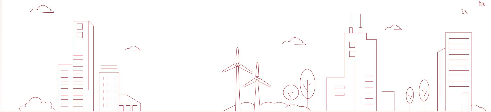

# 关于本报告

# 时间范围

本报告的时间跨度为 2025 年 1 月 1 日至 12 月 31 日。为保证报告内容的完整性，部分内容超出此范围。

# 发布周期

本报告为年度报告，是石家庄常山北明科技股份有限公司对外公开发布的首份环境、社会和公司治理（ESG）报告。

# 指代说明

本报告信息涵盖石家庄常山北明科技股份有限公司及相关企业。为便于表达，在报告的表述中将使用以下称谓指代。

<table><tr><td>全称</td><td>简称</td></tr><tr><td>石家庄常山北明科技股份有限公司</td><td>公司 / 我们 / 常山北明</td></tr><tr><td>石家庄常山纺织集团有限责任公司</td><td>集团 / 常山集团</td></tr><tr><td>北明软件有限公司</td><td>北明软件</td></tr><tr><td>石家庄市智慧产业有限公司</td><td>智慧产业公司</td></tr><tr><td>石家庄市能源投资发展有限公司</td><td>能投公司</td></tr><tr><td>河北北明鼎云信息技术有限公司</td><td>鼎云公司</td></tr><tr><td>河北常山恒云数据科技有限公司</td><td>恒云公司</td></tr></table>

# 编制依据

国务院国资委《关于新时代中央企业高标准履行社会责任的指导意见》《关于国有企业更好履行社会责任的指导意见》

石家庄市国资委《关于新时代市国资委监管企业高标准履行社会责任的指导意见》

深圳证券交易所《上市公司自律监管指引第17号——可持续发展报告(试行)》《上市公司自律监管指南第3号——可持续发展报告编制（2026年1月修订）》

中国企业改革与发展研究会、责任云研究院《中国企业可持续发展报告指南（CASS-ESG 6.0）之软件和信息技术服务业》

全球报告倡议组织《可持续发展报告标准》(GRI Standards)
联合国可持续发展目标（SDGs）

# 质量保障

本报告中披露的信息和数据来源于公司统计报告和正式文件，并通过相关部门审核，不存在任何虚假记载、误导性陈述或重大遗漏。报告中的财务数据来自常山北明2025年度财务报告，财务业绩详见常山北明《2025年年度报告》。

# 获取方式

您可以在常山北明官方网站（www.csbmkj.com）及巨潮资讯网（www.cninfo.com.cn）查询或下载本报告，并获取更多公司 ESG 信息。

# 董事长致辞

2025 年，是 “十四五” 规划收官之年，亦是常山北明提质增效、加速转型升级的关键节点。这一年，面对蓬勃涌动的数字经济浪潮，行业深刻变革与时代发展机遇交织共进，公司始终保持坚定战略定力，锚定高质量发展航向，以自主创新为引擎破解发展难题，携手全体员工与各界合作伙伴笃行奋进，交出了一份凝结全体常山北明人智慧与汗水的高质量发展答卷。

# 这一年，我们以规范治企为纲，筑牢发展根基。

公司坚持党建引领与现代企业治理深度融合，以党的政治建设为统领，统筹推进思想建设、组织建设、作风建设、纪律建设与制度建设，以党建聚力铸魂、坚守初心使命；持续完善法人治理结构，明晰权责运行边界，年内修订相关制度15项，推动决策科学化、制度化、规范化；构建全方位、全流程合规风控体系，牢牢守住经营发展底线，以规范透明、高效稳健的治理效能，为企业长远健康发展保驾护航。

# 这一年，我们以责任立企为要，赋能美好未来。

公司坚持以科技创新为核心引擎，完成研发投入 25,244.53 万元，成功推出政务服务大模型、AI（人工智能）数字人、计量大模型管理平台等创新产品，以创新实力激活高质量发展内生动力；始终坚守客户至上理念，凭借专业可靠、场景领先的解决方案为客户创造长期价值，主动携手产业链上下游伙伴，构建开放共赢、安全可控的产业数字生态；持续完善人才发展体系，全年吸纳就业 438 人；积极投身公益事业，2025 年志愿者累计参加活动时长达 200 小时，用实际行动践行企业社会责任，传递常山北明力量。

# 这一年，我们以绿色兴企为脉，引领绿色发展。

公司坚守生态优先、绿色发展理念，持续健全环境管理体系，完善环保制度与管控流程；积极响应国家“双碳”目标，建成投产100兆瓦风电项目；累计建成装机总量14.9兆瓦分布式光伏电站，应用在高校、交通、工业厂房等多个场景；建成投产常山五金机电数智中心新能源电动汽车充电站，为园区内货运车、公务车、通勤车提供稳定能源保障，助力绿色低碳出行；完善园区配套，提升综合服务能力，助力园区打造绿色低碳示范园区；全面推行低碳运营、节能增效模式，打造京津冀绿色算力标杆——常山云数据中心，助力企业与自然和谐共生。

# 大道如砥，行者无疆。

站在新起点，我们将始终坚持党建引领、铸魂定向，坚守“成长为中国一流的科技型行业领军企业”的愿景，以永不懈怠的进取精神与矢志不渝的责任担当，持续推动提质增效与转型升级，奋力谱写常山北明高质量发展新篇章，为建设现代化国际化美丽省会城市、书写中国式现代化河北篇章贡献更大力量。

# 走进常山北明

# 公司简介

石家庄常山北明科技股份有限公司是常山集团旗下的上市公司，也是石家庄市唯一市属国有控股上市公司。1998年以原石家庄棉一至棉四为基础改制设立，2000年在深圳证券交易所上市（股票代码：000158），2015年7月通过增资扩股，完成了对北明软件有限公司的并购重组。2024年通过资产置换，引入了与软件业务有协同效应的新能源及智慧城市业务，同时剥离纺织业务。现有软件和信息技术服务、新能源等业务，是中国数字经济企业500强和河北省战略性新兴产业领军百强企业。

常山北明全资子公司北明软件是国家规划布局内重点软件企业，是国家工信部认定的信息系统集成及服务大型一级企业，位列中国软件和信息技术服务竞争力百强企业第45位，拥有信息系统建设和服务能力杰出级（CS5）、建筑智能化系统设计专项甲级、电子与智能化工程专业承包一级、CCRC信息系统安全集成服务一级、ITSS信息技术服务二级、数据管理能力成熟度三级等行业顶尖资质。围绕全域城市数字化转型、司法科技、企业数字化转型、金融科技、智慧交通和数字新基建工程等，形成了一系列技术领先的大数据、云计算、区块链、人工智能等综合性IT产品和解决方案，确立了在相关领域的市场优势地位，是华为的核心战略合作伙伴。

在石家庄市委、市政府的坚强领导下，常山北明将大力弘扬“务实、创新、服务、共赢”的企业精神，以市场为导向、以质量为根本、以创新为引擎、以品牌促提升、以服务促发展，围绕主业做大做强，加快成长为中国一流的科技型行业领军企业。

# 企业理念

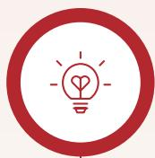

# 公司愿景

成长为中国一流的科技型行业
领军企业

# 公司使命

用智慧
创造美好生活

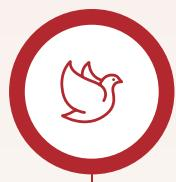

# 公司宗旨

质量第一、客户至上，
打造科技型行业领军企业

# 公司精神

务实 创新
服务 共赢

# 核心价值观

人才为本 质量至上
诚信经营 创新发展

# 管理架构

常山北明管理架构图  
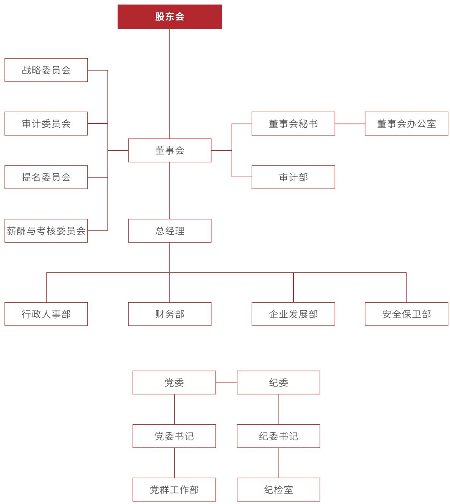

flowchart

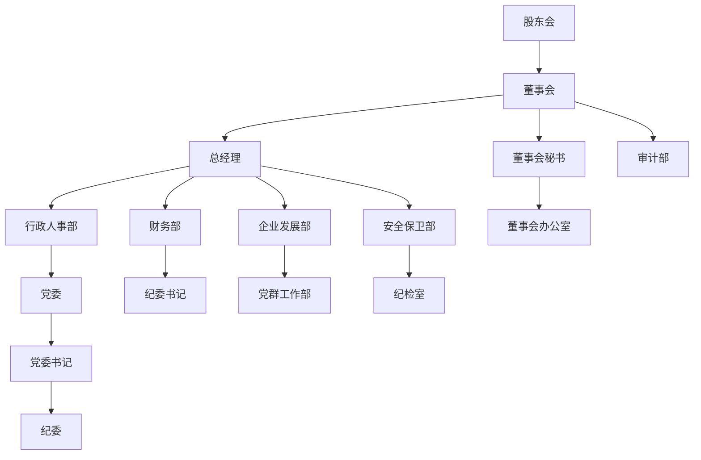
```mermaid
graph TD
  A["股东会"] --> B["董事会"]
  B --> C["总经理"]
  B --> D["董事会秘书"]
  B --> E["审计部"]
  C --> F["行政人事部"]
  C --> G["财务部"]
  C --> H["企业发展部"]
  C --> I["安全保卫部"]
  D --> J["董事会办公室"]
  F --> K["党委"]
  G --> L["纪委书记"]
  H --> M["党群工作部"]
  I --> N["纪检室"]
  K --> O["党委书记"]
  O --> P["纪委"]
```

说明：公司还设有工会、团委等党群组织机构

# 年度荣誉

常山北明总部所获荣誉  

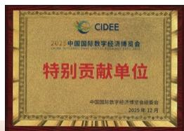

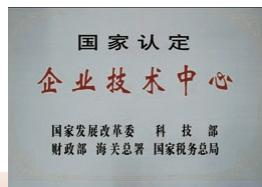  
国家认定企业技术中心  
国家发展改革委、科技部、财政部、海关总署、国家税务总局

特别贡献单位  
中国国际数字经济博览会
组委会  
子公司北明软件所获荣誉  

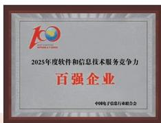  
2025 年度软件和信息技术服务
竞争力百强企业  
中国电子信息行业联合会

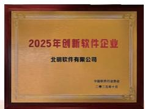  
2025年创新软件企业  
中国软件行业协会

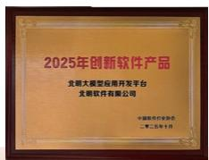  
2025年创新软件产品（北明大模型应用开发平台）  
中国软件行业协会

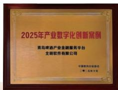  
2025 年产业数字化创新案例 (青岛啤酒产业金融服务平台)  
中国软件行业协会

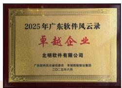  
2025年广东软件风云录卓越企业  
广东软件风云录组委会
羊城晚报报业集团

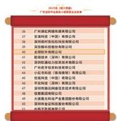  
广东省软件业务收入前百家企业  
(位列第40名)  
广东软件行业协会

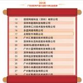  
广东省软件产品行业前 50 强
(位列第 17 名)  
广东软件行业协会

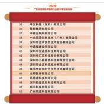  
广东省信息技术服务行业前 50 强（位列第 46 名）  
广东软件行业协会

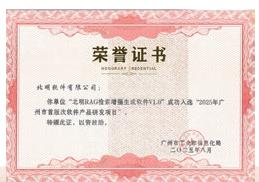  
2025 年广州市首版次软件产品研发项目（北明 RAG 检索增强生成软件）  
广州市工业和信息化局

# ESG 治理

常山北明坚持把 ESG 理念融入经营管理与业务发展各环节，持续完善 ESG 管理体系、夯实管理基础、深化实践落地，以负责任的经营行为践行国有科技企业的使命与担当。

# ESG 管理架构

公司建立健全 ESG 管理组织架构，设立社会责任领导小组，作为社会责任工作的核心领导机构，统一领导公司社会责任工作开展；领导小组下设办公室，办公室设在董事会办公室，全面统筹协调公司社会责任日常运营管理工作。

# ESG 管理机制

公司发布《2026年社会责任工作实施方案》，明确年度社会责任工作目标、重点任务、实施路径与责任分工，为公司ESG工作有序开展提供清晰指引和制度保障，推动社会责任理念与要求深度融入公司生产经营各环节。

# 重要性议题识别

公司参照深圳证券交易所《可持续发展报告编制指南》，基于“双重重要性”原则开展重要性议题分析，并对具有重要性的 ESG 议题进行披露。

# 常山北明 2025 年重要性议题分析流程

# 了解背景

了解公司活动和商业关系，解读国家及行业法律法规和监管政策，分析评级标准、同业实践，了解主要受影响的利益相关方以及与利益相关方沟通的方式。

# 建立议题清单

参考《可持续发展报告指引》设置的 21 个议题，结合公司主要业务板块特点、政策标准分析及同业对标，并了解各部门及其受影响的利益相关方关注的议题，汇总形成 22 项重要性议题 $^{1}$ 。

# 评估与确认

邀请内外部专家，共同识别和分析议题的影响、风险和机遇，评估议题的影响重要性和财务重要性，确定议题重要性排序，形成重要性议题矩阵。

# 报告披露

就重要性较高的议题进行重点披露。

结合标准对标、政策分析及同业对标情况，公司识别并筛选出22项议题，其中，3项议题具有双重重要性；1项议题仅具有高度财务重要性；11项议题仅具有高度影响重要性；7项议题既不具有高度财务重要性，也不具有高度影响重要性（一般重要）。

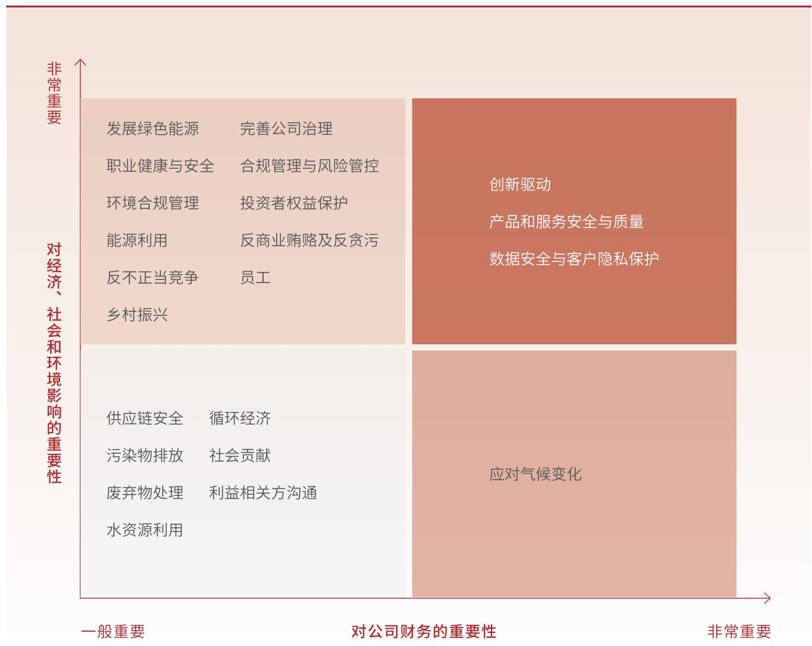

other

| Category | Topic 1 | Topic 2 |
| --- | --- | --- |
| Top-Left | 发展绿色能源 | 完善公司治理 |
| Top-Left | 职业健康与安全 | 合规管理与风险管控 |
| Top-Left | 环境合规管理 | 投资者权益保护 |
| Top-Left | 能源利用 | 反商业贿赂及反贪污 |
| Top-Left | 反不正当竞争 | 员工 |
| Top-Left | 乡村振兴 | N/A |
| Bottom-Left | 供应链安全 | 循环经济 |
| Bottom-Left | 污染物排放 | 社会贡献 |
| Bottom-Left | 废弃物处理 | 利益相关方沟通 |
| Bottom-Left | 水资源利用 | N/A |
| Top-Right | 创新驱动 | 产品和服务安全与质量 数据安全与客户隐私保护 |
| Bottom-Right | 应对气候变化 | N/A |

# 利益相关方沟通

公司高度重视利益相关方沟通工作，主动识别股东、客户、员工、合作伙伴等各类利益相关方需求，依托官网、官微、权威媒体等多元渠道，深化沟通与互动交流，积极回应各利益相关方的关切。

<table><tr><td colspan="2">利益相关方</td><td>期望与诉求</td><td>沟通与回应</td></tr><tr><td rowspan="5"></td><td rowspan="5">政府及监管机构</td><td>服务国家战略</td><td>定期沟通汇报</td></tr><tr><td>依法合规经营</td><td>调研座谈</td></tr><tr><td>带动地方经济</td><td>信息报送和披露</td></tr><tr><td>实现充分就业</td><td>依法纳税</td></tr><tr><td></td><td>带动地方就业</td></tr><tr><td rowspan="4">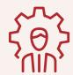</td><td rowspan="4">股东/投资者</td><td>提升运营质量</td><td>股东会与董事会</td></tr><tr><td>加强信息披露</td><td>财务报告</td></tr><tr><td>维护投资者权益</td><td>投资者调研</td></tr><tr><td>降低成本支出</td><td>定期信息披露</td></tr><tr><td rowspan="4"></td><td rowspan="4">客户</td><td>提升服务质量</td><td>提高创研能力</td></tr><tr><td>延伸服务内容</td><td>市场调研</td></tr><tr><td>创新服务方式</td><td>客户满意度调查</td></tr><tr><td>客户权益保障</td><td>保护客户隐私</td></tr><tr><td rowspan="4"></td><td rowspan="4">员工</td><td>保障员工权益</td><td>员工活动</td></tr><tr><td>畅通职业发展渠道</td><td>员工培训</td></tr><tr><td>职业健康与安全</td><td>职工代表大会</td></tr><tr><td>优化工作环境</td><td>提供健康安全的工作环境</td></tr><tr><td rowspan="4"></td><td rowspan="4">供应商和合作伙伴</td><td>实施公开招标</td><td>公开招投标</td></tr><tr><td>依法履行合同</td><td>战略合作</td></tr><tr><td>加强沟通交流</td><td>交流互访</td></tr><tr><td>加强供应链管理</td><td></td></tr><tr><td rowspan="3"></td><td rowspan="3">环境</td><td>完善环境管理</td><td>环境管理体系</td></tr><tr><td>节约资源能源</td><td>绿色低碳运营</td></tr><tr><td>倡导绿色低碳</td><td>参与环保公益</td></tr><tr><td rowspan="3"></td><td rowspan="3">社区</td><td>公益慈善</td><td>公益捐赠</td></tr><tr><td>服务社区</td><td>志愿活动</td></tr><tr><td>乡村振兴</td><td>对口帮扶</td></tr></table>

# 责任专题：科技赋能强主业 数智引领新生态

作为河北省战略性新兴产业领军百强企业，常山北明始终秉持“用智慧创造美好生活”的企业使命，深挖市场需求，紧抓数字经济快速发展与企业数字化升级机遇，以科技创新作为驱动发展的核心引擎，聚焦全域城市数字化转型、司法科技、企业数字化转型、金融科技等主营业务，在云计算、大数据、区块链、人工智能等关键技术领域持续突破、成果丰硕。

2025 年，公司先后荣获 “2025 年创新软件企业” “2025 年创新软件产品” “2025 年产业数字化创新案例” “软件和信息技术服务竞争力百强企业” “华为云优秀 SI 伙伴大奖” “2025 全国企业数字化赋能十佳案例” “2025 全国企业数字化转型与赋能优秀案例” 等奖项，累计拥有 700 余项自有知识产权的软件产品，并在全国成功落地 1,000 多个总集成项目，筑牢企业核心竞争力。

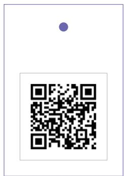

text_image

QR code with a purple dot above it, likely for scanning to access digital content or a URL.

扫码观看，常山北明总经理、北明软件总裁应华江带您沉浸式体验公司科创“硬”实力

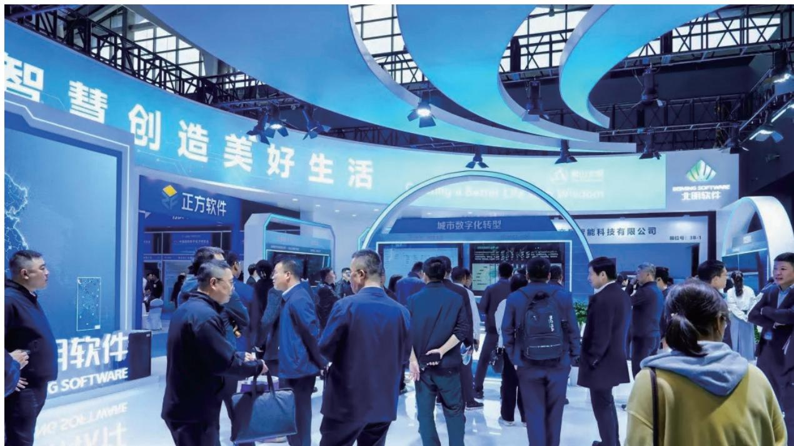

text_image

智慧创造美好生活
正方软件
G SOFTWARE
城市数字化转型
智能科技有限公司
WANG S O WARE
北明软件
2018-1

常山北明数博会展位现场

# 全域城市数字化转型

公司融合大数据与 AI 大模型等技术，构建了大模型政务应用、城市运行 “一图总览” 、政务服务 “一网通办” 、城市治理 “一网统管” 、营商助企 “一站兴业” 、应急指挥 “一体联动” 等解决方案，形成了从顶层设计、产品研发、项目实施到运营运维的全场景服务能力，在广东、河北、湖南、四川、上海等地打造了一批可复制、可推广的智慧城市标杆项目，助力城市治理迈向现代化。

# 公司打造北京智慧文旅平台

公司承建的北京智慧文旅平台，搭建了“驾驶舱概览”“文旅资源一张图”“文旅行业监管”“文旅产业分析”“文旅专题分析”及“节假日监测”六大核心专题板块，实现对北京市文旅行业运行态势的全方位、可视化呈现，显著提升了文旅领域智慧监管能力与公共服务水平。

# 司法科技

公司严格贯彻中央政法委相关工作要求，全力推进综治中心规范化建设，持续提升矛盾纠纷预防化解法治化水平与社会治安综合治理规范化水平。

# 公司助力北京石景山区打造综治指挥研判数智平台

公司为北京市石景山区综治中心量身打造的综治指挥研判系统已于2025年底正式投入使用，围绕五大核心模块推动区域治理现代化。在矛盾纠纷化解上，系统首创智能多级协同流转功能，实现了事件自动分派、跨部门联动处置与全程跟踪督办，大幅缩短了调解周期，显著提升了矛盾化解效率；依托全量司法数据构建的风险预警模型，实现隐患智能研判与全息感知；通过精准分析纠纷高发类型与区域，为靶向纠纷治理提供决策支撑。系统创设的成效指数模型，可动态考评治理质效，助力精准补短板。自运行以来，社会治安风险防控能力显著增强，有效提升了辖区居民的安全感与满意度，实现了从“经验治理”向“数据赋能”的跨越式转变。

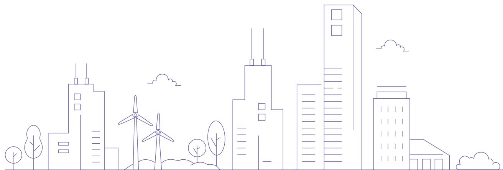

natural_image

Line drawing of a city skyline with buildings, wind turbines, and clouds (no text or symbols)

# 企业数字化转型

公司凭借丰富的行业应用场景和海量数据资源，聚焦智慧园区、智慧热网、智慧医疗、智慧教育、国网数字化等领域，推动数字技术与实体经济深度融合，助力传统产业向智慧化、绿色化转型升级。其中，在智慧园区领域，公司聚焦文体场馆、产业园区、物流枢纽、商业综合体等多元场景，依托底层全域互联感知、中间层数字能力支撑及顶层智能中枢，构建起完整的智慧园区支撑体系，并通过统一平台打破数据孤岛，深度融合数字孪生、智能服务和智能运营等功能，持续推动园区智慧化升级，助力园区运营降本增效。

# 案例

# 北明软件打造首都国际会展中心全球智慧场馆样板点

2025 年，北明软件以极限工期承建并交付的首都国际会展中心智慧场馆系统成功运行，有力保障了包括 CIMT2025 国际机床展在内的多场高规格展会。该集成项目构建了 1 个 IOC 智慧运营指挥中心、6 大核心平台、22 套业务系统、52 个创新应用场景、120 个功能模块及 721 个功能点，并深度融合数字人、问询机器人、智慧灯杆等多种智能设施设备，实现场馆感知、传输、计算、决策、联动和存储的深度融合。凭借此项目，北明软件与华为联合打造的解决方案被确立为 “全球样板点”，荣获第三届 “金标杯” 智慧园区五星案例。

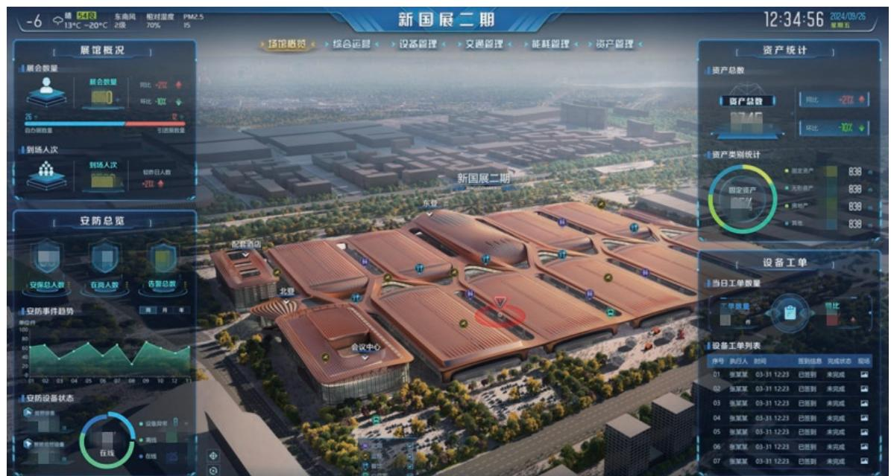

text_image

新国展二期
12:34:56 2024/08/26 星期五
-6
① 展馆概况
展会数量
展会数量
同比 -2%
环比 -10%
自办理数量
引导数量
场地概览
综合运营
设备管理
交通管理
能耗管理
资产管理
[ 展馆总览 ]
新国展二期
资产统计
资产总数
资产总值
同比 +2%
环比 -10%
资产类别统计
固定资产
838
无形资产
838
商住产
838
其他
838
安装总览
安防总人数
在岗人数
设置总数
安防事件趋势
在线
北京
会议中心
设备工单
当日工单数量
单数量
设备工单列表
序号 执行人 时间 签到信息 完成状态 现场
01 张某某 03-31 12:23 已签到 未完成
02 张某某 03-31 12:23 已签到 未完成
03 张某某 03-31 12:23 已签到 未完成
04 张某某 03-31 12:23 已签到 未完成
05 张某某 03-31 12:23 已签到 未完成
06 张某某 03-31 12:23 已签到 未完成
07 张某某 03-31 12:23 已签到 未完成

新国展二期运行界面

# 金融科技

公司通过 AI、区块链与云计算技术的深度融合，助力金融机构建设智能风控、产业金融、信贷票据、智能影像等核心平台，携手金融企业共建开放、智能、安全的金融新生态；在数智保险领域，公司积累沉淀了端到端的保险数智化解决方案及服务能力，通过打造业财共享平台、新保险合同准则数据平台、管理会计分摊平台等一系列创新产品，助力客户实现业财融合及财务精细化管理。

# 案例

# “青啤易融”产业金融服务平台建设

北明软件为青岛啤酒集团打造“青啤易融”产业金融服务平台，依托经销商数据模型、风控准入规则、产品智能标签等数字化能力，为经销商提供一站式专属金融服务。该平台深度赋能实体产业链，已成功上线多款金融产品，完成与多家银行的系统直连，累计服务上百家经销商，授信规模过亿元，是“以融促产、数实融合”的生动典范。2025年12月，该平台在中数联盟会员代表大会暨数字经济高质量发展论坛上入选“2025全国数字经济应用场景优秀案例”。

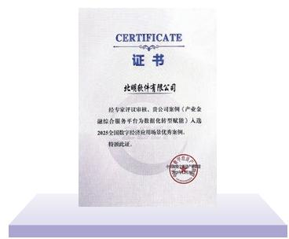

text_image

CERTIFICATE
证书
北明软件有限公司
经专家评审站核，贵公司制《产业金融综合服务平台数据化转型赋能》入选2023全国数字经济应用场景优秀案例。
特此此。

获奖证书

# 智慧交通

公司运用物联网、云计算、数字孪生与人工智能等技术，构建了覆盖智慧高速、城市交通、民航机轨等多场景的“云边端一体化”智慧交通综合解决方案。依托沈康智慧高速、江西梨温高速等标杆项目实践，公司搭建标准化数据中台，实现路网运行、设施养护、收费管理等全链条数据统一治理与资产化运营，有力推动交通系统迈向“数智融合、资源协同”新阶段。

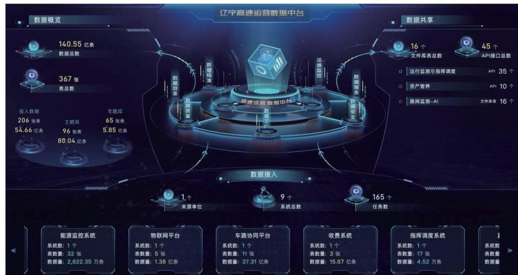

text_image

数据概览
辽宁高速运营数据中台
数据共享
140.55 亿条
数据总数
367 张
表总数
接入数据
206 张表
54.66 亿条
专题库
65 张表
96 张表
5.85 亿条
80.04 亿条
数据总量
数据结算
远程监控
数据服务
数据共享
16 个
文件库表总数
API接口总数
运行监测与指挥调度
API 35 个
资产管理
API 10 个
联网监测-AI
文件库表 16 个
数据接入
1 个
来源单位
9 个
系统总数
165 个
任务数
能源监控系统
系统数: 1 个
表数量: 32 张
数据量: 2,622.35 万条
物联网平台
系统数: 1 个
表数量: 5 张
数据量: 1.38 亿条
车路协同平台
系统数: 1 个
表数量: 11 张
数据量: 37.31 亿条
收费系统
系统数: 1 个
表数量: 3 张
数据量: 15.67 亿条
指挥调度系统
系统数: 1 个
表数量: 17 张
数据量: 4.52 万条

辽宁高速运营数据中台界面

# 常山云数据中心

常山云数据中心作为河北省战略性新兴产业重点项目，通过了中国数据中心最高等级国标 A 级认证。项目一期已投入运营，为百度、腾讯等 20 余家头部客户提供数据存储、数据灾备、数据清洗等服务；项目二期将聚焦智算能力建设，打造绿色高效的高算力集群，力争成为京津冀地区示范性标杆项目。

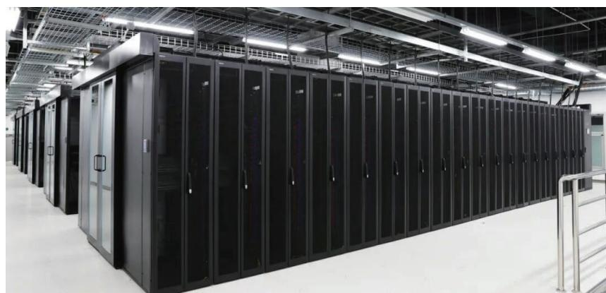

natural_image

Interior view of a data center or server room with rows of black server racks under overhead lighting (no visible text or labels)

常山云数据中心机房楼

# 01

# 治理篇

# 一流规范， 筑牢发展根基

常山北明锚定高质量可持续发展主线，把党的领导融入企业发展各方面，持续健全规范高效的现代化治理架构，从严筑牢合规风控屏障，用心深耕投资者关系管理，全方位夯实企业稳健运营根基，为公司行稳致远筑牢坚实支撑。

党建聚力践使命 18

公司治理强基石 20

合规风控守底线 22

深耕投关惠股东 25

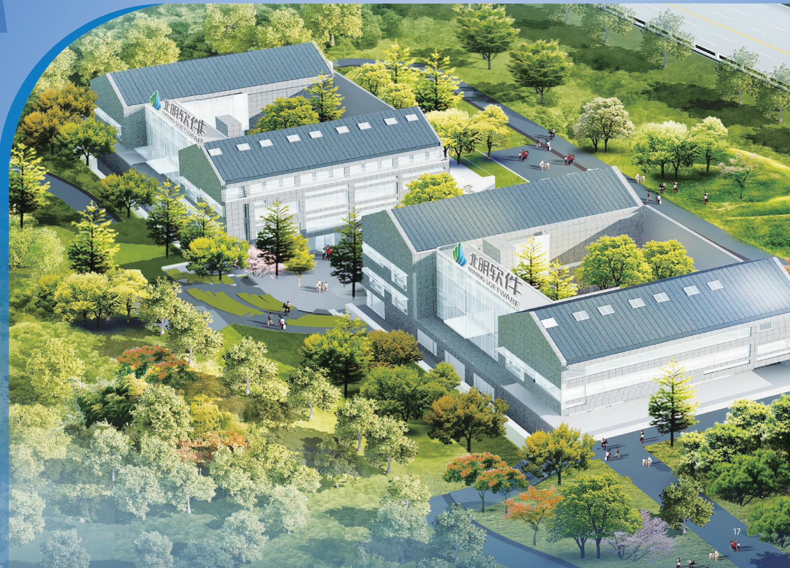

natural_image

Architectural rendering of a modern building complex with green roofs and surrounding greenery, featuring '北明软件' signage (no readable text in image)

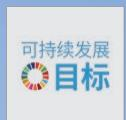

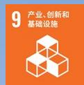

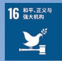

# 党建聚力践使命

常山北明坚持以习近平新时代中国特色社会主义思想为指导，认真学习党的二十大和二十届历次全会精神、河北省委十届九次全会及石家庄市委十一届十次全会精神，坚持党建工作与公司改革发展两手抓、两促进，全面提升工作质效。

# 增强政治引领

公司党委充分发挥把方向、管大局、保落实的作用，严格落实“第一议题”制度，修订完善《公司党委会议“第一议题”制度实施办法》和党建入章内容，对“三重一大”事项进行前置研究，2025年召开党委会25次，研究重大事项近100项。

# 强化理论武装

公司将理论武装作为首要任务，通过党委理论学习中心组学习、专题宣讲等，2025年学习习近平总书记最新重要讲话、重要指示精神37次；深入学习贯彻党的二十届四中全会精神4次；组织党委理论学习中心组集体学习13次，研讨交流9次；举办专题党课6场。

组织党委理论学习中心组集体学习

13 次

研讨交流

9 次

举办专题党课

6场

# 深化党建与业务融合

公司组织开展“三提升”专项活动，推动公司党建工作与改革发展、项目谋划、发挥作用等一体化融入，创新打造“党建+”特色融合品牌，推动党组织作用深度嵌入生产经营各环节、融入业务发展全链条。在科技攻关前沿，组建党员先锋队，聚焦数字化转型、核心技术研发等关键任务攻坚突破；在市场拓展一线，设立党员示范岗、划定党员责任区，引导党员带头拓市场、攻项目、优服务。

# 所属企业在行动

能投公司：建立“红色引擎·能动未来”党建品牌，组建分布式光伏发电、风力发电、产业园三大项目突击队，实现深泽县一期100兆瓦风电项目全容量并网发电，建成三所市属高校“光伏+学校”分布式光伏项目。  
恒云公司：创新打造“红领机电·楼事同心”党建品牌，实现“楼宇事、共商议、同推进”的治理格局，构建“组织共建、资源共享、发展共促”的运营管理党建生态圈。

# 党风廉政建设

公司深入开展常态化警示教育、案例宣讲及研讨交流，从严推进集中专项整治，同时面向公司及所属企业高风险关键岗位开展廉政风险排查，排查廉政风险点136个，制定应对措施171条。

# 2025年

开展警示教育和案例宣讲活动 42 场，覆盖 1,000 余人次

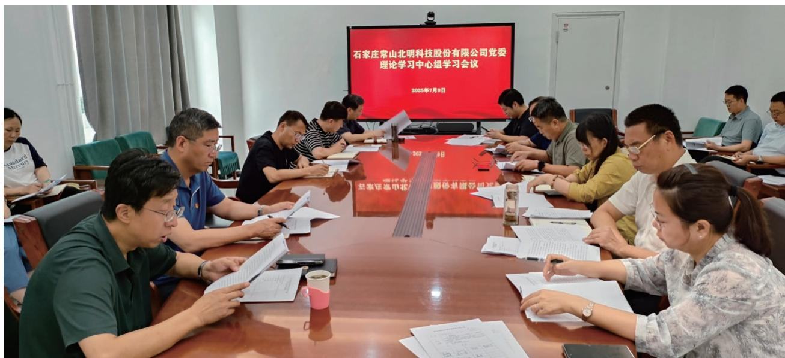

text_image

石家庄常山北明科技股份有限公司党委
理论学习中心组学习会议
2025年7月9日

公司党委开展理论学习中心组学习会议

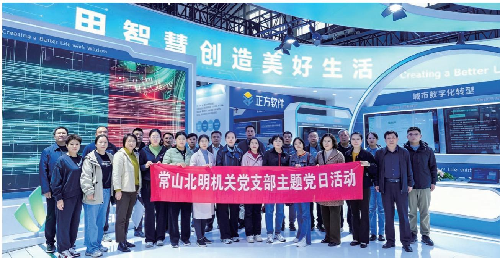

text_image

田智慧 创造美好生活
Creating a Better Life with Wisdom
正方软件
城市数字化转型
常山北明机关党支部主题党日活动

公司开展主题党日活动

# 公司治理强基石

公司严格按照《中华人民共和国公司法》《中华人民共和国证券法》《上市公司治理准则》、深圳证券交易所《股票上市规则》《上市公司自律监管指引第1号－主板上市公司规范运作》等相关规定，以及《公司章程》《股东会议事规则》《董事会议事规则》《董事会专门委员会实施细则》《独立董事工作制度》等有关要求，构建了股东会、董事会、经理层“两会一层”权责明确、决策科学、执行高效、监督有力、相互制衡的治理结构，并严格依法规范运作。2025年，公司董事会设董事11名，经理层成员9名。

按性别  
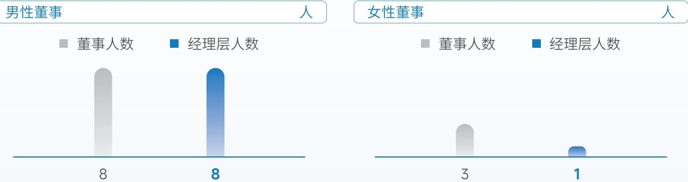

按类型  
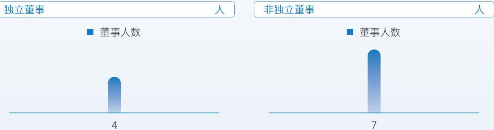

按年龄  
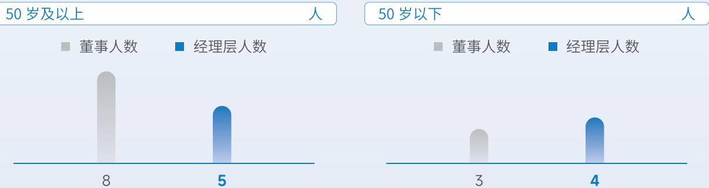

# 股东会

股东会是公司的最高权力机构，分为年度股东会和临时股东会。年度股东会每年召开一次，于上一会计年度结束后的6个月内举行，临时股东会不定期召开。2025年召开股东会会议5次，审议通过议案20项。

# 董事会

公司董事会拥有公司日常事务的决策权。董事会分为定期会议和临时会议。定期会议每年至少召开两次会议，由董事长召集并主持。2025年召开董事会会议15次，审议通过补选董事、董事会换届选举、资产置换和定期报告等59项议案。

董事会下设战略委员会、审计委员会、提名委员会、薪酬与考核委员会四个专门委员会。专门委员会成员全部由董事组成，其中审计委员会、提名委员会、薪酬与考核委员会中独立董事占多数并担任召集人，审计委员会中有1名独立董事是会计专业人士。

# 战略委员会

主要负责对公司长期发展战略和重大投资决策进行研究并提出建议。

# 审计委员会

负责审核公司财务信息及其披露、监督及评估内外部审计工作和内部控制，履行原监事会职权，2025年召开会议8次。

# 提名委员会

负责拟定公司董事、高级管理人员的选择标准和程序，对董事、高级管理人员人选及其任职资格进行遴选、审核，并向董事会提出建议，2025年召开会议3次。

# 薪酬与考核委员会

负责制定公司董事、高级管理人员的考核标准并进行考核，制定、审查董事及高级管理人员的薪酬政策与方案，并向董事会提出建议，2025年召开会议2次。

# 合规风控守底线

# 完善合规管理

公司构建层级清晰、权责规范的合规治理与决策管控体系。公司董事会办公室负责日常合规管理工作，配备合规管理员1名，由董事会秘书主管领导；公司重大决策事项须经董事会办公室把控决策程序并出具合规意见。公司所属企业按照《控股子公司管理制度》《重大信息内部报告制度》的规定，及时向总部董事会办公室报送重大经营事项，经合规管理员把控合规程序并报告董事会秘书批准后，履行相应的决策程序。报告期内，公司未发生因经营不合规导致诉讼或重大行政处罚的事件。

# 2025 年

\- 组织法务、合规培训共计14场

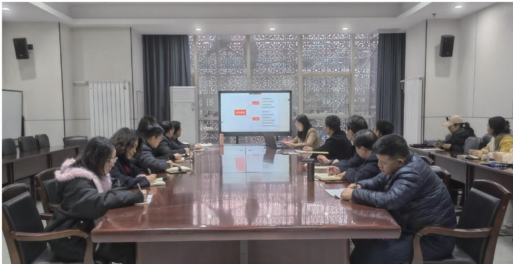

text_image

Meeting room scene with participants seated around a long table, one person presenting a presentation screen displaying Chinese text.

2025 年，公司董事会办公室统筹组织开展法务培训，聚焦法务制度、案件管理、合同管理及信息披露等相关合规事务，提升相关岗位人员的法务素养与合规履职能力

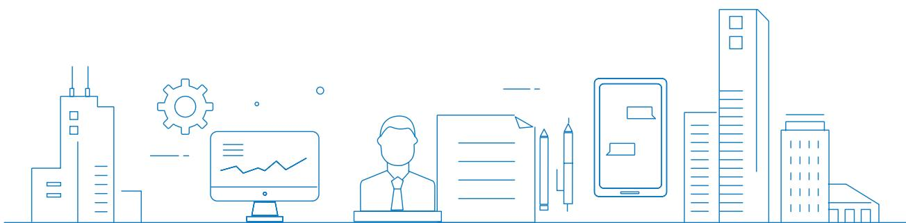

natural_image

Line art illustration of a city skyline with skyscrapers, a person at a desk, and abstract icons including a gear, monitor, pencil, and smartphone (no text or symbols)

# 落实风险管控

公司建立覆盖风险识别、预警、追踪、控制全流程的风险管理体系。通过常态化风险评估、专项隐患排查与信息监测，系统识别数据安全、合规、运营等风险并建立动态风险库；构建分级预警机制，实现异常及时预警与快速响应；对风险实行台账化管理，明确责任与整改要求，动态跟踪督办、落地闭环整改；依托“三道防线”、制度流程及技术工具，强化源头防控与过程管控。2025年，公司风险管控措施有效实施，未发生重大风险事件。

# 第一道防线

# 各职能部门、业务单位

负责本领域日常风险识别与防控职责，嵌入业务流程管理风险。

# 第二道防线

# 审计委员会和审计部

审计委员会负责监督体系运行、审议风险报告；审计部独立开展监督、审计，排查隐患并向审计委员会汇报。

# 第三道防线

# 董事会

统筹战略方向，审批重大风险策略、制度，对全局风控负责。

# 强化内部控制

公司构建起由审计委员会统筹监督、审计部门落地执行的内控管理架构，同步搭建决策科学、执行高效、监督到位的内控运行机制与标准化业务流程。通过组织架构优化、职责分离、授权审批、制度流程、信息系统管控等方式，保障研发、销售、项目交付、采购等业务活动有效开展；通过资产管理制度、权限管控、信息安全防护，保护公司资产、数据及知识产权安全完整；通过流程复核、系统留痕、异常监控、内部审计，防范、发现并纠正错误与舞弊；通过规范会计核算、财务审核、信息披露管控，确保会计资料及财务信息真实、合法、完整。

# 严格内部审计

公司严格遵循审计制度及监管要求，坚持风险导向、内控优先，保障内部审计系统平稳规范运行。在审计委员会的统筹下，公司围绕内部控制、货币资金、重要事项等领域开展审计与监督，按期完成年度审计计划；通过督促问题整改、闭环管理，推动流程优化与制度完善，为公司规范稳健发展提供有力支撑。2025年度，公司聘任的会计师事务所及内部控制审计会计师事务所均未发生变更。

# 规范商业行为

# - 反商业贿赂与反贪污

公司精心组织开展警示教育活动，通过深入学习警示教育案例与典型案件，扎实推进以案说德、以案说纪、以案说法、以案说责，引导公司总部全体党员及所属企业领导干部对照典型案例深入检视查摆，切实将过往教训转化为内心敬畏，把思想警醒转化为自我约束的行动自觉。

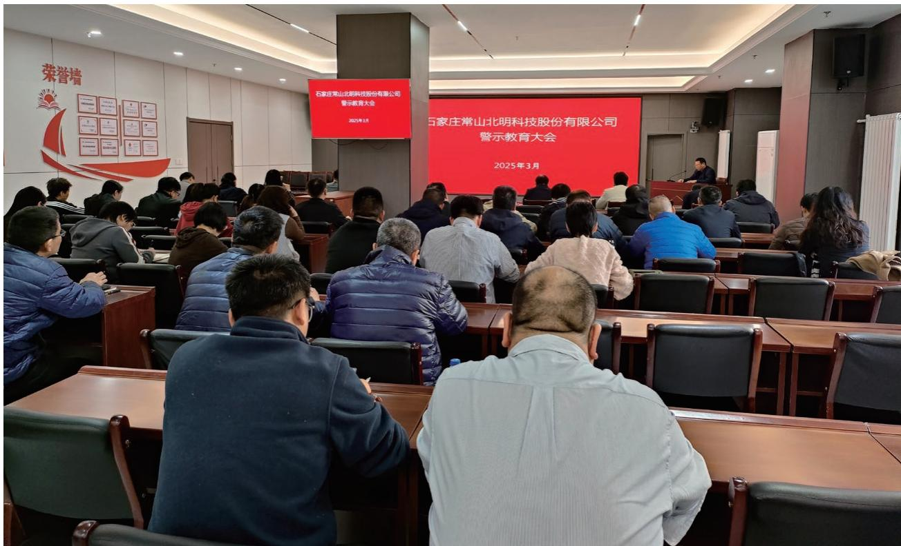

text_image

荣誉墙
石家庄常山北明科技股份有限公司
警示教育大会
2025年1月
石家庄常山北明科技股份有限公司
警示教育大会
2025年3月

公司开展警示教育大会

# - 反不正当竞争

公司严格遵守《中华人民共和国反垄断法》《中华人民共和国反不正当竞争法》等相关法律法规，坚持公平原则与上下游企业开展交易，维护稳定良好的商业关系。报告期内，公司未发生任何不正当竞争事件。

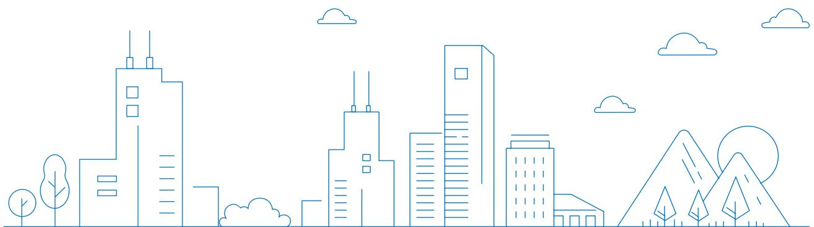

natural_image

Line art illustration of a city skyline with multiple buildings, trees, clouds, and mountains under a cloudy sky (no text or symbols)

# 深耕投关惠股东

# 投资者关系管理

公司高度重视投资者关系管理工作，由董事会秘书统筹组织和协调相关工作，董事会办公室在董事会秘书领导下具体开展日常工作，并配备专门工作人员保障工作高效落地。2025年，公司常态化接听投资者热线、及时答复互动易平台投资者提问，回应投资者关切；积极参与河北上市公司协会组织的“2025年河北辖区上市公司投资者网上集体接待日暨2025年半年报业绩说明会”，现场与投资者互动交流、解答各类问题，切实保障投资者知情权、参与权。

# 2025 年

\- 接听投资者热线 100 余次

\- 答复互动易提问 200 余条

# 规范信息披露

公司严格执行《信息披露管理制度》，依托深圳证券交易所指定信息披露平台，及时、规范披露定期报告、临时公告等各类信息，全面、清晰展现公司经营发展、财务状况、重大事项等核心内容，以透明化经营筑牢市场信任根基。

# 2025 年

\- 披露公告 116 份

natural_image

Scenic river flowing through a rocky stream with rolling hills and sparse vegetation in the background (no text or symbols visible)

# 02

# 社会篇

# 一流担当，赋能数字未来

常山北明坚守数字产业初心与企业使命担当，以技术创新驱动发展、以品质服务坚守初心、以开放协同拓展生态、以人才活力筑牢根基、以安全稳健护航前行、以公益情怀回馈社会，持续以专业能力与责任担当深耕数字领域，赋能千行百业数字化转型，与各方携手共筑数字经济美好未来。

科技创新强动能 28

客户至上创价值 32

协作共赢促发展 35

赋能成长育英才 38

夯实安全助远航 40

公益善举暖民心 43

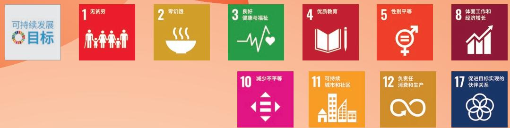

text_image

# An Array of candidate Observations.
attr_reader :candidates
# The control: Observation to which the rest are compared.
attr_reader :control
# An Experiment:
attr_reader :experiment
# AN Array of observations which didn't match the control, but were ignored
attr_reader :ignored
# AN Array of observations which didn't match the control
attr_reader :mismatched
# AN Array of Observations in execution order.
attr_reader :observations
# Internal: Create a new result.
#
# experiment - the Experiment this result is for
# observations: - an Array of Observations, in execution order
# control: - the control Observation
#
def initialize(experiment, observations = [], control = null)
@experiment = experiment
@observations = observations
@control = control
@candidates = observations - [control]
evaluate_candidates
freeze
end
# Public: the experiment's context
def context
experiment.context
end
# Public: the name of the experiment
def experiment_name
experiment.name
end
# Public: was the result a match between will management
def matched?
lib/scientist/result.rb 1:1

# 科技创新强动能

# 治理

公司构建完善科技创新治理体系，搭建以国家级企业技术中心为核心，以省级技术中心、智慧城市工程研究中心为主导，以各类研发平台、研发基地、创新工作室为支撑的三级研发体系，形成层级清晰、分工协同、高效运转的科技创新组织架构。

# 国家级企业技术中心

负责制定公司科技发展战略，明确发展目标、战略重点与年度工作计划，建立有序接替的科研计划体系。

# 省级技术中心、工程研究中心

负责聚焦特色技术研发、新技术应用推广、新产品开发及生产技术攻关等重点任务。

# 各级研发平台、研发基地、创新工作室

负责为创新活动提供基础设施保障。

公司三级创新研发体系

<table><tr><td>序号</td><td>平台名称</td><td>平台类别</td></tr><tr><td>1</td><td>国家认定企业技术中心</td><td>国家级</td></tr><tr><td>2</td><td>广东省异构系统下政务信息交换及共享软件技术工程技术研究中心</td><td>省级</td></tr><tr><td>3</td><td>广东省智慧城市研究院</td><td>省级</td></tr><tr><td>4</td><td>广东省企业技术中心</td><td>省级</td></tr><tr><td>5</td><td>广州市北明智慧城市信息资源集成技术研究院</td><td>市级</td></tr><tr><td>6</td><td>广州市工程技术研究开发中心</td><td>市级</td></tr><tr><td>7</td><td>广州市企业技术中心</td><td>市级</td></tr></table>

战略

<table><tr><td>风险/机遇类型</td><td>风险/机遇描述</td><td>影响时间范围</td><td>潜在财务影响</td><td>应对措施</td></tr><tr><td>研发风险</td><td>若研发项目不足、研发投入强度偏低,将影响新产品开发与知识产权形成,难以实现预期收益。</td><td>中期</td><td>无法及时适配新技术迭代,市场竞争加剧风险,营收增长乏力。</td><td rowspan="2">强化研发体系建设,构建有序接替的科研计划;优化研发投入结构,重点倾斜高附加值领域;完善项目全流程管理,强化项目成果转化效率;深化核心领域布局,提升产品核心竞争力,快速拓展区域市场。</td></tr><tr><td>市场机遇</td><td>人工智能、司法科技、数字金融、企业数字化转型等领域市场需求持续攀升,公司可利用优势领域,扩大市场份额。</td><td>中长期</td><td>系统集成及行业解决方案业务规模快速扩张,带动营收大幅增长;借助标杆项目,提升优质项目中标率。</td></tr></table>

# 影响、风险和机遇管理

# - 科创研发管理

公司持续完善《技术中心组织机构及职能设置》《技术中心实验室管理办法》《组织的知识管理程序》等研发制度，规范从项目立项、研发实施到成果转化的全流程管控，保障科技创新目标高效落地。

# ○ 创新成果应用

公司围绕人工智能、大模型、物联网、数字政府等重点方向，将研发成果广泛应用于北明计量大模型管理平台、劳动争议案件智能辅助裁决平台、物联智控平台等关键项目，有效提升客户业务效率与管理智能化水平。同时，通过打造标杆项目、提炼可复制解决方案，建立用户反馈与产品迭代机制，不断优化系统性能，提升产品竞争力。

# 北明计量 大模型管理 平台

面向国家电网计量业务需求研发，整合电力全业务数据，实现智能问答、精准诊断与业务提效，赋能电力计量领域智能化升级。

# 劳动争议 案件智能 辅助裁决 平台

依托劳动仲裁专用大模型深度解析案件材料，辅助仲裁员统一裁判标准、提升办案效率与质量。

# 物联智控平台

兼容多类网络与终端，提供标准化设备与数据管理服务，广泛应用于智慧城市、工业物联网等场景，支撑企业数字化转型。

# - 保护知识产权

公司以《专利管理办法》为基础，构建知识产权创造、保护、运用、管理全链条体系；常态化开展内外部培训，强化员工确权意识与申报主动性。

累计拥有授权发明专利

46 件

实用新型专利

26 件

软件著作权

828 件

数据知识产权

2 件

# 案例

# 河北省首张数据知识产权公证存储证明落地常山北明

2025 年 7 月，常山北明所属河北北明兴云互联网科技有限责任公司获得河北省首张数据知识产权公证存储证明，实现数据资产确权与价值化运营的重要突破，为数据资产入表、交易流通、纠纷处理等场景提供坚实支撑。

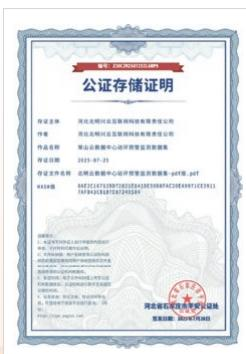

text_image

编号: 0100075589
公证存储证明
存证主体: 河北光明区金海联网络有限责任公司
作者: 河北光明区金海联网络有限责任公司
作业名称: 雅云县象屿中心动环管管监测器
存证日期: 2023-07-25
存证文件名称: 北明县象屿中心动环管管监测器-pDFB.pdf
MASS号: 0021C11F12H20T01E64D3D5BFA2D8A95TCE9H11
ISBN: 978-7-1-0000-0021-0000
河北省石家庄市永安区人民法院
发回日期: 2023年05月05日

# ○ 推进数智化转型

# 对内提质增效

通过 OA 系统、财务一体化平台、数据中心动环监测、光伏效益监测等系统建设，实现行政、财务、生产运营全流程数字化。

# 对外赋能产业升级

聚焦智慧园区、智慧供热、智慧港口、智慧场馆等领域，以数字技术助力传统产业降本增效、绿色低碳发展；同时持续拓展应用场景，推动企业从单点数字化改造向全链条智能化升级。

# 指标和目标

# 2025年目标

研发项目按计划推进，知识产权数量稳步提升，数字化转型重点项目落地。

# 2025年指标

- 研发投入 25,244.53 万元  
- 研发投入强度 3.35%

- 立项研发项目 113 项  
- 新增授权发明专利5件，其中实用新型专利1件

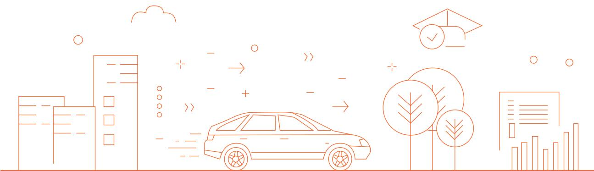

natural_image

Line art illustration of a city with buildings, a car, trees, and a graduation cap (no text or symbols)

# 客户至上创价值

# 治理

公司构建以最高管理者为第一责任人、首席质量官为第一质量人、中层管理人员为质量管理的执行者和推动者、一线员工为质量管理的执行者和参与者的多层次、全方位、一体化质量责任体系。

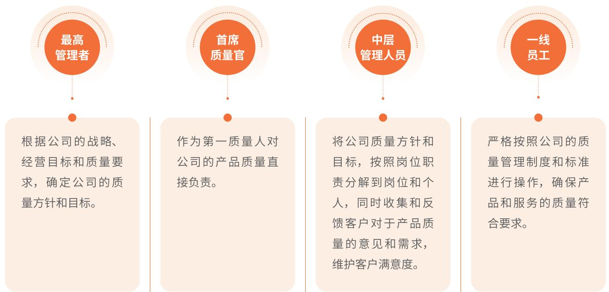

flowchart

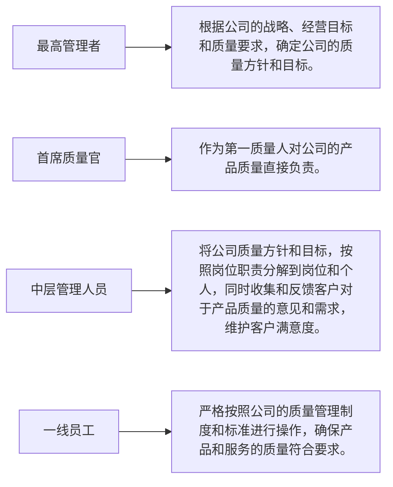
```mermaid
graph LR
  A["最高管理者"] --> B["根据公司的战略、经营目标和质量要求，确定公司的质量方针和目标。"]
  C["首席质量官"] --> D["作为第一质量人对公司的产品质量直接负责。"]
  E["中层管理人员"] --> F["将公司质量方针和目标，按照岗位职责分解到岗位和个人，同时收集和反馈客户对于产品质量的意见和需求，维护客户满意度。"]
  G["一线员工"] --> H["严格按照公司的质量管理制度和标准进行操作，确保产品和服务的质量符合要求。"]
```

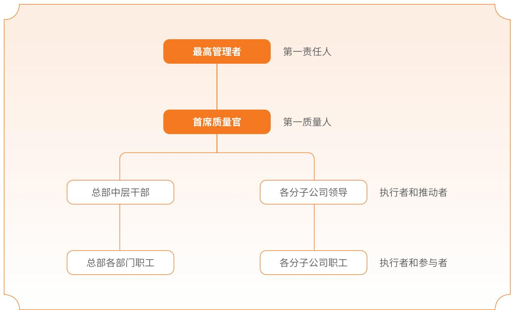

flowchart

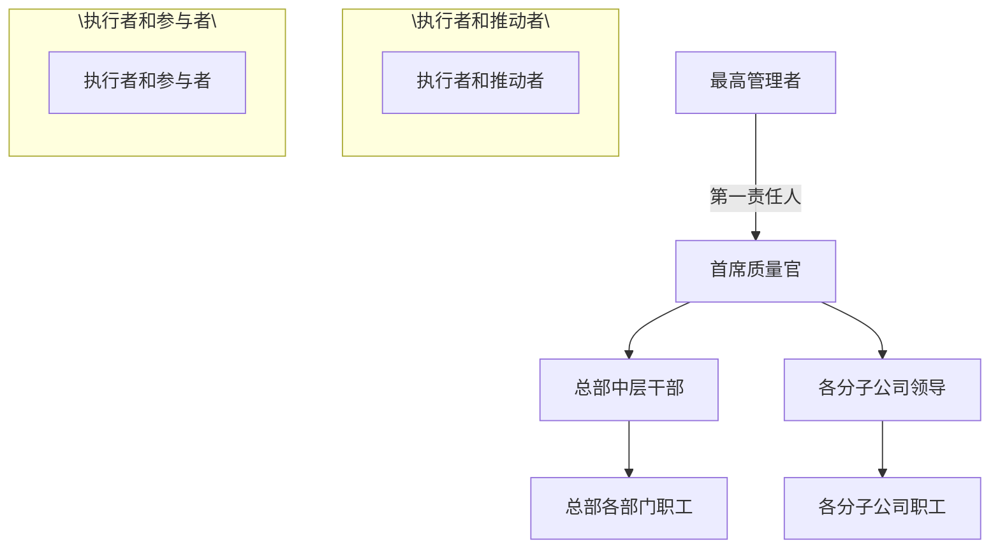
```mermaid
graph TD
  A["最高管理者"] -->|"第一责任人"| B["首席质量官"]
  B --> C["总部中层干部"]
  B --> D["各分子公司领导"]
  C --> E["总部各部门职工"]
  D --> F["各分子公司职工"]
  subgraph sg["\"执行者和推动者\""]
    direction TB
    G["执行者和推动者"]
  end
  subgraph sg_2["\"执行者和参与者\""]
    direction TB
    H["执行者和参与者"]
  end
```

战略

<table><tr><td>风险</td><td>风险描述</td><td>影响时间范围</td><td>潜在财务风险</td><td>应对措施</td></tr><tr><td>市场风险</td><td>行业竞争加剧,客户对产品安全性、服务质量要求持续提升,带来交付与口碑压力。</td><td>短期</td><td>产品/服务质量不达标引发客户不满,增加运维成本;品牌口碑受损导致客户黏性下降,存量客户续约率降低。</td><td>加大研发投入强度,健全质量管理体系,明确质量责任意识,同时做好顾客回访及产品改进工作。</td></tr><tr><td>技术风险</td><td>技术更新迭代快,需定期开发维护新功能,确保产品安全性、稳定性。</td><td>中期</td><td>产品竞争力下滑,整体毛利率承压;产品安全漏洞引发数据安全事件,面临合规处罚与客户赔偿;持续研发投入与运维成本上升。</td><td>完善质量控制体系,依托现有质量管理体系,做好售前及售后服务工作。</td></tr></table>

# 影响、风险和机遇管理

# ○ 产品质量管理

公司制定《管理手册》《内部审核程序》《管理评审程序》等质量管理制度，参照相关标准制定质量方针与目标，严格流程控制与内部审核；各子公司在《质量手册》框架下建立适配本单位的程序文件，确保体系有效运行。公司积极建设卓越绩效体系，将质量管理流程制度化、规范化，并于2025年10月完成ISO 9001质量管理体系监督审核。

# - 提供优质服务

公司致力于优化客户服务，利用 CRM 系统记录客户信息与服务过程，保持跟踪回访；建立标准化、闭环式客户反馈管理体系，确保诉求快速响应、问题妥善解决。

# ■ 健全售后服务

公司建立健全售后服务管理体系，所属北明软件已获得 ISO/IEC 20000-1:2018 信息技术服务管理体系认证、GB/T 27922-2011 商品售后服务评价体系。鼎云公司制定《交付及交付后服务控制程序》，明确部门职责、规范服务流程，全面保障客户售后需求。

# 应对客户投诉

公司积极面对客户因产品质量或服务问题提出的异议、投诉、索赔及相关诉求。北明软件严格遵循四步闭环流程，确保客户诉求得到高效解决。

# 北明软件客户投诉及异议处理机制

接到客户投诉的员工必须登记《客户投诉记录》  
二 对登记的投诉分析并收集相关数据资料，并通知相关部门经理  
三 相关部门对客户不满意的项目或事项交由指定责任人进行处理，并跟进处理结果  
四 投诉处理完成后，对客户进行回访并将对处理结果的意见进行整理归档

# 客户满意度调查

公司建立顾客满意度监测机制，以鼎云公司为例制定并执行《顾客满意度控制程序》，由市场部作为归口管理部门，通过顾客满意度问卷调查、电话／邮件问询、现场走访、用户意见收集、交付产品质量数据分析、流失业务归因分析等多维度手段，定期统筹开展顾客满意度调查、数据汇总与综合分析工作。

# 指标和目标

# 2025年质量目标

工程项目交验合格率100%，顾客满意率95%以上，项目按期完成且一次性验收通过率90%以上。

# 2025 年达成情况

\- 均已完成，未发生产品相关的安全与质量重大责任事故。

# 协作共赢促发展

# 多方交流合作

公司立足数字经济与科技创新主赛道，深化与政府、高校、科技企业合作，聚焦人工智能、医疗科技、政务数字化等重点领域落地标杆项目，赋能业务拓展。

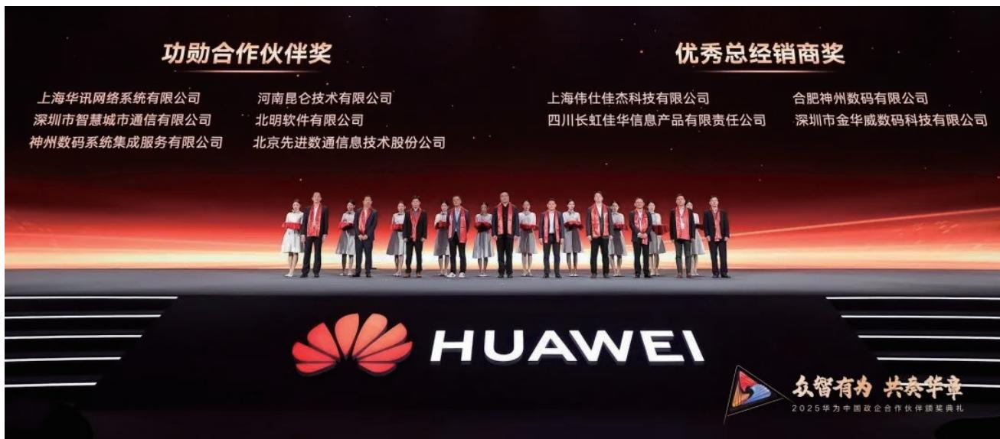

text_image

功勋合作伙伴奖
上海华讯网络系统有限公司
深圳市智慧城市通信有限公司
神州数码系统集成服务有限公司
河南昆仑技术有限公司
北明软件有限公司
北京先进数通信息技术股份公司
优秀总经销商奖
上海伟仕佳杰科技有限公司
四川长虹佳华信息产品有限责任公司
合肥神州数码有限公司
深圳市金华威数码科技有限公司
HUAWEI
众智有为 共奏华章
2025华为中国政企合作伙伴颁奖典礼

北明软件荣获华为 2025 年 “功勋合作伙伴奖” “卓越 ISV 合作奖” “数字化转型服务一致性奖” 等多项荣誉

# 北明软件携手华为、甘孜州政府共建政务 AI 大模型

2025 年 2 月，四川省甘孜州人民政府、华为与北明软件联手合作，成功部署四川省首个政务领域“满血版 DeepSeek”。本次合作通过将 DeepSeek R1 模型强大的推理能力与 AI 中台的分析能力相结合，不仅在数据分析、数据治理、数据呈现等方面节约时间成本，还显著提升了数据的精准度，这将全面支持包括防灾减灾、安全生产和社会稳定等多个业务领域实现智能升级。

text_image

新对话
工作空间
搜索
对话
过去7天
新对话
森林防火指南
甘孜旅行攻略
康定风景指南
甘孜的具数量
DeepseekR1
设为默认
有什么我能帮您的吗？
+  代码编程器
建议
如果你每天去打改旅游
出访问在8-8日6

# 北明软件联合高校开展乳腺癌诊疗 AI 技术攻关

北明软件联合中山大学、香港城市大学，聚焦临床场景乳腺癌诊疗人工智能方法研究开展产学研合作。项目针对临床难点，研发符合诊疗规范、高泛化能力的 AI 应用方案，助力提升诊断效率、服务患者，同时推动粤港澳大湾区医学人工智能交流合作，为公司医疗科技业务拓展奠定基础。

# 助力行业发展

公司密切跟踪软件与数字经济行业发展趋势，积极参与标准体系建设、高端峰会论坛、成果发布与案例评选，以技术创新与实践成果助力产业数字化、智能化高质量发展。截至2025年底，公司现行有效国家标准3项。

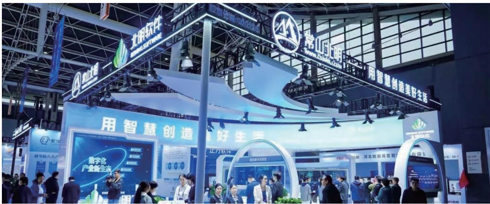

text_image

北明软件
BIDUAR SOFTWARE
常山正明
WWW.BINDA.COM
用智慧创造美好生活
用智慧创造
数字化
产业新生态
好生活
正月软件
河北畅富尚量智
有限么

常山北明携多项创新成果亮相 2025 中国国际数字经济博览会

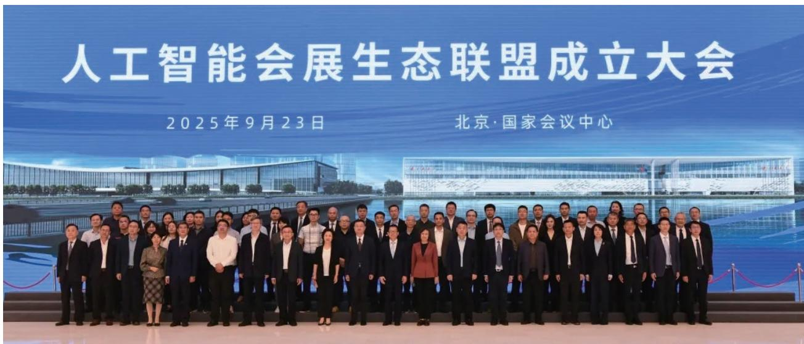

text_image

人工智能会展生态联盟成立大会
2025年9月23日
北京·国家会议中心

北明软件出席人工智能会展生态联盟揭牌仪式暨人工智能会展产业生态论坛，并作为首批成员单位正式加入联盟

# 北明软件亮相全球数字经济大会

2025 年 7 月，北明软件参加 2025 全球数字经济大会第四届全国企业数字化转型高层论坛，并联合 30 余家单位共同发布《数字化转型赋能企业全球化发展倡议书》。北明软件凭借《天津港港口数据治理与服务平台（数据治理及实施）项目》入选 2025 全国企业数字化赋能十佳案例，《北京市热力集团智慧供热管控平台建设及所属锅炉房换热站自控改造项目》入选 2025 全国企业数字化转型与赋能优秀案例榜单。

# CERTIFICATE

# 证书

# 天津港信息技术发展有限公司

# &北明软件有限公司

经专家评议审核，贵公司案例《数字化转型赋能港口智能化升级》入选2025全国企业数字化赋能十佳案例。
特颁此证。

# CERTIFICATE

# 证书

# 北明软件有限公司

经专家评议审核，贵公司《北京市热力集团2023年智慧供热项目(五标段)》入选2025全国企业数字化转型与赋能优秀案例。特颁此证。

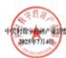

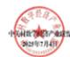

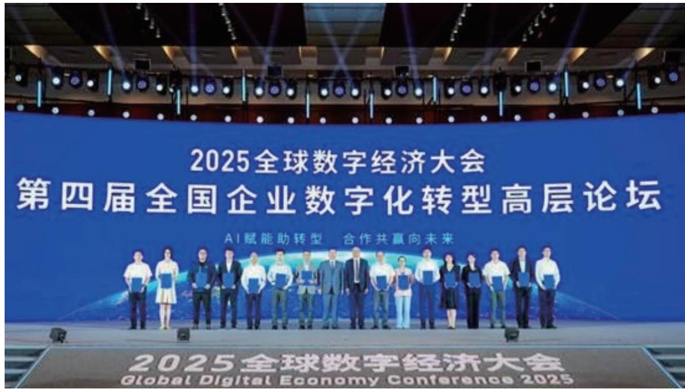

text_image

2025全球数字经济大会
第四届全国企业数字化转型高层论坛
AI赋能助转型 合作共赢向未来
2025全球数字经济大会
Global Digital Economy Conference 2025

# 加强

# 供应商管理

公司建立完善采购和供应商管理机制。在采购实施环节，严格遵守《中华人民共和国招标投标法》《国有企业采购操作规范》等法律规范，以及《工程项目招标管理办法》《关联交易管理制度》等内部制度，规范采用公开招标、竞争谈判、竞争磋商等多元化采购方式。在供应商准入与评估阶段，主动将质量标准、环境保护、安全生产等要素纳入评估与准入条款。公司推行供应商动态管理与年度综合考核，按照统一考核评分标准开展全面评估，对考核不达标的供应商及时移出合格供应商名录。

# 赋能成长育英才

公司始终秉持“尊重人才、爱惜人才”的理念，厚植人才发展沃土，切实保障员工各项合法权益，不断健全人才发展体系，着力营造包容开放、公平公正、和谐共进的优质职场环境。

# 保障员工权益

# ○ 平等合规雇佣

公司严格遵守《中华人民共和国劳动法》《中华人民共和国劳动合同法》等相关法律法规，制定并发布《实施人才强企战略的意见》《员工招聘录用管理办法》等制度，持续完善公开招聘、竞聘上岗与人才激励约束机制，通过校园招聘、社会招聘、劳务派遣等多元渠道累计吸纳就业人员438人，其中劳务派遣员工101人，以实际行动履行稳就业、保就业的社会责任。

公司坚决杜绝任何形式的歧视、强制劳动、童工使用及骚扰霸凌行为，充分尊重员工个体差异，积极构建多元、平等、包容的用工环境。

# 薪酬福利保障

公司建立完善薪酬福利体系，实施《薪酬绩效管理制度》《绩效考核管理办法》，实现薪酬管理规范化、制度化。公司每月按时足额支付员工薪酬，按规定为员工足额缴纳“五险一金”；严格执行带薪年休假、产假、育儿假等法定假期，落实防暑补贴、取暖补贴、独生子女补贴等福利；每年为全体员工安排健康体检，全方位保障员工薪酬福利与健康权益。

# ○ 深化民主管理

公司持续健全民主管理机制，充分保障职工知情权、参与权、表达权、监督权。2025年7月，公司召开职工代表大会，依法选举产生董事会职工代表董事；11月，召开第四届工会会员代表大会第一次会议，选举产生新一届工会委员会、经费审查委员会及女职工委员会，为推动企业与职工共同发展筑牢坚实组织保障。

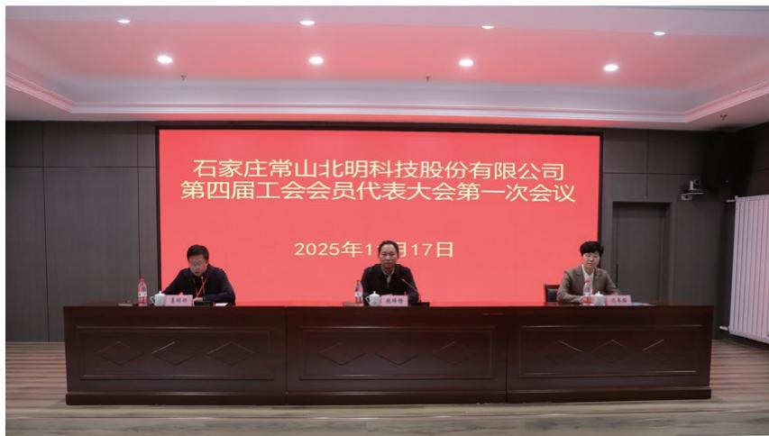

text_image

石家庄常山北明科技股份有限公司
第四届工会会员代表大会第一次会议
2025年1月17日

召开 2025 年公司第四届工会会员代表大会第一次会议

# - 员工满意度调查

公司建立年度员工满意度调查机制，围绕工作岗位适配度、薪酬福利与回报、晋升与发展、上级管理、同事与工作环境五大维度开展调研，掌握员工职场体验与真实诉求。基于调查结果形成分析报告并制定针对性改进举措，持续优化内部管理与员工服务体系，不断提升员工归属感与企业认同感。

# 助力员工成长

# ○ 人才培养

公司年初制定年度人才培训计划，督促各单位结合实际落地实施，采用线上线下相结合、内外部培训联动的方式，聘请院校、培训机构及行业前沿专家讲师开展授课。培训内容覆盖专业技术、规章制度、安全教育、企业文化、管理技能、财务知识、成本控制等领域，有效拓宽员工知识视野，全面提升员工综合素养、专业技能与管理水平。

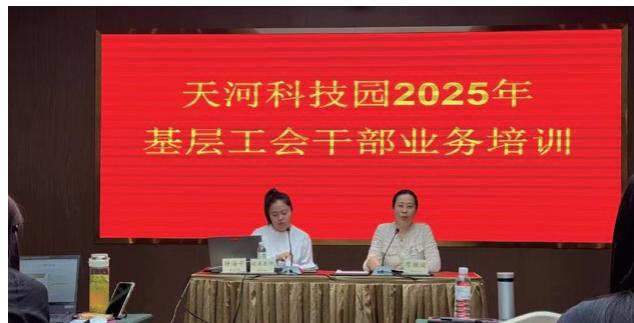

text_image

天河科技园2025年
基层工会干部业务培训

基层工会干部业务培训

# ○ 发展与晋升

公司构建清晰职位体系，遵循精干高效、定编总控、有效管理幅度、对口归口、权责利对等原则，明确岗位编制与职责；同时制定《员工晋升方案》，以季度及年度绩效考核为核心评价依据，每年按比例为表现优异的员工，提供职级晋升通道，助力员工实现长期成长与价值提升。

# 落实员工关爱

公司构建多层次、全方位的职工关爱保障体系。2025年，公司紧扣职工急难愁盼，开展各类暖心帮扶与慰问工作。全年累计节日集中慰问职工189人次，针对性开展退役军人、退休职工、患病住院职工及家属病故职工专项慰问；为一线作业人员配备防暑降温物资，积极推选优秀一线职工参与河北省总工会示范性职工疗休养活动。同时，公司常态化开展文体活动，持续丰富职工精神文化生活。

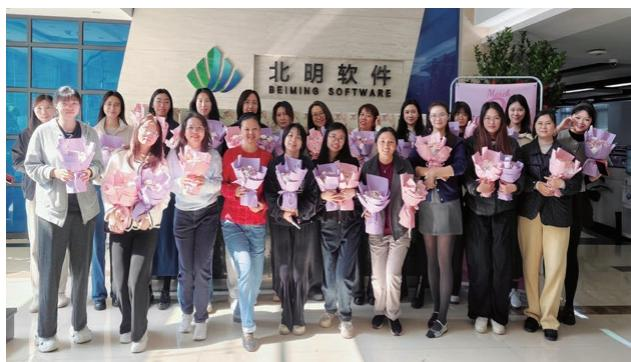

text_image

北明软件
BEIMING SOFTWARE

妇女节活动

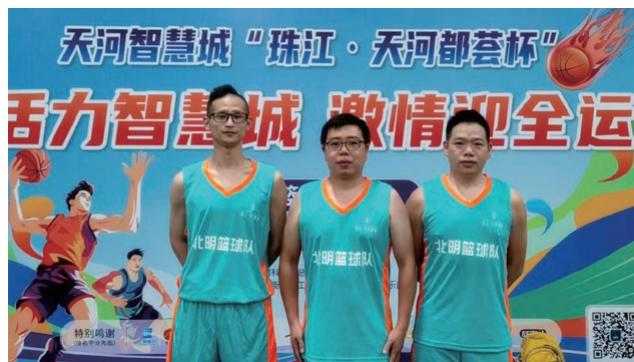

text_image

天河智慧城“珠江·天河都荟杯”
活力智慧城 激情迎全运
北明蓝球队
北明蓝球队
北明蓝球队
特别鸣谢
特此分享成功

三人篮球赛

# 夯实安全助远航

# 安全生产管理

公司成立由董事长担任第一主任的安全生产委员会，构建完善的安全生产管理网络体系；健全安全生产制度标准，制定安全生产责任制、规章制度及《安全标准化管理手册》；与所属企业负责人签订安全生产及消防安全相关责任状，明确党政领导干部安全生产（消防）职责与年度任务清单，为生产经营平稳运行提供坚实制度保障。

# 落实隐患排查

公司编制安全生产隐患排查相关方案，对所属企业开展安全消防检查，包括隐患自查互查、节假日及重点时段专项检查等，督促落实整改措施、下发整改通知单，通过层层排查筛查筑牢安全生产防线。

# 培育安全文化

公司严格落实《生产安全事故应急预案》《总部办公场所火灾应急预案》等应急管理制度，组建专业应急救援队伍，持续深化消防安全培训与宣教工作。各所属企业以“安全生产月”“消防宣传月”为重要载体，常态化开展消防培训、应急逃生演练等主题活动。通过邀请专业人士开展消防知识讲解、消防器材实操教学、日常防火规范及应急逃生技能培训，切实强化全员安全生产与消防安全防范意识。2025年，公司及所属企业共组织开展消防安全教育培训120场次、培训2,875人次；组织开展应急演练87次，参加演练人数935人次。

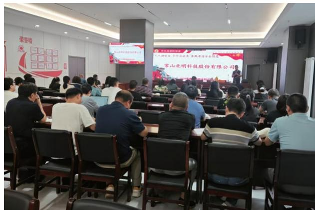

text_image

荣誉站
黄山北明科技股份有限公司

常山北明开展消防培训

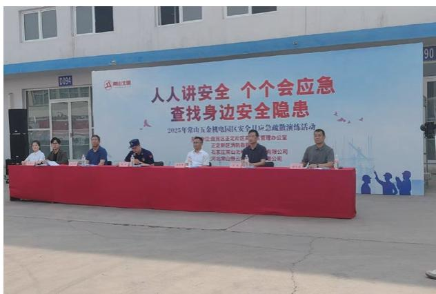

text_image

人人讲安全 个个会应急
查找身边安全隐患
2025年常山五金热电园区安全应急疏散演练活动
石家庄市永定区消防监督管理办公室
石家庄市永定区消防监督管理局
石家庄市永定区消防监督管理办公室

恒云公司开展模拟扑救初期火灾和应急疏散逃生演练

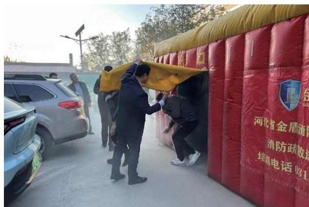

text_image

河北省金盾消防
消防疏散送
培训电话 031

能投公司开展消防模拟逃生舱应急演练活动

# 保障数据与客户隐私安全

# ○ 治理

公司建立自上而下的数据安全管理机制，明确管理层、业务部门、技术部门及子公司在数据安全与隐私保护中的职责边界，形成统筹协调、分级负责的治理格局。依托子公司北明软件完备的信息安全管理体系，将数据合规、隐私保护嵌入业务全流程。

○ 战略

<table><tr><td>风险</td><td>风险描述</td><td>影响时间范围</td><td>潜在财务风险</td><td>应对措施</td></tr><tr><td>技术安全风险</td><td>防火墙、数据加密、入侵检测等技术防护体系不完善,客户隐私信息面临泄露风险。</td><td>短期、中期</td><td>数据泄露或安全事件引发客户索赔、诉讼,产生赔偿及法律成本;需投入资金进行技术升级、漏洞修复及系统整改;客户流失率上升,影响营收稳定性。</td><td>加大数据安全技术研发投入,升级纵深防御体系;进行常态化安全检测与漏洞修复;定期开展攻防演练。</td></tr></table>

# - 影响、风险和机遇管理

公司通过构建完善的制度体系、强化软件合规管理和数据安全意识等多维举措，筑牢数据安全保障防线。旗下北明软件具备完备的安全与能力认证体系，拥有 CS5、CMMI5 级认证、ISO/IEC 27001 信息安全管理体系认证、涉及国家秘密的计算机信息系统集成甲级资质，并通过 DCMM 数据管理能力成熟度三级认证。

# 健全制度体系

完善《保密管理制度》《信息化管理规定》等制度，明确绝密、机密、秘密三级管理；规范文件起草、传输、归档，密级文件严禁通过互联网传输；废旧文件统一碎纸销毁，消除泄密隐患。

# 使用正版软件

使用正版软件，避免安全漏洞和法律风险；严禁安装非授权软件，防止恶意软件和未经审核的软件进入办公系统。

# 客户隐私保护

规范客户信息收集、存储、使用、传输等全流程管理，严格权限控制与操作留痕，确保客户信息不泄露、不滥用。

# 强化安全意识

常态化开展信息安全、数据安全宣传与培训。

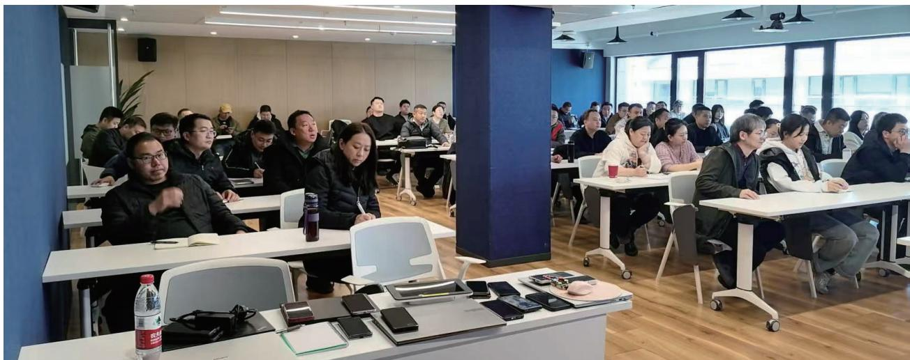

natural_image

Group of people seated at desks in a modern conference room with large windows and blue walls (no visible text or signage)

开展重点项目管理与风险案例专项培训，深化员工对重点涉密行业的认知理解

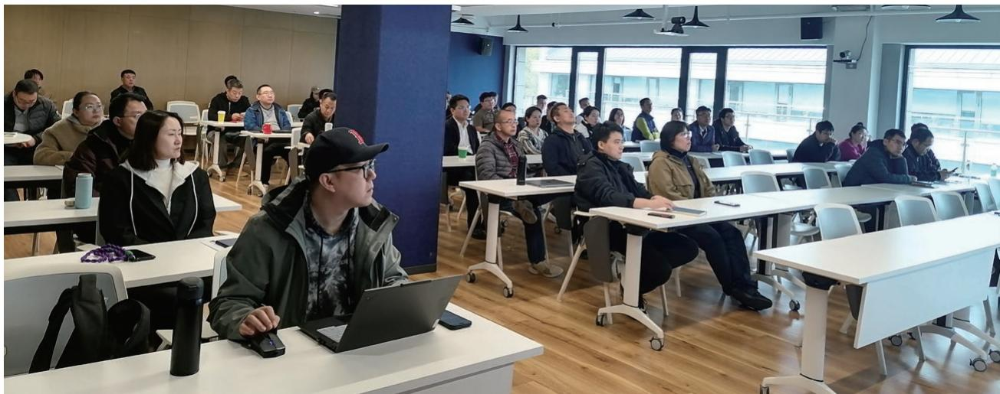

natural_image

Interior of a modern classroom or training session with attendees seated at desks, some using laptops and tablets (no visible text or signage)

开展保密专项培训，明确涉密项目管理及风险防控要求

# ○ 指标和目标

报告期内，公司及所属企业未发生数据安全事件及客户隐私泄露事件。

# 公益善举暖民心

# 助力乡村振兴

常山北明始终将助力乡村振兴作为履行社会责任的重要着力点，积极参与常山集团“走亲”帮扶活动，聚焦民生需求，精准开展物资帮扶与暖心关怀。2025年2月，公司赴石家庄市赵县北王里镇小琉璃村开展慰问帮扶，为13户低保家庭送上生活物资，把温暖送到群众身边。

# 北明软件 | 捐资修路惠民生 情系乡村暖人心

北明软件积极投身乡村基础设施建设，捐资支持贵州省纳雍县董地乡青山村球场改扩建工程、广东省兴宁市坭陂镇理中村泥路硬底化改造项目，切实改善乡村生产生活条件。其中，理中村泥路硬底化项目解决了村民出行“晴天一身土、雨天一身泥”的难题。项目完工后，中共坭陂镇委员会、坭陂镇人民政府赠予北明软件“情系乡村路通万家”荣誉牌匾，表达高度赞誉。

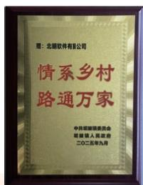

# 开展公益志愿

常山北明统筹各所属企业资源，深度投身民生关爱、社会公益等领域。2025年，公司统筹组织职工参与无偿献血等社会公益行动。旗下北明软件发挥资源优势，赞助北京大学、广东省华南师范大学教育发展基金会；为广州市天河区慈善事业捐赠款项，以实际行动践行公益担当、回馈社会。

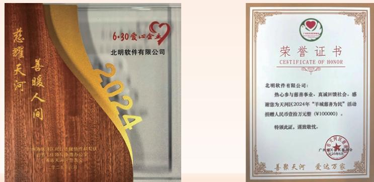  
北明软件慈善荣誉证书

# 能投公司开展便民志愿服务行动

2025 年，能投公司所属物业公司聚焦园区独居老人、高龄长者等特殊群体，组建志愿服务队开展常态化关爱帮扶。全年为行动不便的老年人提供免费上门理发、生活物资及药品代买配送等便民服务，并在传统节日开展走访慰问，累计服务百余人次，切实解决老年群体生活难题。

natural_image

People preparing zongzi (no visible text or symbols)

体验传统民俗活动

text_image

芳美教育
深圳 美草 非永久

上门理发服务

# 能投公司开展扫雪除冰志愿服务

2025 年 11 月，面对强降雪天气带来的出行安全隐患，能投公司迅速组织 30 余名党员开展扫雪除冰志愿服务，集中清理社区主干道、停车场及人行通道积雪积冰，开辟“暖心通道”，有效保障居民出行安全。

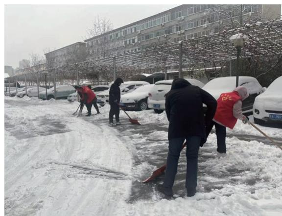

natural_image

People shoveling snow in a snowy urban area with parked cars and buildings in the background (no visible text or signage)

社区道路清扫

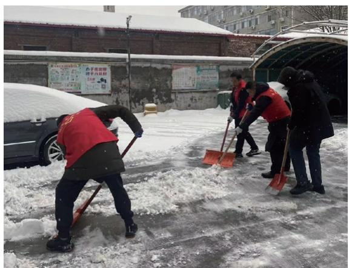

natural_image

Workers clearing snow from a garage with vehicles and buildings in the background (no visible text or symbols)

停车场入口清扫

# 支援抢险救灾

在自然灾害及园区突发险情时，常山北明所属企业迅速行动、高效处置，通过捐款赈灾、应急抢险等举措，切实守护人民群众生命财产安全。面对西藏地震等自然灾害，北明软件踊跃捐款驰援灾区，全力支持抢险救灾与灾后重建工作。

# 能投公司开展园区强降雨积水应急抢险行动

2025 年 7 月，受强降雨天气影响，石家庄市飞翼路 2 号、市庄路 65 号等园区出现严重积水。能投公司所属物业公司第一时间启动防汛应急预案，迅速组织 20 余名应急抢险人员赶赴现场，通过抽排积水、清理排水口杂物、疏通管网、划定警戒区域等措施高效处置，全程未发生人员伤亡及财产损失，处置及时有序，获得社区及业主一致好评。

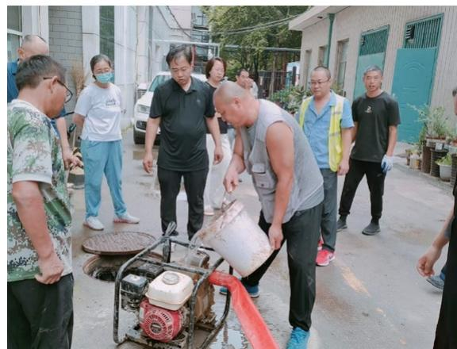

natural_image

Group of people gathered outdoors, one man pouring water from a pump into a container, others observing (no visible text or symbols)

积水抽排作业现场

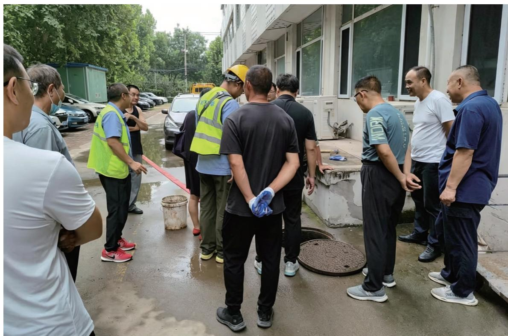

natural_image

Group of people gathered outdoors near a manhole, wearing safety vests and helmets, with parked cars and buildings in the background (no visible text or symbols)

应急抢救现场

# 03

# 环境篇

# 一流生态，引领绿色科技

常山北明始终将绿色发展理念深度融入企业战略与运营全流程，积极落实国家“双碳”目标，以低碳运营持续压降资源能源消耗，坚持打造绿色低碳产品；着力培育全员绿色文化，凝聚可持续发展共识，致力于成为数字经济时代负责任的环境守护者与贡献者。

环境管理强保障 48

应对气候促转型 48

低碳运营促减排 51

绿色文化聚共识 53

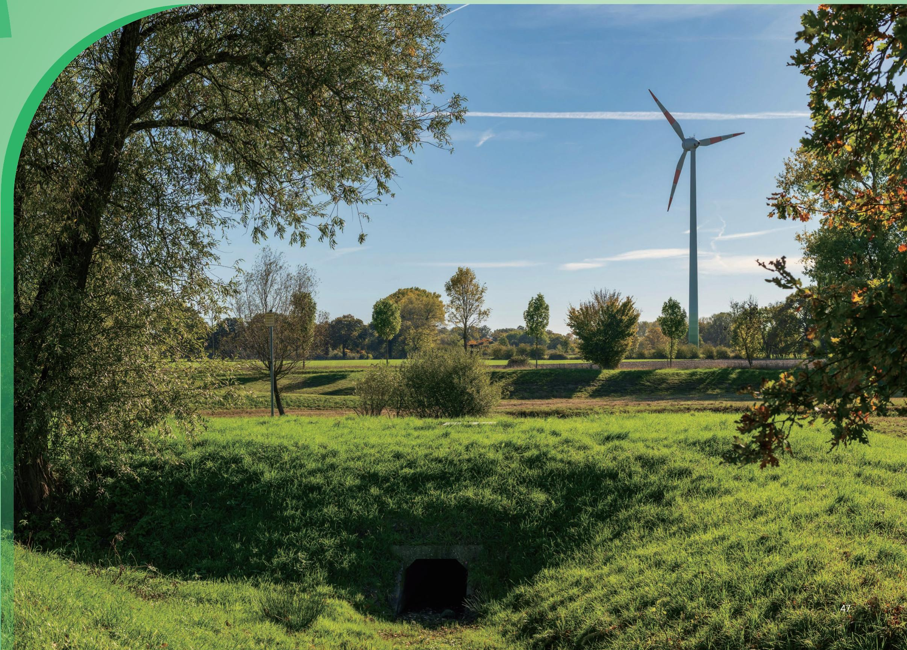

natural_image

Scenic view of a wind farm with a large turbine and green grassland, framed by tree branches under a clear blue sky.

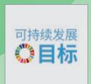

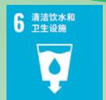

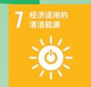

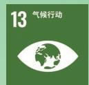

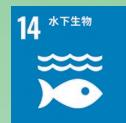

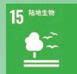

# 环境管理强保障

公司严格遵守《中华人民共和国环境保护法》等相关法律法规，融合 ISO 14001:2015 环境管理体系要求，明确环境管理方针及目标；建立环境运行控制程序、突发环境事件应急预案等生态环境保护管理制度，实行生态环境保护目标管理。公司所有项目均严格执行环评及环保“三同时”制度，报告期内未出现因重大环境保护违法违规而受到处罚的情况。2025 年 10 月，公司通过了 ISO 14001 环境管理体系认证的监督审核，确保了证书的有效性。

# 应对气候促转型

# ○ 治理

公司计划将气候变化治理纳入社会责任管理体系范畴，以可持续发展理念为战略引领，致力于在实现自身绿色低碳转型的同时，赋能社会可持续发展。

○ 战略

<table><tr><td>风险类型</td><td>风险描述</td><td>影响时间范围</td><td>潜在财务影响</td><td>应对措施</td></tr><tr><td>极端天气事件</td><td>暴雨、洪涝等极端天气可能导致公司数据中心及办公场所受损、电力中断,影响系统稳定运行及客户服务连续性。</td><td>短、中期</td><td>设备维修及更换成本增加;服务中断导致客户赔偿及收入损失;保险费用上升。</td><td>关键数据中心异地灾备;加强机房防水及应急供电设施;完善应急预案并定期演练。</td></tr><tr><td>平均气温上升</td><td>全球变暖导致夏季持续高温天气增多,公司数据中心散热能耗大幅增加,运维成本上升,且可能影响员工健康与工作效率。</td><td>中长期</td><td>电力成本显著增加;制冷设备频繁维护及提前更新投入;员工高温补贴及健康管理支出。</td><td>优化机房制冷系统能效;探索自然冷却技术;调整高温天气工作制度。</td></tr></table>

natural_image

Panoramic view of a turquoise river winding through lush green mountains with snow-capped peaks in the background (no text or symbols visible)

<table><tr><td>机遇类型</td><td>机遇描述</td><td>影响时间范围</td><td>潜在财务影响</td><td>应对措施</td></tr><tr><td>低碳产品与服务</td><td>“双碳”背景下,政府及企业客户对能源管理、碳排放在线监测、智慧园区等数字化解决方案需求快速增长。</td><td>中长期</td><td>新业务收入增长;解决方案可复制性强,规模效应提升利润率;增强客户黏性。</td><td>聚焦能源管理、碳排放在线监测、智慧园区等领域,深化解决方案研发与产品落地;携手重点客户打造低碳数字化标杆项目。</td></tr><tr><td>绿色品牌价值</td><td>通过自身运营减碳及提供绿色解决方案,提升公司ESG评级与品牌形象,有助于赢得优质客户及资本市场认可。</td><td>长期</td><td>优质项目中标率提升;融资成本降低。</td><td>加强ESG信息披露;依托在智慧能源、低碳数字化领域的技术积累,以标杆项目强化品牌影响力。</td></tr></table>

# ○ 影响、风险与机遇管理

公司积极响应“双碳”目标要求，立足区域资源禀赋与能源发展需求，有序推进分布式光伏、风电等优质清洁能源项目建设与并网投产，以绿色能源赋能高质量可持续发展。截至2025年底，分布式光伏、风电累计发电量突破2,900万千瓦时。

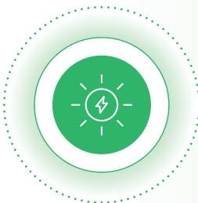

# 分布式光伏

\- 统筹谋划电站布局，充分挖掘闲置屋顶、闲置场地等各类闲置资源潜力，坚持因地制宜、科学施策推进项目建设，实现资源高效利用与绿色发电的双向共赢。2025年累计实现14.9兆瓦分布式光伏电站并网发电，项目覆盖工业、商业等多元应用场景。

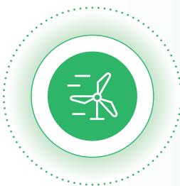

# 风电

\- 推进石家庄市深泽县聚能风电场项目建设，2025年12月圆满完成全容量100兆瓦并网目标。

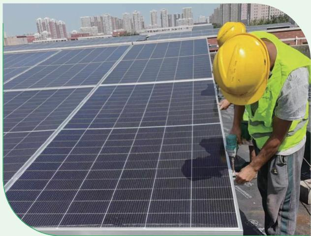

natural_image

Construction workers installing solar panels on a rooftop, wearing yellow hard hats and safety vests (no visible text or symbols)

石家庄学院分布式光伏项目（二期）光伏组件安装

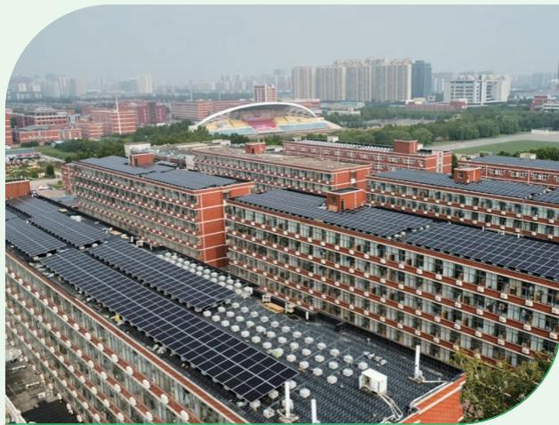

natural_image

Aerial view of a modern multi-story residential building with solar panels installed on rooftops, surrounded by urban high-rises and greenery (no visible text or signage).

石家庄学院分布式光伏项目（二期）并网发电

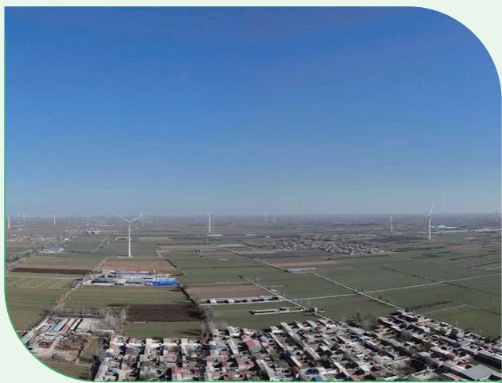

natural_image

Aerial view of a rural landscape with wind turbines and farmland under a clear blue sky (no visible text or symbols)

聚能风电场所有风机全容量并网

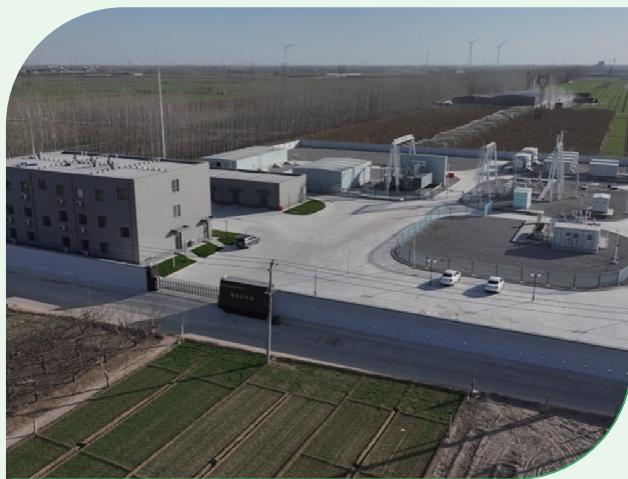

natural_image

Aerial view of an industrial facility with multiple buildings, a circular control unit, and surrounding farmland (no visible text or symbols)

聚能风电场升压站运营

natural_image

Line art illustration of a city skyline with multiple skyscrapers and clouds, no text or symbols present.

# 低碳运营促减排

# 强化能源管理

公司严格遵守《中华人民共和国节约能源法》等相关法律法规要求，发布《关于加强能源管理的通知》，提高公司能源管理水平，降低能源费用支出。公司所使用的能源以电能为主，并通过配置屋顶光伏发电装置提升清洁能源使用比例，实施数据中心制冷系统能效优化、办公区照明与空调智能化升级、老旧高耗能设备淘汰更新等项目，稳步提升能源利用效率。

# 能投公司深耕节能降碳，打造绿色园区

能投公司所属物业公司针对园区老旧太阳能设施运行效能不足、公共区域传统照明能耗偏高等问题，启动园区绿色升级专项改造项目，通过硬件技改升级与清洁能源替代，实现园区安全运营提升与节能降碳目标落地。

# 太阳能设施技改升级

对园区 12 组老旧太阳能设施开展系统性改造，通过除锈加固、渗漏修复、运行参数优化等举措，提升太阳能资源利用效率与设备长期运行稳定性。

# 清洁能源替代

在园区公共区域布设光伏路灯，采用“光储一体”技术替代传统市电照明，实现园区公共区域照明100%可再生能源供应。

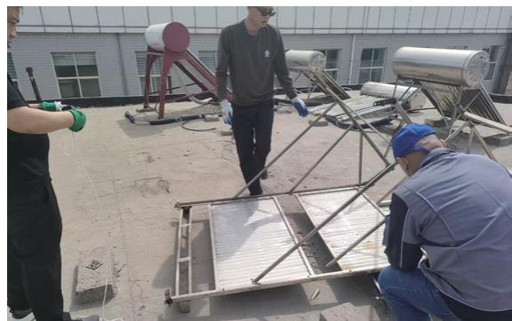

natural_image

Outdoor scene with workers installing solar panels on a rooftop, no visible text or symbols

屋顶太阳能支架改造现场

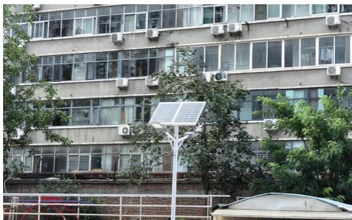

natural_image

Exterior view of a multi-story residential building with solar-powered streetlights and greenery in the foreground (no visible text or symbols)

太阳能光伏路灯

# 减少污染物排放

公司切实履行环境保护主体责任，严格遵守《中华人民共和国环境保护法》《中华人民共和国大气污染防治法》等相关法规，依照《固定污染源排污许可分类管理目录（2019年）》完成登记类管理排污许可；在河北省污染源环境管理数据平台和全国排污许可证管理信息平台公开污染物排放信息、污染防治设施建设和运行情况等信息。报告期内，公司污染物排放均达到国家标准和河北省标准，未发生环境纠纷和环境污染事故。

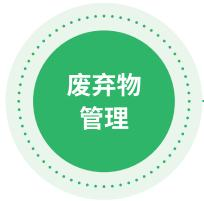

- 公司日常运营产生的废弃物包括无害废弃物和有害废弃物，其中无害废弃物包括生活垃圾、餐厨垃圾、废纸、废塑料、废金属等，有害废弃物包括办公营业场所报废的墨盒、日光灯管等设备，以及机房废弃的裸露线路板、蓄电池等。  
- 严格推行废弃物分类处理，生活垃圾分类处理并移至指定位置，餐厨垃圾由具有回收处置资质的单位回收、处理。  
- 有害废弃物选择具备环保部门核发资质的废旧物资回收商处置，落实回收记录与备案，确保废弃物合规处置。

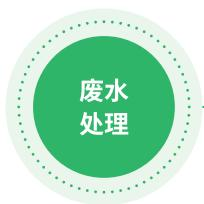

- 生产、生活废水经处理达标后接入正定新区污水处理厂，符合《污水综合排放标准》三级标准及污水处理厂进水要求。  
- 建有污水处理站，相关运行维护记录填写完整规范，切实保障污染防治设施稳定有效运转。

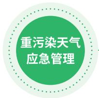

\- 编制重污染天气应急响应操作方案，实行“一厂一策”管理，科学制定应急减排措施，提升应对重污染天气的能力，降低极端天气下企业生产对环境造成的影响。

# 加强 水资源管理

公司严格遵守《中华人民共和国水法》及相关节水条例，使用智能感应水龙头，定期对水龙头、阀门等用水设备检修更换；开展节水宣传、张贴节约用水标识等；探索水资源循环利用途径，持续降低单位业务量的水资源消耗。

# 践行循环经济

公司积极践行循环经济发展理念，将资源节约与循环利用深度融入全流程运营管理。围绕电子设备、办公设施、包装材料等各类物资，大力推进分类回收再生，持续提升资源利用效率；同时深化数字化办公转型，依托办公自动化系统推行无纸化办公模式，严格落实必要文件双面打印、非必要文件线上传阅与电子归档等举措，最大限度降低资源消耗与废弃物产生，助力绿色低碳运营。

# 绿色文化聚共识

公司积极倡导绿色低碳运营理念，依托全国节能宣传周、全国低碳日等重要节点，有序开展第37个爱国卫生月活动、全国生态日宣传活动、九一六石家庄生态日活动、垃圾分类宣讲活动，并通过张贴宣传海报等形式广泛宣教，推动低碳环保理念内化于心、外化于行。

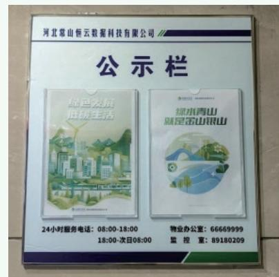

text_image

河北常山恒云数据科技有限公司
公示栏
绿色发展
低碳生活
24小时服务电话：08:00-18:00
18:00-次日08:00
绿水常山
就是金山常山
物业办公室：66669999
警 检 重：89180209

张贴宣传海报

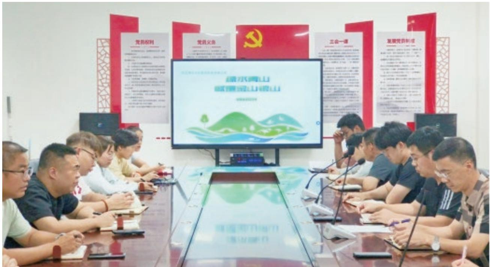

text_image

党员权利
党员义务
三会一课
发展党的制度
绿水青山就是金山银山

全国生态日活动  

natural_image

Line art illustration of a city skyline with multiple buildings and trees (no text or symbols)

# 未来展望

2026 年是 “十五五” 规划开局之年，也是常山北明加速迈向一流科技型行业领军企业的关键之年。我们将坚持以习近平新时代中国特色社会主义思想为指导，全面贯彻党的二十届四中全会精神，认真落实石家庄市委、市政府、市国资委及常山集团工作部署，围绕算力基础设施建设、AI 服务升级及 AI 大模型垂直行业应用三大维度，构建协同发展的战略蓝图，打造差异化竞争优势，实现从技术服务商向生态运营商的跨越式发展，以更加坚实的步伐推动高质量发展，为现代化、国际化美丽省会城市建设彰显常山北明担当。

natural_image

Scenic landscape with a calm blue lake surrounded by lush green reeds and tall evergreen trees under a clear blue sky (no text or symbols visible)

# 附录

关键绩效

<table><tr><td colspan="2">指标</td><td>单位</td><td>2023年</td><td>2024年</td><td>2025年</td></tr><tr><td colspan="6">经济责任</td></tr><tr><td colspan="2">营业收入</td><td>亿元</td><td>90.47</td><td>88.18</td><td>75.38</td></tr><tr><td colspan="2">净利润</td><td>亿元</td><td>-1.17</td><td>-5.93</td><td>0.33</td></tr><tr><td colspan="2">纳税总额</td><td>亿元</td><td>1.62</td><td>2.41</td><td>1.48</td></tr><tr><td colspan="2">资产总额</td><td>亿元</td><td>178.74</td><td>164.15</td><td>149.37</td></tr><tr><td colspan="2">每股收益</td><td>元</td><td>-0.07</td><td>-0.37</td><td>0.02</td></tr><tr><td colspan="2">股东会召开次数</td><td>次</td><td>4</td><td>4</td><td>5</td></tr><tr><td colspan="2">董事会召开次数</td><td>次</td><td>11</td><td>12</td><td>15</td></tr><tr><td colspan="2">董事会董事</td><td>名</td><td>11</td><td>10</td><td>11</td></tr><tr><td rowspan="2">按性别</td><td>男性董事</td><td>名</td><td>9</td><td>8</td><td>8</td></tr><tr><td>女性董事</td><td>名</td><td>2</td><td>2</td><td>3</td></tr><tr><td rowspan="2">按类型</td><td>独立董事</td><td>名</td><td>4</td><td>4</td><td>4</td></tr><tr><td>非独立董事</td><td>名</td><td>7</td><td>6</td><td>7</td></tr><tr><td colspan="2">接受反商业贿赂及反贪污培训的董事总数百分比</td><td>%</td><td>100</td><td>100</td><td>100</td></tr><tr><td colspan="2">接受反商业贿赂及反贪污培训的管理层人员总数百分比</td><td>%</td><td>100</td><td>100</td><td>100</td></tr><tr><td colspan="2">接受反商业贿赂及反贪污培训的员工总数百分比</td><td>%</td><td>100</td><td>100</td><td>100</td></tr><tr><td colspan="2">研发投入</td><td>万元</td><td>35,152.15</td><td>24,601.78</td><td>25,244.53</td></tr><tr><td colspan="2">研发投入强度</td><td>%</td><td>3.89</td><td>2.79</td><td>3.35</td></tr><tr><td colspan="2">研发人员数量</td><td>人</td><td>1,763</td><td>1,215</td><td>1,055</td></tr><tr><td colspan="2">研发人员占比</td><td>%</td><td>45.15</td><td>56.30</td><td>52.36</td></tr><tr><td colspan="2">新增专利授权数</td><td>件</td><td>16</td><td>4</td><td>5</td></tr><tr><td colspan="2">新增申请专利数</td><td>件</td><td>9</td><td>18</td><td>6</td></tr></table>

<table><tr><td colspan="2">指标</td><td>单位</td><td>2023年</td><td>2024年</td><td>2025年</td></tr><tr><td colspan="6">社会责任</td></tr><tr><td colspan="2">在职员工总数</td><td>人</td><td>3,905</td><td>2,158</td><td>2,015</td></tr><tr><td colspan="2">吸纳就业人数</td><td>人</td><td>658</td><td>653</td><td>438</td></tr><tr><td rowspan="2">按性别</td><td>女性</td><td>%</td><td>29.43</td><td>28.55</td><td>29.03</td></tr><tr><td>男性</td><td>%</td><td>70.57</td><td>71.45</td><td>70.97</td></tr><tr><td rowspan="3">按职级</td><td>高层</td><td>%</td><td>0.8</td><td>1.26</td><td>1.54</td></tr><tr><td>中层</td><td>%</td><td>5.75</td><td>7.33</td><td>7.49</td></tr><tr><td>基层</td><td>%</td><td>93.45</td><td>91.41</td><td>90.97</td></tr><tr><td rowspan="3">按年龄</td><td>30岁及以下</td><td>%</td><td>39.06</td><td>47.15</td><td>47.2</td></tr><tr><td>31-50岁</td><td>%</td><td>48.99</td><td>39.35</td><td>44.81</td></tr><tr><td>51岁及以上</td><td>%</td><td>11.95</td><td>13.50</td><td>7.99</td></tr><tr><td rowspan="3">按学历</td><td>大专及以下</td><td>%</td><td>51.25</td><td>17.47</td><td>19.9</td></tr><tr><td>本科</td><td>%</td><td>45.49</td><td>76.88</td><td>74.34</td></tr><tr><td>硕士及以上</td><td>%</td><td>3.26</td><td>5.65</td><td>5.76</td></tr><tr><td colspan="2">女性管理者占比</td><td>%</td><td>6.0</td><td>6.2</td><td>6.2</td></tr><tr><td colspan="2">劳动合同签订率</td><td>%</td><td>100</td><td>100</td><td>100</td></tr><tr><td colspan="2">社会保险覆盖率</td><td>%</td><td>100</td><td>100</td><td>100</td></tr><tr><td colspan="2">人均带薪休假天数</td><td>天</td><td>12.85</td><td>11.5</td><td>7.5</td></tr><tr><td colspan="2">员工培训投入</td><td>元</td><td>2,302,317.44</td><td>1,363,867.36</td><td>1,607,854.18</td></tr><tr><td colspan="2">员工培训人次</td><td>人次</td><td>26,308</td><td>37,433</td><td> $4,949^1$ </td></tr><tr><td colspan="2">员工培训覆盖率</td><td>%</td><td>100</td><td>100</td><td>100</td></tr><tr><td colspan="2">员工满意度</td><td>%</td><td>100</td><td>100</td><td>100</td></tr><tr><td colspan="2">职业健康体检覆盖率</td><td>%</td><td>100</td><td>100</td><td>100</td></tr></table>

$^{1}$ 由于剥离纺织业务，公司人员减少，培训人次相应减少

<table><tr><td>指标</td><td>单位</td><td>2023年</td><td>2024年</td><td>2025年</td></tr><tr><td>安全生产投入</td><td>万元</td><td>141.9</td><td>187.4</td><td>175.7</td></tr><tr><td>安全培训次数</td><td>次</td><td>176</td><td>257</td><td>120</td></tr><tr><td>安全培训人次</td><td>人次</td><td>7,948</td><td>9,595</td><td> $2,875^1$ </td></tr><tr><td>因工伤损失的工作日数</td><td>天</td><td>0</td><td>0</td><td>0</td></tr><tr><td>因工受伤人数</td><td>人</td><td>0</td><td>0</td><td>0</td></tr><tr><td>对外捐赠资金(含乡村振兴、爱心教育等)</td><td>万元</td><td>102</td><td>68</td><td>67</td></tr><tr><td>志愿者注册人数</td><td>人</td><td>39</td><td>39</td><td>61</td></tr><tr><td>志愿者活动参与人次</td><td>人次</td><td>36</td><td>29</td><td>39</td></tr><tr><td>志愿者活动累计参与时长</td><td>小时</td><td>144</td><td>280</td><td>200</td></tr><tr><td colspan="5">环境责任 $^2$ </td></tr><tr><td>办公用电量</td><td>千瓦时</td><td>-</td><td>64,045</td><td>58,820</td></tr><tr><td>办公用水量</td><td>吨</td><td>-</td><td>764</td><td>592</td></tr><tr><td>办公用纸量</td><td>千克</td><td>-</td><td>889.8</td><td>813.78</td></tr><tr><td>环保培训次数</td><td>次</td><td>24</td><td>24</td><td>5</td></tr><tr><td>环保培训人次</td><td>人次</td><td>720</td><td>720</td><td>100</td></tr><tr><td>能源总消耗量</td><td>吨标准煤</td><td>14,175</td><td>14,116</td><td>4,362</td></tr><tr><td>可再生能源消耗量</td><td>吨标准煤</td><td>230</td><td>212</td><td>210</td></tr><tr><td>总耗水量</td><td>吨</td><td>268,384</td><td>247,780</td><td>10,315</td></tr><tr><td>耗水强度</td><td>吨/万元营收</td><td>5.8309</td><td>6.2904</td><td>1.056</td></tr><tr><td>温室气体(范围一)排放量</td><td>吨二氧化碳当量</td><td>70,547</td><td>59,404</td><td>10,777.81</td></tr><tr><td>温室气体(范围二)排放量</td><td>吨二氧化碳当量</td><td>38,051</td><td>33,195</td><td>19,043.93</td></tr></table>

$^{2}$ 受新并入的新能源及智慧城市业务与剥离的纺织业务共同影响，公司 2025 年主要环境绩效数据较上年同期出现较大变动，该变动主要源于业务结构的变化。  
办公用电量、办公用水量及办公用纸量来源于公司总部统计数据；其他数据来源于公司正定园区统计数据。

指标索引

<table><tr><td colspan="2">章节标题</td><td>深圳证券交易所《可持续发展报告指引》</td><td>中国企业改革与发展研究会、责任云研究院《中国企业可持续发展报告指南(CASS-ESG 6.0)》</td></tr><tr><td colspan="2">关于本报告</td><td>—</td><td>P1.1-1.2</td></tr><tr><td colspan="2">董事长致辞</td><td>—</td><td>P2.1</td></tr><tr><td colspan="2">走进常山北明</td><td>—</td><td>P3.1-3.4</td></tr><tr><td colspan="2">ESG治理</td><td>第五十一条、第五十三条</td><td>G1.1.1-1.1.2,G1.1.9,G1.3.1-1.3.2</td></tr><tr><td>责任专题</td><td>科技赋能强主业数智引领新生态</td><td>—</td><td>S2.1.18-2.1.20</td></tr><tr><td rowspan="4">治理篇:一流规范,筑牢发展根基</td><td>党建聚力践使命</td><td>—</td><td>G2.1.2</td></tr><tr><td>公司治理强基石</td><td>—</td><td>—</td></tr><tr><td>合规风控守底线</td><td>第五十五条、第五十六条</td><td>G2.1.1-2.1.4,G2.1.8,G2.2.1-2.2.3</td></tr><tr><td>深耕投关惠股东</td><td>—</td><td>—</td></tr><tr><td rowspan="6">社会篇:一流担当,赋能数字未来</td><td>科技创新强动能</td><td>第四十二条</td><td>S2.1.1-2.1.13</td></tr><tr><td>客户至上创价值</td><td>第四十七条</td><td>S3.3.1-3.3.4,S3.3.6,S3.3.8-3.3.12</td></tr><tr><td>协作共赢促发展</td><td>第四十五条</td><td>S3.1.3</td></tr><tr><td>赋能成长育英才</td><td>第五十条</td><td>S4.1.3-4.1.2,S4.1.5,S4.3.1-4.3.3</td></tr><tr><td>夯实安全助远航</td><td>第四十八条、第五十条</td><td>S3.4.1-3.4.7,S4.2.3-4.2.4,S4.2.3-4.2.6</td></tr><tr><td>公益善举暖民心</td><td>第三十九条、第四十条</td><td>S1.1.2,S1.2.1</td></tr><tr><td rowspan="4">环境篇:一流生态,引领绿色科技</td><td>环境管理强保障</td><td>第三十三条</td><td>E2.1.1,E2.4.1-2.4.4</td></tr><tr><td>应对气候促转型</td><td>第二十三条、第二十四条</td><td>E1.1.1-1.1.3</td></tr><tr><td>低碳运营促减排</td><td>第三十条、第三十一条、第三十五条至三十七条</td><td>E2.1.6,E2.2.5-2.2.6,E3.1.5,E3.2.3,E3.3.2</td></tr><tr><td>绿色文化聚共识</td><td>—</td><td>—</td></tr><tr><td colspan="2">未来展望</td><td>—</td><td>A1</td></tr><tr><td rowspan="4">附录</td><td>关键绩效</td><td>—</td><td>A2</td></tr><tr><td>指标索引</td><td>—</td><td>A3</td></tr><tr><td>报告评级</td><td>—</td><td>A5</td></tr><tr><td>意见反馈</td><td>—</td><td>A6</td></tr></table>

# 一图读懂

# 《石家庄常山北明科技股份有限公司2025环境、社会和公司治理（ESG）报告》评级报告

# 一、评级结果

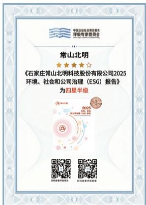

text_image

中国社会科学院管理委员会
法律专家委员会
常山北明
《石家庄常山北明科技股份有限公司2025
环境、社会和公司治理（ESG）报告》
为四届半级
2025
环境、社会和公司治理（ESG）报告
扫码查询二维码
扫码查询评价结果

《石家庄常山北明科技股份有限公司2025环境、社会和公司治理（ESG）报告》（以下简称《报告》）为四星半级，是一份领先的企业可持续发展报告。

<table><tr><td>综合评级</td><td>评级图示</td><td>发展水平</td></tr><tr><td>五星佳</td><td>★★★★★+</td><td>典范</td></tr><tr><td>五星级</td><td>★★★★★</td><td>卓越</td></tr><tr><td>四星半级</td><td>★★★★☆</td><td>领先</td></tr><tr><td>四星级</td><td>★★★★</td><td>优秀</td></tr><tr><td>三星级</td><td>★★★</td><td>良好</td></tr><tr><td>二星级</td><td>★★</td><td>发展</td></tr><tr><td>一星级</td><td>★</td><td>起步</td></tr></table>

# 二、亮点绩效

过程性  
实质性  
完整性  
平衡性  
可比性  
可读性  
创新性

《报告》的实质性、可比性达到五星级，过程性、平衡性、可读性和创新性达到四星半级，完整性达到四星级。

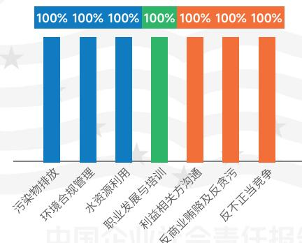

bar

| Category | Value (%) |
| --- | --- |
| 污染物排放 | 100 |
| 环境合规管理 | 100 |
| 水资源利用 | 100 |
| 职业发展与培训 | 100 |
| 利益相关方沟通 | 100 |
| 反商业贿赂及反贪污 | 100 |
| 反不正当竞争 | 100 |

《报告》披露了软件和信息技术服务业核心指标的78.21%，其中环境维度下污染物排放、环境合规管理、水资源利用，社会维度下职业发展与培训，治理维度下利益相关方沟通、反商业贿赂及反贪污、反不正当竞争等议题的核心指标覆盖率最高，均达100%，完整性表现优秀。

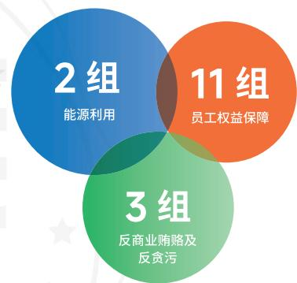

donut

| Region | Value |
| --- | --- |
| 能源利用 | 2 组 |
| 员工权益保障 | 11 组 |
| 反商业贿赂及反贪污 | 3 组 |

《报告》详细披露了 43 个关键指标连续 3 年的对比数据，其中环境维度下能源利用、社会维度下员工权益保障、治理维度下反商业贿赂及反贪污议题连续 3 年可比数据披露最为充分，分别为 2、11、3 组。

# 三、改进建议

1. 增加废弃物处理、供应链安全等议题下核心指标的披露，进一步提升报告的完整性；  
2. 增强报告内容和设计的表现形式，进一步提升报告的创新性。

# 四、评级勋章

石家庄常山北明科技股份有限公司首年参与报告评级，获黄铜级勋章。

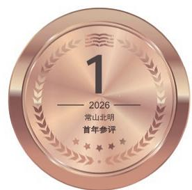

text_image

1
——2026
常山北明
首年参评

# 《石家庄常山北明科技股份有限公司2025环境、社会和公司治理（ESG）报告》评级报告

受石家庄常山北明科技股份有限公司首年委托，“中国企业社会责任报告评级专家委员会”抽选专家组成评级小组，对《石家庄常山北明科技股份有限公司2025环境、社会和公司治理（ESG）报告》（以下简称《报告》）进行评级。

# 一、评级依据

1.《企业可持续披露准则——基本准则（试行）》；  
2.《深圳证券交易所上市公司自律监管指引第17号——可持续发展报告（试行）》；  
3.《中国企业可持续发展报告指南（CASS-ESG 6.0）之软件和信息技术服务业》；  
4.《中国企业可持续发展报告评级标准（2026）》。

# 二、评级分析

# 过程性（★★★★☆）

由董事会办公室牵头推进报告编制工作，把控整体方向和关键环节，董事会负责报告终审；围绕报告编制开展前期研究，提高可持续发展管理水平；根据国家宏观政策、行业对标分析、公司重大事项、利益相关方调查等识别重要性议题；编制报告资料收集清单，下发开展报告编制工作的专项通知；计划通过官方网站发布报告，并将以电子版、印刷品的形式呈现报告，过程性表现领先。

# 实质性（★★★★★）

《报告》系统披露了应对气候变化、电子废弃物管理、产品和技术创新、数实融合、产品和服务安全与质量、数据安全与客户隐私保护、尊重和保护知识产权、员工权益保障、职业健康与安全生产、可持续治理机制、反商业贿赂及反贪污等软件和信息技术服务业关键性议题，叙述详细充分，其中产品和技术创新、数实融合、应对气候变化三项议题相关内容篇幅最多，分别为4页、4页、3页，具有卓越的实质性表现。

# 完整性（★★★★）

《报告》主体内容从“ESG治理”“治理篇：一流规范，筑牢发展根基”“社会篇：一流担当，赋能数字未来”“环境篇：一流生态，引领绿色科技”等角度披露了软件和信息技术服务业核心指标的78.21%，其中环境维度下污染物排放、环境合规管理、水资源利用，社会维度下职业发展与培训，治理维度下利益相关方沟通、反商业贿赂及反贪污、反不正当竞争等议题的核心指标覆盖率最高，均达100%，具有优秀的完整性表现。

# 平衡性（★★★★☆）

《报告》披露了“因工伤损失工作日数”等负面数据信息，并简述了“未发生因经营不合规导致诉讼或重大行政处罚的事件”“未发生商业贿赂及贪污事件”等情况，平衡性表现领先。

# 可比性（★★★★★）

《报告》详细披露了“研发投入金额”“研发投入强度”“环保总投入”“温室气体（范围一）排放量”“全年吸纳就业人数”“员工培训覆盖率”等45个关键指标连续3年的对比数据；其中环境维度下能源利用、社会维度下员工权益保障、治理维度下反商业贿赂及反贪污议题连续3年可比数据披露最为充分，分别为2、11、3组；通过“位列中国软件和信息技术服务竞争力百强企业第45位”等进行横向比较，具有卓越的可比性表现。

# 可读性（★★★★☆）

《报告》采用 ESG 型框架结构，从三大篇章全面阐述了企业年度履责实践与成效，框架结构清晰，重点议题突出；嵌入二维码进行影像化延伸，扩展了报告内容，增强了报告易读性和沟通性；封面设计凸显了企业标识

特色，提升了报告辨识度；以直观对比图的方式凸显履责成效，显著增强了报告的易读性，可读性表现领先。

# 创新性（★★★★☆）

《报告》开篇设置“科技赋能强主业数智引领新生态”责任专题，展现企业以科技赋能主责主业的行动成效，彰显了企业的责任担当；发布《2026年社会责任工作实施方案》，明确年度社会责任工作目标、重点任务、实施路径与责任分工，进一步提升企业可持续发展管理水平；积极响应国际标准与监管要求，参照“治理、战略、风险和机遇管理、指标与目标”四支柱框架披露应对气候变化等议题，增强信息披露的规范性，具有领先的创新性表现。

# 三、综合评级（★★★★☆）

经评级小组评价，《石家庄常山北明科技股份有限公司2025环境、社会和公司治理（ESG）报告》为四星半级，是一份领先的企业可持续发展报告。

<table><tr><td>评级结果</td><td>评级图示</td><td>发展水平</td></tr><tr><td>五星佳</td><td>★★★★★+</td><td>典范</td></tr><tr><td>五星级</td><td>★★★★★</td><td>卓越</td></tr><tr><td>四星半级</td><td>★★★★☆</td><td>领先</td></tr><tr><td>四星级</td><td>★★★★</td><td>优秀</td></tr><tr><td>三星级</td><td>★★★</td><td>良好</td></tr><tr><td>二星级</td><td>★★</td><td>发展</td></tr><tr><td>一星级</td><td>★</td><td>起步</td></tr></table>

# 四、改进建议

1. 增加废弃物处理、供应链安全等议题下核心指标的披露，进一步提升报告的完整性；  
2. 增强报告内容和设计的表现形式，进一步提升报告的创新性。

# 五、评级勋章

石家庄常山北明科技股份有限公司首年参与报告评级，获黄铜级勋章。

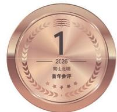

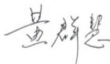  
评级专家委员会副主席

  
扫码查看评级档案

  
评级小组组长

  
评级小组专家

出具时间：

2026年4月27日

# 意见反馈

# 尊敬的读者：

您好！感谢您阅读《石家庄常山北明科技股份有限公司2025环境、社会和公司治理（ESG）报告》。为了向您及各利益相关方提供更有价值的信息，并有效推进公司ESG管理与实践、持续提高公司ESG信息披露水平，我们欢迎并由衷感谢您提出宝贵意见。恳请您在以下方面给予反馈与建议：

1. 您对本报告整体是否满意？是否全面、准确地反映公司对经济、社会、环境的重大影响？

○是    ○否

2. 您所关注的信息在报告中是否都有所体现？

○是    ○否

3. 本报告披露的信息、指标、数据是否清晰、准确、完整？

○是    ○否

4. 您对报告的排版设计是否满意？

○是    ○否

5. 本报告哪些议题最引起您的关注？

6. 您对我们履行 ESG 及本报告有何意见和建议？