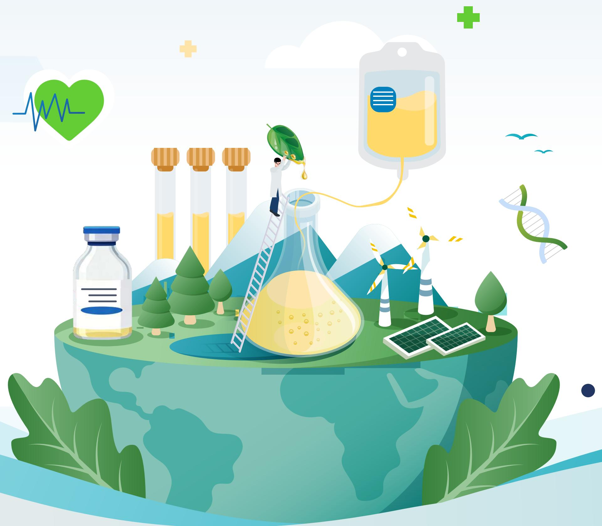

natural_image

Illustration of a world with lab equipment, green energy sources, and medical supplies (no text or symbols)

# 2025

派斯双林生物制药股份有限公司

环境、社会及公司治理(ESG)报告

# CONTENTS

# 目录

# 报告编制说明 03

报告期间 03

报告范围 03

编制依据 03

资料来源及可靠性保证 04

获取及回应本报告 04

联系方式 04

确认及批准 04

# 附录索引 67

# 01 关于本公司 05

公司概况 05

2025年绩效亮点 09

相关主要奖项及荣誉 13

党建引领 15

# 02 环境、社会和公司治理体系 17

ESG管理架构 17

利益相关方沟通 17

议题重要性评估 19

# 03 产品为本 21

加强研发创新 21

知识产权保护 25

严控产品质量 27

用药可及性与普惠医疗 29

# 04 合规运营 31

临床试验规范 31

负责任营销 31

提升客户服务质量 31

信息安全管理 33

可持续供应链 35

# 05 保护环境 37

温室气体排放 37

废弃物处理 39

资源使用管理 43

应对气候变化 51

生态系统和生物多样性保护 53

# 06 员工关系 55

雇佣与平等 55

健康与安全 57

发展与培训 59

关怀与沟通 61

# 07 商业道德 63

反商业贿赂及反贪污 63

反不正当竞争 63

# 08 社会公益 65

乡村振兴 65

社会贡献 65

# 管理层致辞

# 致力于成为行业领先的生物科技企业

2025年度，是国家"十四五"战略规划的收官之年，中国血液制品行业在政策引导下步入结构调整和转型升级的关键时期，行业发展从规模扩张转向高质量发展新阶段。派林生物始终坚守"致力于成为行业领先的生物科技企业"的战略愿景，将ESG理念深度融入公司治理与经营管理全过程。我们深刻认识到，ESG不仅是响应监管导向、履行社会责任的必要举措，更是推动公司实现长期可持续发展、创造综合价值的重要基石。过去一年，我们保持战略定力，稳步推进高质量发展。

# 以变革驱动发展，助力健康中国建设

我们始终聚焦血液制品核心主业，采浆内生外延并举，2025年采浆量近1,590吨，采浆规模再创新高，稳居千吨级第一梯队；产能建设高效落地，建成年产能超3,000吨智能工厂，产能规模迈入第一梯队；持续加大研发投入，2025年研发投入1.41亿元，重点推进10%静注人免疫球蛋白、人凝血因子IX等产品上市进程，积极尝试血制相关创新；营销内销外销并重，稳定国内市场发展，大力布局海外市场，重构营销竞争优势；秉持质量安全第一，未发生产品召回事件，牢牢守护药企生命线。我们始终锚定战略方向，提升企业价值，保障药品供应，守护生命健康，助力健康中国建设。

# 以绿色引领转型，筑牢持续发展根基

我们坚持绿色转型与企业发展相融合，通过绿色工厂建设、节能技术应用、资源循环利用等多维度全面推进，履行绿色低碳时代下的社会责任。公司积极响应智慧监管和绿色转型的号召，高效建成年产能超3,000吨智能工厂，荣获CMMM智能制造能力成熟度标准符合性证书和绿色工厂称号。公司从源头推进高VOCs材料替代和节能环保设备降低能耗，到推动水资源循环利用和上线节能管理系统，从积极推动绿色办公和清洁生产，到加强“三废”合规治理等，公司将低碳理念贯穿于生产经营全过程。我们以务实行动推动绿色转型发展，促进经济社会全面、协调、可持续发展。

# 以责任回馈社会，共建和谐发展生态

血液制品是关系国家医药卫生安全、国防安全和生物安全的重要战略物资，我们积极践行血液制品企业社会责任。我们深入贯彻落实国家“全面实施健康中国战略”的部署要求，全力保障产品生产及供应，满足国内外市场重大疾病急救用药，为改善血友病患者生活质量，公司通过专项公益基金等多种形式进行援助。为履行企业社会责任，彰显企业社会担当，积极参加“扶贫济困日”“助力乡村振兴”“扶贫助困”等倡议捐款活动，公司累计投入公益资金超2,601万元，以实际行动赢得社会认可，荣获第七届全国文明单位称号。

展望2026年，是国家“十五五”规划开局之年，派林生物将继续保持战略定力，以高质量发展为引领，坚持“内生增长与外延拓展”双轮驱动，践行企业战略规划和战略使命。我们将积极履行血液制品企业社会责任和战略使命，推进健康中国建设，为社会发展创造更大价值。

# 报告编制说明

本报告为派斯双林生物制药股份有限公司及子公司（以下统称“派林生物”、“公司”或“我们”）所发布的第四份年度环境、社会和公司治理（ESG）报告（以下称“本报告”）。本报告全面、客观地披露公司2025年度在环境、社会和公司治理方面的合规情况、内部政策、管理措施及绩效表现，并展现公司在可持续发展方面的承诺。

# 报告期间

本报告详述公司于2025年1月1日至2025年12月31日期间（以下简称“报告期”）环境、社会和公司治理方面的活动、挑战和采取的措施，为保证报告的完整性，部分内容追溯以往年份。

# 报告范围

本报告主要涵盖公司于中国内地从事血液制品研究、生产及销售的业务的运营实体，包括派斯双林生物制药股份有限公司及子公司广东双林生物制药有限公司（以下简称“广东双林”）、哈尔滨派斯菲科生物制药有限公司（以下简称“派斯菲科”），以及各地的单采血浆站（以下简称“浆站”），与年报披露范围一致。

# 编制依据

本报告依据《深圳证券交易所上市公司自律监管指引第17号——可持续发展报告（试行）》《深圳证券交易所股票上市规则（2025年修订）》和《深圳证券交易所上市公司自律监管指引第1号——主板上市公司规范运作（2025年修订）》，并同时参考了中国社会科学院发布的《中国企业可持续发展报告指南(CASS-ESG6.0)》等进行编制。本报告遵循“重要性”、“量化性”、“平衡性”以及“一致性”的原则。

# 重要性

公司在报告期内开展重要性评估，与关键利益相关方共同识别重要性议题，以确定本报告的披露内容。议题的重要性已由董事会审阅及确认。2025年重要议题的识别过程及分析结果详见“利益相关方沟通”、“议题重要性分析结论”章节。

# 量化性

公司通过披露定量数据以展现公司在环境及社会关键绩效指标中的表现，相关计算方式和计算中使用的排放量和能源耗用的标准、方法、转换因子等在相关章节详细说明以便于理解。

# 平衡性

公司以标准、客观及平等的态度描述每项议题，披露公司报告期内的正面及负面信息，确保内容平衡、能够让读者合理地评估公司的整体绩效。

# 一致性

除非另有说明，本报告中披露的数据均根据公司所建立的统一信息收集流程和工作机制进行统计，因此相关的数据统计方式和编制报告时所作的假设均保持一致，以确保数据未来可作逐年比较。

# 资料来源及可靠性保证

本报告的资料和案例主要来源于公司统计报告、相关文档、公开报告或报道，以及第三方调查或访谈、政府部门、专业机构公开数据等。本公司承诺本报告不存在虚假记载、误导性陈述，并对其内容真实性、准确性和完整性负责。如无特别说明，报告中披露的金额均以人民币计量。

# 获取及回应本报告

本报告的电子版可通过深圳证券交易所网站（www.szse.cn）、公司网站www.plbio.cn进行阅读和下载。我们十分重视利益相关方的意见，并欢迎读者通过以下联络方式与我们联系。您的意见将协助我们进一步完善本报告以及提升本公司整体的环境、社会及公司治理表现。

# 联系方式

我们欢迎利益相关方提供意见及建议。您可就本报告或我们在可持续发展方面的表现提供宝贵意见。电子邮件：ir@slbiop.com。

# 确认及批准

本报告经第十届董事会第二十二次会议通过。

natural_image

Illustration of three people interacting with a DNA double helix structure (no text or symbols)

# 关于本公司

# 公司概况

公司的主营业务为血液制品的研发、生产和销售，血液制品属于生物制品行业的细分行业，主要以健康人血浆为原料，采用生物学工艺或分离纯化技术制备的生物活性制剂。血液制品在临床救治、战时保障、重大传染性疾病预防及治疗上，具有不可替代的重要作用，是关系国家医药卫生安全、国防安全和生物安全的重要战略物资。

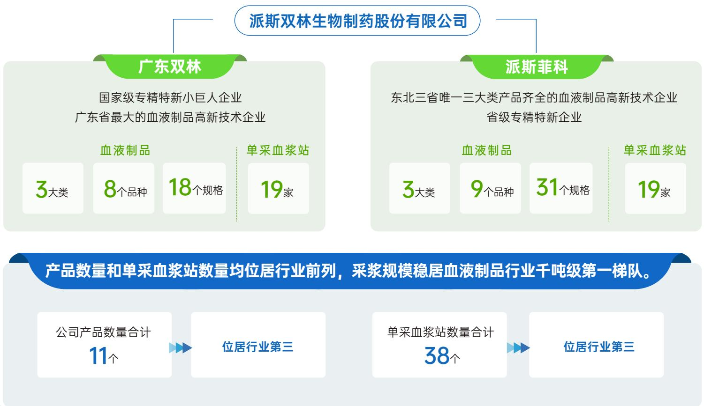

flowchart

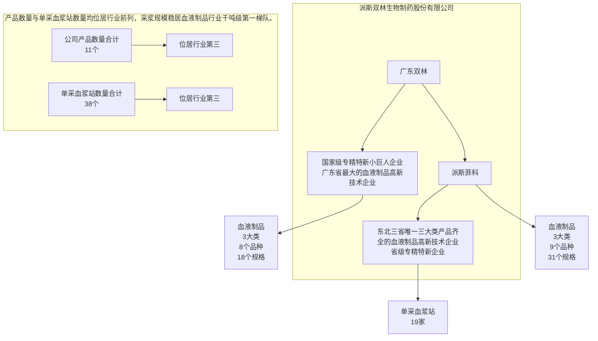
```mermaid
graph TD
  subgraph Company["派斯双林生物制药股份有限公司"]
  A["广东双林"] --> B["国家级专精特新小巨人企业\n广东省最大的血液制品高新技术企业"]
  A --> C["派斯菲科"]
  C --> D["东北三省唯一三大类产品齐全的血液制品高新技术企业\n省级专精特新企业"]
  end

  subgraph Business_Sources["产品数量与单采血浆站数量均位居行业前列，采浆规模稳居血液制品行业千吨级第一梯队。"]
  E["公司产品数量合计\n11个"] --> F["位居行业第三"]
  G["单采血浆站数量合计\n38个"] --> H["位居行业第三"]
  end

  B --> I["血液制品\n3大类\n8个品种\n18个规格"]
  C --> J["血液制品\n3大类\n9个品种\n31个规格"]
  D --> K["单采血浆站\n19家"]
```

# 战略愿景

致力于成为行业领先的生物科技企业。

# 战略使命

与客户合作共赢、与员工共享成果、为股东创造价值、为社会奉献力量。

# 战略发展规划

公司将聚焦血液制品主业，持续挖潜内生增长，加强党的建设，规范公司治理，提升血浆供应规模，强化营销管理能力，积极布局海外市场，加强产品研发创新，同时适时推动行业并购整合，加速公司扩张和发展。中长期将借鉴海外血液制品巨头发展方向，在做深做透血液制品基础上，积极尝试重组和血制相关等创新业务，向产业链上下游延伸，不断拓展生物医药业务布局，将派林生物打造成为行业领先的生物科技企业。

# 战略实施路径

在确保生产安全和监管合规的前提下，坚持质量和效益优先、稳中求进的战略思路，全面对标行业领先指标，借鉴海外巨头发展方向，不断推动变革和创新，通过内生与外延并举，实现企业战略愿景。

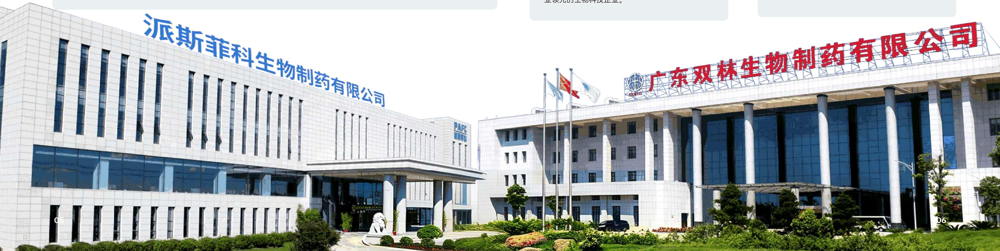

text_image

派斯菲科生物制药有限公司
广东双林生物制药有限公司

派林生物单采血浆站全国分布图  
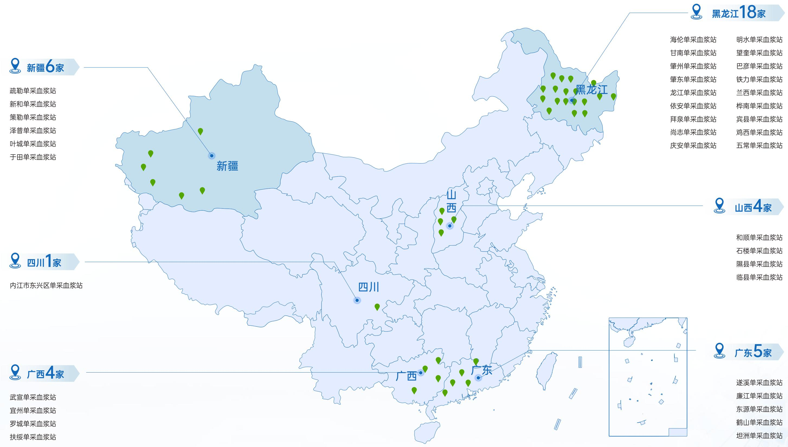

geo

| Province | Total Facilities |
| :--- | :--- |
| 新疆 | 6 |
| 山西 | 4 |
| 广西 | 4 |
| 黑龙江 | 18 |

# 2025年绩效亮点

# 财务绩效

公司营业收入

263,260.73万元

同比下降

0.83%

归属于母公司股东的净利润

41,926.64万元

同比下降

43.75%

归属于上市公司股东的扣除非经常性损益的净利润

38,474.67万元

同比下降

43.68%

经营活动产生的现金流量净额

-21,599.06万元

同比下降

167.12%

# 报告期末

公司总资产

946,634.91万元

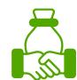

归属于上市公司股东的所有者权益

808,802.75万元

# 公司拟定2025年度利润分配预案为：

2025年9月7日，公司控股股东共青城胜帮英豪投资合伙企业（有限合伙）（以下简称“胜帮英豪”）与中国生物技术股份有限公司（以下简称“中国生物”）签署了《股份转让协议》，考虑《股份转让协议》过渡期间关于权益分派事项的约定，公司拟定2025年度利润分配预案为：2025年度不派发现金红利，不送红股，不以公积金转增股本。结合公司2023年和2024年利润分配实施情况，公司以现金方式累计分配的利润满足不少于最近三年实现的年均可分配利润的百分之三十的规定。

根据《深圳证券交易所上市公司自律监管指引第1号——主板上市公司规范运作》的规定，2026年度内公司将进行中期分红，预计现金分红总额不低于2025年度经审计净利润的30%，具体2026年中期利润分配预案将严格履行董事会和股东会审议程序，积极回报公司股东。

# 管治层面

贪污腐败、违反商业道德

或不正当竞争相关的诉讼或案件 0件

反贪腐培训总时长

2,302小时

较上年增长

30.1%

# 运营层面

完成浆站建设验收

0↑

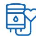

浆站数量合计

38个

信息安全与隐私泄露事件数量

0件

保护受试者权益，临床试验病患《知情同意书》签署覆盖比例达

100%

客户服务投诉个案

0↑

安全生产投入

822.19万元

连续6年

零工伤死亡事故

# 产品层面

研发投入

达14,131.71万元

同比增长

45.24%

产品投诉及其产品质量召回事件

0件

新获临床试验批件

2件

在研产品进度较快的数量

超9个

新获专利数量

1件

累计拥有知识产权数量

62件

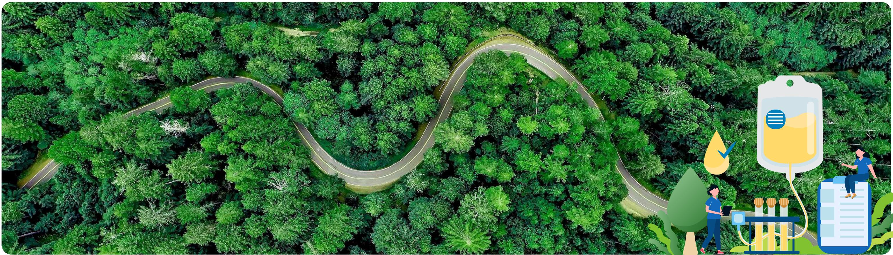

natural_image

Aerial view of a winding road through a dense green forest, with people and medical equipment in the foreground (no visible text or symbols)

# 员工层面

通过

ISO 45001职业健康安全管理体系认证

员工总数

2,755人

其中研发人员总数

116人

培训总人次

70,086人次

人均培训时长

64.54小时

累计培训总时长

177,797.50小时

培训覆盖率

88.38%

特种作业取证

27人次

获取职称证书

55人次

# 环境层面

通过

ISO 14001环境管理体系认证

通过

ISO 50001能源管理体系认证

开展各类环境培训累计时长超过

2,372小时

较上年增长

48.3%

# 社会层面

累计慈善公益投入约为

2,601.46万元

# 相关主要奖项及荣誉

派林生物始终秉持环境、社会和公司治理的核心理念，通过积极履行企业社会责任，在职工团体、环保实践、研发创新及社会公益等多方面均取得了显著成果，赢得了行业与社会的广泛赞誉。

2025年度，派林生物荣获的相关奖项包括：

经营层面

<table><tr><td>所获荣誉</td><td>颁发组织/机构</td></tr><tr><td>CMMM智能制造能力成熟度标准符合性证书</td><td>北京赛西科技发展有限责任公司</td></tr><tr><td>实验室CNAS认证证书</td><td>中国合格评定国家认可委员会</td></tr><tr><td>2025年创新型中小企业</td><td>广东省工业和信息化厅</td></tr><tr><td>2024年广东省医药行业统计先进企业</td><td>广东省医药行业协会</td></tr><tr><td>黑龙江省绿色工厂</td><td>黑龙江省工业和信息化厅</td></tr><tr><td>2025年黑龙江医药企业20强</td><td>黑龙江省企业联合会、黑龙江省医药行业协会</td></tr><tr><td>2024年哈尔滨新区卓越经济贡献奖</td><td>哈尔滨市新区</td></tr><tr><td>哈尔滨市制造业老字号企业</td><td>哈尔滨市工业和信息化局</td></tr><tr><td>连续五年AAAAA级纳税信用等级企业</td><td>国家税务总局内江市东兴区税务局</td></tr></table>

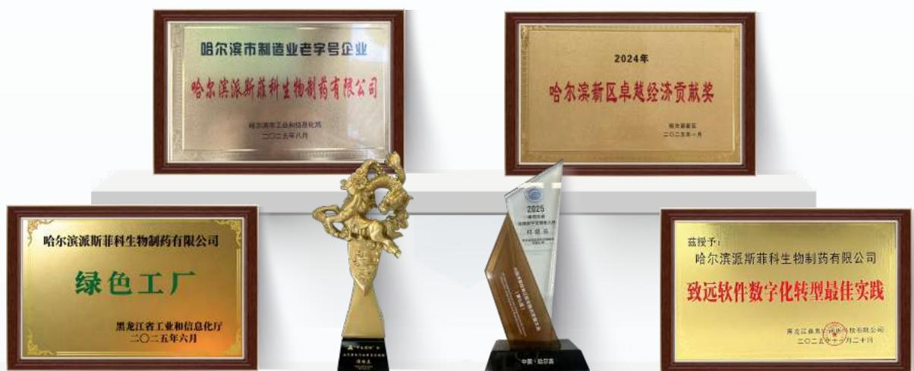

text_image

哈尔滨市制造业老字号企业
哈尔滨派斯菲科生物制药有限公司
哈尔滨市工业和信息化局
二〇二五年八月

哈尔滨派斯菲科生物制药有限公司
绿色工厂
黑龙江省工业和信息化厅
二〇二五年六月

2024年
哈尔滨新区卓越经济贡献奖

2025
哈尔滨派斯菲科生物制药有限公司
致远软件数字化转型最佳实践
中建·哈尔果

兹授予：
哈尔滨派斯菲科生物制药有限公司
黑龙江新星高科技股份有限公司
二〇二五年十月二十日

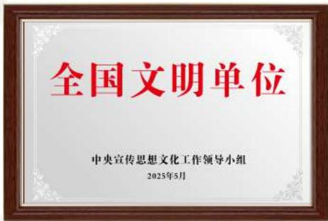

text_image

全国文明单位
中央宣传思想文化工作领导小组
2025年5月

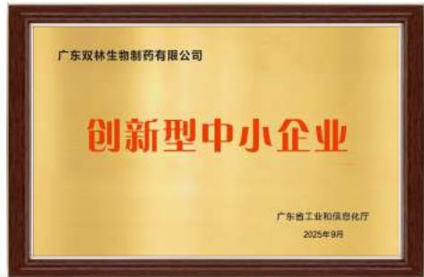

text_image

广东双林生物制药有限公司
创新型中小企业
广东省工业和信息化厅
2025年9月

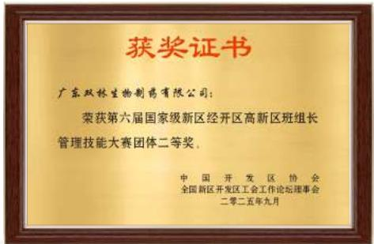

text_image

获奖证书
广东玖林生物制药有限公司：
荣获第六届国家级新区经开区高新区班组长
管理技能大赛团体二等奖。
中国 开发区协会
全国新区开发区工会工作论坛理事会
二零二五年九月

产品层面

<table><tr><td>所获荣誉</td><td>颁发组织/机构</td></tr><tr><td>2025-2027年国家知识产权示范企业创建对象</td><td>国家知识产权局</td></tr><tr><td>2025年第二批广东省名优高新技术产品——人凝血因子VIII</td><td>广东省工业和信息化厅</td></tr><tr><td>湛江市科技计划项目——高纯人凝血因子IX的研发</td><td>湛江市科学技术局</td></tr></table>

社会层面

<table><tr><td>所获荣誉</td><td>颁发组织/机构</td></tr><tr><td>第七届全国文明单位</td><td>中央宣传思想文化工作领导小组</td></tr><tr><td>第十六届中国上市公司投资者关系天马奖</td><td>证券时报社</td></tr><tr><td>2025年上市公司ESG价值传递奖</td><td>易董价值在线</td></tr><tr><td>2024年度湛江市公益普法活动&quot;先进单位&quot;</td><td>中共湛江市委宣传部、中共湛江市委网络安全和信息化委员会办公室、中共湛江市委全面依法治市委员会办公室、湛江军分区政治工作处湛江市教育局、湛江市总工会共青团湛江市委员会、湛江市安全生产委员会办公室、湛江市司法局、湛江市普及法律常识办公室</td></tr><tr><td>&quot;中生药协&quot;杯血浆蛋白行业终身成就奖1</td><td>中国生化制药工业协会</td></tr><tr><td>黑龙江省年度数字化领军人物2</td><td>第七届AI技术驱动黑龙江数实融合发展大会</td></tr></table>

备注：1,2：获奖人为公司联席董事长付绍兰女士。

# 党建引领

公司始终坚持以党的建设为引领，推动党建工作与企业发展深度融合。下属广东双林、派斯菲科等子公司充分发挥党委"把方向、管大局、保落实"的领导核心作用，深入学习贯彻党的二十大和二十届历次全会精神，积极宣传贯彻党的理论、路线、方针、政策，持续强化领导班子建设，不断提升党组织的政治领导力与组织力。

在党建工作中，公司着力构建党建带工建、促团建的工作格局，通过加强基层党组织建设，团结凝聚广大职工群众，切实维护各方合法权益，营造和谐稳定的发展环境，为企业持续健康发展提供坚强政治保证。

面向未来，公司将坚持以高质量党建引领高质量发展，深入贯彻落实“十五五”规划，积极投身健康中国建设，持续提升医药产业链现代化水平，健全药品供应保障体系，努力满足人民群众多元化、多层次的健康需求，带领全体党员及员工向行业领先的生物科技企业迈进。

下属广东双林、派斯菲科两家子公司围绕党委统筹、支部建设及“党建+业务”融合实践，持续强化组织建设和思想教育，不断将党建优势转化为治理效能、发展动能和责任担当。广东双林重点打造《红帆领航·双林聚力"54321"党建工作法》特色党建品牌，推进“党建+业务”攻坚项目落地，并通过党建结对共建、扶贫济困捐款等方式践行社会责任；派斯菲科则围绕血浆资源拓展、新产品研发审批、安全生产升级等重点工作，持续深化党建与主业协同，推动党建工作与生产经营同频共振。

同时，公司注重发挥共青团和青年力量作用，组织开展形式多样的主题活动，引导青年员工在实践中厚植责任意识、强化使命担当。

# 报告期内

广东双林组织团员青年开展“青春奋进，挺膺担当”系列活动，走进非遗场馆、乡村振兴基地开展助农志愿服务；派斯菲科开展“青春建功·医路护航”系列活动，组织青年员工走进红色教育基地、血浆采集一线及医院病房开展志愿服务与科普宣传。通过党建带团建、团建促发展，公司进一步凝聚干事创业合力，为高质量发展持续注入红色动能。

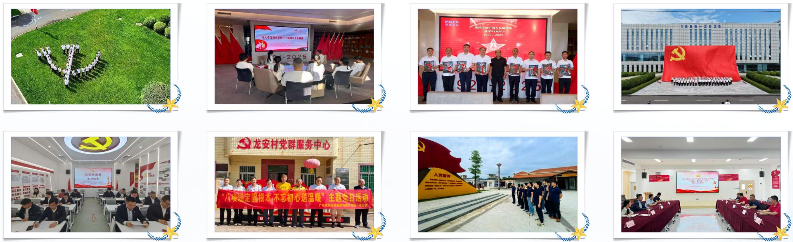

# 环境、社会和公司治理体系

# ESG管理架构

公司建立了自上而下的ESG管理架构，建立从决策、沟通、执行到汇报的闭环管理体系，确保ESG管理工作的有效落实。同时，公司将ESG管理融入发展战略之中，持续完善ESG管理体系，助力推进国家“双碳”战略实施。

# 董事会

董事会是公司ESG事宜的最高责任机构及决策层，主要负责审议和批准ESG愿景、战略与目标，监督公司ESG表现及相关目标进度，审核和评估ESG事宜相关风险及重要性，审阅并批复ESG事宜相关的公开披露。

# ESG工作组

公司ESG事宜的执行层由ESG工作小组牵头，各部门协调配合，负责具体的ESG管理和实施工作。ESG工作小组由公司总经理领导，子公司总经理及产品生产相关部门负责人组成，负责梳理ESG相关政策，推动各部门落实经董事会决议通过的ESG工作事项，负责收集、整理、分析ESG相关的数据及绩效表现，牵头准备ESG报告等。

# 利益相关方沟通

长期以来，公司高度重视企业履行对利益相关方的透明运营责任，将利益相关方沟通作为公司的社会责任之一，是其实施社会责任管理的核心内容，具体内容为坚持透明开放运营，加强与利益相关方的对话与沟通，及时了解和回应利益相关方的要求与建议，建设和谐的利益相关方关系，形成发展共识，凝聚发展合力，共同破解发展难题，合作推进可持续发展，具体形式包括增强全员沟通意识和能力、加强公司信息披露机制建设、充分发挥社会责任报告的信息沟通平台作用等。

在制定环境、社会和公司治理策略时，公司通过多种参与方式及沟通渠道考虑利益相关方的期望，如下表所示：

<table><tr><td></td><td>政府及监管机构</td><td>股东及投资者</td><td>客户及用户</td><td>员工</td><td>供应商及合作伙伴</td><td>媒体及非政府组织</td><td>社区及公众</td></tr><tr><td>[1-4-5]</td><td>遵守法律法规促进行业健康发展带动区域经济发展保障产品质量安全</td><td>财务业绩业务发展企业治理沟通渠道</td><td>消费者权益商业道德产品质量及安全</td><td>薪酬福利职业发展健康和安全平衡工作生活</td><td>遵守合约沟通渠道商业道德成本控制供应链可持续发展</td><td>沟通渠道承担社会公益责任信息公开与媒体互动</td><td>社区贡献生产经营对当地的影响乡村振兴</td></tr><tr><td>[2-4-6]</td><td>主动接受监督依法合规履行义务信息上报按期汇报推动行业上下游协同发展提升药物可及性建立合规运营监控机制政企合作</td><td>报告及公告股东会公司网站、电邮及热线电话投资者交流及路演深交所互动易平台新闻稿件</td><td>创新优质产品保护客户资料及隐私客户服务热线电邮及热线电话新闻稿件社交媒体</td><td>提供良好薪酬福利定期进行绩效检讨及反馈员工培训员工信箱及意见调查公司平等沟通机制员工活动</td><td>依法履行合约参加公开竞标定期交流审核与评估信息共享</td><td>社交媒体官方网站新闻发布会慈善活动</td><td>公益活动捐款志愿者服务开展健康科普提升资源及能源使用效率</td></tr></table>

公司严格遵守法律法规和规范性文件规定履行信息披露义务，并不断完善信息披露管理机制，保持信息披露内容的真实、准确、完整、及时、公平，不断提高信息披露质量。公司通过业绩说明、投资者现场调研、投资者专线、深交所“互动易”平台等多形式、多渠道与投资者加强沟通，促进与投资者的良性互动，着力提高公司经营管理的透明度，提升投资者对公司价值的认可度，不断提升公司资本市场价值。

报告期内，公司共编制披露4份定期报告，发布125份临时公告，无重大遗漏、补充修改等事项。

# 议题重要性评估

# 双重重要性分析

公司与内部利益相关方（董事会成员、高管、员工）及外部利益相关方（供应商、合作伙伴、客户、公众）就ESG议题充分沟通，亦结合行业最佳实践及国内外行业标准，甄别出ESG议题清单，并以此为基础，开展重要性议题识别与分析。

本报告所指重要性议题，是指在短期、中期和长期内对公司商业模式、业务运营、发展战略、财务状况、经营成果、现金流、融资方式及成本等产生重大影响（简称财务重要性），以及公司在相应议题的表现是否会对经济、社会和环境产生重大影响（简称影响重要性）的议题。

报告期内，公司主营业务模式、客户结构及运营管理重点保持稳定，所处行业监管要求及利益相关方关注重点亦未发生显著变化。公司基于ESG议题清单编制相应的问卷，并开展利益相关方调研。公司根据问卷反馈结果，进一步围绕ESG议题对公司业务特点、行业趋势等影响程度进行分析，得出“财务重要性”和“影响重要性”分析结论，并形成两大维度议题矩阵，依此制定披露框架及报告内容。各章节将详细说明相关政策、措施及成果，回应利益相关方期望，调整未来可持续发展策略、内部风险评估与监控。

# 议题重要性分析结论

根据上述重要性评估流程，公司重要性议题分析结论如下：  
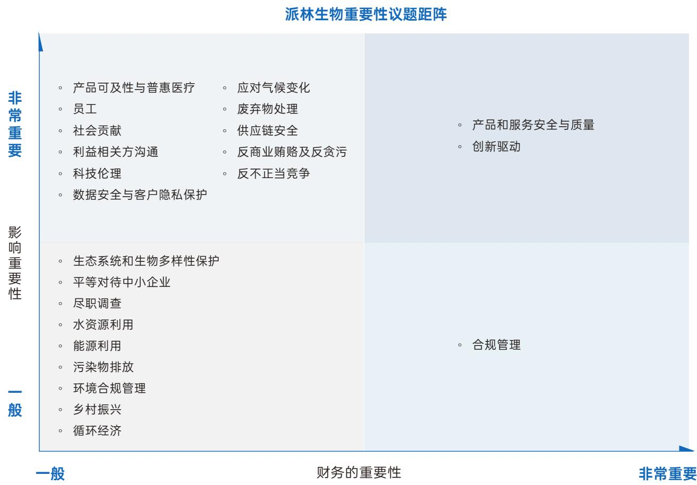

# 双重重要性 2项

。产品和服务安全与质量  
。创新驱动

# 影响重要性 11项

· 产品可及性与普惠医疗  
。员工  
。社会贡献  
。利益相关方沟通  
。科技伦理  
。 数据安全与客户隐私保护  
。应对气候变化  
。废弃物处理  
。供应链安全  
。反商业贿赂及反贪污  
。反不正当竞争

# 财务重要性 1项

。合规管理

# 非重要性议题 9项

- 生态系统和生物多样性保护  
。平等对待中小企业  
。尽职调查  
。水资源利用  
。能源利用  
。污染物排放  
。环境合规管理  
。乡村振兴  
。 循环经济

公司高度重视各利益相关方关注的议题，针对具有双重重要性及财务重要性的议题，公司将持续关注并将优先进行管理整合，分析其风险和机遇，强化制度建设、过程控制与绩效跟踪，并在后续章节中披露。

# 产品为本

我们始终坚信，创新是推动企业可持续发展的核心引擎，质量是守护生命健康的坚实基石。公司坚持以患者需求为导向，通过建立健全的研发创新体系、完善的知识产权保护机制、严苛的全生命周期质量管控以及多维度的药品可及性保障，致力于为患者提供更高质量、更可负担的血液制品。我们深化产学研融合，完善知识产权与信息安全体系，优化全生命周期质量管控，持续提升产品可及性与普惠医疗水平，以扎实的行动践行对患者、对社会的不变承诺。

# 加强研发创新

公司将技术创新作为驱动企业可持续发展的核心引擎。通过建立健全研发管理制度、持续加大创新投入、深化产学研合作，公司在血液制品领域不断取得突破，致力于为患者提供更高质量的产品与服务。

公司严格遵守《中华人民共和国药品管理法》《药品注册管理办法》《药物临床试验质量管理规范》等法律法规，并不断完善科技创新管理体系，制定并实施《研发项目立项与实施管理制度》《科技研发奖惩管理制度》《产学研合作管理制度》《专利管理制度》等一系列内部规章，对研发项目实行全生命周期管理，规范科研项目流程，确保创新活动有序推进。

# 以病患需求为导向的研发策略

公司将以国内外市场需求和产品研发创新趋势为导向，深入洞察临床医学的迫切需求与市场实际缺口，将研发重点聚焦于罕见病、免疫系统疾病等缺乏有效治疗手段的领域，力求在血液制品及相关领域实现关键技术和重大产品的突破。目前，我们的研发重点主要放在原有产品的持续优化升级和未来国内外市场极具需求的新一代静注人免疫球蛋白，以及凝血因子类新产品的研发上，旨在进一步提高血浆的综合利用率，推动国家血液制品的产品结构和使用模式向更加合理、成熟的方向发展。

# 增强产学研合作与平台建设

公司积极拓展外部创新资源，与中国食品药品检定研究院、广州中医药大学科技产业园有限公司、中国医学科学院输血研究所、济南市中心医院等单位建立产学研合作关系，突破核心技术瓶颈，推进科技成果转化。此外，子公司广东双林建有广东省博士工作站、广东省科技专家工作站、省级企业技术中心和广东省工程技术研究中心，派斯菲科建有国家级博士后工作站、黑龙江省工程技术中心和黑龙江省企业技术中心，具备坚实的研发能力和创新基础。

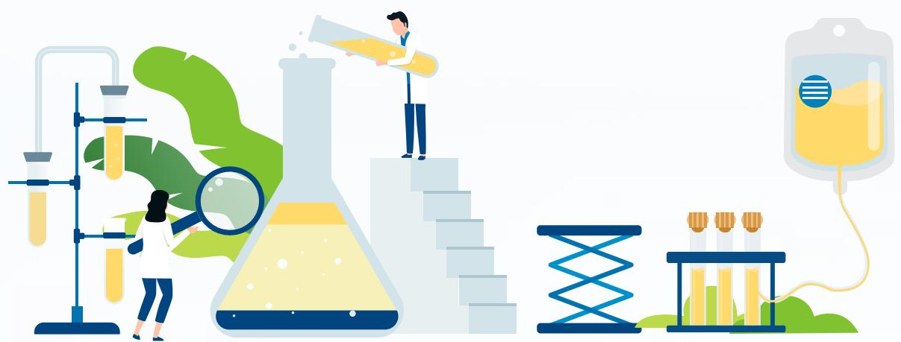

natural_image

Illustration of scientists and laboratory equipment in a chemistry or scientific context, including test tubes, beakers, and a blood vessel (no text or symbols)

# 持续加大研发投入

公司高度重视研发创新，始终保持高水平研发投入，在技术创新、人才储备、设备迭代等方面持续发力。

# 报告期内

公司累计研发投入 14,131.71 万元 ，为新产品开发与技术升级提供了有力保障。

# 在人才队伍建设方面

公司共有研发人员116人

占比
4.21%

主要集中于中年和青年，形成了一支技术创新激情高、自主创新能力强的专业团队。

硕士及以上15.52%

本科
68.97%

其他
15.52%

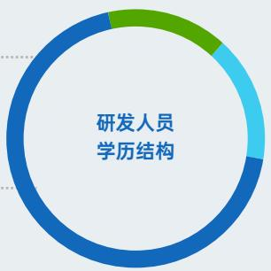

donut

| Category | Value |
| --- | --- |
| 绿色部分 | ~15% |
| 浅蓝色部分 | ~20% |
| 深蓝色部分 | ~75% |

30岁以下
11.21%

30-40岁
59.48%

40岁以上
29.31%

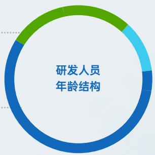

donut

| Category | Value |
| --- | --- |
| Green | ~15% |
| Light Blue | ~10% |
| Dark Blue | ~40% |

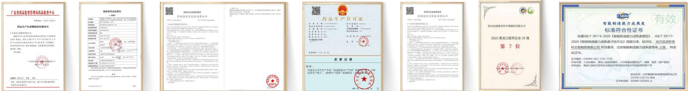

# 研发成果

报告期内 公司研发工作取得丰硕成果，新增1项发明专利，多个关键项目稳步推进：

# 广东双林

# 第四代静注人免疫球蛋白（10%）：

2024年5月，该产品获得用于治疗原发免疫性血小板减少症（ITP）的临床试验批准通知书；2025年4月，该产品新增适应症为治疗慢性炎性脱髓鞘性多发性神经根神经病（CIDP）的临床试验批准通知书；2025年9月，该产品完成ITP临床研究并取得总结报告。目前，其上市许可申请已获国家药监局药审中心受理，已收到国家药监局药审中心药品注册核查通知。

# 人凝血因子IX:

主要用于治疗血友病B，可显著帮助缺少人凝血因子IX的患者提高血液中含IX的水平，从而有效预防和治疗出血；2025年6月，该产品完成临床研究并取得总结报告；目前，其上市许可申请已获国家药监局药审中心受理，已收到国家药监局药审中心药品注册核查通知。

# 第四代静注人免疫球蛋白（pH4）：

主要用于治疗原发免疫性血小板减少症和原发性免疫球蛋白缺乏症等；2025年12月，该产品获得药物临床试验批准通知书。

# 人纤维蛋白原：

主要用于治疗先天性纤维蛋白原缺少或缺乏症，获得性纤维蛋白原减少症等，根据新的《人纤维蛋白原临床试验技术指导原则》（试行）要求，目前正在推进PK试验和原发性三期临床试验。

# 人凝血酶：

仅可外用，用于毛细血管和小静脉有渗血和轻微出血，且通过标准手术技术控制出血无效或不切实际时的辅助止血。本品可与可吸收明胶海绵等结合使用。2026年1月，已获得药品注册临床试验受理通知书。

# 派斯菲科

# 第四代静注人免疫球蛋白（10%）：

主要用于治疗原发性免疫缺乏症、继发性免疫缺陷病和自身免疫性疾病等，目前已提交临床前沟通会议申请材料。

# 人凝血因子VIII:

主要用于防治甲型血友病人出血的特效血液制剂，正在补充临床前研究。

# 新一代人凝血因子IX生产工艺的技术开发：

主要用于预防及治疗乙型血友病，目前处于小试研究阶段。

# 知识产权保护

公司高度重视知识产权保护与商业机密安全，通过构建完善的制度体系、强化技术防护措施、落实全员保密责任，持续提升信息安全管理水平，保障创新成果与核心信息的合法权益。

# 知识产权保护

知识产权是企业的无形资产，公司重视并不断完善知识产权保护体系，持续推进知识产权全过程管理。公司严格遵守国内外知识产权有关法律法规，制定并实施《专利管理制度》《职务成果知识产权归属管理制度》《研发中心科研技术保密管理制度》等内部规章，从专利挖掘、申请、维护、预警到价值转化实施规范化管理。在新产品开发初期即启动专利布局，积极利用专利数据库开展侵权风险评估，有效规避潜在知识产权冲突。同时，公司建立知识产权信息数据库，定期开展专利预警分析，严控侵权风险，保护自有知识产权，促进创新成果的价值转化。

报告期内，公司知识产权保护体系持续完善。

# 截至报告期末

公司累计拥有授权专利

62项

# 在授权专利方面

发明专利

23项

外观设计专利

9项

实用新型专利

30项

正在实质审查的发明专利

6项

# 在专业资质方面

广东双林于2025年9月通过广东省创新型中小企业复核，人凝血因子VIII于2025年11月再次荣获“广东省名优高新技术产品”称号。公司将持续重视知识产权保护和自主研发能力培养，构筑长期可持续核心竞争力。

所有专利均通过自主研发获得。

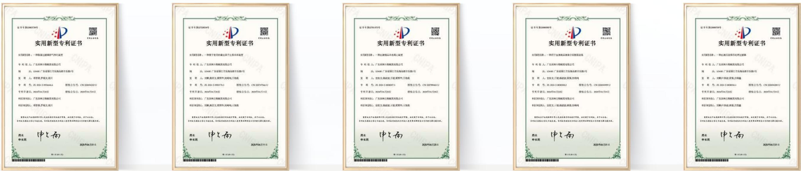

# 严控产品质量

产品质量是血液制品企业的生命线，也是公司履行社会责任、保障公众用药安全的基石。公司严格遵循《中华人民共和国药品管理法》《血液制品管理条例》《药品生产质量管理规范》（GMP）及《中华人民共和国药典》等法律法规，构建覆盖产品全生命周期的质量管理体系，并通过制度化建设、标准化操作、信息化追溯及常态化演练，持续提升质量风险管控能力。

# 重视质量管理文化建设

公司始终将质量安全视为企业生命线，长期秉持"技术先进、质量第一、顾客至上、遵信守约"的质量方针，持续推动质量文化建设与日常经营管理深度融合。公司依据法规要求制定并实施《质量手册》、各产品生产工艺规程、《生产过程质量检验管理规程》等内部制度文件，对药品研发、原料血浆管理、物料采购、生产控制、质量检验、产品放行、上市后监测及药物警戒等关键环节实施规范化管理；各浆站同步建立《现场质量监督管理制度》《血浆抽检标准操作规程》等制度，保障原料血浆采集过程规范、有序、可控。

在质量文化落地方面，公司通过入职培训、GMP专项培训、岗位技能培训及定期复训等方式持续强化员工质量意识，并结合质量宣传、质量月活动及绩效考核等机制，推动质量要求融入岗位职责和日常操作，营造“人人重视质量、全过程管控质量”的管理氛围。

报告期内，广东双林围绕岗位GMP操作规范和质量意识提升开展GMP必修培训，实现培训覆盖率与合格率均为100%；公司顺利延续ISO 9001质量管理体系认证和CNAS体系认证，质量管理的规范化、标准化水平持续提升。

公司同时建立对单采血浆站的常态化质量巡检和合规审查机制，由质量管理部门定期对浆站现场操作、设备运行、人员资质及文件记录等开展检查，及时识别并督促整改潜在问题。报告期内，各浆站多次通过省、市、县级卫生监督部门监督检查及换证验收检查，质量管理基础进一步夯实。

# 原料血浆质量管控

原料血浆质量是产品安全的第一道防线。公司执行“源头控制病毒引入+病毒检测合格+实施检疫期管理+执行组合式病毒消除程序”的综合控制策略，整体符合国际病毒风险管控要求。公司利用人脸识别系统开展采浆业务，确保献血浆者身份唯一性与可追溯性。血浆采集后实施检疫期管理，经病毒检测合格（酶免法和核酸法）且满足检疫期的血浆方可投入生产。各浆站配置全自动生化分析仪、全自动酶免仪、生物安全柜等先进检测设备，确保检测结果准确可靠。

# 生产过程质量控制

公司严格按照批准的生产工艺组织生产，制定各产品生产工艺规程及标准操作规程，定期开展工艺验证与持续工艺确认，确保关键生产工艺参数和关键质量指标持续符合要求。质量管理部门每月或每季度对生产洁净区环境进行监测，涵盖悬浮粒子、沉降菌、表面微生物等项目，确保生产环境符合GMP要求。

# 产品放行与追溯管理

产品上市前须经企业检验合格，并送指定法定机构进行批签发检验，收到生物制品批签发合格证明后方可放行销售。公司建立严格的审核放行程序，由质量受权人对整批产品进行综合评估，依据放行标准判定是否批准上市。根据国家药品追溯制度要求，公司建立覆盖血液制品全生命周期的智慧监管体系，对研发、生产、检验、销售、不良反应等全链条实施信息化追溯，按照“一物一码”原则，为每份血浆、每瓶产品赋予唯一监管码，确保产品来源可查、去向可追、责任可究。

# 质量风险管理与应急演练

为有效应对潜在产品质量风险，公司制定《药品召回管理规程》，明确召回启动条件、组织流程、沟通机制及后续处理要求，每年至少开展1次模拟召回演练，检验召回体系的响应速度与可操作性。各浆站建立质量信息直报机制，对采集过程中发现的质量异常及时上报并启动纠正预防措施。

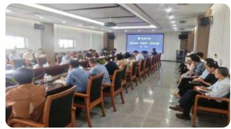

text_image

Conference room photo with attendees seated at tables facing a presentation screen displaying Chinese text and numbers

2025年“质量月”活动启动

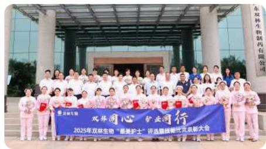

text_image

双林同心 产业同行
2025年双林生物“最美护士”评选暨捐赠比北京邮大会

举行浆站护士技能、业务技能比武

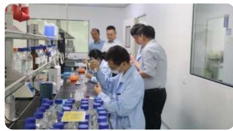

natural_image

Group of scientists in lab coats working at a laboratory bench with bottles and equipment (no visible text or labels)

举行检验操作项目技能演练

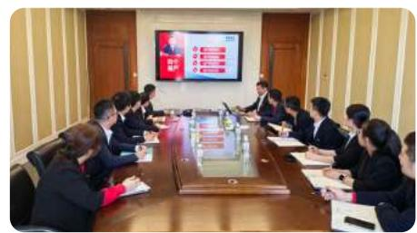

text_image

Meeting room photo with visible presentation screen showing Chinese text and a central figure on screen

2025年度质量管理培训

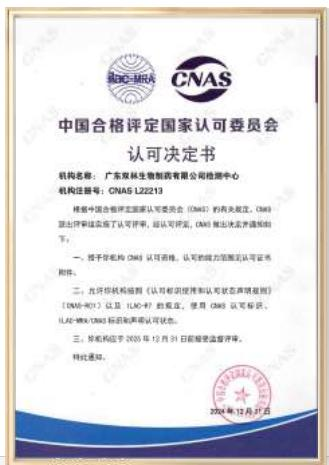

text_image

中国合格评定国家认可委员会
认可决定书
机构名称：广东双林生物制药有限公司检测中心
机构注册号：CNAS L22213
根据中国合格评定国家认可委员会（CNAS）的有关规定，CNAS
提出评审结果并进行了认可评审，应认可评审。CNAS做出无法获得的如下：
一、授予年检机构（CNAS）认可资格，认可的能力范围认可证书
附件。
二、允许你机构根据《认可标准使用并认可状态声明规则》
（CNAS-NO）以及LAC-47的要求，使用CNAS认可标识、
LAC-MR/CMAS标准标识声明或协议等。
三、你机构应于2020年12月31日前提交审查程序。
特此通知。
2020年12月31日

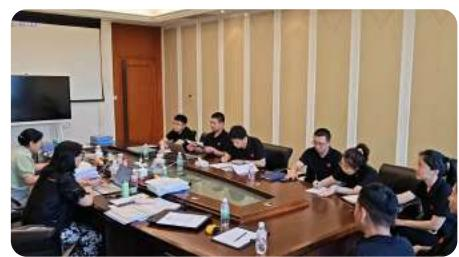

natural_image

Group of people seated around a conference table in a meeting room (no visible text or signage)

2025年度质量体系认证

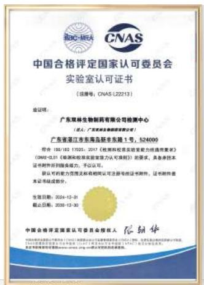

text_image

中国合格评定国家认可委员会
实验室认可证书
（注册号：CNAS L22213）
验证证明：
广东双林生物制药有限公司检测中心
（法人）广东双林生物制药股份有限公司
广东省湛江市南海岛新丰东路1号，524000
符合 186/182 / 17025、2019《检测和试验实验室能力的通用要求》
（CNAS-0.25《检测和检验实验室能力认可规则》的要求，具备该本
证书附件所列的服务能力，予以认可。
获认可的能力范围无明确相同可注册号的证书附件，证书附件基本
证书组成部分。
生效日期：2024-12-31
截止日期：2030-12-30
中国合格评定国家认可委员会授权人：张丽华

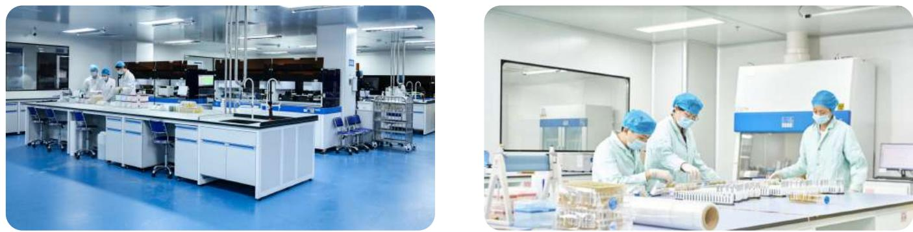

# 质量控制实验室能力建设

公司持续加大实验室能力建设投入，配备具备国内一流水平的检测设备，培养专业技术人才，不断提升产品检验检测能力。

广东双林建有核酸PCR实验室，配备全自动PCR检测仪器，对血浆进行病毒核酸检测；

QC实验室具备全项检测所有原辅料、中间品、成品及研发新产品质量指标的能力；

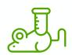

实验动物中心拥有SPF级实验动物及屏障级动物实验设施，是国内少数同时拥有实验动物生产许可证与使用许可证的血液制品生产企业，每年通过广东省实验动物监测所监督检查，为产品质量安全提供重要支持。

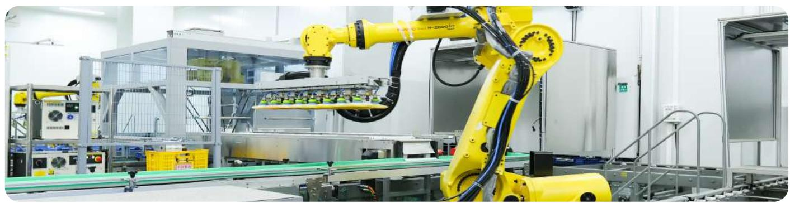

natural_image

Industrial factory scene with a yellow robotic arm operating on a conveyor belt, no visible text or symbols

# 质量信息化建设

为提升质量管理效率与风险管控能力，公司大力推动信息化建设，现阶段已建成涵盖产品全生命周期业务流程的信息化系统，上线运行下列信息化系统，目前各系统运行稳定。

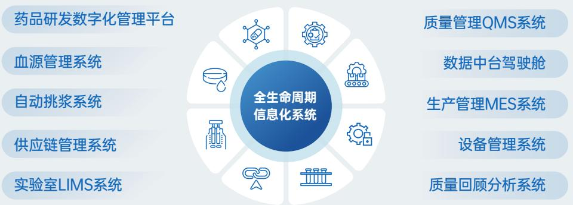

flowchart

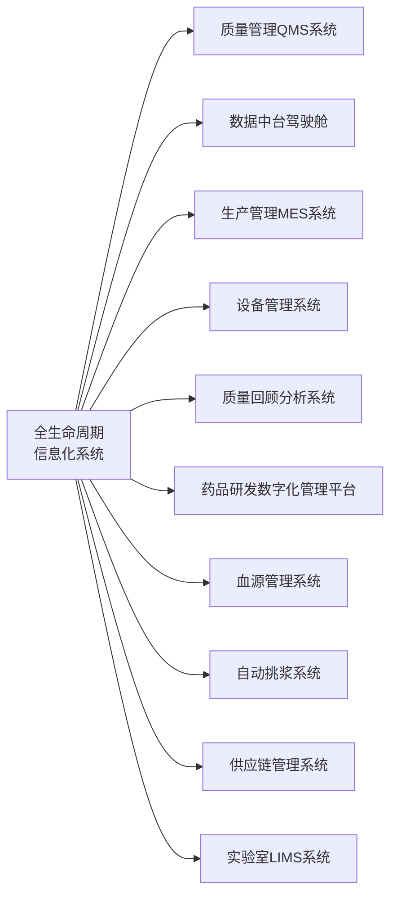
```mermaid
graph LR
  A["全生命周期\n信息化系统"] --> B["质量管理QMS系统"]
  A --> C["数据中台驾驶舱"]
  A --> D["生产管理MES系统"]
  A --> E["设备管理系统"]
  A --> F["质量回顾分析系统"]
  A --> G["药品研发数字化管理平台"]
  A --> H["血源管理系统"]
  A --> I["自动挑浆系统"]
  A --> J["供应链管理系统"]
  A --> K["实验室LIMS系统"]
```

派斯菲科荣获两化融合管理体系评定A级证书及黑龙江省数字化（智能）示范车间荣誉。报告期内，公司未发生重大质量违规事项。

# 用药可及性与普惠医疗

公司深刻把握血液制品作为国家战略储备与特殊临床必需药品的双重属性，立足于国内市场、布局海外出口业务，以市场及医疗救治服务可及为目标，多维度构建并强化产品与服务的可获得性体系。公司积极开拓海外市场，已在东南亚、南美洲及中东部分国家实现多种产品出口销售。公司正与多个国家和地区的合作伙伴推进海外市场法规注册出口的长期贸易机会，让更多患者能够受益于公司的优质产品。

公司持续推进营销网络向基层延伸，通过优化经销商体系、加强与县域医疗机构的合作，并借助数字化物流与冷链系统，提升产品在广阔县域市场的覆盖深度与配送效率，致力于让偏远地区患者也能及时获得必需的血液制品治疗。

在罕见病与慢病患者用药领域，对血友病、原发性免疫缺陷等需终身用药患者，公司建立了以患者为中心的精准保障机制，确保凝血因子VIII、静注人免疫球蛋白（IVIG）等产品的稳定、优先供应。同时，构建了覆盖全国的终端医疗机构及重点城市的DTP（直接面向患者）专业药房合作网络，为患者提供药品直达、用药指导等一站式服务，显著提升用药可及性与便利性。在国家应急战略动员时，可确保在国家统一调配下实现储备药品的即时启运与精准投放，有力支撑应急医疗救治。另外，公司积极响应国家医保政策，参与国家产品集中采购，使更多核心产品以更普惠的价格纳入国家医保目录，切实降低患者与社会的用药负担，践行企业公益价值。

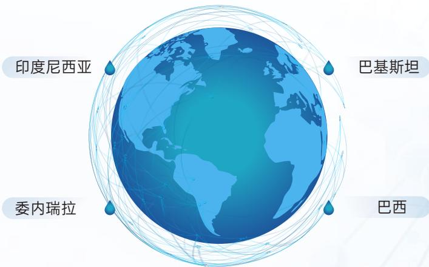

flowchart

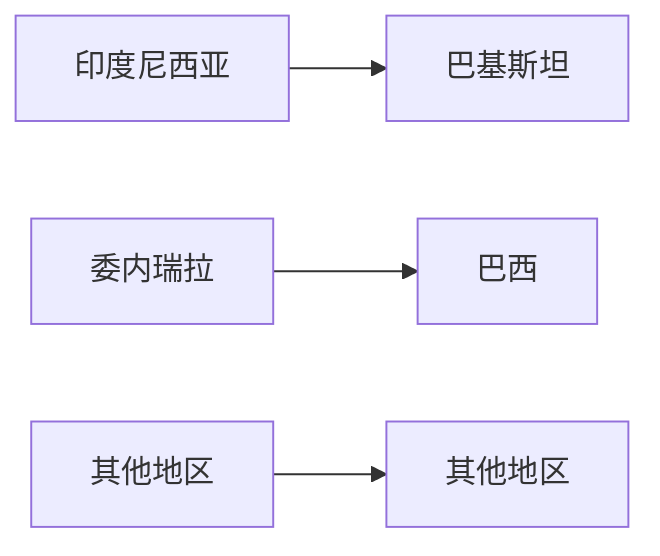
```mermaid
graph LR
  A["印度尼西亚"] --> B["巴基斯坦"]
  C["委内瑞拉"] --> D["巴西"]
  E["其他地区"] --> F["其他地区"]
```

公司境外销售网络

# 合规运营

# 临床试验规范

在开展临床试验过程中，公司严格遵循《药物临床试验质量管理规范》及相关法律法规要求，试验项目均依据国家药品监督管理局药品审评中心（CDE）备案的临床方案执行，确保试验流程的科学规范与受试者权益的全面保障。

# 在受试者保护方面

公司恪守《赫尔辛基宣言》的人体医学研究伦理准则及国内临床试验管理规范。所有临床试验方案及知情同意书均须通过组长单位及各参研单位伦理委员会的严格审批。受试者入组前，研究者会通过书面形式，向其本人或其法定代理人完整、清晰、真实地介绍试验内容及相关权利。此外，公司为受试者免费提供试验用药品及相关医学检测，并承担与试验相关的不良事件诊疗费用及相应补偿。

报告期内，公司未发生任何临床试验相关的投诉或法律诉讼。

# 负责任营销

公司始终秉持“严谨、公正、透明”的原则，构建覆盖渠道布局、产品定价及营销推广的管理体系，践行以患者为中心的营销理念。

公司将社会责任融入营销实践，以打造学习型专业团队为目标，持续赋能营销队伍。通过常态化组织线上与线下培训，内容涵盖产品知识、临床用药指导及相关法律法规，提升团队专业素养，确保能够及时、准确响应临床需求，提供专业负责的售后服务。在药品推广过程中，公司严格遵循商业道德与法律法规，建立内部合规审查机制，确保所有营销活动合法合规。

报告期内，公司未发生因宣传不当而受到处罚的情形。

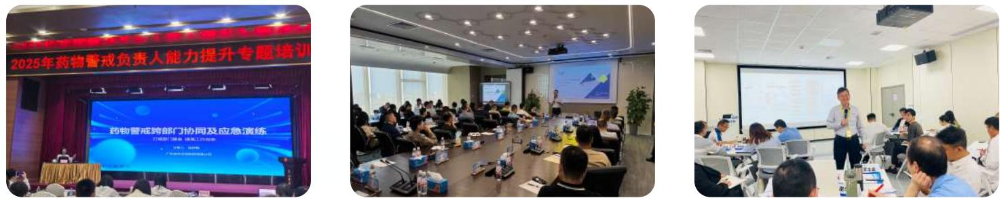

# 提升客户服务质量

本公司致力于构建标准化、规范化、专业化的客户服务体系。通过持续完善管理制度、优化服务流程、强化团队能力，全方位保障客户权益，提升服务体验。公司依据GSP/GMP及相关药品法规，制定并执行《客户满意度调查管理规程》《投诉处理管理制度》《市场反馈信息处置管理办法》等系列制度，明确客户服务的标准与要求。各浆站结合实际细化管理规范，如《献血浆者满意度调查及投诉处理管理制度》《服务标准考核办法》《服务语言行为规范制度》等，形成覆盖客户反馈、投诉处理、满意度监测、服务规范的全方位制度体系。

# 建立分级分类的投诉处理流程

公司建立分级分类的投诉处理流程，确保客户诉求得到快速有效响应。投诉信息接收后24小时内启动响应，按质量投诉、医学咨询、不良反应等类别启动相应标准处理程序，明确调查、答复及解决的时限要求。各浆站实行首问责任制，在献血浆者休息大厅公示投诉电话，确保投诉“当日受理、当日解决”。公司建立“投诉—根本原因分析—纠正与预防措施—效果追踪”闭环管理机制，定期分析投诉趋势，持续优化相关标准操作程序，防止问题复发。

# 定期开展客户满意度调查

公司定期开展客户满意度调查，全面收集客户对服务态度、操作规范、环境设施等方面的评价。调查覆盖核心经销商、重点医院及献血浆者群体，调查结果作为服务质量改进、培训需求识别及商业策略调整的关键输入。各浆站通过电话回访、问卷调查、面对面交流等方式常态化收集反馈，对二次穿刺、不良反应等情况进行统计分析，针对性提升穿刺成功率与服务体验。通过广泛采集客户意见，并定期由权威机构对公司质量体系进行ISO复审与评估，形成专项测评报告。以客户感知为导向，需求为中心，综合测评结果持续提升服务能力。2025年，公司未收到有关客户服务的投诉个案。

# 重视客户隐私权与知情权

公司高度重视客户隐私权与知情权，在服务各环节严格落实信息保密要求。各浆站建立保密机制，明确客户个人健康信息、反馈记录等的使用权限，确保隐私安全。同时，通过公示牌、告知书等形式充分保障客户的知情权、选择权与补偿权，营造透明、信任的服务环境。

# 信息安全管理

公司严格遵守《中华人民共和国个人信息保护法》《信息安全等级保护管理办法》等法律法规，制定并持续完善《信息安全管理办法》《内部人员信息安全管理规定》《外部人员信息安全管理规定》《计算机信息系统用户授权管理制度》《信息系统管理程序》等一系列内部规章，构建了覆盖制度规范、技术防护、权限管理、意识培训的全方位信息安全管理体系，全力保障献血浆者、患者、客户及员工的信息安全与隐私权益。

在技术层面，公司部署硬件防火墙、漏洞扫描系统、行为管理系统、日志审计系统、数据库审计系统及堡垒机等安全设备，强化网络边界防护与内控审计；对应用服务器实施专项防护隔离，有效抵御外部攻击与内部风险。各浆站使用的采浆信息系统已通过相应等级测评，确保系统安全稳定运行。

公司实行信息系统权限分级管理，遵循最小化授权原则，根据岗位职责分配数据访问权限，如采血人员仅拥有采血信息录入查询权限，财务、血源管理等敏感数据严格限制访问。信息技术部门定期审查权限匹配性，人员岗位变动时及时调整权限，防止权限错配或滥用。针对客户信息、献血浆者健康档案等敏感数据，设置专属访问权限并加密存储，确保信息保密性。

# 此外，公司还注重信息主体权益的保护：

# 献血浆者信息保护

各浆站设立保密征询室，实行“一人一室”健康征询，确保献血浆者隐私不被泄露；通过专用血源管理系统采集、存储个人信息，系统操作全程留痕，严格限制数据导出与传播。

# 患者信息保护

临床试验前，公司与患者签署知情同意书，明确告知信息收集目的、使用范围及保密措施，确保患者充分知情。患者信息收集、存储、使用严格遵循GCP及相关法规，未经授权不得用于非研究目的。

# 客户与合作伙伴信息保护

与客户及合作伙伴签订保密协议，明确双方保密义务；对客户信息设置访问权限，信息技术部门定期核验权限配置，确保信息仅用于业务所需。

# 员工信息保护

公司规范员工个人信息收集与使用，内部系统权限与岗位职责挂钩，防范内部泄露风险。

# 在员工个人信息与隐私保护意识方面

公司专门邀请外部专家开展相关培训，内容涵盖网络安全防范、勒索病毒防范、个人信息保护、反电信诈骗等，邀请外部专家进行专题讲座，提升员工的信息安全意识和防护能力。公司结合业务实际，通过科室会议、线上学习等方式强化保密教育，确保信息安全管理要求深入人心。报告期内，公司未发生任何信息泄露或隐私安全事件，信息安全管理体系运行有效。未来，公司将持续加大技术投入，完善管理措施，为信息安全提供坚实保障。

# 在供应链协同方面

公司通过与合作方签订保密协议的方式，将保密要求延伸至供应商及合作伙伴，明确其在信息处理、存储和传输过程中的保密责任，构建覆盖全产业链的商业机密保护网络。

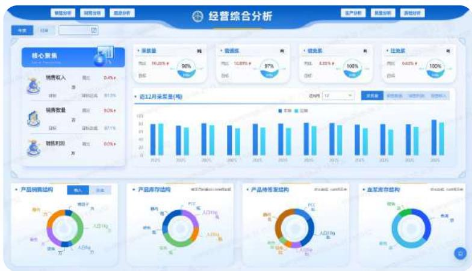

donut

| Category | Sales Volume (万吨) | Sales Growth Rate (%) |
| --- | --- | --- |
| 2015 | ~80 | 96% |
| 2016 | ~75 | 97% |
| 2017 | ~85 | 100% |
| 2018 | ~80 | 100% |
| 2019 | ~85 | 100% |
| 2020 | ~80 | 100% |
| 2021 | ~85 | 100% |
| 2022 | ~80 | 100% |
| 2023 | ~85 | 100% |
| 2024 | ~95 | 100% |

# 可持续供应链

公司深刻认识到，安全、稳定、可持续的供应链是保障产品质量与客户服务的基石。我们致力于与供应商建立合作共赢的负责任采购关系，通过健全的管理体系与严格的评估机制，推动供应链在环境、社会及商业道德方面的持续改善，共同打造绿色、透明、高效的供应链生态。公司建立了覆盖供应商全生命周期的管理制度体系，制定了《采购及招标管理办法》《物料供应商管理规程》《供应商审计管理规程》《风险管理规程》《生产物料采购管理规程》《合同管理制度》等一系列规章制度，确保供应商管理有章可循、责任到人。

# 供应商选择

公司将环境与社会风险纳入采购决策，在供应商准入环节坚持高标准、严要求。在兼顾质量与性价比的前提下，优先选用安全、无毒无害、节约能源、资源利用率高、污染少的产品、技术和服务。同等条件下，优先选择已建立并通过环境和职业健康安全管理体系认证的供应商。同时，公司通过媒体、行业信息等渠道持续关注国家政策导向与市场动态，提前识别潜在风险，确保供应商选择与国家战略同向而行。

# 报告期内

公司共有主要供应商

738家

# 供应商管理与评价

公司建立合格供应商库，对供应商实施分级分类管理。所有合格供应商均需签订质量协议，并通过严格审核货物配送渠道、入库验收等环节，确保产品与服务质量。公司对已合作的供应商开展动态监测，从供货质量、价格水平、交付及时性、售后服务等多个维度进行定期绩效评估，每年对重要供应商实施现场或资质审计，评估结果作为后续采购决策的重要依据。各浆站每年度组织相关科室对供应商的售后服务、产品质量及使用情况综合评价，填写《物料供应商年度评估表》，并结合资质证明的到期情况提前索取更新资料，确保供应商资质持续有效。对供货质量下降或出现问题的供应商，公司要求限期整改；整改不力或存在供应安全、质量缺陷、环境违规、不诚信等问题的供应商，坚决予以淘汰，营造优胜劣汰的良性竞争氛围。

# 平等对待中小企业

公司秉持公平、公正、公开的原则，平等对待所有供应商，不设置歧视性准入条件，积极为中小企业提供与大型企业同等的竞争机会。公司遵守《政府采购促进中小企业发展管理办法》等法规，构建“机会平等—赋能支持—生态共建”的中小企业协同发展机制。

机会平等

赋能支持

生态共建

# 保护环境

本公司深刻理解，企业的长期价值不仅根植于稳健的财务表现，更源于ESG领域的深度践行与持续创新能力。我们坚信，将可持续发展理念全方位融入运营主线，是实现企业自身价值、维护与员工关系、响应投资界期待以及履行对社会责任的基石。为此，公司已将ESG核心原则及绩效指标嵌入日常管理流程与长期规划之中，以实际行动兑现环境保护的承诺，驱动绿色转型，为构建可持续发展的未来贡献力量。

公司严格遵守《中华人民共和国环境保护法》《中华人民共和国节约能源法》《中华人民共和国固体废物污染环境防治法》《中华人民共和国水污染防治法》《中华人民共和国大气污染防治法》等法律法规，制定了《节能管理制度》《废品、废料处理操作规程》《危险废弃物分类收集及贮存管理规程》《危险化学品管理制度》等内部制度，确保控制生产经营对环境造成的影响。

√ 公司已成功通过ISO 14001环境管理体系认证及ISO 50001能源管理体系认证。  
报告期内，公司并未发现任何对本公司有重大影响且严重违反有关空气及温室气体、排放物、水及土地的排污以及有害及无害废弃物产生的相关法律及法规的重大事宜。

# 温室气体排放

公司主要的温室气体来源于交通运输所消耗的燃油及空调制冷剂产生的直接温室气体排放（范围一）和外购电力造成的间接温室气体排放（范围二）。

报告期内，公司温室气体排放总量较上年度有所上升，主要系广东双林及派斯菲科2025年完成产能扩增，产能持续释放，带动生产经营活动对应的外购电力需求增长。

温室气体排放

<table><tr><td>指标1</td><td>单位</td><td>2025年排放量</td><td>2024年排放量</td></tr><tr><td>直接温室气体排放(范围一)</td><td>吨二氧化碳当量</td><td>7,814.86</td><td>13,978.77</td></tr><tr><td>间接温室气体排放(范围二)</td><td>吨二氧化碳当量</td><td>47,523.60</td><td>35,133.70</td></tr><tr><td>温室气体总排放量</td><td>吨二氧化碳当量</td><td>55,338.46</td><td>49,112.47</td></tr><tr><td>温室气体排放密度2</td><td>吨二氧化碳当量/人</td><td>20.09</td><td>18.64</td></tr></table>

备注：  
1. 温室气体排放数据按二氧化碳当量列示，并参照包括但不限于生态环境部最新发布的全国电力平均排放因子、世界资源研究所及世界可持续发展工商理事会刊发的《温室气体盘查议定书：企业会计与报告标准》和《深圳证券交易所上市公司自律监管指引第17号——可持续发展报告（试行）》，公司对其具有运营控制权的温室气体排放进行100%核算。  
2. 截至2025年12月31日，本公司报告范围的员工总数为2,755名。有关数据亦用于计算其他密度数据。

为减少温室气体排放，公司制定了《节能管理制度》，组建了以子公司总经理为组长的节能领导小组，并下设节能办公室，子公司所有部门分管领导和部长均担任职务，负责各部门节能措施的落实。公司制定了一系列计划和措施以实现节能减排，包括以下几个方面：

# 节约能源，降低电力使用量

公司通过空调变频调节、照明设备选型节能、空压机变频调速、使用外购蒸汽余热对生活用水进行加热等方式来降低电力使用量。  
报告期内，广东双林上线空调节能改造项目，进一步夯实了节能管理成效。

# 优化车队管理，减少车辆使用

公司持续优化车队管理，定期检查车辆的机械状况、优化路线规划、鼓励员工使用公共交通工具或绿色出行方式，如骑自行车或步行。

# 推广使用清洁能源

公司持续探索清洁能源应用机遇及场景，未来有条件将在公司内部考虑采用清洁能源，比如光伏发电等。

# 深化环保培训

公司积极开展节能培训，培养员工节约用电的意识，在设备设施停止使用时及时关闭电源，减少不必要浪费。

公司开展各类环境培训累计时长超过2,372.5小时。

# 废弃物处理

公司严格遵守《中华人民共和国固体废物污染环境防治法》等国家法律法规，将废弃物管理作为环境保护的核心环节。我们针对不同性质的废弃物建立了全流程管理制度，通过源头减量、分类收集、合规处置和资源化利用，确保所有废弃物得到安全、环保的处理。

报告期内，公司未发生废弃物污染事件，处置合规率达100%。

# 有害废弃物

我们的废弃物包括生产运营过程中产生的医疗废物和废弃化学品等有害废物。为避免该等有害废弃物中可能包含的病原微生物、有害化学物质等造成负面影响，公司一直非常重视有害废弃物的排放和管理。公司制定并实施了《危险废物管理制度》《危险废物管理计划》《废品、废料处理操作规程》《危险废弃物分类收集及贮存管理规程》等一系列内部规章，并严格遵循《危险废物名录》《危险废物经营许可证管理办法》等外部法规，还结合自身特点制定了《医疗废物处理管理制度》《实验室污物标准操作规程》等文件，确保有害废弃物从产生到处置的每个环节都有章可循。对于不同种类的有害废弃物，公司采取的处理方式和措施如下：

# 医疗废物:

按照国家有关规定，建立医疗废物管理制度，执行分类收集、专用包装、消毒打包、暂存管理，并委托持有《危险废物经营许可证》的专业医疗废物处置公司进行运输和无害化焚烧处理。所有医疗废物的移交均执行危险废物转移联单制度，详细登记种类、数量、来源、去向及经办人，确保全程可追溯。

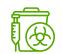

# 实验消毒废物：

主要指在实验室中使用的一些化学试剂、培养基和生物制品等。针对此类废弃物，公司要求实验室工作人员严格按照《危险废弃物分类收集及贮存管理规程》《危险废物管理计划》《实验室污物标准操作规程》等规章对实验废物进行正确的分类和收集，并运往具有资质的实验废物处理公司处置。

# 有害废弃包装物：

主要包括废弃油桶、废弃化学品桶等。公司设置专门的危险废物暂存区，与一般固废严格分离，对包装物进行分类压缩后，交由具有资质的回收企业进行资源化利用或安全处置。

# 废液：

公司对废液进行分类、收集和处置，将其送往具有资质的企业进行处理，确保不对环境和人类造成影响。

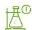

# 化学溶剂和过期化学试剂：

公司严格按照《实验室废弃化学品收集技术规范》相关的操作流程和规章，确定各类试剂相容性，在分类收集、储存、包装后，交由有资质的单位进行焚烧处理。公司优先采购低毒试剂，减少危险废物来源；过期化学试剂按照危险性分类收集、包装后交由有资质的单位进行处理。

# 无害废弃物

公司依据《固废分类、收集、处理管理制度》和《生活垃圾分类管理标准》等内部规定，对日常运营中产生的无害废弃物实施规范化管理。我们的无害废弃物主要来自于日常的办公运营活动，主要包括厨余垃圾、生活垃圾以及废弃包装，我们会委托具有资质的第三方公司对其进行回收及处理。

从产业化建设之初，我们就严格按照最高标准执行厂房建设与装修，同步配套并投运污染防治设施，严格落实环评要求。在日常运营中，公司积极推行线上办公，倡导双面打印、废纸再利用、随手关灯等节约行为，并鼓励员工使用可重复使用餐具，从源头减少资源消耗与废弃物产生。我们依据国家垃圾分类标准，在办公及生产区域设置分类垃圾桶并由专人负责首次分拣。可回收物交由有资质的单位进行资源化利用，不可回收部分则由当地环卫部门统一清运。此外，我们通过内部平台、宣传画等多种方式普及垃圾分类知识，开展环保主题活动，持续提升员工的环保意识，带动全员参与到垃圾分类与绿色办公的行动中。

# 报告期内

公司生产经营相关产生废弃物合计2,535.90吨，废弃物排放完全合规，无任何污染事故发生。

<table><tr><td>废弃物类型</td><td>单位</td><td>2025年排放量</td><td>2024年排放量1</td></tr><tr><td>无害废弃物排放总量</td><td>吨</td><td>1,221.53</td><td>2,757.45</td></tr><tr><td>有害废弃物排放总量</td><td>吨</td><td>1,314.37</td><td>1,340.28</td></tr><tr><td>废弃物排放总量</td><td>吨</td><td>2,535.90</td><td>4,097.73</td></tr><tr><td>排放密度</td><td>吨/人</td><td>0.92</td><td>1.56</td></tr></table>

备注：

1. 公司于报告期内对2024年度废弃物相关数据进行复核，经依据原始统计台账及处置记录重新核定后，该指标更正为1,340.28吨。受此影响，2024年度废弃物排放总量及相关密度指标已按更正后口径同步调整。本报告所列比较数据均以调整后数据为准，以确保披露信息真实、准确、完整并具有可比性。

# 化学品管理

公司严格遵守《危险化学品安全管理条例》《中华人民共和国环境保护法》等法律法规，针对药物原料、生产辅料及实验室试剂等各类化学品，建立了以《危险化学品管理制度》为核心的全生命周期管理体系。该体系覆盖采购、运输、储存、使用及废弃物处置五大环节，贯彻“源头管控、过程严管、末端闭环”的管理原则。在采购端，我们严格筛选合格供应商，优先采购低毒、环保型化学品；在储存与使用环节，化学品分类存放于配备防泄漏设施的专用仓库，操作人员经培训后严格按规程作业，有效防止泄漏与误操作；针对废弃物，过期化学试剂及溶剂按相容性分类收集后，交由资质单位进行无害化焚烧处置。公司将化学品管理深度融入生产和环境管理体系，每年进行评估与监控，持续优化管理措施。报告期内，公司化学品管理规范有序，未发生任何泄漏或安全事故，有效保障了环境安全与员工健康。

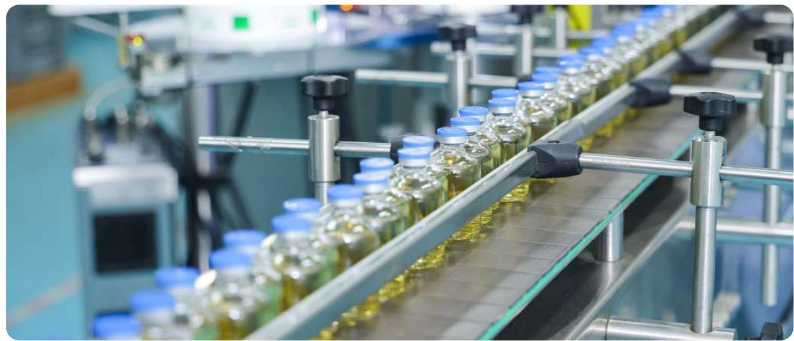

natural_image

Factory production line with rows of glass bottles on a conveyor belt (no visible text or labels)

# 污水排放

公司严格遵守《中华人民共和国环境保护法》《中华人民共和国水污染防治法》及《医疗机构水污染物排放标准》（GB18466-2016）等法律法规与行业标准，建立了完善的废水管理体系。通过制定并执行《医疗废弃物、污水处理程序》《污水处理系统标准操作规程》等内部制度，确保废水处理全过程合规、可控。

公司废水主要来源于生产车间工艺废水、实验室检测废水以及办公生活污水。针对不同性质的废水，我们实施分类收集与分质管控：

# 生产废水经车间预处理去除高浓度污染物后进入污水处理站

# 生活废水经化粪池预处理后接入系统

# 清净下水单独收集回用，有效减少进入处理系统的水量负荷

公司采用A²/O生化处理工艺对综合废水进行集中处置，确保COD、氨氮等主要污染物稳定达标排放；各污水处理站配套安装水污染源在线监测系统，实时监控出水水质并联网至当地环保部门。我们建立了严格的日常监测机制，每日对排放池污水进行余氯和pH值检测，并定期委托第三方机构开展全面水质分析，确保监测数据真实可靠。同时，积极推行清洁生产技术，通过优化清洗程序、更新实验设备等措施减少废水产生，并将部分达标废水回用于厂区绿化及设备冲洗，提升水资源循环利用率。

报告期内，公司废水100%达标排放。未来，公司将持续探索节水减污新技术，进一步提升废水治理水平。

# 资源使用管理

# 能源消耗

为系统提升能源利用效率，公司建立了以《节能管理制度》《能源统计报表管理制度》《车辆管理制度》《办公用品管理制度》为核心的能源管理体系，并配套实施《降本增效奖励办法》，将节能目标分解至各部门进行量化考核。同时，公司正在建设能碳管理平台与能源管理系统，以实现对厂区能源数据的精准采集与实时监控，持续完善能源管理体系，提高能源使用效率。

目前，公司的能源消耗主要来源于两个方面：

一是维持业务稳定运行的电力消耗，主要用于冷库低温储存、采浆机作业驱动以及办公生产区域的空调、照明等；

二是车辆及生产设备运行产生的燃油消耗。

# 在能源管理方面

公司通过技术升级与精细化管理双轮驱动，不断挖掘节能潜力。每年制定能源使用计划与目标，并在日常监管中动态回顾，持续优化用能结构。

报告期内实施的具体节能措施包括：

持续改进生产工艺流程，降低生产能耗强度；对冷库、空调等设备进行变频节能控制升级，启动动态温控，合理降低运行功率。

对生产用水、用电环节进行精准计量，在车间加装二级水表，实现用水精细化监控；推广使用智能插座，引导员工科学管理电器开关状态，及时排查异常用能，确保能源利用效率持续提升。

定期对耗能设备进行维护保养，延长使用寿命；新购设备时优先选用低能耗、高效率型号；对无法修复的高耗能设备按规定报废，并交由专业机构拆解回收，避免资源浪费。

严格执行节能减排制度，通过集中排产减少设备启停频次；规范公务用车管理，逐步淘汰老旧高油耗车辆，引入新能源汽车，并科学规划出行路线，降低燃油消耗。

natural_image

Illustration of two people working with a lightbulb, surrounded by abstract icons and clouds (no text or symbols)

# 报告期内

受广东双林及派斯菲科产能扩增影响，相关生产设备、辅助设施及配套系统的运行需求相应增加，带动公司耗电量较上年度有所上升。公司能源消耗表现如下表所示：

能源消耗

<table><tr><td>能源类型</td><td>单位</td><td>2025年消耗量</td><td>2024年消耗量</td></tr><tr><td>直接能源消耗总量</td><td>吨标准煤</td><td>1,572.02</td><td>1,432.15</td></tr><tr><td>间接能源消耗总量</td><td>吨标准煤</td><td>10,884.55</td><td>7,571.33</td></tr><tr><td>能源消耗总量</td><td>吨标准煤</td><td>12,456.57</td><td>9,003.49</td></tr><tr><td>能源消耗总量密度</td><td>吨标准煤/人</td><td>4.52</td><td>3.42</td></tr></table>

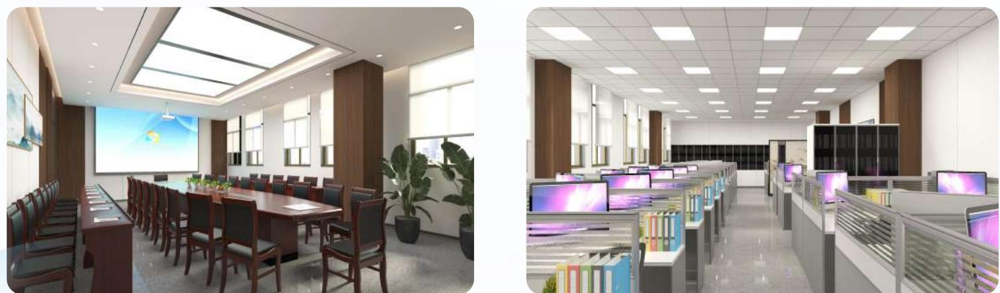  
1、2号楼优化改造完成

# 废气排放

公司严格遵守《中华人民共和国大气污染防治法》等相关法律法规，依托《环境保护责任制》等内部制度，对生产经营过程中产生的各类废气实施全流程管控。公司依据环评及排污许可证要求，配套建设废气治理设施，并制定自行监测方案，定期开展自主监测与第三方检测，确保排放数据真实、合规。

本公司的废气排放源来自公司车辆使用以及化石燃料燃烧过程产生的氮氧化物(NOx)、硫氧化物(SOx)及颗粒物(PM)的排放。

日常管理中，公司采取“源头替代、过程控制、末端治理”相结合的综合治理策略，持续降低废气排放强度：

# 在源头控制方面

我们积极开展原辅材料VOCs含量排查并建立绿色清单，逐步推进高VOCs原辅材料替代工作，同时推广使用电采暖和清洁能源，并逐步提高绿电使用比例，从源头减少废气产生。

# 在过程收集环节

我们对生产车间、物料存储区等易产生无组织排放的区域实施封闭管理，通过密闭化收集和负压抽吸系统将废气有效导入处理装置，实验室及医疗废物暂存间均配备生物安全柜或排气设备，地下车库则设置机械抽排系统，最大限度减少无组织逸散。

# 在末端治理中

针对不同废气特性配置差异化的处理设施：含非甲烷总烃、甲醛的工艺废气采用“水喷淋+活性炭吸附”工艺，污水处理站恶臭气体通过“碱洗吸收塔”处理，处理效率均稳定在90%以上；实验室异味广泛使用活性炭吸附系统并定期更换耗材；食堂油烟经净化后通过专用烟道高空排放，发电机烟气则经消烟除尘设施处理。

为确保治理效果，我们在关键废气排放口安装VOCs在线流量监测设备，并将污水在线监测及废气监控系统联网至当地环保主管部门平台，同时严格按照排污许可证要求开展自行监测与第三方检测，确保废气排放全时段达标、全过程透明。

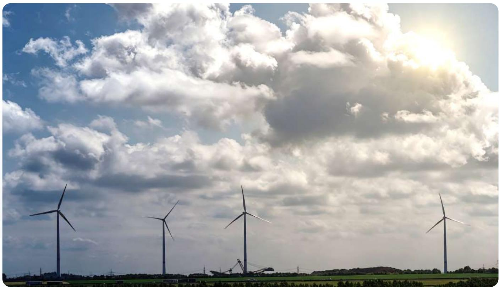

natural_image

Wind turbines in a field under a bright sky with scattered clouds (no text or symbols visible)

废气排放

<table><tr><td>废气排放类型</td><td>单位</td><td>2025年排放量</td><td>2024年排放量</td></tr><tr><td>氮氧化物NOx</td><td>千克</td><td>5,191.27</td><td>3,038.25</td></tr><tr><td>硫氧化物SOx</td><td>千克</td><td>10.97</td><td>12.50</td></tr><tr><td>颗粒物PM</td><td>千克</td><td>426.47</td><td>224.06</td></tr></table>

# 用水管理

公司严格遵守《中华人民共和国水污染防治法》《中华人民共和国清洁生产促进法》等法律法规，依托《节能管理制度》及年度用水计划，对水资源使用实施科学化、精细化管理。公司根据实际情况编制能源审核报告，在制水车间、生产及实验区域加装二级水表，建立一级与二级水表的月度抄表记录机制，通过精准计量实时掌握用水动态，为节水挖潜提供数据支撑。

公司的用水主要来自药品制造过程中的生产用水、实验室检测用水以及办公区、宿舍区的生活用水。所有用水均取自市政供水管网，水源获取稳定可靠，不存在取用水方面的限制性因素。

# 公司采取技术改进与日常管控相结合的方式，系统推进节水工作：

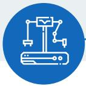

一是优化工艺与设备，针对CIP罐清洗更换高压喷淋球，提升清洗效率、减少用水量；推广使用感应式或按压式水龙头，从终端减少水资源浪费。

二是加强过程管控，定期开展供水管网漏水检测，及时修复跑冒滴漏，降低管网漏损；根据生产调度合理调整供水设备运行，避免无效供水；定期开展水平衡测试，科学分析用水现状，挖掘节水潜力。

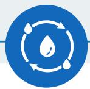

三是推动水资源循环利用，规划并建设雨水收集利用系统，积极探索雨水回用途径。

四是强化节水宣传与培训，组织操作人员开展节能培训，严格执行《节能管理制度》；在公共区域张贴节水标语，利用内部平台普及节水知识，引导员工养成随手关水、合理用水的习惯。

此外，针对特殊用水环节，公司明确要求设备清洗废水排入污水处理站处理，食堂废水须经隔油池过滤后方可排放，含油废弃物严禁倒入下水道，确保水资源利用与环境保护协同推进。

# 报告期内

由于公司处于扩产及二期项目竣工试产阶段，用水量较2024年将有较大幅度增长，公司正通过各项节水措施积极应对，努力控制用水增量。公司水资源消耗表现如下表所示：

水资源消耗

<table><tr><td>水资源消耗</td><td>单位</td><td>2025年排放量</td><td>2024年排放量</td></tr><tr><td>耗水总量</td><td>立方米</td><td>808,051.40</td><td>675,380.10</td></tr><tr><td>耗水密度</td><td>立方米/人</td><td>293.30</td><td>256.31</td></tr></table>

natural_image

Close-up of water droplets and bubbles in a circular pattern, reflecting in clear blue water (no text or symbols)

# 包装材料

公司依托《生活垃圾分类管理标准》《固废分类、收集、处理管理制度》等内部规章，明确了分类收集、暂存规范及回收处置要求。

公司的包装材料主要来源于生产运营及办公活动。为了更好的管理包装物：

# 在采购环节

我们优先选用可循环包装材料，减少一次性包装的使用。

# 在产生环节

我们设置分类收集点，将纸箱、塑料瓶等可回收物与生活垃圾严格分开，并设置一般固废暂存区规范存放。

# 对于可回收包装废弃物

公司委托具备资质的回收单位进行回收再利用，实现资源循环；部分浆站还对完好的包装纸箱、塑料瓶进行二次利用，延长其使用寿命。

同时，公司积极倡导绿色办公，通过减少快递包装、用简化包装和环保型包材、推行无纸化办公等方式，从源头降低包装废弃物的产生量。

# 报告期内

公司包装材料消耗情况如下表所示:

包装材料消耗

<table><tr><td>包装材料消耗</td><td>单位</td><td>2025年排放量</td><td>2024年排放量</td></tr><tr><td>包装材料消耗总量</td><td>吨</td><td>766.76</td><td>449.60</td></tr><tr><td>包装材料消耗密度</td><td>吨/人</td><td>0.28</td><td>0.17</td></tr></table>

公司将继续通过优化包装设计提高成品的包装容积率，并落实到所有生产车间、仓储和公用工程设施，有效降低包材使用量，提升经济效益。

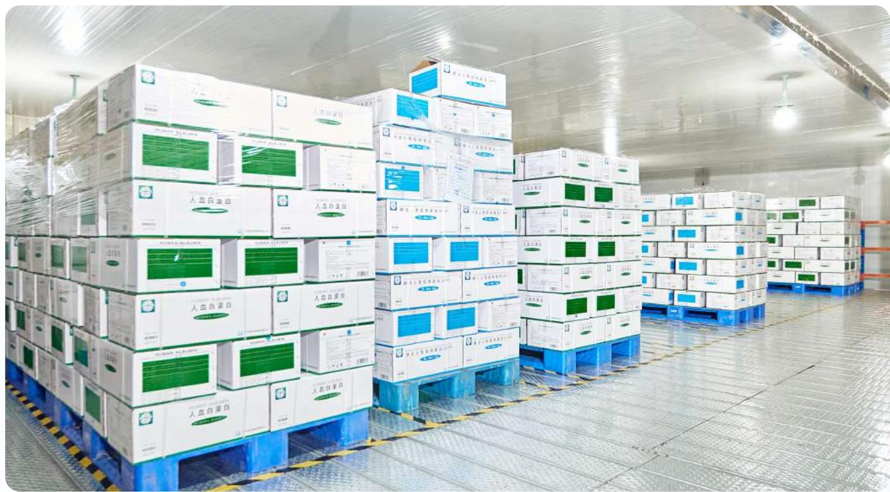

natural_image

Interior of a large warehouse with stacked white and blue plastic boxes on blue pallets, no visible text or symbols.

# 应对气候变化

气候变化已成为全球性挑战，对公司业务的稳健运营具有深远影响。公司深刻认识到识别与缓释气候相关风险的重要性，已将气候变化相关风险纳入企业风险管理体系，持续评估其对供应链、生产运营、人员安全及市场需求的潜在影响，并系统制定应对策略。

# 实体风险及应对策略

台风、暴雨、暴雪、极端高温与严寒等极端天气事件的频发，可能对公司的供应链稳定性、生产连续性及员工健康安全构成直接威胁。如哈尔滨区域冬季平均气温低及降雪、湛江区域夏季台风等引发的原材料运输延误风险，进而带来产能波动与成本上升。

为有效应对上述风险，公司已制定《气象灾害防御管理制度》《气象灾害巡管理制度》及《风险识别评级及分级管控管理制度》，构建起覆盖全流程的气候风险管理体系。公司定期开展气候风险评估，针对低温、暴雨、台风等典型灾害建立风险清单，并配套专项应急预案。公司组建了应急响应小组，每年组织应急演练，储备充足应急物资，确保突发事件中能够快速响应、统一协调。

针对极端天气对献浆员出行的影响，公司采取弹性排班机制，根据天气预警动态调整采浆时段与人员安排，并在部分区域设立联络处，保障浆员安全出行。同时，公司持续加强血浆冷链管理系统，确保运输与储存过程中的质量安全。通过多点布局、分散地理风险，并投建设施保险，最大限度降低极端天气对资产和人员安全的冲击。

# 转型风险及应对策略

在全球迈向碳中和的背景下，环保政策收紧、碳税开征、客户偏好向低碳企业倾斜等转型趋势日益明确。为应对政策合规与声誉风险，公司紧密跟踪国内外气候法规动态，主动履行环保责任，将低碳运营融入日常管理。

针对上述政策合规、法律约束及声誉受损等风险，公司持续密切跟踪法律法规动态与全球气候转型趋势。同时，公司通过优化生产工艺、更新高能效自动化设备、升级污水处理设施等措施，持续降低能源消耗与温室气体排放。部分浆站已开展碳效率优化实践，如减少发电机及车辆尾气排放。公司还设定了环境绩效目标，并通过节能技改、清洁能源替代等方式，稳步推进运营活动的低碳转型，确保在政策与市场变化中保持竞争力。

# 机遇

面对传统能源价格波动及市场对绿色产品需求的上升，公司将可再生能源视为提升能源安全与可持续发展能力的关键。未来，我们计划逐步扩大太阳能、风能等清洁能源的应用比例，降低对化石能源的依赖，平抑能源成本波动。同时，公司将紧跟市场需求，加大环保型产品的研发投入，推动绿色创新，以低碳产品与服务塑造差异化品牌优势，在应对气候变化中把握发展新机遇。

# 生态系统和生物多样性保护

公司严格遵守《中华人民共和国森林法》《中华人民共和国森林法实施条例》《退耕还林条例》《中华人民共和国环境影响评价法》等法律法规要求，将生物多样性保护纳入企业环境管理体系，致力于实现生产经营与自然生态的和谐共生。

公司建立了生物多样性保护相关管理制度，明确以下目标与规划：

# 一是坚持合规管理

确保生产经营活动不对周边生态系统造成负面影响；

# 二是强化供应链管控

优先选择符合可持续发展标准的供应商，禁止采购来自非法砍伐或生态破坏区域的物料，从源头减少生态损害；

# 三是开展生态影响评估

在新建、改扩建项目前期进行专项生态影响评价，识别潜在风险并制定预防与修复措施；

# 四是健全应急与监督机制

建立生态环境应急响应预案，定期开展排查与监督检查，确保各项保护措施落地执行。

# 报告期内

公司结合属地生态环境特点，持续开展生态影响防控、厂区绿化及宣传引导等工作。公司通过优化厂区布局与生产工艺、提升污水及废气处理能力、加强废弃物全过程管理，减少对周边水体、土壤及生态环境的影响；通过开展厂区绿化、优先种植本土植物等方式，提升厂区及周边生态环境质量；同时，组织员工参与生态保护培训和公益宣传，持续提升生态保护意识。

natural_image

Illustration of people painting a globe with a water dispenser, surrounded by green plants and a blue ladder (no text or symbols)

natural_image

Dense forest landscape with misty peaks and dense evergreen trees under a clear sky (no text or symbols visible)

# 员工关系

# 雇佣与平等

公司将人才队伍建设作为可持续发展的根基，始终坚持“以人为本”的管理理念，珍视每一位员工的贡献与成长。

# 招聘及解聘

公司坚持公平公正、竞争择优的用人导向，在招聘工作中全面贯彻机会平等、人岗匹配的原则，系统引进与培育具备专业能力和进取精神的多元化人才。依据《招聘与录用管理制度》，公司对招聘原则、组织架构、计划预算、信息发布、试用录用及解聘流程等环节进行了规范，确保招聘工作的透明度与规范性，保障员工权益与岗位需求精准对接。在劳动关系解除方面，公司严格遵循法定程序，明确解聘条件与双方义务，杜绝不公正解雇行为，确保程序公开、结果公正。

报告期内，公司未发生任何涉及童工或强制劳动的举报或投诉，亦无违反雇佣相关法律法规的重大事项。

# 截至报告期末

公司员工总数为2,755人，年度整体流失率为15.4% $^{4}$ 。员工结构按性别、年龄、地区及雇佣类型的情况如下：

<table><tr><td>员工人数</td><td colspan="2">2025年</td><td colspan="2">2024年</td></tr><tr><td>员工总数</td><td colspan="2">2,755</td><td colspan="2">2,635</td></tr><tr><td>按性别划分</td><td></td><td></td><td></td><td></td></tr><tr><td>男性</td><td colspan="2">1,169</td><td colspan="2">1,090</td></tr><tr><td>女性</td><td colspan="2">1,586</td><td colspan="2">1,545</td></tr><tr><td>按年龄划分</td><td></td><td></td><td></td><td></td></tr><tr><td>30岁以下</td><td colspan="2">784</td><td colspan="2">761</td></tr><tr><td>30-50岁</td><td colspan="2">1,527</td><td colspan="2">1,455</td></tr><tr><td>50岁以上</td><td colspan="2">444</td><td colspan="2">419</td></tr><tr><td>按地区划分</td><td></td><td></td><td></td><td></td></tr><tr><td>中国大陆</td><td colspan="2">2,755</td><td colspan="2">2,635</td></tr><tr><td>按雇佣类型划分</td><td></td><td></td><td></td><td></td></tr><tr><td>全职</td><td colspan="2">2,755</td><td colspan="2">2,635</td></tr><tr><td>兼职</td><td colspan="2">0</td><td colspan="2">0</td></tr></table>

<table><tr><td>流失员工人数</td><td colspan="2">2025年</td><td colspan="2">2024年</td></tr><tr><td>流失员工总数</td><td colspan="2">424</td><td colspan="2">409</td></tr><tr><td>按性别划分</td><td></td><td></td><td></td><td></td></tr><tr><td>男性</td><td colspan="2">162</td><td colspan="2">151</td></tr><tr><td>女性</td><td colspan="2">262</td><td colspan="2">258</td></tr><tr><td>按年龄划分</td><td></td><td></td><td></td><td></td></tr><tr><td>30岁以下</td><td colspan="2">189</td><td colspan="2">178</td></tr><tr><td>30-50岁</td><td colspan="2">157</td><td colspan="2">162</td></tr><tr><td>50岁以上</td><td colspan="2">78</td><td colspan="2">69</td></tr></table>

bubble

| Node | Size |
| --- | --- |
| 1 | Large |
| 2 | Medium |
| 3 | Small |
| 4 | Small |
| 5 | Small |
| 6 | Small |
| 7 | Small |
| 8 | Small |
| 9 | Small |
| 10 | Small |
| 11 | Small |
| 12 | Small |
| 13 | Small |
| 14 | Small |
| 15 | Small |
| 16 | Small |
| 17 | Small |
| 18 | Small |
| 19 | Small |
| 20 | Small |
| 21 | Small |
| 22 | Small |
| 23 | Small |
| 24 | Small |
| 25 | Small |
| 26 | Small |
| 27 | Small |
| 28 | Small |
| 29 | Small |
| 30 | Small |
| 31 | Small |
| 32 | Small |
| 33 | Small |
| 34 | Small |
| 35 | Small |
| 36 | Small |
| 37 | Small |
| 38 | Small |
| 39 | Small |
| 40 | Small |
| 41 | Small |
| 42 | Small |
| 43 | Small |
| 44 | Small |
| 45 | Small |
| 46 | Small |
| 47 | Small |
| 48 | Small |
| 49 | Small |
| 50 | Small |
| 51 | Small |
| 52 | Small |
| 53 | Small |
| 54 | Small |
| 55 | Small |
| 56 | N/A |

# 多元、平等及共融

公司严格遵守《中华人民共和国劳动法》《中华人民共和国劳动合同法》等法律法规，致力于营造多元包容、平等互敬的工作氛围。我们坚决反对任何形式的就业歧视与职场骚扰，不以性别、年龄、民族、宗教信仰、残疾状况、性取向或家庭背景作为录用或晋升的限制条件。所有员工均依法签订劳动合同，人力资源部门在招聘环节开展必要的背景核实，确保用工合规。

公司在招聘环节由人力资源部对候选人进行必要的背景调查，以发现并排除任何违反相关劳动法律、法规或标准的情况。所有员工都必须自愿合法地与公司签订劳动合同。

在民主管理与员工参与方面，公司充分尊重员工依法结社的权利，依据《工会法》《中国工会章程》等规定，在各成员单位普遍设立工会组织，员工可自主选择加入。公司核心子公司广东双林及派斯菲科同步建立党支部，将党建工作融入日常管理，增强团队凝聚力；2025年，部分成立妇联组织，进一步关注和支持女性员工的发展需求。公司坚持通过集体协商维护职工权益，每年广泛征集员工意见，依法签订《工资集体合同》，平衡劳资双方利益。

同时，公司以职工代表大会为基本载体，建立健全民主议事机制，定期组织职代会、座谈会、科主任会议及全员会议，覆盖不同层级与岗位，围绕劳动保护、工作条件、考核奖惩等议题听取员工意见，切实保障员工的知情权、参与权、表达权和监督权。

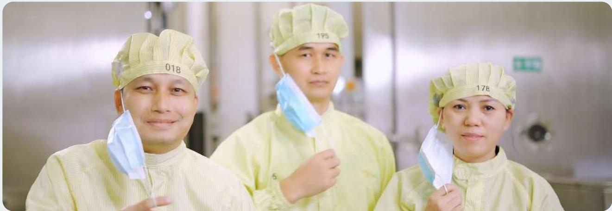

natural_image

Three medical professionals in cleanroom attire and face masks, posing indoors (no visible text or symbols)

报告期内，本公司未收到过任何雇佣童工或强制劳工方面的投诉或举报，亦未发现任何对本公司有重大影响且严重违反有关雇佣的相关法律及法规的重大事宜。

# 健康与安全

公司始终将员工的健康与安全置于发展首位，致力于构建安全、健康、舒适的工作环境。我们严格遵守《中华人民共和国安全生产法》《中华人民共和国消防法》《危险化学品安全管理条例》《中华人民共和国职业病防治法》等法律法规，并依据相关法规要求，制定并完善了涵盖安全生产、职业健康、应急管理、消防安全等领域的多项内部制度。包括《办公环境及安全保卫管理制度》《安全教育培训管理制度》《职业病防治责任管理制度》《职业病危害警示与告知管理制度》《员工分类健康管理和指导方案》等，形成了覆盖全流程、多层级的管理规范。同时，公司设立安全生产领导小组和应急指挥部，编制《生产安全事故应急预案》并在属地监管部门备案，构建了“总部-区域”联动的应急响应机制。

# 职业健康管理

公司高度重视职业病防治工作，从环境管控、监测评价、健康监护等多维度保障员工健康。各生产及实验场所严格落实日常环境检查和仓储条件管控，定期聘请具备资质的第三方机构对实验室、车间等场所进行职业病危害因素检测、防护设施评价及控制效果评估，主动接受监管部门监督。公司每年组织全体员工进行职业健康体检，针对污水处理、医疗废物处置、放射岗位等特殊工种人员增加体检频次，并建立职业健康监护档案，对体检结果实施动态跟踪与管理，及时干预潜在健康风险。部分还为员工建立分类健康管理方案，配备完善的消防安全设施，持续改善作业环境。

# 安全培训与实操演练

提升员工安全意识和应急技能是预防事故的关键。公司每年定期组织全员参与安全管理制度学习与实操演练。

2025年，公司围绕消防安全、生物安全、应急急救等内容开展全员职业安全培训时长超过46,511小时

覆盖 17,392人次 ，公司级统筹培训 20余场 ，业务部门组织专项培训超百场 。

公司根据自身风险特点制定专项应急预案，配备充足的应急物资，定期开展形式多样的实战演练。演练主题覆盖消防、地震、维稳、职业暴露、设备故障、停电、有限空间救援等场景，部分浆站创新实施“周演练”“月度三主题”等模式，确保应急响应的熟练度和有效性。全年累计开展各类应急演练超过100场次，有效提升了应对突发事件的快速反应和协同处置能力。通过常态化培训及演练，员工对安全规章的理解不断深化，应急处置能力显著增强。

# 安全生产投入与绩效

公司持续加大安全生产投入，用于防护设施配置、应急物资储备、安全宣传教育、设备检测维护及员工健康体检等方面，切实保障各项安全措施落地。

# 报告期内

公司安全生产投入 822.19万元 ，且已通过ISO 45001职业健康安全体系认证。

√ 公司连续六年实现员工零工伤死亡事故，未发生任何重大违反职业健康安全法律法规的事件，亦未收到相关监管处罚。

未来，公司将继续秉持“安全第一、预防为主、综合治理”的方针，持续优化职业健康安全管理，为员工创造更加安全健康的工作环境。

# 发展与培训

人才是企业发展的核心引擎。公司秉持“与员工共同成长”的理念，构建了以《岗位职级设置与管理办法》《薪酬管理制度》《绩效考评管理办法》为核心的人力资源制度体系，为员工铺设透明、公平、多元的职业发展路径，并通过分层分类的培训赋能机制，持续激发人才潜能，实现组织与个人的共同成长。

# 职业发展

公司建立了管理序列、专业技术序列和技能操作序列三大职业发展通道，每个序列下设多个职级，辅助员工搭建职业发展路径。职级晋升与薪酬待遇、绩效结果紧密挂钩，并向关键技术岗位和成果突出者倾斜，确保员工获得具有竞争力的回报与成长空间。在内部培养为主、外部选拔为辅的原则下，公司对全体员工定岗定级、晋升晋级的资格要求和申报流程作出明确规定，保障职业发展的公平公正。

报告期内，公司持续优化岗位管理机制，通过岗位聘用、逐级晋升、绩效考核等制度，全面激发队伍活力。

公司结合实际细化落实，鼓励员工进行自我职业探索，部分对员工参加专业资格考试给予大力支持，并在薪酬调整中予以体现，营造了“人人有目标、人人有方向”的成长氛围。

# 员工培训

公司坚持“内容多样化、形式多样化、贴近业务、绩效挂钩”的培训原则，制定并实施《2025年员工培训工作实施方案》《员工培训和技术考核管理制度》等规范，构建起覆盖全员、分层分类的培训赋能体系。培训内容涵盖GMP规范、生物安全、设备操作、质量管理、职业素养等各业务模块，通过面授、线上学习、实操演练、师带徒等多种形式灵活开展。

2025年，公司紧扣高质量发展需求，全方位推进人才队伍建设。

# 在培训体系方面

公司构建起分层分类、系统常态的培训架构，围绕员工成长全链条，系统开展了新员工入职培训、内训师进阶培训、技能赛讲、青年骨干对标研学、班组长素质能力提升等系列重点项目。同时，落实师带徒机制，由业务骨干担任师傅，通过“传帮带”在岗位技能、工作经验、思维价值观等方面进行全方位手把手辅导，加速新员工岗位技能提升与团队融合，有效促进经验传承与文化浸润。

全年共组织各类职业技能培训超600场，覆盖员工超21,000人次，持续赋能员工专业提升与岗位成长。

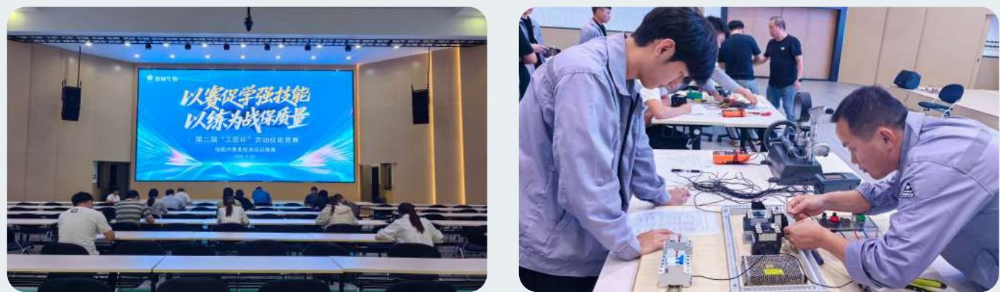  
第二届“工匠杯”劳动技能竞赛顺利闭幕

# 在技能人才建设方面

公司通过自主技能等级认定，全年累计通过68人，进一步夯实了技能人才梯队。

多措并举之下，人才队伍结构持续优化，综合素质稳步提升，既为公司注入了扎实的新生力量，也为高质量发展提供了坚实的人才支撑。

# 报告期内

培训总人次

70,086人次

人均培训时长

64.54小时

累计培训总时长

177,797.50小时

培训覆盖率

88.38%

# 关怀与沟通

公司始终践行“以人为本”的管理理念，围绕员工福祉与诉求，构建起涵盖薪酬福利、生活关怀、民主沟通的全方位关怀体系。通过制度化保障与多元化举措，致力于提升员工的幸福感、归属感和获得感，营造和谐温暖的组织氛围。

# 薪酬福利

公司依据《职工福利管理制度》《专项奖励暂行管理制度》等内部规章，建立了兼顾公平性与竞争力的薪酬福利体系。在依法足额缴纳“五险一金”的基础上，为符合条件的员工建立企业年金计划，并提供节日、子女教育、赡养老人、教育培训、职称等多项津贴补贴。公司每年定期组织员工健康体检，配发劳动保护用品，并在法定节假日之外设置产假、哺乳假、婚假、丧假、补休假等多种带薪假期，切实保障员工休息权益。部分厂区及配套建设员工宿舍、食堂及健身房、图书室、篮球场等文娱设施，倡导工作与生活平衡。激励机制方面，公司设立季度绩效奖励、奋斗奖金等专项奖励，将个人回报与经营业绩紧密挂钩，传递“业绩决定薪酬、奋斗创造幸福”的价值导向，持续激发员工积极性与创造力。公司结合实际优化薪酬结构，部分建立以岗位绩效工资制为主、年薪制和能级工资制为补充的多元化薪酬体系，拓宽员工职业发展通道。

# 员工关怀

公司紧密围绕员工需求，秉持“为职工群众服务”的方针，开展多层次、个性化的关怀行动，覆盖家庭、女性、身心健康及团队建设等维度。

# 扶持员工家庭

公司重视员工家庭幸福，通过组织各类亲子与家庭关怀活动，增强员工的家庭归属感；同时对有需要的家庭提供及时帮扶，并在员工经历重要人生时刻，如生病住院、生育及遭遇丧事等给予温暖慰问。

# 呵护女性职工

公司积极为女性员工创造关爱环境，提供专属休息空间与心理支持，全面落实各项生育相关假期与岗位保障制度，多维度维护女性员工的合法权益。

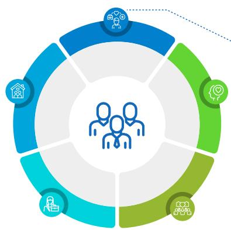

flowchart

```mermaid
graph LR
  A["Team Members"] --> B["Strategic Initiatives"]
  B --> C["Project Projects"]
  C --> D["Staff Resources"]
  D --> E["Project Operations"]
  E --> F["Project Maintenance"]
  F --> G["Project Support"]
  G --> H["Project Implementation"]
```

# 慰问员工生活

公司坚持开展季节性关怀活动，为不同工作环境下的员工提供相应的物资支持与切实保障，冬季为低温作业岗位配备防寒物资，夏季向高温岗位发放发放消暑产品。

# 心理健康支持

公司通过设立多样化的休闲放松空间，以及组织各类文体活动例如羽毛球比赛、趣味运动会等，帮助员工有效缓解压力，促进身心健康。

# 加强团队凝聚

公司依托节日与主题活动，积极营造团结协作的文化氛围，并通过鼓励团队自主开展建设活动，持续增强员工的归属感与凝聚力。

# 员工沟通

公司充分尊重员工的主体地位，依法保障员工的结社自由和民主权利。按照《工会法》《中国工会章程》等规定，各成员企业均设立工会，员工可自愿加入。工会每年组织召开职工代表大会，围绕劳动保护、工作条件、考核奖惩等涉及员工切身利益的议题展开讨论，形成意见建议并反馈管理层。公司依法开展集体协商，每年签订《工资集体合同》，维护劳资双方合法权益。

为畅通员工意见表达渠道，公司制定并实施《员工意见反馈及申诉管理制度》，建立了多元化的沟通途径：

员工可直接向部门经理反馈，办公室定期组织员工谈心，各公司设立总经理信箱、意见反馈箱，并利用茶话会、座谈会等形式灵活收集员工诉求。部分还开通线上意见收集平台，确保员工意见“听得见、有回应”。通过常态化沟通机制，公司及时调整管理政策，推动决策更加科学民主，营造了开放包容的组织氛围。

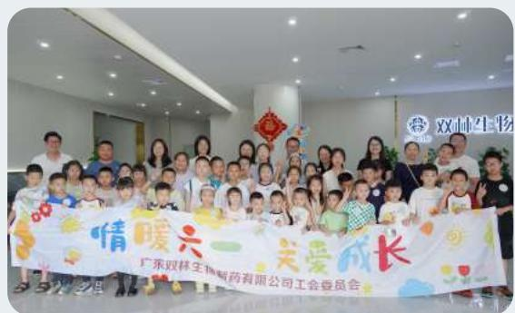

text_image

情暖六关爱成长
广东双林生物制药有限公司工会委员会

举办六一儿童节活动

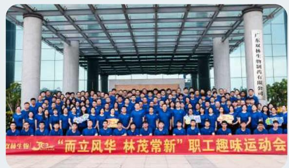

text_image

广东双林生物制药有限公司
“而立风华 林茂常新”职工趣味运动会

举办三十周年职工趣味运动会

# 商业道德

# 反商业贿赂及反贪污

公司始终秉持诚信合规的经营理念，对贪污、贿赂、舞弊、勒索、欺诈及洗钱等不当行为坚持"零容忍"态度。我们严格遵守《中华人民共和国监察法》《中华人民共和国反不正当竞争法》《中华人民共和国反洗钱法》《关于禁止商业贿赂行为的暂行规定》等法律法规，持续完善内部控制机制，推进制度反腐，强化重点岗位监督，塑造公平、公开、廉洁、正直的企业文化。

公司建立健全商业道德管理相关制度，制定并严格执行《内部审计管理制度》《审计发现违规问题问责管理规程》等内部规章，将反腐败责任层层分解、落实到人。针对销售、采购、招投标、血浆采集等易发多发腐败风险的重点领域，制定专项合规管理标准操作程序，从源头防范利益冲突、私下协议、行贿受贿等违规行为。公司在员工入职时均签订《廉洁协议》或《保密协议》，明确职业操守要求，筑牢思想防线。部分成立党支部，发挥党组织的廉洁监督作用，加强对日常经营的纪律约束。

公司每年组织开展覆盖全员的反腐败专题培训，报告期内员工培训覆盖率达100%。

培训内容紧密结合行业特性与岗位实际

涵盖职业道德、招投标规范、血浆采集廉洁要求等专题，采用以案为鉴、情景模拟等多元化形式

强化员工对商业贿赂、利益输送等风险的识别与防范能力

推动“不敢腐、不能腐、不想腐”长效机制落地

通过线上学习平台、职业道德专项培训等方式，持续深化员工合规意识。

公司建立并畅通内部举报渠道，鼓励员工主动汇报任何违反反腐败规定的行为，切实保障举报人合法权益。所有举报案件均严格保密处理，举报人信息及合法权利受制度保护。公司党委、纪委及各党支部履行廉洁监督职责，定期开展内部审计与合规检查，确保各项制度有效执行。

报告期内，公司及员工无正在进行或已审结的贪污诉讼案件，未发现任何严重违反反贿赂、反欺诈及反洗钱相关法律法规的重大事项。

# 反不正当竞争

公司严格遵守《中华人民共和国反不正当竞争法》《中华人民共和国反垄断法》《上市公司治理准则》等法律法规，并将合规要求贯穿于公司治理、市场运营及供应链管理的全流程。公司坚决反对商业贿赂和行业垄断，以建设公平、公正和公开的市场竞争环境为原则，积极参与保护市场公平竞争，促进行业健康发展。在日常工作中，公司不断加强反商业贿赂的法律法规教育，在公司内部树立正气，坚决抵制歪风邪气，筑牢员工的思想道德防线。报告期内，公司未涉不正当竞争诉讼，也无严重违反相关法规的重大事项。

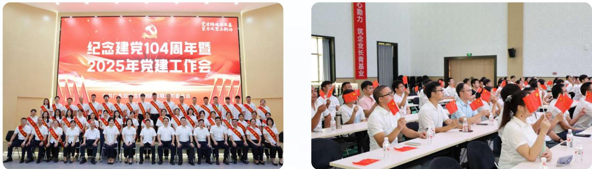

# 社会公益

公司始终秉持回馈社会的理念，将履行社会责任融入企业发展战略，积极调动各方力量，全方位参与各类社会公益活动。

# 乡村振兴

通过建立健全乡村振兴参与机制，公司在就业促进、健康服务、社区共建等多个领域持续发力，以实际行动助力乡村发展

公司充分发挥分布于乡村及周边地区的区位优势，将带动当地就业作为支持乡村振兴的重要抓手。各浆站持续招聘当地医务人员及后勤人员，为乡村劳动力提供“家门口”的就业岗位，帮助群众实现稳定增收。

报告期内，公司多地浆站积极吸纳当地人员就业，有效缓解了乡村地区就业压力。

公司各地密切贴近基层民生，将健康服务作为助力乡村振兴的切入点，常态化开展形式多样的公益活动。通过组建宣传小组深入乡村，工作人员向群众普及献血浆知识，并提供免费健康咨询及血压测量服务，有效提升了乡村居民的健康意识。

公司鼓励各浆站积极参与乡村社区建设，通过多元化方式丰富乡村文化生活。通过赞助乡镇篮球赛等文体活动，为乡村文化振兴注入活力。

# 在生态建设方面

公司积极响应环保号召，参与乡村绿化项目，报告期内广东双林累计捐款4万余元支持“6·30”扶贫济困及乡村绿化活动，为改善乡村人居环境贡献力量。

通过持续深耕乡村振兴领域，公司及旗下已形成就业带动、健康服务、社区共建等多维度支持格局，在促进乡村经济社会发展中展现了民营企业的责任担当。

# 社会贡献

公司秉持"回报社会"的理念，将履行社会责任纳入企业长期发展战略。通过建立健全公益支持长效机制，公司在扶贫济困、健康促进、社区共建等领域持续投入，以实际行动彰显企业担当。公司积极探索制度化、规范化的公益参与模式，鼓励各地浆站结合属地实际需求开展精准帮扶。通过设立专项捐赠预算、建立公益项目备案流程、完善捐赠物资管理制度，确保每一笔公益投入都合规、透明、高效。同时，公司将社会责任履行情况纳入部分的年度考核评价，推动公益行动常态化、长效化。

公司高度关注困难群体及特定患者群体的实际需求，持续组织下属企业围绕扶贫助困、捐资助学、敬老关爱及患者援助等开展公益活动。

# 报告期内

广东双林及各地浆站向贫困患者、家庭累计捐赠慰问金超5.4万元  
派斯菲科于2025年1月向黑龙江省志愿服务基金会捐赠2万元，支持新区志愿服务事业发展；  
同年9月再次向哈尔滨新区慈善会捐款10万元，助力慈善事业传播与推广。

公司将健康服务作为公益参与的重要切入点，积极响应“全面实施健康中国战略”部署，计划在公园、商场等人员密集场所开展公益体检活动，同步宣传献血浆知识、招募献血浆者，将健康服务送到群众身边。通过此类活动，不仅提升了公众健康意识，也进一步密切了与社区的联结。

除直接的物资捐赠与健康服务外，公司还通过多种形式支持社区发展。各地浆站结合属地实际，积极参与地方公益事业，在捐资助学、敬老慰问、志愿服务等方面持续发力，努力成为所在社区值得信赖的企业公民。

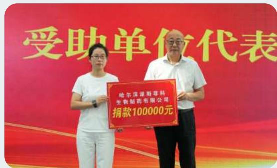

text_image

受助单位代表
哈尔滨康斯菲科
生物制药有限公司
捐款100000元

# 报告期内

公司累计公益慈善投入 2,601.46万元 。未来，公司将持续深化在教育、健康、扶贫等领域的公益实践，以更加系统化、专业化的方式回馈社会，为可持续发展贡献更大力量。

# 附录索引

《深圳证券交易所上市公司自律监管指引第17号——可持续发展报告（试行）》内容索引

<table><tr><td>关键绩效指标</td><td>报告章节序号</td><td>报告章节名称</td></tr><tr><td>1.应对气候变化</td><td>六、(四)</td><td>应对气候变化</td></tr><tr><td>2.污染物排放</td><td>六、(二)</td><td>废弃物处理</td></tr><tr><td>3.废弃物处理</td><td>六、(二)</td><td>废弃物处理</td></tr><tr><td>4.生态系统和生物多样性保护</td><td>六、(五)</td><td>生态系统和生物多样性保护</td></tr><tr><td>5.环境合规管理</td><td>六、(一)</td><td>温室气体排放</td></tr><tr><td>6.能源利用</td><td>六、(三)</td><td>资源使用管理</td></tr><tr><td>7.水资源利用</td><td>六、(三)</td><td>资源使用管理</td></tr><tr><td>8.循环经济</td><td>六、(三)</td><td>资源使用管理</td></tr><tr><td>9.乡村振兴</td><td>九、(一)</td><td>乡村振兴</td></tr><tr><td>10.社会贡献</td><td>九、(二)</td><td>社会贡献</td></tr><tr><td>11.创新驱动</td><td>四、(一)</td><td>加强研发创新</td></tr><tr><td>12.科技伦理</td><td>五、(一)</td><td>临床试验规范</td></tr><tr><td>13.供应链安全</td><td>五、(五)</td><td>可持续供应链</td></tr><tr><td>14.平等对待中小企业</td><td>五、(五)</td><td>可持续供应链</td></tr><tr><td>15.产品和服务安全与质量</td><td>四、(三)</td><td>严控产品质量</td></tr><tr><td>16.数据安全与客户隐私保护</td><td>五、(四)</td><td>信息安全管理</td></tr><tr><td>17.员工</td><td>七、(一)(二)(三)(四)</td><td>员工关系</td></tr><tr><td>18.尽职调查</td><td>三、(二)</td><td>议题重要性评估</td></tr><tr><td>19.利益相关方沟通</td><td>三、(二)</td><td>议题重要性评估</td></tr><tr><td>20.反商业贿赂及反贪污</td><td>八、(一)</td><td>反商业贿赂及反贪污</td></tr><tr><td>21.反不正当竞争</td><td>八、(二)</td><td>反不正当竞争</td></tr></table>