# 创造流通价值 共赢美好未来

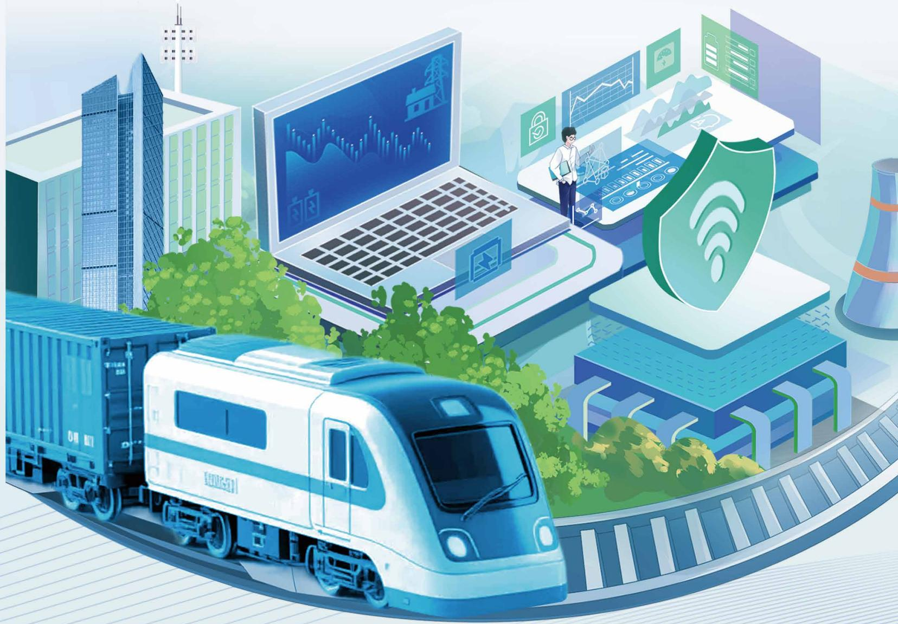

natural_image

Illustration of a modern transportation hub with a high-speed train, digital dashboard, and smart city infrastructure (no text or symbols)

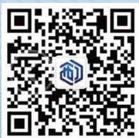  
西部创业之窗

地址:宁夏银川市金凤区北京中路168号C座

电话:0951-8792651 / 8792653

邮编:750001

网址:http://www.xbcy.nx.cn/

# 2025年度

# 可持续发展 (ESG) 报告

Environmental, Social and Governance Report in 2025

宁夏西部创业实业股份有限公司

Ningxia Western Venture Industrial Co., Ltd.

# ◇ 铁轨为卷 绿美作答

铁轨延伸到哪里，责任就落在哪里；人与青山两不负，便是我们走向未来的方式。

作为一家以铁路运输为主业的国有上市企业，我们始终坚守“能源保供、生态保护、员工关怀、合规治理”四条底线，并将其扛在肩上、落在实处。因为我们深知：一条有温度的铁轨，不止承载物资的流动，更连接着万家灯火与山河冷暖。

2025年，我们以铁轨为卷、以绿美作答，将ESG理念融入战略、嵌入运营、延展至产业链与社会服务的每一处细节，在安全、绿色、人文、治理的交汇点上，交出一份有数据、有案例、有温度、有担当的可持续发展答卷。

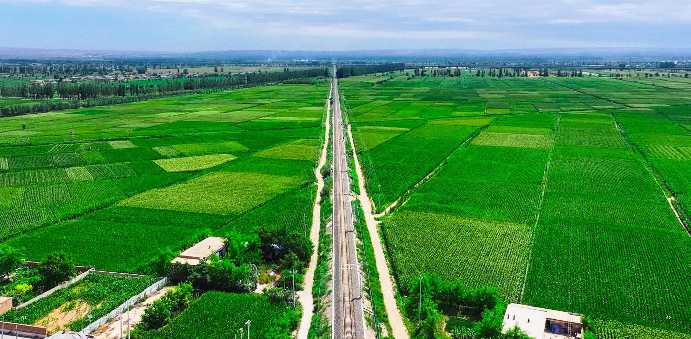

natural_image

Aerial view of a vast green agricultural field with a railway cutting through it, surrounded by rural houses and trees (no visible text or symbols)

# ◇ 关于本报告

本报告是西部创业发布的第四份ESG报告。我们本着客观、规范、透明、全面的原则，如实披露公司在2025年度履行社会责任、推动可持续发展等方面的具体举措、重点实践、亮点案例与关键绩效数据。

我们始终追问：该把怎样的铁轨与风景留给未来？该把怎样的责任与未来刻在铁轨之上？这份报告，便是我们用行动写就的答卷。我们认真倾听利益相关方声音，回应各方期待，做一家有温度、有担当、值得长久信赖的企业。

# 报告范围

本报告组织范围涵盖宁夏西部创业实业股份有限公司及其下属公司，除另作说明外，与公司年度报告披露范围保持一致。报告期间为2025年1月1日至2025年12月31日。为增强本报告的对比性和完整性，部分内容适当追溯以往年份或具有前瞻性描述。

# 编制依据

# 本报告依据以下文件及标准编制：

· 国务院国有资产监督管理委员会《关于新时代中央企业高标准履行社会责任的指导意见》  
· 国务院国有资产监督管理委员会《央企控股上市公司ESG专项报告编制研究》  
· 深圳证券交易所《上市公司自律监管指引第1号——主板上市公司规范运作》  
·深圳证券交易所《上市公司自律监管指引第17号——可持续发展报告（试行）》  
· 深圳证券交易所《上市公司自律监管指南第3号——可持续发展报告编制》  
· 全球报告倡议组织（GRI）《可持续发展报告标准（GRIStandards）》

# 数据来源及可靠性保证

本报告引用的全部信息与数据，均来自西部创业公司内部文件及相关公开资料。除另有说明外，统计口径与公司年度报告保持一致。

本报告已通过公司保密审查，并经2026年4月27日公司董事会审议通过。公司保证本报告内容不存在虚假记载、误导性陈述或重大遗漏，并对报告内容的真实性、准确性和完整性承担个别及连带责任。

# 货币单位

除另有说明外，本报告以人民币（RMB）为货币单位。

# 称谓说明

公司简称  
公司全称

<table><tr><td>公司、本公司</td><td>宁夏西部创业实业股份有限公司</td></tr><tr><td>宁东铁路</td><td>宁夏宁东铁路有限公司,系公司全资子公司</td></tr><tr><td>酒庄公司</td><td>广夏(银川)贺兰山葡萄酒庄有限公司,系公司全资子公司</td></tr><tr><td>西创运通</td><td>宁夏西创运通供应链有限公司,系公司全资子公司</td></tr><tr><td>宁国运</td><td>宁夏国有资本运营集团有限责任公司,系公司控股股东</td></tr><tr><td>宁夏煤业</td><td>国家能源集团宁夏煤业有限责任公司,系公司并列第一大股东及重要客户</td></tr><tr><td>信达资产</td><td>中国信达资产管理股份有限公司,系公司重要股东</td></tr><tr><td>华电国际</td><td>华电国际电力股份有限公司,系公司股东</td></tr><tr><td>宁夏能源铝业</td><td>国家电投集团宁夏能源铝业有限公司,系公司股东</td></tr></table>

# 报告获取

本报告为中文版报告，以电子文档形式向利益相关方及社会公众展示，您可以登录公司官网（www.xbcy.nx.cn）、深圳证券交易所（www.szse.cn）及巨潮资讯网（www.cninfo.com.cn）查阅获取。我们鼓励读者通过公司官网“投资者关系-ESG专栏”获取历年报告及本报告的补充数据材料。

natural_image

Illustration of a doctor and a scientist using laptops with magnifying glasses, surrounded by gear symbols (no text or labels)

01

卷首语

03

关于本报告

07

董事会致辞

09

走进西部创业

97

附录

# CONTENTS 目录

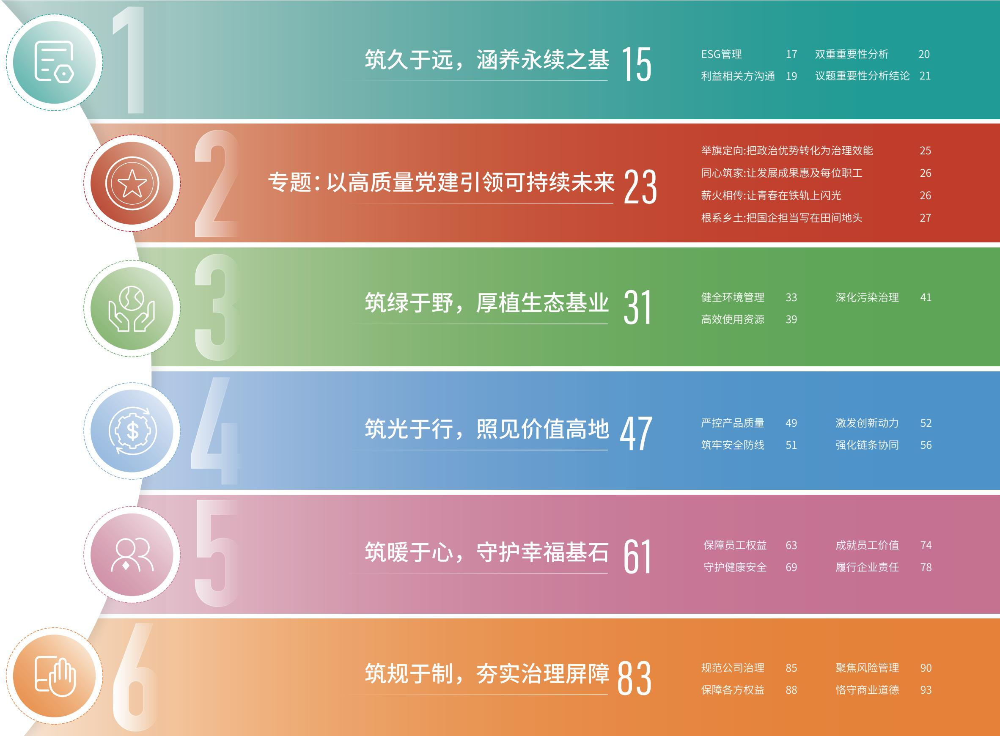

flowchart

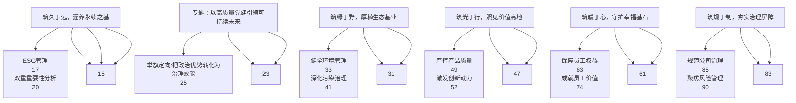
```mermaid
graph TD
  1["筑久于远，涵养永续之基"] --> 15["ESG管理\n17\n双重重要性分析\n20"]
  1["筑久于远，涵养永续之基"] --> n15["15"]
  1["筑久于远，涵养永续之基"] --> n15
  1["筑久于远，涵养永续之基"] --> n15
  2["专题：以高质量党建引领可持续未来"] --> 23["举旗定向:把政治优势转化为治理效能\n25"]
  2["专题：以高质量党建引领可持续未来"] --> n23["23"]
  2["专题：以高质量党建引领可持续未来"] --> n23
  3["筑绿于野，厚植生态基业"] --> 31["健全环境管理\n33\n深化污染治理\n41"]
  3["筑绿于野，厚植生态基业"] --> n31["31"]
  3["筑绿于野，厚植生态基业"] --> n31
  4["筑光于行，照见价值高地"] --> 47["严控产品质量\n49\n激发创新动力\n52"]
  4["筑光于行，照见价值高地"] --> n47["47"]
  4["筑光于行，照见价值高地"] --> n47
  5["筑暖于心，守护幸福基石"] --> 61["保障员工权益\n63\n成就员工价值\n74"]
  5["筑暖于心，守护幸福基石"] --> n61["61"]
  5["筑暖于心，守护幸福基石"] --> n61
  6["筑规于制，夯实治理屏障"] --> 83["规范公司治理\n85\n聚焦风险管理\n90"]
  6["筑规于制，夯实治理屏障"] --> n83["83"]
  6["筑规于制，夯实治理屏障"] --> n83
```

# ◇ 董事会致辞

# 把责任与未来，刻在铁轨之上

铁轨延伸处，皆是责任；车轮向前时，皆系民生。我们该把怎样的责任与未来，镌刻在铁轨之上？这一问题，既是西部创业对时代的深沉叩问，也是我们每一天用行动写下的实干答案。

2025年，极不平凡、极不容易、极为难忘。我们在变局中坚守主业，在攻坚中锤炼韧性，在担当中实现跨越。置身行业转型与区域发展的时代浪潮，我们始终高擎可持续发展之炬，自觉与国家同心、与区域同频、与生态共生、与员工同行。

面对复杂的外部环境和艰巨的改革发展任务，我们坚持以习近平新时代中国特色社会主义思想为根本遵循，深学笃行习近平总书记考察宁夏重要讲话精神，将可持续发展理念深度融入发展全局，旗帜领航、干在实处、走在前列。

我们深知：一条有担当的铁轨，不仅承载能源物资的流动，更丈量着企业对时代的承诺。这一年，我们统筹安全与发展、效益与责任，一体推进能源保运、提质增效、改革创新、绿色发展，以实干为笔，以担当为墨，在时代的答卷上，一笔一画写下属于西创的回答。

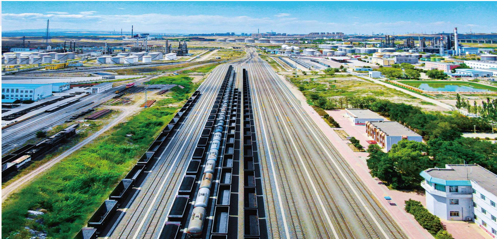

natural_image

Aerial view of a large railway yard with multiple tracks, freight trains, and industrial facilities under a clear blue sky (no visible text or signage)

这一年，我们秉心定向，以信仰领航可持续征途。始终坚持党建引领与生产经营深度融合，以政治建设把稳方向、统揽大局，以清风正气锻造队伍、砥砺担当。把初心使命熔铸于企业奋进征程，把组织优势转化为澎湃发展动能，确保公司始终沿着服务国家战略、服务区域发展、服务社会民生的正确方向稳健前行。  
这一年，我们砺行固本，以实业夯实高质量根基。始终坚守铁路运输与能源保运主责主业，全力保障区域能源供应链安全稳定，服务宁东能源化工基地高质量发展。扎实推进安全生产治本攻坚，铁路运量稳步攀升，电气化改造全面收官，上沟湾物流园建成投运，线路效能、物流能级与产业协同能力持续跃升，以实业强基、以主业致远。  
这一年，我们怀仁聚力，以人文厚植共生型家园。始终坚持发展为了员工、发展依靠员工、发展成果由员工共享，深入推进“两心工程”，大力弘扬劳模精神、工匠精神，用心办好每一件民生实事，不断提升员工获得感、幸福感、安全感，以真情暖人心、以实干聚合力，让企业发展更有温度、更有力量。  
这一年，我们持正行远，以公信守护长周期价值。圆满收官深化改革提升行动，以重点突破带动整体跃升。全面加强上市公司规范治理，实现重组上市以来首次现金分红7,290余万元，连续2年获评中上协董秘履职4A级，连续5年取得深交所信息披露良好评价，连续获评“金骏马”“金圆桌”“新财富”等资本市场多项权威荣誉，以透明、规范、守信的初心对待每一份信任，以稳健经营守护长期价值。

这一年，我们循绿向新，以生态擘画永续化未来。始终坚守生态底线，将绿色发展贯穿运营全过程，全面开展粉尘综合治理，创新应用煤矸石填筑铁路基础，9个站区污水处理设施稳定投运。连续3年保持万得ESG评级A级，荣获第十七届金骏马奖“ESG可持续发展先锋企业奖”，入选中国上市公司协会“董办优秀实践案例”与“可持续发展优秀实践案例”，以实际行动守护绿水青山、夯实长远根基。

回望2025，我们步履平实、笃行不怠，始终不驰于空想、不骛于虚声，一事一物皆求实效。对我们而言，可持续发展从来不是一句口号，而是藏在日常里的坚守、落在行动上的精进、面对挑战时的攻坚。身为国企，我们始终不忘保供之责、民生之念、绿色之诺，以责任立身、以实干成事、以长久致远。

轨道所至，使命必达；车轮所及，民心所系。我们将紧扣发展部署，深耕“六个西创”，让可持续成为发展最鲜明的底色。坚守主业不偏航，守护生态不松劲，善待员工不忘本，立信市场不逾矩，减排放以护山河，去浮躁以守定力，轻功利以显担当。

凡行长远，必怀敬畏。我们甘作绵延向前的铁轨，既载能源物资，更载时代重托。让每一趟运输安稳有序，每一步前行不负所托。以责任作答，把更安全、更绿色、更温暖的未来，留给这片土地与人民。

# ◇ 走进西部创业

作为宁夏国有A股上市公司，我们坚持以铁轨为脉、以责任为基，始终践行“服务国家战略、守护生态环境、赋能区域发展”的初心使命。我们不仅是区域发展的建设者、生态环境的守护者，更是员工与合作伙伴的同行者，在时代的经纬线上，铺就一条通向高质量发展的坚实轨道。

# 公司简介

公司于2016年2月1日由原宁夏宁东铁路股份有限公司与原广夏（银川）实业股份有限公司通过并购重组方式设立，注册资本为14.58亿元人民币，股票代码为000557。公司股权结构多元、治理规范，主要股东及持股情况如下：

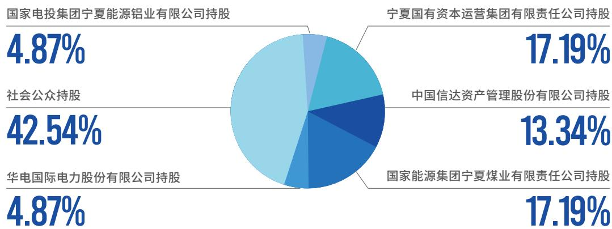

pie

| Category | Value (%) |
| --- | --- |
| 宁夏国有资本运营集团有限责任公司持股 | 17.19 |
| 中国信达资产管理股份有限公司持股 | 13.34 |
| 国家能源集团宁夏煤业有限责任公司持股 | 17.19 |
| 华电国际电力股份有限公司持股 | 4.87 |
| 社会公众持股 | 42.54 |
| 国家电投集团宁夏能源铝业有限公司持股 | 4.87 |

公司始终扎根宁夏、服务大局，牢固依托宁夏区位优势与能源产业基础，深耕铁路运输与物流服务主责主业，持续推动物流能级提升与绿色低碳转型，致力于建设一流现代物流企业，打造区域可持续发展的示范标杆。

# 业务概况

公司坚持主业为锚、多元协同，始终专注于铁路运输与物流服务领域，业务核心为铁路运输，并协同发展铁路物流及相关多元业务。

# |主营业务

铁路运输是公司的核心业务与主要收入来源。公司依托宁东铁路等关键线路，承担区域内及跨区域的能源、原材料等大宗货物的铁路运输任务，为宁东能源化工基地及周边企业提供高效、稳定、绿色的铁路物流通道，全力保障区域能源供应链安全与畅通。

# 经营范围

经依法登记，公司的经营范围涵盖以下领域：

- 核心业务板块：铁路开发建设与经营管理；铁路专用线的代运营、代维修服务；仓储及物流服务；机车与车辆维修。  
- 能源与新兴业务板块：新能源项目的投资、建设、运营及技术服务；转供电、转供水业务。  
- 综合配套板块：酒店管理及住宿、餐饮服务（限分支机构经营）；高新技术产品的开发、生产与销售。  
- 传统与衍生业务板块：农副产品的种植、加工与销售；动植物的养殖、种植、加工与销售；食品、日用化工产品（不含易制毒及危险化学品）、酒的开发、生产和销售。

# 铁路运输板块

公司主要从事铁路开发建设与经营管理、仓储物流、机电及车辆维修等业务，核心任务是保障宁东能源化工基地的煤炭、油品、建设物资、化工原料及产品的运输需求。  
公司铁路西接包兰铁路大坝站，东连太中银铁路银川联络线梅花井站，北通内蒙古三新铁路上海庙站，形成了以古窑子站、鸳鸯湖站为中心、具备三个外运出口的地方铁路网络，为区域能源供应链的畅通与稳定提供了有力支撑。

# 铁路物流

作为公司铁路运输产业链的延伸与重要补充，公司以大宗货物铁路运输为核心，依托公铁联运、集装箱多式联运及铁路物流园运营，大力推进疆煤、蒙煤“进宁”及宁东基地煤化工产品外运供应链业务。  
在国铁、地方铁路、铁路物流园与铁路专用线之间，公司系统开展煤炭、煤化工产品、铁矿石等大宗货物的物流业务，构建起多节点联动、多方式协同的物流服务网络。

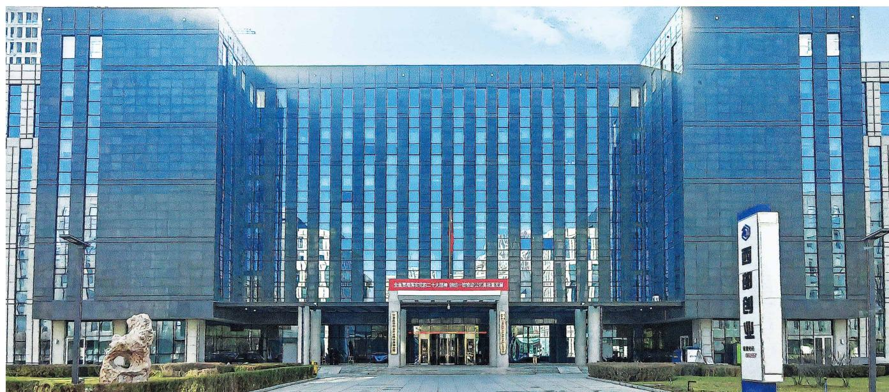

natural_image

Exterior view of a modern blue glass office building with entrance signage (no readable text on facade)

# 发展历程

时光为鉴，奋斗为证。三十余年风雨兼程，从资本市场先行者到区域能源物流主力军，西部创业的每一次跨越，都刻印着时代的机遇与奋斗的足迹。

# 时光轴

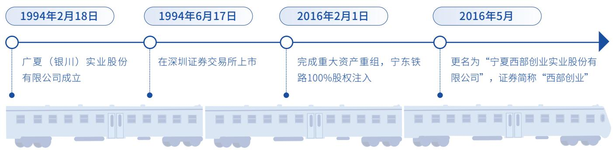

flowchart

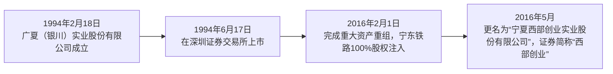
```mermaid
graph LR
  A["1994年2月18日\n广夏（银川）实业股份有限公司成立"] --> B["1994年6月17日\n在深圳证券交易所上市"]
  B --> C["2016年2月1日\n完成重大资产重组，宁东铁路100%股权注入"]
  C --> D["2016年5月\n更名为“宁夏西部创业实业股份有限公司”，证券简称“西部创业”"]
```

# 深度阅读

公司前身——广夏（银川）实业股份有限公司，于1994年2月18日依法设立，同年6月17日在深圳证券交易所上市，是宁夏回族自治区较早的上市公司之一。

2015年11月20日，公司取得中国证券监督管理委员会《关于核准广夏（银川）实业股份有限公司向宁夏国有资本运营集团有限责任公司等发行股份购买资产的批复》（证监许可〔2015〕2646号）；2016年2月向宁夏国有资本运营集团有限责任公司、国家能源集团宁夏煤业有限责任公司（原神华宁夏煤业集团有限责任公司）、中国信达资产管理股份有限公司、国家电投集团宁夏能源铝业有限公司、华电国际电力股份有限公司等5家股东发行股份，购买其合计持有的宁夏宁东铁路股份有限公司100%股权，完成重大资产重组。

2016年5月，公司名称正式变更为“宁夏西部创业实业股份有限公司”，证券简称变更为“西部创业”，证券代码000557。

重组完成后，公司主营业务由高新技术产品、农业开发等，转型为铁路运输与能源物流，开启了服务宁夏、深耕主业的全新发展阶段。

# 组织架构

治理的骨架，决定了企业的耐力与高度。我们坚持以规范立信、以透明立身，构建起权责法定、协调运转、有效制衡的现代企业治理体系，为可持续发展筑牢制度根基。

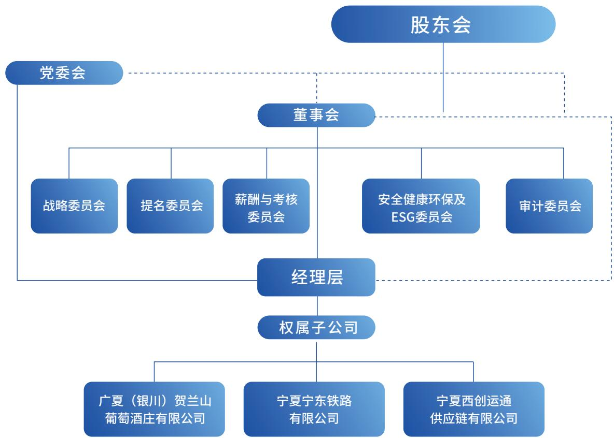

flowchart

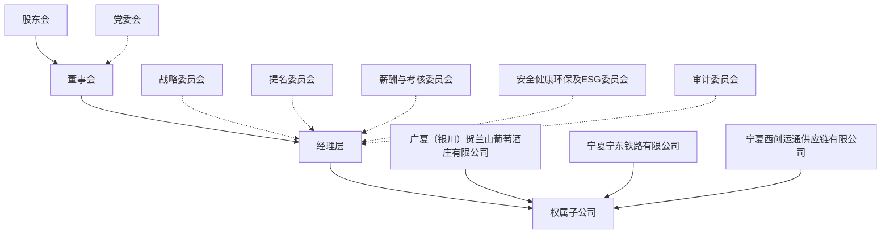
```mermaid
graph TD
  A["股东会"] --> B["董事会"]
  C["党委会"] -.-> B
  B --> D["经理层"]
  E["战略委员会"] -.-> D
  F["提名委员会"] -.-> D
  G["薪酬与考核委员会"] -.-> D
  H["安全健康环保及ESG委员会"] -.-> D
  I["审计委员会"] -.-> D
  D --> J["权属子公司"]
  K["广夏（银川）贺兰山葡萄酒庄有限公司"] --> J
  L["宁夏宁东铁路有限公司"] --> J
  M["宁夏西创运通供应链有限公司"] --> J
```

# 治理结构

公司严格按照《中华人民共和国公司法》《中华人民共和国证券法》及上市公司治理准则要求，构建了以股东会为权力机构、董事会为决策机构、审计委员会为监督机构、经理层为执行机构的“两会一层”法人治理结构。

# 治理主体

# 股东会（权力机构）

# 董事会（决策机构）

# 审计委员会（监督机构）

# 经理层（执行机构）

选举更换董事并核定薪酬；审议批准董事会报告、年度报告及利润分配方案；审议增减资、发行证券、合并分立、章程修订等重大法定事项。

贯彻执行股东会决议；审定经营计划与投资方案；聘任解聘高级管理人员并确定薪酬；统筹公司治理与风险管控。

全面承接原监事会监督职能；审核财务报告与信息披露质量；监督内外审计及内控体系运行；规范董事、高管履职行为，核查关联交易合规公允。

落地实施董事会各项决议；统筹日常生产经营管理；推进经营计划与投资方案落地；定期向董事会述职，主动接受审计委员会监督。

董事会下设战略委员会、审计委员会、提名委员会、薪酬与考核委员会、安全健康环保及ESG委员会，各专门委员会职责明确、运转规范，确保决策科学、执行有力、监督有效。

# 2025 荣誉

每一份荣誉，都是时光的刻印，也是奋斗的回响。它们见证着西部创业在治理、绿色、责任等维度的深耕与突破，更激励着我们以更高标准奔赴未来。新的一年，我们将载誉前行、不负所托。

# 万得ESG评级A级（连续3年）

万得（Wind）

(ESG综合表现权威评级)

# 第十七届金骏马奖

# “ESG可持续发展先锋企业奖”

证券日报

(可持续发展综合权威认可)

# 2025年上市公司可持续发展优秀实践案例

中国上市公司协会

(国家级ESG实践典范)

# 第二十届中国上市公司董事会

# “金圆桌奖”优秀董事会

《董事会》杂志

(公司治理高水平体现)

# 2025年上市公司董办优秀实践案例

中国上市公司协会

(公司治理与规范运作标杆)

# 第二十届“金圆桌奖”最具影响力独立董事

《董事会》杂志

(治理结构与专业履职优势)

# 上市公司董事会秘书履职评价4A级（连续2年）

中国上市公司协会

(董秘履职高等级认定)

# 2025年度新财富最佳董秘

《新财富》杂志

(资本市场董秘专业权威奖项)

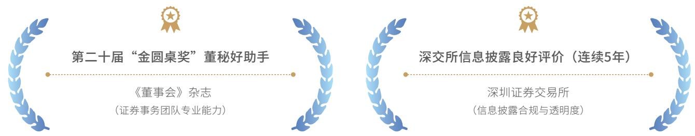

flowchart

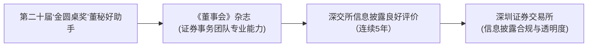
```mermaid
graph LR
  A["第二十届‘金圆桌奖’董秘好助手"] --> B["《董事会》杂志\n(证券事务团队专业能力)"]
  B --> C["深交所信息披露良好评价（连续5年）"]
  C --> D["深圳证券交易所\n(信息披露合规与透明度)"]
```

# 第二十届“金圆桌奖”董秘好助手

《董事会》杂志

(证券事务团队专业能力)

# 深交所信息披露良好评价（连续5年）

深圳证券交易所

(信息披露合规与透明度)

# 易董2025年度合规价值传播奖

易董价值在线

(合规管理与投资者关系成效)

# 宁东能源化工基地“保供突出贡献企业”

宁东能源化工基地管委会

(能源保供责任担当)

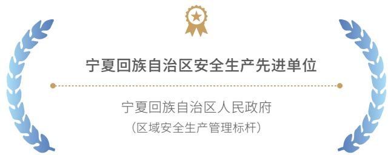

text_image

宁夏回族自治区安全生产先进单位
宁夏回族自治区人民政府
(区域安全生产管理标杆)

以上荣誉涵盖公司治理（优秀董事会、董办优秀实践、信息披露评价）、ESG实践（金骏马奖、可持续发展案例、ESG评级A级）、投资者关系（投关价值奖、卓越投关建设奖）、董秘履职（4A级评价）及社会责任（安全生产先进单位、保供突出贡献企业）等多个维度，充分体现了西部创业作为国有上市公司在规范治理、绿色转型与价值共享方面的综合实力。

natural_image

Illustration of people celebrating with a trophy and star, symbolizing success or achievement (no text present)

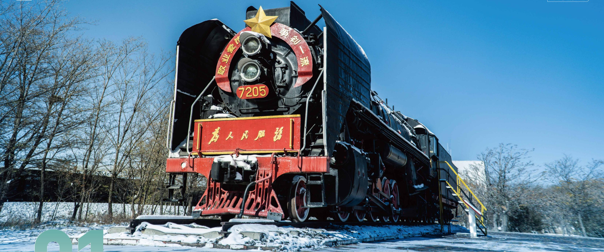

text_image

7205
勇动一乘
中国人民

# 01

# 筑久于远， 涵养永续之基

12 负责任消费和生产

∞

可持续不是一时之功，而是代代相传的接力。我们以ESG为纲、以久远为尺，不困于当下得失，只问是否对得起未来。今天种下的树、立下的规矩、守护的人，时间都会给出答案——筑久于远，是每一天对永续最朴素的回答。

# ◇ ESG管理

我们将ESG融入战略、决策与日常，以新发展理念为尺，丈量每一步的得失。持续完善治理架构，健全风险管控，让管理有力度、协同有温度，全力推动企业与环境、社会协同共进。

我们从不独行，而是与企业、与环境、与社会并肩向前——这正是可持续发展的初心与归处。

# 治理架构

坚实的组织保障，是可持续之路最稳的基石。我们构建了层级分明、权责清晰的ESG管理体系，让每一层级的职责都有落点、有回响。不为合规而建，只为责任有依托，为铁轨与风景长久安好。

<table><tr><td>层级</td><td>人员构成</td><td>职权范围</td></tr><tr><td>决策层</td><td>董事会</td><td>ESG事宜整体决策部署</td></tr><tr><td>管理层</td><td>董事会安全健康环保及ESG委员会</td><td>ESG工作的研究和指导机构</td></tr><tr><td>执行层</td><td>证券部门及各部门子公司</td><td>具体工作落实</td></tr></table>

# 责任担当

我们始终坚守初心使命，坚持社会效益优先，恪守自愿公平、等价有偿、诚实信用原则，严守社会公德与商业道德，自觉接受政府与社会公众监督。持续强化公司治理、安全生产、人才培养、科技创新，全力推动产业高质量发展与环境友好型建设。

我们不唯数字论得失，既为股东创造价值，也为社会留下温度：经济效益、社会效益与可持续发展，多方目标协同共进、和谐共融。

这不是取舍题，是共赢路。

Wind ESG  
西部创业  
2025评级  
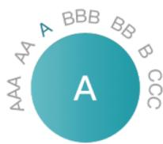

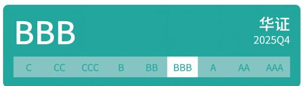

text_image

BBB
华证
2025Q4
C CC CCC B BB BBB A AA AAA

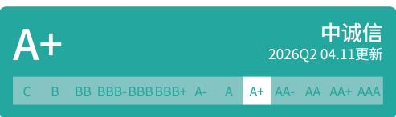

text_image

BBB
秩鼎
2026年03月
C CC CCC B BB BBB A AA AAA

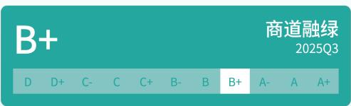

# 未来展望

2026年，我们将启动ESG管理提升计划，重点推动以下工作：

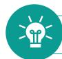

数据赋能 / 逐步上线ESG数据管理信息系统, 实现关键绩效数据的自动化采集、分析与披露, 确保数据准确性与可追溯性。

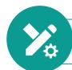

供应链延伸 / 启动核心供应商ESG评估项目，推动绿色供应链建设。

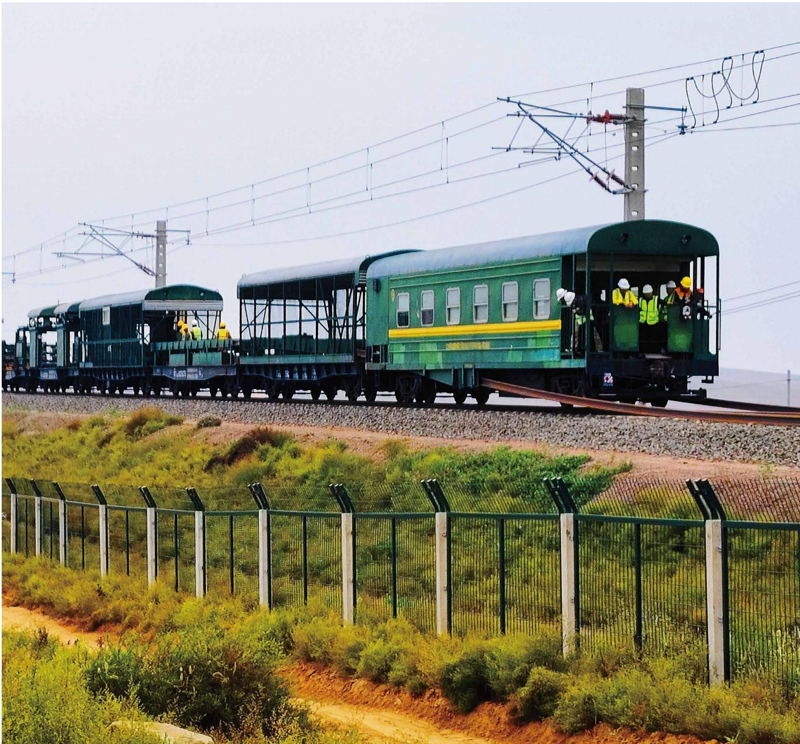

natural_image

Green and yellow train cars on railway tracks with workers in safety gear, surrounded by greenery and a fence (no visible text or symbols)

# ◇ 利益相关方沟通

我们倾听每一份声音，尊重每一个主体。我们持续完善沟通机制，动态优化参与模式，让每一方诉求都有回音。我们搭建常态化、多层次渠道，深度洞察期望，将声音融入治理与运营。不是单向告知，是双向奔赴——与利益相关方协同共进、共生共荣。

<table><tr><td>利益相关方</td><td>重点关注议题</td><td>沟通渠道和方式</td><td>公司回应</td></tr><tr><td>政府及监管机构</td><td>·依法合规经营·能源稳定保供·生产安全管理·绿色节能环保</td><td>·现场检查·电话交流·日常监管·定期汇报沟通</td><td>·严格落实各项监管要求,坚守合规经营底线;·全力保障区域能源供应链稳定;·持续强化安全生产管控,深入推进绿色低碳发展</td></tr><tr><td>股东与投资者</td><td>·公司治理效能·持续盈利能力·投资回报水平·信息披露质量</td><td>·股东会·投资者咨询·业绩说明会·信息披露媒体·官网及微信公众号</td><td>·持续健全现代企业治理体系,稳健经营提升盈利水平;·严格履行信息披露义务,连续5年获深交所信息披露良好评价;·完善投资者回报机制,积极回馈股东</td></tr><tr><td>员工</td><td>·薪酬福利保障·职业成长发展·职业健康安全·合法权益维护</td><td>·职工代表大会·培训活动·意见反馈·奖励与考核</td><td>·深入推进“两心工程”,完善薪酬福利与职业发展体系;·强化职业健康安全防护与培训;·切实维护员工合法权益,构建和谐稳定劳动关系</td></tr><tr><td>客户</td><td>·客户需求响应·产品服务质量·客户沟通机制·互利共赢合作</td><td>·走访和调研·合同履约</td><td>·快速高效响应客户需求,持续优化运输组织与服务品质;·建立常态化沟通机制,严守契约精神,与客户携手实现互利共赢、长期稳定合作</td></tr><tr><td>供应商</td><td>·采购业务流程·廉洁诚信合作·供应链协同发展</td><td>·资质审核·合同履约·定期沟通</td><td>·规范阳光采购流程,公平公正对待各类供应商;·强化廉洁合作与供应链ESG管理,推动产业链协同升级,实现平等合作、共赢发展</td></tr><tr><td>董事会</td><td>·公司治理水平·ESG管理体系·合规风险管控</td><td>·董事会会议·董事会专门委员会会议·独立董事专门会议</td><td>·持续提升公司治理规范化水平,健全ESG治理架构;·强化合规管理与全面风险防控,保障公司行稳致远、高质量可持续发展</td></tr><tr><td>社区及公众</td><td>·助力乡村振兴·媒体友好交流·环保社会责任</td><td>·公益活动·媒体互动·舆情监测</td><td>·积极投身乡村振兴与社会公益事业;·主动开展生态环境治理与保护;·保持公开透明沟通,认真履行国企社会责任</td></tr><tr><td>行业协会</td><td>·安全生产示范·行业标准建设·社会责任履行</td><td>·会议及会谈·专题报告·新闻简报</td><td>·发挥地方铁路行业示范作用,严守安全生产标准;·积极参与行业规范与标准建设;·主动践行可持续发展理念,助力行业整体提升</td></tr></table>

<table><tr><td>利益相关方</td><td>重点关注议题</td><td>沟通渠道和方式</td><td>公司回应</td></tr><tr><td>债权人(金融机构)</td><td>·偿债能力·信用状况·资金安全·融资合规</td><td>·定期财务报告·银企对接·信用评级沟通·还本付息履约</td><td>·保持稳健财务结构与良好偿债能力;·严格按期履约付息,维护优良信用评级;·规范资金与融资管理,保障债权人合法权益</td></tr><tr><td>承包商/施工单位</td><td>·安全施工管理·公平合作·工程款及时支付·环保合规</td><td>·合同签订·安全交底·现场检查·工程例会·款项结算</td><td>·强化工程施工安全与环保管控,规范项目管理;·坚持公平合作、阳光履约,按时足额支付工程款项,共守安全质量底线</td></tr><tr><td>铁路沿线居民/单位</td><td>·铁路运行安全·噪声粉尘防控·生态环境影响·出行便利</td><td>·沿线走访·公告告知·应急联动·信访诉求反馈</td><td>·加强铁路沿线安全防护与环境整治,严控噪声、粉尘污染;·切实降低运营对周边影响,保障沿线居民生产生活安宁</td></tr><tr><td>社会公众/终端用户</td><td>·能源保供可靠性·运输服务效率·绿色低碳发展·公共安全</td><td>·新闻宣传·ESG报告·公众咨询·舆情回应</td><td>·坚守能源保供政治责任与社会责任,保障运输稳定畅通;·持续推进绿色低碳转型,严守安全运营底线,主动接受社会监督</td></tr><tr><td>生态环境相关方</td><td>·污染防治·生态保护·碳减排·生物多样性保护</td><td>·环保报备·监测数据报送·联合检查·生态项目协作</td><td>·严守生态保护红线,持续深化废气、废水、固废治理;·推进节能降碳与资源循环利用,加强铁路沿线生态修复,守护区域生态环境</td></tr></table>

# ◇ 双重重要性分析

责任重点在哪里，资源就投向哪里。我们聚焦“财务重要性”与“影响重要性”两大维度，系统评估、排序、筛选可持续发展议题。不是为评估而评估，而是为了把每一份力，都用在最该用的地方。

分析路径如下：

1. 背景研究：通过行业调研识别与公司相关的重大趋势，结合公司业务特点、国家政策导向及资本市场关注要点，初步识别潜在议题。  
2. 议题清单：与管理人员、内外部专家、直属单位、员工、客户、供应商等利益相关方深入沟通，充分了解各方对重要性议题的意见，识别影响、风险与机遇，汇总形成议题清单。  
3. 评估确认：综合开展财务重要性评估与影响重要性评估，同时结合国家政策、资本市场关注要点及同业表现，生成重要性议题分析结果。  
4. 形成报告：汇总分析流程、方法及结论，向公司管理层进行汇报，确认本报告重点披露内容，明确未来可持续发展管理的工作目标与实施计划。

# ◇ 议题重要性分析结论

科学评估，是为了把力气花在最该花的地方。

报告期内，公司识别出22项重要性议题，其中5项为财务重要性议题，14项为影响重要性议题。哪些议题关乎生存底线，哪些议题影响长远价值——我们用双重重要性这把尺子，来一一丈量。

根据评估结果，公司编制2025年度重要性矩阵（如下图所示）。矩阵之上，议题有轻重；矩阵背后，责任无大小。每一议题的落位，都是对铁轨与风景的又一次校准。

# 非常重要

# 对经济、社会和环境影响的重要性

党建引领  
- ESG治理  
- 产品和服务安全与质量  
创新驱动  
- 员工  
- 污染物排放  
- 废弃物处理  
能源利用  
- 水资源利用  
- 循环经济

- 应对气候变化  
- 环境合规管理  
- 职业健康与安全  
供应链安全

风险管理

- 社会贡献  
乡村振兴  
- 生态系统和生物多样性保护  
- 平等对待中小企业  
数据安全与客户隐私保护  
- 反商业贿赂及反贪污  
- 反不正当竞争

# 不重要

对公司财务的重要性

非常重要

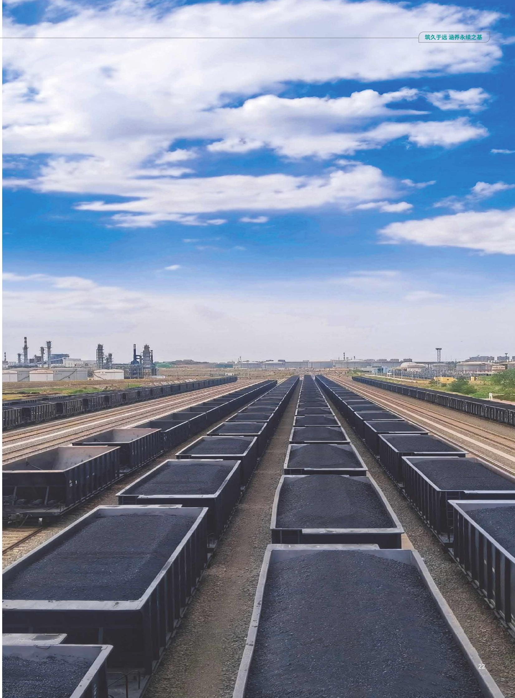

text_image

筑久于远 涵养永续之基
22

# 02

# 专题：以高质量党建引领可持续未来

铁轨的坚实，源于道砟的支撑；企业的根脉，在于人心的凝聚。始终坚持党的全面领导，将党建工作与公司治理深度融合。2025年，公司党委深入学习贯彻习近平新时代中国特色社会主义思想，扎实推进“旗帜领航、干在实处、走在前列”与党建品牌战略，推动党建工作与生产经营深度融合，切实把政治优势、组织优势转化为治理效能和发展动能。

# ◇ 举旗定向：把政治优势转化为治理效能

# 政治领航、思想铸魂

公司始终把政治建设摆在首位。围绕学习贯彻党的二十届四中全会精神，开展党委理论学习7次、读书班2期、专家辅导2次、警示教育大会3次，党委理论中心组“五学模式”被《共产党人》刊载推广。政治强不强，问题说了算。20项群众急难愁盼事项全部落地。其中，一线职工反映强烈的“倒班宿舍设施陈旧”问题，两个月内改造完成。一位住了八年的老职工说：“这床铺得比家里还踏实。”

# 支部攻坚、党员冲锋

铸魂是方向，强基是底气。创新实施“1349”党建夯基行动，统筹推进27个支部攻坚项目。宁东铁路机辆段检修车间党支部，围着机车反复研究，成功加装冷却系统自动降温喷淋装置，一位党员朴实地说：“我们文化不高，但哪儿容易发热、哪儿需要降温，我们比谁都清楚。”西创运通公司党支部以党建链串联产业链、供应链、运输链，让“疆煤进宁”集装箱班列越跑越顺。两个项目均入选上级优秀支部攻坚项目。

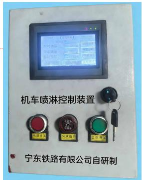

text_image

机车喷淋控制装置
宁东铁路有限公司自研制

# 深度融合、双向赋能

党建业务一股绳。我们严格落实“双向进入、交叉任职”领导体制，党委班子成员通过法定程序进入董事会、经理层，确保党委把方向、管大局、促落实贯穿于决策执行各环节。主动开展党建链赋能产业链行动，与宁夏煤业、中铁集装箱等上下游企业“结对子”，组织联建、活动联办、资源联享。2025年，联合开展主题党日活动6次，解决运输衔接堵点问题8项，推动“疆煤进宁”集装箱班列周转效率提升15%，让党建链与运输链融成一条路，以组织优势打通产业链协同的“最后一公里”。

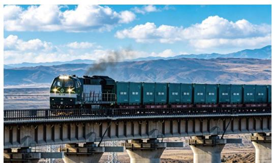

natural_image

Train of a green locomotive on an elevated bridge over a mountainous desert landscape under a blue sky (no visible text or symbols)

# 急难险重、党旗高扬

常态工作看规范，关键时刻看担当。在迎峰度夏、“决胜收官战”等关键任务中，党员突击队冲锋在前。一名老党员说得实在：“积分不是目的，把活儿干漂亮才是。”正是这份信念，推动月度运量纪录持续刷新。2025年，公司顺利召开第二次党员代表大会，圆满完成“两委”换届，党的领导全面加强。

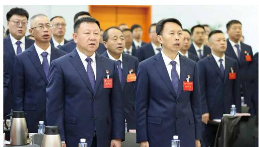

natural_image

Group photo of formally dressed individuals in a conference setting, some wearing name badges (no visible text or symbols)

# ◇ 同心筑家：让发展成果惠及每位职工

党建一重强根基，二重聚人心。企业是职工的大家，职工是企业的家人。我们推行“两心工程”——拢思想、聚人心，鼓干劲、提信心，让发展为了职工、依靠职工、成果与职工共享。

# 两心工程、温暖到家

小事最暖人心。优化食堂配送，实现站区全覆盖，倒班职工顿顿吃上热乎饭。全年健康体检1100余人次、心理疏导6场、疗休养80人次，“冬送温暖、夏送清凉”覆盖全员。为职工统一定制工装1200余套，一位老员工说：“穿上这身衣服，心里踏实。”同时，顺利完成职工代表换届，加快“三型五家”工会建设。家的感觉，越来越浓。

# 匠心传承、榜样力量

温暖是底色，成长是阶梯。2025年，1人拿下全区班组长竞赛第一，15个先进典型被推选。干得好的人，就该被看见——奋斗有声，回响最实。说到榜样，最让人动容的是刘永平。二十八年，从青丝到白发，从普通工人到自治区劳动模范。他每天提前半小时到岗，最后一个离开。有人说他傻，他笑笑：“我就干了一件事——把火车开稳，把路跑好。”一个人走得快，一群人走得远。匠心不是一个人的坚守，而是一群人的默契。读书日，宁夏作协主席分享“文化就是生产力”；献血车上，39人献出14600毫升热血。

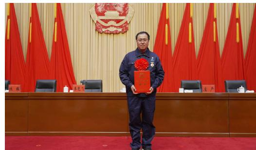

text_image

Official photo of a man holding a red certificate in front of a formal government building with national emblem and red flags

还有赵安平，二十五年如一日，那张发黄的献血证，就是西创人最朴素的勋章。正是这一件件小事、一个个普通人，让企业的凝聚力、向心力，在日常里生根，在时间里生长。

# ◇ 薪火相传：让青春在铁轨上闪光

事业要接力，青春要发光。青年是企业的未来，党建是青年的灯塔。我们坚持党建带团建，让每一颗青春的种子，在铁轨旁生根、发芽。

# 青尽全力、强企有我

电气化铁路开通，是场硬仗。公司开展“开通电气化·人人做准备”专项行动。青年骨干李志超一个月没回家，爱人打电话问啥时回来，他说：“等这条线通了，我就回。”正是这群年轻人，把“不可能”变成了“我能行”。线通了，他也回了，抱起孩子的那一刻，所有的苦都值了。公司搭台，青年唱戏。“师带徒”岗位练兵、“四岗”奋进竞赛、青年突击队攻关——让年轻人在实干中磨，在挑战中长。平台在，成长就不怕没方向。

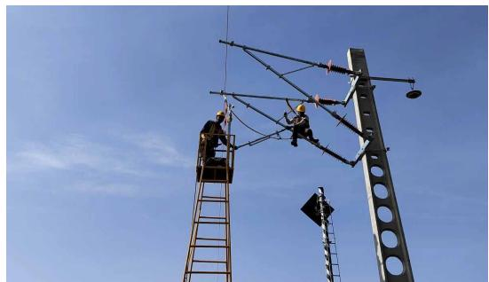

natural_image

Workers installing electrical insulators on a tower against a clear blue sky (no text or symbols visible)

# 校企联动、匠心交融

岗位是练兵场，交流是催化剂。公司团委与宁夏工业职业学院、中铁电气化局联合开展主题团日、劳模面对面活动。一位老劳模对青年说：“我干了半辈子，你们才刚起步，但咱俩干的是同一件事——把路跑好、把安全守住。”90后青马学员王磊回应：“师傅放心，这接力棒我们接得住、传得好。”功夫不负有心人。全年1项成果获评自治区青年科技创新优秀成果，1人荣获自治区“优秀共青团员”称号。一支敢担当、能吃苦、肯奋斗的青年生力军，正在加速成长。

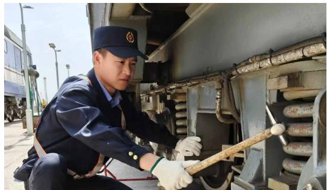

natural_image

Man in uniform and gloves working on a vehicle with tools, outdoors near a train (no visible text or symbols)

# ◇ 根系乡土：把国企担当写在田间地头

企业的根，扎在铁轨之下，也扎在乡土之中。发展不忘本，致富不忘亲。

# 驻村接力、真情投入

帮扶不是走过场，而是要真解决问题。2025年，公司向3个帮扶村投入专项资金30万元。7月，第六轮驻村工作队9名队员接过“接力棒”，告别家人、扎根乡土。红塔村第一书记马建军，驻村第一周就走遍全村137户。他在日记中写道：“村民的一声‘谢谢’，比任何荣誉都重。比谢谢更重要的，是让他们有活干、有钱赚、有盼头。”村里建起第一个集体养殖合作社，当年带动23户农户人均增收3200元。帮扶好不好，群众说了算。村民说：“以前路不好走，现在硬化路通到了家门口；以前晚上黑灯瞎火，现在路灯亮了，心里也亮了。”

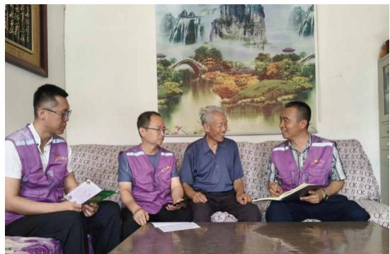

natural_image

Four men in purple vests sitting on a sofa, engaged in discussion with documents; background features a large traditional Chinese landscape painting (no visible text or symbols)

# 锦旗见证、口碑载道

努力不会白费，付出自有回响。继2024年荣获中国上市公司协会“乡村振兴最佳实践案例”后，2025年“党建联建聚合力·共谋乡村促振兴”再入选“上市公司可持续发展优秀实践案例”。帮扶工作受到《人民日报》《光明日报》等主流媒体关注。2025年6月，滨河家园三村党支部书记专程送来锦旗：“倾心帮扶办实事·乡村振兴写新篇”。这面锦旗，挂在墙上，更刻在每一位驻村队员的心里。

# ◇ 未来展望：接续奋斗，再启新程

回望来时路，更好向前行。党建引领，根植于心，践之于行。

2026年，我们将持续深化党建品牌建设，持续擦亮党建品牌，实现支部攻坚项目覆盖率达到100%，党员突击队在急难险重任务中的参与率不低于90%，在智慧铁路、绿色物流、多式联运等新赛道上，推动党建与业务深度融合，让党旗始终高高飘扬。同时，我们将深化“两心工程”，实行“为职工办实事”清单化管理，确保年度重点事项办结率100%，让组织的温暖覆盖每一位员工。

列车安全抵达，见证组织力量；铁轨绵延伸展，延续初心使命。把党旗插在铁轨沿线，把初心写在车轮之上，以高质量党建引领企业行稳致远。

这是我们的回答，也是我们面向未来的承诺。

# 党建联建聚合力“疆煤进宁”启新程

案例

2025年9月4日，西创运通公司党支部与国铁集装箱公司兰州分公司党总支、西部创业公司本部党总支联合开展“赓续血脉担使命 携手共建启新程”联学联建主题党日活动。

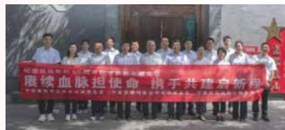

text_image

继续血脉担使命 携手共建启新程

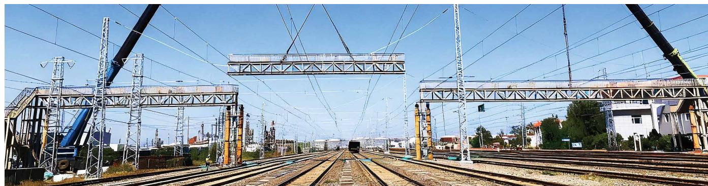

natural_image

Exterior view of a railway yard with overhead gantry structures and multiple tracks under clear blue sky (no signage or text visible)

# 西部创业召开党建工作交流会暨深入贯彻中央八项规定精神学习教育

# 案例

2025年5月28日，公司召开党建工作交流会暨深入贯彻中央八项规定精神学习教育工作专班会议，会议指出各级党组织要全面落实抓基层党建工作主体责任，确保党建各项重点任务落到实处。

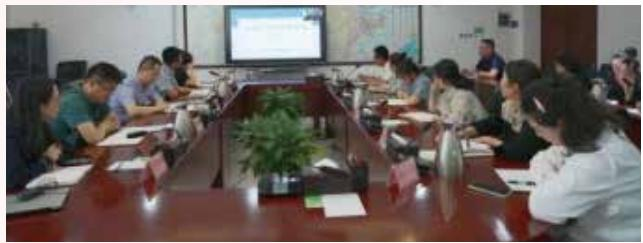

natural_image

Group of people seated around a conference table in a meeting room, with a presentation screen and plants visible (no readable text or symbols)

# 公司纪委深入学习贯彻党的二十届四中全会精神

# 案例

2025年11月20日，公司纪委组织全体纪检干部专题学习党的二十届四中全会精神。会议通过领学解读、交流研讨，引导纪检干部强化政治自觉，切实把思想和行动统一到党中央决策部署上来，以全会精神引领纪检工作高质量发展。

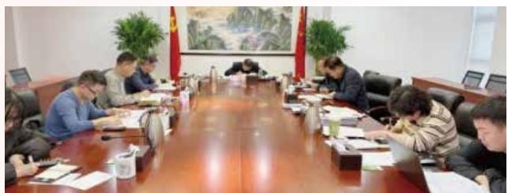

natural_image

Group of people seated around a long conference table in a meeting room with national flag and painting on the wall (no visible text or symbols)

# 西部创业党委理论学习中心组召开专题学习会

# 案例

2025年7月11日，西部创业党委理论学习中心组召开专题学习会，深入学习贯彻习近平经济思想、习近平文化思想，以及习近平总书记关于安全生产、生态文明建设的重要论述。

# 西部创业举办深入贯彻中央八项规定精神学习教育

# 案例

2025年4月9日，公司邀请自治区党校副教授杨宁作“锲而不舍落实中央八项规定精神，推进作风建设常态化长效化”专题辅导。讲座围绕学习教育背景意义、习近平总书记关于作风建设重要论述、推动作风建设实践路径三方面展开，引导党员干部深化认识、筑牢防线，持续推动作风建设常态化长效化。

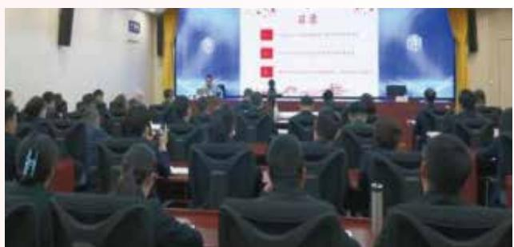

text_image

Conference hall photo with visible presentation screen displaying Chinese text and logos

# 宁东铁路组织“学规定、守纪律、诵经典、践初心”主题党日活动

# 案例

2025年7月，宁东铁路公司机辆段车辆运用车间党支部开展“学规定、守纪律、诵经典、践初心”主题党日活动。活动将党纪知识测试与红色经典诵读有机结合，以考促学、以声传情，推动学习教育走深走实，以红色基因滋养初心使命。

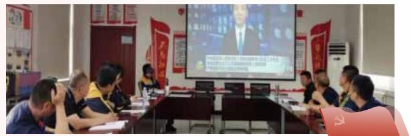

text_image

Meeting room scene with participants seated around a long table, large screen displaying presentation text and red banners in background

# 宁东铁路组织“党建交流促融合，联学共建践初心”主题党日活动

# 案例

2025年8月，宁东铁路车务段古窑子车站党支部与中铁十六局指挥部党支部联合开展“党建交流促融合，联学共建践初心”主题党日活动，引导全体党员在思想淬炼中感悟初心使命，在政治洗礼中汲取奋进力量。

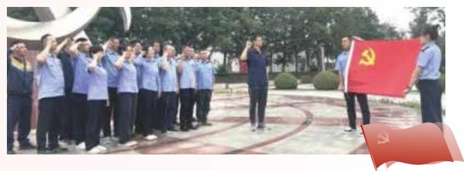

natural_image

Group of people in uniform saluting outdoors, one holding a red flag with hammer and sickle symbol (no visible text or symbols)

# 公司团委与宁夏工业职业学院团委联合开展“青春建功新时代·校企联动促发展”主题团日活动

# 案例

2025年4月29日，公司团委与宁夏工业职业学院团委联合开展“青春建功新时代·校企联动促发展”主题团日活动，通过实地研学、红色教育、座谈分享等形式，搭建青年交流平台，以政治领航与实践淬炼“双轮驱动”，为公司高质量发展注入青春动能。

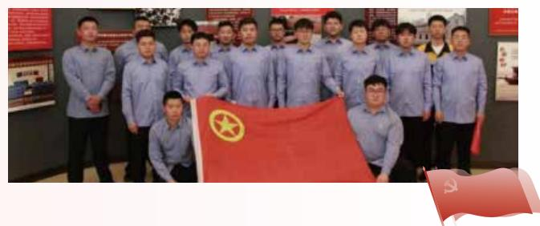

text_image

Group photo of people holding a red flag with a yellow star emblem, with visible posters and banners in the background.

# 公司团委举办“青尽全力·强企有我”主题演讲比赛

# 案例

2025年11月6日，公司团委举办“青尽全力·强企有我”主题演讲比赛。作品选自前期主题征文获奖作品，实现从“笔尖抒怀”到“台上发声”的升华。选手结合演示素材，用真挚语言分享成长感悟，以生动故事诠释责任担当。活动以青春之声传递奋进力量，为青年职工搭建展示与交流平台，激发干事创业、岗位建功的斗志，为公司高质量发展注入青春动能。

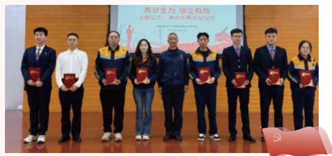

text_image

青尽全力 强企有我
主题记文  演团比赛活动宣传

# 03

# 筑绿于野， 厚植生态基业

6 清洁饮水和卫生设施

清洁饮水和卫生设施

7 经济适用的清洁能源

13 气候行动

15 陆地生物

我们把绿色种进铁轨的缝隙里，从减碳到循环，从修复到净化，让发展与生态不再对立。列车驶过，窗外依旧是鸟鸣与青绿。

承诺有声，行动有纲。我们坚持以习近平新时代中国特色社会主义思想为指导，深入贯彻习近平生态文明思想，落实党的二十大及二十届历次全会精神，牢固树立绿水青山就是金山银山的理念，以碳达峰碳中和为牵引，严守生态保护红线与环境质量底线，有效防范化解生态环境风险，以高水平生态环境保护支撑公司高质量发展。

# ◇ 健全环境管理

# 环境合规管理

# |治理

我们遵守《生态环境保护管理办法》等法律法规，制定实施《生态环境保护工作规定》《突发环境事件应急管理办法》《安全环保文明生产责任网格化管理规定》等制度，让每一条规矩都有落点。

制度，不在墙上，在路上。我们建立“领导小组统筹、办公室牵头执行”的两级管理架构，权责分明，环环相扣。压实的不只是责任，更是落地的“最后一公里”。

在此基础上，我们持续健全生态环境管理体系，完善污染源档案与环保设施档案，围绕环境风险识别、评估、控制、恢复四个环节实施分级分类管控，不断提升污染防治、风险防范与应急处置能力，坚决守住生态环境安全底线，以高水平生态保护推动企业可持续发展。

<table><tr><td>层级</td><td>机构</td><td>负责主体</td><td>核心职责</td></tr><tr><td>决策层</td><td>环保工作领导小组</td><td>主要负责人牵头,班子及各单位负责人参与</td><td>统筹生态环保顶层设计、重大决策与整体部署,压实各级环保主体责任</td></tr><tr><td>执行层</td><td>环保办公室(安环部)</td><td>安环部牵头,部门经理兼任主任参与</td><td>制定环保基本制度,开展环保监察与隐患整改督办,参与突发生态环境事件调查处理,分解落实上级环保任务并报送全口径统计信息</td></tr></table>

# | 战略

我们深入学习贯彻习近平生态文明思想，践行绿水青山就是金山银山的理念。因为我们深知：铁路延伸之处，不只有货物与远方，还有土地、河流与世代栖居的家园。

我们坚持“预防为主、防治结合、谁污染谁治理”的原则，将生态环境保护全面融入发展战略与生产经营全过程。这是一道必答题，不是附加题——生态优先、绿色发展，是我们对未来的基本态度。

我们聚焦督察整改、污染防治、生态治理、风险防控、低碳转型等重点任务，防范化解生态环境风险，实现隐患动态清零。每一步都不容易，但每一步都算数。

我们持续提升环保成效，不是为了达标，而是为了不负沿途山川，也不负信任我们的人。

# | 影响、风险与机遇管理

# 我们紧扣年度安全环保目标

细化重点任务清单，明确时限与责任，推动各项部署落地见效。常态化开展环境隐患自查自纠，保证污染防治设施稳定运行，将风险防控融入日常运营，持续夯实环保管理基础。

# 我们完善宁东铁路生态环境应急预案

强化源头管控，全面排查整治环境风险隐患，构建全链条、全过程的环境风险防控机制。定期开展环境风险辨识，建立风险清单，完善突发环境事件及重污染天气应急处置流程，健全应急责任、响应与物资保障体系。通过常态化应急演练、提升应急指挥信息化水平、强化值班值守，全面提高突发生态环境事件的快速响应与科学处置能力。

# 安全是底线，也是回家的路

我们一刻不敢松懈。重点排查线路安全保护区内烧荒、放牧、违规种植、违章施工、采矿爆破、非法采砂等隐患；规范铁路沿线塔杆、广告牌、烟囱等设施管控，完善涵洞、桥梁限高限宽标识及防护设施；加强对煤矿、洗煤厂、危化品装卸站等重点区域监管，严厉打击损坏、非法占用铁路设施及设置障碍物等行为，切实保障铁路运输安全稳定。

# 环保，不是一个人的事 ●

是一群人的共识。我们结合生态环境保护工作实际需求，常态化开展环保知识与技能培训，持续提升全员环保意识与履职能力，筑牢企业绿色发展的思想基础。

# I指标与目标

公司及所属子公司未发生环境领域违法违规情况，实现“一杜绝、一遏制、一力争、两达标”的生态环保目标。数字背后，是每一天不折不扣的执行。

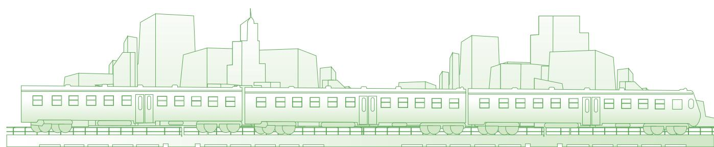

natural_image

Line drawing of a train with city skyline silhouette (no text or symbols)

# 应对气候变化

# |治理

气候治理，不是锦上添花，是必行之责。我们始终把应对气候变化作为推动高质量发展的关键抓手，紧紧围绕国家“双碳”目标与联合国可持续发展议程，坚定走绿色低碳发展道路。

我们设立安全健康环保及ESG委员会作为董事会下设专门机构，承担安全、职业健康与环境保护工作的统筹指导、监督检查与效果评估。对重大事项研究解决方案，向董事会提出专业意见与决策建议。

# |战略

我们积极落实国家 “双碳” 目标，严格执行气候风险识别、评估、管控全流程机制，持续提升气候韧性。不等风来，先筑墙——为不确定的气候变化，筑牢确定的坚实基础。

# 气候风险识别流程

# 流程步骤

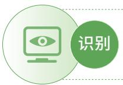

# 主要内容

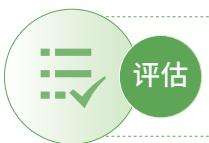

跟踪气候相关政策法规、行业研究及信息披露案例，结合公司经营实际，系统识别气候相关风险与潜在机遇，建立规范的风险清单，为后续评估工作奠定坚实基础。

采用定性与定量相结合的方式，严格基于识别形成的风险清单，从发生概率、影响程度两个核心维度评估风险等级，按重要性排序，全面分析其对公司业务、财务、运营、地理环境、时间范围等的综合影响。

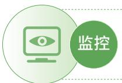

针对评估确定的不同等级风险，精准制定差异化应对方案，明确责任分工、实施步骤与时间节点，同步推进潜在机遇转化，健全配套保障措施。通过制定年度工作要点与行动方案，将任务逐层分解，对重点项目明确目标与规划。持续加强组织领导、宣传教育和督促考核，构建组织有力、协调顺畅、联动高效的工作推进机制。

# | 影响、风险与机遇管理

我们针对已识别的气候相关重点风险，组织相关部门与人员，系统制定专项应对方案与管控措施，全面降低气候变化对公司财务状况、运营安全、市场发展及品牌声誉的潜在影响，筑牢可持续发展的气候韧性。

我们建立生态环境保护考核评价机制，将生态环保目标与责任落实情况纳入子公司绩效考核体系，对成效显著的单位和个人予以表彰奖励，对生态环境风险与隐患实施分类管理、分级管控。各子公司严格履行环境风险防控责任，制定专项风险管控方案，明确管控重点，持续对高风险生产场所、关键环节及重点岗位开展隐患排查与治理。责任到人，奖惩分明。

我们积极落实国家“双碳”目标，推动新能源与铁路运输协同，加快铁路货场、物流园区作业车辆及移动装备的新能源替代升级，积极发展全程物流服务，提高公路运输向铁路转移规模，优化煤炭、化工等产品客户自提模式，整合分散物流资源，扎实推进大宗货物“公转铁”运输结构调整，将绿色低碳理念全面融入供应链管理全过程。每一步转型，都是对未来的投资。

<table><tr><td colspan="2">风险类型</td><td>风险描述</td><td>影响</td><td>风险应对</td></tr><tr><td rowspan="2">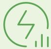物理风险</td><td>急性风险</td><td>暴雨、泥石流、沙尘暴、大风等极端天气事件发生</td><td>· 影响沿线围网、人行天桥、道口拦木等基础设施;· 造成车辆溜逸、路基塌陷,导致车辆倾覆或脱线,发生重大安全及运输事故,影响生产运输效率。</td><td>· 制定相关风险应急预案,提高应急抗灾能力。加强设施设备维护,提升应对气候变化的适应性;· 持续关注天气变化,及时发布极端天气预警,做好充分应对准备,定期检修、维护设备设施以应对气候变化影响。</td></tr><tr><td>慢性风险</td><td>持续高温或严寒天气</td><td>· 危害员工健康安全,同时造成基础设施老化,增加设备需求以及维修费用,增加总体营运成本。</td><td>· 缩短员工露天工作时间,健全员工高温工作防护措施;· 提供高温补贴及高温假,通过技术升级、更新设备防范慢性风险。</td></tr><tr><td rowspan="4">转型风险</td><td>政策与法律风险</td><td>政府监管要求提升,气候相关监管政策法规不断出台</td><td>· 带来合规性管理压力,增加运营成本。</td><td>· 密切关注气候相关政策法规,分析并预测监管发展动向,制定中长期气候管理战略规划,相应制定并调整公司气候相关制度措施,确保合规运营。</td></tr><tr><td>技术风险</td><td>未识别或运用清洁技术、新兴智能技术等</td><td>· 可能导致运输效率落后。</td><td>· 完善技术研发体系,加大绿色科技研发力度,利用数字化重塑服务体系,多措并举提升供应链管理能力。</td></tr><tr><td>市场风险</td><td>气候变化导致资源短缺,市场需求变化,竞争加剧</td><td>· 供应链受阻,增加生产成本。</td><td>· 加强市场调研,了解市场需求;· 增强绿色管理意识,强化环境信息披露;· 及时开展利益相关方沟通,持续增强履行社会责任的意识。</td></tr><tr><td>声誉风险</td><td>未及时披露气候变化风险管理相关信息</td><td>· 供未能满足公众和利益相关方对识别、评估、应对气候变化和绿色转型的期望,导致公司声誉受损,影响资本市场形象。</td><td>· 与社会公众和利益相关方建立透明高效的沟通机制,加强环境管理和社会责任宣传,建立环境污染等负面舆情的危机管理预案。</td></tr></table>

# 指标与目标

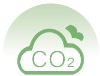  
2025年温室气体排放总量

68,076.04 吨二氧化碳当量

2025年温室气体排放强度

51.22 吨二氧化碳当量/百万元

# 生态系统和生物多样性保护

# | 生态环境保护

我们持续完善生态保护长效机制，成立生态环境保护工作领导小组，将生物多样性管理纳入其中。因为我们相信：一条有温度的铁路，懂得为沿途的花鸟虫鱼让路。

宁东铁路将生物多样性保护融入站区规划与工程建设管理体系。优化《站区整体规划》，深化“一主一副”生产基地与宁东北站、大坝站等标准化示范站区建设，严格落实《文明站区创建方案》，健全“目标明确、责权分明、齐抓共管、全员参与”的五型文明站区创建机制，将生态环境评价纳入站区管理考核核心内容，从源头管控生态影响。

规划先行，规矩落地——每一寸建设，我们都先问一句：草木可安？生灵可好？

# 西创运通施工项目严守生态红线守护环境

西创运通在上沟湾物流园路基施工项目中，严守湿地自然保护区生态红线，严格限定施工范围杜绝越界作业。施工落实环保“三同时”制度，通过保护原生土体结构、防控水土流失等措施，最大限度降低工程对湿地生态系统的扰动，实现工程建设与生物多样性保护协同发展。

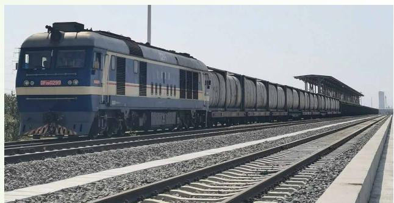

natural_image

Front view of a blue freight train on railway tracks with cargo containers, no visible text or symbols

# | 生态修复增绿

公司严守生态保护红线，严格划定施工作业带范围，严控施工扰动边界，最大限度避免地表植被破坏，施工结束后及时开展地形地貌与植被恢复，守护沿线原生生态系统。

宁东铁路持续推进铁路沿线、站区及物流园区环境综合整治，加大植树造林与绿化覆盖力度，发挥植物固碳、水土保持功能，打造“一站一景”生态景观，全力建设零碳、无废、环境友好型铁路站区。2025年，宁东铁路完成古窑子站等重点站点绿化带补植与设施更新，组织职工开展绿化管护、环境清洁志愿活动，推动废旧区域生态焕新，持续改善区域生态面貌。

酒庄公司依托1.5万亩葡萄种植基地（平均树龄20年以上），持续发挥生态固碳效能。基地采用“1米×3米”株行距规范种植，亩植220株，全年稳定固碳9,000吨，在产出优质葡萄的同时，构建稳定人工生态群落，提升区域植被覆盖度与生物栖息环境质量，成为区域生态“绿肺”重要组成部分。一棵葡萄树，二十年光阴——这是时间与土地的双重馈赠。

# 数说2025·生态修复增绿

酒庄葡萄基地规模

1.5万亩

葡萄平均树龄

20年以上

种植株行距

1×3

亩均株数

220株

全年固碳量

9,000吨

古窑子站绿化补植

完成

沿线生态

持续改善

物种多样性

稳步恢复

# | 生物多样性保护

我们建立全链条生物多样性保护措施，从施工前到运营后，每一环节都为生命让路。加强宣传教育与施工全过程监理，规范施工时段与作业方式，严控施工噪声、振动对野生动物的惊扰，尽可能降低对动物栖息地、迁徙通道的破坏，维护沿线生态系统稳定性。施工可以等，但生命不能扰。

宁东铁路严格规范人员生态行为，严禁野外植被乱砍滥伐与野生动物滥捕滥杀，通过岗前培训、现场宣教、案例警示等方式，让“敬畏自然”成为每一名员工的必修课。经持续保护与修复，公司铁路沿线生态持续改善——白鹭重返湿地，野兔穿梭护坡，刺槐、沙枣等乡土植物形成绿色廊道，物种多样性稳步恢复，动植物种类有效保护与增加，形成乔灌草结合的特色生态群落，实现铁路运营与自然生态的和谐共生。

铁轨延伸之处，草木在长，鸟兽在归。

2026年，我们将完成不少于10公里的铁路沿线生态景观带示范段建设，在古窑子站、鸳鸯湖站等重点站点打造“一站一景”生态名片；持续发挥酒庄葡萄基地生态固碳功能，确保年固碳量不低于9,000吨，守护这一区域“生态绿肺”。

# 数说2025·生物多样性保护

<table><tr><td>指标</td><td>数据/状态</td></tr><tr><td>全链条保护措施</td><td>已建立</td></tr><tr><td>施工时段与作业方式</td><td>规范管理</td></tr><tr><td>人员生态行为</td><td>严格规范</td></tr><tr><td>岗前培训与现场宣教</td><td>常态化</td></tr></table>

natural_image

Illustration of two people examining documents and a presentation screen (no text or symbols present)

# ◇ 高效使用资源

# 能源利用

我们建立能源管理体系，制定年度节能降耗目标，将能源消耗纳入生产经营关键指标。建立能源统计报表制度和能源利用状况报告制度，定期开展能效对标诊断，强化重点用能设备节能审查，确保能效标准与节能要求全面落实。每一度电、每一升油，都用在刀刃上。

公司持续完善“生态环境保护委员会统筹、安全环保监察部牵头、各部门与子公司协同落实”的三级减排管理机制，将减排指标分解至线路运营、货场作业、工程施工等关键环节，形成目标明确、责任到人、闭环管控。不是一个人使劲，而是一群人合力。

宁东铁路坚持“制度先行、精细管控”的管理理念，制定《机车油耗管理办法》《机车油耗考核管理办法》等制度，发布《关于开展机车节油攻关活动的通知》进行专项部署，构建起“制度约束+考核激励+专项攻关”的管控体系。在此基础上，建立内部能源消耗台账，扎实开展节能攻关活动，持续提升能源利用效率。

节油不只是一道算术题，更是一道态度题。未来，我们将通过电气化改造、机车节油攻关等举措，持续提升能源利用效率。

# 数说2025·能源利用

能源消耗总量

31,313.19 吨标准煤

直接能源消耗量

29,287.31 吨标准煤

间接能源消耗量

1,125.88 吨标准煤

燃油消耗总量

23,055,182.48 千

柴油消耗量

22,874,900 升

汽油消耗量

180,282.44 升

用电量

8,188,225度

天然气使用量

821,840.04 立方米

节油攻关活动

常态化开展

能源消耗台账

全覆盖建立

能效对标诊断

定期开展

# 未来能源效率目标（以2025年为基准）

至2027年：综合单位能耗下降3%

至2028年：内燃机车燃油消耗量较2025年下降超过 $50\%$

至2030年：非化石能源消费占比力争提升至8%。

# 水资源利用

我们强化水资源全过程监测与治理，持续提升污水资源化循环利用水平，切实筑牢区域生态环境安全防线。确保污水处理全过程符合环保标准，在线监测数据稳定低于排污许可限值，全力实现废水“零排放”与资源化利用。不排一滴废水的背后，是对每一寸土地、每一条河流的郑重承诺。

我们采用新型节水工艺与绿色节能技术，同步搭建智能化能源管理平台，对能源消耗进行实时监测、数据分析与智能优化，实现能源分配精准调控、高效利用，持续深化水污染治理，推动绿色低碳理念落地。

# 层级

# 职责

生产技术部

对古窑子污水处理站设备设施在技术管理上担负监督与检查的责任。

安全环保部

对污水处理站的安全环保管理担负监督与检查的责任。

后勤段

管理主体责任单位，负责污水收集、处理、回用工作，负责古窑子污水处理站的安全、消防、综合治理工作。

# 数说2025·水资源利用

总用水量

159,764吨

新鲜水用水量

159,764吨

每百万营收用水量

0.12 吨/百万元

废水排放量

96,180吨

废水回用率

100%

废水回用率

100%

废水零外排

是

在线监测

稳定达标

排污许可限值

持续低于

智能化管理平台

已搭建

# 循环经济

循环经济，日日为功。我们在生产运营全过程中，坚持资源高效利用与循环使用，持续优化配置、削减消耗，持续减少对环境的影响。取之有度，用之有节——这是对资源的敬畏，也是对自己的要求。

# 资源集约运输

我们积极推进铁路集疏运体系建设，加快宁东铁路与周边线路互联互通。投用后，有效保障周边电厂及能源化工基地的煤炭供应。相比公路运输，铁路能耗更低、排放更少——让大宗货物“多走铁路”，既是效率的优化，也是减排的实招。

# 资源高效利用

能修的不换，能用的不扔——这既是经营上的降本增效，也是资源观的落地。我们大力推进修旧利废，对拆解后的设备及零部件开展修复利用，让存量资产继续创造价值。在铁路运维方面，科学制定养护方案，运用大型养路机械开展精细养护，实施钢轨打磨、曲线调整等措施，有效延长钢轨使用寿命。

  
数说2025·循环经济

<table><tr><td>指标</td><td>数据/状态</td></tr><tr><td>铁路集疏运体系</td><td>积极推进</td></tr><tr><td>周边线路互联互通</td><td>加快实施</td></tr><tr><td>大宗货物“公转铁”</td><td>持续优化</td></tr><tr><td>修旧利废</td><td>常态化开展</td></tr><tr><td>设备零部件修复</td><td>持续推进</td></tr><tr><td>钢轨使用寿命</td><td>有效延长</td></tr><tr><td>大型养路机械</td><td>精细养护</td></tr><tr><td>能修不换、能用不扔</td><td>全面落地</td></tr><tr><td>存量资产再创造价值</td><td>全面落地</td></tr></table>

# ◇ 深化污染治理

规矩立在前，执行跟得上。我们严格遵循《环境保护法》《大气污染防治法》《水污染防治法》等法律法规，以及《锅炉大气污染物排放标准》（GB13271-2014）等行业标准，持续完善环境管理责任体系。强化风险预判与过程管控，有效防范环境污染事件，持续提升环境治理能力。

# 污染物排放

# |废气

公司主要废气来源为宁东铁路各站区，主要是古窑子站、鸳鸯湖站、大坝站等9站区锅炉房的天然气锅炉。我们依据《大气污染物综合排放标准》《锅炉大气污染物排放标准》（GB13271-2014）表3大气污染物特别排放限值，对废气污染物指标开展定期监测，确保排放符合法律法规要求。我们严格落实环保管控要求，确保废气排放持续稳定达标，每一次监测都经得起检验。

  
数说2025·废气治理

<table><tr><td>天然气锅炉站区数量</td><td>低氮燃烧技术覆盖率</td><td>监测合格率</td></tr><tr><td>9个</td><td>100%</td><td>100%</td></tr></table>

# |废水

公司产生的废水主要为生活污水，来源于古窑子站、鸳鸯湖站、大坝站等9个站区的办公楼、食堂、宿舍及洗车场所。各站点生活污水处理站采用“格栅—调节池—好氧池—臭氧池—沉淀池”组合工艺，配套MBR膜处理系统，设计处理能力5—100吨/日不等，出水水质达到《城市污水再生利用城市杂用水水质》（GB/T 18920-2020）标准。生活废水经处理后，全部回用至站区绿化灌溉及道路洒水降尘，实现废水资源化利用与零外排。水不是用完了就没了，处理好了还能接着用。

2025年废水排放总量为

96,180吨

我们在废水处理站周边建设生态防护林带与生态缓冲带，有效阻隔污染物扩

散，构建外围生态防护屏障。我们加强水质监测，对关键指标开展定期检测，依据监测数据动态优化处理工艺与运行工况，确保废水处理系统安全、稳定、高效运行。

2025年，公司废水排放总量为96,180吨，全部实现资源化利用。96,180吨，不是终点，是循环的起点。每一滴都算数，每一滴都归位。

  
数说2025·废水治理

<table><tr><td>指标</td><td>数据</td><td>备注</td></tr><tr><td>站区数量</td><td>9个</td><td>古窑子、鸳鸯湖、大坝等</td></tr><tr><td>处理工艺</td><td>格栅—调节池—好氧池—臭氧池—沉淀池+MBR</td><td>—</td></tr><tr><td>出水标准</td><td>GB/T 18920-2020</td><td>城市杂用水水质</td></tr><tr><td>废水排放总量</td><td>96,180吨</td><td>全部资源化利用</td></tr><tr><td>废水回用率</td><td>100%</td><td>—</td></tr><tr><td>废水零外排</td><td>是</td><td>—</td></tr><tr><td>水质监测指标</td><td>COD、氨氮、SS、pH值</td><td>定期检测</td></tr><tr><td>生态防护</td><td>林带+缓冲带</td><td>—</td></tr></table>

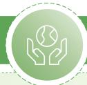

# 宁东铁路污水处理站管理

案例

宁东铁路制定《污水处理站管理办法》，在古窑子车站和沿线9个车站均配置污水处理设施，加强污水处理站的运行管理工作，确保污水处理设施正常运行和处理质量。报告期内，污水处理设施均正常运行，污水100%达标排放。

# 废弃物处理

# | 一般固体废弃物

我们严格遵循“分类收集、密闭转运、无害化处置”原则，对生活垃圾及一般固废实行分类密闭存放，委托具备合法运营资质的第三方单位定期清运至合规场所进行无害化处理，形成闭环，有效防范二次污染风险。垃圾有去处，更要有着落。针对金属加工废料、废包装物等一般工业固废，我们实行分类收集与资源化利用，探索与下游企业建立固废协同处置机制，同时推广应用可循环包装材料，减少一次性包装物使用，从源头降低固废产生量。能少用的不多用，能回收的不扔掉。

我们优化固废物流运输方案，出台固废外运优惠政策，依托集装箱物流基地实现粉煤灰等固废常态化外运。2025年发运粉煤灰420车2.73万吨。

为切实维护厂区及周边环境卫生，我们落实常态化卫生防疫机制，对垃圾房实施每周清洗、定期除臭及专业消杀，全面防控蚊蝇、鼠害等病媒生物滋生。同时，通过强化现场环境卫生网格化管理，及时清理散落杂物，确保作业区域整洁有序。干净，靠的是天天坚持。

在废弃物暂存区域，我们强化消防安全风险管控，严格执行禁烟禁火规定，配置足量灭火器材，重点加强对易燃助燃物的清理与隐患排查，及时消除火灾隐患，确保废弃物存储环境安全受控。防患于未然，写在制度里，做在每一天。

取之有度，用之有节。2025年，我们资源化利用煤矸石2.2万吨，2026年力争突破25万吨；大宗货物“公转铁”运量较2025年提升3%，以更低能耗、更少排放服务区域物流。2026年，我们计划通过废旧物资处置实现收入不低于200万元，让存量资产继续创造价值。

  
数说2025·一般固体废弃物

<table><tr><td>指标</td><td>数据</td><td>备注</td></tr><tr><td>固废分类收集率</td><td>100%</td><td>生活垃圾+一般工业固废</td></tr><tr><td>无害化处置率</td><td>100%</td><td>第三方合规处置</td></tr><tr><td>可循环包装材料应用</td><td>推广应用</td><td>—</td></tr><tr><td>垃圾房清洗消杀</td><td>每周</td><td>定期除臭+专业消杀</td></tr><tr><td>可循环包装材料</td><td>/</td><td>推广应用</td></tr><tr><td>固废资源化利用</td><td>/</td><td>持续提升率</td></tr><tr><td>网格化管理</td><td>/</td><td>全覆盖</td></tr><tr><td>消防安全检查</td><td>/</td><td>常态化</td></tr></table>

# | 危险废弃物

底数清，才能管得住。我们对危险废弃物实行全流程精细化管控。全面辨识废机油、废电池、废油桶等产生环节，建立危险废弃物清单及全生命周期管理台账，规范标志标识，夯实管理基础。

在合规处置方面，我们严格执行危险废物转移联单制度，按规范填写运行联单并留存。委托持有《危险废物经营许可证》的专业单位进行规范处置，合规处置率达100%，实现全过程可追溯、零环境风险。运走不是终点，有据可查才是。

在贮存与风控方面，我们严控收贮风险，建有专用危废暂存库，地面采取防渗处理，设置围堰及泄漏收集装置，严格落实分类、分区贮存要求，严禁露天堆放，筑牢环境安全防线。危险废物不危险，关键是管到位。

危险废物合规处置率达

100%

  
数说2025·危险废弃物

<table><tr><td>指标</td><td>数据</td><td>备注</td></tr><tr><td>废机油</td><td>25.72吨</td><td>—</td></tr><tr><td>废油桶</td><td>7.60吨</td><td>—</td></tr><tr><td>废电池</td><td>0.75吨</td><td>—</td></tr><tr><td>合规处置率</td><td>100%</td><td>—</td></tr><tr><td>转移联单执行率</td><td>100%</td><td>五联单,纸质+电子档案</td></tr><tr><td>应急物资</td><td>吸油棉、防滑手套等</td><td>—</td></tr><tr><td>日常巡检频次</td><td>每日一次</td><td>—</td></tr><tr><td>环境安全事件</td><td>0</td><td>—</td></tr><tr><td>专用暂存库</td><td>/</td><td>有</td></tr><tr><td>防渗/围堰/收集装置</td><td>/</td><td>有</td></tr><tr><td>露天堆放</td><td>/</td><td>严禁</td></tr></table>

2023年危险废弃物总量

43.94吨

2024年危险废弃物总量

52.76吨

2025年危险废弃物总量

34.07吨

# 践行减排

减排，没有选择题，只有必答题。我们紧扣国家“双碳”目标与交通运输绿色低碳转型要求，将减排降碳贯穿运输组织、设施运维、工程建设、资源循环全链条。健全责任体系，强化目标与过程管控，持续降低能耗与排放。

# | 推进清洁能源替代

在古窑子生产基地、办公园区推进光伏发电系统建设，逐步提高非化石能源使用比例。持续推进“公转铁”与公铁联运增效，加快铁路专用线进企入园，重点对接煤炭、矿石、煤化工等工矿企业及物流园区，完善专用线接入与联运转运设施，打通大宗货物绿色运输“最后一公里”。

# I 优化生产用能结构

能效要上去，设备先管住。我们聚焦精密磨削装备、智能检测设备等核心生产环节，通过优化工艺参数降低单位产值能耗；建立设备能耗档案，对高耗能设备实施分级管控，加快淘汰落后低效设备，推动生产环节绿色化改造，从源头提升生产能效。

以宁东铁路电气化改造为核心，项目总投资约18.1亿元，我们加快线路、通信、信号、电力及机车车辆升级迭代，推进营业线道口拆并改，实现轨道装备重型化、养路机械化、用能绿色化。同步优化运输组织方案，通过精细化调度指挥减少机车无效停留，提升机车运用效率，降低燃油消耗与废气排放。每一滴油，都用在刀刃上。

在能源使用管控方面，我们严格把控燃油品质，在内燃机车、作业机械全面推广合格燃油，升级尾气净化装置，持续消除超标冒黑烟现象。同时，推进货场、物流园作业车辆与移动机械新能源化，降低传统燃油设备使用比例，推动能源结构向清洁低碳转型。

换一种能源，就是换一种发展方式。

# | 践行绿色低碳运营

节能，靠管不靠喊。我们制定并实施《节能减排管理办法》，以绿色办公与节能降耗为核心，围绕用水、用电、供暖、空调、照明及办公设备等重点领域，构建全流程节能减排管控体系，持续强化能耗监测与优化管理，从源头降低能源资源消耗。

在废弃物暂存区域，我们强化消防安全风险管控，严格执行禁烟禁火规定，配置足量灭火器材，重点加强对易燃助燃物的清理与隐患排查，及时消除火灾隐患，确保废弃物存储环境安全受控。防患于未然，写在制度里，做在每一天。

我们践行绿色理念，推进低碳生活实践。深入落实反食品浪费要求，完善食堂就餐管理机制，坚决杜绝餐饮浪费，全面推行生活垃圾分类投放与规范处置，引导员工养成低碳环保的生活习惯。

大力倡导绿色出行，新增公务及业务用车优先采购新能源车辆。2025年，新增新能源公务及生产用车9辆，占当年新车采购量的90%；新建充电桩6座，进一步完善了绿色出行配套设施，助力企业低碳转型。

小事做细，习惯养成，绿色就不远了。

我们有序推进厂站及办公场所节能改造，开展站所办公用房外墙保温施工。科学优化非工作日办公及公寓区域供暖温度管控（供暖季温度下调2-3℃），有效降低外购天然气与热力消耗，切实减少各类无效能耗，全面提升资源利用效率。一度电、一吨水、一立方米气，都经得起盘算。

# | 常态化开展节能宣贯

我们以 “六五” 环境日、节能宣传周为契机，通过专题学习、知识竞赛、现场宣教等形式，普及减排降碳知识，强化全员环保责任意识，形成人人参与减排、人人践行绿色的良好氛围，推动减排责任落地见效。

微光成炬，众行致远。未来，我们将通过常态化节能宣贯、绿色办公督导、能耗数据公示等机制，让绿色低碳成为每一位员工的行动自觉。

# 数说2025·水资源利用

能源消耗总量

31,313.19 吨标准煤

用电量

8,188,225度

燃油消耗总量

23,055,182.48 升

温室气体排放总量

68,076.04吨

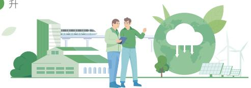

natural_image

Illustration of two people discussing near a green globe with renewable energy icons (no text or symbols)

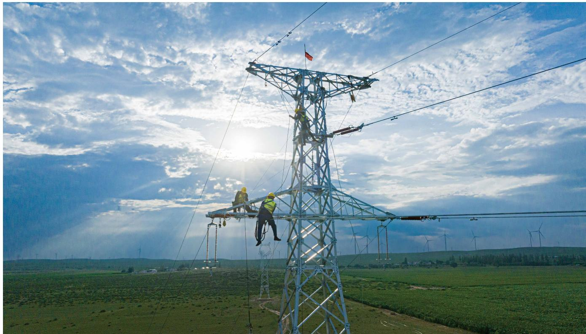

natural_image

Workers on a high-voltage transmission tower under a bright blue sky, with wind turbines and green fields in the background (no visible text or symbols)

# 04

# 筑光于行， 守护价值高地

9 产业、创新和基础设施

11 可持续城市和社区

12 负责任消费和生产

17 促进目标实现的伙伴关系

行动是最好的光源。我们坚持以客户为中心，以高标准构建质量管理体系，聚焦运输服务全生命周期管控，持续强化技术创新，落实责任，严把质量关口，确保产品合规安全。

我们远离短期喧嚣，深耕长期价值。从战略融合到技术创新，从利益相关方沟通到代际承诺，每一步都在重绘价值的边界。以务实行动彰显责任与担当——筑质于行，守护的不仅是数字的高地，而是安全与品质的底线。

# ◇ 严控产品质量

规矩立在前，执行才能跟得上。我们严格遵守安全生产与服务质量相关法律法规，制定实施《运输服务质量管理办法》，维护规范有序、公平公正的运输市场秩序，切实保障货物托运人与收货人的合法权益。

在运输服务质量管理中，我们始终坚持以客户为中心、公正公开的工作原则，构建“员工自律、企业监管、客户监督”三位一体的长效管理机制。全体员工严守规程与标准，强化全过程安全管控与质量监督，全力为客户提供安全可靠、优质高效的运输服务。

每一批货物、每一趟列车、每一位客户的托付，都值得被认真对待。挂在墙上不是目的，跑在路上才是。

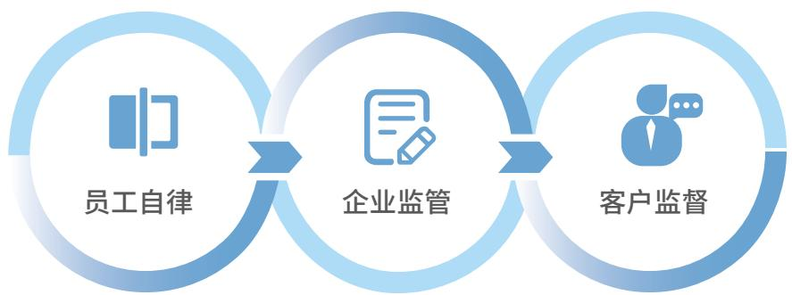

flowchart

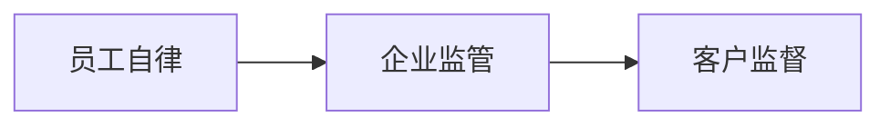
```mermaid
graph LR
  A["员工自律"] --> B["企业监管"]
  B --> C["客户监督"]
```

  
数说2025·严控产品质量

<table><tr><td>指标</td><td>数据/状态</td></tr><tr><td>服务质量达标率</td><td>100%</td></tr><tr><td>客户投诉处理率</td><td>100%</td></tr><tr><td>《运输服务质量管理办法》</td><td>已制定</td></tr><tr><td>三位一体管理机制</td><td>已构建</td></tr><tr><td>全过程安全管控</td><td>全覆盖</td></tr></table>

# 宁东铁路电气化改造项目提质增效

案例

宁东铁路电气化改造项目多措并举保障进度，完成投资突破9.82亿元。项目始终坚守安全质量底线，以“零事故、零伤害、零容忍”为目标，强化全过程管控与多方联动，隐患整改率达 $98\%$ 。同时，项目统筹建设与运维，全力攻克施工难题，不仅追求“送电通车”时间节点，更注重安全与速度的精准平衡、质量与效率的协同兼顾、建设与运营的无缝衔接，以钢铁轨道筑牢高质量发展硬支撑。

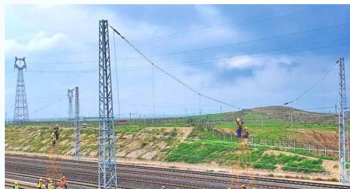

natural_image

Workers installing high-voltage transmission lines on railway tracks with power transmission towers in the background under a partly cloudy sky (no visible text or symbols)

# 宁东铁路钢轨打磨项目顺利完成

案例

宁东铁路高质量完成钢轨打磨项目，消除钢轨病害、保障行车安全，项目前期精准研判、科学制定专项方案，全面提升线路设备质量，有效消除安全隐患，为铁路安全平稳运行筑牢坚实保障。

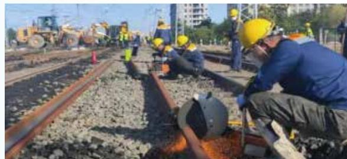

natural_image

Workers in safety gear inspecting railway tracks at a construction site, with cranes and buildings in the background (no visible text or symbols)

# 宁东铁路古窑子站开展天窗施工攻坚战

案例

宁东铁路古窑子站开展十小时天窗施工“攻坚战”，高效完成道岔清筛与轨枕更换。通过精准把控施工标准、严格校准轨道参数，切实提升设备质量与运行稳定性，以专业施工筑牢铁路运输安全根基，为后续装备稳定运营提供质量保障。

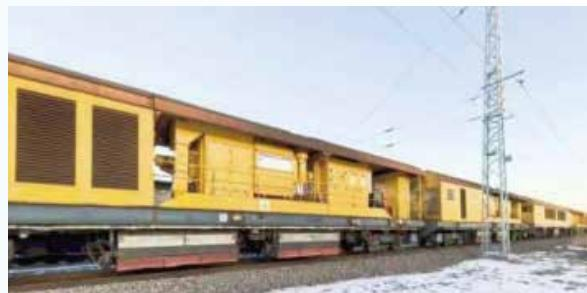

natural_image

Row of yellow and green freight train cars on snow, with a utility pole in the background (no visible text or symbols)

# ◇ 筑牢安全防线

# 网络信息安全

规矩立在前，防线才能筑得牢。我们严格遵守《中华人民共和国数据安全法》《中华人民共和国网络安全法》《中华人民共和国个人信息保护法》等法律法规，制定实施《网络与信息安全管理办法》，并向子公司下发《年度信息化考核评分细则》，对网络安全实行年度水平考核与事件考核。我们成立信息化建设领导小组，由总经理担任组长、副总经理担任副组长，统筹推进信息化建设工作。领导小组办公室设在科技信息部，负责统筹协调公司网络安全整体工作。

数据有生命周期，安全要全程在位。我们严格落实“涉密不上网、上网不涉密”管理要求，坚持信息化建设与网络安全同步规划、同步建设、同步运行的“三同步”原则，对数据收集、使用、加工、传输、存储、披露及销毁实施全生命周期管控，切实筑牢数据安全与个人信息保护防线。

安全，堵在前头，胜过补在后头。我们高度重视网络与信息安全保障工作，定期开展安全检测与风险评估，持续完善网络安全应急管理体系，有效防范化解各类信息安全风险，筑牢数字安全屏障。

  
数说2025·网络信息安全

<table><tr><td>指标</td><td>数据/状态</td></tr><tr><td>网络安全事件</td><td>0</td></tr><tr><td>客户隐私泄露投诉</td><td>0</td></tr><tr><td>数据安全事件</td><td>0</td></tr><tr><td>《网络与信息安全管理办法》</td><td>已制定</td></tr><tr><td>“三同步”原则执行率</td><td>100%</td></tr><tr><td>全生命周期管控</td><td>100%</td></tr><tr><td>安全检测与风险评估</td><td>定期</td></tr></table>

# 规范信息管理

信息是资产，更是信任。我们遵循合法、正当、必要原则，规范开展个人信息的收集、使用与处理，采取严格的技术与管理措施，严禁非法加工、传输、交易、泄露或公开相关信息。我们严格依法保护客户、供应商及合作伙伴的商业秘密，坚决杜绝通过盗窃、贿赂、欺诈、胁迫、网络入侵等不正当手段获取商业秘密，亦不违规披露、使用或许可他人使用涉密信息。别人的信任，值得我们用最高的标准来守护。

保密没有旁观者，人人都是责任人。我们持续完善涉密信息保护管理体系，强化保密制度执行与监督，常态化开展保密宣传教育，坚决防范各类违规获取、使用涉密信息行为。全体员工严格履行保密义务，按规定签订保密协议，妥善保管工作信息，规范信息使用范围，严禁通过非涉密载体处理、传输涉密信息，不在公共场合及私人交往中谈论涉密内容，严防对外发布或接受采访时泄露信息。一旦发现泄密隐患及事件，第一时间上报、制止并落实处置措施。

报告期内，公司未收到涉及侵犯客户隐私和丢失客户资料的投诉，未发生重大数据安全事件和客户隐私泄露事件。零投诉、零事件、零泄露——这是我们对信任的回答。

  
数说2025·规范信息管理

<table><tr><td>指标</td><td>数据/状态</td></tr><tr><td>客户隐私泄露投诉</td><td>0</td></tr><tr><td>重大数据安全事件</td><td>0</td></tr><tr><td>保密协议签订率</td><td>100%</td></tr><tr><td>涉密人员培训覆盖率</td><td>100%</td></tr><tr><td>保密宣传教育</td><td>常态化</td></tr></table>

# ◇ 激发创新动力

创新，不是图好看，而是真管用。我们坚持质量效益导向，以提升经济、社会、环境效益为目标，支撑高质量发展。推动自主创新与开放合作协同发力，深化产学研融合，不断增强综合创新能力。

# 创新驱动

制度是创新的土壤。我们制定《科技创新工作管理规定》《科学技术奖励办法（试行）》等制度，成立科学技术工作委员会，负责审定创新方向、战略规划及年度计划，推进机制改革与科研体系建设，统筹科技人才引育、创新平台建设、科研项目立项与投资决策、科技奖励申报等工作，协调解决重大创新问题，为公司科技创新提供坚强保障。

人才是创新的种子。我们坚持人才优先，着力打造高水平科技人才与创新团队，深化机制改革，优化科技管理体系，完善激励考核机制，充分激发创新活力，全面提升科技创新效能。有好的土壤和种子，创新的树才能长得高、站得稳。

技术，摆着看不如跑着用。我们陆续建成投用货运安全智能监测系统、基于北斗/4G技术的行车安全预警系统、铁路VR安全警示培训系统及全面预算管理等信息化应用系统。2025年完成整体网络改造，进一步提升信息系统运行效率与安全保障能力。

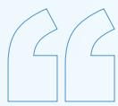

未来，我们的创新驱动目标为：

依托“巨晓林技能大师联创共建工作室”和“刘永平创新工作室”，加快群众性创新成果转化。

每一个系统上线，都是为了少一次隐患、多一分效率、省一点资源。创新落地的地方，就是价值生长的地方。

# 数说2025·创新驱动

研发投入

97.04 万元

研发人员

41人

授权专利

2件

有效专利总量

13件

软件著作权

5件

智能监测/预警/培训系统

已投用

整体网络改造

已完成

# 宁东铁路焕新除雪装备效能

宁东铁路机辆段检修车间党支部发挥“刘永平创新工作室”技术优势，聚焦除雪设备运维难题，通过技术创新与修旧利废，完成12台故障除雪设备修复。经系统检修调试，设备响应速度提升60%，操作失误率与启动成功率均优化80%。

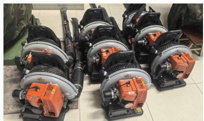

natural_image

Row of black and orange outdoor backpacks on tiled floor, no visible text or symbols

# 煤矸石资源化利用

案例

公司完成煤矸石用于铁路物流园基础的研发项目，并持续推进宁东地区煤矸石作为铁路路基填料的应用研究，以资源化利用技术助力公司绿色低碳高质量发展。

# 新型装备应用与BIM技术实践

案例

公司依托“巨晓林技能大师联创共建工作室”，积极推广新技术、新工艺、新装备。通过应用新型牵引变压器、组合电气开关等先进设备，大幅提升系统可靠性与经济性。公司运用BIM技术实现设备全生命周期信息化管理，自主研发大功率电电双源机车，破解非电气化区段牵引难题。

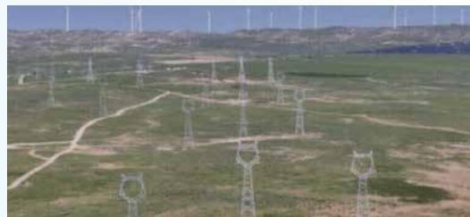

natural_image

Aerial view of a green field with multiple high-voltage transmission towers and wind turbines in the background (no visible text or symbols)

# 宁东铁路构建智慧铁路运营体系

案例

宁东铁路创新研发列车安全智能控制装置、行车安全预警系统、货运智能监测系统及远程智能黄油加注机等技术装备，全面提升技术装备水平与运输保障能力。同时，宁东铁路建成全国地方铁路首批“4G/5G+北斗应用”实验室，实现数据统一共享，构建智慧铁路运输体系。

# 宁东铁路两项创新成果斩获区级大奖

案例

宁东铁路研发的煤炭漏斗车底门连杆锁闭状态监测装置与机车车钩多功能安装器荣获宁夏能源化工冶金通信工会第三届职工技术创新成果奖。

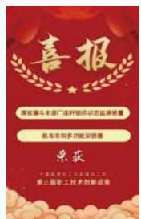

natural_image

Illustration of a golden trophy on a podium with city skyline silhouette in background (no text or symbols)

# 知识产权

创新需要被尊重，成果值得被看见。我们修订《专利和软件著作权管理办法》，提高授权专利奖励标准，激发全员创新热情，表达对创造者的敬意。

我们坚持 “有产出就有激励” 的原则，对获得授权的专利及登记的软件著作权给予一次性奖励。2025年，公司分两次对2020—2022年、2023—2024年期间授权的专利及登记的软件著作权进行奖励兑现。每一份授权证书背后，都是研发人员日复一日的坚持；每一笔奖励的落地，都是公司对创新的郑重回应。

在知识产权保护方面，我们严格落实保密制度，规范技术成果的申报、使用与流转流程，严防核心技术外泄。同时，注重知识产权与生产经营的有机融合，推动专利成果在铁路运维、设备改造、安全防控等场景中的实际应用。为专利而专利没有意义，让专利跑起来、用得上才是。

从制度保障到奖励激励，从严格保护到转化应用，我们正逐步构建“研发—保护—应用—再创新”的良性循环。2026年，我们将建立专利成果转化评估机制，每年筛选至少2项高价值专利推动现场应用。

创新的种子一旦落地，就会在制度的土壤里长成森林。

# 宁东铁路科技创新成果获国家软件著作权

案例

宁东铁路“伏恒创新工作室”研发的“KM70煤炭漏斗车底门连杆锁闭状态智能监测系统——地面读取装置监控软件V1.0”，获国家版权局计算机软件著作权登记证书，标志着公司在铁路货运装备智能化领域取得关键突破。

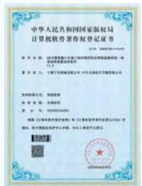

# 宁东铁路监测装置荣获实用新型专利

案例

宁东铁路研制的“煤炭漏斗车底门连杆锁闭状态监测装置”获得国家知识产权局颁发的“实用新型专利证书”。

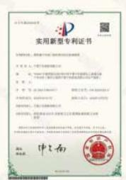

# 数说2025·知识产权

授权专利

2 件

有效专利总量

13件

软件著作权

5件

# 专利奖励兑现

2020—2024年两批次

# 专利成果应用

铁路运维、设备改造、安全防控

# ◇ 强化链条协同

供应链，不是一根“链”，而是一张“网”。我们高度重视供应链风险管理，保障供应链安全稳定运行。结合行业特性、区域环境和业务实际，在总结实践经验的基础上，建立健全内部管理制度，构建从管理架构、实施细则到操作流程的完整体系，明确职责分工，持续打造公平公正、透明高效、体系化、规范化的供应链管理模式。一环不稳，全网受累；一环有力，全网受益。

# 供应链安全

# | 治理

供应链安全，牵一发而动全身。我们制定《业务外包管理办法》《业务外包供应商考核管理办法（试行）》《供应商失信行为管理办法（试行）》《工程项目承包商安全管理办法》《失信供应商名单公告》等制度，持续完善供应商和外包管理体系，强化全流程风险防控和合规管理。规矩立好了，大家才好往前走。

# | 战略

采购不只是买东西，更是在选择与谁同行。我们将ESG理念融入采购全过程，遵循“安全、及时、绿色、经济”原则，构建从开发、准入、履约到退出的全流程合规管理体系，打造绿色、负责任的供应链生态。每一个合作伙伴，都是这条链上不可或缺的一环。

我们每年开展供应商风险识别与评估，将ESG风险纳入考量，重点识别道德廉洁、运营稳定、HSE等关键风险。进来就要守规矩。守规矩是起点，一起走得远才是目的。

我们建立常态化风险监控机制，对准入环节严格筛查，引入权威第三方工具监督供应商资质与合规状况。我们已连续两年获评Wind ESG评级A级。这份成绩单上，写着每一家合作伙伴的名字。

最好的合作关系，是共同的坚守，不是单向的要求。不是“你听我的”，而是“我们一起扛”——扛住风险，扛住责任，也扛住彼此的信任。底线面前，没有甲方乙方，只有一路同行的伙伴。

natural_image

Illustration of a business meeting with employees and staff at desks, no visible text or symbols

# | 影响、风险与机遇管理

供应链的风险，不只在于货物准不准时，更在于伙伴长不长久。我们注重供应商的多元化和长期合作，以降低供应链风险并确保产品质量和供应稳定。我们推行阳光采购机制，要求采购人员廉洁从业，为每一家供应商提供公平有序的竞争环境。关系硬不硬不算数，守规矩才是通行证。

# 机制类型

# 具体内容

# 供应商寻源

公司结合业务运营需求开展供应商寻源工作，通过需求分析明确寻源标准，对潜在供应商进行综合评定，重点审核经营资质、生产活动对环境的影响等方面内容。

# 供应商准入

公司围绕生产能力、质量管理、环境保护等维度开展供应商评审，通过资质审查全面核验供应商综合水平，确保其符合公司规范要求。

# 供应商评估

公司每年通过案头审核与现场评估相结合的方式，从质量管理、社会责任管理两方面对供应商开展绩效综合评价。

# 供应商分级管理

公司根据供应商评估结果实施分级管理，对评估中发现的问题，要求供应商制定整改方案并限期落实到位；若出现重大质量问题或同类问题反复发生，供应商须配合现场调查，分析原因并提交整改报告。

  
数说2025·供应链风险管理

<table><tr><td>指标</td><td>数据/状态</td></tr><tr><td>阳光采购机制</td><td>已推行</td></tr><tr><td>供应商多元化</td><td>注重</td></tr><tr><td>长期合作</td><td>注重</td></tr><tr><td>廉洁从业要求</td><td>全覆盖</td></tr></table>

# I指标与目标

2025年，公司对268家供应商开展绩效考评，其中工程类40家、服务类115家、物资类113家。95分以上215家，占全部供应商的80%。这份成绩单，属于每一家守规矩、重质量的合作伙伴。

# 数说2025·创新驱动

供应商总数

268 家

工程类

40家

服务类

115家

物资类

113家

95分以上

215家 (80%)

# 平等对待中小企业

合作的基础是平等，平等的底色是尊重。我们恪守商业道德，坚持依法合规经营，公平参与市场竞争，与商业伙伴及各类市场主体构建相互尊重、互利共赢的合作生态。大小我们不看，只看守不守规矩。

我们坚持诚信合规合作原则，严格开展商业伙伴尽职调查，全面审核资质条件与合规诚信表现，优先选择资质完备、信誉优良的合作方，并持续跟踪其资信状况动态变化。谁大谁小不算数，谁靠谱谁走得远。

合同面前，大小平等；规矩面前，一视同仁。我们公平公正对待所有供应商、服务商、承包商、客户及合作伙伴，遵循平等协商原则，不滥用市场优势地位，不以不正当方式侵害合作方合法权益。我们持续保持中小企业款项“零逾期”，严格按照合同约定支付期限足额支付。我们优化供应链金融服务，协助有融资需求的中小供应商对接低成本融资渠道。

我们坚守契约精神，重信用、守承诺，严格按照合同约定履行交付、付款等各项义务，杜绝违约行为，同时依法行使合同权利，督促商业伙伴共同履约。说到做到，是合作最基本的诚意。

对于合作过程中产生的交易纠纷，我们优先通过友好协商解决。如遇合作方违约或侵害公司权益等情形，及时收集保存相关证据，依法合规维护自身合法权益。

报告期内，公司不涉及诉讼仲裁等情况。零纠纷、零诉讼，就是对诚信最好的回应。

<table><tr><td>指标</td><td>单位</td><td>2025年</td></tr><tr><td>报告期末应付账款(含应付票据)余额</td><td>万元</td><td>52,410.58</td></tr><tr><td>报告期末应付账款(含应付票据)余额占总资产的比重</td><td>%</td><td>7.45</td></tr><tr><td>报告期末逾期未支付中小企业款项的金额</td><td>万元</td><td>0</td></tr><tr><td>报告期末逾期未支付款项金额</td><td>万元</td><td>0</td></tr></table>

# 数说2025·平等对待中小企业

诉讼仲裁案件

逾期未支付中小企业款项

商业纠纷

尽职调查覆盖率

100%

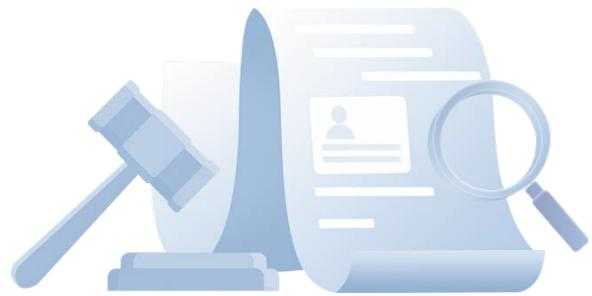

natural_image

Illustration of legal documents including a gavel, document, and magnifying glass (no text or symbols)

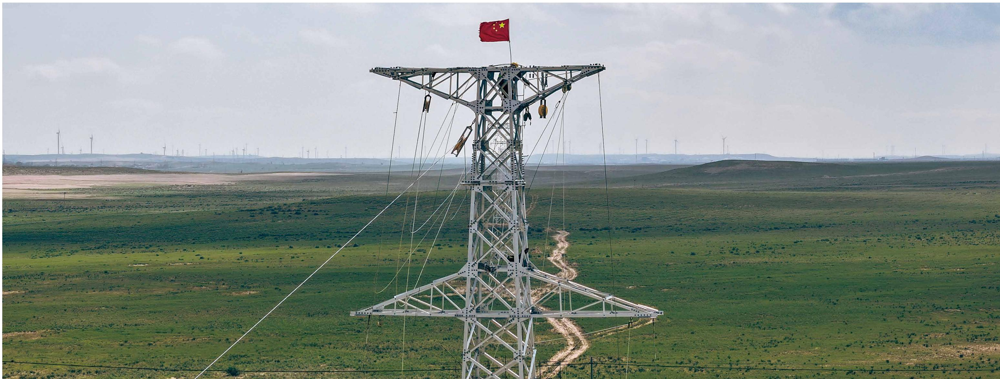

natural_image

Exterior view of a high-voltage transmission tower with Chinese flag flying atop, set against a green grassland and distant wind turbines (no signage or text visible)

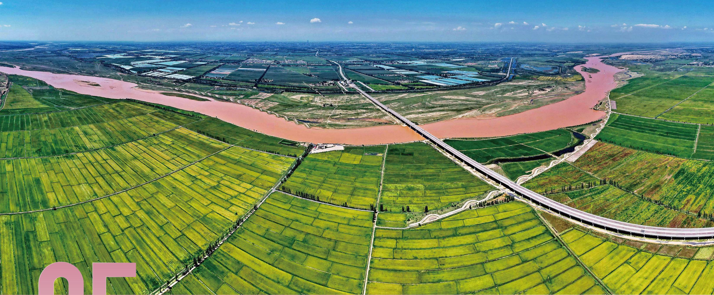

natural_image

Aerial view of a winding river cutting through agricultural fields with a highway bridge crossing it (no visible text or symbols)

# 05

# 筑暖于心， 守护幸福基石

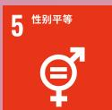

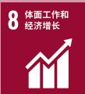

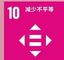

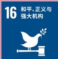

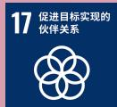

铁轨延伸之处，不只有货物与远方，还有人与人的温度。我们坚持以人为本，深化“两心工程”，让每一位奋斗者都能被看见、被尊重、被托举。

我们构建公平激励的薪酬体系，筑牢权益保障防线；搭建多元赋能平台，畅通职业发展通道。民主管理与人文关怀并重，让员工的尊严与成长同行。温暖，不在宏大的叙事里，在每一次薪酬到账的踏实、每一条晋升通道的敞亮。

我们推动社区共建从帮扶转向赋能，以产业协同、资源共享助力可持续发展。不是我们给社区什么，是我们和社区一起创造什么。共筑共生共荣的生态，让每一份努力都有回响，让每一个角落都有温度。

筑暖于心，让奋斗有枝可依，让幸福有处可寻。

# ◇ 保障员工权益

# 薪酬机制

薪酬是数字，更是尊重与回应。我们坚持依法用工规范，制定实施《薪酬管理办法》《工资总额管理办法》《全员绩效考核管理办法》等制度，秉持合法合规、价值导向、公平公正、赋能成长的薪酬理念，构建体系完善、流程规范、管控有序的薪酬激励管理体系，实现薪酬核算、绩效考评与发放的全流程闭环管理。

我们深化 “两心工程”，优化薪酬福利体系，建立 “基础工资+绩效工资+津贴补贴” 三维薪酬模式。基础工资依据岗位价值核定，绩效奖金与公司经营业绩、部门绩效及个人考评结果紧密挂钩，津贴补贴重点向艰苦岗位、高技能人才及核心骨干倾斜。让创造价值的人得到应有回报，让扛重担的人不被亏待。温暖，不在宏大的叙事里，在每一次薪酬到账的踏实中。

我们坚持依法合规用工，确保薪酬足额、按时发放，杜绝拖欠克扣行为，切实保障员工劳动报酬权益。在绩效管理方面，设立考核工作领导小组及办公室，建立规范的绩效反馈与申诉机制。及时向员工反馈考核结果，为存在异议的员工提供畅通的申诉渠道，由专门机构依规开展公正审查。每一份考核结果都经得起追问，每一条申诉都有回应。

让员工与企业共同成长，不是挂在嘴上的话，是落到每一次薪酬核算、每一次绩效沟通里的行动。

# 数说2025·薪酬机制

人均薪酬

21.55万元

薪酬核算闭环

100%

劳动合同签订率

100%

绩效申诉渠道

畅通

社会保险覆盖率

100%

# 福利保障

保障，不在纸上的条文里，在落到实处的安心中。我们严格遵守《中华人民共和国劳动法》《中华人民共和国社会保险法》等法律法规，制定《职工福利费管理办法》，依法全员足额缴纳“五险一金”，缴纳合规率与及时率均达100%。在此基础上，构建“基本+补充”多层次保障体系，增设企业年金与补充医疗保险，让员工看病有依靠，退休有底气。

我们持续优化“衣食住行医”全方位关怀体系。每年组织全员体检，设立大病医疗互助基金，不让一名员工因病因困掉队；升级劳动保护标准，完善宿舍配套，结合宁夏地域特色建设特色餐厅与健康食堂；年均发放节日福利190余万元，落实高温补贴等津贴。温暖，不必惊天动地，吃饭有热菜，生病有托底，过节有念想，就够了。

“五险一金”，缴纳合规率与及时率均达

100%

年均发放节日福利

190 余万元

尊重员工的休息权，就是尊重员工这个人。我们严格落实带薪年休假、婚假、产假及育儿假、陪护假等休假制度，为孕期及哺乳期职工提供便利。工时管理上，实行标准工时制与特殊岗位综合计算工时制相结合，严格审批加班流程，依法足额支付加班工资。

保障有力度，关怀有温度，奋斗者才能无后顾之忧。

  
数说2025·福利保障

<table><tr><td>指标</td><td>数据</td></tr><tr><td>“五险一金”缴纳合规率</td><td>100%</td></tr><tr><td>“五险一金”缴纳及时率</td><td>100%</td></tr><tr><td>节日福利年均发放</td><td>190余万元</td></tr><tr><td>全员体检</td><td>每年</td></tr><tr><td>大病医疗互助基金</td><td>有</td></tr><tr><td>带薪年休假</td><td>落实</td></tr><tr><td>加班工资</td><td>足额支付</td></tr></table>

# 公司各级工会开展健步走活动

为深化“健康西创”工程，丰富职工文体生活，公司各级工会组织开展了健步走迎新年活动，用坚实的脚步共享自然之美、运动之美、健康之美，感受新年的喜庆氛围。

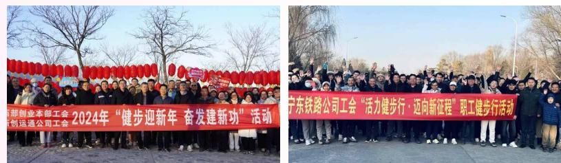

案例

# 公司举办迎新春职工文艺汇演

案例

1月24日，公司举办“奋楫扬帆正当时”2025年迎新春职工文艺汇演。公司领导班子成员与广大干部职工共同欣赏文艺节目，为新篇章凝聚奋进力量。

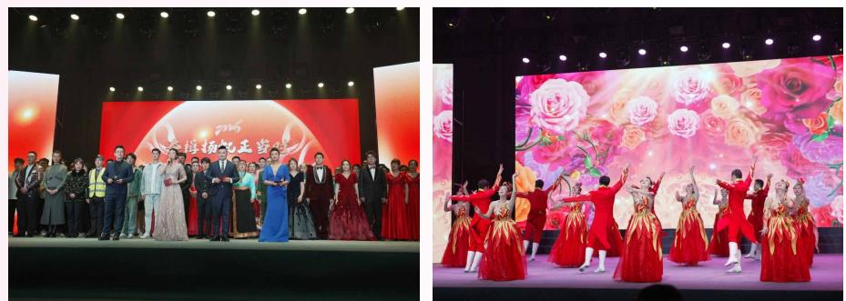

# 公司工会举办读书分享会

案例

在第30个世界读书日来临之际，公司工会以“书香氤氲 学思不止”为主题，举办2025读书分享会。读书会通过名家书籍分享、职工好书分享、文学知识抢答等环节，带领在场职工在书香中探寻文化根脉，于思辨间凝聚奋进力量。

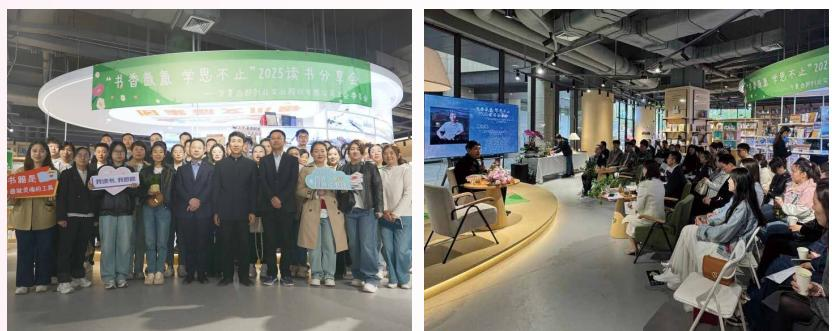

# 公司勇夺多项羽乒比赛荣誉

案例

在中华全国总工会成立100周年之际，公司选派20人组成两支代表队，参加2025年“安康杯”职工羽毛球比赛和“铁路装备杯”友谊邀请赛，斩获多项荣誉，充分彰显了企业文化软实力。

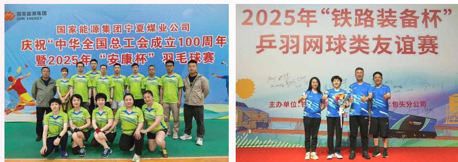

# 公司工会举办健康知识讲座

案例

9月28日，公司工会为深入践行公司“两心工程”，普及健康知识、倡导健康的工作生活理念，举办“科学减重·健康同行”健康知识讲座，传递公司对职工身心健康的暖心关怀，为公司高质量发展注入健康动能。

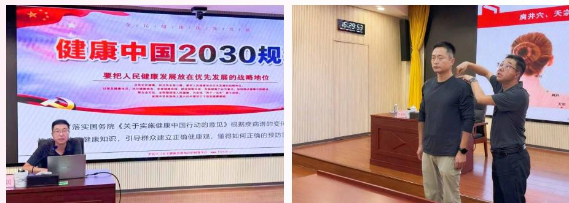

# 宁东铁路开展迎新趣味运动会

案例

为迎接新年的到来，宁东铁路电气化建设项目部和参建单位开展联创共建活动，共同举办“和谐奋进迎新春 奋楫笃行共建设”迎新趣味运动会。

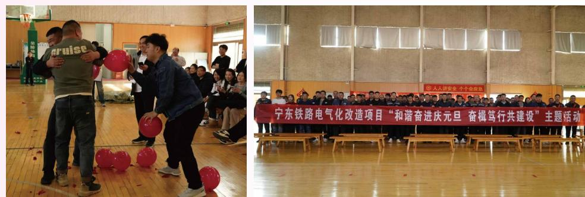

# 宁东铁路工会举办职工体育比赛

案例

为庆祝中华全国总工会成立100周年，展现职工昂扬向上精神风貌，凝聚职工立足岗位、建功立业的广泛共识和强大合力，宁东铁路工会举办“三人制”篮球赛和羽毛球赛。

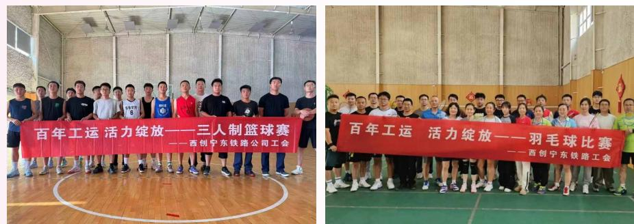

# 困难帮扶

困难帮扶，帮的是急难，扶的是人心。我们持续深耕“两心工程”，聚焦困难职工、伤病住院、家庭变故等急难愁盼问题，推动为职工办实事常态化、长效化。不让一个人掉队，不让一个家庭无助。

我们建立健全困难职工动态档案，定期摸排、及时更新，确保帮扶不漏一人。针对结婚生育、伤病住院、家庭变故、亲人去世等情形，第一时间开展慰问帮扶，送去组织的温暖与同事的关怀。2025年，帮扶困难职工27人（其中自治区建档困难职工4人），发放帮扶金13.2万元。数字背后，是27个家庭的燃眉之急得到缓解，是13.2万元沉甸甸的心意。

除了物质帮扶，我们同样注重精神慰藉。对长期患病或遭遇重大变故的职工，安排专人定期回访，提供心理疏导与情感支持。同时，设立职工互助基金，鼓励全员参与、互帮互助，让“有困难大家帮”成为企业文化的底色。

帮扶，不是一次性的动作，是一份长久的承诺。一个企业的温度，不看顺境时走得多快，看困境中对每一个人的托举有多稳。2026年，我们将继续深化“两心工程”，扩大帮扶覆盖范围，将因突发重大疾病、意外事故致困的职工纳入即时帮扶通道，24小时内响应；建立困难职工“一对一”动态跟踪机制，变“被动申请”为“主动发现”。

筑暖于心，让每一份苦难都被看见，让每一份坚持都有回响。

# 数说2025·困难帮扶

帮扶困难职工

27人

自治区建档困难职工

4人

发放帮扶金

13.2万元

# 困难职工动态档案

全覆盖

# 职工互助基金

有

# 公司党委、工会寒冬慰问困难职工

案例

2025年1月3日，公司党委、工会走访慰问困难职工，了解其工作生活情况，送上慰问金，勉励坚定信心，传递温暖与关爱。

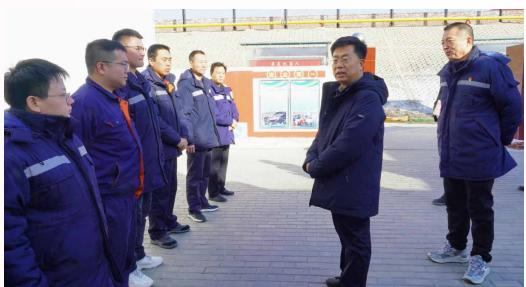

natural_image

Group of men in work uniforms standing outdoors, one man speaking while others listen (no visible text or symbols)

# 民主管理

民主，不在墙上的制度里，而在员工手里实实在在的权利中。我们健全职代会、厂务公开等多元化民主管理机制，切实保障员工参与企业决策、管理和监督的权利。

我们制定实施《第二届职工代表大会换届选举方案》，严格履行选举程序，选举产生140名职工代表，确保一线员工、技术骨干和管理人员合理比例。顺利召开职工代表大会暨2025年工作会议，同步选举产生第二届经费审查委员会。每一次投票、每一次表决，都是员工声音被听见的证明。

在日常沟通方面，我们搭建领导信箱、员工座谈会、意见箱等多种渠道，让民意有处说、建议有人听、诉求有回应。2025年，共征集“金点子”47条，收集意见建议56条，推动5条“金点子”转化为实际工作举措。提了不算完，件件有落实、事事有回音。从一条建议到一项改变，民主的价值就在于此。

我们相信，最好的管理，不是管住人，是凝聚人。让每一位员工都成为企业发展的参与者、见证者和受益者，民主管理才有生命力。筑暖于心，从尊重每一份声音开始。

# 数说2025·民主管理

职工代表

140人

“金点子”征集

47条

意见建议收集

56条

转化为实际举措

5条

# 民主沟通渠道

领导信箱、座谈会、意见箱

# 民主管理深化目标

2026年，我们将进一步畅通员工诉求表达渠道，确保员工建议回复率达到100%，合理化建议采纳转化率不低于15%。同时，开展至少2场职工代表巡视活动，监督职代会提案落实情况。

# 西部创业召开职工代表大会暨2025年工作会议

案例

2025年1月24日，西部创业公司召开职工代表大会暨2025年工作会议。会议以习近平新时代中国特色社会主义思想为指导，深入贯彻党的二十大、二十届三中全会及中央经济工作会议精神，精准研判发展形势。

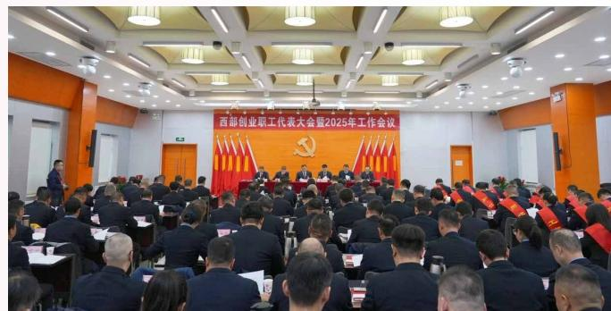

text_image

西部创业职工代表大会暨2025年工作会议

# ◇ 守护健康安全

# 治理

安全是回家的路，健康是奋斗的底。我们始终将员工生命安全与职业健康放在首位，制定实施《安全生产工作规定》《高风险作业管理办法》等18项安全规章制度，持续夯实安全管理根基。

我们严格推行 “三现管理” （现场、现实、现在）工作法，提升现场管控效能。逐级签订安全生产 “两个清单” 与消防安全承诺书，层层压实主体责任，构建上下联动、齐抓共管的责任体系。安全，不是一个人的事，是每一个岗位、每一道工序的共同坚守。

制度，不是摆设，是每一条生命背后的护栏。我们构建全方位、多层次的安全生产治理体系，将安全生产纳入“第一要务、第一议题、第一课”，确保安全工作在决策层面优先。结合实际制定年度安全环保工作目标与要点，细化重点任务清单，明确时限与责任，让每一项部署都能落地生根。

宁东铁路制定实施《职业健康管理制度》等制度，持续完善职业健康专业化管理，积极开展职业病防治宣传教育与专项培训。让员工懂得保护自己，是企业最实在的关怀。从制度到意识，从防护到习惯，守护健康安全，就是守护每一个家庭的完整。

数说2025·守护健康安全（治理）

<table><tr><td>指标</td><td>数据</td></tr><tr><td>安全规章制度</td><td>18项</td></tr><tr><td>“三现管理”工作法</td><td>已推行</td></tr><tr><td>职业病防治宣教</td><td>常态化</td></tr><tr><td>职业健康专项培训</td><td>开展</td></tr></table>

# 战略

安全不是挂在墙上的标语，而是每一天出发前的叮嘱。我们全面落实习近平总书记关于安全生产重要论述和指示批示精神，推动重要指示批示精神进车间、进班组。始终坚守“人民至上、生命至上”的安全发展理念，牢记“三个不能过高估计”的警示要求，把安全当作企业的生命线。

我们相信：安全是最大的政治、企业最大的效益、职工最大的福利。确立从“零”开始、向“零”奋斗的长远愿景，将安全生产融入企业战略顶层设计。为安全而安全没有意义，为每一个平安回家的身影才是。

我们扎实推进安全生产治本攻坚三年行动和安全管理提升行动，全面实施安全生产管理体系。深入开展“大反思、大讨论、大扫除”专项整治活动，从思想根源上消除隐患，履行“三管三必须”责任，有效防控重大安全风险，坚决整治重大事故隐患，不断提升本质安全水平。安全，等事故来了再补救就晚了。把风险堵在事故发生之前。

数说2025·守护健康安全（战略）

<table><tr><td>指标</td><td>数据</td></tr><tr><td>安全生产治本攻坚三年行动</td><td>推进</td></tr><tr><td>“大反思、大讨论、大扫除”专项整治</td><td>开展</td></tr><tr><td>“三管三必须”责任</td><td>落实</td></tr><tr><td>重大安全风险</td><td>有效防控</td></tr><tr><td>重大事故隐患</td><td>坚决整治</td></tr></table>

# 影响、风险与机遇管理

风险，从不是突然降临，是被忽视的细节一天天积累出来的。我们定期开展工作场所职业病危害因素检测，切实保障员工职业健康安全。坚持安全第一、预防为主，遵循“变化就是风险，风险就要主动管控”的原则，运用预警、应变、评价三位一体安全管理方法，精准研判风险、主动超前防范。前移一道关口，就少一分危险；多一次排查，就多一分安心。

数说2025·守护健康安全（战略）

<table><tr><td>指标</td><td>数据</td></tr><tr><td>职业病危害因素检测</td><td>定期开展</td></tr><tr><td>工作场所检测</td><td>全覆盖</td></tr><tr><td>预警、应变、评价三位一体</td><td>已运用</td></tr><tr><td>风险主动管控</td><td>落实</td></tr><tr><td>关口前移</td><td>推进</td></tr><tr><td>隐患排查</td><td>常态化</td></tr></table>

# 检测范围

煤炭装车站、煤炭卸车站、危化品运输专用线、古窑子基地、其他车站；  
煤炭装及卸车作业、油品、乙酸乙烯酯及铝锭装车作业、列检作业、接送车作业、机车运行作业等。

# 职业病危害因素检测

噪声、电焊弧光、手传振动、工频电场、高温、煤尘、矽尘、其他粉尘、砂轮磨尘、电焊烟尘、棉尘、一氧化碳、氮氧化物（一氧化氮和二氧化氮）、二氧化硫、锰及其无机化合物（按MnO2计）、臭氧、苯、甲苯、二甲苯（全部异构体）、硫化氢、氯、正戊烷、正己烷、正庚烷、正辛烷、正壬烷；  
除古窑子基地受机车鸣笛、机械设备运行、捣固作业等影响，噪声强度超标外，其他均检测合格。

# 建议

按照国家卫生健康委职业健康司通知要求，进行职业病危害项目的在线申报。  
根据劳动者实际接触的各职业病危害因素的接触水平，选择型号参数适宜的防噪耳塞，供现场劳动者佩戴。  
加强职业卫生宣传教育，加强对作业员工职业病预防控制知识的培训，加强对个人劳动防护用品相关知识的培训，使劳动者更能充分地认识到正确合理佩戴个人防护用品的重要性，有效地预防职业病危害因素对人体健康造成的影响。

# 指标与目标

数字，不是终点，是对每一个生命的承诺。我们锚定“四杜绝、四控制、一力争”核心目标，全面推进安全生产管理体系与标准化体系建设，力争达到二级水平，持续提升本质安全治理能力。报告期内，员工职业病新发率控制在0.1‰以内，职业禁忌症岗位调离率达100%。

每一个 “0.1‰” 的背后，是无数次检测、防护与叮嘱；每一个 “100%” 的调离率，都是对员工健康的主动守护。指标达标不是终点，零伤害、零职业病才是我们真正想看到的答案。筑安于防，护的是人，守的是心。

# I 安全生产目标(2026年)

安全实现“四杜绝、四控制、一力争”。

四杜绝

\- 杜绝从业人员责任重伤及以上人身伤害事故；杜绝一般C类及以上非人身伤害事故；杜绝责任火灾、爆炸事故；杜绝责任食品安全事故。

四控制

\- 责任铁路交通相撞事故控制在1件以内；责任铁路交通一般D类事故控制在3件以内；行车设备故障率控制在1.3件/亿吨公里；路外因素非正常停车率控制在0.5件/亿吨公里。

一力争

\- 从业人员力争“零伤害”。

职业病危害因素检测点覆盖率

100%

隐患整改率

100%

全员安全培训覆盖率

100%

职业禁忌症岗位调离率

100%

  
数说2025·守护健康安全

<table><tr><td>指标</td><td>数据</td></tr><tr><td>职业病危害因素检测</td><td>定期开展</td></tr><tr><td>工作场所检测</td><td>全覆盖</td></tr><tr><td>预警、应变、评价三位一体</td><td>已运用</td></tr><tr><td>风险主动管控</td><td>落实</td></tr><tr><td>关口前移</td><td>推进</td></tr><tr><td>隐患排查</td><td>常态化</td></tr><tr><td>安全生产投入</td><td>9,384.88万元</td></tr><tr><td>安全培训参与人次</td><td>9,182人次</td></tr><tr><td>员工职业病新发率</td><td>&lt;0.1‰</td></tr><tr><td>职业禁忌症岗位调离率</td><td>100%</td></tr><tr><td>生产安全事故数量</td><td>0</td></tr><tr><td>“四杜绝、四控制、一力争”</td><td>锚定</td></tr></table>

# 宁东铁路举办职业健康专题讲座

案例

2025年5月，宁东铁路举办职业健康专题讲座，特邀专业讲师授课，共90余名职工参与。讲座围绕常见职业病危害与防护、健康生活方式及《职业病防治法》展开讲解，强化员工健康防护意识与技能。

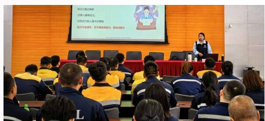

text_image

我力是建立的
我力是独立的。
我力是建立的，我力是独立的。
我力是建立的，我力是独立的。
我力是独立的，我力是独立的。

# 宁东铁路开展安全应急教育活动

案例

2025年6月，宁东铁路紧扣“人人讲安全、个个会应急—查找身边安全隐患”主题，开展多样化应急演练。通过实战化场景检验预案实效，强化员工安全意识与应急处置能力，为安全生产筑牢防线。包含车辆脱轨事故应急救援演练、古窑子职工食堂油锅起火应急疏散演练。

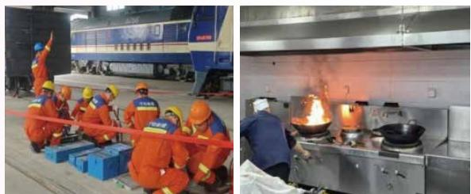

natural_image

Two scenes: left shows workers in orange uniforms performing maintenance on a train; right shows a person cooking with steam from a wok inside a factory (no visible text or symbols)

# 宁东铁路开展消防安全主题活动

案例

2025年11月，宁东铁路车务段以“全民消防，生命至上一安全用火用电”为主题组织开展形式多样的消防宣传教育与实战演练，切实提升职工消防安全意识和应急处置能力。

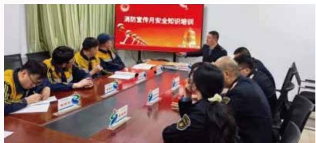

text_image

消防宣传月安全知识培训

# 宁东铁路电气化安全培训全覆盖

案例

2025年12月，宁东铁路车务段组织开展电气化铁路人身安全专题培训，重点解读电气化铁路接触网结构及其高压危险性，明确要求所有人员、机具、货物必须严格保持安全距离，严禁擅自攀爬、触碰接触网或在无绝缘保护下近距离作业，引导参训人员牢固树立“高压危险、严禁靠近”的底线意识。

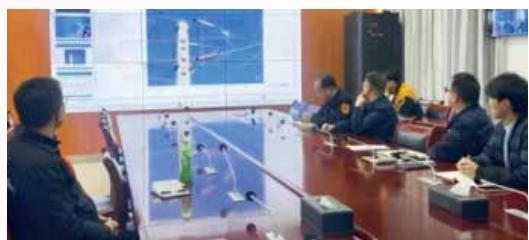

natural_image

Group of people seated at a conference table in a meeting room, with a large screen displaying a satellite or rocket on the screen (no visible text or symbols)

# 成就员工价值

# 员工招聘

招聘不是填一个岗位，而是遇见一个同行的人。我们立足电气化、数智化转型，完成关键岗位招聘，离职率控制在合理水平。坚持“公开、公平、公正”原则，构建校园、社会、内部多元招聘体系。

- 校园招聘：聚焦交通运输、物流管理等专业，引育青年人才。  
- 社会招聘：定向引进铁路运维、智能调度等领域成熟骨干。  
- 内部招聘：畅通晋升渠道，让努力的人有机会向上走。  
- 灵活用工规范管理，保障每一位劳动者的权益。不是把人当资源，是让每个人在合适的位置上发光。

# 数说2025·成就员工价值（招聘）

员工总数

1,160人

新入职员工

9人

校园招聘

9人

社会招聘

0人

劳动合同签订率

100%

离职率

1.55%

注:离职率系正常退休所致。

# 平等雇佣

平等不是口号，而是每一个岗位都向对的人敞开。平等，是每一个岗位都向对的人敞开。我们严格遵守《妇女权益保障法》《残疾人保障法》《未成年人保护法》等法规，制定实施《员工管理办法》《劳动合同》《集体合同》，坚持公平就业，严禁任何形式的歧视、强迫劳动及使用童工。

- 女性员工：落实健康体检、哺乳假、节日关怀，让“半边天”在职场同样晴朗。  
- 残疾员工：积极吸纳就业，配备适配设施，让每一份能力都有安放的位置。  
- 少数民族：尊重风俗习惯，从食堂到节假日安排，点滴之间见尊重。

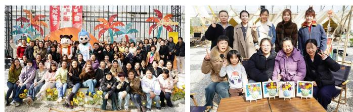  
^^妇女节活动

用工管理上，严格审核年龄信息，从源头杜绝童工，定期开展用工合规自查，畅通投诉反馈渠道。报告期内，无童工、无强制劳动、无劳工纠纷。零，是每一道程序、每一份坚守的结果。

平等雇佣，从尊重开始，以同行延续。

# 数说2025·成就员工价值（招聘）

少数民族员工

150人

残疾员工

4人

女性员工

182人

劳动合同签订率

100%

社会保险覆盖率

100%

雇佣童工事件

0起

强制劳动事件

0起

劳工纠纷事件

0起

用工合规自查

定期开展

投诉反馈渠道

畅通

# 公司工会举办女职工心理减压专场讲座

案例

2025年7月7日，公司工会举办“情系女职工·凝聚‘她’力量”心理减压专场讲座，深入实施女职工关爱行动，以更精准、更暖心的服务举措为公司高质量发展注入强劲的“心”动能。

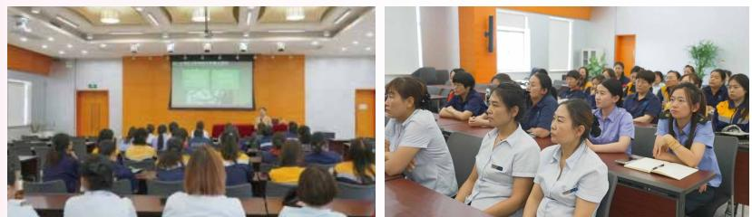

# 发展培训

人才是第一资源，培养是最长远的投资。我们聚焦铁路运维、智能调度、科技创新等领域，定向培养紧缺人才。制定《员工培训管理办法》及年度计划，实行组织人事部统筹、业务部门协同的管理机制。

课程体系遵循 “分层分类、贴合需求” 原则，涵盖经营管理、专业技术、岗位技能、基础通用四大板块。依托技能大师工作室，推动技术创新与人才培养深度融合。2025年，聚焦电气化转型，采用 “理论筑基+实作淬炼” 双轨教学模式，组织骨干赴铁路局开展 “沉浸式” 现场培训。从课堂到现场，每一步都算数。

青蓝相继，薪火相传。通过“导师带徒”“岗位轮岗”“专项培训”等举措，助力员工成长。举办拜师仪式，让骨干与专家结为师徒；建立跨部门、跨岗位人才交流机制，实现员工成长与公司发展同频共振。

2025年，52人通过职业技能等级认定，20人通过中初级职称评审；组织29人参加考评人员培训，完成3期培养；技能竞赛覆盖车务、机务、工务、电务等9大专业。数字的背后，是每一个渴望成长的个体，也是企业愿意托举的诚意。

# 培训类别

# 培训对象

# 培训内容

经营管理类

管理序列员工

聚焦领导力提升、任职资格建设及合规管理等。

专业技术类

专业序列员工

重点围绕铁路电气化、智能调度、物流信息化及安全生产等主业领域。

岗位技能类

一线员工

开展技能等级提升培训、实操演练等，针对铁路运维、物流仓储等具体岗位。

基础通用类

全体员工

包括新员工入职培训、职业素养提升等通用性课程。

# 数说2025·成就员工价值（发展培训）

员工培训投入

220.71万元

培训场次

130场

培训参与人次

44,024人次

培训覆盖率

100%

职业技能等级认定通过

52人

中初级职称评审通过

20人

考评人员培训

29人

考评人员培养期数

3期

技能竞赛覆盖专业

9 大专业

# | 人才发展未来目标

2026年：员工培训总投入不低于250万元，人均培训时长不低于160小时；新增高级工及以上技能人才不少于30人。

  
数说2025·守护健康安全（战略）

<table><tr><td>目标类别</td><td>具体指标</td><td>2026年目标</td></tr><tr><td>投入</td><td>员工培训总投入</td><td>≥250万元</td></tr><tr><td>时长</td><td>人均培训时长</td><td>≥160小时</td></tr><tr><td>技能</td><td>新增高级工及以上技能人才</td><td>≥30人</td></tr><tr><td>职称</td><td>新增中初级职称通过人数</td><td>≥25人</td></tr><tr><td>竞赛</td><td>技能竞赛覆盖专业</td><td>9大专业</td></tr></table>

# 宁东铁路开展“入职第一课 助力‘萌新’启航”主题培训

案例

宁东铁路组织开展2025年新员工“走进企业”模块培训，帮助9名新入职员工增强对公司的认同感与归属感，坚定了岗位建功、实干担当的信念。

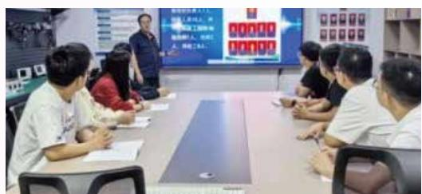

text_image

Meeting room scene with participants seated around a table, one person presenting in front of a large screen displaying '0000' and Chinese text.

# 晋升机制

晋升不是“熬年头”，是让每一份能力找到坐标。

我们构建长期、阶段与年度相衔接的人才管理体系，打造经营管理、专业技术、高技能三支核心队伍。制定《三支队伍建设三年行动计划》《职业发展管理办法》《职位职级核定方案》等制度，从顶层设计上为人才梯队建设确立方向。

薪酬与职级挂钩。建立动态宽带薪酬体系，薪酬向绩优人员倾斜。总部设13级39档，分管理类（M）、专业技术类（T）、技能类（S），三类互通。M/T类设1-16级，S类设1-13级。这不是一张薪酬表，而是一张成长地图——“我在哪里”“能往哪里去”。

晋升通道双向贯通。按照“横向分序列、纵向定职级”思路，实现管理岗与专业岗互通，打破职业天花板。管理、技术、技能三条跑道平行互通，每个人都有向上走的通道。

干部选拔严格规范。坚持“德才兼备、以德为先、实绩导向”，涵盖民主推荐、业绩考评、专项考察、集体研究等程序，全程留痕。选对人、用好人，就是对企业未来最大的负责。

2026年，我们将：完成新一轮职位职级核定，确保薪酬与职级挂钩机制的公平性和竞争力；打通跨序列晋升通道，实现管理、技术、技能三条跑道的高效互通，全年跨序列流动不少于10人。

  
数说2025·成就员工价值（晋升机制）

<table><tr><td>指标</td><td>数据</td></tr><tr><td>总部薪酬等级</td><td>13级39档</td></tr><tr><td>管理类(M)职级</td><td>1-16级</td></tr><tr><td>专业技术类(T)职级</td><td>1-16级</td></tr><tr><td>技能类(S)职级</td><td>1-13级</td></tr><tr><td>晋升通道</td><td>三条平行互通</td></tr><tr><td>干部选拔程序</td><td>民主推荐、业绩考评、专项考察、集体研究</td></tr></table>

# ◇ 履行企业责任

责任不是负担，是能力之上的选择。企业走得越远，肩上担子越重。从社区共建到乡村振兴，从应急保障到公益慈善——每一步都在回答：我们能给这片土地留下什么？

不是锦上添花，是雪中送炭；不是一时热心，是长久陪伴。

# 社会公益

公益不是做给别人看的，是发自内心想为这个世界做点什么。我们将公益融入企业发展，关爱困难群体，支持环保、教育、文化、医疗等公共事业。

2025年，累计开展志愿活动7次。让雷锋精神不只留在三月，而是融入日常。弯腰捡垃圾、走进敬老院、送去米面油——每一次行动都在回答：企业存在的意义，除了利润，还能创造什么？

2026年，我们将：组织开展志愿活动不少于8次，内容覆盖环保、敬老、助学、无偿献血等领域；建立志愿服务积分制度，对年度服务时长前10%的员工给予表彰；探索与专业公益机构合作，推动志愿服务从“自发”向“专业”升级。

公益的力量，不在金额大小，在真诚与持续。7次活动，是起点，不是终点。

  
数说2025·履行企业责任（社会公益）

<table><tr><td>指标</td><td>数据</td></tr><tr><td>志愿活动次数</td><td>7次</td></tr><tr><td>志愿活动内容</td><td>环保、敬老、扶贫等</td></tr><tr><td>雷锋精神践行</td><td>融入日常</td></tr></table>

# 公司工会组织“为爱挽袖递温暖”公益献血活动

案例

2025年2月26日，公司向全体职工发出“传承雷锋精神·汇聚热血力量”无偿献血号召，本次活动共计39名职工参与，累计献血量达14,600毫升，用热血为生命续航。

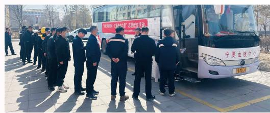

text_image

宁夏血液中心
120101

# 公司团委组织开展春季环境卫生整治志愿服务活动

案例

2025年4月7日，公司团委组织团员青年和志愿者，在古窑子生产基地开展春季环境卫生整治活动，通过清垃圾、清淤泥、清死角、清杂物“四清”行动，打造舒适整洁的人居环境，营造人人参与的浓厚氛围。

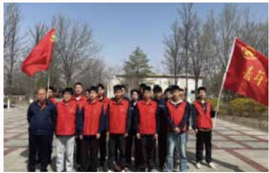

natural_image

Group photo of students in red vests holding red flags outdoors, with trees and a building in the background (no visible text or symbols)

# 宁东铁路组织开展义务植树活动

案例

2025年5月，宁东铁路电气化建设项目部党支部携手参建单位党支部40余名党员干部，开展以“党建引领 植树添绿 携手共绘和美家园”为主题的义务植树活动，以实际行动为和美家园建设注入“红色动能”。

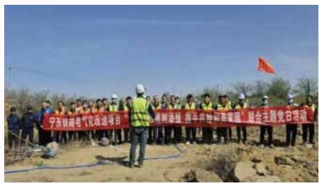

text_image

宁东铁路电气化改造项目
“宁东铁路”联合主题党白活动

# 能源保供

保供重在行动。每一吨煤按时装车，每一列车准时抵达，就是对保供最大的诠释。

我们紧扣“提运力、增运量、防风险、保安全、促发展”主线，精准掌握货源与装车计划，确保日计划高效兑现。动态优化运输组织，高效衔接“卸、运、装”全流程，打通堵点，巩固外煤进宁保障能力。

每一列煤炭的背后，是千家万户的灯火、工厂机器的轰鸣。我们制定实施《“提质增效百日攻坚”实施方案》，严守“五杜绝、五控制、一力争”安全目标，聚焦“迎峰度夏”“迎峰度冬”重点任务，全力提升运输效率。做好汛期、雨雪等恶劣天气防控，加大行车安全管控。

2026年，我们将深化与国铁、中铁集装箱等单位的战略合作，持续巩固外煤进宁保障能力，以高效运输全力守护万家灯火。我们做的不是运输，是温暖和动力的接力。

<table><tr><td>目标类别</td><td>具体指标</td><td>目标值</td></tr><tr><td>运量</td><td>全年铁路货运量</td><td>稳中有升</td></tr><tr><td>效率</td><td>“疆煤进宁”集装箱班列周转效率</td><td>提升10%</td></tr><tr><td>安全</td><td>“五杜绝、五控制、一力争”安全目标</td><td>全面达成</td></tr><tr><td>应急</td><td>迎峰度夏、迎峰度冬保供预案</td><td>100%落实</td></tr></table>

  
数说2025·履行企业责任（能源保供）

<table><tr><td>指标</td><td>数据</td></tr><tr><td>保供主线</td><td>提运力、增运量、防风险、保安全、促发展</td></tr><tr><td>安全目标</td><td>五杜绝、五控制、一力争</td></tr><tr><td>重点任务</td><td>迎峰度夏、迎峰度冬</td></tr><tr><td>恶劣天气防控</td><td>汛期、雨雪</td></tr><tr><td>外煤进宁</td><td>保障能力持续巩固</td></tr></table>

# 宁东铁路春节煤炭运输保供

案例

2025年春节期间，宁东铁路一线职工坚守岗位，全力保障能源物资运输畅通，每天60多对列车载重奔驰、穿梭于黄河“几字弯”，支撑起能源保供“生命线”，保障春节期间煤炭运输工作。

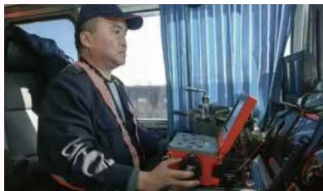

natural_image

Man operating a vehicle control panel inside a vehicle cabin, with curtains and a cityscape visible in the background (no text or symbols)

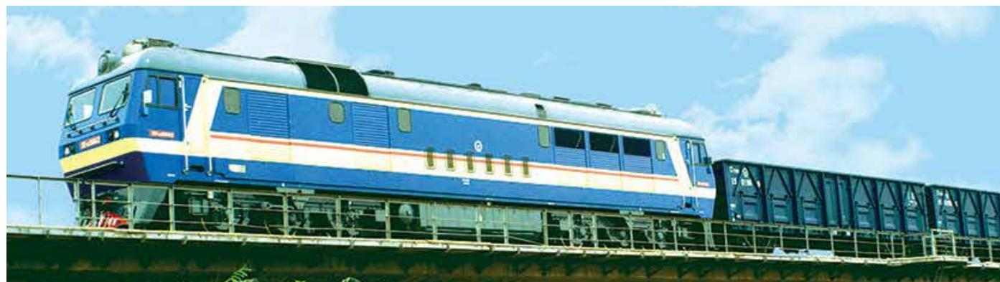

natural_image

Blue and white locomotive pulling freight cars on a rail bridge under a partly cloudy sky (no visible text or symbols)

# 宁东铁路组合战术助力能源保供

案例

2025年11月，面对寒潮与电厂储煤压力，宁东铁路迅速启动冬季保供机制。通过科学调配运力、优化行车组织，日均装车量稳中有升，以高效运输全力保障区域能源供应安全。

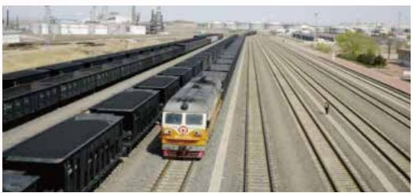

natural_image

Yellow locomotive pulling freight train cars on parallel tracks in an industrial yard (no visible text or signage)

# 西创运通循环班列驰援“疆煤进宁”

案例

西创运通公司深化与中铁集装箱兰州分公司合作，开通新疆红沙泉至宁夏宁东集装箱循环班列。通过优化调度实现常态化运行，累计开行145列、运输47万吨，有效降低综合物流成本，提升区域能源保供能力。

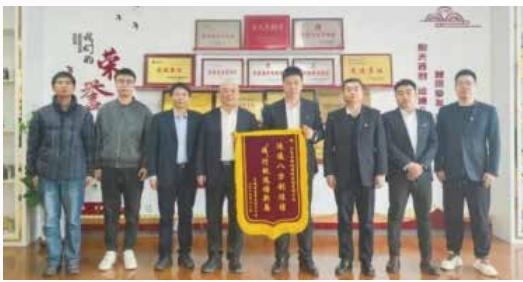

text_image

Group photo of officials holding a red banner with Chinese text, standing in front of framed certificates and banners.

# 乡村振兴

振兴不是单向给予，是双向奔赴。我们以党建引领、产业帮扶、人才支持多维发力，将制度优势转化为乡村发展的内生动力。

选派9名驻村队员扎根三个帮扶村：滨河家园三村投入5万元建电脑培训室；红塔村投入15万元购置打捆机，壮大集体经济；团结村投入10万元建“积分超市”，培育文明新风。三个村2213户全覆盖走访，精准落实“一户一方案”，再投30万元专项资金，让帮扶既有经济厚度，更有精神温度。

驻村工作队联动社会资源：发放慰问金4万余元，惠及近500人；线上帮销枸杞、胡麻油；联合企业开展“情暖夕阳”慰问120人次。一桩桩、一件件，都是国企人脚沾泥土、心贴百姓的见证。

“党建联建聚合力”案例入选“2025年上市公司可持续发展优秀实践案例”。依托“三联建、三提升”模式，走出了一条党建引领、产业带动、文化赋能的振兴路。

2026年，我们将继续派驻3支工作队，投入专项资金不少于30万元，重点推动从“输血”向“造血”转变。支持红塔村打捆机项目实现市场化运营，帮助团结村“积分超市”模式在周边推广，支持滨河家园三村电商培训中心投入运营，建立“消费帮扶”长效机制，通过公司食堂采购、员工福利等方式帮扶村农产品外购外销。

脚下沾了多少泥土，心中就装了多少真情——这是国企写给大地的答卷。

# 数说2025·履行企业责任（乡村振兴）

驻村队员

9人

帮扶村数

3↑

滨河家园三村投入

5万元

红塔村投入

15万元

团结村投入

10万元

专项资金再投入

30万元

农户全覆盖走访

2,213户

慰问帮扶资金

4 万余元

惠及群众

9,166

高龄老人慰问

120人次

# 公司驻村帮扶工作获锦旗致谢

公司主动承担自治区A类村帮扶任务，帮扶成效显著，获当地政府充分肯定与群众广泛好评。2025年6月5日，银川市兴庆区月牙湖乡滨河家园三村党支部书记代表村支两委及村民，向公司赠送“倾心帮扶办实事 乡村振兴写新篇”锦旗，感谢公司及驻村工作队多年来的驻村帮扶工作。

案例

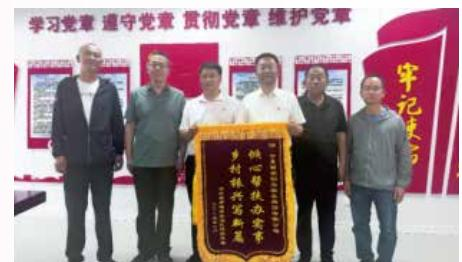

text_image

学习党章 遵守党章 贯彻党章 维护党章
牢记史
同心帮扶办党章
乡村群众听党话

# 新一批工作队奔赴驻村，接续推进乡村振兴工作

2025年7月底，公司完成第五、六轮驻村工作队交接。9名新队员奔赴3个帮扶村，其中3名第一书记经验丰富，6名队员结构合理，接续推进乡村振兴。

案例

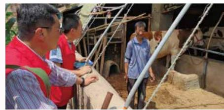

natural_image

Group of people inspecting livestock in a fenced area (no visible text or symbols)

# 公司入选“2025年上市公司可持续发展优秀实践案例”

案例

2025年11月18日，公司凭借“党建联建聚合力共谋乡村促振兴”案例，入选中国上市公司协会“2025年上市公司可持续发展优秀实践案例”。这是继2024年荣获“上市公司乡村振兴最佳实践案例”后，公司在ESG领域再获权威认可。

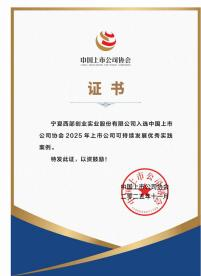

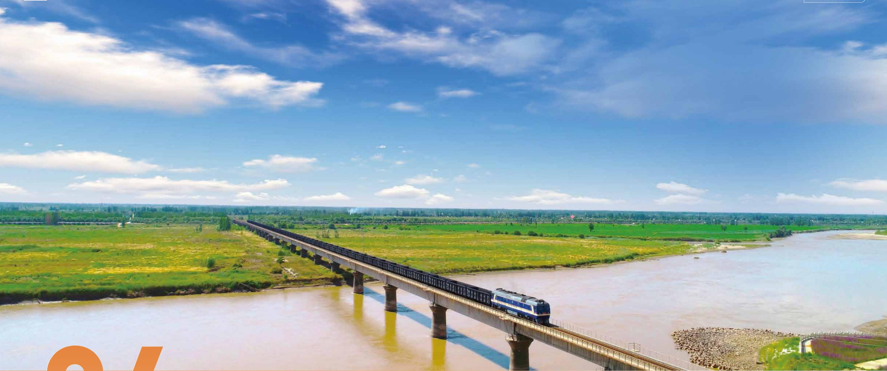

natural_image

Aerial view of a train crossing a long bridge over a wide river under a blue sky with scattered clouds (no visible text or symbols)

# 06

# 筑规于制， 夯实治理屏障

规矩立得住，信任才扎得深。作为宁夏最早的主板上市公司，我们构建起“党委领导、股东会行权、董事会决策、经理层经营”的现代化治理体系。权责清晰，制衡有效，专门委员会为决策提供专业支撑。

治理，落在每一次决议的推敲、每一次监督的较真。以制度为基，以透明为要，持续提升规范性与风险防控能力，让企业走得更稳、更远。

筑规于制，夯实的不只是治理屏障，更是每一份沉甸甸的托付。

# ◇ 规范公司治理

# 股东会

股东会是公司的权力机构。我们严格规范召集、召开与议事程序，让规则守护权利，让程序保障公平。

2025年，依据新《公司法》及监管要求，全面修订《股东会议事规则》，“股东大会”统一更新为“股东会”。权力配置更科学，治理效率持续提升。

全年规范召开股东会2次，审议通过修订《公司章程》、修订《股东会议事规则》、董事会换届选举等重大议案。每一份议案的通过，都是股东信任的托付；每一次表决的实施，都是治理效能的见证。

治理，不在纸上。我们筑规于制，是为了让信任有根基，让权利有保障。

数说2025·规范公司治理（股东会）

<table><tr><td>指标</td><td>数据</td></tr><tr><td>股东会召开次数</td><td>2次</td></tr><tr><td>股东会审核议题</td><td>13项</td></tr><tr><td>审议议案</td><td>修订《公司章程》《股东会议事规则》、董事会换届选举等</td></tr><tr><td>《股东会议事规则》</td><td>已修订</td></tr><tr><td>“股东大会”更新为“股东会”</td><td>已完成</td></tr></table>

# 董事会

董事会是公司的决策中心，对股东会负责。我们依据《公司法》及监管要求，构建权责清晰、运转高效的治理体系，推动公司从“形式合规”迈向“实质有效”。2025年，公司荣膺“金圆桌奖”优秀董事会大奖，从5400余家上市公司中脱颖而出，标志着公司治理现代化迈上新台阶。

董事会下设战略、审计、提名、薪酬考核、安全健康环保及ESG五个专门委员会，成员均由董事担任。其中，安全健康环保及ESG委员会作为ESG管理的专门指导机构，负责审议年度ESG报告、监督检查ESG治理活动，将可持续发展深度融入决策核心。

2025年，董事会由10名董事组成，其中独立董事4名，女性董事1名，专业覆盖铁路运输、财务、法律、投融资等领域。多元构成，让决策兼顾专业与公允。薪酬与考核委员会制定薪酬政策，将报酬与经营业绩、个人贡献挂钩，体现责任与回报对等。

我们持续提升董事会运作效能：科学统筹会议安排，强化专门委员会支撑；严格开展独立董事独立性自查与述职，推动深度监督；紧跟监管要求动态完善制度体系。每一步优化，都是为了决策更审慎、治理更透明。

每一次会议、每一份决议，都是决策科学、监督有力的见证。2025年，召开董事会6次，审议通过45项议案；专门委员会召开12次，审议通过16项议案。

2026年，我们将持续对标公司治理最佳实践，推动公司从“形式合规”迈向“实质有效”，以透明、规范、守信的治理赢得市场信赖。具体目标如下：

<table><tr><td>目标类别</td><td>具体指标</td><td>目标值</td></tr><tr><td>独立性</td><td>独立董事占比</td><td>≥33%</td></tr><tr><td>多元化</td><td>女性董事占比</td><td>≥9%</td></tr><tr><td>履职</td><td>董事现场参会率</td><td>≥90%</td></tr><tr><td>培训</td><td>董事及高管ESG专题培训</td><td>不少于1次/年</td></tr><tr><td>考核</td><td>董事会绩效评价</td><td>良好</td></tr></table>

数说2025·规范公司治理（董事会）

<table><tr><td>指标</td><td>数据</td></tr><tr><td>董事会成员</td><td>10人</td></tr><tr><td>独立董事</td><td>4人</td></tr><tr><td>女性董事</td><td>1人</td></tr><tr><td>专业覆盖</td><td>铁路运输、财务、法律、投融资</td></tr><tr><td>董事会召开次数</td><td>6次</td></tr><tr><td>董事会审议议案</td><td>45项</td></tr><tr><td>专门委员会召开次数</td><td>12次</td></tr><tr><td>专门委员会审议议案</td><td>16项</td></tr></table>

natural_image

Silhouettes of people seated at tables in a meeting or discussion setting (no visible text or symbols)

# 专门委员会

# 职能

# 战略委员会

负责对公司长期发展战略和重大投资决策进行研究，并向董事会提出建议。

# 审计委员会

负责审核公司财务信息及其披露、监督及评估内外审计工作和内部控制。

# 薪酬与考核委员会

负责制定董事、高级管理人员的考核标准并进行考核，制定、审查董事、高级管理人员的薪酬决定机制、决策流程、支付与止付追索安排等薪酬政策与方案，并向董事会提出建议。

# 提名委员会

负责拟定董事、高级管理人员的选择标准和程序，对董事高级管理人员人选及其任职资格进行遴选、审核，并向董事会提出建议。

# 安全健康环保及ESG委员会

负责指导、检查、评估公司安全、健康与环境保护计划的实施，以及有关公司安全、健康、环境领域的重大问题，并向董事会提出可持续发展建议。

<table><tr><td>指标</td><td>单位</td><td>人数</td></tr><tr><td colspan="3">年龄结构</td></tr><tr><td>30岁-50岁(含)</td><td>人</td><td>3</td></tr><tr><td>50岁以上</td><td>人</td><td>7</td></tr></table>

独立董事占比 40% / 女性董事占比10%

<table><tr><td>指标</td><td>单位</td><td>人数</td></tr><tr><td colspan="3">教育背景</td></tr><tr><td>博士</td><td>人</td><td>2</td></tr><tr><td>研究生</td><td>人</td><td>5</td></tr><tr><td>本科及以下</td><td>人</td><td>3</td></tr></table>

<table><tr><td>专门委员会</td><td>会议召开次数</td><td>议案审核数</td></tr><tr><td>战略委员会</td><td>1次</td><td>1项</td></tr><tr><td>审计委员会</td><td>4次</td><td>7项</td></tr><tr><td>提名委员会</td><td>3次</td><td>3项</td></tr><tr><td>薪酬与考核委员会</td><td>2次</td><td>3项</td></tr><tr><td>安全健康环保及ESG委员会</td><td>2次</td><td>2项</td></tr></table>

# ◇ 保障各方权益

# 股东权益

股东权益，是信任的起点，也是治理的落脚点。我们始终以维护股东合法权益为核心，尤其注重保障中小股东的平等地位，为中小股东提供网络投票等便利条件，让距离不再成为参与的障碍。

知情权靠透明的信息披露，参与权靠便捷的网络投票，表决权靠规范的会议程序，收益权靠稳健的经营回报。四项权利，四道屏障，每一项都有制度守护，每一次行使都经得起追问。

2025年，公司持续完善投资者关系管理，畅通沟通渠道，及时回应关切。每一份信任都来之不易，每一次托付都值得被认真对待。

  
数说2025·保障各方权益（股东权益）

<table><tr><td>指标</td><td>数据</td></tr><tr><td>中小股东保护措施</td><td>网络投票</td></tr><tr><td>知情权保障</td><td>信息披露</td></tr><tr><td>参与权保障</td><td>网络投票</td></tr><tr><td>表决权保障</td><td>规范会议程序</td></tr><tr><td>收益权保障</td><td>稳健经营回报</td></tr><tr><td>投资者关系管理</td><td>持续完善</td></tr></table>

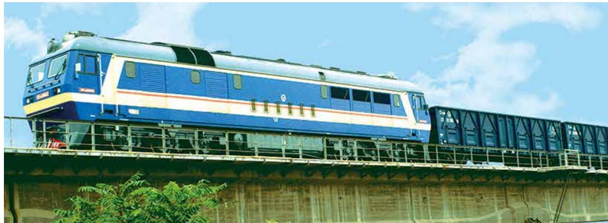

natural_image

Blue and white locomotive pulling freight cars on an elevated track under a partly cloudy sky (no visible text or symbols)

# 中小股东权益保护机制

# 开通网络投票

公司规定股东会必须开通网络投票，为中小股东行使投票权节省了成本、提供了便利。

# 实行累积投票制

公司在章程和《股东会议事规则》中明确董事选举应采取累积投票制，为中小股东选举出代表自己利益的董事提供制度和程序保障。

# 中小股东单独计票

股东会在审议影响中小投资者利益的重大事项时，对中小投资者的表决单独计票，且公开披露单独计票结果，保护中小股东知情权。

# 关联股东回避机制

关联股东回避机制，在审议关联交易提案时，严格落实关联股东回避机制，由中小股东投票表决，切实保障中小股东合法权益。

# 投资者关系管理

透明是最好的沟通，信任是最高的回报。我们严格执行《投资者关系管理办法》，确立董事会秘书统筹负责、证券部门具体执行的治理体系。董事会秘书深度参与战略与经营，确保信息准确前瞻；证券部门配备专人，维护多元沟通渠道，让信息流转高效顺畅。

秉持 “透明沟通、价值共创” 理念，我们构建多层次互动体系。2025年，举办投资者交流会1次，接待调研189人次；接听咨询电话130人次，互动易平台回复率100%，行业第一。每一次响应，都是对投资者的尊重；每一个100%，都是对信任的回应。

坚持 “真实、准确、完整、及时、公平” 的披露原则，全年披露定期报告4份、临时公告68份。同时，积极开展投资者保护宣教，引导长期价值投资。让尊重有行动，让回报有温度。

# 数说2025·履行企业责任（乡村振兴）

投资者 1 次
交流会

接待
投资者调研

189人次

接听 130 人次
咨询电话

互动易平台 100% (行业第一)

定期报告披露 4 份

临时公告披露 68份

# 债权人权益

信用是企业的第二生命。我们在追求经济效益、保护投资者权益的同时，同等重视债权人利益。坚守诚信履约原则，稳健经营，审慎融资。

报告期内，无不良信用记录，无债务违约。每一笔按时归还的贷款，都是对合作伙伴最实在的尊重。守住信用，就是守住企业的根基。

# 数说2025·履行企业责任（乡村振兴）

不良信用记录0次

债务违约0次

100% 诚信履约

# ◇ 聚焦风险管理

风险，看不见，但守得住。我们以制度为盾，以架构为网，让每一处隐患都有预警，每一次应对都有章法。

# 治理

制度是防线，也是底气。我们遵循国务院国资委监管要求，完善内控、风险、合规“三位一体”体系，修订《内部控制评价管理办法》《重大经营风险事件报告办法》等核心制度。

构建 “党委领导、董事会决策、审计委员会监督、经理层执行、各部门落实” 五级风险治理架构。成立内控风险管理领导小组，明确第一责任人，设置专职风控岗与联络员。权责清晰，层层守住每一道关口。

将风险管理融入战略，坚持底线思维、风险前置，嵌入铁路运输、工程建设、招标采购、资产财务等全业务流程。以全面预算管理、内控信息化系统为支撑，对重大投资、重点项目实施专项风控。

以 “风险导向、问题导向” 为原则，2025年完成审计项目12个，涵盖离任经济责任审计、内控审计等领域。实行 “五定” 方案（定责任、定措施、定时限、定资金、定预案），推动整改到位。

监督是最好的保护。配齐33名纪检委员，选聘10名特约监督员，召开反腐败协调小组会议4次，移交问题线索1件。横向到边、纵向到底，让权力在阳光下运行。

风险管理，是为了行稳致远，让风险有边界，发展有保障，清风常在，正气充盈。

# 数说2025·聚焦风险管理（治理）

审计项目

12↑

纪检委员

33名

特约党风监督员

10名

反腐败协调小组会议

4 次

移交问题线索

1件

# 第一道防线

公司各部门、子公司作为第一道防线，要将合规要求落实到岗、明确到人，及时完善业务制度和管理流程，防范违规风险。

# 第二道防线

法律证券事务部作为公司合规管理牵头部门要加强统筹协调，定期对规章制度、经济合同、重大决策开展合规审查，指导各部门、子公司不断完善合规管理体系。

# 第三道防线

纪检监察、审计等部门要强化监督责任，加强对产权交易、物资采购、招投标等重点领域的监督检查，对发现的问题及时督促、问责。

# 影响、风险与机遇管理

风险与机遇，一体两面。我们建立常态化、全覆盖的风险识别评估机制，按季度、年度开展重大经营风险排查，重点防控运营安全、工程管理、合规廉洁、财务税务、市场波动等关键领域。规范首报、续报、终报三级报告机制，确保风险早发现、早预警、早处置。

设定300万元为报告阈值，实行首报3小时内、续报2个工作日内、终报处置结束后6个工作日内三阶段管理。综合运用风险规避、降低、分担、承受等策略。

守住风险底线，才能抓住发展机遇。2025年，全年未发生重大经营风险事件，整体风险可控在控。我们以稳健风控支撑业务拓展，让风险挑战转化为发展动力。

# | 重大经营风险事件报告情形

有下列情形之一的，应确定为重大经营风险事件并及时报告：

损失触发：预计损失≥300万元

违法违规：被立案调查或受重大处罚

重大與情：造成重大負面輿情影响

重大变化：生产经营条件或市场环境发生特别重大变化

境外制裁：受境外管制、制裁，产生重大负面影响

其他情形：经认定需报告的重大风险

# 风险报告阶段

重大经营风险事件报告分首报、续报、终报三个阶段。

<table><tr><td>报告类型</td><td>时限要求</td><td>报告对象</td><td>审核签字/盖章要求</td><td>主要内容</td><td>补充说明</td></tr><tr><td>首报</td><td>事件发生后3小时内</td><td>公司法律证券事务部</td><td>部门负责人、分管领导审核签字;子公司主要负责人审批签字并加盖公章</td><td>事件时间、地点、现状、可能造成的损失或影响;向董事会及监管部门报告情况;已采取的紧急应对措施</td><td>特别紧急时,可第一时间以适当便捷方式先行报告</td></tr><tr><td>续报</td><td>事件发生后2个工作日内</td><td>公司法律证券事务部</td><td>部门负责人、分管领导审核签字;子公司主要负责人审批签字并加盖公章</td><td>事件单位基本情况、起因和性质、基本过程、发展趋势判断、风险应对处置方案、面临问题和困难及建议</td><td>需长期应对的,纳入季度监测,跟踪进度并定期报告</td></tr><tr><td>终报</td><td>事件处置或整改结束后6个工作日内</td><td>公司审计部</td><td>部门负责人、分管领导审核签字;子公司主要负责人审批签字并加盖公章</td><td>事件基本情况、党委或董事会审议情况、已采取措施及结果、涉及金额及损失影响、问题困难及原因分析、整改情况;涉及违规违法的须报告问责情况</td><td>—</td></tr></table>

首报  
终报

# 指标与目标

以 “零重大风险、零重大隐患” 为底线，依托全流程合规、内控有效监督、风险管理三大支点，构建稳健运营体系。

每一个数字，都是一道防线；每一次培训，都是一次警醒。2025年，内部审计项目12个，内控审计获标准无保留意见；重大经营风险事件0起，处置及时率100%；合规审查全覆盖，重点领域风险排查整改率100%。反商业贿赂及反贪污培训5次，累计11小时，覆盖535人次，覆盖率73.22%。

风险管理没有终点，我们始终在路上。2026年，我们将强化风险问责闭环管理，对因失职渎职导致重大风险事件的责任人，实行“一票否决”，取消年度评优及晋升资格。同时，开展全员“风险意识提升年”活动，将风险防控能力作为干部选拔任用的重要参考。

<table><tr><td>目标类别</td><td>具体指标</td><td>目标值</td></tr><tr><td>重大风险</td><td>重大经营风险事件</td><td>0起</td></tr><tr><td>处置时效</td><td>风险事件首报及时率</td><td>100%</td></tr><tr><td>合规审查</td><td>重大决策、合同、制度合规审查率</td><td>100%</td></tr><tr><td>内控评价</td><td>内控审计意见</td><td>标准无保留</td></tr><tr><td>问责闭环</td><td>风险事件问责率</td><td>100%</td></tr></table>

# 数说2025·聚焦风险管理（指标与目标）

内部审计项目

12↑

风险处置及时率

100%

内控审计意见

标准无保留

合规审查覆盖率

100%

重大经营风险事件

0起

重点领域风险排查整改率

100%

# 西部创业举办合规运作风险防范专题培训

案例

2025年11月26日，上市公司规范运作专题培训在公司本部成功举办。本次培训特邀价值在线查迅老师主讲，聚焦“信息披露合规与内幕交易风险防范”核心议题，为参训人员呈现了一场内容精炼、指导性强的知识盛宴。

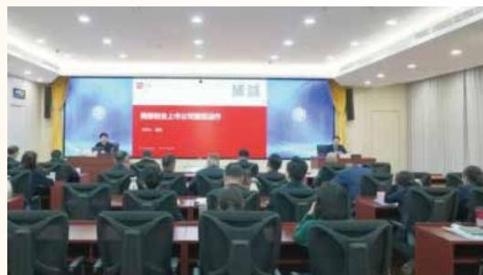

text_image

Conference hall photo with visible presentation screen displaying Chinese text and audience seated in rows

# 恪守商业道德

诚信是立企之本，廉洁是发展之基。我们将商业道德融入经营管理全流程，营造风清气正、合规有序的经营环境。

# 反商业贿赂及反贪污

# | 治理

依据《内部授权管理手册》《合规审查实施办法》《重大经营风险事件报告办法》等制度，构建反商业贿赂及反贪污管理体系，覆盖公司及子公司、全体业务与人员。

# | 战略

诚信经营、廉洁从业、公平竞争——这是底线，也是红线。构建“教育、制度、监督、惩戒”并重的商业道德体系，坚持无禁区、全覆盖、零容忍，重遏制、强高压、长震慑。以法治国企为引领，让道德软实力支撑高质量发展。

# 影响、风险与机遇管理

聚焦工程建设、招标采购、资产租赁、商务往来等关键环节，建立岗位廉洁风险清单与防控措施。严格执行关键岗位轮岗、全过程监督、专项巡察等制度。每一次监督，都是对规则的敬畏；每一次排查，都是对廉洁的守护。稳健合规的经营形象，是企业最硬的名片。

# I指标与目标

以 “零重大道德违规” 为核心目标。全年开展专项培训5次、累计11小时，覆盖535人次，覆盖率73.22%；组织警示教育大会、廉洁教育展、警示教育话剧等多元活动。运用 “四种形态” 处理12人次，对2人给予党纪政务处分。全年未发生不正当竞争相关重大诉讼及违规处罚。

2026年，我们将持续保持“零重大道德违规”记录，并实现以下目标：反商业贿赂培训覆盖率提升至95%以上，其中关键岗位人员（采购、销售、工程等）覆盖率达100%；开展至少1次面向全体供应商的廉洁合规宣贯，签署《廉洁合作协议书》比例达到100%；完善举报人保护制度，确保举报渠道畅通有效，对查实的违规行为“零容忍”。

数字的背后，是每一次培训的坚持、每一次监督的较真。筑牢商业道德防线，我们一直在路上。

# 数说2025·恪守商业道德

反商业贿赂培训次数

5次

培训覆盖率

73.22%

培训时长

11 小时

不正当竞争重大诉讼

0↑

培训覆盖人次

535 人次

违规处罚

0↑

# 数说2025·恪守商业道德

问题线索受理

9件

警示教育大会

2场

问题线索办结

7件

参加警示教育人数

174人

处理处分人次

12人次

任职廉政谈话

25人

党纪政务处分

2人

提醒谈话

18人

# 西创运通公司党支部举办廉洁知识竞赛

为切实增强党员及职工的纪律意识和规矩意识，2025年5月14日，西创运通公司党支部举办廉洁知识竞赛，全体党员、入党积极分子及职工踊跃参与，共同筑牢廉洁从业思想根基。

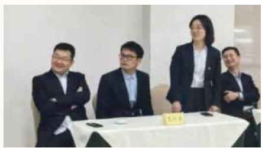

natural_image

Group photo of four professionals in business attire standing at a table with a nameplate (no visible text or symbols)

# 宁东铁路组织开展廉洁警示教育活动

2025年10月，宁东铁路公司纪委组织近50名党员干部及关键岗位监察对象，前往贺兰县廉政警示教育基地开展廉洁警示教育活动，进一步增强党员干部的纪法意识，筑牢拒腐防变的思想防线。

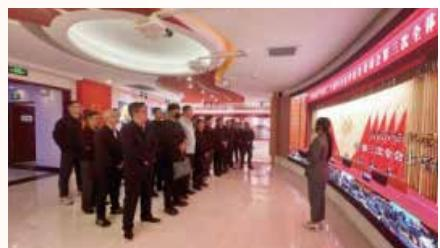

text_image

Group of people in a hallway observing a large display wall with red and white text, likely at an event or exhibition.

natural_image

Scenic park scene with a stone arch bridge, reflective water surface, and large rock formations under a clear blue sky (no text or symbols visible)

# 西部创业纪委组织召开新任职干部廉政谈话会

案例

2025年12月10日，公司纪委组织召开新任职干部廉政谈话会，公司党委委员、纪委书记郝俊奇以严标准明方向、以硬要求画红线、以暖关怀鼓干劲，为六名新晋级干部注入廉洁“强心剂”，助力其在新岗位上守初心、行正道、建新功。

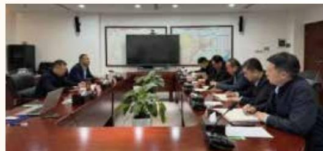

natural_image

Interior view of a conference room with attendees seated around a long table, no visible text or signage

# 反不正当竞争

公平竞争，是市场的底线，也是企业的尊严。我们恪守反不正当竞争法规，聚焦虚假宣传、垄断行为及商业秘密侵权等重点领域，筑牢合规防线。报告期内，公司未因不正当竞争行为导致诉讼或重大行政处罚。

# 商业宣传

严守真实性原则，杜绝虚假或引人误解的内容。每一句宣传，都对得起事实；每一次推广，都经得起追问。

# 市场竞争

以高质量服务为核心竞争力，尊重每一位对手。不编造、不传播虚假信息，不做混淆商誉的行为。行业生态，靠大家一起维护。

# 反垄断合规

不达成垄断协议，不滥用市场支配地位，不进行差别待遇。公平交易，是法治的要求，也是我们对市场规则的敬畏。

守住底线，就是守住信誉；守住规则，就是守住未来。

2026年，公司将持续保持不正当竞争诉讼、重大行政处罚“零记录”；每年开展至少1次合规专题培训，覆盖市场营销、招投标等关键岗位；建立公平竞争合规审查机制，将反垄断审查纳入重大商业决策流程。

# 数说2025·反不正当竞争

不正当竞争诉讼

0↑

重大行政处罚

0↑

虚假宣传事件

0↑

垄断行为

0↑

# ◇ 附录：关键绩效表

环境范畴

<table><tr><td>一级指标</td><td>二级指标</td><td>三级指标</td><td>单位</td><td>2024年</td><td>2025年</td></tr><tr><td rowspan="22">资源利用</td><td rowspan="3">水资源利用</td><td>总用水量</td><td>吨</td><td>154,443.00</td><td>159,764.00</td></tr><tr><td>每百万营收总用水量</td><td>吨/百万元</td><td>-</td><td>0.12</td></tr><tr><td>新鲜水用水量</td><td>吨</td><td>-</td><td>159,764.00</td></tr><tr><td rowspan="19">能源利用</td><td>能源消耗总量</td><td>吨标准煤</td><td>-</td><td>31,313.19</td></tr><tr><td>每百万营收能源消耗总量</td><td>吨标准煤/百万元</td><td>-</td><td>23.56</td></tr><tr><td>单位产量综合能耗</td><td>吨标准煤/吨</td><td>-</td><td>8.82</td></tr><tr><td>直接能源消耗量</td><td>吨标准煤</td><td>-</td><td>29,287.31</td></tr><tr><td>直接能源消耗量占比</td><td>%</td><td>-</td><td>93.53</td></tr><tr><td>化石能源消耗量</td><td>吨标准煤</td><td>-</td><td>29,287.31</td></tr><tr><td>非化石能源消耗量</td><td>吨标准煤</td><td>-</td><td>1,125.88</td></tr><tr><td>非化石能源消耗量占比</td><td>%</td><td>-</td><td>3.60</td></tr><tr><td>清洁能源消耗量</td><td>吨标准煤</td><td>-</td><td>1,093.05</td></tr><tr><td>清洁能源消耗量占比</td><td>%</td><td>-</td><td>3.49</td></tr><tr><td>间接能源消耗量</td><td>吨标准煤</td><td>-</td><td>1,125.88</td></tr><tr><td>外购热力</td><td>吨标准煤</td><td>-</td><td>119.55</td></tr><tr><td>燃油消耗总量</td><td>升</td><td>-</td><td>23,055,182.48</td></tr><tr><td>用电量</td><td>度</td><td>7,859,850.00</td><td>8,188,225.00</td></tr><tr><td>外购电力</td><td>吨标准煤</td><td>-</td><td>1,006.33</td></tr><tr><td>燃油消耗量</td><td>升</td><td>-</td><td>23,055,182.48</td></tr><tr><td>天然气使用量</td><td>立方米</td><td>770,134.00</td><td>821,840.04</td></tr><tr><td>柴油消耗量</td><td>升</td><td>-</td><td>22,874,900.00</td></tr><tr><td>汽油消耗量</td><td>升</td><td>-</td><td>180,282.44</td></tr><tr><td rowspan="4">污染防治与生态系统保护</td><td>环境保护相关目标</td><td>报告期内因环境事件受到生态环境等有关部门重大行政处罚的处罚金额</td><td>万元</td><td>-</td><td>0</td></tr><tr><td rowspan="3">污染物排放</td><td>废水排放量</td><td>吨</td><td>-</td><td>96,180.00</td></tr><tr><td>工业废水排放量</td><td>吨</td><td>-</td><td>0</td></tr><tr><td>生活废水排放量</td><td>吨</td><td>-</td><td>96,180.00</td></tr></table>

<table><tr><td>一级指标</td><td>二级指标</td><td>三级指标</td><td>单位</td><td>2024年</td><td>2025年</td></tr><tr><td rowspan="9">应对气候变化</td><td rowspan="6">废弃物处理</td><td>产生的无害废弃物总量</td><td>吨</td><td>-</td><td>0</td></tr><tr><td>每百万营收产生的无害废弃物总量</td><td>吨/百万元</td><td>-</td><td>0</td></tr><tr><td>产生的有害废弃物总量</td><td>吨</td><td>52.76</td><td>34.07</td></tr><tr><td>废油品</td><td>吨</td><td>41.70</td><td>25.72</td></tr><tr><td>废油桶</td><td>吨</td><td>7.76</td><td>7.60</td></tr><tr><td>废电池</td><td>吨</td><td>3.30</td><td>0.75</td></tr><tr><td rowspan="3">温室气体排放管理</td><td>温室气体排放总量(范围1和范围2)</td><td>吨二氧化碳当量</td><td>-</td><td>68,076.04</td></tr><tr><td>直接(范围1)温室气体排放</td><td>吨二氧化碳当量</td><td>-</td><td>62,800.02</td></tr><tr><td>间接(范围2)温室气体排放</td><td>吨二氧化碳当量</td><td>-</td><td>5,276.02</td></tr></table>

社会范畴

<table><tr><td>一级指标</td><td>二级指标</td><td colspan="2">三级指标</td><td>单位</td><td>2024年</td><td>2025年</td></tr><tr><td rowspan="23">员工</td><td rowspan="23">员工招聘与就业</td><td colspan="2">在职员工总数</td><td>人</td><td>1,169</td><td>1,160</td></tr><tr><td rowspan="3">其中</td><td>少数民族员工</td><td>人</td><td>148</td><td>150</td></tr><tr><td>残疾员工</td><td>人</td><td>4</td><td>4</td></tr><tr><td>兼职员工</td><td>人</td><td>0</td><td>0</td></tr><tr><td rowspan="6">按年龄划分</td><td>25岁及以下</td><td>人</td><td>109</td><td>88</td></tr><tr><td>26-35岁</td><td>人</td><td>393</td><td>351</td></tr><tr><td>36-39岁</td><td>人</td><td>167</td><td>208</td></tr><tr><td>40-49岁</td><td>人</td><td>290</td><td>282</td></tr><tr><td>50-54岁</td><td>人</td><td>154</td><td>160</td></tr><tr><td>55岁以上</td><td>人</td><td>56</td><td>71</td></tr><tr><td rowspan="2">按性别结构划分</td><td>男性</td><td>人</td><td>984</td><td>978</td></tr><tr><td>女性</td><td>人</td><td>185</td><td>182</td></tr><tr><td rowspan="6">按专业构成划分</td><td>生产人员</td><td>人</td><td>882</td><td>877</td></tr><tr><td>销售人员</td><td>人</td><td>0</td><td>0</td></tr><tr><td>技术人员</td><td>人</td><td>84</td><td>80</td></tr><tr><td>财务人员</td><td>人</td><td>19</td><td>19</td></tr><tr><td>行政人员</td><td>人</td><td>178</td><td>180</td></tr><tr><td>其他人员</td><td>人</td><td>6</td><td>4</td></tr><tr><td rowspan="5">按教育程度划分</td><td>博士</td><td>人</td><td>0</td><td>0</td></tr><tr><td>研究生</td><td>人</td><td>36</td><td>36</td></tr><tr><td>本科</td><td>人</td><td>516</td><td>524</td></tr><tr><td>专科</td><td>人</td><td>405</td><td>395</td></tr><tr><td>中专及以下</td><td>人</td><td>212</td><td>205</td></tr><tr><td rowspan="33">员工</td><td rowspan="20"></td><td rowspan="3">按地域划分</td><td>中国大陆员工</td><td>人</td><td>1,169</td><td>1,160</td></tr><tr><td>港澳台地区员工</td><td>人</td><td>0</td><td>0</td></tr><tr><td>海外员工</td><td>人</td><td>0</td><td>0</td></tr><tr><td colspan="2">新入职员工总数</td><td>人</td><td>89</td><td>9</td></tr><tr><td rowspan="2">按招聘渠道划分</td><td>校园招聘</td><td>人</td><td>89</td><td>9</td></tr><tr><td>社会招聘</td><td>人</td><td>0</td><td>0</td></tr><tr><td rowspan="2">按性别划分</td><td>男性</td><td>人</td><td>-</td><td>7</td></tr><tr><td>女性</td><td>人</td><td>-</td><td>2</td></tr><tr><td colspan="2">劳动合同签订率</td><td>%</td><td>100</td><td>100</td></tr><tr><td colspan="2">员工流失数</td><td>人</td><td>1</td><td>18</td></tr><tr><td colspan="2">员工流失率/离职率</td><td>%</td><td>0.09</td><td>1.55</td></tr><tr><td rowspan="3">按年龄划分</td><td>30岁以下员工人数</td><td>人</td><td>-</td><td>2</td></tr><tr><td>30-50岁以下员工人数</td><td>人</td><td>-</td><td>1</td></tr><tr><td>50岁以上员工人数</td><td>人</td><td>-</td><td>15</td></tr><tr><td rowspan="2">按性别划分</td><td>女性</td><td>人</td><td>-</td><td>5</td></tr><tr><td>男性</td><td>人</td><td>-</td><td>13</td></tr><tr><td rowspan="3">按地区划分</td><td>中国大陆</td><td>人</td><td>-</td><td>18</td></tr><tr><td>港澳台地区</td><td>人</td><td>-</td><td>0</td></tr><tr><td>海外</td><td>人</td><td>-</td><td>0</td></tr><tr><td colspan="2">未解决的劳动纠纷案件数量</td><td>%</td><td>-</td><td>0</td></tr><tr><td rowspan="11">员工薪酬与福利</td><td colspan="2">人均薪酬</td><td>万元</td><td>-</td><td>21.55</td></tr><tr><td colspan="2">员工社会保险覆盖率</td><td>%</td><td>100</td><td>100</td></tr><tr><td colspan="2">人均带薪休假时间</td><td>天</td><td>-</td><td>8.25</td></tr><tr><td colspan="2">员工培训投入金额</td><td>元</td><td>2,680,762.04</td><td>2,207,101.22</td></tr><tr><td colspan="2">员工培训举办场次</td><td>场次</td><td>-</td><td>130</td></tr><tr><td colspan="2">员工培训参与人次</td><td>人次</td><td>44,006</td><td>44,024</td></tr><tr><td colspan="2">员工培训覆盖率</td><td>%</td><td>-</td><td>100</td></tr><tr><td rowspan="2">按性别划分</td><td>女性</td><td>人</td><td>-</td><td>182</td></tr><tr><td>男性</td><td>人</td><td>-</td><td>978</td></tr><tr><td colspan="2">员工人均培训时长</td><td>小时</td><td>160.15</td><td>153</td></tr><tr><td colspan="2">每百万营收员工培训投入</td><td>万元</td><td>-</td><td>153</td></tr><tr><td rowspan="2">员工关爱与帮扶</td><td colspan="2">员工帮扶投入</td><td>万元</td><td>-</td><td>13.2</td></tr><tr><td colspan="2">帮扶困难员工人数</td><td>人</td><td>-</td><td>27</td></tr></table>

<table><tr><td>一级指标</td><td>二级指标</td><td>三级指标</td><td>单位</td><td>2024年</td><td>2025年</td></tr><tr><td rowspan="12">员工</td><td rowspan="12">职业健康与安全生产</td><td>安全培训举办场次</td><td>场次</td><td>-</td><td>379</td></tr><tr><td>安全培训时长</td><td>小时</td><td>-</td><td>435</td></tr><tr><td>安全培训参与人次</td><td>人次</td><td>1,370</td><td>9,182</td></tr><tr><td>人均安全培训时长</td><td>小时</td><td>-</td><td>21.11</td></tr><tr><td>安全生产培训覆盖率</td><td>人次</td><td>-</td><td>293</td></tr><tr><td>从业人员职业伤害保险投入金额</td><td>万元</td><td>-</td><td>241.77</td></tr><tr><td>从业人员职业伤害保险覆盖率</td><td>%</td><td>-</td><td>100</td></tr><tr><td>安全生产费</td><td>万元</td><td>3,770.21</td><td>9,384.88</td></tr><tr><td>安全生产责任险投入金额</td><td>万元</td><td>-</td><td>19.6</td></tr><tr><td>安全生产责任险人员覆盖率</td><td>%</td><td>-</td><td>100</td></tr><tr><td>生产安全事故数量</td><td>件</td><td>0</td><td>0</td></tr><tr><td>重大及以上事故数</td><td>例</td><td>0</td><td>0</td></tr><tr><td rowspan="6">客户</td><td rowspan="3">产品质量及服务保障</td><td>报告期内发生的产品和服务相关的安全与质量重大责任事故损害涉及的金额</td><td>万元</td><td>0</td><td>0</td></tr><tr><td>泄露客户隐私事件涉及的金额</td><td>万元</td><td>0</td><td>0</td></tr><tr><td>泄露客户隐私事件数量</td><td>件</td><td>0</td><td>0</td></tr><tr><td rowspan="3">数据安全与客户隐私保护</td><td>数据安全事件涉及的金额</td><td>件</td><td>0</td><td>0</td></tr><tr><td>泄露客户隐私事件涉及的金额</td><td>万元</td><td>0</td><td>0</td></tr><tr><td>泄露客户隐私事件数量</td><td>件</td><td>0</td><td>0</td></tr><tr><td rowspan="15">创新驱动与科技伦理</td><td rowspan="4">创新研发</td><td>研发投入金额</td><td>万元</td><td>513.31</td><td>97.04</td></tr><tr><td>研发投入占营业收入比例</td><td>%</td><td>0.38</td><td>0.07</td></tr><tr><td>研发人员数量</td><td>人</td><td>39</td><td>41</td></tr><tr><td>研发人员占比</td><td>%</td><td>3.35</td><td>3.53</td></tr><tr><td rowspan="11">知识产权</td><td>申请专利数量</td><td>件</td><td>4</td><td>3</td></tr><tr><td>申请发明专利数量</td><td>件</td><td>-</td><td>0</td></tr><tr><td>申请实用型专利数量</td><td>件</td><td>-</td><td>3</td></tr><tr><td>申请外观设计专利数量</td><td>件</td><td>-</td><td>0</td></tr><tr><td>授权专利数量</td><td>件</td><td>-</td><td>2</td></tr><tr><td>授权发明专利数量</td><td>件</td><td>-</td><td>0</td></tr><tr><td>授权实用型专利数量</td><td>件</td><td>-</td><td>2</td></tr><tr><td>授权外观设计专利数量</td><td>件</td><td>-</td><td>0</td></tr><tr><td>有效专利总量</td><td>件</td><td>-</td><td>13</td></tr><tr><td>著作权总量</td><td>件</td><td>-</td><td>5</td></tr><tr><td>软件著作权总量</td><td>件</td><td>-</td><td>5</td></tr><tr><td rowspan="6">供应商</td><td>供应商管理</td><td>供应商数量</td><td>家</td><td>-</td><td>268</td></tr><tr><td>供应链管理</td><td>供应链重大风险与影响事件数量</td><td>件</td><td>-</td><td>0</td></tr><tr><td rowspan="4">平等对待中小企业</td><td>报告期末应付账款(含应付票据)余额</td><td>万元</td><td>32,694.44</td><td>52,410.58</td></tr><tr><td>报告期末应付账款(含应付票据)余额占总资产的比重</td><td>%</td><td>4.82</td><td>7.45</td></tr><tr><td>报告期末逾期未支付中小企业款项的金额</td><td>万元</td><td>0</td><td>0</td></tr><tr><td>报告期末逾期未支付款项金额</td><td>万元</td><td>0</td><td>0</td></tr><tr><td rowspan="6">社会响应</td><td rowspan="4">社会公益</td><td>公益活动投入金额</td><td>万元</td><td>-</td><td>0</td></tr><tr><td>公益活动总次数</td><td>次</td><td>-</td><td>4</td></tr><tr><td>公益活动志愿者参与人数</td><td>人</td><td>-</td><td>139</td></tr><tr><td>人均志愿服务时长</td><td>小时</td><td>-</td><td>20</td></tr><tr><td rowspan="2">乡村振兴</td><td>乡村振兴投入金额</td><td>万元</td><td>-</td><td>30</td></tr><tr><td>乡村振兴惠及人数</td><td>人</td><td>-</td><td>9,166</td></tr></table>

治理范畴

<table><tr><td>一级指标</td><td>二级指标</td><td colspan="2">三级指标</td><td>单位</td><td>2024年</td><td>2025年</td></tr><tr><td rowspan="12">治理策略与治理架构</td><td rowspan="5">党建引领</td><td colspan="2">党委会会议次数</td><td>次</td><td>-</td><td>21</td></tr><tr><td colspan="2">党组织数量</td><td>个</td><td>33</td><td>36</td></tr><tr><td colspan="2">党员人数</td><td>个</td><td>452</td><td>450</td></tr><tr><td colspan="2">党委会审定议题</td><td>项</td><td>-</td><td>159</td></tr><tr><td colspan="2">前置研究讨论重大经营管理事项</td><td>项</td><td>-</td><td>22</td></tr><tr><td rowspan="7"></td><td rowspan="7">会议召开情况</td><td>股东会</td><td>次</td><td>3</td><td>2</td></tr><tr><td>董事会会议召开次数</td><td>次</td><td>8</td><td>6</td></tr><tr><td>战略委员会</td><td>次</td><td>1</td><td>1</td></tr><tr><td>审计委员会</td><td>次</td><td>5</td><td>4</td></tr><tr><td>提名委员会</td><td>次</td><td>2</td><td>3</td></tr><tr><td>薪酬与考核委员会</td><td>次</td><td>1</td><td>2</td></tr><tr><td>安全健康环保及ESG委员会</td><td>次</td><td>2</td><td>2</td></tr></table>

<table><tr><td>一级指标</td><td>二级指标</td><td colspan="2">三级指标</td><td>单位</td><td>2024年</td><td>2025年</td></tr><tr><td rowspan="22"></td><td rowspan="22"></td><td rowspan="7">议案审核情况</td><td>股东会</td><td>项</td><td>17</td><td>13</td></tr><tr><td>董事会</td><td>项</td><td>38</td><td>45</td></tr><tr><td>战略委员会</td><td>项</td><td>1</td><td>1</td></tr><tr><td>审计委员会</td><td>项</td><td>6</td><td>7</td></tr><tr><td>提名委员会</td><td>项</td><td>2</td><td>3</td></tr><tr><td>薪酬与考核委员会</td><td>项</td><td>2</td><td>3</td></tr><tr><td>安全健康环保及ESG委员会</td><td>项</td><td>2</td><td>2</td></tr><tr><td colspan="2">董事人数</td><td>人</td><td>10</td><td>10</td></tr><tr><td rowspan="2">按性别结构划分</td><td>男性</td><td>人</td><td>9</td><td>9</td></tr><tr><td>女性</td><td>人</td><td>1</td><td>1</td></tr><tr><td rowspan="3">按年龄结构划分</td><td>30岁(含)以下</td><td>人</td><td>0</td><td>0</td></tr><tr><td>30岁-50岁(含)</td><td>人</td><td>4</td><td>3</td></tr><tr><td>50岁以上</td><td>人</td><td>6</td><td>7</td></tr><tr><td rowspan="3">按教育背景划分</td><td>博士</td><td>人</td><td>2</td><td>2</td></tr><tr><td>研究生</td><td>人</td><td>4</td><td>5</td></tr><tr><td>本科及以下</td><td>人</td><td>4</td><td>3</td></tr><tr><td colspan="2">高管人数</td><td>人</td><td>4</td><td>4</td></tr><tr><td rowspan="2">按性别结构划分</td><td>男性</td><td>人</td><td>4</td><td>4</td></tr><tr><td>女性</td><td>人</td><td>0</td><td>0</td></tr><tr><td rowspan="3">按年龄结构划分</td><td>30岁(含)以下</td><td>人</td><td>0</td><td>0</td></tr><tr><td>30岁-50岁(含)</td><td>人</td><td>1</td><td>1</td></tr><tr><td>50岁以上</td><td>人</td><td>3</td><td>3</td></tr><tr><td rowspan="8">规范治理</td><td rowspan="8">反商业贿赂及反贪污</td><td colspan="2">反商业贿赂及反贪污培训次数</td><td>次</td><td>-</td><td>5</td></tr><tr><td colspan="2">反商业贿赂及反贪污培训时长</td><td>小时</td><td>-</td><td>11</td></tr><tr><td colspan="2">接受廉洁教育人数</td><td>人</td><td>270</td><td>535</td></tr><tr><td colspan="2">管理层</td><td>人</td><td>-</td><td>453</td></tr><tr><td colspan="2">员工</td><td>人</td><td>-</td><td>82</td></tr><tr><td colspan="2">商业道德/反商业贿赂及反贪污培训覆盖率</td><td>%</td><td>-</td><td>73.22</td></tr><tr><td colspan="2">管理层</td><td>%</td><td>-</td><td>64.41</td></tr><tr><td colspan="2">员工</td><td>%</td><td>-</td><td>8.81</td></tr><tr><td rowspan="12">投资者关系与权益保护</td><td rowspan="5">反不正当竞争</td><td>报告期内因公司不正当竞争行为导致诉讼或重大行政处罚的涉案金额</td><td>万元</td><td>0</td><td colspan="2">0</td></tr><tr><td>重大诉讼数量</td><td>个</td><td>0</td><td colspan="2">0</td></tr><tr><td>仲裁事项数量</td><td>个</td><td>0</td><td colspan="2">0</td></tr><tr><td>违规处罚次数</td><td>次</td><td>0</td><td colspan="2">0</td></tr><tr><td>违规处罚总金额</td><td>万元</td><td>0</td><td colspan="2">0</td></tr><tr><td rowspan="7">投资者关系管理</td><td>路演次数</td><td>次</td><td>0</td><td colspan="2">0</td></tr><tr><td>投资者交流会次数</td><td>次</td><td>2</td><td colspan="2">1</td></tr><tr><td>接待投资者人次</td><td>人次</td><td>86</td><td colspan="2">178</td></tr><tr><td>平台回复次数</td><td>次</td><td>29</td><td colspan="2">15</td></tr><tr><td>投资者电话接听次数</td><td>次</td><td>23</td><td colspan="2">130</td></tr><tr><td>披露的定期报告数量</td><td>个</td><td>6</td><td colspan="2">6</td></tr><tr><td>发布的临时公告数量</td><td>个</td><td>73</td><td colspan="2">70</td></tr></table>

natural_image

Illustration of business professionals interacting with digital platforms and financial icons (no text or symbols)

◇ 指标索引表

<table><tr><td colspan="2">目录</td><td>国务院国资委《央企控股上市公司ESG专项报告参考指标体系》</td><td>《深圳证券交易所上市公司自律监管指引第17号——可持续发展报告(试行)》</td></tr><tr><td colspan="2">关于本报告</td><td>G5.1、G5.2</td><td>/</td></tr><tr><td colspan="2">董事会致辞</td><td>/</td><td>/</td></tr><tr><td colspan="2">走进西部创业</td><td>/</td><td>/</td></tr><tr><td rowspan="4">筑久于远涵养永续之基</td><td>ESG管理</td><td>G5.1、G5.2</td><td>第二条、第十一条、第十二条、第十四条第十八条、第五十一条</td></tr><tr><td>利益相关方沟通</td><td>G3.1、G3.2、G3.3、G4.1、G4.2</td><td>第五十三条</td></tr><tr><td>双重重要性分析</td><td>/</td><td>第五条、第七条、第十一条、第五十九条</td></tr><tr><td>议题重要性分析结论</td><td>/</td><td>第五条、第十一条</td></tr><tr><td colspan="2">专题:以高质量党建引领可持续未来</td><td>/</td><td>/</td></tr><tr><td rowspan="3">筑绿于野厚植生态基业</td><td>健全环境管理</td><td>E3.1、E3.2、E3.3、E3.4、E4.1、E.5.1-E.5.6</td><td>第二十一条至第二十九条、第三十二条、第三十三条</td></tr><tr><td>高效使用资源</td><td>E1.1、E1.3、E5.4</td><td>第三十五条、第三十六条、第三十七条</td></tr><tr><td>深化污染治理</td><td>E2.1、E2.2、E2.3、E5.1、E.5.2、E5.4</td><td>第二十七条、第三十条、第三十一条</td></tr><tr><td rowspan="4">筑光于行照见价值高地</td><td>严控产品质量</td><td>S2.1</td><td>第四十七条</td></tr><tr><td>筑牢安全防线</td><td>S2.2</td><td>第四十八条</td></tr><tr><td>激发创新动力</td><td>S2.3</td><td>第四十二条</td></tr><tr><td>强化链条协同</td><td>S2.2、S3.1、S3.2</td><td>第四十五条、第四十六条、第五十九条</td></tr><tr><td rowspan="4">筑暖于心守护幸福基石</td><td>保障员工权益</td><td>S1.2、S1.3</td><td>第四十九条、第五十条</td></tr><tr><td>守护健康安全</td><td>S1.3</td><td>第四十九条、第五十条</td></tr><tr><td>成就员工价值</td><td>S1.1、S1.4</td><td>第四十九条、第五十条</td></tr><tr><td>履行企业责任</td><td>S4.1、S4.2、S4.3、S4.4</td><td>第三十九条、第四十条</td></tr><tr><td rowspan="4">筑规于制夯实治理屏障</td><td>规范公司治理</td><td>G1.1、G1.2、G1.3</td><td>第二条、第十二条、第五十一条</td></tr><tr><td>保障各方权益</td><td>G3.1、G3.2、G3.3</td><td>第六条、第四十四条、第五十三条</td></tr><tr><td>聚焦风险管理</td><td>G2.1、G2.2、G5.1、G5.2</td><td>第十二条、第十四条、第十八条、第四十八条、第五十条</td></tr><tr><td>恪守商业道德</td><td>G2.2、G2.3</td><td>第五十四条、第五十五条、第五十六条</td></tr></table>

# ◇ 读者反馈表

# 尊敬的读者：

您好！非常感谢您在百忙之中阅读西部创业2025年度可持续发展（ESG）报告。如您在报告阅读过程中，有任何意见和建议，请不吝指正，以帮助我们在今后进一步提升可持续发展管理！

# 1、您的或您的工作单位属于西部创业的哪一类利益相关方：

□ 公司内部人员

□ 政府/监管机构

□ 股东/投资人

□ 客户/潜在客户

□供应商/合作伙伴

□ 非政府组织

□ 社区/公众

□ 其他（请说明）

# 2、您所关注的信息在本报告中是否都有所体现？

□是

□ 一般

□否

# 3、您对本报告的综合评价是：

- 可读性（表达方式通俗易懂，设计美观，引人入胜，容易找到所需信息）  
□3分(较好)  
□2分(一般)  
□1分(较差)  
- 可信度（报告信息真实可信）  
□3分(较好)  
□2分(一般)  
□1分(较差)  
- 信息完整性  
负两方面信息兼顾，并且满足您对信息的需求)  
□3分(较好)  
□2分(一般)  
□1分(较差)

# 4、您在本报告中能否方便地找到所关注的信息？

□是

□ 一般

□否

5、除本报告已披露的内容以外，您还希望看到哪方面的信息？

# ◇ 免责声明

本报告所包含信息不构成任何投资建议，投资者不应以该等信息取代其独立判断或仅根据该等信息作出决策，本公司亦不对因使用本报告中的信息而引发或可能引发的损失承担任何责任。本公司所刊信息真实准确，若有与法定披露文件不一致之处，以法定披露文件为准。

图片版权归原作者所有，如有侵权请告知删除。

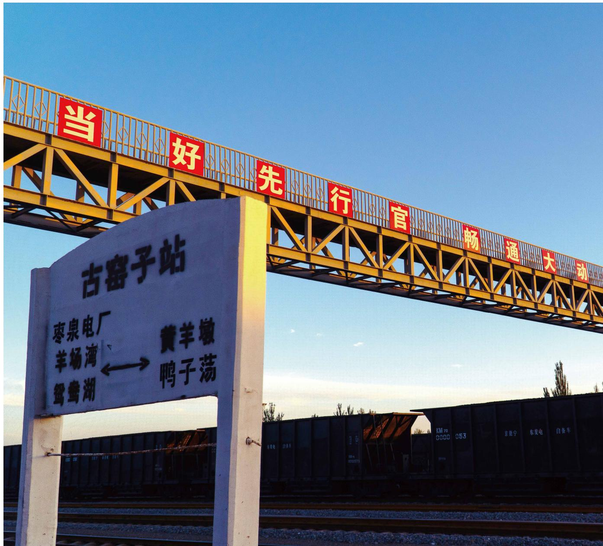

text_image

当好先行官畅通大动
古窑子站
枣泉电厂
羊场湾
鸳鸯湖 ←→ 黄羊墩
鸭子荡
KM zo
053
京能宁 东发电 自备车

