# 2025年度 环境、社会及 公司治理(ESG)报告

成都市兴蓉环境股份有限公司

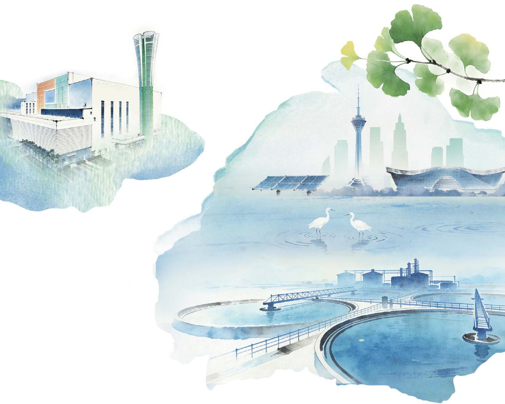

<details>
<summary>natural_image</summary>

Watercolor illustration of modern buildings and waterfront with ginkgo leaves, featuring a city skyline, water features, and birds (no text or symbols)
</details>

# 关于本报告

本报告是成都市兴蓉环境股份有限公司按年度公开发布的第十六份报告，旨在回应利益相关方期望，全面展示公司在ESG领域的治理理念、实践行动与工作成效。本报告经董事会审议通过，保证其中内容不存在任何虚假记载、误导性陈述或重大遗漏。

# 时间范围

报告期间与年度报告保持一致，时间范围覆盖 2025 年 1 月 1 日 -2025 年 12 月 31 日的完整会计年度。部分表述及数据超出以上范围。

# 组织范围

本报告内容覆盖成都市兴蓉环境股份有限公司及其附属公司，报告范围与公司年度财务报告合并报表范围保持一致。为便于表述和阅读，在报告中，“成都市兴蓉环境股份有限公司”也以“兴蓉环境”“公司”或“我们”表示。报告中涉及的兴蓉环境下属公司一般使用简称，如：“兴蓉环境下属自来水公司”“兴蓉环境下属排水公司”“兴蓉环境下属再生能源公司”等。

# 参考标准

- 深圳证券交易所《上市公司自律监管指引第17号——可持续发展报告（试行）》（2024）  
- 深圳证券交易所《上市公司自律监管指南第3号——可持续发展报告编制》（2024/2026修订）  
- 深圳证券交易所《上市公司自律监管指引第1号——主板上市公司规范运作》  
- 国务院国资委《关于新时代中央企业高标准履行社会责任的指导意见》(2024)  
国务院国资委《央企控股上市公司 ESG 专项报告编制研究》（2023）  
- 全球可持续发展标准委员会（GSSB）《GRI 可持续发展报告标准》（GRI Standards）（2024）  
- 国际标准化组织《社会责任指南》（ISO 26000:2010）  
- 联合国 2030 可持续发展目标（SDGs）

# 数据说明

本报告采用的财务数据来自于审计后的公司年报，其他数据来源于公司正式文件和统计报告（往年数据以此报告披露为准）。

# 确认及批准

本报告经管理层确认，于 2026 年 4 月 24 日获董事会通过。

# 报告获取

本报告为中文版本，可于公司官方网站（http://www.cdxrec.com）查阅或下载，并获取更多关于兴蓉环境的 ESG 信息。


扫一扫期待您的反馈

# 目录

02 责任寄语

04 走进兴蓉环境

06 2025 年度 ESG 履责绩效

08 ESG 管理

66 未来展望

67 关键绩效

70 指标索引

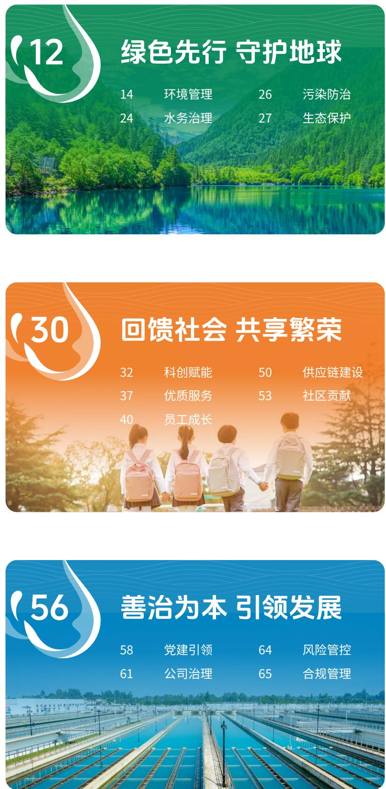

# 责任寄语

供排水管网延伸城市脉络，垃圾焚烧炉点燃绿色能源，多元环保业态夯实绿色基底——兴蓉环境的每一项业务，都是对“让环境更优，让生活更美”的生动践行。作为深耕水务环保领域的综合服务商，公司构建起涵盖自来水供应、污水处理、中水回用、垃圾焚烧发电、污泥处置、餐厨垃圾资源化利用的全产业链布局，以高品质水务环保服务支撑区域生态保护与可持续高质量发展，并将ESG理念深度融入战略决策与运营实践，在守护城市生命线、激活生态价值的道路上笃定前行。


# 坚守生态底色，赋能城市绿色低碳发展

我们以水资源高效利用与环境综合治理为核心，持续优化供水保障、污水处理、中水回用体系，推动城市水循环效能提升；深耕垃圾焚烧发电、污泥处置、厨余垃圾资源化利用等环保业务，加快构建“资源化、能源化、低碳化、智慧化”发展模式，以技术创新释放生态价值。2025年，公司荣获“ESG竞争力典范·双碳先锋”称号，环保履责案例入选行业优秀案例集，获评“年度固废最具社会责任投资运营企业”，以实干擦亮绿色发展名片。


# 厚植民生情怀，共筑共享发展幸福版图

我们始终把民生福祉放在首位，以稳定可靠的供水保障、高效规范的环境服务，以数字化、智慧化升级提升服务体验与运营效率，守护千家万户美好生活。同时，我们重视员工成长与价值实现，搭建人才成长平台，完善安全生产与职业健康管理体系，实现员工与企业共同成长，并积极投身乡村振兴、环保科普等公益事业，将企业发展成果回馈社会，用责任与温度践行社会责任，让发展惠及更多群众。


# 夯实治理根基，护航长期价值稳健增长

我们坚持党建引领与现代企业治理深度融合，持续完善公司治理体系，强化信息披露与投资者沟通，以规范运作、透明管理筑牢发展根基。2025年，公司首次斩获中国上市公司协会“董事会最佳实践案例”奖项，信息披露连续10年获评深圳证券交易所A级，荣获中国上市公司协会“投资者关系管理最佳实践”奖，成功入选“2025年中国上市公司内部控制最佳实践案例”，以高效治理凝聚发展合力，为企业高质量、可持续发展提供坚实保障。

兴蓉环境将继续秉持“让环境更优，让生活更美”的责任理念，紧扣国家“十五五”规划，在守护生态环境、服务城市发展、创造社会价值的道路上笃定前行，以专业守护碧水青山，以担当共创美好未来。

# 走进兴蓉环境

# 公司简介

成都市兴蓉环境股份有限公司是成都市属国有控股企业，控股股东为成都环境投资集团有限公司，实际控制人为成都市国有资产监督管理委员会。公司于2010年实现A股上市，80年来始终专注于水务环保产业，业务涵盖自来水生产与供应、污水处理、中水利用、污泥处置、垃圾渗滤液处理、垃圾焚烧发电、厨余（餐厨）垃圾处理、供排水管网技术服务、综合性市政工程设计施工、设备维修制造等业务，集投资、研发、设计、建设、运营、技术服务与资本运营于一体。

公司深入践行新发展理念，以人才、创新、开放为驱动，坚持科技、数字、制造强企，积极寻求合作伙伴，不断拓展产业布局和区域布局，致力于为客户提供领先的水务环保运营管理、废弃物处置、资源循环利用等综合解决方案，推动“双碳”战略目标实现。目前，兴蓉环境水务环保业务规模居全国前列，覆盖四川、甘肃、宁夏、陕西、海南、江苏、河北、山东、西藏9省（自治区）。

公司为国内领先的水务环保综合服务商，在深耕成都的同时，不断壮大川内业务，积极拓展省外业务，运营及在建的供排水项目规模约940万吨/日、中水利用项目规模约130万吨/日、垃圾焚烧发电项目规模12,000吨/日、污泥处置项目规模3,116吨/日、垃圾渗滤液处理项目规模8,430吨/日，餐厨垃圾处置项目规模1,950吨/日，水务环保业务规模居全国前列。

# 发展战略

# 总体战略

一体化战略加适度多元化


# 核心价值观

守正

笃实

日新

致远


# 责任理念

让环境更优，让生活更美


# 愿景

以人才、创新、开放为驱动，坚持科技、数字、制造强企，努力建设发展成为一家资产优良、技术先进，在运营管理、金融资本、高端人才等关键要素上有较强竞争力的全国性水务环保综合服务商，形成以水务、环保（固废）和市政工程建设为核心业务，以水务环保技术设备制造集成服务、智慧水务系统开发应用、核心设备新兴维修技术等为协同业务的完整产业链，建立集投融资、建设、管理和运营为一体的集约化、专业化管理模式，全力跻身全球同行业知名企业。

组织架构  
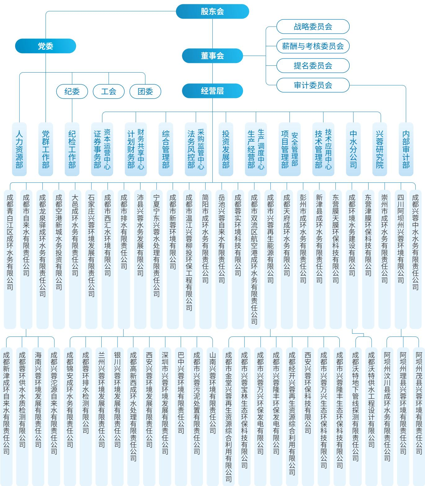

<details>
<summary>flowchart</summary>

```mermaid
graph TD
  A["党委"] --> B["董事会"]
  B --> C["战略委员会"]
  B --> D["薪酬与考核委员会"]
  B --> E["提名委员会"]
  B --> F["审计委员会"]
  
  subgraph Party_Group ["党委"]
    G1["人力资源部"]
    G2["党群工作部"]
    G3["纪检工作部"]
    G4["证券事务部"]
    G5["资本运营中心"]
    G6["计划财务部"]
    G7["综合管理部"]
    G8["法务风控部"]
    G9["采购监管中心"]
    G10["投资发展部"]
    G11["生产经营部"]
    G12["生产调度中心"]
    G13["项目管理部"]
    G14["安全管理部"]
    G15["技术应用中心"]
    G16["中水分公司"]
    G17["兴蓉研究院"]
    G18["内部审计部"]
  end
  
  subgraph Supervisory_Group ["经营层"]
    V1["成都青白江区成环水务有限公司"]
    V2["成都市自来水有限责任公司"]
    V3["成都龙泉驿成环水务有限责任公司"]
    V4["成都空港新城水务投资有限公司"]
    V5["大邑成环水务有限责任公司"]
    V6["石家庄兴蓉环境发展有限责任公司"]
    V7["成都市西汇水环境有限公司"]
    V8["成都市排水有限责任公司"]
    V9["沛县兴蓉水务发展有限公司"]
    V10["宁夏宁东兴蓉水处理有限责任公司"]
    V11["成都市新蓉环境有限公司"]
    V12["成都市温江兴蓉柳投环保工程有限公司"]
    V13["简阳市成环水务有限责任公司"]
    V14["岳池兴蓉自来水有限责任公司"]
    V15["成都容实环境科技有限公司"]
    V16["成都市双流区航空港成环水务有限责任公司"]
    V17["成都天府成环水务有限公司"]
    V18["彭州市成环水务有限责任公司"]
    V19["新津县成环水务有限责任公司"]
    V20["东营膜天膜环保科技有限公司"]
    V21["成都环境水务建设有限公司"]
    V22["东营津膜环保科技有限公司"]
    V23["崇州市成环水务有限责任公司"]
    V24["四川阿坝州兴蓉环境有限责任公司"]
    V25["成都兴蓉中水水务有限责任公司"]
  end
  
  subgraph Supervisory_Group ["董事会"]
    S1["人力资源部"]
    S2["党群工作部"]
    S3["纪检工作部"]
    S4["证券事务部"]
    S5["财务共享中心"]
  end
  
  subgraph Supervisory_Group ["经营层"]
    T1["人力资源部"]
    T2["党群工作部"]
    T3["纪检工作部"]
    T4["证券事务部"]
    T5["财务共享中心"]
    T6["综合管理部"]
    T7["法务风控部"]
  end
  
  subgraph Supervisory_Group ["董事会"]
    U1["人力资源部"]
    U2["党群工作部"]
    U3["纪检工作部"]
    U4["证券事务部"]
  end
  
  subgraph Supervisory_Group ["经营层"]
    U5["人力资源部"]
    U6["党群工作部"]
    U7["纪检工作部"]
    U8["证券事务部"]
  end
  
  subgraph Supervisory_Group ["董事会"]
    U9["人力资源部"]
    U10["党群工作部"]
    U11["纪检工作部"]
  end
  
  subgraph Supervisory_Group ["经营层"]
    U12["人力资源部"]
    U13["党群工作部"]
    U14["纪检工作部"]
  end
  
  A --> S1
  A --> S2
  A --> S3
  A --> S4
  A --> S5
  A --> S6
  A --> S7
  A --> S8
  A --> S9
  A --> S10
  A --> S11
  A --> S12
  A --> S13
  A --> S14
  A --> S15
  A --> S16
  A --> S17
  A --> S18
  
  subgraph Supervisory_Group ["董事会"]
    G1_1["战略委员会"]
    G1_2["薪酬与考核委员会"]
    G1_3["提名委员会"]
    G1_4["审计委员会"]
  end
  
  subgraph Supervisory_Group ["经营层"]
    G2_1["战略委员会"]
    G2_2["薪酬与考核委员会"]
    G2_3["提名委员会"]
    G2_4["审计委员会"]
  end
  
  subgraph Supervisory_Group ["董事会"]
    G3_1["战略委员会"]
    G3_2["薪酬与考核委员会"]
    G3_3["提名委员会"]
    G3_4["审计委员会"]
  end
  
  subgraph Supervisory_Group ["经营层"]
    G4_1["战略委员会"]
    G4_2["薪酬与考核委员会"]
    G4_3["提名委员会"]
    G4_4["审计委员会"]
  end
  
  subgraph Supervisory_Group ["董事会"]
```
</details>

# 2025 年度 ESG 履责绩效

# 亮点绩效


# 环境

自来水生产量

135,600 万吨

污水处理量

144,209 万吨

中水生产量

21,692万吨

垃圾渗滤液处理量

145万吨

垃圾焚烧发电量

101,999 万度

污泥处置量

60万吨

获得环境管理体系认证子公司

14家


# 社会

研发投入

4,227.05万元

有效专利

242件

员工培训支出

353.89 万元

乡村振兴惠及

20万人


# 治理

组织党风廉政宣传活动

150余次

女性董事占比

22.22%

接待投资者调研

40 余次

完成 ISO 37301 及 GB/T 35770 合规管理双体系认证的下属子公司

9 家

# 荣誉奖项

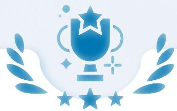

- 荣获中华环保联合会“科学技术奖科技进步奖特等奖”  
- 荣获 E20 环境平台及中国水网 2025 年度最具社会责任投资运营企业  
- 荣获 E20 环境平台 “2025 年度固废最具社会责任投资运营企业” 奖项  
- 荣获 E20 环境平台和 E20 研究院 “市政污水管网优秀案例”  
- 入选全联环境服务业商会最新一期“中国环境企业营收前50”榜单  
- 荣获中国上市公司协会“2025年度上市公司董事会最佳实践案例”奖项、“2025上市公司董事会办公室最佳实践”奖项  
- 荣获“2025上市公司口碑榜——上市公司最佳董事会奖”  
- 《“数智赋能”驱动水务企业高质量发展》课题入选“2025年中国上市公司内部控制最佳实践案例”  
- 荣获第二十七届上市公司金牛奖“金信披奖”  
- 荣获全景投资者关系金奖（2024）“杰出机构关注奖”  
- 入选《成都市国资国企社会责任暨 ESG 蓝皮书》  
- 荣获 2025 金蜜蜂企业社会责任 · 中国榜 “ESG 竞争力典范 · 双碳先锋” 奖  
“引领污水处理，解码绿色水革命”履责案例入选《2025金蜜蜂责任竞争力案例集》

# ESG 管理

兴蓉环境始终将 ESG 理念深度融入公司运营全过程，通过构建清晰明确的 ESG 治理责任体系，系统开展 ESG 相关风险识别与机遇管理工作。同时，公司持续强化与各利益相关方的沟通协作，积极把握可持续发展带来的发展契机，全力推动高质量可持续发展。

# ESG 理念与战略

兴蓉环境始终坚守“让环境更优，让生活更美”的责任理念，以匠心守护供水安全底线，以初心厚植绿色生态根基，将生态福祉融入市民日常生活，将绿水青山嵌入城市发展脉络，踔厉奋发、勇毅前行，全力推动经济、社会与环境高质量协同可持续发展。

# 环境

将 “让环境更优” 的责任理念融入企业发展基因。公司坚持立足水务根本，高质量发展环保业务，不断提升生态环境服务水平，助力生态文明建设。

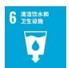

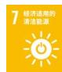

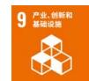

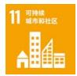

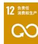

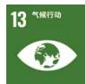

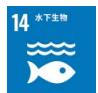

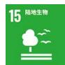

# 社会

关注创新创造的可持续价值，为自身发展注入新的动力。公司将人才视为企业基业长青的宝贵财富，与员工携手并肩共同发展，用责任和担当践行企业价值。

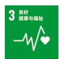

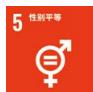

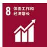

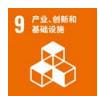

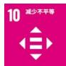

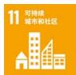

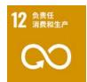

# 治理

坚持党建引领，积极构建高效公司治理体系，加强风险防控和合规管理，不断优化自身ESG管理建设，持续推动企业高质量发展。

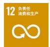

# ESG 指标与目标管理

为明确 ESG 指标管理体系的基本原则、组织架构与职责分工，为公司系统性识别、管理 ESG 议题及相关风险与机遇提供操作指引，公司依据《兴蓉环境 ESG 指标管理手册》，通过年度 ESG 报告编制工作，持续检视 ESG 指标推进情况，不断细化 ESG 战略方向，进一步明晰 ESG 管理目标。

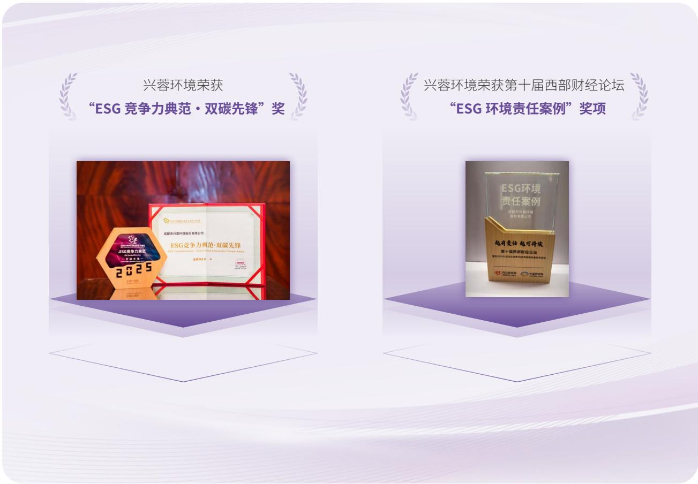

<details>
<summary>flowchart</summary>

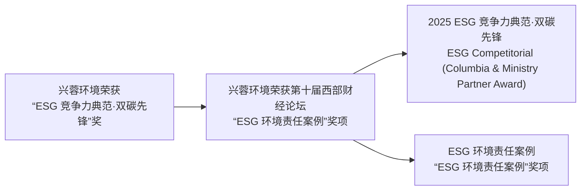
</details>

# ESG 治理

兴蓉环境将董事会作为 ESG 事宜的最高决策机构，并将 ESG 纳入公司战略委员会工作职责，负责对公司可持续发展战略进行研究建议，并审议公司年度 ESG 报告或可持续发展报告，推动各职能部门、子公司共同保障 ESG 工作落地实施。此外，公司积极参与行业 ESG 交流活动，开展可持续发展信息披露解析等专项内部培训与外部培训，持续培育 ESG 文化，为 ESG 体系建设与可持续发展凝聚全员共识、夯实认知基础。2025 年，公司开展可持续发展专项培训 4 次，培训时长达 58 小时。

# 双重重要性评估

兴蓉环境全面洞悉利益相关方核心关切，确保 ESG 政策与实践成效契合各方期望。公司依据相关监管政策及深圳证券交易所相关要求，结合 GRI、SASB、Wind 等国际国内标准与评级体系，系统开展 ESG 议题识别工作。同时，参照《深圳证券交易所上市公司自律监管指引第 17 号——可持续发展报告（试行）》相关规定，从对公司财务的重要性与对经济、社会及环境影响的重要性两大维度，按照“对标识别 - 评估分析 - 结果验证”三个步骤，充分了解并收集各利益相关方意见与诉求，最终将识别出的实质性议题转化为报告内容。


# 对标识别

结合国内外政策走向、ESG 披露标准、ESG 评级要求及行业对标分析，以原有重要性议题清单为基础，通过多维度评估与系统性梳理，遴选出本年度与公司经营活动密切相关、利益相关方重点关切的 20 项关键议题。


# 评估分析

采用不记名在线问卷方式，广泛收集员工、用户等核心利益相关方的反馈。同时，基于对公司财务的重要性与对经济、社会及环境影响的重要性双重维度，对20个ESG议题开展双重重要性评估，通过绘制双重重要性矩阵，明确公司ESG议题的优先级排序，并将相关议题的实践进展作为本年度报告的重点披露内容。


# 结果验证

依托外部第三方对 ESG 双重要性矩阵的专业指导，经多部门联合校验及公司战略委员会、业务部门与外部机构共同审核，确保评估结果客观公允。

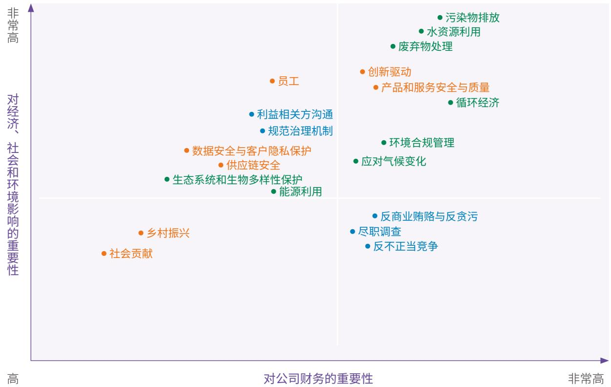

<details>
<summary>scatter</summary>

| Category | X-axis Position (Approximate) | Y-axis Position (Approximate) |
| --- | --- | --- |
| 污染物排放 | High | Very High |
| 水资源利用 | High | Very High |
| 废弃物处理 | High | Very High |
| 创新驱动 | High | Very High |
| 产品和服务安全与质量 | High | Very High |
| 循环经济 | High | Very High |
| 员工 | Medium-High | High |
| 利益相关方沟通 | Medium-High | Medium-High |
| 规范治理机制 | Medium-High | Medium-High |
| 数据安全与客户隐私保护 | Medium | Medium |
| 供应链安全 | Medium | Medium |
| 生态系统和生物多样性保护 | Medium | Low-Medium |
| 能源利用 | Medium | Low-Medium |
| 应对气候变化 | High | Low-Medium |
| 乡村振兴 | Low-Medium | Low |
| 社会贡献 | Low | Low |
| 反商业贿赂与反贪污 | High | Low |
| 尽职调查 | High | Low |
| 反不正当竞争 | High | Low |
</details>

# 利益相关方沟通

兴蓉环境高度重视与各利益相关方的沟通，基于自身的日常运营和管理、议题范畴、各方影响因素等，识别遴选出具有重要影响力的内外部利益相关方通过多种沟通方式了解利益相关方的期望与诉求，并积极进行回应，与各方实现和谐共赢。

<table><tr><td>利益相关方</td><td>期望和诉求</td><td>回应方式</td></tr><tr><td>政府及监管单位</td><td>保障供排水积极应对气候变化支持污染防治依法纳税守法合规促进地方经济发展</td><td>保障供排水践行低碳发展深耕环保业务主动纳税遵守法律法规与地方开展合作,优化营商环境</td></tr><tr><td>投资者</td><td>风险管理透明运营可持续盈利能力开展对外交流与战略合作</td><td>提升公司风险防控能力定期信息发布开展路演活动拓展业务布局,提升业务管理水平加强合作交流</td></tr><tr><td>客户</td><td>安全可靠供水提供优质服务</td><td>保障供水安全提升服务的便捷化、智慧化</td></tr><tr><td>环境</td><td>提供环保方案减少污染资源循环利用</td><td>深耕环保业务绿色低碳运营垃圾焚烧发电和中水利用炉渣资源化利用</td></tr><tr><td>员工</td><td>员工权益保障员工成长和发展员工生活关爱</td><td>平等雇佣完善薪酬福利体系保障健康与安全丰富的员工培训拓宽员工发展通道关爱员工工作与生活</td></tr><tr><td>社区</td><td>促进社区发展加大公益投入开展志愿服务</td><td>开展社区帮扶助力乡村振兴慈善捐赠开展志愿活动</td></tr><tr><td>合作伙伴</td><td>遵守商业道德良好合作关系</td><td>公开透明合作机制加强战略合作</td></tr><tr><td>金融机构</td><td>降低信贷风险提高资金回报</td><td>诚信履约加强合作</td></tr><tr><td>媒体</td><td>信息公开透明</td><td>定期信息发布开展新闻宣传</td></tr><tr><td>同业</td><td>公平竞争、友好合作健康和谐的行业发展环境</td><td>开展战略合作交流学习、论坛会议参与行业标准编制</td></tr></table>


<details>
<summary>text_image</summary>

兴蓉环境始终坚守生态环保初心，将“让环境更优”的责任理念深度融入企业发展全过程，以守护绿水青山、助力生态文明建设为使命，深耕水务环保主责主业。公司立足供水、污水处理、固废处置等核心领域，持续优化环境综合治理服务，全面提升资源循环利用效率，积极推动绿色低碳转型与高质量发展，以专业能力与务实行动践行国企担当，为绘就绿水青山
</details>


# 绿色先行 守护地球

# 我们的行动

\- 环境管理

\- 水务治理

\- 污染防治

\- 生态保护

兴蓉环境始终坚守生态环保初心，将“让环境更优”的责任理念深度融入企业发展全过程，以守护绿水青山、助力生态文明建设为使命，深耕水务环保主责主业。公司立足供水、污水处理、固废处置等核心领域，持续优化环境综合治理服务，全面提升资源循环利用效率，积极推动绿色低碳转型与高质量发展，以专业能力与务实行动践行国企担当，为绘就绿水青山的美丽中国画卷贡献力量。

# 助力联合国可持续发展目标

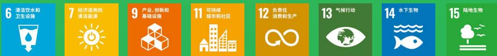


# 环境管理

兴蓉环境将绿色可持续理念深度融入战略与运营，深刻认识到水资源开发与保护同自然生态的紧密关联，并积极履行应尽的环境责任。我们持续聚焦于水资源高效利用、节能降碳与水环境保护等关键领域，致力于与各利益相关方携手以最小化运营对环境的影响，共同推进绿色、低碳的可持续发展路径。

# 环境管理体系

兴蓉环境严格遵循《联合国生物多样性公约》《中华人民共和国环境保护法》《中华人民共和国大气污染防治法》《中华人民共和国水污染防治法》等相关法律法规要求，建立体系化的环境管理机制，并持续完善环境管理专项制度、管理手册及程序文件，并通过合规性评价、内部审核、管理评审等常态化工作，确保环境管理持续改进、规范运行。截至2025年底，兴蓉环境下属自来水公司、排水公司、再生能源公司、西安兴蓉公司、沱源公司等子公司均已取得ISO 14001环境管理体系认证。

公司深化环保培训与宣教常态化机制建设，重视员工环保专业能力与合规意识的系统性提升，定期开展内外部环保培训及主题宣教活动，通过线上线下结合的多平台模式，系统开展环保法规解读、污染治理实操技能等专项培训，有效提升内外部环保责任意识。

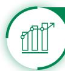

# 2025年

环保培训及宣教次数

147 次

覆盖

6,668 人次

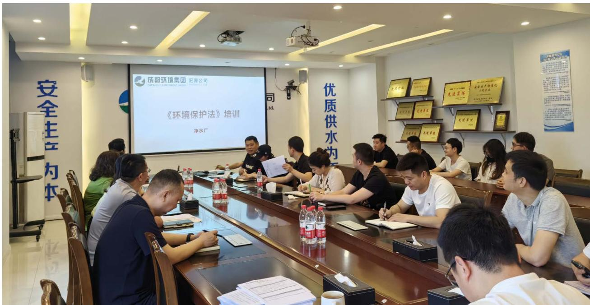

<details>
<summary>text_image</summary>

成都环境集团 记源公司
CHENGDU ENVIRONMENTAL DEVELOPMENT CO.,LTD.
《环境保护法》培训
净水厂
优质供水为水
</details>

兴蓉环境下属沱源公司开展环境保护培训

# 环境应急管理

兴蓉环境构建健全的突发环境事件应急管理体系，系统化推进环境风险防控与应急能力建设，下属各子公司均建立《应急管理办法》，成立应急领导小组，针对突发事件处置坚持“统一领导、层级响应”的原则，结合上级公司应急响应要求，将公司整体应急响应分为预警响应及应急响应。通过识别、分析和评估潜在风险，公司建立了环境风险识别清单，并对下属生产运营单位进行了全面的环境风险识别，识别在配电、化学品储存、危废管理、工艺运行等环节可能发生的风险事件，并评估其环境影响。

公司编制了整体突发环境事件应急预案，并针对具体风险点位制定现场处置方案，形成分层分类的预案体系。在应急保障方面，关键风险点位均配备必要的应急设施，确保第一时间响应能力。同时，公司分级分类开展演练，并根据演练情况和内外部环境等变化及时对应急预案进行总结和评估，进一步提高应急反应速度和应急处理能力。

# 能源管理

兴蓉环境严格遵守《中华人民共和国节约能源法》等相关法律法规，推动能源管理体系建设，制定了完善的管理制度与程序文件，优化各层级能源管理办法，明确能源使用规范和标准，持续构建清洁能源替代与数智化管控并重的能源管理体系。公司积极建设分布式光伏发电项目，采用“自发自用、余电上网”模式运行，在实现土地及空间资源立体化利用的同时，有效降低厂区生产运营用电成本与电网依赖。同时，公司积极挖掘生产过程中的余热、余压等资源化利用潜力，推动能源梯级利用与循环利用，通过余热回收、余压发电等技术改造持续提升能源利用效率，降低单位产品综合能耗。

# 兴蓉环境节能降碳综合措施

# 节能技改

以设备更新与工艺优化为抓手，对供水、污水处理全流程高能耗设备开展系统性排查与升级，通过改造加压站、送水泵房等核心生产环节，从源头持续降低生产能耗。

# 余热发电

利用垃圾焚烧产生的高温烟气加热水生成蒸汽，蒸汽推动汽轮机并带动发电机发电。

# 设备升级换代与选型优化

兴蓉环境下属崇州成环水务公司更换低质老旧设备，提升运行效能，延长使用寿命，并根据实际工况需求，选择功率匹配的设备，实现节能降耗；兴蓉环境下属双流成环水务公司实施厂区绿色照明改造，大规模应用太阳能路灯等节能灯具，降低照明系统能耗。

# 开发能碳管理平台

兴蓉环境下属再生能源公司搭建能碳综合管理平台，整合光伏发电、生产能耗、碳排放等数据资源，实现能源消耗实时监测、智能分析与优化调度，并对重点用能设备实施能耗监控与动态调控，通过工艺参数优化精准控制电耗、药耗，推动降碳工作精准化、精细化。

# 水资源管理

兴蓉环境高度重视水资源管理工作，恪守《中华人民共和国水法》《取水许可和水资源费征收管理条例》《中华人民共和国城市供水条例》等相关法律法规要求，构建了权责清晰、管控有序的水资源管理体系，将水资源高效利用、节约保护与科学管控融入生产经营全流程，持续提升水资源使用效益。

# 节水相关措施


# 原水巡查与漏损管控

定期开展引水明渠巡检，及时发现并修复管道渗漏，减少原水输配过程中的漏失。


# 中水资源化利用

设立中水资源化利用率指标，在具备利用条件的场景中优先推广中水回用，实现水资源节约与高效利用。


# 分级计量与精准管控

推进各污水处理厂安装分级水表，细分生产、办公、食堂等用水场景，针对性制定节水措施。

# 排放管理

兴蓉环境坚持源头管控理念，围绕废水、废气、固废及噪声等重点领域，建立健全污染防治管理体系与制度，强化全过程监管与精细化管控，持续降低生产环节污染物产生强度。通过优化工艺、规范运行及常态化监测，确保各类污染物排放稳定满足国家及地方标准要求，2025年未发生环境污染事故，亦无环境行政处罚。

# 废水

兴蓉环境严格遵循《中华人民共和国水污染防治法》《水污染防治行动计划》等所在地法律和标准的要求，下属排水公司制定《生产运营管理制度》《再生水厂监测管理办法》等管理制度。我们坚持“分类收集、分质处理、循环优先”的管理原则，通过优化处理工艺与强化过程管控，提升水资源循环利用水平，最大限度降低废水排放对环境的影响，并确保废水符合《污水综合排放标准》等所在地标准，实现达标排放。

# 废水管控与循环利用措施

# 分类收集与源头管控

兴蓉环境下属海南兴蓉公司针对生活污水，经化粪池等预处理设施收集处理后，定期清掏并用于周边农业施肥，实现资源化利用。针对生产废水，网格絮凝池及气浮池的排泥水排入干化池，经干化沉降后上清液回流至处理前端循环利用，需外排的部分经处理达标后规范排放；气水反冲滤池的反冲洗水经回流水池循环回用于原水。

# 厂内循环与梯级利用

针对滤池反冲洗水等水质较好的工艺废水，建设专项回用系统进行收集，并将其回用于生产前端（如作为反冲洗、稀释水等），同时实施中水系统升级改造，推动达标尾水转化为优质再生水，大幅减少自来水取用依赖，实现厂区内水的梯级循环利用。

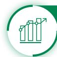

# 2025 年 污染物削减

化学需氧量 (COD) 削减量

407,669.98吨

生化需氧量 (BOD $_{5}$ ) 削减量

173,891.99吨

氨氮 $(NH_{3}-N)$ 削减量

43,915.86吨

总氮 (TN) 削减量

47,860.41吨

总磷 (TP) 削减量

5,470.09吨

悬浮物 (SS) 削减量

217,296.08吨

污水处理量

144,209万吨

# 废气

兴蓉环境废气排放主要涉及有组织臭气排放，包括硫化氢、氨气、臭气浓度，以及无组织臭气排放，包括硫化氢、氨气、臭气浓度、甲烷。公司严格遵循《大气污染物综合排放标准》《恶臭污染物排放标准》《城镇污水处理厂污染物排放标准》（GB 18918）等国家及地方标准，建立全流程、标准化的废气污染防治与管控机制。

我们建立常态化的废气排放监测体系，根据排污许可证要求，委托有资质的第三方检测公司开展废气排放检测，确保监测数据真实、准确、完整，并按要求完成数据记录与上报。同时，强化废气治理设施日常运维管理，制定标准化的巡检、维护、保养流程，安排专人负责设施运行状态监控，及时排查处置设备故障，确保治理设施与生产设施同步运行、稳定高效，从运行端保障废气治理效果。2025年，公司加强废气治理进行了SCR提标改造，优化药剂投加方式和除尘器的运行维护，氮氧化物、硫氧化物、颗粒物排放量较上均年明显下降，废气排放控制水平持续提升。

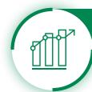

# 2025年

硫氧化物（SOx）

274.43吨

氮氧化物（NOx）

961.26吨

颗粒物

20.51吨

烟气排放合规率

100%

# 有害废弃物

兴蓉环境运营环节产生的主要危险废弃物包括废机油、废药剂包装、含油抹布和手套等含油废物、废化学试剂瓶及其他化学品包装材料、废活性炭等。公司严格遵循《中华人民共和国固体废物污染环境防治法》《国家危险废物名录》《危险废物贮存污染控制标准》《危险废物识别标志设置技术规范》等法律法规及管理规定，系统构建了《危险化学品安全管理办法》《环境保护管理制度》《安全生产事故隐患处罚实施细则》《安全宣传教育培训管理办法》等管理制度，落实岗位责任制，确保各项环境保护工作得到有效决策、监督和协调。公司建立了严格的危险废物交接管理制度及安全操作规程，对废弃物的收集、分类、存储、处理、回收等全流程进行规范管控，最大限度降低生产运营对自然生态的影响，保障各环节合法合规、可追溯。公司定期对管理人员及操作人员开展专项培训，确保其掌握法规要求、单位规章及应急预案，并熟练运用危废分类、收集、运送、暂存的正确方法。

# 无害废弃物

兴蓉环境在生产运营过程中产生的无害废弃物主要包括脱水污泥、生活垃圾等。公司严格遵守《中华人民共和国固体废物污染环境防治法》等法律法规要求，制定《污水污泥管理办法》等内部制度，实现对无害废弃物从产生、贮存到处置的全过程闭环管理。

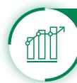

# 2025年

废弃物合规处置率

100%

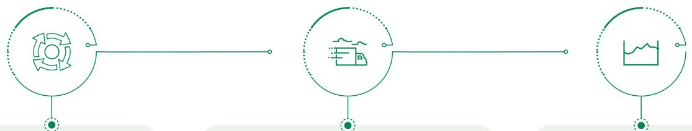

<details>
<summary>flowchart</summary>


</details>

在污泥处置环节，坚持资源化利用导向，各下属水厂产生的污泥经规范化处置后，部分焚烧炉渣通过制砖、制水泥等建材化方式进行综合利用，有效替代传统填埋方式，实现废弃物向资源的转化。

针对污泥运输过程，严格执行防遗撒措施，采用密闭式车厢运输，并每月开展污泥跟车抽查，对运输及处置环节实施全过程监管，同时进一步强化数据管理，对污泥生产、运输、称重等环节数据实行实时登记、专人统计、定期报送，确保污泥从出厂到最终处置去向清晰可查。

在贮存管理方面，对产生的污泥做到日产日清，避免长期堆存带来的环境风险。生活垃圾等其他无害废弃物统一纳入市政收运体系，由专业机构规范处置。

# 噪声管理

兴蓉环境主要噪声源包括污水处理厂污水提升泵房、变配电设施、鼓风机等设备运行噪声及建筑施工噪声。公司严格遵循《中华人民共和国环境噪声污染防治法》《工业企业厂界环境噪声排放标准》（GB 12348-2008）2类排放标准，制定《安全环保标准化工地建设手册》，推动噪声管理规范化、标准化。针对主要噪声设备，采取基础减震、厂房隔音等措施，并在厂区边缘设置绿化带与围墙，有效降低噪声传播影响。同时，公司常态化开展厂界及作业场所噪声监测，及时掌握噪声环境质量，并为相关岗位员工配备防护耳塞等劳保用品，全方位保障员工职业健康权益。

# 药剂管理

兴蓉环境建立完善的药剂管理制度体系，严格按照《生产药剂管理办法》执行采购、验收及使用过程。公司制定并实施《生产物资管理实施细则》等药剂管理相关制度，积极推进厂级标准化管理，建立药剂警告和问责机制，落实精准化药剂投加，保障药剂采购、验收及使用的管理合规性，实现生产药剂的采购、储存、使用、处置、验收的全过程控制与管理。

# 药剂管理措施


# 生产药剂精细化管理

加强生产药剂投加管控，不断优化投药、加氯模型，通过智能模型提升药剂投加管控水平，形成《供水业务生产药剂投加标准的报告》，达到提高安全保障率、降低药耗的目标；强化药剂精准投加和反馈机制管控，初步形成生产药剂投加系统评估报告，建立各水厂《生产药剂智能投加系统运行管理指南》。


# 工艺革新与源头减量

开展水厂消毒工艺提档升级，通过采用最新的空气阴极次氯酸钠发生器系统，替代外购商品次氯酸钠，从源头减少了危险化学品的厂外运输及储存风险。

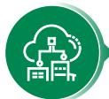

# 自动化精准投加

将人工操作经验转化为数字控制逻辑，通过自动化精准调控合理优化药剂使用量，实现关键工艺单元自主决策与实时优化。


# 降低药剂耗量

组织各水厂严格落实制水生产过程精细化管控，深度挖掘分析生产数据，优化沉淀水浊度控制，提高投药跟随性，定期检查制水生产情况，在保障供水水质情况下，提高沉淀池出水浊度、余氯控制精度，尽可能降低药耗、氯耗。


# 严控供应商资质

严格遵循《生产药剂质量验收管理办法》《危险化学品安全管理办法》等内部制度，对氢氧化钠（NaOH）等危化品供应商实施资质准入，要求必须具备危险化学品安全生产许可证、经营许可证，从源头确保合规性。


# 2025年

碳源

87,004.58吨

除磷药剂

51,528.03吨

# 气候变化管理

气候变化是全人类社会面临的主要挑战之一，兴蓉环境积极响应国家“双碳”战略目标，主动对标国际可持续准则理事会（ISSB）《国际财务报告可持续披露准则第2号——气候相关披露》及气候相关财务信息披露工作组（TCFD）建议，从治理、战略、风险管理及指标和目标四个领域完善气候管理体系，持续披露公司行动与成效，以务实行动助力行业绿色转型与生态文明建设。

# 气候治理

兴蓉环境高度重视气候变化治理工作，构建了权责清晰、多层联动的气候治理架构。公司董事会作为气候相关议题的最高决策层，负责审议气候战略、监督目标进展及重大气候风险应对措施。管理层统筹协调气候变化相关事务推进，确保气候战略与业务发展深度融合。各职能部门及下属子公司依照公司统一部署，具体落实低碳运营、能源管理等工作。

# 气候策略与风险管理

兴蓉环境基于政策要求与行业特点，识别并评估公司面临的气候风险和机遇，制定并逐步采取应对举措。

兴蓉环境主要气候风险识别与应对

<table><tr><td colspan="2">风险类型</td><td>相关气候风险</td><td>应对措施</td></tr><tr><td rowspan="3">实体风险</td><td>极端降水</td><td>引发设施积水、管网负荷突增,可能导致设备故障,增加设施运维、应急抢修成本</td><td>制定生产应急预案,完善“巡查-蹲守-处置”三级响应机制定期进行安全培训及应急演练强化厂网-河道联动机制</td></tr><tr><td>极端高温</td><td>导致水资源短缺、水质波动,影响运营成本,同时增高户外作业人员健康风险</td><td>建立气象监测与预警机制,提早储备应急物资加强供水过程管控,推进设备能效提升,优化工艺参数加强管网监测与智能化改造建立高温作业防护机制</td></tr><tr><td>极端低温</td><td>造成管道冻堵、阀门冻裂,影响输配水畅通与设施正常运维,导致运营成本上升</td><td>开展冬季农饮水水表防冻工作及后期保护措施加强低温天气设施巡查与隐患排查,建立问题台账并立行立改优化低温工艺参数,加强水质动态监测,确保稳定达标排放</td></tr><tr><td>实体风险</td><td>夏季藻类爆发</td><td>造成原水水质受到冲击,水处理难度与成本进一步增加</td><td>在每年藻类爆发前全面清洗常规处理构筑物适时启用应急投加预处理、加强水质检测频次并分析水质信息调整工艺抑制藻类滋生、加强沉淀池排泥频次</td></tr><tr><td>转型风险</td><td>政策与法律风险</td><td>“双碳”相关监管政策完善,环保排放标准不断提高,增加技术改造投入与运营成本</td><td>加强政策跟踪研判,确保合规运营保持技术工艺前瞻性,提前布局提标改造推进绿色低碳技术应用与清洁能源替代</td></tr></table>

<table><tr><td colspan="2">风险类型</td><td>相关气候风险</td><td>应对措施</td></tr><tr><td rowspan="2">转型风险</td><td>技术风险</td><td>低碳技术、新型污染物去除技术等技术迭代要求升级,导致运营成本上升</td><td>依托“五中心”智慧管控平台,数智赋能提升精细化运营水平加强与科研院所产学研合作,开展新型污染物去除、节能降碳等前沿技术储备与中试研究</td></tr><tr><td>市场风险</td><td>客户需求提升,市场竞争加剧,叠加能源、环保材料价格波动等因素,面临低价竞争与高品质交付的双重挑战</td><td>依托“内生增长和外延并购”并重的发展思路,持续推进供排净治一体化整合积极推动产业链延伸,拓展再生水利用、餐厨垃圾处置、废弃油脂资源化等细分市场</td></tr></table>

兴蓉环境主要气候机遇识别与应对

<table><tr><td>机遇类型</td><td>相关气候机遇</td><td>应对措施</td></tr><tr><td>政策机遇</td><td>国家深入推进环境基础设施提升,污水管网更新改造、污水资源化利用等领域政策支持力度持续加大</td><td>·积极把握政策机遇,紧扣国家和省市相关规划部署,持续深化供排净治一体化整合</td></tr><tr><td>技术机遇</td><td>开发节能降碳、智慧水务等新技术,有效提升运营调度效率与能源利用效率</td><td>·积极关注行业前沿技术发展,持续推进技术工艺优化·持续加大节能减排工艺研发投入与生产应用</td></tr><tr><td>市场机遇</td><td>绿色低碳市场需求持续扩大,垃圾焚烧发电、再生水利用、固废资源化业务契合循环经济导向,市场增长空间广阔</td><td>·积极推动产业链延伸与多元化,大力拓展细分市场</td></tr></table>

兴蓉环境将气候变化风险管理纳入公司全面风险管理体系，遵循“管业务必须管风险”的原则，构建系统化、规范化的气候风险管理流程，开展气候变化风险评估。公司依据《风险防控管理制度》，通过风险识别、分析评估、应对方案制定等流程，对气候变化相关风险实施全生命周期管理。

# 兴蓉环境气候相关风险管理流程


# 风险识别

广泛收集内外部风险信息，关注极端天气、碳排放政策变化等气候相关因素带来的影响。


# 风险评估

运用风险等级划分矩阵法，从风险发生可能性和影响程度两个维度进行分析评估，综合判定风险等级


# 风险应对

针对不同等级的风险制定差异化的应对方案，明确责任主体和管控措施，确保风险控制在可承受范围之内。

# 气候指标与目标

公司结合行业特点与业务实际，围绕温室气体减排、能源结构优化、资源循环利用等重点领域，通过推广“光伏+污水厂”等清洁能源应用模式、不断提高固废资源化利用效率等措施持续推进节能降碳。

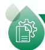

# 案例 | 践行双碳，供水节能降碳交出硬核答卷

2025 年，兴蓉环境下属成都市自来水有限责任公司践行双碳战略，构建“体系筑基、数智赋能、项目驱动”的低碳发展模式，全面夯实绿色低碳发展基础。以首次碳核查为契机，精准摸清碳排放基数与结构，顺利通过能源管理体系认证，搭建厂站能碳管理平台，实现全流程能耗与碳排放的实时监测、智能分析与精细管控，为科学降碳提供依据。有序推动 90 余项高耗能及淘汰类设备更新，预计年节约电量 50 余万度，年减碳量约 78 吨；推进水七厂三期 3.25MWp 光伏项目落地，年均发电量 258.03 万 kWh，年减碳 404 吨，同步启动新一批光伏项目、余压发电项目，清洁能源自给率可提升至 20%，实现环境效益与经济效益的双重提升。

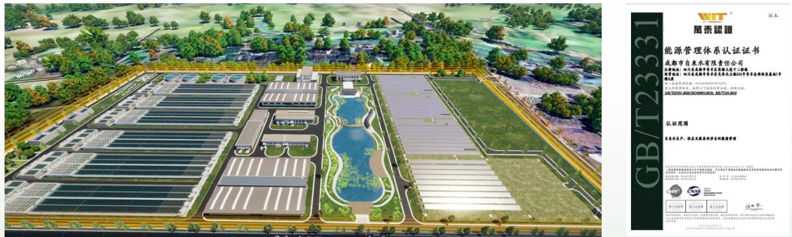

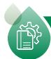

# 案例 | 锚定双碳，打造县域近零碳供水样板

2025 年，兴蓉环境下属大邑成环公司深度践行“双碳”战略，以“节能改造 + 清洁能源替代 + 数智化控碳”近零碳发展体系为目标，成功实现绿色转型与效益提升双向共赢，并入选成都市近零碳排放场景建设名单，打造县域供水领域近零碳发展新范式。公司深挖节能降碳潜力，实施水泵系统智慧焕新升级，实现水泵机组精准调度，达成节能与安全双重提质增效。公司利用厂区工艺结构资源，以 EMC 模式创新建设 1.42MWp 分布式光伏电站，年均清洁发电 112 万 kWh。同时，借用原水高差优势产生的余压进行

资源再利用，年发电约 88 万 kWh。上述措施年节电约 440 万 kWh，年减少碳排放量约 453 吨。此外，公司构建起一体化能碳综合管理平台，实现碳足迹可追溯、碳管控可量化、碳优化可落地，推动降碳工作精准化、高效化、可持续。

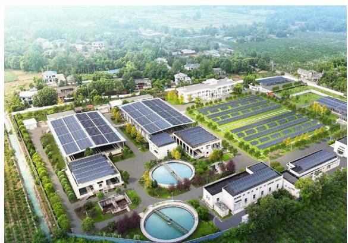

<details>
<summary>natural_image</summary>

Aerial view of a modern industrial park with solar panel installations and adjacent buildings, surrounded by greenery (no visible text or symbols)
</details>

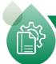

# 案例 | 兴蓉环境下属成都排水公司首笔碳减排量核发

2025 年，兴蓉环境下属成都排水公司依托厂区突出的节能降耗成效，积极参与成都市“碳惠天府”（CDCER）机制下碳减排量认定申报，于 7 月底成功获得首笔碳减排量核发，首年核定量约 6,000 吨，预计五年累计核证总量将超 3 万吨。在成都世运会举办期间，公司向组委会捐赠 6,000 吨碳减排量，以实际行动助力赛事实现碳中和目标。目前，厂区正加快推进光伏发电、水源热泵及再生水利用项目建设，预计年内建成光伏与水源热泵系统，其中光伏发电年发电量可达 126 万度，进一步提升能源自给率，持续推动污水处理运营向低碳化、资源化、高效化升级。


# 案例 | 锚定双碳，打造水务运营数智减碳样板

2025 年，兴蓉环境下属西汇水环境公司深入践行 “双碳” 战略，聚焦水务运营全流程节能减碳，构建 “数智控碳 + 工艺优化 + 设备升级” 的绿色运营模式，切实筑牢节能减碳防线，为水务行业绿色转型提供可复制、可推广的实践经验。公司建成并投用合作净水厂三期和安德园区第二污水处理厂（一期）能碳管理平台，实现能耗、碳排放的实时监测与核算，推动能碳管理从传统经验管控向数智化精准管控转型；同步优化合作净水厂三期精确曝气、智能加药系统，升级安德园区工业污水处理厂曝气系统并优化布局，以工艺优化与设备升级双轮驱动，有效降低能源消耗与药剂损耗，扎实推进节能减碳落地见效。

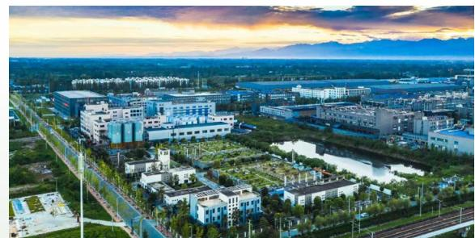

<details>
<summary>natural_image</summary>

Aerial view of a modern industrial park at sunset, featuring multiple factory buildings and green spaces (no visible text or signage)
</details>

安德园区工业污水处理厂

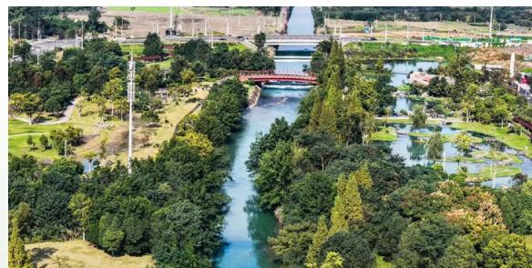

<details>
<summary>natural_image</summary>

Aerial view of a river park with lush greenery, a red arched bridge, and distant railway tracks (no visible text or symbols)
</details>

安德园区工业污水处理厂周边生态风貌


# 2025年

温室气体排放范围 $1^{1}$

117,291.67 吨二氧化碳当量

温室气体排放范围 $2^{2}$

486,952.37 吨二氧化碳当量

温室气体排放总量（范围 1+ 范围 2）

排放密度

604,244.04 吨二氧化碳当量

66.64 吨二氧化碳当量 / 百万营收

注1：范围1温室气体排放量来自生产经营活动相关化石燃料燃烧排放（固定源：发电机、食堂燃气灶；移动源：运输车辆）、过程排放（化粪池、臭氧、PAC、PAM、非碘食盐、碳源等药剂使用）及污染物排放（废水处理过程厌氧发酵工艺等）。

注 2：范围 2 温室气体排放量来自生产经营活动相关外购电力排放，包括生产用电设备（空压机、水泵、离心机、计量设备等）耗用等。

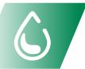

# 水务治理

兴蓉环境依托完整的水务环保产业链，持续为城镇提供从供水保障、污水处理到资源循环利用的全链条服务，不断深化技术创新与模式探索，推动水资源管理向智能化、绿色低碳方向升级，以更高品质的水务环保运营，助力城市构建更加宜居宜业的水生态环境。

# 保障供水品质

兴蓉环境始终以供水安全为核心，完善业务运行手册、加密检测、校准在线仪表、优化工艺等多措并举，强化全过程水质管控。

# 水资源风险管控

# 源头管控

# 水质监测

# 智慧水务系统


明确下属各单位取水来源为优质地表水，通过常态化巡检及不定期专项巡查强化水源地保护；针对部分水源水质不稳定问题，果断实施水源切换，选用水质更优的水源作为主力供水来源，从源头提升原水品质。

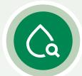

公司构建从水源地到出厂水的全过程在线水质监测评估体系，出厂水、管网水、末梢水均规范开展水质检测，检测结果均符合《生活饮用水卫生标准》；同时通过科学调配水资源、精准调控管网压力，优化供水调度方案，切实提升供水稳定性。


公司利用智慧水务系统构建了水资源监测网，实时掌握水源的水量、水质动态，并按计划定期巡查水源、抽检水质，发现水量、水质异常，立即启动相应的应急处置流程，确保供水安全稳定，并通过在线水力模型、智能调度等信息化手段指导生产过程实时纠偏，有效保障制水工艺水质安全。

# 日常巡检

建立常态化管网巡检机制，结合数字化手段强化过程管控，定期开展管道探测、清淤疏通及附属设施维护，保障管网系统安全稳定运行。

# 委托专业探漏机构

委托专业探漏机构开展全覆盖普查探漏，借助专业力量发现并维修存量漏点。

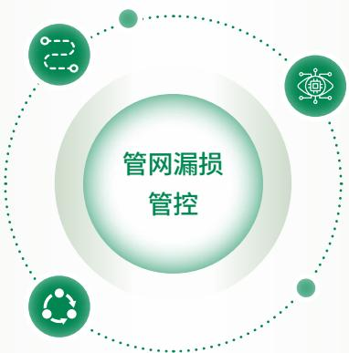

<details>
<summary>flowchart</summary>

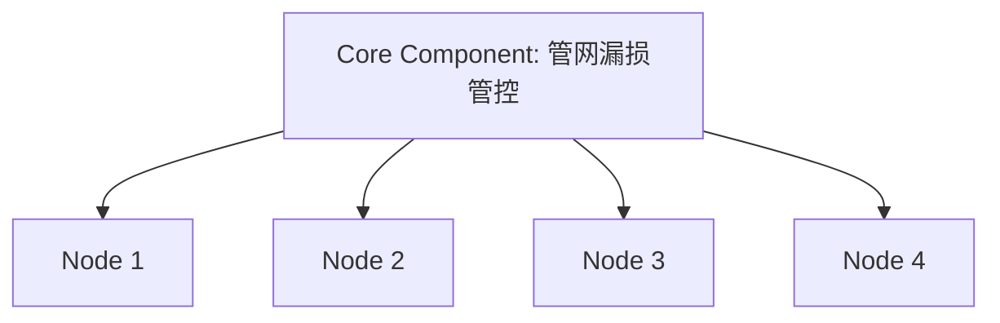
</details>

# 智能监测

高密度部署流量、压力、漏损及水浸感知设备，建立智能预警模型，试点应用“智能声学漏损监测平台”，并自主开发“管网流量监测数据分析工具”，实现对管网漏损和异常用水的主动识别与精准定位。

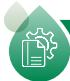

# 案例 | 智慧水务系统研发

兴蓉环境下属大邑成环水务公司通过技术创新与系统研发，构建“感知-分析-决策-执行”闭环管控体系，以数智赋能有效提升漏损控制水平。公司自主研发厘米级精度采集系统夯实管网档案数据基础，创新物探模式，为DMA分区计量与漏损控制筑牢数据基础，相关案例入选中国人民大学“2025档案数据行业创新案例”；研发AI供水管网爆漏预警模型，融合管网压力、流量、水质等多维数据，构建多模态时空特征提取算法，实现管网爆漏精准识别与时空分析；创新“无人机+AI预警”空地一体化巡检模式，无人机接收预警指令自主巡检、全域核查，将事故处置响应周期压缩至实时响应，实现漏损快速排查与闭环处置，大幅提升管网运维效率，模型入选“一带一路”人工智能应用场景案例集。

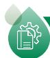

# 案例 | 管网健康评估与风险预测系统研发

兴蓉环境下属自来水公司联合清华大学研发“管网健康评估与风险预测系统”，融合管线管龄、管材、历史维修多源数据，依托机器学习及智能算法，评估管网健康及风险状况，提供管网更新改造科学决策依据，入选住建部城市公共供水漏损治理可复制政策机制清单（第二批）。

# 推进污水治理

兴蓉环境专业从事城市生活污水和工业污水处理，拥有国家级排水水质监测站，能够有效解决污水增量、出水提质等问题，保障排放持续稳定达标，为地区经济发展保驾护航。2025年，公司下属成都市第十再生水厂通过精准控制实现脱氮、除磷药剂投加量显著下降，进一步提升了运营效能与精准处置能力。目前，公司污水处理厂/再生水厂覆盖四川成都、四川阿坝州、四川巴中、陕西西安、甘肃兰州、宁夏银川、宁夏宁东、江苏沛县、河北石家庄、山东东营、西藏山南等地，持续为城市水环境安全提供坚实保障。其中成都市第九再生水厂（处理规模100万吨/日）是国内一次性建成单体规模最大的污水处理厂之一。

# 中水高效利用

兴蓉环境因地制宜推进中水利用，持续为城市河湖生态、绿化灌溉、市政杂用等领域提供高品质再生水资源，助力实现水生态良性循环。当污水经过处理达到中水使用标准，则将其作为景观环境补水、城市杂用水等，用于道路冲洗、绕城高速环城生态区建设等，为城市提供水源保障。同时主动摸排公园、湿地、缺水河道湖泊水源条件，在适宜区域建设生态补水设施，有效补充生态基流、改善水域环境，助力城市水生态良性循环与水资源可持续利用。2025年，公司投资设立成都兴蓉中水水务有限责任公司，进一步聚焦城市河湖补水、绿化灌溉等再生水规模化应用场景。


# 污染防治

兴蓉环境致力于废弃物安全处理与人居环境改善，始终秉持绿色发展理念，通过技术创新与科学管理持续提升废弃物资源化利用水平。

# 垃圾焚烧发电

公司持续深耕垃圾焚烧发电领域，聚力项目建设和稳定运营，采用国内外先进处理技术，确保垃圾焚烧发电排放达标，助力生活垃圾减量化、资源化和无害化处置。公司运营及在建的垃圾焚烧发电项目规模为 12,000 吨 / 日。我们采用“选择性非催化脱氮工艺（SNCR）+ 半干法工艺 + 干法脱酸 + 活性炭吸附 + 袋式除尘器 + 选择性催化脱氮工艺（SCR）”烟气净化工艺，有效去除烟气中酸性污染物、颗粒物、重金属及二噁英等污染物，各项污染物排放指标均优于国家标准和欧盟标准。同时，公司深入推进垃圾焚烧发电厂“数字孪生 + 智慧运营”体系建设，依托人工智能算法打造“智慧电厂”，推动电厂数字化、智能化转型升级，全面提升运营效率和管理水平。

# 垃圾渗滤液处理

公司致力于垃圾渗滤液的无害化处理与资源化利用，采用全球领先的“膜生化反应器（MBR）+纳滤/反渗透（NF/RO）”组合工艺，将垃圾处理过程中产生的高浓度有机废水严格净化达标后，用于生产循环使用及道路冲洗等场景，实现废水再生与资源回用。目前，公司运营及在建的垃圾渗滤液处理项目规模为8,430吨/日，位居全国前列，排放指标优于国家标准，为生态环境持续贡献力量。

# 污泥处置

公司采用先进成熟的“半干化 + 焚烧”工艺技术，运营的成都市第一城市污水污泥处理厂一期、二期及三期处理规模达 1,400 吨 / 日，持续提升污泥处置能力。同时，我们运营的通沟污泥项目采用“多级淘洗 + 筛分 + 回收利用”技术，处理规模约 96 吨 / 日，实现通沟污泥无害化、减量化、资源化处理，成为国内第三个、西部首个成功应用案例，积累了丰富运营经验。此外，万兴环保发电厂一期、二期协同处置污泥 820 吨 / 日，在建的万兴三期新增污泥掺烧能力 800 吨 / 日，通过“污泥干化 + 协同焚烧”实现能源梯级利用，凸显循环经济优势。

# 厨余（餐厨）垃圾处置

公司独立厨余（餐厨）垃圾处理项目分布在陕西西安、四川成都，合计处理能力达1,150吨/日，采用“预处理+中温湿式厌氧消化+固液分离+沼气净化及利用”工艺，构建餐厨有机废弃物闭环生态治理体系。同时，在建的万兴环保发电厂（三期）具备协同处置厨余（餐厨）垃圾能力，设计规模800吨/日，项目通过沼气资源化利用、余热回收利用及废弃油脂资源化等方式，实现厨余垃圾无害化、减量化与资源化利用。

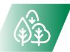

# 生态保护

兴蓉环境始终将生态保护作为高质量发展的核心底色，深度践行“绿水青山就是金山银山”的发展理念，构建全方位、多层次的生态保护体系。通过强化水源地全流程管控、筑牢生物栖息安全屏障、深耕全民环保宣教实践，持续推动生态保护与生产运营协同发展，以实际行动守护生态环境完整性，助力人与自然和谐共生的绿色发展格局构建。

# 水源地保护

兴蓉环境下属各子公司取水水源均为地表水，公司运营及取水区域不涉及水资源紧缺地区与重要水源保护区。公司制定《饮用水水源保护区巡查管理办法》等制度，构建覆盖源头管控、过程监测、应急保障的水源保护体系，全力保障水源地水质安全与生态稳定。

# 水源地保护主要措施


- 建立常态化水质检测机制，对原水水质定期进行采样检测，发现问题及时向上级主管部门报告，确保水源异常早发现、早处置。  
- 在保护区边界设置界标、交通警示牌和宣传牌，拦截人类活动干扰。  
- 建立“水务 + 生态环境”跨政府部门联动机制，定期开展保护区巡查，严厉打击偷盗水、非法排污、破坏防护设施等行为。  
- 编制饮用水源水污染应急预案，明确分级响应机制，定期组织演练，提升污染拦截、应急供水等处置能力。  
- 定期普及水源地保护法律法规和科普知识，公开水质监测信息，引导公众参与监督。


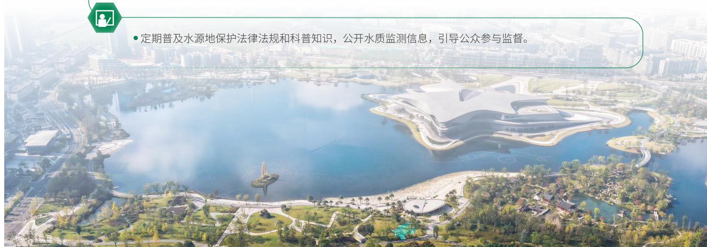

<details>
<summary>text_image</summary>

• 定期普及水源地保护法律法规和科普知识，公开水质监测信息，引导公众参与监督。
</details>


<details>
<summary>natural_image</summary>

White egrets standing on green moss-covered rocks in calm water under clear blue sky (no text or symbols visible)
</details>

# 生物多样性保护

兴蓉环境深刻认识生物多样性保护对生态平衡、自然资源可持续利用及企业长期发展的重要意义，积极将生态保护融入工厂规划、建设与运营全周期。在项目筹备初期，公司组织专业的技术团队，运用先进的评估方法与工具，对项目建设及运营过程中可能对环境生态产生的影响进行精准识别与系统评估，全方位多维度进行考量，严格按法规开展建设项目环境影响评价，为保护当地生态系统与生物多样性提供基础保障。2025年，兴蓉环境下属沛县兴蓉公司运营的部分再生水厂将尾水全部回用于属地湿地，作为高质量补充水源，有效维持了湿地生态平衡，促进了湿地生态经济发展，对维护区域生物多样性和生态安全具有积极意义。

# 兴蓉环境施工阶段保护生物多样性措施

合理布置施工场地，规范区域施工活动，强化区域生态环境保护  
施工场地四周设置防护围网，避免对动物造成直接伤害  
严格控制施工人员活动范围，禁止破坏野生动植物及其生存环境  
加强对施工人员的野生动物保护意识宣传教育，严禁非法捕杀野生动物  
施工结束后，及时绿化，保护自然植被和生态环境，保护场地及周围的植被，避免随意破坏，把工程建设对土地、植被的破坏降到最低程度  
尽量采用低噪声设备；对无法避免的高噪声设备，尽量远离野生动物活动区域  
施工场地周边设置野生动物保护标志和目标保护动物图片，禁止猎杀和惊扰野生动物

# 倡导绿色理念

兴蓉环境持续深化绿色低碳理念传播，充分发挥环保水务专业资源优势，依托环保教育展厅、科普基地等平台，在“世界水日”“世界环境日”等重要节点开展主题宣教活动，同时推动环保科普常态化、场景化。通过组织员工及公众走进生产一线、开展互动体验，将节水护水、低碳生活理念融入日常，携手利益相关方共同构建“人人参与、共建共享”的生态环境治理体系，助力建设绿色低碳的美好社会。

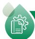

# 案例 | 品牌传播赋能生态宣教，传递绿色低碳理念

2025 年 “世界水日” “中国水周” 期间，兴蓉环境积极参与成都环境集团 “‘河’你同行 • ‘惜’水长流” 环境文化宣传大使选拔活动，以品牌传播推动环保理念普及。公司围绕 “环境造” 品牌建设，组织员工参与环境记者团、环境主播团、品牌推介官等多元形式，走进污水处理厂等一线场景，通过实地探访、专业推介、智能评审等方式，生动展现 “供排净治” 水务场景与绿色技术成果，将水务环保知识转化为公众易懂、乐于传播的内容。活动以创新形式讲好水文化故事，强化节水护水、低碳环保的社会氛围，助力构建全民参与的生态环境治理体系，彰显企业生态文明建设责任与担当。

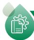

# 案例 | “水工厂探秘” 主题宣教活动

兴蓉环境下属排水公司成都市第九再生水厂携手相关单位开展“水工厂探秘”主题宣教活动，邀请中小学生及志愿者走进厂区，开启“污水变清流”的科技之旅。活动中，青少年在专业讲解引导下，实地参观展厅、生产云控中心、生化池群等核心设施，直观了解“多模式A2/O+高密沉淀池+反硝化滤池”三级处理工艺，近距离感受智能曝气、光伏发电、污泥余热利用等低碳技术的实践应用。此次活动以沉浸式体验让青少年掌握节水护水科学知识，将绿色低碳理念植入心间，助力构建“人人参与、共建共享”的生态环境治理体系。

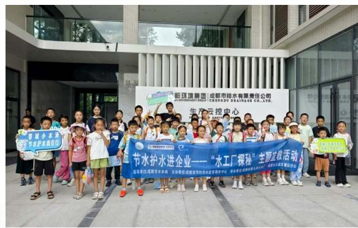

<details>
<summary>text_image</summary>

昭元港集团 | 成都市排水有限责任公司
JINYUANSHENGHAI CHENGDU DRAITAGE CO.,LTD.
生产云控中心
中国水利水电
“水工厂探秘”主要救灾活动
</details>

“水工厂探秘”主题宣教活动

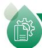

# 案例 | 凝聚护水力量

2025 年 “世界水日·中国水周” 期间，兴蓉环境下属自来水公司紧扣 “专业、便捷、安心” 服务理念，以 “蓉水万家情” 为责任担当，开展系列节水主题活动，将绿色用水理念融入城市民生服务。公司聚焦 “水润民生情，帮扶进万家” 主题，联动枣子巷、赛云台、万晟、井堰村等多个社区，搭建民生服务 “连心桥”。志愿者通过展板讲解、手册发放，把节水妙招与供水法规送进千家万户；同时为困难群众、周边商户提供免费上门水质检测与用水设施维修服务，以技术解难题、用行动暖民心，让党旗在节水护水一线高高飘扬，以国企担当推动绿色用水理念深入人心。


<details>
<summary>natural_image</summary>

Four schoolchildren in uniforms walking outdoors under bright sunlight, holding backpacks (no text or symbols visible)
</details>

兴蓉环境始终坚持创新引领、服务为本、人才强企、安全筑基、协同共赢的发展理念，全方位打造高质量发展体系，持续为企业稳健前行注入强劲动能。与此同时，公司紧扣民生服务与民生福祉提升核心，以实干担当践行“让生活更美好”的企业使命，不断为社会发展赋能增值，奋力书写高质量发展崭新篇章。

# S

# 回馈社会共享繁荣

# 我们的行动

- 科创赋能  
- 优质服务  
- 员工成长

- 供应链建设  
- 社区贡献  
$\therefore m = \frac{3}{11}$

# 助力联合国可持续发展目标


# 科创赋能

兴蓉环境坚守创新驱动发展战略，将科技创新作为核心发展引擎，立足“双碳”前瞻领域，以“科技强企、数字强企”为抓手，通过完善创新体系、强化基础保障、深化实践合作、推进数智转型，推动科技创新与企业经营深度融合，培育新质生产力，为企业高质量发展注入科技力量。

# 夯实创新基础

公司锚定“资源化、智能化、低碳化、智慧化”发展方向，构建完善的技术创新体系与管理制度，明确创新发展路径，实现科技创新从顶层设计到落地执行的全链条贯通。

# 健全创新体系

公司构建起权责清晰、协同高效的技术创新体系，从协同机制、制度保障、知识产权保护等方面系统布局，打造高效运转的创新生态。


# 2025年

申请发明专利

授权发明专利

22件

6件


# 截至 2025 年底

有效专利总数达

应用于主营业务的发明专利数量

软件著作权数量

242件

26项

74件


<details>
<summary>flowchart</summary>


</details>

# “1+1+N”技术工作体系，凝聚创新合力

以 1 个技术管理部为技术管理平台，负责完善创新制度机制、强化统筹协调；以 1 个兴蓉研究院为技术研究与专业支持平台，聚焦核心技术攻关；以 N 个子公司为技术应用与推广平台，推动科研成果落地转化，形成“管理—研发—应用”一体化创新格局。

# 完善制度保障，规范创新管理

制定落实《技术创新体系工作管理办法》，全面规范技术创新体系、科技研发、成果转化、知识产权、技术交流与培训等各项工作，为科技创新提供清晰的制度遵循，筑牢创新发展的体系根基。

# 强化知识产权保护，守护创新成果

严格贯彻《中华人民共和国商标法》《中华人民共和国著作权法》《中华人民共和国专利法》等相关法律法规，同步制定内部知识产权管理制度，全流程规范专利申请、管理与运用，持续提升知识产权保护力度。

# 建设创新团队

公司高度重视研发投入的战略支撑作用，持续加大科技研发资源倾斜，同时强化人才队伍建设，为科技创新筑牢基础。在人才培育与激励方面，我们营造良好创新创造氛围，对科技创新成果转化、标准、专利等优秀技术成果实施奖励激励，鼓励职工积极参与技改技革、科技研发等创新活动。同时，建立技术类“师带徒”人才培养机制，在实践中提升员工创新能力，培育企业核心竞争力，为科技创新持续输送人才力量。


# 2025年

公司研发投入

4,227.05万元

研发人员数量

研发人员占比

475人

8.90%

# 深化联合创新

公司围绕 “双碳” 战略，深耕前瞻领域核心技术攻坚，深化联合创新，统筹产学研协同与创新载体建设，持续推进核心技术攻关与成果转化。

# 促进产学研协同

公司构建开放协同的产学研用创新生态圈，依托项目、人才、资源优势，与国内一流高校、行业先进企业深度合作，聚焦细分领域开展关键技术攻关。我们先后与北京科技大学联合承担国家重点研发计划项目，与四川大学合作开展成都市重点研发项目，并与高校、科研院所签订多项合作协议，打通创新产业链协同通道，加速技术成果转化与工程应用。

  
兴蓉环境下属西安兴蓉公司与内蒙古工业大学、山西能源学院依托“参观+驻场”的特色培训模式开展校企合作项目。2025年，公司合作院校25家，累计培训超2,000人次，推动高校相关专业教学与产业实际需求精准对接。

# 筑牢创新载体平台

公司整合创新资源，打造政府认定企业技术中心、产学研合作基地、自主创新试验基地等多元创新载体，构建“上下联动、内外协同”的创新支撑格局。


# 截至 2025 年底

公司拥有2个国家级水质监测站、1个省级水质监测站、4个成都市企业技术中心、3个自主创新  
实验室及2个中试基地

培育东营津膜环保科技有限公司、东营膜天膜环保科技有限公司2家国家高新技术企业


# 荣誉

- 获评中华环保联合会“科学技术奖科技进步奖特等奖”  
- 获评第四届四川“环保产业50强”  
- 兴蓉环境下属排水公司袁正泰劳模工匠创新工作室成功入选成都市总工会“支持建设2025年劳模工匠创新工作室”名单


<details>
<summary>natural_image</summary>

Business people interacting with a tablet displaying financial charts and graphs (no readable text or symbols)
</details>

# 推进数智化转型

公司以数智化转型推动科技创新提质增效，统筹推进全公司数智化建设，驱动传统经营管理模式升级，为科创发展注入新活力。

# 强化组织统筹

为保障数智化转型有序落地、精准赋能科创，公司成立数智化转型领导小组，统筹推进数智化转型工作，系统谋划打造“财务共享、生产调度、采购监管、技术应用、资本运营”智慧“五中心”管控平台。同时，为智慧“五中心”专门设立专职管理部门，明确职责分工、压实工作责任，筑牢数智化转型落地的组织保障，为科创升级搭建坚实的数智支撑平台。

# 财务共享中心

集中管控超 50 家子公司财务数据，在实现财务管理降本增效的同时，为研发投入提供精准管控，保障科创资金合理配置

# 生产调度中心

接入 70 余座厂站、年均上亿项生产数据，通过智慧管控提升生产运营智能化水平，为技术应用提供真实可落地的实践场景


<details>
<summary>flowchart</summary>


</details>

# 采购监管中心

实现异地采购评标线上监管，保障研发及生产采购的公平公允，为科创物料供应筑牢防线

# 技术应用中心

借助机理模型、大模型等前沿技术, 提升技术审查效率, 强化项目全周期管理, 助力产业高质量发展

# 资本运营中心

精准洞察产业与资本市场动态，为科创投入布局、产业链强化提供科学策略支撑

# 融合前沿技术

公司紧跟人工智能发展浪潮，深度融合 AI 大模型、物联网等先进技术，聚焦 “AI+ 智慧管控五中心” 开展人工智能融合应用，进一步升级数智化赋能实效。

完成 AI 大模型本地化部署，保障公司核心数据在私有环境的安全调用，筑牢数据安全防线，为经营数据安全提供有力保障。


搭建“总部一子公司一厂区”三级智能化场景应用体系，打造水务环保专用AI智能体，成功落地污泥关键指标智能分析预测、多模态合同智能比对等实用场景，持续提升数智化技术与业务的融合度，推动效率与质量双提升。

# 荣誉

\- 《“数智赋能”驱动水务企业高质量发展》课题成功入选“2025年中国上市公司内部控制最佳实践案例”


# 案例 | 智慧水务赋能城乡供水一体化

兴蓉环境下属沱源公司依托物联网感知、AI决策引擎等技术，融合供水全链条5,000+数据采集点和17万+户用水数据，搭建智慧水务综合管理平台，构建起“原水预警—水厂智控—管网透视—用户直连”的全流程智慧管理体系。该平台在水源预警、爆管处置两大核心领域实现突破，可精准测算污染物扩散时间并推送调度方案，5分钟内锁定爆管位置，处置效率提升超95%。同时，公司搭建数字孪生平台打破行业信息孤岛，其智慧水务平台入选四川省数字经济典型应用场景，技术经验辐射川苏甘等地，为全国3,000余家中小供水企业转型树立典范。


<details>
<summary>text_image</summary>

14:57:31 星期四
2024/10/21
成都兴香沱源自来水有限责任公司-智慧水务综合管理平台
报警信息 更多>>
水质工具
污染源头 位置标识
污染源头位置到污染采集位置 路径获取
持续时间 清除
污染采集位置到取水口位置 路径获取
到达时间 清除
计算时间
一张图 上艺图 水系图
鸭子河
又名蒲江，沱江西源，长139公里，在市境内23.5公里，发源于四川省彭州市嘉仙山镇。现经四川省广汉市城区并最终在广汉市三水镇江入龙江，属于长江水库。
石亭江
沱江中源，发源于四川什邡市红白镇，是长江支流之一，全长141公里，在什邡市境内有87公里，高嵩关以上桥流水，以下桥石泰江、长29.5公里，同的渡头为九顶山东侧的二道金河（流水）和失道金河（草木），江水流至全堂赵铜洞。
绵远河
沱江台源，发源于九顶山南庭，现经绵竹市山区、辖区、德阳市中州区，长180公里，其中城区段16.1公里，是沱江上游正源。绵远河联纳德阳西北城10余英支流，承担着德阳郊区50余平方公里的防洪功能，为两家生活的10余万人和。
沱江
发源于川西北九顶山南侧，绵竹市新省头大里湾，南流至全堂县赵铜湖纳定江支沟—戴河、青白江、蒲江及新江铜箔条上游支流后，多发黑山金堂峡、轻铜阳市、资阳内、动中县、内江市、自贡市、富顺县等至299市汇入长江。
青白江
又名蒲白江，为沱江三梁支流。水源来自蒲江，上级为蒲阳河，通达渠于蒲江横断旧塘的两旁流，向左至那县长南桥始断清白江，沿沿河流边疆至辽江，近往地东至辽江，沿沿布西北北侧，于右岸线奉冲旱水，分出马栅堤，再沿广汉屯阳。
毗河
受于浙江黄铜T的前海须选至诸县回族自治区胡堤、神台河力。
实时指标信息
总电耗
本年累计供水量 日取水量 制水电耗 PAC单耗 食盐 小时取水量 日取水量 制水电耗 PAC单耗 次钠
本年累计售水量 小时供水量 日供水量 出厂余氯 出厂压力 出厂浊度 小时供水量 日供水量 出厂压力 出厂余氯 出厂浊度
生产总电耗 全部
</details>

智慧水务综合管理平台


# 优质服务

兴蓉环境将优质服务贯穿于经营发展全流程，以体系化建设筑牢服务根基、以温情化实践传递服务温度，多维协同发力，全方位保障守护用户权益，持续为用户提供可靠、安心、高品质的服务。

# 完善质量体系

公司聚焦质量管控核心环节，多措并举推进质量建设，构建全方位、全流程、全覆盖的质量管控体系，践行企业质量责任。截至2025年底，兴蓉环境下属自来水公司、排水公司、沱源公司、海南兴蓉公司、西安兴蓉公司、银川兴蓉公司等均已取得质量管理体系认证。报告期内，公司未发生产品和服务相关的安全与质量重大责任事故。

# 质量体系建设重点举措

# 完善质量管理体系


依据 ISO 9001:2015 标准，结合企业经营实际，搭建质量管理体系；配套编制工艺操作规程、检验规范及记录表单等作业文件，明确各环节管控标准；规范监视和测量设备管理，常态化监控关键工艺参数，确保生产全流程标准化、规范化。

# 明确团队权责分工


清晰划分各部门质量管控权责，实现质量管理体系策划及运行监管、生产运行统筹、监测体系搭建与过程监测等环节的分工明确、协同高效。

# 强化人员队伍建设


组建质量管理人员队伍，实现全方位质量监督管控；建立常态化培育机制，定期开展专项培训，持续提升全员专业素养与业务能力，匹配质量建设各项工作要求。

# 健全监督考核机制


定期开展内部审核与管理评审，通过现场检查、数据核查等方式排查问题，跟踪整改落实，持续优化质量管理体系；强化管控措施，制定多项专项管理制度，同时完善考核体系，确保质量管理体系有效运行、持续优化。


# 案例 | 兴蓉环境下属西安兴蓉公司以体系化管控筑牢污水处理质量防线

兴蓉环境下属西安兴蓉公司聚焦污水处理质量管控，制定《污水运营项目厂级生产质量管理手册》，清晰划分各部门质量职责，形成生产、检测、监督闭环管理，明确生产部门主抓污水处理流程及工艺日常运行，维修化验部门负责设施运维及全流程水样检测分析，运营部门监督安全环保措施落实、处置突发环境事件，各部门协同配合，协同筑牢污水处理全链条质量防线。公司严格执行出水水质标准，2025年污水处理出水水质实现连续稳定达标，合格率100%；同时强化与上级主管部门的沟通协调，持续优化服务质量，以体系化、规范化管理践行污水处理质量责任。


# 荣誉

- 兴蓉环境下属自来水公司参编的国家标准《城市居民生活用水量标准》GB 50331-2002（2023版）获科技部“工程建设标准科技创新奖标准项目奖”一等奖  
- 沃特探测公司“成都市四环内排水管网检测及探测服务项目”荣获中国测绘学会2025年全国优秀测绘工程奖银奖

# 健全服务体系

公司聚焦服务体系完善与服务质量提升，推进服务标准化建设，畅通客户沟通渠道，构建权责清晰、流程规范、响应高效的全维度服务体系，持续优化服务体验，切实提升客户满意度与品牌信任度。

# 搭建服务体系

公司以客户为核心导向，聚焦服务体系建设，在制度建设层面，全面梳理客户服务管理痛点，引导下属公司制定实施《客户服务管理办法》《服务质量管理办法》《服务质量回访管理办法》等系列制度文件，搭建起权责清晰、流程规范的制度框架，为服务工作高效开展提供坚实保障。在服务质量提升层面，围绕服务渠道整合、流程优化、质量监控及客户反馈处理等核心环节，构建全维度服务支撑体系；通过开展服务态度、响应时效、处理结果满意度等多维度调查，持续迭代优化服务流程，推动服务向标准化、规范化、高效化迈进，切实提升客户服务体验与满意度。


# 2025年

客户投诉解决率

100%

# 完善客户沟通

公司坚持用心倾听、快速响应客户咨询，构建从诉求受理到闭环解决、从数据分析到体系优化的全流程沟通链路，以负责任的态度真诚沟通，将客户声音转化为服务温度，在双向信任中持续提升服务品质。

# 完善制度建设

引导下属公司结合自身服务特征与实际情况，制定《热线服务管理规范》《三来信息处置业务流程》《用户投诉管理办法》《服务质量回访管理办法》等一系列制度，明确咨询受理、处理及售后服务等业务流程要求，建立分类分级信息报告机制与监督考核机制，为客户沟通提供坚实制度保障。


# 健全沟通渠道

设立 24 小时客户服务热线，确保客户咨询与服务需求及时受理；同时定期对诉求数据进行统计分析，梳理重难点问题，并对用户开展跟踪回访，确保每条诉求“事事有回应、件件有着落”，切实打通客户沟通“最后一公里”。


# 案例 | 兴蓉环境下属沛县兴蓉公司打造全场景客户服务沟通闭环

兴蓉环境下属沛县兴蓉公司建立覆盖营销管理、收费合规、水表查抄、现场及大厅服务、热线处置回访等全场景的常态化监督考核机制，通过指标考核、过程监控与随机抽查及时纠偏整改，从源头保障服务规范与办件时效。同时编制《热线服务系统管理办法》《热线信息处置流程》等制度，将客户诉求精细划分为咨询、报修、违章用水、投诉等九大类，明确各类型问题的归口处置部门与流转路径，针对政府平台投诉、重大突发事件建立专项响应机制，跨部门问题由主责部门牵头协同，实现客户诉求从受理、分派、处置到反馈的全流程规范管理。

# 保护客户隐私与数据安全

公司严格遵循《中华人民共和国网络安全法》等法律法规，制定完善《信息化管理制度》《信息安全管理办法》《信息系统建设运维管理办法》《信息系统数据安全保护管理办法》等系列内部管理制度，明确隐私与数据安全管理要求、责任分工及操作规范，并严格依规执行，构建规范化的隐私与数据安全管理体系。报告期内，公司未发生侵犯客户隐私、数据信息泄露相关事件。


# 强化客户隐私保护

严格依据《中华人民共和国个人信息保护法》等法律法规，始终坚持最小必要原则。在服务过程中明确告知用户信息使用目的和范围，并获取用户的同意，避免过度收集用户数据。对涉及数据收集的重要业务系统指定系统技术负责人作为个人信息保护负责人，负责监督个人信息处理活动和保护措施的实施。


# 筑牢数据安全防线

重要业务数据均存储于内网环境，通过防火墙等安全设备实施访问控制，并实行数据异地备份，全方位保障数据存储安全。在对外服务方面，综合运用相关技术措施，确保线上渠道数据传输与存储的安全。对重要业务数据和用户信息实行严格的系统权限管理，防范数据泄漏风险。


# 员工成长

兴蓉环境将员工视为宝贵财富，以赋能个体为核心，以共筑未来为导向，筑牢员工权益底线、搭建职业上升通道，传递安全守护与温暖关怀，在助力员工实现个人价值最大化的同时，推动员工与企业在共生共荣中迈向高质量发展新征程。

# 保障员工权益

公司以构建和谐稳定劳动关系为目标，通过健全制度体系、完善管理机制、畅通沟通渠道，全方位守护员工权益，助力员工实现个人价值与企业高质量发展同频共振。

# 合规雇佣

公司严格遵循《中华人民共和国劳动法》等法律法规，保障业务工作安全、高效、有序开展。我们结合企业发展实际制定科学招聘计划，坚持“党管人才、统筹兼顾，公平公开、信息透明，平等竞争、择优录用，人岗匹配、合理高效”的工作原则，通过社会招聘、校园招聘等多元渠道广泛发布岗位信息，保障招聘过程的公开性与包容性。在人才选拔环节，我们确保人岗精准匹配，吸纳优质人才，构建公平、透明、高效的人才发展环境。此外，我们严格遵循《中华人民共和国劳动合同法》《职工带薪年休假条例》等法律法规及相关监管要求，结合企业实际制定《考勤、请休假及外出报备管理办法》，规范工时与休假管理，切实维护员工休息休假的合法权益，以精细化、合规化的用工管理践行企业劳动用工责任。


# 2025年

<table><tr><td>员工总数</td><td>新进员工</td><td>劳动合同签订率</td><td>社会保险覆盖率</td></tr><tr><td>5,338人</td><td>141人</td><td>100%</td><td>100%</td></tr><tr><td>员工平均带薪休假</td><td>在职残疾员工</td><td>少数民族员工</td><td></td></tr><tr><td>8.47天</td><td>13人</td><td>224人</td><td></td></tr></table>

年龄结构分布  


<details>
<summary>donut</summary>

| Category | Percentage |
| --- | --- |
| 35岁及以下 | 51% |
| 36-45岁 | 31% |
| 46-55岁 | 14% |
| 56岁及以上 | 4% |
</details>

员工性别构成  


<details>
<summary>donut</summary>

| Category | Percentage |
| --- | --- |
| 男性 | 69% |
| 女性 | 31% |
</details>

# 员工多元化

公司建立公平、公正、公开的规范化招聘机制，严格保障劳动者就业平等权利，坚决杜绝因性别、种族、民族、宗教信仰等因素产生的就业歧视，为全体求职者提供平等竞争、机会均等的就业平台。我们制定并落实《员工手册》，明确工作标准与行为规范，为员工提供清晰的履职指引与行为遵循，帮助新员工快速融入团队、适应岗位，营造尊重包容、积极向上的工作氛围，助力员工安心履职、创新工作。

# 薪酬管理

公司严格落实国有企业工资收入分配宏观调控与监督管理要求，依据国家及地方相关法规政策，结合企业实际建立健全薪酬分配体系，制定完善多项薪酬管理配套制度，构建规范高效的薪酬管理机制。同时，我们制定福利管理相关办法，切实保障员工合法权益，建立中长期激励机制，充分发挥薪酬福利的激励与保障作用，不断增强企业凝聚力，有效吸引和激励人才，推动企业与员工协同发展。


<details>
<summary>natural_image</summary>

Close-up of two hands clasped together, no visible text or symbols
</details>

# 民主管理

公司高度重视员工民主管理与沟通机制建设，通过制度化、多元化举措保障员工民主权利、畅通诉求表达，构建和谐稳定的劳动关系。报告期内，公司未发生员工申诉事件。


# 2025年

员工工会入会率

100%

# 健全职代会民主管理机制


持续完善以职工代表大会为核心的民主管理制度。2025年规范召开职代会10次，将企业重大经营事项、涉及职工切身利益的规章制度全部提交审议，全年审议通过相关议题108个，切实保障职工民主参与、民主管理、民主监督权利。

# 深化厂务公开监督体系


推进厂务公开民主管理标准化建设，线上线下多渠道公开信息。2025年公开各类事项260项，保障员工知情权与监督权，提升企业管理透明度。

# 畅通员工沟通关怀渠道


设立书记接待日。2025年累计接待员工28人次，畅通青年员工诉求反馈与建言献策通道，同步建立心理疏导关怀机制，不断增强员工的工作获得感与企业认同感。

  
书记接待日活动

# 赋能员工发展

公司构建起“成长有引领、发展有路径、进步有载体”的人才培育体系，依托导师带徒、岗位技能竞赛、职工夜校学习、多岗位轮岗锻炼等多元机制，开展人才培养工作。同时，我们为员工量身打造个性化成长路径，助力青年骨干在项目实战中快速锤炼本领，推动资深员工在经验传承中彰显自身价值，形成公司与人才双向赋能、彼此成就的良性循环。

# 员工培训

公司紧扣发展战略需求，以经营管理、专业技术和技能操作“三支”人才队伍建设为核心，将能力建设贯穿人才培育全过程，严格按照《培训管理办法》构建系统化、多元化的人才培养体系。通过开展青年人才选拔培育、管理梯队人才专项培训、工匠人才传承培育等特色培养工作，强化内部技术交流与专业能力锤炼，全面提升员工综合素养。


# 2025年

员工培训支出

353.89 万元

员工人均培训时长

4.56 小时

员工培训总人次

30,568 人次

员工培训覆盖率

100%

员工培训总时长

139,416 小时


# 案例 | 兴蓉环境组织梯队培训，打造水务管理骨干团队

2025 年 11 月，兴蓉环境举办第四期再生水厂厂长梯队人才培训，紧扣行业发展趋势与企业运营需求，以“智慧化转型与降本增效在再生水厂的应用”为核心主题，坚持以解决水务生产实际难题为根本导向，搭建多维度沉浸式教学体系，开展系统化培训。通过此次培训，有效帮助学员丰富专业知识储备、熟练掌握行业先进技术方法、显著提升实战攻坚能力，成功为公司培育了一批兼具专业素养与实战思维的再生水厂管理骨干，以精准化人才培育赋能企业智慧化转型。


<details>
<summary>text_image</summary>

第四钢厂为团队人才培训
智慧化转型与降本增设在再生水厂的应用
</details>

第四期再生水厂厂长梯队人才培训

# 员工发展

公司依托《职能管理、专业技术和技能操作序列岗位管理办法（试行）》《中层管理人员选拔任用及管理制度》等制度，规范干部管理、后备人才选拔、专家人才遴选及内部公开竞聘等工作；建立人才精准画像机制，优化人才资源配置，实现人岗精准匹配。同时健全“三通道”人才发展路径，推进员工多序列晋升与岗位调整工作，打通员工职业成长通道；构建多层次激励与考核体系，完善中长期激励约束机制及分层分类的日常考核管理体系，落实专业技术职务津贴并规范评聘管理，将绩效发放与考评结果刚性挂钩，充分发挥激励作用，有效调动员工干事创业的积极性与主动性。报告期内，员工晋升、轮岗等职位变动404人。


# 荣誉

\- 兴蓉环境公司副总经理赵健荣获“四川省第九届劳动模范”，海南兴蓉公司高级工潘先好荣获“海南省五一劳动奖章”

# 重视员工关怀

公司将员工关怀深度融入经营管理，切实维护员工权益、传递企业温暖，不断增强员工的归属感与凝聚力，为高质量发展注入内生动力。

# 福利关怀

公司将员工关怀融入治理实践，构建起覆盖健康保障、生活帮扶与人文发展的全方位福利体系。


# 荣誉

\- 兴蓉环境下属排水公司荣获中华全国总工会授牌的职工书屋便利型阅读站点


# 员工福利关怀重点举措

# 保障体系

为员工配置职业健康体检套餐，配套重大疾病互助保障、意外伤害及女员工特殊疾病等互助保险，切实减轻员工就医经济负担。

# 生活关怀

持续推进“冬季送温暖”“夏季送清凉”等主题活动，将员工帮扶关爱落到实处。


# 身心健康

通过组织心理健康沙龙、定期开展满意度调查等方式，及时响应员工需求，营造公平、透明、关怀的工作环境，增强员工认同感与幸福感。

# 困难员工专项帮扶

制定《职工困难帮扶管理办法》，为困难员工提供精准帮扶支持。

# 女性员工权益保障

签订《女职工权益保护专项合同》，严格落实孕期、哺乳期女员工劳动保护规定，不安排特殊时期女员工从事禁忌劳动，切实维护其合法权益。


<details>
<summary>text_image</summary>

Group photo of people holding gift bags in front of a building with Chinese signage, likely at a corporate event or ceremony.
</details>

开展“送清凉”慰问活动


<details>
<summary>text_image</summary>

2023年1月16日
一人把关一处安，众人把关稳如山
19日5:00:00
</details>

开展“送温暖”慰问活动

# 员工活动

公司高度重视员工精神文化生活，持续丰富文体活动载体，有效凝聚团队合力，营造出积极向上、活力满满的员工文化氛围。


# 2025年

员工参加工会活动

9,047 人次


<details>
<summary>text_image</summary>

兴蓉环境2025年主题团建日
</details>

春季拓展团建活动


<details>
<summary>natural_image</summary>

Basketball game in progress with players in red and white uniforms competing for the ball (no visible text or symbols)
</details>

职工篮球赛

# 员工健康安全

公司将安全健康作为高质量发展的核心底线，通过构建全链条安全管理体系、完善全周期风险防控机制、强化精细化职业健康保护、厚植沉浸式安全文化，全方位守护员工职业健康与生产安全，切实筑牢可持续发展的安全根基。

# 安全管理体系

公司设立环境安全委员会，印发《环境保护与安全生产委员会工作细则》，通过定期会议机制统筹推进安全管理工作；严格落实“一岗双责”“三管三必须”要求，构建覆盖全员的安全生产责任体系，明确各层级、各岗位安全责任清单，并配套建立安全生产履职档案，推动安全责任精准落地。同时，我们制定《安全生产主体责任规范》，动态识别和更新安全生产相关法律法规，保障制度的有效性与适用性，夯实安全管理基础。在组织架构层面，形成以

公司为核心、环境安全委员会为统筹、其办公室（项目管理部 / 安全管理部）为执行支撑，纵向贯通各部门（中心）、子公司、厂所站及班组的全层级安全管理网络，实现安全管理全链条覆盖。截至 2025 年，兴蓉环境下属自来水公司、排水公司、水务建设公司、新蓉公司等多家子公司已获得职业健康安全管理体系认证。


# 2025年

安全生产总投入

2,776.78 万元


<details>
<summary>flowchart</summary>


</details>

成都市兴蓉环境股份有限公司安全管理网络

# 安全风险防范

公司秉持安全发展理念，通过构建全周期风险防控机制与立体化应急响应网络，同步推进智能化监测平台搭建与标准化管理流程优化，实现风险辨识、评估、处置的全流程闭环管控，不断强化重点领域的源头治理与动态管控效能。

我们高度重视安全生产管理与风险防范工作，强化全流程、精细化安全管控，全方位筑牢安全生产防线。针对危险化学品管理，我们对化验室日常检验检测所用的硫酸、盐酸、乙醇、乙酸、氢氧化钠等危化品实施规范化管理，完善齐全的药品 MSDS 资料，严格执行双人双锁管理模式，常态化开展危化品药剂间每日安全巡查，规范出入库台账登记，确保台账与实物精准一致。

同时，我们构建起系统化的安全生产管理制度与应急管理体系，出台《安全生产事故隐患排查治理管理办法》《突发事件总体应急预案》《应急管理办法》等制度文件，完善安全生产奖惩、目标考核、风险管理、事故隐患排查治理、生产安全事故报告、调查处理问责、安全警示等管理要求，形成制度完善、管控到位、应急有备的安全管理格局，切实提升企业安全生产管理水平与风险防范处置能力。


# 2025年

员工安全生产责任险投入

154.54万元

特种设备年检率

100%

重大安全隐患整改完成率

100%

因工死亡事故

0人

# 荣誉

\- 兴蓉环境下属自来水公司荣获成都市防灾减灾救灾委员会办公室授予的先进队伍”与“2025年度成都应急救援先进个人”称号

“2025年度成都应急救援


# 案例 | 兴蓉环境节前专项安全检查筑牢安全生产与风险防控防线

2025 年 9 月，兴蓉环境开展节前安全生产专项检查工作，组建专项检查组深入下属自来水公司、排水公司、崇州成环水务、沱源公司等单位，对各单位的建设项目现场及日常生产场所开展实地安全排查，将风险防控关口前移，通过实地督查、责任压实、风险严控的实操举措，以常态化、精准化的安全检查举措筑牢企业安全环保屏障，进一步强化了各单位的安全生产意识。


<details>
<summary>natural_image</summary>

Three people in a parking garage, one pointing at a robotic arm; no visible text or symbols.
</details>

开展节前专项安全检查


# 案例 | 兴蓉环境下属排水公司健全应急制度预案体系

兴蓉环境下属排水公司出台突发事件总体综合、生产安全事故、突发环境事件及防汛、地震自然灾害事件等多项应急预案，通过体系化建设有效提升公司防灾减灾应急管理水平。2025年，公司推动下属单位落细应急管理要求，指导蓉环检测公司、第六再生水厂健全生产安全事故应急预案并完成主管部门备案；组织多家再生水厂、监测站完成突发环境事件应急预案修编及备案，实现重点单位应急预案规范化备案管理，筑牢安全应急防线。


<details>
<summary>natural_image</summary>

Group of construction workers in safety vests and helmets standing on a sidewalk, with orange safety tape and a hexagonal icon in the corner (no text or symbols on main subjects)
</details>

大邑成环水务公司开展有限空间演练，强化作业人员安全操作与应急处置能力

# 职业健康保护

公司严格遵循《中华人民共和国职业病防治法》等国家法规，引导下属公司制定《职业卫生管理办法》《劳动防护用品管理办法》《职业健康安全教育培训管理办法》等内部文件，明确各维度管理要求，切实保障员工职业健康与人身安全。报告期内，公司未发生工伤事故。

# 职业健康安全管理重点举措

# 夯实基础防护

制定《劳动防护用品管理办法》，规范劳动防护用品管理，同步推进员工健康体检工作，筑牢职业健康防护底线。

# 完善工伤保障

持续优化《职工工伤待遇申办流程管理办法》和《职业卫生管理办法》，为工伤员工提供更优质的服务与制度保障，健全长效管理机制。


# 严控环境风险

定期开展工作场所职业病危害因素检测与评价，及时向员工公示职业危害告知内容，从源头防范作业环境健康隐患。

# 精细化健康管理

建立职业卫生“一人一档”健康档案，配套制定职业健康风险津贴发放方案，实现员工健康状况精准跟踪与正向激励。


# 2025年

员工工伤保险投入金额

438.76万元

特种作业人员持证上岗率

100%

员工工伤保险覆盖率

100%

员工体检覆盖率

100%

# 安全文化建设

公司以厚植安全文化为核心抓手，持续推进安全文化深度建设，通过优化安全教育培训形式，统筹开展专项安全培训，丰富相关主题活动载体，将安全生产意识深度融入全员行为准则，着力打造责任共担的安全共同体。


# 2025年

员工安全培训覆盖率

100%

安全教育合格率

100%

安全培训投入

93.48 万元

安全培训开展

430次


# 案例 | 兴蓉环境下属再生能源公司深耕安全文化建设

2025 年，兴蓉环境下属再生能源公司常态化开展多场景应急演练，组织应急预案及隐患排查专项培训，以练促战、以学赋能。在安全宣传引导层面，公司紧扣 “职业病防治法宣传周” “5·12 防震减灾日” “安全环保月” “119 消防宣传月” 等重要时间节点，开展系列专项宣传活动，构建常态化宣传机制，充分调动职工参与安全文化建设的主动性。此外，公司广泛征集应急普法原创作品，增设安全文化专栏，以寓教于乐的形式引导职工从被动接受安全知识转向主动参与安全建设，营造 “关注安全、关爱生命” 的浓厚氛围，有效提升职工安全自觉性与法治意识。


<details>
<summary>text_image</summary>

成都市中西再生资源有限公司2015年“安源林”知识竞赛暨应急抗疫比赛活动
</details>

兴蓉环境下属再生能源公司  
2025 年 “安康杯” 知识竞赛暨应急技能比武活动


<details>
<summary>natural_image</summary>

Group of people gathered outdoors near a building, one person holding a hose, with no visible text or symbols.
</details>

兴蓉环境下属空港水务公司开展消防应急演练


<details>
<summary>natural_image</summary>

Group of engineers in red hard hats performing maintenance on a metal structure outdoors (no visible text or symbols)
</details>

兴蓉环境下属沱源公司开展有限空间
作业应急演练


# 供应链建设

兴蓉环境以价值共创、责任共担为核心，将可持续发展理念贯穿供应链全链路，在打造兼具韧性、效率与社会责任的供应链的同时，以行业交流合作为纽带，推动供应链上下游资源共享与协同创新，助力产业生态升级。

# 打造责任供应链

公司致力于构建规范透明、绿色可持续的供应链管理体系，通过全周期管控、绿色运营与公平协作，推动供应链各方共担责任、协同发展。

# 规范采购管理

公司严格遵循公平、公开、公正、守法、择优和诚实信用原则，构建了完善的采购与合同管理制度体系，以《采购管理办法》《招标采购管理办法》《合同管理制度》等一系列制度为支撑，明确采购主体责任，规范采购全流程操作。在采购过程中，公司注重提升流程透明度，明确各环节操作标准，同时部分子公司配套制定《存货管理办法》《库房管理办法》，进一步细化采购相关管控要求，确保采购活动合法合规、规范有序。此外，我们强化供应商全周期管理，从准入、审核、履约评价等维度形成闭环管理。


# 2025年

截至报告期末供应商数量

25,218 家

供应商审核率

100%

# 健全供应链管理体系

公司以规范化、智能化、精细化管理为核心方向，持续完善供应链管控体系，全面提升采购管理质效与供应链治理水平。

# 2025 年供应链管理重点举措


完善制度体系


结合公司运营实际，系统修订《采购管理办法》等管理制度，明晰管理标准与流程，为供应链规范运行提供坚实制度保障，提升整体供应链治理效能。


开展专项检查


组织开展覆盖十余家子公司、近三年生产药剂及相关采购业务的专项监督检查，创新建立“时效性 + 成本控制”双维度评价体系，精准识别并督导整改采购合规与效率问题。


搭建智能知识库


整合施工、货物、服务三大板块近五年采购数据，构建白名单模板库、黑名单风险条款库、专家意见库“三位一体”架构，累计形成黑白名单条款各数十项、沉淀专家评审意见超百项，为后续上线人工智能辅助审查系统、实现采购管理智能化精准化转型筑牢数据基础。

# 打造可持续供应链

公司将可持续发展理念贯穿供应链全流程，通过绿色管理、绿色采购、廉洁安全共建、供应商赋能等，构建富有韧性的可持续供应链体系。

# 可持续供应链建设重点举措


# 践行绿色采购

- 药剂采购中明确成分含量及国家相关要求，验收时核查第三方检测报告并抽样复检  
- 供货合同中明确供应商包装物回收责任，减少一次性包装废弃物，实现包装材料绿色循环利用


# 深化绿色管理

- 结合工艺运行管理经验，自主研究设计自动化系统核心计算方法与控制参数，经前期试验验证并在投运后持续优化，降低生产资源消耗、保障系统稳定运行  
- 开展质量、环境、职业健康安全管理体系内控监督，将绿色管理融入日常运营，同时不定期组织环保政策法规专题培训，提升全员绿色生产意识与实操能力


# 推动协同发展

- 与供应商签订的合同中明确其环保责任，要求制定突发环境事件应急预案并具备处置能力  
- 签订《廉洁协议书》明确禁止商业贿赂等行为，对需进入生产现场的供应商签订《安全责任书》，其人员进厂前需接受入场安全告知，明确相关危险因素及管理规定


# 2025年

开展供应商环保培训

1,000次

开展供应商反腐败培训

3,184次

开展供应商安全培训

2,724次

参与人次达

2,120人次

参与人次达

3,987 人次

参与人次达

11,864人次

# 促进行业发展

公司搭建多元行业交流平台，通过与科研院所座谈研讨、邀请同业企业技术对接等形式，共享创新经验、共探前沿技术路径，推动环保领域技术协同与产业共进。


# 2025年

公司已编制发布《协同降碳绩效评价城镇污水处理》等

7

项国家标准和团体标准

累计主编、参编标准超

40项


# 案例 | 兴蓉环境牵头编制四川省智慧供水行业共筑技术标准

2025 年 5 月，四川省城镇供水排水协会牵头组织召开《四川省城镇智慧供水系统技术标准》编制工作启动会，兴蓉环境作为该标准的主编单位受邀参会。会上，公司专题汇报了标准大纲编制的现阶段推进情况，各参会单位围绕标准编制后续工作计划展开深入研讨，并共同部署了相关推进工作。本次会议，公司借此与行业各方凝聚发展合力，通过行业内的信息互通与工作协同，同时以标准编制为抓手，助力四川省城镇智慧供水行业实现规范化、高质量发展。


<details>
<summary>text_image</summary>

Meeting room photo with visible presentation screen displaying Chinese text and icons, attendees seated at tables
</details>

2025 年 5 月，兴蓉环境赴四川省生态环境科学研究院开展科技创新座谈交流，分享各自在科技创新方面的经验和成果，并就未来的合作方向进行初步探讨。


<details>
<summary>natural_image</summary>

Interior of a conference room with participants seated around a long table, facing a presentation screen (no visible text or symbols)
</details>

2025年12月，兴蓉环境邀请相关领域先进企业围绕固废资源化、能源化前沿创新技术等方面进行深入交流，共同探讨固废全组分能源化与高值化利用新路径。


# 社区贡献

兴蓉环境聚焦民生服务、乡村振兴、公益志愿三大领域，以精细化服务回应群众用水期盼，以精准帮扶赋能美丽乡村建设，以志愿行动涵养社区公益氛围，在守护民生福祉、助力乡村发展、传递公益力量的过程中，切实搭建社会与企业的连心桥，为社区治理现代化贡献水务力量。


# 荣誉

\- 兴蓉环境荣获 E20 环境平台 “2025 年度固废最具社会责任投资运营企业” 奖项

# 助力民生服务

公司聚焦老旧小区改造、重点任务保障等民生场景，主动担当作为，以精细化服务回应群众需求与社会期待，切实筑牢民生供水保障线。


# 案例 | 主动担当惠民生，聚力攻坚促改造

2025 年 11 月，广场苑给水户表改造进入筹备阶段，兴蓉环境下属沱源公司主动对接属地社区及小区院委会，积极参与施工方案专项协调，围绕改造方案细化、自来水改造与院落改造交叉施工衔接等核心问题，主动沟通、高效对接，提前梳理施工风险、明晰各方工作衔接要点，为改造工程平稳启动提供坚实保障。同年 12 月，针对广场苑改造施工中出现的难点问题，沱源公司积极响应属地社区统筹安排，主动联合县住建局、赵镇街道办等单位赴现场实地踏勘，深入施工一线排查问题、倾听居民与施工方诉求，立足供水保障职能积极建言献策，协同各方群策群力破解施工堵点，全力推动老旧小区改造有序落地，以实际行动践行民生服务责任。


<details>
<summary>natural_image</summary>

Group of people in a meeting around a table, engaged in discussion (no visible text or symbols)
</details>

协调水户表改造

# 成都世运会执委会保障部

# 感谢信

成都空港新城水务投资有限公司：

“司奇兵济扬帆起，乘风破浪万里杭。”2025年8月7日至17日，第12届世界运动会在成都成功举办。保障都在市委市政府、世运会执委会机关党组坚强领导和科学决策下，秉承“国际化标准、本土化表达”理念，圆满完成世运会财务管理、餐饮服务、医疗卫生、后勤保障等各项工作，实现了“办赛顺利、城市安全”的目标，为赛事成功举办提供了坚实保障。在此，谨向贵单位在赛事筹办过程中的精心指导和全力支持敌以最诚挚的感谢和最崇高的敬意！

“细报之处见真章，艰难之时显担当。”回首筹备与举办的日日夜夜，贵单位面对时间紧、任务重、标准高的多重挑战，以高度的责任感和专业精神，在赛事保障、统筹协调、资源调配等各个方面展现出卓越的组织能力和协作水平，确保了各个环节有序衔接、各项任务圆满完成。这份对细节的执着追求和对质量的严格把控，为赛事的精彩圆满提供了有力的支持。

“志合者，不以山海为远。”本届世运会的成功举办，离不开贵单位的辛勤付出和鼎力支持，这份同舟共济的情谊，我们深怀感激、铭记于心。展望未来，我们期盼以此次世运会为契机，进一步深化与贵单位的交流与合作，共同总结提炼宝贵的保障经验，携手在更多领域、更深层次实现共赢发展，为推动成都建设世界赛事名城贡献力量！

再次感谢贵单位的倾力支持与帮助！期待我们再谱新篇、共创辉煌！

兴蓉环境下属空港水务公司圆满完成 2025 年世运会保供任务，获成都市世运会执委会保障部感谢信

# 沛县机关事务管理处

# 感谢信

沛县兴蓉水务发展有限公司：

近日，贵公司承接的县级机关办公区域供水管道更换工程圆满竣工，为我县机关高效运转筑牢了后勤保障防线。在

此，我处谨向贵公司及全体施工人员致以最诚挚的感谢！
工程期间，贵公司员工展现出的敬业精神令人动容。对管道老化、施工空间受限等难题，施工团队主动优化方案，严格遵循施工规范，将“精、准、细、严”要求贯穿程。为减少对机关办公的影响，团队错峰作业、加班加点深夜仍坚守现场调试设备，夙夜清晨便开展管道压力调试用高效行动诠释了“水务为民”的企业精神。

贵公司管网管理所施工人员李明同志更以专业担当化解难题：主动排查潜在漏点，提前规避运行风险；耐心对接我方需求，及时调整施工节奏，全程坚守一线实现安全零事故。这种扎根一线、精益求精的作风，与我处后勤保障工作理念高度契合，为机关事务管理服务提供了有力支撑。

再次向贵公司及全体施工人员致谢！期待未来继续携手，共筑县域服务保障坚实防线。


兴蓉环境下属沛县兴蓉公司充分展现“水务为民”

的企业精神，获沛县机关事务管理处感谢信

# 建设和美乡村

公司持续拓宽帮扶领域、丰富帮扶举措，通过物资捐赠、供水援建、筹集善款等多种形式，切实改善群众生活品质，积极助力和美乡村建设。


# 2025年

乡村振兴惠及

200,000人


# 案例 | 精准多维帮扶，助力乡村振兴

兴蓉环境下属排水公司积极响应布拖县委组织部帮扶请求，选派员工挂职当地综合帮扶力量协调办公室副主任，强化帮扶工作统筹衔接；组织多批次专业技术人员深入布拖县，针对当地污水处理设施开展现场调研、问题诊断、运营指导及专业培训，系统提升当地污水处理运营管理专业化水平。公司推进帮扶物资保障工作，完成多批次帮扶物资采购与配送，以人才支持、技术赋能、物资保障的组合式帮扶，切实助力布拖县民生改善与乡村振兴建设。2025年，公司组织6批次、95人次走进布拖县开展技术帮扶，完成10批帮扶物资采购，金额约23.39万元。


<details>
<summary>text_image</summary>

Photo of a child in protective gear standing beside an open electrical control cabinet with visible Chinese labels and red indicator lights, overlooking a mountainous landscape.
</details>

# 热心公益志愿

公司扎实推进公益慈善与志愿服务工作，积极汇聚志愿力量、拓展公益版图，以多元实践传递企业温暖，以多元实践传递企业温暖，切实履行企业社会责任。


# 2025年

开展志愿服务

总服务时长达

422次

1,953 小时


<details>
<summary>text_image</summary>

兴蓉环境下属再生能源公司职工徐秋平参加2025中国（成都）一中亚青年培训项目，生动展现中国再生能源领域的创新实力与企业担当
兴蓉环境下属沱源公司组织技术代表前往金沙小学进行自来水知识宣讲，为30名学生普及自来水生产的各类知识，增强学生对自来水生产的兴趣
兴蓉环境下属银川兴蓉公司与永丰村党支部、铂悦府社区党委结对共建，开展“送温暖促和谐”活动，为当地10户贫困党员家庭送去了米面油等慰问品
兴蓉环境下属自来水公司志愿者队伍开展主题为“一心向党，助企发展”供水服务进社区活动，向社区居民及过往行人讲解供水服务相关内容，提供户内维修、水压检查等服务
银川兴蓉环境发展有限责任公司
春阳阿永丰村党员
</details>

兴蓉环境下属再生能源公司职工徐秋平参加2025中国（成都）一中亚青年培训项目，生动展现中国再生能源领域的创新实力与企业担当


<details>
<summary>natural_image</summary>

Illustration of hands holding a water droplet with trees and leaves, surrounded by greenery and flowers (no text or symbols)
</details>


<details>
<summary>text_image</summary>

兴蓉环境
司志愿者
为“一心向
供水服务
</details>

兴蓉环境下属自来水公司志愿者队伍开展主题为“一心向党，助企发展”供水服务进社区活动，向社区居民及过往行人讲解供水服务相关内容，提供户内维修、水压检查等服务


<details>
<summary>text_image</summary>

银川兴蓉环境发展有限责任公司
春满县问永丰村民党员
</details>

兴蓉环境下属银川兴蓉公司与永丰村党支部、铂悦府社区党委结对共建，开展“送温暖促和谐”活动，为当地10户贫困党员家庭送去了米面油等慰问品


<details>
<summary>text_image</summary>

兴蓉环境坚持以党建引领治理现代化，持续构建科学规范、权责清晰、运行高效的现代治理体系，全面强化风险防控、合规运营与商业道德建设，坚守诚信底线、规范经营行为，为企业高质量发展与长期价值创造提供坚强保障。
</details>


# 善治为本 引领发展

# 我们的行动

\- 党建引领

\- 风险管控

\- 公司治理

\- 合规管理

兴蓉环境坚持以党建引领治理现代化，持续构建科学规范、权责清晰、运行高效的现代治理体系，全面强化风险防控、合规运营与商业道德建设，坚守诚信底线、规范经营行为，为企业高质量发展与长期价值创造提供坚强保障。

# 助力联合国可持续发展目标


# 党建引领

兴蓉环境党委坚持以习近平新时代中国特色社会主义思想为指导，深入落实党的二十大及二十届三中、四中全会精神，恪守国有企业“两个一以贯之”原则，紧扣集团“一四五五”发展战略与“创新引领年”目标任务，深耕政治建设、基层治理、人才培育等重点工作，推动党建与生产经营深度融合，以高质量党建护航企业高质量发展，书写高质量发展的“兴蓉答卷”。

# 抓实党建理论学习

兴蓉环境以习近平新时代中国特色社会主义思想为指导，深入学习贯彻党的二十大及二十届三中、四中全会精神，构建党委会、理论学习中心组、党支部三级联动的党建理论学习格局，通过健全常态化学习机制、丰富多元化学习形式、抓实关键群体学习、完善意识形态管控体系，推动理论学习走深走实、见行见效。

# 健全常态化学习机制，筑牢思想根基

- 严格落实“第一议题”制度，开展“第一议题”学习750余次  
- 完善三级联动学习体系，开展党委理论学习中心组集体学习300余次  
- 围绕重大决策部署召开专题研讨 150 余次，形成研讨材料 200 余篇

# 丰富多元化学习形式，推动学用转化

- 开展全会精神宣讲 240 余场，覆盖党员干部 7,000 余人次  
- 常态化开展“主题党日”“三会一课”2,000余次，发放学习读本近2,000册  
- 结合企业发展实际形成高质量调研报告


<details>
<summary>flowchart</summary>


</details>

# 抓实关键群体学习，强化示范引领

- 组织党员领导干部参加集团学习教育读书班，形成交流发言材料 40 篇  
- 党委班子、支部书记讲授专题党课 11 场，覆盖 300 余人次  
- 依托主题党日等开展专题学习教育 15 次，发放学习读本 118 册

# 完善意识形态管控体系，守牢舆论阵地

- 党委会专题研究意识形态（含网络意识形态）工作3次，制定《意识形态工作责任清单》  
- 公司及各子公司形成年度意识形态工作落实报告 23 篇、季度分析研判报告 86 篇

# 完善标准夯实党组织根基

兴蓉环境党委紧扣新时代党的建设总要求，落实国有企业“两个一以贯之”原则，完善组织覆盖、队伍建设、制度保障、融合赋能的党组织标准化建设机制，通过优化组织设置、建强党务队伍、完善制度体系、深化党建融合全面提升基层党组织政治功能和组织功能。

# 优化组织设置，实现党建全域覆盖

- 推动兴蓉环境下属西安兴蓉公司与西安环保公司成立联合党支部，实现跨区域组织整合  
- 成立东营专项工作组，为异地合资企业党建提供专项指导，推动党建跟随业务全域覆盖


# 建强党务队伍，锻造专业骨干力量

- 实施“头雁工程”，组织基层党组织书记参加集团专题培训，选优配强基层党组织书记  
- 举办党务工作者素养提升培训班，覆盖本地及异地党务工作者  
- 健全“双培养”机制，实现党务骨干与业务骨干双向培养


# 完善制度体系，推动规范高效运行

- 完成公司本部及子公司章程修订，将党的领导嵌入公司治理全流程  
- 召开党委会，前置研究“三重一大”重要事项，实现重大决策党委把关


# 深化党建融合，激活企业发展动能

- 高标准通过四川省国资委“四心一高”示范点复查，获评第二批“四心一高”基层思想政治工作示范点  
- 建成集团首个项目全周期智慧管控平台，获得集团首个“国家级科技进步奖”等荣誉


# 抓实廉洁管理建设

兴蓉环境始终把全面从严治党作为最根本的政治责任，坚持把严的基调、严的措施、严的氛围长期坚持下去，着力构建覆盖董事会、高级管理层及全体员工的廉洁责任体系，将党风廉政建设成效与绩效考核、干部任用、评优评先深度挂钩，推动管党治党责任落地。同时，纪检工作部作为专责监督机构，对全体行使公权力人员开展监督检查。2025年，公司未发生贪污腐败诉讼事件。

公司坚持将反腐败工作要求全面延伸至供应链等第三方伙伴的全流程管理，把廉洁合规贯穿合作全过程，从源头筑牢廉洁风险防控防线。例如，公司在供应商准入、合作洽谈等环节严格组织合作方签署《廉洁承诺书》，明确双方廉洁合作底线与纪律要求，强化外部合作主体的廉洁自律意识。同时，建立健全违规供应商动态管理与惩戒退出机制，对存在违规违纪等行为的合作方，坚决实施黑名单管理、终止合作等刚性约束措施，以严的标准切实防范供应链领域廉洁风险。

# 构建执纪有力的廉洁制度体系

- 构建以《廉洁从业准则》为核心的反商业贿赂、反贪污、反欺诈制度体系，实现制度动态更新优化  
- 针对案件暴露的制度漏洞，推动修订、新建制度，形成全流程管理闭环


<details>
<summary>flowchart</summary>


</details>

# 构建精准防控的廉洁监督格局

- 紧盯工程招标、物资采购、资金管理等高风险领域，开展“下沉式”专项监督  
- 开展违规吃喝、收送礼品礼金等问题集中整治  
- 开展中介领域专项治理

# 构建常态长效的廉洁教育机制

- 分层分类开展廉洁培训，覆盖管理层、关键岗位及全体员工  
- 常态化开展警示教育，组织观看警示教育片，开展廉政谈话提醒  
- 组织党风廉政宣传活动 150 余次


# 公司治理

兴蓉环境严格遵循《中华人民共和国公司法》《中华人民共和国证券法》《上市公司治理准则》《深圳证券交易所股票上市规则》等法律法规和《成都市兴蓉环境股份有限公司章程》，搭建股东会、董事会、经理层“二会一层”的现代企业组织制度和运行机制。根据《上市公司章程指引》等有关规定，公司在2025年修订《公司章程》，对监事会进行改革，不再设立监事会和监事，由董事会审计委员会行使监事会相关职权，形成权力机构、决策机构、监督机构与管理层之间权责分明、各司其职、有效制衡、科学决策、协调运作的法人治理结构。股东会作为公司的最高权力机构，依法行使公司各类重大事项的决定权；董事会作为公司经营管理的决策机构，对股东会和全体股东负责，决策公司发展目标和重大经营活动；董事会下设战略委员会、薪酬与考核委员会、提名委员会、审计委员会，向董事会进行汇报。


# 2025年

董事会会议

16次

提名委员会会议

5次

薪酬与考核委员会会议

9 次

审计委员会会议

10 次

战略委员会会议

5次

董事会成员出席率

100%


<details>
<summary>natural_image</summary>

Panoramic view of a modern city skyline with traditional Chinese architecture, a river, and high-rise buildings in the background (no visible text or signage)
</details>

# 董事会多元化与独立性

公司按照《公司章程》，在董事遴选过程中，综合考量行业经验、学历文化、专业能力、性别结构等多元因素，不断提升董事会与管理层构成的多元化水平，为公司规范运作、高效治理夯实组织基础。截至2025年底，董事会成员平均任期1.78年，不存在同时在3家及以上上市公司任职或任期超过6年的独立董事；董事中本科及硕士研究生6名，博士研究生3名。此外，公司制定实施《董事会薪酬与考核委员会工作细则》《高级管理人员薪酬与绩效管理办法》，由股东会审议确定公司董事、独立董事薪酬津贴，由董事会审议确定公司高级管理人员薪酬。


# 2025年

女性董事占比

22.22%

独立董事

3名

独立董事占比

33.33%

审计委员会、薪酬与考核委员会及提名委员会独立董事占比均为

66.67%

# 荣誉

- 荣获中国上市公司协会  
“董事会最佳实践案例”  
- 荣获中国上市公司协会  
“2025 上市公司董事会办公室最佳实践”  
- 荣获每日经济新闻  
“中国上市公司口碑榜－最佳董事会奖”


<details>
<summary>text_image</summary>

中国上市公司协会
2025上市公司董事会
最佳实践案例
兴蓉环境
000598.SZ
中国上市公司协会
2025年11月
</details>


<details>
<summary>text_image</summary>

中国上市公司协会
2025上市公司董事会办公室
最佳实践
成都市兴蓉环境股份有限公司：
荣获2025年上市公司董事会办公室最佳实践，
特发此证。
中国上市公司协会
2025年12月
</details>


<details>
<summary>text_image</summary>

TOP LISTED
LIST OF LISTED
MARKET
2025
上市公司
口碑榜
上市公司最佳董事会奖
兴蓉环境
</details>


# 投资者关系管理

兴蓉环境严格遵循《股东会议事规则》《投资者关系管理制度》等相关规定，遵循“尊重投资者、敬畏市场”的监管要求，公平对待所有股东及潜在投资者，积极听取投资者的意见建议，持续优化公司与资本市场的双向沟通渠道，常态化开展业绩说明会、投资者实地参观等活动，主动参与投资者集体接待日、电话沟通、线下调研等多元交流，通过热线电话、公司官网、网上互动平台等渠道及时回应投资者关切、听取意见建议，构建高效畅通的双向沟通机制。

# 保障中小股东权益

公司始终坚持公平对待所有股东及潜在投资者，充分尊重并吸纳中小股东意见建议，切实保障全体股东特别是中小股东的平等法律地位，依法保障股东对公司重大事项的知情权、参与权和表决权，持续增进资本市场对公司的认知、理解与认同。


# 2025年

接待投资者调研

40余次

通过网络互动平台回复投资者提问近

150条


# 荣誉

- 获评 “投资者关系管理最佳实践奖”  
- 获评 “第十六届中国上市公司投资者关系管理天马奖”  
- 获评“全景投资者关系金奖杰出机构关注奖”


<details>
<summary>text_image</summary>

投资者关系管理天马奖
兴蓉环境
——
000598
</details>

第十六届
中国上市公司投资者关系管理天马奖  
  
e公司

# 信息披露

兴蓉环境严格执行《信息披露管理制度》《内幕信息管理制度》《投资者关系管理制度》等制度规范，始终秉持真实、准确、完整、及时、公平的原则，依法合规履行信息披露义务。

# 荣誉

- 信息披露考核获评深交所最高 A 评级  
- 荣获第二十七届上市公司金牛奖“金信披奖”


# 风险管控

兴蓉环境始终坚持底线思维，建立并持续迭代优化全流程风险管理机制，不断强化内部控制体系建设与合规管理，持续加大审计监察工作力度，全面提升企业风险预判、防范与化解的综合管控能力。

# 风险管理

兴蓉环境始终将风险防控作为稳健经营、可持续发展的核心支撑，制定并实施《风险防控管理制度》，健全科学决策机制、高效监督机制，构建起覆盖经营管理全环节的规范化风险防控体系，将风控要求深度嵌入业务全流程，全面筑牢企业经营发展的安全防线。


<details>
<summary>flowchart</summary>


</details>

兴蓉环境风险管理体系

# 审计监察

兴蓉环境依据《中华人民共和国审计法》《企业内部控制基本规范》等法律、法规及规范性文件，制定《内部审计管理制度》等10项规章，构建起权责清晰、制度完备、执行有力、闭环管理的内部审计制度体系，着力抓好经责、内控、工程项目结决算等核心审计项目，聚焦重点子公司、重大项目及关键业务领域开展穿透式专项检查评价，以高质量审计监督护航企业稳健发展。同时，采取提示函等监管措施，实施审计问题整改“回头看”，持续督促相关单位推动问题整改，并通过分享审计建议书等方式强化审计成果运用，推动子公司切实筑牢相关风险防线。


# 合规管理

兴蓉环境坚守诚实合规的经营理念，建立依法治企建设工作领导小组，设立首席合规官，不断完善合规管理组织领导、制度体系、保障机制，筑牢合规基石，保障企业健康、稳定、有序发展。截至2025年底，公司已完成本部以及下属9家异地子公司合规认证工作，取得国际标准ISO37301及国标GB/T35770双认证。

# 反垄断与不正当竞争

兴蓉环境严格遵守《中华人民共和国反垄断法》《中华人民共和国反不正当竞争法》等相关法律法规，由法务风控部门牵头管理反垄断与公平竞争事项，定期向董事会和总经理汇报相关事项。公司全面落实《经营者集中反垄断申报指导手册》，严格落实经营者集中申报制度，将反垄断合规审查嵌入投资并购、市场交易、采购招标等业务全流程，持续提升全链条反垄断与反不正当竞争风险管控能力。2025年，公司未发生垄断与不正当竞争违规事件、相关诉讼及重大行政处罚。

# 合规文化

兴蓉环境积极营造良好合规文化，组织员工及供应商合作伙伴开展《公平竞争审查条例实施办法》解读等反垄断反不正当竞争专项学习，以及廉洁教育与警示教育等系列活动，不断强化全员安全、质量、诚信和廉洁等意识，树立依法合规、守法诚信的价值观。

# 举报与监督

兴蓉环境建立了多渠道、便捷化的举报受理机制，面向员工、合作伙伴及社会公众，鼓励实名举报、接受匿名举报，受理贪污腐败及违反商业道德等问题。同时，严格执行举报保密制度和举报人保护机制，确保举报信息的安全与举报人的合法权益。对于受理的举报线索，公司将按照规范流程进行调查核实，对查证属实的违规违纪行为，依据公司规定严肃处理，并及时向举报人反馈处理结果。

# 未来展望

履责致远，笃行不怠。站在“十五五”规划开局的关键节点，兴蓉环境将始终以习近平新时代中国特色社会主义思想为引领，紧扣绿色低碳发展主线，在“资源化、能源化、低碳化、智慧化”转型道路上持续精进，奋力书写水务环保行业高质量发展的新篇章。

# 党建领航，凝聚发展红色动能

我们将持续深化党建与公司治理深度融合，以“强基固本、提质增效”为核心，推动基层党建标准化、规范化建设再升级。聚焦异地项目拓展与区域协同，培育更多党建融入业务的标杆案例，构建“党建促经营、经营强党建”的良性循环，让红色基因成为企业稳健发展的核心竞争力。

# 主业深耕，构建多元增长生态

我们将坚持水务与固废双轮驱动，持续扩大水务运营、固废处置核心业务的市场覆盖与规模效应，并推动供排水、垃圾焚烧发电、污泥处置、餐厨资源化等业务协同增效，持续提升城市环境综合服务能力，形成“传统主业筑基、新兴业务赋能”的双增长曲线，为企业长期可持续发展注入持久动力。

# 数字赋能，打造智慧环保标杆

我们以科技创新为第一动力，加快智慧水务、低碳运营、资源循环利用等关键技术突破，围绕业务全链条构建“资源化、能源化、低碳化、智慧化”发展新范式，提升运营效率与安全韧性，让科技成为环境治理提质增效的核心引擎，为国家“双碳”战略实现贡献兴蓉力量。

# 人才赋能，夯实发展智力支撑

我们将深化人力资源改革，优化人员配置标准，构建科学高效的用工体系。依托多元化人才培养平台，完善后备人才梯队建设，推动干部队伍年轻化、专业化。健全激励约束机制，激发干事创业内生动力，让想干事者有机会、能干事者有舞台、干成事者有地位，为企业基业长青提供坚实人才保障。

# 价值共生，厚植民生幸福底色

我们将积极履行社会责任，持续深化乡村振兴定点帮扶，广泛开展志愿服务与公益行动，关心关爱一线员工与基层群众，携手社会各界共建共享和谐美好家园，让发展成果更有温度、民生答卷更有厚度。


<details>
<summary>natural_image</summary>

Scenic lake view with snow-capped mountains and a small island, no visible text or symbols
</details>

# 关键绩效

环境绩效

<table><tr><td>关键绩效指标</td><td>单位</td><td>2025年</td></tr><tr><td colspan="3">议题:水资源利用</td></tr><tr><td>循环水用量</td><td>吨</td><td>7,462,767.00</td></tr><tr><td colspan="3">议题:污染物处理</td></tr><tr><td>化学需氧量(COD)削减量</td><td>吨</td><td>407,669.98</td></tr><tr><td>生化需氧量(BOD5)削减量</td><td>吨</td><td>173,891.99</td></tr><tr><td>氨氮(NH3-N)削减量</td><td>吨</td><td>43,915.86</td></tr><tr><td>总氮(TN)削减量</td><td>吨</td><td>47,860.41</td></tr><tr><td>总磷(TP)削减量</td><td>吨</td><td>5,470.09</td></tr><tr><td>悬浮物(SS)削减量</td><td>吨</td><td>217,296.08</td></tr><tr><td>污水处理量</td><td>万吨</td><td>144,209</td></tr><tr><td colspan="3">议题:排放管理</td></tr><tr><td colspan="3">废气排放</td></tr><tr><td>氮氧化物(NOx)</td><td>吨</td><td>961.26</td></tr><tr><td>硫氧化物(SO2)</td><td>吨</td><td>274.43</td></tr><tr><td>颗粒物(PM)</td><td>吨</td><td>20.51</td></tr><tr><td>烟气排放合规率</td><td>%</td><td>100</td></tr><tr><td colspan="3">废弃物排放</td></tr><tr><td>废弃物排放总量</td><td>吨</td><td>487,076.57</td></tr><tr><td>有害废弃物排放量</td><td>吨</td><td>96,005.43</td></tr><tr><td>无害废弃物排放量</td><td>吨</td><td>391,071.14</td></tr><tr><td>废弃物合规处置率</td><td>%</td><td>100</td></tr><tr><td colspan="3">议题:能源利用</td></tr><tr><td>综合能源消耗量</td><td>吨标准煤</td><td>241,696.26</td></tr><tr><td>汽油</td><td>升</td><td>118,822.71</td></tr><tr><td>柴油</td><td>升</td><td>402,957.47</td></tr><tr><td>天然气</td><td>立方米</td><td>9,157,439.70</td></tr><tr><td>液化石油气</td><td>立方米</td><td>6,028.57</td></tr><tr><td>外购电力</td><td>千瓦时</td><td>894,446,467.21</td></tr><tr><td>光伏发电</td><td>千瓦时</td><td>5,078,739.00</td></tr><tr><td>外购热力</td><td>吉焦</td><td>110,373.00</td></tr><tr><td>外购绿电</td><td>千瓦时</td><td>4,516,173.00</td></tr><tr><td>直接能源消耗量</td><td>吨标准煤</td><td>128,000.40</td></tr><tr><td>间接能源消耗量</td><td>吨标准煤</td><td>113,695.85</td></tr><tr><td>能耗密度</td><td>吨标煤/百万收入</td><td>26.65</td></tr><tr><td colspan="3">议题:应对气候变化</td></tr><tr><td colspan="3">温室气体排放</td></tr><tr><td>排放总量(范畴一+范畴二)</td><td>吨二氧化碳当量</td><td>604,244.04</td></tr><tr><td>范畴一</td><td>吨二氧化碳当量</td><td>117,291.67</td></tr><tr><td>范畴二</td><td>吨二氧化碳当量</td><td>486,952.37</td></tr><tr><td>排放密度</td><td>吨二氧化碳当量/百万收入</td><td>66.64</td></tr></table>

# 环境关键绩效说明

- 环境数据时间范围覆盖2025年1月1日至2025年12月31日；统计范围覆盖公司及所有负责供水、污水处理、固体废弃物处理与处置业务的下属二级子公司及三级子公司的生产经营活动数据统计。  
- 综合能源消耗量以吨标煤计算，其计算方法参照中华人民共和国国家标准《GB/T 2589-2020 综合能耗计算通则》。  
- 直接温室气体排放（范围1）计算参照中华人民共和国国家发展和改革委员会发布的《工业其他行业企业温室气体排放核算方法与报告指南（试行）》，间接温室气体排放（范围2）计算参照中华人民共和国生态环境部《关于发布2022年电力二氧化碳排放因子的公告》（2024年第33号）。

社会绩效

<table><tr><td>关键绩效指标</td><td>单位</td><td>2025年</td></tr><tr><td colspan="3">议题:乡村振兴</td></tr><tr><td>乡村振兴惠及人数</td><td>万人</td><td>20</td></tr><tr><td colspan="3">议题:社会贡献</td></tr><tr><td>志愿服务次数</td><td>次</td><td>422</td></tr><tr><td>志愿活动时长</td><td>小时</td><td>1,953</td></tr><tr><td colspan="3">议题:创新驱动</td></tr><tr><td>研发投入金额</td><td>万元</td><td>4,227.05</td></tr><tr><td>研发投入占营业收入比例</td><td>%</td><td>0.47</td></tr><tr><td>研发人员数量</td><td>人</td><td>475</td></tr><tr><td>研发人员比例</td><td>%</td><td>8.90</td></tr><tr><td>应用于主营业务的发明专利数量</td><td>项</td><td>26</td></tr></table>

<table><tr><td>关键绩效指标</td><td>单位</td><td>2025年</td></tr><tr><td>报告期内发明专利的申请数</td><td>件</td><td>22</td></tr><tr><td>报告期内发明专利的授权数</td><td>件</td><td>6</td></tr><tr><td>议题:员工</td><td></td><td></td></tr><tr><td>员工总人数</td><td>人</td><td>5,338</td></tr><tr><td>其中:按性别分类</td><td></td><td></td></tr><tr><td>男性员工占比</td><td>%</td><td>69</td></tr><tr><td>女性员工占比</td><td>%</td><td>31</td></tr><tr><td>其中:按年龄分类</td><td></td><td></td></tr><tr><td>35岁及以下员工占比</td><td>%</td><td>51</td></tr><tr><td>36-45岁员工占比</td><td>%</td><td>31</td></tr><tr><td>46-55岁员工占比</td><td>%</td><td>14</td></tr><tr><td>56岁及以上员工占比</td><td>%</td><td>4</td></tr><tr><td>员工工伤保险投入金额</td><td>万元</td><td>438.76</td></tr><tr><td>员工安全生产责任险投入金额</td><td>万元</td><td>154.54</td></tr><tr><td>员工工伤保险覆盖率</td><td>%</td><td>100</td></tr><tr><td>安全生产投入</td><td>万元</td><td>2,776.78</td></tr><tr><td>安全培训投入</td><td>万元</td><td>93.48</td></tr><tr><td>安全培训覆盖率</td><td>%</td><td>100</td></tr><tr><td>员工培训总人次</td><td>人次</td><td>30,568</td></tr><tr><td>员工培训总时长</td><td>小时</td><td>139,416</td></tr><tr><td>每名员工每年接受培训的平均时长</td><td>小时/年</td><td>4.56</td></tr><tr><td>员工培训支出金额</td><td>万元</td><td>353.89</td></tr><tr><td>员工培训覆盖率</td><td>%</td><td>100</td></tr></table>

管治绩效

<table><tr><td>关键绩效指标</td><td>单位</td><td>2025年</td></tr><tr><td colspan="3">议题:反商业贿赂与反贪污</td></tr><tr><td>组织党风廉政宣传活动</td><td>次</td><td>150+</td></tr><tr><td>商业贿赂、贪污、欺诈等事件</td><td>件</td><td>0</td></tr><tr><td colspan="3">议题:反不当竞争</td></tr><tr><td>报告期内因公司不正当竞争行为导致诉讼或重大行政处罚的涉案金额</td><td>万元</td><td>0</td></tr></table>

指标索引

<table><tr><td>报告框架</td><td>《深圳证券交易所上市公司自律监管指引第17号——可持续发展报告(试行)》</td><td>央企控股上市公司ESG专项报告参考指标体系</td><td>GRI Standards</td></tr><tr><td>关于本报告</td><td>/</td><td>G4.1.2</td><td>2-2、2-3、2-4、2-14</td></tr><tr><td>责任寄语</td><td>/</td><td>/</td><td>2-22</td></tr><tr><td>走进兴蓉环境</td><td>/</td><td>/</td><td>2-1</td></tr><tr><td>2025年度ESG履责绩效</td><td>/</td><td>E.5.5.2、E.5.5.3</td><td>/</td></tr><tr><td>ESG管理</td><td>利益相关方沟通</td><td>G1.1.1、G1.2.2</td><td>2-12、2-14、2-16、2-27、2-29、3-1、3-2、3-3</td></tr><tr><td colspan="4">绿色先行·守护地球</td></tr><tr><td>环境管理</td><td>环境合规管理、污染物排放、废弃物处理、能源利用、水资源利用、循环经济、应对气候变化</td><td>E.1.2.1、E.1.2.2、E.1.2.3、E.2.1.1、E.2.1.2、E.2.2.1、E.2.3.1、E.2.3.2、E.2.3.4、E.3.1.1、E.3.1.2、E.3.1.3、E.3.1.4、E.3.1.6、E.3.2.1、E.3.4.1、E.5.1.1、E.5.2.1、E.5.2.2、E.5.2.3、E.5.3.1、E.5.4.2、E.5.5.1、E.5.6.1、E.5.6.2</td><td>201-2、301-1、301-2、302-4、302-5、303-1、303-2、303-4、305-1、305-2、305-4、305-6、305-7、306-1、306-2、306-3、306-4、306-5</td></tr><tr><td>水务治理</td><td>水资源利用、循环经济</td><td>E.2.1.1、E.2.1.2、E.5.1.1、E.5.2.1、E.5.4.1、E.5.4.2</td><td>302-5、303-1、303-2、303-3、303-4</td></tr><tr><td>污染防治</td><td>污染物排放、废弃物处理、循环经济</td><td>E.2.3.1、E.2.3.2、E.2.3.4、E.5.1.1、E.5.4.1、E.5.4.2</td><td>302-5、306-1、306-2、306-5</td></tr><tr><td>生态保护</td><td>生态系统和生物多样性保护</td><td>E.4.1.1、E.5.1.1、E.5.4.4、E.5.4.6</td><td>303-1、304-1、304-2</td></tr><tr><td colspan="4">回馈社会·共享繁荣</td></tr><tr><td>科技赋能</td><td>创新驱动</td><td>S.2.3.1、S.2.3.2、S.2.3.3、S.2.3.4</td><td></td></tr></table>

<table><tr><td>报告框架</td><td>《深圳证券交易所上市公司自律监管指引第17号——可持续发展报告(试行)》</td><td>央企控股上市公司ESG专项报告参考指标体系</td><td>GRI Standards</td></tr><tr><td>优质服务</td><td>产品和服务安全与质量、数据安全与客户隐私保护</td><td>S.2.1.1、S.2.1.2、S.2.2.1、S.2.2.2、S.2.2.3</td><td>418-1</td></tr><tr><td>员工成长</td><td>员工</td><td>S.1.1.1、S.1.1.2、S.1.2.1、S.1.2.2、S.1.2.3、S.1.2.4、S.1.3.1、S.1.3.2、S.1.3.4、S.1.4.1、S.1.4.2、S.1.4.3</td><td>401-1、401-2、403-1、403-2、403-3、403-5、403-6、403-7、403-9、404-1、404-2、405-1</td></tr><tr><td>供应链建设</td><td>供应链安全、尽职调查</td><td>S.3.1.1、S.3.2.1</td><td>308-1、414-1</td></tr><tr><td>社区贡献</td><td>乡村振兴、社会贡献</td><td>S.4.2.1、S.4.2.2、S.4.3.1、S.4.3.2、S.4.3.3、S.4.4.2、S.4.4.3</td><td>201-1、203-1</td></tr><tr><td colspan="4">善治为本·引领发展</td></tr><tr><td>党建引领</td><td>反商业贿赂及反贪污</td><td>G1.1.4、G2.2.1、G2.2.2</td><td>3-3、205-2205-1、205-2、2-25、2-26</td></tr><tr><td>公司治理</td><td>/</td><td>G1.2.2、G1.2.3、G3.1.1、G3.1.2、G3.2.2、G3.2.3、G4.1.1、G4.1.2、G4.2.1</td><td>2-9、2-10、2-12、2-13、2-17</td></tr><tr><td>风险管控</td><td>/</td><td>G2.1.1、G2.1.2、G5.1.3、G5.2.1、G5.2.2、G5.2.3</td><td>/</td></tr><tr><td>合规管理</td><td>反不正当竞争</td><td>G2.3.1、G2.3.2、G5.1.1、G5.1.2</td><td>206-1、2-23、2-24、2-27</td></tr><tr><td>未来展望</td><td>/</td><td>/</td><td>2-22</td></tr><tr><td>关键绩效</td><td>/</td><td>E.1.1.1、E.1.1.2、E.1.1.3、E.1.1.4、E.1.2.1、E.1.2.2、E.1.2.3、E.1.3.1、E.1.3.2、E.1.3.3、E.1.3.4、E.1.3.5、E.2.1.3、E.2.1.4、E.2.1.5、E.2.2.2、E.2.2.3、E.2.3.3、E.2.3.5、E.3.1.3、E.3.1.4、E.3.1.6、E.3.3.3</td><td>2-4、2-7、301-2、302-1、302-3、303-5、305-1、305-2、305-4</td></tr><tr><td>指标索引</td><td>/</td><td>/</td><td>/</td></tr></table>


# 成都市兴蓉环境股份有限公司

# CHENGDU XINGRONG ENVIRONMENT CO.,LTD.

公司地址：成都市武侯区锦城大道1000号

公司总机：（028）85293300

传真：(028) 85007801

邮编：610041