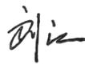

# 独立鉴证声明

# 致：哈尔滨电气集团佳木斯电机股份有限公司各利益相关方

中国质量认证中心有限公司（以下简称“CQC”）受哈尔滨电气集团佳木斯电机股份有限公司（以下简称“佳电股份”）委托，对《哈尔滨电气集团佳木斯电机股份有限公司2025年度环境、社会和公司治理报告》（以下简称“ESG报告”）进行了独立的第三方鉴证工作。

佳电股份负责收集、汇总、分析和披露报告中提到的信息和数据。CQC在与佳电股份的协议中规定的范围内实施报告鉴证。

本声明基于对佳电股份按照国务院国有资产监督管理委员会《关于新时代中央企业高标准履行社会责任的指导意见》《央企控股上市公司ESG专项报告编制研究》、深圳证券交易所《上市公司自律监管指引第1号——主板上市公司规范运作》《上市公司自律监管指引第17号——可持续发展报告（试行）》、全球报告倡议组织（Global Reporting Initiative，简称“GRI”）《可持续发展报告标准（GRI Standards）》等要求编制的ESG报告所开展的鉴证活动作出，佳电股份对报告内信息、数据的真实性、完整性和准确性负责。

# 鉴证范围

《哈尔滨电气集团佳木斯电机股份有限公司2025年度环境、社会和公司治理报告》中披露的ESG关键绩效数据与信息。

# 鉴证依据

AA1000鉴证标准V3，鉴证类型和深度为“类型二，中度鉴证”。

# 鉴证方法

本次鉴证所用方法包括但不仅限于:

a）报告审阅；  
b) 访谈;  
c）文件、记录、证书、票据等资料查阅/佐证；  
d) 可信信息源验证;  
e）对照披露依据验证；  
f）重新计算/测算；  
g）统计、计算/测算过程确认。

# 局限性声明

1. 本次鉴证在考虑定量和定性风险分析的基础上采用抽样方法开展，抽样范围仅限于报告中选用的数据和信息，未对佳电股份的所有原始数据进行全面溯源或独立重新测算。  
2. 本次鉴证仅对佳电股份进行访谈和/或查阅相关文件，未涉及外部利益相关方。  
3. 报告中经第三方审计/验证的数据和信息，本次鉴证过程中不做重复验证。  
4. 报告中部分数据和信息不存在可以进行对比验证的数据/信息源。  
5. 本鉴证声明不包括信息披露之外的活动。  
6. 本鉴证声明不包括关于佳电股份的立场、观点、目标、未来发展方向和承诺的陈述。

# 独立性和能力的声明

中国质量认证中心有限公司（CQC）为具备独立法律地位的第三方认证机构，具有开展可持续发展相关鉴证服务的专业资质与经验。CQC在本次鉴证过程中保持独立性、公正性，并具备开展ESG报告鉴证所需的技术能力和行业理解，符合AA1000鉴证标准V3对鉴证机构的要求。本次鉴证团队由具备丰富经验的AA1000认证可持续报告鉴证人员（PCSAP级别），CCAA（中国认证认可协会）注册质量、环境、职业健康安全、能源、合规、反贿赂等管理体系审核员及APSCA（专业社会责任审核员协会）注册社会责任审核员及ISO14064温室气体核查员组成。

CQC确保在实施本报告的鉴证过程中与佳电股份及其利益相关方没有任何利益冲突。本报告所有信息由佳电股份提供。CQC及本次报告鉴证人员未参与到报告的编制过程。

# 鉴证结论

报告反映了佳电股份2025年在ESG方面的开展情况和所取得的绩效，整体符合AA1000鉴证标准V3及AA1000AP四项原则的要求：

包容性：佳电股份识别了公司的内部和外部利益相关方（包括政府/监管机构、股东/投资人、员工、客户、供应商以及社区），在报告编制过程中考虑了利益相关方的期望和需求。

实质性：佳电股份基于双重重要性议题识别的分析流程，通过分析国内外可持续发展管理工作标准和政策要求，科学开展行业对标，结合企业自身的实际情况和发展战略，综合考虑资源市场价格、趋势预测、公司往年成本以及相关因素，形成本年度ESG议题清单，确认议题的重要排序。

回应性：佳电股份建立了治理架构、制度、管理体系和流程、利益相关方沟通机制，能够采取及时有效的行动回应对佳电股份和利益相关方具有高度财务重要性和影响重要性的重要性议题。

影响性：佳电股份通过定量、定性以及二者结合的方式，披露了在ESG方面对自身以及利益相关方产生的主要影响，展现了公司对自身及利益相关方的高度责任感。

特定绩效信息：基于本次鉴证的过程和结果，我们未发现报告中的关键数据和信息在可靠性和质量方面存在不足之处。

# 建议

针对本次报告鉴证的具体意见已向佳电股份管理层沟通并以文字形式提供，本部分不再表述。

AA1000

Licensed Report

000-366/V3-İJR43

CQC 授权人签名:

中国质量认证中心有限公司

2026年4月17日

中国·北京