

natural_image

Illustration of industrial and urban sectors with oil pumps, trucks, and vehicles under a stylized sky (no text or symbols)

# 2025

山西蓝焰控股股份有限公司

环境、社会和公司治理（ESG）报告

# 目录 CONTENTS

02 关于本报告  
04 董事长致辞  
06 关于蓝焰控股  
16 ESG 管理

# 诚信蓝焰 铸就企业价值

# 专题

回眸“十四五”

奋进“十五五”

24 坚定旗帜领航  
28 完善公司治理  
31 保护股东权益  
32 合规风险管理  
32 反商业贿赂及反贪污  
33 数据信息安全

# 绿色蓝焰 厚植环境价值

# 专题

建一片气田

留一片绿色

38 应对气候变化  
42 强化环境管理  
45 高效利用资源  
46 污染物排放管理  
48 绿色环保行动

# 美好蓝焰 共创社会价值

# 专题

数智转型

创新破局

54 保障能源安全  
58 深耕安全运营  
61 加大自主创新  
63 推进共赢共荣  
65 凝聚员工合力  
72 贡献和谐社会

76 未来展望  
78 附录  
93 评价报告  
95 读者意见反馈

# 关于本报告

# 报告说明

本报告是山西蓝焰控股股份有限公司（股票代码：000968.SZ）发布的第二份 ESG 报告，系统披露公司 2025 年度在环境、社会及治理（ESG）方面的工作和成效，并回应利益相关方的期望与关切。

# 报告范围

# ○ 时间范围

本报告为年度报告，时间范围为2025年1月1日至2025年12月31日，为提高报告完整性和连续性，对部分信息和数据进行了回溯和延展。

# ○组织范围

山西蓝焰控股股份有限公司及附属分、子公司。

# 内容说明

本报告所披露的信息和数据来源于山西蓝焰控股股份有限公司及下属分、子公司的正式文件、统计报告及 ESG 实践与绩效的汇总和统计。

公司保证本报告内容不存在任何虚假记载、误导性陈述或重大遗漏。

本报告中的数据若出现与公司财务报告不一致之处，以财务报告为准。

# 编制依据

全球可持续发展标准委员会《GRI 可持续发展报告标准》(GRI Standards)

深交所《深圳证券交易所上市公司自律监管指引第17号——可持续发展报告（试行）》

国务院国资委《央企控股上市公司 ESG 专项报告参考指标体系》

财政部《企业可持续披露准则——基本准则（试行）》

财政部《企业可持续披露准则第1号——气候（试行）》

# 称谓说明

为便于表述，本报告中山西蓝焰控股股份有限公司简称“蓝焰控股”“公司”或“我们”。文中涉及的其他相关主体简称详见“公司全称与简称对照表”。

# 报告获取

您可通过登录本公司官网（http://sxlykg.huaxingas.com/）和深圳证券交易所网站（https://www.szse.cn/index/index.html）浏览下载本报告电子文本，并了解更多相关信息。

公司全称与简称对照表

<table><tr><td>公司全称</td><td>公司简称</td></tr><tr><td>华新燃气集团有限公司</td><td>集团、集团公司</td></tr><tr><td>山西蓝焰控股股份有限公司</td><td>蓝焰控股</td></tr><tr><td>山西蓝焰煤层气集团有限责任公司</td><td>蓝焰煤层气公司</td></tr><tr><td>漾泉蓝焰煤层气有限责任公司</td><td>漾泉公司</td></tr><tr><td>左权蓝焰煤层气有限责任公司</td><td>左权公司</td></tr><tr><td>山西西山蓝焰煤层气有限责任公司</td><td>西山公司</td></tr><tr><td>山西蓝焰煤层气集团有限责任公司勘探分公司</td><td>勘探分公司</td></tr><tr><td>晋城市诚安物流有限公司</td><td>诚安公司</td></tr><tr><td>山西沁盛煤层气作业有限责任公司</td><td>沁盛公司</td></tr><tr><td>吕梁蓝焰煤层气有限责任公司</td><td>吕梁公司</td></tr><tr><td>山西蓝焰煤层气工程研究有限责任公司</td><td>工程研究公司</td></tr><tr><td>山西华焰煤层气有限公司</td><td>华焰公司</td></tr><tr><td>山西蓝焰煤层气综合利用有限责任公司</td><td>综合利用公司</td></tr><tr><td>山西蓝焰煤层气集团有限责任公司机电设备分公司</td><td>机电设备分公司</td></tr><tr><td>山西蓝焰煤层气集团有限责任公司压缩分公司</td><td>压缩分公司</td></tr><tr><td>山西蓝焰控股股份有限公司科创分公司</td><td>科创分公司</td></tr><tr><td>山西美锦蓝焰煤层气有限责任公司</td><td>美锦公司</td></tr></table>

# 董事长致辞

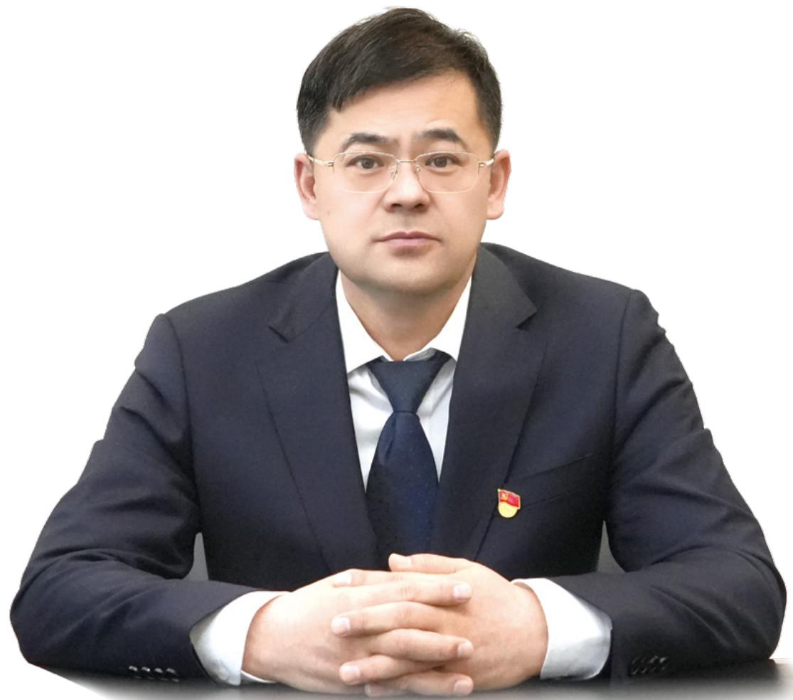

natural_image

Portrait of a man in formal suit and glasses, seated with hands clasped (no visible text or symbols)

时光镌刻奋斗足迹，实干书写发展华章。2025年是“十四五”规划的收官之年，更是蓝焰控股锚定能源安全“国之大者”、深耕煤层气主业、勇担能源革命使命的关键之年。面对能源产业绿色低碳转型的时代浪潮，我们坚持以习近平新时代中国特色社会主义思想为指导，紧扣山西能源革命综合改革部署，以安全环保筑牢发展根基，以国企担当彰显社会价值，以规范治理夯实发展保障，推动环境、社会、治理协同跃升，为建设能源强国、构建新型能源体系贡献蓝焰力量。

# 筑牢安全环保防线，守护绿色气田

我们始终将安全生产与生态环保作为不可逾越的红线，构建全产业链安全绿色运营体系。以“数智强晋”示范工程为牵引，建成煤层气全生命周期智能管控平台，实现开发与保护协同并进。持续推进“花园井场”建设，累计建成280个，让绿色成为气田最动人的色彩。深化水资源循环利用与废弃物规范处置，全年未发生重大环境污染事件。我们用实际行动践行“建一片气田，留一片绿色”的承诺。

# 践行国有企业担当，彰显社会价值

我们把企业发展融入国家战略与地方需求，在能源保供、产业协同、民生服务上主动作为。聚焦增储上产，强化气质全流程管控，2025年实现煤层气销售量12.25亿立方米，较2021年增长11.46%，五年累计销售量达60.66亿立方米，为区域清洁能源稳定供应提供了坚实保障。联动产业链伙伴，参股成立华瑞装备公司，助力山西构建煤层气装备制造全链条。高质量完成新疆昌吉州煤层气井施工任务，荣获“山西省民族团结进步模范集体”称号。我们坚持以人为本，护航员工成长，共享发展成果，积极构建和谐共生的企业生态。

# 持续深化规范治理，提升运营效能

我们以高质量党建引领高质量发展，推进党的建设与生产经营深度融合。作为国内最早从事煤层气开发利用的 A 股上市公司，我们以国企改革深化提升行动为契机，连续三年入选国务院国资委“双百企业”改革标杆。厘清董事会与经理层权责边界，形成“风险 - 内控 - 合规”三位一体管理体系。2025 年成功发行 8 亿元科技创新公司债券，完成董事会换届并实现监事会职能向审计委员会平稳过渡，入选中国上市公司协会“董事会典型实践案例”“董事会办公室优秀实践”。发布 ESG 报告，治理能力迈上新台阶，为企业行稳致远提供坚实保障。

展望 “十五五”，国家 “双碳” 目标向纵深推进，非常规天然气产业迎来高质量发展的黄金机遇期。站在新的历史起点，蓝焰控股将以党建为引领、以创新为引擎、以责任为底色，聚焦主业、深化改革、实干笃行，与各界伙伴携手共赢，奋力书写煤层气产业高质量发展新篇章，为保障国家能源安全、深化山西能源革命综合改革、建设美丽中国贡献更为坚实的蓝焰力量！

text_image

苏之鸿

山西蓝焰控股股份有限公司

董事长

# 关于蓝焰控股

# 公司概况

山西蓝焰控股股份有限公司（股票简称：蓝焰控股，股票代码：000968.SZ）是我国A股市场中最早从事煤层气开发利用的上市公司。经过20余年的发展，蓝焰控股已构建起集地质勘查、工程设计、工程建设、生产运行和集输销售于一体的煤层气全产业链生产运营模式，建成了稳定的煤层气生产基地，开拓出山西及周边地区稳定的城市燃气、工业用气等用户市场，推动了煤层气产业规模化发展，为保障煤矿安全生产、优化能源结构、保护生态环境做出突出贡献。

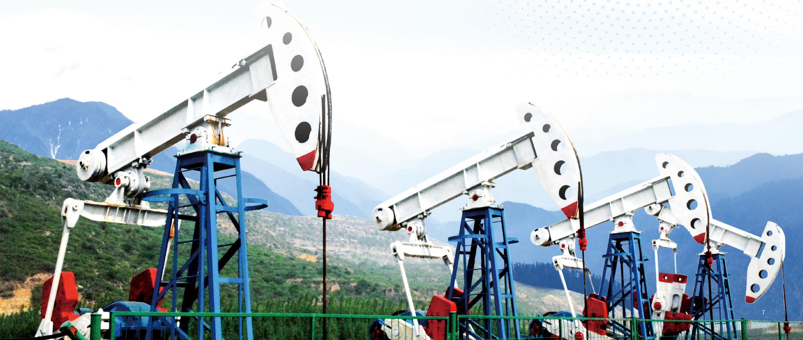

natural_image

Exterior view of multiple oil pumpjacks operating in a mountainous, forested area (no signage or text visible)

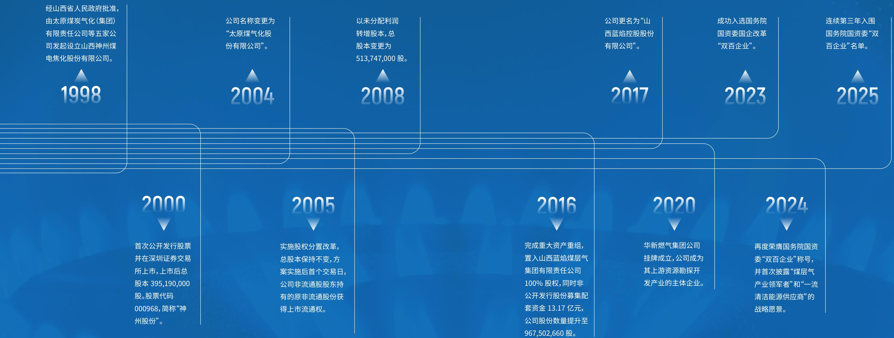

flowchart

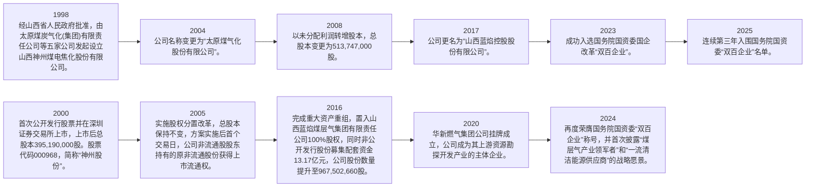
```mermaid
graph LR
  A["1998\n经山西省人民政府批准，由太原煤炭气化(集团)有限责任公司等五家公司发起设立山西神州煤电焦化股份有限公司。"] --> B["2004\n公司名称变更为“太原煤气化股份有限公司”。"]
  B --> C["2008\n以未分配利润转增股本，总股本变更为513,747,000股。"]
  C --> D["2017\n公司更名为“山西蓝焰控股股份有限公司”。"]
  D --> E["2023\n成功入选国务院国资委国企改革“双百企业”。"]
  E --> F["2025\n连续第三年入围国务院国资委“双百企业”名单。"]
  G["2000\n首次公开发行股票并在深圳证券交易所上市，上市后总股本395,190,000股。股票代码000968，简称“神州股份”。"] --> H["2005\n实施股权分置改革，总股本保持不变，方案实施后首个交易日，公司非流通股股东持有的原非流通股份获得上市流通权。"]
  H --> I["2016\n完成重大资产重组，置入山西蓝焰煤层气集团有限责任公司100%股权，同时非公开发行股份募集配套资金13.17亿元，公司股份数量提升至967,502,660股。"]
  I --> J["2020\n华新燃气集团公司挂牌成立，公司成为其上游资源勘探开发产业的主体企业。"]
  J --> K["2024\n再度荣膺国务院国资委“双百企业”称号，并首次披露“煤层气产业领军者”和“一流清洁能源供应商”的战略愿景。"]
```

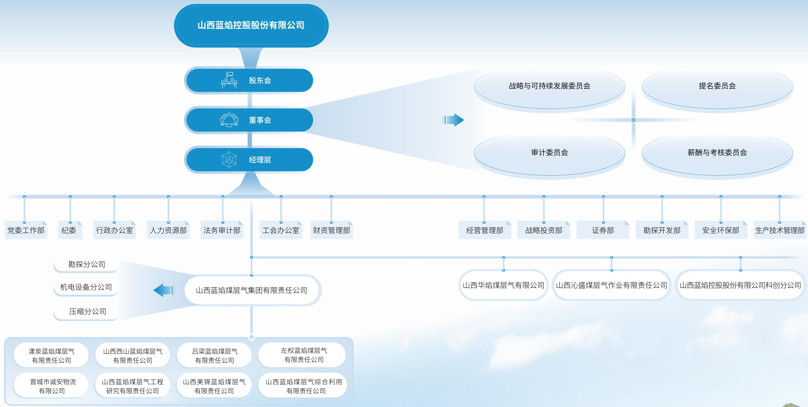

flowchart

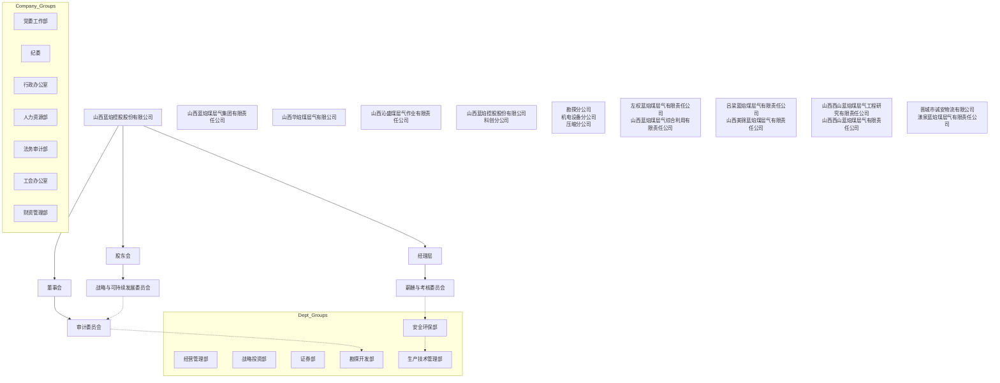
```mermaid
graph TD
  A["山西蓝焰控股股份有限公司"] --> B["股东会"]
  A --> C["董事会"]
  A --> D["经理层"]
  
  B --> E["战略与可持续发展委员会"]
  C --> F["审计委员会"]
  D --> G["薪酬与考核委员会"]
  
  subgraph Company_Groups
    H["党委工作部"]
    I["纪委"]
    J["行政办公室"]
    K["人力资源部"]
    L["法务审计部"]
    M["工会办公室"]
    N["财资管理部"]
  end
  
  subgraph Dept_Groups
    O["经营管理部"]
    P["战略投资部"]
    Q["证券部"]
    R["勘探开发部"]
    S["安全环保部"]
    T["生产技术管理部"]
  end
  
  E -.-> F
  F -.-> R
  G -.-> S
  S -.-> T
  
  U["山西蓝焰煤层气集团有限责任公司"]
  V["山西华焰煤层气有限公司"]
  W["山西沁盛煤层气作业有限责任公司"]
  X["山西蓝焰控股股份有限公司科创分公司"]
  
  Y["勘探分公司\n机电设备分公司\n压缩分公司"]
  Z["左权蓝焰煤层气有限责任公司\n山西蓝焰煤层气综合利用有限责任公司"]
  AA["吕梁蓝焰煤层气有限责任公司\n山西美锦蓝焰煤层气有限责任公司"]
  AB["山西西山蓝焰煤层气工程研究有限责任公司\n山西西山蓝焰煤层气有限责任公司"]
  AC["晋城市诚安物流有限公司\n漾泉蓝焰煤层气有限责任公司"]
```

# 业务布局

持续推进井场标准化建设，规范设备安装、安全管理、技术交底等前期工作，严格执行钻井流程与规范。通过强化钻井液管控、规范现场操作、严把完井验收，保障施工质量与作业安全，以科学高效钻井助力煤层气清洁开发，推动区域能源绿色转型。

# 钻井

规范做好设备联调、试压检测、压裂液配制及安全防护等前期准备，有序开展分段压裂作业。通过分段压裂管理、裂缝监测、施工记录、返排液处理等作业流程精细化，确保作业质量与环保安全，高效释放煤层气资源潜能，提供更多低碳清洁能源。

# 压裂

提前做好设备安装、系统调试与制度建设，对煤层气井实施全生命周期管理。依托实时监测、智能调控与快速故障处置，实现智能化、精细化排采，持续稳定输出清洁燃气，以高效开采助力地方能源保供与绿色发展。

# 排采

结合井场布局与地形条件，科学开展管网规划、管道建设与智能监控系统建设，规范执行气体进站处理、增压输送、计量交接等标准化操作。通过流量、压力、温度实时监测及泄漏自动报警等智能管控，构建安全、高效、绿色的集输体系，保障清洁能源安全稳定输送。

# 集输

井口采出的煤层气经气液分离、脱水、除尘、脱硫等预处理后，进入压缩机加压后充装至管束车中，由专用车辆运输至管道未通达的用户端；到达后经减压撬减压至适合压力，输送至下游客户，将原本因管道受限而可能排空的煤层气回收利用，既减少甲烷排放对大气的影响，又将创造经济效益。

# 压缩及液化

构建管道运输与槽车运输协同保障体系，通过运行监控、日常维护与应急处置实现管道运输安全平稳；规范 CNG（充装→检查→运输→卸车→回空）、LNG（预冷→充装→复压→运输→卸车）流程，实现槽车运输标准化，严格落实车辆标准、路线规划与交接验收要求。

# 运输

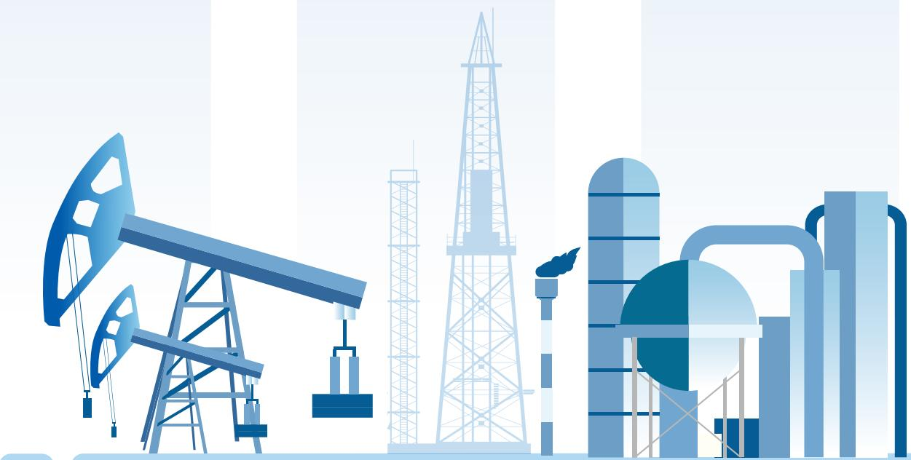

natural_image

Illustration of oil and gas industry equipment including pumpjacks, oil pumps, and industrial towers (no text or symbols)

# 荣誉奖项

2025 上市公司董事会
办公室优秀实践

中国上市公司协会

蓝焰煤层气公司“企业绿色低碳创新服务平台合作伙伴”

中国环境报社

上市公司董事会典型
实践案例

中国上市公司协会

山西省民族团结
进步模范集体

中共山西省委、
山西省人民政府

“煤层气水平井效益开发智能调控关键技术及工业

化应用”荣获第十七届中国商业联合会服务业科技创新奖一等奖

中国商业联合会

“中 - 高煤阶煤层气高效开

发地震 - 地质 - 工程一体化关键技术及应用”荣获科技

创新奖一等奖

中国科技产业化促进会

“多重采动影响区煤层气地面精准 - 协同抽采与安全保障关键技术” 荣获第一届应急管理科技创新奖一等奖

中国消防协会、中国灾害防御协会、中国矿山安全学会、中国煤炭工业协会、应急管理科技创新奖励委员会办公室

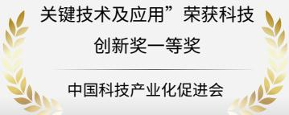

“高煤阶煤层气高效开发关键技术与工业化应用”

荣获2024年石化联合会科技进步奖三等奖

中国石油和化学工业联合会

“煤矿区瓦斯全周期分策低碳抽采关键技术研究与应用”荣获2025年职工技术创新成果特等奖

中国职工技术协会

2025年度“技能山西”职业技能大赛——潞安化工杯第八届山西省能源行业职工职业技能大赛优秀组织奖

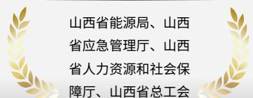

山西省能源局、山西省应急管理厅、山西省人力资源和社会保障厅、山西省总工会

第十四届中国创新创业大赛山西赛区一等奖山西省创新创业服务中心

新疆项目部荣获省总直属基层 2025 年度重点工程（重点业务）劳动竞赛“标兵集体”

山西省总工会直属基层工会

“煤矿采动区绿色减碳地面高效抽采瓦斯关键技术与工程示范”荣获绿色矿山科学技术奖科技进步一等奖中关村绿色矿山产业联盟

“复杂地质条件煤层气开发靶区优选智慧评价技术与应用”荣获绿色矿山科学技术奖科技进步二等奖中关村绿色矿山产业联盟

# 行业贡献

<table><tr><td>协会名称</td><td>参与单位</td><td>角色</td></tr><tr><td>中国上市公司协会</td><td>蓝焰控股</td><td>会员</td></tr><tr><td>中国煤炭建设协会</td><td>工程研究公司</td><td>会员</td></tr><tr><td>山西省煤层气行业协会</td><td>蓝焰控股</td><td>副会长</td></tr><tr><td>山西省国有企业党的建设研究会</td><td>蓝焰控股</td><td>会员</td></tr><tr><td>山西省上市公司协会</td><td>蓝焰控股</td><td>会员</td></tr><tr><td>山西省国有企业法律顾问协会</td><td>蓝焰控股</td><td>会员</td></tr><tr><td>山西省消防协会</td><td>蓝焰煤层气公司压缩分公司</td><td>会员</td></tr><tr><td>太原市能源行业工会联合会</td><td>西山公司</td><td>会员</td></tr><tr><td>晋城市工业经济联合会、企业联合会、企业家协会</td><td>蓝焰煤层气公司</td><td>会员</td></tr><tr><td>沁水县煤层气行业协会</td><td>蓝焰煤层气公司</td><td>副会长</td></tr></table>

# ESG 管理

蓝焰控股将 ESG 作为推动高质量发展的重要动力，融入企业战略，深化 ESG 理念在战略决策、经营管理和业务实践中的应用。2025 年，公司加快构建规范化、系统化的 ESG 管理体系，持续提升治理效能，在保障能源安全、推动绿色转型、履行社会责任中不断探索具有蓝焰特色的 ESG 实践路径。

# ESG 管理体系

2025 年，公司正式出台《ESG 管理制度》，配套制定年度实施方案，明确年度重点任务与责任分工，为规范化管理奠定制度基础；组织开展覆盖管理人员及业务骨干的 ESG 专题培训，推动 ESG 意识融入各业务条线；建立健全 ESG 信息收集与披露机制，完成 ESG 报告编制，以规范化披露系统回应内外关切，全面呈现年度履责实践。

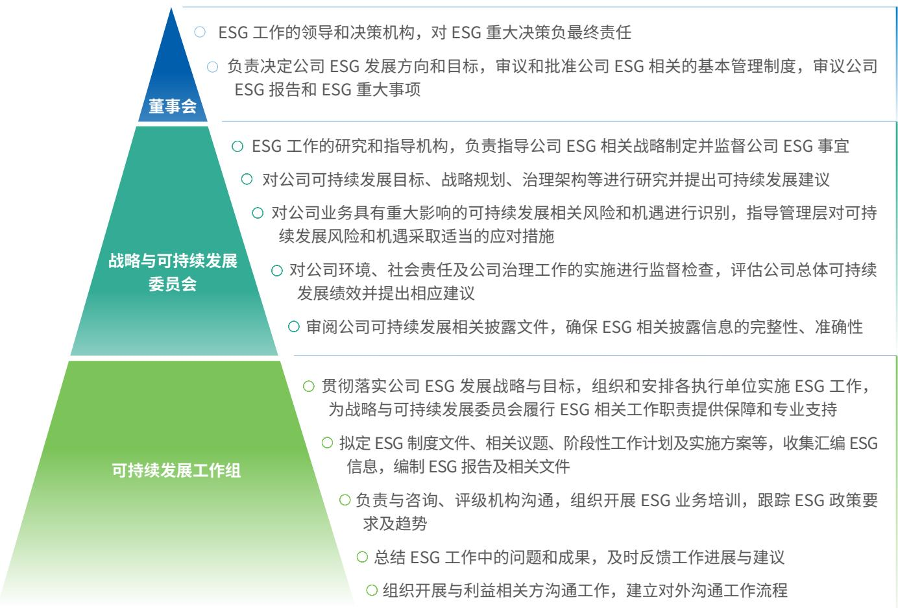

flowchart

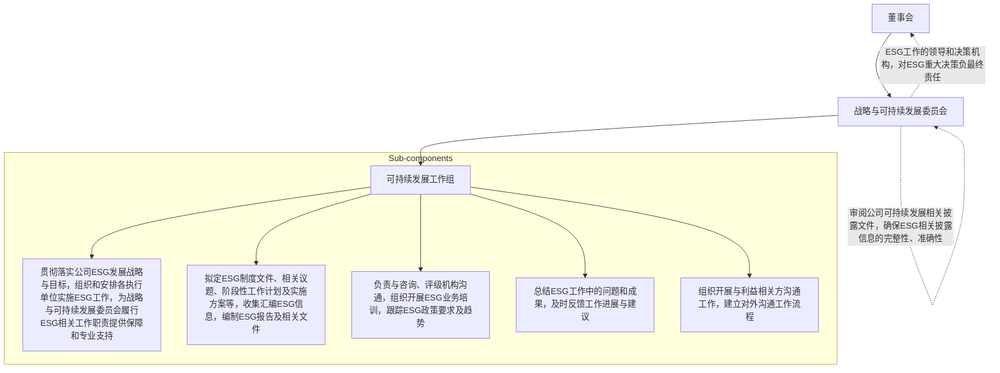
```mermaid
graph TD
  A["董事会"] --> B["战略与可持续发展委员会"]
  B --> C["可持续发展工作组"]
  
  subgraph Sub_components["Sub-components"]
    direction TB
  C --> D["贯彻落实公司ESG发展战略与目标，组织和安排各执行单位实施ESG工作，为战略与可持续发展委员会履行ESG相关工作职责提供保障和专业支持"]
  C --> E["拟定ESG制度文件、相关议题、阶段性工作计划及实施方案等，收集汇编ESG信息，编制ESG报告及相关文件"]
  C --> F["负责与咨询、评级机构沟通，组织开展ESG业务培训，跟踪ESG政策要求及趋势"]
  C --> G["总结ESG工作中的问题和成果，及时反馈工作进展与建议"]
  C --> H["组织开展与利益相关方沟通工作，建立对外沟通工作流程"]
  end
  
  B -.->|"ESG工作的领导和决策机构，对ESG重大决策负最终责任"| A
  B -.->|"负责决定公司ESG发展方向和目标，审议和批准公司ESG相关的基本管理制度，审议公司ESG报告和ESG重大事项"| B
  B -.->|"ESG工作的研究和指导机构，负责指导公司ESG相关战略制定并监督公司ESG事宜"| B
  B -.->|"对公司可持续发展目标、战略规划、治理架构等进行研究并提出可持续发展建议"| B
  B -.->|"对公司业务具有重大影响的可持续发展相关风险和机遇进行识别，指导管理层对可持续发展风险和机遇采取适当的应对措施"| B
  B -.->|"对公司环境、社会责任及公司治理工作的实施进行监督检查，评估公司总体可持续发展绩效并提出相应建议"| B
  B -.->|"审阅公司可持续发展相关披露文件，确保ESG相关披露信息的完整性、准确性"| B
```

▲ 蓝焰控股 ESG 管理架构

# 重要性 议题管理

蓝焰控股将重要性议题作为 ESG 管理的重要环节，依据深交所《上市公司自律监管指引第 17 号——可持续发展报告（试行）》等相关要求，系统开展重要性议题分析，精准识别并管控潜在风险，主动把握发展机遇。基于此项分析，公司明确 ESG 战略规划与年度工作重点，切实推动企业的长期稳定发展，实现可持续的发展目标。

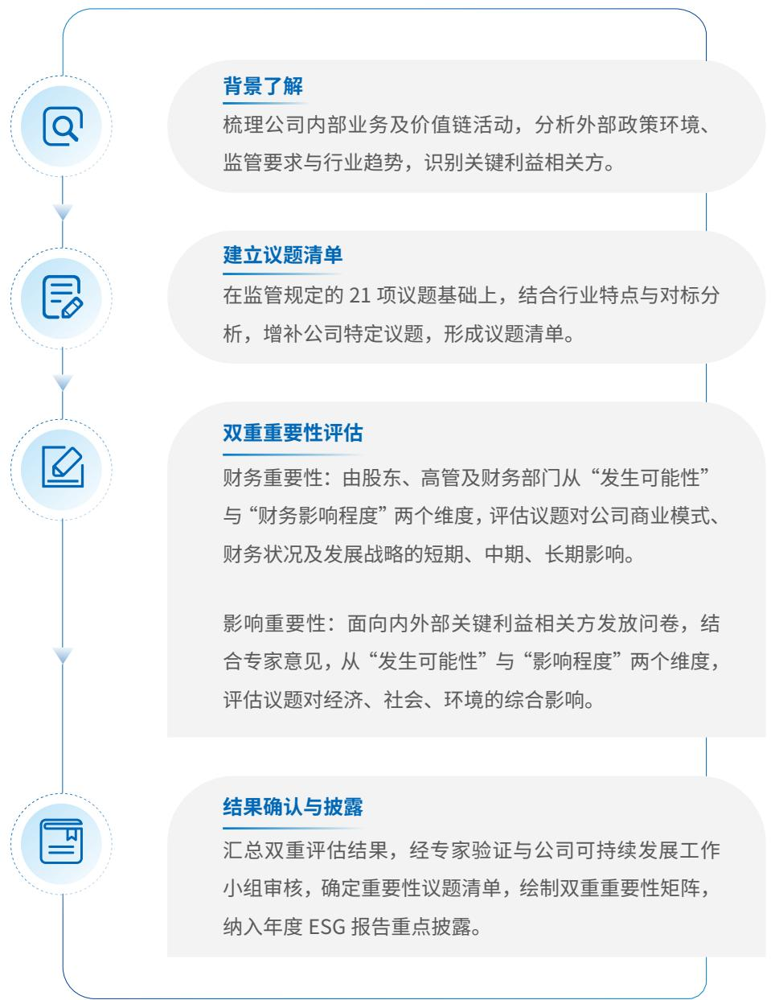

flowchart

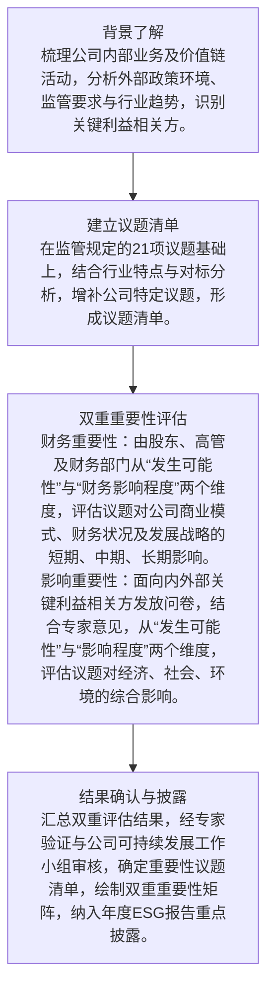
```mermaid
graph TD
  A["背景了解\n梳理公司内部业务及价值链活动，分析外部政策环境、监管要求与行业趋势，识别关键利益相关方。"] --> B["建立议题清单\n在监管规定的21项议题基础上，结合行业特点与对标分析，增补公司特定议题，形成议题清单。"]
  B --> C["双重重要性评估\n财务重要性：由股东、高管及财务部门从“发生可能性”与“财务影响程度”两个维度，评估议题对公司商业模式、财务状况及发展战略的短期、中期、长期影响。\n影响重要性：面向内外部关键利益相关方发放问卷，结合专家意见，从“发生可能性”与“影响程度”两个维度，评估议题对经济、社会、环境的综合影响。"]
  C --> D["结果确认与披露\n汇总双重评估结果，经专家验证与公司可持续发展工作小组审核，确定重要性议题清单，绘制双重重要性矩阵，纳入年度ESG报告重点披露。"]
```

▲ 双重要性评估流程

<table><tr><td>识别 ESG 议题库</td><td>相关方参与</td></tr><tr><td>治理议题 3 项</td><td>20 位外部股东、相关高管及部门负责人对议题的财务重要性予以评估。</td></tr><tr><td>环境议题 7 项</td><td rowspan="2">1,487 位相关方参与影响重要性评估,涵盖供应商、客户、员工、合作伙伴、社区、政府及监管机构等。</td></tr><tr><td>社会议题 12 项</td></tr></table>

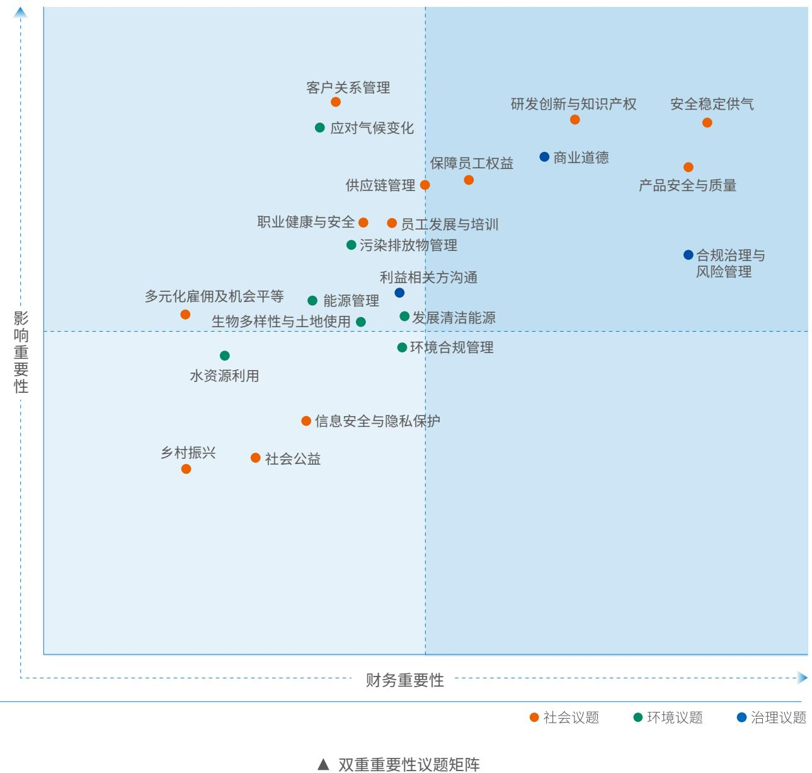

scatter

| Topic | Category | Financial Importance (Approx.) | Impact Significance (Approx.) |
| :--- | :--- | :--- | :--- |
| 客户关系管理 | 社会议题 | Low-Mid | High |
| 应对气候变化 | 环境议题 | Low-Mid | High |
| 供应链管理 | 社会议题 | Mid | High |
| 员工发展与培训 | 社会议题 | Mid | High |
| 职业健康与安全 | 社会议题 | Low-Mid | High |
| 污染排放物管理 | 环境议题 | Low-Mid | High |
| 利益相关方沟通 | 治理议题 | Mid | Mid-High |
| 发展清洁能源 | 环境议题 | Mid | Mid |
| 生物多样性与土地使用 | 环境议题 | Low-Mid | Mid |
| 多元化雇佣及机会平等 | 社会议题 | Low-Mid | Mid |
| 水资源利用 | 环境议题 | Low-Mid | Mid |
| 信息安全与隐私保护 | 社会议题 | Low-Mid | Low-Mid |
| 乡村振兴 | 社会议题 | Low-Mid | Low-Mid |
| 社会公益 | 社会议题 | Low-Mid | Low-Mid |
| 商业道德 | 治理议题 | High | High |
| 产品安全与质量 | 社会议题 | High | High |
| 安全稳定供气 | 社会议题 | High | High |
| 合规治理与风险管理 | 治理议题 | High | Mid-High |

# 利益相关方沟通

蓝焰控股高度重视利益相关方的期望和诉求，健全与各利益相关方的常态化沟通机制，畅通沟通渠道，积极传递公司可持续发展信息，获取利益相关方对公司的意见建议并做出积极回应，为调整公司 ESG 发展计划与工作重点、提升公司 ESG 管理水平提供重要决策依据。

<table><tr><td>利益相关方</td><td>重点关注议题</td><td>蓝焰控股的回应</td></tr><tr><td rowspan="4">客户</td><td>客户关系管理</td><td>保障清洁能源安全稳定供应</td></tr><tr><td>安全稳定供气</td><td>客服热线</td></tr><tr><td>产品安全与质量</td><td>日常媒体传播</td></tr><tr><td>信息安全与隐私保护</td><td>优化气质管理</td></tr><tr><td rowspan="2">股东与投资者</td><td>合规治理与风险管理</td><td>召开股东会</td></tr><tr><td>利益相关方沟通</td><td>建立多元沟通渠道及时回复投资者提问持续沟通与日常联络</td></tr><tr><td rowspan="6">政府及监管机构</td><td>安全稳定供气</td><td></td></tr><tr><td>乡村振兴</td><td>接受监督考核</td></tr><tr><td>社会公益</td><td>参加专题汇报</td></tr><tr><td>发展清洁能源</td><td>响应乡村振兴号召</td></tr><tr><td>应对气候变化</td><td>参与国家标准、行业标准及地方标准制定</td></tr><tr><td>研发创新与知识产权</td><td></td></tr><tr><td rowspan="3">员工</td><td>保障员工权益</td><td>依法签订劳动合同</td></tr><tr><td>职业健康与安全</td><td>建立各级工会组织举办各类培训学习</td></tr><tr><td>员工发展与培训</td><td>开展各类文体活动全方位保障职业健康</td></tr><tr><td rowspan="3">供应商与合作伙伴</td><td>供应链管理</td><td>诚信合规采购</td></tr><tr><td>信息安全与隐私保护</td><td>规范供应链管理</td></tr><tr><td>商业道德</td><td>签订战略合作协议</td></tr><tr><td rowspan="9">社区与公众</td><td>乡村振兴</td><td></td></tr><tr><td>社会公益</td><td></td></tr><tr><td>环境合规管理</td><td>响应乡村振兴号召</td></tr><tr><td>污染排放物管理</td><td>参与社区共建活动</td></tr><tr><td>应对气候变化</td><td>公开环境保护信息</td></tr><tr><td>水资源利用</td><td>定期沟通及日常媒体传播</td></tr><tr><td>能源管理</td><td></td></tr><tr><td>生物多样性与土地使用</td><td></td></tr><tr><td>利益相关方沟通</td><td></td></tr></table>

# 诚信蓝焰

# 铸就企业价值

完善公司治理,是企业行稳致远的立身之本。蓝焰控股坚持以规范化治理为基石,深入推进国企改革,切实维护股东权益,聚焦党建引领、治理优化、风险管控、合规经营、商业道德等关键维度,持续完善治理结构、提升治理效能,强化合规管理与风险防控底线,稳步推进治理体系和治理能力现代化,为公司高质量发展夯实治理根基、凝聚持久动能。

SDGs 对标

16 和平、正义与强大机构

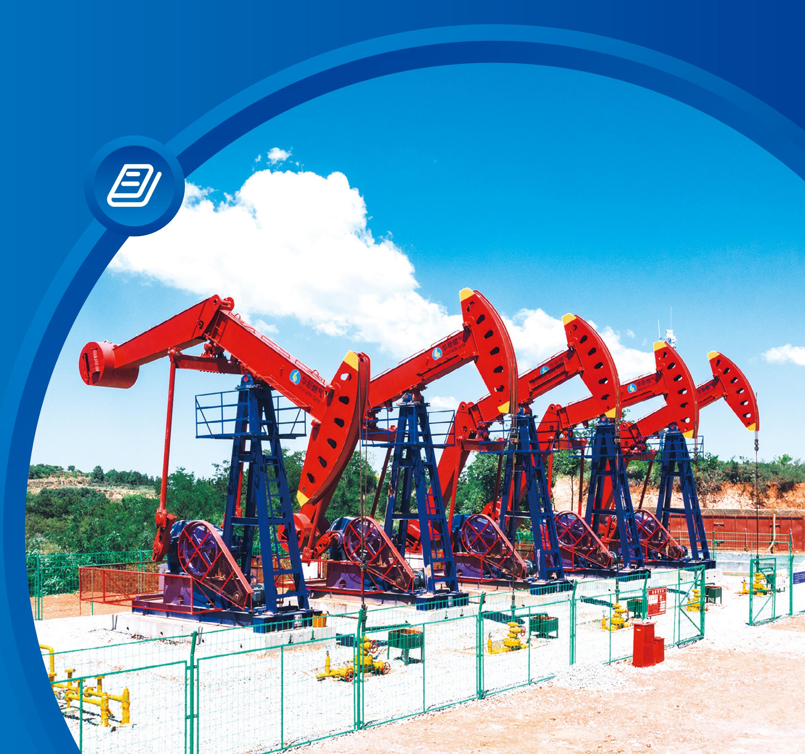

natural_image

Exterior view of a large oil field with multiple red and blue pumpjacks under a clear blue sky (no signage or text visible)

# 专题

# 回眸“十四五” 奋进“十五五”

“十四五”（2021-2025）时期是我国能源结构转型的关键五年，也是煤层气产业提速发展的重要阶段。蓝焰控股紧扣国家能源安全战略和山西省能源革命综合改革试点部署，勇担“气化山西”重任，聚焦增储上产主责主业，在攻坚克难中砥砺前行，以地火蓝焰点亮绿色发展引擎，以实干担当书写能源转型答卷，圆满完成各项目标任务，为“十五五”乘势而上积蓄强劲势能。

站在 “十五五” 新起点，蓝焰控股将持续加大勘探开发力度，聚力关键技术攻关，深化对外务实合作，确保煤层气产量达到 20 亿方，力争达到 25 亿方，在保障国家能源安全、服务山西能源革命的实践中展现更大作为。

# 增储上产迈上新台阶

# 资源根基更加厚实，能源保供能力持续增强

深化落实增储上产三年行动，累计投资52.28亿元，完成钻井611口。

销售量从 2021 年 10.99 亿立方米提升至 2025 年 12.25 亿立方米，增幅 11.46%，五年来累计销售量 60.66 亿立方米。

拥有煤层气矿业权 24 宗，覆盖面积约 2,799.35 平方公里，累计探明地质储量 531.91 亿立方米。

# 突破

# 科技创新取得

# 创新链与产业链融合步伐加快，核心竞争实力稳步提升

研发投入保持行业领先，累计研发费用4.64亿元。

公司 2 家下属企业完成高新技术企业认定。

累计参编标准 26 项，其中国家标准 11 项。

授权专利（有效期内）137项，其中发明专利36项。

参与建设煤与煤层气共采全国重点实验室华新分室。

# 步伐

# 数智转型迈出

# 以“智慧气田”为牵引，智能化水平显著提升

依托“数智强晋”示范工程，建成以数据中心为核心、八大系统为载体的煤层气全生命周期智能管控体系。

打通“勘探-生产”全链条数据通道，持续提升勘探开发标准化、生产运行智能化水平，为产业转型升级注入新动能。

# 跃升

# 治理体系持续优化，企业发展活力得到有效激发

连续 3 年入选国务院国资委 “双百企业” 改革标杆。

荣获省部级及以上奖项46项。

营业收入从 2021 年 19.78 亿元提升至 2025 年 21.10 亿元。

# 坚定 旗帜领航

蓝焰控股始终坚持以党的政治

建设为统领，深入学习贯彻习近平新

时代中国特色社会主义思想、党的二十届四

中全会精神，坚持把党的领导融入公司治理各环

节，致力以高质量党建引领保障高质量发展。

2025 年

荣获“上证鹰·金质量”优秀党建奖

# 坚持 党的全面领导

公司严格执行“第一议题”制度，构建“中心组领学、支部研学、一线践学”三级学习架构，推动党的创新理论学习全覆盖；修订完善《“三重一大”决策制度实施办法》及决策清单，规范党委会前置研究讨论程序，确保党委把方向、管大局、保落实的核心作用有效发挥。

组织党委理论学习中心组学习

16次

集中研讨

14次

召开党委会

22 次

审议议题

254项

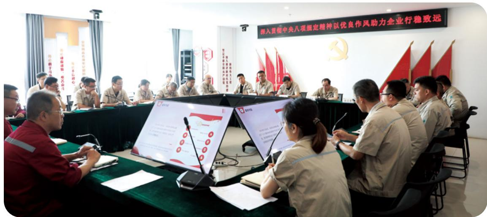

text_image

Meeting room scene with participants in uniform, featuring a large banner with Chinese text about improving military responsibility.

▲ 组织开展深入贯彻中央八项规定精神学习教育专题党课

# 打造 党建特色品牌

公司积极推动“企航先锋”党建品牌建设，形成“1个核心”引领统筹全局，“N个企业党建品牌”多点开花的党建品牌矩阵\*。深入开展“四强党支部”建设和选树，推动党员在增储上产、技术攻关、安全保供等一线亮身份、当先锋、作表率，以实干推动党建品牌落地见效、彰显活力。

# 人物故事：用实干与忠诚筑牢信仰根基的党员先锋

# 党员先锋岗

> 王银库：十五年深耕一线的设备“守护者”

扎根采空区项目部十五年，自主研发增压机进气端负压自动放水装置、冷却器防尘罩，破解行业痛点。以一双巧手为项目部增压机组每年排解疑难问题150条次以上，以精益求精的作风筑牢设备安全防线。

王瑞斌：勘探安全战线上的“尖兵”

退伍不褪色，创新“流动课堂 + 实操培训”模式，提升全员安全素养。他主动请缨驻守野外生产一线，在西山区块连续驻守90多天，以“铢积寸累”的坚持筑牢安全生产根基，有效提升团队应急处置能力。

# 党员突击队

勘探分公司：急难险重冲在前的“红色堡垒”

依托 34 名党员骨干及技术尖兵组建党员突击队，在应急抢险与核心技术攻关双重战场上冲锋在前、担当在先。2025 年聚力攻克定向井与水平井精准对接、自喷井筒再钻、钻井优化提速等核心技术难题，为后续增产措施实施奠定坚实基础。

> 管道工区：迎寒而上保冬供的“管网卫士”

面对通球作业卡球险情，冒雨连夜进山逐段排查，以“钉钉子”精神攻克难关。白天穿梭在管道沿线，夜间坚守岗位随时待命，用担当守护千家万户温暖。

# 党员示范岗

> 郝卫生：精打细算的“材料管家”

以 “既保生产又控成本” 为准则，推动材料计划准确率大幅提升。提出 “修旧利废奖励制度”，工具保养精确到每一天，为修井作业筑牢后勤保障线。

# 党员 责任区

> 诚安公司武乡站：防汛一线的“红色中坚”

建立 “区域负责、包片联动” 防汛体系，依托 “一带二” 机制带动群众参与。暴雨中党员带头蹚水加固堤防、冒雨检修设备，实现人员零伤亡、设备零损坏。

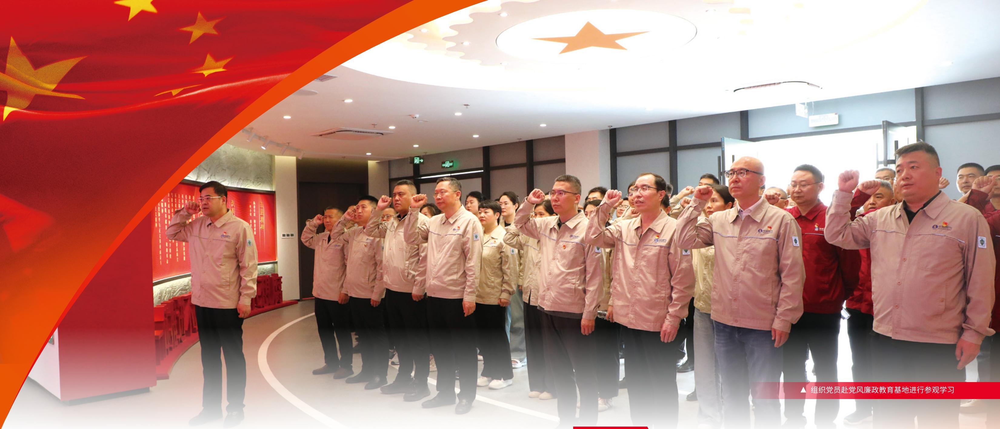

text_image

▲ 组织党员赴党风廉政教育基地进行参观学习

# 营造风清气正生态

公司坚持严的基调、严的措施、严的氛围，以压实管党治党责任为核心，深化作风建设、抓实清廉建设、狠抓整改落实，纵深推进全面从严治党。

# 全面从严治党

# 压实管党治党责任

党委书记与各基层党组织签订《2025年落实全面从严治党主体责任目标责任书》，修订下发《党建工作责任制考核办法》及细则，制定工作要点、责任清单，并通过“日常考核+现场督导”推动责任落地见效。

▲ 组织党员赴党风廉政教育基地进行参观学习

# 深化作风建设整治

扎实开展中央八项规定精神学习教育，全级次党组织查摆问题 295 条、党员领导干部查摆问题两千余条，整改销号率 100%。整治形式主义为基层减负，精简党建考核细则，推行 “多会合一”，切实为基层松绑赋能。

# 抓实清廉国企建设

紧盯元旦、春节等重要节点开展廉政提醒，发放廉洁教育书籍 600 余册，开设 “纪法小课” 专栏，组织学习典型案例 50 起，以案示警、以案促廉，持续营造崇廉尚洁的浓厚氛围。

# 巩固巡视巡察成果

建立巡视巡察整改长期跟踪台账，实行“每月跟踪、对账销号”动态管理，对重点问题紧盯不放、一抓到底。在巩固前期整改成果的基础上，适时开展“回头看”自查评估，坚决防止问题反弹回潮。

# 完善公司治理

# 公司治理

蓝焰控股始终坚持规范运作、稳健经营，持续健全权责清晰、运转协调、制衡有效的法人治理结构。通过优化治理机制、强化董事会建设、深化国企改革，不断提升决策科学性和运营透明度，持续提升公司治理效能。

公司严格遵守《中华人民共和国公司法》《中华人民共和国证券法》《上市公司治理准则》《上市公司股东会规则》及《深圳证券交易所上市公司自律监管指引第1号——主板上市公司规范运作（2025年修订）》等法律法规及规范性文件要求，建立科学治理结构和议事规则。

公司积极响应新《中华人民共和国公司法》改革要求，围绕2025年证监会及交易所出台的各项新规，梳理并修订《公司章程》及相关议事规则，为公司规范治理提供制度保障。

公司依法设立由股东会、董事会和经理层组成的权责边界清晰、高效协调运转的公司治理架构。2025年5月，公司董事会审计委员会代行原监事会职能，进一步优化治理架构。其中，董事会下设战略与可持续发展委员会、审计委员会、提名委员会和薪酬与考核委员会四个专门委员会，严格按照《董事会战略与可持续发展委员会工作细则》《董事会审计委员会工作细则》《董事会提名委员会工作细则》《董事会薪酬与考核委员会工作细则》相关规定履行职责义务。

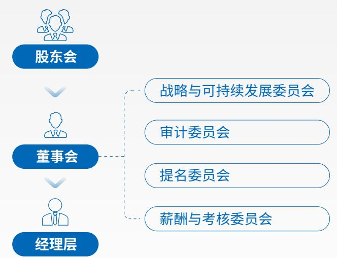

flowchart

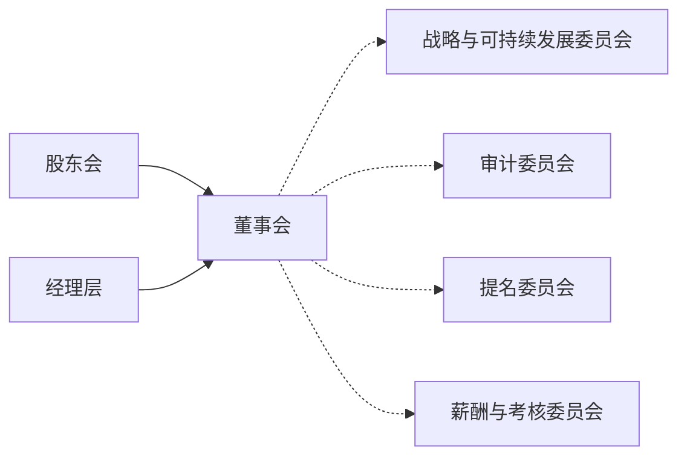
```mermaid
graph LR
  A["股东会"] --> B["董事会"]
  C["经理层"] --> B
  B -.-> D["战略与可持续发展委员会"]
  B -.-> E["审计委员会"]
  B -.-> F["提名委员会"]
  B -.-> G["薪酬与考核委员会"]
```

▲ 治理架构图

# 董事会建设

公司持续优化董事会结构，严格按照法律法规、监管规则及《公司章程》选聘董事，确保成员专业背景多元、履职经验互补，充分发挥董事会在重大决策、风险管控和经营管理中的核心作用。建立以业绩为导向的薪酬激励机制，董事薪酬方案经薪酬与考核委员会、董事会、股东会逐级审议，将经营业绩、风险管理等指标与绩效薪酬挂钩，实现激励与约束并重，持续激发董事和高管团队的履职动能。2025年，公司召开董事会7次。

  
2025年

荣获中国上市公司协会“2025上市公司董事会办公室优秀实践”  
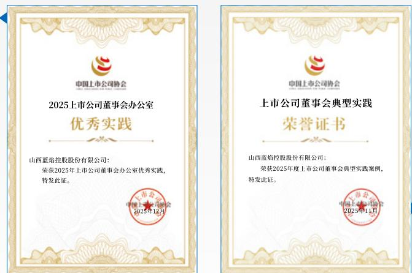  
荣获中国上市公司协会“上市公司董事会典型实践案例”

# 董事会多元化

董事会成员由股东会选举或更换，平均任期3年，任期届满可连选连任。截至2025年底，董事会共由7名董事组成，其中男性董事5名、女性董事2名，女性董事占比28.6%。现任董事成员深耕财务、油气、经营管理等领域，兼具深厚的专业素养与行业经验，形成“技术+财务+管理”复合型决策团队，为公司战略决策提供多元视角与专业支撑。

# 董事会独立性

制定并持续完善《独立董事制度》，明确独立董事任职条件、提名选举、职责权利及履职保障。2025年，公司独立董事占比42.6%，符合监管要求且高于一般规定。独立董事在关联交易、对外担保、高管聘任等重大事项中独立发表意见，充分发挥监督制衡作用，确保董事会决策客观公正。截至2025年底，审计委员会中独立董事占比100%，薪酬与考核委员会中独立董事占比75%，提名委员会中独立董事占比75%。

# 国企改革

公司以“双百企业”建设为牵引，统筹推进法人治理、经营机制、科技创新等重点领域改革。制定《董事会向经理层授权管理办法》，建立“放管结合、动态优化”授权机制，厘清责任边界，提升市场化运营效率。全面推行经理层任期制和契约化管理，优化以业绩为导向的薪酬分配机制，将经营目标与个人考核紧密挂钩，持续激发干事创业活力，不断提升公司治理能力和现代化水平。

# 截至 2025 年底

连续第三年入围国务院国资委“双百企业”名单

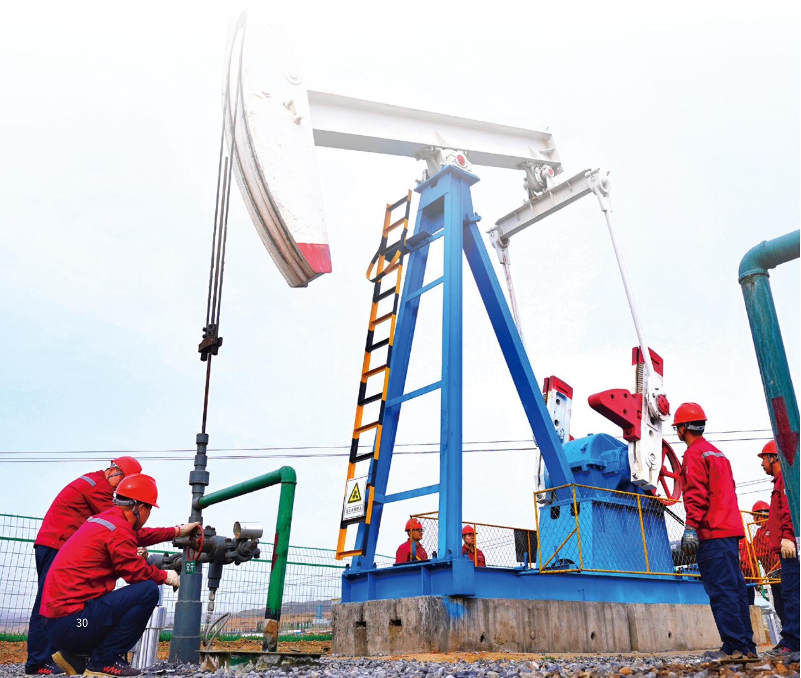

natural_image

Workers in red safety gear operating an oil pumpjack at an outdoor site (no visible text or symbols)

# 保护股东权益

蓝焰控股严格遵守投资者关系管理相关监管要求，修订完善《投资者关系管理制度》《接待和推广工作制度》，切实保障股东知情权与参与权，维护中小投资者合法权益，以真诚透明的沟通传递价值和稳健务实的经营业绩，持续夯实投资者信任基础。2025年，公司召开股东会5次。

# 2025 年

荣获山西资本市场“晋牛·2024年度投关创新奖”

荣获深市主板上市公司2024-2025年度信息披露工作中B级评级

# 投资者沟通

优化《投资者联系电话接听管理办法》《“互动易”平台管理办法》等工作流程，通过官网、公众号及时发布公司动态信息，依托互动易等平台、投资者热线、投资者邮箱、现场调研和业绩说明会等多元渠道积极回应投资者关切。

# 股东权益保护

制定《“质量回报双提升”行动方案》，通过现金分红等方式与股东共享发展成果，开展“3.15投资者保护教育宣传专项活动”“世界投资者周”等投教活动，积极营造理性投资、价值投资的市场氛围。

# 规范关联交易

严格遵守关联交易相关监管要求，持续健全关联交易管理制度体系，严格界定控股股东、实际控制人及董事、高管人员在关联交易中的行为边界，有效防范同业竞争与关联交易风险，切实维护公司及中小股东合法权益。

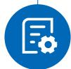

# 强化信息披露

严格遵守证监会、深交所有关信息披露管理规定，修订《信息披露管理制度》《内幕信息知情人登记管理制度》等多项制度，并制定《信息披露暂缓与豁免管理制度》，持续优化工作流程，提升信息披露质量与规范性。

# 合规风险管理

蓝焰控股坚持以“内控-合规-风险”三位一体建设为抓手，推动内控内审、合规管理、风险管控深度融合。通过健全制度体系、强化合规审查、增强全员意识，将风险防控要求嵌入经营管理各环节，切实提升公司合规管理水平和风险抵御能力。

# 合规体系建设

- 强化合规管理组织体系建设，压实各层级合规责任，形成“纵向到底、横向到边”的合规责任网络，推动合规要求融入制度、嵌入流程、落实到岗。  
- 持续开展重点领域合规风险排查，围绕合同管理、劳动用工、知识产权等关键环节建立合规风险清单，健全合规审查机制，提升风险识别、预警和处置能力。  
- 组织学习《诚信合规手册》《履职刑事法律风险手册》《常见劳动用工合规风险提示》等文件，结合“4·15”全民国家安全教育日、民法典宣传月、宪法宣传周等重要节点，营造“人人讲合规、事事依法规”良好氛围。

# 合规风险排查

# 厚植合规文化

▲ 合规管理举措

# 反商业贿赂及反贪污

蓝焰控股严格遵守《中华人民共和国反不正当竞争法》《关于禁止商业贿赂行为的暂行规定》等法律法规，构建“制度防范、过程监督、严肃查处”三位一体的反腐长效机制。遵循《中华人民共和国反垄断法》等法律法规要求，修订印发《外聘律师事务所管理办法》，进一步规范法律中介服务选聘流程，强化重大经营决策合法性审查，确保各项经营活动依法合规、公平有序。

# 数据信息安全

蓝焰控股高度重视网络安全管理，严格遵守《中华人民共和国数据安全法》《中华人民共和国个人信息保护法》等法律法规，持续健全信息安全防护体系。2025年，公司制定实施《信息安全管理制度》《信息安全风险评估管理制度》，要求全员严格遵守信息保密义务，严禁违规泄露、传播公司敏感信息。

# 常态化安全监控与响应

常态化组织排查陌生 IP 登录信息系统情况，及时处置潜在风险，保障业务连续性。

# 系统性漏洞排查与修复

围绕大华智能物联平台、视频监控系统及用友、新华等关键系统，开展高危漏洞及境外服务厂商专项排查，降低运行风险。

# 强化信息安全管理

# 强化重要时期安全保障

在春节、全国两会等关键节点部署专项值守与监测机制，确保信息系统安全平稳运行。

# 开展全员培训与意识提升

组织网络安全宣传教育与相关专题培训，全面提升员工安全防护意识与能力。

# 绿色蓝焰

# 厚植环境价值

作为国内煤层气开发利用的先行者，蓝焰控股锚定“双碳”目标，将绿色发展贯穿煤层气全产业链，以 ISO 14001 环境管理体系为支撑，健全环境管理与风险防控机制，扎实推进应对气候变化、强化环境管理、高效利用资源、污染物排放管控等重点工作，用务实的绿色实践践行守护绿水青山、助力能源转型的责任担当。

# SDGs 对标

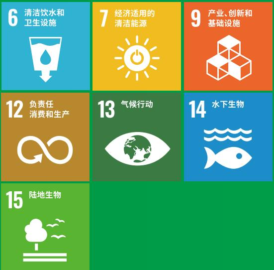

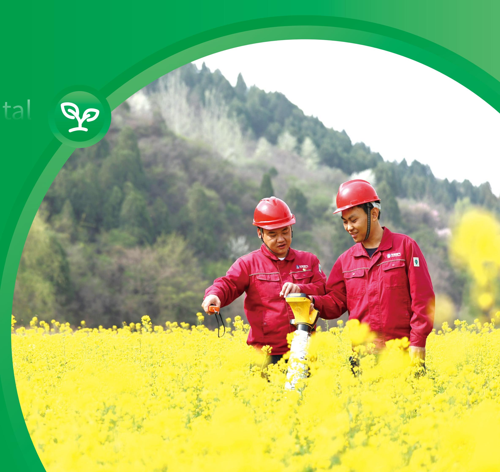

natural_image

Two workers in red hard hats inspecting a yellow flower field with green mountains in the background (no text or symbols visible)

# 专题

# 建一片气田 留一片绿色

蓝焰控股扎实推进生态井场和“花园井场”示范创建，同步开展生态修复技术创新，依托《煤层气开发生态修复技术方案研究》等科研课题推动科技成果转化，专项投入水土保持与复垦资金，推进“智慧气田”建设并部署智能传感器系统，实现项目开发与生态修复协推进。

公司严守生态保护红线、水源保护区、森林公园等生态敏感区管控要求，落实土壤保护、水土流失防控与污染防治措施，对扰动区域及时开展植被恢复与土地复垦，规范处置废水与固体废弃物，切实防范生产经营对敏感区生态环境的影响。

# 截至2025年底

累计建成“花园井场”

280个

# 案例

# 推进生态保护，打造绿色气田

蓝焰控股系统规划并持续推进“智慧气田、绿色气田”建设，通过应用自主研发专利技术、推行高标准环保管理体系、搭建智慧气田平台等，将绿色发展贯穿于生产全过程。在具体实践中，公司坚持土地资源集约利用，通过加密井网优化，充分利用既有井场，实现煤层气立体式、多煤层协同抽采；推行工厂化作业模式，单平台集中施工多口水平井或丛式井，显著提升单井场产能密度，最大限度减少地表占用与生态扰动。

# 生态环境与生物多样性保护措施

# > 强化施工环境管理

开展环保教育引导员工爱护环境，严禁破坏作物与树木；划定作业范围和路线，严控运输车辆及重型机械作业边界，杜绝随意扩大作业区域；划定专门堆料场，严禁材料乱堆乱放，避免植被破坏。

# > 优化工程施工组织

结合农业生产特点适时施工，避开收获时节以减少农业生产干扰；合理规划施工进度，避开雨季及河流汛期施工；道路施工采用随挖随运、随铺随压作业方式确保地面紧实；管道施工采取边铺管道边分层覆土的方式，缩短裸地暴露时间。

# > 土壤分层管理与复垦

道路建设时分层开挖，将表层土与底层土分开堆放；管沟填埋时坚持底土在下、表土在上的分层回填原则；回填时预留足够堆积层，防范地表下陷与水土流失；施工完成后及时开展土地复垦，恢复地貌原貌。

# 应对气候变化

蓝焰控股构建 “治理 - 战略 - 影响、风险和机遇管理 - 指标和目标” 的气候管理框架，系统开展气候风险与机遇识别评估，积极推动业务绿色低碳转型，持续提升应对气候能力。

公司成立由行政办公室牵头，生产技术管理部、安全环保部、战略投资部、财资管理部等关键职能部门组成的可持续发展工作组，承担气候相关工作的日常协调、数据收集、策略推进与目标跟踪，确保气候管理要求有效融入各业务环节和运营流程。

公司积极响应国家“双碳”战略，将气候变化因素逐步纳入企业中长期发展战略与风险管理体系，持续研判气候政策、市场与技术趋势，推动气候挑战向绿色发展机遇转化。

气候变化相关风险分析

<table><tr><td>风险类型</td><td>具体风险描述</td><td>影响时间范围</td><td>潜在财务影响</td><td>应对措施</td></tr><tr><td colspan="5">转型风险</td></tr><tr><td rowspan="2">政策和法律风险</td><td>碳排放与甲烷管控趋严,国家对温室气体排放监管要求持续提升,甲烷排放监测、报告与核查(MRV)体系逐步完善趋严</td><td rowspan="2">中长期/中期</td><td>环境合规成本、运营成本增加</td><td>密切关注碳排放权交易、甲烷管控等政策动向,优化生产工艺,按要求规范煤层气场站放空管理,确保甲烷排放监测合格</td></tr><tr><td>全国碳市场逐步成熟,碳配额总量或收紧,碳价呈长期上涨趋势</td><td>短期盈利承压</td><td>推动全流程节能技改与新能源协同减碳,建成国内最大采空区煤层气开发示范基地,降低甲烷逃逸,将采空区抽采等项目纳入CCER申报,开展降本增效专项行动,将碳成本纳入投资决策</td></tr><tr><td rowspan="3">技术风险</td><td rowspan="3">低碳、零碳技术快速发展,若公司在煤层气高效开发技术、甲烷减排、新能源耦合等领域研发投入不足或应用滞后,可能导致技术落后,丧失成本优势和市场竞争力</td><td rowspan="3">中期</td><td rowspan="3">技术升级成本增加,市场份额受威胁</td><td>加大低碳勘探开发、智能排采、甲烷泄漏检测与修复等领域研发投入</td></tr><tr><td>与高校、科研院所开展合作,推动技术创新与成果转化</td></tr><tr><td>关注并适时布局“煤层气+光伏”、CCER与地热技术、智慧气田数智化等前瞻性技术</td></tr></table>

<table><tr><td>风险类型</td><td>具体风险描述</td><td>影响时间范围</td><td>潜在财务影响</td><td>应对措施</td></tr><tr><td colspan="5">转型风险</td></tr><tr><td rowspan="2">市场风险</td><td>能源结构向绿色低碳转型,下游客户对能源“绿色”属性要求提升,若公司产品清洁价值未获充分认可或定价,将影响销售</td><td rowspan="2">中长期/短中期</td><td>产品溢价能力受影响,市场需求结构变化</td><td>推进煤层气全生命周期碳足迹核算体系建设,主导制定行业国家标准,战略合作绑定绿色客户,推广清洁能源品牌</td></tr><tr><td>气候政策及极端天气可能加剧天然气市场供需与价格波动,影响营收稳定性</td><td>营业收入波动性增加</td><td>遵循市场化定价原则,优化销售策略与合同结构,签订中长期供气协议,探索“煤层气+LNG”混合供应模式,把握国家专项补贴与配套支持</td></tr><tr><td rowspan="2">声誉风险</td><td rowspan="2">投资者、金融机构等利益相关方对企业气候行动和信息透明度要求日益提高,若公司在甲烷管控、减排目标、气候信息披露等方面表现不佳或发生环境事故,可能损害品牌声誉</td><td rowspan="2">中期</td><td rowspan="2">融资成本上升,品牌价值受损,投资者信心动摇</td><td>将应对气候变化纳入公司ESG管理重要组成部分,完善ESG治理体系</td></tr><tr><td>定期开展气候风险排查与识别,严格执行监测与精准治理</td></tr><tr><td colspan="5">实体风险</td></tr><tr><td rowspan="3">急性风险</td><td rowspan="3">暴雨、洪水、雷电、极端高温/低温等极端天气事件频发,可能破坏生产设施,导致生产中断、资产损毁、人员安全事故,产生高额维修与复产成本</td><td rowspan="3">短期</td><td rowspan="3">固定资产损失,生产中断致收入减少,保险及维修成本上升</td><td>制定并演练极端天气专项应急预案</td></tr><tr><td>加强气象监测预警与应急联动</td></tr><tr><td>对关键资产开展风险排查与加固</td></tr><tr><td rowspan="5">慢性风险</td><td rowspan="5">气温持续升高、降水模式改变等长期气候变化,可能影响矿区地下水位与地质稳定性,增加地质灾害风险;高温环境影响户外作业员工健康与效率,增加劳动保护投入</td><td rowspan="5">长期</td><td rowspan="5">运营维护成本增加,资产使用寿命受影响,员工健康保障支出增加</td><td>项目选址与设计充分考虑长期气候趋势</td></tr><tr><td>建立季节性风险动态防控机制,成立雨季、冬季三防领导小组,督导制度落实与隐患排查</td></tr><tr><td>建立恶劣天气应急响应机制,对重点路段线路加装防护与警示设施</td></tr><tr><td>实施“现场核查+数据溯源+台账比对”三重排查,建立设备与隐患管理台账,实行销号管理</td></tr><tr><td>配备必要防护设施,实施适应性管理</td></tr></table>

气候变化相关机遇分析

<table><tr><td>机遇类型</td><td>具体机遇描述</td><td>潜在财务影响</td></tr><tr><td>资源效率</td><td>通过技术和管理创新,提高煤层气抽采率、减少甲烷排放,实现减排同时增加可销售气量,提升资源利用效率</td><td>单位运营成本降低营业收入增加创造碳资产收益</td></tr><tr><td>能源</td><td>煤层气替代煤炭的环保价值日益凸显,能源转型背景下市场需求有望持续增长,减排量可通过碳市场实现</td><td>主营业务收入稳步增长碳交易收入带来新利润增长点提升资产绿色溢价</td></tr><tr><td>产品和服务</td><td>依托煤层气领域技术和经验积累,对外提供甲烷减排技术服务、碳资产管理咨询、矿区生态修复等增值服务,探索分布式能源、制氢等新业务</td><td>开辟新收入来源增强客户黏性与市场竞争力提升品牌技术形象</td></tr><tr><td>市场</td><td>利用政府对非常规天然气开发、甲烷减排、CCUS 等领域的补贴、税收优惠和绿色金融支持政策,降低项目融资成本</td><td>获得政府补贴与税收优惠降低绿色信贷、债券等融资成本吸引 ESG 偏好投资</td></tr><tr><td>适应力</td><td>投资建设气候韧性基础设施,打造灵活可靠的供应链,应用数字化技术开展智能监测与预警,降低实体风险损失</td><td>减少因气候事件导致的运营中断损失降低长期维护与保险成本提升企业长期稳健经营能力</td></tr></table>

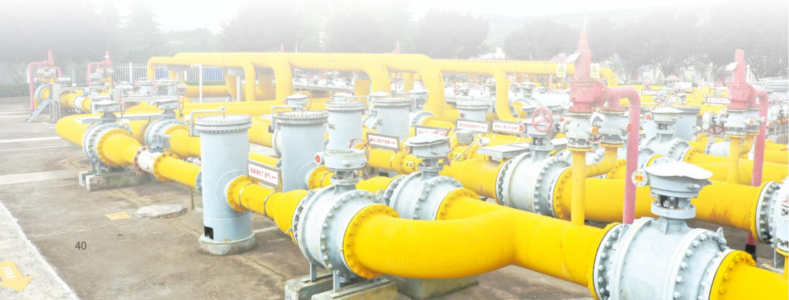

natural_image

Exterior view of a large industrial pipeline facility with yellow and silver valves, no visible text or symbols on the equipment.

# 影响、风险和机遇管理

公司高度重视气候变化风险及机遇管理，持续完善风险管理机制，通过定期开展风险识别、评估，对经营过程中的风险事项采取针对性管理措施，制定缓解措施和应急预案，降低气候变化对企业运营的潜在负面影响。

针对极端天气引发的实体风险，公司完善气象预警联动机制，强化生产现场应急响应预案和抢险救灾能力，定期开展应急演练，保障极端天气下人员安全，最大限度减少生产损失和环境影响；相关部门持续监测气候风险动态，定期向管理层汇报风险管理状态。

# 案例

# 沁盛公司极端暴雨天气风险管控及应对行动

2025 年夏季，沁盛公司在嘉能区块遭遇极端暴雨，易引发山体滑坡、井场积水、道路冲毁等安全隐患，威胁气井生产与设备安全。公司应急小组立即启动极端天气应急预案，通过前期开展风险研判，采取提前排查消除排水存在的隐患，加固井场周围边坡、实时跟踪气象预警、暂停高危作业并撤离非必要人员等精准处置措施，成功化解重大安全风险，为应对同类气候风险积累了实战经验。

# 目标和指标

公司印发《蓝焰控股提产降耗激励实施方案（试行）》，于2025年9月1日起在原有试点基础上扩大提产降耗激励试点范围，将ESG中环境（E）维度的降耗目标生产效能提升目标与绩效薪酬直接挂钩。方案明确激励对象为试点单位生产相关人员，规定管理人员人均奖金不高于操作人员和技术人员，通过量化提产奖励确定奖金数额并按月兑现；同时设定严禁造假、不牺牲安全、遵循科学提产等约束条件，通过考核激励机制激发基层员工积极性，兼顾环境效益与生产效能提升。

公司温室气体排放数据

<table><tr><td>指标</td><td>单位</td><td>2025</td></tr><tr><td>范围一温室气体排放</td><td>吨二氧化碳当量</td><td>25,154.64</td></tr><tr><td>范围二温室气体排放</td><td>吨二氧化碳当量</td><td>148,036.77</td></tr><tr><td>温室气体排放总量</td><td>吨二氧化碳当量</td><td>173,191.41</td></tr><tr><td>温室气体排放强度</td><td>吨二氧化碳当量/万元营业收入</td><td>0.8208</td></tr></table>

# 强化环境管理

# 环境管理体系

蓝焰控股建立权责清晰、执行有力、监督有效的环境管理体系，通过制度完善、治理强化、技术创新等举措，实现生产经营与环境保护协同发展，切实履行能源企业环保责任。

公司严格按照《蓝焰控股环境保护管理办法》，健全环境管理体系，将环保目标纳入绩效考核，落实“三同时”和“谁污染、谁治理”原则，确保依法合规运营，推进清洁生产和节能改造，最大限度降低环境风险。结合ISO 14001环境管理体系要求，公司构建“董事会统筹引领、专业部门归口管控、子分公司具体执行、全员协同参与”的四级环境管理体系，明确考核标准，细化各层级、各岗位环保职责，保障体系有效落地；同时实施健康、安全和环境（HSE）一体化管理，于2025年3月顺利通过HSE体系年度监督审核，全年未发生重大环境污染事件。

- 工程规划选址综合考虑全生命周期的生态保护，严格避让生态保护红线区。  
- 采用先进工艺技术与设备，使用清洁能源和原料，从源头削减污染，提高资源利用效率。  
- 落实废水、废气、固体废弃物、噪声、土壤和地下水污染防治管控措施，实施挥发性有机物管控计划，实现达标排放和合规处置。  
- 加强资源和能源合理利用，降低单位产品水、电、气、燃料等资源能源消耗。  
- 开展生态环境风险隐患排查，实施生态环境风险隐患分级分类管理和治理。

▲ 公司环境保护总要求

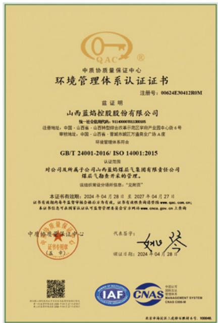

text_image

中质协质量保证中心
环境管理体系认证证书
注册号：00624E30412R0M
蓝证明
山西蓝焰控股股份有限公司
统一社会信用代码：91140000791380105
注册地址：中国·山西省·山西转型综合改革示范区学府产业园中心街6号
审批地址：中国·山西省·晋城高新区万盛商业广场A座
环境管理体系符合
GB/T 24001-2016/ ISO 14001:2015
认证范围
对公司及所属子公司山西蓝焰煤层气集团有限责任公司
煤层气勘查开采的管理。
该组织审定分所信息：“见附页”
本证书有效期：2024年04月28日至2027年04月27日
证书有效期期内每年监督审核合格后方可有效，证书有效期至查询登陆www.qzq.com.cn；
本证书信息可由国家认证认可监督管理委员会官方网站www.cncn.gov.cn上垂询
中质协质量保证中心
证书专用章
（盖章）
代表签字：
姚玲
颁证日期：2024年04月28日
IAF CNAS
中国认证
国家认证
管理机构
MANAGEMENT SYSTEM
CNAS COOK
北京市海淀区三花桥石林桥6号 100048

▲ ISO 14001 环境管理体系认证证书

# 董事会 统筹引领

- 落实环保法规政策，审定公司环境管理战略、中长期规划与目标，将绿色低碳发展贯穿煤层气产业链。  
- 审议环境管理重大制度、投入及风险防控措施，将 ESG 纳入经营决策，重大项目投资开展社会效益评估。  
- 监督管理层环境职责履行，审定考核结果，协调解决重大环境问题，定期听取ESG工作汇报并提出改进意见。

# 专业部门 归口管控

# (安全环保部)

- 建立、运行、维护并改进公司环境管理体系，指导子分公司健全自身环境管理体系。  
- 组织制定、修订环境管理制度、标准与操作规程，监督各子分公司按要求执行。  
- 开展重大环境因素识别与合规性评价，对重大环境因素制定管理方案。  
- 负责环境风险防控与应急管理，推动环保技术升级与创新，组织应急演练，参与突发环境事件调查处理。  
- 统筹推进污染治理、生态保护、环境监测、环保培训等工作，开展年度业绩考核，监督环保设施运行与污染物排放情况。

# 子分公司具体执行

- 落实公司环境管理要求，结合煤层气业务实际制定实施细则与操作规程，明确岗位职责，开展环保培训与宣传。  
- 负责生产过程污染防控，保障环保设施运行维护，严格管控废气、废水、固体废弃物（尤其是危险废弃物）排放，实施全流程闭环管理。  
- 开展环境风险排查、隐患整改与应急处置，定期组织突发环境事件演练，及时上报异常情况并配合调查。

# 全员协同参与

- 严格遵守公司环境管理相关制度与操作规程，规范操作生产及环保设施，杜绝违规污染。  
- 主动学习环保知识技能，开展环保与绿色生产。  
- 及时发现并上报岗位环境隐患与污染问题，配合隐患整改、污染治理及应急处置。  
- 积极参与环保建议征集与志愿活动，践行绿色低碳办公与生产，减少资源浪费和污染物产生。

▲ 四级环境管理体系与职责分工

# 环境合规管理

公司严格遵守《中华人民共和国环境保护法》《中华人民共和国环境影响评价法》等环保法律法规与行业标准，持续完善《蓝焰控股环境保护管理办法》，通过宣贯培训、监督检查等方式，确保将环境管理要求落实至各业务环节；同时对子分公司实行全覆盖环保检查，建立动态更新的监督闭环，对环境影响重大问题制定专项改善方案，对一般环境问题实行常态化监控，确保及时调整优化。

环境影响与应对举措

<table><tr><td>环境影响类型</td><td>应对举措</td></tr><tr><td>甲烷排放与温室效应</td><td>制定《蓝焰控股环境保护管理办法》《蓝焰控股质量、环境、职业健康安全、HSE管理手册》,建立全流程排放数据记录与纠偏机制;部署智能排采设备、管道泄漏远程监测系统,实施低产井改造与精细化排采,减少无组织排放,推进全生命周期碳足迹核算。</td></tr><tr><td>“三废”排放风险</td><td>对生产生活产生的废水、废气及固体废弃物实施严格的第三方委托合规处置管控,甄选具备资质的专业第三方机构开展规范化转运与处置,建立全过程监督机制。</td></tr><tr><td>生态扰动与生物多样性影响</td><td>严格执行《建设项目环境保护管理条例》,落实环评与“三同时”制度;创造性实施加密井和工厂化作业平台项目,最大限度减少地表占用与生态扰动;施工后开展土地复垦与植被恢复,并将其纳入项目验收标准。</td></tr><tr><td>声环境影响</td><td>将声污染管控纳入环境管理体系,明确各部门责任;定期开展噪声监测,通过现场督导与合规培训等强化突发情况应急处置流程。</td></tr><tr><td>突发环境事件风险</td><td>完善环境应急预案,定期开展应急演练,将整改落实情况纳入绩效考核;推进“智慧气田”建设,实现异常排放实时预警与快速处置,开展固体废弃物处置专项整治。</td></tr></table>

# 高效利用资源

蓝焰控股将节约集约落实到生产经营全流程，积极推进能源利用优化、水资源精细化管理与循环经济模式创新，依托技术革新与管理升级实现降消耗、提效益，助力行业绿色转型。

# 能源利用

公司严格遵守《中华人民共和国节约能源法》等法律法规，高度重视能源利用与节能降耗，构建“董事会统筹、管理层推进、归口部门管控、子分公司执行、全员参与”的五级能源管理架构，明确各层级权责，推动能源管理工作系统化、规范化开展；同时通过技术创新、强化常规能源高效管控等措施，提升能源精细化管理与利用效率，打造资源节约、环境友好型绿色企业。

主要能源消耗数据

<table><tr><td>指标名称</td><td>2025年</td></tr><tr><td>柴油消耗量(吨)</td><td>2,938.81</td></tr><tr><td>汽油消耗量(吨)</td><td>456.59</td></tr><tr><td>外购电力消耗量(万千瓦时)</td><td>25,586.84</td></tr></table>

# 重点环节节能

\- 勘探钻井环节全面推广“井工厂”平台化开发模式，采用水平井、丛式井等集约型井型，最大限度减少土地占用面积与植被扰动。优化井身结构与钻井参数，淘汰老旧装备并配置先进车载钻机；排采运作系统对抽油机传动系统实施变频改造，通过间断运行、能量回馈降低能耗，部分井场采用太阳能供电实现生产用能清洁低碳；集输增压系统强化管网及设备巡检维护与密封管理，更换问题管道减少煤层气逸散，更换高压直启电机、优化增压机启动技术，安装余热回收装置实现余热再利用。

# 预算管理节能

\- 强化关键成本全流程管控，按“一企一策”分解考核指标，深入生产一线督导预算执行。

▲ 提产增效与节能降耗举措

# 水资源管理

公司严格遵守《中华人民共和国水法》等法律法规，全面加强水源、取水、用水全过程节水管理，坚持节约集约利用与高效循环利用并重，通过一水多用、循环用水和工艺优化等系统性措施，持续提升水资源利用效率。

公司水资源主要用于生产和生活需求，生产环节涵盖工艺用水和辅助设施用水。为推进节水工作，公司积极开展系统改造，优化取水用水方案，推广节水应用技术。2025年，公司未发生因取水、用水、排水或储水变化导致的重大水资源影响，整体用水管理平稳受控。

# 循环经济

公司以打造资源节约型、环境友好型企业为目标，积极推动循环经济发展，盘活闲置资产与资源，系统推进废旧物资翻新改造与闲置设备修复再利用，促进资源循环利用与经济效益同步增长。

# 案例

# 漾泉公司以旧焕新，注入产气新动力

漾泉公司以盘活闲置资产、提升资源利用效率为目标，稳步推进老井恢复工作。针对井身结构不稳定等难题，公司积极推动技术创新，申请“一种用于煤层气低压井井口环形钢板漏点的堵漏装置”专利，并依托《采动影响下煤层气预抽井改采动井工艺研究及示范》科技项目开展系统工艺研究，致力于形成安全高效的老井改造技术体系。通过技术改进与专利应用，公司有效降低设施设备采购成本，实现闲置资源再利用与资产增值，为持续生产注入新动力。

# 污染物 排放管理

蓝焰控股将污染物排放管理置于环保工作核心位置，严格遵守相关法律法规，落实污染防治攻坚战各项要求，持续完善内部管理制度，系统推进污染防治重点任务，提升废水、废气及固体废弃物的规范化与精细化处置水平。

# 废水管理

# 2025 年

废水达标排放率

100%

公司严格遵守《中华人民共和国环境保护法》《中华人民共和国水污染防治法》《煤层气开发环境保护技术规范》等相关要求，系统推进水资源管理体系建设，明确相关岗位职责、处置流程与管理要求，同步开展水源点水质监测，严防排采水对水环境造成潜在风险。生产经营过程中，公司对排采环节产生的排采水实行净化处置或转移转运，各类污染物实际排放浓度与总量均满足国家及地方限值要求，全年未发生超标排放情况。

# 案例

# 撬装式一体化水处理设备实现排采水安全排放

为高效处理生产过程中产生的排采水，蓝焰控股投资建设并稳定运行8台撬装式一体化水处理设备。该设备集成混凝、沉淀、过滤、反渗透等先进工艺，具备高效、灵活、自动化程度高的特点，处理后出水水质关键指标稳定达到国家《地表水环境质量标准》，实现安全、合规排放。

# 废气管理

公司严格遵守《中华人民共和国环境保护法》《中华人民共和国大气污染防治法》等法律法规，通过全流程工艺优化、技术创新与数字化管控，建立废气闭环管控体系，深化废气污染防治工作，构建长效清洁生产机制，提升废气治理精细化水平。各子分公司层层压实责任，确保污染物排放浓度及总量均符合国家与地方标准，全年未发生超标排放情况。

# 固体废弃物管理

公司严格遵守《中华人民共和国环境保护法》《中华人民共和国固体废物污染环境防治法》等法律法规与标准，高度重视固体废弃物合规管理，依据减量化、资源化和无害化原则，建立并完善清洁生产规章制度和方案措施，组织制定清洁生产实施计划，加强生产过程中能耗、产污、排污等环节管理，制定并落实废弃物处理措施与申报登记工作，强化废弃物综合利用。

公司建立严格的固体废弃物分类收集、规范贮存与科学处置流程，推进固废减量化，实行可回收物回收利用、不可回收物和危险废弃物委托有资质的第三方机构处理，提升危险废物规范化环境管理水平，防控危险废物环境风险。公司实施严格的分区分类存放与物联网电子标签全程追溯系统，实现固体废物从产生、收集、运输、暂存到最终处置的全流程精细化闭环管控，组织开展现场合规检查，确保废弃物等重点环节全过程受控，降低对环境的影响。

# 2025 年

有害固体废弃物 100 % 委托有资质的第三方机构合规处置

无害固体废弃物 100 % 委托有相关许可的第三方机构处置

废弃物合规处理率

100%

# 噪音防治管理

公司严格遵守《中华人民共和国噪声污染防治法》，系统推进生产全流程噪音防治，围绕勘探钻井、压裂施工、气井排采等环节持续优化防控措施，构建从源头控制、过程管控到末端治理的噪声监测预警闭环体系。针对施工期和运行期可能引发的周边干扰、投诉与合规风险，公司定期组织噪声监测，合理安排施工作业时段，对分贝超标点位及时整改，同时通过建设“花园井场”等生态阻隔方式降低噪声传播影响。

# 绿色 环保行动

蓝焰控股积极推动绿色生产与低碳运营，鼓励各子分公司参与绿色实践与生态环境保护行动，深入践行绿色办公和绿色运营，推动各业务环节形成节约资源、保护环境的良好氛围。

# > 意识培育与监督

开展环保政策培训，提升全员环保意识；严格巡查用电用水情况，及时纠正浪费行为；在卫生间、走廊张贴节水节电提示标识，将节能工作纳入日常管理，定期总结并持续改进。

# > 节约用电

更换 LED 灯，公共区域安装感应开关；走廊、卫生间等区域实行分时关灯，充分利用自然光；下班时关闭所有设备电源，杜绝待机能耗；定期维保电器设备，确保高效运行。

# > 节约办公用品

推行无纸化办公，倡导纸张双面打印，减少一次性用品消耗。

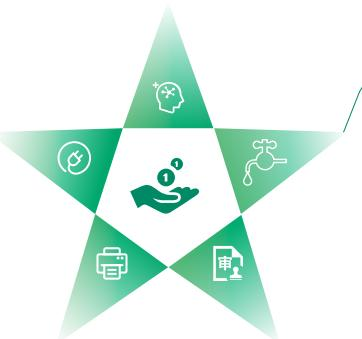

flowchart

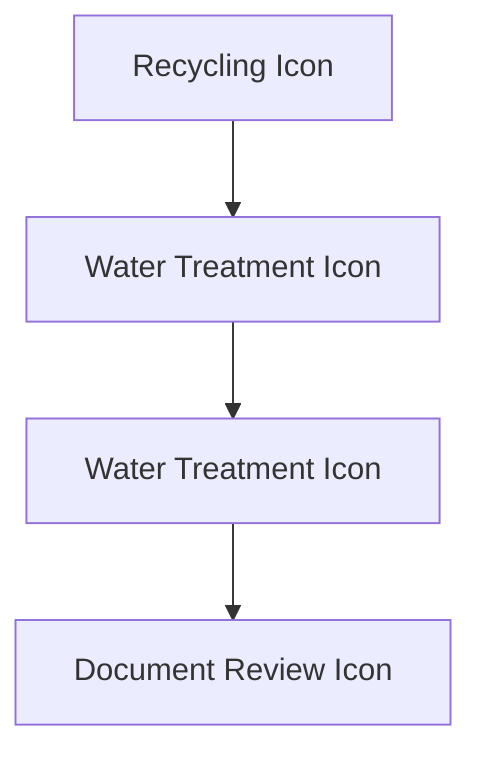
```mermaid
graph TD
  A["Recycling Icon"] --> B["Water Treatment Icon"]
  B --> C["Water Treatment Icon"]
  C --> D["Document Review Icon"]
```

# > 节约用水

更换节水器具，及时修复供水设施漏水点；杜绝长流水现象，清洁卫生时采用桶接水方式，避免直冲；绿化浇灌优先使用回收水，避开高温时段浇灌；每日巡查供水设施，发现漏点立即处理。

# >数字化审批

全面推行线上审批流程，上线差旅费申请与报销线上审批系统，实现全流程电子化、无纸化操作。

▲ 绿色办公举措

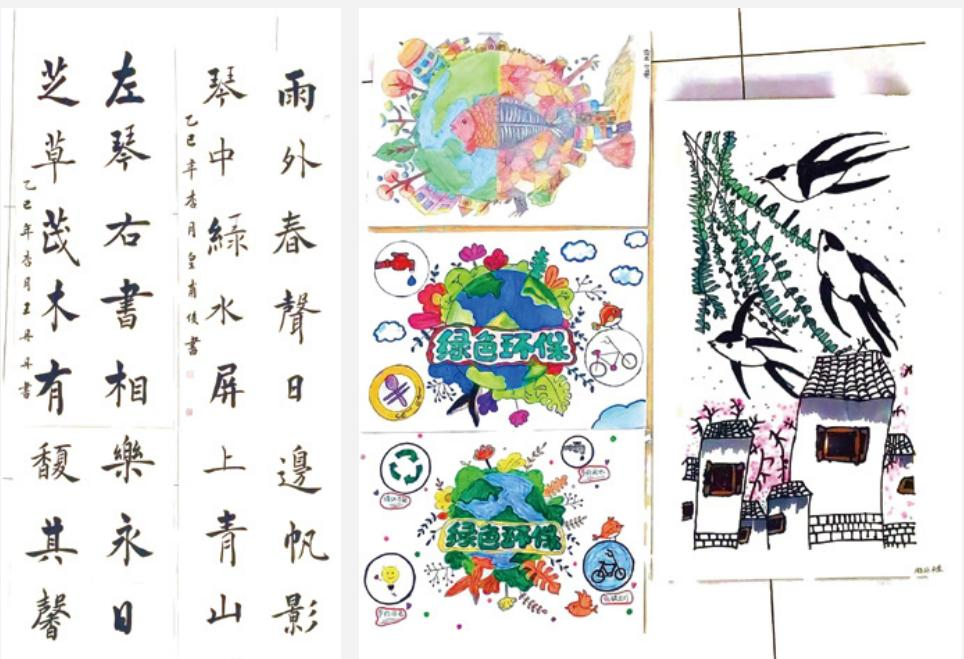

text_image

雨外春聲日邊帆影
雨中一綠水屏上青山
左琴右書相樂永日
芝草茂木有馥其馨
乙巳年杏月王丹斗書

▲ 六五环境日书画展

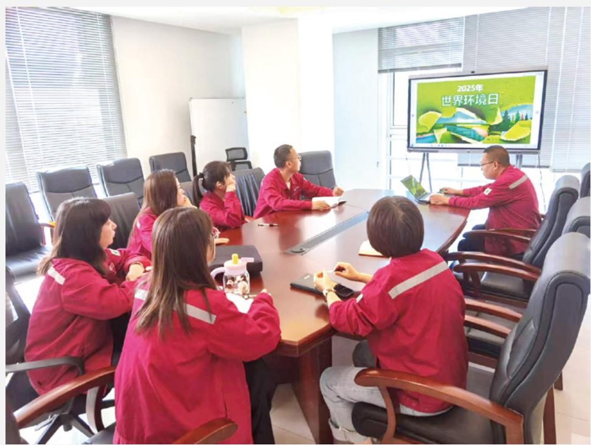

text_image

2025年
世界环境日

▲ “美丽中国我先行” 六五环境日活动

# 美好蓝焰

# 共创社会价值

蓝焰控股胸怀“国之大者”，勇担能源安全保障重任，以数智转型、自主创新、精益运营赋能高质量发展，以稳定高效的清洁能源供给，创造经济与社会综合价值。坚持以人为本，搭建员工发展平台，营造包容和谐职场环境，积极投身公益与地方建设，以实际行动共建美好未来。

# SDGs 对标

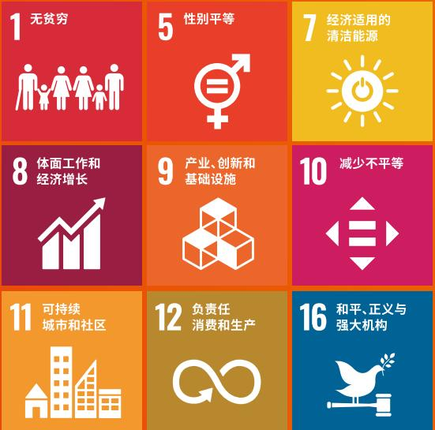

text_image

1 无贫穷
5 性别平等
7 经济适用的清洁能源
8 体面工作和经济增长
9 产业、创新和基础设施
10 减少不平等
11 可持续城市和社区
12 负责任消费和生产
16 和平、正义与强大机构

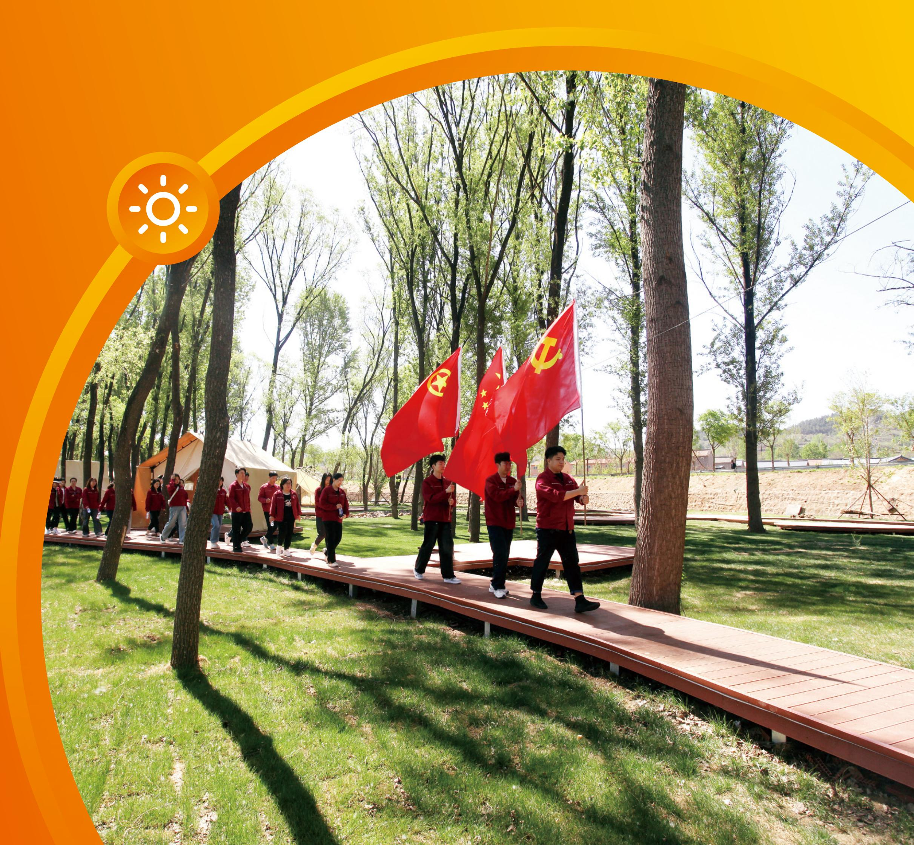

natural_image

Group of people in red uniforms marching on a wooden path under trees, holding red flags with Chinese and Communist Party symbols (no visible text or symbols)

# 专题

# 数智转型 创新破局

面对人工智能、大数据、云计算等新一代信息技术驱动的新一轮科技革命加速演进，蓝焰控股紧扣产业发展趋势，提出“以数字化赋能主业”的发展思路，以“智慧气田”为目标，通过智能化技术与先进装备的深度融合，加快推进数智化转型升级，以技术领先优势引领行业技术迭代与产业升级。

# 绘制数智赋能“路线图”

公司研究制定《山西蓝焰控股股份有限公司数智化转型战略规划》《2026——2030年数字化转型规划》，为公司数智化转型锚定方向、筑牢根基。同时，立足各子分公司数智化建设实际，坚持精准施策，为各子分公司量身定制差异化、可落地的数智化转型实施方案。

此外，公司持续加大“二三维生产运行完整性系统”研发力度，加快构建集智能气井巡检、设备管理、生产运行等于一体的智能化运行体系，以数智技术赋能安全生产、优化运营效率，有效降低采气成本、提升气井运行本质安全水平，确保“2026——2027年初步建成数字气田”的阶段性目标稳步实现。

<table><tr><td>健全1套机制</td><td colspan="5">数字化转型机制</td></tr><tr><td>夯实2个基础</td><td colspan="2">IT基础</td><td colspan="3">数据基础</td></tr><tr><td>部署3个平台</td><td>边缘物联网平台</td><td colspan="2">工业互联网平台</td><td colspan="2">湖仓一体数据平台</td></tr><tr><td>建设5大类业务场景</td><td>地质工程一体化</td><td>储运销售</td><td>生产运行</td><td>安全环保</td><td>经营管理</td></tr><tr><td>打造2个智能应用中心</td><td colspan="2">协同研究中心</td><td colspan="3">智能运营中心</td></tr></table>

▲ 数智化转型战略规划 “12352” 总体架构

# 打造数智赋能“强引擎”

公司依托“数智强晋”平台，构建以数据中心为核心，八大系统为载体的煤层气全生命周期智能管控体系，打通“勘探——生产”全链条数字化通道，在整合原有业务系统数据的同时，为大数据分析与智能决策提供支撑，为全面推动煤层气产业向信息化、智能化转型打下坚实基础。

截至 2025 年底，公司完成 192 口智能排采设备、400 余口重点井产量压力实时监测、50 个硫化氢在线监测点及 23 座场站瓦斯监控部署，同步上线 9 座高压箱站智能运维系统，并配套地震解释软件、气质分析小屋等专业设备，通过数智化手段全面筑牢安全生产防线、提升运营管控效能，实现勘探开发标准化管理。

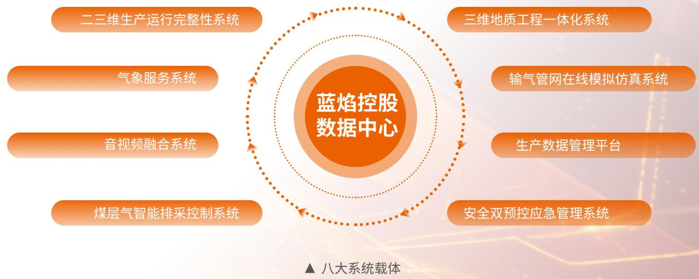

flowchart

This diagram illustrates the core system architecture of the Blue焰 Control Data Center, showing its eight distinct subsystems arranged around it.

蓝焰控股智慧生产运营平台  
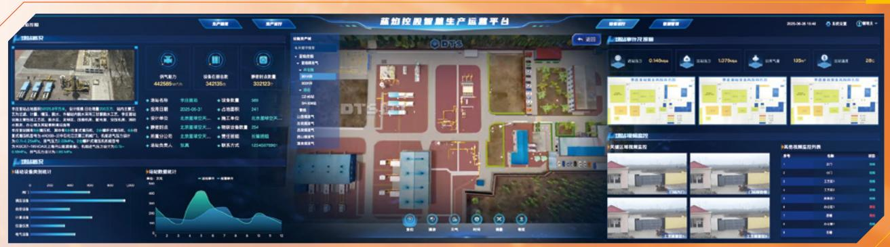

text_image

蓝焰控股智慧生产运营平台
现场监控
2025-06-26 16:40
本机位置
新增主
现场监控
现场信息
现场设备类型统计
现场数据统计
现场数据统计
3D数据统计
1
2
3
4
5
6
7
8
9
10
11
12
13
14
15
16
17
18
19
20
21
22
23
24
25
26
27
28
29
30
31
32
33
34
35
36
37
38
39
40
41
42
43
44
45
46
47
48
49
50
51
52
53
54
55
56
57
58
59
60
61
62
63
64
65
66
67
68
69
70
71
72
73
74
75
76
77
78
79
80
81
82
83
84
85
86
87
88
89
90
91
92
93
94
95
96
97
98
99
100

# 保障能源安全

蓝焰控股持续扩大资源储备、全力推进稳产增产，不断强化气质全流程管控，稳步提升清洁能源供给能力与供给品质，以稳定、清洁、高效、经济的能源供给，切实筑牢国家能源安全保障基石，服务国家能源战略与绿色低碳发展大局。

# 扩大资源 储备

公司依托集团公司“上中下游一体化”布局，深化落实煤层气增储上产三年行动，积极参与区块开发，全力推进增储工作，为保障国家能源安全贡献力量。

# 截至 2025 年底

拥有煤层气矿业权

24宗

总面积约

2,799.35平方公里

采矿权

6宗

面积

227.693 平方公里

探矿权

18宗

面积

2,571.657 平方公里

累计探明地质储量

531.91 亿立方米

# 加快新井建设

有序推进晋城加密井和龙湾 - 侯甲东南部开发等重点项目，有效弥补老区衰减，为产量接续注入强劲动能。

# 推进勘探开发

强化地质基础研究，开展横岭区块95平方公里空白区勘查；提升和顺横岭和武乡南区块共61.13平方公里整体构造认知水平；搭建公司自有三维地震解释工作机制与专业平台；开展变粘滑溜水压裂改造试验，产气量实现较大突破。

# 案例 煤层气矿业权竞拍落槌：蓝焰控股增储上产再下一城

2025 年 10 月 31 日，蓝焰煤层气公司成功以 2.01 亿元竞拍获得山西省沁水盆地法中区块的煤层气探矿权。该区块面积 297.90 平方公里，位于沁水盆地中部，属于煤层气国家重点规划矿区，此次竞拍成功将进一步强化企业增储上产核心目标，使其资源储备基础更趋稳固。

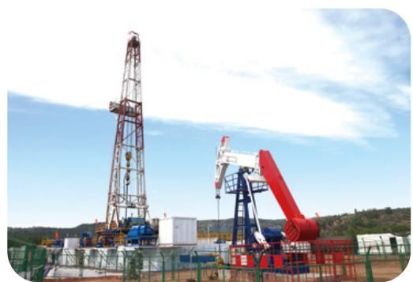

natural_image

Exterior view of an oil drilling rig and oil pumpjack in a field (no signage or text visible)

▲ 煤层气开采现场  
▲ 稳产提质主要举措

# 精耕稳产提质

公司始终将稳产增产作为核心使命，坚持老井智能管控与新井科学排采双轮驱动，构建覆盖气井勘探、投产、运行、维护的全生命周期管理模式，持续提升开采效率与产能稳定性，为区域清洁能源稳定供应、保障民生与产业用气需求提供坚实支撑。

# 新井管理

全面实施阶梯式排水降压策略，实现对新井产气节奏精准调控与气井产能的合理释放。侯甲项目部推动区块产气量稳步提升；横岭项目部整体产量稳定在3万立方米/日；新疆项目部推动20口重点井实现稳定日产2万立方米。

# 老井管控

实现系统优化与智能化推广，推进电动执行阀、远程监控系统等智能化设备的规模化应用，实现对关键参数的远程精确控制与自动调节，如万普隆智能排采控制系统可在多平台进行数据接入、数据采集等功能。

# 提产降耗

通过系统降压释放部分井产能、深化“一井一策”精细化排采、建立技术监控与预警机制、推广创新技改与专用工具应用，并强化应急抢修与生产调度保障，形成一套系统化、可推广的提产管理模式。加强设备管理和修井作业管控，修井数同比下降38.71%。截至2025年底，累计实现增产247万立方米。

# 低产井技改

通过优化推广成熟工艺、改造试验待落地工艺、针对性应用新工艺、引进试研前沿工艺，并结合地质适配性开展技术改造试验，多维度破解煤层气井生产堵、垢、砂等问题，有效恢复并提升气井产能。

# 案例 漾泉公司老井“苏醒”见成效

面对老井产能递减的挑战，漾泉公司紧紧围绕“老井稳产、新井增产”工作主线，成立攻关小组对周边煤矿采掘动态开展多轮次地质分析与方案论证，实时跟踪采掘进度，分阶段开展试抽作业。通过持续优化抽采参数、严密监测气质组成成分，逐步破解压力不稳、产气量波动等技术难题，最终实现稳定抽采，不仅有效盘活了资产，更大幅降低了新钻井作业成本，为同类老井复产提供了可复制、可推广的技术与管理范式。

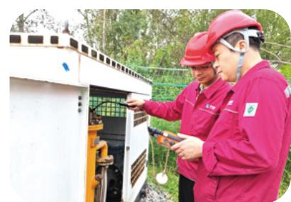

natural_image

Two workers in red uniforms and hard hats inspecting equipment outdoors near a utility unit (no visible text or symbols)

▲ 煤层气现场安全检测作业

# 优化气质

# 管理

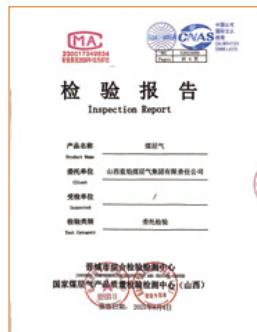

text_image

检验报告
Inspection Report
产品名称
煤炭气
Product Name
委托单位
山西庞地煤炭气集团有限责任公司
CVA
受检单位
/
检验类别
委托检验
Test Company
形城市煤业危险检测中心
国家煤炭气产品质量检验检测中心（山西）
2021年8月1日
组织单位：中国核工业协会
检测单位：山西省人民政府
2021年8月1日

▲ 第三方气质检测报告

公司制定《山西蓝焰控股股份有限公司煤层气气质管理办法》，构建“源头控制-过程净化-实时监测”的全链条管理体系，聚焦除尘、脱水、脱硫等关键环节，不断完善气体质量设备设施建设和气体质量检测，以标准化、精细化管理筑牢安全供气防线，顺利通过ISO 9001质量管理体系认证，管输煤层气气质持续达到国家一类气标准，有力推动“蓝焰气”的安全、清洁品牌形象更加深入人心。

2025 年，公司委托具备专业资质的第三方权威检测机构，针对 12 座外输场站开展 73 次专项质量检测，形成 “源头防控—过程管控—结果验证” 的全流程闭环管理，以严格管控、专业验证保障供气品质，持续为用户提供稳定、高效、绿色的清洁能源供给。

# 脱硫

通过干法脱硫的方式，在硫化氢易超标的集输站场与单井汇管节点加装脱硫塔，从源头阻断含硫气体外输路径。累计安装部署脱硫塔 85 台，脱硫剂填充量达 969.5 吨，同时配套安装硫化氢在线监测设备 89 套，实现气源硫化氢含量实时监控、全程可追溯。

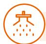

# 除尘

构建从单井→集输站→增压站→中心站→外输场站全链条气质净化管控体系，全域配置除尘过滤器，所有外输场站滤芯精度提升至1微米，实现气源精细化净化。更换1,637根1微米及以下精度滤芯，在重点场站增设旋风分离器9台，定期对12座外输场站开展气质组分及固体颗粒物检测。

# 脱水

综合运用三甘醇脱水、分子筛脱水、冷干机脱水装置，并结合常态化冷凝放水工艺，全面提升煤层气脱水治理能力。累计安装脱水装置27套，并配套水露点在线监测设备14台，通过系统化、精细化管控，有效保障外输煤层气气质达标。

# 智能监测

投用 12 台气体质量分析小屋，实时监测硫化氢、二氧化碳、氮气及水露点等参数，并将各气质监测平台功能融入调度系统管理平台，实现数据统一调度、集中分析，确保气质监测数据传递及时、结果可靠，为气质管理决策提供精准数据支撑。

▲ 气质管理提升举措

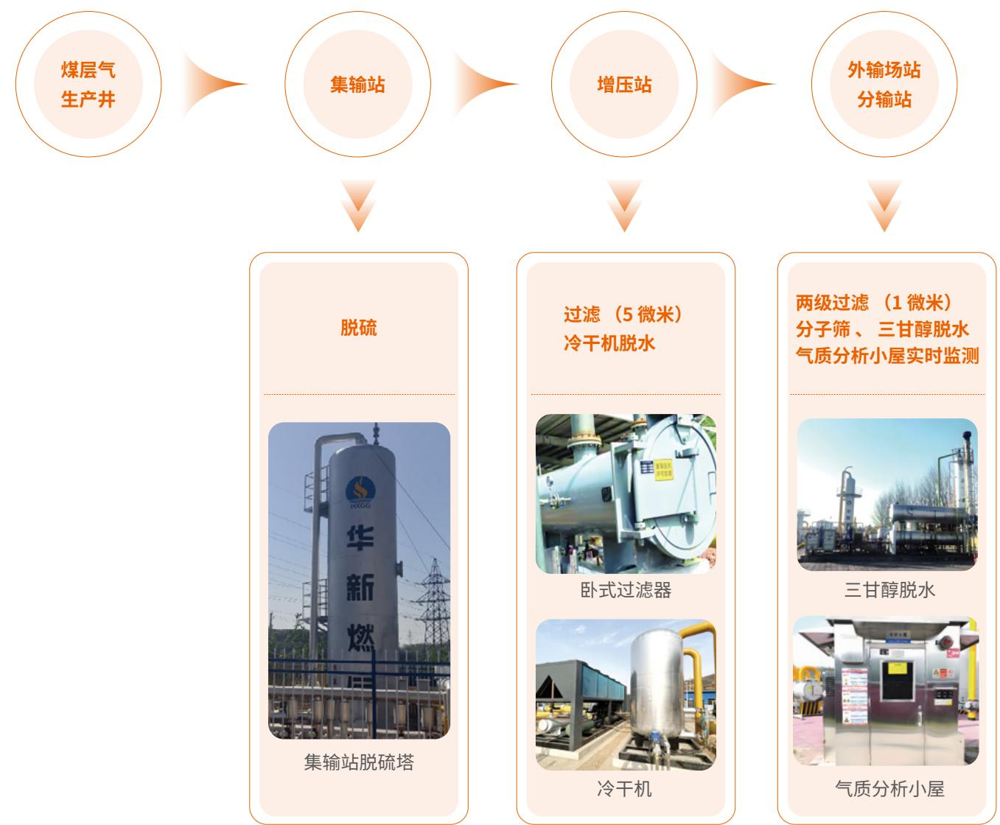

flowchart

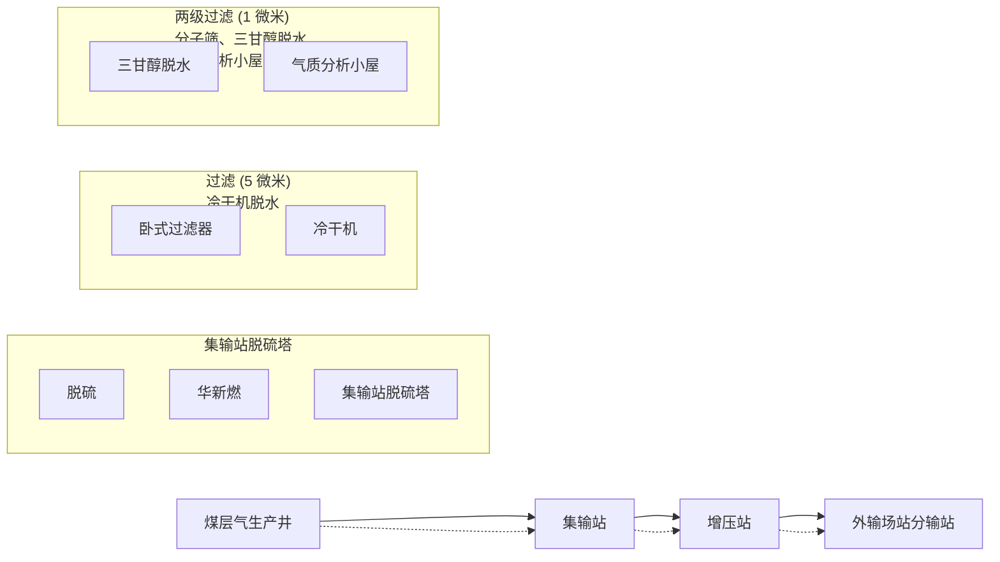
```mermaid
graph LR
  A["煤层气生产井"] --> B["集输站"]
  B --> C["增压站"]
  C --> D["外输场站分输站"]
  
  subgraph DistributionStations ["集输站脱硫塔"]
    direction TB
    B1["脱硫"]
    B2["华新燃"]
    B3["集输站脱硫塔"]
  end
  
  subgraph Filtering ["过滤 (5 微米)\n冷干机脱水"]
    direction TB
    B4["卧式过滤器"]
    B5["冷干机"]
  end
  
  subgraph SeparationStations ["两级过滤 (1 微米)\n分子筛、三甘醇脱水\n气质分析小屋实时监测"]
    direction TB
    B6["三甘醇脱水"]
    B7["气质分析小屋"]
  end
  
  A -.-> B
  B -.-> C
  C -.-> D
```

# 案例 蓝焰煤层气公司“气质革命”成效卓著

蓝焰煤层气公司作为燃气保供主力，始终把气质管控作为安全生产核心。2023年5月出台《煤层气气质考核管理办法》，构建全流程监控体系，推动管理向数据精控转型。2024年新增脱硫塔与在线检测仪，升级脱水设备，采用双级净化工艺并加装高精度过滤除油装置，优化压缩机空冷器，从源头控腐、提效，实现气质与运营品质双提升。2025年7月，该公司对李庄首站至端氏、胡底的管道成功实施通球内检测，管道内粉尘、杂质少且无积水，验证了工艺升级与精细化管理实效，为保障区域能源动脉安全平稳运行交出了优异答卷。

# 深耕 安全运营

# 完善安全管理

2025 年

安全生产投入

943.45 万元

# 深化安全生产

蓝焰控股持续健全安全管理体系，从严抓实安全生产全过程管控，全力筑牢安全发展防线，切实守护员工职业健康，为公司高质量可持续发展提供坚实保障。

公司严格落实安全生产主体责任，层层签订安全目标责任书，压实全员安全责任；定期召开安委会及安全工作例会，动态研判安全风险，健全制度体系、强化闭环管理，持续修订完善安全管理制度。同步推进安全生产与消防安全治本攻坚三年行动，聚焦重点领域、补齐管理短板，持续筑牢安全发展根基，全面提升本质安全水平。

此外，公司大力推进安全生产标准化建设，2025年扎实开展QHSE体系监督审核，强化全过程科学管控，确保管理体系合规高效运行、持续符合标准要求，实现以标准化促规范化、以规范化提效能，为企业高质量发展提供坚实安全保障。

公司以系统化思维构建全方位安全管理体系，通过持续完善双重预防机制，推进安全生产标准化建设等，以坚实的安全管理基础，全力守护企业平安运营，为企业行稳致远注入坚实底气。

2025 年

<table><tr><td>安全培训300余次</td><td>安全培训覆盖率100%</td></tr><tr><td>应急预案演练136次</td><td>应急预案演练覆盖率100%</td></tr></table>

# 案例

# 勘探分公司组织开展煤层气井喷应急演练

为提升煤层气钻井井喷突发事件应急处置能力，2025年6月10日，勘探分公司开展因地层压力不稳引发井喷的应急演练。演练遵循“先控制、后处置”原则，抢险人员快速关井、搭建防火隔离带、压制火势，医疗组同步开展伤员救治转运，各环节衔接有序、流程规范，有效检验了预案科学性与实操性，锤炼了队伍协同作战能力。此次以演促训、以练为战，进一步提升了员工突发事故处置能力，强化了安全红线意识与部门协同水平。

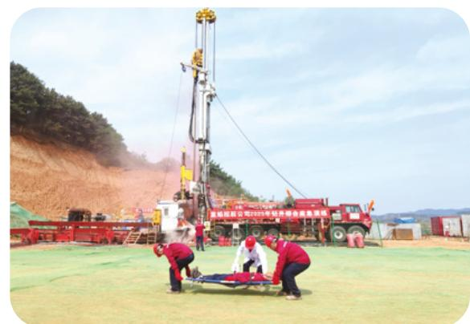

natural_image

Workers in red uniforms handling a large drilling rig near a red truck, with hills and vegetation in the background (no visible text or symbols)

▲ 演练现场

# 持续优化双重预防机制

持续优化安全风险分级管控与隐患排查治理双重预防机制。精准识别生产经营全链条中的危险有害因素，科学研判风险等级，确立风险控制优先顺序与针对性措施；规范隐患治理流程，提升整改效率与质量，实现隐患源头治理，降低安全事故风险。

# 构建安全生产 标准化体系

持续构建安全生产标准化管理体系，不断完善管理制度，深化现场作业精细化管理，通过严格管控作业流程、规范岗位操作行为，强化源头风险防控，切实将安全风险控制在可防可控范围。

# 完善教育培训与文化建设

每月组织开展“安全教育日”，制定《安全生产月活动方案》，开展多元化安全生产宣传实践活动，全方位提升员工安全素养与风险辨识能力，打造懂安全、会管理、高素质的专业队伍，为公司安全发展提供坚实人才支撑。

# 强化应急管理体系建设

科学优化应急救援物资储备布局，全面梳理应急预案、严把评审质量，常态化开展贴近实战的应急演练，有效检验预案可行性、锤炼应急队伍素质，全面提升快速响应、精准指挥、高效处置的应急救援能力。

▲ 安全生产主要举措  
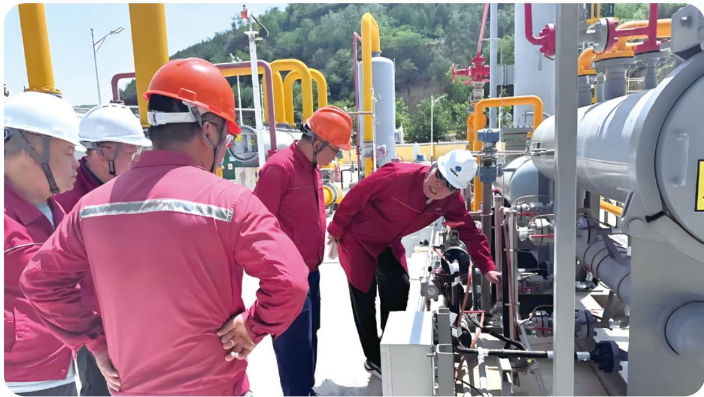

natural_image

Group of engineers in hard hats inspecting industrial piping equipment at a worksite, surrounded by yellow and red pipes and green hills (no visible text or symbols)

▲ 吕梁公司邀请安全生产和应急管理领域专家，为公司安全管理上台阶“把脉开方”

# 守护职业健康

公司高度重视员工职业健康管理工作，持续健全员工职业病防治体系，精准识别职业健康风险，扎实开展系统化专项培训，构建全方位、立体化的职业病防护网络。公司已通过 ISO 45001 职业健康安全管理体系认证，并顺利完成 ISO 45001 职业健康安全管理体系年度监督审核，夯实职业健康安全管理基础，切实守护员工身心健康与生命安全。

# 完善职业健康管理

坚持预防为主、深耕源头治理，通过健全制度保障、强化精细管控、持续优化作业环境，构建起系统完备、科学规范、运转高效的职业健康管理体系，从根本上筑牢员工健康防线，持续提升公司职业健康管理效能。

# 强化职业病危害防控

系统开展职业病危害因素识别、监测与评估工作，精准分析各工种职业病危害因素接触水平，聚焦关键控制点，持续细化完善职业卫生管理制度与操作规程，并定期组织职业卫生应急救援预案现场演练。

# 保障职业健康权益

规范配发职业病防护用品，组织以“关爱劳动者心理健康”为主题的职业病防治宣传周活动，面向职业危害接触人员及职业卫生管理人员开展专题培训。组织员工观看《职业病防治法》主题宣传片，普及职业病防治相关法律法规与健康知识，有效提升全员职业健康素养。

▲ 员工职业健康管理举措

2025 年

<table><tr><td>工伤人数0人</td><td>工伤事故发生数0起</td><td>工伤事故死亡率0%</td></tr><tr><td>工伤保险投入437.9万元</td><td>工伤保险覆盖率100%</td><td></td></tr></table>

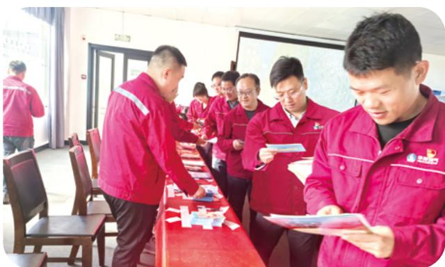

text_image

Group of workers in red uniforms reviewing documents at a table in an indoor setting

▲ 发放《职业病防治法》宣传资料

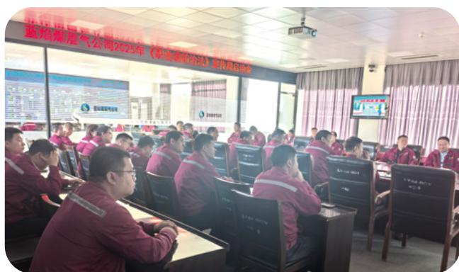

text_image

蓝焰康景气公司2020年《非金融街治理》商业综合体

▲ 职业病防治宣传周启动会

# 加大自主创新

蓝焰控股以科技创新为引领，深入实施人才强企、创新驱动发展战略，持续完善科技管理制度体系，加大自主创新投入，强化核心技术攻关，深化产学研协同创新，全面激发创新活力与创新效能，打造行业领先、技术一流的创新标杆企业。

2025 年

<table><tr><td>研发费用</td><td>研发费用占主营业务收入比例</td><td>研发人员数量</td></tr><tr><td>8,450.22万元</td><td>4%</td><td>462人</td></tr></table>

# 强化 核心技术突破

公司充分依托煤与煤层气共采重点实验室优势平台，紧密承接国家及省部级重大科研项目，持续强化技术攻关、成果转化与产业应用能力，为煤层气产业高质量发展提供坚实技术支撑与创新保障。

2025 年，公司聚焦深部煤层气开发、穿采空区下伏煤层抽采等关键核心领域，持续加大技术攻关力度，《深部煤层气多煤层水平井共采技术研究》顺利完成钻井压裂并投入运行，《深部煤层气地质 - 工程一体化高效联动开发技术与工程示范》构建起靶区优选至压裂优化的全流程技术体系，成功完成 3 口井工程示范，以技术创新赋能煤层气高效开发，为行业高质量发展注入强劲动能。

# 案例

# “大数据平台煤储层模拟技术”项目荣获一等奖

2025 年 8 月，在第十四届中国创新创业大赛山西赛区决赛中，工程研究公司凭借 “大数据平台煤储层模拟技术” 项目，荣获大赛一等奖。

此次获奖项目聚焦攻克深部煤层气勘探开发技术难题，依托“数智强晋”平台，构建了煤层气勘探开发地震-地质-工程一体化技术体系，围绕实现地震解释、井震结合、三维建模、储层预测、现场生产指导等关键技术环节开展技术研发，形成以“平台+模型+三大工程体系”为核心的五位融合开发新模式，有效提高煤层气勘探开发的效率和精度。

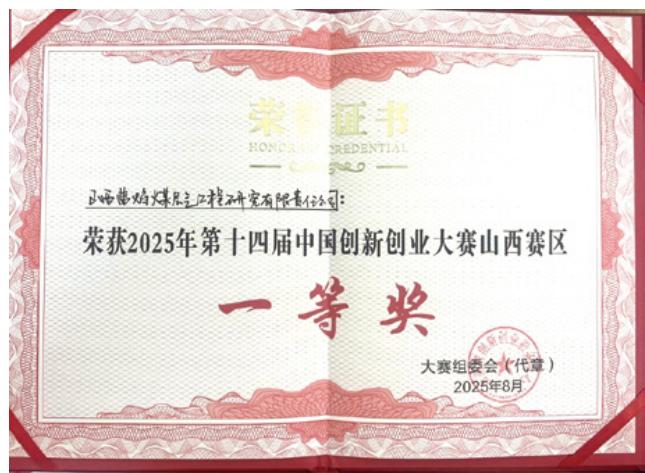

seal

HONORAI CREDENTIAL
荣获2025年第十四届中国创新创业大赛山西赛区
一等奖
大赛组委会（代章）
2025年8月

▲ 一等奖荣誉证书

# 推动产学 研用深度融合

公司强化与企业、科研院所合作，成立煤与煤层气共采国家重点实验室、山西省煤与煤层气一体化高效开采工程研究中心、晋城市企业技术中心、山西省煤层气勘探开发工程研究中心等多个合作平台，集成基础研究、技术开发、工程应用于一体的科技创新资源，充分发挥科技创新平台示范引领作用，持续提升科技创新实力。

# 2025 年

参研项目获省部级科技奖励

7↑

新申请专利数量

24项

新增授权专利数

14项

有效授权专利数量

32项

发明专利授权数

4项

发明专利申请数

5项

成功获批科技创新平台

3↑

2025 年，公司与太原理工大学、中国地质大学（武汉）等多所高校及科研院所深度合作，联合申报省级研发项目，推动“产学研用”深度融合，共建“煤层气开发工程产学研基地”。蓝焰煤层气“晋城市煤层气计量检测和设备材料研发技术创新中心”正式通过晋城市科技局认定，标志着公司在煤层气领域的专业化创新平台建设取得重要进展。

# 案例 左权公司创新工作室挂牌成立，点燃技术革新新引擎

2025 年 5 月 14 日，左权公司 “王涯雄职工创新工作室” 揭牌。工作室已构建起 “难题征集 - 联合攻关 - 成果转化” 的全链条机制，成员来自技术、生产、机电等一线岗位，依托标准化创新工场的技术研发与流程优化能力，将设备迭代需求转化为可实施方案。团队将深化 “产学研用” 协同创新机制，让更多 “金点子” 转化为行业 “新标尺”，为煤层气增储上产注入创新动能。

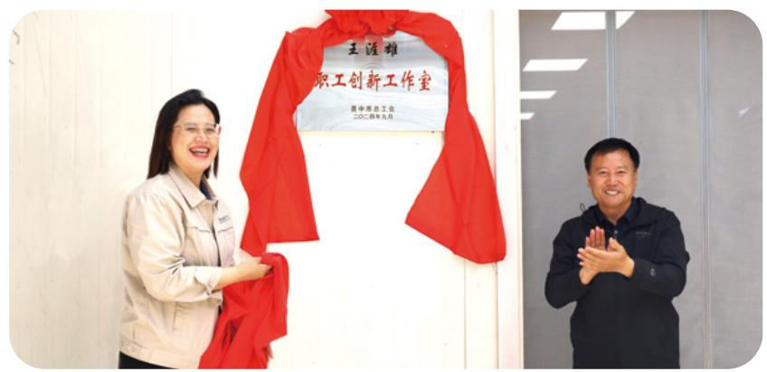

text_image

王涯雄
职工创新工作室
晋中市总工会
二〇二四年九月

▲ “王涯雄职工创新工作室” 揭牌成立

# 蓝焰煤层气公司荣获国家级认证

2025 年 9 月，蓝焰煤层气公司检测中心正式通过中国合格评定国家认可委员会（CNAS）严格评审，荣获国家级实验室认可证书。

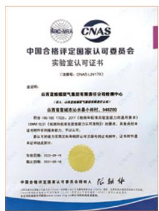

text_image

中国合格评定国家认可委员会
实验室认可证书
（附注：CNAS (2473))
企业名称：
山西蓝焰瑞温气集团有限责任公司检测中心
负责人：沈洪波、许建新、周晓峰、李明华
山西蓝焰瑞温气集团有限公司检测中心
符合《ISO 1974-1705》、《GB/T 1986/1990》及《国家认证法》的有关规定，符合国家认证标准，具备相应的证书和资质，可自主决定。
本证书的审核机构为：李明华、许建新、周晓峰、李明华
证书有效期：2023-09-18
截止日期：2023-09-18
中国合格评定国家认可委员会负责人：张丽萍

▲ 实验室认可证书

# 推进 共赢共荣

蓝焰控股将责任融入价值链各环节，构建多方共赢的可持续发展生态。通过以精益客户服务为核心，以打造可持续供应链为支撑，以推动行业发展为己任，与社会各界共绘高质量发展蓝图。

# 精益客户服务

公司以保障煤层气安全稳定供应为核心，全力为客户提供稳定供应、可靠高效的能源服务。

# 沁水县能源局

# 表扬信

山西蓝焰凯气集团有限责任公司：
2014年年度宣誓“十四五”规划目标和考核关键问题，我肯定不够地遵循习近平总书记关于能源安全战略的战略、持续增强煤炭气候振兴开发的力度，是快速发展新生产力，全力构建现代化产业体系，取得了丰硕成果。
一年来，贵公司与柳溪县水泥厂基于原煤生产气质量发展的指导方针，在建铁上，减少煤矿及地震等，强化资金企业社会责任和降低环境污染等方面取得了显著成效，为以水利经济和社会高质量发展作出了重要贡献。年初联合担生。在此，对山西蓝焰凯气集团有限责任公司在2014年的取得卓越减碳治理的祝贺和重心的感谢！
2015年是全面完成“十四五”规划目标的收官之年，也是全面推进经济回升助力发展的关键之年。希望贵公司在职的一年里，智能创能创新精神，加强安全生产管理，实现绿色发展理念，为良品能源资产的持续健康发展作出更大贡献？

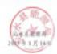

▲ 沁水县能源局感谢信

# 推动服务模式升级

通过加强客户用气数据分析、定期安全巡检与专项隐患排查等，前置风险防控，推动服务模式从“响应需求”向“预见需求”延伸。

# 精细化管理与服务

建立客户专属档案，精准提供个性化服务；定期开展员工专业技能与沟通能力培训；建立高效闭环的客户反馈机制，推动服务持续优化。

# 优化客户服务品质

常态化开展客户满意度问卷调查，广泛收集意见建议。依托调查结果精准优化服务举措、改进产品品质、优化工作流程，不断增强服务效能与客户满意度。

# 加强客户隐私保护

依托《合同管理办法》等核心制度，对客户信息保密、公平交易、知情权保障等作出明确规范，全面筑牢客户信息安全坚实防线。

▲ 提升客户服务主要举措

# 案例 诚安公司深耕客户服务，激活增长

诚安公司秉持“客户为本”的理念，升级服务体系，构建“存量稳盘、增量破局”新格局。对存量客户推行“一对一”专属服务，通过需求调研、用气指导强化客户黏性；聚焦重点区域，持续优化市场策略；针对冬季用气高峰，搭建“安全排查-压力监测-应急抢修”全链条保障体系，在保障民生用气中彰显企业担当，以优质服务推动增长。

# 打造 可持续供应链

公司持续健全采购与供应商管理制度体系，构建供应链全生命周期、全链条闭环管理机制，坚持公平公正、规范透明开展合作，着力打造合规高效、安全可靠、责任共担的可持续供应链。

# 优化供应商管理

制定《山西蓝焰控股股份有限公司采购管理办法》《山西蓝焰控股股份有限公司小额货物、服务及工程选用管理办法》《山西蓝焰控股股份有限公司合格供应商管理办法》等，构建全生命周期供应商管理体系。围绕供应商寻源准入、过程监督、评估审核、优化退出等关键环节，实施标准化、规范化管控，坚持公平公正、平等互信原则开展合作，全力打造阳光透明、合规高效、优质安全的可持续供应链体系，切实保障供应链稳定、可靠与安全。

# 促进供应链可持续发展

印发《关于进一步规范采购管理工作要求的通知》，从组织架构、流程规范、风险防控等十个维度构建全链条采购管理体系，全面提升采购效能、强化风险防控、保障合规运营与供应商质量，实现供应链环境与社会风险全域管控。在与供应商的合作合同中，公司明确嵌入合规条款，严格要求供应商遵守法律法规，对劳工权益保障、用工规范作出刚性约束，确保工资足额按时发放、工时合理合规、作业环境安全健康，以契约化管理压实供应链社会责任，切实维护劳动者合法权益，推动供应链合规、稳健、可持续发展。

# 推动行业发展

公司积极主导、参与煤层气领域国家标准与行业标准的制修订工作，持续完善行业技术规范体系；深度参与行业协会论坛与高水平技术交流，共享技术成果、凝聚行业共识，以标准引领与技术协同赋能煤层气产业规范化、高效化发展，助力行业高质量发展。

# 2025 年

主编 / 参编标准

26项

国家标准

11项

行业标准

6项

地方标准

9项

# 参与标准编制

发布国家标准《车用压缩煤层气》和山西省地方标准《管输煤层气脱尘净化操作规范》各1项；《煤层气空气钻井操作规程》《煤层气测井施工设计规范》等6项标准已通过初审，进一步健全煤层气产业标准体系，以高标准引领产业规范化、高质量发展。

# 推动产业链协同创新

加速山东科瑞集团合作前期筹备，牵头完成可研、风控、尽调等核心文书编制；与万普隆精准联动，携手推进低产井改造及增压设备应用项目，助力低产井提能，实现合作共赢与技术双向赋能。

# 案例 蓝焰方案走向国际，中欧携手共推低碳发展

2025 年 6 月，中欧煤矿瓦斯减排技术交流会成功举办。公司向国际机构代表分享 “采煤采气一体化” 治理模式与采空区地面抽采技术。其 “蓝焰方案” 获欧盟代表高度关注，双方就技术标准互认、联合研发深入交流，为中欧深化技术合作注入新动能，未来有望在碳市场衔接、示范项目共建等领域实现突破，携手助力全球气候治理。

# 凝聚 员工合力

蓝焰控股始终坚持以人为本，以保障员工合法权益为基础，以赋能员工成长为核心，以暖心关怀为纽带，全方位构建有温度、有活力的员工发展生态，持续提升员工的获得感、幸福感与归属感。

# 保障 员工权益

公司严格落实劳动保障法律法规，通过畅通民主管理渠道、规范用工管理，切实维护员工平等就业、劳动保护、民主参与等合法权益，筑牢员工安心履职的坚实保障。

# 平等雇佣

公司坚守公平、公正、公开的雇佣原则，以应聘者专业能力和技术水平作为录用核心标准，确保符合职位要求的应聘者获得平等的面试与录用机会。为匹配发展战略和业务需求，公司积极拓展校园招聘、社会招聘、内部竞聘及人才引进等多元化招募渠道，持续优化人才结构。2025年，公司出台《柔性引进人才实施细则（试行）》，制定实施校园招聘计划，积极配合集团公司开展高校招聘及博士人才引进工作，为公司高质量发展储备优质人才资源。

# 截至 2025 年底

少数民族员工数量19人

雇佣当地员工数量1,851人

退伍复员军人招募数量496人

残疾员工数量14人

# 员工总数（人） 2,154

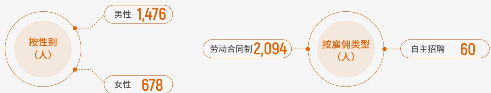

flowchart

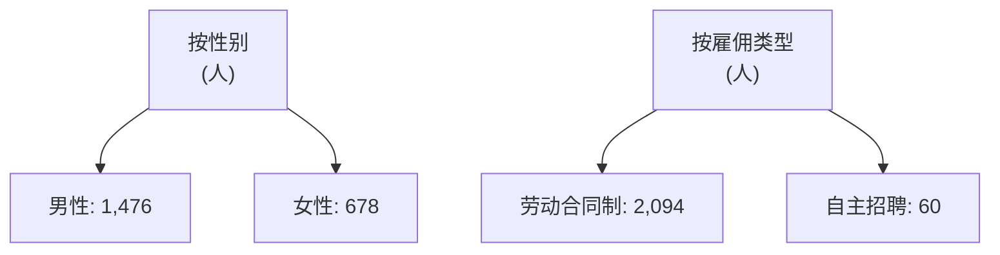
```mermaid
graph TD
  A["按性别\n(人)"] --> B["男性: 1,476"]
  A --> C["女性: 678"]
  D["按雇佣类型\n(人)"] --> E["劳动合同制: 2,094"]
  D --> F["自主招聘: 60"]
```

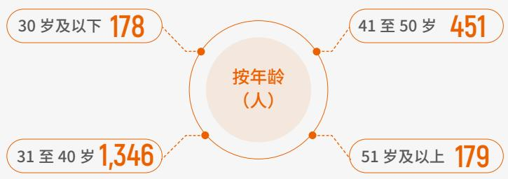

donut

| 年龄段 | 人数 (人) |
| --- | --- |
| 30岁及以下 | 178 |
| 31至40岁 | 1,346 |
| 41至50岁 | 451 |
| 51岁及以上 | 179 |

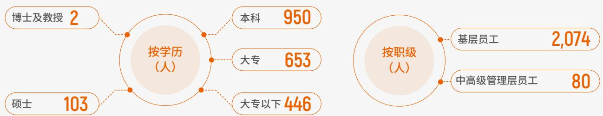

flowchart

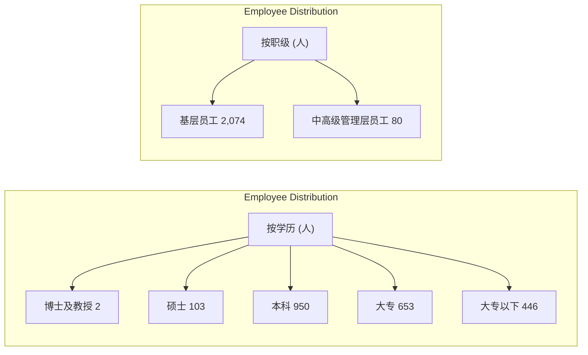
```mermaid
graph LR
  subgraph Employee Distribution
  A["按学历 (人)"] --> B["博士及教授 2"]
  A --> C["硕士 103"]
  A --> D["本科 950"]
  A --> E["大专 653"]
  A --> F["大专以下 446"]
  end

  subgraph Employee Distribution
  G["按职级 (人)"] --> H["基层员工 2,074"]
  G --> I["中高级管理层员工 80"]
  end
```

# 权益保障

公司严格遵守《中华人民共和国劳动法》《中华人民共和国劳动合同法》等相关法律法规，规范制定劳务用工资格标准，切实保护员工合法权益，积极构建规范有序、公正透明的劳动关系。

# 2025 年

劳动合同签订率

100%

劳动纠纷事件

0件

雇佣童工和强制劳动  
情况及人权投诉事件

0件

○ 禁止雇佣童工）严格遵守国家法律法规及相关要求，坚决禁止使用童工。  
☐ 禁止强迫劳动 依法保障员工人身自由，不限制员工合法流动权利，不扣留身份证明文件及其他个人证件，确保所有用工关系建立在合法、自愿、平等的基础上。  
多元化与反歧视 拒绝性别、地域、民族等各类就业歧视，对歧视骚扰采取零容忍态度，不以民族、种族、性别、宗教信仰等因素区别对待劳动者，为员工提供包容开放的职业发展平台。  
☐ 工时与休假 严格遵循国家及地方有关工时、休假的法律法规要求，合理安排员工工作与休息时间，保障法定休假权利。  
○ 同工同酬 坚持按劳分配、公平付酬原则，确保相同岗位、相同职级、相同工作内容的员工获得平等的薪酬待遇，不因性别、年龄、身份等因素产生差异。  
及时足额支付薪酬 严格按照劳动合同约定及公司薪酬制度，按时足额发放员工工资及各项津贴补贴，保障员工合法劳动报酬权益。  
☐ 农民工权益保障 持续加强对下属子分公司在建项目用工管理与薪酬支付情况的常态化监督，每月动态掌握农民工用工状况，及时防范化解欠薪、欠保等风险隐患，切实维护农民工群体合法权益。

# 民主管理

公司深化民主管理建设，将民主管理作为保障职工合法权益、推动企业健康可持续发展的重要举措，通过完善以职工代表大会为基本形式的企业民主管理制度，切实维护职工知情权、参与权、表达权与监督权。2025年，工会入会率100%。

▲ 保障员工权益措施  
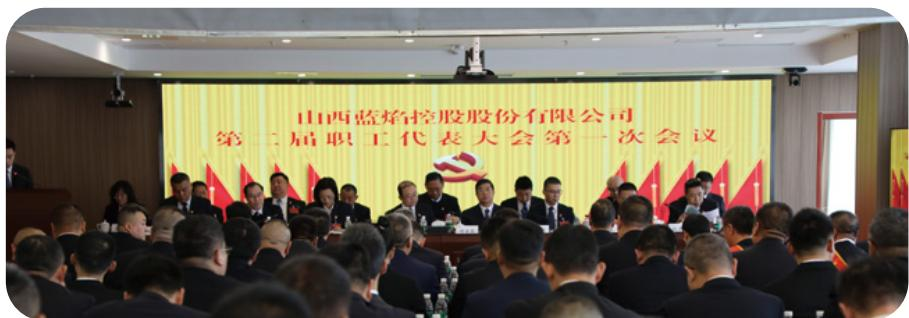

text_image

山西蓝焰控股股份有限公司
第二届职工代表大会第一次会议

▲ 第二届职工代表大会第一次会议

# 赋能 员工成长

公司深入实施人才强企战略，通过构建系统化培训体系、畅通职业发展通道、完善激励与考核机制，全方位赋能员工成长，为公司高质量发展筑牢人才支撑。

# 员工培养

公司围绕管理、技术、技能三大领域，构建“培训赋能+实战淬炼”双轮驱动的人才培养体系，系统化助力员工成长。

系统制定年度培训计划，依托“每日一练”“每周一学”等常态化机制，结合“华新e学堂”在线平台，实现线上线下融合培养。出台《技术技能人员职业发展通道管理办法》，聚焦专业技术与核心技能提升，组织开展专项培训。加强内训师队伍建设，组织内训师专项素质提升培训，促进内部知识共享与经验传承。

# 培训赋能

# 实战淬炼

对新入职员工实施“集中培训+岗位实践”培养模式，帮助其快速融入企业文化、掌握生产技能。开展常态化岗位练兵与技能实操训练，推动理论知识向实践技能的有效转化。鼓励员工以赛促学、以赛代练，倡导员工在竞赛中检验水平、对标提升。

▲ 人才培养措施

# 案例 承办省级技能大赛，以赛促练锻造技能人才

5月26日至28日，第八届山西省能源行业职工职业技能大赛“煤层气组竞赛”在蓝焰煤层气公司举行。本次竞赛设置理论考试与实操考核两大环节，内容涵盖排采工艺优化、设备操作规范、安全应急处置等核心领域，全面检验参赛选手的综合能力与实战水平。

此次赛事中，蓝焰控股 10 名员工获得了奖项，不仅展现蓝焰控股在煤层气领域的技术实力与人才储备优势，也为推动行业技能人才培养注入强劲动力。

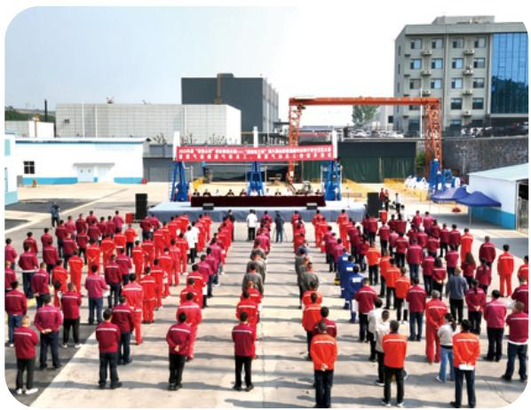

natural_image

Outdoor ceremony with a large group of people in red vests gathered on a stage, set against industrial buildings and a red banner (no visible text or symbols)

▲ 比赛开幕式及实操比赛现场

# 案例 开展专业技术人员及“双带头人”能力提升培训

公司与徐州中国矿业大学合作，开展专业技术人员及“双带头人”能力提升培训。培训内容涵盖思想理论、管理务实、专业技术、党建廉政、行业政策及实践教学等多个维度，旨在实现学员政治素养、管理能力和专业水平的同步提升，为高质量履行岗位职责奠定能力基础。

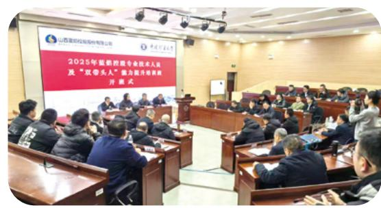

text_image

山西航空控股集团有限公司
2025年船舶控股专业技术人员
及“双带头人”能力提升培训班
开幕式

▲ 组织开展专业技术人员及“双带头人”培训

# 员工晋升

公司为员工搭建清晰的职业发展路径，从“畅通通道、公平选拔、专业认证”三个维度，助力员工实现职业进阶。2025年，公司完成职称评审申报52人次，技能等级认定通过45人。

# 畅通 晋升通道

建立技术（T序列）、技能（S序列）双通道发展体系，满足不同专业方向员工的成长需求。

坚持公平、公正、公开原则，严格开展技术、技能人才聘任工作，通过资格审核、综合评议、现场答辩等环节优中选优，确保选拔过程透明规范、结果公信有力。

# 公平 公正选拔

# 专业认证赋能

扎实推进“人人持证、技能山西”专项行动，在专业技术领域有序开展工程、经济、会计等系列的职称评审，鼓励员工持续精进；在技能操作领域扎实开展技能等级认定，为技能人才提供明确的职业阶梯。2025年，公司成功获批煤层气排采工、电工两大工种职业技能等级认定基地。

# ▲ 员工晋升措施

# 员工留存

公司不断完善激励机制，出台《山西蓝焰控股股份有限公司年度综合考核办法》《薪酬福利激励办法》，构建覆盖全体员工的业绩考核体系。通过强化日常监督和科学公正的绩效考核，营造奖罚分明、积极进取的工作氛围，充分激发人才创新创效活力。

# 悉心关怀员工

公司聚焦员工福祉提升，通过精准关怀帮扶、丰富文体生活等，持续提升员工的获得感、归属感与凝聚力，让发展成果更有温度。2025年，员工满意度为100%。

# 精准温暖关怀

公司为员工提供全面、完善的福利体系，在依法按时足额缴纳社会保险和住房公积金的基础上，额外提供补充商业医疗保险、企业年金等多重福利保障。健全常态化帮扶慰问机制，扎实做好困难帮扶、“三节”慰问、夏送清凉、冬送温暖，以及在职与退休人员互助保障工作，全面落实员工结婚、生育、住院、退休等人文关怀，有力传递组织温暖。

公司聚焦员工“急难愁盼”，出台《异地工作员工通勤费管理办法（试行）》，减轻异地工作通勤负担。基层单位针对食堂饭菜质量、生活用水水质、业余文化生活等问题精准发力，切实为员工纾困解忧。2025年，公司累计为群众办实事51件。

# 2025 年

社会保险覆盖率

100 %

员工体检覆盖率

100 %

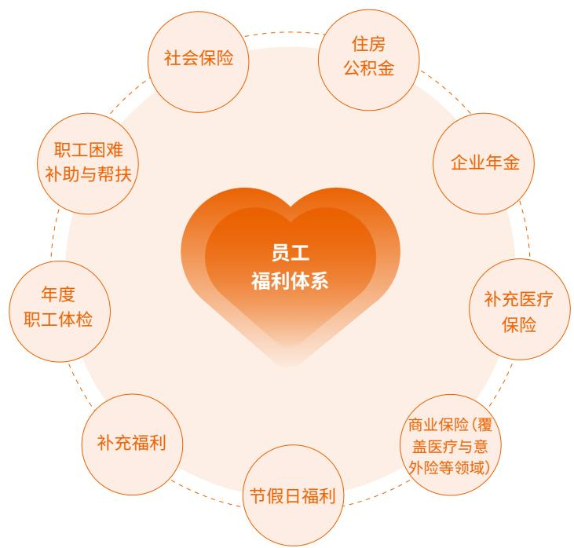

flowchart

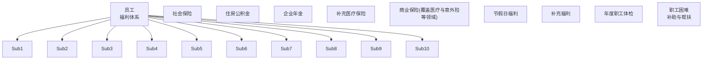
```mermaid
graph TD
  Center["员工\n福利体系"]
  
  sub1["社会保险"]
  sub2["住房公积金"]
  sub3["企业年金"]
  sub4["补充医疗保险"]
  sub5["商业保险(覆盖医疗与意外险等领域)"]
  sub6["节假日福利"]
  sub7["补充福利"]
  sub8["年度职工体检"]
  sub9["职工困难\n补助与帮扶"]
  
  Center --> Sub1
  Center --> Sub2
  Center --> Sub3
  Center --> Sub4
  Center --> Sub5
  Center --> Sub6
  Center --> Sub7
  Center --> Sub8
  Center --> Sub9
  Center --> Sub10
```

# 丰富文体活动

公司持续丰富员工业余文化生活，通过健步走、篮球赛、联谊运动会及马拉松等多元活动，搭建交流平台，激发团队活力，营造健康向上、和谐融洽的企业氛围。

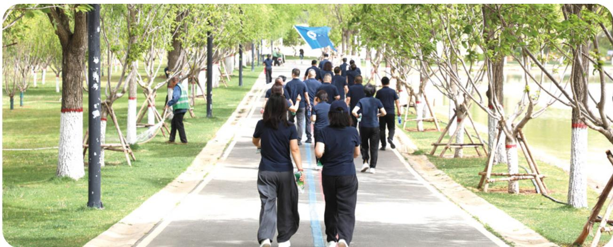

natural_image

Group of people walking on a paved path lined with trees and water, with a flag visible in the background (no text or symbols)

▲ 公司积极响应国家“体重管理年”号召，组织开展春季健步走活动

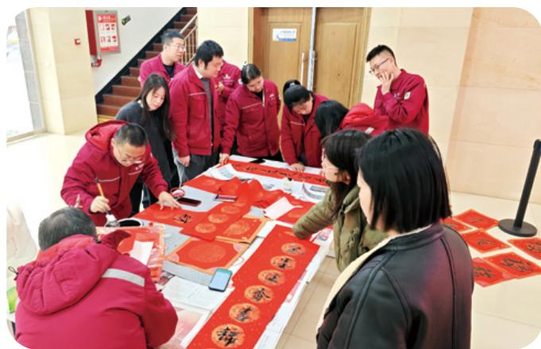

text_image

Group of people in red jackets participating in a calligraphy activity with red paper-cutting crafts, featuring Chinese characters on the table.

▲ 公司员工手写春联喜迎新春

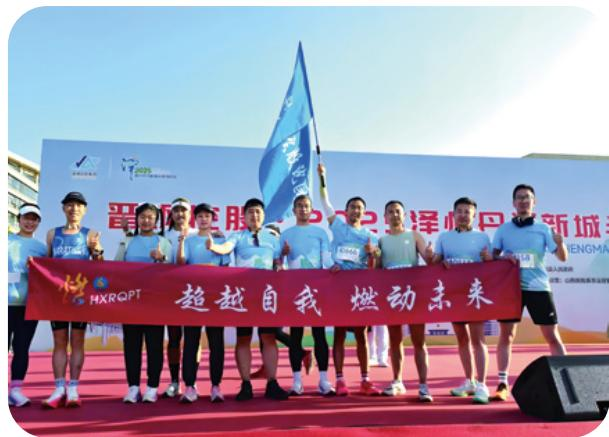

text_image

晋风控股 2023 洋阳丹东新城
HXROPT 超越自我 燃动未来

▲ 公司跑团参加泽州马拉松比赛竞展风采

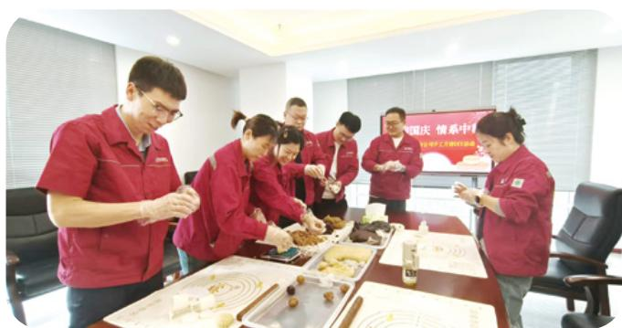

text_image

Group of workers in red uniforms preparing food at a table, with a banner in the background displaying Chinese text about '重庆情系中心' (Chongqing Cangjia Center).

▲科创分公司举办“喜迎国庆情系中秋”手工月饼 DIY 活动

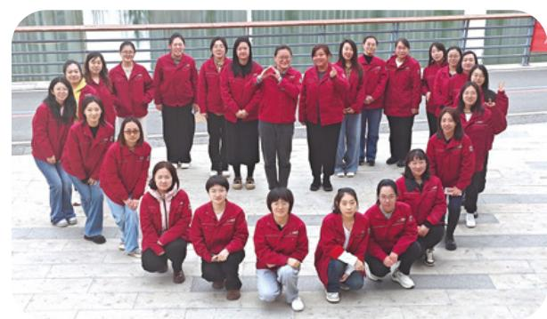

natural_image

Group photo of women in red jackets posing outdoors (no visible text or symbols)

▲ 工程研究公司举办三八妇女节主题活动

# 贡献 和谐社会

蓝焰控股将企业发展融入国家战略与地方需求，通过加强区域协同、建设和美乡村、践行公益行动三大路径，持续深化企地共建、增进民生福祉，在推动经济社会高质量发展的进程中贡献蓝焰力量。

# 建设和美乡村

公司扎实推动巩固拓展脱贫攻坚成果同乡村振兴有效衔接，持续在消费帮扶、驻村帮扶等方面发力。组织开展“新春”“金秋”帮扶活动，累计投入120余万元在沁水县扶贫专馆、静乐县东大树村采购节日慰问品。深耕东大树村定点帮扶，坚持“输血+造血”并重，推进水质提升、农田灌溉等民生项目，同步培育村集体控股企业味香溢脆脆饼公司，以产业带动村民就近就业、实现集体增收，助力乡村振兴走深走实。

# 截至 2025 年底

- 乡村振兴领域累计投入资金278.54万元，其中消费帮扶投入214.44万元、定向捐赠64.1万元  
• 举办“献爱心送温暖”活动，党员干部捐款127,690元  
- 在东大树村建成4口农用井及配套设施，可灌溉800亩农田

# 2025 年

- 帮助村民补贴 451 人次 46.32 万元  
- 关爱帮扶 70 周岁以上老人 100 户 135 人  
- 定点帮扶惠及人数 178 户 577 人

# 加强区域协同

公司认真落实援疆部署，积极推动民族团结，通过跨区域合作、技术输出与产业落地三大举措，深度参与新疆煤层气资源开发，促进各民族交往交流交融。2025年，公司荣膺“山西省民族团结进步模范集体”称号。

# 深化跨区域合作

与新疆昌吉州国投集团开展高频次互访洽谈，签署《煤层气产业勘探开发合作框架协议》，双方实现在资源、资金、技术及运营管理等方面的优势互补。

# 实施技术输出

选派由三名技术骨干组成的援疆“小组团”常驻一年半，深度参与吉木萨尔水溪沟矿区煤层气项目，通过技术培训和交流，积极推广山西“采煤采气一体化”先进模式。

# 推动产业落地

调遣百余名精干人员与数十台先进设备入疆，100%完成21口井的钻井压裂施工任务，成功推动10口井稳定产气，形成良好示范效应。

▲ 携手探 “气” 源 同心绘 “疆” 来

# 践行公益行动

公司积极履行国有企业社会责任，将公益事业融入企业发展血脉，组织干部职工广泛开展抗旱保耕、志愿服务、爱心献血等公益活动，在服务地方发展、增进民生福祉中传递蓝焰温度。2025年，蓝焰煤层气公司向忻州市静乐县红十字会定向对外捐赠49.1万元。

# 案例 赓续雷锋精神，践行国企担当

在全国第 62 个 “学雷锋纪念日” 到来之际，蓝焰控股各单位开展系列主题活动，以实际行动弘扬雷锋精神，践行国企责任担当。

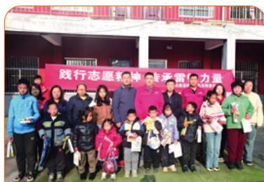

text_image

践行志愿精神传承力量

吕梁公司团员青年赴小学开展慰问活动，给贫困家庭儿童带去学习生活用品和问候。

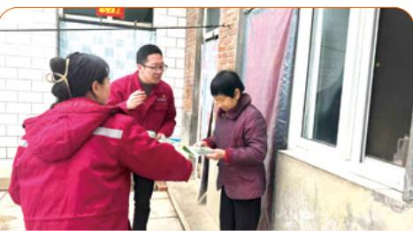

text_image

Street photo showing three people in red uniforms interacting near a building with visible signage and window decorations

勘探分公司志愿者走村串户到家院，开展燃气安全宣传活动，向居民们详细介绍燃气安全使用常识、燃气泄漏的检测方法以及发生燃气泄漏后的应急处置措施，提高周边居民的燃气安全意识。

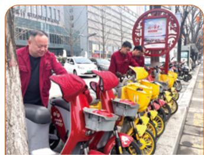

text_image

Street photo showing people in red jackets riding electric scooters with yellow and white seats, urban buildings in background

工程研究公司组织党员及青年职工对公司周边道路绿化带、公共设施进行彻底清扫，将共享单车规范摆放，以实际行动书写新时代雷锋故事。

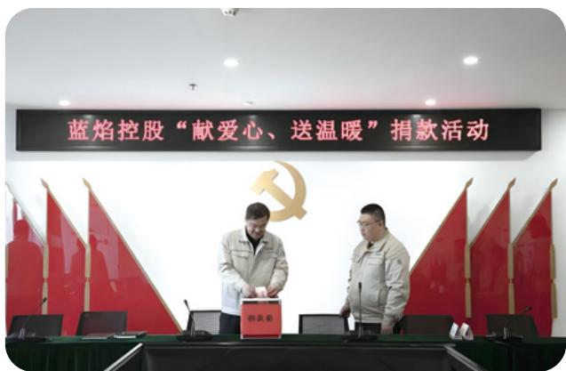

text_image

蓝焰控股“献爱心、送温暖”捐款活动
捐款局

▲ 蓝焰控股“献爱心、送温暖”捐款活动

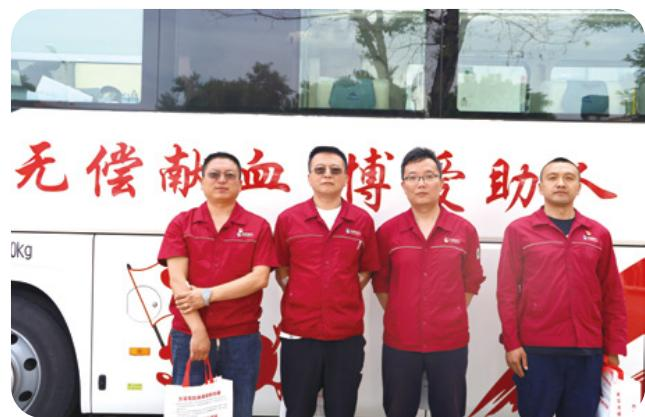

text_image

无偿献血博爱助人
OKg

▲ 左权公司党支部组织无偿献血

在山西省静乐县东大树村，一阵阵脆饼的香气从新建的加工车间飘出。这香气背后，是蓝焰控股驻村工作队与村民携手书写的一段乡村振兴故事。

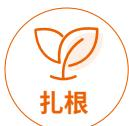

# 因地制宜选准产业

2023 年 5 月，蓝焰控股东大树驻村工作队完成轮换交接。队员们坚持 “实事求是、因地制宜”，深入田间地头，调研寻找 “能落地、见效快、可持续” 的帮扶路径。工作队协同村 “两委” 多次赴晋中市昔阳县压饼工业园区考察，以诚意打动技术方，成功引进 “巧莲妮” 配方及二代自动化压饼工艺。经充分论证，脆饼加工产业被确定为 2024 年度重点帮扶项目，集团投入 10 万元启动资金进行产业孵化，为项目落地奠定基础，自此迈出产业振兴第一步。

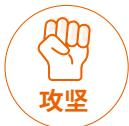

# 多方合力破解难题

2024 年 9 月，静乐县东大树村味香溢脆脆饼有限责任公司成立。2025 年，工作队与村 “两委” 并肩作战、合力攻坚：为夯实产业根基，队员们齐心推进厂房标准化改造，克服低温天气等严峻考验，完成地平凿平、防火隔热、吊顶等规范化建设；为打造特色产品，反复赴昔阳取经，将静乐县 “中国藜麦之乡” 的资源优势转化为产品特色，利用藜麦高蛋白、高纤维、低升糖特性，反复打磨配方比例，成功研发出花椒叶、荞麦、葱香、藜麦 4 个系列脆饼产品；为打通市场通道，队员们辗转多地，逐项办结食品质检、商标注册、销售条形码备案等手续，在乡政府支持下于 2026 年 1 月取得食品生产许可证；为留下带不走的队伍，专门邀请昔阳县专业技师进村，手把手培养本土技术骨干 6 名。考虑到村民文化程度和场地资金等现实条件，他们选择 “作坊式” 生产模式——不求大、不求快，只求村民真正学得会、用得上、能增收，让产业真正能在村里扎下根。

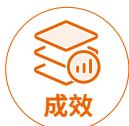

# 从“伸手要”到“伸手干”

开工仅 2 个月，项目便实现稳定运营，累计生产大饼 2,800 箱、小饼约 1,500 箱，实现销售额 13 万元，成为壮大村集体经济、带动村民稳定增收的强劲新支柱。项目直接带动村内 10 人就业，其中女性占比 80%，真正解决留守妇女增收难题。工作队以家庭为单位进行综合研判，对 176 户脱贫户进行重点排查，严守不发生规模性返贫底线。

“以前农闲时只能闲着，现在家门口挣钱，一个月近两千块，日子有奔头了！”车间工人曹大嫂笑着说。东大树村党支部书记李书记感慨：“工作队真蹲实驻、真帮实扶，一步一个脚印把咱村带上致富路。”

驻村第一书记闫宇表示：“资金投入相对容易，让村民找到长期致富的‘营生’，才是打通乡村振兴‘最后一公里’最难啃的骨头。这考验着帮扶干部的使命担当与智慧勇气。”

# 让特色产业走稳走实

从田间到车间，从原料到产品，从生产到销售，工作队帮助村民将特色作物转化为特色产品，打通线上线下销售渠道，创建特色农产品产业化致富之路。下一步，工作队将持续协助村“两委”拓宽销路，确保产品“产得出、卖得好”，以产业振兴助推东大树村乡村振兴之路走稳走实，让脆饼的醇厚香气，成为乡村振兴最动人的民生味道。

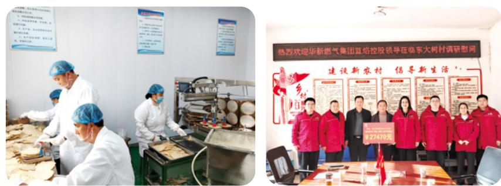  
▲ 特色脆脆饼加工现场

公司工会主席张慧玲一行，
深入山西静乐县东大树村，
开展乡村振兴调研，并慰
问驻村工作队与监测户

# 未来展望

2026 年是 “十五五” 开局之年。蓝焰控股将始终坚持以习近平新时代中国特色社会主义思想为指导，锚定能源安全 “国之大者”，以高质量发展为主题、以党建为引领、以创新为引擎，坚定不移深耕煤层气主业，统筹推进环境、社会、治理协同发展，在服务国家能源发展大局中展现新担当、实现新作为。

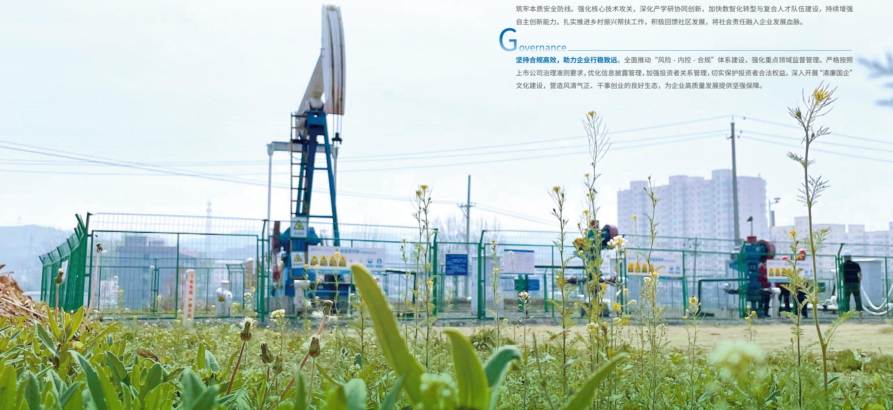

text_image

筑牢本质安全防线。强化核心技术攻关，深化产学研协同创新，加快数智化转型与复合人才队伍建设，持续增强自主创新能力。扎实推进乡村振兴帮扶工作，积极回馈社区发展，将社会责任融入企业发展血脉。
Governance
坚持合规高效，助力企业行稳致远。全面推动“风险 - 内控 - 合规”体系建设，强化重点领域监督管理。严格按照上市公司治理准则要求，优化信息披露管理，加强投资者关系管理，切实保护投资者合法权益。深入开展“清廉国企”文化建设，营造风清气正、干事创业的良好生态，为企业高质量发展提供坚强保障。

# Environmental

坚持绿色低碳，筑牢能源安全基底。锚定增储上产核心目标，强化气井精细化管理、老井挖潜改造、重点项目建设及地质工程一体化研究，持续提升清洁能源供给能力。同时，全面加强环境管理体系建设，规范废弃物、生活污水及固体废弃物的无害化处理与资源化利用，开展生态修复与生物多样性保护，在保障能源安全与应对全球气候变化中彰显蓝焰控股新作为。

# Social

坚持以人为本，彰显国企使命担当。坚守安全生产底线，压实全员责任链条，深化智能化安全管控与隐患闭环治理，筑牢本质安全防线。强化核心技术攻关，深化产学研协同创新，加快数智化转型与复合人才队伍建设，持续增强自主创新能力。扎实推进乡村振兴帮扶工作，积极回馈社区发展，将社会责任融入企业发展血脉。

# Governance

坚持合规高效，助力企业行稳致远。全面推动“风险-内控-合规”体系建设，强化重点领域监督管理。严格按照上市公司治理准则要求，优化信息披露管理，加强投资者关系管理，切实保护投资者合法权益。深入开展“清廉国企”文化建设，营造风清气正、干事创业的良好生态，为企业高质量发展提供坚强保障。

# 附录

# ESG 关键政策

# 环境维度

山西蓝焰控股股份有限公司煤层气工程建设项目环境保护管理办法（试行）

山西蓝焰控股股份有限公司环境保护管理办法（试行）

# 社会维度

# 人才培训及发展

山西蓝焰控股股份有限公司教育培训工作管理办法

山西蓝焰控股股份有限公司总部机关岗位聘任管理办法（试行）

中共山西蓝焰控股股份有限公司委员会柔性引才实施细则（试行）

山西蓝焰控股股份有限公司技术人员内部交流学习实施细则

山西蓝焰控股股份有限公司技术技能人员职业发展通道管理办法（试行）

山西蓝焰控股股份有限公司关于开展基层区队管理岗位践习工作的指导意见（试行）

中共山西蓝焰控股股份有限公司委员会中层管理人员管理办法（试行）

山西蓝焰控股股份有限公司中层管理人员考核评价暂行办法

中共山西蓝焰控股股份有限公司委员会中层管理人员兼职管理规定（试行）

中共山西蓝焰控股股份有限公司委员会后备干部管理办法（试行）

中共山西蓝焰控股股份有限公司委员会管理人员退出领导岗位实施细则

# 薪酬管理

山西蓝焰控股股份有限公司经营业绩与工资总额分配管理办法（试行）

山西蓝焰控股股份有限公司所属企业负责人薪酬管理办法（试行）

山西蓝焰控股股份有限公司总部机关薪酬管理办法（试行）

# 员工福利

山西蓝焰控股股份有限公司通信费用管理办法

# 权益保障

山西蓝焰控股股份有限公司职工代表大会制度

# 安全生产

山西蓝焰控股股份有限公司安全生产管理规定（试行）

山西蓝焰控股股份有限公司安全生产责任制通则（试行）

山西蓝焰控股股份有限公司关于调整安全生产委员会组成人员及机构工作职责的通知

山西蓝焰控股股份有限公司安全生产费用提取和使用管理办法

山西蓝焰控股股份有限公司安全生产责任保险制度

山西蓝焰控股股份有限公司安全培训管理规定（试行）

# 社会维度

# 安全生产

山西蓝焰控股股份有限公司安全培训工作要素指南（试行）

山西蓝焰控股股份有限公司安全生产风险管控与隐患排查治理工作管理办法（试行）

山西蓝焰控股股份有限公司事故隐患管理办法（试行）

山西蓝焰控股股份有限公司重大危险源安全管理办法（试行）

山西蓝焰控股股份有限公司关于进一步加强受限空间作业安全管理工作的通知

山西蓝焰控股股份有限公司关于开展场站安全生产标准化建设工作的通知

山西蓝焰控股股份有限公司班组建设实施细则

山西蓝焰控股股份有限公司生产安全事故报告和调查处理规定（试行）

山西蓝焰控股股份有限公司安全生产考核办法（试行）

山西蓝焰控股股份有限公司安全生产约谈实施办法（试行）

山西蓝焰控股股份有限公司安全生产处罚与奖励管理规定（试行）

山西蓝焰控股股份有限公司安全生产问责管理规定（试行）

山西蓝焰控股股份有限公司职业病防治管理制度（试行）

山西蓝焰控股股份有限公司关于成立山西蓝焰控股股份有限公司交通安全管理委员会的通知

山西蓝焰控股股份有限公司道路交通安全管理办法（试行）

山西蓝焰控股股份有限公司消防安全管理办法（试行）

山西蓝焰控股股份有限公司专项资金实施办法（试行）

山西蓝焰控股股份有限公司关于印发蓝焰控股机关消防安全管理制度的通知

山西蓝焰控股股份有限公司安全生产标准化管理办法（试行）

山西蓝焰控股股份有限公司安全生产指挥管理制度

# 供应链管理

山西蓝焰控股股份有限公司关于使用“华新同辉智能化电子商城平台”采购办公、后勤类物资的通知

山西蓝焰控股股份有限公司科技项目采购管理办法（试行）

山西蓝焰控股股份有限公司小额货物、工程及服务选用管理办法（试行）

山西蓝焰控股股份有限公司采购管理办法

山西蓝焰控股股份有限公司合格供应商管理办法（试行）

# 生产运营

山西蓝焰控股股份有限公司设备管理办法（试行）

山西蓝焰控股股份有限公司设备报废处置实施办法（试行）

山西蓝焰控股股份有限公司特种设备管理办法（试行）

山西蓝焰控股股份有限公司成本工程管理办法（试行）

山西蓝焰控股股份有限公司煤层气气质管理办法

山西蓝焰控股股份有限公司资产管理办法（试行）

山西蓝焰控股股份有限公司技术改造项目管理办法（试行）

# 社会维度

生产运营

<table><tr><td>山西蓝焰控股股份有限公司无人值守场站管理规范(试行)</td></tr><tr><td>山西蓝焰控股股份有限公司信息化管理办法(试行)</td></tr><tr><td>山西蓝焰控股股份有限公司信息化项目管理办法(试行)</td></tr><tr><td>山西蓝焰控股股份有限公司信息化运维管理办法(试行)</td></tr><tr><td>山西蓝焰控股股份有限公司信息化安全管理办法(试行)</td></tr><tr><td>山西蓝焰控股股份有限公司信息化工作考核办法(试行)</td></tr><tr><td>山西蓝焰控股股份有限公司用电安全管理办法</td></tr><tr><td>山西蓝焰控股股份有限公司网络安全考核管理规定(试行)</td></tr><tr><td>山西蓝焰控股股份有限公司销售管理办法</td></tr></table>

数据与隐私安全

<table><tr><td>山西蓝焰控股股份有限公司信息系统数据管理办法(试行)</td></tr><tr><td>山西蓝焰控股股份有限公司保密工作管理办法</td></tr></table>

科技创新

<table><tr><td>山西蓝焰控股股份有限公司科技成果评审办法(试行)</td></tr><tr><td>山西蓝焰控股股份有限公司科技创新奖励办法</td></tr><tr><td>山西蓝焰控股股份有限公司科技成果奖励办法</td></tr><tr><td>山西蓝焰控股股份有限公司科研项目资金使用管理办法</td></tr><tr><td>山西蓝焰控股股份有限公司技术标准管理办法</td></tr><tr><td>山西蓝焰控股股份有限公司科技管理办法</td></tr><tr><td>山西蓝焰控股股份有限公司科技项目管理办法</td></tr><tr><td>山西蓝焰控股股份有限公司科技成果推广转化管理办法</td></tr><tr><td>山西蓝焰控股股份有限公司省部级及以上科技项目管理办法</td></tr><tr><td>山西蓝焰控股股份有限公司“五小”成果评审办法(试行)</td></tr></table>

# 治理维度

合规管理

<table><tr><td>山西蓝焰控股股份有限公司董事和高级管理人员所持本公司股份及其变动管理制度</td></tr><tr><td>山西蓝焰控股股份有限公司董事会秘书工作细则</td></tr><tr><td>山西蓝焰控股股份有限公司接待和推广工作制度</td></tr><tr><td>山西蓝焰控股股份有限公司内幕信息知情人登记管理制度</td></tr><tr><td>山西蓝焰控股股份有限公司年报信息披露重大差错责任追究制度</td></tr><tr><td>山西蓝焰控股股份有限公司投资者关系管理制度</td></tr><tr><td>山西蓝焰控股股份有限公司信息披露管理制度</td></tr><tr><td>山西蓝焰控股股份有限公司信息披露暂缓与豁免管理制度</td></tr></table>

# 治理维度

合规管理

<table><tr><td>山西蓝焰控股股份有限公司重大事项报告制度</td></tr><tr><td>山西蓝焰控股股份有限公司累积投票制实施细则</td></tr><tr><td>山西蓝焰控股股份有限公司“互动易”平台管理办法</td></tr><tr><td>山西蓝焰控股股份有限公司董事会审计委员会年报工作规程</td></tr><tr><td>山西蓝焰控股股份有限公司主要负责人履行推进法治建设第一责任人职责规定实施方案</td></tr><tr><td>山西蓝焰控股股份有限公司法律事务管理办法</td></tr><tr><td>山西蓝焰控股股份有限公司法律纠纷案件管理办法</td></tr><tr><td>山西蓝焰控股股份有限公司关于加强应收账款诉讼清收管理的通知</td></tr><tr><td>山西蓝焰控股股份有限公司“推进诉源治理减少诉讼增量”指导意见</td></tr><tr><td>山西蓝焰控股股份有限公司规章制度管理办法(试行)</td></tr><tr><td>山西蓝焰控股股份有限公司合规管理办法(试行)</td></tr><tr><td>山西蓝焰控股股份有限公司建设工程造价审计实施办法(修订)</td></tr><tr><td>山西蓝焰控股股份有限公司领导干部经济责任审计实施办法(试行)</td></tr><tr><td>山西蓝焰控股股份有限公司内部控制缺陷认定标准(试行)</td></tr><tr><td>山西蓝焰控股股份有限公司审计整改工作考核实施细则(试行)</td></tr><tr><td>山西蓝焰控股股份有限公司重大经营风险事件报告工作规则</td></tr><tr><td>山西蓝焰控股股份有限公司对外捐赠管理办法(试行)</td></tr></table>

廉政建设

<table><tr><td>山西蓝焰控股股份有限公司内部监督贯通融合实施办法(试行)</td></tr><tr><td>山西蓝焰控股股份有限公司纪委借用人员管理办法(试行)</td></tr><tr><td>山西蓝焰控股股份有限公司领导干部廉政档案管理办法</td></tr><tr><td>山西蓝焰控股股份有限公司任前廉政谈话工作制度</td></tr><tr><td>山西蓝焰控股股份有限公司关于规范和加强外出报备工作</td></tr><tr><td>山西蓝焰控股股份有限公司关于规范党风廉政意见回复工作的办法(试行)</td></tr></table>

公司治理

<table><tr><td>山西蓝焰控股股份有限公司独立董事制度</td></tr><tr><td>山西蓝焰控股股份有限公司独立董事专门会议制度</td></tr><tr><td>山西蓝焰控股股份有限公司技术管理委员会职责及工作制度</td></tr><tr><td>山西蓝焰控股股份有限公司董事会战略与可持续发展委员会工作细则</td></tr></table>

# ESG 关键绩效指标

经济绩效

<table><tr><td>指标</td><td>单位</td><td>2025</td></tr><tr><td>营业收入</td><td>亿元</td><td>21.10</td></tr><tr><td>归母净利润</td><td>亿元</td><td>3.35</td></tr><tr><td>缴纳税收</td><td>亿元</td><td>1.99</td></tr><tr><td>资产负债率</td><td>%</td><td>43.40</td></tr></table>

环境绩效

<table><tr><td>指标</td><td>单位</td><td>2025</td></tr><tr><td colspan="3">能源与资源</td></tr><tr><td>柴油消耗量</td><td>吨</td><td>2,938.81</td></tr><tr><td>汽油消耗量</td><td>吨</td><td>456.59</td></tr><tr><td>外购电力消耗量</td><td>万千瓦时</td><td>25,586.84</td></tr><tr><td colspan="3">三废管理</td></tr><tr><td>废水达标排放率</td><td>%</td><td>100</td></tr><tr><td>废弃物合规处置率</td><td>%</td><td>100</td></tr><tr><td colspan="3">温室气体排放</td></tr><tr><td>范围一温室气体排放量</td><td>吨二氧化碳当量</td><td>25,154.64</td></tr><tr><td>范围二温室气体排放量</td><td>吨二氧化碳当量</td><td>148,036.77</td></tr><tr><td>温室气体排放总量</td><td>吨二氧化碳当量</td><td>173,191.41</td></tr><tr><td>温室气体排放强度</td><td>吨二氧化碳当量/万元营业收入</td><td>0.8208</td></tr><tr><td colspan="3">环境与生物多样性保护</td></tr><tr><td>“花园井场”累计建成数量</td><td>个</td><td>280</td></tr><tr><td>重大环境污染事件数量</td><td>件</td><td>0</td></tr></table>

社会绩效

<table><tr><td>指标</td><td>单位</td><td>2025</td></tr><tr><td colspan="3">员工</td></tr><tr><td>劳动合同签订比例</td><td>%</td><td>100</td></tr><tr><td>社会保险覆盖率</td><td>%</td><td>100</td></tr><tr><td>工会入会率</td><td>%</td><td>100</td></tr><tr><td>员工体检覆盖率</td><td>%</td><td>100</td></tr></table>

<table><tr><td>指标</td><td>单位</td><td>2025</td></tr><tr><td colspan="3">员工雇佣</td></tr><tr><td>新进员工总数</td><td>人</td><td>51</td></tr><tr><td colspan="3">按性别划分</td></tr><tr><td>男性</td><td>人</td><td>41</td></tr><tr><td>女性</td><td>人</td><td>10</td></tr><tr><td colspan="3">按年龄划分</td></tr><tr><td>51岁及以上</td><td>人</td><td>1</td></tr><tr><td>41至50岁</td><td>人</td><td>2</td></tr><tr><td>31至40岁</td><td>人</td><td>18</td></tr><tr><td>30岁及以下</td><td>人</td><td>30</td></tr><tr><td>员工总数</td><td>人</td><td>2,154</td></tr><tr><td colspan="3">按性别划分</td></tr><tr><td>男性</td><td>人</td><td>1,476</td></tr><tr><td>女性</td><td>人</td><td>678</td></tr><tr><td colspan="3">按雇佣类型划分</td></tr><tr><td>劳动合同制</td><td>人</td><td>2,094</td></tr><tr><td>自主招聘</td><td>人</td><td>60</td></tr><tr><td colspan="3">按年龄划分</td></tr><tr><td>51岁及以上</td><td>人</td><td>179</td></tr><tr><td>41至50岁</td><td>人</td><td>451</td></tr><tr><td>31至40岁</td><td>人</td><td>1,346</td></tr><tr><td>30岁及以下</td><td>人</td><td>178</td></tr><tr><td colspan="3">按工作地区划分</td></tr><tr><td>中国大陆</td><td>人</td><td>2,154</td></tr><tr><td>港澳台</td><td>人</td><td>0</td></tr><tr><td>其他国家和地区</td><td>人</td><td>0</td></tr><tr><td colspan="3">按学历划分</td></tr><tr><td>博士及教授</td><td>人</td><td>2</td></tr><tr><td>硕士</td><td>人</td><td>103</td></tr><tr><td>本科</td><td>人</td><td>950</td></tr><tr><td>大专</td><td>人</td><td>653</td></tr><tr><td>大专以下</td><td>人</td><td>446</td></tr><tr><td colspan="3">按职级划分</td></tr><tr><td>基层员工</td><td>人</td><td>2,074</td></tr><tr><td>中高级管理层</td><td>人</td><td>80</td></tr><tr><td>少数民族员工数量</td><td>人</td><td>19</td></tr><tr><td colspan="3">员工</td></tr><tr><td>雇佣当地员工数量</td><td>人</td><td>1,851</td></tr><tr><td>退伍复员军人招募人数</td><td>人</td><td>496</td></tr><tr><td>残疾员工人数</td><td>人</td><td>14</td></tr><tr><td>离职员工总数</td><td>人</td><td>59</td></tr><tr><td>员工流失率</td><td>%</td><td>2.66</td></tr><tr><td colspan="3">按性别划分*</td></tr><tr><td>男性员工离职占比</td><td>%</td><td>79.66</td></tr><tr><td>女性员工离职占比</td><td>%</td><td>20.34</td></tr><tr><td colspan="3">按年龄划分*</td></tr><tr><td>51岁及以上员工离职占比</td><td>%</td><td>18.65</td></tr><tr><td>41至50岁员工离职占比</td><td>%</td><td>25.42</td></tr><tr><td>31至40岁员工离职占比</td><td>%</td><td>40.68</td></tr><tr><td>30岁及以下员工离职占比</td><td>%</td><td>15.25</td></tr><tr><td colspan="3">按雇佣类型划分*</td></tr><tr><td>劳动合同制员工离职占比</td><td>%</td><td>52.54</td></tr><tr><td>自主招聘员工离职占比</td><td>%</td><td>47.46</td></tr><tr><td colspan="3">员工培训</td></tr><tr><td>开展员工培训数量</td><td>次</td><td>435</td></tr><tr><td colspan="3">按培训类型划分</td></tr><tr><td>管理类培训场次</td><td>次</td><td>145</td></tr><tr><td>技术类培训场次</td><td>次</td><td>109</td></tr><tr><td>技能类培训场次</td><td>次</td><td>181</td></tr><tr><td>累计培训员工数量</td><td>人次</td><td>10,366</td></tr><tr><td>员工接受培训的总时长</td><td>小时</td><td>11,825.5</td></tr><tr><td>员工培训平均时长</td><td>小时/年</td><td>71.75</td></tr><tr><td>讲师数量</td><td>人</td><td>17</td></tr><tr><td colspan="3">产品与服务</td></tr><tr><td>研发费用</td><td>万元</td><td>8,450.22</td></tr><tr><td>研发费用占主营业务收入比例</td><td>%</td><td>4</td></tr><tr><td>新申请专利数量</td><td>项</td><td>24</td></tr><tr><td>新增授权专利数量</td><td>项</td><td>14</td></tr><tr><td>有效授权专利数量</td><td>项</td><td>32</td></tr><tr><td>发明专利授权数</td><td>项</td><td>4</td></tr><tr><td>发明专利申请数</td><td>项</td><td>5</td></tr><tr><td>成功获批科技创新平台</td><td>个</td><td>3</td></tr></table>

\* 注：此类数据均以离职员工总数为分母计算得出的占比数据。

<table><tr><td>指标</td><td>单位</td><td>2025</td></tr><tr><td colspan="3">产品与服务</td></tr><tr><td>参研项目获省部级科技奖励</td><td>个</td><td>7</td></tr><tr><td>拥有煤层气矿业权总面积约</td><td>平方公里</td><td>2,799.35</td></tr><tr><td>采矿权总面积约</td><td>平方公里</td><td>227.693</td></tr><tr><td>探矿权面积</td><td>平方公里</td><td>2,571.657</td></tr><tr><td>煤层气质量检测抽检合格率</td><td>%</td><td>100</td></tr><tr><td>累计探明地质储量</td><td>亿立方米</td><td>531.91</td></tr><tr><td>煤层气销售量</td><td>亿立方米</td><td>12.25</td></tr><tr><td>累计参编标准</td><td>项</td><td>26</td></tr><tr><td>国家标准</td><td>项</td><td>11</td></tr><tr><td>行业标准</td><td>项</td><td>6</td></tr><tr><td>地方标准</td><td>项</td><td>9</td></tr><tr><td>发生泄露客户隐私事件</td><td>起</td><td>0</td></tr><tr><td>接获关于产品/服务的投诉数量</td><td>起</td><td>0</td></tr><tr><td>客户满意度</td><td>%</td><td>100</td></tr><tr><td colspan="3">健康与安全</td></tr><tr><td>安全生产投入金额</td><td>万元</td><td>943.45</td></tr><tr><td>一般A类及以上安全生产责任事故量</td><td>起</td><td>0</td></tr><tr><td>安全培训覆盖率</td><td>%</td><td>100</td></tr><tr><td>应急预案演练次数</td><td>次</td><td>136</td></tr><tr><td>应急预案演练覆盖率</td><td>%</td><td>100</td></tr><tr><td>工伤人数</td><td>人</td><td>0</td></tr><tr><td>工伤率</td><td>%</td><td>0</td></tr><tr><td>工伤事故发生数</td><td>次</td><td>0</td></tr><tr><td>工伤事故死亡率</td><td>%</td><td>0</td></tr><tr><td>工伤保险投入</td><td>万元</td><td>437.9</td></tr><tr><td>工伤保险覆盖率</td><td>%</td><td>100</td></tr><tr><td>职业健康建档率</td><td>%</td><td>100</td></tr><tr><td>参加职业病员工体检人数</td><td>人</td><td>317</td></tr><tr><td colspan="3">社会公益</td></tr><tr><td>定点帮扶惠及家庭</td><td>户</td><td>178</td></tr><tr><td>定点帮扶惠及人次</td><td>人</td><td>577</td></tr><tr><td>帮助村民办理补贴</td><td>万元</td><td>46.32</td></tr><tr><td>关爱帮扶70周岁以上老人数量</td><td>人</td><td>135</td></tr></table>

治理绩效

<table><tr><td>指标</td><td>单位</td><td>2025</td></tr><tr><td>股东会召开次数</td><td>次</td><td>5</td></tr><tr><td>董事会会议召开次数</td><td>次</td><td>7</td></tr><tr><td>股东会出席率</td><td>%</td><td>59</td></tr><tr><td>董事会会议出席率</td><td>%</td><td>100</td></tr><tr><td>股东会审议事项</td><td>项</td><td>23</td></tr><tr><td>董事会会议审议事项</td><td>项</td><td>67</td></tr><tr><td>战略与可持续发展委员会会议召开次数</td><td>次</td><td>1</td></tr><tr><td>审计委员会会议召开次数</td><td>次</td><td>8</td></tr><tr><td>提名委员会会议召开次数</td><td>次</td><td>3</td></tr><tr><td>薪酬与考核委员会会议召开次数</td><td>次</td><td>1</td></tr><tr><td>董事会成员总数</td><td>人</td><td>7</td></tr><tr><td>男性董事</td><td>人</td><td>5</td></tr><tr><td>女性董事</td><td>人</td><td>2</td></tr><tr><td>独立董事</td><td>人</td><td>3</td></tr><tr><td>非独立董事</td><td>人</td><td>4</td></tr><tr><td>战略与可持续发展委员会中独董占比</td><td>%</td><td>20</td></tr><tr><td>审计委员会中独董占比</td><td>%</td><td>100</td></tr><tr><td>提名委员会中独董占比</td><td>%</td><td>75</td></tr><tr><td>薪酬与考核委员会中独董占比</td><td>%</td><td>75</td></tr><tr><td>董事会成员平均任期</td><td>年</td><td>3</td></tr><tr><td>独立董事任期超过6年的人数占比</td><td>%</td><td>0</td></tr><tr><td>在超过3家上市公司担任独立董事的独立董事数量占比</td><td>%</td><td>0</td></tr><tr><td>在超过6家上市公司担任独立董事的独立董事数量占比</td><td>%</td><td>0</td></tr><tr><td>召开业绩说明会次数</td><td>次</td><td>2</td></tr><tr><td>机构调研次数</td><td>次</td><td>4</td></tr><tr><td>接待投资者电话咨询次数</td><td>次</td><td>103</td></tr><tr><td>互动易平台回答投资者提问次数</td><td>次</td><td>87</td></tr><tr><td>投资者提问回复率</td><td>%</td><td>100</td></tr><tr><td>披露公告数量</td><td>份</td><td>150</td></tr><tr><td>定期报告</td><td>份</td><td>4</td></tr><tr><td>临时公告</td><td>份</td><td>44</td></tr><tr><td>上网资料</td><td>份</td><td>102</td></tr><tr><td>(拟)派发现金红利总金额</td><td>万元</td><td>4,837.51</td></tr><tr><td>每10股(拟)派发现金红利金额</td><td>元</td><td>0.5</td></tr><tr><td>现金红利占母公司可分配利润比例</td><td>%</td><td>23.78</td></tr><tr><td>警示教育</td><td>人次</td><td>4,862</td></tr></table>

《深圳证券交易所上市公司自律监管指引第 17 号 —— 可持续发展报告(试行)》索引

<table><tr><td>披露议题</td><td>章节索引</td></tr><tr><td>应对气候变化</td><td>应对气候变化</td></tr><tr><td>污染物排放</td><td>污染物排放管理</td></tr><tr><td>废弃物处理</td><td>污染物排放管理</td></tr><tr><td>生态系统和生物多样性保护</td><td>专题:建一片气田,留一片绿色、绿色环保行动</td></tr><tr><td>环境合规管理</td><td>强化环境管理</td></tr><tr><td>能源利用</td><td>高效利用资源</td></tr><tr><td>水资源利用</td><td>高效利用资源</td></tr><tr><td>循环经济</td><td>高效利用资源</td></tr><tr><td>乡村振兴</td><td>贡献和谐社会</td></tr><tr><td>社会贡献</td><td>贡献和谐社会</td></tr><tr><td>创新驱动</td><td>加大自主创新</td></tr><tr><td>科技伦理</td><td>本公司不适用</td></tr><tr><td>供应链安全</td><td>推进共赢共荣</td></tr><tr><td>平等对待中小企业</td><td>推进共赢共荣</td></tr><tr><td>产品和服务安全与质量</td><td>推进共赢共荣</td></tr><tr><td>数据安全与客户隐私保护</td><td>推进共赢共荣</td></tr><tr><td>员工</td><td>凝聚员工合力</td></tr><tr><td>尽职调查</td><td>合规风险管理</td></tr><tr><td>利益相关方沟通</td><td>ESG 管理</td></tr><tr><td>反商业贿赂及反贪污</td><td>反商业贿赂及反贪污</td></tr><tr><td>反不正当竞争</td><td>反商业贿赂及反贪污</td></tr></table>

注：“本公司不适用”指由于公司业务范围、经营模式、发展阶段或行业特性等原因，该议题在本公司实际运营中不存在相关情况或无法进行有效评估，因而不适用于本公司。

# GRI 指标索引

蓝焰控股在 2025 年 1 月 1 日至 2025 年 12 月 31 日参照 GRI 标准报告了在此份 GRI 内容索引中引用的信息。

<table><tr><td>披露议题</td><td>指标编号</td><td>披露项</td><td>章节索引</td></tr><tr><td colspan="4">GRI 1:基础2021</td></tr><tr><td colspan="4">GRI 2:一般披露2021</td></tr><tr><td rowspan="5">组织及报告做法</td><td>2-1</td><td>组织详细情况</td><td>关于蓝焰控股</td></tr><tr><td>2-2</td><td>纳入组织可持续发展报告的实体</td><td>关于本报告</td></tr><tr><td>2-3</td><td>报告期、报告频率和联络人</td><td>关于本报告</td></tr><tr><td>2-4</td><td>信息重述</td><td>关于本报告</td></tr><tr><td>2-5</td><td>外部鉴证</td><td>评价报告</td></tr><tr><td rowspan="3">活动和工作者</td><td>2-6</td><td>活动、价值链和其他业务关系</td><td>关于蓝焰控股</td></tr><tr><td>2-7</td><td>员工</td><td>凝聚员工合力</td></tr><tr><td>2-8</td><td>员工之外的工作者</td><td>详情见年报</td></tr><tr><td rowspan="13">管治</td><td>2-9</td><td>管治架构和组成</td><td>关于蓝焰控股</td></tr><tr><td>2-10</td><td>最高治理机构的提名和选择</td><td>详情见年报</td></tr><tr><td>2-11</td><td>最高治理机构的主席</td><td>详情见年报</td></tr><tr><td>2-12</td><td>最高治理机构在管理影响方面的监督作用</td><td>ESG关键绩效指标</td></tr><tr><td>2-13</td><td>为管理影响的责任授权</td><td>关于蓝焰控股</td></tr><tr><td>2-14</td><td>最高管治机构在可持续性报告中的作用</td><td>关于本报告</td></tr><tr><td>2-15</td><td>利益冲突</td><td>关于蓝焰控股</td></tr><tr><td>2-16</td><td>重要关切问题的沟通</td><td>ESG管理</td></tr><tr><td>2-17</td><td>最高管治机构的共同知识</td><td>完善公司治理</td></tr><tr><td>2-18</td><td>对最高管治机构的绩效评估</td><td>ESG关键绩效指标</td></tr><tr><td>2-19</td><td>薪酬政策</td><td>完善公司治理保障员工权益</td></tr><tr><td>2-20</td><td>确定薪酬的程序</td><td>保障员工权益</td></tr><tr><td>2-21</td><td>年度总报酬比率</td><td>基于信息保密需求,暂不予对外披露</td></tr><tr><td rowspan="6">战略、政策和实践</td><td>2-22</td><td>关于可持续发展战略的声明</td><td>董事长致辞</td></tr><tr><td>2-23</td><td>政策承诺</td><td>完善公司治理</td></tr><tr><td>2-24</td><td>融合政策承诺</td><td>合规风险管理</td></tr><tr><td>2-25</td><td>对负面影响进行补救的过程</td><td>合规风险管理</td></tr><tr><td>2-26</td><td>寻求建议和提出关切的机制</td><td>保护股东权益推进共赢共荣</td></tr><tr><td>2-27</td><td>遵守法律法规</td><td>完善公司治理保护股东权益高效利用资源推进共赢共荣</td></tr></table>

<table><tr><td>披露议题</td><td>指标编号</td><td>披露项</td><td>章节索引</td></tr><tr><td rowspan="2">战略、政策和实践</td><td>2-27</td><td>遵守法律法规</td><td>凝聚员工合力</td></tr><tr><td>2-28</td><td>协会的成员资格</td><td>关于蓝焰控股</td></tr><tr><td rowspan="2">利益相关者的参与</td><td>2-29</td><td>利益相关者参与的方法</td><td>利益相关方沟通</td></tr><tr><td>2-30</td><td>集体谈判协议</td><td>本公司不适用</td></tr><tr><td colspan="4">GRI 3:实质性议题 2021</td></tr><tr><td rowspan="3">实质性议题</td><td>3-1</td><td>确定实质性议题的过程</td><td>ESG 管理</td></tr><tr><td>3-2</td><td>实质性议题清单</td><td>ESG 管理</td></tr><tr><td>3-3</td><td>实质性议题的管理</td><td>ESG 管理</td></tr><tr><td colspan="4">经济议题</td></tr><tr><td rowspan="5">GRI 201经济绩效 2016</td><td>3-3</td><td>实质性议题的管理</td><td>详情见年报</td></tr><tr><td>201-1</td><td>直接产生和分配的经济价值</td><td>董事长致辞</td></tr><tr><td>201-2</td><td>气候变化带来的财务影响以及其他风险和机遇</td><td>应对气候变化</td></tr><tr><td>201-3</td><td>固定福利计划义务和其他退休计划</td><td>凝聚员工合力</td></tr><tr><td>201-4</td><td>政府给予的财政补贴</td><td>保障能源安全</td></tr><tr><td rowspan="3">GRI 202市场表现 2016</td><td>3-3</td><td>实质性议题的管理</td><td>详情见年报</td></tr><tr><td>202-1</td><td>按性别的标准起薪水平工资与当地最低工资之比</td><td>详情见年报</td></tr><tr><td>202-2</td><td>从当地社区雇佣高管的比例</td><td>本公司不适用</td></tr><tr><td rowspan="3">GRI 203间接经济影响 2016</td><td>3-3</td><td>实质性议题的管理</td><td>详情见年报</td></tr><tr><td>203-1</td><td>基础设施投资和支持性服务</td><td>详情见年报</td></tr><tr><td>203-2</td><td>重大间接经济影响</td><td>详情见年报</td></tr><tr><td rowspan="2">GRI 204采购实践 2016</td><td>3-3</td><td>实质性议题的管理</td><td>详情见年报</td></tr><tr><td>204-1</td><td>向当地供应商采购支出的比例</td><td>详情见年报</td></tr><tr><td rowspan="4">GRI 205反腐败 2016</td><td>3-3</td><td>实质性议题的管理</td><td>反商业贿赂及反贪污</td></tr><tr><td>205-1</td><td>已进行腐败风险评估的运营点</td><td>反商业贿赂及反贪污</td></tr><tr><td>205-2</td><td>反腐败政策和程序的传达及培训</td><td>反商业贿赂及反贪污</td></tr><tr><td>205-3</td><td>经确认的腐败事件和采取行动</td><td>反商业贿赂及反贪污</td></tr><tr><td rowspan="2">GRI 206反竞争行为 2016</td><td>3-3</td><td>实质性议题的管理</td><td>反商业贿赂及反贪污</td></tr><tr><td>206-1</td><td>针对不当竞争行为、反托拉斯和反垄断实践的法律诉讼</td><td>反商业贿赂及反贪污</td></tr><tr><td rowspan="5">GRI 207税务 2019</td><td>3-3</td><td>实质性议题的管理</td><td>详情见年报</td></tr><tr><td>207-1</td><td>税务方针</td><td>合规风险管理</td></tr><tr><td>207-2</td><td>税务治理、控制和风险管理</td><td>合规风险管理</td></tr><tr><td>207-3</td><td>与税务关切相关的利益相关方参与及管理</td><td>合规风险管理</td></tr><tr><td>207-4</td><td>国别报告</td><td>本公司不适用</td></tr><tr><td colspan="4">环境议题</td></tr><tr><td rowspan="4">GRI 301物料 2016</td><td>3-3</td><td>实质性议题的管理</td><td>本公司不适用</td></tr><tr><td>301-1</td><td>所用物料的重量或体积</td><td>本公司不适用</td></tr><tr><td>301-2</td><td>所使用的回收再利用的物料</td><td>本公司不适用</td></tr><tr><td>301-3</td><td>再生产品及其包装材料</td><td>本公司不适用</td></tr><tr><td rowspan="5">GRI 302能源 2016</td><td>3-3</td><td>实质性议题的管理</td><td>高效利用资源</td></tr><tr><td>302-2</td><td>组织外部的能源消耗量</td><td>/</td></tr><tr><td>302-3</td><td>能源强度</td><td>/</td></tr><tr><td>302-4</td><td>降低能源消耗量</td><td>高效利用资源</td></tr><tr><td>302-5</td><td>降低产品和服务的能源需求</td><td>高效利用资源</td></tr><tr><td rowspan="6">GRI 303水资源和污水 2018</td><td>3-3</td><td>实质性议题的管理</td><td>高效利用资源</td></tr><tr><td>303-1</td><td>组织与水(作为共有资源)的相互作用</td><td>高效利用资源</td></tr><tr><td>303-2</td><td>管理与水排放有关的影响</td><td>高效利用资源污染物排放管理</td></tr><tr><td>303-3</td><td>取水</td><td rowspan="3">高效利用资源ESG 关键绩效指标</td></tr><tr><td>303-4</td><td>排水</td></tr><tr><td>303-5</td><td>耗水</td></tr><tr><td rowspan="3">GRI 101生物多样性 2024</td><td>3-3</td><td>实质性议题的管理</td><td>专题:建一片气田,留一片绿色</td></tr><tr><td>101-1</td><td>阻止和扭转生物多样性丧失的政策</td><td>专题:建一片气田,留一片绿色</td></tr><tr><td>101-2</td><td>生物多样性影响的管理</td><td>专题:建一片气田,留一片绿色</td></tr><tr><td rowspan="8">GRI 305排放 2016</td><td>3-3</td><td>实质性议题的管理</td><td>应对气候变化</td></tr><tr><td>305-1</td><td>直接(范畴 1)温室气体排放</td><td>应对气候变化ESG 关键绩效指标</td></tr><tr><td>305-2</td><td>能源间接(范畴 2)温室气体排放</td><td>应对气候变化ESG 关键绩效指标</td></tr><tr><td>305-3</td><td>其他间接(范畴 3)温室气体排放</td><td>/</td></tr><tr><td>305-4</td><td>温室气体排放强度</td><td>应对气候变化ESG 关键绩效指标</td></tr><tr><td>305-5</td><td>温室气体减排量</td><td>/</td></tr><tr><td>305-6</td><td>臭氧消耗物质(ODS)的排放</td><td>/</td></tr><tr><td>305-7</td><td>氮氧化物 NOx、硫氧化物 SOx 和其他重大气体排放</td><td>/</td></tr><tr><td rowspan="6">GRI 306废弃物 2020</td><td>3-3</td><td>实质性议题的管理</td><td>污染物排放管理</td></tr><tr><td>306-1</td><td>废物产生和与废物有关的重大影响</td><td>污染物排放管理</td></tr><tr><td>306-2</td><td>管理与废物有关的重大影响</td><td>污染物排放管理</td></tr><tr><td>306-3</td><td>产生的废弃物</td><td>污染物排放管理</td></tr><tr><td>306-4</td><td>从处置中转移的废弃物</td><td>/</td></tr><tr><td>306-5</td><td>进入处置的废弃物</td><td>/</td></tr></table>

<table><tr><td>披露议题</td><td>指标编号</td><td>披露项</td><td>章节索引</td></tr><tr><td rowspan="3">GRI 308供应商环境评估2016</td><td>3-3</td><td>实质性议题的管理</td><td>推进共赢共荣</td></tr><tr><td>308-1</td><td>使用环境标准筛选的新供应商</td><td>推进共赢共荣</td></tr><tr><td>308-2</td><td>供应链对环境的负面影响以及采取的行动</td><td>/</td></tr><tr><td colspan="4">社会议题</td></tr><tr><td rowspan="4">GRI 401雇佣2016</td><td>3-3</td><td>实质性议题的管理</td><td>保障员工权益</td></tr><tr><td>401-1</td><td>新进员工雇佣率和员工流动率</td><td>保障员工权益</td></tr><tr><td>401-2</td><td>提供给全职员工(不包括临时工或兼职员工)的福利</td><td>悉心关怀员工</td></tr><tr><td>401-3</td><td>育儿假</td><td>悉心关怀员工</td></tr><tr><td rowspan="2">GRI 402劳资关系2016</td><td>3-3</td><td>实质性议题的管理</td><td>保障员工权益</td></tr><tr><td>402-1</td><td>有关运营变更的最短通知期</td><td>本公司不适用</td></tr><tr><td rowspan="11">GRI 403职业健康与安全2018</td><td>3-3</td><td>实质性议题的管理</td><td>深耕安全运营</td></tr><tr><td>403-1</td><td>职业健康安全管理体系</td><td>深耕安全运营</td></tr><tr><td>403-2</td><td>危害识别、风险评估和事故调查</td><td>深耕安全运营</td></tr><tr><td>403-3</td><td>职业健康服务</td><td>深耕安全运营</td></tr><tr><td>403-4</td><td>职业健康安全事务:工作者的参与、意见征询和沟通</td><td>深耕安全运营</td></tr><tr><td>403-5</td><td>工作者职业健康安全培训</td><td>深耕安全运营</td></tr><tr><td>403-6</td><td>促进工作者健康</td><td>深耕安全运营</td></tr><tr><td>403-7</td><td>预防和减缓与业务关系直接相关的职业健康安全影响</td><td>深耕安全运营</td></tr><tr><td>403-8</td><td>职业健康安全管理体系覆盖的工作者</td><td>深耕安全运营</td></tr><tr><td>403-9</td><td>工伤</td><td>深耕安全运营</td></tr><tr><td>403-10</td><td>工作相关的健康问题</td><td>深耕安全运营</td></tr><tr><td rowspan="4">GRI 404培训与教育2016</td><td>3-3</td><td>实质性议题的管理</td><td>赋能员工成长</td></tr><tr><td>404-1</td><td>每名员工每年接受培训的平均小时数</td><td>赋能员工成长</td></tr><tr><td>404-2</td><td>员工技能提升方案和过渡协助方案</td><td>赋能员工成长</td></tr><tr><td>404-3</td><td>定期接受绩效和职业发展考核的员工百分比</td><td>赋能员工成长</td></tr><tr><td rowspan="3">GRI 405多元化与平等机会2016</td><td>3-3</td><td>实质性议题的管理</td><td>保障员工权益</td></tr><tr><td>405-1</td><td>管治机构与员工的多元化</td><td>保障员工权益</td></tr><tr><td>405-2</td><td>男女基本工资和报酬的比例</td><td>保障员工权益</td></tr><tr><td rowspan="2">GRI 406反歧视2016</td><td>3-3</td><td>实质性议题的管理</td><td>保障员工权益</td></tr><tr><td>406-1</td><td>歧视事件及采取的纠正行动</td><td>保障员工权益</td></tr><tr><td rowspan="2">GRI 407结社自由与集体谈判2016</td><td>3-3</td><td>实质性议题的管理</td><td>保障员工权益</td></tr><tr><td>407-1</td><td>结社自由与集体谈判权利可能面临风险的运营点和供应商</td><td>本公司不适用</td></tr><tr><td rowspan="2">GRI 408童工2016</td><td>3-3</td><td>实质性议题的管理</td><td>保障员工权益</td></tr><tr><td>408-1</td><td>具有重大童工事件风险的运营点和供应商</td><td>保障员工权益</td></tr><tr><td rowspan="2">GRI 409强迫或强制劳动2016</td><td>3-3</td><td>实质性议题的管理</td><td>保障员工权益</td></tr><tr><td>409-1</td><td>具有强迫或强制劳动事件重大风险的运营点和供应商</td><td>保障员工权益</td></tr><tr><td rowspan="2">GRI 410安保实践2016</td><td>3-3</td><td>实质性议题的管理</td><td>本公司不适用</td></tr><tr><td>410-1</td><td>接受过人权政策或程序的培训的安保人员</td><td>本公司不适用</td></tr><tr><td rowspan="2">GRI 411原住民权利2016</td><td>3-3</td><td>实质性议题的管理</td><td>本公司不适用</td></tr><tr><td>411-1</td><td>涉及侵犯原住民权利的事件</td><td>本公司不适用</td></tr><tr><td rowspan="3">GRI 413当地社区2016</td><td>3-3</td><td>实质性议题的管理</td><td>建设和美乡村践行公益行动</td></tr><tr><td>413-1</td><td>有当地社区参与、影响评估和发展计划的运营点</td><td>建设和美乡村</td></tr><tr><td>413-2</td><td>对当地社区有实际或潜在重大负面影响的运营点</td><td>本公司不适用</td></tr><tr><td rowspan="3">GRI 414供应商社会评估2016</td><td>3-3</td><td>实质性议题的管理</td><td>推进共赢共荣</td></tr><tr><td>414-1</td><td>使用社会标准筛选的新供应商</td><td>推进共赢共荣</td></tr><tr><td>414-2</td><td>供应链对社会的负面影响以及采取的行动</td><td>本公司不适用</td></tr><tr><td rowspan="2">GRI 415公共政策2016</td><td>3-3</td><td>实质性议题的管理</td><td>建设和美乡村加强区域协同践行公益行动</td></tr><tr><td>415-1</td><td>政治捐助</td><td>建设和美乡村加强区域协同践行公益行动</td></tr><tr><td rowspan="3">GRI 416客户健康与安全2016</td><td>3-3</td><td>实质性议题的管理</td><td>保障能源安全</td></tr><tr><td>416-1</td><td>对产品和服务类别的健康与安全影响的评估</td><td>保障能源安全</td></tr><tr><td>416-2</td><td>涉及产品和服务的健康与安全影响的违规事件</td><td>保障能源安全</td></tr><tr><td rowspan="4">GRI 417营销与标识2016</td><td>3-3</td><td>实质性议题的管理</td><td>推进共赢共荣</td></tr><tr><td>417-1</td><td>对产品和服务信息与标识的要求</td><td>推进共赢共荣</td></tr><tr><td>417-2</td><td>涉及产品和服务信息与标识的违规事件</td><td>/</td></tr><tr><td>417-3</td><td>涉及市场营销的违规事件</td><td>/</td></tr><tr><td rowspan="2">GRI 418客户隐私2016</td><td>3-3</td><td>实质性议题的管理</td><td>推进共赢共荣</td></tr><tr><td>418-1</td><td>与侵犯客户隐私和丢失客户资料有关的经证实的投诉</td><td>/</td></tr></table>

注1：“本公司不适用”指由于公司业务范围、经营模式、发展阶段或行业特性等原因，该指标在本公司实际运营中不存在相关情况或无法进行有效评估，因而不适用于本公司。  
注 2: “/” 指该指标在本报告期内暂无相关信息呈现。

# 评价报告

金蜜蜂智库评价中心

GoldenBee ThinkTank Evaluation Centre

报告编号: 2026B221005

评估日期: 2026年04月

# 金蜜蜂企业可持续发展（ESG）报告评价报告

委托单位：山西蓝焰控股股份有限公司

评估机构：金蜜蜂智库评价中心

评估依据: 金蜜蜂中国企业可持续发展（ESG）报告评估体系2026

金蜜蜂智库
评价中心

<table><tr><td>D</td><td>C</td><td>B</td><td>A</td><td>A+</td></tr><tr><td>起步(D)</td><td>发展(C)</td><td>追赶(B)</td><td>优秀(A)</td><td>卓越(A+)</td></tr></table>

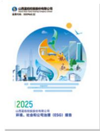  
报告名称: 山西蓝焰控股股份有限公司 2025环境、社会和公司治理（ESG）报告

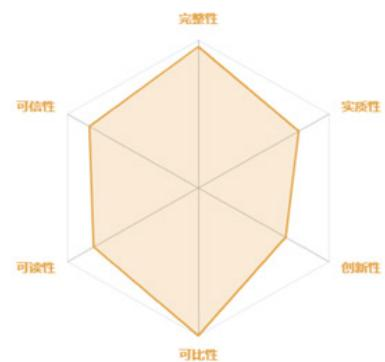

radar

| Dimension | Value |
| --- | --- |
| 完整性 | ~1.0 |
| 实质性 | ~0.8 |
| 创新性 | ~0.7 |
| 可比性 | ~1.0 |
| 可读性 | ~0.9 |
| 可信性 | ~0.9 |

结构完整性（A+）

报告结构完整，逻辑清晰，主体部分以治理、环境、社会三大篇章系统呈现公司年度ESG履责理念、实践与成效，信息要素覆盖全面、数据披露详实，结构完整性表现卓越。

报告可信性（A+）

报告语言平实，表述客观中立，主动披露“员工总流失率”等负面信息，引用感谢信、第三方荣誉与权威认证佐证履责成效，信息可追溯、可验证，报告可信性表现卓越。

报告可读性（A+）

报告设计简约大气、色彩搭配和谐统一，整体风格沉稳专业，运用图表、数据、案例、插图等多元形式提升信息承载与传播效率，重点内容可视化呈现，报告可读性表现卓越。

绩效可比性（A+）

报告集中披露年度公司经营、环境、社会、治理等关键绩效数据，通过省部级科技奖项、行业认证、权威荣誉、标准制定等成果展现行业地位与竞争水平，绩效可比性表现卓越。

报告创新性 (B)

报告在内容、结构与形式上均体现鲜明创新性，内容上紧扣能源安全、“双碳”目标、煤层气绿色开发等时代热点，设置特色专题与行业专属履责板块；结构上契合能源企业治理逻辑，章节名称突出行业属性与责任主题；形式上融入能源行业视觉元素，视觉系统与企业属性高度契合，报告创新性表现良好。

内容实质性 (A)

本报告严格参照国内外标准编制，系统开展实质性议题识别与评估，完整覆盖能源安全、气候治理、生态保护、安全生产、员工关怀、乡村振兴等行业关键性议题，各议题相关信息披露详实，内容实质性表现优秀。

# 总体评价

经评估，《山西蓝焰控股股份有限公司2025环境、社会和公司治理（ESG）报告》为“卓越（A+）”质量等级，是一份系统回应各方要求和期望，展现行业标杆水平的可持续发展（ESG）报告。

评估机构:

金蜜蜂智库 GoldenBeeThinkTank

# 读者意见反馈

尊敬的读者：

您好！

感谢您能抽出宝贵时间阅读本报告。为向您及其他利益相关方提供更完善、更专业、更有价值的 ESG 信息，提升我们的 ESG 报告质量，我们诚挚邀请您对报告提出反馈意见和建议。

# 1. 您属于以下哪一类？

□政府与相关监管机构 □股东与投资者 □员工

□客户 □供应商与合作伙伴 □社区与公众（当地居民、公益组织及媒体） □其他（请注明）

# 2. 您想从本报告中了解什么内容？

□公司介绍 □财务绩效相关内容 □与利益相关方的沟通 □公司治理 □安全生产 □能源保供  
□员工权益 □节能减排 □公益捐赠与乡村振兴 □其他（请注明）

# 3. 您觉得本报告内容和版面安排是否有助于您寻找相关信息？

□是 □不是

# 4. 您对本报告的总体印象是否满意？

□是 □一般 □否

# 5. 您对本报告的其他意见或建议。

# 6. 您认为在本报告中需要进一步完善的内容是什么？

□关于蓝焰控股 □ESG管理 □诚信蓝焰，铸就企业价值 □绿色蓝焰，厚植环境价值  
□美好蓝焰，共创社会价值

您可以选择以下方式告知我们您的宝贵意见：

电话：0351-2600968

邮件：lykg000968@163.com

传真：0351-2531837

地址：山西省太原市高新开发区中心街6号东楼18层

邮编：030032

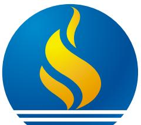

natural_image

Blue circular logo with a yellow flame design and horizontal lines below (no text or symbols)

BFHC