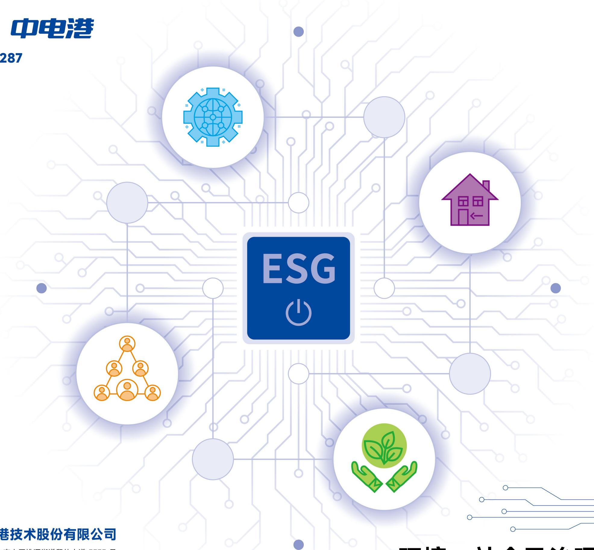

text_image

中电港
287
ESG
港技术股份有限公司
广东山河能源管道股份大道 3777 号
环境·社会治理

# 目录

关于本报告 02

董事长寄语 04

走进中电港 06

企业概况 06

业务布局 06

企业文化 07

责任荣誉 07

附录 64

附录 1: 关键绩效表 64

附录 2：指标索引 67

natural_image

Abstract digital illustration of a hexagonal container with a central screen and surrounding nodes, connected by lines (no text or symbols)

# ESG 管理 08

ESG 治理 10

ESG 战略 11

ESG 培训 11

重要性议题管理 12

利益相关方管理 13

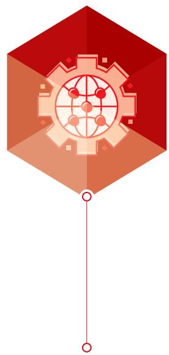

natural_image

Abstract geometric design with red hexagonal background and central gear-like structure (no text or symbols)

# 与治理共筑

# 立发展根基 14

完善公司治理 16

依法合规经营 18

全面风险管理 19

加强投关管理 21

守护信息安全 22

恪守商业道德 24

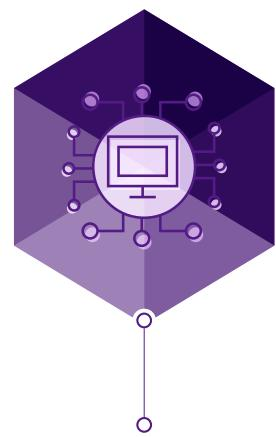

natural_image

Abstract illustration of a computer monitor with network nodes inside a hexagonal frame, no text or symbols present.

# 与伙伴共创塑价值生态

# 28

韧性供应链建设 30

研发创新驱动 35

客户服务优化 39

natural_image

Green hexagonal icon with two hands holding a sprouting plant, connected by a vertical line (no text or symbols)

# 与环境共生绘绿色蓝图 42

# 42

环境管理 44

应对气候变化 46

水资源管理 48

废弃物管理 49

natural_image

Abstract diagram of interconnected human figures within a hexagonal frame, no text or symbols present

# 与社会共荣 促和谐发展 50

# 50

维护员工权益 52

保护员工安全 55

助力员工成长 58

关爱员工心田 60

助力乡村振兴 62

投身公益慈善 63

# 关于本报告

本报告是深圳中电港技术股份有限公司（以下简称“中电港”“公司”或“我们”）发布的第三份环境、社会及公司治理报告（以下简称“本报告”）。本报告秉承客观真实的原则，从公司治理、环境保护、供应链管理、创新驱动、客户服务、员工权益、安全生产及社会贡献等角度出发，全面阐述公司2025年度环境、社会与公司治理的相关实践及绩效，回应利益相关方关切，不断提升可持续发展水平。

# - 报告范围：

本报告以深圳中电港技术股份有限公司为主体，涵盖旗下分、子公司。除特别注明外，本报告范围与公司年报范围保持一致。

# - 时间范围：

本报告时间跨度为2025年1月1日至2025年12月31日，为增强报告的可比性及前瞻性，部分内容往前后年度适度延伸。

# - 数据说明：

本报告中的可持续发展信息及数据均来自公司实际运行的原始记录，财务数据以人民币为单位。财务数据若与年度财务报告有不一致之处，以年度财务报告为准。

# - 编制原则：

本报告编制遵循时效性、准确性、平衡性、量化性的编制原则。

# - 编制依据：

本报告参考财政部《企业可持续披露准则——基本准则（试行）》《深圳证券交易所上市公司自律监管指引第17号—可持续发展报告（试行）》以及全球可持续发展委员会（GSSB）《GRI可持续发展报告标准》（GRI Standards）《联合国可持续发展目标（SDGs）企业行动指南》进行编制。

# - 确认批准：

本报告于 2026 年 4 月 27 日获公司董事会批准，并与年报同期发布。董事会承诺对报告内容进行监督，确保其不存在任何虚假记载或误导性陈述，并对其内容的真实性、准确性和完整性负责。

# - 报告获取：

本报告以电子版形式发布，可通过公司网站、深圳证券交易所网站、巨潮资讯网下载本报告电子文本。

# - 意见反馈:

我们诚挚欢迎您通过以下联络方式向我们反馈意见与建议。您的宝贵意见将帮助我们进一步完善本报告的编制工作，持续提升公司的可持续发展表现。

联系方式：0755-82538660

公司邮箱：zdgdb@cecport.com

公司地址：广东省深圳市南山区桃源街道留仙大道3333号塘朗城广场（西区）A座第25层

# CECport 中电港

# 董事长寄语

2025年是“十四五”规划收官之年，更是行稳致远的关键之年。中电港贯彻落实“合规控险、降本增效、价值引领”经营总方针，将高质量发展理念深度融入战略决策与运营管控，在完善治理、赋能产业、绿色运营、回馈社会的实践中，抢抓行业周期性增长机遇，乘势而上，取得了积极的工作成效。

治理为基，筑牢行稳致远之根。公司董事会秉持科学、理性、高效决策要求，将精益运营和合规控险贯穿于战略决策全过程，扎实推动中电港稳健经营、长远发展。持续优化治理结构与制度体系，实现权责清晰与运转高效的有机统一。着力筑牢合规风控体系，将商业道德与信息安全深度融入业务流程。全面完善投资者沟通机制，以透明规范的治理实践有效回应市场关切。依托扎实的治理根基，中电港在复杂环境中稳健前行，切实守护投资者托付，为高质量发展奠定了坚实基础。

共创为要，赋能产业繁荣之态。作为电子信息产业链上下游的枢纽，中电港始终将自身发展置于行业发展大局之中。面对全球供应链的不确定性，着力构建安全、可靠、韧性的现代供应链体系，与上下游伙伴携手应对挑战、共育新机。坚持以应用创新为驱动，聚焦关键领域技术突破，推动更多创新成果赋能千行百业。积极推动开放合作与协同创新，与合作伙伴共同塑造更具竞争力的产业生态，实现与合作伙伴的价值共生。

绿色为责，绘就低碳发展之卷。守护绿水青山并非宏大叙事，而是体现在每一项务实行动之中。中电港立足自身运营的实际特点，将绿色低碳理念融入经营发展的点滴细节，在绿色发展中积极践行着应有的责任担当。从仓储环节的智慧管理到办公场景的节能优化，以数字化手段提升能效水平，持续推进绿色仓储与集约运营。积极倡导全员将环保意识转化为日常习惯，让节约用纸、低碳出行成为自然而然的选择。

同心为本，汇聚激情奋进之力。中电港积极践行“正直务实、创新敢为、激情奋进”的企业文化价值观，致力于营造平等、包容、有温度的氛围，让奋斗者被看见，让担当者被尊重，让职业健康与安全为前行者筑牢保障。这种源自内部的凝聚力，也自然延伸为企业回馈社会的责任感。积极投身社会公益，将产业能力转化为温暖力量，在教育帮扶、乡村振兴的点滴行动中，传递企业与社会的双向奔赴。

智汇芯河，万里同烁！站在“十五五”开局新起点，中电港将锚定目标、勇担使命，坚定信心、乘势而上，持续锻长板、补短板，稳步推动公司高质量稳健发展，奋力向“全球首选的集成电路应用创新生态平台”战略目标迈进！

董事长 朱颖涛

# 走进中电港

# 企业概况

深圳中电港技术股份有限公司（股票简称：中电港，股票代码：001287.SZ）是行业领先的元器件应用创新与现代供应链综合服务平台，依托四十年产业上下游资源积累、技术沉淀、应用创新，已发展成为涵盖电子元器件分销、设计链服务、供应链协同配套和产业数据服务的综合服务提供商。中电港秉持“为客户服务，与伙伴共享”的经营理念，在履行社会责任的同时，努力打造元器件供应链生态圈，助力中国电子信息产业发展。2023年4月于深圳证券交易所主板上市。中电港连续二十四年获评“十大中国品牌分销商”，连续六年位居本土电子元器件分销商首位。

# 业务布局

中电港创新性提出“大平台系统赋能 + 精专业创新驱动”的“新分销”模式，构建涵盖元器件分销、设计链服务、供应链协同配套和产业数据服务的大平台，服务千行百业“精专业”应用创新。

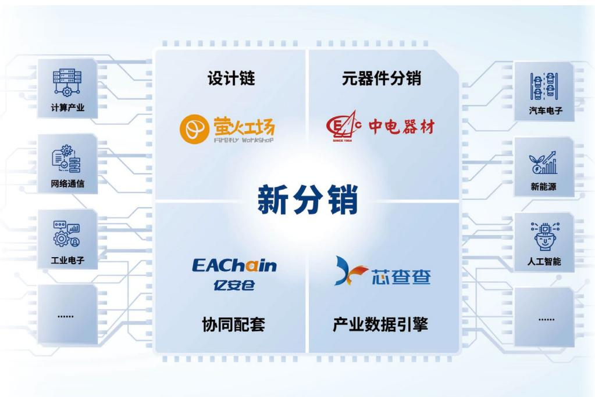

flowchart

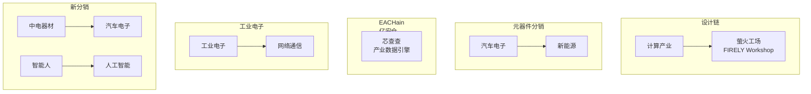
```mermaid
graph TD
  subgraph DesignChain["设计链"]
  A1["计算产业"] --> B1["萤火工场\nFIRELY Workshop"]
  end

  subgraph ComponentDistribution["元器件分销"]
  C1["汽车电子"] --> D1["新能源"]
  end

  subgraph EACChain["EACHain\n亿安仓\n协同配套"]
    E2["芯查查\n产业数据引擎"]
  end

  subgraph IndustrialProducts["工业电子"]
  I1["工业电子"] --> J1["网络通信"]
  end

  subgraph NewSales["新分销"]
  K1["中电器材"] --> L1["汽车电子"]
  end

  subgraph NewSales
  M1["智能人"] --> N1["人工智能"]
  end
```

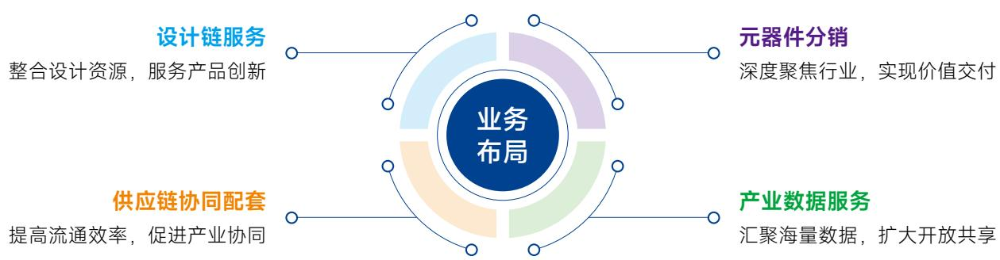

flowchart

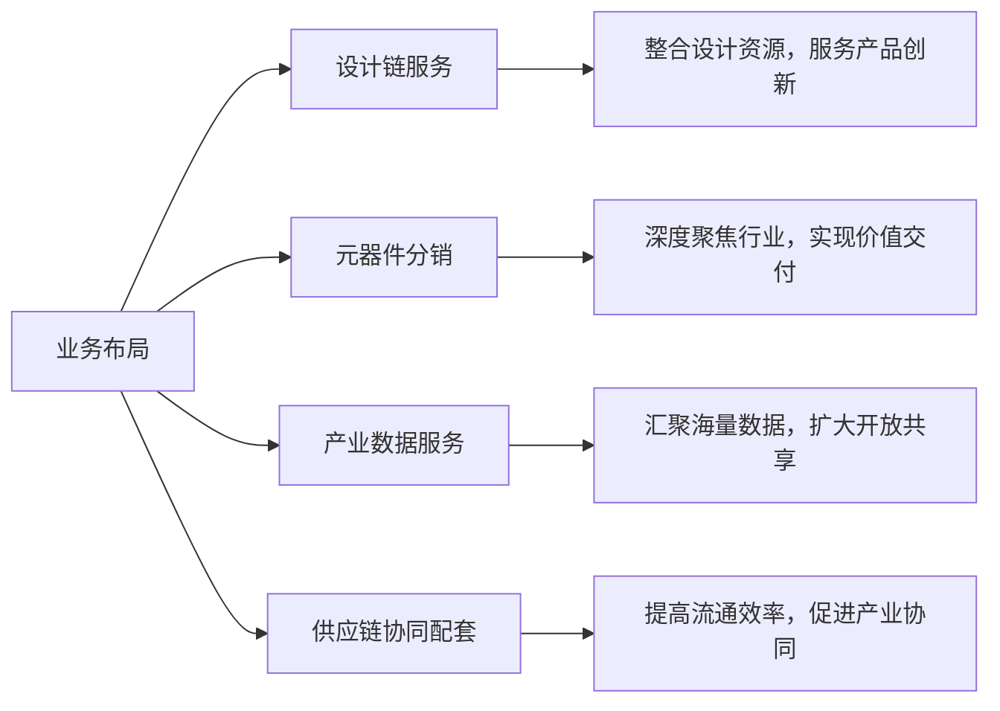
```mermaid
graph LR
  A["业务布局"] --> B["设计链服务"]
  A --> C["元器件分销"]
  A --> D["产业数据服务"]
  A --> E["供应链协同配套"]
  
  B --> F["整合设计资源，服务产品创新"]
  C --> G["深度聚焦行业，实现价值交付"]
  D --> H["汇聚海量数据，扩大开放共享"]
  E --> I["提高流通效率，促进产业协同"]
```

# 企业文化

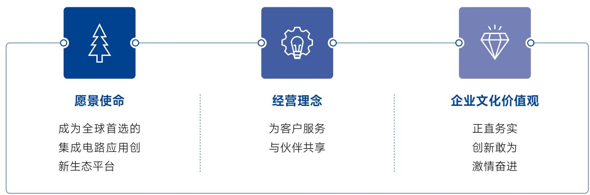

flowchart

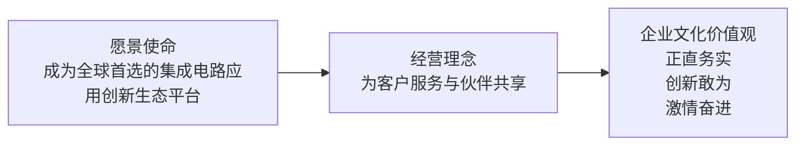
```mermaid
graph LR
  A["愿景使命\n成为全球首选的集成电路应用创新生态平台"] --> B["经营理念\n为客户服务与伙伴共享"]
  B --> C["企业文化价值观\n正直务实\n创新敢为\n激情奋进"]
```

# 责任荣誉

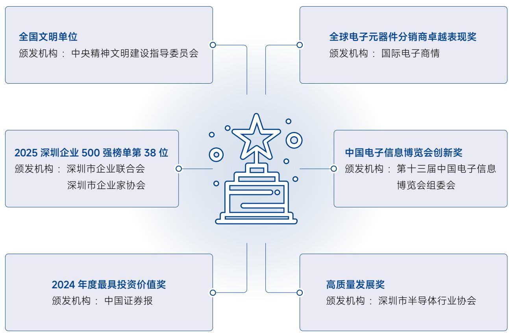

flowchart

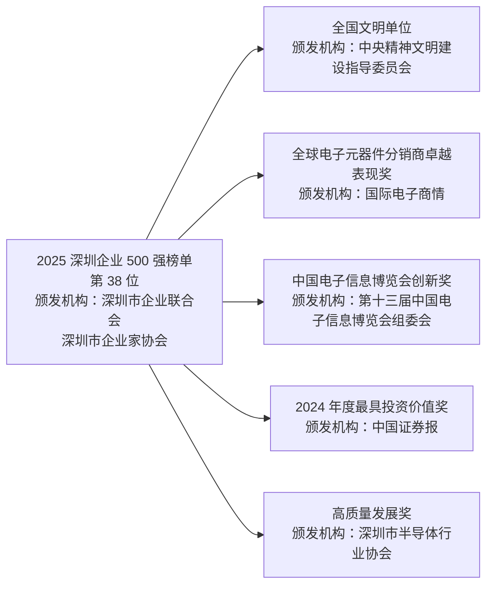
```mermaid
graph LR
  A["2025 深圳企业 500 强榜单第 38 位\n颁发机构：深圳市企业联合会\n深圳市企业家协会"] --> B["全国文明单位\n颁发机构：中央精神文明建设指导委员会"]
  A --> C["全球电子元器件分销商卓越表现奖\n颁发机构：国际电子商情"]
  A --> D["中国电子信息博览会创新奖\n颁发机构：第十三届中国电子信息博览会组委会"]
  A --> E["2024 年度最具投资价值奖\n颁发机构：中国证券报"]
  A --> F["高质量发展奖\n颁发机构：深圳市半导体行业协会"]
```

# CECport

# 中电港

# ESG管理

中电港全面践行可持续发展理念，持续完善 ESG 管理体系，不断提升履责实践能力，积极回应利益相关方的期望与诉求，促进公司与环境、社会的可持续发展。

回应议题

\- 利益相关方沟通

natural_image

Blue circular icon with a central server or browser symbol and surrounding nodes (no text or symbols)

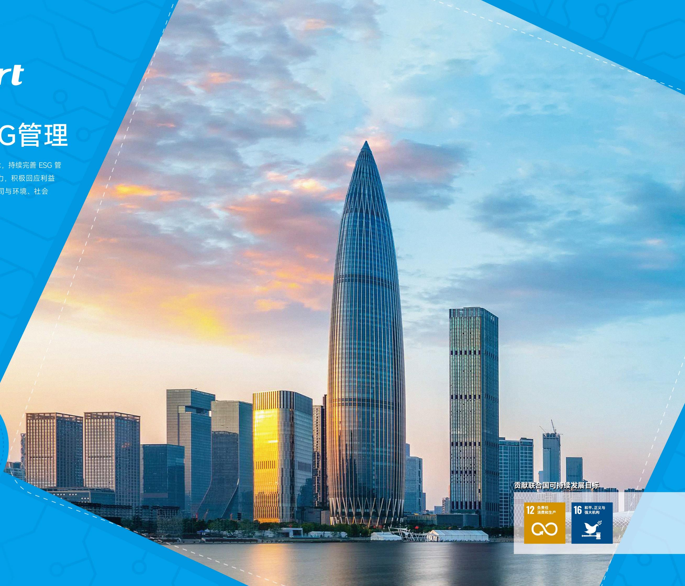

text_image

rt
G管理
，持续完善 ESG 管
力，积极回应利益
同与环境、社会
贡献联合国可持续发展目标
12 负责任
消费和生产
GO
16 相平、正义与
重大机构

贡献联合国可持续发展目标

12 负责任消费和生产

16 和平、正义与强大机构

# ESG 治理

中电港建立健全可持续发展管理架构，建立由董事会、管理层以及各职能部门共同构成的“决策层—管理层—执行层”ESG三级治理架构，强化董事会与管理层参与，明确各层级主要职责，确保ESG治理体系的高效运作。

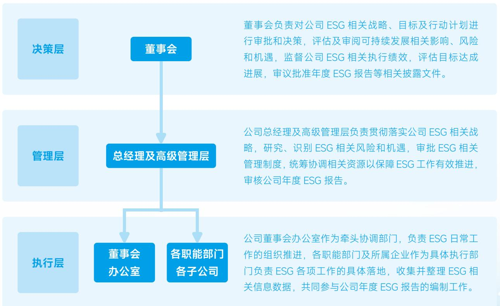

flowchart

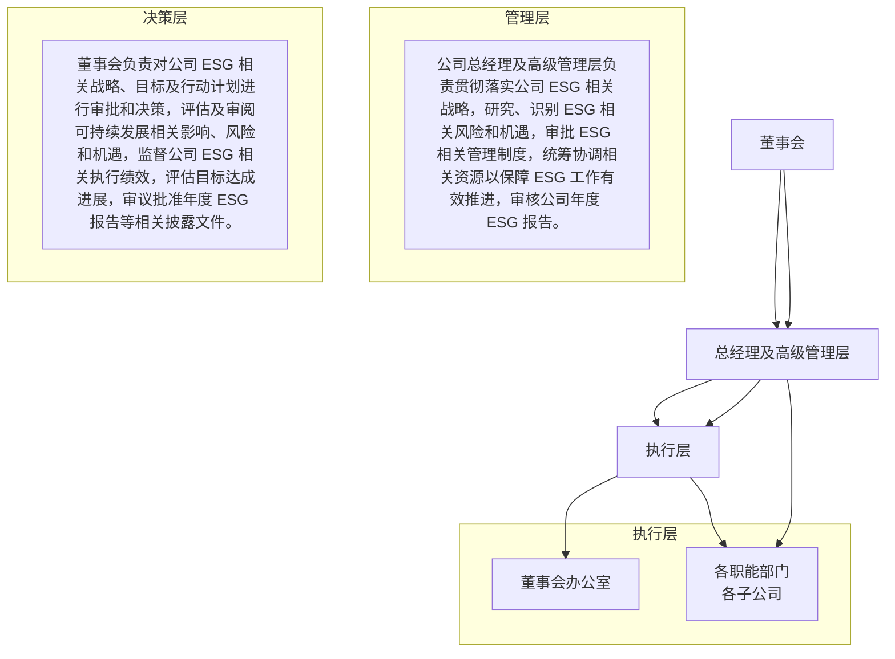
```mermaid
graph TD
  A["董事会"] --> B["总经理及高级管理层"]
  B --> C["执行层"]
  
  subgraph Executives ["执行层"]
    D["董事会办公室"]
    E["各职能部门\n各子公司"]
  end
  
  subgraph Management ["管理层"]
    F["公司总经理及高级管理层负责贯彻落实公司 ESG 相关战略，研究、识别 ESG 相关风险和机遇，审批 ESG 相关管理制度，统筹协调相关资源以保障 ESG 工作有效推进，审核公司年度 ESG 报告。"]
  end
  
  subgraph Board["决策层"]
    G["董事会负责对公司 ESG 相关战略、目标及行动计划进行审批和决策，评估及审阅可持续发展相关影响、风险和机遇，监督公司 ESG 相关执行绩效，评估目标达成进展，审议批准年度 ESG 报告等相关披露文件。"]
  end
  
  A --> B
  B --> C
  B --> E
  C --> D
  C --> E
```

中电港 ESG 治理架构

# ESG 战略

中电港顺应国家高质量发展要求与战略性新兴产业发展方向，将 ESG 管理、业务连续性管理（BCM）与可持续发展目标（SDGs）协同融入公司整体战略体系，构建支撑长期稳健增长的“三大支柱”，以提升治理韧性、经营韧性与价值创造能力。在战略落地层面，公司围绕“创新引领、服务赋能、数字驱动、保链稳链”的总体方向，推动战略部署与经营管理深度衔接，将可持续理念贯穿业务发展、运营管理与供应链保障等关键环节，促进高质量发展与可持续价值的协同实现。

# ESG 培训

为推动可持续发展理念有效融入公司业务运营，公司持续开展可持续发展相关培训，提升全员可持续发展意识和能力。报告期内，公司组织开展各部门及子公司ESG联络员线下专项培训1次，围绕ESG政策、管理要求及报告编制进行系统性培训，培训参与覆盖各部门。同时，将可持续发展管理培训融入公司行政管理、合规管理、供应链管理、客户管理等日常培训当中，持续增强全体员工对相关议题的认知程度和实践能力，为扎实推进可持续发展战略奠定坚实基础。

# 重要性议题管理

中电港将 ESG 重要性议题的识别与管理视为回应利益相关方关切与聚焦核心责任的关键环节，参考《深圳证券交易所上市公司自律监管指南第 3 号——可持续发展报告编制》《GRI 3：重大主题》等国内外披露标准的评估方法，从影响重要性和财务重要性两个角度进行分析，识别、筛选和评估重要性议题，并在报告中重点回应。

重要性议题评估流程  
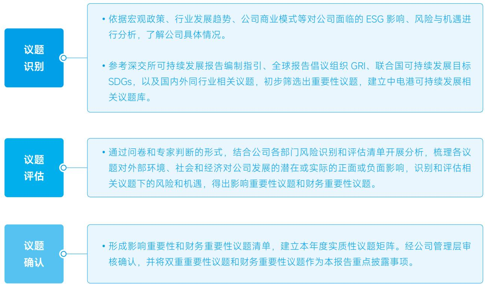

flowchart

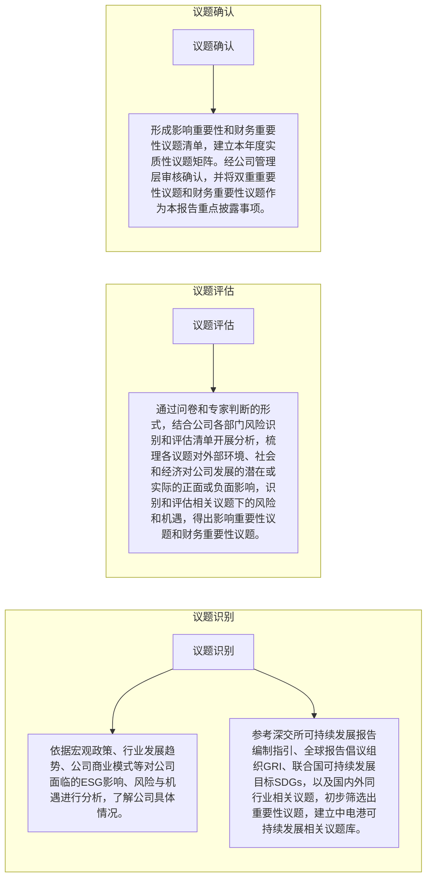
```mermaid
graph LR
  subgraph sg["议题识别"]
  A["议题识别"] --> B["依据宏观政策、行业发展趋势、公司商业模式等对公司面临的ESG影响、风险与机遇进行分析，了解公司具体情况。"]
  A --> C["参考深交所可持续发展报告编制指引、全球报告倡议组织GRI、联合国可持续发展目标SDGs，以及国内外同行业相关议题，初步筛选出重要性议题，建立中电港可持续发展相关议题库。"]
  end

  subgraph sg_2["议题评估"]
  D["议题评估"] --> E["通过问卷和专家判断的形式，结合公司各部门风险识别和评估清单开展分析，梳理各议题对外部环境、社会和经济对公司发展的潜在或实际的正面或负面影响，识别和评估相关议题下的风险和机遇，得出影响重要性议题和财务重要性议题。"]
  end

  subgraph sg_3["议题确认"]
  F["议题确认"] --> G["形成影响重要性和财务重要性议题清单，建立本年度实质性议题矩阵。经公司管理层审核确认，并将双重重要性议题和财务重要性议题作为本报告重点披露事项。"]
  end
```

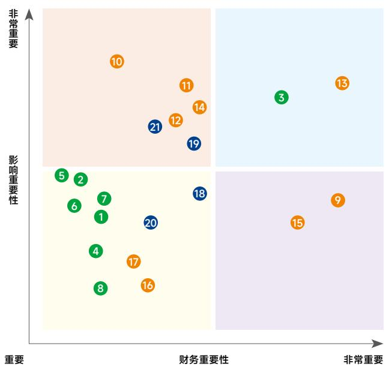

scatter

| Item | 财务重要性 (X-axis) | 影响重要性 (Y-axis) |
| --- | --- | --- |
| 10 | ~25% | ~85% |
| 11 | ~45% | ~75% |
| 14 | ~50% | ~65% |
| 21 | ~35% | ~60% |
| 12 | ~40% | ~55% |
| 19 | ~50% | ~50% |
| 3 | ~70% | ~65% |
| 13 | ~85% | ~70% |
| 5 | ~10% | ~45% |
| 2 | ~15% | ~45% |
| 7 | ~20% | ~40% |
| 6 | ~15% | ~35% |
| 1 | ~20% | ~30% |
| 20 | ~35% | ~30% |
| 4 | ~20% | ~20% |
| 8 | ~20% | ~15% |
| 17 | ~30% | ~20% |
| 16 | ~35% | ~15% |
| 18 | ~45% | ~40% |
| 15 | ~75% | ~30% |
| 9 | ~85% | ~35% |

中电港议题重要性议题矩阵图

<table><tr><td>重要程度</td><td>议题</td></tr><tr><td>双重重要性</td><td>3.应对气候变化 13.产品和服务安全与质量</td></tr><tr><td>财务重要性</td><td>9.创新驱动 15.供应链安全</td></tr><tr><td>影响重要性</td><td>2.能源利用 10.人才发展 11.职业健康和安全12.保护员工合法权益 14.数据安全与客户隐私保护19.反不正当竞争</td></tr><tr><td>相关</td><td>1.环境合规管理 4.循环经济 5.水资源利用6.污染物排放 7.废弃物管理8.生态系统与生物多样性保护 16.社会贡献17.乡村振兴 18.反商业贿赂及反贪污20.风险识别 21.利益相关方沟通</td></tr></table>

# 利益相关方管理

中电港深知与利益相关方建立紧密、透明的沟通机制至关重要。为更好地回应各方期待，公司致力于打造多层次的沟通平台，确保信息的及时传递与有效反馈。

<table><tr><td>利益相关方</td><td>关注重点</td><td>沟通渠道</td></tr><tr><td>政府及监督机构</td><td>·反商业贿赂及反贪污·反不正当竞争·污染物排放·环境合规管理</td><td>·信息披露·政企合作·监督检查·现场调研/访谈</td></tr><tr><td>员工</td><td>·员工权益保护·职业发展与培训·职业健康与安全</td><td>·线上渠道、意见箱·员工满意度调查·职工代表大会/工会·员工培训与活动·员工座谈会·公司内刊</td></tr><tr><td>客户</td><td>·产品和服务安全与质量·数据安全与客户隐私保护·应对气候变化·创新驱动</td><td>·客户满意度调查·电话/邮件·客户走访</td></tr><tr><td>股东及投资者</td><td>·股东回报·信息合规披露·创新驱动·反商业贿赂及反贪污</td><td>·公司官网/公众号·信息披露·投资者热线/投资者活动·股东会/业绩说明会·投资者实地调研</td></tr><tr><td>供应商</td><td>·供应链安全·应对气候变化</td><td>·供应商访谈·业务沟通交流</td></tr><tr><td>公益组织或社区组织</td><td>·社会贡献·乡村振兴</td><td>·社会公益活动·乡村振兴活动</td></tr><tr><td>媒体</td><td>·合规经营·社会贡献</td><td>·信息披露·新闻发布·媒体采访</td></tr><tr><td>行业协会或科研机构</td><td>·创新驱动·供应链安全</td><td>·行业大会/论坛</td></tr></table>

# 与治理共筑 立发展根基

合规经营与科学治理是企业可持续发展的基石，中电港以完善的治理架构为支撑，将合规经营与风险管理贯穿决策与运营全过程，持续保障信息安全，携手商业伙伴、员工共同恪守商业道德，对腐败和不正当竞争行为零容忍，共同营造风清气正、公平公正的行业生态。

# 回应议题

- 风险识别  
- 反商业贿赂及反贪污  
- 反不正当竞争  
- 数据安全与客户隐私保护

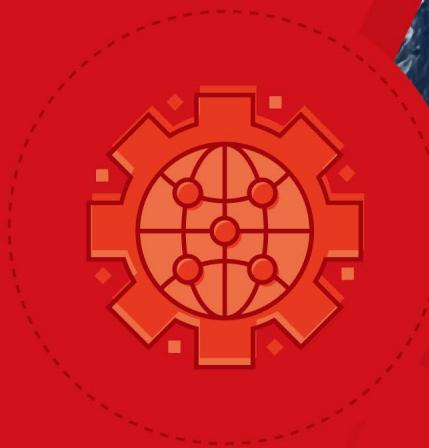

natural_image

Abstract gear icon with globe and network lines on red background (no text or symbols)

text_image

里共筑
展根基
可持续发展的基石，中
掌，将合规经营与风
，持续保障信息安
恪守商业道德，
忍，共同营造
态。
贡献联合国可持续发展目标
12 负责任
消费和生产
16 和平、正义与
强大机构

贡献联合国可持续发展目标

12 负责任消费和生产

16 和平、正义与强大机构

# 关键绩效

2025 年

股东会会议

2 次

董事会会议

5 次

独立董事专门会议

3次

战略委员会会议

2 次

审计委员会会议

4 次

薪酬与考核委员会会议

3次

提名委员会会议

2 次

董事会成员出席率

100%

# 完善公司治理

公司严格遵守《中华人民共和国公司法》《中华人民共和国证券法》等法律法规，构建起现代化、规范化的公司治理体系，明确划分权责界限，确保各司其职、协调运转，推动公司有序发展。

# 治理架构

公司严格遵循相关法律法规及《公司章程》的规定，制定《股东会议事规则》《董事会议事规则》等内部制度，建立了由股东会、董事会和管理层组成的健全且高效的公司治理结构，致力于确保治理机制的权责清晰、操作规范，并有效保障决策的公正性和科学性。

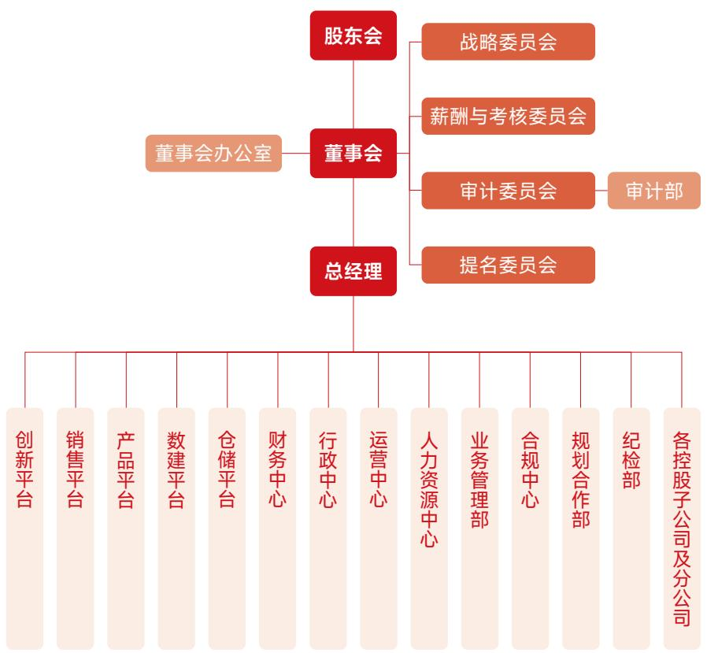

flowchart

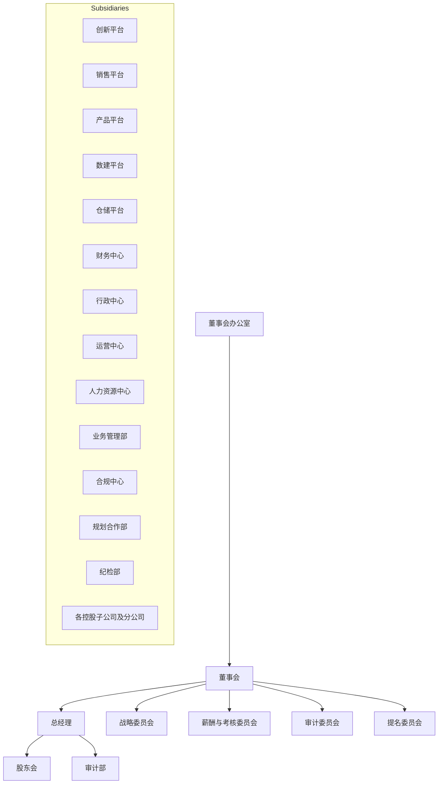
```mermaid
graph TD
  A["董事会办公室"] --> B["董事会"]
  B --> C["总经理"]
  C --> D["股东会"]
  C --> E["审计部"]
  
  subgraph Subsidiaries
    F["创新平台"]
    G["销售平台"]
    H["产品平台"]
    I["数建平台"]
    J["仓储平台"]
    K["财务中心"]
    L["行政中心"]
    M["运营中心"]
    N["人力资源中心"]
    O["业务管理部"]
    P["合规中心"]
    Q["规划合作部"]
    R["纪检部"]
    S["各控股子公司及分公司"]
  end
  
  B --> T["战略委员会"]
  B --> U["薪酬与考核委员会"]
  B --> V["审计委员会"]
  B --> W["提名委员会"]
```

组织架构

公司董事会作为公司经营决策机构，履行“定战略、作决策、防风险”的核心职责。董事会下设战略、提名、薪酬与考核、审计四个专门委员会，各专门委员会对董事会负责，协助董事会开展相关领域的专业审议与监督，确保董事会科学、理性、高效议事与决策。

# 中电港专门委员会工作职责

# 战略委员会

负责研究公司包括 ESG 在内的长期发展战略、重大决策事项，并对其实施情况进行监督评估，为董事会决策提供支持

# 提名委员会

负责拟定董事、高级管理人员的选择标准和程序，对董事、高级管理人员人选及其任职资格进行遴选、审核，推动董事会多元化发展

# 薪酬与考核委员会

负责制定与审查董事、高级管理人员的薪酬政策与方案，并负责对其绩效进行考核与评价，提升企业管理水平

# 审计委员会

审计委员会是风险管理的最高议事和决策机构，负责监督公司内外部审计、审核财务报告及内部控制体系的有效性，管理与监督审计人员，是公司合规与风控的关键防线

# 董事会有效性

公司高度重视公司治理的高效性与规范性，依据《公司章程》提名和选举董事，通过多元化的董事结构，为公司带来广阔的视野和高水准的专业经验，同时保持董事会应有的独立元素，确保董事会在研究和审议重大事项时作出独立判断和科学决策。

# 关键绩效

2025 年

董事会董事

11名

# 董事会 独立性

公司建立《独立董事工作制度》保障独立董事有效履职，强化对董事会、管理层的监督约束机制，推动公司规范运作，切实维护中小股东合法权益，并由董事会对独立董事独立性进行评估。除战略委员会外，其余专门委员会独立董事占比66.67%，并由独立董事担任主任委员，进一步强化公司治理的独立性与有效性。

独立董事 4 名

占比 36.36%

# 董事会 评价

公司每年通过自评和外部审核相结合的方式，对董事会的规范性和有效性进行评估，评估内容包括但不限于董事会人员的选举与组成、董事会的召开情况、董事会专门委员会的工作情况、独立董事履职情况等。董事和高级管理人员向董事会薪酬与考核委员会做述职和自我评价；薪酬与考核委员会按绩效评价标准和程序，对董事及高级管理人员进行绩效评价。

女性董事 3 名

占比 27.27%

# 董事会多元化

公司董事会遵循多元化、专业化的原则，选聘董事会成员时从性别、专业、资历及经验等多方位考量，致力于构建结构平衡、运行高效的董事会治理体系。

# 高管薪酬与考核

公司依法设立董事会薪酬与考核委员会，负责制定并审议董事及高管的考核标准与薪酬方案，最终方案经董事会或股东会审议通过后实施。同时，明确薪酬兑现与企业经营业绩相挂钩，建立管理规范、结构合理、水平适当的经理层成员薪酬管理体系，提高经营效益和经营质量，调动经理层成员积极性。

薪酬与考核委员会根据《薪酬与考核委员会实施细则》《经理层成员考核评价及薪酬分配管理办法》进行议事和决策，制定、审查公司董事、高级管理人员的薪酬政策和方案。此外，公司将ESG相关指标与高管薪酬挂钩，把安全生产、风险管理、产品质量、合规管理等指标综合纳入各级管理层年度绩效考核体系，根据年度实施情况予以考核评价、兑换薪酬支付。

# 依法合规经营

# 关键绩效

2025 年

开展合规培训次数超过

38 次

参与合规培训

5616 人次

专项培训参与人数超

1200 人次

中电港以《合规管理制度》为基础，以《合规管理手册》《员工合规手册》为抓手，遵循“坚持党的领导、坚持全面覆盖、坚持权责清晰、坚持务实高效”的原则，建立健全合规管理体系。

公司构建 “三层合规管理架构”，由董事会作为合规管理决策机构，合规委员会与法治建设工作领导机构统筹协调合规管理工作，合规中心作为合规管理牵头部门，推动合规要求在公司各层级、各环节有效落地，持续提升依法合规经营管理水平。

# 2025年合规管理举措

# 完善制度流程

上线制度审核系统，完成 55 项制度建设与优化，统筹开展专项检查；梳理全量合同与业务流程，建立分类分级授权机制，提升内控规范与风控效能。

# 升级合同管理

建立分级分类合同模板库，实施重大项目法律前置介入，严格执行全量合同100%法律审查，实现对交易风险的系统化识别与源头化管控。

# 建设贸易合规

搭建公司出口管制合规体系，出台供应链风险防控方案，发布管理层合规承诺。通过开展物项管控清单比对、国别风险评估、交易伙伴风险评估等多维度审查，系统性防范供应链风险。

# 深化合规文化

全年发布 24 期 “合规之声” 专栏，开展线下合规培训，持续筑牢全员合规思想根基，推动合规意识深入人心。

# case

# 案例：

# 开展出口管制贸易合规专项培训

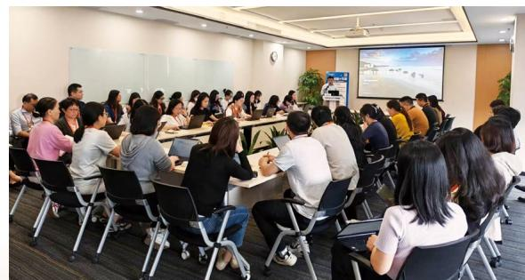

natural_image

Interior view of a conference room with attendees seated at desks facing a presentation screen (no visible text or signage)

出口管制贸易合规专项培训

公司组织出口管制贸易合规专项培训，覆盖多业务部门，培训邀请外部专家，深入解读进出口关税新政与国际制裁清单动态，对限制清单、境外合作等风险点提供实操指引，互动环节围绕跨境资金结算、客户尽调等实际难题展开热烈讨论与解答。此次活动显著提升了团队在跨境业务中的专业判断与风险规避能力。

# 全面风险管理

公司持续强化风险防控能力，参考 COSO 风险管理与内部控制框架及 ISO 31000 风险管理标准，建立并完善全面有效的风险管理与内部控制体系，制定《全面风险管理办法》，稳步推进全面风险管理。公司高度重视 ESG 风险的系统性管理，定期开展 ESG 风险识别与评估，将技术创新、合作伙伴关系、供应链稳定、客户关系、安全生产、环境保护、信息安全、商业道德、自然灾害、税务合规等关键 ESG 相关风险纳入风险评估与内部控制流程，并据此采取针对性的风险应对措施，持续提升经营韧性与可持续发展能力。

# 加强风险管理

公司建立形成董事会、总经理办公会及各部门共同参与的风险管理架构，建立风险管理“三道防线”，形成业务执行、专业监督与独立审计相互衔接的风险管控机制，推动风险管理要求贯穿经营全流程并持续改进。

# 风险管理三道防线

# 第一道防线

# 各业务部门、职能部门及所属企业

风险管理的执行主体，负责在日常工作中直接进行风险识别、评估、应对与日常监控，确保业务风险被控制在源头。

# 第二道防线

# 运营支撑、财务中心、合规中心等

负责制定风险管理政策与方案，监督第一道防线执行情况，组织重大风险事件管理与报告，并开展相关培训与指导。

# 第三道防线

# 审计部

负责对前两道防线的风险管理有效性进行监督与评价，通过内控评价和独立检查，督促风险应对与整改，并向管理层报告整体风险状况。

# 风险管理流程

公司建立了科学的风险管理体系，将 ESG 风险有效融入风险管理全过程，通过多渠道、全方位收集风险信息，开展风险识别、分析、评估与等级界定，并制定有针对性的风险应对与管控措施。

由各业务部门广泛收集内外部初始信息，涵盖战略、市场、运营、财务、法律五大领域，涉及科技创新、供应链稳定、客户服务、质量、安全、环保、信息安全、商业道德等 ESG 议题，系统查找业务单元与关键流程中存在的各类风险。

根据风险偏好与承受度，选择风险规避、降低、分担或承受等策略，并制定具体解决方案，明确控制措施、责任部门与目标，确保内控制度有效落实。

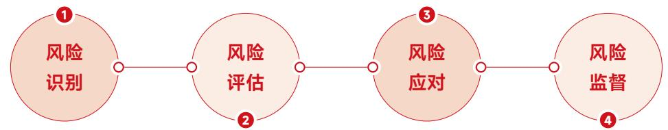

flowchart

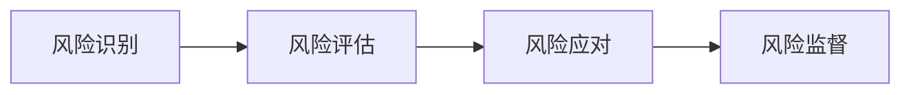
```mermaid
graph LR
  A["风险识别"] --> B["风险评估"]
  B --> C["风险应对"]
  C --> D["风险监督"]
```

合规中心作为牵头部门每年组织开展全面风险评估工作，通过风险辨识、分析与评价，确定风险发生的可能性与影响程度，制定公司主要风险识别清单并经管理层审定发布。2025年，识别覆盖关键业务领域共16项主要风险，为业务自查、风险防控等提供有力支撑。

对风险管理流程实施情况进行持续监督，重点关注重大风险与事件，通过定期自查、检查与考核，及时发现缺陷并改进，实现管理闭环与持续提升。

# 健全内控体系

公司以《内部控制管理及评价手册》为纲领，持续推动内部控制建设，全面梳理内部控制流程，构建完整、有效、科学的内部控制体系，提升风险管理水平和合规经营能力。

# 2025年 ○— 内部控制举措

# 完善体系架构

以《企业内部控制基本规范》为依据，搭建“总体框架 + 专项细则 + 操作指引”三级内控制度体系，明确各治理层与业务部门的权责边界。

# 强化能力保障

建立分层分类的内控培训体系，对管理层与业务人员开展针对性赋能，确保全员理解并执行内控要求，年度培训覆盖率不低于95%。

# 开展常态检查

常态化开展内控检查与年度自评价工作，精确识别内控缺陷，并对整改情况进行跟踪，及时弥补管理漏洞。

# 落实分层监督

构建由“业务部门月度自查、合规部门年度巡检、内外部审计协同监督”组成的三层监督防线，形成覆盖全业务的监督合力。

# 推动闭环优化

围绕制度、流程、执行、风险、整改五大维度设置量化指标进行评估，并依据结果推动问题 100% 整改闭环，实现内控体系的持续迭代优化。

# 深化审计监督

公司严格遵守《中华人民共和国审计法》及上市监管要求，制定并施行《内部审计管理制度》，确立以风险为导向、以增加价值为核心的工作方针，对内控及风险管理实施独立、客观的全过程监督。设立直接对董事会负责的独立审计部门，并配备专职人员，确保审计职能的权威性与有效性，至少每季度向董事会或者审计委员会报告一次审计工作开展情况，至少每年向董事会审计委员会提交一次内部审计报告。同时，公司每年开展第三方审计工作，内容涵盖公司财务审计、内部控制审计，并出具审计报告。对重点领域各个业务环节进行穿行测试、现场抽样检查及重点核查，提出审计缺陷及优化建议，持续跟踪整改情况。

# 加强投关管理

为促进与投资者建立长期、稳定的良性互动关系，公司持续完善投资者关系管理机制，加强与投资者的有效沟通，积极回应关切，切实维护投资者合法权益。

# 保障信息透明

公司制定《信息披露管理办法》《内幕信息知情人登记管理制度》等相关制度，加强信息披露质量，确保信息真实、准确、完整、及时披露，保障投资者知情权。同时，公司重视对未公开信息的保密工作，通过加强宣传教育和强化日常管理等方式，培养员工合规意识与保密责任，防范内幕交易，有效维护市场公平秩序与投资者合法权益。

# 关键绩效

2025 年

披露公告及文件

157 份

# case 案例：开展内幕信息知情人培训

2025 年，公司举办内幕信息知情人专项培训，围绕内幕信息的定义、知情人范围及法律责任展开系统讲解，并结合典型案例深入剖析内幕交易的危害与后果。培训覆盖关键岗位员工 94 人次，有效提升了全员合规意识与信息保密自觉，为筑牢公司内控防线、维护市场公平秩序奠定了扎实基础。

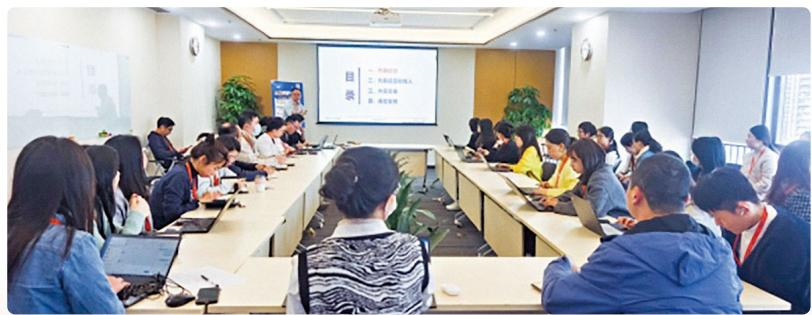

text_image

Conference room photo with attendees seated at long tables, presentation screen displaying Chinese text about project management

内幕信息知情人培训会现场

# 关键绩效

2025 年

召开业绩说明会

1 次

参加投资者网上集体接待日活动

1 次

接待投资者调研

12 次

接听中小投资者电话
咨询超

100 次

回复深交所互动易平台投资问题超

250 次

# 畅通投关渠道

公司制定《投资者关系管理制度》，建立“召开业绩说明会、券商策略会、路演、来访接待以及日常维护”的投资者关系管理机制，积极开展投资者沟通活动，与投资者保持良好关系，通过业绩交流会、官方网站、互动易平台、新媒体、电话及电子邮箱等渠道载体，多次开展交流活动，打造高效畅通的投资者交流平台。

# 维护股东权益

公司在推动自身可持续发展的同时，高度重视股东回报，依托健全、透明的决策机制与投资者共享发展成果，制定清晰、稳定的现金分红政策并持续优化股东回报体系，切实维护全体股东的合法权益。2025年度，公司利润分配预案拟以现有总股本759900097股为基数向全体股东每10股派发现金股利1.18元（含税），共计派发现金89668211.45元（含税），不送红股，也不以资本公积金转增股本。

# 守护信息安全

公司高度重视信息安全保障工作，通过建立权责清晰的管理架构、制定严密的管理制度，为信息资产的保密性、完整性和可用性提供坚实基础。

# 信息安全管理架构

公司将信息安全作为数字化运营与风险管控的重要基础，建立覆盖“决策—管理—执行—监督”的信息安全管理架构，明确各层级职责分工与协同机制，推动制度体系、技术防护与合规监督一体化运行，持续提升数据安全治理能力与风险应对水平。

# 决策层

# 信息安全领导小组

由高层及核心部门负责人组成，负责制定数据安全战略、方针，审批重大制度与投入，统筹跨部门重大事项。

# 管理层

# 数据中心

制定修订安全制度与技术标准，搭建防护体系，开展风险评估、应急处置，提供技术支持与培训。

# 执行层

# 各系统使用部门

落实公司制度并制定部门细则，负责日常数据操作安全，及时上报安全隐患。

# 监督层

# 合规中心、审计部门

审核安全管理制度的合规性与有效性，确保符合法律法规要求；监督各部门职责落实，核查数据操作合规性，推动问题闭环整改。

# 信息安全保障措施

公司针对应急、备份、监测、审计、隐私、供应链方面制定具体保障措施，确保信息系统在运行环境中所面临的各种风险得到有效控制。

# 制度保障

通过《员工手册》《合规手册》《信息安全管理细则》等制度，明确数据保密要求，员工入职即签署保密协议，落实责任追究机制。

# 备份加密

建立完善的本地及异地数据备份制度，满足三级等保要求；对个人信息实行加密存储，确保核心数据在存储与备份过程中的完整性与保密性。

# 监测防御

构建常态化信息安全运营体系，实现威胁监测、自动拦截与处置能力。核心系统已通过等保测评，部署 WAF、堡垒机等实现全链路安全防护。

# 日志留存

对核心数据库操作留存180天日志审计，通过堡垒机实现运维权限管控与行为审计，确保访问操作可追溯、可审计，强化内外部风险管控。

# 信息安全应急演练

公司常态化开展信息安全演练与系统化培训，将其作为整体安全防线的重要一环，通过定期组织实战演练与针对性培训，持续提升全员的防护意识与应急操作能力，全面强化“人防”体系，确保安全制度有效落地。

# 关键绩效

2025 年

数据安全培训与宣贯

2 次

# 案例：开展信息安全及舆情管理合规培训

2025 年 6 月，公司组织全体员工开展了信息安全及舆情管理专项培训，深入解读《中华人民共和国网络安全法》等法律法规及公司内部安全规范，并结合行业内外真实案例，剖析了数据泄露与舆情危机的关联与危害。培训有效强化了全员对信息边界与合规操作的理解，推动了安全意识从“知道”向“行动”转化，为筑牢公司整体安全防线奠定了坚实基础。

数据安全相关考试出勤率

98.72%

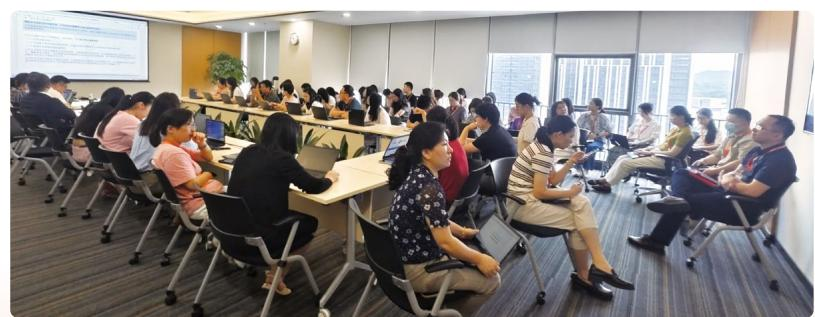

text_image

Conference room photo with attendees seated at desks and a presentation screen showing Chinese text on the screen

信息安全及舆情管理合规培训

数据安全相关考试平均分

94.8 分

# 信息安全审计及认证

公司定期开展网络安全专项审计及第三方认证审计评估，已通过国家网络安全等级保护（三级）认证，并每年委托专业第三方测评机构进行国家网络安全等级保护复测，测评范围覆盖防范计算机病毒和网络攻击、网络侵入等网络安全保护管理和技术措施落实情况以及安全监测和应急处置情况。报告期内，公司顺利通过本年度信息系统安全等级保护测评。

# 恪守商业道德

公司坚持诚信经营，遵循市场规则，恪守商业道德，坚决反对任何形式的商业贿赂、贪污腐败及不正当竞争行为，持续维护良好的市场秩序与行业生态。

# 反腐败管理

公司建立党委统一领导、董事会决策监督、经理层组织执行、纪检专责监督、审计部独立核查、合规中心日常管理的闭环管理监督体系。通过《员工手册》明确禁止任何形式的贿赂、贪污行为，并清晰规定惩处措施和处理流程，确保廉洁要求在制度与执行层面落地见效。报告期内，公司未发生商业贿赂及贪污腐败相关事件。

# 廉洁风险管理

公司持续强化廉洁风险管理，纪检部门定期开展廉洁风险排查，聚焦权力集中、资金密集、资源富集等关键领域，及时识别潜在风险点；同时建立廉洁制度执行督查机制，定期检查制度落实情况，对发现的问题及时督促整改并跟踪闭环，确保制度刚性执行。审计部依托多部门联合监督机制，对关键权力运行流程、利益关联交易等重点环节开展常态化审查，提升监督的覆盖面与有效性，推动问题早发现、早纠正。

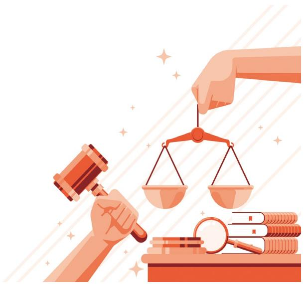

natural_image

Illustration of hands holding a gavel and a balance scale, with books and a magnifying glass nearby (no text or symbols)

# 廉洁培训教育

公司重视廉洁文化建设与廉洁意识培育，定期开展教育培训与宣导活动，通过新员工培训、内部宣传栏、案例警示等多种形式持续强化廉洁理念，引导员工守住纪律底线、规范从业行为，从源头防范廉洁风险。

# 案例：开展党建共建，敲响廉洁警钟

2025 年 5 月，中电港党委第二党支部赴深圳市党群服务中心开展 “筑牢信仰根基 共筑廉洁党群” 党建共建活动。活动观影答题环节创新采用 “情景回顾 + 随堂测试” 模式，以互动式答题竞赛检验党员对中央八项规定精神的理解运用能力，强化纪律红线意识，推动理论学习向实践转化，实现以史鉴今、以考促廉的教育效果。

# 廉洁生态共建

公司倡导员工、供应商等利益相关方共同参与廉洁生态建设，通过签署廉洁承诺、开展培训宣导及强化全链条监督，持续完善廉洁风险防控机制，推动诚信合规成为公司及合作伙伴共同遵循的行为准则。

- 在《员工手册》中明文禁止商业贿赂、利益冲突等行为，并规定具体的处罚标准  
- 要求所有员工入职时签订保密协议，明确保密义务与违规责任  
- 开展合规领导力培训，强化“一岗双责”意识，明确管理层对下属廉洁行为的监督责任

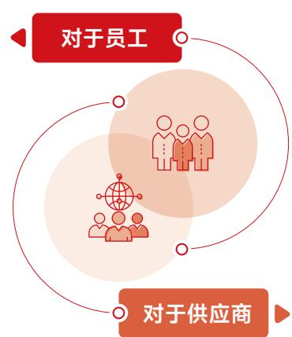

flowchart

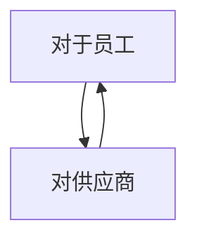
```mermaid
graph TD
  A["对于员工"] --> B["对供应商"]
  B --> A
```

# 关键绩效

2025 年

开展反商业贿赂及反贪污培训

1 次

反贪污培训员工覆盖率

55%

发布反腐败相关合规之声

4期

- 要求所有供应商签订《廉洁合作协议》，将“无商业贿赂记录”作为供应商准入必备条件  
- 在合作过程中，对供应商的商业道德表现进行持续监督，并定期开展供应商廉洁宣贯培训  
- 建立供应商信用评级，将廉洁表现与订单分配、合作年限挂钩，对评级为“不合格”的供应商暂停合作

# 关键绩效

2025 年

因公司不当竞争行为导致诉讼或重大行政处罚的事件数量

0 件

因公司不当竞争行为导致诉讼或重大行政处罚的涉案金额

0元

# 践行公平竞争

公司严格遵守《中华人民共和国反垄断法》《中华人民共和国反不正当竞争法》等法律法规，制定《员工手册》《合规管理手册》《商业秘密管理办法》等制度文件，明确禁止达成垄断协议、滥用市场支配地位、商业诋毁、虚假宣传等不正当竞争行为。公司建立“董事会监督指导、合规委员会统筹协调、合规中心牵头推进落实”的反不正当竞争管理架构，由首席合规官直接负责，确保相关制度与要求在各业务环节有效落地。报告期内，公司未发生因不正当竞争行为引发的诉讼或重大行政处罚。

# 2025年 ○— 反不正当竞争管理举措

# 广告与宣传 合规

建立严格的广告与宣传内容合规管控机制，执行“三审三校”审批流程，根据宣传渠道影响力和内容敏感性实行分级审批；建立市场竞争行为合规审查机制，对促销方案、广告文案、合作协议等进行前置合规审核，杜绝不正当竞争风险。

# 商业秘密保护

构建 “人防 + 技防 + 制防” 立体防护系统，对商业秘密进行分级分类管理，与涉密人员签订保密协议，并对涉密信息系统采取数据加密、操作留痕等技术措施。

# 反垄断 行为监测

在合同模板中设置反垄断审查条款，建立价格监测与预警机制，并规范参与行业协会活动行为，预防垄断行为，防范联合操纵市场风险。

# 宣贯与培训

面向销售、市场推广等关键岗位定期开展合规意识宣导与专项培训，持续提升员工合规履职能力与公平竞争意识。开展贸易合规培训2次，总时长3小时，覆盖539人次。

# 投诉举报机制

公司注重建设廉洁反腐文化生态，保持投诉举报渠道的畅通。公司合规管理部门及公司其他有关监督部门负责接收第三方的合规监督，受理举报和投诉，并按有关规定进行调查、反馈和处理。

# 举报处理

对于信访举报反映、监督执纪中发现以及巡视巡察机构和其他单位移交的问题线索，实行集中管理，采取谈话函询、初步核实、暂存待查、予以了结等方式分类处置，做到件件有着落。对反映党组织、党员的问题线索经过初步核实，对于涉嫌违纪、需要追究党纪责任的，按照规定予以立案审查。

同时，我们依据《员工合规手册》《员工手册》，对违纪违规行为根据违纪性质及造成后果的严重程度将惩处类型分为口头批评、通报、书面检讨、经济性惩处、警告、记过、单方解除劳动合同等，其中任何贪污腐败行为均被视为严重违纪，公司有权单方解除劳动合同。

# 举报人保护

公司承诺对举报人的个人信息和举报资料进行严格保密，举报线索与材料由专人受理并按照秘密等级严格管理，明确规定不得将举报人个人信息、举报办理情况等泄露给被举报人或者与办理举报工作无关的人员。在对举报人信息进行保密的同时，公司将严厉打击任何报复行为，一经查实将严肃处理，对确有严重危及举报人权益的行为会及时报告司法机关并依法追究刑事责任。

# 中电港投诉举报渠道

举报电话：0755-82531622

举报邮箱：jijian@cecport.com

举报地址：深圳市南山区桃源街道留仙大道3333号塘朗城广场（西区）A座第25层

natural_image

Illustration of a person using a laptop with various communication icons around it (no text or symbols)

# 与伙伴共创 塑价值生态

中电港始终秉持“为客户服务，与伙伴共享”的经营理念，立足电子信息产业分销主业，充分发挥对行业保链稳链的战略作用，坚持以应用创新为牵引，为客户提供技术赋能和系统解决方案，打造元器件供应链生态圈，助力电子信息产业发展。

# 回应议题

- 供应链安全  
- 创新驱动  
· 产品和服务安全与质量

natural_image

Purple circular icon with a computer monitor and network nodes, symbolizing digital connectivity or data integration (no text or symbols)

# CECport 中电港

贡献联合国可持续发展目标

9 产业、创新和基础设施

12 负责任消费和生产

# 韧性供应链建设

作为行业领先的元器件应用创新与现代供应链综合服务平台，中电港深知高安全、强韧性、可持续的供应链体系，不仅是企业稳健经营的根基，更是支撑客户长期发展与产业生态繁荣的核心保障。我们着力构建多元化、高品质的供应商网络，持续强化供应链风险管控，积极推动绿色与可持续供应链实践，建立长期协同、互利共赢的伙伴关系。

# 治理

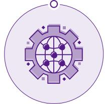

中电港依托技术、产品、应用、数据、资金、人才等生产要素的集聚和高效配置，带动电子信息产业链上下游紧密结合，全力保障电子元器件供应链稳定。我们建立董事会战略委员会监督指导、高级管理层统筹推动、跨部门协同执行的供应链管理架构，以公司总经理为第一责任人，由业务管理部牵头，产品部门作为直接责任部门，合规中心、运营中心、财务中心、数据中心等相关部门协同参与的联合工作机制，确保供应链管理决策科学、执行有力、监督到位。

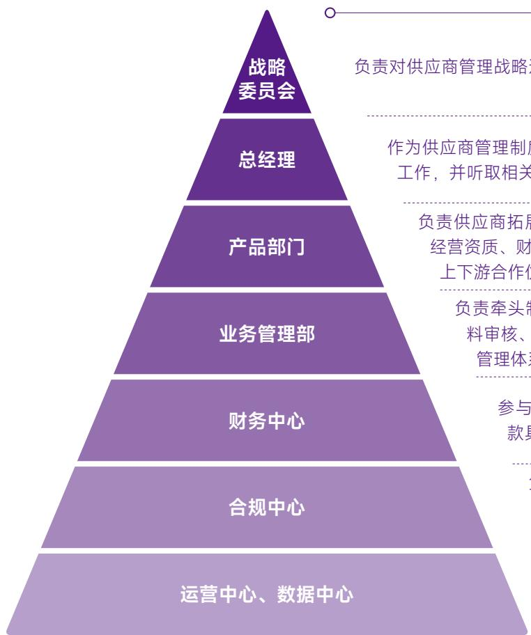

flowchart

```mermaid
graph LR
  A["战略委员会"] --> B["总经理"]
  B --> C["产品部门"]
  C --> D["业务管理部"]
  D --> E["财务中心"]
  E --> F["合规中心"]
  F --> G["运营中心、数据中心"]
```

负责对供应商管理战略进行研究并提出建议。

作为供应商管理制度建设第一责任人，负责督促公司各部门的相关工作，并听取相关制度建设及落实情况汇报。

负责供应商拓展、关系维护、资料收集，将供应商经营范围、经营资质、财务及信用状况真实反馈给公司，并对业务背景及上下游合作伙伴进行调查，负责对供应商进行准入访谈。

负责牵头制定及维护供应商管理制度，负责供应商准入资料审核、交易规则制定、分类和评价，建立完整的供应商管理体系。

参与供应商协议及资料的审核，确保财务相关的条款具备合理性。

负责制定对供应商的各类合同模板,并定期更新、修订及废弃；负责对与供应商有关合同进行法律审查，对相关风险提出法律意见。

为供应商管理提供支持。

# 战略

在全球产业链加速重构、地缘政治波动加剧以及电子信息产业技术日新月异的大背景下，电子元器件分销行业正处于机遇与挑战并存的关键转型期，既面临供应链中断、技术迭代加速、合规风险攀升等多重挑战，也迎来国产化替代、新兴应用市场崛起、数字化赋能等全新机遇。在此过程中，供应商资源不仅是中电港核心竞争力的直接体现，更是保障产业链安全、驱动创新发展的战略性资产。

中电港持续夯实管理基础，系统完善以《供应商管理制度》《采购管理制度》等为核心的供应链制度体系和管理流程，通过技术共研、市场共拓、信息共享与责任共担，与合作伙伴共同构建形成高效响应的供应网络，促进供应链的抗风险能力持续提升，共同塑造健康、可持续的产业生态。

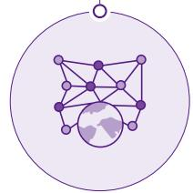

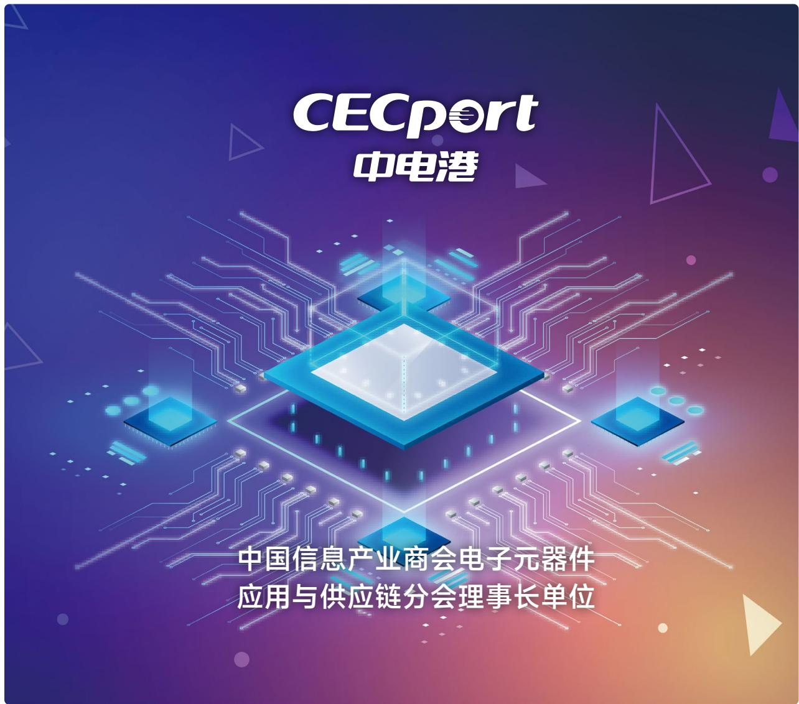

text_image

CECport
中电港
中国信息产业商会电子元器件
应用与供应链分会理事长单位

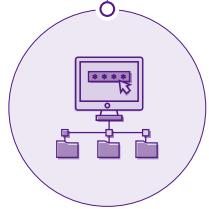

# 管理措施

中电港将可持续发展理念深度融入供应链管理，着力确保供应链安全与稳定，加强供应商准入管理、分类管理及评价管理，常态化开展供应商沟通与交流活动，加速新产品、新技术的市场化推广和产业化应用，提升电子元器件产品供应连续、质量可靠，不断增强供应链的长期发展韧性。

# 供应商风险管理

中电港建立覆盖供应商全生命周期的风险管理体系，加强供应商准入审核及基础调查，通过跨部门协同对供应商的经营、履约、质量、服务以及可持续发展等维度开展年度综合评价，基于评估结果实施分级管理，以体系化手段筑牢供应链安全底线。

# 供应商准入管理

公司建立了系统化、规范化、协同化的供应商准入与调查机制。公司产品部门牵头组织通过座谈沟通、数据资料分析、现场调查以及企查查、国家企业信用信息公示系统等第三方风险排查系统，对供应商开展准入调查及评价工作，在掌握供应商基础资质能力的同时，了解供应商在质量管理、商业道德、劳工权益、安全生产、环境保护等 ESG 方面的表现，审核通过后方可纳入合格供应商名单。

# 供应商分类管理

公司针对供应商采取差异化的管理策略，提升采购决策效率。在将供应商依据业务类型分为分销类、封测加工类、自研产品类、技术服务类的同时，建立供应商“黑、白、灰”名单机制，对供应商进一步分类，鼓励与“白名单”供应商合作、严控与“灰名单”供应商合作、严禁与“黑名单”供应商合作。

# 供应商 评价管理

公司建立年度供应商综合评价机制，由业务管理部统筹，联合产品部门、运营中心及财务中心，围绕质量、价格、交期、服务及对账时效以及可持续发展现状等核心维度对供应商进行系统评估，依据评价结果将供应商划分为“优秀、优良、合格、不合格”四个等级，并对应实施差异化的合作策略，优先与优秀供应商深化合作，与优良供应商保持稳定关系，协同合格供应商进行改善，对不合格供应商采取限期整改或停止交易的措施，实现对供应商的动态、闭环管理。

# 供应商 沟通交流

公司注重与供应商建立透明、稳定的合作关系，通过协议、邮件及会议等方式保持日常沟通，持续推动技术交流、质量提升、交付保障与合规管理以及公司和下游客户对劳工人权、环境保护、廉洁反腐等方面的管理要求。我们不定期组织技术沙龙与专题座谈，分享市场动态与趋势，促进供应链协同发展。作为中国信息产业商会电子元器件应用与供应链分会理事长单位，公司积极依托协会平台，促进产业链上下游的互动与共享，共同构建可持续发展的产业生态。

# 供应商 ESG 管理

中电港高度重视供应链的可持续发展，持续推动将ESG因素融入供应商全生命周期管理全过程。

# 在准入审核环节

# 在合同签订环节

# 在采购履约环节

我们通过实地或者书面调研的方式，开展供应商审核。同时，结合业务需要针对封测加工类合作伙伴开展现场审核调查工作，深入评估其在质量管理、环境保护、劳工权益、职业健康安全及商业道德等方面的综合表现，并将调查结果作为供应商准入的前提条件。

我们要求供应商签署反商业贿赂、廉洁协议等文件，并在授权分销协议中嵌入环保承诺、质量保证，明确供应商在环境合规与商业诚信方面的责任，以识别和管控相关供应链ESG风险。

我们积极响应下游客户对供应商ESG表现的问询，并将相关要求及时传导至上游原厂，推动其提升信息披露与管理水平。对于合作过程中出现严重违规且未能有效整改的供应商，公司保留终止合作的权利。

# - 关键物质管理

基于中电港的核心业务特点，我们并不直接采购原材料，也不直接生产产品，但作为链接产业链上下游的枢纽企业，我们高度重视供应链产品中的冲突矿产以及有害物质使用情况，将“源头合规”作为供应链尽责管理的重要原则，一方面在原厂供应商选择过程中，我们优先与国内外知名原厂进行合作，依托其完善的合规流程实现风险隔离；另一方面，及时向上游原厂供应商传递客户合规要求，协同下游客户共同加强对上游供应商的管理。

# 冲突 矿产

倡导上下游企业共同遵循《联合国工商企业与人权指导原则》（UNGPs）、OECD《关于来自受冲突影响和高风险区域的矿产的负责任供应链尽职调查指南》以及《负责任矿产倡议》（RMI）等各项国际公认标准、倡议，在优先与国内外知名品牌合作实现风险规避的同时，积极响应下游客户的高标准合规诉求，根据客户对冲突矿产管理政策和尽职调查要求，推动原厂供应商反馈提供冲突矿产报告模板（CMRT）、扩展矿物报告模板（EMRT）等相关证明文件，并将相关要求及客户培训信息及时反馈共享到上游原厂。

# 有害物质

坚持从源头减少有害物质的使用，降低环境安全风险，根据《电器电子产品有害物质限制使用管理办法》《电子电气产品中限用物质的限量要求》以及欧盟《关于限制在电子电器设备中使用某些有害成分的指令》（RoHS 指令）等标准、政策规定，要求供应商加强原材料采购和生产过程管控，开展第三方限制有害物质检测与认证，并将认证结果作为分销类、加工类供应商准入的前提条件，推动电子行业向更环保的生产方式转型，促进绿色技术的应用。

# 供应商赋能与合作

我们与原厂供应商建立常态化、多元化的沟通交流机制，积极与原厂供应商分享市场信息和客户反馈，共同优化产品性能和服务体验，与原厂供应商之间建立了深厚的信任和友谊，为长期合作奠定了坚实基础。

# 供应商沟通

在日常采购管理工作中，围绕产品交付、质量要求、价格、付款等通过邮件、会议或即时通讯工具等形式与供应商进行定期沟通，共同保障供应链的稳定性。聚焦产业发展、客户需求、技术更新，利用不定期研讨会、展览会、技术沙龙、代理商大会等多种渠道与供应商保持密切协作，结合下游客户对于产品质量、合规管理、商业道德等诉求要求，及时反馈给原厂供应商，协同推动产品创新和可持续管理提升。

# 供应商管理培训

常态化组织公司相关人员进行《供应商管理制度》《采购管理制度》《采购服务规范》以及供应商关系管理（SRM）系统相关制度培训以及SRM供应商管理平台培训，加强员工在合规贸易、廉洁诚信、税务合规、供应商服务等方面的供应链管理技能，提升供应链韧性和安全水平。

natural_image

Simple line drawing of a circular object with concentric circles and dots, no text or symbols present.

目标指标

<table><tr><td>指标名称</td><td>指标单位</td><td>2025年</td></tr><tr><td>供应商总数</td><td>家</td><td>487</td></tr><tr><td>供应商本地化比例</td><td>%</td><td>28%</td></tr><tr><td>本地化采购金额比例</td><td>%</td><td>2%</td></tr></table>

# 研发创新驱动

随着外部环境不确定性的持续增加以及科技竞争的日益激烈，构建起更加安全、可控的供应链体系，离不开产业链上下游的协同创新。我们坚持创新驱动发展战略，高效链接供需两端，持续通过应用创新，将更多元器件和集成电路新产品、新技术应用推广到各行各业，推动形成更具活力、更可持续的产业生态。

# 治理

为驱动长期可持续增长、培育新质生产力，我们建立了权责清晰、运行有效的研发管理体系，从战略制定、管理监督、执行反馈三大层面，将技术创新应用深度融入发展战略和业务运营，实现市场洞察、战略规划、研发执行到商业成果验证的完整研发管理闭环，使技术创新动态响应市场变化，有力支撑公司发展目标。

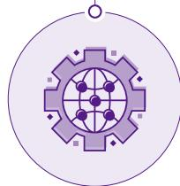

# 战略决策层

董事会战略委员会负责对研发战略进行研究并提出决策建议。

# 管理监督层

公司管理层负责公司级研发计划的制定与审批，并对研发执行过程进行整体监督与资源协调。

# 执行反馈层

各业务板块研发部门作为主责部门，负责具体研发规范的建立、项目计划的执行与全过程管理。各业务需求部门提出研发需求与市场预测，并支持研发成果市场推广应用，跟踪反馈市场表现。

# 战略

中电港始终坚持以电子元器件应用创新为驱动，聚焦网信系统、人工智能、智慧视觉、智慧音频、汽车电子、工业控制等“精专业”应用领域，依托长期以来产业上下游资源积累及技术沉淀，通过自主研发及联合攻关，为上下游生态伙伴发展提供专业的技术支持和创新解决方案，实现公司业务增长、上游原厂市场推广、下游客户产品创新的全产业链协同共赢。

我们制定《研发管理制度》，全面涵盖研发计划、项目立项、项目实施与项目成果等关键环节管理，促进公司研发管理的规范化、科学化，系统规范研发全流程，保障各项研发工作有章可循、有序推进，从而有效提升研发效率与成果质量，增强公司的核心竞争力。

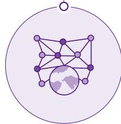

# 管理措施

我们坚持以创新引领发展，加强研发规范化管理和创新人才队伍培育激励，依托“大平台系统赋能+精专业创新驱动”的“新分销”模式，持续拓展自研方案应用领域，推动核心技术快速产品化与商业化落地。2025年，我们成功举办机器人、储能研讨会等行业活动，并积极参与行业盛会，与产业伙伴共建创新发展生态。

# - 加强过程管控

我们遵循集成产品开发（Integrated Product Development）管理流程，结合市场预判、重点客户定向需求、细分市场生态拓展等制定年度研发计划，加强研发计划审核及审批，有序组织项目实施，并在不同关键节点对研发计划的实际完成情况开展跟踪分析，以确保研发计划的有效执行以及研发目标的实现。2025年，公司重点加强在汽车电子、新能源、人工智能和物联网等领域产品方案的研发创新，研发项目立项10项，完成8项。

# - 深化协同创新

基于长期积累的产业链上下游产业资源，中电港持续加强与上游原厂及下游客户的协同创新工作，一方面我们将下游电子产品制造商技术需求信息传导至上游原厂，推动技术更新；另一方面，我们积极实践电子元器件产品在下游应用领域的创新，与原厂、客户共同攻克产品应用技术难题，为客户提供综合技术服务解决方案。2025年，荣获中国电子工业标准化技术协会信息技术应用创新工作委员会技术活动单位证书。开源硬件飞腾派PRO方案荣获“飞腾创新技术突破奖”，以在高端控制、嵌入式AI、安全可信等领域的硬核创新与实践成果，驱动关键技术突破。

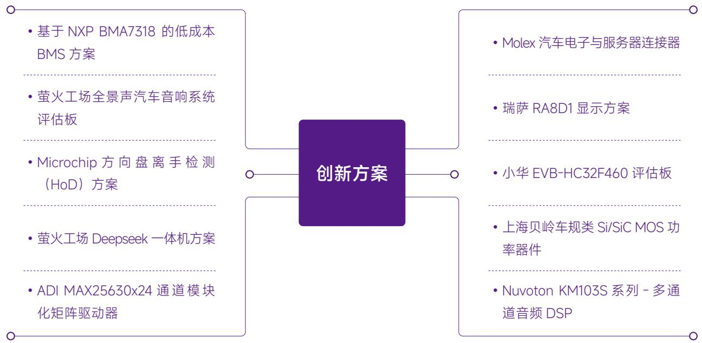

flowchart

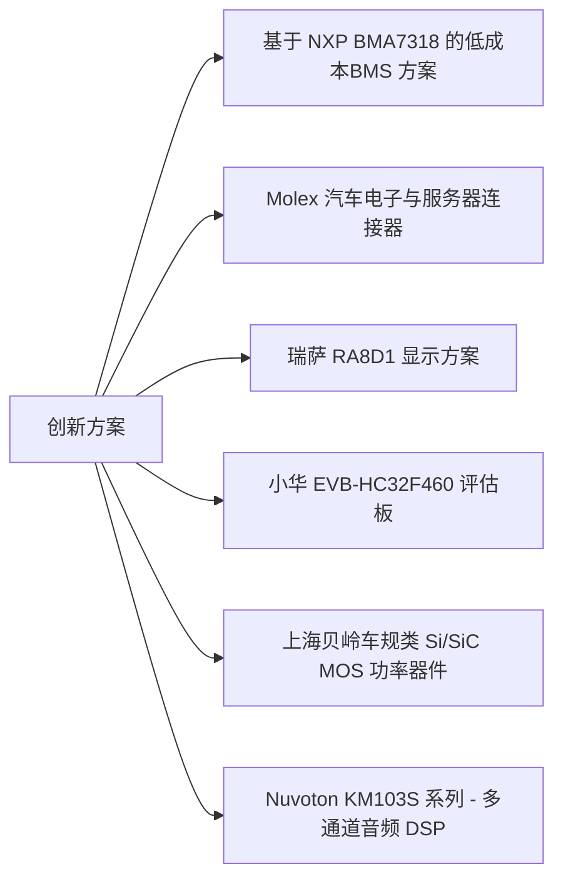
```mermaid
graph LR
  A["创新方案"] --> B["基于 NXP BMA7318 的低成本BMS 方案"]
  A --> C["Molex 汽车电子与服务器连接器"]
  A --> D["瑞萨 RA8D1 显示方案"]
  A --> E["小华 EVB-HC32F460 评估板"]
  A --> F["上海贝岭车规类 Si/SiC MOS 功率器件"]
  A --> G["Nuvoton KM103S 系列 - 多通道音频 DSP"]
```

# - 加强研发投入

中电港具有一批经验丰富的FAE、AE，应用研发能力突出，能够以专业化、及时化、优质化的服务能力推动上下游创新。同时，我们打造以萤火工场为核心的设计链服务体系，以技术服务和应用创新为核心，持续增强自身硬件设计支持与技术方案开发能力。

# 产品选型

功能、性能、参数、替代

# 技术支持

AE、FAE、技术培训

# 萤火实验室

音频、电源、嵌入式

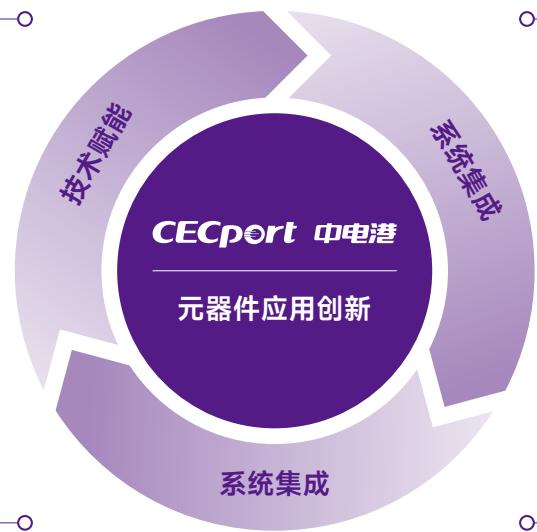

flowchart

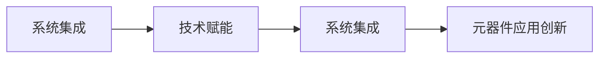
```mermaid
graph LR
  A["系统集成"] --> B["技术赋能"]
  B --> C["系统集成"]
  C --> D["元器件应用创新"]
```

公板方案  
模块化产品  
萤火工场创新服务

# 方案设计

定制、整合、适配

# 系统调试

互联互通、用户体验

# 工程服务

打样、贴片、烧录

# - 推动绿色研发

中电港持续通过技术方案和产品创新助力绿色低碳发展，飞腾派开源硬件平台，基于国产芯片算力模组，结合 AI 算法优化技术，实现动态功耗管理，在应用端数字 FAE 系统中，提升单位能耗的计算产出，减少能源浪费。

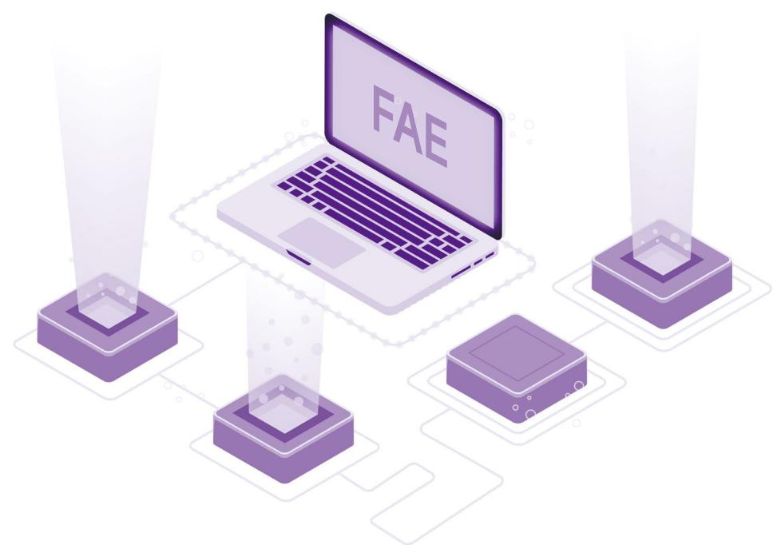

natural_image

Isometric illustration of a laptop with FAE branding connected to multiple microcontrollers (no text or symbols on the device itself)

# - 加强创新激励

为加强科研团队建设，调动高层次科技人才的积极性、主动性和创造性，公司制定《关于中电港高层次科技人才引进及薪酬激励管理方案》，充分发挥薪酬制度吸引和激励人才的作用。公司加强研发创新激励，完善研发团队绩效奖金计算规则，引导项目研发与市场推广的有效融合，确保研发质效。

# - 知识产权管理

为有效保护公司知识产权，激发广大员工智力创造积极性，维护公司和员工的合法权益，提升公司知识产权保护管理能力，公司制定《知识产权保护管理办法》，合规中心作为公司知识产权工作的日常管理部门，联动企划部、业务部门、数建平台等相关部门，共同推动公司知识产权保护工作。同时，作为公司合规管理工作重点之一，由公司董事会、经理层、合规委员会以及首席合规官进行监督和指导，在保护自主知识产权的同时，避免侵犯他人知识产权。

natural_image

Simple line drawing of a target with concentric circles and dots, no text or symbols present

# 目标指标

我们根据市场、产线策略及客户需求，加强研发投入力度和研发人才培养，有序推进产品方案研发，以方案创新为客户提供更加优质的服务体验，增强自身市场竞争力。

<table><tr><td>指标名称</td><td>指标单位</td><td>2025年</td></tr><tr><td>研发创新投入</td><td>万元</td><td>9229.50</td></tr><tr><td>知识产权培训总次数</td><td>次</td><td>1</td></tr><tr><td>人均培训时长</td><td>小时</td><td>0.4</td></tr><tr><td>知识产权培训覆盖人员</td><td>人</td><td>74</td></tr><tr><td>公司知识产权总数</td><td>件</td><td>356</td></tr><tr><td>软件著作权总数</td><td>件</td><td>93</td></tr><tr><td>专利总数</td><td>件</td><td>19</td></tr><tr><td>研发人员数量</td><td>人</td><td>242</td></tr></table>

# 客户服务优化

客户服务是驱动业务增长的核心引擎。中电港构建覆盖质量管控、渠道建设、知识共享的全方位服务生态，致力于将硬核供应链能力转化为柔性的客户体验，成为客户创新发展道路上值得信赖的同行者。

# 强化质量管理

中电港将质量管理意识深植于每个运营环节，从源头授权合作到智能仓储管理，再到专业技术团队赋能，全力守护产业链的稳定与可靠。

# ● 治理

我们形成由公司总经理总负责、人力、行政、合规、规划、运营、业务管理、党建文化等多部门共同协同的质量管理治理架构，并进一步拓展延伸至亿安仓、奕安云等下属子公司，制定以《质量手册》为核心，《供应商管理制度》《采购管理制度》《储运管理办法》《销售管理制度》《客户管理制度》等为支撑的质量管理制度体系，实现从源头筛选、过程管控到终端服务全流程、高标准、精细化的质量管理。报告期内，公司未发生产品或服务相关的安全与质量重大责任事故，持续保持 ISO 9001 质量管理体系年度监督审核认证资格。

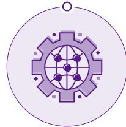

# 战略

质量是客户信任的基石，也是行业竞争力的核心。作为电子信息产业供应链的重要一环，我们始终将质量管理视为企业发展的生命线，按照“全链路、全周期、全员参与”的质量管理理念，通过严格的授权管理、精细化的仓储物流控制及专业的技术增值服务，构建安全、可控、高效的供应链质量生态。

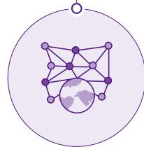

flowchart

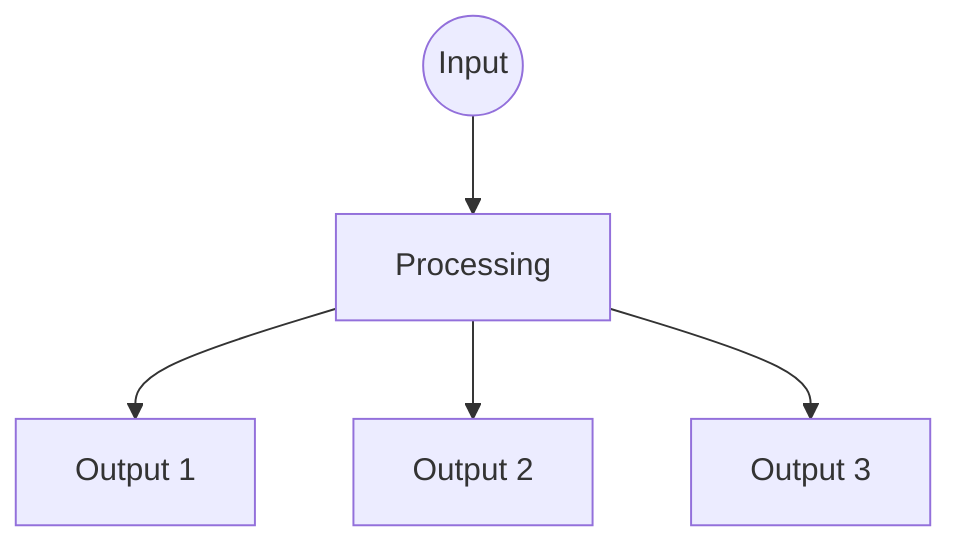
```mermaid
graph TD
  Input(("Input")) --> Process["Processing"]
  Process --> Output1["Output 1"]
  Process --> Output2["Output 2"]
  Process --> Output3["Output 3"]
```

# 管理措施

源头管理：我们建立完善的供应商管理制度和管控流程，形成以授权分销为核心、非授权分销为辅助业务模式，与国内外知名电子元器件设计制造商进行深度合作，将质量要求纳入分销协议当中，从源头确保产品正品保障、质量可靠。

过程控制：我们加强仓储过程管理，设有10万+平方米的大型现代化仓储空间，具备智能仓储、敏捷通关、高效配送等一体化供应链服务能力，确保仓储环境适宜、安全可靠，为产品质量增添保障。

技术赋能：我们基于强有力的技术服务和应用创新能力，通过“FAE+AE”的模式搭建起上游原厂与下游客户的技术沟通桥梁，对电子元器件在产品中的具体应用进行研究、开发、测试，提供创新性的电子元器件产品应用方案，通过严格的质量控制标准和精细化的管理流程对样品进行全面、细致的检测，及时发现并解决样品中存在的问题，确保产品在客户研发和批量生产时能够保持高品质和高性能。

# 增强产品可及性

电子元器件是电子信息产业创新的基础设备，我们发挥自身平台优势，通过多元化、普惠性的创新服务模式，系统性降低创新门槛，提升核心技术与产品的可及性，为产业生态的繁荣与可持续发展提供关键支持。

# 多元购买渠道

在线下销售的基础上，我们打造并高质量运营 iCEasy 线上商城，以自营电商平台为核心，在天猫、亚马逊、速卖通等第三方电商平台开立店铺，为不同类型客户群体提供了便捷、可靠的正品元器件采购途径，满足客户差异化、个性化需求。

# 降低研发门槛

针对行业工程师、学生及爱好者的开发与学习需求，我们倾力打造“飞腾派”等开源硬件平台，并匹配国产主流操作系统以及国际开源系统，构建灵活高效的开发与学习环境，以模块化、易上手、全开源、低成本的产品特点，进一步降低开发门槛。

# 促进知识共享

我们通过 “芯查查” 在提供产业数据服务的同时，嵌入论坛社区模块，打造电子人的垂直互动交流社区，方便各类用户与行业专家、原厂技术人员进行无障碍的技术探讨，并通过论坛问答、微课视频、活动组织、积分兑换等方式，促进技术问题的解决与知识经验的分享。

# 客户服务

中电港始终秉持“为客户服务”的经营理念，为客户提供覆盖电子元器件分销、设计链服务、供应链协同配套的综合服务体系，以及时、高效、优质的服务赢得客户信任与满意，推动业务持续成长。2025年，我们开展客户满意度调查，客户满意度93.4%。

# 客户管理

制定《客户管理制度》《销售管理制度》《销售服务规范》《市场宣传工作管理办法》，由业务管理部牵头，销售部门作为直接责任部门，合规中心、运营中心、财务中心等相关部门参与，共同为客户提供高品质的服务体验。

# 客户 沟通

建立体系化的客户沟通机制，通过走访、邮件、微信、电话等方式与客户保持紧密联系和常态化沟通，主动、深入地收集客户反馈与需求，为客户提供专业多元服务，同时开展客户满意度调查，并有针对性地提升服务质量，持续提高客户认可度。

# 问题处理

我们建立协同化的客户投诉处理流程和退换货管理流程，销售部门应及时跟进处理有关客户售后服务方面的需求，确保客户投诉得到及时、有效地处理，并从中学习和改进，提升产品和服务质量。如涉及产品质量问题，协助客户与供应商确定质量解决方案，依据《销售管理制度》《客户退换货流程》《供应商退换货审批流程》立即启动产品召回或安全预警程序。

natural_image

Illustration of a person using a tablet at a computer with floating chat bubbles and gear icons (no text or symbols)

# 与环境共生 绘绿色蓝图

中电港坚持把环境保护作为实现可持续发展的重要环节，结合自身业务特点，积极应对气候变化，加强在办公运营和仓储管理过程中的环境管理，以切实行动减少能源消耗和废弃物排放，共筑水清、地绿、天蓝的美好家园。

# 回应议题

- 环境合规管理  
- 应对气候变化  
- 废弃物管理  
- 能源利用  
- 循环经济  
- 水资源利用  
- 污染物排放  
- 生态系统与生物多样性保护

natural_image

Green circular icon with two hands holding a sprouting plant, symbolizing eco-friendly or sustainable practices (no text or symbols)

贡献联合国可持续发展目标

11 可持续城市和社区

12 负责任消费和生产

13 气候行动

# 环境管理

中电港深入践行生态文明理念，严格遵守《中华人民共和国环境保护法》《中华人民共和国环境影响评价法》等环境保护相关法律法规，结合自身业务运营实际，重点关注并严格管控办公运营以及仓储管理过程中的环境影响，通过健全管理制度、提升全员环保意识、深化绿色运营机制，推动绿色办公与绿色仓储落地见效，切实履行企业环境保护责任。

# 环境管理体系

我们基于 ESG 治理架构，参考 ISO14001 环境管理体系标准，着力构建完善的环境管理体系，公司董事会监督指导包括环境保护在内的可持续发展管理目标的制定和实施，由分管综合服务的副总经理负责环境保护的统筹管理，由行政中心具体负责公司环境保护管理工作。我们结合企业管理实际，制定《员工手册》《物品管理细则》《行政服务指引》等制度文件，将能源管理、废弃物与废水管理、应对气候变化等管理要求融入日常管理当中，并结合《中华人民共和国突发事件应对法》等法律法规以及公司实际情况，针对办公、仓储等重点区域制定《防灾减灾管理制度》以及相关应急预案，及时下发风险应急提醒通知，以有效应对包括极端气象事件在内的各类自然环境灾害。2025 年，未发生重大环境污染事故及环境领域违法违规事件。

# 落实清洁生产

我们致力于降低运营过程中的环境影响，以节约资源、降低能耗、减污降碳、提质增效为目标，推动清洁生产。在供应链协同配套服务中，我们始终坚持以绿色仓储助力可持续发展。

# 绿色 仓储建筑

在南京亿安仓项目建设过程中，在规划选址阶段，综合考量场地资源与周边生态环境，减少环境影响；在设计阶段依据 GB/T50378-2019《绿色建筑评价标准》优化项目设计，节能水平 72%，建立雨水回收利用装置，顺利通过政府部门审核；在建设阶段，加强项目监督管理，确保施工期间环境保护措施落实到位，采用节能建筑材料和技术，优化仓储建筑的隔热、保温性能；在装饰装修及设备安装阶段，优先选择节能环保型材料及设备，降低后期运行过程中的能源消耗。

# 绿色 仓储管理

以自动化、智能化、数字化管理系统为牵引，采用自动化立体仓库、智能货架等设备，合理规划仓储空间，优化货物存储密度，缩短搬运转运次数和路径，实现货物的高效存储和快速存取，节能感应照明设备，提高资源利用效率。2025年，整体空间利用率提升2%。针对锂电池、含电解质的废旧电容等具有安全及环境风险的仓储品类，制定《重大危险源管理制度》，每年开展一次全面辨识，每季度进行一次全面检查，并针对性制定专项现场处置方案。

# 绿色物流运输

持续优化 “中心仓 - 枢纽仓 - 园区仓” 的三级仓布局，建立仓 - 配 - 关 - 运无缝衔接的服务体系，减少货物运输距离和时效；建立预约送货系统，减少送货车辆等待期间排放；仓储部门自用车辆均采用新能源车辆，推进物流商绿色低碳运输，优先使用新能源车进行派送。

# 持续跟踪改进

建立精益改善小组，全面推行 8S 管理，每日由专人进行检查、监督，对仓库内能耗、物流、空间、废弃物利用等使用情况进行持续性监测评估，提高效率，减少浪费。

# 推行绿色办公

我们积极倡导并践行绿色办公方式，从办公地址选择、办公方式优化、办公运营管理等方面入手，持续细化管理细节，推动全体员工养成绿色节约意识，减少办公过程中的环境影响。2025年，公司塘朗城及前海经贸中心办公区域用电费用同比降低6.46%。

# 办公地址选择

制定《办公区租赁管理细则》优先选择租赁公共交通便利、绿色物业服务管理完善、市政配套设施完善的公共楼宇，合理确定办公面积，为员工绿色出行，减少办公过程环境影响奠定基础。

# 办公方式优化

制定《行政服务指引》，大力推行线上化办公，线上传阅文件，使用电子印章。优化会议组织流程，明确空调使用要求和温度设置，加强打印用纸管理，提倡员工自带水杯、节约用水。

# 办公运营管理

加强环境保护监测，行政中心每周不定期监督巡视空调、灯具、水具使用情况，全面采用节能电灯、节水用具，并及时提醒关闭电源设备，及时维修受损设备，避免资源浪费。制定下发《大扫除执行要求》，每月组织办公区域大扫除，维护良好办公环境。

# 加强培训宣导

我们常态化开展环境保护宣传教育活动，大力倡导员工通过公共交通、骑行等方式出行，将绿色办公理念融入行政培训过程当中，推动绿色发展理念融入员工的日常行为当中。2025年，绿色办公员工培训宣贯覆盖率100%，亿安仓向全员宣导ESG及推行8S管理，落实资源节约要求。

# 应对气候变化

中电港深刻意识到气候变化的紧迫性和重要性,深入分析气候变化为自身发展带来的风险,积极响应国家“3060”“双碳”目标，致力于采取切实措施，在增强自身气候适应力的同时，为应对气候变化作出积极贡献。

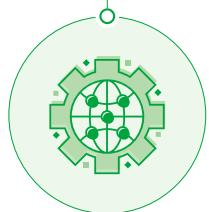

# 治理

为应对气候变化对公司业务带来的潜在影响，公司通过建设 ESG 管理体系，明确职责分工，董事会办公室统筹开展 ESG 管理相关工作，对气候变化议题进行监督和管理，并将其纳入重点议题，各部门结合自身业务职责，制定相关工作计划，防范气候变化风险。同时，公司将应对气候变化的理念与措施贯穿于业务发展和经营实践始终，力求在实现经济效益的同时，最大限度地降低对环境的不良影响。

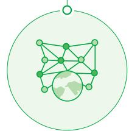

# 战略

作为当今全球面临的共同挑战，气候变化对电子信息产业供应链的安全与稳定具有重要影响。伴随着气候变化的持续加剧，极端恶劣天气事件频发，极易对电子元器件产品的有序生产、价格稳定、仓储管理和运输交付带来不利影响。但同时，伴随着经济社会绿色发展转型，国家“双碳”目标的持续推进，绿色消费加速兴起，电子信息产业绿色技术也加速更迭。我们将应对气候变化作为我们ESG管理的重点工作，主动识别和评估气候相关风险，系统性提升供应链的气候韧性，在保障供应链安全稳定的同时，助力产业链可持续发展。

<table><tr><td colspan="2">类型</td><td>描述</td><td>发生可能性</td><td>影响周期</td><td>潜在财务影响</td><td>应对策略</td></tr><tr><td rowspan="3">物理风险</td><td rowspan="2">急性风险</td><td>极端天气事件可能导致运输中断,货物无法按时运送到目的地,进而影响公司的供应链稳定性</td><td>低</td><td>短期</td><td rowspan="2">·运营成本增加:为应对气候变化而投入的资源,如改进储存环境等,将直接增加公司的成本;极端天气事件可能导致供应链中断或不稳定,进一步推高运营成本</td><td rowspan="2">·定期进行气候风险识别和评估,制定相应的应对措施制定极端气候变化应急预案,定期组织自然灾害应急演练及防护措施审查</td></tr><tr><td>极端天气可能导致电力、排水、供水等支持体系的中断,从而影响公司的正常运营</td><td>低</td><td>短期-中期</td></tr><tr><td>慢性风险</td><td>干旱和海平面上升等慢性灾害,可能对电子元器件的储存环境造成长期不利影响,湿度和温度的变化可能影响元器件的性能</td><td>中</td><td>短期-中期</td><td>·营业收入下降;业务中断、无法按时供货等因素可能导致公司订单流失,从而导致收入下降</td><td>·引入气候控制系统,如温湿度控制系统,以确保电子元器件的储存环境稳定</td></tr></table>

<table><tr><td colspan="2">类型</td><td>描述</td><td>发生可能性</td><td>影响周期</td><td>潜在财务影响</td><td>应对策略</td></tr><tr><td rowspan="2">转型风险</td><td>名誉风险</td><td>随着气候变化问题日益突出,公众对环境的保护意识逐渐增强,若公司未能主动采取应对气候变化行动,将会影响公司形象和声誉</td><td>低</td><td>短期-中期</td><td>·营业收入下降:若公司未能满足利益相关者期望,可能会面临客户流失、资本撤退、市场优势削弱等情况,导致营业收入减少</td><td>·密切关注政府政策的变化,及时调整公司的经营策略以适应新的政策环境·积极参与政府组织的环保活动,以树立良好的企业形象</td></tr><tr><td>市场风险</td><td>随着市场对气候友好型产品和服务的需求增加,若公司不能满足市场需求,可能会面临市场份额减少的风险</td><td>中</td><td>短期-中期</td><td>·营业收入下降:如果公司未能及时转型,可能失去市场份额,影响长期收入</td><td>·密切关注市场动态,提前布局绿色低碳业务,以满足市场需求</td></tr><tr><td>机遇</td><td>产品与服务</td><td>随着消费者对碳排放的关注持续上升,公司积极推出绿色供应链相关业务,以占有更多市场份额</td><td>中</td><td>长期</td><td>·营业收入增加;公司的绿色业务契合消费者的需求,有效增加产品和服务销量,推动营业收入的增加</td><td>·紧密跟踪绿色技术转型发展,提升绿色解决方案提供能力·加强绿色仓储建设,提升仓储安全性和可靠性</td></tr></table>

# 管理措施

中电港重视气候变化风险管理，建立完善的气候风险管理流程，将气候风险识别、评估与管理流程纳入公司风险管理体系，定期对气候相关风险和机遇进行识别与评估，构建评估矩阵。

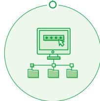

# 中电港气候风险管理流程

<table><tr><td>气候风险识别</td><td>气候风险评估</td><td>气候风险管理</td></tr></table>

综合考量国家相关法律法规、行业市场发展趋势和自身业务特点等多种因素，识别公司在不同阶段所面临的风险和机遇。

ESG 工作小组开展气候风险评估，梳理业务开展过程中可能发生的风险事项，深入分析各类气候风险的发生概率、影响程度等因素。

结合公司业务特点制定合理的管理方法和应对方案，提前对评估出的气候风险采取预防措施。

# 指标目标

中电港积极贯彻国家节能减排政策，除在办公运营中采用节能环保型设施设备，降低能源消耗外，大力发展绿色园区。虎门仓新建光伏发电面积约8000平方米，每月光伏用电量约7万多度，同时可以减少二氧化碳排放21572吨。南京仓建设过程中，项目实施绿色建设设计并通过审批。未来，我们将持续关注国家政策导向与行业最佳实践，结合自身业务发展动态，逐步建立和完善碳排放量、能源利用效率和可再生能源使用比例等关键绩效指标，进一步将其纳入年度报告和绩效考核体系，并通过定期评估，动态调整指标与目标，以确保其始终契合公司发展需求与气候变化应对要求，实现应对气候变化的长远战略目标。

# 水资源管理

作为电子元器件分销商，中电港的运营活动并不涉及生产制造环节，对于水资源的消耗主要来自办公区域及仓储区域的生活用水，所有用水均来自城市公共供水。我们积极响应《节约用水条例》，将节约用水理念融入《行政服务指引》等行政管理制度当中，通过理念宣传、设备更新维护等措施，最大限度减少水资源消耗及废水的产生。2025年，前海经贸中心办公区水费同比下降3%。

# 节约用水

# 污废水管理

在办公用水方面，我们全部使用感应式水龙头、节水型马桶等智能节水器具，常态化开展巡检与维护，确保设施高效运行。在用水点位醒目位置张贴节水提示标识，强化员工节水意识，引导自觉践行节约用水，降低日常用水量，减少废水产生。

办公区域产生的生活污水均经办公楼宇污水管道进入市政管网进行统一性废水处理，由楼宇物业进行污水管道的日常维护管理，以保障生活污水 $100\%$ 合规处理。我们及时缴纳水费等物业费用，并定期统计分析相关支出情况，加强内部宣传倡导，确保对水资源的合理利用，减少污废水对环境造成的影响。

# 废弃物管理

我们按照减量化、资源化、无害化的原则加强废弃物管理。在业务运营中公司产生的废弃物主要为日常办公中的生活垃圾以及部分外箱、纸板、填充材料等仓储包装垃圾。对于运营中产生的废弃物，我们实施闭环管理，构建源头减量、过程管控、末端利用和全链条无害化管理的废物综合治理体系，为环境保护贡献力量。

# 源头减少

我们制定《物品管理细则》《行政服务指引》等制度规定，坚持按照“合理节约”的原则实施采购及物品申领分配，通过合理排版、双面打印、物品公用等措施，严控打印过程纸张及用品消耗，大力倡导复旧利用。在产品仓储流转过程中，推进使用电子单据，减少纸张用量，从源头减少废弃物产生。2025年，消耗A4纸同比减少8.36%。对于办公中可能涉及有害废弃物的电池、电子设备，我们优先采购无汞电池，提高电子设备使用寿命，在根源上降低有害废弃物的产生。

# 关键绩效

2025 年

消耗 A4 纸同比减少

8.36%

# 循环利用

针对打印过程中产生的废纸，我们设置废纸箱并要求非正式文件及无需对外资料等必须使用废纸打印；对于电脑、投影仪以及可回收维修的仓储托盘等设施设备，我们发挥自身专业技术优势，以利旧维修为原则，实现器材的重复利用，提高使用寿命，2025年利旧电脑175台，用于新员工入职发放及老旧电脑替换。针对原厂到货过程中的护角及纸箱等废弃物，进行循环利用用于货物运输，通过对托盘的回收，维修及再利用，2025年累计回收可再使用托盘600个，同时对回收原厂到货的护角及纸箱进行回收再利用，平均每月打板发货约670板，护角使用量约4000根，全年可节省约60000元。通过对各类废弃物的回收再利用，在降低运营成本的同时，减少对环境造成的影响。

利旧电脑

175台

累计回收可再使用托盘

600↑

废弃物实现

100%

合规化、无害化处置

# 无害处置

我们积极宣传培训垃圾分类，在办公区域等关键场所，公司设置垃圾分类标识，采用图文标识引导员工正确分类垃圾，从源头上提高垃圾处理的效率和准确性。对于办公区域无害废弃物及办公生活垃圾均交由物业进行规范化处理。对硒鼓墨盒、电子废弃物等有害废弃物交由合格回收商进行绿色化处置，确保各类废弃物实现100%合规化、无害化处置。

# 与社会共荣 促和谐发展

中电港秉持“以人为本”的理念，致力于与员工成长的同频共振、双向奔赴。在稳健迈向高质量发展的道路上，中电港始终将社会责任视作心间的一份温暖坚守，从深耕消费助农沃土，到灌注志愿服务活水，再到播撒希望火种，始终步履不停，用行动书写着一场场“双向奔赴”。

# 回应议题

- 人才发展  
- 保护员工合法权益  
- 乡村振兴  
- 社会贡献

贡献联合国可持续发展目标  
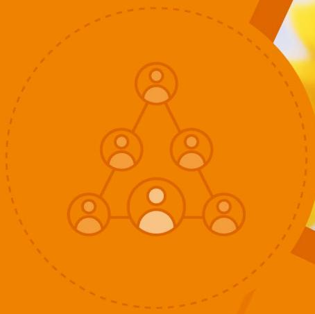

natural_image

Abstract diagram of a triangular network of people in an orange circle, no text or symbols present.

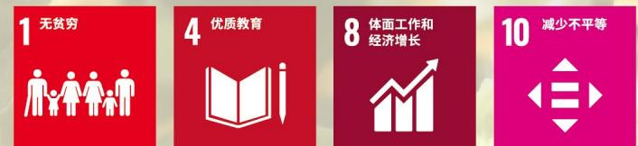

text_image

1 无贫穷
4 优质教育
8 体面工作和经济增长
10 减少不平等

# 维护员工权益

# 关键绩效

2025 年

劳动合同签订率

100%

社会保险覆盖率

100%

雇用童工事件数

0宗

劳工歧视事件数

0宗

强迫劳动申诉事件

0宗

中电港坚持公平公正的核心原则，严格落实国家劳动法规及相关政策要求，从招聘、晋升到职业发展全流程筑牢平等就业防线。同时，通过完善科学合理的薪酬体系与多元化福利政策，开放透明的沟通渠道，切实增强员工的归属感与参与感，凝聚起企业与员工同向同行的强大合力。

# 平等雇佣

中电港坚持以人为本，严格遵守《中华人民共和国劳动法》《中华人民共和国劳动合同法》等相关法律法规，遵循公平、公正原则，为不同种族、肤色、宗教、性别、年龄、国籍等背景的员工提供平等的就业与晋升机会。我们在《人力资源有关管理办法汇编》等制度文件中明确规定，尊重员工差异，保障女性员工权益，坚决杜绝各类就业歧视，切实落实同工同酬原则；严禁任何形式的雇佣童工，严格核查应聘者个人及背景信息，确保用工合规，杜绝童工雇用；严禁强迫劳动，不得以暴力、威胁或非法限制人身自由的手段强迫员工劳动。

# 多元招聘

中电港始终将人才引入置于发展核心，以多元化招聘、规范化选拔为抓手，严格落实《招聘管理办法》等制度要求，全面规范招聘、雇佣全流程。我们恪守民主、公开、竞争、择优原则，坚决杜绝违法违规及违背公序良俗的歧视行为，通过校园招聘、社会招聘、内部竞聘等多元渠道，结合校园宣讲、招聘网站、现场招聘会等丰富形式，广纳贤才、精准择才，以公开透明的选拔机制吸纳高素质专业人才，为企业高质量发展注入源源不断的人才活水，构筑起基业长青的人才高地。

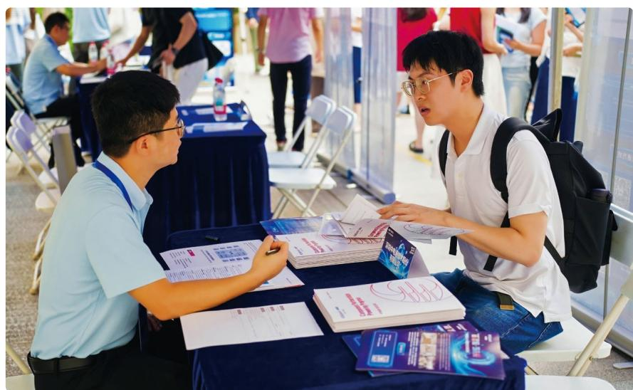

text_image

Street photo of a job fair or consultation event with visible booklets and documents, featuring two men interacting at a table.

中电港武汉大学校园招聘

# 薪酬福利与考核

中电港以员工权益保障与价值实现为核心，持续完善绩效薪酬机制、构建全方位福利保障网络，并落地员工持股计划深化利益联结、畅通绩效考核沟通渠道，充分激发员工干事创业的内生动力，为企业协同发展筑牢坚实根基。

# ●薪酬体系

中电港秉持“业绩优先、兼顾公平、正向激励、持续发展”原则，严格落实《薪酬管理办法》与《绩效管理办法》，对标市场薪酬水平构建极具竞争力的薪酬体系。我们将薪酬标准与业绩目标达成情况、职位变动及个人绩效表现深度挂钩，切实实现能者高薪、职变薪变、多劳多得，充分激发员工干事创业热情，鼓励全员以实干创造优良业绩。同时，我们倡导劳逸结合的工作理念，在《人力资源有关管理办法汇编》中，对员工工作时长及加班时长做出明确界定与规范。加班所得的调休假，员工可在需要时安排调休。我们坚持以工作成效为核心考核导向，不以工作时长、加班频次作为绩效评价标准，切实保障员工的正常工作秩序与休息休假权利。

# ●福利体系

中电港依法为每位员工缴纳社会保险及公积金的费用，实现社会保险全覆盖，并为员工提供企业年金、额外购买团队商业险、提供年度体检、高温补贴、节假日福利、周期性团队建设活动等特殊福利，维护劳动关系的和谐稳定。

# 关键绩效

2025 年

员工总人数

1191人

新进员工

158人

社会招聘

93人

校园招聘

13人

其他渠道招聘

52人

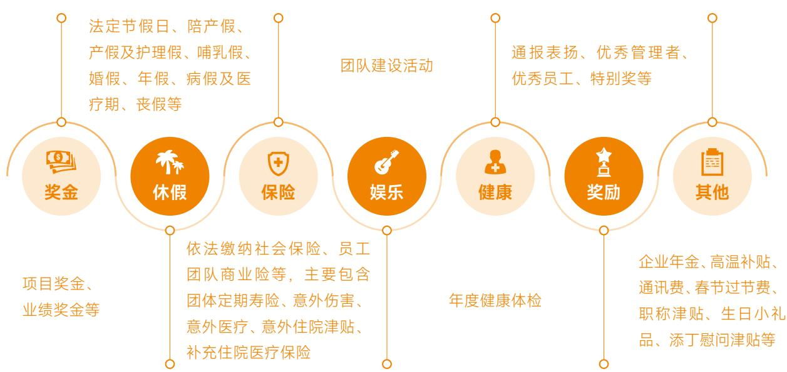

flowchart

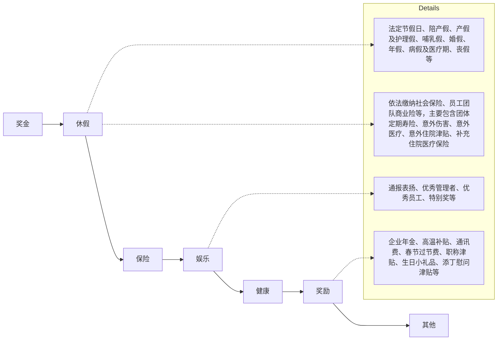
```mermaid
graph LR
  A["奖金"] --> B["休假"]
  B --> C["保险"]
  C --> D["娱乐"]
  D --> E["健康"]
  E --> F["奖励"]
  F --> G["其他"]
  
  subgraph Details
    H["法定节假日、陪产假、产假及护理假、哺乳假、婚假、年假、病假及医疗期、丧假等"]
    I["依法缴纳社会保险、员工团队商业险等，主要包含团体定期寿险、意外伤害、意外医疗、意外住院津贴、补充住院医疗保险"]
    J["通报表扬、优秀管理者、优秀员工、特别奖等"]
    K["企业年金、高温补贴、通讯费、春节过节费、职称津贴、生日小礼品、添丁慰问津贴等"]
  end
  
  B -.-> H
  B -.-> I
  D -.-> J
  F -.-> K
```

中电港员工福利保障体系

# ●员工持股

为深化人才激励、实现核心团队与企业发展共赢，中电港实行员工持股计划，使员工个人发展与公司的战略目标保持一致，调动员工工作积极性，提升管理的凝聚力，激发员工潜能，为公司长期可持续发展奠定人力资源的竞争优势。

# ● 绩效考核

中电港将员工和上级主管的双向沟通贯穿于绩效考核的各个环节，以全生命周期管理为核心，制定了专项绩效管理文件。考核初期由考核人与被考核人共同商定指标及权重，确保考核科学合理。考核结束后，及时向员工反馈结果，明确优势与不足。若员工对结果存疑，可提交《绩效考核申诉书》，由考核组织机构介入协调。对未达岗位要求的员工，上级主管将启动工作表现改进计划，指明改进方向与方法。

# 民主沟通

为保障员工深度参与公司治理、行使民主管理权利，中电港不断完善以职工代表大会为基本形式的民主管理制度，制定专项实施办法，定期召开职代会，充分保障员工知情权、参与权与监督权。同时，我们搭建智慧港线上平台、HRBP线下对接、员工座谈会等多元沟通渠道，倾听员工心声，高效响应并解决合理诉求。此外，我们设立监督投诉专用邮箱（help@cecport.com），供员工就公司规章制度、业务流程、企业文化建设等方面建言献策或反馈意见，切实增强员工的认同感与归属感，凝聚推动企业高质量发展的强大合力。

我们将员工需求放在首位，每年面向员工开展包括 Q12 组织氛围调查在内的员工满意度调查，从发挥潜力、知人善任、获得认可、增强信任、人才培养、学习创新等方面，深度剖析影响员工绩效、留任与组织健康的核心驱动因素，充分挖掘全员的心声与建议，为员工创造舒适、便捷的工作与生活环境。2025 年，共计调查 864 人次，覆盖员工 72.5%。

natural_image

Illustration of a business meeting with four people working at desks, one presenting a line chart on screen (no text or symbols)

# 保护员工安全

中电港秉持 “安全发展、绿色发展、协调发展” 核心理念，始终将员工身心健康与安全生产摆在首要位置，持续完善职业健康安全管理体系建设，推动安全生产主体责任层层压实落细，全方位守护全体员工的身体健康与生命安全。

# 安全管理体系

中电港严格遵守《中华人民共和国安全生产法》，全面贯彻“安全第一、预防为主、综合治理”的方针，制定《深圳中电港技术股份有限公司安全生产管理办法》等制度文件，并由公司高级管理层牵头成立中电港安全生产委员会，下设安全生产办公室负责公司安全生产的日常工作，并定期向董事会汇报安全生产工作成效。我们紧扣安全生产管理体系系统化、规范化、标准化、科学化、现代化建设要求，全面压实安全生产主体责任，探索推进数字化安全生产管理模式，从严加强承包商安全管理，全力防范遏制生产安全责任事故，切实保障员工生命财产安全及公司重大资产安全。

\- 建立安全生产考核和奖惩机制

与管理干部签订《安全生产责任书》

\- 与基层员工签订《安全生产承诺书》

\- 对目标任务完成情况等进行考核，保证全员安全生产责任制的落实

压实安全生产责任

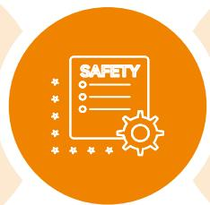

加强承包商
安全管控

\- 制定《承包商管理制度》

\- 实施进场前安全培训

\- 签署项目安全交底文书

- 对承包商执行安全考核  
- 对违章违纪、发生事故及违反文明施工按公司有关规定处罚

中电港完善安全管理体系建设主要举措

# 关键绩效

2025 年

隐患排查整改完成率

100%

发现安全风险隐患

61项

完成安全风险隐患整改

61项

# 安全风险防控

中电港健全安全生产技术支撑体系，积极运用现代信息技术提升安全管理信息化水平，推广先进成熟安全技术，推动工业机器设备、智能装备在生产各环节应用，提高生产机械化、自动化程度，减少安全事故与工伤风险，致力实现“零事故、零工伤”目标。

我们持续完善风险分级管控和隐患排查治理双重预防机制，扎实开展危害辨识与风险评估，从制度、技术、应急等方面实施有效管控。健全安全风险分级管控制度，制定管控措施并实施动态管理，建立风险前瞻研究、定期研判和分类分级管理机制，常态化督促各级开展自查自纠。

我们深化应急管理体系建设，根据《应急预案救援管理制度》等应急制度，确保在事故发生时能够及时按照事故应急预案、响应程序进行快速有效地处理，控制事故影响范围，并结合实际制定专项应急演练方案，定期组织多场景实战化演练，锤炼全员应急处置与协同作战能力，织密扎牢安全生产防护网。

# 安全隐患排查

- 制定《安全隐患排查管理制度》等制度，完善风险分级管控和隐患排查治理双重预防机制  
- 强化重大事故隐患专项排查整治行动工作  
- 制定有针对性的管控措施和现场防范方案  
- 定期开展危害辨识和风险评估，从制度、技术、应急等方面有效管控风险  
- 建立全面、系统的辨识机制，运用科学、有效的风险评估方法，提升安全风险预判预防能力  
- 健全安全风险分级管控制度，制订相应管控措施，实施动态管理  
- 落实生产安全事故隐患排查治理工作机制，采取技术、管理措施，及时发现并消除事故隐患

# 安全应急管理

- 制定《应急预案救援管理制度》《亿安仓安全生产应急预案》等制度，完善风险分级管控和隐患排查治理双重预防机制  
- 至少每三年对应急预案进行评审和修订  
- 定期组织应急救援预案的相关部门及人员进行培训  
- 举行各类专项应急演练

中电港安全风险防控主要举措  
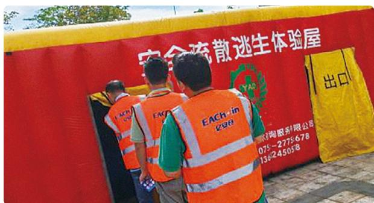

text_image

安全疏散逃生体验屋
EACH-in
075-2775678
136245058
出口

前海仓组织开展应急消防演练

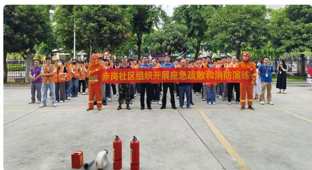

text_image

赤岗社区组织开展应急疏散和消防演练

亿安仓与虎门赤岗社区开展联合消防演练

# 职业健康管理

中电港以“零重大安全责任事故，零重大安全事故隐患”为目标，严格落实《中华人民共和国职业病防治法》《工作场所职业卫生监督管理规定》《职业健康检查管理办法》《工伤保险条例》等职业健康安全相关要求，设定职业健康与安全的配套定量目标，并参照ISO45001职业健康安全管理体系的认证标准，持续完善职业健康管理体系，同步为职业健康安全管理设定配套量化指标，动态跟踪记录工伤事件等关键数据，并通过年度审核、管理与监督机制，全面追踪职业健康安全工作的实施进展及实际成效，切实保障员工职业健康安全。2025年，无重大职业病、无重大职业伤害、无重大传染病。

# 关键绩效

2025 年

员工商业意外保险覆盖率

100%

员工职业健康体检覆盖率

100%

- 全面识别、科学管控职业危害因素，评价危险源的风险优先级、范围、性质等  
- 根据不同级别的风险制定相应的应对措施，逐步消减各类职业健康风险  
- 委托专业第三方机构定期对影响员工职业健康的因素和工作岗位进行评估和监测，根据评估和检测指标制定改进计划和措施

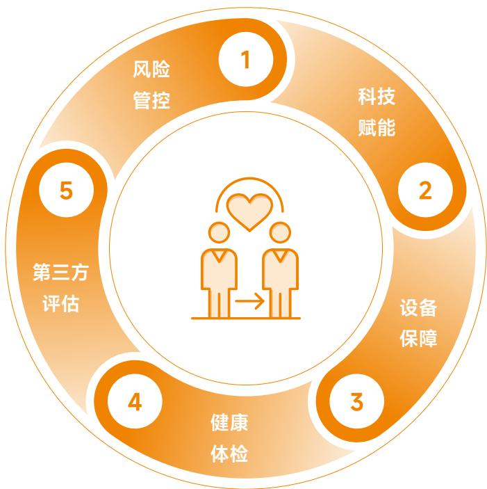

flowchart

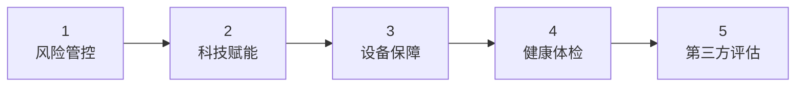
```mermaid
graph LR
  A["1\n风险管控"] --> B["2\n科技赋能"]
  B --> C["3\n设备保障"]
  C --> D["4\n健康体检"]
  D --> E["5\n第三方评估"]
```

- 严格落实职业健康检查制度，定期组织特殊工种员工开展职业病专项健康体检  
中电港职业健康管理主要举措

- 推广先进成熟安全的生产技术，推动工业机器设备、智能装备在生产环节、工序的应用，提高生产的机械化和自动化程度，消减工伤和其他安全事故的风险  
- 在存在职业危害的作业场所按规定配备符合标准的防护设备设施

# 安全文化培育

中电港积极构建“全员讲安全”的安全文化生态，持续健全完善安全生产培训教育体系，制定并落地《安全教育培训制度》等制度文件，通过开展日常安全培训、强化安全认证培训、组织外部专项培训等多种形式，结合不同岗位特点制定差异化培训内容，切实提升员工安全意识、规范安全操作技能、增强应急处置能力。此外，公司主动接受外部监管部门的监督检查与专业指导，以外部监督为契机查漏补缺、持续改进，不断夯实安全管理工作基础。

- 推动仓储单位假日后安全复工教育培训  
- 开展安全生产月、消防安全月  
- 利用蓝信群、广告栏、集中观看视频、集中培训等渠道开展安全教育

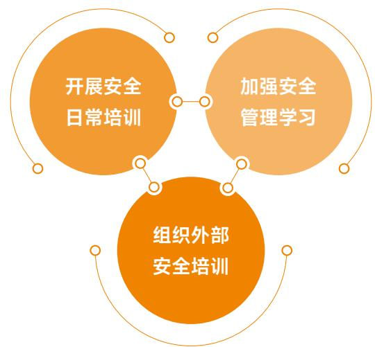

flowchart

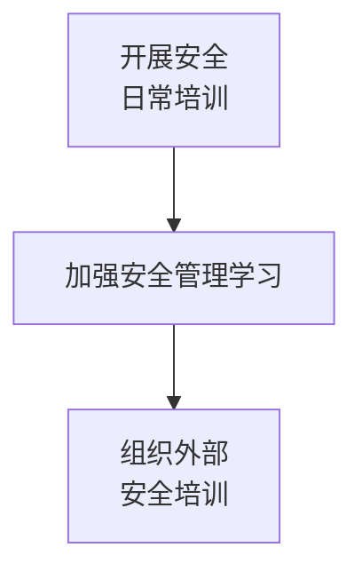
```mermaid
graph TD
  A["开展安全\n日常培训"] --> B["加强安全管理学习"]
  B --> C["组织外部\n安全培训"]
```

- 要求主要安全管理人员参加消防操作员培训  
- 要求特种作业人员持证上岗并按期复审资格证

# 助力员工成长

人才是驱动企业高质量发展的核心引擎，是构筑核心竞争力的关键基石。中电港紧扣员工职业发展全周期需求，在为员工搭建成长舞台的同时，坚持系统化培育，让每一种才华都能找到施展的空间，每一个成长的梦想都能稳步落地。

# 培训教育

中电港坚信人才是可持续发展的核心动力，致力于构建与员工职级和职业发展路径精准匹配的培训体系。我们全面落实《培训管理办法》，精心打造“新星”“星辰”“星链”“星航”“寰宇”五个阶梯性培训项目，确保从职场新人到核心管理人员都能获得持续赋能和个性化发展支持。同时，针对不同职级员工，我们采用线上直播、线下面授、岗位实操历练、以赛促学、以考促学、经验座谈等多元化培养手段，确保培训效果夯实落地，为企业的可持续未来奠定了坚实的人才基础。

中电港安全文化培育主要举措

<table><tr><td>培养项目</td><td>对象</td><td>在岗人员</td><td>高潜人员</td><td>新晋人员</td></tr><tr><td>寰宇计划</td><td>M4</td><td>企业参访交流战略规划研讨</td><td>人才梯队寰宇班(集训+IDP+轮岗+课题研讨)</td><td>干部护航计划</td></tr><tr><td>星航计划</td><td>M3</td><td>领导力培养(M3岗位应知应会)</td><td>人才梯队星航班(M2/P4集训+IDP)</td><td>干部护航计划拟晋升培养项目</td></tr><tr><td>星链计划</td><td>M2</td><td>领导力培养(M2岗位应知应会)</td><td>人才梯队星航班(M1/P4/P3集训+IDP)</td><td>干部护航计划拟晋升培养项目</td></tr><tr><td>星辰计划</td><td>P级</td><td colspan="3">销售赋能培训、产品知识系列培训、各岗位技能培训员工大讲堂(通识技能)、创新创效比赛(比赛促学)</td></tr><tr><td>新星计划</td><td>新员工</td><td colspan="3">管培生培养项目、新员工入职培训、员工座谈会</td></tr><tr><td colspan="2">培养资源(课程/讲师/导师/培训资料库)</td><td colspan="2">培养机制(培训制度/轮岗外派制度)</td><td>学习运营(学习平台/岗位手册/案例集)</td></tr></table>

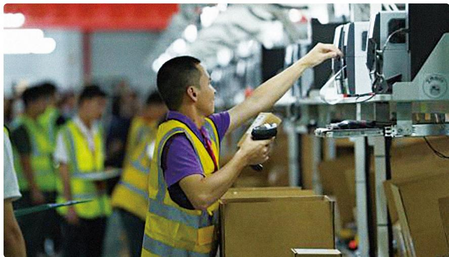

natural_image

Warehouse worker in yellow safety vest operating computer with conveyor belt (no visible text or symbols)

“精技强仓 安全增效”职工技能竞赛

# 职业发展

中电港全面落实《晋升管理办法》和《调配管理办法》，严格恪守公开、公平、公正的晋升原则，为员工提供内部调配、竞聘上岗等多元化发展通道。同时，构建双通道员工发展体系，实施管理通道（M级通道）与专业通道（P级通道）并行的员工职业发展“双通道”管理机制，以此畅通职级晋升通道、拓展职业成长空间，为公司高素质人才梯队建设提供坚实有力的支撑。

# 关键绩效

2025 年

员工培训总投入

35.4 万元

员工培训总场次

139场

员工培训总时长

16560 小时

员工培训参与人次

11930 人次

# 关爱员工心田

中电港始终秉持以人为本的发展理念，通过开展女性员工专属关爱、困难员工精准帮扶、多彩员工文体活动等暖心举措，用心关爱员工生活、用情解决员工急难愁盼，持续提升员工的幸福感与归属感。

# 女性员工关爱

中电港严格遵循《中华人民共和国妇女权益保障法》《女职工劳动保护特别规定》，依法保障女性员工产假、哺乳假等专属休假权益。对哺乳期员工格外关怀，我们不安排其从事第三级体力劳动及明令禁止作业，尽量避免其出差、加班。同时，在聘用、薪酬、晋升、培训等关键环节，我们坚持男女平等、同工同酬，并优化工会代表结构，保障女性民主管理权益，全力为女性群体打造公平公正的就业与职业晋升发展环境。

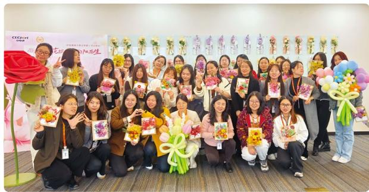

text_image

Group photo of women holding flower bouquets in a studio, with visible Chinese text on backdrop banners and decorative flowers.

中电港开展“如花绽放向阳而生”主题活动

# 困难员工帮扶

中电港始终心系员工，着力构建多维度员工关爱体系，健全常态化、多层次帮扶机制。我们通过设立“在一起”互助基金为重疾员工纾困解难，开展走访送温暖、春节慰问退休员工、夏日送清凉以及慰问生病住院和生育员工等暖心行动，从员工最关心、最直接、最现实的问题入手，用心用情为员工办好事、办实事。2025年，帮扶困难员工52人。

# 案例：1份爱心N种可能

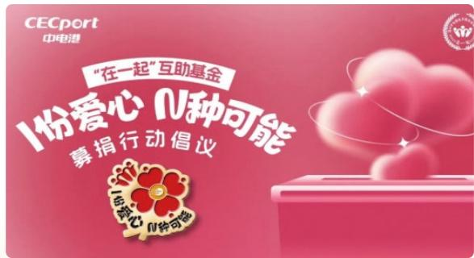

text_image

CECport
中电港
“在一起”互助基金
1份爱心 几种可能
募捐行动倡议
1份爱心 几件可能

“1份爱心N种可能”募捐行动倡议

2025 年，中电港以 “1 份爱心 N 种可能” 为主题，发起 “在一起” 互助基金专项募捐行动，通过 “线上 + 线下” 双渠道同步动员，开启一场爱心与行动的双向奔赴，凝聚企业大家庭的温暖力量，让善意延续更多可能。自 2009 年中电港创立 “在一起” 互助基金以来，截至 2025 年底，共募得各类捐款 501907.54 元，资助、慰问员工及家属 19 人，资助贫困小学 1 次、为政府倡议专项赈灾捐款 1 次。

# 丰富员工生活

中电港始终秉持“以人为本”发展理念,聚焦员工身心健康,常态化开展篮球、足球、羽毛球等体育赛事,并精心策划“文化碰撞青春”“粽情端午尽情放粽”“驭风破浪，决胜芯篇”等特色主题活动，携手员工共绘“在一起，一家人”的温暖底色。

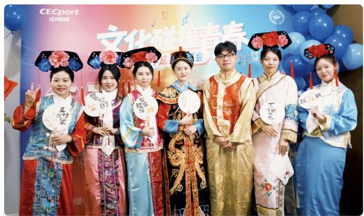

text_image

CECport
中華證
文化祥禮青春
1
2
3
4
5
6
7
8
9
10
11
12
13
14
15
16
17
18
19
20
21
22
23
24
25
26
27
28
29
30
31
32
33
34
35
36
37
38
39
40
41
42
43
44
45
46
47
48
49
50
51
52
53
54
55
56
57
58
59
60
61
62
63
64
65
66
67
68
69
70
71
72
73
74
75
76
77
78
79
80
81
82
83
84
85
86
87
88
89
90
91
92
93
94
95
96
97
98
99

中电港文化碰撞青春活动

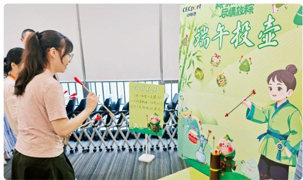

text_image

CECP RT
尽情放粽
端午投壶
静爽规则
1. 水平一季红花
2. 月光一季红花
3. 月光一季红花
4. 月光一季红花
5. 月光一季红花
6. 月光一季红花
7. 月光一季红花
8. 月光一季红花
9. 月光一季红花
10. 月光一季红花
11. 月光一季红花
12. 月光一季红花
13. 月光一季红花
14. 月光一季红花
15. 月光一季红花
16. 月光一季红花
17. 月光一季红花
18. 月光一季红花
19. 月光一季红花
20. 月光一季红花
21. 月光一季红花
22. 月光一季红花
23. 月光一季红花
24. 月光一季红花
25. 月光一季红花
26. 月光一季红花
27. 月光一季红花
28. 月光一季红花
29. 月光一季红花
30. 月光一季红花
31. 月光一季红花
32. 月光一季红花
33. 月光一季红花
34. 月光一季红花
35. 月光一季红花
36. 月光一季红花
37. 月光一季红花
38. 月光一季红花
39. 月光一季红花
40. 月光一季红花
41. 月光一季红花
42. 月光一季红花
43. 月光一季红花
44. 月光一季红花
45. 月光一季红花
46. 月光一季红花
47. 月光一季红花
48. 月光一季红花
49. 月光一季红花
50. 月光一季红花

中电港粽情端午尽情放粽活动

# 案例：驭风破浪，决胜芯篇

2025 年，中电港以 “驭风破浪，决胜芯篇” 为主题，举办 2025 深圳地区工会主题活动。来自深圳地区的 300 余名员工，在碧海蓝天间展开了一场凝聚团队力量、激发奋斗激情的欢乐盛会，不断将 “我们” 凝聚成最强的合力，向未知前行，将无数不可能变成可能。

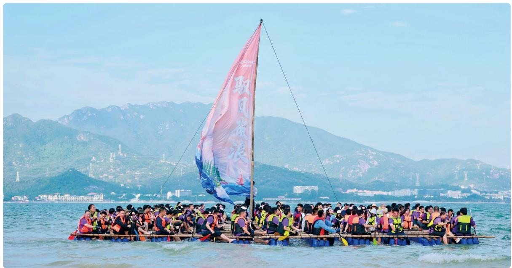

text_image

驭风破浪

中电港 300 余名员工破浪启航

# 助力乡村振兴

乡村振兴是中电港践行企业责任的一个缩影，更是“在一起”企业文化的美好诠释。从拓宽农民增收渠道，推动城乡区域协调发展，到“小平科技创新实验室”，将教育帮扶与产业发展工作相结合，中电港始终以“芯”赋能振兴，让点点星光汇聚，照亮乡村振兴的前行之路。

# 案例：消费帮扶，情暖沃野

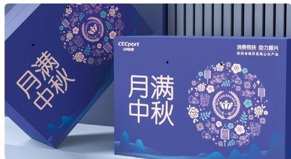

text_image

月满中秋
CEICport
中和酒
消费帮扶 助力振兴
陕西省延安易高山农产品
月满中秋

月满中秋礼盒

自 2021 年起，中电港帮扶足迹遍及四川阆中、陕西镇安、海南临高、贵州松桃等地。中电港通过采购帮扶等多种形式，持续巩固拓展脱贫攻坚成果，用实实在在的行动，为乡村发展注入源源不断的活力。

# 案例：用心创立“小平科技创新实验室”，用“芯”推进教育振兴

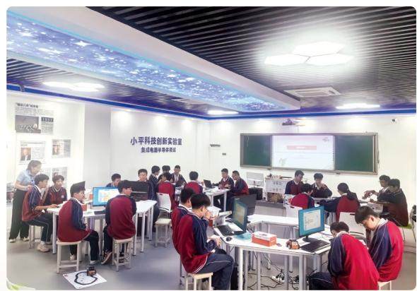

text_image

小平科技创新实验室
微电网等导体项目

中电港“小平科技创新实验室”

为持续提升教学品质，中电港自2021年开始，先后于四川、宁夏、陕西、海南等地建成6所集成电路半导体科技创新实验室，授牌其中5所为“小平科技创新实验室”，旨在通过链接行业专家资源，提供远程智力支持，协助学校完善课程体系，并逐步构建起线上线下融合的“双师课堂”模式，推动优质教育资源的广泛共享与联动，为偏远地区孩子接受高等教育、拓宽职业发展路径创造了更多可能。2025年，2所在建“科技创新实验室”已陆续落地，为更多孩子点亮科技梦想。

# 投身公益慈善

中电港以 “芯火相传” 为己任，将公益初心融入发展肌理，大力弘扬志愿者精神，发起成立 “爱芯无限” 志愿服务队，守护绿水青山，心系弱势群体，用点滴行动将温暖传递。2025 年，开展公益项目 1 项，参与志愿服务人数 50 人，志愿服务时长 24 小时。

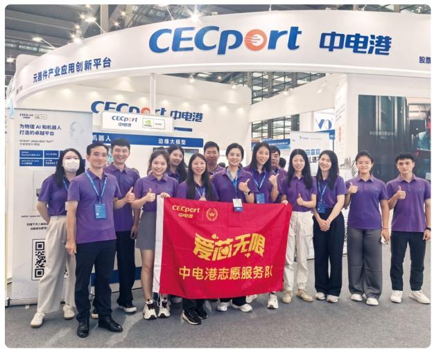

text_image

CECport 中电港
元器件产业应用创新平台
CECport 中电港
为物理 AI 和机器人打造的卓越平台
机器人
应逢大模型
爱滴无限
中电港志愿服务队

中电港连续10余年志愿服务展会

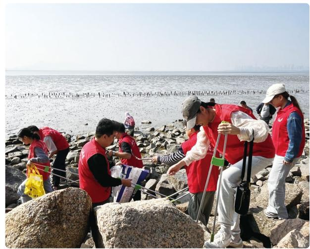

natural_image

Group of people in red vests cleaning rocks by the sea, with a distant city skyline in the background (no visible text or symbols)

中电港开展“蓝岸守护，净滩环保”活动

# 案例：巳时添绿，辰景常青

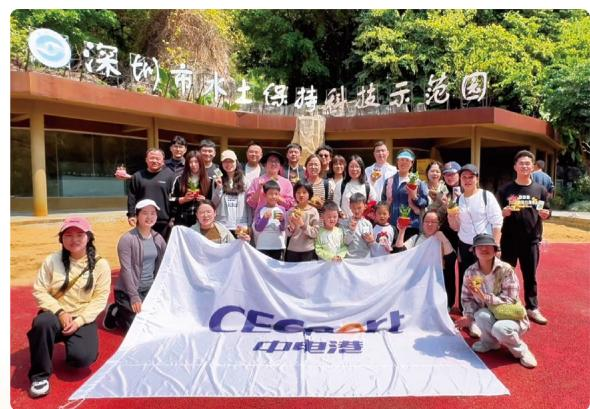

text_image

深圳市水上保持科技示范园
CEC Port
中电港

中电港“爱芯无限”志愿服务队开展生态徒步

2025年，在第47个植树节来临之际，中电港开展“巳时添绿，辰景长青”志愿活动，以一场融合沉浸式4D观影、环保科普、生态徒步与植树造林的“绿色行动链”，让生态文明的种子在每一个员工心中生根发芽。

附录 / 关键绩效

<table><tr><td colspan="5">治理</td></tr><tr><td>指标</td><td>单位</td><td>2023</td><td>2024</td><td>2025</td></tr><tr><td>董事会人数</td><td>人</td><td>9</td><td>9</td><td>11</td></tr><tr><td>独立董事人数</td><td>人</td><td>3</td><td>3</td><td>4</td></tr><tr><td>女性董事占比</td><td>%</td><td>33.33</td><td>33.33</td><td>27.27</td></tr><tr><td>董事会成员平均任期</td><td>年</td><td>3</td><td>3</td><td>3</td></tr><tr><td>召开股东会次数</td><td>次</td><td>4</td><td>4</td><td>2</td></tr><tr><td>召开董事会次数</td><td>次</td><td>7</td><td>6</td><td>5</td></tr><tr><td>开展合规培训次数</td><td>次</td><td>16</td><td>6</td><td>38</td></tr><tr><td>开展合规培训时长时数</td><td>小时</td><td>42</td><td>10</td><td>97.85</td></tr><tr><td>参与合规培训人次</td><td>人次</td><td>1805</td><td>1200</td><td>5616</td></tr><tr><td>参与培训法务人员人数</td><td>人</td><td>3</td><td>7</td><td>8</td></tr><tr><td>披露公告及文件数量</td><td>份</td><td>168</td><td>121</td><td>157</td></tr><tr><td>因信息披露违规而受到处罚次数</td><td>次</td><td>0</td><td>0</td><td>0</td></tr><tr><td>利用内幕信息从事内幕交易事件</td><td>件</td><td>0</td><td>0</td><td>0</td></tr><tr><td>接待投资者调研</td><td>次</td><td>1</td><td>1</td><td>13</td></tr><tr><td>召开业绩说明会</td><td>次</td><td>1</td><td>1</td><td>1</td></tr><tr><td>投资者问题回复率</td><td>%</td><td>100</td><td>100</td><td>100</td></tr><tr><td>在互动易平台回复投资者问题</td><td>次</td><td>374</td><td>284</td><td>257</td></tr><tr><td>廉政从业等有关商业道德书签署率</td><td>%</td><td>100</td><td>100</td><td>100</td></tr><tr><td>反贪污反腐败举报事件总数</td><td>件</td><td>0</td><td>0</td><td>0</td></tr></table>

社会

<table><tr><td colspan="2">指标</td><td>单位</td><td>2023</td><td>2024</td><td>2025</td></tr><tr><td colspan="2">员工总人数</td><td>人</td><td>1245</td><td>1147</td><td>1191</td></tr><tr><td colspan="2">少数民族员工数</td><td>人</td><td>73</td><td>58</td><td>54</td></tr><tr><td colspan="2">管理层中少数民族员工数</td><td>人</td><td>16</td><td>12</td><td>11</td></tr><tr><td colspan="2">管理人员中女性人数比例</td><td>%</td><td>24</td><td>35</td><td>34</td></tr><tr><td rowspan="4">按性别划分的员工人数</td><td>女性员工</td><td>人</td><td>505</td><td>475</td><td>495</td></tr><tr><td>男性员工</td><td>人</td><td>740</td><td>672</td><td>696</td></tr><tr><td>女性员工占比</td><td>%</td><td>40.56</td><td>41.41</td><td>41.56</td></tr><tr><td>男性员工占比</td><td>%</td><td>59.44</td><td>58.59</td><td>58.44</td></tr></table>

<table><tr><td colspan="2">指标</td><td>单位</td><td>2023</td><td>2024</td><td>2025</td></tr><tr><td rowspan="3">按年龄划分的员工人数</td><td>30岁以下占比</td><td>%</td><td>21.45</td><td>18.13</td><td>16.37</td></tr><tr><td>30~50岁占比</td><td>%</td><td>74.86</td><td>78.38</td><td>79.85</td></tr><tr><td>50岁以上占比</td><td>%</td><td>3.69</td><td>3.49</td><td>3.78</td></tr><tr><td rowspan="4">按专业划分的员工人数</td><td>销售</td><td>人</td><td>705</td><td>740</td><td>752</td></tr><tr><td>技术</td><td>人</td><td>313</td><td>255</td><td>270</td></tr><tr><td>财务</td><td>人</td><td>48</td><td>36</td><td>46</td></tr><tr><td>行政</td><td>人</td><td>179</td><td>106</td><td>123</td></tr><tr><td rowspan="4">按学历划分的员工人数</td><td>博士</td><td>人</td><td>3</td><td>2</td><td>2</td></tr><tr><td>硕士</td><td>人</td><td>109</td><td>99</td><td>111</td></tr><tr><td>本科</td><td>人</td><td>786</td><td>739</td><td>781</td></tr><tr><td>大专及以下</td><td>人</td><td>347</td><td>307</td><td>297</td></tr><tr><td colspan="2">新进员工数</td><td>人</td><td>153</td><td>131</td><td>158</td></tr><tr><td rowspan="2">按性别划分的新进员工人数</td><td>女性员工</td><td>人</td><td>66</td><td>38</td><td>58</td></tr><tr><td>男性员工</td><td>人</td><td>87</td><td>93</td><td>100</td></tr><tr><td rowspan="3">按招聘渠道划分的新进员工人数</td><td>社会招聘</td><td>人</td><td>81</td><td>82</td><td>93</td></tr><tr><td>校园招聘</td><td>人</td><td>20</td><td>6</td><td>13</td></tr><tr><td>其他招聘渠道</td><td>人</td><td>52</td><td>43</td><td>52</td></tr><tr><td colspan="2">员工总流失率</td><td>%</td><td>20.82</td><td>16.64</td><td>9.75</td></tr><tr><td rowspan="2">按性别划分流失率</td><td>女性员工</td><td>%</td><td>33.30</td><td>29.60</td><td>33.3</td></tr><tr><td>男性员工</td><td>%</td><td>66.60</td><td>70.30</td><td>66.6</td></tr><tr><td colspan="2">劳动合同签订率</td><td>%</td><td>100</td><td>100</td><td>100</td></tr><tr><td colspan="2">雇用童工事件数</td><td>宗</td><td>0</td><td>0</td><td>0</td></tr><tr><td colspan="2">劳工歧视事件数</td><td>宗</td><td>0</td><td>0</td><td>0</td></tr><tr><td colspan="2">强迫劳动申诉事件</td><td>宗</td><td>0</td><td>0</td><td>0</td></tr><tr><td colspan="2">社会保险覆盖率</td><td>%</td><td>100</td><td>100</td><td>100</td></tr><tr><td colspan="2">享受产假员工数</td><td>人</td><td>22</td><td>40</td><td>54</td></tr><tr><td colspan="2">产假返岗率</td><td>%</td><td>100</td><td>100</td><td>100</td></tr><tr><td colspan="2">员工福利支出</td><td>万元</td><td>475.74</td><td>432.63</td><td>455.99</td></tr><tr><td colspan="2">员工培训总投入</td><td>万元</td><td>30.50</td><td>34.60</td><td>35.4</td></tr><tr><td colspan="2">员工培训总场次</td><td>场</td><td>129</td><td>113</td><td>139</td></tr><tr><td colspan="2">员工培训总时长</td><td>小时</td><td>14093</td><td>15858</td><td>16560</td></tr><tr><td colspan="2">员工培训参与人次</td><td>人次</td><td>11371</td><td>10888</td><td>11930</td></tr><tr><td colspan="2">员工内部调动或内部应聘人数</td><td>人</td><td>299</td><td>373</td><td>377</td></tr><tr><td colspan="2">安全生产总投入</td><td>万元</td><td>520</td><td>999</td><td>14</td></tr><tr><td colspan="2">安全教育培训总投入</td><td>万元</td><td>0.23</td><td>0.46</td><td>0.26</td></tr><tr><td colspan="2">安全教育培训覆盖人次</td><td>人次</td><td>1272</td><td>1031</td><td>1188</td></tr><tr><td colspan="2">安全教育覆盖率</td><td>%</td><td>96</td><td>100</td><td>100</td></tr><tr><td colspan="2">重大安全事故及环境污染事件数</td><td>件</td><td>0</td><td>0</td><td>0</td></tr><tr><td colspan="2">因工作关系死亡人数</td><td>人</td><td>0</td><td>0</td><td>0</td></tr><tr><td colspan="2">因工伤损失工作日天数</td><td>天</td><td>0</td><td>0</td><td>0</td></tr><tr><td colspan="2">隐患排查整改完成率</td><td>%</td><td>100</td><td>93.75</td><td>100</td></tr><tr><td colspan="2">职业病案例</td><td>件</td><td>0</td><td>0</td><td>0</td></tr><tr><td colspan="2">特殊作业人员持证上岗率</td><td>%</td><td>100</td><td>100</td><td>100</td></tr><tr><td colspan="2">员工职业健康体检覆盖率</td><td>%</td><td>100</td><td>100</td><td>100</td></tr><tr><td colspan="2">研发总投入</td><td>万元</td><td>8754.85</td><td>7992.60</td><td>9229.50</td></tr><tr><td colspan="2">研发投入占营收比率</td><td>%</td><td>0.25</td><td>0.16</td><td>0.14</td></tr><tr><td colspan="2">研发团队总人数</td><td>人</td><td>244</td><td>206</td><td>242</td></tr><tr><td rowspan="4">按学历划分的研发人员人数</td><td>博士</td><td>人</td><td>0</td><td>2</td><td>2</td></tr><tr><td>硕士</td><td>人</td><td>23</td><td>16</td><td>24</td></tr><tr><td>本科</td><td>人</td><td>182</td><td>161</td><td>189</td></tr><tr><td>大专及以下</td><td>人</td><td>39</td><td>27</td><td>27</td></tr><tr><td colspan="2">核心技术人员总人数</td><td>人</td><td>10</td><td>19</td><td>10</td></tr><tr><td colspan="2">授权专利累计数</td><td>项</td><td>18</td><td>18</td><td>19</td></tr><tr><td colspan="2">授权发明专利累计数</td><td>项</td><td>2</td><td>3</td><td>4</td></tr><tr><td colspan="2">授权实用新型专利累计数</td><td>项</td><td>16</td><td>14</td><td>14</td></tr><tr><td colspan="2">授权外观专利累计数</td><td>项</td><td>/</td><td>1</td><td>1</td></tr><tr><td colspan="2">软件著作累计数</td><td>项</td><td>60</td><td>80</td><td>93</td></tr><tr><td colspan="2">供应商总数</td><td>个</td><td>664</td><td>553</td><td>487</td></tr><tr><td colspan="2">供应商本地化比例</td><td>%</td><td>32</td><td>30</td><td>28</td></tr><tr><td colspan="2">本地化采购金额比例</td><td>%</td><td>7</td><td>5</td><td>2</td></tr></table>

环境

<table><tr><td>指标</td><td>单位</td><td>2023</td><td>2024</td><td>2025</td></tr><tr><td>重大环境污染事故</td><td>起</td><td>0</td><td>0</td><td>0</td></tr><tr><td>环境领域违法违规事件</td><td>件</td><td>0</td><td>0</td><td>0</td></tr></table>

指标索引

<table><tr><td colspan="2">报告框架</td><td>GRI Standard</td><td>深交所可持续发展报告指引</td></tr><tr><td>一级标题</td><td>二级标题</td><td></td><td></td></tr><tr><td colspan="2">关于本报告</td><td>2-2 2-3</td><td>/</td></tr><tr><td colspan="2">董事长寄语</td><td>/</td><td>/</td></tr><tr><td rowspan="4">走进中电港</td><td>企业概况</td><td>2-1</td><td>/</td></tr><tr><td>业务布局</td><td>2-6</td><td>/</td></tr><tr><td>企业文化</td><td>/</td><td>/</td></tr><tr><td>责任荣誉</td><td>/</td><td>/</td></tr><tr><td rowspan="5">ESG管理</td><td>ESG治理</td><td>2-12 2-13 2-14 2-16</td><td>第十二条</td></tr><tr><td>ESG战略</td><td>2-22</td><td>/</td></tr><tr><td>ESG培训</td><td>/</td><td>/</td></tr><tr><td>重要性议题管理</td><td>3-1 3-2 3-3</td><td>第十一条、第十八条、第五十三条</td></tr><tr><td>利益相关方管理</td><td>2-29</td><td>第五十三条</td></tr><tr><td rowspan="6">与治理共筑立发展根基</td><td>完善公司治理</td><td>2-9 2-19 405-1</td><td>/</td></tr><tr><td>依法合规经营</td><td>2-27</td><td>/</td></tr><tr><td>全面风险管理</td><td>/</td><td>/</td></tr><tr><td>加强投关管理</td><td>/</td><td>第四十八条</td></tr><tr><td>守护信息安全</td><td>/</td><td>第五十五条、第五十六条</td></tr><tr><td>恪守商业道德</td><td>2-24 2-25 205-2 206-1</td><td>第四十五条、第四十六条、第五十二条</td></tr><tr><td rowspan="3">与伙伴共创塑价值生态</td><td>韧性供应链建设</td><td>2-28</td><td>第四十二条</td></tr><tr><td>研发创新驱动</td><td>/</td><td>第四十七条</td></tr><tr><td>客户服务优化</td><td>418-1</td><td>第三十三条、第三十五条、第三十七条</td></tr><tr><td rowspan="4">与环境共生绘绿色蓝图</td><td>环境管理</td><td>302-1</td><td>第二十一条至第二十八条</td></tr><tr><td>应对气候变化</td><td>201-2</td><td>第三十六条</td></tr><tr><td>水资源管理</td><td>303-1 303-4 303-5</td><td>第三十条、第三十一条</td></tr><tr><td>废弃物管理</td><td>306-1 306-2 306-3</td><td>/</td></tr><tr><td rowspan="6">与社会共荣促和谐发展</td><td>维护员工权益</td><td>2-7 401-1 401-2401-3 405-1 406-1</td><td>第五十条</td></tr><tr><td>保护员工安全</td><td>403-1 403-2 403-3403-4 403-5 403-6403-7 403-8</td><td>第五十条</td></tr><tr><td>助力员工成长</td><td>404-2</td><td>第五十条</td></tr><tr><td>关爱员工心田</td><td>/</td><td>第五十条</td></tr><tr><td>助力乡村振兴</td><td>413-1</td><td>第三十九条</td></tr><tr><td>投身公益慈善</td><td>203-1</td><td>第四十条</td></tr><tr><td rowspan="2">附录</td><td>关键绩效表</td><td>/</td><td>/</td></tr><tr><td>指标索引表</td><td>/</td><td>/</td></tr></table>