<details>
<summary>natural_image</summary>

Panoramic view of a snow-capped mountain range with mist and a small building nestled in a valley (no text or symbols visible)
</details>

# 安徽古麒绒材股份有限公司

地址：安徽省芜湖市南陵县经济开发区457省道128号

电话：0553-2392800

网址：www.guqiyr.com

2025年度

可持续发展(ESG)报告

【安徽古麒绒材股份有限公司】

关于本报告 01

董事长致辞 03

公司介绍 05

尽职调查 13

关键绩效表 87

GRI 索引表 93

《深圳证券交易所上市

公司自律监管指引第17

号——可持续发展报告

(试行)》索引表 101

读者反馈表 103

# 治理篇

# 善治筑基 行稳致远

# 01

可持续发展治理 21

公司治理 23

风险管理 29

商业道德 32

投资者关系管理 34

# 环境篇

# 清洁生产 生态友好

# 02

环境管理体系 39

应对气候变化 40

能源利用 46

污染物排放与废弃物管理 47

水资源利用 49

循环经济 51

生态系统和生物多样性保护 54

# 社会篇

# 以人为本 共进共享

# 03

员工权益与福利 57

职业健康与安全 61

员工培训与发展 65

产品质量 68

研发创新 75

客户服务 80

信息安全与客户隐私保护 82

可持续供应链 83

动物福利 83

乡村振兴与社会共享 86

# 目录

# CONTENTS

# 关于本报告

本报告是安徽古麒绒材股份有限公司(以下简称“古麒绒材”“公司”或“我们”)发布的首份《可持续发展(ESG)报告》。这是古麒绒材(001390.SZ)积极贯彻绿色发展理念、推动高质量发展,全面落实联合国2030年可持续发展目标(SDGs),响应国家“碳达峰、碳中和”发展战略,为社会创造价值,深耕可持续发展过程中所做出努力、取得成果的集中展现。本报告中,我们积极回应利益相关方的期望与关切,致力于与各利益相关方实现有效沟通。本报告重点介绍报告期内古麒绒材在环境、社会和公司治理方面的最新进展。

# 报告范围

本报告范围涵盖古麒绒材及其附属公司。除非特别说明，与古麒绒材（股票代码：001390.SZ）同期合并财务报表范围一致。

# 时间范围

本报告为年度报告，报告时间范围为2025年1月1日至2025年12月31日。本报告为公司发布的首份可持续发展(ESG)报告，因此为增强报告可比性与完整性，部分文字和数据信息可能超出上述时间范围，在所涉及处予以说明。

# 数据来源

报告中数据和案例来自公司实际运行的正式记录。报告中的财务数据均以人民币为单位。若相关财务数据与公司年度报告存在差异，以公司年度报告为准。

# 编制依据

本报告依据《深圳证券交易所上市公司自律监管指引第17号——可持续发展报告（试行）》《深圳证券交易所上市公司自律监管指南第3号——可持续发展报告编制》编制。

此外, 本报告综合参考如下可持续发展信息披露标准:

联合国可持续发展目标 (SDGs)  
全球报告倡议组织可持续发展报告标准 (GRI Standards)  
中华人民共和国财政部等九部门《企业可持续披露准则——基本准则（试行）》  
中华人民共和国财政部等九部门《企业可持续披露准则第1号——气候（试行）》  
中国企业改革与发展研究会《中国企业可持续发展报告指南（CASS-ESG 6.0）》之皮革、毛皮、羽毛及其制品和制鞋业

# 报告原则

本报告主要依据《企业可持续披露准则——基本准则（试行）》的原则进行披露，具体说明如下：

# 重要性

公司识别出各利益相关方关注的与经营相关的重要性议题，作为本报告披露的重点。本报告中在对重要性议题进行披露的同时，关注公司所处行业和经营业务的特点。议题重要性的分析过程及结果，详见本报告“尽职调查”章节。

# 可靠性

本报告内容反映客观、真实的事实，对涉及公司正面、负面的信息均予以不偏不倚地披露。古麒绒材承诺本报告内容不存在任何虚假记载、误导性陈述或重大遗漏，公司对本报告的内容真实性、准确性和完整性承担法律责任。

# 相关性

本报告力求披露的信息与信息使用者的决策具有相关性, 有助于信息使用者作出评价或预测。

# 可比性

本报告对同一定量披露项在不同报告期内的统计及披露方式保持一致；若数据的采集、测量与计算方法有更改，将在报告附注中说明调整的情况和原因。

# 可验证性

本报告中案例和数据来自公司实际运行的正式记录或财务报告,确保相关信息及数据可溯源、可验证,可用于支持外部鉴证工作的审核。

# 可理解性

本报告中包含表格、模型图以及专业名词表等信息,作为本报告中文字内容的辅助,便于利益相关方更好地理解报告中的文字内容。为便于利益相关方高效地获取信息,本报告提供目录及可持续发展信息披露标准的对标索引表。

本报告分别以简体中文和英文版发布,如不同版本中出现内容不一致的情况,以简体中文版为准。

# 及时性

本报告为2025年度可持续发展(ESG)报告，覆盖期间为2025年1月1日至2025年12月31日，公司严格遵循信息披露要求，确保报告发布及时、信息真实透明。

# 报告获取

本报告以简体中文和英文的网络电子版形式发布，电子版可在公司网站（http://www.guqiyr.com/）和深圳证券交易所（https://www.szse.cn/）查阅和下载。

如您对古麒绒材可持续发展的相关工作或本报告有任何疑问或建议,欢迎与我们联系。

联系地址：安徽省芜湖市南陵县经济开发区457省道128号

联系邮箱：cs@guqirc.com

# 董事长致辞

2026年，为我国“十五五”规划的开局之年，是发展新质生产力、推进高质量发展的关键起步阶段，亦是公司新十年战略规划的崭新起点。作为中国羽绒材料行业的首家上市公司，我们深知中国羽绒产业在全球格局中的重要地位——全球80%以上羽绒原料及羽绒制品来自中国。依托这一特色产业优势，我们始终秉持“以绒暖世、以责立业”的初心，紧扣国家绿色发展与产业升级战略，将可持续发展的理念深度嵌入企业战略、生产运营、供应链管理与羽绒材料品牌的全球化布局，积极引领中国羽绒产业的可持续发展。

在环境保护层面, 我们坚守生态优先和低碳循环的原则。首先, 羽绒自身作为天然保暖材料, 兼具环保与循环属性。其次, 我们积极响应国家“双碳”

目标与“十五五”期间加快经济社会发展全面绿色制造的发展要求，持续推进清洁生产、节水节能与工艺升级，并将持续完善全流程环境管理与碳管理体系，推动废弃物资源化利用，通过技术创新降低环境负荷，实现天然材质与绿色制造共生，守护生态平衡与产业永续。

在社会责任层面, 我们坚守品质初心与人文关怀的理念。严格遵循动物福利准则, 保障产品安全, 赢得客户信任及市场美誉度; 坚持以人为本, 保障员工权益、完善成长与关怀体系, 打造具有归属感的事业平台; 携手上下游共建责任生态圈, 积极投身公益事业, 以产业力量践行企业公民担当。

在公司治理层面, 我们坚守合规透明和科学治理的准则。持续完善现代企业治理架构, 强化内控与风

险防控, 确保信息披露真实、准确、完整, 切实维护投资者与各方利益相关者的权益。我们积极推动稳健的治理夯实长期价值, 实现企业与社会的协同发展。

站在“十五五”规划开局与公司新十年发展启航的双重起点, 我们怀揣着明确且坚定的愿景: 扎根中国本土, 积极推进中国羽绒材料品牌成为享誉世界的绿色、环保、循环耐用的品牌与行业标杆。未来, 我们将紧密贴合国家发展规划, 以新质生产力推动产业升级, 深化绿色制造、责任供应链与科技创新, 持续提升ESG治理水平, 不断增强核心竞争力和全球影响力。

这是公司首次编制并披露可持续发展（ESG）报告，过去一年，我们在可持续发展道路上虽取

得了阶段性的实践成果, 但深知这份答卷仍有提升空间, 本次披露是对过往工作的系统梳理, 也是以坦诚姿态向社会全面展现公司责任担当与真实发展的面貌。未来, 我们愿以此为新起点, 持续深耕ESG治理, 不负投资者与社会各界的信任。“全球羽绒材料看中国!”我们愿与各界伙伴携手同行, 以品质为基、以绿色为翼、以责任致远, 积极推动中国羽绒材料品牌走向世界, 为羽绒产业高质量发展与可持续未来贡献更多力量, 让温暖更可持续, 让中国羽绒材料品牌享誉全球!

董事长

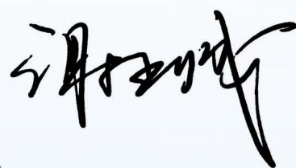

<details>
<summary>text_image</summary>

谢丽敏
</details>

2026年4月

# 公司介绍

# |关于古麒绒材

公司主营业务聚焦高规格羽绒产品的研发、生产和销售，主要产品为鹅绒和鸭绒，主要应用于服装、寝具等羽绒制品领域。公司长期聚焦主业、提升创新能力，科研和检测实力得到认可。公司及相关人员参与了《拒水羽绒服装》《羽绒服装抗湿冷性能的检测和评价》两项 CNGA 标准的制定以及《羽绒羽毛》《羽绒羽毛检验方法》两项国家标准的制定。公司也是羽绒羽毛生产加工行业中唯一一家参与了《羽绒服装》新国家标准制定的企业，荣获全国服装标准化技术委员会标准化工作战略合作伙伴。公司拥有CNAS权威认可的检测中心，出具的报告具备国际互认效力，是行业内少数几家获得该项认证的企业。公司早在2019年就被认定为第一批专精特新“小巨人”企业，公司的“羽绒羽毛清洁加工关键技术与新型功能高端羽绒的研发及产业化”“基于节能减排和品质提升的羽绒水洗加工新技术开发及产业化”和“羽毛绒材料表面处理及其防钻绒和粉尘同步检测关键技术开发及应用”项目获得安徽省科学技术奖三等奖。

报告期内，公司新增授权发明专利3项，新增申请受理实用新型专利6项；截至2025年12月31日，公司拥有发明专利15项，实用新型专利56项。公司持续开拓各应用领域的头部客户，行业知名度不断提升。公司定位中高端市场，已经与服装、寝具、运动、军工等多个领域的客户建立了合作关系。公司被中国羽绒工业协会评为“中国羽绒行业优秀企业”和“中国羽绒行业优质供应商”，获得了“中国驰名商标”“首批安徽省制造业高端品牌培育企业”“全国工人先锋号”“2025年全国就业与社会保障先进民营企业（备选）”等荣誉。公司深入推进高质量发展，在构建循环经济、践行“碳达峰、碳中和”方面走在行业前列。根据《工业领域碳达峰实施方案》《工业和信息化部办公厅关于开展绿色制造体系建设的通知》等政策文件，公司被工信部评定为“国家级绿色工厂”，在节能降碳领域发挥引领作用。公司生产的羽绒产品将上游行业废弃物进行资源化利用，符合循环经济发展要求，符合《绿色低碳转型产业指导目录》的要求，曾被评为“安徽省循环经济示范单位”。公司设计建造了日处理万吨中水回用系统，是行业内为数不多拥有大规模中水回用系统的企业，入选了生态环境部、住建部公布的“全国环保设施和城市污水垃圾处理设施向公众开放单位”。

除此之外, 公司积极参与国家及行业标准的制定工作, 羽绒产品顺利通过欧盟负责任羽绒标准(RDS)、OEKO-TEX STAN-DARD 100 的双重权威认证, 有效地满足了全球高端市场的准入要求, 彰显了中国羽绒品牌的全球竞争力。

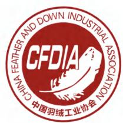

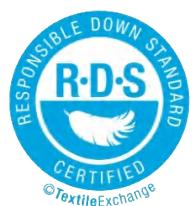

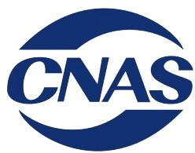

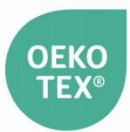  
STANDARD 100

古麒绒材荣誉与认证

<table><tr><td>称号</td><td>颁发单位</td><td>授予时间</td></tr><tr><td>全国工人先锋号</td><td>中华全国总工会</td><td>2026年</td></tr><tr><td>国家级绿色工厂</td><td>工业和信息化部</td><td>2023年</td></tr><tr><td>第一批专精特新“小巨人”企业</td><td>工业和信息化部</td><td>2019年</td></tr><tr><td>2025年全国就业与社会保障先进民营企业(备选)</td><td>全国工商联办公厅</td><td>2025年</td></tr><tr><td>标准化工作先进单位</td><td>中国服装协会标准化技术委员会</td><td>2026年</td></tr><tr><td>企业信用评价AAA级信用企业</td><td>中国羽绒工业协会</td><td>2022—2025年</td></tr><tr><td>中国羽绒行业优秀企业</td><td>中国羽绒工业协会</td><td>2018—2022年</td></tr><tr><td>中国合格评定国家认可委员会实验室认可证书</td><td>中国合格评定国家认可委员会</td><td>2020—2025年</td></tr><tr><td>负责任羽绒标准(RDS)认证</td><td>Textile Exchange</td><td>2026-2027年</td></tr><tr><td>OEKO-TEX STANDARD 100 认证</td><td>OEKO-TEX Service GmbH</td><td>2025-2026年</td></tr><tr><td>安徽省科学技术奖(三等奖)</td><td>安徽省人民政府</td><td>2023年</td></tr><tr><td>高新技术企业</td><td>安徽省科学技术厅、安徽省财政厅、国家税务总局安徽省税务局</td><td>2023年</td></tr><tr><td>农业产业化省级重点龙头企业</td><td>安徽省农业产业化工作指导委员会</td><td>2023年</td></tr><tr><td>安徽省羽毛羽绒清洁处理工程技术研究中心</td><td>安徽省科学技术厅</td><td>2017年</td></tr><tr><td>博士后科研工作站</td><td>安徽省人力资源和社会保障厅</td><td>2014年</td></tr><tr><td>省认定企业技术中心</td><td>安徽省经济和信息化委员会、安徽省发展和改革委员会等</td><td>2012年</td></tr><tr><td>安徽省循环经济示范单位</td><td>安徽省发展和改革委员会、安徽省财政厅</td><td>2012年</td></tr></table>

# 资质及证书

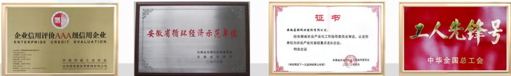

企业信用评价AAA级信用企业

安徽省循环经济示范单位

农业产业化省级重点龙头企业

全国工人先锋号

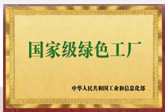  
国家级绿色工厂

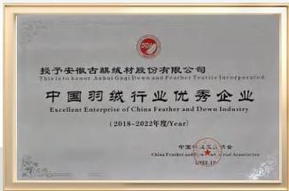  
中国羽绒行业优秀企业

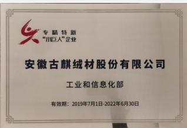  
专精特新小巨人企业

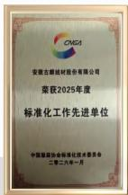  
标准化工作先进单位

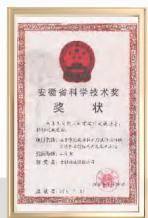  
安徽省科学技术奖

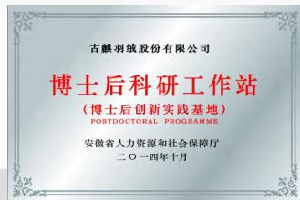  
博士后科研工作站

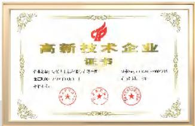  
高新技术企业证书

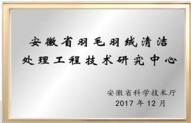  
安徽省羽毛羽绒清洁处理工程技术研究中心

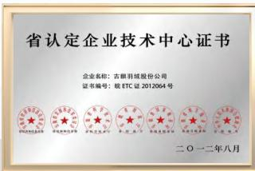  
省认定企业技术中心证书

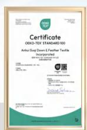  
OEKO-TEX STANDARD 100认证

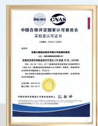  
CNAS实验室认可证书

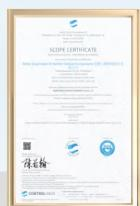  
RDS 认证证书

# |我们的文化

以中国羽绒赋能全球，用专业与责任温暖世界，做全球客户首选的羽绒材料品牌与供应链伙伴。

# 使命

# 愿景

铸中国羽绒标杆, 成全球材料典范, 做最值得信赖的世界级羽绒材料品牌。

品质为根: 坚守纯正品质, 以中国羽绒赢得全球信赖

创新引领: 持续技术突破, 定义羽绒材料行业新标准

诚信共赢: 链接全球伙伴, 共享中国羽绒产业红利

责任致远: 践行绿色可持续理念, 守护生态与产业未来

全球格局: 胸怀世界, 以中国羽绒服务全球市场

# 核心价值观

# 定位

作为行业唯一上市企业，引领中国羽绒走向全球，构建安全、高效、绿色的全球羽绒供应链生态，成为驱动行业创新、定义品质标杆的全球领导品牌。

# | 我们的价值链

古麒绒材以打造全球领先的可持续羽绒产业链为目标，将卓越的产品实力、负责任的生产制造、全方位的社会责任深度融入价值链各环节，创造兼具经济价值、社会价值与环境价值的产业生态。我们目前是中国羽绒行业品质联盟成员之一，并斩获负责任羽绒标准（RDS）认证，确保我们的所有供应商遵循动物福利与供应链可持续性的要求，以行业领先企业的担当推动行业绿色转型，实现与客户、合作伙伴、社区的共生共荣，引领全球羽绒产业链向更高标准、更可持续的方向发展。

# 上游环节

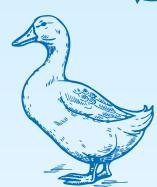

我们扎根“中国羽绒之乡”安徽，并辐射全国核心原料产区，我们的供应商来自中国安徽和山东等省份，负责向我们供应原材料并将原材料运往生产现场。

# 自身业务

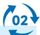

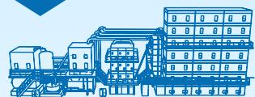

古麒绒材专注于羽绒产品的生产，以全球领先的精细化生产体系为核心，推动水洗、分毛、拼堆等核心工序实现绿色化、智能化、高端化、标准化，依托核心技术与顶尖设备，打造行业领先的生产标准。

# 下游环节

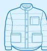

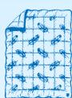

下游活动包括销售和进一步加工阶段，我们的客户会使用我们的羽绒产品制造羽绒服装、羽绒被、羽绒睡袋和户外装备等产品。我们持续通过优质的服务和过硬的品质，赋能下游客户。

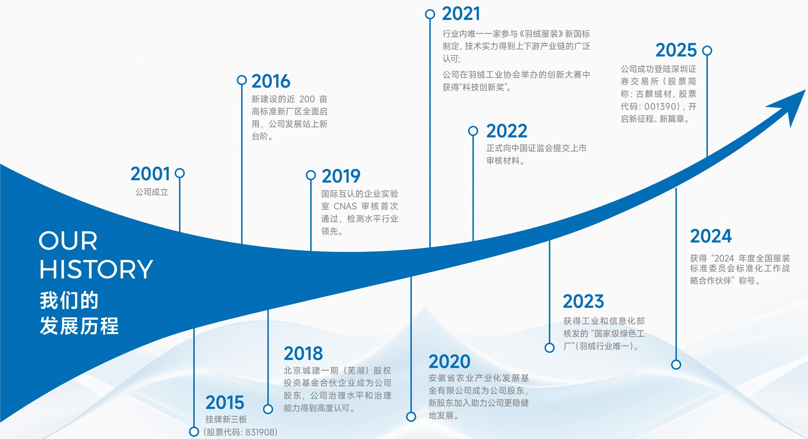

<details>
<summary>state_timeline</summary>

| Year | Event |
| --- | --- |
| 2001 | 公司成立 |
| 2015 | 挂牌新三板 (股票代码: 831908) |
| 2016 | 新建设的近 200 亩高标准新厂区全面启用，公司发展站上新台阶。 |
| 2018 | 北京城建一期（芜湖）股权投资基金合伙企业成为公司股东，公司治理水平和治理能力得到高度认可。 |
| 2019 | 国际互认的企业实验室 CNAS 审核首次通过，检测水平行业领先。 |
| 2020 | 安徽省农业产业化发展基金有限公司成为公司股东，新股东加入助力公司更稳健地发展。 |
| 2021 | 行业内唯一一家参与《羽绒服装》新国标制定，技术实力得到上下游产业链的广泛认可；公司在羽绒工业协会举办的创新大赛中获得“科技创新奖”。 |
| 2022 | 正式向中国证监会提交上市审核材料。 |
| 2023 | 获得工业和信息化部核发的“国家级绿色工厂”(羽绒行业唯一)。 |
| 2024 | 获得“2024 年度全国服装标准委员会标准化工作战略合作伙伴”称号。 |
| 2025 | 公司成功登陆深圳证券交易所（股票简称：古麒绒材，股票代码：001390），开启新征程、新篇章。 |
</details>

# 亮点绩效

■ 经济绩效  
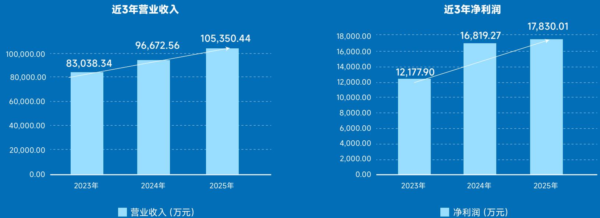  
营业收入（万元）  
净利润（万元）

# ■ 环境绩效

获得ISO 14001环境管理体系认证比例

100%

行业内唯一获得“国家级绿色工厂”

NO.1

年循环用水量超

100万吨

# ■ 社会绩效

获得CNAS实验室认可证书

CNAS

员工培训覆盖率

100%

获得ISO 45001职业健康与安全管理体系认证比例

100%

获得ISO 9001质量管理体系认证比例

100%

参与的国家及行业标准共计

10项, 其中

3项国家标准

2项行业标准

5项团体标准

研发投入连续3年增长

2025年达

3,251万元

累计获得发明专利15项

实用新型专利

56项

产品获得OEKO-TEX

认证比例

100%

# ■ 治理绩效

召开董事会7次, 董事会专门委员会会议10次, 应出席会议人员

100%出席率

女性董事比例25%, 女性员工比例达38%, 其中女性员工比例连续3年增长

25%女性董事比例 38%女性员工比例

# 尽职调查

古麒绒材已建立了一套针对可持续发展风险和机遇进行尽职调查的流程与框架，用于识别、评估和管理与可持续性相关的风险、机遇及影响，主要包含4个步骤：

建立长名单

议题长名单涵盖监管披露内容及古麒绒材特色议题(风险管理、投资者关系、动物福利等)，筛选出24个可持续发展相关议题。

  
利益相关方沟通

01

结合业务实际, 识别界定关键利益相关方, 并通过多元渠道开展有效沟通。

  
筛选短名单

02

经内部研讨评估，筛选高优先级主题并细化交易所披露议题，长名单优化为22个议题。

  
双重重要性评估

03

我们对入围议题从影响重要性与财务重要性维度开展评估，整合形成最终结果。


04

建立长名单: 我们依据深交所的可持续发展报告披露要求、全球可持续信息披露标准和框架（GRI、SDGs），并结合分析公司的商业计划、战略、运营活动的地理位置、公司的业务关系图以及相关的法律和监管政策，编制了重要性议题的长名单。因此，我们的重要性议题主题不仅涵盖《深圳证券交易所上市公司自律监管指引第17号——可持续发展报告（试行）》要求披露的21项议题，还包括我们识别出的古麒绒材特有的议题，如风险管理、投资者关系管理和动物福利，最终我们筛选出24个可能与古麒绒材相关的可持续发展议题。

利益相关方沟通: 我们高度重视与利益相关方的沟通, 依据自身业务运营实际, 系统性地识别并界定了包括股东和投资者、政府及监管机构、供应商、客户等在内的关键利益相关方群体, 并通过多元化渠道为其提供便捷有效的沟通途径。2025年, 公司通过真实、准确地披露相关信息, 积极回应各利益相关方对公司可持续发展工作的期待。

筛选短名单: 基于长名单, 我们通过内部研讨会评估, 在该阶段筛选出高优先级议题。除此之外, 我们还在交易所要求披露的议题上进行了细化, 将原交易所要求披露的“员工”议题细化为3个议题, 分别是员工权益与福利、职业健康与安全、员工培训与发展, 最终将长名单调整为涵盖22个议题的短名单。

双重重要性评估: 对入围短名单的议题, 我们根据其影响重要性（由内而外）和财务重要性（由外而内）进行评估, 分别针对“E”“S”和“G”领域开展影响、风险与机遇评估。将入围议题纳入重要性矩阵, 通过测试不同阈值界定“重要”的议题, 最终确定了7个兼具影响重要性和财务重要性的议题。

古麒绒材重要性矩阵  
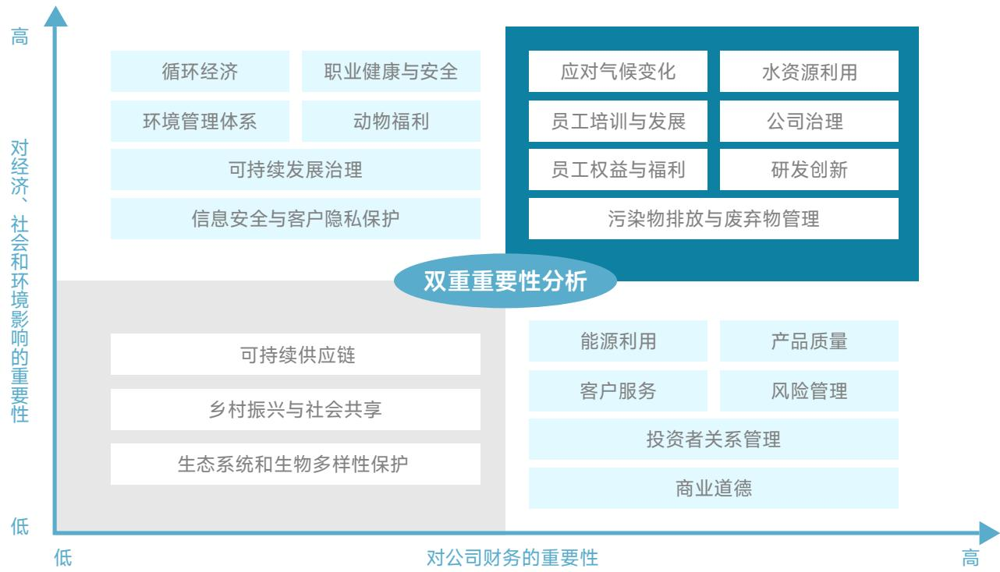

<details>
<summary>other</summary>

| Topic | Importance to Company Finance (X-axis) | Impact on Economic, Social, and Environmental Factors (Y-axis) |
| :--- | :--- | :--- |
| 应对气候变化 | High | High |
| 水资源利用 | High | High |
| 员工培训与发展 | High | High |
| 公司治理 | High | High |
| 员工权益与福利 | High | High |
| 研发创新 | High | High |
| 污染物排放与废弃物管理 | High | High |
| 能源利用 | Low | Low |
| 产品质量 | Low | Low |
| 客户服务 | Low | Low |
| 风险管理 | Low | Low |
| 投资者关系管理 | Low | Low |
| 商业道德 | Low | Low |
| 可持续供应链 | Low | Low |
| 乡村振兴与社会共享 | Low | Low |
| 生态系统和生物多样性保护 | Low | Low |
| 循环经济 | Low-Medium | Medium-High |
| 职业健康与安全 | Low-Medium | Medium-High |
| 环境管理体系 | Low-Medium | Medium-High |
| 动物福利 | Low-Medium | Medium-High |
| 可持续发展治理 | Low-Medium | Medium-High |
| 信息安全与客户隐私保护 | Low-Medium | Medium-High |
</details>

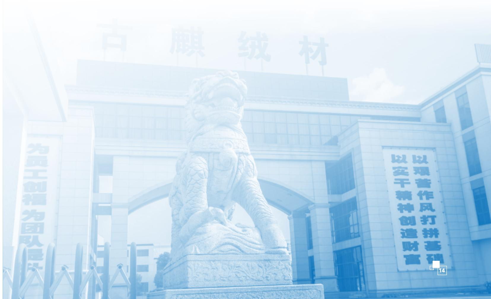

<details>
<summary>text_image</summary>

古膜绒材
为员工创福为团队是
以实干精神创造财富
以艰苦作风打拼基础
14
</details>

<table><tr><td>利益相关方</td><td colspan="4">关注议题</td><td colspan="2">沟通渠道</td></tr><tr><td>股东及投资者</td><td></td><td>可持续发展治理可持续供应链</td><td>公司治理商业道德</td><td>研发创新产品质量</td><td>风险管理</td><td>股东会互动易平台</td></tr><tr><td>政府及监管机构</td><td></td><td>环境管理体系水资源利用</td><td>应对气候变化职业健康与安全</td><td>乡村振兴与社会共享污染物排放与废弃物管理</td><td>商业道德</td><td>政策跟进与执行定期信息披露与汇报</td></tr><tr><td>客户</td><td></td><td>产品质量可持续供应链</td><td>客户服务动物福利</td><td>信息安全与客户隐私保护研发创新</td><td></td><td>客户满意度调查客户拜访</td></tr><tr><td>员工</td><td></td><td>员工权益与福利员工培训与发展</td><td></td><td>职业健康与安全公司治理</td><td></td><td>工会日常运作员工培训</td></tr><tr><td>供应商和合作伙伴</td><td></td><td>可持续供应链商业道德</td><td></td><td>平等对待中小企业动物福利</td><td></td><td>供应商评审行业交流互访</td></tr><tr><td>公众与社区</td><td></td><td>污染物排放与废弃物管理生态系统和生物多样性保护</td><td></td><td>乡村振兴与社会共享水资源利用</td><td></td><td>官网及媒体社区志愿活动</td></tr></table>

# 可持续发展战略

公司以“铸中国羽绒标杆，成全球材料典范，做最值得信赖的世界级羽绒材料品牌”为发展愿景，将可持续发展深度融入企业战略核心，始终坚守“以技术实力引领行业标准，以产品质量服务品牌客户，以清洁生产践行‘双碳’战略”的发展定位。依托技术创新筑牢产品核心竞争力，以高品质供给赋能品牌客户发展，同时将清洁生产、低碳运营贯穿生产经营全流程，通过规范化、精细化的环境管理，主动降低环境足迹，以实际行动践行“双碳”目标，推动企业发展与生态保护同频共振，实现公司治理和经济效益、社会效益、环境效益的有机统一，致力于以可持续发展模式打造全球羽绒材料领域的标杆品牌。

# PREMIER

# 铸中国羽绒标杆 成全球材料典范

<table><tr><td>PREMIER</td><td>P(People oriented)</td><td>R(Responsible)</td><td>E(Ecologically friendly)</td><td>M(Meticulous)</td><td>I(Innovative)</td><td>E(Excellent)</td><td>R(Reliable)</td></tr><tr><td>发展愿景</td><td>以人为本,关爱员工</td><td>尽责担当,回馈社会</td><td>生态友好,绿色低碳</td><td>精工细作,严控品质</td><td>技术领航,创新突破</td><td>追求卓越,服务全球</td><td>以诚立业,行稳致远</td></tr><tr><td>议题</td><td>员工权益与福利职业健康与安全员工培训与发展</td><td>信息安全与客户隐私保护乡村振兴与社会共享可持续供应链动物福利</td><td>环境管理体系能源利用应对气候变化污染物排放与废弃物管理水资源利用循环经济生态系统和生物多样性保护</td><td>客户服务产品质量</td><td>研发创新</td><td>可持续发展治理公司治理风险管理</td><td>商业道德投资者关系管理</td></tr><tr><td>发展目标</td><td>坚持人才强企理念,构建完善的员工关怀与成长体系,保障职工合法权益守护职工职业健康,打造有归属感、凝聚力的高素质人才梯队,实现企业与员工同心共进、共生共荣,筑牢企业长远发展的人才根基。</td><td>主动履行企业社会责任,守护各方合法权益,深化全链条责任管理,积极回馈社会、助力共同富裕,树立负责任、有担当的标杆企业形象。</td><td>践行绿色发展理念,构建完备的绿色发展体系,推进节能减排与资源循环利用,积极应对气候变化,走低碳可持续发展道路,守护生态平衡,助力行业绿色转型与国家双碳目标实现。</td><td>坚守品质初心,秉持精工智造理念,建立全流程严苛质控体系,优化客户服务体验,以过硬品质赢得市场信赖,稳固行业品质标杆地位,擦亮中国羽绒品牌名片。</td><td>坚持创新驱动发展,深耕核心技术研发,不断突破技术瓶颈,引领行业标准升级。构筑核心技术壁垒,以科技创新激活发展动能,保持企业长期竞争力与行业引领地位。</td><td>完善现代化治理体系,强化风险防控、优化经营管理。立足中国,提升全球运营能力,全力打造享誉全球的羽绒材料品牌,实现企业高质量、可持续跨越式发展。</td><td>坚守诚信底线、恪守商业道德、规范经营行为,主动承载社会使命,实现商业价值与社会价值协同发展。</td></tr></table>

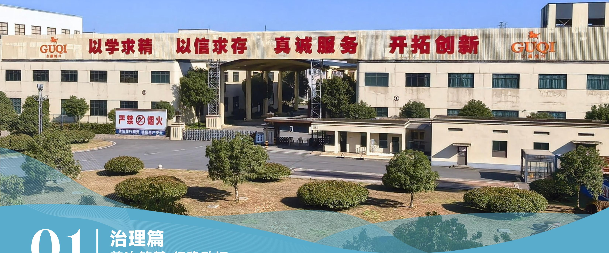

<details>
<summary>text_image</summary>

GUOI
力联科技
以学求精 以信求存 真诚服务 开拓创新 GUOI
严禁烟火
体验流行职责 确保与生产安全
01 | 治理篇
法治新基、行政政运
</details>

# 01 | 治理篇 善治筑基 行稳致远

我们始终坚信卓越的公司治理是企业可持续发展的核心基石，为企业行稳致远提供根本支撑。

可持续发展治理 21

投资者关系管理 34

公司治理 23

风险管理 29

商业道德 32

12 负责任消费和生产


16 和平、正义与强大机构

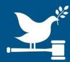

# 可持续发展治理

我们始终坚信, 卓越的公司治理是企业可持续发展的核心基石, 唯有构建规范化与体系化的治理体系, 才能为企业行稳致远提供根本支撑, 以治理优势铸就竞争优势, 以治理高度奠定行业地位。

正如《礼记·中庸》所言：“致广大而尽精微，极高明而道中庸”。我们以“规范筑基、体系强本、高端立标”为治理进阶路径，将ESG理念深度嵌入公司决策机制与内控流程，推动治理实践从合规遵从迈向价值创造。

2025年, 公司成功登陆深圳证券交易所, 成为上市公司, 这是对公司保持行业领军态势的市场认可, 更是肩负行业引领责任的全新征程。作为羽绒行业的标杆型上市公司, 公司主动对标国际顶尖企业的ESG治理标准, 即便暂未纳入ESG信息强制披露范围, 仍以高标准要求自己, 决定在上市次年与年报同期发布首份可持续发展(ESG)报告, 以实际行动彰显行业引领的责任与担当。上市不仅是新的起点, 更是新的责任。公司高度重视可持续发展与ESG治理建设, 以上市为契机, 构建全球领先的ESG管理架构, 为保持行业领先优势筑牢治理根基。

2026年初，本公司于现有战略委员会基础上增设ESG治理职能，正式成立由董事会领导的战略与可持续发展委员会，全面统筹环境、社会及治理相关工作的规划与实施。该委员会下设ESG管理委员会，由董事会办公室牵头，并由公司高级管理层组成；同时设立ESG工作小组，由公司七大核心部门共同协作，为ESG管理委员会提供支持。由此构建起职责清晰、协同推进、执行高效的ESG管理体系，将ESG理念深度融入生产、研发、采购、销售等全业务流程，旨在实现ESG治理的领先性，促进企业高质量发展。

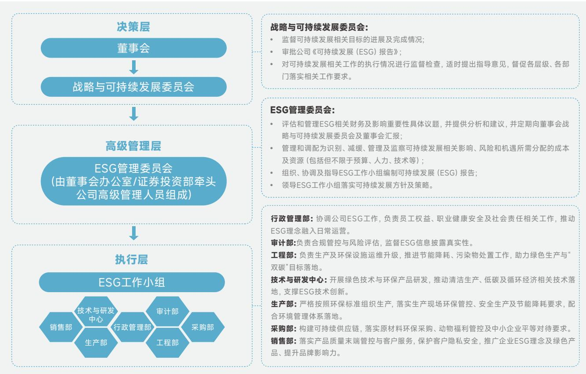

<details>
<summary>flowchart</summary>

```mermaid
graph TD
  subgraph DecisionLevel ["决策层"]
  A["董事会"] --> B["战略与可持续发展委员会"]
  end

  subgraph ESG_Mgmt ["高级管理层"]
  C["ESG管理委员会\n(由董事会办公室/证券投资部牵头\n公司高级管理人员组成)"] --> D["执行层"]
  end

  subgraph ESG_Work["执行层"]
  ESG_Work["ESG工作小组"] --> F["销售部"]
  ESG_Work --> G["技术与研发中心"]
  ESG_Work --> H["生产部"]
  ESG_Work --> I["行政管理部"]
  ESG_Work --> J["审计部"]
  ESG_Work --> K["采购部"]
  end

  subgraph ESG_Man_ESG["ESG_Man革 [\"ESG管理委员会\"]"]
  L["ESG管理委员会"] --> M["评估和管理ESG相关财务及影响重要性具体议题，并提供分析和建议，并定期向董事会战略与可持续发展委员会及董事会汇报；"]
  M --> N["管理和调配为识别、减缓、管理及监察可持续发展相关影响、风险和机遇所需分配的成本及资源（包括但不限于预算、人力、技术等）；"]
  N --> O["组织、协调及指导ESG工作小组编制可持续发展（ESG）报告；"]
  O --> P["领导ESG工作小组落实可持续发展方向及策略。"]
  end

  subgraph ESG_Man_U ["执行层"]
  Q["ESG工作小组"] --> R["行政管理部"]
  R --> S["审计部"]
  R --> T["采购部"]
  end
```
</details>

注：公司战略委员会已于2026年4月更名为战略与可持续发展委员会，本报告中所涉该委员会名称均已采用更新后的称谓。

<table><tr><td>组织/部门名称</td><td>管理职责</td><td>职责范围</td></tr><tr><td>董事会</td><td>ESG相关工作的最高决策机构,下设战略与可持续发展委员会。</td><td>1、了解、分析和掌握国内外行业现状和可持续发展相关政策,基于公司经营管理情况,进行可持续发展相关的决策部署;2、监督战略与可持续发展委员会制定的可持续发展方针、目标、战略、政策声明等,并评估可持续发展相关的影响、风险和机遇。</td></tr><tr><td>战略与可持续发展委员会</td><td>ESG相关工作的日常监督与指导机构</td><td>1、定期监督可持续发展相关目标的进展及完成情况,对未达标的事项及时提出指导意见,推动目标落地;2、审批公司《可持续发展(ESG)报告》,确保报告内容真实、完整、规范,全面反映公司ESG工作成效;3、对可持续发展相关工作的执行情况进行监督检查,适时提出指导意见,督促各层级、各部门落实相关工作要求。</td></tr><tr><td>ESG管理委员会</td><td>由董事会战略与可持续发展委员会直接领导,接受董事会的指导与监督,下设ESG工作小组。</td><td>1、梳理ESG相关重要性议题,进行深入分析并提出合理建议,供董事会讨论,保障董事会对ESG工作的有效监督;2、确定并管理ESG工作所需的成本及资源,负责识别、减缓、管理及监察可持续发展相关的影响、风险和机遇,确保资源合理分配、风险有效管控;3、拟订公司可持续发展工作计划,明确各部门工作分工、工作目标和考核标准,推动ESG工作规范化、常态化开展;4、统筹协调各职能部门ESG相关工作,传达决策层的工作要求,收集各部门工作进展,及时向决策层汇报ESG工作整体情况;5、处理其他与可持续发展相关的管理类事项,确保ESG工作全面覆盖、有序推进。</td></tr><tr><td>ESG工作小组</td><td>由行政管理部、技术与研发中心、审计部、工程部、生产部、采购部、销售部七个部门组成,受ESG管理委员会管理,是ESG相关工作的具体执行主体。</td><td>1、制定利益相关方参与计划,组织开展利益相关方沟通活动,收集利益相关方诉求,推动公司与利益相关方的良性互动;2、协调各组成部门,负责公司《可持续发展(ESG)报告》的编制、修订工作,确保报告数据准确、内容全面;3、负责公司可持续发展相关的管理体系完善、数据统计与分析工作,搭建投资者及研究机构沟通桥梁,提升公司ESG沟通能力;4、落实管理层拟定的可持续发展工作计划,完善相关管理制度,规范日常执行流程,确保各项工作落地见效;5、定期汇总各部门ESG工作成果,向管理层汇报工作进展、存在问题及改进建议,接受管理层的指导与调整;6、处理其他与可持续发展相关的执行类事项,配合决策层、管理层完成监督、检查工作。</td></tr></table>

未来, 公司将持续完善ESG治理体系, 主动践行可持续发展理念, 以实际行动践行责任担当, 以高标准的治理要求持续提升信息披露质量, 以责任驱动发展, 以专业创造价值, 全力推动企业行稳致远。

# 公司治理

2025 年 10 月 16 日，中国证券监督管理委员会新修订了《上市公司治理准则》，自 2026 年 1 月 1 日起施行。该准则要求上市公司应当贯彻落实创新、协调、绿色、开放、共享的新发展理念，弘扬优秀企业家精神，积极履行社会责任，形成良好的公司治理实践。

古麒绒材积极响应国家政策要求,始终将卓越的公司治理视为企业可持续发展的核心基础。公司持续优化以股东会、董事会及相关专门委员会为核心的科学治理架构，确保权责清晰、运作规范。董事会高度重视治理水平的持续提高，将可持续发展理

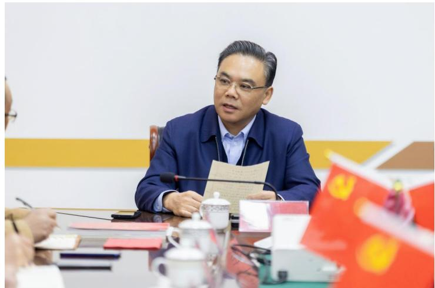

<details>
<summary>natural_image</summary>

Man in formal attire seated at a conference table with documents and red flags (no visible text or symbols)
</details>

念深度融入公司战略决策和日常运营。公司持续优化治理架构，明确权责界定，完善决策程序与内部监督机制，确保各部门及分子公司依法依规充分履职。

股东会是古麒绒材的最高权力决策机构，公司设有董事会，董事会下设4个专门委员会，分别为战略与可持续发展委员会、审计委员会、提名委员会、薪酬与考核委员会，并设董事会秘书。

公司根据《中华人民共和国公司法》及《上市公司章程指引（2025年修订）》等要求对公司治理结构进行了调整，于报告期内取消了监事会，董事会审计委员会全面行使原属监事会的财务报告审核、提议召开临时股东会议、董事及高管履职监督等职权，正式跨入“股东会－董事会－管理层”“两会一层”的治理新时代，进一步增强和完善公司治理机制建设，强化治理主体责任履行。

董事会聘任总经理负责日常经营管理，总经理作为公司的高级管理人员，负责贯彻落实董事会决议，主持公司的生产经营和日常管理工作，并对董事会负责。总经理统筹管理审计部、行政管理部、财务部、采购部、销售部、生产部、物流部、工程部、技术与研发中心、证券投资部共10个职能部门，形成权责清晰、协同高效的治理与运行体系。

报告期内，公司共召开股东会3次、董事会7次，董事会专门委员会会议10次，独立董事专门会议5次，对公司经营管理、风险控制等重大事项进行审议决策，应出席人员会议出席率100%。

# 报告期内, 召开

3 次股东会

7次董事会

10 次董事会专门委员会

5 次独立董事专门会议

公司日常经营的组织管理架构  
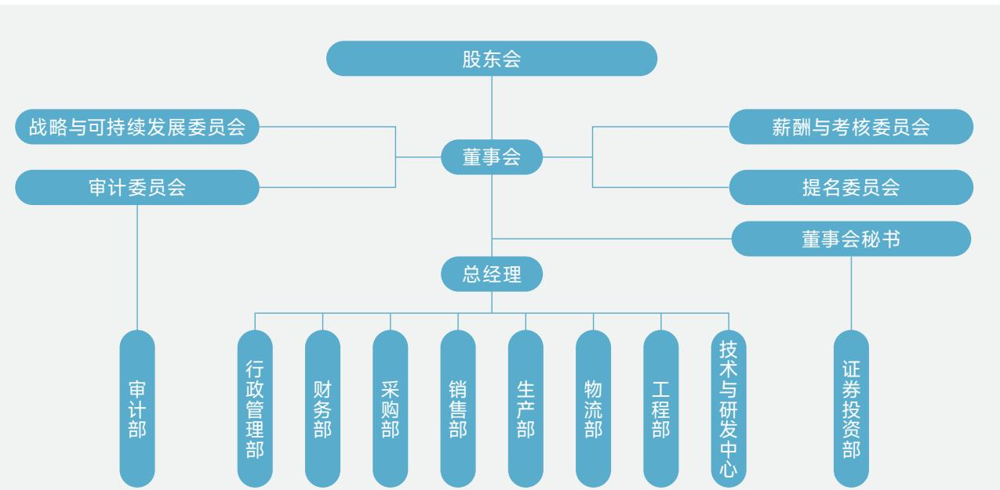

<details>
<summary>flowchart</summary>

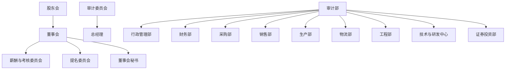
</details>


<details>
<summary>natural_image</summary>

Close-up of white feather feathers against a light blue background, no text or symbols visible.
</details>

# 董事会

在公司治理层面，我们严格遵守《中华人民共和国公司法》《中华人民共和国证券法》《上市公司独立董事管理办法》《上市公司治理准则》等相关法律法规及规范性文件的要求，并制定了《安徽古麒绒材股份有限公司独立董事工作制度》《安徽古麒绒材股份有限公司董事会议事规则》等内部管理制度。古麒绒材的董事会组织架构完备。公司董事会由8名董事构成，其中3名是独立董事。依据《安徽古麒绒材股份有限公司章程》（以下简称《公司章程》），董事由股东会选举产生，每届任期为三年，任期届满后可连选连任；独立董事任期同样为三年，任期届满后可连选连任，但连任时间不得超过六年。

在董事会独立性方面，公司有3名独立董事，分别为罗昆先生、吴初阳女士以及袁奇先生。独立董事在公司董事会中所占人数比例达37.5%，已超过董事会总人数的三分之一。其中，罗昆先生具备深厚的会计专业知识，能够为公司财务相关决策提供专业视角与有力支持，同时罗昆先生长期从事ESG治理领域的研究，主持与ESG有关的国家社科基金项目1项，在SSCI和CSSCI期刊发表ESG相关的学术论文10余篇。吴初阳女士毕业于华东政法大学的社会工作专业，拥有社会学专业背景，2位独董均能够凭借其专业素养，为公司的ESG管理工作给予有效的指导与助力，推动公司的ESG治理。

8名董事

3名独立董事

37.5% 独立董事占比

<table><tr><td>姓名</td><td>性别</td><td>董事会任职情况</td><td>职务及任职期间</td></tr><tr><td>谢玉成</td><td>男</td><td>董事长</td><td>董事长(任职起始时间为2010年1月18日)/总经理(任职起始时间为2018年3月6日)</td></tr><tr><td>武怿忻</td><td>女</td><td>董事</td><td>董事(任职起始时间为2020年12月10日)</td></tr><tr><td>翁木林</td><td>男</td><td>董事</td><td>董事(任职起始时间为2007年12月23日)</td></tr><tr><td>洪小林</td><td>男</td><td>董事</td><td>董事(任职起始时间为2014年9月1日)/副总经理(任职起始时间为2018年3月6日)</td></tr><tr><td>汪章建</td><td>男</td><td>董事</td><td>董事(任职起始时间为2014年9月1日)/副总经理(任职起始时间为2014年9月1日)财务总监(任职起始时间为2014年9月21日)</td></tr><tr><td>罗昆</td><td>男</td><td>独立董事</td><td>独立董事(任职起始时间为2024年2月26日)</td></tr><tr><td>吴初阳</td><td>女</td><td>独立董事</td><td>独立董事(任职起始时间为2020年11月30日)</td></tr><tr><td>袁奇</td><td>男</td><td>独立董事</td><td>独立董事(任职起始时间为2020年11月30日)</td></tr></table>

# 董事会多元化

公司坚定认为，董事会多元化是拓宽战略视野、提升决策质量以及增强经营效能的关键要素。在成员选聘方面，始终秉持唯才是举的原则，以综合能力作为核心考量指标，同时兼顾性别、年龄、专业经验、技能背景等多元维度，并结合公司业务模式与发展需求，对董事会结构进行动态优化。董事会整体专业配置均衡，董事与独立董事的构成合理，为独立决策筑牢了坚实根基。公司已构建了完善的管理机制，以确保董事会成员构成的调整不会对公司的正常运营造成不当干扰。独立董事均为行业资深人士、专业人才，或具备跨领域实践能力，这有效增强了董事会的专业平衡与多元视野，使其能够以独立立场为公司战略规划、经营政策研讨提供具有建设性的专业意见，助力公司决策优化。

目前, 自武怿忻女士和吴初阳女士分别被选为公司董事和独立董事后, 公司已达成董事会多元化布局, 董事会不再是单一性别董事会, 女性董事占比达25%, 打破了单一性别结构, 治理多元化建设已初见成效。

# 董事会成员性别比例

25% 女性  
75% 男性

当前，公司董事团队背景呈现多元互补态势，其专业能力与企业发展需求相适配，为公司的长期稳健发展筑牢了治理根基。

<table><tr><td>类别</td><td>谢玉成先生</td><td>武怿忻女士</td><td>翁木林先生</td><td>洪小林先生</td><td>汪章建先生</td><td>罗昆先生</td><td>吴初阳女士</td><td>袁奇先生</td></tr><tr><td>性别</td><td>男性</td><td>女性</td><td>男性</td><td>男性</td><td>男性</td><td>男性</td><td>女性</td><td>男性</td></tr><tr><td>年龄</td><td>62岁</td><td>50岁</td><td>78岁</td><td>58岁</td><td>60岁</td><td>43岁</td><td>38岁</td><td>40岁</td></tr><tr><td>董事会服务任期</td><td>15年</td><td>5年</td><td>18年</td><td>11年</td><td>11年</td><td>1年</td><td>5年</td><td>5年</td></tr><tr><td>学历/专业资质</td><td>大专学历高级工程师</td><td>本科学历</td><td>初中学历</td><td>大专学历</td><td>大专学历会计师</td><td>博士研究生学历</td><td>硕士研究生学历</td><td>本科学历</td></tr></table>

核心技能、知识及专业经验

<table><tr><td>(a)会计及金融</td><td></td><td>✓</td><td></td><td></td><td>✓</td><td>✓</td><td></td><td></td></tr><tr><td>(b)业务发展</td><td>✓</td><td></td><td>✓</td><td>✓</td><td></td><td></td><td></td><td>✓</td></tr><tr><td>(c)资本市场</td><td></td><td>✓</td><td></td><td></td><td>✓</td><td></td><td></td><td></td></tr><tr><td>(d)企业战略及规划</td><td>✓</td><td>✓</td><td></td><td></td><td>✓</td><td>✓</td><td></td><td>✓</td></tr><tr><td>(e)行政管理及领导技能</td><td>✓</td><td>✓</td><td>✓</td><td>✓</td><td>✓</td><td>✓</td><td>✓</td><td>✓</td></tr><tr><td>(f)投资者关系</td><td></td><td>✓</td><td></td><td></td><td></td><td></td><td></td><td></td></tr><tr><td>(g)制造</td><td>✓</td><td></td><td>✓</td><td>✓</td><td></td><td></td><td></td><td></td></tr><tr><td>(h)营运管理</td><td>✓</td><td>✓</td><td>✓</td><td>✓</td><td>✓</td><td>✓</td><td></td><td>✓</td></tr><tr><td>(i)资金管理</td><td></td><td>✓</td><td></td><td></td><td>✓</td><td>✓</td><td></td><td></td></tr><tr><td>(j)可持续发展治理</td><td></td><td></td><td></td><td></td><td></td><td>✓</td><td>✓</td><td></td></tr></table>

报告期内, 董事会各下属委员会的会议召开情况如下:

<table><tr><td>委员会名称</td><td>年内开会次数</td><td>委员会成员</td></tr><tr><td>战略与可持续发展委员会</td><td>2</td><td>谢玉成、罗昆、汪章建</td></tr><tr><td>审计委员会</td><td>6</td><td>罗昆、吴初阳、翁木林</td></tr><tr><td>提名委员会</td><td>0</td><td>袁奇、吴初阳、洪小林</td></tr><tr><td>薪酬与考核委员会</td><td>2</td><td>罗昆、吴初阳、汪章建</td></tr></table>

报告期内, 全体董事均恪尽职守、履职尽责, 积极为公司经营决策建言献策, 保障董事会规范高效、稳健运作。公司治理严格遵循上市规则及《公司章程》相关要求, 严格执行董事任期届满后的退任与重选机制, 《公司章程》的修订均履行股东会批准程序, 确保治理合规规范。

未来，公司在董事会成员选聘中，将全面考量性别、年龄、文化教育背景、专业经验、技能知识、任职年限等多维度因素，以多元化的专业视角进一步提升董事会决策质量与战略把控能力。

# 董事和高级管理人员的薪酬及绩效

公司依据《中华人民共和国公司法》及相关法律法规、规范性文件，结合《公司章程》的有关规定，制定了《安徽古麒绒材股份有限公司董事及高级管理人员薪酬管理制度》。董事和高级管理人员薪酬管理制度的制定，从契合公司长远发展和股东利益的视角出发，遵循公平、权责统一、长远发展以及激励约束并重等四项原则，薪酬设计严格遵循合规决策流程，依据不同岗位类型、人员履职特点进行差异化适配。该制度与公司效益、工作目标紧密关联，同时符合市场价值规律。

独立董事：领取独立董事津贴，津贴标准经股东会审议确定后执行。独立董事因出席公司董事会和股东会的差旅费，以及依照《公司章程》行使职权时所需的其他费用由公司承担。独立董事不参与公司内部的与薪酬挂钩的绩效考核。

非独立董事: 作为公司高级管理人员的董事不以董事职务取得津贴, 按其在经营管理层的任职和考核情况发放薪酬; 不担任高级管理人员的董事, 由股东会审议确定是否发放津贴以及津贴标准。

高级管理人员: 公司高级管理人员的薪酬由基本工资和奖金构成。基本工资结合岗位职责和履职情况确定, 奖金根据公司业绩完成情况及个人考核结果确定。

公司会定期对董事及高级管理人员的薪酬开展审核工作，综合考量行业薪酬水平、公司业绩增长情况以及个人履职表现，动态优化薪酬结构，增强绩效导向与长期激励的协同效应。同时，公司已设立薪酬与考核委员会，由独立董事担任主任委员，定期审议薪酬执行情况，以保证相关制度得以落实。

# 党建工作

古麒绒材党支部于2011年成立，始终秉持“围绕发展抓党建，抓好党建促发展”的理念，将党的政治建设摆在首要位置，持续夯实组织基础、强化党员教育管理。在实现自身发展的同时，积极引导企业和党员职工履行社会责任。支部的战斗堡垒作用和党

员的先锋模范作用在企业经营发展的关键环节得以充分彰显。

近年来，古麒绒材党支部带领全体党员深入学习党的重要理论知识以及习近平总书记关于新质生产力的重要讲话指示精神，发挥基层党建的政治引领作用，把准企业发展方向，推动公司实现高质量、可持续发展。一直以来，党和政府对公司党建工作高度认可并给予大力支持。2025年，古麒绒材党支部荣获芜湖市“市级‘双强六好’非公企业党组织”称号。

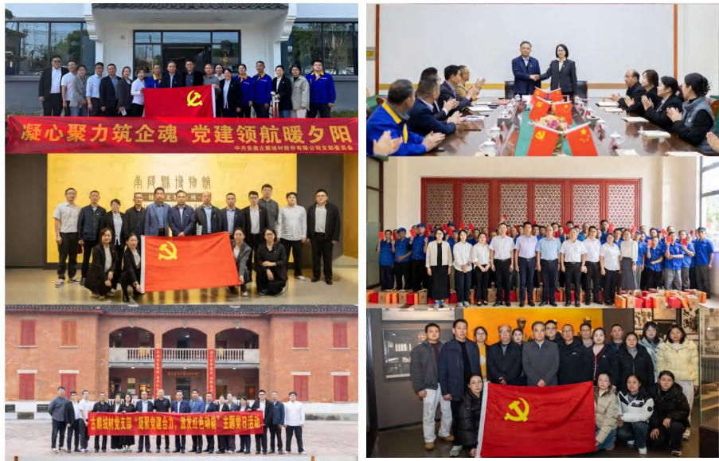

# 案例

# 党支部赴烈士陵园开展“凝聚党建合力，激发红色动能”主题党日活动

古麒绒材党支部组织全体党员赴李家发烈士陵园开展“凝聚党建合力，激发红色动能”主题党日活动。活动旨在传承红色基因、强化党性修养，党员们通过瞻仰革命先烈、重温英雄事迹，接受了爱国主义与理想信念教育。本次活动进一步增强了党组织凝聚力，引导党员传承英烈精神、强化责任担当，以党建引领企业文化建设与经营发展，凝聚团队合力，为公司高质量可持续发展注入精神动力。

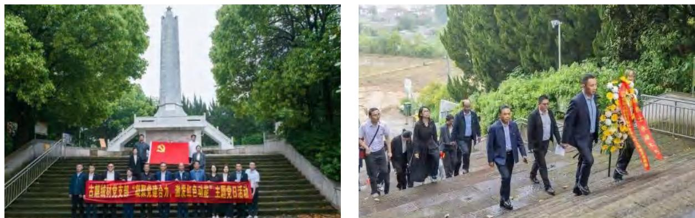

# 风险管理

公司视风险与合规管理为企业稳健长远发展的基石，构建了以高层引领、审计为基础的立体化管理体系，通过健全主动的风险识别与预警机制，将合规要求内化为经营准则。借助系统化的风险防控，公司为战略的顺利实施和长期价值的实现提供坚实保障。

我们制定了一系列全面且细致的风险管理和内控制度，包括《安徽古麒绒材股份有限公司重大信息内部报告制度》《安徽古麒绒材股份有限公司年报信息披露重大差错责任追究制度》《安徽古麒绒材股份有限公司防范控股股东及关联方占用公司资金制度》《安徽古麒绒材股份有限公司关联交易管理制度》以及《安徽古麒绒材股份有限公司内部审计制度》等。

当前，在公司内部的风险管理架构中，审计部承担着核心职能。审计部肩负着对公司业务活动、风险管理体系、内部控制机制以及财务信息等诸多关键事项进行监督检查的重要职责，通过严谨、专业的工作，确保公司运营管理合规、风险防控有效。

为进一步提高风险精准识别和管控应对能力,公司将面临的主要风险细分为战略风险、市场风险、信用风险、流动性风险、运营风险、合规风险以及 ESG 风险,主要风险类型如下表所示。

<table><tr><td>风险类型</td><td>具体风险</td><td>应对举措</td></tr><tr><td>战略风险</td><td>· 技术研发的风险· 资产、业务规模扩张带来的管理风险· 募集资金投资项目建设的风险· 新增产能的消化风险· 首次公开发行股票摊薄即期回报的风险</td><td>· 更为精准地研判技术研发方向,严控研发投入与进度;· 优化管理架构适配规模扩张,明确各部门权责;· 规范募投项目流程,加强进度与质量管控;· 合理规划产能,拓展销售渠道消化新增产能;· 制定回报补偿方案,降低IPO摊薄即期回报影响。</td></tr><tr><td>市场风险</td><td>· 经营业绩波动的风险· 毛利率下降的风险· 主要客户集中度较高的风险· 羽绒价格波动的风险· 市场需求下降的风险· 行业竞争风险</td><td>· 强化成本管控与客户维护,稳定经营业绩;· 优化产品结构,提升产品附加值,缓解毛利率下滑;· 拓展多元客户群体,降低客户集中度;· 建立羽绒价格监测机制,锁定长期采购渠道;· 洞察市场需求,强化品牌建设应对竞争与需求下滑。</td></tr><tr><td>信用风险</td><td>· 应收账款收回的风险</td><td>· 建立客户信用评级体系,加强应收账款跟踪,及时预警逾期款项,保障账款及时收回,降低坏账风险。</td></tr></table>

<table><tr><td>风险类型</td><td>具体风险</td><td>应对举措</td></tr><tr><td>流动性风险</td><td>■ 营运资金不足的风险■ 资产抵押的风险</td><td>■ 优化营运资金调配,合理规划资金使用;■ 加强资产负债管理,严控资产抵押规模,评估抵押风险;■ 拓宽融资渠道,保障资金流动性,防范营运资金不足问题。</td></tr><tr><td>运营风险</td><td>■ 存货计提跌价准备的风险■ 员工稳定性的风险■ 产品质量风险</td><td>■ 定期盘点存货,跟踪市场价格,及时计提跌价准备;■ 完善员工激励与福利体系,提升员工稳定性;■ 健全产品质检流程,严控生产各环节,防范产品质量风险。</td></tr><tr><td>合规风险</td><td>■ 税收优惠政策变化的风险</td><td>■ 密切关注税收优惠政策变化,加强税务合规管理,规范税务申报流程,降低政策变动影响。</td></tr></table>

# ESG风险管理

公司已将ESG风险的识别、评估及管理全面纳入风险管理机制，并将可持续发展因素深度融入业务运营之中。为强化ESG风险管理，公司依据重要性议题评估结果，对专项ESG风险展开深入评估与应对，识别潜在风险，并制定相应的管理与应对举措，以确保ESG风险管理具备有效性与前瞻性。公司当前识别出的ESG风险包含以下类型：

<table><tr><td>ESG风险类型</td><td>风险说明</td><td>对当期财务状况、经营成果、现金流的可能影响</td><td>应对举措</td></tr><tr><td>技术研发的风险</td><td>公司在清洁生产工艺、功能性羽绒羽毛研发及检测领域具备一定技术储备。随着市场需求变化,需持续推进技术创新与工艺升级。若未能精准把握产品和技术的发展趋势,工艺改进或新品开发出现方向偏差,新技术产业化不及预期,或将对公司经营及长远发展产生不利影响。</td><td>研发投入推高当期营业成本,可能导致净利润减少,整体现金流净额承压;研发设备、技术投入等非流动资产减值,可能导致总资产账面价值降低,净资产同步减少。</td><td>■ 建立市场调研与技术研判机制,精准把握清洁生产及功能性羽绒的市场需求,规避研发偏差;■ 深化产学研合作,依托博士后工作站引进高端人才,聚焦核心技术攻关;■ 优化研发投入结构,优先保障刚需项目,严控无效支出,缓解现金流压力。</td></tr></table>

# ESG风险类型

# 风险说明

# 员工稳定性的风险

公司长期专注羽绒羽毛产品研发、生产与销售，拥有经验丰富的生产及检测人员。行业经验依赖长期实践积累，稳定的员工队伍是企业良好经营的重要保障。若出现员工大规模流失，短期内难以补充胜任人员，或将对公司经营造成不利影响。

# 对当期财务状况、经营成果、现金流的可能影响

若员工大规模流失，新员工招聘、培训可能推高管理费用和生产成本，同时生产效率降低进一步增加单位产品成本，可能导致净利润下降。

# 应对举措

公司完善具有竞争力的薪酬激励与晋升体系，增强员工归属感；  
开展岗位技能培训，建立老带新机制，缩短新员工适应周期；  
强化人文关怀与企业文化建设，降低核心人才流失风险；  
与高等院校开展定向人才培养合作，建立健全人才储备机制，并对核心岗位员工实施专项激励措施。

# 产品质量风险

羽绒产品是重要的功能性材料，其质量直接决定了下游制成品的质量，且占羽绒服的成本比例达45%左右。客户对产品质量把控严格，会对采购的羽绒产品进行多项指标检测，如未达到采购要求则会采取退换货等措施。公司对产品质量把关较严，暂未出现产品质量纠纷，退换货率较低。若未来公司产品质量出现波动，达不到客户要求，可能导致退换货率提高，公司声誉受损，甚至客户流失。

退换货产品的生产、运输成本形成损失推高营业成本，客户采购规模下降可能进一步导致营收萎缩，品牌声誉修复可能产生额外费用，净利润减少、流动资产周转率降低等。

\- 规范羽绒原料采购，从源头把控质量，坚持执行产品质量“四级”把控审批机制，全流程管控生产各环节，强化出库检测，核查绒子含量等核心指标；
- 开展质量培训，提升员工操作规范性，建立客户反馈与质量追溯机制，及时处理退换货事宜。

# 环保风险

羽绒羽毛加工水洗工序产生富含有机物废水，未经处理直排会污染环境。近年来，国家相关部门制定实施技术规范，明确行业污染防治管理要求。若未来公司环保设备运行不达标，或生产经营无法持续满足环保规定，将面临环保部门处罚风险。

环保设备维修改造推高生产成本和管理费用，被环保部门处罚的罚款计入营业外支出可能导致净利润减少；支付罚款和环保整改费用可能导致经营活动现金流出增加，整体现金流承压。

公司建立环保设备常态化运维机制，保障中水回用设备稳定运行；  
- 严格遵守环保法规，定期合规自查，杜绝违规排污；  
采用环保助剂，优化水洗工艺，减少污染物排放，加强环保培训，规范员工操作，预留环保整改专项资金，应对突发问题，践行绿色生产。

# 商业道德

# 反商业贿赂及反贪污

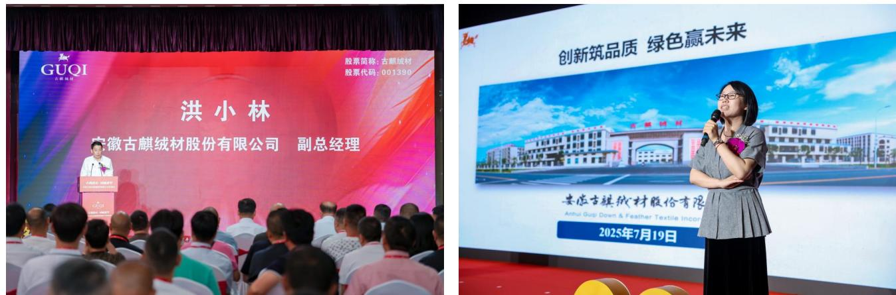

公司始终坚守“专业、纯粹、清廉”的核心道德理念，高度重视反商业贿赂及反贪污工作，将其作为公司治理的关键内容。公司通过系统推进反商业贿赂与反贪污体系建设，不断提升企业廉洁治理水平。

公司严格遵守《中华人民共和国公司法》《中华人民共和国证券法》等相关法律法规和有关监管要求。在内部管理架构方面，公司专门设立审计部，主要承担公司内控审计和反舞弊职责，以确保公司运营符合既定规范与要求。同时，行政管理部负责统筹廉洁文化建设，精心制定并适时更新行为准则，针对公司内部的廉洁制度积极开展培训与宣贯工作，营造风清气正的企业环境。

# ESG管理委员会

# 审计部

■ 负责开展内控审计工作，监督公司日常运营合规落地。  
■ 履行反舞弊专项职责，防范内部违规违纪风险。

# 行政管理部

■ 统筹推进廉洁文化建设，制定并动态更新员工行为准则。  
- 组织廉洁制度培训与宣导，营造风清气正的企业氛围。

在反商业贿赂及反贪污方面，公司已构建了覆盖所有利益相关方和全部经营活动的举报渠道，举报人可通过举报电话、举报邮箱、微信公众号，以及信函和来访等方式，进行实名或匿名举报。同时，公司安排专人负责受理、核查相关线索情况，对违规行为严肃处理，对涉嫌违法的依法移交司法机关。公司通过规范举报的受理、核实、反馈流程，确保利益相关方的诉求能够得到及时、公正、有效地处理。公司的举报途径如下：

举报电话: +86-0553-2392800

@举报邮箱: cs@guqirc.com

微信平台：“古麒绒材”公众号

信函和来访: 安徽省芜湖市南陵县经济开发区457省道128号, 241300

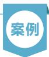

# 倡廉洁清风，筑反腐防线 - 向全员下发《廉洁清风信》

2026 年 1 月, 公司郑重发布《廉洁清风信》, 明确禁止员工收受任何形式的馈赠, 并针对可能出现的违规行为制定了严格的追责机制, 此举旨在以高标准的廉洁准则规范员工行为, 筑牢商业道德防线。公司要求全体员工拒绝来自任何供应商、合作伙伴的任何形式的馈赠, 其中涵盖但不限于实物礼品、现金、电子红包、宴请款待以及旅游安排等。在违规事件处理方面, 公司构建了清晰、高效的处置机制: 若员工遇到无法当场退回的礼金礼品, 务必在第一时间主动向部门负责人或公司行政管理部如实汇报并上交, 由公司进行统一登记与妥善处理。若员工未依照要求主动登记上交, 经公司核查确认属于违规收礼行为, 公司将严格依据既定的公司管理条例, 予以严肃处理。

通过切实推行上述一系列管理举措, 公司致力于持续提升运营过程中的廉洁程度, 为企业的长远、稳健发展营造风清气正、清正廉洁的良好环境。

报告期内，公司未发生商业贿赂或贪污相关事件及诉讼案件。

# 反不正当竞争

公司始终恪守合法经营、公平竞争的经营准则，严格遵守《中华人民共和国反不正当竞争法》及相关法律法规的各项规定，坚决摒弃商业诋毁、虚假宣传、不正当有奖销售、侵犯商业秘密等各类不正当竞争行为。在生产经营与市场拓展全流程中，

公司坚持以品质与服务构筑核心竞争力，尊重市场规则与同业合法权益，秉持诚信自律的经营理念，建立健全反不正当竞争内部管控机制，强化全体员工合规经营意识与职业道德教育，确保各项经营行为合法合规、公开透明。未来，公司始终坚守公平竞争底线，以合规经营护航企业可持续发展，携手行业伙伴维护规范有序、公平公正的市场竞争环境，共同促进行业健康良性发展。

报告期内, 公司未发生不正当竞争行为以及诉讼案件。

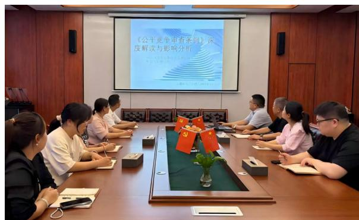

<details>
<summary>text_image</summary>

《公平竞争审查条例》深度解读与影响分析
</details>

关于《公平竞争审查条例》的培训

# | 投资者关系管理

投资者关系管理是基于双向沟通与价值认同的重要实践活动。为帮助投资者清晰、全面地认识公司价值，公司严格依照《中华人民共和国公司法》《中华人民共和国证券法》《深圳证券交易所上市公司自律监管指引第1号——主板上市公司规范运作》等法律法规及规范性文件，构建起运作规范的现代公司治理架构以及较为完善的内部控制体系，以确保公司高效、可靠地运营，维护投资者合法权益。公司已制定《安徽古麒绒材股份有限公司投资者关系管理制度》，并就公司发展战略、经营管理信息、ESG（环境、社会和治理）信息等多方面内容与投资者进行持续沟通。

公司始终坚守严谨合规的运营理念，严格依照中国证监会发布的《上市公司信息披露管理办法》《深圳证券交易所股票上市规则》《上市公司治理准则》等规范性文件要求，同时紧密结合《安徽古麒绒材股份有限公司信息披露管理制度》《安徽古麒绒材股份有限公司内幕信息知情人登记管理制度》《安徽古麒绒材股份有限公司重大信息内部报告制度》《安徽古麒绒材股份有限公司年报信息披露重大差错责任追究制度》等一系列公司内部规定，精心搭建起一套权责明确、架构清晰的公司治理体系。该体系确保公司在信息披露、内幕信息管理、重大信息传递及差错责任追究等各方面工作均有章可循、规范有序，为公司的稳健发展奠定坚实基础。

公司投资者关系管理工作的第一责任人是公司董事长，公司董事会秘书为公司投资者关系管理负责人，全面负责并协调公司投资者关系管理工作。董事会秘书在全面深入了解公司运作和管理、经营状况、发展战略等情况后，负责策划、安排和组织各类投资者关系管理活动。

■《安徽古麒绒材股份有限公司信息披露管理制度》

■《安徽古麒绒材股份有限公司内幕信息知情人登记管理制度》

■《安徽古麒绒材股份有限公司重大信息内部报告制度》

■《安徽古麒绒材股份有限公司年报信息披露重大差错责任追究制度》

在投资者权益保护方面，公司始终遵循主动性、合规性、平等性及诚实守信原则，全方位保障投资者的合法权益。为此，公司制定了一系列完善的管理制度，包括《安徽古麒绒材股份有限公司投资者关系管理制度》《安徽古麒绒材股份有限公司关联交易管理制度》《安徽古麒绒材股份有限公司信息披露暂缓与豁免管理制度》，以及《安徽古麒绒材股份有限公司董事、高级管理人员所持公司股份及其变动管理制度》等。

投资者权益保护原则  
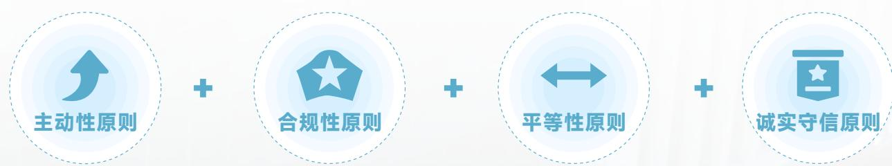

<details>
<summary>flowchart</summary>

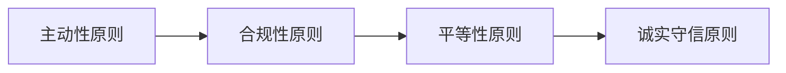
</details>

公司证券投资部作为投资者关系管理的核心职能部门，全面统筹推进相关工作，搭建公司与投资者的沟通桥梁，保障投资者权益、提升公司资本市场形象。其主要职责包括：拟订投资者关系管理制度；及时妥善处理投资者咨询、投诉及建议，做好记录并定期向董事会及管理层反馈；管理维护投资者关系相关渠道与平台，保障沟通畅通；组织投资者沟通活动，增强投资者对公司的了解与信任；统计分析投资者数量、构成及变动情况，为优化管理策略提供数据支撑等。

在关联交易管理方面，公司制定了《安徽古麒绒材股份有限公司关联交易管理制度》，在判定关联关系及处理关联交易时，严格遵循六大原则，并尽量避免或减少关联交易。定价遵循“公平、公正、公开、等价有偿原则”且参照市场标准或按成本加合理利润确定。审议时，关联董事和股东回避表决。必要时，公司将聘请独立机构发表意见，并按照有关规定切实履行信息披露义务。通过全面落实上述关联交易管理原则与制度，公司旨在确保关联交易的合规性、公正性与透明度，有效防范潜在风险，切实维护公司及全体股东的合法权益。

报告期内，我们持续与投资者保持积极沟通。2025年上市首年，我们接待了3次投资者调研，具体内容如下：共组织线上业绩说明会2场、线下集体调研活动1次，覆盖机构投资者21家；通过互动易平台回复提问96条，平均响应时效低于20小时；投资者热线接听咨询约360通，满意度达90%；设立公司官方公众号并发布文章11篇，发布中英文双语公告及解读材料89份。截至2025年12月31日，本年度已开展线上路演1场、券商交流会17场。

互动易平台回复提问

96条

投资者热线接听咨询约

360通

投资者满意度达

90%

券商交流会

17场

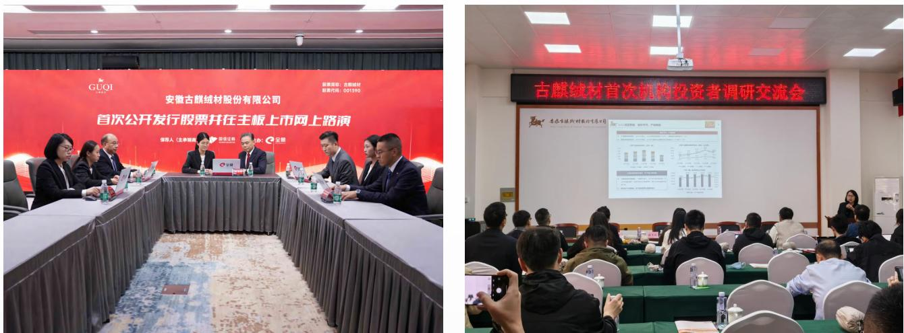

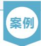

# “上市公司高质量发展座谈会”在古麒绒材顺利召开

2025年11月22日上午，芜湖上市企业协会“上市公司高质量发展座谈会”在古麒绒材顺利召开，30余家上市公司代表参会，市政府相关领导到场指导。与会嘉宾实地参观了公司文化长廊、中水回用系统及羽绒全流程自动化生产线，全面了解企业发展历程与产业优势。座谈会上，公司董事长谢玉成致欢迎辞，各方围绕上市公司高质量发展深入交流，共探合作与发展新机遇。

活动期间，古麒绒材获授副会长单位证书。本次交流会有效搭建了跨行业互动平台，充分展现了企业在科技创新与产业升级中的实践成果。未来，公司将以此为契机，持续为区域经济高质量发展贡献力量。

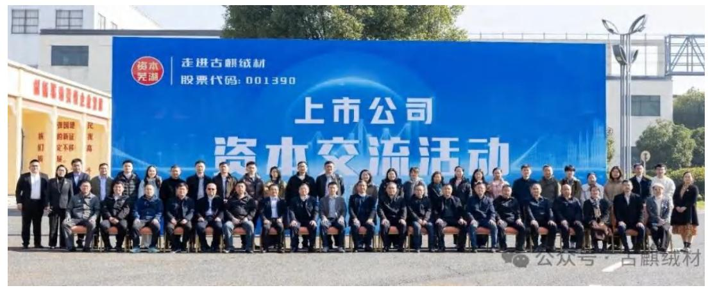

<details>
<summary>text_image</summary>

走进古麒绒材
股票代码: 001390
资本
芜湖
上市公司
资本交流活动
公众号·古麒绒材
</details>

未来，公司将持续拓展投资者电话、邮件、互动易平台等多元化沟通渠道，完善规范的治理机制，与投资者构建良性互动关系，充分尊重并维护投资者的合法权益，认真做好投资者关系管理工作，树立企业在资本市场的良好形象。

# 分红制度

2025年10月16日，中国证券监督管理委员会修订并发布了《上市公司治理准则》，该准则自2026年1月1日起正式施行。此次修订后的准则明确要求，上市公司应当披露现金分红政策的制定及执行情况。公司高度重视投资者回报，建立健全常态化、透明化的利润分配与分红制度。根据《上市公司治理准则》等规范性文件，公司明确现金分红政策及执行情况，对具备分红条件而未实施现金分红的情形履行充分披露义务。

公司已制定上市后股东分红回报规划，坚持以现金分红为优先方式，结合公司盈利状况、现金流水平、发展阶段及资金需求合理确定分红比例与分配频率，兼顾股东即期回报与公司可持续发展。公司计划于2026年发布具体的分红计划，切实保障股东合法权益，分享企业发展经营成果。

未来, 公司将结合经营发展实际、财务状况、现金流水平及长远发展规划等多重因素, 严格按照法律法规及《公司章程》相关规定, 制定科学合理的分红实施方案, 履行相应决策程序及信息披露义务, 确保分红事宜规范透明、切实落地, 持续回馈广大股东的信任与支持。

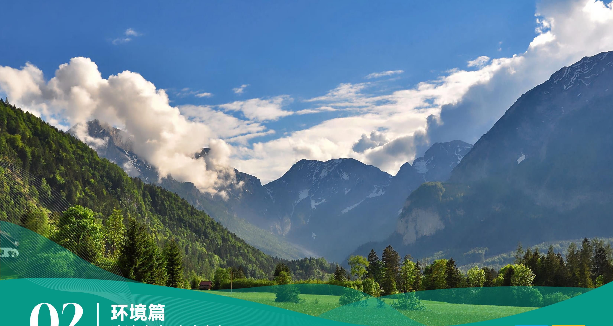

<details>
<summary>text_image</summary>

02 | 环境篇
</details>

# 02 | 环境篇 清洁生产 生态友好

古麒绒材始终坚持“以清洁生产践行‘双碳’战略”的理念，立足清洁生产，积极推进低碳运营，凭借卓越的环境管理，为可持续运营奠定坚实的绿色发展基础。

环境管理体系 39

水资源利用 49

应对气候变化 40

循环经济 51

能源利用 46

污染物排放与废弃物管理 47

生态系统和生物多样性保护 54

6 清洁饮水和卫生设施


7 经济适用的清洁能源


12 负责任消费和生产


13 气候行动


15 陆地生物


# 环境管理体系

公司将环境管理视为企业可持续运营的基石。我们不仅严格遵守环保法规，更以高标准主动降低环境影响，将环境保护融入日常运营的每一个环节，构建系统化、标准化、精细化的环境管理体系，为企业绿色发展筑牢生态根基、夯实合规底色，助力实现可持续发展目标。

公司始终秉持合规经营理念，严格遵守《中华人民共和国环境保护法》《中华人民共和国固体废物污染环境防治法》《中华人民共和国噪声污染防治法》《中华人民共和国水污染防治法》《中华人民共和国清洁生产促进法》等一系列国家环境保护相关法律法规。当前，公司主要依据 ISO 14001 环境管理体系的要求，开展全面系统的环境管理工作。公司明确设定了环境保护的管理目标，即确保重大及一般环境污染事故发生率为零，实现固体废弃物 100% 分类且合规处置，

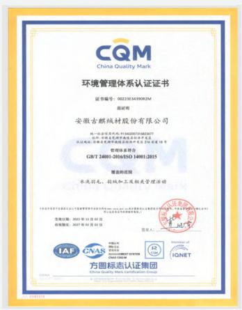

<details>
<summary>text_image</summary>

CQM
China Quality Mark
环境管理体系认证证书
证书编号：0023183439208234
证明
安徽古麒绒材股份有限公司
统一社会信用代码：9142070710026377
住所：安徽省合肥市蜀山区经济开发区
认证地址：安徽省合肥市蜀山区经济开发区科技园区1号
经营范围：符合GB/T 24001-2016/ISO 14001:2015
覆盖的范围
水洗消毒、刮纸加工及相关管理活动
（企业须凭有关部门批准注册，经相关部门批准后方可开展经营活动）
注册日期：2021年11月22日
组织机构：2021年11月22日
签发人：
IAF
CNAS
CHINA QINGMEI
CNAS CORP
CNAS
CNAS
CNAS
CNAS
CNAS
CNAS
CNAS
CNAS
CNAS
CNAS
CNAS
CNAS
CNAS
CNAS
CNAS
CNAS
CNAS
CNAS
CNAS
CNAS
CNAS
CNAS
CNAS
CNAS
CNAS
CNAS
CNAS
CNAS
CNAS
CNAS
CNAS
CNAS
CNAS
CNAS
</details>

以及保证废水、废气、噪声 100% 达标排放。2025 年, 公司在运营各环节均成功达成了上述设定的管理目标, 彰显了公司在环境保护方面的坚定决心与显著成效。

<table><tr><td>环境管理目标</td><td>2025年进展</td></tr><tr><td>重大及一般环境污染事故发生率为零</td><td>✓</td></tr><tr><td>固体废弃物100%分类且合规处置</td><td>✓</td></tr><tr><td>废水、废气、噪声100%达标排放</td><td>✓</td></tr></table>

公司目前已获得 ISO 14001 环境管理体系认证, ISO 14001 认证的覆盖比例达 100% 。此外, 根据芜湖市 2025 年度企事业单位环境信用评价结果公告,公司在 2025 年取得了环保良好单位(B 级)的环境信用评价结果。

<table><tr><td>绩效指标</td><td>2025年</td><td>2024年</td><td>2023年</td></tr><tr><td>环保投入(万元)</td><td>323.05</td><td>322.94</td><td>322.85</td></tr></table>

# 应对气候变化

根据 2026 年世界经济论坛(WEF)发布的《2026 全球风险报告》,未来 10 年全球十大风险中仍以环境相关风险占比最高,达 50%,其中“极端气候事件（Extreme Weather Events）”“生物多样性丧失与生态系统崩溃（Biodiversity Loss And Ecosystem Collapse）”“地球系统的关键变化(Critical Change to Earth Systems)”位列前三。

面对全球极端气候加剧的趋势,古麒绒材深刻认识到,具备应对气候灾害的韧性是企业可持续发展的关键。公司积极响应党中央《关于完整准确全面贯彻新发展理念做好碳达峰碳中和工作的意见》的重大战略部署，将气候变化与绿色发展纳入公司核心治理体系。我们的目标是到2030年实现运营层面的碳达峰。同时,公司严格遵循《企业可持续披露准则第1号——气候（试行)》和《国际财务报告可持续披露准则第2号——气候变化》的要求,系统识别、评估并管理气候相关的物理风险与转型风险,制定科学的减缓与适应战略,持续提升公司应对气候变化的气候韧性,为全球气候治理贡献力量。

公司主营业务具备天然的低碳属性和显著环境优势：羽绒原材料为天然动物蛋白，可自然降解、循环使用；生产加工过程的能耗与碳排放量远低于尼龙、棉、羊毛等其他保暖材料，其中每公斤羽绒羽毛生产环节二氧化碳排放量仅为 $0.5\mathrm{kgCO}_{2}\mathrm{e}$ ，是全球公认的低碳保暖材料。同时，在生产加工过程中的能耗和碳排放量相较于其他纤维材料也处于较低水平。以下为生产加工不同保暖材料的碳排放数据对比：

0.5 kgCO₂e

每公斤羽绒羽毛生产环节二氧化碳排放量

加工每公斤不同纤维 $\mathrm{CO}_{2}$ 排放对比(单位:千克)  
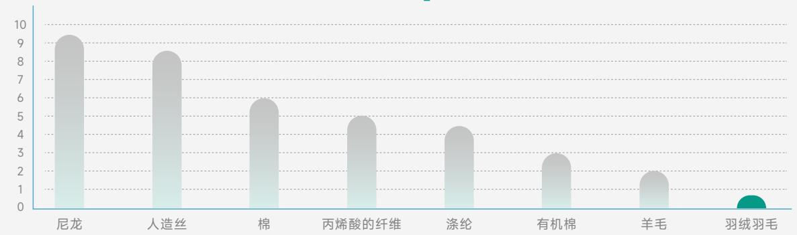

<details>
<summary>bar</summary>

| Category | Value |
| --- | --- |
| 尼龙 | ~9.3 |
| 人造丝 | ~8.4 |
| 棉 | ~5.9 |
| 丙烯酸的纤维 | ~4.9 |
| 涤纶 | ~4.3 |
| 有机棉 | ~2.8 |
| 羊毛 | ~1.8 |
| 羽绒羽毛 | ~0.3 |
</details>

数据来源：中国羽绒工业协会《羽绒品控及采购指南》

当前，为有效应对气候变化挑战，实施气候相关风险管理，公司构建了层级分明的气候变化治理体系。董事会作为最高监督机构，对气候变化风险管理负有最终责任，定期审议涵盖气候风险与机遇分析在内的 ESG 报告；ESG 管理委员会负责审定气候相关战略、目标及工作计划；其下设 ESG 工作小组，以技术与研发中心、生产部及工程部为核心开展工作。

气候治理组织架构  
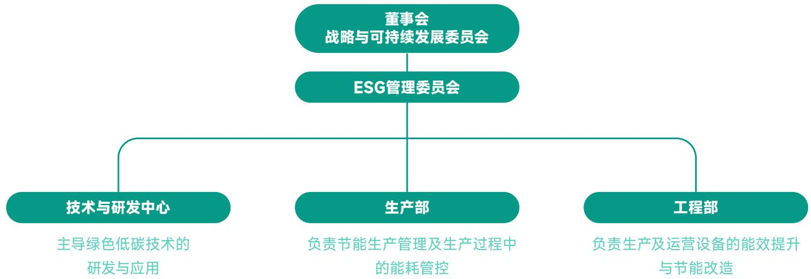

<details>
<summary>flowchart</summary>

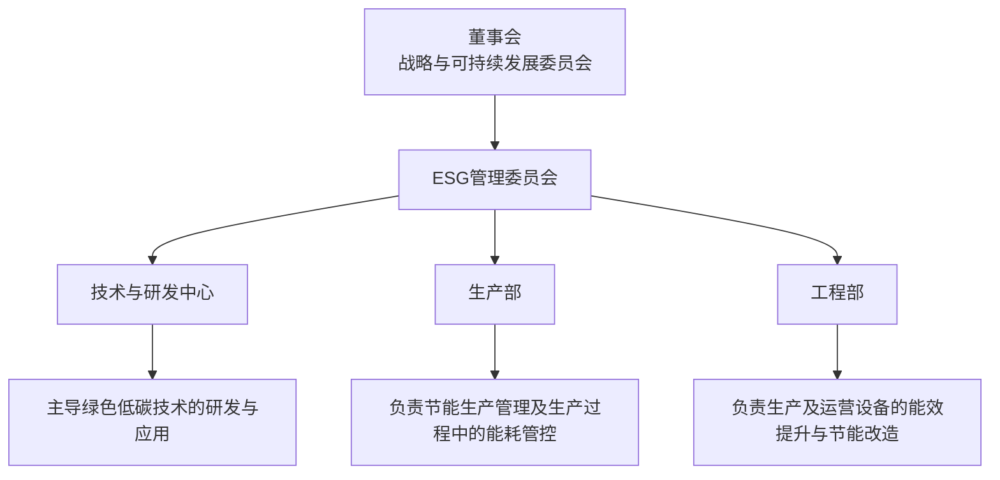
</details>

- 技术与研发中心：主导绿色低碳技术的研发与应用，聚焦低碳工艺创新、环保材料替代及节能技术攻关，从源头降低产品及生产的碳排放；  
- 生产部：负责生产车间日常的节能管理，通过优化生产流程、执行精益生产标准，确保各生产环节的能耗与排放控制达标；  
- 工程部：统筹公司能源基础设施的运维与节能改造，负责锅炉等关键设备的能效提升，为全流程生产提供低碳运行保障。

公司目前拥有 1 处生产基地(坐落于安徽省芜湖市)，在其他地区无生产工厂。基于上述公司的业务背景以及运营地点，我们针对公司可能面临的气候风险与机遇展开了如下分析：

<table><tr><td>类型</td><td>气候相关风险</td><td>可能的财务影响</td><td>应对举措</td></tr><tr><td></td><td colspan="3">政策和法律</td></tr><tr><td>转型风险</td><td>碳定价政策趋严,羽绒生产、运输环节温室气体排放需承担额外成本。环保政策升级,强化行业羽绒水洗工序的污水排放、废气处理报告义务及排放标准。对羽绒制品的低碳、环保标识提出强制要求,现有部分产品可能不符合监管标准。因羽绒生产环保不达标引发的诉讼风险,或原料绒养殖环节环保违规导致的供应链诉讼传导。</td><td>运营成本增加(如碳价上升导致的成本增加)。现有水洗、分毛设备因环保标准不达标需提前报废,导致固定资产减值,增加资产处置损失。需投入资金整改产品及生产流程,确保符合环保标识要求,增加整改支出。若发生诉讼,需承担罚款、赔偿费用,同时影响品牌声誉,导致羽绒产品需求减少、收入下降。</td><td>公司计划后续开展碳核算,并逐步设定减排计划和开展产品碳足迹的认证。完善废水废气处理与合规台账,满足监管排放和信息披露要求。根据客户和监管要求,逐步扩大环保产品比例。强化供应商环保准入与合同约束,建立合规预警及诉讼应急机制,防范供应链合规风险。</td></tr></table>

<table><tr><td>类型</td><td>气候相关风险</td><td>可能的财务影响</td><td>应对举措</td></tr><tr><td></td><td colspan="3">技术</td></tr><tr><td></td><td>■市场出现低碳、节水型羽绒加工技术,现有水洗、分毛技术面临淘汰风险。■低碳羽绒替代品(如环保合成纤维)研发推广,对传统羽绒产品形成替代。■向低碳生产技术转换的成本较高,且研发新型低碳羽绒产品可能面临失败风险。■羽绒循环利用技术不成熟,难以满足绿色消费及环保政策要求。</td><td>■现有生产设备注销和提前报废,产生资产减值损失,增加设备更新支出。■传统羽绒产品需求减少,收入下降,需调整产品结构,增加转型成本。■增加低碳加工技术、新型羽绒产品的研发(R&amp;D)支出,若研发失败则面临投资损失。■因无法满足循环利用要求,可能失去部分绿色采购客户,进一步影响收入。</td><td>■公司已建有日处理能力达1万吨的中水回用循环系统,2025年循环用水量超100万吨。■逐步布局环保羽绒、轻量化羽绒研发,平衡传统产品与环保替代材料布局。■制定分阶段技术转型路线图,合理控制设备更新与研发投入风险。■探索建立羽绒废料回收与循环利用体系,提升资源循环率,满足政策与市场要求。</td></tr><tr><td></td><td colspan="3">市场</td></tr><tr><td>转型风险</td><td>■全球变暖导致暖冬频发,传统厚型羽绒服装、寝具的市场需求面临下滑风险,消费偏好转向轻薄、低碳替代品。■气候相关市场信号不确定性增加,原料绒价格受养殖行业气候影响波动剧烈。■消费者绿色偏好升级,对低碳、环保、可循环羽绒产品的需求增加,现有普通羽绒产品竞争力下降。■原料绒作为鸭鹅养殖副产品,受气候及农业周期影响,供应量减少导致价格上涨。</td><td>■羽绒产品销量下滑,收入减少,库存积压导致存货跌价损失增加。■原料绒采购成本大幅上升,生产成本增加,毛利率下降。■客户需投入资金研发、生产低碳羽绒产品,导致公司调整产品结构,在短期内增加支出。■原料绒价格波动导致采购预算失控,资金占用增加,同时可能因备货不当产生额外损失。</td><td>■优化产品结构,加大轻薄型、多功能羽绒产品开发,对冲暖冬市场需求下滑风险。■建立原料价格监测与预警机制,采用多产区布局平抑价格波动。■进行低碳、环保认证产品推广,提升绿色产品占比与市场竞争力。■构建多元化原料供应体系,提升供应链稳定性,降低气候与农业周期影响。</td></tr><tr><td></td><td colspan="3">声誉</td></tr><tr><td></td><td>■消费者对羽绒生产环节的环保问题关注度提升,若公司环保合规不到位,引发负面反馈。■原料绒养殖环节的气候适应性差、环保不达标,传导至公司,引发供应链声誉风险。</td><td>■羽绒产品需求减少,收入下降,品牌溢价能力降低。■核心客户(如知名服装、寝具品牌)终止合作,订单流失,进一步影响收入。</td><td>■主动披露应对气候变化举措与环境治理信息,并计划开展碳盘查和公开减碳目标,提升利益相关方信任。■强化上游供应商ESG风险评估,降低供应链环保违规传导风险。</td></tr><tr><td></td><td colspan="3">声誉</td></tr><tr><td>转型风险</td><td>■利益相关方(投资者、客户、监管机构)对公司气候风险管控能力的担忧增加。</td><td>■投资者信心下降,融资难度增加,融资成本上升,可用资金减少。</td><td>■打造低碳品牌形象,强化绿色环保产品传播力度,树立低碳环保企业形象。■建立声誉风险应急机制,及时回应舆情,维护品牌口碑。</td></tr><tr><td></td><td colspan="3">短期</td></tr><tr><td>物理风险</td><td>■极端天气(如台风、洪水、暴雨、暴雪)的恶劣程度增加,影响原料绒产地(如华东羽绒主产区)的养殖、收割及运输。■极端高温、暴雨导致公司生产车间、原料仓库损坏,影响生产正常开展。■极端天气导致物流中断,原料绒无法按时到厂、成品无法按时发货。</td><td>■原料绒供应中断,生产停滞,收入减少;原料绒运输成本增加,生产成本上升。■生产设备、仓库损坏,产生固定资产减值损失,维修、重建支出增加;原料绒变质,产生存货跌价损失。■成品发货延迟,面临客户索赔,增加赔偿支出,同时影响客户合作关系。■高温天气导致车间降温支出增加,员工缺勤率上升,生产效率下降,进一步增加成本。</td><td>■建立极端天气监测预警与应急响应机制,制定停产、避险等应急预案,保障生产的有序进行。■逐步升级防洪、防涝、防风、耐高温等设施设备,定期排查安全隐患,防患于未然。■优化库存布局与物流通道,建立备用物流与应急库存,保障供应与交付。■完善高温作业保障,改善车间通风降温,稳定生产效率与人员出勤。</td></tr><tr><td></td><td colspan="3">长期</td></tr><tr><td></td><td>■平均气温不断上升,暖冬成为常态,羽绒产品长期需求持续下滑。■降水模式变化,气候极端波动,影响原料绒主产区的鸭鹅养殖环境,导致原料绒产量下降、品质降低。■长期气候异常导致农业周期紊乱,进一步加剧原料绒供应量及价格波动。</td><td>■长期收入下滑,需大规模调整产品结构,转型成本大幅增加,甚至面临业务收缩风险。■原料绒采购成本长期居高不下,品质下降导致产品合格率降低,增加返工、报废支出。■原料供应稳定性下降,供应链管理成本长期增加,盈利能力持续承压。</td><td>■制定中长期气候适应战略,持续推进产品轻量化、场景化、功能化升级。■构建多元化、跨区域原料采购网络,降低单一产区气候异常影响。■提升供应链韧性与需求预测能力,降低长期价格与供应波动对经营的冲击。</td></tr></table>

<table><tr><td>类型</td><td>气候相关机遇</td><td>可能的财务影响</td><td>应对举措</td></tr><tr><td>资源效率</td><td>优化羽绒水洗、分毛工序,采用节水、节能型生产流程,减少水资源和能源消耗。推行羽绒原料循环利用,对生产废料、废旧羽绒制品进行回收加工,重新用于生产。搬迁到节能效率更高的生产厂房,升级仓储、生产环节的节能设施。优化供应链物流,采用更高效的运输模式,减少运输环节的资源消耗和碳排放。</td><td>运营成本降低(如水资源、电力消耗减少,原料采购成本下降)。生产效率提升,产能增加,羽绒半成品、成品产量提高,从而增加收入;减少废弃物处置支出,同时通过循环利用产生额外收益,改善经营成果。节能型厂房、设备的固定资产价值降低,折旧成本相对降低。运输效率提升,运营成本降低。</td><td>公司全面推行节水工艺,已建有日处理能力达1万吨的中水回用循环系统,2025年循环用水量超100万吨,持续提升资源利用效率。公司的羽绒边角料、废旧制品已与第三方回收机构合作,实现羽绒原料编织袋和生产助剂包装桶的回收利用、污泥资源化处置的全流程循环化利用。优化物流网络,采用集中配送、绿色运输,降低运输碳排放与成本。</td></tr><tr><td>能源效率</td><td>生产环节采用太阳能、风能等低排放能源,替代传统化石能源。申请环保、低碳相关政策支持和激励(如节能补贴、低碳企业税收优惠)。引入智能化生产技术(如自动分毛、智能水洗设备),提升能效比,降低碳排放。</td><td>运营成本大幅降低(如电力采购成本下降,税收优惠减少税费支出)。减少温室气体排放,降低碳定价政策带来的成本压力,提升抗风险能力。智能化技术投资获得回报,生产效率提升,产品合格率提高,成本进一步下降。</td><td>公司锅炉经改造目前主要用能为太阳能和天然气等清洁能源,降低了生产过程中的环境影响。公司已建立智能分毛、智能水洗等数字化装备,有效提升了能效与生产稳定性。</td></tr><tr><td>产品和服务</td><td>研发、生产可降解包装羽绒半成品,契合消费者绿色偏好。开发适应气候变化的羽绒产品(如轻薄型保暖羽绒、抗菌防潮羽绒);应对暖冬需求变化。通过研发创新,提升羽绒产品保暖性、耐用性,实现产品轻量化与低碳化。依托代加工业务,为下游客户提供低碳羽绒加工服务,拓展服务类型。</td><td>低碳、适配型羽绒产品需求增加,销量提升,收入增长,品牌溢价能力增强。符合消费者绿色偏好和环保政策要求;提升市场竞争力,扩大市场份额。研发投入转化为技术优势,形成差异化竞争,长期盈利能力提升。拓展代加工服务边界,获得额外加工收入,优化收入结构。</td><td>计划采用可降解包装、生产回收羽绒制成品等绿色产品,满足绿色消费需求。推出轻薄保暖、防潮抗菌、多功能复合型羽绒产品,适配气候变化与消费升级。以轻量化、高蓬松、高保暖为方向,提升产品科技含量与附加值。</td></tr><tr><td>市场</td><td>■进入羽绒产品绿色采购新市场(如高端服装、寝具品牌的绿色采购渠道)。■申请获得政府及公共部门的环保激励、绿色采购订单(如政府采购低碳羽绒制品原料)。■依托供应链ESG管理能力,与下游头部品牌建立长期合作,拓展稳定市场。■参与行业绿色标准制定,提升行业话语权,拓展国际低碳羽绒产品市场。</td><td>■新市场拓展带来收入增加,客户结构优化,抗市场波动能力增强。■获得政府激励资金、绿色采购订单;改善现金流,降低运营成本。■供应链ESG赋能带来客户粘性提升,订单稳定性增强,收入可持续增长。■国际市场拓展提升营收规模,同时获得绿色品牌溢价,提升盈利能力。</td><td>■积极开拓绿色采购渠道,进入国际品牌、高端家纺、户外用品等的绿色供应链。■参与政府绿色采购、低碳产品申报等,争取政策订单与资金支持。■以ESG治理与提升气候适应性能力为抓手,深化与头部客户长期战略合作。■计划参与羽绒行业低碳标准制定,拓展国际绿色市场,提升品牌全球竞争力。</td></tr><tr><td>适应性</td><td>■与原料绒主产区建立长期合作,推动供应商提升气候适应性,保障原料稳定供应。■建立原料绒多元化采购渠道,规避单一产区极端气候带来的供应风险。■升级生产、仓储设施的气候适应性(如防洪、防高温、防潮设施),减少极端天气损失。■参与可再生能源项目,采取节能减碳措施,提升企业气候风险抵御能力。</td><td>■原料供应稳定性提升,减少生产停滞、订单延迟带来的收入损失和赔偿支出。■原料采购成本波动减小,资金预算更可控,经营活动现金流更稳定。■极端天气导致的资产损失、生产损失减少,固定资产保值增值能力提升。■企业抗气候风险能力增强,品牌声誉提升,融资成本降低,长期可持续发展能力提升。</td><td>■与核心供应商共建气候适应合作机制,提升养殖端抗风险能力。■构建多区域、多品种原料采购布局,分散极端气候导致的供应风险。■持续提升厂房、仓储、物流系统防洪、耐高温、防潮能力。■逐步制定碳减排目标,提升可再生能源使用比例,增强长期气候韧性。</td></tr></table>

为了更好地应对气候变化所带来的挑战，在日常办公与运营中，公司积极倡导绿色办公，大力推行资源节约举措。对于办公用品，我们严格践行以旧换新制度，尤其倡导打印纸双面打印、重复利用；清洁类用品倡议按需申领，杜绝浪费，确保合理使用。同时公司积极倡导“光盘行动”，呼吁员工珍惜粮食，按需打饭点菜、厉行节约，并鼓励员工就餐时依据自身食量选择饭菜量，拒绝剩餐，旨在全方位节约资源，实现资源的高效利用。

工业和信息化部发布的《工业领域碳达峰实施方案》《工业和信息化部办公厅关于开展绿色制造体系建设的通知》等政策文件，清晰地指明了工业领域绿色转型的发展方向，明确要求“着力构建绿色制造体系”以及“扩大绿色低碳产品供给”。其中着重强调，绿色工厂作为制造业的基本生产单元，不仅是绿色制造的实际践行主体，更是绿色制造体系的核心支撑单元，其关键在于实现生产过程的全面绿色化。

在此政策导向下，公司积极呼应国家“碳达峰、碳中和”的重大发展战略，将绿色生产提升至企业发展的重要位置，全力以赴打造符合“用地集约化、原料无害化、生产洁净化、废物资源化、能源低碳化”标准的现代化工厂。值得一提的是，公司主营业务属于《产业结构调整指导目录》中的鼓励类范畴，具备天然绿色低碳优势。在此基础上，公司将进一步加大力度，积极推动生产的绿色转型，为实现行业的可持续发展贡献力量。

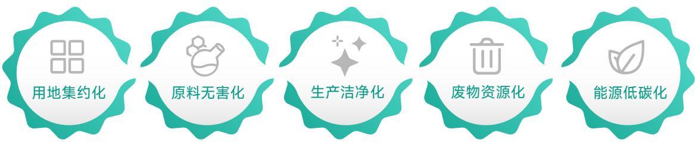

<details>
<summary>flowchart</summary>

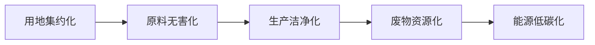
</details>

2023年，凭借在绿色发展方面的卓越表现，公司荣获“国家级绿色工厂”称号，系羽绒行业唯一获此殊荣的企业，为行业绿色转型树立了标杆、发挥了引领示范作用。展望未来，公司将持续聚焦于生产过程中的节能降碳领域，加大投入，深度推进低碳技术的研发与广泛应用，以全球领先的低碳运营实践积极落实“双碳”目标。


<details>
<summary>text_image</summary>

国家级绿色工厂
中华人民共和国工业和信息化部
</details>

# 能源利用

在能源管理领域, 公司始终秉持高度的合规意识, 严格遵循《中华人民共和国能源法》《中华人民共和国节约能源法》《中华人民共和国电力法》以及《节约用电管理办法》等国家相关法律法规及规范性文件。在日常运营管理过程中, 公司将能源节约理念深度融入生产经营各环节, 全方位、多层次地贯彻落实各项节能降耗措施, 致力于有效减少能源消耗, 坚定不移地推动低碳运营模式的实施, 积极履行环境与社会责任。

公司以全方位、系统性的视角积极推进能源节约与低碳运营管理工作，通过一系列科学有效的举措，致力于提升能源利用效率,践行可持续发展理念。

- 在生产运行环节，公司对中水回用系统实施精细化的错峰用电管控策略。公司依据用电规律与实际需求，合理安排大型设备暂停运行，避开用电高峰时段，从而有效降低峰值负荷，实现电力资源的优化配置。此外，在生产设备选型上，公司优先选用配备变频电机的设备。通过智能调速技术，设备能够根据实际运行工况进行精准调节，显著减少了设备空载损耗，进一步降低电力消耗，提高能源利用效率。  
- 与此同时, 公司高度重视员工节能意识的培养与提升, 通过开展节能培训、宣传教育等活动, 强化全体员工的节能责任感。在办公区域与生产区域, 公司严格规范用水用电管理, 明确要求人员离开后及时关闭灯光, 坚决杜绝跑冒滴漏现象以及任何形式的能源浪费行为, 形成全员参与节能降耗的良好氛围。

\- 在供热系统方面，公司积极探索创新能源供应模式，目前生产用能主要依赖外购电力和自有锅炉，锅炉经设备升级后采用太阳能与天然气相结合的组合供能方式。这一模式充分利用太阳能这一可再生清洁能源，有效优化了能源结构，显著减少了对传统化石能源的依赖与消耗，为实现低碳运营目标迈出坚实步伐。


<details>
<summary>natural_image</summary>

Interior view of an industrial facility with multiple large water treatment stations and piping (no visible text or symbols)
</details>

然而，现阶段公司在能源管理工作中仍面临压力与挑战。整体能源使用成本长期居高不下，尤其是天然气采购成本，受市场价格波动影响。这不仅对公司的生产经营造成一定压力，也为企业的节能降本工作带来了严峻考验。面对此类挑战，公司在建中的新工厂正积极探寻应对之策，将增设光伏发电项目，提高绿电在运营过程中的使用占比，实现能源成本的有效管控以及节能目标的稳步达成。

# 污染物排放与废弃物管理

公司始终秉持绿色运营理念，全方位、持续性地致力于降低各类污染物与废弃物的排放。公司以高于监管标准的严格要求，扎实推进环保运营管理工作，着力降低废气、废水以及危险废弃物对环境和人体的负面影响，积极发挥行业引领作用，推动羽绒行业向绿色环保、高质量发展方向稳步迈进。

在合规管理方面，公司严格遵守《中华人民共和国大气污染防治法》《中华人民共和国水污染防治法》《中华人民共和国固体废物污染环境防治法》以及《排污许可管理条例》等国家污染物管理与防治相关法律法规及规范性文件，确保污染物排放与废弃物管理全流程合法合规。


<details>
<summary>text_image</summary>

危险废物贮存分区标志
废玻璃瓶
监测废液
出入口
贮存分区
危险废物
贮存设施
危险废物
</details>

与此同时，公司建立了完善的内部管理制度，制定废弃物管理流程，明确废弃物从产生、分类、收集、运输到最终处置的全流程规范，明确各环节责任主体，确保废弃物得到妥善管理与处置，最大程度减少对生态环境的危害。

公司生产过程中主要产生废水、废气、噪声和固体废弃物等环境污染物，以下为具体的污染物产生及排放情况：

<table><tr><td>污染物</td><td>涉及污染物的具体环节</td><td>处理措施及处理能力</td></tr><tr><td>废水</td><td>羽绒清洗过程中产生废水;另有职工生活办公产生的生活污水和食堂污水。</td><td>生产过程中水洗工序产生的废水主要经自建中水回用系统处理,达到回用指标后循环利用,目前公司经中水回用系统处理后的循环用水总量超100万吨;其余废水经中水回用系统规范处理后,全部接入生态环境部门在线实时监测系统,排水水质、流量等关键指标24小时不间断上传监管系统;生活污水和食堂污水经预处理后纳管排放,由南陵县污水处理厂集中处理。</td></tr><tr><td>废气</td><td>羽绒生产加工过程中的除灰、分毛、烘干、冷却、脱水等生产环节会产生废气;水毛暂存区及中水回用系统会产生无组织排放的恶臭气体。</td><td>生产过程中产生的废气,已经安装符合国家排放要求的天然气低氮燃烧锅炉,达到排放标准后进行排放;中水回用系统产生的气体通过喷洒除臭剂、加强绿化等措施处理减轻异味影响。</td></tr><tr><td>噪声</td><td>噪声源主要为生产过程中的设备运行、风机、泵机噪声等。</td><td>通过选用低噪声设备,对高噪音设备采用减振、吸声与隔声处理,并通过合理布局等措施降低噪声对周围环境的影响。</td></tr><tr><td>固体废弃物</td><td>羽绒生产加工过程中分毛、冷却、拼堆等工序产生杂质、毛杆边角料、废包装桶;污水处理系统产生的污泥;职工生活办公产生的生活垃圾。</td><td>生产过程中分毛、冷却、拼堆等工序产生的杂质等不定期集中清理;毛杆等边角料外售;废包装桶厂家回收;污水处理产生的污泥送苗木公司等进行土壤改良,做农家肥;并送到电厂进行焚烧发电;生活垃圾集中收集后交由环卫部门统一处理。</td></tr></table>

近年来, 随着《固定污染源排污许可分类管理名录 (2019年版)》《排污许可证申请与核发技术规范 羽毛 (绒) 加工工业》《关于加快建立健全绿色低碳循环发展经济体系的指导意见》等一系列政策法规落地实施, 羽绒羽毛加工行业的环保管控日趋严格, 行业环保要求与规范化运营标准持续提档升级, 全方位推动行业向绿色低碳、清洁生产的高质量发展方向转型, 也对行业内企业的环境治理能力与工艺技术水平提出了更高要求。在此背景下, 行业企业纷纷通过升级清洁生产工艺、加大环保软硬件投入、完善污染治理体系等方式, 主动适配监管要求, 筑牢合规经营根基。

环保设施的建设与高效运行, 是羽绒羽毛加工企业实现合规生产的重要保障。羽绒加工核心的水洗工序会产生富含有机物的生产废水, 此类废水需经专业废水处理系统进行无害化、标准化处置后, 才能达到排放或回用标准。

为此，公司自主投建中水回用循环处理系统，该系统的稳定运行不仅能高效处理生产废水，从根本上保障公司生产经营全面符合环保法规与行业标准，更能实现生产用水的循环利用，大幅节约新鲜水资源，进一步降低生产运营成本。除硬核环保设施投入外，公司更从生产源头发力，持续研发并升级清洁生产工艺，不断优化生产流程，从根源上减少污染物产生量，以技术创新主动应对持续提升的行业环保监管要求，践行绿色发展理念。


<details>
<summary>text_image</summary>

依法节能企业先行
</details>

报告期内，公司未发生因污染物排放受到重大行政处罚或者相关诉讼案件。

# 水资源利用

羽绒羽毛行业是典型的水资源依赖型产业。羽绒羽毛作为天然保暖材料，其蓬松度、洁净度直接决定产品品质，而这两大核心指标的实现，离不开充足的水资源作为支撑。为彻底去除羽绒中的灰尘、杂质、油脂及残留的养殖污染物，需将羽绒经过多轮清水冲洗，羽绒行业中平均每加工1公斤成品羽绒，耗水量可达15-20升。大规模的新鲜水取用，不仅加剧了区域水资源紧张局面，也使得企业面临高昂的水资源使用费，增加了生产运营成本。传统的一次性用水模式已难以适应行业可持续发展需求，水资源高效循环利用成为行业转型升级的必由之路。

在水资源管理和环境保护方面，公司秉持绿色发展理念，将节约用水、水资源循环利用深度融入生产运营全流程，严格落实各项水资源保护举措，践行水资源高效利用与可持续发展理念。我们严格遵守《中华人民共和国水法》《中华人民共和国水污染防治法》《节约用水条例》《国家节水行动方案》等法律法规和政策要求，全面落实水环境管理规定：生产废水经中水回用系统规范处理后，全部接入生态环境部门在线实时监测系统，实现排水水质、流量等关键指标24小时不间断上传监管，确保排放过程可追溯、可监管。

早在2014年，公司就已建成日处理能力达万吨的中水回用系统。此系统综合运用物理、化学及生物等多种处理工艺，针对生产过程中产生的废水展开深度净化处理。通过这一系统，水中的污染物、悬浮物以及有害成分得以有效去除，使处理后的水质完全符合生产回用标准，进而能够重新应用于水洗、漂洗等关键生产环节，成功实现了水资源的循环利用。在公司羽绒羽毛生产流程里，所产生的废水均会被纳入自建的中水回用循环系统。该系统通过集水、捞毛、调节、前气浮、水解酸化、生物接触氧化、二次沉淀、后气浮、


<details>
<summary>natural_image</summary>

Aerial view of a wastewater treatment facility with circular tanks and industrial buildings (no visible text or symbols)
</details>

日处理能力达万吨的中水回用循环系统

无阀滤池、氧化消毒等一系列复杂工艺，对废水进行深度处理。处理达标后的水重新回用于生产工序，构建起了一套完整的水资源闭环利用体系。依托羽绒生化联合精洗工艺、低浴比浸淋式水洗装置及水洗方法等核心技术，公司在不断提升产品精加工品质的同时，还切实有效地降低了生产过程中的水耗。

中水回用系统的具体处理流程如下：


<details>
<summary>flowchart</summary>


</details>

中水回用工艺流程示意图  


<details>
<summary>natural_image</summary>

Aerial view of a circular water treatment facility with three concentric circular tanks and adjacent water channels, no visible text or symbols.
</details>

报告期内, 该系统运行稳定, 2025年循环用水量超100万吨, 这一数据远超行业平均水平, 在羽绒羽毛行业水资源消耗量高、环保压力日益增大的当下, 此举措不仅为公司降低了新鲜水使用成本, 提升了市场竞争力, 从源头上减少了新鲜水资源的取用量, 降低了企业对水资源的依赖程度, 还大幅降低了废水外排量, 削减末端废水处理成本, 并且有助于企业规避环保合规风险。最终, 公司成功实现了经济效益、环境效益与社会效益的协调统一, 为企业的可持续发展奠定了坚实基础。

# 年循环用水量超100万吨

# 循环经济

循环经济作为国家生态文明建设与“双碳”目标的核心支撑，已成为推动产业高质量发展的重要路径。国家发展和改革委员会印发的《“十四五”循环经济发展规划》明确提出，大力发展循环经济、推进资源节约集约与循环利用，对保障国家资源安全、助力实现“双碳”目标、促进生态文明建设具有重要战略意义。《中华人民共和国国民经济和社会发展第十五个五年规划纲要》进一步锚定“十五五”循环经济发展目标，提出要促进循环经济发展，健全废弃物循环利用体系，在严守固体废物零进口底线的前提下有序推进海外优质再生原料进口利用，发展壮大再制造产业，推动大宗固体废弃物年利用量达到45亿吨左右。

# 古麒绒材积极响应、践行国家循环经济发展战略，始终秉持“资源高效利用、损耗严格管

控、资源循环复用”的绿色发展理念，将循环经济融入生产经营全流程，持续提升资源利用效率，坚定走低碳、环保的可持续发展之路。

羽绒羽毛加工产业本身就是畜禽养殖屠宰副产物资源化利用的核心载体，更是循环经济发展模式的典型标杆——其以水禽养殖过程中产生的羽毛、羽绒等“固废副产物”为核心原料，通过专业化加工转化，打造成为高品质、可自然降解、低碳环保的保暖材料，实现了从“农业固废”到“高价值产品”的跨越式转变，是真正意义上“变废为宝”的生态友好型特色产业，完全契合《绿色低碳转型产业指导目录（2024年版）》发展导向，公司也凭借扎实的循环经济实践，获评“安徽省循环经济示范单位”。

作为羽绒产业循环链条中承上启下、不可或缺的关键一环，古麒绒材上承水禽养殖端，推动农业副产物资源化利用，破解养殖固废处置难题、挖掘固废潜在价值；下启绿色产品供给端，通过全流程循环制造，实现资源高效复用、废弃物减量无害化，打通了“养殖固废—加工利用—循


<details>
<summary>flowchart</summary>


</details>


<details>
<summary>text_image</summary>

安徽省循环经济示范单位
安徽省发展和改革委员会
安徽省财政厅
二〇一二年
</details>

“环复用”的完整产业链条，成为推动整个羽绒产业循环发展的核心枢纽。目前，公司已围绕生产全流程构建起全生命周期循环利用体系，聚焦水资源、生产物料、固体废物等关键领域，实施多维度资源化利用举措，形成闭环式循环发展模式。公司重点实施中水回用、羽绒原料编织袋回收、生产助剂包装桶回收、污水处理污泥资源化处置等资源化利用措施。

# 养殖固废

以水禽养殖、屠宰环节产生的羽绒、羽毛等副产物为核心原料，将畜禽养殖固废转化为可利用资源。


<details>
<summary>donut</summary>

| Category | Value |
| --- | --- |
| 01 | ~35% |
| 02 | ~25% |
| 03 | ~35% |
</details>

# 加工利用

通过专业加工处理,把养殖副产物制成高品质、可自然降解、低碳环保的保暖材料,实现“变废为宝”。

# 循环复用

对羽绒加工过程中产生的灰头颈毛、毛杆等副产物可通过再处理后实现再利用,经无害化处理后,用于高蛋白饲料、有机肥料、环保纤维材料、生物基填料等领域。

# 羽绒产业循环经济链条

在水资源循环利用方面，公司建成投用日处理能力达万吨级的中水回用系统，是行业内少数具备规模化水资源循环利用能力的企业之一，成功入选生态环境部、住房和城乡建设部“全国环保设施和城市污水垃圾处理设施向公众开放单位”，为行业内唯一获此荣誉的企业。

报告期内, 中水回用系统节水成效显著, 循环用水总量超100万吨, 节水示范效应突出。


<details>
<summary>text_image</summary>

环保设施和城市污水垃圾
处理设施向公众开放单位
中华人民共和国生态环境部
中华人民共和国住房和城乡建设部
</details>


<details>
<summary>natural_image</summary>

Aerial view of a wastewater treatment facility with circular water treatment tanks and industrial buildings in the background (no visible text or symbols)
</details>


<details>
<summary>natural_image</summary>

Group of people in uniform and red caps walking on a paved road beside a building with Chinese signage (no readable text on subjects)
</details>

在物料循环利用领域, 公司构建全链条闭环管理体系: 羽绒原料编织袋统一交由专业塑料生产企业回收再生, 生产助剂空桶由原供应商回收后循环复用, 实现包装物料全生命周期绿色流转; 污水处理过程中产生的污泥, 按规定移送至苗木培育等合作单位, 用于土壤改良、有机肥制备及焚烧发电等领域, 以实现固体废物的资源化利用与无害化处置, 从而最大限度地提升废弃物的循环利用价值。


<details>
<summary>flowchart</summary>


</details>

未来, 公司将持续深化循环经济实践, 进一步完善全生命周期循环利用体系, 强化产业链上下游协同联动, 充分发挥自身在产业循环中的核心枢纽作用, 既推动自身循环发展水平持续提升, 也引领整个羽绒产业向更高质量、更绿色、更循环的方向发展, 助力国家循环经济发展目标与“双碳”目标落地见效。

# 生态系统和生物多样性保护

古麒绒材深刻践行“人与自然和谐共生”的绿色发展理念，清晰认知企业可持续发展与生态系统健康、生物多样性保护的内在关联。在项目运营中，公司严格执行生态保护措施，最大限度降低生产活动对周边生态环境的干扰，减少对区域生物多样性的潜在影响，全力守护周边生态系统的完整性与稳定性；同时，积极参与土地生态保护项目，通过支持可持续农业等方式，主动修复和保护生态系统，实现与自然的和谐共生。

公司秉持绿色施工的理念，在运营中注重生态保护，降低对生物多样性的负面影响。2025年上市期间，募投资金主要用于“年产2,800吨功能性羽绒绿色制造项目”，项目分两期推进。其中，项目一期根据规定属于《建设项目环境影响评价分类管理名录（2021年版）》中的“皮革、毛皮、羽毛及其制品和制鞋业”中的“羽毛（绒）加工及制品制造”，此投资项目需要编制环境影响报告表对产生的环境影响进行全面评价。公司已编制环境影响报告表，并获得相应批复，确保项目建设合规有序推进。值得说明的是，根据本项目环境影响报告表，上述新建项目选址所在区域不涉及自然保护地、饮用水水源保护区、风景名胜区等生态保护红线管控范围，不占用生态敏感区域，从选址源头规避了对核心生态系统及生物多样性的影响，彰显了公司在项目规划阶段的生态保护意识与合规理念。


<details>
<summary>natural_image</summary>

Exterior view of a modern industrial campus with multiple buildings, landscaped grounds, and a central entrance gate (no signage visible)
</details>


<details>
<summary>text_image</summary>

03 | 社会篇
</details>

# 03

# 社会篇

# 以人为本 共进共享

古麒绒材坚持以人为本的发展理念, 构建全方位治理与关怀体系, 完善多元福利保障, 持续提升员

工归属感与幸福感，打造平等、包容、多元的职场环境。

员工权益与福利 57

职业健康与安全 61

员工培训与发展 65

产品质量 68

研发创新 75

客户服务 80

信息安全与客户隐私保护 82

可持续供应链 83

动物福利 83

乡村振兴与社会共享 86


# 员工权益与福利

公司始终将构建和谐劳动关系作为企业发展的核心工作之一，坚定秉持“以人为本”理念，严格遵循联合国《工商业与人权指导原则》(UNGP)、《世界人权宣言》、全球契约十项原则、《安全与人权自愿原则》及国际劳工组织《工作中的基本原则和权利宣言》等国际公认人权准则，全面贯彻《中华人民共和国劳动法》《中华人民共和国劳动合同法》等法律法规，坚守人权与劳动权益底线：严禁使用童工及任何形式的强迫/强制劳动，对职场欺凌、恐吓、性骚扰、歧视等行为，坚持零容忍，充分尊重员工合法的结社与集体谈判权利，全方位保障员工各项基本劳动权益，构建平等、尊重、包容的职场生态。

在人才选聘与职业发展环节, 公司坚守公平、公正、公开原则, 摒弃种族、宗教、年龄、国籍、性别、婚姻状况、怀孕等各类歧视性因素, 不要求员工或应聘者接受歧视性医学检查, 全力营造专业礼貌、相互尊重的职场氛围, 为每一位员工提供平等发展的广阔平台。

为筑牢员工权益保障根基，公司已制定《招聘管理规定》《薪酬制度》《绩效管理制度》等一系列完善的规章制度，形成全方位权益保障体系，覆盖员工招聘、薪酬福利、绩效考核、职业发展等全环节。在组织架构层面，行政管理部下设人力资源管理小组，该小组紧密围绕公司年度发展规划明确的业务需求，科学制定年度招聘总规划并稳步推进落地，持续充实优化人才队伍，夯实人才基础，为公司高质量、可持续发展注入不竭动力。

为持续优化人才引进机制、提升人力资源配置效率，公司建立了规范化、流程化的招聘管理体系。通过明确需求收集、招聘计划制定、面试评估及入职管理等关键环节，公司实现了从岗位需求识别到员工正式入职的全流程闭环管理，确保招聘工作的公平性、规范性与高效性。公司整体招聘管理流程详见下图：

招聘管理流程  


<details>
<summary>flowchart</summary>


</details>

此外，为实现更为高效的人才引进与管理，公司针对不同岗位类型制定了差异化的招聘审批流程。具体而言，在管理职系的岗位招聘中，终试由分管领导牵头负责组织实施，并将该岗位相关招聘结果报送至公司，经过公司全面审批方可确定。而对于中层干部岗位，终试则由公司统一进行组织，以确保招聘流程的规范性与严谨性，选拔出最适配岗位需求的优秀人才。

当前，公司员工由正式员工及少量短期聘用员工构成。其中，短期聘用员工目前主要包括退休返聘人员。公司始终严格遵守国家相关规定，分别与正式员工和短期聘用员工签订劳动合同，以切实维护员工的合法权益。当短期聘用员工的聘用期限届满时，公司将与员工就续聘事宜进行诚恳的协商。若双方达成共识，公司将及时续签聘用合同，为员工提供稳定、持续的工作机会。截至2025年12月31日，公司员工总数为139人，现有1名兼职员工，为退休返聘人员。

为提升公司核心竞争力、强化部门协同、充分激发员工积极性与创造力，同时营造开放包容、主动参与、高效沟通的团队文化，公司制定并实施《绩效管理制度》，该制度以服务公司战略目标为导向，基于“六大”管理原则，坚持管理流程公正、公平、公开，倡导以绩效为核心开展双向沟通，推动组织与个人持续改进、共同成长。

公正、公平、公开原则  


<details>
<summary>flowchart</summary>


</details>

循序渐进原则

公司不断积极优化升级福利保障体系，并着力构建一套既具备吸引力又拥有市场竞争力的薪酬生态系统。具体而言，公司依据不同岗位的性质特征与职责要求，精心定制了分层薪酬架构，全面覆盖管理职系、技术职系、营销职系、工人职系以及辅助职系这五大职系，并充分考量各岗位的特性与差异，依据不同的岗位类别，设定由基本工资、岗位工资、绩效工资和安全奖等构成的薪酬结构，并包含补贴以及五险一金，以与之适配的方式进行薪酬发放，旨在确保薪酬体系兼具公平性与合理性，且具备激励效应，切实保障每一位员工的切身利益，共同推动公司的持续发展。


<details>
<summary>flowchart</summary>


</details>

此外，为保障员工绩效评级的连续性与一致性，公司建立了专业化绩效管理体系，持续优化绩效评估机制与实施效果；同时设立员工绩效申诉中心，畅通反馈渠道，充分倾听员工诉求，保障绩效评估公平透明。


# 薪酬绩效管理委员会

公司绩效管理的最高领导机构，负责绩效管理顶层决策与统筹把控。由总经理担任主任，各副总及公司指定人员担任委员。

核心职责: 审核并最终审定公司整体绩效管理办法及绩效考核指标, 研究绩效管理重大事项及决策优化改进事宜, 监督检查绩效管理制度的落地执行情况和把控执行合规性, 审批最终绩效考核结果等。


# 绩效管理执行小组

薪酬绩效管理委员会下设日常办公机构，负责绩效工作落地执行。由行政管理部负责人担任组长，各部门负责人担任组员。

核心职责：统筹日常绩效管理、跨部门协调工作；牵头组织进行绩效考核和完善绩效考核指标，推进全流程绩效考核工作开展。


# 员工绩效申诉中心

负责处理员工绩效申诉事宜。由行政管理部负责人担任组长，各部门负责人担任组员，人事管理主管负责具体执行。

核心职责：专职闭环处理员工因绩效管理相关事宜提出的绩效申诉，全程跟进申诉事项办理的全流程。

人才是企业发展的第一核心竞争力，创新是企业发展的第一动力。公司以激发研发技术人员的创新活力与主观能动性为目标，持续完善研发团队考核管理与激励机制，构建了覆盖研发预算、研发投入、人才培养、创新成效等多维度的综合绩效评价体系，并配套设立研发项目奖励等多元化激励举措，有效推动公司技术迭代升级，保障核心技术持续创新。

在员工关怀领域，公司始终坚持“以人为本、关爱员工”的理念，致力于全方位保障各类员工的合法权益。对于残疾人员工，公司给予了特别的关注与悉心的帮扶。截至目前，公司在册残疾人员工有1名，公司在日常工作与生活中，始终关注其需求，为其提供必要的支持与帮助。同时，公司工会积极与上级工会组织紧密联动，不定期开展专项慰问活动，将暖心关怀举措切实落到实处。

公司在生产经营活动之外，积极组织员工参与各类团队建设及职工活动，多次开展为员工送温暖活动及在员工生日时为其举办庆生活动。通过开展各类的团建及员工关怀活动，既增强了员工之间的凝聚力与协作精神，又为员工营造了宽松友好的工作与生活环境，使员工在繁忙工作之余能够放松身心，感受到公司这一大家庭的温暖。


公司始终对女性员工群体予以高度重视与深切关怀。每至三八妇女节，公司便会用心筹备并举办面向各岗位女性员工的慰问活动。通过这些活动，公司旨在向女性员工表达对其为公司发展所做贡献的衷心感谢，传递诚挚的敬意与深切的关怀。

# 案例

# 三八妇女节女性员工慰问活动

2025年3月8日，在“三八”国际妇女节期间，公司组织开展插花沙龙活动及女性员工慰问活动，通过艺术体验与互动交流丰富女性员工精神文化生活，增强团队凝聚力。同时，公司向女性员工赠送花束与纪念奖杯，表达对其在岗位贡献与价值的认可与关怀，切实提升员工的归属感与幸福感，体现企业对女性员工发展的重视与支持。


针对异地员工, 公司于节假日期间积极实施多项举措, 以传递关怀与温暖。通过组织节日聚餐, 使异地员工在节日期间亦能体会到家的氛围; 同时发放专项补助, 以缓解他们在异地生活所面临的经济压力; 还提供员工宿舍, 解决他们的住宿难题, 从而全方位满足异地员工的生活需求。此外, 我们还为管理层提供享受带薪探亲休假, 充分尊重并保障他们与家人团聚的权益。通过以上种种举措, 公司全方位营造出一个充满温度、权益有保障的职场氛围, 让每一位员工都能在公司安心工作、舒心生活。


# 公司举办“喜迎国庆·共创未来”活动

2025 年 9 月 30 日，古麒绒材郑重举行“喜迎国庆·共创未来”主题活动暨新一届工会委员会成立仪式。新一届工会当选的 7 位委员集体亮相，工会主席于现场明确表示将坚守服务职工、维护权益、凝聚共识这三大使命，搭

建起企业与员工之间的沟通桥梁。活动现场，公司领导向员工代表颁发专项奖金与节日红包，传递企业关怀，激励全体员工团结奋进，共同踏上新征程。一线员工代表上台发言，讲述岗位坚守与责任担当；董事长做总结讲话，提出两项核心要求：其一，强化企业可持续竞争力，攻坚核心技术，加速构建绿色智能制造体系；其二，持续激发组织动能，加大对一线员工的关爱与技术帮扶，完善员工关怀机制，凝聚全体员工的合力，推动企业稳健、长远发展。


<details>
<summary>text_image</summary>

Group photo of people in uniforms receiving a red envelope, with visible Chinese text on vests and background signage
</details>

报告期内，公司在劳动用工方面，不存在违法违规情形，亦未面临任何诉讼。

# 职业健康与安全

守护员工健康与安全，是古麒绒材始终坚守的核心价值。公司以“零事故”为安全管理目标，将职业健康关怀深度融入日常运营与管理全过程，通过系统化、标准化管理，为员工、合作伙伴的生命健康筑牢防线，为公司稳健运营与可持续发展提供坚实保障。

公司严格贯彻“安全第一、预防为主、综合治理”的方针，全面遵守《中华人民共和国安全生产法》《中华人民共和国消防法》《中华人民共和国职业病防治法》《中华人民共和国传染病防治法》《生产安全事故报告和调查处理条例》及国家职业卫生标准等法律法规及规范性文件的要求，建立健全安全生产与职业健康管理体系。为夯实安全管理基础，公司构建了完善的制度保障体系，公司先后制定《安全生产管理规定》《安全生产应急预案》等内部管理制度，进一步明确安全管理要求，压实安全生产责任，强化安全培训与隐患排查，持续提升全员安全意识与风险防控能力。为强化全员安全责任意识，组织各部门全员签订安全生产责任书，明确安全职责边界，并由安全生产委员会每年开展安全生产考核与评优，推动责任落地。

公司持续推进自动化设备与生产线升级，推广清洁生产工艺，从源头降低职业健康风险。针对拼堆、水洗等关键生产环节，制定专项安全注意事项及应急处置预案，通过常态化安全教育、全过程安全管控与常态化安全检查，不断提升员工安全技能与公司安全管理水平。

2025 年, 公司为切实保障安全生产, 继续实行定期检查与不定期抽查相结合的安全管控机制, 全力保障生产安全。定期检查实行月度常态化排查, 检查后及时召开部门安全会议, 通报结果、督促整改。不定期检查重点聚焦冬夏用电高峰时段, 围绕用电安全、食堂食品安全等关键领域开展专项排查, 并开展消防安全演练, 有效防范季节性安全风险, 确保公司全年安全平稳运营。


<details>
<summary>text_image</summary>

严禁无关人员进入有限空间
</details>


冬季防火是安全管理的重中之重。公司重点对杂草、杂柴、杂物堆放区及电线电路密集区域开展全面、细致的隐患排查，同步在全生产区域严格执行禁烟规定，从源头消除火灾风险，全力保障消防安全。

夏季高温期间，为有效防范中暑等安全事故，公司专项制定并落实夏季防暑降温应急方案，成立应急工作小组，明确宣传落实、现场指挥、物资保障等岗位职责。通过密切关注高温预警、合理调整作业与休息时间、严格控制高温时段室外作业、强化作业前隐患排查、足额配备防暑降温药品等多项措施，全方位保障员工身体健康与生产安全。


为进一步强化日常安全管理，公司行政管理部专门设立专职安全员岗位，由专职安全员每日对车间开展安全巡查，筑牢安全生产第一道防线。同时，各车间主任坚持每日现场巡检，重点检查用电安全、水电气设施运行状况、消防通道畅通情况及员工劳保用品规范佩戴情况，实现安全管理全覆盖、无死角。针对各类安全检查结果，公司在每月安全例会上进行系统通报，并第一时间反馈至各车间，确保车间及时掌握安全状况、快速落实整改，形成“巡查—通报—整改—提升”的闭环安全管理机制。


同时，公司还全面开展了问题隐患排查行动。此次排查聚焦多个关键领域，细致梳理出8项安全隐患，针对在有限空间辨识不全面、安全警示标识设置不足，配备安全应急物资等问题，迅速启动整改工作，以严谨务实的态度确保各项整改任务顺利推进。最终，圆满完成全部隐患问题的整改，切实保障了员工生命安全与企业稳定运营。后续公司将采取相应措施，及时整改，确保安全生产工作有序进行。

公司整体生产流程的职业病风险整体处于较低水平，仅生产车间在羽绒加工过程中可能产生少量粉尘。针对此类潜在职业健康风险，公司严格落实个体防护与作业环境管控措施，为员工足额配备防尘口罩等个人劳动防护用品(PPE)，全方位守护员工职业健康。同时，公司每年为员工安排健康体检，员工年度体检覆盖率为100%。


公司于2023年11月获得了ISO 45001:2018职业健康安全管理体系认证。当前，ISO 45001认证的覆盖比例达100%。


<details>
<summary>seal</summary>

安徽古麒绒材股份有限公司
CQM
职业健康安全管理体系认证证书
证书编号：00223526404092M
报证明
安徽古麒绒材股份有限公司
CJW/T 45001-2020/ISO 45001:2018
管理委员会
CJB/T 45001-2020/ISO 45001:2018
覆盖的范围
水泥羽光、羽绒加工及相关管理活动
签发日期：2023年11月01日
有效期至：2027年01月01日
组织人：
张小红
IAF
PVAS
中国石化
董事会秘书
China Quality Assurance Center
China IQNET
方圆标志认证集团
China Quality Mark Certification Group
</details>

此外，公司深知提升员工安全意识与操作水平是保障安全生产的核心要素。因此，公司开展了系统培训工作，从理论与实践层面双管齐下，切实提升作业人员的安全操作技能与安全防范意识。报告期内我们开展了9次涉及安全生产方面的培训，培训总时长共计11小时，覆盖安全基础、消防、作业操作、健康急救、环保、职业卫生管理等多个核心领域，全程由行政管理部、物流部、工程部牵头推进，部分专业课程外聘专业师资开展，确保培训针对性与实操性双达标，整体培训安排分层分类覆盖全体员工及各专项岗位人员，具体培训内容总结如下：

<table><tr><td>培训时间</td><td>培训内容</td><td>培训对象</td><td>实施部门</td></tr><tr><td>2025年6月</td><td>安全基础知识培训(安全法规、安全制度以及安全意识)</td><td>全体员工</td><td>行政管理部</td></tr><tr><td>2025年6月</td><td>消防安全知识及演练培训</td><td>全体员工</td><td>外聘机构</td></tr><tr><td>2025年7月</td><td>装卸安全知识培训</td><td>物流装卸人员</td><td>物流部</td></tr><tr><td>2025年7月</td><td>健康急救知识培训</td><td>全体员工</td><td>外聘机构</td></tr><tr><td>2025年8月</td><td>非机动车交通安全知识培训</td><td>全体员工</td><td>行政管理部</td></tr><tr><td>2025年10月</td><td>有限空间作业安全培训</td><td>生产中层管理、生产车间员工</td><td>行政管理部</td></tr><tr><td>2025年11月</td><td>环保相关基础知识及固废危废处理方法</td><td>水处理员、生产管理人员、技术管理人员</td><td>工程部</td></tr><tr><td>2025年12月</td><td>食品安全与管理培训</td><td>食堂人员</td><td>行政管理部</td></tr><tr><td>2025年12月</td><td>职业卫生管理与职业危害防护</td><td>车间员工</td><td>行政管理部</td></tr></table>

# 员工培训与发展

在古麒绒材, 我们视员工发展为驱动企业创新与成长的核心引擎。公司构建了覆盖全员、贯穿职业生涯的系统化培训与发展体系, 通过多元化的培训与带教机制, 充分激发个人潜能, 为公司持续发展构筑坚实的人才梯队。

2025年作为公司上市首年，在全力筹备上市相关事宜的同时，为提升公司全体员工的职业技能与专业知识，以更好地契合公司未来的发展需求，公司组织开展了规章制度及岗位职责、职业技能提升、安全生产、健康急救、管理知识等5大领域的培训。其中，针对职业技能培训，公司围绕样品管理、生产安全、产品检测等方面开展了系列专项培训。技术与研发中心针对新进员工、物流及检验人员，组织了羽绒检测实操、仪器操作维护、检测数据记录等方面的培训；生产部面向生产车间员工，开展了水洗、分毛生产线设备操作及应急处置培训；同时外聘专家对生产中层及装卸组进行了检针机操作培训。通过分层分类、覆盖全员的各类培训，有效提升了各岗位人员专业技能与操作规范性，实现员工能力与企业发展同频共振。

<table><tr><td>培训时间</td><td>培训内容</td><td>培训对象</td><td>实施部门</td></tr><tr><td>2025年2月</td><td>羽绒检测项目实操、专业技术提升方面培训(样品匀样、样品管理、成分分析)</td><td>新进员工及物流部全体成员</td><td>技术与研发中心</td></tr><tr><td>2025年3月</td><td>水洗生产线设备操作及应急处理方法</td><td>生产车间员工</td><td>生产部</td></tr><tr><td>2025年4月</td><td>分毛生产设备操作及应急处理方法</td><td>生产车间员工</td><td>生产部</td></tr><tr><td>2025年4月</td><td>检测仪器设备操作、维护及核查要点培训</td><td>检验人员</td><td>技术与研发中心</td></tr><tr><td>2025年8月</td><td>检测原始数据记录与报告规范的培训</td><td>检验人员</td><td>技术与研发中心</td></tr><tr><td>2025年9月</td><td>产品检针机使用与操作方法</td><td>生产中层管理装卸组</td><td>外聘机构</td></tr></table>

为进一步助力员工职业发展、拓宽成长路径，公司鼓励全体员工参与各类职业职称评定，明确出台职称评定支持政策，对员工参与职称评定所需的报名费用、培训费用、资料费用等相关支出均由公司承担，同时合理调配工作时间，为员工备考、参评提供便利条件，充分调动员工提升自身专业素养的积极性，助力员工实现职业价值提升，形成“员工成长、企业发展”的良性循环。

# 案例

# 公司举办“关于上市公司合规管理”的专题培训

2026年1月29日我们邀请外部法律顾问举办了“关于上市公司合规管理”的专题培训，培训内容包含：上市公司管理人员信息保密管理办法、职务侵占风险防范与案例解析，以及合规管理实务分享等内容。公司各个部门，包括总经办、行政管理部、审计部、财务部、采购部、销售部、物流部、技术与研发中心、生产部及工程部共计59人参加了此次培训。


<details>
<summary>text_image</summary>

古麒绒材合规管理专题培训
古麒绒材合规管理专题培训
</details>

在人才培养这一关键领域，鉴于公司所处行业呈现出鲜明的细分特性，使得资深技术人员的招聘面临一定程度的困难与挑战。对此，公司已制定并实施了一系列切实可行的措施，以有效解决人才招聘与培养方面的难题。通过开展多方对接工作，主动与县级相关机构建立紧密联系与合作，充分整合各方资源，为人才的引进与培养创造有利条件。与此同时，公司大力推动企业与学校携手共建培训基地，充分发挥企业在实践经验与技术应用方面的优势，以及学校在专业知识教育与人才储备方面的长处，实现优势互补。此外，公司还开设研学班，针对从社会招聘的人员开展再培养工作，旨在提升他们的专业技能与综合素质，使其更好地适应公司的发展需求。

为全面提升公司管理队伍综合素养，规范管理行为，强化团队协作与合规管控意识，2025年公司针对各级管理人员制定专项培训计划，全年培训工作由行政管理部统筹主导，部分高专业性课程联动外聘专业师资开展，培训时间覆盖3月至12月，分层

聚焦生产管理、综合管理、内控合规等核心模块，精准覆盖基层、中层及生产管理岗位人员,形成从专业管理到综合素养、从基础规范到内控合规的完整培训体系，并覆盖质量手册及管理知识、职


业素养与职业道德、团队合作与沟通、内控保密意识强化等相关培训内容，全面提升管理队伍综合能力与职业素养。

为进一步拓宽人才招聘途径，吸纳更多优秀人才，推动并提升企业内部团队建设的素质与稳定性，公司还制订并颁布了《招才引才就业奖励办法》。该办法对生产一线及用工紧缺岗位人员、技术人才、新入职及在职学历提升人员、技能提升员工、高校毕业生等发放技能提升奖励，以激励员工持续提升专业能力与学历水平。例如，为新入职人员提供每月100元至500元的生活补贴；在职员工若实现学历提升，将获得800元至3000元不等的奖励；对于通过国家统一


<details>
<summary>natural_image</summary>

Group photo of people in work uniforms and sashes posing indoors, no visible text or symbols
</details>

考试取得新专业技术资格（或职业资格、职业技能等级）证书的员工，给予500元至2000元不等的奖励金。

截至2025年12月31日, 公司员工专业结构情况如下:


销售人员

生产人员

技术人员

财务人员

行政人员

# 产品质量

卓越的质量管理乃创造长期价值、赢得利益相关方信任的核心支撑，更是公司履行社会责任的重要体现。立足社会责任理念，公司始终坚守诚信、安全及可持续原则，着力构建与客户、供应商等利益相关方互信共赢的合作关系，以高品质产品践行企业责任，传递品牌价值。

公司致力于持续提升产品的品质与安全性，以满足客户不断变化的需求。为此，公司建立了一套严格且完善的质量控制体系，从原材料的采购、生产过程的监控到成品的检验，每一个环节都进行细致地把控。在原材料采购方面，公司与优质的供应商建立了长期稳定的合作关系，对每一批次的原材料都进行严格的质量检测，确保其符合公司的高标准要求，从源头筑牢产品质量根基。

公司在产品及服务安全与质量管理方面严格遵守《中华人民共和国产品质量法》《中华人民共和国安全生产法》《中华人民共和国消费者权益保护法》《产品质量监督抽查管理暂行办法》等相关法律法规及规范性文件，结合自身生产经营特点，制定了《生产质量管理考核规定》，构建由生产部、技术与研发中心、行政管理部分工协作的质量管理体系。同时，建立严格的四级质量把控审批机制，即一线把控、复检审批、最终审批、全程监督，实现质量管控从生产一线到管理层的无死角覆盖，严格按照合同约定及客户明确的质量指标执行，确保产品合格率和客户满意度全部达标。

产品质量“四级”把控审批机制  


<details>
<summary>flowchart</summary>


</details>

通过产品质量的“四级”把控审批机制，我们建起一线落地、层层复核、终审把关、全程监督的全链条质量管控体系，各环节权责清晰、衔接紧密，实现质量管控从生产一线到管理层的无死角覆盖。既确保产品质量问题能在各环节及时发现、快速处置，从源头规避质量隐患，又通过多级审批与监督保障质量考核的真实性、公正性，最终有效提升整体产品质量稳定性，筑牢生产质量管理的制度防线。


公司于2023年11月获颁ISO 9001证书。当前，ISO 9001认证的覆盖比例达100%。


<details>
<summary>text_image</summary>

CQM
China Quality Mark
质量管理体系认证证书
证书编号：0022302656884M
兹证明
安徽古麒绒材股份有限公司
统一社会信用代码：913402007316823677
住所：安徽省芜湖市南湖区经济开发区
认证地址：安徽省芜湖市南湖区经济开发区216街道19号
管理体系符合
GB/T 19001-2016/ISO 9001:2015
覆盖的范围
水洗羽毛、羽绒加工
（本证书有效期至自登记机关盖章后方可经营）
公告日期：2023年11月03日
有效期至：2027年02月02日
经办人：
IAF CNAS
方图标志认证集团
China Quality Mark Certification Group
Member of
QNET
</details>

公司在生产全过程中所使用的化学助剂，均采用获得国际权威 bluesign® 蓝标认证的环保助剂。bluesign® 蓝标是源自瑞士、全球纺织化工领域极具公信力的环保安全认证体系，以极高严苛度著称。该认证对产品全生命周期中的有害物质、资源消耗、碳排放、职业健康与安全生产实施系统性管控，仅允许对人体与环境无害的化学品进入生产环节，是国际高端品牌与可持续供应链公认的权威标准。通过这一举措，公司从源头上严格把控化学品安全与环境风险，展现出全球领先的绿色制造水准。

此外，公司已连续多年获得OEKO-TEX®认证。该认证由国际环保纺织和皮革协会颁发，是全球纺织与皮革领域极具权威性的产品安全及可持续发展认证体系，通过科学、严谨、公正的检测与认证，推动全球纺织皮革行业向更绿色、更负责任的方向发展。获得并持续持有该认证，标志着公司在生产流程优化、化学污染管控、资源节约等方面达到国际先进水平，有效消除消费者对产品有害化学物质残留的安全顾虑。OEKO-TEX®认证不仅是严苛的技术与质量标准，更是企业坚守品质底线、践行社会责任的重要体现，是公司产品持续符合国际最高安全环保要求的权威证明。

报告期内，公司严格执行质量管控要求，未发生产品质量纠纷。


# 案例

# 加入中国羽绒行业品质联盟

2024年3月23日，在江苏南通召开的2024国际羽绒家纺产业大会上，中国羽绒工业协会成立中国羽绒行业品质联盟。首批品质联盟成员由包括地方羽绒行业协会商会、第三方检测机构、羽绒家纺品牌和羽绒原料供应商在内的74家单位组成，公司作为首批供应商成员单位加入了联盟。此联盟的成立致力于共同维护羽绒行业健康的市场秩序，为消费者营造安心的消费环境。


<details>
<summary>text_image</summary>

中国羽绒行业品质联盟
羽绒原料供应商成员单位
</details>

# 助力行业发展

公司始终秉持“行业兴则企业兴”的发展理念，坚守产业共同体责任，积极联动产业链上下游企业协同共进、合作共赢。公司积极参与多项行业相关标准的制定，致力于推动全行业高质量发展。公司及相关人员参与3项国家标准、2项行业标准的制定工作。目前行业执行的三项国家标准，公司均参与制定，在标准制定工作中的参与数量与参与深度在行业内处于领先地位。此外，公司还是行业内唯一参与《羽绒服装》国家标准修订的公司。公司核心人员也积极参与行业相关工作，核心技术人员谢伟目前担任中国羽绒工业协会标准化技术委员会委员、全国服装标准化技术委员会的观察员。

公司自成立以来,持续积极参与行业内国家标准和团体标准的制定,具体情况如下:

<table><tr><td>序号</td><td>标准名称</td><td>颁发单位</td><td>参与情况</td></tr><tr><td>01</td><td>《羽绒羽毛》(GB/T17685-2026)</td><td>国家质量监督检验检疫总局、国家标准化管理委员会</td><td>标准起草人之一</td></tr><tr><td>02</td><td>《羽绒羽毛检验方法》(GB/T10288-2016)</td><td>国家质量监督检验检疫总局、国家标准化管理委员会</td><td>标准起草单位之一</td></tr><tr><td>03</td><td>《羽绒服装》(GB/T14272-2021)</td><td>国家质量监督检验检疫总局、国家标准化管理委员会</td><td>标准起草单位之一、标准起草人之一</td></tr><tr><td>04</td><td>《农场动物福利要求-水禽》(T/CAI001-2019)</td><td>中国农业国际合作促进会</td><td>标准起草单位之一</td></tr><tr><td>05</td><td>《羽绒羽毛被》(QB/T 1193-2023)</td><td>工业和信息化部</td><td>标准起草单位之一、标准起草人之一</td></tr><tr><td>06</td><td>《羽绒羽毛睡袋》(QB/T 1195-2023)</td><td>工业和信息化部</td><td>标准起草单位之一、标准起草人之一</td></tr><tr><td>07</td><td>《拒水羽绒服装》</td><td>中国服装协会</td><td>标准起草单位之一、标准起草人之一</td></tr><tr><td>08</td><td>《羽绒服装抗湿冷性能的检测和评价》</td><td>中国服装协会</td><td>标准起草单位之一、标准起草人之一</td></tr><tr><td>09</td><td>《儿童防水透湿羽绒服装》</td><td>中国服装协会</td><td>标准起草单位之一、标准起草人之一</td></tr><tr><td>10</td><td>《羽绒羽毛气味的检测和评价湿态激发法》</td><td>中国服装协会</td><td>标准起草单位之一、标准起草人之一</td></tr></table>

参与的标准  


<details>
<summary>text_image</summary>

QE 97-10
CCS-9
QB
中华人民共和国轻工行业标准
QE/T 1195-2023
代号 QBT 1195-2022
羽绒羽毛睡袋
Dewa and feather sleeping bags
2023-04-21 宣布
2023-11-01 实施
中华人民共和国工业和信息化部 宣布
</details>


<details>
<summary>text_image</summary>

QE 97-100
QBA 98
中华人民共和国轻工行业标准
QRT 1153-2023
文件号: QRT-97-100-2023
羽绒羽毛被
Dowes and Futher gaits
2023-04-21 宣布
2023-11-01 编辑
中华人民共和国工业和信息化部 宣布
</details>


<details>
<summary>text_image</summary>

中华人民共和国国家标准
GB/T 1023-2021
中国标准认证中心
羽绒服装
Diana women's
2021-03-08发布
国家市场监督管理总局
国家标准化管理委员会
发布
</details>


<details>
<summary>text_image</summary>

团体标准
T/OMIA 70-2024
羽绒羽毛气味的检测和评价
湿态激发法
Order test and evaluation for down and feather
Wet stimulation method
2024-09-29 发布
2024-09-29 宣编
中国服装协会 发布
</details>


<details>
<summary>text_image</summary>

GB
中华人民共和国国家标准
GB/T 17985-2026
ISO 17987-2026
羽绒羽毛
Diana and Beizhou
2026-02-27 审查
2026-09-01 审查
国家市场监督管理总局
国家标准化管理委员会 审查
</details>


<details>
<summary>text_image</summary>

中华人民共和国国家标准
GB/T 1239—2016
GB/T 1239—2017
羽绒羽毛检验方法
Test method for straw and fiber
2016-12-30 审查
2017-03-01 审查
中华人民共和国国家质量检验检疫总局
中国国家标准化管理委员会 审查
</details>

# 案例

# 公司参与的两项CNGA标准正式发布

2025年11月, 中国服装协会正式发布《拒水羽绒服装》《羽绒服装抗湿冷性能的检测和评价》两项全新CNGA标准。古麒绒材凭借在羽绒材料领域深厚的技术积淀与对品质的严苛追求, 作为核心起草单位之一, 全程参与两项行业重要标准的研制工作。

此次参与标准制定，是公司践行行业责任、推动构建科学规范市场秩序的重要实践，更是企业引领技术创新、助力产业品质升级的关键举措：

- 在技术创新层面, 标准研制过程凝聚了前沿技术研讨与成果转化, 有助于公司精准把握行业技术方向, 持续推动自身研发能力迭代升级;  
- 在品质升级层面，通过参与构建更高水平、更统一规范的行业标准，助力全产业链提升产品质量，为消费者提供更安全、更舒适、更具功能性的羽绒制品，以高标准引领高质量发展，切实惠及终端市场与广大消费者。

# 中国服装协会文件

中服协[2025]063号

关于批准发布《拒水羽绒服装》《羽绒服装抗湿冷性能的检测和评价》2项CNGA标准的公告

按据《中国服装协会团体标准管理办法》的有关要求，中国服装协会批准发布《拒水羽绒服装》《羽绒服装抗湿冷性能的检测和评价》CNGA标准（见附件），现予以公布。


# 案例

# 斩获“2025年度标准化工作先进单位”称号

2026年1月7日—8日，2025年度全国服装标准化技术委员会、中国服装协会标准化技术委员会联合年会暨标准审定会在江西南昌顺利召开，来自服装行业生产企业、科研院校、检测机构等240余位行业专家、委员及代表参会，共商行业标准化发展大计。

在此次行业高标准盛会上，古麒绒材凭借在行业标准化建设领域的突出贡献，成功斩获“2025年度标准化工作先进单位”称号。评审专家组对公司“以标准引领技术创新、以标准驱动质量提升”的实践模式给予高度认可，尤其肯定了公司在绿色可持续、数字化生产领域的标准探索成果，树立了行业标杆。


作为行业标准化建设的核心践行者与推动者，古麒绒材始终以标准化战略为发展核心。2025年度，公司牵头参与制定国家标准2项、CNGA标准2项，有效填补行业相关标准空白；同时搭建全链条标准化管理体系，将标准理念深度贯穿产品研发、生产制造、质量管控全流程，以标准赋能产业提质升级。未来，公司将持续深化标准化战略布局，构建“产学研用”协同标准生态圈，加快智能工厂等新质生产力标准落地，同步强化标准人才培养，为中国服装产业迈向全球价值链高端持续发力、贡献力量。报告期内，公司以行业责任为己任，积极参与行业规范治理与标准体系建设，以实际行动推动羽绒行业高质量发展。公司积极参与行业协会牵头的羽绒行业价格平台建设，为行业指导价制定建言献策，助力构建规范、透明、有序的行业价格体系；深度参与“胶水绒”等行业乱象专项整治行动，并参编《羽绒品控及采购指南》，推动产业链品控标准统一化、规范化，增强消费者认知度、信任度与行业公信力。

# 案例

# 签署《2025安心羽绒质量承诺书》

2025年9月26日，古麒绒材作为行业骨干企业，受邀出席由中国羽绒工业协会主办的“2025中国羽绒行业高质量发展誓师大会”。本次会议深入贯彻《质量强国建设纲要》精神，积极响应市场监管总局等26部门联合部署的2025全国质量月活动，落实《2024-2025年中国羽绒行业扶优限劣联合行动纲领》，系统总结行业质量提升成果，为秋冬羽绒市场营造诚信、安全、放心的消费环境。

在国家市场监督管理总局质量发展局、中国消费者协会、京东平台及多家媒体的共同见证下，古麒绒材主动担当、率先示范，与110余家优质品牌企业共同签署《2025安心羽绒质量承诺书》，围绕诚信经营、品质坚守、优质优价、货真价实及售后服务升级等作出庄严承诺，以高标准、严要求践行企业责任，为2025年秋冬羽绒市场筑牢质量防线，持续为行业健康、规范、高质量发展贡献核心力量。


<details>
<summary>text_image</summary>

2025安心羽绒质量承诺书
兹证明____古麟线材____出席了
2025中国羽绒行业高质量发展警师大会
自愿签署以下质量承诺
一、诚信经营
确保营销宣传内容与产品实际性能相符，杜绝虚假宣传、货不对板；
二、坚守品质
严格执行国家及行业标准，杜绝采用低于国行标的团体或企业标准；
三、优质优价
倡导以品质和创新为核心的价值竞争，杜绝“内卷式”低价格竞争；
四、表里如一
产品标识清晰规范、完整准确且与实际填充物相符，杜绝以次充好；
五、优化服务
以消费者为中心，接受中国羽协协调和监督，共同维护行业健康生态。
承诺人：李生强
中国羽绒工业协会
2025年9月26日·北京
</details>


# 国家级绿色工厂探秘直播活动

为进一步筑牢消费者信任、打造全透明生产链路，2025年10月14日，古麒绒材携手巴拉巴拉，重磅举办“国家级绿色工厂”探秘直播活动。本次直播面向广大消费者，全方位、沉浸式展现羽绒产品从原料到成品的全流程诞生脉络，以公开透明的姿态传递品质底气，此次直播传递出古麒绒材对羽绒产品的以下坚定承诺：

# 一、坚守诚信经营，杜绝虚假宣传

严格恪守诚信经营准则，保障所有营销宣传内容与产品实际性能完全一致，坚决杜绝虚假宣传、货不对板等违规行为，以真诚对待每一位消费者。

# 二、坚持表里如一，严守品质底线

规范产品标识管理，确保标识内容清晰完整、标注准确，与产品实际填充物完全匹配，坚决杜绝以次充好、掺造假假等乱象，守护羽绒产品核心品质。

# 三、深耕优质羽绒，铸就行业标杆

深耕羽绒材料领域，坚守高品质原料与精工制造标准，打造兼具品质与性能的中国优质羽绒材料，以硬核实力跻身行业前列，彰显国产羽绒材料的核心竞争力。


# 研发创新

公司高度重视技术研发与合规创新，严格遵循《中华人民共和国专利法》《中华人民共和国科学技术进步法》《中华人民共和国标准化法》等相关法律法规，深耕羽绒材料产业，在技术研发、检验检测、清洁生产等领域加大投入，稳步拓展生产经营规模，力求成为创新能力卓越、市场占有率较高、掌握关键核心技术、质量效益良好的细分行业领军企业，引领行业朝着绿色环保、高质量、规模化的方向发展。

近年来，下游羽绒服装、羽绒寝具等制品领域的国家标准与行业标准持续升级，对羽绒羽毛材料的绒子含量、蓬松度、清洁度、耗氧量、残脂率、APEO含量等指标要求不断提高。与此同时，消费者对羽绒制品的时尚性及功能性体验诉求不断增强，不仅要求保暖，还追求轻薄，对羽绒制品的绒子含量、蓬松度、荧光度均有较高要求，这对羽绒羽毛产品的质量、生产工艺和检测技术提出了更高标准。

为此,公司积极响应消费新趋势,形成了两大核心技术体系:一是以绿色环保、品质提升、降本增效为特征的“羽绒羽毛清洁生产工艺技术”;二是以自清洁、拒水、抗菌抑菌等功能特性为特点的“功能性羽绒羽毛材料技术”。其中,“羽绒羽毛清洁生产工艺技术”提升了公司的工艺水平,公司产品关键指标显著优于国家标准。例如,羽绒服装国家标准蓬松度为≥16cm,公司生产的产品可达>28cm;国家标准清洁度为≥500mm,公司产品可达>1,000mm,能够充分满足高端客户与品牌方的高标准定制化需求。


<details>
<summary>natural_image</summary>

Interior of a modern laboratory with scientists in white coats working at workbenches (no visible text or symbols)
</details>

在生产过程中，公司引入了先进的生产设备与技术，配备专业的荧光检测设备，坚持生产端的加工标准高于国家标准来执行。在本行业，检测能力是研发实力的基础支撑和重要体现。为此，公司积极提升检测能力，目前公司的检测中心已获得 CNAS 认证（中国合格评定国家认可委员会对实验室检测能力的权威认可），出具报告具有国际互认效力，行业内仅 3 家企业获得该认证。


公司还建有省级认定企业技术中心、安徽省羽毛羽绒清洁处理工程技术研究中心、省级博士后科研工作站，持续开展关键技术攻关与成果转化。公司“羽绒羽毛清洁加工关键技术与新型功能高端羽绒的研发及产业化”等3个研发项目，获得安徽省科学技术奖，并承担安徽省重点研究与开发计划项目1项，以技术创新驱动产品升级与行业高质量发展。

同时，公司在生产全流程严格选用环保型助剂，致力于全面减少烷基酚聚氧乙烯醚（APEO）等有害化学物质使用，以更高环保标准保障产品安全合规，精准满足下游客户对绿色低碳产品的要求。在供应链管理方面，公司建立规范化管控体系，对上游供应商实施严格准入与过程管理，要求其原材料均符合环保要求及质量标准。通过透明、公正的合作机制推动供需双方公平交易、协同提质，共同构建安全、绿色、可持续的产业链生态。公司自成立以来，深耕技术研发与创新升级，斩获多项科研类荣誉称号与专业资质，具体明细如下：

<table><tr><td>序号</td><td>荣誉/资质名称</td><td>授予时间</td><td>颁发机构</td></tr><tr><td>01</td><td>高新技术企业</td><td>2008年、2011年、2014年、2017年、2020年、2023年</td><td>安徽省科学技术厅、安徽省财政厅、国家税务总局安徽省税务局</td></tr><tr><td>02</td><td>省认定企业技术中心</td><td>2012年</td><td>安徽省经济和信息化委员会等</td></tr><tr><td>03</td><td>高新技术产品(13项)</td><td>2013年-2023年</td><td>安徽省科学技术厅</td></tr><tr><td>04</td><td>安徽科学技术研究成果(3项)</td><td>2014年</td><td>安徽省科学技术厅</td></tr><tr><td>05</td><td>省级博士后科研工作站</td><td>2014年</td><td>安徽省人力资源和社会保障厅</td></tr><tr><td>06</td><td>芜湖市科学技术奖(三等奖)</td><td>2016年</td><td>芜湖市人民政府</td></tr><tr><td>07</td><td>安徽省科学技术奖(三等奖)</td><td>2017年</td><td>安徽省人民政府</td></tr><tr><td>08</td><td>安徽省羽绒羽毛清洁处理工程技术研究中心</td><td>2017年</td><td>安徽省科学技术厅</td></tr><tr><td>09</td><td>安徽省科学技术奖(三等奖)</td><td>2019年</td><td>安徽省人民政府</td></tr><tr><td>10</td><td>安徽省科技成果</td><td>2019年</td><td>安徽省科学技术厅</td></tr><tr><td>11</td><td>国家级专精特新“小巨人”企业</td><td>2019年</td><td>工业和信息化部</td></tr><tr><td>12</td><td>安徽省科学技术奖(三等奖)</td><td>2023年</td><td>安徽省人民政府</td></tr><tr><td>13</td><td>国家级绿色工厂</td><td>2023年</td><td>工业和信息化部</td></tr></table>


<details>
<summary>text_image</summary>

高新技术企业
证书
企业名称：安徽古越线材股份有限公司
证书编号：GR202334005235
发证时间：2023年11月30日
有效期：三年
批准机关：
</details>


<details>
<summary>text_image</summary>

安徽省科学技术奖
证书

为表彰安徽省科学技术奖获得者，特颁发此证书。

项目名称：羽毛绒材料表面处理及其防钻绒
和粉尘同步检测关键技术开发及
应用

奖励等级：三等

获奖者：安徽古麒绒材股份有限公司

2023年5月27日

证书号：J-2022-3-170-D1
</details>


公司高度重视产学研相结合，自2014年公司设立博士后工作站以来，长期与东华大学、安徽工程大学、中国科学技术大学等知名高校开展深度产学研合作，围绕技术研发、人才培养、研发管理等领域建立全面合作关系，共建产学研实习基地。通过产学研深度融合，不断提升企业自主创新能力与管理水平，为公司可持续发展提供坚实的技术支撑与创新动力。

# 案例

# 高端人才引进驱动创新发展

2025年12月，新年将至，古麒绒材在人才引进与产学研融合领域再获突破，依托省级博士后科研工作站，联合中国科学技术大学，成功引进一名美国布朗大学化学专业博士进站，为羽绒材料行业技术升级注入全球智力资源。该博士主攻纳米材料合成、功能化表面改性及绿色化学工艺，研究方向与公司核心研发领域高度契合。此次引才是公司实施创新驱动与人才战略的重要实践，将助力公司筑牢高端羽绒材料技术壁垒，进一步提升我国羽绒材料产业的全球竞争力。


<details>
<summary>text_image</summary>

安徽省博士后管理工作办公室
皖人博办招〔2025〕422号
安徽古麒城材股份有限公司
中国科学技术大学：
经审核。同志符合做博士后的条件，同意到你单位化学学科（项目）做博士后。
该同志为省级工作站联合招收，其编号为9342193。
安徽省博士后管理工作办公室
2025年1月22日
</details>

# 知识产权保护

古麒绒材严格遵守《中华人民共和国专利法》《中华人民共和国商标法》等相关法律法规，将知识产权视为驱动企业创新、构筑行业核心竞争力的关键战略资产。公司搭建了完善规范的知识产权管理流程与专项激励机制，推动员工各类创新成果高效转化为受法律严格保护的知识产权，夯实合规运营与创新发展基础。

公司自成立以来,持续推进技术创新与知识产权体系建设。历经多年技术研发与沉淀,截至报告期末,公司累计获得授权并维持有效的发明专利15项、实用新型专利56项。其中,发明专利中除2项作为技术战略储备外,其余专利均全面应用于主营业务生产环节,核心专利技术转化成果显著,主要专利产生的收入占主营业务收入比例达100%,充分实现知识产权价值与产业发展深度融合,持续构筑行业差异化竞争优势。

2025 年度, 公司新增发明专利 3 项、实用新型专利 6 项, 进一步完善技术储备与创新布局, 为提升核心竞争力与推动行业高质量发展提供有力支撑。

<table><tr><td>时间范围</td><td>发明专利(专利权维持)</td><td>实用新型专利(专利权维持)</td></tr><tr><td>成立至今</td><td>15项</td><td>56项</td></tr><tr><td>2025年新增</td><td>3项</td><td>6项</td></tr></table>


# 2025年发明专利

多年来，公司始终坚持创新驱动发展战略，持续加大研发资金投入力度，全力支撑核心技术攻关与产品迭代升级。2023年至2025年公司研发投入金额分别为2495.76万元、3281.30万元及3251万元，为企业技术创新与长远发展筑牢坚实保障。


<details>
<summary>bar</summary>

| 年份 | 研发投入金额 (万元) |
| --- | --- |
| 2023年 | 2,495.76 |
| 2024年 | 3,281.30 |
| 2025年 | 3251 |
</details>

# 客户服务

公司始终坚持以“客户需求为核心”的服务理念，秉持专业、稳定、高效、优质的服务准则，深度契合下游生产型企业与品牌客户的品质标准与交付要求。依托精细化加工能力、规模化生产水平与稳定的供应链保障，在确保产品合规达标、性能优异的基础上，持续为客户提供高规格、多样化的羽绒产品与可靠的供货保障。公司以长期合作为导向，注重客户体验与合作黏性，通过稳定交付、快速响应、技术适配与全程化服务，不断提升客户价值，与客户实现共赢发展。

自 2017 年起，公司调整运营策略，聚焦羽绒羽毛精加工领域，该类产品标准更高、附加值更突出。公司依托自身资源禀赋和技术实力，以精加工为核心发展方向，有效提升了产品核心竞争力与价值空间，实现与下游制品企业客户的直接对接，缩短合作链路，提升服务响应效率，精准匹配下游客户的高品质采购需求。

为持续提升客户服务能力并精准响应多样化、差异化需求，公司从定制化技术保障、存货储备管理及营运资金保障三方面构建系统化服务体系。

- 一是依托定制化高规格技术实力,紧跟下游消费升级趋势,在产品轻薄化、高保暖性等方向不断提升工艺水平与检测能力,既能按照国家标准稳定交付,也能根据客户企业标准提供定制化产品与服务,精准匹配下游不同客户的差异化、高品质需求。  
- 二是构建安全存货储备体系，针对羽绒羽毛品类多、规格全的行业特点，保持合理库存规模，保障及时供货、切实满足客户多样化、持续性的采购需要。  
三是保持营运资金支撑,应对行业内上下游收付款周期错配的特点,保障生产经营持续稳定运转,叠加在环保、厂房及生产设备等方面的持续投入,形成稳固的综合服务能力,为高效、可靠、长期服务客户提供坚实支撑。

公司客户服务工作依托五大部门，以分工协作、联动配合的模式有序开展，各部门职责明确，工作流程紧密衔接，形成高效闭环。


<details>
<summary>flowchart</summary>


</details>

此外，为了更好地适应客户的差异化品牌战略，古麒绒材与多家品牌客户达成了从研发到生产的深度合作。目前，公司定制化产品的比例已超过50%，并且持续以高于国家标准的要求为客户提供优质的产品与服务。目前我们的定制化产品广泛覆盖寝具、冰雪经济等诸多应用场景。在服务客户过程中，公司充分发挥专业优势，协助客户梳理产品的技术标准，为其提供全面的技术服务与有力支撑，并帮助客户制定企业产品的内部标准，如公司已获得森马内部实验室认可证书。值得一提的是，公司的CNAS实验室具备高度权威性，经其检测的产品相当于获得免检资格，既有力保障了产品品质，也为客户提供了更高质量的服务与保障。

展望未来，公司将积极顺应行业发展潮流，对客户服务体系开展进一步升级优化。公司计划通过加强与下游客户在研发领域的紧密合作，携手共同开发如拒水羽绒、低碳工艺等一系列的定制化创新产品。此举不仅旨在满足客户对更环保、更优质产品的需求，更是公司积极践行社会责任，推动行业向绿色、可持续方向发展的重要举措。通过深化合作，公司期望与下游客户实现互利共赢，共同在市场竞争中占据优势地位，为行业的绿色转型和创新发展贡献力量。


<details>
<summary>text_image</summary>

Semir森馬
实验室认可证书
(06158948.0004.2021.12.09)
经评定:
安徽古都城材股份有限公司
(经人:安徽古都城材股份有限公司)
安徽省南瑞食品集团浙江、浙江、安徽、江苏
符合A5号供应链实验认证授权相关要求，具体承接森马集团旗下下列品牌产品的检测能力，给予认可。
获认可的批后在有相同认可编号的证书原件，证书附件是本证书组成部分，具体项目有效期见附件。
SEM/R balabala marcellar mini bala Hey Junior
Marc O'Polo JASON WU Juice Couture JASICS eos PUBBLK KOSY
颁布日期: 20/04/2024
截止日期: 20/04/2024
浙江森马服饰股份有限公司
江苏省纺织产品质量监督检验研究院
总经理: 张彤
</details>

# 信息安全与客户隐私保护

信息安全与客户隐私保护是企业立足行业、赢得市场信任的重要方面。公司严格遵循《中华人民共和国网络安全法》《中华人民共和国个人信息保护法》《中华人民共和国数据安全法》等相关法律法规，借鉴行业先进管理经验，将信息安全与客户隐私保护融入各业务环节，构建全流程闭环的安全防护体系，切实筑牢隐私保护防线。

为此，公司已制定了《信息系统管理办法》，建立信息系统全生命周期管理体系，严格遵守国家网络安全、数据保密及等级保护相关法律法规，构建规范高效的数字化治理机制。强化运营合规与可持续管理能力，支撑 ESG 治理水平持续提升。公司的信息系统管理主要由信息网络管理部和行政管理部负责，其中信息网络管理部为信息化规划、建设、运维及安全保密的责任主体，完善制度流程、安全策略与操作规范，形成权责清晰、监管到位的数字治理架构，全面落实合规治理要求。行政管理部负责组织公司门户网站搭建，定期与外部网络信息公司对接，保证公司域名的持续稳定和版面的更新。


<details>
<summary>flowchart</summary>


</details>

制定信息化发展战略，制定年度工作计划和管理体系文件，负责公司信息系统的建设、运行和维护工作。  
负责组织公司门户网站搭建，保证公司域名的持续稳定和版面的更新。

# 在日常信息系统管理过程中,我们实施以下管理举措:

- 依据国家相关规定进行分级分类管理，对信息系统实施涉密与非涉密的区分性建设。涉密系统严格执行国家保密标准，非涉密系统则全面落实网络安全等级保护制度。  
- 物理安全管理方面,对微机房管理提出明确规范,确立温度、湿度、防尘、防火以及人员准入等具体技术与管理要求,实行专人负责制,并对所有外来人员执行登记与审批程序。  
- 对计算机、网络、账号、移动存储介质及办公自动化设备实施涵盖其生命周期的全过程管理。严格执行密码管理、病毒防护、数据备份以及涉密设备专用等规定，以有效防范信息泄露、数据篡改及恶意程序入侵等安全风险。  
- 针对涉密资产,实施重点防护措施,对涉密计算机、存储介质和文印设备实行专用、物理隔离及定点使用管理,严格限制外部携带与非授权连接。

并制定了涵盖“信息设备购置--运维维修--报废处理”的全周期闭环管理流程，具体措施如下：设备采购实行统一审批并建立设备登记台账；一般设备维修由使用人员提出申请，由信息化管理部门负责实施；涉密设备维修若在公司内部进行，须由IT部门全程旁站监督，送外维修则需签订保密协议；报废设备实施统一处置，涉密载体强制拆除存储部件并封存备查。该流程实现了数字资产的安全管控、全程可追溯与合规闭环。通过系统化的信息管理体系，公司持续提升数据安全、隐私保护、合规运营与风险防控能力，健全数字化治理机制，确保业务稳定运行与信息资产安全，为可持续发展奠定坚实的数字化治理基础。

未来，公司将致力于依托现有信息安全管理组织架构，明确各层级、各部门职责，构建全流程、全方位的信息安全与客户隐私保护体系，切实保障客户信息安全、维护客户合法权益，筑牢企业可持续发展的信任根基。

2025 年, 公司未发生对经营产生重大不利影响的数据泄露事件, 亦未因信息安全与数据保护相关事项受到监管处罚或引发诉讼事件。

# 可持续供应链

可持续的供应链是价值共创的延伸。古麒绒材超越传统的成本与效率考量，将环境、社会及治理(ESG)标准深度融入供应商的准入、评估与合作之中。我们致力于与合作伙伴共同打造一个负责任、有韧性且具备长期价值的可持续供应链生态。

古麒绒材当前的供应链管理工作主要由采购部承担，原材料主要从安徽芜湖等地进行采购。为确保产品质量，本公司要求供应商所提供的产品必须严格契合本公司的采购要求，例如在 APEO 含量、环保助剂使用、材料荧光含量等方面均提出了严格标准。同时督促供应商建立内部监督与自查机制，主动接受古麒绒材监督评估与第三方审核，对存在问题及时整改，持续提升社会责任管理水平，共同打造合规、安全、负责任、可持续的供应链体系。

除此之外，为有效降低供应链管控风险，进一步提升供应链安全与合规运营水平，公司于2025年11月成功获得全球羽绒追溯系统准入资格。凭借这一资格，公司能够对原材料产地进行精准溯源，从而实现对供应链更为全面、细致的管控。

公司秉持开放、包容与公平合作的原则，持续构建规范、透明的供应链合作环境，平等对待各中小企业合作伙伴，切实保障其合法权益。报告期内，公司严格履行合同约定与付款义务，未发生逾期支付中小企业款项的情况，维护了良好的商业信用与合作关系。


<details>
<summary>text_image</summary>

全球羽绒追溯系统准入资格证书
Admittance Qualification Certificate of
Global Down Trace System

证券编号：CD202526
Certificate No：

安徽众源硅材股份有限公司：
Global Coal Downstream Turbine Incorporated

经中国网工协会审核，现授予贵单位全球羽绒追溯系统准入资格，追溯类型及范围如下：

After passing the audit performed by China Railway and China Industrial Association, we hereby grant your company the Admittance Qualification of Global Down Trace System.
The Standardity Type and Scope are also better

监测类型：羽绒产地
Research Type: The Original Design/Office
羽绒产地：安徽省合肥市
The Original Name of Drive: Haikawa City/Province
示象品种：台码
The Registration Type: W716 Box

发证日期：2025.11.11
Issue Date：2026.11.10
有效期：2026.11.10

跟踪详情：

China Railway & Chemical Engineering Corporation
</details>

# 动物福利

负责任羽绒标准(RDS)是由全球非营利组织 Textile Exchange 所主导制定，并于 2014 年正式发布实施，是国际公认的羽绒行业动物福利保障与供应链可追溯管理的重要权威标准。该标准旨在确保在羽绒供应链中的水禽受到人道待遇和确保羽绒制

品可追踪性，RDS认证体系建立了一个可追溯的系统，来验证羽绒材料来源。所谓可追溯，即供应链经第三方权威机构认证，保证羽绒产品生产过程中不存在活体取绒、强制灌食现象；羽绒原料的供应商必须经过独立审查且符合采购标准，才能与下游企业达成合作。

RDS 认证是企业进入国际市场的重要通行证，欧美众多高端品牌已将其列为强制采购标准，能够帮助企业直接打通高端供应链；获得 RDS 认证的产品在欧洲市场售价通常比普通产品高出 15%-20%，订单转化率可提升 25% 以上，具备明显的品牌溢价优势，除此之外，获得 RDS 认证的产品能够有效吸引注重道德消费的客群，可帮助企业应对欧盟等地区日益严格的动物福利监管要求，规避产品被扣、召回或罚款等贸易壁垒，降低供应链风险与纠纷成本。

本公司于 2024 年获颁(负责任羽绒标准)RDS 认证,并以此为基础,系统构建覆盖采购及供应链各环节的动物福利管理与全流程追溯体系。围绕动物福利合规与风险管控,公司持续完善组织架构与职责分工,明确各职能部门在标准执行、过程监督及信息追溯中的管理职责,推动动物福利理念在供应链各环节有效落地与持续提升。

公司目前在动物福利 /RDS 方面的管理架构如下：


<details>
<summary>text_image</summary>

Counselor Certification: B.O.
National Code: 13-0021-08
www.counselor.com
SCOPE CERTIFICATE
Antaii Garjo Down & Feather Textile Incorporated 安徽古顺材质股份有
限公司
Tartella Exchange 45 0701 07 0699366
Registered Number: 281-002-040
96-18, 213 Principal RS, Nanking Economic Zone
242-988, India, Anhui Shang, 29-94, China, CN
The company is affiliated with the Company Limited by the Central Business Center.
RESPONSIBLE DOWN STANDARD (Version 3.1)
Company Name: Antaii Garjo Down & Feather Textile Incorporated (Austes Group) Co., Ltd.
Product Designation Details: Testing (PFD/PCB)
Product Designation Service: Contracting Services for the Central Business Center.
Design Procurement (PRDSSY)
The Department of Health and Human Services Commission has approved the
Technical Documents (PFD/PCB)
Authenticity:
Responsibility Down Standard V.S.C. Controlled Capex Number of V.S.L. Tartella Exchange Standard Capex Policy V.S.
CNIC Corporation
RBCS
CONTRUONION
CONTENTS OF HEALTH
CNIC Corporation
RBCS
CONTRUONION
CONTENTS OF HEALTH
CNIC Corporation
RBCS
CONTRUONION
</details>

<table><tr><td>职位</td><td>职责</td></tr><tr><td>副总经理</td><td>1) 组织策划并建立、实施、保持负责任羽绒管理体系;2) 提供体系运行所需资源与资料,推动持续改进;3) 策划体系监督检查机制,组织落实改进工作;4) 负责与内外部相关方及认证机构沟通对接。</td></tr><tr><td>行政管理部</td><td>1) 负责RDS负责任羽绒标准宣贯、文件管控;2) 组织开展相关培训与教育;3) 落实最低社会责任要求;4) 负责任羽绒标识设计制作;5) 归口管理体系相关原始记录。</td></tr><tr><td>技术与研发中心</td><td>1) 负责原料、过程及成品检验检测;2) 对羽绒从原料到成品全过程进行监督检查;3) 负责任羽绒标识的使用与管理。</td></tr><tr><td>采购部</td><td>1) 负责RDS羽绒供应商的评估与管理;2) 拟定并签订采购合同;3) 跟踪采购订单进度与质量;4) 负责RDS羽绒标签确认及原辅料运输协调。</td></tr><tr><td>物流部</td><td>1) 负责RDS羽绒分区管理、出入库记录与发货管理;2) 监督成品包装标识使用情况;3) 协调原辅料运输工作。</td></tr><tr><td>销售部</td><td>1) 负责RDS羽绒销售订单评审、签订及跟进。</td></tr><tr><td>财务部</td><td>1) 负责RDS羽绒采购、销售业务的账务处理。</td></tr></table>

为切实落实动物福利管理要求, 公司以负责任羽绒标准 (RDS) 为核心, 持续强化对上游供应商的准入管理与过程管控。鉴于公司主要从羽绒加工企业上游采购原材料, 公司将动物福利与供应链追溯要求嵌入采购全流程, 通过供应商筛选、订单管理及到货验证等关键环节, 确保原料来源合规、可追溯, 推动物物福利理念在供应链上游有效落实。

动物福利导向的供应链采购管理措施

<table><tr><td>管理环节</td><td>主要措施</td></tr><tr><td>准入与资质管理</td><td>·从RDS合格供应商名录中选择合作方,并在采购前核查供应商RDS认证证书的有效性,确保源头符合动物福利要求。</td></tr><tr><td>采购过程管理</td><td>·下达采购订单时,需要在采购订单中明确RDS物料的要求,同时需要在采购订单上明确标识出RDS字样;·加强供应商沟通,确保供应商了解RDS相关要求。</td></tr><tr><td>原料溯源与管控</td><td>·羽绒原料进货时,需要由屠宰供应商提供交易证书,以确保羽绒来源可追溯;·如饲养及屠宰单元属于公司自有认证范围内的主体,需同步对相关认证资质的有效性进行核查与持续确认。</td></tr><tr><td>到货与监督管理</td><td>·由采购人员跟进物资到货情况,确保采购执行过程符合既定动物福利与合规要求。</td></tr></table>

此外, 公司还定期开展RDS体系内部审核, 验证该活动及有关结果是否持续符合负责任羽绒体系要求, 发现和解决问题, 保证管理体系的有效运行。

同时，公司积极响应行业倡议，参与签署由中国羽绒工业协会组织发起的《水禽动物福利承诺书》，主动履行企业在动物福利领域的责任承诺。通过该行动，公司致力于与行业协会及产业链伙伴协同推进水禽动物福利理念的普及与实践，助力提升我国羽绒产业规范化发展水平，推动行业向更加健康与可持续的方向发展。


<details>
<summary>text_image</summary>

中国羽绒工业协会
China Feather and Downs Industrial Association
水禽动物福利承诺书
证书号：26032
跨司全国签订《水禽动物福利承诺书》，需于《中国羽绒企业水禽动物福利管理办法》、修订《CA1001-2019《水禽动物福利要求》》等法律依据，要求在后续国家范围内开展的“水禽动物福利”活动。该等法律依据是《中国羽绒工业协会关于开展水禽动物福利相关问题的通知》。我们同意通过中国羽绒工业协会发布有关文件，以确保动物福利可持续发展，并明确您的优势和责任。
承办单位（盖章）：
CCTC 2020.01.01
安徽万城集团股份有限公司
Ahsa Gang Dwen and Feather Toodle Incorporated
签署日期：
Date of Enquiry
2026.01.01
有效期至：
Date of Enquiry
2026.12.31
Waterfowl Animal Welfare Commitment
No.: 26032
We sign the Waterfowl Animal Welfare Commitment and comply with the Regulations for Waterfowl Animal Welfare of China Feather and Down and Feather Industry and promote the National Standard / CUST 2011-2019 Form. Animal Welfare Requirements: Waterfowl. We also require the broadening and farmers of the supply chain to prevent animal behavior issues such as trucking or force-bending, guaranteeing the waterfowl animal welfare. We ultimately accept supervision and assignment by China Feather and Down and Feather Industry in the Agricultural Attenuation, product & self down and further products/affixed actions, and have corresponding obligations & responsibilities.
各条款包括：生产质量管理、1
Number of Related Brands (Farmers) 3
各条款说明:
Recorded Waterfowl Specialties
(代) White Duck
打印下载：
(如需打印的纸张、传真)
Sun CR Code: download
Form: Animal Welfare Requirements (Waterfowl)
水禽动物福利承诺书
(请注明本协议内容)：
</details>

# 乡村振兴与社会共享

企业的可持续发展与社区的繁荣密不可分。公司在努力提高自身经营能力，实现各利益相关方共同发展的同时，高度重视履行社会责任，我们积极响应社会需求，以公益行动践行企业公民责任，努力实现公司与社会的和谐健康发展，积极参与社会公益，扶贫济困、奉献爱心。报告期内，公司参与的社区贡献及公益项目如下：

1. 助力乡村振兴：公司积极开展了“我为长乐村党群服务中心项目爱心捐款”活动，合计捐款1万元；  
2. 关注未成年人健康成长：公司积极参加南陵共青团 2025 年春节“微心愿”认领兑现活动，为家庭条件困难的学生献爱心；  
3. 关爱空巢老人：公司赴南陵县三里嘉仁长者照护中心，慰问了养老院的老人，并送去了价值1.5万余元的慰问品；  
4. 支持全民健康体育赛事和民俗传统文化的发展：公司赞助了 2025 长三角全民健身走（跑）大赛暨安徽省全民健身徒步大会·南陵站 3 万元，同时赞助 2025 南陵县许镇镇第四届“龙腾奎湖凤舞水乡”端午民俗文化活动 5 万元。


<details>
<summary>text_image</summary>

微心愿认领证书
安徽古燃炭材股份有限公司：
感谢您参加南陵共青团2025年春节“微心愿”认领兑现活动！点亮微心愿，传递大爱心，南陵有你更加温暖！
认领序号：147、158、159、165
共青团南陵委员会
2025年1月
</details>

# 案例

# 支持“國缘杯”2025长三角全民健身走（跑）大赛，助力地方文体事业发展

2025 年 9 月 25 日,由公司联合赞助的“國缘杯”2025 长三角全民健身走（跑）大赛暨安徽省全民健身徒步大会·南陵站，在奎湖湿地公园正式启幕，共计 900 余名健身爱好者齐聚参赛。本次赛事由安徽省社会体育指导中心、南陵县人民政府主办，南陵县文化旅游体育局、南陵县总工会、许镇镇人民政府承办。选手们沿 8.5 公里赛道前行,沿途尽览生态风光与人文景致，在运动中感受当地生态与文脉魅力。


<details>
<summary>text_image</summary>

國綵杯 20
长三角全民健身走（跑）大赛
暨安徽省全民健身徒步大会·南陵站
终点
颁奖典礼
公众号：古越纹
</details>


作为联合赞助商，古麒绒材始终践行“回馈社会、促进健康”的社会责任理念，积极助力地方文体事业发展，本次携手主办方，旨在推动全民健身普及，倡导健康向上的生活方式。

# 关键绩效表

  
经济绩效

<table><tr><td>指标</td><td>单位</td><td>2025年</td><td>2024年</td><td>2023年</td></tr><tr><td>营业收入</td><td>万元</td><td>105,350.44</td><td>96,672.56</td><td>83,038.34</td></tr><tr><td>净利润</td><td>万元</td><td>17,830.01</td><td>16,819.27</td><td>12,177.90</td></tr><tr><td>资产总额</td><td>万元</td><td>214,419.67</td><td>141,218.48</td><td>120,378.66</td></tr><tr><td colspan="5">行业特色指标</td></tr><tr><td>白鹅绒产品销量</td><td>吨</td><td>522.39</td><td>374.08</td><td>467.87</td></tr><tr><td>白鸭绒产品销量</td><td>吨</td><td>1247.41</td><td>1,090.78</td><td>1,193.68</td></tr><tr><td>灰鹅绒产品销量</td><td>吨</td><td>52.02</td><td>55.85</td><td>111.47</td></tr><tr><td>灰鸭绒产品销量</td><td>吨</td><td>623.81</td><td>454.64</td><td>443.92</td></tr><tr><td>羽绒类产品销量总计</td><td>吨</td><td>2445.63</td><td>1975.35</td><td>2216.94</td></tr></table>

  
治理绩效

<table><tr><td>指标</td><td>单位</td><td>2025年</td></tr><tr><td colspan="3">商业道德</td></tr><tr><td>所有员工的反贪腐培训覆盖率</td><td>%</td><td>100</td></tr></table>

<table><tr><td>指标</td><td>单位</td><td>2025年</td></tr><tr><td colspan="3">商业道德</td></tr><tr><td>董事成员的反贪腐培训覆盖率</td><td>%</td><td>100</td></tr><tr><td>管理层员工的反贪腐培训覆盖率</td><td>%</td><td>100</td></tr><tr><td>因贪腐事件受到的监管处罚金额</td><td>元</td><td>0</td></tr><tr><td>因公司不正当竞争行为导致诉讼或重大行政处罚的事件数</td><td>件</td><td>0</td></tr><tr><td colspan="3">党建</td></tr><tr><td>党支部数量</td><td>个</td><td>1</td></tr><tr><td>党员数量</td><td>人</td><td>24</td></tr><tr><td colspan="3">公司治理</td></tr><tr><td>董事会</td><td>人</td><td>8</td></tr><tr><td>独立董事</td><td>人</td><td>3</td></tr><tr><td>独立董事占比</td><td>%</td><td>37.5</td></tr><tr><td>女性董事</td><td>人</td><td>2</td></tr><tr><td>女性董事占比</td><td>%</td><td>25</td></tr><tr><td>董事会会议出席率</td><td>%</td><td>100</td></tr><tr><td>战略与可持续发展委员会会议出席率</td><td>%</td><td>100</td></tr><tr><td colspan="3">公司治理</td></tr><tr><td>审计委员会会议出席率</td><td>%</td><td>100</td></tr><tr><td>提名委员会会议出席率 $^{2}$ </td><td>%</td><td>/</td></tr><tr><td>薪酬与考核委员会会议出席率</td><td>%</td><td>100</td></tr></table>

注1: 公司战略委员会已于2026年4月更名为战略与可持续发展委员会。  
注2: 提名委员会在本报告期间内未召开会议。

  
环境绩效

<table><tr><td>指标</td><td>单位</td><td>2025年</td></tr><tr><td colspan="3">环境管理体系</td></tr><tr><td>环保投入总金额</td><td>万元</td><td>323.05</td></tr><tr><td>环境信用评价情况</td><td>A/B/C/D级</td><td>B</td></tr><tr><td>ISO 14001认证覆盖比例</td><td>%</td><td>100</td></tr><tr><td>因环境事件受到生态环境等有关部门重大行政处罚或被追究刑事责任的事件数</td><td>%</td><td>0</td></tr><tr><td colspan="3">能源利用</td></tr><tr><td>天然气使用量</td><td>万立方米</td><td>147.53</td></tr></table>

<table><tr><td>指标</td><td>单位</td><td>2025年</td></tr><tr><td colspan="3">污染物排放与废弃物管理</td></tr><tr><td>有害废弃物产生总量</td><td>吨</td><td>0</td></tr><tr><td colspan="3">水资源利用</td></tr><tr><td>淡水取水总量</td><td>万吨</td><td>17</td></tr><tr><td>其中:市政用水</td><td>万吨</td><td>17</td></tr><tr><td>总用水量</td><td>万吨</td><td>108</td></tr><tr><td>水资源使用强度</td><td>吨/万元营收</td><td>10.25</td></tr><tr><td colspan="3">循环经济</td></tr><tr><td>废弃物循环利用量</td><td>吨</td><td>60</td></tr><tr><td>废弃物循环利用比例</td><td>%</td><td>100</td></tr></table>

  
社会绩效

<table><tr><td colspan="2">指标</td><td>单位</td><td>2025年</td></tr><tr><td colspan="4">员工权益与福利</td></tr><tr><td colspan="2">员工总数</td><td>人</td><td>139</td></tr><tr><td rowspan="2">按性别</td><td>女性</td><td>人</td><td>53</td></tr><tr><td>男性</td><td>人</td><td>86</td></tr><tr><td rowspan="2">按比例</td><td>女性</td><td>%</td><td>38</td></tr><tr><td>男性</td><td>%</td><td>62</td></tr><tr><td colspan="2">员工培训覆盖率</td><td>%</td><td>100</td></tr><tr><td colspan="2">年度培训支出金额</td><td>万元</td><td>30</td></tr><tr><td colspan="4">研发创新</td></tr><tr><td colspan="2">研发投入</td><td>万元</td><td>3,251</td></tr><tr><td colspan="2">研发投入占营业收入的比例</td><td>%</td><td>3.09</td></tr><tr><td colspan="2">研发人员</td><td>人</td><td>20</td></tr><tr><td colspan="4">产品质量</td></tr><tr><td colspan="2">ISO 9001认证覆盖比例</td><td>%</td><td>100</td></tr><tr><td colspan="2">发生产品和服务相关的安全与质量重大责任事故的事件数</td><td>件</td><td>0</td></tr></table>

<table><tr><td>指标</td><td>单位</td><td>2025年</td></tr><tr><td colspan="3">信息安全与客户隐私保护</td></tr><tr><td>发生数据安全事件的次数</td><td>次</td><td>0</td></tr><tr><td>发生泄露客户隐私的事件数</td><td>件</td><td>0</td></tr><tr><td colspan="3">职业健康与安全</td></tr><tr><td>ISO 45001认证覆盖比例</td><td>%</td><td>100</td></tr><tr><td colspan="3">平等对待中小企业</td></tr><tr><td>逾期未支付中小企业款项金额</td><td>万元</td><td>0</td></tr><tr><td colspan="3">行业特色指标</td></tr><tr><td>获得OEKO-TEX认证的产品比例</td><td>%</td><td>100</td></tr></table>

  
GRI 索引表

<table><tr><td>序号</td><td>披露项</td><td>对应的本报告章节</td></tr><tr><td></td><td>2-1 组织详细情况</td><td>公司介绍--关于古麒绒材</td></tr><tr><td></td><td>2-2 纳入组织可持续发展报告的实体</td><td>关于本报告</td></tr><tr><td></td><td>2-3 报告期、报告频率和联系人</td><td>关于本报告</td></tr><tr><td></td><td>2-4 信息重述</td><td>关于本报告</td></tr><tr><td></td><td>2-5 外部鉴证</td><td>/</td></tr><tr><td rowspan="8">GRI 2:一般披露 2021</td><td>2-6 活动、价值链和其他业务关系</td><td>公司介绍-我们的价值链</td></tr><tr><td>2-7 员工</td><td>员工权益与福利</td></tr><tr><td>2-8 员工之外的工作者</td><td>员工权益与福利</td></tr><tr><td>2-9 管治架构和组成</td><td>公司治理、可持续发展治理</td></tr><tr><td>2-10 最高管治机构的提名和遴选</td><td>公司治理</td></tr><tr><td>2-11 最高管治机构的主席</td><td>公司治理</td></tr><tr><td>2-12 在管理影响方面,最高管治机构的监督作用</td><td>公司治理</td></tr><tr><td>2-13 为管理影响的责任授权</td><td>公司治理、可持续发展治理</td></tr></table>

<table><tr><td>序号</td><td>披露项</td><td>对应的本报告章节</td></tr><tr><td></td><td>2-14 最高管治机构在可持续发展报告中的作用</td><td>可持续发展治理</td></tr><tr><td></td><td>2-15 利益冲突</td><td>商业道德</td></tr><tr><td></td><td>2-16 重要关切问题的沟通</td><td>尽职调查</td></tr><tr><td></td><td>2-17 最高管治机构的共同知识</td><td>/</td></tr><tr><td></td><td>2-22 关于可持续发展战略的声明</td><td>可持续发展战略</td></tr><tr><td>GRI 2:一般披露 2021</td><td>2-23 政策承诺</td><td>/</td></tr><tr><td></td><td>2-25 补救负面影响的程序</td><td>/</td></tr><tr><td></td><td>2-26 寻求建议和提出关切的机制</td><td>/</td></tr><tr><td></td><td>2-27 遵守法律法规</td><td>公司治理、风险管理、商业道德、投资者关系管理等各个议题</td></tr><tr><td></td><td>2-28 协会的成员资格</td><td>/</td></tr><tr><td></td><td>2-29 利益相关方参与的方法</td><td>尽职调查</td></tr><tr><td></td><td>2-30 集体谈判协议</td><td>/</td></tr><tr><td>GRI 3:实质性议题 2021</td><td>3-1 确定实质性议题的过程</td><td>尽职调查</td></tr><tr><td rowspan="2">GRI 3:实质性议题 2021</td><td>3-2 实质性议题清单</td><td rowspan="2">尽职调查</td></tr><tr><td>3-3 实质性议题的管理</td></tr><tr><td></td><td>101-1 阻止和扭转生物多样性丧失的政策</td><td>公司目前的运营暂不涉及生物多样性保护</td></tr><tr><td></td><td>101-2 生物多样性影响的管理</td><td>公司目前的运营暂不涉及生物多样性保护</td></tr><tr><td></td><td>101-3 获取和惠益分享</td><td>公司目前的运营暂不涉及生物多样性保护</td></tr><tr><td rowspan="2">GRI 101:生物多样性 2024</td><td>101-4 确定生物多样性影响</td><td>生态系统和生物多样性保护</td></tr><tr><td>101-5 具有生物多样性影响的地点</td><td>公司目前的运营暂不涉及生物多样性保护</td></tr><tr><td></td><td>101-6 生物多样性丧失的直接驱动因素</td><td>公司目前的运营暂不涉及生物多样性保护</td></tr><tr><td></td><td>101-7 生物多样性状况的变化</td><td>公司目前的运营暂不涉及生物多样性保护</td></tr><tr><td></td><td>101-8 生态系统服务</td><td>/</td></tr><tr><td></td><td>201-1 直接产生和分配的经济价值</td><td>关键绩效表(经济绩效)</td></tr><tr><td>GRI 201:经济绩效 2016</td><td>201-2 气候变化带来的财务影响以及其他风险和机遇</td><td>应对气候变化</td></tr><tr><td></td><td>201-3 固定福利计划义务和其他退休计划</td><td>请见2025年年度报告 -应付职工薪酬</td></tr></table>

<table><tr><td>序号</td><td>披露项</td><td>对应的本报告章节</td></tr><tr><td>GRI 201:经济绩效 2016</td><td>201-4 政府给予的财政补贴</td><td>请见2025年年度报告 -计入当期损益的政府补助</td></tr><tr><td rowspan="2">GRI 203:间接经济影响 2016</td><td>203-1 基础设施投资和支持性服务</td><td rowspan="2">乡村振兴与社会共享</td></tr><tr><td>203-2 重大间接经济影响</td></tr><tr><td rowspan="3">GRI 205:反腐败 2016</td><td>205-1 已进行腐败风险评估的运营点</td><td></td></tr><tr><td>205-2 反腐败政策和程序的传达及培训</td><td>商业道德</td></tr><tr><td>205-3 经确认的腐败事件和采取的行动</td><td></td></tr><tr><td rowspan="3">GRI 301:物料 2016</td><td>301-1 所用物料的重量或体积</td><td></td></tr><tr><td>301-2 所用循环利用的进料</td><td>循环经济</td></tr><tr><td>301-3 再生产品及其包装材料</td><td></td></tr><tr><td rowspan="4">GRI 302:能源 2016</td><td>302-1 组织内部的能源消耗量</td><td></td></tr><tr><td>302-2 组织外部的能源消耗量</td><td>能源利用</td></tr><tr><td>302-3 能源强度</td><td></td></tr><tr><td>302-4 降低能源消耗量</td><td></td></tr><tr><td>GRI 302:能源2016</td><td>302-5 降低产品和服务的能源需求量</td><td>能源利用</td></tr><tr><td rowspan="5">GRI 303:水资源和污水 2018</td><td>303-1 组织与水作为共有资源的相互影响</td><td></td></tr><tr><td>303-2 管理与排水相关的影响</td><td></td></tr><tr><td>303-3 取水</td><td>水资源利用</td></tr><tr><td>303-4 排水</td><td></td></tr><tr><td>303-5 耗水</td><td></td></tr><tr><td rowspan="5">GRI 306:废弃物 2020</td><td>306-1 废弃物的产生及废弃物相关重大影响</td><td></td></tr><tr><td>306-2 废弃物相关重大影响的管理</td><td></td></tr><tr><td>306-3 产生的废弃物</td><td>污染物排放与废弃物管理</td></tr><tr><td>306-4 从处置中转移的废弃物</td><td></td></tr><tr><td>306-5 进入处置的废弃物</td><td></td></tr><tr><td rowspan="2">GRI 308:供应商环境评估 2016</td><td>308-1 使用环境评价维度筛选的新供应商</td><td rowspan="2">可持续供应链</td></tr><tr><td>308-2 供应链的负面环境影响以及采取的行动</td></tr></table>

<table><tr><td>序号</td><td>披露项</td><td>对应的本报告章节</td></tr><tr><td></td><td>401-1 新进员工雇佣率和员工流动率</td><td>/</td></tr><tr><td rowspan="2">GRI 401:雇佣2016</td><td>401-2 提供给全职员工(不包括临时或兼职员工)的福利</td><td rowspan="2">员工权益与福利</td></tr><tr><td>401-3 育儿假</td></tr><tr><td></td><td>403-1 职业健康安全管理体系</td><td></td></tr><tr><td></td><td>403-2 危害识别、风险评估和事故调查</td><td></td></tr><tr><td></td><td>403-3 职业健康服务</td><td></td></tr><tr><td></td><td>403-4 职业健康安全事务:工作者的参与、意见征询和沟通</td><td></td></tr><tr><td rowspan="2">GRI 403:职业健康与安全2018</td><td>403-5 工作者职业健康安全培训</td><td>职业健康与安全</td></tr><tr><td>403-6 促进工作者健康</td><td></td></tr><tr><td></td><td>403-7 预防和减缓与业务关系直接相关的职业健康安全影响</td><td></td></tr><tr><td></td><td>403-8 职业健康安全管理体系覆盖的工作者</td><td></td></tr><tr><td></td><td>403-9 工伤</td><td></td></tr><tr><td></td><td>403-10 工作相关的健康问题</td><td></td></tr><tr><td rowspan="3">GRI 404:培训与教育 2016</td><td>404-1 每名员工每年接受培训的平均小时数</td><td rowspan="3">员工培训与发展</td></tr><tr><td>404-2 员工技能提升方案和过渡援助方案</td></tr><tr><td>404-3 接受定期绩效和职业发展考核的员工百分比</td></tr><tr><td>GRI 405:多元化与平等机会 2016</td><td>405-1 管治机构与员工的多元化</td><td>公司治理、员工权益与福利</td></tr><tr><td>GRI 407:结社自由与集体谈判 2016</td><td>407-1 结社自由与集体谈判权利可能面临风险的运营点和供应商</td><td>员工权益与福利</td></tr><tr><td>GRI 408:童工 2016</td><td>408-1 具有重大童工事件风险的运营点和供应商</td><td rowspan="2">员工权益与福利</td></tr><tr><td>GRI 409:强迫或强制劳动 2016</td><td>409-1 具有强迫或强制劳动事件重大风险的运营点和供应商</td></tr><tr><td rowspan="2">GRI 414:供应商社会评估 2016</td><td>414-1 使用社会评价维度筛选的新供应商</td><td>可持续供应链</td></tr><tr><td>414-2 供应链的负面社会影响以及采取的行动</td><td>不涉及</td></tr><tr><td rowspan="2">GRI 416:客户健康与安全 2016</td><td>416-1 评估产品和服务类别的健康与安全影响</td><td>客户服务</td></tr><tr><td>416-2 涉及产品和服务的健康与安全影响的违规事件</td><td>不涉及</td></tr></table>

  
《深圳证券交易所上市公司自律监管指引第17号——可持续发展报告(试行)》索引表

<table><tr><td>GRI 标准</td><td>披露项</td><td>章节名称</td></tr><tr><td>1</td><td>应对气候变化</td><td>应对气候变化</td></tr><tr><td>2</td><td>污染物排放</td><td>污染物排放与废弃物管理</td></tr><tr><td>3</td><td>废弃物处理</td><td>污染物排放与废弃物管理</td></tr><tr><td>4</td><td>生态系统和生物多样性保护</td><td>生态系统和生物多样性保护</td></tr><tr><td>5</td><td>环境合规管理</td><td>环境管理体系</td></tr><tr><td>6</td><td>能源利用</td><td>能源利用</td></tr><tr><td>7</td><td>水资源利用</td><td>水资源利用</td></tr><tr><td>8</td><td>循环经济</td><td>循环经济</td></tr><tr><td>9</td><td>乡村振兴</td><td rowspan="2">乡村振兴与社会共享</td></tr><tr><td>10</td><td>社会贡献</td></tr><tr><td>11</td><td>创新驱动</td><td>研发创新</td></tr></table>

<table><tr><td>GRI 标准</td><td>披露项</td><td>章节名称</td></tr><tr><td>12</td><td>科技伦理</td><td>不适用, 本公司的业务暂不涉及医药、AI等涉及科技伦理的业务或者行业。</td></tr><tr><td>13</td><td>供应链安全</td><td rowspan="2">可持续供应链</td></tr><tr><td>14</td><td>平等对待中小企业</td></tr><tr><td>15</td><td>产品和服务安全与质量</td><td>产品质量</td></tr><tr><td>16</td><td>数据安全与客户隐私保护</td><td>数据安全与客户隐私保护</td></tr><tr><td>17</td><td>员工</td><td>员工权益与福利职业健康与安全员工培训与发展</td></tr><tr><td>18</td><td>尽职调查</td><td>尽职调查</td></tr><tr><td>19</td><td>利益相关方沟通</td><td>尽职调查</td></tr><tr><td>20</td><td>反商业贿赂及反贪污</td><td rowspan="2">商业道德</td></tr><tr><td>21</td><td>反不正当竞争</td></tr><tr><td>22</td><td>—</td><td>动物福利(自主披露议题)</td></tr><tr><td>23</td><td>—</td><td>投资者关系管理(自主披露议题)</td></tr><tr><td>24</td><td>—</td><td>风险管理(自主披露议题)</td></tr></table>

# 读者反馈表

尊敬的读者：

您好！感谢您阅读《安徽古麒绒材股份有限公司2025年可持续发展（ESG）报告》，为向您及其他利益相关方提供更专业、更有价值的公司可持续发展方面的信息，古麒绒材诚挚邀请您对本报告提出宝贵意见和建议，以帮助古麒绒材在今后进一步提升履行可持续发展管理能力和水平。

# 选择性问题：

1、您认为本报告是否全面、准确地反映古麒绒材对经济、社会和环境的重大影响？

是□ 一般□ 否□

2、您认为本报告识别出的利益相关方以及与古麒绒材关系的分析是否准确、全面？

是□ 一般□ 否□

3、您认为本报告能否反映古麒绒材对环境的重大影响？

是□ 一般□ 否□

4、您认为本报告能否反映古麒绒材对社会的重大影响？

是□ 一般□ 否□

5、您认为本报告能否反映古麒绒材的公司治理情况？

是□ 一般□ 否□

6、您认为本报告提供的信息是否具有可读性？

是□ 一般□ 否□

# 开放性问题：

1.您认为本报告最让您满意的方面是什么？

2.您认为还有哪些您需要了解的信息在本报告中没有反映？

3.您对我们今后编制可持续发展(ESG)报告有何建议？

您对本报告的其他意见与建议，欢迎提出。您的联系方式：

<table><tr><td>姓名:</td><td></td></tr><tr><td>电子邮箱:</td><td></td></tr><tr><td>电话:</td><td></td></tr><tr><td>工作单位:</td><td></td></tr></table>

古麒绒材联系方式：

邮寄: 安徽省芜湖市南陵县经济开发区457省道128号

电话: 0553-2392800

邮编: 241300

mail: cs@guqirc.com

网址: http://www.guqiyr.com/

# 安徽古麒绒材股份有限公司

Anhui Guqi Down & Feather Textile Incorporated

# 全球羽绒材料看中国 谢玉成