# Dun An

# 盾安环境

2025年度

环境、社会及公司治理(ESG)报告

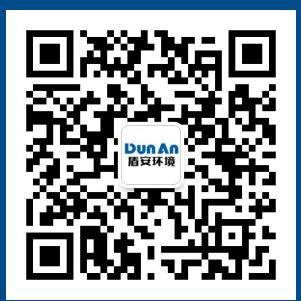

text_image

DunAn
盾安环境

盾安环境公众号

# 2025年度

# 环境、社会及公司治理（ESG）报告

ENVIRONMENTAL, SOCIAL, AND CORPORATE GOVERNANCE (ESG) REPORT

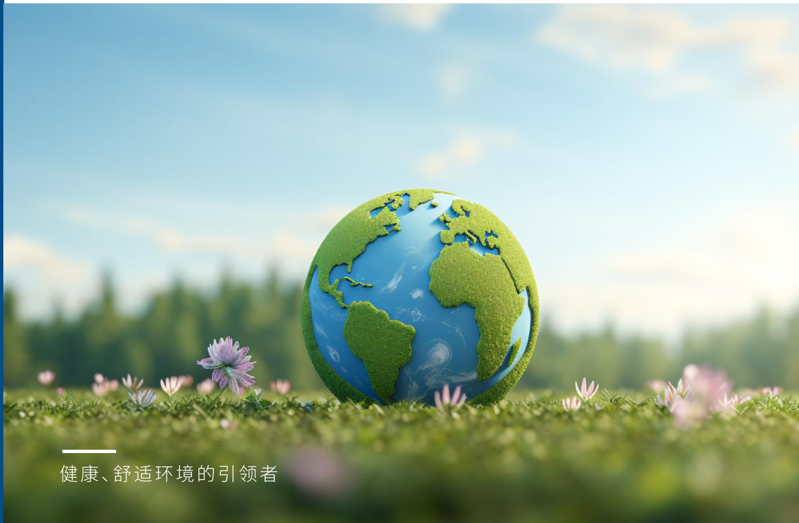

text_image

健康、舒适环境的引领者

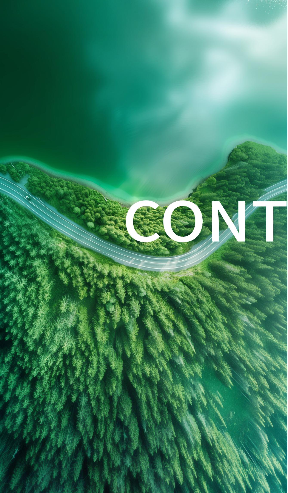

text_image

CONT

关于本报告 01

管理层致辞 03

关于我们 05

# CONTENTS

# 目录

关键绩效表 86

指标索引表 94

意见反馈表 95

# 01

# 稳健治理芯

公司治理 11

诚信合规 14

ESG管理 18

# 02

# 可持续铸盾

气候盾 25

循环盾 33

环保盾 36

生态盾 43

# 03

# 负责任为安

产品安 47

员工安 62

供应安 76

社会安 82

# 关于本报告

# 报告概况

本报告是浙江盾安人工环境股份有限公司(以下简称“盾安环境”“盾安”“公司”或“我们”)发布的2025年环境、社会及公司治理(ESG)报告。本报告的披露时间为2025年1月1日至12月31日，为增强数据可比性和内容延续性，部分内容适度延伸。未来，盾安环境将会每年发布ESG报告，定期向外界披露财务绩效以外的年度运营成果，并以行动践行可持续发展。

# 报告边界与可靠性

除另有说明，本报告的披露范围与《盾安环境2025年度报告》一致。报告中出现的公司简称对应的公司组织实体具体见下图。报告中所涉及货币金额以人民币作为计量币种。本报告使用数据来自公司年报、正式文件及统计报告。公司董事会保证公告内容真实、准确和完整，没有虚假记载、误导性陈述或重大遗漏，并对其内容的真实性、准确性和完整性承担个别及连带责任。

<table><tr><td>全称</td><td>简称</td></tr><tr><td>浙江盾安禾田金属有限公司</td><td>盾安禾田</td></tr><tr><td>浙江盾安机械有限公司</td><td>盾安机械</td></tr><tr><td>浙江盾安热工科技有限公司</td><td>盾安热工</td></tr><tr><td>盾安汽车热管理科技有限公司</td><td>盾安汽车热管理</td></tr><tr><td>浙江盾安机电科技有限公司</td><td>盾安机电</td></tr><tr><td>珠海华宇金属有限公司</td><td>珠海华宇</td></tr><tr><td>盾安(芜湖)中元自控有限公司</td><td>芜湖中元</td></tr><tr><td>南昌中昊机械有限公司</td><td>南昌中昊</td></tr><tr><td>杭州赛富特设备有限公司</td><td>杭州赛富特</td></tr><tr><td>江苏通盛换热器有限公司</td><td>江苏通盛</td></tr><tr><td>浙江盾安国际贸易有限公司</td><td>盾安国贸</td></tr><tr><td>盾安金属(泰国)有限公司</td><td>盾安泰国金属</td></tr></table>

# 报告编制依据

- 深圳证券交易所上市公司自律监管指引第17号——可持续发展报告(试行)  
- 深圳证券交易所上市公司自律监管指南第3号——可持续发展报告编制(2026年修订)  
- 全球报告倡议组织可持续发展报告标准 (GRI Standards)  
- 联合国可持续发展目标 (SDGs)

# 报告获取与沟通

本报告以简体中文、简明英文电子版形式发布，详见公司官网。

如果您对本报告有任何建议或疑问, 欢迎您通过邮件 (dunanhj@dunan.cn) 联系我们。

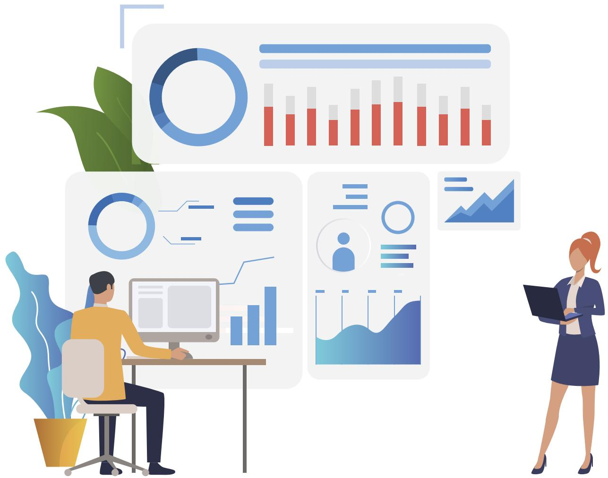

natural_image

Illustration of business professionals in a meeting, including a person at a desk, a woman holding a laptop, and abstract data charts (no readable text or symbols)

# 管理层致辞

时序轮转，华章日新。在全球可持续发展浪潮与中国高质量发展战略的双重牵引下，ESG已从企业的可选项升级为核心纲领。盾安环境秉持“健康、舒适环境的引领者”之愿景，将ESG理念深植于经营根基，在稳健前行中履行责任承诺。2025年，我们全面布局 $CO_{2}$ 低碳制冷零部件赛道，推进 $CO_{2}$ 全品类零部件产品研发，更在社会责任与可持续发展领域交出扎实答卷，公司Wind ESG评级跃升至A级，可持续发展能力获得权威认可。

# 稳健治理芯:以合规诚信筑牢行稳致远根基

可持续发展的根基，在于稳健规范的公司治理。2025年，公司持续完善治理体系，推进董事会多元化建设，女性董事占比超20%，各专门委员会独立董事占比均达到60%，治理结构持续优化；同时，构建“三道防线”风险防控机制，开展重点领域审计与风险排查，商业贿赂及反贪污培训覆盖12,581人次，持续强化廉洁从业底线。公司不断完善信息披露与投资者沟通机制，全年董事会审议事项通过率保持100%，切实保障信息透明与投资者权益，并通过合规宣贯等举措营造公平经营环境，以系统化治理能力支撑高质量发展。

# 可持续铸盾:以绿色创新引领行业低碳发展

面对全球气候变化的共同挑战，绿色转型既是企业责任，更是发展机遇。2025年，公司持续优化能源结构，推进分布式光伏与储能项目建设，多基地落地3MW/6MWh电池储能及光伏协同应用，带动清洁能源利用比例稳步提升；同时实施空压站系统优化、能源管理平台升级等节能技改项目，重点项目节能率达 $20\%$ 以上，全年实现减排 $\mathrm{CO}_{2}$ 数千吨。在产品端，公司加快绿色技术创新，持续完善 $\mathrm{CO}_{2}$ 系列低碳产品解决方案；并通过绿色制造与数字化管理协同推进，带动生产效率与资源利用水平同步提升，以绿色创新引领行业迈向高质量可持续发展。

# 负责任为安:以价值共享成就多元共赢生态

企业的核心价值，在于与利益相关方的共生共荣。2025年，公司持续推进产品创新与服务优化，全年新增专利授权666件，累计有效专利达3,770项，以技术创新不断提升客户价值与市场竞争力。同时，公司持续完善员工发展与激励机制，推进多层次培训与职业发展项目，营造平等包容的工作环境，强化安全生产与职业健康管理，全年未发生重大安全责任事故，为员工成长与企业稳健发展提供坚实保障。

在供应链与社会责任方面, 公司加快推进数字化采购与管理体系建设, 落地SRM系统, 提升供应链协同效率与透明度; 同时强化供应商管理与沟通机制, 推动可持续供应链生态建设, 带动中小合作伙伴共同发展。此外, 公司积极参与公益与社区共建活动, 持续创造社会价值, 深化与各利益相关方的协同联动, 推动形成互利共赢、长期稳定的发展格局。

道阻且长，行则将至。盾安环境的每一步稳健发展，离不开各利益相关方的长期信任与鼎力支持。面向未来，公司将继续锚定2030年可持续发展目标，坚定推进绿色低碳转型路径，深化技术创新与产业协同，持续提升企业发展质量与社会价值创造能力。盾安环境将以责任之心回应时代命题，以科技之力赋能绿色未来，与客户、员工、合作伙伴及社会各界携手同行，共同构建更加稳健、更加绿色、更加可持续的发展生态。

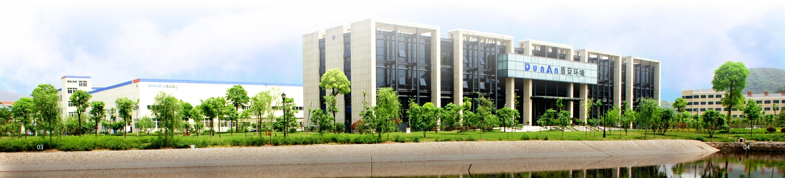

natural_image

Exterior view of a modern office building with DunAn logo and green landscaping, reflected in water (no signage visible)

# 关于我们

# 组织简介

浙江盾安人工环境股份有限公司以“健康、舒适环境的引领者”为愿景，以“提升能效、优化环境”为使命，多年来深耕制冷领域，主要业务涵盖零部件制造（家用与商用空调、热泵、冷冻冷藏等领域的制冷阀件、换热器和压力容器）、装备制造（商用中央空调及核电、净化、轨道交通、储能空调等特种空调以及冷链系统）和新能源汽车热管理核心零部件研发制造。公司于2004年在深圳证券交易所上市（简称盾安环境，股票代码002011）。

经济绩效

<table><tr><td>指标</td><td>单位</td><td>2025</td><td>2024</td><td>2023</td></tr><tr><td>总资产</td><td>亿元</td><td>122.90</td><td>121.53</td><td>107.83</td></tr><tr><td>营业收入</td><td>亿元</td><td>130.35</td><td>126.78</td><td>113.82</td></tr><tr><td>归母净利润</td><td>亿元</td><td>10.78</td><td>10.45</td><td>7.38</td></tr><tr><td>现金流</td><td>亿元</td><td>14.40</td><td>11.60</td><td>8.12</td></tr></table>

# 企业文化

健康、舒适环境的引领者

提升能效,优化环境

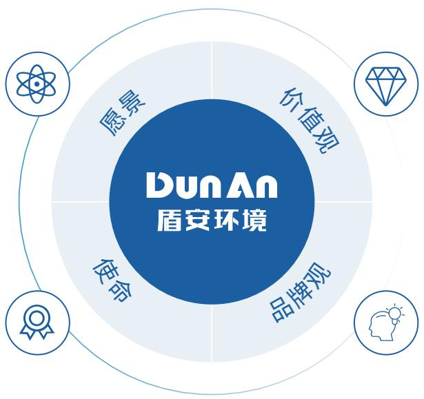

flowchart

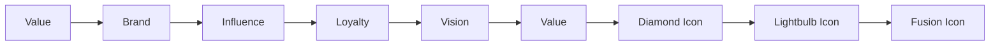
```mermaid
graph LR
  A["Value"] --> B["Brand"]
  B --> C["Influence"]
  C --> D["Loyalty"]
  D --> E["Vision"]
  E --> F["Value"]
  F --> G["Diamond Icon"]
  G --> H["Lightbulb Icon"]
  H --> I["Fusion Icon"]
```

诚信 尊重 专业

持续创新为盾 客户价值为安

# 产业布局

公司在全球拥有20个生产基地，分布于杭州、诸暨、芜湖、合肥、泰国、南昌、中山、珠海、石家庄、天津等地；在海外设有9个子公司及营销机构，覆盖北美、欧洲、日本、韩国、泰国、印度、马来西亚、越南等国家和地区。

公司在泰国建立了重要的海外制造枢纽，除盾安泰国金属基地外，2025年新设盾安泰国汽车热管理基地及盾安泰国热工换热器基地，使泰国生产基地总数达到3个，从而构建起高效协同的海外制造与营销体系。

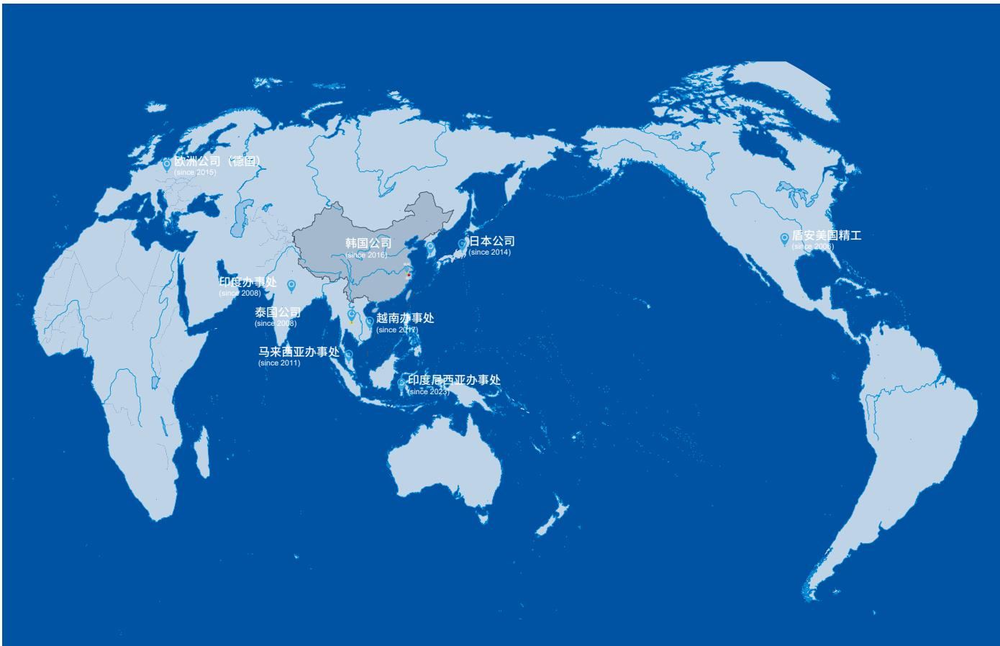

text_image

欧洲公司（德国）
(since 2015)
韩国公司
(since 2016)
日本公司
(since 2014)
盾安美国精工
(since 2016)
印度办事处
(since 2008)
泰国公司
(since 2013)
越南办事处
(since 2017)
马来西亚办事处
(since 2011)
印度尼西亚办事处
(since 2023)

# 技术实力

公司作为全球制冷空调零部件行业龙头企业，主要产品产销量均位居全球前列。与GREE、Midea、Haier、DAIKIN、MITSUBISHI、LG、Carrier、Bosch等全球知名空调企业，BYD、GEELY、SAIC、CATL等新能源汽车企业以及中核集团、中国中车、京东方等大型央国企建立了长期战略合作关系。公司将创新作为企业发展的灵魂，不断提升技术、品质领先的核心竞争力，拥有国家认定企业技术中心、国家级博士后工作站、国家认证(CNAS)实验室、国家级中央空调全性能测试中心，建立了拥有自主知识产权的核心技术支撑体系。先后参与了104项国家和行业标准制修订，获得了“全国质量奖”“国家创新型试点企业”“国家科技进步奖二等奖”“中国专利优秀奖”等荣誉称号。

公司先后参与了《空调用直动式电子膨胀阀》《空调与制冷用电磁阀》《空调用铜制制冷剂截止阀》《二氧化碳制冷系统用电子膨胀阀》《二氧化碳制冷系统用电磁阀》和《屋顶式空气调节机组》《蒸汽压缩循环冷水(热泵)机组第1部分:工业或商业用及类似用途的冷水(热泵)机组》等104项国家和行业标准制修订，其中20项标准为第一制单位；是中国首家为核电站配套生产核级冷水机组且拥有自主知识产权的企业；实现国内首台套非能动核电站反应堆用关键部件AP1000堆顶风机的自主研发。

# 行业地位

公司是美国空调、供热及制冷工业协会(AHRI)会员单位、欧洲热泵协会(EHPA)会员单位、中国制冷空调工业协会常务理事单位、中国制冷学会会员单位、全国冷冻空调设备标准化技术委员会委员单位、中国质量协会会员单位以及浙江制冷空调行业协会副会长单位。

# 荣誉

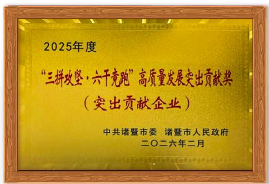

text_image

2025年度
“三拼攻坚·六千竞跑”高质量发展突出贡献奖
（突出贡献企业）
中共诸暨市委 诸暨市人民政府
二〇二六年二月

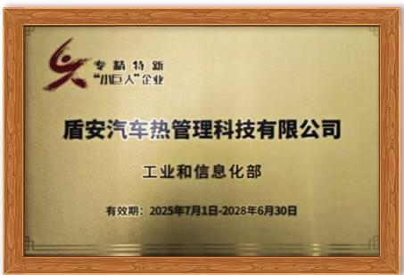

text_image

专精特新
“小巨人”企业
盾安汽车热管理科技有限公司
工业和信息化部
有效期：2025年7月1日-2028年6月30日

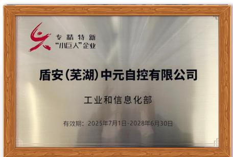

text_image

专精特新
“小巨人”企业
盾安(芜湖)中元自控有限公司
工业和信息化部
有效期：2025年7月1日-2028年6月30日

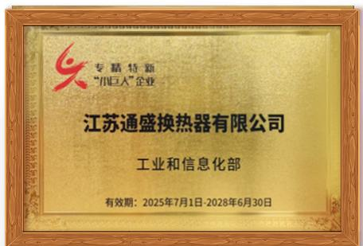

text_image

专精特新
“川巨人”企业
江苏通盛换热器有限公司
工业和信息化部
有效期：2025年7月1日-2028年6月30日

<table><tr><td>获奖企业</td><td>荣誉名称</td><td>颁奖单位</td></tr><tr><td>盾安机电</td><td>国家级绿色工厂</td><td>中华人民共和国工业和信息化部</td></tr><tr><td>盾安热工</td><td>浙江省单项冠军</td><td rowspan="3">浙江省经济和信息化厅</td></tr><tr><td rowspan="8">盾安环境</td><td>浙江省管理现代化企业</td></tr><tr><td>浙江省第三批雄鹰企业</td></tr><tr><td>浙江省民营企业200强</td><td rowspan="5">浙江省工商业联合会</td></tr><tr><td>浙江省制造业民营企业200强</td></tr><tr><td>浙江省民营企业研发投入200强</td></tr><tr><td>浙江省民营企业发明专利200强</td></tr><tr><td>绍兴市民营企业100强</td></tr><tr><td>2025年度标准化突出贡献单位</td><td>全国冷冻空调设备标准化委员会</td></tr><tr><td>盾安汽车热管理</td><td rowspan="5">第七批专精特新“小巨人”</td><td rowspan="5">中华人民共和国工业和信息化部</td></tr><tr><td>杭州赛富特</td></tr><tr><td>江苏通盛</td></tr><tr><td>盾安机械</td></tr><tr><td>芜湖中元</td></tr></table>

natural_image

Illustration of people celebrating with a golden trophy (no text or symbols)

# 稳健治理芯

# 以诚信经营夯实行稳致远根基

本章响应联合国可持续发展目标(SDGs)

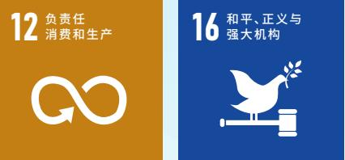

12 负责任消费和生产

16 和平、正义与强大机构

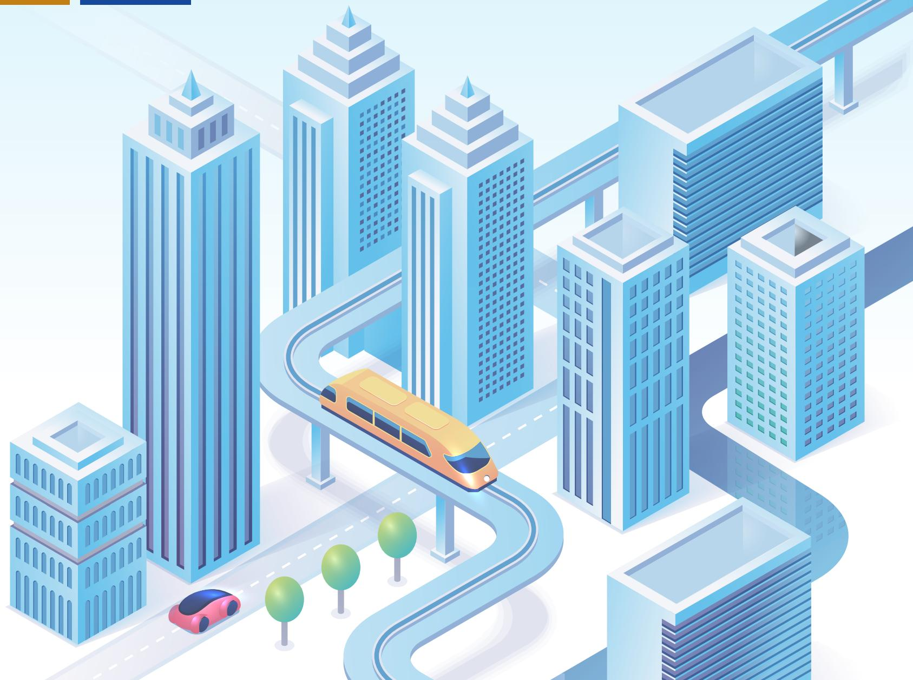

natural_image

Isometric illustration of a city with high-speed trains, modern skyscrapers, and a car driving on a curved road (no text or symbols)

# 全球报告倡议组织可持续发展报告标准 (GRI STANDARDS)

ØGRI 2

一般披露2021

ØGRI 3

实质性议题2021

ØGRI 205

反腐败2016

ØGRI 206

反竞争行为2016

ØGRI 207

税务2019

# 深圳证券交易所上市公司自律监管指引第17号——可持续发展报告(试行)

∅反商业贿赂及反贪污

∅反不正当竞争

# 公司治理

# 治理架构

盾安环境建立了清晰的治理架构:股东会为最高权力机构,董事会作为经营决策机构,对股东会负责。董事会下设战略、薪酬与考核、提名、审计四个专门委员会。经营管理层则负责执行董事会决议,落实战略并保障公司日常高效、合规运营。该架构实现了决策、监督与执行的有效分离与协同,确保了公司治理的效能与质量。

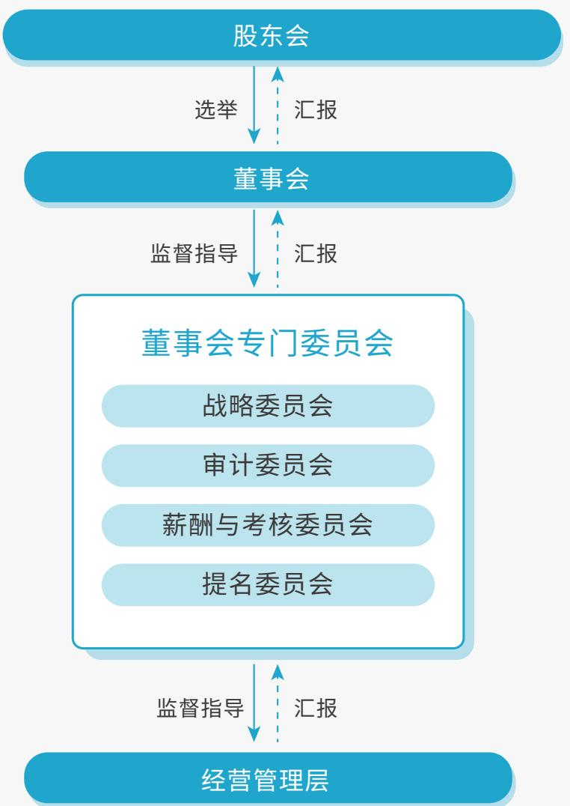

flowchart

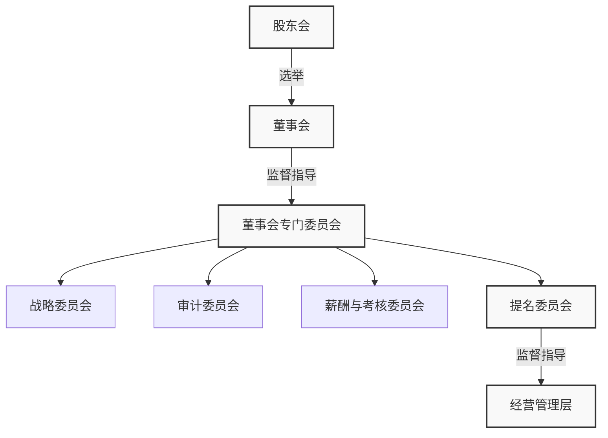
```mermaid
graph TD
  A["股东会"] -->|"选举"| B["董事会"]
  B -->|"监督指导"| C["董事会专门委员会"]
  C --> D["战略委员会"]
  C --> E["审计委员会"]
  C --> F["薪酬与考核委员会"]
  C --> G["提名委员会"]
  G -->|"监督指导"| H["经营管理层"]
  style A fill:#f9f9f9,stroke:#333,stroke-width:2px
  style B fill:#f9f9f9,stroke:#333,stroke-width:2px
  style C fill:#f9f9f9,stroke:#333,stroke-width:2px
  style G fill:#f9f9f9,stroke:#333,stroke-width:2px
  style H fill:#f9f9f9,stroke:#333,stroke-width:2px
```

新《中华人民共和国公司法》施行后，证监会、深交所先后修订《上市公司章程指引》《深圳证券交易所股票上市规则》等多项制度，对上市公司提出新要求。2025年，公司主动衔接新规推进治理优化，组织相关人员深入学习新规条款，结合自身实际与治理需求梳理现有制度，完成《公司章程》《股东会议事规则》等多项制度的修订或制定工作，确保治理文件与监管要求全面接轨。公司同步推进监事会改革，将原监事会职能整合至审计委员会，增设职工董事席位，治理架构更加贴合新规精神。

# 多元建设

公司全面加强董事会建设，落实董事会职权，董事会对股东会负责，严格按照国家法律法规及《公司章程》规定，有效监督公司战略发展方向并控制关键风险，为管理层提供指引，并考虑和批准重大决策、监督业务、评估公司业绩。

公司依法合规地开展董事的选聘程序及职权管理，注重董事会的多元化，力求丰富董事会成员在性别、经验、资格和专业背景等方面的代表性，为公司发展提供更全面、专业的决策。截至本报告期末，公司董事会由9名董事组成，其中独立董事3名、女性占董事会成员比例超过20%。

此外，董事会下设战略委员会、薪酬与考核委员会、提名委员会、审计委员会四大专门委员会，履行专门委员会建议与监督等职责。报告期内，四大委员会独立董事占比均达到或超过 $60\%$ ，确保了董事会运作的独立性与规范性。

<table><tr><td>指标</td><td>单位</td><td>2025</td><td>2024</td><td>2023</td></tr><tr><td>董事会成员总人数</td><td>人</td><td>9</td><td>9</td><td>9</td></tr><tr><td>董监高年龄标准差</td><td>岁</td><td>6.58</td><td>8.44</td><td>8.66</td></tr><tr><td>董事会成员平均任期</td><td>年</td><td>2.12</td><td>2.70</td><td>2.01</td></tr><tr><td>独立董事占比</td><td>%</td><td>33.33</td><td>33.33</td><td>33.33</td></tr><tr><td>在超过3家上市公司担任独立董事的独立董事数量占比</td><td>%</td><td>0</td><td>0</td><td>0</td></tr><tr><td>战略委员会独立董事占比</td><td>%</td><td>60</td><td>60</td><td>60</td></tr><tr><td>审计委员会独立董事占比</td><td>%</td><td>67</td><td>67</td><td>67</td></tr><tr><td>薪酬与考核委员会独立董事占比</td><td>%</td><td>60</td><td>60</td><td>60</td></tr><tr><td>提名委员会独立董事占比</td><td>%</td><td>60</td><td>60</td><td>60</td></tr><tr><td>董事会成员按性别划分</td><td></td><td></td><td></td><td></td></tr><tr><td>男性</td><td>人</td><td>7</td><td>9</td><td>9</td></tr><tr><td>女性</td><td>人</td><td>2</td><td>0</td><td>0</td></tr><tr><td>董事会成员按专业/学历背景划分</td><td></td><td></td><td></td><td></td></tr><tr><td>行业专家</td><td>人</td><td>1(独董)</td><td>1(独董)</td><td>1(独董)</td></tr><tr><td>法律专家</td><td>人</td><td>1(独董)</td><td>1(独董)</td><td>1(独董)</td></tr><tr><td>财务专家</td><td>人</td><td>1(独董)</td><td>1(独董)</td><td>1(独董)</td></tr></table>

# 履职尽责

报告期内，公司共召开股东会6次、董事会12次，所有重大决策均通过股东会、董事会依法作出。本报告年度全体董事董事会会议出勤率达100%。董事会各专门委员会在各自领域向公司提出专业和客观的意见和建议，为公司科学决策提供了有力支持。

<table><tr><td>指标</td><td>单位</td><td>2025</td><td>2024</td><td>2023</td></tr><tr><td colspan="5">董事会履职情况</td></tr><tr><td>举行董事会次数</td><td>次</td><td>12</td><td>7</td><td>4</td></tr><tr><td>董事会成员出席率</td><td>%</td><td>100</td><td>100</td><td>100</td></tr><tr><td>战略委员会会议议案通过率</td><td>%</td><td>100</td><td>100</td><td>100</td></tr><tr><td>审计委员会会议议案通过率</td><td>%</td><td>100</td><td>100</td><td>100</td></tr><tr><td>薪酬与考核委员会会议议案通过率</td><td>%</td><td>100</td><td>100</td><td>100</td></tr><tr><td>提名委员会会议议案通过率</td><td>%</td><td>100</td><td>100</td><td>100</td></tr></table>

# - 薪酬绩效管理

为确保公司董事及高级管理人员高效履职、提升治理有效性，公司建立了以绩效为导向的董事及高级管理人员薪酬管理体系，旨在通过激励相容驱动战略目标实现。

公司每年制定董事、高级管理人员薪酬方案。独立董事实行固定津贴制(12万元/年/人)，与其监督职责匹配；在公司任职的非独立董事不领取额外津贴，其薪酬与所任管理岗位的绩效挂钩；高级管理人员则采用强绩效关联的薪酬结构，目标年薪按3:7的固浮比设计， $70\%$ 的浮动部分与绩效结果直接挂钩，并可依据《超目标激励管理规定》获取超额利润奖励。

# 信息披露

公司按照有关法律法规及深圳证券交易所对上市公司信息披露的规定，建立《信息披露管理制度》，构建规范的信息披露体系，切实履行信息披露义务，确保所披露信息真实、准确、完整，保障公司股东和债权人对公司生产经营状况及重大事项的知情权。

报告期内，公司依据《中华人民共和国公司法》《中华人民共和国证券法》《上市公司信息披露管理办法》等法律法规以及《公司章程》和《信息披露管理制度》等规章制度的有关要求，严格履行信息披露义务，通过《证券时报》《证券日报》及巨潮资讯网，共披露了153份公告文件。

# 投资者关系管理

公司高度重视并持续健全投资者关系管理机制，通过互动易平台、热线电话、电子信箱、传真、联合调研等多种渠道，持续加强与广大投资者尤其是中小投资者的常态化沟通和交流，认真听取广大投资者尤其是中小投资者对公司生产经营、未来发展等方面的意见和建议，构建双向畅通、坦诚互信的良性互动。

公司严格遵循公平、公正、公开原则，切实保护中小投资者合法权益，保障全体股东平等享有法律法规及公司章程规定的各项权利，所有涉及公司经营、财务及发展等重要信息，均以公司正式披露的年度报告等公告内容为准。

# 诚信合规

# 合规管理

# - 治理

盾安环境将合规视为经营发展的生命线，严格遵循《中华人民共和国公司法》《企业内部控制基本规范》等法律法规及监管要求，构建了以战略目标为导向、业务全覆盖、权责清晰、运行有效的全面风险管理与合规治理体系。

为提升风险管理的系统性和专业性，公司设立“风险管理中心”，由公司证券投资部、内控部、法务部三大部门组成，通过跨部门协同形成合力，为公司稳健运营筑牢内部防线，构建起覆盖业务全流程的风险防控网络。

# 风险管理中心构成

证券投资部:负责投资、信息披露风险识别与监控

内控部:负责内部控制体系的建设与监督

法务部:负责法律合规风险的防范与处理

# - 战略

公司以合规稳健经营、防范重大风险、提升治理效能为核心战略方向，将合规管理深度嵌入业务全流程，通过体系化建设、专业化防控、常态化文化宣导，保障公司持续健康运营，维护投资者、客户及利益相关方合法权益，为高质量可持续发展提供坚实保障。

# - 影响、风险和机遇管理

公司通过系统化的风险管理体系，在有效识别与防范经营、法律、廉洁等各类风险的同时，积极将合规能力转化为市场竞争优势与行业影响力。公司构建并持续运行以“三道防线”为核心的风险管控责任体系，确保风险管理层层落实、形成闭环。

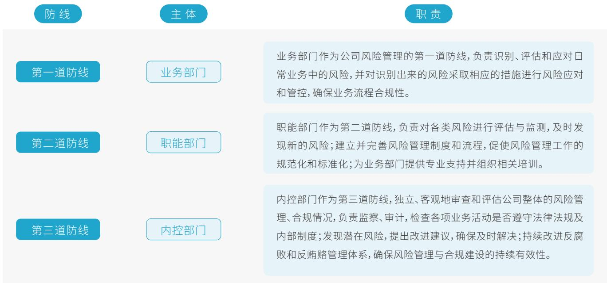

flowchart

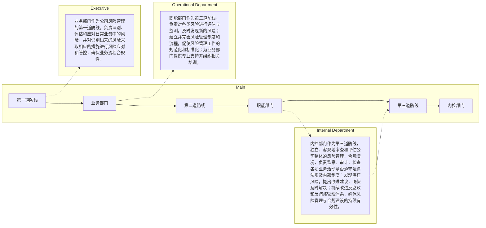
```mermaid
graph LR
  subgraph Main["Main"]
  A["第一道防线"] --> B["业务部门"]
  B --> C["第二道防线"]
  C --> D["职能部门"]
  D --> E["第三道防线"]
  E --> F["内控部门"]
  end

  subgraph Executive["Executive"]
    G["业务部门作为公司风险管理的第一道防线，负责识别、评估和应对日常业务中的风险，并对识别出来的风险采取相应的措施进行风险应对和管控，确保业务流程合规性。"]
  end

  subgraph Operational["Operational Department"]
    H["职能部门作为第二道防线，负责对各类风险进行评估与监测，及时发现新的风险；建立并完善风险管理制度和流程，促使风险管理工作的规范化和标准化；为业务部门提供专业支持并组织相关培训。"]
  end

  subgraph Internal["Internal Department"]
    I["内控部门作为第三道防线，独立、客观地审查和评估公司整体的风险管理、合规情况，负责监察、审计，检查各项业务活动是否遵守法律法规及内部制度；发现潜在风险，提出改进建议，确保及时解决；持续改进反腐败和反贿赂管理体系，确保风险管理与合规建设的持续有效性。"]
  end

  A -.-> G
  B -.-> H
  D -.-> I
  I -.-> E
```

# 常态化开展廉洁警示教育

公司持续推进合规文化建设，营造“人人讲合规、事事守规矩”的文化氛围。公司面向新员工、基地员工及管理层开展多层次、多形式的合规培训，通过企业微信推送合规相关案例，全面提升员工的合规意识与风险防范能力。此外，公司建立了高效的法律咨询响应机制，报告期内，为员工提供法律咨询超过100次，及时解答实务问题。

# 案例 常态化开展廉洁警示教育,筑牢合规从业防线

2025年4月、7月、10月，公司通过企业微信推送廉政案例，涵盖窃取公司财物、虚报费用、职务侵占等典型场景，案例通过还原违纪行为发生过程、剖析问题根源与惩戒后果，直观揭示了日常运营中的廉洁风险点，向全体员工强调遵守财务制度与廉洁从业规定的必要性，引导员工以案为鉴、自觉抵制腐败行为，持续夯实公司治理与合规运营的思想基础。

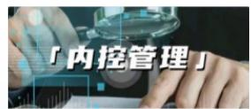  
以案为鉴知敬畏 防微杜渐守底线 ——廉政案例警示之职务侵占  
一、身边案例某公司员工赵某在职期间利用生产物资领用的职务便利，多次秘密侵占公司银焊条等物资，以获取私利。

# 加强贸易合规

公司积极践行贸易合规，2025年通过深度参与AEO高级认证实践，面向行业分享AEO认证管理经验，以标杆实践带动区域企业合规水平提升。

# 案例 深化AEO合规实践, 以行业分享赋能贸易合规

公司严格执行《海关高级认证企业标准》，是绍兴地区拥有两家AEO高级认证的企业（盾安禾田、盾安国贸）。公司认证期间组建“AEO标准解读”小组，将认证要求深度融入业务流程，实现管理体系一体化，有效解决认证标准与管理体系“两层皮”、文件“难融合、难执行”等问题。小组编制《AEO标准解读在AEO认证管理中的作用》专题讲座，获得杭州海关高度认可与好评，截至2025年12月，在杭州、绍兴、台州、温州等地开展分享，覆盖超100家企业，以经验共享助力行业合规提升，并获杭州海关感谢信，彰显了公司在贸易合规与社会责任方面的示范担当。

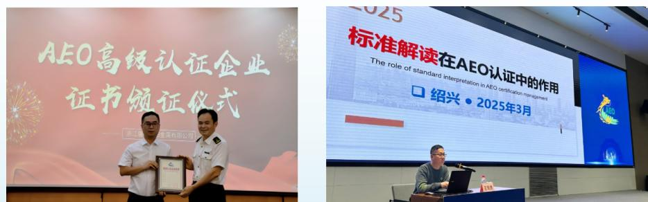

# - 指标与目标

公司开展审计监督工作，持续强化内控与风险管理。2025年，组织开展全面经营审计4项、高层管理人员任中经济责任审计1项，高层管理人员离任经济责任审计1项，并聚焦招待费用、采购管理、质量管理等重点领域完成专项审计16项，出具监察调查报告5份，按期发布年度内部控制评价报告。合规文化与风险防控落地见效，未发生重大合规与廉洁风险事件，合规治理水平持续提升。

# 廉洁建设

# - 治理

盾安环境秉持诚信经营，致力于构建廉洁、透明的商业环境。以《盾安企业宪章》为统领，建立廉洁承诺、自查自纠、关键岗位轮岗、专题培训、举报监督五位一体的廉洁防控机制；明确高层管理人员、中层干部及关键岗位员工（采购、基建、财务、资金等岗位）廉洁责任，实施全员廉洁承诺与家属助廉监督；畅通多维度举报渠道，建立标准化受理、核查、反馈、保密与奖励流程，形成闭环管理。

# - 战略

公司将廉洁合规、透明运营作为可持续发展的核心战略，以筑牢廉洁风险防线、营造风清气正氛围为目标，持续强化反腐败、反贿赂管理，通过制度约束、文化浸润、监督保障，推动廉洁理念融入经营全流程，维护公司、股东、客户及利益相关方合法权益，保障企业长期稳健发展。

# - 影响、风险和机遇管理

公司通过系统化廉洁建设，有效防控商业贿赂、贪污、利益输送等重大风险，提升合规形象与市场信任度。

公司组织全员签订《廉洁从业承诺书》、开展廉政自查自纠，实施关键岗位轮岗；面向新员工与关键岗位开展反贿赂、反垄断等专题培训，累计10,000余人参与培训，覆盖全体高层管理人员，赋能合规专业人员；畅通线上线下举报渠道，强化举报人保护与奖励机制，全方位压实廉洁风险防控。

# 案例 反腐倡廉专题培训

2025年9月，公司组织开展以“讲规矩、严律己；知敬畏、守底线”为主题的反腐倡廉专题培训。培训结合近年来公司内部典型权力腐败案例，深入剖析腐败行为的滋生根源与危害，围绕权力监督机制、岗位廉洁风险防控等内容开展互动讨论，引导员工从思想深处筑牢廉洁防线。公司领导亲临现场指导，进一步强化了培训的权威性与实效性。

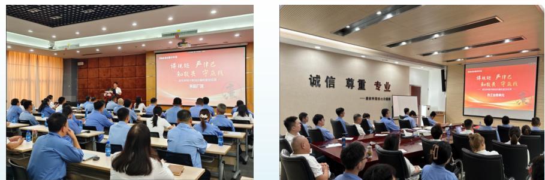

# 举报渠道及举报人保护

为了充分发挥员工及相关方的监督作用，保护举报人员的合法权益，促使广大员工特别是管理干部尽心尽职，在公司内树立“公平、公正、廉洁”的正气，公司积极畅通各类举报渠道，除电话、电子邮箱、实体举报箱等传统举报通道外，公司还打造数字化廉政投诉平台，通过企业微信或扫码等方式进入平台投诉举报。

# 盾安环境举报渠道

举报电话：13858409929

举报邮箱：nkb@dunan.cn

举报二维码：

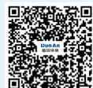  
微信投诉平台

- 指标与目标

<table><tr><td>指标</td><td>单位</td><td>2025</td><td>2024</td><td>2023</td></tr><tr><td>反商业贿赂及反贪污培训覆盖高层管理层人员总数</td><td>人</td><td>50</td><td>50</td><td>43</td></tr><tr><td>反商业贿赂及反贪污培训覆盖高层管理层人员百分比</td><td>%</td><td>100</td><td>100</td><td>100</td></tr><tr><td>反商业贿赂及反贪污培训覆盖员工总数</td><td>人</td><td>12,581</td><td>13,735</td><td>11,872</td></tr><tr><td>反商业贿赂及反贪污培训覆盖员工百分比</td><td>%</td><td>98.90</td><td>98.66</td><td>100.00</td></tr><tr><td>商业贿赂及贪污事件总数</td><td>起/件</td><td>2</td><td>2</td><td>1</td></tr><tr><td>商业贿赂及贪污事件处分人数</td><td>人</td><td>3</td><td>3</td><td>1</td></tr></table>

# 反不正当竞争

盾安环境始终坚持诚信、透明与公平竞争的核心原则，严格遵守《中华人民共和国反不正当竞争法》等法律法规，致力于维护健康有序的市场环境。在实践中，公司确保所有市场推广与销售活动信息真实、准确，杜绝任何虚假或夸大宣传，并对宣传材料建立严格审核机制，以保证其全面合规。

公司积极倡导良性竞争，尊重同业伙伴与竞争对手，坚决抵制任何扰乱市场秩序的行为。同时，公司高度重视知识产权保护，既尊重他人的合法权益，也严格维护自身知识产权，严禁一切未经授权的使用。

为保障上述要求落到实处，公司定期对营销及市场行为开展系统的内部合规评估，确保全流程符合反不正当竞争管理规范，并对任何违规行为进行严肃问责。

# 案例 反不正当竞争宣讲

2025年2月，公司组织了反不正当竞争的宣讲活动，围绕不正当竞争概述、类型、重要性、相关法律法规、反不正当竞争的监管与执法和企业应对不正当竞争策略六个方面给员工开展专题宣讲，推动市场主体知法守法，依法经营，切实维护市场竞争秩序。

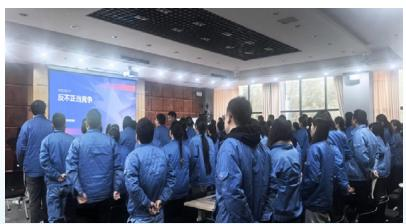

text_image

反不正当竞争

<table><tr><td>指标</td><td>单位</td><td>2025</td><td>2024</td><td>2023</td></tr><tr><td>不正当竞争行为导致诉讼或重大行政处罚涉案金额</td><td>元</td><td>0</td><td>0</td><td>0</td></tr></table>

# ESG管理

# 治理

盾安环境高度重视可持续发展工作，积极管理自身制造和运营活动对环境和社会的影响。我们致力于成为“制冷空调领域健康舒适环境系统解决方案专家”，并将可持续发展理念融入公司战略、日常管理和运营中，以实现长期价值。公司构建了“董事会一可持续发展委员会—职能部门”三级可持续发展管理治理架构，明确各层级ESG职责，以更加科学化、专业化、体系化的方式推进ESG治理，助力公司高质量稳健发展。

<table><tr><td>决策层</td><td>董事会</td><td>指导战略监督审查</td><td>董事会负责监督公司可持续发展工作,包括制定相关政策及程序,并于每年进行可持续发展绩效考核。</td></tr><tr><td>管理层</td><td>可持续发展委员会</td><td>制定战略组织协调</td><td>可持续发展委员会负责制定公司可持续发展战略与目标,承接决策层战略部署,推动ESG相关事宜开展及定期审查ESG相关目标进展情况。</td></tr><tr><td>执行层</td><td>职能部门</td><td>协同推进落地实施</td><td>各职能部门负责承接ESG相关决议,参与ESG实践,推动相关举措实施落地。</td></tr></table>

# 可持续发展战略

盾安环境构建了“铸盾为安，做健康、舒适环境的引领者”的可持续发展战略，以“稳健治理芯”为核心，联动“可持续铸盾”和“负责任为安”两大可持续齿轮，即通过打造“气候盾”“循环盾”“环保盾”“生态盾”构建可持续的商业模式，以实现“产品安”“员工安”“供应安”“社会安”的负责任价值创造，同时积极响应联合国可持续发展目标，为中国“双碳”目标的实现以及全球的可持续治理贡献盾安力量。

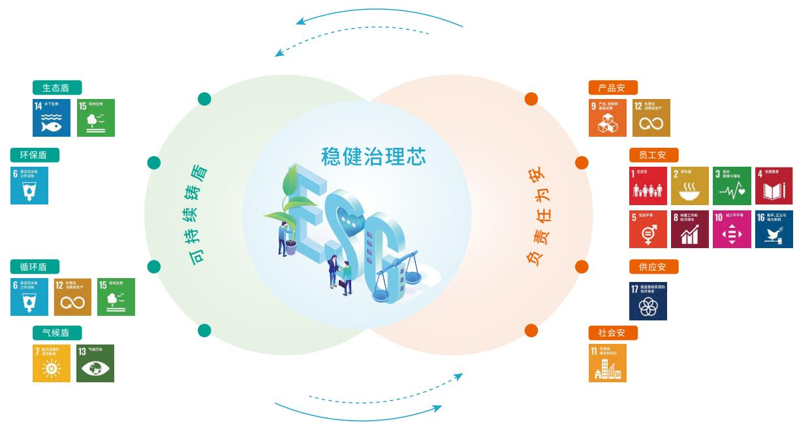

flowchart

This diagram illustrates the 'Steady Governance Core' framework, showing relationships between sustainable practices (such as life, environment, environmental, and climate) and responsibility for ensuring peace.

在此基础上，盾安环境设定了2030年可持续发展目标。在2025年度，我们进一步将目标的推进与管理深化：通过明确各目标的责任部门，并定期审视其关键进展与督导，系统性地确保2030年可持续发展路径扎实执行与稳步前行。

<table><tr><td>战略定位</td><td>战略举措</td><td>2030目标和指标</td><td>2025年进展</td></tr><tr><td rowspan="7">可持续铸盾,以自然友好引领健康环境建设</td><td rowspan="2">铸造气候盾,支持国家“双碳”目标</td><td>2030:实现温室气体排放(范围一;范围二)达峰,相较2021年基准年下降10%</td><td>推进中</td></tr><tr><td>2030:研发绿色产品,为价值链减排贡献力量,绿色产品创造营收占总营收40%</td><td>推进中</td></tr><tr><td rowspan="2">铸造循环盾,开拓循环经济模式</td><td>2030:水资源循环利用率每年不低于90%</td><td>已达成</td></tr><tr><td>2030:创新产品生命周期末期的回收利用模式</td><td>推进中</td></tr><tr><td rowspan="2">铸造环保盾,塑造环境安全典范</td><td>2030:持续保持环境污染及化学品泄漏事故为0</td><td>推进中</td></tr><tr><td>2030:持续推进绿色工厂创建工作</td><td>已达成1家</td></tr><tr><td>铸造生态盾,拥抱自然友好未来</td><td>2030:将生态理念融入产品研发,打造自然友好型产品</td><td>推进中</td></tr><tr><td rowspan="8">负责任为安,以社会共荣成就多元价值创造</td><td rowspan="2">产品安,成为客户的放心选择</td><td>2030:发出商品使用不合格率在2021年的基础上下降50%</td><td>推进中</td></tr><tr><td>2030:每年客户满意度≥92分</td><td>已达成</td></tr><tr><td rowspan="2">员工安,成为员工的安身事业</td><td>2030:保持重大安全生产事故为0,每年工伤事故≤45起</td><td>推进中</td></tr><tr><td>2030:员工满意度≥90%</td><td>推进中</td></tr><tr><td rowspan="3">供应安,助力负责任供应链建设</td><td>2030:签署包含环境、劳工和人权要求条款的合同达80%</td><td>推进中</td></tr><tr><td>2030:经过环境、社会责任现场审核的供应商≥90%</td><td>推进中</td></tr><tr><td>2030:赋能供应商ESG表现,每年至少举办5场相关培训</td><td>推进中</td></tr><tr><td>社会安,融入社区推进共同发展</td><td>2030:员工本地化雇佣比例达到90%</td><td>推进中</td></tr><tr><td rowspan="4">稳健治理芯,以诚信经营夯实行稳致远根基</td><td rowspan="2">公司治理,可持续融合释放势能</td><td>2030:持续推进董事会多元化建设,女性董事占比提高</td><td>已达成</td></tr><tr><td>2030:持续推进可持续发展与公司治理的融合工作</td><td>推进中</td></tr><tr><td rowspan="2">商业道德,负责任经营值得信赖</td><td>2030:对贪污和贿赂事件零容忍,保持相关事件零发生</td><td>推进中</td></tr><tr><td>2030:杜绝商业道德违规行为(包括不当竞争、利益冲突、洗钱、欺诈)</td><td>推进中</td></tr></table>

# 利益相关方沟通

盾安环境在日常经营服务的各个环节中，积极拓展与利益相关方的沟通渠道，通过建立常态化沟通机制，以多渠道、多形式的沟通活动，充分了解利益相关方的期望与诉求，积极回应利益相关方关切，构建和谐、稳定的利益相关方关系。

<table><tr><td>利益相关方</td><td>沟通与参与方式</td><td>关注议题</td></tr><tr><td>政府及监管机构</td><td>政企沟通与汇报合规信息披露</td><td>公司治理、ESG与可持续风险管理合规与风险管理、反腐败反不正当竞争、税务诚信环境合规管理、生态系统与生物多样性保护公益慈善、乡村振兴、助力产业发展</td></tr><tr><td>股东及其他投资者</td><td>定期公告业绩报告会议日常沟通调查问卷及时电话交流投资者会议业绩发布会股东会调查问卷</td><td>公司治理ESG与可持续风险管理创新驱动知识产权保护智能化与数字化绿色产品设计与研发产品质量与安全助力产业发展可持续供应链</td></tr><tr><td>客户</td><td>社交媒体客户满意度调查客户投诉调查问卷</td><td>绿色产品设计与研发、能源效率与可再生能源创新驱动、产品质量与安全客户满意度、数据安全与客户隐私保护助力产业发展、可持续供应链</td></tr><tr><td>供应商及合作伙伴</td><td>定期交流沟通供应商及合作伙伴官网调查问卷</td><td>可持续供应链平等对待中小企业助力产业发展创新驱动产品质量与安全</td></tr><tr><td>员工和其他工作人员</td><td>职工代表大会员工培训员工活动社交媒体公司内网员工满意度调查调查问卷</td><td>合规雇佣与权益保障薪酬福利与关怀职业健康与安全培训与发展</td></tr><tr><td>行业协会</td><td>公司网站行业沟通与交流调查问卷</td><td>助力产业发展知识产权保护</td></tr></table>

# 实质性议题评估

盾安环境基于标准对标、趋势分析及政策要求识别实质性议题，并结合线下各部门访谈重点，形成2025年ESG实质性议题清单，在关注企业特性的基础上确保议题选取兼具标准合规性、行业代表性与政策前瞻性。2025年，我们共识别了33个潜在实质性议题，并采用问卷评估法开展双重重要性评估，发放影响重要性和财务重要性问卷，通过定量分析与定性判断确保评估的科学性。

# Step1 实质性议题识别

基于标准对标、趋势分析及政策要求识别实质性议题，结合线下访谈回应重点，识别33个潜在实质性议题，组建实质性议题库。

# Step2 问卷调查

开展线下访谈调研以及结构化问卷调查,分为影响重要性评估和财务重要性评估,分别收到197份有效影响重要性问卷、14份有效财务重要性问卷。

# Step3 评估分析

基于访谈调研、数据分析、小组讨论与专家评估，确定高度重要议题、中等重要议题、一般重要议题。

# - 双重实质性议题矩阵

2025年，盾安环境基于影响重要性与财务重要性双重维度开展实质性议题评估，通过问卷调研、数据分析及综合研判，对各议题进行系统识别与排序。评估结果显示，公司共识别出14项高度重要议题、15项中度重要议题及4项一般重要议题。整体来看，实质性议题呈现出由一般重要向高度重要逐步集聚的分布特征，反映出公司在治理合规、产品责任及运营管理等关键领域的重要性持续提升。

盾安环境双重实质性议题矩阵图  
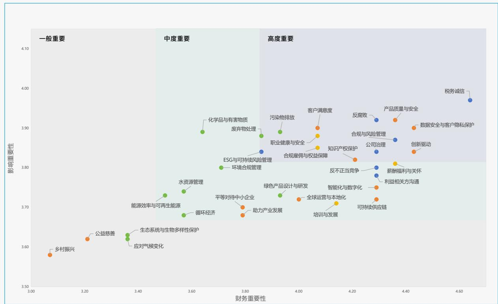

scatter

| Topic | Financial Importance (X) | Impact Importance (Y) |
| :--- | :--- | :--- |
| 税务诚信 | ~4.65 | ~3.97 |
| 数据安全与客户隐私保护 | ~4.45 | ~3.90 |
| 创新驱动 | ~4.45 | ~3.84 |
| 公司治理 | ~4.30 | ~3.87 |
| 合规与风险管理 | ~4.30 | ~3.87 |
| 反腐败 | ~4.30 | ~3.92 |
| 薪酬福利与关怀 | ~4.35 | ~3.81 |
| 利益相关方沟通 | ~4.30 | ~3.78 |
| 可持续供应链 | ~4.30 | ~3.72 |
| 智能化与数字化 | ~4.30 | ~3.75 |
| 全球运营与本地化 | ~4.15 | ~3.71 |
| 培训与发展 | ~4.15 | ~3.71 |
| 客户满意度 | ~4.10 | ~3.90 |
| 知识产权保护 | ~4.20 | ~3.82 |
| 合规雇佣与权益保障 | ~4.10 | ~3.85 |
| 职业健康与安全 | ~4.05 | ~3.88 |
| 污染物排放 | ~3.95 | ~3.89 |
| 废弃物处理 | ~3.90 | ~3.88 |
| ESG与可持续风险管理 | ~3.85 | ~3.84 |
| 环境合规管理 | ~3.80 | ~3.80 |
| 平等对待中小企业 | ~3.80 | ~3.70 |
| 助力产业发展 | ~3.80 | ~3.68 |
| 循环经济 | ~3.60 | ~3.68 |
| 水资源管理 | ~3.60 | ~3.74 |
| 能源效率与可再生能源 | ~3.50 | ~3.73 |
| 生态系统与生物多样性保护 | ~3.40 | ~3.63 |
| 应对气候变化 | ~3.40 | ~3.62 |
| 公益慈善 | ~3.20 | ~3.62 |
| 乡村振兴 | ~3.10 | ~3.58 |

# 高度重要议题 (14个)

位于高度重要区间的议题有14个，呈现出治理与产品责任导向的特征。其中，税务诚信、产品质量与安全、数据安全与客户隐私保护负面影响重要性较高，需持续加强风险管理；创新驱动的正面影响重要性较高，可进一步结合公司定位，围绕绿色产品与清洁技术探索创新实践举措。此外，员工职业健康安全、合规雇佣与权益保障等议题也位列该区间，体现了公司致力于在稳健运营中保障基本权益的理念。

# 中度重要议题 (15个)

位于中等重要区间的议题有15个，主要为环境和社会维度议题。其中，环境类议题，如化学品与有害物质、环境合规管理，普遍影响重要性更高，需加强风险管理；绿色产品设计与研发议题则财务重要性较高，表明公司可持续业务的转化潜力可进一步挖掘。社会类议题则聚焦于员工成长与产业协同，如培训与发展、全球运营与本地化、助力产业发展等，其较高的双重重要性表明对这些领域的投入能直接赋能组织能力、产业链韧性。

# 一般重要议题 (4个)

位于一般重要区间的议题有4个，其综合重要性相对较低。这表明当前阶段，这些议题对公司运营的直接影响及短期财务关联性较弱，更多体现企业的社会担当与长期可持续发展理念。公司应对其保持适度关注，确保在核心业务稳步发展的基础上履行相关责任。

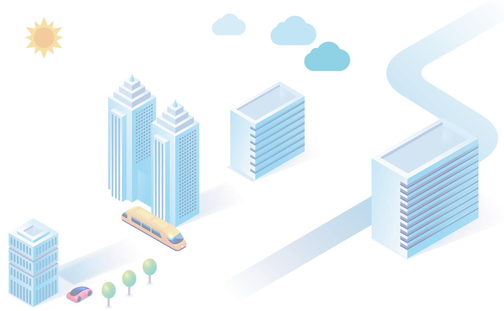

natural_image

Isometric illustration of modern buildings with a high-speed train, clouds, and sun (no text or symbols)

# 可持续铸盾

# 以自然友好引领健康环境建设

本章响应联合国可持续发展目标(SDGs)

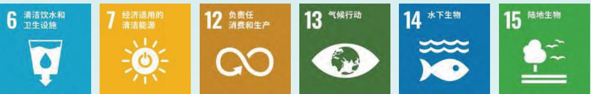

# 全球报告倡议组织可持续发展报告标准 (GRI STANDARDS)

ØGRI 301 物料2016

ØGRI 302 能源2016

ØGRI 303 水资源和污水2018

ØGRI 304 生物多样性2024

ØGRI 305 排放2016

ØGRI 306 废弃物2020

# 深圳证券交易所上市公司自律监管指引第17号——可持续发展报告(试行)

∅应对气候变化

∅污染物排放

∅废弃物处理

∅生态系统和生物多样性保护

∅环境合规管理

∅能源利用

∅水资源利用

∅循环经济

# 气候盾

# 气候分析

公司综合考虑行业属性、价值链分布情况以及国家宏观政策，选择联合国政府间气候变化专门委员会(IPCC, The Intergovernmental Panel on Climate Change)提供的SSP5-8.5情景进行物理风险分析，选择国际能源署(IEA, International Energy Agency)提供的既定政策情景(STEPS, Stated Policies Scenario)进行转型风险与机遇分析，为公司应对气候变化、增强发展韧性提供决策支持。

公司对可能面临的物理风险、转型风险及机遇进行了综合分析。其中，物理风险分为急性风险和慢性风险，可能会对公司生产运营、物流运输和库存管理等方面产生负面影响。同时，我们从政策与法规、技术、市场及声誉四个角度对转型风险进行了分析，深入探讨了各类转型风险对公司的影响，并根据风险性质和公司具体情况提出针对性应对措施。针对转型机遇，我们从能源布局、技术创新和绿色投资三个维度进行分析，探讨了不同机遇对公司带来的积极影响。

以下是公司识别出的需要重点关注的物理风险和转型风险：

# 物理风险

# 风险类别

# 负面影响

# 应对措施

# 急性物理风险(短期)

# 高温

- 供电稳定性不足导致生产运营中断, 加剧企业产能利用率波动;  
- 极端高温天气引发的职业健康风险显著上升,造成劳动生产率下降及工伤事故率攀升;  
- 消防基础设施配备不完善,导致火灾等突发事故应急响应能力不足,增加财产损失风险。

- 极端低温导致物料存储稳定性下降,影响生产连续性;  
- 寒潮引发交通中断,造成供应链物流受阻;  
- 低温引发水管冻裂等基础设施损毁。

- 淡水资源稀缺导致关键工艺用水短缺, 生产连续性受阻;  
- 外购原水资金成本增加，加剧财务压力。

# 极寒

# 干旱

# 洪水

- 洪涝侵袭致使原材料、设备及产线遭水浸损坏，大幅增加修复更换成本；  
- 洪水破坏交通基础设施,严重阻碍原材料供应与成品运输。

# 台风

- 损坏厂房、设备与仓库等基础设施，影响生产运行；  
- 防灾救灾及复产资源投入增加，推高运营成本。

- 开展气温预测评估, 制定生产与应急机制;  
- 合理排班并足量配备防暑物资；  
- 完善消防措施,强化高温期消防检查;  
- 完善应急预案,开展应急演练,提升风险应对效能。

- 制定极寒应急预案,提升风险应对效能;  
- 依据气象预测,提前储备物料,防范供应中断;  
- 筹备备用生产设施,保障极寒时蒸汽供应。

- 综合评估与监测用水风险, 完善应急响应机制;  
- 各基地积极推进节水回用项目,提高水资源循环利用率。

- 健全洪水应急预案,储备防洪抗洪应急物资,强化关键设备防水保护;  
- 构建多元供应链体系，保障原材料稳定供应。

- 建立完善的台风预警与应急响应机制, 定期组织员工进行安全疏散演练, 提升全员的应急响应能力;  
- 针对厂房和关键生产设备, 公司进行了加固和防护处理, 确保其能够抵御强风侵袭。

# 风险类别

# 负面影响

# 应对措施

# 慢性物理风险(中期、长期)

# 温度 升高

- 温度持续升高加速机械设备、电子器件老化, 温控设备寿命缩短;  
- 空调、冷却设备运行负荷上升，推高能耗与运营成本。

- 在设计和选型时,优先考虑耐高温、抗老化性能优异的材料,以延长设备寿命;  
- 使用传感器实时监测设备温度和运行状况, 及时发现并处理异常, 防止故障扩大;  
- 引入智能控制技术, 根据实际需求自动调节温度和运行模式, 避免能源浪费。

# 湿度增加

- 原材料吸水量超标, 加工时影响产品质量与成品率;  
- 湿度上升加速金属部件氧化腐蚀, 增加维护成本与频率。

- 安装工业除湿设备,优化通风系统,确保生产区域的良好通风,保持环境相对湿度在适宜范围内,防止原材料和产品受潮;  
- 表面防护处理, 对金属部件进行防锈处理, 如涂覆防锈油;  
- 定期维护检查, 制定定期检查和维护计划, 及时发现并处理腐蚀迹象, 延长设备使用寿命。

# 海平面上升

- 海平面上升可能破坏港口设施，冲击周边交通稳定性，延误原料及成品物流运输。

- 优化供应链布局,在供应链评估中纳入气候变化风险,确保原材料及产品运输的稳定性;  
- 可通过多元化供应商选择，降低对特定港口或地区的依赖，减少极端天气可能导致的供应链中断风险。

# 颗粒物增加

- 颗粒物增加可能使关键工艺混入杂质, 产品缺陷率上升, 影响质量和性能;  
- 为维持车间净化标准, 强化空气净化系统运行, 导致能耗和设备维护频率双增。

- 实时监测空气质量, 引入高效空气净化技术, 确保车间空气质量符合甚至超越行业标准;  
- 合理规划车间布局与生产流程。

转型风险

<table><tr><td>风险类别</td><td>风险描述</td><td>影响周期</td><td>应对措施</td></tr><tr><td>政策与法规</td><td>·国内外持续收紧制冷剂管控,高GWP工质加速淘汰,公司现有适配产品面临市场受限的风险。·空调、热泵及汽车热管理领域能效标准不断升级,绿色低碳认证成为准入门槛,不达标将直接影响订单与市场份额。</td><td>中期、长期</td><td>·紧跟制冷剂替代政策,加快低GWP、天然工质适配零部件研发与迭代。·全面推进产品能效升级,主动完成绿色、节能、低碳认证,满足国内外客户及政府采购合规要求。</td></tr><tr><td>技术</td><td>·磁悬浮、跨临界 $CO_{2}$ 热泵等核心技术面临技术迭代滞后风险,新能源热管理领域可能被新兴技术(如固态电池热控)替代,导致市场竞争力下降。</td><td>短期、中期、长期</td><td>·加强技术研发和创新,重点攻关热管理、低碳制冷剂零部件等领域。·推行“技术专利池+场景化应用”策略,通过授权专利构建技术壁垒,在数据中心、轨交等场景实现技术快速落地。</td></tr><tr><td>市场</td><td>·客户倾向于选择能够提供低碳产品的企业,若不能有效回应客户关切,将可能面临市场份额损失。·原材料价格波动风险:公司产品对铜、白银等关键矿物的依赖程度较高,其供给与价格波动将传导至企业生产成本。</td><td>中期、长期</td><td>·根据市场情况,适当增加采购绿色电力的比例,加装光伏等可再生电力装置,加大对可再生能源的投资。·持续监测上游原材料市场变化,建立常态化资源紧缺度评估机制,强化新材料、新技术研发与技术储备,提升供应链韧性以对冲价格波动风险。</td></tr><tr><td>声誉</td><td>·公众和投资者等利益相关方对公司减少碳足迹、推动可持续发展提出更高要求,如未能采取积极行动,将会降低利益相关方对公司的信任度,进而影响公司营收与估值。</td><td>中期、长期</td><td>·关注监管要求,及时对相关信息进行披露,做好利益相关方的沟通工作。·定期发布ESG报告,展示公司在环境保护和社会责任方面的具体实践与进展。</td></tr></table>

转型机遇

# 能源布局

以分布式光伏 + 储能为切入点，结合工业余热回收、生物质能利用等技术，构建多能互补的分布式能源网络。依托在核电、轨道交通、数据中心等特种环境领域的装备优势，布局零碳能源基地，推动绿电生产与高耗能场景的就近消纳。

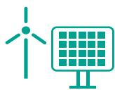

# 技术创新

升级制冷技术，深耕微通道换热、智能控制算法，研发高效低碳制冷剂与跨临界热泵系统，引领行业能效标准迭代。同时，联合高校、科研机构开展低碳技术攻关，推动科技成果向产业化转化，强化专利布局与标准制定话语权。

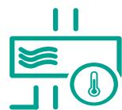

# 绿色投资

依托制冷产业底蕴与新能源技术优势，以“技术-场景-资本”三角协同为核心逻辑，深化绿色投资布局，形成“长三角核心区辐射全国、技术壁垒构筑护城河”的发展格局。

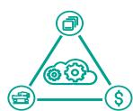

<table><tr><td>指标</td><td>单位</td><td>2025</td><td>2024</td><td>2023</td></tr><tr><td>范围一</td><td>吨二氧化碳当量</td><td>16,164.76</td><td>17,449.77</td><td>16,152.22</td></tr><tr><td>范围二</td><td>吨二氧化碳当量</td><td>52,684.37</td><td>51,263.15</td><td>41,090.18</td></tr><tr><td>排放总量</td><td>吨二氧化碳当量</td><td>68,849.13</td><td>68,712.93</td><td>57,242.40</td></tr></table>

# 能源转型

为落实国家节能减排政策，持续完善公司能源管理，成立了以总裁班子成员为组长的能源管理工作小组，每年制定节能计划，并对运行情况进行监督检查考核，参与体系内部审核及评审，并督促落实纠正预防措施。目前，公司下属盾安禾田、芜湖中元、珠海华宇、盾安机电已获得国家标准GB/T23331能源管理体系认证。

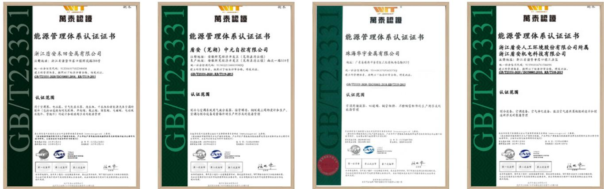

# - 推进节能技改

2025年，公司聚焦节能、安全、环保目标，积极推进节能技术改造，重点对压缩空气系统全流程优化——通过优化空压机等设备配置与运行，降低能耗；改造管道系统，减少阻力与泄漏；精准控压、推进智能化升级，提升效能；同时开展降噪、通风及消防防护，改善环境与安全，为绿色安全高效发展奠定基础。

<table><tr><td>节能技改项目</td><td colspan="2">主要举措与绩效</td></tr><tr><td>盾安禾田·高压空压机改善项目</td><td>引进4台 $8m^{3}/min$ 的高能效螺杆活塞一体机,替代36台 $1m^{3}/min$ 的低能效活塞空压机,优化压缩空气系统运行效率,通过精简机组数量、提升单机能效,大幅降低系统能耗与运维成本,提升了整体能源利用效率。绩效:能耗下降20%,年度实现节电9.12万度,年减少 $CO_{2}$ 排放11.2吨。</td><td>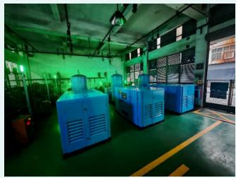</td></tr><tr><td>芜湖中元·管道系统改善项目</td><td>搭建完善能源管理体系,通过压缩气压力自动调节实现能耗精细化管控与异常工况预判。同时对空压机房及管网开展系统优化,调整管道布局、改用大半径管路件、扩容主管道管径,并运用检漏仪开展泄漏排查,建立台账闭环整改,全面提升能源利用效率。绩效:实现年度节电25.87万度,年减少 $CO_{2}$ 排放31.79吨。</td><td>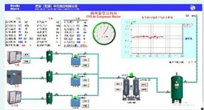</td></tr><tr><td>珠海华宇·空压站改善项目</td><td>通过调研并更换为节能型冷干机,替代原有冷干机与吸附式干燥机,降低后处理设备能耗;优化供气管道布局,将站房压降由0.09MPa降至0.05MPa以内;同时改善站房通风条件并优化空压机运行参数,进一步提升设备运行效率。绩效:年节省电量约40万度,年减少 $CO_{2}$ 排放121吨。</td><td>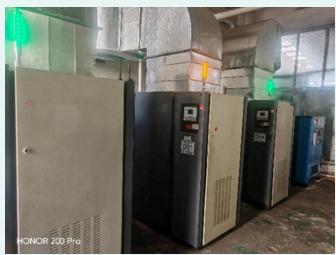</td></tr></table>

<table><tr><td>指标</td><td>单位</td><td>2025</td><td>2024</td><td>2023</td></tr><tr><td colspan="5">能源使用基本情况</td></tr><tr><td>综合能源消耗量</td><td>吨标准煤</td><td>27,987.45</td><td>27,932.08</td><td>23,269.27</td></tr><tr><td colspan="5">其中:按能源类型分</td></tr><tr><td>煤炭</td><td>吨</td><td>0</td><td>0</td><td>0</td></tr><tr><td>汽油</td><td>升</td><td>0</td><td>0</td><td>0</td></tr><tr><td>柴油</td><td>升</td><td>286,904</td><td>43,940</td><td>237,331</td></tr><tr><td>天然气</td><td>立方米</td><td>4,139,705</td><td>4,735,157</td><td>4,218,085</td></tr><tr><td>液化石油气</td><td>立方米</td><td>177,251</td><td>184,149</td><td>165,170</td></tr><tr><td>不可再生电力采购量</td><td>万千瓦时</td><td>17,425.88</td><td>16,955.80</td><td>13,590.99</td></tr><tr><td>可再生电力采购量</td><td>万千瓦时</td><td>0</td><td>0</td><td>0</td></tr><tr><td>可再生电力占比</td><td>%</td><td>0</td><td>0</td><td>0</td></tr><tr><td>直接能源消耗量</td><td>吨标准煤</td><td>6,571.04</td><td>7,093.40</td><td>6,565.94</td></tr><tr><td>间接能源总能耗量</td><td>吨标准煤</td><td>21,416.41</td><td>20,838.68</td><td>16,703.32</td></tr><tr><td>能源使用强度</td><td>吨标准煤/产量单位</td><td>0.033</td><td>0.032</td><td>0.030</td></tr></table>

# - 优化能源结构

公司聚焦储能系统与光伏扩容优化能源结构，依托储能实现削峰填谷、提升用能效率，同时扩大分布式光伏装机，提高绿电自发自用比例，降低高碳电力依赖，以实际行动支撑“双碳”目标与可持续发展战略。2025年，公司在盾安禾田部署3MW/6MWH电池储能项目，并在各制造基地已完成分布式光伏安装的基础上，继续挖掘应用潜力，新增分布式光伏1.062MW。

# 案例 盾安禾田·电池储能项目

2025年7月，盾安禾田电池储能项目正式落地投入使用，装机容量3MW/6MWH，储能系统年转移峰荷电量14.5MWh，降低峰值用电需求2,600kW，通过部署储能系统实现削峰填谷，平抑厂区用能峰谷差，提升电网稳定性与能源利用效率，降低尖峰负荷下的高碳电力依赖。

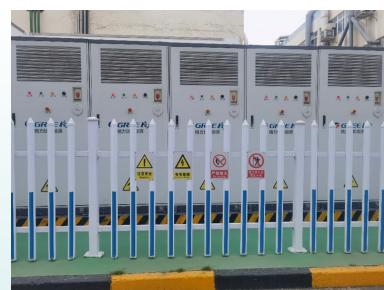

text_image

GR-R
GR-R
GR-R
GR-R
GR-R
GR-R
GR-R
GR-R
GR-R
GR-R
GR-R
GR-R
GR-R
GR-R
GR-R
GR-R
GR-R
GR-R
GR-R
GR-R
GR-R
GR-R
GR-R
GR-R
GR-R
GR-R
GR-R
GR-R
GR-R
GR-R
GR-R
GR-R
GR-R
GR-R
G-SEI

# 案例 盾安泰国金属·盾安汽车热管理·芜湖中元·增加光伏安装量

2025年1月，盾安泰国金属新增光伏发电项目正式投入使用，装机容量0.851MW，年减少二氧化碳排放量320吨。

2025年7月, 盾安汽车热管理新建光伏发电项目, 装机容量0.762MW, 年减少二氧化碳排放量248吨。

2025年12月，芜湖中元在现有光伏基础上完成屋顶勘测与扩容，新增装机容量0.22MW，总装机容量达到2.72MW，年减少二氧化碳排放量847吨。

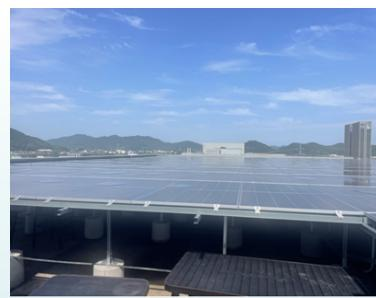

natural_image

Rooftop rooftop with solar panels and distant mountains under a blue sky (no text or symbols visible)

# - 荣誉

# 荣誉:绿色工厂

2025年1月，盾安机电凭借绿色生产与可持续运营成效，获评工业和信息化部国家级绿色工厂。

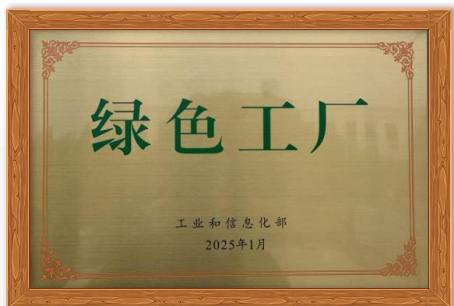

text_image

绿色工厂
工业和信息化部
2025年1月

<table><tr><td>指标</td><td>单位</td><td>2025</td><td>2024</td><td>2023</td></tr><tr><td colspan="5">清洁能源使用情况</td></tr><tr><td>清洁能源使用总量</td><td>兆瓦时</td><td>12,953.92</td><td>11,995.00</td><td>11,797.55</td></tr><tr><td>清洁能源装机总容量占比</td><td>%</td><td>100</td><td>100</td><td>100</td></tr><tr><td colspan="5">其中:按能源类型分</td></tr><tr><td>光伏发电量</td><td>万千瓦时</td><td>1,295.39</td><td>1,199.50</td><td>1,179.76</td></tr><tr><td>光伏发电比例</td><td>%</td><td>6.92</td><td>6.61</td><td>7.99</td></tr><tr><td>天然气</td><td>立方米</td><td>4,139,705</td><td>4,735,157</td><td>4,218,085</td></tr><tr><td>天然气比例</td><td>%</td><td>19.67</td><td>22.55</td><td>24.11</td></tr><tr><td>风能</td><td>兆瓦时</td><td>0</td><td>0</td><td>0</td></tr><tr><td>风能比例</td><td>%</td><td>0</td><td>0</td><td>0</td></tr></table>

# 绿色产品

公司致力于成为健康舒适环境系统解决方案专家，将可持续发展理念融入绿色产品全生命周期。公司对标国家“双碳”及行业绿色政策，聚焦客户低碳需求，完善产品配套支撑，从研发、设计、生产到应用全环节，考量产品绿色价值，着力提升能效、降低环境负荷，以系统化举措构建绿色产品体系，践行低碳责任，助力行业绿色转型。

# - 绿色产品研发

公司将绿色低碳理念前置融入产品研发设计全过程，从源头把控产品环境属性。研发阶段重点考量低环境影响材料选用、低GWP制冷剂适配、高效节能结构设计，同步优化产品能效参数，减少生产及使用过程中的资源消耗与污染物排放，确保产品设计端的绿色低碳，实现环境效益与产品性能的协同提升。

# 案例

# 二氧化碳自然冷媒系列产品

为进一步践行绿色发展理念，推动制冷行业低碳升级，公司于2025年1月启动 $\mathrm{CO}_{2}$ 系列产品全面布局，覆盖 $\mathrm{CO}_{2}$ 系统所需全品类核心产品，包含 $\mathrm{CO}_{2}$ 阀件、 $\mathrm{CO}_{2}$ 容器及 $\mathrm{CO}_{2}$ 换热器等，构建起完整的 $\mathrm{CO}_{2}$ 绿色制冷产品矩阵，以全品类配套能力，满足客户对低碳制冷系统的一体化需求，彰显公司在绿色产品领域的布局决心与技术实力。

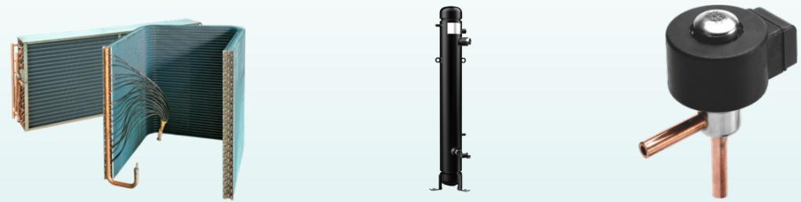

# 案例

# 插片式微通道换热器

2025年6月，公司成功研发插片式微通道换热器，依托微通道技术核心优势，针对性解决了普通微通道应用于蒸发器时结霜快、排水难、分液不均等行业痛点，有效提升换热效率、降低能源损耗，践行绿色节能理念。同时，产品采用升级新型材料，抗腐蚀性能显著提升，盐雾实验时长突破2500小时，有效延长产品使用寿命、减少更换频次，进一步降低全生命周期环境负荷，实现绿色性能与产品可靠性的双重提升。

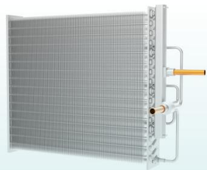

natural_image

Exterior view of a large industrial cooling unit with grid pattern and side arm (no text or symbols visible)

# - 绿色产品价值

公司始终以绿色创新赋能可持续发展，聚焦节能减碳与场景化需求，打造多元化绿色产品及定制化解决方案，兼具能效优势与环境价值。

# 案例

# 盾安机电·安悦i-Star 大涡旋型风冷冷水(热泵)机组

公司秉持绿色环保理念，在原有模块机基础上升级推出安悦i-Star大涡旋型风冷冷水（热泵）机组。产品采用涡旋式EVI压缩机并标配经济器，实现准二级压缩，制冷COP及部分负荷能效(CSPF)均达到国家一级能效标准。通过压缩机并联与可变容积比(VCR)技术，显著提升部分负荷运行效率，降低能耗。机组最大组合冷量达4960kW，机组单台容量大，能减少设备数量、节约用材并降低施工碳排放，同时可在-26℃低温环境稳定运行。凭借优异的节能减碳性能，该产品荣获“2025年度暖通空调及热泵产业——节能减碳技术产品良工奖”。

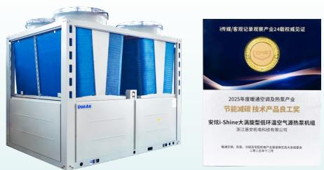

# 案例 盾安机电·武汉天河机场三期扩建工程项目

武汉天河机场三期扩建工程是中部地区重要交通枢纽项目，其空管中心对暖通系统的稳定性、能效及环境精度要求极高。盾安机电结合项目空管中心建筑的特点与需求，为客户提供定制化解决方案。采用高效模块机与分体式屋顶机的优化组合方案，在保障系统稳定可靠运行的同时，显著提升能效、降低能耗，实现了良好的经济与环境效益，助力绿色机场建设，不仅大幅提升了整体运行效率，而且凭借其出色的稳定性和节能性，更为用户带来了显著的经济与环境效益，完美契合了现代绿色建筑的发展方向。

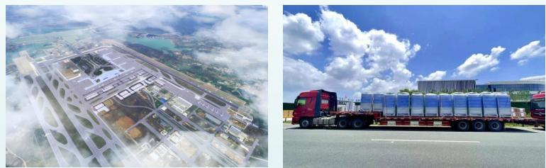

# 案例 盾安机电·特变电工准东项目

特变电工准东20亿立方米/年煤制气项目总投资达170.39亿元，是推动煤炭清洁高效利用、保障国家能源安全的重要产业化项目。盾安机电结合项目生产车间高温多尘、办公区域舒适温控、特殊工艺区域精准温湿度控制等差异化需求，为其量身打造了覆盖全厂区空调系统解决方案，彰显了公司在能源化工领域大型项目的系统服务实力，也为国家能源事业发展注入绿色、高效的装备支持。

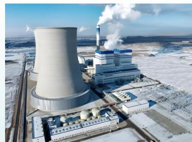

natural_image

Aerial view of a large industrial power plant with cooling towers and smokestacks emitting steam, surrounded by snow-covered ground (no visible text or symbols)

# 循环盾

# 水资源循环

盾安环境深知水资源的高效利用与可持续管理对生态环境及企业长期发展具有重要意义，致力于构建覆盖全流程的水资源管理体系，通过源头规划、过程控制、意识提升，系统性地提升水资源使用效率，以切实行动履行企业对生态环境的责任。

# 源头规划

在新基地选址阶段系统评估区域水资源禀赋与承载能力，确保运营与当地水环境相协调。

# 过程控制

全面推行节水工艺改造，实施精细化用水监控，并持续优化水循环利用系统。

# 意识提升

在日常运营中深化全员节水意识，常态化开展节水宣传与行为督导。

# 案例 节水倡导与节水减排实践

盾安环境将水资源管理纳入核心运营议程，通过文化倡导、制度优化与技术升级相结合的方式，系统推进全员节水与能效提升。公司面向全体员工发布《节能减排从我做起》倡议书，常态化开展节水宣传与行为督导，明确要求生产工序在非作业期间关闭进水阀门，并建立“巡检—报修—反馈”快速响应机制，及时处理跑冒滴漏问题，从细节入手强化员工节水习惯。

2025年，盾安禾田、盾安机械、珠海华宇、芜湖中元、南昌中昊等主要子公司成立节水减排专项小组，通过工艺优化、水循环利用及设备改造系统推进节水工作。以2024年第四季度为基准，2025年第四季度上述厂区平均用水总量同比减少约10,701吨，降幅达27.8%；显著提高了水资源利用效率。

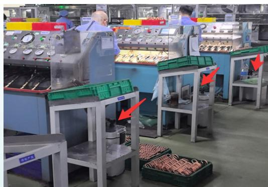

natural_image

Factory assembly line with workers operating machinery and conveyor belts (no visible text or symbols)

# 案例 盾安禾田·工业循环用水实践

公司持续推进水资源精细化管理与循环利用创新，通过系统化的技术改造与场景化应用，全面提升水资源利用效率。2025年，盾安禾田积极开展工业水循环实践，实施园区回用水精细化分级处理与定向回用，将处理后水质达标的回用水系统用于火焰焊接、绿化浇灌等环节，构建起“分类处理—梯级利用—多场景覆盖”的园区水循环管理模式。

在生产环节, 公司以四通阀产品线为试点, 通过工艺流程优化与管网改造, 将高频焊工序的冷却水循环输送至火焰焊、端盖铆接等工序的冷却系统, 实现同一产线内冷却水的串级复用, 显著降低新鲜水取用量。此外, 公司持续推动冷却水循环系统、废水回收再利用等技术改造项目, 逐步构建从单点节水到系统循环的水资源集约利用体系。

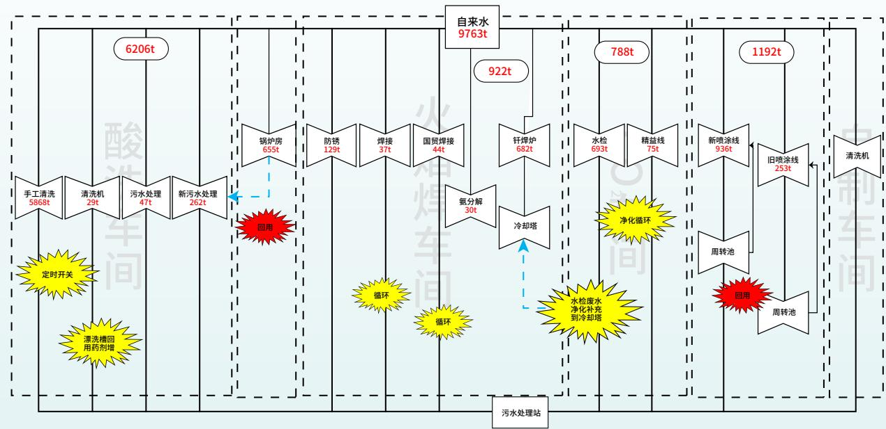

flowchart

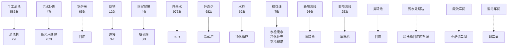
```mermaid
graph TD
  A["手工清洗\n5868t"] --> B["清洗机\n29t"]
  C["污水处理\n47t"] --> D["新污水处理\n262t"]
  E["锅炉房\n655t"] -.-> F["回用"]
  G["防锈\n129t"] --> H["焊接\n37t"]
  I["国贸焊接\n44t"] --> J["氨分解\n30t"]
  K["自来水\n9763t"] --> L["922t"]
  M["钎焊炉\n682t"] --> N["冷却塔"]
  O["水检\n693t"] --> P["净化循环"]
  Q["精益线\n75t"] --> R["水检废水\n净化补充\n到冷却塔"]
  S["新喷涂线\n936t"] --> T["周转池"]
  U["旧喷涂线\n253t"] --> V["清洗机"]
  W["周转池"] --> X["回用"]
  Y["污水处理站"] -.-> Z["漂洗槽回用药剂增"]
  AA["酸洗车间"] -.-> AB["火焙烧车间"]
  AC["消毒车间"] -.-> AD["翻车间"]
```

<table><tr><td>指标</td><td>单位</td><td>2025</td><td>2024</td><td>2023</td></tr><tr><td>取水量</td><td>万吨</td><td>86.307</td><td>96.771</td><td>84.194</td></tr><tr><td>排水量</td><td>万吨</td><td>27.611</td><td>35.146</td><td>30.840</td></tr><tr><td>耗水量</td><td>万吨</td><td>58.696</td><td>61.625</td><td>53.354</td></tr><tr><td>循环用水量</td><td>万吨</td><td>1,423.196</td><td>1,263.121</td><td>955.930</td></tr><tr><td>循环用水比例</td><td>%</td><td>94.28</td><td>92.88</td><td>91.91</td></tr></table>

# 物料循环

盾安环境将循环经济理念融入运营与供应链管理，系统构建从原材料选择、生产优化到资源回收的全链条绿色管理体系。

# 原材料选用

生产环节优先采用可再生、可回收材料，持续降低对不可再生资源的依赖。

# 源头减废管控

通过精益生产与工艺创新，严控物料损耗，降低产品废品率，从源头削减废弃物产生。

# 内部循环利用

建立完善的厂区分类、回收及再利用体系，实现金属余料、包装物等可回收资源高效循环利用，减少填埋与焚烧量。

# 包装物流优化

推行包装减量化、可循环化使用，并持续优化运输方案，降低全价值链资源消耗与环境影响。

# 案例 铜废料回收利用

在生产过程中，公司高度重视铜资源的循环利用，建立了完善的铜废料回收与再利用流程。通过专业化的收集、甩干、筛选等工序，将生产过程中产生的铜沫、铜头等废料重新返回至铜加工企业，用于生产新产品或作为原材料供应给其他生产环节。2025年，公司累计回收再利用12,397吨铜沫、铜头，减少了对原生铜矿石的开采需求，降低了对矿山生态环境的破坏，切实助力资源高效利用与绿色低碳发展。

# 案例 塑封回料循环利用

2025年，公司电子膨胀阀产品线积极构建内部物料循环体系，在生产环节按 $20\%$ 比例掺混使用塑封回料。通过严格管控回料破碎、分选及混合工艺，在保障产品质量稳定与性能达标的前提下，有效减少了新料消耗与塑封废料产生，降低固废处置量与碳排放。全年累计使用回料50余吨，显著提升了资源综合利用率，切实践行绿色制造与清洁生产理念。

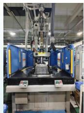

# - 专项提升工作

2025年，公司持续推进下机件维修优化与工装模具寿命提升专项工作，以精益化运维助力资源高效利用与绿色生产。在下机件维修方面，以模块化拼装、部件化更换为主要方式，提升维修效率与复用率，减少整体报废与资源浪费；在工装模具寿命提升方面，通过工艺优化、材料升级、表面处理等技术改进，有效延长工装模具使用寿命，降低消耗与废弃物产生。

# 案例 下机件修理项目

2025年，公司对同步夹具、加热器、气缸、电磁阀、触摸屏等34个品类进行下机件修理立项工作，通过部件更换、拼装等方式进行修复回用，全年累计修理回用3486个备件，有效减少备件整体报废量，助力提升资源综合利用效率。

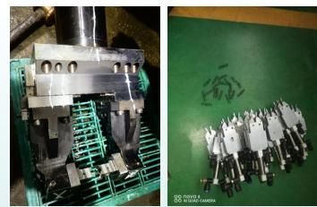

# 案例 工装模具寿命提升项目

2025年5月，公司聚焦生产环节精益化提升，针对核心生产模具开展专项优化升级工作。其中，截止阀挤压模具通过工艺改进，使用寿命从原来的27万只大幅提升至40万只以上，有效减少模具更换频次与损耗；四通阀冲孔类芯棒通过材料替换结合工艺优化，年使用量从原先的2264件降至900件，显著降低物料消耗与生产成本，践行资源高效利用理念，助力生产环节降本减耗、提质增效。

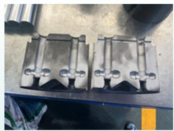

natural_image

Two metallic mechanical components mounted on a metal surface, no visible text or symbols

<table><tr><td>指标</td><td>单位</td><td>2025</td><td>2024</td><td>2023</td></tr><tr><td>废弃物循环利用总量</td><td>吨</td><td>19,752.36</td><td>17,910.89</td><td>17,748.94</td></tr><tr><td>废弃物循环利用比例</td><td>%</td><td>96.52</td><td>95.36</td><td>95.89</td></tr></table>

# 环保盾

# 环保合规管理

公司将环保合规视为运营底线，严格执行建设项目环境保护“三同时”制度，确保所有污染治理设施与主体工程同步设计、同步施工、同步投产使用，2025年，公司所有污染物排放监测数据均符合国家及地方标准，实现了100%稳定达标排放。

# - 治理架构

公司由总裁班子直接领导的EHS管理部系统统筹公司环保事务，并在各子公司配置环保岗位，确保管理体系贯穿全线、执行到底。

此外，公司全面落实“业务谁主管、环保谁负责”的责任机制，明确业务单元负责人为环保第一责任人，并将环境绩效纳入其年度考核，推动环保责任与业务运营有机融合；并通过常态化内部培训与宣传，提升全员环保意识与履责能力。

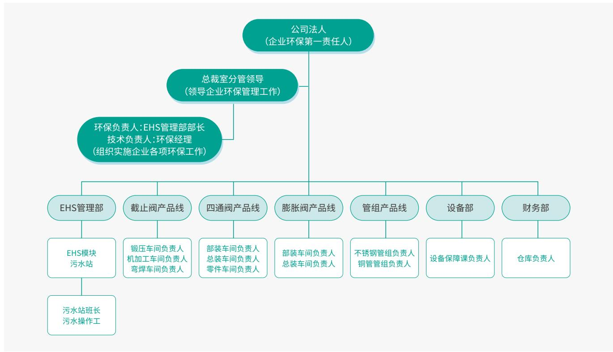

flowchart

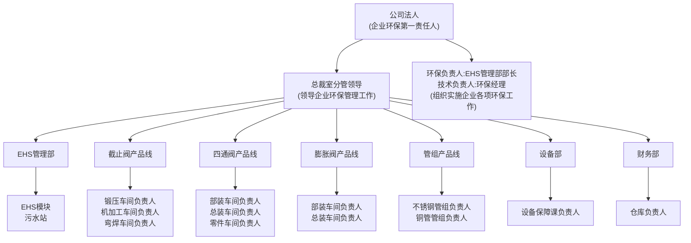
```mermaid
graph TD
  A["公司法人\n(企业环保第一责任人)"] --> B["总裁室分管领导\n(领导企业环保管理工作)"]
  A --> C["环保负责人:EHS管理部部长\n技术负责人:环保经理\n(组织实施企业各项环保工作)"]
  
  B --> D["EHS管理部"]
  B --> E["截止阀产品线"]
  B --> F["四通阀产品线"]
  B --> G["膨胀阀产品线"]
  B --> H["管组产品线"]
  B --> I["设备部"]
  B --> J["财务部"]
  
  D --> K["EHS模块\n污水站"]
  E --> L["锻压车间负责人\n机加工车间负责人\n弯焊车间负责人"]
  F --> M["部装车间负责人\n总装车间负责人\n零件车间负责人"]
  G --> N["部装车间负责人\n总装车间负责人"]
  H --> O["不锈钢管组负责人\n铜管管组负责人"]
  I --> P["设备保障课负责人"]
  J --> Q["仓库负责人"]
```

# - 体系认证

目前，公司下属17家企业均已通过ISO 14001环境管理体系认证，公司环境管理工作已实现规范化、系统化运营，整体水平达到国际认可标准。

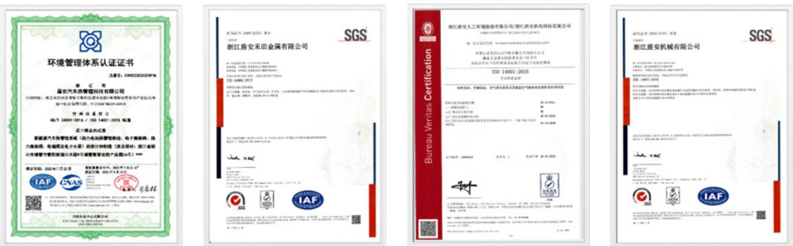  
ISO 14001环境管理体系认证证书

# - 排污管理

盾安环境全面落实环评报告及其批复中的污染防治要求，并依法申领排污许可证，做到持证排污、按证管理。

<table><tr><td>公司或子公司名称</td><td>排污许可证编号</td><td>排污许可证发证延续日期</td><td>排污许可证有效期</td></tr><tr><td>盾安禾田</td><td>913306007652348458001U</td><td>2025年12月22日</td><td>至2030年12月31日</td></tr><tr><td>盾安机械</td><td>9133068114632514X5001U</td><td>2025年11月15日</td><td>至2030年12月31日</td></tr><tr><td>珠海华宇</td><td>91440400769345075Q</td><td>2024年4月11日</td><td>至2029年4月10日</td></tr><tr><td>芜湖中元</td><td>91340221588859982Q001C</td><td>2023年12月19日</td><td>至2028年12月18日</td></tr></table>

<table><tr><td>指标</td><td>单位</td><td>2025</td><td>2024</td><td>2023</td></tr><tr><td>环保投入</td><td>万元</td><td>665.25</td><td>687.39</td><td>676.84</td></tr><tr><td>环境污染事件</td><td>起</td><td>0</td><td>0</td><td>0</td></tr><tr><td>环境污染处罚金额</td><td>万元</td><td>0</td><td>0</td><td>0</td></tr></table>

# - 废水管理

盾安环境将废水治理置于运营可持续发展的核心位置，坚持“源头削减、过程控制、末端治理与资源化利用”相结合的闭环管理策略，推进水效提升与排放管控。针对不同性质的废水，我们建立了分类收集、分质处理的精细化管理系统，综合运用物理沉降、化学混凝、生化降解以及膜分离等先进技术，确保各类废水得到高效、稳定净化。

# 废水监测

公司所有废水排放口均设有在线监测与人工检测双轨体系，确保pH、COD、氨氮等关键指标持续符合国家与地方排放限值，并定期委托具备资质的第三方机构进行监督性监测，保障数据公开透明、排放全程受控。

<table><tr><td>指标</td><td>单位</td><td>2025</td><td>2024</td><td>2023</td></tr><tr><td>工业废水总量</td><td>立方米</td><td>158,961.16</td><td>197,262.63</td><td>155,794.03</td></tr><tr><td>生活废水总量</td><td>立方米</td><td>60,431</td><td>52,400</td><td>55,370</td></tr><tr><td>化学需氧量(COD)</td><td>吨</td><td>3.9239</td><td>6.1542</td><td>5.5207</td></tr><tr><td>氨氮(NH3-N)</td><td>吨</td><td>0.048</td><td>0.125</td><td>0.063</td></tr><tr><td>总氮(TN)</td><td>吨</td><td>1.5087</td><td>1.427</td><td>1.4362</td></tr><tr><td>总磷(TP)</td><td>吨</td><td>0.0153</td><td>0.0443</td><td>0.0321</td></tr></table>

# - 废气管理

盾安环境将大气污染防治纳入环境管理核心，系统构建覆盖全过程的废气治理体系。公司针对生产过程中产生的挥发性有机物（VOCs）、粉尘等污染物，建立了高效收集与净化系统，采用活性炭吸附、催化燃烧等多种先进技术，提升污染物有效去除。我们持续加强生产密闭化管理与工艺优化，从源头减少污染物产生，并对治理设施进行定期维护与升级，保障其稳定高效运行。

# 废气监测

公司建立了严格的排放监测机制，通过实时监控与第三方核查，确保所有废气排放持续符合国家及地方环保标准，切实履行企业环保责任。

<table><tr><td>指标</td><td>单位</td><td>2025</td><td>2024</td><td>2023</td></tr><tr><td>颗粒物(PM)</td><td>千克</td><td>5,913.9</td><td>4,504.4</td><td>/</td></tr><tr><td>硫氧化物(SOx)</td><td>千克</td><td>747.53</td><td>796.7</td><td>753.03</td></tr><tr><td>氮氧化物(NOx)</td><td>千克</td><td>4,391.5</td><td>4,621.5</td><td>4,319.89</td></tr><tr><td>挥发性有机物(VOCs)</td><td>千克</td><td>5,053.6</td><td>5,635.2</td><td>4,173.7</td></tr></table>

# - 废弃物管理

盾安环境严格遵守国家固体废物管理相关法律法规，建立了覆盖分类、贮存、转移与处置的全过程管理体系。公司对生产过程中产生的废弃物实施精细化分类，其中危险废物委托具备相应资质的专业单位进行规范处置；一般工业固体废物经集中收集后，优先进行资源化综合利用；生活垃圾则交由市政环卫系统统一清运处理。通过不断完善废弃物分类回收与资源化利用机制，公司持续提升固体废物的综合利用率。

<table><tr><td>指标</td><td>单位</td><td>2025</td><td>2024</td><td>2023</td></tr><tr><td>废弃物产生总量</td><td>吨</td><td>19,752.36</td><td>19,123.24</td><td>17,748.94</td></tr><tr><td>无害固体废弃物总量</td><td>吨</td><td>19,064.54</td><td>18,252.68</td><td>17,020.80</td></tr><tr><td>无害固体废弃物强度</td><td>吨/万元</td><td>0.0276</td><td>0.0235</td><td>0.0238</td></tr><tr><td>危险废弃物总量</td><td>吨</td><td>687.82</td><td>870.55</td><td>728.14</td></tr><tr><td>危险废弃物强度</td><td>吨/万元</td><td>0.00096</td><td>0.00112</td><td>0.00102</td></tr><tr><td>每亿营收产生的有害废弃物总量</td><td>吨</td><td>9.12</td><td>/</td><td>/</td></tr></table>

# - 噪声管理

公司高度重视噪声管理，通过覆盖设计、运营与改进全过程的系统化管控，最大限度降低对周边社区及员工健康的影响。

<table><tr><td>主要维度</td><td>相关举措</td></tr><tr><td>源头控制与设备采购管控</td><td>在设备与工艺选型阶段,优先采购符合国家噪声限值要求的低噪声设备,并在技术协议中明确约定空压机、风机、泵组等高噪声源设备声级不得超过80分贝,否则不予采购和验收,从源头落实噪声管控。</td></tr><tr><td>传播途径阻断与工程降噪</td><td>通过优化厂区布局,将新增高噪声设备设置于远离敏感区域的方位。对在运设备加装隔声罩、消声器,实施柔性连接改造,并结合车间隔声门窗、吸声内衬等工程措施,有效阻断噪声传播路径。</td></tr><tr><td>受体保护与职业健康管理</td><td>为噪声暴露岗位员工配备符合国家标准的防护耳塞、耳罩,并强制规范佩戴,对未按规定佩戴的行为落实教育提醒与考核。定期开展作业场所噪声监测与接噪员工岗前、在岗、离岗听力检查,建立健康监护档案。</td></tr><tr><td>制度化监测与合规管理</td><td>严格执行《工业企业厂界环境噪声排放标准》,委托具备资质的第三方定期开展厂界噪声监测。</td></tr></table>

# 噪声监测

公司严格执行厂界噪声第三方监测，并于2025年10月起将噪声纳入排污许可管理，实现噪声管控的制度化与合规化闭环。

# - 加大清洁生产

为系统化推动可持续发展，盾安环境以清洁生产审核作为重要管理抓手，在保障合规运营的同时，持续提升资源利用效率、改善环境绩效，推动企业长期价值创造。

依据《中华人民共和国清洁生产促进法》《清洁生产审核办法》等相关规定，强制性清洁生产审核每五年至少开展一次。公司坚持“以自愿促提升”的管理思路，在强制审核周期届满前，主动实施自愿性清洁生产审核，并将审核结果报送省级生态环境部门验收、向社会公开。报告期内，盾安环境下属各公司结合自身运营特征与监管要求，稳步推进清洁生产审核工作，部分子公司已取得阶段性成果：

盾安禾田、盾安热工:顺利通过浙江省自愿性清洁生产审核验收,彰显了公司在环境管理上的主动性与前瞻性,通过系统性优化实现资源高效利用与生态影响最小化。

盾安机械: 完成浙江省强制性清洁生产审核验收, 确保重点监管领域严格符合法规要求, 为持续深化环境管理筑牢合规基础。

# - 环保综合培训

公司高度重视环保培训，将环保培训制度化纳入新员工入职的必修环节，确保其充分理解国家环保法律法规的基本要求，并深入认同公司的环保理念与管理体系，筑牢全员参与的环保责任意识，为各项具体环保措施的切实落地提供重要保障。

# 案例 提升环保意识

2025年8月，公司开展环保综合培训工作，培训主要围绕政策法规、风险防控、应急处置三大维度展开，内容涵盖国家及地方环保法律法规、公司环保管理制度、“三废”（废水、废气、固废）规范处置、危废存储与转运等核心知识。此外，针对生产、污水处理、危废管理等关键岗位，开展定向强化培训，重点讲解岗位环保操作规程与应急处置流程，提升重点岗位合规作业水平。

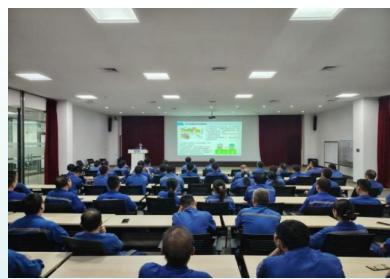

natural_image

Interior view of a conference room with attendees in blue uniforms facing a presentation screen (no visible text or symbols)

# 环境风险管理

# - 环境应急管理

公司依据法规要求编制了《环境污染事件应急预案》并完成备案，每年至少组织开展一次环境应急演练，持续强化员工的环保责任意识与突发环境事件的应急处置能力，全方位构建主动预防、快速响应的环境风险防控体系。

<table><tr><td>公司或子公司名称</td><td>应急预案编制日期</td><td>备案部门</td><td>应急预案备案日期</td><td>应急预案备案号</td></tr><tr><td>盾安禾田</td><td>2024年12月</td><td>绍兴生态环境局诸暨分局</td><td>2024年12月12日</td><td>330681-2024-106-M</td></tr><tr><td>盾安机械</td><td>2024年6月</td><td>绍兴生态环境局诸暨分局</td><td>2024年6月24日</td><td>330681-2024-049-L</td></tr><tr><td>珠海华宇</td><td>2026年1月</td><td>珠海市生态环境局金湾分局</td><td>2026年3月3日</td><td>440404-2026-0057-M</td></tr><tr><td>芜湖中元</td><td>2024年1月</td><td>芜湖市湾沚区生态环境分局</td><td>2024年2月20日</td><td>340221-2024-009-L</td></tr></table>

环境风险应急响应流程图  
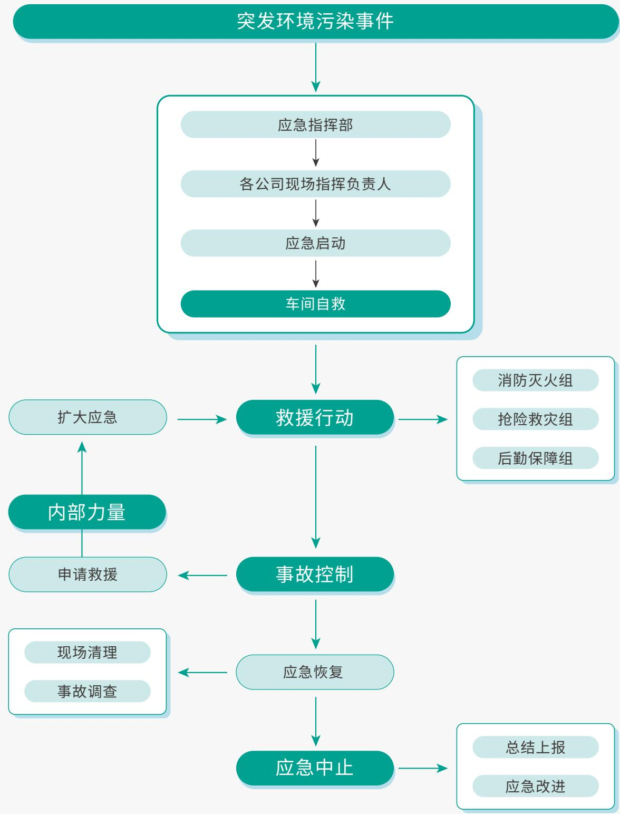

flowchart

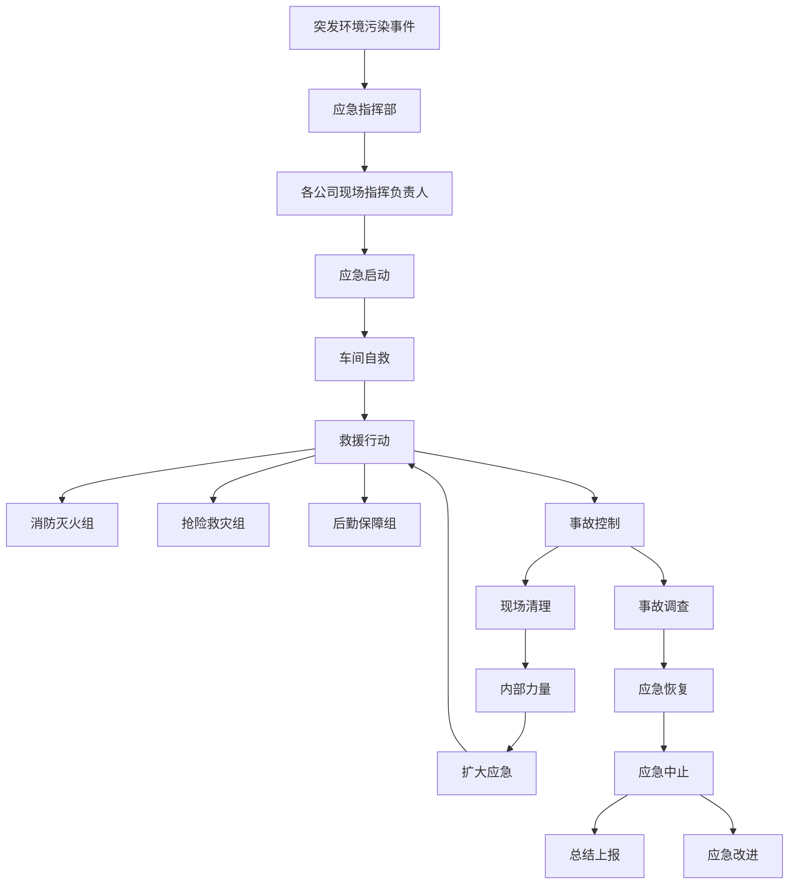
```mermaid
graph TD
  A["突发环境污染事件"] --> B["应急指挥部"]
  B --> C["各公司现场指挥负责人"]
  C --> D["应急启动"]
  D --> E["车间自救"]
  E --> F["救援行动"]
  F --> G["消防灭火组"]
  F --> H["抢险救灾组"]
  F --> I["后勤保障组"]
  F --> J["事故控制"]
  J --> K["现场清理"]
  J --> L["事故调查"]
  K --> M["内部力量"]
  M --> N["扩大应急"]
  N --> F
  L --> O["应急恢复"]
  O --> P["应急中止"]
  P --> Q["总结上报"]
  P --> R["应急改进"]
```

# - 完善应急演练

2025年，盾安环境持续推进环境风险防控体系建设，组织下属公司结合各自生产特点与重大风险源，开展了针对性的突发环境事件应急演练，以提升实战响应与协同处置能力。各子公司演练重点突出、目标明确：

盾安禾田:组织液氨泄漏与双氧水泄漏两项专项应急演练,覆盖不同性质危险化学品的处置流程。

盾安机械、芜湖中元:分别开展了液氨泄漏应急演练,重点检验关键风险岗位的应急处置与人员疏散能力。

# 案例 盾安禾田·液氨泄漏应急演练

2025年6月，盾安禾田组织液氨泄漏专项应急逃生演练，模拟泄漏报警触发后，各应急小组按预案分工，有序完成险情上报、人员疏散、现场警戒、泄漏抢修及环境检测等全流程处置。演练有效提升参演人员应急协同处置能力，完善应急管理机制，筑牢员工生命安全与厂区环境安全防线，达成预期目标。

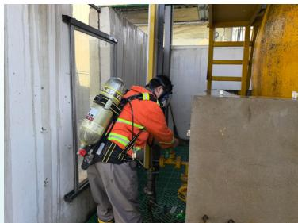

natural_image

Firefighter in orange safety gear and helmet operating equipment inside a building (no visible text or symbols)

# 生态盾

# 生物多样性保护

盾安环境将生物多样性保护理念深度融入运营与决策全过程，在新项目选址与建设阶段严格开展生态环境评估，确保符合“生态保护红线”等空间管控要求，最大程度减少对当地生态的扰动；并通过建立覆盖全链路的化学品与有害物质管控体系，严格对标国际标准，从源头防范污染物进入环境，系统性筑牢保护生物多样性的企业防线。

# - 新项目选址评估

公司在新项目选址与规划阶段，将生物多样性保护与环境合规纳入前置评估流程，严格遵循“三线一单”生态环境分区管控要求，通过环境影响预评估与系统论证，最大限度降低项目建设对周边生态的扰动，保障项目全周期绿色合规运营。

# 案例 盾安环境智能智造总部基地项目

盾安环境智能智造总部基地项目位于诸暨经济开发区产业集聚重点管控单元，该项目严格落实“生态保护红线、环境质量底线、资源利用上线和生态环境准入清单”的空间管控要求，符合诸暨市土地利用总体规划、城乡总体规划及相关管控规定。经环境影响预评估与系统论证，项目建设完全遵循《诸暨市“三线一单”生态环境分区管控方案》，在建设与运营全周期，公司将严控施工范围、降低植被与土壤扰动，规范灯光、噪声及废弃物管理，减少对周边生态的人为影响，以生态优先、绿色发展为导向，强化生物多样性保护，为项目可持续运营筑牢环境合规基础。

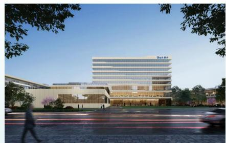

natural_image

Exterior view of a modern office building labeled 'DatAs' with street-level pedestrians and traffic light in foreground (no signage beyond text)

<table><tr><td>指标</td><td>单位</td><td>2025</td><td>2024</td><td>2023</td></tr><tr><td>生态运营涉及生态红线事件</td><td>件</td><td>0</td><td>0</td><td>0</td></tr><tr><td>生态治理投入资金</td><td>万元</td><td>20.45</td><td>20.45</td><td>25.50</td></tr><tr><td>绿化面积</td><td>亩</td><td>62.63</td><td>62.63</td><td>74.78</td></tr><tr><td>绿化面积占比</td><td>%</td><td>11.47</td><td>11.47</td><td>13.69</td></tr></table>

# - 有害物质管控

盾安环境将生物多样性保护延伸至产品全生命周期，通过构建严格的化学品与有害物质管控体系，从源头预防潜在生态毒性。我们严格对标RoHS、REACH等国际法规，建立了覆盖供应链准入、材料验证至产品输出的全链路管控机制，系统性地阻截有害物质向环境的释放与迁移。

在具体实践中, 公司不仅持续对物料及产品进行合规测试并留存完整证据, 更主动应对如十溴二苯乙烷等物质的管控升级, 通过全面筛查与替代方案研究, 推动供应链绿色转型, 从而在微观层面减少持久性污染物对生态系统的潜在威胁, 筑牢生物多样性保护的产业防线。

natural_image

Bird flying over a calm green lake with tree branches in the foreground (no text or symbols visible)

# 负责任为安

# 以社会共荣成就多元价值创造

本章响应联合国可持续发展目标(SDGs)

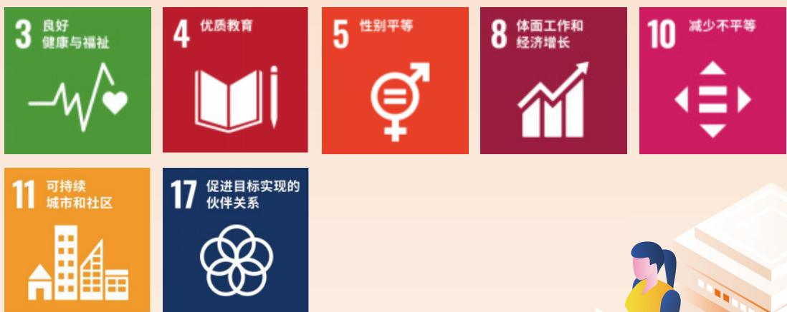

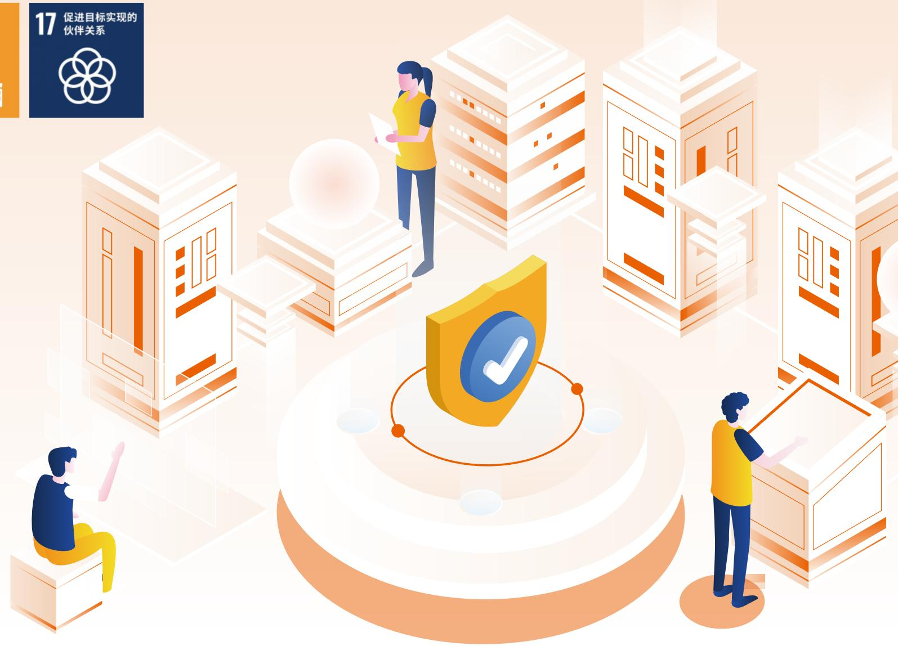

flowchart

This image displays a stylized illustration of a digital security platform ecosystem, featuring users interacting with server buildings and a shield icon.

# 全球报告倡议组织可持续发展报告标准 (GRI STANDARDS)

ØGRI 401 雇佣2016 ØGRI 403 职业健康与安全2018  
ØGRI 404 培训与教育2016 ØGRI 405 多元化与平等机会2016  
ØGRI 406 反歧视2016 ØGRI 407 结社自由与集体谈判2016  
ØGRI 408 童工2016 ØGRI 409 强迫或强制劳动2016  
ØGRI 308 供应商环境评估2016 ØGRI 414 供应商社会评估2016  
ØGRI 203 间接经济影响2016 ØGRI 204 采购实践2016  
ØGRI 413 当地社区2016

# 深圳证券交易所上市公司自律监管指引第17号——可持续发展报告(试行)

∅员工

∅数据安全与客户隐私保护

∅供应链安全

∅乡村振兴

∅社会贡献

∅平等对待中小企业

# 产品安

# 产品质量

# 治理

公司构建了以总裁和首席质量官为核心的质量治理结构，由流程IT与质量中心统筹质量战略，通过基地质量负责人与策划、改进、体系、计量检测等专业模块协同运作，将全面质量管理深度融入新品研发、供应链、生产制造至售后服务的全价值链。

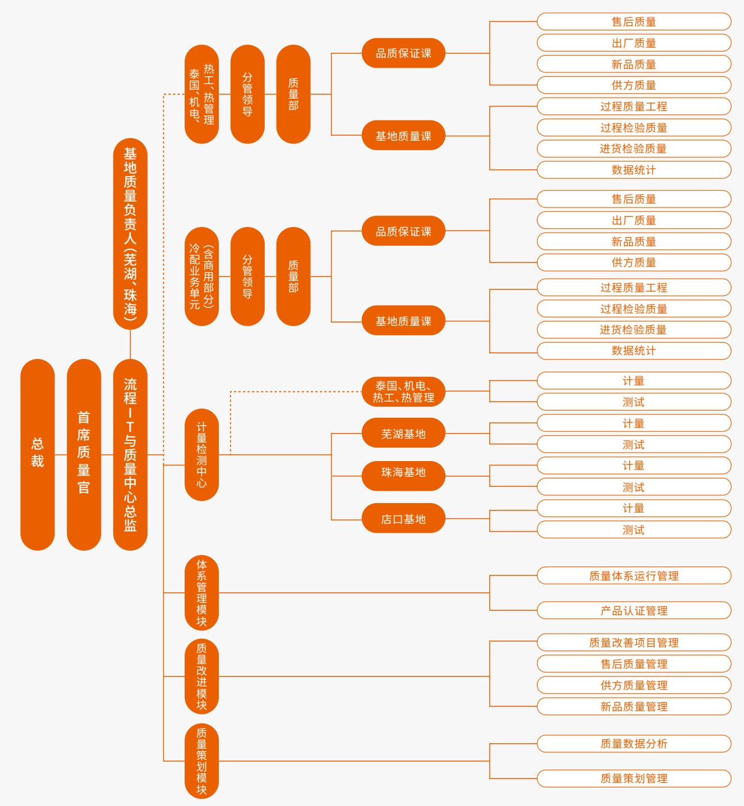

flowchart

This image is a hierarchical organizational chart (tree diagram) illustrating the quality control and management structure of a company named 'Zhuhui, Zhuhai'. It maps various departments and modules to their respective functional areas such as Quality Assurance, Quality Control, Measurement Center, and Quality Planning.

公司建立并持续完善以“策划—预防—控制—改进”为核心的闭环管理制度体系，2025年编制28项核心制度文件，启动制度系统性翻新计划，已完成9项关键质量管理制度更新。

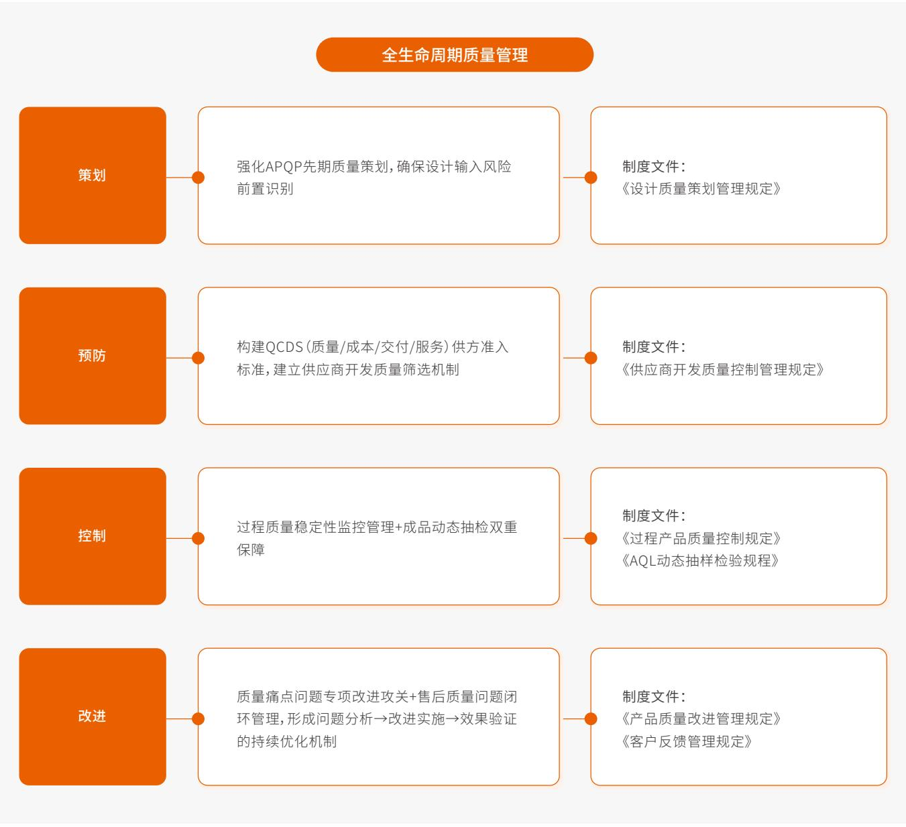

flowchart

```mermaid
graph LR
  Root["全生命周期质量管理"]
  
  sub1["策划"]
    A1["强化APQP先期质量策划，确保设计输入风险前置识别"]
    A2["制度文件：《设计质量策划管理规定》"]
  end
  
  sub2["预防"]
    B1["构建QCDS(质量/成本/交付/服务)供方准入标准，建立供应商开发质量筛选机制"]
    B2["制度文件：《供应商开发质量控制管理规定》"]
  end
  
  sub3["控制"]
    C1["过程质量稳定性监控管理+成品动态抽检双重保障"]
    C2["制度文件：《过程产品质量控制规定》<br/>AQL动态抽样检验规程》"]
  end
  
  sub4["改进"]
    D1["质量痛点问题专项改进攻关+售后质量问题闭环管理，形成问题分析→改进实施→效果验证的持续优化机制"]
    D2["制度文件：《产品质量改进管理规定》<br/>客户反馈管理规定》"]
```

# 战略

公司将产品质量作为履行社会责任、赢得利益相关方信任、驱动长期价值创造的核心举措，纳入企业发展战略。聚焦暖通制冷行业安全合规与绿色发展需求，以“零缺陷”为核心构建质量文化，规划“工作零差错→产品零缺陷→经营零浪费”三阶跃迁路径，通过“宣传、产品、管理”三线联动推动质量理念转化；同时，响应国际监管标准与环保趋势，推进产品安全升级与绿色材质创新，兼顾产品安全、合规出口与低碳发展，打造兼具质量优势、安全保障与环境效益的产品体系，助力行业质量提升与可持续发展。

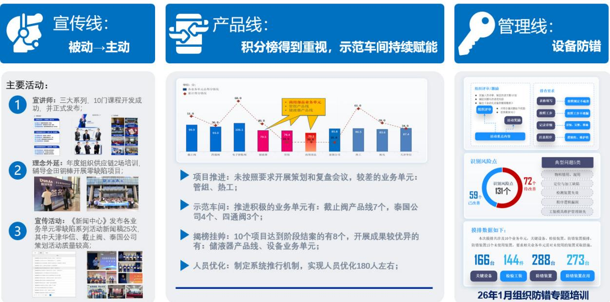  
1 宣讲师：三大系列，10门课程开发成功，并正式发布；  
2 理念外延：年度组织供应链2场 辅导金田铜棒开展零缺陷项目  
3 宣传活动：《新闻中心》发布各业务单元零缺陷系列活动新闻稿25次，其中天津华信、截止阀、泰国公司策划活动质量较高；  
项目推进：未按照要求开展策划和复盘会议，较差的业务单元：管组、热工；  
示范车间：推进积极的业务单元有：截止阀产品线7个，泰国公司4个、四通阀3个；  
揭榜挂帅：10个项目达到阶段结案的有8个，开展成果较优异的有：储液器产品线、设备业务单元；  
人员优化：制定系统推行机制，实现人员优化180人左右；  
摸排数据如下：本次摸排共涉及10个业务单元，关键设备、检验装置、防错装置摸排。防错装置15个未使用装置，要求相关业务单元需对未使用的装置采取措施。

# 影响、风险和机遇管理

# - 质量改善精进

盾安环境以构建符合IATF 16949标准的流程化质量体系为基石，系统推动质量改善。该体系通过深度植入APQP、FMEA、SPC等核心工具，并创新运用VDA6.3过程审核与VDA6.5产品审核，形成了从“点”（单个产品）到“线”（产品线）再到“面”（全公司）的三级递进推广模式，为持续质量提升提供了坚实的体系保障。

在此体系驱动下，公司以商用部品核心产品——电磁阀6A系列的质量提升为突破口，将“综测一次不良率”作为关键攻坚指标。2025年，TCC系列钎焊氨检外漏不良率实际达成502ppm，不仅优于750ppm的挑战目标，更远低于1500ppm的立项目标，取得了显著的质量精进成效。

# 工具深度植入

在产品全生命周期管理中深度嵌入了PPAP、APQP、FEMA、SPC、MSA等五大核心工具。

# IATF 16949体系运行

采用IATF16949过程导向审核模式，运用过程审核VDA6.3和产品审核VDA6.5进行审核实施。

# 三级递进推广

从点(电磁阀)到线(商用部品产品线)到面(盾安环境全面推行)。

案例 构建符合IATF 16949标准的流程化质量体系  
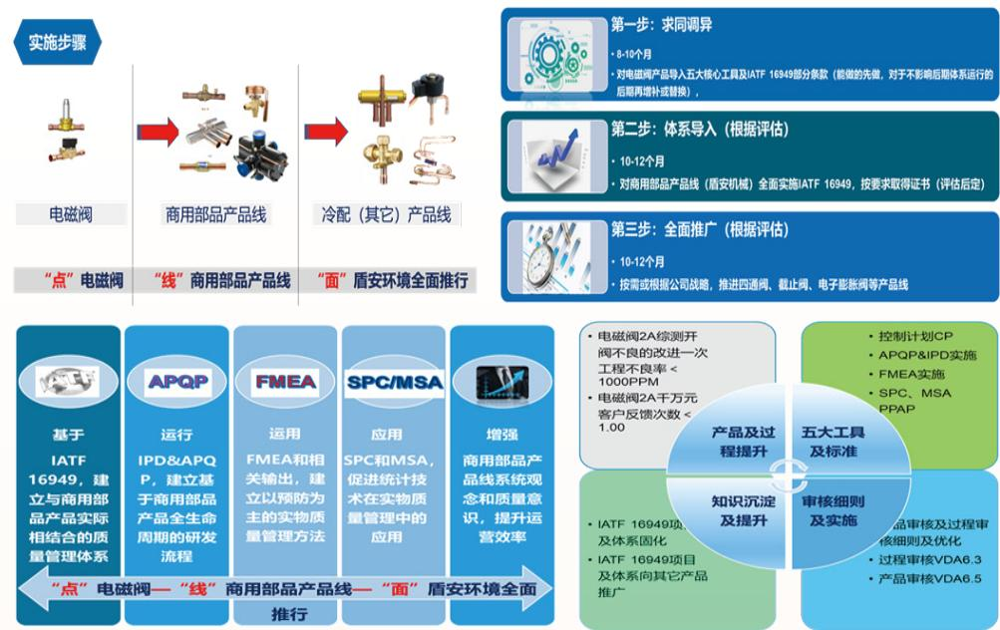

# - 产品安全管理

盾安聚焦暖通制冷行业安全合规的发展需求，布局各类安全防护阀件，适配R32、R290等环保冷媒系统，应用于空调、制冷设备等场景，核心作用在于防范冷媒系统安全隐患，保障设备运行安全。此类安全防护阀件的开发，既是响应欧盟无铅化、可燃冷媒安全等国际监管标准，通过合规化设计防范安全风险、保障产品安全合规出口；也是公司强化产品安全管理的具体实践，通过专业化安全防护部件的供给，助力行业提升产品安全水平，筑牢产品安全管理底线。

# 案例 QSV双向瞬断阀

随着空调行业加速推进R32等低GWP可燃环保冷媒应用，公司聚焦冷媒系统安全运行需求，2025年2月推出QSV双向瞬断阀。产品围绕系统安全与绿色应用场景优化设计，具备大流量、低内漏、快速响应等核心优势，可在可燃冷媒系统中实现高效可靠的关断控制，显著提升空调系统运行安全性与稳定性，为低GWP环保冷媒规模化应用提供关键安全保障。该产品在保障设备安全的同时，助力环保冷媒高效普及，兼顾安全责任与低碳发展。

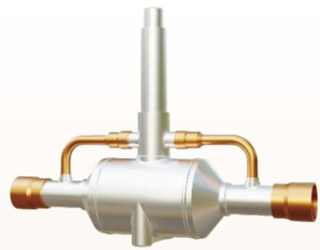

natural_image

3D rendering of a mechanical valve or pump component with metallic body and gold fittings (no text or symbols visible)

# 案例 不锈钢、铝全系列产品

针对欧盟制冷空调无铅化管控要求，公司主动响应欧盟 RoHS 环保法规及全球循环经济发展目标，将环保合规、公众健康安全纳入产品设计核心准则，推进绿色材质创新，推出不锈钢、铝全系列阀件、管组件及微通道产品，从源头构建全链条安全管控体系。无铅化材质创新从根源上杜绝了产品全生命周期内铅等有害物质的析出与释放，既保障了终端产品使用过程中的人体健康安全，也避免了产品废弃后对生态环境与公众健康的二次危害；同时不锈钢的应用大幅提升了产品耐腐蚀性与使用寿命，从设计端筑牢环境安全防线，契合 ESG 环境维度的绿色发展要求。

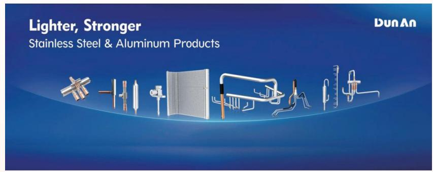

text_image

Lighter, Stronger
Stainless Steel & Aluminum Products
DunAn

# 案例 R290系列产品

R290作为GWP值趋近于0的A3级天然低碳冷媒，是全球制冷空调行业实现低碳转型、助力双碳目标落地的重要路径，但其易燃易爆的特性，对制冷系统全流程安全运行提出了严苛要求。公司以ESG安全发展理念为指引，聚焦R290系统的安全核心痛点，推出专用系列阀件与组件，在推动行业低碳转型的同时，全方位筑牢安全防线。通过金属硬密封、低泄漏结构优化、低充注量适配等核心技术创新，从源头降低冷媒泄漏风险，大幅提升R290制冷系统运行的安全性与可靠性，全方位保障终端用户的人身与财产安全，践行ESG社会维度的消费者保护与安全责任。

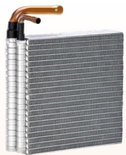

# - 质量文化建设

盾安环境将“零缺陷”深度融入质量文化，构建“第一次把事情做对”的质量文化生态，规划了“三阶跃迁”的实施路径：首先确保工作零差错，在此基础上实现产品零缺陷，最终达成经营零浪费，系统化地推动质量理念向经营成果转化。

在落地层面，公司以“宣传、产品、管理”三线联动：宣传上从被动灌输转向主动传播；产品上以“积分制”量化质量行为，激励示范与改进；管理上强化防错与标准化。同时，依托“双月TQM大会+月度QC会议”机制，通报问题、分享经验、反思规划，并在领导指导下形成“问题—改进—赋能”闭环，最终推动质量从制度约束升华为文化自觉，实现“要我质量”到“我要质量”的根本转变。

# 案例 举办QCC发表大赛,深化质量文化建设

2025年12月，盾安环境举办QCC发表大赛，为各产品线质量改善成果提供展示与交流平台。大赛邀请了8家供应商代表参与，实现了内外部质量管理的联动。经评审，从18份入围报告中评选出一、二、三等奖及优胜奖。参赛团队围绕客户体验改善、产品性能提升等核心议题开展交流，推动了技术复用与跨领域质量改善协同。本次活动将内部质量管理延伸至供应链协同，推动“零缺陷”文化向外延伸，进一步完善了供应链质量生态体系。

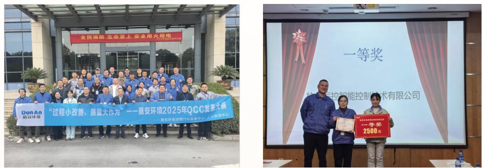

# - 质量事故处理与响应

公司构建系统的质量风险与绩效管理机制，建立“直接责任、间接责任、管理责任”的考核机制和四不放过的解决原则，明确权责清晰、全员共担的质量责任体系；通过“四维时效管理体系”规范质量事故响应，建立系统化产品召回程序，筑牢质量治理基础。

<table><tr><td>事故等级</td><td>质量事故提报时效</td><td>质量事故提报对象</td></tr><tr><td>特大事故</td><td></td><td>特大质量事故应上报至环境质量归口管理部门、分管总裁及总裁处</td></tr><tr><td>重大事故</td><td rowspan="2">24小时内(以上时限要求为常规要求,如有特殊情况,提前申请报备。)</td><td>重大质量事故应报至环境质量归口管理部门和分管总裁</td></tr><tr><td>一般事故</td><td>一般质量事故应报至业务单元负责人处</td></tr><tr><td>轻微事故</td><td></td><td>轻微质量事故上报至子公司/基地负责人和业务单元质量负责人</td></tr></table>

<table><tr><td>质量事故提报时限要求</td><td>紧急围堵时限要求</td><td>事故调查时限要求</td><td>纠正时限要求</td><td>纠正预防时限要求</td></tr><tr><td>24小时内报告方式OA邮件</td><td>24小时内完成</td><td>72小时内</td><td>一周</td><td>一周</td></tr></table>

# - 产品召回程序

公司在质量问题风险管理层面建立了系统化的产品召回程序，旨在主动识别、评估和处置已交付但存在缺陷或隐患的产品。

召回机制遵循严格的流程，包括内部收集与外部反馈的问题信息评估、多部门联合进行的召回评审、依据《产品召回评审表》进行的分级审批、销售部门主导的退回安排与现场隔离，以及最终由制造基地质量部门组织的产品处置评审，并将召回品按《质量事故报告与处理管理规定》进行评估与处置，其处理记录均纳入不良品处置台账进行统一管理，从而形成从风险识别到闭环管理的完整控制链条。

产品召回程序  
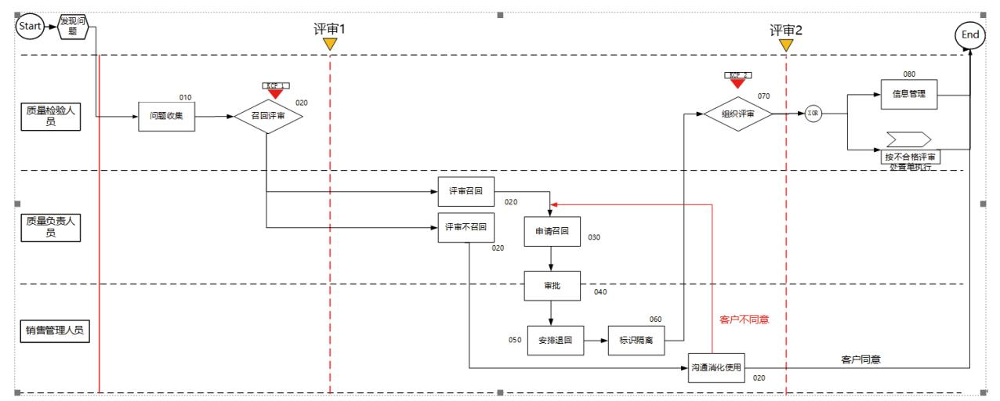

flowchart

```mermaid
graph LR
  Start((Start)) --> Issue["发现问题"]
  Issue --> QA_Review{"评审1"}
  
  subgraph QA_Review ["QA 质量检验人员"]
  QA_Review --> Collect["问题收集"]
  Collect --> Review1{"召回评审"}
  Review1 -->|020| No_Review["评审不召回"]
  Review1 -->|010| Collect
  end
  
  subgraph QA_Review ["质量负责人"]
  QA_Review --> Review2{"组织评审"}
  Review2 -->|070| End((End))
  Review2 -->|060| Reject["标识隔离"]
  Reject --> Feedback["沟通消化使用"]
  Feedback -->|020| End
  end
  
  subgraph Sales_Review ["销售管理人员"]
  QA_Review --> No_Review
  No_Review --> Request["申请召回"]
  Request --> Approval["审批"]
  Approval --> Return["安排退回"]
  Return --> Feedback
  end
  
  subgraph Feedback ["客户不同意"]
  Feedback -->|客户同意| End
  end
  
  subgraph Execution ["按不合格评审\n处置单执行"]
  Execution --> Success["信息管理"]
  Success --> End
  end
```

# 指标与目标

公司质量管控成效显著，客户端产品召回事故连续三年0起；千万元反馈次数逐年下降；2025年TCC系列钎焊氨检外漏不良率达成502ppm，优于750ppm挑战目标及1,500ppm立项目标；荣获全国机械工业优秀质量管理小组活动成果二等奖、美的集团质量相关奖项等多项荣誉，获得行业高度认可。

<table><tr><td>指标</td><td>单位</td><td>2025</td><td>2024</td><td>2023</td></tr><tr><td>客户端产品召回事故</td><td>起</td><td>0</td><td>0</td><td>0</td></tr></table>

荣誉  
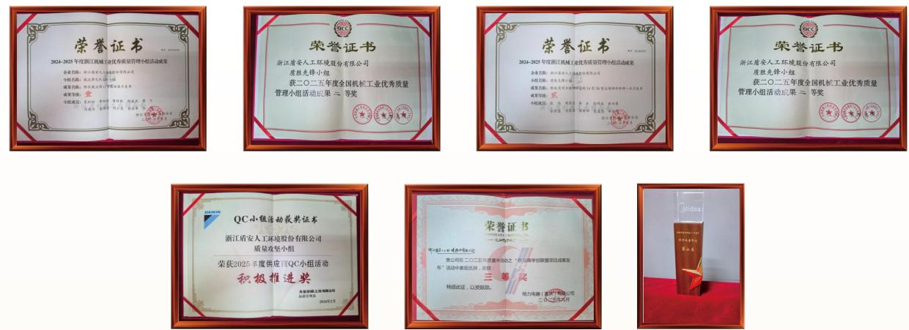

# 客户服务

# 治理

公司构建以客户为中心的客户服务治理体系，立足“持续创新为盾，客户价值为安”品牌理念，组建专业化销售与服务团队，建立需求驱动研发、市场反向赋能流程的跨部门协同机制。

公司建立常态化客户满意度管理体系，制定全流程客户服务标准，规范客户信息收集、使用与保密流程；严格遵守《中华人民共和国个人信息保护法》等法律法规，建立客户隐私与商业信息全生命周期保护机制，实行合同与保密协议同步签署，通过权限管控、流程监管、技术防护实现客户信息安全可控，切实保障客户合法权益。

# 战略

公司将客户价值与服务体验提升纳入核心发展战略，坚持以客户需求为导向，通过高效响应、精准服务、闭环改进，持续提升产品与服务竞争力。

以客户满意度为核心抓手，将市场洞察、客户反馈转化为研发方向、服务优化与产品升级，推动服务从被动响应向主动赋能转变，构建长期稳定、互信共赢的客户合作生态，助力公司市场竞争力与品牌价值持续提升。

# 影响、风险和机遇管理

公司通过系统化客户服务与闭环需求管理，及时捕捉市场机遇、提升客户黏性，同时有效防控服务质量、客户信息安全等风险。通过全覆盖客户满意度调研，公司精准识别改进空间，持续优化产品与服务；建立全流程客户隐私保护机制，严防信息泄露、滥用等风险，报告期内未发生客户隐私泄露事件。

\- 客户认可

2025年盾安环境荣获客户颁发荣誉一览表(部分)

<table><tr><td>序号</td><td>获奖项目</td><td>颁发单位</td></tr><tr><td>1</td><td>年度优秀供应商</td><td>美国Munters</td></tr><tr><td>2</td><td>年度优秀合作伙伴</td><td>四川长虹</td></tr><tr><td>3</td><td>成本变革奖</td><td>上海大金</td></tr><tr><td>4</td><td>品质优秀合作伙伴奖</td><td>韩国LG</td></tr><tr><td>5</td><td>战略合作伙伴奖</td><td>海信集团</td></tr><tr><td>6</td><td>杰出战略供应商</td><td>TCL实业控股</td></tr><tr><td>7</td><td>执行力银奖</td><td>美国江森自控</td></tr><tr><td>8</td><td>优秀合作伙伴奖</td><td>BOSCH</td></tr><tr><td>9</td><td>LG集团战略合作伙伴奖</td><td>南京LG</td></tr><tr><td>10</td><td>最佳表现进口奖</td><td>印度LG</td></tr></table>

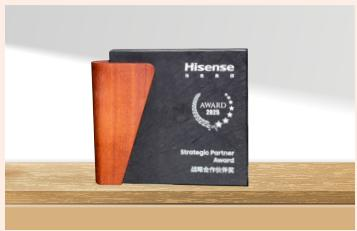

text_image

Hisense
ANALO
2018
Strategic Partner
Analos
战略合作协议案

海信集团战略合作伙伴奖

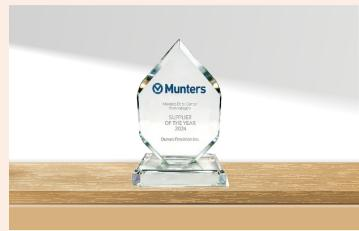

text_image

MUNTERS
SUPPLES OF THE YEAR
2024
Dennis Robinsons

美国Munters优秀供应商奖

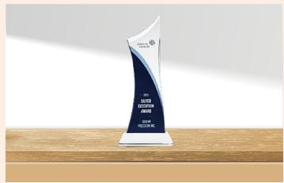

text_image

中国证券
2017年
全国中小企业私募投资基金
基金募集
中国证券投资基金

美国江森自控执行力银奖

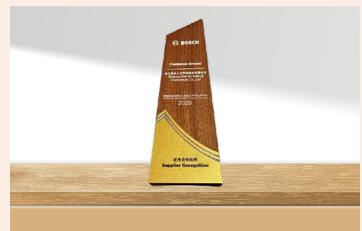

text_image

BOCO
Bosco
Bosco
Bosco
Bosco
Bosco
Bosco
Bosco
Bosco
Bosco
Bosco
Bosco
Bosco
Bosco
Bosco
Bosco
Bosco
Bosco
Bosco
Bosco
Bosco
Bosco
Bosco
Bosco
Bosco
Bosco
BosCO
BosCO
BosCO
BosCO
BosCO
BosCO
BosCO
BosCO
BosCO
BosCO
BosCO
BosCO
BosCO
BosCO
BosCO
BosCO
BosCO
BosCO
BosCO
BosCO
BosCO
BosCO
BosCO
BosCO
BosCO
BosCOSO
BosCOSO
BosCOSO
BosCOSO
BosCOSO
BosCOSO
BosCOSO
BosCOSO
BosCOSO
BosCOSO
BosCOSO
BosCOSO
BosCOSO
BosCOSO
BosCOSO
BosCOSO
BosCOSO
BosCOECECECECECECECECECECECECECECECECECECECECECECECECECECECECECECECECECECECECECECECECECECECECECECECECECECECECECECECECECECECECECECECECECECECECECECECECECECECECECECECECECECECECECECECECECECECECECECECECECECECECECEECECEECEECEECEECEECEECEECEECEECEECEECEECEECEECEECEECEECEECEECEECEECEECEECEECEECEECEECEECEECEECEECEECEECEECEECEECEECEECEECEECEECEECEECEECEECEECEECEECEECEECEECEECEECEECEECEECEECEECEECEECEECEECEECEECEECEECEECEECEECEECEECEECEECEECEECEECEECEECEECEECEECEECEECEECEECEECEECEECEECEECEECEECEECEECEECEECEECEECEECEEEEEEEEEEEEEEEEEEEEEEEEEEEEEEEEEEEEEEEEEEEEEEEEEEEEEEEEEEEEEEEEEEEEEEEEEEEEEEEEEEEEEEEEEEEEEEEEEEEEEEEEEEEEEEEEEEEEEEEEEEEEEEEEEEEEEEEEEEEEEEEEEEEEEEEEEEEEEEEEEEEEEEEEEEEEEEEEEEEEEEEEEEEEEEEEEEEEEEEEEEEEEEEEEEEEEEEEEEEEEEEEEEEEEEEEEEEEEEEEEEEEEEEEEEEEEEEEEEEEEEEEEEEEEEEEEEEEEEEEEEEEEEEEEEEEEEEEEEEEEEEEEEEEEEEEEEEEEEEEEEEEEEEEEEEEEEEEEEEEEEEEEEEEEEEEEEEEEEEEEEEEEEEEEEEEEEEEEEEEEEEEEEEEEEEEEEEEEEEEEEEEEEEEEEEEEEEEEEEEEEEEEEEEEEEEEEEEEEEEEEEEEEEEEEEEEEEEEEEEEEEEEEEEEEEEEEEEEEEEEEEEEEEEEEEEEEEEEEEE<nl>

BOSCH优秀合作伙伴奖

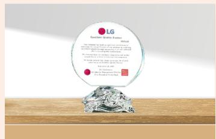

text_image

LG
Standard Quality Product
PAPAY
LG: 2018.03.04 - 2019.03.04
Product Details:
LG: Standard Quality Product
Product Details:
LG: Standard Quality Product
Product Details:
LG: Standard Quality Product
Product Details:
LG: Standard Quality Product
Product Details:
LG: Standard Quality Product
Product Details:
LG: Standard Quality Product
Product Details:
LG: Standard Quality Product
Product Details:
LG: Standard Quality Product
Product Details:
LG: Standard Quality Product
Product Details:
LG: Standard Quality Product
Product Details:
LG: Standard Quality Product
Product Details:
LG: Standard Quality Product

韩国LG品质优秀合作伙伴奖

# 指标与目标

公司建立客户服务与满意度闭环管理，持续提升服务质量与客户体验，近三年客户满意度调查得分保持在92分以上，报告期内无客户投诉、无违规事件、无信息安全事件。

<table><tr><td>指标</td><td>单位</td><td>2025</td><td>2024</td><td>2023</td></tr><tr><td>违反产品和服务信息与标识法规的事件</td><td>件</td><td>0</td><td>0</td><td>0</td></tr><tr><td>客户满意度</td><td>分</td><td>94.11</td><td>93.27</td><td>92.27</td></tr><tr><td>客户投诉数量</td><td>次</td><td>0</td><td>0</td><td>0</td></tr><tr><td>每亿营收客户投诉数量</td><td>次</td><td>0</td><td>0</td><td>0</td></tr></table>

# 研发驱动

# 治理

公司明确科技管理部作为技术研发、项目管理、标准化管理、技术知识管理的统一归口管理部门，统筹各项技术管理工作落地，负责建立完善研发管理制度、提供专业技术服务、监督指导各业务单元技术管理活动及统筹对外技术合作。

公司推行以市场需求为核心的IPD研发管理体系，设立多部门集成组合管理决策中心负责研发项目投资评审，组建产品开发执行团队对产品商业成功全程负责，将研发流程划分为概念计划、开发、验证、发布四个阶段并设置严格评审点。

在制度管理上，公司编制了《产品/平台开发管理流程》等27项技术管理制度，构建研发全流程标准化管理平台；完善《技术项目激励管理规定》，建立差异化研发激励机制，激发技术人才创新活力。同时，知识产权部牵头完善知识产权全链条管理，发布《知识产权管理标准》，推动知识产权管理与国家、国际标准接轨，通过相关认证并开展专利挖掘专项培训，构建专利保护体系。

# 战略

公司将科技创新置于发展核心，把研发驱动纳入企业发展战略，响应国家政策导向，以技术与产品创新推动产业升级和企业可持续发展。坚持持续加大研发投入，优化投入结构，完善技术人才梯队建设，引进高端技术专家，夯实创新基础；依托国家级技术中心、博士后工作站等平台深化产学研协同，聚焦暖通制冷等核心领域，推进前沿技术研究与核心产品迭代，同时强化知识产权保护，以国际化标准规范创新管理，助力公司在核心赛道保持竞争优势，实现创新成果高效落地。

# 影响、风险和机遇管理

公司通过全流程研发管控与体系化创新，有效把控研发周期、成本及技术落地风险，抢抓行业绿色低碳与高效升级机遇，加快前沿技术成果转化，多款核心产品达到国际先进/领先水平，形成显著技术与市场优势。

# - 创新技术与产品

盾安环境始终将科技创新置于发展核心，积极响应国家政策导向，以技术与产品创新推动产业升级与企业可持续发展。公司依托国家级技术中心、博士后工作站等平台深化产学研协同，保障技术研发目标高效落地。2025年，公司研发的“高能效高气密低噪声地铁车辆空调系统”“电子洁净全新风空气处理机组(MAU)”“超低温智能调节复叠一体机”等多款核心产品通过行业专家评审，获得了国际先进及以上技术水平认定。

# 案例

# 高能效高气密性低噪声地铁车辆空调系统

2025年5月，盾安环境、中车南京浦镇车辆有限公司、杭州市地铁集团有限责任公司3家单位联合申报的“高能效高气密低噪声地铁车辆空调系统”，经过中国制冷学会专家委员会评审，该技术达到国际领先水平。项目围绕地铁车辆空调系统的节能运营、健康舒适的设计理念，从空调机组及系统的能效、气密性、噪声、 $CO_{2}$ 浓度及湿度控制展开研究：开发了斜接口端送端回多齿软接密封技术，解决了机组与车体斜接口密封难题，提高了整车密封性和车内气压稳定性，降低了车内噪声，提高了乘客舒适感；提出了空调机组主动冷/热回收技术，综合运用直流变频压缩机、高效制冷剂、多参数协同控制等技术，降低系统运行功耗，提高了系统能效；构建并实施了车内温度、湿度及 $CO_{2}$ 浓度多目标协同控制，有效提升了车内空气品质。

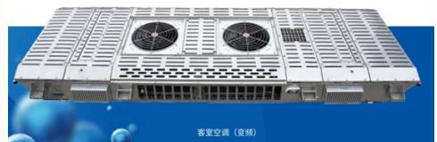

natural_image

Exterior view of a server rack with two fans and ventilation grilles, labeled '客室空调 (变频)' at bottom (no other text or symbols visible)

# 案例

# 电子洁净全新风空气处理机组(MAU)

2025年5月，公司自主研发的“电子洁净全新风空气处理机组（MAU）”，经过中国制冷学会专家委员会评审，该产品技术达到国际先进水平。该项目围绕高端电子装备用全新风洁净空调系统的节能和稳定运行，开展了漏风率、机械强度、热桥因子、换热器风阻等技术的研究：研发了大管径、低风阻椭圆管换热技术，显著提升了换热能力、降低了流动阻力，与传统圆管相比，风阻整体降低 $40\% - 60\%$ 。此外，该项目还开发了外置框架箱体集成设计制造技术，有效解决了高强度箱体的低漏风、低漏热难题，使箱体导热系数和热桥因子达到欧标一级；研制了顶凸台式旁通结构，充分利用自然冷源，降低了机组的全年运行能耗。

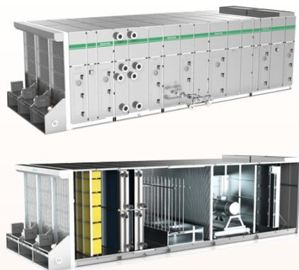

# 案例

# 超低温智能调节复叠一体机

2025年5月，公司自主研发的超低温智能调节复叠一体机，经过省级工业新产品评审鉴定会的严格评审，该产品技术达到国际先进水平。这款产品采用低温级和高温级复叠式设计，最低温度可达-65℃；创新应用低温热气旁通回油技术，有效防止压缩机液击；设计喷液装置，实现喷液冷却与热气旁通协调控制，显著降低压缩机启停磨损与能耗；开发低负荷能量无极调节协同控制技术，显著提升能效。

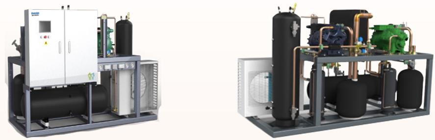

# 案例

# 超静音电子膨胀阀

2025年9月，公司自主研发的超静音电子膨胀阀，经过省级工业新产品评审鉴定会的严格评审，该产品技术达到国际先进水平。这款产品在阀前设置了多孔材料消音块，调整阀前非稳态两相流，细化制冷剂内部气泡，同时避免杂质脏堵；开发了消音块固定防焊堵结构，简化了设计和工艺，提高了产品可靠性。在上述成果基础上已获实用新型专利4件，申请发明3件、PCT专利1件。

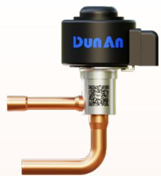

natural_image

Close-up of a Dun An industrial valve with copper pipe and digital display (no text or symbols on the device itself)

# - 加大创新投入

公司重视技术研发，持续加大研发投入，将研发投入作为核心竞争力提升的关键支撑，投入规模稳步增长、结构持续优化。2025年公司研发投入达5.35亿元，同比增长6.42%，占营业收入比例4.10%，且研发投入全部费用化，彰显持续创新决心。

在研发团队建设方面，2025年公司持续完善技术人才结构和高端人才引入，引进博士及以上学位的技术专家5名，有效补充了公司高端技术研发人才和研发能力的不足，为技术迭代、产品创新提供坚实保障，助力公司在核心赛道持续保持竞争优势，推动创新成果高效落地。

公司重视技术研发，持续加大研发投入，将研发投入作为核心竞争力提升的关键支撑，投入规模稳步增长、结构持续优化。2025年公司研发投入达5.35亿元，同比增长6.42%，占营业收入比例4.10%，且研发投入全部费用化，彰显持续创新决心。

# - 研发创新激励

为激发技术人才创新活力、支撑创新驱动发展战略落地，公司持续完善《技术项目激励管理规定》，构建科学合理的技术人才激励机制。激励实施过程中采用差异化模式，对产品开发项目实行“开发激励+销售提成”激励，对技术研发及工艺开发项目按项目直接经济效益计提激励；同时，结合项目进度、成本目标、性能目标核算的项目管理质量系数，综合确定各项目最终激励额度，激励经公示、批准后规范发放，有效调动技术人才积极性与创造性，为公司技术创新发展提供有力制度保障。

# - 知识产权保护

盾安环境将知识产权保护视为保障企业创新能力、践行可持续发展与社会责任的重要维度。公司先后通过了国家知识产权示范企业、国家知识产权管理体系的认证，持续完善知识产权创造、运用与维护的全链条能力。在此基础上，公司发布了《知识产权管理标准》，规定了专利申报的奖励金额，鼓励研发人员自主创新，激发创新势能，让专利成为研发者的“荣耀勋章”。

在标准化建设层面，公司同步推动知识产权管理与国家、国际标准接轨：已通过GB/T29490《知识产权合规管理标准》的认证，并颁布了与该标准配套的《知识产权管理手册》便于《知识产权合规管理标准》的落地执行。2025年12月，公司还通过了ISO56005《创新与知识产权管理能力》三级评价认证，及ISO56001《创新管理体系》的认证。彰显公司以国际化标准规范创新管理、持续深化创新发展的核心导向。

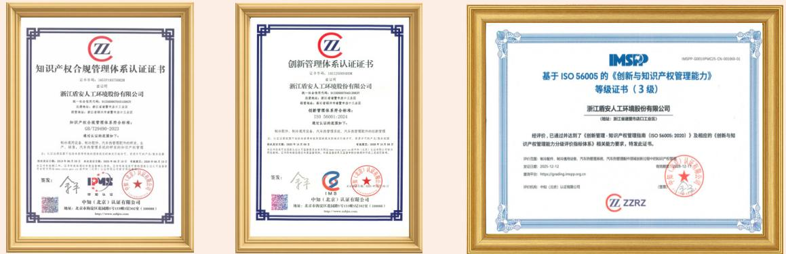

公司始终坚守“尊重他人知识产权、保护自身知识产权”的核心理念，在强化自身发明创造保护的同时，建立完善专利预警系统，及时关注和分析行业内的专利申请情况，规避产品开发过程中的专利风险。同时，着力提升产品设计的独创性，构建完善的产品专利布局体系，进一步增强产品上市后的核心竞争力。

# 案例 专利挖掘专项培训

2025年，公司知识产权部持续组织专利挖掘专项培训，聚焦将行业及竞争对手专利动态融入研发过程，引导技术人员研判技术趋势、识别产品专利风险，并主动发掘可专利化创新点。截至目前，已有8个产品线完成23项设计/产品的专利挖掘工作，累计布局专利156件，初步构建起以产品为核心的专利保护体系。这一成果标志着公司专利管理从被动保护转向主动布局，为技术创新成果保护及市场竞争力提升筑牢了知识产权屏障。

# 指标与目标

公司依托《技术类项目管理规定》构建研发目标闭环管理。研发计划及目标结合公司战略规划、技术升级需求及市场导向，按年度制定，每年年底明确下一年度研发项目指标与完成时限，经评审审批后发布实施。为保障研发计划及目标落地，公司遵循“年度计划-立项论证-项目执行-项目总结”流程，项目组按计划及目标推进研发，科技管理部跟踪进度、目标达成率等指标，项目完成后经评审结案，形成闭环管理。

2025年公司研发成效显著,全年累计开展产品、技术、工艺研发项目465项,目标达成率93.4%,顺利完成年度研发目标。

<table><tr><td>指标</td><td>单位</td><td>2025</td><td>2024</td><td>2023</td></tr><tr><td>研发投入金额</td><td>万元</td><td>53,487.55</td><td>50,259.26</td><td>43,370.74</td></tr><tr><td>研发投入占主营业务收入比例</td><td>%</td><td>4.10</td><td>3.96</td><td>3.81</td></tr><tr><td>研发人员数量及占比</td><td>人/%</td><td>1,428/11.31</td><td>1,498/10.76</td><td>1,242/10.46</td></tr></table>

<table><tr><td>指标</td><td>单位</td><td>2025</td><td>2024</td><td>2023</td></tr><tr><td>应用于主营业务的发明专利数量</td><td>项</td><td>460</td><td>392</td><td>354</td></tr><tr><td>报告期内专利申请数</td><td>项</td><td>705</td><td>887</td><td>692</td></tr><tr><td>报告期内专利授权数</td><td>项</td><td>666</td><td>463</td><td>456</td></tr><tr><td>报告期末有效专利数</td><td>项</td><td>3,770</td><td>3,049</td><td>2,617</td></tr><tr><td>报告期末软件著作数量</td><td>件</td><td>90</td><td>81</td><td>58</td></tr></table>

# 数据安全

# 治理

盾安环境建立了权责清晰的数据安全治理架构。流程IT与质量中心信息化管理模块作为专职管理部门，统筹公司数据与信息安全工作，并明确各业务部门的属地管理职责。

公司严格遵守《中华人民共和国网络安全法》《中华人民共和国计算机信息系统安全保护条例》等相关法律法规，建立《网络系统运行管理规定》《网络信息安全管理规定》《微信等即时通讯工具管理办法》《机房管理办法》等内部管理制度，强化技术防护与管理创新，全面提升信息安全保障能力。

# 战略

数据安全是公司数字化转型与智能制造战略的基石。为支撑“打造行业标杆级领航‘未来工厂’”的目标，公司计划在未来三年于智能智造总部基地投入上亿元专项资金。此战略的核心是将安全能力深度融入AI智能调度系统、数字孪生平台及“5G+工业互联网”场景，旨在通过领先的数字化与安全一体化建设，将安全从成本中心转化为驱动业务创新、保障智能制造的核心竞争力和信任资产。

# 影响、风险和机遇管理

公司切实加强数据安全与网络风险防控，积极配合省、市、县三级护网行动部署，持续强化数据安全风险管理。报告期内，公司主动参与各级网络安全攻防演练，与公安网警部门深化协作，不断提升风险识别、应急处置与主动防御能力，为数字化运营稳定运行筑牢安全防线。

# 案例

# 深化网络安全实战演练

2025年，公司与绍兴市、诸暨市公安局网警大队深化合作，通过“交流+演练”模式提升数据安全防护能力。年内先后加入绍兴市网络安全自治联盟，参与绍兴市网络安全攻防演练、浙江省“之江铸网”省级攻防演练。演练中，公司围绕技术加固、7×24小时人员值守、应急处置演练、复盘整改闭环四大维度开展实战，全面排查系统漏洞，优化安全策略。系列演练有效检验并提升了公司网络安全主动防御能力，为数据安全与数字化运营提供了坚实保障。

绍兴市数御网络安全服务中心文件

绍数御中心〔2025〕2号

绍兴市数御网络安全服务中心
关于招募成员单位成立网络安全自治联盟的通知

各有关单位：
为更广泛动员和凝聚社会网络安全力量，经研究，决定成立
绍兴市数御网络安全自动联盟。现面向全社会公开招募成员单
位，有关事项公告如下：
一、招募对象
绍兴市域内各级企事业单位。
二、申报要求
申报主体能在中华人民共和国境内注册成立，具有独立法人
资格（通信运营商属地分公司除外），具有相关部门颁发的合法
经营证照，在国家企业信用系统中无不良记录。
三、申报流程

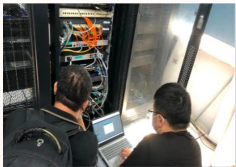

natural_image

Two people observing a server room with visible wiring and computer screens (no text or symbols)

# - 提升数据安全

此外，公司不断加强数据安全管理，对绝密、机密、秘密、内部及公开数据实施分级分类管控，构建多层次数据安全防护体系，保障数据安全可控。本报告期内，公司未发生数据安全相关事件。为对标等保2.0标准、提升数据安全防护能力，公司从网络边界防护、加密权限管理、上网行为规范三大关键环节制定专项举措，持续完善安全防护体系。

# 关键环节

# 重要举措

# 网络边界防护

升级防火墙、IDS/IPS等设备，细化访问控制策略，搭建监测平台，防范外部入侵与非法数据传输。

# 加密权限管理

对核心敏感数据实施全流程加密，建立分级分类权限体系，定期审计并清理冗余权限，搭建审计系统实现操作可追溯。

# 上网行为规范

制定上网行为准则,部署管控设备拦截违规行为,开展安全培训以提升员工合规意识。

指标与目标

<table><tr><td>指标</td><td>单位</td><td>2025</td><td>2024</td><td>2023</td></tr><tr><td>数据安全事故涉及的金额</td><td>万元</td><td>0</td><td>0</td><td>0</td></tr><tr><td>泄露客户隐私事件涉及的金额</td><td>万元</td><td>0</td><td>0</td><td>0</td></tr></table>

# 员工安

# 平等多元

公司坚持以人为本、平等尊重的理念，严格遵守相关法律法规要求，坚决反对任何形式的非法用工和强制劳动行为，包括使用童工和人口贩卖，并严格禁止基于种族、民族、肤色、血统、宗教、政治观点、社会背景、学习方式、性别、户籍、健康状况、年龄、身高或语言等因素的歧视行为，确保所有用工行为合法合规，尊重并保护人权，为员工在工作场所的平等和安全提供保障。

# 海外运营合规

盾安泰国金属在海外运营中，始终将实现高效、包容的跨文化沟通置于重要位置，致力于通过系统性语言支持，切实保障境外员工权益、提升运营效率并促进文化融合。

# 系统与工具层面

对SAP等核心信息系统进行本土化优化，在原有中英文界面基础上，新增泰语、缅甸语操作选项，支持员工按需切换，确保业务流程顺畅。

# 文件与视觉传达

所有内部文件、通知及管理标准均以中泰双语正式发布；厂区内各类标识牌、指引牌统一采用泰、英、中三种语言，确保信息传达无歧义、全覆盖。

# 能力建设层面

定期组织各类语言培训班，针对性提升海外员工的外语应用能力，从根本上助力员工发展，破除沟通壁垒。

# 案例 盾安泰国金属·举办新春祈福活动促进中泰文化融合

2026年1月，正值中国农历新年前夕，也是泰国新年的开始，为增进中泰员工情谊，弘扬两国文化，盾安泰国金属隆重举办了以“中泰一家亲，共迎祥龙年”为主题的新春祈福活动。活动将中国传统春节习俗与泰国本地祈福文化巧妙结合，在异国他乡营造出浓厚的年味，也展现了中国企业在海外生根发芽、融合发展的良好风貌。

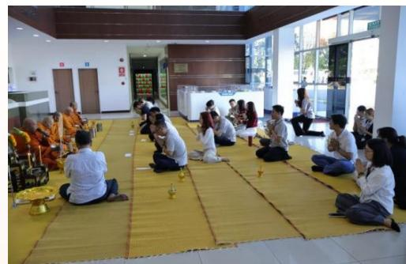

natural_image

Group of people seated on a patterned floor in a modern indoor space, engaged in a ritual or meditation activity (no visible text or symbols)

<table><tr><td>指标</td><td>单位</td><td>2025</td><td>2024</td><td>2023</td></tr><tr><td>员工总人数</td><td>人</td><td>12,631</td><td>13,921</td><td>11,870</td></tr><tr><td colspan="5">按性别分</td></tr><tr><td>男性</td><td>人</td><td>8,319</td><td>8,962</td><td>7,861</td></tr><tr><td>女性</td><td>人</td><td>4,312</td><td>4,959</td><td>4,009</td></tr><tr><td colspan="5">按年龄分</td></tr><tr><td>30岁以下</td><td>人</td><td>3,227</td><td>3,965</td><td>3,555</td></tr><tr><td>30岁到50岁</td><td>人</td><td>8,140</td><td>8,651</td><td>7,322</td></tr><tr><td>50岁以上</td><td>人</td><td>1,264</td><td>1,305</td><td>993</td></tr><tr><td colspan="5">按学历分</td></tr><tr><td>大专及以上学历占比</td><td>%</td><td>28.9</td><td>27.5</td><td>25.6</td></tr><tr><td>硕博以上学历</td><td>人</td><td>183</td><td>163</td><td>127</td></tr><tr><td colspan="5">其他</td></tr><tr><td>退伍复员军人招募人数</td><td>人</td><td>169</td><td>126</td><td>91</td></tr><tr><td>招募退伍复员军人比例</td><td>%</td><td>1.3</td><td>0.9</td><td>0.8</td></tr></table>

# 民主沟通

盾安环境将员工民主沟通作为企业文化建设的重要基石，建立多元化员工沟通与反馈机制，保障员工便捷、透明地表达诉求，维护员工合法权益。公司构建系统化的员工参与体系：按月组织专项培训，按季度举办员工座谈会，每半年开展旅游团建活动，搭建管理层与员工的直接对话平台，确保员工的意见与诉求得到充分倾听和尊重。

同时，公司每半年开展员工敬业度及满意度专项调查，全方位洞察员工需求与体验。2025年度敬业度调查结果为8.5分（满分10分），满意度调查结果为7.28分（满分为10分）。公司基于调研结果，围绕员工需求与发展持续优化管理水平，稳步提升员工满意度与幸福感。

# - 畅通员工申诉机制

公司建立了标准化的举报受理、调查核实及结果反馈流程，由专人负责跟进每一起举报线索，确保事事有回应、件件有着落，让每一位员工和相关方都能安心行使监督权利，共同营造风清气正的企业环境。

公司设立奖励机制，对提供重要线索的举报人给予适当奖励，鼓励员工和利益相关方对违反商业道德的行为予以举报；同时，注重举报人保护，举报通道平台设置了严格的信息加密和匿名处理机制，确保举报人的个人信息及举报内容在整个流程中得到最高级别的安全保护，举报材料列入密件管理，并严禁打击报复举报人，一经查实，将做出严肃处理，情节严重的，移送司法机关处理，追究相应法律责任。

# 薪酬福利

公司始终将员工福祉放在重要位置，通过不断完善员工薪酬福利、提升员工生活关怀质量等多种方式，确保员工幸福生活，致力于打造一个温暖、和谐的工作环境。在未来发展中，公司将继续秉持以人为本的理念，不断优化和完善员工关怀福利体系，为员工创造更加美好的工作、生活环境，实现公司与员工的共同成长与发展。

# 福利体系

盾安环境为全部正式员工提供覆盖多方面的全面福利体系，旨在营造安全、健康、富有保障且具备人文关怀的工作环境。

<table><tr><td>福利体系</td><td>具体内容</td></tr><tr><td>生活福利</td><td>为员工提供免费三餐和住宿。特别对夫妻员工分配单间,充分考虑员工的生活需求,让大家住得安心、舒心。</td></tr><tr><td>季节关怀</td><td>在炎炎夏日,发放高温补贴,帮助员工抵御酷暑,保障员工在高温环境下的工作和生活质量。</td></tr><tr><td>长期服务激励</td><td>在员工入职5年、10年、15年等重要的工作节点,分别赠送不同档次的纪念金币,表彰他们多年来的坚守与奉献,2025年发放金币金额730.23万,涉及员工1125人。</td></tr><tr><td>家庭支持</td><td>设立员工互助基金,当员工家庭面临突发状况、经济困难时,互助基金能及时伸出援手,给予经济支持,帮助员工家庭共渡难关。2025年共计帮扶员工295人,支出资金229.02万元。</td></tr></table>

# 薪酬激励

盾安环境坚持实施“四高方针”（高素质、高责任、高贡献、高待遇），同时通过岗位价值评估、员工能力盘点、绩效评价、划小单元核算、创新发展大奖、股权激励、市场薪酬对标等方式，建立富有竞争力的薪酬体系，确保员工的薪酬水平在区域和行业中具备领先水平与竞争优势。同时，公司深入推进“以奋斗者为本，多打粮食多分粮”的激励体系建设，建立公司与全体员工“共识共担，共创共享”的利益共同体，以激发员工活力与凝聚力。

# 案例

# 推出股权长期激励计划

为进一步建立健全盾安环境长效激励约束机制，公司制定并实施长期激励计划，以吸引和留住公司(含子公司)优秀人才，充分调动公司董事、高级管理人员、中层管理人员及核心技术(业务)人员的积极性，有效将股东利益、公司利益与员工利益相结合，推动各方共同关注公司长远发展。

2025年公司推出长期激励计划第二期暨2025年限制性股票与股票期权激励计划，向符合授予条件的365名激励对象授予合计10,075,000股限制性股票，授予价格为7.05元/股；向符合授予条件的44名激励对象授予合计4,770,000份股票期权，行权价格为14.10元/股。

# 生涯成长

为构建与企业发展战略高度适配的人才梯队，实现人才结构的动态优化与效能提升，公司逐步完善员工培训体系以及晋升发展路线。为更好地实现人才与业务的动态匹配，充分激活内部人才价值，2025年公司针对关键岗位开展专项人才盘点工作，精准评估核心人才储备状况与能力维度短板，为人才选拔、培育及配置决策提供科学支撑。

# 实施人才盘点

盾安环境将人才盘点作为实现人才与业务动态匹配、构建活力人才团队的核心管理工具。公司通过系统评估员工的学历背景、绩效表现、能力素质（基于包含7项一级能力、19项二级能力的内部模型）及发展潜力，运用360度评价、九宫格等方法，对人才进行全方位盘点，精准识别与发展内部人才。

基于盘点所生成的全景人才图谱,公司制定了针对性的人才发展计划。2025年12月,公司完成了对900余名核心人员的盘点,系统评估了各业务单元的人才梯队健康度与未来差距,并据此对核心骨干与高潜力人才提供专项发展计划、职业晋升与激励,确保人才策略有效支撑业务发展。

# 成长成才赋能

为夯实人才基石，公司系统构建了针对专业骨干与潜力人才的培养体系。该体系分为储备人才培养计划和专业人才精进提升培养计划，旨在加速人才的专业成长与组织融合，从而为公司未来发展的持续领先提供坚实可靠的人才支撑。

# - 储备人才培养计划

从面向基层技工的蓝色生力军，到管理人员的三鹰培养计划和商学院提升计划，通过系统性、分层次地培育适应未来挑战的核心管理人员与专家，确保关键岗位的人才供给不断层、不降质。

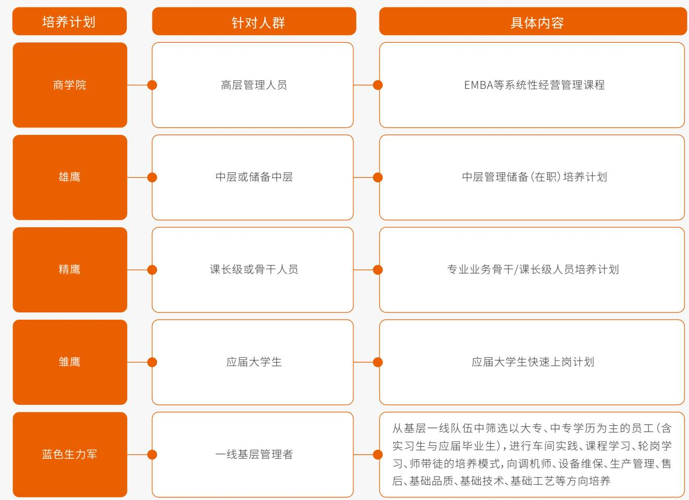

flowchart

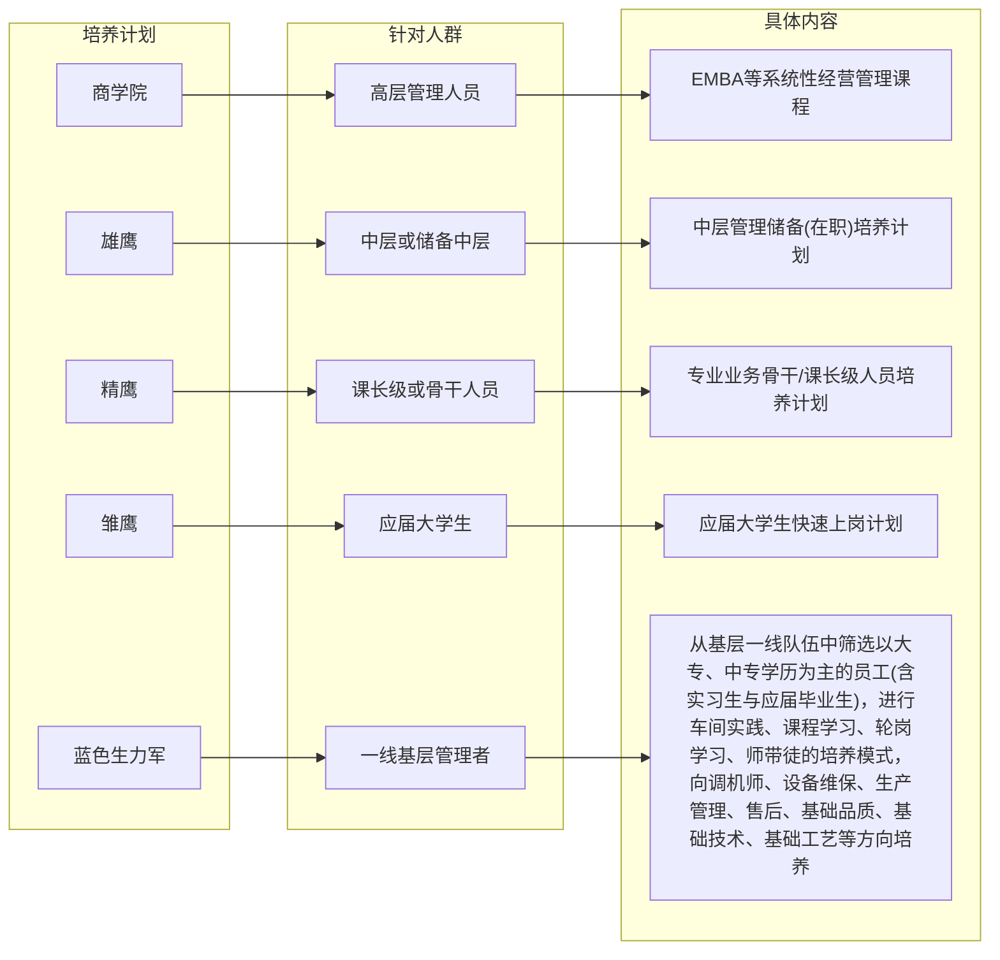
```mermaid
graph LR
  subgraph Training_Planter["培养计划"]
    A["商学院"]
    B["雄鹰"]
    C["精鹰"]
    D["雏鹰"]
    E["蓝色生力军"]
  end

  subgraph Personnel["针对人群"]
    F["高层管理人员"]
    G["中层或储备中层"]
    H["课长级或骨干人员"]
    I["应届大学生"]
    J["一线基层管理者"]
  end

  subgraph Content ["具体内容"]
    K["EMBA等系统性经营管理课程"]
    L["中层管理储备(在职)培养计划"]
    M["专业业务骨干/课长级人员培养计划"]
    N["应届大学生快速上岗计划"]
    O["从基层一线队伍中筛选以大专、中专学历为主的员工(含实习生与应届毕业生)，进行车间实践、课程学习、轮岗学习、师带徒的培养模式，向调机师、设备维保、生产管理、售后、基础品质、基础技术、基础工艺等方向培养"]
  end

  A --> F
  B --> G
  C --> H
  D --> I
  E --> J
  F --> K
  G --> L
  H --> M
  I --> N
  J --> O
```

# - 专业人才精进提升培养计划

以“专业精深，赋能业务”为核心导向，聚焦系统性提升各条线员工的核心专业能力与业务协同效率。根据不同职能，如技术研发、市场营销、制造运营、质量管理、人力资源、财务管理、供应链管理等的独特职责、能力模型及未来发展需求，设计不同的课程体系和授课方式。

# 人员群体

# 具体课程

技术条线

工程中的不锈钢与腐蚀、防错防呆、FMEA应用、知识产权相关风险点的预防、IPD等

销售条线

新品及产品知识宣贯等

制造条线

成本管理、设备效率提升、精益管理、5S管理和现场八大浪费消除、内部运营分享等

质量条线

统计基础概念、测量系统分析、统计过程控制、假设检验、过程能力分析等

质量工艺工程师

项目管理、原材料学习、SOP基础、六西格玛系列课程等

运营条线

运营管理、计划管理等

供应链条线

商务采购人员能力提升、采购博弈管理策略、供应链管理实践分享等

财务条线

制造企业经营与成本管理、从财务视角理解企业运行逻辑、业务部门的财务管理

人力条线

业务部门的人力资源管理、岗位价值评估、做好面试官、课程设计与开发等

EHS条线

急救员取证培训、安全管理员取证培训等

# 案例

# 制造系统培训强化生产管理能力

2025年12月，盾安环境组织制造系统专项培训课程教学，培训邀请内部优秀管理人员进行授课，珠海基地质量负责人结合格力完美质量模式与零缺陷文化，引导学员将质量意识内化于心，实现持续改进；通过划小实践分享，解析从成本切入推动精益改善的有效路径。本次培训系统提升了制造系统学员专业能力，助力将培训成果转化至生产全流程，为公司践行“匠心智造”战略、提升生产管理效能提供人才支撑。

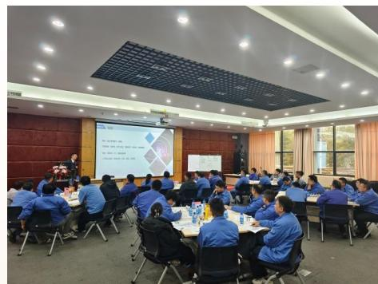

text_image

Conference room photo with attendees in blue uniforms and presentation screen showing Chinese text about a 2017-2018 academic year.

# 案例

# 雄鹰培养项目强化中层管理能力

2025年8月，盾安环境第三期雄鹰培养项目在店口基地开班。项目聚焦中层干部综合管理能力与职业素养提升，助力其应对复杂工作问题、支撑组织稳健发展。课程围绕中层胜任力模型设计，涵盖风险识别控制、逻辑思维等模块，第一阶段开设《内控风险识别与控制》《问题分析与解决》《EHS管理》课程。该项目是公司人才梯队建设的重要举措，为中层管理人员搭建成长交流平台，后续2年内将分6个阶段完成全部课程。

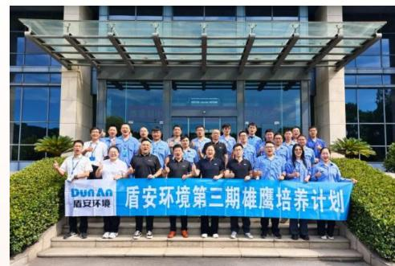

text_image

DUN AN
盾安环境 第三期雄鹰培养计划

# 案例

# 质量工艺工程师培养计划开展供应商参访实践

2025年11月，盾安环境组织技术人员、质量工艺工程师培养计划学员等赴核心供应商金田集团开展参访学习。本次活动是质量工艺工程师培养计划的重要环节，聚焦理论与生产实践融合，参访人员参观展厅及铜管、铜棒生产车间，直观了解铜材全制造流程，将抽象理论转化为具象认知。此次参访拓宽了学员行业视野，助力其精准把控技术参数、提升质量问题处理能力。

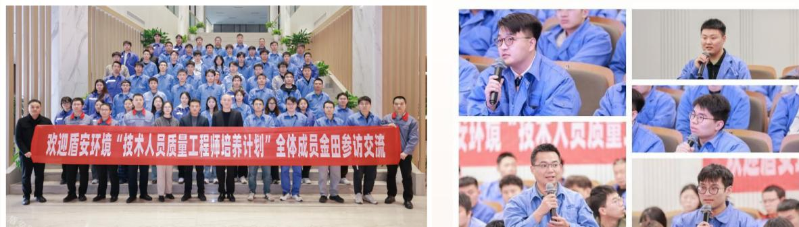

<table><tr><td>指标</td><td>单位</td><td>2025</td><td>2024</td><td>2023</td></tr><tr><td>培训人次</td><td>人</td><td>29,253</td><td>39,980</td><td>33,385</td></tr><tr><td>人均培训时长</td><td>小时</td><td>3.9</td><td>6.2</td><td>5.9</td></tr><tr><td>培训覆盖率</td><td>%</td><td>100</td><td>100</td><td>100</td></tr><tr><td>培训投入</td><td>万元</td><td>237.7</td><td>269.2</td><td>225.2</td></tr><tr><td>每亿营收员工培训投入</td><td>万元</td><td>1.82</td><td>2.12</td><td>1.98</td></tr></table>

# 职业技能培养

公司致力于构建覆盖全体员工的职业技能发展体系，为员工提供多元化、阶梯化的成长通道。对于管理人员，我们通过技术等级评定明确专业职级的晋升路径，并结合知识竞赛、专业人员技能比武等形式，以赛促学，推动管理实践与专业技术能力的深度融合，持续提升其解决问题的综合能力。面向一线员工，我们建立了技能等级评定细则（包含焊接技师等级评定管理办法），分工种、分等级，确定不同的技能工资，清晰规划技能人才的职业发展阶梯。

公司通过“培训、练兵、比武”的培养模式，将日常培训、岗位实践与竞技展示有机结合，形成“比、学、赶、超”的良好氛围，激发全员学习技术、钻研技能的内生动力。

# 案例

# 人力资源知识竞赛提升专业素养

2025年11月，盾安环境组织人力资源实务知识竞赛。围绕人力资源常用法规、业务知识及条线规章制度开展综合考核，融入专业答题与案例答辩等内容。活动共有53名人力资源从业人员参与，6名选手脱颖而出晋级决赛进行答辩。竞赛有效提升了人力资源团队专业素养与综合履职能力，公司将持续开展专业能力建设活动，为可持续发展夯实人才保障。

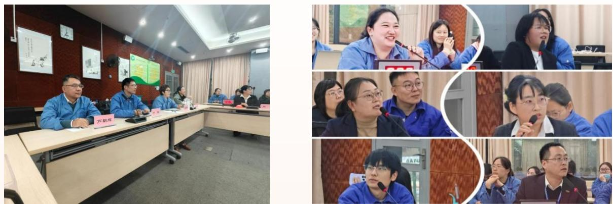

# 晋升绩效管理

公司建立了三通道职业发展路线——专业岗位路线、管理岗位路线、经营岗位路线。该机制突破了行政职务晋升的局限，为专业、技术人员提供了良好的职业发展路径，资深专业技术人员可享受公司高级管理人员的薪酬待遇。比如技术线的评价等级可以从“见习技术员”到“科学家”，技术人员最高待遇可以超越总裁级别，彻底打破传统单一的行政发展通道。此外，同一职级内部设置了不同岗位等级。在职级不变的情况下，岗位等级的提升同样属于晋升范畴，可享受相应更优渥的薪酬待遇。

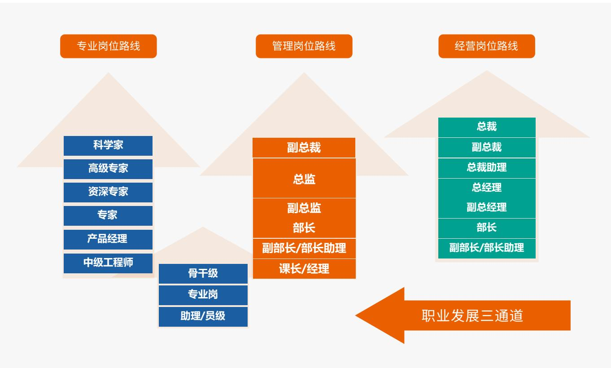

flowchart

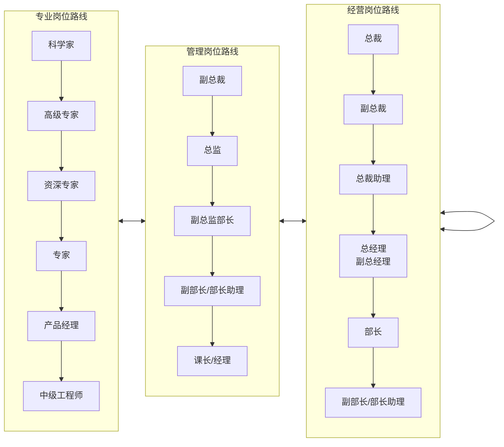
```mermaid
graph LR
  subgraph Professional["专业岗位路线"]
  A1["科学家"] --> A2["高级专家"]
  A2 --> A3["资深专家"]
  A3 --> A4["专家"]
  A4 --> A5["产品经理"]
  A5 --> A6["中级工程师"]
  end

  subgraph Management["管理岗位路线"]
  M1["副总裁"] --> M2["总监"]
  M2 --> M3["副总监部长"]
  M3 --> M4["副部长/部长助理"]
  M4 --> M5["课长/经理"]
  end

  subgraph Executive["经营岗位路线"]
  E1["总裁"] --> E2["副总裁"]
  E2 --> E3["总裁助理"]
  E3 --> E4["总经理\n副总经理"]
  E4 --> E5["部长"]
  E5 --> E6["副部长/部长助理"]
  end

  Professional <--> Management <--> Executive <--> Executive
```

在绩效管理层面，公司采用平衡计分卡为框架的组织绩效管理模式，并通过层层分解为部门与个人绩效，确保公司战略目标有效落地。在激励方案层面，坚持划小单元项目变革，分客户、分区域、分产品独立经营、独立核算、独立考核。不断改进各产线、营销、技术和各职能条线的激励方案，保证全员经营理念的进一步深入。此外，公司已推出股权激励计划，旨在激发全体员工的积极性和创造力，为公司的长远发展注入动力。

# 健康保障

# 治理

盾安环境持续完善职业健康管理，公司EHS管理部门负责公司职业健康安全工作的策划、实施、检查与考核，各业务单元总经理负责落实管理规范的具体要求。制度层面，公司制定了《劳动防护用品管理办法》《职业健康安全管理规定》《环境、职业健康安全监视和测量管理规定》等核心制度，为各项工作提供标准化依据。

职业健康管理架构图  
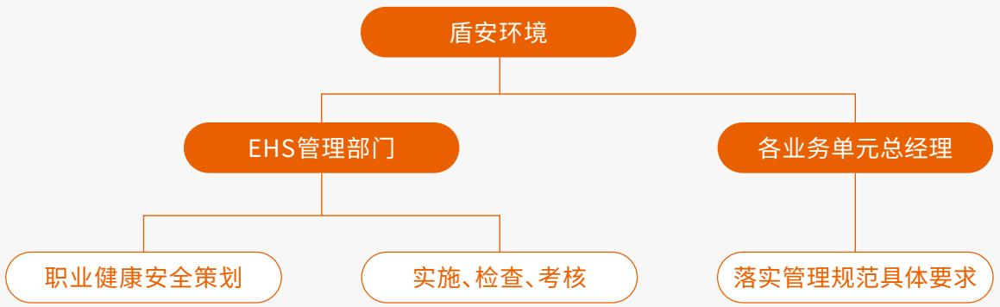

flowchart

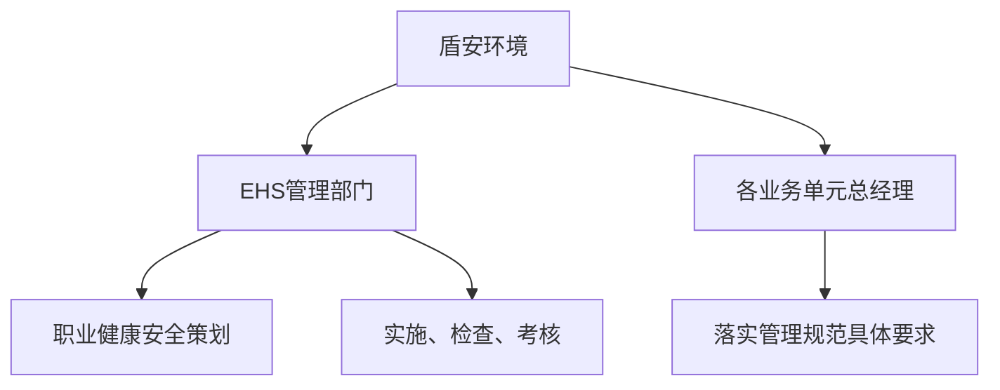
```mermaid
graph TD
  A["盾安环境"] --> B["EHS管理部门"]
  A --> C["各业务单元总经理"]
  B --> D["职业健康安全策划"]
  B --> E["实施、检查、考核"]
  C --> F["落实管理规范具体要求"]
```

# 战略

公司将员工职业健康与安全生产置于优先位置，秉持“安全第一、预防为主、综合治理”方针，坚持以人为本，以体系化、常态化、全员化管理为抓手，全面保障员工身心健康与作业安全，防范安全与职业健康风险，为企业可持续运营与员工安心工作提供坚实保障。

# 影响、风险和机遇管理

职业健康安全是企业的生命线，更是员工的基本权益。盾安环境始终将员工的职业健康与安全置于首位，致力于确保员工在工作过程中的身心健康，预防并保护员工免受职业环境带来的伤害。

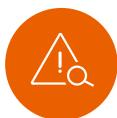  
风险排查

\- 持续开展职业健康风险评估,识别并控制工作环境中的潜在危害,确保工作场所的安全性。

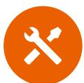  
劳动防护

\- 为员工配备符合标准的劳动防护用品，确保在各种作业环境下的安全防护。

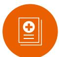  
健康体检

\- 定期为员工提供全面的健康体检，增加了心脏健康检查项目，加大投入，及时发现并预防潜在健康风险。

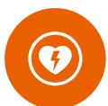  
急救培训

\- 组织员工参加急救员培训，取得相关认证，提升应急处理能力；在工作场所配置自动体外除颤器(AED)等急救设备，确保在紧急情况下能够及时响应。

# 案例

# 优化厂区照明, 减少员工作业视觉疲劳

2025年5月，公司秉持人文关怀理念，聚焦员工职业健康与作业体验，对厂区照明环境开展了系统性优化。通过对各作业区域照度的专业化测量与数据分析，针对性部署了配光科学、高效节能的LED工矿灯，并结合1,500W高亮度探照灯强化重点区域照明。此次改造显著提升了光照均匀度与视觉舒适性，有效降低了员工的视觉疲劳感，缓解了长时间作业带来的眼部不适。

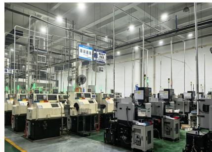

natural_image

Interior view of a large industrial factory floor with multiple CNC machines and overhead lighting (no visible text or symbols)

# - 职业健康管理体系认证

盾安环境下属盾安禾田、盾安机械、盾安机电、盾安热工、盾安汽车热管理等16家公司通过职业健康管理体系认证，系统性地贯彻了以人为本的管理理念。

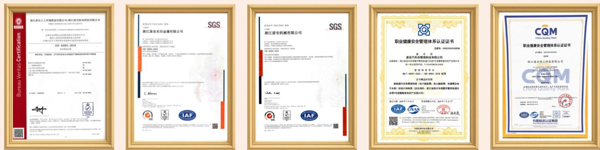

# - 应急管理

公司始终将职业健康安全与安全生产作为ESG管理重点，常态化开展覆盖全厂区、全岗位的应急演练工作。2025年，公司重点围绕高温中暑应急处置、危化品泄漏应急防控、消防安全、高处作业、有限空间作业、车辆伤害等高风险场景开展系列实战演练，全面检验预案可行性、应急物资保障及人员协同处置能力。

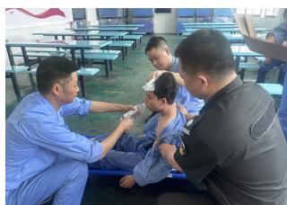  
中暑急救演习

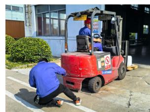  
车辆伤害演习

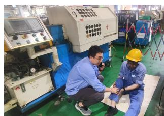  
高空坠落演习

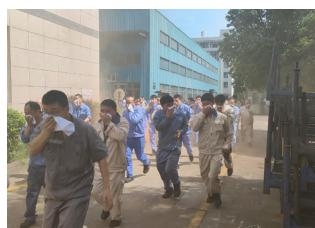  
消防逃生演习

指标与目标

<table><tr><td>指标</td><td>单位</td><td>2025</td><td>2024</td><td>2023</td></tr><tr><td>安全生产投入</td><td>万元</td><td>673.79</td><td>677.80</td><td>824.40</td></tr><tr><td>安全生产投入占营业收入比例</td><td>%</td><td>0.0517</td><td>0.05346</td><td>0.0724</td></tr><tr><td>安全培训总时长</td><td>小时</td><td>9,958</td><td>17,490.5</td><td>23,423</td></tr><tr><td>安全培训人均时长</td><td>小时</td><td>1.45</td><td>1.66</td><td>2.17</td></tr><tr><td>工伤保险投入金额</td><td>万元</td><td>496.44</td><td>561.15</td><td>289.28</td></tr><tr><td>工伤保险覆盖率</td><td>%</td><td>100</td><td>100</td><td>100</td></tr><tr><td>安全生产责任险投入金额</td><td>万元</td><td>6.26</td><td>4.15</td><td>6.89</td></tr><tr><td>安全生产责任险覆盖率</td><td>%</td><td>27.28</td><td>30.00</td><td>29.41</td></tr><tr><td>职业病发生人数</td><td>人次</td><td>0</td><td>0</td><td>0</td></tr><tr><td>因公死亡人数</td><td>人次</td><td>0</td><td>0</td><td>0</td></tr><tr><td>因工伤损失工作日数</td><td>日</td><td>3,343.00</td><td>3,751.50</td><td>4,344.50</td></tr><tr><td>每亿营收因工伤损失工作日数</td><td>日</td><td>26.65</td><td>29.59</td><td>38.17</td></tr><tr><td>百万工时伤害率</td><td>%</td><td>1.51</td><td>1.96</td><td>2.17</td></tr></table>

# 关心关爱

为系统推进员工关心关爱工作，盾安环境以工会为核心推进主体，构建起制度化、规范化的长效工作机制。工会严格依照《工会管理标准》明确的组织架构与职责流程，将帮扶救助、人文关怀与文体活动等具体工作，转化为可持续、可考核的标准化服务项目，确保了关爱资源精准聚焦于员工急难愁盼，持续提升服务质效，从而在组织层面稳固地将工会打造为员工信赖的“职工之家”。

# 困难员工帮扶

公司重视对困难员工的帮扶，设立互助基金，聚焦员工及家庭突发困难、重大疾病、意外变故等急难情形，及时提供精准帮扶与经济救助，切实为遭遇困境的员工家庭纾难解困、共渡难关，充分发挥互助共济、暖心保障作用。2025年度，公司互助基金共计支出229.02万元，累计惠及员工295人次。

<table><tr><td>指标</td><td>单位</td><td>2025</td><td>2024</td><td>2023</td></tr><tr><td>员工帮扶人数</td><td>人</td><td>295</td><td>285</td><td>207</td></tr><tr><td>员工帮扶投入金额</td><td>万元</td><td>229.02</td><td>224.91</td><td>191.29</td></tr><tr><td>每亿营收困难员工帮扶人数</td><td>人</td><td>2.26</td><td>2.25</td><td>1.82</td></tr></table>

# 女性员工关怀

公司始终高度重视女职工权益保障与人文关怀工作，不断健全女职工关爱服务体系，围绕身心健康、权益维护、家庭支持、职业发展等方面开展系列暖心服务，切实增强女职工的归属感与幸福感。公司在2025年3月8日精心组织“三八”国际妇女节主题纪念活动，通过趣味活动、暖心慰问等形式致敬巾帼力量、传递组织关怀，同时在2025年8月1日组织开展女职工HPV免费筛查服务，为女职工健康保驾护航，以实实在在的举措把关爱落到实处，充分体现了企业对女职工的尊重、呵护与责任担当。

# 案例 春风十里,芳华如你“三·八”女神节活动

2025年3月8日，盾安环境开展“走基层，慰问巾帼绽芳华”“进农场，踏青赏花享春光”系列活动。公司为全体女员工精心准备鲜花，亲手送上慰问与感谢，让女同胞在工作中感受到尊重与温暖；同时组织休闲户外活动，让员工踏青赏花、放松身心、缓解压力，既增强了团队凝聚力、提升了员工归属感。

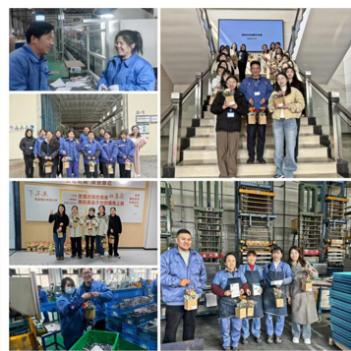

natural_image

Collage of six photos showing factory workers in blue uniforms, with staircases and a banner in the center (no visible text or symbols)

# 员工多彩活动

2025年，公司围绕文体娱乐、团队凝聚、兴趣拓展、节日关怀等多个维度，开展节日庆祝、文体竞赛、户外拓展等形式多样的员工活动。活动丰富了员工业余文化生活，营造了积极向上、团结和谐的工作氛围，有效增强团队凝聚力与员工归属感，进一步提升了企业向心力与文化活力。

# 案例 工企聚力,和美乡村健康跑

2025年4月，店口镇首届“工企聚力·和美乡村”健康跑在视北村举行，300余名镇内企事业单位职工参赛。盾安环境组织40余名员工组成跑团踊跃参与，队员们在8公里赛道上团结协作、奋勇争先，全员顺利完赛并斩获优异成绩，彰显了公司职工积极向上、坚韧拼搏的精神风貌。此次参与属地文体活动，既是公司践行员工关怀、丰富员工业余生活、保障职工身心健康的举措，也增进了企地融合，助力和美乡村建设。

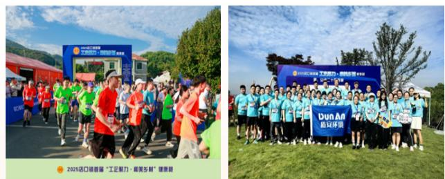

# 案例 “筑梦新篮途”篮球赛

2025年9月，“筑梦新篮途”盾安环境杯篮球赛在盾安花园球场圆满落幕。作为公司员工关怀与企业文化建设的重要举措，赛事为职工搭建了交流展示平台，彰显了职工团结拼搏、积极向上的精神风貌，传递协同共进的体育精神，凝聚团队向心力，丰富职工精神文化生活。

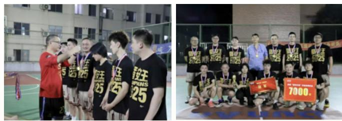

# 案例 “碳路者”绿野徒步活动

2025年9月，盾安环境开展“碳路者”绿野徒步活动，作为公司8周年司庆系列活动在玉皇山、九溪双线举行。活动结合垃圾清理、环保宣传与倡议卡发放，传递低碳理念。店口、诸暨厂区140余名员工参与，20余人保障团队全程护航。活动将生态环保融入企业文化，丰富员工业余生活，增强团队凝聚力，积极践行可持续发展社会责任。

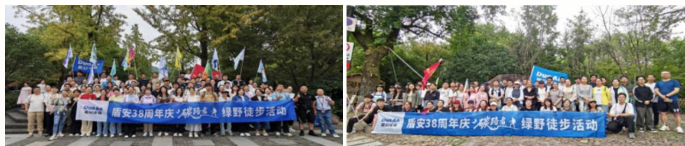

# 案例 “逐光企行,月贺华章”游园会活动

2025年9月22日—25日，公司举办司庆节系列游园会，在盾安禾田、盾安汽车热管理、盾安机电三大厂区同步开展。活动融合专业性、趣味性与纪念性，为全体员工搭建了放松身心、互动共享的平台。此次活动丰富了员工业余文化生活，缓解了工作压力，进一步增强了团队凝聚力与员工归属感，更以创新形式致敬公司三十八载发展历程，传递企业温情，凝聚全员奋进合力。

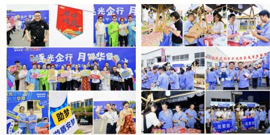

# 案例 “光影聚心,共筑团队”露天观影活动

2025年12月，盾安环境组织开展“光影聚心，共筑团队”露天观影活动，邀请职工及家属共同观看优秀国产动画电影，感受传统文化与热血温情的碰撞，活动期间提供特色美食，营造了轻松和谐的光影氛围，丰富了职工及家属的精神文化生活，增进家庭温情与团队向心力，助力中华优秀传统文化传承。

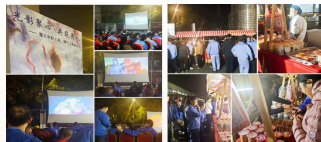

# 供应安

# 可持续供应链

坚决反对童工、超时工作、强迫劳动等不当行为，致力于构建负责任供应链。盾安环境将绿色发展与责任治理理念全面延伸至供应链，致力于构建可持续的伙伴生态。我们不仅定期评估供应商的环保绩效，督促其遵守法规、减少污染与资源浪费，还积极推动绿色创新合作，共同开发再生资源利用、节能设备及可回收包装等解决方案。在更广泛的ESG管理层面，我们与供应商签订《供应商行为准则》，明确其在商业道德、劳工权益、安全健康及环境保护等方面的责任，并通过《供应商社会责任调查表》进行系统的ESG评估，持续推动供应链履责水平的提升，共同筑牢可持续发展的价值链基础。

# 维度

# 对供应商的管理要求

# 环境(E)

- 遵守所有适用的环保法规, 确保合规运营  
- 采取具体措施管理污染物排放、降低能耗、减少资源浪费  
- 推动循环经济实践,如废弃物回收与资源化利用

# 社会(S)

- 保障员工合法权益,提供安全健康的工作环境,禁止使用童工与强迫劳动  
- 建立公平的雇佣、薪酬与晋升制度，禁止歧视  
- 尊重并保护知识产权,进行公平竞争  
- 积极管理自身供应链的社会与环境风险

# 治理(G)

- 建立商业道德与行为规范，并公开社会责任承诺  
- 设立明确的管理机构或职责，以推动ESG事务  
- 制定并执行反腐败、反贿赂的政策与内部举报机制  
- 将ESG相关表现纳入内部管理与考核指标

<table><tr><td>指标</td><td>单位</td><td>2025</td><td>2024</td><td>2023</td></tr><tr><td>开展供应商评估总量</td><td>个</td><td>285</td><td>287</td><td>230</td></tr><tr><td>开展社会影响评估的供应商</td><td>个</td><td>85</td><td>73</td><td>60</td></tr><tr><td>开展环境影响评估的供应商</td><td>个</td><td>85</td><td>73</td><td>60</td></tr></table>

# 供应商管理策略

盾安环境建立了系统化、全生命周期的供应商管理体系。该策略以精准开发为基础，战略共赢为纽带，动态考核为驱动，风险防控为保障，贯穿供应商合作始终，致力于构建安全、稳健、可持续的供应链，为公司高质量发展提供坚实支撑。

  
准入审核

# 为确保供应商合作质量与可持续发展要求,设立准入资质审核标准如下:

- 具有独立法人资格，产品工艺技术先进合理，生产、检测、试验设备齐全。  
- 通过第三方认证机构的ISO 9001和ISO 14001体系认证，符合RoHS、REACH管理标准要求。  
- 提供环保合规性相关资料, 此为准入的必要条件。  
- 生产经营及财务状况良好,具有明显价格优势,具备良性发展潜力。  
- 企业管理者和员工具有良好的品质观念和品质改进意识。

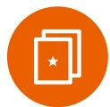  
考核评价

# 公司基于《供应商绩效管理办法》和《供应商绩效评价细则》，对外购及外协供应商实施全周期闭环管理机制。

# 1. 评价标准化与多维度管控

依据:严格遵循公司管理办法及评价细则。

维度: 定期从成本、交付、品质、技术、服务五大核心维度进行全面量化评价。

# 2. 目标导向

激励供应商持续改进, 确保产品优质、价格合理且具备高性价比, 实现供应链整体优化。

# 3. 结果应用与分级处置 (闭环机制)

优异者(激励):给予更多合作机会及政策倾斜。

问题者(辅导): 及时沟通, 协助制定整改方案, 设定期限并持续跟踪进度。

不合格者(淘汰): 对整改不力或长期不达标者, 采取减单、暂停合作直至淘汰措施。

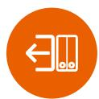  
退出机制

# 1. 绩效末位淘汰机制 (量化标准)

触发条件: 连续两个季度综合绩效评分低于60分(即评定为D级)。

处置措施:立即取消次季度供货配额,并终止合作资格。

# 2. 黑名单永久禁入机制 (行为准则)

依据:《供应商黑名单管理办法》。

触发行为: 存在违法、违规、违约、失信或严重履约不力等行为。

认定流程:经供应商申请调查或公司核实确认。

处置措施:列入黑名单,并永久取消供货资格。

# 案例

# 提升质量管理理念、共创绿色供应商

2025年6月，盾安环境于店口基地召开供应商辅导会，围绕质量管理升级、绿色供应链共建及市场趋势研判三大主题，通过理念宣贯、路径探讨与案例分析，推动供应商优化管理流程、落实环保举措、前瞻布局市场，旨在强化协同效能、提升综合竞争力，实现企业与供应商在可持续发展中的互利共赢。

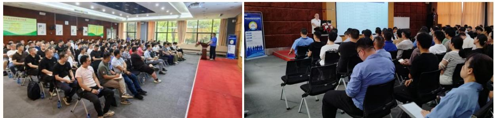

<table><tr><td>指标</td><td>单位</td><td>2025</td><td>2024</td><td>2023</td></tr><tr><td>淘汰不合格供应商数目</td><td>个</td><td>17</td><td>21</td><td>15</td></tr><tr><td>供应链环节中具有重大风险与影响的事件数量</td><td>件</td><td>0</td><td>0</td><td>0</td></tr></table>

# 冲突矿产管理

在供方准入审核阶段，盾安环境已全面强化冲突矿产管控机制，制定了不使用冲突矿产的采购声明，要求所有潜在供应商必须正式签署并提交《不使用冲突矿产宣告书》以承诺其供应链合规性，同时同步开展深度尽职调查，通过填写详尽的《冲突矿产调查表》追溯矿物来源及冶炼路径，确保从源头识别并阻断来自冲突地区的矿产流入，从而将合规审查前置化、制度化。

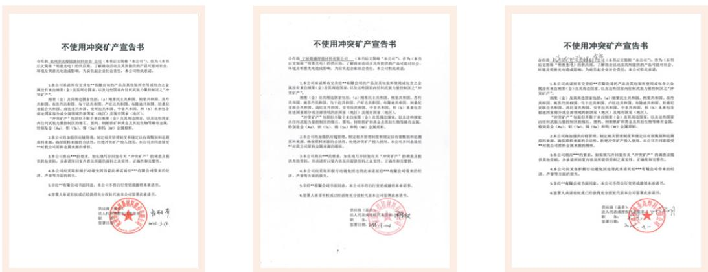

# 供应商赋能培训

盾安环境致力于构建“共生共赢”的供应链生态，通过数字化赋能、技术协同与能力建设三大核心支柱全面助力供应商成长：一方面依托智能平台打通信息壁垒，实现需求预测共享与业务流程自动化，降低合作伙伴运营成本；另一方面，深入开展包括零缺陷管理、绿色制造及合规经营在内的专项培训与现场辅导，输出行业标准与管理最佳实践，同时配套提供供应链金融支持与联合创新机制，切实帮助供应商提升核心竞争力与抗风险能力，推动其从单一交付方转型为值得信赖的战略合作伙伴。

2025年，我们全面升级供应商赋能体系，将“零缺陷”质量理念深度融入合作伙伴成长计划，年度内重点组织并开展了全覆盖的供应商零缺陷管理专项培训，通过系统化的方法论导入、典型案例复盘及实战演练，协助供应商从源头识别质量风险、优化制程控制并构建预防性质量管理体系。

# 案例

# 供应商零缺陷项目赋能能力

2025年6月，盾安环境开展上半年供应商零缺陷理念培训，116家核心供应商138名相关人员现场参与，80余家供应商线上同步参训。培训邀请盾安环境零缺陷小组执行组长主讲，围绕零缺陷理念核心、实施方法、应用案例展开讲解，重点传递零缺陷管理四大核心原则，并结合公司实践指导供应商落地，此次培训搭建了供需沟通学习平台，强化双方质量意识与合作黏性，为深化零缺陷理念实践、共同提升供应链质量奠定基础。

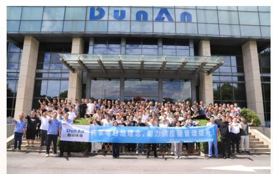

text_image

BaoAn
BaoAn 共享零环境理念，助力供应链管理提升

<table><tr><td>指标</td><td>单位</td><td>2025</td><td>2024</td><td>2023</td></tr><tr><td>年度开展供应商培训场数</td><td>场</td><td>4</td><td>1</td><td>2</td></tr><tr><td>组织供应商参与培训人次</td><td>人次</td><td>238</td><td>68</td><td>70</td></tr></table>

# 供应商风险管理

盾安环境构建了以法务合规和经营稳健为核心的供应链风险管理体系，通过法务与经营的双重管控机制实现事前预防和动态监管，显著提升了供应链抗风险能力。

在法务层面，公司和所有合格供应商签订《基本供货协议》，重点关注供应商的法律合规性，杜绝合同欺诈、知识产权侵权、商业贿赂等违法行为，将可能引发法律纠纷、经济赔偿或声誉损害的供应商列入不合作名单。

在经营层面,公司在供应商准入环节严格评估供应商的财务健康状况,确保其具备充足的资金流、合理的资产负债率和稳定的盈利能力,有效防范因供应商经营不善导致的供应中断或产品质量问题,保障公司生产运营的连续性和稳定性。

# 数字化管理

2025年，公司全面深化供应链数字化管理体系，成功上线SRM线上竞价平台，通过公开公平透明的竞价规则与全流程数据留痕，彻底消除人为干预因素，确保了采购竞争的公平性与透明度；此外，公司发布供应商数据保护声明，严格界定数据采集边界，承诺绝不滥用或向第三方泄露供应商的核心商业数据，以坚实的数字安全屏障捍卫合作伙伴的合法权益。

# 案例

# 以SRM系统驱动供应链数字化协同与效能提升

2025年7月，盾安环境召开SRM系统项目总结汇报会议，该项目聚焦供应链可持续管理、践行ESG治理理念，通过数字化手段优化采购与质量管控，其中采购管理实现寻源线上化与供应商竞价，使询价周期缩短40%、降低采购成本且实现与内部BPM、SAP系统无缝对接，质量管理搭建供应商质量生命周期管理基础模型，实现相关业务流程电子化，推动纸质数据向信息化转型，强化供应商合规管控、保障供应链质量安全与可持续性。

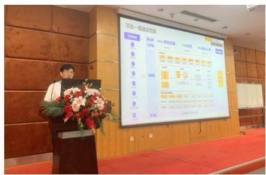

text_image

项目-关键规划
项目名称	时间/时间
00:00:00	12:00:00	01:15:00
项目
项目名称	时间/时间
00:00:00	12:00:00	01:15:00
项目名称	时间/时间
00:00:00	12:00:00	01:15:00
项目名称	时间/时间
00:00:00	12:00:00	01:15:00
项目名称	时间/时间
00:00:00	12:00:00	01:15; 12:36
项目名称	时间/时间
00:00:00	12:00:00	01:15:00
项目名称	时间/时间
00:00:00	12:00:00	01:15:00
项目名称	时间/时间
00:00:00	12:00:00	01:15 12:36
项目名称	时间/时间
00:00:00	12:00:00	01:15 12:36
项目名称	时间/时间
00:00:00	12:00:00	01:15 12:36
项目名称	时间/时间
00:00:00	12:00:00
项目名称	时间/时间

# 平等对待中小企业

盾安环境积极践行企业社会责任，致力于构建平等共赢的供应链生态。公司通过建立公平透明的采购机制，严格执行《配额管理办法》和《供应链绩效管理办法》，为中小企业提供平等的市场参与机会。具体举措包括：降低采购门槛、简化审批流程，减少中小企业参与障碍；建立长期稳定的战略合作关系，提供技术支持和专业培训，助力中小企业提升核心竞争力。此外，我们始终坚持“三个确保”原则，即确保依法规范经营、确保按时保质保量交付、确保按约支付款项，为中小企业营造健康可持续的发展环境。

<table><tr><td>指标</td><td>单位</td><td>2025</td><td>2024</td><td>2023</td></tr><tr><td>报告期末应付账款(含应付票据)余额</td><td>万元</td><td>352,856.89</td><td>389,118.38</td><td>334,616.72</td></tr><tr><td>报告期末应付账款(含应付票据)余额占总资产的比重</td><td>%</td><td>28.71</td><td>32.02</td><td>31.03</td></tr><tr><td>报告期末逾期未支付款项金额</td><td>万元</td><td>0</td><td>0</td><td>0</td></tr><tr><td>报告期末逾期未支付中小企业款项金额</td><td>万元</td><td>0</td><td>0</td><td>0</td></tr></table>

# 社会安

# 产业发展

盾安环境以“链主”企业之责，积极通过产能布局与技术创新双向驱动产业发展。公司不仅构建自身制造网络，更注重以龙头牵引力促进区域产业链的协同升级与绿色转型。

# 海外产业链协同建设

公司以泰国新基地为支点，主动规划区域供应链生态。2025年，在热工换热器与汽车热管理基地开业之际，公司即召集核心供应商共商本地化配套，旨在通过引导上游伙伴就近布局，缩短物流半径、降低全链碳排放，从而打造一个更高效、更具韧性的属地化供应网络，带动产业链上下游在东南亚的共同发展。

# 绿色技术赋能产业链

公司以核心产品助力下游产业低碳化。盾安机电作为蔚来能源核心伙伴，其液冷技术已应用于全国数千座换电站。双方计划在下一代换电站、超充一体化场景深化合作，以创新的热管理解决方案，赋能蔚来构建更可靠的绿色补能网络，从而在终端应用环节推动交通领域的可持续发展。

# 参与标准制定

盾安环境积极参与国家标准、行业标准的制修订。2025年，公司牵头制定《制冷系统及热泵用不锈钢制冷剂管路件》行业标准，同时承担《热泵用四通电磁换向阀》行业标准修订工作。

截至2025年，公司累计牵头和参与完成104项国家和行业标准的制修订，其中20项为第一制单位。凭借在标准创新与技术研发领域的突出表现，公司获得“中国创新贡献奖”2项，还荣获“全国质量奖”“国家创新型试点企业”“国家科技进步奖二等奖”“中国专利优秀奖”等多项荣誉称号。

# 案例

# 主导两项制冷空调行业标准制、修订工作

2025年5月23日，盾安环境承办JB/T《热泵用四通电磁换向阀》及JB/T《制冷系统及热泵用不锈钢制冷剂管路件》两项行业标准制定工作会议，聚焦热泵核心部件技术升级与铜替代材料革新；两项标准的修订与制定，可推动国产部件对标国际、实现从材料到部件的全链条自主可控，同时通过不锈钢替代铜管缓解铜资源压力、提升能效，助力产业链安全可控与资源可持续利用。

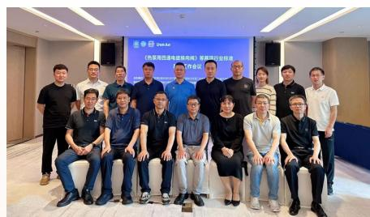

text_image

喜鹊园 (Jiao An)
(代表现场嘉宾名单)：喜鹊园与会者
（代表会）

# 促进行业沟通

2025年，公司深度参与制冷空调、热泵及热管理领域全行业交流活动，积极联动上下游企业、科研院所与行业协会，围绕技术创新、绿色低碳、人才培育等核心议题开展多维对话，持续拓展产业合作边界，夯实行业生态协同基础。

# 案例 国内外暖通行业交流

2025年，公司深度参与全球暖通制冷与新能源热管理领域产业交流，先后亮相印度制冷展、中国制冷展、巴西制冷展、上海ATC新能源汽车热管理技术展会、CBEE中国商品国际贸易博览会及德国国际汽车及智慧出行博览会，面向南亚、中国、拉美及欧洲市场，展示绿色制冷技术与低碳解决方案，分享可持续发展实践。通过深化技术协同、标准对接与低碳理念传播，公司持续拓展全球产业合作，助力行业高质量协同发展，不断提升品牌国际影响力与可持续发展竞争力。

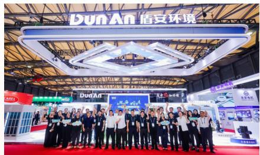

text_image

DunAn 帅安环境
DunAn

# 案例 助力行业人才培养

2025年11月，在全国制冷空调行业年会上，公司联合中国制冷空调工业协会正式发布“知芯名师话冷暖”项目。项目联合行业权威名师，以直观动画及系统化知识内容打造制冷技术科普短视频。活动现场，公司向清华大学、浙江大学等多家高校及科研机构捐赠首批教具，助力产学研协同创新。该项目有效助力行业技术人才培育，深化校企合作与技术普及，为行业高质量发展提供人才支撑与创新动能，践行企业社会责任。

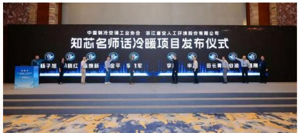

text_image

中国制冷空调工业协会 浙江鑫安人工环境股份有限公司
知应名师话冷暖项目发布仪式
王子旭  魏红  娱婷新  金平  亨 1军  李 申 田壮青  台波  潘南

# 全球化与本地运营

盾安环境坚持全球化布局与本土化运营协同发展，深度融入属地发展。公司通过多元渠道吸纳本地优秀人才，为当地提供丰富且匹配高的就业岗位，有效促进区域就业，带动居民收入与生活品质提升，在稳健经营的同时积极履行社会责任，助力属地社会民生发展。

<table><tr><td>指标</td><td>单位</td><td>2025</td><td>2024</td><td>2023</td></tr><tr><td>雇佣当地员工(指当地市)数量【以户口所在地】</td><td>人</td><td>3,945</td><td>4,508</td><td>3,518</td></tr><tr><td>当地员工(指当地市)占比【以户口所在地】</td><td>%</td><td>30.9</td><td>32.4</td><td>29.6</td></tr><tr><td>雇佣外籍员工</td><td>人</td><td>1,237</td><td>1,600</td><td>817</td></tr><tr><td>外籍员工占比</td><td>%</td><td>9.8</td><td>11.5</td><td>6.9</td></tr></table>

# 畅通海外晋升

盾安环境聚焦海外属地化发展，完善外籍员工职业晋升体系，外籍员工晋升管理层采用“推荐+竞聘”的晋升机制，例如盾安泰国金属管理层结构明确要求泰籍课长级及以上管理人员不低于该层级总人数的 $35\%$ 。随着本地化进程的加快，该比例在持续优化提升。一线基层管理已全面实施本地化管理，技能员工的培养、基层班组建设等。

# 促进海外交流

公司常态化组织多元文化交流活动，通过策划全员参与的主题庆典与特殊节日关怀，让中外员工在互赠祝福、体验民俗中增进情感认同。

# 案例 盾安泰国金属·共庆泰国农历新年

2025年4月，正值泰国传统新年宋干节之际，为尊重当地文化习俗，增进中泰员工情感融合，盾安泰国金属举行了庄重的“浴佛”与“向长辈洒水祈福”仪式，公司中泰双方管理层身穿花衬衫，依次接受年轻员工的洒水祝福。中泰员工欢聚一堂，在飞溅的水花与欢笑声中，共同迎接佛历2568年的到来，谱写出一曲和谐共融的友谊乐章。

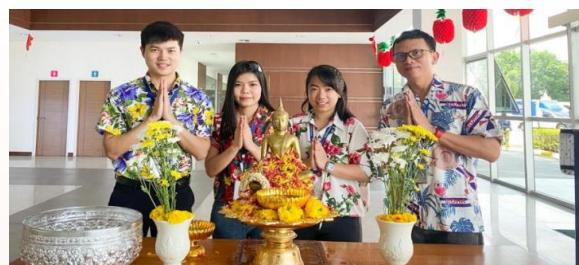

natural_image

Group of four people in floral attire clapping and posing with a golden prayer cake at a table (no visible text or symbols)

# 税务贡献

诚信纳税是企业实现健康长远发展的重要保障。公司不断完善相关规章制度，梳理票据合规性、纳税义务与责任承担等涉税关键要点，对供应商准入、合同执行、发票审批等重点环节数据信息进行监控比对，实现风险全流程可控；对出口退税、关联交易定价等风险较高领域，实现涉税事项从业务发起到关账的全链条闭环管理。

公司连续纳税信用评价被评定为A级，近三年以来获得诸暨市“高质量发展突出贡献企业”、及国家税务总局绍兴市税务局与绍兴市工商业联合会颁布的“2024绍兴市民营企业纳税贡献30强”，以表彰公司在诚信纳税及促进地方经济发展方面的卓越贡献，2025年缴纳税收总额51,013.53万元、同比增长3.93%。

<table><tr><td>指标</td><td>单位</td><td>2025</td><td>2024</td><td>2023</td></tr><tr><td>纳税金额</td><td>万元</td><td>51,013.53</td><td>49,084.54</td><td>44,816.85</td></tr></table>

# 公益慈善

盾安环境积极开展公益慈善工作，以救助保障为核心方向，重点聚焦助老、济困、助学等领域，聚焦困难群众最现实、最紧迫、最基本的生活需求，通过精准摸排、及时帮扶、暖心救助，切实为困境群体提供基本生活保障、医疗救助、临时帮扶等支持，不断兜牢民生底线，传递社会温暖，提升困难群众的获得感、安全感和幸福感。

2025年，盾安环境为1009位70岁以上老人及29个困难户，2个特困户送去了新年慰问及祝福，并已累计资助了30名高中生和230名大学生。

# 案例

# 爱心助成才,共圆大学梦

2025年8月，“爱心助成才 共圆大学梦”助学仪式在诸暨市委老干部局顺利举行。盾安环境已连续21年开展困难家庭学生资助行动，在诸暨市关工委的牵线搭桥下，累计资助30名高中生、230名大学生完成学业，以实际行动践行社会责任，助力教育公平与地方人才培养。

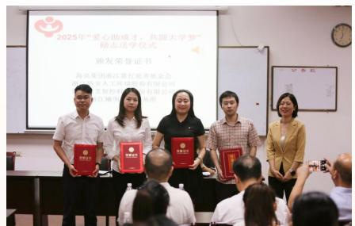

text_image

2025年“爱心助成才，共圆大学梦”
湖北化学仪式
颁发荣誉证书
海南集团浙江黄江行曲系委员会
海南人民 arts学院有限公司
海南华信会计师事务所

# 案例

# 岁末添暖，佳节问安

2025年腊八节暨新春前夕，盾安环境开展敬老扶贫慰问活动，为1009名70周岁以上老人、29户困难家庭及2户特困家庭送上节日慰问与祝福。公司已连续28年坚持开展此类公益行动，积极践行社会责任，弘扬敬老济困优良风尚，切实关怀弱势群体生活保障。

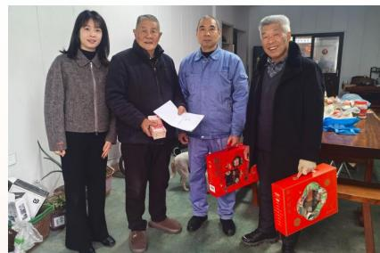

text_image

Group photo of four people holding documents and red gift boxes, with visible text on items in the background

<table><tr><td>指标</td><td>单位</td><td>2025</td><td>2024</td><td>2023</td></tr><tr><td>公益慈善捐赠金额</td><td>万元</td><td>41.83</td><td>44.79</td><td>40.36</td></tr><tr><td>每亿营收社区公益投入</td><td>万元</td><td>0.32</td><td>0.35</td><td>0.36</td></tr></table>

# 关键绩效表

温室气体排放

<table><tr><td>指标</td><td>单位</td><td>2025</td><td>2024</td><td>2023</td></tr><tr><td>范围一</td><td>吨二氧化碳当量</td><td>16,164.76</td><td>17,449.77</td><td>16,152.22</td></tr><tr><td>范围二</td><td>吨二氧化碳当量</td><td>52,684.37</td><td>51,263.15</td><td>41,090.18</td></tr><tr><td>排放总量</td><td>吨二氧化碳当量</td><td>68,849.13</td><td>68,712.93</td><td>57,242.4</td></tr></table>

温室气体排放

<table><tr><td>指标</td><td>单位</td><td>2025</td><td>2024</td><td>2023</td></tr><tr><td colspan="5">能源使用基本情况1</td></tr><tr><td>综合能源消耗量</td><td>吨标准煤</td><td>27,987.45</td><td>27,932.08</td><td>23,269.27</td></tr><tr><td colspan="5">其中:按能源类型分</td></tr><tr><td>煤炭</td><td>吨</td><td>0</td><td>0</td><td>0</td></tr><tr><td>汽油</td><td>升</td><td>0</td><td>0</td><td>0</td></tr><tr><td>柴油</td><td>升</td><td>286,904</td><td>43,940</td><td>237,331</td></tr><tr><td>天然气</td><td>立方米</td><td>4,139,705</td><td>4,735,157</td><td>4,218,085</td></tr><tr><td>液化石油气</td><td>立方米</td><td>177,251</td><td>184,149</td><td>165,170</td></tr><tr><td>不可再生电力采购量</td><td>万千瓦时</td><td>17,425.882</td><td>16,955.802</td><td>13,590.987</td></tr><tr><td>可再生电力采购量</td><td>万千瓦时</td><td>0</td><td>0</td><td>0</td></tr><tr><td>可再生电力占比</td><td>%</td><td>0</td><td>0</td><td>0</td></tr><tr><td>直接能源消耗量</td><td>吨标准煤</td><td>6,571.04</td><td>7,093.40</td><td>6,565.94</td></tr><tr><td>间接能源总能耗量</td><td>吨标准煤</td><td>21,416.41</td><td>20,838.68</td><td>16,703.32</td></tr><tr><td>能源使用强度(如以每产量单位计算)</td><td>吨标准煤/产量单位</td><td>0.033</td><td>0.032</td><td>0.030</td></tr><tr><td colspan="5">清洁能源使用情况2</td></tr><tr><td>清洁能源使用总量</td><td>兆瓦时</td><td>12,953.92</td><td>11,995.00</td><td>11,797.55</td></tr><tr><td>清洁能源装机总容量占比</td><td>%</td><td>100</td><td>100</td><td>100</td></tr><tr><td colspan="5">其中:按能源类型分</td></tr><tr><td>光伏发电量</td><td>万千瓦时</td><td>1,295.392</td><td>1,199.500</td><td>1,179.755</td></tr><tr><td>光伏发电比例</td><td>%</td><td>6.92</td><td>6.61</td><td>7.99</td></tr><tr><td>天然气</td><td>立方米</td><td>4,139,705</td><td>4,735,157</td><td>4,218,085</td></tr><tr><td>天然气比例</td><td>%</td><td>19.67</td><td>22.55</td><td>24.11</td></tr><tr><td>风能</td><td>兆瓦时</td><td>0</td><td>0</td><td>0</td></tr><tr><td>风能比例</td><td>%</td><td>0</td><td>0</td><td>0</td></tr></table>

注1:以上2025年度能源数据的统计范围包含盾安禾田、盾安机械、盾安热工、盾安机电、盾安汽车热管理、珠海华宇、芜湖中元。  
注2：以上2025年度清洁能源数据的统计范围包含盾安禾田、盾安机械、盾安热工、盾安机电、盾安汽车热管理、珠海华宇、芜湖中元。

水资源

<table><tr><td>指标3</td><td>单位</td><td>2025</td><td>2024</td><td>2023</td></tr><tr><td>取水量</td><td>万吨</td><td>86.307</td><td>96.771</td><td>84.194</td></tr><tr><td>排水量</td><td>万吨</td><td>27.611</td><td>35.146</td><td>30.840</td></tr><tr><td>耗水量</td><td>万吨</td><td>58.696</td><td>61.625</td><td>53.354</td></tr><tr><td>循环用水量</td><td>万吨</td><td>1,423.196</td><td>1,263.121</td><td>955.930</td></tr><tr><td>循环用水比例</td><td>%</td><td>94.28</td><td>92.88</td><td>91.91</td></tr></table>

注3:以上2025年度水资源相关数据的统计范围包含盾安禾田、盾安机械、盾安热工、盾安机电、盾安汽车热管理、珠海华宇、芜湖中元。

循环利用

<table><tr><td>指标4</td><td>单位</td><td>2025</td><td>2024</td><td>2023</td></tr><tr><td>废弃物循环利用总量</td><td>吨</td><td>19,752.36</td><td>17,910.89</td><td>17,748.94</td></tr><tr><td>废弃物循环利用比例</td><td>%</td><td>96.52</td><td>95.36</td><td>95.89</td></tr></table>

注4: 以上2025年度废弃物循环利用相关数据统计范围包含盾安禾田、盾安机械、盾安热工、盾安机电、盾安汽车热管理。

环保合规

<table><tr><td>指标5</td><td>单位</td><td>2025</td><td>2024</td><td>2023</td></tr><tr><td>环保投入</td><td>万元</td><td>665.25</td><td>687.39</td><td>676.84</td></tr><tr><td>环境污染事件</td><td>起</td><td>0</td><td>0</td><td>0</td></tr><tr><td>环境污染处罚金额</td><td>万元</td><td>0</td><td>0</td><td>0</td></tr></table>

注5:以上2025年度环境合规相关数据的统计范围包含盾安禾田、盾安机械、盾安热工、盾安机电、盾安汽车热管理。

废水

<table><tr><td>指标6</td><td>单位</td><td>2025</td><td>2024</td><td>2023</td></tr><tr><td>工业废水总量</td><td>立方米</td><td>158,961.16</td><td>197,262.63</td><td>155,794.03</td></tr><tr><td>生活废水总量</td><td>立方米</td><td>60,431</td><td>52,400</td><td>55,370</td></tr><tr><td>化学需氧量(COD)</td><td>吨</td><td>3.9239</td><td>6.1542</td><td>5.5207</td></tr><tr><td>氨氮(NH3-N)</td><td>吨</td><td>0.048</td><td>0.125</td><td>0.063</td></tr><tr><td>总氮(TN)</td><td>吨</td><td>1.5087</td><td>1.427</td><td>1.4362</td></tr><tr><td>总磷(TP)</td><td>吨</td><td>0.0153</td><td>0.0443</td><td>0.0321</td></tr></table>

注6: 以上2025年度废水相关数据的统计范围包含盾安禾田、盾安机械、盾安机电。

废气

<table><tr><td>指标7</td><td>单位</td><td>2025</td><td>2024</td><td>2023</td></tr><tr><td>颗粒物(PM)</td><td>千克</td><td>5,913.9</td><td>4,504.4</td><td>/</td></tr><tr><td>硫氧化物(SOx)</td><td>千克</td><td>747.53</td><td>796.7</td><td>753.03</td></tr><tr><td>氮氧化物(NOx)</td><td>千克</td><td>4,391.5</td><td>4,621.5</td><td>4,319.89</td></tr><tr><td>挥发性有机物(VOCs)</td><td>千克</td><td>5,053.6</td><td>5,635.2</td><td>4,173.7</td></tr></table>

注7: 以上2025年度废气相关数据的统计范围包含盾安禾田、盾安机械、盾安热工、盾安机电、盾安汽车热管理。

废弃物

<table><tr><td>指标8</td><td>单位</td><td>2025</td><td>2024</td><td>2023</td></tr><tr><td>废弃物产生总量</td><td>吨</td><td>19,752.36</td><td>19,123.24</td><td>17,748.94</td></tr><tr><td>无害固体废弃物总量</td><td>吨</td><td>19,064.54</td><td>18,252.68</td><td>17,020.8</td></tr><tr><td>无害固体废弃物强度</td><td>吨/万元</td><td>0.0276</td><td>0.0235</td><td>0.0238</td></tr><tr><td>危险废弃物总量</td><td>吨</td><td>687.82</td><td>870.55</td><td>728.14</td></tr><tr><td>危险废弃物强度</td><td>吨/万元</td><td>0.00096</td><td>0.00112</td><td>0.00102</td></tr><tr><td>每亿营收产生的有害废弃物总量</td><td>吨</td><td>9.12</td><td>/</td><td>/</td></tr></table>

注8: 以上2025年度废弃物相关数据的统计范围包含盾安禾田、盾安机械、盾安热工、盾安机电、盾安汽车热管理。

生物多样性

<table><tr><td>指标9</td><td>单位</td><td>2025</td><td>2024</td><td>2023</td></tr><tr><td>生态运营涉及生态红线事件</td><td>件</td><td>0</td><td>0</td><td>0</td></tr><tr><td>生态治理投入资金</td><td>万元</td><td>20.45</td><td>20.45</td><td>25.50</td></tr><tr><td>绿化面积</td><td>亩</td><td>62.63</td><td>62.63</td><td>74.78</td></tr><tr><td>绿化面积占比</td><td>%</td><td>11.47</td><td>11.47</td><td>13.69</td></tr></table>

注9: 以上2025年度生物多样性相关数据统计范围包含盾安禾田、盾安热工、盾安机电。

产品质量与客户服务

<table><tr><td>指标</td><td>单位</td><td>2025</td><td>2024</td><td>2023</td></tr><tr><td>违反产品和服务信息与标识法规的事件</td><td>件</td><td>0</td><td>0</td><td>0</td></tr><tr><td>客户满意度</td><td>分</td><td>94.11</td><td>93.27</td><td>92.27</td></tr><tr><td>客户投诉数量</td><td>次</td><td>0</td><td>0</td><td>0</td></tr><tr><td>每亿营收客户投诉数量</td><td>次</td><td>0</td><td>0</td><td>0</td></tr><tr><td>客户端产品召回事故</td><td>起</td><td>0</td><td>0</td><td>0</td></tr></table>

研发创新

<table><tr><td>指标</td><td>单位</td><td>2025</td><td>2024</td><td>2023</td></tr><tr><td>研发投入金额</td><td>万元</td><td>53,487.55</td><td>50,259.26</td><td>43,370.74</td></tr><tr><td>研发投入占主营业务收入比例</td><td>%</td><td>4.10</td><td>3.96</td><td>3.81</td></tr><tr><td>研发人员数量及占比</td><td>人/%</td><td>1,428/11.31</td><td>1,498/10.76</td><td>1,242/10.46</td></tr><tr><td>应用于主营业务的发明专利数量</td><td>项</td><td>460</td><td>392</td><td>354</td></tr><tr><td>报告期内专利申请数</td><td>项</td><td>705</td><td>887</td><td>692</td></tr><tr><td>报告期内专利授权数</td><td>项</td><td>666</td><td>463</td><td>456</td></tr><tr><td>报告期末有效专利数</td><td>项</td><td>3,770</td><td>3,049</td><td>2,617</td></tr><tr><td>报告期末软件著作数量</td><td>件</td><td>90</td><td>81</td><td>58</td></tr></table>

员工培训与发展

<table><tr><td>指标</td><td>单位</td><td>2025</td><td>2024</td><td>2023</td></tr><tr><td>培训人次</td><td>人</td><td>29,253</td><td>39,980</td><td>33,385</td></tr><tr><td>人均培训时长</td><td>小时</td><td>3.9</td><td>6.2</td><td>5.9</td></tr><tr><td>培训覆盖率</td><td>%</td><td>100</td><td>100</td><td>100</td></tr><tr><td>培训投入</td><td>万元</td><td>237.7</td><td>269.2</td><td>225.2</td></tr><tr><td>每亿营收员工培训投入</td><td>万元</td><td>1.82</td><td>2.12</td><td>1.98</td></tr></table>

员工结构

<table><tr><td>指标</td><td>单位</td><td>2025</td><td>2024</td><td>2023</td></tr><tr><td>员工总人数</td><td>人</td><td>12,631</td><td>13,921</td><td>11,870</td></tr><tr><td colspan="5">按性别分</td></tr><tr><td>男性</td><td>人</td><td>8,319</td><td>8,962</td><td>7,861</td></tr><tr><td>女性</td><td>人</td><td>4,312</td><td>4,959</td><td>4,009</td></tr><tr><td colspan="5">按年龄分</td></tr><tr><td>30岁以下</td><td>人</td><td>3,227</td><td>3,965</td><td>3,555</td></tr><tr><td>30岁到50岁</td><td>人</td><td>8,140</td><td>8,651</td><td>7,322</td></tr><tr><td>50岁以上</td><td>人</td><td>1,264</td><td>1,305</td><td>993</td></tr><tr><td colspan="5">按学历分</td></tr><tr><td>大专及以上学历占比</td><td>%</td><td>28.9</td><td>27.5</td><td>25.6</td></tr><tr><td>硕博以上学历</td><td>人</td><td>183</td><td>163</td><td>127</td></tr><tr><td colspan="5">其他</td></tr><tr><td>退伍复员军人招募人数</td><td>人</td><td>169</td><td>126</td><td>91</td></tr><tr><td>招募退伍复员军人比例</td><td>%</td><td>1.3</td><td>0.9</td><td>0.8</td></tr></table>

职业健康与安全生产

<table><tr><td>指标</td><td>单位</td><td>2025</td><td>2024</td><td>2023</td></tr><tr><td>安全生产投入</td><td>万元</td><td>673.79</td><td>677.80</td><td>824.40</td></tr><tr><td>安全生产投入占营业收入比例</td><td>%</td><td>0.0517</td><td>0.05346</td><td>0.0724</td></tr><tr><td>安全培训总时长</td><td>小时</td><td>9,958</td><td>17,490.5</td><td>23,423</td></tr><tr><td>安全培训人均时长</td><td>小时</td><td>1.45</td><td>1.66</td><td>2.17</td></tr><tr><td>工伤保险投入金额</td><td>万元</td><td>496.44</td><td>561.15</td><td>289.28</td></tr><tr><td>工伤保险覆盖率</td><td>%</td><td>100</td><td>100</td><td>100</td></tr><tr><td> $安全生产责任险投入金额^{10}$ </td><td>万元</td><td>6.26</td><td>4.15</td><td>6.89</td></tr><tr><td> $安全生产责任险覆盖率$ </td><td>%</td><td>27.28</td><td>30</td><td>29.41</td></tr><tr><td>职业病发生人数</td><td>人次</td><td>0</td><td>0</td><td>0</td></tr><tr><td>因公死亡人数</td><td>人次</td><td>0</td><td>0</td><td>0</td></tr><tr><td>因工伤损失工作日数</td><td>日</td><td>3,343.0</td><td>3,751.5</td><td>4,344.5</td></tr><tr><td>每亿营收因工伤损失工作日数</td><td>日</td><td>25.65</td><td>29.59</td><td>38.17</td></tr><tr><td>百万工时伤害率</td><td>%</td><td>1.51</td><td>1.96</td><td>2.17</td></tr></table>

注10:本报告期内对2024年安全生产责任险数据进行了更新和纠正。

关心关爱

<table><tr><td>指标</td><td>单位</td><td>2025</td><td>2024</td><td>2023</td></tr><tr><td>员工帮扶人数</td><td>人</td><td>295</td><td>285</td><td>207</td></tr><tr><td>员工帮扶投入金额</td><td>万元</td><td>229.02</td><td>224.91</td><td>191.29</td></tr><tr><td>每亿营收困难员工帮扶人数</td><td>人</td><td>2.26</td><td>2.25</td><td>1.82</td></tr></table>

供应链管理

<table><tr><td>指标</td><td>单位</td><td>2025</td><td>2024</td><td>2023</td></tr><tr><td>年度开展供应商培训场数</td><td>场</td><td>4</td><td>1</td><td>2</td></tr><tr><td>组织供应商参与培训人次</td><td>人次</td><td>238</td><td>68</td><td>70</td></tr><tr><td>开展供应商评估总量</td><td>个</td><td>285</td><td>287</td><td>230</td></tr><tr><td>开展社会影响评估的供应商</td><td>个</td><td>85</td><td>73</td><td>60</td></tr><tr><td>开展环境影响评估的供应商</td><td>个</td><td>85</td><td>73</td><td>60</td></tr><tr><td>淘汰不合格供应商数目</td><td>个</td><td>17</td><td>21</td><td>15</td></tr><tr><td>供应链环节中具有重大风险与影响的事件数量</td><td>件</td><td>0</td><td>0</td><td>0</td></tr></table>

平等对待中小企业

<table><tr><td>指标</td><td>单位</td><td>2025</td><td>2024</td><td>2023</td></tr><tr><td>报告期末应付账款(含应付票据)余额</td><td>万元</td><td>352,856.89</td><td>389,118.38</td><td>334,616.72</td></tr><tr><td>报告期末应付账款(含应付票据)余额占总资产的比重</td><td>%</td><td>28.71</td><td>32.02</td><td>31.03</td></tr><tr><td>报告期末逾期未支付款项金额</td><td>万元</td><td>0</td><td>0</td><td>0</td></tr><tr><td>报告期末逾期未支付中小企业款项金额</td><td>万元</td><td>0</td><td>0</td><td>0</td></tr></table>

全球化与本地运营

<table><tr><td>指标</td><td>单位</td><td>2025</td><td>2024</td><td>2023</td></tr><tr><td>雇佣当地员工(指当地市)数量【以户口所在地】</td><td>人</td><td>3,945</td><td>4,508</td><td>3,518</td></tr><tr><td>当地员工(指当地市)占比【以户口所在地】</td><td>%</td><td>30.9</td><td>32.4</td><td>29.6</td></tr><tr><td>雇佣外籍员工</td><td>人</td><td>1,237</td><td>1,600</td><td>817</td></tr><tr><td>外籍员工占比</td><td>%</td><td>9.8</td><td>11.5</td><td>6.9</td></tr></table>

公益慈善

<table><tr><td>指标</td><td>单位</td><td>2025</td><td>2024</td><td>2023</td></tr><tr><td>公益慈善捐赠金额</td><td>万元</td><td>41.83</td><td>44.79</td><td>40.36</td></tr><tr><td>每亿营收社区公益投入</td><td>万元</td><td>0.32</td><td>0.35</td><td>0.36</td></tr></table>

公司治理

<table><tr><td>指标</td><td>单位</td><td>2025</td><td>2024</td><td>2023</td></tr><tr><td>董事会成员总人数</td><td>人</td><td>9</td><td>9</td><td>9</td></tr><tr><td> $董监高年龄标准差^{11}$ </td><td>岁</td><td>6.58</td><td>8.44</td><td>8.66</td></tr><tr><td> $董事会成员平均任期^{12}$ </td><td>年</td><td>2.12</td><td>2.70</td><td>2.01</td></tr><tr><td>独立董事占比</td><td>%</td><td>33.33</td><td>33.33</td><td>33.33</td></tr><tr><td>在超过3家上市公司担任独立董事的独立董事数量占比</td><td>%</td><td>0</td><td>0</td><td>0</td></tr><tr><td>战略委员会独立董事占比</td><td>%</td><td>60</td><td>60</td><td>60</td></tr><tr><td>审计委员会独立董事占比</td><td>%</td><td>67</td><td>67</td><td>67</td></tr><tr><td>薪酬与考核委员会独立董事占比</td><td>%</td><td>60</td><td>60</td><td>60</td></tr><tr><td>提名委员会独立董事占比</td><td>%</td><td>60</td><td>60</td><td>60</td></tr><tr><td colspan="5">董事会成员按性别划分</td></tr><tr><td>男性</td><td>人</td><td>7</td><td>9</td><td>9</td></tr><tr><td>女性</td><td>人</td><td>2</td><td>0</td><td>0</td></tr><tr><td colspan="5">董事会成员按专业/学历背景划分</td></tr><tr><td>行业专家</td><td>人</td><td>1(独董)</td><td>1(独董)</td><td>1(独董)</td></tr><tr><td>法律专家</td><td>人</td><td>1(独董)</td><td>1(独董)</td><td>1(独董)</td></tr><tr><td>财务专家</td><td>人</td><td>1(独董)</td><td>1(独董)</td><td>1(独董)</td></tr><tr><td colspan="5">董事会履职情况</td></tr><tr><td>举行董事会次数</td><td>次</td><td>12</td><td>7</td><td>4</td></tr><tr><td>董事会成员出席率</td><td>%</td><td>100</td><td>100</td><td>100</td></tr><tr><td>战略委员会会议议案通过率</td><td>%</td><td>100</td><td>100</td><td>100</td></tr><tr><td>审计委员会会议议案通过率</td><td>%</td><td>100</td><td>100</td><td>100</td></tr><tr><td>薪酬与考核委员会会议议案通过率</td><td>%</td><td>100</td><td>100</td><td>100</td></tr><tr><td>提名委员会会议议案通过率</td><td>%</td><td>100</td><td>100</td><td>100</td></tr></table>

注11: 董监高年龄标准差: 报告期末在任的全体董事、监事及高级管理人员, 采用其截至报告期末的实际年龄进行统计计算。  
注12:董监高平均任期:报告期末仍在任的全体董事、监事及高级管理人员,自其任职之日起至报告期末的实际任职时间的算术平均值。

反商业贿赂及反贪污

<table><tr><td>指标</td><td>单位</td><td>2025</td><td>2024</td><td>2023</td></tr><tr><td>反商业贿赂及反贪污培训覆盖高层管理层人员总数</td><td>人</td><td>50</td><td>50</td><td>43</td></tr><tr><td>反商业贿赂及反贪污培训覆盖高层管理层人员百分比</td><td>%</td><td>100</td><td>100</td><td>100</td></tr><tr><td>反商业贿赂及反贪污培训覆盖员工总数</td><td>人</td><td>12,581</td><td>13,735</td><td>11,872</td></tr><tr><td>反商业贿赂及反贪污培训覆盖员工百分比</td><td>%</td><td>98.90</td><td>98.66</td><td>100.00</td></tr><tr><td>商业贿赂及贪污事件总数</td><td>起/件</td><td>2</td><td>2</td><td>1</td></tr><tr><td>商业贿赂及贪污事件处分人数13</td><td>人</td><td>3</td><td>3</td><td>1</td></tr></table>

注13:本报告所披露的商业贿赂及贪污事件及相关处分人数,统计口径为依据公司《员工行为管理标准》,对经内部调查确认并依规处理的违规行为及责任人进行的统计。报告期内,相关事件尚未达到刑事立案标准。

反不正当竞争

<table><tr><td>指标</td><td>单位</td><td>2025</td><td>2024</td><td>2023</td></tr><tr><td>不正当竞争行为导致诉讼或重大行政处罚涉案金额</td><td>元</td><td>0</td><td>0</td><td>0</td></tr></table>

税务数据

<table><tr><td>指标</td><td>单位</td><td>2025</td><td>2024</td><td>2023</td></tr><tr><td>纳税金额</td><td>万元</td><td>51,013.53</td><td>49,084.54</td><td>44,816.85</td></tr></table>

安全与隐私保护

<table><tr><td>指标</td><td>单位</td><td>2025</td><td>2024</td><td>2023</td></tr><tr><td>数据安全事故涉及的金额</td><td>万元</td><td>0</td><td>0</td><td>0</td></tr><tr><td>泄露客户隐私事件涉及的金额</td><td>万元</td><td>0</td><td>0</td><td>0</td></tr></table>

指标索引表

<table><tr><td colspan="2">章节</td><td>深圳证券交易所上市公司自律监管指引第17号——可持续发展报告(试行)</td><td>可持续发展报告标准(GRI Standards)</td></tr><tr><td colspan="2">关于本报告</td><td>/</td><td>GRI 2:一般披露2021</td></tr><tr><td colspan="2">管理层致辞</td><td>公司基本信息</td><td>GRI 2:一般披露2021</td></tr><tr><td colspan="2">关于我们</td><td>公司基本信息</td><td>GRI 2:一般披露2021</td></tr><tr><td rowspan="3">稳健治理芯</td><td>公司治理</td><td>自主披露议题</td><td>GRI 2:一般披露2021GRI 207:税务2019</td></tr><tr><td>诚信合规</td><td>反商业贿赂及反贪污反不正当竞争</td><td>GRI 205:反腐败2016GRI 206:反竞争行为2016</td></tr><tr><td>ESG管理</td><td>利益相关方沟通尽职调查</td><td>GRI 2:一般披露2021GRI 3:实质性议题2021</td></tr><tr><td rowspan="4">可持续铸盾</td><td>气候盾</td><td>应对气候变化能源利用</td><td>GRI 305:排放2016GRI 302:能源2016</td></tr><tr><td>循环盾</td><td>循环经济水资源利用</td><td>GRI 301:物料2016GRI 303:水资源和污水2018</td></tr><tr><td>环保盾</td><td>环境合规管理污染物排放废弃物处理</td><td>GRI 305:排放2016GRI 306:废弃物2020</td></tr><tr><td>生态盾</td><td>生态系统与生物多样性保护</td><td>GRI 101:生物多样性2024</td></tr><tr><td rowspan="4">负责任为安</td><td>产品安</td><td>产品和服务安全与质量创新驱动数据安全与客户隐私保护</td><td>GRI 416:客户健康与安全2016GRI 417:营销与标识2016GRI 418:客户隐私2016</td></tr><tr><td>员工安</td><td>员工</td><td>GRI 401:雇佣2016GRI 403:职业健康与安全2018GRI 404:培训与教育2016GRI 405:多元化与平等机会2016GRI 406:反歧视2016GRI 407:结社自由与集体谈判2016GRI 408:童工2016GRI 409:强迫或强制劳动2016</td></tr><tr><td>供应安</td><td>供应链安全平等对待中小企业</td><td>GRI 308:供应商环境评估2016GRI 414:供应商社会评估2016</td></tr><tr><td>社区安</td><td>乡村振兴社会贡献</td><td>GRI 203:间接经济影响2016GRI 204:采购实践2016GRI 413:当地社区2016</td></tr><tr><td colspan="2">关键绩效表</td><td>/</td><td>/</td></tr><tr><td colspan="2">指标索引表</td><td>/</td><td>/</td></tr><tr><td colspan="2">意见反馈表</td><td>/</td><td>/</td></tr></table>

# 意见反馈表

感谢您阅读盾安环境的环境、社会及公司治理(ESG)报告。如您在报告阅读过程中，有任何意见或建议，请不吝指正，以帮助我们在今后进一步提升公司可持续发展管理工作。

您来自：

<table><tr><td>政府及监管机构</td><td>○</td></tr><tr><td>股东及其他投资者</td><td>○</td></tr><tr><td>客户</td><td>○</td></tr><tr><td>供应商及合作伙伴</td><td>○</td></tr><tr><td>员工和其他工作人员</td><td>○</td></tr><tr><td>行业协会</td><td>○</td></tr></table>

您的联系方式：

<table><tr><td></td></tr></table>

您的反馈：

<table><tr><td>问题</td><td>很好</td><td>较好</td><td>一般</td><td>较差</td><td>很差</td></tr><tr><td>您对本报告的总体评价</td><td></td><td></td><td></td><td></td><td></td></tr><tr><td>本报告能够反映盾安环境对环境、社会及公司治理的重大影响</td><td></td><td></td><td></td><td></td><td></td></tr><tr><td>您对本报告中信息披露程度的总体评价</td><td></td><td></td><td></td><td></td><td></td></tr><tr><td>您对本报告中文字内容与版式设计的整体评价</td><td></td><td></td><td></td><td></td><td></td></tr></table>

您还希望通过盾安环境的环境、社会及公司治理(ESG)报告了解哪些方面的信息？

<table><tr><td></td></tr></table>