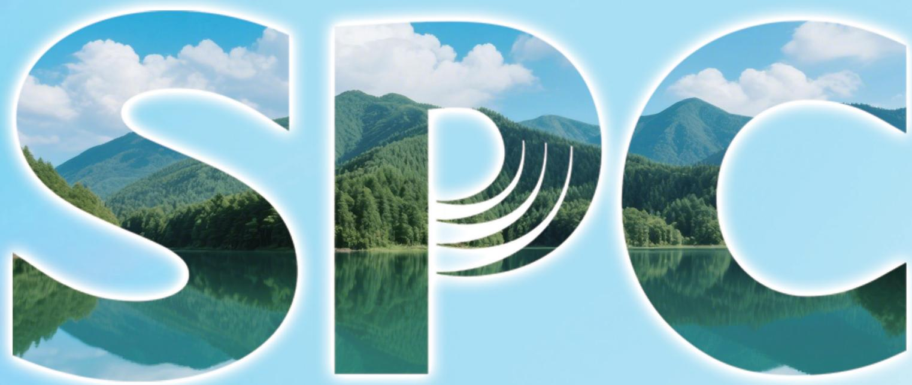

natural_image

Two large stylized 'SPOC' lettering over a forested mountain lake, with blue sky and white outlines (no text or symbols on the image itself)

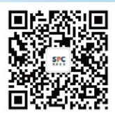  
北京清新环境技术股份有限公司

Beijing SPC Environment Protection Tech Co., Ltd

北京市海淀区西八里庄路69号人民政协报大厦11层

电话：010-88111168

传真：010-88146322

www.qingxin.com.cn

2025年度环境、社会和公司治理

(ESG) 报告

# CONTENTS

# 目录

MAKE THE WORLD FRESH FOREVER

# SPC 清新环境

# 二江世界清新永驰

关于本报告 02  
年度荣誉展示 04  
走进清新环境 08  
ESG 管理 14  
利益相关方沟通 14  
重要性议题分析 15

# 01 | 治理筑基 确保稳健发展 16

坚持党建引领 18  
完善公司治理 21  
严守合规底线 23  
健全风控体系 25  
恪守商业道德 26  
保护投资者权益 27

# 04|以人为本 打造幸福职场 54

员工权益保障 56  
助力员工发展 61  
关爱员工健康 62

# 02|创新驱动引领产业发展32

聚焦科技创新 34  
强化质量管理 38  
可持续供应链 39  
保障数字安全 40

# 05 同心筑梦 绘就和谐社会 66

助力乡村振兴 68  
履行社会责任 69  
行业担当 71

# 03|低碳同行共创绿色文化42

助力美丽中国建设 44  
落实环境管理 45  
加强节能减排 46  
规范废弃物管理 49  
保护生物多样性 51

# About the Report

# 关于本报告

M A K E T H E W O R L D F R E S H F O R E V E R

# 报告说明

《北京清新环境技术股份有限公司 2025 年度环境、社会和公司治理（ESG）报告》（以下简称“本报告”）是北京清新环境技术股份有限公司（以下简称“清新环境”“公司”或“我们”）及其附属公司发布的第三份环境、社会和公司治理（ESG）报告。本报告本着客观、规范、透明和全面的原则，向利益相关方展示公司在经济、环境、社会和公司治理等领域的实践和绩效。

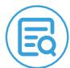

# 报告周期

本报告为年度报告。

# 报告边界

北京清新环境技术股份有限公司及其分子公司。

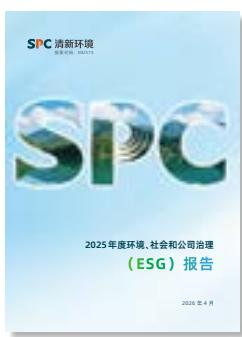

text_image

SPC清新环境
ESG报告（2025年）
SPC
2025年度环境、社会和公司治理
（ESG）报告
2026年4月

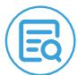

# 时间范围

报告时间范围为 2025 年 1 月 1 日至 2025 年 12 月 31 日，为增强报告内容可比性和完整性，部分内容往前后年度适度延伸。

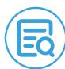

# 编制依据

本报告参考以下可持续发展信息披露标准或指南编制：

联合国可持续发展目标（SDGs）  
全球报告倡议组织（GRI）《可持续发展报告标准》（GRI Standards）  
《深圳证券交易所上市公司自律监管指引第1号--主板上市公司规范运作》  
《深圳证券交易所上市公司自律监管指南第3号--可持续发展报告编制》  
《深圳证券交易所上市公司自律监管指引第17号--可持续发展报告（试行）》

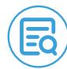

# 数据来源与可靠性保证

本报告的信息和数据主要来源于公司内部相关数据收集系统、正式报告、统计报告、工作报告及公开资料信息，所有信息已通过公司相关部门审核。公司保证本报告内容的真实、准确、完整，不存在任何虚假记载、误导性陈述或重大遗漏，并对其内容真实性、准确性和完整性负责。

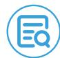

# 货币

本报告中所涉及货币种类及金额，如无特殊说明，均以人民币为计量单位。

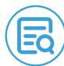

# 报告获取

本报告电子版可在公司官网（https://www.qingxin.com.cn）深圳证券交易所网站（http://www.szse.cn）、巨潮资讯网（http://www.cninfo.com.cn）查阅获取。

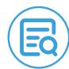

# 称谓说明

<table><tr><td>释义项</td><td>指</td><td>释义内容</td></tr><tr><td>股东会</td><td>指</td><td>北京清新环境技术股份有限公司股东大会</td></tr><tr><td>董事会</td><td>指</td><td>北京清新环境技术股份有限公司董事会</td></tr><tr><td>监事会</td><td>指</td><td>北京清新环境技术股份有限公司监事会</td></tr><tr><td>清新环境、公司、我们</td><td>指</td><td>北京清新环境技术股份有限公司</td></tr><tr><td>四川发展(控股)公司</td><td>指</td><td>四川发展(控股)有限责任公司</td></tr><tr><td>清新大气</td><td>指</td><td>北京清新环境大气技术有限公司</td></tr><tr><td>国润水务</td><td>指</td><td>四川发展国润水务投资有限公司</td></tr><tr><td>深水咨询</td><td>指</td><td>深圳市深水水务咨询有限公司</td></tr><tr><td>清新环保</td><td>指</td><td>北京清新环保技术有限公司</td></tr><tr><td>赤峰博元</td><td>指</td><td>赤峰博元科技有限公司</td></tr><tr><td>深水咨询</td><td>指</td><td>深圳市深水水务咨询有限公司</td></tr><tr><td>清新石化</td><td>指</td><td>北京清新石化技术有限公司</td></tr><tr><td>江苏安达</td><td>指</td><td>江苏安达环保科技有限公司</td></tr><tr><td>新疆金派</td><td>指</td><td>新疆金派环保科技有限公司</td></tr></table>

# 年度荣誉展示

致力于成为国内领先、国际知名的环境综合服务商

M A K E T H E W O R L D F R E S H F O R E V E R

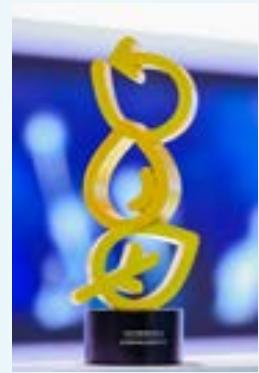

natural_image

Golden abstract sculpture with interlocking loops on a black base, set against a blurred blue background (no text or symbols visible)

2025 中国环博会

获评 2025 年中国环博会“百强企业”

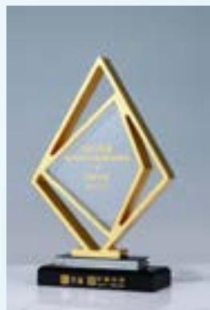

natural_image

Golden diamond-shaped trophy with engraved text, displayed on a black base (no visible text or symbols on the trophy itself)

中国 AI 赛道与 ESG 可持续发展大会

清新环境荣获“2025年度董办数字化创新最佳实践奖”

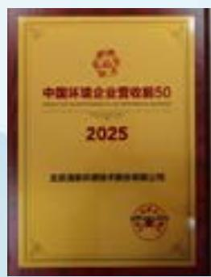

text_image

中国环境企业营收新50
2025
北京海联环保科技有限公司

全联环境服务业商会

清新环境荣获“2025年中国环境企业营收前50”

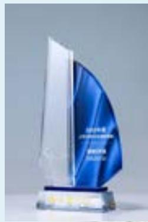

natural_image

Blue and white abstract sculpture on a pedestal, no visible text or symbols

中国 AI 赛道与 ESG 可持续发展大会

清新环境荣获“2025年度上市公司ESG价值传递奖”

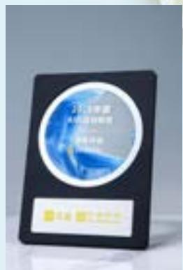

text_image

2018年
中国证券报
证券时报

中国 AI 赛道与 ESG 可持续发展大会

清新环境荣获“2025年度AI前沿创新奖”

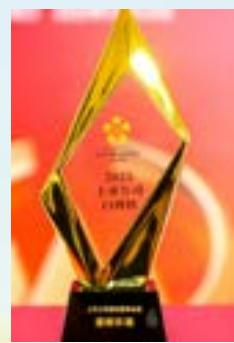

text_image

2021
上海公司
白玲珑
颁奖典礼

第十四届上市公司发展年会

清新环境荣获2025上市公司口碑榜“最佳董事会奖”

M A K E T H E W O R L D F R E S H F O R E V E R

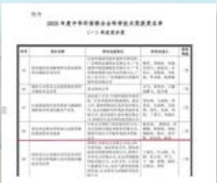

flowchart

This flowchart outlines the 2023 annual comprehensive management system workflow, detailing the process from initial reporting to final implementation.

中华环保联合会

清新环境荣获荣获中华环保联合会科技进步二等奖

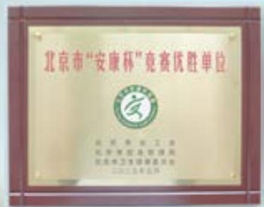

text_image

北京市“安康杯”竞赛优胜单位
北京安康赛
北京安康赛
北京安康赛
北京安康赛

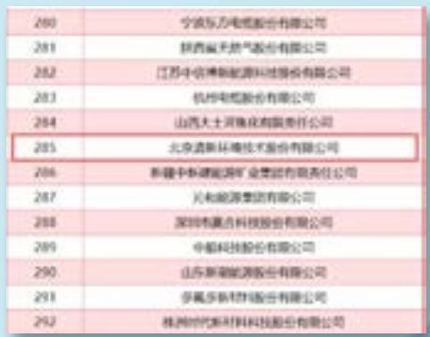

text_image

280 宁波东方电缆股份有限公司
281 拱西蓝天燃气股份有限公司
282 江苏中信博新能源科技股份有限公司
283 杭州电缆股份有限公司
284 山西大土河焦化有限责任公司
285 北京清新环境技术股份有限公司
286 新疆中泰建能源矿业集团有限责任公司
287 兰和能源集团有限公司
288 深圳市鑫吉科技股份有限公司
289 中船科技股份有限公司
290 山东新能能源股份有限公司
291 多氟多新材料股份有限公司
292 根洲时代新材料科技股份有限公司

中国能源报

清新环境进入中国能源企业 500 强

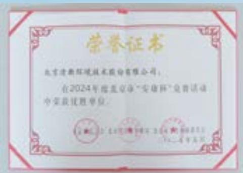

seal

北京清新环境技术股份有限公司
2024年德蓝京准“安踏杯”免费活动中荣获过胜单位

北京市总工会、北京市应急管理局、北京市卫生健康委员会联合颁发

清新环境荣获 2024 年北京市 “安康杯” 竞赛活动优胜单位

# 年度荣誉展示

致力于成为国内领先、国际知名的环境综合服务商

M A K E T H E W O R L D F R E S H F O R E V E R

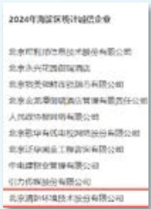

text_image

2024年海淀区统计诚信企业
北京和邦信信息技术股份有限公司
北京永兴花园商城酒店
北京物美和财信息服务有限公司
北京金源泰诚酒店管理有限责任公司
人民政协智明有限公司
北京蓝华有线电视网络股份有限公司
北京泛华润金工程咨询有限公司
中电建物业管理有限公司
引力传媒股份有限公司
北京清新环境技术股份有限公司

北京市统计局

清新环境荣获“2024年北京市统计诚信企业”称号

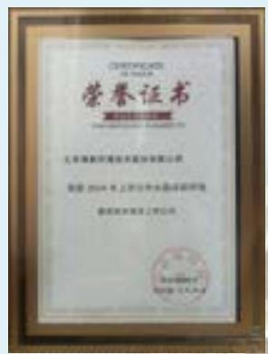

text_image

荣誉证书
七匹狼舞英雄队英雄队光荣
荣誉 2014年 上市优秀民族英雄队荣誉
国家机关驻上海市人民检察院

证券市场周刊

清新环境荣获 2024 年度上市公司技术进步奖

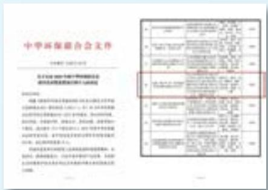

text_image

中华环保联合会文件
关于为2018年中期和下半年开展绿色金融
绿色金融高质量发展项目与战略规划
（一）公司治理结构
1. 企业类型：有限责任公司
2. 业务范围：一般经营项目：建筑、市政公用事业、科学研究、水利、环境、公共设施管理、公共教育、社会服务、文化体育、旅游、景区管理、综合管理、公共设施管理、公共教育、公共教育、公共教育、公共教育、公共教育、公共教育、公共教育、公共教育、公共教育、公共教育、公共教育、公共教育、公共教育、公共教育、公共教育、公共教育、公共教育、公共教育、公共教育、公共教育、公共教育、公共教育、公共教育、公共教育、公共教育、公共教育、公共教育、公共教育、公共教育、公共教育、公共教育、公共教育、公共教育、公共教育
3. 企业性质：有限责任公司
4. 业务范围：一般经营项目：建筑、市政公用事业、科学研究、水利、环境、公共设施管理、公共教育、社会服务、文化体育、旅游、景区管理、综合管理、社会服务、文化体育、旅游、景区管理、综合管理、社会服务、文化体育、旅游、景区管理、综合管理、社会服务、文化体育、旅游、景区管理、综合管理、社会服务、文化体育、旅游、景区管理、综合管理、社会服务、文化体育、旅游、景区管理、综合管理、社会服务、文化体育、旅游、景区管理、综合管理、社会服务、文化体育、旅游、景区管理、综合管理、社区服务
5. 企业类型：有限责任公司
6. 业务范围：一般经营项目：建筑、市政公用事业、科学研究、水利、环境、公共设施管理、公共教育、社会服务、文化体育、旅游、景区管理、综合管理、社会服务、文化体育、旅游
7. 企业性质：有限责任公司
8. 业务范围：一般经营项目：建筑、市政公用事业、科学研究、水利、环境、公共设施管理，城市基础设施建设，城市基础设施建设，城市基础设施建设，城市基础设施建设，城市基础设施建设，城市基础设施建设，城市基础设施建设，城市基础设施建设，城市基础设施建设，城市基础设施建设，城市基础设施建设，城市基础设施建设，城市基础设施建设，城市基础设施建设，城市基础设施建设，城市基础设施建设，城市基础设施建设，城市基础设施建设，城市基础设施建设，城市基础设施建设，城市基础设施建设，城市基础设施建设，城市基础设施建设，城市基础设施建设，城市基础设施建设，城市基础设施建
7. 企业类型：有限责任公司
8. 业务范围：一般经营项目：建筑、市政公用事业
9. 业务范围：一般经营项目：建筑、市政公用事业
10. 企业性质：有限责任公司
11. 业务范围：一般经营项目：建筑、市政公用事业
12. 企业类型：有限责任公司
13. 业务范围：一般经营项目：建筑、市政公用事业
14. 企业性质：有限责任公司
15. 业务范围：一般经营项目：建筑、市政公用事业
16. 企业类型：有限责任公司
17. 业务范围：一般经营项目：建筑、市政公用事业
18. 企业性质：有限责任公司
19. 业务范围：一般经营项目：建筑、市政公用事业
20. 企业类型：有限责任公司
21. 业务范围：一般经营项目：建筑、市政公用事业
22. 企业性质：有限责任公司
23. 业务范围：一般经营项目：建筑、市政公用事业
24. 企业类型：有限责任公司
25. 业务范围：一般经营项目：建筑、市政公用事业
26. 企业性质：有限责任公司
27. 业务范围：一般经营项目：建筑、市政公用事业
28. 企业类型：有限责任公司
29. 业务范围：一般经营项目：建筑、市政公用事业
30. 企业性质：有限责任公司
31. 业务范围：一般经营项目：建筑、市政公用事业
32. 企业类型：有限责任公司
33. 业务范围：一般经营项目：建筑、市政公用事业
34. 企业性质：有限责任公司
35. 业务范围：一般经营项目：建筑、市政公用事业
36. 企业类型：有限责任公司
37. 业务范围：一般经营项目：建筑、市政公用事业
38. 企业性质：有限责任公司
39. 业务范围：一般经营项目：建筑、市政公用事业
40. 企业类型：有限责任公司
41. 业务范围：一般经营项目：建筑、市政公用事业
42. 企业类型：有限责任公司
43. 业务范围：一般经营项目：建筑、市政公用事业
44. 企业性质：有限责任公司
45. 业务范围：一般经营项目：建筑、市政公用事业
46. 企业类型：有限责任公司
47. 业务范围：一般经营项目：建筑、市政公用事业
48. 企业性质：有限责任公司
49. 业务范围：一般经营项目：建筑、市政公用事业
50. 企业类型：有限责任公司
51. 业务范围：一般经营项目：建筑、市政公用事业
52. 企业性质：有限责任公司
53. 业务范围：一般经营项目：建筑、市政公用事业
54. 企业类型：有限责任公司
55. 业务范围：一般经营项目：建筑、市政公用事业
56. 企业性质：有限责任公司
57. 业务范围：一般经营项目：建筑、市政公用事业
58. 企业类型：有限责任公司
59. 业务范围：一般经营项目：建筑、市政公用事业
60. 企业性质：有限责任公司
61. 业务范围：一般经营项目：建筑、市政公用事业
62. 企业类型：有限责任公司
63. 业务范围：一般经营项目：建筑、市政公用事业
64. 企业性质：有限责任公司
65. 业务范围：一般经营项目：建筑、市政公用事业
66. 企业类型：有限责任公司
67. 业务范围：一般经营项目：建筑、市政公用事业
68. 企业性质：有限责任公司
69. 业务范围：一般经营项目：建筑、市政公用事业
70. 企业类型：有限责任公司
71. 业务范围：一般经营项目：建筑、市政公用事业
72. 企业类型：有限责任公司
73. 业务范围：一般经营项目：建筑、市政公用事业
74. 企业性质：有限责任公司
75. 业务范围：一般经营项目：建筑、市政公用事业
76. 企业类型：有限责任公司
77. 业务范围：一般经营项目：建筑、市政公用事业
78. 企业性质：有限责任公司
79. 业务范围：一般经营项目：建筑、市政公用事业
80. 企业类型：有限责任公司
81. 业务范围：一般经营项目：建筑、市政公用事业
82. 企业类型：有限责任公司
83. 业务范围：一般经营项目：建筑、市政公用事业
84. 企业性质：有限责任公司
85. 业务范围：一般经营项目：建筑、市政公用事业
86. 企业类型：有限责任公司
87. 业务范围：一般经营项目：建筑、市政公用事业
88. 企业性质：有限责任公司
89. 业务范围：一般经营项目：建筑、市政公用事业
90. 企业类型：有限责任公司
91. 业务范围：一般经营项目：建筑、市政公用事业
92. 企业类型：有限责任公司
93. 业务范围：一般经营项目：建筑、市政公用事业
94. 企业性质：有限责任公司
95. 业务范围：一般经营项目：建筑、市政公用事业
96. 企业类型：有限责任公司
97. 业务范围：一般经营项目：建筑、市政公用事业
98. 企业性质：有限责任公司
99. 业务范围：一般经营项目：建筑、市政公用事业

中华环保联合会

子公司深水咨询荣获 2024 中华环保联合会科学技术奖 - 科技进步一等奖

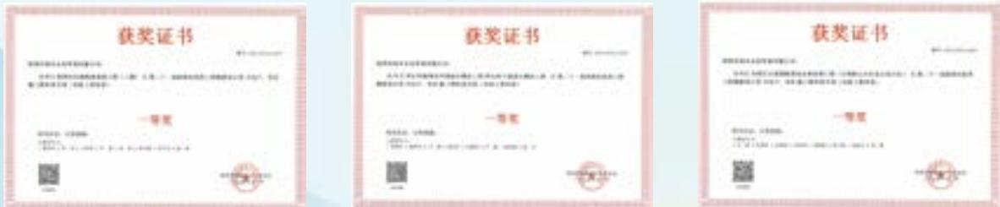  
深圳市勘察设计行业协会

子公司深水咨询荣获 12 项深圳市优秀工程勘察设计奖施工图审查专项奖

M A K E T H E W O R L D F R E S H F O R E V E R

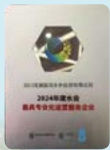  
E20 环境平台

子公司国润水务荣获“2024年度水业最具专业化运营服务企业”奖项

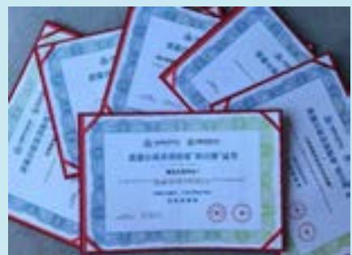

text_image

Scanned image of multiple Chinese certificates and documents, including a red border with red seals, arranged on a plain background.

E20 环境平台

子公司国润水务旗下南充文峰净水厂获得“双百跨越”污水处理标杆荣誉

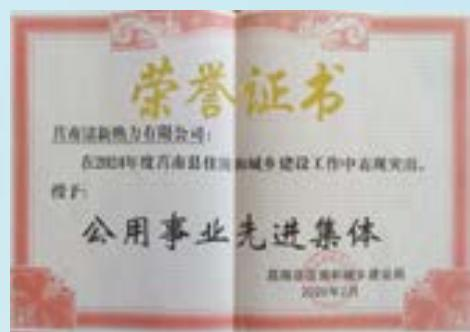

text_image

荣誉证书
昌南县新热力有限公司：
在2024年度昌南县住房和城乡建设工作中表现突出。
授予：
公用事业先进集体
昌南县住房和城乡建设局
2024年1月

临沂市莒南县住房和城乡建设局

子公司莒南清新荣获“公用事业先进集体”称号

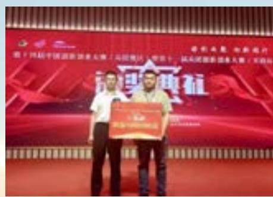

text_image

领导志愿 住宿银行
中国人民解放军北京站（沈阳地区）项目二队
武汉国家机关博物馆（沈阳站）
活动典礼

新疆生产建设兵团十二师

子公司金派固废荣获“第十四届中国创新创业大赛（兵团赛区）暨第十一届兵团创新创业大赛（天润杯）”三等奖

# 走进清新环境

致力于成为国内领先、国际知名的

环境综合服务商

M A K E T H E W O R L D F R E S H F O R E V E R

# 公司简介

北京清新环境技术股份有限公司（简称“清新环境”或“公司”）成立于2001年，2011年在深交所上市，2019年成为四川发展(控股)公司控股的混合所有制上市公司(股票代码：002573.SZ）。公司以火电烟气治理起家，全面拓展实现“工业环保+市政环保”双轮驱动，聚焦水务投资与运营、工业烟气治理与能源服务业务，是集技术研发、运营服务、装备制造、工程设计、施工建设为一体的综合性环保服务集团。“十五五”，公司坚持贯彻“聚焦主业、稳中求进、创新驱动、资本赋能”的发展方针，不断探索新业务新领域，全力打造国内领先的综合性服务平台公司。

截至目前，清新环境资产总额近250亿元，拥有167家分子公司，以及国家企业技术中心、博士后科研工作站、多个试验基地等，汇集节能环保行业精英六千余人。未来，清新环境将持续培育新质生产力，坚定不移助力美丽中国建设和国家“碳达峰、碳中和”目标的实现，致力成为国内领先、国际知名的环境综合服务商。

# 企业文化

# 企业使命

让世界清新永驻

# 企业愿景

致力于成为国内领先、
国际知名的环境综合服务商

# 企业价值观

创新 合作 至诚 担当

# 企业精神

初心 匠心 恒心

组织架构  
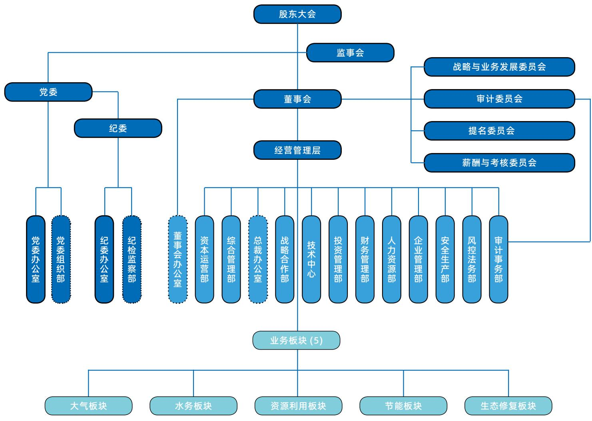

flowchart

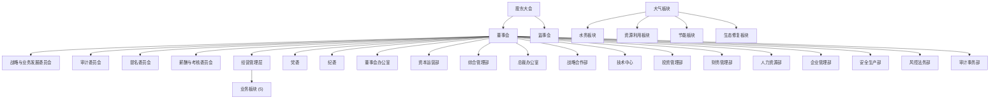

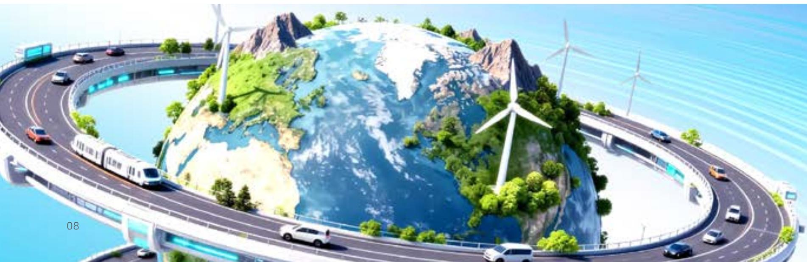

natural_image

Aerial view of a modern highway interchange with a large green island, wind turbines, and vehicles (no visible text or symbols)

二江世界清新永雅

# 发展历程

# 2001-2005 启航

# 2001 年 公司成立

公司前身“北京国电清新环保技术工程有限公司”成立

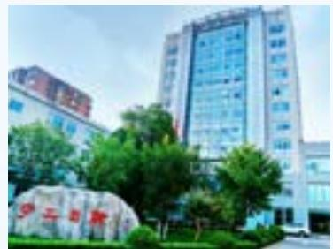

natural_image

Exterior view of a modern office building with high-rise architecture and green landscaping (no visible signage or text)

# 2003 年 自主技术获国家专利

旋汇耦合湿法脱硫技术获得国家专利，并被环保总局确定为国家重点环保实用技术

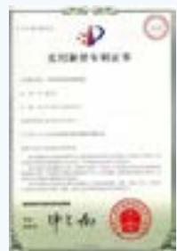

# 2005 年 技术与装备国产化

公司承建的河北陡河 #8 机组湿法脱硫装置成功投产，是我国实现该领域技术与重大装备国产化的标志

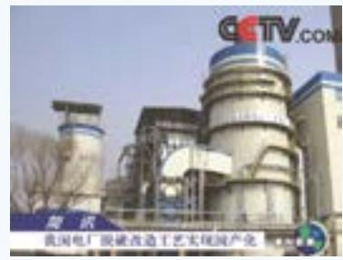

text_image

GCTV.COM
隆讯
我国电厂脱硫改造工艺实现国产化

# 2006-2010 征程

# 2008 年 签署首个特许经营项目

作为火电烟气治理第三方治理的首批践行者，公司签署了第一个特许经营项目--当时全亚洲最大现役火电机组内蒙古托克托电厂#1-#8机组4,800MW烟气脱硫特许经营合同

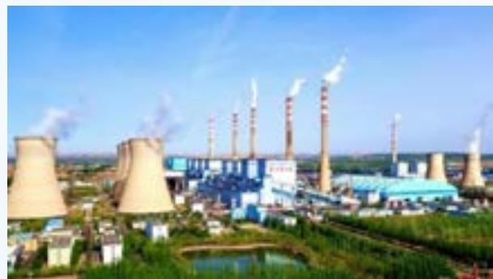

natural_image

Aerial view of a large industrial power plant with multiple cooling towers emitting smoke, surrounded by greenery and water bodies under a clear blue sky.

# 2011-2018 跨越

# 2011 年 成功上市

公司发展步入新篇章，4月在深圳证券交易所成功登陆中小板，成为业内知名的上市企业

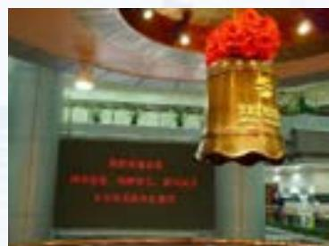

text_image

Photo of a golden bell on display in front of a blackboard with Chinese text, likely a ceremonial or promotional event.

# 2013 年 开展节能、非电业务

设立子公司：北京清新环境节能技术有限公司、赤峰博元科技有限公司，开展节能业务、非电领域工业烟气治理业务及煤焦油研发、加工、销售等资源综合利用业务

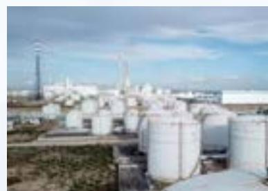

natural_image

Exterior view of an industrial storage facility with large white storage tanks and a tall tower in the background (no visible text or signage)

# 2014 年 SPC-3D 技术诞生

公司自主研发超低排放创新型技术--单塔一体化脱硫除尘深度净化技术（简称“SPC-3D技术”），并成为超低排放主流技术路线之一，为我国大型火电以低成本实现超净排放提供了创新性的解决方案

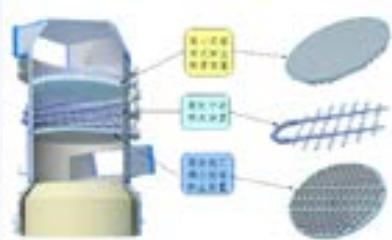

text_image

第一台精密模具
主轴：20mm
副轴：15mm
第三台精密模具

# 2020 年 荣获国家科学技术进步奖

1月10日，中共中央、国务院在京举行2019年度国家科学技术奖励大会，清新环境双项目首次荣获2019年度“国家科学技术进步奖”二等奖，体现了公司的技术进步和研发实力

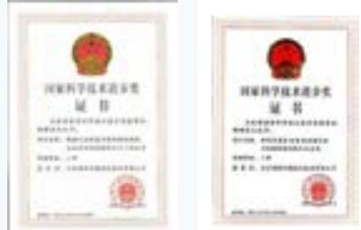

# 2020 年 进军危废领域

7月15日，公司正式进军危废产业，与四川省雅安市名山区成功签约危险废物集中处置项目。同年11月3日，公司危废处置项目第二单落地四川达州，与达州市人民政府成功签约《达州市危险废物集中处置项目投资协议》

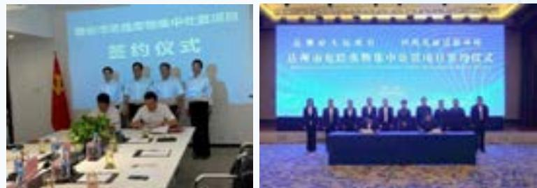

# 2019-未来 远航

# 2019 年 融入四川发展大家庭

4月28日，清新环境控股股东北京世纪地和公司与四川发展旗下国润环境（现更名为“四川省生态环保产业集团有限责任公司”）举行重大合作签约仪式，充分实现了民营资本与国有资本的优势互补、资源共享、合作共赢

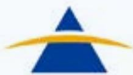

四川发展(控股)有限责任公司

Vietnam Development Holding Co., Ltd

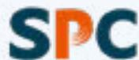

清新环境

# 2015 年 更名 “清新环境”

公司业绩取得跨越式增长，业务规模、营业收入及利润均创新高，并于6月5日（世界环境日），正式由北京国电清新环保技术股份有限公司更名为：北京清新环境技术股份有限公司（简称“清新环境”）。同期，公司无偿分享SPC-3D专利技术使用，彰显企业社会责任担当

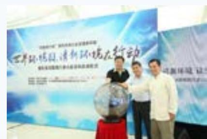

text_image

世界环境、清新环境大行动
■ 2023年1月1日

# 2018 年 烟气提水等创新技术多方应用

公司烟气提水技术在京能五间房电厂 2×660MW 机组成功应用，废水零排旋转雾化技术在兰铝电厂落地，SDS 干法脱硫技术在唐钢中厚板高炉煤气治理项目落地

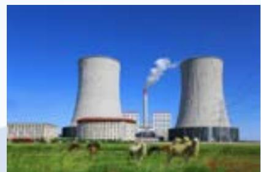

natural_image

Exterior view of a nuclear power plant with two cooling towers emitting steam, surrounded by grazing livestock under a clear blue sky (no signage or text visible)

# 2021 年 扩大工业节能业务规模

1月15日，公司与天壕环境股份有限公司签署合作协议，收购其16个余热发电项目。此次合作是清新环境大力布局工业节能环保平台的有利举措，可促进公司业务链的延伸，进一步扩大工业节能、余热回收利用业务规模，逐渐实现多元化

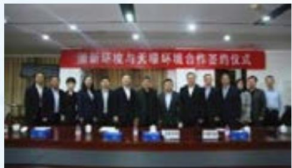

text_image

重新环境与土壤环境合作签约仪式

# 2021 年 布局大湾区 培育新动能

4月25日，公司与深圳市深水水务咨询有限公司举行股权合作签约仪式，携手合作推动双方高质量发展。“股权合作协议”的签署标志着清新环境布局粤港澳大湾区正式启航

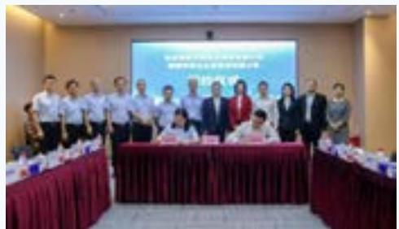

text_image

Group photo of officials at a formal meeting, with a large screen displaying Chinese text about a corporate event or agreement.

# 2022 年 清新环境技术中心被认定为国家企业技术中心

2月23日，国家发改委发布《2021年（第28批）新认定及全部国家企业技术中心名单的通知》，认定清新环境技术中心为“国家企业技术中心”，公司科研创新能力再上新台阶

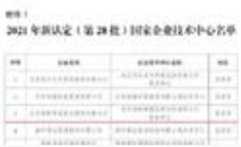

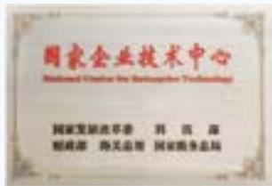

# 2022 年 实现余热发电 + 环保一体化

5月26日，国内首个实现煅烧炉余热发电、脱硫、脱硝、除尘、循环水减排及废水零排放六位一体的项目--清新环境山东平阴丰源炭素余热发电+环保一体化项目一次并网成功

# 2021 年 构建 “工业 + 市政” 环保新格局

7月30日，清新环境公告竞买国润水务 $100\%$ 股权成功，公司构建“工业环保 $+$ 市政环保”双轮驱动发展新格局的雏形渐显

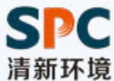

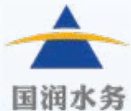

# 2023 年 发布首份 ESG 报告

4月29日，公司发布首份ESG报告，并荣获“中国上市公司ESG百强”奖项，充分体现了清新环境全面贯彻落实新发展理念，为中国ESG发展贡献力量的国企担当

text_image

Image featuring stylized 'EFC' logo and a glass trophy, likely for corporate or educational purposes.

# 2023 年 打破钢铁行业以 “湿电” 为基础的技术垄断

4月29日，公司发布首份ESG报告，并荣获“中国上市公司ESG百强”奖项，充分体现了清新环境全面贯彻落实新发展理念，为中国ESG发展贡献力量的国企担当

natural_image

Aerial view of a large industrial complex with two tall chimneys emitting blue and red smokestacks, surrounded by mountains (no visible text or signage)

# 2025 年 清新环境印发改革发展方案

2025年6月，清新环境出台改革发展方案，明确“市政 $+$ 工业”节能环保业务，聚焦水务投资与运营、工业烟气治理与能源服务两大传统业务，打造为公司健康经营、提供稳定现金流与核心利润的“压舱石”与“稳定器”，创新构建“产业孵化平台”，全力推展“第二增长曲线”。

text_image

中共北京新环境技术股份有限公司委员会文件
2017年1月1日（星期一）

# 2025 年 获中华环保联合会科技进步奖

清新环境《复杂高盐废水零排放与高值资源化技术成套设备》荣获2025年度中华环保联合会科技进步二等奖。

子公司深水咨询《流域“量-质-生”同步监测体系构建关键技术及应用》荣获2024年度中华环保联合会科学技术奖-科技进步一等奖。

text_image

中华环保联合会文件
主办单位：中国华电集团财务有限责任公司
董事会秘书：王建平
基金名称：华电集团财务有限责任公司
基金类型：股票型基金
基金运作方式：契约型开放式
基金合同生效日：2016年1月19日
存续期限：3年
募集资金划入基金托管专户的日期：2016年1月19日
募集份额：人民币1,000,000份
募集期间：2016年1月19日至2016年1月20日
募集金额：人民币1,000,000元
募集份额：人民币1,000,000份
募集期限：2016年1月20日至2016年1月21日
募集对象：国泰君安证券股份有限公司
募集份额：人民币1,000,000份
募集期限：2016年1月21日至2016年1月22日
募集对象：国泰君安证券股份有限公司
募集份额：人民币1,000,000份
募集期限：2016年1月23日至2016年1月24日
募集对象：国泰君安证券股份有限公司
募集份额：人民币1,000,000份
募集期限：2016年1月25日至2016年1月26日
募集对象：国泰君安证券股份有限公司
募集份额：人民币1,000,000份
募集期限：2016年1月27日至2016年1月28日
募集对象：国泰君安证券股份有限公司
募集份额：人民币1,000,000份
募集期限：2016年1月29日至2016年2月2日
募集对象：国泰君安证券股份有限公司
募集份额：人民币1,000,000份

# 2024 年 获评 “AA+” 主体信用评级

4月3日，公司被授予“AA+”主体信用评级，评级展望为“稳定”。本次获得“AA+”主体信用评级，体现了资本市场对公司综合实力、信用水平和发展前景的充分认可和坚定信心

text_image

2024年度
北京澳新环境技术股份有限公司
信用评估报告

# 2023 年 合规管理体系 “双标” 认证通过

9月25日，清新环境成为国内首家通过合规管理体系“双标”认证的环保上市公司，标志着公司合规管理水平已同时达到国家标准和国际标准的要求，公司合规管理水平迈上了新台阶

# 2023 年 壹级资质成功获批

12月6日，清新环境获批“环保工程专业承包壹级资质”，取得环保工程设计、承包“双甲”资质，标志着公司正式进入环保领域施工、设计双甲资质序列，为清新环境聚焦做强烟气治理核心技术应用奠定了坚实的基础

# ESG 管理

清新环境作为国有环保上市公司，公司积极落实国资委关于提高央企控股上市公司质量中关于做好 ESG 治理体系的相关要求，2025 年，公司强化董事会专门委员会职权，将可持续发展职能纳入董事会专门委员会，通过提升 ESG 管理顶层设计，明确决策、组织、实施各层级的工作内容及职责，确保将公司的可持续发展理念目标和对利益相关方的承诺，转化为各具体的行动任务分解落实，增强公众和利益相关方对企业可持续发展的信心。

凭借主业属性与国企治理双重优势，在环境绩效、社会责任、治理合规上充分体现可持续发展理念，服务国家乡村振兴、农村污水治理，双碳战略等，为实现绿色发展，助力全社会实现碳达峰、碳中和贡献力量。公司重视 ESG 报告披露，连续 4 年发布 ESG 年度报告。

利益相关方沟通

<table><tr><td>利益相关方</td><td>关注议题</td><td>沟通与回应</td></tr><tr><td>股东及投资者</td><td>■公司治理■风险管理</td><td>■股东周年大会 ■定期披露与报告■投资者见面会 ■投资者接待■调研及问卷</td></tr><tr><td>政府及监管部门</td><td>■合规运营 ■绿色运营■反商业贿赂与反贪污 ■污染物排放■社会责任(ESG)管理 ■循环经济</td><td>■常规问询 ■政策咨询■会面与汇报 ■现场考察■信息披露与报送</td></tr><tr><td>客户</td><td>■产品与服务安全与质量 ■创新驱动■数据安全与客户隐私保护 ■优化客户服务■环保技术与服务赋能绿色发展 ■社交平台</td><td>■官方网站 ■社交平台■实时通讯软件 ■服务热线■新闻及发布会 ■会议及活动邀请■项目合作与执行</td></tr><tr><td>供应商及合作伙伴</td><td>■供应链安全 ■城市环境服务■低碳节能服务 ■工业烟气治理■生态系统和生物多样性保护</td><td>■项目执行 ■供应商会议■商务谈判 ■现场调研与审核■项目合作与执行</td></tr><tr><td>员工</td><td>■员工权益与福利■人才培养与发展■职业健康与安全</td><td>■员工交流会 ■员工反馈渠道■办公软件 ■内部调查问卷■人力资源沟通</td></tr><tr><td>社区及公众</td><td>■环保公益■社会贡献■乡村振兴</td><td>■社交媒体沟通 ■公益活动■新闻及发布会 ■服务热线■志愿活动</td></tr></table>

# 重要性议题分析

公司始终准确、有效地回应各利益相关方关注的议题，为识别与管理自身风险及机遇提供重要参考。2025年，公司通过对标相关标准、相关政策及同业分析等方式，识别符合公司行业特点及自身业务模式的重要性议题，结合公司所处行业和经营业务特点，对议题清单中的议题开展财务重要性和影响重要性评估，在评估了各议题的影响、风险与机遇后，对结果进行整合汇总，得出矩阵。

<table><tr><td>具有影响重要性但不具有财务重要性(11项议题)</td><td>同时具有财务重要性与影响重要性(9项议题)</td></tr><tr><td>职业健康与安全人才培养与发展员工权益与福利数据安全与客户隐私保护社会责任 (ESG) 管理污染物排放循环经济生态系统和生物多样性保护供应链安全乡村振兴社会贡献</td><td>公司治理风险管理环保技术与服务赋能绿色发展绿色运营合规运营反商业贿赂与反贪污产品与服务安全与质量创新驱动</td></tr><tr><td>既不具有财务重要性也不具有影响重要性(1项)环保公益</td><td>优化客户服务城市环境服务低碳节能服务工业烟气治理</td></tr></table>

# 01 治理筑基 确保稳健发展

坚持党建引领

完善公司治理

严守合规底线

健全风控体系

恪守商业道德

保护投资者权益

联合国可持续发展目标（SDGs）响应

10、降低收入、性别、年龄、残疾、种族、宗教、民族等维度的不平等，促进包容与公平发展联合国 SDGs

近年来，清新环境严格遵守国资委对国企薪酬管理相关要求，在应届毕业生招聘、少数民族员工录用、男女员工比例等方面持续优化，公司少数民族员工516人，占员工总数8.18%。

16、建设和平包容的社会，保障所有人获得司法公正，建立各级有效、负责、包容的机构。公司建立以环保初心、技术创新、国企担当为核心，形成了完整的理念体系和企业文化。建立非歧视招聘制度，在招聘、录用、晋升、薪酬、培训中，不因性别、年龄、民族、宗教、户籍、残疾、婚姻状况等产生歧视。推行公平面试、匿名筛选，杜绝偏见与偏好。明确零容忍歧视、骚扰、霸凌，建立投诉渠道与处理机制。保障同工同酬、同岗同权，薪酬体系透明、规则统一

17、通过资金、技术、能力建设、贸易、数据与伙伴关系，为所有 SDGs 提供执行保障。
- 建立供应商信息平台

# 坚持党建引领

# 党建工作

坚持围绕中心抓党建、抓好党建促发展，以改革发展成果检验党建工作成效。牢固发展方向并兼顾短期经营与长期规划，聚焦主责主业，进一步明确“市政+工业”发展方向，着力拓展“第二增长曲线”。管好发展大局，完善“三重一大”制度和“三会”议事规则，进一步厘清各决策主体权责边界，规范企业治理。

# 报告期内，公司

召开党委会

29 次

审议“三重一大”事项

203 项

聚焦主责主业，进一步明确“市政+工业”发展方向，着力拓展”第二增长曲线“

开展“八大专项行动”，推动组建专班23个

修编废止各类规章制度 99 个，

完善“三重一大”制度和“三会”议事规则

# 干部管理

坚持党管干部原则，注重在改革发展、生产经营、重大项目一线考察识别干部。规范选用程序，强化监督管理，先后修订《中层管理人员管理办法》《中层管理人员选拔任用工作规程》等制度。激发内生动力，推动中层管理人员竞聘上岗和员工双选工作，优化薪酬绩效管理办法和考核体系，强化绩效考核结果运用，干部能上能下、员工能进能出、收入能增能减的用人导向初步形成。

# 报告期内，公司

主持研究人事议案

41 件 114 人次

新任中层干部

14人

# 配齐

中层副职

# 完善

人才梯队建设

全系统规范发展 同比增长

30名党员

50%

全体系人事档案集中管理

129份

专审

84 人次

因私护照纳入集中管理

385 份

# 党建活动

深化理论武装，制定中心组年度学习计划，聚焦党的二十届三中、四中全会和习近平总书记重要讲话精神等。严格政治纪律，扎实开展深入贯彻中央八项规定精神学习教育。严肃政治生活，高质量召开年度民主生活会，认真落实“三会一课”、民主评议党员等基本制度。

# 报告期内，公司

举行中心组学习

6 次

第一议题学习

26 次

专题学习

7 次

覆盖

800 余人次

推动党建带群团，开展爱心“托管班”“走基层、送温暖”等活动  
■ 举办羽毛球联谊赛、职工运动会等文体活动，凝聚团队合力  
获评北京市“劳动模范”和金牛工匠各1人

# 召开“两优一先”表彰大会，庆祝中国共产党成立104周年

7月3日，为庆祝中国共产党成立104周年，扎实推进深入贯彻中央八项规定精神学习教育走深走实，表彰先进、选树典型，清新环境党委召开2024-2025年度“两优一先”表彰大会。

# 纪念中国人民抗日战争暨世界反法西斯战争胜利80周年

9月3日，为纪念中国人民抗日战争暨世界反法西斯战争胜利80周年。清新环境组织各级党组织，广大干部职工集中收看了大会盛况，共同回顾抗战历程、聆听习近平总书记重要讲话、观看阅兵仪式。

# 完善公司治理

# 三会运作

公司始终将规范、高效的公司治理作为可持续发展的基石。2025年，公司以打造“科改示范”标杆企业和国企改革深化提升行动为契机，严格遵循《中华人民共和国公司法》《上市公司治理准则》等法律法规及规范性文件，系统开展《公司章程》及“三会”议事规则的修订工作。公司通过持续优化股东会、董事会、监事会的运作机制，不断提升治理效能、强化风险监督，切实保障全体股东的合法权益，推动公司治理水平再上新台阶。

# 股东会

股东会作为公司的最高权力机构，其权威性与有效性在2025年得到进一步巩固。公司严格依法依规履行会议召集、通知、议案审议及表决程序，确保每一项决议均具备坚实的法律基础与程序正当性。为切实保障股东权利，特别是中小股东的参与权，积极鼓励并保障股东通过现场及网络等多种方式行使表决权。同时，公司持续强化会前、会中及会后的信息披露质量与时效性，确保所有股东能够公平、及时、准确地获取信息，营造了更为透明、公正的决策环境，使股东会真正成为凝聚股东共识、决定公司未来的核心平台。

# 报告期内，公司

共召开股东会 5 次，

累计审议议案24项

# 董事会

2025 年，公司紧跟监管政策导向，深化董事会规范化建设与多元化发展。本年度，董事会补充更新了新的董事会力量，新加入的董事有电力环保与低碳领域、智能机器人与复杂系统控制等领域专家。其加入清新环境，能直接赋能“智能环保装备”的技术创新，助力公司实现“传统环保向智能环保”的战略转型。

依据新《公司法》及《上市公司治理准则》要求，优化董事会结构与专门委员会设置，并同步修订了《董事会议事规则》，进一步明确了董事会的决策程序、会议机制与履职要求，提升了董事会运作的规范性与决策效率。为适应公司战略发展的需求，明确公司发展规划，完善投资决策流程，保障公司科技创新战略的顺利实施等，根据《公司章程》相关规定，将董事会战略与业务发展委员会更名为董事会战略与业务发展（科技创新）委员会，新增了对公司科技发展和科技创新、中长期技术发展规划方案以及重大技术投资和研发项目的研究与建议职责，以更好地支持公司科技创新战略的有效执行。

# 报告期内，公司

<table><tr><td>董事会成员</td><td>共召开董事会</td><td>审议议案</td></tr><tr><td>8名</td><td>14次</td><td>49项</td></tr></table>

董事会成员  

donut

| Category | Percentage | Count |
| --- | --- | --- |
| 女性董事 | 12.50% | N/A |
| 独立董事 | N/A | 3名 |
| 非独立董事 | N/A | 5名 |
| 男性董事 | 87.50% | N/A |

# 监事会

2025 年，监事会严格遵循相关议事规则，持续增强监督职能的主动性与有效性。年底，根据国资管理要求，公司完成治理结构优化，推进监事会改革工作，由董事会下设的审计委员会全面承接监督职责。审计委员会自 2025 年底起，承接原监事会的监督职责，依法独立行使监督权，成为保障公司稳健运营的重要力量。审计委员会严格遵循相关议事规则，持续增强监督职能的主动性与有效性。

# 报告期内，公司

<table><tr><td>监事会成员</td><td>共召开监事会</td><td>审议议案</td></tr><tr><td>3名</td><td>7次</td><td>14项</td></tr></table>

# 严守合规底线

# 合规体系建设

公司严格遵守《中华人民共和国公司法》等法律法规及监管要求，修订了《北京清新环境技术股份有限公司内部控制制度》《北京清新环境技术股份有限公司合同管理办法》等制度，坚守合规管理底线，构建科学有效的合规管理体系，明确合规管理责任主体与职责分工，系统性推进制度建设与机制优化，确保合规要求贯穿决策、执行与监督全过程。

报告期内，公司对深化合规管理进行全面梳理、系统分类，发布并更新了《治理主体权责清单》，更新了《合规风险清单》《合规义务清单》《合规负面清单（禁止性）》，对岗位合规职责进行细化，同时将合规管控要求和措施嵌入关键流程节点中，构建了完善的合规管理体系，强化了监督职能，实现二者的有机协同，推动企业规范运营。

# 持续推进风控合规工作

为进一步推进风控合规工作，持续强化公司风控合规管理，印发了《风控合规工作推进方案》，通过设立公司首席风控合规官、压实风控合规人员履职，夯实了公司本部的风控合规体系。并在各直属子公司的领导班子成员中设立直属子公司风控负责人，健全各直属子公司的风控合规体系。

2025 年 11 月，公司顺利通过了中国质量认证中心（CQC）对公司合规管理体系运行情况的监督审核，保证公司合规管理体系的持续有效运行，确保合规认证证书的有效性。

# 加强合规文化建设

公司秉持“树立全员合规观念，筑牢全域合规防线”的核心理念，将合规文化建设作为企业治理的重要战略任务，持续推动合规文化在企业内部的深度

渗透与全面落地。公司通过系统性构建合规教育体系、多层次宣传机制及制度化保障措施，将合规要求内化为全体员工的行为准则，外化为企业运营的基本规范。

2025 年 2 月，为提升公司脱硫脱硝投资业务审查质量，强化业务合规及风险防控，为相关业务审核要点及思路提供参考，根据相关法律法规、公司制度等规范性文件，编制《脱硫脱硝投资业务风控合规指引》并进行了宣贯。

# 报告期内，公司

共计组织普法宣传栏学习

13 次

开展法务、风险、合规、内控等专题培训

2 次

组织《合规权责清单》宣贯

1 次

组织合规管理体系“三张清单”宣贯

2 次

组织制度宣贯

4 次

清新环境召开 2025 年度合规委员会会议  

natural_image

Interior view of a conference room with attendees seated around a long table (no visible text or signage)

2025 年 2 月，根据《合规委员会管理制度》和合规管理体系认证监督审核要求，清新环境合规委员会召开 2025 年年度工作会议，听取 2024 年合规管理工作情况汇报，审议通过 2025 年合规管理工作计划。

召开企业合规管理法律业务暨合规负面清单培训会  

text_image

Meeting room scene with participants seated around a table, large screen displaying Chinese text and data, and a green banner in the background.

为推动公司合规管理，强化风险防控，全面提升依法合规经营管理水平，安排公司常年法律顾问律师事务所举办了两期“企业合规管理法律业务暨合规负面清单”专题培训会。

# 健全风控体系

# 深化内控风险管理

公司持续优化治理结构，强化内部控制，致力于打造“依法治理、合规经营、规范管理、诚信从业”的企业文化，为高质量发展提供坚实的制度保障，构建“法治清新”的企业品牌。

为有效防范内控风险、规范采购管理，公司依据相关法规修订了《物资与服务采购管理办法》，统一了全流程标准，强化了风险防控，提升了招采工作的规范化与精细化水平。

同时，公司通过完善风控组织架构、优化决策机制、强化内部审计，构建了覆盖战略、运营、财务及合规的立体化风控体系。该体系包括定期的风险识别评估和明确的风险监控预警报告机制，以系统化管控各类风险。

# 风控文化建设

公司高度重视风控文化建设，通过健全制度体系与文化机制，推动风险防控理念深度融入企业运营与管理全过程。为确保风控要求的落地执行，公司系统性梳理内部控制流程，制定标准化操作规范，并将风控知识纳入员工分层分类培训体系，构建覆盖全员的培训机制。

# 报告期内，公司

加强员工法律知识和职业道德教育

引导员工遵循良好的行为准则和道德规范，增强风险防控意识

建立健全重大法律纠纷案件备案制度及案例分析警示制度

# 恪守商业道德

# 反腐倡廉

公司严格遵循《中华人民共和国监察法》《中华人民共和国监察法实施条例》《国有企业领导人员廉洁从业若干规定》等法律法规及党内规范性文件的要求，深入推进党风廉政建设和反腐败工作。公司进一步加强纪检队伍建设、健全廉洁监督机制，完善《北京清新环境技术股份有限公司基层党组织纪检委员工作细则》《北京清新环境技术股份有限公司内部协同监督实施办法》等制度文件，为纵深推进全面从严治党提供坚实的制度保障。

开展党风廉政建设专题工作会  

text_image

北京海润汇通技术股份有限公司
2021年党风廉政建设暨党建工作会

2025 年 3 月，公司召开 2025 年度党风廉政建设工作会。会上，集中观看了警示教育片《风腐同查同治》，传达学习党风廉政建设工作会精神，并安排部署 2025 年党风廉政建设工作。相关负责人现场签订《党风廉政建设责任书》。

# 保护投资者权益

# 信息披露

公司高度重视信息披露工作的合规性与透明度，严格遵守法律法规及监管要求，建立健全包括《信息披露管理制度》《信息披露暂缓与豁免管理制度》在内的制度体系。通过持续强化制度执行与内部监督，公司不断优化重大信息的内部报告、流转、审核及披露流程，明确各部门与岗位的职责分工，加强对信息审核与发布环节的管控，从而构建起科学、高效、规范的信息披露管理体系，切实保障信息披露的真实性、准确性、完整性与及时性。

在提升信息披露质量的基础上，公司积极拓展信息披露的广度和深度，注重内容的前瞻性与系统性。公司通过定期组织信息披露专项培训与合规审查，持续提升相关岗位人员的专业能力与责任意识，确保其能够充分理解并执行信息披露要求。同时，公司动态跟踪监管政策与市场环境变化，及时调整和优化信息披露策略与内容，使披露工作不仅满足合规需要，更有效向投资者传达公司的长期价值与可持续发展潜力。

为切实维护投资者合法权益，公司建立了多渠道、常态化的沟通机制，主动保持与监管部门及投资者的密切交流。通过及时、公平地披露重大事项与经营进展，公司致力于保障所有市场参与者平等获取信息的权利，增强市场对公司治理与经营情况的信任。未来，公司将继续完善信息披露体系，以高质量的信息披露作为提升治理水平、防范合规风险、推动公司实现高质量发展的重要支撑。

# 报告期内，公司

披露公告

158 则

其中，临时公告

152 则

定期报告

6 则

# 章程与议事规则优化

■股东权利保障: 公司在《股东会议事规则》中明确, 股东按其持有的股份享有平等的权利和义务, 并严格保障中小股东对重大事项的表决权、提案权及质询权。根据公司新修订的《公司章程》, 为进一步保障中小股东的合法权益, 现将有权提出临时提案的股东持股比例门槛, 由原规定的“单独或合计持有公司3%以上股份”下调至“单独或合计持有公司1%以上股份”。修订后, 符合条件的股东仍可在股东大会召开十日前提出临时提案, 且公司不得提高该持股比例要求。此举旨在降低股东行使权利的壁垒, 切实加强对中小股东权益的保护。

■ 累积投票制：公司股东大会在选举两名以上董事或监事时，明确实行累积投票制。中小股东可将其表决权集中投给一名或分散投给数名候选人，以提升中小股东代表在董事会、监事会中的当选概率。

# "关键少数" 约束

■控股股东及实控人行为规范：公司通过《融资与对外担保管理办法》等制度严格规范关联方行为，明确规定控股股东、实际控制人应当维护公司在担保方面的独立决策，不得强令、指使或要求公司违规提供担保，不得违规占用公司资金或进行利益输送。若发生违规行为，将依法承担相应赔偿责任。

■独立董事治理：公司独立董事占董事会成员比例不低于三分之一，且至少包括一名会计专业人士。独立董事对关联交易、利润分配、对外担保、重大重组等可能损害中小股东权益的事项发表独立意见，其中应当披露的关联交易等重大事项需经全体独立董事过半数同意后，方可提交董事会审议。

# 股东权利征集机制

■征集主体与便利性：根据相关规定及公司治理实践，公司支持董事会、独立董事、持有百分之一以上有表决权股份的股东以及投资者保护机构作为征集人，公开请求股东委托其代为出席股东大会，并代为行使表决权、提案权等权利，为中小股东参与公司决策提供便利。

# 现金分红制度化

■分红比例与形式：根据公司《未来三年股东回报规划（2023-2025年）》，公司在当年盈利且累计未分配利润为正的情况下，优先采取现金方式分配股利，每年以现金方式分配的利润不少于当年实现的母公司可供分配利润的 $10\%$ 。公司最近三年以现金方式累计分配的利润不少于最近三年实现的年均可分配利润的 $30\%$ 。

■分红频率：在具备现金分红条件的前提下，公司原则上每年度进行一次现金分红。同时，董事会可以结合公司盈利情况及资金需求状况提议进行中期分红或预分红，以增强回报的及时性。差异化分红政策：公司董事会将综合考虑所处行业特点、发展阶段、自身经营模式、盈利水平以及是否有重大资金支出安排等因素，区分情形并按照公司章程规定的程序，提出差异化的现金分红政策。

■低分红披露机制：若公司符合现金分红条件但未提出现金分红方案，或现金分红比例偏低时，董事会将在定期报告中披露具体原因以及未用于分红的资金留存公司的用途，独立董事将对此发表独立意见，并接受监管问询。例如，2024年度因公司业绩亏损，为保障持续稳定健康发展，拟不安排现金分红，公司已在公告中充分说明原因。

# 股份回购与股权激励

■ 股份回购机制：公司严格依照《公司法》及公司章程规定实施股份回购。当公司股价低于每股净资产或严重偏离内在价值时，公司可根据实际情况启动回购程序。回购股份可用于减少注册资本（注销）或股权激励。从历年实践看，公司股份回购主要用于激励计划中离职或业绩未达标人员的限制性股票回购注销，以减少注册资本，从而提升每股收益。

■ 股权激励与业绩挂钩：公司 2022 年限制性股票激励计划已建立严格的考核体系。激励对象的权益分批次解除限售，与公司层面业绩及个人层面绩效考核结果紧密挂钩。例如，因 2023 年公司层面第二个解除限售期业绩考核目标未完成，公司已对相应批次限制性股票进行回购注销，有效避免了短期激励可能引发的利益输送。

natural_image

Illustration of a balance scale on an open book with green and blue arrows indicating direction (no text or symbols)

# 降低维权门槛，落实“民事赔偿优先”

# 支持集体诉讼与先行赔付

■配合特别代表人诉讼：根据公司《投资者关系管理制度》，公司应配合支持投资者保护机构开展维护投资者合法权益的相关工作，包括支持特别代表人诉讼等维权活动，为中小股东依法维权提供便利，降低维权成本。  
■风险保障机制：公司已建立风险管理体系，为公司和全体董事、监事、高级管理人员购买责任保险，赔偿限额不高于人民币5,000万元/年，以降低运营风险，保障公司和投资者的权益。如发生因虚假陈述、欺诈发行等行为导致的投资者损失，公司将依法督促控股股东、实际控制人或相关责任人承担相应赔偿责任。

# 纠纷多元化解

■调解机制：根据公司制度，公司与投资者之间发生的纠纷，双方可以向调解组织申请调解。投资者提出调解请求的，公司应当积极配合。  
■衔接机制：公司支持通过"调解-仲裁-诉讼"相衔接的多元化纠纷解决机制，快速、高效处理投资者纠纷，切实维护投资者合法权益。

# 投资者诉求处理

■维权专线设置：公司设立投资者咨询电话（010-88146320）、传真和电子邮箱等，保证对外联系渠道畅通，咨询电话在工作时间有专人认真友好接听。  
■处理时限与反馈：公司建立投资者诉求处理工作机制，组织及时妥善处理投资者咨询、投诉和建议等诉求，并通过有效形式及时向投资者反馈相关信息，确保投资者关切得到及时回应。

# ——证世界清新永强

# 投资者关系管理

公司高度重视与投资者及利益相关方的长期互信关系，将规范、透明、高效的投资者关系管理视为公司治理的重要支柱。为系统化推进此项工作，公司依据监管要求并结合自身实际，制定并严格执行《投资者关系管理制度》，明确管理职责、沟通原则与活动规范，通过制度化、流程化的管理框架，确保所有投资者关系活动在合规、公平、透明的原则下开展为构建稳定可持续的投资者关系奠定坚实基础。

# 投资者关系

flowchart

规范  
透明  
高效

# 重要支柱

为拓展沟通广度与深度，公司积极构建并持续优化多元化、立体化的沟通平台。通过定期举办业绩说明会、组织投资者实地调研、维护官方网站及投资者关系专栏、设立投资者服务热线、及时回应深圳证券交易所互动易平台提问，以及开展分析师会议与路演活动等多种渠道，公司主动向市场传递包括战略规划、经营业绩、重大事项及行业洞察在内的关键信息。这一全方位、多层次的沟通体系旨在保障所有投资者能够及时、公平、准确地获取信息，有效行使知情权与参与权。

未来，公司将持续完善投资者关系管理的长效机制，致力于提升沟通的针对性与有效性。通过动态关注投资者关切与市场反馈，公司将不断优化沟通内容与方式，积极传递公司的投资价值与可持续发展理念。公司坚信，卓有成效的投资者关系管理不仅有助于维护投资者的合法权益，增强市场信任，更能为公司的长期健康发展营造良好的外部环境，最终实现与投资者的价值共享与共同成长。

# 02 创新驱动 引领产业发展

聚焦科技创新

强化质量管理

可持续供应链

保障数字安全

联合国可持续发展目标（SDGs）响应

8体面工作和经济增长

9 产业、创新和基础设施

12 负责任消费和生产

# 聚焦科技创新

研发投入及荣誉  

donut

| 项目类型 | 数量 (项) | 研发投入 (亿元) |
| :--- | :--- | :--- |
| 在研项目 | 173 | 1.41 |
| 新立项目 | 84 | 79 |
| 重点新立项目 | 11 | 17 |

■科研项目及投入：截至2025年底在研项目173项，研发投入1.41亿元，完成研发投入目标。  
■其中：2025年新立项目84项，在研项目79项。重点新立项目11个，在研项目17个。

■科技荣誉：荣获中华环保联合会科技进步奖、广东省市政行业协会科学技术奖一等奖、广东省水利学会水利科学技术奖三等奖、减污降碳协同增效先进示范工艺、广东省名优高新技术产品等13项科技奖项。

■技术标准：参与制定并下发《膜生物反应器有机平板膜组器》（GB/T 46604-2025）、《水处理剂 阳离子型聚丙烯酰胺》（GB/T 31246-2025）、《移动实验室 第一部分：通则》（GB/T 29479.1-2025）、《等离子体处理危险废物技术及评价要求》GB/T45609-2025。

natural_image

Illustration of a stylized globe with green leaves and a small figure, symbolizing eco-friendly or sustainable development (no text or symbols)

# 创新团队

根据公司战略和新形势下的市场环境，聚焦激发创新活力，提升公司综合创新能力，保持研发投入强度增幅，提高人均高价值发明专利拥有数量，培育高水平领军型创新科研团队，形成公司业务战略全面匹配的科技人才结构，提升清新创新体系运行质量和整体效能。科研面向市场，公司化改革完成科研人员下沉，打造清新环境科技创新生态，实现科技创新管理研发分离，加强各业务板块的科研考核和督导，全面激发创新活力、壮大科技创新主体。以产学研合作为纽带，构建“育用留”人才体系。

# 截至报告期末，公司

研发人员数量

212人

占比

3.36%

funnel

| 类别 | 细分项 | 人数 |
| --- | --- | --- |
| 研发人员 | 2025年研发人员 | 212人 |
| 年龄 | 30岁以下 | 30人 |
| 年龄 | 30-40岁 | 110人 |
| 年龄 | 40岁以上 | 72人 |
| 学历构成 | 博士 | 10人 |
| 学历构成 | 硕士 | 45人 |
| 学历构成 | 本科 | 117人 |
| 学历构成 | 其他 | 40人 |

# 创新激励

清新环境秉持“面向未来、面向市场、面向需求”的科研创新宗旨，致力于激发科研人员创新热情，确保公司持续创新能力的提升。为此，梳理科技创新相关制度，构建了更全面、灵活的、完善的创新激励机制，修订《北京清新环境技术股份有限公司科技创新管理办法》，涉及科技创新规划、科技创新计划、科研及首台套项目、技术评审、科技创新激励、科研平台建设、知识产权管理，设立涵盖外部科技奖励、科技创新奖励、科技成果转化奖励、首台套奖励、技术改造奖励、试验基地奖励等多层次科研创新奖项，全面激励科研人员的积极性与创造性。为提升公司核心竞争力，切实贯彻科研面向市场，加大科技创新有效投入，规范科技创新工作管理体系，促进科技成果转化。

# 产学研合作

积极推动产学研深度融合，促进科研与产业链资源优势互补、紧密协作，促进科研成果转化。坚持科研面向市场，全面树立科研人员“首战即决战”意识。对公司战略业务，加大科技创新投入及核心技术攻关，建设高水平创新团队，培养、引进高精尖人才和高水平创新团队。对前沿的科技创新，加强高校、科研院所联合培养，广泛开展产、学、研合作，发展高水平联合体，推进产学研用一体化。

在推动产学研融合方面，公司积极与高校和科研机构合作，实现科研与产业链的优势互补。2025年，公司与清华大学、华北电力大学等签署合作协议，并与西南石油大学、广州大学等在水处理领域开展联合技术研究。此外，公司还与成都信息工程大学、中国民用航空飞行学院等在人工智能大气监测管治系统领域进行深度探索。

natural_image

Abstract 3D illustration of a white paper roll with blue and orange components, no text or symbols present

# 产学研合作

1. 清新环境博士后工作站：与华北电力大学动力工程及工程热物理博士后流动站联合招收博士后，开展《相变熔融盐微胶囊储热材料研究》博士后科研课题研究。  
2. 子公司深水咨询：与清华大学深圳国际研究生院联合研发“基于城市河流生境评价及生态多样性修复关键技术研发”。  
3. 子公司深水咨询：与广州大学联合开展基于多模态数据融合的污泥调理药剂智能精准投加系统研究。  
4. 子公司国润水务：与西南石油大学联合开展《低碳智慧型精确供气曝气分配与控制系统技术研究产学研项目》。  
5. 子公司国润水务：与农业农村部成都沼气科学研究所联合开展《基于机器学习和 AIoT 的污水数智化控药系统研究与示范应用产学研项目》。  
6. 子公司江苏安达：与盐城师范学院联合开展《基于亚铁基离子液体的高效低碳脱硝除尘一体化技术研发》项目研究。  
7. 子公司天晟源：与成都信息工程大学、西南石油大学、中国民用航空飞行学院联合开展《基于人工智能的大气监测管治系统的研究与应用》。  
8. 子公司西藏晟源：与四川大学联合开展《阻控藏区高海拔矿渣堆重金属迁移生物新材料研制及示范应用》。

# 知识产权保护

公司高度重视科技创新与知识产权管理，经过多年技术沉淀与工程实践，已积累大量自主知识产权核心技术。积极倡导知识产权保护理念，充分尊重他人知识产权，注重防范知识产权侵权风险，严格遵循国家级创新平台标准，推进科研信息平台建设。通过系统化知识产权管理与综合科研信息整合，公司全面强化科研实力与创新能力，确保技术成果的高效转化与应用。同时，公司注重知识产权风险防控，通过专利布局、侵权预警及合规审查机制，保障技术创新活动的合法性和安全性，为持续提升核心竞争力提供坚实保障。

# 截至报告期末，公司

持有专利

其中发明专利

1012项

149项

实用新型专利

841项

持有外观设计

持有软件著作权

22项

303 项

# 数字化建设

积极响应数字化转型的号召要求，充分结合公司业务实际，组织开展公司生产经营全要素智慧运营平台系统建设。高效赋能生产经营管理工作，提质降本增效，提升清新环境数字核心竞争力。

# 生产管控平台的推广实施，提升环保岛、余热发电数字化智能化水平

text_image

Control room interior with large display screen showing Chinese text and computer monitors

截止2025年12月完成22家分子公司生产管控平台的推广实施，极大地提高了生产工艺的自动化水平，切实打通了管理平台与业务单元的数字化管理通道，规范了生产作业流程和员工工作行为，创造了安全、健康的工作环境，提高了生产效率，节约了生产成本，增强了公司综合竞争力。

# 智慧物联网安全用电系统应用

为切实提高人员密集场所用电安全，公司在新疆金派和赤峰博元等子公司试点应用智慧物联网安全用电系统，运营项目风险用电防控能力得到显著提升。同时，该系统能实现精细化能耗监测分析（分区域、分线路、分时段），精准识别能耗异常和浪费点，优化设备运行策略（如空调、照明），避免非生产用能的浪费。

# 强化质量管理

# 质量管理体系

清新环境下强化质量管理，坚持“质量为先、服务为本”的核心理念，将服务质量贯穿于企业经营管理的各个环节。持续优化全面质量管理体系，修订并实施《质量、环境、职业健康安全管理手册》等一系列体系文件与制度，建立起职责清晰、流程规范、运行有效的质量管理架构，为实现服务质量持续提升提供制度保障。报告期内公司严控设备检修质量的检查、验收管理、职责、管理内容与方法，使检修质量得到全面有效控制，提高了设备可靠性，提升检修质量；对承包商进行资格、能力、信誉的审查及合同执行后评价，确保过程方法，优选符合要求的承包商。

# 质量考核

公司每年制定明确的质量目标与考核指标，加强过程监督控制，开展质量绩效评价，提高工程建设质量，将质量管理目标作为公司年度绩效考核重要指标。通过过程监督与结果考核相结合的方式，推动全员质量责任落实，并对在质量提升、技术改进等方面作出突出贡献的团队与个人给予奖励，对违反质量规定的行为予以相应处罚，形成激励与约束并重的质量管理机制。

# 质量文化建设

公司定期开展质量培训与教育活动,将质量文化融入企业价值观,营造“质量人人有责”的管理氛围。在产品与服务交付过程中，公司严格执行质量检验与控制流程，运用先进质量管理工具，确保产品性能指标达到行业领先水平，同时，通过客户反馈与市场监测，持续优化产品设计与服务流程，为用户提供可信赖、高质量的解决方案。

清新环境致力于以卓越的产品与服务品质赢得市场信任，为企业的长期稳定发展奠定坚实基础，持续为客户创造价值。

# 子公司天晟源注重培育全员质量意识

子公司天晟源围绕环境监测、技术咨询、生态修复等主营业务，定期组织质量专项培训与技术交流，强化员工对行业标准、规范的理解与执行能力。通过持续营造“人人重视质量、人人创造质量”的文化氛围，将质量理念内化于行动，为客户提供更专业、可靠的服务体验。

# 报告期内，公司

开展工程安全与质量保障培训 318 次，参与人次达 2,275 人次

工程质量收到的客户优质评价5个

在建项目检查数 38 个子公司质量安全检查 799 次，覆盖率达 100%

# 可持续供应链

# 供应商准入

公司严格规范供应商准入管理流程，建立统一、全面、廉洁、公平的供应商准入标准。供应商可通过战略合作、单位推荐、实地考察、采购活动申请等多种渠道，申请进入公司招标采购供应商体系。公司各职能部门及直属子公司，按权限履行供应商审核及推荐职责。公司对新入库供应商实行分级审核管理，按照供应商遴选流程阶段，将其划分为注册供应商与签约供应商两类。

# 报告期内，公司

2025 年，新增供应商 1,387 家，公司目前共有供应商 17,738 家

# 供应商考核与评价

公司修订《北京清新环境技术股份有限公司 物资与服务采购管理办法》，并进行 2025 年度供应商评价报告依托多维度供应商评价指标，对工程施工、物资及服务类供应商展开分类评估，覆盖工程质量、进度管理、成本控制等核心指标，通过建立动态评价体系，在每年年底前完成本年度供应商考核评价。公司优先选用优秀供应商，严格限制不合格及挂靠企业合作，构建起稳定、高效、透明的供应商生态，为项目品质提升与供应链可持续发展奠定基础。

2025年，公司对下辖大气（含节能、石化）、江苏安达、清新环保、深水咨询、国润水务、天晟源环保公司，选取与公司有业务往来密切的共计1472家供应商进行考核评价。

参加物资类供应商评价供应商共计 761 家，其中优秀供应商 349 家

参加服务类供应商评价供应商共计 589 家
其中优秀供应商 305 家

参加工程施工类供应商评价供应商共计 122 家，其中优秀供应商 37 家

bar_stacked

| Category | Segment 1 (Blue) | Segment 2 (Green) | Segment 3 (Light Blue) |
| --- | --- | --- | --- |
| Top | ~45% | — | ~50% |
| Middle | — | ~40% | ~40% |
| Bottom | — | — | ~10% |

# 保障数字安全

# 体系建设

公司始终将数字安全视为企业发展的生命线，严格遵循《中华人民共和国数据安全法》《中华人民共和国网络安全法》《中华人民共和国个人信息保护法》等法律法规要求，以合规性建设为先导，构建了系统完备、科学规范的内控体系。公司依据国资管理要求，结合业务实际，制定《北京清新环境技术股份有限公司网络与信息安全管理办法（试行）》《北京清新环境技术股份有限公司数字化管理制度》，确立了“预防为主、分级负责、果断处置”的管理原则。报告期内，公司实现了客户数据泄露事件“零发生”，以切实的行动和显著的成果，守护了数据资产的安全与客户的信任。

# 报告期内，公司

客户数据泄露事件

0 项

信息安全管理架构

<table><tr><td>网络安全和信息化领导小组</td><td>公司网络与信息安全工作领导机构■制定公司网络安全和信息化工作的战略、规划,推动公司网络安全和信息化发展战略、中长期规划和重大政策的落实;■统筹协调公司网络安全和信息化重大事项,推动跨部门、跨业务的网络安全和信息化工作;■组织协调处理重大网络安全事件和问题,保障公司重要信息系统和网络的稳定运行。</td></tr><tr><td>安全生产部</td><td>公司信息与网络安全工作主管部门,负责网络与信息安全工作的统筹协调和指导监督。</td></tr><tr><td>各直属企业</td><td>是该公司网络安全工作的责任主体■建立健全企业网络与信息安全相关管理制度,组织成立负责企业信息与网络安全管理职责的领导机构和归口管理部门,明确网络安全主体责任;■贯彻落实国家、上级机构网络安全政策和公司本部信息与网络安全管理要求,负责企业信息与网络安全建设、管理各项工作,确保网络安全。</td></tr></table>

# 深化应急响应机制，提升实战能力

公司建立了覆盖全场景的网络安全应急响应体系，针对门户网站非法入侵、网络攻击、数据库故障、关键设备宕机等各类风险，均制定了专项处置预案，并配套建立了严格的责任追究制度。公司坚持“以练促防、以演备战”，组织各子公司不定期开展应急演练，通过模拟真实场景，检验预案的可行性和处置流程的有效性。演练后公司及时复盘总结，持续优化完善应急预案，确保在突发事件发生时能够快速响应、精准处置、高效恢复，最大限度降低对公司业务的影响，保障业务连续性。

# 培育全员安全文化， 筑牢信息安全思想防线

公司高度重视信息安全与隐私保护文化的培育，致力于将安全意识内化为全体员工的自觉行动。通过官网、微信公众号、宣传屏、条幅等多元化渠道，常态化开展安全知识普及、警示教育和防范技能培训，向员工宣贯信息安全的重要性及日常防范技巧。我们努力营造“网络安全，人人有责”的浓厚文化氛围，提升全员的安全素养和防范自觉性，构筑起一道坚实的人防“防火墙”。

text_image

01 10:11:40 11:30
061000000000000000000000000000000000000000000000000000000000000000000000
DO 110.34/758.91
DO 167D
MIA 167D 11:16 11:33
DO 167D 11:16 11:33
DO 167D 11:16 11:33
DO 167D 11:16 11:33
DO 167D 11:16 11:33
DO 167D 11:16 11:33
DO 167C
DO 167C
DO 167C
DO 167C
DO 167C
DO 167C
DO 167C
DO 167C
DO 167C
DO 167C
DO 167C
DO 167C
DO 167C
DO 167C
DO 167C
OIOOOI OIOOOI OIOOOI OIOOOI OIOOOI OIOOOI OIOOOI OIOOOI OIOOOI OIOOOI OIOOOI OIOOOI OIOOOI OIOOOI OIOOOI OIOOOI OIOOOI OIOOOI OIOOOI OIOOOI OIOOOI OIOOOI OIOOOI OIOOOI OIOOOI OIOOOI
DO 167D
DO 167C
DO 167C
DO 167C
DO 167C
DO 167C
DO 167C
DO 167C
DO 167C
DO 167C
DO 167C
DO 167C
DO 167C
DO 167C
DO 167C
DEO 167C
DO 167C
DO 167C
DO 167C
DO 167C
DO 167C
DO 167C
DO 167C
DO 167C
DO 167C
DO 167C
DO 167C
DO 167C
DO 167C
DO 258A
DO 258A
DO 258A
DO 258A
DO 258A
DO 258A
DO 258A
DO 258A
DO 258A
DO 258A
DO 258A
DO 258A
DO 258A
DO 258A
DO 258A
OIOOOI OIOOOI OIOOOI OIOOOI OIOOOI OIOOOI OIOOOI OIOOOI OIOOOI OIOOOI OIOOOI OIOOOI OIOOOI OIOOOI OIOOOI OIOOOI OIOOOI OIOOOI OIOOOI OIOOOI OIOOOI OIOOOI OIOOOI OIOOOI OIOUUOOOOOOOOOOOOOOOOOOOOOOOOOOOOOOOOOOOOOOOOOOOOOOOOOOOOOOOOOOOOOOOOOOOOOOOOOOOOOOOOOOOOOO<nl>

# 03 低碳同行 共创绿色文化

# SPC

助力美丽中国建设

联合国可持续发展目标（SDGs）响应

加强节能减排

规范废弃物管理

保护生物多样性

natural_image

Green Earth with three green leaves emerging from the center, symbolizing global sustainability or environmental growth (no text or symbols)

# 助力美丽中国建设

自创立之初，清新环境便以推动生态文明建设、践行绿色发展理念为使命，深耕生态环保领域。公司从工业烟气治理这一核心业务起步，逐步拓展至工业烟气治理、市政环境服务、低碳节能服务和资源再生利用的业务格局。在国家“碳达峰、碳中和”战略目标的指引下，公司坚持自主创新，成功实现火电烟气治理技术的国产化替代，为国家电力能源行业的清洁化转型提供了有力支撑，也为加速实现“双碳”目标贡献了关键力量。市政环境服务领域通过整合资源、优化流程，高效解决了城乡水环境治理、市政设施管理、智慧水务建设等问题，助力区域生态环境改善和可持续发展。工业节能领域凭借系统集成能力和智能化管理优势，为玻璃、水泥、铁合金、炭素、电子、焦化等多个行业提供节能解决方案，帮助企业降低能耗、减少排放、提升竞争力，助力工业绿色转型。资源利用领域逐步形成贮存、处置、资源化综合利用相结合的完整处理体系，持续提升资源循环利用效率与绿色附加值，助力企业实现降本增效与低碳循环发展。

flowchart

# 业务协同融合

公司以烟气脱硫脱硝除尘服务和供排水运营项目、资源化利用为主业，同时积极探索落实国家双碳战略，开辟新的发展领域，推动企业向纵深发展。

企业捕捉到双碳战略促进环保产业更新升级，产业范畴从末端治理向全过程减污降碳和清洁生产深化，覆盖源头减量、能源替代、资源回收、节能增效、工艺革新等多个环节的趋势，将产业技术创新重心将转向绿色低碳技术研发。

# 落实环境管理

# 强化合规治理

公司严格遵守《中华人民共和国环境保护法》《中华人民共和国大气污染防治法》等国家法律法规，将合规性要求深度融入企业管理脉络，对照国资管理要求的制度规范，结合自身业务与战略发展需求，公司系统性地对9项核心环境管理制度进行了修订与完善，及时识别整理国家、行业最新环保法律法规、标准规范，并正式汇编成册下发。组织各直属子公司学习，此举不仅确保了公司环境管理体系的时效性与适用性，更为公司构建了系统完备、科学规范的制度基石，为绿色可持续发展提供了坚实的合规保障。

# 烟气脱硫脱硝除尘服务

截至报告期，累计承接火电工程燃煤机组容量超3.3亿千瓦，机组超1100台套，运营脱硫、脱硝等特许经营项目18个，总装机容量达15220MW，连续多年居于行业前列。

# 供排水运营项目

截至报告期，供排水运营项目达 40 余个，年处理水能力约 14.69 亿吨，其中供水能力约 3.86 亿吨，污水处理能力约 10.67 亿吨，再生水能力约 0.16 亿吨。（对应年报数据）

# 其他领域

报告期内，新疆金派作为新疆地区规模最大、类别最齐全的专业危废处置企业，全年处置量超过18万吨。宣城富旺全年处置危废、固废合计超16万吨，生产粗铜及冰铜超3.8万吨。

text_image

北京清新环境技术股份有限公司文件
关于2017年度财务决算报告及摘要的说明
（一）本次发行对公司合并报表中涉及的财务数据、财务指标、财务费用等进行审计和评估，包括：公司与关联方发生的交易金额、资产总额、负债总额、净资产总额、营业收入、净利润、扣除非经常性损益后的净利润以及归属于上市公司股东的净利润；公司与关联方发生的交易金额、资产总额、负债总额、净资产总额、营业收入、净利润、扣除非经常性损益后的净利润；公司与关联方发生的交易金额、资产总额、负债总额、净资产总额、营业收入、净利润、扣除非经常性损益后的净利润；公司与关联方发生的交易金额、资产总额、负债总额、净资产总额、营业收入、净利润、扣除非经常性损益后的净利润；公司与关联方发生的交易金额、资产总额、负债总额、净资产总额、营业收入、净利润、扣除非经常性损益后的净利润；公司与关联方发生的交易金额，资产总额、负债总额、净资产总额、营业收入、净利润、扣除非经常性损益后的净利润；公司与关联方发生的交易金额，资产总额、负债总额、净资产总额、营业收入、净利润、扣除非经常性损益后的净利润；公司与关联方发生的交易金额，资产总额、负债总额、净资产总额、营业收入、净利润、扣除非经常性损益后的净利润；公司与关联方发生的交易金额，资产总额、负债总额、净资产总额、收入及支出等事项。详见公司于2017年4月26日刊登在巨潮资讯网（www.cninfo.com.cn）的《证券时报》和巨潮资讯网（www.cninfo.com.cn）的《中国证券报》。

# 压实责任体系

公司秉持“保护优先、预防为主、综合治理”的原则，创新构建了“人员职责 + 部门职责”双轨并行的环境管理责任体系，全面压实全员环境保护岗位责任。通过将环保绩效深度纳入全员考核体系，建立了“明责、履责、考责”的闭环管理机制，确保环保责任层层传导、落实到位。

在顶层设计与战略引领上，公司确立了由董事长担任环境保护第一责任人的高位推动机制，全面统筹公司环保工作，彰显了公司对环境保护的高度重视与坚定承诺。公司设立环境保护委员会，作为环保工作的最高决策与协调机构，坚持每季度召开专题会议，深入研究环保形势，科学决策重大环保事项，系统部署环保战略任务。通过持续加强环境保护的标准化、规范化建设，公司已形成了“高层引领、分级负责、全员参与、齐抓共管”的环境治理新格局。

natural_image

Illustration of various green energy and infrastructure icons including bar, wind turbine, city skyline, solar panel, and leaf (no text or symbols)

# 加强节能减排

清新环境积极应对气候变化，响应“碳达峰、碳中和”国家战略，对资源使用、污染物排放进行统筹管理，建立完善的能源管理体系与污染物排放管理体系，通过能源使用溯源、生产工艺改进、节能设备使用等手段推动节能减排。

# 节能降耗

烟气治理全年减少二氧化硫排放 57.18 万吨，减少氮氧化物排放 4.69 万吨，减少粉尘排放 94.71 万吨；余热利用项目发电 6.0972 亿度，外售蒸汽 5.13 万吨，节约标煤折合约 8.027 万吨，二氧化碳减排 34.44 万吨。

<table><tr><td>类别</td><td>指标</td><td>单位</td><td>2025年度数据</td></tr><tr><td rowspan="2">污染物</td><td>废气排放总量</td><td>立方米</td><td>488,118,847</td></tr><tr><td>废水排放总量</td><td>立方米</td><td>137,890,903</td></tr><tr><td rowspan="5">能源消耗</td><td>天然气</td><td>立方米</td><td>2,531,605</td></tr><tr><td>液化气</td><td>吨</td><td>0</td></tr><tr><td>蒸汽</td><td>立方米</td><td>192,092</td></tr><tr><td>原煤</td><td>吨</td><td>0</td></tr><tr><td>柴油</td><td>升</td><td>301,491</td></tr><tr><td rowspan="4">能源消耗</td><td>汽油</td><td>升</td><td>22,093</td></tr><tr><td>燃料油</td><td>吨</td><td>1,359</td></tr><tr><td>外购电力</td><td>度(千瓦时)</td><td>1,132,670,912</td></tr><tr><td>综合能耗</td><td>吨标煤</td><td>1,954,716</td></tr><tr><td rowspan="3">水资源消耗</td><td>耗水总量</td><td>立方米</td><td>138,821,300</td></tr><tr><td>雨水收集量</td><td>立方米</td><td>800</td></tr><tr><td>循环水及再生水总量</td><td>立方米</td><td>27,349,859</td></tr></table>

# 磁悬浮技术多场景落地，实现节能降碳双重效益

natural_image

Interior of a factory with industrial equipment including a YGISO machine and control panels (no visible text or symbols)

公司成功将磁悬浮技术应用于污水处理与火电机组脱硫系统，取得显著的节能降碳成效。

在污水处理领域，公司在试点项目中使用国产磁悬浮鼓风机，通过优化运行模式，实现了风机电单耗降低45%，年节电近57万度，年碳减排约461吨，同时大幅降低了设备故障率与运行噪音。

在火电脱硫领域，公司创新应用磁悬浮氧化风机，攻克了老旧系统改造的技术瓶颈。改造后，风机实现无级调节，同工况下电耗降低20-30%，年节电超60万度，年碳减排约487吨，运行噪音显著降低，并实现了智能监控与预测性维护。

# 供排水厂光伏改造

natural_image

Rows of solar panels installed on a rooftop, with buildings and trees in the background (no visible text or symbols)

国润水务“水务+光伏”绿色低碳协同项目充分利用供水厂、污水厂场地空间，实现发电“自发自用、余量上网”。项目不仅产生绿电，实现二氧化碳的减排，并且安装在工艺池上的光伏组件能够有效隔离阳光的直接照射，抑制池体内藻类的生长，有助于水处理的达标排放。公司落地什邡国润供水第三自来水厂分布式光伏项目等项目，已投产9个厂站，累计总装机容量为13.25MW。

什邡国润供水第三自来水厂分布式光伏项目

# 能源回收利用

作为一家环保企业，清新环境深知绿色发展的重要性，将节能减排作为企业可持续发展的关键。公司聚焦高耗能行业低碳转型，依托余热利用、能源系统优化全流程服务及 EMC 模式，运营余热发电项目 22 个，覆盖玻璃、水泥、铁合金等重点行业，精细化运营节能项目，全年实现发电量 4.6 亿度，助力客户降本减碳、绿色转型。

# 脱硝系统烟气换热工艺革新，深挖余热利用节能潜力

natural_image

Exterior view of a modern industrial complex with green landscaping and a tall chimney under a clear blue sky (no signage or text visible)

公司自主研发脱硝系统烟气换热工艺，在武乡分公司2×600MW机组脱硝系统完成工艺改造，推翻原设计的蒸汽加热稀释风工艺，创新采用烟气余热加热稀释风的技术路线，攻克多项施工难题后实现稳定投运。该工艺利用350℃烟气将冷空气加热至180℃以上，全程无额外能耗，换热器热效率达78%，较原蒸汽换热器提升18%；设备采用模块化设计，对负荷波动适应性强，同时有效提升反应器入口氨气分布均匀性，使脱硝效率稳定在90%以上。项目年可节约蒸汽耗量约15000吨，年碳减排量约2700吨，充分实现烟气余热资源化利用，大幅提升脱硝系统能效，为大型火力发电机组脱硝系统节能改造打造了优质技术方案。

# 规范废弃物管理

为全面管理生产运营过程中产生的废弃物，公司完善废弃物管理体系，建立报废物质分类处置系统，将废弃物按照一般固废、工业固体废物、生活垃圾、建筑垃圾、危险废弃物进行分类、贮存、利用和处置，加强对全过程进行监控和数据记录，保障废弃物处置的规范性和可追溯性。

# 废弃物处置规范

# 生活垃圾

应当依法履行生活垃圾源头减量和分类投放义务，承担生活垃圾产生者的责任；  
应当依法在指定地点分类投放生活垃圾；  
■ 禁止随意倾倒、抛撒、堆放或者焚烧生活垃圾

# 建筑垃圾

应当及时清运工程施工过程中产生的建筑垃圾等固废，并按照环境卫生主管部门的规定进行利用或者处置；  
不得擅自倾倒、抛撒或者堆放工程施工过程中产生的建筑垃圾。

# 实验室固废

应当加强对实验室固废的管理，依法收集、贮存、处置；  
实验室固废属于危废的，应当按照危废管理。

# 危险废弃物

应当建立危废管理台账，如实记录有关信息，并及时向地方政府监管部门申报；  
■ 建设危废贮存库房、设置危废识别标志。

# 赤峰博元的案例

natural_image

Aerial view of an industrial complex with multiple buildings under construction, surrounded by green fields and trees (no visible text or signage)

2025 年，子公司赤峰博元依据《危险废物经营许可证管理办法》及相关法规完成危险废物经营许可证的申领与合规审查，核准经营规模：15 万吨 / 年。在危险废物接收过程中，公司严格按照《危险废物经营许可证》许可的类别和规模进行接收，对每一批次的危险废物都进行了详细的核实，检查危险废物的名称、类别、数量、特性等信息，同时对危险废物运输车辆进行检查，确保包装完好、标识清晰，符合危险废物运输和储存的要求。公司建有专门的危险废物储存罐区，储罐设计总容积为 1.6 万 $m^{2}$ 。近三年，公司共处理处置危险废物 1843.9 吨，处理一般固体废物（生活垃圾）1,325 立方米。

<table><tr><td>类别</td><td>指标</td><td>单位</td><td>2025年度数据</td></tr><tr><td rowspan="4">废弃物</td><td>一般固体废弃物总量</td><td>吨</td><td>412,580</td></tr><tr><td>一般固体废弃物循环利用总量</td><td>吨</td><td>77,619</td></tr><tr><td>危险废弃物总量</td><td>吨</td><td>32,854</td></tr><tr><td>危险废弃物循环利用总量</td><td>吨</td><td>17,997</td></tr></table>

natural_image

Illustration of a city with wind turbines, green recycling symbols, and urban buildings (no text or symbols)

# 保护生物多样性

# 水环境治理与精细化管养

观澜河湿地公园作为污水深度处理的最后一道屏障，通过“氧化池－砾石床－垂直流植物区”三重工艺，对水质净化厂的尾水进行再次提标，使其主要出水指标从一级A提升至地表水Ⅲ类标准后排入河道，显著改善了河道水质，昔日市民避之不及的“臭水沟”已提升为如今水清岸绿、白鹭群飞、鱼翔浅底的生态河道，成为市民休闲打卡、亲近自然的好去处。经过系统水环境治理和精细化管养，河道从“罗非成群、塘鳁扎堆”演变为存活有麦氏拟腹吸鳅、中华鳑鲏、罗非鱼、鲮鱼等27种物种的生态河道，物种多样性实现了质的飞跃。

natural_image

Four-panel image showing white egrets in different water scenes, no text or symbols present

  
无人机自动巡航系统

# 科技守护生物多样性

茅洲河管养项目引入无人机自动巡航系统，构建了高效的“人机协同”立体巡检体系，实现全域无死角巡查，有效弥补传统人工巡检盲区，大幅提升现场管控效率与响应速度，能及时排查隐患、劝阻违规行为，筑牢管养安全防线。节约节能方面，通过替代部分人工巡查岗位，年度可节约3名安保人员的人力成本，无人机能耗低、损耗小，减少不必要的资源浪费，实现管理与节能双赢。

  
全地形割草机器人

智能割草机器人专为水库坝坡、河道边坡、市政公园等复杂地形设计，采用全地形履带式底盘与智能路径规划，可在斜坡、凹凸地面稳定作业，自动完成杂草修剪、碎草还田与集草收纳，替代人工实现无人化绿化作业，降低边坡作业安全风险，助力智慧水利与库区智能化管理。

  
智慧安防机器人

智能安防机器人集自主巡航、智能识别、视频监控、语音播报、紧急告警于一体，可在园区内全天候、全时段自动巡逻。通过 AI 视觉实时监测人员聚集、异常行为、安全隐患与环境风险，联动后台形成可视化安防闭环；支持语音劝导、广播提醒、求助对讲，提升游园安全与管理效率。以智能化、无人化值守替代传统人力巡查，为公园打造主动预警、快速响应、高效管控的现代化智慧安防体系。

# 智能化管控助力节能减排

2025 年，永城分公司完成脱硝系统智能化改造，其控制系统融合模糊控制与神经网络技术，具备自学习与自决策能力。系统通过实时分析运行数据，精准调控 A/B 侧喷氨阀门，实现 NOx 浓度的动态优化控制。在稳定运行的同时，该系统有效降低了运行成本，提升了能效，已计划在全公司推广。

flowchart

2025 年，莒南清新大数据智慧供热增效管控技术在项目运营中实现深度应用。通过构建“源-网-站-户”全链条数据感知体系，依托大数据分析与智能调控算法，实现换热站“一站一策”的精准调控、管网运行的动态优化以及负荷的精准预测。新增的智能化节能效果十分显著，单位供热面积能耗同比显著下降，换热站电耗同比下降约 2%。

text_image

具有清晰的方块的系统管理平台

依托大数据智慧供热增效管控技术的常态化运营。通过实时采集供热全流程数据、智能分析并优化调控策略，既避免了传统供热模式下的能源浪费，也进一步提高了供热系统的运营效率，为项目长效节能、绿色运营提供了坚实保障。

公司废水、废气、固（危）废等污染物治理运营业务，从源头上大幅减少了排向自然环境的污染物总量。直接减轻了生态系统所承受的环境压力，为生物多样性创造了更安全的生存空间。同时，公司生态修复业务为生物多样性保护和生态环境修复提供技术支持和理论支撑，促进人与自然和谐共生。

# 通过中央环保督察

公司严格按照国家环保标准，编制《固定污染源自动监控设施专项检查工作方案》、环评自查指南，开展全面排查，确保污染治理设施长期稳定运行，废水、废气达标排放。

# 顺利通过第三轮第四批、第五批中央环境保护督察

5月26日至6月28日，第三轮第四批中央生态环境保护督察组分别对山西、内蒙古、山东、陕西、宁夏5省（区）开展了督察，同时对中国大唐集团有限公司等3家中央企业开展督察。此次督察涉及清新环境3大业务板块，17家企业。

2025年11月17日全面启动，例行督察北京、天津、河北3省（市）；中国华电、国家能源投资集团、鞍钢、中国宝武、中国中煤5家央企，专项督查山东、河南、安徽、江苏、浙江等8省（市）的大运河生态环境保护。清新环境涉及例行检查企业8个、涉及大运河生态环境保护专项督查企业10个。清新环境旗下公司合规运营、依法排污，未产生通报事件和典型案例，顺利通过央督两轮次“大考

natural_image

Abstract mountain silhouette in light blue tones, no text or symbols present

# 04 以人为本打造幸福职场

员工权益保障

助力员工发展

关爱员工健康

联合国可持续发展目标（SDGs）响应

3 良好健康与福祉

# 员工权益保障

# 合规雇佣

公司严格遵守《中华人民共和国劳动法》《中华人民共和国劳动合同法》《中华人民共和国未成年人保护法》《中华人民共和国妇女权益保障法》《禁止使用童工规定》《女职工劳动保护特别规定》等法律法规，坚持平等雇佣、同工同酬，制定相关制度，维护和尊重每一位员工的人权与合法权益。

# 报告期内，公司

劳动合同签订率达

100%

# 员工总数

2023年

6556 人

2024年

6864人

2025 年

6305 人

公司平等对待不同性别、国籍、民族与宗教信仰的员工，坚决反对职场歧视、霸凌、恐吓、骚扰、虐待等行为，禁止雇佣童工和任何形式的强迫劳动。报告期内，公司未发生强制劳工或使用童工等违规事件。

# 员工多元化与包容性

公司重视员工多元化与包容性，对不同文化背景员工的价值观、个性和隐私予以尊重，严禁对员工的种族、肤色、宗教信仰、性别、年龄、国籍、婚姻状况等方面进行筛选和限制。

# 报告期内，公司

少数民族员工

516人

少数民族员工

8.18%

funnel

| 类别 | 细分项 | 人数 |
| --- | --- | --- |
| 性别 | 男性 | 4614人 |
| 性别 | 女性 | 1691人 |
| 年龄 | 51岁及以上 | 800人 |
| 年龄 | 41至50岁 | 1303人 |
| 年龄 | 31至40岁 | 2668人 |
| 年龄 | 30岁及以下 | 1534人 |
| 学历构成 | 博士 | 14人 |
| 学历构成 | 硕士 | 339人 |
| 学历构成 | 本科 | 2587人 |
| 学历构成 | 本科以下 | 3365人 |

# 员工福利与关怀

公司重视员工的身心健康，制定《幸福企业制度》，建立健全员工福利体系，积极为员工提供薪酬以外的各类福利保障。公司组织开展各类文体活动，为员工提供交流、放松和展示自我的机会，创造积极、温馨的工作氛围，倡导员工实现工作与生活的平衡。同时，公司高度关注女性员工及员工家属的获得感和幸福感，在妇女节、儿童节开展形式多样的节日活动，构建温馨企业。

# 福利制度

# 法定福利

社会保险及住房公积金

公司根据《社会保险法》《住房公积金管理条例》等法律法规的有关规定，为员工办理社会保险及住房公积金。

法定节假日

公司根据国家相关法律、法规执行法定节假日、带薪年假、福利假、婚嫁、产假、丧假、工伤假等制度。

# 补充福利

团队建设  
慰问礼金  
补充医疗  
体检  
其他补助

natural_image

Illustration of people climbing a staircase with gears and a flag, symbolizing progress or team-building (no text present)

# 公司余志良获“2025年度北京市劳动模范”荣誉

2025 年 4 月 29 日，北京市劳动模范、先进工作者和模范集体表彰大会在京召开。清新环境技术中心研发经理余志良荣获 “2025 年度北京市劳动模范” 荣誉。

# 组织开展“运动同心 携手奋进”职工运动会

text_image

Group of people practicing synchronized exercises in a gymnasium with visible Chinese signage and event banners

6月11日至9月底，公司召开以“运动同心携手奋进”为主题的职工运动会，涵盖羽毛球、乒乓球、踢毽、跳绳、仰卧起坐、俯卧撑、台球、3000米等多个项目，吸引了单位上千人次参与，此次活动将极大丰富职工业余文化生活，增强团队凝聚力和协作精神。

# “三八”国际妇女节，关爱女职工，弘扬女性力量

text_image

庆祝2025年“三八”新时代妇女暨“中国共产党 共济家庭情”活动
——清新环境工会、女职工委员会

3月5日，为庆祝“三八”国际妇女节，关爱女职工，弘扬女性力量，组织女职工前往全国爱国主义教育示范基地、国家一级博物馆--中国妇女儿童博物馆参观学习。近80余人参加了活动。本次活动为女职工们提供了一个放松身心、增长知识的平台，进一步增强了女职工的团队凝聚力和归属感，激励了女职工们在工作与生活中不断提升自我，展现芳华，绽放青春，以实际行动支持清新环境的高质量发展，贡献巾帼力量。

# 获评“北京工会暑期爱心托管班”

text_image

Classroom scene with students at desks and a teacher, featuring visible Chinese banners and posters in the background.

为了切实解决职工群众的后顾之忧，公司工会从7月7日至8月29日开设爱心托管班，5个工作日为1期，共8期。托管内容以基础看护为主，兴趣课、文体锻炼为辅，托管人数128人次，获评“北京工会暑期爱心托管班”。

# 庆 “五一” 劳模工匠风采展示会暨 “寻找最美清新人” 主题活动

text_image

Group photo of people in a formal meeting or conference setting, with visible nameplates and a large screen displaying Chinese text.

4月28日，清新环境2025年庆“五一”劳模工匠风采展示会暨“寻找最美清新人”主题活动启动仪式隆重举行。活动以“弘扬劳模精神·礼赞工匠文化”为主题，通过劳模事迹分享、文化展演、启动仪式等环节，弘扬劳模精神与工匠文化，激励全体职工以榜样力量推动公司高质量发展。百余名员工现场参会，贰千余名清新人以线上线下联动的方式，共同见证这场属于劳动者的荣光盛宴。

# 组织主题为“清新童梦 诗旅长安”-- 北京儿艺《长安在哪里》庆“六一”专场演出活动

natural_image

Group photo of people seated in a large hall with red decorations (no visible text or symbols)

5月31日，在第75个“六一”国际儿童节来临之际，为了让员工子女度过一个欢乐且富有意义的节日，激发孩子们对传统文化的兴趣与热爱，增进员工与子女间的情感交流，同时提升员工对公司的归属感与认同感，清新环境工会组织主题为“清新童梦诗旅长安”--北京儿艺《长安在哪里》庆“六一”专场演出。300多名职工及子女观看了演出。

# 组织开展防暑降温暨“送清凉”活动

清新环境工会及下属公司共计送清凉资金超27万元，慰问一线职工2200名，开展8次防暑降温监督检查，发现3个问题均整改；通过防暑降温知识培训、茶话会等形式服务职工283人次，开展宣传活动12场次，覆盖283名职工，发布报道4篇。

公司用心关怀员工的工作与生活，组织定期慰问特殊员工和困难员工，为他们提供帮助。

# 报告期内，公司

帮扶困难员工 112 人

# 清新环境开展 2025 年春节 “走基层 送温暖” 走访慰问活动

text_image

2025年春节“走基层送温暖”走访慰问活动

清新环境工会积极组织本部及下属企业工会开展“走基层送温暖”走访慰问活动，为清新职工、困难职工，一线重点骨干等送去党组织的亲切关怀，并致以新春祝福和诚挚问候。共计慰问单位、项目工地43家，一线职工、户外职工397名，发放慰问款物24.31万元。切实将慰问活动落到实处。

# 关怀特殊群体与均衡发展

公司高度重视女性员工的职业发展，致力于打造无性别偏见的公平职场环境。  
公司严格执行孕期、哺乳期保护政策，并提供灵活的工时安排。我们确保这一特殊阶段的员工能获得充分支持，实现工作与家庭的平衡。  
定期组织女职工的健康体检，旨在全方位守护女性员工的身体健康，提升其幸福感。  
坚持性别平等用人原则，为女性员工提供平等的晋升、竞聘与发展通道。

# 助力员工发展

# 薪酬与激励

清新环境严格遵守相关法律法规，2025年修订《薪酬管理办法》《员工福利管理办法》《职级管理办法》《绩效考核管理办法》等制度，建立健全薪酬激励与考核制度体系，确保员工的权益得到充分保障，激发员工的积极性和创造力，稳定核心员工队伍，推动公司可持续发展。

公司积极构建市场化的激励机制，涵盖物质激励与精神激励两大核心要素，从而确保股东、经营者及员工的利益与公司效益紧密相连，进一步凝聚企业力量，促进员工与企业共同成长。

<table><tr><td colspan="5">公司激励体系</td></tr><tr><td rowspan="2">类别</td><td colspan="3">物质奖励</td><td rowspan="2">精神奖励</td></tr><tr><td colspan="2">中短期激励</td><td>长期激励</td></tr><tr><td>形式</td><td>固定薪酬固定福利月/季度绩效</td><td>年度绩效/绩效年薪专项奖励利润分享</td><td>股权激励项目股权</td><td>荣誉表彰培训发展内部晋升</td></tr></table>

# 人才培养与发展

清新环境注重人才队伍建设，制定《后备人才遴选培养试用办法》《中层管理人员选拔任用工作规程》《轮岗交流管理办法》等制度，规范公司岗位职级管理程序，完善内部岗位职级管理体系，为公司发展储备人才。公司贯彻落实“人才兴企”战略，建立双通道晋升体系，为员工提供广阔的成长平台，进一步优化人力资源配置，培养复合型人才。

·优才计划

\- 英才计划

· 领军计划

flowchart

· 专业人才计划实施方案

公司不断完善适合公司发展阶段的人才培养和培训体系，助力员工实现技能提升与自我发展。为进一步提升广大领导干部和员工的政治素养、工作能力、专业知识，满足公司高质量、快速发展的需要，公司结合储备人才的规划及发展目标，通过常规专业知识、工作技能提升培训与系统性人才培养等多种方式方法，为公司的可持续发展培养和储备人才。

# 职业发展与成长包容

建立覆盖全体员工的系统化培训体系，确保新人、在岗、转岗及管理人员均享有均等学习机会。围绕专业技能、管理能力、职业素养开展分层分类培训，助力员工持续提升综合竞争力。

开放内部岗位竞聘与跨部门协作机制，支持员工根据兴趣与能力进行合理转岗。打破部门壁垒与职业瓶颈，为员工提供多元发展路径，实现个人与企业共同成长。

# 关爱员工健康

# 职业健康

公司严格遵守《中华人民共和国安全生产法》《中华人民共和国职业病防治法》等法律法规，制定《清新环境职业病防治管理规定》，不断加强职业健康管理体系建设、完善安全措施，保障员工的健康与安全。公司重视提升员工职业健康安全意识，通过开展主题宣讲、警示教育等活动，强化职业病防治与安全生产管理。报告期内，公司员工体检及档案覆盖率达100%。

natural_image

Illustration of a medical professional in white coat standing beside a clipboard and shield, with no visible text or symbols.

# 报告期内，公司

接受培训员工总数

5,192人

员工培训投入

177.48万元

员工培训总时长

130,053.6 小时

平均时长

25.05 小时

# 报告期内，公司

公司开展《职业病防治法》
宣传周活动其中，

开展主题宣讲活动达

57 次

开展宣传咨询活达

37 次

开展警示教育活动

57 次

开展主题宣讲活动达

54 次

印发宣传材料

646 份

制作宣传视频

12 份

出动宣传人员数

109人

宣传受众人数

1,994人

# 设立关爱员工中心

公司设立员工关爱中心，对员工展开心理疏导，推进“幸福企业”工程，增强员工的获得感、归属感、幸福感，营造和谐的企业氛围。曾荣获北京市总工会授予的“职工心灵驿站”称号。

natural_image

Interior view of a modern lounge or lounge area with orange sofas, a round table, and large windows (no visible text or symbols)

# 定期职业健康体检、劳动防护

公司严格落实职业健康管理要求，组织员工开展常态化职业健康体检，规范配备劳动防护用品，强化作业防护措施，切实维护员工职业健康权益。

# 保障安全、健康、舒适的办公与现场作业环境

持续推进办公环境升级改造，公司定时巡查，，并更换办公座椅、改善通风系统、关注照明亮度等措施改善员工办公条件，提升办公舒适度与员工工作体验。公司通过风险排查、环境监测与隐患整改，全方位保障员工工作安全与身心健康。

# 合理用工，坚决避免无效加班

公司推行合理的工时制度，坚决避免无效加班，全力保障员工的休息休假权利。我们倡导高效工作与健康生活的平衡。

# 安全生产

# 安全管理体系

公司严格贯彻“安全第一、预防为主、综合治理”的总方针，发布《安全生产治本攻坚三年行动方案(2024-2026年)》修编《安全生产管理办法》《安全环保事故管理办法》《安全生产举报奖励实施细则》《安全环保最小工作单元管理指导意见》等14个制度，建立健全安全管理体系，推进安全环保三级体系建设、安全生产标准化建设及双重预防机制建设三项重点工作，通过专项治理行动、隐患排查整治及应急管理优化，全面提升安全管理水平。

# 安全管理组织架构

安全生产治本攻坚三年行动领导小组

进一步加大三年行动的组织协调和督促推动力度，统筹推进各项整治工作

领导小组办公室设在安全生产部

承担领导小组日常工作，安全生产部总经理任领导小组办公室主任

# 安全检查

公司在报告期内组织开展春季、秋季安全环保大检查及各类专项排查行动，全方位检验各级企业设备、工艺、人员和管理体系。报告期内，公司无事故天数达365天。

报告期内，公司及各子公司

排查安全隐患年度累计 5,612 项

整改完成 5,610 项，整改率为 99.96%

实现重大事故隐患动态清

# 子公司清新大气进行施工现场临时用电检查

为规范施工现场临时用电管理，防范触电、火灾等安全事故发生，保障作业人员人身安全和施工生产顺利推进，在11月份消防月期间，清新大气组织各工程项目部开展临时用电专项检查。

# 安全风险管控及教育培训

公司重视安全风险管控，组织开展各类安全应急演练，强化安全环保教育培训，全面提升员工安全意识与应急处置能力。

# 国润水务开展案例警示教育

text_image

建信市2020年全国大学生教育座谈会

子公司国润水务组织开展案例警示教育，活动通过深入剖析行业内外的典型安全生产事故案例，聚焦水务运营中的关键风险点，系统梳理事故根源、过程及教训，引导员工深刻认识违规操作的严重后果与安全规程的刚性约束。

# 天晟源公司邀请消防教官开展消防安全知识和警示教育培训

natural_image

Interior view of a conference room with attendees seated at tables facing a presentation screen (no visible text or signage)

清新环境子公司天晟源邀请消防教官开展消防安全知识和警示教育培训，旨在通过震撼的案例警示，系统传授防火、灭火与逃生知识，并强化实操演练，从而全面提升参训者的消防安全意识与应急处置能力，真正做到防患于未“燃”。

报告期内，公司

# 开展安全健康活动

开展安全演练

724 次

覆盖员工

100%

开展健康安全培训

1,001 次

参与人次达

18,243 人次

参与健康安全培训人均时长

12 小时

新入职员工三级培训教育
合格率达

100%

# 05 同心筑梦 绘就和谐社会

助力乡村振兴

履行社会责任

联合国可持续发展目标（SDGs）响应

text_image

责任
行业担当

# 助力乡村振兴

# 报告期内，公司

乡村振兴物资折款

24.19 万元

公司积极响应国家乡村振兴战略，通过采购节日礼品的方式开展爱心助农活动，以实际行动践行助力乡村振兴的社会责任。

开展举办“爱心助农”慰问活动  

text_image

Street photo showing three men handling red boxes of packaged goods, with a truck in the background and buildings in the background.

举办“爱心助农”慰问活动，公司工会采购“爱媛果冻橙”8.5万元，各级企业采购四川发展（控股）公司定点帮扶地区白玉县特色农产品15.69万元，彰显企业社会责任。

# 履行社会责任

# 公益宣传

# 开展节水宣传活动，引导公众环保责任意识

强化生态保护理念、履行国企环保担当、树立绿色发展标杆、提升全员环保意识，子公司国润水务与深水咨询在世界环境日开展以“美丽中国我先行”为主题的宣传活动，组织开展水土共育主题实践，举办“珍爱水资源”主题节水科普等活动，并开展水土保持主题系列研学课程，协办第一届深圳市水情科普讲解大赛，深入普及水法律法规与节水实用知识，引导公众树立珍惜水资源、保护水环境的责任意识，以实际行动守护水环境，让环保理念浸润人心，共绘生态文明建设的生动图景。

# 践行环保理念，举办植树节系列公益宣传活动

子公司深水咨询统筹组织 8 场 “植” 等你来主题义务植树活动有效强化公众生态环保意识，提升社会参与度，营造出 “人人植树造林、共建绿色家园” 的浓厚氛围，参加人次超 700 人。

# 公益活动

# 参观净水厂，普及污水处理工艺流程及设施

3月22日，燕山学校约50名学生及家长前往深圳市深水松岗水务有限公司松岗水质净化厂二期参观。在专业人员讲解下，学生系统参观厂区，深入了解深圳市首座以地表水IV类为标准的水质净化厂工艺流程及各构筑物功能。

text_image

喜山学校2024级4班“八德教育”社会实践活动

12月24日，广东水利电力职业技术学院给排水专业2023级师生，来到子公司深水松岗水务有限公司深圳市横岗水质净化厂一期运营服务项目参观学习。项目经理为学生们详细讲解了水厂概况、污水处理工艺流程及设施运行情况，让同学们对水质净化厂的运营管理有了直观认识与系统了解。

natural_image

Group photo of people posing in front of a large institutional building with green signage (no visible text or symbols)

# 弘扬劳动精神、传承五四薪火的使命，履行国企担当

在“五一”国际劳动节与“五四”青年节来临之际，国有企业作为国民经济的重要支柱，肩负着弘扬劳动精神、传承五四薪火的使命，子公司国润水务通过开展系列活动，展现国企劳动者的奋斗风采与青年员工的蓬勃朝气，让“劳动之姿”与“青年之志”双向奔赴。

为树立公司公益品牌，履行国企社会责任，增强公司社会形象，提升公司核心竞争力，提高员工公益意识，子公司国润水务开展了以“战高温不服‘暑’”为主题的公益活动。

# 举办开放日活动

子公司国润水务将成立之日8月5日定义为国润企业日。在国润企业日开展形式多样的活动，宣传环保知识、宣传企业动态，动态巡察，抵制企业偷排、漏排和超标排放，用实际行动践行“国润人为群众办实事”“国润环保先锋”理念，展现“善为净水、不负点滴”的国企担当，举办企业开放日活动。

natural_image

Group of people in hard hats and uniforms gathered outside a building, with no visible text or symbols.

# 行业担当

公司重视行业交流与合作，关注行业发展趋势，促进资源共享、优势互补，设有国际合作、国外考察、学习培训、学术交流等专项资金。公司积极与国际本领域内的先进技术的企业、知名院校、研究所等进行技术、科研合作与学术交流活动，为推动产业健康发展贡献智慧与力量。

2025年公司作为会长单位支持全联环境商会召开政企面对面交流会，会上与国家发改委、工信部、财政部、生态环境部、住建部等部委就行业共性的应收账款、特许经营权、消费税、水价调整等问题进行沟通交流，为行业企业积极发声。

<table><tr><td>协会、组织</td><td>职务</td></tr><tr><td>全国工商联环境商会</td><td>会长</td></tr><tr><td>中电联应对气候变化与节能环保分会</td><td>副会长</td></tr><tr><td>中关村环保绿色发展产业联盟</td><td>副理事长</td></tr><tr><td>新能源新材料产业专委会</td><td>副主任单位</td></tr><tr><td>中国环境科学学会</td><td>常务理事</td></tr><tr><td>中国环境保护产业协会</td><td>理事</td></tr><tr><td>中国节能协会</td><td>理事</td></tr><tr><td>中关村现代能源环境服务产业联盟</td><td>理事</td></tr><tr><td>中国循环经济协会</td><td>会员</td></tr><tr><td>中国电力企业联合会</td><td>会员</td></tr><tr><td>北京市上市公司协会</td><td>会员</td></tr><tr><td>北京中关村高新技术企业协会</td><td>会员</td></tr></table>