# 湖北三峡旅游集团股份有限公司

联系电话:0717-6443860

联系地址:湖北省宜昌市港窑路5号

# 2025年度

# 环境、社会及公司治理(ESG)报告

# 湖北三峡旅游集团股份有限公司

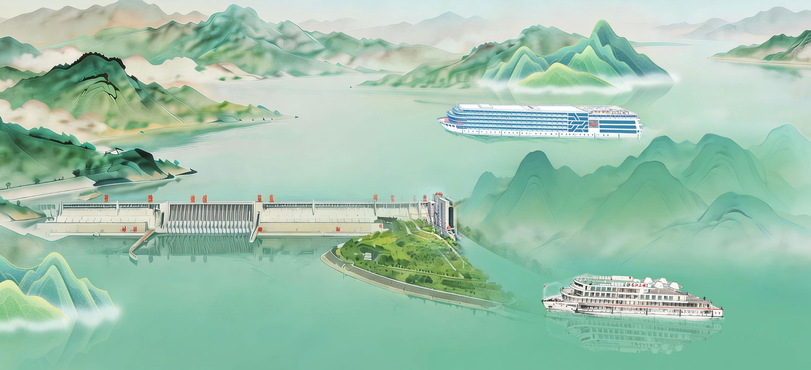

natural_image

Illustration of a large dam and cruise ship in a misty, green mountainous landscape (no text or symbols)

# 关于本报告

# 报告简介

本报告是湖北三峡旅游集团股份有限公司发布的第三份环境、社会和公司治理（ESG）报告（以下简称“本报告”）。本报告依据客观、规范、透明和全面的原则，旨在向股东与投资者、客户、供应商、员工、政府及监管机构等利益相关方披露公司2025年度在环境、社会与公司治理方面的理念和实践绩效。

# 时间范围

本报告涵盖时间范围若无特殊说明，均为2025年1月1日至2025年12月31日。为保证报告的完整性，部分信息时间范围进行了前后延伸。

# 报告范围

本报告覆盖湖北三峡旅游集团股份有限公司及分、子公司，与财务报告合并报表范围一致。

# 数据来源

本报告全部信息数据来源包括政府部门公开数据、公司的正式文件、公开披露文件。报告所引用的财务数据以年报为准，其他数据来自公司内部统计。本报告中所涉及货币金额以人民币作为计量币种，特别说明的除外。

# 编制依据

本报告依据深圳证券交易所发布的《深圳证券交易所上市公司自律监管指引第17号——可持续发展报告（试行）》《深圳证券交易所上市公司自律监管指南第3号—可持续发展报告编制（2026年修订）》等文件，重点参考全球报告倡议组织（GRI）《可持续发展报告标准》、国际标准化组织ISO 26000:2010《社会责任指南》等国际、国内通行ESG、可持续发展和社会责任相关框架编制，同时注重立足行业背景，突出企业特色。

称谓说明 ⓘ

<table><tr><td>公司名称</td><td>公司简称</td></tr><tr><td>湖北三峡旅游集团股份有限公司</td><td>三峡旅游、公司、我们</td></tr><tr><td>湖北三峡文化旅游集团有限公司</td><td>三峡文旅集团</td></tr><tr><td>湖北三峡旅游集团股份有限公司旅游发展事业部</td><td>旅游发展事业部</td></tr><tr><td>宜昌交运国际旅行社有限公司</td><td>交运国旅</td></tr><tr><td>宜昌交运长江游轮有限公司</td><td>长江游轮</td></tr><tr><td>宜昌交运集团客运有限公司</td><td>客运公司</td></tr><tr><td>湖北天元物流发展有限公司</td><td>天元物流</td></tr></table>

# 报告发布

本报告以电子版形式发布，电子版报告可在深圳证券交易所网站（http://www.szse.cn）和巨潮资讯网（http://www.cninfo.com.cn）获取。

# 读者回应 呢

为持续提高公司ESG管理水平、提升ESG信息披露质量、推动企业切实践行ESG发展理念，针对本报告，特向读者征求意见（详见附录二“读者意见表”），并请读者将意见反馈至公司邮箱（zqsw@hbsxly.com）。

联系电话：0717-6443860

联系地址：湖北省宜昌市港窑路5号

# 公司寄语

2025年，是三峡旅游深耕主业、提质增效的奋进之年，是深化ESG治理、彰显价值担当的跃升之年，更是抢抓国内旅游业全面转向增长周期，乘势而上、聚力突破的关键之年。这一年，我们初心如磐、笃行实干，以党建为魂、以绿色为底、以服务为基、以治理为纲，在文旅融合、低碳转型、价值创造的道路上步履铿锵，交出了一份经济效益、环境效益、社会效益协同提升的优异答卷。

这一年，我们赓续红色血脉，强化党建引领，筑牢发展根基。我们始终坚持党的全面领导，深入贯彻党的二十大及二十届四中全会精神，严格落实“第一议题”“三重一大”制度，将党建深度融入公司治理、产业运营、项目攻坚各环节；优化基层组织设置，打造特色党建品牌，让党旗在车船港站一线高高飘扬；纵深推进清廉国企建设，健全廉洁风险防控体系，以清风正气护航企业行稳致远；持续完善现代企业法人治理结构，根据新《公司法》要求优化运作机制，完成治理体系系统性升级，以规范治理赋能高质量发展。

这一年，我们践行绿色使命，加速低碳转型，厚植生态底色。我们深入践行“绿水青山就是金山银山”理念，全面响应国家“双碳”战略，持续完善“水上电动船、陆上电动车、港中电能网、屋顶光伏板”绿色协同格局；全球载电量最大的纯电动观光游轮“长江三峡1”稳健运营，国内尺寸最大的绿色低碳环保型度假游轮“长江行·揽月”顺利吉水，绿色智能船队持续壮大；旅游码头岸电全覆盖，光伏发电两期项目先后并网，实现绿色效益与经济效益双提升；从严落实污染防治、生态保护要求，实现污水零排放、固废全处置，以实际行动守护长江一江清水。

这一年，我们坚守匠心品质，深耕文旅主业，擦亮服务品牌。我们聚焦“车、船、港、站、社、景”全要素布局，迭代升级“两坝一峡”核心产品，沉浸式楚风时空剧场“楚风号”惊艳亮相，文旅融合创新成果屡获国家级认可；深入推进数字化转型，搭建数据共享中心，智慧旅游、智慧港口、智慧客运全面落地，以数智赋能提升运营效能；以ISO9001质量管理体系认证成果持续优化服务流程，“服务有温度、响应有速度、保障有力度”的全周期服务体系持续迭代升级，服务品质获权威认可。

这一年，我们恪守国企担当，践行以人为本，履行社会责任。我们坚持人才强企，深化“四雁”人才培养机制，完善薪酬福利、晋升激励机制，全方位关爱员工成长、守护员工健康；织密安全生产防护网，持续完善应急管理体系，开展多场景实战演练，实现安全运营平稳有序；积极投身公益志愿、社区共建，以实干实绩彰显国企责任与温度。

这一年，我们坚持规范治理，深化价值创造，赢得市场认可。我们凭借在环境、社会与治理领域的系统性布局与持续突破，成功斩获“ESG新锐金牛奖”；严守合规底线，夯实信披根基，强化内控合规管理，信息披露连续6年获深交所A级评级；获评AA+主体信用评级，为企业优化融资结构、拓宽融资渠道、降低融资成本提供有力支撑；积极维护股东权益，畅通投资者沟通渠道，以稳健经营与真诚回报守护投资者信任。

风劲帆满江天阔，奋楫潮头逐新高。2026年，三峡旅游将聚焦“长江三峡旅游主导者、中国内河游轮旅游领航者”战略定位，守正创新、勇毅前行，全力推进省际游轮投运、产业规模拓展、服务品质升级，以绿色发展、优质服务、高效治理、责任担当，奋力谱写可持续高质量发展新篇章，为建设世界知名文化旅游目的地贡献更大力量！

# 目录

关于本报告 01

公司寄语 03

ESG 管理 15

专题： 21

绿动长江，绘就生态底色

附录：指标索引表 103

读者意见反馈 104

# 01 绿色发展，自然共生

环境合规管理 29

推进绿色经营 31

加强污染防治 33

践行绿色行动 37

应对气候变化 41

# 02 携手共进，价值共创

数智赋能 45

品质服务 47

客户责任 53

责任采购 55

# 03 以人为本，同心致远

员工责任 61

健康安全 74

社会贡献 81

# 04 治理固本，基业长青

党建引领 87

治理效能 94

战略规划 97

风控合规 97

投资者责任 101

# 关于三峡旅游

# 公司简介

湖北三峡旅游集团股份有限公司（原湖北宜昌交运集团股份有限公司）历史悠久，最早发源于1935年湖北省公路局兴建的宜昌汽车站；1998年组建为宜昌交运集团有限责任公司，2008年整体改制为股份有限公司；2011年于深圳证券交易所中小企业板上市，证券代码“002627”；2021年，公司全称变更为现名，证券简称变更为“三峡旅游”。公司是湖北省道路运输行业首家上市公司和宜昌市旅游产业发展领军企业。

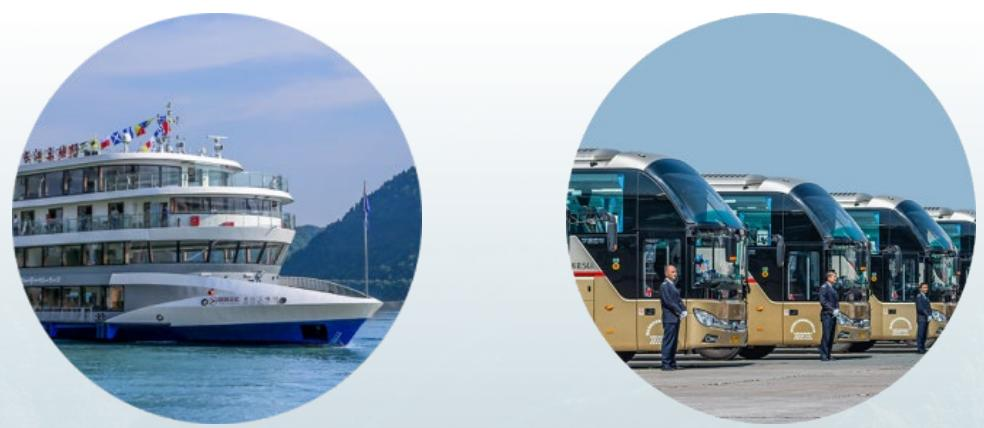

近年来，三峡旅游依托世界级旅游资源和区位优势，实施交通和旅游融合发展，重点拓展游轮旅游产业，发展形成“车、船、港、站、社、景”旅游要素齐全的产业体系；具备了较强的运营管理能力，已在南京、重庆开展游轮旅游项目投资。公司打造的“两坝一峡”“长江夜游”旅游产品成为长江三峡区域独特的精品旅游线路，荣获文化和旅游部、交通运输部等国家六部委全国交旅融合十佳案例。

未来，三峡旅游集团将以游轮旅游为核心，迭代升级游轮旅游服务体系，不断丰富产品矩阵，稳步拓展产业规模，围绕长江三峡区域打造世界最佳游轮旅游目的地，致力成为长江三峡旅游主导者、中国内河游轮旅游领航者，以世界级游轮旅游助力宜昌建设世界知名文化旅游目的地。

# 企业文化

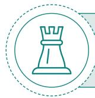

企业精神

团结、务实、创新

企业作风

现场管理、早来晚归、颗粒归仓、克难奋进、激情创造、干事成事

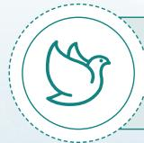

企业愿景

长江三峡旅游主导者、中国内河游轮旅游领航者

# 主营业务

# 旅游综合服务

主要从事游轮旅游服务、旅游交通服务、旅游港口服务、旅行社服务及旅游景区运营。旅游产业是公司转型发展的重要方向，当前产业发展渐趋成熟，要素配套不断健全，具备一定的综合服务能力。公司省际度假游轮产品于2026年4月正式投入运营，进一步丰富了旅游服务供给，提升了核心竞争力。

# 综合交通服务

主要包括旅客出行服务、车辆延伸服务、商贸物流服务，是三峡旅游的传统支柱产业。

# 发展历程

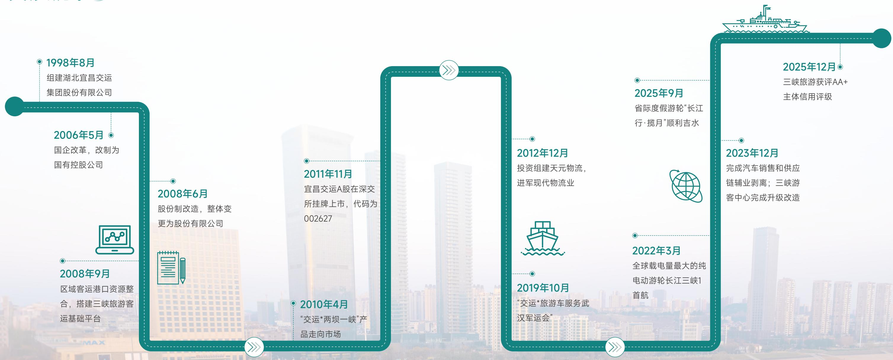

flowchart

```mermaid
graph LR
  A["1998年8月\n组建湖北宜昌交运集团股份有限公司"] --> B["2006年5月\n国企改革，改制为国有控股公司"]
  B --> C["2008年6月\n股份制改造，整体变更为股份有限公司"]
  C --> D["2008年9月\n区域客运港口资源整合，搭建三峡旅游客运基础平台"]
  D --> E["2010年4月\n“交运*两坝一峡”产品走向市场"]
  E --> F["2011年11月\n宜昌交运A股在深交所挂牌上市，代码为002627"]
  F --> G["2012年12月\n投资组建天元物流，进军现代物流业"]
  G --> H["2019年10月\n“交运*旅游车服务武汉军运会”"]
  H --> I["2025年9月\n省际度假游轮‘长江行·揽月’顺利吉水"]
  I --> J["2022年3月\n全球载电量最大的纯电动游轮长江三峡1首航"]
  J --> K["2023年12月\n完成汽车销售和供应链辅业剥离；三峡游客中心完成升级改造"]
  K --> L["2025年12月\n三峡旅游获评AA+主体信用评级"]
```

# 2025 年度大事记

# 3月4日-9日

宜昌“两坝一峡”
亮相德国柏林、
西班牙马德里

# 3月25日

两坝一峡·鲟侠尊享VIP产品全新升级

# 5月25日

由三峡旅游集团倾力打造的国内首个沉浸式长江楚韵时空剧场“楚风号”正式首发

# 9月18日

两坝一峡入选  
2025年湖北十大长江自然盛景

# 9月19日

“楚风号”入选
2025年湖北十大长江文脉地标

# 9月12日

“长江行·揽月”顺利吉水，刷新长江省际高端游轮度假标准，引领内河游轮产业升级新方向

# 10月28日

中国电影频道M榜荣誉之夜从“西陵峡和悦”游轮拉开帷幕

# 10月31日

宜昌交运国际旅行社有限公司入选湖北省文化和旅游厅旅游行业优质服务案例优秀案例名单

# 11月12日

“峡客行”品牌荣获“2025年度定制客运服务推荐品牌”

# 11月20日

宜昌交运国际旅行社通过中国质量认证中心ISO9001质量体系认证

# 11月26日

三峡旅游集团获评ESG新锐金牛奖，上市公司品牌价值、资本市场认可度与投资者信心实现三重跃升

# 12月29日

三峡旅游集团获评AA+主体信用评级，有助于拓宽融资渠道、降低融资成本、提升品牌形象，增强资源整合和资本运作能力

# 12月26日

宜昌汽车客运北站正式营业，开通覆盖鄂西多地及宜昌县域的班线网络，成为宜昌北部综合交通与旅游集散新门户

# 12月28日

东方甄选看世界宜昌行在“两坝一峡”启航，峡江美景与顶流IP跨界融合

# 公司荣誉 $^{1}$

# 2023年5月

最佳文旅上市集团

三峡旅游

文旅大消费产业新媒体“执惠”

# 2023年9月

第五届“中国服务”·旅游产品创意案例

“两坝一峡”旅游产品

中国旅游研究院、中国旅游协会

# 2023年12月

绿色航运公司名单

宜昌交运长江游轮有限公司

长江海事局

natural_image

Golden trophy with ornate golden laurel wreath and cactus-like base (no text or symbols)

# 2023年8月

全国第六批AAAA供应链服务企业

天元物流

中国物流与采购联合会

# 2023年10月

全国第一批交通运输与旅游融合发展十佳案例

“两坝一峡”旅游产品

文化和旅游部、交通运输部等六部委

# 2024年2月

入选绿色船舶名单

宜昌交运长江游轮有限公司（长江三峡1）

长江海事局

# 2024年7月

入选旅客联程运输服务品牌典型案例

宜昌交运

交通运输部

# 2025年9月

入选“2025旅游出行行业创新级服务案例”

“楚风号夜秀”产品

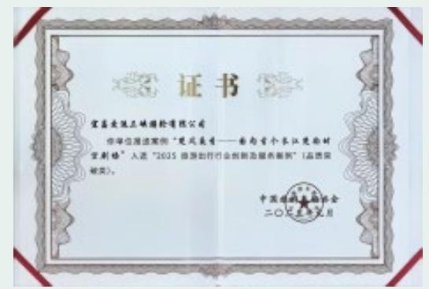

text_image

3 证书
宜嘉文投正味酒轮有限公司
你单位提出案例“更名美青——面向首个本位更独特的案例”入选“2015 按源的行行业 制售服务案例”（品质奖获奖）。
中国证券报
二〇一三年五月

中国旅游车船协会

# 2025年10月

信息披露连续6年获得评级A级

三峡旅游

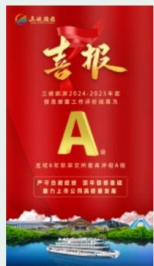

text_image

喜报
三峡旅游2024·2025年度
信息披露工作评价结果为
A级
连续6年联交所最高评级A级
严守百姓症线 茄年健康基础
助力上市公司高质量发展

深圳证券交易所

# 2025年9月

宜昌汽车客运中心站荣获“综合交通50项典型案例”

宜昌交运

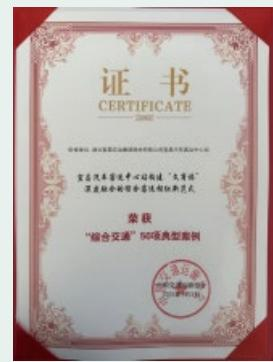

text_image

证书
CERTIFICATE
荣获
“综合交通”90项典型案例

中国交通运输协会

# 2025年11月

2025年度ESG新锐金牛奖

三峡旅游

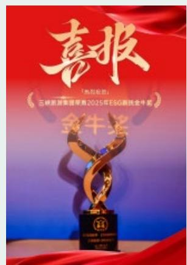

text_image

喜报
「热烈祝贺」
《三峡旅游集团年度2025年E8G新金牛奖》
金牛奖

中国证券报与中国国新控股有限责任公司

# ESG 管理

# ESG 治理体系

三峡旅游高度重视ESG治理工作，建立了管理层深度参与、职能部室及事业部（专业化子公司）横向协同、各层级纵向贯通的ESG工作组织体系。公司建立“董事会—战略发展委员会—领导小组—工作专班”四级ESG治理架构。董事会与战略发展委员会负责ESG顶层设计与重大事项决策，ESG工作领导小组统筹推进ESG战略规划及年度计划编制，环境、社会责任、公司治理三个工作专班作为执行机构承担ESG具体工作执行职责。

# 三峡旅游ESG治理架构

# 董事会

全面监督公司ESG事宜，决定公司ESG战略及规划，并审议公司ESG报告。

# 战略发展委员会

ESG工作的核心议事与决策支持平台，就ESG事项向董事会提供咨询建议。

# 领导小组

制定ESG工作方案，统筹负责ESG战略规划、目标设定、信息披露等工作内容。

# 工作专班

根据ESG工作方案组织开展具体工作，定期汇报ESG工作进展。

# ESG 战略

三峡旅游全面贯彻落实习近平总书记关于国企改革发展和生态文明建设的重要指示精神，立足行业特点和企业自身实际，聚焦高质量发展，聚力提质增效、加快绿色转型、深化改革创新，积极践行ESG理念，完善ESG治理，管控环境、社会和公司治理风险，创造更大社会价值，为推动建设长江大保护典范城市、打造世界级宜昌贡献力量。

# ESG 目标

三峡旅游构建ESG管理架构，深化ESG治理实践，提高信息披露质量与透明度，推动ESG表现稳步提升，助力公司实现可持续发展与价值创造双重目标。

# ESG 管理机制

三峡旅游建立“监测—披露—评估—改进”的ESG闭环管理机制，各专班持续跟踪核心绩效指标动态，根据公司运营和市场环境的变化，及时更新相关数据并披露ESG信息。ESG领导小组定期对ESG工作进行回顾和总结，动态优化管理策略，提升ESG表现水平。

公司将ESG培训纳入董事及高管人员年度培训计划，重视管理层ESG决策能力与专业素养建设。2025年，公司共组织可持续发展相关培训9次，培训达38人次。其中，专项培训1次，其他综合培训中涵盖相关内容8次。

# 议题重要性评估

三峡旅游根据业务经营情况，通过专家调研等方式对利益相关方关注的议题进行收集、整理和分析，同时结合行业发展趋势、自身经营战略和ESG政策要求，梳理出对公司和利益相关方具有重要影响的22项议题，经董事会审议确认为2025年度重要性议题，明确信息披露重点和未来管理方向。

# 议题重要性判定流程

# 了解内部经营业务关系

了解内部经营和业务关系、外部客观环境以及主要受影响的利益相关方。

# 建立议题清单

参考国家政策、行业对标和利益相关方反馈，结合公司自身商业模式、所处价值链等情况，初步识别ESG关键议题22项。

# 议题排序

面向利益相关方开展调研，根据调研结果对实质性议题进行分析，并按照财务重要性和影响重要性由高到低的顺序对议题进行排序。

# 议题确认

经公司董事会对议题重要性结果进行审议，审议通过后形成最终的2025年ESG议题矩阵图。

# 议题重要性分析

影响重要性分析：三峡旅游通过利益相关方调研，评估自身在各议题上的表现对经济、社会和环境产生的实际或潜在影响，从影响发生的规模、范围、不可补救性、可能性等方面等维度进行量化评分，将各议题的影响重要性评分与设定阈值进行比较，筛选出具有影响重要性的议题。

财务重要性分析：三峡旅游组织管理层、财务部门及相关专家开展调研与沟通，对财务影响程度进行定性判断，筛选出具有财务重要性的议题。

# 议题重要性结论

经建立议题清单、排序和确认，三峡旅游以矩阵图形式展现22项议题的重要程度。

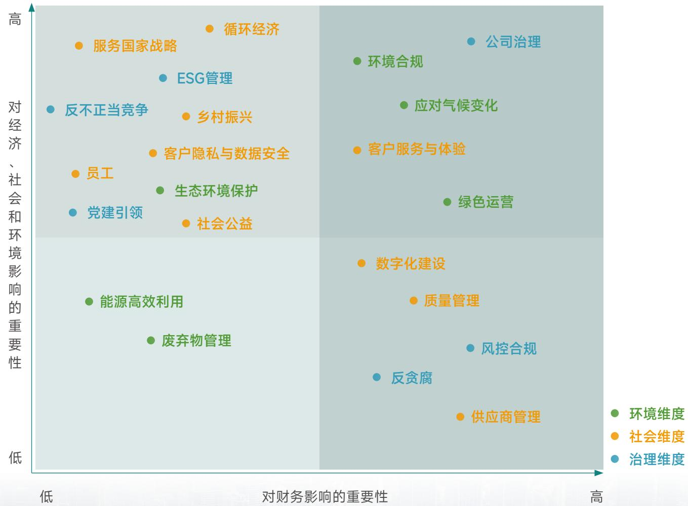

scatter

| Topic | Category | X-axis Position (Approx.) | Y-axis Position (Approx.) |
| :--- | :--- | :--- | :--- |
| 循环经济 | 社会维度 | ~35% | ~90% |
| 服务国家战略 | 社会维度 | ~15% | ~85% |
| ESG管理 | 治理维度 | ~25% | ~80% |
| 反不正当竞争 | 治理维度 | ~5% | ~75% |
| 乡村振兴 | 社会维度 | ~30% | ~70% |
| 客户隐私与数据安全 | 社会维度 | ~20% | ~65% |
| 员工 | 社会维度 | ~10% | ~60% |
| 党建引领 | 治理维度 | ~10% | ~55% |
| 生态环境保护 | 环境维度 | ~25% | ~55% |
| 社会公益 | 社会维度 | ~30% | ~50% |
| 绿色运营 | 环境维度 | ~60% | ~50% |
| 应对气候变化 | 环境维度 | ~55% | ~75% |
| 客户服务与体验 | 社会维度 | ~45% | ~65% |
| 数字化建设 | 社会维度 | ~40% | ~45% |
| 能源高效利用 | 环境维度 | ~10% | ~35% |
| 废弃物管理 | 环境维度 | ~20% | ~30% |
| 质量管理 | 社会维度 | ~45% | ~35% |
| 风控合规 | 治理维度 | ~60% | ~30% |
| 反贪腐 | 治理维度 | ~40% | ~20% |
| 供应商管理 | 社会维度 | ~60% | ~15% |
| 公司治理 | 治理维度 | ~70% | ~90% |

三峡旅游2025年度双重重要性议题矩阵  
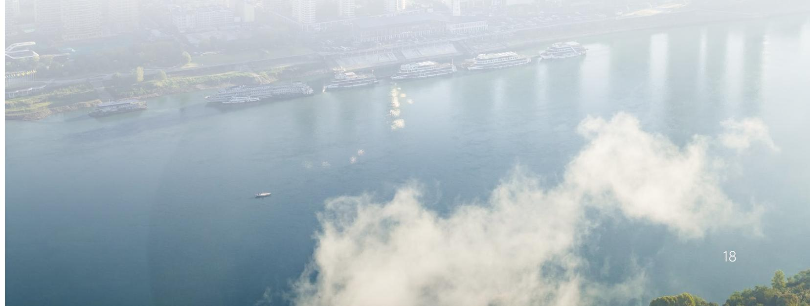

natural_image

Aerial view of a river with multiple ferry boats and a small boat, partially obscured by clouds (no visible text or symbols)

# 利益相关方沟通

三峡旅游根据行业特性与经营业务特点，与利益相关方建立常态化、高效的沟通机制，识别利益相关方期望，积极回应各方诉求，提升公司ESG表现。

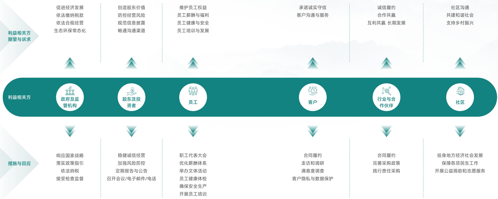

flowchart

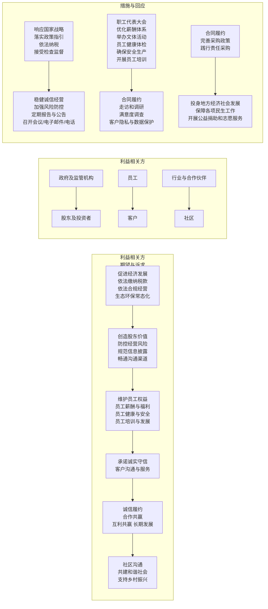
```mermaid
graph LR
  subgraph Profit_Relational_Compliance ["利益相关方\n期望与诉求"]
    direction TB
  A["促进经济发展\n依法缴纳税款\n依法合规经营\n生态环保常态化"] --> B["创造股东价值\n防控经营风险\n规范信息披露\n畅通沟通渠道"]
  B --> C["维护员工权益\n员工薪酬与福利\n员工健康与安全\n员工培训与发展"]
  C --> D["承诺诚实守信\n客户沟通与服务"]
  D --> E["诚信履约\n合作共赢\n互利共赢 长期发展"]
  E --> F["社区沟通\n共建和谐社会\n支持乡村振兴"]
  end

  subgraph Stakeholders ["利益相关方"]
  G["政府及监管机构"] --> H["股东及投资者"]
  I["员工"] --> J["客户"]
  K["行业与合作伙伴"] --> L["社区"]
  end

  subgraph Actions ["措施与回应"]
  M["响应国家战略\n落实政策指引\n依法纳税\n接受检查监督"] --> N["稳健诚信经营\n加强风险防控\n定期报告与公告\n召开会议/电子邮件/电话"]
  O["职工代表大会\n优化薪酬体系\n举办文体活动\n员工健康体检\n确保安全生产\n开展员工培训"] --> P["合同履约\n走访和调研\n满意度调查\n客户隐私与数据保护"]
  Q["合同履约\n完善采购政策\n践行责任采购"] --> R["投身地方经济社会发展\n保障各项民生工作\n开展公益捐助和志愿服务"]
  end
```

# 专题

# 绿动长江，绘就生态底色

三峡旅游积极响应国家“双碳”战略，以交旅融合、绿色低碳转型的新模式推动能源可持续利用，构建了“水上电动船、陆上电动车、港中电能网、屋顶光伏板”的绿色协同发展格局，以实际行动为“电化长江、绿色长江、生态长江、双碳产业”发展实践提供现实“最优解”，为“世界级宜昌”贡献三峡旅游力量，为公司高质量发展夯实绿色根基。

# 水上电动船

三峡旅游坚决扛起生态环境保护责任，积极实施能源供给革命。继“长江三峡1”“西陵峡和悦”“西陵峡和谐”“宜昌远影”之后，三峡旅游于2026年4月推出新能源省际度假游轮“长江行·揽月”

“长江行·揽月”系“长江行游轮（Vista Cruises）”品牌所属游轮，以节能环保为核心设计理念，配备240块磷酸铁锂动力电池，载电量2,580度；采用中央直流变频及二次能源利用技术，船舶空调系统综合节能超20%，环保建材与国内先进隔震降噪技术融合，实现静谧低碳运行。

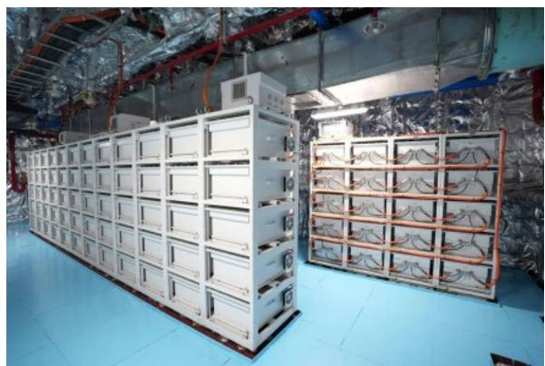

natural_image

Interior of a high-tech facility with large white server racks and orange wiring encircled in protective panels (no visible text or symbols)

“长江行·揽月”混合动力电池仓

船舶首次引入华为鸿蒙智家智慧化运营系统，实现全舱智能场景联动，语音调控灯光、窗帘、影音等设施，将智慧化贯穿游客出游全流程。

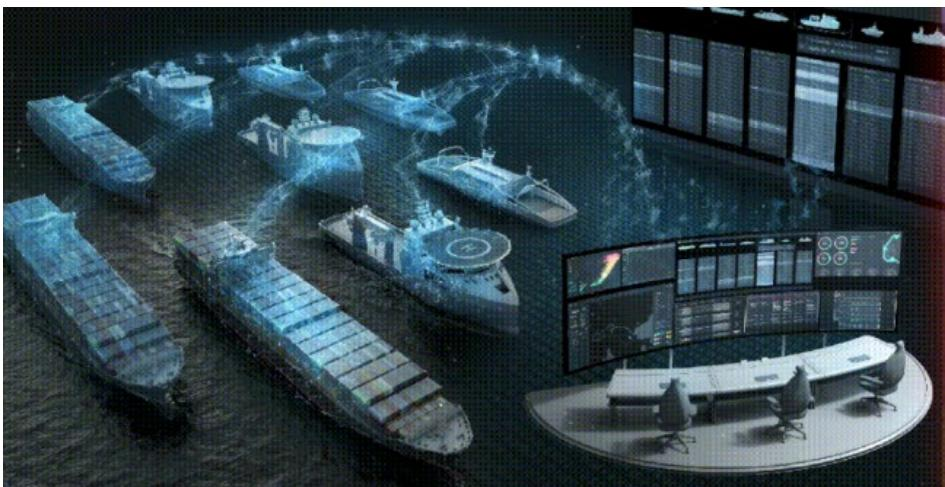

natural_image

Aerial view of a naval shipbuilding complex with multiple cargo ships navigating through water, alongside a control room and display screens (no visible text or symbols)

“长江行·揽月”引入智慧化运营系统

# 案例 | 绿色低碳环保型度假游轮“长江行·揽月”顺利吉水

2025年9月，三峡旅游投资建造的首艘长江省际度假游轮“长江行·揽月”在枝江鑫汇船厂顺利吉水。“长江行·揽月”总长约150米，型宽23米，游轮最大载客650人，客房259间，是目前国内尺寸最大的绿色低碳环保型度假游轮之一。

“长江行·揽月”的顺利吉水，是三峡旅游积极响应交通强国建设号召，依托长江黄金水道资源，践行长江经济带发展战略，推动文旅产业高质量发展的关键举措，标志着公司从资源整合者向高端文旅产品创造者、行业标准引领者的实质性跨越，生动践行“以文塑旅、以旅彰文”的文旅融合路径，向世界展示中国江河文化的时代魅力。

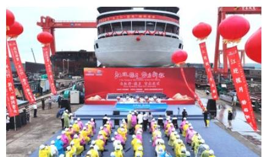

text_image

红海·通·日·新港·南航
年春节·国庆·年度活动

“长江行·揽月”吉水仪式

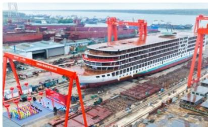

natural_image

Aerial view of a large cruise ship docked at a port with red gantry cranes and industrial facilities in the background (no visible text or symbols).

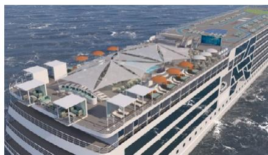

natural_image

Aerial view of a large cruise ship sailing on open sea, with no visible text or symbols.

“长江行·揽月”顶层甲板

# 新能源纯电/混合动力船舶及游艇

“长江三峡1”是全球载电量最大的纯电动观光游轮，船舶总长100米，载客量1,300人，电池容量7,500kWh，是工信部高技术船舶科研示范项目和交通运输部交通强国试点项目，投运以来接待游客150万人次，减少有害气体排放3,380吨。

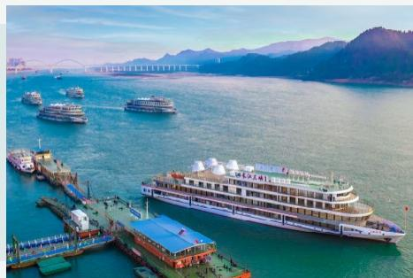

natural_image

Aerial view of a busy cruise ship docked at a port with mountains and a bridge in the background (no visible text or symbols)

“西陵峡和悦”新能源游轮首次尝试搭载智能辅助驾驶系统，采用“动力电池+燃油+太阳能光伏”新能源混合动力，能实现“有光就有电，有电就能储”。每年可替代燃油200余吨，减少碳排放600余吨。

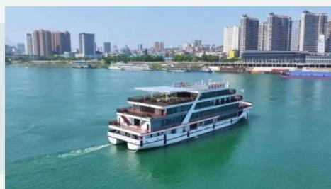

natural_image

Aerial view of a large cruise ship sailing on turquoise water with city buildings in the background (no visible text or symbols)

“西陵峡和谐”系“西陵峡和悦”姊妹船舶，同样采用“动力电池+燃油+太阳能光伏”混合动力，搭载智能系统，动力平稳，视野通透，为“两坝一峡”游带来新的绿色智能体验。

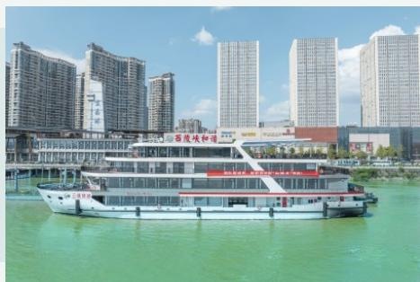

natural_image

Exterior view of a modern cityscape with a large white boat on a river, surrounded by high-rise buildings and greenery (no visible signage or text)

“宜昌远影”系宜昌市首艘驰骋长江的新能源游艇式客船，采用混合动力系统，支持燃油与纯电一键切换，满足休闲、观光与夜航需求。

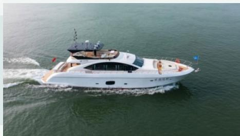

natural_image

Aerial view of a modern luxury yacht on calm water, no visible text or symbols

公司第一批两艘省际度假游轮——“长江行·揽月”“长江行·极光”采用插电式柴电+锂电混合动力模式，将于2026年首航；公司积极响应长江水生态环境保护的政策，加大探索省际游轮能源动力绿色转型的步伐，将第二批两艘省际游轮调整为新能源（甲醇）+动力电池的混合动力系统，进一步提升游轮的环保性能，减少碳排放。

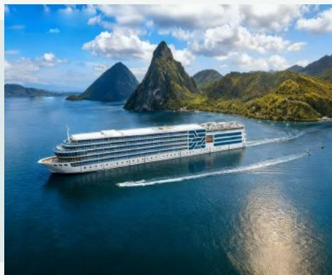

natural_image

Aerial view of a large cruise ship sailing on the sea with lush green mountains and a clear blue sky (no visible text or symbols)

# 港中电能网

三峡旅游贯彻“努力打造世界一流的智慧港口、绿色港口”要求，首创了纯电动游轮“高压充电+低压补电”电能补给技术方案，满足各类船舶岸电使用需求，减少噪声及烟气排放。

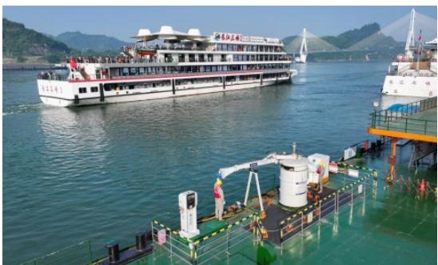

natural_image

Exterior view of a large cruise ship docked at a river with mountains in the background (no visible text or symbols)

电动船高压充电桩

宜昌港作为绿色港口建设的标杆，率先实现旅游码头岸电全覆盖，供电总容量达1.3万千伏安，可同时为30艘游轮供电。截至2025年末，宜昌港累计服务船舶超1.7万艘次，岸电使用量达5,400万千瓦时，减少气体排放约4万吨，为船企节约成本超8,100万元。

此外，公司改造的宜昌港K19、客25趸船具有双层立体空间，可承载5,000+游客，充分满足大型游轮靠泊需求，防污染设施和岸电系统同步升级，确保港口运营污染物零排放；智能闸机实现“无纸化一证通关”，智慧平台打通订票、调度全流程，为旅客提供绿色舒适的出行体验。

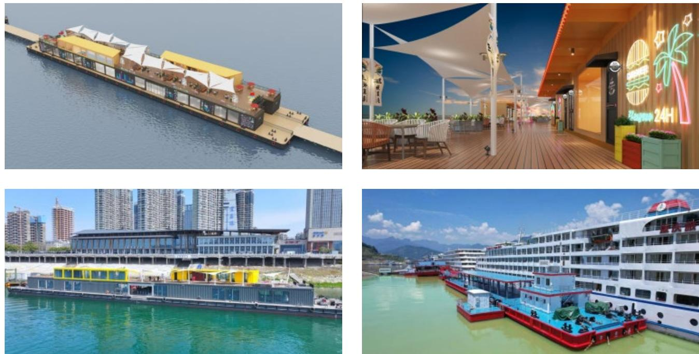  
趸船提档升级改造

# 公司岸电建设情况

# 宜昌港

可提供4个泊位待航船舶供电容量共计1,890千伏安的岸电负荷，能同时为4艘趸船、5艘游轮提供岸电。

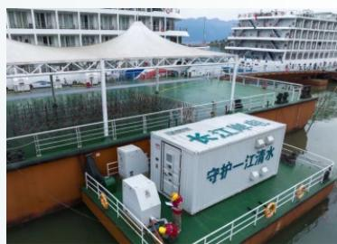

text_image

长江流域
守护一江清水

# 秭归茅 坪港

可提供6个泊位待航船舶供电容量共计7,500千伏安的岸电负荷，能同时为6艘趸船、12艘大型豪华游轮提供岸电。

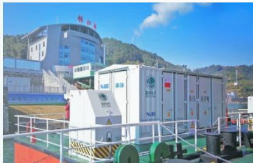

natural_image

Exterior view of a modern industrial facility with large machinery and a building in the background (no visible text or symbols)

# 太平溪港

可提供2个泊位待航船舶供电容量共计2,000千伏安的岸电负荷，能同时为2艘趸船、4艘游轮提供岸电。

# 三斗坪港

可提供3个泊位待航船舶供电容量共计500千伏安的岸电负荷，能同时为3艘趸船、3艘游轮提供岸电。

# 陆上电动车

三峡旅游坚持纯电驱动战略导向，明确打造“长江绿色旅游廊道”，持续推进客运车辆的电动化更新，助力宜昌推进绿色交通体系建设。公司新增汇川电器、安凯和福特新能源的售后服务，并实现宇通客车、深澜动力新能源特约服务站落户，形成全产业链新能源服务生态，进一步提升新能源车辆运营保障能力和服务水平。

2025年，公司完成城际公交、定制客运、巡游出租车及公交车300余台营运车辆的电动化升级，投入资金2,713.20万元，配备新能源配套充电桩，提升绿色出行体验。

公司陆上电动车产业布局  
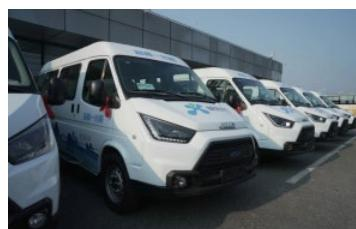

natural_image

Row of white electric vehicle vans parked in a lot, with a modern building in the background (no visible text or symbols)

定制客运车

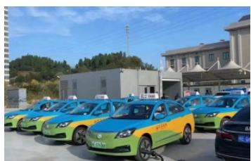

natural_image

Row of blue and green electric taxis parked in front of a building with trees and sky (no visible text or symbols)

电动出租车

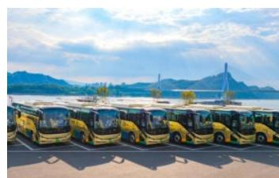

natural_image

Row of yellow buses parked in a lot with hills and a scenic cityscape in the background (no visible text or symbols)

客运电动车

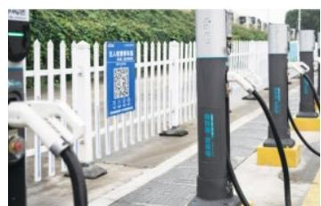

text_image

Street photo showing electric vehicle charging station with visible QR code and license plate

新能源充电桩

# 屋顶光伏板

三峡旅游深入贯彻新发展理念，打造绿色零碳园区，投资建设天元光伏电站、汽贸城光伏电站、客运中心光伏项目，总装机容量为6.124兆瓦，运营模式为“自发自用、余电上网”，通过探索“源网荷储一体化”发展模式，实现能源的高效与可持续利用。2025年，公司光伏发电项目总投入1,735万元。

公司制定《光伏电站运营维护管理办法》，为光伏电站的规范、高效运营提供坚实制度保障。截至2025年末，公司已投运的天元光伏一期、汽贸城光伏项目，累计减少碳排放3,250吨，等效植树17.75万棵，在助力“双碳”目标实现方面发挥重要作用。

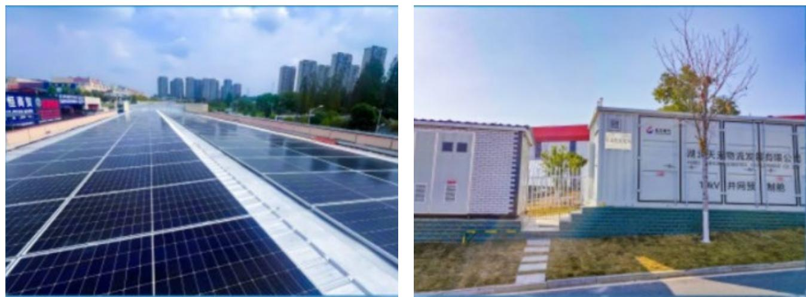  
三峡旅游屋顶光伏项目

natural_image

Illustration of a stylized wind farm with solar panels, wind turbines, and flying birds against a hilly landscape (no text or symbols)

# 01

# 绿色发展，自然共生

三峡旅游始终将“绿色减碳、节约资源、提升效率”作为核心原则，坚定不移地贯彻习近平总书记“绿水青山就是金山银山”的重要理念，聚焦新能源船舶的建造与运营，以及港口的防污染治理工作，探索并实践绿色可持续发展的全新路径，致力于在生态保护与经济发展之间找到最佳平衡点，为实现长江流域的生态优先、绿色发展贡献力量。

6

清洁饮水和卫生设施

7

经济适用的清洁能源

13

14

水下生物

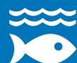

15

陆地生物

# 环境合规管理

三峡旅游持续加强环境风险管理，完善环境管理组织架构，规范日常环境管理工作，持续提标升级环保设施设备，定期识别和评估环境风险因素，提升突发环境事件应急处置能力，不断提升环境管理水平。

# 环境管理体系

三峡旅游严格贯彻落实《中华人民共和国环境保护法》《中华人民共和国防治船舶污染内河水域环境管理规定》等相关法律法规，制定了《环境保护管理办法》《船舶防污染管理制度》等环保管理制度，搭建环境管理三级组织架构，其中公司总部承担环保监管职责，事业部及专业化子公司承担环保主管职责，生产经营单位承担环保主体责任，落实环保责任制度，保障环保工作平稳推进。

# 环境合规战略

三峡旅游不断健全环境管理体系，通过识别和评估环境合规管理风险，抓住相关机遇，降低法律、财务和运营风险，实现公司可持续发展。

三峡旅游风险和机遇应对

<table><tr><td>风险/机遇类型</td><td>具体描述</td><td>影响时间范围</td><td>财务影响</td><td>应对策略</td></tr><tr><td>政策合规风险</td><td>环境法规的不断趋严可能导致公司面临更高的合规成本,未遵守政策会导致行政处罚。</td><td>中长期</td><td>营业成本增加</td><td rowspan="3">公司实时跟踪国家/地方环保法规更新,做好舆情管控;积极建设环境友好型企业,关注地方绿色补贴政策,将环境保护工作贯穿生产经营的全过程</td></tr><tr><td>声誉风险</td><td>环境违规或低环境绩效可能损害公司声誉,导致客户流失,降低公司的市场价值</td><td>中长期</td><td>主营业务收入下降融资成本增加</td></tr><tr><td>政策支持机遇</td><td>响应政府政策可能获得绿色补贴、税收优惠等。</td><td>中长期</td><td>税费支出减少,净利润增加,经营活动现金流增加</td></tr></table>

# 环境影响、风险和机遇管理

三峡旅游高度重视环境风险管理，构建了完善的环境风险防控体系，系统识别环境风险源并建立风险清单，定期开展风险评估；港口码头及船舶修造区域按《港口码头水上污染事故应急防备能力要求》配备围油栏、吸油毡、应急池等防污染设备器材，减少船舶溢油、化学品泄漏、污水超标排放等港口污染；同时对排污设备实施铅封管理，启封须向海事管理机构报告，全方位提升环境风险预防和应急处置能力。

公司建立健全突发环境事件应急管理机制，制定《突发环境事件应急预案》并报环境保护主管部门和海事管理机构备案，明确应急组织架构、响应程序及处置措施。公司每年至少组织一次溢油处置、化学品泄漏防控等应急演练并持续优化预案；发生污染事故时立即启动应急响应，按“事故报告—现场处置—后续处理”流程执行，重大事故1小时内上报，迅速控制污染扩散，事后委托第三方评估损害并依法赔偿，确保环境风险可控、应急处置高效。

# 环境指标与目标

三峡旅游严格遵守环境保护法律法规，将环境合规纳入企业战略与日常运营，确保各项经营活动符合生态环保要求，持续降低环境影响，助力长江大保护与绿色低碳发展。

环保经营目标（部分）  
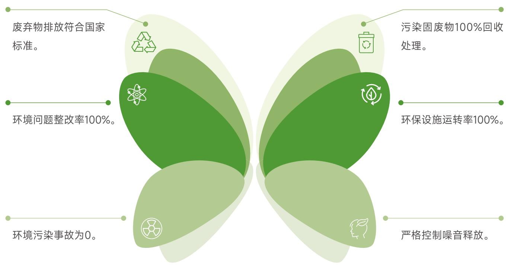

flowchart

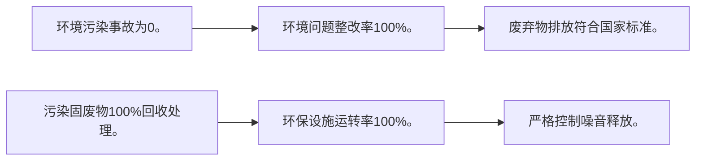
```mermaid
graph LR
  A["环境污染事故为0。"] --> B["环境问题整改率100%。"]
  B --> C["废弃物排放符合国家标准。"]
  D["污染固废物100%回收处理。"] --> E["环保设施运转率100%。"]
  E --> F["严格控制噪音释放。"]
```

# 推进绿色经营

三峡旅游深入践行“绿水青山就是金山银山”理念，将资源能源管理作为可持续发展的核心抓手，系统推进能源结构清洁化、水资源利用高效化、废弃物处置循环化，着力构建绿色低碳、环境友好的运营体系，努力实现经济效益与生态效益协同提升，助力长江大保护与“双碳”目标实现。

# 能源高效利用

三峡旅游严格遵守《中华人民共和国节约能源法》，贯彻落实各项节能减排部署，不断优化能源管理，持续推进节能减排工作。公司根据《能源管理体系—要求及使用指南》（GB/T23331）的要求，严格遵循标准中策划、运行、绩效评价等环节的规范，制定《能源体系管理办法》等能源管理制度，定期收集、汇总、核算及分析全公司的能源消耗状况，积极探索节能降碳举措，开展各类设备设施节能专项检查，确保设备运行及节能效果，实现能源管理的持续改良。

公司持续完善能源管理体系建设，制定并落实节能减排中长期目标与行动计划，推进分布式光伏发电项目建设，充分利用园区屋顶资源实施光伏覆盖，持续提升清洁能源自给比例；同时加速新能源船舶、新能源客车更新替代，积极推广纯电动、混合动力等绿色船型，持续扩大纯电动公交、旅游巴士及出租车辆规模，配套建设岸电设施与智能充电桩，实现水陆运输装备清洁化、能源供给结构多元化，切实提升能源利用效率，引领行业绿色可持续发展。

能源使用情况

<table><tr><td>指标</td><td>单位</td><td>2023年</td><td>2024年</td><td>2025年</td></tr><tr><td>综合能耗总量</td><td>吨标准煤</td><td>7,116.47</td><td>6,102.98</td><td>5,648.98</td></tr><tr><td>直接能源消耗</td><td>吨标准煤</td><td>5,769.60</td><td>4,546.27</td><td>3,267.21</td></tr><tr><td>其中:天然气使用量</td><td>立方米</td><td>2,640.00</td><td>8,920.29</td><td>37,692.85</td></tr><tr><td>汽油使用量</td><td>升</td><td>31,090.50</td><td>20,403.60</td><td>44,288.00</td></tr><tr><td>柴油使用量</td><td>升</td><td>3,778,236.00</td><td>3,014,045.40</td><td>2,596,893.59</td></tr><tr><td>其他能源使用量</td><td>吨</td><td>0.57</td><td>0.56</td><td>0.90</td></tr><tr><td>间接能源消耗量</td><td>吨标准煤</td><td>1,346.87</td><td>1,556.70</td><td>2,381.77</td></tr><tr><td>其中:外购电力量</td><td>万千瓦时</td><td>1,192.98</td><td>1,378.83</td><td>2,109.62</td></tr><tr><td>清洁能源使用量</td><td>吨标准煤</td><td>1,891.36</td><td>2,186.02</td><td>2,721.41</td></tr></table>

# 水资源管理

三峡旅游建立健全水资源管理制度体系，制定节水降耗目标与行动计划，持续推进用水定额管理与节水技术改造，加强车辆清洗、船舶运营及办公生活等环节的用水监测与循环利用，切实提升水资源利用效率，积极推广中水回用等节水措施，定期开展节水宣传与培训，强化全员节水意识，助力生态环境保护与企业绿色可持续发展。

水资源使用情况

<table><tr><td>指标</td><td>单位</td><td>2023年</td><td>2024年</td><td>2025年</td></tr><tr><td>水资源消耗总量</td><td>吨</td><td>136,047.34</td><td>251,949.96</td><td>454,440.20</td></tr></table>

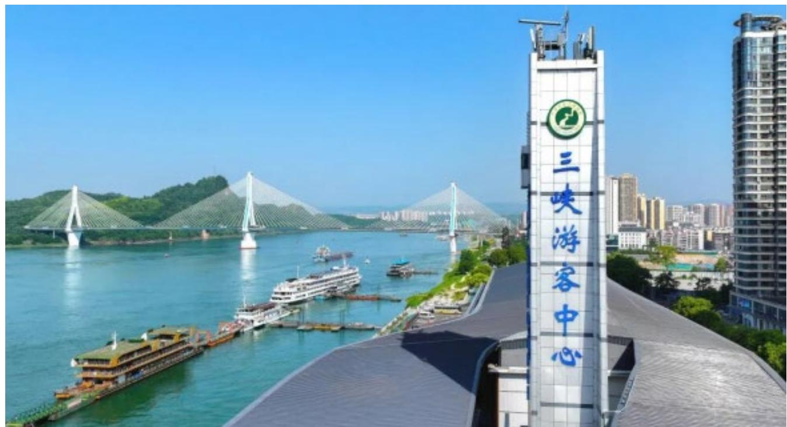

text_image

三峡游客中心

三峡游客中心水质

# 资源循环利用

三峡旅游树立资源循环利用理念，着力构建资源节约、环境友好的可持续发展模式。公司构建船舶污染物“船上分类储存—港口接收转运—岸上处置利用”的全链条闭环管理体系，船舶生活垃圾、生活污水及油污水经港口接收后分类转运至垃圾处理场或处理设施，实现资源化利用与无害化处置；靠港船舶全面使用岸电替代燃油发电，实现能源清洁化循环利用。

# 加强污染防治

三峡旅游严格遵守《排污许可管理条例》等环保法规，健全排污许可与自行监测管理体系，对废气、废水、固废及噪声实施全过程精细化管控，确保污染物稳定达标排放与合规处置，以高标准环境管理夯实绿色发展根基。

# 废水管理

三峡旅游严格贯彻《中华人民共和国水污染防治法》相关规定，规范管理公司船舶运输、景区运营、日常办公过程中产生的废水、生活污水的处理及排放监测工作。公司废水主要由靠港船舶舱底油污水、船舶生活污水、陆域生活污水构成；其中，靠港船舶舱底油污水交由第三方专业机构处理，船舶生活污水由船舶带走，陆域生活污水经污水处理装置处理后接入市政管网。

公司建立健全污水全流程管理体系，严格执行设备定期巡检与预防性维护制度，确保处理设施稳定高效运行，完整归档设备运行参数及维护记录；同步建立标准化污水排放台账，详实记录排放量、污染物浓度及排放去向等数据，台账保存期限严格遵循3年以上规范，实现可追溯管理。2025年，公司生活污水经深度处理达标后纳管排放，客运码头趸船全面具备船舶生活污水接收能力，达成客运港口污水“零排放”目标。

三峡旅游污水分类处理

<table><tr><td>生活污水</td><td>船舶污水</td><td>初期雨水</td></tr><tr><td>客运站、办公区、船员生活区产生的生活污水,经预处理设施处理后,接入城市污水处理系统或达标排放。</td><td>严格落实船舶污染物接收责任,不得拒绝接收船舶送交的生活污水、含油污水,接收后及时转运至具备资质的处置单位,签订接收协议并留存单证。</td><td>在码头、堆场等区域设置初期雨水收集设施,收集降雨初期15分钟内的含污染物雨水,经沉淀、过滤等处理后达标排放或回用。</td></tr></table>

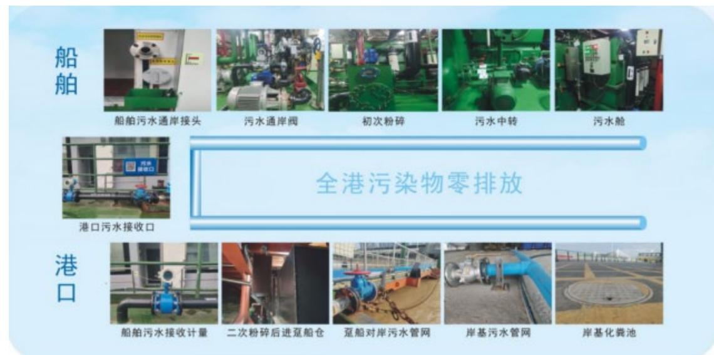

flowchart

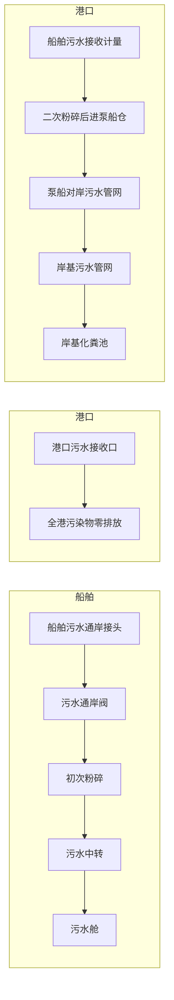
```mermaid
graph LR
  subgraph Ship["船舶"]
  A1["船舶污水通岸接头"] --> B1["污水通岸阀"]
  B1 --> C1["初次粉碎"]
  C1 --> D1["污水中转"]
  D1 --> E1["污水舱"]
  end

  subgraph Port["港口"]
  F1["港口污水接收口"] --> G["全港污染物零排放"]
  end

  subgraph Port_2["港口"]
  H1["船舶污水接收计量"] --> I1["二次粉碎后进泵船仓"]
  I1 --> J1["泵船对岸污水管网"]
  J1 --> K1["岸基污水管网"]
  K1 --> L1["岸基化粪池"]
  end
```

污染物回收处理上岸设计

废水排放情况

<table><tr><td>指标</td><td>单位</td><td>2023年</td><td>2024年</td><td>2025年</td></tr><tr><td>废水排放总量</td><td>万吨</td><td>11.91</td><td>17.60</td><td>18.50</td></tr></table>

# 废气管理

三峡旅游严格落实大气污染防治措施，在污染源控制方面优先采用清洁能源及新能源设施设备，确保港口作业机械、车辆符合尾气排放标准，并积极推动船舶靠泊期间使用岸电替代燃油发电；在监测与管控方面，定期监测港口边界颗粒物、二氧化硫、氮氧化物等大气污染物浓度，确保符合国家排放标准，同时禁止船舶在港内使用焚烧炉，严格把控船舶燃油质量并要求油料供给单位留存检测报告，全方位防控大气污染风险。

废气排放量

<table><tr><td>指标</td><td>单位</td><td>2023年</td><td>2024年</td><td>2025年</td></tr><tr><td>废气排放总量</td><td>万立方米</td><td>6,579</td><td>1,864</td><td>1,542.65</td></tr><tr><td>其中:烟尘/颗粒物排放量</td><td>吨</td><td>3.49</td><td>1.35</td><td>0.75</td></tr><tr><td>二氧化硫排放量</td><td>吨</td><td>39.54</td><td>24.29</td><td>12.28</td></tr><tr><td>氮氧化物排放量</td><td>吨</td><td>9.27</td><td>9.09</td><td>6.50</td></tr></table>

# 废弃物管理

三峡旅游建立全流程固体废物管理体系，实行生活垃圾分类、一般固废与危险废物分类收集定点存放，设置明显标识；危险废物严格按《危险废物贮存污染控制标准》（GB 18597）专用设施存储并采取防渗防漏措施，船舶垃圾接收后按类别处理并提前告知有害成分信息，转运处置环节委托具备资质的第三方处理，建立包含废物种类、数量、处置单位等信息的转运台账，实现废弃物规范化、可追溯管理。

2025年，公司制定年度环保培训计划，覆盖垃圾管理、油污应急处理以及新颁布的法律法规及政策文件学习。

# 案例 | 港口防污染培训

2025年6月，三峡旅游下属宜昌太平溪港旅游客运有限公司组织开展港口防污染培训。培训内容主要包括港口污染的类型及危害、港口和趸船防污染管理规定、防污染措施及应急处置措施，以及港口配备防污染器材使用方法。通过本次培训，参训人员系统掌握了港口防污染管理要点和器材操作规范，有效提升了污染应急处置能力，为港口环境和长江生态保护提供了有力支撑。

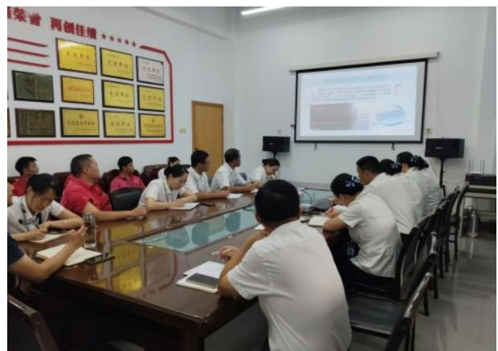

text_image

Meeting room scene with participants seated around a long table, wall displays Chinese text and posters, and a presentation screen in the background.

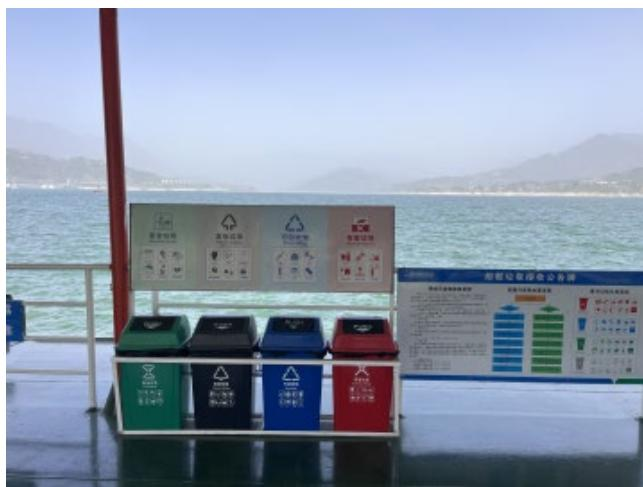

text_image

Photo of a coastal wastewater treatment station with垃圾分类 bins and safety warning posters on the water surface.

趸船固废收集装置

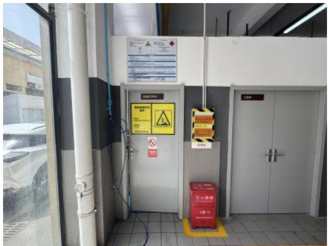

text_image

Photo of a public safety checkpoint with warning signs and safety labels, showing a hazard symbol on the door.

危废暂存间标志

固体废弃物产生量

<table><tr><td>指标</td><td>单位</td><td>2023年</td><td>2024年</td><td>2025年</td></tr><tr><td>一般固体废物产生总量</td><td>吨</td><td>143.61</td><td>148.94</td><td>403.43</td></tr><tr><td>一般固体废物处置率</td><td>%</td><td>100</td><td>100</td><td>100</td></tr><tr><td>危险废物产生总量</td><td>吨</td><td>277.95</td><td>162.00</td><td>143.00</td></tr><tr><td>危险废物处置率</td><td>%</td><td>100</td><td>100</td><td>100</td></tr></table>

# 噪声管理

三峡旅游系统推进噪声污染防治工作，主要噪声源为进出车辆噪声、进出港船舶噪声、候船厅和候客厅社会噪声等。公司通过合理规划港口作业时间，避免夜间高噪声作业，确需作业的严格采取降噪措施并履行告知义务；作业机械设备配备降噪装置并定期维护，确保港口边界噪声符合标准要求；同时优化客运站旅客集散流程，减少人群聚集噪声，并在候车区域设置隔音设施，在周边种植乔木、灌木等植被，多维度降低噪声对周边环境的影响。

三峡旅游子公司噪声污染防治

<table><tr><td>序号</td><td>噪声污染防治</td></tr><tr><td>1</td><td>避免夜间(22:00-次日6:00)高噪声作业,确需作业的严格采取降噪措施并履行告知义务。</td></tr><tr><td>2</td><td>船舶机舱铺设阻尼材料、优化机座联结方式,机舱控制室使用降噪材料,船舶上建内装时加设吸音、降噪材料等并定期维护,确保港口边界噪声符合《工业企业厂界环境噪声排放标准》。</td></tr><tr><td>3</td><td>船舶在内河航行时,应当按照规定使用声响装置,并符合环境噪声污染防治有关要求。</td></tr><tr><td>4</td><td>优化客运站旅客集散流程,减少人群聚集噪声,并在候车区域设置隔音设施,多维度降低噪声对周边环境的影响。</td></tr></table>

# 践行绿色行动

三峡旅游秉持绿色经营理念，持续推进绿色办公，开展环保宣传与培训，促进生态环境保护工作，积极引导低碳生活方式，通过实际行动推动生态文明建设取得新进展。

# 倡导绿色办公

三峡旅游积极推行绿色办公理念，将低碳环保融入日常运营管理，通过推广无纸化办公、视频会议系统，减少纸张消耗与差旅碳排放；优化办公区域照明与空调使用，采用节能设备与节水器具，降低能源资源消耗；规范办公用品采购与回收利用，推行垃圾分类与减量措施，营造绿色低碳的办公环境，引导全员践行简约适度、绿色低碳的工作生活方式。

# 三峡旅游绿色办公举措

# 推动低碳出行

- 鼓励员工选择公共交通、骑行等绿色交通方式；  
- 鼓励员工低楼层走路上下楼，在休息时间开启部分电梯，每台电梯每年可节电约5,000度，相当于减少4.8吨二氧化碳排放；  
- 优先考虑购置新能源和清洁能源车辆。

- 安装智能电表，分区域监测用电量，设置用电定额；  
- 办公设备启用节能模式，非工作时间自动断电；  
- 空调温度设定夏季不低于26°C、冬季不高于20°C，无人时关闭；  
- 更换LED节能灯具，安装人体感应开关。

# 办公用电

# 办公用水

\- 安装节水水龙头、感应式冲水装置，定期检查水管、水龙头是否滴漏，发现问题及时报修。

- 推行无纸化办公，鼓励使用电子文档、线上审批系统；  
- 打印机默认设置为双面打印，配备废纸回收盒（用于二次打印）；制定办公用纸定额标准，超定额部分需说明理由；  
- 优先采购再生纸等环保办公用纸。

# 办公用纸

# 耗材管理

\- 优先采购环保型办公耗材（如可加粉墨盒、无磷清洁剂），建立耗材领用台账，推行按需领用。

\- 减少纸杯、塑料袋、一次性笔等使用，鼓励员工自带水杯。

# 一次性用品管控

# 电子 废弃物 处置

- 设立电子废弃物专用回收点，张贴分类标识；  
与具备资质的电子废弃物回收企业签订长期合作协议，建立回收台账；  
- 禁止私自丢弃废旧电脑、打印机、电池等，明确回收流程及责任；  
- 开展电子废弃物分类回收培训，增强员工合规意识。

\- 在办公区域设置分类垃圾桶（可回收物、其他垃圾、有害垃圾），张贴分类指南，行政后勤部门每日检查分类投放情况。

# 办公垃圾分类

# 加强环保宣教

三峡旅游始终将环保教育工作置于重要位置，对员工开展全方位的环保培训，培训内容涵盖环保法律法规、规章制度以及环境污染事故典型案例等；致力于全面提升员工的环保意识、专业理论知识及环境风险双重预防能力，为可持续发展筑牢根基。

natural_image

Line art illustration of a rural landscape with mountains, wind turbines, and a car (no text or symbols)

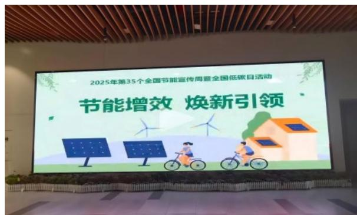

text_image

2025年第35个全国节能宣传周暨全国低碳日活动
节能增效 焕新引领

三峡旅游节能宣传周暨全国低碳日宣传

环保活动绩效

<table><tr><td>指标</td><td>单位</td><td>2024年</td><td>2025年</td></tr><tr><td>环保培训次数</td><td>次</td><td>37</td><td>32</td></tr><tr><td>环保培训参加人次</td><td>人次</td><td>1,748</td><td>828</td></tr><tr><td>环保培训总时长</td><td>小时</td><td>39</td><td>47</td></tr></table>

# 生态环境保护

三峡旅游高度重视生态环境保护工作，涉及水资源保护区、物种保护区等生态敏感区域，编制专题论证报告并落实生态保护措施；同时大力推进港口绿化建设，优选植物构建生态缓冲带，持续提升生态承载能力，实现与生态环境协调发展。

# 案例 | 长江沿岸生态环保志愿活动

2025年3月，三峡旅游下属出租车客运公司积极响应生态环保号召，组织12名党员及员工赴长江沿岸开展环保志愿活动。活动中，志愿者们手持清洁工具，对沿江步道、绿化带及滩涂区域的塑料瓶、包装袋、烟头等垃圾进行集中清理，以实际行动践行“绿水青山就是金山银山”理念，助力长江生态环境保护，展现企业责任担当。

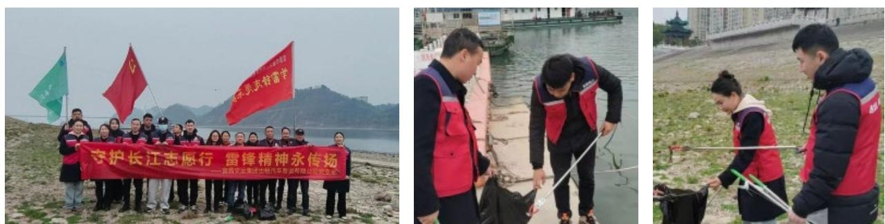

公司坚持生态优先、绿色发展，在严守生物多样性保护底线的前提下，有序开发旅游资源，将生态影响降至最低，推动景区可持续运营，以实际行动守护绿水青山，助力生态文明建设。

# 生态环境保护举措

# 保护生态平衡

景区山体巡查人员在巡查过程中，对危害生态平衡的物种进行检查清理，防止有害物种破坏生态平衡。

# 区域地 灾治理

\- 投资600余万元对结构稳定性不高的山体进行全面治理，极大减少地灾对自然资源的破坏。

# 监控实时管理

安装监控摄像头66个，全区域实时监控，做好森林防火及其他环境保护的早期监控处置。

# 景区环保宣传

- 通过景区大门电子显示屏、游客中心电子触摸屏循环播放环境保护宣传语、宣传片；  
- 景区游客中心宣传展架放置环保宣传资料；  
- 景区图书漂流角放置宣传书籍；  
- 日常文明旅游宣传标识标牌等方式宣传，提醒游客注意保护环境。

# 生物多样性保护举措

# 保护森林植被

\- 景区植被覆盖率高达 $85\%$ ，公司聘请专业人员进行植物管养，定期施肥除虫、防汛抗旱；建设规划对珍稀物种进行避让改道。

# 保护野生动植物

- 公司联系林业管理部门，对山中珍稀宜昌楠、古油麻藤、高山杜鹃等植物进行挂牌保护，并长期聘请第三方机构管理人员定期管养；  
- 在林区安装野生保护动物监控摄像装备，对区域内动物物种进行清查。

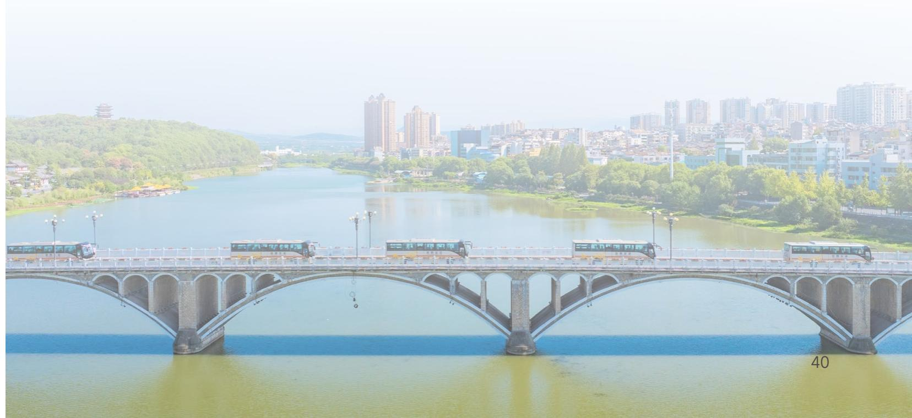

natural_image

Aerial view of a stone arch bridge spanning a wide river, with city buildings and green hills in the background (no visible text or symbols)

# 应对气候变化

三峡旅游积极响应国家“双碳”战略，将应对气候变化作为重要议题纳入发展规划，建立气候风险识别与管控机制；通过优化能源结构、提升运营能效、推进清洁能源替代，系统性降低碳排放强度，积极参与绿证交易及落实船舶碳排放核算团体标准，努力成为长江沿线旅游业绿色低碳转型的标杆企业。

# 气候相关治理

三峡旅游初步构建了气候变化管理架构，实现从决策到执行的高效闭环管理，为达成“双碳”目标提供了坚实保障。董事会作为气候相关议题的最高决策机构，负责审批公司气候变化议题管理相关事项，设定气候变化风险管控目标，并在定期会议上讨论气候相关事项；各部门及子公司贯彻落实应对气候变化有关决策。

# 气候相关战略

三峡旅游对当前及未来可能面对的风险和机遇进行识别，对其发生概率、影响程度等进行评估，分析对战略规划、业务发展带来的影响及其强度，制定针对性的管理策略与应对措施，减缓气候变化产生的潜在财务风险影响，赋能企业可持续发展。

气候风险清单

<table><tr><td colspan="2">风险类型</td><td>风险描述</td><td>潜在财务影响</td><td>应对措施</td></tr><tr><td rowspan="2">实体风险</td><td>急性风险</td><td>暴雨、洪水等极端天气事件可能导致停水、停电,提升财产损失的风险。</td><td rowspan="2">运营成本增加、营业外支出增加、营业收入下降。</td><td rowspan="2">制定应对自然灾害和突发事件的工作方案,持续进行定期演练和人员培训,确保游客和员工的人身安全。加强能耗管理、优先选用节能型设备;加强设备设施的日常保养及维护。</td></tr><tr><td>慢性风险</td><td>全球气温升高不仅会导致空调等制冷设备能耗增加,还会对景点运营和设备造成不利影响。</td></tr><tr><td rowspan="2">转型风险</td><td>政策和法律风险</td><td>“双碳”战略背景下,公司面临加快绿色低碳转型趋势,温室气体排放成本增加;需承担国家环境、健康和安全方面法律法规要求的合规成本和潜在责任。</td><td>运营成本增加、合规成本增加等。</td><td>加强环境管理体系建设,完善内部监控与考核机制,确保合规运营;减少自身对化石燃料的使用,配备光伏面板等清洁能源。</td></tr><tr><td>技术风险</td><td>公司持续创新投入应用节能低碳技术,开发低碳节能产品,研发成本可能上升。</td><td>新能源设备的引进、改造及维护,导致公司运营成本增加。</td><td>与技术领先的企业、研发团队或研究机构进行合作降低技术风险。</td></tr></table>

<table><tr><td colspan="2">风险类型</td><td>风险描述</td><td>潜在财务影响</td><td>应对措施</td></tr><tr><td rowspan="2">转型风险</td><td>市场风险</td><td>·出行者环保意识提升,市场消费理念趋向于注重绿色环保。</td><td>客户偏好转变导致的服务需求下降,收入减少。</td><td>·及时回应市场新需求,结合市场变化和消费习惯的转变,通过产品创新和服务改进,赢得市场认可。</td></tr><tr><td>声誉风险</td><td>·若在环保责任履行方面未达到利益相关方预期,信誉或将受损。</td><td>影响商誉和企业价值。</td><td>·加强与投资者、客户、媒体等利益相关方沟通,通过世界环境日等环境宣传活动,树立良好企业形象。</td></tr></table>

# 气候影响、风险和机遇管理

三峡旅游将应对气候变化深度融入长期发展战略，构建气候韧性治理体系。面对极端天气、水位变化等物理风险及碳排放政策收紧等转型风险，公司建立气候风险识别与评估机制，将气候因素纳入投资决策；抢抓“电化长江”战略机遇，制定“电动船+岸电+光伏”多能互补的减碳路径，通过新能源船舶替代、新能源客车替代等措施，持续提升运营低碳化水平；同步开展气候情景分析，确保气候转型与业务发展协同推进，打造气候友好型示范企业。

公司高度重视防汛安全工作，将其作为保障游客生命财产安全与长江航运稳定运营的重要任务，建立“主要领导牵头、分管领导督促、相关部门执行”的责任机制，完善防汛应急预案体系，聚焦重点区域、关键环节开展隐患排查治理，定期组织防汛应急演练与业务培训，提升全员应急处置能力。公司严格落实24小时值班值守制度，强化气象水文监测预警，确保信息报送及时准确；同步做好防汛物资储备与设备维护，切实筑牢长江旅游防汛安全防线，保障极端天气下运营安全与生态保护。

公司将生态资源转化为可量化、可交易的权益资产，推进绿色电力证书与碳资产开发管理，成功完成多个新能源项目绿证注册及市场化交易，实现环境权益价值有效变现。同时，公司主导制定《游船碳测量监测与评价指南》团体标准，填补行业碳计量规范空白，为内河航运绿色低碳发展提供了可复制、可推广的实践样本。

截至2025年末累计交易绿证152张，对应绿色电力15.2万度。

# 气候指标与目标

三峡旅游为积极应对气候变化挑战、锚定可持续发展方向，定期评估和跟踪各项气候指标，及时调整温室气体减排实施路径，助力公司绿色高质量发展。

温室气体排放情况

<table><tr><td>指标</td><td>单位</td><td>2023年</td><td>2024年</td><td>2025年</td></tr><tr><td>直接温室气体排放量(范围一)</td><td>吨二氧化碳当量</td><td>2,728.86</td><td>3,196.11</td><td>3,300.57</td></tr></table>

# 02

# 携手共进，价值共创

三峡旅游以数字化重塑管理效能，以匠心打磨产品体验，以真诚守护客户权益，以透明构建供应链生态；让科技为文旅注入智慧，让服务为旅程增添温度，传递值得信赖的品牌价值，与合作伙伴共同奔赴可持续发展的未来。

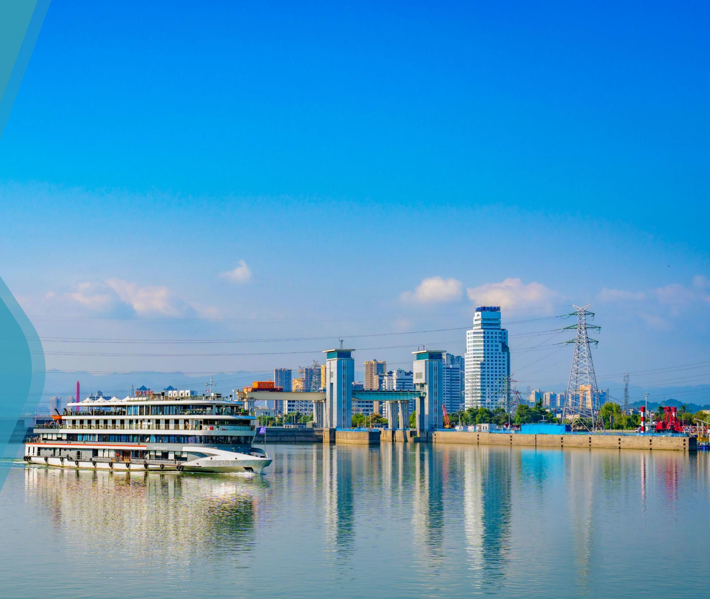

natural_image

Scenic view of a river with a large ferry, modern city skyline, and power transmission towers under a clear blue sky (no visible text or symbols)

9 产业、创新和基础设施

12 负责任消费和生产

16 和平、正义与强大机构

17 促进目标实现的伙伴关系

# 数智赋能

三峡旅游深入推进数字化转型，以数据共享为核心打通业务与财务壁垒，以智慧应用赋能三大产业板块，实现资源高效集约、业财深度一体与服务体验全面升级，为高质量发展注入澎湃数智动能。

# 数字化体系

公司持续深化数字化转型战略，以“一个中心、两大平台、三个服务”为核心框架，推进业财融合与数据互通，初步构建资源集约管控、数据互联互通、业态智慧升级的数字化格局，为产业高质量发展注入数智动能。

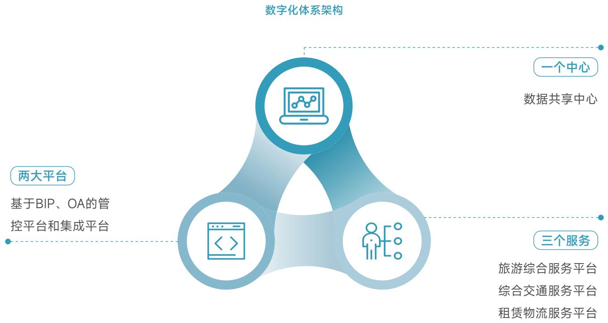

flowchart

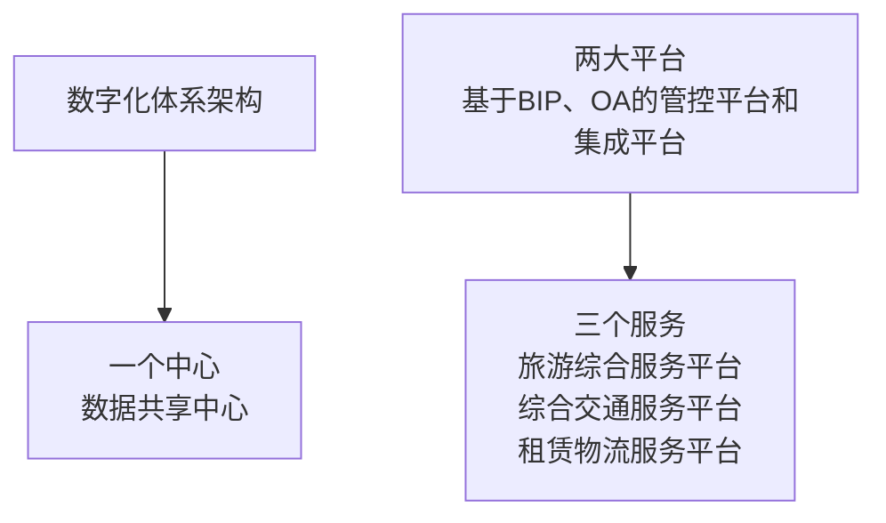
```mermaid
graph TD
  A["数字化体系架构"] --> B["一个中心\n数据共享中心"]
  C["两大平台\n基于BIP、OA的管控平台和集成平台"] --> D["三个服务\n旅游综合服务平台\n综合交通服务平台\n租赁物流服务平台"]
```

# 数字化建设

公司坚持以数据共享为中心，依托BIP管控平台与OA集成平台融合而成的统一门户，实现业务审批、流程控制与财务支付结算的全生命周期闭环管理。2025年，公司启动数据平台搭建，统一经营数据口径与分析指标，实现多维数据自动展示与深度挖掘，为经营决策提供精准技术支撑，逐步建成覆盖各业务板块的数字资源共享中心。

公司持续深化业财融合，通过业务系统与OA、BIP财务、资金系统的集成，实现资金全流程闭环管控。旅游综合管理系统、升级的账户系统等先后完成与财务系统的对接，产业业务系统的订单结算自动向BIP传递财务应收、收款数据，大幅提升财务核算质效，为资源集约管控奠定坚实基础。

# 数字化应用

公司聚焦三大产业板块深化数字化应用，旅游综合服务板块持续优化智慧旅游服务平台，实现车、船、导游集中调度与分销结算一体化管理，省际游轮综合管理平台于2025年完成开发并启动内测；综合交通服务板块通过客运在线售票、定制客运小程序等系统提升运营效率，持续优化服务能力；租赁物流服务板块依托OA系统搭建租赁管理平台，整合全公司租赁数据，实现业务财务一体化管控，数字化应用全面赋能业务协同效率与服务体验提升。

旅游业务  
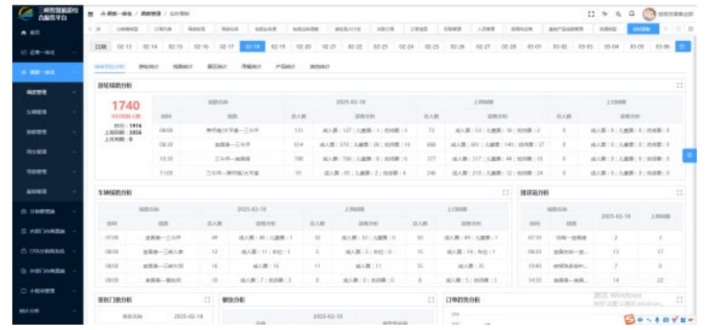

text_image

三味快餐配送
店铺首页
日期 02-15 02-14 02-15 02-16 02-17 02-18 02-19 02-20 02-23 02-22 02-23 02-24 02-25 02-26 02-27 02-28 03-01 03-02 03-03 03-04 03-05 03-06
论坛统计分析
论坛统计 投资统计 联系统计 联系统计 用链统计 产品统计 美容统计
论坛续购分析
1740
C101实时入驻
今日：1816
上海网：3816
上月网：0
经营名称
2025-02-18
上周销售额
上周销售额
时间
经营
总人数
游客分析
总人数
游客分析
总人数
游客分析
08:00
常平港/太平潭/三亚水岸
131
成人房：127；儿童屋：1；伙师房：3
73
成人房：53；儿童屋：16；伙师房：2
0
成人房：0；儿童屋：8；伙师房：8
08:30
宜泉港—三斗坪
614
成人房：573；儿童屋：26；伙师房：16
666
成人房：581；儿童屋：140；伙师房：37
0
成人房：0；儿童屋：8；伙师房：8
18:30
三斗坪—美满潭
788
成人房：756；儿童屋：8；伙师房：6
377
成人房：317；儿童屋：44；伙师房：18
0
成人房：0；儿童屋：8；伙师房：8
11:00
三斗坪—季平潭/大平潭
99
成人房：95；儿童屋：2；伙师房：4
246
成人房：219；儿童屋：52；伙师房：24
0
成人房：0；儿童屋：8；伙师房：8
车间续购分析
经营名称
2025-02-18
上周销售额
上周销售额
时间
经营
总人数
游客分析
总人数
游客分析
总人数
游客分析
接欢站分析
经营名称
2025-02-18 上周销售额
时间
经营
总人数
游客分析
07:00
宜泉港—三斗坪
49
成人房：49；儿童屋：1
52
成人房：52；儿童屋：0
50
成人房：49；儿童屋：1
08:00
宜泉港—三峡人家
12
成人房：11；单位：1
5
成人房：5；单位：0
15
成人房：14；单位：1
08:00
宜泉港—三峡大厦
16
成人房：16
11
成人房：11
35
成人房：35
08:00
宜泉港—首钻园
18
成人房：7；伙师房：3
8
成人房：0；伙师房：0
6<fcel>接欢站分析
经营名称
2025-02-18 上周销售额
时间<fcel>经营<nl>C101实时入驻<fcel>均唯一至商场<fcel>2<fcel>1<nl>07:19<fcel>宜泉市站一街...<fcel>13<fcel>17<nl>08:30<fcel>宜泉市站一街...<fcel>13<fcel>17<nl>10:40<fcel>成都驿客酒店...<fcel>7<fcel>9<nl>14:30<fcel>成都驿客酒店...<fcel>14<fcel>22<nl>景区门票分析<fcel>餐饮分析<fcel>订单趋势分析<lcel><lcel><nl>景区名称 2025-02-18<lcel><lcel><lcel><lcel><nl>

客运业务  
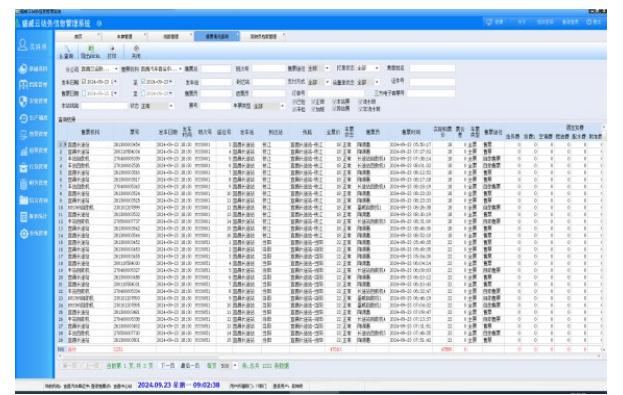

text_image

编辑器: 2024-09-23
文件(F) 编辑(E) 查看(V) 收藏(A) 帮助(H)
编辑器: 2024-09-23
日期: 2024-09-23
摘要: 2024-09-23
摘要名称: 审查
摘要类型: 档案
摘要标题: 选择文件夹
摘要内容: 选择文件夹
摘要标题: 选择文件夹
摘要类型: 档案
摘要标题: 选择文件夹
摘要内容: 选择文件夹
摘要标题: 选择文件夹
摘要类型: 档案
摘要标题: 选择文件夹
摘要内容: 选择文件夹
摘要标题: 选择文件夹
摘要类型: 档案
摘要标题: 选择文件夹
摘要内容: 选择文件夹
摘要标题: 选择文件夹
摘要类型：选择文件夹
摘要标题: 选择文件夹
摘要内容: 选择文件夹
摘要标题: 选择文件夹
摘要类型：选择文件夹
摘要标题: 选择文件夹
摘要内容: 选择文件夹
摘要标题: 选择文件夹
摘要类型：选择文件夹
摘要标题: 选择文件夹
摘要内容: 选择文件夹
摘要标题: 选择文件夹
摘要类型：选择文件夹
摘要标题: 选择文档
摘要内容: 选择文档
摘要类型：选择文档
摘要标题: 选择文档
摘要内容: 选择文档
摘要标题: 选择文档
摘要内容: 选择文档
摘要标题: 选择文档
摘要内容: 选择文档
摘要标题: 选择文档
摘要内容: 选择文档
摘要标题: 选择文档
摘要内容: 选择文档
摘要标题: 选择文档
摘要内容: 选择文档
摘要标题: 选择文档
摘要内容: 选择文档
摘要标题: 选择文档
摘要内容: 选择文件夹
摘要标题: 选择文档
摘要内容: 选择文档
摘要标题: 选择文档
摘要内容: 选择文档
摘要标题: 选择文档
摘要内容: 选择文档
摘要标题: 选择文档
摘要内容: 选择文档
摘要标题: 选择文档
摘要内容: 选择文档
摘要标题: 选择文档
摘要内容: 选择文档
摘要标题: 选择文档
摘要内容: 选择文档
编辑器: 2024-09-23
编辑器类型: 档案
编辑器时间范围：1月~6月
编辑器类型： 档案
编辑器类型： 档案
编辑器类型： 档案
编辑器类型： 档案
编辑器类型： 档案
编辑器类型： 档案
编辑器类型： 档案
编辑器类型： 档案
编辑器类型： 档案
编辑器类型： 档案
编辑器类型： 档案
编辑器类型： 档案

租赁业务  
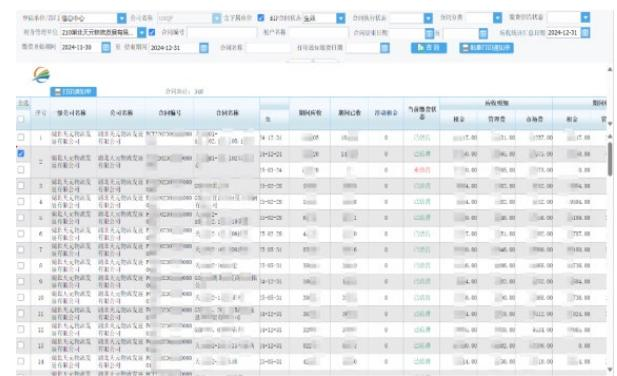

text_image

会计表
序号	单位名称	账户名称	合同编号	合同金额
1	福建大名物流有限公司
2	福建大名物流有限公司
3	福建大名物流有限公司
4	福建大名物流有限公司
5	福建大名物流有限公司
6	福建大名物流有限公司
7	福建大名物流有限公司
8	福建大名物流有限公司
9	福建大名物流有限公司
10	福建大名物流有限公司
11	福建大名物流有限公司
12	福建大名物流有限公司
13	福建大名物流有限公司
14	福建大名物流有限公司
15	福建大名物流有限公司
16	福建大名物流有限公司
17	福建大名物流有限公司
18	福建大名物流有限公司
19	福建大名物流有限公司
20	福建大名物流有限公司
21	福建大名物流有限公司
22	福建大名物流有限公司
23	福建大名物流有限公司
24	福建大名物流有限公司
25	福建大名物流有限公司
26	福建大名物流有限公司
27	福建大名物流有限公司
28	福建大名物流有限公司
29	福建大名物流有限公司
30	福建大名物流有限公司
31	福建大名物流有限公司
32	福建大名物流有限公司
33	福建大名物流有限公司
34	福建大名物流有限公司
35	福建大名物流有限公司
36	福建大名物流有限公司
37	福建大名物流有限公司
38	福建大名物流有限公司
39	福建大名物流有限公司
40	福建大名物流有限公司
41	福建大名物流有限公司
42	福建大名物流有限公司
43	福建大名物流有限公司
44	福建大名物流有限公司
45	福建大名物流有限公司
46	福建大名物流有限公司
47	福建大名物流有限公司
48	福建大名物流有限公司
49	福建大名物流有限公司
50	福建大名物流有限公司
51	福建大名物流有限公司
52	福建大名物流有限公司
53	福建大名物流有限公司
54	福建大名物流有限公司
55	福建大名物流有限公司
56	福建大名物流有限公司
57	福建大名物流有限公司
58	福建大名物流有限公司
59	福建大名物流有限公司
60	福建大名物流有限公司
61	福建大名物流有限公司
62	福建大名物流有限公司
63	福建大名物流有限公司
64	福建大名物流有限公司
65	福建大名物流有限公司
66	福建大名物流有限公司
67	福建大名物流有限公司
68	福建大名物流有限公司
69	福建大名物流有限公司
70	福建大名物流有限公司
71	福建大名物流有限公司
72	福建大名物流有限公司
73	福建大名物流有限公司
74	福建大名物流有限公司
75	福建大名物流有限公司
76	福建大名物流有限公司
77	福建大名物流有限公司
78	福建大名物流有限公司
79	福建大名物流有限公司
80	福建大名物流有限公司
81	福建大名物流有限公司
82	福建大名物流有限公司
83	福建大名物流有限公司
84	福建大名物流有限公司
85	福建大名物流有限公司
86	福建大名物流有限公司
87	福建大名物流有限公司
88	福建大名物流有限公司
89	福建大名物流有限公司
90	福建大名物流有限公司
91	福建大名物流有限公司
92	福建大名物流有限公司
93	福建大名物流有限公司
94	福建大名物流有限公司
95	福建大名物流有限公司
96	福建大名物流有限公司
97	福建大名物流有限公司
98	福建大名物流有限公司
99	福建大名物流有限公司
100	福建大名物流有限公司

# 品质服务

三峡旅游秉持匠心精神，坚持品质服务，持续完善质量管理体系，夯实标准化制度根基，深耕在地文化推动产品迭代，以科技赋能提升产品文化附加值，创新服务机制优化客户体验，多措并举打造有温度、有竞争力的品质服务品牌。

# 质量管理

# 质量管理体系

公司以精细化运营驱动服务升级，构建标准化服务质量管理体系，通过全流程优化与质量目标分解提升游客服务体验；深化员工服务意识培训，加速旅游服务基础设施迭代，同步强化“两坝一峡”品牌文化输出与体验创新，形成“体系支撑-人才赋能-品牌增值”协同发展格局，持续巩固区域旅游服务标杆地位。

服务质量管理架构  
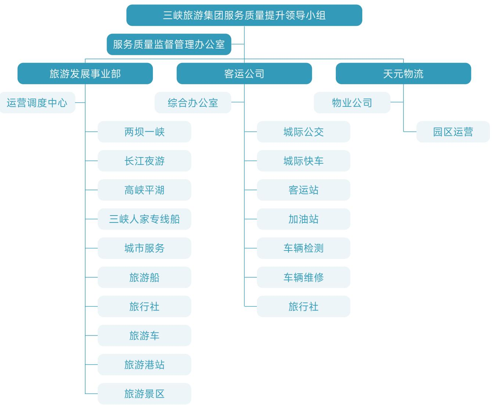

flowchart

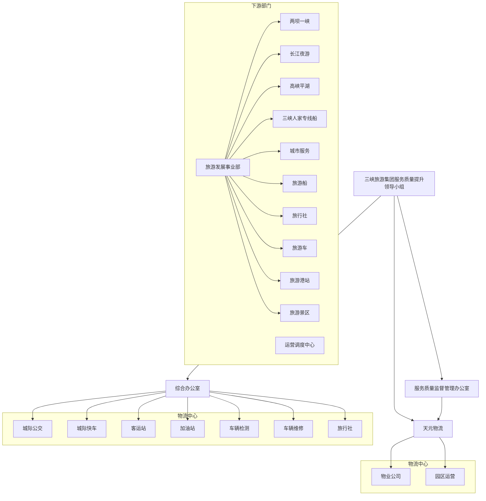
```mermaid
graph TD
  A["三峡旅游集团服务质量提升领导小组"] --> B["服务质量监督管理办公室"]
  A --> C["天元物流"]
  A --> D["综合办公室"]
  
  subgraph Department1 [下游部门]
    E["旅游发展事业部"]
    F["运营调度中心"]
    G["两坝一峡"]
    H["长江夜游"]
    I["高峡平湖"]
    J["三峡人家专线船"]
    K["城市服务"]
    L["旅游船"]
    M["旅行社"]
    N["旅游车"]
    O["旅游港站"]
    P["旅游景区"]
  end
  
  subgraph Logistics1 [物流中心]
    Q["城际公交"]
    R["城际快车"]
    S["客运站"]
    T["加油站"]
    U["车辆检测"]
    V["车辆维修"]
    W["旅行社"]
  end
  
  subgraph Logistics2 [物流中心]
    X["物业公司"]
    Y["园区运营"]
  end
  
  E --> G
  E --> H
  E --> I
  E --> J
  E --> K
  E --> L
  E --> M
  E --> N
  E --> O
  E --> P
  
  B --> C
  C --> X
  C --> Y
  
  D --> Q
  D --> R
  D --> S
  D --> T
  D --> U
  D --> V
  D --> W
```

2025年，公司系统推进《质量投诉处理制度2.0》《舆情处理机制1.0》《先行赔付标准》等核心制度建设，并以ISO9001质量管理体系认证为抓手，高质量完成《质量手册》、29个《程序文件》及14册《作业指导书》的编制发布，下属单位于11月一次性通过中国质量认证中心认证，标志公司质量管理实现标准化、系统化的能级跃升。

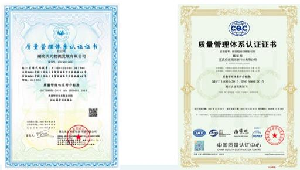  
三峡旅游下属各单位质量管理体系认证证书

# 质量管理举措

2025年，公司印发实施《服务质量全面提升工作方案》，成立由主要领导任组长的领导小组，围绕产品提质、服务提档、管理提效三大方向，明确52项重点工作清单，首次将服务质量指标纳入经营单位主要负责人考核，推动服务模式从被动响应向主动赋能转变。

服务质量管理举措

<table><tr><td>管理维度</td><td>具体举措</td><td>主要成效</td></tr><tr><td>工作机制建设</td><td>印发《服务质量全面提升方案》,建立内部自查、交叉检查、上级督查、线上分析、线下体验相结合的监督检查机制</td><td>服务质量提升首次纳入经营单位主要负责人考核</td></tr><tr><td>投诉处理优化</td><td>修订《质量投诉处理制度2.0》,推出《舆情处理机制1.0》,试行《先行赔付标准》,全场景公示内部投诉热线</td><td>旅游事业部2025年市长热线投诉总量同比下降12.58%</td></tr><tr><td>监督检查强化</td><td>建立“神秘访客”常态化监督机制,每月召开服务质量复盘会,联合三峡大学开展服务全流程评估</td><td>全年开展31次专项暗访,深入排查16项游客触点</td></tr><tr><td>服务品牌引领</td><td>开展“Smile+示范岗”评选,建立长效激励机制,将服务意识培育纳入全员必修内容</td><td>全年收到表扬件953件(旅游事业部944件,客运公司9件)</td></tr></table>

# 质量管理目标

公司明确2025年质量管理总目标为游客投诉率≤0.1%、无重大服务质量事故。2025年，公司通过系统推进服务质量管控与优化，投诉总量同比明显下降，客户表扬件大幅增加，服务质量与客户满意度实现双提升，品牌美誉度显著增强。

# 产品创新

公司坚持创新驱动，深度挖掘在地文化内涵，通过文化IP开发、沉浸式场景打造及互动体验设计，持续推动产品迭代升级。公司依托“需求洞察—产品研发—体验升级”闭环机制，以科技赋能传统文化，以定制服务响应细分市场，构建主题化、差异化的产品矩阵，持续提升产品文化附加值及市场竞争力。

# 案例 | “楚风号夜秀”入选2025旅游出行行业创新及服务案例

2025年5月，公司投资2,000万元打造的“楚风号夜秀”游轮首航，项目由北京冬奥视觉设计团队黑弓BLACKBOW操刀，以屈原、昭君、李白三位历史人物为叙事主轴，通过威亚飞行、沉浸式音响、水墨投影等科技手段，构建“畅游长江、观景演出、文明体验”三位一体的沉浸式文化场景。同年9月，该项目入选中国旅游车船协会“2025旅游出行行业创新及服务案例”品质突破类榜单，成为宜昌“文化+科技+旅游”融合的新名片。

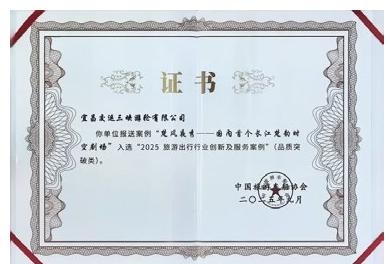

text_image

证书
宝泰宏远上映通联有限公司
印制馆国画展例“夏风美司——曲向首个长江发射时
宫剧场”入选“2025旅游出行行业创新及服务案例”（品质突
础类）。
中国邮政储蓄协会
二〇一九年五月

“楚风号夜秀”产品入选2025旅游出行行业创新及服务案例

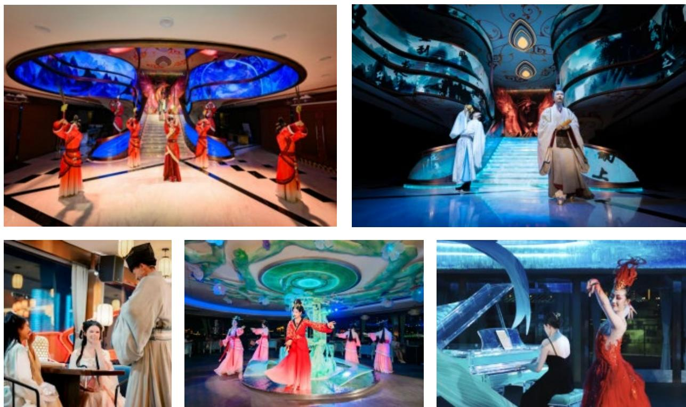  
“楚风号夜秀”

# 案例 | 三峡旅游探索专线服务推动道路客运转型发展

2025年，公司积极应对道路客运市场变化，创新开通“三峡旅游直通车”“峡客行城际快车”“校园直通车”“健康专车”等多元化专线服务，通过小程序实现“门到门”便捷出行，有效衔接景区、学校、医院等场景，解决乡镇学生进城读书、县市区群众进城就医等民生难题。公司《探索“客运站+”助推道路客运转型发展》案例入选交通运输部典型案例，为行业转型发展提供了有益借鉴。

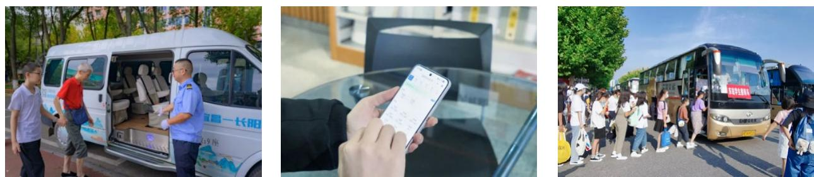  
峡客行城际快车  
校园直通车

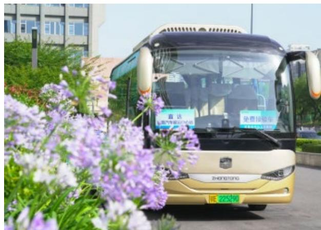

text_image

直达
免费接驳车
ZHONGTONG
E 22520

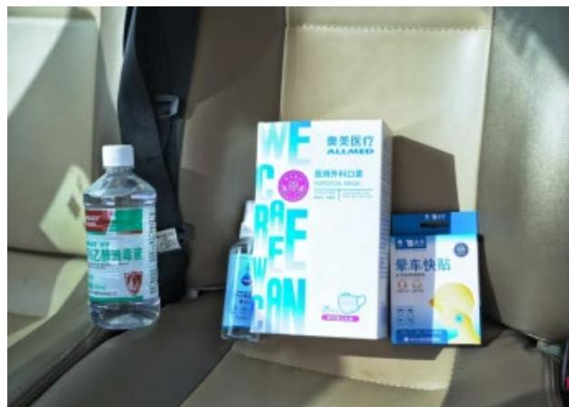

text_image

WFE
CABBEN
奥美医疗
ALLMED
蓝眼外科口罩
SPOKICE BEANS
晕车快贴
Ω

健康专车

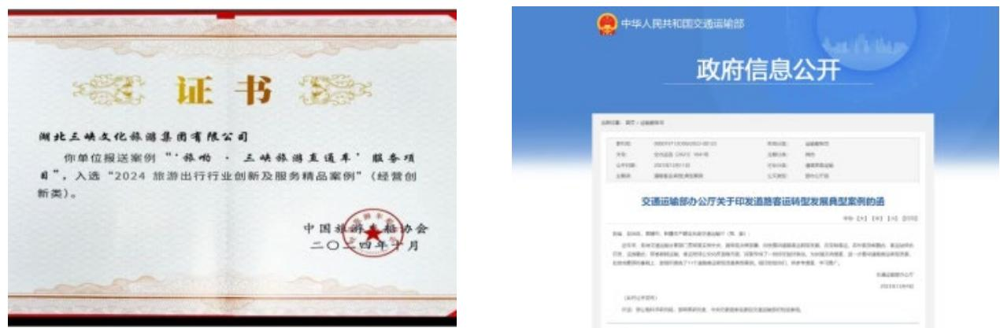  
“旅哟·三峡旅游直通车”获评“2024旅游出行行业创新及服务精品案例”

# 服务提升

公司持续深化服务品质建设，坚持以客户需求为导向，融合标准化与精细化、硬件焕新与软件升级，创新服务机制，强化品牌引领，构建全方位服务提升体系，致力为游客打造有温度、有记忆的文旅体验。

# 服务提升举措

# 硬环境焕新+软体验升级

积极推进旅游氛围提质与体验升级。于“硬环境”上精琢，推动港口旅游氛围焕新：翻新IP护坡斑马线、美化九码头门头、美化三斗坪阁面、打造新能源充电示范站；标准化更新旅游港口中英双语标识系统，显著提升港口导视服务规范性与国际化形象。于“软体验”上巧思，激活旅游体验玩法：文化赋能升级“两坝一峡”集章打卡，四大线路集章以文化互动串联产品与山水文脉；推动鲟侠、金梅IP从2D到3D形象升级，延展6款动态形象与6款主题服饰；并在五一、端午、国庆等重要节庆营造全流程主题节日场景，以沉浸式氛围增强游客参与感与记忆度，构建多维融合的文旅新氛围。

# 服务质量管理制度与机制创新

迭代发布《质量投诉处理制度2.0》，全新推出《舆情处理机制1.0》，高峰试行《先行赔付标准》，严格落实“先行赔付原则”，实现对合理诉求的快速响应与即时办结。同步优化OTA平台信息公示与市长热线话术，提升沟通效率。

# 服务质量主动监督与精准改进

创新构建“神秘访客”常态化监督机制，在运营高峰聚焦服务关键场景，集中开展31次专项暗访，深入排查16项游客触点，精准识别服务短板与潜在风险，并驱动改善。

# 服务品牌与文化引领

以“Smile+”服务品牌建设为引领，通过公开选拔机制，评选出“Smile+”大使1名、示范岗22名，建立起一支高素质的服务骨干队伍。“以游客为中心，诠释温度服务”服务案例入选湖北省文旅厅优秀服务案例并作代表发言，标志着服务品质与影响力获得省级认可，实现新跨越。

# 管理体系系统升级

以ISO9001质量管理体系认证为抓手，构建标准化、流程化、规范化的服务质量管理架构，编撰覆盖全面的《质量手册》《程序文件》及《作业指导书》，形成业务覆盖全面、交叉衔接有序的管理体系，标志着质量管理实现标准化、系统化的能级跃升，为高效运营和可持续发展筑牢制度根基。

# 案例 | 三峡旅游启动“Smile+”示范岗评选，以微笑传递服务温度

2025年，公司深化“Smile+”服务品牌建设，启动第二批“Smile+示范岗”评选，通过精细化的选拔机制，从各岗位评选出1名“Smile+”大使和22名示范岗员工，并为其佩戴融合鲟侠船长与宜昌市花元素的专属徽章。这些微笑先锋活跃在两坝一峡旅游一线，以真诚笑容和贴心服务为游客排忧解难，将“微笑力量，乘风破浪”的服务理念传递给每一位游客，成为旅途中最温暖的风景。

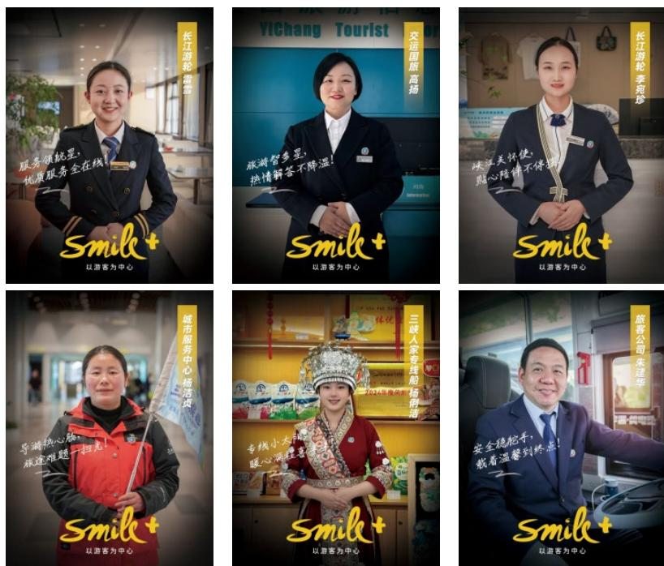  
“Smile+”示范岗员工风采

# 案例 | 交运国旅构建“温度·精度·厚度”三位一体服务体系

2025年，三峡旅游下属交运国旅深度贯彻“以游客为中心”的服务理念，构建起“温度·精度·厚度”三位一体的服务体系。在温度层面，推出多语种友好沟通、便民式暖心服务、应急式主动帮扶及管家式全程守护；在精度层面，建立新员工闭环培养、常态化技能练兵及固定式业务研习机制；在厚度层面，以ISO9001质量服务体系认证为纲，完善门市运营管理制度。凭借专业、温暖的服务，交运国旅赢得了游客的广泛好评与信赖。

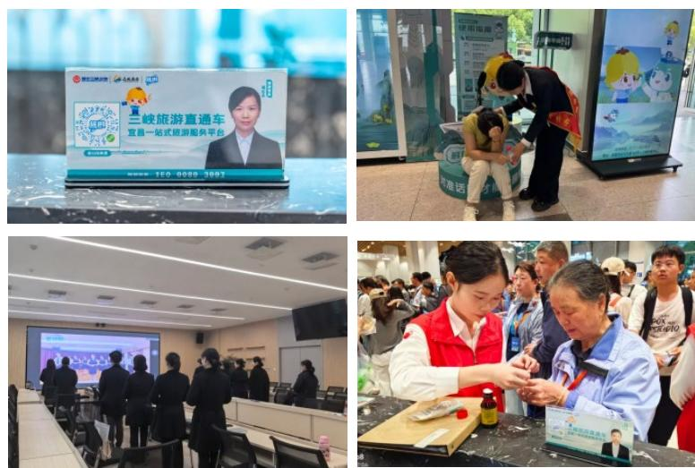  
交运国旅暖心服务场景

# 客户责任

三峡旅游始终坚持以客户为中心，围绕客户权益保障构建系统化管理机制，全力保障客户隐私安全，构建全周期沟通服务体系，完善投诉闭环处理机制，坚守诚信合规营销底线，持续提升客户满意度与品牌信任度，夯实与客户长期稳定的价值关系。

# 客户隐私保护

公司高度重视客户隐私保护，严格遵循合法、公正、透明原则，在《生产管理实施细则》中明确信息安全要求，为客户数据安全提供制度保障。同时，通过权限管控、数据脱敏、系统防护等技术手段防范信息泄露风险，定期开展员工培训提升隐私保护意识，确保客户信息安全无虞。

# 客户沟通渠道

公司始终坚持以客户为中心，积极构建多元化、全周期的客户沟通与反馈体系。依托服务热线与在线平台，建立覆盖旅游服务前、中、后全流程的数字化售后服务体系，集成咨询、投诉、服务保障等功能，实现游客需求的快速响应与闭环管理。

公司持续完善以“分类管理、快速响应、权责闭环”为核心的投诉处理机制，对现场投诉与外部转办投诉实行分级处置，确保客户诉求得到及时有效解决。

# 客户沟通渠道

# 服务热线与在线平台

“6910001热线”“6910888热线”及在线平台集成咨询、投诉、服务保障等功能，实现行前咨询、行中协调、行后反馈全周期服务

# 现场投诉处理

各业务单位现场发现并快速解决游客诉求，第一时间安抚与处置

# 外部转办投诉处理

对接12345市长热线、12328热线、政风行风热线阳光信访等平台

# 客户微信群渠道

运输单位按线路差异建立了各线路乘客微信群，为乘客第一时间解答各类问题

客户投诉情况

<table><tr><td>议题</td><td>单位</td><td>2024年</td><td>2025年</td></tr><tr><td>客户投诉数量</td><td>次</td><td>683</td><td>599</td></tr><tr><td>客户投诉解决数量</td><td>次</td><td>683</td><td>599</td></tr><tr><td>客户投诉解决率</td><td>%</td><td>100</td><td>100</td></tr></table>

# 客户满意度

公司建立完善的客户满意度监测体系，构建“主动洞察—制度创新—精准改进—品牌引领—体系升级”五位一体的满意度提升机制，通过常态化满意度调研、神秘访客暗访、VIP游客深度回访等多元化渠道，精准识别并优化服务短板，并通过常态化满意度调研、游客座谈、关键触点实时反馈等多元化渠道，主动捕捉游客需求，精准识别服务短板并持续优化。

客户满意度调查

<table><tr><td>议题</td><td>单位</td><td>2024年</td><td>2025年</td></tr><tr><td>客户满意度</td><td>%</td><td>100</td><td>100</td></tr></table>

# 负责任营销

公司秉持诚信合规的营销理念，建立覆盖“战略规划、过程审查、结果复盘”全周期的负责任营销管理体系。2025年，公司发布《年度宣传工作要点》，从战略层面确立内容真实准确的合规红线；制定《下半年营销计划》对营销目标细化分解，为过程审查提供明确依据。

<table><tr><td>双轨制内容审核机制</td><td>月度营销工作通报机制</td><td>员工责任营销培训</td></tr><tr><td>重要营销内容严格执行OA系统“部门初审一分管复核一单位终审”三级审批,二级单位快速响应内容实行微信群领导确认制,所有审核流程全程留痕、责任可溯。</td><td>按月度从合规性、真实性、消费者反馈等维度对营销活动进行数据化审查复盘,并针对潜在风险进行前瞻性提示,驱动营销质量与合规水平持续提升。</td><td>定期开展负责任营销专题培训,涵盖产品知识、话术规范、法规政策等内容,确保销售人员专业合规。通过周/月/季度常态化检查,对线上线下广告、直播话术、KOL合作等全渠道进行审核监督,保障所有营销行为坚守合规底线与道德准则。</td></tr></table>

# 责任采购）

三峡旅游持续完善供应链管理体系，构建全链条管控机制，强化风险防控与应急保障；深化供应商培训与协同发展，落实阳光采购，打造稳定、透明、共赢的供应链生态。

# 供应商管理

公司持续健全供应商管理体系，制定并完善《招标采购管理办法》《供应商履约行为管理办法》等核心制度，依托“准入把关—过程管控—结果评价”全链条机制，对供应商实施全生命周期规范化管理，通过建章立制、严控流程、契约锁责、以评促改的闭环模式，不断强化供应链风险防控能力，确保采购活动公开、公平、公正。

# 准入与尽调

公司严格执行招标采购程序，由评标委员会在评审环节开展多维度尽职调查，包括资质能力审查、信用状况审查及业绩经验审查，确保供应商具备与项目相匹配的综合实力和履约保障能力，从源头把控风险。

# 过程管控与评价

公司推行标准化合同文本，明确质量、进度、成本等核心条款及违约责任。实行四级审批机制（招采计划、采购申报、信息发布、结果确认），全过程留痕可追溯。建立涵盖交付质量、响应速度、服务态度等维度的履约考核体系，实行季度评价、年度总评，配套“优质优价、劣质退出”的激励约束机制，倒逼供应商持续改进服务质量。

# 供应链韧性建设

针对船舶燃油、导游服务等市场价格波动大、供应不确定性高的物资服务，公司建立动态供应商库，采用“一标多商”模式引入竞争充分的合格供应商群体，形成渠道冗余备份，有效避免单一供应商依赖导致的断供风险。

# 应急防控体系

公司构建“惩戒—约束—备份—应急”全链条防控体系。对断供等违约行为，依据合同启动追责程序，罚没保证金并索赔损失；将严重违约供应商纳入“负面清单”，实施市场禁入等惩戒；建立分级分类的合格供应商储备库，推行“一品多源、主备结合”策略；开通断供应急处置绿色通道，明确紧急采购流程，确保突发情况下物资供应不断档，全力维护生产经营稳定。

供应商拥有管理体系认证情况

<table><tr><td>议题</td><td>单位</td><td>2024年</td><td>2025年</td></tr><tr><td>供应商总数</td><td>↑</td><td>48</td><td>127</td></tr><tr><td>供应商拥有ISO14001环境管理体系认证比例</td><td>%</td><td>67</td><td>52</td></tr><tr><td>供应商拥有ISO9001质量管理体系认证比例</td><td>%</td><td>72</td><td>54</td></tr><tr><td>供应商拥有ISO45001职业健康安全管理体系认证比例</td><td>%</td><td>67</td><td>53</td></tr></table>

# 供应商培训

公司高度重视与供应商的协同发展，通过定期开展专题培训与交流活动，将管理要求、服务标准与供应商能力建设深度融合。2025年，公司面向导服公司等核心服务供应商，围绕管理细则、服务规范、专业技能等开展系统培训，帮助供应商精准把握服务红线与操作标准，推动其管理水平和执行能力持续提升，在共同成长中夯实服务品质根基。

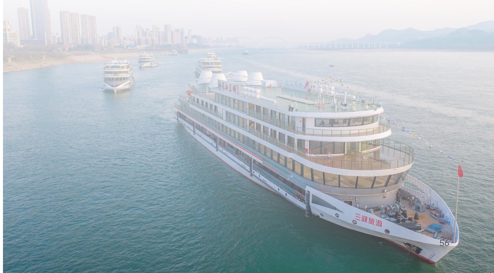

natural_image

Aerial view of a large cruise ship named '三峡旅游' sailing on a river, with city skyline and bridge in the background (no signage or text beyond ship name)

# 案例 | 旅游发展事业部开展导游专业知识及Smile+示范岗培训

2025年2月，公司下属旅游发展事业部组织全体导游开展专业知识及Smile+示范岗专题培训，围绕文旅政策法规、景区文化、应急处置等专业知识，以及微笑服务、情绪管理、个性化服务等优质服务标准进行系统讲解。培训采用“理论讲解+案例分析+实操演练+标杆示范”模式，推动导游将专业知识转化为服务能力，将Smile+服务标准融入带团全流程，打造专业过硬、服务优质的导游队伍。

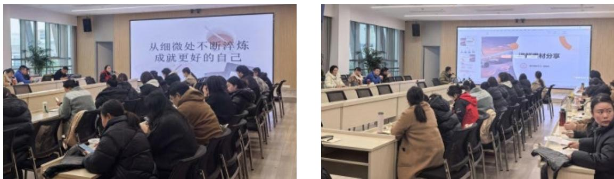  
导游专业知识及Smile+示范岗培训

# 案例 | 旅游发展事业部开展导服公司沟通交流会

2025年12月，公司下属旅游发展事业部组织导服公司召开沟通交流会，聚焦《导服公司管理细则》核心要求与服务实操规范，明确合作准入、导游分层管理、服务红线等关键条款，并就春节保障、导游培训等近期工作进行部署。本次交流会强化了服务供应商对公司管理要求的理解与执行意识，为导游服务品质提升和春节假期平稳运营夯实基础。

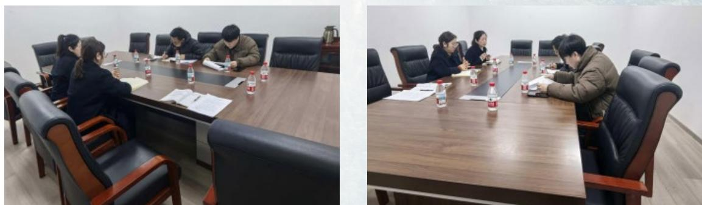  
导服公司沟通交流会

# 阳光采购

公司严格遵守国家招投标法律法规，持续规范采购行为，所有达到规定标准的采购项目均通过地方公共资源交易平台或三峡文旅集团招采平台进行公开招标。公司在采购过程中全面落实廉洁要求，与供应商签订《廉洁协议》及廉洁采购承诺书，明确双方廉洁义务与违约责任，并通过电子招采平台核查企业信息、纪检人员全程参与开评标监督、定期开展招采项目后评估检查，确保采购活动廉洁合规。

# 平等对待中小企业

公司秉持互利共赢理念，对各类供应商和合作伙伴一视同仁，通过供应链协同创新、产业资源整合等方式，积极支持中小企业参与三峡旅游生态圈建设，共同促进区域文旅产业高质量发展。

# 03

# 以人为本，同心致远

三峡旅游始终将员工放在心间，以制度保障权益，以培训赋能成长，以关爱温暖人心；时刻紧绷安全之弦，完善管理体系，深化隐患治理，守护每一位员工的生命健康；积极回馈社会，以产业助力乡村振兴，以志愿服务传递企业温度，在服务民生中彰显国企担当。

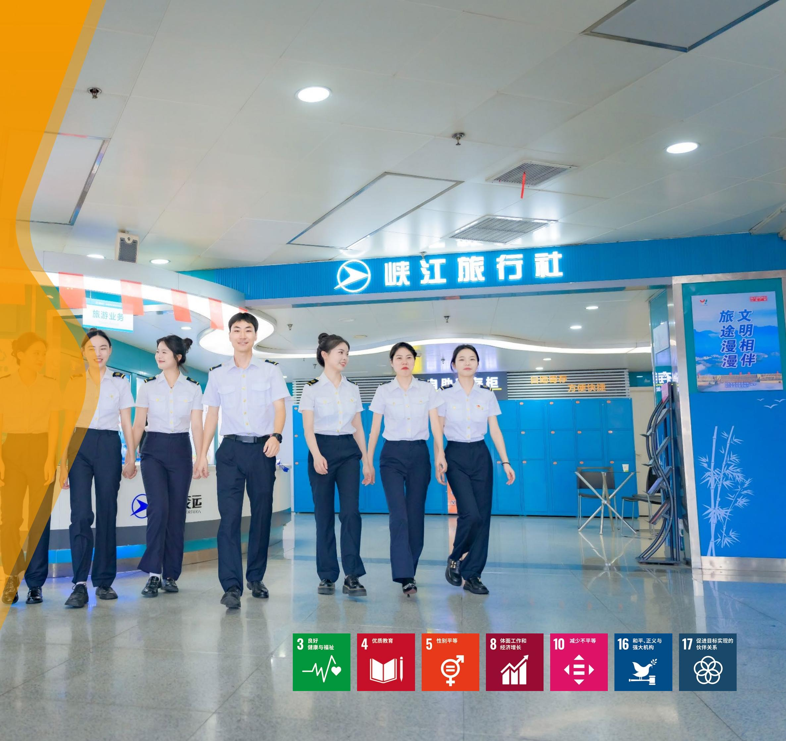

text_image

峡江旅行社
旅游业务
旅游管理
方便快捷
3 良好
健康与福祉
4 优质教育
5 姓别平等
8 体面工作和
经济增长
10 减少不平等
16 和平、正义与
强大机构
17 促进目标实现的
伙伴关系

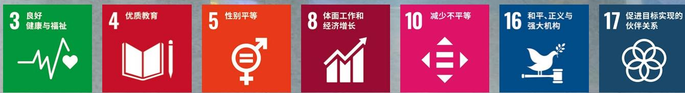

flowchart

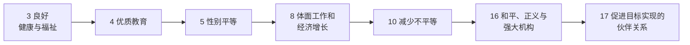
```mermaid
graph LR
  A["3 良好\n健康与福祉"] --> B["4 优质教育"]
  B --> C["5 性别平等"]
  C --> D["8 体面工作和\n经济增长"]
  D --> E["10 减少不平等"]
  E --> F["16 和平、正义与\n强大机构"]
  F --> G["17 促进目标实现的\n伙伴关系"]
```

# 员工责任）

三峡旅游始终将员工视为最宝贵的财富，致力于构建规范有序、公平公正的劳动关系，全面保障员工合法权益，赋能员工成长成才，深化暖心关爱行动，营造温馨和谐的工作氛围，持续提升员工的获得感、幸福感与归属感，夯实企业高质量发展根基。

# 员工权益

公司坚持人本理念，依法保障员工基本权益，构建平等就业、公正分配、民主沟通的和谐劳动关系，以多元激励与暖心关怀激发员工活力，实现企业与员工共成长、同致远。

# 员工雇佣

公司严格遵守《中华人民共和国劳动法》《中华人民共和国劳动合同法》等法律法规，坚持依法合规雇佣，坚决杜绝使用童工和强制劳动行为，制定《人力资源管理制度》《员工招录管理办法》等内部规范，秉持平等、非歧视的雇佣原则，为所有劳动者提供均等的就业机会。2025年，公司劳动合同签订率和社会保险覆盖率均保持100%，切实保障员工合法权益，构建和谐稳定的劳动关系。

2025年员工构成情况  
员工总数 2,124 人  
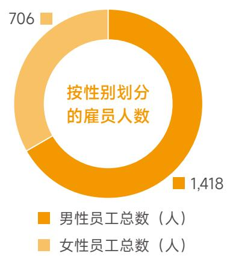

donut

| 性别 | 雇员人数 (人) |
| --- | --- |
| 男性 | 1,418 |
| 女性 | 706 |

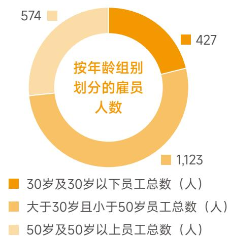

donut

| 年龄组别 | 员工人数 (人) |
| --- | --- |
| 30岁及30岁以下 | 427 |
| 大于30岁且小于50岁 | 1,123 |
| 50岁及50岁以上 | 574 |

2025年员工构成情况  
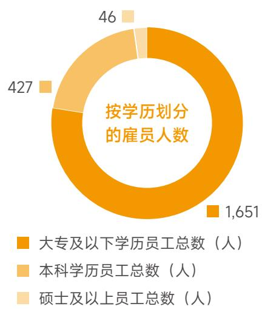

donut

| 学历 | 员工人数 (人) |
| --- | --- |
| 大专及以下学历 | 1,651 |
| 本科学历 | 427 |
| 硕士及以上 | 46 |

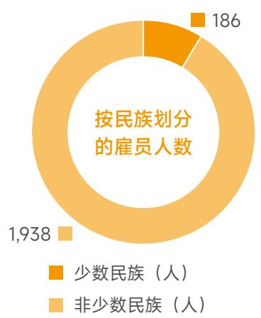

donut

| Category | Value (人) |
| --- | --- |
| 少数民族 | 186 |
| 非少数民族 | 1,938 |

残疾人雇员人数7人 残疾人雇员占全部雇员百分比数 $0.33\%$ 吸纳就业人数228人

2025年员工流动情况  
员工总流失率 7.63 %  
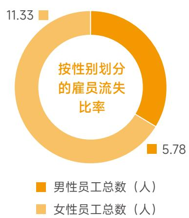

donut

| 性别 | 流失比率 (人) |
| --- | --- |
| 男性员工总数 | 5.78 |
| 女性员工总数 | 11.33 |

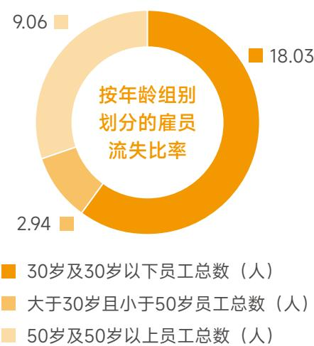

donut

| 年龄组别 | 流失比率 (人) |
| --- | --- |
| 30岁及30岁以下员工总数 | 18.03 |
| 大于30岁且小于50岁员工总数 | 2.94 |
| 50岁及50岁以上员工总数 | 9.06 |

员工权益保障

<table><tr><td>指标</td><td>单位</td><td>2025年数值</td></tr><tr><td>劳动合同签订率</td><td>%</td><td>100</td></tr><tr><td>社会保险覆盖率</td><td>%</td><td>100</td></tr></table>

# 薪酬福利

公司建立健全公平合理的薪酬福利管理机制，制定《工资总额管理办法》等内部制度，所属各单位根据运营情况制定34项工资与效益联动的薪酬管理制度，全面实行“基本薪酬+绩效薪酬”架构，形成责权利相结合、工效紧密挂钩的薪酬分配体系。公司通过人力资源管理系统规范薪酬发放，并每年组织专项审计，确保薪酬支付规范透明。

在福利保障方面，公司制定《员工年休假办法》《企业补充医疗保险管理办法》《企业年金管理办法》等相关制度，完成《员工福利手册2.0》编制及宣贯，将福利保障与文化关怀深度融合，按时足额缴纳社会保险和住房公积金，建立企业年金及补充医疗制度，严格落实国家及湖北省育儿假等规定，足额缴纳残疾人就业保障金，全方位提升员工归属感与安全感。

员工薪酬

<table><tr><td>指标</td><td>单位</td><td>2024年数值</td><td>2025年数值</td></tr><tr><td>员工薪酬总额</td><td>万元</td><td>25,920.37</td><td>27,077.98</td></tr><tr><td>人均薪酬</td><td>万元</td><td>12.27</td><td>12.75</td></tr></table>

# 员工沟通

公司持续健全民主管理体系，制定《员工关系管理办法》，畅通员工沟通渠道，切实保障员工的知情权、参与权、表达权和监督权。通过职工代表大会、员工申诉机制及劳动争议调解等多元化渠道，开展员工满意度调查及专项分析报告，实现从“听民意”到“解民忧”的价值认同，公司充分倾听员工心声，及时回应合理诉求，不断优化管理机制，营造和谐稳定的劳动关系，为企业健康发展凝聚共识与合力。

公司与工会协商签订了《集体劳动合同》《工资集体协商协议书》《女职工权益保护专项集体合同》《劳动安全卫生专项集体合同》，明确公司、工会及全体职工的权责义务，构建和谐稳定的劳动关系，促进公司改革与发展，维护双方的合法权益，进一步规范企业管理，明确各方权责义务，维护公司与职工的合法权益，构建和谐稳定的劳动关系，为公司改革发展保驾护航。

民主管理与员工沟通机制

<table><tr><td>沟通渠道</td><td>运行机制</td><td>主要成效</td></tr><tr><td>职工代表大会</td><td>定期召开职代会,审议企业改革发展重大方案及涉及职工切身利益的重要事项。</td><td>2025年1月召开四届十一次职代会,审议通过《2024年度集团工作报告》和《工资集体协商协议书》。</td></tr><tr><td>员工申诉机制</td><td>工会、人力资源部、纪检室协同受理,严格保密,闭环反馈。</td><td>建立健全申诉管理制度,指定专人负责日常受理与协调。</td></tr><tr><td>员工满意度调查</td><td>设计包含7维度20题问卷,覆盖企业文化、工作环境、薪酬福利等。</td><td>回收有效问卷1,950份,样本覆盖率90.3%,形成42条问题清单并整改。</td></tr><tr><td>劳动争议调解</td><td>设立劳动争议调解委员会,明确处理流程:协商→调解→仲裁→诉讼。</td><td>规定各单位负责人为第一责任人,确保争议及时有效化解。</td></tr></table>

# 员工沟通绩效

2025年

员工满意度 96.77%

工会工作绩效

<table><tr><td>指标</td><td>单位</td><td>2024年数值</td><td>2025年数值</td></tr><tr><td>工会会员人数</td><td>人</td><td>1,944</td><td>1,922</td></tr><tr><td>工会组织个数(包括子公司)</td><td>个</td><td>16</td><td>16</td></tr><tr><td>工会满意度</td><td>%</td><td>97.27</td><td>96.21</td></tr><tr><td>工会诉求解决率</td><td>%</td><td>100.00</td><td>100.00</td></tr><tr><td>集体合同员工覆盖率</td><td>%</td><td>100.00</td><td>100.00</td></tr></table>

# 案例 | 三峡旅游召开四届十一次职代会推进民主管理

2025年1月，公司召开四届十一次职代会、表彰会暨2025年工作会，公司领导、职工代表及先进集体、先进个人等参加会议。会议听取并审议通过了《2024年度集团工作报告》和《工资集体协商协议书》，切实保障了员工的知情权、参与权和监督权，是公司深化民主管理、构建和谐劳动关系的重要实践。

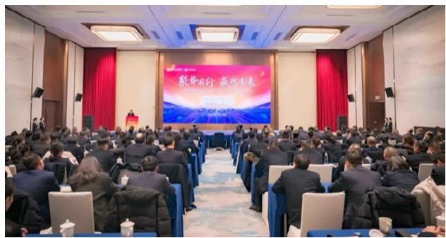

text_image

聚焦前行 葛战未来

四届十一次职代会、表彰会暨2025年工作会

# 人才培养

公司坚持人才强企战略，制定《三年人才发展规划》《技能人才发展规划》等相关人才规划，持续优化“学习赋能”培训体系与“雁阵工程”人才梯队，完善薪酬激励机制，畅通“双通道”职业发展路径，通过内外交流与公开竞聘激发队伍活力，为企业高质量发展提供坚实人才保障。

# 员工成长

公司持续优化培训及人才培养体系，制定《员工培训管理办法》，围绕“1+1+2+N”工程，通过线上+线下、内训+外训、请进来+走出去相结合的模式，深化“学习赋能·强企有为”品牌内涵。公司实施三级培训管理，聚焦管理能力、专业知识、实操技能及综合素养，分级分类定制“战略—运营—业务”培训计划，系统提升员工专业素养。

2025年，公司印发《2025年培训及人才培养工作要点》，深入实施“雁阵工程”，聚焦中高管、青年骨干、储备人才、技能人才等重点群体，分层分类推进人才培养。同时，组织开展机动车检测等技能竞赛，以赛促学，弘扬工匠精神。全年完成22名导师及10名内训师认证，激发内部师资活力。

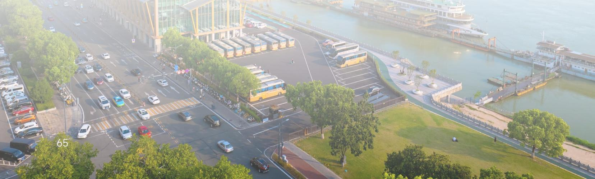

natural_image

Aerial view of a busy urban park with vehicles, trees, and a waterfront promenade (no visible text or signage)

2025年“雁阵工程”人才培养体系

<table><tr><td>类别</td><td>目标人群</td><td>核心举措</td></tr><tr><td>头雁领航</td><td>中高层管理人员</td><td>开展学习强企培训,强化战略思维与管理能力</td></tr><tr><td>鸿雁争鸣</td><td>新晋经理、继任人才</td><td>实施“领航训练营—新晋经理跃迁训练”,26名学员结业</td></tr><tr><td>雏雁展翅</td><td>储备人才、新入职大学生</td><td>双导师制培养,2023届结业汇报,2024届创新课题研究</td></tr><tr><td>群雁齐飞</td><td>技能人才</td><td>依托技能人才评价基地,开展技能竞赛与等级认定</td></tr></table>

公司积极拓展外部合作，获取资质支持，依托格局商学院、海仕德等第三方机构资源，组织实施“领航训练营-新晋经理跃迁训练”项目，26名学员圆满结业。同时，完成宜昌市职业技能等级认定资质续期，具备道路客运汽车驾驶员、道路客运站务员、机动车驾驶教练员等14个工种的自主认定资格，为员工职业发展提供有力支撑。

员工培训绩效

<table><tr><td>指标</td><td>单位</td><td>2024年数值</td><td>2025年数值</td></tr><tr><td>员工培训支出费用</td><td>万元</td><td>28.07</td><td>20.04</td></tr><tr><td>员工平均培训时数</td><td>小时</td><td>65.2</td><td>101.97</td></tr><tr><td>员工培训覆盖率</td><td>%</td><td>100</td><td>100</td></tr><tr><td>员工培训总次数</td><td>次</td><td>840</td><td>864</td></tr><tr><td>员工培训总人次</td><td>人次</td><td>36,051</td><td>43,773</td></tr><tr><td>员工培训总时数</td><td>小时</td><td>137,850</td><td>216,582</td></tr></table>

# 案例 | “新晋经理跃迁训练”一期结营仪式

2025年12月，三峡旅游举办“领航训练营 - 新晋经理跃迁训练”一期结营仪式，公司领导、各产业代表及全体学员参加。训练营聚焦新晋经理从“业务精英”向“管理能手”转型，通过课题研讨、经验分享等形式提升管理技能，表彰优秀班干及学员4名，为公司培育高素质干部人才队伍积蓄力量。

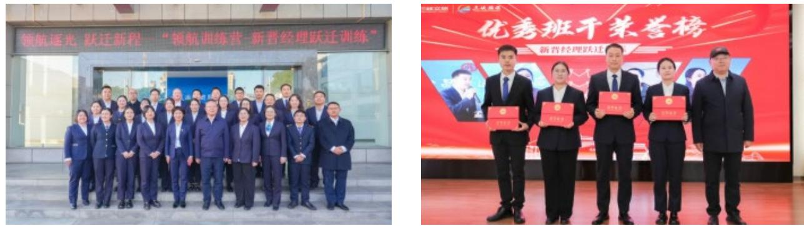  
“领航训练营-新晋经理跃迁训练”一期圆满结营

# 案例 | 三峡旅游举行2023届储备人才结业汇报暨2024届优秀论文展示

2025年9月，三峡旅游举行2023届储备人才结业汇报暨2024届储备人才优秀论文展示活动，公司领导、导师代表及储备人才共同参与。2023届学员展示两年培养成果，2024届学员围绕产业痛点提出创新思路，充分展现“信念坚定、状态满格”的青年风采，是公司双导师制人才培养和“雁阵工程”的生动实践。

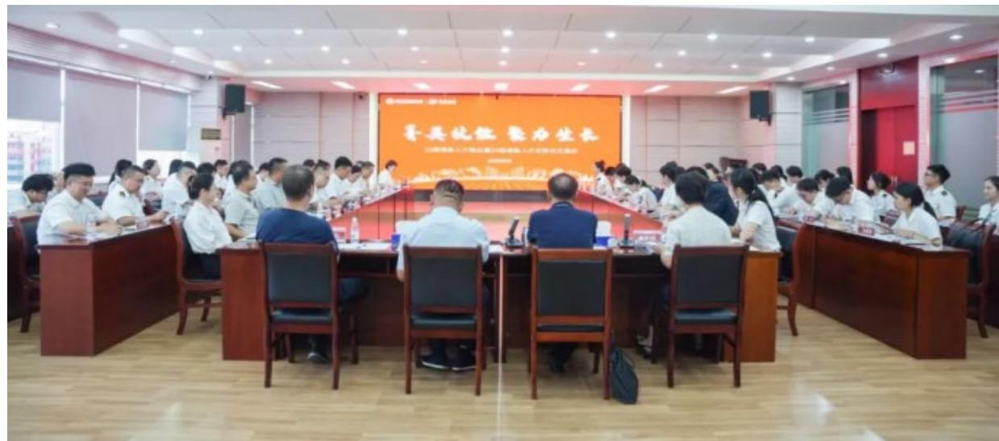

text_image

尊英优胜 水力生长
2023年省人大常委会第1届全国人大常务会议

2023届储备人才结业汇报暨2024届储备人才优秀论文展示活动

# 案例 | 三峡旅游2025年机动车检测技能竞赛

2025年9月，客运公司城区机动车检测管理中心举办机动车检测技能竞赛，来自三家检测公司的5支代表队共20名选手参赛。竞赛设理论考试和实操考核，涵盖外观查验、尾气检测等环节，全面检验检测人员专业素养。经过激烈角逐，硬核检测队以93.7分夺冠。活动以赛促学，弘扬工匠精神，助力服务质量提升。

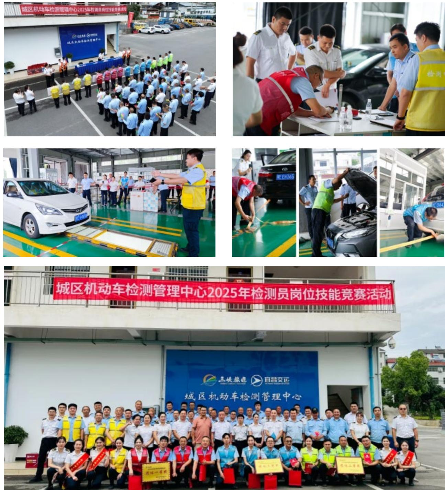  
“展技能风采 铸检测匠心”—2025年机动车检测技能竞赛

# 员工激励

公司坚持“以奋斗者为本”的激励导向，制定《三峡旅游集团激励突破发展保障措施》等制度，持续完善薪酬与绩效挂钩机制，通过经营者年薪激励、特别奖励等措施激发团队活力，将激励资源向价值创造者倾斜，全面激发员工干事创业的内生动力。

# 员工发展

公司持续完善员工职业发展体系，制定《职级管理暂行办法》，明确职位职级体系设置，为员工提供行政职务通道与专业职级通道并行的“双通道”发展路径。

2025年，公司加大人才培养与选拔力度，制定《员工内部竞聘管理办法》《干部管理办法》，在管理岗位空缺时优先内部公开选拔，全年选聘干部22人，竞聘上岗占比50%，有效畅通青年储备人才成长通道，为想干事、能干事的员工提供广阔舞台。

# 员工关爱

公司坚持人本理念，深化员工关爱，健全帮扶体系传递组织温暖，落实女工权益保障彰显巾帼风采，丰富文体活动激发团队活力，以多元化关爱行动持续提升员工幸福感与归属感，凝聚企业发展合力。

# 帮扶慰问

公司始终坚持以人为本，持续健全困难职工帮扶体系，常态化开展节日慰问、困难帮扶、金秋助学等传统关怀项目。2025年，公司累计帮扶困难员工48人，切实将组织的关怀与温暖送到员工心坎上，不断增强职工的归属感和幸福感。

2025年，公司深化员工关爱行动，春节前夕领导班子走访慰问困难职工、老党员及退休劳模，送去慰问金与新春祝福；盛夏时节深入车船港站等一线岗位开展“送清凉”活动，为高温作业员工送上防暑物资。同时，依托鸿运检测“四位一体”综合服务驿站，面向货车司机及一线职工开展家属开放日、节日主题活动，全年覆盖超600人次，以多元化暖心服务凝聚企业合力。

员工帮扶慰问绩效

<table><tr><td>议题</td><td>单位</td><td>2024年</td><td>2025年</td></tr><tr><td>员工帮扶投入金额</td><td>万元</td><td>5.9</td><td>9.8</td></tr><tr><td>员工帮扶人数</td><td>人</td><td>76</td><td>48</td></tr></table>

# 案例 | 三峡旅游开展2025年春节走访慰问活动

2025年1月，三峡旅游领导班子深入基层，走访慰问困难职工、老党员、退休劳模及离休干部，送去慰问金和慰问品，并致以新春祝福。公司领导详细了解他们的生活状况，感谢他们为企业发展作出的贡献，同时深入一线检查春运安全生产工作，将组织的关怀与温暖送到员工心坎上。

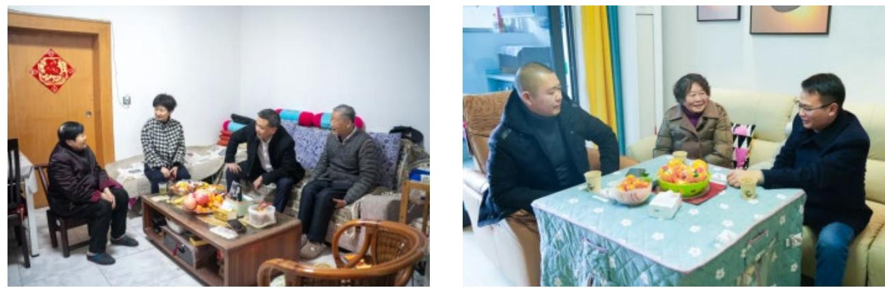  
春节走访慰问活动

# 案例 | 鸿运检测“四位一体”综合服务驿站暖心服务一线职工

2025年，公司所属鸿运机动车检测依托“工会驿站”“红领驿站”“司机之家”“工间驿站”四位一体综合服务驿站，聚焦货车司机、一线职工及户外劳动者需求，累计开展特色文化活动4场次。通过家属开放日、三八插花、父亲节跳远比赛等活动，搭建家庭支持与职业认同的桥梁，传递组织关怀，增强职工归属感。

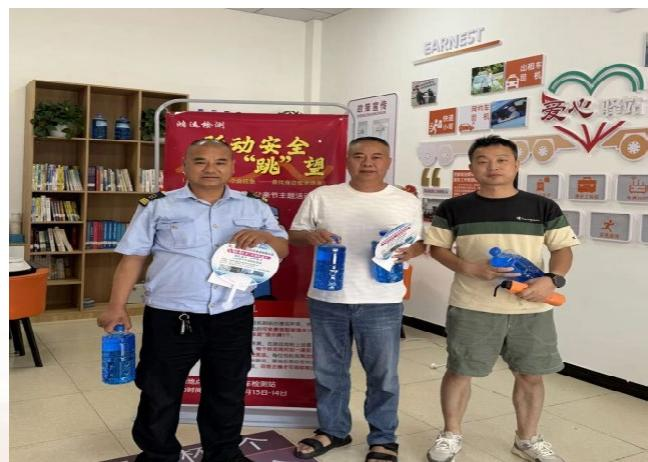

text_image

Group photo of three men holding bottled drinks in a library, with visible banners and wall posters in Chinese

鸿运检测“四位一体”综合服务驿站暖心服务一线职工

# 案例 | 三峡旅游开展2025年“送清凉”活动

2025年7月，三峡旅游领导班子深入车船港站、省际游轮建造厂区、物流园区等一线岗位，为职工送上毛巾、冰袖、防暑药品等“清凉礼包”。公司领导与高温作业员工亲切交流，叮嘱做好防暑防护，要求各单位落实防暑降温措施。各经营场所同步为旅客提供绿豆汤、解暑药品等便民服务，用贴心关怀守护员工健康与旅客舒心。

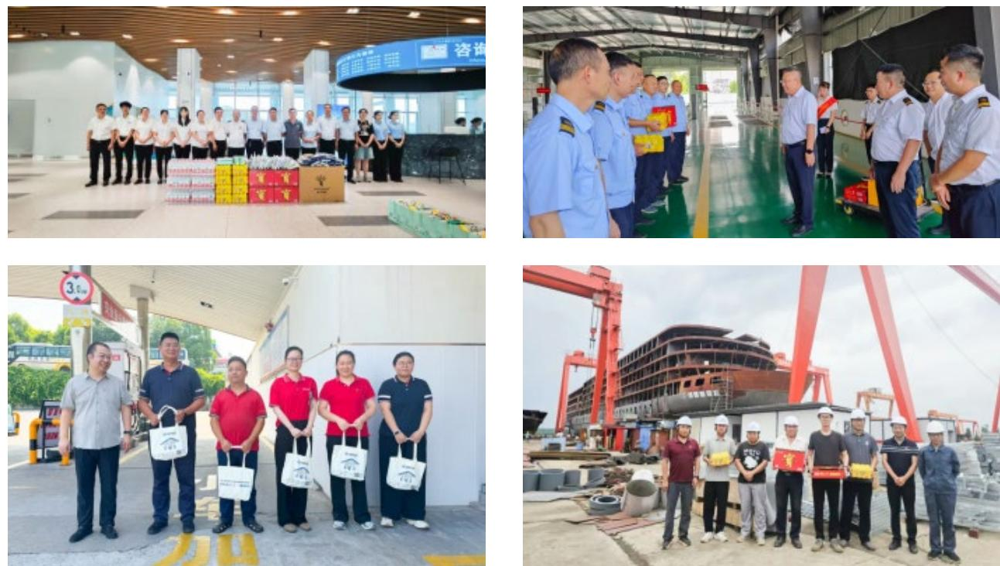  
“送清凉”活动

# 女工关怀

公司高度重视女员工权益保障，严格落实国家“三期”政策，与工会签订《女职工权益保护专项集体合同》，保障了女员工的劳动安全卫生条件，工资及福利待遇，孕、产、哺乳期待遇。符合法律法规规定生育的女性按照《湖北省人口与计划生育条例》相关规定，除享受国家规定的产假外增加产假60天，其配偶享受15天护理假，全方位保障女职工的合法权益和特殊利益。

公司持续开展形式多样的女工关怀活动，2025年组织“三八”妇女节主题活动，通过创新形式展现女员工风采，传递组织温暖。同时，公司高度关注女员工职业发展，营造平等包容的工作氛围，切实提升女员工的归属感与幸福感。

# 案例 | 三峡旅游举办“AI定格‘她’魅力”三八妇女节主题活动

2025年3月，公司组织开展“AI定格‘她’魅力”三八妇女节主题活动，为女员工拍摄职业形象照，并运用AI技术生成专属漫画形象。活动通过光影艺术记录女性在工作岗位上的自信风采，以创新形式传递对女员工的关爱与敬意，展现了公司对女性价值的尊重与肯定，进一步提升了女员工的幸福感与归属感。

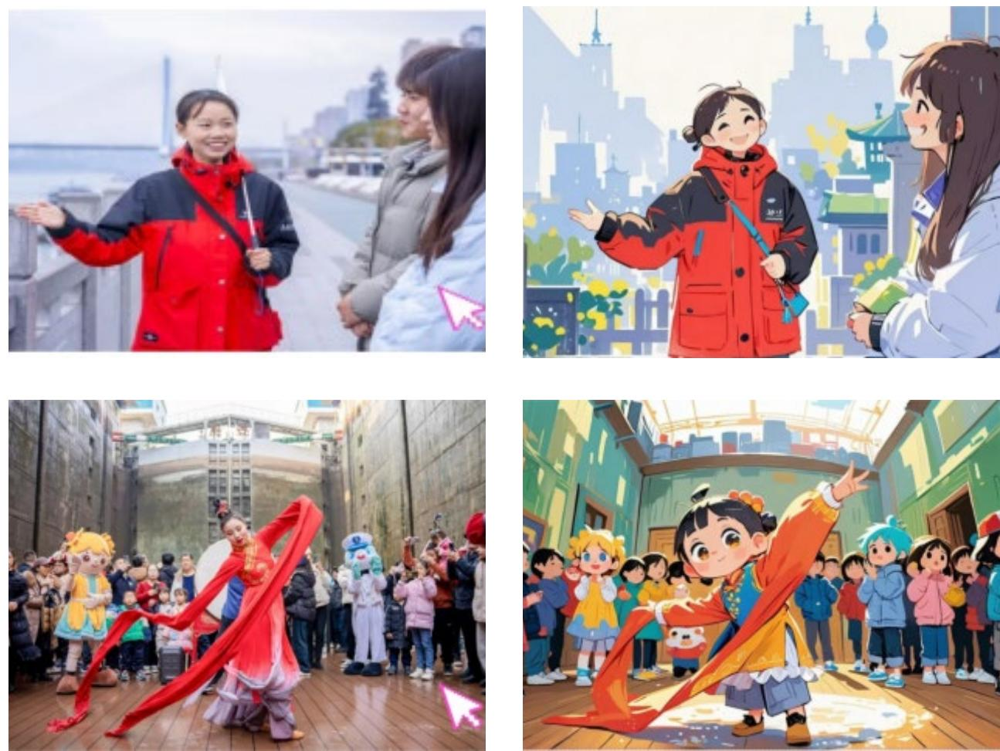  
“AI定格‘她’魅力”三八妇女节主题活动

# 员工活动

公司重视员工业余文化生活，积极营造健康和谐、活力向上的企业氛围。2025年，公司正式启动“能量站”职工文体社团，设立篮球、羽毛球、乒乓球、摄影、花艺、舞蹈六大社团，利用工余时间常态化开展活动，并设立“年度明星社团”与“个人活跃之星”评选机制，激发员工参与热情。丰富多彩的社团活动为员工提供了放松身心、展示自我的平台，有效增进了跨部门交流，提升了团队凝聚力。

员工文体活动举办情况

<table><tr><td>议题</td><td>单位</td><td>2024年</td><td>2025年</td></tr><tr><td>员工文体活动举办次数</td><td>次</td><td>15</td><td>25</td></tr></table>

# 案例 | 三峡旅游举行2025年职工羽毛球赛

2025年6月，三峡旅游在薰风晟羽羽毛球馆举行职工羽毛球赛，设单人赛和混双赛两个项目，采用单淘汰赛制。比赛现场气氛热烈，员工们在挥拍对决中展现飒爽英姿，在拼搏协作中释放工作压力。此次活动不仅为羽毛球爱好者提供了切磋技艺的平台，更增强了团队凝聚力，营造了健康向上、活力迸发的企业氛围。

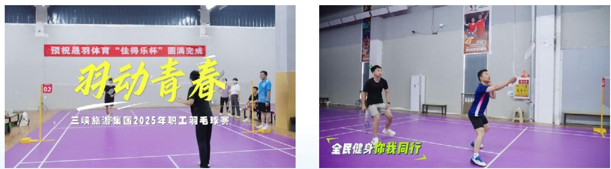  
职工羽毛球赛

# 健康安全

三峡旅游坚持安全发展理念，健全管理体系、深化隐患治理、强化应急演练，同时不断完善应急管理机制、优化安全教育宣传方式、健全责任追究机制，保障职业健康、提升安全素养，筑牢安全生产根基，确保公司安全生产形势持续稳定。

# 管理体系

公司始终坚持“安全第一、预防为主、综合治理”方针，持续健全安全生产管理体系，制定《安全生产责任制管理办法》《安全生产党政同责实施细则》《安全总监管理实施细则》等33项安全管理制度，覆盖责任、会议、检查、奖惩、费用、应急等全流程。公司实行公司、事业部、生产经营单位三级管理体制，设立安全生产委员会及安委会办公室，明确各层级、各岗位安全生产职责，形成“横向到边、纵向到底”的责任体系。

公司扎实推进《安全生产治本攻坚三年行动实施方案（2024—2026年）》，组织签订《2025年安全环保目标责任书》，层层压实全员安全生产责任；同时稳步推进安全管理班组建设，对照“5831”标准化模式开展试点创建，将安全生产责任落实到班组和岗位。

2025年，公司安全生产管理成效显著：长江游轮获评长江海事局“2024年度安全诚信公司”，客运公司荣膺“中国道路运输百强企业”，6名驾驶员获“全国安全行车”荣誉称号，多个班组及个人获市级表彰。

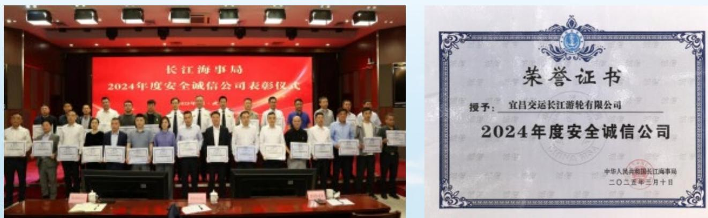  
长江游轮获评长江海事局“2024年度安全诚信公司”

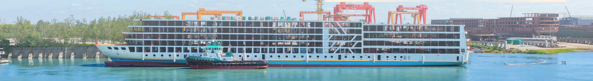

natural_image

Exterior view of a large cruise ship docked at a port with cranes and industrial buildings in the background (no signage)

安全管理绩效

<table><tr><td>指标</td><td>单位</td><td>2024年</td><td>2025年</td></tr><tr><td>因工死亡人数</td><td>人</td><td>0</td><td>0</td></tr><tr><td>工伤损失工作日数</td><td>天</td><td>1,156</td><td>1,001</td></tr><tr><td>安全管理投入金额</td><td>万元</td><td>719.95</td><td>698.55</td></tr></table>

# 隐患治理

公司持续健全隐患排查治理体系，依据《安全风险分级管控和隐患排查治理管理办法》等制度，构建起覆盖各业务板块的常态化监督检查机制，形成“排查—分析—整改—反馈”的全流程闭环管理，通过季度及年度隐患分析报告，从人的行为、设备状态、环境因素和管理维度系统剖析隐患成因，推动治理工作科学化、精准化。

2025年，公司累计开展安全环保监督检查142场次，下发《安全环保监督检查通报》28期，针对用电规范、消防救生、燃气安全等重点领域，组织开展专项整治行动，强化源头管控与过程监督。依托隐患分析成果，公司聚焦薄弱环节加强培训指导，提升基层人员风险辨识能力，推动隐患排查与日常管理深度融合，持续夯实企业安全生产根基。

安全隐患排查绩效

<table><tr><td>指标</td><td>单位</td><td>2024年</td><td>2025年</td></tr><tr><td>安全隐患排查次数</td><td>次</td><td>1,202</td><td>1,842</td></tr><tr><td>安全隐患排查整改数量</td><td>项</td><td>2,562</td><td>2,912</td></tr></table>

# 应急管理

公司持续完善应急管理体系，构建起以《生产安全事故综合应急预案》为总纲、事业部及各子公司《专项应急预案》和现场处置方案为支撑的三级预案体系，应急组织架构涵盖应急领导工作组、日常应急机构、专家组和各单位应急组织机构。

公司按年度应急演练计划常态化开展消防、道路交通事故、水上、人员疏散、机械事故等多领域实战演练。2025年，通过道路交通综合应急、船舶突遇大风大浪、消防逃生等专项安全应急演练，有效检验了预案的科学性，提升了全员应急响应与协同处置能力，为企业安全运营筑牢防线。

安全应急演练绩效

<table><tr><td>指标</td><td>单位</td><td>2024年</td><td>2025年</td></tr><tr><td>安全应急演练总次数</td><td>次</td><td>403</td><td>441</td></tr><tr><td>安全应急演练总参与人次</td><td>人次</td><td>6,142</td><td>7,445</td></tr></table>

# 案例 | 练为战、防为先—2025年道路交通综合应急演练

2025年7月，三峡旅游在宜昌汽车客运中心站举行道路交通综合应急演练。演练紧扣道路运输安全风险特点，设置客运车辆交通事故、老旧车辆场内起火、极端天气突发故障三大科目，覆盖“人、车、站、运”全链条。公司各单位及一线员工共180余人参加演练和观摩，整个过程组织严密、处置规范，充分体现了“快速反应、科学处置”的应急理念，切实筑牢人民群众安全出行防线。

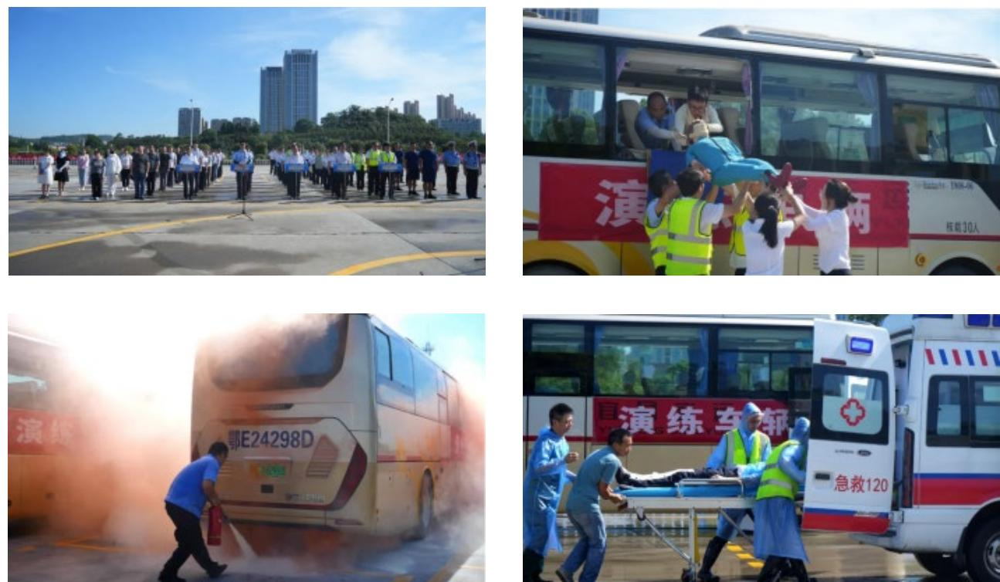  
三峡旅游2025年道路交通综合应急演练

# 案例 | 长江游轮开展船舶突遇大风大浪应急抛锚演练

2025年6月，长江游轮在宜昌港举行船舶突遇大风大浪应急抛锚演练，19名船员参加。演练模拟航行中突遇恶劣天气，船员按预案迅速备锚、报告海事、安抚乘客并执行抛锚操作，整个过程流畅有序。此次演练有效提升了船员应急协同处置能力，为游轮航行安全提供坚实保障。

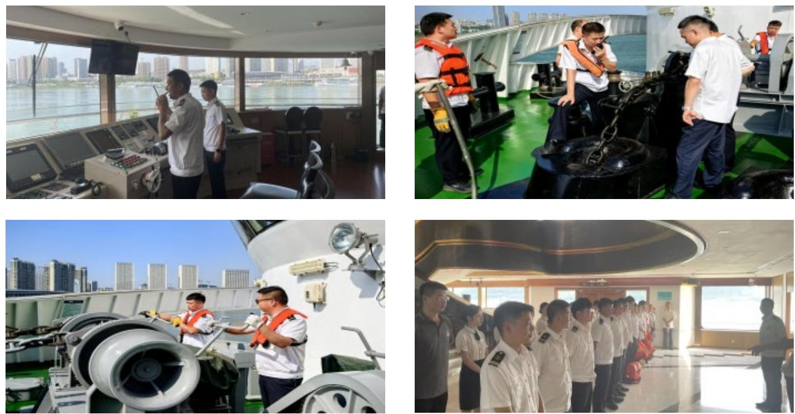  
长江游轮船舶应急演练

# 案例 | 天元物流安全生产月开展消防应急逃生演练

2025年6月，天元物流在三峡钢贸中心举行消防应急逃生演练，天元物流全体人员及伍家消防救援大队等共计80余人参加。演练模拟火情报警、人员疏散、初起火灾扑救等环节，过程紧张有序，有效检验了应急预案的可行性和部门协作能力。针对演练中发现的烟雾弹用量问题，公司及时复盘并优化细节，持续提升应急实战水平，为园区安全运营筑牢防线。

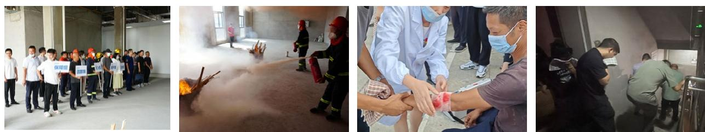  
天元物流消防应急逃生演练现场

# 职业健康

公司严格遵守《中华人民共和国职业病防治法》等法律法规，落实《从业人员心理健康管理办法》《职业健康管理办法》等制度，通过重点场所警示牌、职业健康培训、劳保用品定期发放等措施，切实保障员工职业健康。

2025年，公司持续开展员工健康体检，加强职业病危害因素监测，并组织开展从业人员心理健康培训，引导员工关注身心健康，全方位筑牢员工健康防线。

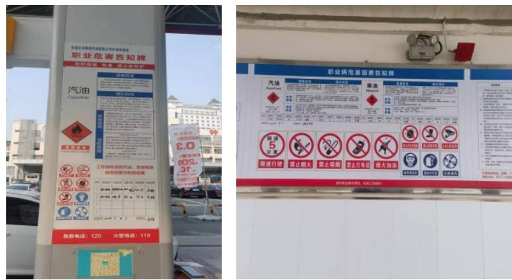  
加油站职业危害告知牌

职业健康工作绩效

<table><tr><td>指标</td><td>单位</td><td>2024年数值</td><td>2025年数值</td></tr><tr><td>职业健康培训总次数</td><td>次</td><td>44</td><td>18</td></tr><tr><td>职业健康培训总时数</td><td>小时</td><td>81</td><td>31</td></tr><tr><td>职业健康培训总人次</td><td>人次</td><td>1,874</td><td>742</td></tr><tr><td>职业健康体检覆盖率</td><td>%</td><td>100</td><td>100</td></tr><tr><td>员工职业健康投入</td><td>万元</td><td>85.54</td><td>89.18</td></tr></table>

# 案例 | 客运公司开展从业人员心理健康培训

2025年9月，客运公司组织全体员工、外包单位及租赁商户负责人共百余人开展心理健康培训及安全警示教育。活动通过观看《守护职场心灵，赋能企业发展》心理健康视频、安全警示教育片，并结合节前安全部署与测试，引导员工关注心理健康，提升安全意识，为国庆假期安全运营筑牢防线。

# 安全教育

公司持续完善安全教育培训体系，遵循“统一规划、分级实施”原则，系统开展公司级、事业部级、分子公司级三级培训，内容覆盖安全法律法规、规章制度、岗位操作规程、应急处置及重大事故隐患判定标准等重点领域。

2025年，公司按计划组织开展安全管理制度、危险作业、重大事故隐患判定标准、消防应急操作及心理健康等系列专题培训，通过警示教育、现场授课、考核测试等多种形式，培训安全管理人员及一线员工300余人次，切实提升全员安全素养与风险防范能力。

安全培训绩效

<table><tr><td>指标</td><td>单位</td><td>2024年</td><td>2025年</td></tr><tr><td>安全培训总次数</td><td>次</td><td>851</td><td>860</td></tr><tr><td>安全培训总时数</td><td>小时</td><td>21,228</td><td>22,035</td></tr><tr><td>安全培训总人次</td><td>人次</td><td>613</td><td>618</td></tr></table>

# 案例 | 三峡旅游举办安全管理制度及危险作业专题培训

2025年4月，公司组织开展安全管理制度及危险作业专题培训，公司安全总监及各事业部、生产经营单位分管安全负责人、安全及物业管理部门工作人员共75人参加。培训内容涵盖公司安全管理制度、《宜昌市危险作业管理办法（暂行）》等法规文件，进一步强化了管理人员的制度执行能力和危险作业风险管控意识。

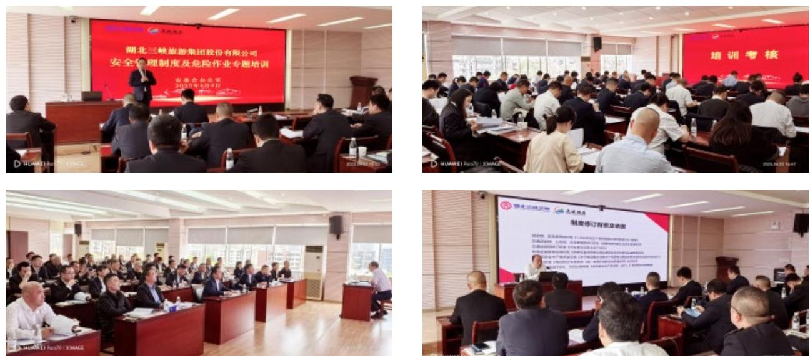  
安全管理制度及危险作业专题培训

# 案例 | 三峡旅游举办“练精兵、强技能、促安全”安全知识竞赛

2025年10月，三峡旅游在西坝不夜城电竞文化中心举办安全知识竞赛，来自各事业部、专业化公司及公司总部的8支代表队参赛。竞赛围绕安全生产法规、隐患排查、应急响应等内容设置必答、抢答、风险题等环节，特邀省市级安全生产专家担任评委。活动通过寓教于乐的形式，有效传播了安全知识，营造了浓厚的安全文化氛围。

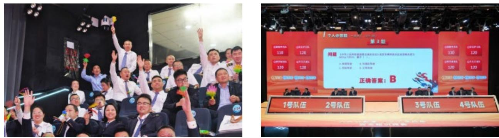  
“练精兵、强技能、促安全”安全知识竞赛

# 案例 | 三峡旅游举办岁末年初安全生产警示教育讲座

2025年12月，公司邀请国家级安全生产专家举办岁末年初安全生产警示教育讲座，围绕当前安全生产形势、典型事故案例及法律责任开展深度剖析。讲座结合近期行业事故教训，警示从业人员深刻认识“安全是最大的效益”，强化岁末年初客流集中、低温天气等多重风险叠加下的安全防范意识。

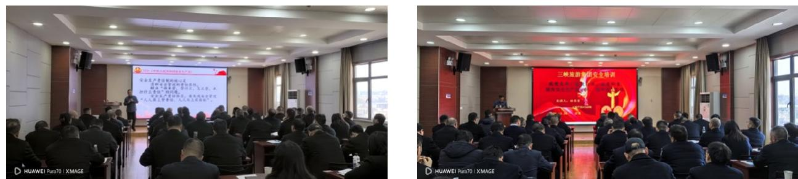  
安全生产警示教育讲座

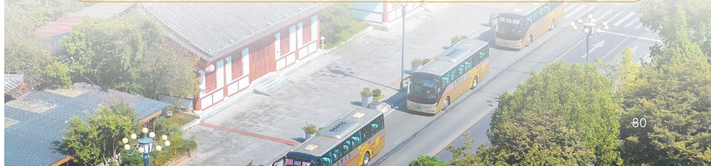

natural_image

Aerial view of a school bus station with multiple buses parked on a road, surrounded by trees and traditional-style buildings (no visible text or signage)

# 社会贡献

三峡旅游将履行社会责任融入企业发展血脉，坚持以实际行动回馈社会、服务民生，以社区共建推进基层治理，以产业平台赋能区域发展，以乡村振兴带动共同富裕，以公益志愿传递企业温度，在回馈社会、服务民生中与社会共享发展成果。

# 社区共建

公司积极推进与所在社区深度联动、协同共建，依托党员“双报到”机制和大货车司机之家协商平台，通过常态化召开支部联席会议，畅通政企社沟通渠道，共同研究解决基层治理难点；联合社区举办专场招聘、政策宣讲、暖心服务等活动，精准对接居民就业需求与货车司机群体实际困难，将共建成果切实转化为服务群众的实效，扎实推进基层治理现代化。

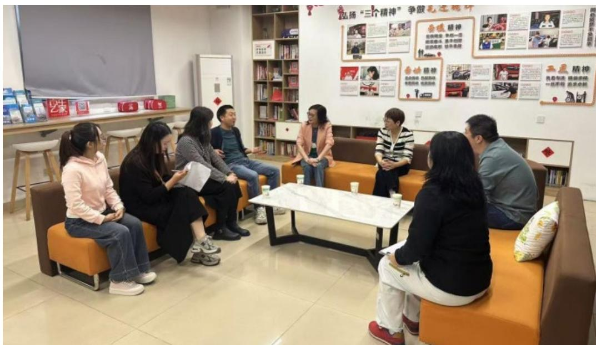

text_image

Group discussion in a library or community setting with wall posters and bookshelves, featuring Chinese text on wall panels.

天元物流与社区开展支部联席会议

# 区域发展

公司积极发挥产业平台优势，通过专业化园区建设与运营，为区域经济高质量发展注入动能，所属天元物流依托天元国际汽车物流城，构建“招、育、服”一体化创业生态，以产业集聚带动就业增长，以资源整合赋能返乡创业，助力区域产业升级与乡村振兴协同共进。

# 案例 | 天元国际汽车物流城获评“荆楚返乡创业园”

2025年12月，公司“天元国际汽车物流城”入选2025年荆楚返乡创业园名单，是宜昌市唯一入选的商贸园区。天元国际汽车物流城位于宜昌自贸区与东站商贸物流圈核心区域，园区拥有完备的基础设施、低成本的办公环境、现代化的生活配套，更有工商代办、融资对接等一站式服务，在运营上构建“政府引导、企业运营、多方协同”的模式，匠心打造一片创业沃土。

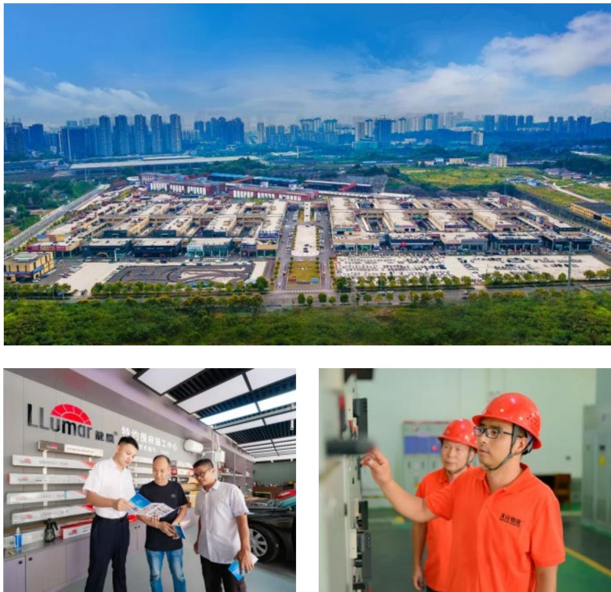  
“招、育、服”一体化创业生态

# 乡村振兴

公司始终将服务地方发展视为企业使命的重要组成，通过农旅融合、景村共建、就业扶持等多元路径，将旅游产业发展与乡村振兴战略深度衔接，以实际行动展现国企担当，助力区域协调发展和农民共同富裕。

公司依托九凤谷景区平台，通过产业带动、就业扶持、收益反哺等多元举措，推动旅游发展与乡村建设同频共振，持续带动村集体增收和农户致富，形成了可持续的共建共享模式。

2025年乡村振兴举措及成效

<table><tr><td>举措</td><td>成效</td></tr><tr><td>研学课程</td><td>开发“五农教育”研学课程,全年累计接待学生5,000余人次。</td></tr><tr><td>农旅融合</td><td>带动周边农户开办农家乐18家,每年共同举办年猪宴、丰收宴,形成特色活动品牌。</td></tr><tr><td>景村共建</td><td>景区每自然年度支付项目所在村不低于10万元固定收益,支持村集体经济发展。</td></tr><tr><td>就业扶持</td><td>吸纳本村及周边农户150余人就业,帮助村民实现“家门口”上班。</td></tr><tr><td>脱贫攻坚</td><td>支持扶贫户通过开办农家乐实现脱贫。</td></tr></table>

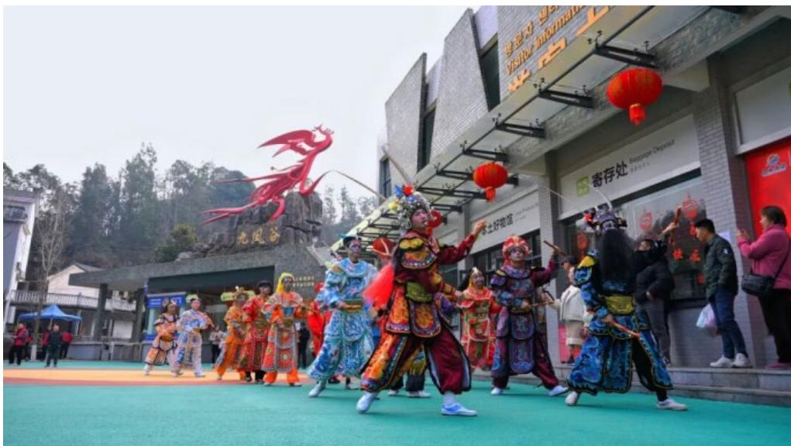

text_image

Street performance photo with performers in traditional costumes and red lanterns, featuring visible Chinese signage including '光凤谷' and '寄存处'.

农旅融合特色活动

乡村振兴绩效

<table><tr><td>议题</td><td>单位</td><td>2024年数值</td><td>2025年数值</td></tr><tr><td>乡村振兴总投入金额</td><td>万元</td><td>1.31</td><td>0.86</td></tr></table>

# 公益志愿

公司积极践行企业社会责任，将公益志愿活动融入可持续发展，组织员工广泛参与社区服务、环境保护及校园出行保障等多元志愿服务，以实际行动回馈社会，传递企业温度。

# 案例 | 五峰客运开展秋游运输服务志愿活动

2025年10月，公司所属五峰客运组织员工来到幸福小学，开展秋游运输服务专项志愿活动。志愿者们统一着装、提前到岗，协助师生有序乘车，维护上下车秩序，全程做好应急保障。活动期间，运输环节井然有序，未发生任何安全与秩序问题，得到校方和师生的一致好评，为营造和谐友爱的校园出行环境贡献了力量。

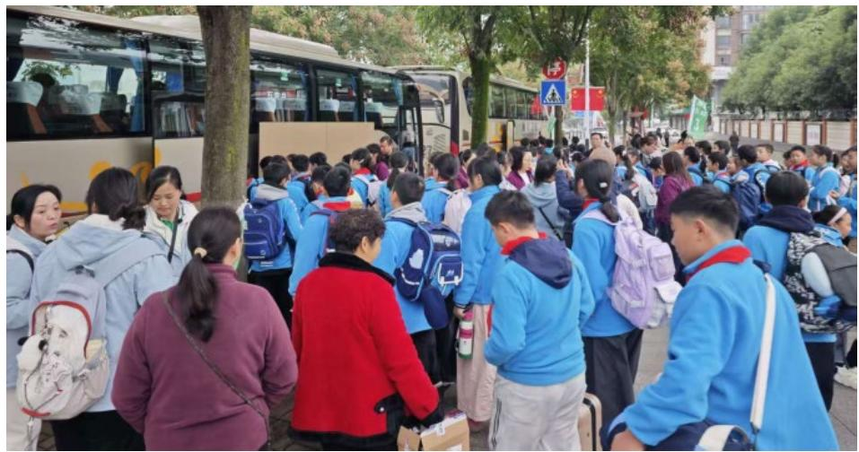

natural_image

Crowd of students in blue uniforms gathered outdoors near buses, with trees and buildings in background (no visible text or symbols)

五峰客运志愿者在幸福小学协助师生乘车

公益志愿绩效

<table><tr><td>指标</td><td>单位</td><td>2024年数值</td><td>2025年数值</td></tr><tr><td>公益志愿活动参与人次</td><td>人次</td><td>1,751</td><td>1,806</td></tr><tr><td>公益志愿活动累计参与时长</td><td>小时</td><td>9,587</td><td>7,525</td></tr></table>

# 04

# 治理固本，基业长青

三峡旅游坚持党建引领，充分发挥党委把方向、管大局、保落实的领导作用，将党的领导融入公司治理各环节；持续完善治理体系，优化法人治理结构，健全风控合规与内部控制机制，系统提升规范化管理水平；加强投资者关系管理，畅通沟通渠道，积极回应利益相关方关切，维护投资者合法权益，以高质量治理推动企业高质量发展。

9 产业、创新和基础设施

16 和平、正义与强大机构

17 促进目标实现的伙伴关系

# 党建引领

公司持续优化基层党组织设置，推动党建优势有效转化为治理效能；深化“党建引领、业务融合”工作机制，将组织建设嵌入游轮运营、港口服务等核心业务链条，实现同频共振；建立健全廉洁风险防控体系，制定反贪腐制度清单，强化对重点领域、关键岗位的监督制约，为可持续经营提供有力保障。

# 党的领导

三峡旅游持续优化治理制度体系，动态修订《党委会议事规则》《“三重一大”事项决策制度》《“第一议题”制度》等规范性文件，将党的领导融入公司治理各环节，确保党组织在重大决策中拥有决定权、把关权、监督权，切实发挥党委总揽全局、协调各方的核心作用，实现党的领导与公司治理有机融合。

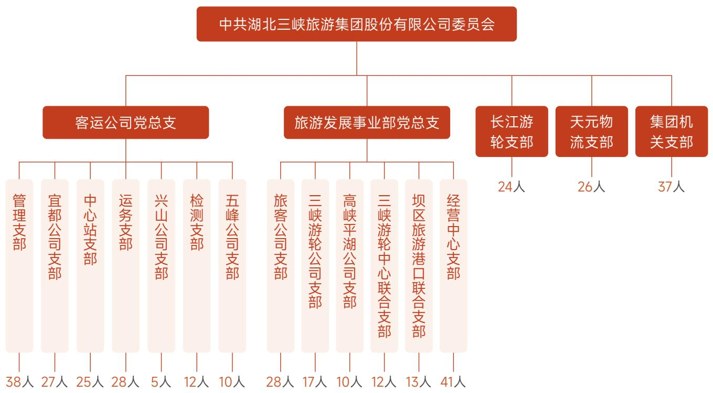

flowchart

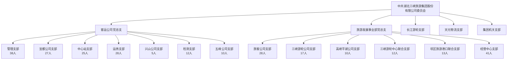
```mermaid
graph TD
  A["中共湖北三峡旅游集团股份有限公司委员会"] --> B["客运公司党总支"]
  A --> C["旅游发展事业部党总支"]
  A --> D["长江游轮支部"]
  A --> E["天元物流支部"]
  A --> F["集团机关支部"]
  
  B --> G["管理支部\n38人"]
  B --> H["宜都公司支部\n27人"]
  B --> I["中心站支部\n25人"]
  B --> J["运务支部\n28人"]
  B --> K["兴山公司支部\n5人"]
  B --> L["检测支部\n12人"]
  B --> M["五峰公司支部\n10人"]
  
  C --> N["旅客公司支部\n28人"]
  C --> O["三峡游轮公司支部\n17人"]
  C --> P["高峡平湖公司支部\n10人"]
  C --> Q["三峡游轮中心联合支部\n12人"]
  C --> R["坝区旅游港口联合支部\n13人"]
  C --> S["经营中心支部\n41人"]
```

公司党委组织架构图

三峡旅游持续优化党委组织架构，增强服务主业能力。2025年，公司顺利完成党委换届选举，梯队结构更趋优化，决策活力显著提升；围绕游轮产业战略布局，动态调整基层党组织设置，实现组织架构与业务需求精准匹配；推动机关处室党员下沉业务单位，充分发挥在业务指导、政策传导、联系群众等方面的先锋作用。

党委会议情况

<table><tr><td>指标</td><td>单位</td><td>2023年数值</td><td>2024年数值</td><td>2025年数值</td></tr><tr><td>党委会会议召开次数</td><td>次</td><td>20</td><td>14</td><td>14</td></tr><tr><td>党委会决议事项</td><td>项</td><td>143</td><td>137</td><td>202</td></tr></table>

三峡旅游强化党员管理，锻造先锋骨干队伍。2025年，公司规范完成预备党员转正6人、接收预备党员9人，同步储备入党积极分子43人、入党申请人36人，党组织吸引力显著增强，队伍年龄、学历结构进一步优化；公司严格执行党员档案审核制度，确保发展程序规范、材料完备，党员管理规范化水平迈上新台阶。

党组织情况

<table><tr><td>指标</td><td>单位</td><td>2023年数值</td><td>2024年数值</td><td>2025年数值</td></tr><tr><td>党总支数量</td><td>个</td><td>4</td><td>3</td><td>2</td></tr><tr><td>党员人数</td><td>人</td><td>390</td><td>301</td><td>353</td></tr><tr><td>召开党员大会次数</td><td>次</td><td>128</td><td>91</td><td>93</td></tr></table>

# 党建活动

三峡旅游严格落实“第一议题”制度，形成“党委领学、支部研学、党员践学”三级联动模式。2025年，公司深入学习党的二十届四中全会精神，制定《关于开展深入贯彻中央八项规定精神学习教育的实施方案》，开展党委理论学习中心组集中学习10次；督促所属党组织落实组织生活制度，通过组织读书班、中心组研讨、专题轮训等，开展党课教育72次，组织交流研讨68次，实现党员学习教育全覆盖，思想统一度与行动协同性显著提升。

党建活动情况

<table><tr><td>指标</td><td>单位</td><td>2023年数值</td><td>2024年数值</td><td>2025年数值</td></tr><tr><td>党建主题活动总次数</td><td>次</td><td>185</td><td>217</td><td>262</td></tr><tr><td>党建主题活动总参与人次</td><td>人次</td><td>3,025</td><td>3,600</td><td>4,100</td></tr><tr><td>党员参与学习培训人次</td><td>人次</td><td>390</td><td>360</td><td>420</td></tr></table>

2025年，公司扎实落实意识形态工作，开展专题研究2次，月度风险研判12次，组织全国两会精神解读、党的二十届四中全会精神宣讲、投诉处理等专题辅导5次，组织党员献血105人次，员工思想共识全面凝聚，风险防控能力显著增强，为稳定发展营造良好氛围。

# 案例 | “联学共建凝初心 非遗茶香促发展”特色党建活动

2025年，三峡旅游旅游发展事业部经营中心党支部围绕“党建共建聚合力，学思践悟促发展”主题，与鑫鼎生物科技有限公司开展共建实践活动。抵达“长盛川”生产园区后，党员们沉浸式观摩非遗砖茶制作工艺。随后，双方围绕砖茶文化纪念馆规划、研学基地建设等议题展开讨论，并就党建共建、业务协同等内容交换意见、凝聚共识，为后续合作搭建了高效沟通桥梁。本次联学共建活动，为探索“党建+产业”融合模式提供了鲜活的实践样本。

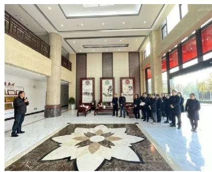

natural_image

Interior view of a spacious, well-lit lobby with people walking and standing in front; no visible text or signage.

# 党业融合

三峡旅游坚持党建引领业务发展，推动学习与经营目标、重大项目紧密结合，建立“党建+业务”双融双促机制，将组织优势转化为发展动能，在新能源游轮建设、旅游资源整合等重大任务中成立党员攻坚小组，确保项目攻坚与组织建设同步推进，实现党建工作与经营发展同频共振、互促共进。

# 案例 | “运悟初心，情满旅途”党建品牌建设

2025年，三峡旅游运务支部打造“运悟初心，情满旅途”党建品牌，于“十一”黄金周期间启动为期60天的服务质量攻坚，在一线窗口与运输现场设立党员示范岗，推动投诉量同比下降53.85%，并收获多起12345表扬工单，展现了党员冲锋在前的服务形象。此外，支部书记通过中央广播电视总台交通广播直播推介旅游专线，并积极推进宜昌至长沙快巴开通，实现了党建与经营深度融合、服务品质与业务发展同步提升。

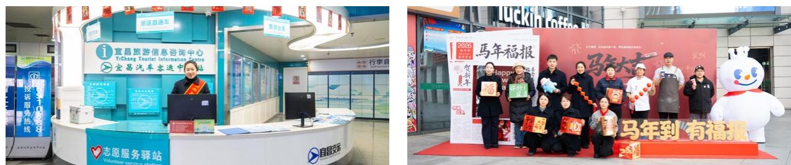

# 案例 | 中心站物业招商党员攻坚小组打造综合客运枢纽新范式

2025年3月，公司成立中心站物业招商党员攻坚小组，通过“政企联动”“反向飞地”，全年拜访客商234次，新增签约项目21个，引入“瑞幸咖啡”“蜜雪冰城”“碗霸”等知名品牌，入驻“宜昌礼物”“屈姑”等特色文旅产业，构建“文商旅”深度融合的综合客运枢纽新范式荣获全国“综合交通”50项典型案例，彰显了党建引领下国有资产保值增值与经营转型的显著成效。

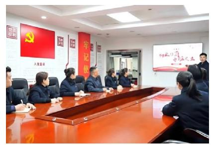

text_image

Meeting room scene with participants in formal attire, red banner with hammer and sickle emblem visible on wall; screen displays Chinese text.

# 党建品牌

# 党建品牌

# 建设情况

三色领航 长江“船”奇

相融合，促进长江夜游提档升级、“数智旅游”和新能源游轮2.0版臻享全域游等工作落地。  
创新探索出“区域网格班组工作法”，围绕构建“践行三种精神，连接五大纽带，锻造三支服务队”的“353”管理服务体系，实现多元共建共治，投入运营功能性党支部阵地。

网格班组党旗红

# 党风廉政

natural_image

Silhouette of a person holding a Chinese national flag, standing on a hill with traditional pagodas in the background (no text or symbols)

三峡旅游按照“标本兼治、综合治理、惩防并举、注重预防”的原则，通过强化制度建设、规范权力运行、深化教育引导与严格监督问责，致力于构建一套覆盖所有业务领域和运营环节的“不敢腐、不能腐、不想腐”长效机制，有效识别、预警和化解各类廉政风险，形成风清气正、廉洁高效的氛围，为持续高质量健康发展提供坚实保障。

2025年，公司共组织各基层党组织书记讲纪律党课23次，“纪检干部讲纪律”23次，组织986人次观看警示教育片、143人次参观廉政教育基地，不断加固党员干部精神堤坝。

反贪腐绩效

<table><tr><td>指标</td><td>单位</td><td>2023年数值</td><td>2024年数值</td><td>2025年数值</td></tr><tr><td>反贪腐培训总次数</td><td>次</td><td>4</td><td>4</td><td>4</td></tr><tr><td>反贪腐培训总人次</td><td>人次</td><td>2,281</td><td>1,323</td><td>2,444</td></tr><tr><td>反贪腐培训总时数</td><td>小时</td><td>7.5</td><td>5.5</td><td>6.5</td></tr><tr><td>接收信访举报总次数</td><td>次</td><td>7</td><td>2</td><td>4</td></tr><tr><td>信访举报案件处理率</td><td>%</td><td>100</td><td>100</td><td>100</td></tr></table>

# 案例 | “绿港红帆清风润，筑梦三峡廉韵启”清廉港站示范点

2025年，公司坝上旅游枢纽港以“绿港红帆清风润，筑梦三峡廉韵启”为主题，将位于屈原故里的茅坪港打造为清廉港站示范点，构建“一书屋、一地标、一班组、一网电、一长廊、一方天地”六大阵地。全体职工践行“长江大保护”使命，以“红帆”引领初心，以“清廉”筑牢底色，将廉洁文化建设融入港口运营与文旅发展。

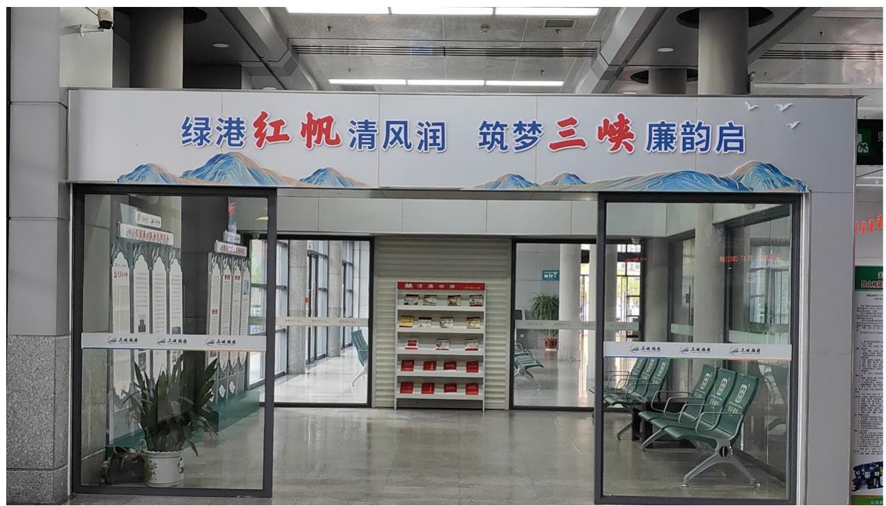

text_image

绿港红帆清风润 筑梦三峡廉韵启

# 警示教育大会

# 集团总部

三峡旅游集团总部于2025年4月11日召开警示教育大会，通过集中观看警示教育片、通报近期典型案例、党委书记讲授廉政党课等方式，聚焦工程建设、招投标、物资采购、投资并购等国企腐败高发领域进行深刻剖析，让职工进一步明确红线底线，筑牢规矩意识。

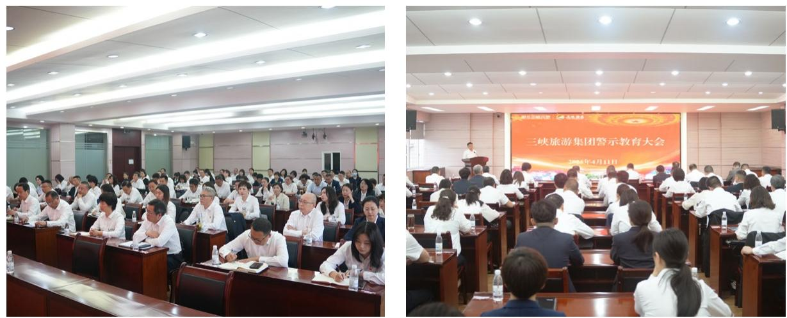

# 旅游发展事业部

旅游发展事业部于2025年4月24日至4月28日分层分级召开警示教育大会，通过通报职工违法案例、传达集团警示教育大会精神、学习近期典型案例及观看警示教育片、支部书记讲授廉政党课及参观廉政教育基地等方式，要求职工自觉遵守党纪国法，强化红线底线意识。

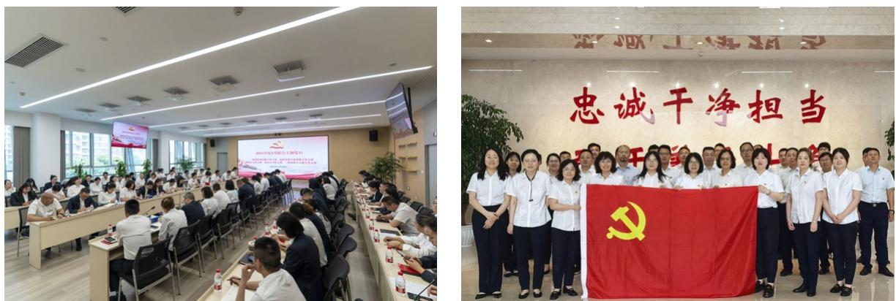

# 客运公司

客运公司于2025年4月11日至28日分层分级召开警示教育大会。会议通过传达上级精神、通报近三年5起典型案例、推出“三个全覆盖”“三个常态化”措施，并部署长效开展酒驾醉驾问题专项整治，同时组织签订承诺书、重点人员摸排、家庭助廉及参观廉政教育基地等方式，进一步强化“八小时外”纪律。

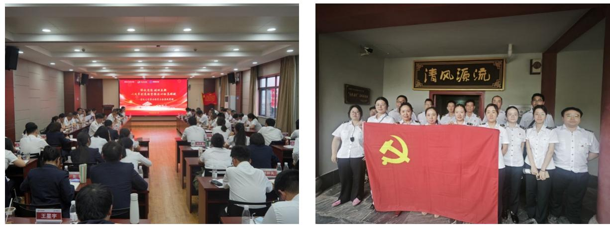

# 天元物流

天元物流于2025年4月15日召开警示教育大会，通过观看警示教育片、支部书记讲廉政党课及参观廉政教育基地等方式，要求职工绷紧廉洁之弦，护航企业发展。

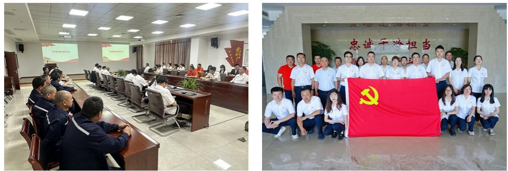

# 反商业贿赂与反贪腐

三峡旅游建立反商业贿赂与反贪腐管理体系，覆盖合规政策制定、高风险岗位监督、员工培训、举报机制与违规问责全流程，形成事前预防、事中监控、事后追责的闭环管理机制，显著降低腐败行为发生概率。公司与供应商签订《廉洁协议》，明确约定双方在业务往来中不得以任何形式输送不正当利益，严禁索贿、受贿、商业贿赂及隐形利益输送，营造崇廉尚洁的浓厚氛围。

# 举报人保护

三峡旅游严格依照《纪检监察机关处理检举控告工作规则》《信访工作条例》等规定，构建起覆盖举报受理、核查反馈、身份保密、风险评估、干预阻断、责任追究的全链条保护机制；同时，通过设立网络邮箱、举报信箱、公开举报电话及来访接待等多元渠道畅通信访举报路径，并制定《举报箱管理办法》，明确举报受理范围、办理时限、保密要求及反馈机制，切实保障举报人合法权益。

# 治理效能

三峡旅游严格遵守《中华人民共和国公司法》《上市公司治理准则》及国资监管最新要求，主动对标资本市场最佳实践，系统推进治理体系现代化变革。2025年8月，公司完成治理结构优化及董事会组成调整，撤销监事会，由审计委员会承接监督职能，精简治理层级；增设职工代表董事，完善民主管理；同步完成25项制度修订及6项新规制定，实现公司治理体系系统性升级，为高质量发展筑牢制度根基。

# 股东会

股东会作为公司最高权力机构，严格依据《中华人民共和国公司法》《公司章程》及《股东会议事规则》规范运作，定期召开会议，确保股东依法充分行使知情权、参与权、表决权与监督权。公司平等对待所有股东，持续完善议事程序与决策机制，强化对董事会及管理层的履职监督，推进重大决策科学化、民主化、规范化，为可持续发展提供坚实治理基础。

# 董事会

董事会作为核心决策机构，承担战略引领和监督管理的双重职责。公司依据《董事会议事规则》等要求开展工作，指导管理层落实各项决策，并严格按照《公司章程》规定的选聘程序选举董事，通过科学决策和高效运作，制定公司发展战略，优化资源配置，确保公司合规运营。

截至2025年末，公司董事会由11名董事组成，其中独立董事4名，占比36.36%；女性董事3名，占比27.27%，显著提升董事会多元化水平。公司董事既有深耕行业多年的资深专家，也有具备创新视野的年轻力量，形成专业互补、经验交融的多元化治理架构，有效提升董事会科学决策能力与风险管控水平。

董事人员情况

<table><tr><td>姓名</td><td>性别</td><td>职位</td><td>学历</td></tr><tr><td>王精复</td><td>男</td><td>董事长</td><td>本科</td></tr><tr><td>章乐</td><td>男</td><td>董事</td><td>本科</td></tr><tr><td>李根</td><td>男</td><td>董事</td><td>硕士研究生</td></tr><tr><td>陈佰涛</td><td>男</td><td>董事</td><td>硕士研究生</td></tr><tr><td>康莉娟</td><td>女</td><td>董事</td><td>本科</td></tr><tr><td>李炜</td><td>男</td><td>董事</td><td>硕士研究生</td></tr><tr><td>胡伟</td><td>男</td><td>独立董事</td><td>博士研究生</td></tr><tr><td>黄玉烨</td><td>女</td><td>独立董事</td><td>博士研究生</td></tr><tr><td>舒伯阳</td><td>男</td><td>独立董事</td><td>博士研究生</td></tr><tr><td>王洁</td><td>女</td><td>独立董事</td><td>硕士研究生</td></tr></table>

董事会召开情况

<table><tr><td>指标</td><td>单位</td><td>2023年数值</td><td>2024年数值</td><td>2025年数值</td></tr><tr><td>董事会会议举行次数</td><td>次</td><td>8</td><td>10</td><td>8</td></tr><tr><td>董事会成员出席率</td><td>%</td><td>100</td><td>100</td><td>100</td></tr><tr><td>董事会审议议案数目</td><td>项</td><td>53</td><td>35</td><td>62</td></tr></table>

三峡旅游根据《中华人民共和国公司法》修订董事会专门委员会工作细则，构建了覆盖战略决策、人员选聘、薪酬激励与风险管控的治理体系。战略发展委员会统筹长期发展规划与可持续发展计划，提名委员会严格把控董事及高管任职资格与多元化结构，薪酬与考核委员会探索与企业可持续发展挂钩的激励约束机制，审计与风险管理委员会强化内部监督与合规管控。各委员会均由独立董事占多数或担任召集人，确保决策独立性与专业性，形成权责明晰、运转高效的治理格局。

专门委员会会议情况

<table><tr><td>指标</td><td>单位</td><td>2024年数值</td><td>2025年数值</td></tr><tr><td>审计与风险管理委员会会议召开次数</td><td>次</td><td>5</td><td>5</td></tr><tr><td>提名委员会会议召开次数</td><td>次</td><td>2</td><td>3</td></tr><tr><td>战略发展委员会会议召开次数</td><td>次</td><td>1</td><td>0</td></tr><tr><td>薪酬与考核委员会会议召开次数</td><td>次</td><td>1</td><td>1</td></tr></table>

# 高级管理层

公司高级管理层作为战略执行与日常经营管理的核心力量，对董事会负责，坚决贯彻董事会战略决策部署，秉持高效、专业、创新的经营理念，持续优化内部管控流程与资源配置，提升精细化运营效率，确保公司经营目标与战略规划的有效达成。

公司面向控股股东及董监高系统规划并组织多维度、多层次的培训学习活动，培训涵盖定期报告编制实务、重点法规制度解读、投资者关系管理、董高履职要求培训等。公司开展《市值管理》《最新证券监管与公司治理制度及案例解读》专题培训，有效提升了“关键少数”对市值管理内涵的理解，强化了规范运作意识。截至2025年末，公司已累计组织或承办线上及线下培训共计21场，参训人员总数达207人次。

高级管理人员情况

<table><tr><td>姓名</td><td>性别</td><td>职位</td><td>学历</td></tr><tr><td>李根</td><td>男</td><td>总经理</td><td>硕士研究生</td></tr><tr><td>胡军红</td><td>男</td><td>董事会秘书</td><td>本科</td></tr><tr><td>叶勇</td><td>男</td><td>副总经理</td><td>本科</td></tr><tr><td>陈晶晶</td><td>女</td><td>副总经理、财务总监</td><td>本科</td></tr><tr><td>郦鸿</td><td>男</td><td>副总经理、安全总监</td><td>本科</td></tr></table>

# 董事及高管人员薪酬

三峡旅游制定《董事和高级管理人员薪酬管理办法》，遵循薪酬与公司效益及长远利益挂钩、标准公开透明等原则，建立了科学规范的董事及高级管理人员薪酬管理体系。董事薪酬方案经股东会审议，由薪酬与考核委员会具体实施，并参考同行业薪酬水平、所在地区薪酬水平、通货膨胀水平、公司实际经营状况等因素动态调整。其中，独立董事领取固定津贴，非独立董事按任职岗位考核领取薪酬，高级管理人员薪酬由基本年薪、绩效年薪及任期激励收入构成，强化业绩导向与长期激励。

# 战略规划

三峡旅游致力成为长江三峡旅游主导者、中国内河游轮旅游领航者，充分发挥控股股东平台孵化和上市公司资本运作优势，通过并购、与重点旅游企业深化业务合作等方式，推动两坝一峡旅游资源整合，从水域向陆域延伸，实现“船、岸、景”联动，构建一体化旅游运营格局，成为长江三峡旅游主导者；持续壮大游轮产业规模，“长江行”游轮品牌实现“双船投运”，全面做好运营筹备，确保亮相即出彩，做好第二批2艘省际游轮建造施工工作；另一方面通过外延式拓展，跻身省际游轮头部方阵，成为中国内河游轮旅游领航者。

# 风控合规

三峡旅游将风控合规作为治理体系的基石，深度融入战略决策与日常经营，构建“审计监督+风险防控+合规管理”三位一体管理体系，高效发挥“免疫系统”与“价值助推器”双重作用，以合规经营固本，以审计监督增效，为公司高质量发展筑牢风险防控屏障。

# 风控审计管理

三峡旅游秉持“风险导向、问题导向、价值导向”核心原则，聚焦主业运营、项目投资、资金管控等核心领域，系统推进风险防控与审计监督各项工作，通过前端风险防控及审计协同整改，有效强化了公司风控体系建设，提升了管理规范化、精细化水平。

公司在审计与风险管理委员会下设风控审计部，对董事会负责，确保风控审计工作的独立性和权威性；风控审计部负责重大事项风险审查、制定审计计划、执行审计任务等工作，并对审计结果进行跟踪和反馈；各部门和子公司积极配合开展工作，确保风控审计工作的顺利进行。

公司紧扣“防风险、堵漏洞、促规范、提效能”工作主线，扎实完成各类内审报告，通过跨部门协同联动、现场检查、线上审计，发现风险隐患及管理薄弱环节，并提出管理建议推动整改；通过开展子公司专项审计，加强审计深度、精准定位管理漏洞与业务风险管理，针对性提出改进建议，助力子公司提升财务管理与内控水平。2025年，公司开展离任经济责任审计等专项审计核查工作13项，对审计发现的问题进行持续整改，问题整改完成率达100%。

# 风控审计部

负责集团全面风险管理、内部审计与外审协调、法律事务与法治建设;负责集团内控合规体系建设，组织开展生产经营活动的合规问题识别、评价、预警和应对;负责构建和完善运营法律支持体系和法律风险防控体系，制定并推进实施合同管理制度、合同评审及合同履约监督执行，统筹处理集团涉诉和非诉纠纷事务。

# 各事业部（专业化公司）、分子公司综合办公室

为事业部（专业化公司）法律事务归口管理部门，执行公司法律事务相关规章制度；负责本级机构法律纠纷处理、监督、跟进、统计及上报等。

# 依法合规经营

三峡旅游持续完善法律合规治理，建立健全重大经营决策法律审核与合同风险管理机制，强化合规风险防控；严格遵守商业道德规范，反对不正当竞争，切实维护公司及利益相关方合法权益，推动企业可持续健康发展。

# 依法治企

三峡旅游深入推进法治建设，建立健全法律事务管理体系，完善重大经营决策法律风险防范与合同合规审查机制，配备专职法务团队，强化法律专业能力培训，系统提升依法合规经营管理水平，切实维护公司及利益相关方合法权益。2025年，公司组织各单位进行“民法典宣传月”“公平竞争政策宣传周”及“宪法宣传周”共3场法治宣传；统筹法律顾问为公司及子公司开展民法典与合同事务、国有企业招投标与采购法律实务等法治培训。

法务培训情况

<table><tr><td>指标</td><td>单位</td><td>2023年数值</td><td>2024年数值</td><td>2025年数值</td></tr><tr><td>法务培训次数</td><td>次</td><td>13</td><td>9</td><td>19</td></tr><tr><td>法务培训时长</td><td>小时</td><td>27</td><td>30.50</td><td>65</td></tr><tr><td>法务培训参与人次</td><td>人次</td><td>892</td><td>320</td><td>901</td></tr></table>

# 案例 | 国有企业招投标与采购法律实务专题培训

2025年9月，客运公司开展“国有企业招投标与采购法律实务”专题培训。培训围绕国有企业招投标要点、采购合规流程及风险防控要点展开系统讲解，结合交通客运行业特点剖析违法违规案例。参训人员深入了解招采环节法律红线与操作规范，有效提升了依法合规经营能力，为企业降本增效与风险防控提供了坚实保障。

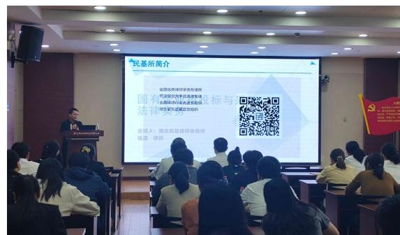

text_image

民基所简介
全国社会保障和社会保障厅
国务院国有资产监督管理委员会
全国社会保障基金理事会
中国人民银行离退休人员福利保障中心
负责人：湖北民基律师事务所
地址：贵州省贵阳市

# 合规管理

三峡旅游统筹推进合规管理建设，构建全领域合规体系。公司健全合规组织架构，成立合规管理委员会统筹协调合规管理工作，建立合规管理基本制度，印发《合规管理办法（试行）》，编制12个重点领域合规管理“三张清单”，并聚焦招标采购、物业租赁、股权投资、劳动用工四个重点领域编制合规专项指引。

三峡旅游按照企业内部控制规范体系的规定，主动沟通梳理公司内控体系建设、关键风险防控措施及前期问题整改成效，统筹协调各产业及各部门开展访谈及调研；借助外部审计专业视角，全面核验公司内控体系设计合理性及执行有效性，推动内控体系优化完善，夯实合规管理根基。

# 案例 | 民法典与合同实务专题培训

2025年5月，三峡旅游开展“民法典与合同实务”专题培训，公司及所属子公司合同管理分管领导、合同管理部门负责人、合同全流程管理相关人员共130余人参加。本次培训结合旅游行业特点深入剖析合同实务要点，使得参训人员有效提升合同风险识别能力和合规管理水平，为公司高质量发展筑牢法律防线。

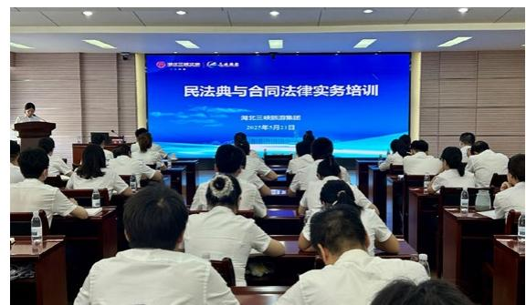

text_image

民法典与合同法律实务培训
2021年5月1日

合规培训绩效

<table><tr><td>指标</td><td>单位</td><td>2023年数值</td><td>2024年数值</td><td>2025年数值</td></tr><tr><td>合规培训次数</td><td>次</td><td>82</td><td>89</td><td>74</td></tr><tr><td>合规培训时长</td><td>小时</td><td>168.5</td><td>316</td><td>383.5</td></tr><tr><td>合规培训参与人次</td><td>人次</td><td>6,048</td><td>3,293</td><td>3,774</td></tr></table>

# 反垄断与反不正当竞争

三峡旅游建立健全公平竞争的合规管理体系，将采购、生产、营销全链条的合规审查机制嵌入日常运营，各环节均设置负责人，形成“制度约束+流程管控+人员监督”的三位一体风险防控体系，确保商业行为合法合规、阳光透明。在业务经营中，三峡旅游坚决杜绝达成垄断协议、滥用市场支配地位等垄断行为，严禁实施商业贿赂、虚假宣传、侵犯商业秘密、不正当有奖销售等不正当竞争行为。

公司开展反垄断与反不正当竞争培训，强化全员公平竞争意识，对重大经营决策进行合规审查，确保市场行为合法合规，维护健康有序的市场秩序，保障消费者及合作方的合法权益。

# 依法纳税

三峡旅游严格遵守国家税收法律法规，依法履行纳税义务，建立健全税务管理制度，规范税务申报与缴纳流程，确保纳税行为合法合规。公司主动配合税务机关监管，及时足额缴纳各项税款，以诚信纳税践行社会责任，助力地方经济发展。

# 案例 | 增值税合规管理实践培训

2025年6月，三峡旅游开展增值税合规管理实践培训。各事业部（专业化公司）及所属各公司财务负责人及其他财务人员、公司总部财务管理部相关人员参加了本次培训。本次培训进一步加强公司税务管理工作，提升税务管理水平，强化财务人员税务实务操作与风险管控能力，规范税务处理流程。

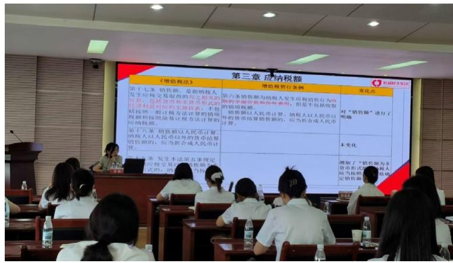

text_image

第三章 应纳税额
《增值税法》
增值税暂行条例
变化点
第十七条 销售额，是指纳税人发生应税交易取得的与之相关的贷款，包括货币和非货币形式的经济利益对应的全部贷款，不包括按照一般计税方法计算的纳税额按照简易计税方法计算的应纳税额。
第十八条 销售额以人民币计算。纳税人以人民币以外的货币结算销售额的，应当折合成人民币计算。
第十九条 发生本法第五条规定应纳税交易金额（纳税人按法定税率代扣）。纳税人当得
第六条销售额为纳税人发生应税销售行为税款的余额价格和价外费用，但是不包括收取的销税税额。销售额以人民币计算。纳税人以人民币以外的货币结算销售额的，应当折合成人民币计算。
第十八条 销售额以人民币计算。纳税人以人民币以外的货币结算销售额的，应当折合成人民币计算。
第十九条 发生本法第五条规定应纳税交易金额（纳税人按法定税率代扣）。纳税人当得
第六条销售额为纳税人发生应税销售行为税款的余额价格和价外费用，但是不包括收取的销税税额。销售额以人民币计算。纳税人以人民币以外的货币结算销售额的，应当折合成人民币计算。
第十八条 销售额以人民币计算。纳税人以人民币以外的货币结算销售额的，应当折合成人民币计算。
第十九条 发生本法第五条规定应纳税交易金额（纳税人按法定税率代扣）。纳税人当得
第六条销售额为纳税人发生应税销售行为税款的余额价格和价外费用，但是不包括收取的销税税额。销售额以人民币计算。纳税人以人民币以外的货币结算销售额的，应当折合成人民币计算。
第十八条 销售额以人民币计算。纳税人以人民币以外的货币结算销售额的,应当折合成人民币计算。
第十九条 发生本法第五条规定应纳税交易金额（纳税人按法定税率代扣）。纳税人当得
第六条销售额为纳税人发生应税销售行为税款的余额价格和价外费用,但是不包括收取的销税税额。销售额以人民币计算。纳税人以人民币以外的货币结算销售额的,应当折合成人民币计算。
第十八条 销售额以人民币计算。纳税人以人民币以外的货币结算销售额的,应当折合成人民币计算。
第十九条 发生本法第五条规定应纳税交易金额（纳税人按法定税率代扣）。纳税人当得
第六条销售额为纳税人发生应税销售行为税款的余额价格和价外费用,但是不包括收取的销税税额。销售额以人民币计算。纳税人以人民币以外的币种结算销售额的,应当折合成人民币计算。
第十八条 销售额以人民币计算。纳税人以人民币以外的货币结算销售额的,应当折合成人民币计算。
第十九条 发生本法第五条规定应纳税交易金额（纳税人按法定税率代扣）。纳税人当得
第六条销售额为纳税人发生应税销售行为税款的余额价格和价外费用,但是不包括收取的销税税额。销售额以人民币计算。纳税人从人民币以外的货币结算销售额的,应当折合成人民币计算。
第十八条 销售额以人民币计算。纳税人从人民币以外的货币结算销售额的,应当折合成人民币计算。
第十九条 发生本法第五条规定应纳税交易金额（纳税人按法定税率代扣）。纳税人当得
第六条销售额为纳税人发生应税销售行为税款的余额价格和价外费用,但是不包括收取的销税税额。销售额以人民币计算。纳税人从人民币以外的货币结算销售额的,应当折合成人民币计算。
第十八条 销售额以美元计税额(即:100元)计税额(即:100元)
第十九条 发生本法第五条规定应纳税交易金额(纳税人按法定税率代扣)计税额(即:100元)
第十八条 销售额以美元计税额(即:100元)计税额(即:100元)
第十九条 发生本法第五条规定应纳税交易金额(纳税人按法定税率代扣)计税额(即:100元)

# 投资者责任）

三峡旅游高度重视投资者关系管理，通过完善的信息披露机制和多元化的沟通渠道，切实保障投资者知情权、参与权与收益权；严格执行信息披露管理制度，确保披露内容真实、准确、完整、及时、公平；持续优化投资者沟通平台，通过业绩说明会、投资者调研、互动易平台等方式及时回应市场关切，致力于构建相互信任、共赢发展的投资者关系，为股东创造可持续的投资回报。

# 投资者关系

三峡旅游严格落实投资者权益保护要求，修订完善《投资者关系管理制度》，构建覆盖线上线下的立体化投资者沟通体系，通过召开董事会、股东会、业绩说明会、机构调研、投资者热线及深交所互动易平台等多元渠道，建立常态化、规范化交流机制，确保投资者诉求及时响应、有效反馈。2025年度，公司共召开股东会2次、董事会8次、专门委员会9次，累计接待投资者调研活动10次，通过互动易平台回复投资者关切92次，日均接听投资者来电2-3通，实现投资者沟通“零距离”、信息披露“零时差”。

2025年，公司参加湖北证监局2025年“5.15全国投资者保护宣传日”、2025年世界投资者周活动、2025年“宪法宣传周”活动，普及理性投资理念，提升投资者风险识别与自我保护能力，切实维护投资者合法权益。

投资者沟通情况

<table><tr><td>指标</td><td>单位</td><td>2023年数值</td><td>2024年数值</td><td>2025年数值</td></tr><tr><td>投资者沟通活动开展次数</td><td>次</td><td>2</td><td>4</td><td>10</td></tr><tr><td>接听投资者热线</td><td>条</td><td>132</td><td>140</td><td>512</td></tr><tr><td>互动易问题回复</td><td>条</td><td>77</td><td>95</td><td>92</td></tr></table>

# 信息披露

三峡旅游积极履行信息披露义务，严格遵照《上市公司信息披露管理办法》及深圳证券交易所相关规定，持续完善信息披露管理制度，明确信息披露标准与流程，强化内幕信息知情人登记管理，针对重大信息及时披露，积极保障投资者平等获取信息的权利，持续提升透明度与公信力，维护资本市场良好秩序。同时，公司定期组织董事、高管及相关人员参加信息披露合规培训，强化法规意识与责任认知，努力提升规范运作水平。截至2025年末，公司连续6年获得深圳证券交易所信息披露考评A类评级。

信息披露情况

<table><tr><td>指标</td><td>单位</td><td>2023年数值</td><td>2024年数值</td><td>2025年数值</td></tr><tr><td>披露公告数量</td><td>个</td><td>211</td><td>152</td><td>135</td></tr><tr><td>信息披露培训次数</td><td>次</td><td>3</td><td>2</td><td>6</td></tr></table>

# 股东权益

三峡旅游高度重视股东权益保护，积极回馈股东，建立健全股东回报机制，执行《公司章程》规定的利润分配政策，保持分红政策的连续性与稳定性；完善股东会召集、召开及表决程序，保障股东特别是中小股东的知情权、参与权、表决权与监督权，持续提升股东满意度，为股东创造长期、稳定的价值回报。截至2025年末，公司累计分红5.08亿元。

# 附录：指标索引表

《深圳证券交易所上市公司自律监管指引第17号——可持续发展报告（试行）》

<table><tr><td>维度</td><td>序号</td><td>议题</td><td>回应章节</td></tr><tr><td rowspan="8">环境</td><td>1</td><td>应对气候变化</td><td>应对气候变化</td></tr><tr><td>2</td><td>污染物排放</td><td>加强污染防治</td></tr><tr><td>3</td><td>废弃物处理</td><td>加强污染防治</td></tr><tr><td>4</td><td>生态系统和生物多样性保护</td><td>生态环境保护</td></tr><tr><td>5</td><td>环境合规管理</td><td>环境合规管理</td></tr><tr><td>6</td><td>能源利用</td><td>能源高效利用</td></tr><tr><td>7</td><td>水资源利用</td><td>水资源管理</td></tr><tr><td>8</td><td>循环经济</td><td>资源循环利用</td></tr><tr><td rowspan="9">社会</td><td>9</td><td>乡村振兴</td><td>乡村振兴</td></tr><tr><td>10</td><td>社会贡献</td><td>公益志愿</td></tr><tr><td>11</td><td>创新驱动</td><td>数智赋能</td></tr><tr><td>12</td><td>科技伦理</td><td>公司不涉及</td></tr><tr><td>13</td><td>供应链安全</td><td>责任采购</td></tr><tr><td>14</td><td>平等对待中小企业</td><td>责任采购</td></tr><tr><td>15</td><td>产品和服务安全与质量</td><td>品质服务</td></tr><tr><td>16</td><td>数据安全与客户隐私保护</td><td>客户隐私保护</td></tr><tr><td>17</td><td>员工</td><td>员工责任</td></tr><tr><td rowspan="6">可持续发展相关治理</td><td>18</td><td>尽职调查</td><td>ESG管理</td></tr><tr><td>19</td><td>利益相关方沟通</td><td>利益相关方沟通</td></tr><tr><td>20</td><td>反商业贿赂及反贪污</td><td>反商业贿赂与反贪腐</td></tr><tr><td>21</td><td>反不正当竞争</td><td>反垄断与反不正当竞争</td></tr><tr><td>22</td><td>党建引领</td><td>党建引领</td></tr><tr><td>23</td><td>风控合规</td><td>风控合规</td></tr></table>

# 读者意见反馈

尊敬的读者：

感谢您阅读公司2025年度环境、社会及公司治理（ESG）报告。为了向您及各利益相关方提供更有价值的信息，并有效推进公司ESG管理与实践、持续提高公司ESG信息披露水平，我们欢迎并由衷感谢您提出宝贵意见！

您的信息

<table><tr><td>姓名:</td><td>工作单位:</td></tr><tr><td>联系电话:</td><td>E-mail:</td></tr></table>

1.您对我们履行ESG的总体评价是：

□ 非常好 □ 好 □ 一般 □ 较差 □ 差

2.您对本报告的总体评价是：

□ 非常好 □ 好 □ 一般 □ 较差 □ 差

3.您认为我们在利益相关方沟通方面做得如何？

□ 非常好 □ 好 □ 一般 □ 较差 □ 差

4.您认为我们在绿色发展方面做得如何？

□ 非常好 □ 好 □ 一般 □ 较差 □ 差

5.您认为我们在社会贡献方面做得如何？

□ 非常好 □ 好 □ 一般 □ 较差 □ 差

6.您认为本报告披露的信息、数据、指标的清晰、准确、完整程度如何？

□ 非常好 □ 好 □ 一般 □ 较差 □ 差

7.您认为本报告的内容安排和版式设计是否方便阅读？

□是 □否

8.您对我们履行ESG及本报告有何意见和建议？