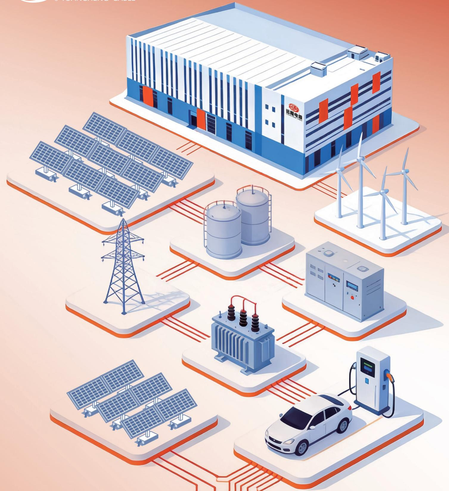

flowchart

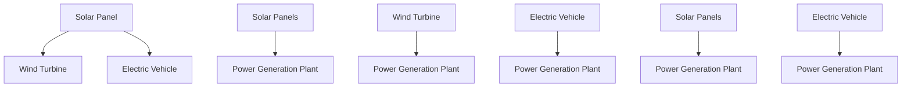
```mermaid
graph TD
  A["Solar Panel"] --> B["Wind Turbine"]
  A --> C["Electric Vehicle"]
  D["Solar Panels"] --> E["Power Generation Plant"]
  F["Wind Turbine"] --> G["Power Generation Plant"]
  H["Electric Vehicle"] --> I["Power Generation Plant"]
  J["Solar Panels"] --> K["Power Generation Plant"]
  L["Electric Vehicle"] --> M["Power Generation Plant"]
```

# CONTENTS

# 目录

关于本报告 01

# 走进远程股份

公司简介 03

业务概况 03

发展历程 05

企业文化 07

重大荣誉资质 08

关键绩效 09

# 01

# 治理强基，稳健致远

可持续发展治理 13

坚持党建引领 19

科学规范治理 21

优化内控合规 24

强化投关管理 26

秉持商业道德 27

# 02

# 绿色智造，缆系生态

应对气候变化 31

优化环境管理 37

合理资源配置 42

三废防治 50

生物多样性与生态系统保护 52

# 03

# 价值共缆，产业共荣

创新驱动发展 55

链动高效协同 68

品质卓越追求 73

卓越客户体验 81

信息安全无忧 83

# 04

# 同芯共益，携手同行

平等合规用人 87

员工民主建设 95

相伴员工成长 96

职业健康与安全 99

行动回馈社会 108

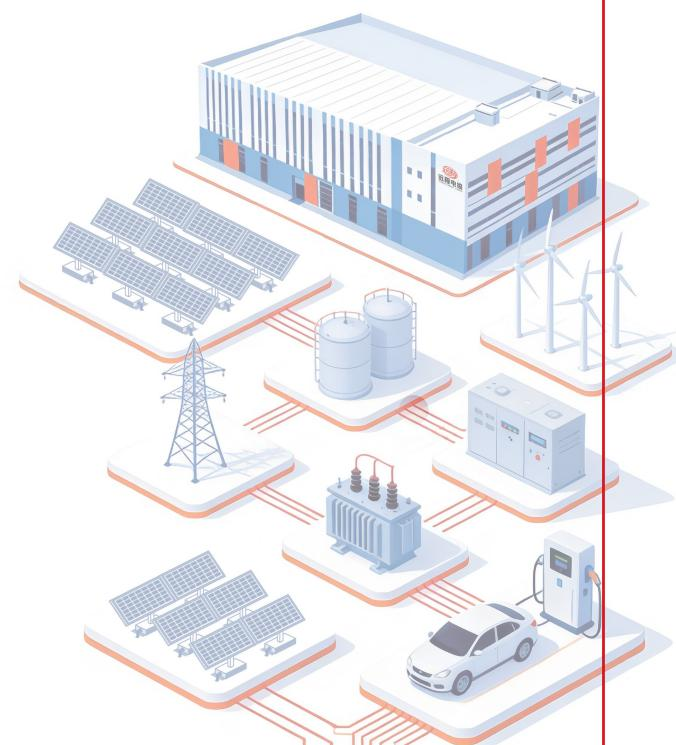

flowchart

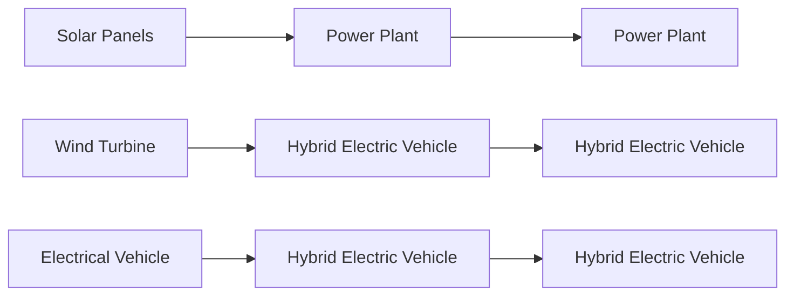
```mermaid
graph LR
  A["Solar Panels"] --> B["Power Plant"]
  C["Wind Turbine"] --> D["Hybrid Electric Vehicle"]
  E["Electrical Vehicle"] --> F["Hybrid Electric Vehicle"]
  B --> G["Power Plant"]
  D --> H["Hybrid Electric Vehicle"]
  F --> I["Hybrid Electric Vehicle"]
```

# 附录

指标索引 109

反馈意见表 113

# 关于本报告

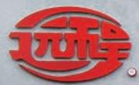

# 远程电缆

# YUANCHENG CABLE

# 报告说明

本报告是远程电缆股份有限公司发布的第二份环境、社会和公司治理（ESG）报告，本报告遵循客观、规范、透明及全面的原则，详细披露了远程股份在环境、社会和公司治理方面采取的实践举措以及所取得的成绩。

# 时间范围

本报告为年度报告，时间跨度为2025年1月1日至2025年12月31日，为增强报告可比性及前瞻性，部分内容有所延伸。

# 报告范围

本报告以“远程股份”为主体，如无特别说明，本报告的组织范围覆盖远程电缆股份有限公司及各子公司（具体详见远程电缆股份有限公司2025年年度报告）。

# 编制依据

深圳证券交易所《深圳证券交易所上市公司自律监管指引第17号——可持续发展报告（试行）》  
深圳证券交易所《深圳证券交易所上市公司自律监管指南第3号——可持续发展报告编制》  
中国企业改革与发展研究会等《中国企业可持续发展报告指南（CASS-ESG 6.0）之一般框架》  
联合国2030年可持续发展目标（SDGs）  
全球报告倡议组织《可持续发展报告标准（GRI Standards）》  
国资委办公厅《央企控股上市公司ESG专项报告参考指标体系》

# 资料来源及可靠性保证

本报告引用的全部信息数据均来自远程股份正式文件、统计报告及财务报告，涵盖公司各部门及经营单位的内部数据和公开信息，并经公司统计、汇总与审核。同时，为确保阐释的完整性与连续性，公司在特定议题下对部分内容予以回顾和延展。货币计量若无特别标注，均采用人民币为计量单位。如财务数据与年报不一致，以年报为准。

# 称谓说明

在本报告书中，为便于表述和阅读，远程电缆股份有限公司及其下属子公司根据行文具体情况，简称“远程股份”“公司”“企业”或“我们”，具体表述参考远程电缆股份有限公司2025年年度报告。

# 报告获取

为了践行低碳环保和可持续发展的理念，本报告可以在深交所网站（http://www.szse.cn）在线阅读或下载报告电子版，如果您还想了解本报告以外的公司其他信息，可查阅公司年度财务报告或浏览公司网站。

如有任何反馈及建议，请通过以下方式联系我们：

通信地址：江苏省宜兴市官林镇远程路8号

联系电话：0510-80777896

# 走进远程股份

# 公司简介

远程电缆股份有限公司（证券代码：002692）成立于2001年，并于2012年8月在深圳证券交易所上市，系宜兴地区电缆行业中的国有控股上市企业。公司主营电线电缆产品的研发、生产与销售，主要涵盖500kV及以下电力电缆、特种电缆、裸导线、电气装备用电线电缆等产品类别，广泛应用于国家电网、核电站、轨道交通、新能源、石油化工、智能装备、数字通信、城市管廊等多项重大工程领域。

公司是“国家专精特新小巨人企业”“国家级5G工厂”“国家高新技术企业”“国家守合同重信用企业”“全国用户满意企业”“江苏省质量管理先进企业”“中国线缆行业最具竞争力企业100强”“江苏省绿色工厂”“江苏省智能制造标杆企业（智能车间）”“江苏省绿色融资主体”。公司坚持核心技术的长期投入，建立了省级工程技术研究中心、国家级博士后科研工作站和CNAS国家认可实验室，具备先进的检测设备、科研设施和科研场地。

“远程”牌电线电缆是全国用户满意产品、江苏省名牌产品，在品质性能、应用领域、使用寿命等方面居行业领先水平，享有“全国用户满意产品”“江苏省名牌产品”“江苏省重点保护产品”“江苏省著名商标”等荣誉称号。

公司秉持“成为最具价值的绿色能源传输方案提供商”的企业愿景，以“责任、协作、效率、卓越”为核心价值观，践行“挺国企制造之脊梁，担绿能传输之重任，创产业强国之先锋”的企业使命。通过细分市场定位与技术积累，公司致力于为客户提供安全可靠的线缆产品与解决方案，推动绿色能源传输与可持续发展。

# 业务概况

公司具有多个在行业内部具有竞争优势的产品品种：公司核电站用电缆获得国家核安全局颁发的《民用核安全电气设备设计/制造许可证》，并供货核电站核级电缆、非核级电缆领域；110kV、220kV等高压交联聚乙烯绝缘电力电缆广泛应用于电力系统，获得客户高度评价；矿物绝缘电缆应用于重要的公共设施，碳纤维导线应用于高电压远距离输电领域，光电复合电缆应用于国网电网智能化改造项目，光伏电缆应用于新能源光伏发电领域，储能电缆应用于新能源电化学储能领域。

公司以客户为中心，凝聚卓越团队，坚持核心技术的长期投入，在核级电缆、防火电缆、高压电缆等细分市场，提供具有优越竞争力的系统解决方案，并助建在埃塞俄比亚、安哥拉、越南等多个项目。

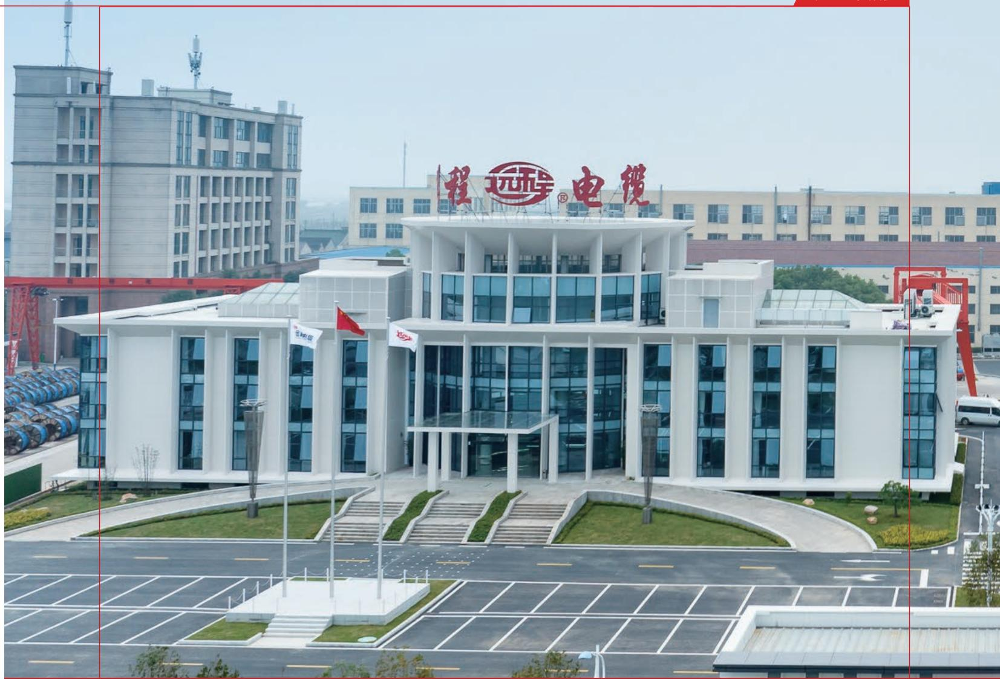

text_image

程远程电缆

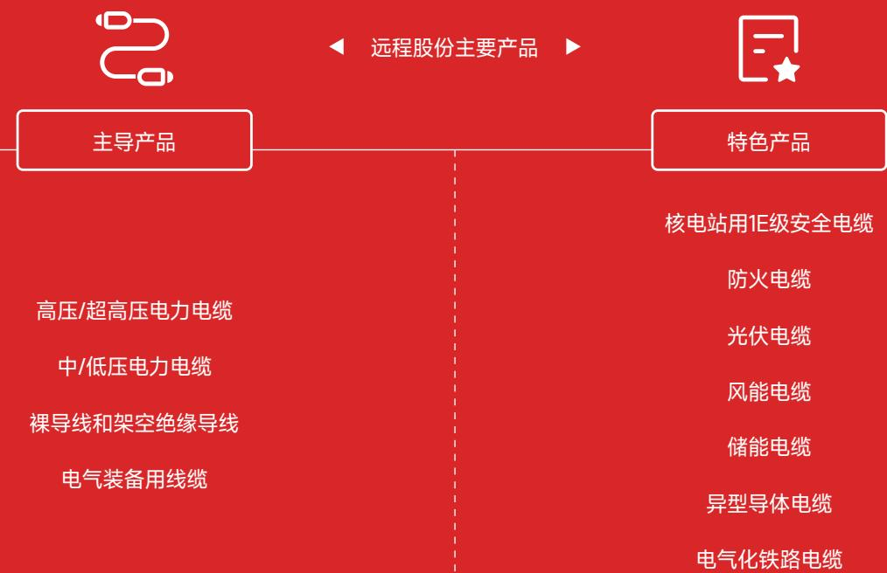

flowchart

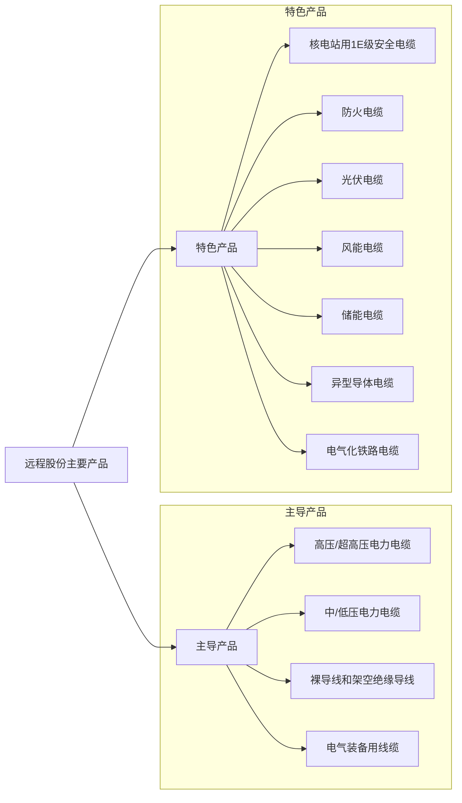
```mermaid
graph LR
  A["远程股份主要产品"] --> B["主导产品"]
  A --> C["特色产品"]
  
  subgraph MainProducts ["主导产品"]
    direction TB
  B --> D["高压/超高压电力电缆"]
  B --> E["中/低压电力电缆"]
  B --> F["裸导线和架空绝缘导线"]
  B --> G["电气装备用线缆"]
  end
  
  subgraph SpecialProducts ["特色产品"]
    direction TB
  C --> H["核电站用1E级安全电缆"]
  C --> I["防火电缆"]
  C --> J["光伏电缆"]
  C --> K["风能电缆"]
  C --> L["储能电缆"]
  C --> M["异型导体电缆"]
  C --> N["电气化铁路电缆"]
  end
```

# 发展历程

# 2001年2月

\- 公司成立

# 2010年12月

公司整体变更为股份公司

# 2012年8月

\- 公司在深圳证券交易所成功上市

# 2012年12月

\- 公司成功收购裕德电缆

# 2014年1月

\- 公司成功收购苏南电缆

# 2023年8月

\- 公司通过江苏精品认证

# 2023年12月

\- 公司获评专精特新企业

# 2024年6月

\- 公司荣获中国特种电缆十大品牌&中国电力电缆供应商综合实力50强&中国最具投标实力电线电缆供应商百强

# 2024年9月

- 公司成功助建江苏省首座海岛型变电站——阳光岛110千伏输变电项目跨海电缆工程  
- 公司荣获国家级专精特新“小巨人”企业、江苏省绿色融资主体2024年度绿色企业、2024年度中国线缆产业最具竞争力百强企业  
- 公司获德国莱茵TÜV直流光伏电缆认证证书

# 2016年6月

\- 公司成为中国线缆行业最具竞争力百强企业前20强

# 2020年2月

\- 公司成为国资控股公司

# 2022年2月

\- 公司入选江苏省绿色工厂

# 2022年12月

\- 公司获评江苏省智能制造示范车间

# 2024年11月

\- 公司荣获国家级5G工厂

# 2024年12月

\- 远程股份参与制定的全球首个750kV超高压电缆及其附件技术标准，填补行业空白。

# 2025年1月

\- 公司荣登“2024年度中国制造业上市公司价值500强”

\- 公司荣获《安全生产标准化三级企业》证书

# 2025年2月

公司新品电缆列入江苏省重点推广应用名录

# 2025年7月

\- 公司智能电网用中高压特种电缆制造项目正式开工

# 2025年8月

\- 公司荣膺2025年度中国线缆产业最具竞争力百强企业第35位

# 2025年10月

\- 公司成功获评“AA+sti”主体信用等级，评级展望为“稳定”

# 2025年3月

\- 公司升格为国家级博士后科研工作站

# 2025年5月

\- 2025中国国有电线电缆企业10强

• 2025中国电力电缆供应商综合实力50强

• 2025中国最具投标实力电线电缆供应商百强

\- 公司成功入选2025年江苏省先进级智能工厂名单

# 2025年6月

\- 公司获得TÜV莱茵颁发的两项认证：基于2PfG 2962标准的海上光伏系统用电缆，以及基于2PfG 2642标准的新型铝合金光伏电缆TÜV Bauart Mark型式认证

# 企业文化

# 使命

挺国企制造之脊梁
担绿能传输之重任
创产业强国之先锋

# 核心价值观

责任、协作、效率、卓越

# 客户理念

品质匠心、服务至诚
持续改善、成人达己

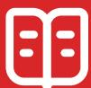

# 愿景

成为最具价值的绿色能源传输方案提供商

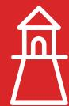

# 经营宗旨

产业筑基、资本兴业文化致胜、精益创新

# 企业精神

远于志向、勇于担当守于精诚、贵于坚韧成于协作

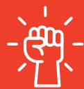

# 重大荣誉资质

国家级5G工厂  
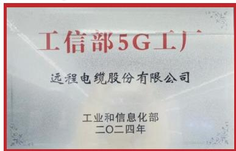

text_image

工信部5G工厂
远程电缆股份有限公司
工业和信息化部
二〇二四年

·工业和信息化部信息通信管理局·

江苏省5G工厂  
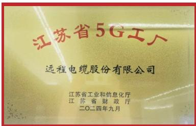

text_image

江苏省5G工厂
远程电缆股份有限公司
江苏省工业和信息化厅
江苏省财政厅
二〇二四年九月

·江苏省工业和信息化厅

省级绿色工厂  
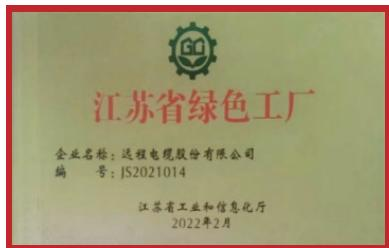

text_image

江苏省绿色工厂
企业名称：远程电缆股份有限公司
编号：JS2021014
江苏省工业和信息化厅
2022年2月

·江苏省工业和信息化厅

高新技术企业  
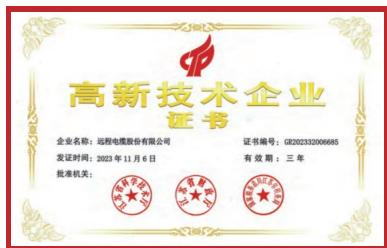

text_image

高新技术企业
证书
企业名称：远程电缆股份有限公司
证书编号：GR202332006685
发证时间：2023年11月6日
有效期：三年
批准机关：
深圳市深南区人民法院

·江苏省科学技术厅·
·江苏省财政厅、国家税务总局江苏省税务局

江苏精品认证  
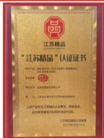  
·江苏精品国际认证联盟

国家级博士后科研工作站  
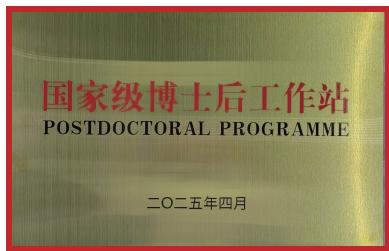

text_image

国家级博士后工作站
POSTDOCTORAL PROGRAMME
二〇二五年四月

·全国博士后管委会办公室·

2025年度中国线缆产业最具竞争力百强企业  
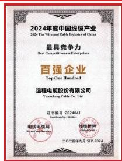  
·电线电缆网·

2024年度江苏线缆产业高质量创新发展企业10强  
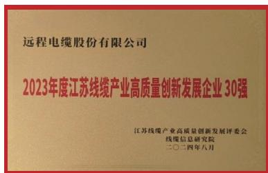

text_image

远程电缆股份有限公司
2023年度江苏线缆产业高质量创新发展企业30强
江苏线缆产业高质量创新发展评委会
线缆信息研究院
二〇一四年八月

·江苏线缆产业高质量创新发展评委会
·线缆信息研究院·

2025中国国有电线电缆企业10强  
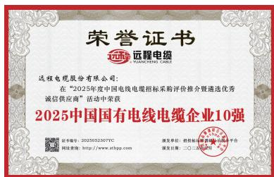

text_image

荣誉证书
远程电缆
远程电缆股份有限公司：
在“2025年度中国电线电缆招标采购评价推介暨速造优秀
诚信供应商”活动中荣获
2025中国国有电线电缆企业10强
证书编号：2025B52307YC
网站查询：http://www.ebbpp.com
联系单位：群联转播网（深圳）电子平台
联系方式：二〇二二

·招投标品牌调研公示服务平台

2025中国电力电缆供应商综合实力50强  
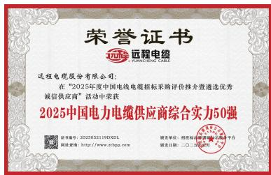

text_image

荣誉证书
远程电缆
远程电缆股份有限公司：
在“2025年度中国电线电缆招标采购评价推介暨遴选优秀
诚信供应商”活动中荣获
2025中国电力电缆供应商综合实力50强
证书编号：20250821190X01L
网站查询：http://www.sthpg.com
颁发单位：根据招标评审结果公示
颁发日期：二〇二二年四月

·招投标品牌调研公示服务平台·

2025中国最具投标实力电线电缆供应商百强  
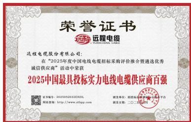

text_image

荣誉证书
远程电缆
远程电缆股份有限公司：
在“2025年度中国电线电缆招标采购评价推介暨遴选优秀
诚信供应商”活动中荣获
2025中国最具投标实力电线电缆供应商百强
证书编号：322305020328X016
网站查询：http://www.stbpp.com
颁发单位：根据财政部国家税务总局北京市税务局
颁发日期：二〇二三年五月二十八日

·招投标品牌调研公示服务平台·

安全生产标准化三级企业  
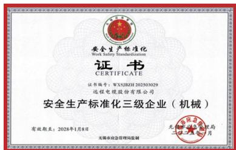

seal

安全生产标准化
Work Safety Standardization
证书
CERTIFICATE
证书编号：WXSJ8ZH202503029
远程电缆股份有限公司
安全生产标准化三级企业（机械）
有效期至：2028年1月8日
无锡市应急管理局
二〇二三年五月

·无锡市应急管理局·

# 关键绩效

# 经济绩效

● 营业收入

444,367万元

\- 纳税总额

6,444 万元

资产总额

306,759万元

\- 利润总额

2,604 万元

\- 基本每股收益

0.0025元

每股社会贡献值

0.29元/股

# 环境绩效

污染物监测合格率

100%

能源消耗总量

3,881.15 吨标准煤

环保设施同步运转率

100%

\- 新鲜水取水总量

63,608 吨

# 社会绩效

\- 员工总数

730人

\- 劳动合同签订率

100%

\- 员工培训投入

25.26 万元

\- 员工培训总时长

608 小时

\- 研发投入

20,509万元

\- 产品合格率

99.8%

客户投诉解决率

100%

# 治理绩效

\- 股东会召开次数

5 次

董事会召开次数

9次

董事会女性董事占比

4/9

董事会独立董事占比

1/3

# 01 治理强基 稳健致远

# 我们的理念

远程股份秉持“产业筑基、资本兴业、文化致胜、精益创新”的经营宗旨，持续推动可持续发展战略建设，与经济、社会、环境与企业治理各方携手共创和谐未来。

# 我们的行动

可持续发展治理  
坚持党建引领  
科学规范治理  
优化内控合规  
强化投关管理  
秉持商业道德

SDGs

16和平、正义与强大机构

17 促进目标实现的伙伴关系

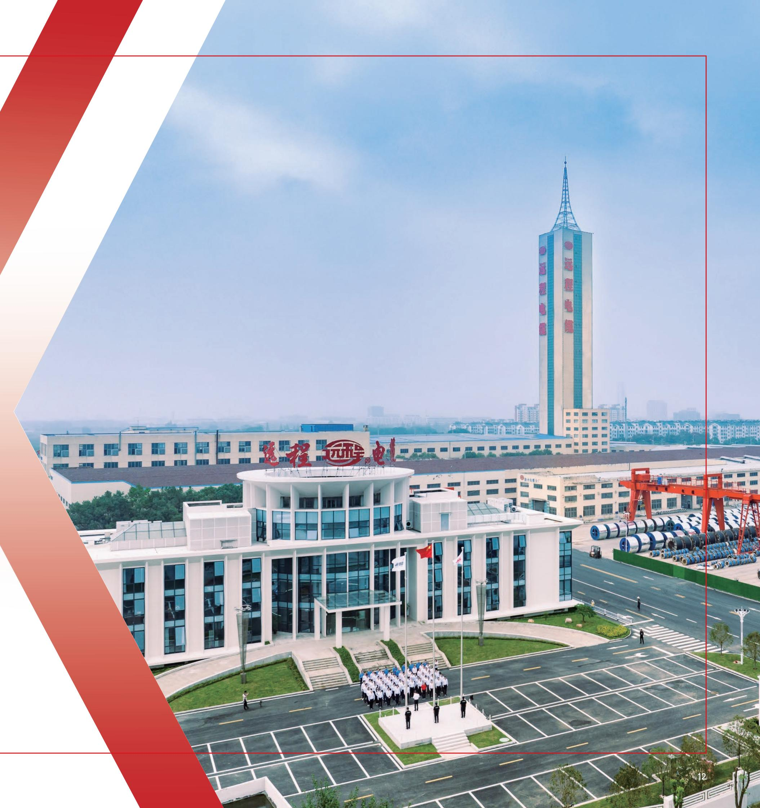

natural_image

Exterior view of a modern industrial complex with a prominent tower and flagpole, featuring a large building with Chinese characters on its facade (no signage visible on main structures).

# 可持续发展治理

# 可持续发展目标与愿景

基于“挺国企制造之脊梁，担绿能传输之重任，创产业强国之先锋”的企业使命，远程股份将可持续发展理念贯穿于业务全流程。公司通过持续的技术创新和工艺改进，推动绿色制造体系建设，致力于成为电缆行业绿色转型的示范企业。

在环境维度，公司聚焦绿色低碳发展方向，秉持“绿色节用，精益求精新”产品观，深耕绿色能源传输装备制造领域，依托技术创新与资源高效利用降本减耗，以绿色解决方案助力低碳发展，践行环境可持续愿景。

在社会责任方面，公司围绕“责任、协作、效率、卓越”核心价值观，构建多元共荣价值体系。对内通过“雏鹰成长”机制培育人才、塑造协作文化；对外恪守对客户、股东的责任，以优质产品与服务创造价值，助力产业强国建设，实现与社会共生共荣。

在治理层面，公司以规范治理夯实可持续发展为基础，以“产业筑基、资本兴业、文化致胜、精益创新”为经营宗旨。优化治理结构，践行人才、生产、研发、投资四大核心观念，强化合规经营与科学管理，为实现长远战略目标提供坚实保障。

贡献联合国可持续发展目标（SDGs）

<table><tr><td>维度</td><td>SDGs</td><td>我们的响应</td></tr><tr><td>公司治理</td><td>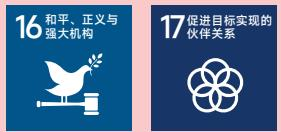</td><td>健全公司治理体系,以合规管理为核心治理理念,保障股东权益、深化廉洁反腐建设、恪守商业道德。</td></tr><tr><td>环境保护</td><td>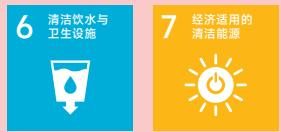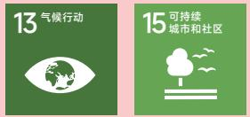</td><td>远程股份践行水资源可持续管理,推进能源结构优化与节能降耗,为应对气候变化探索减碳路径,遵守环保法规,践行绿色发展理念。</td></tr></table>

<table><tr><td>维度</td><td colspan="3">SDGs</td><td>我们的响应</td></tr><tr><td>产业价值</td><td colspan="3"></td><td>深化研发管理体系,加强供应链管理,确保产品质量;促进采购程序公平透明、抵制不正当竞争。</td></tr><tr><td>人力资源</td><td colspan="3">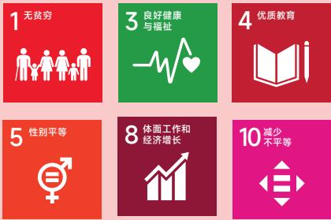</td><td>优化薪酬福利,秉持多元平等理念,建立困难及残疾员工帮扶机制并投身公益;保障员工身心健康,开展体检与心理讲座、配备劳保用品;完善培训体系,助力员工成长。</td></tr></table>

# 可持续发展治理架构

远程股份严格依照《深圳证券交易所上市公司自律监管指引第17号——可持续发展报告（试行）》等监管规定，建立了层次分明、权责清晰的可持续发展治理架构，构建决策层、管理层、执行层三级联动的ESG管理体系，为可持续发展提供治理支撑。董事会作为公司ESG事务及信息披露的最高决策机构，负责审定公司ESG整体战略与中长期规划，监督ESG风险和机遇的识别、评估和应对方案；董事会办公室统筹ESG管理、沟通及信息披露工作，定期向董事会汇报进展；ESG工作小组负责ESG议题信息收集分析、制定改进措施、优化工作流程，保障ESG管理工作高效落地。

<table><tr><td>层级</td><td>治理主体</td></tr><tr><td>决策层</td><td>董事会</td></tr><tr><td>管理层</td><td>董事会办公室</td></tr><tr><td>执行层</td><td>ESG工作小组</td></tr></table>

公司常态化开展年度ESG专题培训，覆盖董事、高管及核心职能部门人员，提升管理层人员的ESG专业素养与履职水平。

# 案例 | 2025年度可持续发展项目启动会

2025年11月3日，远程股份召开2025年度可持续发展项目启动会。会议对标深交所ESG披露要求，明确合规底线，发布编制方案、搭建协同治理体系、划定节点，强调核心原则，梳理ESG实践成果，履行披露义务，回应监管与利益相关方关切。

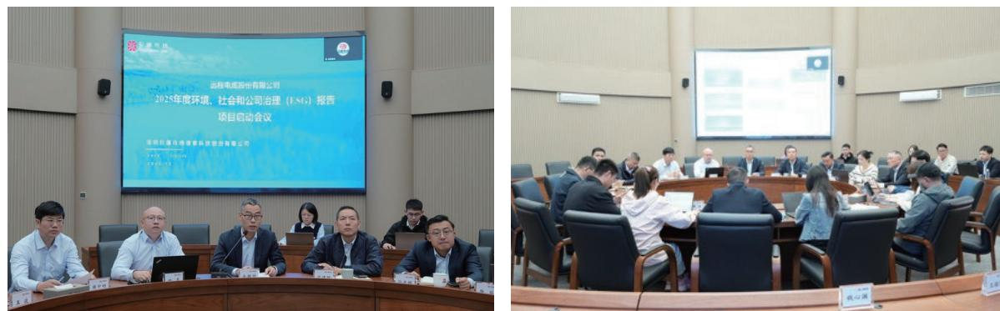

# 利益相关方沟通

公司将承担社会责任视为长远发展的基石，通过搭建多元沟通渠道，与股东及投资者、客户、员工、政府及监管机构、供应商及合作伙伴、社区代表等利益相关方保持常态化交流，围绕可持续发展议题开展深度研讨，充分倾听各方对公司可持续发展管理工作的期望与建议。

<table><tr><td>利益相关方类别</td><td colspan="2">诉求与期望</td><td colspan="2">沟通与回应</td></tr><tr><td>政府及监管机构</td><td>响应国家战略守法合规经营</td><td>服务区域经济</td><td>应对气候变化环保隐患整改</td><td>依法合规经营承担社会责任</td></tr><tr><td>投资者及股东</td><td>保障股东权益公司治理信息公开透明</td><td>内控及风险管理投资者关系管理</td><td>优化公司治理体系信息合规披露提升内控水平</td><td>进行风险评估召开股东会投资者沟通</td></tr><tr><td>客户及供应商</td><td>提供优质服务产品质量</td><td>技术创新践行可持续采购</td><td>提升服务质量强化质量管控加大研发投入</td><td>打造可持续供应链廉洁采购</td></tr></table>

<table><tr><td>利益相关方类别</td><td colspan="2">诉求与期望</td><td colspan="2">沟通与回应</td></tr><tr><td>员工</td><td colspan="2">·员工权益及福利 ·技能培训和职业发展·平衡工作与生活 ·员工健康与安全</td><td colspan="2">·完善薪酬福利体系 ·畅通的职业晋升通道·员工关怀活动 ·安全生产保障·员工培训</td></tr><tr><td>公益组织及社区组织</td><td colspan="2">·公益慈善 ·保护生态环境·关注弱势群体</td><td colspan="2">·开展社会公益活动 ·绿色生产</td></tr><tr><td>媒体</td><td colspan="2">·信息公开透明 ·媒体采访与沟通</td><td colspan="2">·及时披露信息 ·媒体交流会</td></tr></table>

# 重要性议题管理

公司遵循《深圳证券交易所上市公司自律监管指南第3号——可持续发展报告编制》要求，基于所处行业特征及自身经营特点，系统评估可持续发展议题的双重重要性；一方面从外部视角考量议题对经济、社会、环境系统产生的实质性影响（即影响重要性），另一方面通过内部视角审视议题对企业战略布局、商业模式创新、财务稳健性、现金流管理、融资结构及价值链韧性的潜在作用（即财务重要性）。在双重重要性分析框架下，公司结合国际主流ESG标准体系（如GRI等），对可持续发展议题开展系统化分级评估。公司通过构建“影响－财务”二维矩阵模型，识别出既具备重大外部社会价值、又对企业可持续发展能力构成实质性影响的核心议题，为战略性披露和持续性改进提供科学依据。

# 重要性议题分析流程

政策法规对标研究 | 公司商业模式分析 | 行业最佳实践对标 | 识别利益相关方与公司面临的影响、风险与机遇

参考全球报告倡议组织GRI、联合国可持续发展目标SDGs、SASB、MSCI，以及国内外同行业相关议题建立可持续发展相关议题库

外部利益相关方调研

内部利益相关方调研

重要性议题

本年度，公司完成2024年度重要性议题清单的案头复核与评估工作。结合公司战略及外部环境未发生重大变化的实际情况，本年度重要性议题识别结论延续年度核心判定逻辑。具体重要性议题识别清单如下：

<table><tr><td>维度</td><td>议题</td><td>重要性说明</td></tr><tr><td rowspan="8">E</td><td>环境合规管理</td><td>影响重要性</td></tr><tr><td>能源利用</td><td>双重重要性</td></tr><tr><td>应对气候变化</td><td>双重重要性</td></tr><tr><td>水资源利用</td><td>影响重要性</td></tr><tr><td>污染物排放</td><td>影响重要性</td></tr><tr><td>生态系统和生物多样性保护</td><td>相关</td></tr><tr><td>循环经济</td><td>影响重要性</td></tr><tr><td>废弃物处理</td><td>影响重要性</td></tr><tr><td rowspan="11">S</td><td>保护员工合法权益</td><td>影响重要性</td></tr><tr><td>员工培训与发展</td><td>影响重要性</td></tr><tr><td>职业健康与安全</td><td>双重重要性</td></tr><tr><td>研发与创新</td><td>双重重要性</td></tr><tr><td>产品质量与安全</td><td>双重重要性</td></tr><tr><td>客户权益保护</td><td>影响重要性</td></tr><tr><td>信息安全与隐私保护</td><td>影响重要性</td></tr><tr><td>负责任供应链管理</td><td>双重重要性</td></tr><tr><td>平等对待中小企业</td><td>相关</td></tr><tr><td>社会贡献</td><td>相关</td></tr><tr><td>乡村振兴</td><td>相关</td></tr><tr><td rowspan="9">G</td><td>股东权益保护</td><td>影响重要性</td></tr><tr><td>规范公司治理</td><td>影响重要性</td></tr><tr><td>反商业贿赂及反贪污</td><td>影响重要性</td></tr><tr><td>反不正当竞争</td><td>影响重要性</td></tr><tr><td>税务合规</td><td>影响重要性</td></tr><tr><td>风险管理</td><td>影响重要性</td></tr><tr><td>尽职调查</td><td>相关</td></tr><tr><td>利益相关方沟通</td><td>相关</td></tr><tr><td>ESG治理</td><td>相关</td></tr></table>

非常重要  
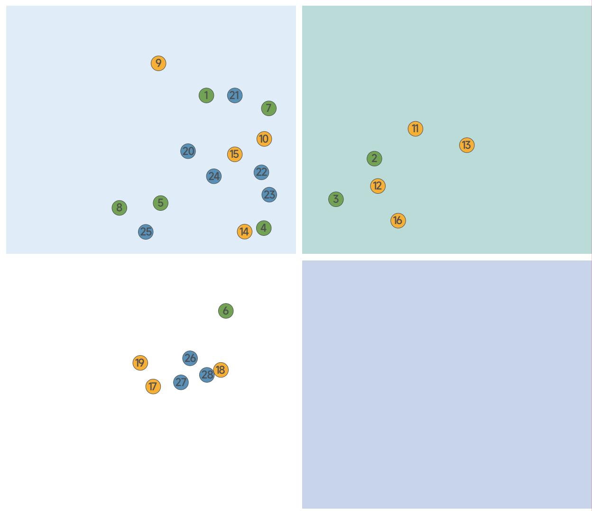

scatter

| Point ID | Color |
| --- | --- |
| 1 | Green |
| 2 | Green |
| 3 | Green |
| 4 | Green |
| 5 | Green |
| 6 | Green |
| 7 | Green |
| 8 | Green |
| 9 | Orange |
| 10 | Orange |
| 11 | Orange |
| 12 | Orange |
| 13 | Orange |
| 14 | Orange |
| 15 | Orange |
| 16 | Orange |
| 17 | Orange |
| 18 | Orange |
| 19 | Orange |
| 20 | Blue |
| 21 | Blue |
| 22 | Blue |
| 23 | Blue |
| 24 | Blue |
| 25 | Blue |
| 26 | Blue |
| 27 | Blue |
| 28 | Blue |
| 29 | Orange |

对公司财务影响的重要性  
非常重要

  
同时具有财务重要性与影响重要性

  
具有财务重要性但不具有影响重要性

  
具有影响重要性但不具有财务重要性

  
既不具有财务重要性也不具有影响重要性

①环境合规管理  
②能源利用  
③应对气候变化  
④水资源利用  
⑤污染物排放  
⑥生态保护与生物多样性  
⑦循环经济  
⑧废弃物处理

⑨保护员工合法权益  
⑩员工培训与发展  
⑪职业健康与安全  
⑫研发与创新  
⑬产品质量与安全  
⑭客户权益保护  
⑮信息安全与隐私保护  
⑯负责任供应链管理  
⑰平等对待中小企业  
⑱社会贡献  
⑲多村振兴

⑳股东权益保护  
②1规范公司治理  
②反商业贿赂及反贪污  
- ②3 反不正当竞争  
②4 税务合规  
②5风险管理  
②6 尽职调查  
②7 利益相关方沟通  
②8ESG治理

# 坚持党建引领

# 坚持党的全面领导

远程股份深入贯彻习近平新时代中国特色社会主义思想，落实新时代党的建设总要求，坚持党的全面领导。公司通过制定《党总支前置研究讨论重大事项规程》和《“三重一大”决策制度实施办法》，明确党组织在重大决策中的作用，确保党组织在企业治理中把方向、管大局。各支部通过党员教育、党建共建、廉政建设等工作，推动党建与业务融合，促进企业稳健发展。

# 深化党组织建设

远程股份加强党组织建设，设立党员先锋岗，开展技术攻关、志愿服务等品牌活动。公司党总支下设两个党支部，定期组织“三会一课”和主题党日，组织理论学习和技术攻关研讨，推动党建工作与生产经营深度融合。

# 下属党支部

# 远程电缆一支部委员会

# 远程电缆二支部委员会

# 党建品牌建设

品牌名称：缆心向党·智联未来

品牌内涵：通过设立党员先锋岗、开展技术攻关项目、组织产业链党建工作等方式，将党建工作融入生产经营一线；依托理论学习和业务竞赛活动，促进党员亮身份、比业绩，推动党建与业务融合发展。

品牌特色：远程股份依托“党员先锋岗”“青蓝结对”等载体，组织技能竞赛、技术培训，推动党员在技术研发、质量管控等环节发挥作用；通过主题党日、理论学习等活动强化思想引领，提升基层党组织的凝聚力和战斗力。

# 关键指标

2个党支部

召开党总支委员会20次

党员数量27人

# 牢筑思想根基

报告期内，远程股份通过组织专题学习会、研讨会、党课及主题党日活动，深入学习党的理论成果和党纪法规；开展“廉政文化月”活动加强纪律教育；并与交通银行、滨湖村党支部等开展党建共建活动，以多种形式强化党员学习教育管理，提升思想政治素质。

# 案例

# “5·10”思廉月系列活动

#

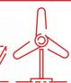

2025年4月29日，远程电缆第一、第二党支部联合开展了“加强党员党性教育、思政教育”主题党日活动。活动组织党员参观宜兴于伶纪念馆与白塔村党建展示馆。党员们在参观过程中，深刻感受到先辈们坚定的理想信念和无私奉献精神，进一步增强了党性修养。

natural_image

Silhouette of a traditional Chinese architectural structure against a modern city skyline (no text or symbols)

# 科学规范治理

# 完善管治体系

公司遵守《上市公司治理准则》《深圳证券交易所上市公司自律监管指引第1号—主板上市公司规范运作》等监管要求，制定《公司章程》《股东会议事规则》等规章制度，构建由股东会、董事会及管理层组成的治理架构，厘清各类治理主体权责边界，保障治理体系高效、科学、透明运行。

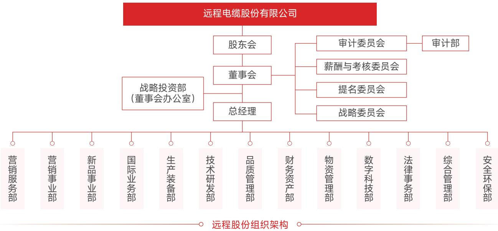

flowchart

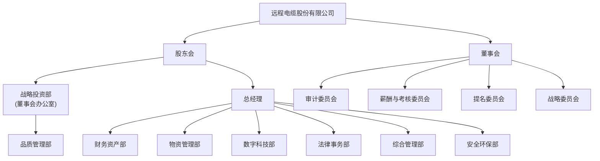
```mermaid
graph TD
  A["远程电缆股份有限公司"] --> B["股东会"]
  A --> C["董事会"]
  B --> D["战略投资部\n(董事会办公室)"]
  B --> E["总经理"]
  C --> F["审计委员会"]
  C --> G["薪酬与考核委员会"]
  C --> H["提名委员会"]
  C --> I["战略委员会"]
  D --> J["品质管理部"]
  E --> K["财务资产部"]
  E --> L["物资管理部"]
  E --> M["数字科技部"]
  E --> N["法律事务部"]
  E --> O["综合管理部"]
  E --> P["安全环保部"]
```

# 规范双会治理

# 股东会

股东会为公司最高权力机构，决定公司经营方针、投资计划等重大事项。公司依据《公司章程》《股东会议事规则》规范运作，定期召集、召开股东会，确保所有股东能够平等、有效地行使其表决权，切实维护股东合法权益。

# 关键绩效

报告期内，公司共召开5次股东会会议，包括1次年度股东会会议和4次临时股东会会议，会议共审议通过17项议案。

# 董事会

董事会执行股东会决议，负责公司经营决策。董事会的会议通知、召集组织、议案审议、表决执行及决议制定等全流程，均遵循法律法规及《董事会议事规则》等规定，并按上市公司信息披露要求完成公告，保障公司决策程序合规、决议内容合法。公司董事会由9名董事组成，其中包含独立董事3名，非独立董事6名。

# 关键绩效

报告期内，公司共召开9次董事会会议，审议通过59项议案。

# 董事会多元化

公司对董事会成员的选聘充分考虑其性别、年龄、教育背景、专业知识和行业经验等多方面因素，构建多元化董事会。董事会成员兼具多元化专业背景，覆盖企业经营管理、机械制造、财务管理、电缆等多个领域，与公司发展需求契合，能够为公司稳健发展提供坚实的专业支撑。

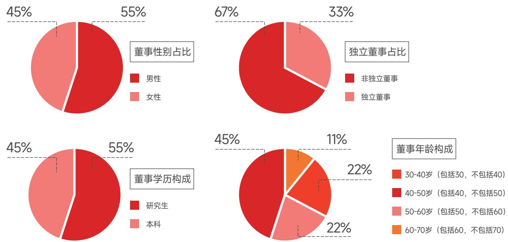

# 董事年龄构成

30-40岁（包括30，不包括40）  
40-50岁（包括40，不包括50）  
50-60岁（包括50，不包括60）  
60-70岁（包括60，不包括70）

# 董事会独立性

公司注重发挥独立董事在决策中的积极作用，持续提升董事会科学决策水平。公司依据《独立董事专门会议工作制度》《独立董事工作制度》，明确独立董事的职责、独立性要求及履职保障机制，确保其独立、客观地履职。公司董事会人数和人员构成均符合法律法规的要求。同时，独立董事在审计委员会、提名委员会和薪酬与考核委员会中担任召集人，为公司董事会的决策提供科学和专业的意见和参考。

# 董事会专门委员会

公司董事会下设战略委员会、审计委员会、提名委员会、薪酬与考核委员会四个专门委员会，通过专业化分工提升决策质量。审计委员会由3名不在公司担任高级管理人员的董事组成，其中独立董事过半数，并由独立董事中会计专业人士担任召集人。各委员会成员均遵循相应委员会的工作细则履行职责，确保公司治理的合规性和有效性。

<table><tr><td>专门委员会</td><td>独立董事(位)</td><td>独立董事占比(%)</td><td>非独立董事(位)</td><td>独董是否担任召集人</td></tr><tr><td>战略委员会</td><td>1</td><td>33.33</td><td>2</td><td>否</td></tr><tr><td>审计委员会</td><td>2</td><td>66.67</td><td>1</td><td>是</td></tr><tr><td>提名委员会</td><td>2</td><td>66.67</td><td>1</td><td>是</td></tr><tr><td>薪酬与考核委员会</td><td>2</td><td>66.67</td><td>1</td><td>是</td></tr></table>

# 关键绩效

报告期内，公司召开战略委员会会议2次，审议通过7项议案；

召开审计委员会会议9次，审议通过19项议案；

召开提名委员会会议1次，审议通过2项议案；

召开薪酬与考核委员会会议2次，审议通过3项议案。

# 董事和高管薪酬管理

公司持续建立完善公正、透明的董事和高级管理人员的绩效评价标准和程序。董事和高级管理人员的绩效评价由董事会下设的薪酬与考核委员会负责组织，并建立高级管理人员的薪酬与公司业绩和个人绩效相联系的激励约束机制。公司董事、高级管理人员的薪酬制度符合公司现状及相关法律法规及《公司章程》等规定。报告期内，董事和高级管理人员按照其岗位职务，根据公司现行的薪酬分配制度和业绩考核规定获取薪酬。

# 优化内控合规

# 合规体系建设

远程股份不断强化对关键业务环节的风险管控，建立健全内控体系，持续推进合规管理与企业日常运营相结合。公司制定并实施《合同管理制度》《财务管理制度》《印章管理制度》等涵盖业务操作、资金管理、印章使用等方面的内部规章，形成基础管理框架。通过ERP系统、财务共享中心等信息化平台的搭建与优化，将审批流程、权限控制嵌入业务操作环节，实现过程可追溯。同时，公司明确岗位职责与授权机制，加强对采购、合同、资金等重点领域的审核与监督，并通过内部审计部门定期开展审计检查，促进内控执行落地。

# 内控风险管理

公司持续完善风险管理导向的合规内控体系，通过制度建设和流程规范强化重点领域风险管理。

公司依据《财务管理制度》加强资金与应收款项管理，配备专职人员并定期对账，以防范信用风险。合同签订环节严格执行《合同管理制度》规定的审批流程，以评估并防范合作方履约风险。对于重大项目投资与融资决策，董事会战略委员会及相关会议议案均要求进行专项风险分析，涵盖市场、审批、资金、技术等多方面，并制定相应控制措施。

审计委员会按季度监督财务及内控有效性，定期审议《内部审计工作报告》等文件，对公司财务信息及内部控制进行持续监督与评估。

# 关键绩效

报告期内，公司不存在重大和重要的财务报告内部控制缺陷和非财务报告内部控制缺陷。

报告期内，公司组织董事及高级管理人员进行法律法规专项学习，提升核心团队的合规意识与风险责任认知。

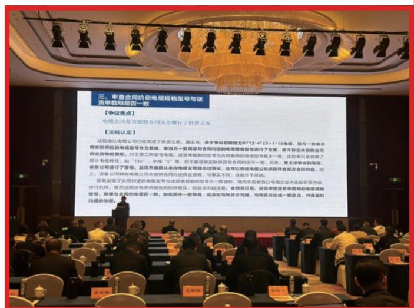

text_image

三、审查合同约定电缆规格型号与速货单载明是否一致
【争议焦点】
电缆公司是否按照合同完全履行了供货义务
【法院认定】
法院确认电缆公司已经完成了供货义务，理由为：关于审议的规格为8T7Z-4*25+1*16电缆，双方一致表示实际供应的电缆型号作为替换。双方一致同意对合同约定的电缆规格型号进行了变更，故不存在未按照合同实际供应的电缆型号作为替换。对于第二种型号电缆，送货单载明的型号与合同载明的规格型号基本一致，该件只是在略了部分电缆特性、如“1k”、“字母”“E”等，但不说明实际供应与合同的版本不一致。另外，就上述争议的电缆，设备公司进行了验收，且在开庭前从并向电缆公司提出过异议，也可以错误电缆公司供货符合双方合同约定。综上，设备公司除向电缆公司未提供合同约定供货货物，与事实不符，法规不予采纳。
该案实现了合同约定的电缆型号与送货单载明的型号不一致情形，现将引起被告以电缆企业未实际供应为由进行验收，虽然现场没有采购被选的同样意见，但双方分别选取、合同签订后，供应商适当选择要提前到电缆规格型号、数量与合同约定是否一致，如出现不一致情况，应及时与供应商沟通，与供应商达成一致意见，并保留好沟通的依据。

法律培训

<table><tr><td>关键指标</td><td>单位</td><td>2024年</td><td>2025年</td></tr><tr><td>开展法律培训次数</td><td>次</td><td>2</td><td>2</td></tr><tr><td>参与法律培训人数</td><td>人</td><td>60</td><td>80</td></tr><tr><td>参与培训法务人员人数</td><td>人</td><td>4</td><td>3</td></tr></table>

# 关联方交易管理

公司秉承公平公正、决策流程合法合规以及信息披露标准化的原则，并依据《中华人民共和国公司法》《中华人民共和国证券法》《企业会计准则第36号－关联方披露》和《公司章程》等相关规定，结合公司实际情况，制定《关联交易制度》，旨在保障公司的关联交易活动不侵害公司及全体股东的利益，提高公司运营的规范性及效率，实现对关联交易行为的迅速识别、日常监控及有效管理。

# 税务风险管理

公司财务人员严格遵循国家税务合规要求，依法缴纳各项税费，确保纳税申报真实、准确、完整。公司通过定期财税政策培训及职业道德教育，强化员工税务风险意识，保障税收政策精准执行。财务部严格审核原始凭证与账务处理，建立会计档案全周期管理体系，确保税务资料可追溯、可核查。同时，公司完善税务内控机制，通过预算控制、分级审批及定期审计，防范税款滞纳或违规风险，践行企业社会责任，为稳健经营奠定合规基础。

# 强化投关管理

# 合规信息披露

公司严格遵循《中华人民共和国公司法》《中华人民共和国证券法》《上市公司信息披露管理办法》等相关法律法规的要求，切实履行信息披露义务。同时，公司制定《信息披露事务管理制度》《重大信息内部报告制度》《内幕信息及知情人登记和报备管理制度》等一系列制度，规范全流程信息披露要求，强化信息质量管控机制，确保所披露信息真实、准确、完整。

公司通过巨潮资讯网、《上海证券报》和《证券时报》等指定信息披露平台，建立常态化、透明化的信息披露机制。公司通过高质量的信息传递，切实履行对投资者的责任，在保障其合法权益的同时，不断提升公司在资本市场的治理声誉与品牌互信。

# 关键绩效

报告期内，公司对外披露定期报告数量4份，对外披露临时报告数量147份。

# 投资者关系管理

公司秉持合规性、平等性、主动性及诚实守信原则，制定《投资者关系管理制度》等规章制度，积极开展投资者关系管理工作，通过官网、互动易、投资者电话、业绩说明会等多元化渠道与投资者保持紧密交流。

<table><tr><td>关键指标</td><td>单位</td><td>2024年</td><td>2025年</td></tr><tr><td>在互动易与投资者互动次数</td><td>次</td><td>53</td><td>52</td></tr><tr><td>在互动易投资者回复率</td><td>%</td><td>100</td><td>100</td></tr></table>

# 股东权益分派

远程股份重视对股东的合理回报，制定《利润分配管理制度》，实施明确、稳定的分红政策，积极回报股东。

2025年3月13日，公司披露《关于2024年度利润分配方案的公告》，2024年度利润分配方案为：以2024年12月31日公司总股本718,146,000股为基数，向全体股东每10股派发现金股利人民币0.2元（含税），共计派现金红利14,362,920.00元（含税），不送红股，不以资本公积金转增股本，剩余利润作为未分配利润继续留存公司用于支持公司经营需要。

<table><tr><td>关键指标</td><td>单位</td><td>2023年</td><td>2024年</td></tr><tr><td>每10股派发现金红利(含税)</td><td>元</td><td>0.2</td><td>0.2</td></tr><tr><td>共计派发现金(含税)</td><td>元</td><td>14,362,920.00</td><td>14,362,920.00</td></tr></table>

# 秉持商业道德

# 廉洁治理机制

远程股份高度重视廉洁治理机制的建设，致力于维护公平、透明的商业环境。公司制定《廉洁从业管理办法》，涵盖内控机制、部门职责及监督检查等多个方面。通过明确各级管理人员的廉洁责任，强化日常管理和监督，确保公司及全体员工在开展经营活动中严格遵守法律法规，忠实勤勉，诚实守信。

审计部门作为核心监管机构，负责制定廉洁管理相关制度规范，组织培训学习，并处理相关举报投诉，有效防范和打击任何形式的腐败行为，为公司的健康稳定发展提供坚实保障。

# 廉洁文化建设

公司着力营造风清气正的企业氛围，将廉洁从业理念深度融入企业文化体系，通过多元化宣传教育活动，持续提升全体员工的廉洁自律意识与合规履职能力。同时，公司健全财务、采购、营销等关键领域管理制度，明确禁止收受贿赂、谋取私利等违规行为，并强化对第三方机构及个人有偿支付的全流程管控。

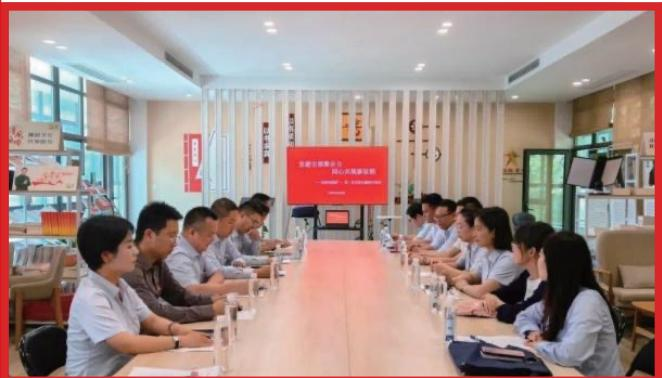

text_image

金融与能源活力
核心发展预期

廉洁建设

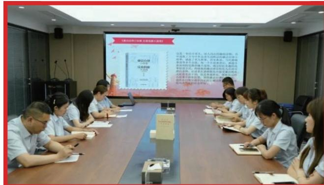

text_image

《重要问题》(重要)主要事项(报告)

该单位介绍，经人选出的媒体分析，其中通过了与中央人民政府的确定性分析、分析、了解个人关系、文化程度以及自身因素等要素，每一个决策的，既建立和组织战略相结合，同时对社会利益和发展做出独立决策，明确政治建设和经济社会发展方向，以实现社会利益最大化和社会发展的重要目标。具体政策框架、制度体系、制度内容、制度规范、制度实施、制度评估、制度审查、制度监督、制度管理、制度培训、制度考核、制度审计、制度监督、制度培训、制度考核、制度审计、制度监督、制度培训、制度考核、制度审计、制度监督、制度培训、制度考核、制度审计、制度监督、制度培训、制度考核、制度审计、制度监督、制度培训、制度考核、制度审计、制度监督、制度培训、制度考核、制度审计、制度监督、制度培训、制度考核、制度审计、制度监督、制度培训、制度考核、制度审计、制度监督、制度培训
（注：图中未提供具体数值，故记为“~”表示）

廉洁学习

<table><tr><td>关键指标</td><td>单位</td><td>2024年</td><td>2025年</td></tr><tr><td>参加反商业贿赂及反贪污培训的总人数</td><td>人</td><td>47</td><td>60</td></tr><tr><td>其中:董事及高级管理人员</td><td>人</td><td>4</td><td>7</td></tr><tr><td>董事及高级管理人员人数占比</td><td>%</td><td>9</td><td>11</td></tr><tr><td>提供的反商业贿赂及反贪污培训总时长</td><td>小时</td><td>3</td><td>3</td></tr><tr><td>其中:董事及高级管理人员</td><td>小时</td><td>3</td><td>3</td></tr><tr><td>接受反商业贿赂及反贪污培训的平均时长</td><td>小时/人</td><td>3</td><td>3</td></tr><tr><td>其中:董事及高级管理人员</td><td>小时/人</td><td>3</td><td>3</td></tr></table>

# 畅通投诉渠道

公司设有电子邮箱、电话号码等多种举报途径，支持员工及外部利益相关方通过举报机制揭露违规行为。审计部门接收举报投诉信息，及时对投诉事项开展调查。

远程股份举报投诉渠道

电子邮箱

fwsjc@yccable.cn

# 02 绿色智造 缆系生态

# 我们的理念

远程股份始终将节约资源与环境保护置于核心发展理念之中，坚定推进绿色低碳转型，主动响应全球气候治理。公司严格遵循国家环保法规，不断优化环境管理体系，致力于打造资源节约、环境友好的可持续发展企业。

# 我们的行动

应对气候变化  
优化环境治理  
合理资源配置  
三废防治  
生物多样性与生态系统保护

SDGs

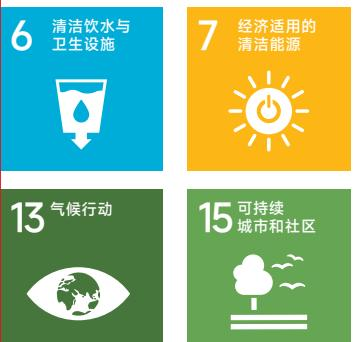

natural_image

Green globe with three heart-shaped trees emerging from its surface, set against a blurred green background (no text or symbols)

# 应对气候变化

远程股份秉持“科技引领、创新驱动、绿色智造”的理念，深化智能制造与可持续发展战略，同时，公司积极推动绿色产品设计，持续践行清洁生产，降低公司运营过程中产生的碳排放，驱动公司绿色发展。

# 治理

远程股份积极响应国家“碳达峰、碳中和”战略部署，将绿色低碳发展确立为公司可持续发展的核心方向，并成立由总经理领导的气候变化工作小组，负责统筹规划与监督管理节能减排相关事务。

公司系统推进低碳能源应用、设备升级，持续推行低碳原料采购与低碳产品制造。为确保持续改进，公司每年组织实施温室气体排放核查，依据核查结果及时优化减排方案，推动减碳工作扎实落地、逐步深化，降低公司运营过程中产生的碳排放。

# 战略

为深入洞察气候相关风险与机遇，远程股份关注政策与法律法规变动、市场动态、行业情况及自身运营业务，评估各项气候风险和机遇对公司价值链与业务的影响，并将评估结果融入战略韧性规划，调整业务战略与资源配置，增强公司的气候风险韧性。

natural_image

Line art illustration of an industrial park with wind turbines, solar panels, and smokestacks (no text or symbols)

<table><tr><td colspan="2">风险类型</td><td>描述</td><td></td><td colspan="2">财务影响说明</td><td>发生可能性</td><td>影响大小</td><td>影响时间范围</td><td>影响价值链环节</td><td>应对措施</td></tr><tr><td rowspan="2">物理风险</td><td>极端天气事件</td><td>1.暴雨可能导致原材料仓库、成品仓进水,使原材料或产品受潮,影响材料性能,增加生产成本。2.极端天气可能损坏生产设备、运输车辆、厂房等设施,影响正常生产作业,增加维修及物流运输成本。3.极端天气可能影响电力等能源的供应,导致企业的生产设备无法正常运行,造成生产中断。</td><td></td><td colspan="2">成本增加固定资产减值</td><td>高</td><td>大</td><td>短期</td><td>运营下游</td><td>1.对设备进行定期检查并进行加固;2.预备应急设备和物资,日常进行例行检查,保障物资充足;3.密切关注天气,定期开展极端天气、自然灾害应急演练,提高响应能力。</td></tr><tr><td>极端温度</td><td>1.极端温度下,电缆绝缘材料等原材料性能下降,降低产品质量,增加库存成本。2.极端温度下,电缆绝缘层易老化或脆化,影响电缆性能和寿命,对企业产品可能有更高的要求,企业需投入更多的研发资金改进产品。3.极端温度下,为维持生产环境的适宜温度或保证设备正常运行,会导致额外的能源消耗,增加碳排放。</td><td>企业需投入更多的研发资金改进产品。</td><td colspan="2">收入下降成本增加</td><td>中</td><td>中</td><td>短期</td><td>运营下游</td><td>1.优化原材料等存储环境,确保仓库保持适宜温度;2.加大对绿色低碳环保电缆的研发及应用;3.持续优化能源结构,加大对清洁能源的投入,减少碳排放。</td></tr><tr><td>转型风险</td><td>政策风险</td><td>国家出台更严格的政策法规以减缓气候变化,增加企业合规压力,从而增加企业为满足合规要求增加的产品检测、碳核算等成本支出。</td><td></td><td colspan="2">成本增加</td><td>高</td><td>大</td><td>长期</td><td>运营</td><td>1.密切关注环境、碳相关政策变化,按照要求进行温室气体核查,并制定减碳措施;2.按照相关规定的要求,在公司年度ESG报告中详细披露温室气体排放相关信息;3.加大清洁能源的使用,提高清洁能源的占比,减少温室气体排放。</td></tr></table>

<table><tr><td>机遇类型</td><td>描述</td><td>财务影响说明</td><td>发生可能性</td><td>影响大小</td><td>影响时间范围</td><td>影响价值链环节</td><td>应对措施</td></tr><tr><td>市场机遇</td><td>市场对于绿色电力需求持续增加,从而带动绿色电缆产品需求增加,公司积极研发绿色产品,满足市场需求,增加营业收入。</td><td>营收增加商誉增加</td><td>中</td><td>中</td><td>长期</td><td>运营下游</td><td>1.积极开展新能源电力电缆产品开发和应用,打造绿色产品,延长产品寿命,减少产品因报废产生的碳排放;2.依托智能工厂,积极参与产品碳足迹认证,保证产品碳足迹符合市场和政策需求,维持低碳优势。</td></tr><tr><td>技术机遇</td><td>投资新兴技术如太阳能等可再生能源,长期来看降低能源成本还能有效推动运营层面碳减排。</td><td>成本降低</td><td>高</td><td>大</td><td>长期</td><td>运营</td><td>持续加大投资建设光伏发电系统等节能减排项目。</td></tr></table>

# 影响、风险和机遇管理

为有效管理气候变化带来的风险与机遇，远程股份建立专项管控机制，通过系统识别、评估与应对气候相关风险，持续完善风险管理流程，保障公司稳定运营。

# 风险识别

根据法规、社会、公司运营等过程中可能发生的风险，识别与气候变化的相关风险，持续收集风险清单相关内外部信息，对所面临的风险进行识别。

# 风险评价

依据公司运营情况，从风险发生可能性、影响程度、影响范围等维度开展风险评估。

# 风险管理

根据相关风险点，制定相应管控措施。

# 风险监督

针对风险管控措施执行情况，设置相应的检查人员，跟进管控情况，确保风险管理的有效性。

# 指标与目标

公司将绿色低碳理念深度融入长期运营战略与日常决策中，系统性推行全方位的节能减排措施，定期开展温室气体排查与核算，通过持续优化流程与技术应用，降低产品碳足迹，全面推进企业向资源节约、环境友好的可持续发展模式转型。

<table><tr><td>关键指标</td><td>单位</td><td>2024年</td><td>2025年</td></tr><tr><td>温室气体排放总量</td><td>吨二氧化碳当量</td><td>13,380.09</td><td>14,446</td></tr><tr><td>温室气体排放强度</td><td>吨二氧化碳当量/营业收入(百万元)</td><td>3.01</td><td>3.25</td></tr><tr><td>范围一温室气体排放量</td><td>吨二氧化碳当量</td><td>282.80</td><td>246</td></tr><tr><td>范围二温室气体排放量</td><td>吨二氧化碳当量</td><td>13,097.29</td><td>14,200</td></tr></table>

注：  
1. 范围一温室气体排放量包含柴油、汽油等化石能源燃烧活动所产生的温室气体排放。  
2. 范围二温室气体排放量包含电力等间接能源所产生的温室气体排放。  
3.上表基础数据口径仅为远程电缆股份有限公司（不含子公司）。截至本报告披露日，尚未取得第三方机构对公司2025年度温室气体排放量的核查报告。  
4.由于2024年温室气体已进行核查，本报告对2024年披露的未经核查温室气体数据进行修正。

# 碳排放水平核查

# 组织层面碳排放核查

为响应巴黎协定气候目标和国家“双碳”目标，远程股份根据ISO 14064国际标准委托中国质量认证中心对公司2024年度温室气体排放量进行核查。核查结果显示远程电缆股份有限公司（不含子公司），2024年度温室气体排放量为13,380.09吨二氧化碳当量。截至本报告披露日，公司2025年度温室气体排放的第三方核查工作正在筹备中。

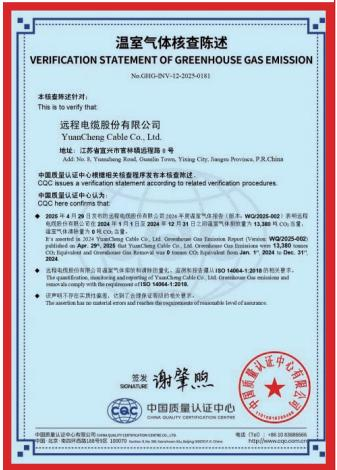

text_image

温室气体核查陈述
VERIFICATION STATEMENT OF GREENHOUSE GAS EMISSION
No.GHO-INV-12-2025-0181
本报告所述之时:
This is to verify that:
远程电缆股份有限公司
YuanCheng Cable Co., Ltd.
地址:江苏省南京市新城区南苑路9号
Add No. Y: Yuancheng Road, Gansai Town, Yingyang City, Jingyong Province, P.R.China
中国医监认证中心(中德明)有权程序发布本报告所述。
CQC issues are verification statement according to related verification procedures.
中国医监认证中心认为:
CQC here confirms that:
◆ 2025年4月29日发布的《中国能源集团有限公司关于2024年度天然气改造项目（原名：WQ2025-003）并网投向的批复》已于2024年7月25日、8月25日、9月25日、10月25日实施“国电建安”项目，总投资额为13,080.46万元，其中建设“国电建安”项目投资总额为800.00万元。其中，建设“国电建安”项目投资总额为800.00万元，其中建设“国电建安”项目投资总额为800.00万元。该项目已全部竣工验收，且在竣工验收前已经全部竣工，但未竣工验收完毕，故不竣工验收。

# 产品层面碳排放核查

公司建立了由品质管理部牵头，生产装备部、技术研发部等多部门协同参与的碳足迹管理机制，各部门明确职责、紧密配合，共同开展从数据收集、核算分析到认证改进的系列工作。

公司以打造绿色新能源电力电缆为目标，委托第三方权威机构开展产品碳足迹核查，系统量化产品从原材料获取、生产制造到出厂交付（即“从摇篮到大门”）各阶段的温室气体排放，全面识别碳排放环节，为降低产品全生命周期碳排放夯实数据基础。

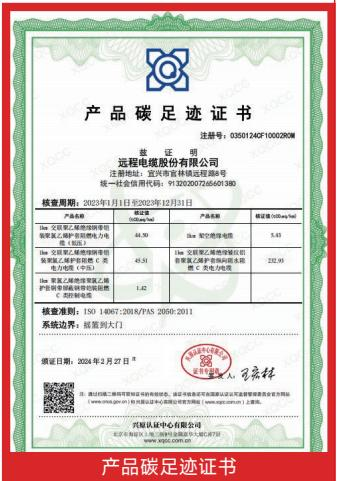

text_image

产品碳足迹证书
注册号:0350124CF1000280M
验证证明
远程电缆股份有限公司
注册地址:宜兴市宜林镇远城路66号
统一社会信用代码:913200072660619B
核查周期:2023年1月1日至2023年12月31日
产品名称	规格型号	产品名称	核验数量(吨/kg)<nl>
1ha 交联苯乙烯树脂使用
聚氯乙烯非铁锂电池电
模（电池）	44.50	1ha 铝化铝锂电池	5.43
1ha 交联苯乙烯树脂使用
聚氯乙烯非铁锂电池（类）
电力电池（中性）	45.31	1ha 交联苯乙烯绝缘铝印刷
聚氯乙烯非铁锂电池隔膜膜
（高性能）	1.42	1ha 铝化铝绝缘铝印刷
核验标准：ISO 14067-2018/PA5 2050-2011
系统边界: 硬盖到大门
颁证日期:2024年2月27日
产品认证中心
河北认证中心有限公司
产品碳足迹证书

# 温室气体减排措施

为切实减少运营碳足迹，公司将绿色电力应用作为重点减排举措。公司投资建成4MW屋顶分布式光伏电站，显著提升清洁能源使用比例，有效降低外购电力相关的间接排放，为实现可持续运营与低碳转型提供实质性支撑。

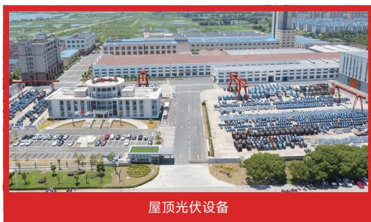

natural_image

Aerial view of a large industrial campus with multiple buildings, parking lots, and cranes, labeled '屋顶光伏设备' at the bottom (no other signage visible)

<table><tr><td>关键指标</td><td>单位</td><td>2023年</td><td>2024年</td><td>2025年</td></tr><tr><td>光伏发电量</td><td>万千瓦时</td><td>349.11</td><td>420.99</td><td>591.57</td></tr><tr><td>减少二氧化碳排放量</td><td>吨二氧化碳当量</td><td>1,852.38</td><td>2,233.77</td><td>3,138.87</td></tr></table>

注：

1. 分布式光伏电站为2023年度新建，2023年度光伏发电量统计口径为4-12月发电量。  
2. 电力排放因子采用2023年全国电力平均二氧化碳排放因子0.5306kgCO₂/kWh。

# 绿色产品

远程股份积极响应绿色发展号召，将绿色理念融入电缆制造全流程，全力研发绿色电缆产品，提升产品性能与环保指标，使其在保障电力传输稳定的同时，满足不同场景的绿色应用需求，引领电缆行业迈向绿色发展新征程。截至报告期末，远程股份已获得绿色设计产品评价服务认证（五星级），获得绿色产品相关专利15项。

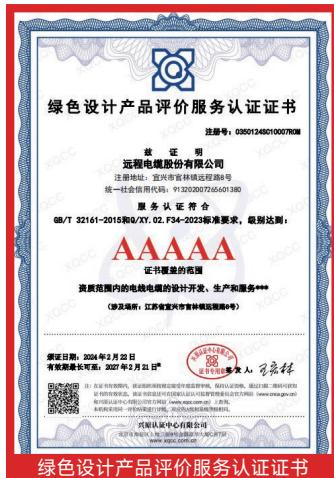

text_image

绿色设计产品评价服务认证证书
注册号:030112480100076KM
兹证明
远程电缆股份有限公司
注册地址:宜兴市官林镇远程路8号
统一社会信用代码:91320200726501380
服务认证符合
GB/T 32161-2015B/0Y.02.F34-2023标准要求,级别达到:
AAAAA
证书覆盖的范围
资质范围内的电线电缆的设计开发、生产和服务***
(涉及场所:江西省宜兴市官林镇远程路8号)
颁发日期:2024年2月22日
有效期限最长可续:2027年2月21日*
绿色设计产品评价服务认证证书
绿色设计产品评价服务认证证书

<table><tr><td>绿色产品</td><td>具体介绍</td><td>绿色成果</td></tr><tr><td>聚丙烯绝缘电力电缆</td><td>聚丙烯(PP)作为一种热塑性材料,具有免交联、生产效率高、能耗低及可回收等优势,兼具节能环保特性。公司基于此成功开发出聚丙烯绝缘电力电缆,产品已通过第三方型式试验认证。</td><td>减少排放</td></tr><tr><td>碳纤维导线</td><td>公司研发的第二代碳纤维导线,采用碳纤维增强复合材料作为承力构件,比传统导线的载流量提高一倍,并减小弧垂,降低线路建设和运行成本。</td><td>节约资源减少排放</td></tr><tr><td>核电站用1E级K3类电缆</td><td>适用于核电站独特工作环境、耐辐射的特殊电缆,该类电缆除具备常规电缆的性能外,还具有优异的耐环境性、耐热性、耐辐射性、耐LOCA性。</td><td>减少排放</td></tr><tr><td>光伏电缆</td><td>产品具有阻燃、抗紫外线、耐潮湿、耐高低温、抗氧化等特点。产品使用环境温度-40°C-90°C,导体最高长期工作温度为120°C,使用寿命不小于25年。</td><td>减少排放</td></tr><tr><td>储能电缆</td><td>产品应用以大规格为主,应用中需传输相对大的电流,满足长时间大功率充放电的要求,具备优异的耐热性和抗延燃性。</td><td>减少排放</td></tr><tr><td>液冷充电桩电缆</td><td>公司研发的液冷充电桩电缆,采用了液冷散热技术,提高了电缆的散热性能,还降低了电缆的发热量和温升,具有发热少、散热快、安全性高的优点。</td><td>减少排放</td></tr><tr><td>新能源汽车电缆</td><td>公司研发的硅橡胶型汽车线,具有优异的耐高温、柔韧性、阻燃、长期稳定性等优异性能,为新能源车辆全生命周期的稳定运行提供可靠保障。</td><td>减少排放</td></tr></table>

# 优化环境管理

远程股份严格遵守《中华人民共和国环境保护法》等相关法律法规，有效控制运营过程中的污染物排放，并积极推进绿色制造与清洁生产，致力于最大限度地减少运营活动对环境的负面影响。

# 环境管理体系

远程股份秉持“减污、降耗、节能、增效”的环保理念，系统构建了覆盖全流程的环境管理体系。公司依据运营实际，制定并持续完善《环境保护及资源节约管理制度》等规章制度，为环保工作提供制度保障。

报告期内，公司已通过GB/T24001-2016/ISO 14001:2015环境管理体系认证。远程股份已通过ISO 14001:2015环境管理体系认证的子公司2家。

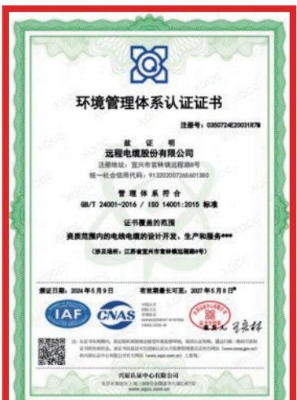

text_image

环境管理体系认证证书
注册号：0305724E2003187W
致 证明
远程电缆股份有限公司
注册地址：宜兴市官林镇远程路8号
统一社会信用代码：913202007265401380
管理体系符合
GB/T 24001-2016 / ISO 14001:2015 标准
证书覆盖的范围
资质范围内的电线电缆的设计开发、生产和服务***
（涉及场所：江苏省宜兴市官林镇远程路8号）
颁证日期：2024年5月9日
有效期限最长可至：2027年5月8日*
IAF CNAS
GNA
GNA
GNA
GNA
GNA
GNA
GNA
GNA
GNA
GNA
GNA
GNA
GNA
GNA
GNA
GNA
GNA
GNA
GNA
GNA
GNA
GNA
GNA
GNA
GNA
GNA
GNA
GNA
GNA
GNA
GNA
GNA
GNA
GNA

远程股份环境管理体系认证证书

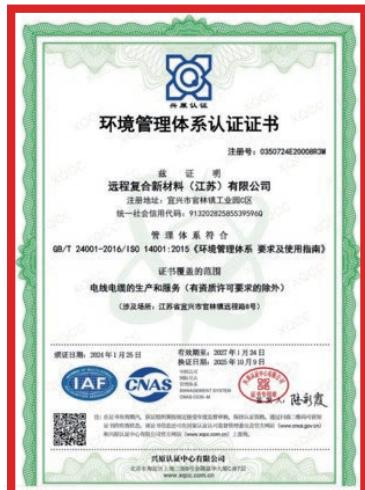

text_image

环境管理体系认证证书
注册号：0350724E20008RCM
致证明
远程复合新材料（江苏）有限公司
注册地址：宜兴市官林镇工业园区
统一社会信用代码：9132028255539596Q
管理体系符合
GB/T 24001-2016/190 14001:2015《环境管理体系 要求及使用指南》
证书覆盖的范围
电线电缆的生产和服务（有资质许可要求的除外）
（涉及场所：江苏省宜兴市官林镇远程路8号）
颁证日期：2024年1月25日
有效期至：2027年1月24日
起始日期：2025年10月8日
ISSN 000000000000000000000000000000000000000000000000000000000000000000000
JIAF CNAS
陆新霞
自上交所书面通知，依法须经批准并经审批机关审核，经办人复核，通过后方可开展经营活动，具体经营项目以相关部门批准文件或许可证件为准。
浙江吴中中心有限公司
www.jiaofund.com.cn
天津吴中中心有限公司
北京市海淀区上地工业和信息化局大连分厂
WWW.JIAOFUND.COM.CN

远程复合新材料（江苏）有限公司

为切实推动环境管理落地，公司建立了由总经理领导的三级环境管理体系，通过明确各层级职责，将环保要求融入各业务环节，形成上下协同、责任到人的长效机制，系统性地降低生产经营对环境的影响。报告期内，公司未因环境违法违规被环保部门调查，不存在行政处罚或刑事处罚。

<table><tr><td>组织架构</td><td>工作职责</td></tr><tr><td>总经理</td><td>总经理统筹公司节约资源和保护环境管理工作。</td></tr><tr><td>安全环保部</td><td>1.贯彻执行国家环境保护相关的法律法规和方针政策,以及相关行业标准;2.负责制定公司环境保护管理制度,组织实施并考核;3.负责对公司各部门环境保护工作的监管;4.负责开展企业环保监督和污染源监测;5.负责公司环保法律法规、环保技术监督管理和技术培训。</td></tr><tr><td>环境保护工作领导小组(由各部门负责人组成)</td><td>贯彻落实公司环境保护制度。</td></tr></table>

# 环保考核

公司建立专项环境绩效考核机制，由安全环保部负责全程监督与推动实施。考核机制覆盖直接作业人员、班组长及部门负责人等关键岗位，通过分级考核各级环保责任，确保环境管理体系有效运行，管理要求逐级落实到位。

# 清洁生产

远程股份制定《清洁生产管理制度》，公司成立以总经理为组长的清洁生产领导小组，负责公司在生产运营中清洁生产工作的推动、监督及协调。公司将清洁生产理念深度纳入技术改造、产品包装、原辅料采购及生产销售等各个环节，并定期进行清洁生产审核，确保清洁生产工作持续改进，从源头削减污染，促进企业可持续发展。

# 环保培训

公司定期组织开展环境政策法规解读、环保管理体系宣导及内部规章制度专项培训，通过系统化、常态化的学习机制，持续增强全员环保意识与风险管控能力，提升环保队伍的专业素养和综合管理水平，为全面落实企业环保责任提供坚实保障。

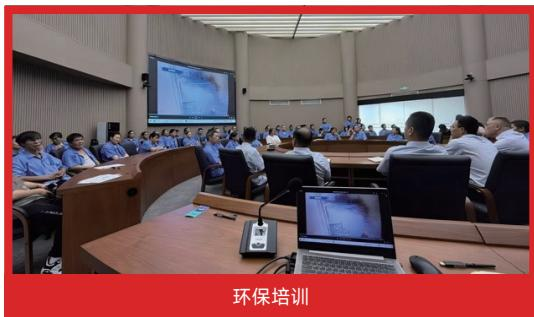

text_image

环保培训

环保绩效与目标

<table><tr><td>关键指标</td><td>单位</td><td>2023年</td><td>2024年</td><td>2025年</td></tr><tr><td>环保培训次数</td><td>次数</td><td>1</td><td>1</td><td>1</td></tr><tr><td>环保培训参加人次</td><td>人次</td><td>30</td><td>50</td><td>102</td></tr><tr><td>环保培训时长</td><td>小时</td><td>2</td><td>2</td><td>2</td></tr></table>

<table><tr><td>目标项目</td><td>2025年完成情况</td></tr><tr><td>重大污染为零</td><td>达标</td></tr><tr><td>废水排放达标</td><td>达标</td></tr><tr><td>噪声排放达标</td><td>达标</td></tr><tr><td>重大安全事故为零</td><td>达标</td></tr><tr><td>环境事故为零</td><td>达标</td></tr></table>

natural_image

Illustration of stylized buildings and trees against a pink sky with clouds (no text or symbols)

# 环境风险管理

# 风险管理流程

公司建立完善的环境风险防控长效机制，并结合公司实际编制《突发环境事件风险评估报告》，系统性识别公司内部环境风险状况，科学制定风险预防与控制措施，全面提升环境风险管理水平。

# 关键绩效

报告期内，公司所有重要环境因素均控制有效，未发生过突发环境事件。

# 环境风险管理流程

# 风险识别

- 针对公司产品、原辅料和污染物，确定公司涉及的环境风险物质，对生产系统进行风险识别；  
- 对环境风险物质向环境转移的途径识别。

# 风险评价

\- 通过定量分析评估企业环境风险，按照分级矩阵的方式将企业环境风险等级划分为一般、较大和重大三个等级。

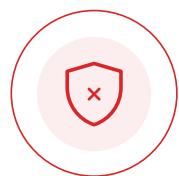

# 风险应对

\- 对风险源开展技术、人为操作和管理三方面控制。通过技术措施进行预防、开展培训、健全管理制度等进行预防，同时建立应急措施和实施整改期限。

# 风险等级调整

\- 定期评审和检查风险控制结果进行风险信息更新。

# 应急管理

远程股份制定《突发环境事件应急预案》，并设立由应急指挥部统一指挥、多专业救援小组协同联动的应急组织架构，确保职责清晰、响应迅速。公司定期组织开展应急演练，通过高度模拟的实战场景，提升全员应急响应与现场处置能力。演练后公司及时进行复盘评估，优化应急预案与流程，推动应急管理机制持续完善，保障企业运营安全与周边社区环境稳定。

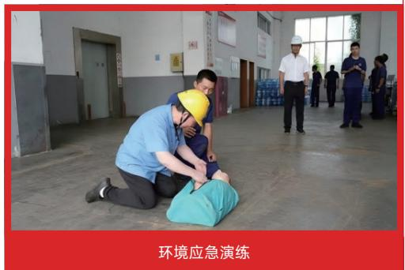

text_image

环境应急演练

# 关键绩效

报告期内，公司共开展应急演练2次，覆盖92人次。

# 隐患排查

远程股份通过全面排查与整治环境风险隐患，对各类潜在风险点进行排查整改，避免突发环境事件的发生。公司定期开展重大环境事件隐患、安全生产隐患的重点分析与排查工作；每月对原材料仓库、危废仓库、生产车间进行环境隐患巡回检查。此外，公司明确规定各区域负责人不定期对管辖区域进行隐患自查，并现场落实整改，确保隐患排查管理得到有效实施。

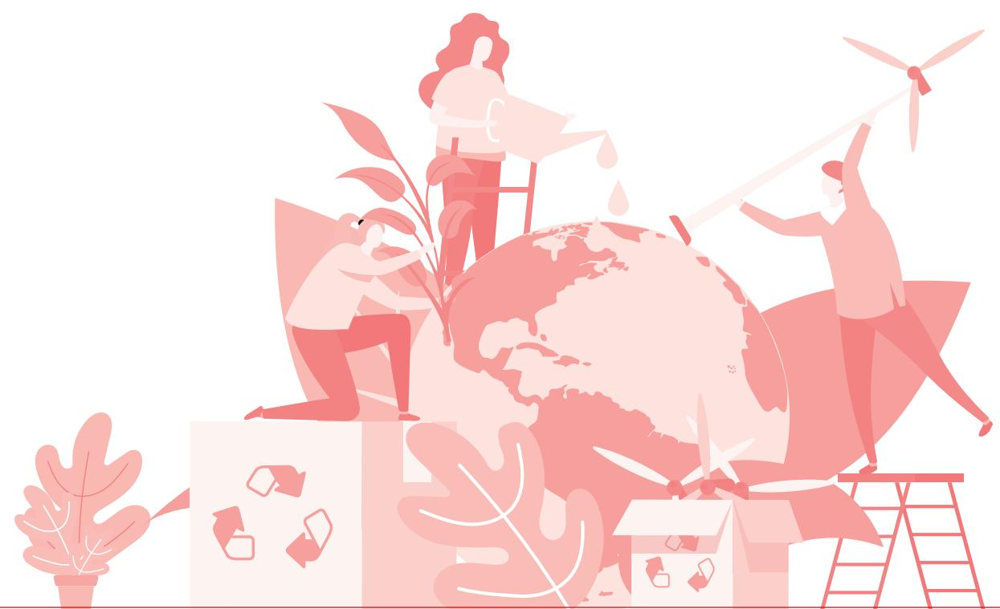

natural_image

Illustration of people working with a globe, wind turbines, and plants (no text or symbols)

# 合理资源配置

# 能源管理体系

为夯实可持续发展根基，远程股份积极响应国家低碳环保口号，推进公司绿色低碳转型。公司深入推行“节支降耗”模式，聚焦清洁生产与能效提升，持续加大研发投入，致力于通过技术创新驱动全流程的能源优化，力争在绿色发展领域实现转型升级、提质增效，实现公司高质量绿色发展。

# 治理

远程股份遵循《中华人民共和国节约能源法》等相关法律法规，将提升能源利用效率作为运营管理的重点任务。公司结合实际制定《能源管理规定》《远程电缆节支降耗办公管理规定》等制度，明确能源管理组织架构与职责分工：生产装备部作为能源管理的主导部门，指定办公室推进办公区域的节能管理，包括用电、用水及办公设备能效管控；其余各部门均须严格执行公司节能规定，将节能降耗要求融入日常运营。

为保障能源管理体系持续有效运行，公司设立了清晰的能耗指标与考核机制，并通过品质管理部牵头、多部门协同的常态化监督检查，实现能耗数据的动态跟踪与异常预警，促进公司资源的集约化使用，系统性降低能源浪费。

报告期内，公司已通过ISO 50001能源管理体系认证。

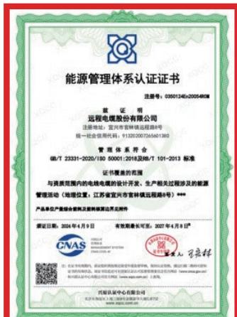

text_image

能源管理体系认证证书
注册号：0350124G2005480M
被证明
远程电缆股份有限公司
注册地址：宜兴市官林镇远程路8号
统一社会信用代码：913202007265601380
管理体系符合
GB/T 23331-2020/ISO 500001:2018及GB/T 101-2013 标准
证书覆盖的范围
与资质范围内的电线电缆的设计开发、生产相关过程涉及的能源
管理活动（地理位置：江苏省宜兴市官林镇远程路8号）★★★
产品单位产品综合管材及塑料制品国产化应用件
保证日期：2024年4月9日
有效期最长可至：2027年4月9日
CNAS
CNAS CO.,LTD.
CNAS CO.,LTD.
兴银认证中心有限公司
www.cndco.com.cn

远程股份能源管理体系认证证书

# 节能培训

为切实推动企业节能降耗，远程股份积极开展节能教育与岗位节能培训，通过举办节能知识宣讲和结合岗位实际，开展针对性培训，全面增强员工节能意识，提高能源利用效率。

# 关键绩效

报告期内，公司开展能源相关培训1场，覆盖员工20人。

# 战略

远程股份根据能源相关法律法规，结合自身生产经营情况、政策趋势、市场布局、行业特性，系统性地识别、评估生产运营中的各类能源相关影响、潜在风险与机遇。公司根据识别的风险制定针对性的应对策略，积极探索新兴节能技术把握能源转型升级机遇，实现公司高效清洁用能。

<table><tr><td colspan="2">风险类型</td><td>风险描述</td><td></td><td colspan="2">财务影响说明</td><td>发生可能性</td><td>影响大小</td><td>影响时间范围</td><td>影响价值链环节</td><td>应对措施</td></tr><tr><td>物理风险</td><td>极端天气</td><td>1.暴雨、洪水可能会淹没能源供应设备和生产车间,造成电气设备短路、损坏,使能源供应中断,影响生产进度。2.极端天气损坏供电线路等,对于电缆制造行业,突然停电会导致生产设备骤停,正在进行的生产流程中断,可能造成产品质量问题,甚至直接报废,增加生产成本。</td><td></td><td colspan="2">营收减少生产成本增加</td><td>小</td><td>高</td><td>中期</td><td>运营下游</td><td>1.定期检查并加固能源相关设备,增强抗灾能力;2.制定应急预案,确保灾害过后迅速恢复运营的能力;3.优化公司排水系统,定期检修排水设施;4.及时关注气象预报,为能源管理部门应对极端天气提供充足的准备时间。</td></tr><tr><td rowspan="2">转型风险</td><td>市场风险</td><td>1.所用能源价格随市场或政府定价而产生波动,导致能源价格上升。2.可能出现能源供应紧张的情况。如夏季高温时段,电网负荷增大,可能会对工业企业实施限电措施,企业生产受限,无法按时完成订单,影响企业信誉和市场份额。</td><td>导致</td><td colspan="2">营收减少生产成本增加</td><td>大</td><td>高</td><td>中期</td><td>运营</td><td>1.加强对耗能设备维护保养,提高设备能效。定期对耗能设备进行监测,分析能耗偏高的原因,找出降耗的措施;2.积极推广采用节能新技术、新工艺、新设备,降低生产能耗;3.开展节能教育培训,增强员工的节能意识。</td></tr><tr><td>政策风险</td><td>1.根据国家工信部发布《高耗能落后机电设备(产品)淘汰目录》等文件,如公司现有设备不符合最新的节能要求,将面临淘汰风险,公司需要投入资金进行节能改造或更新设备,从而增加企业成本。2.可能出台政策要求企业提高清洁能源的使用比例,公司可能需要投资建设太阳能光伏发电等自用能源设施,或购买绿电,增加能源采购和管理成本。</td><td></td><td colspan="2">生产成本增加</td><td>中</td><td>高</td><td>长期</td><td>运营</td><td>1.持续开展节能减排和清洁生产,深入推动低能耗的发展战略;2.加强能源管理,对高能耗设备进行更换或节能改造,降低能源消耗;3.加大对光伏系统的投入,提高清洁能源使用占比,优化能源结构。</td></tr></table>

<table><tr><td>机遇类型</td><td>机遇描述</td><td colspan="2">财务影响说明</td><td>发生可能性</td><td>影响大小</td><td>影响时间范围</td><td>影响价值链环节</td><td>应对措施</td></tr><tr><td>政策机遇</td><td>政府推出补贴、激励措施,鼓励公司采用清洁能源或提高能源效率。</td><td colspan="2">营业外收入增加提高市场竞争力</td><td>中</td><td>高</td><td>中期</td><td>运营</td><td>时刻关注能源相关政策,及时调整能源发展战略,积极开展清洁生产和节能技改。</td></tr><tr><td>技术机遇</td><td>投资分布式能源,如太阳能光伏,有效增强公司的能源独立性。</td><td colspan="2">生产成本降低</td><td>高</td><td>高</td><td>长期</td><td>运营下游</td><td>关注能源相关新兴技术,合理预算分布式光伏等新兴技术投资,布局能源结构转型规划。</td></tr></table>

# 影响、风险和机遇管理

为有效防范能源相关风险并及时把握机遇，远程股份将能源相关影响、风险和机遇融入内部管理，建立科学的风险管理流程。公司结合内外部因素对能源风险和机遇进行识别和评价，保障能源管理工作常态化、规范化展开。

# 风险识别

基于能源相关法律法规，结合公司业务发展、能源类型及外部利益相关方关注重点，确定能源管理影响的重点环节，识别能源因素对公司自身运营及价值链活动可能带来的风险与机遇。

# 风险评估

基于已识别的影响、风险和机遇，通过分析，对相关影响、风险和机遇发生的可能性和在短期、中期、长期的影响程度进行综合评估，以此进行优先级排序。

# 风险应对

针对确定的风险和机遇，按照优先级顺序制定相应的应对措施，并将相关措施纳入能源管理中实施。

# 风险更新

根据法律法规、标准及其他要求的变化，定期进行风险和机遇审查，及时改进调整能源战略与管理措施，并定期报告风险管理情况。

# 指标与目标

公司在运营过程中通过节能降耗与优化生产安排降低能源消耗，并积极使用可再生能源，公司各类能源消耗情况如下。

<table><tr><td>关键指标</td><td>单位</td><td>2024年</td><td>2025年</td></tr><tr><td>汽油</td><td>吨</td><td>19.22</td><td>18.47</td></tr><tr><td>柴油</td><td>吨</td><td>44.77</td><td>39.40</td></tr><tr><td>光伏发电量</td><td>万千瓦时</td><td>420.99</td><td>591.57</td></tr><tr><td>直接能源消耗总量</td><td>吨标准煤</td><td>610.91</td><td>811.63</td></tr></table>

<table><tr><td>关键指标</td><td>单位</td><td>2024年</td><td>2025年</td></tr><tr><td>外购电力</td><td>万千瓦时</td><td>2,495.85</td><td>2,497.58</td></tr><tr><td>间接能源消耗总量</td><td>吨标准煤</td><td>3,067.40</td><td>3,069.53</td></tr><tr><td>能源消耗总量</td><td>吨标准煤</td><td>3,678.31</td><td>3,881.15</td></tr><tr><td>能源消耗强度</td><td>吨标准煤/营业收入(百万元)</td><td>0.83</td><td>0.87</td></tr><tr><td>不可再生能源消耗总量</td><td>吨标准煤</td><td>3,160.91</td><td>3,154.11</td></tr><tr><td>可再生能源消耗总量</td><td>吨标准煤</td><td>517.40</td><td>727.04</td></tr><tr><td>可再生能源消耗占比</td><td>%</td><td>14.07</td><td>18.73</td></tr></table>

# 能源管理举措

# 节能降耗

公司优化能源管理，积极推广节能技术，采用智能化、自动化设备逐步淘汰高耗能设备。报告期内，公司共完成13套节能生产设备的采购与更换，推动每吨铜生产用电量较上年度降低3%。

# 绿色工厂

在推进绿色制造体系与绿色工厂建设过程中，远程股份积极引进先进生产设备与技术，构建低能耗、低排放的绿色制造模式。公司委托第三方权威机构，围绕基础设施、管理体系、能源与资源投入、环境排放等方面开展系统性评价，获评“江苏省绿色工厂”“五星级绿色工厂评价认证”。

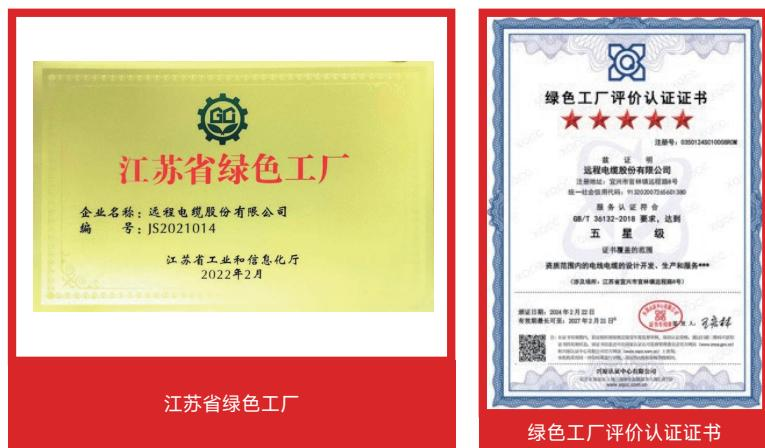

# 水资源管理

远程股份严格遵守《中华人民共和国水法》等法律法规要求，将水资源节约与高效利用纳入公司可持续发展重点范畴。

为规范用水行为，公司制定了《环境保护及资源节约管理制度》《公司7S管理条例》等内部规章，建立了覆盖取水、用水、循环利用等环节的全流程节水管理体系。在实际运营中，公司积极推行水资源的二次利用与循环使用，通过技术改造与过程优化，持续提高水资源利用效率，切实减少浪费。

# 节水管理与宣传

为提升员工节水意识、推动全员参与节水行动，在节水宣传方面，远程股份积极采取多样化的举措。通过开展系列宣传教育活动，公司不仅在内部营造了良好的节水氛围，还促使员工将节水理念延伸至日常生活并践行到位，提升公司可持续发展水平。

节水管理措施

<table><tr><td>用水行为规范</td><td>·1.人走水停:要求水龙头即用即关,严禁长流水。·2.漏损报修:发现漏水必须及时报修,避免持续浪费。节水效果:直接减少由于不良习惯和设备漏损导致的水资源浪费。</td></tr><tr><td>饮用水专项管理</td><td>·1.用途限定:饮用水仅限饮用,严禁用于浇花、清洗等用途。·2.集中管控:公司开水炉统一定时开关。节水效果:避免高品质饮用水的滥用,间接节约了水净化处理的成本和资源。</td></tr><tr><td>节水宣传</td><td>·1.宣传与培训:公司通过开展节水专题培训、节水案例分享,提升员工节水知识与技能。·2.日常视觉与氛围宣传:公司通过张贴宣传标语和海报,持续营造节水氛围。·3.数字化宣传推广:通过公司内部的数字化平台,定期推送节水小贴士、节水技术和水资源保护的相关资讯,帮助员工养成节水习惯。·4.内外联动:公司通过发布节水倡议书和向员工发放家庭节水指南,鼓励个人与家庭节水。</td></tr></table>

# 水资源消耗指标

公司水资源消耗情况如下：

<table><tr><td>关键指标</td><td>单位</td><td>2023年</td><td>2024年</td><td>2025年</td></tr><tr><td>新鲜水取水总量</td><td>吨</td><td>84,026</td><td>76,536</td><td>63,608</td></tr><tr><td>用水强度</td><td>吨/营业收入(百万元)</td><td>26.25</td><td>17.21</td><td>14.31</td></tr></table>

# 物料管理与循环利用

为保障生产流程高效顺畅推进，确保产品质量稳定可控，公司制定《原材料采购、检验规范》《材料仓库管理制度》等制度，构建完善的物料管理流程，对原材料采购、入库，废料管理等各个环节严格管理，并持续推动原材料及废料的减量和循环利用措施。同时，公司引入ERP信息化工具实现对物料全流程的可视化、数字化管理，提升物料管理精度与效率。

<table><tr><td>环节</td><td>行动</td></tr><tr><td>原材料减量</td><td>采用异型导体替代圆形导体,在确保电阻性能的前提下减少导体截面积,降低材料使用量,同时缩小电缆外径,相应减少包带、填充及护套材料,实现源头节约。</td></tr><tr><td>工艺材料创新</td><td>以环保型低密度填充绳取代传统填充条,在保证产品性能的同时,实现结构轻量化与生产成本优化。</td></tr><tr><td>原料回收利用</td><td>委托第三方将生产过程中产生的废铜丝加工为屏蔽用铜带,重新投入电缆屏蔽工序,构建“废料—原料”的闭环资源循环体系。</td></tr><tr><td>废料再次利用</td><td>在各挤塑机配备打料粉碎机,即时回收机头料与边角废料,经粉碎后直接投入再生产,显著提升材料综合利用率。</td></tr></table>

# 绿色办公

远程股份全面贯彻低碳发展理念，通过节水节电、办公用品循环利用等方面持续推动资源节约，打造了绿色、可持续的现代化办公环境。

绿色办公举措

<table><tr><td>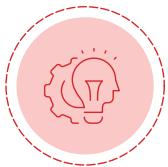</td><td>节电方面</td><td>照明管理:白天优先采用自然光,光线充足时严禁使用灯光。做到“人走灯灭”,严禁长明灯。办公设备节能:电脑、打印机等设备设置为节能模式,下班后必须关闭用电设备。空调管理:严格规定空调开启条件(夏季≥30°C、冬季≤10°C)和温度设定标准。</td></tr><tr><td>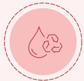</td><td>节水方面</td><td>饮用水管理:饮用水仅限于饮用;开水炉定时开关。生活用水管理:水龙头做到“人走水停”,对无人流水或长期漏水未报修的责任人进行处罚。</td></tr><tr><td></td><td>纸与办公用品管理</td><td>纸张使用:推广使用“二次纸”,非必要情况下,所有打印需采用双面打印。减少一次性用品:员工饮水需自备水杯,除接待外禁止使用一次性纸杯。</td></tr><tr><td>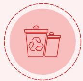</td><td>垃圾分类与整洁管理</td><td>通过7S管理要求办公区、车间等区域保持整洁,垃圾及时清理,暂放物定时处理。</td></tr></table>

# 三废防治

远程股份严格遵守《中华人民共和国水污染防治法》《中华人民共和国大气污染防治法》《中华人民共和国固体废物污染环境防治法》等法律法规，围绕废气、废水、噪声、固体废物构建全流程污染防治矩阵，确保各类污染物稳定达标排放。

# 废水管理

公司严格依据《环境保护及资源节约管理制度》等规范要求，对废水进行严格管控。公司废水主要包括生活污水与冷却用水，其中冷却用水采用循环利用方式，实现零外排；生活污水经化粪池处理达标后，排入市政污水管网。

<table><tr><td>关键指标</td><td>单位</td><td>2024年</td><td>2025年</td></tr><tr><td>生活污水排放总量</td><td>吨</td><td>3,850</td><td>4,650</td></tr><tr><td>生活污水排放强度</td><td>吨/营业收入(万元)</td><td>0.009</td><td>0.010</td></tr></table>

# 废气管理

公司严格遵守《合成树脂工业污染物排放标准》（GB31572-2015）等大气污染防治相关法律法规和排放标准，有序开展废气污染防治工作。公司运营过程的废气来源主要为挤包工序生产时产生的非甲烷总烃，经三套UV光解催化氧化+活性炭吸附处理系统处理。报告期内，公司废气均达标排放。

<table><tr><td>关键指标</td><td>单位</td><td>2024年</td><td>2025年</td></tr><tr><td>废气排放总量</td><td>吨</td><td>0.513</td><td>0.609</td></tr><tr><td>废气排放强度</td><td>千克/营业收入(万元)</td><td>0.001</td><td>0.001</td></tr></table>

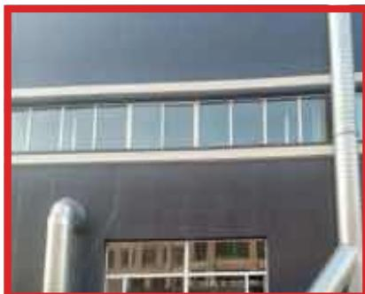

natural_image

Exterior view of a modern building facade with glass windows and metal pipes (no visible text or symbols)

废气处理设施

# 废弃物管理

远程股份遵循“减量化、资源化、无害化”的处理原则，以源头削减固体废弃物产生量为导向，积极推动循环经济发展。针对运营过程中产生的各类废弃物，公司制定《厂区废弃物管理制度》《环境保护及资源节约管理制度》等管理制度，确保固体废弃物规范处置。

在日常管理中，公司明确要求各部门、分厂严格执行“定点倾倒、分类存放、及时清运”制度，严禁随意抛撒或违规堆放各类垃圾。危险废物由安环部进行统一管理，并设置专门的暂存场所，明确标识、标牌、标签，实现分类存放，致力于在运营过程中持续减少废弃物产生，减少对环境的影响。

<table><tr><td rowspan="2">废弃物类别</td><td>一般固体废物</td><td>危险废物</td></tr><tr><td>一般工业固废、碎屑(铝、铁、木头)生活垃圾</td><td>废机油、废活性炭、废包装容器等</td></tr><tr><td>处理方式</td><td>可回收利用类固体废弃物:进行整理后送至废品仓库;可回收、变卖类碎屑:分类整理存放至可回收箱交由废品库;不可回收类:一般固体废弃物:存放不可回收垃圾箱,交由固废处置公司进行处置;生活垃圾:分类放置,交由环卫所统一处置。</td><td>危险废物严格按照《国家危险废物名录》分类,统一运送至专门仓储库房进行规范管理;建立完善的转移管理记录机制,确保危废处理全程可追溯;定期委托有危险废物处置资质单位进行处置,并在江苏省危险废物动态管理信息系统中申报,确保危废处理符合环保要求。</td></tr><tr><td>日常监督</td><td colspan="2">建立废弃物分类管理考核制度,对责任人、厂长进行考核。</td></tr></table>

<table><tr><td colspan="2">关键指标</td><td>单位</td><td>2024年</td><td>2025年</td></tr><tr><td rowspan="4">一般固体废物</td><td>一般废弃物产生量</td><td>吨</td><td>62.58</td><td>62.28</td></tr><tr><td>一般废弃物产生强度</td><td>千克/营业收入(万元)</td><td>0.14</td><td>0.14</td></tr><tr><td>一般废弃物处置量</td><td>吨</td><td>62.58</td><td>62.28</td></tr><tr><td>一般废弃物处置完成率</td><td>%</td><td>100</td><td>100</td></tr><tr><td rowspan="2">危险废物</td><td>危险废物产生量</td><td>吨</td><td>30.94</td><td>52.37</td></tr><tr><td>危险废物产生强度</td><td>千克/营业收入(万元)</td><td>0.07</td><td>0.12</td></tr></table>

# 噪声控制

公司依据《中华人民共和国噪声污染防治法》《工业企业厂界环境噪声排放标准》（GB 12348-2008）对厂界噪声进行控制。公司厂界噪声来源主要为挤出机、铜大拉机、铝拉机等设备运行时产生的噪声。

为切实有效降低厂界噪声对周边环境的影响，公司优先选用低噪声设备或自带消声功能的设备；对高噪音的设备通过消声减振、建筑隔音等措施实现降低噪音影响。同时，公司建立常态化管理机制，定期对噪声污染源相关设施进行检查维护，并持续开展噪声监测工作，确保厂界及作业场所噪声排放符合相关标准要求。

# 生物多样性与生态系统保护

远程股份高度重视生态系统与生物多样性保护，严格遵循《联合国生物多样性公约》《濒危野生动植物种国际贸易公约（CITES）》《昆明-蒙特利尔全球生物多样性框架》《关于进一步加强生物多样性保护的意见》等规则公约及运营所在地与生态系统和生物多样性保护相关的法律法规，积极践行生态环境保护责任，维护生态系统，保护生物多样性。

# 项目合规建设与运营保护

远程股份致力于在项目建设和运营过程中减少对生物多样性的负面影响，积极参与生态保护工作，促进人与自然和谐共生。在项目规划和建设阶段，公司对项目所在地的生物多样性进行详细评估，识别可能对生态系统和物种造成的影响。

同时，公司不在《宜兴市生态红线区域保护规划》及《江苏省国家级生态保护红线规划》中规定的重要生态功能保护区范围内，公司所有生产运营活动、产品和服务均未发现对生物多样性造成重大影响的情况。

# 生态修复—光伏治沙

远程股份积极响应国家绿色发展战略。报告期内，公司中标“阿电入乌”新能源项目，助力沙漠修复，间接减少二氧化碳排放，实现生态与能源协同发展，为区域绿色低碳转型与生态环境改善提供双重支撑。

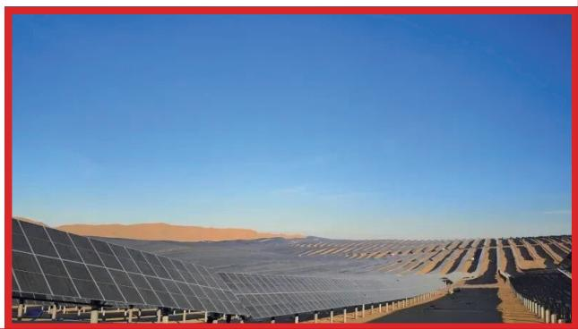

natural_image

Solar panel farm under a clear blue sky with distant mountains (no text or symbols visible)

# 03 价值共缆 产业共荣

# 我们的理念

远程股份持续加大研发投入，强化技术创新能力，系统提升产品质量与服务水平。通过构建权责清晰、高效协同的可持续供应链，公司确保各环节协同运作，为可持续发展注入强劲动力。

# 我们的行动

创新驱动发展  
链动高效协同  
品质卓越追求  
卓越客户体验  
信息安全无忧

SDGs

9产业、创新和基础设施

12 负责任消费和生产

17 促进目标实现的伙伴关系

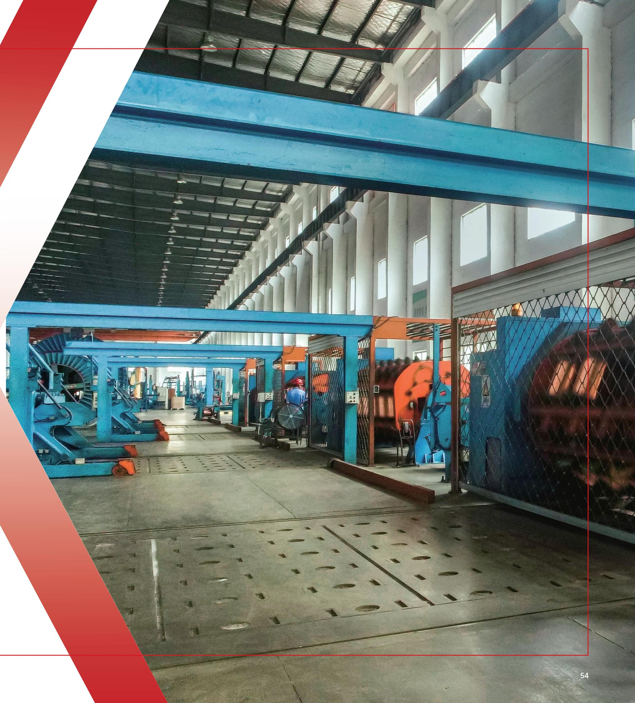

natural_image

Interior view of a modern industrial factory with blue structural beams and machinery (no visible text or symbols)

# 创新驱动发展

远程股份将研发创新视作核心驱动力，持续完善科技创新管理体系，不断拓展创新平台布局。通过深化校企合作、加速技术成果转化，公司有效增强核心竞争力，为提升企业韧性与激发内生动力注入持续动能。

# 治理

远程股份积极推动科技创新管理体系建设，制定并实施《设计和开发控制程序》，规范设计和开发过程中的输入、输出、评审、验证、确认及更改等关键流程，有效提升研发工作的规范性和效率。

为强化研发创新能力，公司设立专门的技术研究开发机构，下设管理委员会、技术委员会、中心主任、研发处、检测处等部门，明确职责分工与协同机制，共同推动公司研发创新工作开展，为公司的技术创新提供坚实的组织保障与系统支撑，持续赋能技术创新与成果转化。

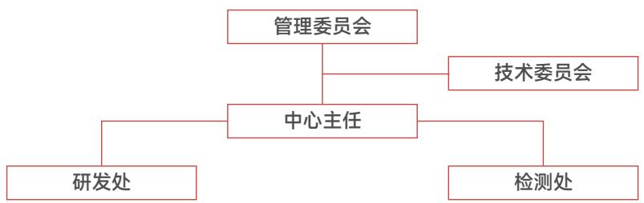

flowchart

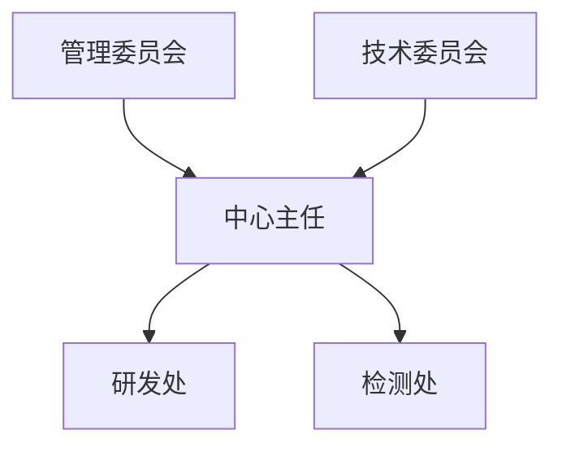
```mermaid
graph TD
  A["管理委员会"] --> B["中心主任"]
  C["技术委员会"] --> B
  B --> D["研发处"]
  B --> E["检测处"]
```

技术研究开发机构组织架构图

为提升产品竞争力与开发效率，公司持续规范设计和开发流程。产品设计和开发始于对产品、服务及过程需求的识别，依次经过策划、输入确认后进入开发实施阶段。在开发过程中，输出成果均需进行系统验证与确认，并通过设计评审确保关键节点质量。过程中若有变更，则启动变更控制机制，确保全流程受控，最终完成设计与开发。

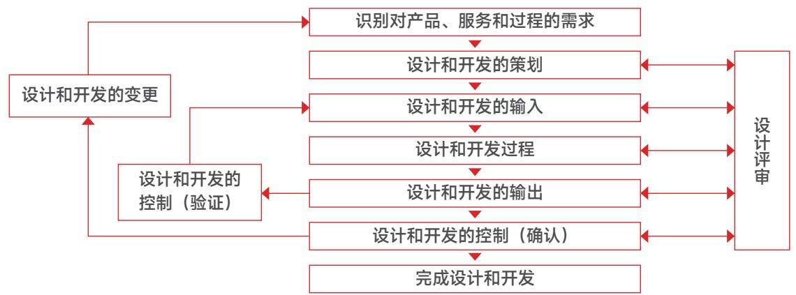

flowchart

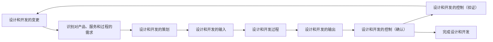
```mermaid
graph LR
  A["设计和开发的变更"] --> B["识别对产品、服务和过程的需求"]
  B --> C["设计和开发的策划"]
  C --> D["设计和开发的输入"]
  D --> E["设计和开发过程"]
  E --> F["设计和开发的输出"]
  F --> G["设计和开发的控制（确认）"]
  G --> H["设计和开发的控制（验证）"]
  H --> A
  G --> I["完成设计和开发"]
```

设计和开发流程

# 科研创新平台

公司建立了国家级博士后工作站、省级工程技术研究中心、博士后创新实践基地和CNAS国家认可实验室，具备先进的检测设备、科研设施和科研场地。公司新工艺、新技术的创新和研发工作主要依托于公司的工程技术研究中心。截至报告期末，公司已拥有“国家级专精特新‘小巨人’”“国家高新技术企业”“江苏省专精特新中小企业”“江苏省企业技术中心”等多项科研创新认证。

CNAS实验室认可证书  
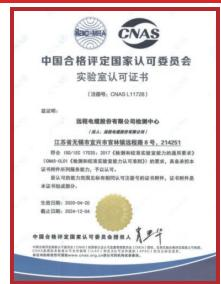

江苏省博士后创新实践基地  
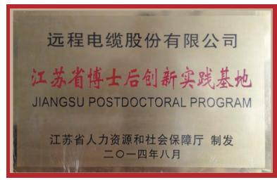

text_image

远程电缆股份有限公司
江苏省博士后创新实践基地
JIANGSU POSTDOCTORAL PROGRAM
江苏省人力资源和社会保障厅 制发
二〇一四年八月

低集肤效应超高压交联电缆工程技术研究中心  
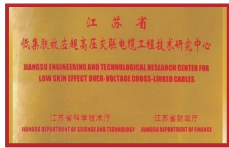

text_image

江苏省
低集肤效应超高压交联电缆工程技术研究中心
JIANGSU ENGINEERING AND TECHNOLOGICAL RESEARCH CENTER FOR
LOW SKIN EFFECT OVER-VOLTAGE CROSS-LINKED CABLES
江苏省科学技术厅 江苏省财政厅
JIANGSU DEPARTMENT OF SCIENCE AND TECHNOLOGY JIANGSU DEPARTMENT OF FINANCE

高新技术企业证书  
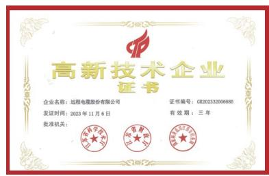

text_image

高新技术企业
证书
企业名称：远程电缆股份有限公司
证书编号：GE202332006685
发证时间：2023年11月6日
有效期：三年
批准机关：
深圳市深南区人民法院
深圳市深南区人民法院

江苏省专精特新中小企业  
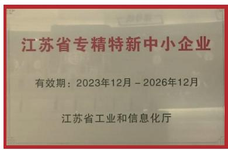

text_image

江苏省专精特新中小企业
有效期：2023年12月－2026年12月
江苏省工业和信息化厅

江苏省企业技术中心  
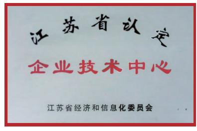

text_image

江苏省认证
企业技术中心
江苏省经济和信息化委员会

国家级博士后工作站  
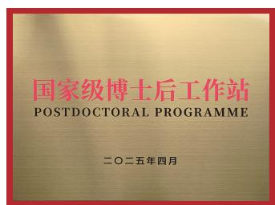

text_image

国家级博士后工作站
POSTDOCTORAL PROGRAMME
二〇二五年四月

2024年度江苏线缆产业高质量创新发展企业10强  
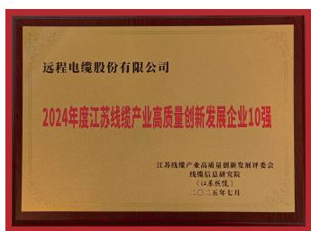

text_image

远程电缆股份有限公司
2024年度江苏线缆产业高质量创新发展企业10强
江苏线缆产业高质量创新发展评审会
线缆信息研究院
（3）有限公司
二〇一五年七月

# 研发创新激励

为推动公司的技术改革及进步，营造良好的创新氛围，公司结合科技创新工作特点，制定《科技创新奖励办法》等制度，设立科技项目奖、工艺改进奖、知识产权奖、科技成果奖等多元化奖项，对在科技创新活动中做出突出贡献的团队和个人给予奖励，有效调动员工的技术创新积极性，为公司技术革新与可持续发展提供强劲动力。报告期内，公司累计激励研发人员百余人。

# 战略

在快速变化的商业环境中，研发创新是企业构筑核心竞争力的关键。面对日益个性化、多元化的市场需求，公司坚持创新驱动理念，通过洞察技术趋势、把握市场动态、响应政策导向，持续完善研发体系与人才建设，优化创新管理机制，为可持续发展提供坚实支撑。

<table><tr><td>风险类型</td><td>描述</td><td colspan="2">财务影响说明</td><td>发生可能性</td><td>影响大小</td><td>影响时间范围</td><td>影响价值链环节</td><td>应对措施</td></tr><tr><td>技术风险</td><td>公司在研发新技术方面投入大量资源,在技术创新过程中可能面临技术瓶颈、关键技术突破困难等挑战,这些技术障碍可能导致研发周期延长或研发成本增加,进而影响项目的整体进度和预期效益。</td><td colspan="2">收入减少成本增加</td><td>高</td><td>大</td><td>中期</td><td>上游</td><td>1.加大技术研发投入,引进先进的研发设备和优秀人才;2.与高校、科研单位等建立合作关系,共同开展研发创新项目。</td></tr><tr><td>人才缺乏风险</td><td>随着公司规模的扩大和业务领域的不断拓展,在创新研发过程中,公司可能会遭遇管理人才与专业人才储备无法满足快速发展需求的风险。</td><td colspan="2">收入减少成本增加</td><td>高</td><td>大</td><td>中期</td><td>运营</td><td>加大对人力资本的投入,积极地进行人才储备,搭建人才梯队,建立健全人才聘用和激励机制,吸引人才留住人才,最大程度地避免因人才缺乏给公司发展带来的不利影响。</td></tr></table>

<table><tr><td>机遇类型</td><td>描述</td><td>财务影响说明</td><td>发生可能性</td><td>影响大小</td><td>影响时间范围</td><td>影响价值链环节</td><td>应对措施</td></tr><tr><td>市场机遇</td><td>新技术的出现往往能够开创全新市场领域,公司可以抓住这一机遇,提升生产效率,迅速拓展市场份额,实现业务的快速增长。</td><td>成本降低收入增加</td><td>中</td><td>大</td><td>中期</td><td>上游</td><td>1.建立研究中心、实验室等研发创新平台,具备先进的检测设备、科研设备及场地;2.打造数字化应用平台,实现生产经营业务提升。</td></tr></table>

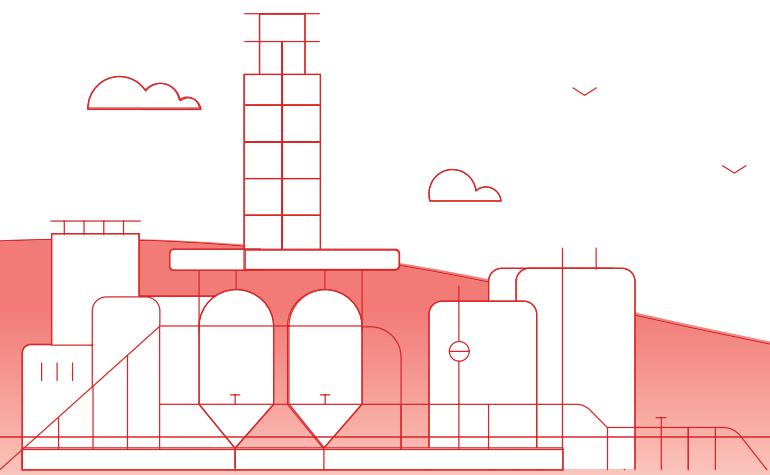

natural_image

Line art illustration of an industrial facility with buildings and chimneys, no text or symbols present

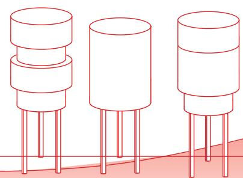

natural_image

Line drawing of three identical cylindrical electronic components with metal legs, arranged side by side (no text or symbols)

# 影响、风险和机遇管理

为降低研发创新风险，公司从实际经营情况出发，对风险和机遇定期开展识别评估，通过有效识别研发过程中的风险因素，跟踪监测重大风险事件，实现降低风险、技术创新的目标。

# 管理流程

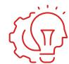  
风险识别

●通过内部讨论、专家咨询、行业对标等方式，识别可能影响项目进展的技术、市场、财务、法律等各类风险。

  
风险评估  
- 项目负责人在研发各阶段组织相应的评审，以鉴别信息是否完整、准确，避免接口遗漏和管理无效。

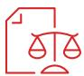  
风险监测  
● 定期跟踪研发项目的进展，及时更新风险状态，根据实际情况调整应对措施，保障项目顺利推进。

  
风险管理

●企业定期剖析过往项目中的潜在风险点，总结经验教训，强化各部门间协同合作，制定针对性策略，全方位防控风险的发生与影响

指标与目标

<table><tr><td>关键指标</td><td>单位</td><td>2023年</td><td>2024年</td><td>2025年</td></tr><tr><td>研发投入</td><td>万元</td><td>13,138</td><td>18,003</td><td>20,509</td></tr><tr><td>研发投入占营业收入比例</td><td>%</td><td>4.10</td><td>4.05</td><td>4.62</td></tr><tr><td>新产品开发数</td><td>个</td><td>10</td><td>11</td><td>10</td></tr></table>

研发团队

<table><tr><td>关键指标</td><td>单位</td><td>2024年</td><td>2025年</td></tr><tr><td>研发团队总人数</td><td>人</td><td>168</td><td>168</td></tr><tr><td>研发人员变化</td><td>%</td><td>6.33</td><td>0</td></tr><tr><td>研发人员占员工总人数比例</td><td>%</td><td>22.02</td><td>23.01</td></tr><tr><td>公司核心技术人员</td><td>人</td><td>10</td><td>10</td></tr></table>

按学历划分

<table><tr><td>本科以下</td><td>人</td><td>126</td><td>122</td></tr><tr><td>本科</td><td>人</td><td>36</td><td>36</td></tr><tr><td>硕士</td><td>人</td><td>6</td><td>10</td></tr></table>

按年龄划分

<table><tr><td>30岁以下(不含30岁)</td><td>人</td><td>11</td><td>12</td></tr><tr><td>30-40岁(含30岁,不含40岁)</td><td>人</td><td>77</td><td>76</td></tr><tr><td>40岁以上</td><td>人</td><td>80</td><td>80</td></tr></table>

按性别划分

<table><tr><td>男性</td><td>人</td><td>130</td><td>128</td></tr><tr><td>女性</td><td>人</td><td>38</td><td>40</td></tr></table>

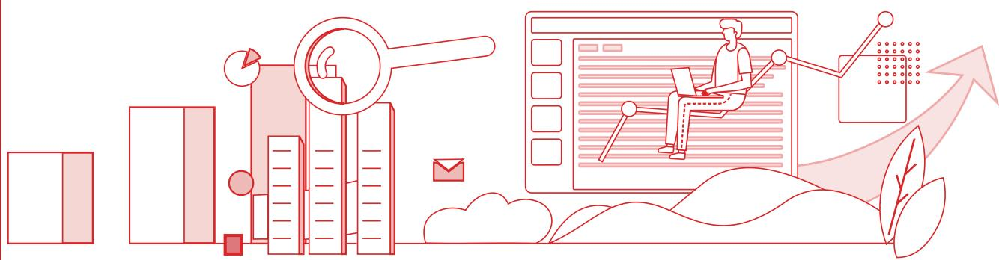

natural_image

Illustration of a digital business ecosystem with icons, charts, and a person using a laptop (no text or symbols)

<table><tr><td>关键指标</td><td>单位</td><td>2024年</td><td>2025年</td></tr><tr><td>授权专利累计数</td><td>项</td><td>6</td><td>7</td></tr></table>

按专利类型划分

<table><tr><td>授权发明专利累计数</td><td>项</td><td>3</td><td>0</td></tr><tr><td>授权实用新型专利累计数</td><td>项</td><td>3</td><td>7</td></tr><tr><td>每百万营收有效专利数</td><td>项/百万元营收</td><td>0.0013</td><td>0.0016</td></tr></table>

其他知识产权

<table><tr><td>商标累计数</td><td>项</td><td>15</td><td>15</td></tr></table>

创新能力认证

<table><tr><td>关键指标</td><td>单位</td><td>2024年</td><td>2025年</td></tr><tr><td>专精特新企业</td><td>↑</td><td>1</td><td>1</td></tr><tr><td>国家高新技术企业</td><td>↑</td><td>2</td><td>2</td></tr><tr><td>博士后工作站</td><td>↑</td><td>1</td><td>1</td></tr></table>

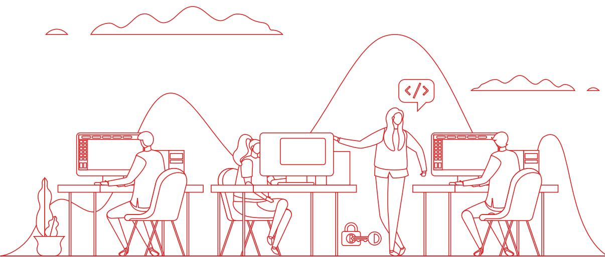

natural_image

Line drawing of a person working at computer terminals with a speech bubble saying '<>' and a lock icon, set against a stylized mountain landscape (no text or symbols)

# 研发创新成果

# 研发成果展示

公司作为“高新技术企业”，共有5项产品获无锡市高新技术产品（服务）认定证书，25项产品经鉴定后获得新产品新技术验收证书，充分展现了公司在技术创新与产品研发领域的卓越实力。

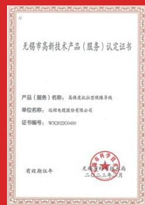

seal

无锡市高新技术产品（服务）认定证书
产品（服务）名称：高强度抗拉型绝缘导线
单位名称：远程电视股份有限公司
证书编号：WX2022G0450
有效期伍年
无锡市市场局
二〇一三年二月

高强度抗拉型绝缘导线

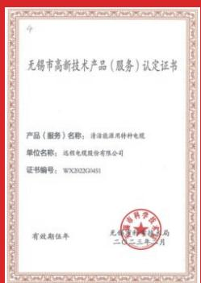

text_image

无锡市高新技术产品（服务）认定证书
产品（服务）名称：清洁能源用特种电缆
单位名称：远程电缆股份有限公司
证书编号：WX3822G0451
有效期至年 无证专用章
二〇一三年五月

清洁能源用特种电缆

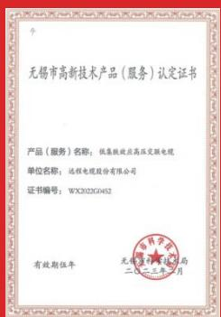

text_image

无锡市高新技术产品（服务）认定证书
产品（服务）名称： 供集致效应高压定额电视
单位名称： 远程电视股份有限公司
证书编号：WX2022G0452
有效期至年 无证号: 二〇二三年五月

低集肤效应高压交联电缆

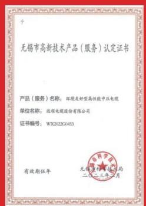

seal

无锡市高新技术产品（服务）认定证书
产品（服务）名称：环境友好型高性能中压电缆
单位名称：远程电缆股份有限公司
证书编号：WX382G0453
有效期伍年
无锡市和平区分局
二〇一三年二月

环境友好型高性能中压电缆

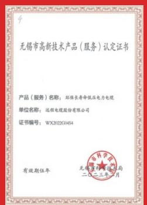

text_image

无锡市高新技术产品（服务）认定证书
产品（服务）名称：环保长寿命低压电力电缆
单位名称：远程电视股份有限公司
证书编号：WXC022G454
有效期至年 无证专用章
二〇一三年三月

环保长寿命低压电力电缆

新产品新技术鉴定验收

<table><tr><td>序号</td><td>名称</td><td>技术水平</td></tr><tr><td>1</td><td>低烟无卤阻燃B1级电缆</td><td>国内先进</td></tr><tr><td>2</td><td>风能发电用电缆</td><td>国内领先</td></tr><tr><td>3</td><td>新型环保储能系统用电缆</td><td>国内先进</td></tr><tr><td>4</td><td>耐候型多芯交流光伏电缆</td><td>国内领先</td></tr><tr><td>5</td><td>低烟无卤阻燃低毒电缆</td><td>国内领先</td></tr><tr><td>6</td><td>隧道专用防白蚁电缆</td><td>国内先进</td></tr><tr><td>7</td><td>直流耐磨充电桩电缆</td><td>国内领先</td></tr><tr><td>8</td><td>环保型光伏电缆</td><td>国内领先</td></tr><tr><td>9</td><td>工业用拖链电缆</td><td>国内先进</td></tr><tr><td>10</td><td>机场助航灯光回路用埋地电缆</td><td>国内先进</td></tr></table>

新产品新技术鉴定验收

<table><tr><td>序号</td><td>名称</td><td>技术水平</td></tr><tr><td>11</td><td>额定电压26/35kV热塑性聚丙烯绝缘无卤低烟阻燃A类电力电缆</td><td>国内领先</td></tr><tr><td>12</td><td>铜芯交联聚乙烯绝缘钢带铠装聚乙烯护套阻燃A类耐寒电力电缆</td><td>国内先进</td></tr><tr><td>13</td><td>无卤低烟阻燃本安控制电缆</td><td>国内先进</td></tr><tr><td>14</td><td>铝芯交联聚乙烯绝缘皱纹铝套防水电力电缆</td><td>国内先进</td></tr><tr><td>15</td><td>铜芯交联聚乙烯绝缘钢带铠装聚氯乙烯护套纵向阻水电力电缆</td><td>国内领先</td></tr><tr><td>16</td><td>道路车辆用高柔性硅橡胶绝缘护套高压屏蔽电缆</td><td>国际先进</td></tr><tr><td>17</td><td>海上光伏电缆</td><td>国际先进</td></tr><tr><td>18</td><td>耐腐蚀镀锡铜包铝合金光伏电缆</td><td>国际先进</td></tr><tr><td>19</td><td>额定电压 450/750V双层共挤绝缘辐照交联无卤低烟阻燃80年寿命电线</td><td>国内领先</td></tr><tr><td>20</td><td>铝包碳纤维复合材料芯架空导线</td><td>国内领先</td></tr><tr><td>21</td><td>电动汽车充电用液冷大功率充电电缆</td><td>国内先进</td></tr><tr><td>22</td><td>储能系统用耐高温电池连接电缆</td><td>国内先进</td></tr><tr><td>23</td><td>交联屏蔽型车内高压线</td><td>国内领先</td></tr><tr><td>24</td><td>27.5kV铁路工程用电缆</td><td>国内先进</td></tr><tr><td>25</td><td>轻型铝合金光伏电缆</td><td>国内先进</td></tr></table>

此外，公司获得了江苏省智能制造示范车间等荣誉称号以及智能制造能力成熟度五级认证证书。

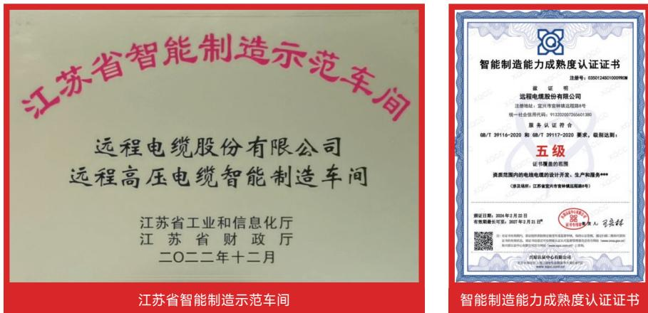

# 案例 2025年度新产品鉴定会

-

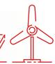

2025年11月8日，远程股份成功举办2025年度新产品鉴定会，公司自主研发的10项新产品全部通过专家组鉴定，其中3项达国际先进水平、7项达国内领先或先进水平。此次通过鉴定的产品包括高柔性高压电缆、海上光伏电缆等，精准服务于新能源汽车、海上光伏等战略性新兴产业，展现了公司在特种电缆领域扎实的技术积累与创新能力。

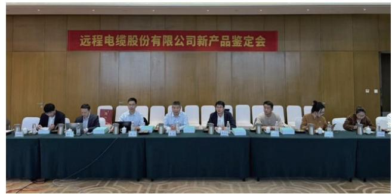

text_image

远程电缆股份有限公司新产品鉴定会

# 校企合作

公司积极深化产学研协同创新，借助外部资源走产学研相结合的道路，与上海电缆工程设计研究所、核工业第二研究设计院、西安交通大学、哈尔滨理工大学、国家能源海洋核动力平台技术研发中心等单位建立了产学研合作关系，着力构建优势互补、资源共享的合作网络。此外，公司聘请了多名国内行业知名专家作为公司的技术顾问，为公司的技术创新提供智力支持。通过内外资源的有效整合，公司不断强化技术攻关能力，持续提升在行业中的核心竞争力与影响力。

# 案例 | 河南工学院赴远程股份调研

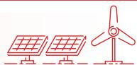

2025年10月10日，河南工学院党委书记、校长一行到访远程股份进行调研交流。活动以“校企协同，赋能发展”为主题，围绕人才培养、技术创新及产学研融合等议题进行了深入探讨，并在共建实习实训基地、探索订单式人才培养以及电缆新材料研发、生产工艺优化上达成重要共识。

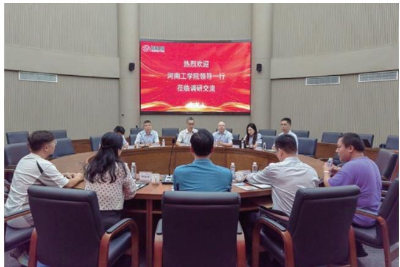

text_image

热烈欢迎
河南工学院领导一行
夜临调研交流

# 行业共建

# 标准制定

远程股份坚持科技创新，深度融入行业标准体系建设，携手各方共同构建规范有序、协同发展的行业生态。截至报告期末，公司累计参与制定5项国际标准、8项团体标准，以实质性贡献推动行业规范化进程。

<table><tr><td>序号</td><td>标准类别</td><td>标准名称</td></tr><tr><td>1</td><td>国家标准</td><td>塑料绝缘控制电缆</td></tr><tr><td>2</td><td>国家标准</td><td>阻燃和耐火电线电缆或光缆通则</td></tr><tr><td>3</td><td>国家标准</td><td>额定电压1.8/3kV及以下风力发电用耐扭曲软电缆</td></tr><tr><td>4</td><td>国家标准</td><td>在火焰条件下电缆或光缆的线路完整性试验 第12部分:试验装置——火焰温度不低于830°C的供火并施加冲击</td></tr><tr><td>5</td><td>国家标准</td><td>在火焰条件下电缆或光缆的线路完整性试验 第31部分:供火并施加冲击的试验程序和要求——额定电压0.6/1kV及以下电缆</td></tr><tr><td>6</td><td>团体标准</td><td>额定电压0.6/1kV陶瓷化硅橡胶矿物绝缘耐火电缆及预分支耐火电缆 第1部分:额定电压0.6/1kV陶瓷化硅橡胶矿物绝缘耐火电缆</td></tr><tr><td>7</td><td>团体标准</td><td>额定电压0.6/1kV陶瓷化硅橡胶矿物绝缘耐火电缆及预分支耐火电缆 第2部分:额定电压0.6/1kV陶瓷化硅橡胶矿物绝缘预分支耐火电缆</td></tr><tr><td>8</td><td>团体标准</td><td>电缆用聚丙烯填充绳(带)</td></tr><tr><td>9</td><td>团体标准</td><td>额定电压450/750V及以下耐热90°C交联聚烯烃绝缘电线和电缆</td></tr><tr><td>10</td><td>团体标准</td><td>额定电压750kV(Um=800kV)交联聚乙烯绝缘电力电缆及其附件</td></tr><tr><td>11</td><td>团体标准</td><td>核设施安全级电缆绝缘和护套材料</td></tr><tr><td>12</td><td>团体标准</td><td>人形机器人专用线缆规范</td></tr><tr><td>13</td><td>团体标准</td><td>配网用中压直流电缆</td></tr></table>

# 行业交流

远程股份积极构建覆盖国内外的行业合作网络，积极赋能行业协会，通过参与行业论坛、产品展览等活动，与行业伙伴交流技术创新成果与研发经验，共同促进行业的规范有序与可持续发展，为行业发展提供多维度支持。

# 案例

# 2025成都国际电力展

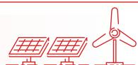

2025年5月15—17日，远程股份在第二十二届成都国际电力产业博览会上重点展出超高压电力电缆、防火阻燃电缆、光伏电缆等系列产品，全面覆盖新能源发电、智能电网、轨道交通等多个应用领域。展会期间，公司团队与来自全国各地的电力企业、设计院及行业专家围绕“双碳”目标下的技术创新展开深度交流，分享了在绿色制造与节能技术方面的成果。

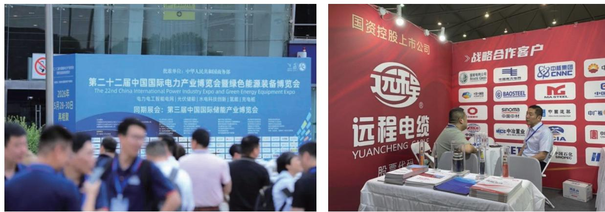

# 案例

# 远程股份参加碳纤维复合芯导线技术发展研讨会

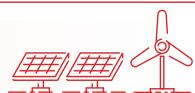

2025年4月25日，碳纤维复合芯导线技术发展研讨会在湖南株洲隆重召开。远程股份作为国内少数掌握新型铝包覆碳纤维导线生产技术的企业，受邀参会，展示了最新研发的碳纤维复合芯导线系列产品和技术解决方案，引发行业广泛关注。与传统钢芯铝绞线相比，铝包覆碳纤维导线的抗拉强度和载流量提升到2倍以上，损耗降低最多达40%，同时具备更好的径向抗压性能和施工兼容性，综合成本更具优势，被誉为输电领域的革新“黑科技”。

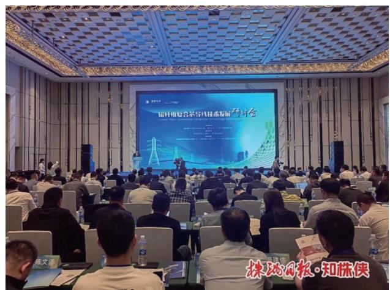

text_image

福州地复合前沿技术研发研讨会
捷讯日报·知株侠

# 智能工厂建设

远程股份以实现电缆智能制造为目的，围绕外界大客户个性化要求，通过5G网络组网建设，改造升级工业互联网内网，同时将5G技术集成应用于研发设计、生产制造、采购管理、故障运维、物流运输、安全管理等环节，打造“5G+工业互联网”典型应用场景，建设5G全连接工厂。通过实现5G与MES、ERP、CAPP等系统的全面集成，公司建立起从订单下达到交付的全流程可视化管理体系，显著优化业务流程、提升服务效率与客户满意度。

5G智能工厂项目以工业互联网平台为核心，聚焦于电线电缆的批量生产，推动“工厂智能化、管理信息化、制造精益化”三化融合。目前已落地5大环节、11类典型场景，涵盖协同研发设计、设备协同作业、故障智能诊断与生产全过程溯源等能力。

基于在5G融合应用方面的实践成果，经省级工业和信息化主管部门、通信管理局推荐及工业互联网战略咨询专家委评审，远程股份荣获国家级5G工厂荣誉，入选2025年江苏省先进级智能工厂名单。

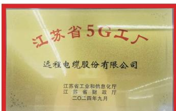  
江苏省5G工厂

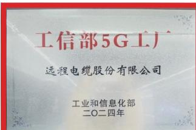  
国家级5G工厂

# 5G智能工厂项目主要成效

在创新层面，公司围绕5G智慧工厂建设需求，规划并实施了5G智慧工厂的整体网络架构。公司通过发挥5G网络特性，定制与业务场景相匹配的部署方案，有效降低工厂智能化改造成本。

公司采用5G APN/DNN隔离技术，实现设备数据采集、能耗管理、视觉安防、数字孪生等关键业务在独立网络环境中的安全、稳定运行；同步推进生产设备数据采集系统建设，完成车间设备的全面联网与数字化改造，实现对设备运行状态与性能数据的实时监控与动态分析。

在经济性方面，公司通过5G工厂建设，在生产运营、产品质量、新产品研发、生产设备等方面均有显著提升。

5G工厂实施成果表

<table><tr><td>序号</td><td>建设指标</td><td>建设前</td><td>建成后</td><td>提升效果</td></tr><tr><td>1</td><td>生产计划完成率</td><td>97.1%</td><td>99.82%</td><td>提高2.72%</td></tr><tr><td>2</td><td>产品合格率</td><td>99.78%</td><td>99.81%</td><td>提升0.03%</td></tr><tr><td>3</td><td>设备综合利用率</td><td>60.3%</td><td>92%</td><td>提升31.7%</td></tr><tr><td>4</td><td>订单准时交付率</td><td>92.8%</td><td>97.8%</td><td>提升5%</td></tr><tr><td>5</td><td>年产值</td><td>1.4亿/年</td><td>1.73亿/年</td><td>增加0.33亿</td></tr></table>

# 两化融合管理体系

公司以信息化为支撑，着力构建“客户中心+精益制造”的两化融合体系，形成系统化的管理制度与文件，并在业务优化、组织协同与持续改进等方面实现与现有管理体系的高效联动。为确保体系有效运行，公司依据管理制度全面梳理管理流程，持续完善各类程序文件、技术标准及操作手册，明确各环节控制要求与方法。

截至报告期末，公司已通过两化融合管理体系“AAA”级评定，并获得评定证书。

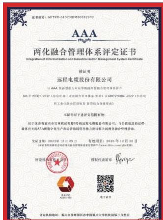

text_image

证券编号：AIIITRE-01023HBM80282902
AAA
两化融合管理体系评定证书
Integration of Informatization and Industrialization Management System Certificate
兹证明
远程电缆股份有限公司
与 AAA 高级新型电力研究院的两化融合管理体系符合
GB/T 23001-2017 (信息和工业电能管理系统) 标准) GB/T23006-2022 (信息化
和工业化融合管理体系 联合性评估标准)
本证书所涉评定范围有限。
位于江苏省宜兴市玉林镇运海路5号的远程电缆股份有限公司，与你创造的过程，
载体有关的AAA级数字化生产和运营协同能力就是相关的两化融合管理活动。
发证日期：2023年12月29日    有效期至：2026年12月28日
（本证书有效期至该文件有效期内需经国家有关部门许可经营）
评定机构签章        授权代表签字        电子证书
评定流程地址：重庆市渝中区渝中市渝中区渝中区渝中区渝中区渝中区渝中区渝中区渝中区渝中区渝中区渝中区渝中区渝中区渝中区渝中区渝中区渝中区渝中区渝中区渝中区渝中区渝中区渝中区渝中区渝中区渝中区渝中区渝中区渝中区渝中区渝中区渝中区渝中区渝中区
（盖章）

两化融合管理体系“AAA”级评定证书

# 知识产权保护

远程股份知识产权管理遵循统一管理、分工协同、规范有序的原则，严格遵守《中华人民共和国专利法》《中华人民共和国商标法》等法律法规，制定了《知识产权管理总则》，持续完善覆盖专利、商标、著作权、商业秘密等类型的知识产权合规管理体系，规范各项保护措施，切实保障公司知识产权安全。

公司设立技术研发部，统筹负责知识产权的系统管理工作，下设专利、商标、商业秘密等专业管理岗位，明确职责分工，在各自的业务范围内负责相关知识产权的管理和具体工作。

# 科技伦理

公司恪守负责任创新的伦理准则，在产品研发与应用过程中贯彻负责任原则，确保技术向善。当前公司主营业务为电缆产品制造，未涉及生命科学及人工智能等科技伦理敏感领域。报告期内，公司未发生任何违反科技伦理的行为。

# 链动高效协同

# 治理

远程股份高度重视供应链管理，严格遵守《中华人民共和国公司法》《中华人民共和国招标投标法》等相关法律法规，系统性构建覆盖供应商全生命周期的供应链管理体系。公司通过制定《供应商管理细则》《采购管理办法》等制度，加强对供应商的日常管理和监督，对供应商准入、审核和评估等环节实施严格管控，确保供应商在质量、交期、服务等方面符合公司要求。

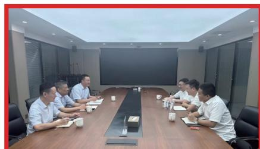

natural_image

Group of men in a meeting around a conference table, no visible text or signage

采购培训

# 战略

供应链的可持续发展是企业实现稳健运营和构建长期竞争力的关键支撑。远程股份立足行业趋势，严格遵循政策法规，系统审视供应链布局中的业务需求与潜在风险，并以此为导向持续优化全流程管理。通过精准施策，公司显著提升了供应链的协同效率与抗风险能力，为生产运营的稳定性和持续性提供了坚实保障，进一步巩固了在行业中的竞争优势。

<table><tr><td>风险类型</td><td>描述</td><td>财务影响说明</td><td>发生可能性</td><td>影响大小</td><td>影响时间范围</td><td>影响价值链环节</td><td>应对措施</td></tr><tr><td>原材料价格波动风险</td><td>电线电缆行业具有“料重工轻”的特点,铜材、铝材等原材料占公司主营业务成本比例较大,原材料价格的波动将加大公司成本管理的难度,若风险控制能力不强,将对经营带来一定风险。</td><td>成本增加</td><td>中</td><td>中</td><td>短期</td><td>上游</td><td>开展铜、铝等原材料的商品期货套期保值业务,规避产品原材料价格波动对公司生产经营造成的潜在风险,充分利用期货、期权等市场的套期保值功能,减少因原材料价格波动造成的产品成本波动。</td></tr><tr><td>产品销售及周期性风险</td><td>电力电缆的销售呈现一定的季节特征,由于本公司客户结构中电力公司占据了较大的份额,因此销售的季节性会造成公司生产经营业绩的波动。</td><td>成本增加</td><td>中</td><td>中</td><td>短期</td><td>上游</td><td>1.在销售淡季进一步加快资金的回笼,同时在国网公司年底集中招投标的前提下,增加订单数量;2.建立销售管理责任制,制定销售目标。</td></tr></table>

<table><tr><td>机遇类型</td><td>描述</td><td></td><td colspan="2">财务影响说明</td><td>发生可能性</td><td>影响大小</td><td>影响时间范围</td><td>影响价值链环节</td><td>应对措施</td></tr><tr><td>供应链数字化转型</td><td>数字化供应链强化了供应链各方的协作与沟通,显著提升透明度;通过集成先进信息技术,使公司供应链管理更加智能化和自动化,由此供应链能更迅速地响应市场变化,公司决策也更加精确。</td><td></td><td colspan="2">成本降低</td><td>中</td><td>中</td><td>长期</td><td>运营</td><td>1.提升供应链决策的精密度,借助数字化工具执行精细化的市场需求预测与风险评估流程;2.通过数字化平台实现信息的即时流通与透明化展现,确保供应链上下游企业能够无缝对接、高效协同运作。</td></tr><tr><td>成本管控机遇</td><td>通过期货市场,预先锁定铜材,使电缆销售有利润空间;有效规避市场波动,巩固产品定价竞争力,险管理能力打造为新的利润增长点。</td><td>将风</td><td colspan="2">成本降低</td><td>高</td><td>中</td><td>长期</td><td>运营下游</td><td>1.通过期货市场和规范企业经营管理体制来规避价格风险;2.同一原材料选择2家以上供应商,对公司影响较大的主要原材料做好年度采购计划,选择物美价廉的材料。</td></tr></table>

# 影响、风险和机遇管理

为有效降低供应链的各类风险，公司通过识别潜在风险、评估其影响、实时监测动态变化，并采取相应措施进行有效管理，确保供应链的稳定运行。

# 管理流程

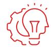  
风险识别

\- 公司在供应链管理过程中，通过内部讨论、供应商沟通、市场调研等方式，识别可能影响供应链稳定的各类风险。

  
风险评估  
● 公司通过月度质量考评、年度考评、现场审核、专题质量改进评估等方式对供应商进行评估，考评内容覆盖供应商供货的产品质量、交货期、服务等方面。

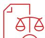  
风险监测

●运用信息化手段加强对交易活动的监测分析，对违规情况进行督办处理；

\- 内部审计机构和相关职能部门对采购工作进行监督，实行定期或不定期监督检查。

  
风险管理

●针对供应链中的各类风险，公司采取灵活应对措施，及时调整策略。

指标与目标

<table><tr><td>关键指标</td><td>单位</td><td>2023年</td><td>2024年</td><td>2025年</td></tr><tr><td>原材料供应商总数</td><td>↑</td><td>129</td><td>150</td><td>176</td></tr><tr><td>国内供应商数量</td><td>↑</td><td>129</td><td>150</td><td>176</td></tr><tr><td>向当地供应商采购支出比率</td><td>%</td><td>41</td><td>40</td><td>40</td></tr></table>

# 供应商全生命周期管理

远程股份遵守相关法律法规，建立了覆盖供应商准入、评审、考核及退出的全生命周期管理体系。公司通过持续优化管理流程，打造安全、有效、优质的供应链，为公司的稳健运营提供了有力保障。

<table><tr><td>供应商评审与准入</td><td>·经过资质审查、送样检测、生产试料,主要材料必要时需进行实地考察,符合条件的,由采购部填写《新增供方资质审批表》,经各级领导审批同意后列入《合格供方名录》名单;·采购人将合格供应商库进行汇总、分类,配合远程SRM采购平台建立“合格供应商库”。</td></tr><tr><td>供应商分类与考评</td><td>·通过月度考评、年度考评、现场审核及专题质量改进评估相结合的方式对供应商进行考评,重点围绕供应商供货的产品质量、交货期、服务等指标进行综合评分;·依据年度考评得分将供应商划分为优秀(≥90分)、良好(85—90分)、合格(75—85分)及不合格(&lt;75分)四个等级。</td></tr><tr><td>供应商管理</td><td>·供方的各种资质资料、调查表、业绩评价记录、整改资料均由采购部门相关人员收集整理后,在SRM平台中记录存档,存档保存年限不少于15年;·供应商资质资料及时更新,确保不过期、失效。</td></tr><tr><td>供应商退出</td><td>·对于不符合规定的合格供应商,公司将根据情节轻重,给予暂停、取消供方资格。</td></tr></table>

natural_image

Illustration of people interacting with gears and lightbulb, symbolizing innovation or business growth (no text or symbols present)

# 廉洁采购

远程股份致力于构建廉洁透明的采购体系，在采购活动中秉持公开、公平、公正、诚信、透明的原则，要求供应商必须确保其行为的真实性与合规性，严禁提供虚假材料及任何形式的商业贿赂和不正当竞争行为。为维护公司与供应商之间的合法权益，公司与供应商签订《廉洁协议》，以此作为共同的行为准则，携手共建廉洁高效的供应链生态。

# 可持续采购

远程股份建立了包含可持续发展因素的采购评审机制，规定采购人须组建跨部门评审小组，成员须具备优良职业操守和丰富专业经验。评审小组在采购前期对供应商开展全面评估，除考察其财务、技术、生产能力等传统指标外，重点评估供应商在环境保护、社会责任、可持续发展能力、战略合作意愿等方面的表现，确保采购决策既满足当前需求，更符合公司长期绿色发展导向。

# 品质卓越追求

# 治理

远程股份严格遵守《中华人民共和国产品质量法》等法律法规要求，系统构建并持续完善质量管理体系。公司制定并实施《质量管理办法》《电线电缆产品质量安全管理制度》《质量管理控制程序》《不合格输出的控制、召回程序》等管理制度，实现对产品生产与服务提供的全流程规范化管控。公司在确保环境与职业健康安全受控的前提下，持续为客户提供高品质的产品与服务。

# 组织架构建设

为系统指导并控制质量相关活动，公司设立了由总经理、质量分管领导、质量部门及生产装备部门负责人，以及相关质量与生产管理人员共同构成的质量管理机构。质量管理机构通过协调联动，全面负责质量政策与目标的制定，并推动质量策划、质量控制、质量保证与质量改进等活动的有效实施。

此外，为全面提升电线电缆产品质量安全管理水平，公司进一步细化组织分工，建立了由质量主要负责人、质量安全总监、质量安全员构成的三级质量安全管理组织架构，并制定了清晰的岗位职责与权限划分，以系统化、专业化的工作机制持续强化质量安全风险防控能力。

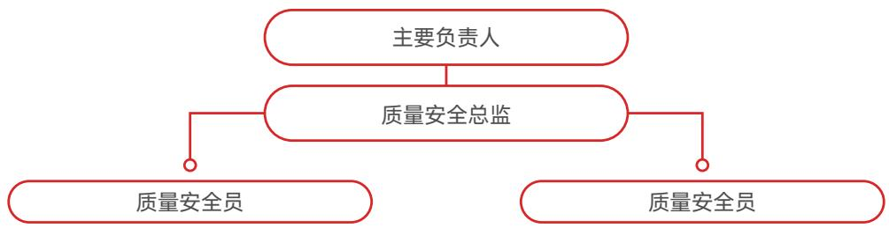

flowchart

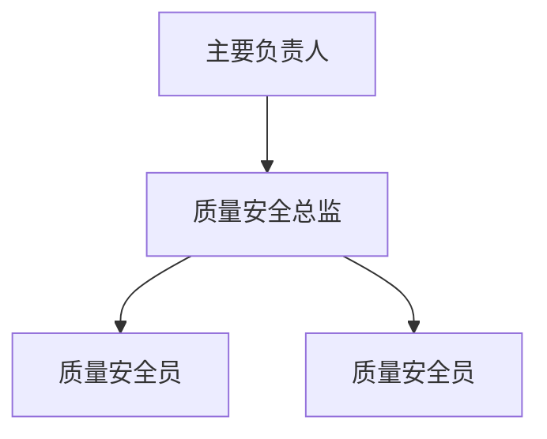
```mermaid
graph TD
  A["主要负责人"] --> B["质量安全总监"]
  B --> C["质量安全员"]
  B --> D["质量安全员"]
```

质量安全管理组织架构

截至报告期末，公司通过了ISO 9001:2015质量管理体系认证，并获得了多项PCCC电能产品认证证书、CCC国家强制性产品认证证书等，产品质量得到了客户的广泛认可。

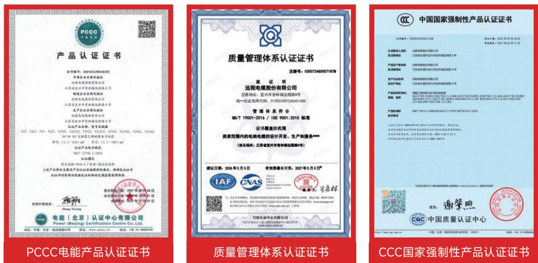

# 质量管理培训

公司高度重视产品质量与技术能力建设，系统开展专业培训与质量管理工作。在技术培训方面，公司针对关键质量控制环节，系统性地进行了耐压局放试验等专题培训，全面提升员工在产品性能检测方面的理论认知与实操水平，切实保障试验操作规范与结果准确可靠。

同时，公司定期召开月度质量会议，持续强化全员质量意识，不断完善质量管理机制，为持续提升产品品质奠定了坚实基础。

# 战略

公司始终将产品质量视为企业发展的生命线，严格遵循国家法律法规及行业标准要求，并基于自身经营实际，系统识别产品质量安全相关的风险要素与发展机遇。通过实施全流程质量管控，公司持续提升产品品质，夯实市场竞争力，巩固行业领先地位。

<table><tr><td>风险类型</td><td>描述</td><td colspan="2">财务影响说明</td><td>发生可能性</td><td>影响大小</td><td>影响时间范围</td><td>影响价值链环节</td><td>应对措施</td></tr><tr><td>声誉风险</td><td>公司主要产品为电线电缆产品,产品质量非常关键,一旦出现故障,有可能造成用户电力系统严重事故,甚至危及电网的安全,给公司信誉带来重大损害,影响公司生产经营。</td><td colspan="2">收入减少商誉受损</td><td>中</td><td>高</td><td>短期</td><td>运营</td><td rowspan="2">1.公司在生产经营过程中严格推行ISO 9001质量管理体系,并根据国际标准、国家标准等进一步完善了质量控制;2.完善产品质量体系制度,提高产品质量,注重售后服务,增强相关人员的质量风险意识和风险控制水平,确保产品质量;3.严格控制进厂材料检验工作,确保原材料产品质量,做好产品出厂检查工作,确保出厂产品质量合格。</td></tr><tr><td>运营风险</td><td>公司产品出厂后,如果下游用户在安装检验过程中发现质量问题,要求公司返工或退货,将会直接影响公司的经济效益,影响公司的运营效率。</td><td colspan="2">收入减少</td><td>中</td><td>高</td><td>短期</td><td>运营</td></tr><tr><td>运营风险</td><td>公司面临因生产设备老化或效能不足带来的产品质量风险。</td><td colspan="2">成本增加收入减少</td><td>高</td><td>高</td><td>短期</td><td>运营</td><td>1.生产部合理安排计划,运用公司先进设备优势;2.完善基础设施,增加相关设备,优化生产流程,采用新工艺、新方法;3.组织专题培训,梳理“质量第一”的思想。</td></tr></table>

<table><tr><td>机遇类型</td><td>描述</td><td>财务影响说明</td><td>发生可能性</td><td>影响大小</td><td>影响时间范围</td><td>影响价值链环节</td><td>应对措施</td></tr><tr><td>产品质量及经营资质机遇</td><td>公司产品通过了国家强制性认证产品CCC认证,并获得了多项经营资质和荣誉称号。公司注重产品质量,严格按照国际标准、国家标准以及企业标准组织生产,并取得了相应的产品认证证书。这些优势使公司在激烈的市场竞争中能够保持领先地位。</td><td>营收增加商誉提高</td><td>高</td><td>高</td><td>长期</td><td>运营</td><td>1.优化生产流程,保障产品高标准;2.构建快速响应机制,精准满足客户需求。</td></tr></table>

# 影响、风险和机遇管理

为系统管控产品质量安全风险，公司围绕产品全生命周期建立了完整的风险防控制度体系，涵盖《风险的应对措施控制程序》《变更管理控制程序》及各环节检验规范。通过全面识别从原材料采购、生产过程到成品检验等环节的潜在风险，公司制定并落实针对性管控措施，形成《工业产品质量安全风险管控清单》，实现风险的动态跟踪与闭环管理，有效降低质量风险发生概率和影响程度。

# 管理流程

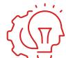  
风险识别

\- 通过产品种类分析风险类型，识别潜在风险点，考虑法律、市场、技术、供应商等多方面因素，将风险分为直接质量风险和间接质量风险。

  
风险评估

\- 对识别出的产品风险进行评估，确定其风险等级、风险源因素、影响进程等。

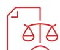  
风险应对

\- 根据风险评估结果、评估报告及经营运行情况等，确定优先控制顺序，采取措施消减风险，将风险控制在可接受的程度，预防影响产品交付和质量；

\- 涵盖风险规避、风险降低与风险接受等多种方式，并为每一项措施制定具有可操作性的实施方案。

  
风险管理

\- 按照规定控制频次定期实施管控措施，持续优化管理流程。

指标与目标

<table><tr><td>目标</td><td>2025年达成情况</td></tr><tr><td>成品一次交检合格率99%以上</td><td>已达成</td></tr><tr><td>各级质量监督机构抽查不合格次数为0</td><td>已达成</td></tr><tr><td>顾客满意度92%以上</td><td>已达成</td></tr></table>

产品质量检测

<table><tr><td>关键指标</td><td>单位</td><td>2023年</td><td>2024年</td><td>2025年</td></tr><tr><td>产品合格率</td><td>%</td><td>99.8</td><td>99.8</td><td>99.8</td></tr><tr><td>年度质量内审次数</td><td>次</td><td>1</td><td>1</td><td>1</td></tr><tr><td>聘请第三方机构抽检次数</td><td>次</td><td>3</td><td>3</td><td>4</td></tr><tr><td>因健康与安全原因须撤回和召回的产品数量百分比</td><td>%</td><td>0</td><td>0</td><td>0</td></tr><tr><td>因健康与安全原因需撤回和召回的产品数量</td><td>件</td><td>0</td><td>0</td><td>0</td></tr><tr><td>公司负面舆情</td><td>次</td><td>0</td><td>0</td><td>0</td></tr></table>

质量文化培训

<table><tr><td>关键指标</td><td>单位</td><td>2023年</td><td>2024年</td><td>2025年</td></tr><tr><td>质量文化培训人次</td><td>人次</td><td>10</td><td>12</td><td>19</td></tr><tr><td>质量文化培训总时长</td><td>小时</td><td>4</td><td>4</td><td>3</td></tr><tr><td>质量文化培训次数</td><td>次</td><td>2</td><td>2</td><td>2</td></tr></table>

# 产品质量管理举措

# 产品全生命周期管理

为确保所生产的产品能够满足产品质量要求，公司制定了《质量管理控制程序》等制度，持续优化质量管理流程，强化质量管控措施，全方位保障产品性能的可靠性与稳定性，为客户提供优质可靠的产品与服务。

全生命周期质量控制

<table><tr><td>来料检验</td><td>·物资管理部在采购原、辅材料时需遵循各项制度规范;·检验员按《原材料采购、检验规范》的要求进行检验并记录,未经检验的材料不可入库及使用;经检验合格的材料由检验员出具检验合格证明后方可入库;</td></tr></table>

全生命周期质量控制

<table><tr><td>来料检验</td><td>·不合格品由检验员开具“不合格报告单”交由物资管理部;·检验员对检验结果负责并记录。</td></tr><tr><td>过程产品检验</td><td>·不合格半成品在未经处理合格之前,不得流入下道工序;·按检验作业指导书进行抽样试验并记录;对机台成批产品首次开机时及时进行首检;·出现不符合现象或临界不符合时,立即出具处理报告,做好标识、分类存放,通知整改并跟踪;·过程产品和半成品及时标识质量状态。</td></tr><tr><td>产品出厂检验</td><td>·未经检验的产品不得入库或出厂;核实产品信息后入库,妥善保管,出厂前检查包装和标识。</td></tr></table>

# 不合格品管理

公司建立了严格的不合格品分级管理制度，依据对产品质量特性的影响程度，将不合格项划分为A类（严重）、B类（一般）、C类（轻微）三个等级。当检验员发现不合格输出时，须立即挂“停”牌、填写处理报告，并通知生产分厂返工或返修。若处理后仍达不到产品质量要求的，严重和一般不合格由品质管理部部长决定处置方法，轻微不合格由检验员判定。

所有不合格品均需通过挂“停”牌、盖章、分区放置并记录等方式进行明确标识，并在24小时内完成处理。品质管理部负责完整保留与不合格品相关的各项成文信息，包括所采取措施、获得的让步授权、处置权限记录以及返工/返修后的复检结果，确保质量追溯体系的有效性与完整性。

# 产品召回

当产品存在重大质量问题时，营销服务部须启动客户沟通与产品召回流程，品质管理部体系专员同步通知相关认证机构。公司随即组织各部门分析原因，制定并实施纠正措施，全力消除不合格品造成的影响。同时，公司将对相关责任人员进行培训教育与处理，以确保问题彻底闭环，防止再发生。

# 提升产品可及性措施

2025年京东618期间，公司正式入驻京东五金城，与京东工业达成工业电气领域深度合作，多举措提升产品可及性：通过广告定向推送触达装修、工业采购等高潜用户实现精准曝光，联合京东采销直播间推出AI数字人主播24小时产品技术讲解，依托京东亚洲一号智能仓实现全国分仓备货，物流成本降低30%，全方位提升产品触达与交付效率。

# 生产工艺智能化

公司加速生产工艺智能化升级，引进线缆结构工艺辅助设计系统（CAPP），串联各类电缆生产工艺全要素，内置并持续更新执行标准，支持工艺调整与线上审批，可自动输出标准化及定制化工艺数据，为MES系统、生产车间及质量检验提供精准工艺与检测依据，大幅提升工作效率，有效减少人为误差。

# 生产设备管理

为保障厂区基础设施与生产设备的良好状态及使用效能，公司制定了《设备管理制度》，并根据公司生产设备的情况编制年度维修保养计划。公司通过系统性维护与计划性检修，有效确保设备持续高效运转，为生产活动的连续稳定开展提供坚实支撑。

<table><tr><td>目标</td><td>2025年达成情况</td></tr><tr><td>设备完好率90%,并落实到车间</td><td>已达成</td></tr><tr><td>积极开展维护管理工作,保证设备满足生产要求</td><td>已达成</td></tr></table>

设备处作为公司设备管理的核心部门，在设备主管的领导下，遵循安全、可靠、经济、合理的原则，对设备进行维修、保养及运行操作管理。设备处注重人员培训和技术提升，持续推进设备管理信息化建设，通过完善设备档案与维护记录，有效提升设备完好率。

公司设备保养以预防为主，将保养作业细分为清洁、检查、紧固、润滑、调整五大核心内容，并依据设备使用年限、维修频率等指标实施分级保养制度，定期开展一、二、三级保养。保养内容与级别根据设备结构、使用环境及磨损规律科学设定，通过系统化维护保持设备处于最佳状态，及时消除隐患，延长使用寿命。每次保养结束后，均须通过车间试生产确认设备是否合格并满足精度要求。

# 平等对待中小企业

公司坚持对中小企业一视同仁、平等合作，严格恪守与中小企业签订的合同约定。公司秉持负责任的财务履约态度，维护与中小企业的长期稳定合作关系，保障各类合作伙伴公平发展。

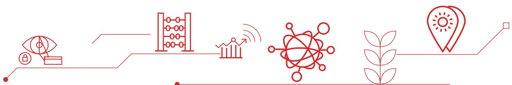

flowchart

```mermaid
graph LR
  A["User Input"] --> B["Vision Recognition"]
  B --> C["Analogic Integration"]
  C --> D["IoT Integration"]
  D --> E["Smart IoT Integration"]
  E --> F["Locality Map"]
  F --> G["Information Retrieval"]
```

# 卓越客户体验

# 客户服务管理

公司始终秉持“品质匠心、服务至诚、持续改善、成人达己”的客户理念，制定《售后服务控制程序》等制度，构建了覆盖全国的销售、技术与售后服务网络。公司通过设立多个驻外服务机构并建立快速响应机制，确保客户需求得到及时反馈与高效处理，为用户提供全方位、全周期的优质服务体验。

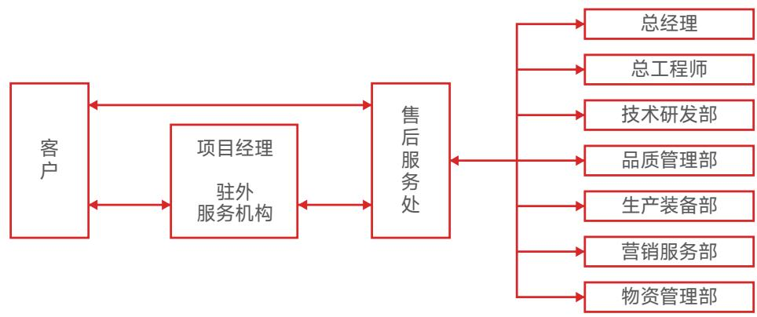

flowchart

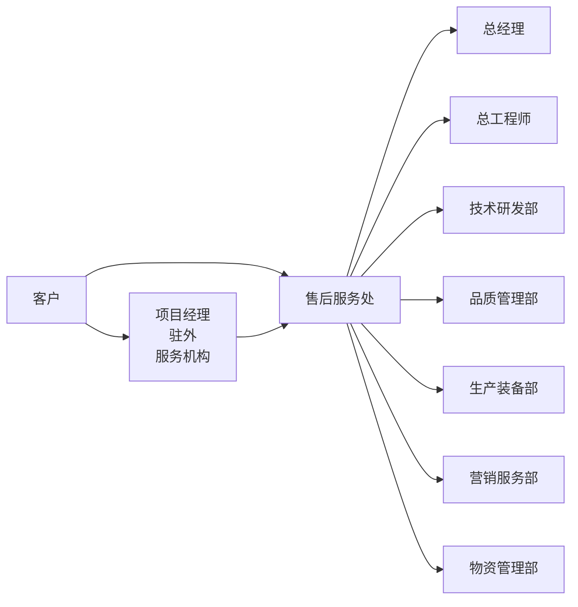
```mermaid
graph LR
  A["客户"] --> B["项目经理\n驻外\n服务机构"]
  A --> C["售后服务处"]
  B --> C
  C --> D["总经理"]
  C --> E["总工程师"]
  C --> F["技术研发部"]
  C --> G["品质管理部"]
  C --> H["生产装备部"]
  C --> I["营销服务部"]
  C --> J["物资管理部"]
```

公司服务体系图

此外，为保障所供产品的安全投运与稳定运行，公司依据客户具体需求，系统制定专项技术服务计划与现场服务实施方案，并选派具备相应资质与经验的技术人员提供服务，明确现场人员的职责范围与能力要求，以保障高效、专业的现场技术支持。

同时，公司严格依据投标承诺，制定覆盖售前、售中、售后全过程的服务承诺方案与专项培训计划。通过理论讲解、实操演练等系统化培训，帮助客户的操作与维护人员全面掌握电缆产品的运维要点与故障处理技能，使其具备自主开展日常维护及基本故障诊断与处置的能力。

# 客户满意度调查

为持续提升服务质量并精准把握客户需求，公司制定《顾客满意度控制程序》，定期开展客户满意度调查。

公司严格规范客户满意度调查流程，由品质管理部负责收集并记录客户咨询、建议、表扬及投诉等信息于《顾客满意度调查表》。针对客户投诉，由品质管理部组织责任部门分析原因并落实纠正与预防措施。此外，公司每年安排营销人员走访主要客户，深入了解需求变化与满意度反馈，推动服务持续优化。

顾客满意度分为满意、较满意、一般和不满意四个等级，通过量化评分进行评价。公司按季度统计满意度数据，并于年终进行综合评估。对于调查表中单项评分低于7分或总分低于60分的情况，品质管理部部长将组织生产装备部、营销服务部等相关部门分析不满意原因，制定针对性改进措施，确保客户反馈得到实质性响应与解决。

<table><tr><td>关键指标</td><td>单位</td><td>2024年</td><td>2025年</td></tr><tr><td>客户满意度</td><td>分/分</td><td>92.3/100</td><td>97.8/100</td></tr></table>

# 客户响应机制

公司秉持“服务至上、供货及时、质量保证”的宗旨，依托专业技术团队与售后服务网络，建立了高效的快速响应机制。公司承诺在设备出现故障或缺陷时，于0.5小时内提供解决方案并派遣技术人员，确保24小时内抵达现场处理。

公司严格遵循合同约定与施工进度，统筹安排生产与物流，配备专业车辆及司机团队，保障货物准时、安全送达。如遇客户紧急需求，公司将积极协调内外部资源，力争提前交付，切实保障项目进度与客户满意度。

<table><tr><td>关键指标</td><td>单位</td><td>2025年</td></tr><tr><td>客户投诉数量</td><td>次</td><td>117</td></tr><tr><td>其中:客户投诉解决数量</td><td>件</td><td>117</td></tr></table>

bar

| Category | Value |
| --- | --- |
| Bar 1 | 45 |
| Bar 2 | ~30 |
| Bar 3 | ~48 |
| Bar 4 | 58 |

# 信息安全无忧

# 信息安全管理

为提升网络安全管理水平，公司依据国家法律法规及相关要求，结合实际情况制定了《数据安全管理办法》《网络安全管理制度》《漏洞管理规范》《员工数据安全行为准则》，推动管理工作向规范化、系统化、科学化方向发展，形成“全员参与、分级负责”的安全管理体系，确保各项安全措施有章可循。

公司设立由数字科技部、综合管理部、法律事务部等组成的网络安全领导小组，统筹协调整体网络安全工作。领导小组由公司主要负责人任组长，承担网络安全第一责任人职责；分管领导具体负责网络安全工作的组织落实与执行推进，确保责任到位、管理闭环。

为系统提升全员数据安全意识与防护能力，公司建立了数据安全培训与考核机制。新员工入职时须接受数据安全专项培训，内容涵盖安全制度、操作规范及风险防范常识，并通过考核后方可上岗。在职员工每季度接受一次安全培训及案例警示教育，并参加年度安全知识考核，考核结果与个人绩效挂钩，以强化员工的安全责任意识与风险防范能力。

# 关键绩效

报告期内，公司未发生重大数据安全事件及泄露客户隐私事件。

# 案例

# 网络安全意识专项培训

为强化全员网络安全防护意识，提升应对网络风险的实操能力，切实保障公司数据安全与业务稳定，2025年11月25日，远程股份组织开展网络安全意识专项培训。公司各部门员工通过线上线下结合的方式参与学习，共同筑牢网络安全“防火墙”。

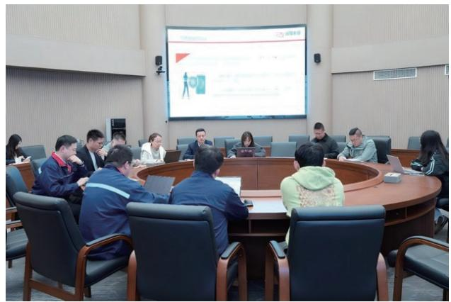

natural_image

Group of people seated around a circular conference table in a meeting room, facing a presentation screen (no visible text or symbols on the image itself)

图 1

<table><tr><td>关键指标</td><td>单位</td><td>2023年</td><td>2024年</td><td>2025年</td></tr><tr><td>开展网络安全培训次数</td><td>次</td><td>2</td><td>2</td><td>4</td></tr><tr><td>网络安全培训参与人数</td><td>人</td><td>120</td><td>150</td><td>180</td></tr><tr><td>网络安全培训的员工覆盖率</td><td>%</td><td>18</td><td>23</td><td>35</td></tr></table>

# 网络应急响应与处置

为有效应对网络安全风险，公司建立了网络安全事件应急工作机制，并编制《网络安全事件应急预案》，全面提升对网络安全事件的预防、响应与处置能力，最大限度地减轻事件可能造成的损失和危害，切实维护公司信息安全、公共安全和社会秩序。

公司设立网络安全和信息化工作领导小组，在发生II级及以上安全事件时启动运行。由主管领导担任组长，各部门负责人为常设成员，并视事件情况吸纳业务系统主管单位主要负责人加入。领导小组负责统一指挥应急处置工作，组织建立应急指挥体系，决策启动或终止I级、II级响应，协调处理重大事项，并对接上级网络安全应急办公室。

2025年9月，公司制定并组织实施《勒索病毒应急演练方案》，开展专项应急演练。演练模拟业务系统因注入漏洞遭受勒索病毒攻击的场景，通过互动体验与大屏展示相结合的方式，全面检验应急处置流程，有效提升了系统运维与网络安全保障人员在真实情况下的应急响应与协同处置能力。

# 网络应急响应与处置流程及措施

# 监测与预警

预警分级 $\rightarrow$ 预警监测 $\rightarrow$ 预警研判与发布 $\rightarrow$ 预警响应 $\rightarrow$ 预警解除

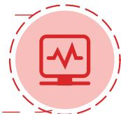

# 应急处置

先期处置→应急指挥→信息处理→后期处置

# 预防

日常管理、演练、宣传、培训

# 保障

机构和人员、技术支撑队伍、专家队伍、社会资源、基础平台等

# 04 同芯共益 携手同行

# 我们的理念

远程股份坚持“唯才是举，雏鹰成长”的人才理念，积极履行社会责任，大力培养人才、踊跃投身公益事业，致力于实现个人梦想、企业愿景和社会福祉的相互促进与共同发展，为构建美好社会积极贡献力量。

# 我们的行动

平等合规用人  
员工民主建设  
相伴员工成长  
职业健康与安全  
行动回馈社会

SDGs

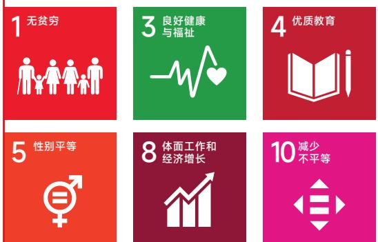

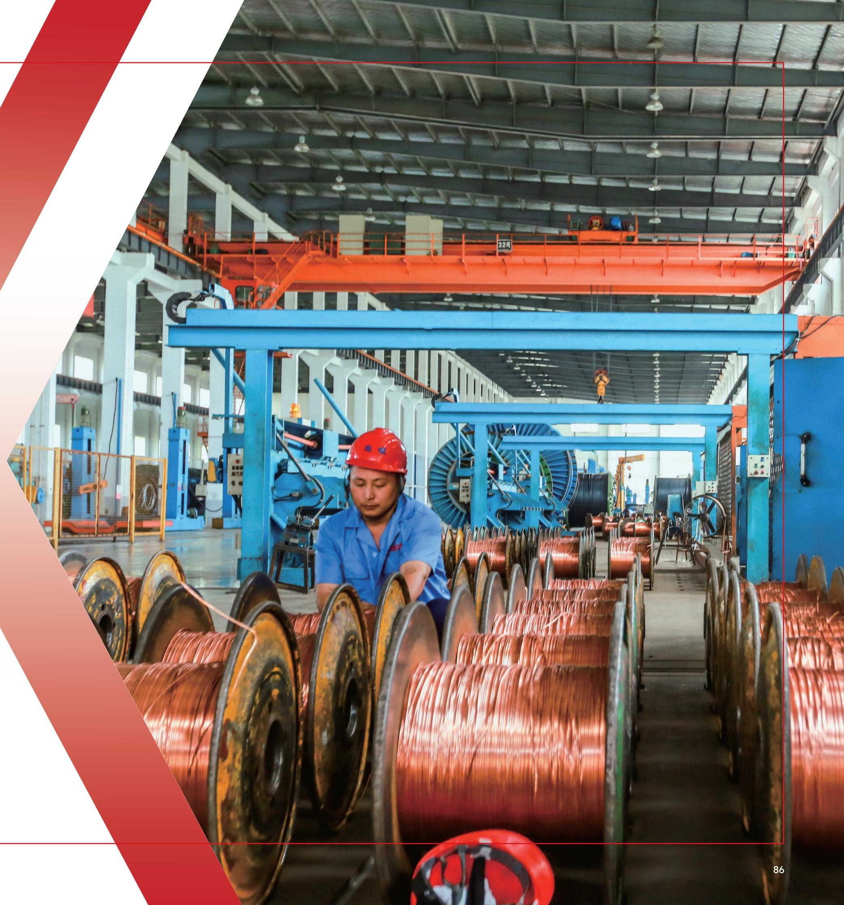

natural_image

Interior of a steel mill with workers handling copper wire spools, no visible text or symbols

# 平等合规用人

远程股份遵循“唯才是举，雏鹰成长”的人才理念，依据《中华人民共和国公司法》《中华人民共和国劳动法》《中华人民共和国劳动合同法》等法律法规，建立了包括《员工手册》《招聘管理规定》《考勤管理办法》在内的管理制度体系，以规范员工管理流程，支持生产经营有序开展。公司注重员工职业发展，通过制度引导与培训支持，促进员工与企业共同成长。

# 人才招募与结构

远程股份秉持开放包容的人才任用理念，通过社会招聘、校园招聘、内部推荐等多元化渠道广泛吸纳优质人才。同时，公司高度重视人才结构的多元化与合理化建设，确保员工队伍在性别、年龄、学历及专业背景等维度实现均衡分布，为企业可持续发展筑牢人才根基。

>> >> >> 招聘流程

发布
招聘信息

收集、筛选简历

预约面试

面试
考察

背景调查

录用

入职
体检

# 社会招聘

线上招聘：公司利用公众号、主流招聘网站以及本地人才市场平台发布职位空缺信息，吸引来自不同背景的求职者。报告期内，通过线上渠道共发布职位超过15个。

现场社会招聘：公司定期参加各类招聘会，与求职者面对面交流，提供即时的职位信息和面试机会。报告期内，公司参加了6场社会招聘会。

# 关键绩效

报告期内，公司通过社会招聘104人

其中岗位类别涵盖生产技术一、二线、领导班子、中层管理类等，

招聘到岗率98%。

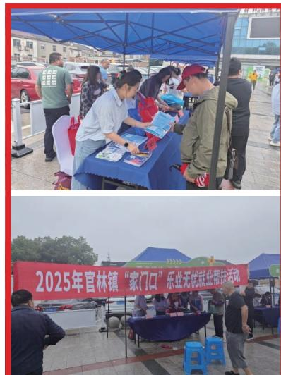  
社会招聘

# 校园招聘

报告期内，公司积极拓展人才储备渠道，参与7场校园招聘活动，并与河南工学院、苏州城市学院、陕西科技大学皓京学院等院校保持密切沟通，进一步深化在人才培养、实习实训、产学共建方面合作。同时，公司通过与徐州工业职业技术学院、哈尔滨理工大学等院校的校企对接，成功吸纳了一批优秀应届毕业生加入生产一、二线和管培生等项目，为企业发展注入新的活力。

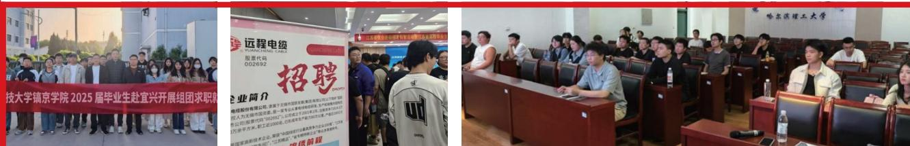  
校园招聘

# 特色招聘

公司积极践行社会责任，秉持着平等就业理念，参加面向退伍军人和残疾人的专题招聘，旨在为特殊群体提供平等的就业机会。

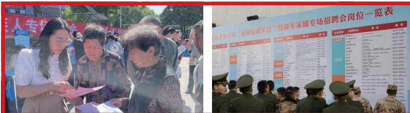  
特色招聘

<table><tr><td>关键指标</td><td>单位</td><td>2023年</td><td>2024年</td><td>2025年</td></tr><tr><td>新进员工数</td><td>人</td><td>91</td><td>141</td><td>133</td></tr></table>

按招聘渠道划分的新进员工

<table><tr><td>社会招聘</td><td>人</td><td>84</td><td>135</td><td>104</td></tr><tr><td>校园招聘</td><td>人</td><td>4</td><td>6</td><td>26</td></tr><tr><td>其他招聘渠道</td><td>人</td><td>3</td><td>0</td><td>3</td></tr></table>

按性别划分的新进员工

<table><tr><td>女性</td><td>人</td><td>39</td><td>34</td><td>38</td></tr><tr><td>男性</td><td>人</td><td>52</td><td>107</td><td>95</td></tr><tr><td>员工离职总人数</td><td>人</td><td>213</td><td>226</td><td>132</td></tr><tr><td>员工总流失率</td><td>%</td><td>24</td><td>28</td><td>18</td></tr></table>

# 员工权益保障

远程股份始终将员工权益保障置于经营管理的重要位置，切实维护全体员工的合法劳动权益。公司严格遵照《中华人民共和国劳动法》《中华人民共和国劳动合同法》《中华人民共和国民法典》等法律法规要求，同时参考《世界人权宣言》《公民及政治权利国际公约》等联合国国际人权宪章相关准则，持续为员工打造平等、包容且多元化的工作环境。

# 关键绩效

报告期内，公司员工劳动合同签订率达100%。

# 多元化与反歧视

远程股份坚守多元化、平等与包容的治理价值观，尊重个体间的差异特性，持续打造包容公正的职场环境。公司坚决抵制各类形式的歧视行为，在招聘、培训、晋升等全流程环节中秉持一视同仁的原则，不因其宗教信仰、种族背景、性别差异等因素区别对待。同时，公司始终践行同工同酬理念，保障女性与男性员工薪酬公平，劳动合同签订严格遵循平等自愿的核心原则，切实维护全体员工的合法权益。

# 关键绩效

报告期内，公司未发生劳工歧视相关事件，职场平等包容氛围持续巩固。

# 禁止强迫劳动和雇佣童工

公司制定《考勤管理规定》，实行标准工时制，确保雇佣关系建立在双方自愿、平等的基础上，严禁任何形式的强迫劳动。公司合理安排生产计划，保证员工有合理的休息时间，员工依法享有国家规定假期。

公司严格执行《禁止使用童工规定》等法规制度，严禁在任何岗位使用童工，在招聘及入职时对应聘人员进行年龄验证，进行身份证信息核对，防止出现假冒他人身份的情况。若发现应聘者年龄不符合要求，立即终止招聘，保障公司招聘的合规性。

# 关键绩效

报告期内，公司未发生任何童工误用、强迫劳动或侮辱骚扰事件。

<table><tr><td>关键指标</td><td>单位</td><td>2023年</td><td>2024年</td><td>2025年</td></tr><tr><td>劳工歧视事件数</td><td>宗</td><td>0</td><td>0</td><td>0</td></tr><tr><td>员工总人数</td><td>人</td><td>846</td><td>763</td><td>730</td></tr><tr><td>残疾员工人数</td><td>人</td><td>3</td><td>1</td><td>1</td></tr><tr><td>少数民族员工数</td><td>人</td><td>1</td><td>2</td><td>14</td></tr></table>

<table><tr><td>关键指标</td><td>单位</td><td>2023年</td><td>2024年</td><td>2025年</td></tr><tr><td colspan="5">按性别划分</td></tr><tr><td>女性</td><td>人</td><td>276</td><td>253</td><td>221</td></tr><tr><td>男性</td><td>人</td><td>570</td><td>510</td><td>509</td></tr></table>

<table><tr><td colspan="5">按年龄划分</td></tr><tr><td>30岁以下(不含30岁)</td><td>人</td><td>78</td><td>90</td><td>106</td></tr><tr><td>30-40岁(含30岁,不含40岁)</td><td>人</td><td>243</td><td>233</td><td>221</td></tr><tr><td>40-50岁(含40岁,不含50岁)</td><td>人</td><td>256</td><td>214</td><td>207</td></tr><tr><td>50岁及以上</td><td>人</td><td>269</td><td>226</td><td>196</td></tr></table>

<table><tr><td colspan="5">按学历划分</td></tr><tr><td>硕士及以上</td><td>人</td><td>8</td><td>13</td><td>16</td></tr><tr><td>本科</td><td>人</td><td>95</td><td>108</td><td>127</td></tr><tr><td>大专及以下</td><td>人</td><td>743</td><td>642</td><td>587</td></tr></table>

<table><tr><td colspan="5">按员工专业结构划分</td></tr><tr><td>生产</td><td>人</td><td>475</td><td>474</td><td>423</td></tr><tr><td>销售</td><td>人</td><td>115</td><td>76</td><td>82</td></tr><tr><td>技术</td><td>人</td><td>49</td><td>59</td><td>65</td></tr><tr><td>财务</td><td>人</td><td>58</td><td>20</td><td>20</td></tr><tr><td>行政</td><td>人</td><td>149</td><td>134</td><td>140</td></tr></table>

# 关注女性权益与福利

远程股份重视女性员工权益保障，严格遵循相关法律法规，全面落实产检假、产假等假期并依法发放生育津贴，并专门设立女职工委员会强化女性权益保障。此外，公司通过设立爱心母婴室、发放生育慰问品等方式，为女性员工提供更具人文关怀的工作支持。

公司始终坚持性别平等，在招聘、晋升、薪酬等环节确保女性员工享有平等待遇，打造尊重并支持女性的工作环境。

# 案例

“花漾远程 梦绘时光”插花活动

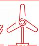

2025年，公司秉持对女性员工的尊重与关怀，精心策划并举办了主题插花活动。公司以鲜花为礼，旨在致敬每一位在职场与生活中闪耀的女性员工。活动中，专业花艺师指导员工创作，让女性员工在花香与艺术中邂逅属于自己的高光时刻，深刻感受自身价值与公司对她们独特贡献的认可。该活动不仅是公司福利的一部分，更体现了远程股份致力于营造包容、支持的工作环境，赋能女性员工，促进其个人成长与职业发展。

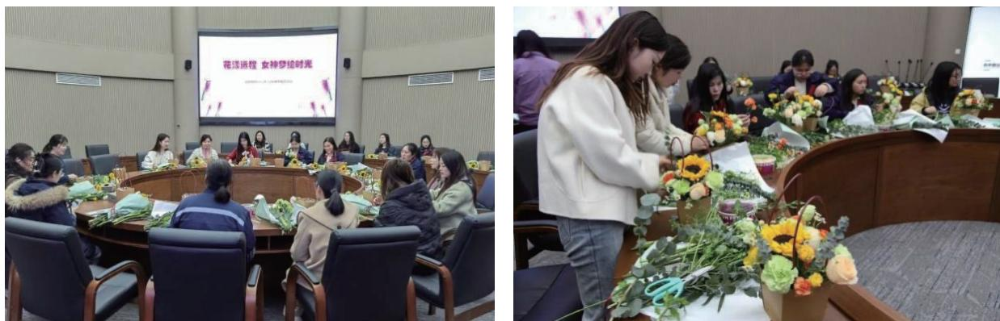

<table><tr><td>关键指标</td><td>单位</td><td>2023年</td><td>2024年</td><td>2025年</td></tr><tr><td>管理人员中女性人数比例</td><td>%</td><td>31.58</td><td>42.86</td><td>26</td></tr><tr><td>享受产假员工数</td><td>人</td><td>6</td><td>10</td><td>1</td></tr><tr><td>享受产假返岗率</td><td>%</td><td>100</td><td>100</td><td>100</td></tr></table>

# 员工薪酬福利

# 薪酬与绩效管理

公司秉持公平、公正、合理的薪酬管理理念，严格遵循价值分配原则，制定《薪酬管理制度》《薪酬管理制度补充细则》《绩效考核方法》等制度，通过规范薪酬结构及管理流程，既实现人力成本的合理管控，又形成“奖励先进、鞭策后进”的激励机制，有效提升员工工作积极性与主动性。同时，公司采用多元化考核模式，搭建详尽规范的绩效考核与反馈流程，保障薪酬体系的公平有序运行。

# 绩效考核计划制定

各部门制定考核指标报人力资源处，交由公司审定。

# 员工自评

员工填写《员工工作考核表》完成自评。

# 部门评价

结合部门互评、部门评价，由部门负责人填写《部门考核表》，在考核过程中与考核员工进行必要的沟通，以改进和提高工作绩效。

# 公司评定

由分管领导、公司领导进行评定，确定考核绩效。

# 绩效反馈

由人力资源处将绩效结果反馈至各部门，员工确认绩效考核结果。

# 绩效申诉与反馈

公司建立完善的绩效反馈与申诉机制，明确员工在完成绩效考核后，依法享有考核结果知情权。若被考核人认为考核结果与事实存在重大偏差，可向公司考核办提交申诉；考核办经核查核实后，报请公司审批同意，可对考核结果予以纠正，以此保障绩效考核全流程的公平性与公正性。

# 福利体系建设

远程股份高度重视员工福利保障工作，严格遵循国家相关政策法规，为全体员工依法缴纳社会保险及住房公积金，确保员工享有完备的法定社会福利保障体系。同时，公司额外为员工提供餐费补贴、劳动保护用品等配套福利，全方位保障员工的身体健康与职业安全。

员工福利概览

<table><tr><td>直接薪酬</td><td>薪酬结构:岗位薪酬+绩效薪酬+工龄薪酬+学历/职称薪酬+福利补贴</td></tr><tr><td>节日福利</td><td>公司在重要节假日如春节、端午节、中秋等为全体员工发放节日福利,增强团队凝聚力</td></tr><tr><td>生日福利</td><td>公司在员工生日时,发放生日福利</td></tr><tr><td>住宿福利</td><td>装修了8层员工公寓,提供优良的住宿环境</td></tr><tr><td>餐费补贴</td><td>公司注重员工健康和福利,为员工提供餐费补贴</td></tr><tr><td>工作服及劳护用品</td><td>提供工作服及劳护用品,保障员工工作安全</td></tr><tr><td>夏令福利</td><td>为落实防暑降温工作,为员工发放夏令福利</td></tr><tr><td>慰问金</td><td>对员工生育或遭遇重大疾病等给予一定的慰问金或慰问品表示关怀</td></tr><tr><td>残疾人慰问金</td><td>对在公司工作满1年的残疾员工发放慰问金</td></tr><tr><td>高温费</td><td>高温天气发放高温费,保障员工身体健康</td></tr><tr><td rowspan="2">体检</td><td>公司每两年为职工提供职业健康体检,表达公司对员工健康关怀</td></tr><tr><td>每年为一线职工提供职业病健康体检</td></tr><tr><td>各类假期</td><td>法定假期、年休假、婚假、丧假、产假、男方护理假、工伤病假等</td></tr><tr><td>其他</td><td>公司配备母婴室、职工书屋、职工活动室、心理疏导室等设施设备</td></tr></table>

<table><tr><td>关键指标</td><td>单位</td><td>2023年</td><td>2024年</td><td>2025年</td></tr><tr><td>人均带薪年休假天数</td><td>天</td><td>6.64</td><td>6.62</td><td>7.81</td></tr></table>

# 关爱员工生活

远程股份秉持以人为本的理念，切实关注员工需求，积极组织各类文体活动。此类活动不仅有助于提升员工工作满意度，亦能丰富员工精神文化生活。在重要节假日期间，公司通过多种形式向员工表达慰问与祝福，例如举办员工生日会、发放节日福利等。针对员工个人或家庭遭遇重大困难的情形，公司将发放相应慰问金给予帮扶，切实传递企业关怀，增强员工的归属感与凝聚力。

# 员工活动

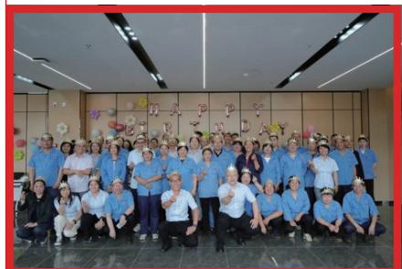

natural_image

Group photo of people in blue shirts posing indoors with balloons and 'Happy Birthday' decorations (no readable text or symbols)

员工生日会

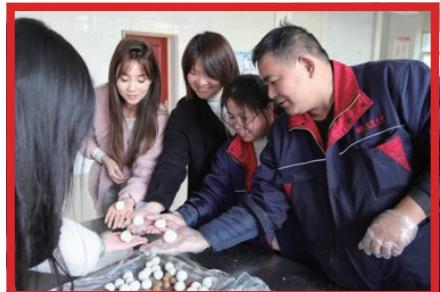

natural_image

Group of people gathered around a table with food items, no visible text or symbols

元宵节活动

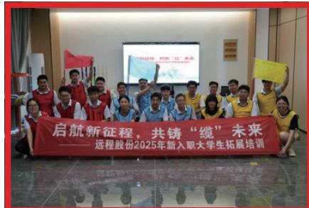

text_image

启航新征程，共铸“缆”未来
远程股份2025年新入职大学生拓展培训

新员工拓展培训会

# 案例 | “暑”你最美致敬每1°C的坚守

#

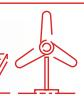

远程股份关注员工健康与安全，针对高温作业环境，通过工业风扇搭配冰块降温、每日供应绿豆汤及盐汽水、配备防暑药品、补充咸味小食、食堂定制营养餐食等多项举措，构建全方位的高温防护保障体系。这些举措不仅有效覆盖了员工在高温环境下的生理需求，更体现了公司对员工福祉的精细化关怀，助力提升员工的工作体验与安全感。

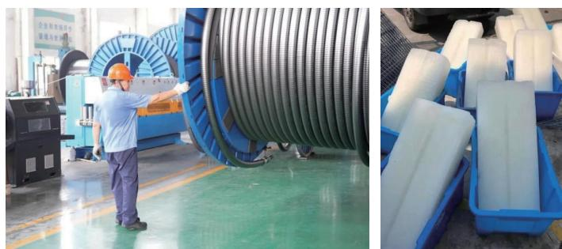

# 员工心理健康保障

在员工健康福利保障方面，公司依托齐备的进站专家资源，建立康乃馨工作站，为全体职工搭建起专业的身心健康服务平台，为职工的心理疏导与生理健康防护提供了坚实支撑。

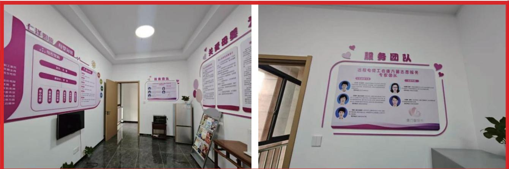

text_image

Two wall-mounted service team posters: one for 'Care and Health' with multiple health-related messages, the other for 'Service Team' with staff and mental health icons.

康乃馨工作站

# 员工民主建设

# 实施民主管理

# 职工代表大会

公司充分尊重员工民主权利且定期组织召开职工代表大会，积极维护职工合法权益。此外，公司鼓励员工深度参与企业经营建设，同时持续强化员工技能培训以提升其专业能力。职工代表大会承担多项关键审议职能，覆盖员工薪酬、绩效考核、考勤管理、福利补贴等核心议题；对于涉及职工切身利益的重大改革及制度调整，公司工会必须严格遵循流程，均需经职工代表大会审议批准后再推进，切实筑牢职工民主权利的保障防线。

<table><tr><td>关键指标</td><td>单位</td><td>2023年</td><td>2024年</td><td>2025年</td></tr><tr><td>职代会审议通过项目数</td><td>项</td><td>2</td><td>3</td><td>14</td></tr><tr><td>工会会员占在职员工比例</td><td>%</td><td>84.94</td><td>93.18</td><td>95.48</td></tr></table>

# 多元化沟通

远程股份致力于构建多元化内部沟通体系，以充分保障信息高效流通与资源协同共享，同时积极倡导员工坦诚沟通，杜绝不实信息传播。公司全体员工均有权通过相关职能部门及总经理信箱提交建议或投诉，且公司会对投诉人信息实施严格保密管理。

同时，为充分调动员工参与企业治理的积极性，公司设立合理化建议奖，并在职工食堂、高压车间、技术中心等区域配置合理化建议奖箱；相关建议由总经理办公室统一收集梳理，对提出有效建议的职工予以公开表扬，凝聚员工智慧共促公司可持续发展。

# 员工满意度调查

远程股份每年面向全体员工开展满意度调查，通过发放员工满意度调查表，全面摸排不同岗位类别员工对工作现状、薪酬福利、企业文化及发展愿景的满意程度。公司基于调查结果精准识别员工核心诉求、及时化解潜在问题，为内部管理优化与机制改进提供科学参考依据，以此构建开放沟通、持续迭代的良性工作环境。

# 相伴员工成长

# 搭建职业通道

# 晋升序列

远程股份高度重视员工职业发展，营造良好成长环境并规划清晰且具潜力的晋升路径；其晋升通道覆盖基础到管理岗位及专业技术领域的层级进阶，为员工提供广阔发展空间，助力员工稳步实现个人价值。

<table><tr><td>行政职级晋升通道</td><td>普通科员</td><td>主管</td><td>副部长</td><td>部长</td><td>经营管理层</td></tr><tr><td>专业技能提升通道</td><td>初级工</td><td>中级工</td><td>高级工</td><td>技师</td><td>高级技师</td></tr><tr><td>专业职称提升通道</td><td>初级职称</td><td>中级职称</td><td>副高级职称</td><td colspan="2">正高级职称</td></tr></table>

# 内部调岗

远程股份始终坚信每一位员工均为公司不可或缺的核心人力资本。公司结合生产经营及业务发展的实际需求，对员工进行统筹化调配与科学化任用，以此实现人力资源的最优配置与高效利用，夯实企业可持续发展的人才根基。

<table><tr><td>关键指标</td><td>单位</td><td>2023年</td><td>2024年</td><td>2025年</td></tr><tr><td>员工内部调动或内部应聘的人数</td><td>人</td><td>26</td><td>52</td><td>57</td></tr></table>

# 员工培训发展

# 培训体系

远程股份注重员工综合素养提升，通过强化安全意识、丰富业务知识等方式筑牢员工能力根基。综合管理部结合各部门业务实际与公司发展战略，制定年度岗位培训计划，系统提升员工文化素养与业务技术能力，助力员工适配岗位要求，保障产品质量与生产安全，为公司稳健发展提供支撑。

# 培训类型

<table><tr><td>培训类型</td><td>培训内容</td></tr><tr><td>入职培训</td><td>远程股份针对新员工,由人力资源部门制定并实施专项培训方案,通过集中授课开展岗前教育,内容涵盖公司概况、业务规划、规章制度、安全规范及行为准则等,助力新员工快速融入企业。</td></tr><tr><td>在岗培训</td><td>员工上岗时,公司将开展专项培训,讲解所在部门职能责任、规章制度、岗位职责及业务操作流程,确保员工明晰工作职责要求,保障岗位工作有序开展。</td></tr><tr><td>转岗培训</td><td>针对岗位调动的员工,公司会开展新岗位知识及岗位职责专项培训,助力员工快速适应新岗位工作,保障岗位工作平稳过渡。</td></tr><tr><td>学历提升培训</td><td>远程股份鼓励员工参与学历提升及职业资格认证培训,并提供学费资助,助力员工提升自身专业水平,强化人才队伍专业能力。</td></tr></table>

# 案例 | 助力新员工快速成长

-

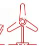

为助力新进员工快速融入企业环境、全面认知企业文化与各项规章制度，远程股份于2025年6月9日组织开展三季度新员工入职培训。本次培训覆盖60余名新进员工，通过系统化课程讲授，帮助新员工深入掌握公司历史背景、组织架构、规章制度及产品技术等核心信息，夯实了新员工的岗位认知与文化归属感。

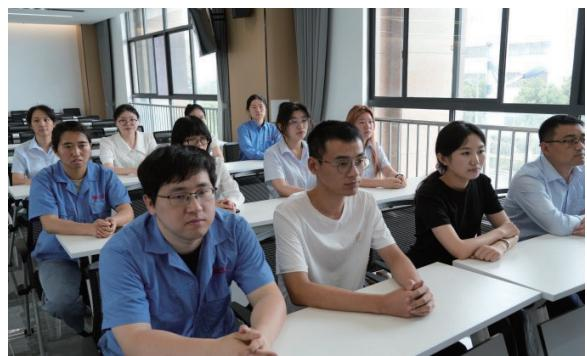

natural_image

Group of students in a classroom setting, seated at desks with large windows (no visible text or symbols)

<table><tr><td>关键指标</td><td>单位</td><td>2023年</td><td>2024年</td><td>2025年</td></tr><tr><td>员工培训投入</td><td>万元</td><td>4.23</td><td>21.98</td><td>25.26</td></tr><tr><td>员工培训场次</td><td>场次</td><td>63</td><td>62</td><td>45</td></tr><tr><td>员工培训覆盖率</td><td>%</td><td>100</td><td>100</td><td>100</td></tr><tr><td>员工培训总时长</td><td>小时</td><td>339</td><td>354</td><td>608</td></tr><tr><td>每名员工每年接受培训的平均时长</td><td>小时/人</td><td>0.40</td><td>0.46</td><td>0.83</td></tr></table>

<table><tr><td colspan="5">按职级划分受训比例</td></tr><tr><td>高级管理层</td><td>%</td><td>0.31</td><td>0.84</td><td>1.24</td></tr><tr><td>中级管理层</td><td>%</td><td>1.41</td><td>3.92</td><td>4.10</td></tr><tr><td>基层员工</td><td>%</td><td>98.28</td><td>95.24</td><td>94.66</td></tr></table>

<table><tr><td colspan="5">按性别划分的受训比例</td></tr><tr><td>女性</td><td>%</td><td>34.01</td><td>33.47</td><td>30.27</td></tr><tr><td>男性</td><td>%</td><td>65.99</td><td>66.53</td><td>69.73</td></tr></table>

<table><tr><td colspan="5">按职级划分平均受训时长</td></tr><tr><td>高级管理层</td><td>小时/人</td><td>/</td><td>/</td><td>0.01</td></tr><tr><td>中级管理层</td><td>小时/人</td><td>0.01</td><td>0.02</td><td>0.03</td></tr><tr><td>基层员工</td><td>小时/人</td><td>0.39</td><td>0.44</td><td>0.79</td></tr></table>

<table><tr><td colspan="5">按性别划分平均受训时长</td></tr><tr><td>女性</td><td>小时/人</td><td>0.14</td><td>0.16</td><td>0.25</td></tr><tr><td>男性</td><td>小时/人</td><td>0.26</td><td>0.30</td><td>0.58</td></tr></table>

# 职业健康与安全

# 治理

远程股份秉持“关爱生命、以人为本、员工满意、持续改进”的职业健康安全方针，严格遵守《中华人民共和国安全生产法》《中华人民共和国职业病防治法》等法律法规，并根据自身情况制定《职业卫生管理制度》《安全生产管理细则》《安全生产责任制》等相关规章制度。

为落实职业健康与安全生产责任制，公司建立了完善的职业健康与安全生产责任体系；公司主要负责人对安全生产负总责；安全生产委员会负责安全生产制度制定、重大措施审批，统筹安全生产检查并实施监督；安全环保处负责贯彻执行职业病防治、安全生产相关法律法规、组织开展培训、督促落实安全管理措施；各部门按“谁主管谁负责”的原则，对各自部门职业健康与安全工作负责。

公司实行全员考核，坚持事故“四不放过”原则，形成权责明晰、协同联动的安全管理机制。

# 关键绩效

报告期内，公司未发生因工死亡事件或重大安全事故。

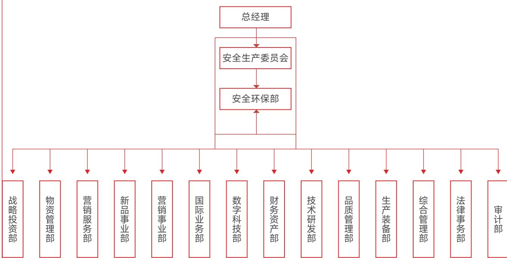

flowchart

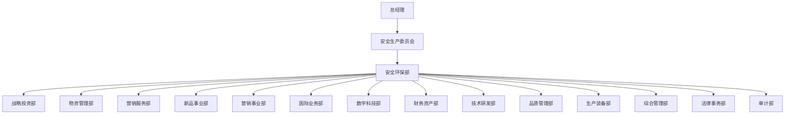
```mermaid
graph TD
  A["总经理"] --> B["安全生产委员会"]
  B --> C["安全环保部"]
  C --> D["战略投资部"]
  C --> E["物资管理部"]
  C --> F["营销服务部"]
  C --> G["新品事业部"]
  C --> H["营销事业部"]
  C --> I["国际业务部"]
  C --> J["数字科技部"]
  C --> K["财务资产部"]
  C --> L["技术研发部"]
  C --> M["品质管理部"]
  C --> N["生产装备部"]
  C --> O["综合管理部"]
  C --> P["法律事务部"]
  C --> Q["审计部"]
```

职业健康与安全生产责任体系  
在职业健康方面，公司通过人力资源与职业卫生管理部门系统开展职业卫生培训，重点普及相关法规、操作规程及防护知识，指导员工规范使用防护设备与个体防护用品，全面增强职业健康保障能力，促进公司安全生产与职业健康管理的协同发展，为员工生命安全与企业稳定运营提供系统化支撑。  
报告期内，公司开展职业健康与安全培训共1场，参与培训员工181人次。

报告期内，公司已通过ISO 45001职业健康安全管理体系认证。远程股份子公司正式投产运营场所获得ISO 45001职业健康安全管理体系认证的覆盖率达100%。

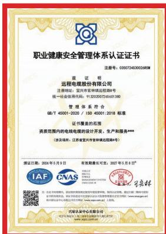

text_image

职业健康安全管理体系认证证书
注册号：030572453002688M
国 证 明
远程电缆股份有限公司
注册地址：宜兴市布林区经益路28号
统一社会信用代码：913203007854501390
管理体系符合
GB/T 45001-2020 / ISO 45001:2018 标准
证书覆盖的范围
资源范围内的电线电缆的设计开发、生产和服务***
（涉及场所：江西省宜兴市钟楼区路28号）
颁证日期：2024年5月9日
有效期限最长可连：2027年5月8日*
IAF
GNAS
Ji Jia Xie
中国证券报
《上海证券报》
《证券时报》
《证券日报》
《证券时报》
《证券日报》
《证券时报》
《证券日报》
《证券时报》
《证券日报》
《证券时报》
《证券日报》
《证券时报》
《证券日报》
《证券时报》
《证券日报》
《证券时报》
《证券日报》
《证券时报》
《证券日报》
《证券时报》
《证券日报》
《证券时报》
《证券报》
《证券日报》
《证券时报》
《证券日报》
《证券时报》
《证券日报》
《证券时报》
《证券日报》
《证券时报》
《证券日报》
《证券时报》
《证券日报》
《证券时报》
《证券日报》
《证券时报》
《证券日报》
《证券时报》
《证券日报》
《证券时报》
《证券日报》
《证券报》
《证券日报》
《证券时报》
《证券日报》
《证券时报》
《证券日报》
《证券时报》
《证券日报》
《证券时报》
《证券日报》
《证券时报》
《证券日报》
《证券时报》
《证券日报》
《证券时报》
《证券日报》
《证券时报》
《证券日报》
《证券时报》
《证券报》
《证券报》
《证券日报》
《证券时报》
《证券日报》
《证券时报》
《证券日报》

职业健康安全管理体系认证

# 职业健康与安全生产教育培训

远程股份将安全生产与职业健康管理全面纳入常态化管理体系，构建起“理论授课、案例剖析、实操演练”相结合的立体化培训机制。公司管理层定期参与督导，并结合安全事故警示片深化学习效果，切实筑牢安全生产防线。同时，公司积极组织开展“安全生产月”“安全知识竞赛”等专题活动，持续提升全员安全意识和应急能力。

# 关键绩效

# 案例

# 行车安全操作培训

为切实提升员工安全操作意识，有效预防安全事故发生。2025年7月1日，远程股份组织200余名员工开展了行车安全操作专项培训。培训围绕行车前检查、安全操作规范、事故分析与警示等核心内容进行介绍，并通过图文结合的方式，生动展示了错误操作与正确方法的对比，让受训人员深刻认识到规范操作的必要性和重要性。  
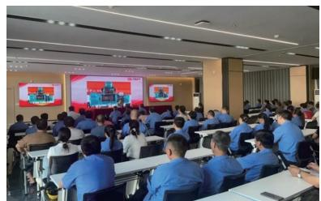

natural_image

Interior view of a conference hall with attendees seated at desks facing a large screen displaying a presentation (no visible text or signage)

<table><tr><td>关键指标</td><td>单位</td><td>2024年</td><td>2025年</td></tr><tr><td>安全教育培训覆盖比率</td><td>%</td><td>100</td><td>100</td></tr><tr><td>安全风险防护培训覆盖率</td><td>%</td><td>100</td><td>100</td></tr></table>

# 战略

远程股份将员工生命健康视为企业发展的根基，公司恪守国家职业健康安全相关法律法规。公司结合法律法规、行业特性及自身生产运营情况，系统地识别公司生产活动中的潜在职业健康风险与机遇。公司通过制定针对性的风险防控措施，切实保障员工职业安全权益，驱动企业可持续发展。

<table><tr><td>风险类型</td><td>描述</td><td></td><td colspan="2">财务影响说明</td><td>发生可能性</td><td>影响大小</td><td>影响时间范围</td><td>影响价值链环节</td><td>应对措施</td></tr><tr><td>法律风险</td><td>公司若对安全生产规定缺乏深刻理解,未能有效实施相关措施,可能会使公司遭受重大罚款、勒令限期整改等处罚,阻碍公司的日常运营。</td><td>令限期整</td><td colspan="2">营收减少</td><td>中</td><td>中</td><td>长期</td><td>运营</td><td>1.安全环保处负责定期组织员工进行职业健康与生产方面的培训;2.组织开展安全生产宣贯活动。</td></tr><tr><td>声誉风险</td><td>若公司忽视安全生产管理,导致发生重大安全事故,将直接导致市场对公司的信心大幅下挫、品牌形象严重受损。可能导致进一步削弱公司的融资吸引力及业务拓展潜力,带来长期且深远的负面影响。</td><td></td><td colspan="2">收入减少</td><td>中</td><td>中</td><td>长期</td><td>运营</td><td>1.制定《安全生产管理制度汇编》等相关控制程序;2.建立安全生产责任体系,明确各部门安全生产责任;3.制定应急预案,定期组织开展应急演练,开展安全生产宣贯活动。</td></tr><tr><td>营运风险</td><td>若公司群体发生职业健康或重大安全生产事故,监管机构可强制企业停产,导致订单无法交付,违约金。同时需支付受伤员工的医疗费用、工伤赔偿金,将大幅增加公司的运营成本。</td><td>面临巨额</td><td colspan="2">营运成本增加面临罚款</td><td>中</td><td>中</td><td>短期</td><td>运营</td><td>1.制定《安全风险辨识、评估及管控制度》等相关管理制度;2.加强员工安全教育培训;3.设置公告栏,公布有关职业病防治等相关管理程序;4.设立岗位职业病危害告知。</td></tr><tr><td>市场风险</td><td>若发生重大安全事故或群体性职业病事件易成为新闻焦点,会遭到消费者抵制或被移除供应商名单,流失客户。</td><td></td><td colspan="2">营收减少</td><td>低</td><td>中</td><td>长期</td><td>运营</td><td>1.建立安全生产责任制,建立完善的职业健康安全生产管理流程体系。2.定期开展职业健康体检。</td></tr><tr><td>机遇类型</td><td>描述</td><td></td><td colspan="2">财务影响说明</td><td>发生可能性</td><td>影响大小</td><td>影响时间范围</td><td>影响价值链环节</td><td>应对措施</td></tr><tr><td>管理效率机遇</td><td>优化职业健康安全的财务预算与管理流程,不仅能提高公司的整体运营效率,还能有效降低事故发生的风险,从而避免由事故引发的高额财务成本。</td><td>发生的风</td><td colspan="2">成本降低</td><td>中</td><td>中</td><td>中长期</td><td>运营</td><td>采用安全数字化管理台账,提高职业健康安全管理的效率。</td></tr><tr><td colspan="2"></td><td colspan="2"></td><td colspan="6"></td></tr></table>

# 影响、风险和机遇管理

远程股份将安全生产风险管理融入生产运营的各个环节，致力于构建全面的安全风险管理体系和应急管理机制。为有效保障员工健康与安全，由公司主要负责人领导，安环处负责风险识别评价和风险控制的工作，并组织各部门开展相关风险管理工作，以有效应对职业健康与安全相关影响、风险和机遇。

# 管理流程

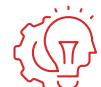  
风险识别  
● 风险识别涵盖公司所有活动、产品或服务，考虑常规与非常规活动、人员、场所及设施，依据法规、方针、经验和事故信息。相关人员通过检查、观察等方式，辨识物的不安全状态、人的不安全行为和管理缺陷。

  
风险评估  
- 采用LEC评价法，评估风险发生的可能性、暴露频率及后果，确定风险等级，形成《较大以上安全风险清单》。

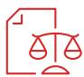  
风险控制  
● 遵循消除、预防等原则，制定工程技术、管理、培训等控制措施，评审控制措施的有效性，确保风险降低至可接受水平。

  
风险管控更新

\- 根据内外部变化，如法规变更、技术改进等，及时更新风险信息，修订风险清单和管理方案，确保风险管控措施的有效性。

# 指标与目标

为贯彻落实“安全第一、预防为主、综合治理”的安全生产方针，公司实施责任到人的安全生产目标，并与负责人签订安全生产目标责任书，以减少安全事故发生，公司安全生产目标如下：

<table><tr><td>序号</td><td>目标</td><td>2025年达成情况</td></tr><tr><td>1</td><td>杜绝重大的伤亡、交通、火灾、设备、信息安全、网络安全等事故。</td><td>达标</td></tr><tr><td>2</td><td>因工重伤事故、职业病频率控制在0.2‰以下,轻伤事故频率控制在1.2‰以下,火灾、交通、设备资产等直接经济损失不得超过1万元(含)。</td><td>达标</td></tr></table>

<table><tr><td>序号</td><td>目标</td><td>2025年达成情况</td></tr><tr><td>3</td><td>作业环境有害物质控制在国家规定允许的浓度和强度标准范围内。</td><td>达标</td></tr><tr><td>4</td><td>危险场所、特种设备按期年检率100%达标。不超期使用特种危险设备。</td><td>达标</td></tr><tr><td>5</td><td>企业负责人及安全管理员须落实安全责任,完成三级培训,强化特种作业培训。确保中层干部、班组长参训率及全员持证上岗率均达100%,对转岗、复工人员及时补训。</td><td>达标</td></tr></table>

<table><tr><td>关键指标</td><td>单位</td><td>2024年</td><td>2025年</td></tr><tr><td>因工亡故比率</td><td>%</td><td>0</td><td>0</td></tr><tr><td>因工作关系死亡人数</td><td>人</td><td>0</td><td>0</td></tr><tr><td>其中:公司雇员</td><td>人</td><td>0</td><td>0</td></tr><tr><td>其中:承包商员工</td><td>人</td><td>0</td><td>0</td></tr><tr><td>特种作业人员持证上岗率</td><td>%</td><td>100</td><td>100</td></tr><tr><td>工伤保险的投入金额</td><td>万元</td><td>45.52</td><td>46.8</td></tr></table>

# 职业健康与安全管理实践

# 应急管理

为提升安全生产事故应对能力，公司依据《中华人民共和国安全生产法》等法律法规，结合自身实际制定了《安全生产事故应急预案》，系统规范应急管理流程，旨在提高救援响应与协调效率，增强对重大事故的处置能力，有效预防安全灾害，保障人员安全，最大限度减少对公司的影响。

同时，公司每年组织开展安全生产应急演练，检验预案可行性与应急响应能力，并根据演练结果持续完善预案内容与处置流程，切实保障公司安全生产秩序持续稳定。

# 案例

# 安全生产月活动

# #

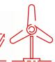

2025年6月，远程股份以“人人讲安全、个个会应急”为主题，组织开展安全生产系列活动。活动期间，公司通过上级督查与风险排查、知识竞赛、宣传培训、专题讲座及消防实战演练等多种形式，结合案例剖析与实操体验，切实提升了全员安全防范意识与应急处理能力，为安全生产奠定了坚实基础。

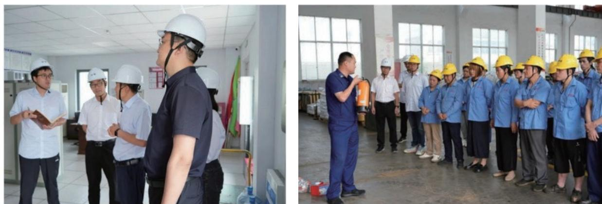

# 隐患排查

公司高度重视安全生产事故隐患的排查与治理，依据相关法规制定《事故隐患排查与治理管理制度》，明确各级职责，规范从排查、报告到整改的全过程管理，并建立完整的隐患管理档案，确保隐患及时有效消除。

# 关键绩效

报告期内，公司及下属子公司共同开展安全生产隐患排查工作，整改率100%。

# 案例

# 节前隐患排查

# #

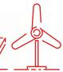

为确保公司安全生产形势持续稳定，2025年4月29日，公司领导带队深入生产车间、仓库、配电室等重点区域，开展节前安全专项检查。检查聚焦隐患排查与责任落实，针对发现的问题现场提出整改意见，要求相关责任人立即组织整改，实现隐患早发现、早处理，坚决防范安全事故发生。

公司将持续推进安全隐患排查治理常态化机制，不断强化全员安全责任意识，提升整体安全管理水平，为员工创造安全稳定的工作环境，为公司高质量发展提供坚实保障。

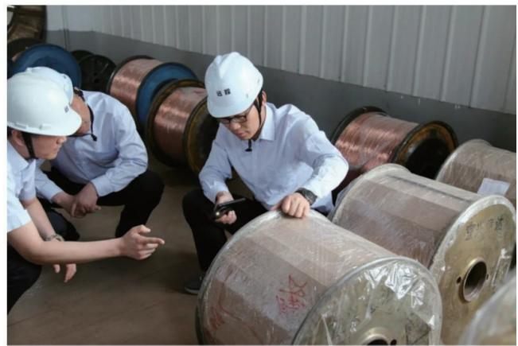

natural_image

Two engineers in white hard hats inspecting large spools of copper wire in a warehouse (no visible text or symbols)

# 女职工劳动保护

公司高度重视女职工权益保障与身心健康保护，制定了《女职工劳动保护规定》，全面规范女职工特殊劳动权益保障。规定明确禁止安排女职工从事危害生理机能的工作；对孕期及哺乳期女职工实施专项保护，切实守护女职工合法权益与身心健康。

# 相关方安全管理

公司为了规范相关方的安全管理，确保承包商与供应商在公司内的活动安全、健康、环保，制定《承包商、供应商安全管理制度》。安全环保部为相关方安全管理归口部门，负责对相关方进行资质认定、签订安全协议，并对相关方的安全进行监督、检查及评估。同时，公司对相关方在施工前进行安全教育培训，并建立合格供应商名录，加强相关方的安全管理工作。

职业病危害告知

<table><tr><td>劳动合同告知</td><td>将工作过程中可能产生的职业病危害及其后果、职业病危害防护措施等如实告知</td></tr><tr><td>公告栏告知</td><td>公司门口、作业现场醒目位置设置公告栏</td></tr><tr><td>岗位培训告知</td><td>岗前、岗中职业安全卫生教育培训</td></tr><tr><td>现场警示告知</td><td>设置警示标识、警示线、警示信号</td></tr></table>

# 职业健康体检

公司严格恪守职业健康监护相关规定，每年定期组织员工开展职业健康体检，覆盖上岗前、在岗期间、离岗时三个关键阶段，切实保障员工职业健康权益。若发现员工存在职业禁忌，即刻为其调整工作岗位，并妥善跟进后续事宜；对需复查及医学观察的员工，及时统筹安排相关检查与观察工作，全方位守护员工身心健康。

# 关键绩效

报告期内，公司共有213名员工参与职业健康体检。

<table><tr><td>关键指标</td><td>单位</td><td>2024年</td><td>2025年</td></tr><tr><td>职业病危害因素检测率</td><td>%</td><td>100</td><td>100</td></tr></table>

# 行动回馈社会

远程股份积极投身社会公益与乡村振兴事业，以切实行动履行企业社会责任，致力推动社会、环境与经济的协调可持续发展。

# 社会公益事业

远程股份始终将履行社会责任视为企业发展的重要使命，为此公司系统组建了志愿服务团队，并持续完善志愿者激励与保障机制。公司通过向参与公益活动的员工发放专项补贴、开展定期评优表彰，有效激发员工投身社会服务的积极性与持续性。志愿服务团队围绕社区帮扶、教育支持等领域开展了多项公益活动，以实际行动回馈社会，展现了企业的担当与温度，为社会公益事业注入了坚实的企业力量。

# 关键绩效

报告期内，公司积极响应“宜慈惠民助困”项目，为困难人士送去温暖，公司捐赠8,765元。同时公司鼓励员工积极参与无偿献血活动，为无偿献血员工发放营养补助。

# 助力乡村振兴

远程股份积极响应国家乡村振兴战略，继续开展苏陕扶贫项目，采购苹果扶贫助贫。

# 关键绩效

报告期内，公司共采购650箱，合计金额达68,250元，助力当地果农增收。

同时，公司与官林镇滨湖村签订《村企联建落地项目合同书》，深入推进“万企联万村、共走振兴路”行动。公司依托自身技术、人才及当地电线电缆产业优势进行投资，促进当地产业转型升级，助力官林打造“中国电缆城”，提升村集体收入，吸纳本地村民100人左右，助力当地村民就业，实现互促互进、共赢发展的良好局面。

指标索引

<table><tr><td colspan="2">报告章节</td><td>《全球可持续发展报告标准》(GRI Standards)</td><td>《中国企业可持续发展报告指南(CASS-ESG 6.0)之一般框架》</td><td>《深圳证券交易所上市公司自律监管指引第17号——可持续发展报告(试行)》</td></tr><tr><td colspan="2">关于本报告</td><td>2-1,2-2,2-3</td><td>P1.1-1.2</td><td>/</td></tr><tr><td colspan="2">走进远程股份</td><td>2-6</td><td>P3.1-3.3</td><td>/</td></tr><tr><td rowspan="6">治理强基稳健致远</td><td>可持续发展治理</td><td>2-9,2-14,3-1,3-2,3-3</td><td>G1.1.1-1.1.7,G1.1.9,G1.2,G1.3</td><td>第九条,第十九条,第五十一条,第五十三条</td></tr><tr><td>坚持党建引领</td><td>/</td><td>/</td><td>/</td></tr><tr><td>科学规范治理</td><td>3-1,3-2,3-3</td><td>G1.1,G1.2</td><td>第十二条</td></tr><tr><td>优化内控合规</td><td>207-2</td><td>G1.2.3,G1.2.4</td><td>/</td></tr><tr><td>强化投关管理</td><td>2-27</td><td>G1.7,G1.8</td><td>/</td></tr><tr><td>秉持商业道德</td><td>205-2</td><td>G2.1</td><td>第五十四条,第五十五条,第五十六条</td></tr><tr><td rowspan="5">绿色智造缆系生态</td><td>应对气候变化</td><td>2-27,3-3,305-1,305-2,305-4,305-5</td><td>E1.1.1-E1.1.4,E1.1.7,E1.1.8</td><td>第二十一条,第二十四条</td></tr><tr><td>优化环境管理</td><td>2-23,2-27</td><td>E2.1.1,E2.4.1-2.4.4</td><td>第三十三条</td></tr><tr><td>合理资源配置</td><td>2-9,2-27,3-3,302-1,302-3,302-4,303-3</td><td>E3.1.1-E3.1.5</td><td>第三十五条,第三十六条</td></tr><tr><td>三废防治</td><td>303-4,306-1,306-2,306-3,306-4,306-5</td><td>E2.1.5,E2.1.6,E2.2.1-E2.2.7</td><td>第三十条,第三十一条</td></tr><tr><td>生物多样性与生态系统保护</td><td>304-2</td><td>E2.3.2,E2.3.3</td><td>第三十二条</td></tr><tr><td rowspan="5">价值共缆产业共荣</td><td>创新驱动发展</td><td>203-2</td><td>S2.1.1-2.1.12</td><td>第十一条,第四十一条,第四十二条</td></tr><tr><td>链动高效协同</td><td>308-1,414-1</td><td>S3.1.1-3.1.4</td><td>第十一条,第四十四条,第四十五条</td></tr><tr><td>品质卓越追求</td><td>417-1,417-2</td><td>S3.3.1-3.3.3</td><td>第十一条,第四十七条</td></tr><tr><td>卓越客户体验</td><td>418-1</td><td>S3.3.4,S3.3.5,S3.3.6</td><td>第四十七条</td></tr><tr><td>信息安全无忧</td><td>3-3</td><td>S3.4.1-3.4.2</td><td>第四十八条</td></tr><tr><td rowspan="5">同芯共益携手同行</td><td>平等合规用人</td><td>401-1,401-2,401-3</td><td rowspan="3">S4.1.3、S4.1.12</td><td rowspan="3">第四十九条,第五十条</td></tr><tr><td>员工民主建设</td><td>/</td></tr><tr><td>相伴员工成长</td><td>404-2,404-3</td></tr><tr><td>职业健康与安全</td><td>403-1,403-2,403-5,403-7,403-8</td><td>S4.2.1-S4.2.6</td><td>/</td></tr><tr><td>行动回馈社会</td><td>203-1,413-1,415-1</td><td>S1.1.2,S1.1.3,S1.2.1-1.2.4</td><td>第三十九条,第四十条</td></tr><tr><td rowspan="2">附录</td><td>指标索引</td><td>/</td><td>A3</td><td>第五十七条</td></tr><tr><td>反馈意见表</td><td>/</td><td>A6</td><td>/</td></tr></table>

《央企控股上市公司ESG专项报告编制研究》指标索引

<table><tr><td>披露内容</td><td>所在章节、页码或其他说明</td></tr><tr><td>企业及报告基本信息</td><td>关于本报告</td></tr><tr><td>ESG管理</td><td>可持续发展治理</td></tr><tr><td>ESG风险与机遇</td><td>应对气候变化、合理资源配置、研发驱动发展、链动高效协同、品质卓越追求、职业健康与安全</td></tr><tr><td>利益相关方沟通</td><td>可持续发展治理</td></tr><tr><td>实质性议题评估</td><td>可持续发展治理</td></tr></table>

<table><tr><td colspan="4">环境范畴指标</td></tr><tr><td>一级指标</td><td>二级指标</td><td>三级指标</td><td>所在章节</td></tr><tr><td rowspan="9">资源消耗</td><td rowspan="4">水资源</td><td>E.1.1.1新鲜水用量</td><td>合理资源配置</td></tr><tr><td>E.1.1.2循环水用量</td><td>/</td></tr><tr><td>E.1.1.3循环用水占比</td><td>/</td></tr><tr><td>E.1.1.4水资源消耗强度</td><td>合理资源配置</td></tr><tr><td>物料</td><td>/</td><td>/</td></tr><tr><td rowspan="3">能源</td><td>E.1.3.1化石能源消耗量</td><td>合理资源配置</td></tr><tr><td>E.1.3.4能源消耗总量</td><td>合理资源配置</td></tr><tr><td>E.1.3.5能源消耗强度</td><td>合理资源配置</td></tr><tr><td>包装材料</td><td>/</td><td>/</td></tr><tr><td rowspan="9">污染防治</td><td rowspan="2">废水</td><td>E.2.1.1废水排放达标情况</td><td>三废防治</td></tr><tr><td>E.2.1.3废水排放量</td><td>三废防治</td></tr><tr><td rowspan="2">废气</td><td>E.2.2.1废气排放达标情况</td><td>三废防治</td></tr><tr><td>E.2.2.2废气污染排放量</td><td>三废防治</td></tr><tr><td rowspan="5">固体废物</td><td>E.2.3.1固体废物处置依法合规情况</td><td>三废防治</td></tr><tr><td>E.2.3.2一般工业废固管理</td><td>三废防治</td></tr><tr><td>E.2.3.3一般工业废固处置量</td><td>三废防治</td></tr><tr><td>E.2.3.4危险废物管理</td><td>三废防治</td></tr><tr><td>E.2.3.5危险废物处置量</td><td>三废防治</td></tr><tr><td rowspan="7">气候变化</td><td rowspan="4">温室气体排放</td><td>E.3.1.2温室气体排放管理</td><td>应对气候变化</td></tr><tr><td>E.3.1.3范围一排放</td><td>应对气候变化</td></tr><tr><td>E.3.1.4范围二排放</td><td>应对气候变化</td></tr><tr><td>E.3.1.6温室气体排放强度</td><td>应对气候变化</td></tr><tr><td rowspan="2">减排管理</td><td>E.3.2.1温室气体减排管理</td><td>应对气候变化</td></tr><tr><td>E.3.2.2温室气体减排量</td><td>应对气候变化</td></tr><tr><td>气候风险管理</td><td>E3.4.1气候风险管理</td><td>应对气候变化</td></tr><tr><td>生物多样性</td><td>生产、服务和产品对生物多样性的影响</td><td>E.4.1.1生产、服务和产品对生物多样性的影响</td><td>生物多样性与生态保护</td></tr><tr><td rowspan="8">资源与环境管理制度措施</td><td>低碳发展目标制定与战略措施</td><td>E.5.1.1低碳发展目标制定与战略措施</td><td>应对气候变化,合理资源配置</td></tr><tr><td rowspan="3">资源管理措施</td><td>E.5.2.1水资源使用管理</td><td>合理资源配置</td></tr><tr><td>E.5.2.2物料管理</td><td>合理资源配置</td></tr><tr><td>E.5.2.3能源使用与节能管理</td><td>合理资源配置</td></tr><tr><td>绿色环保行动与措施</td><td>E.5.4.4绿色办公和运营</td><td>合理资源配置</td></tr><tr><td rowspan="2">绿色低碳认证</td><td>E.5.5.1环境管理体系认证</td><td>优化环境治理</td></tr><tr><td>E.5.5.3绿色低碳产品与服务认证</td><td>应对气候变化</td></tr><tr><td>环境领域合法合规</td><td>E.5.6.1突发环境事件应急预案</td><td>优化环境治理</td></tr></table>

<table><tr><td></td><td></td><td>社会范畴指标</td><td></td></tr><tr><td>一级指标</td><td>二级指标</td><td>三级指标</td><td>所在章节</td></tr><tr><td rowspan="14">员工权益</td><td rowspan="3">员工招聘与就业</td><td>S1.1.1企业招聘政策及执行情况</td><td>平等合规用人</td></tr><tr><td>S1.1.2员工结构</td><td>平等合规用人</td></tr><tr><td>S1.1.3避免雇佣童工或强制劳动</td><td>平等合规用人</td></tr><tr><td rowspan="4">员工薪酬与福利</td><td>S1.2.1薪酬理念与政策</td><td>平等合规用人</td></tr><tr><td>S1.2.2工作时间和休息休假</td><td>平等合规用人</td></tr><tr><td>S1.2.3薪酬福利保障情况</td><td>平等合规用人</td></tr><tr><td>S1.2.4员工民主管理</td><td>员工民主建设</td></tr><tr><td rowspan="4">员工健康与安全</td><td>S1.3.1员工职业健康安全管理</td><td>职业健康与安全</td></tr><tr><td>S1.3.2员工安全风险防控</td><td>职业健康与安全</td></tr><tr><td>S1.3.3安全事故及工伤应对</td><td>职业健康与安全</td></tr><tr><td>S1.3.4员工关爱与帮扶</td><td>平等合规用人</td></tr><tr><td rowspan="2">员工发展与培训</td><td>S1.4.1员工激励及晋升政策</td><td>相伴员工成长</td></tr><tr><td>S1.4.2员工教育与培训</td><td>相伴员工成长</td></tr><tr><td>员工满意度</td><td>S1.5.1员工满意度调查</td><td>员工民主建设</td></tr><tr><td rowspan="9">产品与服务管理</td><td rowspan="2">产品安全与质量</td><td>S2.1.1生产规范管理政策与措施</td><td>品质卓越追求</td></tr><tr><td>S2.1.2质量管理</td><td>品质卓越追求</td></tr><tr><td rowspan="3">客户服务与权益</td><td>S2.2.1客户满意度</td><td>卓越客户体验</td></tr><tr><td>S2.2.2客户投诉及处理情况</td><td>卓越客户体验</td></tr><tr><td>S2.2.3客户信息及隐私保护</td><td>卓越客户体验</td></tr><tr><td rowspan="4">创新发展</td><td>S2.3.1研发与创新管理体系</td><td>创新驱动发展</td></tr><tr><td>S2.3.2研发投入</td><td>创新驱动发展</td></tr><tr><td>S2.3.3创新成果</td><td>创新驱动发展</td></tr><tr><td>S2.3.4知识产权保护</td><td>创新驱动发展</td></tr></table>

<table><tr><td rowspan="3">供应链安全与管理</td><td rowspan="2">供应商管理</td><td>S3.1.1供应商选择与管理</td><td>链动高效协同</td></tr><tr><td>S3.1.2供应商数量与分布</td><td>链动高效协同</td></tr><tr><td>供应链环节管理</td><td>S3.2.1供应链管理政策及措施</td><td>链动高效协同</td></tr><tr><td rowspan="5">社会贡献</td><td>缴纳税费情况</td><td>S4.1.1缴纳税费情况</td><td>/</td></tr><tr><td>社区共建</td><td>S4.2.1参与当地社区建设的政策措施</td><td>行动回馈社会</td></tr><tr><td rowspan="2">社会公益活动</td><td>S4.3.1参与社会公益活动的政策措施</td><td>行动回馈社会</td></tr><tr><td>S4.3.2参与社会公益活动的投入及成效</td><td>行动回馈社会</td></tr><tr><td>国家战略响应</td><td>S4.4.2乡村振兴与区域协同发展</td><td>行动回馈社会</td></tr></table>

<table><tr><td></td><td></td><td>治理范畴指标</td><td></td></tr><tr><td>一级指标</td><td>二级指标</td><td>三级指标</td><td>所在章节</td></tr><tr><td rowspan="4">治理策略与组织架构</td><td>治理策略及流程</td><td>G1.1.4党建引领</td><td>坚持党建引领</td></tr><tr><td rowspan="2">组织构成及职能</td><td>G1.2.2董事会、监事会和管理层组织结构与职能</td><td>科学规范治理</td></tr><tr><td>G1.2.3董事会、监事会和管理层的任命程序及构成</td><td>科学规范治理</td></tr><tr><td>薪酬管理</td><td>/</td><td>科学规范治理</td></tr><tr><td rowspan="5">规范治理</td><td rowspan="2">内部控制</td><td>G2.1.1内部审计</td><td>科学规范治理</td></tr><tr><td>G2.1.2内部控制结构、机制和流程</td><td>/</td></tr><tr><td rowspan="2">廉洁建设</td><td>G2.2.1廉洁建设制度规范</td><td>秉持商业道德</td></tr><tr><td>G2.2.2廉洁建设措施成效</td><td>秉持商业道德</td></tr><tr><td>公平竞争</td><td>/</td><td>/</td></tr><tr><td rowspan="4">投资者关系管理与股东权益</td><td>投资者关系管理</td><td>G3.1.2投资者沟通</td><td>可持续发展治理</td></tr><tr><td rowspan="2">股东权益</td><td>G3.2.1股东(大)会情况</td><td>科学规范治理</td></tr><tr><td>G2.2.2股东沟通情况</td><td>可持续发展治理</td></tr><tr><td>债权人权益</td><td>G3.3.2债券市场履约情况</td><td>强化投关管理</td></tr><tr><td rowspan="2">信息披露透明度</td><td>信息披露制度</td><td>G4.1.1财务信息披露</td><td>强化投关管理</td></tr><tr><td>信息披露质量</td><td>/</td><td>强化投关管理</td></tr><tr><td rowspan="3">合规经营与风险管理</td><td rowspan="2">合规经营</td><td>G5.1.1合规经营制度</td><td>优化内控合规</td></tr><tr><td>G5.1.2合规体系建设情况</td><td>优化内控合规</td></tr><tr><td>风险管理</td><td>G5.2.1风险识别与预警</td><td>优化内控合规</td></tr></table>

# 反馈意见表

尊敬的读者：

非常感谢您阅读本报告。我们非常重视并期望聆听您对本报告的反馈意见。您的意见和建议，是我们持续提高企业ESG信息披露水平、推进企业ESG管理和实践的重要依据。我们欢迎并由衷感谢您提出宝贵意见！

1.您对我们履行ESG的总体评价是：

□ 非常好 □ 好 □ 一般 □ 较差 □ 差

2.您对本报告的总体评价是：

□ 非常好 □ 好 □ 一般 □ 较差 □ 差

3.您认为我们在利益相关方沟通方面做得如何？

□ 非常好 □ 好 □ 一般 □ 较差 □ 差

4.您认为我们在产品责任方面做得如何？

□ 非常好 □ 好 □ 一般 □ 较差 □ 差

5.您认为我们在环境、安全和职业健康方面做得如何？

□ 非常好 □ 好 □ 一般 □ 较差 □ 差

6.您认为我们在员工责任方面做得如何？

□ 非常好 □ 好 □ 一般 □ 较差 □ 差

7.您认为我们在ESG方面做得如何？

□ 非常好 □ 好 □ 一般 □ 较差 □ 差

8.您对我们履行ESG及本报告有何意见和建议？

您可通过以下方式联系我们：

通信地址：江苏省宜兴市官林镇远程路8号

联系电话：0510-80777896