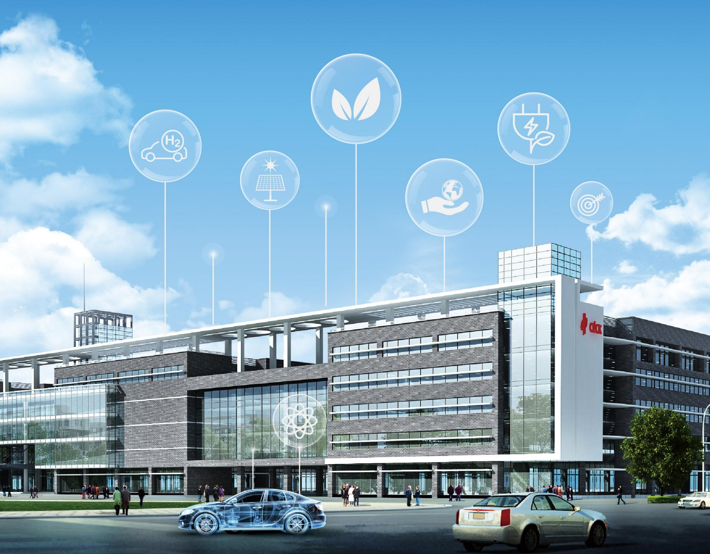

natural_image

Exterior view of a modern office building with circular icons representing energy and sustainability themes (no text or symbols on buildings)

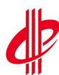

CLICK

# 2025

# 可持续发展暨 ESG 报告

2025 SUSTAINABILITY & ESG REPORT

# 目录 CONTENTS

关于本报告 01

董事长致辞 03

走进可立克 05

# 01

# 携手共进

# 引领可持续发展

可持续发展管理 09

利益相关方沟通 10

重要性议题分析 11

# 02

# 稳健治理

# 夯实发展根基

公司治理 15

内控合规与风险管理 17

投资者沟通与信息披露 18

商业道德与公平竞争 19

# 03

# 责任实践

# 推动价值共创

创新驱动高质量发展 25

产品质量与安全 28

绿色设计与可持续产品 33

负责任供应链管理 33

客户服务 36

数据安全与客户隐私保护 38

员工权益 41

员工培训与发展 49

职业健康与安全 52

# 04

# 绿色实践

# 守护生态环境

环境合规管理 59

污废排放与处理 62

能源资源利用 67

应对气候变化 70

# 附录

关键绩效表 73

报告索引表 78

读者反馈表 80

# 关于本报告

本报告是深圳可立克科技股份有限公司（以下简称“可立克”“公司”或“我们”）发布的首份可持续发展暨ESG报告（以下简称“本报告”）。本报告依据客观、规范、透明、全面的原则，系统阐述了公司2025年度在环境、社会和公司治理（ESG）方面的实践与绩效，以回应利益相关方的期望与关切，并寻求共同推进可持续发展。

# 报告范围

本报告以深圳可立克科技股份有限公司为主体，包括下属分子公司，除特别说明外，本报告范围与本公司年报范围保持一致。

# 时间范围

2025 年 1 月 1 日至 12 月 31 日（下称“报告期”）。为提升报告的可比性与前瞻价值，部分论述适当延伸至本年度之外。本报告按年度发布，周期与公司财务年度同步。

# 编制参考及依据

《深圳证券交易所上市公司自律监管指引第 17 号——可持续发展报告（试行）》

全球报告倡议组织《GRI 可持续发展报告标准（GRI Standards）》

联合国可持续发展目标（SDGs）

# 数据说明

本报告所涉信息与数据均采集自公司内部实际运营记录、正式统计文件、年度财务报告及经核实的第三方信息等，并经相关职能部门汇总与审核。报告内容如与公司年度财务报告存在差异，均以财务报告为准。除特别说明外，所有货币金额均以人民币为计量单位。

社会绩效中的职业健康与安全相关绩效，环境绩效中除温室气体排放外的环境绩效，仅涵盖惠州市可立克科技有限公司、惠州市可立克电子有限公司、英德市可立克电子有限公司、信丰可立克科技有限公司、安远可立克电子有限公司、安徽可立克科技有限公司6家子公司数据。

# 释义说明

为便于表述和阅读，本报告中的深圳可立克科技股份有限公司及其附属公司简称为“可立克”或“公司”或“我们”。如确有指明，所使用的词汇与公司2025年年度报告具有相同含义。

# 确认及批准

本报告经公司董事会审议批准，董事会承诺对报告内容进行监督，并确保其不存在任何虚假记载或误导性陈述，并对其内容的真实性、准确性和完整性负责。

# 报告获取

本报告可以在公司网站（https://www.clickele.cn）、深交所网站（http://www.szse.cn）查阅和下载。

# 董事长致辞

2025 年，是可立克在夯实基础、稳步提升中持续推进高质量发展的关键一年。公司围绕主业发展与能力建设，统筹推进经营质量提升与可持续发展管理，将规范运营、技术创新与责任担当贯穿于生产经营各环节，推动企业发展更加稳健、更加具备长期价值。

报告期内，公司聚焦核心业务领域，持续强化技术研发与产品竞争力，在磁性元器件及电源相关业务方面不断深化布局。通过优化产品结构与客户结构，公司在巩固既有市场基础的同时，积极拓展新能源、数据中心等重点应用领域，逐步形成更加多元、协调的发展格局。研发投入与成果转化协同推进，进一步支撑了公司经营效率与盈利能力的持续提升。

围绕发展方式转型与长期价值提升，公司将绿色低碳要求融入生产运营全过程，结合磁性元器件及电源产品制造特点，持续推进节能降耗与精细化管理，通过关键工序优化、设备升级及能源使用管理，不断提升资源利用效率，降低生产过程中的环境影响。同时，公司紧跟新能源及高效用能场景的发展趋势，探索清洁能源应用与绿色制造路径，推动生产体系向更加高效、低碳的方向演进。

在夯实企业发展基础的过程中，公司坚持以人为本，围绕制造与研发协同需求，持续完善员工发展通道与专业能力建设机制，强化安全生产与职业健康管理，保障生产体系稳定运行与技术能力持续积累。同时，公司依托长期服务行业客户的经验，不断深化与核心客户及供应链伙伴的协同关系，推动构建更加稳定、透明的供应链体系，支撑业务在新能源、数据中心等重点领域的持续拓展，带动价值链整体效率与质量的同步提升。

以支撑业务规模扩展与运营复杂度提升为导向，公司持续完善治理结构与内部控制体系，强化合规管理与风险防控机制建设，不断提升规范运作水平。在此基础上，公司将可持续发展相关要求逐步融入经营决策与管理流程之中，使其更好匹配多业务场景与全球化客户需求，推动治理体系与发展目标形成更加系统、有效的协同。

2025 年，公司系统推进可持续发展管理工作，围绕管理架构搭建、重点议题识别及数据基础建设等方面开展实践，并完成首份可持续发展报告的编制与披露，进一步提升了信息披露的规范性与透明度。公司将持续对标监管要求与行业实践，不断完善管理体系，提升可持续发展工作的系统性与有效性。

展望未来，可立克将坚持以高质量发展为导向，持续深化技术创新与业务拓展，稳步推进绿色转型与管理提升，不断增强核心竞争力与发展韧性。同时，公司也将进一步推动可持续发展理念与经营实践深度融合，持续提升企业长期价值创造能力，努力实现企业发展与经济、社会与环境的协调共进。

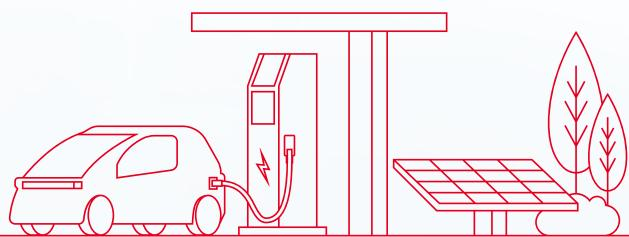

natural_image

Line drawing of an electric vehicle charging at a station with solar panels and trees (no text or symbols)

# 走进可立克

# 公司简介

深圳可立克科技股份有限公司成立于 2004 年，是全球著名的磁性元件和电源技术解决方案供应商，公司于 2015 年上市，股票代码 002782，是国内首家磁性元件行业上市公司，电子元件百强企业，广东企业 500 强，总部设立于中国深圳。

公司主要从事电子变压器和电感等磁性元件以及电源适配器、电池充电器和定制电源等开关电源产品的研发、生产和销售。磁性元件产品广泛应用于汽车电子、光伏储能、充电桩、工业和消费电子等领域。全场景充电解决方案和电源产品广泛应用于电动工具、储能逆变、高端消费（如清洁机器人、高清投影、智能音箱、无人机、电动自行车）等领域。

# 企业文化

# 愿景

成为世界一流的电子零件及设备制造厂商

# 使命

为客户提供优质的产品和服务，共创美好未来

# 价值观

客户至上，追求卓越，诚实守信，团结协作

# 发展历程

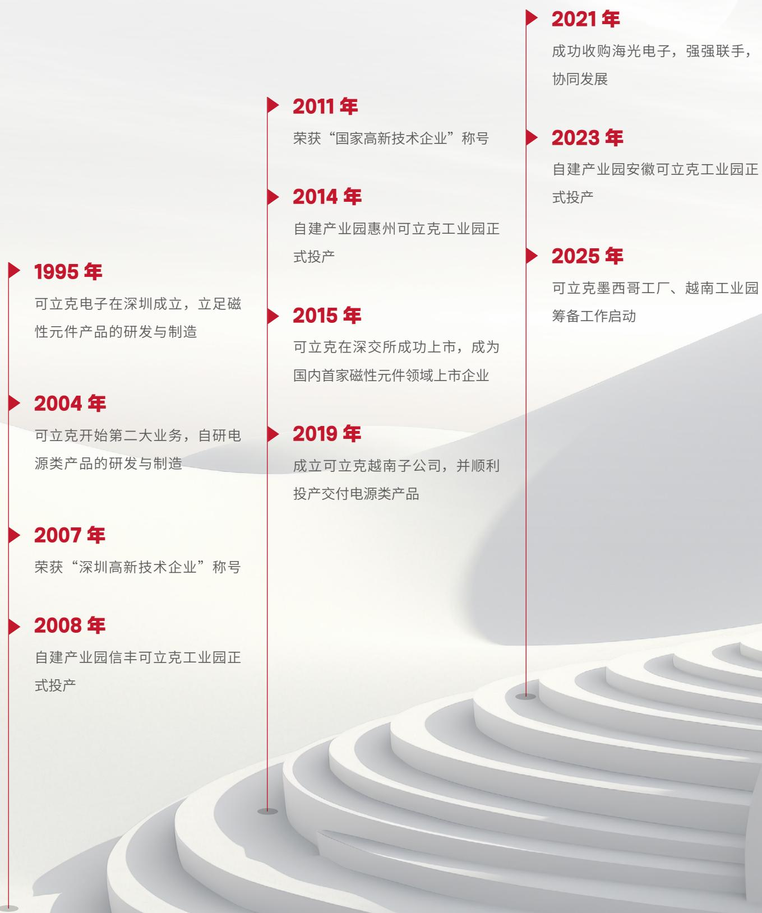

state_timeline

| Year | Milestone |
| --- | --- |
| 1995年 | 可立克电子在深圳成立，立足磁性元件产品的研发与制造 |
| 2004年 | 可立克开始第二大业务，自研电源类产品的研发与制造 |
| 2007年 | 获获“深圳高新技术企业”称号 |
| 2008年 | 自建产业园信丰可立克工业园正式投产 |
| 2011年 | 荣获“国家高新技术企业”称号 |
| 2014年 | 自建产业园惠州可立克工业园正式投产 |
| 2015年 | 可立克在深交所成功上市，成为国内首家磁性元件领域上市企业 |
| 2019年 | 成立可立克越南子公司，并顺利投产交付电源类产品 |
| 2021年 | 成功收购海光电子，强强联手，协同发展 |
| 2023年 | 自建产业园安徽可立克工业园正式投产 |
| 2025年 | 可立克墨西哥工厂、越南工业园筹备工作启动 |

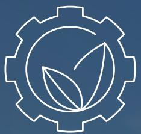

# 携手共进

# 引领可持续发展

# 理念

公司将可持续发展管理深度融入战略规划与经营发展全流程，依托多元化利益相关方沟通机制，聚焦环境合规、资源节约、应对气候变化等核心议题，通过制度建设、技术创新、实践落地与持续优化，系统性推进可持续发展各项工作，致力于实现经济效益、环境效益与社会效益的协同统一，为企业长期可持续发展筑牢根基。

# 我们的行动

可持续发展管理架构

利益相关方沟通

重要性议题分析

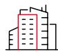

# 可持续发展管理

公司将环境、社会和公司治理事项纳入董事会治理体系，由董事会下设战略与可持续发展委员会统筹相关议题的决策与监督，推动可持续发展工作与公司战略及经营管理相衔接。在该治理架构下，公司同步关注可持续发展相关风险对经营活动和长期发展的潜在影响，通过管理与执行体系协同推进落实，形成涵盖决策、执行与监督的管理闭环，支持治理机制的持续运行。

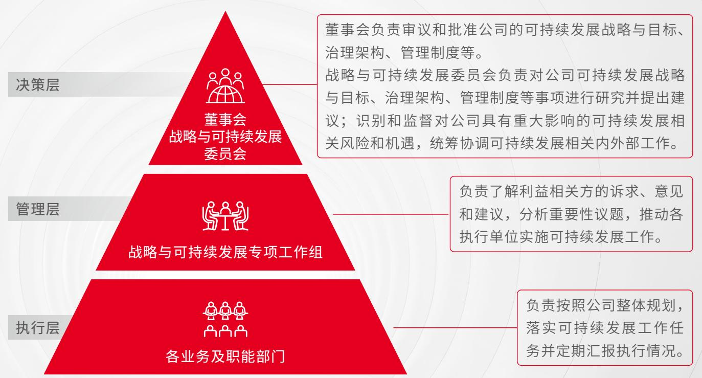

flowchart

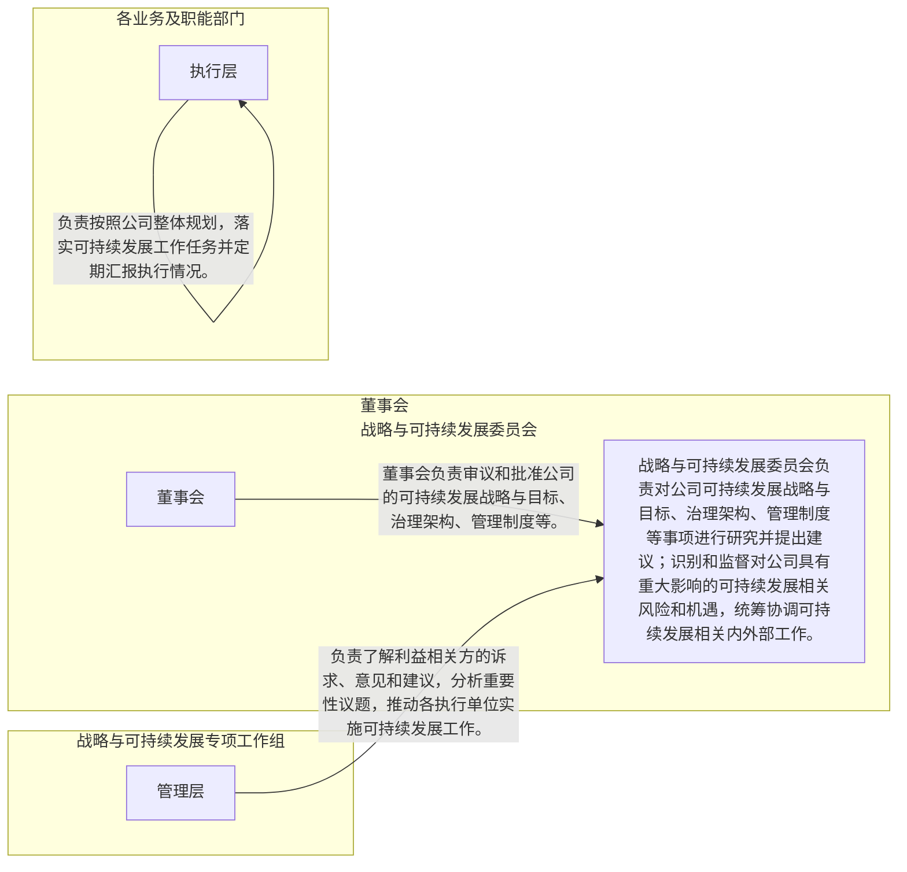
```mermaid
graph LR
  subgraph Committee["董事会\n战略与可持续发展委员会"]
  A1["董事会"] -->|"董事会负责审议和批准公司的可持续发展战略与目标、治理架构、管理制度等。"| B1["战略与可持续发展委员会负责对公司可持续发展战略与目标、治理架构、管理制度等事项进行研究并提出建议；识别和监督对公司具有重大影响的可持续发展相关风险和机遇，统筹协调可持续发展相关内外部工作。"]
  end

  subgraph Team["战略与可持续发展专项工作组"]
  C1["管理层"] -->|"负责了解利益相关方的诉求、意见和建议，分析重要性议题，推动各执行单位实施可持续发展工作。"| B1
  end

  subgraph Department["各业务及职能部门"]
  D1["执行层"] -->|"负责按照公司整体规划，落实可持续发展工作任务并定期汇报执行情况。"| D1
  end
```

公司在治理与运营管理过程中同步可持续发展相关风险，重点关注气候变化与资源约束、产品质量安全等议题对经营活动的潜在影响。相关风险识别结果纳入日常管理与决策参考，并通过专项制度与管理措施持续跟踪与应对。具体风险类型及管理安排将在后续相关章节中详细披露。

为提升公司可持续发展管理水平，报告期内公司组织开展多场可持续发展培训，包括 ESG 发展现状、可持续发展指标管理、可持续供应链搭建等内容。

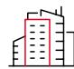

# 利益相关方沟通

公司坚持利益相关方协同共赢理念，依托多元化沟通渠道，广泛倾听并收集客户、供应商、员工、社区等各方的需求与期望，将其深度融入企业战略规划、生产运营及可持续发展实践，携手各方凝聚发展合力，共筑可持续发展生态。

<table><tr><td>主要利益相关方</td><td>关注议题</td><td>沟通方式与渠道</td></tr><tr><td>政府部门及监管机构</td><td>公司治理内控合规风控反商业贿赂及反贪污反不正当竞争应对气候变化环境合规管理</td><td>合规巡查定期会议论坛、会议及研讨会碳盘查、碳核查节能减排改造</td></tr><tr><td>股东和投资者</td><td>公司治理投资者关系</td><td>股东会投资者交流会网上业绩说明会深交所互动易问答投资者热线公司调研电话咨询电子邮件定期报告及官网信息披露</td></tr><tr><td>-客户</td><td>产品质量与安全创新驱动客户服务数据安全与客户隐私保护</td><td>满意度调查邮件与日常电话沟通回应客户投诉客户拜访</td></tr><tr><td>合作伙伴</td><td>供应链管理绿色设计</td><td>准入评估采购流程绩效评估定期沟通</td></tr><tr><td>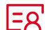-员工</td><td>员工雇佣权益保障员工培训与发展职业健康与安全</td><td>培训意见箱定期会议员工活动</td></tr><tr><td>-社会及公众</td><td>应对气候变化循环经济</td><td>公司公告社交网络平台公司网站社交媒体慈善捐赠及志愿服务社区活动邮箱、电话</td></tr></table>

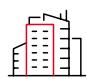

# 重要性议题分析

公司遵循交易所相关监管要求，综合采用内外部利益相关方调研、行业对标分析等多元方式，围绕议题对经济、社会、环境的影响重要性及财务重要性开展双重评估与优先级排序。通过系统梳理与科学研判，最终形成2025年度重要性议题矩阵，识别出24项实质性议题，为后续可持续发展战略落地与管理优化提供明确指引。

重要性议题识别流程

<table><tr><td rowspan="3">建立议题库</td><td>·监管机构要求、资本市场、评级机构关注</td><td></td></tr><tr><td>·宏观政策、行业标准要求</td><td rowspan="2"></td></tr><tr><td>·同业实践、公司业务实践及特点</td></tr><tr><td>利益相关方调研</td><td>·统计利益相关方关注议题</td><td>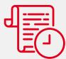</td></tr><tr><td>公司管理层调研</td><td>·可持续发展议题财务影响分析</td><td></td></tr><tr><td rowspan="3">评估重要性</td><td>·评估财务重要性</td><td rowspan="3"></td></tr><tr><td>·评估影响重要性</td></tr><tr><td>·确定重要性阈值</td></tr><tr><td>形成重要性议题矩阵</td><td>·形成双重重要性矩阵,展示议题分析评估结果</td><td></td></tr></table>

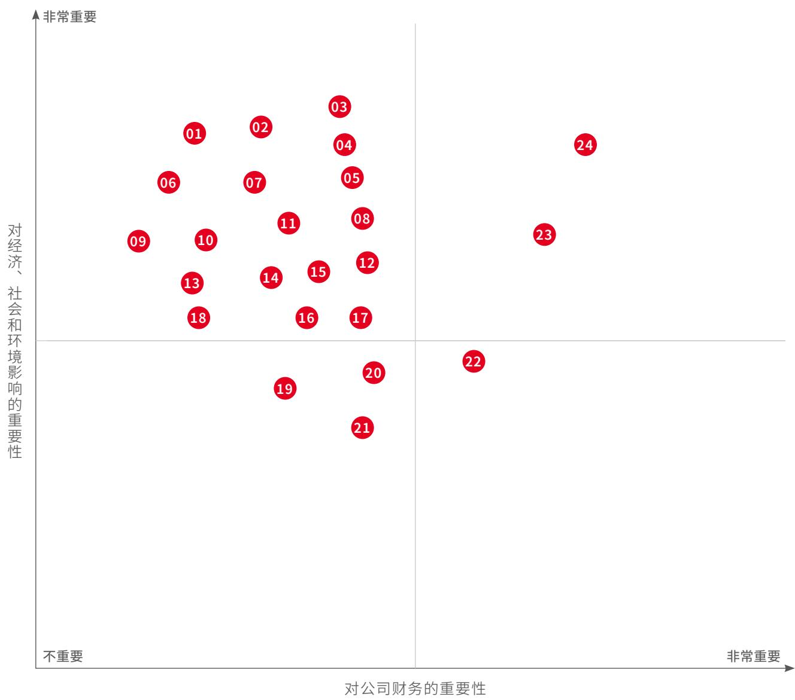

scatter

| ID | 对公司财务的重要性 (X) | 对经济、社会和环境的影响的重要性 (Y) |
| --- | --- | --- |
| 01 | ~0.25 | ~0.85 |
| 02 | ~0.35 | ~0.85 |
| 03 | ~0.45 | ~0.95 |
| 04 | ~0.45 | ~0.85 |
| 05 | ~0.45 | ~0.75 |
| 06 | ~0.15 | ~0.75 |
| 07 | ~0.35 | ~0.75 |
| 08 | ~0.45 | ~0.65 |
| 09 | ~0.15 | ~0.65 |
| 10 | ~0.25 | ~0.65 |
| 11 | ~0.35 | ~0.65 |
| 12 | ~0.45 | ~0.65 |
| 13 | ~0.25 | ~0.55 |
| 14 | ~0.35 | ~0.55 |
| 15 | ~0.45 | ~0.65 |
| 16 | ~0.45 | ~0.55 |
| 17 | ~0.45 | ~0.55 |
| 18 | ~0.25 | ~0.45 |
| 19 | ~0.45 | ~0.35 |
| 20 | ~0.45 | ~0.35 |
| 21 | ~0.45 | ~0.25 |
| 22 | ~0.65 | ~0.35 |
| 23 | ~0.75 | ~0.65 |
| 24 | ~0.85 | ~0.85 |

01 员工雇佣  
02 有害物质管理  
03 内控合规风控  
04 反商业贿赂及反贪污  
05 职业健康与安全  
06 供应链管理  
07 环境合规管理  
08 员工培训与发展

09 投资者关系  
10 权益保障  
11 反不正当竞争  
12 公司治理  
13 能源利用  
14 客户服务  
15 污染物排放  
16 废弃物处理

17 清洁技术机遇  
18 数据安全与客户隐私保护  
19 水资源利用  
20 循环经济  
21 绿色设计  
22 产品质量与安全  
23 创新驱动  
24 应对气候变化

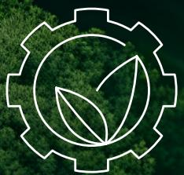

# 稳健治理 夯实发展根基

# 理念

可立克将公司治理视为稳健经营与可持续发展的基础，持续完善治理结构和管理机制，强化权责边界与运行规范，推动决策过程更加规范、执行过程更加透明。在日常经营中，公司围绕内控合规、风险管理、信息沟通以及商业道德等关键议题，逐步建立制度体系与工作流程，通过制度约束与管理实践相结合，提升治理有效性，为企业长期稳健运行提供基础保障。

# 我们的行动

公司治理

内控合规与风险管理

投资者沟通与信息披露

商业道德与公平竞争

SDGs 对标

16 和平、正义与强大机构

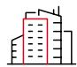

# 公司治理

可立克持续完善公司治理结构，严格依照《中华人民共和国公司法》《中华人民共和国证券法》及《公司章程》等相关规定，构建权责清晰、制衡有效、运作规范的治理体系。公司依法取消监事会，由审计委员会承接相关监督职责，并同步修订《审计委员会议事规则》，进一步强化内部监督与风险管理功能。同时，公司依据最新法律规范修订章程，将原股东大会调整为股东会，推动治理结构与制度体系的衔接统一。公司以股东会为权力机构，以董事会为决策核心，以管理层为执行主体，通过制度化运作和规范化管理，保障公司战略决策的科学性与经营管理的稳健性。公司中高层管理团队整体稳定，主要成员均具备十年以上行业及管理经验，为公司治理决策和日常经营提供了专业支撑。

可立克公司治理架构  
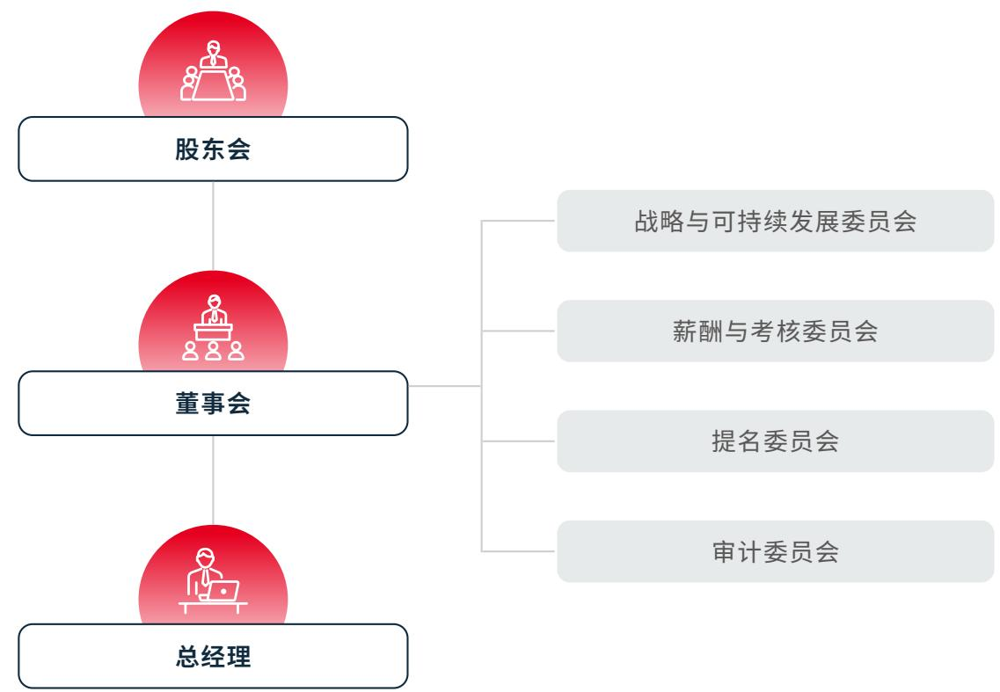

flowchart

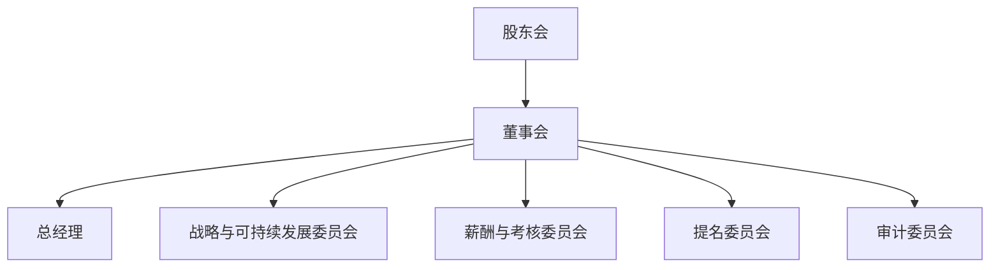
```mermaid
graph TD
  A["股东会"] --> B["董事会"]
  B --> C["总经理"]
  B --> D["战略与可持续发展委员会"]
  B --> E["薪酬与考核委员会"]
  B --> F["提名委员会"]
  B --> G["审计委员会"]
```

# 股东会

公司依法召开股东会，严格履行会议召集、提案审议和表决程序，保障全体股东依法行使知情权、参与权和表决权。股东会围绕公司发展战略、重大投资事项、年度报告及利润分配方案等关键议题进行审议，为公司治理和重大决策提供根本性依据。

# 报告期内，公司：

召开股东会 4 次，审议通过议案 24 项

# 董事会

公司董事会作为核心决策机构，依照《公司章程》《董事会议事规则》等制度规范履行职责，对公司战略规划、经营计划、财务管理和风险控制等重大事项进行审议与决策。董事会下设战略与可持续发展委员会、薪酬与考核委员会、提名委员会及审计委员会共4个专门委员会，各委员会依据相应议事规则开展工作，围绕战略规划、高管薪酬与绩效、董事及高管选任、财务管理与内部控制等事项提供专业支持与监督，提升董事会决策的专业性和科学性。

# 报告期内，公司：

- 召开董事会会议 10 次，审议通过议案 60 项，董事出席率 100%;  
·召开战略与可持续发展委员会会议3次，审议通过议案3项  
· 召开薪酬与考核委员会会议 3 次，审议通过议案 6 项  
· 召开提名委员会会议 1 次，审议通过议案 1 项  
- 召开审计委员会会议 5 次，审议通过议案 20 项

# 董事会多元化建设

公司在董事选任过程中，注重结构多元与能力互补，关注董事在性别结构、专业背景及履职经验等方面的合理配置。

# 报告期内，公司：

现任董事会由8名董事组成，其中女性董事4名，女性董事占比50%

董事成员的专业背景涵盖公司治理、财务管理、行业经营等领域，多元化的董事结构有助于董事会在战略研判和重大事项决策中综合不同视角，提升决策质量。

# 董事会独立性

公司充分保障董事会运作的独立性，全体董事均依据《公司章程》《独立董事制度》等制度要求，勤勉尽责履行职责。独立董事在董事会中独立发表意见，重点关注关联交易、财务报告、内部控制及中小股东权益保护等事项，对公司治理发挥积极监督作用。

# 报告期内，公司：

董事会独立董事占比38%薪酬委员会独立董事占比67%

提名委员会独立董事占比 67%
审计委员会独立董事占比 67%

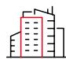

# 内控合规与风险管理

公司围绕规范运作和稳健发展的总体要求，持续完善合规内控与风险管理安排，将内部审计作为识别经营风险、强化内部控制和提升管理效能的重要抓手，通过制度约束、流程管控和责任落实，推动合规要求在公司经营管理中的有效执行。

公司制定《内部审计规范》，建立自上而下的内部审计管理体系。董事会下设审计委员会，负责对内部审计工作的整体监督与指导；审计部作为公司内部审计工作的组织实施机构，统筹开展年度审计计划编制及具体审计工作；审计人员按照规范流程独立开展审计活动。法务部、财务部及其他相关业务部门根据职责分工积极配合审计工作，形成权责清晰、协同运作的合规内控运行机制。

在运行机制方面，公司以年度审计计划为牵引，结合公司经营重点和管理关注事项，有序推进内部审计工作。审计流程覆盖审计准备、审计实施、审计终结、问题整改及档案管理等关键环节，通过对业务流程、制度执行情况和内部控制有效性的检查，系统识别潜在合规风险和管理薄弱环节，并提出改进建议，为经营决策和管理优化提供支持。

在风险管理实践中，公司通过内部审计持续关注经营活动中的合规性、规范性和风险暴露情况，将风险识别、问题整改与内控优化相结合，推动风险管理要求嵌入日常经营活动。针对审计发现的问题，公司明确整改责任主体、整改期限和整改要求，对整改落实情况进行跟踪检查，确保问题得到有效解决，防止类似风险重复发生。

为增强内部控制和风险管理的执行力，公司明确了与审计结果相衔接的责任追究和奖惩机制。对在审计中发现的违规行为、管理失职或整改不到位情况，公司按照相关规定追究责任；对积极配合审计、整改成效显著、在完善内部控制和风险防范方面发挥积极作用的单位或人员，予以相应激励。通过将审计结果与责任落实、激励约束相结合，公司不断强化内控约束力，提升风险管理的实际效果。

# 报告期内，公司：

内控合规与风险管理相关培训总时长2,978小时

# 投资者沟通与信息披露

公司高度重视与资本市场的沟通交流，将规范的信息披露和有效的投资者沟通作为维护投资者合法权益、提升公司透明度和市场形象的重要内容。公司制定《投资者关系管理制度》，对投资者沟通的职责分工、工作流程和信息披露要求作出明确规定，推动投资者关系管理工作制度化、规范化开展。

在制度框架下，公司坚持依法合规、真实准确的原则，严格按照相关法律法规及监管要求履行信息披露义务，确保披露内容真实、准确、完整、及时，避免选择性披露或误导性信息。公司通过规范的信息披露流程，加强对公告编制、审核与发布环节的管理，保障投资者能够平等获取公司重要经营和财务信息。

在投资者沟通方面，公司通过股东会、业绩说明会、投资者调研接待及互动平台等多种渠道与资本市场保持持续互动，主动回应投资者关切，帮助投资者更加全面地了解公司经营情况、发展战略及未来规划。

# 报告期内，公司：

披露定期公告 4 份，披露临时公告 156 份

# 案例 | 业绩说明会强化投资者沟通

2025 年 4 月，公司在会议室通过 “价值在线” 平台召开 2024 年度业绩说明会，董事长及高级管理层、独立董事和相关代表参与交流，就财务表现、业务发展及未来规划等问题与投资者开展线上互动沟通与答疑。本次说明会提升了信息披露透明度，增强了投资者对公司经营情况的理解与信任，促进了双向沟通，有助于提升公司在资本市场的形象与公信力。

# 报告期内，公司：

召开业绩说明会 1 次；互动易回答投资者问题 64 条

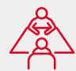

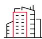

# 商业道德与公平竞争

公司坚持廉洁合规经营，明确禁止任何形式的商业贿赂、贪污及舞弊行为，并将相关要求纳入公司治理和日常经营管理。公司结合监管要求和自身管理实际，制定并实施《廉洁自律管理规范》《公司员工收受礼品礼金管理规范》《反舞弊与投诉举报管理规范》等制度，对廉洁从业要求、违规行为防范及处理流程作出明确规定。

公司董事会对反舞弊及廉洁管理工作承担监督责任，审计委员会负责相关工作的指导与协调，公司管理层对制度落实和内部控制有效性负责。审计部作为反舞弊工作的常设机构，具体组织开展举报受理、调查核实及后续处理工作，推动相关制度要求在公司内部有效执行。

# 反商业贿赂及反贪污

公司同时要求员工及合作方共同遵守廉洁要求。员工需签署《廉洁履行职务承诺书》，明确个人廉洁责任；供应商等合作方需签署廉洁协议，将廉洁要求纳入合作管理过程，防范廉洁风险。

# 案例 | 廉洁培训与宣誓强化合规治理

2025 年 12 月，公司在内部组织为期十天的廉洁培训与宣誓活动，2,978 名员工参与学习及廉洁自检，系统宣导反腐败与反贿赂要求。同时，公司通过供应链管理平台向供应商发送廉洁须知，并推动涉外联系、中高层及关键岗位人员签署廉洁履职承诺。相关举措强化了公司及下属单位的内部控制与风险防范，规范经营行为，促进员工与合作伙伴共同参与监督，支持公司稳健合规发展。

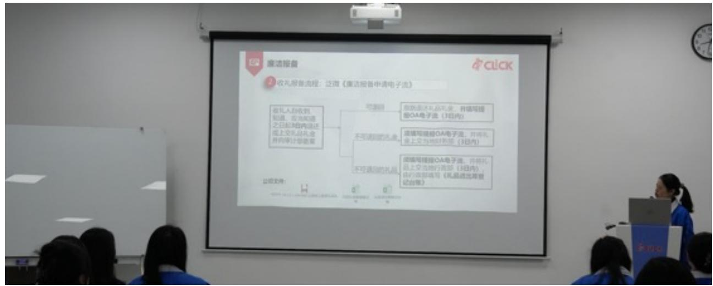

flowchart

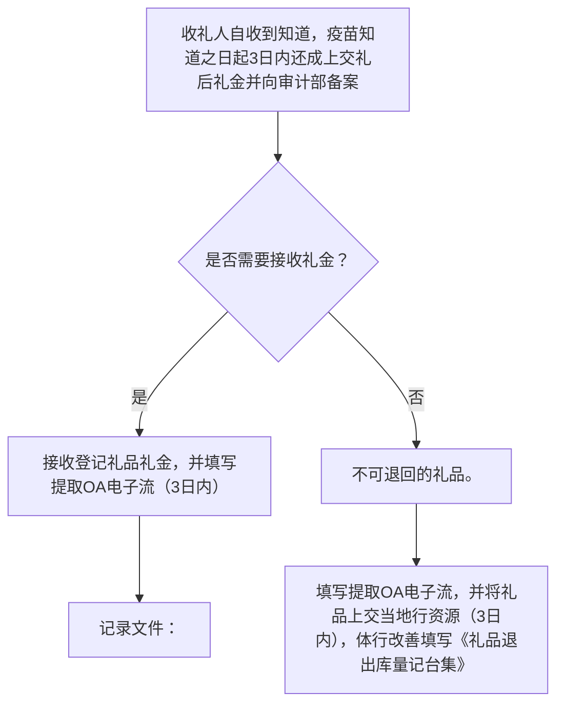
```mermaid
graph TD
  A["收礼人自收到知道，疫苗知道之日起3日内还成上交礼后礼金并向审计部备案"] --> B{"是否需要接收礼金？"}
  B -->|是| C["接收登记礼品礼金，并填写提取OA电子流（3日内）"]
  B -->|否| D["不可退回的礼品。"]
  D --> E["填写提取OA电子流，并将礼品上交当地行资源（3日内），体行改善填写《礼品退出库量记台集》"]
  C --> F["记录文件："]
```

廉洁培训

公司建立了多渠道的投诉与举报机制，支持通过意见箱、电话、电子邮箱、信函、OA系统及微信公众号等方式反映问题，确保举报渠道畅通。对收到的投诉与举报事项，公司按照内部管理要求进行受理与登记，并根据事项性质开展核查与处理，相关情况形成《举报调查报告》并纳入管理跟踪。

举报电话：0755-29918116（分机 8116）

举报邮箱：shenjibu@clicktec.net

微信公众号：“廉洁可立克”

通讯地址：深圳市宝安区福海街道正中科技园7栋2楼审计部

邮政编码：518103

natural_image

Two hands exchanging a yellow envelope at a desk with documents and a laptop in the background (no visible text or symbols)

公司高度重视举报人权益保护，对举报信息实行严格保密管理，原则上不向任何无关人员或外部主体披露举报人身份信息及相关内容。公司依法保护举报人的个人信息和合法权益，防止其因举报行为受到不当影响，维护举报机制的安全性与公正性。

# 报告期内，公司：

· 开展反商业贿赂及反贪污培训 14 次  
· 参与反商业贿赂及反贪污培训的董事人数 8 人，覆盖率达 100%  
· 参与反商业贿赂及反贪污培训的管理层人数 245 人，覆盖率达 100%  
- 反商业贿赂及反贪污培训总时长 2,978 小时

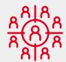

# 反不正当竞争

公司严格遵守《中华人民共和国反不正当竞争法》《中华人民共和国反垄断法》等相关法律法规，依法规范市场经营行为，持续维护公平、有序的市场竞争环境。公司制定并实施《不正当竞争防范与反垄断管理制度》，将相关合规要求纳入公司治理和内部管理体系，通过制度约束与流程管理相结合的方式，推动合规要求在经营活动中的有效落实。

在具体管理实践中，公司注重在业务开展、市场合作及对外交易等环节强化合规意识，防范不正当竞争及垄断风险，促进与客户、供应商及其他市场主体之间的公平合作与良性互动，支持公司长期稳健经营和可持续发展。

# 案例 | 竞争合规管理促进公平经营

2025 年 12 月，公司围绕反不正当竞争与反垄断要求推进竞争合规管理，通过集中宣导提升员工依法经营意识。同期，公司组织关键岗位人员签署履职承诺，并与合作伙伴签署包合廉洁、知识产权及保密条款的采购框架协议，将合规要求嵌入合作机制。相关举措推动内部经营规范与外部合作治理协同发力，有助于维护公平竞争环境，提升合作透明度与经营稳健性。

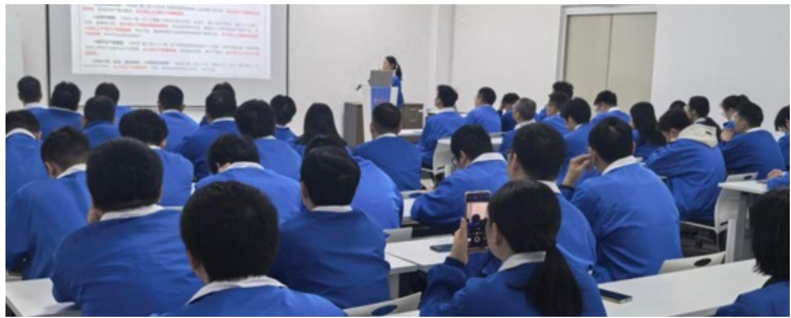

text_image

Classroom scene with students in blue uniforms attending a lecture, one speaker at podium; screen displays Chinese text about educational materials and procedures.

反不正当竞争培训

# 报告期内，公司：

· 开展反垄断与反不正当竞争培训 14 次  
- 反垄断与反不正当竞争培训总时长 2,978 小时  
- 未有违反正当竞争导致的诉讼 / 行政处罚事件

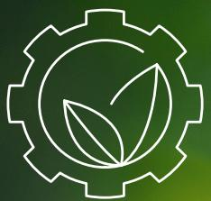

# 责任实践

# 推动价值共创

# 理念

可立克将履行社会责任视为企业稳健经营的重要组成部分，关注企业经营活动对员工、客户、合作伙伴及社会的综合影响。围绕价值创造的全过程，公司持续思考并回应各利益相关方的合理期待，将责任理念逐步融入产品与服务、技术创新、运营管理及合作体系建设之中，通过完善机制、规范执行与持续改进，推动企业在实现自身发展的同时，形成更具长期意义的价值贡献。

# 我们的行动

创新驱动高质量发展

产品质量与安全

绿色设计与可持续产品

负责任供应链管理

客户服务

数据安全与客户隐私保护

员工权益

员工培训与发展

职业健康与安全

3 良好健康与福祉

4 优质教育

5 性别平等

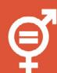

8 体面工作和经济增长

9 工业、创新和基础设施

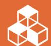

12 负责任的消费和生产

SDGs 对标

17 促进目标实现的伙伴关系

# 创新驱动高质量发展

可立克围绕主营业务和制造体系，开展与技术研发相关的创新管理工作，通过明确研发职责、完善配套制度和加强过程管理，支持研发活动的规范开展，并关注创新投入对经营运行和长期发展的影响。

# 治理

公司构建了以业务单元为核心的研发治理架构。结合生产运营特点，公司分别设立电源研发部门和变压器研发中心，并通过制定《电源研发部门职责》《变压器研发中心职责与协同表》，明确各研发单元在技术研发、产品创新、工艺改进及跨部门协同中的职责分工，确保研发活动与生产制造、质量管理和市场需求保持有效衔接。截至报告期末，公司下属子公司惠州市可立克科技有限公司荣获高新技术企业。

上述研发部门在承担具体研发创新任务的同时，也负责研发过程中相关技术成果的规范管理与保护，推动创新研发与知识产权管理的协同开展。公司将知识产权保护要求嵌入研发管理流程，在研发立项、技术开发及成果应用等环节同步关注技术成果的合规使用与风险防控。公司依据《RBA社会责任管理手册》，制定并执行《知识保护管理基准》，对技术资料、研发成果及相关信息的使用、存储与披露提出明确要求，为研发创新活动提供必要的制度支撑，降低知识产权相关风险，保障公司研发成果的规范管理与持续积累。

战略

<table><tr><td>风险名称</td><td>具体描述</td><td>影响时间1</td><td>应对措施</td></tr><tr><td>技术迭代风险</td><td>行业技术更新较快,若研发方向或节奏与市场需求脱节,可能影响产品竞争力并增加研发成本</td><td>中期</td><td>由电源研发中心、变压器研发中心结合业务规划开展技术评估,在研发管理和考核中关注成果转化导向</td></tr><tr><td>研发资源配置风险</td><td>研发投入与人员配置不当,可能导致研发效率偏低,对成本控制和项目周期产生影响</td><td>短期</td><td>通过研发考核与激励安排,引导资源向重点项目和核心技术集中</td></tr><tr><td>知识产权合规风险</td><td>技术资料管理或知识产权保护不足,可能引发信息泄露或合规风险</td><td>中、长期</td><td>严格执行《知识保护管理基准》,强化研发过程中的知识产权和信息保护要求</td></tr></table>

<table><tr><td>机遇名称</td><td>具体描述</td><td>影响时间</td><td>应对措施</td></tr><tr><td>技术能力积累机遇</td><td>持续开展研发活动,有助于形成技术沉淀并支撑产品线长期稳定发展</td><td>长期</td><td>明确研发部门职责分工,保障研发活动的连续性和稳定性</td></tr><tr><td>产品结构优化机遇</td><td>创新研发成果逐步应用于产品,可提升产品性能与附加值,改善成本结构和盈利能力</td><td>中、长期</td><td>结合研发管理与绩效安排,推动研发成果与生产制造环节的衔接</td></tr></table>

# 研发考核与激励

在研发创新管理实践中，公司结合以工厂为主体、按产品类型划分研发单元的组织结构，对研发活动实行制度化管理。围绕电源产品研发工作，公司制定并实施《电源研发中心考核激励方案》，对研发岗位分工、项目推进要求及绩效评价方式作出明确规定，并作为研发人员管理与考核的重要依据。

相关安排以研发项目和岗位职责为基础，规范研发工作在计划执行、过程管理和成果评估等环节的运行方式，推动研发活动在既定管理框架内有序开展。在现有研发体系下，上述管理措施主要用于支持研发资源配置、项目节奏控制及内部协同，为公司持续开展产品研发提供制度层面的保障。

# 知识产权保护

公司重视知识产权的规范管理与风险防控，将其作为支持技术研发、维护核心竞争力的重要基础。围绕研发活动开展过程，公司建立相应的知识产权管理要求，在技术开发、成果形成及对外合作等环节关注知识产权的识别、归属与合规使用，防范侵权及泄密风险。

同时，公司通过制度约束与内部管理协同，明确员工在研发及日常工作中对知识产权保护的责任与义务，强化对技术资料、研发成果及商业信息的管理。通过持续完善相关管理机制，公司在支持创新活动有序开展的同时，促进知识产权的规范保护与合理运用。

# 案例 | 承办新能源汽车软磁器件新产品新技术研讨会

2025 年 10 月，由电动汽车产业技术创新战略联盟主办、可立克与中信金属承办的新能源汽车软磁器件新产品新技术研讨会在惠州成功举办，有 130 余位来自整车企业、科研院所等领域的代表参会。

会议聚焦 EMC 仿真测试、磁集成技术、纳米晶器件应用等核心议题，可立克研究院院长分享了磁集成技术的设计方法与工程实践。本次研讨会汇聚行业顶尖智慧，搭建了“产学研用”交流平台，助力新能源汽车电驱系统、充电模块等领域的技术升级，彰显可立克在磁性元件领域的技术积淀与行业影响力。

# 影响、风险和机遇管理

围绕研发创新与知识产权相关议题，公司结合自身业务结构及管理基础，将风险与机遇识别嵌入研发管理和日常运营过程。相关研判主要依托研发中心在项目立项、技术评审及年度工作规划中的专业判断，并结合内部制度执行情况，对研发活动中可能面临的技术迭代、资源配置及知识产权合规风险进行持续关注。

在管理实践中，公司通过明确研发部门职责分工、规范研发考核与激励安排，引导研发资源向核心技术和重点产品方向集中，在一定程度上缓解研发投入效率与成果转化不确定性带来的经营影响。

指标和目标

<table><tr><td>管理指标</td><td>单位</td><td>2025年</td></tr><tr><td>研发投入</td><td>万元</td><td>14,136.68</td></tr><tr><td>研发投入占营业收入比例</td><td>%</td><td>2.56</td></tr><tr><td>研发人员人数</td><td>人</td><td>501</td></tr><tr><td>研发人员占员工总数比例</td><td>%</td><td>6.98</td></tr><tr><td>有效专利总数</td><td>件</td><td>192</td></tr><tr><td>应用于主营业务的发明专利总数</td><td>件</td><td>21</td></tr><tr><td>发明专利的申请数</td><td>件</td><td>2</td></tr><tr><td>发明专利的授权数</td><td>件</td><td>4</td></tr><tr><td>发明专利的有效专利数</td><td>件</td><td>18</td></tr><tr><td>软件著作权数量</td><td>件</td><td>42</td></tr></table>

注：应用于主营业务的发明专利总数涵盖报告期内应用于主营业务，但在报告期期间失效的发明专利。

# 产品质量与安全

公司关注产品质量与安全对客户和终端消费者的重要性，将相关要求融入产品设计、生产管理及质量控制流程，通过持续完善管理机制与过程管控，保障产品稳定性与使用安全，提升客户信任与长期价值。

# 治理

公司由质量中心作为产品质量与有害物质过程管理的归口管理部门，统筹推进质量管理相关工作。质量中心负责组织《纠正和预防措施报告》的发布、确认与回收，对纠正及预防措施的实施情况和效果进行跟踪验证，并对相关措施执行情况开展监督检查，推动质量问题闭环管理。公司制定并实施《电源新产品设计质量保障作业规范》《产品质量先期策划（APQP）管理流程》《纠正及预防措施管理规范》等制度性文件，将质量管理要求前移至产品设计与开发阶段，并贯穿问题识别、整改落实和持续改进全过程，为产品质量与安全管理提供系统化制度支撑。

同时，公司通过体系化管理持续提升质量管控水平，深圳可立克科技股份有限公司、惠州市可立克电子有限公司、惠州市可立克科技有限公司等共7家公司已通过ISO质量管理体系认证，深圳可立克科技股份有限公司、惠州市可立克电子有限公司、惠州市可立克科技有限公司等共4家公司已通过QC080000认证，相关质量管理要求在日常运营中保持有效运行。

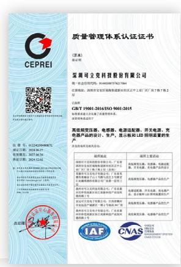

text_image

质量管理体系认证证书
（签名）
COPREI
深圳可立克科技股份有限公司
统一社会信用代码：914403001972317864
注册地址：深圳市宝安区福海街道新南社区彩云工业厂房7楼7楼2
办公地址：GRT 19001-2016/ISO 9001:2015
高新技术企业自主建设质量管理机构。
联系电话：021-633333333
高级实验室仪器、电器皿、电源适配器、开关电源、充电
产品的设计、生产、调试及LED照明设备的生产
并提供相关技术信息。

培训地址
深圳市龙岗区科技园区(广东省深圳市龙岗区科技园区)：
广东省深圳市龙岗区科技园区(广东省深圳市龙岗区科技园区)：
广东省深圳市龙岗区科技园区(广东省深圳市龙岗区科技园区)：
广东省深圳市龙岗区科技园区(广东省深圳市龙岗区科技园区)：
广东省深圳市龙岗区科技园区(广东省深圳市龙岗区科技园区)：
广东省深圳市龙岗区科技园区(广东省深圳市龙岗区科技园区)：
广东省深圳市龙岗区科技园区(广东省深圳市龙岗区科技园区)
广东省深圳市龙岗区科技园区(广东省深圳市龙岗区科技园区)：
广东省深圳市龙岗区科技园区(广东省深圳市龙岗区科技园区)：
广东省深圳市龙岗区科技园区(广东省深圳市龙岗区科技园区)：
广东省深圳市龙岗区科技园区(广东省深圳市龙岗区科技园区)：
广东省深圳市龙岗区科技园区(广东省深圳市龙岗区科技园区)：
广东省深圳市龙岗区科技园区(广东省深圳市龙岗区科技园)：
广东省深圳市龙岗区科技园区(广东省深圳市龙岗区科技园区)：
广东省深圳市龙岗区科技园区(广东省深圳市龙岗区科技园区)：
广东省深圳市龙岗区科技园区(广东省深圳市龙岗区科技园区)：
广东省深圳市龙岗区科技园区(广东省深圳市龙岗区科技园区)：
广东省深圳市龙岗区科技园区(广东省深圳市龙岗区科技园区)：
广东省深圳市龙岗区科技园区(广东省深圳市龙岗县科技园区)：
广东省深圳市龙岗区科技园区(广东省深圳市龙岗区科技园区)：
广东省深圳市龙岗区科技园区(广东省深圳市龙岗区科技园区)：
广东省深圳市龙岗区科技园区(广东省深圳市龙岗区科技园区)：
广东省深圳市龙岗区科技园区(广东省深圳市龙岗区科技园区)：
广东省深圳市龙岗区科技园区(广东省深圳市龙岗区科技园区)：
广东省深圳市龙岗区科技园区(广东省深圳市龍岗区科技园区)：
广东省深圳市龙岗区科技园区(广东省深圳市龙岗区科技园区)：
广东省深圳市龙岗区科技园区(广东省深圳市龙岗区科技园区)：
广东省深圳市龙岗区科技园区(广东省深圳市龙岗区科技园区)：
广东省深圳市龙岗区科技园区(广东省深圳市龙岗区科技园区)：
广东省深圳市龙岗区科技园区(广东省深圳市龙岗区科技园区)：
广东省深圳市龙岗区科技园区(广东深圳市龙岗区科技园区)：
广东省深圳市龙岗区科技园区(广东深圳市龙岗区科技园区)：
广东省深圳市龙岗区科技园区(广东深圳市龙岗区科技园区)：
广东省深圳市龙岗区科技园区(广东深圳市龙岗区科技园区)：
广东省深圳市龙岗区科技园区(广东深圳市龙岗区科技园区)：
广东省深圳市龙岗区科技园区(广东深圳市龙岗区科技园区)：
广东省深圳市龙岗区科技园
广东深圳市龙岗区科技园
广东深圳市龙岗区科技园
广东深圳市龙岗区科技园
广东深圳市龙岗区科技园
广东深圳市龙岗区科技园
广东深圳市龙岗区科技园
广东深圳市龙岗区科技园
广东深圳市龙岗区科技园
广东深圳市龙岗区科技园
广东深圳市龙岗区科技园
广东深圳市龙岗区科技园
广东深圳市龙岗区科技园
广东深圳市龙岗区内
广东深圳市龙岗区内
广东深圳市龙岗区内
广东深圳市龙岗区内
广东深圳市龙岗区内
广东深圳市龙岗区内
广东深圳市龙岗区内
广东深圳市龙岗区内
广东深圳市龙岗区内
广东深圳市龙岗区内
广东深圳市龙岗区内
广东深圳市龙岗区内
广东深圳市龙岗区内
广东深圳市龙岗区内
广东深圳市龙岗区内
广东深圳市龙岗区内
广东深圳市龙岗区内
广东深圳市龍岗区内
广东深圳市龍岗区内
广东深圳市龍岗区内
广东深圳市龍岗区内
广东深圳市龍岗区内
广东深圳市龍岗区内
广东深圳市龍岗区内
广东深圳市龍岗区内
广东深圳市龍岗区内
广东深圳市龍岗区内
广东深圳市龍岗区内
广东深圳市龍岗区内
广东深圳市龍岗区内
广东深圳市龍岗区内
广东深圳市龍岗区内
广东深圳市龍岗区内
广东深圳市龍岗区内
广州深汕路
广州深汕路
广州深汕路
广州深汕路
广州深汕路
广州深汕路
广州深汕路
广州深汕路
广州深汕路
广州深汕路
广州深汕路
广州深汕路
广州深汕路
广州深汕路
广州深汕路
广州深汕路
广州深汕路
广州深汕路
广州深汕路
广州深汕路
广州深汕通
广州深汕通
广州深汕通
广州深汕通
广州深汕通
广州深汕通
广州深汕通
广州深汕通
广州深汕通
广州深汕通
广州深汕通
广州深汕通
广州深汕通
广州深汕通
广州深汕通
广州深汕通
广州深汕通
广州深汕通
广州深汕通
广州深汕通
广州深汕通过

可立克 ISO 9001 认证

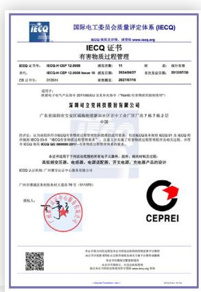

text_image

国际电工委员会质量评定体系（IECQ）
ICEQ证书
有害物质过程管理
IECQ证书号：IECQ-1CEP 12.0098
编号：11
状态：清零
登记号：IECQ-1CEP 12.0098 基准日期：2024/6/07
发证机关：国家工商行政管理局
CN 证书号：GZD31
有效期：2027/8/16
受托人：
深圳市电子电气产品公司于2015/05/01及《广东省电力公司“LED板电容器制造基地项目”》
深圳东立科技有限公司
广东省深圳市宝安区福海街道新南社区中工业厂房7栋2层
中国
经办人：广东深圳市深南中路2008号深南大厦A座10楼，现将EICQ证书编号为IECQ认证证书编号为IECQ认证证书编号为IECQ认证证书编号为IECQ认证证书编号为IECQ认证证书编号为IECQ认证证书编号为IECQ认证证书编号为IECQ认证证书编号为IECQ认证证书编号为IECQ认证证书编号为IECQ认证证书编号为IECQ认证证书编号为IECQ认证证书编号为IECQ认证证书编号为IECQ认证证书号
本次申请将于下述地点通知各主要生产厂家、仓库、采购单位及部门：
高级接受的供应商、电器配件、电源适配器、开关电源、充电器等产品的设计
IECQ认证机构：广东深宝实业中心有限公司
广州市越秀区东林村大渡街76号（911373）
组织人：
CEPREI

可立克 QC080000 证书

# 报告期内，公司：

未发生产品和服务相关的安全与质量重大责任事故。

战略

<table><tr><td>风险名称</td><td>具体描述</td><td>影响时间</td><td>应对措施</td></tr><tr><td>新产品导入质量风险</td><td>新产品在设计或量产导入阶段控制不足,可能引发返工、报废和交付延期,增加制造成本并影响回款节奏</td><td>短、中期</td><td>实施APQP流程和设计质量保障要求,在立项、设计和验证阶段提前识别和控制风险</td></tr><tr><td>合规与物质异常风险</td><td>产品未满足相关标准或物质要求,可能产生整改、复检或退换货成本</td><td>中期</td><td>将合规要求纳入质量管理流程,并通过异常反馈机制推动问题闭环</td></tr><tr><td>产品召回风险</td><td>在特定条件下启动召回,可能产生直接处置费用并对品牌和后续订单造成影响</td><td>短、中期</td><td>建立召回管理流程,与异常应对机制协同,确保问题可控处置</td></tr></table>

<table><tr><td>机遇名称</td><td>具体描述</td><td>影响时间</td><td>应对措施</td></tr><tr><td>客户黏性提升机遇</td><td>质量管理能力提升,有助于降低质量成本、提升交付稳定性和客户黏性</td><td>中、长期</td><td>持续优化质量策划、数据分析和闭环管理,推动经验沉淀和标准化</td></tr></table>

# 产品全周期质量管理

公司将质量管理要求系统嵌入产品全生命周期，在产品策划、设计开发、验证及量产等关键阶段建立系统化的质量管控机制，通过质量策划、设计评审、性能验证及第三方检测等方式，对产品质量进行全过程管理。

<table><tr><td>阶段</td><td>关键质量管理措施</td></tr><tr><td>产品策划</td><td>识别客户需求及法规要求,明确产品质量目标,并开展产品质量先期策划(APQP)</td></tr><tr><td>设计开发</td><td>按照APQP流程推进产品设计与过程开发,明确关键控制节点及责任分工</td></tr><tr><td>设计验证</td><td>在设计评审与验证阶段开展功能、可靠性及一致性检测,确保设计输出符合质量要求</td></tr><tr><td>产品与过程确认</td><td>对产品及生产过程进行确认与验证,确保产品设计满足制造与质量标准</td></tr><tr><td>量产导入</td><td>在量产阶段持续开展质量监控与性能检测,保障产品质量稳定</td></tr></table>

# 案例 | 开展岗位技能大比拼

为提升员工专业技能，公司组织岗位技能大比拼，共207名员工参与。各基地制造员工以自愿报名形式参与，围绕绕线、焊锡、组装、检验等关键工序开展技能竞赛，从操作标准性、效率、合格率等维度进行评比。活动不仅检验了员工品质知识、检验技能及实际操作熟练度，更在各员工间形成了良好的竞赛氛围，见证了员工在技能之路上的成长与荣耀。

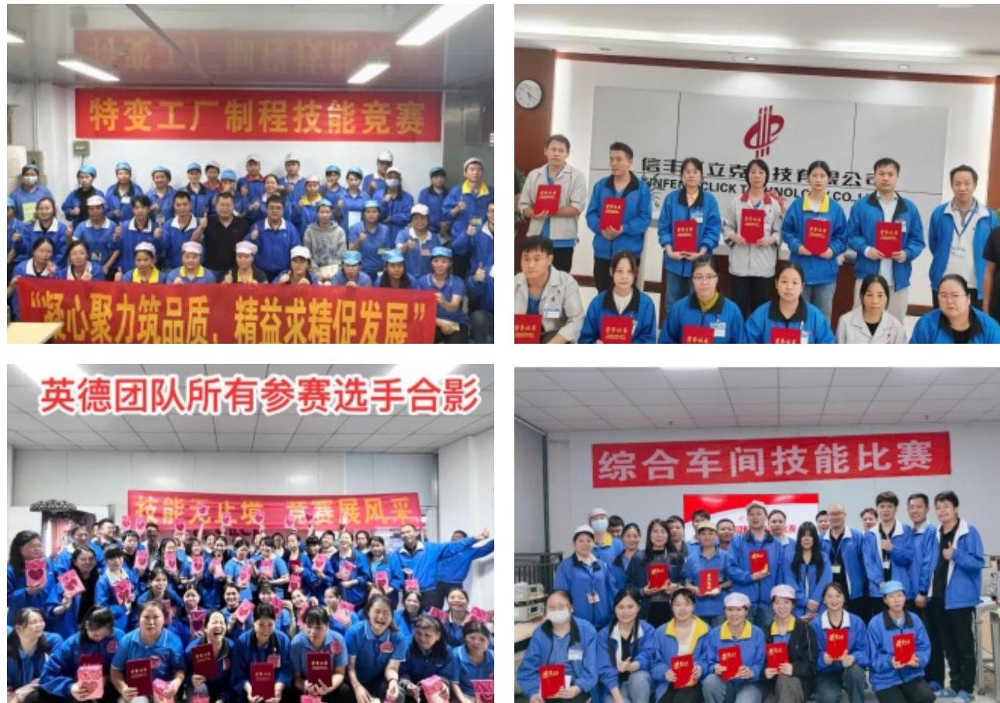  
各工厂技能竞赛大合照

# 产品质量持续提升机制

在产品开发及运行过程中，公司通过《质量改进统计月报》对产品质量问题及改进情况进行持续汇总与分析，为质量改进提供数据支持。针对已识别的质量问题，公司依据《纠正及预防措施管理规范》，组织开展原因分析、整改实施及效果验证，形成从问题发现、责任落实到整改闭环的管理机制，防止同类问题重复发生。通过持续的数据监测与问题复盘，公司逐步推动质量管理由事后纠偏向过程改进转变，提升整体质量管理的稳定性和有效性。

# 案例 | MCU 电压检测改善提升产品可靠性

公司在推进盈合 20V 系列 MCU 不良与电压检测精度改善项目，针对芯片静电损伤及电阻精度偏差导致的功能异常，团队通过调整吸收电阻参数并将关键电阻精度由 5% 升级至 1%，优化 ATE 测试表现。改善后，相关不良率显著下降，检测稳定性提升，维修与更换成本同步降低，有助于强化产线品质控制与产品可靠性管理。

# 案例 | 瓶颈工序改善提升产线效率

公司开展 PD65W 产品生产改善项目，针对耐压测试与 ATE 测试过程中人员等待及工序负荷不均问题，团队通过调整测试操作方式与插件工序人力配置，实现生产节拍优化。改善后，整体直接人力减少，UPPH 由 5.1 提升至 9.1，工时趋于合理匹配，有助于提升产线效率与资源利用水平。

# 产品召回与异常应对管理

公司在产品质量与合规管理过程中，建立了覆盖异常识别、反馈处置、整改改进及持续预防的质量管理机制，对研发、来料、生产、检验及交付等环节发现的质量偏差和合规风险进行系统化管理。

# 管控机制

# 主要措施

# 质量异常管理

对研发、来料、生产、检验及交付等环节发现的质量异常进行识别、反馈与整改，并通过纠正和预防措施推动问题闭环管理；涉及有害物质及环境合规要求的异常情况纳入专项管控。

# 产品召回管理

当产品问题达到召回条件时，公司按照既定流程开展风险评估、决策与处置，对问题产品进行控制与处理，并结合原因分析推动持续改进。

# 产品质量追溯

依据《产品的标识和追踪管理规范》，对关键生产信息、检验记录及产品批次进行记录管理，在发生质量异常时可对相关批次及生产环节进行追溯分析。

# 影响、风险和机遇管理

公司将产品质量与安全相关的影响、风险和机遇纳入质量管理日常运行，通过前端预防、过程监控和问题闭环相结合的方式开展管理。在新产品阶段，公司依托产品质量先期策划（APQP）流程及《新产品设计质量保障作业规范》，在立项、设计、验证及量产导入等关键节点识别潜在质量风险，提前明确质量目标和控制要求，降低后续返工和交付波动风险。在生产与交付过程中，公司通过质量数据统计和月度分析，持续跟踪质量表现和异常趋势，及时识别可能影响成本、交付和客户满意度的问题。

# 指标和目标

管理指标

<table><tr><td>指标名称</td><td>单位</td><td>2025 年</td></tr><tr><td>产品召回事件数量</td><td>次</td><td>0</td></tr><tr><td>产品召回比例</td><td>%</td><td>0</td></tr></table>

# 管理目标

公司坚守质量底线，杜绝不合格产品流入市场，确保产品合格率、出厂检验合格率均达到管控标准，持续提升产品稳定性与可靠性。

natural_image

Person holding a sticky note with a green logo, standing beside multiple blank document frames (no visible text or symbols)

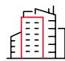

# 绿色设计与可持续产品

公司已建立与绿色设计相关的内部管理要求。《资源、能源节约管理作业指导书》对研发中心职责作出明确规定，在新产品开发过程中优先考虑绿色设计方案，探索使用新材料、新工艺和新技术，以降低资源消耗和环境影响，主要落实于产品设计阶段，并对后续生产和使用环节的环境表现形成基础约束。

围绕产品环境风险管控，公司同步建立配套管理机制。针对环保产品在生产或交付后可能出现的有毒有害物质异常超标情况，公司制定专项应对制度，明确异常识别、上报、处置和纠偏流程，确保问题能够被及时发现和处理，降低对环境和客户的潜在影响，为绿色设计要求在实际运行中的有效性提供了制度保障。

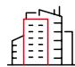

# 负责任供应链管理

公司将供应链管理视为公司治理和可持续发展的重要组成部分，关注供应链环节中的质量风险、合规风险以及环境与社会责任议题，通过制度建设与流程管理，推动供应商管理由单一采购管理向规范化、体系化管理转变。

# 供应商全流程管理

公司围绕供应商管理建立了完整的流程体系，制定《供应商管理规范》，覆盖准入、评审、分级管理、持续监督及退出等关键环节。在供应商准入及年度管理过程中，依据《供应商评审报告及审核表》开展系统评估，并结合配套的环境、劳工与人权相关评审内容，对供应商合规状况及社会责任表现进行审查。公司对供应商实施考核分级管理，制定年度稽核计划，对重点供应商开展定期审核，并根据实际情况组织现场审核。现场审核重点关注环保管理体系运行情况、相关岗位人员能力、现场管理措施及合规表现，相关结果作为后续合作管理的重要依据。

# 可立克供应商分级

# 合格

年审合格的厂商

# 合格但需改善

根据审核得出的结论及整改问题点进行厂商整改，SQE 根据厂商改善报告，确定是否需要进行验证或复审

# 不合格

SQE 需组织专案讨论会，结合实际情况进行评估，进行淘汰处理或专案辅导其达到规定分数，否则不可以进行交易

# 案例 | 供应商审核推动质量闭环管理

公司对重点供应商开展年度现场审核，围绕质量体系、制程控制、仓储与环保能力进行系统评估，并依据评分与否决机制识别改进项，要求限期提交整改报告并跟踪落实，根据审核形成问题整改与绩效评价联动闭环。在日常管理中，公司持续实施供应商准入评估、年度复审与现场改善跟踪，将质量与合规要求嵌入供应链协同机制，支持供应商持续改进与稳定交付。

  
品质方针

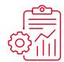  
工厂管理

  
持续改善

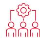  
制程管制

  
教育训练

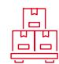  
采购管理

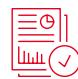  
供应商管理

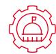  
设备管理

  
不合格品管理

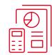  
文件控制

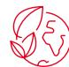  
环境管理系统

  
IT/ 人文 / 环境 / 健康 / 安全 / 信息

供应商评审维度

<table><tr><td>指标名称</td><td>单位</td><td>2025 年</td></tr><tr><td>供应商总数</td><td>家</td><td>1,112</td></tr></table>

text_image

Hand interacting with a digital dashboard displaying a line chart and multiple icons, likely representing data analytics or business analytics.

# 负责任供应链与合规要求

公司逐步将环境合规与社会责任要求纳入供应链管理体系，并通过制度与协议形式向供应商明确相关责任。公司与供应商签署《供应商管理质量、环保、环境协议》，在协议中对产品质量、环境管理以及劳工与人权保障相关要求作出明确约定，推动供应商履行相应责任。在原材料与物质合规管理上，公司制定《环境管理物质有害物质含量标准表》，对有害物质控制提出具体标准，并将REACH等法规要求纳入供应商管理内容，同时配套开展RoHS测试分析、物质评审等管理工作，以强化产品及材料的合规控制。

<table><tr><td>指标名称</td><td>单位</td><td>2025年</td></tr><tr><td>接受 ESG 培训的供应商</td><td>家</td><td>110</td></tr><tr><td>接受可持续采购培训的采购人员</td><td>人</td><td>18</td></tr></table>

# 廉洁供应链

公司重视供应链环节中的廉洁与合规风险，将相关要求纳入供应商管理体系。在与供应商建立合作关系过程中，公司要求相关供应商签署廉洁协议，对商业交往中的行为边界、合规责任及禁止行为作出明确约定，明确双方在合作中的基本行为规范。报告期内，供应商廉洁协议签署率100%。对违反廉洁约定的行为，公司将依据内部管理规定进行相应处理。相关安排有助于防范不正当利益输送、商业贿赂等风险，为采购与合作过程提供基本的合规约束。公司通过将廉洁要求前置至合作建立阶段，逐步将合规意识融入供应链管理过程，为构建规范、有序的合作关系提供制度基础。

# 冲突矿产管理

公司关注原材料采购环节中潜在的合规与伦理风险，将冲突矿产管理纳入供应链管理体系。公司严格遵守《经合组织受冲突影响和高风险区域的矿石负责任供应链尽职调查指南》《中国负责任矿产供应链尽责管理指南》（CCCMC），并契合《多德-弗兰克法案》、欧盟《冲突矿产条例》等国际法规要求，针对相关风险制定《冲突矿物质管理作业指导书》，明确了识别、评估及管控流程，并在供应商管理过程中落实相关要求。同时，公司要求相关供应商签署《不使用冲突矿产承诺保证书》，通过书面承诺形式传达合规与责任采购要求。

公司结合供应商准入、评审及年度审核等管理环节，对矿产来源合规情况进行关注与核查，将相关要求纳入供应商沟通和管理流程，推动供应商提高对矿产来源透明度及合规风险的重视。通过制度建设与持续管理，公司逐步将冲突矿产风险控制嵌入采购与供应链管理实践中，为构建负责任供应链提供支撑。

# 供应商沟通与能力提升

公司重视与供应商之间的持续沟通与能力共建，在日常管理过程中，通过会议沟通、制度宣贯、业务交流等方式，对供应商开展质量、环保及合规相关要求的培训与沟通，促进供应商对管理要求的理解与落实，推动供应链整体管理水平提升。

# 报告期内，公司：

开展供应商培训 295 次，覆盖供应商 258 家

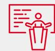

# 客户服务

公司高度重视客户权益与服务质量，通过建立系统的管理制度与规范化的服务流程，持续保障客户权益、完善售后支持并提升客户满意度，致力于构建长期、稳定、互信的战略合作伙伴关系。

# 客户权益保障

公司关注客户在交易过程中的公平性与规范性，通过制度化管理保障客户权益。公司制定并执行《合同评审管理规则》《客户信用主数据变更电子流》《销售精细报价电子流》《销售调价申请电子流》等相关流程，对报价、合同评审及信用管理等关键环节进行规范管理，降低因流程不清或信息偏差引发的交易争议。

具体实践中，公司通过客户信息统一管理机制，借助《客户主数据申请电子流》确保客户信息的准确性与唯一性，为合同履行与后续服务提供基础保障。销售团队依据既定规则开展商务沟通与条款确认，财务部门结合成本与合理性进行审核，有助于保障交易条件的合理性与透明度，在业务全过程中维护公司与客户的正当权益。

# 售后服务

公司建立了以“客户声音”管理机制为核心的售后响应体系，并配套制定了《退货电子流》《借贷项申请电子流》及《电源客户需求评审电子流》等标准化操作流程，确保客户反馈与需求得到闭环处理。为提升服务效能，公司在要求销售团队定期进行客户洞察的同时，推动其积极协同研发、品质、制造等部门，共同解决产品应用、质量改进与交付时效等具体问题。针对重大需求，公司通过成立跨部门专项组的方式整合资源，并利用《销售订单变更电子流》确保变更响应及时，将本土化服务与持续客户支持落到实处。

关键指标

<table><tr><td>指标</td><td>单位</td><td>2025 年</td></tr><tr><td>客户提出售后服务需求的总次数</td><td>次</td><td>101</td></tr><tr><td>响应客户服务需求的次数</td><td>次</td><td>101</td></tr><tr><td>客户反馈响应率</td><td>%</td><td>100</td></tr></table>

# 客户满意度管理

公司为确保持续提升服务质量，专门制定了《客户满意度管理规则》，并将其与《市场运作管理规则》《公司年度市场经营检讨会议指引》以及《电源产品报价指引》等制度联动，形成从服务规范、绩效评估到经营复盘的管理闭环。公司定期组织优秀案例分享与专业课程学习，赋能销售团队提升专业能力。同时，通过执行《公司年度市场经营检讨会议指引》，监督销售活动并审视经营目标达成，将客户满意度的提升与组织绩效紧密挂钩，最终驱动市场份额增长与新产品成功，实现从客户满意到战略共赢的目标。

# 案例 | 客户满意度调查促进服务质量闭环

2025 年 12 月，公司面向电源业务重点客户开展满意度调查，围绕产品质量、交付表现、价格、技术支持及服务响应等维度进行评价，问卷回复率 100%。调查结果显示综合平均得分为 94.2 分，高于既定目标值 88 分。公司对各维度评分开展分析并纳入改进跟踪机制，将客户反馈持续融入产品与服务优化流程，推动客户关系与交付质量的稳定提升。

# 2025年：

变压器业务客户满意度为90.27分，电源业务客户满意度为94.2分

# 数据安全与客户隐私保护

# 信息安全管理

公司高度重视数据安全与客户隐私保护，建立了权责清晰的三级信息安全管理架构，以系统化的治理为相关工作的开展提供坚实保障。该架构最高层由董事长对公司信息安全工作全面负责；管理层由任命的管理者代表领导建立、实施与改进信息安全管理体系；执行层则由流程变革IT部及跨部门组成的信息安全管理小组牵头，协同各业务中心共同落实具体管控措施，形成了自上而下、全员参与的安全治理格局。

基于这一治理架构，公司系统制定并推行了《信息安全管理手册》《信息安全管理规范》等核心制度，确立了“积极预防、全面管理、控制风险、保障安全”的方针。这些制度共同构建了覆盖数据全生命周期的安全管理标准与操作规范。在运行层面，公司严格遵循PDCA（计划-执行-检查-改进）循环模式，系统化实施从风险评估、控制策划、运行操作到绩效评价与持续改进的管理流程。通过定期的安全意识培训、应急演练以及内部审核与管理评审，公司确保这一管理体系及各项制度得到有效实施与持续优化，从而稳固保护公司及客户信息资产的安全。

公司的信息安全管理实践已获得权威第三方认可。截至目前，深圳可立克科技股份有限公司及其位于惠州的两家主要生产基地，均已成功获得基于 ISO/IEC 27001:2022 标准的信息安全管理体系认证。该国际认证表明，公司所建立的信息安全管理体系符合国际最佳实践，能够持续、有效地保障信息资产安全。

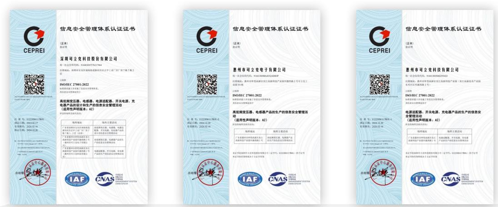

text_image

信息安全管理体系认证证书
(正本)
公司
深圳可立克科技股份有限公司
统一社会信用代码：9144300075217364
注册地址：深圳市宝安区福海街道科技园社区工业厂房7楼7栋2层
办公地址：深圳市宝安区福海街道科技园社区工业厂房7楼7栋2层
ISOIEC 27001:2022
批准设立机关及部门的安全生产管理机构。
药品安全检验报告
青岛触发变压器、电感器、电源适配器、开关电源、充电产品的设计和生产的信息安全管理工作（适用性声明副本：A2）
药品审批机关和单位：
CEPREI
CEPREI
CEPREI
CEPREI
CEPREI
CEPREI
CEPREI
CEPREI
CEPREI
CEPREI
CEPREI
CEPREI
CEPREI
CEPREI
CEPREI
CEPREI
CEPREI
CEPREI
CEPREI
CEPREI
CEPREI
CEPREI
CEPREI
CEPREI
CEPREI
CEPREI

ISO/IEC 27001:2022 信息安全管理体系认证

# 信息安全风险管理

# 风险识别

公司已建立系统化的信息安全风险管理机制，并制定《信息安全服务控制规则管理规范》等文件，对风险进行全周期的识别、评估、处置与监控。公司依据既定的风险接受准则，采用先进方法定期开展信息安全风险评估，以识别因信息丧失保密性、完整性和可用性可能引发的风险，并对风险发生的可能性与潜在影响进行分析定级。根据评估结果，公司会明确风险处置的责任部门与措施，通过采取内部控制、风险接受、规避或转移等策略，将风险降至可接受水平。对于评估中发现的二级及以上风险，公司要求必须制定并落实整改措施，对于无法有效降低的残余风险则需上报管理者代表审批，确保所有重大风险均得到有效管控。

# 应急管理

为应对已发生的信息安全事件，公司建立了明确的应急响应与业务持续性管理流程。公司设立了内部的信息安全事件报告渠道，要求全体员工在发现安全隐患或事件时立即上报，主管部门需记录所有报告并及时处理与反馈。针对网络攻击、数据泄露等突发事件，公司制定了具体的应急处置预案，步骤包括立即采取技术手段阻断危害、保护现场与备份数据、上报负责人与公司领导、根据指令清除不良影响并完成整改。同时，公司基于风险评估结果制定了业务持续性计划，并定期对其进行测试与更新，以确保在发生信息系统中断或灾难时，能依据预案快速恢复关键业务，保障公司运营的持续性。

# 案例 | SAP 数据库灾难恢复演练

为检验并提升公司应对核心数据故障的实战能力，信息部于2025年10月组织了SAP数据库灾难恢复实操演练。本次演练模拟了存储故障导致数据库不可用的场景，严格遵循预设的应急流程，依次完成了灾难宣告与启动、故障模拟、执行恢复流程及业务验证四个关键步骤。演练成功在计划时间内恢复了数据，并通过应用层测试验证了数据的完整性与业务连续性，有效检验了备份数据的有效性、恢复流程的可靠性及团队的应急响应能力，体现了公司将灾难恢复转化为“有条不紊的常规操作”的目标。

# 案例 | 信息系统病毒感染桌面应急演练

为提升公司应对突发安全事件的协调与处置能力，公司于2025年7月组织了针对病毒感染的跨部门桌面应急演练。演练模拟财务部电脑感染病毒的场景，由信息部应急指挥统一调度，信息部人员快速携带工具抵达现场处置，同时同步通知各部门及外部服务商做好系统恢复保障。通过演练，公司检验并强化了在突发事故下的快速报告、统一指挥、部门协作与故障排除能力，为应对真实信息安全事件积累了宝贵经验。

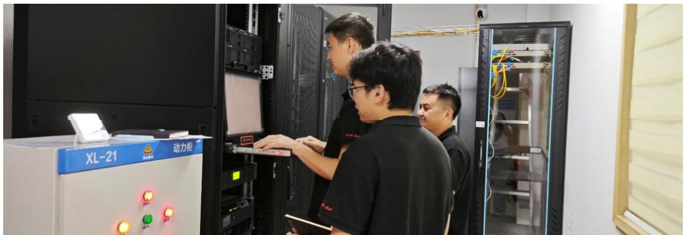

text_image

XL-21
动力柜

演练现场照片

# 信息安全培训

公司建立了制度化的信息安全培训体系，旨在全面提升全体员工的安全意识与防护技能。根据《信息安全管理手册》及《信息安全管理规范》的要求，公司定期对全体员工进行信息安全教育，内容涵盖安全方针、岗位职责、风险意识及实操技能。公司通过系统性的信息安全培训，持续强化员工对信息安全威胁的认识、明确其安全责任，并使其在日常工作中能自觉遵守安全规范、有效支持公司安全方针，从而构建起全员参与、主动防御的信息安全文化，为人与数据资产提供坚实保障。

关键指标

<table><tr><td>指标</td><td>单位</td><td>2025 年</td></tr><tr><td>数据安全事件发生数</td><td>起</td><td>0</td></tr><tr><td>泄露客户隐私事件</td><td>起</td><td>0</td></tr></table>

# 员工权益

# 员工雇佣

公司严格遵循《中华人民共和国劳动合同法》《中华人民共和国劳动合同法实施条例》等劳动法律法规，并承诺执行责任商业联盟（RBA）劳工标准，依据《劳动合同管理基准》《招聘管理流程》及《RBA社会责任管理手册》等制度，建立覆盖招聘、录用及劳动关系全过程的合规用工管理框架。

公司通过身份信息核查与合规审查机制，从源头确保员工达到法定工作年龄且雇佣行为基于自愿原则，坚决防范童工及任何形式的强迫劳动。同时，公司在招聘与用工过程中坚持公平与非歧视原则，不因人种、性别、年龄、残疾或宗教信仰等个人特征区别对待候选人，通过多元招聘渠道推动公开、平等和包容的用工环境。

报告期内，公司经确认的歧视事件、强迫劳动事件及童工事件均为 0，相关管理措施持续有效运行，支持员工权益保障与规范用工管理。

# 案例 | 多元化、反歧视与反骚扰问题的意识培训

2025 年，公司已将多元化、反歧视与反骚扰的意识培养深度融入人才引入环节，在新员工入职培训中设立了专项必修内容。该培训系统阐述了职场中歧视与骚扰的明确定义、常见形式与法律边界，并重点向新员工传达公司的“零容忍”政策、内部申诉渠道及保密保护机制。通过案例分析与互动指引，培训不仅帮助员工识别与防范不当行为，也强化了其维护自身权益的意识和能力。此举旨在从员工入职伊始，就夯实平等、尊重、安全的组织文化基础，系统性推动包容性职场环境的构建。

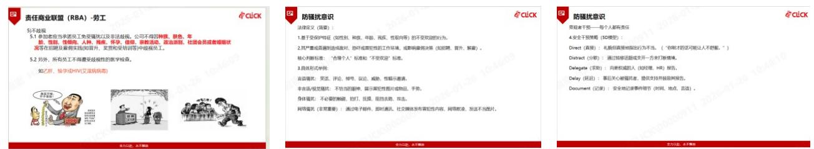  
多元化、反歧视与反骚扰培训

# 案例 | 公司参与大型综合招聘会

2025 年 3 月，公司参与 “百万英才汇南粤” 春季大型综合招聘会。该活动为广东省 “百万英才汇南粤” 行动计划年度首场大型综合招聘活动，以 “职引未来 粤聚英才” 为主题。公司现场提供 10 余个招聘岗位，岗位薪酬与市场水平基本匹配，与高校毕业生开展现场交流与岗位沟通，累计吸引来自多所高校的上百名学生投递简历。经后续沟通与面试，公司与 18 名候选人初步达成就业意向。

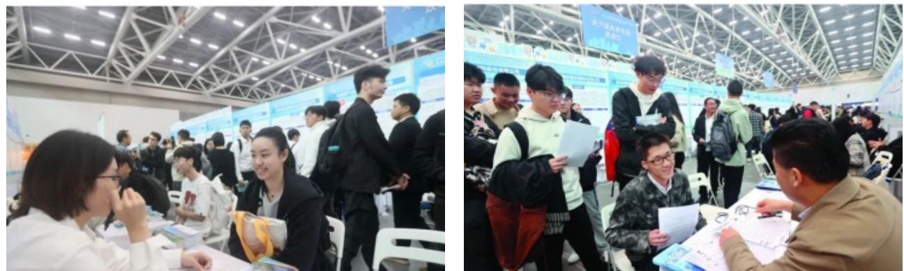  
招聘活动现场

员工总人数：7,176 人，其中残疾员工人数 28 人，少数民族员工人数 1,016 人

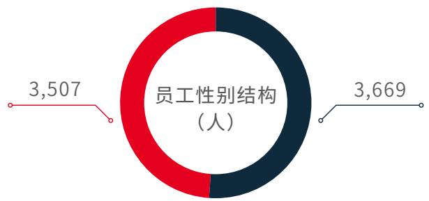

donut

| Category | Value (人) |
| --- | --- |
| 深色部分 | 3,669 |
| 红色部分 | 3,507 |

■ 男性员工 ■ 女性员工

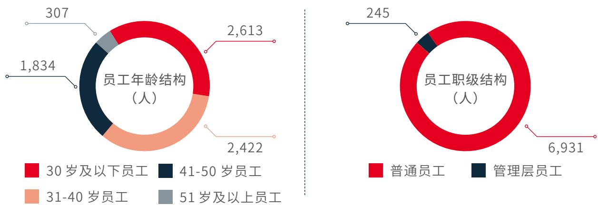

# 薪酬福利

# 薪酬绩效管理

公司制定《工资支付管理规范》，构建合规、透明的薪酬管理体系。该规范明确薪酬标准不低于当地最低工资水平，并依据《中华人民共和国劳动法》系统规定了工资构成、支付周期、加班工资计算标准及各类假期薪资核发方式。公司通过规范的银行代发流程，保障薪酬按时、准确支付，致力于建立公平、激励的报酬机制，以维护员工合法权益，支持人才发展与稳定。

公司制定《绩效管理与绩效考核管理规则》，建立了覆盖目标设定、过程辅导、考核评价、反馈改进及申诉处理的闭环管理体系。制度明确了季度与月度相结合的考核周期，并通过电子化流程规范考核程序，强化绩效面谈与双向沟通。考核结果与薪酬激励、晋升发展及绩效改进直接关联，并严格执行等级比例分布，以保障评价过程的公正、客观，实现员工与组织的共同提升。

公司保障员工在绩效考核过程中的反馈与申诉权利，员工可通过直属主管或人力资源部门提出异议，人力资源部门依制度组织复核与处理，并在规定时限内反馈结果。相关资料与处理意见纳入存档管理，形成沟通、复核与反馈相衔接的闭环流程，支持绩效管理的规范运行与持续改进。

# 股权激励

公司于 2025 年 7 月 9 日召开第五届董事会第十二次会议，审议通过了《关于向 2025 年限制性股票激励计划激励对象授予限制性股票的议案》，董事会同意授予 241 名激励对象 850.00 万股限制性股票。股权激励旨在健全公司长效激励约束机制，将核心骨干与公司长远发展、股东利益深度绑定，进一步激发管理团队及核心员工的积极性与创造力，为公司持续稳健经营、高质量发展注入强劲动力。

# 福利待遇

公司致力于构建超越基本保障的、全面且富有人文关怀的员工福利体系。在依法为全体员工缴纳社会保险和住房公积金的基础上，提供多样化的福利与补贴。公司为员工发放高温补贴费、节日及生日礼物，并依据经营状况组织员工集体活动，旨在提升员工的归属感、满意度与整体福祉。

# 案例 | 举办系列庆典活动

2025 年 10 月至 11 月，公司及子公司为纪念成立 30 周年暨上市 10 周年，组织举办了系列庆典活动，核心包括周年启动会与全员徒步活动。活动吸引了超过 5,000 名员工积极参与。周年启动会旨在引导全体员工共同回顾公司发展历程，凝聚战略共识，并展望未来愿景。紧随其后的徒步活动，则为员工提供了促进身心健康、加强跨部门交流的集体参与平台。系列活动的有效开展，切实增强了员工的归属感、团队精神与组织认同，展现了公司充满活力的文化氛围，亦为公司在可持续发展进程中关注员工福祉、构建积极健康的职场环境提供了具体实践。

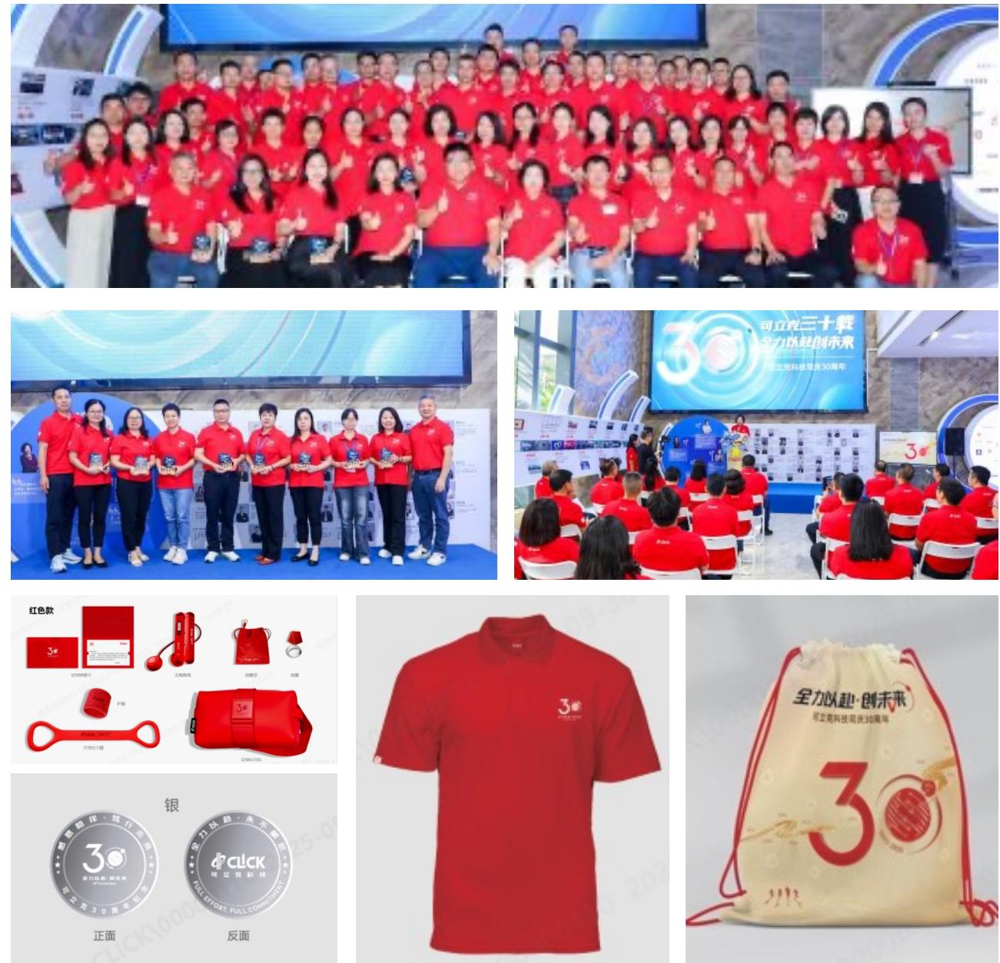  
30 周年启动会与员工纪念品

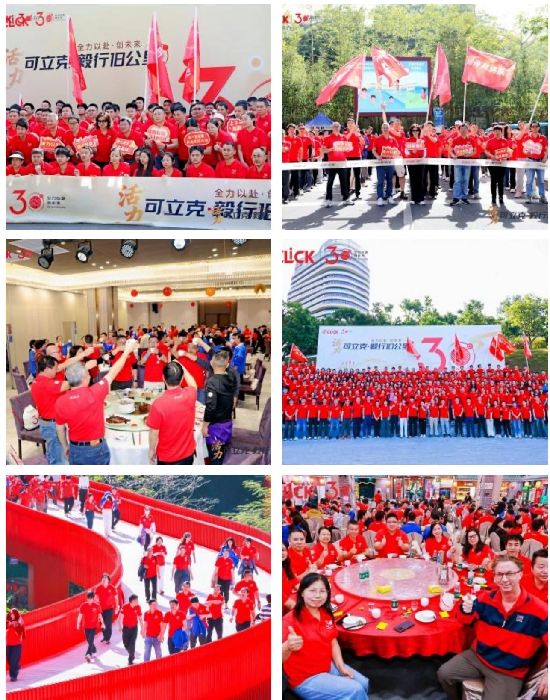  
30 周年徒步活动

报告期内，公司组织开展春节礼品发放、员工生日会、元宵游园活动、“三八”妇女节活动、端午节拔河比赛及礼品发放、中秋游园活动及礼品发放等员工关怀与福利活动，累计吸引5,000余人次参与。相关活动有助于丰富员工文化生活，增强团队互动与凝聚力，营造积极、健康的工作氛围，提升员工的获得感与归属感。

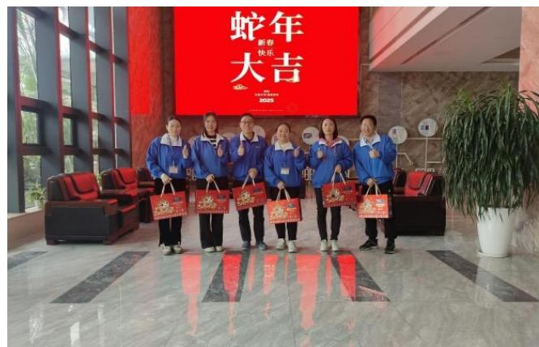

text_image

蛇年
新春
快乐
大吉

春节礼品发放

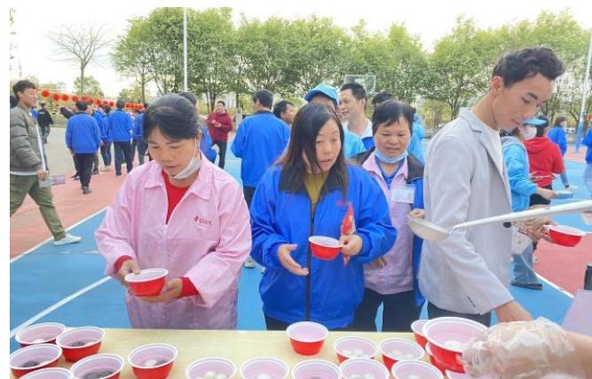

natural_image

Group of people in outdoor uniforms and masks sharing a table with red cups, outdoors near trees (no visible text or symbols)

元宵游园活动

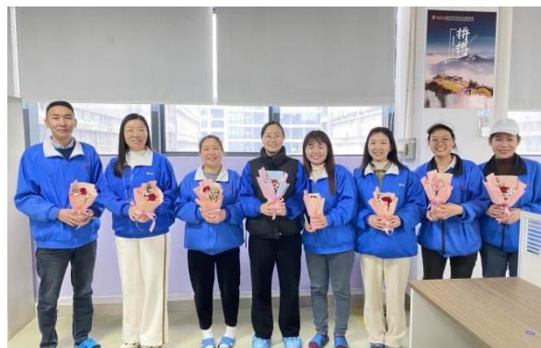

natural_image

Group photo of eight people in blue jackets holding flower bouquets indoors, no visible text or symbols

三八活动

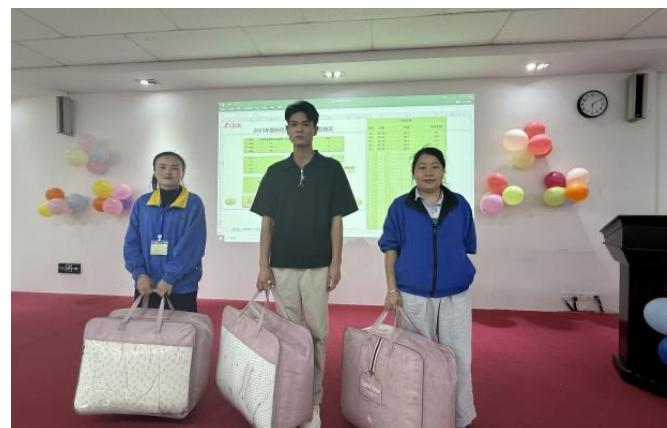

text_image

Group photo of three people holding pink bags in front of a presentation screen with Chinese text and balloons, likely at an event or training session.

生日会活动

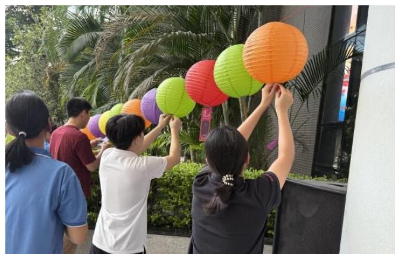

natural_image

Group of people holding colorful lanterns outdoors, surrounded by palm trees and greenery (no visible text or symbols)

中秋游园活动

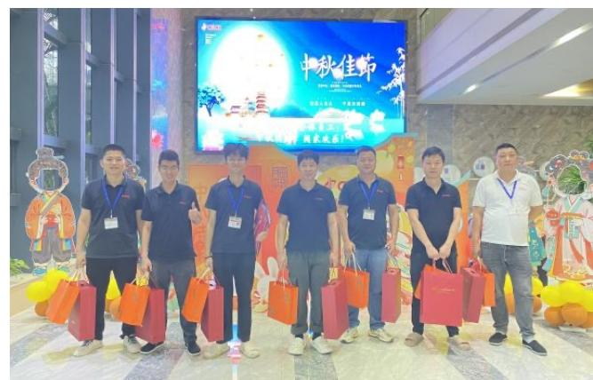

text_image

中秋佳節
2023.01.04 - 2023.01.05
中秋佳節
2023.01.06 - 2023.01.07
中秋佳節
2023.01.08 - 2023.01.09
中秋佳節
2023.01.10 - 2023.01.11
中秋佳節
2023.01.13 - 2023.01.14
中秋佳節
2023.01.16 - 2023.01.17
中秋佳節
2023.01.19 - 2023.01.20
中秋佳節
2023.01.22 - 2023.01.23
中秋佳節
2023.01.25 - 2023.01.26
中秋佳節
2023.01.29 - 2023.01.30
中秋佳節
2023.01.31 - 2023.01.32
中秋佳節
2023.01.35 - 2023.01.36
中秋佳節
2023.01.38 - 2023.01.39
中秋佳節
2023.01.41 - 2023.01.42
中秋佳節
2023.01.44 - 2023.01.45
中秋佳節
2023.01.47 - 2023.01.48
中秋佳節
2023.01.50 - 2023.01.51
中秋佳節
2023.01.53 - 2023.01.54
中秋佳節
2023.01.56 - 2023.01.57
中秋佳節
2023.01.59 - 2023.01.60
中秋佳節
2023.01.63 - 2023.01.64
中秋佳節
2023.01.66 - 2023.01.67
中秋佳節
2023.01.69 - 2023.01.70
中秋佳節
2023.01.73 - 2023.01.74
中秋佳節
2023.01.77 - 2023.01.78
中秋佳節
2023.01.80 - 2023.01.81
中秋佳節
2023.01.84 - 2023.01.85
中秋佳節
2023.01.87 - 2023.01.88
中秋佳節
2023.01.91 - 2023.01.92
中秋佳節
2023.01.94 - 2023.01.95
中秋佳節
2023.01.97 - 2023.01.98
中秋佳節
2023.01.10 - 2023.01.11
中秋佳節
2023.01.13 - 2023.01.14
中秋佳節
2023.01.16 - 2023.01.17
中秋佳節
2023.01.19 - 2O.C.A.
中秋佳節

中秋游礼品发放

# 权益保障

# 关爱女性员工

公司严格遵循《中华人民共和国劳动法》《中华人民共和国劳动合同法》等国家法律法规，建立了系统化的专项保障机制，切实维护女性员工的合法权益。

在女职工保护方面，公司明确禁止安排其从事国家规定的第四级体力劳动及禁忌岗位，并根据女性生理特点实施分级保护：经期不安排高低温、冷水及高强度劳动；孕期禁止加班、接触有害物质及高风险作业，怀孕七个月以上不安排夜班并保障工间休息；依法落实产假，并为哺乳期女职工提供每日两次、每次30分钟的哺乳时间，且视同正常劳动时间。此外，公司坚决禁止任何形式的性骚扰、人格侮辱与人身侵犯，保障女性员工在职场中的人格尊严与人身安全。

# 困难员工帮扶

公司深切关注每一位员工的福祉，将对困难员工的及时帮扶视为履行企业社会责任、践行以人为本理念的重要体现。公司通过积极主动的沟通与实际行动，为遇到重大疾病、家庭变故或其他特殊困难的同事提供必要的物质与精神援助，切实传递组织的温暖，与员工共渡难关。

# 2025年：

公司困难员工帮扶人数 2 人

# 案例 | 困难员工捐助帮扶

2025 年 6 月，电源生产部员工凡突发交通事故重伤住院，家庭面临较大经济压力。公司在获悉情况后，发起员工互助捐款倡议，组织同事自愿参与帮扶。活动开展后，短期内共募集善款 25,232.51 元，并及时转交员工本人及家属，用于缓解其医疗及生活支出压力。

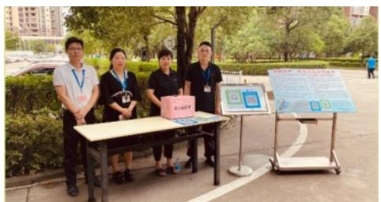

text_image

Group photo of four people standing outdoors near a table with informational boards and a display board, likely at an outdoor event or public information booth.

公司捐款现场

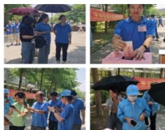

natural_image

Four-panel photo collage showing people in blue uniforms interacting outdoors under umbrellas, with no visible text or symbols.

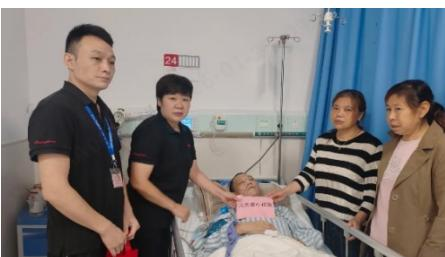

text_image

Photo of a hospital scene with four people, including one holding a sign reading '24' and another in a bed, likely for medical or health care training.

去医院探望病人

# 民主沟通

# 民主管理

公司始终重视并积极推进民主管理，严格遵守《中华人民共和国工会法》等法律法规，依法制定了《工会管理基准》等内部制度，支持工会独立自主地开展工作。公司通过建立健全沟通渠道，鼓励员工参与民主管理与监督，致力于构建和谐、稳定、透明的劳动关系，保障员工的合法权益，促进公司与员工的共同发展。

# 案例 | 公司召开职工代表大会，保障员工合法权益

2025 年 10 月，公司召开职工代表大会，选举产生第五届董事会职工代表董事。本次选举严格依照《公司法》《公司章程》规范开展，充分践行民主程序，切实保障员工的知情权、参与权与监督权，畅通员工诉求表达渠道，更好地维护员工合法权益。

# 员工满意度

公司定期开展员工满意度调查，旨在建立与管理层有效沟通的反馈渠道，系统把握员工在各管理维度的真实感受，并识别需重点改进的领域。2025年，公司开展员工满意度调查，本次调查有效回收问卷1,470份，员工满意度为95.71%。调查涵盖品质意识满意度、工作与职业发展满意度、企业文化满意度、薪酬福利满意度、领导能力满意度、员工地位满意度及团队合作满意度共7大维度。公司已针对不满意事项制定并推动改进措施，包括规划年度文化活动、强化领导反馈与认可机制、优化薪酬解释与发放流程，以持续提升员工体验与组织效能。

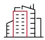

# 员工培训与发展

# 员工培训

# 培训管理

公司建立了系统化的培训管理制度，确保培训工作有序、有效开展。依据《RBA社会责任管理手册》及《培训管理规则》，公司明确了培训的权责与目标：人力资源部负责整体制度的完善与监督，各部门负责提出需求并组织实施。培训的核心目的是使员工理解自身权利与义务，并掌握必要的法律法规、公司政策、环境健康安全及岗位专业技能，以降低职业风险。

关键指标

<table><tr><td>指标</td><td>单位</td><td>2025年</td></tr><tr><td>员工培训总投入</td><td>万元</td><td>50.37</td></tr><tr><td>员工培训场次</td><td>次</td><td>1,607</td></tr><tr><td>员工培训总时长</td><td>小时</td><td>78,521</td></tr><tr><td>管理层培训总时长</td><td>小时</td><td>6,300</td></tr><tr><td>员工培训覆盖率</td><td>%</td><td>100</td></tr></table>

# 专业培训

公司员工专业培训已形成覆盖全面、形式多样、注重实效的完整体系。公司制定了《2025年度培训计划表》，培训内容紧密围绕公司运营与发展的核心需求展开，主要可分为内部系统化培训与外部专业化认证两大方向。通过内外结合、理论与实操并重的专业培训，公司致力于持续提升员工队伍的专业素养与技术能力，为业务发展与技术创新夯实人才基础。

# 内部培训

公司建立了以岗位技能为核心的强制性认证体系，确保员工胜任力。依据《电源作业员技能认定管理基准》与《变压器作业员技能认定作业指导书》，所有生产作业员必须通过其所在岗位（分为一般、关键、特殊岗位）的理论与实操考核，获得上岗证后方可独立作业。同时，公司系统性地组织大量内训课程，内容广泛，主要由内部专家、管理者或通过网课平台组织实施，强调知识的内部传承与转化。

# 外部培训

公司积极引入前沿标准与权威认证，以提升团队的专业纵深与合规水平。这包括选派员工参加外部机构举办的专业资格认证培训（如电工、叉车工、特种设备操作等法定上岗证书），以及行业高阶标准培训（如 ISO14064/14067 温室气体核查员、ISO26262 道路功能安全等）。此类外训确保了公司在关键领域与最新法规、国际标准保持同步。

# 案例 | 员工技能培训

2025 年 1-12 月，公司组织开展各类入职培训、在岗培训、技能培训、专家培训、技术研讨会等。5000+ 员工积极参与，通过培训实现赋能于人，提效于企。对员工而言组织开展培训能提升岗位胜任力与自信心，支持职业发展与晋升，增强适应性与就业安全感。对公司而言能提升生产效率与质量、促进创新与知识沉淀、文化传承、保障战略落地与业务发展。

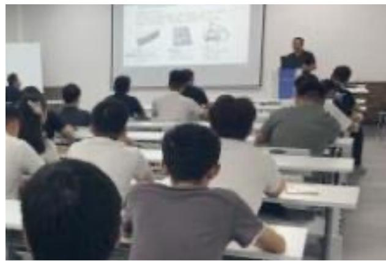

text_image

Classroom scene with students facing a presenter; presentation screen visible in background

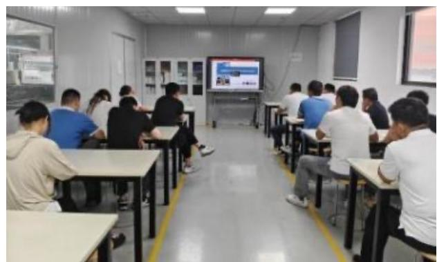

natural_image

Interior of a classroom or training room with students seated at desks facing a computer screen (no visible text or symbols)

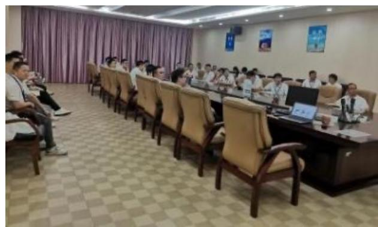

natural_image

Group of people seated in a conference room with chairs and a long table, no visible text or signage

专家培训  
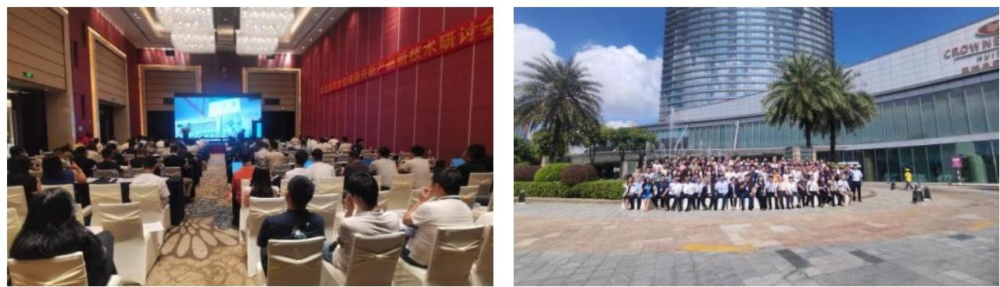  
技术研讨会

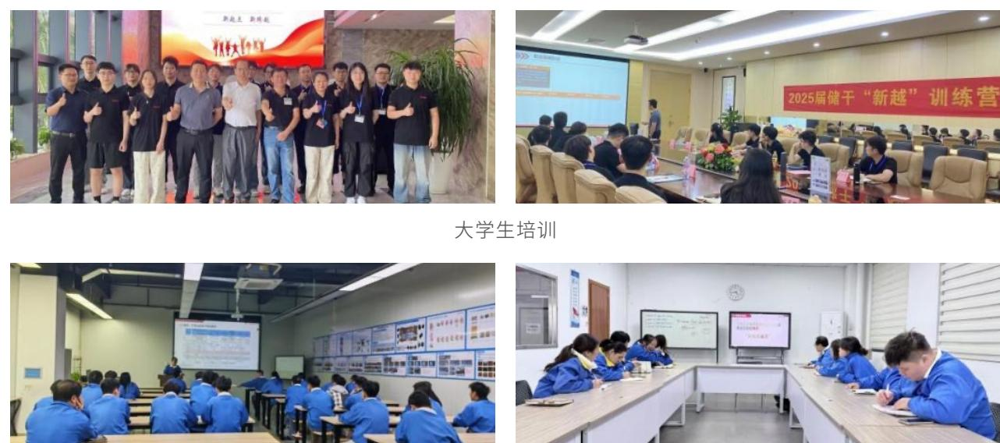

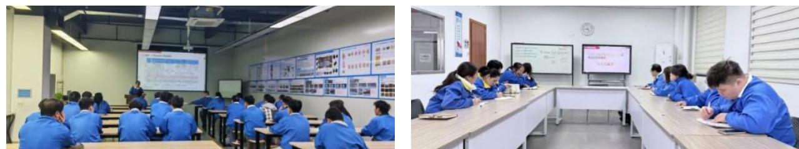  
在岗培训

# 员工职业路径

公司致力于构建清晰、多元的职业发展体系，为员工提供广阔的成长空间。公司制定并实施《可立克集团职位管理制度》，系统规划员工的职业路径与发展机制。

# 职业发展与晋升通道

公司建立了标准化的职位职级体系，为员工设计了纵向发展与横向拓展相结合的双通道路径。制度将公司所有职位划分为管理族（M）、专业族（P）和操作族（O）三大序列，并在各序列内细分为多个职位类（如研发、市场、供应链等），明确了从高层、中层、基层至一线的五层职位层级。每个序列均设有对应的职级（管理族1-6级、专业族1-7级、操作族1-3级），并打通了不同序列间的晋升通道。员工晋级以职位编制与个人绩效表现为基础，鼓励其在专业深度或管理广度上持续提升，实现人岗匹配与职业成长。

# 内部流动与转岗机制

公司鼓励员工通过内部横向流动拓展职业可能性。制度明确规定，在满足目标岗位专业能力要求的前提下，支持操作族员工向专业族、或专业族员工向管理族进行转岗。内部转岗以职级平调为原则，并设立不超过6个月的新岗位考核期。考核期满后，公司将依据员工在新岗位的绩效表现进行综合评估，通过评估则正式适配新职位职级，未通过则协商安排退回原岗或调整至其他岗位。该机制旨在合理配置人力资源，最大化发挥员工潜能，支持组织与个人的共同发展。

# 职业健康与安全

公司严格遵循《中华人民共和国安全生产法》《中华人民共和国职业病防治法》等国家法律法规，持续完善职业健康安全管理体系。公司制定并实施《职业健康安全运行管理规范》《环境职业健康安全管理手册》等一系列制度文件，系统推进风险辨识、过程控制与持续改进，切实保障员工身心健康，筑牢企业安全发展根基。

# 关爱员工健康

# 职业健康保障

公司建立了系统的职业健康监测与职业病防治制度框架，依据《环境、职业健康安全监视和测量管理作业指导书》《职业病危害因素识别表》等文件，对工作场所中可能影响员工健康的危害因素进行识别、评估、监测与控制，旨在预防职业病的发生，保障员工身心健康。

在实际管理中，公司定期组织对工作环境的职业健康监测，针对识别出的化学、物理、生物等职业病危害因素进行定量检测，并依据国家职业接触限值标准进行合规性评估。同时，公司为接触职业病危害因素的员工安排定期的职业健康检查，建立并更新员工职业健康监护档案，以早期发现健康损害迹象，并及时采取干预措施。公司每年还开展系统的合规性评价，全面审视职业健康管理实践与国家法律法规及公司内部要求的符合性，确保职业健康管理体系持续有效运行，切实履行对员工健康安全的承诺。

<table><tr><td>指标</td><td>单位</td><td>2025年</td></tr><tr><td>职业病发生人数</td><td>人</td><td>0</td></tr><tr><td>工伤人数</td><td>人</td><td>8</td></tr><tr><td>因工死亡人数</td><td>人</td><td>0</td></tr><tr><td>因工伤损失工作日数</td><td>日</td><td>455</td></tr><tr><td>安全培训时长</td><td>小时</td><td>7,290</td></tr><tr><td>安全生产投入</td><td>万元</td><td>88.81</td></tr></table>

# 职业健康培训

公司制定《培训管理手册》及相关岗位培训制度，明确将职业健康安全培训纳入全员必修内容，并针对不同岗位与层级设置差异化、系统化的培训课程。通过理论讲授、案例分析与实操演练相结合的方式，持续提升员工职业健康安全风险辨识能力与防范意识，强化岗位操作规程与应急处理技能，从意识培养到行为落实全方位筑牢职业健康安全防线。

# 案例 | 职业健康安全防护培训

为贯彻落实国家安全生产法规及公司年度培训计划，进一步提升全员安全意识与防护能力，我司于2025年11月组织了职业健康安全防护专题培训，共计36名员工参加。本次培训系统讲解了岗位安全风险辨识、个人防护用品（PPE）正确选用与穿戴、职业病危害预防及现场急救知识，并结合行业典型案例进行了深入剖析。增强了员工对自身岗位安全职责与防护要点的认识，为持续夯实公司安全管理基础起到了积极作用。

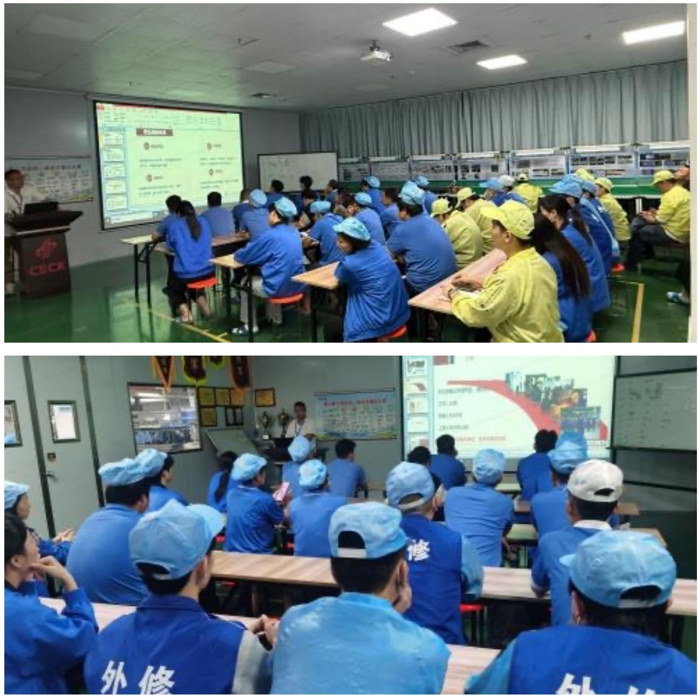  
职业健康安全防护培训图片

# 案例 | 工伤预防及急救知识培训

为强化员工安全意识，提升工伤预防与应急处置能力，我司于2025年8月特邀惠州市职业技能服务中心专家莅临开展专题培训。本次培训共有63名员工参加。通过讲解工伤与工伤保险的基本概念及核心法律法规、工伤认定标准与流程、外伤包扎、毒蛇咬伤紧急处理及烫伤急救等关键方法、和从交通安全、生产作业安全、职业健康防护、机械设备规范操作及消防安全等多维度进行了深入讲解与风险警示。此次培训有效普及了法规知识，显著提升了员工的风险辨识、预防与初级救护能力，为公司构建更坚实的安全防线奠定了良好基础。

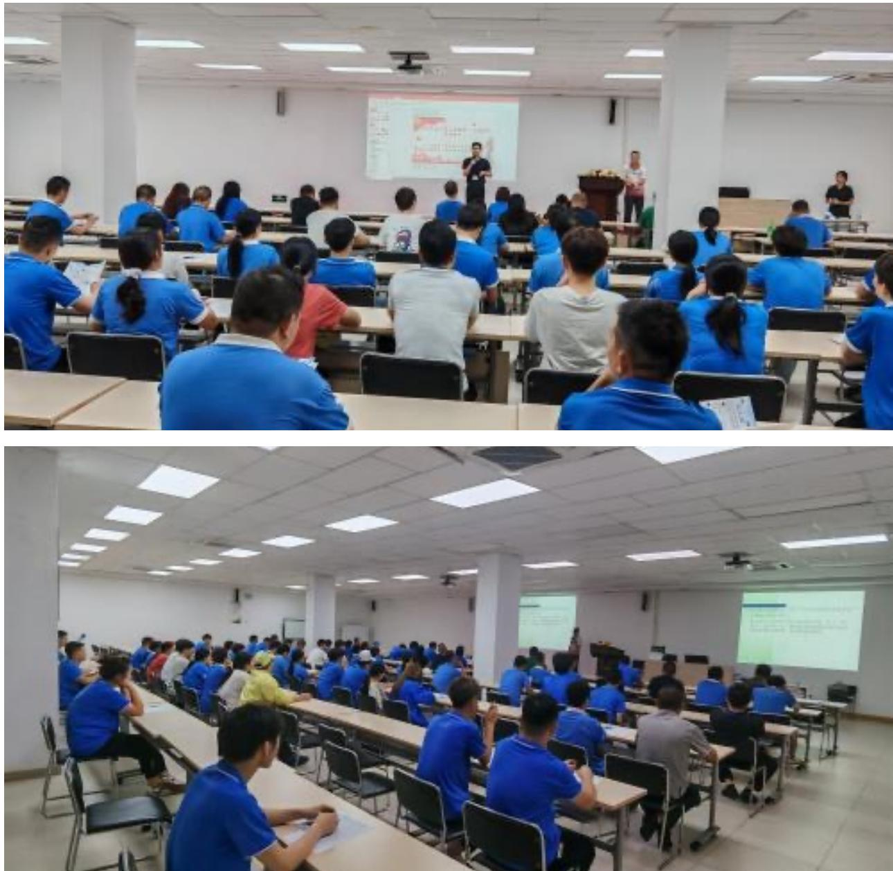  
工伤预防及急救知识培训图片

# 员工安全管理

# 风险防控与隐患排查

公司建立了系统化的风险防控与隐患排查治理体系，依据《危险源辨识和评价作业指导书》《安全生产责任作业指导书》《安全生产检查作业指导书》《安全生产教育培训作业指导书》等核心制度，系统性地管理从危险源识别、风险评估、责任落实到日常检查、培训教育及隐患整改的全过程。该体系明确了各级组织与人员的安全生产职责，规定了覆盖全区域、全时段、全状态的危险源识别方法，以及综合性与专业性相结合的多层次安全检查机制，旨在构建“预防为主、全员参与、持续改进”的安全管理长效机制。

风险防控与隐患排查治理重点举措

<table><tr><td>举措</td><td>主要内容</td></tr><tr><td>危险源识别与风险评估</td><td>公司定期组织各部门系统识别生产与服务活动中的各类危险源,并运用 $LEC^1$ 法开展风险评估与分级管理,对识别出的各类风险进行分级管控。</td></tr><tr><td>重大风险分级控制</td><td>对于识别出的重大风险,公司通过制定专项管理目标与实施方案、完善操作规程、强化应急预案及开展针对性培训等措施进行重点管控,持续提升风险防控能力。</td></tr><tr><td>多层级安全检查机制</td><td>公司严格执行安全生产检查制度,通过岗位日常巡查、部门月度检查、厂级季度综合检查、季节性专项检查及节假日重点检查等方式,对设备设施、作业环境、人员行为及管理落实情况开展系统监督。</td></tr><tr><td>隐患闭环整改管理</td><td>对检查中发现的事故隐患,公司建立从隐患报告、风险评估、制定整改措施到整改完成及跟踪验证的闭环管理流程,确保隐患得到及时、有效的整改。</td></tr><tr><td>全员安全教育培训</td><td>公司持续开展覆盖全员、贯穿职业生涯的安全教育培训,包括新员工三级安全教育、在岗人员定期复训、特种作业人员持证培训及专题安全活动,不断提升员工的安全意识、操作技能与应急处置能力。</td></tr></table>

# 应急管理

公司依据《中华人民共和国安全生产法》等法律法规，构建了系统化、标准化的应急管理体系，制定并实施了《事故应急救援综合预案》。该预案体系涵盖综合预案、专项预案及现场处置方案，明确了应急组织架构，设立应急救援指挥部及抢险救援、现场警戒、后勤保障、医疗救护、通讯联络等专业小组，并详细规定了从工业园至各层级的应急职责与响应程序。预案系统识别了生产运营中可能面临的机械伤害、火灾爆炸、危险化学品泄漏、职业危害急性中毒等各类事故风险，并建立了以“预防为主、平战结合”为原则的预警机制与分级响应流程，确保应急工作有章可循、责任到人。

在实际管理中，公司定期开展全园区综合应急演练与常态化应急培训，确保各级人员掌握应急职责与处置技能。同时，公司持续保障应急队伍、装备与物资资源，并通过危险源监控、预警响应、信息报告及事后恢复等环节形成管理闭环，切实提升对突发事件的快速响应与协同处置能力，最大限度降低事故影响。

# 案例 | 2025 上半年消防综合应急演练

为了贯彻“安全第一、预防为主、防消结合”的方针，强化全员安全意识，提升应急处置能力，确保在突发火情时能够快速响应、科学处置，最大限度保障人员生命和财产安全。惠州市可立克科技有限公司和惠州市可立克电子有限公司于2025年6月进行了2025上半年消防综合应急演练，2,683名员工参与本次演练。此次演练通过讲解消防安全知识要点让我们更加深刻了解消防安全知识、逃生自救技巧以及消防器材使用方法，全面提高全员的消防安全防范意识和应急处置能力。

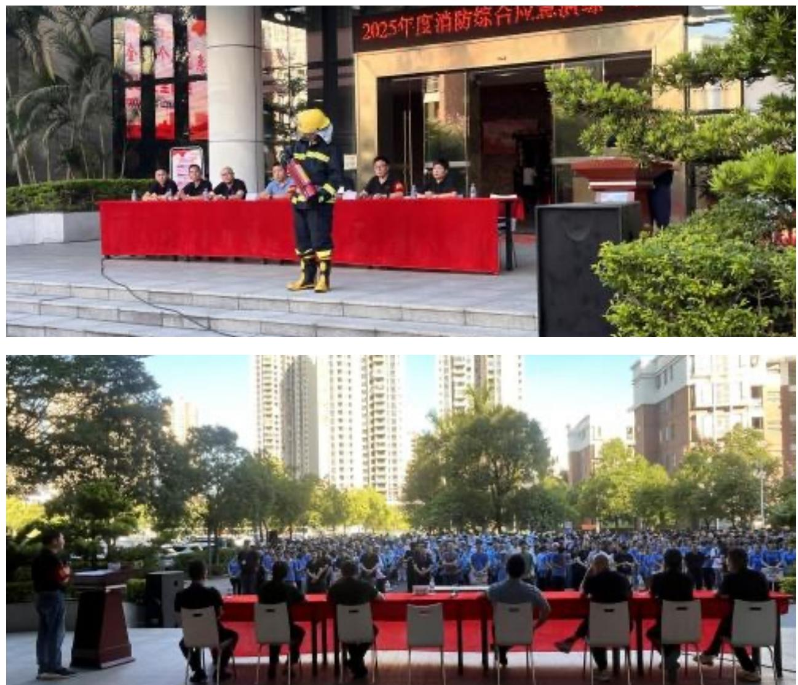  
2025 上半年消防综合应急演练现场图片

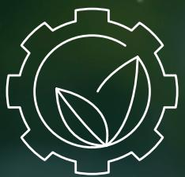

# 绿色实践

# 守护生态环境

# 理念

可立克始终坚守绿色发展初心，将环境责任融入生产运营与战略规划全过程，严格遵循环保法规标准，对标行业先进实践，构建覆盖合规管理、污废处理、能源资源利用、应对气候变化及有害物质管控的全方位环境管理体系。通过制度保障、技术革新与全员参与，持续优化环境绩效，积极响应“双碳”战略，以实际行动守护生态环境，助力可持续发展。

# 我们的行动

环境合规管理

污废排放与处理

能源资源利用

应对气候变化

natural_image

Globe with a tree emerging from a rock, symbolizing global biodiversity or ecological growth (no text or symbols)

SDGs 对标

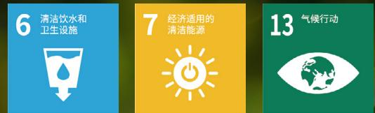

# 环境合规管理

公司严格遵守《中华人民共和国环境保护法》等相关法规，结合经营运营实际，制定并落地《环境职业健康安全管理手册》《环境运行管理规则》等制度文件，在总经理统筹领导下，明确各部门EHS管理岗位职责，构建权责清晰的管理体系。公司持续通过技术创新与管理创新双轮驱动，最大限度管控废弃物产生与排放，降低资源能源消耗；同时强化员工环境意识培育与责任建设，以实际行动践行绿色发展理念，助力绿色家园建设与和谐社会构建。截至报告期末，公司及下属子公司惠州可立克电子、惠州可立克科技、英德可立克、安徽可立克、安远可立克均已通过ISO 14001认证。

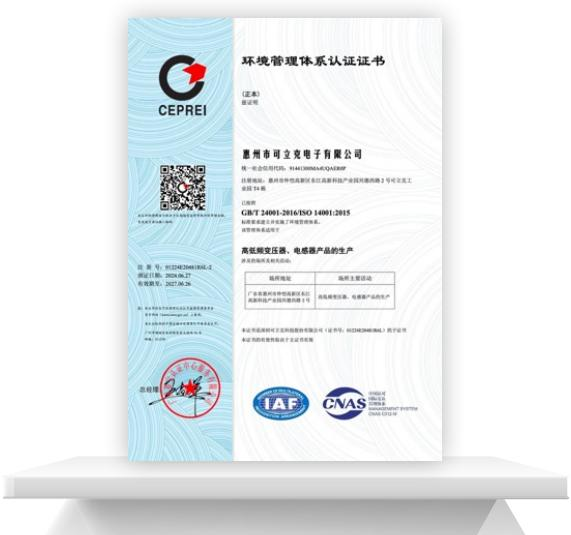

text_image

CEPREI
环境管理体系认证证书
(证书)
登记号:
惠州可立克电子有限公司
统一社会信用代码: 9144300MA4QZA8RP
注册地址: 惠州市仲恺高新区长江高新科技产业园兴德西路2号可立克工业园T4栋
注册号: CB/T 24001-2016/ISO 14001:2015
标准要求及主要产品开发经营业务。
请携带本活动于
高低规格变压器、电感器产品的生产
涉及的高新技术及相关活动。
通用地址	通用主要活动
广东省惠州市仲恺高新区东江高新科技产业园兴德西路2号	电感器研发、电感器产品的生产
本公司及深圳市可立克网络股份有限公司（证券代码：012482404866）的子公司
本公司及控股公司及子公司为公司
CEPREI
CEPREI
CEPREI
CEPREI
CEPREI
CEPREI
CEPREI
CEPREI
CEPREI
CEPREI
CEPREI
CEPREI
CEPREI
CEPREI
CEPREI
CEPREI
CEPREI
CEPREI
CEPREI
CEPREI
CEPREI
CEPREI
CEPREI
CEPREI
CEPREI
CEPREL
CEPREL
CEPREL
CEPREL
CEPREL
CEPREL
CEPREL
CEPREL
CEPREL
CEPREL
CEPREL
CEPREL
CEPREL
CEPREL
CEPREL
CEPREL
CEPREL
CEPREL
CEPREL
CEPREL
CEPREL
CEPREL
CEPREL
CEPREL
CEPREL
CEPRE<nl>

惠州可立克电子环境管理体系认证证书

# 2025年：

公司环保总投入 66.36 万元

可立克环境管理组织架构与职责

<table><tr><td>部门/岗位</td><td>职责</td></tr><tr><td>总经理</td><td>统筹环境管理体系策划工作,制定并签署批准、颁布环境方针,公开环境相关承诺,严格遵守环境保护相关法律法规,组织开展环境管理体系的管理评审工作等。</td></tr><tr><td>管理者代表</td><td>统筹环境管理体系的建立、实施与维护,定期向总经理汇报体系运行情况并提出改进建议;审核批准环境管理体系文件发放范围及程序文件,审核《环境管理手册》内容;审核环境目标、指标与管理方案,并组织落地实施等。</td></tr><tr><td>行政中心</td><td>组织开展公司环境因素识别与评价工作,在管理者代表领导下推进环境管理体系相关管理工作;统筹新、改、扩建项目的环境安全管理,做好与外部相关方的环保日常协调对接,协助总经理开展跨部门环境管理相关的内部沟通协调工作等。</td></tr><tr><td>人资中心</td><td>参与公司环境因素识别工作,牵头开展环境管理体系内审,组织制定并落地环境目标与管理方案;开展环境管理合规性评价,统筹环境相关纠正与预防措施的实施及效果验证等。</td></tr><tr><td>其他部门</td><td>落实环境管理及环保工作,开展环境因素和危险源识别等。</td></tr><tr><td>全体员工</td><td>学习贯彻公司环境管理方针与目标,了解并履行相关岗位职责,参与环境相关培训,持续提升岗位技能。</td></tr></table>

# 环境监测

公司制定《产品生命周期环境因素控制矩阵》《环境运行管理作业指导书》《环境控制点清单》等配套文件，构建标准化环境管理依据。由行政部统筹组织例行环境监测，重点评价环境管理效果、重要环境因素及不可接受风险预防控制措施的有效性，及时排查问题、挖掘改进空间；各部门同步开展本部门环境管理体系运行情况日常检查，保障环境管理工作落地见效。

此外，公司依据《危险源辨识和评价作业指导书》，形成由 EHS 小组主导、各部门参与的管理架构，覆盖全区域及不同时态与状态，识别易燃易爆物质、有毒有害物质等环境相关危险源，通过多种方法辨识并量化评估风险，对 80 分以上重大危险源制定控制措施，在必要时更新识别与评价结果，形成闭环管理。

# 应急预案

公司制定《生产安全事故应急预案》，形成综合应急预案、专项应急预案、现场处置方案的管理体系，覆盖危险化学品泄漏、火灾、中毒和窒息等环境相关风险场景。成立以总经理为总指挥的应急指挥部，明确应急小组职责，配套完善应急物资储备、通讯保障、经费支持等机制，建立24小时值班与信息报告制度。按规定每年组织至少两次应急演练，通过实战化操作检验预案有效性；定期开展应急知识培训，组织预案评审与修订，同时与相邻单位签订应急互助联防协议，确保应急管理全流程规范可控，提升突发环境事件处置能力。

# 案例 | 化学品泄漏应急演练

为提升环境风险防控与突发环境事故应急处置能力，强化应急队伍快速响应水平及自我保护意识，最大限度降低事故损失、保障人财安全与生态环境，惠州可立克科技和惠州可立克电子于2025年4月17日开展化学品泄漏应急演练，有22名员工参与。演练模拟危险化学品泄漏场景，规范开展应急响应、人员疏散、现场封锁及事故处置等实操环节。此次演练让员工明晰危化品泄漏应急流程，掌握基础处置技能，有效提升了公司突发环境事件应对能力。

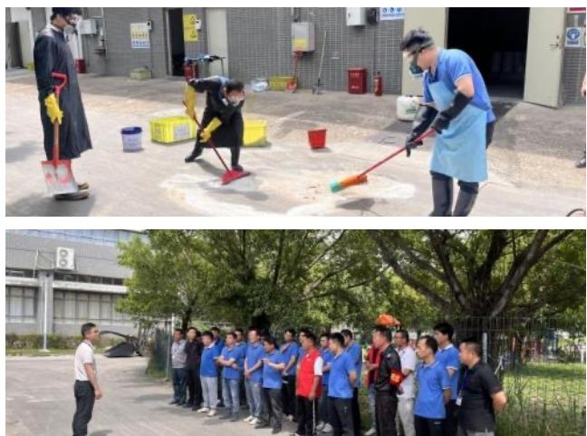  
化学品泄漏应急演练现场

# 环保培训

公司制定《环境管理物质规范》，明确环保组职责，由其负责持续收集、整理环保相关最新法规与行业资讯，并通过定期宣传、培训等形式普及推广；同时，人事部门将环保意识培训纳入新员工入职培训体系，从入职初期强化员工环保认知，构建全员参与的环保管理基础。

# 案例 | 环保知识及法规培训

为系统性提升公司产品全球市场环保合规水平，有效防范供应链环保风险，公司于2025年4月16日组织开展年度环保知识与法规专题培训。本次培训以国际主流环保法规为核心内容，重点解读欧盟REACH、RoHS、美国TSCA、加州65提案等法规最新动态，及PFAS、卤素、无红磷等特定物质的管控要求；同时明确各部门环保管理职责与文件管理规范，结合典型案例剖析违规后果。此次培训切实强化了相关人员的环保法规认知与专业知识储备，明晰了各岗位环保合规责任，为公司全面履行企业环境责任筑牢坚实的知识与能力基础。

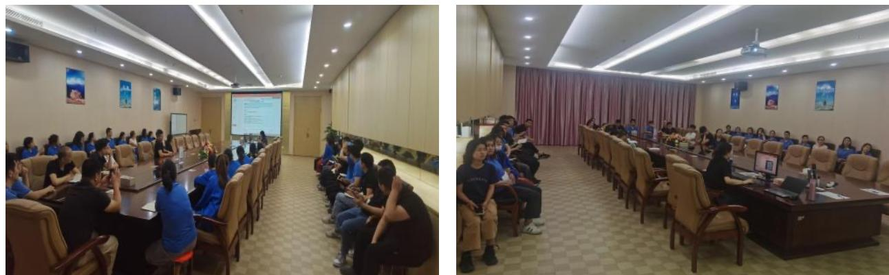  
环保知识及法规培训现场

公司在日常运营中推进绿色办公实践，将节能降耗与资源节约理念融入办公管理。通过推广无纸化办公、双面打印及电子化审批流程，减少纸张消耗；加强办公区域用电与设备管理，倡导随手关灯与合理使用空调等节能行为；同时规范办公物资采购与使用，推动资源循环利用与减少浪费。相关措施作为日常管理要求持续落实，支持办公运营向低碳、节约方向转型。

# 污废排放与处理

公司严格遵循环保相关法律法规及行业标准，制定《废水、废气、噪音管理作业指导书》《固体废物管理作业指导书》等专项制度，构建覆盖废气、废水、噪声、废弃物的污染防治与管理体系。通过源头管控、过程治理、末端合规处置的全链条管理思路，针对性治理技术与设施，明确各部门管理职责与操作规范，定期开展监测与整改优化，确保各类污染物排放稳定达标，持续降低环境影响，践行绿色生产与可持续发展理念。

# 废气管理

公司的废气来源主要为生产原料及过程挥发的有机溶剂气体、清洁运输等活动产生的排放。通过强制通风处理产生的废气，行政部定期对排气通风设备开展维护保养并做好记录；对无组织排放的灰尘等污染物，采取厂区植树种草、改善通风条件等措施净化空气。建立废气排放口设施管控清单，每年委托第三方环境监测机构对有组织及无组织排放废气进行检测，形成废气检测报告预警清单，确保排放指标符合国家及地方标准。

在新材料新设备新工艺启用、生产线扩增、废气治理设备运转异常等特殊情况时，及时委托合格监测机构补充监测，若出现超标则按应急程序处理；新增排气装置需验收合格后方可排放。

# 案例 | 活性炭装置助力 VOCs 治理

为深化环保管理、筑牢废气治理防线，公司配备 16 套活性炭废气处理装置，聚焦生产过程中挥发性有机物（VOCs）等废气的源头控制。相较于传统简易排放或部分处理模式，该装置采用高性能活性炭吸附工艺，大幅提升特定废气成分去除效率，既确保废气排放口稳定达标，又有效改善车间内部及厂区周边空气质量，显著降低环境与健康风险，为公司生产经营的长期可持续发展奠定坚实基础。

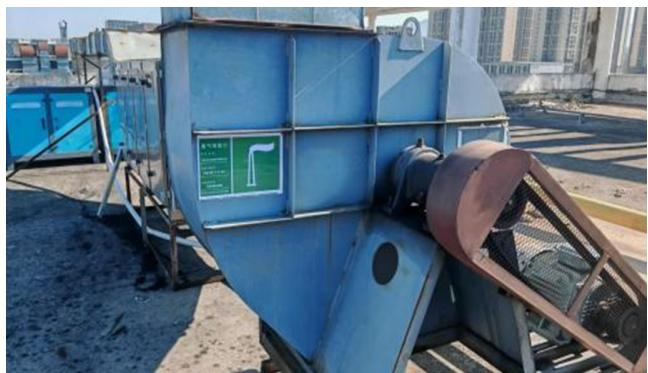

natural_image

Exterior view of a large blue industrial machine with visible structural components and control panel (no readable text or symbols)

废气处理装置

# 废水管理

废水主要来源于厂区内的生活废水，对此公司严格执行“禁止直接排入下水管道”的管控要求，含油废水、设备清洗废水等均集中收集，交由有资质的协作单位回收处理。废油、废化学品等有害物品禁止倒入下水道，需存入专门容器由指定单位回收；废渣、垃圾等不得冲入下水道，垃圾需置于指定地点避免露天摆放，防止雨天废水流入雨水管道；同时禁止在公司内冲洗汽车，滴漏的油及化学品需用抹布擦拭清理，避免流入下水道。

对于废水、雨水管道，公司定期开展清理维护，每年委托法定资格环保监测机构对废水排放指标进行检测，严格遵守《污水综合排放标准》（GB8978-1996）及广东省地方二级标准，若出现不符合项，责令责任部门整改后重新监测直至达标。

<table><tr><td>指标名称</td><td>单位</td><td>2025年</td></tr><tr><td>废水排放总量</td><td>立方米</td><td>225,523.90</td></tr><tr><td>化学需氧量排放量</td><td>吨</td><td>6.15</td></tr><tr><td>氨氮排放量</td><td>吨</td><td>0.30</td></tr></table>

# 噪声管理

噪声主要来源于机械运转、车辆运输及建筑施工等。公司通过合理使用噪声设备、定时维护保养、及时维修排除故障等方式，降低设备磨损以减少噪声产生。各部门采取针对性降噪措施，确保厂界噪声符合《工业企业厂界噪声标准》（GB12348-90）及《城市区域环境噪声标准》（GB3096-93）中二类区域规定。每年委托法定资格环保监测机构开展一次噪声专项监测，若出现噪声超标情况，作业人员需佩戴噪声防护工具，必要时为设备加装隔音、消音装置，保障员工职业健康与周边环境安全。

# 废弃物处理

公司废弃物按性质分为危险废弃物、生产废弃物及一般废弃物三类，其中危险废弃物含剧毒、易爆、放射等有害废弃物质，生产废弃物为生产活动产生的非危险废弃物（含可回收与不可回收两类），一般废弃物为办公、生活等日常活动产生的废弃物。以上废弃物来源覆盖公司生产、办公及日常运营全场景，包括生产过程中产生的废溶剂、废油、废弃金属等，办公场景的纸类、塑胶类废弃物，以及生活场景产生的各类普通垃圾。此外，公司各部门结合生产线变更、新制品导入等情况，动态修订《废弃物分类一览表》，由品质管理部每年组织一次评审更新。

在处置管理方面，公司实行“分类投放、规范贮存、合规处置”的闭环流程。各部门自行设定废弃物暂时放置场所，按分类明确标识，纸类、塑胶类、金属类等废弃物按要求分类回收，危险废弃物需单独密封或加盖贮存，防止废液、废气污染环境。各部门指定专人负责废弃物分类处置、场所整理及记录填报，每日将废弃物运送至公司统一暂置场所，危险废弃物需同步填写《危险废物产生环节记录表》。

公司所有危险废弃物均交由国家认可的有资质单位处置，管理部负责联络对接、记录保存及台账管理，每月输出《危险废物台账企业内部报表》，每年编制《危险废物产生情况一览表》，相关记录保存期限为5年，确保处置全过程可追溯、合规化。

# 案例 | 实行垃圾分类处理

为深化绿色办公实践，推动可持续发展，公司实行精细化垃圾分类处理，并同步向全体员工倡导与推行科学的垃圾分类习惯。与过去简单的混合处理模式相比，本次升级建立了清晰、易行的分类指引体系与专用的标准化回收容器。不仅显著减少了可回收资源的浪费与错投，提高了垃圾的资源化利用率，也为后续的专业回收与无害化处理奠定了良好基础。

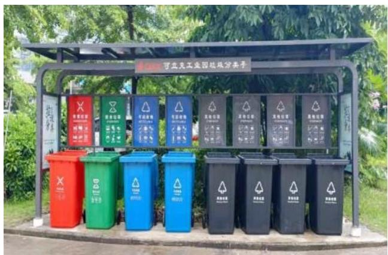

text_image

可选克工业园垃圾分类
绿色建筑
绿色建筑
绿色建筑
绿色建筑
绿色建筑
绿色建筑
绿色建筑
绿色建筑
绿色建筑
绿色建筑
绿色建筑
绿色建筑
绿色建筑
绿色建筑
绿色建筑
绿色建筑
绿色建筑
绿色建筑
绿色建筑
绿色建筑
绿色建筑
绿色建筑
绿色建筑
绿色建筑
绿色建筑
绿色建筑
绿色建筑
绿色建筑
绿色建筑
绿色建筑
绿色建筑
绿色建筑
绿色建筑
绿色建筑

垃圾分类回收站图片

# 案例 | 栈板回收改造

为践行绿色供应链理念、实现降本增效双赢，公司持续优化栈板系统管理模式，将传统“报废换新”升级为“维修循环”机制。针对破损栈板开展集中评估与专业化修复，通过替换损坏部件使其恢复安全使用标准。这一举措不仅大幅节约运营成本与木材资源，有效减少固体废物产生，更将环保理念深度融入日常物料管理环节，强化全员节约与循环利用的责任意识，切实实现经济效益与环境效益的协同统一。

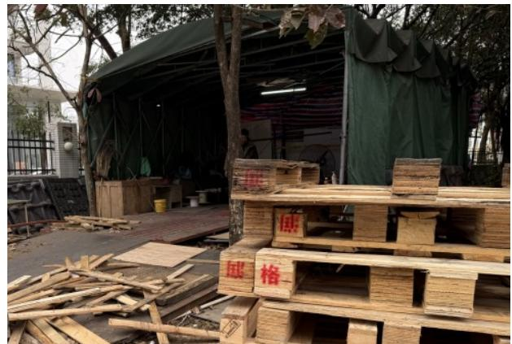

natural_image

Outdoor scene with wooden pallets and a green tent in the background, no visible text or symbols on the main structures.

栈板回收站

<table><tr><td>指标名称</td><td>单位</td><td>2025 年</td></tr><tr><td>产生的无害废弃物总量</td><td>吨</td><td>777.72</td></tr><tr><td>产生的无害废弃物密度</td><td>吨 / 百万元营收</td><td>0.14</td></tr></table>

# 危化品管理

公司制定《危险化学品安全管理作业指导书》，构建覆盖危险化学品采购、贮存、使用、废弃处置全生命周期的闭环管理体系，明确各部门权责分工，强化全流程风险管控，保障员工安全与生态环境。

# 各部门危险化学品管理职责

# 仓储部

负责危险化学品的储存、领取、运输及使用管理，建立出入库登记台账并开展定期安全检查。

# 行政部安全课

承担安全监督职责，涵盖设施安全审查与评价、废弃处置监督、应急预案制定与演练，同时组织相关人员安全培训及仓管人员取证工作。

# 生产部

负责本部门化学品使用及相关装置设施的安全管理。

# 策略采购部

在采购前严格评审供应商资质，确保产品合格并获取中文安全技术说明书（MSDS）及安全标签。

在贮存与使用方面，公司危险化学品实行专库、专柜、专人管理，按性质分区分类存放，互相接触易发生危险的物品隔离贮存，严格遵守“五距”标准。库房配备通风、避雷、防爆设施及消防器材，严禁明火与动火作业（特殊情况需办许可证），包装破损渗漏的立即退货，装储容器一品一用。使用时需附有MSDS及安全标签，作业场所配备防护设施与个人防护用品，领料仅限当班用量，操作人员穿戴劳保用品，作业场所定期开展职业卫生检测与评价。

在处理处置方面，公司废弃危险化学品依据相关法规处置，各部门设置远离热源电源的收集点，分类存放并登记，委托资质单位合规处置。行政部制定应急救援预案，配备救援人员与器材并定期演练，事故发生时启动预案防止扩大，按规定开展调查、处理与上报。化学品与 MSDS 清单、危险化学品检查记录表等由行政部封存保存 5 年。

<table><tr><td>指标名称</td><td>单位</td><td>2025 年</td></tr><tr><td>产生的有害废弃物总量</td><td>吨</td><td>50.81</td></tr><tr><td>产生的有害废弃物密度</td><td>吨 / 百万元营收</td><td>0.01</td></tr></table>

natural_image

Aerial view of a winding road through a turquoise lake surrounded by dense green pine forest (no text or symbols visible)

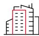

# 能源资源利用

公司重视能源与水资源的高效利用及节约降耗，以绿色低碳、可持续发展为导向，制定《能源管理规范》《资源、能源节约管理作业指导书》等专项制度，构建覆盖能源购置、使用、维护及水资源配置、消耗、泄漏防控全流程的闭环管理体系。聚焦生产、办公、生活等全场景能源与水资源管控，持续提升利用效率、减少浪费。

# 能源利用

公司以合理用能、节能降耗为核心目标，构建权责清晰、流程闭环的能源管理体系，覆盖能源购置、运输、使用、维护及异常处理全环节。公司制造中心负责能源需求提报与使用管理，工务部统筹能源设备系统维护及厂内供给，采购部承担外购能源采购、运输及供应商管理，行政部负责能源调用协调、安全稽核及节能计划推进，财务部按月统计能源消耗数据并年度汇总能耗状况，为节能决策提供支撑。

在日常管理中，行政部根据各部门需求合理调配能源，停产期间及时落实节能控制；各使用部门设专人定期检查耗能设施及供给系统，行政部同步开展专项维护与安全稽核，确保能源稳定供给与规范使用。针对能源供应异常情况，建立快速响应机制，由采购部协同供应商恢复供给，行政部根据实际调整生产计划，紧急情况按应急管理程序处置。

为持续提升能源利用效率，公司从制度管理、设备优化及员工参与等多个方面推进节能降耗工作，通过强化能源管理与技术改造相结合的方式，不断提升能源使用效率，推动节能管理常态化开展。

# 节能降耗管理举措

- 鼓励员工通过提案改善参与节能活动，提升全员节能意识与参与度。  
- 制定能源使用管理标准，加强设备维修与日常保养，减少跑冒滴漏等能源浪费现象。  
- 引入高新技术及节能设备，针对性降低电能消耗。  
- 由行政部门组织各部门制定年度节能计划，并定期开展检查评估，总结节能工作成效。  
- 对重大节能项目制定长期整改方案，并将能源管理相关工作纳入年度管理评审，持续推动能源使用优化。

# 案例 | 安装太阳能路灯

公司积极响应国家“双碳”战略目标，兼顾员工生活体验提升与长期成本控制，在员工宿舍区部署10盏35W一体化太阳能LED路灯。该路灯采用太阳能供电模式，从源头杜绝电力消耗，且光效媲美更高功率传统灯具，有效改善了宿舍区夜间照明条件，显著提升员工夜间出行安全感。项目落地后，不仅实现了运营成本的持续降低，更减少了碳排放，切实达成环境效益、社会效益与经济效益的协同统一。

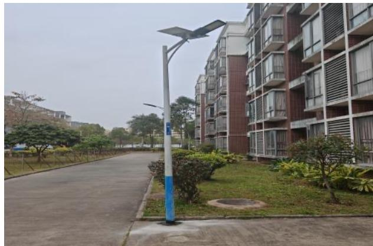

natural_image

Exterior view of a modern residential apartment with a street lamp and landscaped greenery (no signage or text visible)

太阳能路灯

# 案例 | 新增电动叉车

2025 年，公司结合业务发展需求新增使用电动叉车，以实际行动践行绿色物流理念。相较于传统柴油叉车，电动叉车具备显著的环保与成本优势，电能消耗成本远低于柴油消耗，且维护流程更简便，有效降低长期运营成本；运行过程中实现零尾气排放，大幅改善仓库内部空气质量，助力减少碳排放；同时低噪音特性进一步优化了作业环境，提升员工工作舒适度。此次设备更新既响应了绿色发展趋势，又通过降本增效增强了企业长期运营效益。

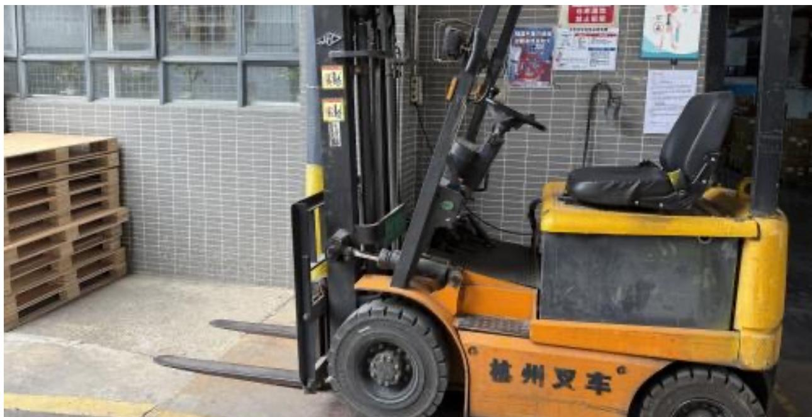

text_image

杭州叉车®

厂内电动叉车

<table><tr><td>指标名称</td><td>单位</td><td>2025年</td></tr><tr><td>直接能源消耗量</td><td>吨标准煤</td><td>337.43</td></tr><tr><td>液化天然气</td><td>千克</td><td>2,496</td></tr><tr><td>柴油</td><td>千克</td><td>131,787</td></tr><tr><td>汽油</td><td>千克</td><td>95,839</td></tr><tr><td>间接能源消耗量</td><td>吨标准煤</td><td>3,846.06</td></tr><tr><td>外购电力</td><td>千瓦时</td><td>31,294,194</td></tr><tr><td>综合能源消耗量</td><td>吨标准煤</td><td>4,183.49</td></tr></table>

# 水资源利用

公司在用水管理方面制定“跑冒滴漏”快速响应机制，在用水设备周围张贴维修电话标识，便于及时报修；同时设立意见信箱收集员工节能建议，通过宣传栏配合培训宣传，构建全员参与的节约文化。行政部同步统计水、电、油、纸张等各类资源能源用量，为节约成效评估与优化提供数据支撑。

<table><tr><td>指标名称</td><td>单位</td><td>2025年</td></tr><tr><td>总取水量</td><td>吨</td><td>266,697</td></tr></table>

# 回收利用

在资源回收利用方面，公司开展办公场景绿色实践，推动无纸办公、纸张重复利用与双面用纸；生产环节强化原辅材料全流程管控，通过精准统计减少采购、运输、制造环节的材料浪费与包装废弃物。

# 应对气候变化

在国家 “双碳” 战略持续推进的背景下，公司关注气候变化对产业发展与运营活动的影响，将绿色低碳理念融入经营管理与可持续发展规划。通过推进能源使用优化、资源管理与节能减排措施，公司持续提升环境管理水平，积极响应低碳转型要求，支持长期稳健发展。

# 治理

公司将气候变化相关议题纳入可持续发展治理体系，由董事会下设的战略与可持续发展委员会负责统筹监督气候相关风险与机遇的识别与管理方向，将相关事项与公司发展战略和运营决策相衔接。委员会通过持续关注气候议题对经营活动的潜在影响，指导管理层推进相关管理措施。

在执行层面，行政部门作为牵头单位，负责组织落实节能减排及资源管理相关工作，并协调各部门开展数据统计与改进，形成识别、执行与反馈相结合的管理机制，支持气候治理工作的持续推进。报告期内，公司及下属部分子公司获得 ISO 14064 温室气体核查陈述证书。

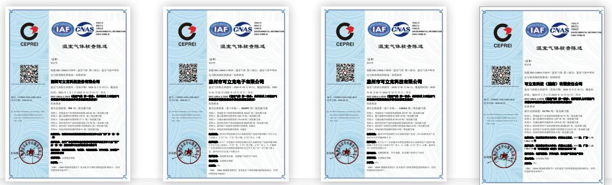

text_image

CEPREI
温宽气体核查通道
CEPREI
温宽气体核查通道
CEPREI
温宽气体核查通道
CEPREI
温宽气体核查通道
CEPREI
温宽气体核查通道
CEPREI
温宽气体核查通道
CEPREI
温宽气体核查通道
CEPREI
温宽气体核查通道
CEPREI
温宽气体核查通道
CEPREI
温宽气体核查通道
CEPREI
温宽气体核查通道

公司及下属部分子公司温室气体核查陈述证书

战略

<table><tr><td>风险类型</td><td>具体描述</td><td>影响时间</td><td>应对措施</td></tr><tr><td>急性风险</td><td>极端天气(暴雨、台风、高温)导致生产基地(惠州、越南等)厂房设施损坏、供电/供水中断,影响生产连续性;原材料运输受阻,供应链中断。</td><td>短期</td><td>定期开展厂房设施抗灾能力排查,加固防汛、防风、防雷设施;建立应急物资储备库,制定极端天气应急预案;与多家物流供应商合作,搭建多元化运输网络,降低单一线路中断风险。</td></tr><tr><td>慢性风险</td><td>长期气温上升、降水模式变化,导致生产能耗增加;水资源短缺影响生产用水供应;极端气候频发增加设备损耗,提升维护成本。</td><td>长期</td><td>优化厂房建筑设计,推广节能设备,降低气候相关能耗;建立水资源循环利用系统;加强设备日常维护与耐候性升级,延长使用寿命。</td></tr><tr><td>政策风险</td><td>全球“双碳”政策收紧,公司变压器、电源产品出口面临更严格的碳排放标准;环保法规升级,增加合规成本。</td><td>中、长期</td><td>加快推进碳核查与碳足迹核算,针对性制定减排计划;持续优化生产工艺,确保符合最新环保法规。</td></tr><tr><td>技术风险</td><td>低碳技术快速迭代,公司现有生产设备、工艺可能面临淘汰风险;行业内竞争对手率先布局绿色技术,形成技术壁垒。</td><td>中、长期</td><td>建立技术研发专项资金,聚焦清洁能源利用、节能工艺升级等领域,持续迭代生产技术;与科研机构、高校合作,跟踪前沿低碳技术,推动技术转化应用。</td></tr></table>

<table><tr><td>机遇类型</td><td>具体描述</td><td>影响周期</td><td>应对措施</td></tr><tr><td>市场机遇</td><td>新能源汽车、充电桩等低碳产业链快速发展,带动变压器、电源产品需求增长;海外市场对环保合规产品的准入门槛提高,为公司凭借环保优势拓展国际市场创造条件。</td><td>中、长期</td><td>聚焦新能源领域产品研发,优化产品适配性,深耕低碳产业链客户;强化产品环保认证,满足海外市场合规要求;借助绿色供应链合作,拓展与国际知名低碳企业的合作渠道。</td></tr></table>

# 气候情景分析

公司参考国际能源署（IEA）与政府间气候变化专门委员会（IPCC）发布的气候转型与物理气候情景，对不同温升与政策强度路径下的潜在经营影响进行定性分析。评估重点包括能源成本、政策与合规要求、供应链稳定性以及市场需求变化等因素，用于识别中长期气候风险与发展机遇。情景分析结果作为战略规划与风险管理的重要参考，与气候治理和运营决策相衔接，支持公司在不同气候路径下保持经营韧性。

<table><tr><td>情景类型</td><td>参考模型</td><td>情景特征</td><td>对业务的潜在影响</td><td>管理关注重点</td></tr><tr><td>加速低碳转型情景(约1.5-2°C路径)</td><td>IEA NZE;IPCC SSP1-1.9/SSP1-2.6</td><td>碳政策快速收紧,能源结构加速清洁化,电气化需求上升</td><td>能耗与碳合规要求提高;新能源、电气化相关产品需求增长;供应链环保要求强化</td><td>节能降耗与碳管理;绿色材料与工艺升级;新能源应用产品布局</td></tr><tr><td>渐进转型情景(约2-3°C路径)</td><td>IEA STEPS;IPCC SSP2-4.5</td><td>转型节奏相对平缓,能源价格与政策逐步波动</td><td>能源成本波动影响制造成本;客户环保要求逐步提升;供应链适应期延长</td><td>能源效率优化;成本与供应链管理;产品合规升级</td></tr><tr><td>高物理风险情景(&gt;3°C路径)</td><td>IPCC SSP5-8.5</td><td>极端天气频发,资源与基础设施压力上升</td><td>工厂运营与物流受极端天气影响;设备维护与停工风险增加</td><td>生产设施韧性提升;应急与备灾机制;供应链多元化</td></tr></table>

# 产品生命周期管理

公司制定《生命周期及环境因素策划规范》，在产品制造流程设计与研发阶段，聚焦环保源头管控，重点核查产品实现过程中所用材料，从源头规避产品全生命周期潜在环境影响。同时，综合考量人、机、料、法、环、测等全维度因素，识别并管控流程设计与研发过程中产生的环境影响，严格按照公司环境因素管理方法实施规范化管控。并且，公司关注产品碳足迹管理，报告期内，公司的“PQ50 变压器”“M12-18 快速组合充电器”产品已取得 ISO 14067 产品碳足迹证书。

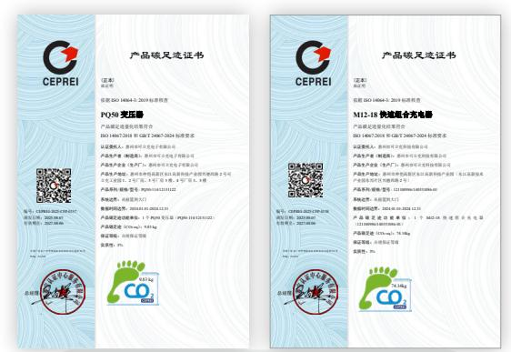

text_image

CEPREI
产品碳足迹证书
（证号）
名称：Cepreir
信息 ISO 1406A-3: 2019 标准证书
PQ-98 更正器
产品认证资质复印件符合
ISO 1406T2019 GB/T 2406T2024 标准要求
认证证书：贵州中化化学有限公司
产品生产：烧碱剂：贵州中化化学有限公司
产品生产厂家：贵州中化化学有限公司
产品生产日期：2023年5月1日
产品有效期：2023年5月1日
产品标准：标准型号：GP10111315132
外观设计：无损检测文件
数码印刷件号：20230120231231
产品认证有效期：7 年（有效期至 2023/05/18）（PQ-98-10.0.2023.02.22）
产品规格：15mm*15L
保质期：持续定期型
实质率：%-
产品碳足迹证书
（证号）
名称：Cepreir
信息 ISO 1406A-3: 2019 标准证书
M12-19 线性复合充电器
产品认证资质复印件符合
ISO 1406T2019 GB/T 2406T2024 标准要求
认证要求人：贵州中化化学有限公司
产品生产者：烧碱剂：贵州中化化学有限公司
产品生产厂家：贵州中化化学有限公司
产品生产厂家：贵州中化化学有限公司（以下简称技术公司）
产品生产厂家：贵州中化化学有限公司（以下简称技术公司）
产品规格：标准型号：15mm*15L (GB/T 14071896-6)<nl>外观设计：无损检测文件
数码印刷件号：2023-05-2023-1231
产品认证有效期：7 年（有效期至 2023/05/18）（PQ-98-10.0.2023.02.22）
产品规格：标准型号：15mm*15L (GB/T 14071896-6)<nl>外观设计：无损检测文件
数码印刷件号：2023-05-2023-1231
产品认证有效期：7 年（有效期至 2023/05/18）（PQ-98-10.0.2023-1231）<nl>产品规格：标准型号：15mm*15L (GB/T 14071896-6)<nl>外观设计：无损检测文件
数码印刷件号：2023-05-2023-1231
产品认证有效期：7 年（有效期至 2023/05/18）（PQ-98-10.0.2023- 1231）<nl>产品规格：标准型号：15mm*15L (GB/T 14071896-6)<nl>外观设计：无损检测文件
数码印刷件号：2023-05-2023-1231
产品认证有效期：7 年（有效期至 2023/05/18）（PQ-98-10.0 ）<nl>产品规格：标准型号：15mm*15L (GB/T 14071896-6)<nl>外观设计：无损检测文件
数码印刷件号：2023-05-2023-1231
产品认证有效期：7 年（有效期至 2023/05/18）（PQ-98-10.0 ）<nl>产品规模：标准型号：15mm*15L (GB/T 14071896-6)<nl>外观设计：无损检测文件
数码印刷件号：2023-05-2023-1231
产品认证有效期：7 年（有效期至 2023/05/18）（PQ-98-10.0 ）<nl>产品规格：标准型号：
单位：个<nl>

公司产品碳足迹证书

# 影响、风险和机遇

公司从运营环境与产业发展视角出发，持续识别气候变化对生产活动、供应链稳定性及市场环境的潜在影响，并将相关因素纳入可持续发展管理框架进行综合评估。在识别过程中，公司重点关注极端天气、能源与资源约束、政策与监管变化以及技术转型趋势等情形，分析其对生产连续性、合规成本和业务竞争力的可能影响。同时，公司将气候转型带来的节能降耗、绿色产品应用及低碳产业需求增长视为发展机遇，通过跨部门协同评估风险与机遇的重要性和时间属性，为战略规划与管理措施制定提供依据。相关识别结果与治理机制和业务决策相衔接，支持气候管理工作的持续优化与系统推进。

指标与目标

<table><tr><td>指标名称</td><td>单位</td><td>2025年数据</td></tr><tr><td>范围一温室气体排放量</td><td>吨二氧化碳当量</td><td>30,704.70</td></tr><tr><td>范围二温室气体排放量(基于市场)</td><td>吨二氧化碳当量</td><td>12,967.88</td></tr><tr><td>温室气体排放总量(范围一和范围二)</td><td>吨二氧化碳当量</td><td>43,672.58</td></tr><tr><td>范围三温室气体排放量(类别3交通运输的间接排放)</td><td>吨二氧化碳当量</td><td>2,025.09</td></tr><tr><td>范围三温室气体排放量(类别4组织使用产品的间接排放)</td><td>吨二氧化碳当量</td><td>191,354.58</td></tr><tr><td>范围三温室气体排放量(类别5组织的产品使用过程相关的排放)</td><td>吨二氧化碳当量</td><td>11,583.21</td></tr></table>

注：温室气体排放绩效涵盖深圳可立克科技股份有限公司、惠州市可立克科技有限公司、惠州市可立克电子有限公司、可立克科技（越南）有限责任公司，以上4家主体已依据ISO 14064-3:2019（温室气体第三部分：温室气体声明审定与核查规范和指南）标准核查，并获得ISO 14064温室气体核查陈述证书。

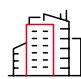

# 关键绩效表

治理绩效

<table><tr><td>治理指标</td><td>单位</td><td>2025年</td></tr><tr><td colspan="3">股东会</td></tr><tr><td>股东会召开次数</td><td>次</td><td>4</td></tr><tr><td>股东会审议通过议案数量</td><td>项</td><td>24</td></tr><tr><td colspan="3">董事会</td></tr><tr><td>董事会会议召开次数</td><td>次</td><td>10</td></tr><tr><td>董事会审议通过议案数量</td><td>项</td><td>60</td></tr><tr><td>董事出席率</td><td>%</td><td>100</td></tr><tr><td>战略与可持续发展委员会会议召开次数</td><td>次</td><td>3</td></tr><tr><td>战略与可持续发展委员会审议通过议案数量</td><td>项</td><td>3</td></tr><tr><td>薪酬与考核委员会会议召开次数</td><td>次</td><td>3</td></tr><tr><td>薪酬与考核委员会审议通过议案数量</td><td>项</td><td>6</td></tr><tr><td>提名委员会会议召开次数</td><td>次</td><td>1</td></tr><tr><td>提名委员会会议审议通过议案数量</td><td>项</td><td>1</td></tr><tr><td>审计委员会会议召开次数</td><td>次</td><td>5</td></tr><tr><td>审计委员会审议通过议案数量</td><td>项</td><td>20</td></tr><tr><td>董事会成员数量</td><td>人</td><td>8</td></tr><tr><td>女性董事人数</td><td>人</td><td>4</td></tr><tr><td>女性董事占比</td><td>%</td><td>50</td></tr><tr><td>董事会独立董事占比</td><td>%</td><td>38</td></tr><tr><td>提名委员会独立董事占比</td><td>%</td><td>67</td></tr><tr><td>薪酬委员会独立董事占比</td><td>%</td><td>67</td></tr><tr><td>审计委员会独立董事占比</td><td>%</td><td>67</td></tr><tr><td colspan="3">内控合规与风险管理</td></tr><tr><td>内控合规与风险管理相关培训总时长</td><td>小时</td><td>2,978</td></tr></table>

<table><tr><td>治理指标</td><td>单位</td><td>2025年</td></tr><tr><td colspan="3">投资者沟通与信息披露</td></tr><tr><td>披露定期报告数量</td><td>份</td><td>4</td></tr><tr><td>披露临时公告数量</td><td>份</td><td>156</td></tr><tr><td>召开业绩说明会次数</td><td>次</td><td>1</td></tr><tr><td>互动易回答投资者问题</td><td>条</td><td>64</td></tr><tr><td colspan="3">反商业贿赂及反贪污</td></tr><tr><td>开展反商业贿赂及反贪污培训次数</td><td>次</td><td>14</td></tr><tr><td>参与反商业贿赂及反贪污培训的董事人数</td><td>人</td><td>8</td></tr><tr><td>参与反商业贿赂及反贪污培训的董事覆盖率</td><td>%</td><td>100</td></tr><tr><td>参与反商业贿赂及反贪污培训的管理层人数</td><td>人</td><td>245</td></tr><tr><td>参与反商业贿赂及反贪污培训的管理层覆盖率</td><td>%</td><td>100</td></tr><tr><td>反商业贿赂及反贪污培训总时长</td><td>小时</td><td>2,978</td></tr><tr><td colspan="3">反不正当竞争</td></tr><tr><td>开展反垄断与反不正当竞争培训次数</td><td>次</td><td>14</td></tr><tr><td>反垄断与反不正当竞争培训总时长</td><td>小时</td><td>2,978</td></tr><tr><td>违反正当竞争导致的诉讼/行政处罚事件</td><td>次</td><td>0</td></tr></table>

社会绩效

<table><tr><td>社会指标</td><td>单位</td><td>2025年</td></tr><tr><td colspan="3">创新驱动</td></tr><tr><td>研发投入</td><td>万元</td><td>14,136.68</td></tr><tr><td>研发投入占营业收入比例</td><td>%</td><td>2.56</td></tr><tr><td>研发人员人数</td><td>人</td><td>501</td></tr><tr><td>研发人员占员工总数比例</td><td>%</td><td>6.98</td></tr><tr><td>有效专利总数</td><td>件</td><td>192</td></tr><tr><td>应用于主营业务的发明专利总数</td><td>件</td><td>21</td></tr><tr><td>发明专利的申请数</td><td>件</td><td>2</td></tr><tr><td>发明专利的授权数</td><td>件</td><td>4</td></tr><tr><td>发明专利的有效专利数</td><td>件</td><td>18</td></tr><tr><td>软件著作权数量</td><td>件</td><td>42</td></tr><tr><td colspan="3">产品质量与安全</td></tr><tr><td>产品和服务相关的安全与质量重大责任事故</td><td>起</td><td>0</td></tr><tr><td>产品召回事件数量</td><td>次</td><td>0</td></tr><tr><td>产品召回比例</td><td>%</td><td>0</td></tr><tr><td colspan="3">供应链管理</td></tr><tr><td>供应商总数</td><td>家</td><td>1,112</td></tr><tr><td>接受ESG培训的供应商</td><td>家</td><td>110</td></tr><tr><td>接受可持续采购培训的采购人员</td><td>人</td><td>18</td></tr><tr><td>开展供应商培训次数</td><td>次</td><td>295</td></tr><tr><td>供应商培训覆盖供应商数量</td><td>家</td><td>258</td></tr><tr><td colspan="3">客户服务</td></tr><tr><td>客户提出售后服务需求的总次数</td><td>次</td><td>101</td></tr><tr><td>响应客户服务需求的次数</td><td>次</td><td>101</td></tr><tr><td>客户反馈响应率</td><td>%</td><td>100</td></tr><tr><td>变压器业务客户满意度</td><td>分</td><td>90.27</td></tr><tr><td>电源业务客户满意度</td><td>分</td><td>94.2</td></tr><tr><td colspan="3">数据安全与客户隐私保护</td></tr><tr><td>数据安全事件发生数</td><td>起</td><td>0</td></tr><tr><td>泄露客户隐私事件</td><td>起</td><td>0</td></tr><tr><td colspan="3">员工权益</td></tr><tr><td>员工总人数</td><td>人</td><td>7,176</td></tr><tr><td>残疾员工人数</td><td>人</td><td>28</td></tr><tr><td>少数民族员工人数</td><td>人</td><td>1,016</td></tr><tr><td>男性员工人数</td><td>人</td><td>3,507</td></tr><tr><td>女性员工人数</td><td>人</td><td>3,669</td></tr><tr><td>30岁及以下员工人数</td><td>人</td><td>2,613</td></tr><tr><td>31-40岁员工人数</td><td>人</td><td>2,422</td></tr></table>

<table><tr><td>社会指标</td><td>单位</td><td>2025年</td></tr><tr><td>41-50岁员工人数</td><td>人</td><td>1,834</td></tr><tr><td>51岁及以上员工人数</td><td>人</td><td>307</td></tr><tr><td>普通员工人数</td><td>人</td><td>6,931</td></tr><tr><td>管理层员工人数</td><td>人</td><td>245</td></tr><tr><td>困难员工帮扶人数</td><td>人</td><td>2</td></tr><tr><td>员工满意度</td><td>%</td><td>95.71</td></tr><tr><td colspan="3">员工培训</td></tr><tr><td>员工培训总投入</td><td>万元</td><td>50.37</td></tr><tr><td>员工培训场次</td><td>次</td><td>1,607</td></tr><tr><td>员工培训总时长</td><td>小时</td><td>78,521</td></tr><tr><td>管理层培训总时长</td><td>小时</td><td>6,300</td></tr><tr><td>员工培训覆盖率</td><td>%</td><td>100</td></tr><tr><td colspan="3">职业健康与安全</td></tr><tr><td>职业病发生人数</td><td>人</td><td>0</td></tr><tr><td>工伤人数</td><td>人</td><td>8</td></tr><tr><td>因工死亡人数</td><td>人</td><td>0</td></tr><tr><td>因工伤损失工作日数</td><td>日</td><td>455</td></tr><tr><td>安全培训时长</td><td>小时</td><td>7,290</td></tr><tr><td>安全生产投入</td><td>万元</td><td>88.81</td></tr></table>

环境绩效

<table><tr><td>环境指标</td><td>单位</td><td>2025年</td></tr><tr><td colspan="3">环境合规管理</td></tr><tr><td>环保总投入</td><td>万元</td><td>66.36</td></tr><tr><td colspan="3">污废排放与处理</td></tr><tr><td>废水排放总量</td><td>立方米</td><td>225,523.90</td></tr><tr><td>化学需氧量排放量</td><td>吨</td><td>6.15</td></tr><tr><td>氨氮排放量</td><td>吨</td><td>0.30</td></tr><tr><td>产生的无害废弃物总量</td><td>吨</td><td>777.72</td></tr><tr><td>产生的无害废弃物密度</td><td>吨/百万元营收</td><td>0.14</td></tr><tr><td>产生的有害废弃物总量</td><td>吨</td><td>50.81</td></tr><tr><td>产生的有害废弃物密度</td><td>吨/百万元营收</td><td>0.01</td></tr><tr><td colspan="3">能源利用</td></tr><tr><td>直接能源消耗量</td><td>吨标准煤</td><td>337.43</td></tr><tr><td>液化天然气</td><td>千克</td><td>2,496</td></tr><tr><td>柴油</td><td>千克</td><td>131,787</td></tr><tr><td>汽油</td><td>千克</td><td>95,839</td></tr><tr><td>间接能源消耗量</td><td>吨标准煤</td><td>3,846.06</td></tr><tr><td>外购电力</td><td>千瓦时</td><td>31,294,194</td></tr><tr><td>综合能源消耗量</td><td>吨标准煤</td><td>4,183.49</td></tr><tr><td colspan="3">水资源利用</td></tr><tr><td>总取水量</td><td>吨</td><td>266,697</td></tr><tr><td colspan="3">应对气候变化</td></tr><tr><td>范围一温室气体排放量</td><td>吨二氧化碳当量</td><td>30,704.70</td></tr><tr><td>范围二温室气体排放量(基于市场)</td><td>吨二氧化碳当量</td><td>12,967.88</td></tr><tr><td>温室气体排放总量(范围一和范围二)</td><td>吨二氧化碳当量</td><td>43,672.58</td></tr><tr><td>范围三温室气体排放量(类别3交通运输的间接排放)</td><td>吨二氧化碳当量</td><td>2,025.09</td></tr><tr><td>范围三温室气体排放量(类别4组织使用产品的间接排放)</td><td>吨二氧化碳当量</td><td>191,354.58</td></tr><tr><td>范围三温室气体排放量(类别5组织的产品使用过程相关的排放)</td><td>吨二氧化碳当量</td><td>11,583.21</td></tr></table>

报告索引表

<table><tr><td>报告目录</td><td>《深圳证券交易所上市公司自律监管指引第17号——可持续发展报告(试行)》</td><td>《可持续发展报告标准(GRI Standards)》</td></tr><tr><td>关于本报告</td><td>/</td><td>2-3</td></tr><tr><td>董事长致辞</td><td>/</td><td>/</td></tr><tr><td>走进可立克</td><td>/</td><td>2-1、2-2、2-6</td></tr><tr><td colspan="3">携手共进 引领可持续发展</td></tr><tr><td>可持续发展管理</td><td>尽职调查、利益相关方沟通</td><td>2-12、2-14、2-16、2-29、3-1、3-2</td></tr><tr><td>利益相关方沟通</td><td>/</td><td>/</td></tr><tr><td>重要性议题分析</td><td>/</td><td>/</td></tr><tr><td colspan="3">稳健治理 夯实发展根基</td></tr><tr><td>公司治理</td><td>/</td><td>2-9、2-10、405-1</td></tr><tr><td>内控合规与风险管理</td><td>/</td><td>/</td></tr><tr><td>投资者沟通与信息披露</td><td>/</td><td>/</td></tr><tr><td>商业道德与公平竞争</td><td>反商业贿赂及反贪污、反不正当竞争</td><td>205-2</td></tr><tr><td colspan="3">责任实践 推动价值共创</td></tr><tr><td>创新驱动高质量发展</td><td>创新驱动</td><td>/</td></tr><tr><td>产品质量与安全</td><td>产品和服务安全与质量</td><td>/</td></tr><tr><td>绿色设计与可持续产品</td><td>/</td><td>416-1</td></tr><tr><td>负责任供应链管理</td><td>供应链安全</td><td>/</td></tr><tr><td>客户服务</td><td>/</td><td>/</td></tr><tr><td>数据安全与客户隐私保护</td><td>数据安全与客户隐私保护</td><td>/</td></tr><tr><td>员工权益</td><td>员工</td><td>2-7、2-19、201-3、401-2、405-1</td></tr><tr><td>员工培训与发展</td><td>员工</td><td>404-2</td></tr><tr><td>职业健康与安全</td><td>员工</td><td>403-1、403-2、403-3、403-5、403-6、403-7、403-9</td></tr><tr><td colspan="3">绿色实践守护生态环境</td></tr><tr><td>环境合规管理</td><td>环境合规管理</td><td>/</td></tr><tr><td>污废排放与处理</td><td>污染物排放、废弃物处理、循环经济</td><td>303-2、306-2、306-3</td></tr><tr><td>能源资源利用</td><td>能源利用、水资源利用、循环经济</td><td>302-1、303-3</td></tr><tr><td>应对气候变化</td><td>应对气候变化</td><td>201-2、305-1、305-2、305-3</td></tr><tr><td>附录</td><td></td><td></td></tr><tr><td>关键绩效表</td><td>/</td><td>/</td></tr><tr><td>报告索引表</td><td>/</td><td>/</td></tr><tr><td>读者反馈表</td><td>/</td><td>/</td></tr></table>

注：经识别，生态系统和生物多样性保护、乡村振兴、社会贡献、科技伦理、平等对待中小企业议题当前不具有实质性与适用性，暂未在报告中进行披露。

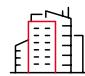

# 读者反馈表

尊敬的读者：

您好！

感谢您阅读《深圳可立克科技股份有限公司 2025 年度可持续发展暨 ESG 报告》。为进一步提升公司可持续发展管理水平及信息披露质量，更好回应各利益相关方关切，现诚邀您对本报告提出意见和建议。

# 一、您的基本信息

您属于以下哪类利益相关方？

□ 政府部门及监管机构 □ 股东和投资者 □ 客户  
□合作伙伴 □员工 □社会及公众  
□ 其他（请注明）：\_\_\_\_

# 二、您对本报告的评价

1. 您对本报告的整体评价是：

□很好 □较好 □一般 □较差 □很差

2. 您认为本报告是否充分反映公司在经济、环境及社会等方面的责任实践与影响：

□ 很充分 □ 较充分 □ 一般 □ 较不充分 □ 很不充分

3. 您认为本报告披露的信息在清晰性、准确性和完整性方面的表现：

□很好 □较好 □一般 □较差 □很差

4. 您对本报告的结构设计及呈现方式的评价：

□很好 □较好 □一般 □较差 □很差

# 三、意见与建议

您对公司可持续发展工作或报告编制还有哪些意见与建议：

# CLICK