# 浙江威星智能仪表股份有限公司

2025环境、社会和公司治理（ESG）报告

2025 Environmental, Social and Governance Report

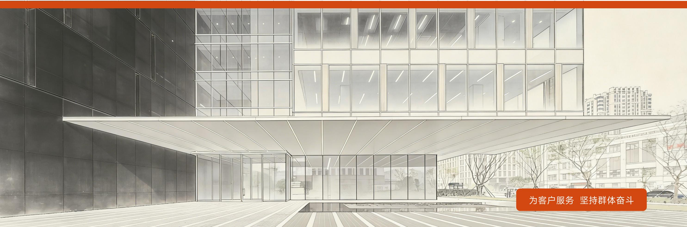

text_image

为客户服务 坚持群体奋斗

# 目录

# CONTENTS

报告说明 006

董事长致辞 008

附录 102

# 01 关于威星

公司简介 012  
发展历程 014  
社会认可 016  
数说2025年 018

# 04 创新赋能协同发展

创新驱动发展 038  
知识产权管理 044  
可持续供应链 052  
追求卓越品质 056  
坚持精工制造 060  
优化客户体验 064  
保护信息安全 068

# 02 可持续发展治理

ESG理念 022  
ESG治理架构 022  
利益相关方沟通 022  
重要性议题识别 022

# 05 绿动未来和谐共生

应对气候变化 072  
打造绿色工厂 074  
绿色发展，低碳未来 076  
赋能绿色发展 080

# 03 合规筑基稳健致远

规范公司治理 026  
坚持党建引领 028  
强化风险管理 030  
恪守商业道德 032  
保护投资者权益 034

# 06 以人为本与爱同行

保障员工权益 086  
支持职业发展 088  
注重员工关怀 094  
维护安全健康 098  
践行公益行动 100

natural_image

Illustration of a sailboat on the ocean with distant mountains and clouds (no text or symbols)

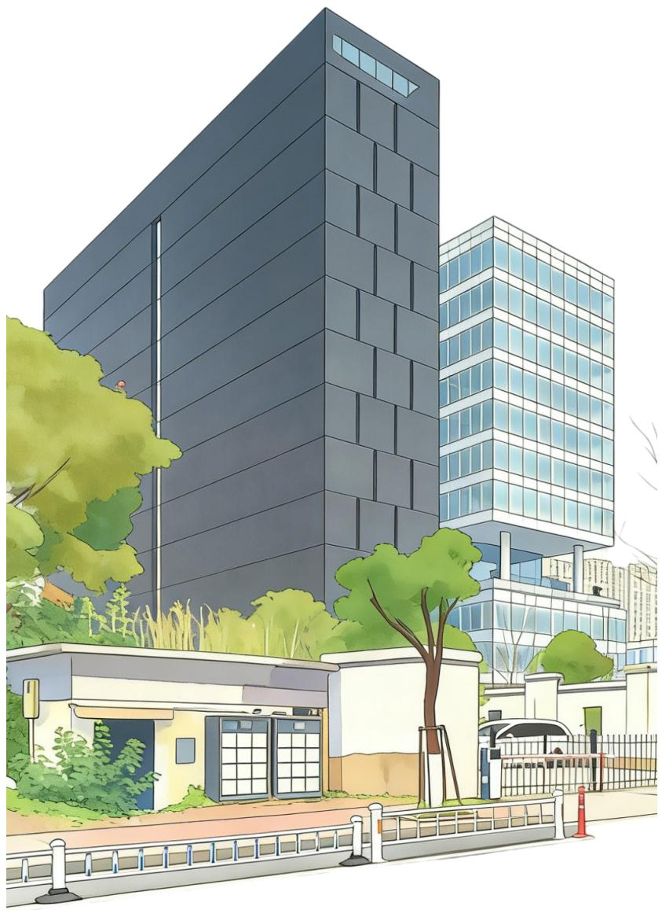

natural_image

Illustration of a modern multi-story office building with green trees and a guardrail, no visible text or signage.

# 报告说明

本报告是浙江威星智能仪表股份有限公司（以下简称“威星智能”“公司”“我们”）发布的第三份环境、社会及治理（ESG）报告，旨在向各利益相关方展示威星智能在ESG方面的表现。

# - 报告范围

报告组织范围：除另有说明，本报告中的政策、声明、资料等覆盖公司的实际业务范围，报告主体与公司《2025年年度报告》一致。

报告时间范围：2025年1月1日至2025年12月31日（以下简称“报告期”），为增强报告可比性，部分内容有所延伸。

# - 编制依据

1. 《深圳证券交易所上市公司自律监管指引第17号——可持续发展报告（试行）》  
2. 《深圳证券交易所上市公司自律监管指南第3号——可持续发展报告编制（2026年修订）》  
3. 《中国企业可持续发展报告指南》（CASS-ESG6.0）  
4. 《中国企业可持续发展报告评级标准（2026）》  
5. 全球报告倡议组织《可持续发展报告标准（GRIStandards）》  
6. 联合国可持续发展目标（SDGs）

# - 数据说明

本报告所使用的信息数据均来自公司内部文件、统计报告等。本报告的财务数据以人民币为记账本位币，若与财务报告不一致之处，以财务报告为准。

# - 确认及批准

本报告经管理层确认后，于2026年4月24日获董事会通过。公司承诺本报告不存在任何虚假记载、误导性陈述。

# - 报告获取

本报告以电子版形式发布，您可通过以下方式下载本报告的电子版：

威星智能官网：https://www.viewshine.cn/

巨潮资讯网：http://www.cninfo.com.cn/

中国证券报官网：https://www.cs.com.cn/

证券时报官网：http://www.stcn.com/

# - 联系方式

浙江威星智能仪表股份有限公司

地址：中国，浙江，杭州，良渚街道，祥运路366-1号1幢

电话：0571-88179010

传真：0086-571-88179010-800

公司网址：https://www.viewshine.cn/

电子邮箱：zqb@viewshine.cn

# 董事长致辞

“

2025年，在全球经济格局持续演变与科技革命深入推进的背景下，威星智能始终坚持以可持续发展为导向，将环境、社会及公司治理理念深度融入企业战略与日常运营。公司积极响应国家“双碳”目标，以科技创新为引擎，以绿色发展为路径，持续推动智慧能源计量领域的数字化、智能化转型，致力于为构建安全、高效、绿色的现代能源体系贡献智慧与力量。

# - 科技创新引领行业变革

在技术研发领域，威星智能持续加大研发投入，聚焦超声波计量、物联网安全、数字孪生等前沿技术，深化智慧燃气、智慧水务等核心领域的解决方案创新。通过强化基础研究与技术攻关，公司不断提升产品的精准性、可靠性与智能化水平，助力客户实现能源管理的精细化、数字化升级。未来，公司将继续以技术突破驱动产业价值提升，为全球用户提供更高效、更安全的能源管理服务。

# - 绿色转型践行低碳承诺

在绿色转型方面，公司坚定贯彻绿色发展理念，通过优化生产工艺、推广清洁能源应用、降低产品碳足迹等举措，积极应对气候变化挑战。在运营环节，公司持续完善环境管理体系，推进资源循环利用，减少能源消耗与排放；在产品层面，强化绿色设计，推动环保材料应用，为客户提供更低碳、更可持续的解决方案。威星智能将始终以绿色制造为基石，携手产业链伙伴共建绿色生态圈。

# - 治理优化筑牢发展根基

威星智能持续完善以董事会为核心的ESG治理架构，通过明确责任分工、强化风险管控、提升信息披露透明度，确保公司治理的科学性与有效性。公司坚持合规经营，恪守商业道德，深化供应链责任管理，保障投资者权益，营造公平、诚信的市场环境。通过党建引领与文化建设，凝聚员工共识，推动企业价值观落地，为可持续发展注入内生动力。

# - 以人为本激发组织活力

在人力资源管理方面，公司视员工为企业最宝贵的财富，致力于打造多元、包容、平等的工作环境。通过健全职业发展体系、优化薪酬福利机制、加强员工关怀与健康保障，充分激发员工的创造力与归属感。公司相信，善良、正直、勇敢与爱是人类文明深处最珍贵的精神之光。未来，公司将继续深化人才培养，支持员工成长，让每一位奋斗者都能在威星智能的平台上实现个人价值与企业发展的共赢。

# - 社会责任彰显企业担当

威星智能积极履行社会责任，通过支持乡村振兴、参与社区公益、推广安全用气知识等行动，回馈社会信任。公司以技术创新助力公共安全，以产业协同促进行业进步，以真诚合作传递温度。发展从来不是冰冷的指标，而是每个人福祉的叠合；现代化从来不是晃眼的霓虹闪烁，而是温柔照亮每段归途的点点星光。公司将始终心怀感恩，以实际行动践行“以责任回馈社会”的承诺。

# - 展望未来

面对机遇与挑战并存的新征程，威星智能将坚守初心，以科技创新为桨，以绿色发展为帆，以责任治理为舵，持续提升ESG实践水平。公司愿与各方携手，共同探索可持续发展新路径，为行业赋能，为社会创造长期价值，在时代的浪潮中行稳致远。人的价值，不在于追逐未来的方向，而在于明确值得追求的目标后全力以赴。个体力量或许有限，但无数微小的努力，终将凝聚成最坚实的社会根基。

最后，感谢各位对威星过去一年的信任与支持！  
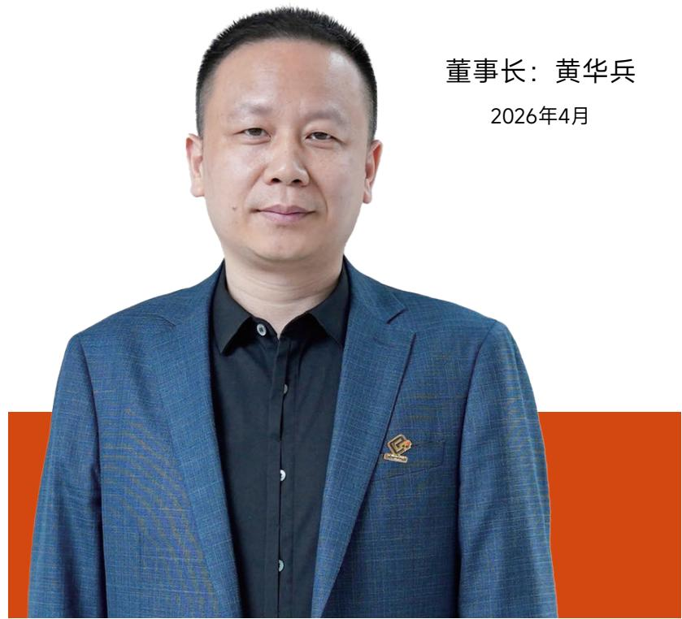

text_image

董事长：黄华兵
2026年4月

# 1

# 关于威星

公司简介

发展历程

社会认可

数说2025年

2025环境、社会和公司治理（ESG）报告

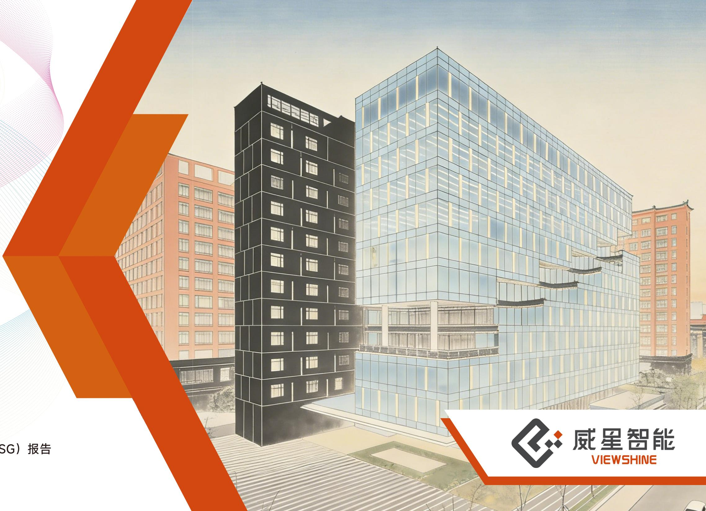

text_image

SG) 报告
威星智能
VIEWSHINE

# 公司简介

# 创新力量服务客户 积极助力公用事业 高质量发展

深耕行业20余载

浙江威星智能仪表股份有限公司成立于2005年，是行业领先的以燃气、水务为核心的公用事业智能物联数字化解决方案供应商。

# 公司名称

浙江威星智能仪表股份有限公司

# 成立时间

2005年

# A股代码

002849

# 公司总部

浙江，杭州，良渚街道，祥运路366-1号1幢

公司聚焦智慧计量、智慧安全、智慧生活、智慧城市建设等领域，经过多年发展，形成集智能燃气表和智能水表终端、新一代超声波计量仪表、智慧燃气信息系统平台、智慧水务系统研发、生产、销售及服务于一体的业务体系，并以科技赋能推动数字化转型，积极构建物信融合、数智融合的新发展格局！

# A股

深圳证券交易所

# 20周年

成立时间

# 22,063.40万元

注册资金

# “小巨人”企业

国家专精特新

核心价值观“为客户服务，坚持群体奋斗”

# 经营理念

公司始终秉持“为客户服务，坚持群体奋斗”的核心价值观。作为智慧计量解决方案领域的头部企业，公司积极推动行业数字化转型升级，赋予传统表具全新价值定位，持续为客户创造更高价值。同时，公司致力于为奋斗者搭建干事创业的广阔平台，让“想干事、能干事、干成事”的员工实现自我价值、不断成长进步，最终实现员工与公司同心同向、共同发展、共赢未来。

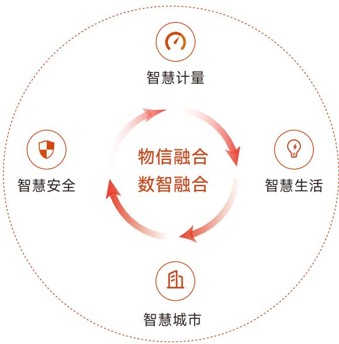

flowchart

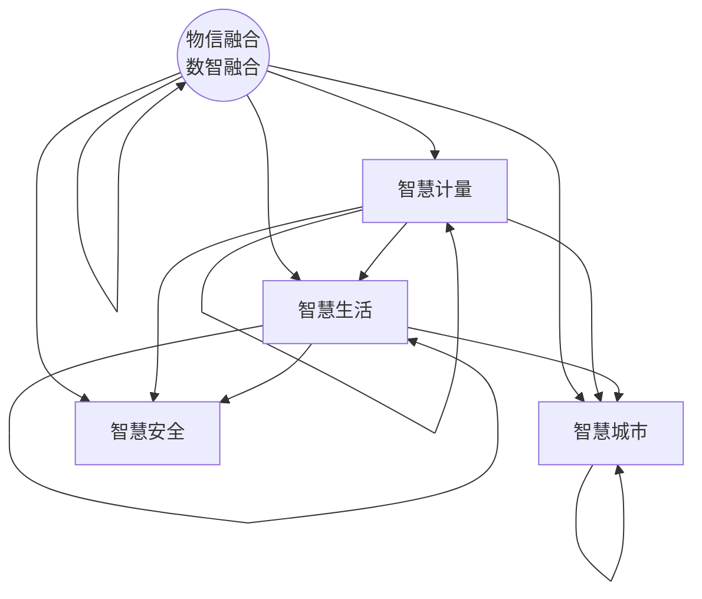
```mermaid
graph TD
  Center(("物信融合\n数智融合"))
  
  %% Main Component
  Center --> Center
  Center --> Center
  Center --> Center
  Center --> Center
  Center --> Center
  
  %% Left Pillar
  Center --> Center1["智慧计量"]
  Center --> Center2["智慧生活"]
  Center --> Center3["智慧城市"]
  Center --> Center4["智慧安全"]
  
  Center1 --> Center1
  Center1 --> Center2
  Center1 --> Center3
  Center1 --> Center4
  Center2 --> Center2
  Center2 --> Center3
  Center2 --> Center4
  Center3 --> Center3
  Center3 --> Center3
```

# 发展思路

在全球能源结构转型与智慧城市建设加速推进的背景下，威星智能将固本强基、守正创新，坚持以创新驱动为核心，围绕智能计量与数字化领域持续深化布局，全面推进技术升级、市场拓展与组织优化。

未来三年，公司将以巩固主业核心竞争力为根基，着力打造国内外市场延展能力、信息化建设能力及多元化解决方案能力；强化资本运作与人才队伍协同效能，加快推动公司从传统制造向数字化、高端化制造转型升级。

公司立志成为公共事业领域产业革新与价值创造的标杆企业，以科技创新引领行业变革，为全球智慧能源体系建设贡献中国方案与中国智慧。

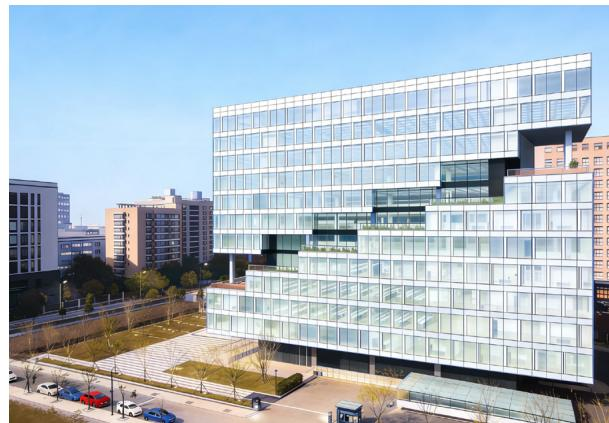

natural_image

Exterior view of a modern glass office building with surrounding residential buildings under clear sky (no signage or text visible)

# 发展历程

natural_image

Silhouette of an airplane in flight, no text or symbols present

# 2005-2006年

8月公司成立

首次通过高新技术企业认定

# 2008年

推出第一代超声波表

# 2009年

搬迁至上城区电子机械功能园区
完成股份制改造

# 2011-2012年

认定为省企业技术中心
成立威星计量子公司

# 2015年

智慧生产基地项目动工

超声波燃气表销售突破10万台“燃气云”重点企业研究院启动

# 2017年

深交所挂牌上市

投资中燃荣威控股子公司

# 2018年

智慧生产基地乔迁新址

总部大楼奠基

投资设立星达能源控股子公司

投资设立缥缈峰科技控股子公司

建成行业首条膜式智能燃气表总装自动化线

# 2019-2020年

年产值超过10亿元

年产量超过500万台

参与投资吾爱易达子公司

参与投资深圳睿荔子公司

认定为国家专精特新小巨人

获评浙江省技术发明奖二等奖

# 2021-2023年

总部大楼建成

实验室获CNAS认证

完成募集资金3.79亿元

投资锂电回收行业

获评杭州市绿色工厂

获评杭州市未来工厂-数字化车间

生产检测第一台水表

成立隐峰科技子公司

# 2025年

获评2025年杭州市未来工厂-智能工厂
投资上海埃科燃气测控设备有限公司
建立省级博士后工作站

# 2024年

打造行业首条超声波燃气基表自动化产线

完成第六届董事会换届

# 社会认可

技术创新

<table><tr><td>名称</td><td>文号/主管部门</td></tr><tr><td>浙江省博士后工作站</td><td>浙江省人力资源和社会保障厅</td></tr><tr><td>2025年杭州市高价值专利组合培育项目</td><td>杭州市市场监督管理局</td></tr><tr><td>2025年杭州市“未来工厂”--智能工厂</td><td>杭经信产数〔2025〕139号</td></tr><tr><td>2024年度上城区优秀人才科技企业</td><td>杭州市上城区人民政府</td></tr><tr><td>2025年“数据要素x”大赛浙江分赛杭州站决赛二等奖(联合参赛单位)</td><td>杭州市数据资源管理局</td></tr><tr><td>行业创新标杆企业</td><td>第七届中国燃气表企业排行榜组委会/中国燃气表信息网</td></tr><tr><td>智慧燃气物联网大数据创新应用奖</td><td>第七届中国燃气表企业排行榜组委会/中国燃气表信息网</td></tr><tr><td>2024年度智创未来奖(子公司上海埃科燃气测控设备有限公司)</td><td>中共上海市松江区石湖荡镇委员会/上海市松江区石湖荡镇人民政府</td></tr><tr><td>2024年度浙江省物联网奖项-国家级专精特新小巨人奖</td><td>浙江省物联网产业协会</td></tr><tr><td>2025年第五届燃气安全创新成果技术创新优秀奖</td><td>2025年燃气安全大会组委会</td></tr><tr><td>物联网分技术委员会成员单位</td><td>全国信息技术标准化技术委员会物联网分技术委员会</td></tr></table>

企业治理

<table><tr><td>名称</td><td>文号/主管部门</td></tr><tr><td>2025年度双强发展党组织</td><td>中共杭州钱塘智慧城工作委员会</td></tr><tr><td>物联网最具影响力十强企业</td><td>第七届中国燃气表企业排行榜组委会/中国燃气表信息网</td></tr><tr><td>综合实力十强企业</td><td>第七届中国燃气表企业排行榜组委会/中国燃气表信息网</td></tr><tr><td>2024年度金信披奖</td><td>中国证券报</td></tr><tr><td>2024年度优秀企业-多元价值典范企业</td><td>杭州钱智慧(2025)1号</td></tr><tr><td>2025年度杭州市深化产业工人队伍建设改革样板单位</td><td>杭州市总工会</td></tr><tr><td>中国城市燃气标准工作委员会常务委员单位</td><td>中国城市燃气协会标准工作委员会</td></tr><tr><td>2025杭州市数字经济百强企业</td><td>杭工经(2025)21号(杭企联/杭企协(2025)25号)</td></tr></table>

产品质量

<table><tr><td>名称</td><td>文号/主管部门</td></tr><tr><td>安全生产标准化三级企业</td><td>杭州市应急管理局</td></tr><tr><td>全国产品和服务质量诚信示范企业</td><td>中国质量检验协会</td></tr><tr><td>全国仪器仪表行业领先品牌</td><td>中国质量检验协会</td></tr><tr><td>全国质量诚信标杆企业</td><td>中国质量检验协会</td></tr><tr><td>全国质量检验稳定合格产品</td><td>中国质量检验协会</td></tr></table>

体系认证

<table><tr><td>名称</td><td>认证机构</td></tr><tr><td>质量管理体系认证</td><td>方圆标志认证集团有限公司</td></tr><tr><td>环境管理体系认证</td><td>方圆标志认证集团有限公司</td></tr><tr><td>职业健康安全管理体系认证</td><td>方圆标志认证集团有限公司</td></tr><tr><td>知识产权管理体系认证</td><td>中规北京认证有限公司</td></tr><tr><td>信息安全管理体系认证</td><td>方圆标志认证集团有限公司</td></tr><tr><td>信息技术服务管理体系认证</td><td>方圆标志认证集团有限公司</td></tr><tr><td>两化融合管理体系AAA</td><td>中国船级社</td></tr><tr><td>售后服务体系完善程度认证十二星级</td><td>中正卓越认证集团有限公司</td></tr><tr><td>浙江制造认证证书</td><td>浙江制造国际认证联盟</td></tr><tr><td>标准化良好行为AAA</td><td>中国标准化协会</td></tr><tr><td>专项计量授权证书(二检合一证书)</td><td>浙江省市场监督管理局</td></tr><tr><td>CMMI Level5</td><td>ISACA</td></tr><tr><td>CNAS实验室</td><td>中国合格评定国家认可委员会</td></tr><tr><td>测量管理体系认证</td><td>中启计量体系认证中心</td></tr><tr><td>诚信管理体系认证</td><td>方圆标志认证集团有限公司</td></tr><tr><td>安全生产管理体系</td><td>华夏国际质量检测认证中心</td></tr><tr><td>能源管理体系认证</td><td>本臻力行认证检测(浙江)有限公司</td></tr><tr><td>ISO14064碳核查</td><td>华夏国际质量检测认证中心</td></tr><tr><td>MID工厂认证</td><td>衡硕检测技术服务(上海)有限公司</td></tr><tr><td>RoHS认证</td><td>EUTEST认证公司</td></tr><tr><td>知识产权国际标准体系—ISO56005国际标准《创新与知识产权管理能力》二级</td><td>中规(北京)认证有限公司</td></tr><tr><td>知识产权合规管理体系认证证书IPMS</td><td>北京世标认证中心</td></tr></table>

<table><tr><td>经营业绩</td><td>科技创新</td><td>运营管理</td><td>绿色低碳</td></tr><tr><td>营业收入:165,313.71万元,同比增长:27.41%</td><td>研发投入:8,917.64万元,同比增长:19.47%</td><td>客户满意度:95.65%</td><td>温室气体排放总量:2,808吨,同比下降:1.2%</td></tr><tr><td>净利润:5,395.05万元,同比增长:60.41%</td><td>技术人员:393人占比:35.60%</td><td>供应商廉洁协议签署率:100%</td><td>年节约包装材料:1,000吨</td></tr><tr><td>总资产:279,329.55万元,同比增长:15.26%</td><td>累计授权专利:662项</td><td>员工总人数:1,104人,同比增长:21.99%</td><td>废旧包装回收利用:100%</td></tr><tr><td>年纳税总额:7,901.59万元,同比增长:0.28%</td><td>累计参与标准制定:48项</td><td>年度培训总人次:9,352人次</td><td></td></tr><tr><td>上市后累计分红:7,037.43万元</td><td></td><td>年度培训总时长:1,973,736小时</td><td></td></tr><tr><td>女董事占比:28.57%</td><td></td><td></td><td></td></tr></table>

# 2

# 可持续发展治理

ESG理念

ESG治理架构

利益相关方沟通

重要性议题识别

2025环境、社会和公司治理（ESG）报告

# ESG理念

在科技浪潮中，威星智能始终将可持续发展融入企业核心战略。我们坚信，技术创新既能驱动行业前进，也可为社会与环境创造长期价值。为此，我们专注于研发高效节能的智能产品与解决方案，致力于降低能源消耗与碳排放，推动资源可持续利用。未来，我们将持续探索科技与环保的融合之路，实现经济、社会与环境的协同共赢。

# ESG治理架构

2025年威星智能在ESG领域持续深耕，已将可持续发展深度融入公司治理。目前，公司已构建起以董事会为核心的ESG治理体系，由其统筹战略规划、目标制定与执行监督。为进一步提升治理效能，公司专门设立了战略和ESG委员会，负责相关重大事项的决策与监督。该委员会的成立标志着威星智能的ESG治理结构迈向了更规范化、专业化的新阶段，也将有力推动ESG理念全面融入公司战略与日常运营，为构建科学、透明、高效的可持续发展管理体系奠定了坚实基础。

# 利益相关方

威星智能建立与利益相关方的常态化沟通机制，通过问卷调研及深度访谈的形式，充分了解各议题对威星智能的重要程度以及各利益相关方对于威星智能ESG表现的评价。各利益相关方所关注的主要议题以及和公司的沟通方式如下：

<table><tr><td>利益相关方</td><td>主要关注议题</td><td>沟通与会议渠道</td></tr><tr><td rowspan="3">政府部门</td><td>合规经营</td><td>现场调研</td></tr><tr><td>产品质量与安全</td><td>会谈</td></tr><tr><td>技术创新</td><td>现场检测</td></tr><tr><td rowspan="3">股东与投资者</td><td>技术创新</td><td>股东大会</td></tr><tr><td>合规经营</td><td>投资者接待</td></tr><tr><td>信息披露</td><td>业绩说明会</td></tr><tr><td rowspan="3">客户</td><td>产品质量与安全</td><td>走访交流</td></tr><tr><td>负责任营销</td><td>满意度调查</td></tr><tr><td>技术创新</td><td>客服热线</td></tr><tr><td rowspan="3">员工</td><td>员工权益与福利</td><td>员工满意度调查</td></tr><tr><td>员工培训与发展</td><td>企业文化活动</td></tr><tr><td>合规经营</td><td>员工培训</td></tr><tr><td rowspan="3">供应商</td><td>供应链管理</td><td>年度供应商大会</td></tr><tr><td>产品质量与安全</td><td>供应商资质审核</td></tr><tr><td>商业道德</td><td></td></tr><tr><td rowspan="3">行业合作伙伴</td><td>技术创新</td><td>行业协会</td></tr><tr><td>行业合作与交流</td><td>展会</td></tr><tr><td>产品质量与安全</td><td></td></tr><tr><td rowspan="3">社区和非政府组织</td><td>公益活动</td><td>新闻稿</td></tr><tr><td>废弃物与污染物治理</td><td>公益事业</td></tr><tr><td>合规经营</td><td></td></tr><tr><td rowspan="2">媒体</td><td>信息披露</td><td>官方媒体平台</td></tr><tr><td></td><td>公司官方网站</td></tr></table>

# 重要性议题

报告期内，我们结合资本市场关注重点与行业特点，系统开展了ESG重要性议题分析，通过识别、分类与评估，明确了关键议题，并绘制了相应的重要性矩阵。相关内容将在本报告后续章节中详细披露，以积极回应各利益相关方的关切与期望。

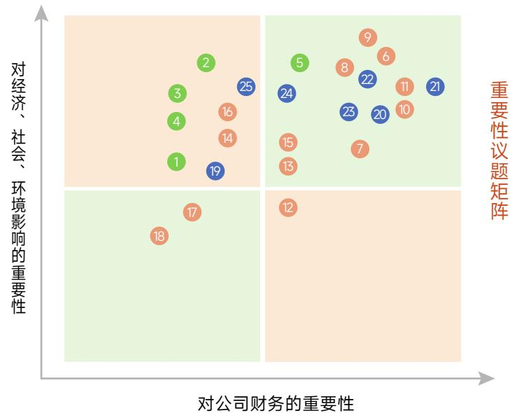

scatter

| Issue ID | Quadrant (Color) |
| --- | --- |
| 1 | Green |
| 2 | Green |
| 3 | Green |
| 4 | Green |
| 5 | Green |
| 6 | Orange |
| 7 | Orange |
| 8 | Orange |
| 9 | Orange |
| 10 | Orange |
| 11 | Orange |
| 12 | Orange |
| 13 | Orange |
| 14 | Orange |
| 15 | Orange |
| 16 | Orange |
| 17 | Orange |
| 18 | Orange |
| 19 | Blue |
| 20 | Blue |
| 21 | Blue |
| 22 | Blue |
| 23 | Blue |
| 24 | Blue |
| 25 | Blue |

# 环境议题

1 应对气候变化  
2 环境合规管理  
3 能源资源利用  
4 废弃物与污染物治理  
5 绿色产品

# 社会议题

6 产品质量与安全  
7 负责任营销  
8 知识产权保护  
9 技术创新  
10 供应链管理  
11 数据安全与隐私保护  
12 员工多元与平等  
13 员工权益与福利  
14 员工培训与发展  
15 职业健康与安全  
16 行业合作与交流  
17 乡村振兴  
18 公益活动

# 治理议题

19 党建引领  
20 公司治理  
21 合规经营  
22 商业道德  
23 信息披露  
24 ESG治理  
25 利益相关方沟通

# 3

# 合规筑基稳健致远

规范公司治理

坚持党建引领

强化风险管理

恪守商业道德

保护投资者权益

2025环境、社会和公司治理（ESG）报告

# 01 规范公司治理

# 治理架构

治理结构是企业稳健运营与长远发展的基石。威星智能严格遵守《中华人民共和国公司法》《中华人民共和国证券法》《上市公司治理准则》《深圳证券交易所股票上市规则》等有关法律法规要求，通过完善董事会职能、强化内部监督机制、提升决策透明度，构建科学高效的治理框架。我们以高标准推动治理创新，确保企业在快速变革的市场环境中行稳致远。

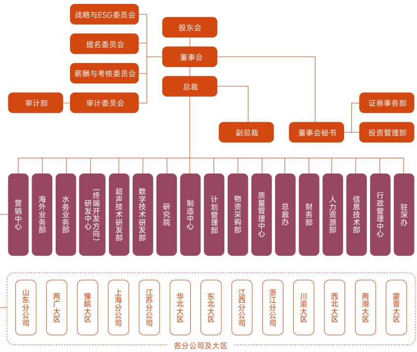

flowchart

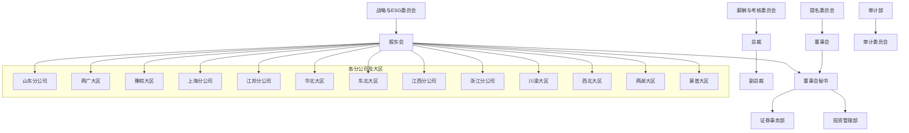
```mermaid
graph TD
  A["战略与ESG委员会"] --> B["股东会"]
  C["提名委员会"] --> D["董事会"]
  E["薪酬与考核委员会"] --> F["总裁"]
  G["审计部"] --> H["审计委员会"]
  B --> I["董事会秘书"]
  D --> I
  F --> J["副总裁"]
  I --> K["证券事务部"]
  I --> L["投资管理部"]
  
  subgraph Subsidiaries [各分公司及大区]
    M1["山东分公司"]
    M2["两广大区"]
    M3["豫皖大区"]
    M4["上海分公司"]
    M5["江苏分公司"]
    M6["华北大区"]
    M7["东北大区"]
    M8["江西分公司"]
    M9["浙江分公司"]
    M10["川渝大区"]
    M11["西北大区"]
    M12["两湖大区"]
    M13["蒙普大区"]
  end
  
  B --> M1
  B --> M2
  B --> M3
  B --> M4
  B --> M5
  B --> M6
  B --> M7
  B --> M8
  B --> M9
  B --> M10
  B --> M11
  B --> M12
  B --> M13
```

# 三会运作

威星智能建立由股东会、董事会及其专业委员会、监事会和高级管理层构成的多层次、立体化的组织架构。

<table><tr><td>层级</td><td>主要职能</td><td>2025年关键进展</td></tr><tr><td>股东会</td><td>公司的权利机构制定公司的长期发展战略和重大决策确保公司的经营方向符合股东和利益相关者的期望</td><td>召开2次会议审议通过28项议案</td></tr><tr><td>董事会</td><td>负责股东会决议的执行制定经营计划和投资方案监督公司运营,确保合规与股东利益最大化</td><td>召开3次会议出席率100%审议通过33项议案</td></tr><tr><td>监事会</td><td>负责监督董事会和高级管理人员的行为检查公司财务,防止损害公司利益行为,维护股东权益</td><td>报告期内,公司已按照新《公司法》及相关指引规范要求取消监事会由董事会审计委员会承接后续职能</td></tr></table>

# 董事会

# 多元化

董事会成员充分考虑多元化原则，包括但不限于年龄、性别、文化背景、专业经验与服务年限等多种因素，有效提升决策效能与运作效率。

# 独立性

独立董事占比约43%，审计委员会、提名委员会、薪酬与考核委员会中独立董事占三分之二，且由独立董事担任主任委员。

# 专业性

公司三位独立董事分别为金融财务、流体计量技术、自动化等方面的专家学者，从专业角度提出建议，增强公司决策的公正性与科学性。

董事会下属战略与ESG委员会、薪酬与考核委员会、提名委员会和审计委员会等专业委员会，提供专业意见和独立监督。审计委员会主任委员为会计专业人士，战略与ESG委员会委员为行业资深专家。

公司董事积极参与业绩说明会、上市公司违法违规典型案例分析专题培训等，独立董事也积极主动关注公司经营管理信息、财务状况及重大事项等，有效推动公司生产经营各项工作持续、稳定、健康发展。

  
职位

男性董事5人

女性董事2人

  
性别

独立董事3人

占比约43%

# 02 坚持党建引领

# 党群建设

威星智能高度重视并持续发挥党组织政治核心与党员先锋模范作用，以高质量党建引领保障公司高质量发展。公司通过不断强化党组织建设、提升党员队伍素质，并将党建工作与业务发展深度融合，切实推动公司战略目标的落实与实现。

# 2024年度"双强"发展党组织

二〇二五年七月

中共杭州钱塘智慧城工作委员会

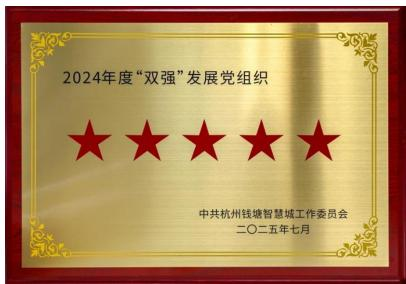

text_image

2024年度“双强”发展党组织
中共杭州钱塘智慧城工作委员会
二〇二五年七月

# 党建活动

威星智能在企业文化建设中，始终坚持党群工作与企业发展相结合，积极探索党建工作与生产经营深度融合的机制。通过开展形式多样的党建主题与群众性实践活动，有效增强了员工归属感与团队凝聚力。公司持续创新党建工作模式，将党纪学习同日常经营管理紧密衔接，在提升党员干部综合素质的同时，也充分发挥党组织的引领作用，切实将政治优势转化为推动企业发展的组织优势与生产力，实现了党建工作与企业发展同频共振、相互促进的良好局面。

# 强化政治引领，筑牢发展根基

党支部坚持以习近平新时代中国特色社会主义思想为指导，全面落实“第一议题”制度，组织集中学习12次、专题研讨4场，覆盖党员700人次，推动党的创新理论深入基层。通过细化“狠抓落实年”任务清单，实行专人负责、限时办结机制，确保上级决策部署100%落地，为企业发展筑牢政治根基。

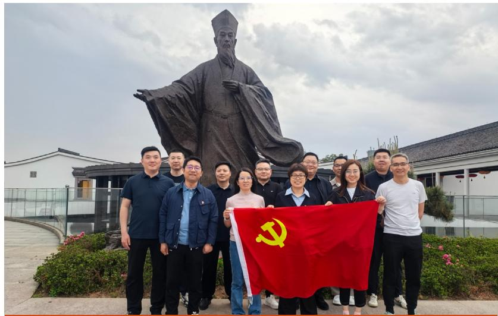

natural_image

Group of people posing with a large statue and a red flag featuring a hammer and sickle emblem, in front of a traditional building (no visible text or symbols)

参观王阳明故居活动

12次

集中学习

4场

专题研讨

700人次

覆盖党员

决策部署100%落地

# 夯实组织基础，激发队伍活力

# “三会一课”、组织生活会等制度

召开支委会12次，开展主题党日活动12场，组织生活参与率100%。结合红色教育基地参观、主题观影、阅兵观礼等活动，强化党性锻炼。党员积极参与公司“好声音”演讲比赛并获三等奖，展现党建引领下的文化凝聚力。

# 党员能力提升计划

组织党务培训2次，推动党员在技术革新中发挥表率作用。党员团队主导完成国内外专利84件，多名党员获“杭州市工匠”“上城区工匠”等荣誉。依托省级博士后工作站，深化产学研融合，为企业创新注入持续动力。

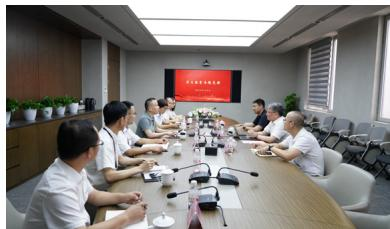

natural_image

Group of people seated around a conference table in a modern meeting room, with a large screen displaying Chinese text (no visible signage or symbols on the image itself)

专题党课宣讲

支委会12次

党日活动12场

党务培训2次

组织生活参与率100%

# 推动党建与业务深度融合，赋能高质量发展

围绕公司经营目标，开展“党建+降本增效”“党建+技术革新”专项行动。党员带头优化生产流程，推动年度产能突破800万台，创历史新高。通过“党员服务万里行”活动，深入全国20余省市客户现场，助力海外业务与水表业务实现新突破。在“娄山关战役”“渡江战役”等专项攻坚中，淬炼营销铁军，提升市场竞争力。

# 03 强化风险管理

# 风险管理

威星智能始终将风险管理视为企业可持续发展的生命线。我们深知，唯有筑牢风险防线，方能在风云变幻的市场中行稳致远。我们建立了全面、系统的风险管理体系，定期开展风险排查和评估工作，捕捉潜在威胁，防患未然。

我们倡导全员参与，强化风险意识，使每一位员工都成为风险管理的践行者。通过持续优化风险应对策略，我们不断提升抗风险能力，为企业长远发展保驾护航。

# 重点关注风险

  
数据风险  
在数字化时代，信息安全风险日益凸显。威星智能通过加强信息化建设，提升数据管理能力和安全性，能够更有效地监控和评估潜在风险，及时采取应对措施，防止数据泄露和信息安全事件的发生。

  
合规风险  
威星智能严格遵守法律法规和行业标准，确保合规经营，降低因违法违规行为带来的法律风险。总裁办作为合规管理部门，负责监督公司合规情况，及时发现并纠正违规行为，确保公司运营的合法性和规范性。

  
供应链风险  
随着全球化进程的加速和供应链复杂性的增加，威星智能面临潜在的供应链中断风险，包括原材料供应不稳定、物流延误以及供应商合规问题等。为此，我们建立供应链风险评估机制，定期审查关键供应商的稳定性与合规性，并制定应急预案，确保供应链的韧性和可持续性。

  
环境与气候风险

气候变化和极端天气事件可能对威星智能的运营和供应链造成直接影响，例如生产设施受损、能源供应中断等。同时，环境法规的日益严格也带来了潜在的合规风险。我们通过加强环境管理体系建设，推行绿色生产模式，并定期评估气候相关风险，制定适应性策略，以降低环境与气候风险对企业运营的影响。

# 内控与审计

威星智能始终将健全的内部控制体系视为企业可持续发展的重要基石。为确保公司运营的合规性、效率性和透明度，我们建立了多层次、全方位的内部控制框架，并辅以独立的内部审计机制，持续提升公司治理水平。

# 内部控制

在公司内部控制方面，我们坚持以“促规范、防风险”为工作目标，兼顾公司经营战略，以风险管理为导向，覆盖存货管理、对外投资管理、货币资金管理、信息披露管理、关联交易管理、募集资金管理等多个维度。

# 存货管理

对外投资管理

货币资金管理

信息披露管理

关联交易管理

募集资金管理

公司通过制定完善的规章制度和业务流程，明确关键控制点和控制措施，确保各项业务活动在授权范围内规范运行。

# 内部审计

威星智能董事会下设审计委员会，由独立董事担任主任委员，旨在以专业视角全面监督和评估公司内外部审计工作。公司授权审计部独立开展内部审计工作，并向审计委员会汇报。

# 25次

审计类项目

7次

审计工作报告

1次

年度审计委员会工作报告

此外，公司制定《内部审计制度》《内部审计问责暂行办法》《升级整改跟踪管理办法》等制度，明确内部审计的职责与权限，强化问责机制，确保问题能够及时发现、及时整改。

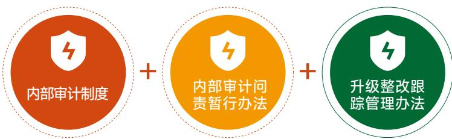

flowchart

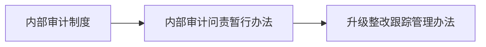
```mermaid
graph LR
  A["内部审计制度"] --> B["内部审计问责暂行办法"]
  B --> C["升级整改跟踪管理办法"]
```

# 开展经营管理专项检查，强化审计补充作用，助力公司精细化与持续发展

2025年，公司围绕研发费用、子公司经营管理、用工情况、供应商管理、大额资产采购实施情况、募集资金管理、关联交易等方面开展专项检查，全面评估公司政策的落实情况。通过深入探讨精细化管理改善措施，推动组织经营目标的实现，为公司高质量发展提供有力支持。

# 发挥审计专业能力，强化咨询职能，为企业价值提升奠定基础

审计部以“强服务、增效益”为目标，通过事前、事中、事后的全方位介入，发挥专业优势，提升服务意识，助力公司经营目标达成与快速发展。

2025年，审计部其他重点工作：参与制度、流程优化及招标文件预审，提出完善建议；监督评审会及招标会，确保公平公正；针对合规与风险问题，及时提供解答或出具书面意见，为公司合规经营与风险防控提供专业支持。

# 04 恪守商业道德

# 合规运营

# 合规管理体系

威星智能作为公共事业能源领域智慧计量解决方案的领先企业，始终将合规管理视为企业可持续发展的基石。公司严格遵循相关法律法规及监管要求，建立系统化、标准化的合规管理制度与流程，确保各项运营活动合法合规，并符合商业道德规范。

# 合规文化

我们注重培育合规文化，将合规理念深度融入公司战略、运营及决策的全流程。我们秉持“诚信经营、守法合规”的价值观，通过多渠道的内部宣传、常态化培训及激励机制，全面提升员工的合规意识与责任感，营造风清气正的企业氛围。

# 合规培训

我们组织多层次、多维度的合规培训活动，以提升员工的合规素养与专业技能。培训内容涵盖法律法规解读、行业规范解析、公司制度宣贯等，旨在帮助员工深入理解合规要求，强化合规操作能力，为公司的稳健运营提供坚实保障。

- 新人入职培训—知识产权、法律法规介绍  
- 诚信管理体系及制度培训  
采购法律合规相关培训  
- 商业秘密保护专项培训  
- 用工风险培训  
- 合同、归档、用印等流程培训  
- 各部门及子公司重大事项汇报及信息披露培训  
- 上市公司应对媒体标准动作培训

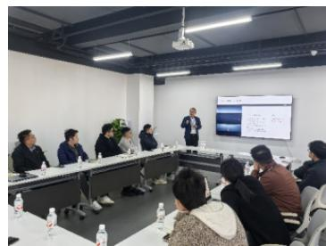

natural_image

Interior of a modern conference room with attendees seated around a U-shaped table, facing a presenter at the front (no visible text or signage)

# 清廉建设

威星智能积极响应国家关于清廉民企建设的号召，通过加强党风廉政建设，推动公司形成风清气正的经营环境。我们严格遵守国家相关法律法规和商业道德规范，明确要求所有供应商必须签署《廉洁协议》，协议中严格禁止任何形式的贪污、受贿、利益输送等违法违规行为。

公司注重培养员工的廉洁自律意识，加强对采购、销售等关键环节的合规管理，确保公司的经营活动合法合规、公开透明。我们通过开展廉洁教育培训、设立廉洁宣传专栏等方式，持续强化廉洁文化建设。同时设立专门的举报邮箱和电话，建立完善的监督举报机制，确保清廉建设取得实效。

  
供应商廉洁协议  
浙江威星智能仪表股份有限公司

# 举报渠道

邮箱：shenji@viewshine.cn

# 公平竞争

我们致力维护公平竞争的市场环境，严格遵守反垄断法律法规，确保业务运营公正透明。我们建立公平竞争机制，保障供应商与客户权益，促进产业链健康生态，同时加强内部合规培训，提升员工公平竞争意识，营造诚信经营文化。

# 威星招投标机制

<table><tr><td>制度与机构保障</td><td>招标环节</td><td>投标环节</td><td>开标、评标与定标</td><td>监督与投诉处理</td></tr><tr><td>制定完善的招标管理制度,规范各环节操作流程与标准。设立专门招投标管理机构,负责统筹管理与监督。</td><td>信息发布:通过多渠道发布招标信息,内容全面且清晰。资格预审:严格审查潜在投标人资质等,标准公开透明。文件编制:科学合理编制招标文件,评标标准客观公正。</td><td>文件要求:明确投标文件编制与递交规范,保障完整性与保密性。权益保护:尊重和保护投标人权益,及时处理疑问与质疑。</td><td>开标:按规定公开开标,相关人员共同参与监督。评标:组建专业评标委员会,按标准独立评审打分。定标:依据评标结果,按原则确定中标人,及时通知结果。</td><td>建立内部与外部监督体系,确保活动合法合规。设立投诉渠道,及时调查处理投诉,维护公平秩序。</td></tr></table>

# 依法纳税

我们严格遵守国家税收法律法规，确保税款缴纳及时准确。公司通过建立健全的税务管理体系，制定《税务管理制度》，加强税务筹划与风险管理，保障公司财务健康与合规运营。我们积极履行纳税义务，为经济发展贡献力量。

威星智能及控股子公司杭州缥缈峰科技有限公司、杭州威星计量技术有限公司、中燃荣威能源设备（杭州）有限公司、上海埃科燃气测控设备有限公司，秉持诚信守法、积极履行社会责任的原则，均荣获A级纳税人殊荣。

7,879.77万元
2024年度纳税总额

7,901.59万元
2025年度纳税总额

53,277.36万元
上市以来
累计纳税总额

# 05 保护投资者权益

# 信息披露

威星智能将信息披露工作视为与投资者、监管机构及其他利益相关方沟通的重要桥梁。我们制定《信息披露管理制度》，遵守公平信息披露原则，明确信息披露的责任部门、流程及标准，确保信息披露的及时性、准确性和完整性。

在数字化转型的背景下，我们积极探索信息披露的创新方式，以提升信息传递的效率和透明度。我们通过官网、投资者关系平台、社交媒体等多渠道发布信息，并采用图文、视频、数据可视化等形式，使信息披露内容更加生动易懂。

# 信息披露培训

为提升公司信息披露的规范性、准确性和透明度，我们组织开展信息披露培训。培训围绕上市公司信息披露法律法规、信息披露要求与意义、财务与非财务信息披露要点等内容展开，结合案例分析，帮助相关人员深入理解信息披露的核心要求与操作规范。

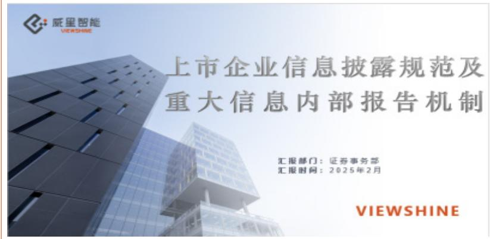

text_image

威星智能
VIEWSHINE
上市企业信息披露规范及
重大信息内部报告机制
汇报部门：证券事务部
汇报时间：2025年2月
VIEWSHINE

# 投资者沟通

我们高度重视投资者沟通，致力于建立透明、高效的沟通机制，确保投资者能够及时、准确地了解公司经营状况和发展战略。

139份

发布公告包括1份自愿性公告

3场

路演、反路演
策略会、调研沟通会

44次

深交所互动e
回复投资者提问

80余次

接听投资者
热线电话

# 构建透明互信的投资者关系

- 通过投资者调研、网络业绩说明会、深交所互动易平台、投资者关系管理电话、电子信箱等多种渠道与投资者沟通，与投资者保持密切互动。  
- 收集投资者反馈，并通过官方网站、投资者关系平台等渠道发布公司动态。  
- 定期发布财务报告、ESG报告及重大事项公告，确保投资者能够全面了解公司运营情况。

# 515全国投资者保护宣传日活动

2025年5月15日是全国投资者保护日，证券事务部倡议全体同仁：守护投资者权益，共绘资本市场新蓝图。

# 守护投资者权益 共绘资本市场新蓝图

威里智造 无限可能

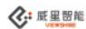

# 守护投资者权益，共绘资本市场新蓝图

——致全体员工的行动倡议

亲爱的同事们：

2025年6月15日是全国投资者保护日。作为上市公司的一员，我们肩负着双重使命：既要当好业务赛道的“奋斗者”，更要成为投资者权益的“守门人”。在此，证券事务部倡议全体同仁：以专业为盾，以责任为牙，共同构筑资本市场的信任长城！

一、投资者保护：一场关乎未来的“生存游戏”

1. 资本市场的“氧气”

投资者如同市场的“造血干细胞”，保护其权益就是守护资本市场的生命线——毕竟，没有“氧气”的公司，再宏伟的蓝图也只是纸上谈兵。

2. 信任经济的“终极考题”

当投资者用真金白银为我们的梦想投票时，每一份财报的透明度、每一次沟通的真诚度，都是这场大考的“必答题”。

3. 基业长青的“隐藏关卡”

证监会的要求是底线，而超越底线、主动保护投资者，才是解锁“百年老店”成就的关键秘籍。

# 股东回报

我们始终注重长期价值创造，平衡公司发展与股东利益，持续优化股东回报机制，提升股东价值，为股东创造持续、稳定的回报。同时，我们将加强股东沟通，不断提升股东满意度，增强股东信任，与股东共享公司成长的价值，携手共创美好未来。

上市后累计分红：7,037.43万元

# 4

# 创新赋能协同发展

创新驱动发展

知识产权管理

可持续供应链

追求卓越品质

坚持精工制造

优化客户体验

保护信息安全

2025环境、社会和公司治理（ESG）报告

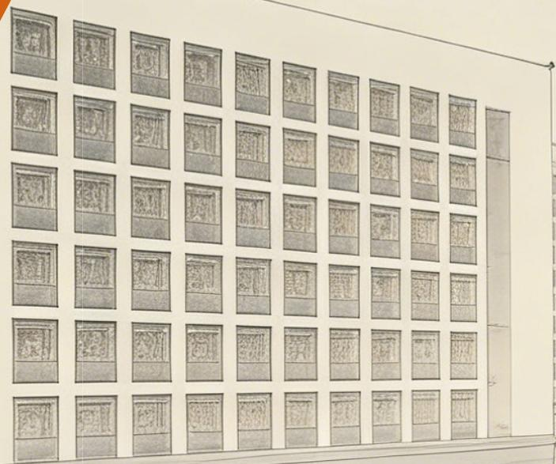

natural_image

Grid of ancient stone carvings arranged in rows, no visible text or symbols

# 01 创新驱动发展

# 研发创新

威星智能立志打造行业领航者地位，依托战略性研发投入与创新驱动体系，不断实现关键技术突破与生产效能优化，通过价值创造闭环增强企业核心竞争力，有效满足市场动态需求，赋能高质量业务增长。

# 研发体系

我们的研发工作聚焦于智慧燃气与智慧水务两大领域，从终端设备到系统平台，全面开展技术创新、市场拓展、可持续发展规划以及风险管理等工作，以推动智能燃气表、智能水表及配套系统与服务的升级，实现公司可持续发展。

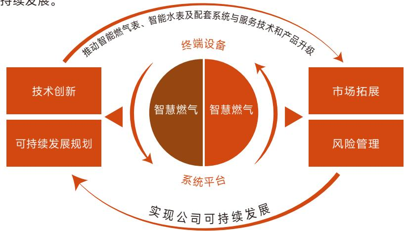

flowchart

```mermaid
graph LR
  subgraph Center(("智慧燃气"))
    direction TB
    Tech["技术创新"]
    Plan["可持续发展规划"]
  end

  subgraph System["系统平台"]
    direction TB
    SmartGas["智慧燃气"]
  end

  subgraph Market["市场拓展"]
    direction TB
    Risk["风险管理"]
  end

  Tech --> SmartGas
  Plan --> SmartGas
  SmartGas --> SmartGas
  SmartGas --> Market

  SmartGas -.->|"实现公司可持续发展"| Plan
  SmartGas -.->|"推动智能燃气表、智能水表及配套系统与服务技术和产品升级"| Market
```

2025年研发投入：8,917.64万元，研发人员：393人。

威星智能研发战略

<table><tr><td colspan="4">技术创新与升级</td></tr><tr><td>先进计量技术应用</td><td>智慧能源数字化管理</td><td>全域安全管控</td><td>高精度传感器技术</td></tr><tr><td>物联网与大数据技术</td><td>人工智能与机器学习</td><td>高密封性能与安全设计</td><td>......</td></tr><tr><td colspan="4">市场拓展与品牌建设</td></tr><tr><td>多元化产品开发策略</td><td colspan="2">定制化解决方案</td><td>行业发声与市场推广</td></tr><tr><td colspan="4">可持续发展与政策支持</td></tr><tr><td>环保与节能</td><td colspan="2">政策支持与合作</td><td>标准制定与认证</td></tr><tr><td colspan="4">风险管理与持续改进</td></tr><tr><td>技术风险</td><td colspan="2">市场风险</td><td>持续改进</td></tr><tr><td colspan="4">治理与合规性</td></tr><tr><td colspan="2">研发合规性</td><td colspan="2">知识产权保护</td></tr></table>

# 研发模式

我们以产品全生命周期管理（PLM）为核心，构建了集成产品管理系统、代码版本控制工具和矩阵式项目管理的高效研发体系。该体系覆盖从需求分析到项目复盘的全过程，确保各阶段紧密衔接，并通过持续迭代机制，推动产品不断优化升级。

威星智能研发模式

<table><tr><td colspan="3">项目需求分析与目标设定</td></tr><tr><td rowspan="4">技术研发与设计</td><td>核心技术选型</td><td>物联网技术、传感器技术、数据加密与安全传输技术等</td></tr><tr><td>系统架构设计</td><td>硬件平台设计、软件平台设计</td></tr><tr><td>原型开发与设计</td><td>原型机,进行功能验证、性能测试、安全评估</td></tr><tr><td>用户界面与交互设计</td><td>设计用户友好的操作界面,符合定制化标准要求</td></tr><tr><td colspan="2">生产与质量控制</td><td>生产工艺优化、关键零部件选型、小批量试产、研发管理体系</td></tr><tr><td rowspan="4">软件与系统集成</td><td>核心技术选型</td><td>仪表内部智能控制软件、通信协议开发</td></tr><tr><td>云平台建设</td><td>数据采集、数据分析、远程监控、故障诊断的云服务平台</td></tr><tr><td>API与第三方集成</td><td>提供API接口,与客户管理系统、营收系统等第三方平台集成</td></tr><tr><td>数据安全与隐私保护</td><td>加强数据加密、访问控制,确保用户数据安全</td></tr><tr><td colspan="2">测试与认证</td><td>功能测试、性能测试、合规性认证、用户验收测试</td></tr></table>

持续研发与创新：技术跟踪与研发、产品迭代升级、知识产权管理

总结与规划：项目回顾、市场影响、未来规划

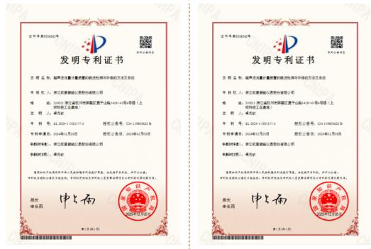

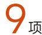

2025年授权发明专利  
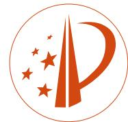

# 2025年创新产品

# 固定点激光监测设备

阀井监测终端采用可调谐半导体激光吸收光谱技术，能精准检测周围空气中的甲烷浓度，气压、温度以及管道内的气压和温度，同时具备设备倾倒、浸水检测以及井盖盗窃检测，并定时上传定位数据。便于燃气公司实时掌握阀井状态，出现异常及时处理。

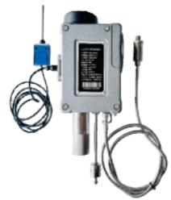

text_image

Electrical device with labeled components including a digital display, measurement instruments, and cables

# 管道远程监测设备

智能管道远程监测仪是基于半导体激光吸收光谱技术（TDLAS）开发的新型燃气泄漏监测产品。产品针对管道沿线占压区域、管网微渗漏频发区域设计，结合窄带物联网（NB-IoT/4G）技术及超低功耗电路设计，采用桩式或地面方式安装，实时监测燃气管道沿线的甲烷浓度。产品的振动预警监测功能，可有效监测周边不规范施工及违章动土作业所带来的管道破坏。

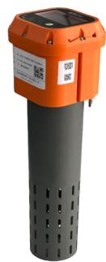

# 管网监测设备——“压力监测仪”

压力监测仪通过对管道压力的全周期监测与数据记录，能够帮助运营方及时发现异常工况，辅助开展预防性维护，减少非计划停机与安全隐患，助力能源与公用事业领域的安全、高效运营，推动运维管理的数字化与精细化升级。

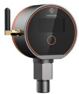

# AI安检解决方案

配置18种AI算法：图像质量分析、图像分类、图片相似度判断、表具信息分析、液化气钢瓶检测、室内外管道、燃气灶检测、燃气热水器检测、计量设备、连接软管检测、用气环境检测、差压监测等，根据《管道燃气居民客户隐患管理规程》隐患分级，系统可识别多类分级隐患。

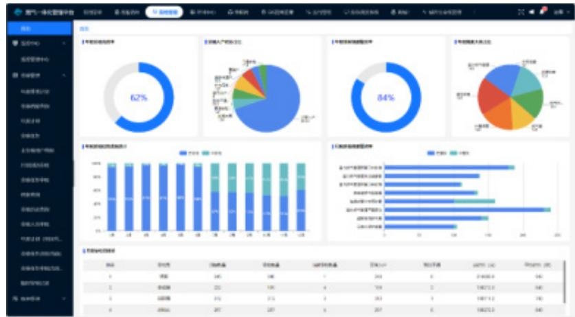

donut

| Category | Value |
| --- | --- |
| Market Share (%) | 62% |
| Enterprise Count (Count) | 109 |
| Revenue Distribution (Share) | 84% |
| Customer Base Composition (Blue) | 75%~80% |
| Customer Base Composition (Green) | 20%~30% |
| Customer Base Composition (Red) | 10%~20% |
| Customer Base Composition (Orange) | 10%~20% |
| Customer Base Composition (Yellow) | 10%~20% |
| Customer Base Composition (Light Blue) | 10%~20% |

# AR数实结合产品

AR+实景数实平台1:1真实复刻物理空间，将时空数据底座自动生成的管沟Mesh模型、设备模型、户内外现场全景-点云模型加载并自动进行高精度融合匹配，地下管沟、地上室内外空间设备设施与环境模型同屏呈现，多元数据融合精准表达燃气管道以及周边生产运营环境，现场数据实时掌握。同时集成AR运维能力，满足燃气行业各类应用场景。

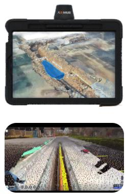

# 水表产品迭代升级

# 机械

# 无阀水表

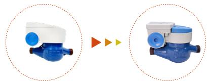

natural_image

Two circular diagrams showing a blue water meter and a white device before and after processing, with no text or symbols present.

完成结构模块化设计及多模组方案，围绕客户定制化解决方案。

# 机械

# 阀控水表

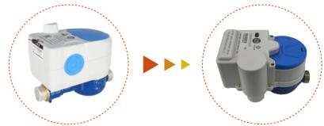

natural_image

Two circular diagrams showing a white and blue industrial device before and after a transformation, with no visible text or symbols.

结构模块化设计、提升防护性能，满足客户不同场景的应用。

# 超声

# 户用水表

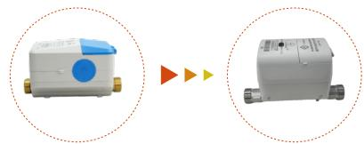

natural_image

Two circular diagrams showing a white and blue industrial device before and after a transformation, with no visible text or symbols.

小型化及模块化设计、提升防护性能和不同的材质，满足客户不同场景的应用。

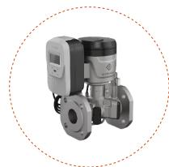

威星自研商用超声大口径水表实现从0-1的过程。

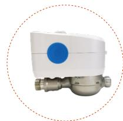

机械直饮水水表产品优化及迭代，提升产品性能参数，更高的量程比，满足不同客户的需求及应用。

# CNAS复评与扩项

2025 年 8 月 4 日，威星智能实验室顺利通过中国合格评定国家认可委员会（CNAS）组织的复评审及扩项评审工作，其认可注册号为 CNAS L18564。本次评审通过后，国家认可委已对该实验室的认可证书及认可检测能力范围完成更新，标志着威星智能实验室在质量管理体系、技术能力水平、检测标准规范等方面持续符合国家认可要求，检测结果的权威性、公正性与国际互认程度得到进一步巩固与提升，也为公司在相关领域开展研发创新、质量管控及市场服务提供了更加坚实可靠的技术支撑。

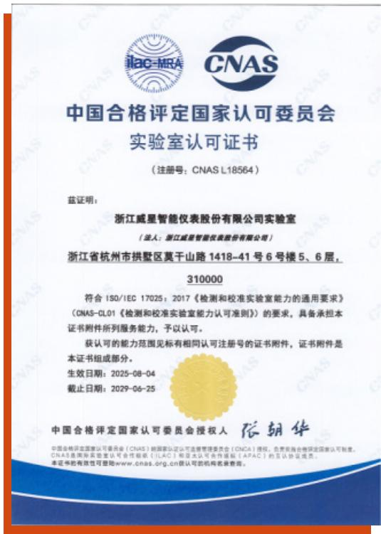

text_image

中国合格评定国家认可委员会
实验室认可证书
（注册号：CNAS L18564）
兹证明：
浙江威星智能仪表股份有限公司实验室
（法人：浙江威星智能仪表股份有限公司）
浙江省杭州市拱墅区莫干山路1418-41号6号楼5、6层，
310000
符合ISO/IEC 17025：2017《检测和校准实验室能力的通用要求》
（CNAS-CLO1《检测和校准实验室能力认可准则》）的要求，具备承担本
证书附件所列服务能力，予以认可。
获认可的能力范围见标有相同认可注册号的证书附件，证书附件是
本证书组成部分。
生效日期：2025-08-04
截止日期：2029-06-25
中国合格评定国家认可委员会授权人 张朝华
中国合格评定国家认可委员会（CNAS）的国家认可监督管理委员会（CNCA）授权，负责面向合格评定国家认可制度。
CNAS的商用实体认证认可台账（ILAC）和资本认定合作模板（APAC）的互认协议成员。
本证书的有效性可登陆www.cnas.org.cn认可的机构名录查询。

# CNAS复评审+扩项评审工作的主要亮点

- 在原有 33 项 CNAS 认可项目基础上，新增 21 个项目通过 CNAS 认可，认可项目总数同比增长 63%;  
- 新增依据 GB/T 778.2 国家标准及BS EN ISO 4064:2 外文标准的水表检测项目 11 项，有效提升了公司品牌形象，增强了水表产品在国内外市场的综合竞争力。

<table><tr><td>成果内容</td><td>具体数据</td><td>成效说明</td></tr><tr><td>CNAS 认可项目扩增</td><td>原有 33 项,新增 21 项,总量增长63%。</td><td>扩大认可范围,夯实实验室检测资质能力。</td></tr><tr><td>水表检测标准项目新增</td><td>新增 GB/T 778.2 国家标准及BS EN ISO 4064:2 外文标准相关检测项目11 项。</td><td>提升企业形象,增强水表产品国内、外市场竞争力。</td></tr></table>

# 大模型技术探索与应用

在大模型技术探索与应用方面，公司完成天翼云 deepseek-r1-32b 模型的部署及问答效果验证，积极探索大模型在企业业务场景中的落地应用；同时依托 Dify 开源 AI 应用框架，开展 AI Agent 在企业办公、代码辅助等场景的应用研究，以技术创新赋能企业数字化转型与高质量可持续发展。

# 大模型技术探索与应用

天翼云 deepseek-r1-32b 模型

Dify 开源 AI 应用框架

探索大模型在企业场景的应用可能性

企业办公

代码辅助

# 技术创新

# 企业数字化转型与高质量可持续发展

# 2025年度创新荣誉

- 第七届中国燃气表企业排行榜“行业创新标杆企业”  
- 第七届中国燃气表企业排行榜“智慧燃气物联网大数据创新应用奖”  
- 第三届“新绿杯”信息通信行业赋能碳达峰中和创新大赛二等奖（联合参赛）  
• 2025年第五届燃气安全创新成果技术创新优秀奖  
- 与浙江省质量科学研究院合作申报二氧化碳加氢制绿色甲醇关键工艺开发及示范研究项目成功立项

# 02 知识产权管理

# 知识产权管理体系

为加强公司知识产权保护，规范知识产权管理，激发员工创新创造活力，促进科技成果转化与应用，公司依据国家相关法律法规，结合实际情况，制定并实施了一系列知识产权管理制度，提升知识产权的创造、管理、运用和保护能力，确保满足相关标准要求。

公司研发中心统筹协调企业内外知识产权管理的全过程，由知识产权主管全面负责相关工作，各职能部门协同配合，共同推进知识产权管理工作。

# 知识产权管理文件

- 知识产权管理办法  
- 知识产权管理手册  
- 商标管理办法  
- 专利管理办法  
- 商业秘密保护制度  
- 知识产权内容传输与隔断管理办法  
- 知识产权奖惩制度  
- 知识产权程序文件汇编

我们坚持“创新发展是硬道理，知识产权是硬实力”的知识产权方针，为确保方针有效落实，最高管理者通过会议、标语等多种形式向全体员工宣传贯彻知识产权管理方针；各部门负责人则通过内部会议、日常交谈等方式，确保部门全员理解并自觉贯彻执行；管理者代表通过内审、工作检查等手段，定期评估方针的实施效果，并持续优化改进，形成闭环管理，全面提升知识产权管理水平。

# “创新发展是硬道理知识产权是硬实力”

知识产权方针

此外，公司通过建立知识产权风险应急预案、开展专项培训与宣贯等措施，有效防范知识产权风险，最大限度降低公司运营风险。

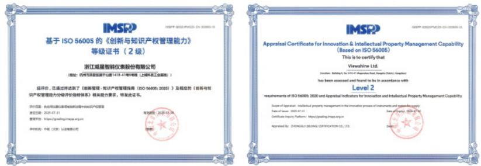

公司于2025年首次通过ISO 56005《创新与知识产权管理能力》贯标认证，标志着公司创新与知识产权管理能力跃升新台阶，开启创新管理国际化新篇章。有效防范知识产权风险，最大限度降低公司运营风险。

知识产权成果

<table><tr><td>知识产权类型</td><td>类别</td><td>数量(项)</td></tr><tr><td>国内专利总计</td><td>—</td><td>662</td></tr><tr><td></td><td>发明专利(授权)</td><td>45</td></tr><tr><td></td><td>实用新型专利(授权)</td><td>276</td></tr><tr><td></td><td>外观设计专利(授权)</td><td>57</td></tr><tr><td></td><td>海外实用新型专利</td><td>3</td></tr><tr><td></td><td>海外外观设计专利</td><td>1</td></tr><tr><td>著作权</td><td>软件著作权(授权)</td><td>284</td></tr><tr><td>数据知识产权</td><td>—</td><td>16</td></tr></table>

# 先后被评为

- 杭州市专利示范企业  
- 浙江省专利示范企业  
- 浙江省知识产权示范企业  
- 国家知识产权优势企业  
- 2025年入选杭州市高价值专利组合培育项目，将在两年内新申请授权20个发明专利和10个海外PCT。

# 知识产权培训

威星智能分别面向管理人员与技术人员，开展了创新及知识产权管理能力提升、专利撰写实务专题培训。本次培训结合贯标学习服务系统，采用线上线下相结合的方式，累计开设6课时，共235人次参与，覆盖研发中心、超声技术研发部、研究院、法务部等多个部门。

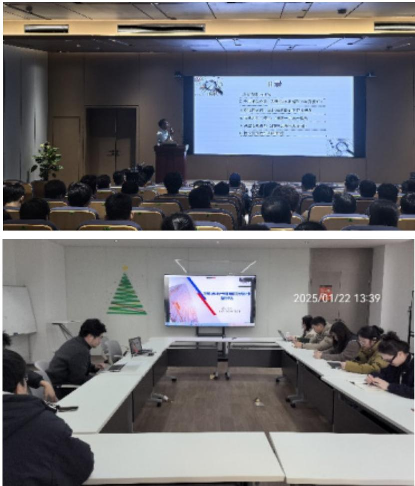

# 行业协作

行业参与：威星智能秉持开放合作、共赢发展的理念，积极参与行业协会的各项活动，与行业同仁共同推动技术创新与产业升级。在行业协会的平台上，威星智能不仅分享自身的技术成果与实践经验，更通过与同行企业的深度交流，汲取智慧，拓展视野。

- 中国计量测试学会第八届理事会 理事  
- 国际星闪无线短距通讯联盟 会员  
- 国家流量仪表评价计量测试联盟 副理事长单位  
- 中国城市燃气协会 理事  
- 中国城市燃气协会科学技术工作委员会 委员  
- 中国城市燃气协会信息工作委员会 委员  
- 中国城市燃气协会智能气网专业委员会 委员  
- 中国城市燃气协会安全管理工作委员会 委员  
- 中国城市燃气协会标准工作委员会 委员  
- 中国城镇供水排水协会 会员  
- 中国计量协会燃气表工作委员会 会员  
- 中国计量协会 会员  
- 中国计量测试学会 会员  
- 浙江省可持续发展研究会 委员  
- 浙江省燃气协会 会员  
- 浙江省物联网协会 会员  
- 陕西省城镇供水排水协会    会员  
- 广西城镇供水排水协会 会员  
- 黑龙江城镇供水排水协会 会员

# 行业标准制定

威星智能作为国内计量仪表行业的头部企业，始终积极参与国家标准、行业标准及团体标准的制定，不仅体现了公司在行业内的技术实力和影响力，也为推动行业标准化发展、提升产品和服务质量提供了有力支持。

2025年，参与制定11家头部燃气公司技术标准，提升行业话语权，如华润燃气、克拉玛依、山西华腾、上海燃气、深圳燃气、新奥燃气等。

累计参与国家标准、行业标准及团体标准的制定，共计48项。  
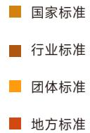

2024年获证标准创新性企业  
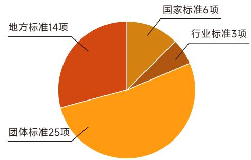

pie

| Category | Value |
| --- | --- |
| 国家标准 | 6项 |
| 行业标准 | 3项 |
| 团体标准 | 25项 |
| 地方标准 | 14项 |

# 2025年已发布的威星智能参编标准

- 超声智能流量计（T/CGAS037-2025）  
- 智能燃气表内置阀（T/CGAS038-2025）  
- 激光型家用和餐饮场所可燃气体探测器（T/CGAS040-2025）  
- 超声波燃气表现场校准技术规范（T/SMA 0067-2025）

# 行业交流活动

威星智能积极参与行业峰会及专业展会，构建产业生态圈层影响力，同步实现品牌价值提升与渠道网络拓展。同时沉淀展会市场反馈，赋能产品迭代与竞品策略制定，构建从市场洞察到业务转化的完整价值链。

# 2025年安全委委员大会暨燃气安全交流研讨会

在展会现场，威星智能的展位吸引了众多参会者的目光。威星智能重点展示了常闭自检安全解决方案、智慧厨房解决方案以及工贸压力切断解决方案等创新成果。

公司发布了城市燃气户内安全主动防御体系以及在市场端的成功应用案例，该技术通过声波信号实时监测流量异常，结合AI算法精准识别微小泄漏，为家庭用户打造“无感式”安全防护网，引发与会专家高度关注。

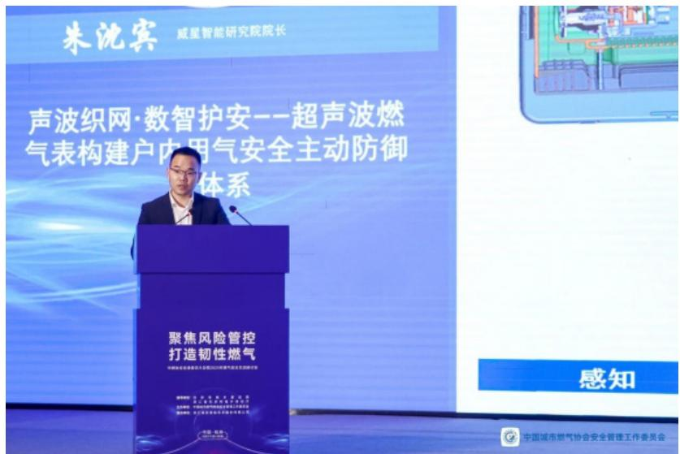

text_image

朱沈宾 威星智能研究院院长
声波织网·数智护安--超声波燃气表构建户内用气安全主动防御体系
聚焦风险管控
打造韧性燃气
感知
中国城市燃气协会安全管理工作委员会

# 中国城镇供水排水协会2025年会

在本次展会上，威星智能重点展出了多款具有行业代表性的产品，包括超声波物联网水表、无线远传机械水表等智能远传水表系列，以及智慧水务平台、星宇云平台等智慧水务信息系统平台。该系列产品依托NB-IoT等网络与系统平台实现互联互通，可支持远程抄表、在线充值、阶梯水价计费、数据分析、预付费管理等功能。智慧水务系统则集成了管网巡检系统、智慧水厂生产调度平台、DMA分区计量系统及管网GIS地理信息系统，有效提升了城市水务系统的精细化管理与智能管控水平，为各类智慧水务项目建设提供了坚实的数据支撑。

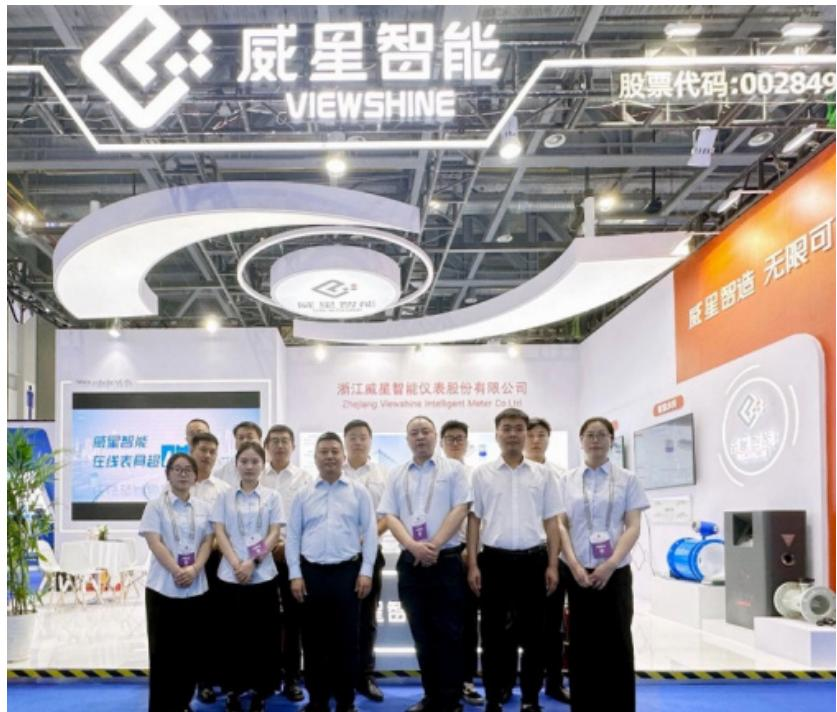

text_image

威星智能
VIEWSHINE
股票代码:002849
浙江威星智能仪表股份有限公司
Zhejiang Viewshine Intelligent Meter Co Ltd
威星智造 无限可

# 上市公司产业合作对接会

对接会成功搭建了上市公司产业合作的交流合作桥梁，通过技术展示、资源对接与产业研讨，为行业高质量发展提供了创新动能。威星智能作为承办方，不仅彰显了技术积淀与产业影响力，更以开放姿态推动上下游协同创新。

与此同时，威星智能还将以自身产业优势为基础，深入探索新质生产力，积极布局数字信息化产业等新兴领域，为公司的多元化发展提供新的增长空间，实现可持续发展与产业升级的双重目标。

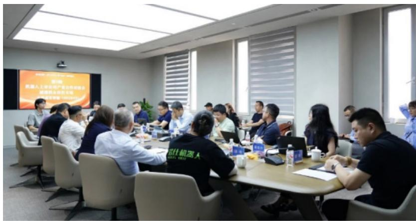

text_image

Meeting room photo with visible presentation screen showing Chinese text about industrial and pharmaceutical industry support fund

# 第29届世界燃气大会

本次展会，威星智能以“技术驱动未来，智慧守护能源”为核心理念，全面展示了在智能计量终端与安全检测终端产品方面取得的创新成果。其中，超声波燃气表产品以其先进的超声波技术，实现了燃气的无接触式测量，具有响应速度快、测量精度高、使用寿命长等优点，已成为精准计量与安全保障领域的标杆产品，为燃气行业的智能化发展注入了新动力，推动行业从传统模式向智能化、数字化转型。

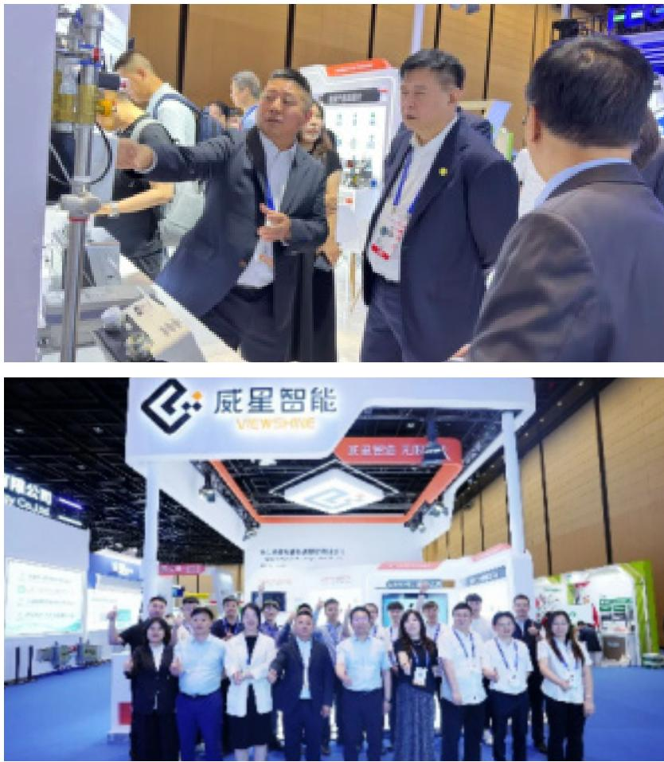

# 第27届中国国际燃气、供热技术与设备展览会

2025年10月22日至24日，以“智慧燃气赋能，携手丝路发展”为主题的第27届中国国际燃气、供热技术与设备展览会在海南国际会展中心盛大举办。威星智能携多款创新产品与全矩阵智慧燃气解决方案精彩亮相，以创新技术与场景化应用，为燃气行业数字化、智能化升级带来全新可能！

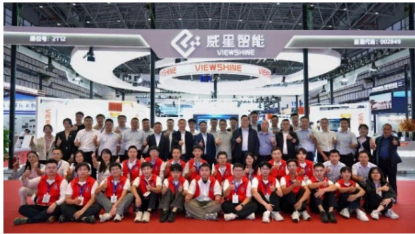

text_image

威星智能
VIEWSHINE
VIEWSHINE VENG
展位号：2112
登录代码：002849

# 海外展会

在国际市场拓展方面，公司积极参与2025年迪拜WETEX展、墨西哥水处理展、欧洲能源展等海外重要行业展会，面向中东、拉美、欧洲等区域市场，集中展示公司在智能计量、水务信息化、能源管理等领域的技术成果与绿色解决方案。通过与全球行业伙伴、客户及专业机构的深度交流，有效提升了公司品牌的国际影响力，推动了海外市场布局与可持续发展理念的传播，为构建全球化、绿色化的产业合作网络奠定坚实基础。

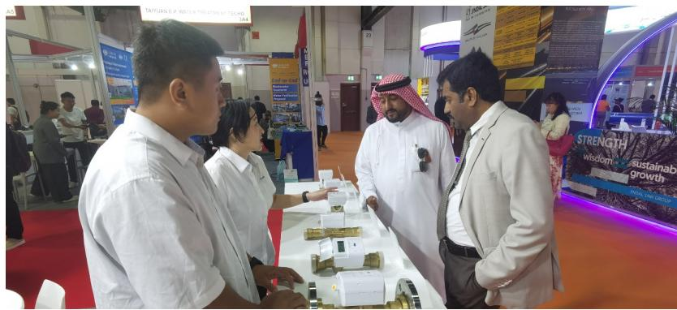

text_image

Exhibition scene with attendees examining industrial components at a table, background displays banners with Chinese text and logos

# 产品长寿命技术探索

在学术成果方面，公司撰写《燃气表钢壳大气腐蚀失效与时变可靠性评估》获评“优秀论文”，《超声燃气表长寿命技术探索》荣获一等奖，填补行业空白，将模糊的“长寿命”转化为可执行、可验证的量化指标，同时申请关于长寿命测试方法及新型封装结构的专利5项。

# 超声波燃气表长寿命提升方案研究

梳理: 应为对全球能源低碳转型和智慧城市建设的需求, 超声波燃气表作为新一代智能计量仪表迎来发展机遇。本关键聚焦产波球表长寿命提升的关键 coupling, 判断了计算强度变化、密封失效及电子系统瓶颈三大退化风险, 引擎性地提出“全生命周期可靠性循环管理”理念, 并阐述了基于失能模式的设计优化、精益制造、在线监测和退役反馈等系统性提升方案。结合成星智慧在研发体系融入FMEA的应用实践, 以及对于十年到期下线表的全面测试分析, 验证了该理念的有效性。研究成果表明, 十年下线表具有核心计算性能和密封性仍保持稳定可靠, 但温控准确性和参观表仍有提升空间。本文提出的长寿命提升方案和实践案例, 为国产产波球表技术发展和智慧燃气生态构建提供重要参考。
关键词: 超声波燃气表: 长寿命; 可靠性: 全生命周期管理; 失效模式与影响分析; 智能燃气计量

# 引言

在全球能源结构低碳化转型与智慧城市建设的双重驱动下，燃气计量技术正经历从传统机械式向智能物联化的革命性跨越。长期以来，民用燃气计量主要依赖频膜式燃气表，该技术成熟、成本低廉，但存在机械磨损、易受压气影响等固有缺陷，需定期检定或更换。随着物联网(IoT)和微电子的技术进步，无机械运动部件的超声波燃气表因其高精度、定量程比、低压损和无磨损等优势，日益受到业界青睐，成为下一代智能燃气计量的重要发展方向。“超声波燃气表的市场正快速增长，国内市场占有率预计已突破10%，并有望在未来进一步扩大，逐步取代传统膜式燃气表。

国际燃气计量领域已形成清晰的超声波技术渗透路径。日本作为先行者，自2005年起大规模部署超声波燃气表[1]，积累了丰富的运行经验。在日本，家庭燃气表的标准更换周期为10年。工业燃气表为7年。一些公司通过技术升级延长燃气表寿命，例如日本瓦斯株式会社（NICIGAS）从2019年开始已为超90万台城市燃气表安装了智能读取器SPACE HO-TARU，使传统表升级为智能表，预计使用寿命超过10年，不仅延长了燃气表的使用寿命，还通过物联网技术实现了

在实践应用层面，公司于海南燃气展成功打造“穿越时间周期，定义长寿命标杆”主题展区，集中展示在产品长寿命探索方面的阶段性成果，期间收获了众多燃气公司及同行的高度关注。

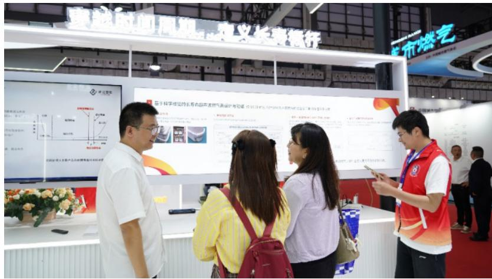

text_image

Exhibition booth photo with visible Chinese signage and display screens showing technical diagrams and text about industrial gas supply chain technology.

# 03 可持续供应链

# 供应链管理

全球供应链的复杂程度与日俱增，从原材料采购到产品交付的全链路中，风险无处不在。威星智能持续优化供应链管理，全力推进可持续供应链建设。

# 供应商准入

公司制定《供应商管理规范》《供应商质量管理办法》等制度，开展供应商开发、现场考察、入围及分级管理工作。

207家

威星智能合格供应商

# 供应商准入要求基本条件

- 能认真贯彻执行国家、地方及行业的相关法律法规、满足安全和环保法规，有较强的生产技术，能保证其产品具有符合采购要求的能力。  
- 有合法的生产经营资质，能提供相关营业执照以及其它有效资质证件。  
- 具有生产相应产品的技术能力和主要工序的加工、检验（试验）设备、以及产品设计能力或能得到稳定的技术支撑。  
- 提供国家或行业规定的特殊产品的供方还必须持有有效期内的相关的许可证。  
- 近两年无产品不合格受技术监督部门的处罚。  
- 对于有毒、有害等危险物品，应要求供应商提供相关证明文件。

# 供应商考核

威星智能一直通过科学的供应商评价体系，以量化评分和动态管理为核心，携手共建高效、可靠、共赢的供应链生态。物资采购部在自2025年起在供应商平台上面进行合格供方绩效评价，打分评选是由“质量板块、采购实施部、采购资源部”共同打分合成总分。一年分为四个季度各打分四次。

通过将供应商绩效评价结果与结合OA系统中合格供应商评定及合格供应商取消流程，实现对合格供应商的动态管理，确保名录的及时更新

<table><tr><td>分数\等级</td><td>A优秀</td><td>B良好</td><td>C合格</td><td>D不合格</td></tr><tr><td>得分</td><td>90&lt;评分≤100</td><td>75&lt;评分≤90</td><td>60≤评分≤75</td><td>评分&lt;60</td></tr><tr><td colspan="5">考核结果应用:D级取消合格供应商资格,一年内不允许向其采购,后续如需纳入应重新进行供应商评估</td></tr></table>

# 战略层：供应链生态共建

制度层：量化评分+动态管理体系

执行层：物资采购部牵头

平台层：供应商平台

评价层：三方联合评分

系统层：OA流程联动

应用层：合格供应商名录动态管理

<table><tr><td>模块名称</td><td>核心内容</td><td>具体说明</td></tr><tr><td>管理目标</td><td>共建供应链生态</td><td>打造高效、可靠、共赢的供应链生态体系。</td></tr><tr><td>核心体系</td><td>供应商评价体系</td><td>以量化评分和动态管理为核心,科学规范供应商管理。</td></tr><tr><td>责任部门</td><td>物资采购部</td><td>牵头实施,负责供应商绩效评价相关工作。</td></tr><tr><td>实施平台</td><td>供应商平台</td><td>用于开展合格供方绩效评价,承载打分、结果统计等功能。</td></tr><tr><td>实施平台</td><td>三方联合打分</td><td>由质量板块、采购实施部、采购资源部共同参与打分,合成综合总分。</td></tr><tr><td>评价频次</td><td>季度评价</td><td>全年分为4个季度,每季度打分1次,全年共计4次。</td></tr><tr><td>系统联动</td><td>OA系统对接</td><td>结合OA系统中合格供应商评定流程、不合格供应商取消流程,实现动态管理。</td></tr><tr><td>管理结果</td><td>名录动态维护</td><td>确保合格供应商名录及时更新与维护,保障供应链稳定。</td></tr></table>

# 供应链风险管理

# 物料多渠道导入

建立多元化物料导入机制，拓宽物料来源渠道，保障物料供应的稳定性与多样性，满足生产经营各类需求，提升物料供应的灵活性和抗风险能力。

# 库存安全 库存设定及储备

科学测算各类物料的安全库存阈值，明确库存储备标准，建立库存动态监控机制，确保库存既满足生产周转需求，又避免库存积压或短缺，实现库存合理化管理。

# 采购端系统建设

推进采购端信息化系统搭建与完善，实现采购流程规范化、数字化管理，提升采购效率，优化采购成本控制，强化采购全流程可追溯性，保障采购工作有序高效开展。

# 供应商廉政协议

- 不得以任何理由向公司及其工作人员馈赠礼金、礼品和有价证券。  
- 不得以任何名义为公司及其工作人员报销应由甲方单位或个人支付的任何费用。  
- 不得以任何理由安排公司工作人员参加高消费宴请及娱乐活动。  
- 不得为公司和个人购置或提供通讯、交通工具和办公用品等。  
- 不得为公司工作人员及其配偶、子女或其他亲属的工作安排、升学、旅游及出国出境等提供方便。  
- 不得有弄虚作假、以次充好、虚结虚算等违反诚信原则的行为。

# 威星智能与供应商达成协议

- 确保所提供物质、配制品及物品（包括包装材料）完全符合欧盟RoHS指令、REACH法规(EC)1907/2006、POPs法规(EU)2019/1021的要求。  
- 电池类和包装类供货商还需分别遵守关于电池和废电池的法规以及(EU)2019/102194/62/EC指令。  
- 供应商需确保生产过程中的所有环节均符合上述标准，并提供真实有效的检测报告及其他证明文件。

natural_image

Two business professionals shaking hands at a meeting, with one holding a chart and another writing on paper (no visible text or symbols)

# 供应商协同

威星智能积极组织并参与供应商交流活动，致力于在技术创新、产品质量提升以及绿色发展理念上与合作伙伴达成高度共识，携手共进。

同时，我们通过联合开展专项培训活动，全面提升双方的综合竞争力，构建更加紧密、互信、共赢的战略合作伙伴关系，共同迈向高质量发展新高度。

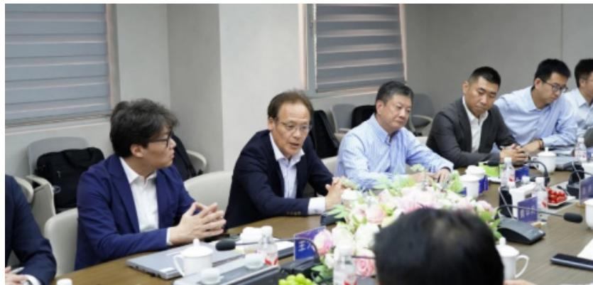

natural_image

Group of men in a meeting around a conference table, engaged in discussion (no visible text or signage)

2025年5月15日，威星智能与松下在杭州举行战略合作签约仪式。此次合作双方明确了技术创新、标准引领、市场拓展、先进制造等多维度的合作方向与目标。依托松下在超声波领域的核心技术优势，结合威星智能对中国市场的深刻洞察，双方将围绕智慧能源管控、全域安全管理等前沿领域展开深度协同，进一步加速超声波技术的研发与产品迭代，推动燃气行业从机械化向数字化应用的转型升级，助力超声波事业在中国全面拓展与蓬勃发展。

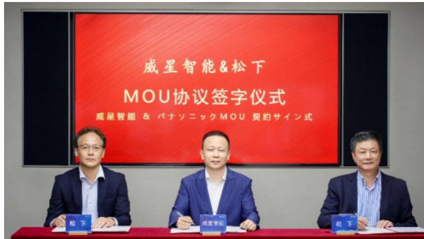

text_image

威星智能&松下
MOU协议签字仪式
威星智能 & パナソニックMOU 契約サイン式
松下
成星智能
松下

# 04 追求卓越品质

# 质量管理体系

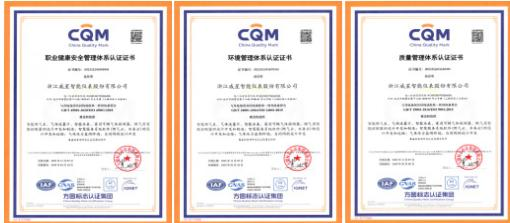

威星智能自成立之初，便致力于打造高质量产品，将产品质量视为企业生存和发展的重要基石。以“以质取胜，超越顾客需求”为质量

方针，公司通过ISO9001质量管理体系等国际管理体系并严格执行该体系，使企业产品的质量得到有力的保障。

公司依据GB/T19001-2016标准建立了智能燃气表的质量管理体系，涵盖管理手册、程序文件等文件体系，通过实施、保持和持续改进，确保体系有效性。同时，公司引入信息化、自动化、智能化手段，建立“正向可追踪、逆向可溯源”的分级质量监管体系，严格把控原料、研发、生产、销售、服务等环节质量，并全面落实质量责任制，保障产品质量稳定统一。

# 《质量案例白皮书》

基于公司2018年至今总结的产品质

量管理经验进行梳理与更新

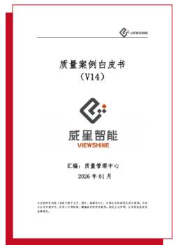

text_image

质量案例白皮书
(V14)
威星智能
VIEWSHINE
汇编：质量管理中心
2026年01月

# 质量荣誉

威星智能连续三年获得全国仪器仪表行业领先品牌、全国质量检验稳定合格产品、全国质量诚信标杆企业、全国产品和服务质量诚信示范企业。

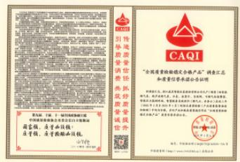

text_image

CAQI
中国药房药业股份有限公司
CAQI
CAQI
CAQI
CAQI
CAQI
CAQI
CAQI
CAQI
CAQI
CAQI
CAQI
CAQI
CAQI
CAQI
CAQI
CAQI
CAQI
CAQI
CAQI
CAQI
CAQI
CAQI
CAQI
CAQI
CAQI
CAQII
CAQII
CAQII
CAQII
CAQII
CAQII
CAQII
CAQII
CAQII
CAQII
CAQII
CAQII
CAQII
CAQII
CAQII
CAQII
CAQII
CAQII
CAQII
CAQII
CAQII
CAQII
CAQII
CAQII
CAQII
CAQIII
CAQIII
CAQIII
CAQIII
CAQIII
CAQIII
CAQIII
CAQIII
CAQIII
CAQIII
CAQIII
CAQIII
CAQIII
CAQIII
CAQIII
CAQIII
CAQIII
CAQIII
CAQIII
CAQIII
CAQIII
CAQIII
CAQIII
CAQIII
CAQIII
CAQIV
CAIV
CAVII
CAVI
CAVIII
CAVI
CAVIII
CAVI
CAVI
CAVI
CAVI
CAVI
CAVI
CAVI
CAVI
CAVI
CAVI
CAVI
CAVI
CAVI
CAVI
CAVI
CAVI
CAVI
CAVI
CAVI
CAVI
CAVI

"全国质量检验稳定合格产品"

中检协证明CAQICTQCA2025-726号

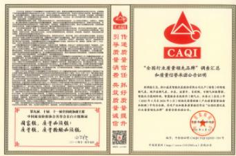

text_image

CAQI
"公司行业质量提升与降"调查汇总
和质量审查会议的证明

请查阅，请于以下内容刊登：
1. 请对以下内容进行说明：
2. 请对以下内容进行说明：
3. 请对以下内容进行说明：

"会国质诚信标杆企业"

中检协证明CAQICTQCK2025-011号

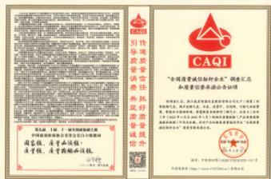

text_image

CAQI
“全国质量诚信和企业”调查汇总
和质量诚信承诸会证明

国家、省、市、自治区、直辖市、自治区人民政府
（以下简称“《公司法》”）

"全国行业质量领先品牌"

中检协证明 CAQICTQCQ2025-218号

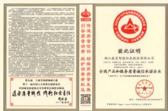

text_image

浙江海宁汽车股份有限公司
（2017）浙01048500000000
（2017）浙01048500000000
（2017）浙01048500000000
（2017）浙01048500000000
（2017）浙01048500000000
（2017）浙01068500000000
（2017）浙01068500000000
（2017）浙01068500000000
（2017）浙01068500000000
（2017）浙01068500000000
兹此证明
浙江海宁汽车股份有限公司
（2017）浙010485000
全国产品和服务质量认证承诺企业
（2017）浙
（2）浙
（2）
（2）
（2）
（2）
（2）
（2）
（2）
（2）
（2）
（2）
（2）
（2）
（2）
（2）
（2）
（2）
（2）
（2）
（2）
（2）
（2）
（2）
（2）
（2）
（2）
（2）
（2）
（2）
（2）
（2）
（2）
（2）
（2）
（2）
 （2）
（2）
（2）
（2）
（2）
（2）
（2）
（2）
（2）
（2）
（2）
（2）
（2）
（2）
（2）
（2）
（2）
（2）
（2）
（2）
（2）
（2）
（2）
（2）
（2）
（2）
（2）
（2）
（2）
（2）
（2）
（2）
（2）
（3）
（3）
（3）
（3）
（3）
（3）
（3）
（3）
（3）
（3）
（3）
（3）
（3）
（3）
（3）
（3）
（3）
（3）
（3）
（3）
（3）
（3）
（3）
（3）
（3）
（3）
（3）
（3）
（3）
（3）
（3）
（3）
（3）
（3))
 （3） （3） （3） （3） （3） （3） （3） （3） （3） （3） （3） （3） （3） （3） （3） （3） （3） （3） （3） （3） （3） （3） （3） （3） （3） （3） （3） （3） （3） （3） （3） （3） （3） （3） ，  （3） （3） （3） （3） （3） （3） （3） （3） （3） （3） （3） （3） （3） （3） （3） （3） （3） （3） （3） （3） （3） （3） （3） （3） （3） （3） （3） （3） （3） （3） （3） （3） （3）  （3） （3） （3） （3） （3） （3） （3） （3） （3） （3） （3） （3） （3） （3） （3） （3）  （3）  （3）  （3）  （3）  （3）  （3）  （3）  （3）  （3）  （3）  （3）  （3）  （3）  （3）  （3）  （3）  （3）  （3），  （4）。

"全国产品和服务质量诚信示范企业"

中验协证明CPCA2125083号

# 质量控制

从原材料采购到生产加工，再到成品检测，我们对每个环节都进行严格监控与评估。在来料检验环节，我们实施严格的检验标准，确保所有进入生产线的原材料和组件均符合最高质量要求。通过采用先进的检测设备和技术，我们对每批来料进行细致检查，包括尺寸精度、材质成分及性能指标等方面的验证。

<table><tr><td>引进“静电防护管理体系”</td></tr><tr><td>常态化监督网络</td></tr><tr><td>主动式风险探针</td></tr></table>

针对电子元器件，将控制环节从生产现场延伸至设计、仓储、运输全链路，显著降低了因静电导致的隐性失效，提升了产品可靠性。

从新品设计评审到量产爬坡全程开展质量监督，按风险等级滚动审核全流程及供应商体系与过程，加严监控高风险物料、专项督查重点产品符合性，全维度把控质量、守护品牌口碑。

蓝军行动：作为独立的“挑战者”，模拟极端客户场景，穿透性测试产品与流程的脆弱点，推动系统韧性提升。

# “质量管理机制”优化

- 优化供应商质量协议，强化变更和风险追偿等责任要求  
- 建立二供采购量确认流程，避免大比例切换带来的质量风险  
- 建立关键物料供应商飞行检查和质量辅导机制  
- 建立关键物料首批验收机制  
- 建立PLM新物料输出管控机制  
- 强化物料周期性能测试执行力

# 质量检测

# 质量检验标准化文件建设

现已建立并有效运行三级制度文件90余份，配套编制内控检验标准、规范及作业指导书150余份，构建了完善的质量检验标准化体系，为检验工作的规范化、标准化开展提供了坚实的制度支撑。同时，针对公司重点产品，按类别分别编制工序质量履历及过程质量控制计划，实现重点产品质量全过程可追溯、可管控，进一步强化了产品质量源头管控。

# 检测能力建设

检测硬件配置持续完善，来料实验室共配置检测设备210余台，生产过程检验设备1100余台，所有设备均通过第三方机构检定/校准，检测精度和可靠性得到保障，完全满足各类产品及物料的检测需求。2025年，新增包括三

坐标测量机在内的多台大型高精度检测设备，有效提升了检测精度与检测效率，填补了高端检测领域的短板。关键物料检测能力显著加强，目前已具备水表换能器性能检测、高精度物料尺寸检测、压力变送器/传感器性能检测、扩展环境实验、阀门检测等多项核心检测能力，能够全面覆盖关键物料的质量检验需求，从源头把控物料质量，降低因物料不合格导致的产品质量风险。

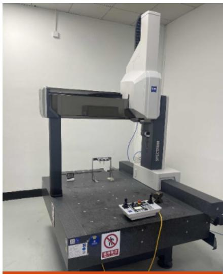

natural_image

Laboratory setup with a large optical instrument on a workbench, no visible text or symbols on the equipment or background.

检测设备图

# 监督抽检情况

本年度严格落实各类监督抽检要求，共接受各级政府部门监督检查9次，其

中包括国家级抽检1次（针对报警器产品）、市级检查3次（分别针对威星水表、睿荔气表、中燃气表），以及全国民用三表专项整治行动、“双随机”等各类政府检查5次。所有抽检及检查项目结果均为合格，充分体现了公司产品质量的稳定性和合规性，获得了监管部门的认可。

# 过程质量风险防控

通过多维度、全流程的质量检查，提前识别和防控质量风险，具体包括新品研发质量督查、协议符合性检查、物料标准检查、海外样机点检、5M1E（人、机、料、法、环、测）检查，以及其他影响产品质量的过程检查。通过及时发现过程中的偏差或不符合标准的情况，采取针对性整改措施，有效预防质量缺陷的产生，降低质量风险，避免问题积累至后续环节造成更大损失，保障产品质量持续稳定。

<table><tr><td></td><td>具体描述</td><td>涉及数字</td></tr><tr><td rowspan="2">质量检验标准化文件</td><td>三级制度文件</td><td>90余份</td></tr><tr><td>配套内控检验标准、规范及作业指导书</td><td>150余份</td></tr><tr><td rowspan="3">检测能力建设-设备配置</td><td>来料实验室检测设备</td><td>210余台</td></tr><tr><td>生产过程检验设备</td><td>1,100余台</td></tr><tr><td>2025年新增大型高精度设备(含三坐标测量机)</td><td>多台</td></tr><tr><td rowspan="4">监督抽检情况</td><td>本年度接受各类政府检查总计</td><td>9次</td></tr><tr><td>国家级抽检(报警器)</td><td>1次</td></tr><tr><td>市级检查(威星水表、睿荔气表、中燃气表)</td><td>3次</td></tr><tr><td>专项整治、“双随机”等政府检查</td><td>5次</td></tr><tr><td>质量过程督查</td><td colspan="2">全部抽检结果合格</td></tr></table>

# 产品召回

为及时召回有缺陷的批量产品，减少公司和客户因缺陷产品导致的损失，维护公司的市场信誉，我们建立严格的产品召回管理机制。一旦发现产品存在潜在安全缺陷或不符合质量标准，我们将立即开展调查，并启动召回程序，确保快速有效地从市场和客户手中回收问题产品。我们承诺对召回的产品进行全面评估与改进，并及时向受影响的客户通报处理进展及预防措施，以避免任何可能的风险。

# 二检合一

质量是企业的生命线，威星智能始终秉持高质量发展理念，将计量检测的精度和可靠性作为产品的重要质量标准。2025年度，公司气表二检合一顺利通过年度复审，以高效、精准的服务能力，为燃气计量的公平性与可靠性提供了坚实保障。同时，水表二检合一正稳步推进，已联合制造中心完成计量室建设并顺利通过市局初审。

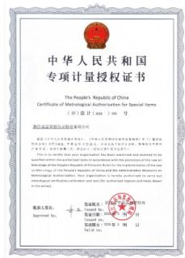

text_image

中华人民共和国
专项计量授权证书
The People's Republic of China
Certificate of National Appropriations for Special Items
(第1章 修订) (2008) 号

浙江浙商银行股份有限公司

兹委托代理人出席本次会议，于2017年5月16日以通讯方式召开。
本次会议由董事会、监事会和保荐机构共同组成。本次会议的召集人为浙江省人民政府，其中浙江省人民政府为浙江省人民政府国有资产监督管理委员会（以下简称“国务院”）。本次会议的召开符合《中华人民共和国公司法》及《中华人民共和国证券法》的规定，以及《中华人民共和国证券法》、《上市公司股东大会规则》、《上海证券交易所股票上市规则》等有关法律、法规和规范性文件的规定。

兹委托代理人出席本次会议，于2017年5月16日以通讯方式召开。
本次会议的召集人为浙江省人民政府，其中浙江省人民政府为浙江省人民政府国有资产监督管理委员会（以下简称“国务院”）。本次会议的召开符合《中华人民共和国公司法》及《中华人民共和国证券法》、《上海证券交易所股票上市规则》等有关法律、法规和规范性文件的规定。

兹委托代理人出席本次会议，于2017年5月16日以通讯方式召开。
本次会议的召集人为浙江省人民政府，其中浙江省人民政府为浙江省人民政府国有资产监督管理委员会（以下简称“国务院”）。本次会议的召开符合《中华人民共和国公司法》及《中华人民共和国证券法》、《上海证券交易所股票上市规则》等有关法律、法规和规范性的文件的规定。

兹委托代理人出席本次会议，于2017年5月16日以通讯方式召开。
本次会议的召集人为浙江省人民政府，其中浙江省人民政府为浙江省人民政府国有资产监督管理委员会（以下简称“国务院”）。本次会议的召开符合《中华人民共和国公司法》及《中华人民共和国证券法》、《上海证券交易所股票上市规则》等有关法律、法规和规范性文件的规定。

# 3C 产品合规管理

为积极响应市场监管总局《关于推进重点工业产品质量安全追溯的实施意见》，公司严格落实3C产品可燃气体报警器的全生命周期质量安全追溯要求，构建“来源可查、去向可追、责任可究”的合规管理体系。推动业务、采购、计划、制造、质量等部门做好关键记录归档，夯实追溯数据基础，推动浙品码要求落地，在来料检验、成品检验中落实一致性核查，确保每批生产的报警器均与取证保持一致，从源头保障产品质量安全。

# 05 坚持精工制造

智能制造作为新质生产力的重要载体，是人工智能、5G通信、物联网、大数据、云计算等前沿技术与制造业深度融合的先进生产范式。威星智能始终将智能制造作为核心战略方向，持续加大规划与投入，深度融合5G网络、传感技术、无线通信、智能数字化及物联网应用平台等现代化技术，不断强化精益制造能力，全面提升整体智能制造水平。

公司于2018年建成3万平方米智慧生产基地，为智能化升级奠定坚实基础。近年来，企业持续推进产线迭代升级，先后投用全自动贴片机、自动化焊接线、自动测试线、自动喷涂线、全自动组装流水线等高端智能装备，并引入先进检测设备，同步上线MES、PLM、QIS等信息化管理系统，推动生产、管理、质量全过程数字化管控。目前，公司正沿着智能化、数字化、高端化、绿色化的高质量发展道路加速前行。

• 2018年省级制造业“双创”示范企业和“品”字标认证  
• 2018年引进智能燃气表具行业国内首条全自动化总装生产线  
• 2021年获杭州市创新三等奖，并被多家燃气集团认可  
- 2022年被评为杭州市”未来工厂“的数字化车间  
• 2023年第六届“绽放杯”5G应用征集大赛二等奖  
• 2024年5G智慧工厂央视财经频道专访  
• 2024年全国首条超声波燃气表基表自动化线投产  
2025年杭州市“未来工厂”--智能工厂

# 杭州市“未来工厂”--智能工厂

作为智能燃气计量领域的领军企业，威星智能始终以数字化转型为核心驱动力，同时秉持“数据驱动、智能协同”理念，构建起全链条智能化发展体系与高效精益的现代制造模式。威星智能工厂实现了从产品数字化设计到生产制造的全链路贯通，通过PLM、MES等系统的深度集成，确保设计意图精准指导生产。

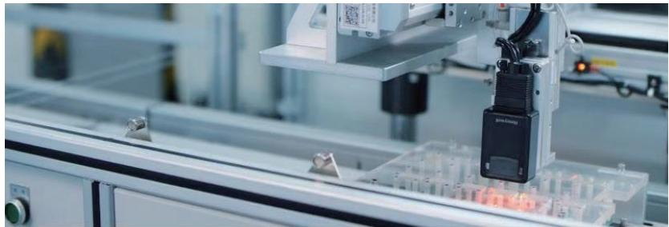

natural_image

Industrial robotic arm operating on a conveyor belt with transparent plastic containers (no visible text or symbols)

在生产环节，超声波基表、燃气表总装、SMT贴片等多条核心生产线已实现高度自动化与智能化，结合全程可追溯的数据系统，大幅提升了生产效率与产品一致性。同时，工厂部署5G专网，并实现了PLM、ERP、MES、CRM等核心业务系统的全面集成与高效协同，构建起覆盖研发、计划、生产、质控、物流全流程的透明化精益管理体系。

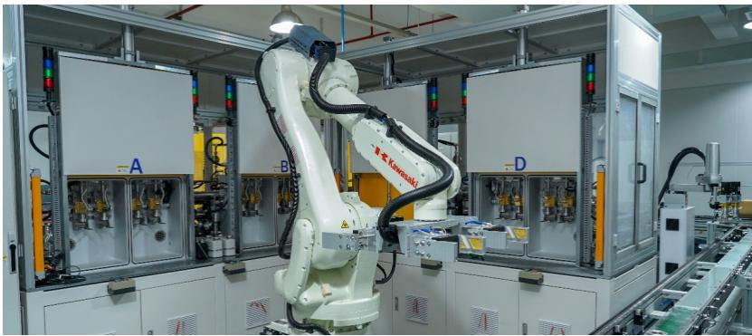

natural_image

Industrial robotic arm in a factory setting with control panels labeled A, B, and D (no visible text or symbols on the robot or equipment)

# 模块车间和SMT布局重构

2025年对模块车间和SMT产线进行整体科学再规划，重组设备与作业单元布局与扩容，实现SMT编程效率提升50%。

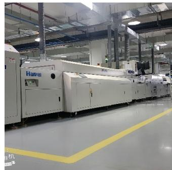

natural_image

Interior view of a modern industrial factory floor with large machinery and overhead piping (no visible text or symbols)

# 超声波基表自动化产能提升

2025年通过缩短单台产品设备工作时间、降低设备故障率、提升设备操作人员技能、缩短异常处理时间、固定人工接线柱岗位、提升产品一次直通率等方式，效率提升29%。

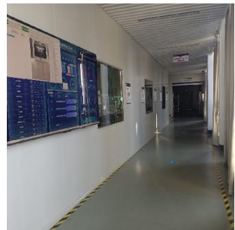

natural_image

Interior view of a cleanroom hallway with multiple display panels and no visible text or symbols on the walls or floor.

# 水表产能提升

2025年公司完成了水表及海外生产线的扩产建设，通过产线整合与工艺升级，构建了更高效的生产体系，已实现水表年产能200万台的规模化生产能力。

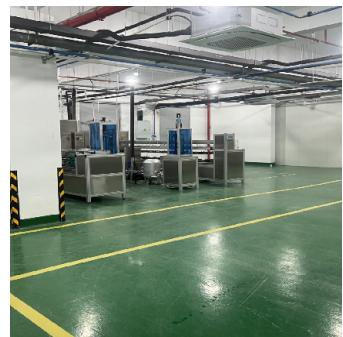

natural_image

Interior view of a factory with automated production lines and green flooring (no visible text or symbols)

# MES信息化系统：优化生产管理，提升竞争力

工厂通过PLM、ERP、MES、QIS、SRM、CRM等系统实现互联互通与高效集成，覆盖从产品研发、订单下达、生产计划、物料采购、生产管控到质量管控和发货出库的全流程精益化管理。实时把控各工序情况，实现制造执行与过程质量的透明化管理，推动生产精益化。

系统业务架构  
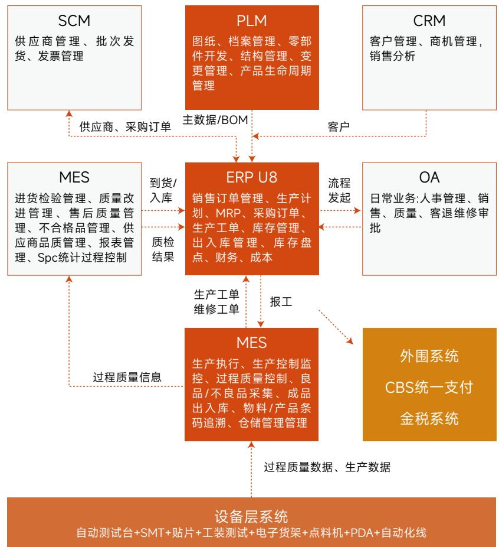

flowchart

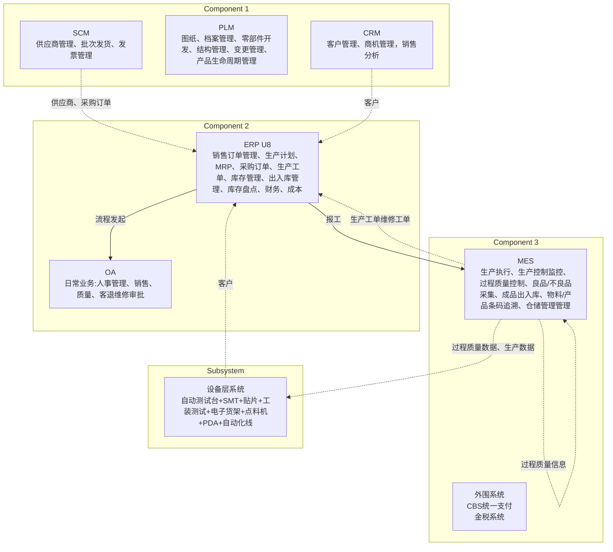
```mermaid
graph TD
  subgraph Component1["Component 1"]
    SCM["SCM\n供应商管理、批次发货、发票管理"]
    PLM["PLM\n图纸、档案管理、零部件开发、结构管理、变更管理、产品生命周期管理"]
    CRM["CRM\n客户管理、商机管理，销售分析"]
  end

  subgraph Component2["Component 2"]
    ERP_U8["ERP U8\n销售订单管理、生产计划、MRP、采购订单、生产工单、库存管理、出入库管理、库存盘点、财务、成本"]
    OA["OA\n日常业务:人事管理、销售、质量、客退维修审批"]
  end

  subgraph Component3["Component 3"]
    MES["MES\n进货检验管理、质量改进管理、售后质量管理、不合格品管理、供应品质管理、报表管理、Spc统计过程控制"]
    Outbox["外围系统\nCBS统一支付\n金税系统"]
    MES["MES\n生产执行、生产控制监控、过程质量控制、良品/不良品采集、成品出入库、物料/产品条码追溯、仓储管理管理"]
  end

  subgraph Subsystem["Subsystem"]
    Device["设备层系统\n自动测试台+SMT+贴片+工装测试+电子货架+点料机+PDA+自动化线"]
  end

  SCM -.->|"供应商、采购订单"| ERP_U8
  CRM -.->|"客户"| ERP_U8
  ERP_U8 -->|"流程发起"| OA
  ERP_U8 -->|"报工"| MES
  MES -.->|"过程质量信息"| MES
  MES -.->|"生产工单维修工单"| ERP_U8
  MES -.->|"过程质量数据、生产数据"| Device
  Device -.->|"客户"| ERP_U8
```

# 设备层系统

自动测试台+SMT+贴片+工装测试+电子货架+点料机+PDA+自动化线

# 培育质量文化

公司积极开展各项质量管理培训，引导全体员工树立以质量为核心的价值观和行为准则，营造全员重视质量、追求卓越的氛围，提升公司企业的整体质量水平和竞争力。

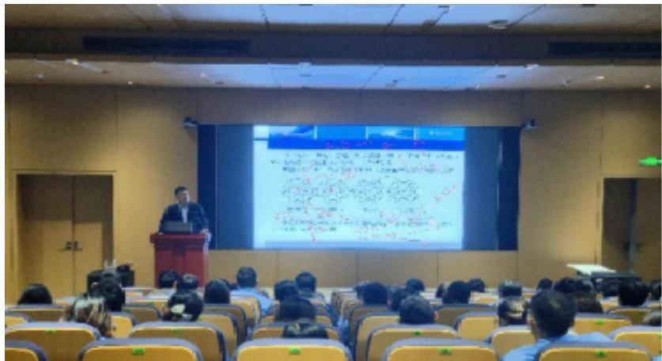

text_image

Conference scene with speaker at podium and presentation screen displaying molecular structures, audience seated in rows

ESD认证标准(GBT39587) 贯标

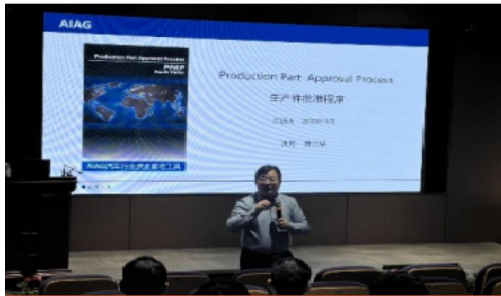

text_image

AIAG
Production Part Approval Process
生产件批准程序
2020/1/3
浙江·嘉实华

生产件批准程序（PPAP）学习与应用

全年开展质量培训71场，累计参训1190人次。

其中内部培训68场次，外部培训3场次。

# 注册计量师动员会

为响应国家《计量发展规划（2021-2035年）》要求，落实市场监管总局关于计量人才队伍建设的部署，上海埃科燃气测控设备有限公司于2025年4月10日开展注册计量师备考动员系列活动。通过政策解读、资源支持、经验分享等多维度赋能，参加培训人次8人

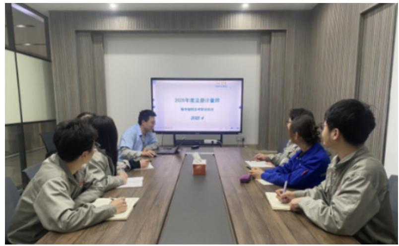

text_image

2025年度注册计量师
每年缴纳及考核委员会
2025.4

# 质量竞赛及技能比武

2025年，公司举办3期检验员年度技能考核和2次标准知识竞赛及标准解读会3次，涵盖产品知识、检验知识及实际操作，有效提升一线检验人员的质量认知，为人才储备打下坚实基础。

# 06 优化客户体验

# 深化客户合作

威星智能凭借创新的技术解决方案与卓越的产品性能，在市场竞争中稳步提升核心竞争力，有效扩大市场份额，品牌知名度与行业影响力持续增强。尤其在重要客户入围方面，公司始终以客户为中心，不断优化服务体验、完善服务体系，深化与客户的战略合作关系。凭借可靠的产品品质、专业的技术支撑与高效的服务保障，公司成功实现多个重要客户的供应商入围，并与核心客户建立起长期稳定的合作关系，为企业持续健康发展奠定了坚实基础。

# 产品入围多家大型企业并中标多个重要项目

2025年，威星智能在重点客户入围方面取得突破：

- 持续巩固五大城市燃气集团供应商地位，成功中标贵州燃气集团、上海燃气等标杆项目。  
- 实现机械水表、超声波水表入围多个地方水务公司。

# 客户服务体系

作为深耕智能仪表领域的企业，威星智能始终秉持“以客户为中心”的核心理念，凭借体系化的服务管理、专业的技术团队和高效的应急响应机制，赢得了客户的高度认可。

# 立足客户 及时响应 便捷服务

威星智能客户服务理念

我们建立了覆盖服务全流程的标准化体系，通过制定《客户服务管理办法》《售后服务人员现场服务标准》《产品问题与反馈标准》《服务应急预案》等20余项制度，将服务流程系统拆解为需求响应、方案制定、现场实施、效果验证四大阶段，形成服务质量的刚性保障框架。特别针对服务工具与设备管理，建立了严格的《售后服务工具管理制度》和《设备管理制度》，对采购、使用、维护、报废等全生命周期实施规范化管控，确保硬件资源的精准运维，为快速响应客户需求提供硬件支持。

从制度保障到技术响应，从专业团队到客户互动，威星智能始终以实际行动践行“服务创造价值”的承诺，为行业树立客户服务新标杆。

核心目标：形成服务质量刚性保障框架，快速响应客户需求

建立覆盖服务全流程的标准化体系

制定20余项制度（含服务核心制度+工具设备专项制度）

拆解服务流程为需求响应、方案制定、现场实施、效果验证四大阶段

管控范围：采购→使用→维护→报废（全生命周期）

核心作用：确保硬件资源精准运维，提供硬件支持

# 服务承诺

- 全国区域所有省份城市驻点服务  
• 提供24小时服务热线4006-157-808  
- 紧急事件24小时内到达现场  
- 产品保修期内的三包，产品终身维护  
- 客服人员定期培训与考核，合格后上岗  
- 物流、专车、速运，完善的运输保障体系

# 倾听客户诉求

我们不断创新的产品及解决方案持续满足客户管理要求，敏捷及本地化的服务确保第一时间的服务响应，公司满足客户需求的能力达到了较高水平。

客户投诉处理机制

<table><tr><td>客诉处理机制</td><td>由质量管理中心牵头制定处理方案,遇到疑难事件,召开客诉专项解决会议,质量例会跟踪处理进度,以最快的效率解决客户问题,得到客户好评。</td></tr><tr><td>客诉质量问题考核</td><td>个例问题考核处理与改进时效,批量问题考核问题发生严重度、处理与改进时效,同时客诉处理的有效性纳入绩效考核。</td></tr><tr><td>客诉案例总结</td><td>典型的客诉问题整理成案例白皮书。</td></tr></table>

# 客户满意度

威星智能客户满意度测评采用主客观指标相结合的体系，从产品、服务、综合三个维度全面反映客户满意度。对内，通过持续跟踪主观指标，推动内部质量改进；对外，通过解决客户反馈的问题，持续提升客户对威星产品和服务的满意度。

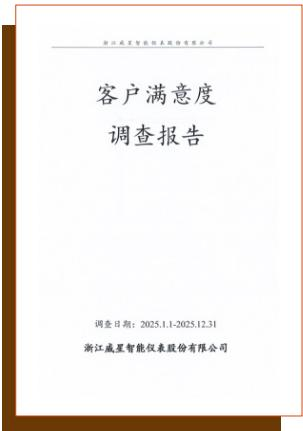

text_image

浙江威星智能仪表股份有限公司
客户满意度
调查报告
调查日期: 2025.1.1-2025.12.31
浙江威星智能仪表股份有限公司

95.65%

2025年威星智能
用户满意度

# 客户满意度测评体系

对内作用

持续跟踪主观指标 $\rightarrow$ 推动内部质量改进

对外作用

解决客户反馈问题 $\rightarrow$ 提升客户满意度

助力产品与服务持续优化升级

# 客户服务活动

公司开展一系列服务活动提升服务人员专业技能和服务水平，从而更好地满足客户需求，增强客户满意度和忠诚度。

# 2025年威星智能“名匠计划”售后训练营（二期）

为提升售后服务人员的技能和知识水平，加强售后团队综合服务能力，更好地满足客户的需求。威星智能营销中心开展“名匠计划”二期售后训练营。

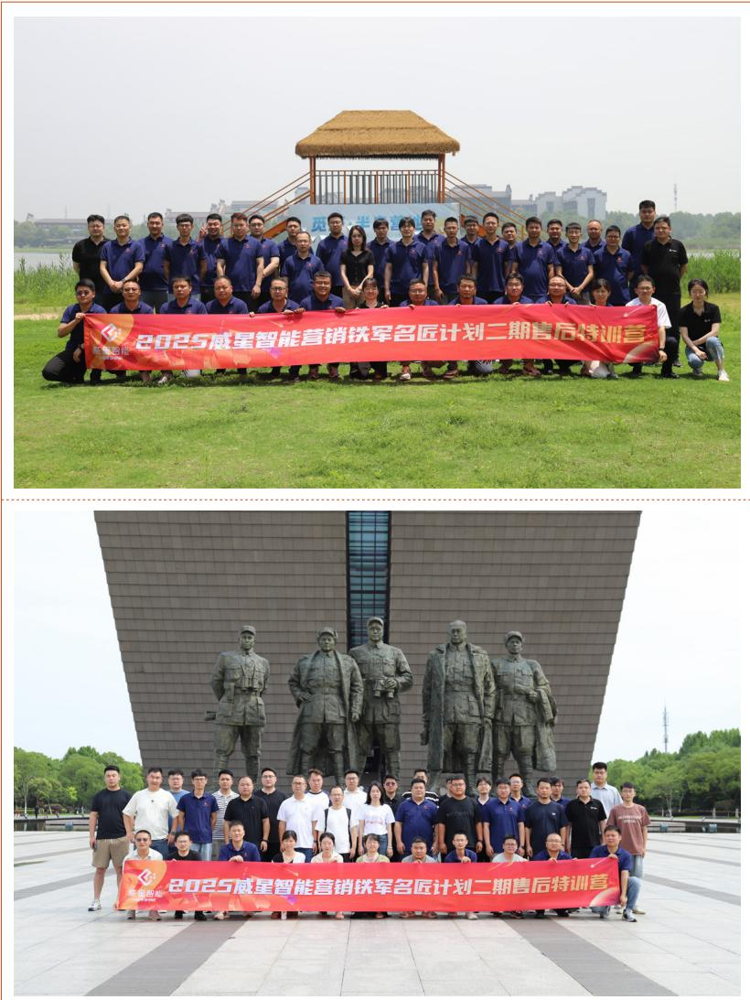

# 2025年软件硬卖第一期特训营

开展“软件硬卖”特训营，围绕软硬一体化解决方案销售开展专项培训，提升营销团队产品理解、方案设计与市场拓展能力。参训人员将所学知识与技能应用于实际业务。公司将持续开展相关培训，强化营销队伍专业能力，支撑市场拓展与业务发展。

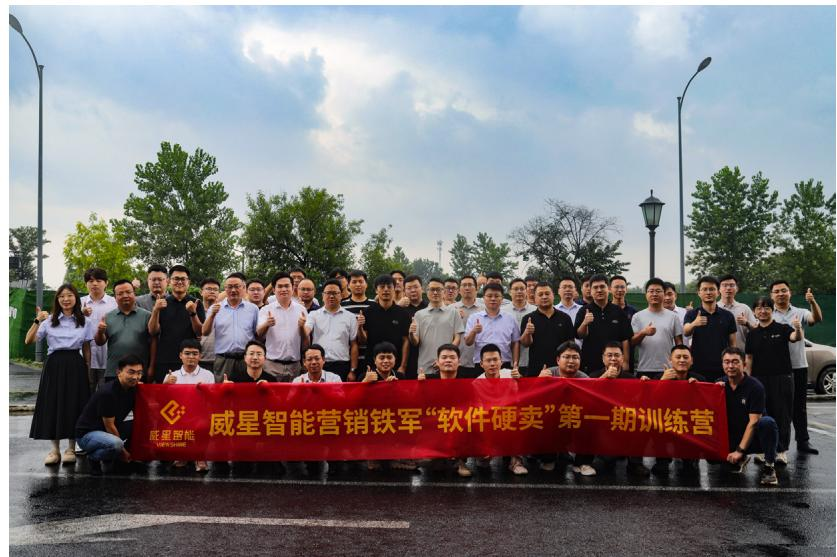

text_image

威星智能营销铁军“软件硬卖”第一期训练营

# 客户感谢信和锦旗

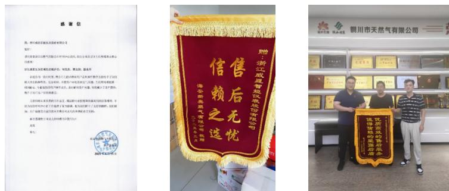

# 07 保护信息安全

威星智能依据GB/T22080-2016/ISO/IEC27001:2013标准建立了信息安全管理体系，于2022年通过认证。在此基础上，公司持续强化员工的信息安全意识，规范信息的全生命周期管理，识别并控制信息安全风险，提升信息技术能力，保障业务系统的稳定运行。

<table><tr><td>漏洞扫描</td><td>定期对暴露的IP、域名、端口、服务漏扫,尤其是对弱密码、密码不修改等加强监管,零容忍。</td></tr><tr><td>等保认证</td><td>已取得官网信息安全保护等级二级认证,提前做好风险防范措施。</td></tr><tr><td>防火墙防护</td><td>实时升级病毒库、应用特征库、链接库等,保护系统免受攻击。</td></tr><tr><td>数据安全</td><td>通过访问控制设备限制访问互联网,定期开展容灾备份及备份恢复演练,通过水印、加密存储、脱敏等自建安全服务保护核心数据。</td></tr><tr><td>人员教育</td><td>定期组织信息安全培训,涵盖公司所有系统和计算机用户,以提高员工信息安全意识。</td></tr></table>

# 信息系统架构

公司的信息化以智慧城市计量数字化建设为核心，覆盖了产品需求、设计、生产、检验、发货、售后的所有业务环节，通过PLM、ERP、MES、QIS、SRM、CRM多系统融合，集成自动化流水线、自动化工装设备、设备传感器等智能设备，将人、数字、设备紧密联系在一起。通过建立信息化系统平台，实现基础数据和信息集中管理，高度共享，以此加强销售管理、规范采购流程、提高了对生产计划、以及生产过程的有效跟踪和控制。通过信息化系统建设，公司研发创新与生产、销售与生产、销售与供应、销售与财务体系紧密衔接，实现了供应链、研发、营销板块全业务流程的数字化管理。

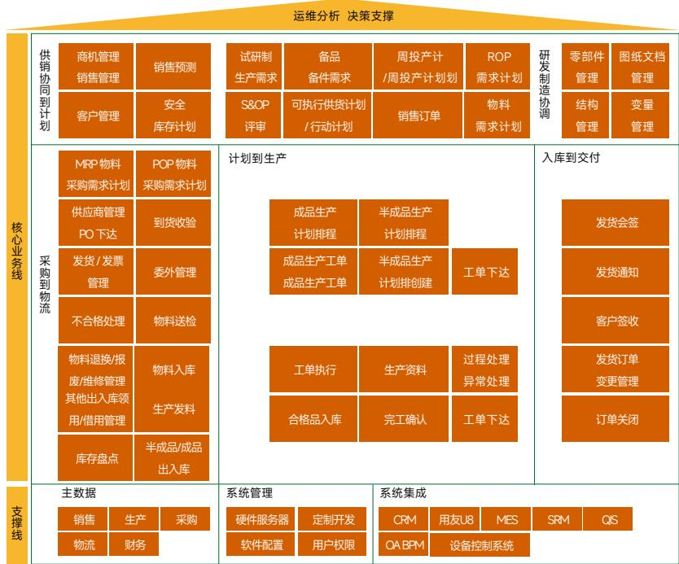

flowchart

This image is a structured business management chart (likely a project management or supply chain management framework) outlining the core business line and support line, covering activities like procurement, production, system management, and ROP development.

# 客户系统安全防护加固

公司始终聚焦客户系统安全防护加固核心需求，持续构建全方位安全防护体系。通过部署 WAF 防火墙抵御各类网络攻击，规范配置 SSL 证书加密数据传输，有效筑牢网络安全防线；建立云上与本地双备份机制，完善备份与恢复流程，全力保障核心数据安全可靠。同时新增多维度安全监控点位，实现风险实时监测、精准预警与快速处置，全面提升系统安全防护能力与应急响应水平。

以 2025 年 “跃迁” 策略为牵引，公司大力推进平台化架构升级，重构高可用、高弹性系统架构，为 SaaS 业务长期规模化发展夯实技术底座。同步加大关键技术攻关与系统性能优化力度，持续破解技术瓶颈、提升运行效率，增强系统稳定性与承载能力。通过安全能力提升与技术架构革新双轮驱动，筑牢安全与技术双重根基，为业务持续稳健运行提供坚实保障。

# 信息安全攻防漏扫活动

2025年，公司信息技术部联合质量管理中心开展攻防、漏扫活动，共扫描漏洞12个，其中严重0个,高危0个，中危8个，低危4个，正式环境系统均已完成整改。

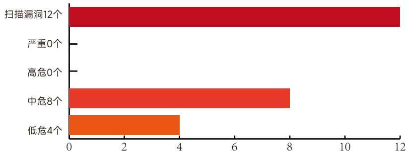

bar

| Category | Value |
| --- | --- |
| 扫描漏洞12个 | 12 |
| 严重0个 | 0 |
| 高危0个 | 0 |
| 中危8个 | 8 |
| 低危4个 | 4 |

# 5

# 绿动未来和谐共生

应对气候变化

打造绿色工厂

绿色发展，低碳未来

赋能绿色发展

2025环境、社会和公司治理（ESG）报告

# 01 应对气候变化

# 气候变化策略

威星智能以智慧计量为基石，以绿色创新为引擎，坚守“绿动未来，和谐共生”的发展理念。我们深耕智慧燃气、智慧水务领域，用物联网、大数据与精准计量技术，赋能能源高效利用与资源节约，助力城市低碳转型。以科技守护生态，用智能连接民生，推动产业与环境协同发展，共筑人与自然和谐共生的美好家园。

# 气候影响识别

# 识别与分析

识别出极端天气事件、政策变化等潜在风险，同时发现绿色技术创新带来的市场机会。

# 影响评估

量化这些因素对公司财务状况、业务连续性等方面的影响。

# 监测机制

建立完善、监控系统，
跟踪内外部环境变化，
及时调整策略。

# 气候应对策略

# 减排计划

推动产品和服务向低碳转型。

# 适应性规划

增加设施韧性，以抵御气候变化带来的物理风险。

# 合作交流

与政府，非政府组织及其他企业合作，共同推进气候行动

# 风险与机遇

风险

<table><tr><td>具体风险</td><td>潜在影响</td><td>应对措施</td></tr><tr><td>政策及法律</td><td>气候相关法规日趋严格,应对与披露要求不断提高。</td><td>未能及时遵守可能导致罚款或诉讼,并增加合规成本。</td></tr><tr><td>市场</td><td>气候变化改变市场需求,并对供应链造成冲击。</td><td>传统能源产品需求可能因能源转型而减少,影响公司收入。</td></tr><tr><td>声誉</td><td>企业因忽视气候变化议题,可能面临公众信任与品牌形象受损。</td><td>可能招致消费者、投资者等利益相关方的负面评价,损害品牌声誉。</td></tr><tr><td>技术</td><td>为应对气候变化而产生的新技术需求,凸显出现有技术的局限性。</td><td>快速迭代的清洁能源技术可能使现有产品过时,需持续投资研发以保持竞争力。</td></tr></table>

<table><tr><td>具体风险</td><td>潜在影响</td><td>应对措施</td></tr><tr><td>急性风险</td><td>可能直接破坏生产与物流基础设施,导致设备损坏、运营中断并威胁员工安全。</td><td>制定并完善针对极端天气的应急预案,以提升业务连续性。</td></tr><tr><td>慢性风险</td><td>可能导致长期资源短缺,推高运营成本,并对长期资产价值构成威胁。</td><td>评估长期风险,调整运营策略与资产布局,提升资源利用效率。</td></tr></table>

机遇

<table><tr><td>领域</td><td>机遇</td><td>潜在影响</td><td>应对措施</td></tr><tr><td>资源效率</td><td>市场对高效能产品与服务的需求上升。</td><td>提升资源使用效率,降低企业运营成本。</td><td>引进先进技术与管理手段,优化生产流程。</td></tr><tr><td>能源来源</td><td>清洁能源转型进程加快。</td><td>转向可再生能源,降低对传统能源的依赖。</td><td>开发适配新能源的智能计量设备,拓宽业务领域。</td></tr><tr><td>产品与服务</td><td>智能化、数字化产品与服务的市场需求持续增长。</td><td>推动环保型产品与服务的开发,契合市场趋势。</td><td>提供更智能、高效的燃气管理解决方案。</td></tr><tr><td>市场</td><td>全球范围内可持续发展关注度显著提高。</td><td>新兴市场对环保产品与服务需求不断扩大。</td><td>开拓新市场,深化市场调研与客户需求分析。</td></tr></table>

natural_image

Dry, cracked desert landscape with mountainous background (no text or symbols)

# 02 打造绿色工厂

# 环境管理体系

威星智能一直积极承担绿色发展社会责任，不断完善环境管理体系，推进绿色工厂建设。我们严格遵守《中华人民共和国环境保护法》《中华人民共和国清洁生产促进法》《中华人民共和国大气污染防治法》等国家法律法规，制定环境方面管理手册，提升公司整体环境管理水平，在提高产品质量的同时减少污染、保护环境。

威星智能高度重视绿色低碳发展，持续推进绿色工厂建设与清洁生产。通过引入自动化、智能化生产线，优化生产工艺与能源管理，全面提升资源利用效率，降低单位产值能耗与碳排放。工厂已通过环境管理体系、能源管理体系认证，并获评杭州市绿色低碳工厂。公司建立完善的环境管理制度，加强废水、废气、固废等全过程管控，积极践行绿色制造理念，推动生产经营与生态环境协调发展。并且据市应急局要求落实市级SCORE项目试点，目前项目已完成验收取证相关收尾工作。

<table><tr><td>合规依据</td><td>遵守国家核心环保法规</td></tr><tr><td>制度建设</td><td>制定环境手册,完善管理制度</td></tr><tr><td>体系认证</td><td>通过环境、能源管理体系认证</td></tr><tr><td>绿色工厂建设</td><td>获评杭州绿色低碳工厂,降本减碳</td></tr><tr><td>污染物管控</td><td>管控废水、废气、固废</td></tr><tr><td>重点项目</td><td>市级SCORE项目,已验收收尾</td></tr><tr><td>核心目标</td><td>践行绿色责任,实现生态协同发展</td></tr></table>

# 绿色运营

# 节能降碳

威星智能始终将节能降碳置于企业可持续发展的核心位置，全面贯彻落实制造行业碳达峰实施方案，持续加大研发投入，不断优化生产制造工艺，专注于节能、环保、低碳型智能仪表产品的研发与推广，切实降低能源消耗与污染物排放。

公司科学制定碳中和规划，建立并严格执行《节能降耗制度》，强化资源与能源消耗全过程管理，在实现资源高效利用、降本增效的同时，已累计完成二氧化碳当量2,808吨的中和目标，以实际行动践行绿色低碳发展理念。

<table><tr><td>战略定位</td><td>落实碳达峰,将节能降碳作为可持续发展关键</td></tr><tr><td>研发与生产</td><td>研发推广低碳智能仪表,优化工艺、降耗减排</td></tr><tr><td>制度与规划</td><td>制定碳中和计划、《节能降耗制度》,降本增效</td></tr><tr><td>实际成果</td><td>中和2808吨二氧化碳当量</td></tr></table>

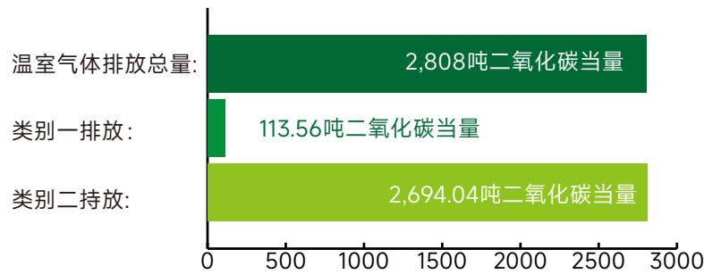

bar

| Category | Value (吨二氧化碳当量) |
| --- | --- |
| 温室气体排放总量 | 2,808 |
| 类别一排放 | 113.56 |
| 类别二持放 | 2,694.04 |

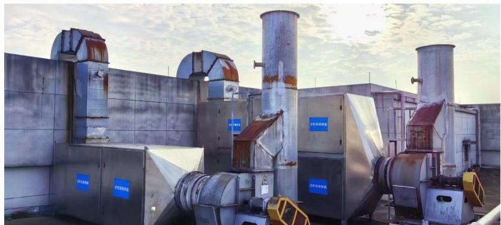

natural_image

Industrial facility with large metal machinery and piping, no visible text or symbols on equipment

在我国“双碳”背景下，绿色化、低碳化、节能化已成为制造业高质量发展的必然趋势。威星智能将持续深化环境管理体系建设，结合公司“创新驱动、绿色发展”理念，进一步整合数字化、智能化技术与环境管理需求，优化管理流程、完善管控措施，持续提升环境管理水平，推动绿色工厂向更高标准迈进，以实际行动践行可持续发展承诺，为构建人与自然和谐共生的绿色生态贡献企业力量。

公司顺利通过认证，荣获碳中和证书、能源管理体系认证证书。

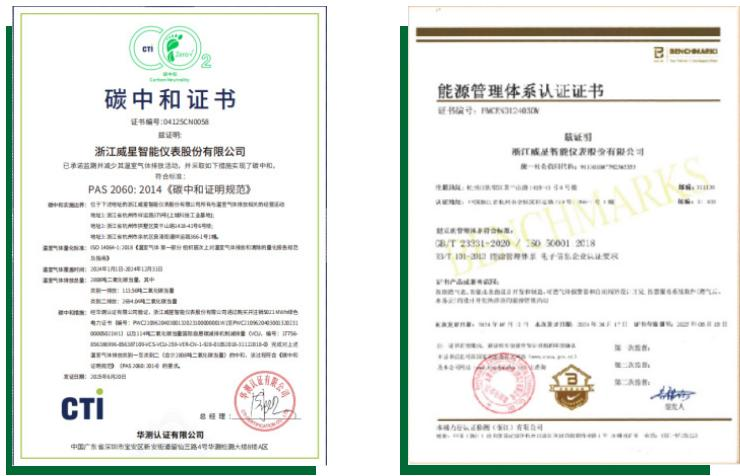

# 03 绿色发展，低碳未来

# 科技赋能，打造绿色智造新标杆

智能化升级，提升能源利用效率：完成三幢大楼能源监控系统加装，提高能源管控，精准降本。实现50%以上使用绿电。

公司将绿色低碳理念深度渗透至研发、生产、运营全流程，推动生产工艺低碳化、制造过程智能化、资源利用高效化：在研发端，聚焦节能降耗型产品研发，优化智慧燃气、水务计量解决方案，助力下游行业实现节能降耗、减排降碳，推动能源高效利用；在生产端，持续升级绿色工厂建设，实现生产环节的节能、降耗、减污、增效，践行资源循环利用理念。

# 精益管理，践行节能降碳新理念

公司以节能降耗、低碳环保为核心，推动办公流程数字化转型，全面推行无纸化办公，通过线上审批、云端协作、电子文档流转等方式，大幅减少纸质文件使用，降低办公耗材消耗；规范办公区域能源管理，推行人走灯灭、下班断电、合理调控空调温度等节能举措，配备节能办公设备，持续降低办公环节能源消耗。

公司加强绿色办公理念宣导，通过环保培训、主题活动等形式，引导全体员工树立低碳办公意识，推动节约用纸、节约用水、垃圾分类等绿色行为常态化，将绿色理念内化为员工自觉行动。此外，公司优化办公环境布局，优先选用环保、可回收的办公耗材与装修材料，打造绿色、健康、低碳的办公空间，实现办公场景与生态环境的和谐共生，进一步完善企业绿色发展体系，助力低碳未来建设，切实履行企业可持续发展责任。

# 合作共赢，共创绿色低碳新未来

公司坚持开放协作、优势互补，与上下游合作伙伴深化绿色协同合作，推动供应链全链条低碳转型，共同优化绿色生产、绿色研发、绿色物流等环节，助力行业构建低碳发展生态。

践行企业社会责任，共建美丽中国：积极参与环保公益活动，倡导绿色低碳生活方式，为建设美丽中国贡献力量。

# 水资源管理

# 生产环节

清洁生产，源头减量：优化生产工艺，采用无水或节水型生产设备，最大限度减少生产用水。

为降低生产运营活动对水资源带来的环境影响，我们积极落实环境保护责任，严格遵循《中华人民共和国水法》等国家法律法规的要求，加强取水和用水的全过程节水管理，通过采取节水、提高用水效率等一系列措施，减少水资源消耗，保障公司生产经营的正常进行。

# 生活环节

公司生产过程中不产生废水，生活污水经隔油池、化粪池等预处理设施处理后，纳入市政污水管网，确保达标排放。

积极开展节水宣传教育活动，提高员工节水意识，营造全员参与节水的良好氛围。

# 包材管理

我们坚持以“厂内循环、绿色低碳”为原则，积极推进制造生产基地的循环化发展。通过工艺改造、技术升级和资源回收利用等手段，持续推进固体废物的源头减量和资源化利用，年节约约1,000吨包装材料，有效减少资源浪费和环境污染，显著提高资源利用率。

威星智能通过建立并实施能源管理体系，持续

优化能源绩效和管理水平，逐步实现能源消费低碳化、资源利用循环化、生产过程清洁化的全方位转型。

未来，威星智能将继续深入研究和探索，利用数字化和智能化的力量，进一步推动制造业绿色低碳转型，以“绿色智造”驱动未来，为我国的“双碳”目

# 排放物管理

# 废气排放

威星智能在生产过程中几乎不产生废气，仅在使用老化设备时会有极少量的烟气产生。为确保良好的空气质量，公司已经强化车间内的通风措施，采用了自然通风与机械通风相结合的方式，并通过屋顶进行排放。此外，在产生烟气的位置上方安装了移动式吸风罩，将生产过程中产生的烟气经过滤装置处理后高空排放。

这些措施有效保证了车间内部及其周边厂界区域内的各种污染物浓度均符

约1,000吨

每年节约包装材料

合《大气污染物综合排放标准》(GB16297-1996)中新污染源的二级标准限值要求。

# 废弃物排放

严格遵守《固体废物污染环境防治法》《危险废物转移管理办法》等相关法律法规，制定了《危险废物管理制度》《不合格品管理制度》，明确对废弃物排放的管理要求。对于生产、包装、退货等情况出现的不合格品及生产、研发过程中产生的固体废物进行合规存放管理，由公司安环职能部门交由有资质的处置单位进行处理；对于生活垃圾等无害废弃物交由环卫部门处理。报告期内，公司未发生与废弃物处置相关的违法违规事件。

无害废弃物由环卫部门处理

不合格品交由有资质单位处理

固体废物交由有资质单位处理

合格品
回收利用

# 危险废物管理

<table><tr><td>制度保障</td><td>明确责任</td><td>收集与存放</td><td>处理与运输</td></tr><tr><td>制定《固体废弃物管理制度》及《相关方管理制度》,各部门按制度要求进行管控。制定环境职业健康全目标指标及管理方案,下发相关部门执行。</td><td>与相关方签订环境安全协议,明确管理要求及责任。</td><td>现场危废由专人、专桶收集。转交给行政管理中心进行存放和管理。</td><td>与具备资质危废处理公司及运输公司签订合同。定期进行危废清理。</td></tr></table>

噪声管理

<table><tr><td>噪声源控制</td><td>为降低噪声影响,公司主要通过优化生产车间布局,并加强设备运行管理,定期维护保养,确保设备平稳运转,从源头减少噪声产生。</td></tr><tr><td>噪声监测与评估</td><td>每年委托第三方机构对厂界噪声进行检测,确保噪声排放符合《工业企业厂界环境噪声排放标准》(GB12348-2008)中2类声环境功能区标准限值要求。根据第三方检测报告,监测期间,企业厂界昼、夜间噪声监测值均达标。</td></tr><tr><td>设备维护与管理</td><td>定期对空压机运行情况进行点检,确保设备正常运行,避免因设备故障导致噪声异常。</td></tr><tr><td>警示标识</td><td>在噪声源附近醒目位置张贴相关警示标识,提醒人员注意噪声防护。加强员工职业健康保护,为接触高噪声岗位的员工配备合格的隔音防护用品,开展噪声防护知识培训,保障员工职业健康。</td></tr></table>

# 生物多样性保护

生物多样性是地球生态系统稳定运行的基石。各种生物之间形成了复杂的食物链和食物网，彼此相互依存、相互制约。如果某种生物灭绝，可能会导致食物链的断裂，进而影响到整个生态系统的稳定。生物多样性的保护与可持续发展息息相关。在资源日益紧缺的今天，保护生物多样性意味着更加合理地利用自然资源，实现资源的循环利用和可持续发展。

公司持续关注其自身活动对生物多样性的影响，遵照《中华人民共和国环境保护法》、《中华人民共和国土壤污染防治法》等法规要求，开展风险因素识别、隐患排查等工作。

公司生产基地均选址于成熟工业园区，均为工业用地，厂区周围不涉及环境敏感地区和国家保护动植物，公司不存在位于自然保护区及其周围的生产基地，因此公司运营活动未发现对生物多样性造成重大影响的情况。

natural_image

Aerial view of lush green mountain ranges with winding lakes under a blue sky with scattered clouds (no text or symbols visible)

# 04 赋能绿色发展

# 绿色产品认证

在绿色发展成为全球共识的今天，威星智能深知企业的价值不仅在于自身发展，更在于对行业和社会的积极贡献。自创立以来，公司始终秉持“环境友好、生产节约”的绿色发展战略，致力于以高质量的产品和服务推动公用事业的可持续发展。我们将环保理念贯穿产品生命周期，通过创新研发、绿色制造和严格认证，打造高效节能、环境友好的智能产品。

# 环保认证，保障绿色品质

我们的产品已通过 RoHS 权威环保认证，严格限制铅、汞、镉等有害物质含量，全面符合欧盟及国际环保标准。从选材到生产全程践行绿色理念，从源头降低环境影响与健康风险，为全球市场提供安全、健康、可持续的高品质智能设备，以绿色智造赋能可持续发展。

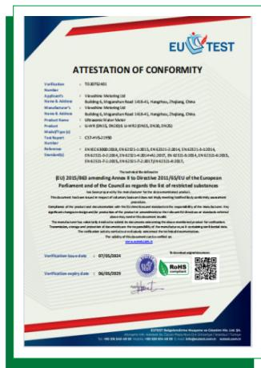

text_image

EU/US TEST
ATTESTATION OF CONFORMITY
Validation Number: T30870461
Registration Author: Vanonek Consulting Ltd
Registration Date: 2015-03-09
Manufacturer: Vanonek Consulting Ltd (140-8-4), Hongzhou, Qingdao, China
Product Name: Vanonek Consulting Ltd (140-8-4), Hongzhou, Qingdao, China
Product Type: USP Parthenate Water Meter
Product Code: C10870461, RQD2001, LTM 021402165, DUBB, HKUZ
Model Type (a): C3D-05-21299
Test Report Number: S1-000000000
Release Standard: E1-03-2323-03-2323-03-2323-03-2323-03-2323-03-2323-03-2323-03-2323-03-2323-03-2323-03-2323-03-2323-03-2323-03
The journal has been published by the European Parliament and the Council on the Board of the European Composites. It is not only a copy of the document that any material or material must be used in this publication. The publisher has been published by the European Composites Association. The information contained in this report is available under the EU/US standards. The information contained in this report is available under the EU/US standards. The information contained in this report is available under the EU/US standards. The information contained in this report is available under the EU/US standards. The information contained in this report is available under the EU/US standards. The information contained in this report is available under the EU/US standards. The information contained in this report is available under the EU/US standards. The information contained in this report is available Under the EU/US standards. The information contained in this report is available Under the EU/US standards. The information contained in this report is available Under the EU/US standards. The information contained in this report is available Under the EU/US standards. The information contained in this report is available Under the EU/US standards. The information contained in this report is available Under the EU/US standards. The information contained in this report is available Under the EU/US standards. The information contained under the EU/US standards is available under the EU/US standards. The information contained under the EU/US standards is available under the EU/US standards. The information contained under the EU/US standards is available under the EU/US standards. The information contained under the EU/US standards is available under the EU/US standards. The information contained under the EU/US standards is available under the EU/US standards. The information contained under the EU/US standards is available under the EU/US standards. The information contained in this report is available under the EU/US standards. The information contained in this report is available under the EU/US standards. The information contained in this report is available under the EU/US standards. The information contained in this report is available under the EU/US standards. The information contained in this report is available Under the EU/US standards. The information contained in this report is available Under the EU/US standards.

# 智能节水，助力资源循环

我们的智能水表等产品通过节能产品认证、节水产品认证及智慧水利产品认证，具备精准计量和优化用水效率的功能，可为资源紧缺地区提供可靠的技术支持。

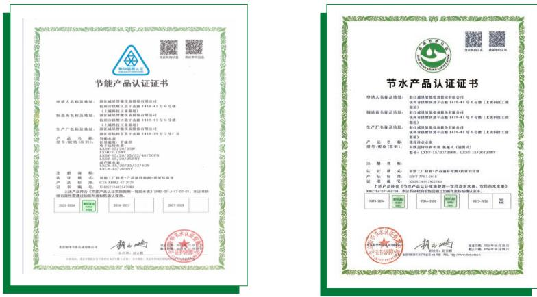

# 智慧能源管理

随着国家发改委等四部门联合发布《关于深化智慧城市发展推进城市全域数字化转型的指导意见》，明确提出加快城市燃气等公共设施的数字化改造与智能化运营，威星智能积极响应政策号召，依托物联网、大数据、智能计量等核心技术，构建覆盖能源监测、数据分析、精准调控、高效利用的一体化智慧能源管理体系。公司将数字化技术深度融入生产运营与产品服务，通过实时监测水、气等能源消耗数据，实现能耗可视化、可追溯、可优化，持续提升能源利用效率，降低单位产值能耗。面向行业与客户，公司以智能终端与系统平台为载体，提供高效、精准的能源计量与管理解决

方案，助力城市与用户实现精细化用能、低碳化运行，以科技赋能能源转型，推动能源产业绿色高效发展，为实现“双碳”目标与可持续未来提供坚实支撑。

<table><tr><td>政策依据</td><td>国家发改委等四部门《关于深化智慧城市发展推进城市全域数字化转型的指导意见》,要求加快城市燃气等公共设施数字化改造与智能化运营</td></tr><tr><td>核心技术</td><td>物联网、大数据、智能计量</td></tr><tr><td>核心体系</td><td>覆盖能源监测、数据分析、精准调控、高效利用的一体化智慧能源管理体系</td></tr><tr><td>内部应用</td><td>数字化技术融入生产运营与产品服务;实时监测水、气能耗数据,实现能耗可视化、可追溯、可优化,提升能源利用效率、降低单位产值能耗</td></tr><tr><td>对外服务</td><td>以智能终端+系统平台为载体,提供能源计量与管理解决方案,助力精细化用能、低碳化运行</td></tr><tr><td>发展目标</td><td>科技赋能能源转型,推动能源产业绿色高效发展,支撑“双碳”目标与可持续发展</td></tr></table>

# 缥缈峰燃气安全风险监测预警解决方案

公司控股子公司缥缈峰的燃气安全风险监测预警解决方案以物联网、GIS、AI和数字孪生技术为核心，实现场站、管网、户内场景的智慧化管理。通过数据可视化、业务一体化和决策智能化，构建长效安全管理机制，助力能源数字化转型升级。

缥缈峰燃气安全风险监测预警解决方案  
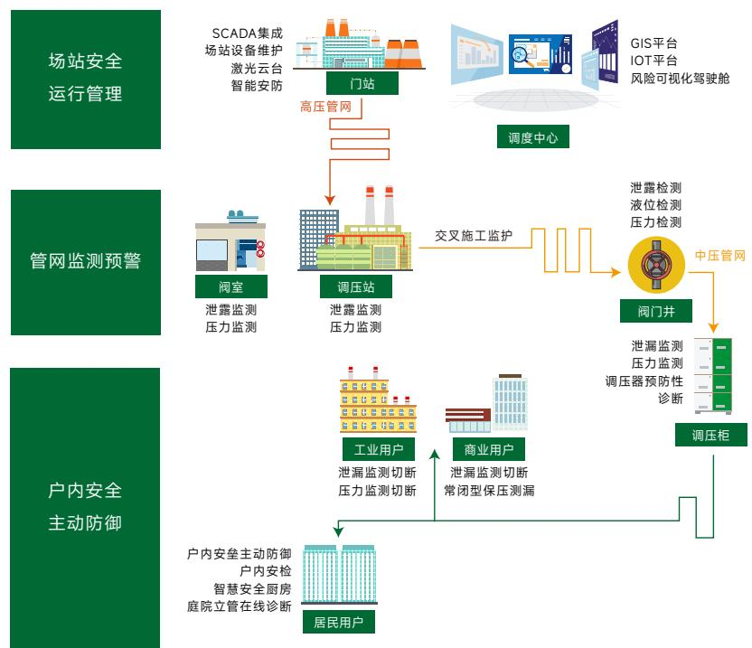

flowchart

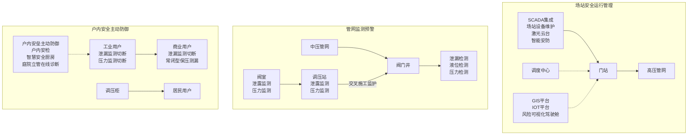
```mermaid
graph TD
  subgraph Operational["场站安全运行管理"]
  A["SCADA集成\n场站设备维护\n激光云台\n智能安防"] --> B["门站"]
  B --> C["高压管网"]
    D["调度中心"] -.-> B
    E["GIS平台\nIOT平台\n风险可视化驾驶舱"] -.-> B
  end

  subgraph Monitoring["管网监测预警"]
  F["阀室\n泄露监测\n压力监测"] --> G["调压站\n泄露监测\n压力监测"]
  H["中压管网"] --> I["阀门井"]
  G -->|"交叉施工监护"| I
  I --> J["泄漏检测\n液位检测\n压力检测"]
  end

  subgraph Active["户内安全主动防御"]
  K["工业用户\n泄漏监测切断\n压力监测切断"] --> L["商业用户\n泄漏监测切断\n常闭型保压测漏"]
  M["调压柜"] --> N["居民用户"]
    O["户内安垒主动防御\n户内安检\n智慧安全厨房\n庭院立管在线诊断"] -.-> K
  end
```

# 燃气安全风险可视化监管平台

# 物联网采集平台

可对接各类品牌、不同类型的终端智能感知设备，实现全品类物联设备统一接入与全生命周期管控。平台具备极高的数据并发处理能力，经第三方专业性能检测，设备接入规模可达百万级，能充分满足燃气行业海量物联数据的采集需求。

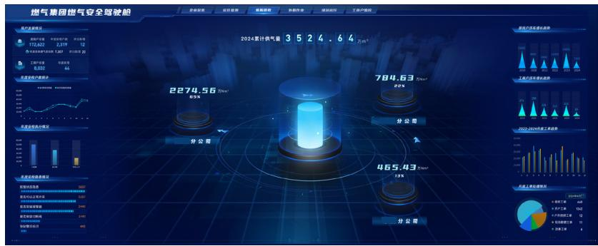

donut

| Category | Value (Lb/d) |
| --- | --- |
| 补公司 | 2274.56 |
| 分公司 | 784.63 |
| 分公司 | 465.43 |

<table><tr><td>一级模块</td><td>二级指标</td></tr><tr><td>核心总览</td><td>累计供气量、分公司供气量&amp;占比</td></tr><tr><td>用户情况</td><td>居民用户规模、工商户用户规模居民户历年增长趋势、工商户历年增长趋势</td></tr><tr><td>安全管理</td><td>年度安检执行监控、年度安检隐患统计</td></tr><tr><td>工单运营</td><td>工单结构、工单趋势监控</td></tr><tr><td>功能定位</td><td>集团客服、营收、用户、安检业务的数字化监管中枢,实现全链路可视化、区域化考核、安全服务双控、决策数据支撑</td></tr></table>

# 燃气安全主动预防检测管理平台

依托公司完善的管网及设备设施数据库，以地理空间信息（GIS）和物联网（IOT）技术为核心支撑，整合多维度技术资源，搭建起融合GIS空间管理、设备物联监测、设施全生命周期运维、视频集中监控于一体的一体化业务平台。该平台实现对燃气场站、输配管网及终端用户的全域覆盖，可开展精准化燃气安全预警、实时化监测及智能化数据分析，全面掌握燃气设施运行状态，提前排查安全隐患，防范各类燃气安全事故发生。

同时，积极搭建四方责任协同体系，明确各方职责、强化联动配合，打造“政府监管、燃气企业调度、应急指挥处置、用户安全提醒”四位一体的安全管理新模式，实现安全监管无死角、应急处置高效率、用户提醒全覆盖，为企业规范化运营、安全化管控，以及政府精准化安全监管提供坚实可靠的技术支撑与体系保障。

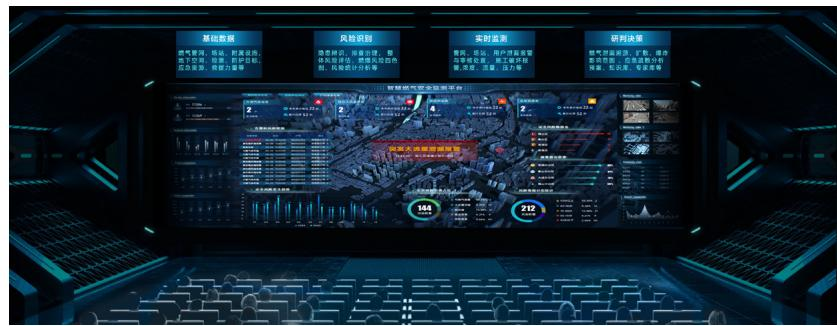

text_image

基础数据
燃气管网、电站、附属设施、地下车库、设备、防护目标、百路等功、安防能力等量
风险识别
桑普斯公、运营管理、整体风险识别、索引反向四百路、风险识别预警
实时监测
夜间、低谷、用户终端监管与管理监控表、施工环境监测、采样、巡检、日志、刀号
研判决策
燃气环境监测、扩散、漂浮索引图、位置测分析测量、短比采集及定性检验
智慧燃气安全检测平台
144
212

# 燃气安全可视化一张图驾驶舱

打造一体化燃气安全可视化监管驾驶舱，整合基础数据管理、风险自动识别、实时动态监测、科学研判决策等核心功能，支持营运、运行、管网、场站、安全监测、客户、服务、抄表、收费等多维度场景可视化展示与集中管控，让燃气安全管理各环节信息一目了然，助力高效监管与科学决策。

# 6

# 以人为本与爱同行

保障员工权益

支持职业发展

注重员工关怀

维护安全健康

践行公益行动

2025环境、社会和公司治理（ESG）报告

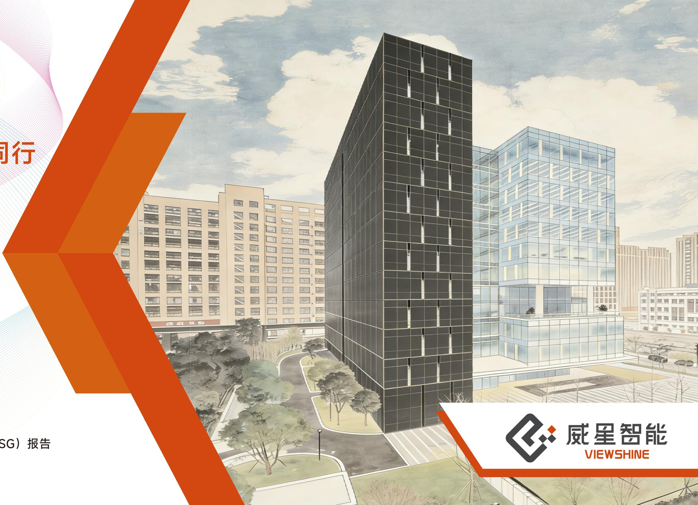

text_image

同行
SG）报告
威星智能
VIEWSHINE

# 01 保障员工权益

# 平等雇佣

<table><tr><td>平等招聘合规杜绝歧视偏见</td><td>威星智能严格遵守国家及地方劳动法律法规,切实尊重和保障全体员工合法权益。公司通过制定并执行《员工手册》《员工招聘管理办法》等一系列内部制度,规范用工管理,坚决防范和杜绝强迫劳动、歧视、骚扰等一切违法违规行为。</td></tr><tr><td>多元文化共融促进包容发展</td><td>我们深信,多元背景的员工团队是激发创新、提升整体竞争力的重要源泉。为此,我们致力于构建一个多元平等、包容共进的工作环境。在人才选拔中,我们坚持公平公正,杜绝因性别、年龄、民族、宗教信仰、身体状况等任何因素产生的歧视,积极推动人才结构的多元发展。</td></tr><tr><td>严守劳动法规保障员工权益</td><td>我们始终尊重并全力保障全体员工的合法权益。公司严格遵守国家法律法规,在员工入职时即依法签订劳动合同,并于入职当月及时为员工缴纳六险一金。我们坚持合规用工,坚决杜绝任何形式的强迫劳动、职场歧视与骚扰等违法行为,努力营造合法、公平、受尊重的工作环境。</td></tr></table>

劳动合同签订率

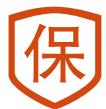

社会保险覆盖率

商业意外保险覆盖率

# 产学研合作

# 南昌航空大学专家学者团队赴威星智能开展校企合作交流活动

2025年12月17日，南昌航空大学专家学者团队到访威星智能总部，双方围绕超声计量、传感器与换能器等前沿技术研发及产学研融合展开深入交流。座谈会上，校方专家重点介绍了其在超声检测、光纤传感等领域的技术积累与人才培养体系，并探讨了超声技术在航空、高铁、石油管道等国家重大工程中的应用前景。双方一致认同可在智能传感、数据融合与高端制造等方面开展联合研发与平台共建，进一步巩固了校企协同创新机制，为后续共同推进关键核心技术攻关、促进科技成果转化与产业应用奠定了坚实基础，持续增强公司在智能传感与计量领域的技术引领力与行业影响力。

# 研究院建设

2025年，公司正式设立研究院，聚焦电子式燃气表的长寿命设计与数字安全管理两大方向开展系统化研究。团队组建方面，研究院已引进30位专业人才，其中包括13名硕士与博士，构建了高水平研发梯队。在资源投入上，2025年度研究院累计投入经费504万元，其中设备类投资达359万元，为关键技术攻关与创新能力提升提供了坚实的软硬件支撑。

# 校园招聘

通过开展校园宣讲会、双选会，并结合就业指导与实习计划，系统性引进优秀高校毕业生，为企业持续注入新生力量。

# 社会招聘

依托线上招聘平台、社交媒体及线下人才交流会等多渠道资源，实现全方位人才吸引，保障招聘覆盖的广度与精准度。

# 多元 引才渠道

积极拓展员工推荐、校企合作人才引进、内部竞聘等多元方式，高效补充关键岗位人才，持续优化人才结构，支撑企业战略发展需求。

# 02 支持职业发展

# 多元包容

多元化的团队构成有助于激发创新思维并提升问题解决能力。为此，通过开展多渠道、多形式的招聘，广泛吸纳来自各类背景与领域的优秀人才，为企业持续注入新鲜活力与多元视角。在内部积极构建包容开放的工作环境，充分尊重并珍视每位员工的独特性与价值。通过组织多样化的文化交流活动，增进员工之间的理解与协作，从而有效提升团队凝聚力与整体协作效率。

# 员工结构

截至报告期末，员工总数量1104人  
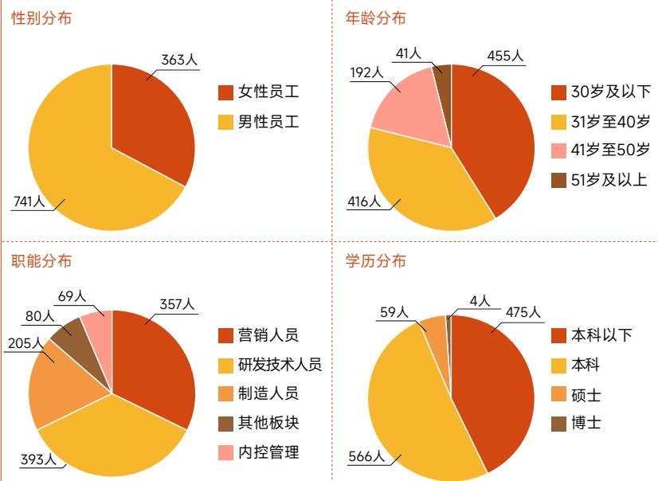

# 薪酬绩效

# 薪酬政策

薪酬待遇是企业吸引与保留人才的重要基础。威星智能依据《薪酬管理办法》，遵循合理、公平、竞争、激励与合规五项原则，结合业务特点设立差异化的薪酬体系，坚持以价值贡献为核心进行分配，确保激励考核机制与公司经营目标紧密结合、同步推进。

# 绩效考核

威星智能建立了覆盖月度、季度与年度的多层次绩效评估机制。对表现优异的员工给予及时表彰，同时对绩效有待提升的员工开展针对性的“一对一”指导，并协助制定改进计划。上级管理者在此过程中提供持续的沟通支持与专业辅导，以促进员工能力提升，实现个人与组织的协同发展。

# —— 月度/季度绩效评估 ——

员工的绩效评估每月进行一次，部门绩效评估则每季度进行一次，这一过程旨在及时识别和奖励优秀表现，同时为需要改进的员工提供反馈和支持。

# —— 低绩效员工关怀

针对在绩效评估中表现不理想的员工，人力资源部门主动开展一对一沟通，深入理解员工面临的具体困难，并提供针对性的指导和资源支持，协助员工重新回到积极的发展轨道。

# —— 年度绩效复盘 ——

在年度绩效评估中表现未达预期的员工，其直接上级会安排深度沟通。沟通包括填写《年度绩效面谈与改进计划表》，以确保双方就工作表现达成共识，并为后续制定清晰的改进目标和行动计划。

# —— 持续沟通与支持

在绩效面谈过程中，上级领导会与员工共同分析工作思路、计划安排、实际困难及个人发展诉求，并结合员工实际状况，提供专业建议、实用指导和明确目标。这不仅有助于员工明确成长方向，也能有效支持员工实现个人与组织的共同目标。

# 职业晋升

为健全内部人才发展体系，公司现已搭建更为多元的职业发展平台，并正式出台《任职资格管理办法》。本办法坚持以绩效为导向、遵循“能上能下”的动态管理原则，通过建立科学公正的评估机制，持续优化人才选拔与晋升路径，充分激发员工潜能，实现组织与个人协同共进、持续成长。

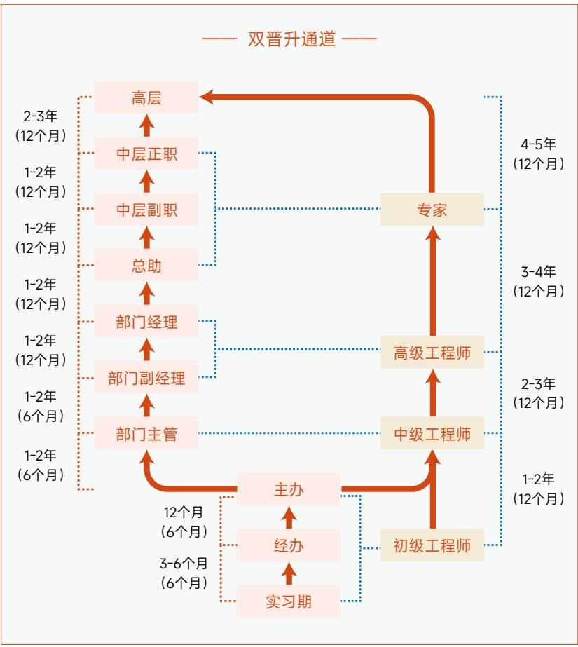

flowchart

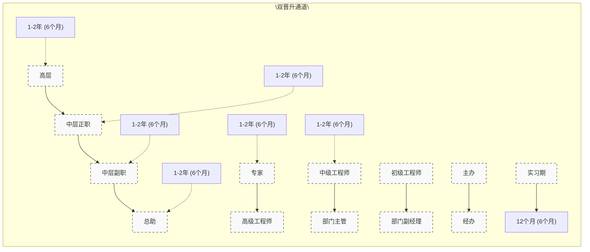
```mermaid
graph LR
  subgraph sg["\"双晋升通道\""]
    direction TB
  A["高层"] --> B["中层正职"]
  B --> C["中层副职"]
  C --> D["总助"]
  E["专家"] --> F["高级工程师"]
  G["中级工程师"] --> H["部门主管"]
  I["初级工程师"] --> J["部门副经理"]
  K["主办"] --> L["经办"]
  M["实习期"] --> N["12个月 (6个月)"]
    O["1-2年 (6个月)"] -.-> A
    P["1-2年 (6个月)"] -.-> B
    Q["1-2年 (6个月)"] -.-> C
    R["1-2年 (6个月)"] -.-> D
    S["1-2年 (6个月)"] -.-> E
    T["1-2年 (6个月)"] -.-> G
  end

  style A fill:#f9f9f9,stroke:#333,stroke-dasharray: 5 5 5
  style B fill:#f9f9f9,stroke:#333,stroke-dasharray: 5 5 5
  style C fill:#f9f9f9,stroke:#333,stroke-dasharray: 5 5 5
  style D fill:#f9f9f9,stroke:#333,stroke-dasharray: 5 5 5
  style E fill:#f9f9f9,stroke:#333,stroke-dasharray: 5 5 5
  style F fill:#f9f9f9,stroke:#333,stroke-dasharray: 5 5 5
  style G fill:#f9f9f9,stroke:#333,stroke-dasharray: 5 5 5
  style H fill:#f9f9f9,stroke:#333,stroke-dasharray: 5 5 5
  style I fill:#f9f9f9,stroke:#333,stroke-dasharray: 5 5 5
  style J fill:#f9f9f9,stroke:#333,stroke-dasharray: 5 5 5
  style K fill:#f9f9f9,stroke:#333,stroke-dasharray: 5 5 5
  style L fill:#f9f9f9,stroke:#333,stroke-dasharray: 5 5 5
  style M fill:#f9f9f9,stroke:#333,stroke-dasharray: 5 5 5
```

# 员工申诉

为确保薪酬管理与绩效考核的公正透明，公司设立清晰的申诉机制，保障员工权益，维护考核结果的准确合理。

# 。申诉权利

员工如掌握确凿证据，证明薪酬或绩效考核结果存在不真实、不合理情形，可在结果公布后2个工作日内提出申诉。

# 。申诉启动

员工需填写《绩效考核申诉表》，提交至部门经理或人力资源部，以正式启动申诉流程。

# 。 调查响应

上级主管或人力资源部将在收到申诉后3个工作日内完成调查，并及时推进处理。

# 。结果反馈

调查结束后，处理结果将第一时间告知申诉员工，确保信息透明、沟通到位。

# 人才培养

# 员工培训

威星智能始终以人才发展为核心导向，制定了《员工培训管理办法》，将全体员工作为培养对象纳入统一体系。我们通过新员工培训、内部培训、外派培训及外聘讲师培训四种形式，为员工提供系统而多样的学习机会。

我们注重将培训内容与员工的职业生涯规划紧密结合，帮助员工明确职业发展方向，并通过制定个性化的培训计划，确保员工在不同成长阶段都能获得相应的知识与技能支持。

529场

内部培训

12次

外部培训

9,352人

覆盖人次

1,973,736小时

总课时

在培训体系建设方面，公司积极推进双平台协同落地：全新培训系统已正式上线并逐步投入使用，与现有威星培训平台共同构建起“外引内育”的协同机制。其中，威星平台持续聚焦核心人才发展与战略能力提升，而新系统则全面支持全员专业技能深耕与岗位能力进阶。双平台互为补充、协同发力，初步构建起分层分类、系统完善的培训支撑体系。

<table><tr><td>人才理念</td><td>以人才发展为核心,建立统一员工培训体系</td></tr><tr><td>培训形式</td><td>新员工培训、内部培训、外派培训、外聘讲师培训</td></tr><tr><td>培养模式</td><td>培训与职业规划结合,实施个性化培训计划</td></tr><tr><td>平台建设</td><td>双平台协同,“外引内育”</td></tr><tr><td></td><td>现有平台:聚焦核心人才发展与战略能力提升</td></tr><tr><td></td><td>新培训系统:支撑全员专业技能深耕与岗位能力进阶</td></tr><tr><td>体系成果</td><td>初步构建分层分类、系统完善的培训支撑体系</td></tr></table>

威星智能培训体系

<table><tr><td>专业知识类</td><td colspan="4">岗位技能类</td><td>通用类</td><td colspan="4">管理类</td></tr><tr><td>专业理论知识</td><td rowspan="4">岗位职责</td><td rowspan="4">工作标准</td><td rowspan="4">流程规范(操作规程)</td><td rowspan="4">操作技巧</td><td>管理理念</td><td rowspan="4">岗位职责</td><td rowspan="4">人际沟通</td><td rowspan="4">专业知识类</td><td rowspan="4">其他</td></tr><tr><td>专业操作技能</td><td>管理知识</td></tr><tr><td>专业相关法规</td><td>管理能力</td></tr><tr><td>其他</td><td>管理艺术</td></tr></table>

新员工培训、内部培训、外派培训、外聘教师培训

# 新员工入职培训

为帮助新员工了解公司情况、熟悉规章制度和管理要求，并尽快融入工作环境、进入工作状态，我们开展了新员工入职培训。通过培训，我们不仅传递企业文化和价值观，还让每位新员工感受到归属感。

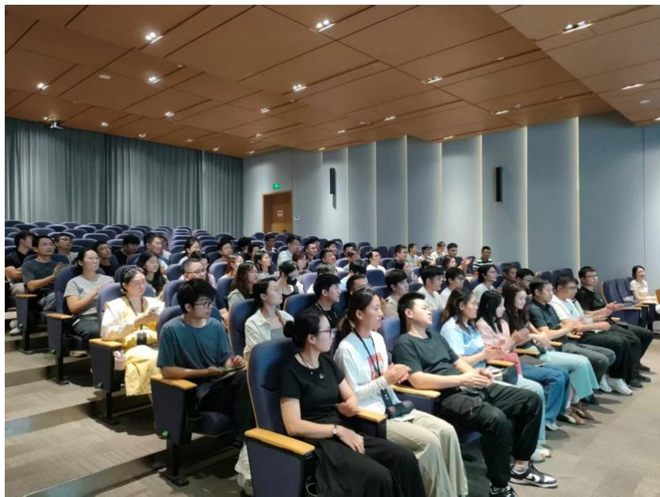

natural_image

Interior of a modern auditorium with attendees seated in rows, facing an audience (no visible text or signage)

# 领导力发展培训

为进一步强化高层管理干部队伍建设，全面提升其综合业务素养与专业履职能力，我们精心组织并开展了系统化、专业化的领导力发展专项培训。本次培训紧密围绕企业战略发展需求，聚焦核心业务体系、管理实践要点与行业前沿动态，助力各级管理干部系统掌握关键业务知识，夯实专业基础，提升统筹决策与高效执行能力。

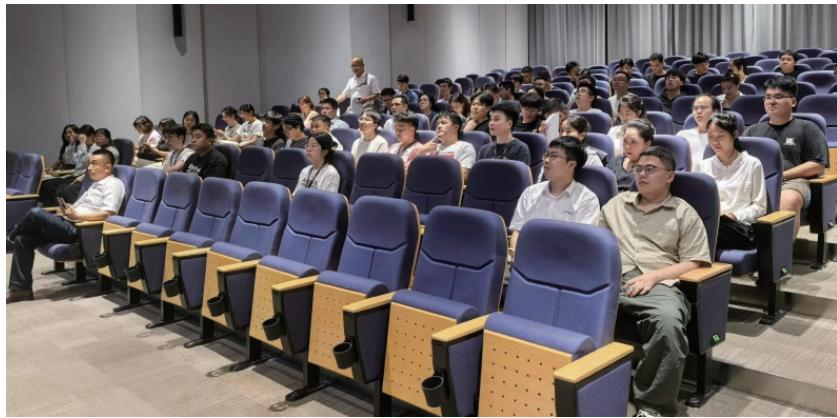

natural_image

Interior of a modern auditorium with many seated audience members, no visible text or signage

# 转岗培训

我们在开展轮岗前进行辅导培训，并评估轮岗效果，确保“合适的人用在合适的岗位上”，从而优化公司的人力资源配置。

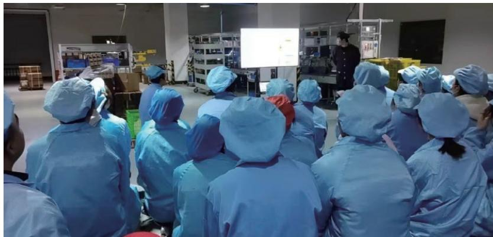

natural_image

Group of workers in blue protective suits gathered in a factory setting, observing equipment and a presenter (no visible text or symbols)

# 内训师培训

我们开展内训师培训，旨在建设一支高素质的内部讲师队伍，发挥内部讲师在公司人才培训培养体系中的重要作用，沉淀与传承组织经验，推动学习型组织建设。

# 其他专项培训

为精准赋能各岗位与重点梯队，公司系统开展销售、售后、新苗计划及“黄埔特训营”等专项培训，持续提升关键岗位与人才梯队能力；同时重点推动培训标准化与模式创新，通过建立“黄埔特训营”标准流程、推出“黄埔五杰”双导师陪跑方案，形成业务与成长双导师机制，为营销团队人才培养奠定坚实基础。

# 学历提升支持

# 专业资格认证

我们为员工考取关键职业资格证书提供补贴。补贴的证书范围包括：一级注册计量师、二级注册计量师、消费安全责任人、消防安全管理人员、安全员等。2025年，公司共为28人次提供了此类补贴。

# 学历提升激励

公司高度重视员工的学历提升，并为此提供了额外的激励措施。我们相信，通过提高学历，员工能够增强自身的竞争力，同时为公司带来更广阔的视野和更高效的工作方法。

# 专业资格认证

除了专业资格证书外，我们还积极鼓励员工获取其他各类证书，以促进个人能力的全面发展。我们相信，多元化的证书体系能够为员工的职业道路提供更多选择，同时也为公司的创新和发展注入新的活力。

# 03 注重员工关怀

# 员工沟通

为持续优化员工体验与组织氛围，公司每年定期开展全员满意度调研，内容涵盖工作内容、薪酬福利、办公环境、团队协作及管理机制等多个方面。调研结果将作为持续改进的重要参考，助力公司不断提升管理水平与员工满意度。同时，公司每季度还组织星宴餐厅专项调研，关注员工对餐饮质量与服务体验的反馈，及时优化细节，提升日常服务品质。

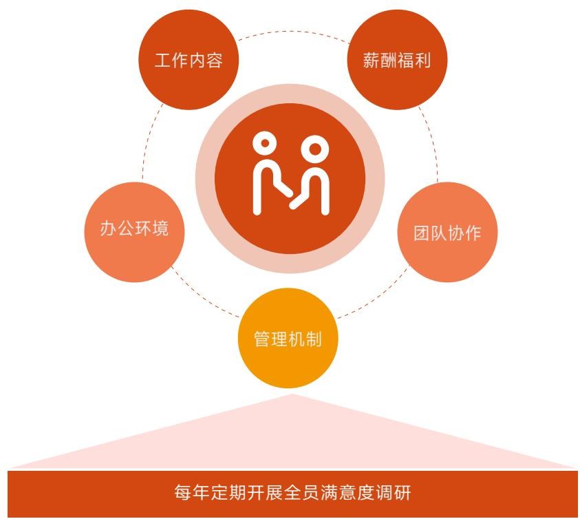

flowchart

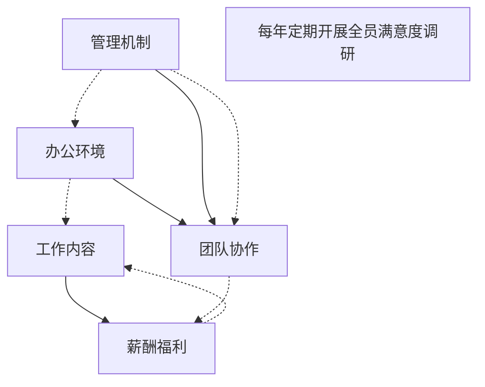
```mermaid
graph TD
  A["工作内容"] --> B["薪酬福利"]
  C["办公环境"] --> D["团队协作"]
  E["管理机制"] --> D
  B -.-> A
  C -.-> A
  D -.-> B
  E -.-> C
  E -.-> D
  F["每年定期开展全员满意度调研"]
```

从近年调研情况来看，员工在岗位匹配、职业发展等方面表现出较高的认可度，对企业未来发展也保持积极信心。调研中也收集到许多有价值的反馈，为公司完善相关机制提供了明确方向。公司将持续关注员工心声，结合实际情况稳步推进各项提升措施，为员工创造更加舒心、和谐的工作环境。

<table><tr><td>全员满意度调研</td><td>每年定期开展,覆盖工作内容、薪酬福利、办公环境、团队协作、管理机制等方面,结果作为持续改进重要参考,提升管理水平与员工满意度。</td></tr><tr><td>星宴餐厅专项调研</td><td>每季度组织,聚焦餐饮质量与服务体验反馈,及时优化细节,提升日常服务品质。</td></tr><tr><td>近年调研结果</td><td>员工对岗位匹配、职业发展认可度较高,对企业未来发展保持积极信心;收集多项有价值反馈,为机制完善提供方向。</td></tr><tr><td>后续举措</td><td>持续关注员工心声,结合实际稳步推进提升措施,打造舒心、和谐的工作环境。</td></tr></table>

# 员工福利

威星智能高度重视员工福利保障，确保员工享有完备的社会保障。此外，我们为员工提供社会统筹类、基础保障类、企业补充类等福利项目，进一步加强对员工的人文关怀，提升员工的归属感。

<table><tr><td>社会统筹类</td><td>六险一金:公司为全体员工缴纳养老保险、医疗保险、失业保险、工伤保险、生育保险、补充商业保险和住房公积金</td></tr><tr><td>基础保障类</td><td>年度体检:公司每年为员工提供一次全面的健康体检心理健康支持:提供心理咨询服务和心理健康讲座职业健康防护:为从事特殊工种的员工提供职业健康检查和防护用品</td></tr><tr><td>企业补充类</td><td>入职体检重大医疗保险针对特殊困境员工,提供特殊困难补助与扶助基金支持补充商业险用餐补贴、营养补贴、通讯补贴、高温补贴、节日福利、生日福利、培训福利、团建福利、员工福利等</td></tr></table>

# 员工活动

我们通过一系列丰富的活动与关怀措施，不断增强员工归属感与幸福感。公司定期组织各类主题活动，包括植树节环保活动、羽毛球赛、乒乓球赛及职工运动会等，既传递绿色理念，也促进团队协作与身心健康。同时，我们也开展文化体验类活动，如春节写福、地球日宣传、健康义诊等，帮助员工在互动中提升综合素养、感受企业温暖。此外，威星培训平台颁奖、教师节致敬等特色活动，进一步营造了积极向上、尊重人才的组织氛围。这些举措有效加强了团队凝聚力，也让企业文化更具温度与活力。

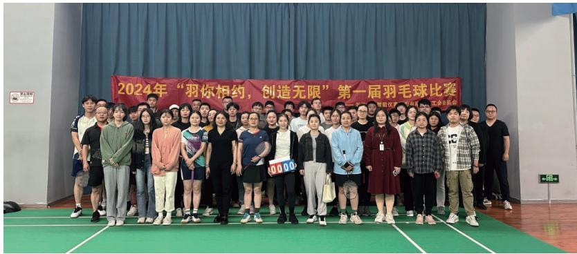

text_image

2024年“羽你相约，创造无限”第一届羽毛球比赛

# 以声传情，以文载道

第八届“好声音”演讲暨主题征文比赛自7月底启动以来，得到了各部门同事的热烈响应，参赛者以声音传递信念、以文字抒发情怀，在演讲与写作中展现了个人才华与团队风采。活动历经初赛、复赛及决赛的层层选拔，最终评选出演讲与征文比赛的各项获奖者。此次活动不仅为员工提供了展示与交流的平台，更凝聚了团队力量，传递了积极向上的企业文化，为公司文化建设注入了新的活力。

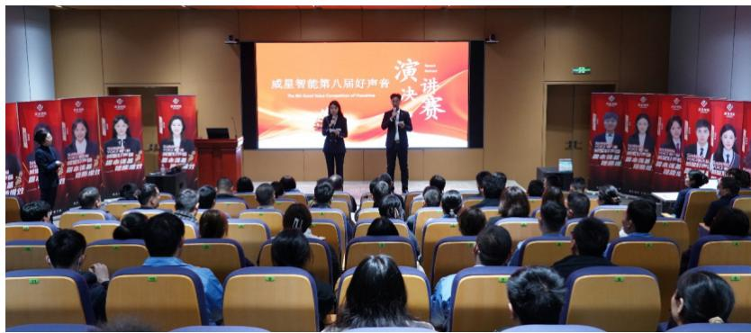

text_image

威星智能第八届好声音
The 8th Grand Race of the Founding of Vodafone
二讲赛

# 尊师传道，赋能成长

在教师节之际，公司为内训师举办专属活动，传递节日关怀并助力教学能力提升。活动邀请内部优秀讲师进行授课技巧与氛围营造的专题分享，开展案例讲解与实操指导。交流环节中，讲师们围绕教学心得开展轻松互动，公司也为资深讲师送上鲜花表达感谢。本次活动在传递组织温暖的同时，进一步提升了内训师专业能力，体现了公司对讲师队伍的重视，未来将持续完善内训支持体系，赋能员工与组织共同成长。

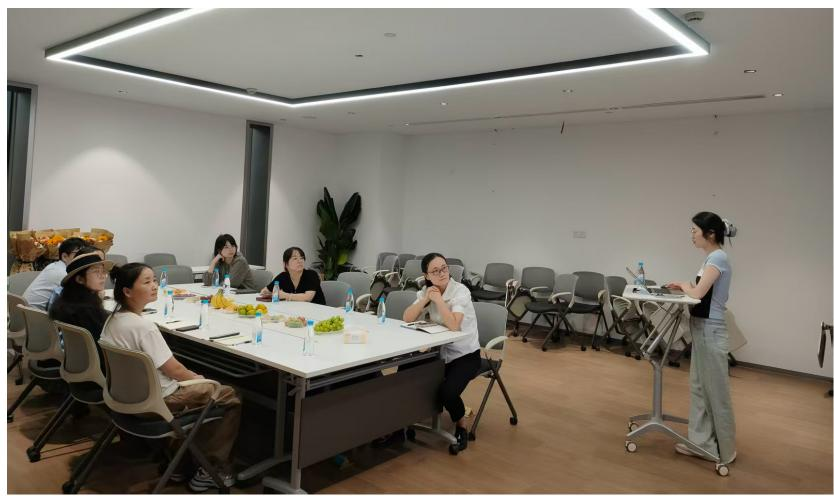

natural_image

Interior of a modern conference room with participants seated around a long table, one person standing beside it (no visible text or signage)

# 表彰学习标杆，激发成长动能

为激发全员学习热情、营造积极向上的学习氛围，公司每季度依托威星培训平台开展“学习之星”评选表彰活动。平台围绕销售业务、售后技能、岗位转岗、领导力提升等方向，搭建了多元化课程体系，充分满足不同岗位、不同层级员工的成长需求。

活动以季度为单位，对学员课程观看时长进行统一统计，坚持公平公正原则，依据学习数据排名，对表现突出的优秀员工授予“学习之星”荣誉称号。颁奖现场，获奖员工依次上台领取荣誉证书与奖品，纷纷表示将以此为动力，持续深耕专业知识，不断提升业务能力与综合素养。

通过评选表彰，既是对先进个人学习成果的充分肯定，也有效激励了全体员工主动学习、比学赶超的积极性，进一步浓厚了企业学习氛围。

未来，公司将持续优化威星培训平台课程资源，完善学习评价与激励体系，推动个人成长与组织发展同频共振、协同共进，为公司高质量发展注入持久动力。

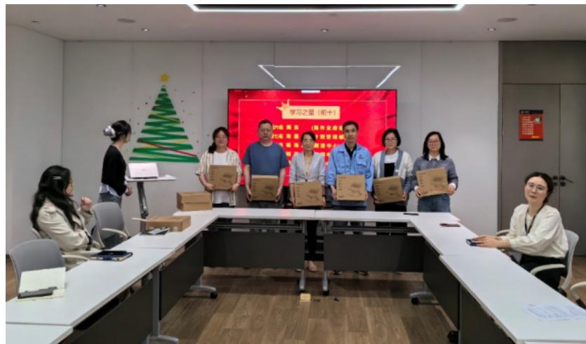

text_image

学习之星（前十）
中国教育（海外业务）
2023年1月1日，中国教育
学习之星（第十届董事会）

# 04 维护安全健康

威星智能坚决贯彻国家有关职业危害防治的法律法规和标准，制定《员工个人健康信息保密制度》《三体系管理手册》《职业卫生管理制度》等多项管理办法，注重安全生产与职业健康防护工作。

我们坚决执行安全生产目标，全面落实安全管理措施，不仅强化现场的安全监督检查与自查自纠机制，还深入实施隐患排查治理，积极预防健康安全风险。

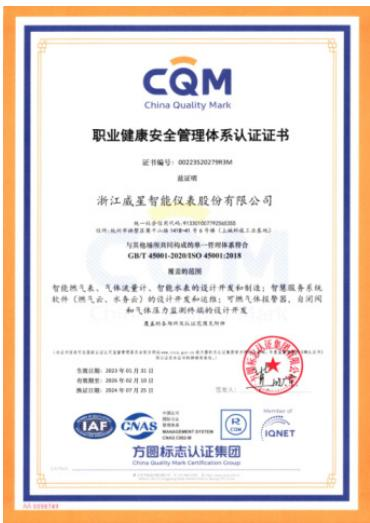

text_image

CQM
China Quality Mark
职业健康安全管理体系认证证书
证书编号：0022352027983M
兹证明
浙江威星智能仪表股份有限公司
第一证号委托书编号：ZL0101001979656388
住所：杭州市拱墅区万塘路1号B幢401室（含专楼）（工商和工业基地）
与其他场所共同构成跨单一百团体体系符合
GB/T 45001-2020ISO 45001:2018
规范范围
智能燃气表、气体流量计、智能水表的设计开发和制造；智慧服务系统
软件（燃气云、水务云）的设计开发和运维；燃气体报警器、自闭网
和气体压力监测终端的设计开发
覆盖的各种现代认证范围及品种
公告日期：2023年01月15日
有效期至：2024年02月10日
熟证日期：2024年07月25日
负责人：
IAF CNAS
UNITED BY:
MANAGEMENT SYSTEM
ISSN 123
IQNET
方圆标志认证集团
China Quality Mark Certification Group

# 员工职业健康安全培训

为全面提升全员安全意识与应急能力，我们定期开展可燃气体报警器产线安全、食堂安全、消防知识、质量检验员安全、安全生产、设备安全、货梯安全使用等一系列培训，切实保障员工职业健康与工作环境安全。

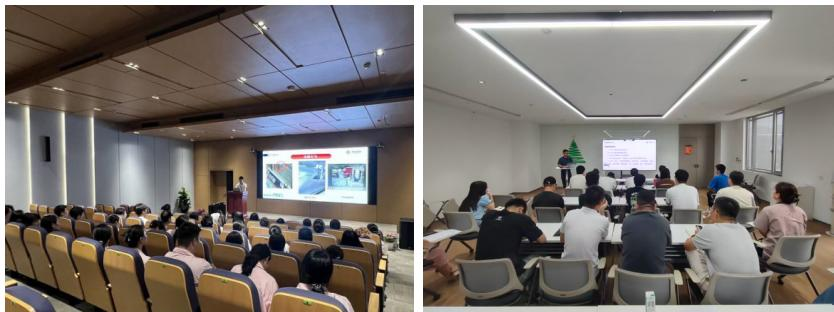

# 静电防护管理体系专题培训

为系统提升静电防护管理能力，公司于2025年11月12日组织开展了《静电防护管理通用要求》标准贯标培训。本次培训由质量管理中心组织，在一楼汇报厅以线下形式进行，覆盖相关岗位人员70余人。培训围绕GB/T39587-2020标准内容展开，重点解读静电防护体系建设规范要求与实践方法，帮助学员从技术认知层面提升至系统性管理层面，增强了识别静电风险和落实防控措施的能力，为后续推进相关体系认证夯实了基础。

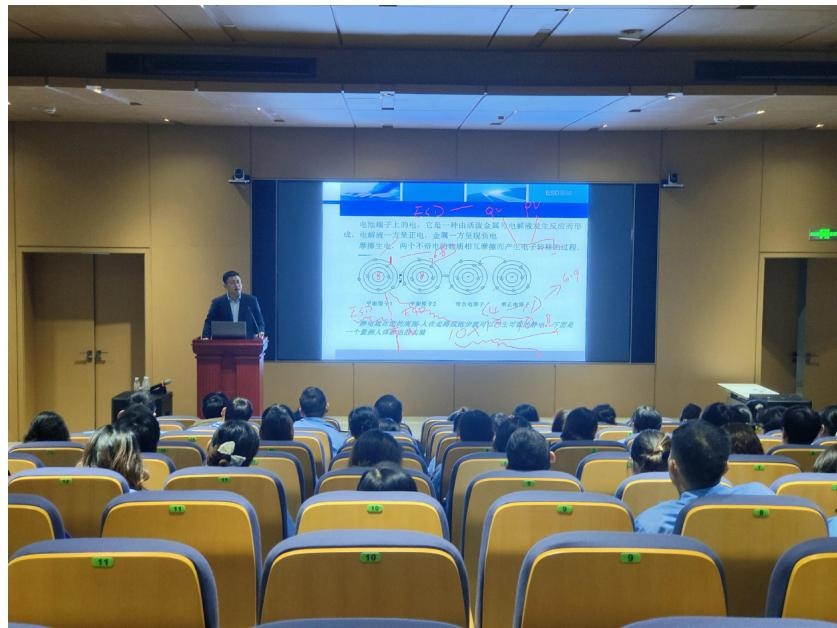

text_image

电池端子上的电：它是一种由质液金属气电解液变电反应而成，电解液一方复正电、金属一方显微负电
摩擦失定：两个平的电极耦和互摩擦而产生电子转换的过程。

# 读懂健康报告，守护美好生活

# 守护身心健康，共筑活力未来

为关爱员工健康、传递温暖关怀，公司邀请资深中医与专业口腔医生，开展了健康义诊活动。现场提供脉诊、肩颈调理、口腔检查等服务，中医师针对个人体质提出养生建议，推拿师帮助缓解久坐不适，口腔医生细致检查并讲解日常护理知识。活动中还准备了养生茶包、口腔护理礼包、中草药香包等实用物品，将健康关怀融入日常。此次健康服务让员工更深入了解身体状况、学习科学调理方法，也体现了公司对员工身心健康的重视。

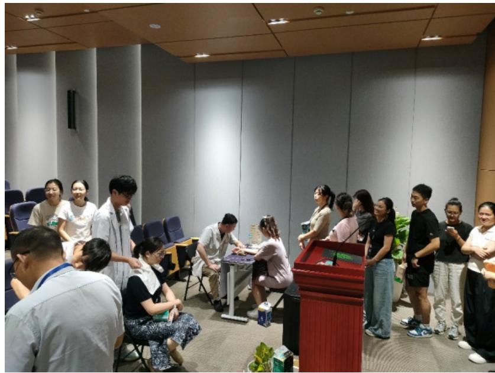

natural_image

Group of people gathered around a podium in a conference room, no visible text or symbols

为帮助员工更好地理解体检报告、科学关注个人健康，人力资源部特邀体检中心专家，于总部一楼报告厅开展体检解读专场活动。专家通过一对一沟通，用通俗易懂的语言为员工分析指标、解答疑问，并结合生活与工作状态提供个性化调理建议，让员工在清晰了解自身健康状况的同时，感受到公司的细致关怀。此次解读活动切实回应了员工的健康管理需求，是公司落实“以人为本”理念、持续优化员工关怀的生动体现。。

# 05 践行公益行动

在践行社会责任的过程中，我们也注重将可持续发展理念融入员工日常，通过“旧衣换绿植”“以书易蔬”等创意公益活动，倡导绿色低碳、知识共享的生活与工作方式。这些活动不仅激发了员工的环保意识和参与热情，也进一步营造了关爱互助、共享成长的组织氛围。未来，威星智能将继续拓展公益形式，深化可持续发展实践，携手员工与社会共同迈向更美好的未来。

# 东西协作促就业，暖冬送岗助发展

2025年1月9日，我司积极响应东西部协作号召，参与“东西协作促就业，暖冬送岗助发展”专场招聘会。在剑阁县普安镇活动现场，我司作为重点招聘企业，为当地群众提供了涵盖多个行业的就业岗位，并配套食宿保障与福利支持。此次公益招聘行动展现了我司积极履行社会责任、助力区域发展的企业担当，也进一步拓宽了企业与地方人才对接的渠道，为促进就业协作贡献了企业力量。

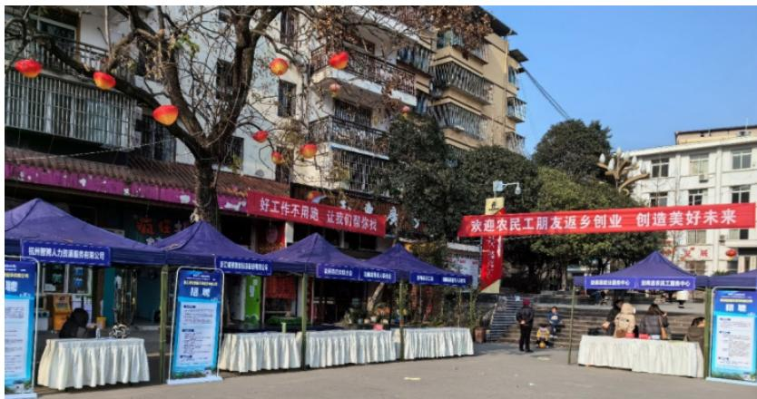

text_image

好工作不用跑 让我们帮你找
欢迎农民工朋友返乡创业 创造美好未来
招商管理人力资源服务有限公司
培训中心
培训服务中心
培训服务中心
培训服务中心

# 旧衣换绿植，爱心不闲置

在第47个国际植树节，公司于3月12日举办了“旧衣换新绿，环保我先行”主题环保公益活动，号召员工以旧衣物等闲置物品换取绿植，以实际行动倡导绿色生活、助力环境保护。现场员工积极参与，旧衣物经专业回收处理后，将捐赠给有需要的人群或进行资源化利用，实现物品循环与爱心传递。本次活动不仅体现了员工的责任意识和环保精神，也展现了公司在可持续发展方面的积极实践。未来，公司将继续组织更多公益环保活动，持续践行企业社会责任，共同建设美好家园。

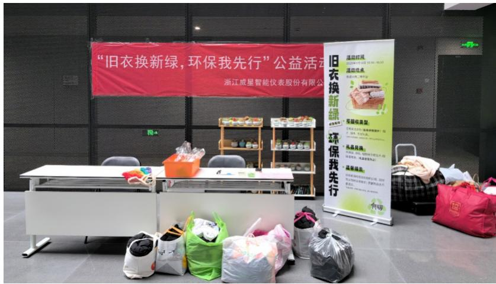

text_image

“旧衣换新绿,环保我先行”公益活动
浙江威星智能仪表股份有限公司
旧衣换新绿
环保我先行
活动时间
2023年1月23日 13:30-16:00
活动地点
活动类型
- 环保我先行
- 环保我先行
- 环保我先行
- 环保我先行
- 环保我先行
- 环保我先行
- 环保我先行
- 环保我先行
- 环保我先行
- 环保我先行
- 环保我先行
- 环保我先行

# 以书易蔬，阅享绿意

在第49个世界地球日与世界读书日交汇之际，公司于4月22日中午举办“以书易书，以书易蔬”主题活动，鼓励员工通过闲置书籍换取新鲜蔬菜，促进知识流动与绿色生活融合。活动现场设置了图书漂流区与蔬果兑换区，员工们踊跃参与，分享文学、社科、专业等各类书籍，兑换的蔬菜均采用环

保包装，传递可持续理念。活动不仅激发了员工的阅读热情，实现了图书资源再流通，更将环保与健康融入日常。未来，公司将持续推动“图书漂流角”等长效共享机制，营造书香伴绿意、共享共成长的办公氛围。

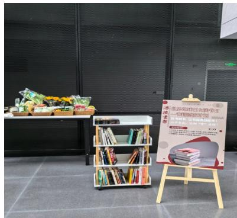

text_image

Street photo with visible store signboards and a promotional poster on an easel

# 子公司积极参与东西部协作与紧急赈灾

12月24日，公司控股子公司作为爱心单位受邀参加松江区第三十二届“蓝天下的至爱”慈善活动。在感恩答谢环节，子公司副总经理代表公司接受了授牌，以此表彰企业在2025年度积极参与松江区东西部协作、对口支援工作，以及在紧急赈灾行动中所体现的社会责任与奉献精神。

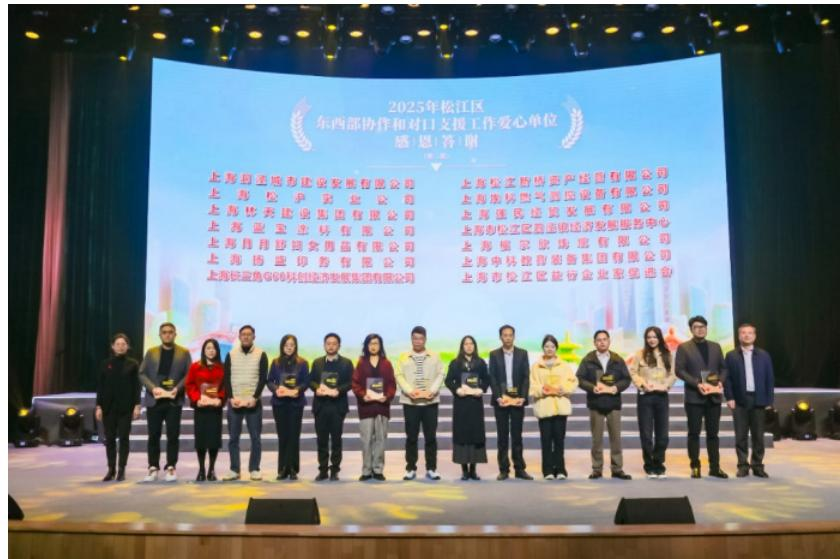

text_image

2025年松江区
东西部协作和对口支援工作爱心单位
感·恩·答·谢
上海怡亚酒店建设发展有限公司
上海弘业实业公司
上海怡天酒店集团有限公司
上海怡宝主办有限公司
上海博邦珍品用品有限公司
上海怡亚印药有限公司
上海怡亚典G60号创业开发集团有限公司
上海怡亚酒店房产城股份有限公司
上海怡亚酒店置业有限公司
上海怡亚酒店发展有限公司
上海怡亚酒店旅游投资服务中心
上海怡亚酒店有限公司
上海怡亚酒店集团有限公司
上海市松江区旅行社企业保障协会

# 附录

# 附录一：关键数据绩效

环境绩效表

<table><tr><td>指标</td><td>单位</td><td>2025年</td></tr><tr><td colspan="3">温室气体排放</td></tr><tr><td>温室气体排放(范围1)</td><td>吨二氧化碳当量</td><td>113.56</td></tr><tr><td>温室气体排放(范围2)</td><td>吨二氧化碳当量</td><td>2,694.04</td></tr><tr><td>温室气体排放总量(范围1+范围2)</td><td>吨二氧化碳当量</td><td>2,808</td></tr></table>

社会绩效表

<table><tr><td colspan="2">指标</td><td>单位</td><td>2025年</td></tr><tr><td colspan="4">员工雇佣</td></tr><tr><td colspan="2">员工总数</td><td>人</td><td>1,104</td></tr><tr><td rowspan="2">按性别划分</td><td>男性</td><td>人</td><td>741</td></tr><tr><td>女性</td><td>人</td><td>363</td></tr><tr><td rowspan="4">按年龄划分</td><td>30岁及以下</td><td>人</td><td>455</td></tr><tr><td>31-40岁</td><td>人</td><td>416</td></tr><tr><td>41-50岁</td><td>人</td><td>192</td></tr><tr><td>51岁及以上</td><td>人</td><td>41</td></tr><tr><td rowspan="4">按学历划分</td><td>博士</td><td>人</td><td>4</td></tr><tr><td>硕士</td><td>人</td><td>59</td></tr><tr><td>本科</td><td>人</td><td>566</td></tr><tr><td>本科以下</td><td>人</td><td>475</td></tr><tr><td rowspan="5">按职能划分</td><td>营销人员</td><td>人</td><td>357</td></tr><tr><td>研发技术人员</td><td>人</td><td>393</td></tr><tr><td>制造人员</td><td>人</td><td>205</td></tr><tr><td>其他板块</td><td>人</td><td>80</td></tr><tr><td>内控管理</td><td>人</td><td>69</td></tr><tr><td colspan="2">劳动合同签订率</td><td>%</td><td>100</td></tr><tr><td colspan="4">员工培训</td></tr><tr><td colspan="2">员工受训总时长</td><td>小时</td><td>1,973,736</td></tr><tr><td colspan="2">员工受训总人次</td><td>人次</td><td>9,352</td></tr></table>

附录二：全球报告倡议组织《可持续发展报告指南》索引

<table><tr><td colspan="3">披露内容</td><td>对应章节</td></tr><tr><td rowspan="26">GRI 2:一般披露2021</td><td>2-1</td><td>组织详细情况</td><td>关于威星</td></tr><tr><td>2-2</td><td>纳入组织可持续性报告的实体</td><td>报告说明</td></tr><tr><td>2-3</td><td>报告期、报告频率和联系人</td><td>报告说明</td></tr><tr><td>2-6</td><td>活动,价值链和其他业务关系</td><td>关于威星</td></tr><tr><td>2-7</td><td>员工</td><td>保障员工权益</td></tr><tr><td>2-9</td><td>管治构架和组成</td><td>规范公司治理</td></tr><tr><td>2-10</td><td>最高管治机构提名和遴选</td><td>规范公司治理</td></tr><tr><td>2-11</td><td>最高管治机构主席</td><td>董事长致辞/规范公司治理</td></tr><tr><td>2-12</td><td>在管理影响方面,最高管治机构的监督作用</td><td>规范公司治理</td></tr><tr><td>2-13</td><td>为管理影响的责任授权</td><td>规范公司治理</td></tr><tr><td>2-14</td><td>最高管治机构在可持续性报告中的作用</td><td>可持续发展治理</td></tr><tr><td>2-15</td><td>利益冲突</td><td>年报</td></tr><tr><td>2-16</td><td>重要关切问题的沟通</td><td>可持续发展治理</td></tr><tr><td>2-17</td><td>最高管治机构的共同知识</td><td>可持续发展治理</td></tr><tr><td>2-18</td><td>对最高管治架构的绩效评价</td><td>可持续发展治理</td></tr><tr><td>2-19</td><td>薪酬政策</td><td>年报</td></tr><tr><td>2-20</td><td>确定薪酬的程序</td><td>年报</td></tr><tr><td>2-22</td><td>关于可持续发展的战略声明</td><td>可持续发展治理</td></tr><tr><td>2-23</td><td>政策承诺</td><td>保障员工权益</td></tr><tr><td>2-24</td><td>融合政策承诺</td><td>见各章节内容</td></tr><tr><td>2-25</td><td>弥补负面影响的程序</td><td>可持续发展治理</td></tr><tr><td>2-26</td><td>寻求建议和提出关切的机制</td><td>可持续发展治理</td></tr><tr><td>2-27</td><td>遵守法律法规</td><td>见各章节内容</td></tr><tr><td>2-28</td><td>协会的成员资格</td><td>可持续供应链</td></tr><tr><td>2-29</td><td>利益相关者参与的方法</td><td>可持续发展治理</td></tr><tr><td>2-30</td><td>集体谈判协议</td><td>注重员工关怀</td></tr><tr><td rowspan="2">GRI 3:实质性议题2021</td><td>3-1</td><td>确定实质性议题的过程</td><td>可持续发展治理</td></tr><tr><td>3-2</td><td>实质性议题清单</td><td>可持续发展治理</td></tr></table>

使用说明 | 威星智能在2025年1月1日至2025年12月31日期间符合GRI标准编制报告。

使用的GRI 1 | GRI 1: 基础 2021

<table><tr><td colspan="3">披露内容</td><td>对应章节</td></tr><tr><td rowspan="3">GRI 201: 经济绩效2016</td><td>201-1</td><td>直接产生和分配的经济价值</td><td>关于威星</td></tr><tr><td>201-2</td><td>气候变化带来的财务影响以及其他风险和机遇</td><td>应对气候变化</td></tr><tr><td>201-3</td><td>固定福利计划义务和其他退休计划</td><td>注重员工关怀</td></tr><tr><td rowspan="2">GRI 203: 间接经济影响2016</td><td>203-1</td><td>基础设施投资和支持性服务</td><td>赋能绿色发展/践行公益行动</td></tr><tr><td>203-2</td><td>重大间接经济影响</td><td>创新驱动发展/践行公益行动</td></tr><tr><td>GRI 205: 反腐败2016</td><td>205-2</td><td>反腐败政策和程序的传达及培训</td><td>恪守商业道德</td></tr><tr><td>GRI 206: 不当竞争行为2016</td><td>206-1</td><td>针对不当竞争行为、反托拉斯和反垄断实践的法律诉讼</td><td>恪守商业道德</td></tr><tr><td rowspan="3">GRI 207: 税务2019</td><td>207-1</td><td>税务方针</td><td>恪守商业道德</td></tr><tr><td>207-2</td><td>税务治理、控制及风险管理</td><td>恪守商业道德</td></tr><tr><td>207-3</td><td>与税务关切相关的利益相关方参与及管理</td><td>恪守商业道德</td></tr><tr><td rowspan="3">GRI 301: 物料2016</td><td>301-1</td><td>所用物料的重量或体积</td><td>打造绿色工厂</td></tr><tr><td>301-2</td><td>所用循环利用的进料</td><td>打造绿色工厂</td></tr><tr><td>301-3</td><td>再生产品及其包装材料</td><td>打造绿色工厂</td></tr><tr><td rowspan="4">GRI 302: 能源2016</td><td>302-1</td><td>组织内部的能源消耗量</td><td>关键数据绩效</td></tr><tr><td>302-3</td><td>能源强度</td><td>关键数据绩效</td></tr><tr><td>302-4</td><td>降低能源消耗量</td><td>打造绿色工厂</td></tr><tr><td>302-5</td><td>降低产品和服务的能源需求量</td><td>打造绿色工厂</td></tr><tr><td rowspan="5">GRI 303: 水资源与污水2018</td><td>303-1</td><td>组织与水作为共有资源的相互影响</td><td>打造绿色工厂</td></tr><tr><td>303-2</td><td>管理与排水相关的影响</td><td>打造绿色工厂</td></tr><tr><td>303-3</td><td>取水</td><td>打造绿色工厂</td></tr><tr><td>303-4</td><td>排水</td><td>打造绿色工厂</td></tr><tr><td>303-5</td><td>耗水</td><td>打造绿色工厂</td></tr><tr><td>GRI 304: 生物多样性2016</td><td>304-2</td><td>活动、产品和服务对生物多样性的重大影响</td><td>打造绿色工厂</td></tr><tr><td rowspan="4">GRI 305: 排放2016</td><td>305-1</td><td>直接(范围1)温室气体排放</td><td>关键数据绩效</td></tr><tr><td>305-2</td><td>能源间接(范围2)温室气体排放</td><td>关键数据绩效</td></tr><tr><td>305-4</td><td>温室气体排放强度</td><td>关键数据绩效</td></tr><tr><td>305-5</td><td>温室气体减排量</td><td>关键数据绩效</td></tr><tr><td rowspan="4">GRI 306: 废弃物2020</td><td>306-1</td><td>废弃物的产生及废弃物相关重大影响</td><td>打造绿色工厂</td></tr><tr><td>306-2</td><td>废弃物相关重大影响的管理</td><td>打造绿色工厂</td></tr><tr><td>306-3</td><td>产生的废弃物</td><td>打造绿色工厂</td></tr><tr><td>306-5</td><td>进入处置的废弃物</td><td>打造绿色工厂</td></tr><tr><td rowspan="2">GRI 308: 供应商环境评估2016</td><td>308-1</td><td>使用环境评价维度筛选的新供应商</td><td>可持续供应链</td></tr><tr><td>308-2</td><td>供应链的负面环境影响以及采取的行动</td><td>可持续供应链</td></tr><tr><td rowspan="3">GRI 401: 雇佣2016</td><td>401-1</td><td>新进员工雇佣率和员工流动率</td><td>关键数据绩效</td></tr><tr><td>401-2</td><td>提供给全职员工(不包括临时或兼职员工)的福利</td><td>注重员工关怀</td></tr><tr><td>401-3</td><td>育儿假</td><td>注重员工关怀</td></tr><tr><td rowspan="9">GRI 403: 职业健康与安全2018</td><td>403-1</td><td>职业健康安全管理体系</td><td>维护安全健康</td></tr><tr><td>403-2</td><td>危害识别、风险评估和事故调查</td><td>维护安全健康</td></tr><tr><td>403-3</td><td>职业健康服务</td><td>维护安全健康</td></tr><tr><td>403-5</td><td>工作者职业健康安全培训</td><td>维护安全健康</td></tr><tr><td>403-6</td><td>促进工作者健康</td><td>维护安全健康</td></tr><tr><td>403-7</td><td>预防和减缓与业务关系直接相关的职业健康安全影响</td><td>维护安全健康</td></tr><tr><td>403-8</td><td>职业健康安全管理体系适用的工作者</td><td>维护安全健康</td></tr><tr><td>403-9</td><td>工伤</td><td>维护安全健康</td></tr><tr><td>403-10</td><td>工作相关的健康问题</td><td>维护安全健康</td></tr><tr><td rowspan="3">GRI 404: 培训与教育2016</td><td>404-1</td><td>每名员工每年接受培训的平均小时数</td><td>关键数据绩效</td></tr><tr><td>404-2</td><td>员工技能提升方案和过渡协助方案</td><td>支持职业发展</td></tr><tr><td>404-3</td><td>定期接受绩效和职业发展考核的员工百分比</td><td>支持职业发展</td></tr><tr><td>GRI 405: 多元化与平等机会2016</td><td>405-1</td><td>管治机构与员工的多元化</td><td>规范公司治理</td></tr><tr><td>GRI 406: 反歧视2016</td><td>406-1</td><td>歧视事件及采取的纠正行动</td><td>保障员工权益</td></tr><tr><td>GRI 413: 当地社区 2016</td><td>413-1</td><td>有当地社区参与、影响评估和发展计划的运营点</td><td>践行公益行动</td></tr><tr><td rowspan="2">GRI 414: 供应商社会评估 2016</td><td>414-1</td><td>使用社会评价维度筛选的新供应商</td><td>可持续供应链</td></tr><tr><td>414-2</td><td>供应链的负面社会影响以及采取的行动</td><td>可持续供应链</td></tr><tr><td>GRI 416: 客户健康与安全 2016</td><td>416-1</td><td>评估产品和服务类别的健康与安全影响</td><td>追求卓越品质</td></tr><tr><td>GRI 418: 客户隐私 2016</td><td>418-1</td><td>与侵犯客户隐私和丢失客户资料的经证实的投诉</td><td>优化客户体验</td></tr></table>

# 读者反馈表

# 尊敬的读者：

非常感谢您浏览威星智能《2025年环境、社会和公司治理报告》，我们衷心希望您能够对本报告做出评价，并提出您的宝贵意见。

恳请您协助完成反馈表中的相关问题，并以邮件形式向我们提出建议与意见。

邮箱地址：zqb@viewshine.cn

# 您的信息

# 姓名

# 联系电话

# 邮箱地址

您对威星智能2025年ESG报告的总体评价：

□好 □ 较好 □ 一般

本报告披露的信息是否清晰、准确且完整：

清晰度 □ 高 □ 较高 □ 一般 □ 较低 □ 低

准确度 □ 高 □ 较高 □ 一般 □ 较低 □ 低

完整性 □ 高 □ 较高 □ 一般 □ 较低 □ 低

您对威星智能履行ESG责任的评价：

环境责任 □ 好 □ 较好 □ 一般

社会责任 □ 好 □ 较好 □ 一般

治理责任 □ 好 □ 较好 □ 一般

您对威星智能ESG工作的其他建议：