# 塑造人类美好生活

沃特股份

— 002886

# 深圳市沃特新材料股份有限公司

地址：深圳市南山区西丽街道西丽社区留新四路万科云城三期C区九栋B座3101房（国际创新谷7栋B座3101房）

邮编: 518052

电话: 0755-26880862

传真: 0755-26880966

网址: www.wotlon.com

深圳市沃特新材料股份有限公司
2025年环境、社会及公司治理(ESG)报告  
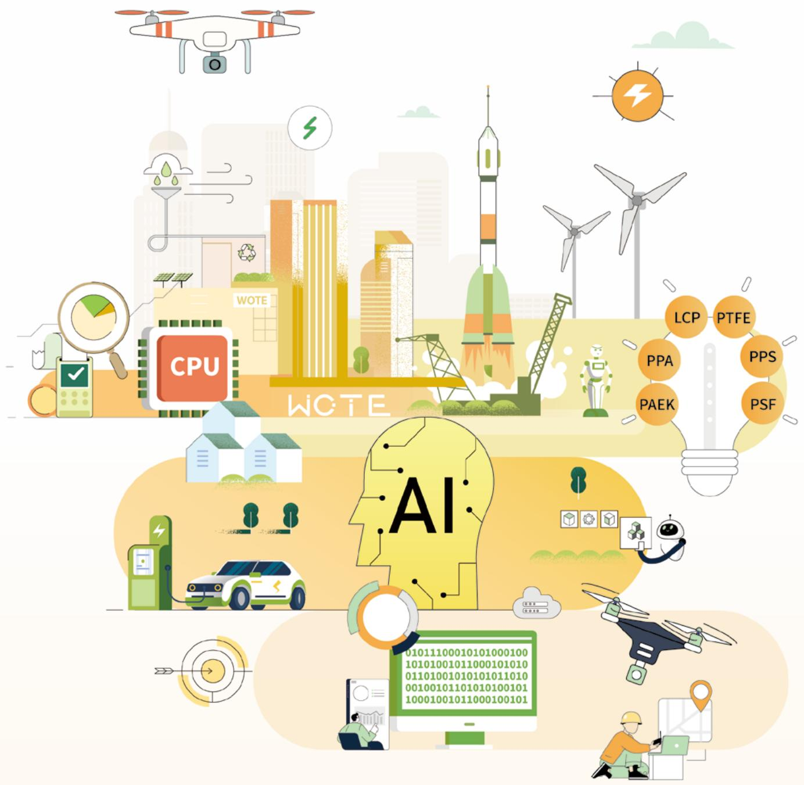

flowchart

```mermaid
graph TD
  A["Energy Grid"] --> B["PCU"]
  C["Wind"] --> D["WOTE"]
  E["Power Generation"] --> F["LCP"]
  G["Power Generation"] --> H["PTFE"]
  I["Power Generation"] --> J["PPS"]
  K["Power Generation"] --> L["PSF"]
  M["AI Integration"] --> N["AI Interface"]
  O["AI Integration"] --> P["AI Interface"]
  Q["AI Integration"] --> R["AI Interface"]
  S["AI Integration"] --> T["AI Interface"]
  U["AI Integration"] --> V["AI Interface"]
  W["AI Integration"] --> X["AI Interface"]
  Y["AI Integration"] --> Z["AI Interface"]
  AA["Drones/Microbikes"] --> AB["Camera/Engine"]
  AC["Camera/Microbikes"] --> AD["Camera/Microbikes"]
  AE["Camera/Microbikes"] --> AF["Camera/Microbikes"]
  AG["Camera/Microbikes"] --> AH["Camera/Microbikes"]
  AI["AI Interface"] --> AI1["01011100010101000100\n0101001011000101010\n01101001010101011010\n00100101101010100101\n10001001011000100101"]
```

# 2025

# 环境、社会及公司治理(ESG)报告

ENVIRONMENTAL, SOCIAL AND GOVERNANCE (ESG) REPORT

# 目录

董事长致辞 03

走进沃特股份 05

公司简介 05

全球布局 05

企业文化 06

责任荣誉 07

社会组织参与 08

可持续发展管理 09

可持续发展管治架构 09

可持续发展策略 09

ESG风险管理 09

ESG能力建设 10

重要性议题评估 10

利益相关方沟通 10

展望2026 71

ESG指标索引 72

关于本报告 73

意见反馈表 74

# 卓越治理

# 塑造高质量发展

完善公司治理 13

投资者关系管理 17

恪守商业道德 18

保障信息安全 20

# 创新驱动

# 塑造产业新局

深化产业优势 41

追求卓越品质 46

提供优质服务 49

创新驱动发展 51

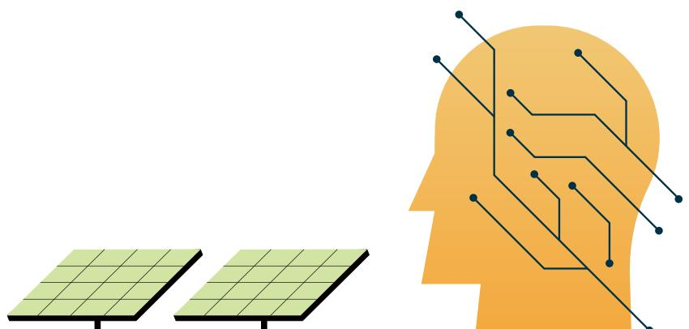

natural_image

Silhouette of a human head with circuit lines and solar panels on the left, symbolizing data or connectivity (no text or symbols present)

# CONTENTS

# 科技共生

# 塑造绿色未来

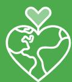

应对气候变化 23

强化环境管理 28

创新绿色产品 31

减少资源消耗 32

控制污染排放 35

传播环保理念 38

# 同心共筑

# 塑造美好生活

关爱员工成长 57

筑牢安全防线 61

携手行业共赢 67

热心公益事业 70

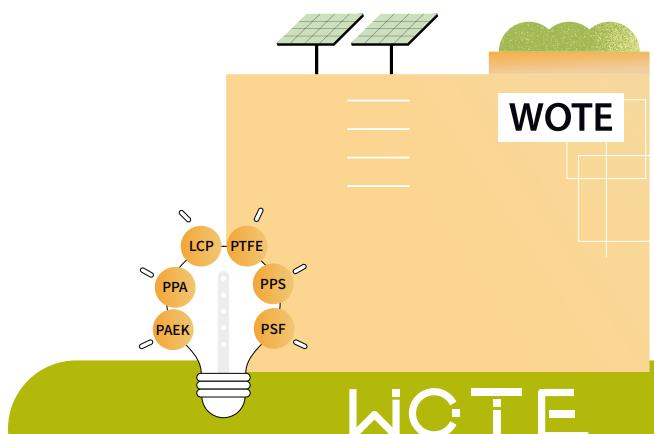

flowchart

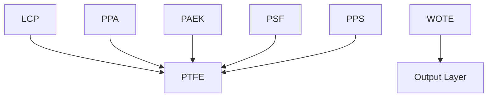
```mermaid
graph TD
  A["LCP"] --> B["PTFE"]
  C["PPA"] --> B
  D["PAEK"] --> B
  E["PSF"] --> B
  F["PPS"] --> B
  G["WOTE"] --> H["Output Layer"]
```

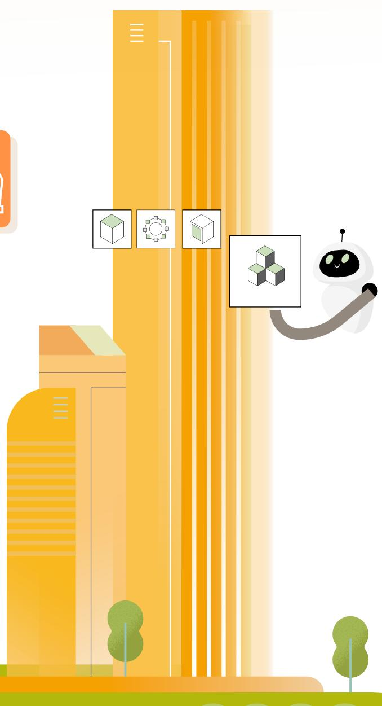

natural_image

Illustration of a city skyline with orange buildings and a cartoon robot interacting with cubes (no text or symbols)

# 董事长致辞

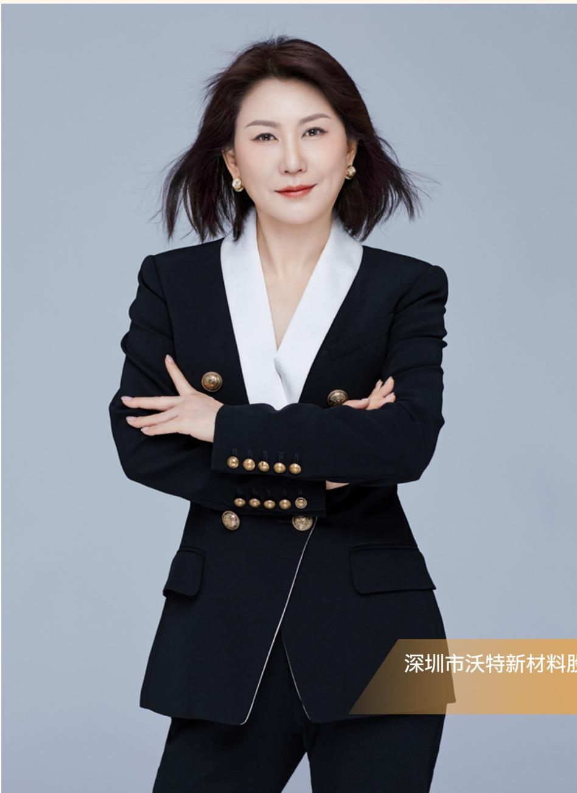

text_image

深圳市沃特新材料股

深圳市沃特新材料股份有限公司董事长
吴宪

2025年是“十四五”规划圆满收官、“十五五”蓝图谋篇布局的关键之年，亦是全球可持续发展治理迈向规范化、体系化的关键一年。在全球“双碳”目标引领、国际可持续披露准则（ISSB）全面实施的大背景下，中国《企业可持续披露准则——基本准则（试行）》落地实施，深圳市发改委印发《深圳市推动环境社会治理（ESG）体系建设助力打造可持续发展先锋城市工作方案（2025—2027年）》，为企业可持续发展指明方向。作为特种高分子材料领域的深耕者，沃特股份坚守高质量发展之路稳步迈进，成功荣登深圳首批ESG实践先锋企业榜单。我们坚信，唯有将可持续理念深植发展基因，方能在时代浪潮中行稳致远。

我们坚守卓越治理底线，筑牢可持续发展根基。持续完善ESG顶层设计与治理架构，规范信息披露，连续四年获评深交所信息披露A级评价。健全风险管理与内控体系，严守商业道德与合规底线，优化信息安全与数据保护制度，以坚实治理能力为公司高质量发展保驾护航。

我们践行绿色发展理念，引领产业低碳转型。深度响应“双碳”国家战略，突破高分子材料绿色技术瓶颈，生物基聚酰胺、PCR环保材料实现规模化应用，回收碳纤维材料赋能机器人产业降碳。重庆基地绿色产能持续释放，全生产线推行清洁生产工艺，从源头减少碳足迹。通过产品全生命周期环境管理，为电子、光伏、半导体、通讯、新能源汽车、低空飞行器、机器人等下游产业提供低碳解决方案，助力美丽中国建设。

我们坚持创新驱动发展，激活产业升级动能。立足国家创新驱动发展战略与制造强国建设全局，实施特种高分子材料平台化战略，重庆基地LCP和PEEK项目投产，全资收购华尔卡密封件，加码半导体产业链布局，核心产品产能与技术稳居全球前列，实现“合成-改性-加工成型”全链条自主可控。2025年研发投入1.2亿元，累计专利达434件，7家公司获评高新技术企业，5家公司获评专精特新。依托四大创新平台深化产学研合作，攻克5G/6G通讯等领域关键材料供应链自主可控难题，赋能战略性新兴产业发展。

我们秉持合作共赢理念，构建社会和谐生态。完善员工培养体系与职业发展通道，搭建多元化成长平台，让沃特人共享发展成果。严守安全生产底线，健全全流程安全管控，以硬核举措守护员工生命安全与身心健康。参与行业标准制定，携手伙伴共建绿色供应链，推动行业协同进步。践行“做自己，被需要”的核心价值观，以公益践行彰显企业公民责任，实现商业与社会价值共赢。

站在新的发展起点，沃特股份将持续深化平台化战略，加快绿色创新与技术突破，以更坚定的决心、更务实的行动，深耕材料未来，向着“成为世界一流的材料方案提供者”的愿景稳步前行，为推动中国制造业高质量发展、服务国家战略全局、实现可持续发展目标贡献更多力量。

natural_image

Illustration of a blue megaphone on an orange background (no text or symbols)

# 走进沃特股份

# 公司简介

深圳市沃特新材料股份有限公司（A股股票代码：002886，股票简称：沃特股份）成立于2001年，是国内领先的材料供应商和材料方案提供者，主要从事高性能功能高分子材料合成、改性和成品的研发、生产制造、销售及技术服务，致力于为客户提供最优化的新材料解决方案和增值服务。

公司主要产品包括特种及新型工程高分子、高性能复合材料、碳纤维及碳纳米管复合材料、含氟高分子材料，广泛运用于众多战略性新兴行业领域和未来产业领域，塑造美好生活。

# 公司产能规划

LCP

2.5万吨/年，全球第一

PPA

1.5万吨/年

PPS

2万吨/年

PAEK

1000吨/年

PSF

1万吨/年

PTFE

1万吨/年

# 全球布局

公司以深圳为总部，下设华南，华东，西南分、子公司。同时，在香港设有子公司，并在越南投资建设工厂，多基地、全产业链为客户提供最优化的高分子材料解决方案。

华东地区

华南地区

西南地区

海外

# 企业文化

企业愿景

企业使命

核心价值观

八字方针

伙伴文化

成为世界一流的材料方案提供者

塑造人类美好生活

做自己，被需要

诚信
纳贤
创新
超越

伙伴定义：沃特视员工、股东、供应商、客户等利益相关方为伙伴，携手伙伴，共拥未来

伙伴原则：廉洁自律、担当高效、相互成就、使命必达

伙伴生态：欣赏、理解、宽容

# 重庆基地

特种高分子材料合成基地
特种高分子薄膜制造基地

# 越南基地（海防市）

满足境外客户个性化订单需求

# 华东基地（江苏盐城）

5G及电子通讯、光伏、汽车材料改性制造基地
特种高分子材料LCP合成基地

# 沃特华本半导体、沃特华本密封件（上海松江）

半导体、氟树脂素材成品、金属波纹管制造基地

# 浙江科赛（浙江湖州）

高性能材料成品制造基地

# 华南基地（广东惠州）

无人机、智能家居、消费电子材料、OA材料改性及复合材料制造基地

# 深圳总部

# 香港沃特

国际化前沿技术、高端人才对接和市场开发、国际贸易

# 责任荣誉

# 公司荣誉

国家级专精特新重点“小巨人”企业

工信部高速连接器“一条龙”示范单位

中国材料类企业创新力排行Top7

中国特种高分子材料行业10强企业

全国民营企业科技创新产业创新典型案例

中国氟塑行业优秀品牌企业

粤港澳大湾区战略性新兴产业“领航企业50强”

广东省专精特新“小巨人”企业

广东省制造业100强企业

广东省重合同守信用企业

浙江省隐形冠军

深圳行业领袖企业100强

深圳500强企业

深圳质量百强企业

深圳创新企业70强

深圳知名品牌

深交所2024-2025年度信息披露工作A级（连续四年获评）

深圳市发展和改革委员会“2025年深圳市ESG实践先锋企业典型案例”

深圳市证券业协会“投教先锋-东方财富证券投资者教育基地”

中国上市公司协会“2025年度上市公司董事会优秀实践案例”

中国上市公司协会“2025年上市公司董事会办公室最佳实践”

中国上市公司协会“2025年上市公司可持续发展优秀实践案例”

中国上市公司协会“上市公司2024年报业绩说明会优秀实践”

万得Wind ESG 2025评级“A”

2025年度上市公司投资者关系水晶球奖

2025年度上市公司股东回报水晶球奖

2025年度上市公司ESG水晶球奖

# 董事长——吴宪女士个人荣誉

全国优秀企业家  
全国杰出创业女性  
广东省非公有制经济人士优秀中国特色社会主义事业建设者  
广东省三八红旗手  
深圳十大杰出女企业家  
深圳经济特区建立45周年十大“功勋女企业家”  
深商风云人物  
深圳最具影响力女企业家-深商木棉功勋奖

深圳市质量强市金质奖  
首届粤港澳大湾区战略性新兴产业“拓荒人物”  
新时代“深圳百名创新奋斗者”  
深圳行业领袖巾帼榜样  
深圳百名行业领军人物  
高分子行业年度人物  
高分子行业功勋奖

# 社会组织参与

# 董事长——吴究女士

全国工商联女企业家商会常务会长  
中国合成树脂协会副理事长、特种材料分会会长  
广东省粤港澳大湾区战略性新兴产业发展促进会会长  
深圳市战略性新兴产业发展促进会会长  
广东省工商联常委  
深圳市工商联副主席  
政协深圳市委员会委员、提案委员会副主任  
粤港澳大湾区上市公司联合会荣誉会长

深圳高分子行业协会终身荣誉会长、总顾问  
深圳市女企业家协会名誉会长  
深圳市社会组织总会常务副会长  
深商新材料产业联盟执行主席  
深圳市妇女儿童发展基金会理事会主席  
沃特公益基金管委会主任  
巾帼科创基金管委会主席  
深圳市优化营商环境咨询监督委员会委员

# 可持续发展管理

我们将可持续发展理念与公司战略相融合，以“塑造人类美好生活”为可持续发展理念，完善可持续发展管理架构，持续开展利益相关方沟通和实质性议题分析，推动企业可持续发展水平提升，携手利益相关方共创美好生活。

# 可持续发展管治架构

我们建立“董事会统筹决策、ESG工作组牵头推进、各部门及子公司落地执行”的可持续发展管理架构，明确各层级职责边界，推动ESG理念融入经营管理全流程，对标国际标准完善ESG风险管理，系统推进各项工作落地，护航企业可持续发展。

# 董事会

作为ESG治理核心，全面参与ESG风险管理，统筹负责公司可持续发展相关事宜的决策和监督。具体职责包括：听取ESG工作组工作汇报，审议ESG风险、ESG报告、重大事项、关键规划和制度等内部文件，审核和批准ESG重要议题，监督ESG目标达成情况，保障可持续发展理念与公司经营理念统一。

# E 工 S 作 G 组

作为高级管理层参与的专项工作机制，由董事会办公室牵头，成员涵盖高级管理人员及各核心部门、子公司负责人。工作职责包括：制定ESG工作年度计划与目标分解方案，明确责任主体工作要求，统筹ESG风险管理，牵头开展风险识别、评估与应对，审核ESG报告披露内容的准确性。

# 各部门及子公司

各部门及子公司作为ESG工作的具体执行主体，根据自身所涉及的ESG工作内容，以公司整体方针为指导，制定管理目标和方案，全面推进各项议题落地和取得实效。落实ESG风险日常管控，统计和整理ESG工作内容及成效，上报ESG工作组用于信息披露。

# 可持续发展策略

我们以 “塑造人类美好生活” 为可持续发展核心理念，围绕让科技与自然共生、塑造人类美好生活、筑牢高质量发展根基三个方面开展ESG实践，并每年研究内外部环境变化，动态更新议题，确保有效管控ESG风险和机遇，实现可持续发展。

# ESG 风险管理

我们结合行业特点与经营实际，系统梳理并披露在环境、社会、治理方面面临的主要ESG风险，并建立常态化风险识别、评估、应对与监测机制，实现对ESG风险的全流程监管。董事会对ESG风险管理工作负有最终监督责任，定期审议重大ESG风险事项与管控方案，确保风险管理融入公司治理。同时，公司参照TCFD、GRI、ISSB等国际标准构建ESG风险管理体系，持续提升风险管控的规范化与国际化水平。

我们将ESG指标因素纳入高级管理人员的绩效考核范围，包括但不限于安全生产、职业健康、节能环保、产品责任、知识产权保护、劳工权益保障等。我们通过设置量化考核目标与权重，将ESG关键绩效结果与高管薪酬紧密结合，如发生零容忍事故将实行“一票否决”制，以强化ESG管治的落地执行。

我们积极响应并遵循联合国全球契约、负责任商业行为等ESG相关倡议，将可持续发展理念融入经营管理全过程。我们主动加入国内新材料、化工等相关行业协会，如中国合成树脂协会、特种材料分会、深圳高分子行业协会等，推动产业协同可持续发展。同时，积极参与国内ESG相关组织及倡议活动，不断提升ESG治理与信息披露水平。

# ESG 能力建设

我们通过线上线下相结合的形式面向管理层开展ESG专项议题分享和培训，并积极参与行业组织的ESG相关培训，以深化和提升各级管理人员及职能部门对ESG的认知和管理能力，推动ESG融入日常运营。2025年，组织开展1场关于ESG报告及ESG评级提升的专场培训，参与人数达31人。

# 重要性议题评估

我们遵循重要性议题分析流程，开展内外部利益相关方问卷调研，了解各利益相关方对公司可持续发展工作的关注点，最终筛选出11个关键重要性议题并在报告中进行重点披露。

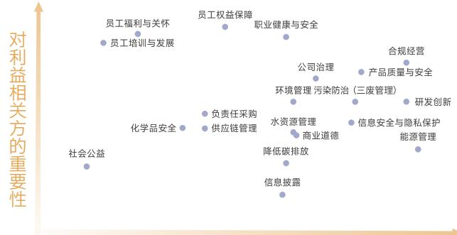

scatter

| 议题 | X (相对位置) | Y (相对位置) |
| --- | --- | --- |
| 员工福利与关怀 | ~15% | ~90% |
| 员工培训与发展 | ~20% | ~85% |
| 社会公益 | ~10% | ~30% |
| 化学品安全 | ~40% | ~60% |
| 负责任采购 | ~45% | ~70% |
| 供应链管理 | ~45% | ~65% |
| 职业健康与安全 | ~60% | ~95% |
| 公司治理 | ~65% | ~80% |
| 环境管理 | ~65% | ~70% |
| 污染防治 | ~70% | ~75% |
| 水资源管理 | ~70% | ~60% |
| 商业道德 | ~70% | ~60% |
| 信息披露 | ~70% | ~20% |
| 合规经营 | ~85% | ~85% |
| 产品质量与安全 | ~85% | ~80% |
| (三废管理) | ~85% | ~70% |
| 研发创新 | ~90% | ~65% |
| 信息安全与隐私保护 | ~90% | ~55% |
| 能源管理 | ~90% | ~50% |

# 利益相关方沟通

对公司发展的重要性  
我们积极和利益相关方对话和合作，了解并及时回应各方的关切和期望，为识别可持续发展风险和机遇、制定可持续发展工作策略、提升信息披露质量提供重要参考。

<table><tr><td>主要利益相关方</td><td>期望与诉求</td><td>沟通与回应渠道</td></tr><tr><td>政府</td><td>·依法经营·响应国家发展战略·创造就业岗位·带动区域经济发展·环境保护</td><td>·接受监督·定期披露·不定期汇报·参与相关会议</td></tr><tr><td>股东</td><td>·稳健经营·投资回报·信息公开透明</td><td>·定期/不定期信息披露·股东会·投资者交流活动·沟通电话与邮箱</td></tr><tr><td>员工</td><td>·薪酬与福利·职业发展与晋升·安全、舒适的工作环境·平衡工作与生活</td><td>·公司飞书群·内部邮件系统·全员大会、部门会议·提案机制</td></tr><tr><td>客户</td><td>·研发创新·产品质量·稳定供给</td><td>·客户经理全流程服务·客户投诉渠道·客户交流与拜访</td></tr><tr><td>供应商</td><td>·双赢和共同发展·公平公正·诚信经营</td><td>·供应商资格调查·供应商考核与审核·供应商沟通</td></tr><tr><td>社区</td><td>·助力社区和谐发展·积极投身公益</td><td>·信息披露·沟通电话与邮箱</td></tr><tr><td>媒体</td><td>·透明沟通·良性互动</td><td>·接受采访·信息披露·沟通电话与邮箱</td></tr></table>

# 卓越治理

# 塑造高质量发展

natural_image

Illustration of two business professionals interacting with a computer screen and cloud, symbolizing data analytics or cloud services (no text or symbols present)

沃特股份始终将完善现代公司治理体系作为实现高质量发展的重要保障，不断优化公司治理结构，提升董事会决策的科学性与有效性，恪守商业道德标准，与投资者建立透明、互信、共赢的良性合作关系，为公司实现可持续发展与长期价值提供保障。

# 涉及议题

公司治理

风险合规

利益相关方管理

商业道德

# 我们的行动

\- 完善公司治理

\- 投资者关系管理

·恪守商业道德

\- 保障信息安全

# 我们的绩效

召开股东会

召开董事会

董事会成员出席率

2次

7次

100%

披露定期报告

披露临时公告

女性董事占比

4份

141份

29%

贡献联合国可持续发展目标（SDGs）：

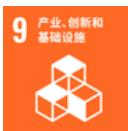

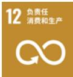

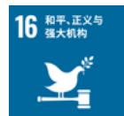

# 完善公司治理

我们严格遵循法律法规及监管要求，聚焦治理结构优化、董事会核心职能强化与董事专业能力提升，不断提升治理效能，为公司长远发展奠定坚实基础。

# 健全治理体系

我们遵守《中华人民共和国公司法》《中华人民共和国证券法》《上市公司治理准则》等法律法规，制定《公司章程》《股东会议事规则》《董事会议事规则》及各专门委员会工作细则等制度，构建由股东会、董事会和经理层组成的治理架构，形成权责清晰、分工明确、相互制衡、协调运转的高效治理机制。

公司治理架构  
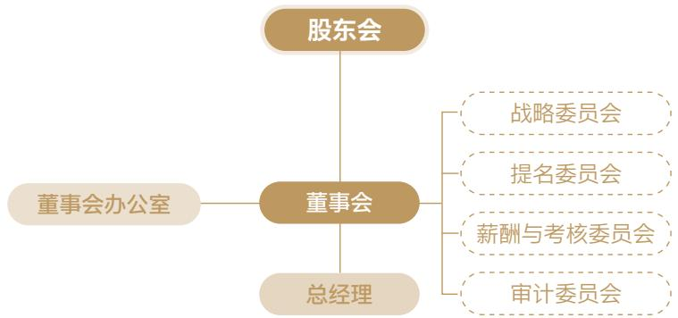

flowchart

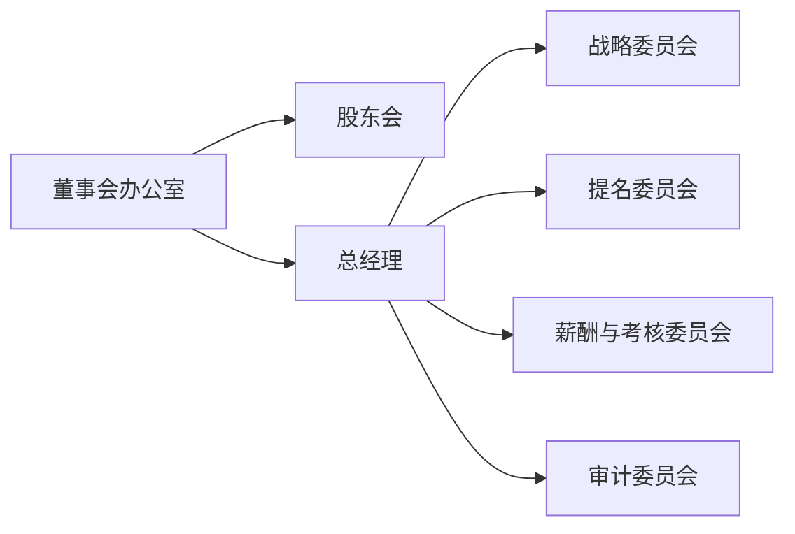
```mermaid
graph LR
  A["董事会办公室"] --> B["股东会"]
  A --> C["总经理"]
  C --> D["战略委员会"]
  C --> E["提名委员会"]
  C --> F["薪酬与考核委员会"]
  C --> G["审计委员会"]
```

股东会为公司最高权力机构，依法行使章程赋予的各项职权，维护公司及全体股东合法权益。

董事会为决策机构，对股东会负责，行使经营决策权，牵头建立健全并有效实施内部控制体系。

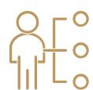

董事会下设战略委员会、提名委员会、薪酬与考核委员会、审计委员会四大专门委员会，配套制定议事规则，保障各委员会规范履职，提升董事会决策的专业性与科学性。

管理层为执行机构，负责落实董事会决议，统筹推进公司日常经营与内部控制具体工作。

# 各专门委员会

# 战略委员会

研究公司长期发展战略规划、重大战略性投资，评估相关机遇与风险，为董事会决策提供支持。

# 提名委员会

制定董事及高级管理人员选任标准与程序，遴选审核候选人任职资格，搭建专业多元的核心管理团队。

# 薪酬与考核委员会

制定董事及高级管理人员薪酬政策与方案，开展绩效考评，提升企业治理水平。

# 审计委员会

作为赋能公司风险管理的议事和决策机构，负责审核财务信息及披露情况，监督评估内外部审计工作和内部控制，行使《中华人民共和国公司法》规定的监事会的职权。

报告期内，公司依据《上市公司章程指引》《深圳证券交易所股票上市规则》等法律法规及规范性文件要求，结合公司实际情况，对《公司章程》《董事会议事规则》等26项制度进行更新与修订，并新制定《董事、高级管理人员离职管理制度》《市值管理制度》《未来三年（2025—2027年）股东回报规划》《舆情管理制度》等重要制度，进一步夯实治理基础，增强董事会及专业委员会规范运作与协同效率，持续提升公司治理水平。

召开股东会

2次

召开董事会

7次

董事会成员出席率

100%

# 董事会多元化

公司制定《董事会成员多元化政策》等文件，在董事选聘中考量专业经验、技能、知识、任期、地区、文化、教育背景、性别及年龄等多元化因素，持续优化董事会构成。董事会成员具备与公司战略发展相匹配的多元化专业背景，复合型专业知识结构为董事会在公司治理、战略规划、重大投融资决策及合规风控等方面作出专业审慎判断提供坚实支撑。此外，在管理层建设方面，公司持续推动管理团队多元化发展，报告期内，女性董事及高级管理人员占比22%。

董事会多元化结构  
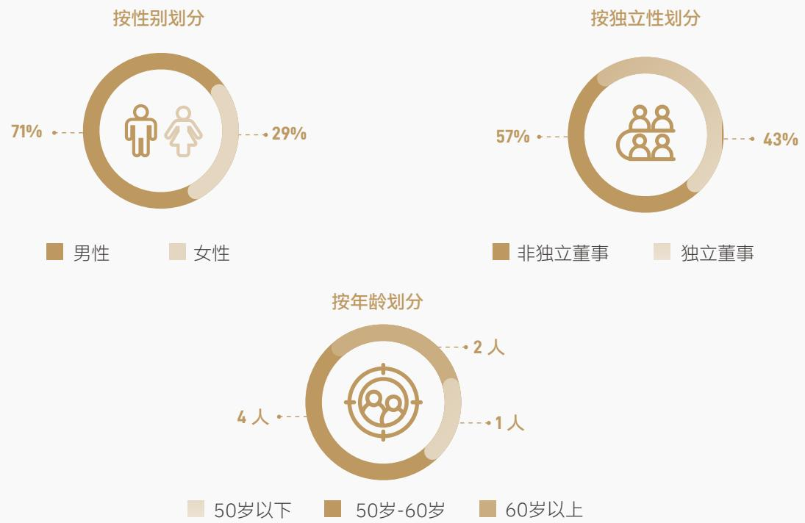

# 董事会独立性

我们持续完善《独立董事工作制度》及《独立董事专门会议工作制度》，明确独立董事的任职资格与履职要求，规定原则上最多在3家境内上市公司担任独立董事，确保履职的独立性与投入度。

独立董事依规独立、客观履行职责，按要求出席董事会及股东会，监督内部控制执行情况，就关联交易等涉及中小投资者利益的事项发表专业意见，切实维护全体股东特别是中小股东的合法权益。公司定期或不定期召开独立董事专门会议，组织实地调研与案例学习，搭建常态化沟通与赋能平台，支持独立董事充分发挥专业作用，为公司治理完善与战略发展提供建设性意见。

战略委员会独立董事人数2人，占比 $67\%$ ，召开会议次数1次

审计委员会独立董事人数2人，占比 $67\%$ ，召开会议次数6次

薪酬与考核委员会独立董事人数2人，占比 $67\%$ ，召开会议次数3次

提名委员会独立董事人数2人，占比 $67\%$ ，召开会议次数2次

# 董事会有效性

我们将治理有效性作为稳健发展的基石，每年对董事会规范运作与履职实效开展全面评估，确保其高效履职，强化治理核心功能，优化顶层制度架构。薪酬与考核委员会严格依据《公司章程》《董事会薪酬与考核委员会工作细则》等制度要求开展工作，对报告期内董事及高级管理人员履职情况进行评价与考核。报告期内，公司完成年度董事自评，对全体董事共7人开展履职情况评估。

独立董事管理方面，我们制定《独立董事工作制度》，从专业建议质量、风险预判能力、股东沟通成效等维度开展年度履职评价，并将结果作为续聘的重要参考，推动独立董事持续提升履职水平，为董事会科学决策提供有力支撑。同时，独立董事每年开展独立性自查并向董事会提交自查情况。

此外，我们持续健全董事及高级管理人员履职能力提升机制，定期组织参加深交所、证监局及上市公司协会等机构举办的合规与专题培训，结合邀请专业机构开展内部专项培训，重点覆盖公司治理、规范运作、信息披露及ESG等议题，持续提升履职专业能力。构建“培训—提示—考核”的闭环管理，将履职表现纳入年度绩效评价，强化学习成效与合规意识。

natural_image

Office desk with a laptop and electronic device, no visible text or symbols

# 投资者关系管理

我们通过真实透明的信息披露和多元畅通的沟通渠道，致力于与投资者建立透明、互信、共赢的良性合作关系，为公司长远发展凝聚力量。

# 信息披露透明

我们严格遵循信息披露相关监管要求，注重保障股东特别是中小股东的知情权，制定《信息披露管理办法》《信息披露暂缓与豁免业务管理制度》《重大信息内部报告制度》等内部制度，确保所有应披露的信息及时公平、真实准确地向市场传递。同时，中小股东可通过投资者热线、互动易平台、业绩说明会及策略会等多种渠道了解公司战略及运营情况，共同提升公司信息透明度。

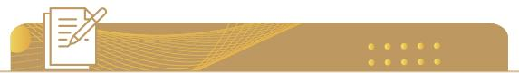

披露定期报告  
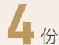

披露临时公告  
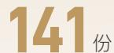

连续四年在深交所  
信息披露评价考核中获得最高评级  
A级  

# 畅通投关渠道

我们高度重视与投资者的双向沟通，面向机构投资者，开展一对一调研、闭门会议及专项路演；对中小投资者通过电话、线上平台与文字问答等进行交流；面向海外投资者发布英文版ESG报告，以增强信息的国际传播与理解；创新业绩说明会形式，将合规披露环节升级为“技术驱动型价值沟通平台”，提升信息传达质量。

此外，公司持续更新官网、微信公众号、视频号动态，结合媒体采访、现场参观等形式，多渠道加强与投资者沟通交流。报告期内，公司通过互动易平台共回复投资者提问133次。

# 重视股东回报

我们在推动自身可持续发展的同时，通过现金分红与股份回购计划，给予股东长期稳定的投资回报。报告期内，我们制定《未来三年（2025—2027年）股东回报规划》，建立对投资者持续、稳定、科学的分红回报机制，与全体股东分享沃特股份高速发展的红利。公司2023—2025年度累计现金分红金额占公司2023—2025年度年均净利润的91.56%。

2025 年现金分红（含税）  
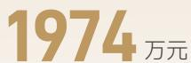

占归母净利润的比例  
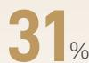

2025年度上市公司  
股东回报水晶球奖  

# 恪守商业道德

我们持续规范商业行为，坚决抵制商业贿赂、贪污腐败及不正当竞争行为，营造诚信、透明、廉洁的工作氛围，恪守合规经营、公平竞争底线。

# 反贪污反腐败

我们将廉洁文化建设全面融入经营管理各环节，注重对员工、供应商及其他合作伙伴的引导与规范。报告期内，公司未发生重大腐败或舞弊事件。

我们构建了由董事会监督、高级管理层统筹、审计部及相关职能部门执行的三级治理架构，审计部作为反贪污反腐败管理的专门部门，负责反腐倡廉宣贯、举报受理、线索跟进、监督检查及日常管理协调。董事会履行监督职责，高级管理层负责统筹推进反贪污反腐败管理工作，审计部会同相关部门负责制度落实、培训宣导、风险排查、举报受理及整改跟踪。相关治理机构成员具备审计监督、合规管理、内部控制、风险管理等方面的履职基础，并通过专题培训、警示教育等方式持续提升相关能力。

我们建立了较为清晰的信息获取与报送流程，由各部门、员工及相关方通过日常管理、内部沟通及举报渠道反馈相关信息，经审计部汇总后报送高级管理层，重大事项按程序报送董事会。公司通过定期汇报和必要时专项报告相结合的方式获取管理信息，并通过审阅重点事项、跟踪整改落实、监督制度执行等方式，对反贪污反腐败管理工作实施持续监督。

我们制定《沃特员工廉洁自律守则》，依托内部网络、公告栏、专题培训会议及警示教育案例等多种载体，开展廉洁政策宣贯与价值观传递，推动全员自觉筑牢廉洁防线。

举办反腐败培训次数  
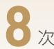

员工商业道德培训覆盖率  
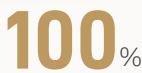

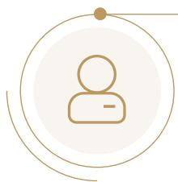  
对于员工

- 要求全体员工入职时必须接受廉洁培训，签署《廉洁从业承诺书》。  
- 要求采购、销售、财务、招投标等高风险岗位人员，参加廉洁风险防控与法律法规培训，采购人员签署《员工廉洁承诺书》。  
- 要求各级管理人员公开承诺廉洁从业，并在各类会议中持续强调廉洁要求。

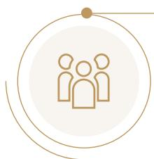  
对于供应商

- 在供应商准入流程中要求供应商签署《廉洁承诺书》，定期对供应商开展反腐倡廉相关培训，确保供应商提供符合规范的产品与服务。  
- 对供应商的商业道德行为实施持续监督，包括定期审核、必要时进行尽职调查、项目审计及合规检查等，情节严重的供应商将被列入黑名单并依据公司相关制度给予处罚。

# 反不正当竞争

我们严格遵守《中华人民共和国反不正当竞争法》《中华人民共和国反垄断法》及业务覆盖区域相关法律法规，恪守公平竞争原则，严禁垄断协议、滥用市场支配地位等违规行为，维护健康有序的市场环境。报告期内，公司未发生重大违反反垄断与公平竞争法律法规的情形。

我们已明确反垄断与公平竞争合规管理的三级治理架构及角色分工：董事会作为监督层，对反垄断与公平竞争合规管理承担监督职责；高级管理层作为管理层，负责统筹推进相关合规工作；法务、采购、人力资源、审计部等相关部门作为执行层，负责制度落实、风险识别、培训宣导、监督检查及信息报送。相关治理机构成员具备法律合规、采购管理、内部控制、审计监督及员工管理等方面的履职基础，并通过培训宣导等方式持续提升相关能力。

我们建立了由执行层收集报送、牵头部门汇总分析、高级管理层审阅、重大事项按程序报送董事会的信息获取与报送流程，并通过定期汇报和重大事项专项报告等方式获取管理信息；同时，通过审阅重点事项、跟踪整改进展、监督制度执行等方式，对反垄断与公平竞争合规管理工作实施持续监督。

我们制定《行为准则》，明确禁止不正当竞争、垄断及侵犯商业秘密等行为，严禁员工参与价格操纵、扰乱招投标秩序、交换敏感信息等违规操作。深入分析组织架构和业务流程，识别垄断风险点；不定期开展培训，提升员工合规意识；定期评估合规体系，结合法规变化及时调整完善措施，确保企业经营活动合法合规，推动可持续发展。公司定期举办反垄断与公平竞争的宣导与培训活动，2025年，共开展反垄断与公平竞争相关培训活动3次，参与人数61人。

# 规范举报机制

我们制定《反腐败风险防控与监管制度》，构建畅通安全的举报途径，严格的举报人保护机制以及清晰公正的处理流程，确保每一条举报均能得到及时有效的响应与处置。

# 举报途径

电话：0755-26880862

邮箱：lianjie@wotlon.com

传真：0755-26880966

邮编: 518055

地址：深圳市南山区西丽街道西丽社区留新四路万科云城三期C区九栋B座3101房（国际创新谷7栋B座3101房）

# 举报人保护

<table><tr><td>信息严格保密</td><td>严禁打击报复</td><td>提供保护支持</td><td>严惩违规行为</td></tr><tr><td>对举报人身份与举报内容严格保密,信息仅限必要调查人员知悉,调查过程中对举报内容和来源严格保密</td><td>明确禁止任何针对举报人的打击报复行为,包括但不限于降职、解雇、威胁或骚扰,并将此类行为列为严重违纪</td><td>若举报人面临明显风险,在法律允许范围内公司将提供调岗、安全建议等适当保护</td><td>对泄露举报人信息或实施报复的行为,一经查实,无论涉及何人,均予以严肃处理直至追究法律责任</td></tr></table>

# 举报处理流程

# 受理评估

按时完成举报登记，初步评估受理范围与可查性；符合条件的立即立案调查。

# 调查取证

组建跨部门/外部调查组并落实回避制度；一般案件15个工作日形成初步报告，复杂案件可延长并定期汇报进展。

# 处理决议

按权限报送调查报告和处理建议，经审议作出决定；视情节采取内部处分、经济追责、调整合作或移送司法等措施。

# 保障信息安全

我们高度重视自身及客户的信息安全问题，严格遵守《中华人民共和国数据安全法》等法律法规，制定并实施《信息安全管理制度》，明确职责分工、资产管控、访问权限、日常运维与安全培训事宜，筑牢信息安全防线。报告期内，公司未发生重大信息泄露或网络安全事件。

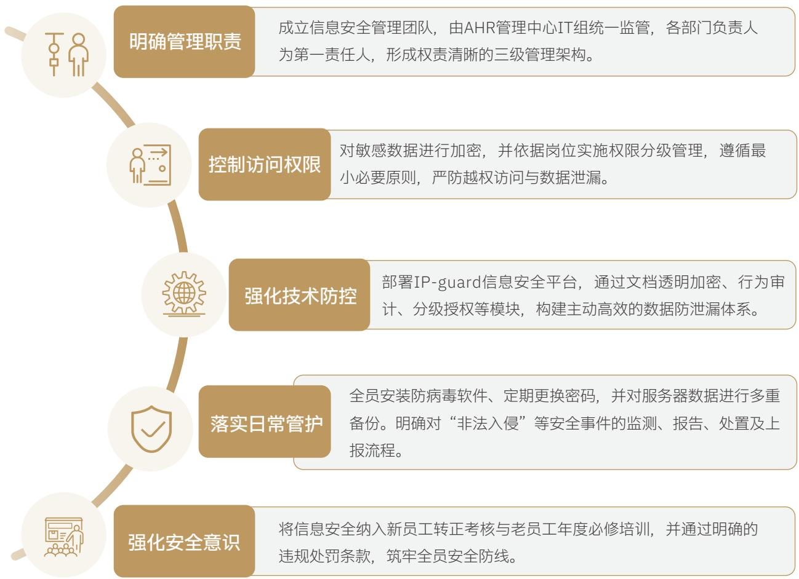

flowchart

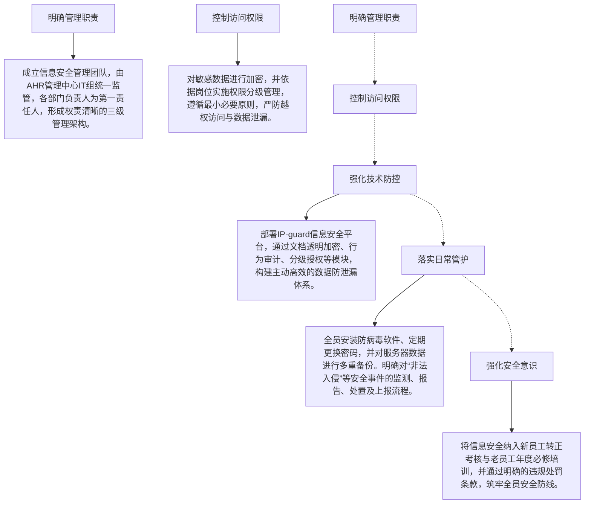
```mermaid
graph TD
  A["明确管理职责"] --> B["成立信息安全管理团队，由AHR管理中心IT组统一监管，各部门负责人为第一责任人，形成权责清晰的三级管理架构。"]
  C["控制访问权限"] --> D["对敏感数据进行加密，并依据岗位实施权限分级管理，遵循最小必要原则，严防越权访问与数据泄漏。"]
  E["强化技术防控"] --> F["部署IP-guard信息安全平台，通过文档透明加密、行为审计、分级授权等模块，构建主动高效的数据防泄漏体系。"]
  G["落实日常管护"] --> H["全员安装防病毒软件、定期更换密码，并对服务器数据进行多重备份。明确对“非法入侵”等安全事件的监测、报告、处置及上报流程。"]
  I["强化安全意识"] --> J["将信息安全纳入新员工转正考核与老员工年度必修培训，并通过明确的违规处罚条款，筑牢全员安全防线。"]
  K["明确管理职责"] -.-> L["控制访问权限"]
  L -.-> E
  E -.-> G
  G -.-> I
```

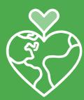

# 科技共生

# 塑造绿色未来

沃特股份积极响应国家“双碳”目标，坚持绿色高质量发展道路，将环境责任融入企业战略与经营，围绕经营对生态环境的影响设立严格目标，系统推进节能降耗与污染防治，主动应对气候变化风险，营造绿色文化氛围，以实际行动贡献沃特力量。

natural_image

Illustration of a robotic arm interacting with a large screen displaying data charts and network icons (no readable text or symbols)

# 涉及议题

环境管理

能源管理

水资源管理

降低碳排放

# 我们的行动

\- 应对气候变化

\- 强化环境管理

\- 创新绿色产品

\- 减少资源消耗

\- 控制污染排放

\- 传播环保理念

# 我们的绩效

环保投入金额 478.84 万元

无害废弃物总量 1032.08 吨

危害废弃物总量 337.47 吨

回收再利用废弃物总量 3245.83 吨

光伏发电总量 2871003 千瓦时

贡献联合国可持续发展目标（SDGs）：

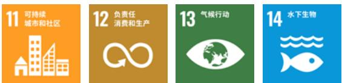

# 应对气候变化

我们遵循《联合国气候变化框架公约》等相关国际协定，结合自身业务特点，持续健全气候变化管理体系，制定《应对气候变化管理制度》，系统开展气候风险识别、评估与管理，为应对全球气候挑战及实现国家“双碳”目标贡献力量。

# 治理

我们将 “双碳” 目标和应对气候变化议题作为可持续发展的关键战略之一，建立以董事会为最高决策与监督机构的气候治理架构，将气候相关议题系统纳入公司ESG治理体系，自上而下推动监督与管理落地，形成职责清晰、运行有效的管理与监督机制。

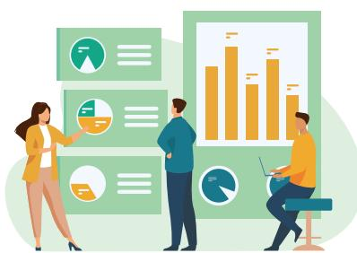

natural_image

Illustration of three people interacting with a large screen displaying bar charts and icons (no text or symbols)

公司定期组织气候与碳相关主题培训，加强相关岗位员工专业能力建设，确保其有能力参与公司气候相关策略的制定与落实。2025年，公司各生产基地开展专题培训，涵盖碳盘查、碳足迹等多方面。

公司建立了自下而上的信息报送机制，由子公司环境管理专员收集整理相关信息，报送子公司环境管理或EHS管理委员会，进一步汇总后提交高级管理层；重大事项按程序报送董事会。公司通过定期汇报与必要时专项汇报相结合的方式获取管理信息，并通过听取汇报、审阅重点事项、跟踪工作进展等方式，对气候变化相关工作进行监督。

# 气候变化治理架构

<table><tr><td>决策层</td><td>董事会
公司董事会对气候风险与机遇管理承担最终监督责任
↓
高级管理层
负责制定气候变化战略，公司高级管理层对气候风险与机遇管理承担直接管理责任</td></tr><tr><td>经营层</td><td>子公司环境管理或EHS管理委员会
负责气候风险与机遇的识别、排序、分析和管理，相关目标的制定及监督实施，并就风险及机遇向公司高级管理层汇报</td></tr><tr><td>执行层</td><td>子公司环境管理专员
负责气候具体工作落地并定期向环境管理或EHS管理委员会汇报进展</td></tr></table>

# 战略

我们持续关注气候变化带来的风险与机遇，依托气候情景分析系统评估其对公司业务、战略与财务的影响，并将相关因素纳入战略决策与顶层设计，强化前瞻性布局与韧性管理。

natural_image

Green icon depicting a computer monitor with a magnifying glass over a line chart, placed on a green base (no text or symbols)

# 气候情景分析

在TCFD（气候相关财务信息披露工作组）“治理、战略、风险管理、指标和目标”框架的指导下，我们从短期（1—2年）、中期（3—5年）和长期（6—10年）对气候变化的风险和机遇带来的影响进行识别与评估，并参考联合国政府间气候变化专门委员会（IPCC）共享社会经济路径（SSP）情景体系，选取高排放与低排放两类代表性情景（如SSP5-8.5与SSP1-2.6）开展气候情景分析：在低排放情景下，探索政策、市场与技术变化可能带来的转型影响，并为后续减排目标与路径研究提供参考；在高排放情景下，关注高温、强降雨、台风等物理风险对生产运营与供应链的潜在影响，识别适应与韧性提升方向。

为进一步优化资源配置，提高气候变化风险与机遇的管理效率，我们依据可能性、影响、时间等维度对识别出的气候变化风险与机遇进行排序，从而确定相关缓解与应对策略的优先级。

公司目前尚未开展气候变化风险量化分析。公司将持续关注监管要求、行业实践及利益相关方关注重点，在完善气候风险识别和数据治理基础上，适时评估相关分析的必要性与可行性，并根据业务影响变化及外部披露要求，稳步推进相关工作。

natural_image

Landscape photo showing a purple flower field beside a calm lake with bare trees and distant hills under hazy sky (no text or symbols)

气候变化风险清单与应对措施

<table><tr><td colspan="2">风险分类</td><td>风险描述及潜在影响</td><td></td><td>影响程度</td><td>影响时间</td><td>应对措施</td></tr><tr><td rowspan="2">物理风险</td><td>急性风险</td><td>·沿海区域每年夏季易受台风、强降雨等极端天气影响,台风和洪灾等极端天气事件发生频次以及严重程度增加,可能导致供应中断、生产中断等问题,进而增加运营成本及资产设备设施维护成本。</td><td></td><td>中</td><td>短期</td><td>·做好极端天气监测预警,制定灾害应急预案,每年开展突发环境事件应急演练和培训,提高对极端天气的应对能力。·在建筑工程上优先选用气候韧性基础设施,如抗震设计、防洪设计等。</td></tr><tr><td>慢性风险</td><td>·气温的持续上升导致公司需要增加运营场所的通风、制冷等措施,导致能源消耗及运营成本上升。·长期高温会增加员工中暑等高温突发疾病的概率,从而导致生产效率下降。</td><td></td><td>小</td><td>长期</td><td>·在建筑设计中增加自然通风设计,安装遮阳设施,减少对人工制冷的依赖。·在运营场所安装太阳能光伏板,利用可再生能源为制冷和通风设备供电,减少对传统能源的依赖。·定期开展高温防护培训,提高员工对高温天气的认识和应对能力,合理调整工作时间,定期进行员工健康检查。</td></tr><tr><td rowspan="4">转型风险</td><td>法规风险</td><td>·随着国家“双碳”目标的逐步落地,各地区在能源结构低碳转型、节能降耗等方面提出了明确的发展规划,可能需要投入额外成本以应对合规要求。·目前碳交易市场逐步普及,随着业务发展以及政府碳配额方式的调整,后续公司可能被纳入碳交易市场,存在需要购买配额的情况,导致运营成本的提升。</td><td></td><td>中</td><td>中、长期</td><td>·关注气候变化相关政策更新情况,及时调整战略规划。·加强与政府和监管部门的沟通,及时根据政策改变主动调整碳管理策略。·重视碳资产管理和开发;参与绿电交易、绿证交易、碳排放配额等。·厂区安装太阳能光伏,使用清洁能源,增加可再生能源使用比例。</td></tr><tr><td>技术风险</td><td>·若开发低碳产品方面投资过度或不足,可能导致投资损失或丧失机会的风险;低碳相关新技术或产品的研发可能面临失败的风险,导致资源浪费。</td><td></td><td>中</td><td>中、长期</td><td>·增加对节能和低碳技术的研发投入,开发更高效、更环保的产品。·对不同的低排放技术进行评估,选择最适合公司产品和市场需求的技术进行详细的成本效益分析,评估转型成本与预期收益之间的关系。·制定分阶段的转型计划,逐步推进低排放技术的应用。</td></tr><tr><td>市场风险</td><td>·客户对环保产品的需求变化可能影响企业市场份额,如未能及时转型,公司可能面临市场竞争力和市场份额下降的风险。</td><td></td><td>高</td><td>中、长期</td><td>·定期进行市场调研,了解客户需求和市场趋势,及时调整产品策略增加对绿色产品的研发投入,开发更环保的产品。·加强品牌建设,宣传公司的环保理念和产品优势,提升品牌知名度和客户忠诚度。·通过参加行业展会、发布白皮书等方式,展示公司在应对气候变化方面的积极行动和成效。</td></tr><tr><td>声誉风险</td><td>·在应对气候变化的大背景下,企业如果在环保方面表现不佳,被公众或媒体曝光,可能会引发声誉危机,影响各利益相关方、投资者和合作伙伴对企业的信任。</td><td></td><td>中</td><td>中、长期</td><td>·建立良好的企业环保形象,积极开展环保宣传活动,公开企业的环保行动和成果,加强与公众、媒体的沟通,及时回应社会关切,维护企业声誉。</td></tr></table>

气候变化机遇清单与应对措施

<table><tr><td>机遇类别</td><td>机遇描述及潜在影响</td><td>影响程度</td><td>影响时间</td><td>应对措施</td></tr><tr><td>产品与服务</td><td>·政府普遍倡导有助于低碳经济体系过渡的技术改进或创新,公司客户可能会倾向于寻求绿色低碳的产品和服务。·为了响应市场需求,公司将加快提供更多符合市场需求和期待的产品与服务,能够实现业务与营收长期可持续增长。</td><td>中</td><td>长期</td><td>·落实生产运营端的能源管理措施,提升资源使用效率,将绿色环保理念贯穿于产品生命周期各个阶段,持续研发低碳产品,满足客户需求。·加快提供更多符合市场需求和期待的产品与服务,推动可再生能源替代传统能源,采取能效提高的措施,持续提升自身应对气候变化的韧性。</td></tr><tr><td>资源效率</td><td>·通过节能技术、购买绿电、自发绿电、资源回收再利用等方式持续推进绿色运营理念,提高资源利用效率,可减少企业在生产过程中的资源消耗和废弃物产生,降低运营成本。</td><td>小</td><td>中期</td><td>·采用先进的制造技术和工艺流程,提高生产效率,减少资源浪费。·安装节能设备和可再生能源系统(如太阳能光伏板),减少对传统能源的依赖。</td></tr></table>

# 风险与机遇管理

我们将气候相关的风险管理纳入环境风险管理过程中，由各子公司环境管理或EHS管理委员会统筹推进气候相关风险管理工作，环境管理专员负责气候相关风险管理在生产基地的落实，确保及时跟进即将或可能发生的危机或问题。

# 识别

遵循国际可持续准则理事会（ISSB）发布的《国际可持续披露准则第2号——气候相关披露》（IFRS S2）框架，强化气候变化议题下的气候风险管理，主动识别公司面临的实体风险、转型风险与机遇。

# 评估

根据行业研究及外部建议，对气候风险与机遇的发生可能性、影响程度及重要性等级进行评估。

# 应对

系统性评估自身应对气候风险的能力，制定契合实际运营需求的管理策略，提前布局气候风险应对工作，有效缓解气候变化带来的风险冲击。

# 指标与目标

我们温室气体排放主要来源于生产运营过程中所消耗的汽油、柴油、天然气等产生的直接排放（范围一）及使用外购电力所产生的间接排放（范围二）。公司根据行业通行管理办法和温室气体计算方法，严格监控企业的温室气体排放量。报告期内，我们对运营控制范围内温室气体排放源进行识别，核算2025年温室气体排放数据，为减缓与适应气候变化、制定合理的气候变化应对政策和减排路径奠定基础。

光伏发电量

2871003 千瓦时

我们将基于自身产业布局、发展阶段、能源使用结构、碳排放现状及战略发展规划，开展科学研究，制定碳排放阶段性目标与长期目标，稳步推进减排与转型，力争在2060年前实现碳中和。

<table><tr><td></td><td>气候目标</td><td>完成情况</td></tr><tr><td>短期目标</td><td>2025年,沃特华本温室气体排放强度较2024年下降2%。</td><td>已达成 √</td></tr><tr><td>长期目标</td><td>到2060年前,实现运营层面范围一、范围二碳中和</td><td>正在推进</td></tr></table>

# 强化环境管理

我们秉持 “让科技与自然共生” 的绿色发展理念，以降低运营过程对生态环境影响为核心目标，持续健全环境管理体系，强化环境风险管控，开展环保培训宣贯，不断提升环境治理能力，推动企业运营与自然环境的长期和谐共生。

# 环境管理体系

我们严格遵守《中华人民共和国环境保护法》等法律法规要求，秉持“遵规守法，预防污染，节能降耗，持续改进”的环境方针，不断完善环境管理体系建设。

# 建立管理组织

董事会负责制定环境战略，由公司高级管理层具体指导环境议题管理。各子公司根据实际情况设立环境管理或 EHS 委员会，由公司领导和部门负责人组成，确保高层亲自管理环境事务。委员会制定环境政策、目标和计划，监督各部门执行。下设办公室或工作组负责具体实施、风险监控及汇报。各部门和员工明确环境职责，按环境方针和控制程序制定治理方案，落实环境治理任务。上述治理架构适用于本章中水资源管理、能源管理、包材管理、废水管理、废气管理、废弃物管理议题的治理架构。

为保障环境议题管理有效开展，公司通过内部培训、专题交流等方式持续提升环境治理机构成员相关能力。公司建立了环境管理信息报送机制，由各部门收集相关信息，经办公室或工作组汇总后报送环境管理或 EHS 委员会，再提交高级管理层；重大事项按程序报送董事会。相关治理机构通过定期听取汇报和重大事项专项报告等方式获取管理信息，并通过审阅重点事项、跟踪目标进展、督促整改落实等方式，对环境管理工作实施监督。

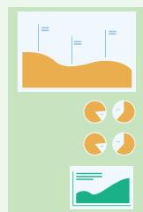

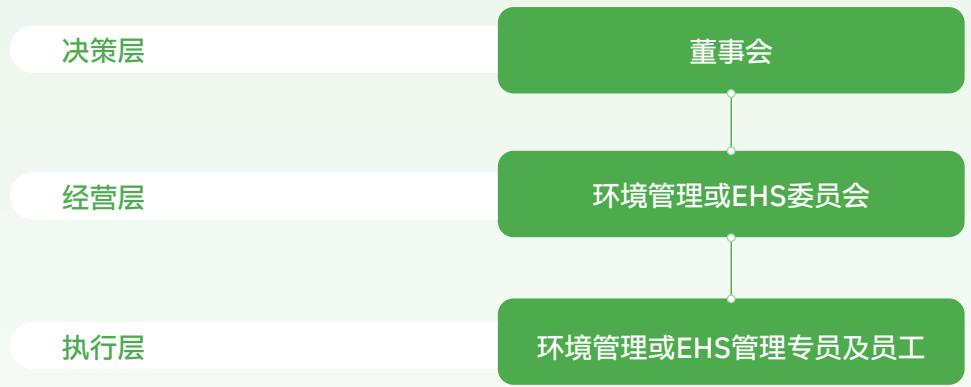

flowchart

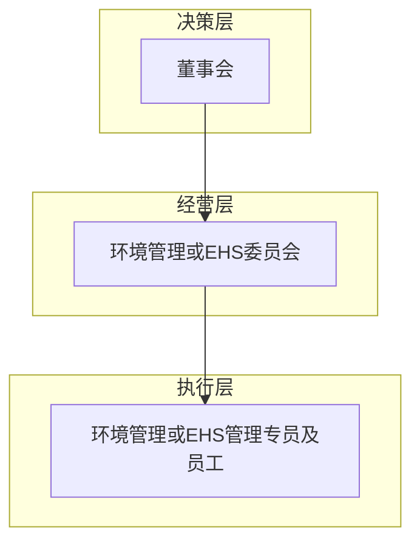
```mermaid
graph TD
  A["董事会"] --> B["环境管理或EHS委员会"]
  B --> C["环境管理或EHS管理专员及员工"]
  subgraph DecisionLayer ["决策层"]
    A
  end
  subgraph ExecutiveLayer ["经营层"]
    B
  end
  subgraph ExecutionLayer ["执行层"]
    C
  end
```

沃特股份环境管理架构

# 完善管理制度

建立覆盖环境保护规划、环保管理、建设项目环境管理、环境保护设施设备操作、环保设备运行维护、环境监测、环境报告、环境治理管理、环境保护监督检查、环境保护宣传教育和培训、环境风险排查及隐患整改、环境保护考核、突发环境事件应急管理等制度，严格规范各项环境保护相关工作。

# 强化环境监测

按照《排污单位自行监测技术指南》等文件要求，公司各厂区根据生产经营情况编制自行监测方案，定期对废水、废气、噪声等进行监测，确保其符合相关标准要求。报告期内，各厂区环境监测结果均达标。

# 推进清洁生产

贯彻落实清洁生产，制定《清洁生产管理制度》《资源循环利用规范》等制度文件，设立清洁生产领导小组，聘请第三方出具《清洁生产审核报告》，完善清洁生产实施方案，通过光伏发电站投建、老旧电机淘汰更新、挤塑机加热系统升级等系列技术改造，持续推动生产过程绿色化。

# 设立环境目标

各子公司依据业务发展及运营状况，分别针对水资源管理、能源管理、废水管理、有毒排放物和废物管理、温室气体排放管理设定环境目标，并定期对目标完成情况进行追踪、考核，不断提升自身环境管理水平。环保指标纳入绩效考核，建立环保考核制度，将环保指标纳入部门和员工的绩效考核体系，对环保工作成绩突出的部门和个人给予奖励。

环保总投入 478.84 万元，占营

业收入比例为 0.23%

7 家子公司通过 ISO 14001:2015 环境管理

体系认证

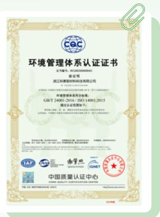

seal

浙江环保能源科技股份有限公司
GZQ 20010000000000
中国质量认证中心
中国质量认证中心
中国质量认证中心
中国质量认证中心
中国质量认证中心
中国质量认证中心
中国质量认证中心
中国质量认证中心
中国质量认证中心
中国质量认证中心
中国质量认证中心
中国质量认证中心
中国质量认证中心
中国质量认证中心
中国质量认证中心
中国质量认证中心
中国质量认证中心
中国质量认证中心
中国质量认证中心
中国质量认证中心
中国质量认证 Center
中国质量认证中心
中国质量认证中心
中国质量认证中心
中国质量认证中心
中国质量认证中心
中国质量认证中心
中国质量认证中心
中国质量认证中心
中国质量认证中心
中国质量认证中心
中国质量认证中心
中国质量认证中心
中国质量认证中心
中国质量认证中心
中国质量认证中心
中国质量认证中心
中国质量认证中心
中国质量认证中心
中国质量认证中心
中国质量认证Center
中国质量认证Center
中国质量认证Center
中国质量认证Center
中国质量认证Center
中国质量认证Center
中国质量认证Center
中国质量认证Center
中国质量认证Center
中国质量认证Center
中国质量认证Center
中国质量认证Center
中国质量认证Center
中国质量认证Center
中国质量认证Center
中国质量认证Center
中国质量认证Center
中国质量认证Center
中国质量认证Center
中国质量认证Center
中国质量认证Central Center

子公司环境管理体系认证证书

<table><tr><td>环境目标</td><td>2025年表现</td><td>完成情况</td></tr><tr><td>废水排放全年合规率达到100%</td><td>100%</td><td>✓</td></tr><tr><td>废气排放全年合规排放率达到100%</td><td>100%</td><td>✓</td></tr><tr><td>固体废弃物合规处理率100%</td><td>100%</td><td>✓</td></tr><tr><td>危险废弃物合规处理率100%</td><td>100%</td><td>✓</td></tr></table>

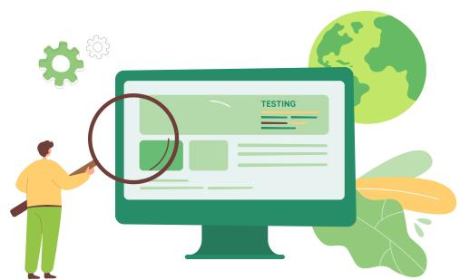

natural_image

Illustration of a person examining a computer screen displaying a test page, surrounded by green globe and gear symbols (no text or symbols on the screen)

# 环保培训宣贯

我们持续开展环保培训与宣传教育，定期组织集中环保培训，各分子公司围绕环保制度要求、污染物排放管控、环境风险识别与应急管理等主题开展专题学习，持续提升员工环保合规意识；在培训方式上，坚持集中学习与自主学习相结合，覆盖环保法规解读、节能减排知识与应急处置技能，强化员工环境素养与实操能力。报告期内，公司组织各类环保培训共计45场，员工环保培训参与873人次。

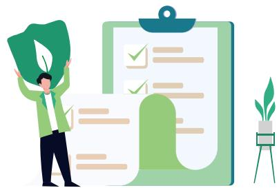

natural_image

Illustration of a person holding a green leaf next to a large clipboard with checklist and plant (no text or symbols)

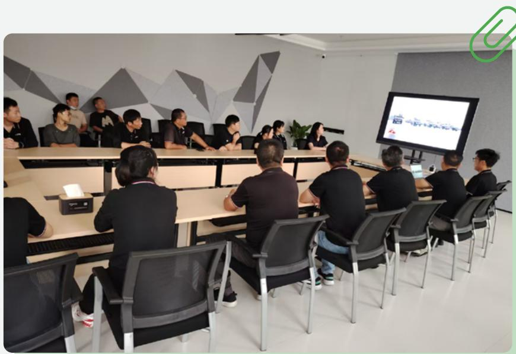

natural_image

Interior of a modern conference room with attendees seated around a long table, facing a presentation screen (no visible text or symbols)

子公司开展环境管理体系认证培训

子公司开展环境法律法规培训  
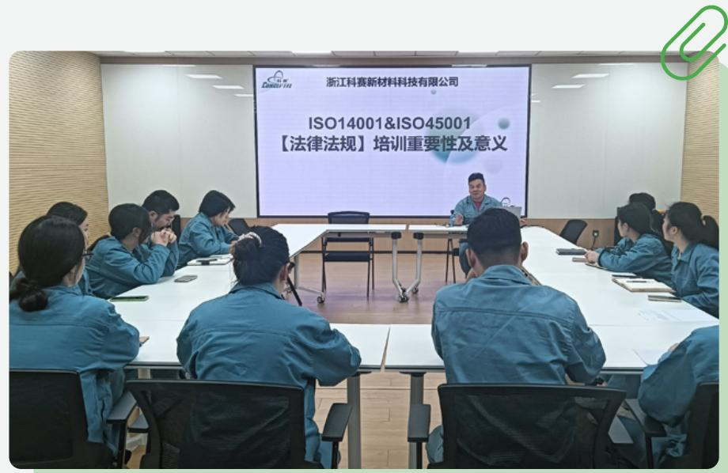

text_image

浙江科赛新材料科技有限公司
ISO14001&ISO45001
【法律法规】培训重要性及意义

# 创新绿色产品

我们致力于将可持续发展理念融入研发与产品战略，通过开发环保型特种高分子材料，为客户提供更具环境效益的解决方案，助力产业链降低碳足迹，推动绿色循环经济。

# 开发绿色环保材料

与中国科学院深圳先进技术研究院成立合成生物化学应用联合创新中心，该联合创新中心是深圳先进院对外合作设立的唯一名称为“合成生物化学应用”的联合创新中心。公司目前已实现利用合成生物技术单体，实现多种生物基高性能尼龙材料的量产和批量化销售。

# 推进材料绿色认证

积极布局材料环保认证体系，完成全球回收标准（GRS）认证，并获得多个消费后再生（PCR）产品牌号。积极寻求绿色原料，外购低碳排放的聚合物原料加工后出售给客户，为低碳环保贡献力量。

# 拓展绿色应用场景

在家电、消费电子、汽车及集装箱等领域大力推广PCR材料、生物基材料及热塑性弹性体（TPV）等环保替代方案；推出航空回收碳纤维绿色方案，以自主表面处理工艺实现废纤维再生利用，材料性能接近原生水平，碳足迹较原生材料降低约60%。

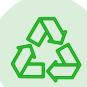

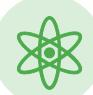

# 案例 $^{®}$ Wouper $^{®}$ 生物基材料方案——让可穿戴设备更轻、更透、更低碳

全球智能穿戴设备年销量超5亿台、每年产生的塑料垃圾达200万吨，传统石油基材料带来的碳排放与塑料污染问题日益严峻。沃特股份围绕可穿戴设备“轻量化+高性能+低碳化”的需求，推出Wouper®生物基材料系列，以可再生原料与材料创新为路径，为下游提供更可持续的材料选择。

# Wouper®生物基透明聚酰胺

>60%生物基含量，原料来自蓖麻油等非粮植物；较石油基PA6全生命周期碳排放降低65%（SGS认证）。

# Wouper®生物基聚酰胺弹性体

以可再生生物基碳替代石油基碳；在3D打印运动鞋中底应用中，能量回馈率达83%，碳足迹降低62%。

# Wouper®生物基长链聚酰胺

100%生物基含量，以可再生蓖麻油为原料；经SGS验证，全生命周期碳足迹较石油基尼龙减少5.8kgCO $_{2}$ /kg。

# 减少资源消耗

我们严格遵循国家相关法律法规，贯彻落实节约优先、高效利用的理念，持续提升能源、水资源及包材等资源管理能力，以实现资源节约与环境效益的统一。

# 水资源管理

我们严格遵守《中华人民共和国水污染防治法》《中华人民共和国水法》等法律法规，制定《水资源管理控制程序》，致力于在合规保障水源生态安全的同时，实现水资源集约化、高效化利用。

我们生产运营用水主要来源于市政自来水，辅以少量雨水利用，水源获取渠道稳定可控，不存在重大取水风险；公司运营所在地亦不位于饮用水水源保护区内。同时，我们持续完善水源保护相关措施，配套建设并运行污水处理系统，对生产过程中产生的污水进行规范收集与处理，确保达标后排入城市管网，降低对周边环境的影响。

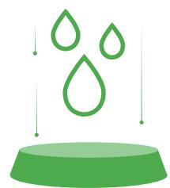

新鲜水耗用量 347299 吨

水循环与再利用总量

187688吨

# 升级节水设备

- 全面采用节水型卫生器具、水龙头及淋浴设施，减少生活用水。  
- 推广循环水冷却系统，实现冷却水高效回用。

# 推动循环利用

- 回收处理设备清洗废水，实现生产用水梯级利用。  
- 设置独立循环水系统与雨水收集系统，实现“雨污分流”，将雨水用于绿化灌溉等非生产用途，减少新水取用量，并提升用水效率。

# 培育节水文化

- 张贴节水标识，加强日常宣传，提升全员意识。  
- 设立节水奖励机制，激励员工主动参与，营造惜水氛围。

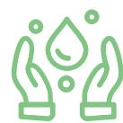

# 能源管理

公司能源消耗主要来自生产运营环节与办公用电。我们严格遵循《中华人民共和国节约能源法》等法律法规，制定《能源资源管理控制程序》等管理文件，围绕主营业务生产制造过程中的重点用能设备和工艺，公司持续完善能源管理体系，推进清洁能源使用、生产流程优化及用电结构调整，不断提升能源利用效率，推动节能降耗与提质增效协同实现。报告期内，公司屋顶光伏发电项目合计发电2871003千瓦时，所发电力优先用于生产运营，相应减少外购电力2871003千瓦时，占公司总用电量的4.14%。

# #

# 使用清洁能源

开展屋顶光伏发电项目，逐步降低生产过程对外购电力的依赖，推动电力结构向清洁化、低碳化转型。

在员工宿舍采用太阳能、空气能热水器供应热水，提高清洁能源在日常运营中的使用比例。

# 优化生产流程

烘料罐开展热能回收，实现省电15%。

优化模具加热系统，减少无效热损失，实现单台设备每年节能16800千瓦时。

改造挤塑机等高耗能设备，提升能源利用效率。

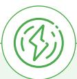

# 用电市场化交易

与具备资质的售电公司签订购售电合约，参与电力市场化交易，按照市场规则开展电力采购与结算。

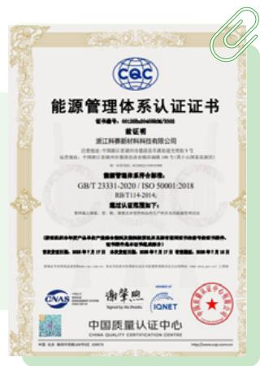

text_image

能源管理体系认证证书
证书编号：CCAC20181600000730
证书号：
浙江科赛新材料科技有限公司
注册地址：中国浙江省杭州市西湖区南汇路东侧19号
经营范围：中国浙江省杭州市西湖区南汇路东侧196号（需与山东省某地区）
ISBN 978-7-4-0000-0000
国家能源局系统联合检查站。
GB/T 233331-2020 / ISO 500012018
RBT114-2014
通过认证范围如下：
特许人姓名：李一、曾刚、黄永宏等管理机构负责产品生产技术及质量管理的认证。
《国家能源生产企业安全生产标准化培训管理办法》和《国家能源生产企业安全生产标准化培训考核管理办法》。
国家质量认证标准：2022年7月17日
国家质量标准：2022年7月17日
国家质量标准：2022年7月18日
中国质量认证中心
CHINA QUALITY CERTIFICATION CENTRE

子公司能源管理体系认证证书

# 案例

# 江苏新材料屋顶分布式光伏项目

为践行绿色运营，江苏新材料公司建成装机容量3MW的屋顶分布式光伏电站，项目充分利用2.6万平方米厂房屋顶资源。截至报告期末，已累计发电287万度，节约电费59万元，有效降低能源成本与碳足迹，实现了环境效益与经济效益的统一。

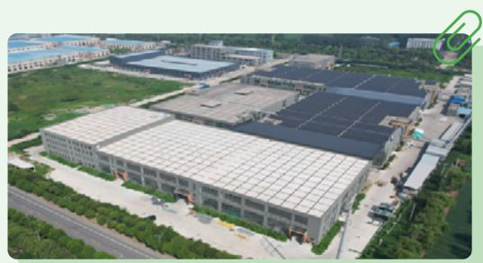

natural_image

Aerial view of a large industrial complex with multiple factory buildings and solar panels, surrounded by greenery (no visible text or signage)

江苏新材料屋顶分布式光伏项目

# 包材管理

我们严格遵守《中华人民共和国循环经济促进法》的相关要求，针对生产经营环节的不同包材类型实施相应管控措施，以提升资源利用效率，减少浪费。

沃特特种托盘、吨袋等循环使用率达

91%

建立严格的循环使用机制，通过管理系统全程追踪其流向，确保其在运输完成后能被及时回收、清洗、检修并投入下一轮使用，有效减少损耗。

鼓励客户在使用后返还吸塑盒，公司通过逆向物流将其回收，并经专业清洁和消毒处理后重新用于产品包装，形成闭环循环。

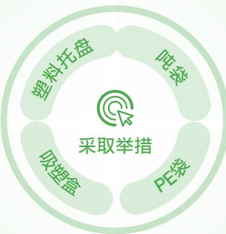

flowchart

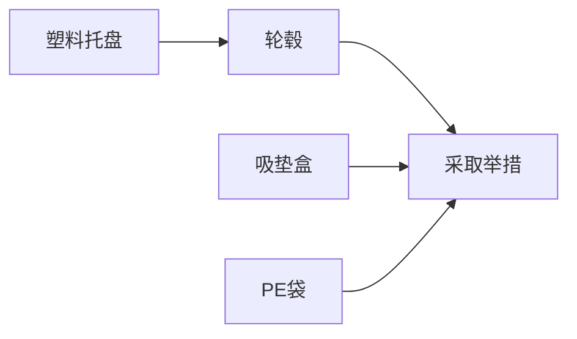
```mermaid
graph LR
  A["塑料托盘"] --> B["轮毂"]
  B --> C["采取举措"]
  D["吸垫盒"] --> C
  E["PE袋"] --> C
```

推行循环使用机制，在保障质量与安全的前提下，实现多次复用，降低一次性使用频次。

与供应商协同，对原料外包装PE袋在到厂后进行收集、分类、储存，以便在下次采购时重复使用，减少新包装需求。

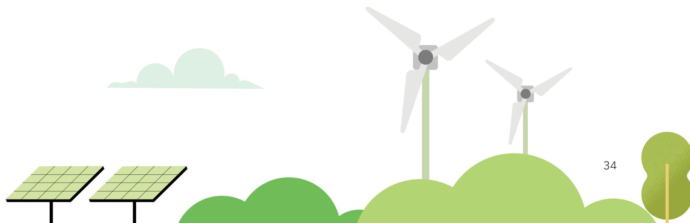

natural_image

Illustration of green solar panels, wind turbines, and clouds in a renewable energy context (no text or symbols)

# 控制污染排放

我们全面落实清洁生产与污染防治要求，系统推进“三废”治理，切实履行环保责任，助力绿色可持续发展。报告期内，公司未发生废气、废水排放超标或废弃物处置相关的违法违规事件。

# 废水管理

我们严格遵守《中华人民共和国水污染防治法》等法律法规，制定《废水管理控制程序》《废水污染管理制度》等管理文件，对废水实施全过程、规范化管理，确保处理与排放符合国家及地方标准。

我们按 “雨污分流、清污分流、污污分流、分级控制” 原则，设置生产废水、生活污水、雨水及清净下水排水系统：生产废水和生活污水经预处理后进入园区污水站深度处理达标排放；食堂废水先油水分离，再与生活污水合并处理后接入市政管网，由市政污水处理厂集中处理达标排放，并推动循环利用。

重庆智成化北生产废水与生活污水采用“厌氧+接触氧化+MBR”工艺处理，其中52%的处理水进一步经超滤一反渗透系统深度处理后回用，其余48%达标外排；报告期内累计实现循环回用水量9919吨。

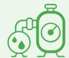

惠州沃特引入先进的循环水处理技术，确保冷却水在生产过程中得到高效循环使用，实现项目工业废水零外排。

# 废气管理

我们严格遵守《中华人民共和国大气污染防治法》《大气污染防治条例》等法律法规，制定《废气管理控制程序》，积极响应国家减少废气目标，通过装设气旋喷淋塔、活性炭吸附、RTO蓄热燃烧系统等先进设备，不断升级排放净化工艺，减少废气的产生和排放。

公司废气主要包括生产工艺废气、锅炉排放废气，生产工艺废气经活性炭吸附装置后达标排放，锅炉废气经净化后达标排放。此外，我们还定期邀请专业资质检测机构进行厂界废气排放监测，并做好环境监测报告，落实大气污染防治措施，确保所有废气达标排放。

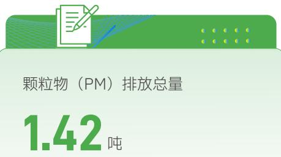

text_image

颗粒物（PM）排放总量
1.42 吨

江苏新材料投资 465 万元建设 RTO 焚烧炉废气处理系统，年减排 VOCs 约 4.545 吨。

# 废弃物管理

我们严格遵循《中华人民共和国固体废物污染环境防治法》，秉承“减量化、无害化、资源化”原则，制定《固体废弃物管理控制程序》，明确各部门职责与处置流程，根据废弃物性质实施分类管控与差异化处理，提升资源综合利用率。

对于可回收利用的一般固体废弃物，如废金属、废塑料等，交由专业第三方公司进行回收再利用；对于不可回收的一般固体废弃物则交由环卫部门进行处理。对于危险废物，按照要求建立危险废物台账，编制危险废物年度管理计划，建立危险废弃物集中管理仓库，并做好防护警示标识，委托具有危险废物处理资质的第三方机构进行处置。

减量化

无害化

资源化

无害废弃物总量 1032.08 吨

每百万营收产生的无害废弃物总量 0.50 吨

危险废弃物总量 337.47 吨

每百万营收产生的有害废弃物总量 0.16 吨

危险废弃物处理率 100%

回收再利用废弃物总量 3245.83 吨

阿德邦积极探索塑料回收再利用机制，将PTFE生产废弃物以有价方式交由具备再利用能力的合作方进行资源化利用，提升PTFE材料利用效率，减少一般固体废弃物产生。报告期内回收再利用PTFE生产废弃物6.34吨。

减少无害废弃物
产生

减少危险废物
产生

阿德邦对表面处理工序产生的活化液废液实施蒸馏回收，分离并回用有机化学品用于工艺循环使用，从源头减少化学品新增消耗与危险废液产生量，降低危废处置需求与环境影响。报告期内，

阿德邦表面处理板处理6.34吨，回收有机化学品0.34吨并全部回用，回收率42.70%。

# 传播环保理念

我们高度重视环保工作，通过倡导绿色办公、践行生物多样性保护相关举措，持续营造全员参与、人与自然和谐共生的企业文化氛围。

# 倡导绿色办公

我们积极践行绿色运营模式，打造绿色健康的工作环境，通过资源节约教育与日常宣传倡导绿色办公，共同构建低碳、节能、高效的办公生态。

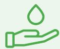

# 节约用水用电

落实 “人走灯灭、机停” 要求，更换节能灯具；定期巡检水电设施，杜绝 “跑冒滴漏” 现象；非工作时段关闭空调、电脑等非必要电源，减少能耗浪费。

# 绿色采购与循环利用

制定绿色采购标准，优先采购节能认证用品与设备；规范耗材回收流程，集中回收纸张、墨盒等可回收物，提高循环利用水平。

# 绿色办公环境

优化绿植配置，改善室内空气质量；设置分类垃圾桶并明确投放指引；开展绿色办公宣传，普及节能知识，营造全员参与氛围。

# 生物多样性保护

我们深知保护自然资源和生物多样性的重要性，严格执行国家生态保护相关要求。在项目建设选址阶段根据《环境影响评价技术导则—生态影响》等规定，组织开展生态影响评价工作，实现建设初期即避免涉及国家公园、自然保护区、生态保护红线等特殊或重要生态敏感区，并采取有效措施降低对生态环境的扰动，保护生物多样性。报告期内，未发生损害生物多样性的重大事件。

# 创新驱动

# 塑造产业新局

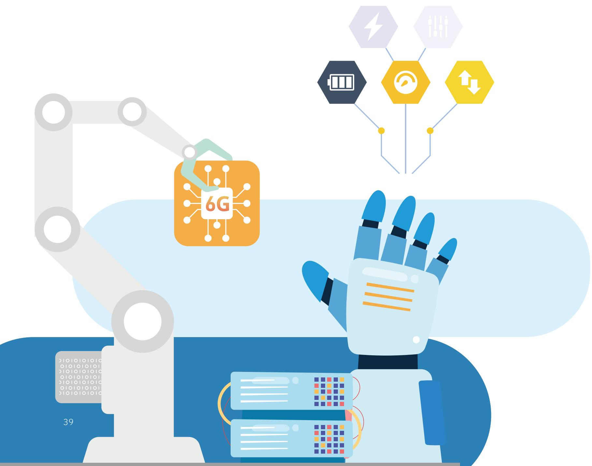

natural_image

Illustration of a robotic hand interacting with 6G technology nodes and digital icons (no text or symbols)

沃特股份立足国家创新驱动发展战略，锚定特种高分子材料前沿赛道，持续深化全产业链布局，完善质量管控与客户服务体系，强化研发创新与成果转化，突破关键核心技术，夯实产业链供应链安全韧性，在赋能行业高质量发展的同时，助力国家新材料产业强链补链，向着“全球一流材料方案提供者”的愿景稳步迈进。

# 涉及议题

产品安全与质量

客户服务与权益

创新发展

# 我们的行动

\- 深化产业优势

\- 追求卓越品质

\- 提供优质服务

\- 创新驱动发展

# 我们的绩效

客户满意度

96.22分

客户投诉解决率

98.85%

研发投入占营业收入比例为

6%

专利总数

434项

贡献联合国可持续发展目标（SDGs）：

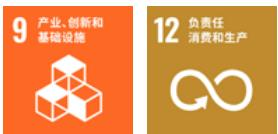

# 深化产业优势

我们致力于为全产业链提供高质量产品，为客户提供世界一流的全产业链高分子材料解决方案，助力全产业链高质量发展。

# 完善产业链布局

我们持续推进产业链一体化布局，深化业务整合与战略协同，强化特种高分子材料平台化建设，实现液晶高分子LCP、特种尼龙PPA、聚苯硫醚PPS、聚芳醚酮PAEK、聚砜PSF、含氟高分子PTFE等特种工程材料的全产业链覆盖，通过高附加值产品研发与产业链延伸，筑牢高端材料供应链自主可控根基，为高端制造业发展提供坚实支撑。

LCP 所有产品获得 UL（美国保险商实验室）认证

LCP（KB40HF3）获得 CQC（中国质量认证中心）认证

PEEK 通过 IATF 16949 质量管理体系认证

公司是中国大陆第一家 LCP 材料取得 EIS 绝缘系统认证的企业

公司相关产品通过 ISO 10993、NSF（美国国家卫生基金会）、KTW（德国饮用水行业）、WARS（英国水务法规咨询计划）及 ACS（法国卫生部饮用水接触）认证

# 夯实原料基础，实现核心树脂自主

实现LCP、PPA、PEEK、PSF等特种工程树脂的产业化合成布局，从源头把控材料品质与供应稳定性，打破部分高端原料依赖进口的局面，为全产业链协同发展奠定核心基础。

# 强化加工赋能，提供定制解决方案

通过多样化的材料加工技术，为下游客户提供满足不同使用需求的高/低介电性能、抗静电、屏蔽、轻量化、薄壁化、高强度、高韧性、导电、绝缘、阻燃、导热、导磁、耐磨材料产品，以及与产品相对应的模拟测试和加工工艺定制服务。

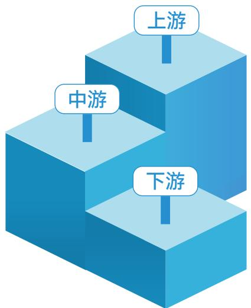

flowchart

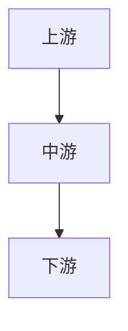
```mermaid
graph TD
  A["上游"] --> B["中游"]
  B --> C["下游"]
```

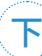

# 延伸产品形态，覆盖终端多元需求

为客户提供 LCP 薄膜、PTFE薄膜和成型制品，以及PEEK成型制品和热固性碳纤维复合材料制品，满足不同领域客户需求，打通“聚合-改性-成品制造”的产业链条。

# 案例

# 重庆基地LCP和PEEK项目正式投产，筑牢核心材料产能优势

2025年5月，沃特股份重庆基地20000吨/年LCP树脂材料项目（一期、二期）和1000吨/年PEEK材料项目（一期）进入正式生产期。不仅巩固了公司在特种材料领域的头部地位，也为特种材料自主可控注入强劲动能。

在LCP领域，公司LCP材料实际产能达20000吨/年，跻身全球规模领先的LCP供应商，有效支撑众多战略性新兴行业领域和未来产业领域需求；同时实现LCP材料“合成-改性-成型”的垂直整合，能够更精准把控产品性能，充分满足下游高端场景的严苛要求。凭借突出的技术实力与产品竞争力，公司LCP产品入选工信部替代目录，有力支撑头部企业突破供应链自主可控困局，助力中国高端制造业供应链自主可控。此外，2025年公司承接的中央预算内资金LCP薄膜项目顺利通过验收，未来将推动LCP薄膜在高端电子器件等领域的产业化进程，从而显著提升产品附加值并强化技术壁垒。

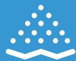

公司LCP实际产能达

20000吨/年

公司LCP产品入选工信部替代目录

在PEEK领域，公司已突破连续聚合工艺的关键技术壁垒，实现了PEEK树脂分子量分布的精准调控，使产品性能持续优化。依托“聚合-改性-成品制造”的全产业链优势以及在半导体等高端应用领域的协同突破，公司将进一步强化PEEK的全链条自主可控能力。

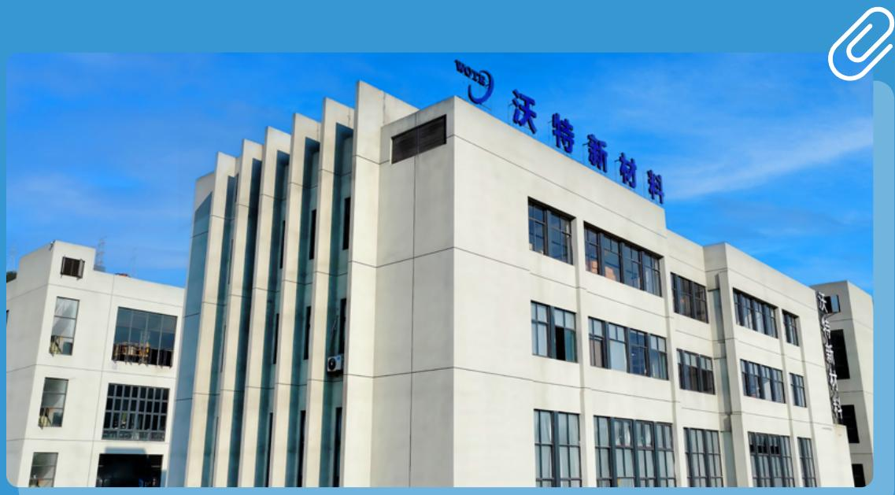

text_image

沃特新材料
沃特新材料

# 案例 惠州热固性碳纤维复合材料产线投用，拓展高性能材料新赛道

在国家 “十四五” 新材料产业发展规划指引及 “双碳” 目标驱动下，沃特股份积极推进高性能复合材料领域布局，旗下惠州特种基地热固性碳纤维复合材料产线顺利投用，满足无人机、电子、机器人等行业需求，以及下游客户在片材、板材和管材方面的轻量化和高强度需求，不仅为公司经营发展开辟了新的业务增长点，更进一步完善了特种材料平台化布局，提升了在高端材料供应链中的自主可控能力。

# 案例 全资收购华尔卡密封件，加码半导体产业链布局

2025年，沃特股份正式签署协议，收购日本株式会社华尔卡旗下华尔卡密封件制品（上海）有限公司（现更名为“上海沃特华本密封件制品有限公司”）100%股权，成为部署半导体高端材料领域的关键举措，将进一步巩固公司在特种高分子材料领域的综合解决方案能力。依托旗下子公司浙江科赛、沃特华本半导体两大半导体氟材料制造基地，整合沃特华本密封件在高端密封制品方面的技术及客户资源后，公司有望打造全球第一氟材料制品平台，并形成行业内最完整的半导体部件解决方案，进一步提升公司在半导体及核能等高端装备领域的产品与技术实力，为产业链高端化升级注入强劲动能。

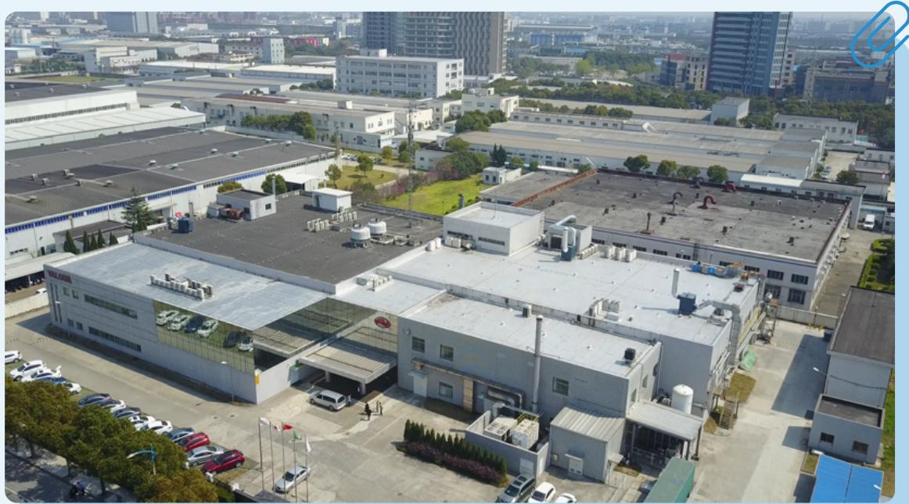

natural_image

Aerial view of a large industrial complex with multiple factory buildings and surrounding urban skyline (no visible text or signage)

上海沃特华本密封件制品有限公司

# 塑造人类美好生活

我们凭借特种材料 “合成-改性-加工成型” 的全产业链优势，持续提升核心竞争力，产能逐步落地，在众多战略性新兴行业领域和未来产业领域的应用持续突破，通过关键材料国产补链强链，让科技更贴近生活，用高品质材料为人类美好生活筑牢根基。

# 高频通讯及高速算力材料解决方案

在高频高速通信领域，LCP材料打破海外垄断，为客户提供多种通讯频率下的介电常数材料选择，高频信号损耗低，已成为全球领先的电子供应链企业的材料供应商；布局多年PTFE薄膜得到国内和美国高频高速PCB线路板客户的认可。

在服务器领域，打造业内最完整的全系列散热材料方案覆盖超高转速风冷场景，成为高速算力的核心材料。手机主动散热风扇材料实现量产，相关材料还适用于机器人关节等场景。

# 低空飞行器及机器人材料解决方案

在无人机飞控材料领域，为多领域无人机提供轻量化材料解决方案，针对低空飞行器需求开发的相关材料实现量产，新投入的碳纤维复合材料产线可提供桨叶等成型产品，满足高负载需求。

在机器人材料领域，针对机器人旋转电机小型化、轻量化要求，公司开发的高流动性电机定子包胶材料，有效降低定子包胶厚度至0.1毫米，可减重30%—50%，相关产品已经得到机器人产业链客户的认可。

电机定子包胶材料可应用于人形机器人，可减重30%\~50%

# 半导体材料解决方案

在半导体材料领域，收购沃特华本半导体后，已实现业务整合与战略协同，在为全球头部半导体设备商稳定供货的基础上，成功完成对国内半导体头部客户的产品开发与导入。2025年9月，收购日本华尔卡所持华尔卡密封件制品（上海）有限公司100%股权，补齐半导体部件全产业链条，形成行业内最完整的半导体部件解决方案，推动全球最大氟材料制造平台产能加速释放。

# 案例 沃特股份PEEK——用材料革命，让机器人更懂生活

机器人跨越实验室，走进工厂、家庭，机械臂从重复劳动到完成精密手术……沃特股份Durakraft™ PEEK以材料创新打破物理极限，正在成为“关节革命”首选，极大程度上解决了机械臂痛点，让机器人成为美好生活的“得力助手”。

# 轻量化与长续航，适配多元场景

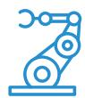

密度仅为 $1.3 \mathrm{~g} / \mathrm{cm}^{3}$ ，比铝合金轻 $50 \%$ ，强度媲美金属，续航提升 $30 \%$ ，大幅降低机械臂负载能耗。

# 超耐磨与长寿命，减少使用顾虑

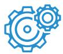

摩擦系数低至0.1，无需额外润滑，齿轮寿命达200万次，远超普通尼龙（40万次）和金属（易锈蚀），寿命提升5倍，大大延长使用周期，降低维护成本。

# 耐高温与抗疲劳，适配复杂环境

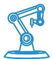

260°C高温下机械性能不衰减，避免传统材料因电机发热导致的变形风险，实现极端环境“零变形”，拓宽机器人服务边界。

# 全产业链自主可控，贴合个性需求

从PEEK树脂合成到改性造粒、型材加工全流程自主可控，定制周期缩短70%。导电PEEK消除静电吸附，可保障精密电子元件的抓取安全。3D打印级PEEK支持复杂镂空结构，让机器人能根据个性化需求灵活适配，真正成为贴合人类生活的“定制化助手”。

# 追求卓越品质

品质是企业发展的基石。我们不遗余力追求产品品质，不断加强质量管理与品质控制，优化和改善产品质量，以卓越的品质赢得客户和市场认可。

# 深化质量管理

我们始终将质量置于发展战略的核心位置，确立董事会负责、总经理为质量管理最高管理者、品管部具体负责的质量管治架构，并通过ISO 9001、IATF 16949、IECQ QC 080000等质量管理体系认证，严格遵守《中华人民共和国产品质量法》等法律法规，制定《质量手册》《工艺管理程序》《产品检验控制程序》《不合格品控制程序》等质量管理制度，每年明确质量目标和达成计划，强化质量考核落地，筑牢质量管理基础。

# 构建“三道防线”的质量管理架构

# 第三道防线

# 第二道防线

# 第一道防线

# 高层领导与跨部门机构

最高管理者对质量负最终责任。由高层和各部门负责人组成的质量与成本委员会定期评审质量绩效，解决重大质量议题，推动跨部门改进项目。

# 质量职能部门（质量体系与保证）

品管部作为质量管理体系构建与维护者以及产品验证者，独立行使质量否决权，保障质量体系有效运行。

# 业务部门（质量所有者）

研发部负责质量设计，从源头把控产品质量。生产部负责质量制造，规范生产过程质量管控。供应链负责供应商质量管理和来料质量，筑牢上游质量屏障。

# 实施动态化质量风险管控

# 预防措施与预案

针对中高风险项，制定并落实具体的预防措施与应急预案，通过防错技术、流程优化、冗余设计等手段，降低质量风险发生概率与影响。

# 持续监控与回顾

对关键风险点实施动态监控，定期召开质量风险评审会，更新风险清单与管控措施，形成闭环管理。

# 推进闭环化质量投诉与改进

# 渠道畅通与快速响应

设立客户服务热线、在线平台等多渠道投诉入口，承诺在规定时限内响应。建立重大质量问题快速上报与处理机制。

# 根因分析与纠正预防

运用各类工具对每起质量投诉进行深度根本原因分析，制定并实施有效的纠正与预防措施。

# 信息共享与闭环验证

将投诉处理中发现的问题及改进措施在公司内部相关部门共享，横向展开排查。对措施的有效性进行跟踪验证，确保问题闭环，防止再发。

# 提升产品质量

我们秉承“质量第一，顾客至上”的理念和“不断创新，追求零缺陷；关注顾客，使顾客满意”的质量方针，加强全流程质量检验与管控，不断优化生产过程的质量管理措施，强化原材料、工艺控制和成品出货的质量控制，确保向市场提供高标准、高质量、高价值的产品。

# 设计源头管控

在产品研发与设计阶段，导入相关工具，确保设计输出满足质量与可靠性要求。

# 来料质量控制

对供应商实施严格的准入审核与绩效管理，所有关键物料均执行进料检验，并利用统计技术进行质量数据分析，从源头保障材料一致性。

# 过程质量监控

在生产制造各关键工序设立质量控制点，操作员自检、巡检与专检相结合。

# 成品出厂检验

每批产品出厂前均依据严于客户要求的内控标准进行全项目或抽样检验，确保交付产品100%合格。

# 产品质量改进

定期开展质量会议，分析产品不良原因，制定产品改善对策；定期开展质量改善活动，每月总结制定TOP改进事项。设立质量改善激励项目奖金，鼓励员工提出合理化改善提案，推动产品质量改进。

# 培育质量意识

我们积极打造质量文化，开展常态化质量意识培训与宣贯，营造重视质量、追求质量、关注质量的氛围，让“质量意识”深入人心。

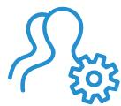

# 提升质量技能水平

针对管理层、质量专业人员、一线员工等不同对象，设计并实施差异化的质量培训课程，内容涵盖质量理念、工具方法、标准规程等，提升员工专业技能和质量意识。

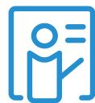

# 营造质量文化氛围

通过内部宣传栏、质量月活动、质量知识竞赛、评选“质量标兵”等形式，营造“人人重视质量、人人创造质量、人人享受质量”的浓厚文化氛围。

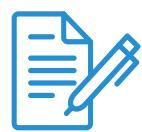

# 强化质量绩效考核

公司高层管理者定期参与质量评审会议，传达质量承诺，以身作则，将质量目标纳入各部门及员工的绩效考核体系。

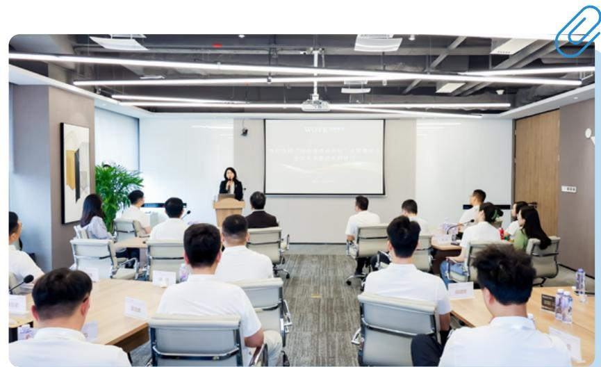

text_image

Conference room photo with visible presentation screen and attendees, showing Chinese text on screen and nameplates

# 提供优质服务

我们坚持服务至上，不断完善客户售前、售中、售后服务与客户满意度管理机制，深入了解和满足不同客户的需求和期待，以更优质的产品和服务回馈客户与社会的信任。

# 完善服务管理

我们不断完善客户服务管理体系，通过《与客户有关过程控制程序》等制度明确规定售前、售中及售后规范服务流程，加强营销风险和机遇识别与评估，按照《信息沟通控制程序》与客户保持良好沟通，维护客户关系。

# 规范客户服务流程

通过多种渠道收集市场需要、技术动向、客户要求等信息，寻找潜在客户并建立《客户档案》；根据客户要求，进行产品报价及送样；对客户进行技术服务。

# 售前

# 售中

# 售后

按《订单处理过程控制程序》进行订单评审、生产、交付、变更沟通等。

出现质量、交付等问题，投诉和退货按《客户投诉、退货及产品召回作业指导书》进行处理；定期对客户满意度调查。

# 畅通多元沟通渠道

- 通过网上宣传、订货会、参展及派发宣传资料等形式，向顾客介绍公司产品的信息，为顾客了解产品提供机会。  
- 通过主动拜访、问询、调查等方式，了解顾客需要及对产品质量的要求。

# 坚守合规经营底线

- 严格落实客户信息保护责任，与客户签署保密协议及相关协议，筑牢客户信息安全防线。  
- 推行负责任营销理念，完善营销人员管理、合同管理及CRM系统管理制度，确保营销活动合规有序、透明诚信。

# 客户投诉处理

我们高度重视因产品质量问题导致的客户投诉、退货或产品召回问题，制定《客户投诉、退货及产品召回作业指导书》，着力规范相关处理流程，推进客诉改善措施实施，以实际行动保障客户权益，挽回客户信任。

<table><tr><td></td><td>2023</td><td>2024</td><td>2025</td></tr><tr><td>已售或已运送产品总数中因安全与健康理由回收的百分比(%)</td><td>0</td><td>0</td><td>0</td></tr><tr><td>客户投诉解决率(%)</td><td>98.50</td><td>98.65</td><td>98.85</td></tr></table>

# 规范投诉处理流程

根据客户反馈的不良信息，分析产生不良的根本原因，制定解决问题的临时措施、根本措施、预防措施等。

对于不涉及合同质量规定及质量管理体系的反馈信息，由营销部会同有关部门决定处理方法，并通知顾客。如果顾客反馈的信息直接涉及产品质量及质量管理体系的问题，按《纠正预防措施控制程序》执行。

客户投诉后，立即和客户沟通异常处理方案，在24小时内确定临时措施，5个工作日内回复品质异常改善报告。

对于客户投诉处理的第一反馈必须在2个工作日内完成，当顾客提出产品退货换货要求时，按《订单处理控制程序》进行处理。

# 退货、换货、召回处理

# 退货

确认退货原因及数量，确认退货品状态（原料或水口），安排退货。对退货品进行隔离，必要时复检确认品质，并开具《不合格品评审报告》，退货品移至不良品区。

# 换货

按《订单处理流程》处理，并安排换货。

# 召回

对于已经出售的产品，因客户投诉或内部检查确认存在品质问题，对待召回产品进行不合格品评审，确定召回数量，并联系召回事项，立即安排合格品满足客户需求。

客户投诉、退货及产品召回处理流程  
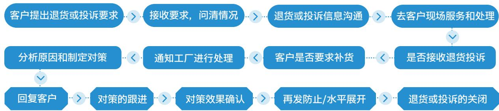

flowchart

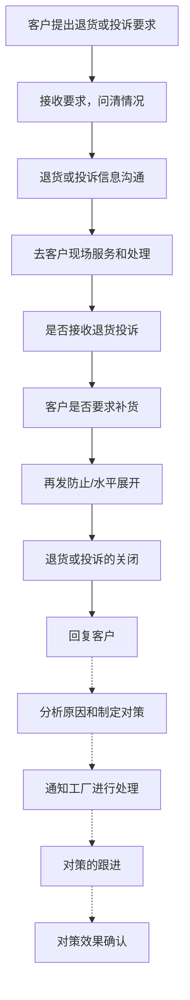
```mermaid
graph TD
  A["客户提出退货或投诉要求"] --> B["接收要求，问清情况"]
  B --> C["退货或投诉信息沟通"]
  C --> D["去客户现场服务和处理"]
  D --> E["是否接收退货投诉"]
  E --> F["客户是否要求补货"]
  F --> G["再发防止/水平展开"]
  G --> H["退货或投诉的关闭"]
  H --> I["回复客户"]
  I -.-> J["分析原因和制定对策"]
  J -.-> K["通知工厂进行处理"]
  K -.-> L["对策的跟进"]
  L -.-> M["对策效果确认"]
```

# 提升客户满意度

我们按照《满意度调查控制程序》进行客户沟通及满意度管理, 每年进行客户满意度调查, 对公司产品品质、交货、工程能力、服务等进行评分, 及时统计分析、跟进不满意的改进, 力求不断提升品牌力, 提供客户满意的产品及服务。

<table><tr><td></td><td>2023</td><td>2024</td><td>2025</td></tr><tr><td>客户满意度(分)</td><td>95.36</td><td>95.85</td><td>96.22</td></tr></table>

# 创新驱动发展

创新是引领发展的第一动力。我们以“塑造人类美好生活”为使命，持续加大研发投入鼓励自主创新，提升公司技术核心竞争力与可持续发展能力。

# 完善研发体系

我们以打造业内领先的“特种高分子材料平台化公司”为目标，持续完善创新研发机制，始终保持高研发投入，激发创新活力，推进科技自立自强。

- 国家首座万吨级 PPE 项目发起单位  
- 国家级重点专精特新“小巨人”  
- 中国合成树脂协会副理事长单位  
- 中国合成树脂协会特种材料分会会长单位  
- 国家级 CNAS 认可实验室  
- 国家某核心攻关项目承担单位  
- 国家级标准起草单位  
- 工信部高速连接器“一条龙”应用示范参与单位

全年研发投入

12293 万元

占营业收入比例为

6%

公司拥有研发人员

272人

占员工总数比例为

18%

# 明确创新研发目标

- 以特种高分子材料平台化为核心，攻克关键材料自主可控难题，聚焦前沿场景材料创新，推动全产业链低碳转型，打造全球一流材料方案提供者。  
- 沃特智成制定产品研发通过率 $100\%$ 的目标，并定期跟进目标完成情况。2025年，公司达成产品研发通过率目标。

# 完善创新管理体系

\- 健全组织决策机制，由董事会及公司经营层负责研发创新工作的顶层设计与决策，研发中心作为归口部门，具体负责研发项目的落地实施与日常管理，明确了董事会、高级管理层与执行部门三级治理架构的角色与权责，形成“决策-执行-管控”全流程闭环。

  
决策

  
执行

  
管控

- 加强研发制度建设，建立健全《研发组织管理制度》《科研创新工作管理规定》《专利管理制度》《科研经费管理制度》等创新管理办法。  
- 构建多元创新平台，拥有国家级CNAS认可检测实验室、广东省工程技术研究开发中心、广东省院士专家企业工作站、江苏省外国专家工作室四大核心平台，同步布局各分公司研发中心。依托华南研发中心，打造尼龙聚合中试平台、碳纤维复合材料中试平台、高温材料改性中试平台、耐磨功能材料测试平台、5G介电材料测试平台、结构件疲劳测试平台，全面覆盖材料研发、测试、中试全环节。

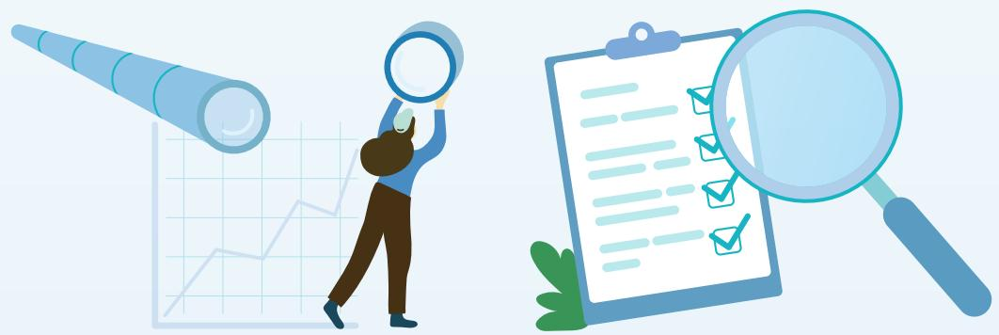

natural_image

Illustration of a person examining a checklist with magnifying glasses and a line chart (no text or symbols)

# 加强研发团队建设

- 组建由材料领域院士、专家和学者引领的研发团队，储备涵盖高分子材料、化工、工业设计、材料科学、分析化学、无机化学等多结构专业学科的人才队伍。  
- 完善研发人员培养制度，从应届毕业生中优选储备人才，通过三年系统化培养，使其培养成为符合需求的研发工程师人才。

# 优化研发创新激励

制定《科技成果转化实施与奖励制度》等制度，设立专项创新奖励机制，从成果转化、技术攻关、创新提案等多维度激励员工参与研发创新，并明确将研发工作纳入绩效考评体系，充分释放团队创新潜能，为企业长远发展注入持续动力。

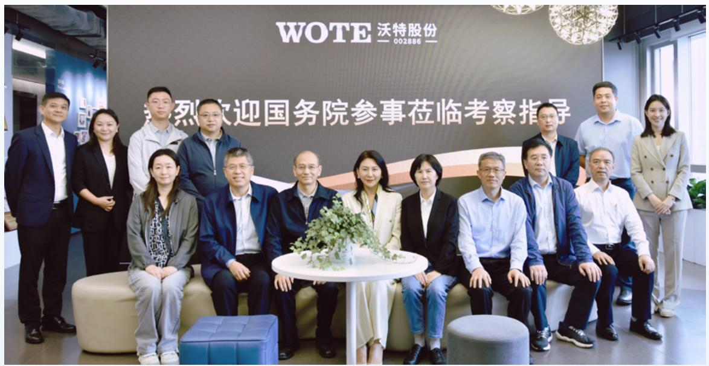

text_image

WOTE 沃特股份
002886
热烈欢迎国务院参事莅临考察指导

2025年10月29日，国务院参事室调研组一行莅临沃特股份开展“优化民营科技企业创新生态赋能民营经济高质量发展”专题调研，调研组深入了解沃特股份的发展历程、产业布局与技术创新成果。沃特股份表示，唯有聚焦核心价值、坚持持续创新，才能实现可持续发展。

# 创新成果丰硕

我们积极参与行业标准制定，主动承担关键核心技术攻关项目和国家重大科技项目，持续推动科技创新成果转化，不断提高自主创新成果专利保护水平，助力行业高质量发展。江苏特种《高性能膜级液晶聚合物制备与薄膜成型关键技术研发》项目成功入选江苏省前沿技术研发计划项目，系盐城市唯一。

拥有专精特新企业

5个

累计参与制定国家及各类标准

76项

拥有授权专利434项，其中近半数为国际发明专利

# 创新突破攻坚

# 低熔点聚醚醚酮LP-PEEK

在 SLS 3D 打印场景的专业应用中，凭借流动性能优异、粒径精准、形态良好、成型稳定的核心优势，助力高端制造实现从设计到制造的高效转化。

# 高性能生物基PA46树脂

融合生物基原料与极致工况性能，兼顾高强度、耐候性、加工性与环保属性，适配齿轮、变压器、连接器等高端制造部件。

# 新型PPA6T/DT树脂

凭借耐高温、高精度、高强度、易成型、耐湿热、轻量化六大核心优势，重新定义特种材料应用标准，专为高温、精密、高载荷场景打造的全新高性能PPA树脂。

# 推进成果转化

积极推进研发专利项目成果转化，2025年提交多个研发项目转化申请，相关转化成果可广泛应用于电子电器、特殊工况、汽车新能源等行业，为下游客户提供高价值专利技术支撑。

# 保护知识产权

我们不断完善知识产权保护体系，构建由高层牵头的知识产权管理组织架构，由研发、董办等部门负责日常工作落实，明确董事会、高级管理层及执行部门三级治理架构的角色与权责，对知识产权的创造、申请、维护、许可、转让及处置等环节进行全流程规范化管理，持续提升知识产权治理与风险管控水平。

我们严格遵守《中华人民共和国商标法》《中华人民共和国专利法》等相关法律法规，持续完善知识产权制度体系，积极制定涵盖专利、商标、商业秘密等知识产权相关管理制度，持续采取知识产权风险防控、商业秘密管理等多重保护措施，实现全链条规范化管控。积极与专利事务所合作，对研发过程中的创新发现及时开展专利申请保护，为核心技术与创新成果提供法律保障。

# 参编行业标准

我们以技术积累为核心，积极参与国家标准、行业标准及团体标准编制，覆盖生物基材料、特种高分子材料、芯片材料、机器人材料等多个高端领域，通过标准输出推动行业规范化发展与国产化进程。

参编《汽车部件用生物基尼龙（PA5X）树脂》团体标准，推动生物基高温尼龙国产化并减少碳排放。

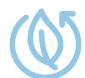

牵头起草《芯片领域用液晶高分子材料》团体标准，旨在填补芯片用LCP材料领域的技术空白，推动关键材料国产化替代。

参编《回收和再生丙烯腈-丁二烯-苯乙烯共聚物（ABS）分级技术规范》国家标准，推动废旧材料资源高效循环利用。

# 同心共筑

# 塑造美好生活

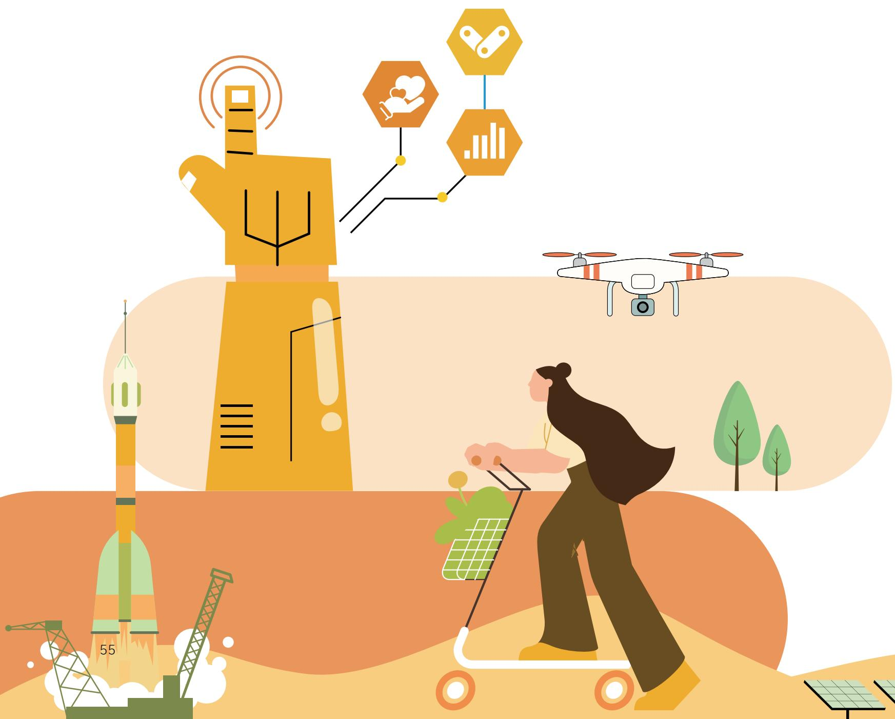

natural_image

Illustration of a drone flying over a rocket, with a large hand holding a globe and icons representing technology (no text or symbols)

沃特股份以责任担当锚定高质量发展航向，以人文关怀厚植员工成长沃土，以硬核安全管理筑牢发展底线，深化供应链协同与合规治理，以公益助学反哺社会，全方位践行可持续发展理念，共创产业与民生共赢的美好未来。

# 涉及议题

员工招聘与就业

员工薪酬与福利

员工健康与安全

员工发展与培训

员工满意度

供应商管理

供应链管理

社会公益活动

# 我们的行动

\- 关爱员工成长

\- 筑牢安全防线

\- 携手行业共赢

\- 热心公益事业

# 我们的绩效

在职员工总数

职业病发生率

因工死亡事故人数为

1480人

0

0

安全生产投入占营业收入比例为

0.19%

贡献联合国可持续发展目标（SDGs）：

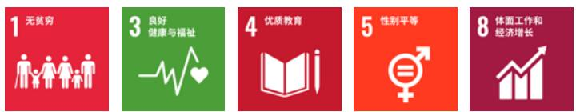

# 关爱员工成长

我们致力于打造平等包容、健康舒适的职场环境，秉持“扬长避短”的用人理念，为员工建立广阔的发展平台，广拓渠道、汇聚英才，为企业和员工发展筑牢根基。

# 保障员工权益

我们严格遵守法律法规，建立《人力资源管理制度》《员工手册》等规章制度，依法签订劳动合同，贯彻落实劳工准则，确保员工在招聘、工作中不因民族、种族、性别、宗教信仰等因素而受到歧视；同时为员工提供多元化的工作机会，保障员工平等权益。

# 2025年

报告期末母公司在职员工的数量

报告期末主要子公司在职员工的数量

报告期末在职员工的数量合计

母公司及主要子公司需承担费用的离退休职工人数

237人

1243人

1480人

50人

按性别划分员工构成单位（人）  
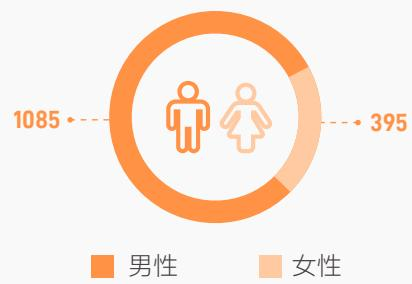

donut

| Category | Value |
| --- | --- |
| 男性 | 1085 |
| 女性 | 395 |

按年龄划分员工构成
单位（人）  
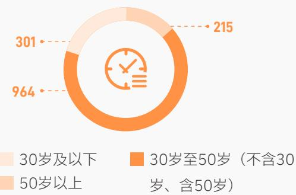

donut

| Category | Value |
| --- | --- |
| 30岁及以下 | 215 |
| 30岁至50岁（不含30岁、含50岁） | 964 |
| 50岁以上 | 301 |

按学历划分员工构成单位（人）  
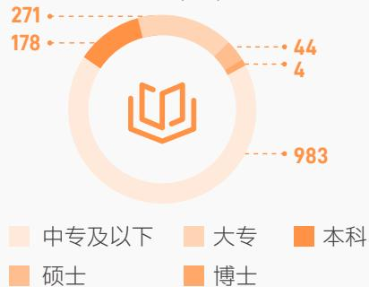

donut

| Category | Value |
| --- | --- |
| 中专及以下 | 983 |
| 大专 | 44 |
| 本科 | 178 |
| 硕士 | 4 |
| 博士 | 271 |

按专业划分员工构成
单位（人）  
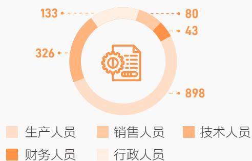

donut

| Category | Value |
| --- | --- |
| 生产人员 | 80 |
| 销售人员 | 43 |
| 技术人员 | 898 |
| 财务人员 | 326 |
| 行政人员 | 133 |

中高层管理人员比例

10%

中高层管理人员中女性占比

24%

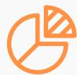

少数民族员工占比

2%

残障员工占比

0.3%

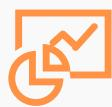

劳动合同签订率

100%

社会保险覆盖率

100%

雇佣当地员工比例

61%

# 落实劳工准则

严格遵守国际公约、国内法律的规定，在人力资源相关制度或流程中明确提出防止招聘童工、强制员工劳动的条款。

定期对员工进行核查，当发现违规使用童工或强制劳工时，立即停止并采取必要的支持措施。

# 完善薪酬体系

构建多元化薪酬结构。持续优化《薪酬管理制度》《绩效考核管理制度》《激励制度》三大核心制度，明确定薪依据，确保薪酬体系兼具内部公平性与外部竞争力。

建立年度调薪机制，重点向绩优员工倾斜，实现员工薪酬与能力提升、业绩贡献的同步增长。

# 落实民主管理

设立工会组织，畅通职工代表大会、全员早会、部门早会、员工意见箱、线上反馈端口等沟通渠道，推行合理化建议激励机制，激发员工参与热情，推动企业与员工协同发展。

开通专属 “创新提案系统”，面向全员常态化开展 “我们一起来创新” 提案征集活动，鼓励全体员工立足岗位挖掘创新思路，切实以员工智慧赋能企业发展。

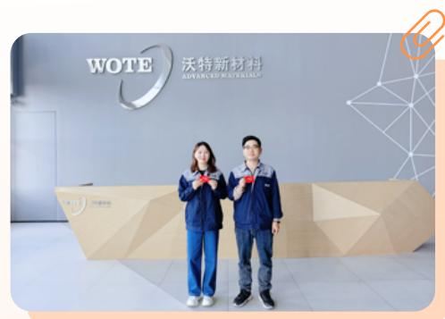

text_image

WOTE 沃特新材料
ADVANCED TECHNOLOGY

合理化建议颁奖仪式

# 支持员工发展

我们以“赋能员工成长、构建公平发展生态”为核心，建立职业能力提升、晋升与选拔等多维度人才管理制度，提升员工岗位胜任力与职业安全感，优化人才结构，为企业高质量发展提供人才支撑。

员工培训投入 63.03 万元

# 实施持证赋能计划

- 推行“持证赋能计划”，鼓励员工考取与岗位强相关的专业资质（如叉车操作证、消防设施操作员证、安全管理证、高压电工证等）。  
- 将资质认证与岗位能力评级挂钩，助力员工职业技能与岗位适配度双向提升。

# 优化人才晋升机制

- 核心岗位晋升采用“岗位竞聘+能力评估”结合的方式，明确任职标准并全员公示。  
- 将技能资质、履职表现等纳入晋升考核维度，保障选拔过程的公平性与结果的合理性。

# 构建清晰成长路径

\- 为一线员工设立公平公正公开的技能评级体系，构建基于任职资格体系的学习路径，以能力发展为主轴，提供系列培养和学习，明确从新员工到业务骨干的成长阶梯。

# 完善绩效管理体系

- 建立以目标责任制为核心的管理体系，定期召开目标评审会，明确各层级业绩目标与发展方向，并由管理层签订年度目标责任书，实现战略目标的有效分解与落地。  
- 构建闭环式绩效管理体系，定期开展绩效沟通会及绩效评审会，确保评估过程透明、结果有效。  
- 设立绩效申诉渠道，充分保障员工权益，维护考核公正性。

# 建立多元激励体系

- 建立即时与长效相结合的激励体系，通过年度评优、创新提案奖等荣誉机制，对项目成果实施即时激励；同步落地优秀案例专项奖励，常态化表彰优秀团队与个人。  
- 完善年度奖金分配方案，实施员工持股计划，将员工个人成长与企业长期发展深度绑定，实现价值共创共享。

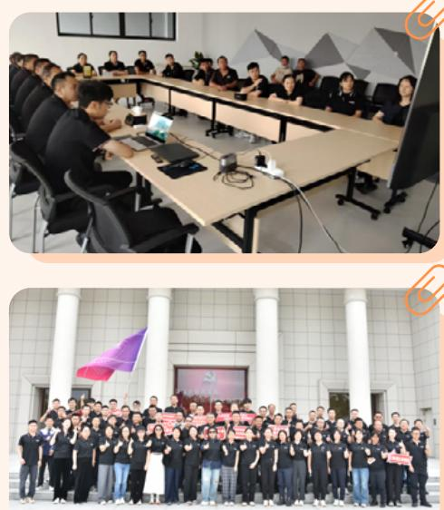

# 关爱员工生活

我们聚焦员工生活需求与情感诉求，努力为员工创造更美好的生活，不断丰富福利供给，强化人文关怀，帮助员工解决实际困难，丰富员工业余生活，营造浓厚的“家”文化氛围，增强员工的归属感与幸福感。

# 完善福利体系

打造涵盖物质关怀与精神激励的立体化福利体系，提供夏季高温补贴、生日礼遇、外派津贴等专项福利，定期组织团队建设活动、主题社交聚会，并设计节日特色福利包。

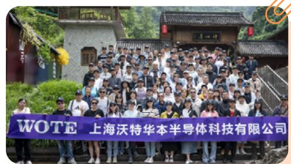

text_image

WOTE 上海沃特华本半导体科技有限公司

年度旅游团建

# 特殊员工关怀

设立爱心基金，建立员工困难帮扶机制，针对身患重症的员工，由管理层牵头组织捐款慰问，缓解员工经济压力。

为生育期女性员工提供产假待遇、产后返岗适配支持等合规福利保障，切实维护女性员工职业权益。

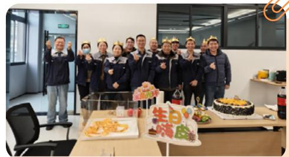

natural_image

Group photo of people in formal attire posing with festive decorations at a table (no visible text or symbols)

员工生日会

# 筑牢安全防线

安全是企业生存发展的生命线。我们始终将安全理念贯穿生产经营全流程，严格遵守《中华人民共和国安全生产法》等国家法律法规，持续完善安全管理体系，构建本质安全型企业。

# 落实安全生产

我们始终秉持“安全第一、预防为主、综合治理”的安全生产方针，以“防风险、除隐患、遏事故”为核心，持续推进安全生产标准化建设与双重预防机制有效运行，保障生产经营活动平稳有序运行。

安全生产投入399万元，占营业收入比例为0.19%

因工死亡事故人数0未发生重大及以上安全、环保、职业健康事故

应急预案响应及时率 100%

应急演练覆盖率 100%

惠州沃特荣获“安全生产先进单位”称号

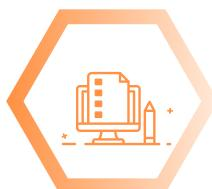  
健全安全生产管理体系

- 成立由董事会及公司经营层负责的安全生产委员会，设立专职安全管理部门统筹职业健康与安全生产工作，明确董事会、高级管理层、执行部门三级管理架构的角色与权责，并要求相关人员具备安全生产与职业健康方面的专业技能与从业能力。在生产基地试点EHS管理体系，建立承包商全生命周期管理机制，将承包商纳入公司统一安全管理体系，签订安全协议并实施统一监督评价。  
- 制定安全生产考核、安全生产目标管理、安全生产投入、隐患排查、应急救援、重大危险源等制度体系。  
- 全面修订并签订公司、部门、班组及岗位四级安全生产责任书，严格落实“一岗双责”制度，明确各级人员安全生产责任。  
- 将安全绩效纳入整体考核，通过季度考核与绩效挂钩，确保安全生产责任落实。  
- 依据国家《企业安全生产标准化基本规范》及行业标准，建立并运行A级标准化体系，推动安全管理规范化、系统化和精细化。

- 识别并管控动火作业、受限空间作业、化学品储存及转运作业等工艺安全风险。  
- 持续推进风险分级管控，更新公司安全风险分布图。  
- 对重大危险源实行每日巡查、在线监测和定期安全评估。

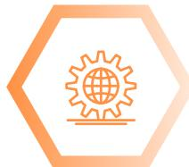  
强化安全风险识别管控

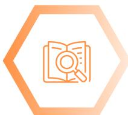  
完善隐患排查治理机制

- 坚持执行日常巡检、周检查、月度综合大检查及节假日专项检查等各类安全生产检查，排查安全隐患，安全隐患整改率达100%。  
- 重大隐患实行“挂牌督办”，确保整改措施、责任、资金、时限和预案“五到位”。

修订完善公司级综合应急预案、专项应急预案和现场处置方案。  
- 组织开展“危险化学品泄漏火灾”“受限空间事故”“现场电击伤害”等实战化应急演练，有效提升员工的应急响应和自救互救能力。  
- 定期进行检查与维护应急物资，确保应急物资储备充足。

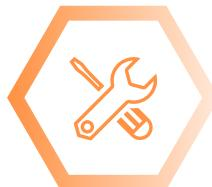  
加强应急管理体系建设

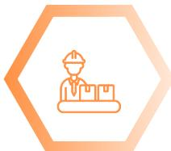  
严格设备与作业安全管理

- 加强特种设备及其安全附件的定期检验与维护保养，定检率100%。  
- 严格危险作业许可管理，加强各类危险作业审批与作业过程全程监护，全年未发生作业安全事故。

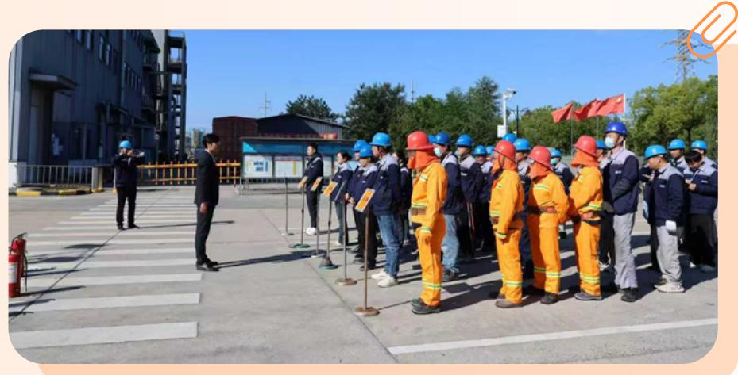

natural_image

Group of workers in orange uniforms and blue helmets standing in a crosswalk, with officials and red flags on the ground (no visible text or symbols)

江苏特种应急演练

# 保障职业健康

我们始终将员工的生命安全与健康置于首位，严格遵守《中华人民共和国安全生产法》《中华人民共和国职业病防治法》等法律法规及ISO 45001标准要求，全力构建安全健康的生产环境，筑牢员工职业健康防护防线。

员工工伤保险覆盖率 100%

接触职业病危害员工职业健康体检率达100%

作业场所职业病危害因素检测率达100%

员工体检及健康档案覆盖率 100%

职业病发生率 0%

全员安全健康环保合规意识达标率 100%

# 制定职业健康与安全生产目标

明确职业健康问题和安全事故 “双0” 目标，并制定可量化的安全绩效管理指标，严格落实既定目标指标及管理方案。

每月常态化开展EHS活动，进行巡查及指标达成情况的跟踪确认，定期追踪目标实现进展，通过常态化监测、复盘与改进，持续降低作业风险，保障员工职业健康和安全，确保各项安全绩效目标有效落地。

# 健全职业健康管理体系

建立并优化符合ISO 45001标准的职业健康安全管理体系，通过ISO 45001认证。

建立职业病危害防治责任、警示告知、项目申报、职业病防护设施维护、个体防护用品管理、职业健康监护及其档案管理、职业病危害因素监测及评价、事故应急处置与报告等基本制度。

# 强化职业危害告知与警示

在生产现场规范设置职业病风险警示标识和中文警示说明。

与员工签订劳动合同时，如实告知其岗位存在的职业风险及其后果、防护措施等。

# 深化职业健康宣传教育

分层级开展职业健康培训，包括新员工岗前必训、在岗员工定期复训，通过宣传展板、班前班后会等多种形式普及防护知识，增强员工职业病防范意识。

# 开展职业病危害因素识别与控制

全面识别和控制职业病危害因素，定期开展职业病危害因素监测、完成《职业病危害现状评价报告》及申报，实现职业健康管理的合规化、透明化。

开展职业健康评估，委托有资质的机构对生产场所进行职业病危害因素年度检测，检测点覆盖所有产生粉尘、噪声、有毒有害化学物质的岗位。

# 实施职业健康防护与监测

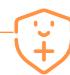

实施全周期职业健康监护。

建立员工职业健康监护档案，为接触粉尘、噪声等岗位配备合规防护用品，实行工作/生活场所物理分隔，降低员工健康风险。

# 完善职业病危害事故应急体系

制定《职业病危害事故应急救援预案》，每年开展多次含消防、危化品泄漏等场景的综合应急演练，同步检查应急物资储备、评估演练效果，提升突发情况处置能力。

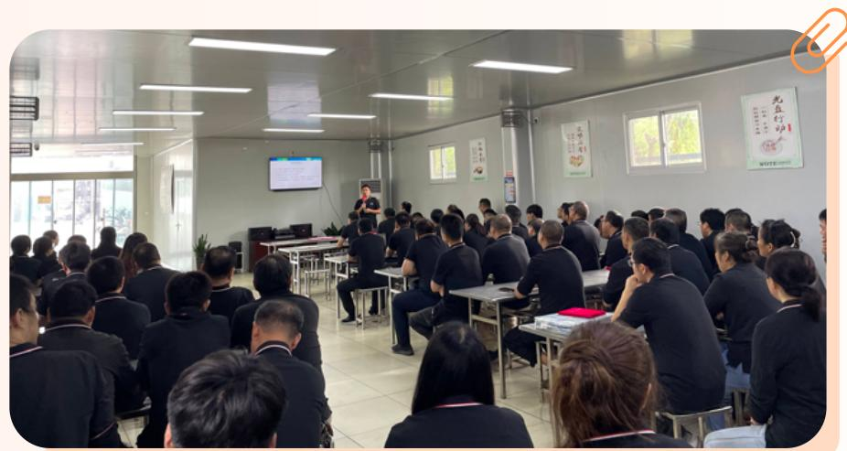

text_image

Classroom or lecture hall with students seated facing a presenter, featuring visible Chinese wall posters and handwritten notes on the walls.

沃特华本职业健康培训

# 保障化学品安全

我们始终将 “安全第一、预防为主、综合治理” 作为化学品管理的核心方针，致力于构建现代化安全管理体系，通过制度化、标准化、信息化和智能化手段，确保化学品从采购、储存、运输、使用到废弃处置的每一个环节都处于受控状态，以保障员工健康、企业财产安全及生态环境可持续发展。

近三年，公司未发生任何重大泄漏、火灾或中毒事故

化学品安全培训覆盖率 100%

# 健全化学品治理体系

由子公司EHS委员会或环境管理委员会监督管理。

制定《危险化学品安全管理规定》《MSDS（安全技术说明书）管理制度》《化学品仓储管理规定》等管理制度。

# 实施全过程风险管控

# 准入与评估

建立新化学品采购前审批制度，必须经EHS（环境、健康与安全）部门进行危害性评估和替代性审查。

# 分级分类管控

依据GHS（全球化学品统一分类和标签制度）对化学品进行规范分类、标签和标识。对主要危险源和工艺实行“源长制”和特殊管控。

# 作业许可管理

对动火、进入受限空间、化学品分装等作业，严格执行作业票审批和现场监护制度。

# 构建模块化应急体系

# 模块化应急设施

在关键区域配备标准化应急柜和事故应急池。

# “一分钟”应急响应机制

推行岗位应急处置卡，开展以班组为单位的“一分钟”初期应急处置演练，确保泄漏等事故在萌芽阶段得到控制。

# 培育安全文化

我们视培训为提升员工安全环保健康意识和技能的基础工程，建立分层级、分类别的培训体系，提升员工安全素养和技能，形成“人人负责安全”的企业文化。

安全培训时长

15764 小时

人均安全培训时长

11 小时

员工安全培训覆盖率

100%

# 实施常态化安全教育培训

全面落实新入职员工“三级”安全教育，培训合格率100%。

组织在岗员工年度再培训，内容涵盖安全规章制度、操作规程、风险辨识、应急知识、环保要求、职业危害防护等。

对转岗人员进行专项安全培训，确保培训全覆盖、无遗漏。

# 强化专项与特种作业培训

组织企业负责人、安全管理人员参加外部取证培训。

特种作业人员（电工、焊工、叉车工等）全部持证上岗，并按期复审。

举办危险废物管理、受限空间作业监护人、应急救援器材使用等专项培训。

组织员工参加红十字会专题外训并取得现场急救人员资格认证，提升专业技能水平。

# 推进安全文化宣传与建设

组织员工参加化工行业应急技能比武和消防主题活动周等活动，营造良好安全文化氛围。

推行 “6S” 活动，鼓励员工参与安全环保管理，主动报告安全隐患和不安全行为，并对优秀建议予以奖励。

开展应急技能及应急实施方案奖励活动，对在事故处置、组织疏散中表现突出的员工予以奖励，提升全员安全意识。

# 携手行业共赢

我们坚信合作和共享对公司、行业和社会可持续发展有正向价值。我们视供应商为亲密战友，开展负责任供应链管理，与行业专家开展深度交流与科研项目合作，以技术创新指引行业发展方向。

# 供应商全生命周期管理

我们高度重视供应商管理体系建设，不断完善供应商全生命周期管理，通过《供应商管理控制程序》，构建覆盖开发、准入、评估、退出的全生命周期管理机制，深化与供应商战略合作，确保供应链稳定与生产平稳运行。

境外供应商数量占比 7%

境内供应商数量占比 93%

经过公司评价体系评审的核心关键供应商占比 100%

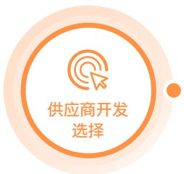

flowchart

```mermaid
graph LR
  A["供应商开发\n选择"] --> B((""))
  B --> C[""]
```

根据项目需求开发新供应商，对潜在供应商资料进行收集及评价，并对样品、现场及管理体系进行评估，拟导入供应商原则上必须通过ISO 9001、ISO 14001、ISO 45001认证，汽车产品原材料供应商还需通过IATF 16949认证，优先选择拥有QC 080000、RBA体系认证证书的供应商，积极引导供应商申请相关体系认证。  
为保障原材料符合品质及环保要求，供应商需提供原料HSF报告，并签订《品质协议》《环保协议》《品质承诺书》。  
电子行业产品的原材料供应商要签订RBA承诺书，以保证供应商行为符合电子行业公民联盟行为守则。

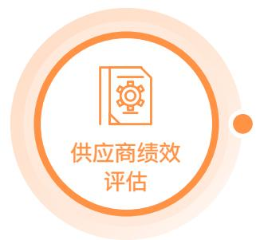

flowchart

```mermaid
graph LR
  A["供应商绩效\n评估"] --> B((""))
  B -.-> C((""))
```

根据《供应商综合评价准则》，每年对所有已合作供应商进行半年度或年度考评。  
▲ 供应商的考核频率为半年度考核，仅对B类进行考核，考核结果较差的供应商，适当减少或暂停采购，同时对其加强管理。

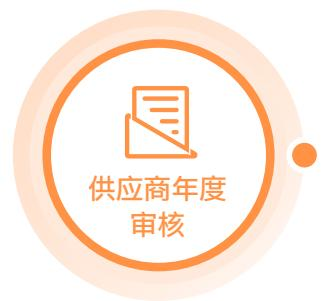

flowchart

```mermaid
graph LR
  A["供应商年度\n审核"] --> B((""))
```

▲ 每年依据供应商管理控制程序制定《供应商现场审核清单》，并据此开展现场审核工作。  
▲ 供应商现场审核总分≥90分，直接通过；70分≤审核总分＜90分，条件性通过；审核总分＜70分，审核不通过。

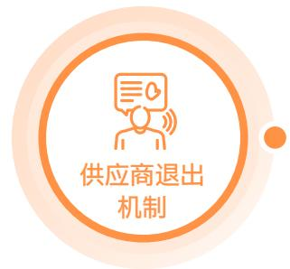

flowchart

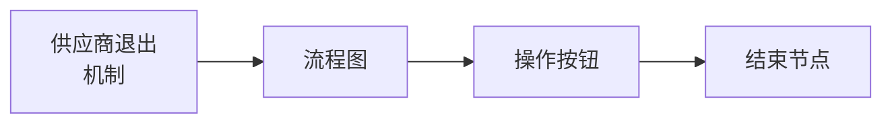
```mermaid
graph LR
  A["供应商退出\n机制"] --> B["流程图"]
  B --> C["操作按钮"]
  C --> D["结束节点"]
```

无法提供ISO 9001认证、交货出现重大批次品质问题、半年度考核或现场审核分数较差的供应商，列入《供应商年度优化清单》，在规定时间内改进结果不合格的，进入供应商退出流程。  
连续2次半年度考核结果较差的供应商或供应商连续2年未有任何合作，进入供应商退出流程。后续如需合作，需重新导入。

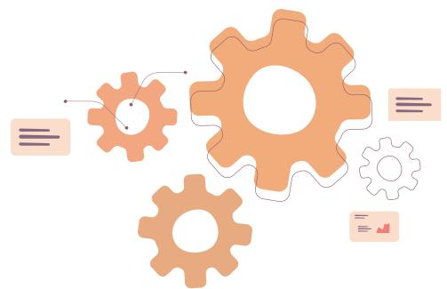

flowchart

```mermaid
graph LR
  A["Start Node"] --> B["Process Node 1"]
  B --> C["Process Node 2"]
  C --> D["Process Node 3"]
  D --> E["Process Node 4"]
  E --> F["End Node"]
```

# 供应链风险管理

我们供应链ESG风险管控，积极开展物料有害物质风险识别，并通过关键物料备选库建设、本土化替代及战略合作伙伴关系构建，提升供应链韧性与自主可控水平，保障经营稳定性。

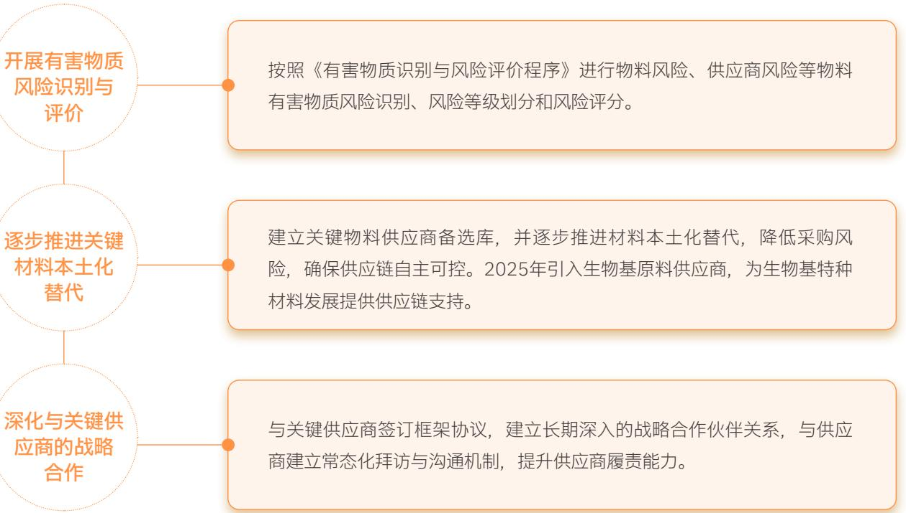

flowchart

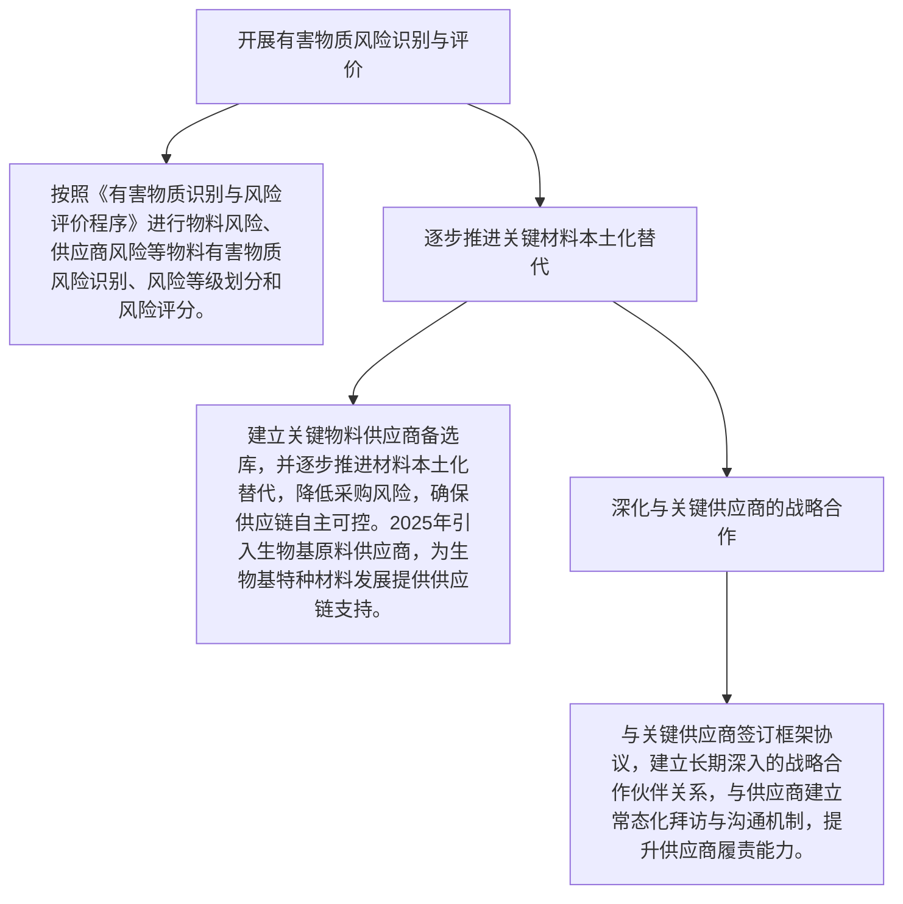
```mermaid
graph TD
  A["开展有害物质风险识别与评价"] --> B["按照《有害物质识别与风险评价程序》进行物料风险、供应商风险等物料有害物质风险识别、风险等级划分和风险评分。"]
  A --> C["逐步推进关键材料本土化替代"]
  C --> D["建立关键物料供应商备选库，并逐步推进材料本土化替代，降低采购风险，确保供应链自主可控。2025年引入生物基原料供应商，为生物基特种材料发展提供供应链支持。"]
  C --> E["深化与关键供应商的战略合作"]
  E --> F["与关键供应商签订框架协议，建立长期深入的战略合作伙伴关系，与供应商建立常态化拜访与沟通机制，提升供应商履责能力。"]
```

# 廉洁合规采购

我们高度重视供应链廉洁合规建设，与供应商签署《廉洁协议书》或防腐政策公开信，明确禁止商业贿赂等违法违规行为，营造公平公正、廉洁自律的合作环境。

natural_image

Close-up of a black gavel resting on a dark wooden block, with no visible text or symbols.

# 热心公益事业

多年来，我们在吴宪董事长的带领下始终秉承”做自己 被需要“的核心价值观，持续关注并参与教育事业，相继设立“深圳市慈善会·沃特公益基金”、川大“沃特奖学金”、巾帼科创基金，从资助贫困学生到支持学校建设，不断为行业技术创新和优质人才培养做贡献。

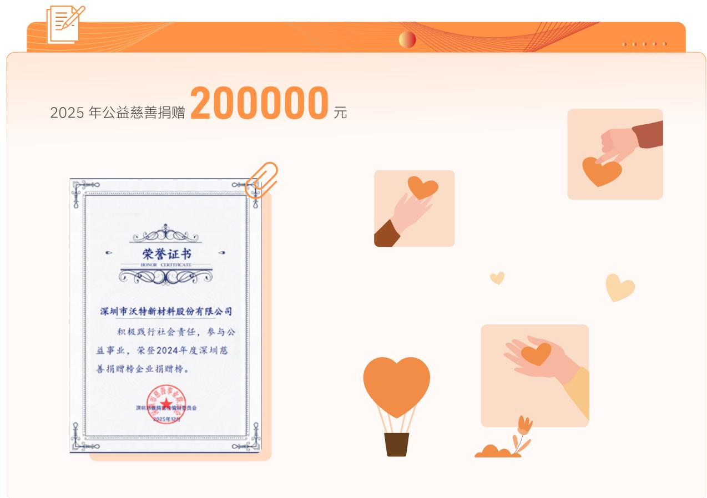

text_image

2025年公益慈善捐赠 200000元
荣誉证书
HONOR CERTIFICATE
深圳市沃特新材料股份有限公司
积极践行社会责任，参与公益事业，荣登2024年度深圳慈善捐赠榜企业捐赠榜。
深圳爱思商业管理委员会
2025年12月

# 展望 2026

2026年是沃特股份立足“十五五”发展新起点，拥抱新质生产力蓬勃浪潮的关键之年。面对算力、低空经济及高端制造的深刻变革，我们将始终秉持“做自己 被需要”的价值观，以“塑造人类美好生活”为使命，坚定朝着“成为世界一流的材料方案提供者”这一愿景迈进。

我们将以科技创新为驱动，深耕特种高分子材料领域，加速推进绿色化、高性能化产品研发，积极服务国家“双碳”目标；以纳贤育才为根本，凝聚全球智慧，构建一流人才队伍，为长远发展注入源源不断的活力；以诚信经营为基石，构建绿色透明的可持续供应链，为客户创造最大价值；以追求超越为导向，不断突破技术边界，持续超越客户期望。

展望2026，沃特股份将以更领先的材料技术、更完善的产业布局，切实支撑国家战略性新兴产业发展，为人类美好生活的实现提供坚实的材料基石，在可持续发展的征程上谱写沃特新篇章。

# ESG 指标索引

《深圳证券交易所上市公司自律监管指引第17号——可持续发展报告（试行）》索引

<table><tr><td>维度</td><td>议题</td><td>对应条款</td><td>报告页码</td></tr><tr><td rowspan="8">环境</td><td>应对气候变化</td><td>第二十一条至第二十八条</td><td>P23-27</td></tr><tr><td>污染物排放</td><td>第三十条</td><td>P35-36</td></tr><tr><td>废弃物处理</td><td>第三十一条</td><td>P36-37</td></tr><tr><td>生态系统和生物多样性保护</td><td>第三十二条</td><td>P38</td></tr><tr><td>环境合规管理</td><td>第三十三条</td><td>P28</td></tr><tr><td>能源利用</td><td>第三十五条</td><td>P33</td></tr><tr><td>水资源利用</td><td>第三十六条</td><td>P32</td></tr><tr><td>循环经济</td><td>第三十七条</td><td>P34</td></tr><tr><td rowspan="9">社会</td><td>乡村振兴</td><td>第三十九条</td><td>/</td></tr><tr><td>社会贡献</td><td>第四十条</td><td>P70</td></tr><tr><td>创新驱动</td><td>第四十二条</td><td>P51-54</td></tr><tr><td>科技伦理</td><td>第四十三条</td><td>/</td></tr><tr><td>供应链安全</td><td>第四十五条</td><td>P67-69</td></tr><tr><td>平等对待中小企业</td><td>第四十六条</td><td>/</td></tr><tr><td>产品和服务安全与质量</td><td>第四十七条</td><td>P46-50</td></tr><tr><td>数据安全与客户隐私保护</td><td>第四十八条</td><td>P20</td></tr><tr><td>员工</td><td>第五十条</td><td>P57-66</td></tr><tr><td rowspan="4">可持续发展相关治理</td><td>尽职调查</td><td>第五十二条</td><td>P18</td></tr><tr><td>利益相关方沟通</td><td>第五十三条</td><td>P10</td></tr><tr><td>反商业贿赂及反贪污</td><td>第五十五条</td><td>P18</td></tr><tr><td>反不正当竞争</td><td>第五十六条</td><td>P19</td></tr></table>

# 关于本报告

本报告是深圳市沃特新材料股份有限公司发布的第四份环境、社会及公司治理（ESG）报告，旨在系统描述公司在可持续发展方面所秉持的原则与理念、管理方法及成果绩效。本报告分别以中、英文两种语言编订，两种文本若出现解释上的歧义时，以中文本为准。

# 报告范围

本报告以公司财务年度为报告周期，披露公司2025年1月1日至2025年12月31日（以下简称“报告期内”）的可持续发展表现，部分内容往前后年度适度延伸。除另有说明外，本报告范围涵盖深圳市沃特新材料股份有限公司及合并范围内子公司。

# 参考依据

《深圳证券交易所上市公司自律监管指引第17号——可持续发展报告（试行）》

全球可持续发展标准委员会《可持续发展报告标准》（GRI Standards）

联合国可持续发展目标（SDGs）

# 数据说明

本报告中所使用数据均来自公司正式文件、财务报告或有关公开资料，数据上如有细微出入，请以年度财务报告为准。报告中的财务数据以人民币为单位。

# 称谓说明

为便于阅读，报告中“深圳市沃特新材料股份有限公司”也以“沃特股份”“公司”“我们”表示；此外，“浙江科赛”指“浙江科赛新材料科技有限公司”；“沃特华本半导体”指“上海沃特华本半导体科技有限公司”；“阿德邦”指“阿德邦氟塑科技（上海）有限公司”；“沃特华本密封件”指“上海沃特华本密封件制品有限公司”；“重庆智成化南”“重庆智成化北”指“重庆沃特智成新材料科技有限公司”；“惠州沃特特种”指“惠州市沃特特种材料有限公司”；“惠州新材料”指“惠州市沃特新材料有限公司”；“江苏特种”指“江苏沃特特种材料制造有限公司”；“江苏新材料”指“江苏沃特新材料科技有限公司”；“香港沃特”指“香港沃特有限公司”；“越南沃特”指“越南沃特新材料有限公司”。

# 可靠性承诺

我们承诺本报告内容不存在任何虚假记载、误导性陈述或重大遗漏，公司董事会对本报告内容真实性、准确性和完整性承担个别及连带责任。

# 报告获取

本报告以印刷版和电子版两种形式发布。电子版可登录巨潮资讯网站（www.cninfo.com.cn）查询。

# 联系方式

我们鼓励所有利益相关方对本公司可持续发展工作提出建议或意见。如有相关事宜，请联系stock@wotlon.com。

# 意见反馈表

亲爱的读者:

您好！感谢您于百忙之中阅读《深圳市沃特新材料股份有限公司2025年环境、社会和公司治理（ESG）报告》。为了更深入地了解您对我们工作的期望与诉求，我们诚挚地邀请您参与调查，发表对我们ESG报告或工作的看法和建议。您的每一条建议，都是对我们的帮助。期待您不吝赐教！

# 选择性问题（请在相应的位置打“✓”）

1. 您对本报告的总体印象:

□很好 □较好 □一般 □较差 □很差

2. 您认为本报告所披露的信息质量:

□很好 □较好 □一般 □较差 □很差

3. 您认为本报告的结构安排:

□很好 □较好 □一般 □较差 □很差

4. 您认为本报告的阅读体验:

□很好 □较好 □一般 □较差 □很差

5. 您认为本报告存在哪些不足？

6. 哪些内容是您希望定期披露的？

7. 您对沃特股份的 ESG 工作还有什么建议？

您可以通过以下方式联系我们：

<table><tr><td>电话:0755-26880862</td><td>信函地址:深圳市南山区西丽街道西丽社区留新四路万科云城三期C区九栋B座3101房(国际创新谷7栋B座3101房)</td></tr><tr><td>邮箱:stock@wotlon.com</td><td>邮编:518055</td></tr></table>