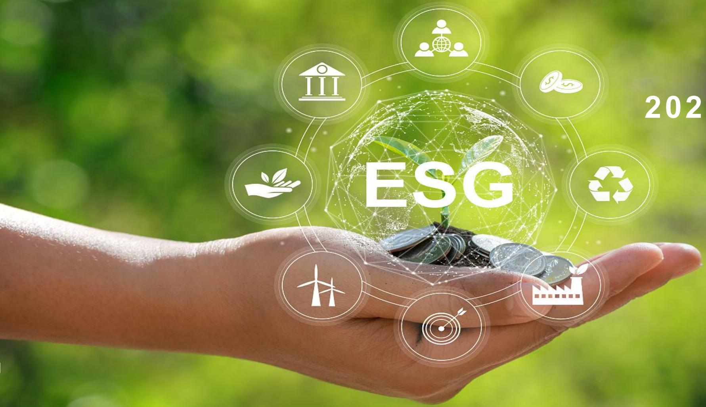

text_image

ESG
202

# 2025环境、社会及公司治理报告

关于本报告

董事长致辞

关于绿茵生态

回顾2025

利益相关方沟通

第一章 规范治理，行稳致远

公司治理

合规经营

商业道德

第二章 数智赋能，生态焕新

研发体系

知识产权数量

智慧管理中心

第三章 低碳深耕，绿色运营

绿色运营

生态文旅

林业经济

绿色办公

第四章 责任笃行，共助美好

公益慈善

员工关爱

# 关于本报告

# 报告说明

本报告反映了天津绿茵景观生态建设股份有限公司（以下简称“绿茵生态”或“公司”）2025年环境、社会及公司治理方面的管理、实践及绩效，旨在与各利益相关方进行有效沟通，系统地回应利益相关方的期望和要求。本报告既是公司与社会各界沟通交流的桥梁，也是公司接受社会监督、持续优化ESG管理体系、推动企业高质量可持续发展的重要载体。

# 报告范围

本报告覆盖天津绿茵景观生态建设股份有限公司及分子公司。报告时间跨度为2025年1月1日至2025年12月31日。为提升报告可比性及前瞻性，部分内容有所延伸。

# 编制依据

本报告主要依据《中国企业社会责任报告指南》《深圳证券交易所上市公司自律监管指引第1号——主板上市公司规范运作》等基本原则，结合公司在履行社会责任方面的具体情况进行编制。

# 数据说明

本报告披露的数据来自公司内部统计或人工整理。除特别说明外，本报告所涉及货币金额均以人民币作为计量货币。报告中涉及到的经济数据与天津绿茵景观生态建设股份有限公司2025年年度报告中数据范围保持一致。

# 获取方式

本报告采用中文简体版本，以PDF电子文件形式向社会发布，可登录巨潮资讯网阅读电子版报告。

# 联系方式

地址：天津市滨海高新区华苑产业区开华道20号智慧山南塔15层

邮编：300384

公司电话： (022) -58357576

传真： (022) -83713201

# 董事长致辞

2025 年是公司全面推进 “AI + 生态” 战略落地的攻坚之年。在行业数字化转型加速、绿色发展需求持续升级的背景下，绿茵生态锚定 “让生态更智慧，让生活更美好” 的企业使命，将 2024 年提出的 “三驾马车” 发展策略深化升级为 “数智化重构、技术化突破、生态化布局” 三位一体发展模式，实现了从 “智慧生态平台搭建” 到 “全生命周期智能化运营” 的跨越。

2026年，国家战略深化为生态产业打开了更广阔的蓝海，数字技术与传统生态行业的融合催生了更多创新机遇，消费升级下的绿色服务需求呈现多元化爆发态势。我们将紧抓机遇、乘势而上，将AI技术深度融入项目规划、施工、运维全流程，实现了生态修复的精准化、绿地养护的智能化、文旅运营的特色化、林业经济的低碳化；积极布局全国生态市场，在三北工程、乡村振兴、碳中和等国家重点领域持续发力，以实际行动践行企业的社会价值。

展望未来，绿茵生态将始终把 ESG 理念融入企业发展的血脉，在追求商业价值的同时，坚守生态责任、社会责任、治理责任。我们将持续深耕绿色生态领域，不断迭代 “AI + 生态” 技术体系，推动生态产业的数字化、智能化、低碳化发展；始终秉持以人为本的发展思想，与员工共成长、与合作伙伴共发展、与社会各界共筑绿水青山。

在此，我谨代表绿茵生态，向长期以来关心、支持公司发展的各位投资者表示最诚挚的感谢！2026年，公司将继续以创新为动力、以责任为引领，在变革中坚守初心，在创新中铸就品牌，持续提升公司价值，以更优异的业绩回馈股东、回馈社会！

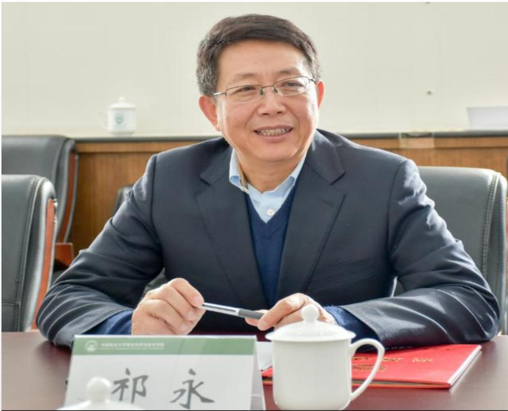

text_image

祁永

# 天绿茵景观生态建设股份有限公司

董事长 总裁

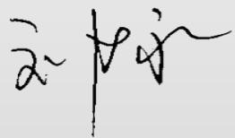

# 走进绿茵生态

天津绿茵景观生态建设股份有限公司始创于1998年，2017年7月在深圳证券交易所挂牌上市，是天津市唯一一家A股上市园林及生态修复公司（股票代码：002887）。公司业务包括生态修复、绿地维护、文旅运营及林业经济四大业务板块，是集规划设计、技术研发、抗性苗木选育、工程施工、运营维护为一体的生态产业综合运营服务集团。

# 四大业务板块

# 生态修复

盐碱地治理与改良

湿地及流域治理、

矿山修复与边坡绿化

荒山造林

荒漠化治理等

# 绿地维护

城市公园维护

城市绿地维护

郊野公园维护

林地及草地维护

# 文旅运营

城市新文旅

生态文旅

IP开发运营

知名IP引入和整合

# 林业经济

林业碳汇

林下种植

# 组织架构

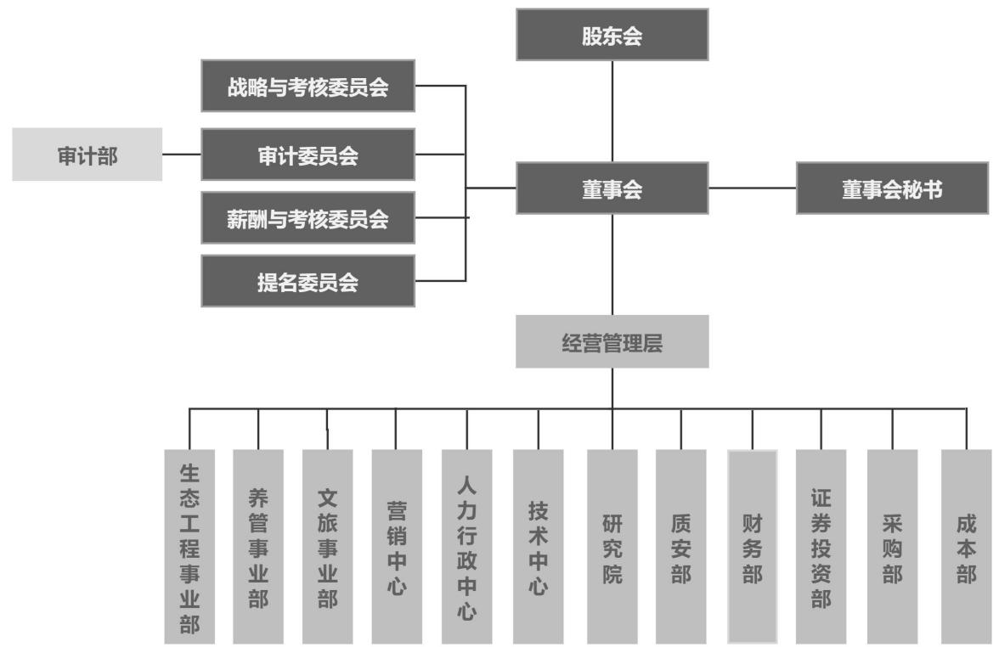

flowchart

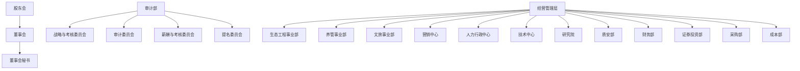
```mermaid
graph TD
  A["董事会"] --> B["董事会秘书"]
  C["股东会"] --> A
  D["审计部"] --> E["战略与考核委员会"]
  D --> F["审计委员会"]
  D --> G["薪酬与考核委员会"]
  D --> H["提名委员会"]
  I["经营管理层"] --> J["生态工程事业部"]
  I --> K["养管事业部"]
  I --> L["文旅事业部"]
  I --> M["营销中心"]
  I --> N["人力行政中心"]
  I --> O["技术中心"]
  I --> P["研究院"]
  I --> Q["质安部"]
  I --> R["财务部"]
  I --> S["证券投资部"]
  I --> T["采购部"]
  I --> U["成本部"]
```

# 资质情况

公司是国家级高新技术企业、天津市科技小巨人领军企业，拥有风景园林工程设计专项甲级、市政公用工程施工总承包壹级、水利水电工程施工总承包贰级、环保工程专业承包壹级等资质。

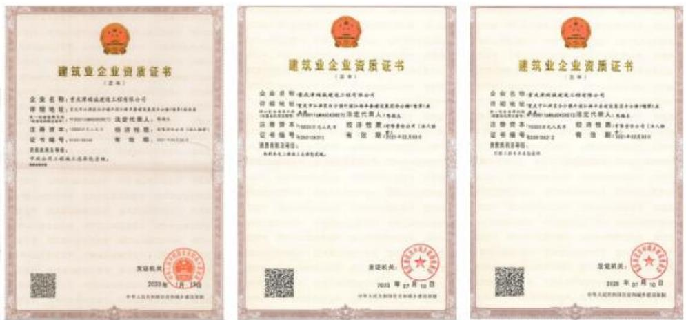

<table><tr><td>企业名称</td><td colspan="3">天津百绿园林景观设计有限公司</td></tr><tr><td>详细地址</td><td colspan="3">天津滨海高新区华苑产业区开华路19号南开科技大厦北楼1301</td></tr><tr><td>建立时间</td><td colspan="3">2010年12月22日</td></tr><tr><td>注册资本金</td><td colspan="3">500万元人民币</td></tr><tr><td>统一社会信用代码(或营业执照注册号)</td><td colspan="3">911201165661252916</td></tr><tr><td>经济性质</td><td colspan="3">有限责任公司(法人独资)</td></tr><tr><td>证书编号</td><td colspan="3">A112004554-6/1</td></tr><tr><td>有效期</td><td colspan="3">至2028年12月11日</td></tr><tr><td>法定代表人</td><td>祁雨薇</td><td>职务</td><td>总经理</td></tr><tr><td>单位负责人</td><td>祁雨薇</td><td>职务</td><td>总经理</td></tr><tr><td>技术负责人</td><td>席雅丽</td><td>职称或执业资格</td><td>高级工程师</td></tr><tr><td colspan="4">备注:</td></tr></table>

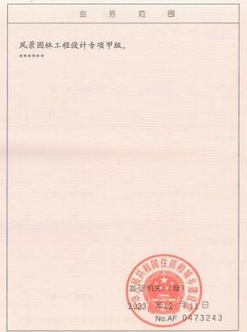

seal

风景园林工程设计专项甲级
********
2020年1月1日
No AF 0473243

# 01 公司主要财务数据

# 年度业绩

47,414.80

营业收入
万元

12,142.14

归属上市公司股东净利润
万元

<table><tr><td>项目</td><td>2025年</td></tr><tr><td>营业收入(元)</td><td>474,148,008.05</td></tr><tr><td>归属于上市公司股东的净利润(元)</td><td>121,421,402.82</td></tr><tr><td>归属于上市公司股东的扣除非经常性损益的净利润(元)</td><td>104,676,998.35</td></tr><tr><td>经营活动产生的现金流量净额(元)</td><td>120,230,701.07</td></tr><tr><td>基本每股收益(元/股)</td><td>0.4</td></tr><tr><td>稀释每股收益(元/股)</td><td>0.4</td></tr><tr><td>加权平均净资产收益率</td><td>5.08%</td></tr><tr><td>项目</td><td>2025年末</td></tr><tr><td>资产总额(元)</td><td>4,037,961,270.98</td></tr><tr><td>归属于上市公司股东的净资产(元)</td><td>2,414,098,185.22</td></tr></table>

# 02 公司荣誉2025

颁发机构—天津市园林绿化行业协会

<table><tr><td>获奖名称</td><td>获奖项目</td></tr><tr><td>2025年度优质工程项目二等奖</td><td>柳林公园二期一标绿化工程一标段</td></tr><tr><td rowspan="2">2025年度优质工程项目三等奖</td><td>天津市北辰区园林绿化及配套设施PPP项目</td></tr><tr><td>东疆港噉噉兽梦幻山海 COFFEE 项目</td></tr></table>

颁发机构—天津市风景园林协会

<table><tr><td>获奖名称</td><td>获奖项目</td></tr><tr><td>2024-2025年度天津市风景园林学会科技进步一等奖</td><td>困难立地生态修复的北京研发中心建设</td></tr></table>

# 公司治理结构

公司坚持建设公开透明、高效运转的公司治理体系。公司根据《公司法》《证券法》和中国证监会的有关法律法规要求，建立了由股东会、董事会和经营管理层组成的公司治理架构，形成了权力机构、决策机构、监督机构和管理层之间权责明确、运作规范的协调与制衡机制。

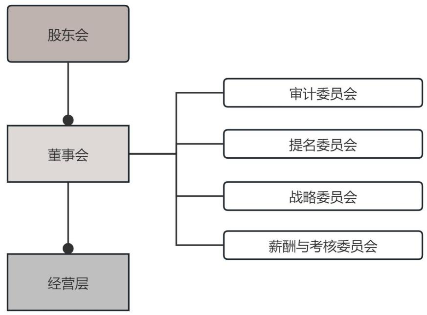

flowchart

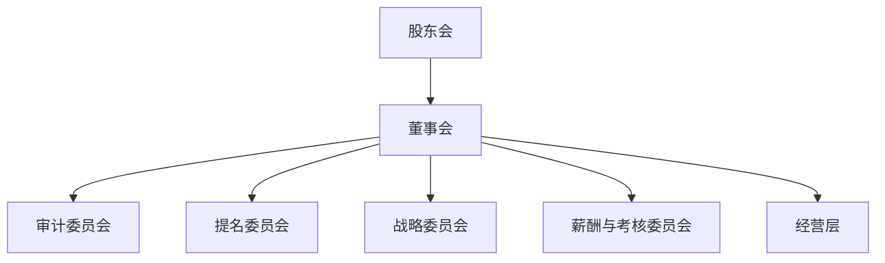
```mermaid
graph TD
  A["股东会"] --> B["董事会"]
  B --> C["审计委员会"]
  B --> D["提名委员会"]
  B --> E["战略委员会"]
  B --> F["薪酬与考核委员会"]
  B --> G["经营层"]
```

# ● 股东会

股东会作为公司的最高权力机构，依据《公司章程》和《股东会议事规则》等章程运行，通过年度股东会和按需召开的临时股东会，对公司经营方针等重大事项进行决策。会议召开形式采用现场会场与网络平台相结合的方式。在审议涉及中小投资者利益的重大事项时，对中小股东的表决单独计票，并及时公开披露表决结果，确保中小股东的投票能够得到独立统计与充分考量。

# 报告期内

股东会召开次数 2次

临时股东会

1次

年度股东会

1 次

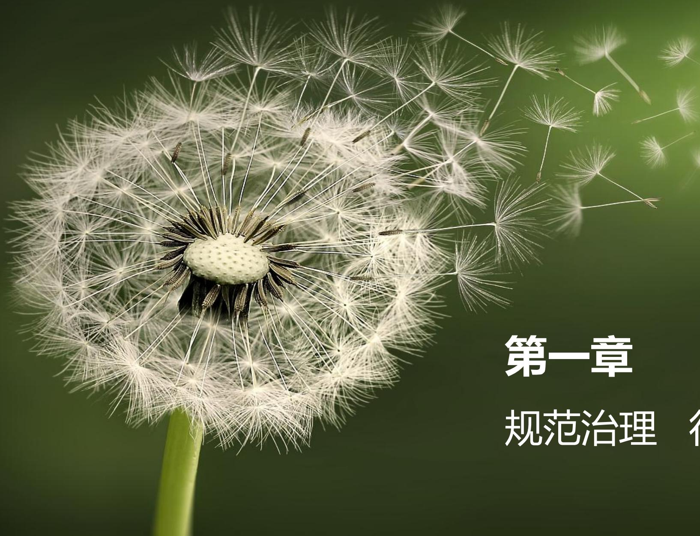

text_image

第一章
规范治理 征

# 第一章

# 规范治理 行稳致远

# ◎ 董事会&监事会

董事会是公司经营的决策机构。董事会依据《公司章程》及《董事会议事规则》的规定对公司重大事项进行科学决策。报告期内，公司全体董事按照规定开展工作，并以认真严谨的态度出席董事会，勤勉尽责地履行职责，维护公司和全体股东的权益。

# 报告期内

董事会召开次数

6次

监事会召开次数

2次

公司已根据《公司法》等有关法律、法规规定，取消设置监事会，监事会的职权由董事会审计委员会行使。

# 股东回报

公司在创造经济效益的同时重视对投资者的合理回报，积极构建与股东的和谐关系，在保证公司持续健康发展的前提下，实施相对稳定的利润分配政策，积极回报股东。

<table><tr><td colspan="2">【关键绩效】</td><td>单位</td><td>2025年</td></tr><tr><td rowspan="3">分红</td><td>现金分红总额(含税)</td><td>万元</td><td>9179.62</td></tr><tr><td>每10股派发现金股利</td><td>元</td><td>3.0</td></tr><tr><td>现金分红总额占归母净利润的比例</td><td>%</td><td>75.60</td></tr></table>

# 投资者权益

绿茵生态建立注重对股东和其他利益相关方的保护，规范投资者管理工作，不断拓展与投资者的沟通方式。为了使投资者能够更好的了解公司经营情况，公司通过现场、在线交流等多种沟通方式，努力为广大投资者走进公司，增进彼此了解和信任创造条件。

投资者沟通渠道

通过电话、邮件、深交所互动易、投资者接待日、日常接待投资者调研等方式，积极与投资者进行交流

积极参加券商策略会，与机构、中小投资者深度沟通，同时了解资本市场观点

举办公司年度网上业绩说明会，与投资者就公司业绩、发展情况以及其他投资者关心的问题进行充分沟通

通过微信公众号、抖音等新媒体平台，传递公司最新经营现状

# 内部控制

公司的内部控制深入各个业务部门，各职能部门紧密结合公司实际状况，严格遵循企业内控管理标准，构建精细化的管理制度，对业务流程中的每个关键环节做出详尽规定，明确职责划分和审批权限等。

为确保内控管理的持续有效，公司定期对各业务部门的制度建设和执行情况进行抽查审计。同时，还会对关键业务流程展开专项审计，全面检查和评估内控管理的合法性、充分性和有效性，不断提升公司内部治理水平，确保企业稳健、高效地运营。

公司风险管理与内控体系组织架构  
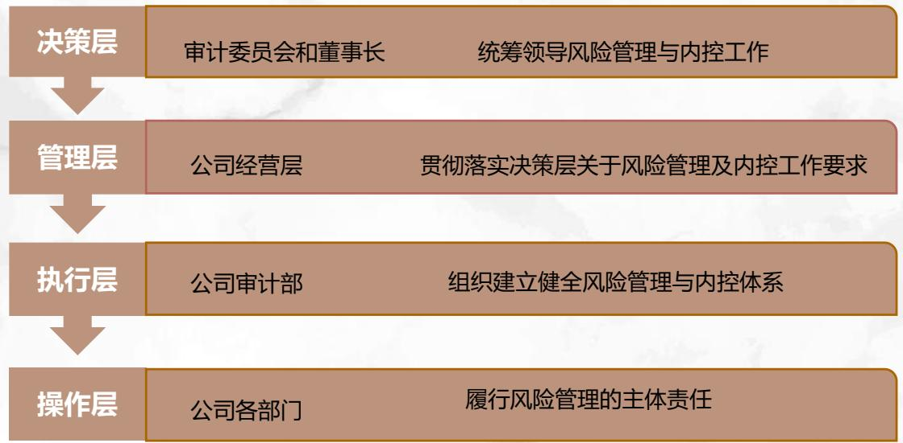

flowchart

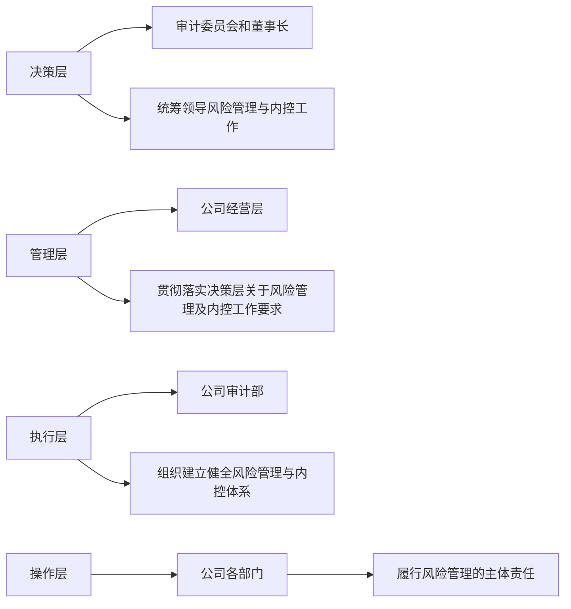
```mermaid
graph LR
  A["决策层"] --> B["审计委员会和董事长"]
  A --> C["统筹领导风险管理与内控工作"]
  D["管理层"] --> E["公司经营层"]
  D --> F["贯彻落实决策层关于风险管理及内控工作要求"]
  G["执行层"] --> H["公司审计部"]
  G --> I["组织建立健全风险管理与内控体系"]
  J["操作层"] --> K["公司各部门"]
  K --> L["履行风险管理的主体责任"]
```

# 风险管理

为防范和应对潜在风险与危机，保障公司业务和运营的持续、稳定、健康发展，公司根据相关法律法规及政策规定，结合公司实际经营情况，建立健全风险管理体系，定期开展风险评估，确保风险得到有效控制。

# 风控中心

# 公司治理结构

# 审计部

# 各业务管理部门

1、贯彻执行全面风险管理及公司相关制度和流程；  
2、研究提出公司重大决策、重大风险和重要业务流程判断机制和处理标准；  
3、做好公司日常风险管理工作，并按要求上报；  
4、结合部门业务特点，加强对下级机构的风险管理和考核；  
5、开展年度常规审计和专项审计工作，不断完善内部控制；  
6、不断优化风险管理工作。

# 廉洁为基

绿茵生态高度重视内控管理，严格防范和控制公司的腐败风险，建立预防腐败承诺机制和举报机制，由审计部门负责落实相关机制并行使监察职责，从举报渠道、举报人保护、事后处理办法等多个维度出发，全方面打造公司反腐败的内部环境。针对公司重点部门、重点职位人员、重点环节实施预防腐败承诺机制，相关人员要求按照本公司反腐败监督管理部门的要求，接受监督记录。

# 反舞弊举措

公司向所有员工、供应商明确舞弊行为警戒线，从源头杜绝违规违纪事件的发生，促进公司商业伙伴的经济活动健康有序开展。同时公司为相关方提供多种举报渠道，确保企业经营活动中不存在不正当利益输送行为，保障商业活动顺利进行。此外，公司不定期通过培训等方式进行廉洁从业的宣导和负面事件的警示通告。

# 举报渠道及举报人保护

公司坚定开展反舞弊、反贿赂工作，设立电话热线、邮箱等多种举报途径，鼓励全体员工及其他相关方参与商业道德建设；接受匿名举报，对举报人信息及举报的具体内容严格保密，切实维护举报人的正当权益。

# 举报监察机制

  
员工可匿名进行举报

  
审计部开展调查

  
公司根据审计部调查
报告出具处理意见

# 诚信经营

公司严格遵守国家法律法规，视其为不可逾越的红线。无论是在日常的业务往来，还是重大项目的合作中，都以法律为准绳，规范自身的经营行为。在与其他企业的合作过程中，公司始终秉持公平、公正、公开的原则，充分尊重各个有关企业、组织和个人的财产权。从合同的签订到履行，每一个细节都经过严谨的考量和规范的操作，确保合作方的财产安全和利益不受侵害。

通过对法律法规的严格遵守以及对各方权益的切实维护，公司为自身的持续发展营造了良好的外部环境，同时也为维护社会经济秩序贡献了力量。在市场交易中，公司的诚信经营，促进了市场的健康、有序竞争，保障了市场交易的公平性和稳定性。

# 依法纳税

# 2025年度依法纳税

# 7583 万元

纳税是公司回馈社会，承担社会责任的重要体现。公司自成立以来，一直坚持守法经营，严格遵守企业财务制度、会计准则，真实准确核算企业经营成果，依法履行纳税义务，及时足额缴纳税款，保证依法诚信纳税，为国家发展贡献力量。

# 第二章

# 数智赋能 生态焕新

text_image

数智赋能 生态焕新
50%
15%
25%
75%
100%

# 研发体系

# 研究院

一站

博士后科研工作分站

两室

天津市景观生态修复企业重点实验室

天津市环境变化与生态修复校企联合重点实验室

三所

生态修复研究所

绿地养护研究所

智能信息化碳汇研究所

五中心

植被修复工程技术研究中心

生态修复及生态产业化研究院

天津市企业技术中心

科技检测中心

天津市景观生态化基数工程中心

# 产学研合作体系

· 三北工程科创中心理事单位  
· 中国草学会副理事长单位  
· 中国水土保持学会工程绿化专委会副主任委员单位  
· 中国治沙暨沙业学会盐碱地分会副主任委员单位  
· 中国林学会盐碱地分会副主任委员单位  
·盐碱地生态修复国家创新联盟副理事长单位  
天津市园林绿化行业协会会长单位  
·京津冀生态景观与立体绿化技术创新联盟理事长单位  
· 国家乡村环境治理科技创新联盟副理事长单位  
·中关村众信土壤修复产业技术创新联盟副理事长单位

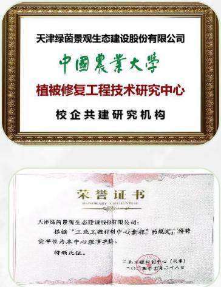

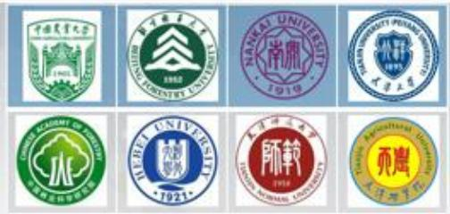

text_image

Collection of eight university logos including Tsinghua University, Nanhai University, and Tsinghua University of Sciences, each with official seals and Chinese text.

合作院校一览

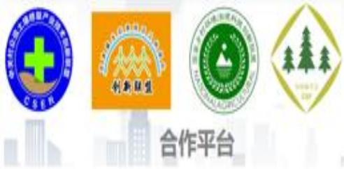

# 知识产权数量

公司重视知识产权创造及成果转化，坚持创新驱动，构建了完善的知识产权体系。同时，公司作为国家重点高新技术企业和天津市科技领军企业，拥有四大省级研发平台，为公司不断提高核心技术竞争力提供重要支撑。

# 专利总数

# 175 项

<table><tr><td>16项发明专利</td><td>159项实用新型专利</td></tr></table>

# 智慧管理中心

公司以“园林资产数据”、“物联网环境监测数据”和“项目调查数据”等数据为支撑，构建绿茵大数据库，在此基础上，建立智慧园林可视化平台，为公司提供智慧决策依据。

1中心平台+N应用系统  
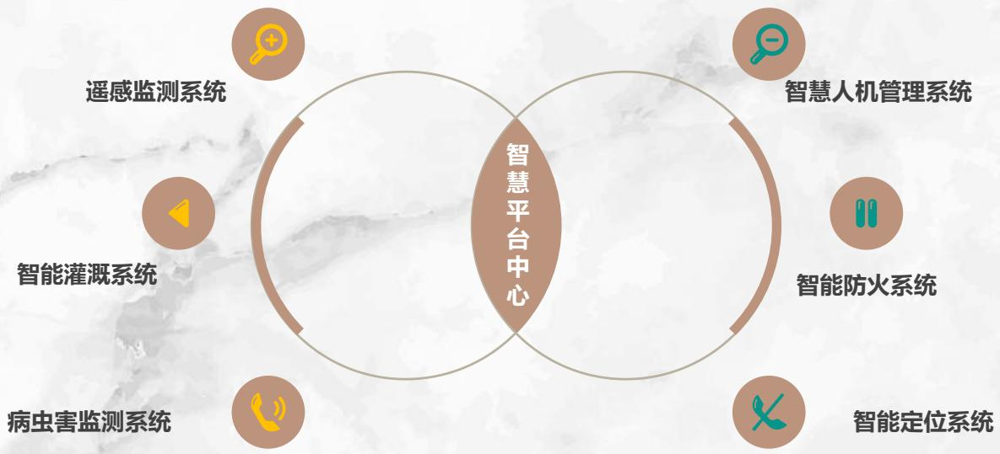

flowchart

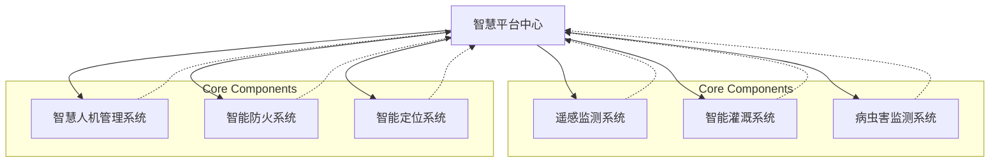
```mermaid
graph TD
  Center["智慧平台中心"]
  
  subgraph Core Components
    direction TB
    Sensor["遥感监测系统"]
    Intelligent["智能灌溉系统"]
    Virus["病虫害监测系统"]
  end
  
  subgraph Core Components
    direction TB
    Robot["智慧人机管理系统"]
    Fire["智能防火系统"]
    Position["智能定位系统"]
  end
  
  Center --> Sensor
  Center --> Intelligent
  Center --> Virus
  Center --> Robot
  Center --> Fire
  Center --> Position
  
  Sensor -.-> Center
  Intelligent -.-> Center
  Virus -.-> Center
  Robot -.-> Center
  Fire -.-> Center
  Position -.-> Center
```

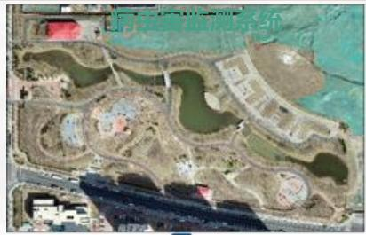

text_image

同中建检测系统

# 资产与实景三维模型

基于无人机航拍影像，实现地被类型解译，乔木的位置信息、种类信息、胸径信息。

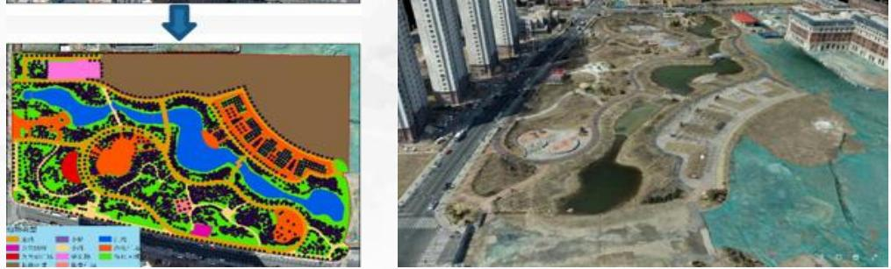

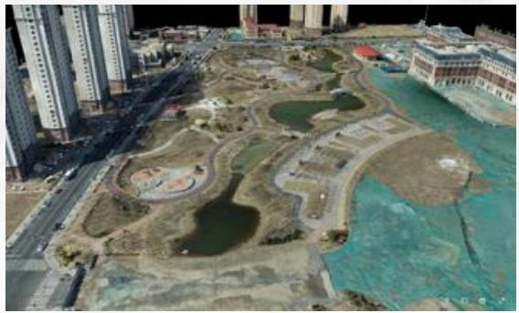

natural_image

Aerial view of a large urban area with landscaped grounds, roads, and surrounding high-rise buildings (no visible text or symbols)

# 智慧园林可视化平台

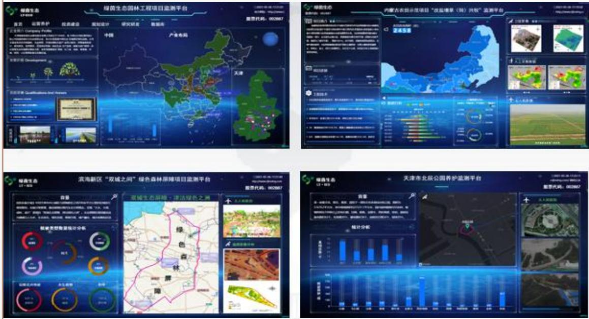

# 人员管理

公司人员管理系统对项目一线作业人员进行智慧管理，如着装、考勤、定位等。

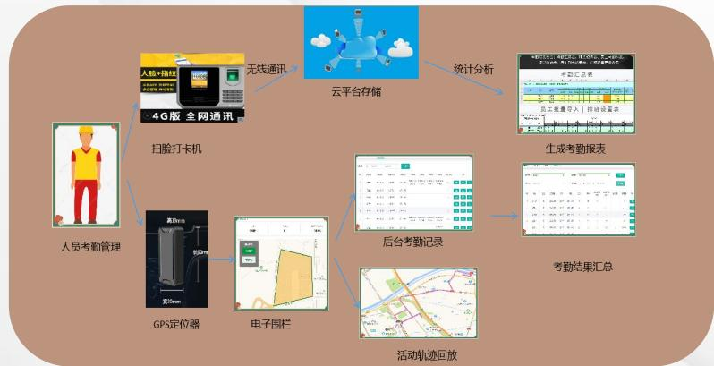

flowchart

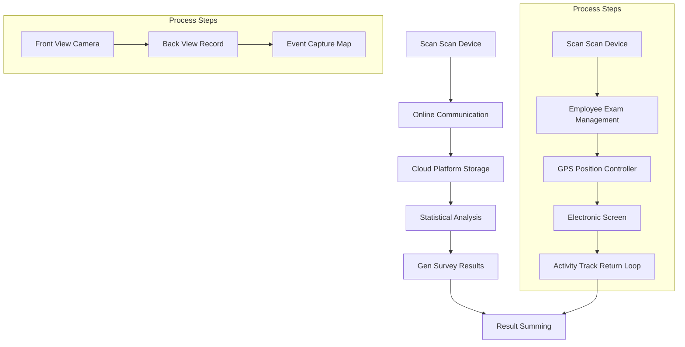
```mermaid
graph TD
  A["Scan Scan Device"] --> B["Online Communication"]
  B --> C["Cloud Platform Storage"]
  C --> D["Statistical Analysis"]
  D --> E["Gen Survey Results"]
  
  subgraph Process_1 [Process Steps]
  F["Scan Scan Device"] --> G["Employee Exam Management"]
  G --> H["GPS Position Controller"]
  H --> I["Electronic Screen"]
  I --> J["Activity Track Return Loop"]
  end
  
  subgraph Process_2 [Process Steps]
  K["Front View Camera"] --> L["Back View Record"]
  L --> M["Event Capture Map"]
  end
  
  E --> N["Result Summing"]
  J --> N
```

# 车辆管理

公司车辆实时定位，历史轨迹查询，驾驶环境监控。

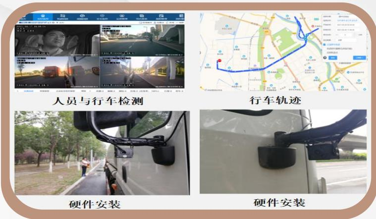

# 机械管理

水车浇水量实时监控，流量计等机械一机一码，准确记录保养维修电子记录。

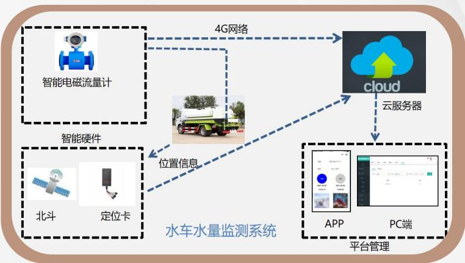

flowchart

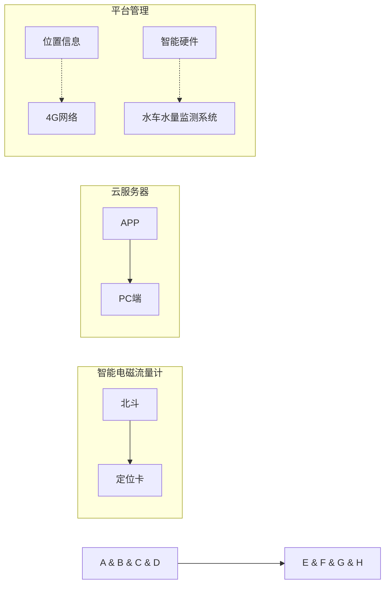
```mermaid
graph LR
  subgraph Sensors["智能电磁流量计"]
  A["北斗"] --> B["定位卡"]
  end

  subgraph Cloud["云服务器"]
  C["APP"] --> D["PC端"]
  end

  subgraph Platform["平台管理"]
    E["位置信息"] -.-> F["4G网络"]
    G["智能硬件"] -.-> H["水车水量监测系统"]
  end

  ABCD["A & B & C & D"] --> EFGH["E & F & G & H"]
```

# 树木管理

公司通过大树管理系统，实行一树一码，实时监测树木情况。

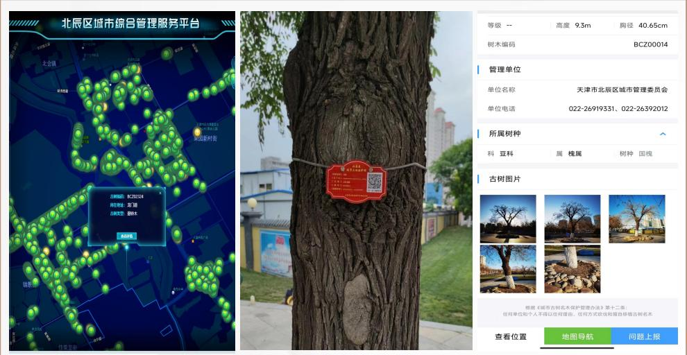

text_image

北辰区城市综合管理服务平台
等级 -- 高度 9.3m 胸径 40.65cm
树木编码 BCZ00014
管理单位
单位名称 天津市北辰区城市管理委员会
单位电话 022-26919331、022-26392012
所属树种
科 豆科 属 槐属 树种 国槐
古树图片
根据《城市古树苗木保护管理办法》第十二条:
任何单位和个人不得以任何理由,任何方式时间间隔自动缩短古树苗木
查看位置 地图导航 问题上报

# 材料管理

一物一码 移动管理

每个资产对应唯一二维码标签，扫码查看资产信息

智能盘点

自助盘点，智能工具盘点扫码盘点等多种盘点方式

频率统计

安装震动器，统计机械使用频率

权限管理

多层级、多分支、多管理角色统一使用

# 智慧化应用

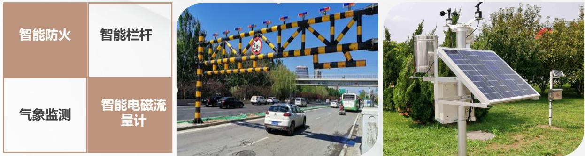

# 智慧化机械

公司养护业务各环节实现 $50\%$ 机械化应用，拥有各类先进机械2000余台。目前已实现机械化除草及修建、机械化清扫、机械化种植、喷药及施肥。

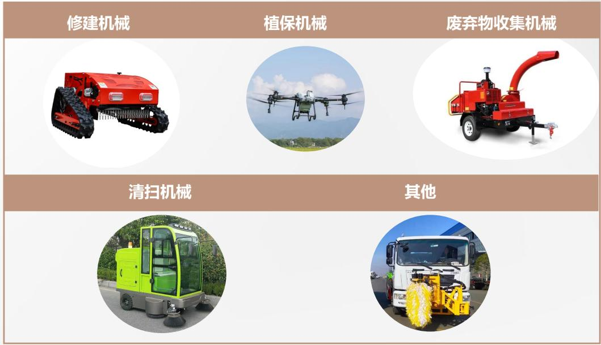

text_image

修建机械
植保机械
废弃物收集机械
清扫机械
其他

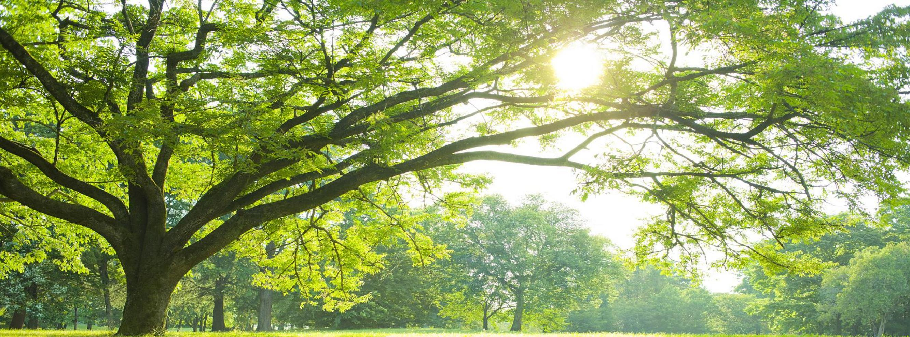

natural_image

Large leafless tree with sunlight filtering through, surrounded by dense green trees under bright sunlight (no text or symbols visible)

# 第三章

# 低碳深耕 绿色运营

# 绿色运营

公司作为生态环保企业，始终坚持绿色发展理念，目前主营业务涉及生态修复、绿地维护、文旅运营、林业经济四大板块，已形成“规划设计—技术研发—抗性苗木选育—工程施工—运营维护”为一体的生态产业链的全面覆盖，是国内同行业公司中产业链覆盖能力较为突出的企业。

# 优秀项目案例：

盐碱地修复  
天津滨海新区“双城之间”绿色森林屏障  
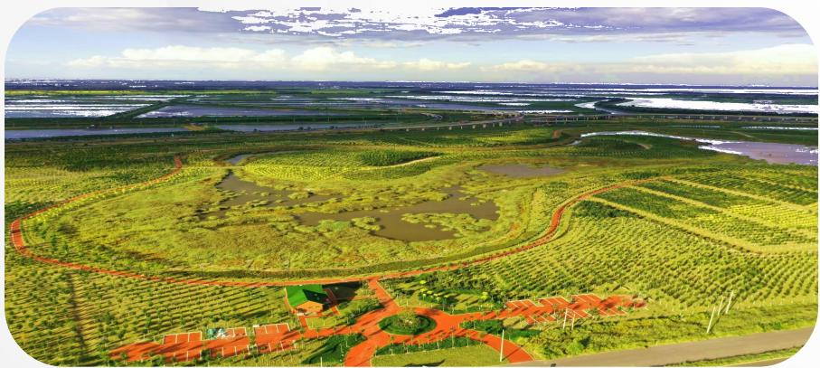

natural_image

Aerial view of a lush wetland landscape with winding paths, red walking paths, and distant water bodies under a partly cloudy sky.

水环境治理  
河南卫河、共产主义渠水环境综合治理  
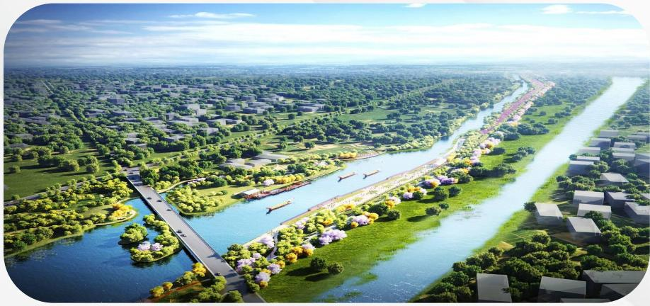

natural_image

Aerial rendering of a modern urban park with green spaces, winding river, and bridges (no visible text or symbols)

矿山修复  
内蒙包头大青山南坡矿山修复  
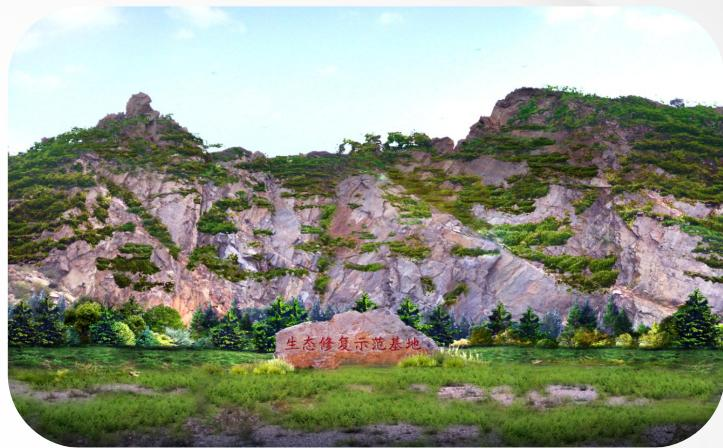

text_image

生态修复示范基地

荒山造林  
西藏拉萨南北山造林工程  
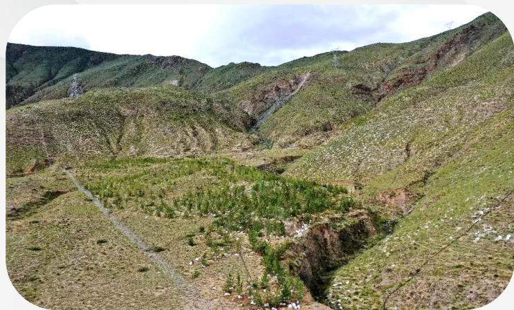

natural_image

Landscape view of a rugged, arid valley with green slopes and sparse vegetation (no visible text or symbols)

坎坡修复  
新疆温宿县环城坎坡生态修复  
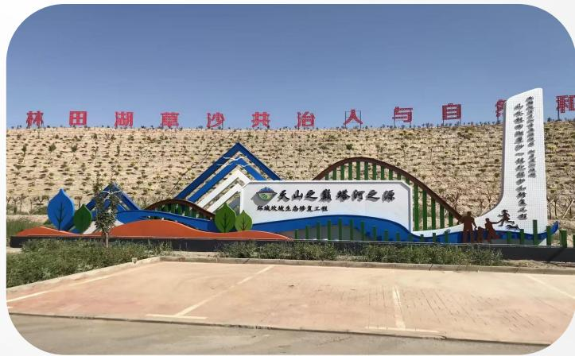

text_image

林田湖草沙共治人与自然和
天山之巅塔河之源
环境植被生态修复工程

湿地修复  
天津临港湿地公园  
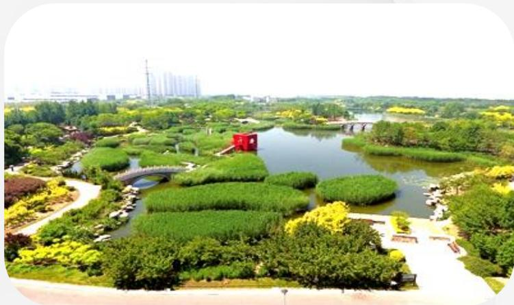

natural_image

Aerial view of a lush green park with blooming trees, winding pathways, and a central pond, with modern buildings in the background (no visible text or symbols).

# 优秀项目案例：

荒漠化防治  
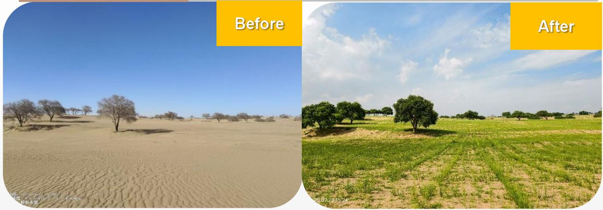

natural_image

Two landscape photos: one of a desert dune with sparse trees, the other of a vast green field with scattered trees and grass (no text or symbols)

荒漠化及生态修复工程  
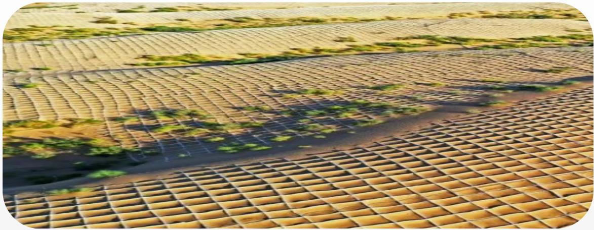

natural_image

Aerial view of a large agricultural field with neatly arranged crop rows and no visible text or symbols.

盐碱地和湿地生态修复  
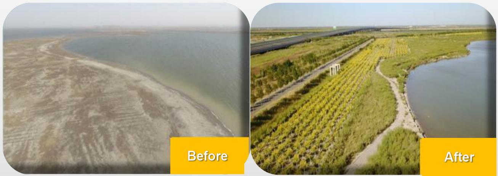

natural_image

Aerial comparison of a dam before and after a wetland landscape, showing erosion and vegetation changes (no text or symbols visible)

草原生态修复工程  
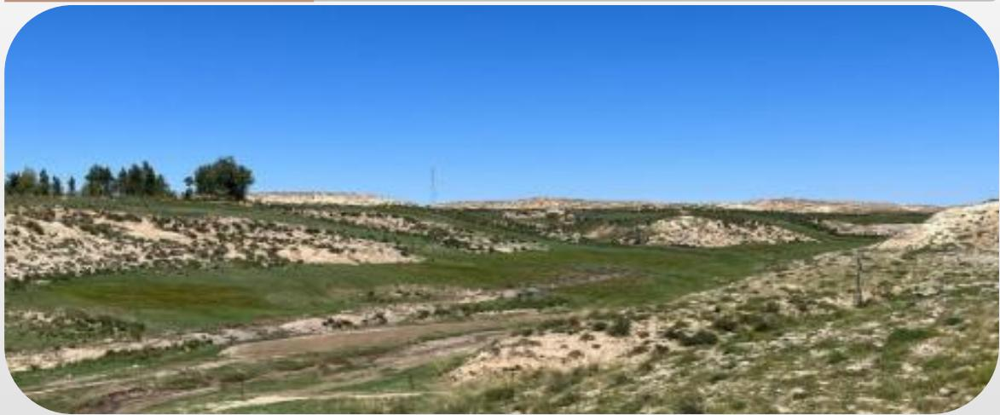

natural_image

Panoramic view of a barren, arid landscape with sparse vegetation and distant hills under a clear blue sky (no text or symbols visible)

# 生态文旅

公司全资子公司森氧文旅是一家文旅全产业链的综合服务商，主要聚焦城市新文旅、生态文旅、IP开发运营、乡村振兴等业务发展，依托集团资源，以及投资开发、建设运营的优势，研究城市存量资产盘活及生态资源资产化课题，全面助力乡村振兴。

# 森氧文旅产品体系

野奢 高端 丰富

嘜嘜兽·梦幻森林
DREAM WOODLAND

亲子

森氧梦·秘密花园
SECRET GARDEN

露
营

食物农场DREAMFARM

农场

梦不落村
DREAM VILLAGE

住宿

运动小镇
SPORT ZONE

体育

# 代表案例：嚶嚶兽·梦幻森林（2022年落地）

项目位于天津市北辰区大张庄镇旁，总占地面积7500亩，示范区500亩。是不占用建设指标的林下运营模式，将林下空间与游乐完美融合。现状林木覆盖率达85%。自开园以来，<噁噁兽梦幻森林>以亲子游乐为主题，原创IP“噁噁兽”为核心亮点，先后打造了“亲子露营派对”、“森林市集”、“中秋汉服游园灯会”、“万圣节尖叫黑森林”等特色IP主题活动，开创林下经济的新形式、新业态。

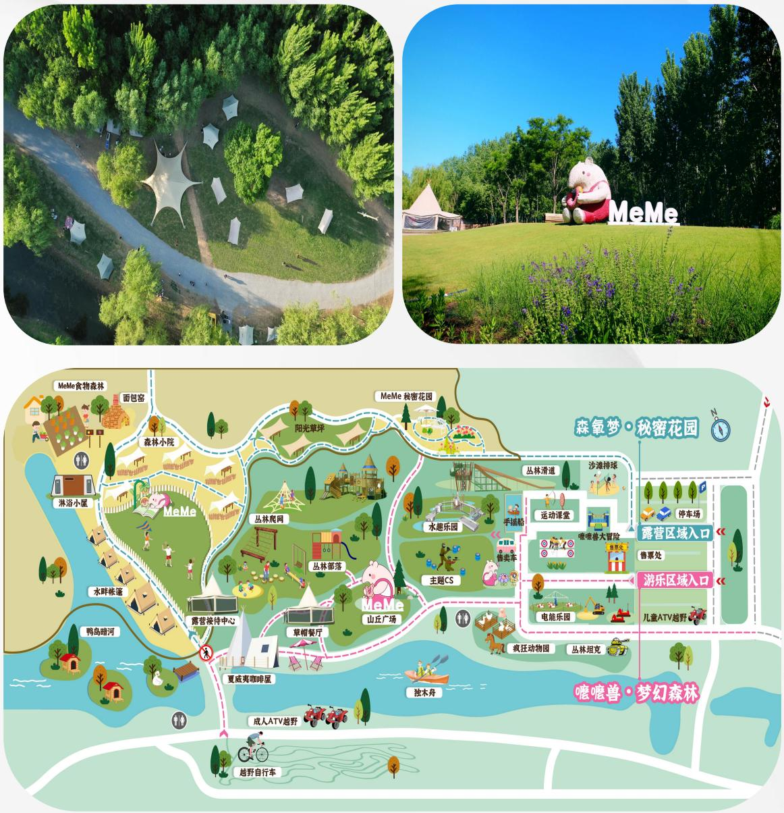

# 嚬嚬兽·梦幻森林（2026年升级）

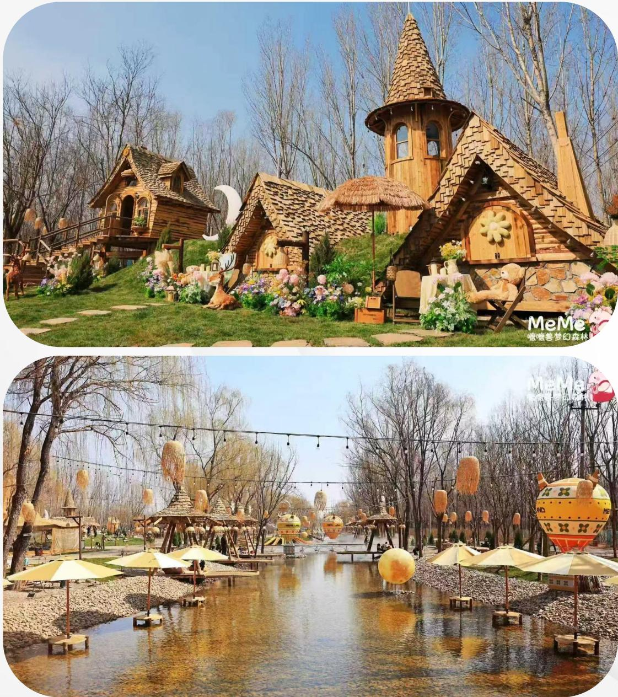

# 嚬嚬兽·梦幻梦幻山海（2025年落地）

项目位于天津市东疆港，毗邻东疆湾沙滩景区，项目深度融合东疆海洋生态资源与山海经文化元素，有效激活了东疆滨海生态旅游的消费活力。同时联动东疆湾沙滩景区等区域文旅资源，构建区域文旅联动发展。

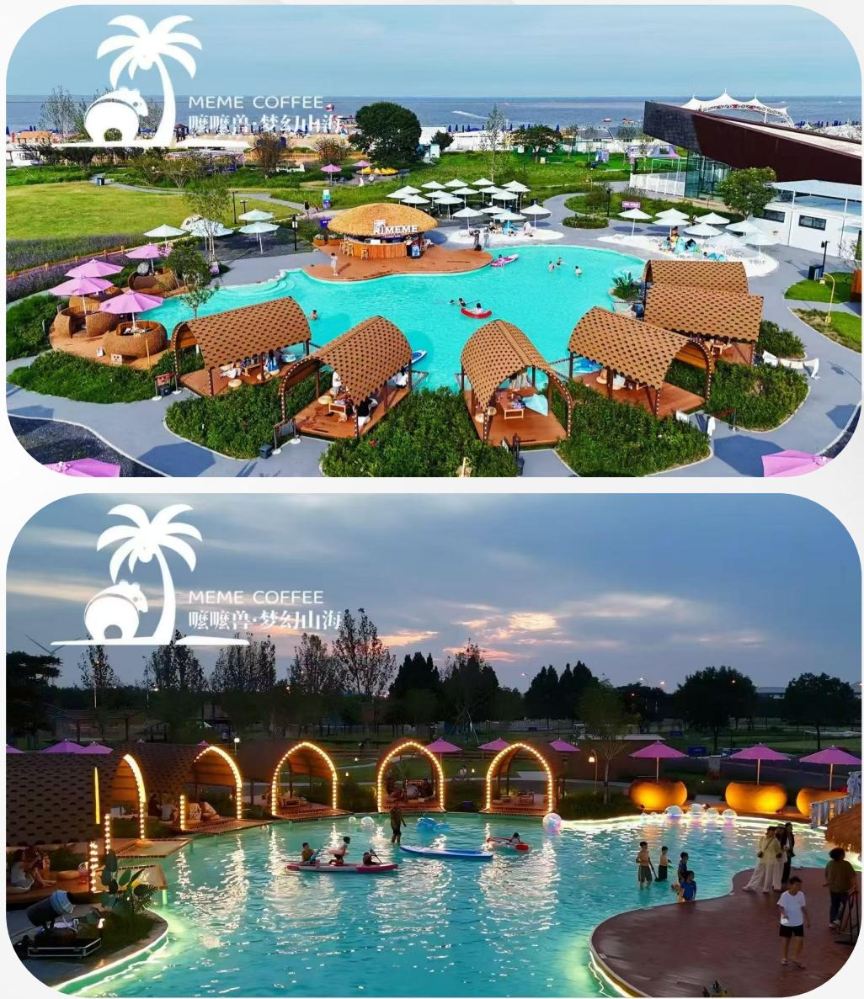

# 林业经济

# 林业碳汇

# 林业碳汇监测

公司将多源遥感卫星影像、无人机影像、机载/手持激光雷达点云数据相结合，拥有一套固碳价值评估手段。

# 林业碳汇开发

公司通过布设样地、开展实地测量，形成了一套碳汇量监测、精准核算的计算方法和技术体系。

# 案例

# 东丽区储备林项目

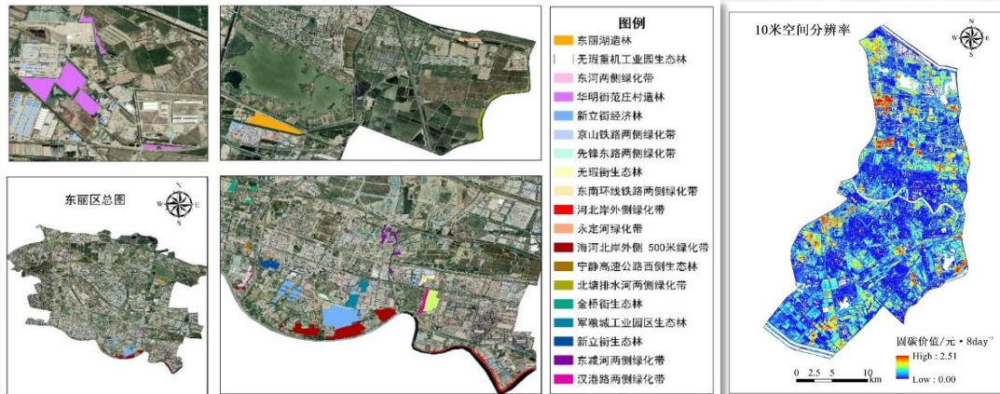

# 林下种植

# 案例

# 东丽区储备林项目

主要种植林草（牧草、草皮），林菜（牛奶玉米、乌豆、西葫芦、红薯），林药（紫苏、射干、桔梗、防风、柴胡）等。

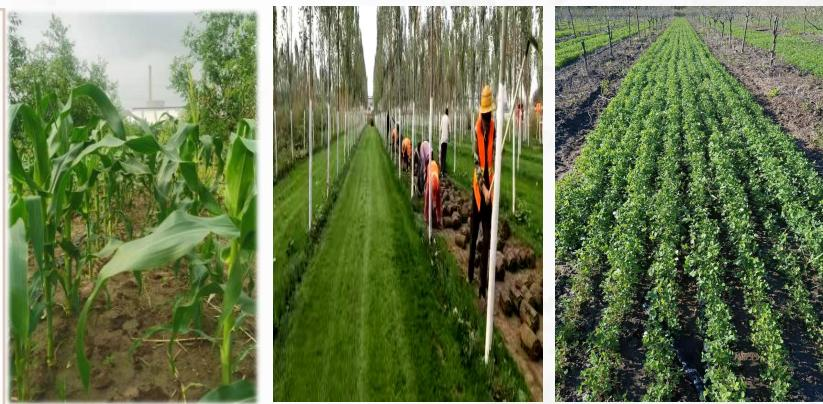

# 绿色办公

在国家“碳达峰、碳中和”目标引领下，公司作为生态环保企业，积极响应国家战略，树立绿色发展理念，大力倡导绿色办公，加强节能环保宣传，鼓励员工积极开展环保行动。

- 空调实行专人管理  
- 夏季温度不低于26度  
- 冬季温度不高于20度

- 注意循环利用  
- 倡导科学出行；合理规划路线，减少出车车次。

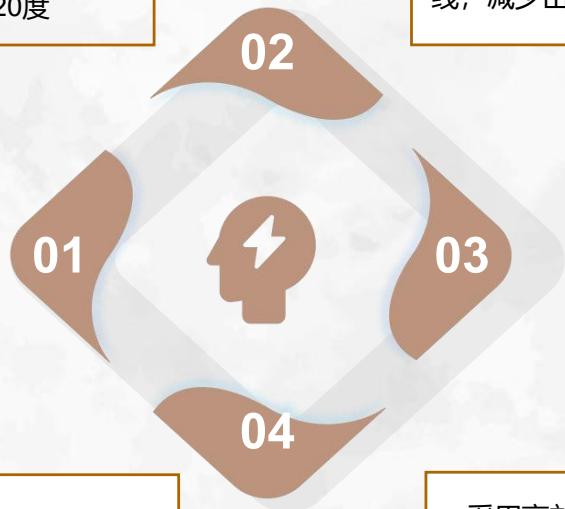

flowchart

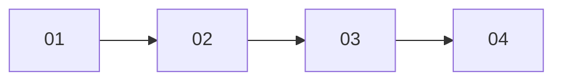
```mermaid
graph LR
  A["01"] --> B["02"]
  B --> C["03"]
  C --> D["04"]
```

- 大力推行无纸化办公；开通线上OA无纸化办公流程，减少纸张使用  
- 提倡双面打印

- 采用高效节能灯具，如LED灯  
- 在开关、水龙头等区域张贴节能标语

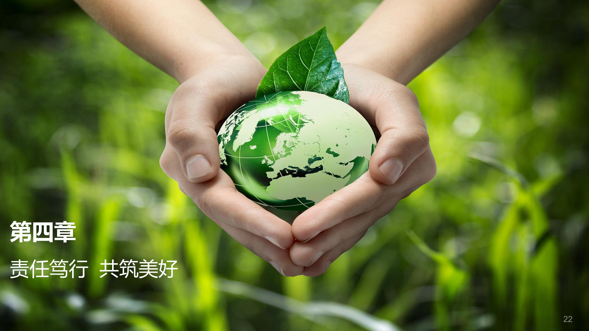

text_image

第四章
责任笃行 共筑美好

# 第四章

# 责任笃行 共筑美好

# 公益慈善

# 助力生态文明建设

绿茵生态积极响应国家“绿水青山就是金山银山”的生态文明建设号召，践行企业绿色发展理念，2025年公司向北京企业家环保基金会捐款8万元，为共同建设美丽中国贡献力量。

# 助力各类社会帮扶项目

2025年，绿茵生态向天津市宁河区慈善协会捐款10万元，向中国农业大学教育基金会捐款19.5万元。为慈善救助，扶贫济困工作贡献一丝力量。

# 坚持做公益，赞助各类慈善活动

2025年，绿茵生态参与全国各地的捐助活动，累计捐款38.8万元，共同助力公益，传递爱心。

# 员工关爱

公司自成立以来，绿茵生态坚持以人为本的发展思想，与员工共同成长，为员工创造充分的发展空间，保障员工合法权益。

# 员工权益保障

公司严格遵守《中华人民共和国劳动法》等相关法律法规，坚持公平、公正、公开的雇佣原则，确保所有员工在招聘、劳动、薪资、培训、晋升等阶段都能享受到公平对待。2023年，公司丰富了招聘方式，以吸纳更多人才；对在岗员工进行重新梳理编制，优化公司团队，提高业务效率。

# 健康与安全保障

我们深知员工的健康与安全是公司的首要责任。为此，我们建立了完善的健康与安全管理体系，确保每位员工在工作场所的安全。我们定期进行安全培训，提高员工的安全意识。同时，我们重视员工的健康状况，提供必要的健康检查，预防职业病，为员工创造一个健康的工作环境。

# 工作与生活平衡

我们鼓励员工追求工作与生活的平衡。我们为驻外员工设置探亲假，对患有重大疾病的员工进行经济帮扶。

# 薪酬福利与激励

我们秉持公平、公正的原则，为员工提供具有竞争力的薪酬福利。除此之外，我们还设立了一系列的激励机制，如专项奖励、绩效奖金、晋升机会等，以激发员工的工作积极性和创造力。

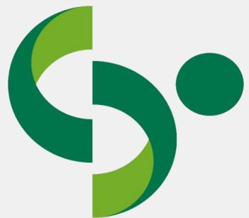

natural_image

Abstract green logo design with interlocking curved shapes and a dot (no text or symbols)

# 天津绿茵景观生态建设股份有限公司

# 股票代码：002887

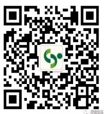

text_image

QR code with embedded logo in center, likely for digital linking or payment

