中国供销合作社

CHINA CO-OP

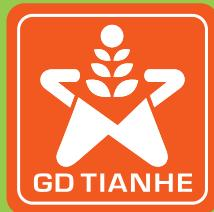

公司官网链接：http://www.gd-tianhe.com  
公司电话：020-87766490  
电子邮箱：zqbgs@gd-tianhe.com  
地址：广州市越秀区东风东路709号

# 2025年度

# 环境、社会和公司治理(ESG)报告

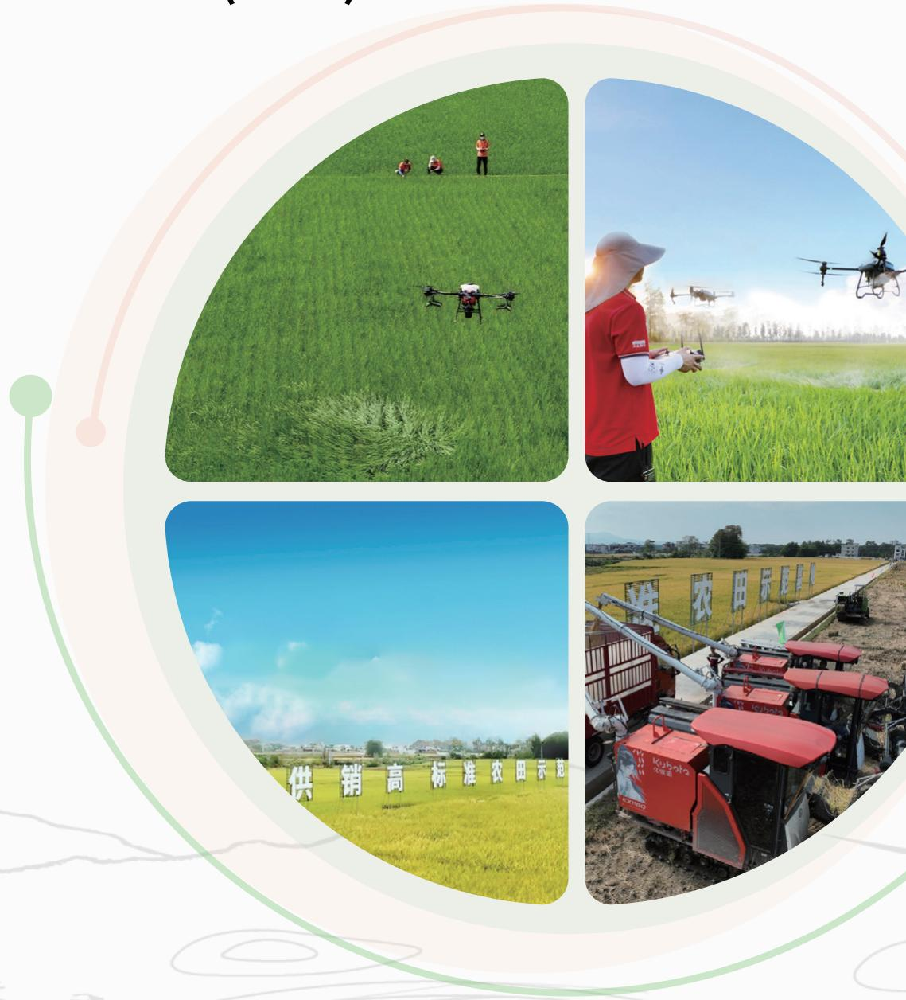

text_image

供销高标准农田示范
Kubaha

# 目录

关于本报告 /01

走进天禾股份 /03

可持续发展治理 /11

附录 /101

指标索引 /101

意见反馈表 /103

natural_image

Illustration of a farmer harvesting apples in a forest setting (no text or symbols)

# 规范治理

# 夯实稳健发展根基

# 01

党建引领 /17

公司治理 /20

合规经营与风险管理 /25

投关管理 /27

商业道德 /28

数据安全与客户隐私保护 /30

# 服务三农

# 共绘乡村振兴画卷

# 02

创新驱动 /35

乡村振兴与社会贡献 /41

供应链安全 /49

产品和服务安全与质量 /56

以人为本 164

# 向绿而行

# 守护美丽生态家园

# 03

应对气候变化 /85

资源利用与循环经济 /89

污染防治 /98

# 关于本报告

# 报告说明

本报告是广东天禾农资股份有限公司(简称“天禾股份”“广东天禾”“公司”)发布的第三份环境、社会和公司治理(ESG)报告。报告遵循客观、规范、透明和全面的原则，详细披露了公司2025年度在ESG方面的工作和成效，并就利益相关方关注的可持续发展议题诉求作出积极回应，旨在提升信息透明度，增进各利益相关方对公司的理解与信任。

# 报告范围

本报告以“天禾股份”为主体，包括下属子(分)公司，除特别说明外，本报告范围与本公司年报范围保持一致。

# 时间范围

本报告的时间范围为2025年1月1日至2025年12月31日（简称“报告期”）。为增强报告的对比性和前瞻性，部分内容适当追溯以往年份或具有前瞻性描述。本报告的发布周期为一年一次，与财务年度保持一致。

# 编制依据

◆ 深圳证券交易所《深圳证券交易所上市公司自律监管指引第17号——可持续发展报告(试行)》  
◆ 深圳证券交易所《深圳证券交易所上市公司自律监管指南第3号——可持续发展报告编制(2026年修订)》  
◆ 国务院国有资产监督管理委员会《关于新时代中央企业高标准履行社会责任的指导意见》  
◆ 国务院国有资产监督管理委员会《央企控股上市公司ESG专项报告编制研究》  
全球报告倡议组织《GRI可持续发展报告标准(GRI Standards)》  
◆ 中国企业改革与发展研究会《中国企业可持续发展报告指南CASS-ESG 6.0》  
◆ 联合国可持续发展目标(SDGs)

# 数据来源

本报告使用的数据主要来源于公司实际运行的原始数据、政府部门公开数据、年度财务数据、内部相关统计报表等。报告中涉及的财务数据以人民币为单位，若与年报不一致之处，以年报为准。

释义说明

<table><tr><td>公司简称</td><td>公司全称</td></tr><tr><td>天禾股份、广东天禾、公司</td><td>广东天禾农资股份有限公司</td></tr><tr><td>广东省供销社</td><td>广东省供销合作联社</td></tr><tr><td>广东省供销集团</td><td>广东省供销集团有限公司</td></tr><tr><td>中加化肥</td><td>广东天禾中加化肥有限公司</td></tr><tr><td>珠海瑞农</td><td>珠海经济特区瑞农植保技术有限公司</td></tr><tr><td>科农种业</td><td>广东科农蔬菜种业有限公司</td></tr><tr><td>良种苗木</td><td>广东天禾良种苗木繁育有限公司</td></tr><tr><td>大丰植保</td><td>广东大丰植保科技有限公司</td></tr><tr><td>科芯种苗</td><td>惠州市科芯种苗科技有限公司</td></tr><tr><td>壹号生物</td><td>广东天禾壹号生物科技有限公司</td></tr><tr><td>天禾种业</td><td>广东天禾种业有限公司</td></tr><tr><td>耕力优</td><td>广西耕力优科技有限公司</td></tr></table>

# 报告获取

本报告可以在深圳证券交易所网站(http://www.szse.cn)、巨潮资讯网站(http://www.cninfo.com.cn/new/index)查阅和下载。

# 走进天禾股份

# 公司简介

广东天禾农资股份有限公司于2009年3月通过股份制改组设立，是广东省供销合作联社的直属企业之一，前身是成立于1952年的广东省农业生产资料总公司，有着70余年的经营历史。公司于2020年9月在深圳证券交易所挂牌上市。公司以现代农技服务为先导、直达终端的配送体系为支撑，主要从事化肥、农药等农资产品的销售并提供专业的农技服务、农业社会化服务。2025年，公司获评全国农资流通企业综合竞争力AAAAA级，是中国具有较大品牌影响力的农资流通服务企业，是广东省重点农业龙头企业和农业产业化国家重点龙头企业。

在广东省供销合作联社深入推进“四网一基地一平台”公共型农业社会化服务体系建设的总体布局下，公司立足生产服务端，持续深化“以农户为中心，以作物为导向”理念，做强“农资流通基本盘、农业社会化服务体系”两大通道，促进营养、植保、农服“三网”融合发展，协同推动广东粮食和特色优势农产品全产业链价值提升，致力于发展成为国内现代农业生产综合服务的引领者。

公司持续巩固农资流通主渠道地位。近年来，公司年均向全国市场供应各类化肥超400万吨、供应农药超25亿元，全力保障农业生产需求。截至报告期末，公司已在全国22个主要农业生产省区和农资集散地建立了102家配送中心，直接对接服务的终端核心门店和种植大户超2,5000家，服务区域实现24小时全天候响应，2小时内产品送达。

公司充分发挥农业社会化服务主力军作用。公司自2021年起牵头推进“4+100+1000”农资农技服务网络建设，目前已在广东省建设了4个区域服务中心、51家县域中心、516家镇村作物服务中心，服务覆盖全省所有水稻主产区。2021年至今，公司在广东省开展农业社会化服务近2,000万亩，其中2025年服务面积实现802万亩，同比增长45%，并实现了良好的经济、社会和生态效益。

公司紧紧围绕服务广东省供销合作联社综合改革大局，全面推进战略转型，在广东因地制宜发展合作经济，协同“四网一基地一平台”、各级供销社、村集体、广大农户大力开展“社村”合作试点，深化“订单农业+全程社会化服务”模式，协同打通丝苗米、甘薯、甜玉米、豇豆等广东粮食和重要农产品全产业链，致力推动农产品全产业链价值提升，促进产业增值增效、农户增产增收、村集体经济发展壮大。

公司文化  
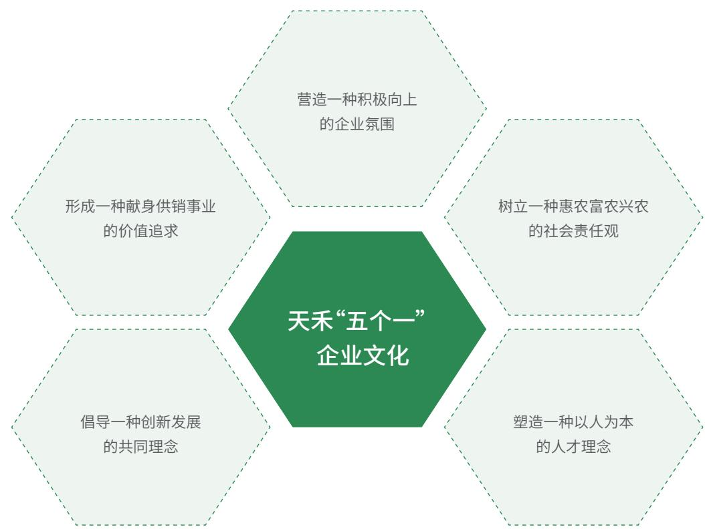

flowchart

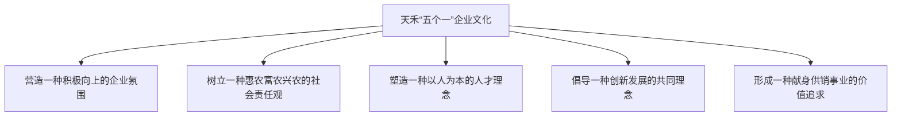
```mermaid
graph TD
  Center["天禾“五个一”企业文化"]
  
  A1["营造一种积极向上的企业氛围"]
  A2["树立一种惠农富农兴农的社会责任观"]
  A3["塑造一种以人为本的人才理念"]
  A4["倡导一种创新发展的共同理念"]
  A5["形成一种献身供销事业的价值追求"]
  
  Center --> A1
  Center --> A2
  Center --> A3
  Center --> A4
  Center --> A5
```

# 发展战略

天禾股份认真落实广东省委“1310”具体部署、实施“百千万工程”，聚焦服务广东省供销社综合改革和“四网一基地一平台”建设，深化“以农户为中心、以作物为导向”理念，围绕“发展成为全国领先的现代农业生产综合服务龙头企业愿景，做大农资流通基本盘、做强农资农技服务网络，实现三网融合发展”的“1个愿景、2大通道、3网融合发展”战略，打造广东粮食和重要农产品产地供应链，以现代农业生产综合服务带动公司传统农资经营模式高质量转型升级，促进产业增值增效、农户增产增收、新型农村集体经济发展壮大。

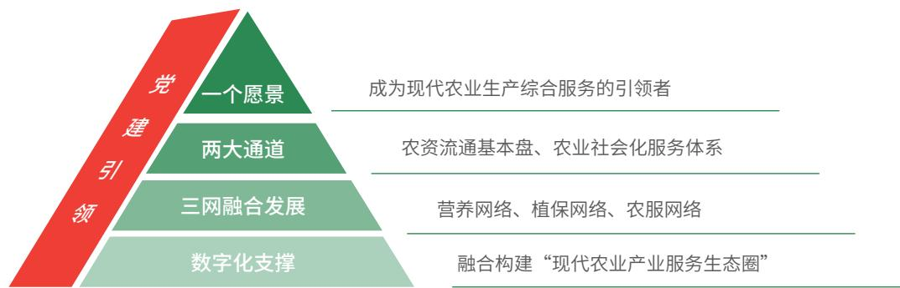

flowchart

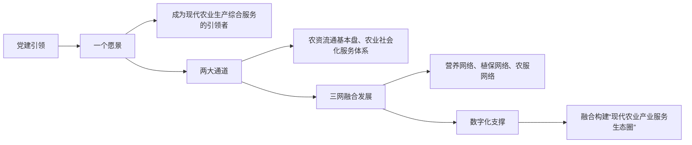
```mermaid
graph LR
  A["党建引领"] --> B["一个愿景"]
  B --> C["成为现代农业生产综合服务的引领者"]
  B --> D["两大通道"]
  D --> E["农资流通基本盘、农业社会化服务体系"]
  D --> F["三网融合发展"]
  F --> G["营养网络、植保网络、农服网络"]
  F --> H["数字化支撑"]
  H --> I["融合构建“现代农业产业服务生态圈”"]
```

# 发展历程

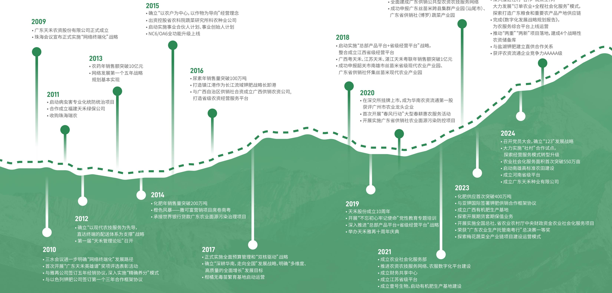

area

| Year | Milestone |
| --- | --- |
| 2009 | • 广东天禾农资股份有限公司正式成立 • 珠海会议宣布正式实施“网络终端化”战略 |
| 2010 | • 三水会议进一步明确“网络终端化”发展路径 • 首次开展“广东天禾英雄谱”奖项评选表彰活动 • 与雅苒公司签订五年经销协议，深入实施“精确养分”模式 • 与以色列钾肥公司签订第一个三年合作框架协议 |
| 2011 | • 启动病虫害专业化统防统治项目 • 合作成立福建天禾绿保公司 • 收购珠海瑞农 |
| 2012 | • 确立“以现代农技服务为先导，直达终端的配送体系为支撑”战略 • 第一届“天禾管理论坛”召开 |
| 2013 | • 农药年销售额突破10亿元 • 网络发展第一个五年战略规划基本实现 |
| 2014 | • 化肥年销售量突破200万吨 • 橙色风暴——撒可富营销项目席卷南粤 • 承接世界银行贷款广东农业面源污染治理项目 |
| 2015 | • 确立“以农户为中心，以作物为导向”经营理念 • 出资控股省农科院蔬菜研究所科农种业公司 • 启动实施事业合伙人计划、事业创始人计划 • NC6/OA6全功能升级上线 |
| 2016 | • 尿素年销售量突破100万吨 • 打造镇江港作为长江流域钾肥战略长卸港 • 与广西自治区供销社合资成立广西供销农资公司，打造省级农资经营服务平台 |
| 2017 | • 正式实施全面预算管理和“双核驱动”战略 • 确立“深耕华南，走向全国”发展战略，明确“多维度、高质量的全面增长”发展目标 • 柑橘无毒苗繁育基地启动运营 |
| 2018 | • 启动实施“总部产品平台+省级经营平台”战略，整合成立江西省级经营平台 • 广西粤天禾、江苏天禾、湛江天禾粤联年销售额突破1亿元 • 成功申报韶关市南雄市丝苗米省级现代农业产业园、广东省供销社怀集丝苗米现代农业产业园 |
| 2019 | • 天禾股份成立10周年 • 开展“不忘初心牢记使命”党性教育专题培训 • 深入推进“总部产品平台+省级经营平台”战略 • 举办天禾雅苒十周年庆典 |
| 2020 | • 在深交所挂牌上市，成为华南农资流通第一股获评广州市农业龙头企业 • 首次开展“春风行动”大型春耕惠农服务活动 • 开展实施广东省供销社农业面源污染防控项目 |
| 2021 | • 成立农业社会化服务部 • 推进农资农技服务网络、农服数字化平台建设 • 成立财务共享中心 • 成立江苏省级平台 • 成立壹号生物，启动有机肥生产基地建设 |
| 2022 | • 化肥供应首次突破400万吨 • 与亚钾国际签署钾肥供销合作框架协议 • 成立广西有机肥生产基地 • 探索开展期货套期保值业务 • 开展实施全国总社、省农业农村厅中央财政资金农业社会化服务项目 • 获获“广东农业生产托管南粤行”总决赛一等奖 • 探索梅花蔬菜全产业链项目建设运营模式 |
| 2023 | • 全面建成广东供销公共型农资农技服务网络 • 成功申报广东丝苗米跨县集群产业园(汕尾市)、广东省供销社(博罗)蔬菜产业园 |
| 2024 | • 召开党员大会，确立“123”发展战略 • 大力实施“社村”合作试点，探索经营服务模式转型升级 • 农业社会化服务面积首次突破550万亩 • 启动南雄高标准农田建设 • 成立河南省级平台 • 成立广东天禾种业有限公司 |

# 企业荣誉

natural_image

Golden trophy with laurel wreath design, mounted on a black base (no text or symbols visible)

2025中国企业1000家(天禾股份977名)

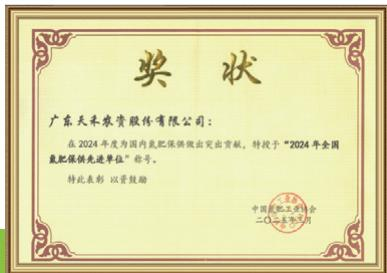

text_image

奖状
广东天禾农资股份有限公司：
在2024年度为国内氮肥保供做出突出贡献，特授予“2024年全国氮肥保供先进单位”称号。
特此表彰 以资鼓励
中国氮肥工贸协会
二〇二五年五月

2024年全国氮肥保供先进单位

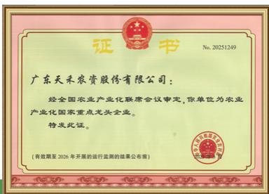

text_image

证书
No. 20251249
广东天未农资股份有限公司：
经全国农业产业化联席会议审定，除单位为农业产业化国家重点龙头企业。
特此此证。
（有效期至2026年开展的运行监测的结果公布前）

农业产业化重点龙头企业

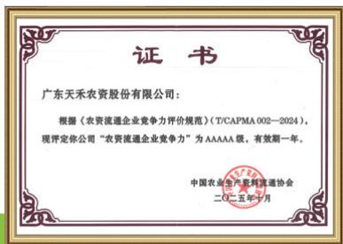

text_image

证书
广东天禾农资股份有限公司：
根据《农资流通企业竞争力评价规范》(T/CAPMA 002-2024)，现评定你公司“农资流通企业竞争力”为AAAAA级，有效期一年。
中国农业资产监督管理委员会
二〇二五年一月

2025农资流通企业竞争力(AAAAAA级)

natural_image

Golden trophy with laurel wreath design on black base, no text or symbols visible

2025中国服务业企业500强的通知(天禾股份358名)

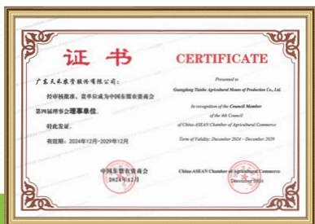

text_image

证书
广东天禾农资股份有限公司：
封印批准，需单位成为中国东盟农商协会
国内证券公理事单。
特此发证。
有效期：2024年12月-2029年12月
中国东莞市贵酒会
2024年12月
CERTIFICATE
Presented to
Guangdong Tianjin Agricultural Bureau of Production Co., Ltd.
In recognition of the Council Number
of the 4th Council
of China-ASEAN Chamber of Agricultural Commerce
Term of Validity: December 2024 - December 2029
China-ASEAN Chamber of Agricultural Commerce
December 2024

中国东盟农资商会第四届理事会理事单位

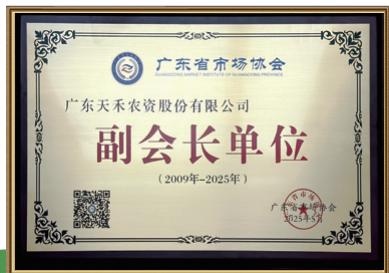

text_image

广东省市场协会
GUANGDONG YUAN JIAO TENDER'S ASSOCIATION OF GONGZHEN PROPERTIES
广东天禾农资股份有限公司
副会长单位
(2009年-2025年)
深圳市市场监督管理局
广东省市场协会

广东省市场协会副会长单位
(天禾股份)2009-2025

natural_image

Golden trophy with laurel wreath design on black base (no text or symbols)

2025广东企业500强、广东民营企业100强、广东制造业企业100强、广东服务业企业100强、广东创新企业100强(天禾股份182名)

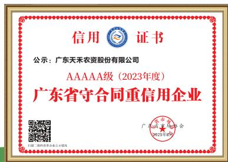

text_image

信用证书
公示：广东天禾农资股份有限公司
AAAAA级（2023年度）
广东省守合同重信用企业
广州市越秀区
2025年4月

广东省守合同重信用企业5A (2023年度) 信用证书

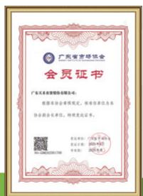  
广东省市场协会副会长单位

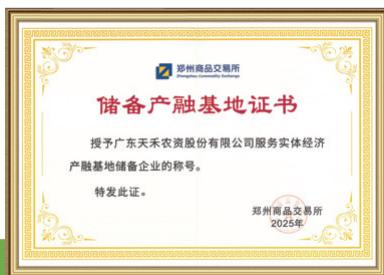

text_image

郑州商品交易所
Zhengzhou Commercial Exchange
储备产融基地证书
授予广东天禾农资股份有限公司服务实体经济
产融基地储备企业的称号。
特发此证。
郑州商品交易所
2025年

服务实体经济产融基地储备企业

# 数说2025

# 品 经济绩效

总资产 798,733.63 万元 营业收入1,359,014.16 万元 净利润7,599.37 万元

归属于上市公司股东的净利润 5,981.85 万元 基本每股收益 0.17 元/股

# 治理绩效

<table><tr><td>股东会召开次数</td><td>股东会审议通过议案数</td><td>董事会召开次数</td><td>董事会成员出席率</td></tr><tr><td>4次</td><td>14项</td><td>14次</td><td>100%</td></tr></table>

<table><tr><td>董事会审议通过议案数</td><td>互动易平台与投资者互动次数</td><td>参加反商业贿赂及反贪污培训的员工人次</td><td>员工商业道德承诺书签订率</td></tr><tr><td>31项</td><td>121次</td><td>1,084人次</td><td>100%</td></tr></table>

# 环境绩效

<table><tr><td>直接温室气体排放量(范围一)</td><td>间接温室气体排放量(范围二)</td><td>温室气体排放总量(范围一+范围二)</td></tr><tr><td>750.33吨二氧化碳当量</td><td>996.21吨二氧化碳当量</td><td>1,746.54吨二氧化碳当量</td></tr></table>

<table><tr><td>汽油</td><td>柴油</td><td>发生因环境相关问题引发的行政处罚事项</td></tr><tr><td>54.98吨</td><td>88.20吨</td><td>0起</td></tr></table>

<table><tr><td>外购用电</td><td>市政购水</td></tr><tr><td>2,464,649.52千瓦时</td><td>13,247吨</td></tr></table>

# 社会绩效

<table><tr><td>员工总数</td><td>劳动合同签署率</td><td>新进员工数</td><td>管理人员中女性人数</td><td>管理人员中女性人数比例</td></tr><tr><td>2,708人</td><td>100%</td><td>376人</td><td>18人</td><td>14.4%</td></tr></table>

<table><tr><td>员工培训投入</td><td>员工培训场次</td><td>接受培训总人数</td><td>员工培训覆盖率</td></tr><tr><td>33.79万元</td><td>101场次</td><td>2,591人</td><td>100%</td></tr></table>

<table><tr><td>员工内部调动或内部应聘的人数</td><td>社会保险覆盖率</td><td>整治隐患</td><td>隐患排查整改完成率</td></tr><tr><td>23人</td><td>100%</td><td>391项</td><td>100%</td></tr></table>

# 目 产业价值绩效

<table><tr><td>区域服务中心</td><td>县域中心</td><td>镇村作物服务中心</td><td>建立配送中心</td><td>服务农资服务站及种植大户</td></tr><tr><td>4个</td><td>51家</td><td>516家</td><td>102家</td><td>超25,000家</td></tr></table>

<table><tr><td>开展产品质量培训</td><td>产品质量培训人次</td><td>产品质量培训总时长</td><td>发生重大责任质量事故</td><td>产品合格率</td></tr><tr><td>37次</td><td>471人次</td><td>180小时</td><td>0起</td><td>100%</td></tr></table>

<table><tr><td>开展年度质量内审次数</td><td>聘请第三方机构抽检次数</td><td>入选“2025年全国供销合作社农资保供重点企业”名单</td></tr><tr><td>212次</td><td>55次</td><td>28家</td></tr></table>

# 可持续发展治理

# ESG治理

公司秉持可持续发展理念,修订了《董事会战略与ESG委员会工作制度》,构建了由决策层、管理层及执行层组成的三级管理架构,确保职责清晰、协同高效,推动ESG理念贯穿日常运营与战略发展全过程,持续提升公司治理透明度与长期价值创造能力。

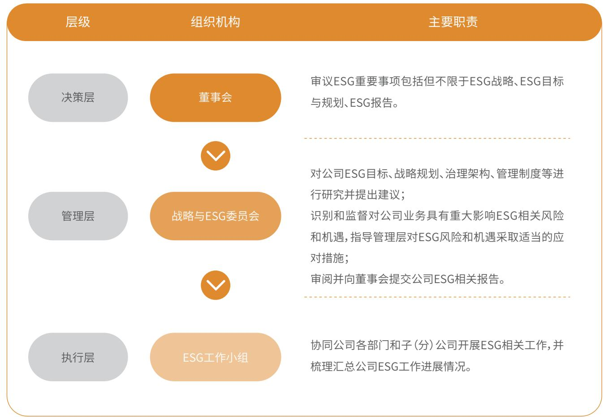

flowchart

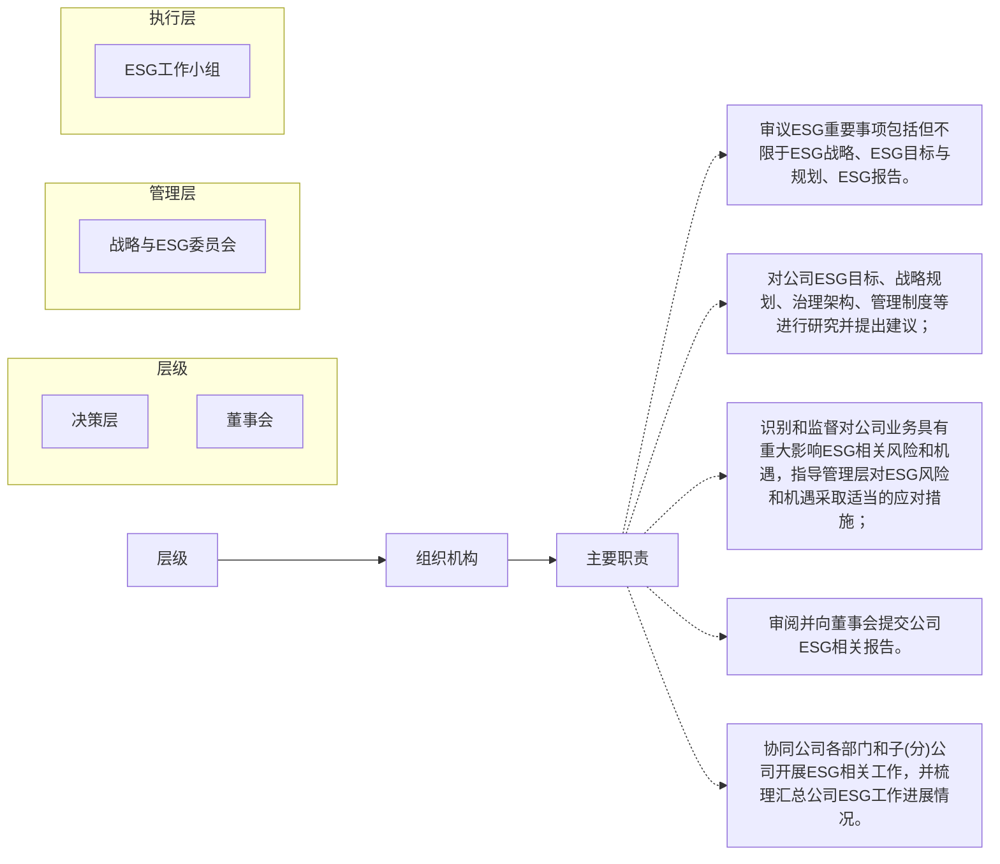
```mermaid
graph LR
  A["层级"] --> B["组织机构"]
  B --> C["主要职责"]
  
  subgraph Level1 ["层级"]
    D["决策层"]
    E["董事会"]
  end
  
  subgraph Level2 ["管理层"]
    F["战略与ESG委员会"]
  end
  
  subgraph Level3 ["执行层"]
    G["ESG工作小组"]
  end
  
  C -.-> H["审议ESG重要事项包括但不限于ESG战略、ESG目标与规划、ESG报告。"]
  C -.-> I["对公司ESG目标、战略规划、治理架构、管理制度等进行研究并提出建议；"]
  C -.-> J["识别和监督对公司业务具有重大影响ESG相关风险和机遇，指导管理层对ESG风险和机遇采取适当的应对措施；"]
  C -.-> K["审阅并向董事会提交公司ESG相关报告。"]
  C -.-> L["协同公司各部门和子(分)公司开展ESG相关工作，并梳理汇总公司ESG工作进展情况。"]
```

# 利益相关方沟通

公司高度重视与各利益相关方的良性互动,通过构建多元沟通渠道,主动倾听各方期望,以务实行动回应利益相关方的诉求与期待,推动企业与利益相关方共创共享价值。

<table><tr><td colspan="2">利益相关方</td><td>诉求与期望</td><td>沟通与回应</td></tr><tr><td rowspan="6"></td><td rowspan="6">政府及监管机构</td><td>·合规经营</td><td>·依法运营</td></tr><tr><td>·依法纳税</td><td>·足额纳税</td></tr><tr><td>·农资保供稳价</td><td>·反腐倡廉</td></tr><tr><td>·服务“三农”</td><td>·乡村振兴</td></tr><tr><td></td><td>·承接农资储备</td></tr><tr><td></td><td>·农业社会化服务</td></tr><tr><td rowspan="4"></td><td rowspan="4">投资者及股东</td><td>·保障股东权益</td><td>·股东会</td></tr><tr><td>·提升股东回报</td><td>·派发股息</td></tr><tr><td>·信息披露及时、公开、公正</td><td>·沟通者交流会</td></tr><tr><td>·公司治理稳健规范</td><td>·及时信息披露</td></tr><tr><td rowspan="6"></td><td rowspan="6">员工</td><td>·保障员工基本权益</td><td>·工会</td></tr><tr><td>·良好的福利待遇</td><td>·完善薪酬福利体系</td></tr><tr><td>·关怀员工身心健康与安全</td><td>·开展员工活动</td></tr><tr><td>·提供职业技能培训</td><td>·职业健康与安全培训</td></tr><tr><td></td><td>·建立培训体系</td></tr><tr><td></td><td>·职业晋升路径</td></tr><tr><td rowspan="4"></td><td rowspan="4">客户</td><td>·优质服务</td><td>·产品质量管控</td></tr><tr><td>·研发创新</td><td>·农技服务技术创新</td></tr><tr><td>·保障产品质量</td><td>·数据与隐私管理</td></tr><tr><td>·数据与隐私安全</td><td></td></tr><tr><td rowspan="3"></td><td rowspan="3">合作伙伴及供应商</td><td>·长期合作</td><td>·定期交流沟通</td></tr><tr><td>·遵守商业道德</td><td>·采购政策与招标程序</td></tr><tr><td>·公平公开采购</td><td>·战略合作</td></tr><tr><td rowspan="3"></td><td rowspan="3">公益组织或社区组织</td><td>·扶贫济困</td><td>·公益慈善活动</td></tr><tr><td>·支持社区发展</td><td>·志愿者服务</td></tr><tr><td></td><td>·乡村振兴</td></tr></table>

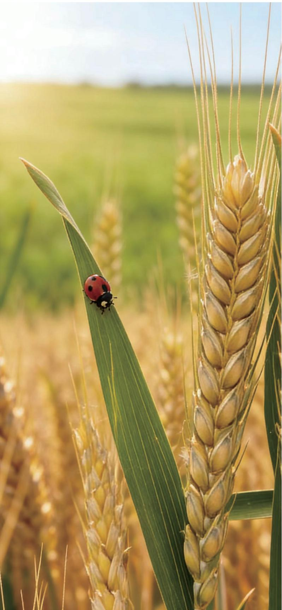

natural_image

Close-up of a ladybug perched on a wheat stalk in a golden field, with blurred green and yellow background (no text or symbols)

# 实质性议题分析

公司参考联合国可持续发展目标SDGs、国内外ESG报告编制标准、同行业关注议题，基于公司发展战略、运营特点以及专家意见等，在充分考虑利益相关方的诉求与期望的基础上，开展实质性议题的识别。从各议题在环境、社会和经济层面影响程度以及对公司财务的重要性两个维度进行排序。经综合评定，公司共识别出20个实质性议题。

高度重要  
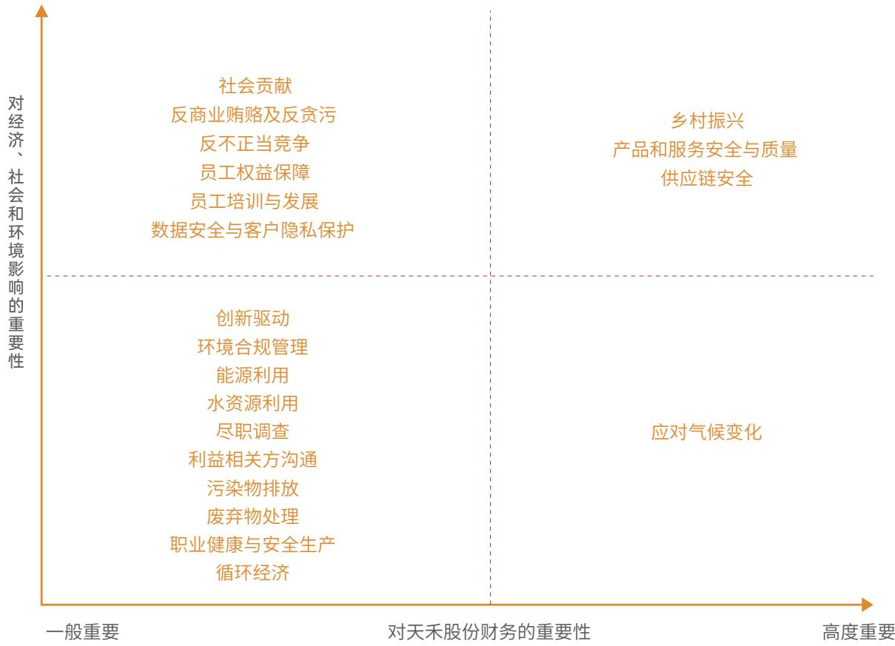

scatter

| Category | Importance to Economy, Society & Environment (X-axis) | Importance to Tianyu Share of Financial Resources (Y-axis) |
| --- | --- | --- |
| 社会贡献 反商业贿赂及反贪污 反不正当竞争 员工权益保障 员工培训与发展 数据安全与客户隐私保护 | 一般重要 | 高度重要 |
| 乡村振兴 产品和服务安全与质量 供应链安全 | 高度重要 | 高度重要 |
| 创新驱动 环境合规管理 能源利用 水资源利用 尽职调查 利益相关方沟通 污染物排放 废弃物处理 职业健康与安全生产 循环经济 | 一般重要 | 高度重要 |
| 应对气候变化 | 高度重要 | 高度重要 |

注1:公司生产经营活动不对生态系统和生物多样性产生重大影响。因此,未将生态系统和生物多样性保护纳入公司ESG议题评估中  
注2:公司研发不涉及生命科学等科技伦理敏感领域的科学研究、技术开发等活动。因此,未将科技伦理议题纳入公司ESG议题评估中  
注3: 公司不符合报告期末应付账款(含应付票据)余额超过300亿元或占总资产的比重超过50%条件。因此, 未将平等对待中小企业纳入公司ESG议题评估中  
注4:公司未开展ESG专项的尽职调查工作,但公司持续开展风险管理工作,识别和评估运营可能产生的负面影响,具体详见规范治理章节

# 01

# 规范治理

# 夯实稳健发展根基

natural_image

Group of five men in red shirts saluting in a field under a clear blue sky, framed by an orange circular border (no text or symbols)

# 党建引领

# 党组织建设

公司党委持续强化政治建设和组织建设，严格落实重大事项集体决策制度，通过党委会前置审议“三重一大”事项，充分发挥党委“把方向、管大局、保落实”作用，扎实推进党建与业务深度融合。牵头开展的“以‘EPC+O’建设南雄高标准农田为抓手，推动‘社村’合作经济新模式高质量发展”项目荣获第十三届广东省“先锋杯”工作创新大赛三等奖，实现了党建引领业务创新的新突破。

扎实推进党支部标准化、规范化建设，以“四强”党支部创建为抓手，高质量完成9个党支部的选举工作，从严抓好党员发展与教育培养，发展新党员12名，基层党组织凝聚力、战斗力不断增强，成功获评省直机关“四强”党支部2个、广东省供销社“四强”党支部2个，打造广东省供销社“金扁担”党建特色品牌1个，基层党组织建设水平全面提升，战斗堡垒作用更加坚实有力。

  
关键绩效

公司设党委

1个

共有党委委员

7人

下设党支部

26个

共有党员

310人

# 党建品牌

公司党委持续深化党建品牌创建工作，依托“一支部一品牌”建设机制，系统推进党建工作与“三农”工作深度融合，着力打造具有供销特色和为农服务导向的党建品牌矩阵。通过强化基层党组织建设、创新学习教育形式、发挥党员先锋模范作用，并将党建实践融入农资保供、农业社会化服务及乡村振兴等重点领域，公司不断推动党建优势转化为服务“三农”和促进企业高质量发展的实际成效，持续提升基层党组织的凝聚力、战斗力与引领力。

# 第十二党支部——“党建引领守护粮食安全”党建品牌

# 案例

第十二党支部围绕服务保障粮食安全，构建便捷高效的农服体系等部署要求，打造“党建引领守护粮食安全”特色品牌，通过强化组织建设、深化理论武装、组建党员先锋服务力量及推进农业社会化服务协同，推动党建工作向为农服务一线延伸。在农技服务下沉、农资稳定供应、农产品冷链流通及“社村”合作等方面取得积极成效，有效带动农户增收、促进产业提质增效，切实将党建引领转化为守护粮食安全与服务农业现代化发展的现实成果，并获评广东省供销社“金扁担”党建特色品牌。

# 高质量开展深入贯彻中央八项规定精神学习教育

抓实深入贯彻中央八项规定精神学习教育，强化组织领导，第一时间成立学习教育工作专班，召开工作专班会议8次、党委专题学习13次，示范带动26个党支部制定学习计划表，引导党员干部原原本本研读总书记关于加强党的作风建设的重要论述，推动学习成果转化为履职尽责、服务“三农”的实际行动。坚持开门纳谏，召开“书记茶话会”，围绕公司战略、作风建设、业务发展等内容倾听员工意见，将群众参与贯穿学习教育全过程。坚持警钟长鸣，召开学习教育警示教育会，集中观看警示教育片，纪委书记作“以案为鉴”警示教育讲话，党委书记以“传承廉洁底色、践行实干担当，以过硬作风推动天禾股份‘三农’事业高质量发展”为题讲授专题党课。组织党员干部及关键岗位人员赴广州市党员干部纪法教育基地参观并重温入党誓词，引导党员干部从思想根源上破除“四风”顽疾，以严实作风推动为农服务高质量发展。

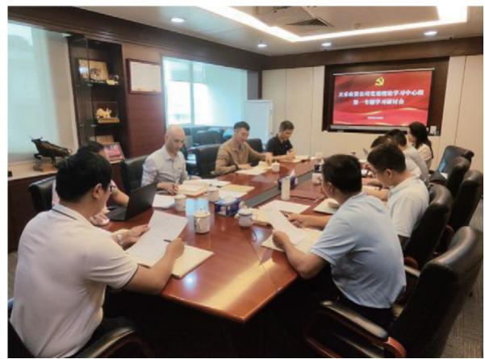

text_image

天津市某公司某部经济学研究中心组
第一中学学术研讨会

开展党委理论学习中心组学习

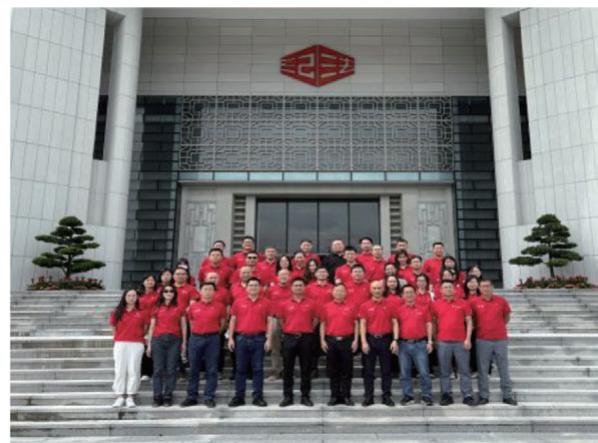

natural_image

Group photo of people in red shirts posing in front of a modern building with a red emblem (no visible text or symbols on individuals or steps)

参观广州市党员干部纪法教育基地

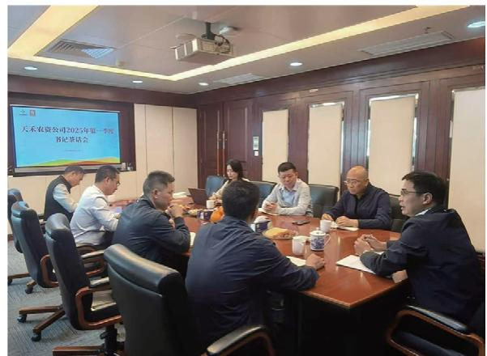

text_image

二届
天禾农牧公司2025年第一季度
书记票座谈会

书记茶话会

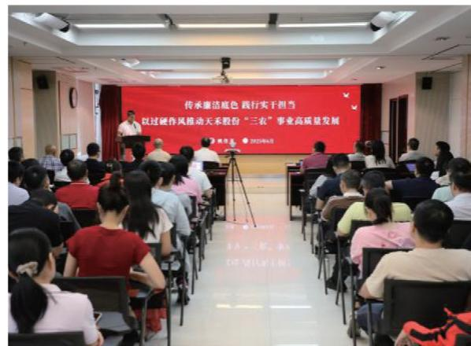

text_image

传承廉洁底色 践行实干担当
以过硬作风推动天禾股份“三农”事业高质量发展
2023年6月

党委书记讲党课

# 红色教育实践活动

# 案例

公司各党支部积极开展“传承红色基因 厚植为农情怀”“追思革命先烈 廖续红色血脉”等主题党日活动，组织党员参观中共福建临时省委旧址、广东革命历史博物馆等红色教育基地，引导党员在实地参观学习中感悟初心使命、赓续红色血脉、传承红色基因，进一步坚定理想信念，增强责任意识和奋斗精神。

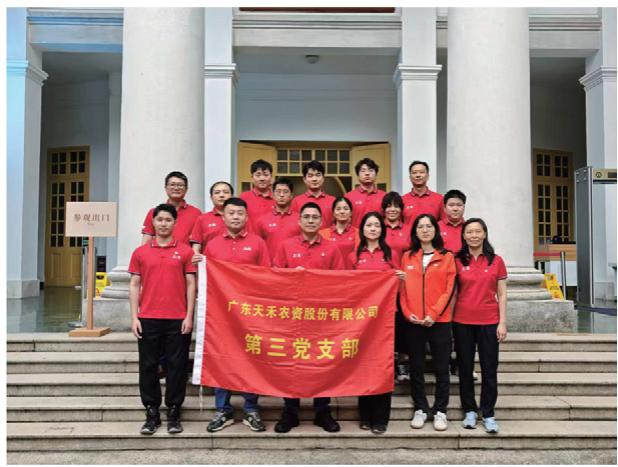

text_image

参观出口
广东天禾农资股份有限公司
第三党支部

第三党支部参观广东革命历史博物馆

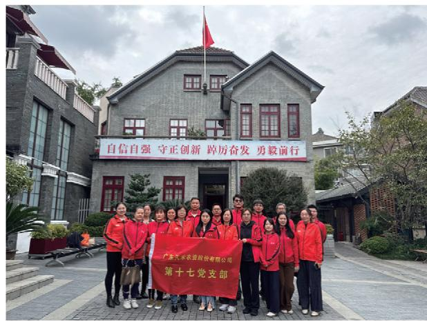

text_image

自信自强 守正创新 路厉奋发 勇毅前行
广东天水集团股份有限公司
第十七党支部

第十七党支部参观民族企业永利钰厂纪念馆

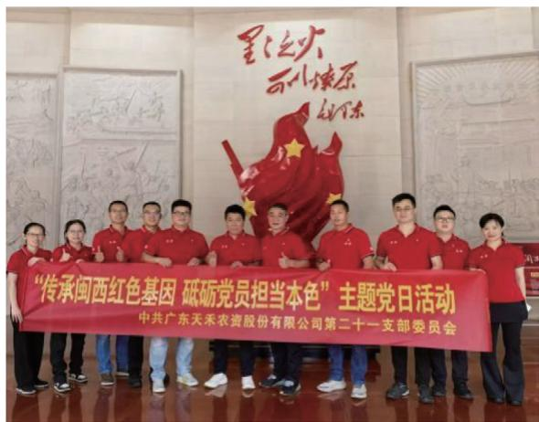

text_image

“传承闽西红色基因 砥砺党员担当本色”主题党日活动
中共广东天禾农资股份有限公司第二十一支部委员会

第二十一党支部参观中共福建临时省委旧址

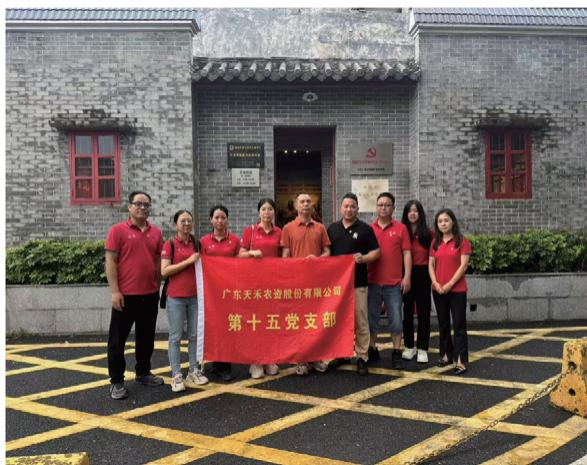

text_image

广东天禾农资股份有限公司
第十五党支部

第十五党支部参观中共增城敌后县委旧址

# “党员服务日”活动

# 案例

公司持续开展“党员服务日”活动，组织党员深入基层一线和为农服务现场，发挥先锋模范作用，在服务群众和助力农业生产中践行初心使命，切实把党建成效转化为服务“三农”和推动企业发展的实际成果。

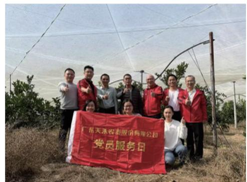

text_image

广东天禾农资股份有限公司
党员服务局

第九党支部“党员服务日”

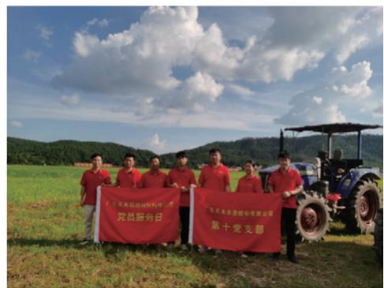

text_image

广东天成农业股份有限公司
党员服务日
广东天成农业股份有限公司
第十党支部

第十党支部“庆农业丰收，
供销助农享美好生活”党员服务日

# 公司治理

公司严格遵守《中华人民共和国公司法》(以下简称《公司法》)《中华人民共和国证券法》(以下简称《证券法》)《上市公司章程指引》《上市公司治理准则》《深圳证券交易所股票上市规则》等法律法规和监管要求，制定并持续完善《广东天禾农资股份有限公司章程》(以下简称《公司章程》)《股东会议事规则》等治理相关制度，建立了由党委会、股东会、董事会和经营层组成的治理架构，形成权责分明、相互协调的治理机制，确保管理高效、科学、透明。

公司治理架构  
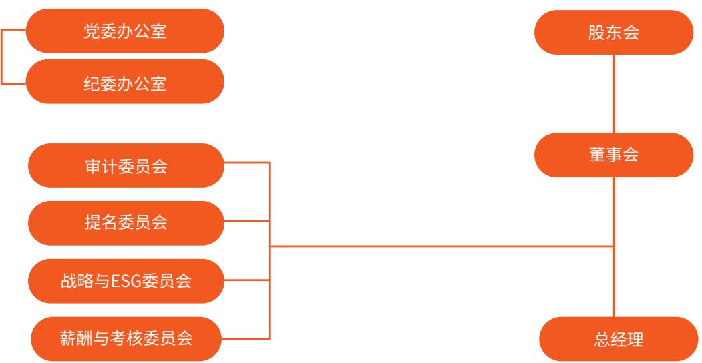

flowchart

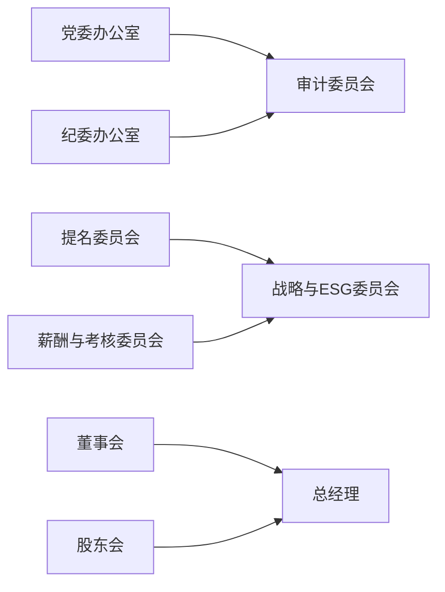
```mermaid
graph LR
  A["党委办公室"] --> B["审计委员会"]
  C["纪委办公室"] --> B
  D["提名委员会"] --> E["战略与ESG委员会"]
  F["薪酬与考核委员会"] --> E
  G["董事会"] --> H["总经理"]
  I["股东会"] --> H
```

# 股东会

公司严格按照《公司法》《上市公司股东会规则》等法律法规及《公司章程》《股东会议事规则》等内部制度，规范地召集、召开股东会，平等对待所有股东。为便于股东充分行使表决权，会议采用现场与网络投票相结合的方式，并聘请律师现场见证，出具法律意见书，确保程序合法合规。在审议涉及中小投资者重大利益的事项时，公司对中小股东表决实行单独计票并予以披露，切实维护其合法权益。

  
关键绩效

<table><tr><td>公司召开股东会</td><td>其中年度股东会</td><td>临时股东会</td><td>共审议并通过议案</td></tr><tr><td>4次</td><td>1次</td><td>3次</td><td>14项</td></tr></table>

# 董事会

董事会是公司的经营决策和业务领导机构，是股东会决议的执行机构，对股东会负责。公司严格按照《公司章程》和《董事会议事规则》的规定，明确董事会的职权范围，健全规范董事会在召集召开程序、审议程序、表决方式和决议内容等方面的运行流程，充分发挥董事会的决策作用。公司董事会现由6名非独立董事和3名独立董事共同组成，符合相关法律法规要求。

为持续提升董事会运作效率和公司治理水平, 公司董事会通过年度工作报告等方式, 对董事会整体运行情况及董事履职表现开展综合评估。评估内容主要包括董事会会议召开及议案审议情况、董事会各专门委员会履职情况、独立董事履职情况、董事会决议及股东会决议执行情况, 以及公司治理规范运行情况等。通过上述评估, 公司能够持续检视董事会运行效率与决策质量, 进一步完善治理机制, 为公司规范运作与可持续发展提供有力保障。

  
关键绩效

公司召开董事会14次

董事会成员出席率100%

共审议并通过议案31项

# 董事会专门委员会

董事会下设战略与ESG委员会、审计委员会、薪酬与考核委员会、提名委员会，形成了专业化的治理分工。其中，审计、薪酬与考核及提名委员会均满足独立董事占多数并担任召集人的要求，且审计委员会召集人为会计专业人士。各委员会严格遵循相应工作制度履职，有效提升了董事会决策的专业性与运作效能。

natural_image

Two orange gear icons side by side, one larger and one smaller, with no text or symbols.

<table><tr><td>委员会</td><td>召集人</td><td>成员人数</td><td>独立董事占比</td><td>主要职责</td></tr><tr><td>战略与ESG委员会</td><td>非独立董事</td><td>5</td><td>2/5</td><td>主要负责对公司长期发展战略和重大投资决策以及ESG战略进行研究并提出建议或者方案</td></tr><tr><td>审计委员会</td><td>独立董事</td><td>3</td><td>2/3</td><td>主要负责对公司财务信息、内部控制、内外部审计等工作的监督</td></tr><tr><td>薪酬与考核委员会</td><td>独立董事</td><td>3</td><td>2/3</td><td>主要负责制定董事、高级管理人员的考核标准并进行考核,制定、审查董事、高级管理人员的薪酬政策与方案并向董事会提出建议</td></tr><tr><td>提名委员会</td><td>独立董事</td><td>3</td><td>2/3</td><td>主要负责拟定董事、高级管理人员的选择标准和程序,对董事、高级管理人员人选及其任职资格进行遴选、审核并提出建议</td></tr></table>

  
关键绩效

公司召开审计委员会4次

共审议通过议案
12项

召开提名委员会2次

共审议通过议案
2项

召开战略与ESG委员会2次

共审议通过议案
2项

# 董事会多元化

公司严格按照《公司法》《公司章程》规定的程序选聘董事，充分考虑董事会成员的多元化构成，综合评估候选人的性别、年龄、教育与专业背景等要素，以增强决策的科学性与专业性。公司董事在财务、法律、管理及专业行业领域具有丰富的工作经验，在制定决策时利用各自专业知识为公司决策提供科学保障。

natural_image

Illustration of three people in an office setting, one holding a clipboard and another gesturing while seated at a desk (no text or symbols present)

董事会多元化构成  
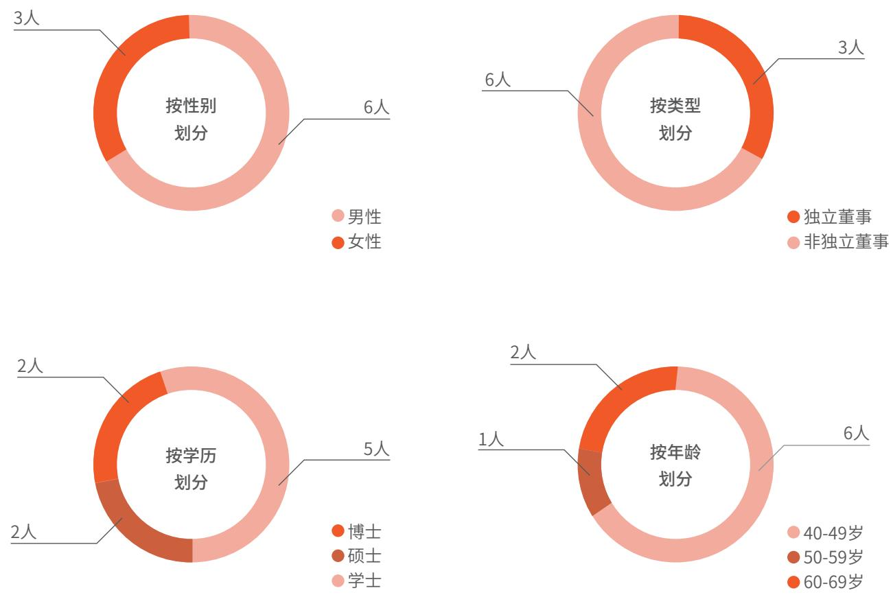

# 董事会独立性

公司制定《独立董事工作制度》，并建立独立董事专门会议工作机制，为独立董事有效履职、发挥专业作用奠定了坚实的制度基础。在公司规范运作过程中，独立董事依托自身专业特长，对公司战略、规范运作、经营管理等重大事项提出专业意见，提升决策的科学性和专业性。

此外,独立董事每年需对自身独立性进行自查并提交报告,再由董事会对其独立性开展专项评估并出具专项意见,确保独立董事符合独立性要求。截至报告期末,公司共有独立董事3名,占董事会成员比例为33.33%。

  
关键绩效

公司召开独立董事专门会议
1次

共审议通过议案
1项

# 董高薪酬管理

公司根据《公司法》《上市公司治理准则》等相关法律、行政法规和规范性文件及《公司章程》等规定，结合公司实际情况，制定了《董事和高级管理人员薪酬管理制度》，对董事及高级管理人员的薪酬构成作出了明确规定。公司董事、高级管理人员的薪酬由公司董事会薪酬与考核委员会制定并审查，其中董事薪酬由公司股东会决定，高级管理人员的薪酬由公司董事会决定。报告期内，公司严格执行了《董事和高级管理人员薪酬管理制度》《经营班子薪酬与绩效考核管理制度》的规定要求，对公司董事、高级管理人员薪酬进行确定和发放。

natural_image

Illustration of three people collaborating at a table with a pie chart overlay (no text or symbols present)

  
关键绩效

公司共支付董事和高级管理人员（含离任）税前报酬总额515.3万元。

# 合规经营与风险管理

# 合规运营

公司秉持法治精神与合规理念，持续构建系统化、规范化的治理体系，将全面合规深度融入经营管理全过程。同时，公司充分发挥“双制协同”监管、财务检查督导、法务审核服务、知识产权管理等职能管理作用，持续加强法律风险、经营风险、财务运营、知识产权等方面的管控，完善规章制度，为公司经营质效提升提供坚强的管理监督保障。在子公司治理方面，公司着力提升其现代化治理水平：通过常态化监督指导，定期检查工商信息、更新管理台账，并建立咨询响应机制；开展年度专项工作，制定工商变更指引、规范“三会”召开，并核查注册资金实缴情况；协助推进《控股子公司管理办法》等制度建设，强化底层合规能力。报告期内，公司完成舆情管理、函牌管理、安全生产等制度“立改废释”，精简社村公司审批流程40余项。

公司高度重视全员法治素养培育，通过系统开展多层次、多形式的法治教育活动，持续提升员工的法治意识、风险防范与合规履职能力。2025年，公司组织全体中层及以上干部完成年度学法考试，参与率与合格率均达100%，进一步夯实关键岗位合规基础；在“宪法宣传周”期间，以线上线下相结合的方式开展宪法宣传与知识答题，营造尊法学法、合规经营的文化氛围；此外，公司还组织“三会”实务线上培训并进行会后考试，持续强化治理主体的规范运作意识。通过上述系列举措，公司整体合规管控水平得到显著提升，为业务稳健发展提供了有力支撑。

# 《民法典合同编通则司法解释》专题培训

# 案例

2025年12月,公司组织《民法典合同编通则司法解释》专题培训,围绕合同订立、效力认定、印章管理及履行抗辩等实务要点展开,结合典型案例,专项强化业务人员的合同合规管理与风险防范能力。

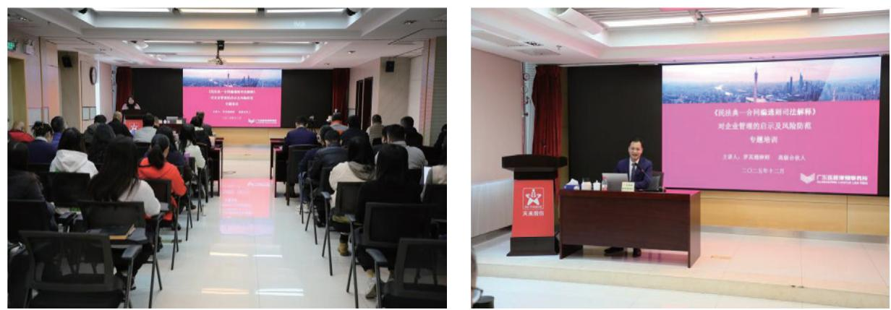  
《民法典合同编通则司法解释》专题培训

# 风险管理

天禾股份已建立内部控制与监督框架，持续完善风险管理制度建设，制定并实施了《内部审计制度》《经营内控风险管理规定》《经济责任审计规定》等一系列制度，形成了系统的内控与监督框架。同时，公司积极推动“双制协同监督”工作机制落地，进一步强化了内部监督与风险防控的协同效能。

报告期内,董事会办公室加强法律风险把控,全年审核把关430余份合同及法律文书,妥善处理重大诉讼案件,有效防控法律风险,维护公司合法权益。财务共享中心建立健全督导检查工作机制,深入重点区域开展财务风控检查与辅导工作,相关单位的关键财务指标质量大幅提升。审计监督部高效完成对有关单位的审计工作,及时全面提出经营管理存在问题和风险,并开展审计回头看,做好审计整改下半篇文章。品牌管理部加强知识产权管理,全面清查公司主商标及公司标识应用风险,年审核和整改宣传品超320款。

# 税务管理

公司持续优化税务管理体系,严格执行《社村税务操作准备阶段操作指引》《农产品收购发票操作手册》等内部规范,不断完善业务流程,加强发票管理,有效防控税务风险,确保经营活动合法合规,维护企业税务安全与稳健运营。同时,公司积极深化财税合规相关能力建设,2025年组织开展财税合规运营与风险防控培训,进一步提升了税务管理的专业水平。

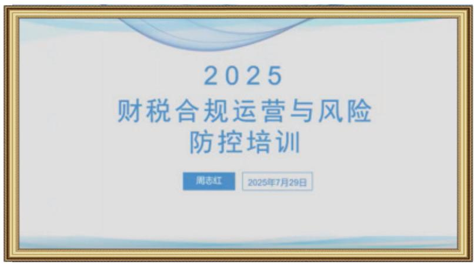

text_image

2025
财税合规运营与风险
防控培训
周志红 2025年7月29日

税务培训

  
关键绩效

公司共缴纳各项税费10,557.21万元

# 投关管理

# 信息披露

公司严格按照有关法律法规以及《公司章程》《信息披露管理办法》等要求，真实、准确、及时、公平、完整地披露有关信息。公司明确了信息披露的责任体系：董事长为第一责任人，董事会秘书为直接责任人并负责管理信息披露事务，证券事务代表予以协助。同时，公司指定《中国证券报》《证券日报》和巨潮资讯网为公司信息披露的指定报纸和网站，确保公司所有股东能够以平等的机会获得信息。2025年，公司荣获2025年度上市公司金牛奖，且不存在因信息披露方面违规而受到处罚的情况。

  
关键绩效

公司披露

定期报告

4份

临时公告

51份

累计撰写信息披露公告

及上网文件

97份

报备文件

100份

# 投资者关系管理

公司高度重视投资者关系维护，严格按照《上市公司投资者关系管理工作指引》等法律法规及《投资者关系管理制度》的要求，不断优化相关流程，通过线上线下等多种渠道，包括通过电话沟通、邮件回复、互动易平台、接待股东来访、主动与投资者和投资机构保持密切联系、举办业绩说明会、参与投资者集体接待日等方式，积极与投资者保持密切交流与互动，发挥公司与投资者之间的纽带作用，为稳定公司市值、传递企业价值、维护良好的投资者关系发挥积极作用。

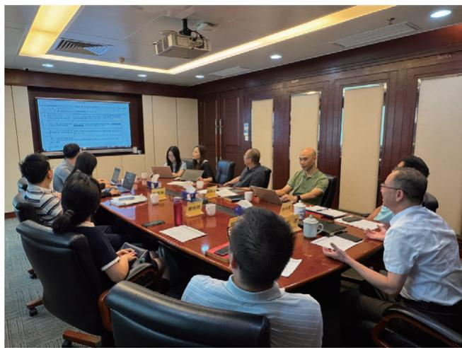

text_image

Meeting room photo with visible presentation screen showing detailed data and documents on the screen

2024年年度报告业绩说明会

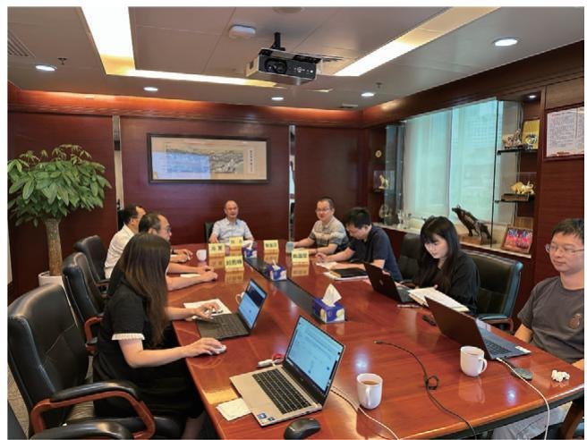

natural_image

Interior view of a modern conference room with attendees seated around a large table, laptops, and documents (no visible text or signage)

广东辖区投资者集体接待日暨辖区  
上市公司中报业绩说明会

  
关键绩效

公司互动易平台与投资者互动

121次

举办业绩说明会

2次

投资者接待日

1次

# 股东回报

公司重视对投资者的合理投资回报,严格遵循《公司章程》所确立的利润分配机制,并充分结合公司实际财务状况与长期战略规划,科学、审慎地制定利润分配方案,致力于实现股东价值的持续提升。

<table><tr><td>近三年利润分配情况</td><td>2025年</td><td>2024年</td><td>2023年</td></tr><tr><td>每股现金分红(元)</td><td>0.07</td><td>0.124</td><td>0.12</td></tr><tr><td>现金分红总额(万元)(含税)</td><td>2,433.14</td><td>4,310.14</td><td>4,169.67</td></tr><tr><td>占合并报表中归属于上市公司股东净利润的比例(%)</td><td>40.68</td><td>193.83</td><td>41.63</td></tr></table>

注:2025年度利润分配为公司拟分配方案,实际分红以实施公告为准

# 商业道德

# 反商业贿赂及反贪污

公司严格遵循《中华人民共和国刑法》《关于禁止商业贿赂行为的暂行规定》等法律法规，坚决禁止任何形式的商业贿赂与贪污行为，持续规范全体员工职业操守，全面加强廉洁建设，为企业合法合规运营筑牢廉洁防线。

natural_image

Illustration of a woman in business attire standing beside a balance scale and books (no text or symbols present)

# 反商业贿赂及反贪污管理体系

公司高度重视反商业贿赂及反贪污工作,始终恪守国家法律法规,坚决抵制各类商业贿赂及不正当交易行为,明确禁止员工利用职务之便谋取私利。公司每年新任职中层管理干部签订《岗位廉洁从业承诺书》,2025年共签订9份。

公司构建并持续完善覆盖全链条的商业道德监督机制，由审计监督部与纪委办公室共同履行监督职责，强化日常廉洁风险防控。同时，公司持续深化党风廉政建设，在重要节假日前发布廉洁提示，重申纪律要求，着力营造风清气正的内部环境。

  
关键绩效

公司参加反商业贿赂及反贪污培训的员工人次

1,084人次

向员工提供的反商业贿赂及反贪污培训总时长

9小时

员工商业道德承诺书
签订率

100%

注:统计口径为天禾股份

# 举报与举报人保护

公司鼓励员工及所有有业务往来的公司和个人积极检举揭发任何腐败行为，营造公正、透明的工作环境。公司不断健全内部举报与监督机制，设立并维护多渠道举报途径，由公司纪委办公室负责相关工作。同时，公司对举报人及举报内容等进行严格保密，并对任何形式的打击报复行为予以严肃查处，切实保障举报人的合法权益与安全。报告期内，公司未发生反贪污反腐败举报事件。

# 举报渠道

举报电话:(020) 87695576

举报平台:https://guangdong.12388.gov.cn/index1.html

举报邮箱:jiwei@gd-tianhe.com

举报地址:中共广东天禾农资股份有限公司纪委
广东省广州市越秀区东风东路709号

# 反不正当竞争

公司严格遵守《中华人民共和国反不正当竞争法》等相关法律法规，公平参与市场竞争，坚决杜绝虚假宣传、垄断行为、侵犯商业秘密等任何形式的不正当竞争，并将合规要求全面融入采购、生产、销售等各业务环节。内部管理上，公司明确规范员工行为，严禁从事或协助与公司存在竞争关系的业务，不得为竞争对手提供便利，致力于维护公平、健康的市场环境，推动行业可持续高质量发展。

# 负责任营销

公司致力于开展负责任的营销活动，建立了覆盖宣传物料审核与信息发布管理的完善体系。在宣传物料管理上，公司通过严格执行《自主产品包装管理办法》等内部制度，对宣传物料及产品包装进行全面合规审核，严禁虚假、夸大或误导性宣传内容，并规范品牌元素与商标使用，从源头确保营销内容的合法性与真实性。在信息发布管理上，为加强对官方网站、微信公众号、视频及直播平台等互联网公众平台的信息发布管理，公司依据《网络平台信息发布管理办法》，对官方网站、微信公众号、视频及直播平台等互联网公众平台严格执行“分级审核、先审后发”的多层审核机制，有效防范传播风险，保障对外信息的准确、合规与透明。

# 知识产权保护

公司依据《中华人民共和国商标法》等相关法规，持续完善并执行《商标管理办法》，明确品牌管理部为商标管理事务的归口部门，负责制度的制定、修订、解释，并为公司各部门及下属单位提供咨询、指导与监督，以规范商标在行政事务及业务经营活动中的合法、正确使用，从而系统化地管理、维护知识产权与品牌价值。

# 数据安全与客户隐私保护

# 数据安全管理

公司通过完善专项制度与明确管理职责,系统化构建数据安全管理体系。公司制定并施行《办公计算机设备租赁管理办法》及《办公计算机设备桌面安全管理办法》《数据中心机房管理办法》等制度,对计算机设备从采购、使用到报废的全周期,以及数据中心机房的物理环境、人员访问与数据操作进行系统化规范。公司明确由信息技术部作为数据安全管理的归口责任部门,主要负责数字化建设、系统与机房运维、设备资产的全周期管理、网络与数据安全及人才培养等工作,并下设应用项目组、应用运维组、开发组、基础架构组,分工承接数据安全相关管理与执行职责,构建层级清晰、责任到岗的管理体系。

此外, 公司对核心信息系统严格落实网络安全等级保护要求, 其中, 门户网、零售系统已于2024年完成二级测评与成功备案, 并严格遵守《网络安全等级保护管理办法》等要求, 对门户网、零售系统等二级系统, 每两年至少组织开展一次等级测评, 确保其安全稳定运行。

natural_image

Illustration of a computer monitor with lock icons and a laptop, coffee cup, and smartphone (no text or symbols)

# 数据安全管理措施

公司通过部署多层次的技术防护、实施严格的数据保护策略，并保障基础设施的稳定可靠，从技术与管理两端协同发力，有效控制信息安全风险。

# 数据安全管理举措

数据备份与恢复保障

搭建多集群互备系统及磁带库离线备份,对NC、财务共享等核心系统实施磁带库备份;对OA、天禾人、零售系统等业务系统实施 Zerto持续数据保护(CDP),确保数据可恢复与业务连续性。

每季度进行一次机房巡检,对机房ups电源进行检查,并进行ups电源切换测试,保障供电稳定。

数据加密保护

数据传输加密:面向用户端的WEB服务、移动应用接口,强制启用HTTPS加密,禁用HTTP明文传输;VPN远程办公接入进行身份认证与数据加密,防止远程接入数据泄露。

数据存储加密:NC系统文件服务器中的文档存放路径,采用透明加密技术,文档创建、修改、读取全程自动加密,未授权终端无法解密打开;备份数据(如磁带库归档数据)在备份前完成加密,防止备份介质丢失导致数据泄露。

网络安全防护

网络边界防护:在互联网边界部署两台硬件防火墙及上网行为管理设备,构建内外部网络保护屏障。
网站与应用安全:部署web应用防火墙,拦截攻击公司互联网系统的行为,封堵系统现存或未知漏洞。
办公区网络安全:使用网络准入系统,防止非法终端随意入网,同时安装防病毒软件保护终端安全。
业务区网络安全:部署业务区防火墙设备,增强数据中心业务入口防护能力。
邮件安全:部署邮件安全网关,过滤垃圾邮件、病毒邮件,拦截非法发件人。
分公司、供应商的安全访问:搭建ssl vpn安全隧道。
应急值守:重要时期或节日协调供应商安排专人执行24小时网络安全值守。

# 信息安全培训

公司高度重视网络安全文化建设,持续加强员工培训。2025年,公司开展的系列网络安全培训累计覆盖230人次,内容紧密围绕内部系统使用规范、安全政策解读及日常防护技巧,有效帮助员工明确操作边界、掌握核心防护技能,切实提升了整体网络安全防范水平。

# 网络安全宣讲

# 案例

2025年1月, 公司组织开展了网络安全宣讲, 通过重点讲解钓鱼邮件的识别与防范以及网络保密安全的基本原理、要求、方法等内容, 提升全体员工的网络安全风险识别能力与日常防范意识。

# 信息安全培训

# 案例

2025年7月, 公司开展了新员工信息安全培训, 培训系统宣导了网络安全法规、剖析了内部安全案例, 并详细讲解了账号密码管理、官方沟通渠道使用及系统问题处理流程等防护规范, 旨在帮助新员工建立基础的信息安全意识和日常操作规范。

# 数字化与信息安全专项培训

# 案例

2025年10月, 公司面向新员工开展数字化与信息安全专项培训。培训系统介绍了公司发展战略及核心业务系统, 并重点宣导信息安全规范以及智能技术使用安全原则, 旨在提升员工的数字化操作能力与数据安全风险防范意识。

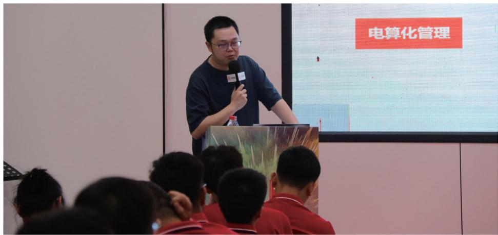

text_image

电算化管理

数字化与信息安全专项培训

# 信息安全应急预案

公司建立了季度常态化的信息安全演练机制,每季度进行一次相关备份数据容灾恢复演练。2025年,公司开展了磁带库数据恢复演练和zero数据恢复演练,验证了核心业务数据与系统的可恢复性和可用性,确保了灾难恢复能力持续有效。

# 客户隐私保护

公司严格遵循并持续完善《隐私条款》，通过技术、物理和行政管理安全措施，规范客户个人资料的收集、保留、处理与共享，保护客户资料免受泄露、滥用及未授权访问。在“天禾宝”等数字化服务平台，公司于关键交互环节清晰展示《隐私条款》并获取用户明示同意，将隐私保护要求切实融入服务流程，以保障客户权益。

# 02

# 服务三农

# 共绘乡村振兴画卷

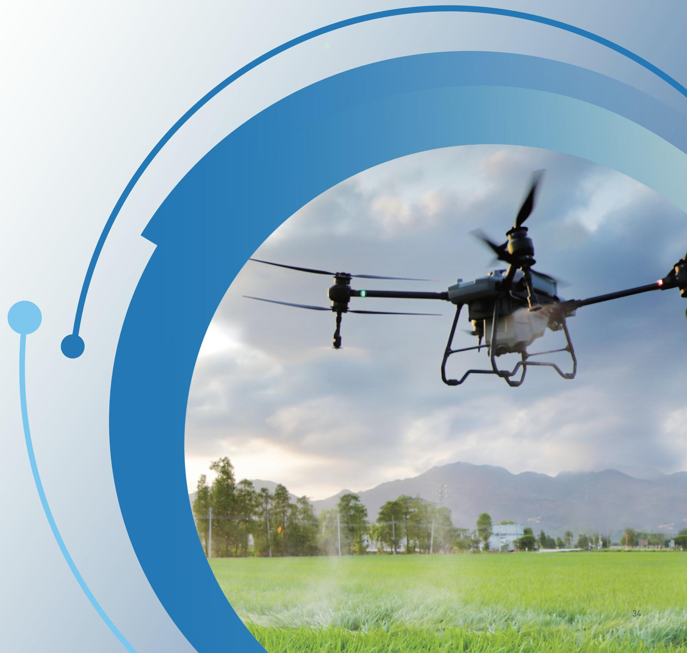

natural_image

Agricultural drone flying over a green field with distant mountains and cloudy sky (no text or symbols visible)

# 创新驱动

公司坚持以创新驱动农业服务能力提升,围绕数字化转型与技术研发双轮发力,持续赋能农资流通与农业社会化服务高质量发展,不断提升服务“三农”的专业化、规模化与现代化水平。

# 服务模式创新与成效

公司以数字化平台为核心枢纽，向上游延伸，布局“育、繁、推”一体化的种业基地，从源头将良种与精准农技方案深度融合；向下游拓展，通过智慧农场和数据驱动的社会化服务体系，提升农机作业效率，协同产地供应链公司开展订单收购，补齐全链条薄弱环节。公司通过协同打造广东粮食和特色优势农产品全产业链，不仅强化了与农户的长期合作纽带，也进一步提升了全产业链的协同效率与价值。

# 数字化建设

2025年，公司以数字化发展战略规划报告为行动指南，以创新为农服务模式推进公司全面数字化建设，打造数字化为农服务综合平台，一是围绕“订单农业+全程社会化服务”业务模式，建设订单种植、农事服务、农产品收购等一系列功能，构建全链条公共型农业社会化服务体系；二是落地绿色农资集采直供模式，打造绿色农资平台，构建“平台—配送中心—服务站—村集体/农户”的绿色农资集采直供模式，降低农户用肥成本；三是加快推进OTWB系统建设运营，优化线下仓配网络，为农资供应的响应和送达提供履约支撑。截至报告期末，平台已在多个区域围绕水稻产业开展试点推广，服务模式创新取得初步成效。

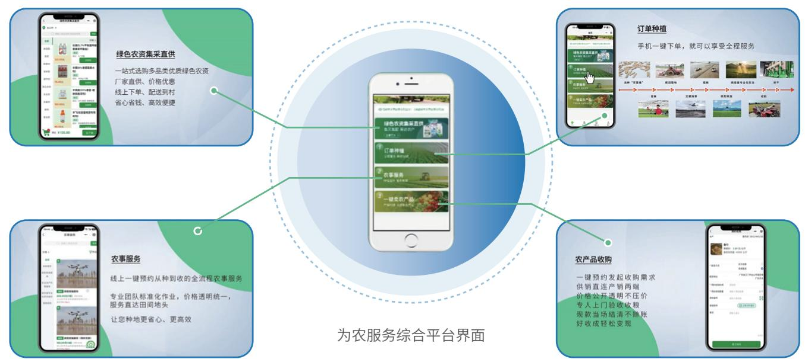

flowchart

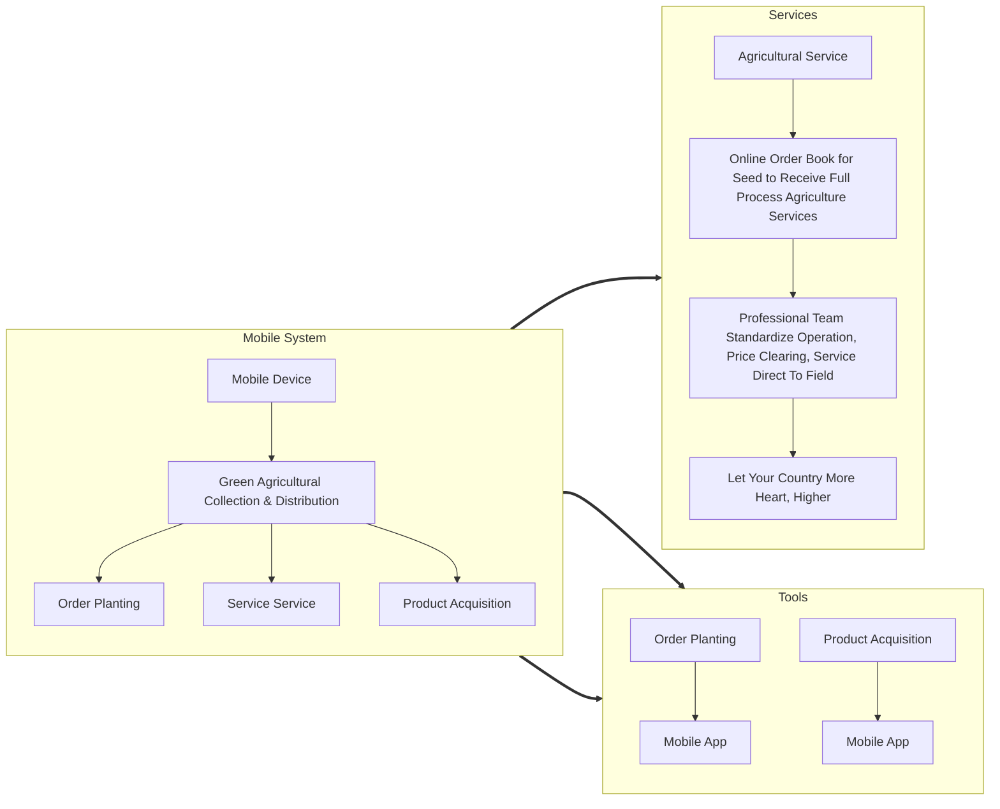
```mermaid
graph LR
  subgraph Mobile_System["Mobile System"]
  A["Mobile Device"] --> B["Green Agricultural Collection & Distribution"]
  B --> C["Order Planting"]
  B --> D["Service Service"]
  B --> E["Product Acquisition"]
  end

  subgraph Services["Services"]
  F["Agricultural Service"] --> G["Online Order Book for Seed to Receive Full Process Agriculture Services"]
  G --> H["Professional Team Standardize Operation, Price Clearing, Service Direct To Field"]
  H --> I["Let Your Country More Heart, Higher"]
  end

  subgraph Tools["Tools"]
  J["Order Planting"] --> K["Mobile App"]
  L["Product Acquisition"] --> M["Mobile App"]
  end

  Mobile_System ==> Services
  Mobile_System ==> Tools
  Mobile_System ==> Tools
```

# 合作模式的创新

公司通过协同建立“龙头企业+供销社+村集体+中小农户”多方合作共建模式，开展“订单农业+全程社会化服务”，形成紧密协作、优势互补的产业共同体。公司负责导入种子种苗、绿色农资、专业技术等，为农户提供绿色优质的农资产品标准化种植技术，从源头促进产业增效。基层供销社发挥组织优势，负责对接村集体开展土地协调、政策宣传、农户动员等，积极发动、广泛组织农户开展标准化种植；并通过公司的业务带动，进一步提高为农服务能力。中小农户通过参与种植采收、承担田间日常农事管理等，实现“本地人管理本地田”，实现增产增收。广东省供销社系统企业凭借市场渠道优势，提前锁定订单，建立稳定产销对接机制。各参与主体各司其职，实现资源共享、利益共赢、风险共担。

# 种业育繁推一体化基地

公司计划建设国家级现代种业育繁推一体化基地，构建“1个研发中心+4个试验站+13个筛选展示点”的育繁推体系，配套分子育种与性状鉴定平台，提升育种精准度，缩短育种周期。同时将育种成果的示范展示与农业社会化服务应用场景相结合，打造“育种+智慧农业”的主题供销农场，以科技赋能粮食全产业链高质量发展。

# 智慧农场运营模式

公司通过构建智慧农场数字农业平台，集成人工智能与大数据技术，将工厂化育种、农机保障中心、二代智能配药站、全程机械化装备等设施设备进行联动与数据互通，实现了从耕、种、管、收到烘干的全程精准化与智能化管控，有效提升了生产效率和资源利用率。目前，该模式已在汕尾、台山等地形成具体应用成果，成功部署285亩稻田的无人农机协同作业等种植试验，初步形成“智慧农场输出、示范基地验证、服务网络覆盖”的发展路径，为规模化推广积累实践数据。

# 台山智慧农场建设情况

台山智慧农场建设育秧工厂、智慧指挥中心(集成无人农机调度全景监控、“四情”监测等系统)、农机保障中心及农资仓库，形成覆盖“耕、种、管、收”的全产业链服务综合体。育秧工厂采用的全自动循环育秧设备，相比传统方式可节省80%以上占地面积，并能实现节水60%、节约农药使用80%、节省人工60%的显著效益，所育秧苗成活率达95%以上，整齐度超90%。工厂单季单批可供应5,000亩大田年供秧能力达10,000亩。2025年运营以来，已育5,300亩大田秧苗。

# 案例

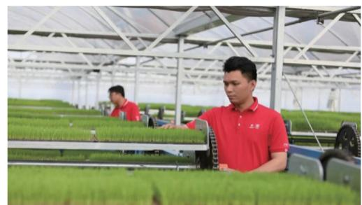

natural_image

Two workers in red shirts inspecting seedlings inside a large greenhouse with metal trusses (no visible text or symbols)

台山智慧农场

# 订单农业+全程社会化服务模式

天禾股份正大力发展“社村”合作试点、“订单农业+全程社会化服务”模式，致力探索新型联合合作机制，深入推动公司主营业务从传统的农资流通，向现代化的农业综合服务系统解决方案提供商转型升级。

在具体实施路径上,天禾股份构建了“双轮驱动”的立体化服务体系。一方面,公司在12个社村公司制定完成产业规划,系统性地布局了32个综合服务站与240个“供销农场”,将农资、技术等服务深度嵌入基层。另一方面,在非社村地区,公司则以农业社会化服务、农产品订单收购等业务为切入点,通过提供技术与培训服务,逐步与广大农户建立联系。

公司针对不同区域的特点,采取了差异化的深度合作路径:在“社村”合作试点区域,主要通过股权收益、资产合作等多种形式,与村集体建立紧密的利益联结;在非社村地区,则通过引导农户以土地、劳动力等要素入股,使其直接分享产业链的增值收益。这些实践共同构成了“龙头企业+供销社+村集体+中小农户”的协同发展模式,其核心目标在于推动各参与方从松散的交易关系,转变为长期稳固的合作共生体。

# 产品研发与技术创新

# 研发创新体系

公司高度重视自主研发体系建设，聚焦肥料、农药、种业三大核心板块，持续推进研发平台搭建、生产基地建设、技术成果转化与资源整合协同，逐步形成以自主产品开发为导向、以产业化应用为支撑的研发创新体系，为公司培育新质生产力、提升核心竞争力提供有力支撑。

# 肥料

在肥料板块,依托中加化肥持续完善自主研发与产业化平台建设,围绕生物有机肥、复合肥、配方肥等重点产品方向,推进研发、生产、工艺优化和市场转化协同联动。依托广州从化(壹号生物)与广西贵港(耕力优)双基地布局,公司不断夯实有机肥及新型肥料生产能力,持续提升产品开发、工艺优化和质量稳定能力,逐步构建起覆盖多品类产品研发、规模化生产和市场应用的自主产品体系。同时,公司推进作物营养相关研发平台建设,强化产品创新与功能开发能力。

# 农药

在农药板块, 公司围绕自主产品开发与产业化落地, 统筹珠海瑞农与大丰植保资源, 逐步构建集研发、登记、生产于一体的农药研发生产体系。报告期内, 公司持续推进研发平台建设, 新实验研发中心已全面启用, 并加快推进现代农业生态科技产业园项目建设及新生产线布局, 持续提升农药制剂生产能力与产品质量水平。同时, 公司不断强化自主产品体系建设与品牌培育能力, 推动农药业务向绿色化、规模化方向稳步发展。

# 种业

在种业板块,公司践行“种业振兴行动”,计划打造国家级种业育繁推一体化基地,并联合科研院所加强技术研发与攻关,构建了种子保供与技术应用平台;通过建设多区域品种试验站及“核心+镇村卫星站点”集中育秧网络,夯实大田作物基础,同时,公司建成了粤港澳大湾区规模最大的工厂化育苗温室,显着提升了蔬菜种苗的保障能力;并通过建设柑橘脱毒苗基地,强化了在苗木领域的创新优势,深化了大田、蔬菜、苗木等多品种共同推进的种业格局。

同时，公司持续完善科研管理机制和人才支撑体系，通过强化制度建设、引进专业人才、加强技术培训，不断夯实自主研发体系运行基础，推动科技创新能力持续提升。报告期内，天禾种业精准引进农业院校优秀硕士毕业生为团队注入高学历专业力量，并以科研基地为实践平台，开展全程跟班式培训，帮助新人熟练掌握田间调查、样本取样等核心技能，辅以专业手册学习与结业考核，构建系统化能力体系，夯实科研实力。

此外, 公司的科技水平和创新能力获得了国家、行业协会及市场的一系列资质荣誉, 珠海瑞农和大丰植保荣获广东省农药协会理事单位等称号。

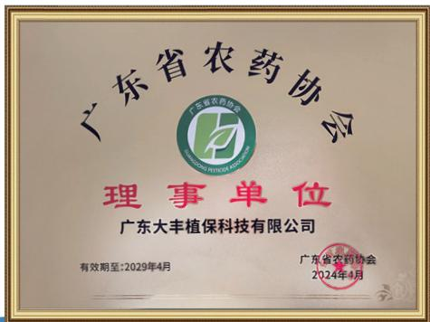

text_image

广东省农药协会
广东省农药协会
GUANGDONG FUTURE ASSOCIATION
理事单位
广东大丰植保科技有限公司
有效期至:2029年4月
广东省农药协会
2024年4月

大丰植保－广东省农药协会理事单位

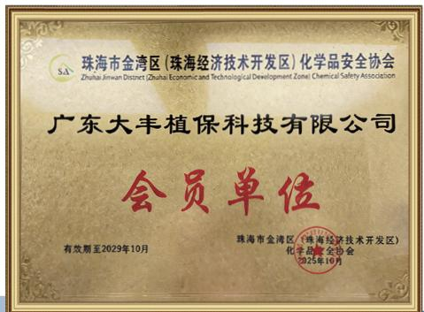

text_image

珠海市金湾区(珠海经济技术开发区)化学品安全协会
Zhuhai Jinwan District (Zhuhai Economic and Technological Development Zone) Chemical Safety Association
广东大丰植保科技有限公司
会员单位
有效期至2029年10月
珠海市金湾区(珠海经济技术开发区)
化学品安全协会
2025年10月

大丰植保－珠海金湾区化学品安全协会会员单位

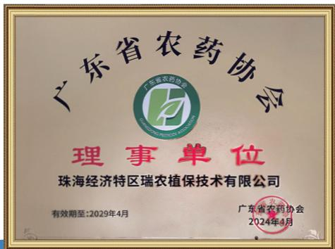

text_image

广东省农药协会
广东农药协会
GUANGDONG ACOLOGICAL ASSOCIATION
理事单位
珠海经济特区瑞农植保技术有限公司
有效期至:2029年4月
广东省农药协会
2024年4月

珠海瑞农－广东省农药协会理事单位

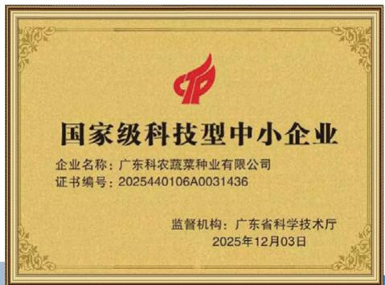

text_image

国家级科技型中小企业
企业名称：广东科农蔬菜种业有限公司
证书编号：2025440106A0031436
监督机构：广东省科学技术厅
2025年12月03日

科农种业—国家级科技型中小企业

# 研发创新成果

# ◎ 打造自主产品体系,培育新质生产力

公司确立“自主产品”战略,集中资源构建绿色高效、发展前景较好的自有产品体系,持续锻造新质生产力。2025年,各子公司研发成果如下表:

# 耕力优

通过调整生产参数和产品配方,提高产品品质,增加产品差异性。2025年推出乐宝、那田美定制化有机肥产品,开拓中低端有机肥市场,并迎合市场需求开发微生物菌剂粉剂产品。

# 壹号生物

2025年壹号生物坚持产品优化研发，在磷肥发酵料、高含量产品、纯鸡粪产品等重点方向持续开展研究，并通过补充原料、优化配方、调试升级设备等举措，完成了多轮发酵工艺改进与产品试制。同时，公司对工厂颗粒产线增加2台挤压设备，着力解决颗粒加菌、干燥冷却、包装及鸡粪水湿等工艺问题。

# 中加化肥

2025年中加化肥与雅苒公司在复合肥添加Procote项目中展开了合作,通过将雅苒公司研发的生物刺激素产品Procote包裹在复合肥表面,除能给作物提供大量元素营养外,还提供生物刺激素,提高作物吸收养分效率,提高作物抗逆能力。

# 天禾种业

通过对100份核心亲本材料进行种植鉴定,保存204个优良单株并引进50份外部优异种质,成功构建起涵盖丝苗米优质恢复系、高配合力恢复系及抗病特性的水稻亲本资源体系;围绕优质、抗病、高产等目标,完成了70余份新组合配制与40余份优良株系筛选,同步推进了配合力测定与多点品比试验,为后续新品种选育工作奠定了坚实基础。

# 研协同攻关前沿技术与示范推广

公司高度重视产学研合作,积极参与广东省种业振兴行动等研发项目,与广东省农科院、仲恺农业工程学院等高校及科研机构合作探索前沿技术应用。

# 科农种业参与“广东特色瓜类育种技术创新与新种质创制”项目

# 案例

科农种业和广东省农业科学院研究院蔬菜研究所合作开展“广东特色瓜类育种技术创新与新种质创制”项目。该项目通过对种质资源系统鉴定，挖掘品质性状与抗病性状形成的关键基因及调控机制。通过开发优质抗病分子标记，结合现代生物技术与传统育种，精准聚合目标基因，选育优质抗病兼备的瓜类蔬菜新品种。同步研发配套绿色高效栽培技术体系，形成“品种一技术”双轮驱动发展模式，为广东省蔬菜产业高质量发展提供强大的技术支撑。

# 中加化肥:科技增香,稳肥增效

# 案例

中加化肥与农科院质标所签订合作协议书，针对香稻特点和生产问题，通过技术集成与示范推广，共同建立“氨基酸促香稻增香技术示范基地”并开展相关工作；同时，联合仲恺农业工程学院环境工程学院开展稳定性掺混肥料项目合作，在台山、珠海斗门共3,500余亩稻田开展稳定性水稻配方肥(添加DCD、NBPT等)标准肥效试验及示范推广。

# ◎ 标准制定与行业交流:提升行业影响力与推广能力

公司将技术优势转化为行业竞争力，积极参与国家、行业标准制定。报告期内，公司参与制定《植保无人机山区水稻作业飞手与植保无人机二级调度标准》等农机行业标准，助力行业整体发展水平和产品质量的提升。公司积极参与行业交流并与业界伙伴建立合作关系，推动先进成果应用与推广。

# 天禾股份参加第二十四届种博会

# 案例

2025年12月，天禾股份在第二十四届种博会上取得重要合作与展示成果。公司与博罗县人民政府、广东省农业科学院蔬菜研究所签署三方协议，携手共建全国领先的“育繁推”一体化种业基地，旨在聚焦良种攻关，并以“订单农业+全程社会化服务”模式推动全产业链发展。同期，公司在品牌展区集中展示了涵盖水稻、蔬菜、果树等领域的丰富良种与种苗成果，并创新搭建“供销农场”展台，呈现从良种到优质农产品的产业链条。

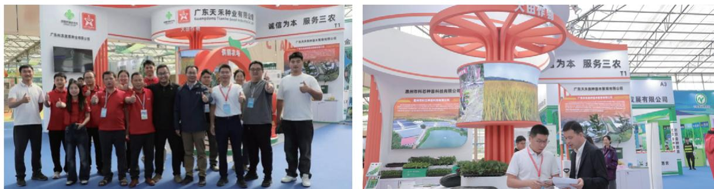  
天禾股份参加第二十四届种博会

# 乡村振兴与社会贡献

# 乡村振兴

公司积极响应政策指引，以《广东省加快推进供销合作社粮食全程社会化服务提升行动计划》及《关于推进“社村”合作助力新型农村集体经济试点方案》为指导，以产业规划为引领，依托“社村”合作试点，持续深化“订单农业+全程社会化服务”核心模式，系统构建了覆盖农资保供稳价、农业社会化服务等多维度的经营服务体系，旨在全面支撑乡村振兴战略。

公司通过多层面协同提升服务能力与经营质量:总部强化平台统筹与风控,履行保供稳价责任;省级平台深化网络终端化战略,稳固市场地位;公司高度重视自主研发体系建设,聚焦肥料、农药、种业三大核心板块,持续完善自主产品体系;仓储物流体系积极推进智能化升级与网络强化,优化核心物流布局;配送网络则通过优化布局,进一步增强终端覆盖与响应能力;农业社会化服务体系注重内控与资源整合,推动服务规模与质效同步提升,形成了支撑乡村振兴的综合格局。

# 治理

作为供销系统民生保供企业,公司始终将服务乡村振兴作为重大政治任务和社会责任。公司牢记为农服务根本宗旨,积极融入并践行供销合作社系统“服务农民生产生活的综合平台”的职能定位,主动对接国家及区域乡村振兴战略部署。

公司多向发力:构建立体高效的农资保供体系,依托覆盖全省的县域运营中心与镇村服务网点,打造衔接产销、双向通达的现代农资流通主渠道,着力保障供应稳定、价格平稳,夯实粮食安全根基。强化农业社会化服务与科技支撑,以农技服务、良种良法推广应用为核心,推动服务网络下沉,促进小农户与现代农业发展有机衔接。深度融入全省供销服务体系,立足生产服务端,在广东省供销社“四网—基地—平台”体系中牵头建设农资农技服务网络、运营“社村”公司,目前已建成4个区域服务中心、51家县域中心及516家镇村作物服务中心,服务覆盖全省所有水稻主产区,切实发挥在推动农业农村现代化中的示范带动作用。

战略

<table><tr><td>风险类型</td><td>风险描述</td><td>影响的时间范围</td><td>影响价值链的环节</td><td>对公司的财务影响</td><td>应对措施</td></tr><tr><td>农资价格波动风险</td><td>化肥、农药等原材料价格受能源、进出口政策等因素影响显著,剧烈波动可能压缩流通环节利润,同时偏远地区物流不畅可能导致旺季供应短缺,影响市场份额及客户信任。</td><td>长期</td><td>运营环节</td><td>运营成本增加</td><td>为保证农资供应稳定、服务农业生产大局,公司不折不扣抓好三级农资承储和投放工作,通过优化储备节奏、产品品种及仓库布局,充分发挥农资储备“压舱石”和“蓄水池”功能。同时,公司与国内外主要供应商建立长期战略合作关系,持续完善源头直采与动态库存管理机制,从供应链源头保障储备物资的充足与高效调配。</td></tr></table>

<table><tr><td>风险类型</td><td>风险描述</td><td>影响的时间范围</td><td>影响价值链的环节</td><td>对公司的财务影响</td><td>应对措施</td></tr><tr><td>转型风险</td><td>从传统流通向“全程社会化服务”转型,需大量前期投入,短期可能影响盈利。</td><td>长期</td><td>运营环节</td><td>运营成本增加</td><td>在广东因地制宜发展合作经济,协同“四网一基地一平台”、各级供销社、村集体、广大农户大力开展“社村”合作试点,深化“订单农业+全程社会化服务”模式,协同打通丝苗米、甘薯、甜玉米、豇豆等广东粮食和重要农产品全产业链,致力推动农产品全产业链价值提升。</td></tr></table>

<table><tr><td>机遇类型</td><td>机遇描述</td><td>影响的时间范围</td><td>影响价值链的环节</td><td>对公司的财务影响</td><td>应对措施</td></tr><tr><td>绿色转型的政策红利</td><td>国家推进“绿色农资”升级行动与化肥农药减量增效,公司水溶肥、有机肥、高效低毒农药等绿色农资需求快速增长,为公司产品结构升级与高附加值业务提供增量空间。</td><td>长期</td><td>运营环节</td><td>运营成本减少</td><td>确立了“自主产品”战略,集中资源构建绿色高效、发展前景较好的自有产品体系,逐步形成“有机肥、复混肥、特种肥、农药、种子种苗”等多个品类共同发展的发展趋势,“彩虹牌、禾健翠、飞蓟、粤蔬”等自主品牌市场地位不断提高。</td></tr><tr><td>数字化平台建设</td><td>政策支持智慧农业与农业社会化服务。公司领先的线下网络结合数字化平台,能构建强大竞争壁垒。同时,规模化种植趋势下,农户对农技服务、供应链金融、数字化管理的需求上升。公司通过“为农服务综合平台”可增强客户黏性,提升产业链整合能力。</td><td>长期</td><td>运营环节</td><td>运营成本减少</td><td>致力于推动搭建“为农服务综合平台”等,通过汇聚优质农资流通和农技服务资源,推动农资经营服务线上线下一体化发展,赋能农资经营服务模式转型升级。</td></tr></table>

# 影响、风险和机遇管理

公司及时关注政策的变动以及加强与农户等农事经营主体沟通，定期对风险与机遇开展识别、评估、监测和管理工作。

<table><tr><td>1</td><td>风险识别</td><td>通过分析宏观环境、市场趋势、政策导向及行业实践,全面辨识潜在风险与发展机遇。</td></tr><tr><td>2</td><td>风险评估</td><td>综合运用各类风险管理工具,科学评估风险与机遇的发生概率与影响程度,并划定其优先级。</td></tr><tr><td>3</td><td>风险监督</td><td>建立动态监测机制,实时跟踪内外部关键变化,确保监测信息及时上报,为管理层决策提供支撑,保障公司战略有效落地。</td></tr><tr><td>4</td><td>风险管理</td><td>公司聚焦农业生产中的关键薄弱环节,积极探索创新服务模式,以满足市场多样化需求。同时,通过完善服务标准、规范服务合同、优化服务流程,持续提升服务的专业化与标准化水平。此外,公司依托“为农服务综合平台”及“一基础三中台”的信息化架构,全面赋能农资流通与农业社会化服务主责主业,致力于提升生产效率、降低运营成本并优化资源配置。</td></tr></table>

# 指标与目标

立足国家乡村振兴战略,天禾股份正致力于打造一个覆盖农业生产全链条的综合服务体系,以产业发展切实助农兴农。为此,公司目前正系统性地推进多项核心工作:一方面积极构建高效直达的全产业链运营体系,通过业务整合与模式创新,在水稻等重点品类上强化从技术集成到供应链管理的核心能力;另一方面,大力推动技术落地与设施建设,不仅参与高标准农田项目、建设育繁推一体化种业基地以加强品种研发,还致力于推广适配的智能农机与绿色农资。在此基础上,公司不断创新与村集体、合作社及农户的合作模式,依托“订单农业+全程社会化服务”建立紧密的利益联结机制。同时,公司持续强化专业人才的引进与培养,打造能够胜任现代农服需求的团队,全面夯实公司在产业规划、技术服务与市场对接方面的能力,从而有效推动农业的规模化与现代化进程。

# 春风行动惠民生

天禾股份的“春风行动”是一年一度的春耕保供大型惠农服务活动，公司各部门、各单位充分发挥农资流通主渠道和农业社会化服务主力军作用，积极应对市场挑战，持续巩固市场地位，推动公司经营质量稳步提升；并聚焦公司新五年发展战略和目标任务，在粮食全程社会化服务提升行动、“社村”合作试点的火热实践中大力创新全产业链服务模式，推动为农服务综合实力进一步提升。

# 农资保供稳价

为扛牢农资流通主渠道责任,一方面公司加快推进为农服务综合平台,确保农资采购调运及时高效,保障春耕旺季农资供应不脱销、不断档;另一方面,加强对春耕保供和农业生产形势的分析研判,丰富农资产品结构,加大对水溶肥、有机肥、配方肥、高效低毒农药等绿色农资的引进和研发力度,提升绿色农资保供稳价能力。同时,不折不扣抓好三级农资承储和投放工作,优化储备节奏、产品品种及仓库布局,充分发挥农资储备“压舱石”和“蓄水池”功能,为春耕顺利开展提供坚实基础。

# “技物结合”服务模式

天禾股份以“春风行动”为契机，坚持“以农户为中心，以作物为导向”的经营理念，加大创新营销服务力度，全面提升“春风行动”品牌影响力，为农业社会化服务注入新活力。“春风行动2025”期间，公司累计开展各类惠农服务活动4,522场次。

<table><tr><td rowspan="3">关键绩效</td><td>试验示范1,030个</td><td>农技服务推广会、现场观摩会、促销会2,270场</td><td>农业社会化服务活动385场</td></tr><tr><td>线上讲堂89场</td><td>短视频、公众号推送592个</td><td>累计开展服务面积339.24万亩</td></tr><tr><td colspan="2">推动25个面源项目完成实施面积52.97万亩</td><td>78个农业生产托管项目区县完成实施面积130.76万亩</td></tr></table>

注:统计口径为天禾股份

# 统筹开展荔枝病虫害防治服务和采收工作

# 案例

5月中旬，为贯彻落实广东省荔枝生产销售调度会议精神，公司会同各有关部门、单位成立“荔枝生产服务”工作专班，结合业务实际制定《荔枝生产服务分工安排》和《荔枝病虫害防治、田头采收应急预案》，在粤西、珠三角和粤东9个荔枝主产区统筹开展荔枝病虫害防治服务和采收工作。截至“春风行动”结束，公司已在省内组织农技服务活动超30场，服务对接农户超1,100人；完成对核心荔枝产区品种结构、种植面积、上市时间的信息摸排，厘清采收工作流程，并对接种植户、代办合作社等开展试采收工作。

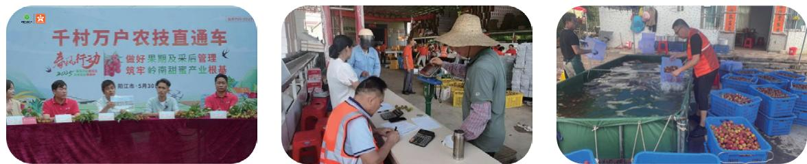  
统筹开展荔枝病虫害防治服务和采收工作

# ◎ 探索全产业链新路径

以推进“春风行动”契机,聚焦广东粮食和特色优势农产品产业,坚持数字化赋能,深化“订单农业+全程社会化服务”模式,探索打造产地供应链,在服务春耕生产的具体实践中跑出转型“加速度”。

# 农产品全产业链服务

作为广东省供销合作联社直属企业,天禾股份深入贯彻乡村振兴战略部署,坚持合作经济基本属性,组建县域运营公司、构建全程社会化服务体系,探索形成供销社带动、村集体参与、农户共赢的可持续发展模式,为巩固拓展脱贫攻坚成果、推进乡村全面振兴贡献供销力量。

在组织机制层面, 公司积极推进“社村”合作试点工作, 整合省龙头企业、村集体、基层供销社三方资源, 形成产权清晰、协同联动的运营主体。运营公司作为产业实施平台, 统筹对接政策资源与市场渠道, 村集体通过持股成为股东并参与收益分配, 有效激发农村集体经济内生动力。

在产业链运营层面,公司聚焦丝苗米、甘薯、甜玉米、豇豆等特色优势产业,全面推行“订单农业+全程社会化服务”模式。产前根据订单需求科学规划种植品种与规模,产中推广“六统一”标准化管理并导入无人机、水肥一体化等现代农业技术,产后依托供销冷链物流骨干网和直供配送网络开展商品化处理与品牌化销售,打通从田间到餐桌的全链条,实现产业降本增效与价值提升。

在资源要素整合层面,协同省社“四网—基地—平台”公共型农业社会化体系,系统导入农资农技、网络渠道、管理人才、专业技术等优势资源,为产业发展提供渠道多样、持续高效的资源要素保障。

在利益分配层面, 公司建立以贡献度为导向的收益共享机制。村集体通过股权分红、居间服务费、项目合作收益等方式获得多元化收入, 农户在获得土地租金与务工收入的同时, 还可参与保价收购与二次分红。

# 南雄“社村”合作,助力新型农村集体经济发展

# 案例

在广东南雄,天禾股份通过“EPC+O”高标准农田建设运营一体化模式,推进供销高标准农田宜机化耕作改造,有效解决了农田基础设施差、后续管护难等突出问题,夯实产业基础。通过整合20余家经营主体,并配备各类农机设备200余套,构建起了满足15万亩以上作业需求的规模化农业服务体系。项目实现效益与规模双增长,全年营收突破1亿元,预计为村集体再分红超100万元,切实推动产业增效、集体增强、村民增收,体现了公司在乡村振兴与人才培养方面的实质贡献。

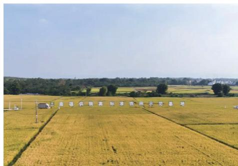

text_image

福建供销商标准农民示范基地

南雄供销高标准农田示范基地

# 豇豆全产业链服务体系,激发乡村发展活力显实效

# 案例

天禾股份通过共同运营梅花公共型农产品综合服务站，构建豇豆全产业服务体系，大力发展豇豆“订单农业+全程社会化服务”模式。在“供销社+村集体+中小农户+龙头企业”多方合作共建的模式下，基层供销社对接村集体开展土地协调、政策宣传等工作，发动和组织农户开展标准化种植；天禾股份提供农业生产资料和种植技术指导；农产品公司高效整合销售渠道，提前锁定订单。

2025年，公司与乐昌市供销社、梅花镇供销社联合周边4个乡镇20个行政村860户农户种植豇豆1,700多亩，推动亩产增加30%，带动农户收益383万元、村集体创收19.5万元，有效促进当地特色优势农产品产业提质增效、农户增产增收。

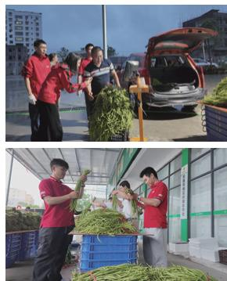  
豇豆全产业链服务

# 社会贡献

# 保供稳价

天禾股份遵循《国家化肥商业储备管理办法》《广东省省级化肥淡季商业储备管理办法》和《广州市市级重要商品储备实施办法》等相关规定，制定了《农资商品物资储备管理办法》，为规范执行储备任务提供了坚实的制度基础。

天禾股份坚决贯彻各级党委、政府及相关部门的决策部署，将保障国家粮食安全的政策要求落到实处。公司持续强化“春耕保供工作专班”的统筹效能，依托周调度机制，实现了对农资采购、调运与分销各环节的高效协同与动态管理。2025年，天禾股份不折不扣完成国家、省、市三级政策性农资储备任务，并确保储备资源及时、有序地投放市场，做到供应不断档、品质有保障。

2025年, 公司28家单位入选“2025年全国供销合作社农资保供重点企业”名单, 51家单位入选“入选2025年广东省供销合作社系统农资保供重点企业”名单, 彰显了其在农资保供领域的突出地位和重要贡献。

# 严把农资质量安全

天禾股份始终坚守农资安全底线，深入实施“绿色农资”升级行动，通过严控采购、存储、流通环节，严把农资质量安全关，并协同有关部门开展农资打假与农业普法工作。公司还持续举办现场种植技术培训会、种子种苗三下乡、示范展示会、科技咨询等多元化推广模式，提升农户识假辨假水平，切实维护农民权益。

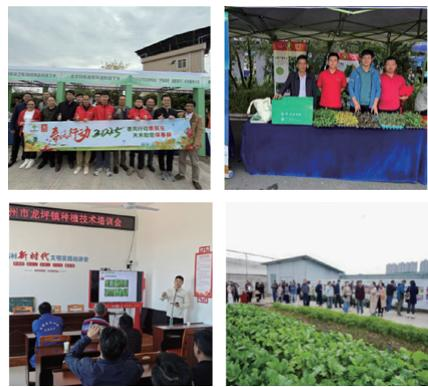  
放心农资下乡

# 应急救灾

# ·应对台风灾害,保障农业生产与灾后恢复

为应对台风“蝴蝶”带来的不利影响,天禾股份迅速行动,聚焦重点区域与产业,统筹资源,协同推进防灾减灾与复产保供工作,全力保障农业生产安全。

在茂名荔枝主产区，公司着力强化全链条生产保障。通过组织超600场全省荔枝植保农技服务活动，为超19,000名农户提供技术培训，增强防灾能力。为降低采收损失，公司在9个主产区组建了单日采收能力达300吨的2,000人专业服务队，累计协助2,813户果农抢收荔枝约2,096吨。同时，联合相关部门引入智能检测设备，建立农残全流程管理体系，并对人员开展专项培训，严格把控果品质量。台风过境前后，高州、廉江公司积极协助农户开展预警巡查、雨后排涝及杀菌防病、营养复壮等技术指导，针对性防控晚熟品种落果、裂果及病害。

在肇庆怀集洪涝灾区, 公司全力驰援应急抢险与灾后重建。公司快速响应当地政府号召, 紧急从周边分公司调集力量, 组建23人抢险突击队深入重灾区, 完成了50余户居民点和临街商铺的清淤与垃圾转运工作。公司及时向受灾群众发放矿泉水、方便面等应急生活物资超250套(箱), 保障基本生活需求。灾情稳定后, 有序组织受灾农户进行技术培训, 发放“复产套装”并跟进补药施肥等社会化服务, 助力当地尽快恢复农业生产秩序。

在台山粮区, 公司重点依托科技赋能实现精准管护。台风后, 立即联动相关部门及基层服务网络, 组织农技人员开展拉网式巡田, 预防病虫害大面积爆发, 并对破口抽穗期水稻全面实施“一喷多促”作业。公司强化智慧农业应用, 通过部署在都斛、斗山等镇的物联网站点动态监测田间数据, 并组织无人机进行靶向施药。此项精准作业模式在减少用药次数与用量的同时, 有效保障了夏粮的稳产增效。

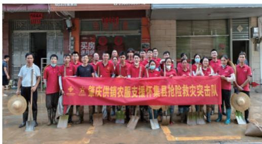

text_image

肇庆供销衣服支援怀集县抢险救灾突击队

肇庆供销农服支援怀集县抢险救灾

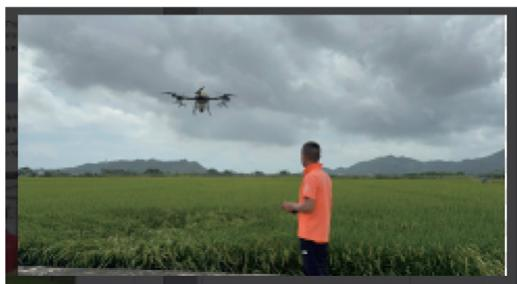

natural_image

A person in an orange shirt flying a drone over a green field under cloudy skies, with distant hills in the background.

天禾股份全力护航台山市夏粮丰收

# 应对公共卫生隐患,营造健康安全环境

在公共卫生防控领域,公司积极响应基孔肯雅热相关防控工作部署,统筹江门、台山及周边区域供销农服力量,开展蚊媒消杀专项行动。围绕公园绿地、积水洼地、居民区及林地、河岸等重点蚊虫孳生区域,采用无人机喷洒与人工协同作业相结合的方式,构建“空中+地面”立体防控体系。其中,开平供销农服累计完成消杀作业1,536.25亩;台山供销农服域统筹20余台植保无人机,累计完成超3万亩次喷洒任务;东源、紫金供销农服同步推进积水清理与重点区域精准消杀,有效扩大作业覆盖范围并提升防控效率。通过科技化手段减少蚊媒滋生环境,从源头降低蚊媒传染风险,同时配合开展环境整治与防控支持工作,为群众营造健康安全的生活环境。

# 公益活动

作为广东省供销合作联社直属企业,天禾股份始终坚守“为农服务”初心使命,以实际行动贯彻巩固拓展脱贫攻坚成果、推进乡村全面振兴的战略部署,充分彰显责任担当。

报告期内,公司参与由中华全国供销合作总社主办的“2025年脱贫地区农副产品产销对接活动”(即832活动),通过“线上采购+线下展销”双渠道发力,联合上下游客户及供应商共同参与,累计采购脱贫地区农副产品35,5539.58元,有效拓宽了脱贫地区农特产品销售渠道,以“以购代捐”的创新模式促进脱贫群众稳定增收。

此外，公司积极响应广东“6·30”助力乡村振兴活动号召，向乡村振兴促进会捐赠900,000元，向乡村振兴基金会捐赠74,686.32元，为省内乡村振兴事业提供资金支持，以实际行动回馈乡土。

通过“以购代捐”与直接捐赠相结合的方式,公司切实将社会责任融入企业发展血脉,为巩固拓展脱贫攻坚成果、全面推进乡村振兴贡献供销力量。

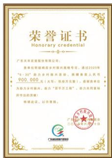  
乡村振兴促进会捐赠证书

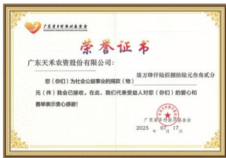

text_image

广东省土木村慈善基金会
荣誉证书
广东天禾农资股份有限公司:
_ 柒万肆仟陆佰捌拾陆元叁角贰分
您（你们）为社会公益事业的捐款（物）_
元（件）我会已接收。在此，我们代表受益人对您（你们）的爱心和
善举表示衷心感谢！
广东省农村委员会
2025年07月17日

乡村振兴基金会捐赠证书

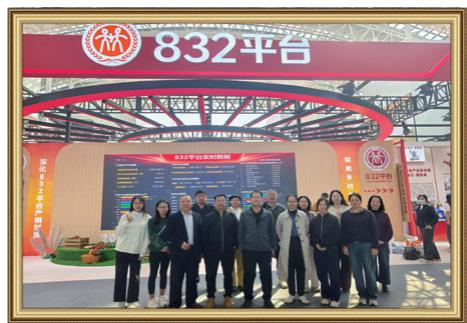

text_image

832平台
深化5-2年案例展示
832平台宣传展期
832年
...>

832活动现场图

# 供应链安全

天禾股份深耕农业生产资料流通领域，持续构建高效低毒、绿色环保、覆盖作物种植全程的全品类农资核心产品体系，涵盖氮肥、钾肥、复混肥等各类化肥以及高效低毒农药，不仅从源头上确保货物品质可靠、供应稳定，更凭借直达终端的仓储物流网络，实现了货物安全库存与高效运输配送，能够快速响应终端需求，有效保障农业生产。

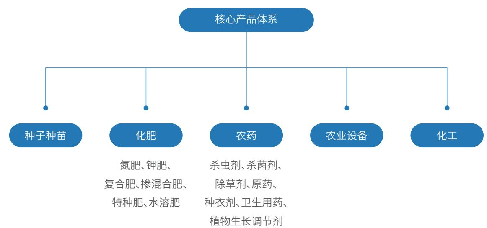

flowchart

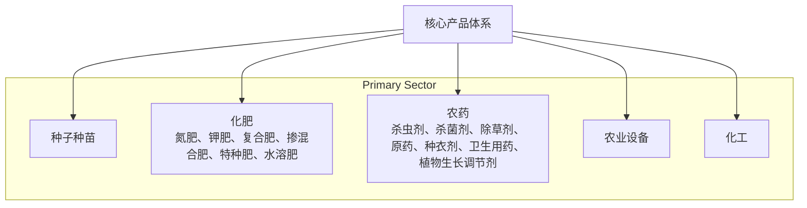
```mermaid
graph TD
  Root["核心产品体系"]
  
  subgraph Primary Sector
    A1["种子种苗"]
    A2["化肥\n氮肥、钾肥、复合肥、掺混合肥、特种肥、水溶肥"]
    A3["农药\n杀虫剂、杀菌剂、除草剂、原药、种衣剂、卫生用药、植物生长调节剂"]
    A4["农业设备"]
    A5["化工"]
  end
  
  Root --> A1
  Root --> A2
  Root --> A3
  Root --> A4
  Root --> A5
```

# 供应商管理

# 治理

天禾股份“诚信为本，服务‘三农’”的经营宗旨，制定《农资商品准入制度》，确保公司所有农资经营活动和经营的所有农资商品必须符合国家有关法律和法规的规定，切实从采购源头上把好农资商品质量关。

公司已构建标准化评价与动态管理流程。首先，公司对所有合作的供应商实行资质审查，以确保供应商的资质符合国家法律和法规所规定的基本条件，而且必须符合双方合作具体产品(品种)所必需的特定资质条件。其次，公司按照规定建立了供应商评价体系，涵盖信用评价、准入审批等内容，全面审查供应商资质，确保其符合国家法律及产品特定要求。

为实现流程的高效与客观,公司借助信息系统与第三方大数据平台,统一评估供应商信誉并共享信息,经评估合格后列入“供应商数据库”。

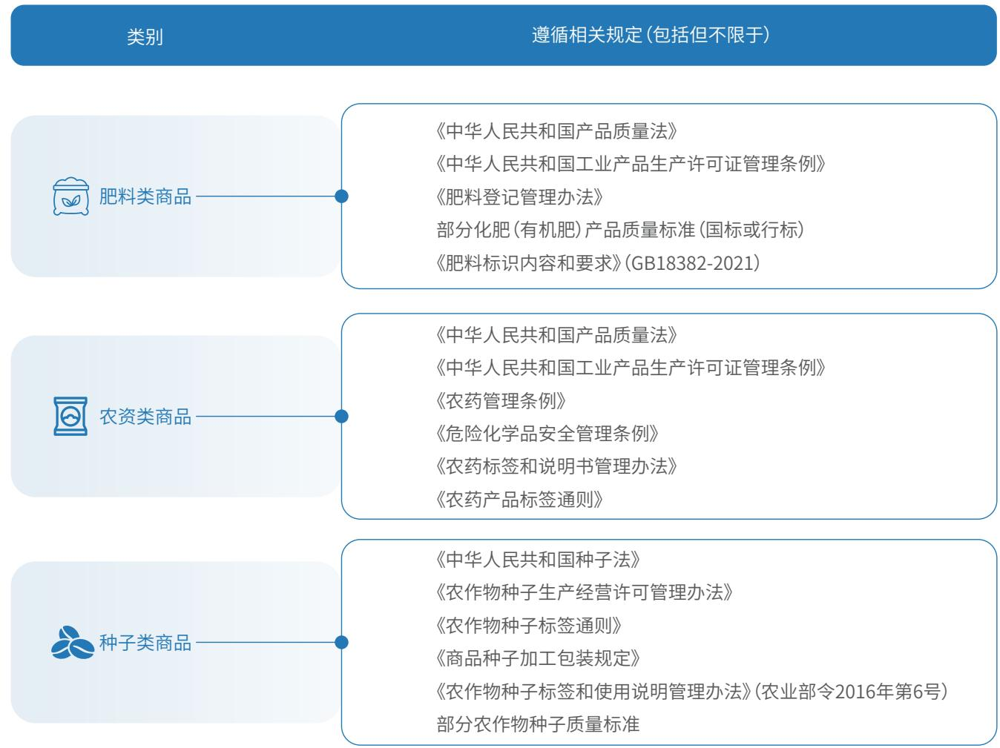

flowchart

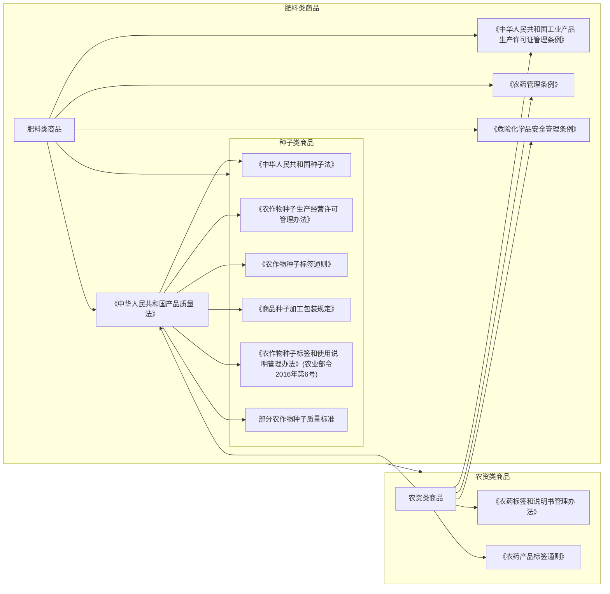
```mermaid
graph LR
  A["类别"] --> B["遵循相关规定(包括但不限于)"]
  
  subgraph A ["肥料类商品"]
    direction TB
  A1["肥料类商品"] --> C["《中华人民共和国产品质量法》"]
  A1 --> C2["《中华人民共和国工业产品生产许可证管理条例》"]
  A1 --> C3["《肥料登记管理办法》"]
  A1 --> C4["部分化肥(有机肥)产品质量标准(国标或行标)"]
  A1 --> C5["《肥料标识内容和要求》(GB18382-2021)"]
  end
  
  subgraph B ["农资类商品"]
    direction TB
  B1["农资类商品"] --> C2["《中华人民共和国产品质量法》"]
  B1 --> C3["《中华人民共和国工业产品生产许可证管理条例》"]
  B1 --> C4["《农药管理条例》"]
  B1 --> C5["《危险化学品安全管理条例》"]
  B1 --> C6["《农药标签和说明书管理办法》"]
  B1 --> C7["《农药产品标签通则》"]
  end
  
  subgraph C ["种子类商品"]
    direction TB
  C2 --> D["《中华人民共和国种子法》"]
  C2 --> D2["《农作物种子生产经营许可管理办法》"]
  C2 --> D3["《农作物种子标签通则》"]
  C2 --> D4["《商品种子加工包装规定》"]
  C2 --> D5["《农作物种子标签和使用说明管理办法》(农业部令2016年第6号)"]
  C2 --> D6["部分农作物种子质量标准"]
  end
```

战略

<table><tr><td>风险类型</td><td>风险描述</td><td>影响的时间范围</td><td>影响价值链的环节</td><td>对公司的财务影响</td><td>应对措施</td></tr><tr><td>供应商依赖与原材料价格波动</td><td>公司主营的化肥、农药等农资商品,其上游原材料(如钾、磷、氮等)供应价格受国际市场、地缘政治、环保政策等因素影响显著波动。这可能导致采购成本不可控,侵蚀利润,甚至影响关键农资的稳定供应。</td><td>中、长期</td><td>运营环节下游上游</td><td>营业收入减少运营成本增加</td><td>公司与国内外多家大型化肥、农药生产企业建立了长期稳定的战略合作关系,通过集中采购及淡季储备等方式,增强产品资源保障能力,有效应对价格波动风险,并持续提升供应链协同水平。</td></tr><tr><td>物流中断与仓储安全风险</td><td>农资流通高度依赖铁路、水路及公路运输,自然灾害、公共卫生事件或社会突发事件可能导致物流网络中断。同时,化肥、农药等商品的仓储条件要求高,管理不善易引发安全、环保事故及资产损失。</td><td>短期</td><td>运营环节</td><td>运营成本增加</td><td>公司持续深化“配送网络终端化”战略,构建了完善的农资终端配送服务网络体系,已在全国22个省份及北京市建立了102家配送中心。为提升农资供应效率,天禾股份除租赁第三方仓库进行日常货物进出管理外,还构建了立体高效的仓储物流体系,确保农资供应的及时高效。</td></tr></table>

<table><tr><td>机遇类型</td><td>机遇描述</td><td>影响的时间范围</td><td>影响价值链的环节</td><td>对公司的财务影响</td><td>应对措施</td></tr><tr><td>农资供应链整合机遇</td><td>在国家高度重视粮食安全、乡村振兴以及推动农资行业集约化发展的背景下,拥有强大供应链管理能力、网络覆盖广、品牌信誉好的龙头企业,将获得更大的市场份额和整合机遇。</td><td>长期</td><td>下游</td><td>营业收入增加</td><td>承接国家、省和市三级化肥储备工作,积极研究储备政策,通过优化储备时间、仓储数量布局等有效措施,在保质保量完成储备任务的同时巩固核心区域的农资流通主渠道地位,提升市场影响力。集中资源构建绿色高效自有产品体系,逐步形成“有机肥、复混肥、特种肥、农药、种子种苗”等多个品类共同发展的发展趋势。</td></tr><tr><td>数字化平台建设</td><td>利用物联网、大数据、云计算等技术,对采购、仓储、物流、配送进行全链条数字化改造,可大幅提升预测准确性、库存周转率和响应速度,构建更敏捷、更具韧性的智慧供应链,形成核心竞争力。</td><td>长期</td><td>下游</td><td>营业收入增加运营成本减少</td><td>致力于推动搭建“为农服务综合平台”和深化“订单农业+全程社会化服务”模式,赋能农资经营服务模式转型升级。</td></tr></table>

# 影响、风险和机遇管理

天禾股份制定《商品采购和付款管理办法》《商品销售和收款管理办法》等制度，进一步规范与客商间的合作关系，加强对客户的商品销售和收款监控，从而有效规避潜在的供应链风险，确保公司供应链安全稳定运行。

<table><tr><td>1</td><td>风险识别</td><td>依据《合同管理制度》,对客商资质与信用进行前置审查。结合历史数据回溯、市场趋势调研及既有合作反馈,系统筛查供应链各环节的潜在风险。</td></tr><tr><td>2</td><td>风险评估</td><td>建立覆盖全部供应商的资质审查与动态评价体系。对识别出的风险进行量化分析,评估其发生概率与影响程度,并运用风险矩阵模型确定风险等级,实现风险优先级排序。</td></tr><tr><td>3</td><td>风险监督</td><td>建立客商征信常态化审核机制,借助征信系统与大数据平台持续监测信用风险。定期对应收/预付款项,以及供应商、合作方的商业信誉进行专项排查。</td></tr><tr><td>4</td><td>风险管理</td><td>健全商品销售与收款制度,通过日常监管与内部审计,对商品销售、仓库出货、直调等关键业务流程实施闭环管理,以保障货物与资金安全,有效防范及控制坏账风险。</td></tr></table>

<table><tr><td>4</td><td>风险管理</td><td>健全商品销售与收款制度,通过日常监管与内部审计,对商品销售、仓库出货、直调等关键业务流程实施闭环管理,以保障货物与资金安全,有效防范及控制坏账风险。</td></tr></table>

# 指标与目标

公司继续坚持“以直达终端的网络配送体系为支撑，提供全品类的农资产品及专业的现代农技服务”的经营模式，并通过延伸配送网络、扩大覆盖规模，有效提高了对终端需求的响应能力与供应链韧性。报告期内，公司深化与关键供应商的战略合作，持续投入物流基础设施升级，并推进仓储管理智能化建设，强化从源头到田间在运输、货物与仓储环节的稳定与效率，整体提升了供应链的安全水平和客户保障能力。

# 供应商管理措施

# ◎战略合作

公司作为供销社系统民生保供企业，一直高度重视构建优质稳定的上游资源供给渠道，不断拓展产品资源，加强战略合作。公司目前的主要市场在广东、广西、云南、福建、四川、江苏等种植大省，对高附加值的农资产品需求旺盛。作为国内农资流通领域的领军企业之一，公司凭借品类齐全的优质农资产品体系，与中海石油化学、雅苒国际、以色列钾肥、先正达、科迪华、拜耳、巴斯夫等国内外知名肥料及农药厂商建立了长期稳定的战略合作伙伴关系。

# 天禾股份与贵州磷化集团正式开启战略合作

2025年，天禾股份与贵州磷化集团举行深度合作洽谈并签署战略合作协议，标志着其上游资源整合取得关键进展。依托贵州磷化完整的产业链与先进工艺，天禾股份将获得稳定的优质复合肥等产品资源，有力夯实供应链基础。双方将围绕“优质产品+专业服务”共同探索农资流通领域的协同创新，并通过在新型肥料、农技服务、数字供应链等环节的深度协作。此次合作是天禾股份升级服务网络、构建农业服务生态闭环的重要引擎，为公司赋能现代农业、推动行业高质量发展提供了持续动力。

# 案例

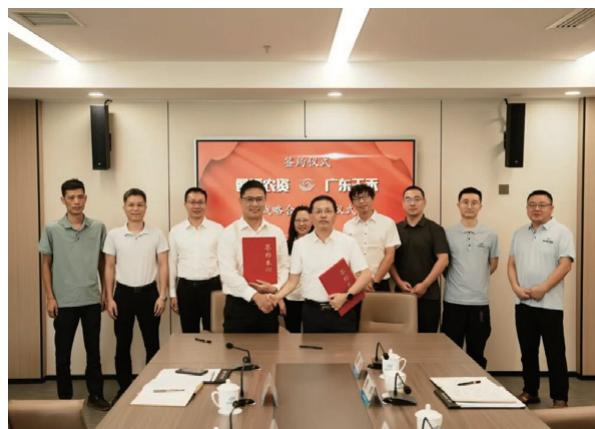

text_image

签约仪式
广东天新
战略合作伙伴签约仪式

天禾股份与贵州磷化集团正式开启战略合作

# ◎ 可持续采购

天禾股份制定《广东天禾农资股份有限公司采购管理办法》，规划采购管理工作，确保采购行为依法合规，完善权责监管，维护公司最大权益。公司在采购过程中，严禁索要或接受合作伙伴礼金、有价证券和贵重物品等行为，促进买、卖双方诚信经营、廉洁从业，防范商业贿赂，保障双方的合法权益。

# ● 数字化采购

公司通过深化数字化建设, 将采购合同审批、入库及付款等核心流程全面集成至NC系统, 实现了全流程线上闭环管理。此举不仅显著提升了采购效率与合规水平, 有效防范业务风险, 更推动了采购活动的透明化与智能化转型, 从而强化了供应链协同能力, 为整体竞争力提升奠定了坚实基础。

# 物流与仓储管理

# 物流管理

公司突破了农资流通行业“重流通、轻服务”的多级分销传统模式，通过深化“配送网络终端化”战略，构建了完善的农资终端配送服务网络体系。公司在全国22个省份及北京市建立了102家配送中心，均位于交通便利的铁路、陆路、水运中转枢纽，所有区域配送中心均配备专业配送车辆、专业农资农技服务人员，已在服务区域实现了24小时全天候响应，2小时内产品送达，打通农资配送与农户之间的“最后一公里”。

为持续强化服务能力与运营效率,公司将物流体系持续进行智能化升级与网络强化。通过引入机械化装卸设备、建设自动化灌包封装生产线、改造多层自动仓库,并借助智慧仓储设施,公司显著提升了大件农资物资仓库管理的自动化、信息化、智能化水平,推动作业效率提升50%。同时,依托布局规划,公司统筹推进湛江、广州等储备库及省内市县配送中心的设施升级,全面提升全省仓储物流网络的机械化、自动化与信息化能力,持续巩固公司在农资配送效率与服务响应方面的领先优势。

# 仓储管理

为提升农资供应效率,天禾股份除租赁第三方仓库进行日常货物进出管理外,还构建了立体高效的仓储物流体系,确保农资供应的及时高效。公司在全国范围内的总仓储面积超400万平方米,在广东省内设置90多个农资仓,仓储面积约50万平方米,其中在珠三角的广州和台山、粤西的湛江、粤东的汕尾、粤北的南雄等地自建了农资仓储基地,湛江、广州等大型库点单一库容超10万吨。同时拥有国家、省、市三级储备库点70多个、专用码头1个、铁路专用线2条。

报告期内,公司持续完善核心物流节点布局,四大重点仓库项目已全面建成并投入运营,仓储网络能级显著提升。天禾农资物流基地(二期)、台山农业社会化服务基地、汕尾丝苗米产业园服务项目以及(华南)农资储备物流基地(湛江)四个关键项目,分布于珠三角(广州)、粤西(湛江)、粤东(汕尾)及重要农业县市(台山),共同构成了覆盖全省、辐射华南的现代化农资仓储物流骨干网络。

natural_image

Illustration of a delivery worker holding boxes next to a truck and stacked boxes, with city buildings in the background (no text or symbols)

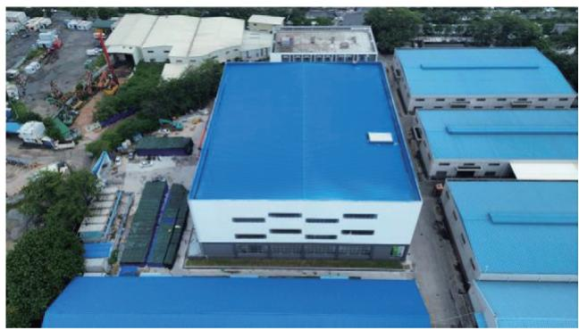

natural_image

Aerial view of a large industrial building with blue-roofed roofs, surrounded by other buildings and greenery (no visible text or signage)

天禾农资物流基地

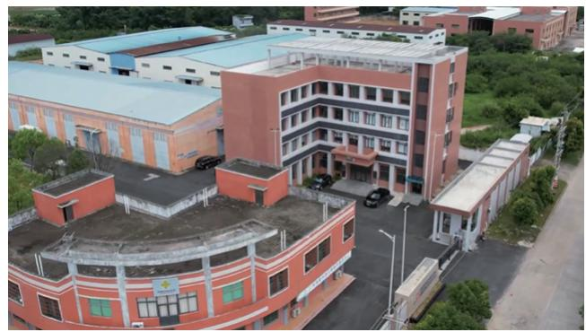

natural_image

Aerial view of a modern multi-story industrial building complex with red and white facades, surrounded by greenery (no visible text or signage)

天禾台山农业社会化综合服务基地

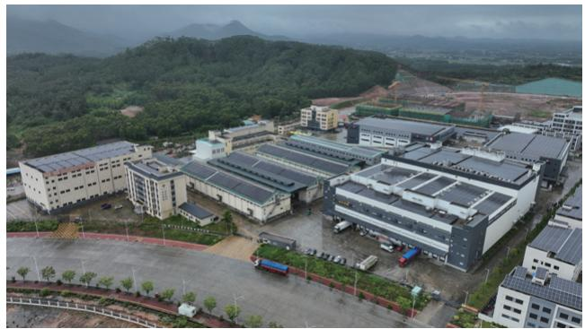

natural_image

Aerial view of a large industrial complex with solar panel installations and surrounding green hills (no visible text or signage)

广东丝苗米跨县集群产业园

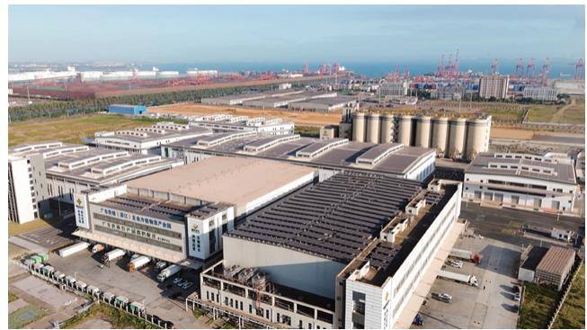

natural_image

Aerial view of a large industrial complex with multiple factory buildings, storage tanks, and shipping cranes in the background (no visible text or signage)

天禾(华南)农资储备物流基地

在硬件扩容的同时,公司积极推动仓储体系的智能化升级,通过引入智能货架、自动化灌包设备、码垛机器人、AGV小车、智能叉车及智慧园区管理系统,实现了核心作业自动化与全流程数字化管控。升级后,预计单一基地最大库存量可达约3,700吨,吞吐能力提升至80托盘/小时,码垛效率达每小时千袋以上,并能灵活适应多种垛型,显著提高了运营效率、响应速度与协同管理能力。

此外, 公司在自动化作业设备的选型与绿色运营上也精准施策。在叉车等流动机械的更新中, 公司综合考虑效率与环保, 引入了包括电叉车在内的多种车型, 并建立了详细的用油和耗电数据统计。此举不仅提升了现场作业效率, 也为持续优化能耗、践行绿色物流提供了数据基础与管理抓手。

natural_image

Illustration of a blue electric car charging to an electric vehicle (no text or symbols)

# 产品和服务安全与质量

天禾股份通过严格把控原料、生产到流通的全链条质量安全标准，并依托专业农技服务团队提供科学用药用肥指导，确保产品绿色高效、服务安全可靠。公司已构建起覆盖作物种植全程的全品类农资产品体系，形成以有机肥、复混肥、特种肥、农药及种子种苗为核心的自主产品矩阵，持续强化了其在绿色农资供应与服务领域的综合保障能力。

<table><tr><td>品类</td><td>子公司名称</td><td>主营业务</td></tr><tr><td rowspan="2">肥料</td><td>中加化肥</td><td>生产、来料加工复混肥料</td></tr><tr><td>壹号生物耕力优</td><td>有机肥研发、生产及销售</td></tr><tr><td rowspan="2">农药</td><td>大丰植保</td><td>农药分装、研发及生产销售</td></tr><tr><td>珠海瑞农</td><td>农药分装</td></tr><tr><td>种业</td><td>天禾种业科农种业科芯种苗良种苗木</td><td>种子经营苗木育种和育苗</td></tr></table>

natural_image

Illustration of a drone spraying drones over a warehouse with a person holding a laptop (no text or symbols)

# 产品质量管理

# 治理

天禾股份确立了“自主产品”战略，集中资源构建绿色高效、发展前景良好的自有产品体系，逐步形成“有机肥、复混肥、特种肥、农药、种子种苗”等多个品类共同发展的发展格局，推动自主品牌市场地位持续提升。在此过程中，公司始终将产品质量置于首位，严格遵守《中华人民共和国产品质量法》以及农资产品的国家标准，通过不断完善质量管理体系、下属生产企业严格执行相关制度，为产品品质提供了坚实保障。

bar

| Category | Value |
| --- | --- |
| Pink Bar | ~10 |
| Orange Bar | ~20 |
| Purple Bar | ~30 |
| Green Bar | ~40 |

在此框架下，公司着力加快完善“绿色农资”自主产品体系，强化品牌规划与建设。通过成立专项工作组、梳理品牌架构、构建管理体系，为自主产品发展奠定组织基础。下属生产企业积极落实质量承诺，推动研发与产能升级：中加化肥推动成立作物营养研究所，成功推出自主复合肥产品“微倍施”，并协助开发水稻、豇豆专项配方产品，“彩虹牌”获评AAA级行业知名品牌；珠海瑞农新实验中心投入使用，并启动新产品登记工作，为绿色农资集采直供夯实资源基础。

公司通过下属生产企业将质量目标与管理要求系统落地。以中加化肥为例，其践行“以质量求生存，以效益促发展”的方针，通过建立质量管理小组、实施常态化考核及分解目标责任等机制，系统地将公司的质量目标与管理要求落到实处。

# 类别

# 制度

# 肥料

《广东天禾中加化肥有限公司产品质量安全管理制度》
《广东天禾中加化肥有限公司原材料进货检查验收制度》
《广东天禾中加化肥有限公司成品检验制度》

# 农药

《珠海经济特区瑞农植保技术有限公司管理手册》

# 种业

《广东科农蔬菜有限公司种业种子质量控制制度》
《广东科农蔬菜种业有限公司种子生产管理制度》

在此基础上,公司持续完善内部质量管控制度,并通过开展多层次、常态化的质量意识与技能培训,不断筑牢全员质量防线,为提升自主品牌市场地位与产品竞争力提供持续支撑。

# 水稻品种试验性状记载规范培训

# 案例

2025年10月,天禾种业开展以“种业标准”为核心的专项培训,系统讲解了种子标准要点、试验设计规范、性状观测体系及数据采集要求等关键技术内容,并对常见问题进行了深度解析。通过培训,有效提升了团队对新标准的理解与执行能力,达到了预期的培训效果。

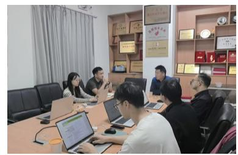

natural_image

Group of people seated around a conference table with laptops and documents, in a meeting room with bookshelves and framed certificates (no visible text or symbols)

# 关键绩效

公司开展产品质量培训37次

培训人次471人次

培训总时长180小时

注:统计口径为生产企业珠海瑞农、大丰植保、壹号生物、天禾种业、科农种业、中加化肥

截至报告期末，中加化肥获得广东省质量检验协会“产品质量信用五星级”荣誉。同时，天禾股份及其子公司珠海瑞农、良种苗木均通过ISO9001认证。未来，珠海瑞农将持续深化“自主产品”战略，有序推进高效、低毒、环保自主农药产品登记和研发。这些权威认可与清晰规划，共同彰显了公司对产品品质的严格把控和持续追求。

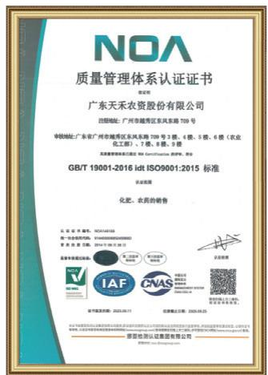

text_image

NOA
质量管理体系认证证书
广东天禾农资股份有限公司
注册地址:广州市黄埔区东关东路709号
审核地址:广东省广州市黄埔区东关东路709号3楼、4楼、5楼、6楼（农业
化工部）、7楼、9楼、9楼
GB/T 19001-2016 idt ISO9001:2015 标准
认证范围
化肥、农药的销售
认证证书编号: NOA140103
统一社会信用代码: 914403000000000000000000000000000000000000000000000000000000000000000
国家发改委公告编号: 2023-08-11
IAF
CNAS
国家发改委公告编号: 2023-08-25
原资质认证结果归本公司
©2023年1月1日

天禾股份ISO 9001认证

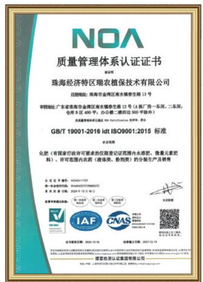

text_image

NOA
质量管理体系认证证书
深圳市
珠海经济特区瑞农植保技术有限公司
注册地址:珠海市金湾区南水镇奉生路13号
审批地址:广东省珠海市金湾区南水镇奉生路13号(入驻厂房一车间、二车间:
仓库三区400平,办公楼二楼四边500平除外)
GB/T 19001-2016 idt ISO9001:2015 标准
认证范围
化肥(有国家行政许可要求的仅限登记证范围内水泥肥、微量元素肥
料)、许可范围内农药(液体类、粒剂类)的分装生产及销售
认证证书编号: NGDH11727
统一社会信用代码: 9144030727988822C
证书有效期: 2024年1月16日至
证书有效期届满日期: 2024.12.16
IAF CNAS
认证标准
ISO 9001-2016
证书有效期: 2024.12.16
有效期截止日期: 2027.12.16
国家质量认证集团有限公司

珠海瑞农ISO 9001认证

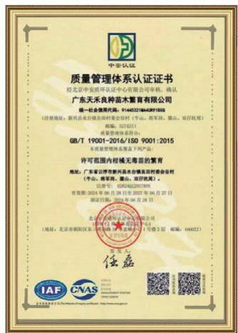

text_image

中安认证
质量管理体系认证证书
经北京中安环宇认证中心有限公司审核，确认
广东天禾良种苗木繁育有限公司
第一年全国照明：148-65497000（注册地址：鄂托克市顺昌区农村委员会村（牛山、将军庙、象山、双月坑尾）
邮编：527433
质量管理信息系统：
GB/T 19001-2016/150 9001:2015
未获监管部门批准了下列产品
许可范围内植被无毒苗的繁育
地址：广东省深圳市黄兴水生态镇东园村村委会村
（中心、将军庙、象山、双月坑尾）。
注册号：5202422017805
有效期：2024年06月28日至2027年06月27日
保证金日期：2024年06月28日
北京市朝阳区金桥街道办事处
（地址：北京市朝阳区东三环北路甲1号院2层  邮编：1000223）
申请人
任磊

良种苗木ISO 9001认证

关键绩效

报告期内，公司未发生重大责任质量事故。

战略

<table><tr><td>风险类型</td><td>风险描述</td><td>影响的时间范围</td><td>影响价值链的环节</td><td>对公司的财务影响</td><td>应对措施</td></tr><tr><td>产品缺陷风险</td><td>农药属于特殊商品,若因产品本身存在未披露的缺陷、配方问题,或随附的使用说明与服务指导不充分、不准确,可能导致作物药害、环境污染、使用者健康损害或农产品残留超标。这将引发高额的客户索赔、政府处罚、品牌声誉严重受损乃至诉讼,直接造成重大财务损失和市场份额下降。</td><td>中期</td><td>下游</td><td>营业收入减少</td><td>不定期组织召开产品示范推广会、农民会,宣传普及农技知识,指导农户正确育种、施肥、选药、科学用药,推广植保新技术与农药新产品;设立免费咨询电话,聘请农业专家在线解答农户种植、用药方面的问题;为种植大户和专业合作社提供整体作物健康解决方案等。同时,持续构建高效低毒、绿色环保、覆盖作物种植全程的全品类农资核心产品体系,涵盖氮肥、钾肥、复混肥等各类化肥以及高效低毒农药。</td></tr><tr><td>合规与市场准入风险</td><td>随着国家“农药零增长”行动深入及全球农产品贸易“绿色壁垒”提高,对农药的毒性、残留限量标准日趋严苛。若公司产品组合无法快速迭代升级,将面临被市场淘汰、无法进入高标准农业产区或出口市场的风险,导致相关产品线收入萎缩。</td><td>中期</td><td>运营环节下游</td><td>运营成本增加营业收入减少</td><td>公司确立了“自主产品”战略,集中资源构建绿色高效、发展前景较好的自有产品体系,聚焦于高效、低毒、环保的农化产品以及新型肥料的研发、引进与推广,优化经营品种结构。</td></tr></table>

<table><tr><td>机遇类型</td><td>机遇描述</td><td>影响的时间范围</td><td>影响价值链的环节</td><td>对公司的财务影响</td><td>应对措施</td></tr><tr><td>政策红利</td><td>在农业绿色转型中,政府优先采购和推广名录倾向于安全环保型农资。同时,种植大户、高品质农产品生产基地及出口型农场对安全、合规、效果可追溯的农资支付意愿更强。通过率先完成产品线向“绿色、低残”升级,公司可以进入这些高门槛、高利润的细分市场,获得定价优势和稳定的订单。</td><td>长期</td><td>下游</td><td>营业收入增加</td><td>一方面,公司确立了“自主产品”战略,集中资源构建绿色高效、发展前景较好的自有产品体系;另一方面,与国际领先单位进行技术合作,引进和开发高端、环保的特种肥料,抢占市场先机。</td></tr><tr><td>客户黏性</td><td>提供科学、精准、负责任的用药用肥指导,能极大降低客户因使用不当造成的风险,从而建立深厚的信任。这种信任关系将使客户产生强烈粘性,从“购买产品”转向“依赖公司的产品与服务解决方案”,为公司带来持续稳定的收入和更强的抗周期能力。</td><td>长期</td><td>下游</td><td>营业收入增加</td><td>公司始终坚守农资安全底线,通过严控采购、存储、流通环节,严把农资质量安全关,并不断完善内控管理体系。致力于推动搭建“为农服务综合平台”,推动农资经营服务线上线下一体化发展,赋能服务模式转型升级。</td></tr></table>

# 影响、风险和机遇管理

天禾股份高度重视产品质量与安全，严格遵守国家相关法律法规，建立健全产品质量管理制度体系，确保农资产品符合国家质量标准。在生产环节，各下属企业紧密结合工艺特点，严格执行规范与技术标准。依据《风险与机遇识别评价控制程序》等管理流程，系统识别产品质量相关的潜在风险，并制定针对性的控制措施和应对方案。通过持续强化风险预警与过程管理，公司实现了质量管理的闭环优化，推动质量管理水平不断提升。

# 指标与目标

公司始终将产品与服务质量安全置于经营首位,为此建立了目标管理与反馈改进机制,设定了“产品出厂合格率”核心质量目标,并对其进行持续监控与严格考核。

# 产品质量管理措施

# 产品质量培训

为增强全员质量意识,公司为员工提供质量管理与产品安全相关培训课程;同时通过年中会议、质量专项培训等形式,从上到下严格落实公司质量文化及质量监管要求。

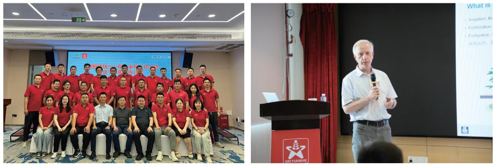  
特种肥料板块产品质量培训

# 产品质量监测与产品有害物质监测

公司重视产品质量安全，并建立完整的内部质量控制体系。例如，中加化肥制定了《产成品检验规程》《原材料检验规程》等一系列管理流程，珠海瑞农制定了《原材料入库检验》《中控管理制度》《出厂检验制度》等制度。这些制度共同构成了公司从原料入厂到产品出厂的全链条质量监测网络，为产品质量的稳定与可靠奠定了坚实的制度基础。

公司将有害物质管理作为质量监控的核心环节,通过建立有害物质安全评估机制,不断提升有害物质管理水平,保障产品健康与安全。例如,中加化肥对原材料进仓执行检验要求,保证从原材料开始控制有毒有害物质的含量,确保产品符合环保生态肥料要求;钾肥部针对老挝颗粒氯化钾等产品主动实施外部送检。这些措施共同形成了从评估、入料到出厂检验的严密管理链条,切实保障了产品的安全与环保品质。

# 中加化肥产品制造过程管理

原材料检验

所有到厂原材料均依据《原材料检验规程》进行检验, 确保只有合格原料方可入库。

质量控制

遵循《BB肥生产关键质量控制点操作规程》《生产控制管理制度》等要求，对制定生产计划、原料投比、混合搅拌、产品包装、码垛及存储等每一个环节进行精细化控制，全面落实过程管理责任，确保生产活动全程标准化、规范化。

产成品检验

所有产成品在出厂前均须通过《产成品检验规程》的严格检验,确保完全符合出厂标准。

关键绩效

公司年度质量内审次数

212次

聘请第三方机构抽检次数

55次

产品合格率

100%

注:统计口径为生产企业珠海瑞农、大丰植保、壹号生物、科农种业、中加化肥

# ◎ 不合格品管理与产品召回

公司建立了覆盖不合格品管理与产品召回的管控机制，致力于对潜在质量风险进行系统预防与有效应对。在内部质量控制环节，珠海瑞农依据《不合格管理制度》，对不合格进行严格控制和管理，防止不合格再次出现。同时，为强化对已流出产品的质量责任管理，中加化肥执行《产品召回管理制度》，珠海瑞农亦制定了《产品事故处理及召回制度》，均形成了有效的追溯、召回，确保相关不良产品安全及时有效处理的处理流程，禁止销售、退市召回的不合格产品。

关键绩效

报告期内，公司未发生因健康与安全原因须撤回和召回事件。

# 客户服务管理

公司始终将助力农民增收作为客户服务工作的重要目标,通过覆盖广泛的终端网络与专业团队,为农户提供从农技指导、作物解决方案到高效配送的一站式服务,帮助农户实现“降本、提质、增效”,有效提高作物产量与品质。

为保障服务过程规范可控并持续提升客户体验，中加化肥遵循“客户为本、及时响应、公正处理、持续改进”的基本原则，制定并实施《客户投诉响应流程说明》，规范客户投诉处理，提升服务质量与客户满意度，维护公司品牌信誉。珠海瑞农制定《售后服务工作管理规定》，并开展客户满意度调查。

公司服务体系紧密围绕农业绿色高质量发展进行布局,通过推广科学施肥、减量增效等绿色技术,在帮助农户提升产量与品质的同时,降低生产成本与环境影响,为农民增收注入持久动力。

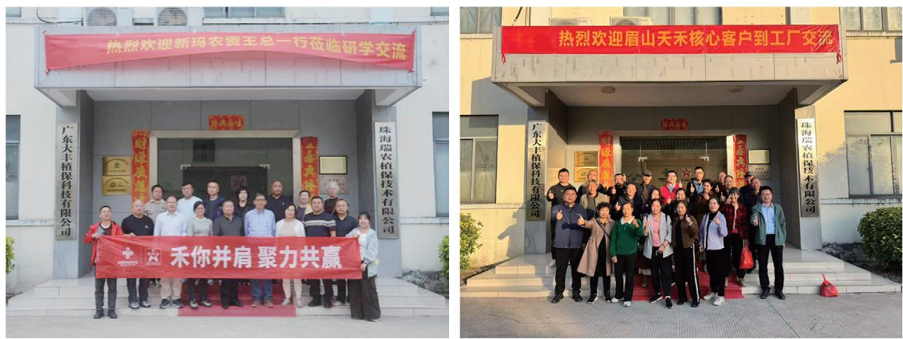  
客户交流会

<table><tr><td rowspan="2">关键绩效</td><td>公司发生客户投诉事件20件</td><td>珠海瑞农、大丰植保客户满意度为97.75分</td></tr><tr><td>科农种业客户满意度为100分</td><td>客诉解决率100%</td></tr></table>

注:客户投诉时间和客诉解决率统计口径为珠海瑞农、大丰植保

# 以人为本

# 员工权益保障

天禾股份紧扣“服务新时期公司发展战略”这一核心，在人才引进、培养、激励及管理等方面稳步推进各项工作，在公司人才梯队建设、人才培训发展、激励机制设计、企业文化建设等方面加强投入，为公司的高质量发展提供了坚实的人力资源保障。截至报告期末，公司共有员工2,708人，劳动合同签署率100%，劳务派遣人员12人，退伍军人50人。

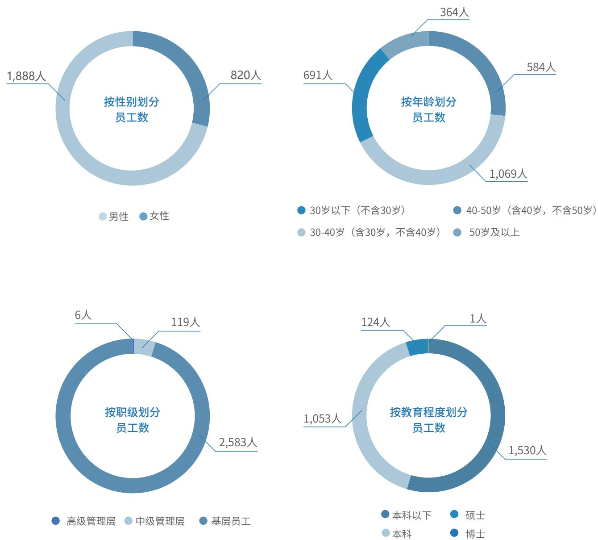  
高级管理层  
中级管理层  
基层员工  
● 本科以下  
硕士  
● 本科  
● 博士

# 人才吸引与招聘

# ◎ 招聘管理

2025年,公司以发展“订单农业+全程社会化服务”新业态和建设“社村”合作试点项目所需的人才梯队为主要工作目标,系统分析各业务板块用人规划,科学制定年度招聘计划,统筹推进关键岗位和专业人才引进工作,持续完善覆盖招聘规划、岗位设置、选拔流程与用工合规的全流程招聘管理体系,不断提升人才引进工作的系统性与精准度。

公司制定并实施《员工招聘管理制度》《劳动合同管理办法》，建立规范统一的招聘实施流程，明确各环节职责分工与管理要求。报告期内，公司围绕农业服务主业与业务布局，通过校园招聘与社会招聘相结合的方式开展人才引进工作，依托高校宣讲会、校园双选会及主流网络招聘平台等多元渠道，有针对性地为基层员工队伍补充业务储备人才和专业技能人才，持续提升招聘工作的组织效率与实施成效。报告期内，公司新进员工数376人。

按性别划分的新进员工  
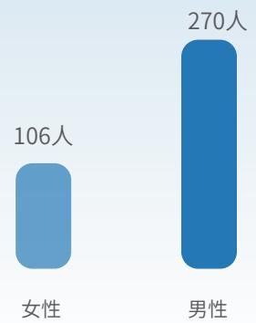

bar

| Category | Value (人) |
| --- | --- |
| 女性 | 106 |
| 男性 | 270 |

按年龄划分新进员工数  
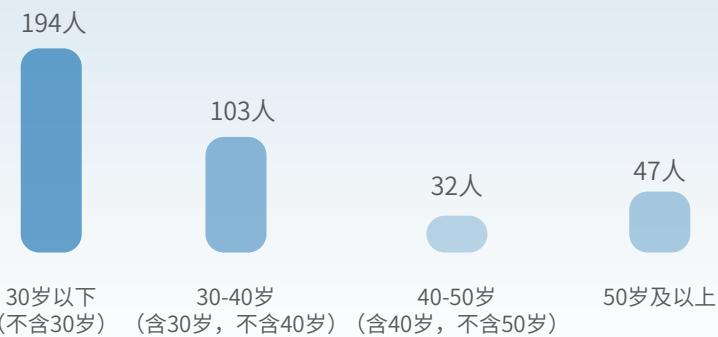

bar

| Age Group | Population |
| --- | --- |
| 30岁以下 (不含30岁) | 194 |
| 30-40岁 (含30岁，不含40岁) | 103 |
| 40-50岁 (含40岁，不含50岁) | 32 |
| 50岁及以上 | 47 |

# 多元化、平等与包容性

公司倡导多元化与平等,尊重每一个个体间的差异,在招聘、薪酬、福利、晋升等环节,为员工提供平等机会。公司对于不同种族、民族、国籍、肤色、性别、宗教信仰等的员工一视同仁,对任何形式的歧视、骚扰或欺凌都采取零容忍的态度。

公司尊重少数民族员工的文化传统与宗教习俗，为少数民族员工提供特定节假日休假安排，推动形成更加包容、多元的工作氛围。截至报告期末，公司共有139名少数民族员工，包括白族、朝鲜族、达斡尔族、傣族、侗族、回族、满族等18个少数民族。

民族节日休假安排

上巳节:2025年3月31日—4月1日,连休4天

肉孜节:2025年3月29日—3月31日,连休3天

古尔邦节:2025年6月6日—6月10日,连休5天

公司关注女性员工在工作与生活不同阶段的实际需要，在依法合规的基础上完善相关假期安排和劳动保护措施，明确产假、哺乳假、育儿假等管理要求，为员工安心工作提供制度保障。同时，公司在“三八”妇女节等节日向女性员工送上节日关怀，通过安排半天休假、赠送鲜花礼品等方式，表达对女性员工的关心与感谢，营造更加温暖、友好的职场氛围。

  
关键绩效

公司管理人员中女性人数

18人

公司享受产假员工的返岗率

100%

管理人员中女性人数比例

14.4%

享受育儿假员工的返岗率

100%

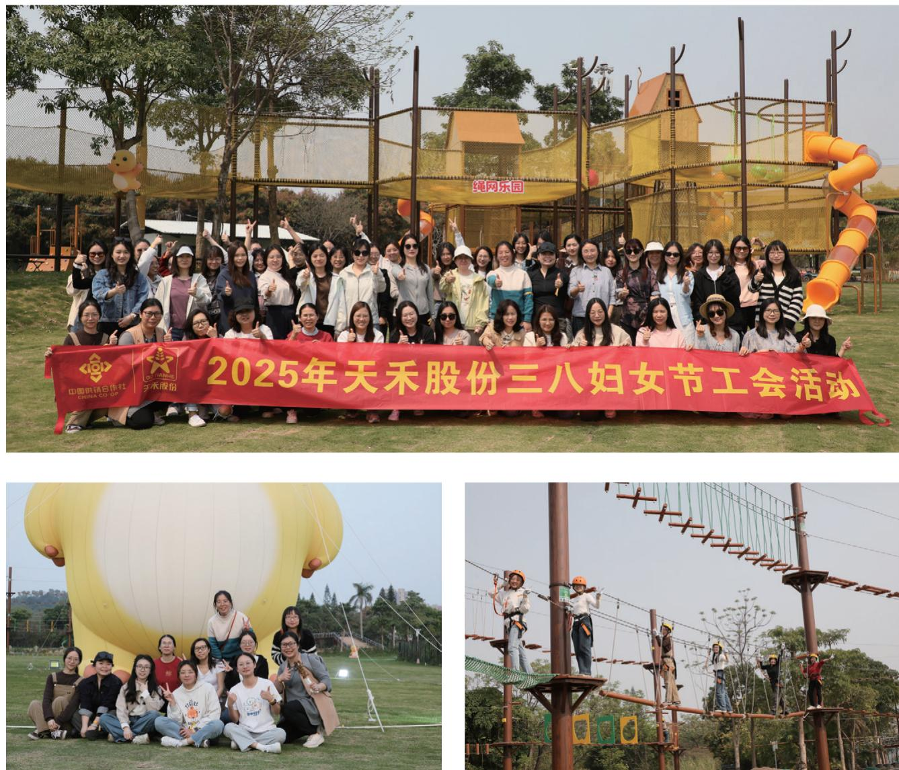  
天禾股份妇女节工会活动

# 培训与发展

# ◎ 员工培训

公司坚持“文化认同、团结协作、选贤用能、成就员工”的人才理念，将员工能力建设作为支撑业务高质量发展的重要基础。公司围绕发展实际需要，充分收集培训需求，系统制定并落实年度培训计划，制定并依据《员工教育与培训管理制度》《新员工“导师制”培训实施办法》等制度要求，对各类培训项目进行统一管理和组织实施。

  
关键绩效

公司员工培训投入

33.79万元

员工培训场次

101场次

接受培训总人数

2,591人

接受培训总人次

8,975人次

员工培训覆盖率

100%

培训总时长

808小时

每名员工每年接受培训的平均时长

0.31小时/人

按性别划分的受训比率  
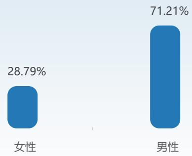

bar

| Category | Value (%) |
| --- | --- |
| 女性 | 28.79 |
| 男性 | 71.21 |

按职级划分受训比率  
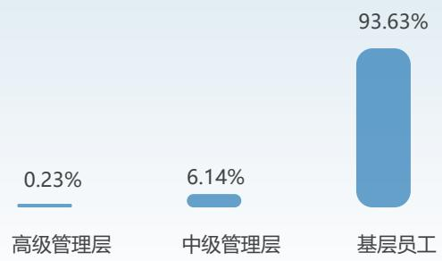

bar

| Category | Value (%) |
| --- | --- |
| 高级管理层 | 0.23 |
| 中级管理层 | 6.14 |
| 基层员工 | 93.63 |

# 培训体系

公司不断完善覆盖不同岗位序列和管理层级的人才培养体系,建立以分层分类培养为导向、与岗位发展阶段相匹配的培训发展体系,通过系统化培养路径和重点项目牵引,持续提升员工专业能力与管理素养。

围绕员工不同成长阶段, 公司构建由“青禾计划”“优禾计划”“金禾计划”组成的培训发展体系, 同时结合不同岗位序列实际需求, 配套开展党政教育培训、企业管理培训、专业技术人才培养、适岗培训及安全生产培训等内容, 并通过线上与线下相结合的方式营造持续学习氛围, 促进员工多元化成长发展。

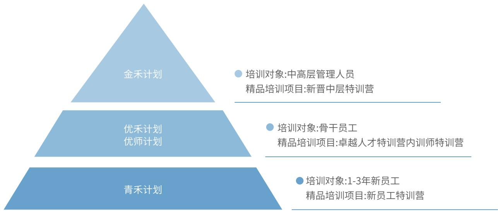

flowchart

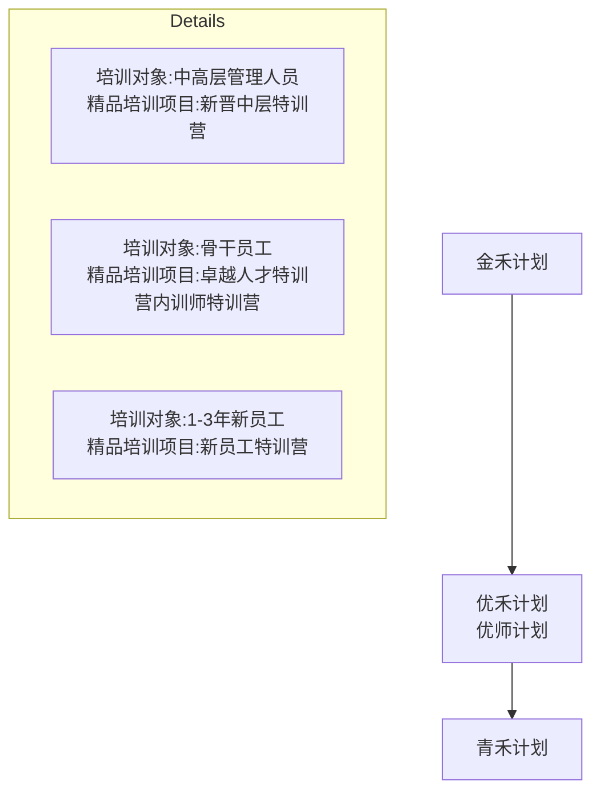
```mermaid
graph TD
  A["金禾计划"] --> B["优禾计划\n优师计划"]
  B --> C["青禾计划"]
  
  subgraph Details
    D["培训对象:中高层管理人员\n精品培训项目:新晋中层特训营"]
    E["培训对象:骨干员工\n精品培训项目:卓越人才特训营内训师特训营"]
    F["培训对象:1-3年新员工\n精品培训项目:新员工特训营"]
  end
```

培训发展体系图

# 新员工训练营

2025年,7月为公司本部及农服体系新员工开展集中入职培训,围绕企业文化、规章制度和业务流程等内容进行系统讲解,帮助新员工尽快完成角色转换、融入组织。

9—10月,公司采取军事化管理训练与企业文化课程相结合的方式,组织开展为期6天的2025年度新员工训练营,共108名员工参训并顺利结业。训练营通过队列训练、团队协作活动及专题课程等形式,有效强化新员工对供销事业、企业文化与公司发展战略的了解认同,进一步提升团队凝聚力与组织活力。

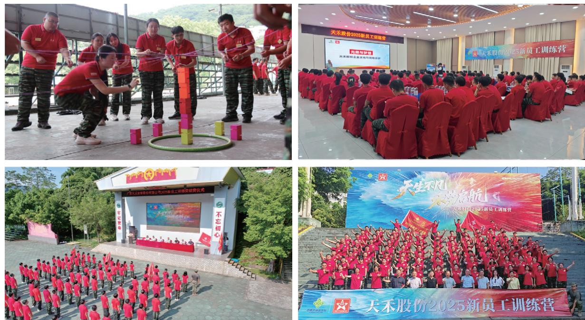  
天禾股份2025新员工训练营

# 卓越人才训练营

# 案例

2025年5—9月，公司组织开展第七期卓越人才发展计划，采用线上分享与线下集中培训相结合的方式，面向来自公司各部门的53名骨干员工开展系统培养。此次课程内容围绕财商思维、领导力建设和管理沟通等主题设置，引导学员在学习过程中强化管理意识与综合能力，并通过阶段性集中培训与交流研讨，公司进一步夯实骨干人才培养基础，为管理梯队建设和后备人才储备提供了有力支撑。

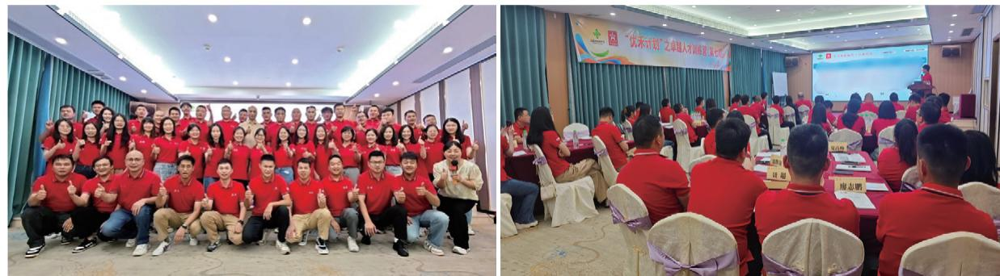  
“优禾计划”之卓越人才训练营(第七期)

# 培训平台建设

公司持续完善员工学习与培训的支撑体系,通过内部师资力量建设与数字化学习平台建设,为各类培训项目顺利开展提供基础保障。

公司依据《内部培训师管理办法》《知识管理办法》建立内部讲师选拔与管理机制，鼓励业务骨干走上讲台，将实践经验、专业方法和管理心得转化为课程内容，并通过知识沉淀与共享机制，把成熟做法和优秀案例汇集到内部知识库中，在组织内部持续传播和复用，促进经验传承与能力提升。报告期内，公司内训师开展了15项培训课程。

公司引入“小鹅通”学习平台作为员工日常学习的重要载体，为员工提供线上课程学习、专题培训和自主提升通道。员工可根据岗位需要和个人发展方向灵活参与学习，实现随时学、按需学。报告期内，公司在“小鹅通”学习平台上线34个录播课程，累计10,351人参与学习；同步开展17场直播课程，观看人数达2,968人。

通过线上与线下学习资源的结合, 公司不断拓展培训覆盖范围, 让不同地区、不同岗位的员工都能便捷获取学习机会, 为员工长期成长和职业发展提供稳定支持。

# 校企合作培养

围绕现代农业服务、植保技术、数字农业及供应链运营等业务方向，公司与华南农业大学、仲恺农业工程学院、广东电子商务技师学校等目标院校建立常态化合作交流机制，不断拓展校企合作的广度与深度。报告期内，公司与华南农业大学植物保护学院联合开展“天禾班”校企合作项目，接收硕士研究生19人参与联合培养，通过课程共建、实践教学和科研协作等方式，加强高层次专业人才储备。

同时, 公司与华南农业大学基础实验与实践训练中心签署战略合作协议, 捐赠教学物资用于支持信息化农情监测耕读教育项目建设, 推动双方在人才培养、科研创新及农业教育资源建设等方面的深度融合。

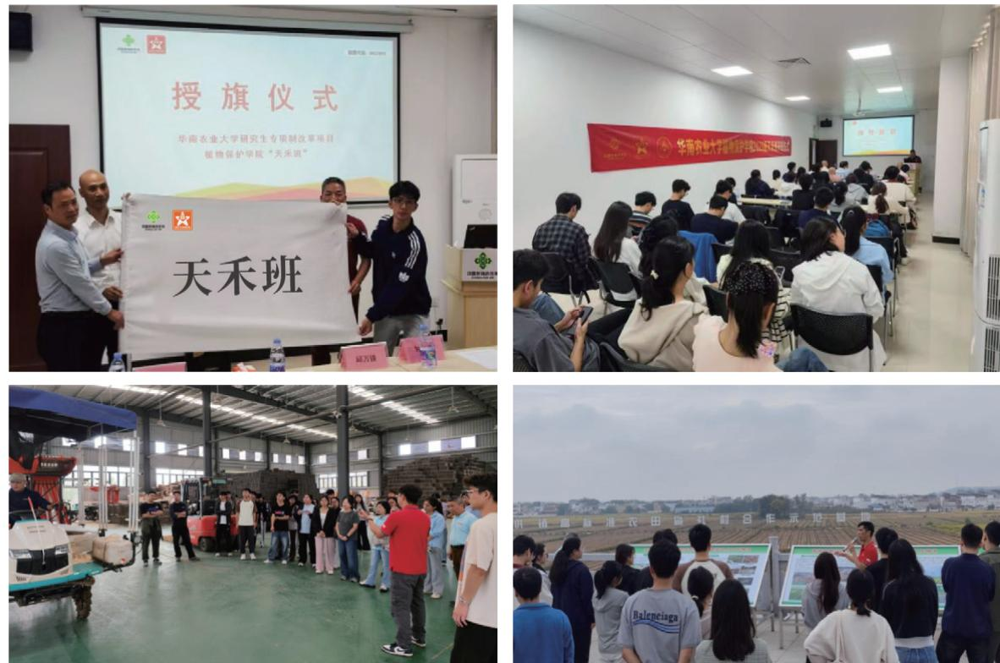  
“天禾班”校企合作项目

# ◎ 职业发展

公司始终关注员工的长期成长，把职业发展作为人才工作的重点内容。公司坚持“因事设岗，因岗定人”“统一管理，动态调整”的原则，通过《岗位体系管理制度》和《专业序列员工职级评审试行办法》对岗位体系和晋升机制作出明确规定，让员工能够清楚了解自身发展方向和成长路径。同时，公司将岗位发展与绩效管理相结合，完善激励与约束机制，努力营造公开透明、公平公正的职业发展环境，让员工在公司能够安心发展、持续成长。

公司构建了纵向职级晋升和横向跨通道发展的双通道，员工可根据自身阶段和岗位变动灵活选择发展路径。此外，公司建立自由的内部调岗机制，员工能通过内部竞聘、轮岗、平级调动等方式，拓宽自我价值实现空间，挖掘自身潜力。

  
关键绩效

员工内部调动或内部应聘的人数

23人

实现职级晋升

227名

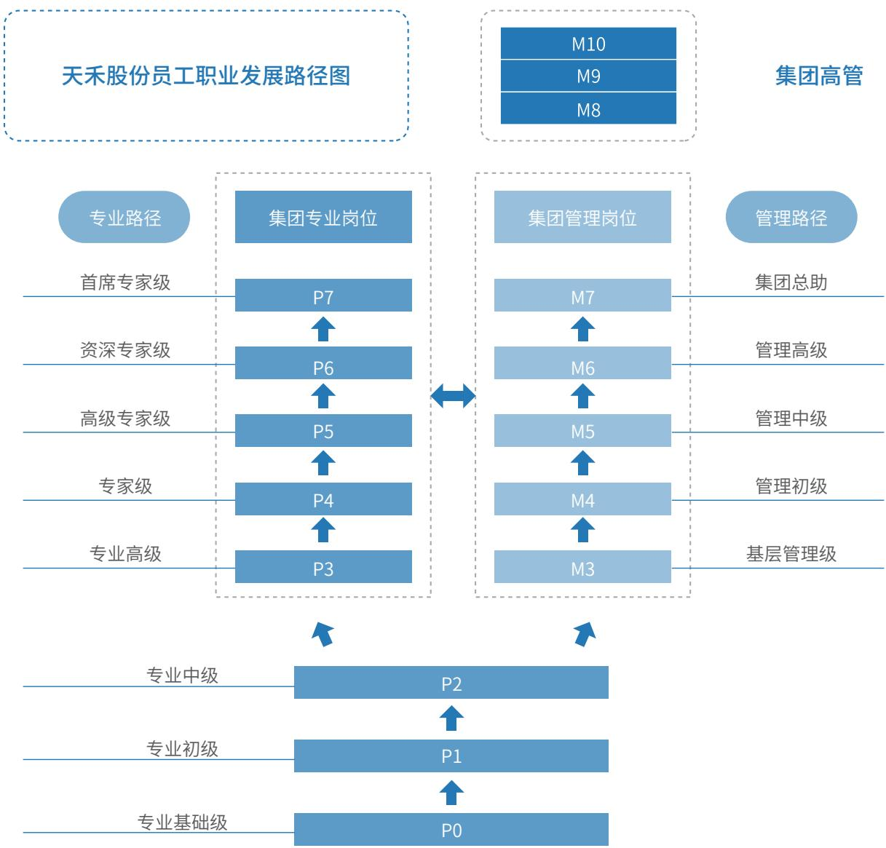

flowchart

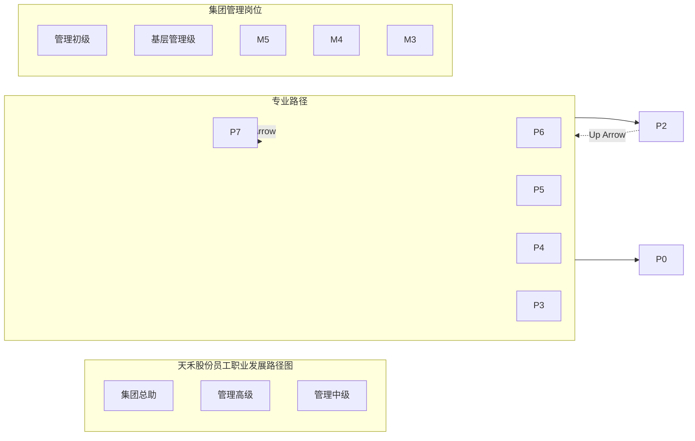
```mermaid
graph LR
  subgraph Group["天禾股份员工职业发展路径图"]
    M10["M10"]
    M9["M9"]
    M8["M8"]
  end

  subgraph Professional["专业路径"]
    P1["P7"]
    P6["P6"]
    P5["P5"]
    P4["P4"]
    P3["P3"]
  end

  subgraph Management["集团管理岗位"]
    M7["M7"]
    M6["M6"]
    M5["M5"]
    M4["M4"]
    M3["M3"]
  end

  subgraph Management["管理路径"]
    M10["集团总助"]
    M9["管理高级"]
    M8["管理中级"]
    M7["管理初级"]
    M6["基层管理级"]
  end

  Professional["专业基础级"]
  Professional["专业初级"]
  Professional["专业中级"]

  Professional --> P2
  Professional --> P1
  Professional --> P0

  P2 -.->|Up Arrow| Professional
  P1 -.->|Up Arrow| Professional
```

# 薪酬福利管理

# 薪酬管理

天禾股份严格遵守《中华人民共和国劳动法》《中华人民共和国劳动合同法》等法律法规，制定了《员工薪酬管理制度》《工资总额管理办法》《员工绩效管理制度》等员工薪酬管理相关制度，充分保障员工的权益。根据不同岗位的岗位价值、公司支付能力、市场水平以及责任和奖励相匹配的原则，员工薪资分成固定工资、绩效奖金。公司每年根据国家政策和物价水平等宏观因素的变化，以及企业整体效益情况进行薪资调整。

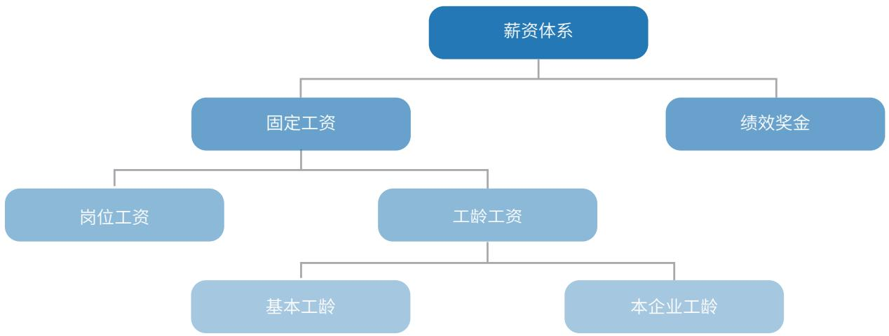

flowchart

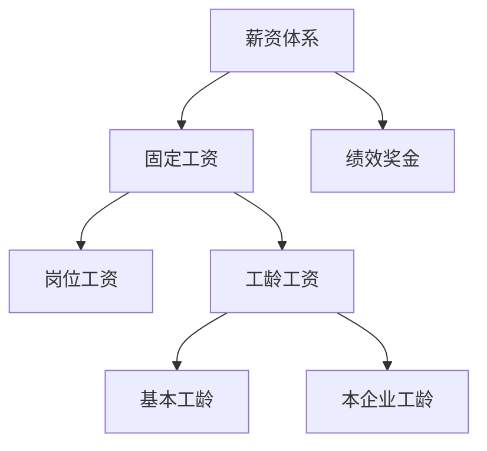
```mermaid
graph TD
  A["薪资体系"] --> B["固定工资"]
  A --> C["绩效奖金"]
  B --> D["岗位工资"]
  B --> E["工龄工资"]
  E --> F["基本工龄"]
  E --> G["本企业工龄"]
```

# 绩效管理

天禾股份根据《员工绩效管理制度》，遵循“客观公正、民主公开，分类考核，定量指标与定性分析相结合”的原则，从员工工作业绩、能力表现与工作态度等方面开展综合评价，持续激发员工工作积极性，促进个人成长与组织绩效协同提升。

公司设立薪酬绩效考核领导小组，对绩效管理工作进行统筹指导与监督；人力资源部作为绩效管理的常设执行机构，负责组织实施相关工作，并结合不同岗位职责与工作要求，实施分层分类的考核安排，确保评价过程规范有序、结果公平合理。

<table><tr><td>考核对象</td><td>考核指标</td><td>考核周期</td><td>分值等级</td></tr><tr><td rowspan="3">中层干部</td><td>工作业绩</td><td rowspan="3">年度考核</td><td rowspan="5">卓越(100分)优秀(80分)良好(60分)发展中(40分)</td></tr><tr><td>工作素质</td></tr><tr><td>工作能力</td></tr><tr><td rowspan="2">员工</td><td>工作内容</td><td>季度考核</td></tr><tr><td>能力态度</td><td>年度考核</td></tr></table>

公司注重倾听员工声音,希望通过充分沟通帮助员工更清楚地认识自身表现与发展方向。考核结束后,人力资源部将考核结果反馈至各部门负责人,并由各部门与员工进行面对面交流,解释评价依据,讨论改进方向,支持员工持续成长。员工如对考核结果存在疑问,可在结果公布后3日内以书面形式向人力资源部提出申诉,公司将按照既定程序对相关情况进行核查,并在薪酬绩效考核领导小组指导下开展审慎评议,及时向员工反馈处理进展与结果。

# 福利待遇

公司关注员工在工作与生活中的实际需求,通过不断完善福利保障体系,为员工创造更加安心、稳定的工作与生活环境。公司制定并实施《福利管理制度》,持续丰富福利内容,在依法缴纳五险一金的基础上,保障员工依法享有带薪年假、探亲假、婚丧假、产假等各类假期,并提供商业保险及交通、节假日、餐食、高温等补贴,为员工在工作与生活中的日常需要提供更加充分的支持。

# 福利

社保、住房公积金、节假日补贴  
通讯补助、交通补助、驻外补助

# 休假

法定节假日、年休假、事假、病假、婚假、丧假
产假、哺乳假、育儿假、护理假、工伤假

# 保险

商业意外险、雇主责任险

# 餐饮

员工饭堂、出差餐补

# 住宿

员工宿舍(部分)

# 健康

健身设施、健康体检

  
关键绩效

公司社会保险覆盖率100%。

# 劳动纠纷处理

公司制定并实施《员工离职管理制度》，对员工因个人原因提出离职、公司依法辞退、双方协商解除劳动合同以及劳动合同期满终止等情形作出明确规范。公司坚持依法合规地处理劳动争议事件，遇到分歧时优先通过面对面沟通和协商解决，认真听取员工意见，努力达成双方认可的方案；如协商未果，则由相关部门参与调解；若仍无法解决，公司将依法进入劳动仲裁程序，确保争议处理过程规范、公正，切实维护员工与公司的合法权益。

  
关键绩效

公司员工离职数

395人

其中：员工自愿辞职人数

310人

员工总流失率

12.7%

按性别划分的流失率  
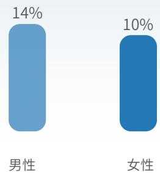

按年龄划分的流失率  
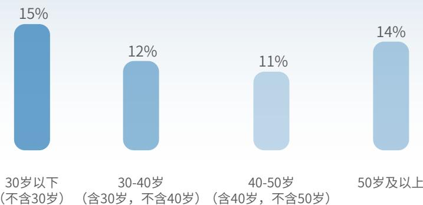

bar

| Age Group | Percentage |
| --- | --- |
| 30岁以下 (不含30岁) | 15% |
| 30-40岁 (含30岁，不含40岁) | 12% |
| 40-50岁 (含40岁，不含50岁) | 11% |
| 50岁及以上 | 14% |

# 员工关怀与沟通

# ◎ 员工活动

公司工会坚持以活动为载体,丰富职工的精神文化生活,搭建交流展示平台,通过开展形式多样、内容丰富的文体活动与技能竞赛,进一步凝聚职工向心力、激发队伍战斗力。

# 植树节活动

#

案例

公司响应“绿美广东”建设号召，组织“绿美广东供销在行动”义务植树活动，为广东生态环境贡献力量。

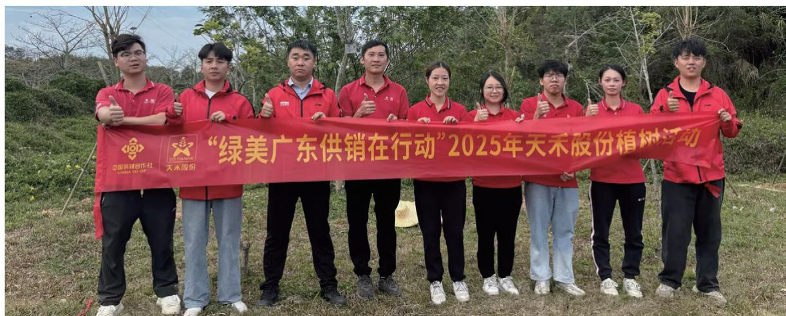

text_image

中国供销合作社
CHINA CO-OP
“绿美广东供销在行动”2025年天禾股份植树活动

植树节活动

# 文体活动

# 案例

公司组建特色文体队伍，牵头组建篮球队、足球队，建立常态化训练机制，组织队员定期开展集训，不断提升队伍竞技水平与团队凝聚力。其中，篮球队在“2025首届华南农业大学校友会农资行业篮球联赛”中奋勇拼搏，成功斩获季军，充分展现了职工团结协作、奋勇争先的良好精神风貌。

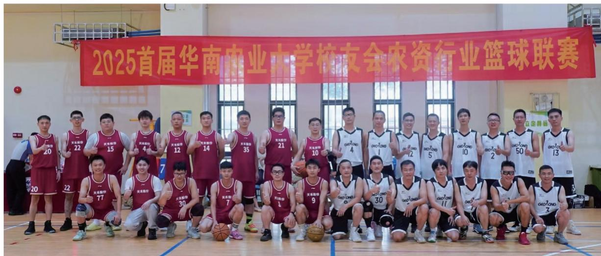

text_image

2025首届华南农业大学校友会农资行业篮球联赛

篮球赛

# 文艺汇演

# 案例

公司工会积极响应广东省供销合作联社“唱响红色主旋律”文艺活动汇演号召，组建8人小组唱队伍演唱《明天会更好》，充分展现天禾股份职工团结向上、奋勇争先的精神风貌。

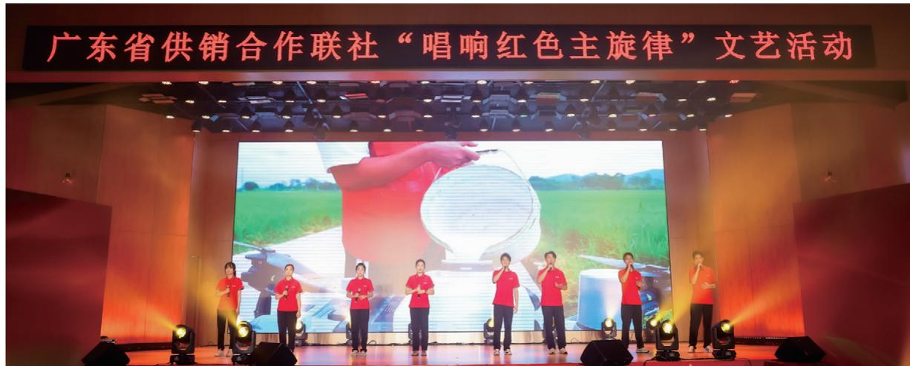

text_image

广东省供销合作联社“唱响红色主旋律”文艺活动

文艺汇演

# 员工帮扶

公司做细精准帮扶，密切关注职工生活状况，建立健全关怀帮扶机制，彰显天禾股份温情。报告期内，公司对3名困难职工实施重点帮扶，提供经济援助与生活照料，共计发放帮扶金额16,000元；向8名职工发放直系亲属身故慰问、16名女职工发放生育慰问、5名退休职工发放退休慰问、29名职工发放住院慰问，全方位覆盖职工关键生活节点；为广东省内单位1,496名职工统一购买二次医保，累计协助38人次职工成功申请理赔，为职工健康筑牢“双重保障”。

# ◎民主管理

公司遵循《中华人民共和国工会法》等法律法规，设立工会并制定了《广东天禾农资股份有限公司工会工作制度》，维护员工合法权益。涉及员工切身利益的规章制度或重大事项时，均向相关员工征求意见，提高员工对公司经营管理的参与度，通过平等协商确定并告知员工相关决定。截至报告期末，公司工会人员2,591人，占员工总人数95.68%。

# 安全生产与职业健康

# 安全生产管理体系

公司坚持“安全第一、预防为主、综合治理”方针，严格遵循《中华人民共和国安全生产法》《中华人民共和国职业病防治法》等法律法规要求，将员工生命安全与职业健康放在首位，持续完善安全管理体系与职业健康，努力为员工营造安全、可靠、健康的工作环境。

公司制定了《安全管理基本制度》《全员安全生产责任制》《安全管理分类分级实施办法》《生产安全事故应急管理和报告处理制度》等共计16项管理制度，对安全管理组织架构、岗位职责、运行机制、应急处置流程、安全培训与监督检查、消防管理等关键环节作出明确规定，实现对安全生产重点领域和核心流程的全面覆盖，为各级单位规范开展安全管理工作提供了坚实制度支撑。报告期内，公司新制定2项安全规章，修订6份规章制度和5项操作规程，并出台1项安全指引，进一步夯实安全生产管理基础。

公司实行“公司—部门—控股子公司”的三级安全管理体系，公司经营班子领导，安全生产管理机构监管，各单位各司其职、各负其责、一把手负总则、全员参与，安全生产工作按照“三管三必须”原则实行属地化管理。

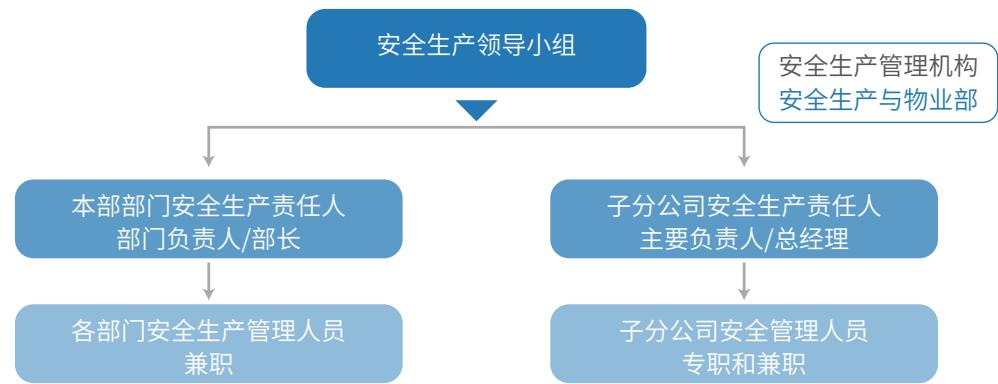

flowchart

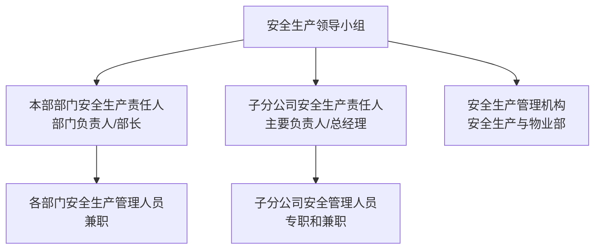
```mermaid
graph TD
  A["安全生产领导小组"] --> B["本部部门安全生产责任人\n部门负责人/部长"]
  A --> C["子分公司安全生产责任人\n主要负责人/总经理"]
  A --> D["安全生产管理机构\n安全生产与物业部"]
  B --> E["各部门安全生产管理人员\n兼职"]
  C --> F["子分公司安全管理人员\n专职和兼职"]
```

同时，公司持续强化责任落实和考核约束机制，每年组织签订《安全生产和消防工作责任书》，并依据《安全生产责任制及安全生产工作考核办法》开展安全生产责任制考核，将安全生产考核与经营业绩考核挂钩，发挥奖惩机制的导向作用，推动安全管理要求在日常运营中落到实处。此外，公司积极配合并高质量完成广东省供销集团安全生产考核工作，年度考评结果获评“优秀”等次。

# 安全生产风险管理

# ◎ 风险管理机制

公司制定并实施《安全生产风险分级管控制度》，坚持“全面辨识、科学评估、分级管控”的原则，着力构建“双重预防”机制体系，形成覆盖“风险辨识—风险评价和分级—风险控制”的闭环管理模式。

# 管理环节

# 主要内容

# 风险辨识

紧扣本单位生产经营实际,全面辨识生产工艺、设备设施、人员行为、农资储存、工作环境、业务流程和管理体系等方面存在的危险源。

# 风险评价和分级

采用作业条件危险性分析法(LEC法)对已辨识风险进行分析分级, 将安全风险划分为重大风险、较大风险、一般风险和低风险四个等级。

# 风险控制

按照风险等级实施差异化管控措施, 明确责任主体, 落实现场管控要求, 并纳入日常检查和隐患整改闭环管理。

# 隐患排查

为建立安全生产检查和事故隐患排查治理长效机制，公司制定并实施《安全生产检查和隐患排查治理规定》，建立安全生产“一线三排”工作机制，由主要负责人组织建立并落实安全风险分级管控和隐患排查治理双重预防工作机制，督促、检查本单位的安全生产工作，及时消除生产安全事故隐患。整改责任单位对发现的隐患和问题按照轻重缓急实施分类处置，及时采取措施予以整改消除。整改完成后，由督办负责人或组织检查单位开展复查验收，合格的予以核销；对整改不到位或逾期未改的，依据有关规定实施约谈、通报等问责措施，持续强化隐患治理成效。同时，公司引入第三方专业机构参与安全风险排查与评估。报告期内，公司整治391项隐患，整改完成率100%。

# ◎ 应急管理

公司制定并实施《生产安全事故应急管理和报告处理制度》《消防安全管理制度》等制度，明确生产安全事故的应急处置要求，并同步建立由综合应急预案、灭火及人员疏散专项应急预案和6项现场处置方案组成的应急预案体系。公司定期开展应急演练，强化员工应急响应和自救互救能力，并结合演练评估结果持续优化应急预案，提升预案的可操作性和针对性，着力降低事故发生概率及其潜在影响。

# “人人讲安全、个个会应急——查找身边安全隐患”——2025年上半年生产安全事故应急预案演练

# 案例

2025年6月，公司在广州市天禾仓储有限公司西洲经营部组织开展高处坠落、叉车伤人、农药泄漏及仓库火灾等多场景生产安全事故应急演练。演练过程中，各应急小组依次完成险情报告、应急启动、警戒隔离、人员疏散、伤员救护、泄漏源控制和火情处置等关键环节，并协同外部力量开展联动处置，有效检验预案可操作性和多部门协同效率；同时，公司对演练问题开展复盘，围绕急救熟练度、通信稳定性和协同衔接等方面提出改进措施，持续提升应急处置能力。

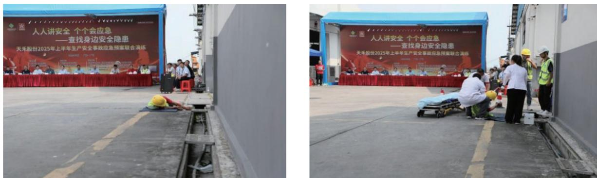

模拟高处坠落事故应急处置  
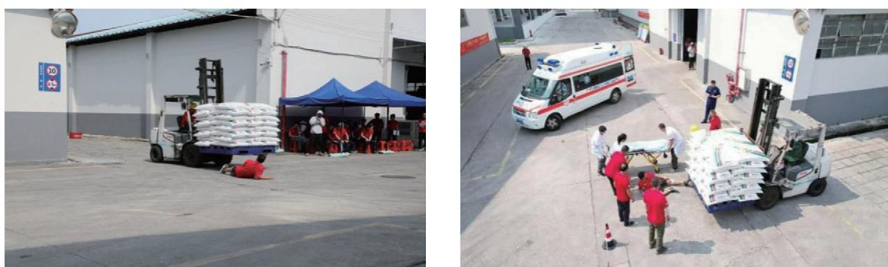  
模拟叉车伤害事故应急处置

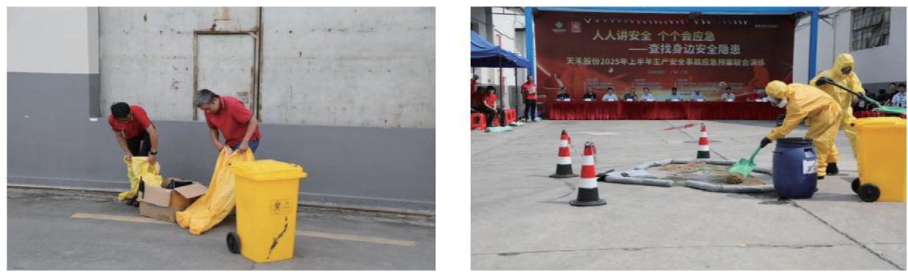  
模拟农药泄漏事故应急处置

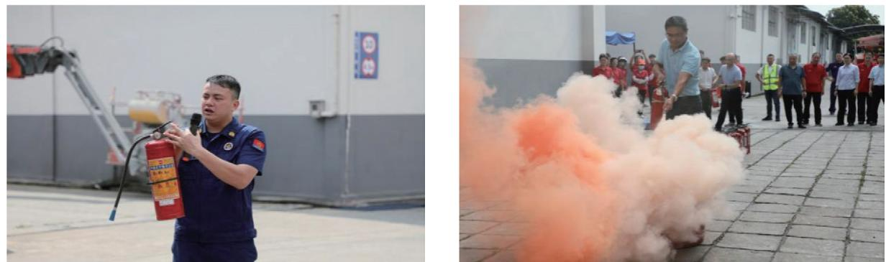  
消防器材讲解及操作

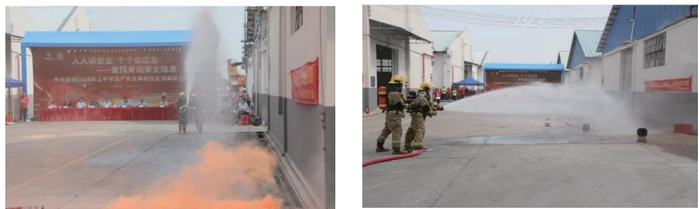  
模拟仓库火灾事故应急处置

# 高层建筑火灾事故应急疏散演练

# 案例

2025年11月，公司在本部办公楼组织开展高层建筑火灾事故应急疏散演练，模拟火情发生后启动应急响应，警报响起后全体员工及来访人员依预案依次完成火情报警、自动消防系统启动、沿疏散通道有序撤离至应急集合点等关键环节，系统检验员工对疏散路线的熟悉程度和消防设施可靠性。演练结束后，公司对疏散组织、响应时效和消防器材使用情况进行评估，总结改进空间，并将通过强化培训和实操演示进一步夯实消防应急管理基础。

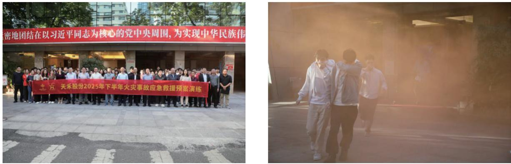  
高层建筑火灾事故应急疏散演练现场

# 安全生产管理措施

# ◎ 安全生产数字化建设

公司依托企业微信平台搭建“天禾安全生产”小程序，整合规章制度、安全费用、安全活动、安全风险和隐患排查治理等模块，实现安全生产“一企一档”信息化管理，并推动风险辨识评估、告知公示、分级管控以及隐患排查、闭环整改、数据统计等环节线上运行，持续提升安全管理规范化水平和工作效率。

报告期内，“天禾安全生产”小程序已覆盖广东省内全部及部分省外单位，10家A类单位和82家子(分)公司的风险辨识评估和隐患排查闭环整改功能实现了信息化、常态化，进一步提升安全生产管理效率与合规保障能力。

# ◎培训与文化建设

公司持续培育良好的安全文化氛围，按照广东省供销社、广东省供销集团及政府相关主管部门部署，组织开展“安全生产月”“119消防宣传月”等专题活动，通过专题培训、应急演练、宣传教育、集中观看安全主题影片、隐患排查等多种方式，将安全理念融入日常管理与现场作业，不断提升员工的安全意识与风险防范能力。

# “全民消防 生命至上”——安全用火用电专题培训

# 案例

2025年“119消防宣传月”活动中,公司邀请广东省安全培训师、广东省安全生产协会专家开展专题授课,结合公司业务板块和经营实际,重点讲解典型火灾事故案例、防火关口前移、用火用电管理及隐患排查、重大火灾隐患判定等内容,帮助员工系统掌握高风险场景下的防范要点和规范操作要求。

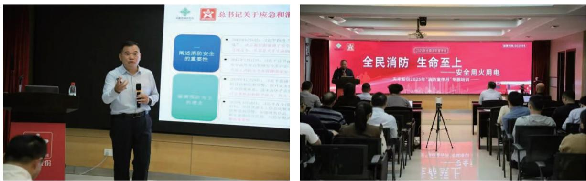  
安全用火用电专题培训

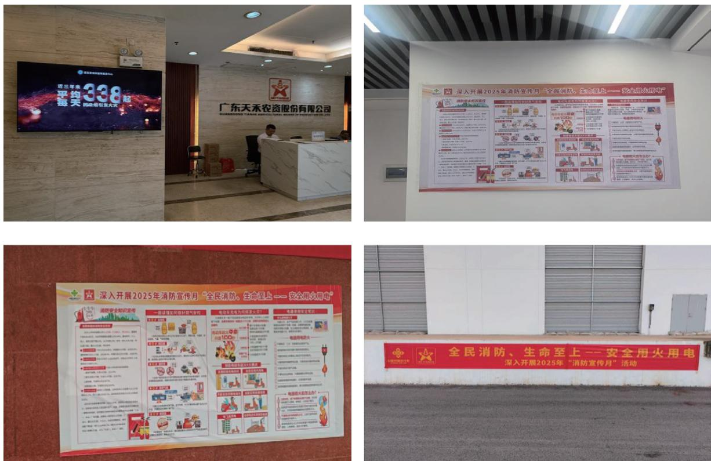  
消防主题宣传横幅与海报

# 相关方安全管理

下属子公司珠海瑞农制定并实施《相关方安全管理制度》，建立覆盖准入、履约、施工过程及事后评价的管理机制，推动安全责任向相关方延伸，降低外包作业风险。

# 合作前

对承包商的资质条件和规章制度等进行审查，并在合同中明确安全责任和执行标准。

# 作业实施过程中

通过入厂安全培训和定期随机检查等方式强化过程监督。

# 项目结束后

对承包商职业健康与安全表现开展评价,并将结果作为后续合作的重要依据。

# 危险化学品管理

公司制定《危险化学品安全管理制度》，明确禁止经营和使用国家明令禁止的危险化学品，并严格执行各地《禁止、限制和控制危险化学品目录》有关要求，对经营、使用和储存环节提出具体管理规范。

同时,公司持续梳理并动态更新危险化学品管理清单,报告期内对农化、原药、特肥等业务条线涉及的危险化学品进行全面梳理,完成《危险化学品经营许可证》换证工作,并按政府“两级发证”要求提前完成审批。

# 职业健康保障

公司严格遵循国家有关法律法规要求，中加化肥、壹号生物、珠海瑞农等子公司定期对作业场所开展职业病危害因素检测，及时了解作业场所的职业病危害程度，并同步完善各项防护等措施，持续降低职业健康风险。

围绕现场防护管理, 公司制定并实施《劳动防护用品配备和使用管理制度》, 对防护用品的配置标准、发放流程、佩戴要求及监督检查作出明确规定, 将防护要求落实到具体岗位和作业环节。

同时, 公司组织接触职业危害因素的员工开展职业健康体检, 建立职业健康监护档案, 如实记录体检结果并向员工本人告知; 对发现存在职业禁忌或与岗位相关健康损害的人员, 及时调整原工作岗位并妥善安置。

# 03

# 向绿而行

# 守护美丽生态家园

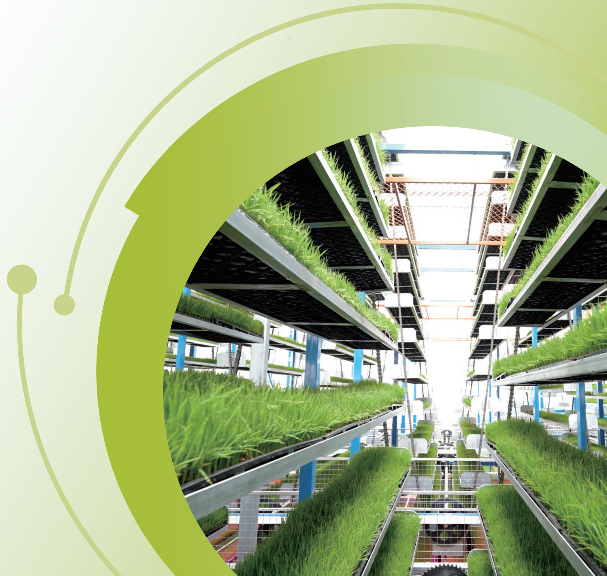

natural_image

Interior view of a vertical hydroponic plant with multiple green seedlings and metal shelving units (no visible text or symbols)

# 应对气候变化

天禾股份高度重视气候变化带来的深远影响,秉持绿色发展理念,致力于在运营与服务各环节系统性应对气候挑战,积极承担环境责任。通过前瞻性的布局与实践,公司持续探索符合自身业务特点的低碳路径,以减缓与适应并重的方式,为应对全球气候变化贡献力量,致力于推动农业价值链的低碳发展与生态可持续性。

# 治理

公司将应对气候变化策略全面融入公司长期发展规划之中，通过多维度举措持续强化气候环境下的运营适应能力与发展韧性。在生产运营全流程中，公司识别、动态评估气候关联风险与潜在机遇，同步深化全链路气候治理举措的落地，保障公司在气候环境变化中的稳健经营。

战略

<table><tr><td>风险类型</td><td>风险描述</td><td>影响的时间范围</td><td>影响价值链的环节</td><td>对公司的财务影响</td><td>应对措施</td></tr><tr><td>极端天气风险</td><td>台风、暴雨、极端高温等极端气候事件频发,可能导致区域交通受阻影响农资物流运输,仓储设施受损增加维修成本;同时极端天气易造成农户种植减产,降低农资采购需求,对农资销售稳定性形成压力。</td><td>短期</td><td>运营下游</td><td>运营成本增加营业收入减少</td><td>1.及时获取极端天气预测,提前部署防控措施;2.强化基地基础设施,增设储水、排水设施及加固防风大棚;3.联合科研单位,研发抗逆性强的优质品种(耐高温高湿、抗涝耐寒等);4.采用和推广科学种植技术,提升极端天气适应能力。</td></tr></table>

<table><tr><td>机遇类型</td><td>机遇描述</td><td>影响的时间范围</td><td>影响价值链的环节</td><td>对公司的财务影响</td><td>应对措施</td></tr><tr><td>农业低碳转型机遇</td><td>政策推动农业低碳发展,市场对高效低毒农药、有机肥、缓释肥等绿色农资需求提升,公司可依托农资流通主渠道优势,通过绿色产品推广实现业务结构优化,增强市场竞争力。</td><td>长期</td><td>上游运营下游</td><td>营业收入增加</td><td>1.持续构建高效低毒、覆盖作物全程的绿色农资产品体系,强化与上游优质供应商协同;2.依托“为农服务综合平台”数字化赋能,扩大绿色农资推广覆盖面;3.结合农技服务推广科学施肥用药,引导农户选用绿色农资。</td></tr></table>

# 影响、风险和机遇管理

公司持续推进气候相关风险与机遇的识别、评估及应对工作，结合内外部环境变化与业务规划调整，动态优化管控举措，不断夯实气候风险管理基础，保障在气候环境变动中实现稳健运营，为农业绿色发展与自身可持续经营提供支撑。

# 风险管理流程

<table><tr><td>1</td><td>风险识别</td><td>收集和分析气候相关数据,并识别潜在的气候风险类型(如极端天气事件、政策变化等)</td></tr><tr><td>2</td><td>风险评估</td><td>评估识别出的风险以及对业务的影响程度确定风险的可能性、潜在影响分类和优先级排序风险</td></tr><tr><td>3</td><td>风险监督</td><td>定期收集和更新气候相关数据并建立风险跟踪机制</td></tr><tr><td>4</td><td>风险管理</td><td>制定《防台风暴雨应急预案》并做好应对措施</td></tr></table>

# 指标与目标

公司持续通过推广绿色农资、生产有机肥减少农业生产对环境的影响，开展应急演练增强极端气候事件适应能力，助力自身在气候变化中实现韧性增长。

<table><tr><td>指标</td><td>单位</td><td>2025年</td></tr><tr><td>直接温室气体排放量(范围一)</td><td>吨二氧化碳当量</td><td>750.33</td></tr><tr><td>间接温室气体排放量(范围二)</td><td>吨二氧化碳当量</td><td>996.21</td></tr><tr><td>温室气体排放总量(范围一+范围二)</td><td>吨二氧化碳当量</td><td>1,746.54</td></tr><tr><td>温室气体排放强度</td><td>吨二氧化碳当量/百万营收</td><td>0.13</td></tr></table>

注1:统计口径为天禾股份、中加化肥、珠海瑞农、大丰植保、耕力优、天禾种业、科农种业、科芯种苗、良种苗木、壹号生物  
注2: 范围一主要来源于汽油、柴油、液化石油气、液化天然气、生物质颗粒。其中, 化石能源排放因子的计算参考《工业其他行业企业温室气体排放核算方法与报告指南(试行)》附录二, 生物质颗粒温室气体排放核算方法参考《林业生物质固体成型燃料LY/T 2379—2025》  
注3: 范围二排放主要来源于外购电力。其中, 外购电力和外购热力排放因子的计算参考《工业其他行业企业温室气体排放核算方法与报告指南(试行)》附录二  
注4: 温室气体排放强度按照合并报表口径营业收入进行测算

# 气候转型计划

公司将气候变化纳入关键管理议题,围绕气候适应与减缓两大方向推进相关管理与实践举措,不断增强运营韧性与低碳转型能力,支持公司可持续发展目标的实现。

# 适应气候变化

公司重视气候变化带来的极端天气风险,通过统筹推进子公司应急管理体系建设,切实提升整体运营韧性与员工安全保障。公司下属子中加化肥、壹号生物、耕力优等制定了《防台风暴雨应急预案》,并成立防台风暴雨工作领导小组,并明确了指挥体系与分级职责。各子公司遵循“以人为本、预防为主”原则,建立了覆盖灾前、灾中、灾后的全流程响应机制,包括隐患排查、人员疏散、物资调配及灾后恢复等环节,切实强化了跨部门协同与应急处置能力。这一系列举措显著增强了公司应对气候相关风险的适应能力,体现了将环境与社会治理深度融入企业运营的持续努力。

# 缓解气候变化

公司积极践行绿色发展理念,综合运用测土配方施肥、缓控释肥、科学用药及有机肥生产等多种技术手段,降低农业化学品投入、减少面源污染、提升土壤固碳能力,系统性缓解气候变化的影响。

# 举措

# 效果

# 测土配方施肥

通过土壤检测,科学确定氮、磷、钾及中微量元素的最佳施用量、时期与方法,实现养分平衡供应,从而提高肥料利用率、减少化肥用量、增加作物产量和改善农产品品质。

# 缓控释肥

通过特殊技术使肥料养分缓慢释放, 使养分释放速率与作物吸收规律相匹配, 从而延长肥效期, 减少施肥次数和用量, 提高肥料利用率, 并降低环境污染。

# 科学用药

通过现代化生产设备升级和专业技术人才的配置,优化产品配方,减少农药使用量,降低对环境的影响。同时,推广高效低风险农药,提高农药利用率与安全性。

# 生产有机肥

通过动物粪便好氧堆肥等技术,对禽畜粪便进行无害化、资源化处理,生产优质有机肥,有效减少温室气体排放。同时,有机肥能够提升农田土壤有机质含量,还田固碳,间接减少上游化肥生产,实现碳减排。

# 南雄高标准农田建设项目

结合酸化耕地治理、撂荒整治及灌区建设,有效提升耕地质量等级,实现宜机化改造与耕作面积增加,改善了农业生态环境,打造了生态友好的示范工程。

# 农业面源污染防控项目

通过实施农作物病虫害统防统治、肥料统配统施、农作物营养解决方案、农作物植保解决方案等农业社会化服务，并开展农业技术培训、普及农业面源污染防治知识和实用技术等措施，持续推进化肥农药减量增效，形成可复制、可推广的农业面源污染防控格局。

# 紫云英绿肥项目

通过开展紫云英种植，包括种子处理、播种、施肥、开沟、排灌等田间管理等关键环节，有效固氮增肥、改良土壤结构，减少化肥施用并提升后茬作物产量，同时能利用冬闲田固土保水、美化田园，兼具生态效益与经济收益。

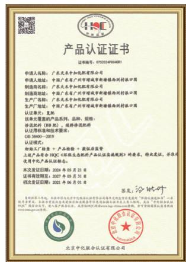

text_image

产品认证证书
申请人名称：广东天水中化股份有限公司
申请人地址：中国广东省广州市黄埔区新塘镇西河村徐口园
制造单位名称：广东天水中化股份有限公司
生产厂地址：中国广东省广州市黄埔区新塘镇西河村徐口园
生产厂编号：广东省广州市黄埔区新塘镇西河村徐口园
认证机关：复机
该单位主要的产品系列、品牌、规格：
身份证件（320 862）：碳纤维滤芯件
认证标准和技术要求：
GB 38400-2019
认证机构：
初步加工编号：产品检验（质量保证监督）
上述产品符合HCQC《环保生态配筋产品认证实施规则》的要求，特此发证，并应以
使用中化产品认证标志。
本次发证日期：2024年05月21日
证书有效期至：2027年05月31日
初次发证日期：2021年05月01日
北京中化联合认证有限公司

中加化肥环保生态肥料产品认证证书

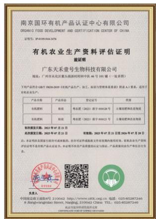

text_image

南京国环有机产品认证中心有限公司
ORGANIC FOOD DEVELOPMENT AND CERTIFICATION CENTER OF CHINA
证明号：P-0108-644-3476
有机农业生产资料评估证明
兹证明
广东天禾壹号生物科技有限公司
地址：广州市从化区蜀天盈基因材料库99号46号181幢（一处底部）
下列文件可由GB/T 19630-2019《有机农产品生产、加工、标签与管理体系要求》附表A.1要求，适用于有机农产品生产。
产品名称	产品部位	登记证号	类别
有机肥料	铝炭	粤农函（2021）第7010120号	太阳能结构及生物物质
有机肥料	铝炭	粤农函（2021）第7010121号	太阳能结构及生物物质
初步披露日期：2023年07月21日	有效期：2023年07月21日至2024年07月20日
注：本说明涉及国家现行的许可申请承担，在许可证书批准文件有效期内有效使用。有机农产品生产资料
详说明不是有机产品认证证书。本报告不涉及产品质量的认定与保证，产品能按照生产许可证自行负责。
负责人：
中国证券报（上海证券报）字[210042] http://www.cfc.org.cn 电话：025-85287246
并(Shangdong-jiangxiang) Street, Nanjing, 210042 (China) Ltd., 025-85287246
企业社会责任报告
CERTIFICATE NAME OF COOKING COOKING COOKING COOKING COOKING COOKING COOKING COOKING COOKING COOKING COOKING COOKING COOKING COOKING COOKING COOKING COOKING COOKING COOKING COOKING COOKING COOKING COOKING COOKING COOKING COOKING COOKING COOKING COOKING COOKING COOKING COOKING COOKING COOKING
©2023-05-11

壹号生物有机农业生产资料评估证明

# 生态系统和生物多样性保护

公司积极响应国家耕地保护与粮食安全战略，将撂荒地复耕复种作为改善农业生态系统、保护生物多样性、协同推进农田固碳减排的重要抓手，通过下属各单位的积极探索，形成了各具特色的撂荒地整治模式。

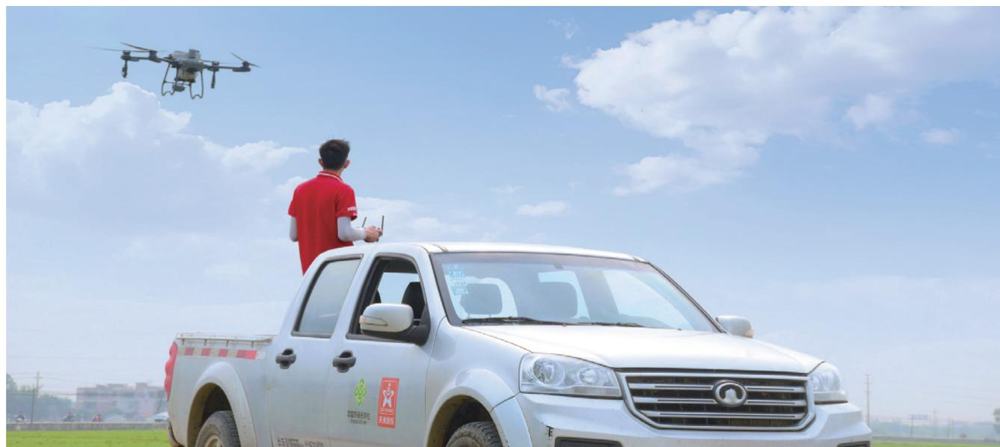

natural_image

A person in a red shirt standing on a pickup truck with a drone flying overhead against a blue sky (no visible text or symbols)

# 下属单位

# 具体措施

<table><tr><td>和平县社村合作农业发展有限公司</td><td>在和平县推行“村集体集中预流转—国企统一收储—社企承包耕种”模式,由村集体将分散、撂荒的土地集中流转后,委托“社村”运营公司进行复耕复种,推动供销社的技术、渠道与农村的土地、劳动力深度融合,形成“流转-种植-管理”闭环。其中,推动大坝镇汤湖村撂荒地完成流转复耕,昔日荒地变成“供销农场”。</td></tr><tr><td>陆丰市社村合作农业发展有限公司</td><td>在陆丰市采用“公司主导+集体参与+农民受益”的撂荒地治理共同体模式,由社村运营公司负责土地平整、地力提升与技术导入,村集体以资金、居间服务深度参与。在上英镇草洋村等7个重点村推广“六统一”种植标准,建设供销农场,推动订单种植水稻、甘薯,实现撂荒地变“增收地”。</td></tr><tr><td>阳西县社村合作农业发展有限公司</td><td>在阳西县探索“预分红+土地托管+供销农场”模式,由村集体统一流转荒地,委托“社村”运营公司开展早造集约化种植,晚造归还农户种口粮,实现“农户口粮保底+闲田集约创收”双保障,带动闲散土地复耕。</td></tr><tr><td>汕头潮阳区社村合作农业发展有限公司</td><td>在汕头市潮阳区采用“村集体担保、运营公司全程托管”模式,因地制宜推动土地流转、生产托管,推进高标准农田整治和撂荒地盘活利用,推动粮食产区“小田变大田”,形成规模化种植。</td></tr></table>

# 资源利用与循环经济

公司致力于提升资源使用效率并推动循环经济实践,通过优化运营流程与管理体系,持续探索资源减量化、再利用与再生循环的路径,以降低环境负荷,支持可持续发展。

# 环境合规管理

公司严格恪守《中华人民共和国环境保护法》等相关环境法律法规与合规要求，结合自身生产经营实际，建立健全环境管理相关制度体系，稳步提升环境合规管理效能。公司及各子(分)公司均未被环境保护部门列入重点排污单位名录，报告期内，未发生因环境相关问题引发的行政处罚事项。

# 环境管理体系

天禾股份持续推进环境管理体系建设，在生产型子公司层面建立了系统的环境合规管理制度与组织架构。其中，中加化肥根据《中华人民共和国环境保护法》及《广东省环境保护条例》等法律法规制定了《环境管理制度》，并设立环境保护工作委员会作为环境保护的组织领导机构，由总经理任主任，各部门经理任委员组成；委员会下设环境保护领导小组，由生产负责人任组长，由生产部、仓储物流部、质检部、办公室组成，全面负责公司环境保护及管理工作，研究制定环境保护技术措施和应急预案。珠海瑞农、大丰植保制定了《环境保护管理责任制》《环境保护设施运行管理制度》《环保事故管理制度》《环境保护考核制度》等一系列制度，形成了覆盖环保责任、设施运行、事故应对与绩效评估的系统化管理机制。截至报告期末，珠海瑞农已通过ISO 14001环境管理体系认证；同时，中加化肥亦成功保持HQC（北京中化联合认证有限公司）环保生态产品自愿性认证，并获评B类生产企业。

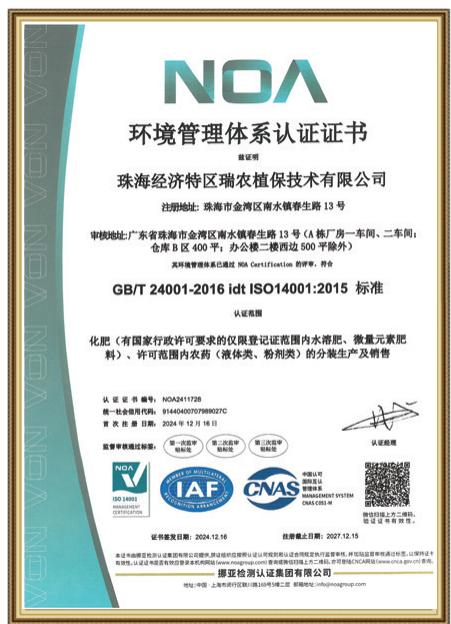

text_image

NOA
环境管理体系认证证书
致证明
珠海经济特区瑞农植保技术有限公司
注册地址：珠海市金湾区南水镇奉生路13号
审批地址：广东省珠海市金湾区南水镇奉生路13号（A栋厂房一车间、二车间：
仓库B区400平；办公楼二楼西边500平除外）
其环境管理体系已通过 ISO Certification 的评审，符合
GB/T 24001-2016 idt ISO14001:2015 标准
认证范围
化肥（有国家行政许可要求的仅限登记证范围内水溶肥、微量元素肥料）、许可范围内农药（液体类、粉剂类）的分装生产及销售
认证证书编号：NOA2411728
统一社会信用代码：91440400707999027C
首次注册日期：2024年12月16日
监管审核通过事项：
一、一级资质
粘贴处
二、二级资质
粘贴处
三级资质
粘贴处
认证流程
NOA
ISO 24001
ISSN/ISSN/ISSN/ISSN/ISSN/ISSN/ISSN
CNAS
中国认证
国务院
Management System
CNAS COI.II
国际认证机构
中国认证中心
中国认证中心
中国认证中心
中国认证中心
中国认证中心
中国认证中心
中国认证中心
中国认证中心
中国认证中心
中国认证中心
中国认证中心
中国认证中心
中国认证中心
中国认证中心
中国认证中心
中国认证中心
中国认证中心
中国认证中心
中国认证中心
中国认证中心
中国认证中心
中国认证中心
中国认证中心
中国认证中心
中国认证中心
中国认证 Center (www.naozgroup.com)
中国认证中心
中国认证中心
中国认证中心
中国认证中心
中国认证中心
中国认证中心
中国认证中心
中国认证中心
中国认证中心
中国认证中心
中国认证中心
中国认证中心
中国认证中心
中国认证中心
中国认证中心
中国认证中心
中国认证中心
中国认证中心
中国认证中心
中国认证中心
中国认证中心
中国认证中心
中国认证中心
中国认证中心
中国认证中心

珠海瑞农ISO 14001环境管理体系认证证书

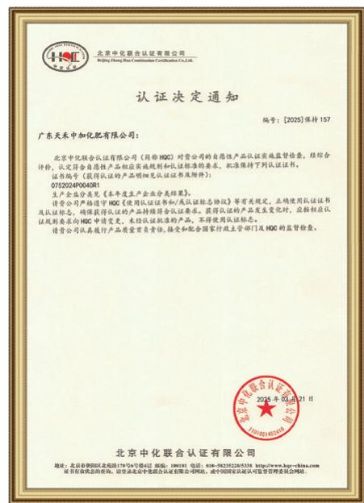

text_image

北京市中化联合认证有限公司
Beijing Zhonghu Xue Chonghui Certification Co., Ltd.
认证决定通知
编号：[2025]保持157
广东天禾中加化肥有限公司：
北京中化联合认证有限公司（简称HOC）对贵公司的自愿性产品认证实施监督检查，经综合评价，认定符合自愿性产品相应实施规则和认证标准的要求，批准保持下列认证证书。
证书编号（获得认证的产品明细先认证证书及附件）
078204P0404R1
生产企业分类见《本年度生产企业分类结果》。
请贵公司严格遵守HOC《使用认证证书和/或认证标志协议》等有关规定，正确使用认证证书及认证标志，确保获得认证的产品持续符合认证要求。获得认证的产品发生变化时，应按相应认证规则要求向HOC申请变更。未经认证批准的产品，不得使用认证标志。
请贵公司认真履行产品质量责任，接受和配合国家行政主管部门及HOC的监督检查。
北京中化联合认证有限公司
地址：北京市朝阳区东成路179号A座4层  邮编：190181 电话：010-88233226/83336  http://www.hpc-china.com
证书有效状态的查询：自营业活动中被联合认证有限公司网站，或中国国家认可监督管理委员会网站。

中加化肥HQC环保生态产品自愿性认证

公司重视环保理念的宣贯与落实,定期开展环保教育与培训,旨在持续宣导国家及地方环保政策与制度要求,切实提升员工的环保意识与实践能力。子公司中加化肥将环保意识纳入员工综合素养的考核体系。

# 环保知识培训

# 案例

2025年5月20日，珠海瑞农组织开展了以“践行绿色理念，共筑环保防线”为主题的环保知识培训。培训系统讲解了全球与我国环境现状、环保基础知识及个人绿色行动指南，并深入解读了国家相关环保政策。培训结束后，公司管理层在总结中再次强调了环保工作的重要性，要求将绿色理念融入日常运营与个人行动。此次培训有效提升了员工的环保意识和责任感。

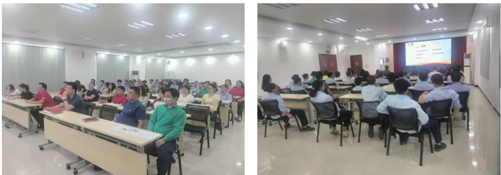  
环保知识培训

# 环保工作部署专题培训

# 案例

2025年12月30日，中加化肥组织开展了环保工作部署专题培训。会议围绕“12145”环保重点工作体系展开，系统解读了持续改善环境质量的主线及各项任务，旨在明确目标、落实责任，提升公司环境管理能力。

# 环境专项培训

# 案例

2025年, 公司积极响应区域环保管理要求, 系统性参与并落实多项环保专项工作。10月, 公司参加了增城区为保障全运会空气质量而组织的专项工作部署会议; 12月, 公司相关人员参加了广州市生态环境局增城分局组织的“排放源统计业务系统”专题培训, 深入学习技术规定、填报流程与系统操作, 以确保企业排放数据统计与上报工作符合规范。通过参与上述培训, 公司持续强化环保合规意识与专业执行能力。

text_image

增城区全运会空气质量保障对接培训会

环境专项培训

# 环境风险管理

公司高度重视环境风险管理,建立系统化的制度体系,通过常态化环境监测、定期隐患排查治理以及专项应急预案演练,持续识别、评估与防控运营中的环境风险,保障生产经营活动符合环保要求。

# - 环境监测

公司高度重视生产经营对环境的影响，以定期环境监测为核心抓手，精准防控环境污染风险。壹号生物制定《自行监测方案》，按照《排污单位自行监测技术指南总则》(HJ819-2017)和行业《排污单位自行监测技术指南》要求，每半年对废气进行手工监测，每季度对噪声进行手工监测。2025年，壹号生物定期委托有资质的第三方开展了雨水、有组织及无组织废气、污水、噪声的检测，检测结果均达标。中加化肥定期聘请有资质第三方对公司生活污水、厂界噪声进行检测，检测结果均合格。

# - 环境隐患排查

为有效预防环境风险,珠海瑞农和大丰植保制定了《环境隐患排查治理责任制度》,明确了从总经理、副总经理、环保管理人员到班组长的分级职责体系。总经理为第一责任人,全面负责隐患排查治理;副总经理组织落实排查工作;环保管理人员具体推动并监督整改;班组长负责本班组的日常检查与上报。隐患排查工作遵循“谁排查、谁负责;谁签字、谁负责;谁主管、谁负责”的原则,实行责任到人。公司通过建立常态化检查机制,定期开展环保监督检查与环境风险排查,并在重大节假日前由领导带队组织环保大检查、环境风险排查。对发现的隐患实行记录跟踪、明确责任人与整改期限,确保整改落实,形成闭环管理。2025年9月,在台风受灾后,珠海瑞农对办公楼、仓库、水剂车间、厂区等重点区域开展全面环境隐患排查,共发现隐患问题7项,均已全部整改完毕。

# 环境保护管理隐患排查清单

是否按规定开展突发环境事件风险评估,确定风险等级

是否按规定制定突发环境事件应急预案并备案

是否按规定建立健全隐患排查治理制度,开展隐患排查治理工作和建立档案

是否按规定开展突发环境事件应急培训,如实记录培训情况

是否按规定储备必要的环境应急装备和物资

应急池

# - 应急预案与演练

为提升突发环境事件应对能力,公司生产企业中加化肥、珠海瑞农、大丰植保依据相关法律法规与运营实际,制定《突发环境事件应急预案》,明确应急组织体系、职责分工与处置流程。各生产企业定期组织应急演练,持续检验并完善应急响应流程与现场处置能力,确保突发环境事件风险得到有效防控。

# - 清洁生产

珠海瑞农于2021年至2022年开展了第三轮清洁生产审核工作，成立了专项审核小组，系统推进清洁生产。本轮审核共提出并实施13项方案，包括对生产线进行自动化升级与工艺优化。通过全过程管理，珠海瑞农有效提升了生产环节的资源利用效率和环境绩效，并获评为“市级清洁生产企业”。

# 环境目标与规划

中加化肥认真贯彻“安全第一，预防为主，综合治理”的方针，制定了《年度环境保护目标及规划》，明确了主要环境风险的控制目标及实施规划。

# 中加化肥环保目标及规划

# 环保控制目标

生产噪音: 生产噪音岗位控制在国家相关噪音标准以内、其他岗位不受噪音污染;

生产粉尘:产生粉尘岗位,确保粉尘排放及污染按照评价标准实施,对相关岗位发放防尘口罩;

生活污水:办公、生活污水,按照园区管理规定,实施雨污分流,污水进入污水处理厂进行净化处理。

# 环保规划

降噪措施: 主要通过生产设备改造, 对产生噪音较大的提升机减速机、打气泵排气阀门进行改造, 降低生产噪音源;

噪音防护: 相关岗位严格执行佩戴耳塞制度, 确保职工身体健康;

生产粉尘: 生产过程中会产生少量无组织粉尘, 按照职业卫生现状评价要求, 对相关岗位发放防尘口罩, 确保职工身体健康;

办公、生活污水: 按照园区管理规定, 实施雨污分流, 污水进入污水处理厂进行净化处理。

每年委托第三方检测机构对厂区内环境风险点做两次现场检测，确保环境安全。

# 践行绿色运营

公司倡导低碳环保的办公理念,注重节约用水用电,推行纸张双面使用及办公用品节约,减少资源消耗。

# 绿色办公举措

# 节约用电

高效LED灯具以降低基础照明能耗；明确要求下班后及节假日期间，办公区必须做到“电灯灭、电源关、空调停”，严禁空调、大功率电器、电插排等设备在无人在场的情况下长时间运行，并规定无需长时间保持运行状态的电脑应关机，并切断电源；同时建立常态化检查机制，每季度对用电设备与节能规范执行情况进行巡检，确保各项措施有效落实，实现能耗的精细化管控

# 减少纸张使用

提倡员工使用电子文档代替纸质文件;在打印文件时,可以选择双面打印,减少用纸数量鼓励使用电子签名或文件扫描,避免纸质签署和复印

# 垃圾分类和回收

回收纸张、塑料、金属和其他可回收物品

公司食堂不提供一次性餐具，切实减少一次性用品消耗

# 优化办公设备

采购时优先选择节能的办公设备,如电脑、打印机、空调等

定期检查和维护办公设备,仓库的空调每年安排维修清洗检查一次

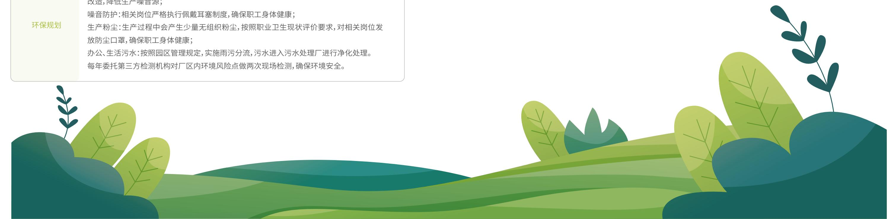

text_image

环保规划
改造,降低生产噪音源,
噪音防护:相关岗位严格执行佩戴耳塞制度,确保职工身体健康;
生产粉尘:生产过程中会产生少量无组织粉尘,按照职业卫生现状评价要求,对相关岗位发
放防尘口罩,确保职工身体健康;
办公、生活污水:按照园区管理规定,实施雨污分流,污水进入污水处理厂进行净化处理。
每年委托第三方检测机构对厂区内环境风险点做两次现场检测,确保环境安全。

# 能源利用

公司致力于提升能源使用效率,持续减少运营过程中的能耗与碳排放,以支持绿色可持续发展。

# 能源管理体系

公司严格遵守《中华人民共和国节约能源法》等法律法规要求，在日常运营中注重加强能源管理，通过优化生产工艺及强化日常巡查与维护等措施，持续提升能源使用效率，减少能源消耗与浪费。

# 绩效与节能目标

公司持续推进能源管理优化,通过优化生产流程与设备运行持续推动节能降耗,各生产单位严格执行相关措施,切实提升能源利用效率。

<table><tr><td colspan="2">指标</td><td>单位</td><td>2025年</td></tr><tr><td rowspan="4">化石能源</td><td>汽油</td><td>吨</td><td>54.98</td></tr><tr><td>柴油</td><td>吨</td><td>88.20</td></tr><tr><td>液化石油气</td><td>吨</td><td>1.03</td></tr><tr><td>液化天然气</td><td>千克</td><td>624</td></tr><tr><td colspan="2">电力消耗</td><td>千瓦时</td><td>2,464,649.52</td></tr><tr><td colspan="2">生物质颗粒</td><td>吨</td><td>142.7</td></tr><tr><td colspan="2">能源消耗总量</td><td>吨标煤</td><td>606.66</td></tr><tr><td colspan="2">能源消耗强度</td><td>吨标煤/百万营收</td><td>0.04</td></tr></table>

注1:统计口径为天禾股份、中加化肥、珠海瑞农、大丰植保、耕力优、天禾种业、科农种业、科芯种苗、良种苗木、壹号生物  
注2:折标准煤系数来源于《中国能源统计年鉴-附录4-各种能源折标准煤参考系数》

# 水资源利用

公司重视水资源在生产经营中的重要作用,致力于通过系统管理提升用水效率,减少水资源消耗,支持可持续发展。

# 水资源管理体系

公司农业生产用水主要是地表水,雨水聚集到池塘,通过引水灌溉农作物;办公用水主要来源于市政供水。公司注重水资源的规划与使用管控,在日常运营中落实节水理念,通过优化用水环节、强化设施维护与管理宣导,致力于提升用水效率,减少水资源消耗。

# 节水措施

公司重视水资源管理，在日常运营中持续推进节水工作，通过优化用水流程、加强设施维护与管理意识宣导，努力减少水资源消耗。各生产企业结合自身生产特点，积极落实节水措施，例如在种植业务中实施雨水收集回用、水肥一体化及滴灌微喷等节水灌溉技术，提升用水效率，促进水资源循环利用。

# 雨水回用灌溉

# 案例

科农种业与科芯种苗在大丰基地实施节水型农业管理,建设蓄水池用于田间雨水收集与循环利用。该蓄水池可储水100吨,收集的雨水主要用于蔬菜灌溉,形成自然水资源的闭环利用,有效节约了农业生产中的新鲜水消耗,体现了资源循环与可持续利用的理念。

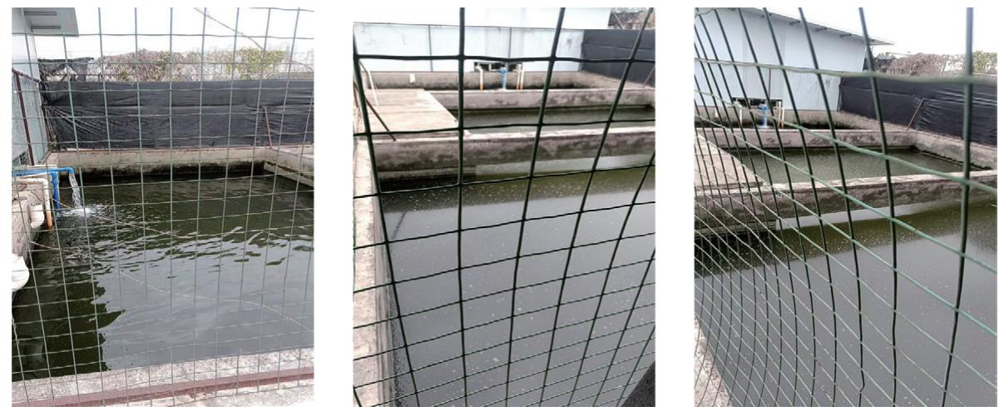  
雨水回用灌溉

# 绩效与节水目标

公司持续关注节水成效,通过优化管理降低水耗,推动水资源利用效率不断提升。报告期内,公司及下属生产企业用水量为13,247吨,用水强度为0.97吨/百万营收。

# 循环经济

公司积极践行循环经济理念,依托制度规范与操作实践双轮驱动,系统提升物料循环利用效率。

# 物料管理体系

公司持续推进产品包装物的规范管理与循环利用，针对不同业务特点实施相应管理措施。中加化肥执行《包装材料管理制度》，对包装材料的采购、验收、存储、使用及报废实施闭环管控。大丰植保与珠海瑞农依据《农药包装废弃物回收与处置管理制度》，规范农药包装的收集、贮存与合规处置流程。科芯种苗推行《包装循环使用管理制度》，通过实行客户押金制度、配套设置回收专区、优化包装设计并优先采购环保材料，促进资源减量与再利用，共同推动包装环节的环境效益提升。

# 物料管理措施

公司高度重视产品包装的环境影响，在运营中持续推进包装材料的规范管理与循环利用，各生产企业根据自身特点实施针对性管理措施。例如良种苗木采用“可降解无纺布育苗袋”进行种苗包装，减少环境污染。此外，公司通过包装废弃物回收系统对全流程进行数字化管理与追踪。

<table><tr><td>主体</td><td>包材管理措施</td></tr><tr><td>中加化肥</td><td>建立采购—验收—存储—使用—报废包装材料管理流程,并建立监督和考核机制。</td></tr><tr><td>大丰植保与珠海瑞农</td><td>包装物管理逐步淘汰铝箔材质包装物、小包装和非标准型包装的包装方式,推动使用更利于回收的包装物/包装方式。工厂农药包装废弃物的收集、分类、储存及台账工厂固定农药包装废弃物收集存放区并与其他废弃物品区隔,做好防渗漏、防滴漏、防雨淋等措施,建立农药包装废弃物进转存台账;生产车间需每日对废弃物进行分类,并转运至指定存放区;根据库存情况,由安环部安排委托具备相应资质的单位进行合规转运与处置。</td></tr><tr><td>科芯种苗</td><td>设置包装材料回收专区,进行分类回收;对员工开展回收操作培训,并定期清理维护回收区;在包装设计与采购环节优先考虑环保与减量,以提升资源利用效率。</td></tr></table>

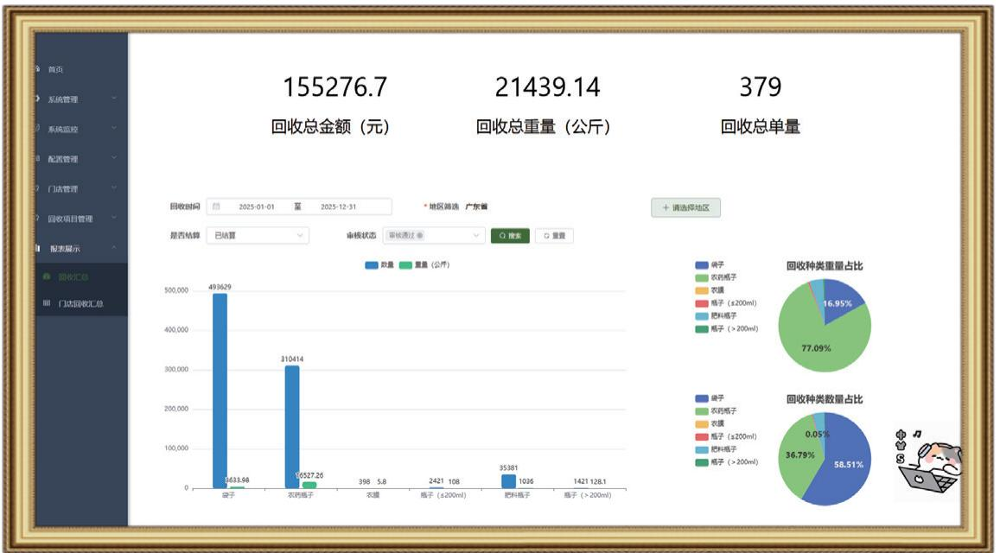

pie

| 类别 | 回收总金额 (元) | 回收重量 (公斤) | 回收总单量 |
| --- | --- | --- | --- |
| 碳子 | 493629 | 1633.98 | — |
| 农药栀子 | 310414 | 10527.26 | — |
| 棉子 \(( \pm 200ml)\) | 398 | 5.8 | — |
| 肥料栀子 \(( \pm 200ml)\) | 2421 | 108 | — |
| 格子 (>200ml) | 35381 | 1036 | — |
| 格子 (>200ml) | 1421 | 128.1 | — |
| 碳子 (占比) | — | — | 16.95% |
| 农药栀子 (占比) | — | — | 77.09% |
| 棉子 (占比) | — | — | 58.51% |
| 肥料栀子 (占比) | — | — | 36.79% |
| 格子 (>200ml) (占比) | — | — | 0.05% |

包装废弃物回收系统

# 循环使用包装袋

# 案例

中加化肥通过循环使用包装袋装运尿素和钾肥, 每年可减少尿素包装袋约24万条 (约48.6吨)、钾肥包装袋约19.7万条 (约32.5吨), 有效降低包材消耗, 实现资源节约与环境效益的同步提升。

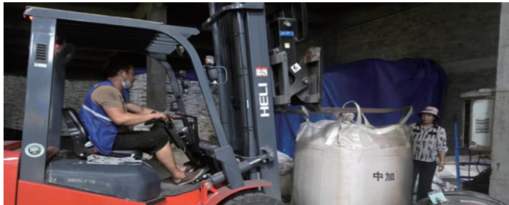

natural_image

Warehouse scene with forklift operator and worker, no visible text or symbols on main subjects

循环使用包装袋

# 绩效与目标

公司持续推进包装材料的循环利用，致力于提升回收比例与使用效率，以促进资源节约与环境保护。

<table><tr><td>管理指标</td><td>基准单位</td><td>2025年</td></tr><tr><td>包装材料</td><td>吨</td><td>143.69</td></tr><tr><td>其中:金属类包材</td><td>吨</td><td>0.376</td></tr><tr><td>纸类包材</td><td>吨</td><td>0.225</td></tr><tr><td>塑料类包材</td><td>吨</td><td>0.719</td></tr><tr><td>回收使用的包装材料量</td><td>吨</td><td>2.48</td></tr></table>

注:统计口径为中加化肥、耕力优、科农种业、科芯种苗、壹号生物

# 污染防治

公司建立了系统性的污染防治机制, 将污染防治全面融入日常运营, 通过常态化的管理与持续改进, 致力于降低环境负荷并践行环境责任。

# 污染物排放

公司严格遵守环保法规，对生产运营中产生的废气、废水、噪声等污染物实施全过程管控，通过有效监测、防治与合规处置，持续降低环境影响，推动绿色发展。

# 废气管理

公司持续加强废气排放管控。中加化肥依据《废弃物与其他污染物管理制度》，安装有效处理设施并定期维护保养，同时对可能产生挥发性有机污染物的环节采取密闭或收集措施，保障废气合规排放。壹号生物严格遵守《恶臭污染物排放标准》(GB14554-93)及《大气污染物排放限值》(DB44/27-2001)等规定，在相关车间的废气排放口规范设置监测点位，并定期委托具备资质的第三方进行检测，同步建立并维护废气处理设施运营台账，确保监测与管理的有效性。

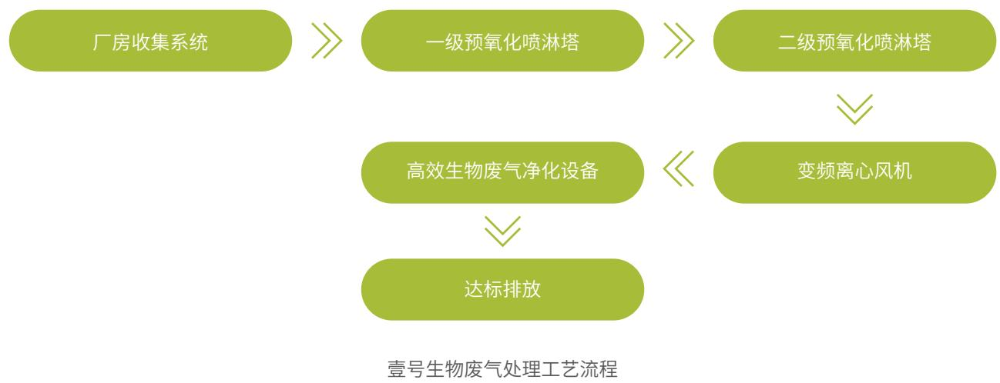

flowchart

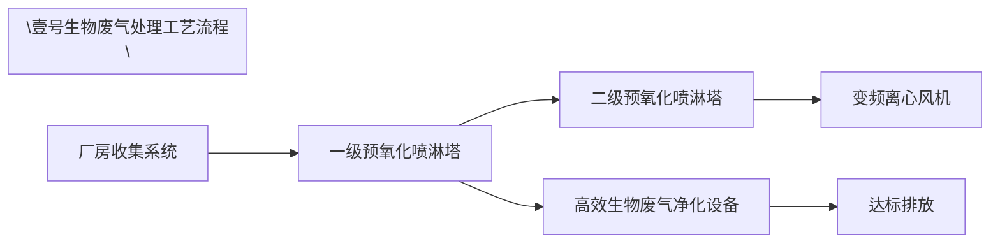
```mermaid
graph LR
  A["厂房收集系统"] --> B["一级预氧化喷淋塔"]
  B --> C["二级预氧化喷淋塔"]
  C --> D["变频离心风机"]
  B --> E["高效生物废气净化设备"]
  E --> F["达标排放"]
  subgraph sg["\"壹号生物废气处理工艺流程\""]
    direction TB
  end
```

# 废水管理

公司废水主要是在农药的研发和分装过程中产生。珠海瑞农、大丰植保在生产中产生的少量低浓度洗涤废水，主要含悬浮物、化学需氧量、五日生化需氧量、氨氮、总氮、磷酸盐及动植物油等污染物，均经废水池集中收集后，委托有资质第三方进行合规转移处置。

生活污水则严格执行排放标准,经三级化粪池处理,达到广东省《水污染物排放限值》(DB44/26-2001)第二时段三级标准后,纳入市政污水管网,最终输送至珠海市南水水质净化厂进行深度处理,确保符合环保要求。

# 噪声管理

公司持续加强对生产运营中噪声排放的控制与监测。壹号生物依据《自行监测方案》每季度进行手工噪声监测。中加化肥严格执行《废弃物与其他污染物管理制度》，通过合理布局设备、落实隔音降噪措施，并对高噪声设备定期维护保养，确保厂界噪声达标。此外，壹号生物和中加化肥均委托具备资质的第三方进行厂界噪声检测，确保排放符合法规要求，落实环境管理责任。

# 废弃物处理

公司着力构建并运行覆盖废弃物全生命周期的规范处理流程,通过明确分类、专业处置与责任落实,持续推动环境影响的系统化管控与降低。

# 废弃物管理体系与制度

公司建立了完善的废弃物管理体系，各下属生产企业均制定了专项制度并严格执行。其中，中加化肥制定了《废弃物与其他污染物管理制度》，规范废弃物的分类收集、规范贮存，并委托有资质单位进行清运与处置。珠海瑞农、大丰植保等公司则制定了《厂区废弃物管理作业程序》《危险废物污染防治责任信息公开管理制度》《农药包装废弃物回收与处置管理制度》等制度，分别规范废弃物的分类收集与委外清理、危险废物的全过程控制，以及农药包装废弃物的专门回收与处置跟踪。

# 废弃物管理措施

公司及下属生产企业对废弃物实施严格的分类管理,通过推动一般废弃物的资源化利用与危险废物的专业管控,确保各类废弃物均得到合规、安全处置,以系统性管理减少对环境的影响,践行企业环境责任。

<table><tr><td colspan="3">废弃物处理措施</td></tr><tr><td>废弃物分类</td><td>名称</td><td>处理方式</td></tr><tr><td rowspan="2">生活垃圾</td><td>果皮、纸屑等</td><td>清洁员工清理至生活垃圾收集桶并转至环卫车内,由城市环卫清理</td></tr><tr><td>厨余垃圾</td><td>后勤厨工清运至环卫车内,由城市环卫清理</td></tr><tr><td rowspan="4">一般工业废弃物</td><td>卸货栈板</td><td>委托物流公司回收</td></tr><tr><td>包装用废卷膜包装用废纸皮肥料包装物</td><td>委托具有回收资质的第三方公司回收</td></tr><tr><td>除尘器粉尘及地面沉降粉尘</td><td>回用至生产</td></tr><tr><td>纳米膜</td><td>生产厂家回收</td></tr><tr><td>危险废物</td><td>农药包装物废擦标液实验室废液废活性炭废弃农药</td><td>委托具有回收资质的第三方公司回收</td></tr></table>

# 附录

指标索引

<table><tr><td colspan="2">报告章节</td><td>《上市公司自律监管指引第17号-可持续发展报告(试行)》</td><td>《中国企业可持续发展报告指南(CASS-ESG6.0)》</td><td>《全球可持续发展报告标准》(GRI Standards)</td><td>《央企控股上市公司ESG专项报告编制研究》</td></tr><tr><td colspan="2">关于本报告</td><td>第四条第六条</td><td>P1</td><td>2-1/2-2/2-3</td><td>/</td></tr><tr><td colspan="2">走进天禾股份</td><td>/</td><td>P3.1/P3.2/P3.3/P3.4</td><td>2-1/2-6</td><td>/</td></tr><tr><td colspan="2">数说2025</td><td>/</td><td>/</td><td>/</td><td>/</td></tr><tr><td rowspan="3">可持续发展治理</td><td>ESG治理</td><td>第十一条第十二条</td><td>G1.1.1</td><td>2-9/2-11/2-14</td><td>G1.1.1</td></tr><tr><td>利益相关方沟通</td><td>第九条第五十三条</td><td>G1.3.2</td><td>2-16/2-29</td><td>G3.1.2</td></tr><tr><td>实质性议题分析</td><td>第五条</td><td>G1.1.9</td><td>3-1/3-2/3-3</td><td>/</td></tr><tr><td rowspan="6">规范治理夯实稳健发展根基</td><td>党建引领</td><td>/</td><td>/</td><td>/</td><td>G1.1.4</td></tr><tr><td>公司治理</td><td>/</td><td>/</td><td>2-9/2-10/2-11/2-12/2-13/2-18/2-19/2-20/2-27/201-1/405-1</td><td>G1.1.1/G1.1.2/G1.2/G1.3/G3.2</td></tr><tr><td>合规经营与风险管理</td><td>/</td><td>/</td><td>207-2</td><td>G2.1/G5.1.1/G5.1.2</td></tr><tr><td>投关管理</td><td>/</td><td>/</td><td>2-16/2-27</td><td>G3.1/G4.1/G4.2</td></tr><tr><td>商业道德</td><td>第五十五条第五十六条</td><td>G2.1.1/G2.1.2/G2.1.3/G2.1.4/G2.1.7/G2.1.8/G2.2</td><td>2-23/2-24/2-26/2-27/205-2</td><td>G2.2/G2.3</td></tr><tr><td>数据安全与客户隐私保护</td><td>第四十八条</td><td>S3.4</td><td>2-27</td><td>S2.2.3</td></tr></table>

<table><tr><td colspan="2">报告章节</td><td>《上市公司自律监管指引第17号—可持续发展报告(试行)》</td><td>《中国企业可持续发展报告指南(CASS-ESG6.0)》</td><td>《全球可持续发展报告标准》(GRI Standards)</td><td>《央企控股上市公司ESG专项报告编制研究》</td></tr><tr><td rowspan="5">服务三农共绘乡村振兴画卷</td><td>创新驱动</td><td>第四十二条</td><td>S2.1.2/S2.1.3/S.2.13</td><td>2-27</td><td>S2.3.1/S2.3.3</td></tr><tr><td>乡村振兴与社会贡献</td><td>第三十九条第四十条</td><td>S1.1/S1.2.1/S1.2.2/S1.2.5/S1.2.6</td><td>203-1/413-1/415-1</td><td>S4.2.2/S4.3.1/S4.3.2/S4.4.2/S4.4.4</td></tr><tr><td>供应链安全</td><td>第四十五条</td><td>S3.1</td><td>308-1</td><td>S3.1.1/S3.2.1</td></tr><tr><td>产品和服务安全与质量</td><td>第四十七条</td><td>S3.3</td><td>416-1/416-2</td><td>S2.1.2/S2.2.3/S2.2.1/S2.2.2</td></tr><tr><td>以人为本</td><td>第四十九条第五十条</td><td>S4.1.1/S4.1.1/S4.1.3/S4.1.4/S4.1.5/S4.1.6/S4.1.8/S4.1.9/S4.1.11/S4.1.12/S4.2/S4.3</td><td>2-7/2-23/2-25/201-1/201-3/202-1/401-1/401-2/401-3/403-1/403-2/403-2/403-3/403-4/403-5/403-6/403-7/403-8/4047-1/404-2/404-3/405-1/406-1/408-1/409-1</td><td>S1.1/S1.2/S1.3/S1.4/S1.5</td></tr><tr><td rowspan="3">向绿而行守护美丽生态家园</td><td>应对气候变化</td><td>第二十一条第二十二条第二十三条第二十四条</td><td>E1.1.1/E1.1.2/E1.1.3/E1.1.4/E1.1.5/E1.1.6/E1.1.7/E1.1.8/E1.1.9</td><td>201-2/305-1/305-2</td><td>E3.1.3/E3.1.4/E.3.4.1</td></tr><tr><td>资源利用与循环经济</td><td>第二十九条第三十三条第三十五条第三十六条第三十七条</td><td>E2.1.1/E2.4.1/E2.4.2/E2.4.3/E3.1.1/E3.1.2/E3.2.1/E3.2.2/E3.2.4/E3.3.2/E3.3.4/E3.3.5</td><td>302-1/302-2/303-1/303-2/303-3/303-5</td><td>E.1.1.1/E.1.1.4/E.1.2.2/E.1.3.1/E.1.3.2/E.1.4.1/E5.2.1/E5.2.2/E5.2.3/E5.4.4/E5.6.1</td></tr><tr><td>污染防治</td><td>第三十一条</td><td>E2.2.1/E2.2.3</td><td>306-2</td><td>E.2.3.1/E.2.3.2/E.2.3.4</td></tr><tr><td rowspan="2">附录</td><td>指标索引</td><td>第五十七条</td><td>A3</td><td>/</td><td>/</td></tr><tr><td>意见反馈表</td><td>第九条</td><td>A6</td><td>2-26</td><td>/</td></tr></table>

# 意见反馈表

尊敬的读者：

非常感谢您阅读本报告。我们非常重视并期望聆听您对本报告的反馈意见。

您的意见和建议,是我们持续提高企业 ESG 信息披露水平、推进企业ESG管理和实践的重要依据。

我们欢迎并由衷感谢您提出宝贵意见！

1. 您对我们履行 ESG 的总体评价是：

□ 非常好    □ 好    □ 一般    □ 较差    □ 差

2.您对本报告的总体评价是：

□ 非常好    □ 好    □ 一般    □ 较差    □ 差

3.您认为我们在利益相关方沟通方面做得如何？

□ 非常好    □ 好    □ 一般    □ 较差    □ 差

4.您认为我们在产品责任方面做得如何？

□ 非常好    □ 好    □ 一般    □ 较差    □ 差

5.您认为我们在环境、安全和职业健康方面做得如何？

□ 非常好    □ 好    □ 一般    □ 较差    □ 差

6.您认为我们在员工责任方面做得如何？

□ 非常好    □ 好    □ 一般    □ 较差    □ 差

7.您对我们履行 ESG 及本报告有何意见和建议？

您可通过以下方式联系我们：

地址:广州市越秀区东风东路709号

电话:020-87766490

邮箱:zqbgs@gd-tianhe.com