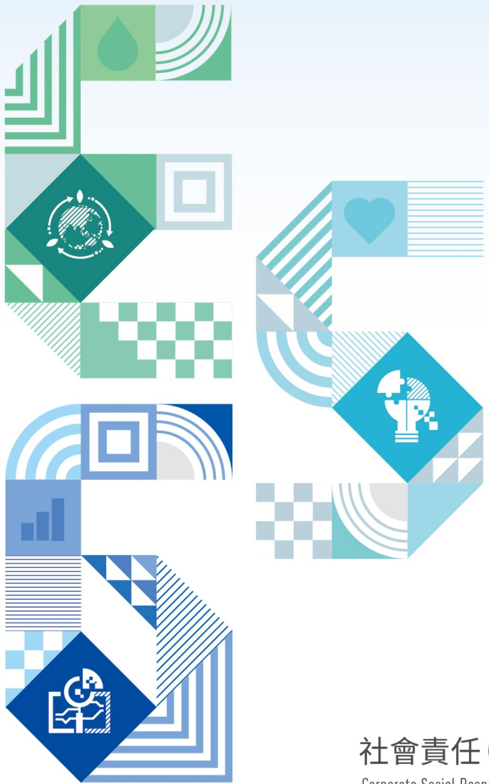

text_image

社會責任
Corporate Social Responsible

2025

社會責任(ESG)報告

Corporate Social Responsibility (ESG) Report

# 目録

02 董事長致辭  
04 2025年社會責任關鍵績效  
04 社會認可  
06 關於我們

natural_image

Abstract geometric design with blue and white shapes and a stylized letter 'T' (no text or symbols)

# 強化治理 夯實信達根基

10 公司治理  
13 風險合規  
15 責任管理

natural_image

Abstract geometric design with blue and white shapes and a central staircase-like motif (no text or symbols)

# 聚焦主業 踐行信達使命

24 防範化解風險  
27 服務實體經濟  
31 提升服務品質  
35 供應商管理

68 附録  
68 編制說明  
70 ESG 報告守則内容索引  
74 讀者反饋

natural_image

Abstract icon of a light bulb with geometric shapes and scattered squares, no text or symbols present.

natural_image

Abstract geometric design with interlocking shapes and color gradients (no text or symbols)

# 以人爲本 凝聚信達力量

38 維護員工權益  
39 職業安全  
41 員工關懷  
42 員工發展

natural_image

Abstract geometric design with pink and white shapes and radial lines, no text or symbols present.

# 金融向善 扛起信達責任

46 鄉村全面振興  
48 公益活動

natural_image

Abstract geometric design with green and white shapes and patterns (no text or symbols)

# 綠色發展 譜寫信達華章

52 氣候治理體系  
53 氣候風險與機遇管理  
54 氣候風險與機遇識別、評估  
62 指標與目標  
66 低碳運營進展

natural_image

Silhouette of a person holding a document (no text or symbols visible)

natural_image

Illustration of two hands holding a white heart against a pink background (no text or symbols)

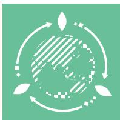

natural_image

Green circular icon with white arrows and leaf symbols around a central globe (no text or symbols)

# 董事長致辭

natural_image

Portrait of a man in a dark suit and patterned tie against a plain gray background (no text or symbols visible)

中國信達資產管理股份有限公司
董事長

張衛東

2025年是“十四五”規劃收官之年，也是“十五五”規劃謀篇布局之年，公司堅持以習近平新時代中國特色社會主義思想為指導，深入貫徹黨的二十大和二十屆歷次全會精神，落實中央金融工作會議和中央經濟工作會議部署，踐行金融工作政治性、人民性，樹牢正確政績觀，圍繞中投公司社會責任工作要求，聚焦防範化解風險、服務實體經濟、關愛員工、鄉村振興和綠色發展等重要議題，持續深化履責行動，取得良好工作成效。

科學治理，築牢持續發展堅實基礎。堅持黨中央對金融工作的集中統一領導，將黨的領導有機融入公司治理全過程各方面，持之以恒推進全面從嚴治黨。貫徹可持續發展理念，全面落實ESG監管規定，堅持廉潔從業，健全風險防控機制，強化合規內控管理，持續提升公司治理能力，榮獲《中國經營報》2025“卓越競爭力資管公司”獎。

擔當作爲，緊扣金融工作永恒主題。堅持把防控風險作爲金融工作的永恒主題，深耕不良資產主業，鞏固提升專業經營能力，收購金融不良資產超3,000億元，繼續保持市場領先地位。充分發揮金融救助和逆周期調節功能，加大中小金融機構、房地產、地方政府債務等重點領域風險化解力度，有關破產重整案例被評爲“全國破產經典案例”，充分發揮維護金融穩定壓艙石作用。

攻堅克難，提升服務實體經濟質效。堅持把金融服務實體經濟作爲根本宗旨，圍繞客戶不同需求，量身定制一攬子金融方案，加大服務國家戰略，扎實做好金融“五篇大文章”，助力國企深化改革和民企健康發展，維護國家能源安全，支持新興產業發展，服務“一帶一路”項目建設，推進“數字信達”和不良資產生態圈建設，提高服務品質，有效發揮服務實體經濟主力軍作用。

奮鬥為本，實現員工企業同向成長。功以才成，業由才廣。公司堅持人才強司，拓寬員工成長渠道，通過開展企業文化建設年、組織業務實戰訓練營、深化“五個一”青年能力提升工程等工作，建設高素质專業人才隊伍。維護員工合法權益，關愛員工身心健康，營造良好工作氛圍，引導和激勵員工為信達事業擔當作為、攻堅克難、接續奮鬥。

向善而行，鄉村全面振興再建新功。踐行金融工作政治性、人民性，堅持黨建幫扶引領，深入學習“千方百計”經驗，全面開展幫扶工作，投入幫扶資金2,140萬元，精準實施“五大振興”“兩不愁三保障”項目，強化脫貧攻堅成果與鄉村振興有效銜接。開展社會公益實踐，捐贈558萬港元，馳援香港大埔火災，支持搶險救灾和灾後重建。

綠色發展，助力“雙碳”目標繪制新卷。貫徹可持續發展理念，加強氣候風險管理，制定應對氣候風險策略，助力“雙碳”目標；在投資端加大服務企業低碳轉型；在融資端提升支持綠色發展能力，碳中和融資項目入選《北京市可持續發展金融案例》；在運營端推廣低碳辦公和綠色出行，堅持開展綠色公益活動，以實際行動賦能美麗中國建設。

其作始也簡，其將畢也必巨。2026年是我國“十五五”規劃開局之年，也是公司“四五”規劃第一年。站在新的起點，公司將堅定不移貫徹新發展理念，在中投公司黨委的堅強領導下，深入踐行金融央企初心使命，在經濟、環境、社會和治理等領域爭先進位，再創佳績，推動高質量發展譜寫新篇章！

# 2025 年社會責任關鍵績效

  
經濟

17,212.27億元

資產總計

  
環境

1,142.25噸二氧化碳

溫室氣體範圍一排放總量

  
社會

11,745個

爲社會直接提供就業崗位

# 社會認可

1《中國經營報》2025“卓越競爭力資管公司”  
2 上海聯合產權交易所 2025 年度 “資本運營金獎”  
3 北京產權交易所 2025 年度 “最佳合作伙伴”  
4 中國互聯網協會“集團企業數智化建設創新單位”  
5 CBLJ《商法》優秀法務團隊獎

13.77%

資本充足率

35.62億元

歸屬本公司股東净利潤

22,432.84噸二氧化碳

溫室氣體範圍二排放總量

5,923.30噸二氧化碳

溫室氣體範圍三排放總量

2,140萬元

幫扶資金

6 中國銀行業協會《銀行業踐行中國特色金融文化案例集》守正創新案例  
7 中國金融出版社《金融品牌高質量發展年度案例精選集（2024—2025）》媒介創新方向品牌傳播年度案例  
8 中國金融傳媒“金諾·金融品牌年度創新案例”獎  
9《政法論壇》2024年度“全國破產經典案例”十大案例  
10 《北京市可持續發展金融案例》碳中和融資項目案例

# 關于我們

# 33家

在全國設有分公司

# 1.17萬人

集團員工約

本公司的前身中國信達資產管理公司成立于1999年4月，是經國務院批準，為有效化解金融風險、維護金融體系穩定、推動國有銀行和國有企業改革發展而成立的首家金融資產管理公司。2010年6月，中國信達資產管理公司整體改制為股份有限公司。2012年4月，引進全國社會保障基金理事會、UBS AG、中信資本控股有限公司和渣打銀行等四家戰略投資者。2013年12月，在香港聯合交易所主板挂牌上市，成為首家登陸國際資本市場的中國金融資產管理公司。2025年9月，本公司控股股東由財政部變更為中央匯金投資有限責任公司。

公司主要業務包括不良資產經營業務和金融服務業務，其中不良資產經營是核心業務。公司在全國設有33家分公司，在內地和香港擁有9家直接管理的從事不良資產經營和金融服務業務的平臺子公司，包括南洋商業銀行有限公司、信達證券股份有限公司、中國金谷國際信托有限責任公司、信達金融租賃股份有限公司、中國信達（香港）控股有限公司、信達投資有限公司、信達地產股份有限公司、信達資本管理有限公司、中潤經濟發展有限責任公司。集團員工約1.17萬人。

natural_image

Illustration of a modern blue office building with grid pattern, surrounded by abstract QR codes (no text or symbols on the building itself)

公司組織架構圖  

flowchart

```mermaid
graph LR
  Root["股東會"]
  
  subgraph Board["董事會"]
    direction TB
    Board1["董事會辦公室"]
    Board2["監事會辦公室"]
    Board3["總裁辦公室"]
    Board4["黨建工作部"]
    Board5["研究部"]
    Board6["業務審核部"]
    Board7["業務管理部"]
    Board8["金融機構業務部"]
    Board9["戰略客戶一部"]
    Board10["戰略客戶二部"]
    Board11["戰略客戶三部"]
    Board12["戰略客戶四部"]
    Board13["資金市場部"]
    Board14["資產保全部"]
    Board15["集團管理部"]
    Board16["法律部"]
    Board17["合規部"]
    Board18["風險管理部"]
    Board19["計劃財務部"]
    Board20["人力資源部"]
    Board21["信息技術部"]
    Board22["審計部"]
    Board23["紀委辦公室"]
    Board24["黨委巡察辦"]
    Board25["工會工作部"]
  end
  
  subgraph HighLevel["高級管理層"]
    direction TB
  HighLevel --> HighLevel1["業務決策委員會"]
  HighLevel --> HighLevel2["業績考評委員會"]
  HighLevel --> HighLevel3["財務審查委員會"]
  HighLevel --> HighLevel4["資產負債管理委員會"]
  HighLevel --> HighLevel5["風險管理委員會"]
  HighLevel --> HighLevel6["信息科技管理與數據治理委員會"]
  HighLevel --> HighLevel7["集中采購管理委員會"]
  HighLevel --> HighLevel8["資產評估與估值管理委員會"]
  HighLevel --> HighLevel9["問責委員會"]
  end
  
  subgraph General["總部門"]
    direction TB
  General1["北京分公司"] --> G1_1["湖北分公司"]
  General2["天津分公司"] --> G1_2["湖南分公司"]
  General3["河北分公司"] --> G1_3["廣東分公司"]
  General4["山西分公司"] --> G1_4["深圳分公司"]
  General5["內蒙古分公司"] --> G1_5["廣西分公司"]
  General6["遼寧分公司"] --> G1_6["海南分公司"]
  General7["吉林分公司"] --> G1_7["重慶分公司"]
  General8["黑龍江分公司"] --> G1_8["四川分公司"]
  General9["上海分公司"] --> G1_9["貴州分公司"]
  General10["上海自貿區分公司"] --> G1_10["雲南分公司"]
  General11["江蘇分公司"] --> G1_11["陝西分公司"]
  General12["浙江分公司"] --> G1_12["甘肅分公司"]
  General13["安徽分公司"] --> G1_13["青海分公司"]
  General14["福建分公司"] --> G1_14["寧夏分公司"]
  General15["江西分公司"] --> G1_15["新疆分公司"]
  General16["山東分公司"] --> G1_16["後援中心"]
  General17["河南分公司"] --> G1_17
  end
  
  subgraph Shareholders["分公司"]
    direction TB
  Shareholders1["南洋商業銀行有限公司"] --> Shareholders2["信達證券股份有限公司"]
  Shareholders3["中國金谷國際信托有限責任公司"] --> Shareholders4["信達金融租賃股份有限公司"]
  Shareholders5["中國信達（香港）控股有限公司"] --> Shareholders6["信達投資有限公司"]
  Shareholders7["信達地產股份有限公司"] --> Shareholders8["信達資本管理有限公司"]
  Shareholders9["中潤經濟發展有限責任公司"] --> Shareholders10["中潤經濟發展有限責任公司"]
  end
  
  subgraph Subsidiaries["子公司"]
    direction TB
  Subsidiary1["北京分公司"] --> Subsidiary2["北京分公司"]
  Subsidiary2 --> Subsidiary3["天津分公司"]
  Subsidiary3 --> Subsidiary4["湖南分公司"]
  Subsidiary4 --> Subsidiary5["河北分公司"]
  Subsidiary5 --> Subsidiary6["廣東分公司"]
  Subsidiary6 --> Subsidiary7["山西分公司"]
  Subsidiary7 --> Subsidiary8["深圳分公司"]
  Subsidiary8 --> Subsidiary9["內蒙古分公司"]
  Subsidiary9 --> Subsidiary10["廣西分公司"]
  Subsidiary10 --> Subsidiary11["遼寧分公司"]
  Subsidiary11 --> Subsidiary12["海南分公司"]
  Subsidiary12 --> Subsidiary13["吉林分公司"]
  Subsidiary13 --> Subsidiary14["重慶分公司"]
  Subsidiary14 --> Subsidiary15["黑龍江分公司"]
  Subsidiary15 --> Subsidiary16["四川分公司"]
  Subsidiary16 --> Subsidiary17["上海分公司"]
  Subsidiary17 --> Subsidiary18["貴州分公司"]
  Subsidiary18 --> Subsidiary19["上海自貿區分公司"]
  Subsidiary19 --> Subsidiary20["雲南分公司"]
  Subsidiary20 --> Subsidiary21["江蘇分公司"]
  Subsidiary21 --> Subsidiary22["陝西分公司"]
  Subsidiary22 --> Subsidiary23["浙江分公司"]
  Subsidiary23 --> Subsidiary24["甘肅分公司"]
  Subsidiary24 --> Subsidiary25["安徽分公司"]
  Subsidiary25 --> Subsidiary26["青海分公司"]
  Subsidiary26 --> Subsidiary27["福建分公司"]
  Subsidiary27 --> Subsidiary28["寧夏分公司"]
  Subsidiary28 --> Subsidiary29["江西分公司"]
  Subsidiary29 --> Subsidiary30["新疆分公司"]
  Subsidiary30 --> Subsidiary31["山東分公司"]
  Subsidiary31 --> Subsidiary32["後援中心"]
  end
```

# 强化治理

# 夯實

# 信達根基

# 效率

# 治理

# 洪璠

# 风控

# 凶探

# 率

公司治理

風險合規

責任管理

# 效益

text_image

空
质量
合规
质量
合规

# 合规

# 財富

# 益发

# 黨的領導

堅持以習近平新時代中國特色社會主義思想為指導，全面貫徹黨的二十大及二十屆歷次全會、中央經濟工作會議、中央金融工作會議精神，認真貫徹落實黨中央決策部署，堅持黨中央對金融工作的集中統一領導，將黨的領導融入公司治理各環節。

公司圍繞“四建四促”黨建工作體系，有效發揮黨建抓總職能，完善“雙向進入，交叉任職”領導機制，構建權責法定、權責透明、協調運轉、有效制衡的公司治理機制，在堅持“黨管幹部”原則的基礎上實現與董事會、經營層依法依規選人用人的有機結合。

充分發揮黨委“把方向、管大局、保落實”的領導作用，制定修訂《公司黨委關於落實“第一議題”制度的實施辦法》《黨委議事規則》《公司黨委落實前置研究討論程序實施細則（試行）》《黨委重大事項請示報告規定(試行)》等關鍵性制度文件，完善公司黨委議事內容清單，厘清黨委和董事會等治理主體的權責邊界，始終依托制度建設強化黨的領導不放鬆，領導班子嚴格履行“一崗雙責”，在高質量黨建促進高質量發展中發揮帶頭作用。堅持以黨建入章為切入口，着力推動黨建和經營工作相融相促，實現黨的領導融入公司治理的制度化、規範化、程序化，為公司內涵式高質量發展的行穩致遠築牢基礎。

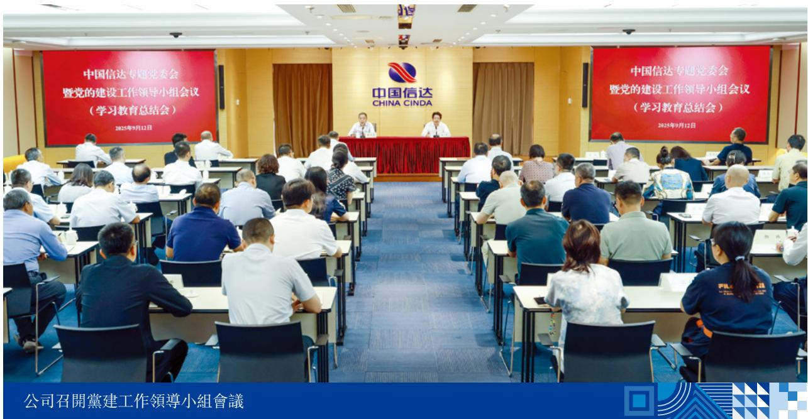

text_image

中国信达专题党委会
暨党的建设工作领导小组会议
（学习教育总结会）
2025年9月12日
中国信达
CHINA CINDA
中国信达专题党委会
暨党的建设工作领导小组会议
（学习教育总结会）
2025年9月12日
公司召開黨建工作領導小組會議

# 兩會一層

# 股東會

股東會是公司最高權力機構，全年共召開股東會4次，審議議案19項，報告事項3項。

堅持同股同權。股東按其持有份額的種類和份額享有權利、承擔義務，同種類的每一股份具有同種權利。

保障股東權益。公司依法合規召開股東會，為股東行使表決權提供便利，保障股東合法權益。公司以信息披露和投資者關係管理為抓手，加強與股東的溝通交流，提升公司治理透明度，保障股東的知情權。

注重股東回報。公司章程規定，公司利潤分配政策應保持連續性和穩定性，同時兼顧公司的長遠利益、全體股東的整體利益以及公司的可持續發展，優先采用現金分紅的利潤分配方式。

# 董事會

董事會是公司經營決策機構。截至報告期末，公司董事會由10名董事組成，其中執行董事3名，非執行董事2名，獨立非執行董事5名。公司董事會全年共召開11次會議，審議議案65項，報告事項23項。

# 高級管理層

公司經營層堅持以人民為中心的經營理念，充分發揮金融救助和逆周期調節功能，在防範化解風險、服務實體經濟等方面，深刻踐行金融工作政治性、人民性。堅決履行社會責任并在 ESG（環境、社會及管治）領域做出新的貢獻，彰顯金融央企的使命擔當。

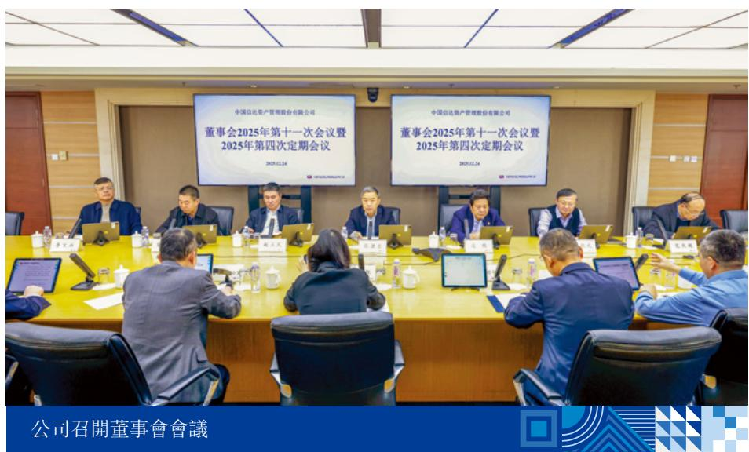

text_image

中国信达资产管理股份有限公司
董事会2025年第十一一次会议暨
2025年第第四次定期会议
2025.12.24
中国信达资产管理股份有限公司
董事会2025年第十一一次会议暨
2025年第第四次定期会议
2025.12.24
公司召開董事會會議

# 廉潔從業

公司嚴格遵守《中華人民共和國公司法》等法律法規及相關監管規定，持續加強正風肅紀反腐力度，健全完善對權力運行的監督制約機制，加強員工廉潔從業教育，積極培育清廉誠信的企業文化，努力營造風清氣正的良好企業氛圍和發展環境，切實保障利益相關方權益。

堅決貫徹黨中央關於深化金融領域反腐敗工作決策部署，堅持一體推進“不敢腐、不能腐、不想腐”，堅決查處濫權妄為、以權謀私、失職瀆職等問題。扎實開展深入貫徹中央八項規定精神學習教育，嚴查快處違反中央八項規定精神問題，堅決防止“四風”問題反彈回潮。持續健全信訪舉報機制，完善來信、來訪、電話和網絡等舉報渠道，切實保障各類渠道舉報受理機制的完備有效。嚴格履行信訪舉

報和問題綫索辦理程序，在“登記、受理、辦理、告知、歸檔”全流程確保舉報人信息嚴格保密，依規依紀依法處置信訪舉報和問題綫索，并通過多種方式保障舉報人利益，防止打擊報復行為發生。

公司面向各職級、各崗位員工開展廉潔從業、反貪腐相關培訓。組織開展專題學習教育、反腐倡廉培訓、參觀警示教育基地等活動，覆蓋2.9萬人次，持續營造誠實守信、清正廉潔的經營氛圍。積極鼓勵和組織董事參與不同形式的反腐倡廉培訓26次，75人次參訓，不斷提高廉潔意識和履職能力。

關於貪污訴訟案件數目及訴訟結果等更多信息可參見司法公開信息。

# 風險合規

# 全面風險管理

公司持續完善全面風險管理體系建設，風險治理架構健全，董事會及高級管理層在全面風險管理體系中職責明確、邊界清晰。將風險管理各項要求融入日常管理活動和業務流程中，建立風險管理的三道防綫：各業務經營部門為第一道防綫；風險管理職能部門為第二道防綫；內部審計職能部門為第三道防綫。2025年，集團風險管控能力持續強化，各類風險均控制在可接受範圍內。

公司對風險偏好、風險政策、風險限額方案進行重檢完善，確保風險偏好在集團的統一傳導。持續修訂風險管理制度，加強風險穿透管理，築牢風險底綫，促進公司業務穩健開展。

公司積極應對國內外復雜嚴峻的風險環境和挑戰，實施資產分類全覆蓋，嚴格做實資產質量。緊盯重點區域、重大項目、關鍵環節，加大風險化解力度，加強對子公司及境外風險管控。通過智能風控平臺前瞻識別的“技防”作用，強化風險源頭管控。常態化開展風險項目復盤反思，提升風險應對能力。配合上級風險防控協同機制，開展宏觀形勢研究、風險項目化解工作交流，強化協同研究、化險能力，深入貫徹風險管理文化，保障公司業務高質量開展。

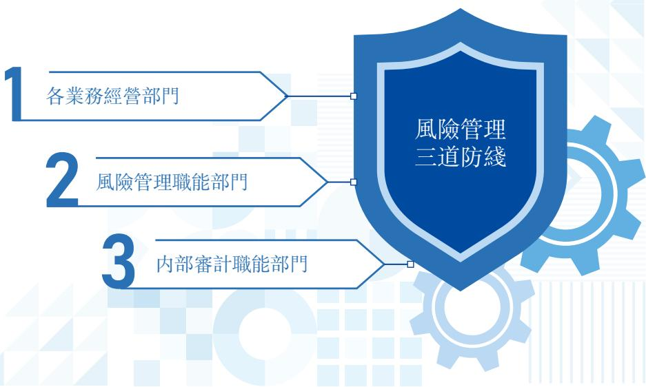

flowchart

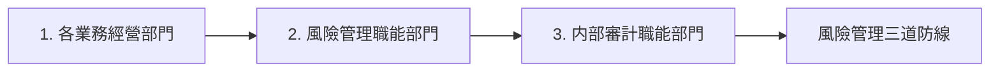
```mermaid
graph LR
  A["1. 各業務經營部門"] --> B["2. 風險管理職能部門"]
  B --> C["3. 内部審計職能部門"]
  C --> D["風險管理三道防線"]
```

# 合規内控管理

公司依據《金融資產管理公司內部控制辦法》《企業內部控制基本規範》《商業銀行內部控制指引》《企業管治守則》等監管要求，建立內部控制管理架構，制定實施《內部控制基本規程》，明確從治理層到員工的內控責任分工和報告關係，持續建立健全內部控制管理體系。

公司深入開展內控合規提升活動，進一步加大各類監管問題整改力度，主動對照排查內控合規風險隱患，積極探索典型違規案例警示教育機制，着力推動公司經營管理由被動合規向主動合規轉變；公司根據監管機構及上級單位管理要求，開展全面制度重檢，持續完善制度體系，進一步提升內部管理規範性；完善負面清單管理機制，聚焦公司主營業務，制定《金融不良類項目操作負面清單》，促進提升制度執行，加強關鍵環節風險控制；聚焦重點加強檢查和排查，持續夯實內控合規有效性。

公司嚴格遵守《中華人民共和國反洗錢法》等法律法規及監管要求，三道防綫各司其職，認真履行機構反洗錢義務。持續完善洗錢風險管控體系，以科技賦能洗錢風險管理，提升工作規範性；落實新法新規要求，開展特定非金融子公司檢查，進一步加強集團管控；組織開展7次特色培訓，覆蓋4,351人次，不斷提升員工風險意識和履職能力。面向金融消費者和公眾，制作中國傳統節日反洗錢系列宣傳，開展反洗錢、反電詐集中宣傳活動，通過線上綫下多種渠道資源，積極宣導非法金融活動高發領域和防範手段知識，助力提升識別和防範金融犯罪的意識和能力，共築全民防非、主動拒非的良好社會氛圍。

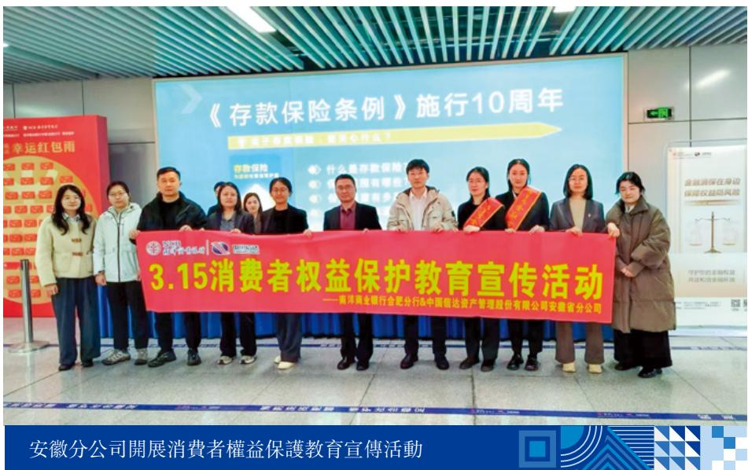

text_image

《存款保险条例》施行10周年
承認存款保障，更用心什么？
存款保险
什么是存款保险
你？留有哪些？
你？留很多？
3.15消费者权益保护教育宣传活动
——青海南北银行合肥分行&中国信达资产管理股份有限公司安徽省分公司
安徽分公司開展消费者權益保護教育宣傳活動

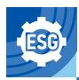

# 責任管理

公司在經營發展過程中始終堅持經濟責任與社會責任相統一，深入落實可持續發展理念，嚴格執行港交所《環境、社會及管治報告守則》規定，常態化做好 ESG 信息披露，持續推動公司高質量發展。

# 社會責任理念

# 助力化解風險的穩定器

深耕金融機構不良資產處置，有效緩釋金融機構存量信用風險。積極參與防範化解中小金融機構、房地產、地方政府債務等重點領域風險，為牢牢守住不發生系統性風險底綫貢獻力量。

# 實現員工價值的共同體

堅持 “人盡其才，有為有位” 人才理念，切實維護員工合法權益，保障員工職業安全，提升員工核心能力，為員工提供幹事創業舞臺，携手員工共同成長。

# 增進社會福祉的企業公民

堅持以人民爲中心的發展理念，以金融之力賦能鄉村振興，促進共同富裕；積極參與社區服務和公益慈善，助力實現人民對美好生活的向往。

# 服務實體經濟的助推器

強化金融服務實體經濟功能，聚焦重大戰略、重點領域和薄弱環節，積極參與企業危機救助、深化國企改革發展、支持戰略性新興產業等工作，着力做好金融“五篇大文章”；踐行“客户中心”理念，保障客戶權益，持續提升服務品質和客戶體驗，携手客戶共創價值。

# 參與環境保護的踐行者

貫徹綠色發展理念，積極應對氣候變化，圍繞主責主業拓展綠色金融服務，支持傳統產業低碳轉型、綠色產業加快發展，積極踐行低碳運營，助力實現“雙碳”目標。

# 董事會聲明

公司董事會承擔對公司 ESG 事宜的監管責任。董事會戰略發展委員會負責研究公司環境、社會與管治相關的規劃、政策、目標及重大事項，對公司 ESG 相關工作執行情況進行監督，審閱公司 ESG 相關信息披露報告，并向董事會提出建議。

在董事會的監管指導下，公司立足自身實際，持續踐行科學合理、融合經營特色的 ESG 管理策略：深入貫徹創新、協調、綠色、開放、共享的發展理念，嚴格遵守社會責任和 ESG 監管政策法規，積極落實“專業經營、效率至上、創造價值”的高質量發展理念，持續完善 ESG 管治架構和風險管理體系，聚焦不良資產核心主業，穩步推進“數字信達”建設，協同開展金融服務業務，着力提供優質客戶服務，搭建員工發展平臺，倡導綠色環保，增進民生社會福祉，努力創造優秀的經濟績效、環境績效、社會績效和管治績效，助推公司長期可持續發展。

董事會負責審議 ESG 重要事項，參與 ESG 相關事項的識別、評估及重要性排序相關工作，動態關注審閱實施進展。結合公司整體戰略與實際業務需求，檢視 ESG 重要事項與目標進展，關注 ESG 相關風險，審議風險防範措施與解決方案。強化 ESG 相關風險管理，將 ESG 相關風險納入風險管理及內部控制體系，ESG 主要事項總體風險可控。

公司制定經濟、環境及社會目標，明確闡述公司主營業務、發展戰略、ESG理念及社會責任使命。本年度，相關領域目標進展情況及實踐舉措檢視情況如下：

natural_image

Stylized illustration of renewable energy sources including solar panels, wind turbines, and urban buildings (no text or symbols)

<table><tr><td>目標類型</td><td>目標內容</td><td>進度檢視</td></tr><tr><td>經濟目標</td><td>堅持聚焦不良資產主業,提高系統性金融解決方案供給能力,切實履行好化解金融風險和服務實體經濟專業職責,實現價值增值,為股東創造最佳回報。</td><td>聚焦銀行不良資產風險化解,收購銀行不良資產超3,000億元。積極參與中小金融機構改革化險,扎實推動房地產風險化解,穩妥參與地方債務風險化解。圍繞服務國家戰略,助力國企深化改革,支持民營經濟發展壯大,提升服務實體經濟質效。</td></tr><tr><td>環境目標</td><td>持續加大綠色低碳辦公運營,實現企業綠色發展。</td><td>辦公運營相關環境目標進展情況詳見“低碳運營進展”。</td></tr><tr><td>社會目標</td><td>積極開展以鄉村振興為重點的幫扶投資及社會公益活動,關愛弱勢群體,推動社區發展,增進社會福祉;積極應對重大公共危機與灾害,履行企業公民責任;加強員工民主管理,保障員工權益,構建和諧勞動關係,實現員工與企業協同發展。</td><td>認真落實定點幫扶工作,投入和引進幫扶資金2,140萬元,開展多層次、全方位的幫扶活動,持續鞏固脫貧攻堅成果同鄉村振興有效銜接;組織員工參與社區服務,在扶弱濟困、教育助學等領域開展公益慈善獻愛心活動;開展安全維穩培訓和消防疏散應急演練;召開四屆九次職代會,持續做好員工健康管理,保障職業安全;完成各類培訓2,400餘期,超20萬人次參訓。</td></tr></table>

本報告闡述了上述工作具體情況，並詳細介紹了公司積極承擔社會責任、加強 ESG 管理方面的實踐進展。本報告已由公司董事會于 2026 年 3 月 31 日審議通過。

# ESG 治理架構

公司不斷優化社會責任和 ESG 管理體系，圍繞信達社會責任理念，構建了“決策層—管理層—執行層”自上而下、層層遞進的 ESG 組織架構體系。各層級協同聯動，有效發揮職能與專業優勢，切實推動公司系統 ESG 管理工作的落地實施。

# 决策層

董事會是 ESG 管理決策機構，對 ESG 相關工作實施監督及指導。董事會負責監督公司 ESG 及社會責任目標的制定及執行，定期聽取 ESG 相關工作進展，并確保在工作開展過程中 ESG 風險管理舉措及內部監控機制的有效執行。董事會負責審閱公司定期發布的社會責任（ESG）報告，確保全面準確展現公司 ESG 管理實踐及履行社會責任方面的工作成效。

# 管理層

管理層負責落實董事會 ESG 工作決議，履行制定戰略規劃、推動分工執行、開展指標考核、提升披露水平、組織培訓宣導等職責，將公司 ESG 及社會責任理念有機融入業務決策過程，促進 ESG 管理提質增效。管理層密切關注業務運營涉及的 ESG 相關問題，切實推動經濟、環境、社會及企業管治效益的深度融合。

# 執行層

執行層包括總部職能部室及各分子公司，主要負責 ESG 相關工作的落地實施。執行層以公司 ESG 及社會責任管理機制為指導，協同聯動，高效配合，携手提升公司 ESG 管理水平。

<table><tr><td>ESG工作事項</td><td>落實機構</td></tr><tr><td>社會責任(ESG)報告編制及社會責任考核工作</td><td>總裁辦公室</td></tr><tr><td>ESG事項管理與實踐</td><td>總部職能部室及各分子公司</td></tr><tr><td>ESG信息披露工作聯絡員,負責組織開展ESG實踐及信息整理</td><td>總部相關部室及各分子公司</td></tr><tr><td>辦公場所節能減排和綠色辦公</td><td>總務部、各分子公司後勤保障部門</td></tr><tr><td>開展各類綠色金融業務</td><td>總部、分公司及相關子公司業務部門</td></tr></table>

# 利益相關方 溝通

公司高度重視與利益相關方的交流互動，積極搭建與股東和投資者、政府監管機構、客戶、供應商、同業及行業協會、非營利組織、公益慈善機構、員工、管理層等利益相關方的多元溝通渠道。通過參與投資貿易洽談會、舉辦醫療健康行業論壇、參加先進能源創新發展論壇等各項活動，同政府機構、產權交易所、券商投行、破產管理人、基金管理人等建立戰略合作，積極對外傳遞公司經營理念和價值追求，回應各方訴求與期望，携手各方共創經濟、環境、社會及企業管治價值。

# ESG 議題 重要性評估

2025 年，公司開展 ESG 議題重要性分析，通過 ESG 議題識別與評估，明確對自身影響重大、利益相關方普遍關注的關鍵性議題。根據議題分析結果，制定議題管理與披露策略。

# 步驟 1

# 議題識別

公司深入分析國家宏觀政策、行業發展趨勢和同業實踐，參考香港聯合交易所《環境、社會及管治報告守則》、聯合國可持續發展目標（SDGs）、全球報告倡議組織《可持續發展報告標準》（GRI Standards）、明晟（MSCI）ESG評級等國內外ESG相關信息披露要求與評級體系，並結合自身業務實際，對既有ESG議題進行整合與更新，共明確16項與公司和利益相關方高度相關的ESG議題。

與上一年度相比，新增公司治理議題，將員工權益保護、健康與安全、勞工準則3項議題合并為員工權益保護與福祉，將業務對環境及資源的影響、資源使用、排放物3項議題合并為綠色低碳運營，并調整部分議題名稱與內涵。

# 步驟 2

# 調研分析

公司通過在綫問卷的方式，針對 ESG 議題的重要程度開展專項調研，廣泛邀請內外部利益相關方群體從“對公司業務的影響程度”“對利益相關方的影響程度”兩方面進行評估。調研共回收問卷 610 餘份，參與評估的利益相關方群體包括政府與監管部門、股東與投資者、董事和高級管理人員、員工、客戶與消費者、供應商、行業協會、公益組織、高校與研究機構等。

# 結果披露

公司結合調研統計結果與 ESG 專家團隊反饋，分析形成重要性議題矩陣，確定報告重點披露內容。

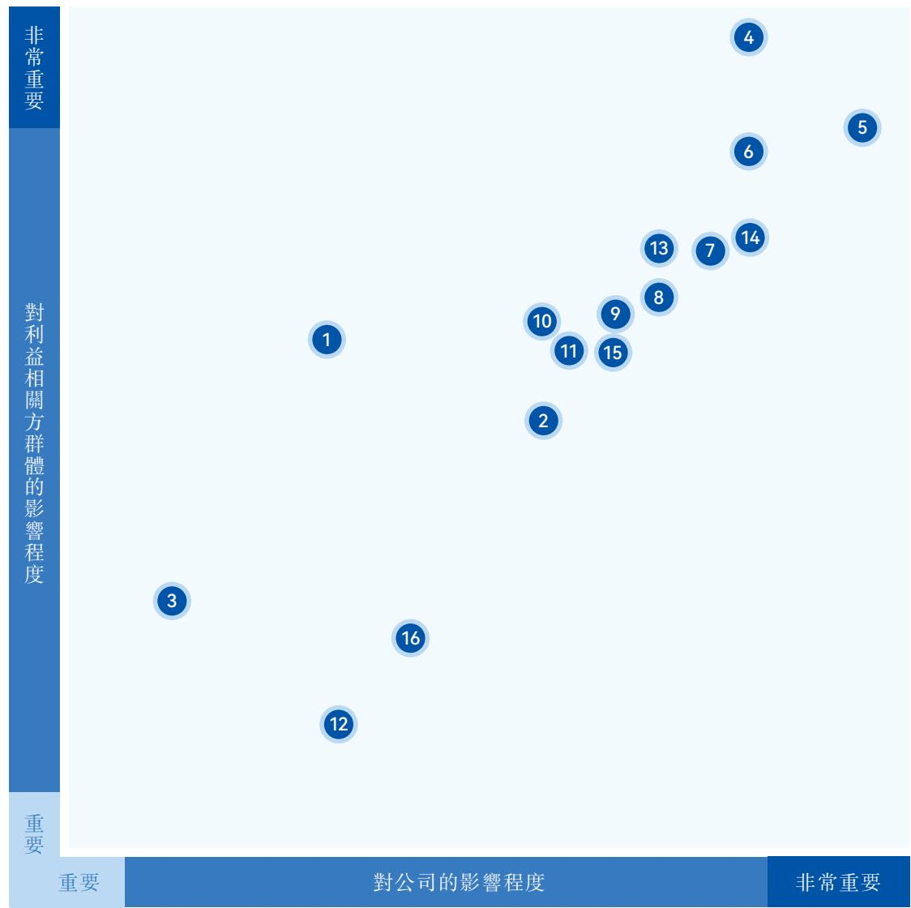

scatter

| Item | Importance to Company's Impact (X-axis) | Importance to Relationship with Group's Impact (Y-axis) |
| --- | --- | --- |
| 1 | ~25% | ~45% |
| 2 | ~45% | ~35% |
| 3 | ~10% | ~20% |
| 4 | ~85% | ~95% |
| 5 | ~95% | ~85% |
| 6 | ~85% | ~75% |
| 7 | ~80% | ~65% |
| 8 | ~60% | ~60% |
| 9 | ~55% | ~55% |
| 10 | ~45% | ~50% |
| 11 | ~45% | ~45% |
| 12 | ~25% | ~15% |
| 13 | ~60% | ~60% |
| 14 | ~75% | ~55% |
| 15 | ~50% | ~45% |
| 16 | ~30% | ~20% |

<table><tr><td>範疇</td><td>議題</td></tr><tr><td rowspan="3">環境</td><td>1 應對氣候變化</td></tr><tr><td>2 綠色金融</td></tr><tr><td>3 綠色低碳運營</td></tr><tr><td rowspan="9">社會</td><td>4 化解金融風險</td></tr><tr><td>5 服務實體經濟</td></tr><tr><td>6 支持國家戰略</td></tr><tr><td>7 客戶權益保護</td></tr><tr><td>8 員工權益保護與福祉</td></tr><tr><td>9 員工培訓與發展</td></tr><tr><td>10 鄉村全面振興</td></tr><tr><td>11 支持民生事業</td></tr><tr><td>12 供應鏈管理</td></tr><tr><td rowspan="4">管治</td><td>13 公司治理</td></tr><tr><td>14 内控合規與風險管理</td></tr><tr><td>15 “數字信達”建設</td></tr><tr><td>16 利益相關方溝通</td></tr></table>

natural_image

Abstract geometric design with blue and white shapes and a central staircase pattern (no text or symbols)

# 聚焦主業 踐行 信達使命

line

| Month | 防範化解風險 | 服務實體經濟 | 提升服務品質 | 供應商管理 |
| --- | --- | --- | --- | --- |
| 7 | ~10 | ~15 | ~20 | ~30 |
| 8 | ~15 | ~20 | ~25 | ~40 |
| 9 | ~20 | ~25 | ~30 | ~50 |
| 10 | ~25 | ~30 | ~35 | ~60 |
| 11 | ~30 | ~35 | ~40 | ~70 |
| 12 | ~35 | ~40 | ~45 | ~80 |

防範化解風險

服務實體經濟

提升服務品質

供應商管理

# 銀行不良資產 收購持續領先

2025 年，公司深化與全國性銀行總行合作，持續加大銀行不良資產收購，在銀行公開批轉市場競得 360 個資產包、本金 1,600 餘億元，繼續保持行業領先地位。公司加強與浦發銀行合作，建立專班機制及工作小組，加強“總對總分對分”溝通，推動戰略合作協議落地。

360個

在銀行公開批轉市場競得資產包

1,600餘億元

本金

text_image

中国信达
CHINA CINDA
浦发银行
SPD BANK
中国信达 - 浦发银行
战略合作协议签约仪式
中国信达
CHINA CINDA
浦发银行
SPD BANK
公司與浦發銀行簽署戰略合作協議

# 服務中小銀行 改革化險作出 新貢獻

公司參與多地中小銀行及信用聯社改革化險，收購和受托處置123家地方中小銀行不良債權本息超1,200億元。遼寧分公司開展“春雨行動”，競得遼寧省兩家中小銀行5個資產包、債權規模35億元，以專業服務遼寧中小銀行機構改革和風險化解。天津分公司競得天津某中小銀行不良資產包、債權規模超30億元，為區域金融風險化解作出積極貢獻。

text_image

中国信达 | 河北分公司

公司召開中小銀行化險模式總結與業務拓展會

# 拓展非銀金融 不良資產業務 取得新進展

公司圍繞信托、證券、保險資管、公募基金等非銀金融機構，穩步拓展不良資產業務，累計收購債權本息合計115億元。圍繞監管新規與業務創新方向，加強與券商等金融機構協同，助力化解境內外本金超50億元的不良資產，為深化與同類型金融機構合作、提升風險資產處置質效提供了實踐樣本。

# 完成某中小金融機構階段性風險化解任務

某地方金融租賃公司被監管部門納入風險化解任務清單，公司選調20多名托管清算和金融租賃專業經驗豐富的業務骨幹成立專項工作組，協助清算工作專班穩妥推動該公司階段性風險化解，圓滿完成清產核資、風險研判、方案設計、人員安置、風險出清等任務，助力維護區域金融和社會穩定，獲得地方政府高度認可。

# 深化個貸不良 資產業務紓困 實踐

公司積極拓展個貸不良資產業務，助力多家金融機構壓降不良個貸、盤活存量資產。2025年累計收購個貸資產包31個，涉及債務人約70萬名、債權本金超百億元，資產覆蓋信用卡透支、個人消費貸和經營貸等多類產品。公司通過對債務人開展“接續管理”，紓解民生壓力，服務實體經濟，深入踐行金融工作政治性、人民性。

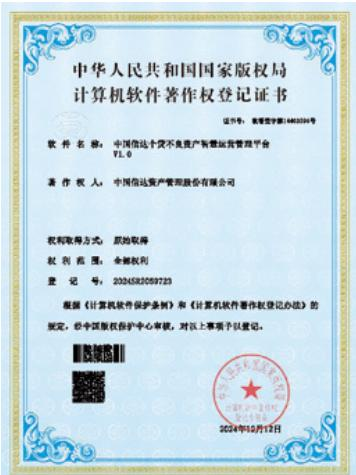

text_image

中华人民共和国国家版权局
计算机软件著作权登记证书
证书号：壹拾柒万肆仟玖佰肆拾贰万肆仟零肆佰零拾陆元整
软件名称：中国信达个贷不良资产预警运营管理平台
代码：10-0
著作权人：中国信达资产管理股份有限公司
权利取得方式：原始取得
权利范围：全部权利
登记号：2024SR3059723
根据《计算机软件保护条例》和《计算机软件著作权登记办法》的规定，经中国版权保护中心审核，对以上事项予以登记。
2024年10月12日

公司個貸不良資產智慧
運營管理平臺登記證書

# 破產重整助力 困境企業脫困 重生

公司為陷入困境的大型集團和上市公司“雪中送炭”，投放12個項目近85億元，化解問題企業債務超3,000億元。其中，歷時2年完成奧園美谷司法重整，化解負債20餘億元，保障約3.5萬名股東利益、近1,600名職工就業。同時，新華聯、中通國脉項目獲評2024年度十大“全國破產經典案例”，新華聯案例寫入最高人民法院工作報告。

# 助推房地產風險 化解和保交房 成效顯著

公司助推房地產行業風險化解和保交房工作，落地項目45個，投入資金177億元，實現保交房4.8萬套，帶動貨值超1,200億元項目復工復產。其中，推動上海大興街危改項目存量銀團貸款風險化解，全面完成1,000餘戶拆遷安置，取得良好社會效益和經濟效益。

# 支持地方債務 風險化解穩妥 推進

公司以存量盤活為重點綜合施策，通過提供量身定做的一攬子服務方案，在13個省份落地35個項目，盤活資產超450億元，獲得多個省級地方政府充分肯定。某地方投資公司拖欠某企業投資款，導致數十個在建項目工程款支付受阻。分公司通過“流動性支持+債務重組”方案，解決長期“連環欠”難題，避免形成區域性風險，實現多方共贏。

# 超450億元

盤活資產

獲得多個省級地方政府充分肯定

# 服務實體經濟

# 助力能源安全和“雙碳”目標

公司積極發揮煤炭能源行業優勢，圍繞煤炭綠色低碳轉型，在山西、河南、陝西等煤炭主產區投放超100億元。通過階段性持有底層優質資產建新煤化股權，紓解控股股東周轉困境收到良好效果；通過“資金注入+股權轉讓+產業賦能”，助力水發集團新能源板塊降杠杆并盤活存量資產。聚焦主責主業，用好產品工具，有力支持傳統能源產業智能化、綠色化、融合化發展。

natural_image

Aerial view of a large solar farm installed on rolling green hills under clear sky (no visible text or symbols)

水發集團新能源電站

# 支持新質生產力 發展

公司強化投研引領，通過破產重整、市場化債轉股、存量盤活等方式集團在科技金融領域投放超750億元。聯合中芯聚源設立半導體并購重組基金，盤活存量股權；助力硅料龍頭企業通威股份降杠杆，推動打造新興支柱產業；支持高端裝備制造企業東方電氣優化資本結構。

# 超750億元

集團在科技金融領域投放

# 服務國企改革、支持民企發展

公司支持央地國企深化改革，新增投放超420億元，服務“兩重”“兩新”等重點領域。支持大紅山礦業尾礦庫建設，實現寶武集團首單合作落地。同時，與民企500强新增合作超150億元。運用“股+債”模式助力全球獸藥原料藥龍頭泰瑞制藥旗下泰勝生物轉型升級，破解民營企業融資難題；向北滿特鋼提供紓困資金，定向清償歷史破產重整債務。

# 超420億元

服務“兩重”“兩新”等重點領域，新增投放

# 超150億元

與民企500强新增合作

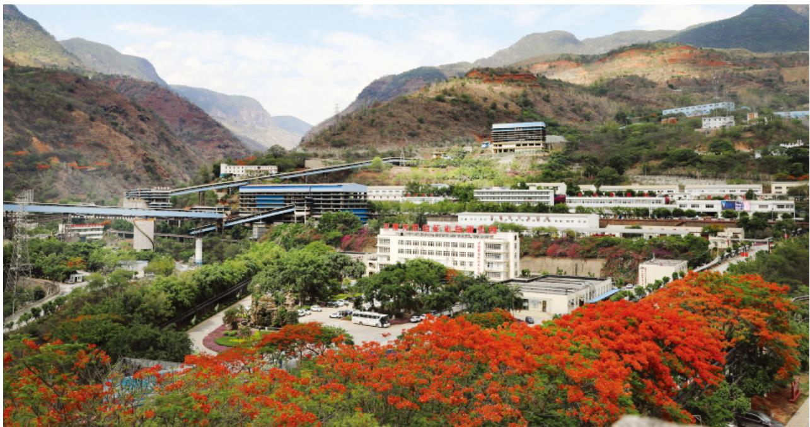

natural_image

Aerial view of a modern industrial complex nestled in a mountainous valley, surrounded by vibrant red and orange foliage (no visible text or symbols)

大紅山礦業尾礦庫建設

# 服務國家戰略 邁出新步伐

公司成立服務國家戰略領導小組，下發《關於做好服務國家戰略工作的通知》，深入貫徹黨中央、國務院服務國家戰略工作要求，建立閉環管理機制，立足公司主責主業和功能定位，持續加大服務京津冀協同、長江經濟帶、粵港澳大灣區、長三角一體化等區域重大戰略，着力支持西部大開發、東北全面振興、中部地區崛起、東部地區現代化等四大板塊協調發展，取得良好成效。

# 護航中資企業 “走出去”

公司緊緊圍繞服務國家戰略，為企業“走出去”注入“金融活水”。戰略性投資江西銅業境外子公司佳鑫國際資源港股IPO，助力其實質性重組全球最大露天鎢礦——哈薩克斯坦巴庫塔鎢礦，保障國家能源資源安全。

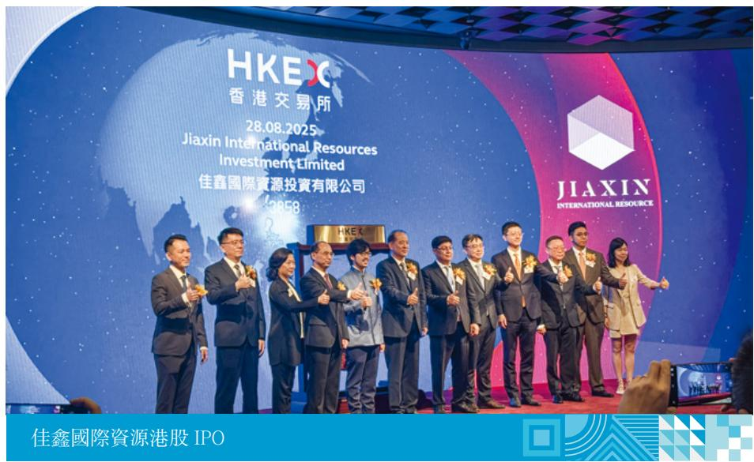

text_image

HKEX
香港交易所
28.08.2025
Jiaxin International Resources
Investment Limited
佳鑫國際資源投資有限公司
2058
JIAIXIN
INTERNATIONAL RESOURCE
佳鑫國際資源港股 IPO

# 做好金融 “五篇大文章”

公司及旗下子公司圍繞“五篇大文章”，持續加大相關行業企業金融支持。

# 科技金融案例

2025 年 1 月，公司制定綜合化債方案，受讓某信息通信技術集團旗下上市公司股票，支持集團公司償還重整計劃到期留債、化解流動性危機。此後，又通過聯合產業投資人共同投資等方式支持上市公司化解因履行強制回購義務而面臨的流動性壓力，推動我國信息通信技術龍頭企業解除歷史包袱，助力企業控制權全面回歸中資，釋放遠期發展潛力，為高科技企業的高質量發展打開新篇章，體現金融央企使命擔當，是公司扎實落實“五篇大文章”之一“科技金融”、推動金融高質量發展的具體實踐。

# 綠色金融案例

金谷信托成功發行“天津泰達環保有限公司2025年度第一期綠色定向資產支持票據（碳中和債）”，基礎資產均來源于具有碳減排效益的綠色低碳產業項目。信達資本組建專業團隊，通過設立綠色產業基金、開展直接投資等方式，積極參與上海電氣風電科創板上市戰略配售，助力提升風電整機研發能力和市場競爭力。

# 普惠金融案例

信達金租構建 “四位一體” 普惠金融服務體系，以廠商租賃為突破口，與全球工程機械 50 強企業深度合作，通過 “廠商推薦 + 回購擔保” 模式，累計投資逾 10 億元，有效解決下游中小微企業購置設備的資金難題。

# 養老金融案例

南商中國向聚焦腫瘤診療與老年病防治的浙江金華某腫瘤醫院發放6,000萬元貸款，重點滿足醫院在老年人藥品及專用耗材方面的采購需求；向湖北襄陽某國有企業發放2億元養老金融專項貸款，用于現代化醫養融合綜合體項目建設，預計建成後將新增養老床位3,966張、醫療床位99張，每年培養養老專業人才千餘人，有效緩解當地養老床位緊缺問題。

# 數字金融案例

公司圍繞“數字信達”戰略目標，持續提升數字化經營服務能力。落實“人工智能+”，業務賦能取得初步成效。升級企業級移動平臺，強化對新業務模式支撐。全面實現EAST監管數據自動報送及指標溯源，完善客戶畫像、綜合貢獻度計量，升級違約概率模型，上綫財務分析平臺，有效支持精準營銷、風險管控及高效運營。2025年，榮獲中國互聯網協會授予“集團企業數智化建設創新單位”稱號。

# 提升服務品質

# 客戶營銷及 生態圈建設

2025 年，公司根據政府機構、實體企業、金融機構及中介機構等不同客戶群體需求，在 26 個省市組織綜合營銷和專項營銷活動 69 場，累計簽訂戰略合作協議 58 份。公司首次參加中國國際投資貿易洽談會，向參會企業全面展示業務功能、專業服務優勢和典型案例。安徽分公司組織特殊資產招商引资大會——投資安徽行活動，為特殊資產搭建資本與資產精準對接平臺。海南分公司圍繞“破產企業重整重生”主題，與破產管理人和協會交流座談，探索共建“資金+智力+方案”一整套服務體系。

69場

組織綜合營銷和專項營銷活動

58份

累計簽訂戰略合作協議

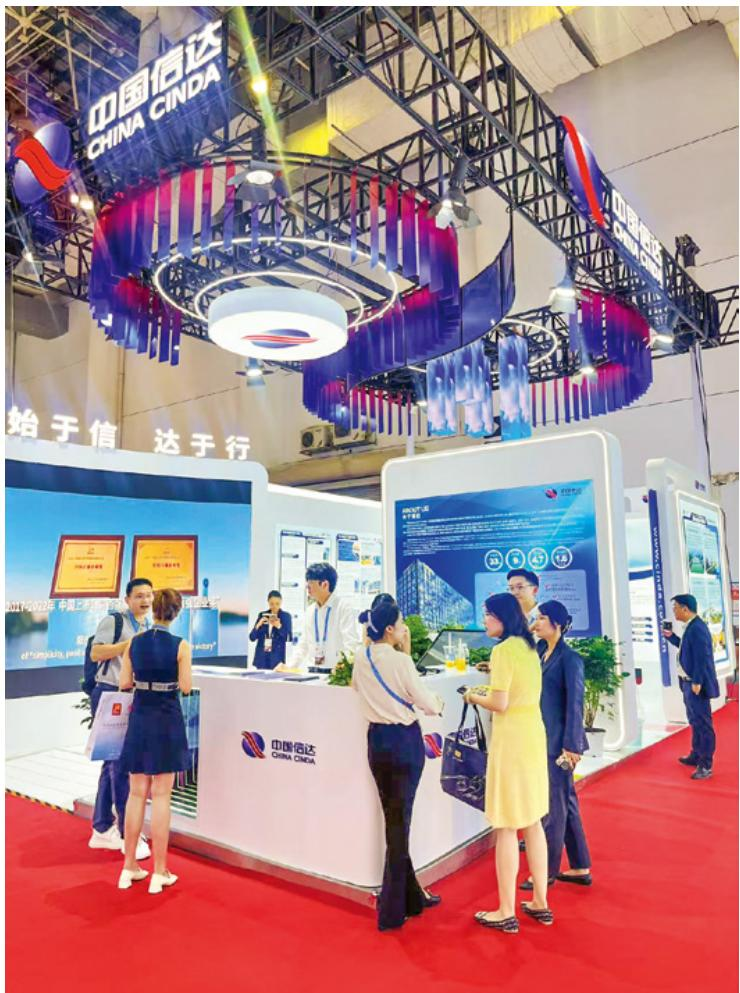

text_image

中国信达
CHINA CINDA
始于信 达于行
2011年7月，中国工作座谈会，中国企业会
d'angliu's, p.m.
中国信达
CHINA CINDA

公司參加第二十五屆中國國際投資貿易洽談會

# 金融知識宣傳

公司面向金融消費者和公眾，聚焦非法金融高發重點領域，開展金融知識和反洗錢宣傳教育，集中宣傳防範非法金融活動和反詐相關知識，充分利用綫上綫下渠道資源，積極普及非法金融活動常見手段和防範措施，助力提升預防金融犯罪的意識和能力，不斷加強消費者權益保護。

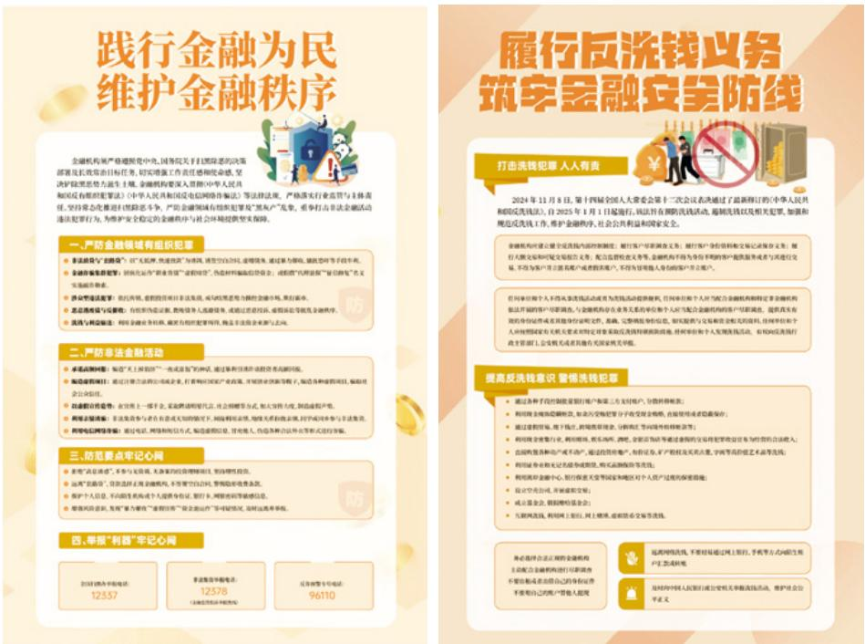  
公司開展金融知識和反洗錢宣傳教育

# 客户投訴管理

公司嚴格落實《消費投訴處理管理辦法》，明確各層級機構投訴管理職能，規範消費者投訴處理全流程工作機制，持續強化投訴管理工作的審查機制與監督措施，切實保障客戶投訴管理機制的優化與落實。重視客戶反饋意見，完善客戶溝通機制，對客戶投訴做到接訴即辦，加強投訴案件督辦力度，最大限度保障消費者權益，提升客戶服務體驗。2025年，子公司受理客戶投訴933件。

933件

子公司受理客户投诉

# 信息及數據安全保護

  
在制度方面  
根據《中華人民共和國網絡安全法》《中華人民共和國數據安全法》《中華人民共和國個人信息保護法》《銀行保險機構數據安全管理辦法》，公司制定《信息安全管理辦法》《數據安全管理辦法》，明確了數據安全管理職責和要求，加强了數據在需求、采集、傳輸、存儲、使用和銷毀等方面的要求。公司信息安全管理制度符合監管要求，并通過 ISO27001 信息安全管理體系認證。

  
在技術方面

實施了數據庫安全審計、終端安全管理、郵件安全網關、數據脫敏平臺等數據安全保護措施，並啟用注册 U 盤、屏幕水印、內外網隔離、應用層禁止敏感數據拷貝等技術管控措施，提升數據保護能力、避免信息泄露。

  
在日常管理方面

定期組織開展培訓，增強全體員工安全保護意識；開展數據安全治理專項工作，建立數據安全管理體系，從嚴規範數據管理，保障公司數據安全。

# 知識產權保護

公司根據《中華人民共和國商標法》《中華人民共和國反不正當競爭法》《中華人民共和國著作權法》等相關法律法規，制定了《知識產權保護管理辦法》，以規範公司知識產權管理工作，加強對知識產權的保護和利用，有效防範公司聲譽風險，維護公司合法權益。

在管理機制上，總部知識產權管理歸口部門負責知識產權管理工作的統籌安排及指導，各職能部門負責具體知識產權管理工作的落實。集團內各子公司按照《知識產權保護管理辦法》的規定負責本單位所轄領域知識產權保護的管理和指導。為保障工作效能，公司聘請專業知識產權代理機構，為知識產權保護提供服務。

在保護機制上，實行“動態監測、及時維權”原則，對公司商標、logo、企業字號等專有權進行實時監測維護，對於他人涉嫌侵犯公司知識產權的行為，及時采取向有關主管部門申請異議或投訴、發送律師函等有效方式予以處理，實現對公司知識產權的全面保護。在具體業務開展過程中，公司也非常重視交易各方知識產權保護，凡可能涉及知識產權的具體業務，均會在交易合同中明確設定知識產權條款，在保證公司知識產權不受他人侵犯的同時，也有效防範自身侵犯他人知識產權的風險。

深入貫徹落實國家關於知識產權保護戰略部署，積極穩妥推進使用正版軟件工作，制定實施《軟件正版化管理規範》，明確了軟件需求采購、安裝使用管理、監督檢查及審批流程等相關要求，建立了軟件清單（軟件白名單、灰名單、黑名單）的定期更新、發布工作機制，對軟件采購、安裝、使用進行統一管理；制定《開源軟件清單》，避免開源軟件誤用、濫用。

保證公司不被他人侵犯知識產權，在系統定制化開發合同條款中，對知識產權和糾紛解決機制有具體措施。

# “數字信達” 賦能不良資產 經營

公司深入推進“數字信達”建設，持續推動“智慧淘”迭代升級，不斷提高“擴圈”“拓客”功能，提高不良資產處置質效。截至報告期末，累計推介債權資產總額超過萬億元，點擊量超485萬人次。通過加強與頭部招商平臺合作，協助金融機構和企業客戶推介不良資產，上新“徵尋合作機構、投資意向”等模塊，拓展與區域市場客戶合作的深度和廣度，持續搭建開放共享的生態平臺。

# 超過萬億元

累計推介債權資產總額

# 超485萬人次

點擊量

# 供應商管理

公司將綠色理念納入采購管理，《采購管理規程》及《集中采購管理辦法》均規定優先采購節能環保產品。在供應商選取和審核階段，主動評估環境和社會等因素，切實防範供應商 ESG 風險，致力構建可持續供應鏈。截至報告期末，公司集中采購和常用中介機構入庫供應商總數量 3,268 個。2025 年，供應商審查率 100%。

100%

供應商審查率

供應商數據

<table><tr><td>指標名稱</td><td>填報口徑</td><td>單位</td><td>2025年</td><td>2024年</td><td></td></tr><tr><td>入庫供應商數</td><td>總部、分公司、子公司</td><td>個</td><td>3,268</td><td>3,237</td><td>含評估、法律、審計、拍賣等常用中介機構備選庫和集中采購供應商庫</td></tr><tr><td>供應商審查率</td><td>總部、分公司、子公司</td><td>%</td><td>100%</td><td>100%</td><td>——</td></tr><tr><td rowspan="2">按供應商所在地區劃分的入庫供應商數</td><td>中國内地</td><td>個</td><td>3,167</td><td>3,147</td><td>——</td></tr><tr><td>中國港澳臺地區及國外</td><td>個</td><td>101</td><td>90</td><td>——</td></tr><tr><td>年度合作供應商數</td><td>總部、分公司、子公司</td><td>個</td><td>133</td><td>124</td><td>當年預算超過100萬元并由總部實施采購的新增集中采購項目中標供應商</td></tr></table>

公司供應商出、入庫調整，由集中采購管理委員會進行集體決策審議確定。

嚴格執行集中采購決策管理職能與操作執行職能相分離的管理體制。由集中采購管理委員會審定供應商入選範圍，由評標/談判委員會推薦最優候選供應商，再由集中采購管理委員會審定，最終公示采購評審結果。通過兩次集體審議過程，充分防範采購過程中可能出現的風險。

供應商庫、常用中介機構備選庫調整。一是組織總部相關部門對已合作供應商資質、產品性能或服務情況、售後及其他履約情況進行年度評價；二是結合公司需要和供應商實際情況對符合條件的供應商新增入庫，對不符合條件的供應商進行退庫處理，最終確定入庫供應商名單。

natural_image

Abstract geometric design with orange background and layered geometric shapes (no text or symbols)

# 以人爲本

# 凝聚

# 信達力量

natural_image

Silhouette of a person in business attire holding a document (no text or symbols visible)

other

| 項目 | 內容 |
| --- | --- |
| 維護員工權益 | ◆ |
| 職業安全 | ◆ |
| 員工關懷 | ◆ |
| 員工發展 | ◆ |

維護員工權益

職業安全

員工關懷

員工發展

# 自維護員工權益

根據《中華人民共和國勞動法》《中華人民共和國勞動合同法》《中華人民共和國社會保險法》《中華人民共和國工會法》等法律法規，公司始終堅持以人為本，嚴格遵守勞動法規，充分尊重與保障公司員工合法權益，積極營造溫暖和諧、多元公平的工作環境。

招聘工作中嚴格人員招聘條件，規範招聘流程，按規定開展招聘背景調查，注重對政治素質、專業知識、工作能力的全面了解，着力提升公司人才招聘引進工作的規範性、科學性、專業性水平。重視職場環境多元化與包容度，在招聘、薪酬、晋升、解聘等環節，堅決杜絕種族、性別、年齡、國籍、宗教信仰、文化背景或家庭情況等個人情況的歧視與區別對待，嚴禁選人用人不合規情況發生。

嚴格遵守國家基本福利制度，持續優化薪酬福利體系建設，依法合規保障員工的各項福利待遇。建立健全醫療、養老多層次保障體系，按規定為員工足

額繳納基本養老、基本醫療等各項社會保險，建立企業年金制度并按規定繳納企業年金，為員工建立商業補充醫療保障體系。保障員工勞動和休息權利，建立嚴謹科學的用工管理機制，科學評估並積極回應員工對勞務分配的正當需求，堅決禁止任何形式的強制勞動行爲。堅決反對、抵制、禁止雇傭童工，爲避免發生雇傭童工情況，在招聘過程中，嚴格審驗應聘者身份證件、年齡等相關信息，識別到存在強制勞動或雇傭童工的情況，公司將依據相關法律法規明確追責、嚴肅處理。2025年，未識別到任何強制勞動或雇傭童工事件。

持續推進民主管理工作，召開四屆九次職代會，指導基層工會召開職工（代表）大會58次、工會會員（代表）大會21次，推動司務公開、職工代表大會制度規範化運行，強化職工主人翁意識，暢通職工理性表達訴求通道。

natural_image

Illustration of a graduation-related educational scene with icons for student, cap, checklist, magnifying glass, and audience (no text or symbols)

58次

召開職工（代表）大會

21次

工會會員（代表）大會

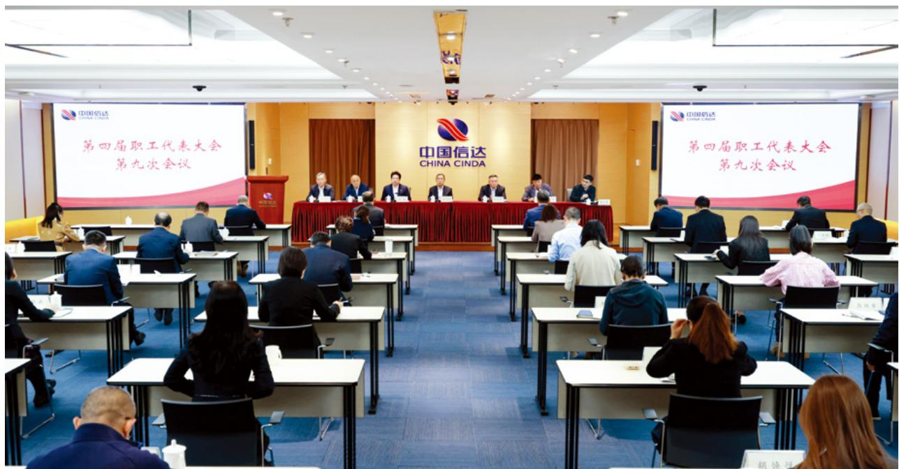

text_image

中国信达
CHINA CINDA
第四届职工代表大会
第九次会议
中国信达
CHINA CINDA
第四届职工代表大会
第九次会议

公司召開第四屆職工代表大會第九次會議

# 職業安全

公司高度重視員工健康和安全，嚴格遵守《中華人民共和國突發事件應對法》《中華人民共和國消防法》《中華人民共和國職業病防治法》等法律法規，強化職場安全與衛生管理，開展安全隱患排查整治，切實保障辦公環境安全與員工身心健康。

# 76項

整治整改安全隐患

# 2次

開展大型安全宣傳
培訓活動

# 2次

安全員培訓

# 8次

組織實戰演練

制定《公司總部辦公樓消防安全專項治理工作方案》，對重點安全領域和薄弱環境開展“地毯式”排查，整治整改安全隱患76項，打造安全健康的工作環境。深化安全教育培訓，開展大型安全宣傳培訓活動2次，安全員培訓2次，圍繞防汛、電動汽車火灾等突發事件組織實戰演練8次，提高員工應急響應與安全處置能力。組織員工學習心肺復蘇法、體外自動除顫器（AED）等安全應急知識，豐富員工應急救護技能。

text_image

中国信达
CHINA CINDA
中国信达合肥后援基地
灭火和应急疏散演练

合肥後援基地舉辦滅火和應急疏散演練

密切關注員工身體健康，持續完善健康保障舉措，定期組織員工體檢，提供定制化體檢方案并安排全流程跟踪服務，按月舉辦公司健康日活動，幫助員工改善亞健康和“慢病”狀態，不斷提高員工健康管理水平。深化員工關懷服務，提升員工餐飲質量，更新辦公區域基礎設施，優化辦公區域空氣質量，為員工營造舒心健康的辦公環境。

# 13個

總部機關共開設
興趣小組

積極提倡“健康工作，快樂生活”理念，精心組隊參加中投公司系統職工運動會并獲方陣廣播操、羽毛球賽第2名，積極參與中國金融工會舉辦的乒乓球、演講比賽及職工書畫攝影展；組織開展春季健步走、先進模範職工療休養、員工健康管理、讀書觀影等活動；總部機關共開設13個興趣小組，堅持開展各類文體活動，豐富員工業餘文化生活。

# 員工關懷

公司深化員工關懷服務，常態化組織員工生日、結婚、生育、生病住院等關懷慰問活動，在元旦、春節期間對困難職工和退休老同志開展送溫暖活動，不斷增強員工的歸屬感和凝聚力。慰問外派偏遠地區挂職幹部，發放慰問款物。

公司持續推進“職工之家”“職工書屋”建設，充實員工精神文化生活。在“三八”國際婦女節，組織調香、手作等多種活動，為全體女員工送上節日祝福；為女職工發放衛生費，組織心理講座，堅持保障女員工在結婚、懷孕、生育、哺乳等關鍵時期的權益。

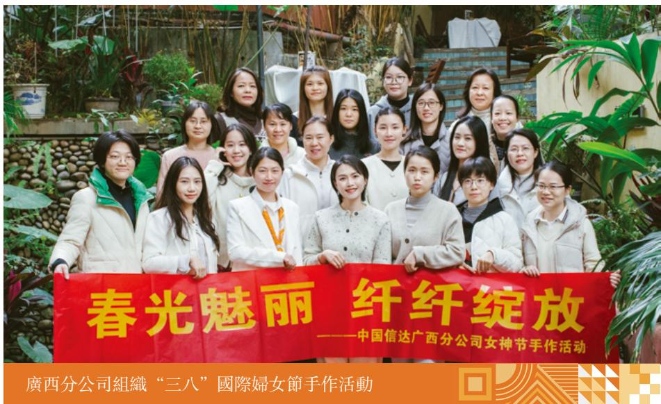

text_image

春光魅丽 纤纤绽放
——中国信达广西分公司女神节手作活动
廣西分公司組織“三八”國際婦女節手作活動

高度重視退休員工的權益保障，為退休員工舉辦榮休歡送會，切實增強員工榮譽感。組織全面體檢、專項體檢，提供商業醫療補充保險，舉辦健康知識講座，真切關懷老員工身體健康。開展重陽節賞秋等活動，提供豐富多彩的退休生活。

根據《幹部任職試用期管理實施細則》《員工培訓管理辦法》，公司在組織機構改革、人員結構調整與人力資源管理體系建設等方面持續發力，不斷健全完善人才管理工作機制，持續推進人才庫建設，完善幹部員工交流機制，健全激勵約束機制，激發員工的積極性、主動性、創造性，為員工成長發展提供保障。

在人才隊伍建設方面，認真踐行新時代黨的組織路綫，樹立重擔當、重實幹、重實績，德才兼備、以德為先的用人標準，不斷加強市場化用人機制和員工招聘機制改革，注重專業化、多元化配備，着力打造以不良資產主業人才為引領，各類經濟金融投行人才為支撐，財務法律風控團隊為保障的高質量專業人才隊伍。

在加強培訓方面，充分發揮公司黨委黨校主陣地作用，深入開展黨校培訓工作，堅持不懈用習近平新時代中國特色社會主義思想凝心鑄魂，持續開展黨的創新理論體系化培訓，推動黨的創新理論入腦入心。加強幹部隊伍建設培訓，重點舉辦公司系統“一把手”領導力提升領航訓練營、新任中層幹部領導力提升專題培訓班、處級幹部輪訓、各類主題實戰化訓練營和入黨積極分子培訓班，全面提升各級幹部員工政治能力、專業素養和履職本領。認真組織黨建經營融合“空中課堂”系列培訓答題、信達網絡學習平臺和名家講堂公開課系列講座活動，實現培訓全覆蓋。2025年公司系統各單位通過集中培訓與視頻講座、綫下自學與在綫學習、空中課堂相結合，共完成各類培訓2,400餘期，超20萬人次參訓，持續提高培訓工作的針對性和有效性，努力為公司高質量發展提供思想政治保證和履職能力支持。

員工數據表

<table><tr><td>指標名稱</td><td>單位</td><td>類型</td><td>2025年</td></tr><tr><td colspan="4">B1 雇傭</td></tr><tr><td rowspan="3">員工基本情況</td><td rowspan="3">人</td><td>年末員工總數</td><td>11,745</td></tr><tr><td>少數民族員工數</td><td>768</td></tr><tr><td>本年新進員工</td><td>704</td></tr><tr><td rowspan="2">按雇傭類型劃分的員工人數</td><td rowspan="2">人</td><td>正式員工</td><td>11,494</td></tr><tr><td>勞務派遣員工</td><td>251</td></tr><tr><td rowspan="2">按性別劃分的員工人數</td><td rowspan="2">人</td><td>男</td><td>6,623</td></tr><tr><td>女</td><td>5,122</td></tr><tr><td rowspan="3">按年齡劃分的員工人數</td><td rowspan="3">人</td><td>30歲及以下</td><td>1,526</td></tr><tr><td>31-50歲</td><td>7,734</td></tr><tr><td>51歲及以上</td><td>2,485</td></tr><tr><td rowspan="3">按工作所在地域劃分的員工人數</td><td rowspan="3">人</td><td>中國内地</td><td>9,989</td></tr><tr><td>中國港澳臺地區</td><td>1,741</td></tr><tr><td>海外</td><td>15(外籍)</td></tr><tr><td rowspan="2">按性別劃分的員工流失比率</td><td rowspan="2">%</td><td>男</td><td>4.32</td></tr><tr><td>女</td><td>4.12</td></tr><tr><td rowspan="3">按年齡劃分的員工流失比率</td><td rowspan="3">%</td><td>30歲及以下</td><td>13.89</td></tr><tr><td>31-50歲</td><td>2.88</td></tr><tr><td>51歲及以上</td><td>2.49</td></tr><tr><td rowspan="3">按工作所在地域劃分的員工流失比率</td><td rowspan="3">%</td><td>中國内地</td><td>3.95</td></tr><tr><td>中國港澳臺地區</td><td>5.86</td></tr><tr><td>海外</td><td>0</td></tr><tr><td colspan="4">B2健康與安全</td></tr><tr><td rowspan="3">因公死亡員工人數</td><td rowspan="3">人</td><td>2023年</td><td>0</td></tr><tr><td>2024年</td><td>0</td></tr><tr><td>2025年</td><td>0</td></tr><tr><td rowspan="3">因公死亡員工比率</td><td rowspan="3">%</td><td>2023年</td><td>0</td></tr><tr><td>2024年</td><td>0</td></tr><tr><td>2025年</td><td>0</td></tr><tr><td>因工傷損失的工作時間(工傷誤工時間)</td><td>人天</td><td>2025年</td><td>665.6</td></tr><tr><td colspan="4">B3發展及培訓</td></tr><tr><td>男性員工培訓比率</td><td>%</td><td>——</td><td>99.21</td></tr><tr><td>女性員工培訓比率</td><td>%</td><td>——</td><td>99.63</td></tr><tr><td>總部部門級、分公司級領導幹部以上員工培訓人數</td><td>人</td><td>——</td><td>302</td></tr><tr><td>總部部門級、分公司級領導幹部以上員工培訓比率</td><td>%</td><td>——</td><td>99.02</td></tr><tr><td>總部部門級、分公司級領導幹部以下(不含)員工培訓人數</td><td>人</td><td>——</td><td>2,269</td></tr><tr><td>總部部門級、分公司級領導幹部以下(不含)員工培訓比率</td><td>%</td><td>——</td><td>99.47</td></tr><tr><td>男性員工培訓總時長</td><td>小時</td><td>——</td><td>6,274</td></tr><tr><td>女性員工培訓總時長</td><td>小時</td><td>——</td><td>4,450</td></tr><tr><td>總部部門級、分公司級領導幹部以上員工培訓總時長</td><td>小時</td><td>——</td><td>1,265</td></tr><tr><td>總部部門級、分公司級領導幹部以下(不含)員工培訓總時長</td><td>小時</td><td>——</td><td>9,459</td></tr><tr><td>網絡學習平臺總小時數</td><td>小時</td><td>——</td><td>50,125</td></tr></table>

# 金融向善 扛起 信達責任

text_image

鄉村全面振興
公益活動

鄉村全面振興

公益活動

公司持續統籌系統力量，優化資源配置，深化幫扶舉措，創新工作方法，健全長效機制，持續鞏固脫貧攻堅成果同鄉村振興有效銜接，較好完成各項幫扶任務。

# 金融暖農心， 振興譜新篇

公司延續“黨建引領、精準施策、全域聯動、長效賦能”幫扶工作思路，從加強組織領導、聚焦重點領域、補齊短板弱項、深化消費幫扶四個維度精準施策，全年投入和引進無償幫扶資金2,140萬元，實施“五大振興”“兩不愁三保障”六類17個項目，累計培訓基層幹部和專業技術人才1,030人次，多渠道實現消費幫扶652萬元。

公司結合樂都區多民族聚居的地域特徵，重點支持“樂都區鑄牢中華民族共同體意識展陳館”建設，打造集教育、展示、研究、體驗于一體的綜合性文化教育基地，為樂都區下一步打造民族和宗教工作青海樣板打下堅實基礎。

# 2,140萬元

投入和引進無償幫扶資金

text_image

不忘初心 牢记使命
中国信达青海分公司第一党支部、第二党支部
海东市乐都区城子村党支部联学共建活动

青海分公司黨支部與樂都區城子村黨支部聯學共建

# 扎根高寒區， 携手促振興

2025 年，新疆分公司駐村點調整為新疆克孜勒蘇柯爾克孜自治州阿克陶縣布倫口鄉蓋孜村，地處帕米爾高原，屬邊境高寒牧區村，平均海拔 2,453 米。新疆分公司圍繞治理有效、產業提升、民生改善等重點任務，持續加大幫扶支持力度。

新疆分公司投入幫扶資金 80 餘萬元，實施村委會辦公樓及鍋爐升級改造、村內道路亮化、牧道修繕及環境整治

等項目，切實提升基礎設施、增進民生福祉；協調轄區企業，修建鋼結構簡易橋梁1座，解決牧民轉場放牧難題；捐贈辦公電腦和圖書，有效改善村級信息化辦公條件，助力鄉村人才培育；協助銷售牦牛肉等特色畜牧產品近10萬元，緩解牧民“豐產不豐收”之憂。一年來，助力幫扶村實現村集體收入67萬元，完成全年目標任務的134%；村民人均收入達2.8萬元，較上年增長0.2萬元，增幅7.7%。

# 67萬元

助力幫扶村實現村集體收入

# 134%

完成全年目標任務

text_image

阿克陶县布伦口乡
阿克陶县布伦口乡
中共阿克陶县布伦口乡
阿克陶县布伦口乡
新疆分公司赴驻村點慰問調研

# 同心增福祉， 助力鄉村振興

信達證券不斷創新工作思路，因地制宜落實好各項幫扶措施，向青海樂都、貴州納雍、貴州織金、雲南元陽、新疆阿克陶五個結對幫扶縣投入幫扶資金502萬元，在生態、產業、公益、組織、消費等5個領域開展26個幫扶項目，積極踐行金融服務實體經濟，扎實推進各結對幫扶地區鞏固拓展脫貧攻堅成果同鄉村振興有效銜接順利收官。

# 502萬元

向五個結對幫扶縣投入
幫扶資金

# 公益活動

公司始終將支持公益事業作爲履行社會責任的重要內容，通過開展公益捐贈項目、鼓勵員工參與公益志願活動等不同方式，積極開展多元公益實踐，以實際行動爲社會增添更多美好，詮釋信達人的責任與擔當。

# 凝聚愛心力量， 馳援灾後建設

2025 年 11 月，香港大埔宏福苑發生特大火災。南商銀行、信達香港捐贈 558 萬港元，用于受灾居民過渡安置及灾後恢復工作。南商銀行第一時間開通 7×24 小時緊急查詢熱線，延長周邊分行營業時間，提供應急提款便利、銀行卡補辦便利、服務費用豁免、信貸還款彈性安排等多項應急服

務措施，切實解決受灾民衆的緊急金融服務需求；積極響應香港紅十字會呼吁，組織員工開展獻血活動支援醫療需求。信達香港發動員工連夜支援充電寶、生活用品和涼茶等物資，主動聯絡相關機構為內地運送援港賑灾物資開通“灾急送”跨境綠色通道。

# 558萬港元

南商銀行、信達香港捐贈

# 投身志願活動， 助力社區發展

信達香港、南商銀行積極響應香港中國企業協會的號召，開展“中企金融服務進社區”專題系列講座，在學校、基層社區等地成功舉辦多場公益講座，加強青少年金融素養，聚焦金融知識普及與防詐騙教育，提升市民對金融風險及網絡陷阱的辨識力，獲得社區居民及各界專業人士高度評價。

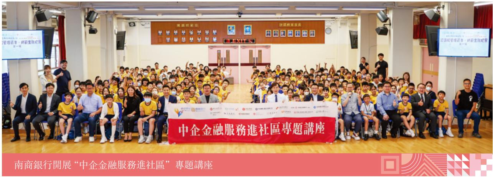

text_image

中企金融服務進社區專題講座
南商銀行開展“中企金融服務進社區”專題講座

信達地產旗下信誠智慧全年累計開展園區活動超5,800場，服務業主近10萬人次，并通過建立672個文化社群與406個共享空間，提升社區文化活力與鄰裏互動。聯動支付寶“藍馬甲”公益組織在天水街道開展“科學養生、智慧防詐”專題講座，覆蓋長者173人次，并在21個項目同步推進防詐宣傳，累計吸引647名業主參與。

text_image

信達地產開展“科學養生、智慧防詐”活動

natural_image

Abstract geometric design with checkered pattern, square, and arrow-like shapes on teal background (no text or symbols)

# 綠色發展

# 譜寫

# 信達華章

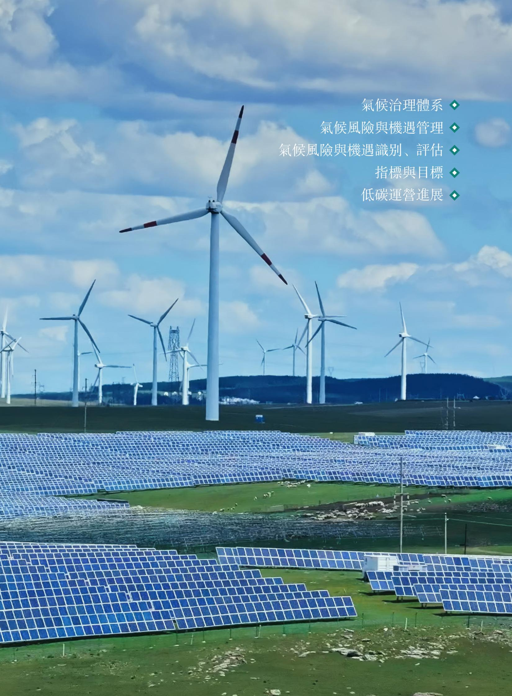

other

| Indicator | Status |
| --- | --- |
| 氣候治理體系 | ◆ |
| 氣候風險與機遇管理 | ◆ |
| 氣候風險與機遇識別、評估 | ◆ |
| 指標與目標 | ◆ |
| 低碳運營進展 | ◆ |

氣候治理體系

氣候風險與機遇管理

氣候風險與機遇識別、評估

指標與目標

低碳運營進展

# 氣候治理架構

公司建立董事會(戰略發展委員會)-高級管理層(風險管理委員會)-執行層(氣候風險管理工作組)的三層氣候治理架構。董事會是公司氣候治理的最高機構，董事會戰略發展委員會承擔氣候風險監督責任，有關董事在ESG及氣候風險管理方面具有豐富經驗(詳見《公司2025年度報告》董事及高級管理人員情況)。公司管理層風險管理委員會承擔氣候風險管理的實施責任。氣候風險管理工作小組負責落實應對氣候變化日常工作。

# 氣候治理工作 進展

# 加强制度建設

2025 年，公司認真落實將氣候風險管理全面納入公司整體風險管理體系的要求，完善《全面風險管理規程》，并制定《氣候風險管理工作指引（試行）》。

# 提升專業能力

組織兩場氣候風險管理及相關披露工作培訓，系統提升氣候風險管理工作組及項目經理應對氣候變化專業能力。

# 氣候風險與機遇管理

氣候風險識別、評估、監測及應對流程

公司《氣候風險管理工作指引（試行）》從風險識別、評估、監測、應對等方面，全面規範氣候風險管理的職責分工、流程、專業措施及要求。

flowchart

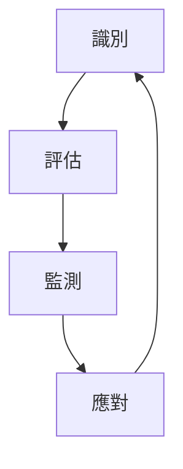
```mermaid
graph TD
  A["識別"] --> B["評估"]
  B --> C["監測"]
  C --> D["應對"]
  D --> A
```

推動重點行業
綠色低碳轉型
的業務策略

通過行業精準施策、資產結構優化提升資產組合氣候韌性。針對重點行業，公司制定差異化投資指引，發揮資源整合、價值創造優勢：優化化石能源產能結構和高效清潔利用；助力鋼鐵企業實現綠色轉型和資產盤活；響應新能源基礎設施、上游材料和關鍵礦產迫切需求；支持煤化工科技創新應用與效率提升；推進農業綠色智能化升級。

# 氣候風險與機遇及其財務影響分析

物理風險

<table><tr><td>風險類型</td><td>風險/機遇描述</td><td>影響時間範圍*</td><td>對業務模式與價值鏈的影響</td><td>可能的財務影響</td><td>應對措施</td></tr><tr><td>急性物理風險</td><td>臺風、暴雨、洪水、幹旱和熱浪等極端天氣事件</td><td>短、中、長期</td><td>1.導致租賃及自有辦公點遭受運營中斷或直接財務損失。2.導致投資不動產價值受損或被投企業經營中斷,造成資產損失、資金清收受阻或投資收益減少。</td><td>資產減值收入減少資金周轉效率降低</td><td>持續監測氣候數據,研究極端天氣事件的發生頻率、強度和影響範圍,積極提升運營設施與被投資產的氣候韌性。</td></tr><tr><td rowspan="2">慢性物理風險</td><td>海平面上升</td><td>中、長期</td><td>1.辦公點或投資不動產被淹没,造成財務損失。2.被投企業沿岸資產被淹没導致生產經營中斷,現金償付滯後或投資收益不及預期。</td><td>資產減值收入減少資金周轉周期延長</td><td>通過壓力測試,評估中長期風險暴露程度與資產脆弱性,根據評估結果優化資產配置與處置方案。</td></tr><tr><td>平均溫度升高</td><td>中、長期</td><td>1.辦公點和被投客戶運營過程能耗、水耗增加,甚至出現水電供應不足導致經營受阻。2.對員工造成負面影響,包括健康、工作效率和通勤等。</td><td>運營成本增加收入減少</td><td>完善內部管理體系以及應急預案,保障員工職業健康安全。</td></tr></table>

注：影響時間範圍短期指1-2年，中期指3-5年，長期指5年以上。

轉型風險

<table><tr><td>風險類型</td><td>風險/機遇描述</td><td>影響時間範圍</td><td>對業務模式與價值鏈的影響</td><td>可能的財務影響</td><td>應對措施</td></tr><tr><td rowspan="2">政策風險</td><td>碳市場和碳關稅等機制下的碳價上升</td><td>短、中、長期</td><td>被投企業碳排放合規成本增加,盈利水平或債務償付能力下降。</td><td>收入減少資金周轉周期拉長</td><td rowspan="2">積極跟踪國家碳排放與產業綠色發展政策要求,及時更新投資業務發展重點;持續完善投前盡職調查與投後管理策略,推動被投企業落實溫室氣體減排,整合產業、技術和資金資源,賦能被投企業的綠色低碳轉型;每年度開展投資組合碳排放強度評估,根據測算結果不斷優化投資策略。</td></tr><tr><td>行業碳排放監管或產能限制加強</td><td>中、長期</td><td>1.煤炭、燃油車等行業生產銷售總量受限,資產提前報廢;被投企業收入減少,出現債務違約風險,投資回報收窄。2.部分行業碳排放強度標準提高,企業需增加研發投入,現金流與償債能力承壓。</td><td>資產減值違約率增加投資回報率下降</td></tr><tr><td>市場風險</td><td>消費者或投資者的低碳偏好</td><td>中、長期</td><td>碳密集型被投企業的盈利受到影響,出現資產擱淺或償債能力承壓。</td><td>資產減值收入減少違約率增加</td><td>分析發展趨勢,識別市場關注重點,調整資產配置策略;聯動產業和技術等各類資源助力被投企業升級既有業務,擴展綠色業務。</td></tr><tr><td rowspan="2">技術風險</td><td>低碳技術與服務替代現有產品與服務</td><td>短、中、長期</td><td>未及時轉型的碳密集型被投企業面臨資產擱淺,導致償債能力不足。</td><td>資產減值收入減少違約率增加</td><td>跟進綠色低碳技術進展,識別受技術發展影響的行業與投資標的,及時調整資產配置;支持被投企業實施技術升級改造。</td></tr><tr><td>低碳轉型技術成本高</td><td>短、中期</td><td>碳密集型被投企業的研發支出偏高,現金流與投資收益收縮,償債能力顯著承壓。</td><td>違約率增加投資回報率下降</td><td>加強投後管理,聯動內外部技術專家規劃務實的轉型路徑,采用經濟可行性高的减排技術。</td></tr><tr><td>聲譽風險</td><td>公司低碳戰略與行動滯後損害公司聲譽</td><td>中、長期</td><td>利益相關方對企業的氣候風險管理期望提高,被投企業若未及時應對,將面臨綠色價值受損、ESG評級下調風險。比如,因碳交易違約事件造成聲譽影響與監管處罰,進而影響公司資產風險敞口。</td><td>投資回報率下降</td><td>推進ESG體系建設,積極完善環境與社會風險管理體系,并提高相關信息透明度,强化底層資產風險管理,推動被投企業應主動落實减排與轉型措施。</td></tr></table>

氣候機遇

<table><tr><td>機遇類型</td><td>風險/機遇描述</td><td>影響時間範圍</td><td>對業務模式與價值鏈的影響</td><td>可能的財務影響</td></tr><tr><td rowspan="2">綠色金融及轉型金融</td><td>響應“五篇大文章”,推進綠色投融資</td><td rowspan="2">短、中、長期</td><td>低碳產業市場規模穩步擴張,為投資組合優化提供了廣闊機遇,助力實現投資收益穩定增長與資產質量提升。</td><td rowspan="2">投資收益增長</td></tr><tr><td>支持既有客戶和潜在客户的低碳轉型</td><td>更多市場資金支持綠色產業發展與傳統行業轉型,推動被投企業融資渠道多元化、融資成本下行,實現運營效率提升、成本結構優化,經營韌性與盈利能力增强。</td></tr><tr><td rowspan="2">提升資源能源效率</td><td>提升運營層面能源與資源效率</td><td>短、中期</td><td rowspan="2">自身/被投企業運營層面用電、用水、用紙及其他資源消耗量減少,降低運營成本、改善盈利能力。</td><td>運營成本降低</td></tr><tr><td>助力被投企業的運營資源與能源效率提升</td><td>短、中期</td><td>投資收益增長</td></tr><tr><td rowspan="3">清潔能源</td><td>擴大綠色能源應用規模</td><td>短、中期</td><td>通過投資和應用新能源公務車、分布式光伏等綠色能源基礎設施,優化能源消費結構,減少外購能源費用。</td><td>運營成本降低</td></tr><tr><td>綠色稅費减免等獎勵性政策</td><td>短、中期</td><td>被投清潔能源企業或其他綠色企業可享受較低稅費。</td><td>投資收益增長</td></tr><tr><td>支持被投企業參與碳市場</td><td>短、中、長期</td><td>被投企業通過碳交易獲得額外收益。</td><td>投資收益增長</td></tr><tr><td rowspan="2">提升韌性</td><td>提升自身運營韌性,減少極端氣候事件造成的損失</td><td>短、中、長期</td><td rowspan="2">1.加固或優化各類設施,降低氣候風險造成的實際影響。2.強化員工應對氣候變化的專業知識儲備,提升項目氣候適應性。</td><td rowspan="2">資產和收入損失減少運維支出增長</td></tr><tr><td>支持氣候脆弱地區被投企業強化氣候適應能力</td><td>中、長期</td></tr></table>

<table><tr><td>高</td><td></td><td></td><td></td></tr><tr><td rowspan="3">氣候相關風險與機遇的影響程度</td><td>8 轉型行動滯後損害公司聲譽</td><td>15 提升自身/被投企業韌性</td><td>4 產能或行業排放限制加強9 綠色投融資機遇10 支持被投企業業務低碳轉型</td></tr><tr><td>5 消費者的低碳偏好</td><td>3 碳市場和碳税價格上升6 低碳技術與產品替代1 臺風、暴雨、幹早等急性物理風險</td><td>7 轉型成本高企11 提升自身/被投企業資源能源效率12 擴大綠色能源應用規模13 綠色稅費減免</td></tr><tr><td></td><td>2 海平面上升、平均溫度升高等慢性物理風險14 支持被投企業參與碳市場</td><td></td></tr><tr><td>低</td><td colspan="2">氣候相關風險與機遇發生的概率</td><td>高</td></tr></table>

# 氣候情景分析

2025 年，公司選取具有代表性的金融類不良資產和非金融類不良資產，開展評估與測算工作。基于央行與監管機構綠色金融網絡（NGFS）與 IPCC 壓力情景，本次選取一種物理情景（RCP 8.5）和三種轉型情景（當下政策、延遲轉型、全球 1.5°C 温升目標）。

<table><tr><td>氣候情景類型</td><td>情景名稱</td><td>情景假設</td><td>評估周期</td></tr><tr><td>物理情景</td><td>RCP 8.5</td><td>無氣候變化相關政策進行幹預的高排放情景:全球溫室氣體排放總量和濃度不斷增加,到本世紀末,全球平均氣溫較工業化前水平上升4°C以上。</td><td>2030年2050年</td></tr><tr><td rowspan="3">轉型情景</td><td>當下政策</td><td>祇執行目前政策,將導致較高的物理風險。現有氣候政策仍然有效,但由于政策執行沒有得到有效加強,2080年前,全球平均氣溫較工業化前水平將上升3°C以上。</td><td>2030年2060年</td></tr><tr><td>延遲轉型</td><td>政府延後(通常在2030年後)且突然引入低碳轉型政策,政策力度會逐年快速加大,最終達到巴黎協定2°C控溫目標。</td><td>2030年2060年</td></tr><tr><td>全球1.5°C温升目標</td><td>各方立即出臺有雄心的氣候政策,將全球溫升控制在1.5°C以内,并于2050年前後實現全球二氧化碳净零排放。</td><td>2030年2060年</td></tr></table>

# 氣候風險情景分析流程與關鍵假設

# 物理風險

物理風險情景分析結合資產地理位置、類型特徵和資產價值信息，從灾害性、脆弱性和暴露度三個維度對氣候風險因子可能造成的損失進行評估。測算中未考慮任何保險或物理應對措施。最終通過物理風險暴露程度表徵資產因氣候物理風險造成的損失占其資產價值的百分比。

# 轉型風險

NGFS碳價  

line

| Year | 分裂的世界 | 當下政策 | 延遲轉型 | 低能源需求 | 2度 | 1.5度 | 國家减排貢獻 |
| --- | --- | --- | --- | --- | --- | --- | --- |
| 2020 | 0 | 0 | 0 | 0 | 0 | 0 | 0 |
| 2025 | ~100 | ~50 | ~100 | ~300 | ~100 | ~400 | ~50 |
| 2030 | ~200 | ~80 | ~200 | ~600 | ~200 | ~1000 | ~80 |
| 2035 | ~300 | ~100 | ~400 | ~1000 | ~300 | ~1700 | ~100 |
| 2040 | ~400 | ~120 | ~800 | ~1600 | ~400 | ~2700 | ~120 |
| 2045 | ~600 | ~150 | ~1300 | ~2400 | ~600 | ~4000 | ~150 |
| 2050 | ~900 | ~180 | ~1900 | ~3450 | ~900 | ~5100 | ~180 |
| 2055 | ~1100 | ~200 | ~2500 | ~3500 | ~1100 | ~5300 | ~220 |
| 2060 | ~1200 | ~250 | ~3250 | ~3550 | ~1200 | ~5550 | ~250 |

轉型風險情景定量分析主要考慮政策風險（碳價）的影響，未考慮其他因素影響。碳價是指避免或釋放二氧化碳排放的價格，反映各類氣候政策作用下的邊際減排成本，本次使用 REMIND 模型中的碳價。

最終通過碳在險價值（CVaR）這一指標估量資產因以碳價為主的氣候轉型風險造成的資產損溢占其資產價值的百分比，資產損溢為該資產碳排放淨成本，即碳在險價值（CVaR）=以碳價為主的氣候轉型相關資產損溢/企業價值。CVaR為正值代表碳排放總成本大于總機遇，負值代表避免碳排放的總機遇大于碳排放總成本。

本次納入分析的金融類不良資產覆蓋36個代表性項目,共涉及68處底層資產；非金融類不良資產覆蓋31個代表性項目，共涉及64處底層資產。受金融類不良資產的數據可得性限制，本年度僅評估其物理氣候風險。

根據氣候情景分析結果,公司納入評估的資產樣本整體氣候物理風險水平偏低，總體可控。2030 年內，非金融資產中有部分面臨較高的水資源短缺風險；從中長期來看（2050 年），物理風險與短期內保持一致，僅水資源短缺風險和洪水風險較短期內小幅增加。

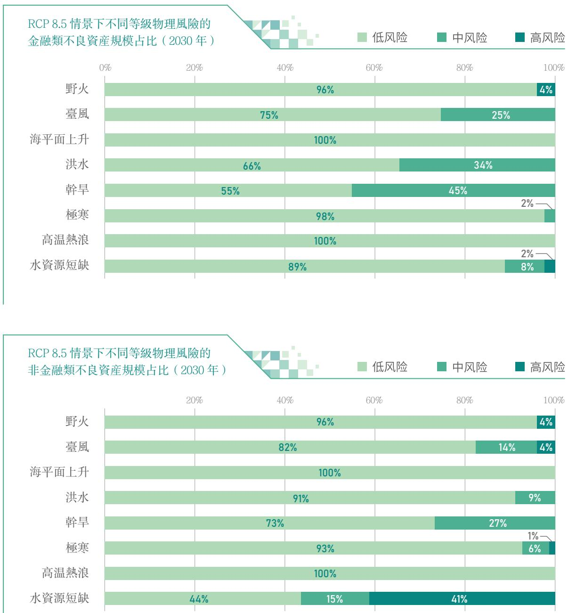

三種轉型情景分析均顯示，非金融類不良資產在中短期內（2030年前）面臨的轉型風險較小，在電力和熱力的生產和供應業存在轉型機遇。僅在全球1.5°C溫升目標情景下，其他原材料加工制造業資產中，存在較高等級損失風險。中長周期（2050年）內，電力和熱力的生產和供應業中的轉型機遇進一步增強。

不同情景下行業平均碳在險價值  
(正值表示風險，負值表示機遇)

<table><tr><td>2030年</td><td>當下政策</td><td>延遲轉型</td><td>全球1.5°C温升目標</td></tr><tr><td>房地產業</td><td>0%</td><td>0%</td><td>3%</td></tr><tr><td>煤炭、石油和天然氣開采業</td><td>0%</td><td>0%</td><td>4%</td></tr><tr><td>化學原料和化學制品制造業</td><td>0%</td><td>0%</td><td>2%</td></tr><tr><td>石油加工煉焦和核燃料加工業</td><td>1%</td><td>1%</td><td>53%</td></tr><tr><td>其他制造業</td><td>0%</td><td>0%</td><td>0%</td></tr><tr><td>其他原材料加工制造業</td><td>9%</td><td>9%</td><td>100%</td></tr><tr><td>其他服務業</td><td>0%</td><td>0%</td><td>1%</td></tr><tr><td>金融業</td><td>0%</td><td>0%</td><td>0%</td></tr><tr><td>建築業</td><td>0%</td><td>0%</td><td>0%</td></tr><tr><td>電力和熱力的生產和供應業</td><td>-13%</td><td>-13%</td><td>-95%</td></tr><tr><td>燃氣和水的生產和供應業</td><td>0%</td><td>0%</td><td>23%</td></tr></table>

2050年

<table><tr><td></td><td>當下政策</td><td>延遲轉型</td><td>全球1.5℃温升目標</td></tr><tr><td>房地產業</td><td>0%</td><td>5%</td><td>22%</td></tr><tr><td>煤炭、石油和天然氣開采業</td><td>0%</td><td>8%</td><td>25%</td></tr><tr><td>化學原料和化學制品制造業</td><td>0%</td><td>10%</td><td>36%</td></tr><tr><td>石油加工煉焦和核燃料加工業</td><td>3%</td><td>100%</td><td>100%</td></tr><tr><td>其他制造業</td><td>0%</td><td>0%</td><td>8%</td></tr><tr><td>其他原材料加工制造業</td><td>50%</td><td>100%</td><td>100%</td></tr><tr><td>其他服務業</td><td>0%</td><td>1%</td><td>7%</td></tr><tr><td>金融業</td><td>0%</td><td>0%</td><td>0%</td></tr><tr><td>建築業</td><td>0%</td><td>0%</td><td>7%</td></tr><tr><td>電力和熱力的生產和供應業</td><td>-37%</td><td>-95%</td><td>-95%</td></tr><tr><td>燃氣和水的生產和供應業</td><td>4%</td><td>100%</td><td>100%</td></tr></table>

# 氣候指標

公司全面識別價值鏈氣候影響，認真開展運營層面溫室氣體範圍三排放核算，提升關鍵排放源管理能力。範圍三核算類別具體包括：外購商品與服務（辦公用紙）、運營中產生的廢棄物、商務差旅、雇員通勤以及投資。

完善運營碳排放管理

<table><tr><td colspan="2">指標</td><td>單位</td><td>2025年</td><td>2024年</td></tr><tr><td rowspan="23">A1排放物</td><td>溫室氣體排放總量(範圍一、二)</td><td>噸二氧化碳當量</td><td>23,575.09</td><td>25,022.12</td></tr><tr><td>人均溫室氣體排放量(範圍一、二)</td><td>噸二氧化碳當量/人</td><td>5.24</td><td>4.31</td></tr><tr><td>範圍一:直接排放</td><td>噸二氧化碳當量</td><td>1,142.25</td><td>1,262.71</td></tr><tr><td>汽油</td><td>噸二氧化碳當量</td><td>878.48</td><td>870.01</td></tr><tr><td>柴油</td><td>噸二氧化碳當量</td><td>0</td><td>16.05</td></tr><tr><td>天然氣</td><td>噸二氧化碳當量</td><td>247.94</td><td>376.65</td></tr><tr><td>液化石油氣</td><td>噸二氧化碳當量</td><td>15.83</td><td>0</td></tr><tr><td>範圍二:間接排放</td><td>噸二氧化碳當量</td><td>22,432.84</td><td>23,759.41</td></tr><tr><td>外購電力</td><td>噸二氧化碳當量</td><td>19,066.61</td><td>21,025.07</td></tr><tr><td>外購熱力</td><td>噸二氧化碳當量</td><td>3,366.23</td><td>2,734.34</td></tr><tr><td>範圍三:其他排放</td><td>噸二氧化碳當量</td><td>5,923.30</td><td>/</td></tr><tr><td>人均溫室氣體排放量(範圍三)</td><td>噸二氧化碳當量/人</td><td>1.32</td><td>/</td></tr><tr><td>員工差旅-住宿</td><td>噸二氧化碳當量</td><td>1,086.08</td><td>/</td></tr><tr><td>員工差旅-道路旅行</td><td>噸二氧化碳當量</td><td>117.35</td><td>/</td></tr><tr><td>員工差旅-航空旅行</td><td>噸二氧化碳當量</td><td>3,454.93</td><td>/</td></tr><tr><td>員工差旅-鐵路旅行</td><td>噸二氧化碳當量</td><td>533.18</td><td>/</td></tr><tr><td>員工差旅-水路旅行</td><td>噸二氧化碳當量</td><td>0.84</td><td>/</td></tr><tr><td>員工通勤-公共交通</td><td>噸二氧化碳當量</td><td>255.84</td><td>/</td></tr><tr><td>員工通勤-私家車</td><td>噸二氧化碳當量</td><td>205.42</td><td>/</td></tr><tr><td>有害廢棄物</td><td>噸二氧化碳當量</td><td>5.21</td><td>/</td></tr><tr><td>無害廢棄物</td><td>噸二氧化碳當量</td><td>3.61</td><td>/</td></tr><tr><td>辦公用水</td><td>噸二氧化碳當量</td><td>260.62</td><td>/</td></tr><tr><td>辦公用紙</td><td>噸二氧化碳當量</td><td>0.23</td><td>/</td></tr><tr><td rowspan="3">A1排放物</td><td>範圍一温室氣體營收碳强度</td><td>噸二氧化碳當量/百萬元</td><td>0.02</td><td>/</td></tr><tr><td>範圍二温室氣體營收碳强度</td><td>噸二氧化碳當量/百萬元</td><td>0.31</td><td>/</td></tr><tr><td>範圍三温室氣體營收碳强度</td><td>噸二氧化碳當量/百萬元</td><td>0.08</td><td>/</td></tr><tr><td rowspan="26">A2資源使用</td><td>直接能源</td><td>兆瓦時</td><td>4,570.73</td><td>5,539.72</td></tr><tr><td>直接能源消耗量密度</td><td>兆瓦時/人</td><td>1.02</td><td>/</td></tr><tr><td>汽油</td><td>噸</td><td>294.32</td><td>296.94</td></tr><tr><td>柴油</td><td>噸</td><td>0</td><td>5.16</td></tr><tr><td>天然氣</td><td>萬立方米</td><td>11.35</td><td>21.54</td></tr><tr><td>液化石油氣</td><td>噸</td><td>5</td><td>0</td></tr><tr><td>間接能源</td><td>兆瓦時</td><td>44,481.44</td><td>41,467.03</td></tr><tr><td>間接能源消耗量密度</td><td>兆瓦時/人</td><td>9.88</td><td>/</td></tr><tr><td>外購電力</td><td>兆瓦時</td><td>35,934.05</td><td>34,562.13</td></tr><tr><td>外購熱力</td><td>吉焦</td><td>30,602.09</td><td>24,857.64</td></tr><tr><td>其他資源</td><td>-</td><td>-</td><td>-</td></tr><tr><td>員工差旅-住宿</td><td>人·天數</td><td>42,945.00</td><td>/</td></tr><tr><td>員工差旅-道路旅行</td><td>元人民幣</td><td>1,010,903.59</td><td>/</td></tr><tr><td>員工差旅-航空旅行</td><td>人·千米</td><td>39,260,531.03</td><td>/</td></tr><tr><td>員工差旅-鐵路旅行</td><td>人·千米</td><td>20,167,766.24</td><td>/</td></tr><tr><td>員工差旅-水路旅行</td><td>元人民幣</td><td>8,593.05</td><td>/</td></tr><tr><td>員工通勤-公共交通</td><td>人·千米</td><td>16,466,929.90</td><td>/</td></tr><tr><td>員工通勤-私家車</td><td>人·千米</td><td>5,969,019.70</td><td>/</td></tr><tr><td>有害廢棄物</td><td>噸</td><td>14.75</td><td>133</td></tr><tr><td>人均有害廢棄物</td><td>噸/人</td><td>0.0033</td><td>0.0229</td></tr><tr><td>無害廢棄物</td><td>噸</td><td>10.22</td><td>16.92</td></tr><tr><td>人均無害廢棄物</td><td>噸/人</td><td>0.0023</td><td>0.0029</td></tr><tr><td>辦公用水</td><td>噸</td><td>140,876.18</td><td>136,521.79</td></tr><tr><td>人均辦公用水</td><td>噸/人</td><td>31.31</td><td>23.52</td></tr><tr><td>辦公用紙</td><td>噸</td><td>130.89</td><td>150.94</td></tr><tr><td>人均辦公用紙</td><td>噸/人</td><td>0.03</td><td>0.03</td></tr></table>

注：1. 温室氣體排放統計範圍為公司總部、分公司和子公司總部辦公場所。  
2. 核算標準：範圍 1 和範圍 2 温室氣體排放根據中華人民共和國生態環境部刊發《企業溫室氣體排放核算方法與報告指南發電設施 (2022 修訂版)》和《關於發布 2023 年電力二氧化碳排放因子的公告》中的全國電力平均排放因子進行核算；範圍 3 排放主要根據生態環境部環境規劃院的《中國產品全生命周期溫室氣體排放系數集（2022）》進行核算。  
3. 綜合能源消耗量根據《綜合能耗計算通則》(GB/T 2589-2020)、《中國能源統計年鑒 2023》中的能源加工轉換效率表核算。  
4. 信達資產用水主要來自市政自來水，在求取水源上無問題。

# 探索投資層面 碳排放核算

公司投資層面碳排放核算覆蓋的資產範圍與情景分析涉及的資產範圍一致，總排放量為620.59萬噸二氧化碳當量。其中，采礦業和制造業是前兩大溫室氣體排放源，約占本次核算資產組合總排放量的89%；制造業和采礦業也分別是碳排放強度最高的兩個行業，電力、熱力、燃氣及水生產和供應業碳排放強度位列第三。

投資層面範圍三碳排放行業占比  
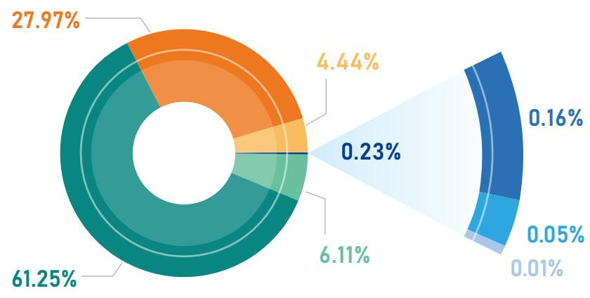

donut

| Category | Value (%) |
| --- | --- |
| Orange | 27.97 |
| Light Orange | 4.44 |
| Dark Green | 61.25 |
| Light Green | 6.11 |
| Blue (Right) | 0.16 |
| Blue (Right) | 0.05 |
| Blue (Right) | 0.01 |
| Light Blue (Right) | 0.23 |

■ 房地產業 ■ 租賃和商務服務業  
■ 采礦業 ■ 金融業  
■ 制造業
■ 批發零售業  
■ 電力、熱力、燃氣及水生產和供應業

# 環境與氣候 變化目標

基于香港聯交所《環境、社會及管治報告守則》以及“量化”匯報原則，公司制定減排、減廢、節能、節水等環境與氣候變化目標，通過各類舉措提升ESG管理水平，檢視年度目標進展與完成情況。其中，運營層面的整體目標是：持續加大綠色低碳辦公運營，實現企業綠色發展，應對氣候變化風險，助力“雙碳”目標。

<table><tr><td>目標類型</td><td>目標內容</td><td>進度檢視</td></tr><tr><td>減排目標</td><td>推行綫上化、無紙化會議,推廣使用電子會議材料,紙質文件實現雙面打印。</td><td>◆ 持續推動電子化辦公平臺、電話會議、視頻會議等的廣泛應用,使用無紙化電子會議材料,總部全年召開視頻會議2,485次。◆ 推行辦公用紙雙面打印,減少紙張消耗。</td></tr><tr><td>減廢目標</td><td>倡導辦公用計算機、打印機和復印機的硒鼓、墨盒、電子廢棄物等有害廢物無害化處置;公司生活垃圾推行分類處理。</td><td>◆ 總部全年通過原廠統一回收處理廢弃硒鼓、廢弃墨盒。◆ 推行文明用餐,努力減少餐食浪費現象及厨餘垃圾的產生。◆ 積極宣傳垃圾分類政策與知識,推進生活垃圾分类處理與循環利用。</td></tr><tr><td>節能目標</td><td>推廣倡導使用LED節能燈具,走廊等非辦公區域非工作時間減半配置照明。</td><td>◆ 持續開展光源設備更換工作,換用更加節電的LED燈具。◆ 嚴格設定辦公大樓空調溫度,對設備運行進行科學管理。◆ 督促員工在節假日期間及下班後及時關閉設備電源,做到人離燈熄,減少耗電量。</td></tr><tr><td>節水目標</td><td>公司自有產權辦公樓推廣采用環保節水龍頭。</td><td>◆ 持續落實各項節水措施,推動節水型水龍頭的使用。</td></tr></table>

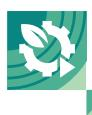

# 低碳運營進展

# 節能减排

公司在運營中深入貫徹綠色發展理念，推進《關於落實習慣過緊日子要求》執行，積極采取節能減排措施，節約辦公用電、用油、用水、用紙等能源資源消耗：持續推動電子化辦公平臺、線上會議的應用，使用電子會議材料，2025年度總部全年召開視頻會議2,485次，較上年增加143次；推行辦公用紙雙面打印及無紙化辦公，減少紙張消耗約20噸；持續落實各項節水措施，推動節水型水龍頭的使用；嚴格設定辦公大樓空調溫度，對設備運行進行科學管理；督促員工在節假日期間及下班後及時關閉設備電源，做到人離燈熄，減少耗電量。公司業務不涉及包裝材料的使用，未披露相關信息和數據。

2,485次

總部全年召開視頻會議

143次

較上年增加

20噸

減少紙張消耗約

# 廢弃物處置 管理

總部全年通過原廠統一回收處置廢舊硒鼓、廢弃墨盒；並通過捐贈對部分滿足報廢條件的無害設備進行再利用，2025年公司產生電子廢棄物較2024年減少約6噸；推行文明用餐，努力減少餐食浪費現象及廚餘垃圾的產生；積極宣傳垃圾分類政策與知識，推進生活垃圾分类處理與循環利用。

# 綠色運營場所 建設

後援中心加大綠色園區建設，根據園區入住人數動態調整電鍋爐運行參數，改造照明系統，采用低能耗的感應燈、LED照明，2025年同比降低電鍋爐、照明用電約2萬度。采購新能源汽車作為業務用車，配備充電樁為駕駛新能源汽車的員工和客戶提供充電服務，推廣使用新能源車充電。

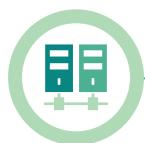

積極推進綠色數據中心建設，采取 UPS（不間斷電源）冷備、氣流組織優化等節能措施，實現數據中心“安全穩定”與“綠色低碳”協同統一；在季節過渡期動態調整制冷系統運行策略，利用數據中心餘熱為基地辦公供暖，平衡服務保障與綠色節能。

natural_image

Two men in suits standing at a data center aisle inside a server room, with no visible text or symbols on the image.

公司數據中心加強能耗量監控分析

# 綠色理念傳播

公司持續開展義務植樹、環境清潔、垃圾分類宣傳等綠色低碳活動，傳播生態文明理念，為實現低碳與可持續發展努力，共建美麗中國。

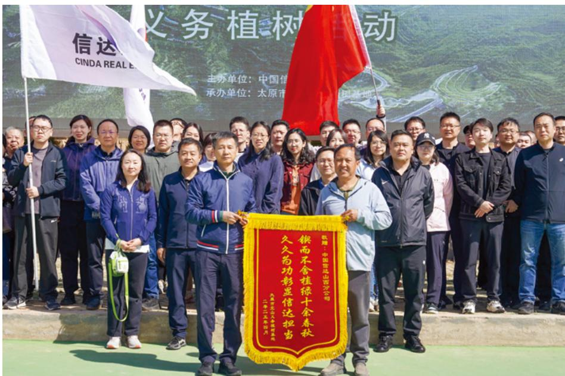

text_image

信达
CINDA REAL E
义务植树活动
主办单位：中国信
承办单位：太原市
组织基地
张而不舍植植十余春秋
久久为功彰显信达担当
（二）2018年5月

山西分公司被太原市北山義務植樹基地授予錦旗

# 附錄

# 編制說明

# 涵蓋範圍

本報告時間範圍是 2025 年 1 月 1 日至 12 月 31 日，報告範圍包括公司總部、分公司、子公司。

# 機構名稱釋義

公司 ▶ 中國信達資產管理股份有限公司

集團 ▶ 本公司及其附屬公司

後援中心 ▶ 本公司合肥後援基地管理中心

南商銀行 ▶ 南商香港及其附屬公司

南商中國 ▶ 南洋商業銀行（中國）有限公司，為南商香港的全資附屬公司

南商香港 ▶ 南洋商業銀行有限公司，為香港持牌銀行，本公司的附屬公司

信達證券 ▶ 信達證券股份有限公司，本公司的附屬公司

金谷信托 ▶ 中國金谷國際信托有限責任公司，本公司的附屬公司

信達香港 ▶ 中國信達（香港）控股有限公司，本公司的附屬公司

信達地產 ▶ 信達地產股份有限公司，本公司的附屬公司

信達資本 ▶ 信達資本管理有限公司，本公司的附屬公司

# 編制依據

本報告根據香港聯交所《環境、社會及管治報告守則》、原中國銀行保險監督管理委員會《銀行保險機構公司治理準則》《關於加強銀行業金融機構社會責任的意見》、中國銀行業協會《中國銀行業金融機構企業社會責任指引》的披露要求進行編制，並參考全球報告倡議組織《可持續發展報告標準》（GRI Standards）要求。

# 匯報原則

重要性：根據香港聯交所《環境、社會及管治報告守則》重要性原則，本公司識別了主要 ESG 事項，評估并排序 ESG 事項的重要性水平，根據重要性評估結果對相關 ESG 事項披露，董事會審閱並確認了相關評估過程及結果。ESG 重要事項的識別及評估過程請參見 “ESG 議題重要性評估”。

量化：本報告根據香港聯交所《環境、社會及管治報告守則》量化原則，結合相關量化標準，對適用的關鍵績效指標計量并披露，相關溫室氣體排放量及能源耗用量化所用的標準、方法、假設及/或計算工具的資料，以及所使用的轉換因子的來源已在適當位置披露。

一致性：本報告的編報方式、統計方法或關鍵績效指標的計量標準、方法、假設及/或計算工具、所使用的轉換因子等與往年保持一致，未識別有可能影響與往年報告作有意義比較的變更。

# 編制流程

本報告以公司社會責任實踐為基礎進行編制，基本流程為收集材料→編制修訂→高層審議→對外披露。報告披露的內容和數據已經公司董事會審議通過。

# 數據來源

本報告關鍵財務數據均摘自《中國信達資產管理股份有限公司2025年度報告》，該報告包含的合并財務報表經安永華明會計師事務所（特殊普通合伙）審計，其他數據均來自公司內部系統或人工整理。本報告計量貨幣為人民幣。

# 發布形式

本報告以印刷版和網絡版兩種形式發布。網絡版可在中國信達網站及香港聯交所官網查閱。

# 聯系方式

中國信達資產管理股份有限公司總裁辦公室，北京市西城區鬧市口大街九號院1號樓，郵編：100031

ESG 報告守則内容索引

<table><tr><td colspan="3">指標</td><td>報告位置</td></tr><tr><td colspan="4">强制披露規定</td></tr><tr><td rowspan="9">ESG 報告管理</td><td rowspan="4">管治架構</td><td>發表董事會聲明。</td><td>16-17</td></tr><tr><td>披露董事會對 ESG 的監管情況。</td><td>16,18</td></tr><tr><td>披露公司/董事會的 ESG 管理方針及策略,包括評估、優先排序及管理重要的 ESG/可持續發展相關事宜(包括對發行人業務的風險)的過程。</td><td>16-21</td></tr><tr><td>披露董事會如何按 ESG/可持續發展相關目標檢討進度,并解釋它們如何與發行人業務有關聯。</td><td>16-17</td></tr><tr><td rowspan="4">匯報原則</td><td>描述或解釋在編備 ESG 報告時如何應用下列匯報原則:</td><td>69</td></tr><tr><td>重要性:ESG 報告應披露(1)識別重要 ESG 因素的過程及選擇這些因素的準則;(2)如發行人已進行利益相關方參與,已識別的重要利益相關方的描述及發行人利益相關方參與的過程及結果。</td><td>69</td></tr><tr><td>量化:有關匯報排放量/能源耗用(如適用)所用的標準、方法、假設及或計算工具的資料,以及所使用的轉換因素的來源應予披露。</td><td>69</td></tr><tr><td>一致性:發行人應在 ESG 報告中披露統計方法或關鍵績效指標的變更(如有)或任何其他影響有意義比較的相關因素。</td><td>69</td></tr><tr><td>匯報範圍</td><td>解釋 ESG 報告的匯報範圍,及描述挑選哪些實體或業務納入 ESG 報告的過程。若匯報範圍有所改變,發行人應解釋不同之處及變動原因。</td><td>68</td></tr><tr><td colspan="4">“不遵守就解釋”條文</td></tr></table>

主要範疇、層面、一般披露及關鍵績效指標

<table><tr><td colspan="4">A.環境</td></tr><tr><td rowspan="7">層面A1:排放物</td><td colspan="2">一般披露有關廢氣排放、向水及土地的排污、有害及無害廢棄物的產生等的:(a)政策;及(b)遵守對發行人有重大影響的相關法律及規例的資料。注:廢氣排放包括氮氧化物、硫氧化物及其他受國家法律及規例規管的污染物。有害廢棄物指國家規例所界定者。</td><td>66</td></tr><tr><td>關鍵績效指標A1.1</td><td>排放物種類及相關排放數據。</td><td>62-63</td></tr><tr><td>關鍵績效指標A1.2</td><td>[于2025年1月1日刪除]</td><td></td></tr><tr><td>關鍵績效指標A1.3</td><td>所產生有害廢棄物總量(以噸計算)及(如適用)密度(如以每產量單位、每項設施計算)。</td><td>62-63</td></tr><tr><td>關鍵績效指標A1.4</td><td>所產生無害廢棄物總量(以噸計算)及(如適用)密度(如以每產量單位、每項設施計算)。</td><td>62-63</td></tr><tr><td>關鍵績效指標A1.5</td><td>描述所訂立的排放量目標及為達到些目標所采取的步驟。</td><td>65-67</td></tr><tr><td>關鍵績效指標A1.6</td><td>描述處理有害及無害廢棄物的方法,及描述所訂立的減廢目標及為達到這些目標所采取的步驟。</td><td>65-67</td></tr><tr><td colspan="3">指標</td><td>報告位置</td></tr><tr><td rowspan="6">層面A2:資源使用</td><td colspan="2">一般披露有效使用資源(包括能源、水及其他原材料)的政策。注:資源可用于生產、儲存、運輸、樓宇、電子設備等。</td><td>66</td></tr><tr><td>關鍵績效指標A2.1</td><td>按類型劃分的直接及/或間接能源(如電、氣或油)總耗量(以千個千瓦時計算)及密度(如以每產量單位、每項設施計算)。</td><td>63</td></tr><tr><td>關鍵績效指標A2.2</td><td>總耗水量及密度(如以每產量單位、每項設施計算)。</td><td>63</td></tr><tr><td>關鍵績效指標A2.3</td><td>描述所訂立的能源使用效益目標及為達到這些目標所采取的步驟。</td><td>65-67</td></tr><tr><td>關鍵績效指標A2.4</td><td>描述求取適用水源上可有任何問題,以及所訂立的用水效益目標及為達到這些目標所采取的步驟。</td><td>63,65</td></tr><tr><td>關鍵績效指標A2.5</td><td>制成品所用包裝材料的總量(以噸計算)及(如適用)每生產單位占量。</td><td>不適用</td></tr><tr><td rowspan="2">層面A3:環境及天然資源</td><td colspan="2">一般披露減低發行人對環境及天然資源造成重大影響的政策。</td><td>53,66</td></tr><tr><td>關鍵績效指標A3.1</td><td>描述業務活動對環境及天然資源的重大影響及已采取管理有關影響的行動。</td><td>52-64</td></tr><tr><td colspan="4">B.社會</td></tr><tr><td colspan="4">雇傭及勞工常規</td></tr><tr><td rowspan="3">層面B1:雇傭</td><td colspan="2">一般披露有關薪酬及解雇、招聘及晉升、工作時數、假期、平等機會、多元化、反歧視以及其他待遇及福利的:(a)政策;及(b)遵守對發行人有重大影響的相關法律及規例的資料。</td><td>38</td></tr><tr><td>關鍵績效指標B1.1</td><td>按性別、雇傭類型(如全職或兼職)、年齡組別及地區劃分的雇員總數。</td><td>42-43</td></tr><tr><td>關鍵績效指標B1.2</td><td>按性別、年齡組別及地區劃分的雇員流失比率。</td><td>43</td></tr><tr><td rowspan="4">層面B2:健康與安全</td><td colspan="2">一般披露有關提供安全工作環境及保障雇員避免職業性危害的:(a)政策;及(b)遵守對發行人有重大影響的相關法律及規例的資料。</td><td>39-40</td></tr><tr><td>關鍵績效指標B2.1</td><td>過去三年(包括匯報年度)每年因工亡故的人數及比率。</td><td>43</td></tr><tr><td>關鍵績效指標B2.2</td><td>因工傷損失工作日數。</td><td>43</td></tr><tr><td>關鍵績效指標B2.3</td><td>描述所采納的職業健康與安全措施,以及相關執行及監察方法。</td><td>39-40</td></tr><tr><td rowspan="3">層面B3:發展及培訓</td><td colspan="2">一般披露有關提升雇員履行工作職責的知識及技能的政策。描述培訓活動。注:培訓指職業培訓,可包括由雇主付費的內外部課程。</td><td>42</td></tr><tr><td>關鍵績效指標B3.1</td><td>按性別及雇員類別(如高級管理層、中級管理層)劃分的受訓雇員百分比。</td><td>43</td></tr><tr><td>關鍵績效指標B3.2</td><td>按性別及雇員類別劃分,每名雇員完成受訓的平均時數。</td><td>43</td></tr><tr><td rowspan="3">層面B4:勞工準則</td><td colspan="2">一般披露有關防止童工或强制勞工的:(a)政策;及(b)遵守對發行人有重大影響的相關法律及規例的資料。</td><td>38</td></tr><tr><td>關鍵績效指標B4.1</td><td>描述檢討招聘慣例的措施以避免童工及强制勞工。</td><td>38</td></tr><tr><td>關鍵績效指標B4.2</td><td>描述在發現違規情況時消除有關情況所采取的步驟。</td><td>38</td></tr><tr><td colspan="4">營運慣例</td></tr><tr><td rowspan="5">層面B5:供應鏈管理</td><td colspan="2">一般披露管理供應鏈的環境及社會風險政策。</td><td>35</td></tr><tr><td>關鍵績效指標B5.1</td><td>按地區劃分的供貨商數目。</td><td>35</td></tr><tr><td>關鍵績效指標B5.2</td><td>描述有關聘用供貨商的慣例,向其執行有關慣例的供貨商數目,以及相關執行及監察方法。</td><td>35</td></tr><tr><td>關鍵績效指標B5.3</td><td>描述有關識別供應鏈每個環節的環境及社會風險的慣例,以及相關執行及監察方法。</td><td>35</td></tr><tr><td>關鍵績效指標B5.4</td><td>描述在揀選供貨商時促使多用環保產品及服務的慣例,以及相關執行及監察方法。</td><td>35</td></tr><tr><td rowspan="6">層面B6:產品責任</td><td colspan="2">一般披露有關所提供產品和服務的健康與安全、廣告、標簽及私隱事宜以及補救方法的:(a)政策;及(b)遵守對發行人有重大影響的相關法律及規例的資料。</td><td>24-34</td></tr><tr><td>關鍵績效指標B6.1</td><td>已售或已運送產品總數中因安全與健康理由而須回收的百分比。</td><td>不適用</td></tr><tr><td>關鍵績效指標B6.2</td><td>接獲關於產品及服務的投訴數目以及應對方法。</td><td>32</td></tr><tr><td>關鍵績效指標B6.3</td><td>描述與維護及保障知識產權有關的慣例。</td><td>33-34</td></tr><tr><td>關鍵績效指標B6.4</td><td>描述質量檢定過程及產品回收程序。</td><td>不適用</td></tr><tr><td>關鍵績效指標B6.5</td><td>描述消費者數據保障及私隱政策,以及相關執行及監察方法</td><td>33</td></tr><tr><td rowspan="4">層面B7:反貪污</td><td colspan="2">一般披露有關防止賄賂、勒索、欺詐及洗黑錢的:(a)政策;及(b)遵守對發行人有重大影響的相關法律及規例的資料。</td><td>12</td></tr><tr><td>關鍵績效指標B7.1</td><td>于匯報期内對發行人或其雇員提出并已審結的貪污訴訟案件的數目及訴訟結果。</td><td>12</td></tr><tr><td>關鍵績效指標B7.2</td><td>描述防範措施及舉報程序,以及相關執行及監察方法。</td><td>12</td></tr><tr><td>關鍵績效指標B7.3</td><td>描述向董事及員工提供的反貪污培訓。</td><td>12</td></tr><tr><td colspan="4">社區</td></tr><tr><td rowspan="3">層面B8:社區投資</td><td colspan="2">一般披露有關以社區參與來了解營運所在社區需要和確保其業務活動會考慮社區利益的政策。</td><td>46-49</td></tr><tr><td>關鍵績效指標B8.1</td><td>專注貢獻範疇(如教育、環境事宜、勞工需求、健康、文化、體育)。</td><td>46-49</td></tr><tr><td>關鍵績效指標B8.2</td><td>在專注範疇所動用資源(如金錢或時間)。</td><td>46-49</td></tr><tr><td colspan="4">氣候相關披露</td></tr><tr><td colspan="3">(I)管治</td><td>52</td></tr><tr><td rowspan="5">(II)策略</td><td colspan="2">氣候相關風險和機遇</td><td>53, 57</td></tr><tr><td colspan="2">業務模式和價值鏈</td><td>54-56</td></tr><tr><td colspan="2">策略和決策</td><td>54-56</td></tr><tr><td colspan="2">財務狀況、財務表現及現金流量</td><td>54-56</td></tr><tr><td colspan="2">氣候韌性</td><td>58-64</td></tr><tr><td colspan="3">(III)風險管理</td><td>52-53,57-61</td></tr><tr><td rowspan="9">(IV)指標及目標</td><td colspan="2">溫室氣體排放</td><td>62-64</td></tr><tr><td colspan="2">氣候相關轉型風險</td><td>58-61</td></tr><tr><td colspan="2">氣候相關物理風險</td><td>58-61</td></tr><tr><td colspan="2">氣候相關機遇</td><td>58-61</td></tr><tr><td colspan="2">資本運用</td><td>54-56</td></tr><tr><td colspan="2">內部碳定價</td><td>59</td></tr><tr><td colspan="2">薪酬</td><td>參見本公司2025年度報告合并財務報表附注六.19“董事及監事薪酬”</td></tr><tr><td colspan="2">行業指標</td><td>58-64</td></tr><tr><td colspan="2">氣候相關目標</td><td>65-67</td></tr></table>

# 讀者反饋

尊敬的讀者：

非常感謝您對我們社會責任工作的支持，為向您及其他利益相關方提供我們更專業、更有價值的企業社會責任信息，進一步提升中國信達社會責任（ESG）報告的質量，歡迎您回答意見反饋表中的相關問題。

1. 您對報告是否滿意？請作出您的評價。  
2. 您認爲我們履行社會責任的情況是否完整披露？  
3. 您希望了解的信息在報告中是否被完整披露？  
4. 您對報告有哪些改進建議？

# 您的信息

姓名

工作單位

職務

聯系電話

電子郵件

natural_image

Abstract geometric design with blue and white shapes and diagonal lines (no text or symbols)

# 中国信达

# CHINA CINDA

中国信达资产管理股份有限公司

CHINA CINDA ASSET MANAGEMENT CO., LTD.

地址：北京市西城區鬧市口大街9號院1號樓

郵編：100031

電話：86-10-63080000

傳真：86-10-83329205

網址：www.cinda.com.cn

混合产品

纸张|支持
负责任林业

FSC® C159377