# 2025

# 環境、社會與管治 (ESG) 報告

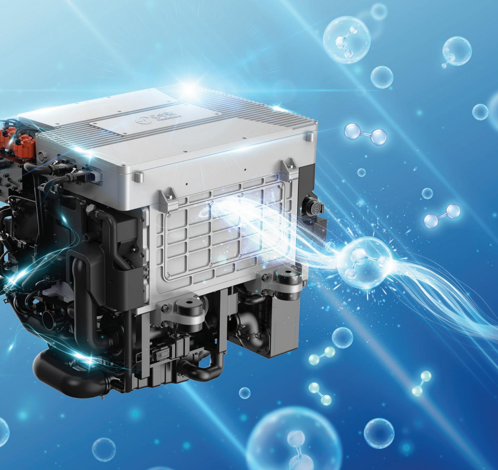

natural_image

Illustration of a hydrogen-powered electric vehicle with visible internal components and water droplets against a blue background (no text or symbols)

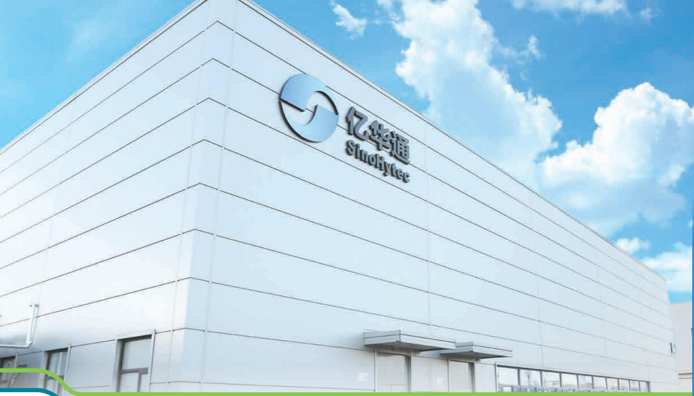

text_image

亿华通
Sinoflytec

# 目錄

報告導讀 03

董事長致辭 05

關於億華通 08

01|理念：氫理為基，循道致遠  
02|實踐：氫跡所至，步履鏗鏘

可持續發展治理 16

01|可持續商業模式  
02|可持續發展理念  
03 | ESG治理架構  
04|利益相關方溝通  
05|雙重重要性評估

未來展望 97

聯合國可持續發展目標索引 99

主要績效指標摘要 101

# 環境篇

# 涵源以厚壤

綠氫啟航·零碳未來

01|氣候行動·青山不負  
02 | 資源循環・物盡其用  
03|生態共建·氫澤四方

27

# 社會篇

# 契勢而茂林

協同共生・力拓新局

01|兩會之聲·產業之責  
02|科技創新·產業構建  
03|鏈承責任·聚力共生  
04|員工成長·林木扶疏  
05|社區賦能·氫暖人間

47

# 治理篇

# 澄心之始達

合規經營・風險管理

01 | 公司治理·合規致遠  
02 | 董事多元·科學決策  
03 | 商業道德・誠信為本  
04 | 股東權益·共贏未來

87

# 報告導讀

我們始終堅信：氫能業務本身，就是億華通最核心的ESG價值所在。ESG不是企業經營中的合規附加項，而是氫能戰略落地的核心抓手、企業長期價值創造的核心載體、龍頭企業踐行“雙碳”目標的核心路徑。以業務承載責任，以責任反哺業務—這是億華通對ESG最本質的理解，也是我們作為行業先行者的戰略自覺。

本報告為北京億華通科技股份有限公司發佈的第二份環境、社會和公司治理報告，以向利益相關方披露2025年公司在環境、社會和公司治理領域的管理、目標、實踐及績效，以促進億華通的信息透明和長效發展。

# 01▶ 報告範圍

本報告為年度報告，披露信息的範圍涵蓋北京億華通科技股份有限公司及其各子公司（簡稱“億華通”“公司”或“我們”），與《北京億華通科技股份有限公司2025年年度報告》邊界一致。報告的時間範圍為2025年1月1日至2025年12月31日期間（簡稱“報告期”）。為增強報告內容可比性和完善性，部分內容適當溯及以往年份或向未來年份延伸。

# 02 ▶ 編制依據

本報告遵循《上海證券交易所科創板上市公司自律監管指南第13號——可持續發展報告編制》、《上海證券交易所上市公司自律監管指引第14號——可持續發展報告（試行）》(簡稱“上交所《指引》”)，香港聯合交易所有限公司上市規則附錄C2《環境、社會及管治報告守則》(簡稱“聯交所《守則》”)及中國財政部《企業可持續披露準則——基本準則（試行）》作為編制依據。同時，本報告參照多項可持續發展報告標準、框架及倡議進行編制，包括全球報告倡議組織（Global Reporting Initiative, GRI）可持續發展報告標準及聯合國可持續發展目標（Sustainable Development Goals, SDGs）。

# 03 ▶ 報告原則

# 1 合規性

本報告嚴格遵循上交所《指引》、聯交所《守則》等境內外監管機構的最新可持續信息披露規定。同時遵守《中華人民共和國公司法》《中華人民共和國證券法》等相關法律法規，確保所有披露內容合法合規。

# 2 重要性

我們採用雙重重要性評估，即同時評估議題的財務重要性和影響重要性。重點披露那些不僅對利益相關方關切重大，同時對公司短期、中期或長期的商業模式、財務狀況構成影響，或對公司外部環境與社會產生重大影響的議題。

# 3 量化

本報告採用量化數據的方式展現關鍵績效指標，有關本報告中關鍵績效指標的計量標準、方法、假設及/或計算工具以及使用的轉換系數來源，均已在相應位置（如適用）做出說明。

# 4 平衡

本報告以客觀事實為基礎，全面、公平地呈現公司在可持續發展領域的績效、進展、目標及面臨的挑戰與不足。不回避負面信息或風險，如實陳述改進措施及未來計劃，確保披露無偏頗、無選擇性遺漏，避免誤導讀者判斷。

# 5 真實性與一致性

本公司致力於保持披露統計方法、範圍、指標定義及計算口徑在不同報告期內的一致性，披露信息客觀真實。如因準則更新、業務變化或方法優化導致任何變更，將在報告中明確說明變更內容、原因、對歷史數據的追溯調整情況（如適用）及影響程度。

# 6 四要素框架

對於經雙重重要性評估認定具有財務重要性的核心議題，本報告嚴格遵循"治理-戰略-影響、風險和機遇管理-指標與目標"四要素框架進行系統化、結構化闡述。

# 04 ▶ 數據說明

報告中所披露的文字信息和量化數據均來自公司正式文件及統計數據。相關數據與公司年度報告不符的，以年度報告為準。

如無特別說明，度量衡均為公制，貨幣單位均為人民幣。

# 05 ▶ 確認及批准

本報告所有數據及材料來源包括億華通公開資料、內部正式文件、統計報告及第三方問卷調查結果等。本公司董事會承諾對報告內容進行監督，並確保其不存在虛假記載、誤導性陳述或重大遺漏，並對內容真實性、準確性和完整性負責。

本報告已經公司第四屆董事會第十一次會議審議通過。

# 06 ▶ 報告發佈

本報告電子版可於億華通官網 (https://www.sinohytec.com/invest)，聯交所披露易網站 (https://www.hkexnews.hk) 或上交所網站 (https://www.sse.com.cn) 頁面查閱和下載。本報告備有繁體中文、簡體中文和英文版本，若本報告中英文版本有不一致之處，請以簡體中文版本為準。

# 07▶ 聯系方式

如對報告有任何問題或建議，請通過以下方式聯系我們：
聯系地址：北京市海淀區西小口路66號中關村東升科技園B-6號樓C座七層C701室

聯系電話：010-62796418

電子郵箱：sinohytec@autoht.com

natural_image

Modern glass building with green tree reflections in the foreground under a partly cloudy sky (no text or symbols visible)

# 董事長致辭

——氫心所向，韌性生長，道阻且長，行則將至。

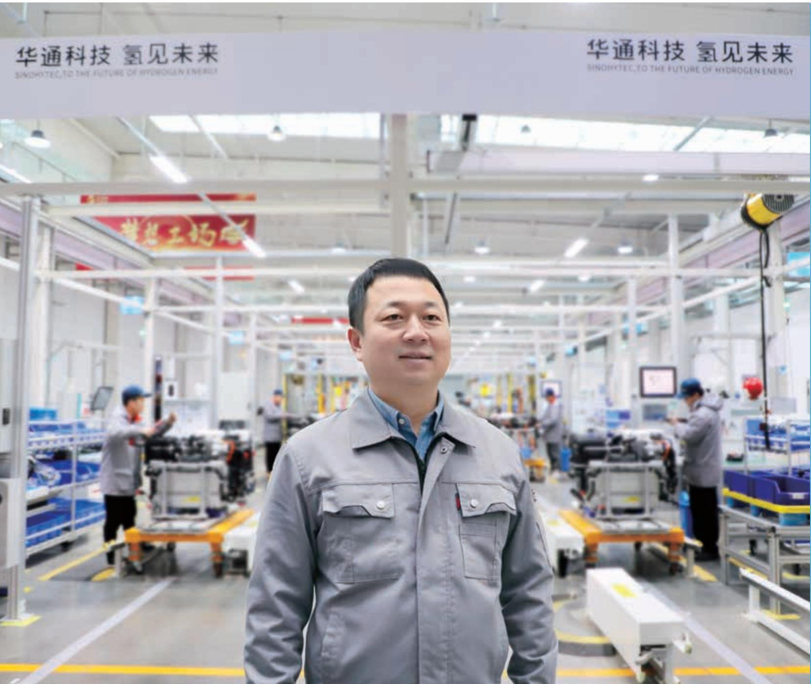

text_image

华通科技 氢见未来
SINOHYTEC TO THE FUTURE OF HYDROGEN ENERGY
华通科技 氢见未来
SINOHYTEC TO THE FUTURE OF HYDROGEN ENERGY

2025年，對億華通而言，是在深流中守正、於無聲處深耕的一年。

這一年，我們不僅直面行業周期與經營效率的挑戰，堅定執行“提質增效重回報”的行動綱領，更將這份壓力淬煉為審視產業本質、鍛造核心韌性的戰略契機。以此，我們重新錨定了作為先行者的責任和使命，並明晰了通往未來的航向；這一年，我們做出了關鍵佈局—成立億華通儲能，構築“氫-儲-用”協同體系；第三代氫能發電機組首航澳大利亞，氫燃料電池重卡成功出海等，這些步伐，標誌著我們將成熟的車用技術戰略性拓展至分布式發電、儲能等更廣闊的能源場景，不僅為先進產能找到多元化出口，更是對“綠電-綠氫-儲能”一體化價值鏈的躬身實踐。我們對ESG的深層理解是，真正的可持續發展是一條從“企業內功”到“產業生態”的價值鏈，我們以透明治理築牢根基，以綠色技術開疆拓土，以協同共生回饋社會，三者相互支撐、彼此賦能，構成億華通獨特的ESG實踐范式。

目前，全球能源轉型的脈絡日益清晰，我們深刻認識到，氫能的價值，遠非限於單一賽道。它關乎能源系統的韌性重構，關乎千行百業的深度脫碳，更關乎人類應對氣候變化的共同命運。

在億華通，ESG不是寫進報告里的“附加題”，而是融入戰略、驅動增長的“必答題”。我們以ESG理念重新審視每一項決策：治理維度，我們追求透明與合規，讓企業在陽光下運行；環境維度，我們用氫能技術重塑能源結構，讓零碳成為可能；社會維度，我們以開放協同構建產業生態，讓發展成果惠及更多伙伴與社區。ESG，正是我們踐行氫能使命的戰略語言。因此，億華

通的行動邏輯愈發堅定：我們不再僅僅定義自己為技術與服務提供商，而立志成為以氫為紐帶、聯結萬象的生態構建者。我們的路徑，是以治理固本，以環境破題，最終實現與產業的協同共生。

前路雖非坦途，但初心愈明。我們始終堅信，企業的長遠價值根系於其對環境與社會福祉的實質貢獻；我們清醒地認識到，氫能產業正經歷從政策驅動向市場驅動的轉型。

我們始終秉持對股東及其他利益相關方的最大坦誠，正以積極而審慎的態度應對當前挑戰。公司將繼續以“專業”深耕技術，以“擔當”踐行責任。我們期待與各方伙伴攜手，共同構建一個更加開放、綠色、包容的氫能生態系統，為驅動能源革命、應對氣候變化，持續貢獻堅實的“億華通力量”。

——此致，敬畏使命，共赴山海。

董事長

張國強

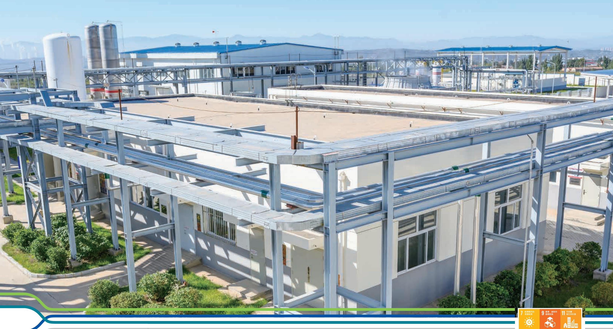

# 關於億華通

01|理念：氫理為基，循道致遠 ..... 09  
02|實踐：氫跡所至，步履鏗鏘....11

# 01 | 理念

# ——氫理為基·循道致遠

# 1 涵・生態根脈

北京億華通科技股份有限公司（688339.SH、02402.HK）成立於2012年，作為燃料電池研發與產業化為一體的國家級高新技術企業，既是中國燃料電池產業發展的先行者和核心推動者，也是國內首家同時在“A+H”股上市的氫燃料電池系統企業。

  
企業使命

中國氫燃料電池發動機領導品牌

  
企業願景

引領氫能產業，
共建美好未來

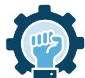  
價值觀

厚德、協同、
擔當、專業、
篤學

# 2 契·價值共生

# 2-1

# 企業文化

# - 主人翁意識：

億華通倡導“家和”文化，每位億華通員工都是企業的主人翁，公司的事情都和大家榮辱與共，休戚相關；大家都有義務去發現問題、解決問題，堅決維護公司利益，實現與公司一起成長。

# - 吃苦在前、享受在前：

吃苦在前、享受在后是崇高的精神。但億華通倡導員工做到吃苦在前，做出成績，享受也要在前。做出成績，自然就有回報。

# - 科學分析、敢於決策：

對行業、企業現狀和發展趨勢做到胸有成竹，在科學分析的基礎上，果斷決策。

# - 言出必行、有目標、有節點、有考核：

“信·諾”是企業成長的支柱。目標達成一致，就要制定實現的路徑，切忌朝令夕改；團隊要做到言出必行，要求別人做到的，自己首先要做到，要有榜樣意識。每一個任務都要有明確的目標、有時間節點，對過程有調度，對偏差有考核。

# - 團隊是根、員工是本：

高樓大廈平地起，一磚一瓦砌成墻，人才是企業的第一生產力。團隊是基石，員工是磚瓦，讓每位員工發揮所長，創造持續學習的環境，樂於與企業共成長。

尊重知識、尊重員工、集體奮斗和不遷就有功的員工，是億華通事業可持續的內在要求。

# 2-2

# 協同生態

我們深信，企業的成長必須與地方發展和產業共榮緊密結合，公司的業務拓展始終以創造共享價值為目標。將地區的資源優勢轉化為產業優勢和經濟優勢，實現建成一個項目、帶動一個產業、繁榮一方經濟”的共生願景。

# 02 | 實踐

# ——氫跡所至·步履鏗鏘

# 1 澄·治理實證

1-1

# 卓越治理保障可持續未來

卓越的治理是我們駕馭復雜轉型、實現長期價值的舵盤。2025年，公司治理的核心在於前瞻性地推動戰略佈局。

董事會與高級管理層以高度的戰略定力，引領公司從卓越的燃料電池系統供應商，向“制-儲-運-加-用”一體化生態構建者升維。

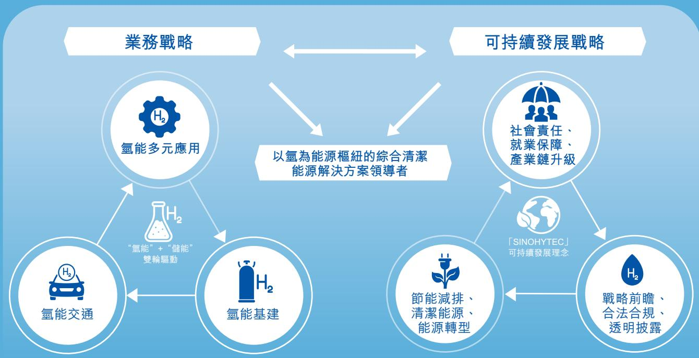

flowchart

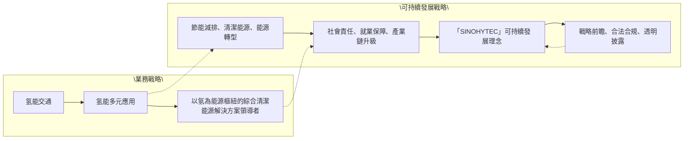
```mermaid
graph LR
  subgraph sg["\"業務戰略\""]
  A["氢能交通"] --> B["氢能多元應用"]
  B --> C["以氫為能源樞紐的綜合清潔能源解決方案領導者"]
  end

  subgraph sg_2["\"可持續發展戰略\""]
  D["節能減排、清潔能源、能源轉型"] --> E["社會責任、就業保障、產業鏈升級"]
  E --> F["「SINOHYTEC」可持續發展理念"]
  F --> G["戰略前瞻、合法合規、透明披露"]
  end

  B -.-> D
  C -.-> E
  G -.-> F
```

1-2

# 2025年度重要榮譽獎項

# 核心資質認證

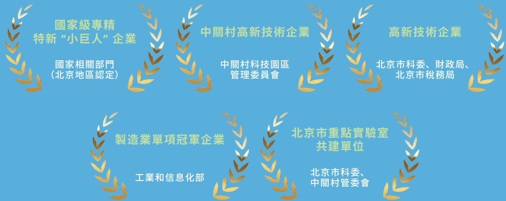

# 科技獎項與行業榮譽

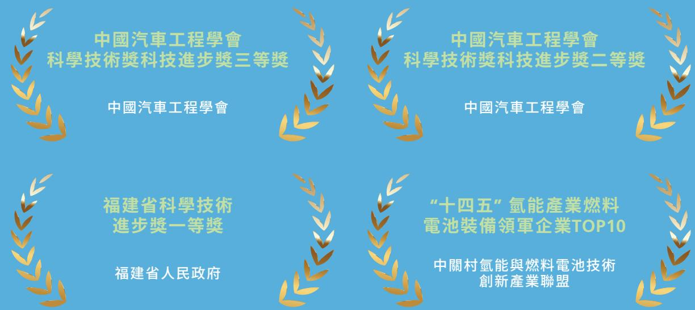

# 2 騗・戦略突破

2-1

# 佈局可再生能源制氫，築牢零碳產業鏈起點

公司堅定推動氫源綠色化，佈局加氫站、制氫設施、儲氫設施、測試平台等氫能基礎設施，打通從可再生能源發電到綠氫生產的完整技術與項目鏈條。

# 制氫装備

推出首套商業化示范PEM電解水制氫系統（PEMEC），核心技術自主可控。

2-2

# 鞏固交通減排成果，拓展工業與儲能場景

以成熟燃料電池技術為基礎，公司向固定式發電、儲能及綜合能源服務橫向拓展，助力多場景脫碳與能源轉型。

# 移動式應用

M系列、G系列、T系列等多款高功率國產化氫燃料電池發動機已規模化驗證。截至報告期末，搭載公司產品的車輛已在全國多地穩定運營，為交通領域減排作出實質貢獻。

# 固定式應用

P2000、P500等燃料電池熱電聯供站為建築、工業園區提供清潔高效能源，標誌車用技術向分布式發電、固定式電源場景的戰略拓展。

# 儲能及綜合能源服務

推進風氫一體化、源網荷儲綜合示范項目，為工業園區提供綠色電力與儲能服務，推動氫能在能源、工業、交通等多場景規模化應用，實現企業增長與生態效益統一。

natural_image

A brown horse galloping in a grassy field with wind turbines in the background (no text or symbols visible)

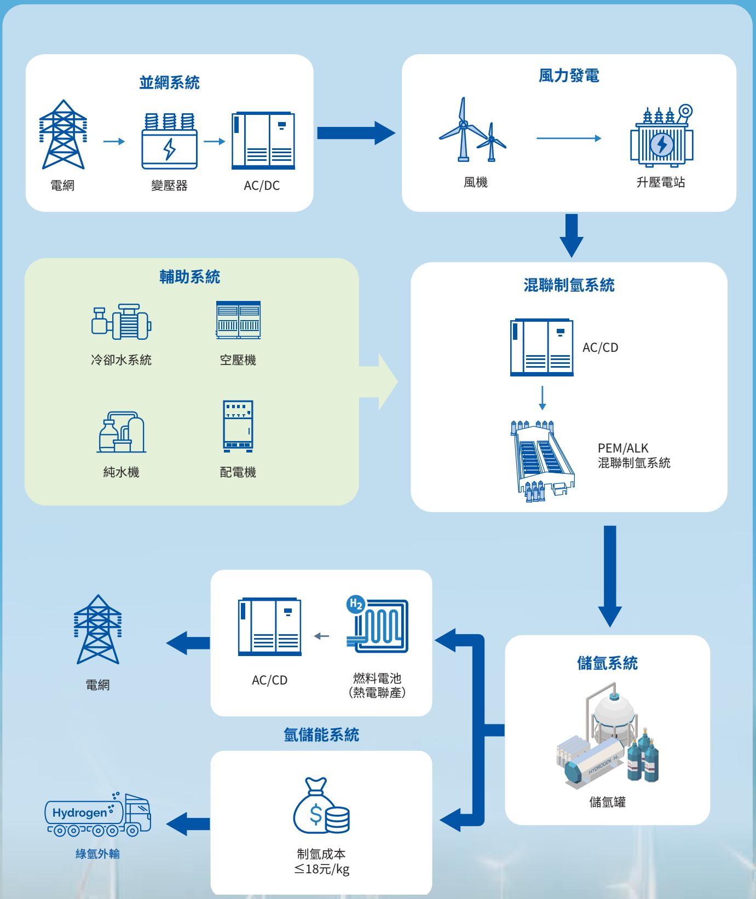

flowchart

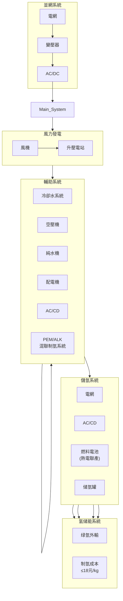
```mermaid
graph TD
  subgraph Main_Systems["並網系統"]
  A["電網"] --> B["變壓器"]
  B --> C["AC/DC"]
  end

  subgraph WindPower["風力發電"]
  D["風機"] --> E["升壓電站"]
  end

  subgraph Hybridization["輔助系統"]
    F["冷卻水系統"]
    G["空壓機"]
    H["純水機"]
    I["配電機"]
  end

  subgraph Hybridization["混聯制氫系統"]
    J["AC/CD"]
    K["PEM/ALK\n混聯制氫系統"]
  end

  subgraph Storage["儲氫系統"]
    L["電網"]
    M["AC/CD"]
    N["燃料電池\n(熱電聯產)"]
    O["储氫罐"]
  end

  subgraph Hydrogen["氢储能系統"]
    P["绿氫外輸"]
    Q["制氫成本\n≤18元/kg"]
  end

  C --> Main_System
  Main_System --> WindPower
  WindPower --> Hybridization
  Hybridization --> Hybridization
  Hybridization --> Storage
  Storage --> Hydrogen
  Storage --> Hydrogen
  Storage --> Hydrogen
  Storage --> Hydrogen
```

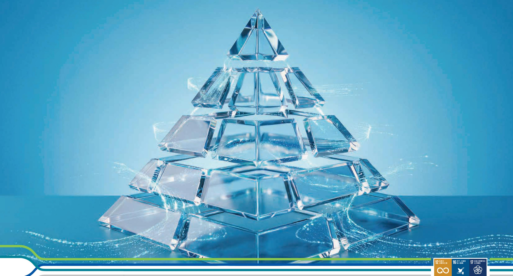

natural_image

Pyramid of transparent glass blocks arranged in a tiered pyramid against a blue background, with no visible text or symbols.

# 可持續發展治理

01| 可持續商業模式 ..... 17  
02|可持續發展理念....18  
03|ESG治理架構....19  
04|利益相關方溝通....20  
05|雙重重要性評估....21

億華通堅守價值共生發展理念，助力氫能行業綠色可持續升級。公司持續完善可持續發展管理體系，將ESG理念深度融入全價值鏈運營與決策管理。通過提升可持續發展戰略執行力，既保障企業長效發展，亦為環境與社會沉淀長期良性效益。

# 01 | 可持續商業模式

2025年，我們在深化燃料電池核心業務的同時，戰略性地將ESG融入公司發展的頂層設計，積極推動業務模式向覆蓋綠色制氫、高效儲運、多元應用的氫能全價值鏈延伸，全面切入“風光氫儲智”新能源賽道。通過“制-儲-運-加-用”一體化戰略，以“氫能 + 儲能”雙輪驅動，系統性地應對氣候變化、賦能產業發展並構建可持續的商業未來。

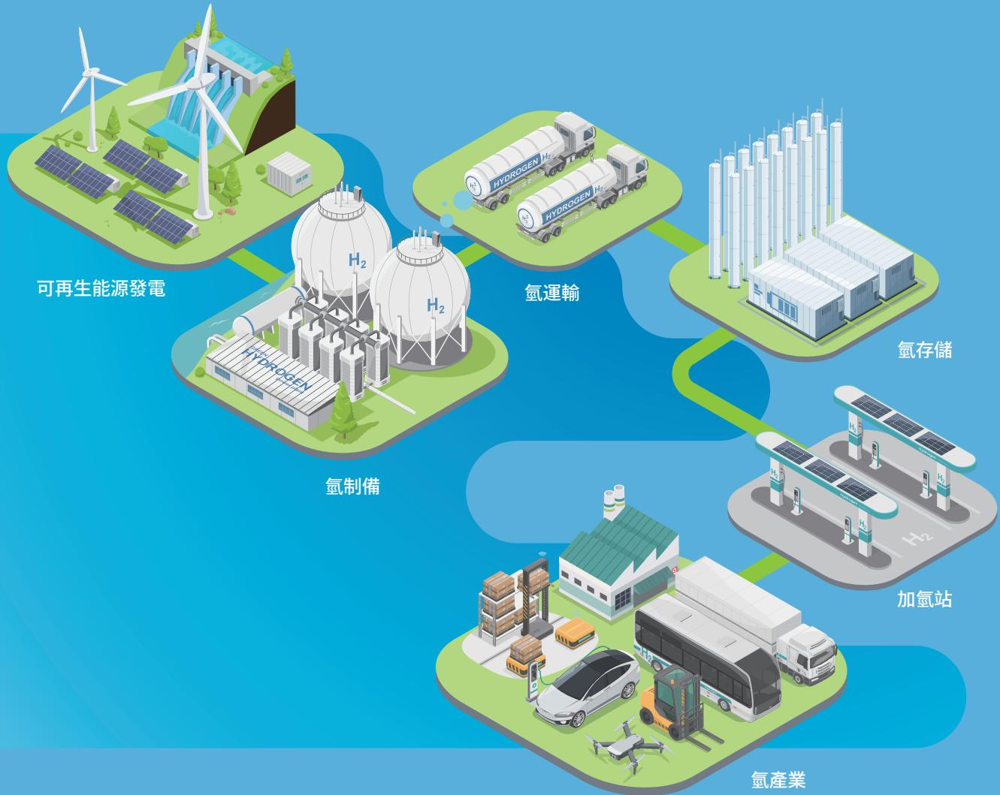

flowchart

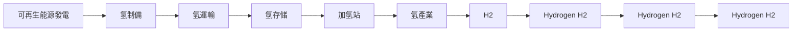
```mermaid
graph LR
  A["可再生能源發電"] --> B["氢制備"]
  B --> C["氫運輸"]
  C --> D["氫存储"]
  D --> E["加氫站"]
  E --> F["氫產業"]
  F --> G["H2"]
  G --> H["Hydrogen H2"]
  H --> I["Hydrogen H2"]
  I --> J["Hydrogen H2"]
```

# 02|可持續發展理念

億華通堅持“SIOHYTEC”可持續發展理念，將可持續發展管理納入企業戰略，積極履行企業社會責任，為“碳達峰、碳中和”目標做出貢獻，構建可持續且多樣化的綠色低碳新生活。

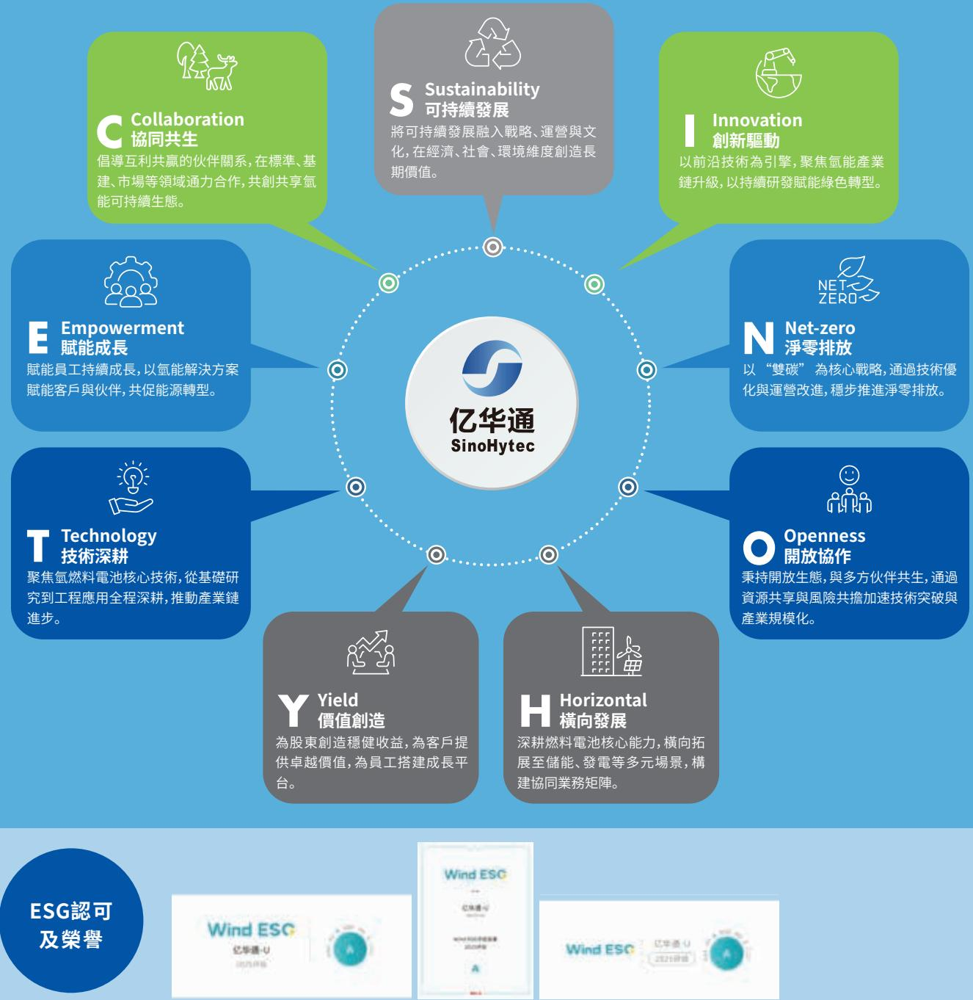  
ESG培訓

為進一步建立健全ESG風險管理與監測機制，公司委聘獨立的第三方機構，引入專業、客觀的外部視角，並開展ESG相關政策培訓，增強員工對ESG理念的認知與理解，明確各業務部門可持續發展責任，使可持續發展理念深入人心。

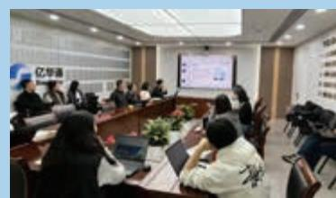

text_image

Conference room photo with visible company logo and presentation screen showing data

# 03 | ESG治理架構

為加強ESG治理，報告期內，公司建立了“決策層-管理層-執行層”的三級架構體系。

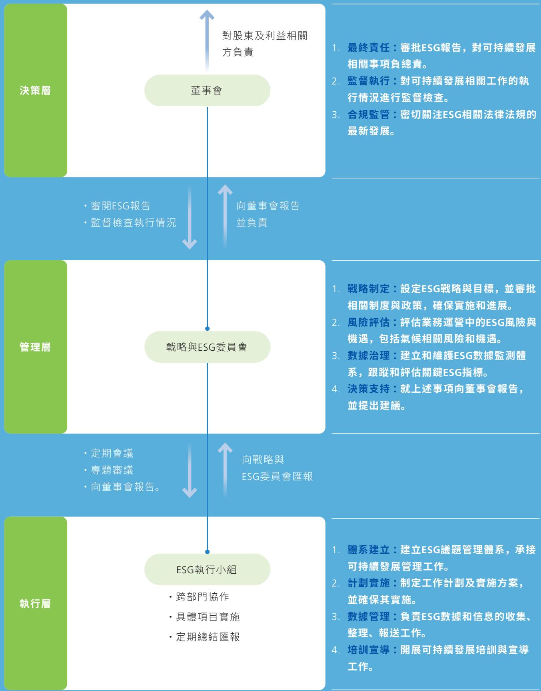

flowchart

```mermaid
graph TD
  subgraph DecisionLayer["決策層"]
  A["董事會"] -->|對股東及利益相關方負責| B["1. 最終責任：審批ESG報告，對可持續發展相關事項負總責。"]
  B --> C["2. 監督執行：對可持續發展相關工作的執行情況進行監督檢查。"]
  C --> D["3. 合規監管：密切關注ESG相關法律法規的最新發展。"]
  end

  subgraph ManagementLayer["管理層"]
  E["• 審閱ESG報告\n• 監督檢查執行情況"] --> F["向董事會報告並負責"]
  F --> G["1. 戰略制定：設定ESG戰略與目標，並審批相關制度與政策，確保實施和進展。"]
  G --> H["2. 風險評估：評估業務運營中的ESG風險與機遇，包括氣候相關風險和機遇。"]
  H --> I["3. 數據治理：建立和維護ESG數據監測體系，跟蹤和評估關鍵ESG指標。"]
  I --> J["4. 決策支持：就上述事項向董事會報告，並提出建議。"]
  end

  subgraph ExecutionLayer["執行層"]
  K["• 定期會議\n• 専題審議\n• 向董事會報告。"] --> L["向戰略與ESG委員會匯報"]
  L --> M["1. 體系建立：建立ESG議題管理體系，承接可持續發展管理工作。"]
  M --> N["2. 計劃實施：制定工作計劃及實施方案，並確保其實施。"]
  N --> O["3. 數據管理：負責ESG數據和信息的收集、整理、報送工作。"]
  O --> P["4. 培訓宣導：開展可持續發展培訓與宣導工作。"]
  end
```

# 04 | 利益相關方溝通

億華通常態化地向重點利益相關方了解其對公司可持續發展的意見與期待、開展針對性交流與回應，與各相關方建立長期互信的合作關係。公司廣泛了解各方期望與訴求，並積極進行回應，促進相互理解，創造共同價值。

<table><tr><td>利益相關方</td><td>關注議題</td><td>回應方式</td><td>溝通方式</td></tr><tr><td>投資者/股東</td><td>公司治理經濟績效風險控制信息披露投資者權益保護應對氣候變化</td><td>提升經營業績培育良好的風險管理文化規范信息披露構建高效的投資者關係管理體系</td><td>股東大會財務報告及公告路演業績說明會投資者熱線回復上證e互動平台問題</td></tr><tr><td>客戶</td><td>產品安全與質量客戶關係管理客戶隱私保護產業合作與發展反商業賄賂及反腐敗</td><td>客戶數據與隱私管理提供優質和安全的產品優化服務全流程</td><td>客戶滿意度調查客戶實地培訓線上線下推介活動產品發佈會</td></tr><tr><td>供應商</td><td>供應鏈管理信息安全與隱私反商業賄賂及反腐敗</td><td>公開、公正的採購程序供應商賦能</td><td>供應商培訓供應鏈審核供應商現場考察</td></tr><tr><td>員工</td><td>員工權益與福利人才培養與發展職業健康安全生產平等與多元化</td><td>保障員工合法權益提供具有競爭力的薪酬待遇加強福利保障完善的培訓體系暢通的發展通道提供健康與安全的工作環境</td><td>工會與職工代表大會團隊建設員工效能調查華通學院EHS會議</td></tr><tr><td>合作伙伴</td><td>應對氣候變化產業合作與發展人才培養與發展創新驅動</td><td>行業發展與交流行業標準制定</td><td>協會、工作組交流互訪戰略合作項目溝通產學研合作項目</td></tr><tr><td>社區</td><td>生態系統與生物多樣性保護公益慈善與志願服務鄉村振興社區溝通與發展水資源利用</td><td>減少生產運營對社區環境的影響支持社區發展公益慈善</td><td>社會媒體報道慈善和志願服務活動</td></tr><tr><td>政府及監管機構</td><td>公司治理可持續發展治理公平競爭環境合規管理風險管理與內部控制反商業賄賂及反腐敗依法納稅應對氣候變化</td><td>主動、足額納稅完善內部控制體系污染防治採取積極的氣候行動</td><td>調研考察政企座談會日常審批與監管工作會議及匯報</td></tr></table>

# 05 | 雙重重要性評估

# 1 雙重重要性評估流程

在報告期內，我們對ESG議題進行重要性與優先級的識別和評估，同時發放了調查問卷，以征集意見並進行數據統計與分析。我們依照“識別－溝通－評估”三個步驟對億華通的重要性議題進行評估，總共識別出28項議題，具體分析過程如下所示。

# 信息安全管理措施

ESG 主要報告標準和參考框架所涵蓋關注議題，包括：上交所《指引》、聯交所《守則》、GRI Standards以及SDGs 等標準和倡議；

ESG 主流評級機構對於相關行業的關注議題；

全球可持續發展趨勢；

相關行業可持續發展趨勢。

# 財務重要性與影響重要性議題評估

通過問卷調查邀請公司各利益相關方等綜合評估ESG相關議題，了解他們對於ESG議題的重要性排序，以及對於ESG方面的相關建議；

影響重要性評估：征集相關方對於影響的性質（負面或正面）以及影響發生與否（實際或潛在）的意見，並邀請相關方從“影響的嚴重程度”（影響規模、範圍、不可補救性）和“影響的可能性”兩個維度進行賦分；

財務重要性評估：對議題的財務重要性從“影響發生的可能性”和“財務影響的程度”兩個維度，針對短期、中期、長期三個時間範圍（短期：1年以內；中期：1-5年；長期：5年以上）分別進行評估。

# 繪制重要性矩陣

基於上一步驟評估數據，形成2025年重要性議題矩陣，確定本年度議題重要性。

# 披露與實踐

公司以分析結果為導向，開展針對性披露與實踐。

# 2 重要性議題評估結果

報告期內，重要性議題識別結果如下矩陣所示。經識別，8項議題對公司具有財務重要性及影響重要性，3項議題僅具有財務重要性，14項議題僅具有影響重要性。

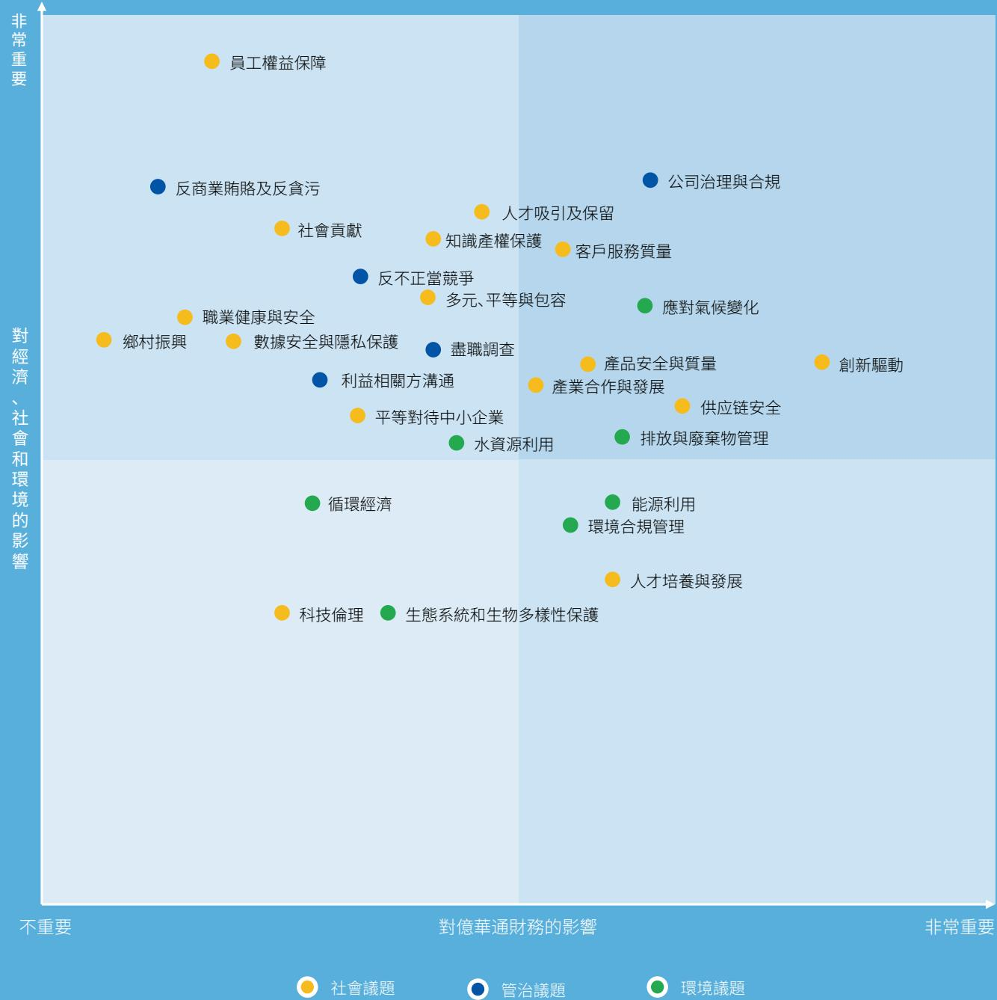

scatter

| Topic | Category | Importance to Economy, Social and Environmental Factors | Impact to Real Estate Finance Industry |
| :--- | :--- | :--- | :--- |
| 員工權益保障 | 社會議題 | High | Low |
| 反商業賄賂及反貪污 | 管治議題 | High | Low |
| 社會貢獻 | 社會議題 | High | Low-Medium |
| 人才吸引及保留 | 社會議題 | High | Medium |
| 知識產權保護 | 社會議題 | High | Medium |
| 客戶服務質量 | 社會議題 | High | Medium-High |
| 反不正當競爭 | 管治議題 | Medium-High | Medium |
| 多元、平等與包容 | 社會議題 | Medium-High | Medium-High |
| 郷業健康與安全 | 社會議題 | Medium-High | Low-Medium |
| 數據安全與隱私保護 | 社會議題 | Medium-High | Low-Medium |
| 盡職調查 | 管治議題 | Medium-High | Medium |
| 利益相關方溝通 | 管治議題 | Medium | Low-Medium |
| 平等對待中小企業 | 社會議題 | Medium | Low-Medium |
| 水資源利用 | 環境議題 | Medium-Low | Medium |
| 產品安全與質量 | 社會議題 | Medium-Low | Medium-High |
| 產業合作與發展 | 社會議題 | Medium-Low | Medium-High |
| 排放與廢棄物管理 | 環境議題 | Medium-Low | High |
| 创新驅動 | 社會議題 | Medium-Low | Very High |
| 供应链安全 | 社會議題 | Medium-Low | High |
| 循環經濟 | 環境議題 | Low-Medium | Low-Medium |
| 能源利用 | 環境議題 | Low-Medium | High |
| 環境合規管理 | 環境議題 | Low-Medium | High |
| 人才培養與發展 | 社會議題 | Low-Medium | High |
| 科技倫理 | 社會議題 | Low-Medium | Low |
| 生態系統和生物多樣性保護 | 環境議題 | Low-Medium | Low-Medium |
| 公司治理與合規 | 管治議題 | High | High |
| 應對氣候變化 | 環境議題 | High | High |

社會議題

管治議題

環境議題

3 重要性議題評估分析

<table><tr><td colspan="2">重要性議題</td><td>應對氣候變化</td><td>環境合規管理</td><td>能源利用</td><td>排放與廢棄物管理</td><td>創新驅動</td><td>客戶服務質量</td></tr><tr><td rowspan="3">影響分析</td><td>影響類型</td><td>實際正面影響潛在負面影響</td><td>實際正面影響潛在正面影響</td><td>實際正面影響潛在正面影響</td><td>實際正面影響潛在正面影響</td><td>實際正面影響潛在正面影響</td><td>實際正面影響潛在正面影響</td></tr><tr><td>影響描述</td><td>若公司溫室氣體管控不完善,或導致溫室氣體排放加劇。公司通過可再生能源和PEM電解水制氫設備生產“綠氫”,直接替代高碳足跡的“灰氫”,從能源源頭實現深度減排。推廣氫燃料電池車輛替代傳統燃油車,在交通應用終端實現了零碳排放運行。</td><td>已建立並運行符合ISO 14001標準的環境管理體系,制定了《環境管理制度》及應急預案,並通過定期第三方監測、環境排查與培訓確保廢氣、廢水、噪聲等達標排放。若環境風險管理失效,可能導致超標排放或環境事件,從而面臨監管處罰、運營中斷、修復成本增加及公司聲譽受損。</td><td>· 公司通過佈局PEM電解水制氫及&quot;風光氫儲&quot;項目,直接利用可再生能源生產綠氫,減少化石能源消耗。· &quot;電-氫-電&quot;循環模式若能大規模應用,可將氫能打造為大規模儲能載體。</td><td>公司下屬各生產單位均依據法規要求建設了雨污分流、污水處理、廢氣收集處理及危廢暫存等環保設施,建立並執行定期監測、第三方檢測與環境排查機制。若廢棄物分類存儲管理不到位或委托的第三方處置機構出現違規操作,可能導致環境污染事件進而引發監管處罰、運營中斷、修復成本增加及公司聲譽受損。</td><td>前瞻性佈局&quot;制-儲-運-加-用&quot;全鏈條技術,有望構建系統級解決方案,創造新的商業模式和價值增長點。通過參與國家示范項目,實現了創新技術的場景驗證與核心技術的自主可控。</td><td>公司建立了即時響應的售后保障機制(如問題發動機快速更換),最大限度減少了客戶運營中斷時間,保障了客戶車隊的出勤率與滿意度。卓越的服務體驗能顯著提升客戶忠誠度與口碑,贏得關鍵合作伙伴的長期信任,為市場擴張奠定基礎。</td></tr><tr><td>影響範圍</td><td>價值鏈上游、企業運營、價值鏈下游。</td><td>價值鏈上游、企業運營、價值鏈下游</td><td>價值鏈上游、價值鏈下游</td><td>企業運營、價值鏈下游</td><td>企業運營、價值鏈下游</td><td>價值鏈下游</td></tr><tr><td rowspan="2">風險與/或機遇分析</td><td>風險與/或機遇類型</td><td>機遇</td><td>機遇+風險</td><td>機遇+風險</td><td>機遇+風險</td><td>機遇+風險</td><td>機遇</td></tr><tr><td>風險與/或機遇影響描述</td><td>公司的業務本質是提供低碳能源解決方案,與全球及中國&quot;雙碳&quot;目標高度契合,能夠優先獲得日益強化的政策支持,並進入高速增長的綠色技術市場。</td><td>嚴謹的環境合規記錄是回應國內外投資者、政府及合作伙伴對ESG期望的&quot;綠色名片&quot;,有助於獲取綠色融資、贏得高標準示范項目。環境違規風險直接關聯法律制裁、經濟損失與信譽損失。</td><td>· 領先的綠色能源利用技術和實踐,使公司成為能源轉型的關鍵參與者,能夠優先獲取政策支持與新興市場機會,塑造顯著的差異化競爭優勢。· 綠色能源技術的初期投入高,且其經濟性高度依賴產業規模和政策連續性。這帶來了短期財務壓力和市場風險。</td><td>隨著環保法規日趨嚴格(如排放標準加嚴、危廢名錄調整),現有環保設施的處理能力與技術工藝可能面臨升級改造壓力,帶來資本支出增加。規范的排放與廢棄物管理有助於公司維持生產經營許可的穩定性,提升在政府、客戶及投資者中的環境信譽。</td><td>研發活動具有不確定性高、投入大的特點,在行業商業化初期,面臨投入產出周期長的財務風險。持續的研發創新是構建公司長期核心競爭力的根本,能夠快速響應市場需求,獲取技術領先帶來的溢價和市場份額。</td><td>優質的客戶服務是比肩甚至超越產品性能的關鍵競爭要素。構建堅實的服務壁壘,能夠深度綁定客戶,形成穩定的市場份額和品牌聲譽。</td></tr><tr><td></td><td>風險與/或機遇的影響周期</td><td>短期、中期、長期</td><td>短期、中期</td><td>短期、中期</td><td>短期、中期、長期</td><td>短期、中期、長期</td><td>中期、長期</td></tr></table>

<table><tr><td colspan="2">重要性議題</td><td>產品安全與質量</td><td>供應鏈安全</td><td>產業合作與發展</td><td>人才培養與發展</td><td>公司治理與合規</td></tr><tr><td rowspan="3">影響分析</td><td>影響類型</td><td>實際正面影響潛在負面影響</td><td>實際正面影響潛在負面影響</td><td>實際正面影響潛在正面影響</td><td>實際正面影響潛在正面影響</td><td>實際正面影響潛在正面影響</td></tr><tr><td>影響描述</td><td>公司以合規為基礎,致力於優化產品質量管理效率,提高產品質量,以品質交付超越客戶的期待。若產品質量安全管理不夠完善,可能導致相關負面事件發生,損害客戶、終端用戶等相關方利益。</td><td>公司高度重視核心零部件的國產化培育與供應商審核,這增強了供應鏈的自主可控性,降低了斷供風險,並提升了產品一致性。若對關鍵供應商的ESG風險(如環保違規、勞工問題)識別與管理不足,可能引發連帶責任,損害公司聲譽。</td><td>作為核心單位參與國家級示范項目,與政府、企業協同推動產業基礎設施建設與商業模式探索。活躍於行業協會並參與標準制定,貢獻產業共識,提升行業影響力。與能源企業、整車廠等戰略伙伴的深度合作,有望共同開拓新場景、新市場,加速氫能技術的規模化落地。</td><td>w建立多元職業通道及&quot;PPT+N&quot;技術評定體系,為員工提供了清晰的成長路徑。系統化的入職與在崗培訓(如華通學院)保障了員工能力的持續提升。健全的干部選拔與培養機制,能為公司未來擴張儲備合格的領導力。</td><td>建立了由戰略和ESG委員會領導的治理架構,並將ESG納入戰略流程。完善的&quot;三道防線&quot;風險管理與內控體系,保障了公司運營的合規性與資產安全。高標準的公司治理與透明的信息披露,能夠增強投資者、客戶等利益相關方的長期信任,降低資本成本,獲得合作優勢。</td></tr><tr><td>影響範圍</td><td>價值鏈上游、企業運營、價值鏈下游</td><td>價值鏈上游、企業運營</td><td>價值鏈上游、企業運營、價值鏈下游</td><td>企業運營</td><td>企業運營</td></tr><tr><td rowspan="2">風險與/或機遇分析</td><td>風險與/或機遇類型</td><td>機遇+風險</td><td>機遇+風險</td><td>機遇</td><td>機遇+風險</td><td>機遇</td></tr><tr><td>風險與/或機遇影響描述</td><td>高質量的產品和服務帶來積極口碑效應,推動業務擴展。若發生產品質量安全事件,可能會造成客戶及訂單的流失,並導致訴訟等成本增加。</td><td>建立安全、可靠、負責任的供應鏈,是保障公司業務連續性和產品質量的基石,能構成重要的競爭優勢和風險防火墻。供應鏈高度集中或依賴單一供應商,會帶來斷供風險。若供應商出現重大ESG事故,可能導致生產中斷、合規處罰及聲譽損失。</td><td>廣泛的產業合作使公司嵌入產業生態網絡中心,能夠優先獲取信息、資源與機會,降低獨自探索的風險與成本,實現協同發展,放大行業影響力。</td><td>卓越的人才培養體系能持續鍛造一支高勝任力的團隊,這是公司實現技術突破和業務發展的根本保障與長期優勢。氫能行業競爭加劇會推高人才獲取與保留成本。若內部培養速度跟不上業務發展或外部人才競爭需求,將構成人才短缺風險,制約公司成長。</td><td>優秀的治理水平是公司獲取資本市場青睞、進行戰略融資或合作時的&quot;信用背書&quot;,能為公司發展創造更有利的外部環境與融資條件。</td></tr><tr><td></td><td>風險與/或機遇的影響周期</td><td>短期、中期、長期</td><td>短期、中期、長期</td><td>短期、中期</td><td>短期、中期、長期</td><td>長期</td></tr></table>

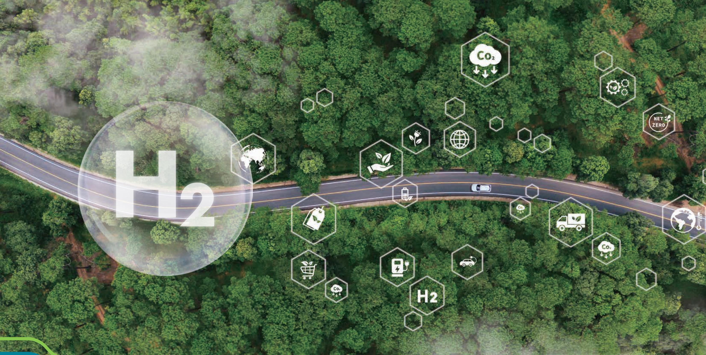

text_image

H₂
CO₂
NET ZERO
H₂

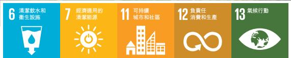

# 涵源以厚壤

——綠氫啟航·零碳未來

01|氣候行動·青山不負 29  
02|資源循環·物盡其用....39  
03|生態共建·氫澤四方....44

# 01 | 氣候行動・青山不負

# 1 綠色產品及技術

公司以燃料電池系統為核心，通過持續的技術創新保持產品在大功率領域的領先優勢。在此基礎上積極佈局上下游供應鏈，通過拉長產業鏈條、拓展應用場景，構建覆蓋多元領域的氫能生態，深度服務於國家能源結構的高質量轉型，為國家“雙碳”戰略貢獻力量。

1-1

# 綠色交通

億華通致力於通過氫燃料電池技術創新，推動綠色交通領域的可持續發展。公司遵循“點-線-面”的商業化路徑——即選擇核心城市為“點”，依托交通干線延伸為“線”，最終形成區域化運營為“面”，優先在氫能基礎扎實的城市開展批量化運營。截至報告期末，公司已與34家整車企業建立合作，產品覆蓋燃料電池公交車、物流車、渣土車、牽引車等全系列車型，並在北京、張家口、成都及澳大利亞等30餘個國內外城市實現規模化示范運營。

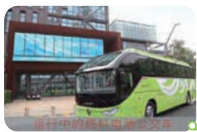  
北京  
運行中的燃料電池公交車

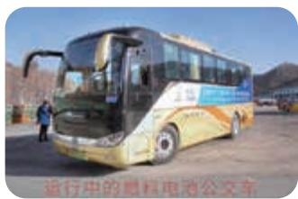  
張家口  
運行中的燃料電池公交車

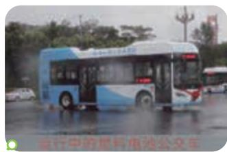  
成都  
運行中的燃料電池公交車

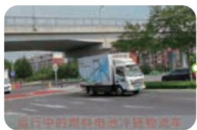  
淄博  
運行中的燃料電池冷鏈物流車

# 部分示范 運營城市

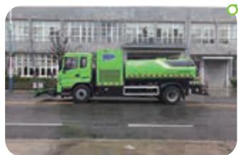  
鄭州  
運行中的燃料電池牽引車

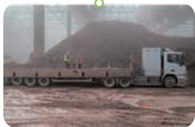  
唐山  
運行中的燃料電池牽引車

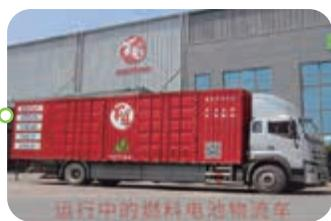  
上海  
運行中的燃料電池物流車

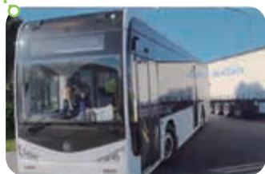  
澳大利亞  
運行中的燃料電池公交車

公司燃料電池產品廣泛應用於氫能客車領域。報告期內，60輛搭載億華通燃料電池的氫能客車服務於張家口兩會，為代表和委員提供運輸支持。

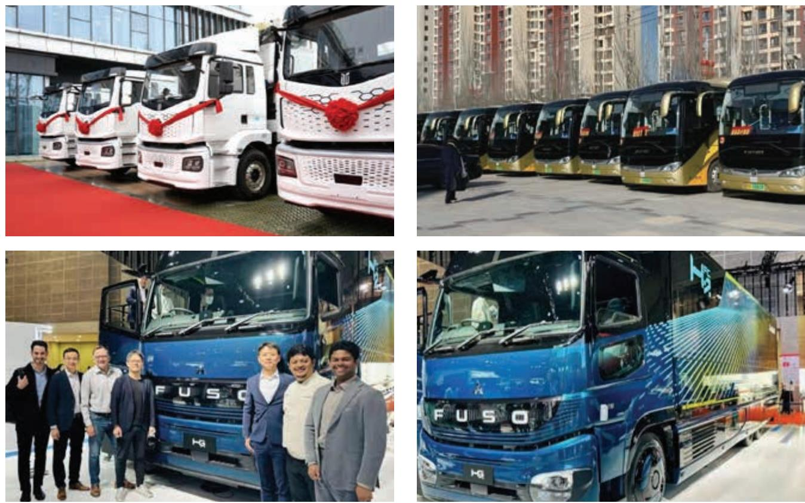

億華通秉持“Made in China, loved by the World”的理念持續推進燃料電池系統海外市場發展，將中國企業的優質產品與國際整車製造商的深度融合，共同提速全球氫能產業的商業化進程。在2025東京車展上，搭載億華通全新260kW液氫燃料電池系統的全球首款液氫重卡正式發佈。

報告期內，搭載億華通240kW氫燃料電池發動機（G20+）的首批國產氫燃料重卡成功出口澳大利亞，該出口項目已獲得當地政府相關批準，產品符合澳大利亞市場準入與技術標準要求，彰顯了億華通的技術與產品實力獲得了國際成熟市場的高度認可，也標誌著億華通開啟國際化市場新征程。

1-2

# 綠色能源

近年來，億華通始終堅持於綠色能源領域的創新。報告期內，我們成功交付100kW燃料電池發電機組用於布里斯班分布式發電項目。該項目標誌著公司第三款成熟發電產品首次出口海外以支持國際綠色能源應用。

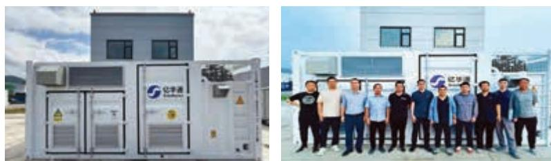

# 2 應對氣候變化

億華通以“引領氫能產業共建美好未來”為使命，積極響應國際社會應對氣候變化的目標和倡議，全力貫徹落實國家“碳達峰、碳中和”戰略，傾力推動經濟社會的能源轉型，將綠色發展理念與公司戰略融合，致力於推動產業鏈的低碳轉型。

2-1

氫能全鏈條減排路徑  
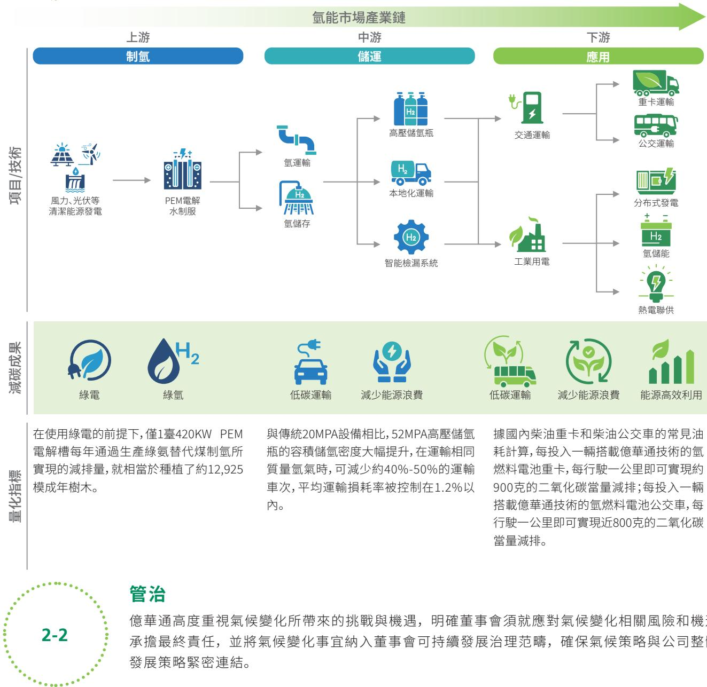  
在使用綠電的前提下,僅1臺420KW PEM 電解槽每年通過生產綠氨替代煤制氫所實現的減排量,就相當於種植了約12,925 模成年樹木。  
與傳統20MPA設備相比，52MPA高壓儲氫瓶的容積儲氫密度大幅提升，在運輸相同質量氫氣時，可減少約40%-50%的運輸車次，平均運輸損耗率被控制在1.2%以內。  
據國內柴油重卡和柴油公交車的常見油耗計算，每投入一輛搭載億華通技術的氫燃料電池重卡，每行駛一公里即可實現約900克的二氧化碳當量減排；每投入一輛搭載億華通技術的氫燃料電池公交車，每行駛一公里即可實現近800克的二氧化碳當量減排。

2-2

# 管治

億華通高度重視氣候變化所帶來的挑戰與機遇，明確董事會須就應對氣候變化相關風險和機遇承擔最終責任，並將氣候變化事宜納入董事會可持續發展治理范疇，確保氣候策略與公司整體發展策略緊密連結。

我們搭建了由董事會、戰略與ESG委員會與ESG執行小組組成的三級氣候變化治理架構。報告期內，為確保氣候治理、管理和執行團隊的勝任，實現從意識到實踐的全面賦能，我們以獨立第三方機構授課的方式開展氣候變化和ESG專項培訓，內容涵蓋全球標準進程、披露要求、範圍三排放等理論和實操知識。

2-3

# 策略

基於自身運營及上下游價值鏈特徵，億華通依據聯交所《守則》，參考氣候相關財務信息披露工作組（Task Force on Climate-Related Financial Disclosure, TCFD）、《國際財務報告可持續披露準則第2號——氣候相關披露》(IFRS S2)等披露框架對氣候相關風險和機遇進行識別，並參考不同氣候情景針對其進行了評估與分析，採取積極行動以應對氣候變化風險、把握發展機遇。

2-3-1 氣候相關風險與機遇的影響

<table><tr><td>描述</td><td>對業務模式和價值鏈的影響</td><td>潛在財務影響</td><td>影響時間</td><td>影響程度</td><td>應對措施</td></tr><tr><td colspan="6">物理風險</td></tr><tr><td>急性風險:極端天氣(包括極端高溫、熱帶氣旋、洪水等)</td><td>· 極端天氣(如高溫、低溫或強烈風暴)可能會影響氫燃料電池系統的運行效率和壽命,在高溫或低溫環境中,燃料電池的性能可能會降低,增加維護成本。· 極端天氣事件預期將對運輸服務造成干擾,且我們的供應鏈可能受到不利影響,繼而可能導致原材料及產品的交付延遲。· 極端天氣事件可能會破壞我們的基礎設施,包括加氫站,導致運營中斷,影響電池系統的供應和客戶的使用體驗。· 極端天氣可能對僱員的健康和安全構成威脅,特別是當僱員需要在戶外或不適宜的環境中進行工作,僱員可能因為極端天氣而發生中暑、凍傷等健康問題,增加病假率和工傷事故發生概率,影響工作與生產效率。</td><td>增加保險和維護支出,若中斷嚴重,可能導致資產損壞修復成本和機會損失。</td><td>短期</td><td>低</td><td>· 積極加強對氣候風險的應對,組織僱員進行應急管理培訓以及自然災害演習。· 為基礎設施購買保險,減少極端天氣帶來的財務損失。· 對產品在極端天氣情況下的可用性進行測試評估,並增加確保產品穩定運行的技術改進投入。· 為增強氣候適應能力,公司推進原材料國產化策略,減少對進口依賴並提升供應鏈韌性。</td></tr><tr><td>慢性風險:水資源短缺和干旱、平均氣溫變化</td><td>· 水資源短缺可能會影響生產運營效率、增加運營成本甚至制約生產計劃。· 平均溫度的上升會使得工作環境更加炎熱,特別是在夏季,可能會影響僱員的生產力,甚至影響公司生產環境安全。</td><td>資源和能源成本持續上漲,可能提高整體運營支出,並通過生產中斷間接造成收入損失。</td><td>中期至長期</td><td>低</td><td>· 選擇運營地時考慮當地的水資源風險,並加強公司生產用水的管理和水循環使用。· 考慮增加公司生產與辦公環境的改造投入,例如空調、新風系統等。</td></tr></table>

急性風險：• 極端天氣（如高溫、低溫或強烈風暴）可能會影響氫燃料電池系統的運行效率和壽命，在高溫或低溫環境中，燃料電池的性能可能會降低，增加維護成本。

<table><tr><td>極端天氣事件預期將對運輸服務造成干擾,且我們的供應鏈可能受到不利影響,繼而可能導致原材料及產品的交付延遲。極端天氣事件可能會破壞我們的基礎設施,包括加氫站,導致運營中斷,影響電池系統的供應和客戶的使用體驗。極端天氣可能對僱員的健康和安全構成威脅,特別是當僱員需要在戶外或不適宜的環境中進行工作,僱員可能因為極端天氣而發生中暑、凍傷等健康問題,增加病假率和工傷事故發生概率,影響工作與生產效率。</td></tr></table>

<table><tr><td>慢性風險:水資源短缺和干旱、平均氣溫變化</td><td>· 水資源短缺可能會影響生產運營效率、增加運營成本甚至制約生產計劃。· 平均溫度的上升會使得工作環境更加炎熱,特別是在夏季,可能會影響僱員的生產力,甚至影響公司生產環境安全。</td></tr></table>

<table><tr><td></td><td>2013</td><td>2012</td></tr><tr><td>Net income</td><td>$ 4,967</td><td>$ 5,813</td></tr></table>

<table><tr><td></td><td>2013</td><td>2012</td></tr><tr><td>Net income</td><td>$ 4,967</td><td>$ 5,813</td></tr></table>

<table><tr><td></td><td>2013</td><td>2012</td></tr><tr><td>Net income</td><td>$ 4,967</td><td>$ 5,813</td></tr></table>

<table><tr><td></td><td>2013</td><td>2012</td></tr><tr><td>Net income</td><td>$ 4,967</td><td>$ 5,813</td></tr></table>

<table><tr><td></td><td>2013</td><td>2012</td></tr><tr><td>Net income</td><td>$ 4,967</td><td>$ 5,813</td></tr></table>

慢性風險：水資源短缺可能會影響生產運營效率、增加運營成本甚至制約生產計劃。  
- 平均溫度的上升會使得工作環境更加炎熱，特別是在夏季，可能會影響僱員的生產力，甚至影響公司生產環境安全。  
慢性風險：水資源短缺和干旱、平均氣溫變化
- 水資源短缺可能會影響生產運營效率、增加運營成本甚至制約生產計劃。
- 平均溫度的上升會使得工作環境更加炎熱，特別是在夏季，可能會影響僱員的生產力，甚至影響公司生產環境安全。

<table><tr><td></td><td>2013</td><td>2012</td></tr><tr><td>Net income</td><td>$ 4,967</td><td>$ 5,813</td></tr></table>

<table><tr><td></td><td>2013</td><td>2012</td></tr><tr><td>Net income</td><td>$ 4,967</td><td>$ 5,813</td></tr></table>

<table><tr><td></td><td>2013</td><td>2012</td></tr><tr><td>Net income</td><td>$ 4,697</td><td>$ 5,893</td></tr></table>

<table><tr><td></td><td>2013</td><td>2012</td></tr><tr><td>Net income</td><td>$ 4,697</td><td>$ 5,893</td></tr></table>

<table><tr><td></td><td>2013</td><td>2012</td></tr><tr><td>Net income</td><td>$ 4,967</td><td>$ 5,813</td></tr></table>

<table><tr><td></td><td>2013</td><td>2012</td></tr><tr><td>Net income</td><td>$ 4,967</td><td>$ 5,813</td></tr></table>

<table><tr><td></td><td>2013</td><td>2012</td></tr><tr><td>Net income</td><td>$ 4,967</td><td>$ 5,813</td></tr></table>

[Table 3: Light Green]

<table><tr><td></td><td>2013</td><td>2012</td></tr><tr><td>Net income</td><td>$ 4,967</td><td>$ 5,813</td></tr></table>

<table><tr><td></td><td>2013</td><td>2012</td></tr><tr><td>Net income</td><td>$ 4,967</td><td>$ 5,813</td></tr></table>

<table><tr><td></td><td>2013</td><td>2012</td></tr><tr><td>Net income</td><td>$ 4,967</td><td>$ 5,813</td></tr></table>

<table><tr><td></td><td>2013</td><td>2012</td></tr><tr><td>Net income</td><td>$ 4,697</td><td>$ 5,893</td></tr></table>

<table><tr><td></td><td>2013</td><td>2012</td></tr><tr><td>Net income</td><td>$ 4,697</td><td>$ 5,893</td></tr></table>

<table><tr><td></td><td>2013</td><td>2012</td></tr><tr><td>Net income</td><td>$ 4,967</td><td>$ 5,813</td></tr></table>

<table><tr><td></td><td>2013</td><td>2012</td></tr><tr><td>Net income</td><td>$ 4,967</td><td>$ 5,813</td></tr></table>

<table><tr><td></td><td>2013</td><td>2012</td></tr><tr><td>Net income</td><td>$ 4,697</td><td>$ 5,893</td></tr></table>

<table><tr><td></td><td>2013</td><td>2012</td></tr><tr><td>Net income</td><td>$ 4,967</td><td>$ 5,833</td></tr></table>

<table><tr><td></td><td>2013</td><td>2012</td></tr><tr><td>Net income</td><td>$ 4,967</td><td>$ 5,813</td></tr></table>

<table><tr><td></td><td>2013</td><td>2012</td></tr><tr><td>Net income</td><td>$ 4,967</td><td>$ 5,813</td></tr></table>

<table><tr><td></td><td>2013</td><td>2012</td></tr><tr><td>Net income</td><td>$ 4,967</td><td>$ 5,813</td></tr></table>

<table><tr><td></td><td>2013</td><td>2012</td></tr><tr><td>Net income</td><td>$ 4,967</td><td>$ 5,813</td></tr></table>

- 積極加強對氣候風險的應對，組織僱員進行應急管理培訓以及自然災害演習。  
- 為基礎設施購買保險，減少極端天氣帶來的財務損失。  
- 對產品在極端天氣情況下的可用性進行測試評估，並增加確保產品穩定運行的技術改進投入。  
- 為增強氣候適應能力，公司推進原材料國產化策略，減少對進口依賴並提升供應鏈韌性。  
- 選擇運營地時考慮當地的水資源風險，並加強公司生產用水的管理和水循環使用。  
- 考慮增加公司生產與辦公環境的改造投入，例如空調、新風系統等。

<table><tr><td>描述</td><td>對業務模式和價值鏈的影響</td><td>潛在財務影響</td><td>影響時間</td><td>影響程度</td><td>應對措施</td></tr><tr><td colspan="6">轉型風險</td></tr><tr><td>政策和法規風險</td><td>面對更嚴格碳排放標準與政策,公司需調整生產活動和管理方式,以適應法規變更,可能增加內部合規流程的復雜性,影響運營效率和戰略規劃。</td><td>增加合規成本、罰款支出或原材料價格上漲,可能侵蝕利潤率,並要求額外投資於環保技術升級。</td><td>短期至中期</td><td>高</td><td>完善政策制定,加強節能意識的宣貫工作。密切留意相關規定的變更,若相關的規定變更,公司會調整相關的生產活動及管理方式,以遵守變更的要求。</td></tr><tr><td>市場風險</td><td>不可再生資源和能源的稀缺性將影響產品的成本和價格。</td><td>受氣候變化,能源轉型等影響,電力價格上漲,用電成本增加。</td><td>中期至長期</td><td>中</td><td>強化採購管理,確保資源與能源供應穩定。增加可再生能源的使用比例。</td></tr><tr><td>技術風險</td><td>如果低碳技術的研發或投資失敗,公司可能面臨市場份額被競爭對手搶佔的風險。</td><td>研發和應用低碳技術需要大量資金和時間投入,在短期內可能導致企業成本上升,利潤減少。</td><td>中期至長期</td><td>高</td><td>合理安排研發資金和資源。加強與高校、科研機構的合作,共同開展低碳技術研發,降低研發風險。</td></tr><tr><td>聲譽風險</td><td>若未能有效回應投資者和持份者對氣候風險披露與應對的期望,可能導致投資者對億華通未來發展的信心下降,影響公司未來發展。</td><td>直接影響到股價、資本成本以及吸引新投資的能力。</td><td>長期</td><td>低</td><td>積極響應各持份者對於氣候方面的管理應對要求。增強ESG 評級管理並完善各相關認證。</td></tr></table>

機遇

<table><tr><td>市場</td><td>隨著越來越多的行業面臨能源轉型的壓力,有機會在新的行業發現新的應用場景與發展機遇。</td><td>短期至中期</td><td>高</td><td>·加強多方合作,拓展合作可能。</td></tr><tr><td>產品與服務</td><td>我們的產品與服務以綠色清潔的氫能為中心,低碳產品的市場需求可能促進我們的營業收入增長。</td><td>短期至中期</td><td>高</td><td>·繼續拓展應用場景。·加快產品技術的創新。·建立氫能生態。</td></tr><tr><td>政策與法規</td><td>在“雙碳”目標框架下,綠色金融政策優先傾斜於清潔能源領域。公司作為氫能技術提供者,更易獲得此類融資。</td><td>短期</td><td>高</td><td>·加緊跟隨政策變動,及時調整業務模式。·參與行業標準制定。</td></tr></table>

# 2-3-2 氣候情景分析

為確保進行全面的風險評估，億華通採用由國際認可機構建議的情景框架。我們評估了不同情景框架下的兩種高對比氣候情景，以分析和討論在不同條件下氣候相關風險和機遇可能帶來的影響，為公司的長期韌性規劃和戰略決策提供依據。根據分析結果，我們認為氣候變化相關風險和機遇對公司下一年度財務狀況、經營成果、現金流不會產生重大影響。

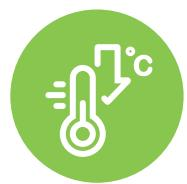  
低排放情景 全球升溫在本世紀被限制於1.5°C以內，與《巴黎協定》的目標一致。

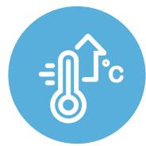  
高排放情景 全球升溫在本世紀超過2°C，代表著未來氣候影響更嚴重，緩解措施更少。

# 2-3-2-1 物理風險情景

我們選用由聯合國政府間氣候變化專門委員會 (IPCC) 於第六次評估報告 (AR6) 中提出的“共享社會經濟路徑” (SSP)，以評估實體風險，因其具備高度可信度，並著重於物理科學的影響。

<table><tr><td>類別</td><td>SSP1-2.6(低排放情景)</td><td>SSP5-8.5(高排放情景)</td></tr><tr><td>情景描述</td><td>全球積極採取減碳措施,溫室氣體排放量將在2030年前達到峰值,然后迅速下降。</td><td>世界繼續嚴重依賴化石燃料,溫室氣體排放量持續增長。</td></tr><tr><td>氣溫變化</td><td>到2100年,全球年平均氣溫預計將上升約1.3°C至2.4°C。</td><td>到2100年,全球年平均氣溫預計將上升約3.3°C至5.7°C。</td></tr><tr><td>海平面上升</td><td>到2100年,海平面預計將上升約0.32米至0.62米,對沿海基礎設施構成的威脅相對較小。</td><td>到2100年,海平面上升中值接近0.63米至1.01米,對沿海地區構成嚴重威脅。</td></tr></table>

# 2-3-2-2 轉型風險情景

我們選用綠色金融網絡(NGFS)提出的氣候情景，作為評估轉型風險的基礎。

<table><tr><td>類別</td><td>2050淨零排放(低排放情景)</td><td>碎片化世界(高排放情景)</td></tr><tr><td>情景描述</td><td>這一情景假定,由於採用了嚴格的氣候政策和創新技術,全球變暖將被限制在1.5°C,這意味著到二零五零年左右全球二氧化碳實現淨零排放。</td><td>這一情景假定全球氣候政策行動延遲且存在分歧,從而導致較高的實體風險和轉型風險。</td></tr><tr><td>政策目標</td><td>1.4°C。</td><td>2.4°C。</td></tr><tr><td>政策變化</td><td>即時且順暢。</td><td>延遲且碎片化。</td></tr><tr><td>科技變化</td><td>快速變化。</td><td>先緩慢,后碎片化。</td></tr></table>

# 2-3-2-3 評估結果

# 時間範圍定義

由於公司主要業務營運地點位於中國內地，因此時間框架與“雙碳”目標對齊，以確保與國家氣候政策保持一致。

# 2030年之前

# 短期

# 2030年-2060年

# 中期

# 2060年之后

# 長期

# 影響程度定義

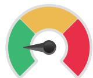

低影響程度：風險發生機會較低，對業務影響輕微，公司可迅速應對，復原所需資源及時間較少（數星期至數個月）。

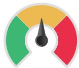

中影響程度：風險有中等機會發生，可能對營運造成一定程度的干擾，但公司可透過部分調整加以應對，復原需時數月至一年，並需中等資源。

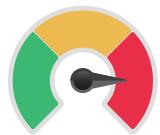

高影響程度：風險發生機會高，可能造成重大營運中斷，影響公司長遠發展，需進行大規模調整，復原時間可達一年或以上，並需大量資源。

<table><tr><td rowspan="2">物理風險</td><td rowspan="2">說明</td><td colspan="3">IPCC AR6的SSP1-2.6情景</td><td colspan="3">IPCC AR6的SSP5-8.5情景</td></tr><tr><td>短期</td><td>中期</td><td>長期</td><td>短期</td><td>中期</td><td>長期</td></tr><tr><td>極端天氣事件</td><td rowspan="3">我們評估了實體風險可能對集團資產地點的影響,以及對資產價值帶來的潛在風險。</td><td>低</td><td>低</td><td>低</td><td>低</td><td>中</td><td>高</td></tr><tr><td>水資源短缺</td><td>低</td><td>低</td><td>低</td><td>低</td><td>中</td><td>中</td></tr><tr><td>平均氣溫上升</td><td>低</td><td>低</td><td>中</td><td>低</td><td>中</td><td>高</td></tr></table>

<table><tr><td rowspan="2">轉型風險</td><td rowspan="2">說明</td><td colspan="3">NGFS的2050淨零排放情景</td><td colspan="3">NGFS的碎片化世界情景</td></tr><tr><td>短期</td><td>中期</td><td>長期</td><td>短期</td><td>中期</td><td>長期</td></tr><tr><td>碳排放法規收緊</td><td>我們預計,氣候相關政策及法規的收緊,可能導致額外的碳稅及合規成本。</td><td>低</td><td>中</td><td>低</td><td>低</td><td>低</td><td>中</td></tr><tr><td>低碳技術轉型</td><td>我們預計,採用低碳技術或需投入大量前期資本,包括研發成本及技術風險。</td><td>低</td><td>中</td><td>中</td><td>低</td><td>低</td><td>中</td></tr><tr><td>顧客偏好轉變</td><td>我們評估了顧客對環境表現的要求及市場結構變化,可能對成本構成的影響。</td><td>低</td><td>中</td><td>中</td><td>低</td><td>低</td><td>低</td></tr><tr><td>利益相關方日益關注</td><td>我們預計,負面聲譽風險可能導致業務量及收入長期下跌。</td><td>低</td><td>低</td><td>中</td><td>低</td><td>低</td><td>低</td></tr></table>

# 2-4

# 風險管理

億華通正將氣候相關風險納入公司風險管理流程，結合實際業務情況、行業分析、外部專家建議等識別各類氣候相關風險帶來的潛在風險和發展機遇。我們根據各部門反饋綜合考慮風險和機遇發生的可能性及其對公司的影響程度，對風險和機遇進行優次排序，並制定針對性的應對舉措。公司定期監控氣候相關風險，逐步提高公司應對氣候變化的韌性。

# 2-4-1 風險識別

定期開展風險識別工作，聯合外部顧問分析外部政策及行業發展趨勢，識別與億華通相關的氣候相關風險與機遇。透過內部溝通會議，確定氣候相關風險與機遇清單。

natural_image

Three green arrows pointing in a vertical sequence (no text or symbols)

# 2-4-2 風險評估

評估風險的可能性及影響嚴重程度，使用風險矩陣確定綜合風險等級，從而確定氣候變化風險的優先級，並識別重大風險。

# 2-4-3 風險應對

針對已識別的重大風險，開展氣候風險制定應對舉措，消除、減少或轉移風險。

# 2-4-4 風險監控

持續監控氣候風險與機遇，定期更新氣候風險與機遇清單。並確保董事會得到定期氣候相關風險和機遇的匯報。

natural_image

Abstract 3D illustration of colored cubes arranged in a linear pattern with a red pointer and dashed line (no text or symbols)

# 2-5

# 指標和目標

# 2-5-1 溫室氣體排放

為實現對溫室氣體排放的全面管控，億華通持續監測年度溫室氣體排放情況，持續推動自身生產運營及產業鏈上下游的減碳進程。

報告期內，我們依據《溫室氣體核算體系標準》(GHG Protocol Accounting Standard)要求，對報告期內的溫室氣體排放進行了詳實的核算。經計算，2025年範圍一、二、三溫室氣體排放總量為8,202.6噸二氧化碳當量，其中1%為範圍一排放，48%為範圍二排放，51%為範圍三排放。範圍三排放中佔比最高的為類別1：外購商品與服務，佔總溫室氣體排放的42%。

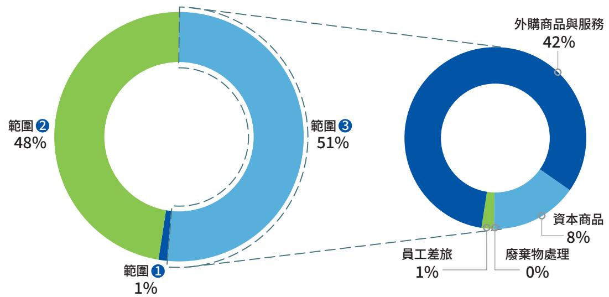

donut

| Category | Value (%) |
| --- | --- |
| 範圍 1 | 1% |
| 範圍 2 | 48% |
| 範圍 3 | 51% |
| 資本商品 | 8% |
| 員工差旅 | 1% |
| 廢棄物處理 | 0% |
| 外購商品與服務 | 42% |

# 2-5-2氣候相關目標

億華通的核心減碳路徑聚焦於氫燃料電池技術的創新與產業化，以氫能作為切入點，推進綠色能源發展並貢獻於“雙碳”目標。報告期內，為有效落實碳中和戰略，全面推動應對氣候變化，億華通設定了中長期氣分階段、可量化的綠色低碳目標。

# 短期目標 (至2030年)

# 夯實基礎

建立覆蓋全公司（含各分子公司及生產基地）的碳排放數據收集與核算體系，強化主要運營環節（範圍一、範圍二排放）的信息管理和數據收集能力，確保數據可追溯、可核證，為系統性減排奠定基礎。

# 中期目標 (至2035年)

# 強度削減

以2024年數據為基線，實現自身運營(範圍一、範圍二)碳排放強度下降20%以上。公司將通過提升可再生能源佔比，推進生產工藝節能改造等措施，在尋求業務增長的同時實現碳排放的相對脫鉤

# 長期目標 (至2055年)

# 運營碳中和

提前國家2060碳中和目標5年，實現自身運營碳中和（範圍一、範圍二）。公司將依托氫能技術優勢，探索綠氫替代化石燃料。在實現自身碳中和的基礎上，公司將逐步帶動上游供應商設定減碳目標，共建綠色低碳供應鏈。

若目標、時間表或進展衡量方法發生重大修訂，將在后續ESG報告中予以披露，並清晰說明修訂原因。

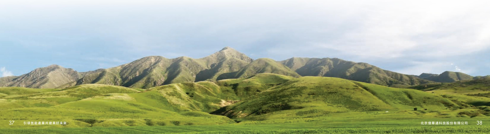

text_image

37 引領氫能產業共建美好未來
北京億華通科技股份有限公司 38

# 02 | 資源循環・物盡其用

# 3 循環經濟

億華通致力於推動循環經濟原則，通過資源節約、廢物管理和高效利用策略，實現可持續發展。公司在生產和運營中實施多項舉措，發佈《關於節約各項資源及成本的通知》，減少資源消耗、促進廢物回收，並優化成本控制。

3-1

# 水資源循環利用

上海神力配套建成一體化水處理系統，統一收集廠區生活污水與工業廢水，通過生化處理 + 中水回用組合工藝淨化處理，再生水資源回用於車間生產環節。其中，中水回用系統依次採用砂濾、碳濾、一級反滲透、二級反滲透深度淨化工藝，保障出水水質穩定達標。

2025年，該系統累計實現中水回用總量1661餘噸，有效提升水資源循環利用效率，減少新鮮水資源消耗，切實踐行節水減排與綠色低碳生產理念。

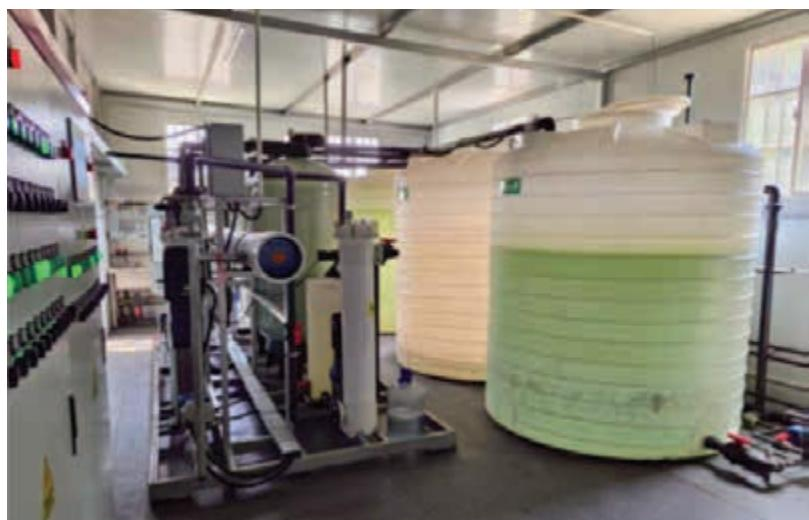

natural_image

Interior of a laboratory with large industrial equipment and large cylindrical tanks (no visible text or symbols)

“中水回用”設施

3-2

# 原材料與廢物回收

億華通強調原材料的精準管理和回收利用。在生產過程中，我們嚴格按照工藝要求操作，減少原材料浪費；對邊角料、廢料等進行分類回收和合理利用，提高綜合利用率。同時，加強對輔料（如潤滑油、清洗劑）的用量控制，避免不當浪費。

3-3

# 設備維護與再利用

公司遵循“修舊利廢”原則，建立健全設備維護保養制度，定期對生產設備進行維護保養，延長設備使用壽命，減少故障發生。在設備維修過程中，優先修復損壞零部件，減少新零部件更換量；對於無法修復或修復成本過高的零部件，進行性價比評估，選擇最優解決方案，從而最大化設備價值再利用，降低廢棄物和資源消耗。

# 4 能源利用

4-1

# 治理

億華通遵守《中華人民共和國節約能源法》等所適用的環境法律法規，努力降低能源消耗並提升利用效率。公司能源主要來源於運營所在地公用事業部門的電力供應。我們已建立能源管理體系，密切監察能源消耗情況，定期評估生產過程中的電力等能源消耗情況，並對照歷史數據等以識別異常並評估潛在風險。通過優化生產過程、技術改造和設備升級，積極減少不必要能源消耗，推動能源效率持續提升。

在管理實踐方面，公司制定《設備設施能源管理工作規范》，覆蓋所有生產、測試設備設施的能源管理工作。我們的能源管理實行公司、車間、班組三級管理體系，由億華通工藝設備部設立能源管理小組；各能源使用部門設立車間能源分管小組；各班組設立能源管理員。

# 能源管理小組

- 根據生產，測試的年需求量，組織編制設備設施的能源管理規劃及工作計劃，並組織實施；  
- 負責組織對重點耗能設備設施進行節能檢測，提高資源利用率；  
- 負責組織進行年度節能措施評審，應用推廣及結果評定工作；  
- 負責組織、指導節能宣傳及能源分管小組的業務技術培訓工作；  
- 負責指導能源管理人員的業務開展工作，指導及協助組織節能標準的宣貫。

# 能源分管小組

- 負責本部門的能源管理組織架構建設，人員資源配備及職能職責劃分；  
- 根據能源管理工作小組的要求，組織能源管理檢查工作，對能源管理各項計劃工作進行實施監督；  
- 負責各班組節能工作投入的有效實施和能源管理員的工作評價；  
- 負責協調並解決能源管理中出現的各項問題；  
- 負責本部門的能源使用自查和整改工作，節能宣傳和培訓工作。

# 能源管理員

- 負責根據能源分管小組的要求，對所管轄區域開展相關能源管理工作；  
- 負責制定所管轄區域每一個能源使用點的管理責任人；  
- 負責將部門節能的宣傳和培訓內容傳達給所管轄能源點的管理責任人；  
- 負責對所管轄區域能源使用的自查和整改工作；  
- 對無法自主解決的異常問題進行升級反饋。

4-2

# 戰略

公司將能源節約和效率提升融入整體運營目標，通過持續優化能源使用策略、推進技術改造和設備升級、推動能源二次利用及清潔能源轉型，努力降低能源消耗、提升效率並減少碳足跡。

# 4-3

# 影響、風險和機遇管理

公司通過能源管理體系實現對能源消耗的全流程監控與閉環管理，定期評估消耗情況並識別異常風險。我們的日常措施包括：

在廠房的規劃與建造階段，即將自然採光納入設計重點，最大限度利用日照資源。

在設備採購環節，優先選用能效等級高、運行能耗低的設施與設備。

實行分區域用電管理，確保各用電場所在無人時及時關閉照明與設備電源，做到“人走燈滅”，“人離機停”。

通過定期檢修與保養生產設備，維持其高效運行狀態，從而減少能源損耗。

在辦公及生產區域設置節能提示標識，倡導節約用電、隨手關燈、空調溫度控制在25°C等行為，並規定下班后關閉照明與非必要辦公設備，以節約電力。

報告期內，公司持續落地餘熱回收與餘電利用節能降碳專項舉措。在餘熱回收方面，優化高溫水制備工藝，依托設備升級與管網改造完成系統升級：一方面，集中收集生產清洗后的高溫廢水，經處理后循環回用；另一方面，回收空壓機運行產生的餘熱熱氣，為高溫水箱持續保溫，顯著削減高溫水制備的電力消耗。在餘電利用方面，充分回收發動機測試過程中產生的富餘電力，應用於廠房照明等低能耗場景，實現富餘能源梯級利用與二次消納。

此外，億華通動力於生產車間及辦公樓屋頂鋪設太陽能光伏組件，清潔電能可輔助冬季採暖供熱，穩步推進清潔能源替代。系列舉措全方位提升廠區綜合能源利用效率，有效降低傳統化石能源消耗、減少碳排放，持續踐行綠色生產模式，助力企業低碳轉型與可持續發展。

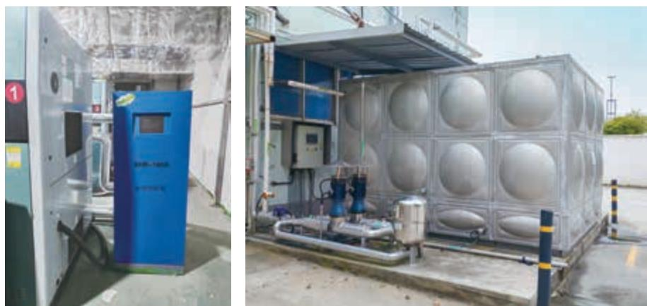  
“餘熱回收”設施

# 4-4

# 指標和目標

對於能源利用的關鍵績效指標，詳見后文“主要績效指標摘要”中的“環境績效”部分。

# 5 水資源利用

億華通嚴格遵守《中華人民共和國水法》，在運營過程中持續推進水資源的高效利用。本年度，我們不涉及水風險或高水壓力地區的運營點，在獲取適用水源方面沒有任何問題。生活用水用於保障員工正常辦公和生活，部分用於員工食堂炊事；生產用水用於零部件及生產設備清洗。

我們已設定長期用水效益目標：以2024年為基準年，到2030年總耗水量減少10%。為此，億華通基於“大處著眼、小處著手”的原則，結合《節約各項資源及成本的通知》對水資源進行統籌治理和精益管理：

辦公區用水管理：定期檢查水龍頭、水管等設施，及時解決跑、冒、滴、漏等現象；員工使用水龍頭時做到“人走水停”；推廣使用節水型潔具，控制清洗辦公用品、拖地等用水量，避免過度浪費；通過宣傳欄等方式，倡導全體員工養成節約用水習慣，確保政策落地執行。  
工廠區用水管理：生產過程中嚴格按照工藝要求控制清洗用水量，對高耗水設備進行定期技術改造和維護；建立用水臺賬，實時監控異常耗水。

# 6 排放與廢棄物管理

億華通持續強化廢水、廢氣和廢物治理工作。我們堅決貫徹排污許可制度，向運營所在地監管部門申請環境保護行政許可，切實落實污染防治責任。截至報告期末，公司及下屬生產單位均獲得了法律法規規定的環境保護行政許可。

# 6-1

# 治理

公司環境管理由安全管理部統籌負責，其負責每年年初制定年度環境管理工作計劃，定期組織開展環境排查、第三方環境監測及環境培訓，確保管理體系有效運行。

# 6-2

# 戰略

公司將“資源化、減量化、無害化”作為廢棄物管理的核心原則，持續推動資源綜合利用。在廢水、廢氣治理中，通過技術升級和過程控制，追求污染物的源頭削減與穩定達標排放。

# 6-3

# 風險管理

為確保廢水有效處理，億華通下屬涉及排污的生產單位均建設了雨污分流系統和污水處理系統，並強化廢水處置過程管理。同時，我們委託第三方機構開展定期廢水檢測並出具檢測報告，檢測指標包括pH值、化學需氧量、懸浮物、氨氮等，確保所有廢水經過符合法規和標準要求的處理后，方可排入市政或園區污水管網。公司積極配合並接受各級政府環保部門的監督檢查與例行巡查。

我們自身運營產生的廢氣排放主要包括揮發性有機化合物（VOCs）、氮氧化物（NOx）、硫氧化物（SOx）、顆粒物（PM）等。為有效緩解廢氣排放對環境造成的危害，我們嚴格遵守國家和地方廢氣管理相關的法律法規、標準和政策要求，針對生產過程產生的廢氣特性，採用收集、活性炭吸附等工藝進行處理后實施有組織排放。同時，相關生產單位建立了廢氣監測方案，委托具有專業資質的環境檢測單位對廠區排放的廢氣進行定期檢測。

我們按照“資源化、減量化、無害化”處置原則，對廢棄物進行分類收集、暫存與合規處置，並盡可能實現資源化綜合利用。公司涉及排污的生產單位均設置了一般固廢暫存間和分類垃圾桶，分別收集一般生產固廢和生活垃圾。生活垃圾由市政（園區）環衛機構統一清收。針對一般固廢，我們進行分類暫存並委托第三方機構進行運輸、利用和處置，積極推動循環使用與回收，最大限度減少填埋量。同時，我們並對其相關資質及技術能力進行審核，確保嚴格落實污染防治要求。

我們的危險廢棄物主要包括廢活性炭、廢機油、廢有機樹脂等。涉及危廢的生產單位按照監管要求和國家標準建設、運行和管理危廢暫存間，分區分類暫存危險固廢；相關生產單位定期對所貯存的危險廢物以及包裝容器、貯存設施等進行檢查，發現隱患立即採取整改措施。危險固廢分類暫存后均委托有資質機構進行處置，公司涉及危廢的生產單位對危廢處置機構進行資質審查，並通過對其實際處置能力、處置方式、處置行為實施跟進和評審等，避免發生危險廢物違規處置和跨境轉移的情況。

# 6-4

# 指標和目標

我們已設定長期減廢目標：以2024年為基準年，到2030年的有害廢棄物和無害廢棄物產生密度減少10%。報告期內，公司各項環境績效指標達成情況如下：

# 廢水

涉及排污的生產單位廢水經定期檢測，pH值、化學需氧量、懸浮物、氨氮等指標均實現達標排放。

# 廢氣

涉及排污的生產單位廢氣經定期檢測，VOCs、NOx、SOx、顆粒物等指標均實現達標排放。

# 噪聲

下屬各生產單位廠界畫、夜間噪聲經定期檢測，均實現達標排放。

# 廢棄物

下屬各生產單位的一般固廢與危險廢物均實現合規處置，未發生違規處置事件。

對於量化廢棄物關鍵績效指標，詳見后文“主要績效指標摘要”中的“環境績效”部分。

# 03 | 生態共建・氫澤四方

# 7 環境合規管理

# 7-1

# 治理

億華通將環境合規視為公司運營的底線與國際化發展的基石。公司嚴格遵守《中華人民共和國環境保護法》、《中華人民共和國大氣污染防治法》、《中華人民共和國水污染防治法》及《中華人民共和國固體廢物污染環境防治法》等法律法規，並據此制定並實施了《環境管理制度》、《突發環境污染事件應急預案》等一系列內部制度。同時，公司高度重視海外市場的合規經營，確保在澳大利亞等地的業務活動完全符合當地環境保護法規。

公司已建立由安全管理部牽頭、各生產基地落實的環境管理組織架構。我們配置專職人員負責日常環境管理工作，董事會及高級管理層明確對環境合規承擔最終責任，並通過審定年度環境工作計劃、監督計劃執行情況確保體系有效運行。

# 7-2

# 戰略

億華通將"合規為基，預防為主"作為環境管理的戰略核心，致力於將環境風險管理深度融入運營全流程。我們持續遵守所有適用的國家及地方環保法規，並通過定期的監測與管理，確保所有運營基地的廢氣、廢水穩定達標排放，鞏固公司運營的綠色基礎。

# 7-3

# 影響、風險和機遇管理

# 7-3-1環境管理體系建設

我們將環境風險管理作為公司落實環境責任的起點，依循ISO 14001標準建立健全環境管理體系，從政策法規、生產過程、設施設備、技術條件等多個角度，覆蓋廢氣、廢水、固體廢棄物、噪聲等環境管控因子，採用“由下而上、全員參與”方法，常態化、動態化地開展環境風險因素的識別、分析與評價，依據評價結果制定有針對性的策略和措施，預防、降低、消除環境風險；我們對環境風險控制計劃的落實情況及控制效果進行監測，每年至少對環境風險控制計劃的有效性進行一次評價，並根據評價結果調整風險控制計劃。

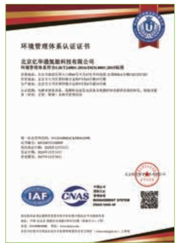

text_image

环境管理体系认证证书
北京亿华通氢能科技有限公司
环境管理体系(01)274890_2016-074514901_2015版号

兹委托先生：北京亿华通氢能科技有限公司（以下简称“公司”或“本公司”）授权委托书（盖章编号：2015-032）

兹委托先生：北京市亿华通氢能科技有限公司（盖章编号：2015-032）

受托人：北京亿华通氢能科技有限公司（盖章编号：2015-032）

本次申请，无需提交股东大会审议。本次申请的有效期限为自本次申请获得之日起至本次申请结束之日止。具体内容详见公司于2016年1月1日刊登在巨潮资讯网（www.cninfo.com.cn）的《环境管理体系认证证书》。

特此公告。

IAAF CNAS

中国证券报
证券时报
证券日报

MANAGEMENT SYSTEM
CNAS-CNAS-08

请各位投资者关注环境管理体系认证事项并及时向投资者提供支持。
地址：中国·北京·成都·沈阳市高新区·九洲大道1号A座12层
电话：021-63333333 传真：021-63333333

特此公告。

在生產流程中，從裝配到測試環節，我們均考慮環境因素，確保合規運營。公司按季度針對廢氣、廢水、固體廢棄物等各類指標提交檢測報告，以驗證合規性並持續改進環境績效。

# 7-3-2環境應急與意識提升

億華通高度重視突發環境事件的防范和應對。針對氫氣泄漏和火災事故等特定情形，制定培訓及演練計劃，按照計劃開展培訓及應急演練，旨在提升員工的應急響應能力，確保在潛在風險發生時能夠快速、有效地控制和緩解環境影響。公司積極開展全員環保能力培養和意識提升工作，報告期內，我們的環境相關培訓主題覆蓋“節能減排”“廢棄物分類與處置”及“無紙化辦公技能”等內容，促進了日常運營中的綠色實踐。對於公司在報告期內開展的應急響應活動，請見“強化應急響應”章節。

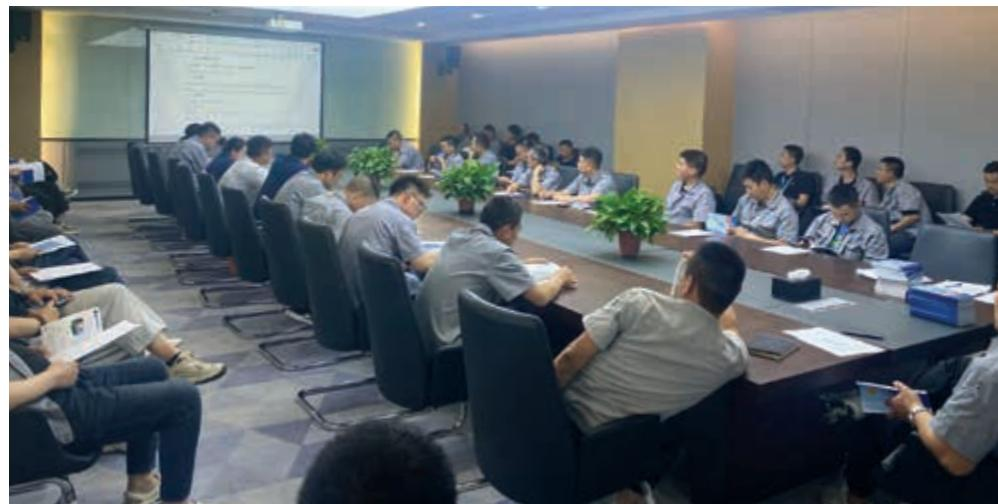

natural_image

Interior view of a conference room with attendees seated around a long table, facing a presentation screen (no visible text or signage)

節能減排培訓

7-4

# 指標和目標

2025 年，公司制定環境合規管理目標，涵蓋廢棄物、廢氣和廢水管理，堅決杜絕任何違法違規排放行為，降低環境影響。2025 年，公司共計投入超62萬元用於環保設施建設和運行，足額繳納環保稅費。

億華通 2025 年度環境合規管理相關目標及進展

<table><tr><td>指標</td><td>2025年度目標</td><td>2025年度進展</td></tr><tr><td>監管單位檢查發生危險廢物管理問題事件數</td><td>0件</td><td>0件</td></tr><tr><td>廢氣排放監測不達標項目數</td><td>0件</td><td>0件</td></tr><tr><td>廢水排放監測不達標項目數</td><td>0件</td><td>0件</td></tr></table>

報告期內，公司未發生因違反環境管理相關法律法規而受到主管部門處罰的事件，亦不存在上述方面的重大環境影響。

# 8 生態系統與生物多樣性保護

億華通深刻認識到保護生物多樣性的緊迫性和重要性，嚴格遵守國家和地方相關法律法規。為加強生物多樣性保護，我們的廣西、廣東產線在廠區選址階段，優先選擇已開發區域，避免在自然保護區等敏感地帶建廠，以減少對自然環境的潛在破壞。同時，在廠區建設前，我們針對擬建區域開展詳細的環境影響評估，確保規劃方案符合生態要求。在后期運營過程中，公司實時監測廢水、廢氣等排放指標，確保全部達標排放，從而避免對當地生態環境造成負面影響。

natural_image

Lush green hillside with grazing sheep under a partly cloudy sky, surrounded by forested hills (no text or symbols visible)

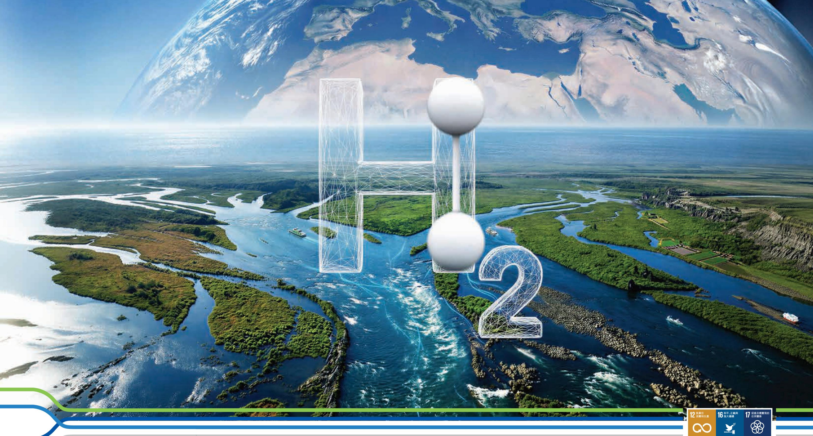

# 契勢而茂林

——協同共生・力拓新局

01|兩會之聲·產業之責 49  
02|科技創新·產業構建 51  
03|鏈承責任·聚力共生 68  
04|員工成長·林木扶疏 70  
05|社區賦能·氫暖人間 84

# 01 | 兩會之聲 產業之責

作為氫能產業的先行者，億華通深知，一個產業的繁榮，離不開頂層設計的指引與政策環境的滋養。董事長張國強先生連續三年以全國人大代表的身份，將一線實踐中的深刻洞察，轉化為推動國家產業變革的‘億華通方案’。

“從一份提案，到一紙回信，再到一項項落地生根的政策，億華通正以‘思想者’與‘行動派’的雙重身份，深度參與並塑造著中國氫能產業的未來。我們相信，真正的領導力，在於為整個行業開辟道路。這，就是億華通的擔當！

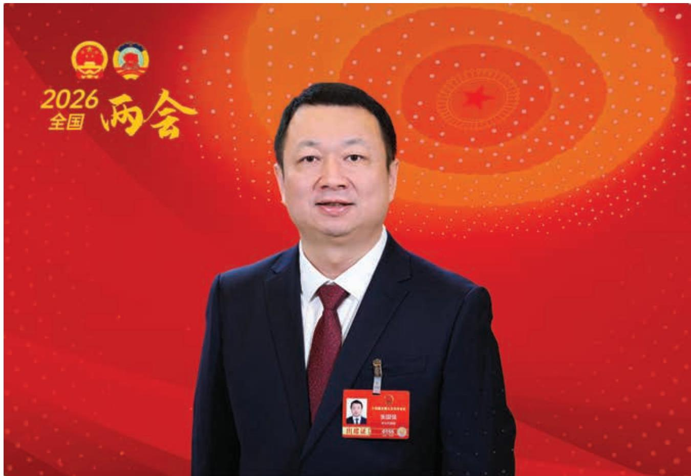

text_image

2026
全国 两会

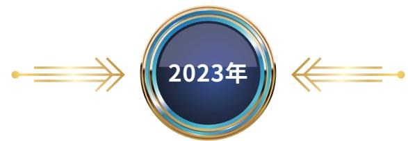

flowchart

```mermaid
graph LR
  A["Start"] --> B["2023年"]
  B --> C["End"]
```

# 《關於強化政策支持，加快氫能規模化發展》

- 擴大燃料電池汽車示范城市群數量  
- 探索多元化氫源供給模式，推動可再生能源綠氫發展  
- 取消須在化工園區內制氫的限制，優化加氫站審批管理  
• 推進綠色金融創新，設立氫能產業基金

2024年

# 《關於搶抓能源轉型機遇加快構建氫能產業生態》

- 推動氫能規模化應用，以規模帶動產業提質降本  
- 打造低成本綠氫保障，支撐氫能產業高質量發展  
- 突破產業發展政策瓶頸，推動氫能產業快速發展

2025年

# 《強化政策支持與產業協同推動氫能全產業鏈可持續發展》

- 加大產業鏈民營企業融資發展支持力度  
• 完善獎補資金發放機制，及時發放獎補資金  
- 打造低成本氫氣供應保障  
- 開展氫能高速及其它交通運輸領域示范應用  
• 推進氫能在工業及電力等領域的多元化示范應用

# 02 | 科技創新 產業構建

# 9 創新驅動

經過10餘年的探索和發展，億華通沿循“整車動力系統→發動機→電堆→雙極板&膜電極”的“剝洋蔥”技術路線，層層深入、逐環解耦，努力向氫能和燃料電池“雙輪驅動”發展戰略格局邁進。

9-1

# 治理

億華通研發部通過專業化模塊分工與國家級重點項目的承接機制，建立系統化、前瞻性的科技創新治理架構，確保研發資源高效配置、決策科學專業，並有力推動氫燃料電池核心技術的自主創新與產業化應用。

9-2

# 戰略

我們堅持“預研一代、開發一代、推廣一代”的技術創新模式，不斷加大科研投入，建立健全產品研發組織體系，培育培養高技術人才隊伍，厚植創新基因、夯實研發基礎，持續引領氫能產業健康高質量發展。

9-3

# 影響、風險和機遇管理

億華通依托長期在燃料電池領域的創新積累，主動積極地推進氫能技術創新，推動氫能的商業化和可持續發展。

# 9-3-1 創新項目管理

億華通依托長期在燃料電池領域的創新積累，主動積極地推進氫能技術創新，推動氫能的商業化和可持續發展。

# 案例 180kW到400kW——全新一代Gen4電堆

報告期內，神力科技推出了全新一代Gen4大功率柔性膨脹石墨電堆。該款電堆可實現從180kW到400kW的寬域功率覆蓋，一舉攻克大功率石墨板電堆產業化的關鍵技術瓶頸，為重型運輸、工程機械及兆瓦級氫儲能電站，提供量體裁衣”的柔性解決方案。

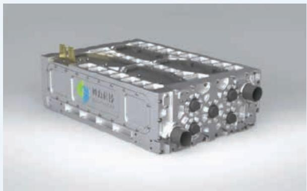

natural_image

Exterior view of a battery pack with multiple internal components and connectors (no visible text or symbols)

案例 國家重點研發計劃氫能技術專項  
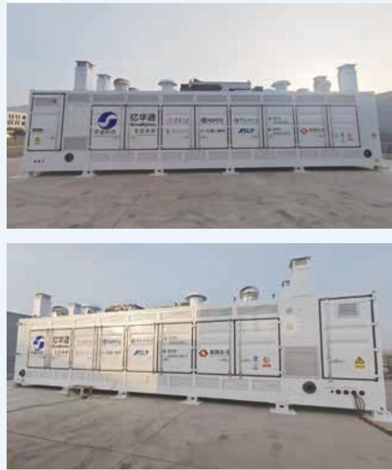

報告期內，億華通持續推進國家重點研發計劃“單套兆瓦級質子交換膜燃料電池熱電聯供系統設計與集成”項目。該項目是由億華通作為牽頭單位，清華大學、中國科學院寧波材料所、華北電力大學、中國電力科學研究院、北京交通大學、有研工研院、國網新疆電力、伊寧聯創城市建設有限公司、上海智能新能源汽車科創功能平台共十家單位組成技術攻關團隊，重點推進氫燃料電池在熱電聯供領域的應用，開發單套兆瓦級質子交換膜燃料電池熱電聯供系統，並在新疆伊犁開展示范應用。

質子交換膜燃料電池熱電聯供具備清潔、高效、噪音低、啟動速度快等優勢，是支撐國家能源結構優化與清潔能源供應的重要技術路徑，也是實現碳中和目標的關鍵技術之一。在《氫能產業發展中長期規劃》等政策推動下，該技術已成為當前國際研究熱點。因此該項目是中國燃料電池產業從車用向能源、儲能領域應用的重要里程碑，將為未來燃料電池熱電聯供示范推廣，在技術、運營、測試評價等多維度提供支撐。

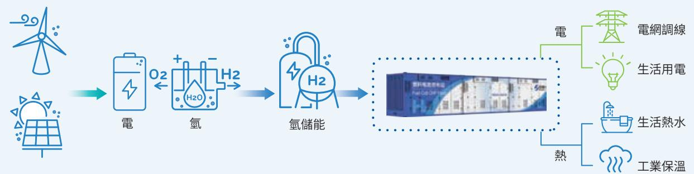

flowchart

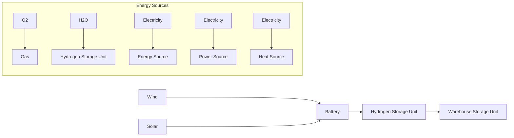
```mermaid
graph LR
  A["Wind"] --> B["Battery"]
  C["Solar"] --> B
  B --> D["Hydrogen Storage Unit"]
  D --> E["Warehouse Storage Unit"]
  subgraph Energy Sources
    direction TB
  F["O2"] --> G["Gas"]
  H["H2O"] --> I["Hydrogen Storage Unit"]
  J["Electricity"] --> K["Energy Source"]
  L["Electricity"] --> M["Power Source"]
  N["Electricity"] --> O["Heat Source"]
  end
```

解決
四大難題  
單套功率小  
綜合效率低  
運行壽命短  
熱電比範圍窄

預期
研究成果  
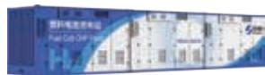  
兆瓦級熱電聯供系統

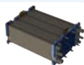  
燃料電池堆  
兩款核心產品

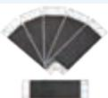  
系統層、
膜電極層級

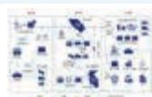  
氫能“源網荷儲”

  
專利／標準／軟著
／論文  
八大關鍵部件／材料  
一個示範平台  
多項知識產權

# 9-3-2 打造氫能生態

基於多年研發經驗積累和創新能力的持續提升，億華通通過自主創新與跨界合作的雙重驅動，將創新成果廣泛應用於社會各領域，加速構建綠色、可持續的未來社會。

# 案例 京津冀氫能產業鏈協同發力，打造全國氫能創新高地

京津冀地區依托《京津冀能源協同發展行動計劃》，構建了涵蓋制氫、儲運、加注和應用的氫能全產業鏈網絡。億華通作為氫能骨干企業，與各大高校、企業等跨行業伙伴合作，形成技術攻關團隊，推動了氫能技術的聯合創新和示范應用。

公司採用“1+2+1+N”產業佈局，“1”即為億華通總部，“2”即為億華通承擔氫燃料電池發動機的研發、測試和製造業務的兩個廠區，“1”為燃料電池的生產製造基地億華通動力，“N”即在京津冀區域的投資和技術研發孵化成果。利用北京的研發資源和河北張家口的綠色能源，我們通過“以電養氫、以氫促產、氫電協同、跨越

發展”的思路，形成區域協同模式，作為龍頭企業推動三地氫能產業協同和綠色發展。此外，區域協同發展大大提升了產業鏈自主性，我們聚焦氫燃料電池系統國產化，實現了空壓機、氣循環泵、水泵等核心零部件的自主研發和國產替代，打破了國外技術壟斷。

與此同時，我們佈局可再生能源與氫能綜合利用項目，構建從風/光發電到制、儲、運、加、用等完整的氫能與氫燃料產業鏈；通過綠電+綠氫+綠氨，打造零碳產業園，以豐富的可再生能源為源動力，結合氫能應用為交通、冶金、化工、儲能等產業提供綠色可持續支撐。

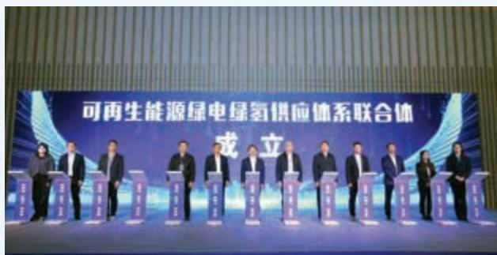

text_image

可再生能源绿电绿氢供应体系联合体
成立

可再生能源綠電綠氫供應體系聯合體成立

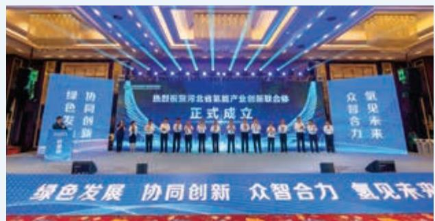

text_image

绿色发展 协同创新 众智合力 氧见未来
热烈祝贺河北省氢能产业创新联合体
正式成立
绿色发展 协同创新 众智合力 氧见未来

河北省氫能產業創新聯合體成立

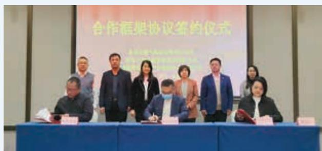

text_image

合作框架协议签约仪式

三方戰略合作協議簽訂

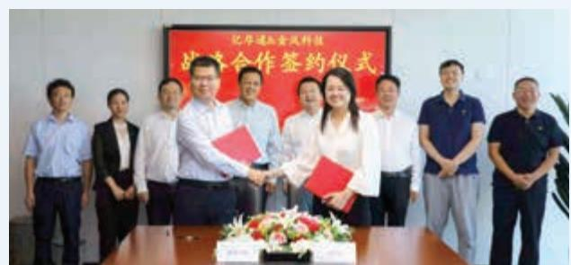

text_image

纪厚通加金流科技
战略合作签约仪式

風氫一體化產業發展事宜合作協議簽訂

“河北張承唐氫能區域試點”通過區域協同，將張家口、承德豐富的可再生能源轉化為綠氫，並通過規劃中的康保-曹妃甸輸氫管道等基礎設施，輸送給唐山等工業消納端，形成完整的全鏈條示范。

報告期內，億華通深度參與這一國家級樣板工程，憑借領先的技術實力與豐富的產業化經驗，扮演了核心角色，旨在將自身技術能力與區域

資源稟賦深度融合，為構建“京津冀氫能走廊”貢獻企業力量。通過參與此類跨區域、大規模的系統性示范，億華通能夠加速推動核心技術在不同場景下的規模化驗證與迭代，有效促進全產業鏈成本的降低與運營效率的提升，並將企業戰略融入國家氫能發展藍圖，踐行了以政企協同驅動產業生態共建的ESG理念。

# 一、主要建设内容

# □ 主要建设内容

覆盖范围：张家口、承德、唐山三地，辐射京津冀  
起止年限：2025年-2028年  
建设规模：重点建设1037公里“康保-曹妃甸”输氢管道，覆盖7个试点方向10个项目。  
发展定位：打造国家级氢能资源供给与应用示范区  
试点目标：打通氢能资源侧和应用市场侧的最后一公里，破解绿氢规模化储运瓶颈，探索氢能规模化降本路径，形成可推广可复制的商业模式和“张承唐样板”。

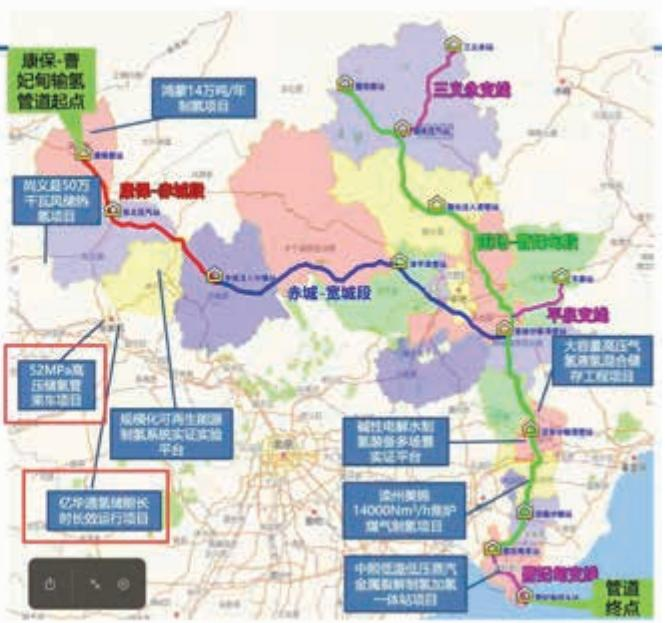

text_image

康保-曹妃甸输氢管道起点
尚义县50万千瓦风能热气项目
康保-春城段
鸿蒙14万吨/年制氢项目
三充永安路
赤城-宽城段
平县安路
大容量高压气氢液氢混合储存工程项目
S2MPa高压储氢管客车项目
低碳化可再生能源制氢系统实证实验平台
亿华港氢储能长时长效运行项目
碱性电解水制氢换多场景实证平台
滨州黄铜14000Nm³/h锅炉煤气制氢项目
中购低值压蒸汽金属电解制氢加氢一体站项目
富阳海安路
管道终点

“河北張承唐氫能區域試點”示意圖

作為該區域試點的核心參與單位，億華通承擔的兩大子項目均已納入國家首批示范清單，項目周期覆蓋2025至2028年。此外，作為唐山示范城市群牽頭企業，唐山謙辰成功申報了唐山市第二年度燃料電池汽車示范應用獎勵。

報告期內，我們正在推動的國家級/省部級/地方級科技項目共計8項，其中國家級科技項目3項，省部級科技項目3項，地方級科技項目2項。公司累計承接了48項國家/省部級課題，其中國家級課題24項。

# 52MP鋁內膽碳釘纏繞 氣瓶氫氣管束集裝箱儲運 設備試點項目

為降低氫能儲運環節這一關鍵成本，公司承擔了高壓儲運設備試點項目。該項目研發的52MPa鋁內膽碳纖維纏繞氣瓶管束集裝箱，採用輕量化設計，實現總重降低12%。報告期內，該設備已在張家口地區開展公路運輸示范，累計完成12趟、單程150公里以上的實際運輸測試。實證數據顯示，其平均運輸損耗率被控制在1.2%以內。經測算，相較於傳統的20MPa設備，該技術可將氫氣公路運輸成本從百公里約6元/公斤降至約3元/公斤，實現單公斤氫氣運費降低約50%。

# 張家口氫儲能長時長效 運行試點項目

該項目旨在驗證氫儲能作為長時儲能技術的經濟性與可靠性。項目依托現有基礎設施，部署了城式電解水制氫與純化系統（氫氣純度達99.999%），並配套可支撐1兆瓦氫發電系統連續穩定運行9小時以上的高壓儲氫罐。截至報告期末，項目已順利完成制氫、儲氫環節的竣工驗收，設備調試合格率達到100%，計劃於2026年進入完整的“電-氫-電”場景實證運行階段。

# 案例 中國-東盟氫能產業基地建設

近年來，百色積極佈局綠色能源產業發展新賽道，大力推動氫能產業和電池電芯等能源電子產業集群發展。我們與24家企業伙伴合作，共同發起建設了中國—東盟氫能產業基地。

報告期內，我們在廣西百色地區投資建設的生產基地成功下線投產首臺氫燃料電池發動機，標誌著廣西氫能關鍵裝備製造領域實現零的突

破”。我們的發動機產線一期產能為年產量2000臺，主要生產80kW—240kW的氫燃料電池發動機，全領域應用於轎車、冷鏈物流車、氫能重卡等車型。未來我們將進一步擴大生產能力，氫燃料電池發動機年產量將達1萬臺，為廣西乃至東盟地區氫能產業發展做出更大的貢獻。

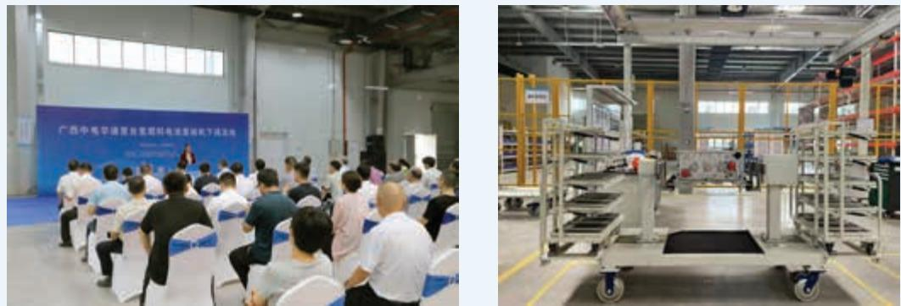  
首臺發動機下線活動

# 9-4

# 指標和目標

億華通經過多年發展，在市場佔有率、燃料電池汽車公告、整車企業合作數量等方面處於領先地位。

報告期內，我們正在推動的國家級/省部級/地方級科技項目共計8項，其中國家級科技項目3項，省部級科技項目3項，地方級科技項目2項。公司累計承接了48項國家/省部級課題，其中國家級課題24項。

<table><tr><td>項目名稱</td><td>項目級別</td><td>角色定位</td></tr><tr><td>單套兆瓦級質子交換膜燃料電池熱電聯供系統設計與集成</td><td>國家級</td><td>主持</td></tr><tr><td>能源領域氫能項目試點-52MPa鋁內膽碳纖維纏繞氣瓶氫氣管束集裝箱儲運設備試點項目</td><td>國家級</td><td>牽頭</td></tr><tr><td>能源領域氫能項目試點-張家口氫儲能長時長效運行項目</td><td>國家級</td><td>牽頭</td></tr><tr><td>適用於車載液氫儲供系統低壓力輸入的燃料電池系統開發及整車應用</td><td>省部級</td><td>主持</td></tr><tr><td>離網混聯制氫儲能系統關鍵技術研發和產業化示范</td><td>省部級</td><td>參與</td></tr><tr><td>高性能燃料電池發動機集成技術研發及產業化應用</td><td>省部級</td><td>參與</td></tr></table>

# 10 產業合作與發展

# 10-1

# 治理

公司統籌開展對外交流與戰略合作相關工作，由內部專項部門兼職負責。工作內容全面覆蓋行業研究報告編制、產業政策研判解讀、榮譽獎項及核心資質的申報與動態維護、品牌價值傳播、行業協會事務參與等多項工作。

在公司 ESG 整體治理體系下，該項職能發揮內外銜接、協同賦能的關鍵作用：一方面，依托政策深度解讀、行業標準共建及產業交流協作，精準研判外部 ESG 發展要求與行業發展趨勢，為董事會、戰略及 ESG 委員會科學決策提供有力支撐；另一方面，常態化統籌資質認證、榮譽管理等工作，對外充分展示公司核心技術實力與可持續發展實踐成果，持續鞏固並提升企業綠色責任形象與行業領軍地位。

# 10-2

# 戰略

億華通堅持以可持續發展為導向的合作觀，秉持"開放共享、綠色協同、責任共擔"的理念，深度參與行業組織運作，並踴躍出席行業交流盛會，與各大高校、科研院所以及行業伙伴開展深度合作，不斷推動產業高質量轉型和綠色低碳技術創新。

# 10-3

# 影響、風險和機遇管理

# 10-3-1 深耕標準制訂

我們聚焦氫燃料電池細分領域，憑借深厚技術積累，參與制定GB/T 31036-2025《質子交換膜燃料電池備用電源系統安全》和GB/T 20042.5-2024《質子交換膜燃料電池第5部分：膜電極測試方法》兩項國家標準。兩項新標準的落地該標準強化了燃料電池風險評估和應急響應機制，增加了對極端環境條件下系統穩定性的要求，並優化了安全防護措施，以提升整體可靠性和環境適應性。還填補了舊版在壽命評價方面的空白，改善了行業內性能評估的標準一致性，並適應了燃料電池行業對更高性能指標的需求。

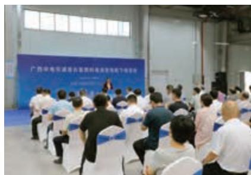

text_image

广西中电集团联合新能源汽车销售服务平台

牽頭行業標準制訂

2025年億華通參與制訂的兩項國家標準  
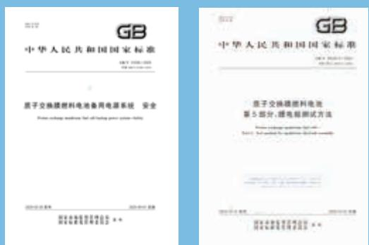

text_image

GB
中华人民共和国国家标准
GB
中华人民共和国国家标准
原子交换膜燃料电池备用电源系统 安全
原子交换膜燃料电池
第5部分，锂电池测试方法

# 10-3-2 行業參與與交流

截至報告期末，公司已加入19家國內外行業協會，攜手會員單位和合作機構共同發展。我們牽頭制定《河北省氫能產業園區建設標準》，組織3次行業研討會（參會企業累計86家），推動5家配套企業入駐張家口氫能產業園，共享科技創新成果。

<table><tr><td>序號</td><td>名稱</td><td>鏈接</td></tr><tr><td>1</td><td>中關村氫能與燃料電池技術創新產業聯盟</td><td>理事長單位</td></tr><tr><td>2</td><td>中國電器工業協會燃料電池分會</td><td>副理事長單位</td></tr><tr><td>3</td><td>中國汽車工業協會上市委員會</td><td>副理事長單位</td></tr><tr><td>4</td><td>中國電動汽車百人會</td><td>發起單位</td></tr><tr><td>5</td><td>淄博市氫能產業技術創新戰略聯盟</td><td>發起單位</td></tr><tr><td>6</td><td>國際氫能燃料電池協會</td><td>常務理事單位</td></tr><tr><td>7</td><td>中關村京津冀新能源汽車協同發展促進會</td><td>理事單位</td></tr><tr><td>8</td><td>中國交通運輸協會清潔能源車船分會</td><td>理事單位</td></tr><tr><td>9</td><td>中國氫能聯盟</td><td>理事單位</td></tr><tr><td>10</td><td>中國汽車芯片產業創新戰略聯盟</td><td>理事單位</td></tr><tr><td>11</td><td>京津冀企業家聯盟</td><td>理事單位</td></tr><tr><td>12</td><td>河北省氫能學會</td><td>會長單位</td></tr><tr><td>13</td><td>中關村會展與服務產業聯盟</td><td>會員單位</td></tr><tr><td>14</td><td>北京軟件和信息服務業協會</td><td>會員單位</td></tr><tr><td>15</td><td>中關村企業信用促進會</td><td>會員單位</td></tr><tr><td>16</td><td>河北新能源汽車產業聯盟</td><td>會員單位</td></tr><tr><td>17</td><td>成都市綠色智能網聯汽車產業生態圈聯盟</td><td>會員單位</td></tr><tr><td>18</td><td>張家口能源產業發展協會</td><td>會員單位</td></tr><tr><td>19</td><td>中國氫能學會</td><td>會員單位</td></tr></table>

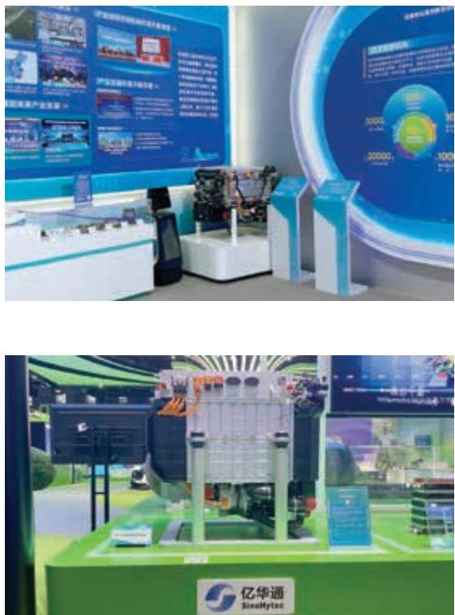  
中關村論壇

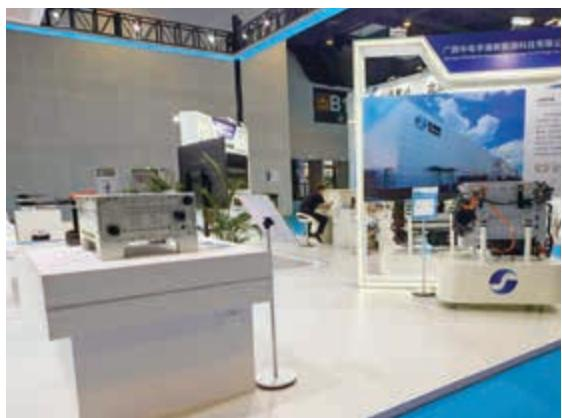

natural_image

Exterior view of a modern office building (no signage)

第二十二屆中國-東盟博覽會

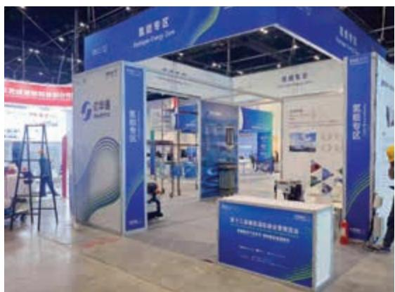

text_image

奥瑞专区
Aerobian Special Zone

第十三屆儲能國際峰會暨展覽會 (ESIE2025)

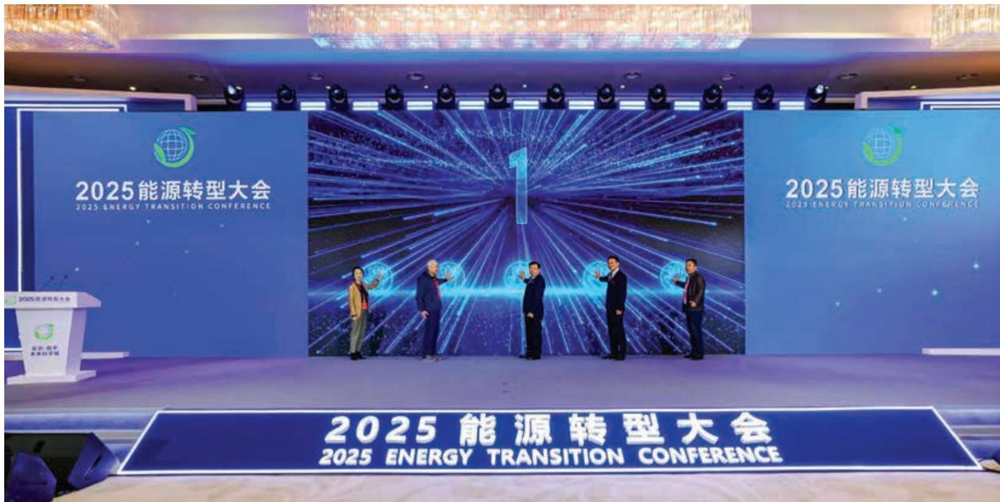

text_image

2025能源转型大会
2025 ENERGY TRANSITION CONFERENCE
2025能源转型大会
2025 ENERGY TRANSITION CONFERENCE
2025 能源转型大会
2025 ENERGY TRANSITION CONFERENCE

2025能源轉型大會

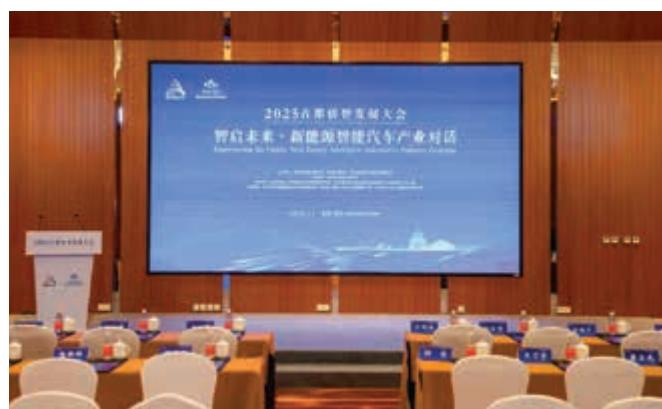

text_image

2023年群智集团大会
智启未来·新能源智能汽车产业对话
International Smart Garden Industry Association

智啟未來·新能源智能汽車產業對話活動

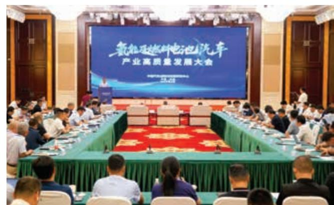

text_image

湖北及株洲电池汽车
产业高质量发展大会

智啟未來·新能源智能汽車產業對話活動

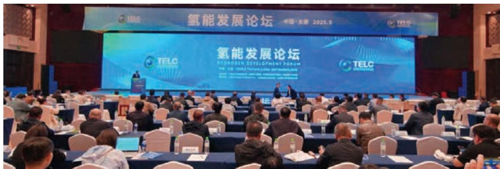

text_image

氢能发展论坛 中国·太原 2025.9
氢能发展论坛
HYONGYUAN DEVELOPMENT FORUM
中国·太原·太原·太原
TELC
TELC
TELC
TELC
TELC
TELC

2025年太原能源低碳發展論壇

10-4

# 指標和目標

國標參與制訂項目(部分):

<table><tr><td>標準名稱</td><td>標準類別</td><td>角色定位</td></tr><tr><td>儲能系統用可逆模式燃料電池模塊第2部分：可逆模式質子交換膜單池與電堆性能測試方法</td><td>國標</td><td>參與</td></tr><tr><td>儲能系統用可逆模式燃料電池模塊第3部分：電能儲存系統性能測試方法</td><td>國標</td><td>參與</td></tr><tr><td>質子交換膜燃料電池第6部分：雙極板特性測試方法</td><td>國標</td><td>參與</td></tr><tr><td>加氫站通用要求</td><td>國標</td><td>參與</td></tr><tr><td>燃料電池電動汽車碰撞后安全要求</td><td>國標</td><td>參與</td></tr></table>

截至報告期末，億華通參與標準制修訂86項，其中國家標準41項、行標地標8項、團體標準37項。

# 知識產權保護

我們嚴格遵守國內外知識產權相關法律法規，包括《中華人民共和國專利法》《中華人民共和國著作權法》及相關國際公約與主要市場國法律，在積極保護自主知識產權的同時，充分尊重他人知識產權。公司構建了一套高效的知識產權管理體系，覆蓋專利權和軟件著作權，並高度重視知識產權的海外佈局與註冊工作，為國際化發展奠定法律基礎，旨在鼓勵發明創造，促進科技成果推廣應用。

公司高度重視知識產權管理工作，制定了《知識產權管理辦法》《知識產權及論文發表獎勵管理辦法》和《專利申請管理辦法》等一系列制度，從知識產權創造、保護、運用等方面全方位規范公司知識產權管理，實現知識產權全鏈條的佈局和保護，通過創新積累知識產權，通過知識產權保護和促進創新。

報告期內，公司共計獲得新增138項知識產權，包括發明專利114個，實用新型專利17個以及軟件著作權7個。截至報告期末，億華通累計獲得1,327個知識產權，包括發明專利390個、實用新型專利789個、外觀設計專利25個以及軟件著作權123個。

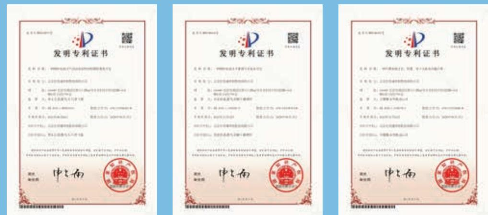  
億華通2025年獲得的發明專利(部分)

# 產品安全與質量

12-1

# 治理

億華通已設立質量保證部，負責公司質量管理業務、產品質量控制業務及市場質量問題相應處置。

# 質量管理

依據公司業務佈局、組織架構和職能調整，組織開展質量體系文件及相關流程文件優化與修訂。

# 質量問題處置

針對質量問題，建立快速響應機制，例如通過質量例會收集市場反饋比較集中的故障問題，做出相應的處理措施。根據月度統計數據，對所有的質量問題進行調度，形成質量風險預警。

# 質量控制

梳理新產品開發過程和批量生產過程的質量問題清單，建立質控經驗教訓數據庫，為質量預防、質量改進提供支撐；制定多能工培養計劃，開展產品檢驗人員輪崗培訓，實現檢驗人員對產品質量控制要素的全面掌握，提升產品質量控制水平；策劃產品全生命周期質量控制，從原材料進貨檢驗、裝配質量首末件質量檢驗、產品性能測試驗證到成品發貨檢驗，確保產品100%檢驗合格。

12-2

# 戰略

億華通將產品質量與安全視為維系客戶信任、應對行業挑戰的核心戰略支柱。我們制定了“質量保證向質量預防轉型，追求卓越質量績效”的質量管理戰略，對內部質量管理體系的成熟度進行自我評估，保證質量體系持續有效運行。

12-3

# 影響、風險和機遇管理

# 12-3-1 質量管理體系

億華通遵循IATF 16949、ISO 9001等標準建立健全公司質量體系。截至報告期末，公司保持了相關質量證書的有效狀態。

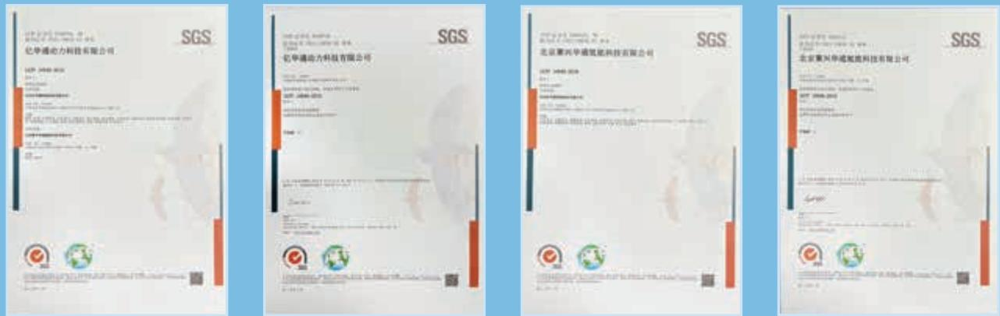  
部分質量(體系)認證證書

# 12-3-2 質量控制

我們堅持抓基礎、抓執行，在生產現場營造“有法可依、有法必依、人人擔責”的質量文化，依據公司質量體系文件對公司生產活動中的來料、制程、成品、出貨等各過程產品質量特性進行檢驗，為有力支撐產品出海與國際市場拓展，公司持續推動質量管理體系與國際標準及目標市場要求接軌，確保相關料和產品符合標準要求。

# 我們的產品特性

安全性與穩定性：燃料電池發動機採用自主集成技術，實現了氣、空、水、熱、電等核心元素的高效協同控制，提升了系統的可靠性和穩定性，具體包括：電堆採用耐高溫衝擊柔性石墨板，通過129項寬闊高可靠高耐久電堆測試；氫噴採用微納級高硬度耐磨涂層，高壓大流量高溫耐受噴嘴；空壓機採用高強度零部件，設計開發30萬次啟停並通過30000小時長耐久測試；燃料電池系統經過嚴格的安全測試和驗證，具備高可靠性；系統具備自動診斷識別發動機零部件功能狀態、智能預測電堆健康狀態與在線性能恢復等功能。

# 長壽命與耐久性

長壽命與耐久性：開發單體交流阻抗在線檢測技術與多段式自適應一致性吹掃策略，實現低溫突破，發動機實驗室測試過程實現零下-40°C無外加熱自啟動，按GB/T 33979標準，從開機到額定功率耗時124s。燃料電池整車通過牙克石地區-30°C冷啟動驗證。

# 環境適應性

構建了面向機-電-氣-熱-化學耦合系統的耐久性優化架構，全面提升產品壽命。

我們制定了《不合格品控制》程序，對各過程檢驗發現的不合格品進行問題原因分析，並對重大、重復發生的不合格品情況開展糾正預防措施，通過持續改進不斷提高公司產品質量。我們將不合格品根據嚴重程度分為四個等級。該劃分基於安全及法規影響、對終端客戶影響、對下道工序和生產節拍的影響、對外觀性能質量及投訴的影響、公司損失等維度進行評估。

<table><tr><td>級別</td><td>嚴重程度</td><td>安全及法規的影響</td><td>對終端客戶影響</td><td>對下道工序、生產節拍的影響</td><td>對外觀、性能質量及投訴的影響</td><td>公司損失</td></tr><tr><td>一級</td><td>非常嚴重</td><td>影響安全或不符合法律法規</td><td>100%影響壽命</td><td>嚴重影響節拍或導致停產</td><td>客戶肯定會發現並進行投訴</td><td>造成公司重大損失</td></tr><tr><td>二級</td><td>嚴重</td><td>不涉及</td><td>可能影響壽命或主要性能顯著下降、重要功能喪失</td><td>對工作節拍較大影響w</td><td>客戶可能會發現或可能會投訴</td><td>產品成本明顯增加(增加5%-20%)</td></tr><tr><td>三級</td><td>一般</td><td>不涉及</td><td>不影響壽命但可能失去或降低次要功能</td><td>導致工作節拍收到輕微影響</td><td>客戶可能會發現、但不會投訴</td><td>未導致成本明顯增加(≤5%)</td></tr><tr><td>四級</td><td>次要</td><td>不涉及</td><td>不影響</td><td>不影響</td><td>不會被客戶發現</td><td>不影響</td></tr></table>

等級劃分應用於不合格品審理流程中，一級和二級問題需經高級管理層審批，以確保安全風險最小化；三級和四級則由一線人員處理，強調快速響應。公司通過該機制，實現不合格品的有效隔離、分析和處置，支持產品質量持續改進。當產品涉及安全質量特性不合格時，該問題自動歸為一級嚴重程度，並逐級上報處理，包括識別和評估受影響的終端產品，以確定處置方式及需實施的糾正措施。

# 12-3-3 製造體系

億華通的製造體系構建了一個全面的閉環管理框架，從訂單接單、訂單評審、物料採購、生產管理、車間管理、安全環境管理，到人員培訓、工藝文件、工藝管控流程、工藝開發流程、設備管理和固定資產管理等環節。製造決策過程的監督機制通過多層評審和交叉檢查運作，最終形成可執行的結果，確保生產過程高效且合規。

在生產過程中，我們實現全流程實時監控：來料通過零部件進廠檢驗控制質量，確保外購零部件符合要求；製造現場實施自檢互檢，並用製造執行系統(MES)實時監控參數（如螺栓擰緊力），系統分析異常情況，緊急時要求停線以防止缺陷擴散；半成品完工后，進行性能測試；成品包裝后再次驗證是否符合終端客戶要求。此外，我們制定了《監視和測量設備管理》等制度，進一步確保生產過程的穩定性和可靠性。定期對監視測量設備進行第三方校準工作和測量系統分析(MSA)，並通過實施日常點檢與維護保養，確保公司監測和測量系統的完好性和準確性。

# 12-3-4 精益人才培養

報告期內，我們開展了針對不同工種的產線人才培訓，打造多層次人才矩陣。

- 對技術工人，培訓從燃料電池裝配測試開始，拓展到電解槽、電堆和熱電聯供知識；  
- 對工程師/管理人員，培訓聚焦精益生產、數字化和智能工廠，包括Python編程、仿真設計和PLC建模識別編程等內容，應用於生產現場。

# 12-4

# 指標和目標

報告期內，公司未發生已售產品因安全理由而須回收的事件，也未發現一級或二級不合格品。

natural_image

Digital illustration of a person interacting with a futuristic holographic interface featuring hexagonal elements and a central 'H2' symbol (no readable text or labels)

# 13 客戶服務質量

# 13-1

# 治理

億華通秉持“以客戶為中心，為客戶創造最大價值”的理念，將滿足客戶需求作為我們的目標。公司設立售后服務部作為專責部門，負責售中和售后保障的全流程管理，下設服務保障、技術支持、配件管理三大模塊：

# 服務保障

現場服務(裝車階段售中服務及車輛交付售后服务)和內勤任務傳達處理；

# 技術支持

運行過程中技術問題解答及新產品技術資料轉化；

# 配件管理

覆蓋配件庫房存儲、訂單生產、發送、銷售及中心庫、區域庫和駐點庫三級倉庫體系管理。

售后服務部通過專業模塊分工、資質管理及考核機制，確保服務治理的專業性、規范性和高效性。

# 13-2

# 戰略

我們以“燃料電池汽車城市示范群”為支點，持續完善並深化售前、售中與售后各環節的客戶服務體系建設。從經濟規模、產業配套、能源結構等多方面考察，搭建全國客戶服務網絡，同時積極探尋氫能和燃料電池市場新業態、新機遇，進一步強化整體競爭力。

我們的全方位客戶服務包括：

# 服務響應

提供365天7x24小時全天候服務，
現場問題15分鐘響應。

# 服務定制化

針對每一用戶指派對接服務經理，針對每一服務單位指派對接服務工程師。

# 客訴處理

設立專門的投訴渠道，包括電話、郵箱、在線客服等。客戶投訴后，15分鐘內進行受理並回復客戶，告知處理進度。對於簡單投訴，24小時內解決並反饋客戶；對於復雜投訴，成立專項處理小組，在7個工作日內給出解決方案並持續跟進，直至客戶滿意。公司堅持不推諉原則，對確認的產品質量問題不推諉責任，立即安排更換全新產品，確保客戶業務不中斷。

# 13-3

# 影響、風險和機遇管理

# 13-3-1 服務團隊建設

我們建立了氫燃料電池從業人員資質認證機制，通過人員培訓、定期評估等建立完善服務機構/人員評價、評審體系。評估採用定量與定性相結合的考核體系，重點覆蓋現場維修、服務站維修、產品維護、客戶關係、服務網絡走訪、維修技能、能力提升等維度。考核強調服務響應及時性、問題解決效率和客戶滿意度，用於進一步提高我們的服務水平。截至報告期末，公司已完成北京、淄博、鄭州、張家口、成都、唐山地區服務機構/人員評估認證工作。

# 服務需求 按期關閉率 ≥95% 達成

# 故障支持有效性≥90%達成

# 工單一次 通過率 ≥85% 達成

# 從業人員培訓通過率≥80%達成

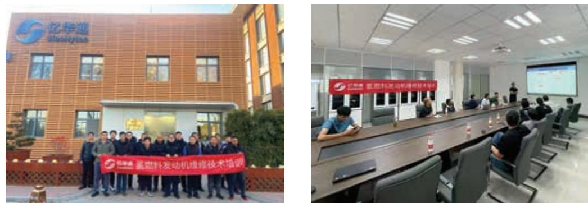  
維修技術培訓

# 13-3-2 客戶滿意度

我們每年至少開展一次客戶滿意度調查，結合應用場景針對主機廠和終端客戶綜合採用問卷調查、電話回訪、在線評價等方式，了解客戶對產品和服務的滿意度及意見建議。根據調查結果，對內發佈調查結果公示和調查報告，分析服務中存在的問題，制定改進措施。

優質的客戶服務創造出良好的客戶體驗，億華通獲得了客戶的廣泛認可和好評。報告期內我們收到了來自北京福田歐輝新能源汽車有限公司的感謝信，信中強調了公司團隊的專業性和擔當精神，肯定了我們在時間緊、任務重的情況下，能夠提供有力支持，包括配件儲備、車輛健康檢查和現場服務保障。反映了億華通客戶服務體系的有效性，進一步驗證了公司“以客戶為中心”的理念。

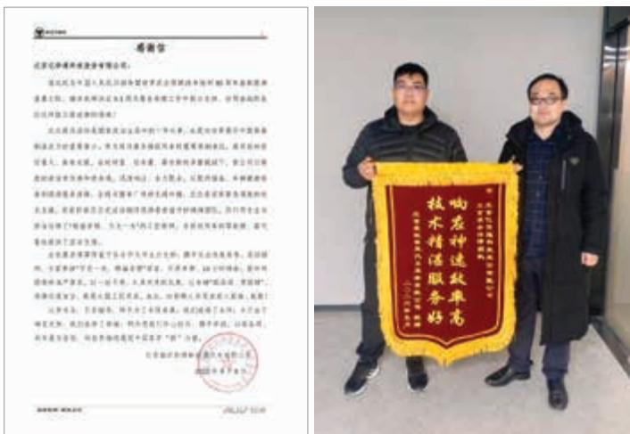  
客戶感謝信  
客戶贈予的錦旗

# 13-4

# 指標和目標

截至報告期末，公司服務網絡已覆蓋所有省份(自治區、直轄市)、自營和合作服務網點達64個、自建專業服務團隊總人數31名。

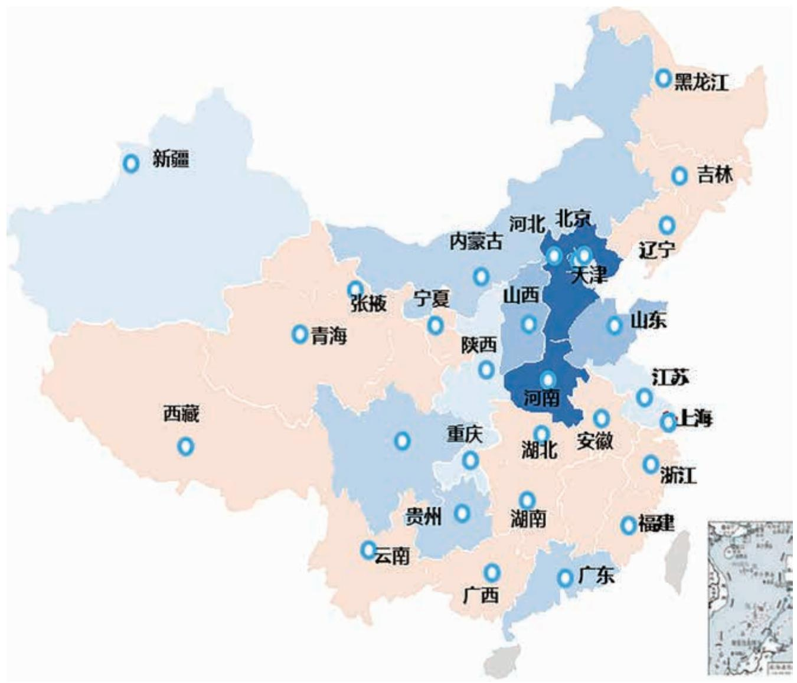

text_image

新疆
黑龙江
吉林
辽宁
河北
北京
天津
山东
山西
内蒙古
宁夏
陕西
青海
江苏
上海
河南
安徽
浙江
重庆
湖北
贵州
湖南
福建
云南
广西
广东

億華通服務網絡覆蓋示意圖

報告期內，我們使用電子問卷實施了年度客戶滿意度調查，共收集主機廠客戶問卷45份、終端客戶問卷112份，調查結果顯示：主機廠客戶顧客滿意度為88.23分、終端客戶滿意度為87.48分，客戶滿意度最終得分為88分，均達成年度計劃目標。

# 14 負責任營銷

億華通堅持透明、準確的信息披露，確保營銷活動符合法律法規和行業標準，避免夸大宣傳或誤導客戶。公司嚴格遵守《中華人民共和國廣告法》等相關法規，在推廣氫燃料電池產品時，強調產品真實性能、安全要求及真實信息，支持客戶做出合理決策，促進氫能產業的健康發展。

我們通過產品用戶使用手冊為用戶提供詳細指導，確保客戶安全使用和維護產品，內容包括：

披露精確產品規格和技術參數以幫助客戶評估實際應用

告知使用安全與風險，包括高溫、高壓、氫安全和化學危害

提供維護與生命周期支持指南，避免不當操作導致浪費或環境影響

此外，我們對使用手冊進行定期更新與持續修訂，根據國家和行業法律法規不定時更新性能參數和氫相關標準，確保信息有孝心，支持客戶長期價值創造。

# 15 信息安全與隱私保護

億華通高度重視自身及客戶的信息安全問題，嚴格遵守《中華人民共和國網絡安全法》、《中華人民共和國數據安全法》、《中華人民共和國個人信息保護法》等法律法規，系統推進信息安全管理體系建設。公司採取融合制度規范、技術防護與文化培育的多維策略，全面引導和約束信息安全相關行為。報告期內，公司實現了數據安全零重大事故、客戶隱私零有效投訴的“雙零”目標。

# 15-1

# 信息安全文化建設

億華通致力於構建全員參與的信息安全文化體系，定期組織全員參與信息安全培訓，為公司信息安全工作提供有力支撐。新員工入職時即納入信息安全培訓流程，並提供入職手冊詳述相關內容；同時，信息安全知識資料上傳至華通學院，供員工隨時查看和學習，從而提升全員的信息安全意識，鼓勵主動防范風險，形成“人人負責”的文化氛圍。

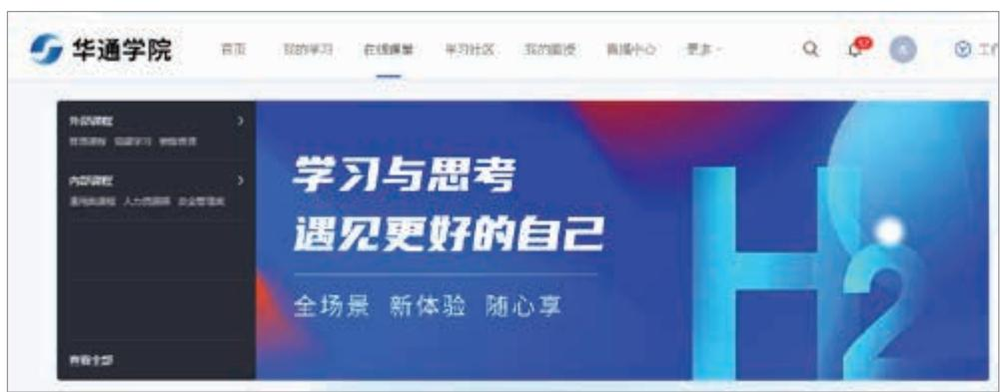

text_image

华通学院
首页 我的学习 在线播量 学习社区 我的面授 直播中心 更多 -
外层课程
内层课程
学习与思考
遇见更好的自己
全场景 新体验 随心享
H2

# 15-2

# 信息安全管理

億華通已建立健全的信息安全管理體系，制訂了《信息安全管理規范》、《信息安全應急響應機制》、《電子文檔安全管理規定》，《IT賬號及權限管理規范》等一系列制度，針對核心信息資產如業務系統、客戶訂單聯系人信息以及內部工作文件進行全面保護。

公司遵循數據分級分類管理原則，依據數據的重要性與敏感程度採取相應的管理及技術防護措施。同時，建立了系統化的應急響應預案與業務連續性計劃（BCP），以有效應對可能發生的信息安全事件，保障關鍵業務不中斷。

為防范網絡攻擊和數據泄露，公司部署網絡硬件防火墻，實現內網、辦公網和車間網的物理與邏輯分離，每日監控並攔截異常攻擊。員工設備配備殺毒軟件，企業郵箱內置防護功能；文件對外共享需經審批解密或使用專用閱讀器限制權限。報告期內，公司將數據加密系統擴展至全員，進一步強化防護，未發現信息安全事件或數據合規問題。

# 信息安全管理措施

# 全員使用 電子文檔加密系統

在公司電腦上生成的文件、圖紙、代碼等文件會自動加密，如需和外部進行文件流轉，需要提交解密申請流程，解密通過后外發文件才能正常閱讀，有效保證了數據安全。

# 防火墙部署

部署網絡硬件防火墻，
每日監控網絡攻擊，異常攻擊通過及時人工處理。

# 安全、可靠的數據備份平台

建立多地容災備份系統，對公司的信息系統及數據進行備份。2025年，累計成功進行數據備份11,067次，累計進行數據恢復96次

# 添加黑名單IP

添加黑名單IP:在公司出口防火墻累計手動添加141個黑名單IP，全年攔截嚴重級別的網絡攻擊310次，未發現攻擊成功事件。

# 15-3

# 隱私保護

億華通嚴格遵守《個人信息保護法》，公司所有員工在入職時均簽署了《商業保密及競業限制協議書》，確保客戶、供應商、和其他相關方的資料不會外泄，我們對於違規的情況保持零容忍的態度。我們確保他們了解資料保護的重要性和公司的政策和程序，同時加強資料保護和隱私意識，並建立內部監控機制，確保資料不被未經授權的人員訪問或濫用。

公司對敏感信息(如手機號、身份證號、銀行卡號)實施脫敏處理，並通過系統權限分級管控確保數據安全。客戶資料及信息作為公司重要的商業信息，公司還設定了嚴格的客戶信息保密規定《銷售信息安全操作手冊》，其中針對客戶資料及信息的授權範圍和保密要求均作出了明確規定，對於違反保密條例的人員，公司會視情況輕重程度給與不同的處罰。我們僅收集和使用必要的客戶資料，並確保取得客戶的同意。

報告期內，公司未發生任何重大消費者資料及隱私泄露行為。

# 03 | 鏈承責任・聚力共生

# 16 供應鏈安全

# 16-1

# 治理

億華通制定了《供應商管理》《供應商開發管理》《供應商合作基本規范要求》等內部制度，形成覆蓋供應商準入申請、審核、績效管理、退出等全流程的供應鏈管理體系，確保供應商在環境保護、社會責任和公司治理等方面符合法律法規，降低供應鏈風險。公司採購部負責全集團採購訂單管理、供應商開發管理，包括集團採購需求、採購成本、合同訂單管理，以及供應商尋源、審核、定點、準入、績效等全生命周期管理。

# 16-2

# 戰略

在戰略層面，公司將供應鏈管理融入可持續發展戰略，通過採購部統籌集團需求、年度降本目標、供應鏈穩定保障、生產需求優先，以及風險控制措施，確保供應鏈韌性與成本競爭力。公司計劃未來通過ESG培訓提升採購人員意識，將ESG融入行為規范、採購合同、準入審核表格，持續提升供應鏈效率與可持續性，推動供應鏈綠色合規發展，為公司、供應鏈及社會創造長期價值。

# 16-3

# 影響、風險和機遇管理

# 16-3-1 供應商準入

億華通對供應商準入實施嚴格、規范的管理流程，以確保供應鏈質量穩定及符合公司可持續發展要求。供應商準入前，潛在供應商須按照《供應商合作基本規范要求》提交包括供應商信息調查表、營業執照、體系證書在內的完整資料，並接受初步的資格與合規盡職調查。該規范同時清晰列明了廉政要求、交貨規范、績效考核標準等內容。關鍵及重要供應商更需經過包含現場審核與文件審核的全面準入審核。

在準入過程中，環境和社會責任相關評估權重約佔5%，涵蓋危險化學品存儲與廢棄物管理、職業健康安全及勞工人權等維度，具體包括環境因素清單建立、安全隱患檢查頻率，了解最低工資標準等。

# 16-3-2 供應商審核與評估

供應商準入后，億華通建立動態審核與績效評估機制，實施持續的監督與盡職調查。

# 定期審核

原則上對重要供應商實施年度現場/文件審核。若供應商上年度質量表現或配合度較差，或連續2-3年未接受審核，則優先列入當年審核計劃。審核清單由採購部聯合技術部、質量保證部共同確定。2025年，經與研發部、質量保證部綜合評估，暫未開展全面年度審核。

# 績效考核

按季度開展供應商績效考核，涵蓋質量績效、商務績效、技術績效、售后績效四大模塊。考核採用70%以上定量指標，確保客觀公正。

# 社會與環境責任 持續監控

在商務審核及日常合作中持續關注供應商勞工人權、職業健康、環境合規情況，作為持續盡職調查的一部分。

# 16-3-3 供應商分級管理

億華通根據季度績效考核結果對供應商實施分級管理與動態淘汰機制。考核等級及對應措施如下：甲級（91-100分）的供應商可獲得增加供貨份額、縮短付款周期、優先參與新零部件開發等激勵；乙級（71-90分）的供應商繼續列為合格供應商，維持正常採購；丙級（61-70分）的供應商需提交整改報告、減少供貨份額、啟用第二供應商，且不允許參與新產品開發，整改合格后方可恢復合格資格；丁級（60分以下）的供應商直接列入淘汰計劃。此外，對於惡意私自變更、提供虛假報告、隱瞞實情、商業賄賂等嚴重違反《供應商合作基本規范要求》的行為，我們將直接取消供貨資格，並按情節嚴重程度進行索賠。

16-4

# 指標和目標

報告期內，經充分考慮，我們對5名供應商進行了淘汰處理。對於其餘供應商相關關鍵績效指標，詳見后文“主要績效指標摘要”中的“採購績效”部分。

# 04 | 員工成長・林木扶疏

# 17 員工權益保障

億華通始終秉持“以人為本”的核心理念，嚴格遵守《中華人民共和國勞動法》《中華人民共和國勞動合同法》以及《國際勞工組織關於工作中基本原則和權利宣言》等國內外法律法規和國際公約。公司制定並執行《人力資源管理制度》等內部文件，持續傾聽員工訴求，不斷改善工作條件，營造公平包容的環境，並堅定維護員工基本人權。

報告期內，公司未發生任何重大消費者資料及隱私泄露行為。

公司高度重視員工合法權益的保護，建立健全的員工權益保障體系，確保所有業務運營、價值追求及品牌建設均建立在尊重人權的基礎上。全體員工均為自願入職，公司絕不採用任何形式的脅迫、欺騙或債務束縛等手段強迫勞動。員工享有根據勞動合同自由離職的權利，公司不會以扣押證件、拖欠工資或其他任何方式限制離職自由。同時，公司推行嚴格的反騷擾政策，對任何形式的騷擾行為零容忍，包括但不限於性騷擾、言語騷擾、身體騷擾及心理騷擾等，切實保障員工的人格尊嚴與身心安全。此外，我們為派駐海外工作的員工提供全面的簽證辦理協助與入境合規保障，確保外派過程順利、合法。

在禁止童工方面，公司嚴格執行《禁止使用童工規定》等相關法律法規，明確要求招聘及任用人員年齡必須符合國家法定標準。招聘過程中，公司通過多渠道嚴格核實應聘者年齡信息，確保所有員工均達到法定工作年齡。一旦發現任何潛在違規情況，公司將立即啟動調查處理，並及時完善制度與管理流程，杜絕類似問題再次發生。

此外，公司積極支持員工工會建設，確保工會組織穩健運行並有效發揮作用，維護員工合法權益。公司充分保障員工的知情權、參與權和監督權，通過多種渠道廣泛徵求員工意見與建議，鼓勵員工積極參與企業民主管理。公司堅持公平、公正、公開、透明的原則，不斷提升民主管理水平，有效激發員工的溝通積極性與歸屬感。

報告期間，億華通在僱傭方面未發生已確認的違法違規事件，也未發生僱傭童工及強制勞動方面的違規事件。

# 18 人才吸引與保留

億華通致力於構建公正、透明的員工僱傭管理體系，為公司的可持續發展奠定堅實的人力資源基礎。我們深知員工是企業發展的基石，更是推動企業創新、成長和競爭力提升的關鍵因素。因此，我們嚴格遵守中國的勞動法規，確保所有僱傭行為均符合法律要求。

18-1

# 招聘管理

公司採用公開選聘，不分資歷、來源和背景，所有應聘人員都必須按照公司招聘規則，通過規定的各個環節的考察，合格后方能錄用。公司在招聘時會以符合公司文化及價值觀為招聘的基本標準，以適崗能力考察為主，兼顧未來發展潛質。公司用工手續辦理流程及程序均符合國家及地區法規政策要求

18-2

# 薪酬激勵

億華通堅持“競爭、公平、激勵”原則，設定多樣化的員工激勵手段，為員工提供具備競爭力的薪酬待遇，激發員工積極性與創造性，公司設置項目獎金，獎勵為公司做出重大貢獻或優異成績的集體或個人。

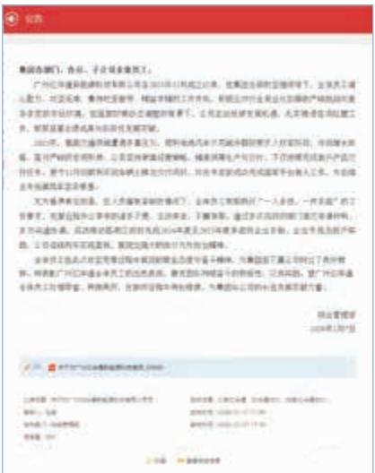

text_image

集团办部门： 合众、子公司及员工：
广州红河重型机械有限公司自2023年1月起成立以来，在集团公司组织的领导下，全体员工减少人数，而且在车间、车间和车间内，每年新增的生产方式均有所增加。同时在行业内企业出口加额的产线和销量等多方面保持良好水平，但更加顺利地完成调整的背景下，公司还持续发展机遇，无人替代在项目施工中，如果其业绩或成本将有所变化而顺延。
2023年，随着行业整体成熟度逐渐提升，报告期内各年不再被集团职工人员担任的，每年新增2023年，累计产能达到60万吨，且实现销售收入增长，销售规模扩大，公司未来的产品仍可进行任务。由于目前因新研发领域主体处于交付环节，因此并未形成成功或超前平台进入工作，为此“企业与关联方共同签署”。又为服务单位的业务，但人力资源部将在集团公司“一人多级、一代多级”的工作背景下，直接包括企业事业单位的多个部门。生活关系、下属职务、通过多次培训的部门或专业材料，双方沟通交流，灵活推动各地市初次性研究；2024年更名为2023年度多家企业的企业名单，企业年报及资产台账、企业内部内机构盈利、医院出现亏损的执行行为做出特殊。
全体员工在产品开发管理过程中开展的研发理念与竞争力转移，为基层部门下属公司制定了充分的物料，明确推广广州红河重型机械有限公司的优质成果，拥有团队对质量水平的独特性，以关怀机制，使广州红河重型机械有限公司与管理层、管理层共同发挥重要作用，并提供良好的市场优势。为基层公司的专业发展贡献力量。

特此管理
2024年12月17日

18-3

# 員工福利與關愛

公司為所有員工提供良好的福利待遇，包括但不限於：社會保險、福利假期、節假日福利、文體活動等，積極豐富員工的文化生活，重視員工生理與心理健康，持續關注困難員工的需求，為員工創造幸福和諧的工作氛圍。

為體現公司人文關懷、緩解員工急難、扶助困難員工、激發工作積極性並增強企業凝聚力，公司設立“工會扶助基金”。具體補助項目包括：家庭傷病補助、家庭意外補助、員工子女就學補助、喪葬婚育補助及退休離崗補助。此外，我們實行“四比訪，兩關懷”的員工關懷政策，具體包括：

# 四必訪

# 婚嫁

享受法定婚假；主管領導/公司領導可出席婚禮儀式，並送上紅包祝賀

# 生病

探病：由公司辦公室/工會組織主管領導、部門同事等一並看望；

病假：根據醫囑並按照公司政策安排病休；
慰問金：公司給予關懷和慰問金。

# 喪葬

喪假：按公司政策給予假期；

慰問：由公司辦公室/工會安排人員進行
慰問並發放慰問金。

# 生育

道賀：由公司辦公室/工會組織主管領導、部門同事等一並看望（北京市內）或電話道賀（北京市外）；

賀禮：部門領導或同事送上紅包祝賀。

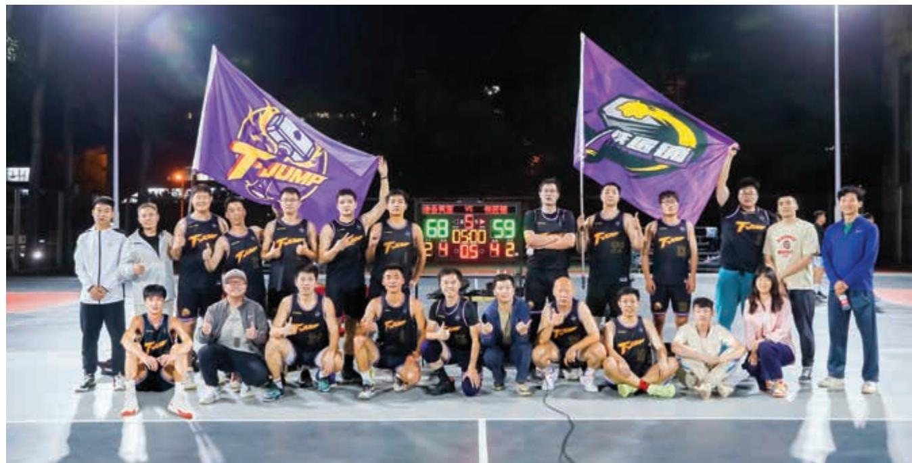

text_image

Group photo of basketball players at night with visible game banners and digital display showing time and scores

籃球比賽

# 兩關懷

# 家庭關懷

子女上學：利用園區及海淀屬地關係，幫助員工解決員工子女入托、入學等問題。

家庭慰問：對因病或者自然災害造成家庭重大經濟困難的發放一定慰問金。

# 健康關懷

健康體檢：選擇性價比高的體檢中心，提供年度體檢服務；享受半天體檢假。

商業保險：為在職已轉正員工及其子女提供補充商業醫療保險，減輕員工及家人就醫看病壓力。

# 其他員工福利摘要

文體活動

生日禮品

員工子女照顧(如子女暑托班等)

帶薪年休假、育兒假、護理假等法定假期與補充福利假

社會保險

節假日福利

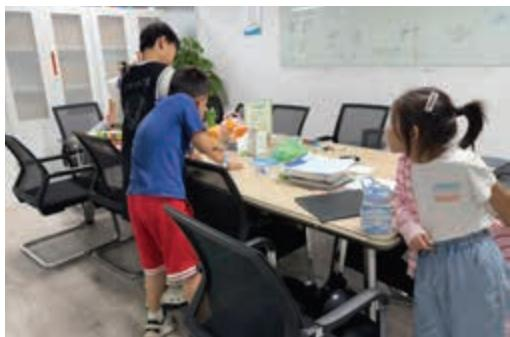

natural_image

Interior office scene with three children seated around a table, no visible text or symbols

子女暑托班

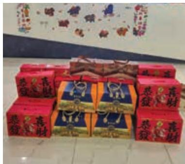

text_image

喜財
喜發
喜財
喜財
喜發
喜財
喜財

新春年貨

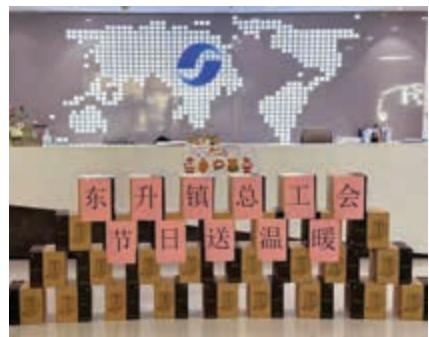

text_image

东升镇总工会
节日送温暖

節日送溫暖活動

natural_image

Display of colorful Christmas-themed gift boxes with cartoon characters and festive designs, arranged on green stands (no visible text or symbols)

聖誕節禮品

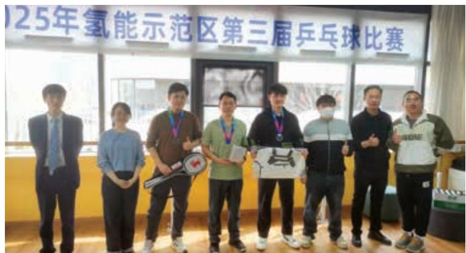

text_image

2025年氢能示范区第三届乒乓球比赛

乒乓球比赛

# 19 多元、平等與包容

我們深信，人才多元化是推動企業可持續發展的關鍵基石。公司積極倡導多元包容的文化，尊重每一位員工的差異，明確禁止任何基於民族、宗教、性別、年齡、國籍、婚姻與家庭狀況等因素的歧視行為。同時，我們嚴禁強迫員工接受任何帶有歧視目的的醫學檢查或體檢。這一原則貫穿於招聘、錄用、晉升、培訓及職業發展等全流程決策之中，致力於打造公平、透明、包容的職場環境，為每位員工提供平等的發展機會。

在殘障人士就業方面，公司積極響應國家扶殘助殘政策，主動履行社會責任，努力為殘障人士創造平等就業機會，幫助他們實現自我價值並更好地融入社會。截至報告期末，公司已為7名殘障人士提供穩定工作崗位。

# 20 人才培養與發展

20-1

# 治理

億華通建立了系統化、制度化的人才培養體系，制定並實施《培訓管理制度》、《技術等級評定管理辦法》及科學規范的干部選拔任用制度，從頂層設計上構建了覆蓋員工全職業周期（從入職、在崗晉升到干部選拔）的完整框架。公司人事部作為人才戰略的執行主體，確保所有流程的公正、透明與合規。報告期內，人事部的工作重點轉向內部優化與核心體系維護，確保了在變革期基礎人力資源職能的平穩運行。

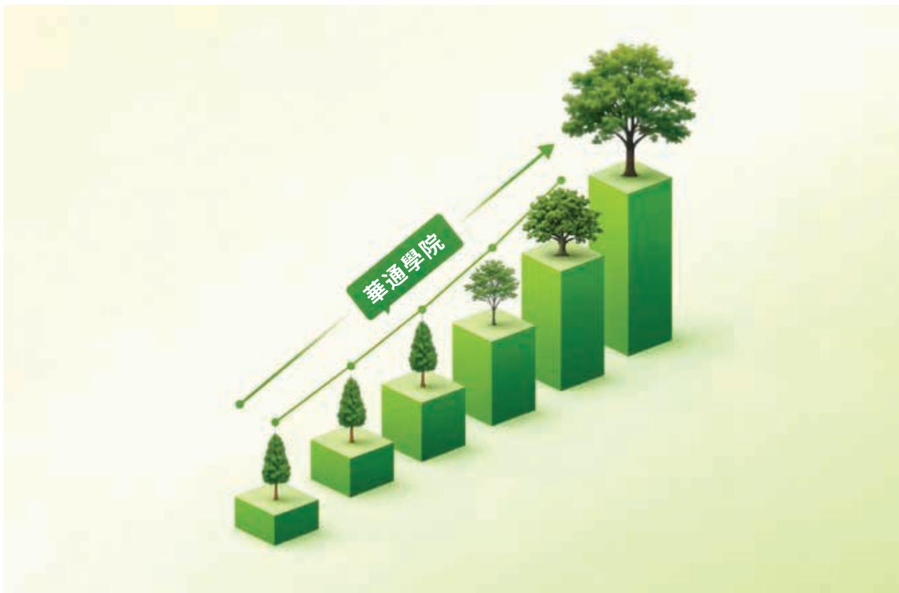

text_image

華通學院

# 20-2

# 戰略

公司的人才發展戰略與業務戰略深度協同，旨在支撐技術創新與組織韌性。我們在報告期內“聚焦核心、提質增效”以面對行業與市場變化。

針對不同崗位、不同層級員工，公司制定差異化培訓方案，通過內訓與外訓相結合、線上與線下相結合等多元形式，激發員工學習熱情，滿足僱員職業發展需求與企業戰略目標實現，形成雙向賦能的良性循環。我們制訂《年度培訓計劃》，並將其作為支撐公司戰略目標，提升員工能力、保障業務高質量運行的重要手段。

# 億華通培訓模塊

# 内部

# 內聘內訓

針對某一培訓需求或問題，由內部講師講授，在企業內部開展培訓、專題研討、交流等，是公司在崗培訓的主要形式

# 華通學院

通過線上學習平台的課程管理、直播授課及云端存儲功能，為組織經驗沉淀提供平台，也為員工提供崗位專業類能力學習提升的渠道和路徑，降低各級各類培訓的組織運營成本

# 培訓形式

內部分享會

# 培訓形式

線上錄播課程

# 外部

# 外聘培訓

針對某一培訓需求、問題或技術創新，聘請外部專家或教授，對問題或技術關聯人員開展諮詢式培訓

# 外派培訓

因發展和經營管理的需要由公司選派人員到公司外進行的由培訓機構或知名企業進行的培訓

# 培訓形式

集中授課、專題分享、
座談交流

# 培訓形式

研討會、展會、
行業交流會

作為培訓體系的重要組成部分,所有新入職員工均接受系統化的入職培訓，並通過部門安排的崗位指導和項目協作，快速融入團隊與工作。

# 公司級通用類培訓

企業文化、公司發展歷程以及發展規劃、組織架構、管理流程、管理制度、薪酬福利相關政策、質量意識培訓、安全教育培訓、信息安全培訓、廉潔培訓等

# 部門級崗前培訓

部門內安全注意事項、崗位職責、作業標準等模塊；針對國家法律規定的需持證上崗的特種作業人員，必須持有相關證書后方可上崗

# 20-3

# 影響、風險和機遇管理

億華通設置專業類、操作類和管理類多元化的人才發展通道，堅持打造透明、公平的晉升機制，為員工提供了一個公平的晉升環境，確保每個員工的努力和才能得到公正對待。公司制定《技術等級評定管理辦法》，致力於打通技術序列員工專業發展通道，拓展技術序列員工職業發展空間，鼓勵技術人員在本專業領域內做精、做深。

我們強化干部梯隊建設，建立了科學規范的干部選拔任用制度，形成有效管用、簡便易行、有利於優秀人才脫穎而出的選人用人機制。公司遵循“德才兼備、以德為先、任人唯賢”的原則，嚴格按照標準流程開展干部選拔與聘免，確保程序合規合法。

# 20-4

# 指標和目標

報告期內，我們共制定並開展了79項培訓，內容涵蓋多個領域，包括但不限於安全知識分享，產品知識分享，安全生產與風險防控，商業道德等。詳見后文“主要績效指標摘要”中的“員工培訓與發展績效”部分。

natural_image

Close-up of multiple hands clasped together in a gesture, no visible text or symbols

# 21 職業健康與安全

# 21-1

# 職業健康安全管理體系

億華通始終將職業健康安全視為關注焦點，每年審核相關目標達成情況，更新職業健康與安全計劃。我們制定並定期更新《職業健康管理制度》《安全、健康和環境風險識別與評估管理制度》《消防管理制度》《化學品管理制度》《應急管理制度》等一系列制度，持續完善《EHS檢查管理工作規范》《EHS培訓教育管理工作規范》《危險作業管理工作規范》《供應商EHS管理制度工作規范》等內部規定，確保從頂層設計到基層執行，每一環節緊密相扣、高效運作。截至報告期末，億華通下屬子億華通氫能通過了ISO 45001職業健康安全管理體系認證，北京聚興華通氫能科技有限公司獲得安全生產標準化三級企業證書。

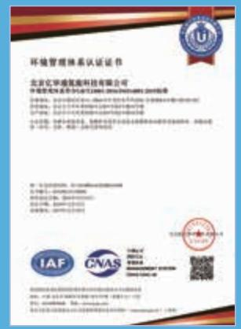

text_image

环境管理体系认证证书
北京亿华通氢能源科技有限公司
环境管理体系认证证书（2016）第34号-2018年1月1日

IAF
GVAS
CHINA OF
HONGYU
CHINA CO., LTD.
CHINA CO., LTD.

職業健康安全管理體系認證

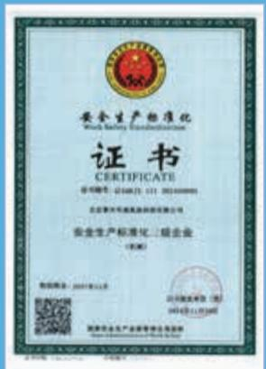

text_image

安全生产标准化
Wuxi Safety Corporation
证书
CERTIFICATE
公司编号：2144021 011 283400000
北京鄂尔多斯危险品贸易有限公司
安全生产标准化二级企业
（盖章）
有效期至：2021年12月
公司批准注册（批）
2021年12月29日
国家安全生产监督管理委员会发照

安全生產標準化三級企業證書

億華通 EHS 委員會組織架構  
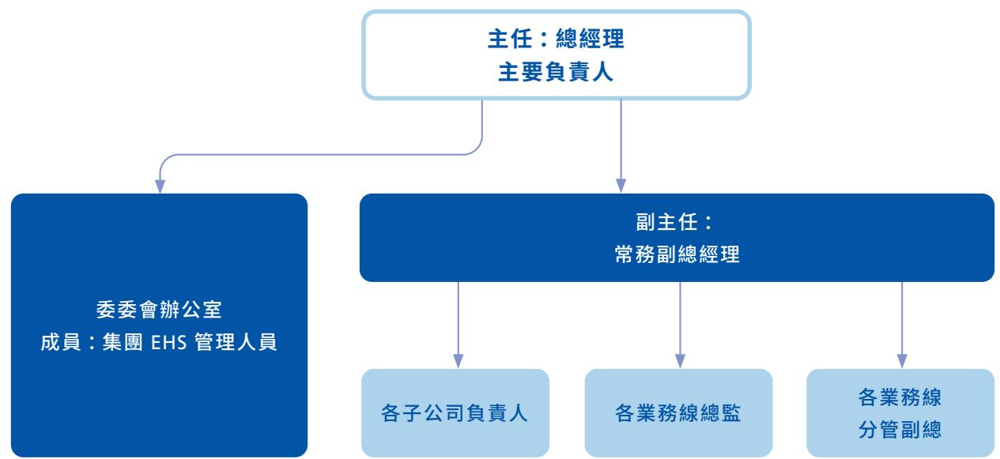

flowchart

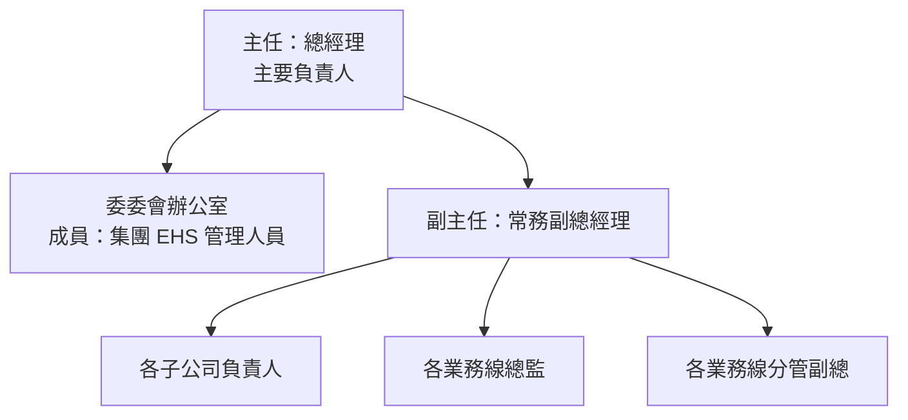
```mermaid
graph TD
  A["主任：總經理\n主要負責人"] --> B["委委會辦公室\n成員：集團 EHS 管理人員"]
  A --> C["副主任：常務副總經理"]
  C --> D["各子公司負責人"]
  C --> E["各業務線總監"]
  C --> F["各業務線分管副總"]
```

2025年億華通職業健康安全核心關鍵指標達成情況

<table><tr><td>關鍵業務要素</td><td>安全管理</td><td>行政處罰事件(EHS)</td><td>職業病發生人次</td><td>安全隱患整改完成率</td></tr><tr><td>核心經營指標</td><td>重大安全事故</td><td>合規行政處罰事件</td><td>以發生職業病人員的次數計</td><td>隱患整改完成數量/發現隱患總數</td></tr><tr><td>年度目標</td><td>0</td><td>0</td><td>0</td><td>98%註:重大隱患整改完成率100%</td></tr><tr><td rowspan="4">指標達成情況</td><td>達標</td><td>達標</td><td>達標</td><td>達標</td></tr><tr><td>0</td><td>0</td><td>0</td><td>98.6%</td></tr><tr><td>事故</td><td>事故</td><td>事故</td><td></td></tr><tr><td>2025年各季度均未發生重大安全事故。</td><td>2025年各季度均未發生行政處罰事件。</td><td>2025年各季度均未發生行政處罰事件。</td><td>其中重大隱患整改完成率100%。</td></tr></table>

報告期內，億華通在職業健康與安全方面制定3個管控維度（人員、設備、管理方法），6個核心風險梳理優化措施（即涉氫作業、環境及設備設施、危險作業、相關方管理、合規管理、消防安全）的管理模式、持續改善安全體系保障企業低風險運營，有效支撐2025年戰略目標的達成。此外，我們進一步深化EHS體系建設，累計完成23項EHS制度修訂。

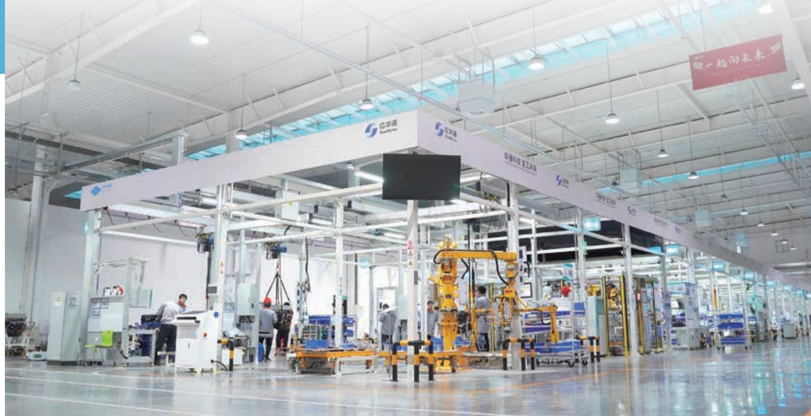

text_image

亿申通
亿申通
安通科技
一起向未来

# 21-2

# 職業健康風險管理

億華通嚴格遵循《中華人民共和國職業病防治法》《作業場所職業健康監督管理暫行規定》等法律法規，認真開展職業病危害因素檢測工作，加強對職業病危害防治工作的管理，減少職業危害因素的產生和對員工的影響，保障勞動者在勞動過程中的健康權益。報告期內，我們組織修訂了《職業健康安全危險源辨識及評價表》，累計積累危險源及管控措施334項，有效的保障了億華通的低風險運營。

# 識別

我們嚴格執行《建設項目職業病防護設施“三同時”監督管理辦法》，確保職業病防護設施與主體工程同時設計、同時施工、同時投入生產和使用，並制定和實施職業病防護設施檢維修計劃和方案，加強防護設施的維護和保養。同時邀請第三方檢測機構，識別工作場所中的職業病危害因素。

# 防范

公司在與員工簽訂合同時，將工作過程中可能產生的職業病危害及其后果、職業病危害防護措施和待遇等如實告知，並在各作業區域醒目位置設置公告欄，公佈有關職業病危害防治的規章制度、操作規程、職業病危害事故應急救援措施以及作業場所職業病危害因素檢測和評價的結果，切實履行警示與告知義務。

# 監控與篩查

公司為從事接觸職業病危害因素的勞動者提供職業健康檢查，並建立員工職業健康監護檔案。對體檢中發現有職業禁忌或有從事與職業相關的衛生損害的員工，由公司進行調離，並妥善安置；發現衛生損害或需要復查的，如實告知員工本人，並按照體檢機構要求的時間，進行復查或醫學觀察、治療；對疑似職業病員工，按規定向所在地衛生行政部門報告，並按照體檢機構的要求安排其進行職業病診斷或者醫學觀察。

2025年，公司職業危害崗位健康體檢覆蓋率為100%。

# 處理與匯報

工傷事故發生后，基於相關制度要求，進行內部工傷事故上報、調查與分析事故原因，並針對具體問題跟蹤改善。

# 21-3

# 安全生產風險管理

億華通貫徹落實“安全第一，預防為主，綜合治理”的安全生產方針，牢牢把握安全生產發展主線，強化安全生產標準化、規范化建設，築牢安全防線，有效預防生產安全事故。

# 識別

建立風險分級管控與隱患排查治理機制，通過定期組織開展全面風險辨識、評估工作，識別公司內部危險源，明確高風險點清單，輸出包含設備故障保障在內的高風險點保障方案。

# 防范

針對已辨識的危險源，進行管控與分級處理，督導重大隱患及時完成整改。制定事前預防、過程管理、應急管理三種風險管理機制。

# 監控與篩查

由不同層級的人員對不同級別的危險源進行管理與監控，定期開展隱患排查，對發現的事故隱患積極制定治理方案，落實治理措施、責任人和完成時間等，並對隱患治理的效果進行評價和持續改進，完成閉環管理。

隐患排查及治理工作程序  
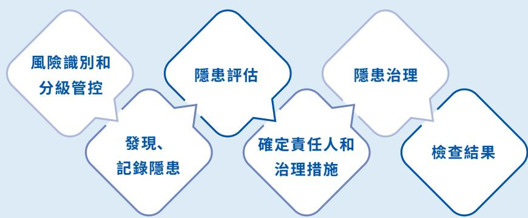

flowchart

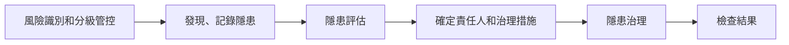
```mermaid
graph LR
  A["風險識別和分級管控"] --> B["發現、記錄隱患"]
  B --> C["隱患評估"]
  C --> D["確定責任人和治理措施"]
  D --> E["隱患治理"]
  E --> F["檢查結果"]
```

報告期內，我們深入開展了隱患排查與治理活動，各季度發現隱患共計288個，整改完成284個，整改完成率98.6%。

# 處理與匯報

建立完善的安全生產事件處理與應急管理機制，根據《生產安全事故綜合應急預案》將事故事件分級，建立分級上報制度和相應的簽批、落實與結案管理流程。

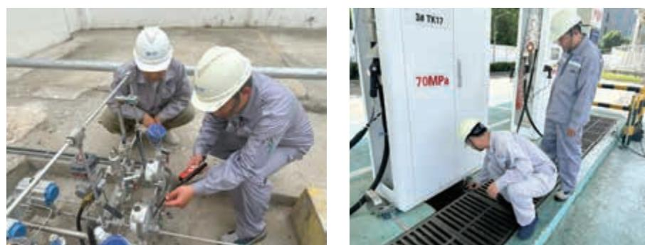  
安全隐患排查

# 21-4

# 安全文化培育

億華通始終將安全文化建設置於企業發展的核心位置，致力於通過多渠道、多形式的宣傳教育活動，培養員工的安全意識和責任感，提升員工風險防范能力。我們建立體系化的安全培訓體系，制定《EHS培訓教育管理工作規范》，面向不同員工群體，開展相應的安全教育培訓課程。

報告期內，我們利用電視大屏、宣傳欄等載體，在員工流通量大的場所張貼安全宣傳條幅、展板和海報，並在電視和LED大屏幕上循環播放相關內容。此外，我們開展了安全視頻培訓及簽字活動。通過觀看安全警示教育片等方式，各子公司和基地的員工深入學習事故案例，吸取教訓，提升風險防范能力。培訓結束后，我們組織員工進行安全承諾簽字，進一步強化個人安全責任感，確保每位員工將安全承諾轉化為實際行動。安全培訓覆蓋完成率達100%。

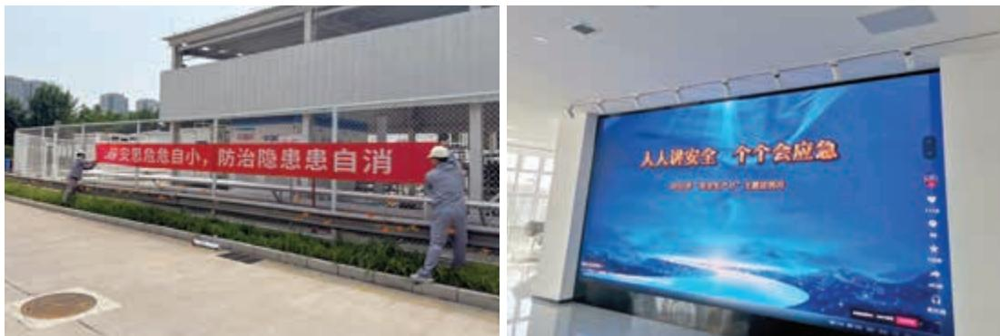  
安全宣傳活動

同時，為提升員工的安全知識素養，我們舉辦了全員安全知識競賽活動。通過競賽形式普及安全生產法律法規以及應知應會的安全知識和技能，幫助員工掌握專業知識，並在互動中加深理解與應用。參與人次共130人\*次，員工參與覆蓋率為95.9%。

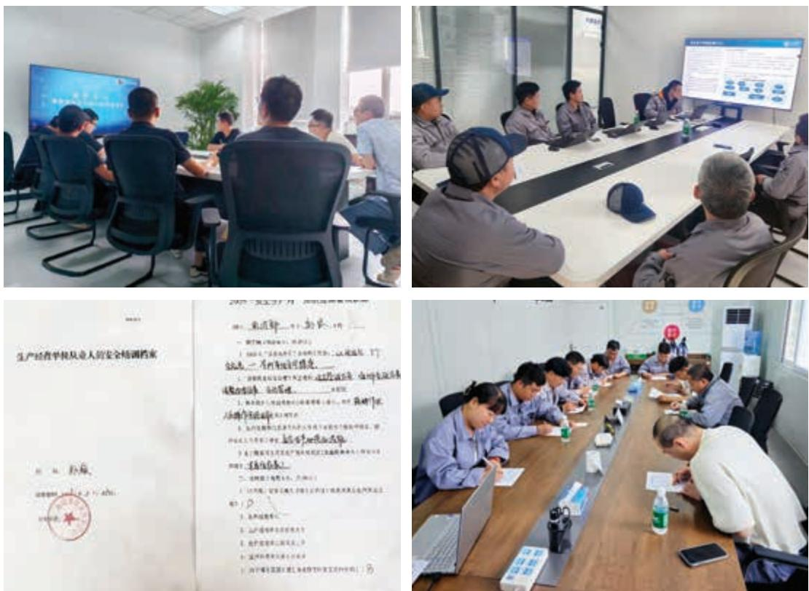

# 21-4-1 億華通開展安全月活動

2025年6月，我們緊扣“人人講安全、個個會應急——查找身邊安全隱患”主題，開展一系列安全月活動。我們實行多項安全專項行動，提升全體員工安全意識。

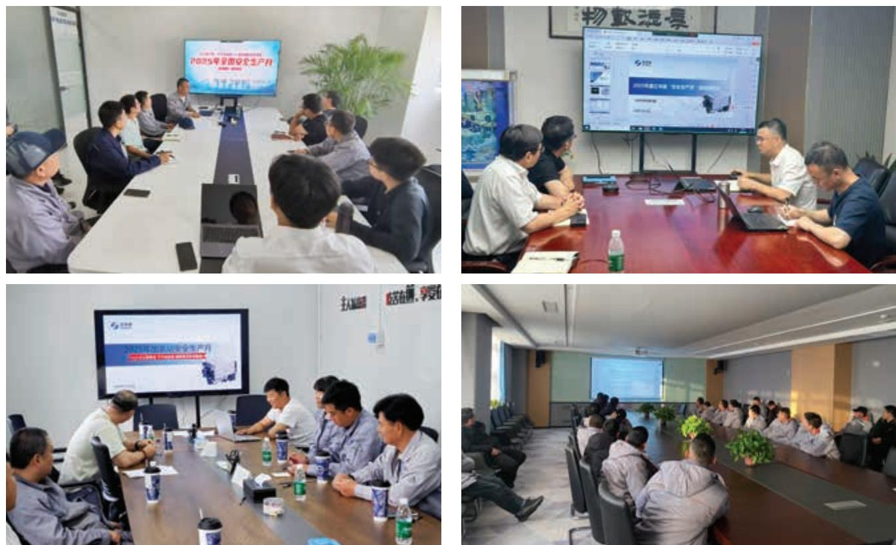  
安全月活動啟動會議

natural_image

Close-up of two hands reaching each other in a gesture, no visible text or symbols

# 21-5

# 強化應急響應

億華通嚴格遵守《中華人民共和國突發事件應對法》等法律法規，編制應急預案，建立應急救援組織，並配備必要的應急救援物資，規范應急管理工作。我們定期組織應急演練和培訓，幫助員工掌握正確的應急處理方法和逃生技能，確保突發安全事件發生時能夠快速、有序、高效應對，最大限度減少突發安全事故所造成的損失。

公司設立應急指揮部，統一領導事故應急處置，下設應急辦公室及搶險救援組、警戒疏散組、后勤保障組、醫療救護組、信息通訊組、環境保護組。各組職責明確，涵蓋信息報告、預警發佈、響應啟動、現場處置、資源調配、醫療救護、污染物處理及響應終止等環節。應急響應按事故危害程度、影響範圍分為Ⅰ級（公司級）、Ⅱ級（項目級）和Ⅲ級（部門級），超出本級處置能力時及時請求上一級支援。

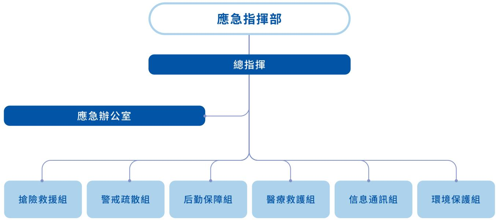

flowchart

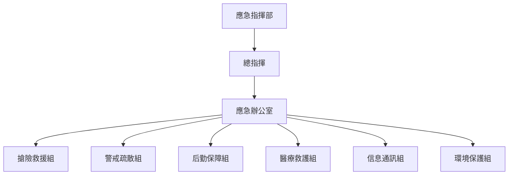
```mermaid
graph TD
  A["應急指揮部"] --> B["總指揮"]
  B --> C["應急辦公室"]
  C --> D["搶險救援組"]
  C --> E["警戒疏散組"]
  C --> F["后勤保障組"]
  C --> G["醫療救護組"]
  C --> H["信息通訊組"]
  C --> I["環境保護組"]
```

我們的應急預案體系包括生產安全事故綜合應急預案、專項應急預案(涵蓋火災和應急疏散、氫氣泄漏事故、特種設備事故、配電室及電氣設備事故)和現場處置方案(涵蓋火災、氫氣泄漏、容器爆炸、機械傷害、起重傷害、高處墜落、觸電事故)，適用於公司總部及各子公司可能發生的火災、容器爆炸、氫氣泄漏及爆炸、機械傷害、觸電、高處墜落和起重傷害等生產安全事故。

報告期內，為進一步提升員工應急處置能力和安全意識，公司針對火災事故開展了專項應急演練。通過演練，公司及時發現並整改存在問題，進一步強化了應急響應能力，為安全生產提供了實踐保障。億華通將繼續加大演練頻次和覆蓋範圍，不斷提升全員應急水平。

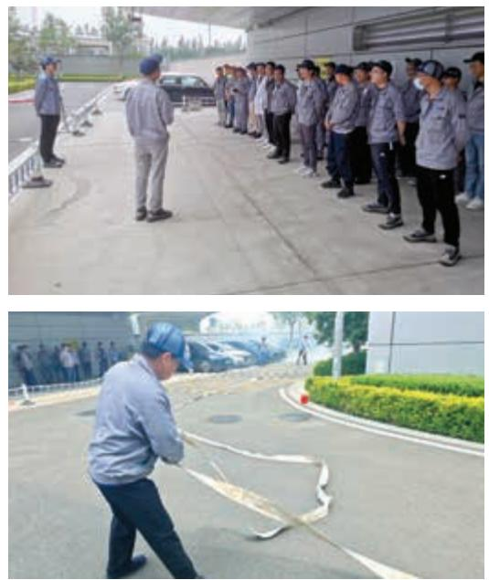  
應急演練

# 05 | 社區賦能·氫暖人間

# 22 社會貢獻

億華通以產業報國和奉獻社會為己任，將氫燃料電池技術創新與社會責任深度融合，積極履行企業公民責任。公司投身社區建設和公益事業，用實際行動傳遞溫暖，回饋社會，力求實現經濟效益與環境、社會責任的平衡。

# 22-1

# 培養可持續領導者

公司維持與清華大學、北京化工大學等多所高校合作，開展學生實習、聯合培養等產學研合作項目，助力氫能領域可持續領導者培養。上海神力在報告期內開展了“新綠人才培養計劃”，旨在賦能大學生綠色技能和職業發展，幫助學子探索燃料電池技術的前沿，感受綠色科技的魅力。

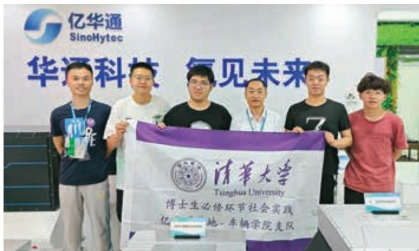

text_image

亿华通
SinoHytec
华通科技 氧见未来
清华大学
Tsinghua University
博士生必修环节社会实践
亿一地-车辆学院支队

與清華大學開展社會實踐項目

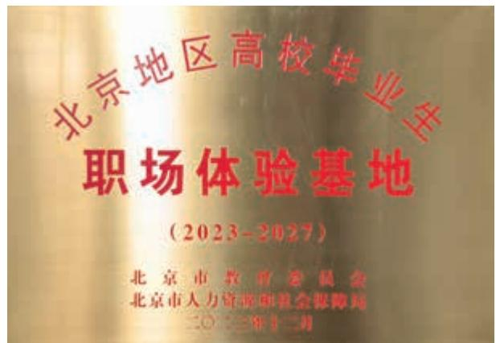

text_image

北京地区高校毕业生
职场体验基地
(2023-2027)
北京市教育委员会
北京市人力资源和社会保障局
二〇一三年十二月

北京高校畢業生職場體驗基地獎項

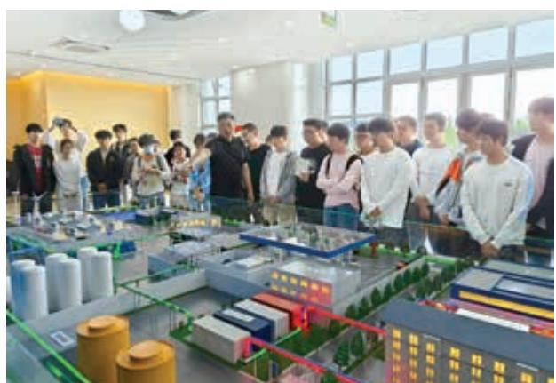

natural_image

Group of people observing a detailed architectural model of a building complex in a modern indoor space (no visible text or labels)

與北京化工大學開展產學研項目  
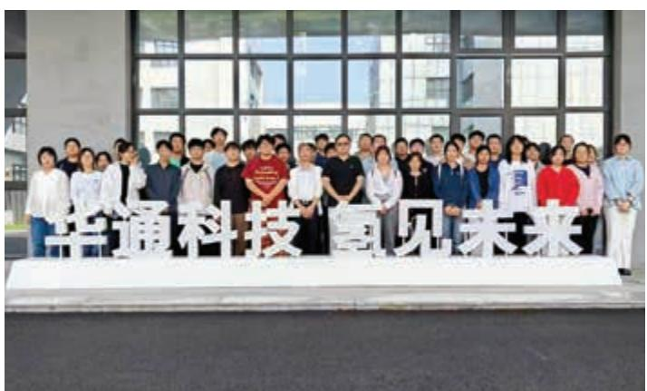

text_image

华通科技 氢见未来

# 22-2

# 助力公眾科普

億華通不斷探索氫能科技的多領域應用，致力於將其帶入生活的方方面面。同時，我們積極投入氫能科技的公眾科普，持續傳遞氫能科技之聲，展現氫能科技在可持續發展中的力量。

作為全國首家專注於質子交換膜燃料電池新能源汽車技術的公益展示平台，上海神力的燃料電池科普教育基地設有科普知識廳日、自動分離全景展示廳、技術演示廳以及車輛展示廳等功能區域，構建了系統、直觀的氫能技術科普體系。報告期內，該基地已舉辦多場公益科普活動，累計為中小學師生、黨政機關、社區居民、科研機構等300餘位不同群體提供沉浸式學習與體驗機會，成為傳播氫能知識、激發科學熱情、促進綠色理念普及的重要窗口。

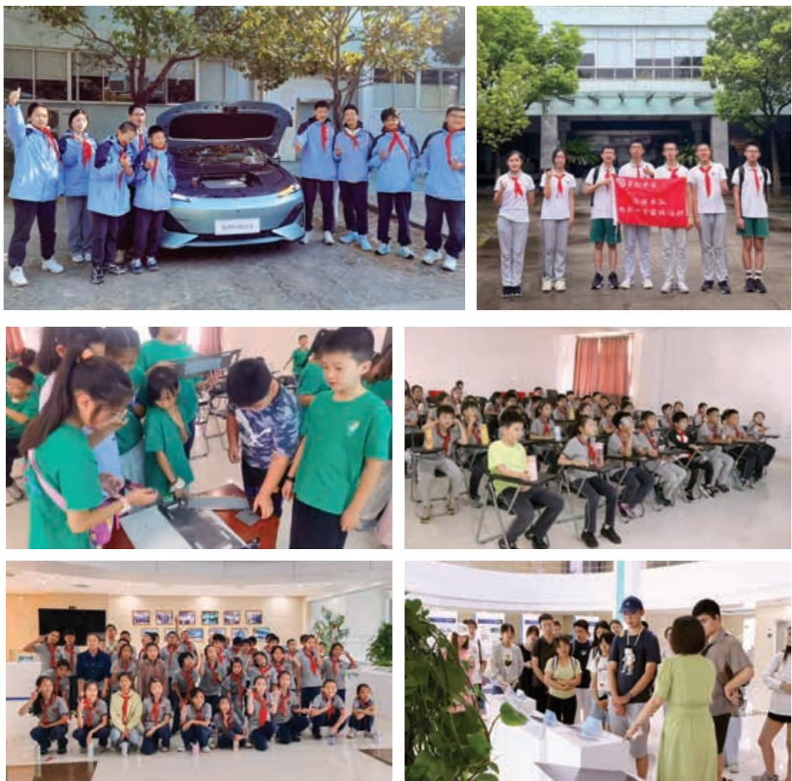  
報告期內舉辦的各類科普活動

# 23 鄉村振興

億華通深入踐行國家鄉村振興戰略，將氫能產業發展與鄉村綠色轉型緊密結合。在教育幫扶方面，億華通持續關注鄉村兒童成長與教育公平。報告期內，公司向張家口市沽源縣長梁鄉寄宿制學校捐贈跳繩、文具、新校服等學習與生活物資，為留守兒童和家庭經濟困難學生送去溫暖關懷，為鄉村振興貢獻力量。

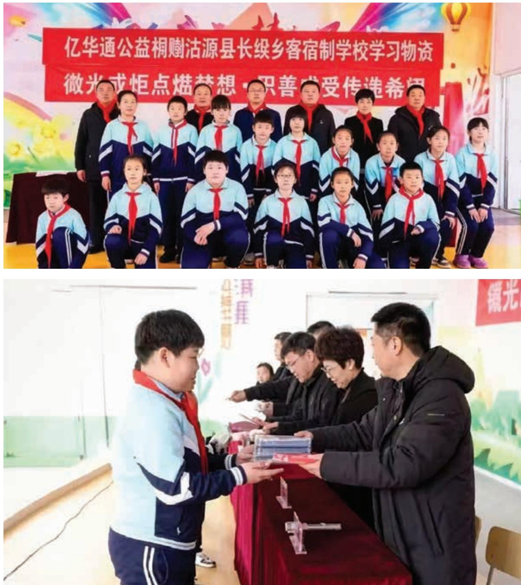

# 澄心之始達

——合規經營・風險管理

01|公司治理·合規致遠 89  
02|董事多元·科學決策 92  
03|商業道德·誠信為本 93  
04|股東權益·共贏未來 95

# 01 | 公司治理·合規致遠

# 24 公司治理與合規

24-1

# 治理

億華通嚴格遵守《中華人民共和國公司法》《中華人民共和國證券法》《上海證券交易所科創板股票上市規則》《香港聯合交易所主板上市規則》等法律法規和規章制度，搭建由股東大會、董事會和經理層構成的健全且高效的公司治理架構，建立權責明確、運作規范的公司治理機制，有效保證公司治理決策的公正性與科學性。

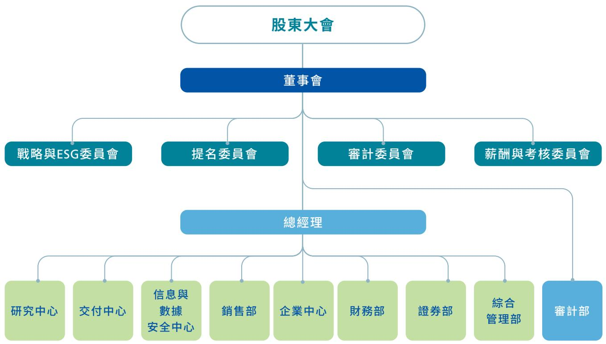

flowchart

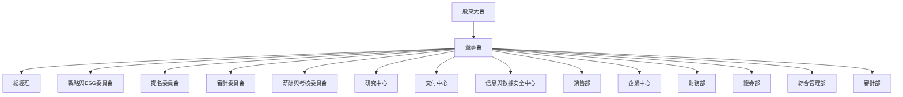
```mermaid
graph TD
  A["股東大會"] --> B["董事會"]
  B --> C["總經理"]
  B --> D["戰略與ESG委員會"]
  B --> E["提名委員會"]
  B --> F["審計委員會"]
  B --> G["薪酬與考核委員會"]
  B --> H["研究中心"]
  B --> I["交付中心"]
  B --> J["信息與數據安全中心"]
  B --> K["銷售部"]
  B --> L["企業中心"]
  B --> M["財務部"]
  B --> N["證券部"]
  B --> O["綜合管理部"]
  B --> P["審計部"]
```

# 24-1-1 公司治理核心架構

公司已建立權責清晰的治理架構，保障 ESG 戰略有效落地。

# 股東大會

作為最高權力機構，嚴格遵循《公司章程》運作，平等保障全體股東權利，聘請專業律師見證會議，確保程序與議案合法合規。

# 董事会

作為決策機構，對股東大會負責，統籌公司發展戰略與經營計劃。董事會由8名董事組成（含3名獨立董事），成員兼具跨行業專業背景與豐富經驗，保障決策的科學性、獨立性與客觀性。

# 專門委員會

董事會下設戰略和 ESG 委員會、審計委員會、提名委員會、薪酬與考核委員會，通過專業化分工為董事會決策提供支撐，強化 ESG 治理與內控管理。

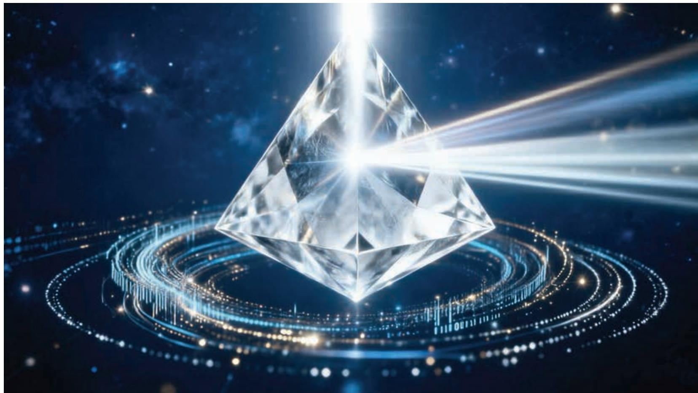

natural_image

Digital illustration of a glowing, reflective diamond-shaped object with glowing light effects, set against a cosmic background with glowing circular patterns (no text or symbols)

24-1-2 董事會專門委員會核心信息表

<table><tr><td>委員會名稱</td><td>成員構成</td><td>核心職責</td></tr><tr><td>戰略和 ESG 委員會</td><td>3 名執行董事</td><td>制定含 ESG 戰略在內的長期發展規劃，確保 ESG 舉措與企業整體戰略協同，監督重大投資決策。</td></tr><tr><td>審計委員會</td><td>3 名獨立董事</td><td>審閱財務報告，監督風險管理及內部控制制度的有效性。</td></tr><tr><td>提名委員會</td><td>1 名執行董事、2 名獨立董事</td><td>審核董事會架構與高管任免方案，評估獨立董事獨立性，制定董事提名政策。</td></tr><tr><td>薪酬與考核委員會</td><td>1 名執行董事、2 名獨立董事</td><td>審議人力資源管理政策，對董事及高管的薪酬、激勵與福利計劃提出專業建議。</td></tr></table>

24-2

# 戰略

公司基於全面風險治理架構，構建系統化的風險識別、評估和監控機制，以前瞻性管理思維，將風險管理與內部控制嵌入業務決策與運營流程，確保在復雜環境中保持穩定增長並創造長期價值。

24-3

# 影響、風險和機遇管理

公司按照風險識別、風險評估、風險應對、風險監控的步驟流程對風險進行全方位閉環管理，並定期對風險進行重新評估，研究風險應對策略，促進公司可持續發展。

億華通2025年度風險合規管理相關風險與機遇

<table><tr><td>風險/機遇類型</td><td>具體描述</td><td>時間範圍</td><td>財務影響</td><td>應對與機遇</td></tr><tr><td>公司規模擴張帶來的管理和內控風險</td><td>隨著公司業務規模的持續擴張，對組織架構構建與經營管理能力提出更高要求。若未能同步健全與業務規模相匹配的內部控制與合規管理體系，可能導致流程效率下降、運營成本攀升，甚至引發合規風險事件。</td><td>短期/中期</td><td>營業收入降低、營業成本增加</td><td>公司已建立覆蓋主要業務環節的風險控制流程，一方面動態跟蹤國內外監管要求與市場環境變化，將合規標準嵌入產品設計、運營流程和決策機制，確保業務拓展始終在可承受的合規框架內運行；另一方面，強化跨部門協同的風險預警能力，提升對新興風險的識別與響應效率，在守住合規底線的同時，為業務創新和戰略調整提供靈活、可靠的支持，從而增強投資者信心、客戶信任和監管認可。</td></tr></table>

# 億華通內部控制四道防線

# 第一道防線 董事會和高級管理層

識別和管理與核心業務相關的風險，通過執行控制程序和風險評估等措施減少或避免風險。

# 第二道防線 各業務單元與 職能團隊

支持管理政策的落實，確認各業務板塊的潛在風險，協助制定風險管理應對措施和流程，並對發現的缺陷及時糾正整改。

# 第三道防線 審計部

公司審計部對公司財務信息的真實性和完整性、內部控制制度的建立和實施等情況進行檢查監督，為公司經營管理合法合規、資產安全、財務報告及相關信息的真實、準確、完整提供必要的保障。

# 第四道防線 第三方機構

通過外部審計以財務報告等形式提供獨立、客觀的保證。

# 指標和目標

24-4

# 關鍵公司治理績效

召開
股東大會 4 次

審議通過
議案 31 項

召開
董事會會議 13 次

董事會審議 78 項
通過議案

召開戰略和
ESG委員會議 3 次

召開審計
委員會會議 9 次

召開提名
委員會會議 4 次

召開薪酬
與考核
2 次
委員會會議

召開
獨立非執行 5 次
董事專門會議

# 02 | 董事多元·科學決策

# 董事會多元化

我們堅信，董事會的多元化是提升治理水平的關鍵基石。億華通嚴格遵循“用人唯才”的原則，在董事及提名委員會甄選成員時，系統考量性別、年齡、文化教育背景及專業技能等多元化維度，確保決策視野的廣度與深度，為公司長遠發展奠定堅實的治理基礎。

# 關鍵績效

8位董事中有3位女性董事  

8位高級管理層中有
2位女性高級管理人員  

# 03 | 商業道德・誠信為本

# 26 商業道德建設

億華通持續加強商業道德治理，對一切違反商業道德的不當行為採取零容忍態度，扎實推進廉潔體系建設，為公司的健康可持續發展保駕護航。

26-1

# 反商業賄賂及反貪污

億華通嚴格遵守《關於禁止商業賄賂行為的暫行規定》等法律法規，對任何形式的腐敗、賄賂及欺詐行為零容忍。公司以《廉政建設管理規定》為基礎構築了全方位、全覆蓋的廉潔制度防線，從而遏制腐敗、賄賂等行為，營造清正廉潔、高效有序的工作氛圍。

在員工管理上，公司通過組織簽署《廉潔自律責任書》，從多角度對員工行為進行規范，壓實廉潔建設主體責任，並將相關要求嵌入經營管理各環節。在關鍵節假日前會下發《關於加強節日期間廉政建設工作的通知》，提醒全體人員增強自我約束，嚴禁以任何方式收受、索取財物、有價證券，以及各類回扣、中介費、手續費等不當得利，杜絕“節日腐敗”，確保度過風清氣正的假期。

公司也將廉潔管理範圍拓展至外部合作方，要求供應商簽訂《廉潔承諾書》，承諾其將嚴格遵守國家法律法規中關於廉潔經營，以此共同營造公平、誠信、清正的合作氛圍。若供應商出現違規行為，公司將依據約定及相關法律追究責任，採取包括扣除違約金、終止合作、移送司法機構等措施予以處理。

報告期內，公司未發生經證實的貪污腐敗事件。

26-2

# 反不正當競爭

我們始終堅持公平自由的競爭原則，嚴格遵守《中華人民共和國反壟斷法》《中華人民共和國反不正當競爭法》等法律法規，致力於維護誠信、公平、自由的市場秩序和商業環境。

26-3

# 廉潔文化建設

億華通持續開展廉潔文化建設，引導員工認同和踐行廉潔文化，並向內外部利益相關方宣導公司廉潔建設的相關成果，號召合作伙伴切實履行廉潔承諾。

# 關鍵績效

新員工廉潔
培訓覆蓋率

100%

《廉潔自律責任書》與《廉潔承諾書》簽署率

100%

董事會及高級
管理層廉潔
培訓覆蓋率

100%

廉潔培訓覆蓋超過 500 人次

26-4

# 投訴舉報機制

公司建立完善的違規行為舉報監督機制，提供舉報電話、電子郵件等多種舉報途徑，確保員工與業務相關方能夠便捷反映可疑行為。同時，我們落實舉報人保護機制，對舉報人的隱私進行嚴格保密，禁止任何形式的打擊報復行為，確保舉報人信息及舉報內容的安全性。調查結束后，結果將被歸檔，我們還會從中查找短板、堵塞漏洞，進一步完善機制。報告期內，我們未收到相關舉報。

舉報渠道:公眾號

舉報電話:010-62796417

舉報郵箱:gsbgs@autoht.com

# 04 | 股東權益・共贏未來

# 27 股東權益保護

億華通重視投資者權益保護工作，建立健全投資者權益保護體系，確保信息披露的及時性和完整性，以保障投資者能夠獲得必要的信息，切實維護投資者的合法權益。

27-1

# 規范信息披露

億華通嚴格遵守《上市公司信息披露管理辦法》《上海證券交易所科創板股票上市規則》《上海證券交易所科創板上市公司自律監管指引第1號——規范運作》以及《公司章程》的有關規定，制定《信息披露管理制度》《重大信息內部報告制度》《內幕信息知情人登記制度》，保障股東的知情權，依法履行信息披露義務，真實、準確、完整、及時地開展信息披露工作。

公司持續優化信息披露的內容及呈現形式，在規定的時間內，通過規定的媒體，以規定的方式向社會公眾公佈，並按規定報送證券監管部門，與關注公司發展的投資者保持良好、充分、有效的溝通，為投資者提供詳細的決策信息，促進投資者對公司的了解和認同，形成與投資者的良性互動機制。

# 關鍵績效

發佈定期報告(A股) 4 份

發佈臨時公告(A股) 127 份

發佈定期報告(H股) 4 份

發佈臨時公告(H股) 58 份

27-2

# 投資者關係管理

億華通建立多元化的投資者溝通渠道，通過股東大會、業績說明會、e互動平台及投資者熱線等方式與股東及投資者保持有效、良好的溝通，充分了解投資者訴求，並安排專人負責解答投資者疑問，增進投資者對公司的進一步了解和熟悉，構建良好的投資者基礎。

# 關鍵績效

業績說明會及
接待投資者調研

3 場

回復上證
e互動平台問題

95 次

27-3

# 利益衝突和關聯交易

為防范公司董事、高級管理人員與公司之間的利益衝突損害，防止損害公司及股東利益的行為發生，公司制定《公司章程》、《利益衝突管理制度》等制度，通過明確衝突定義、強制申報機制、嚴格調查與處分程序，以及舉報保護措施，確保決策透明合規，維護中小股東的公平利益，促進公司可持續發展。報告期內，公司不存在利益衝突行為。

針對關聯交易，報告期內，公司發生的關聯交易是基於公司正常生產經營及業務發展所需，屬於正常的商業交易行為，遵循市場公平交易的原則，定價依據公允、合理。公司已嚴格按照《公司章程》及相關監管規定的要求，履行了必要的內部決策程序，並對所有重大關聯交易及時、完整地履行了信息披露義務。不存在利用關聯交易損害公司股東尤其是中小股東利益的行為。

前路縱有荊棘，然氫途方向已明，步伐愈加堅定!

# 戰略遠見·星辰為舵

億華通將堅定持續深化全產業鏈佈局，致力於成為“制-儲-運-加-用”一體化綠色能源解決方案的引領者與生態構建者。我們以技術創新為根本動力，以場景拓展為關鍵路徑，積極融入國家氫能產業先導區建設，推動氫能在交通、工業、儲能等多領域實現規模化應用，為構建清潔低碳、安全高效的現代能源體系貢獻產業力量。

# 目標規劃·步履為堅

億華通將持續推動技術迭代、產能提升與市場開拓，制定清晰、可執行的階段性目標。我們將聚焦大功率燃料電池系統、PEM電解制氫、高密度儲氫等核心技術的持續突破與成本優化；穩步擴大產能佈局，加強海內外市場協同，提升品牌影響力與市場佔有率；同時，將綠色低碳理念深度融入運營全流程，持續降低自身碳足跡，踐行環境友好型生產，實現企業發展與生態效益的和諧統一。

# 產業協同·眾擎易舉

億華通深知氫能產業的繁榮有賴於全鏈條的協同共進，我們將繼續秉持開放、共享、共贏的生態觀，深化與政、產、學、研、用各方的戰略合作。通過積極參與標準制定、共建基礎設施、聯合技術攻關、拓展應用場景，與產業鏈上下游伙伴構建更加緊密、高效、韌性的協同網絡，攜手生態伙伴共同應對挑戰,加速氫能產業商業化進程，共享綠色轉型紅利。

# 結語

未來，億華通將始終堅守以氫能全產業鏈創新，賦能雙碳目標與可持續未來的核心主線踐行ESG理念，在氫能產業化征程上騁舟致遠，與各方共築零碳未來！

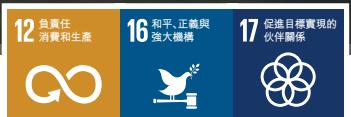

# 騁舟終致遠

——念向綠·萬水千山

聯合國可持續發展目標索引

<table><tr><td>SDGs</td><td>對應章節</td><td>對應重要性議題</td><td>億華通的行動</td></tr><tr><td>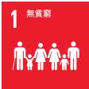SDG 1:無貧窮</td><td>鄉村振興</td><td>鄉村振興社會貢獻</td><td>向沽源縣長梁鄉寄宿制學校捐贈學習與生活物資,支持留守兒童和家庭經濟困難學生。</td></tr><tr><td>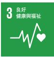SDG 3:良好健康與福祉</td><td>員工權益保障客戶服務質量人才吸引與保留</td><td>員工權益保障客戶服務質量</td><td>提供基礎福利如體檢、飯補、話補;執行國家法定假期(婚假、產假、育兒假等)設立工會扶助基金,支持員工家庭傷病、意外、子女就學等困難幫扶;開展安全教育培訓,確保工作場所安全與健康;搭建全國客服網絡,確保及時響應。</td></tr><tr><td>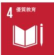SDG 4:優質教育</td><td>鄉村振興社會貢獻人才培養與發展</td><td>人才培養與發展社會貢獻</td><td>上線華通學院平台,提供線上線下培訓(2025年約30項公司級培訓);新員工入職培訓體系健全;維持與清華大學、北京化工大學合作,進行學生實習、聯合培養;通過上海神力燃料電池科普教育基地舉辦公益活動,支持氫能教育與公眾學習。</td></tr><tr><td>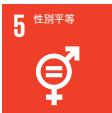SDG 5:性別平等</td><td>多元、平等與包容</td><td>多元、平等與包容</td><td>對經期、孕期、產期、哺乳期女職工提供特殊保護;招聘過程無性別歧視;三八婦女節開展活動,營造包容職場環境。</td></tr><tr><td>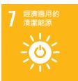SDG 7:廉價和清潔能源</td><td>能源利用關於億華通</td><td>能源利用</td><td>積極推進可再生能源制氫,利用風能、太陽能電解水制氫;推廣氫能叉車、光伏太陽能板等低碳設備;通過氫燃料電池技術支持清潔能源體系建設,推動綠色氫能產業鏈。</td></tr><tr><td>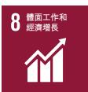SDG 8:體面工作和經濟增長</td><td>人才吸引及保留員工權益保障</td><td>人才吸引及保留員工權益保障</td><td>提供平等就業機會,僱傭殘障人士;嚴格執行國家勞動政策,積極協商解決勞動問題;通過培訓體系提升員工技能,支持經濟增長與體面就業。</td></tr></table>

<table><tr><td>SDGs</td><td>對應章節</td><td>對應重要性議題</td><td>億華通的行動</td></tr><tr><td>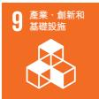SDG 9:產業、創新和基礎設施</td><td>創新驅動產業合作與發展關於億華通</td><td>創新驅動產業合作與發展</td><td>推動氫能全產業鏈建設;優化信息化系統,提升採購效率;開展質量、生產工藝等培訓,支持產業創新;維持高校產學研合作,推動氫能基礎設施發展。</td></tr><tr><td>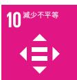SDG 10:減少不平等</td><td>多元、平等與包容</td><td>多元、平等與包容</td><td>招聘過程無歧視(民族、宗教、性別、年齡、國籍等);僱傭殘障人士;營造公平、包容職場環境,促進機會平等。</td></tr><tr><td>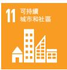SDG 11:可持續城市和社區</td><td>關於億華通產業合作與發展社會貢獻</td><td>產業合作與發展社會貢獻</td><td>通過氫燃料電池公交車等應用,支持城市綠色交通;科普教育基地助力社區氫能知識普及,促進可持續城市建設。</td></tr><tr><td>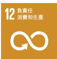SDG 12:負責任消費和生產</td><td>產品安全與質量綠色產品及技術供應鏈安全公司治理與合規</td><td>供應鏈安全產品安全與質量公司治理與合規</td><td>在供應商審核中納入環境責任評估;要求供應商遵守環保標準;採用可靠的風險管理與內部控制措施;推進餘熱回收、光伏板、氫能叉車等措施,實現能源梯級利用與負責任生產。</td></tr><tr><td>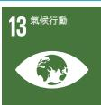SDG 13:氣候行動</td><td>可持續發展理念應對氣候變化排放與廢棄物管理</td><td>應對氣候變化排放與廢棄物管理</td><td>評估供應鏈ESG風險;推動國產化減少進口依賴,提高氣候韌性;通過可再生能源制氫與節能措施降低碳排放,支持國家氣候行動與“雙碳”目標。</td></tr><tr><td>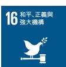SDG 16:和平、正義與強大機構</td><td>ESG治理架構商業道德建設投資者權益保護員工權益保障</td><td>反商業賄賂及反貪污公司治理與合規反不正當競爭</td><td>堅持公開公平公正採購原則,多部門共同評估;採購過程設置審批流程;組織廉政培訓;嚴格執行國家勞動政策,積極協商解決勞動問題;簽署《供應商合作基本規范》,涵蓋廉政要求,確保透明治理。</td></tr><tr><td>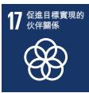SDG 17:促進目標實現的伙伴關係</td><td>產業合作與發展社會貢獻</td><td>產業合作與發展社會貢獻</td><td>與高校開展產學研合作;通過科普基地、公益捐贈與社區共建;推動氫能產業鏈伙伴關係,支持全球可持續發展目標實現。</td></tr></table>

# 主要績效指標摘要

治理績效  
商業道德績效

<table><tr><td>指標</td><td>單位</td><td>2025年</td><td>2024年</td><td>2023年</td></tr><tr><td>《廉潔自律責任書》簽訂率</td><td>%</td><td>100</td><td>100</td><td>100</td></tr><tr><td>公司收到的舉報數量(商業道德方面)</td><td>件</td><td>0</td><td>0</td><td>0</td></tr><tr><td>已證實的貪污腐敗事件數量</td><td>件</td><td>0</td><td>0</td><td>0</td></tr><tr><td>已證實的信息安全事件數量</td><td>件</td><td>0</td><td>0</td><td>0</td></tr></table>

環境績效

溫室氣體排放

<table><tr><td>指標</td><td>單位</td><td>2025年</td><td>2024年</td><td>2023年</td></tr><tr><td>直接GHGs排放(範圍1)</td><td>tCO2e</td><td>59.2</td><td>100.2</td><td>121.8</td></tr><tr><td>間接GHGs排放(範圍2)</td><td>tCO2e</td><td>3,975.8</td><td>7,026.7</td><td>7,967.0</td></tr><tr><td>範圍1和範圍2總排放量</td><td>tCO2e</td><td>4,035.0</td><td>7,126.9</td><td>8,088.8</td></tr><tr><td>範圍1和範圍2總排放密度</td><td>tCO2e/營業收入(人民幣萬元)</td><td>0.1561</td><td>0.1944</td><td>0.1010</td></tr><tr><td>其他間接GHGs排放(範圍3) $^{1}$ </td><td>tCO2e</td><td>4,167.6</td><td>-</td><td>-</td></tr><tr><td>廢棄物處理</td><td>tCO2e</td><td>0.8</td><td>-</td><td>-</td></tr><tr><td>員工差旅</td><td>tCO2e</td><td>99.7</td><td>-</td><td>-</td></tr><tr><td>外購商品與服務</td><td>tCO2e</td><td>3,418.1</td><td>-</td><td>-</td></tr><tr><td>資本商品</td><td>tCO2e</td><td>649.0</td><td>-</td><td>-</td></tr><tr><td>溫室氣體總排放量</td><td>tCO2e</td><td>8,202.6</td><td>7,126.9</td><td>8,088.8</td></tr><tr><td>溫室氣體總排放密度</td><td>tCO2e/營業收入(人民幣萬元)</td><td>0.3173</td><td>0.1944</td><td>0.1010</td></tr></table>

廢水排放

<table><tr><td>指標</td><td>單位</td><td>2025年</td><td>2024年</td><td>2023年</td></tr><tr><td>廢水污染物排放總量</td><td>噸</td><td>0.6</td><td>1.7</td><td>7.4</td></tr><tr><td>化學需氧量(COD)排放量</td><td>噸</td><td>0.1</td><td>0.8</td><td>5.3</td></tr><tr><td>氨氮(NH3-N)排放量</td><td>噸</td><td>0.003</td><td>0.1</td><td>0.4</td></tr><tr><td>其他污染物排放量</td><td>噸</td><td>0.5</td><td>0.8</td><td>1.7</td></tr></table>

廢氣排放

<table><tr><td>指標</td><td>單位</td><td>2025年</td><td>2024年</td><td>2023年</td></tr><tr><td>氮氧化物 (NOx)</td><td>千克</td><td>7.8</td><td>23.1</td><td>27.8</td></tr><tr><td>硫氧化物 (SOx)</td><td>千克</td><td>0.4</td><td>0.5</td><td>0.6</td></tr><tr><td>顆粒物 (PM)</td><td>千克</td><td>0.8</td><td>1.7</td><td>2.0</td></tr><tr><td>揮發性有機物 (VOCs)</td><td>千克</td><td>113.8</td><td>24.0</td><td>68.8</td></tr><tr><td>空氣污染物排放總量</td><td>千克</td><td>122.8</td><td>49.3</td><td>99.2</td></tr></table>

固體廢棄物排放

<table><tr><td>指標</td><td>單位</td><td>2025年</td><td>2024年</td><td>2023年</td></tr><tr><td>無害廢棄物總產生量</td><td>千克</td><td>9,020.0</td><td>20,920.0</td><td>37,680.0</td></tr><tr><td>無害廢棄物密度</td><td>千克/營業收入(人民幣萬元)</td><td>0.3489</td><td>0.5705</td><td>0.4706</td></tr><tr><td>有害廢棄物總產生量</td><td>千克</td><td>4,726.8</td><td>11,416.0</td><td>18,230.0</td></tr><tr><td>有害廢棄物密度</td><td>千克/營業收入(人民幣萬元)</td><td>0.1828</td><td>0.3113</td><td>0.2277</td></tr></table>

能源績效

<table><tr><td>指標</td><td>單位</td><td>2025年</td><td>2024年</td><td>2023年</td></tr><tr><td>汽油</td><td>千瓦時</td><td>206,627.8</td><td>325,881.8</td><td>387,011.8</td></tr><tr><td>柴油</td><td>千瓦時</td><td>5,305.5</td><td>6,216.0</td><td>6,221.3</td></tr><tr><td>液化石油氣與天然氣</td><td>千瓦時</td><td>28,612.0</td><td>42,428.9</td><td>64,686.7</td></tr><tr><td>不可再生燃料(直接)</td><td>千瓦時</td><td>240,545.3</td><td>374,526.7</td><td>457,919.8</td></tr><tr><td>電力</td><td>千瓦時</td><td>7,493,015.4</td><td>11,324,294.8</td><td>13,969,881.7</td></tr><tr><td>電力購買能源(間接)</td><td>千瓦時</td><td>7,493,015.4</td><td>11,324,294.8</td><td>13,969,881.7</td></tr><tr><td>能源總耗量</td><td>千瓦時</td><td>7,733,560.7</td><td>11,698,821.5</td><td>14,427,801.5</td></tr><tr><td>能源耗量總密度</td><td>千瓦時/營業收入(人民幣萬元)</td><td>299.1</td><td>319.1</td><td>180.2</td></tr></table>

水資源績效

<table><tr><td>指標</td><td>單位</td><td>2025年</td><td>2024年</td><td>2023年</td></tr><tr><td>總耗水量</td><td>立方米</td><td>26,044.9</td><td>42,404.1</td><td>60,070.7</td></tr><tr><td>耗水密度</td><td>立方米/營業收入(人民幣萬元)</td><td>1.0074</td><td>1.1565</td><td>0.7502</td></tr></table>

包裝材料績效

<table><tr><td>指標</td><td>單位</td><td>2025年</td><td>2024年</td><td>2023年2</td></tr><tr><td>所用包裝材料總量</td><td>千克</td><td>38,859.7</td><td>65,790.1</td><td>142,696.5</td></tr><tr><td>所用的包裝材料密度</td><td>千克/臺數</td><td>58.3</td><td>35.6</td><td>35.4</td></tr></table>

勞工與人權績效  
用工績效

<table><tr><td>指標</td><td>單位</td><td>2025年</td><td>2024年</td><td>2023年²</td></tr><tr><td>員工總人數</td><td>人</td><td>482</td><td>708</td><td>1,044</td></tr><tr><td>殘疾員工人數</td><td>人</td><td>7</td><td>7</td><td>9</td></tr></table>

性別結構

<table><tr><td>女性員工人數</td><td>人</td><td>121</td><td>150</td><td>202</td></tr><tr><td>女性員工比例</td><td>%</td><td>25.10</td><td>21.19</td><td>19.35</td></tr><tr><td>高管人數3</td><td>人</td><td>8</td><td>7</td><td>7</td></tr><tr><td>女性高管人數</td><td>人</td><td>2</td><td>2</td><td>2</td></tr><tr><td>女性高管比例</td><td>%</td><td>25.00</td><td>28.57</td><td>28.57</td></tr><tr><td>董事會人數</td><td>人</td><td>8</td><td>9</td><td>9</td></tr><tr><td>女性董事人數</td><td>人</td><td>3</td><td>2</td><td>2</td></tr><tr><td>女性董事比例</td><td>%</td><td>37.50</td><td>22.22</td><td>22.22</td></tr></table>

年齡結構

<table><tr><td>&lt;30歲人數</td><td>人</td><td>87</td><td>171</td><td>388</td></tr><tr><td>30≤Y&lt;50歲人數</td><td>人</td><td>376</td><td>518</td><td>639</td></tr><tr><td>≥50歲人數</td><td>人</td><td>19</td><td>19</td><td>17</td></tr></table>

學歷結構

<table><tr><td>博士及以上</td><td>人</td><td>13</td><td>28</td><td>34</td></tr><tr><td>碩士</td><td>人</td><td>92</td><td>157</td><td>258</td></tr><tr><td>本科及以下 $^{4}$ </td><td>人</td><td>377</td><td>523</td><td>752</td></tr></table>

2 重述數據。  
3 報告期內，有一位管理層人員基於勞務合同履職，故未納入公司在職正式員工統計口徑。  
4 報告期內，為更清晰地反映核心人才梯隊狀況，公司已對2023和2024年相關數據進行了同口徑追溯調整，以確保數據的可比性。

<table><tr><td colspan="5">員工流失率</td></tr><tr><td>指標</td><td>單位</td><td>2025年</td><td>2024年</td><td>2023年</td></tr><tr><td>總流失率</td><td>%</td><td>51.45</td><td>48.59</td><td>21.36</td></tr><tr><td colspan="5">性別結構</td></tr><tr><td>女性員工</td><td>%</td><td>35.54</td><td>38.67</td><td>16.83</td></tr><tr><td>男性員工</td><td>%</td><td>56.79</td><td>51.25</td><td>22.45</td></tr><tr><td colspan="5">年齡結構</td></tr><tr><td>&lt;30歲</td><td>%</td><td>86.21</td><td>98.25</td><td>26.80</td></tr><tr><td>30≤Y&lt;50歲</td><td>%</td><td>44.95</td><td>33.20</td><td>18.31</td></tr><tr><td>≥50歲</td><td>%</td><td>21.05</td><td>21.05</td><td>11.76</td></tr></table>

員工培訓與發展績效

<table><tr><td colspan="5">員工培訓與發展績效</td></tr><tr><td>指標</td><td>單位</td><td>2025年</td><td>2024年</td><td>2023年</td></tr><tr><td>培訓人次</td><td>人次</td><td>2,667</td><td>3,353</td><td>6,970</td></tr><tr><td>人均培訓小時數</td><td>小時</td><td>3.54</td><td>7.66</td><td>10.60</td></tr><tr><td>培訓覆蓋率</td><td>%</td><td>100</td><td>76.3</td><td>91.4</td></tr><tr><td>接受績效和職業發展評估的員工比例</td><td>%</td><td>100</td><td>99.56</td><td>99.61</td></tr></table>

職業健康安全績效

<table><tr><td colspan="5">職業健康安全績效</td></tr><tr><td>指標</td><td>單位</td><td>2025年</td><td>2024年</td><td>2023年</td></tr><tr><td>職業健康體檢覆蓋率(職業危害崗位)</td><td>%</td><td>100</td><td>100</td><td>100</td></tr><tr><td>職業病檢出人數</td><td>人</td><td>0</td><td>0</td><td>0</td></tr><tr><td>安全培訓覆蓋率</td><td>%</td><td>100</td><td>100</td><td>100</td></tr></table>

採購績效

<table><tr><td colspan="5">供應商</td></tr><tr><td>指標</td><td>單位</td><td>2025年</td><td>2024年</td><td>2023年</td></tr><tr><td>主要供應商總數</td><td>個</td><td>128</td><td>126</td><td>155</td></tr><tr><td>中國</td><td>個</td><td>126</td><td>124</td><td>153</td></tr><tr><td>加拿大</td><td>個</td><td>1</td><td>1</td><td>1</td></tr><tr><td>韓國</td><td>個</td><td>1</td><td>1</td><td>1</td></tr></table>

# 上海證券交易所

《自律監管指引第14號-可持續發展報告(試行)》索引

<table><tr><td>披露要求</td><td>條款</td><td>對應的本報告章節</td></tr><tr><td colspan="3">第三章 環境信息披露</td></tr><tr><td rowspan="10">第一節 應對氣候變化</td><td>第二十條</td><td>應對氣候變化</td></tr><tr><td>第二十一條</td><td>應對氣候變化</td></tr><tr><td>第二十二條</td><td>應對氣候變化</td></tr><tr><td>第二十三條</td><td>應對氣候變化</td></tr><tr><td>第二十四條</td><td>應對氣候變化</td></tr><tr><td>第二十五條</td><td>應對氣候變化</td></tr><tr><td>第二十六條</td><td>應對氣候變化</td></tr><tr><td>第二十七條</td><td>應對氣候變化</td></tr><tr><td>第二十八條</td><td>應對氣候變化</td></tr><tr><td>第二十九條</td><td>應對氣候變化</td></tr><tr><td rowspan="7">第二節 污染防治與生態系統保護</td><td rowspan="3">第二十九條</td><td>排放與廢棄物管理</td></tr><tr><td>生態系統與生物多樣性保護</td></tr><tr><td>環境合規管理</td></tr><tr><td>第三十條</td><td>排放與廢棄物管理</td></tr><tr><td>第三十一條</td><td>排放與廢棄物管理</td></tr><tr><td>第三十二條</td><td>生態系統與生物多樣性保護</td></tr><tr><td>第三十三條</td><td>環境合規管理</td></tr><tr><td rowspan="6">第三節 資源利用與循環經濟</td><td rowspan="3">第三十四條</td><td>能源利用</td></tr><tr><td>水資源利用</td></tr><tr><td>循環經濟</td></tr><tr><td>第三十五條</td><td>能源利用</td></tr><tr><td>第三十六條</td><td>水資源利用</td></tr><tr><td>第三十七條</td><td>循環經濟</td></tr><tr><td colspan="3">第四章 社會信息披露</td></tr><tr><td rowspan="4">第一節鄉村振興與社會貢獻</td><td rowspan="2">第三十八條</td><td>鄉村振興</td></tr><tr><td>社會貢獻</td></tr><tr><td>第三十九條</td><td>鄉村振興</td></tr><tr><td>第四十條</td><td>社會貢獻</td></tr><tr><td rowspan="3">第二節 創新驅動與科技倫理</td><td>第四十一條</td><td>創新驅動</td></tr><tr><td>第四十二條</td><td>創新驅動</td></tr><tr><td>第四十三條</td><td>由於億華通並不從事生命科學、人工智能等科技倫理敏感領域的科學研究、技術開發等活動,因此該議題不適用</td></tr><tr><td rowspan="9">第三節 供應商與客戶</td><td rowspan="4">第四十四條</td><td>供應鏈安全</td></tr><tr><td>客戶服務質量</td></tr><tr><td>產品安全與質量</td></tr><tr><td>信息安全與隱私保護</td></tr><tr><td>第四十五條</td><td>供應鏈安全</td></tr><tr><td>第四十六條</td><td>報告期內,億華通按規定在國家企業信息公示系統向社會公示逾期未支付中小企業款項信息情況,未發生中小企業款項逾期未支付情況</td></tr><tr><td rowspan="2">第四十七條</td><td>產品安全與質量</td></tr><tr><td>客戶服務質量</td></tr><tr><td>第四十八條</td><td>信息安全與隱私保護</td></tr></table>

<table><tr><td>披露要求</td><td>條款</td><td>對應的本報告章節</td></tr><tr><td rowspan="10">第四節 員工</td><td rowspan="5">第四十九條</td><td>員工保障權益</td></tr><tr><td>人才吸引與保留</td></tr><tr><td>多元、平等與包容</td></tr><tr><td>人才培養與發展</td></tr><tr><td>職業健康與安全</td></tr><tr><td rowspan="5">第五十條</td><td>員工保障權益</td></tr><tr><td>人才吸引與保留</td></tr><tr><td>多元、平等與包容</td></tr><tr><td>人才培養與發展</td></tr><tr><td>職業健康與安全</td></tr><tr><td colspan="3">第五章 可持續發展相關治理信息披露</td></tr><tr><td rowspan="7">第一節 可持續發展相關治理機制</td><td rowspan="3">第五十一條</td><td>公司治理與合規</td></tr><tr><td>供應鏈安全</td></tr><tr><td>利益相關方溝通</td></tr><tr><td rowspan="3">第五十二條</td><td>公司治理與合規</td></tr><tr><td>供應鏈安全</td></tr><tr><td>公司已建立覆蓋環境合規、供應商責任、商業道德等領域的常態化盡職調查機制,由責任部門通過日常監測、定期排查與專項審核相結合的方式識別潛在負面影響或風險,並採取針對性措施予以有效應對。</td></tr><tr><td>第五十三條</td><td>利益相關方溝通</td></tr><tr><td rowspan="3">第二節 商業行為</td><td>第五十四條</td><td>商業道德建設</td></tr><tr><td>第五十五條</td><td>商業道德建設</td></tr><tr><td>第五十六條</td><td>商業道德建設</td></tr></table>

香港聯交所《環境、社會及管治報告守則》內容索引

<table><tr><td>層面</td><td>指標編號</td><td>指標內容</td><td>對應的本報告章節</td></tr><tr><td colspan="4">A.環境</td></tr><tr><td rowspan="7">A1:排放物</td><td rowspan="2">一般披露</td><td rowspan="2">有關廢氣及溫室氣體排放、向水及土地的排污、有害及無害廢棄物的產生等的:a.政策;及b.遵守對發行人有重大影響的相關法律及規例的資料。</td><td>環境合規管理</td></tr><tr><td>排放與廢棄物管理</td></tr><tr><td>A1.1</td><td>排放物種類及相關排放數據。</td><td>主要績效指標摘要</td></tr><tr><td>A1.3</td><td>所產生有害廢棄物總量(以噸計算)及(如適用)密度(如以每產量單位、每項設施計算)。</td><td>主要績效指標摘要</td></tr><tr><td>A1.4</td><td>所產生無害廢棄物總量(以噸計算)及(如適用)密度(如以每產量單位、每項設施計算)。</td><td>主要績效指標摘要</td></tr><tr><td>A1.5</td><td>描述所訂立的排放量目標及為達到這些目標所採取的步驟。</td><td>排放與廢棄物管理</td></tr><tr><td>A1.6</td><td>描述處理有害及無害廢棄物的方法,及描述所訂立的減廢目標及為達到這些目標所採取的步驟。</td><td>排放與廢棄物管理</td></tr><tr><td rowspan="9">A2:資源使用</td><td rowspan="3">一般披露</td><td rowspan="3">有效使用資源(包括能源、水及其他原材料)的政策。</td><td>能源利用</td></tr><tr><td>水資源利用</td></tr><tr><td>循環經濟</td></tr><tr><td>A2.1</td><td>按類型劃分的直接及/或間接能源(如電、氣或油)總耗量(以千個千瓦時計算)及密度(如以每產量單位、每項設施計算)。</td><td>主要績效指標摘要</td></tr><tr><td>A2.2</td><td>總耗水量及密度(如以每產量單位、每項設施計算)。</td><td>主要績效指標摘要</td></tr><tr><td rowspan="2">A2.3</td><td rowspan="2">描述所訂立的能源使用效益目標及為達到這些目標所採取的步驟。</td><td>水資源利用</td></tr><tr><td>循環經濟</td></tr><tr><td>A2.4</td><td>描述求取適用水源上可有任何問題,以及所訂立的用水效益目標及為達到這些目標所採取的步驟。</td><td>水資源利用</td></tr><tr><td>A2.5</td><td>制成品所用包裝材料的總量(以噸計算)及(如適用)每生產單位佔量。</td><td>主要績效指標摘要</td></tr></table>

<table><tr><td>層面</td><td>指標編號</td><td>指標內容</td><td>對應的本報告章節</td></tr><tr><td rowspan="6">A3:環境及天然資源</td><td>一般披露</td><td>減低發行人對環境及天然資源造成重大影響的政策。</td><td>生態系統與生物多樣性保護</td></tr><tr><td rowspan="5">A3.1</td><td rowspan="5">描述業務活動對環境及天然資源的重大影響及已採取管理有關影響的行動。</td><td>生態系統與生物多樣性保護</td></tr><tr><td>環境合規管理</td></tr><tr><td>能源利用</td></tr><tr><td>水資源利用</td></tr><tr><td>循環經濟</td></tr></table>

B. 社會

<table><tr><td rowspan="7">B1: 僱傭</td><td rowspan="5">一般披露</td><td rowspan="5">有關薪酬及解僱、招聘及晉升、工作時數、假期、平等機會、多元化、反歧視以及其他待遇及福利的:a. 政策;及 b. 遵守對發行人有重大影響的相關法律及規例的資料。</td><td>員工權益保障</td></tr><tr><td>人才吸引與保留</td></tr><tr><td>多元、平等與包容</td></tr><tr><td>人才培養與發展</td></tr><tr><td>職業健康與安全</td></tr><tr><td>B1.1</td><td>按性別、僱傭類型(如全職或兼職)、年齡組別及地區劃分的僱員總數。</td><td>主要績效指標摘要</td></tr><tr><td>B1.2</td><td>按性別、年齡組別及地區劃分的僱員流失比率。</td><td>主要績效指標摘要</td></tr><tr><td rowspan="4">B2: 健康與安全</td><td>一般披露</td><td>有關提供安全工作環境及保障僱員避免職業性危害的:a. 政策;及 b. 遵守對發行人有重大影響的相關法律及規例的資料。</td><td>職業健康與安全</td></tr><tr><td>B2.1</td><td>過去三年(包含匯報年度)每年因工亡故的人數及比率。</td><td>職業健康與安全</td></tr><tr><td>B2.2</td><td>因工傷損失工作日數。</td><td>主要績效指標摘要</td></tr><tr><td>B2.3</td><td>描述所採納的職業健康與安全措施,以及相關執行及監察方法。</td><td>職業健康與安全</td></tr><tr><td rowspan="3">B3: 發展及培訓</td><td>一般披露</td><td>有關提升僱員履行工作職責的知識及技能的政策。描述培訓活動。</td><td>人才培養與發展</td></tr><tr><td>B3.1</td><td>按性別及僱員類別(如高級管理層、中級管理層)劃分的受訓僱員百分比。</td><td>主要績效指標摘要</td></tr><tr><td>B3.2</td><td>按性別及僱員類別劃分,每名僱員完成受訓的平均時數。</td><td>主要績效指標摘要</td></tr><tr><td>層面</td><td>指標編號</td><td>指標內容</td><td>對應的本報告章節</td></tr><tr><td rowspan="3">B4:勞工準則</td><td>一般披露</td><td>有關防止童工或強制勞工的:a.政策;及b.遵守對發行人有重大影響的相關法律及規例的資料。</td><td>員工權益保障</td></tr><tr><td>B4.1</td><td>描述檢討招聘慣例的措施以避免童工及強制勞工。</td><td>員工權益保障</td></tr><tr><td>B4.2</td><td>描述在發現違規情況時消除有關情況所採取的步驟。</td><td>員工權益保障</td></tr><tr><td rowspan="5">B5:供應鏈管理</td><td>一般披露</td><td>管理供應鏈的環境及社會風險政策。</td><td>供應鏈安全</td></tr><tr><td>B5.1</td><td>按地區劃分的供應商數目。</td><td>主要績效指標摘要</td></tr><tr><td>B5.2</td><td>描述有關聘用供應商的慣例,向其執行有關慣例的供應商數目,以及相關執行及監察方法。</td><td>供應鏈安全</td></tr><tr><td>B5.3</td><td>描述有關識別供應鏈每個環節的環境及社會風險的慣例,以及相關執行及監察方法。</td><td>供應鏈安全</td></tr><tr><td>B5.4</td><td>描述在挑選供應商時促使多用環保產品及服務的慣例,以及相關執行及監察方法。</td><td>供應鏈安全</td></tr><tr><td rowspan="7">B6:產品責任</td><td rowspan="2">一般披露</td><td rowspan="2">有關所提供產品和服務的健康與安全、廣告、標籤及私隱事宜以及補救方法的:a.政策;及b.遵守對發行人有重大影響的相關法律及規例的資料。</td><td>產品安全與質量</td></tr><tr><td>負責任營銷</td></tr><tr><td>B6.1</td><td>已售或已運送產品總數中因安全與健康理由而須回收的百分比。</td><td>產品安全與質量</td></tr><tr><td>B6.2</td><td>接獲關於產品及服務的投訴數目以及應對方法。</td><td>客戶服務質量</td></tr><tr><td>B6.3</td><td>描述與維護及保障知識產權有關的慣例。</td><td>知識產權保護</td></tr><tr><td>B6.4</td><td>描述質量檢定過程及產品回收程序。</td><td>產品安全與質量</td></tr><tr><td>B6.5</td><td>描述消費者資料保障及私隱政策,以及相關執行及監察方法。</td><td>信息安全與隱私保護</td></tr><tr><td rowspan="5">B7:反貪污</td><td>一般披露</td><td>有關防止賄賂、勒索、欺詐及洗黑錢的:a.政策;及b.遵守對發行人有重大影響的相關法律及規例的資料。</td><td>商業道德建設</td></tr><tr><td>B7.1</td><td>於匯報期內對發行人或其僱員提出並已審結的貪污訴訟案件的數目及訴訟結果。</td><td>商業道德建設</td></tr><tr><td>B7.2</td><td>描述防范措施及舉報程序,以及相關執行及監察方法。</td><td>商業道德建設</td></tr><tr><td rowspan="2">B7.3</td><td rowspan="2">描述向董事及員工提供的反貪污培訓。</td><td>商業道德建設</td></tr><tr><td>主要績效指標摘要</td></tr><tr><td rowspan="5">社區</td><td rowspan="2">B8:社區投資</td><td rowspan="2">一般披露</td><td>社會貢獻</td></tr><tr><td>鄉村振興</td></tr><tr><td rowspan="2">B8.1</td><td rowspan="2">專注貢獻范疇(如教育、環境事宜、勞工需求、健康、文化、體育)。</td><td>社會貢獻</td></tr><tr><td>鄉村振興</td></tr><tr><td>B8.2</td><td>在專注范疇所動用資源(如金錢或時間)。</td><td>鄉村振興</td></tr></table>

香港聯交所《環境、社會及管治報告守則》D 部分內容索引

<table><tr><td>類別</td><td>子類別</td><td>描述</td><td>章節/備註</td></tr><tr><td colspan="2">管治</td><td>負責監督氣候相關風險和機遇的治理機構</td><td>ESG治理架構應對氣候變化-治理</td></tr><tr><td colspan="2">管治</td><td>管理層在用以監察、管理及監督氣候相關風險和機遇的管治流程、監控措施及程序中的角色。</td><td>ESG治理架構應對氣候變化-治理</td></tr><tr><td rowspan="4">策略</td><td rowspan="4">氣候相關風險和機遇</td><td>描述合理預期可能在短期、中期或長期影響發行人的現金流量、融資渠道或資本成本的氣候相關風險和機遇。</td><td rowspan="4">應對氣候變化-策略</td></tr><tr><td>就發行人已識別的每項氣候相關風險,解釋發行人是否認為該風險是與氣候相關物理或與氣候相關轉型風險。</td></tr><tr><td>就發行人已識別的每項氣候相關風險和機遇,具體說明其合理預期可能影響發行人的時間範圍(短期、中期或長期)。</td></tr><tr><td>解釋發行人如何定義短期、中期及長期,以及這些定義如何與其策略決定規劃範圍掛鉤。</td></tr><tr><td rowspan="2">策略</td><td rowspan="2">業務模式和價值鏈</td><td>描述氣候相關風險和機遇對發行人的業務模式和價值鏈的當期和預期影響。</td><td rowspan="2">應對氣候變化-策略</td></tr><tr><td>描述在發行人的業務模式和價值鏈中,氣候相關風險和機遇集中的地方(例如,地理區域、設施及資產類型)。</td></tr><tr><td rowspan="2">策略</td><td rowspan="2">策略和決策</td><td>有關發行人已經及將來計劃在其策略和決策中如何應對氣候重大風險及機遇的資訊,包括發行人計劃如何實現任何其所設定的氣候相關目標,以及任何法律或法規要求達到的目標。</td><td rowspan="2">氫能全鏈條減排路徑應對氣候變化-策略報告期內,公司的氣候轉型計劃尚在推進中。</td></tr><tr><td>有關發行人當前及將來計劃如何為根據已經及將來計劃在其策略和決策中如何應對氣候重大風險及機遇的行動提供資源。</td></tr><tr><td rowspan="2">策略</td><td rowspan="2">財務狀況、財務表現及現金流量-當前財務影響</td><td>氣候相關風險和機遇如何影響發行人在匯報期的財務狀況、財務表現及現金流量。</td><td rowspan="2">應對氣候變化-策略財務影響寬免能力寬免</td></tr><tr><td>當存在將導致下一匯報年度相關財務報表中的資產和負債帳面價值發生重要調整的重大風險時,關於氣候相關風險和機遇如何影響發行人在匯報期的財務狀況、財務表現及現金流量識別的氣候相關風險和機遇的資訊。</td></tr><tr><td rowspan="2">策略</td><td rowspan="2">財務狀況、財務表現及現金流量-預期財務影響</td><td>發行人經考慮其管理氣候相關風險和機遇的策略后,並考慮到以下各項,預期其財務表現在短期、中期及長期內將如何變化。</td><td rowspan="2">財務影響寬免能力寬免</td></tr><tr><td>基於發行人管理氣候相關風險和機遇的策略,並預計其財務業績及現金流量在短期、中期及長期內將如何變化。</td></tr><tr><td rowspan="2">策略</td><td rowspan="2">氣候韌性</td><td>發行人截至匯報日對其氣候韌性的評估。</td><td rowspan="2">應對氣候變化-策略</td></tr><tr><td>如何及何時進行氣候相關情景分析</td></tr><tr><td colspan="2">風險管理</td><td>發行人用於識別、評估氣候相關風險和機遇,以及釐定當中輕重緩急並保持監察的流程及相關政策。</td><td>應對氣候變化-風險管理</td></tr><tr><td colspan="2">風險管理</td><td>發行人用於識別、評估氣候相關風險和機遇,以及釐定當中輕重緩急並保持監察的流程(包括發行人可有及如何使用氣候相關情景分析來確定氣候相關機遇的資訊)。</td><td>應對氣候變化-風險管理</td></tr><tr><td colspan="2">風險管理</td><td>氣候相關風險和機遇的識別、評估、優次排列和監察流程,是如何融入發行人的整體風險管理流程,以及融入的程度如何。</td><td>應對氣候變化-風險管理</td></tr><tr><td>指標及目標</td><td>溫室氣體排放</td><td>發行人須披露匯報期内的溫室氣體絕對總排放量(以公噸二氧化碳當量表示),並分為:範圍1溫室氣體排放;範圍2溫室氣體排放;範圍3溫室氣體排放。</td><td>應對氣候變化-指標和目標合理資料寬免主要績效指標摘要</td></tr></table>

<table><tr><td>類別</td><td>子類別</td><td>描述</td><td>章節/備註</td></tr><tr><td>指標及目標</td><td>氣候相關轉型風險</td><td>發行人須披露容易受氣候相關轉型風險影響的資產或業務活動的金額及百分比。</td><td>合理資料寬免</td></tr><tr><td>指標及目標</td><td>氣候相關物理風險</td><td>發行人須披露容易受氣候相關物理風險影響的資產或業務活動的金額及百分比。</td><td>合理資料寬免</td></tr><tr><td>指標及目標</td><td>氣候相關機遇</td><td>發行人須披露涉及氣候相關機遇的資產或業務活動的金額及百分比。</td><td>合理資料寬免</td></tr><tr><td>指標及目標</td><td>資本運用</td><td>發行人須披露用於氣候相關風險和機遇的資本開支、融資或投資的金額。</td><td>環境合規管理報告期內,公司用於應對氣候相關機遇的資本開支主要用於研發投資、項目投資和子公司設立,具體金額將在《北京億華通科技股份有限公司2025年年度報告》中合併披露。</td></tr><tr><td rowspan="2">指標及目標</td><td rowspan="2">內部碳定價</td><td>發行人可有及如何在決策中應用碳定價(例如投資決策、轉移定價及情景分析)</td><td rowspan="2">截至報告期末,公司尚未在內部決策中應用內部碳定價機制。</td></tr><tr><td>發行人用於評估其溫室氣體排放成本的每公噸溫室氣體排放量定價;或適當的否定聲明,確認發行人沒有在決策中應用碳定價。</td></tr><tr><td>指標及目標</td><td>薪酬</td><td>發行人須披露氣候相關考慮因素可有及如何納入薪酬政策，或提供適當的否定聲明。</td><td>截至報告期末，公司高級管理人員的薪酬政策主要與公司整體財務績效、經營目標及個人績效掛鉤，尚未將具體的氣候相關績效指標直接納入薪酬考核體系。公司將定期審視薪酬政策與長期可持續發展目標的關聯性。</td></tr><tr><td>指標及目標</td><td>行業指標</td><td>本交易所鼓勵發行人披露與一項或多項特定的業務模式和活動有關的行業指標，或與參與有關行業常見特徵有關的行業指標。</td><td>GRI索引</td></tr><tr><td>指標及目標</td><td>氣候相關目標</td><td>發行人須披露其為監察實現其策略目標的進展而設定的與氣候相關的定性及量化目標及法律或法規要求發行人達到的任何目標，包括任何溫室氣體排放目標。</td><td>應對氣候變化-指標和目標公司的氣候相關目標尚未經第三方認證。</td></tr></table>

GRI索引

<table><tr><td>GRI標準及編號</td><td>指標內容</td><td>所在報告位置</td></tr><tr><td colspan="3">GRI 2: 一般披露 2021</td></tr><tr><td>2-1</td><td>組織詳細情況</td><td>報告導讀</td></tr><tr><td>2-2</td><td>納入組織可持續發展報告的實體</td><td>報告導讀</td></tr><tr><td>2-3</td><td>報告期、報告頻率和聯系人</td><td>報告導讀</td></tr><tr><td rowspan="4">2-6</td><td rowspan="4">活動、價值鏈和其他業務關係</td><td>關於億華通</td></tr><tr><td>產業合作與發展</td></tr><tr><td>供應鏈安全</td></tr><tr><td>利益相關方溝通</td></tr><tr><td>2-7</td><td>員工</td><td>聚焦人才發展,架職業成長之梯</td></tr><tr><td>2-9</td><td>治理架構和組成</td><td>公司治理與合規</td></tr><tr><td>2-10</td><td>最高治理機構的提名與遴選</td><td>公司治理與合規</td></tr><tr><td>2-11</td><td>最高治理機構的主席</td><td>公司治理與合規</td></tr><tr><td>2-12</td><td>在管理影響方面,最高治理機構的監督作用</td><td>公司治理與合規</td></tr><tr><td>2-13</td><td>為管理影響的責任授權</td><td>公司治理與合規</td></tr><tr><td>2-14</td><td>最高治理機構在可持續發展報告中的作用</td><td>ESG治理架構</td></tr><tr><td>2-15</td><td>利益衝突</td><td>投資者權益保護</td></tr><tr><td>2-16</td><td>重要關切問題的溝通</td><td>利益相關方溝通</td></tr><tr><td>2-17</td><td>最高治理機構的共同知識</td><td>公司治理與合規</td></tr><tr><td>2-22</td><td>關於可持續發展戰略的聲明</td><td>可持續發展理念</td></tr><tr><td rowspan="2">2-23</td><td rowspan="2">政策承諾</td><td>董事長致辭</td></tr><tr><td>應對氣候變化</td></tr><tr><td>2-27</td><td>遵守法律法規</td><td>各章節</td></tr><tr><td>2-28</td><td>協會的成員資格</td><td>產業合作與發展</td></tr><tr><td>2-29</td><td>利益相關方參與的方法</td><td>利益相關方參與</td></tr><tr><td>2-30</td><td>集體談判協議</td><td>員工權益保障</td></tr><tr><td colspan="3">GRI 3: 實質性議題 2021</td></tr><tr><td>3-1</td><td>確定實質性議題的流程</td><td>雙重重要性評估</td></tr><tr><td>3-2</td><td>實質性議題清單</td><td>雙重重要性評估</td></tr><tr><td rowspan="2">3-3</td><td rowspan="2">實質性議題的管理</td><td>雙重重要性評估</td></tr><tr><td>各章節</td></tr><tr><td colspan="3">GRI 201: 經濟績效 2016</td></tr><tr><td>201-2</td><td>氣候變化帶來的財務影響以及其他風險和機遇</td><td>應對氣候變化</td></tr><tr><td colspan="3">GRI 203: 間接經濟影響 2016</td></tr><tr><td rowspan="2">203-1</td><td rowspan="2">基礎設施投資和支持性服務</td><td>創新驅動</td></tr><tr><td>產業合作與發展</td></tr><tr><td rowspan="2">203-2</td><td rowspan="2">重大間接經濟影響</td><td>創新驅動</td></tr><tr><td>產業合作與發展</td></tr><tr><td colspan="3">GRI 205: 反腐敗 2016</td></tr><tr><td>205-1</td><td>已進行腐敗風險評估的運營點</td><td>商業道德建設</td></tr><tr><td>205-2</td><td>反腐敗政策和程序的傳達及培訓</td><td>商業道德建設</td></tr><tr><td>205-3</td><td>經確認的腐敗事件和採取的行動</td><td>商業道德建設</td></tr><tr><td colspan="3">GRI 206: 反競爭行為 2016</td></tr><tr><td>206-1</td><td>針對反競爭行為、反托拉斯和反壟斷實踐的法律訴訟</td><td>商業道德建設</td></tr><tr><td colspan="3">GRI 301: 物料 2016</td></tr><tr><td>301-1</td><td>所用物料的重量或體積</td><td>主要績效指標摘要</td></tr><tr><td>301-2</td><td>所用循環利用的進料</td><td>主要績效指標摘要</td></tr><tr><td>301-3</td><td>再生產品及其包裝材料</td><td>主要績效指標摘要</td></tr></table>

<table><tr><td>GRI標準及編號</td><td>指標內容</td><td>所在報告位置</td></tr><tr><td colspan="3">GRI 302:能源 2016</td></tr><tr><td>302-1</td><td>組織內部的能源消耗量</td><td>主要績效指標摘要</td></tr><tr><td>302-2</td><td>組織外部的能源消耗量</td><td>主要績效指標摘要</td></tr><tr><td>302-3</td><td>能源強度</td><td>主要績效指標摘要</td></tr><tr><td>302-4</td><td>減少能源消耗量</td><td>主要績效指標摘要</td></tr><tr><td colspan="3">GRI 303:水資源與污水 2018</td></tr><tr><td>303-1</td><td>組織與水(作為共有資源)的相互影響</td><td>水資源管理</td></tr><tr><td>303-2</td><td>管理與排水相關的影響</td><td>排放物與廢棄物管理</td></tr><tr><td>303-3</td><td>取水</td><td>水資源管理</td></tr><tr><td>303-4</td><td>排水</td><td>主要績效指標摘要</td></tr><tr><td>303-5</td><td>耗水</td><td>主要績效指標摘要</td></tr><tr><td colspan="3">GRI 304:生物多樣性 2016</td></tr><tr><td>304-1</td><td>組織在位於或鄰近保護區和保護區外的生物多樣性豐富區域擁有、租賃、管理的運營點</td><td>生態系統與生物多樣性保護</td></tr><tr><td>304-2</td><td>活動、產品和服務對生物多樣性的重大影響</td><td>生態系統與生物多樣性保護</td></tr><tr><td colspan="3">GRI 305:排放 2016</td></tr><tr><td>305-1</td><td>直接(範圍1)溫室氣體排放</td><td>主要績效指標摘要</td></tr><tr><td>305-2</td><td>能源間接(範圍2)溫室氣體排放</td><td>主要績效指標摘要</td></tr><tr><td>305-3</td><td>其他間接(範圍3)溫室氣體排放</td><td>主要績效指標摘要</td></tr><tr><td>305-4</td><td>溫室氣體排放強度</td><td>主要績效指標摘要</td></tr><tr><td>305-5</td><td>溫室氣體減排量</td><td>應對氣候變化</td></tr><tr><td>305-6</td><td>臭氧消耗物質(ODS)的排放</td><td>主要績效指標摘要</td></tr><tr><td>305-7</td><td>氮氧化物(NOx)、硫氧化物(SOx)和其他重大氣體排放</td><td>主要績效指標摘要</td></tr><tr><td colspan="3">GRI 306: 廢棄物 2020</td></tr><tr><td>306-1</td><td>廢棄物的產生及廢棄物相關重大影響</td><td>排放與廢棄物管理</td></tr><tr><td>306-2</td><td>廢棄物相關重大影響的管理</td><td>排放與廢棄物管理</td></tr><tr><td>306-5</td><td>進入處置的廢棄物</td><td>主要績效指標摘要</td></tr><tr><td colspan="3">GRI 308: 供應商環境評估 2016</td></tr><tr><td>308-1</td><td>使用環境評價維度篩選的新供應商</td><td>供應鏈安全</td></tr><tr><td>308-2</td><td>供應鏈的負面環境影響以及採取的行動</td><td>供應鏈安全</td></tr><tr><td colspan="3">GRI 401: 僱傭 2016</td></tr><tr><td>401-1</td><td>新進員工僱傭率和員工流動率</td><td>主要績效指標摘要</td></tr><tr><td>401-2</td><td>提供給全職員工(不包括臨時或兼職員工)的福利</td><td>人才吸引與保留</td></tr><tr><td>401-3</td><td>育兒假</td><td>人才吸引與保留</td></tr><tr><td colspan="3">GRI 403: 職業健康與安全 2018</td></tr><tr><td>403-1</td><td>職業健康安全管理體系</td><td>職業健康與安全</td></tr><tr><td>403-2</td><td>危害識別、風險評估和事故調查</td><td>職業健康與安全</td></tr><tr><td>403-3</td><td>職業健康服務</td><td>職業健康與安全</td></tr><tr><td>403-4</td><td>職業健康安全事務:工作者的參與、意見征詢和溝通</td><td>職業健康與安全</td></tr><tr><td>403-5</td><td>工作者職業健康安全培訓</td><td>職業健康與安全</td></tr><tr><td>403-6</td><td>促進工作者健康安全文化</td><td>職業健康與安全</td></tr><tr><td>403-7</td><td>預防和減緩與業務關係直接相關的職業健康安全影響</td><td>職業健康與安全</td></tr><tr><td>403-9</td><td>工傷</td><td>主要績效指標摘要</td></tr><tr><td>403-10</td><td>工作相關的健康問題</td><td>職業健康與安全</td></tr></table>

<table><tr><td>GRI標準及編號</td><td>指標內容</td><td>所在報告位置</td></tr><tr><td colspan="3">GRI 404: 培訓與教育 2016</td></tr><tr><td>404-1</td><td>每名員工每年接受培訓的平均小時數</td><td>主要績效指標摘要</td></tr><tr><td>404-2</td><td>員工技能提升方案和過渡援助方案</td><td>人才培養與發展</td></tr><tr><td>404-3</td><td>定期接受績效和職業發展考核的員工百分比</td><td>主要績效指標摘要</td></tr><tr><td colspan="3">GRI 405: 多元化與平等機會 2016</td></tr><tr><td>405-1</td><td>治理機構與員工的多元化</td><td>董事會多元化</td></tr><tr><td colspan="3">GRI 406: 反歧視 2016</td></tr><tr><td>406-1</td><td>歧視事件及採取的糾正行動</td><td>多元、平等與包容</td></tr><tr><td colspan="3">GRI 413: 當地社區 2016</td></tr><tr><td rowspan="2">413-1</td><td rowspan="2">有當地社區參與、影響評估和發展計劃的運營點</td><td>社會貢獻</td></tr><tr><td>鄉村振興</td></tr><tr><td rowspan="2">413-2</td><td rowspan="2">對當地社區有實際或潛在重大負面影響的運營點</td><td>社會貢獻</td></tr><tr><td>鄉村振興</td></tr><tr><td colspan="3">GRI 416: 客戶健康與安全 2016</td></tr><tr><td>416-1</td><td>評估產品和服務類別的健康與安全影響</td><td>客戶服務質量</td></tr><tr><td>416-2</td><td>涉及產品和服務的健康與安全影響的違規事件</td><td>客戶服務質量</td></tr><tr><td colspan="3">GRI 417: 營銷與標識 2016</td></tr><tr><td>417-1</td><td>對產品和服務信息與標識的要求</td><td>負責任營銷</td></tr><tr><td colspan="3">GRI 418: 客戶隱私 2016</td></tr><tr><td>418-1</td><td>與涉及侵犯客戶隱私和丟失客戶資料的經驗證的投訴</td><td>主要績效指標摘要</td></tr></table>

# 意見反饋表

感謝您閱讀億華通2025 環境、社會與管治報告。為了提升我們的 ESG 管理能力與標準，我們誠邀您對本報告提供寶貴的意見與建議。

1. 您對2025ESG 報告的整體評價：

優秀

良好

一般

差

非常差

2. 您認為這份報告能否反映億華通的環境、社會及管治實踐對經濟、社會及環境的影響？

非常好地反映

良好地反映

中等程度地反映

不太好地反映

完全沒有反映

3. 您如何評價本報告中披露的信息、數據與指標的清晰度、準確性與完整性？

<table><tr><td></td><td>優秀</td><td>良好</td><td>一般</td><td>差</td><td>非常差</td></tr><tr><td>清晰度</td><td>□</td><td>□</td><td>□</td><td>□</td><td>□</td></tr><tr><td>準確性</td><td>□</td><td>□</td><td>□</td><td>□</td><td>□</td></tr><tr><td>完整性</td><td>□</td><td>□</td><td>□</td><td>□</td><td>□</td></tr></table>

4. 您認為本報告的內容呈現與版面設計是否易於閱讀？

是

一般

否

5. 您希望從本報告中獲得哪些其他信息或內容：

6. 您對我們的工作及本報告的其他意見與建議：

您可以填寫反饋表，並通過以下任何一種方式將其反饋給我們：

聯系地址：北京市海淀區西小口路66號中關村東升科技園B-6號樓C座七層C701室

聯系電話：010-62796418

電子郵箱：sinohytec@autoht.com