# Enjoy Green Energy

# 暢享綠色能源

# 2025

# 環境、社會及管治(ESG)報告

Environmental, Social and Governance Report

natural_image

Aerial view of a tropical island with a large circular pattern formed by green fields and palm trees, surrounded by turquoise water (no text or symbols visible).

# 目錄

# CONTENTS

報告規範 01

董事會聲明 02

2025年亮點表現 03

走進思格新能源 04

企業簡介 05

文化理念 05

組織架構 05

發展歷程 06

榮譽獎項 07

# 治理思誠：築牢發展基石

公司治理 09

可持續發展治理 11

商業道德 14

資訊安全 15

# 人才思進：成就員工價值

合規僱用 37

人才成長 39

健康安全 41

員工關愛 44

# 綠色思源：守護地球家園

應對氣候變化 18

資源高效利用 21

環境合規管理 24

生物多樣性保護 27

# 責任思行：共建可持續價值鏈

負責任供應鏈 47

行業協同發展 50

社區投資共贏 52

# 創新思變：驅動潔淨未來

研發創新 29

產品責任 32

客戶服務 35

# 附錄:

關鍵績效 54

指標索引 58

審驗聲明 67

意見回饋 68

# 報告規範

# 報告簡介

本報告全面闡述思格新能源（上海）股份有限公司（簡稱「思格新能源」、「公司」或「我們」）2025年度在環境、社會及管治方面的理念、實踐及績效。

# 時間範圍

本報告涵蓋2025年1月1日至12月31日（簡稱「報告期」）的資訊和數據。為增加報告的完整性、可比性、時效性，部分內容會追溯至以往年份。

# 報告範圍 $^{1}$

覆蓋思格新能源及其合併報表範圍內的下屬公司。為便於表達，公司及子公司稱謂情況如下：

全稱

<table><tr><td>思格新能源（上海）股份有限公司</td><td>思格新能源、公司、我們</td></tr><tr><td>上海思格數字技術有限公司</td><td>金橋生產園區</td></tr><tr><td>上海思格源智能科技有限公司</td><td>臨港生產園區</td></tr><tr><td>江蘇思格新能源技術有限公司</td><td>南通智慧能源中心</td></tr></table>

# 編制依據

- 聯合國可持續發展目標（簡稱：UN SDGs）  
- 全球報告倡議組織《可持續發展報告標準》（簡稱：GRI Standards）  
- 香港聯交所《環境、社會及管治報告守則》（簡稱：港交所守則）

# 數據說明

本報告中的環境、社會及管治數據來自內部相關統計報告或文件。本報告所涉及貨幣金額以人民幣作為計量幣種。

# 語言說明

本報告以繁體中文和英文發布。

# 鑑證聲明

我們已委託獨立的第三方鑒證機構對本報告資訊進行鑒證並出具鑒證聲明。有關鑒證範圍、標準及結論，詳見本報告附錄。

# 報告原則

本報告參考港交所守則匯報原則編制。

- 重要性原則：本報告已在編制過程中識別主要利益相關方及其關注的ESG議題，並根據其關注議題的相對重要程度，在ESG報告中作有針對性的披露。有關ESG議題重要性評估的詳情，請參閱ESG報告「可持續發展管理——實質性議題評估」章節。  
- 量化原則：本報告採用量化資料呈現環境與社會層面關鍵績效指標，相關指標的計量標準、方法及轉換係數來源，均已在對應位置予以說明。  
- 一致性原則：除另有註明外，本報告相對公司往年ESG報告披露範圍並無重大調整，且使用一致的披露統計方法。

# 確認與批准

本報告經董事會確認批准後發布。

# 報告獲取

報告發布頻率為每年一次。本報告採用電子版發布形式。如需在線瀏覽或下載本報告，敬請瀏覽官網。

# 聯絡方式

我們十分重視利益相關方的意見，若您對本報告有疑問或建議，請致函思格新能源。

- 聯絡地址：上海市浦東新區雲橋路678號，思格新能源全球總部  
- 官方網站：www.sigenergy.com  
- 聯絡電郵：operation.management@sigenergy.com  
• 聯絡電話：021-610-00956

# 報告體系

本報告是思格新能源發布的第二份環境、社會及管治（ESG）報告。

natural_image

Scenic lake view with lush green forest and karst mountains in the background under a partly cloudy sky (no text or symbols visible)

# 董事會聲明

66

2025年，思格新能源在持續深耕新能源領域的同時，進一步將可持續發展推向縱深。面對全球綠色低碳轉型的浪潮與日益嚴格的可持續治理要求，本公司堅持以推動可持續未來為己任，將ESG理念全面融入戰略決策與日常營運。我們深信，卓越的ESG管理不僅是企業應對波動、實現長期價值增長的基石，更是對利益相關方的一份堅實承諾。

22

公司已建立由上而下的ESG管治架構。董事會作為最高責任機構，負責審視可持續發展趨勢，監督重大相關議題並識別發展機遇，指導制定公司的ESG願景、目標、策略與架構，以確保戰略的前瞻性與科學性。

董事會將可持續發展深度融入企業戰略，透過研判宏觀政策、結合內部規劃、吸納利益相關方溝通回饋等方式，對ESG議題及相關風險進行識別、排序與管理，從而明確治理重點與管理策略，持續推動ESG工作的落實與優化。在報告期內，董事會透過問卷調查等形式，積極參與實質性議題的評估與排序，就影響公司長期發展的ESG議題提出觀點與建議，並審定其優先級。詳情請參閱本報告「可持續發展治理—實質性議題評估」章節。

董事會持續加強對ESG治理的監督與參與，設立了與業務緊密關聯的年度環境目標，並對目標設定進行審閱討論，同時對上一年度環境目標的完成情況進行了檢討。

本ESG報告披露思格新能源在2025年的ESG工作進展與成果，已於2026年4月25日獲得董事會審閱並批准發布。

# 2025年亮點表現

# 環境績效

- 節能降耗顯著：核心產品能效提升突出，逆變器單位產品綜合能耗（kWh/台）同比下降54%，Pack單位產品綜合能耗（kWh/台）同比下降47%，充電樁單位產品綜合能耗（kWh/台）同比下降64%。  
- 潔淨能源應用：購買綠電15,000兆瓦時，為碳中和目標貢獻積極力量。  
- 循環經濟實踐：積極響應歐盟PPWR法規²，推進包裝「去塑化」，大部分戶用產品已完成紙製包裝替換。

# 社會績效

- 數智化製造：打造「AI+光儲充」智能工廠，實現全流程數字化製造管理100%覆蓋。  
- 品質匠心保障：產品製造良率穩定保持在99%以上，工商業儲能系統SigenStack成功通過極端火燒測試，安全性能領先。  
- 客戶服務提質：推出SigenCare智能服務體系，一套融合主動維護與AI防護技術的終身服務體系。  
- 人才培養體系：啟動首屆中基層管理者發展項目，覆蓋60名管理骨幹，系統提升管理實戰能力。  
- 供應鏈減碳：公司積極優化產能布局，項目落實後單次運輸距離將減少1,438公里，助力低碳供應鏈提升。

# 管治績效

- 治理架構多元化：董事會構成多元均衡，女性董事佔比達37.5%，獨立董事佔比37.5%，下設三大專業委員會，切實保障決策的科學性與獨立性。  
- ESG管理體系：搭建「董事會－可持續管理委員會－可持續工作小組－各業務職能部門」由上而下的四級ESG治理架構，明確各部門職責，實現ESG工作層層落實、閉環管理。  
- 資訊安全認證：通過資訊安全管理體系認證，設立首席數據保護官，建構完善的資訊安全與私隱保護防線。

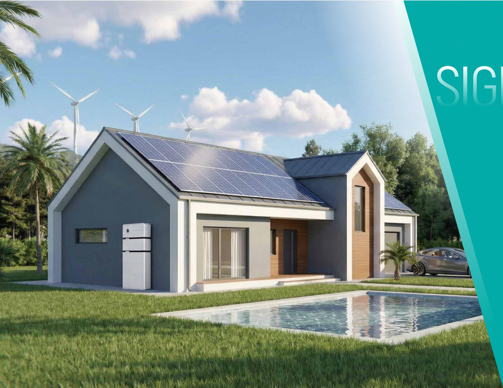

natural_image

Modern two-story house with solar panels and wind turbines in the background, featuring a swimming pool and parked car (no visible text or symbols)

# SIGENERGY

# 走进思格新能源

- 企業簡介 05  
• 文化理念 05  
- 組織架構 05  
• 發展歷程 06  
• 榮譽獎項 07

# 企業簡介

思格新能源成立於2022年，總部位於上海，是一間專注於新能源領域的科技創新企業。公司憑藉全球領先的數字智能技術與高質素創新人才團隊，深度布局光伏發電、智慧儲能及高效電動車（EV）充電領域，致力為全球家庭及企業客戶提供安全、智能、高效的「光儲充」一體化產品與全場景智慧能源解決方案。

圍繞新能源產業規模化、高可靠應用的發展需求，我們堅持以「極簡部署、極致安全、極佳體驗」為核心理念，通過系統級技術創新，持續提升產品與解決方案的安全性、可靠性及智能化水平。截至2025年底，公司業務覆蓋全球85個國家和地區的172家分銷商達成深度戰略合作，在亞太、歐洲及非洲等主要市場均已成為頭部渠道夥伴的首選品牌。

# 排名第一的可堆疊分布式光儲

# 一體機解決方案供應商³

2024年

154.4倍

2023年至2025年的收入增長

\~40%

研發人員³

605/234

專利申請／授權專利³

全球業務遍及85個

國家和地區 $^{4}$

172 / 17,600+

合作分銷商／註冊安裝

# 文化理念

# 價值觀

安全、智能、綠色、
高效、創新

# 願景

暢享綠色能源

# 使命

打造極致安全、極簡高效的能源解決方案，
引領全場景AI+光儲的技術創新

# 組織架構

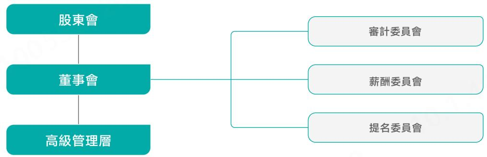

flowchart

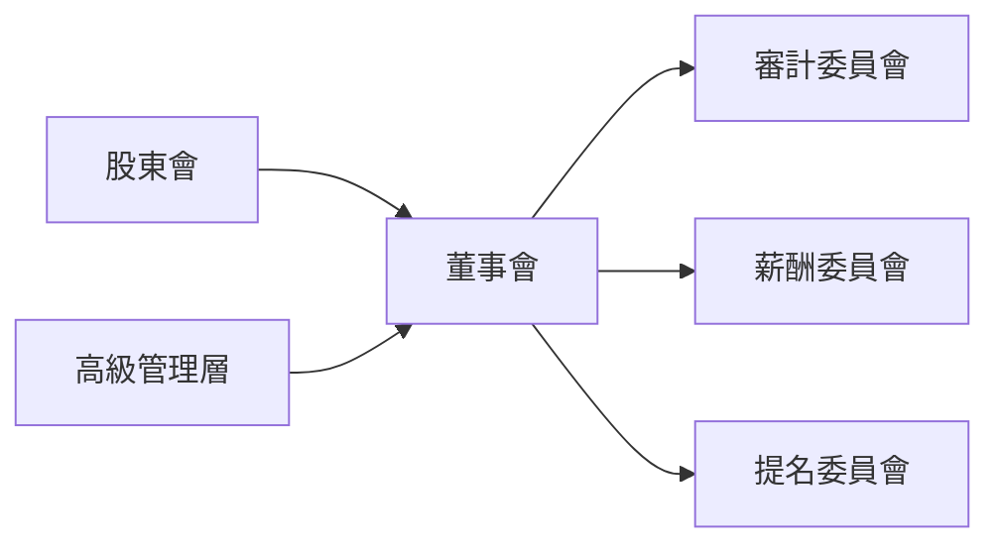
```mermaid
graph LR
  A["股東會"] --> B["董事會"]
  C["高級管理層"] --> B
  B --> D["審計委員會"]
  B --> E["薪酬委員會"]
  B --> F["提名委員會"]
```

# 發展歷程

2022年5月

在中國成立

2023年3月

榮獲紅點設計獎

2023年5月

首批產品發往歐洲

2023年6月

公司品牌及產品全球正式公布

2023年11月

AI功能上架 mySigen App

2024年6月

推出新的工商業解決方案；一體化V2X 解決方案落實

2024年9月

推出思格雲管理平台；據弗若斯沙利文報告，可堆疊分布式光儲一體機解決方案出貨量全球第一

2024年12月

據弗若斯特沙利文報告，截至 2024 年年末成為中國儲能行業中最快實現年銷售收入 1 億美元的企業

2025年2月

正式遞交港交所主板上市申請材料

2025年12月

根據權威諮詢機構 SunWiz 報告，2025 年在澳大利亞、愛爾蘭和南非市場的分布式儲能系統領域排名第一

# 榮譽獎項

# 高新技術企業

上海市科委、上海市財政局、
上海市稅務局

# 上海市企業技術中心

上海市經信委

# 上海市創新型中小企業

上海市經信委

# 上海市專精特新中小企業

上海市經信委

# 上海外貿自主品牌示範企業

上海市進出口協會

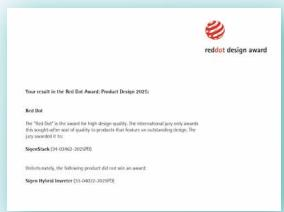

text_image

redlot design award
Your result in the Best Dot Award: Product Design 2015:
Best Dot
The "Best Dot" is the award for high-grade quality, the international only awards
this bought offer was not to provide by but not an understanding of the.
Best dot award #1:
SignetLink (CH-03462-2020)
Underlying, the following product did not wish any award:
Signet Hybrid Inversion (CH-03833-2020)

<table><tr><td>序号</td><td>设备名称</td><td>生产厂家/供应商</td><td>型号</td><td>使用单位/批注</td></tr><tr><td>15</td><td>上海电气电站设备有限公司上海电站辅机厂</td><td>高端装备</td><td>闵行区</td><td></td></tr><tr><td>16</td><td>上海大华电器设备有限公司</td><td>高端装备</td><td>嘉定区</td><td></td></tr><tr><td>17</td><td>中冶(上海)钢结构科技有限公司</td><td>高端装备</td><td>宝山区</td><td></td></tr><tr><td>18</td><td>上海恩格源智能科技有限公司</td><td>高端装备</td><td>临港新片区</td><td></td></tr><tr><td>19</td><td>华荣科技股份有限公司</td><td>高端装备</td><td>嘉定区</td><td></td></tr><tr><td>20</td><td>上海纳杰电气成套有限公司</td><td>惠晟装备</td><td>闵行区</td><td></td></tr></table>

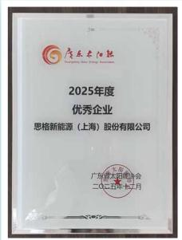

text_image

广东太阳能
2025年度
优秀企业
思格新能源（上海）股份有限公司
广东省人大常委会
二〇二五年七月

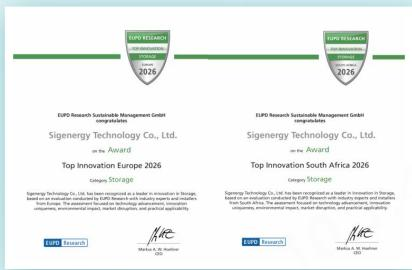

text_image

EURO RESEARCH
SIGNALMENT
2026
Top Innovation Europe 2026
Company Storage
EURO Research Sustainable Management GmbH
Sigenergy Technology Co., Ltd.
on the Award
Signenergy Technology Co., Ltd.
on the Award
Signenergy Technology Co., Ltd.
on the Award
Signenergy Technology Co., Ltd.
Top Innovation South Africa 2026
Company Storage
Signenergy Technology Co., Ltd. has been recognized as a leader in innovation in Singapore, with Europe leading in research and development, and also has a strong competitive advantage in international markets, environmental impact, market disruption, and practical applications.
EURO Research
Markus & Smith Limited
Signenergy Technology Co., Ltd.
on the Award
Signenergy Technology Co., Ltd.
on the Award
Signenergy Technology Co., Ltd.
on the Award
Signenergy Technology Co., Ltd.
on the Award
Signenergy Technology Co., Ltd.
on the Award
Signenergy Technology Co., Ltd.
on the Award
Signenergy Technology Co., Ltd.
on the Award
Signenergy Technology Co., Ltd.
on the Award
Signenergy Technology Co., Ltd.
on the Award
Signenergy Technology Co., Ltd.
on the Award

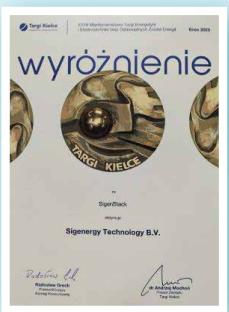

text_image

WYRÓŻNIE
ZARGI KIELCE
19
Szigenerzock
Wizyjansz
Sigenergy Technology B.V.
Rozierina L. R. D. A. C. M. E. S. T. H. I. J. K. L. M. N. O. P. Q. R. S. T. U. V. W. X. Y. Z.

# 2025年德國紅點產品設計獎

德國設計協會

# 上海市先進級智能工廠

上海市經信委

# 2025年度優秀企業

廣東省太陽能協會

# 2026年頂級創新獎 - 存儲類 歐洲和南非

EUPD 研究所

# Best Energy Management

最佳能源管理獎

ENEX/Targi Kielce

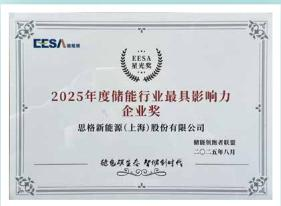

text_image

EESA
2025年度储能行业最具影响力
企业奖
思格新能源(上海)股份有限公司
储能行业荣誉
二〇一五年八月
稳态研磨 智创时代

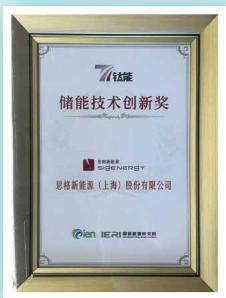

text_image

钛能
储能技术创新奖
中核能源
SiGeEnergy
思格新能源（上海）股份有限公司
Zhen HEAN 恩能新能源研究院

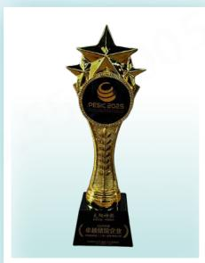

natural_image

Golden trophy with star and circular emblem, mounted on a black base (no visible text or symbols)

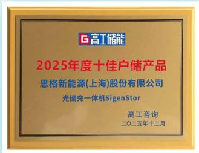

text_image

高工储能
2025年度十佳户储产品
惠格新能源(上海)股份有限公司
光储充一体机SigenStor
高工咨询
二〇二五年十二月

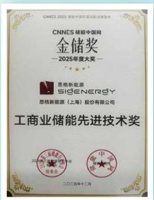

text_image

CNDES 硕能中国网
金储奖
—2025年度大奖—
思格新能源
SIBIENERGY
思格新能源（上海）股份有限公司
工商业储能先进技术奖
二〇二三年十二月

# 025年度儲能行業最具影響力企業獎

儲能領跑者聯盟

# 儲能技術創新獎

國能能源研究院

# 太陽神獎-2025年度卓越儲能企業

中國國際光伏與儲能產業大會

# 十佳戶儲產品

高工儲能研究院

# 2025儲能中國金儲獎-工商業儲能先進技術獎

儲能中國網

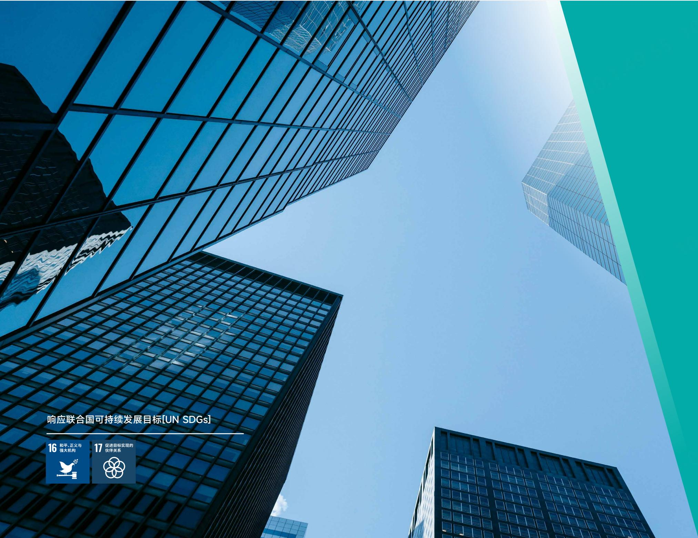

text_image

响应联合国可持续发展目标[UN SDGs]
16 和平、正义与强大机构
17 促进目标实现的伙伴关系

# 01

# 治理思誠

# 築牢發展基石

• 公司治理 18  
- 可持續發展治理 21  
• 商業道德 24  
• 資訊安全 27

响应联合国可持续发展目标[UN SDGs]

16 和平、正义与强大机构

17 促进目标实现的伙伴关系

# 公司治理

# 治理架構

思格新能源嚴格遵循《中華人民共和國公司法》《中華人民共和國證券法》《香港聯合交易所有限公司證券上市規則》等相關法律法規及監管要求，致力於建構權責清晰、運作透明、制衡有效的治理體系，以保障利益相關方的合法權益，推動公司實現長期、穩健、可持續發展。

公司嚴格遵循《公司章程》及相關規定，規範股東會的召集、召開流程與議事程序。股東會作為公司最高權力機構，充分保障股東合法權益，切實保障股東行使發言權、表決權，確保股東可對公司經營活動進行有效監督。

董事會為公司經營決策機構，由8名董事組成，包括執行董事、非執行董事及獨立非執行董事，其中獨立非執行董事佔比不低於三分之一，以切實提升公司治理的獨立性、客觀性與專業水準。董事會下設審計委員會、提名委員會及薪酬委員會等專門委員會，各委員會依據公司章程及董事會授權履行職責，並將其審議意見或提案提交董事會作出最終決策。

# 董事會

# 審計委員會

主要負責提議聘任或更換外聘審計師並監督其獨立性與表現，審查公司財務資料及報告並提供意見，評估內部控制有效性、監督ESG政策實施與整體表現，協調管理層、內部審計部門及外部審計機構的溝通。

# 提名委員會

主要負責就董事會規模及組成提出建議，研究制定董事、總經理及高級管理層的選舉標準與程序，審查董事會候選人及高級管理層人選，評估及審核獨立非執行董事的獨立性。

# 薪酬委員會

委員會由三名董事組成並設主席一名，主要負責制定董事、監事及高級管理層的個別薪酬方案，審查其績效評估標準並開展年度評估，監督薪酬計劃落實，審批股份計劃相關事項。

同時，公司積極建構專業、多元包容的董事會，已制定並實施董事會多元化政策，透過綜合考量性別、年齡、文化背景、教育及專業經驗等維度，推動董事會知識結構與能力組合的均衡配置。目前董事會由3名女性董事與5名男性董事組成，已達成性別多元化目標，專業領域覆蓋能源、金融、企業管理及管治等多個方向。提名委員會承擔監督職責，將定期審查政策有效性、制定並跟進可量化實施目標。公司每年在企業管治報告中披露相關進展，持續推進董事會及高級管理層等全層級的多元化建設，以提升整體治理效能。

董事會結構  
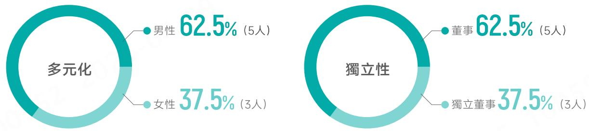

donut

| Category | Percentage | Count |
| --- | --- | --- |
| 男性 | 62.5% | 5人 |
| 女性 | 37.5% | 3人 |
| 董事 | 62.5% | 5人 |
| 獨立董事 | 37.5% | 3人 |

# - 薪酬政策

思格新能源對董事及高級管理層的薪酬，採取了結構多元、與績效緊密掛鉤的管理方式。薪酬主要包括固定部分的薪金、津貼與實物福利，以及浮動部分的績效獎金。此外，公司透過股權激勵及退休金計劃供款，建構長期激勵機制。是公司綜合考慮經營業績、市場可比先例及主要經營指標達成情況等因素制定的薪酬水平，旨在實現激勵與約束的平衡，確保薪酬政策與公司長期發展目標及股東利益保持一致。

# 風險管理

思格新能源致力於將全面風險管理理念融入公司治理和經營管理的各個環節，通過建立健全的風險管理體系、嚴密的內部控制機制以及嚴格的合規管理制度，實現風險的及時管控。

# - 風險管理體系

公司內部制定《思格內部審計管理制度》《思格全面風險管理辦法》等風險管理相關制度，明確風險識別、評估、監控與應對的全流程規範。同時，建構了涵蓋董事會、經營層等多層級在內的全面風險管理架構，確保各部門及全體員工樹立風險防範意識，推動公司穩健營運。

# 第一道防線

# 各業務部門

- 作為風險管控的前端主體，負責日常業務全流程風險識別、提出重大風險應對策略及具體應對方案；  
- 落實具體風險防控措施，及時上報風險隱患；監控風險事件的變化狀態、填報關鍵指標數據，適時制定和啟動應急預案，承擔風險管控的首要責任。

# 第二道防線

# 流程與效率部、財務部及法務部

- 主持全面風險管理的日常工作，組織開展年度風險評估及應對工作，負責對評估結果匯總分析，對其他部門和分支機構開展的專項業務風險評估提供指導和支持；  
- 對重大風險應對方案的制定、執行和效果情況進行監督檢查；協調解決跨部門重大風控問題；組織風控培訓與推廣；建立全流程監控機制，確保數據真實、完整、可追溯。

# 第三道防線

# 審計部

- 作為獨立監督主體，對各部門的主要風險點進行獨立的日常監控與管理、對各部門的運行過程和結果進行獨立的稽核與檢查；  
- 開展風險管理體系有效性審計與監督檢查；評價風險識別、控制與應對措施的執行效果，跟蹤內控缺陷整改，保障風險管理閉環運行。

# - 重點風險防控

結合新能源行業的發展特點與公司當前經營實際，思格新能源建構了系統性的風險分類與管理體系。公司全面識別並界定了管理、聲譽、道德、信用、操作、合規及市場等七大類風險，明確了每類風險的定義與邊界，為實施精準、前瞻的風險管控奠定了基礎。

在管理策略與執行上，公司建立了由審計委員會審定、董事會審批、管理層落實的閉環治理機制，並依據內外環境變化進行動態調整。透過每年度的全面風險評估，以及內部審計/覆核、與第三方突擊檢查相結合的多維度排查機制，公司能夠持續、深入地識別營運與管理中的潛在風險，確保風險得以及時發現與有效控制。

公司建立了風險發生後的分級回應與閉環處置機制。風險發生後，立即啟動相應的控制與減緩措施，透過落實內控控制措施、動態追蹤風險態勢等方式，有效控制並減緩風險擴散與影響程度。同時深挖風險根源，透過優化制度流程、整改內控缺陷等舉措從源頭消除風險隱患。在此基礎上開展事件覆盤、責任認定與整改落實，同步完善責任追究與損失追償機制，持續提升公司風險防控的韌性與有效性。報告期內，公司未發生重大風險事件，風險防控體系運作有效，經營保持穩健可控。

# 可持續發展治理

# 可持續發展管理

2025年，思格新能源深化可持續發展管理，制定《可持續發展和ESG管理》，建構了全面的ESG管理架構，涵蓋決策層、管理層、執行層，確保每個層級有清晰的權責分工和責任歸屬，保障ESG事項有效融入各層級的日常工作中，不斷提升公司綜合治理水平。

可持續發展管理架構  
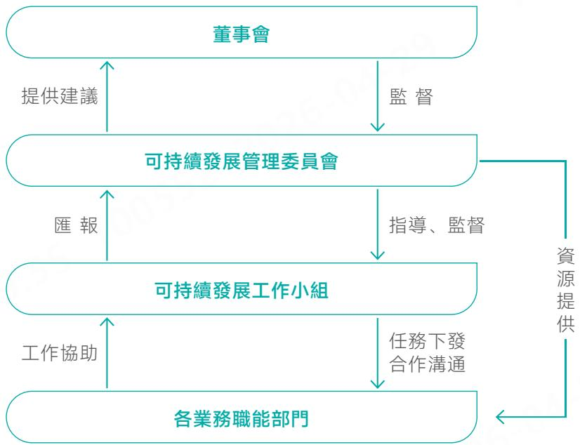

flowchart

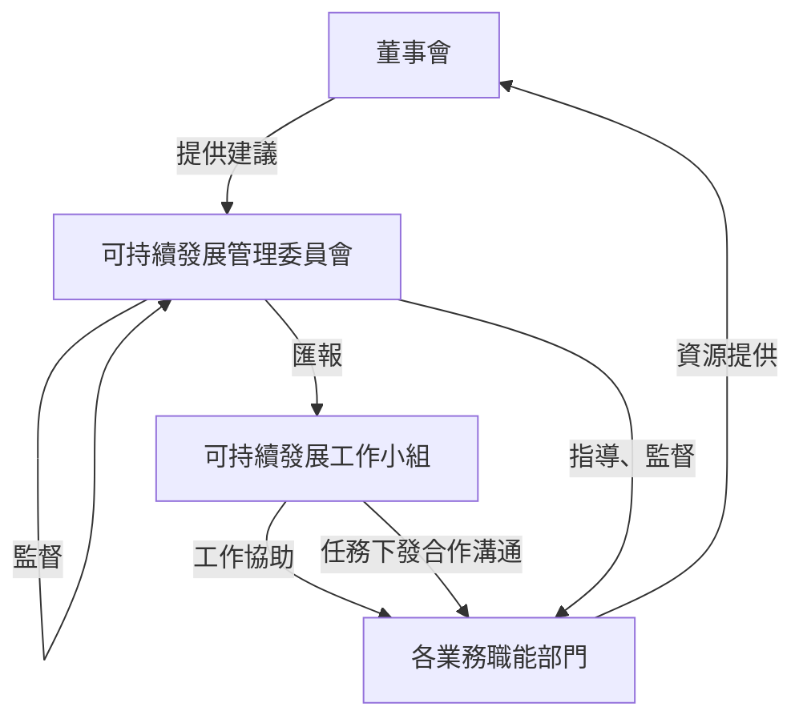
```mermaid
graph TD
  A["董事會"] -->|提供建議| B["可持續發展管理委員會"]
  B -->|監督| B
  B -->|匯報| C["可持續發展工作小組"]
  C -->|工作協助| D["各業務職能部門"]
  C -->|任務下發合作溝通| D
  B -->|指導、監督| D
  D -->|資源提供| A
```

# 董事會

- 審查可持續發展趨勢，監督可持續發展相關議題並識別可持續發展機會；  
- 指導及制定公司的環境、社會及管治願景、目標、策略及架構；  
- 監督可持續發展相關願景、策略、實施架構及目標進度。

# 可持續發展 管理委員會

- 委員會由首席營運官（COO）及相關部門負責人組成；  
- 為可持續發展推行小組提供關鍵議題見解、確保可持續發展目標與業務緊密結合；  
• 協調資源、確保可持續發展戰略和計劃的穩步推進。

# 可持續發展 工作小組

- 流程與效率部作為可持續發展工作小組的牽頭部門，流程與效率部負責人擔任可持續發展工作小組組長；  
- 為公司可持續發展決策提供專業建議、方向及方案；  
- 就董事會批准的可持續發展目標細化行動方案，統籌各部門推進實施；  
- 具體落實可持續發展戰略決策部署，制定可持續發展工作計劃和實施方案；  
- 組織開展可持續發展培訓、宣傳和教育活動，收集、整理和分析可持續發展相關資訊；  
- 定期匯報工作進展情況，對各部門、各子公司的可持續發展工作進行指導、監督和評核。

# 各業務 職能部門

- 可持續發展相關的關鍵職能部門協助可持續發展工作小組開展工作；  
- 各業務職能責任部門負責推進可持續發展議題的具體改善及管理工作，完成政策制定、可持續發展專案設計與執行、資訊收集等工作；  
- 組織開展可持續發展相關活動，確保本部門的生產經營活動符合可持續發展標準；  
- 定期向可持續發展工作小組匯報本部門、本單位可持續發展工作進展情況，及時回饋工作中遇到的問題和建議。

# 利益相關方溝通

思格新能源高度重視與各利益相關方的坦誠溝通與良性互動。公司建立了多層次、常態化的溝通機制，透過多元化的渠道及時聆聽各方聲音、回應合理關注，並將利益相關方的建議深度融入企業策略與日常營運，攜手共創共享價值。

<table><tr><td></td><td></td><td></td><td></td><td></td><td></td><td></td><td></td><td></td></tr><tr><td>利益相關方</td><td>股東</td><td>客戶(安裝商、分銷商、終端用戶)</td><td>政府與監管機構</td><td>員工及從業人員</td><td>供應商</td><td>高校及科研機構</td><td>業務夥伴及行業協會</td><td>社區及公眾</td></tr><tr><td>關注要點</td><td>戰略方向投資回報營運透明度</td><td>回應需求服務體驗技術支援保障</td><td>營收與稅收貢獻合規經營帶動地方就業</td><td>合法權益職業發展</td><td>穩定供應廉潔合規</td><td>人才儲備技術前瞻</td><td>資源共用標準共建</td><td>社區共融安全生產</td></tr><tr><td>溝通渠道</td><td>股東會定期報告投資者交流會</td><td>滿意度調查現場走訪電話熱線工單系統</td><td>專項補貼申請日常溝通正式匯報發函</td><td>職工代表大會員工滿意度調查線上溝通平台</td><td>現場審核供應商大會廉潔協議簽署</td><td>獎學金設立產學研合作項目</td><td>行業峰會技術交流會白皮書發布</td><td>消防安全宣傳社區工作站聯絡社區微信群</td></tr></table>

# 實質性議題評估

思格新能源基於自身業務特性、所處行業發展趨勢，以及國內外ESG相關法規與標準，初步梳理出涵蓋環境、社會及管治維度的潛在可持續發展議題清單。在此基礎上，公司採用雙重重要性原則開展系統性評估。

- 財務重要性：衡量各議題對公司經營績效、風險管理、財務狀況及長期價值創造的潛在影響。  
- 影響重要性：評估公司營運對經濟、環境及社會所產生的積極或消極外部影響。

為確保評估結果的客觀性與代表性，公司面向內外部利益相關方開展問卷調查，廣泛收集其對各項議題雙重重要性的評價。基於回收數據，對每項議題在「財務重要性」與「影響重要性」兩個維度上的得分進行量化分析，並繪製實質性議題矩陣。

<table><tr><td>雙重重要性程度</td><td>環境</td><td>社會</td><td>治理</td></tr><tr><td>財務重要性高影響重要性高</td><td>/</td><td>研發創新產品責任供應鏈管理</td><td>/</td></tr><tr><td>財務重要性高影響重要性低</td><td>應對氣候變化能源利用循環經濟潔淨技術機遇</td><td>勞工權益員工薪酬福利多元平等與包容員工培訓與發展客戶關係管理</td><td>公司治理反商業賄賂及反貪污</td></tr><tr><td>財務重要性低影響重要性高</td><td>排放與廢棄物管理環境合規管理</td><td>職業健康與安全數字化與資訊化建設行業協同發展</td><td>可持續發展管理資訊安全與隱私保護</td></tr><tr><td>財務重要性低影響重要性低</td><td>水資源利用自然與生物多樣性</td><td>社區投資</td><td>/</td></tr></table>

思格新能源2025年雙重重要性矩陣圖  
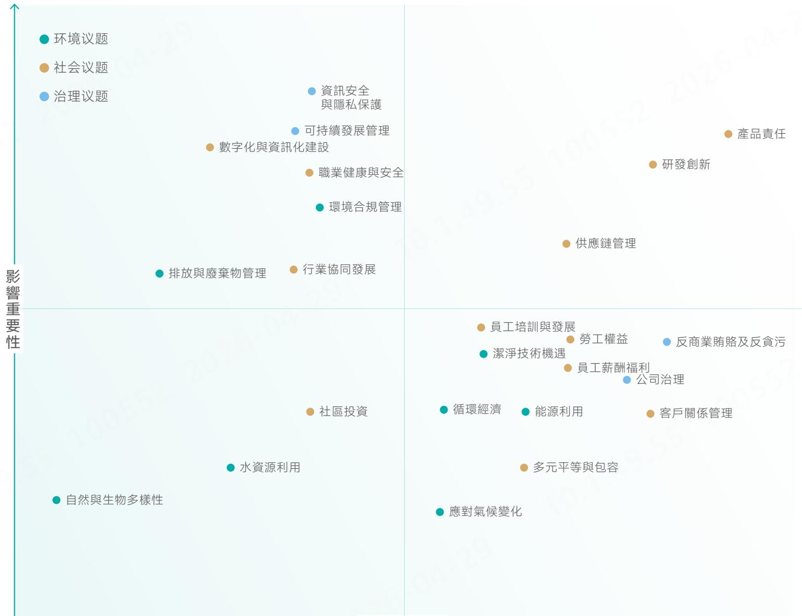

scatter

| Topic | X-axis Position (Approximate) | Y-axis Position (Approximate) |
| :--- | :--- | :--- |
| 环境议题 | Low | High |
| 社会议题 | High | High |
| 治理议题 | Medium-High | High |
| 資訊安全與隱私保護 | Medium-High | High |
| 可持續發展管理 | Medium-High | High |
| 數字化與資訊化建設 | Medium-High | High |
| 職業健康與安全 | Medium-High | High |
| 環境合規管理 | Medium-High | Medium-High |
| 排放與廢棄物管理 | Low-Medium | Medium |
| 行業協同發展 | Medium | Medium |
| 產品責任 | High | High |
| 研發創新 | High | High |
| 供應鏈管理 | Medium-High | Medium |
| 員工培訓與發展 | Medium-High | Low-Medium |
| 勞工權益 | Medium-High | Low-Medium |
| 反商業賄賂及反貪污 | High | Low-Medium |
| 潔淨技術機遇 | Medium-High | Low-Medium |
| 員工薪酬福利 | Medium-High | Low-Medium |
| 公司治理 | Medium-High | Low-Medium |
| 循環經濟 | Low-Medium | Low |
| 能源利用 | Low-Medium | Low |
| 客戶關係管理 | High | Low |
| 社區投資 | Low-Medium | Low |
| 多元平等與包容 | Low-Medium | Low |
| 水資源利用 | Low-Medium | Low |
| 自然與生物多樣性 | Low | Low |
| 應對氣候變化 | Low-Medium | Low |

財務重要性

# 商業道德

# 合規營運

思格新能源嚴格遵守《中華人民共和國反洗錢法》《中華人民共和國反壟斷法》《中華人民共和國反不正當競爭法》等法律法規及境內外上市公司監管要求，制定並實施《商業行為準則》，全面指導員工在日常業務中踐行高標準的道德與合規要求。截至報告期末，公司未發生任何與壟斷、洗錢和不正當競爭相關的訴訟事件。

# 反洗錢

制定《反洗錢合規管理制度》，嚴格履行國內外反洗錢法律法規規定的義務，建立健全資金監控與客戶盡職審查機制，有效識別、評估並防範洗錢及恐怖融資風險。

# 全球 貿易合規

全面遵守各國海關、出口管制、經濟制裁及反制裁相關的法律法規與國際條約，建立動態追蹤機制，及時響應政策變化，切實履行全球貿易合規責任。

# 反壟斷及公平競爭

堅決維護市場競爭秩序，嚴格遵守各司法轄區關於反壟斷、反不正當競爭的法律規定，杜絕任何限制競爭、價格操縱或濫用市場支配地位等行為。

此外，公司制定《公司稅務管理制度》，全面覆蓋稅務登記、稅務核算、納稅申報、發票管理等關鍵環節，建構全流程、閉環式的稅務合規體系。我們堅持依法納稅，嚴格按照規定時限和要求完成各項稅種的申報與繳納，做到應繳盡繳、及時足額，並堅決杜絕偷稅、漏稅、虛開發票等任何違法違規行為。

# 廉潔營運

為建立健全商業道德與合規經營體系，2025年思格新能源制定並實施《反腐敗反舞弊管理辦法》等制度，明確由審計部作為常設機構，統籌開展公司範圍內的反腐敗反舞弊工作。各職能管理層為其管轄範圍內的第一責任主體，對職責範圍內的合規管理承擔最終責任。報告期內，公司未發生腐敗、貪污相關的訴訟事件。

# - 廉潔管理

思格新能源高度重視廉潔合規管理，建立覆蓋員工與合作夥伴的全鏈條廉潔管理體系。公司以制度為抓手，強化廉潔風險防控，推動廉潔理念融入經營管理各環節。報告期內，要求所有新員工在入職時均須簽署《關於思格公司內控紅線的規定》，明確員工不得從事收受回扣、利益輸送或利用職務謀取私利等行為。報告期內，新員工簽署率為100%。

# - 廉潔培訓

公司將反腐敗及反舞弊內容納入新入職員工培訓的核心課程，實現廉潔教育由入職開始全面覆蓋，並每年組織一次全員反腐敗反舞弊專項宣傳培訓及考核，反覆強調廉潔誠信的重要性，持續深化全體員工的廉潔從業意識。

# 築牢採購廉潔防線

# 案例

為加強員工在採購及相關業務環節的合規意識，公司定期舉辦「反採購違規行為」專題培訓。該培訓聚焦採購全鏈條中易發、高發的廉潔風險，透過分析真實貪污及舞弊個案，深入揭示舞弊行為的成因與典型特徵。藉助情境化、案例化的教學方式，提升員工對採購範疇廉潔風險的警覺性及防範能力。

# • 舉報管理

公司制定《舉報及調查管理制度》，堅守公開透明、公正履職及嚴格問責原則，鼓勵員工、客戶、供應商及其他利益相關方透過正規渠道舉報涉嫌違規或違法行為，共同維護合規生態。此外，公司承諾對每一宗舉報個案進行公正、嚴謹的調查，並採取必要措施（例如限制資訊存取權限、加密儲存舉報材料）對舉報人身份及舉報內容嚴格保密，嚴禁任何形式的打擊報復，以切實保障舉報人的合法權益及資訊安全。

• 舉報電郵：audit@sigenergy.com

# 資訊安全

# 資訊安全升級

思格新能源嚴格遵守《中華人民共和國網絡安全法》《中華人民共和國數據安全法》等相關法律法規，並在內部制定《資訊安全風險管理程序》等管理制度，嚴格保障公司內部資訊安全。公司持續完善資訊安全管理體系，總部、臨港生產園區及金橋生產園區均已獲得ISO 27001資訊安全管理體系認證。截至報告期末，思格新能源未發生資訊安全和隱私洩露事件。

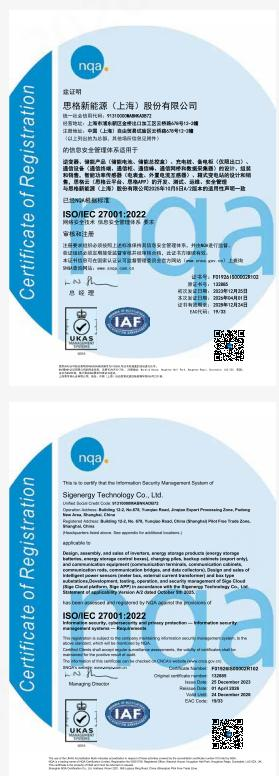

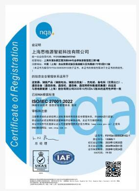

text_image

证书号
上海思格源智能科技有限公司
注册号：上海市浦东新区浦东南路500号海泰大厦9楼
办公地址：中国（上海）自由贸易试验区浦东南路500号海泰大厦9楼
电子邮箱：www.ningsheng Intelligent Technology Co., Ltd.
ISBN: 978-7-7
ISO/IEC 27001.2022
网络安全证书编号：第1436000000000000000000000000000000000000000000000000000000000000
证书号：SHENZHEN 2701111111111111111111111111111111111111111111111111111111111111111111111111111111111
证书号：SHENZHEN 270111111111111111111111111111111111111111111
证书号：SHENZHEN 270222222222222222222222222222222222222222222222222222222222222222222222222222222222222222222222222
证书号：SHENZHEN 2703333333333333333333333333333333333333333333333333333333333333333333333333333333333333333333333333333<nl>
证书号：SHENZHEN 270445555555555555555555555555555555555555555555555555555555555555555555555555555555555555555555555555555<nl>
证书号：SHENZHEN 2704666666666666666666666666666666666666666666666666666666666666666666666666666666666666666666666666<nl>
证书号：SHENZHEN 2704889999999999999999999999999999999999999999999999999999999999999999999999999999999999999999999999999<nl>
证书号：SHENZHEN 27048888888888888888888888888888888888888888888888888888888888888888888888888888888888888888888888<nl>
证书号：SHENZHEN 270477777777777777777777777777777777777777777777777777777777777777777777777777777777777777777777<nl>
证书号：SHENZHEN 2704444444444444444444444444444444444444444444444444444444444444444444444444444444444444444444444444444<nl>
证书号：SHENZHEN 2704444444444444444444444444444444444<nl>
证书号：SHENZHEN 270466666666666666666666666<nl>
证书号：SHENZHEN 27048899999999999999999999999<nl>
证书号：SHENZHEN 270488888888888888888888888<nl>
证书号：SHENZHEN 270488888888888888<nl>
证书号：SHENZHEN 270488888888888<nl>
证书号：SHENZHEN 2704<fcel><nl>
证书号：SHENZHEN 2704<nl>
证书号：SHENZHEN 270<fcel><nl>
证书号：SHENZHEN 270<nl>
证书号：SHENZHEN 270<nl>
证书号：SHENZHEN 270<nl>
证书号：SHENZHEN 270<nl>
证书号：SHENZHEN 270<nl>
证书号：SHENZHEN 270<nl>
证书号：SHENZHEN 270<nl>
证书号：SHENZHEN 270<nl>
证书号：SHENZhen 270<nl>
证书号：SHENZhen 270<nl>
证书号：SHENZhen 270<nl>
证书号：SHENZhen 270<nl>
证书号：SHENZhen 270<nl>
证书号：SHENZhen 270<nl>
证书号：SHENZhen 270<nl>
证书号：SHENZhen 270<nl>
证书号：
SHENZhen 270<nl>
证书号：
SHENZhen 270<nl>
证书号：
SHENZhen 270<nl>
证书号：
SHENZhen 270<nl>
证书号：
SHENZhen 270<nl>
证书号：
SHENZhen 270<nl>
证书号：
SHENZhen 270<nl>
证书号：
SHENZhen 270
证书号：
SHENZhen 270<nl>
证书号：
SHENZhen 270<nl>
证书号：
SHENZhen 270<nl>
证书号：
SHENZhen 270<nl>
证书号：
SHENZhen 270<nl>
证书号：
SHENZhen 270<nl>
证书号：
SHENZhen 270<nl>
证书号：
SHENZhen<nl>
证书号：
SHENZhen 270<nl>
证书号：
SHENZhen 270<nl>
证书号：
SHENZhen 270<nl>
证书号：
SHENZhen 270<nl>
证书号：
SHENZhen 270<nl>
证书号：
SHENZhen 270<nl>
证书号：
SHENZhen 270<nl>
证书号：
SHENZchen 270<nl>
证书号：
SHENZchen 270<nl>
证书号：
SHENZchen 270<nl>
证书号：
SHENZchen 270<nl>
证书号：
SHENZchen 270<nl>
证书号：
SHENZchen 270<nl>
证书号：
SHENZchen 270<nl>
证书号：
SHENZchen 270<nl>
证书号：

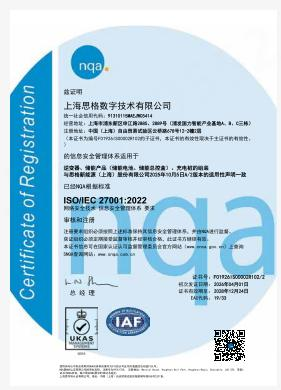

text_image

证书编号：沪市协发[2020]4341
上海思格数字技术有限公司
经营范围：上海市场监督管理局注册商标、2020年（浦发省台都市产业服务中心）A、B、C地块）
注册地址：中国（上海）自由贸易试验区临港新片区9号楼12楼
有效期：自2020年5月16日至2020年12月17日止，未经中国证券监督管理委员会发布的有效许可。
经营范围：企业总部与科技成果转化项目
经营范围：硬件产品、存储系统、网络通信设备、光通信的终端
与终端装置设计（上海）股份有限公司2020年9月8日与国家高新技术企业联合
ISO/IEC 27001:2022
特许经营项目：新型电子材料及复合材料的生产、销售
审批流程
注册地址：上海市浦东新区世纪大道100号环球国际金融中心大厦B座
办公地址：上海市浦东新区世纪大道100号环球国际金融中心大厦B座
ISBN 978-7-0000-7311-22-0
证书类型：实用新型
证书号：P1701053553331122-2
经发证日期：2020年9月8日
证书有效期至：2020年12月4日
发证机关：国浩律师
发证机关代码：9132-5
ISSN 978-7-0000-7311-22-0
IAF
© 2020/12/14

公司總部 $^{5}$ 資訊安全管理體系證書  
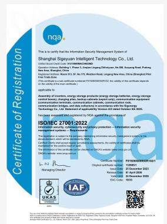

text_image

This is a certify the Information Security Management System of
Shanghai Sigeyuan Intelligent Technology Co., Ltd.
Shanghai Sigeyuan Intelligent Technology Co., Ltd.
Certification: Cao et al. (2021) Shanghai Sigeyuan Intelligent Technology Co., Ltd.
Certification Number: 31-400-6587
ISSN Code: 911-000000000
ISO 12001/2022
ISO/IEC 27001/2022
The certificate of the Information Security Management System of
Shanghai Sigeyuan Intelligent Technology Co., Ltd.
Certification Number: 31-400-6587
ISSN Code: 911-000000000
ISO 12001/2022
IAAF
Certificate No. F1558-000000001
Organic certificate number: 1338991
Date: 22 December 2023
ISSN Code: 911-000000001
E-Mail: 22 November 2023
EAC Code: 9993
© 2023 All rights reserved worldwide at www.sinaica.gov/locate/organization/registration/organization/registration/organization/registration/organization/registration/organization/registration/organization/registration/organization/registration/organization/registration/organization/registration/organization/registration/organization/registration/organization/registration/organization/registration/organization/registration/organization/registration/organization/registration/organization/registration/organization/registration/organization/registration/organization/registration/organization/registration/organization/registration/organization/registration/organization/registration/organization/registration/organization/Registration
© 2023 All rights reserved worldwide at www.sinaica.gov/locate/organization/registration/organization/registration/organization/registration/organization/registration/organization/registration/organization/registration/organization/registration/organization/registration/organization/registration/organization/registration/organization/registration/organization/registration/organization/registration/organization/registration/organization/registration/organization/registration/organization/
© 2023 All rights reserved worldwide at www.sinaica.gov/locate/organization/registration/organization/registration/organization/registration/organization/registration/organization/registration/organization/
© 2023 All rights reserved worldwide at www.sinaica.gov/locate/organization/registration/organization/registration/organization/registration/organization/
© 2023 All rights reserved worldwide at www.sinaica.gov/locate/organization/registration/organization/
© 2023 All rights reserved worldwide at www.sinaica.gov/locate/organization/registration/organization/
© 2023 All rights reserved worldwide at www.sinaica.gov/locate/organization/
© 2023 All rights reserved worldwide at www.sinaica.gov/
© 2023 All rights reserved worldwide at www.sinaica.gov/
© 2023 All rights reserved worldwide at www.sinaica.gov/
© 2023 All rights reserved worldwide at www.sinaica.gov/
© 2023 All rights reserved worldwide at www.sinaica.gov/
© 2023 All rights reserved worldwide at www.sinaica.gov/
© 2023 All rights reserved worldwide at www.sinopec.org
© 2023 All rights reserved worldwide at www.sinopec.org
© 2023 All rights reserved worldwide at www.sinopec.org
© 2023 All rights reserved worldwide at www.sinopec.org
© 2023 All rights reserved worldwide at www.sinopec.org
© 2023 All rights reserved worldwide at www.sinopec.org
© 2023 All rights reserved worldwide at www.sinoec.org
© 2023 All rights reserved worldwide at www.sinoec.org
© 2023 All rights reserved worldwide at www.sinoec.org
© 2023 All rights reserved worldwide at www.sinoec.org
© 2023 All rights reserved worldwide at www.sinoec.org
© 2023 All rights reserved worldwide at www.sinoec.org
© 2023 All rights reserved worldwide at www.noocce.org
© 2023 All rights reserved worldwide at www.noocce.org
© 2023 All rights reserved worldwide at www.noocce.org
© 2023 All rights reserved worldwide at www.noocce.org
© 2023 All rights reserved worldwide at www.noocce.org
© 2023 All rights reserved worldwide at www.noocce.org
© 2023 All rights reserved worldwide at www.naocce.org
© 2023 All rights reserved worldwide at www.noocce.org
© 2023 All rights reserved worldwide at www.noocce.org
© 2023 All rights reserved worldwide at www.noocce.org
© 2023 All rights reserved worldwide at www.noocce.org
© 2023 All rights reserved worldwide at www.noocce.org
© 2023 All rights reserved worldwide<fcel>www.noocce.org
© 2023 All rights reserved worldwide at www.noocce.org
© 2023 All rights reserved worldwide at www.noocce.org
© 2023 All rights reserved worldwide at www.noocce.org
© 2023 All rights reserved worldwide at www.noocce.org
© 2023 All rights reserved worldwide at www.noocce.org
© 2023 All rights reserved Worldwide at www.noocce.org
© 2023 All rights reserved worldwide at www.noocce.org
© 2023 All rights reserved worldwide at www.noocce.org
© 2023 All rights reserved worldwide at www.noocce.org
© 2023 All rights reserved worldwide at www.noocce.org
© 2023 All rights reserved worldwide at www.noocce.org
© 2023 All Rights Reserved - International license issued by the Securities Regulatory Commission on the Financial Services Regulatory Commission of the Securities Regulatory Commission of the Securities Regulatory Commission of the Securities Regulatory Commission of the Securities Regulatory Commission of the Securities Regulatory Commission of the Securities Regulatory Commission of the Securities Regulatory Commission of the Securities Regulatory Commission of the Securities Regulatory Commission of the Securities Regulatory Commission of the Securities Regulatory Commission of the Securities Regulatory Commission of the Securities Regulatory Commission of the Securities Regulatory Commission of the Securities Regulatory Commission of the Securities Regulatory Commission of the Securities Regulatory Commission of the Securities Regulatory Commission of the Securities Regulatory Commission of the Securities Regulatory Commission of the Secs nocte.com, Inc.
© 2023 All rights reserved worldwide at www.noocce.org
© 2023 All rights reserved worldwide at www.noocce.org
© 2023 All rights reserved worldwide at www.noocce.org
© 2023 All rights reserved worldwide at www.noocce.org
© 2023 All rights reserved worldwide at www.noocce.org
© 2023 All rights reserved worldwide at www.nooccsc.com, Inc.
© 2023 All rights reserved worldwide at www.noocce.com, Inc.
© 2023 All rights reserved worldwide at www.noocce.com, Inc.
© 2023 All rights reserved worldwide at www.noocce.com, Inc.
© 2023 All rights reserved worldwide at www.noocce.com, Inc.
© 2023 All rights reserved worldwide at www.noocce.com, Inc.
© 2023 All rights reserved worldwide at www.noocce.com, Inc.
 © 2018-11-19

臨港生產園區資訊安全管理體系證書

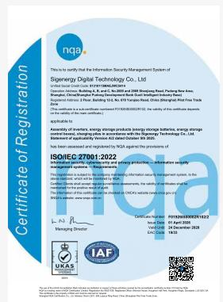

text_image

This is to certify that the Information Security Management System of
Signenergy Digital Technology Co., Ltd.
Signific and Contract Number: 944835164
Contract Name: Digital Technology Co., Ltd. & Co. Ltd. + 20,000 and 200 MHz Streaming Fast Processing New Design
Design and Material: Electronic Design & Testing Systems
Product Code: 21-000-0000-00125
Product Name: Smart Home Design & Testing Systems
Product Type: Smart Home Design & Testing Systems
Product Description:
(No. 1) The product is a standard version of the S&P 500 index (SPDR) with no additional information on the securities of any material listed in this document.
ISO/IEC 27001:2022
Certificate of Information
ISO/IEC 27001:2022
The certification has been obtained by the Signenergy Digital Technology Co., Ltd.
Signific and Contract Number: 944835164
Certificate of Information
ISO/IEC 27001:2022
The certification has been obtained by the Signenergy Digital Technology Co., Ltd.
Signific and Contract Number: 944835164
Certificate of Information
ISO/IEC 27001:2022
The certification has been obtained by the Signenergy Digital Technology Co., Ltd.
Signific and Contract Number: 944845164
Certificate of Information
ISO/IEC 27001:2022
The certification has been obtained by the SignEnergy Digital Technology Co., Ltd.
Signific and Contract Number: 944845164
Certificate of Information
ISO/IEC 27001:2022
The certification has been obtained by the SignEnergy Digital Technology Co., Ltd.
Signific and Contract Number: 944845164
Certificate of Information
ISO/IEC 27001:2022
The certification has been conducted by the SignEnergy Digital Technology Co., Ltd.
Signific and Contract Number: 944845164
Certificate of Information
ISO/IEC 27001:2022
The certification has been conducted by the SignEnergy Digital Technology Co., Ltd.
Signific and Contract Number: 944845164
Certificate of Information
ISO/IEC 27001:2022
This certification has been conducted by the SignEnergy Digital Technology Co., Ltd.
Signific and Contract Number: 944845164
Certificate of Information
ISO/IEC 27001:2022
The certification has been conducted by the SignEnergy Digital Technology Co., Ltd.
Signific and Contract Number: 944845164
Certificate of Information
ISO/IEC 27001:2O2
The certification has been conducted by the SignEnergy Digital Technology Co., Ltd.
Signific and Contract Number: 944845164
Certificate of Information
ISO/IEC 27001:2O2
The certification has been conducted by the SignEnergy Digital Technology Co., Ltd.
Signific and Contract Number: 944845164
Certificate of Information
ISO/IEC 27001;2O2
The certification has been conducted by the SignEnergy Digital Technology Co., Ltd.
Signific and Contract Number: 944845164
Certificate of Information
ISO/IEC 27001;2O2
The certification has been conducted by the SignEnergy Digital Technology Co., Ltd.
Signific and Contract Number: 944845164
Certificate of Information
ISO/IEC 270O1;2O2
The certification has been conducted by the SignEnergy Digital Technology Co., Ltd.
Signific and Contract Number: 944845164
Certificate of Information
ISO/IEC 270O1;2O2
The certification has been conducted by the SignEnergy Digital Technology Co., Ltd.
Signific and Contract Number: 944845164
Certificate of Information
ISO/IEC 2T0;2O2
The certification has been conducted by the SignEnergy Digital Technology Co., Ltd.
Signific and Contract Number: 944845164
Certificate of Information
ISO/IEC 2T0;2O2
The certification has been conducted by the SignEnergy Digital Technology Co., Ltd.
Signific and Contract Number: 944845164
Certificate of Information
ISO/IEC 2T0;3O2
The certification has been conducted by the SignEnergy Digital Technology Co., Ltd.
Signific and Contract Number: 944845164
Certificate of Information
ISO/IEC 2T0;3O2
The certification has been conducted by the SignEnergy Digital Technology Co., Ltd.
Signific and Contract Number: 944845164
Certificate of Information
ISO/IEC 2T0;3O3;3O3
The certification has been conducted by the SignEnergy Digital Technology Co., Ltd.
Signific and Contract Number: 944845164
Certificate of Information
ISO/IEC 2T0;3O3;3O3;3O3;3O3;3O3;3O3;3O3;3O3;3O3;3O3;3O3;3O3;3O3;3O3;3O3;3O3;3O3;3O3;3O3;3O3;3O3;3O3;3O3;3O3;3O3;3O<nl>

金橋生產園區資訊安全管理體系證書

# 升級安全邊界

- 建立精細化防護規則，實現對各類網絡威脅的自動化攔截，同步優化誤攔截策略；  
- 部署網絡層與應用層聯合防護技術，有效抵禦大流量DDoS $^{6}$ 攻擊及應用層攻擊；  
- 引入威脅情報、異常行為分析及自動化封鎖應對機制，實現攻擊行為早發現、快處置、可追溯。

# 加固代碼安全

- 對核心系統開展「人工+工具」結合的代碼安全審計，全面覆蓋源碼漏洞、配置缺失等風險點，建立漏洞清單並實現高危漏洞100%閉環整改；  
- 軟體成分分析與供應鏈安全部署SCA7工具，對開源組件、第三方依賴進行漏洞掃描與許可證合規檢查，建立SBOM8軟體物料清單，防範供應鏈攻擊與組件漏洞風險。

# 加強應急響應

\- 成立網路安全應急回應小組，制定《網路安全事件應急回應預案》，建立健全科學、高效的網路資訊安全應急機制，全面提升對各類網路安全突發事件的應對能力。

# 資訊安全多場景應急演練

案例

2025年7月，公司組織開展資訊安全應急演練，聚焦雲服務異常、DDoS攻擊、數據安全三大核心風險場景，以「檢驗預案、鍛鍊團隊、排查隱患、提升能力」為核心目標，嚴格遵循預設流程有序推進。透過實戰模擬，顯著提升了應變團隊的實戰處置能力及跨部門協同聯動效率。

# 隱私保護

公司嚴格遵循合法、正當、必要的原則，對員工、客戶及合作夥伴的個人資料實施全生命週期合規管理。為強化個人資料保護治理能力，制定《數據保護官（DPO）制度》，並設立首席數據保護官（DPO），統籌協調個人資料處理相關工作。DPO在事前實時分析潛在安全風險，及時發現隱患；事後迅速採取補救措施減少損失，並總結檢討以防止同類問題再次發生，形成閉環式的隱私風險管理機制。

隨著公司業務全球化拓展，數據跨境場景日益增多，對跨境數據合規與隱私保護提出更高要求。我們嚴格遵循《歐盟通用資料保護條例》（GDPR）等國際隱私法規要求，系統識別並適配核心業務所在地國家的資料保護法律，確保數據處理活動在全球化布局中符合當地法律規定，切實保障數據主體的合法權益。

公司制定《數據安全事件回應管理辦法》，一旦發生隱私洩露，應急回應小組將立即開展事件排查、影響分析與風險評估，按等級實施管控處置，快速阻斷洩露並消除風險。DPO負責評估監管上報與主體告知義務，依法向監管部門報備，並以適當方式通知受影響個人，說明事件情況、應對措施及防範建議。事件處置完成後，公司及時開展覆盤整改，優化制度流程，防止同類事件復發。報告期內，公司未發生隱私洩露事件。

# 商業秘密保護

公司成立商業秘密管理委員會，制定《商業秘密管理規定》，開展系統性商業秘密保護措施。透過研究國內外產業案例，評估分析公司技術核心機密點與載體清單，設計商業秘密資產盤點表，按統一規範梳理分類技術資訊，實現核心無形資產的全面備份與精準管控，提升商業秘密舉證與保護能力。

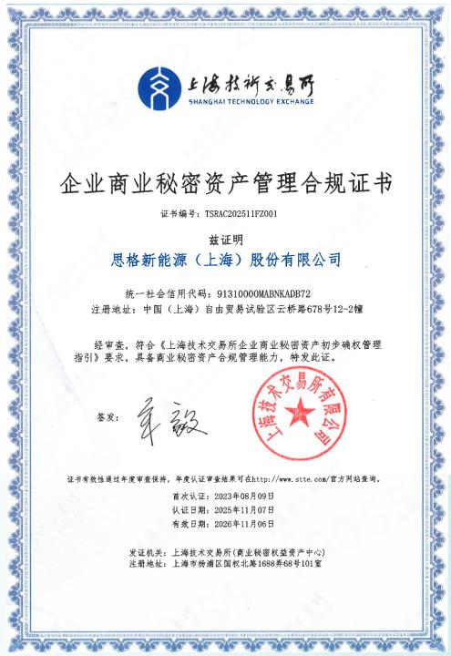

text_image

上海松新交易所
SHANGHAI TECHNOLOGY EXCHANGE
企业商业秘密资产管理合规证书
证书编号：TSAC202511FZ001
兹证明
思格新能源（上海）股份有限公司
统一社会信用代码：91310000MABNKADB72
注册地址：中国（上海）自由贸易试验区云桥路678号12-2幢
经审查，符合《上海技术交易所企业商业秘密资产初步确权管理指引》要求，具备商业秘密资产合规管理能力，特发此证。
签发：
审核
证书有效性通过年度审查保持，年度认证审查结果可在http://www.stte.com/官方网站查询。
首次认证：2023年08月09日
认证日期：2025年11月07日
有效日期：2026年11月06日
发证机关：上海技术交易所（商业秘密权益资产中心）
注册地址：上海市杨浦区国权北路1688弄68号101室

企業商業秘密資產管理合規證書

# 商業秘密專項培訓

案例

2025年9月，公司組織開展商業保密專題培訓，系統講解法律定義、分級分類標準，並結合典型案例剖析研發數據、客戶資料、供應鏈資料等核心資產的洩漏風險與常見途徑。透過培訓，員工保密意識和風險識別能力顯著提升，推動保密制度有效落實。

natural_image

Illustration of a laptop with shield and security icons, surrounded by various software icons (no text or symbols)

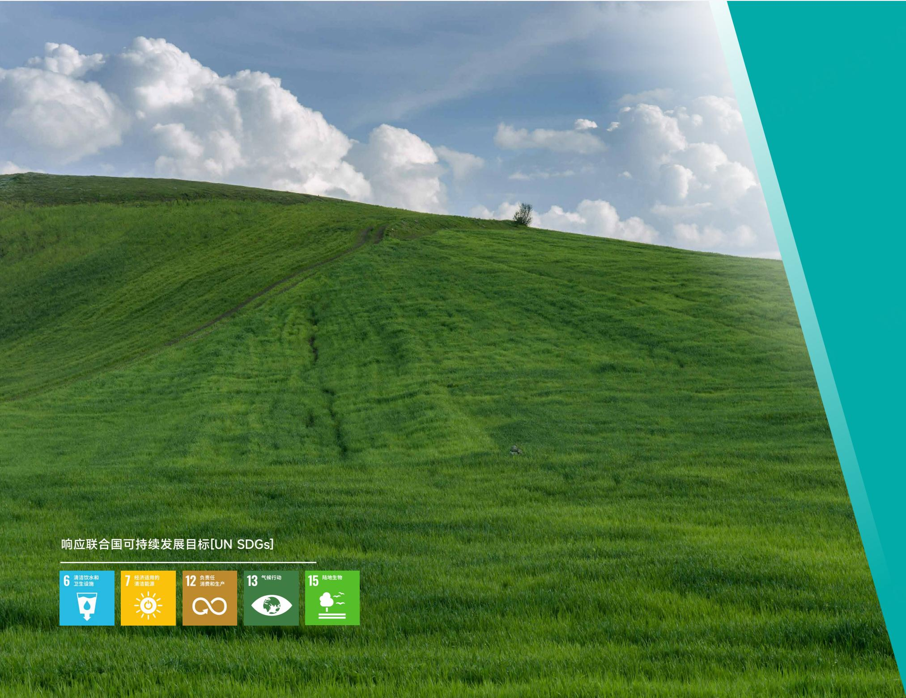

text_image

响应联合国可持续发展目标[UN SDGs]
6 清洁饮水和
卫生设施
7 经济适用的
清洁能源
12 负责任
消费和生产
13 气候行动
15 陆地生物

# 02

# 綠色思源

# 守護地球家園

• 公司治理 18  
- 可持續發展治理 21  
• 商業道德 24  
• 資訊安全 27

响应联合国可持续发展目标[UN SDGs]

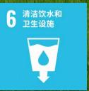

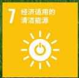

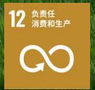

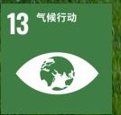

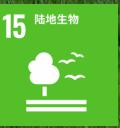

# 應對氣候變化

# 治理

為指導可持續發展策略的規劃與制定，有效統籌與監控可持續發展績效目標的達成，2025年思格新能源制定《可持續發展和ESG管理》，將氣候相關議題的監督與責任融入最高決策層，指導公司各級組織有序開展應對氣候變化工作。有關公司氣候變化治理架構的詳細資訊，請參閱本報告「可持續發展管理—實質性議題評估」章節。

公司董事會及可持續發展管理委員會依託現有治理架構，統籌開展氣候相關風險與機遇的識別、評估與監督管理工作，並將持續完善適配公司發展階段的氣候監督能力，推動氣候相關因素與公司整體治理、策略及風險管理工作深度融合。

同時，我們正持續完善氣候相關數據收集與管理體系，穩步推進氣候目標設定、進度監控及相關機制建設。鑑於當前氣候相關管理工作仍在有序推進中，部分定量資訊與細化流程尚在完善，公司將根據工作進展及監管要求，及時更新披露相關內容。

# 戰略

思格新能源積極響應中國「雙碳」目標，對標聯合國可持續發展目標，持續推動自身綠色發展和潔淨生產，不斷加強氣候相關資訊監控與披露，以提高自身營運的氣候韌性。同時，公司攜手價值鏈上的合作夥伴，深化在可持續發展方面的協同合作，促使其採取適當行動提升氣候變化應對能力，從而帶動價值鏈的可持續轉型，以共同應對氣候變化。

2025年，公司在政策研究、外部環境分析的基礎上，全面識別、評估氣候變化相關風險與機遇對公司業務發展的潛在影響。公司採用定性分析方法，物理風險分析主要參考聯合國政府間氣候變化專門委員會（IPCC）氣候情景框架，轉型風險分析主要參考綠色金融網絡（NGFS）的氣候情景框架，為公司科學決策提供依據。

儘管目前未能提供氣候相關風險對當前及未來財務影響的量化資訊，但公司將持續關注氣候相關議題，逐步加強數據收集和分析能力，提升對氣候風險的認知和管理水平。

<table><tr><td>分析範圍</td><td>時間範圍</td><td>關鍵假設</td></tr><tr><td>涵蓋思格新能源營運管理範圍內的核心業務涵蓋思格新能源及其納入合併報表範圍的附屬公司</td><td>短期:0~1年中期:1~5年長期:5年及以上</td><td>以2025年為基準開展分析,假設相關資產所在地在分析期內保持不變假設現有緩解措施在分析期內保持穩定</td></tr></table>

<table><tr><td>風險類型</td><td>具體影響</td><td>財務影響</td><td>防控/提升措施</td></tr><tr><td colspan="4">急性物理風險(突發、高強度事件)</td></tr><tr><td>颱風</td><td>·可能直接損壞生產園區設施,導致生產與供應鏈中斷。</td><td>·因營運中斷、訂單流失導致收入減少。</td><td>·加固生產園區廠房結構,保障設備安全穩固。·制定防汛防颱應急預案,細化應變流程。·建立供應鏈應急方案,保障供應鏈持續運作。</td></tr><tr><td>極端天氣</td><td>·可能對生產設備運行、原材料供應穩定性及員工健康安全造成多重挑戰,並導致生產活動中斷。</td><td>·導致設備維修成本上升。·產生作業效率損失,臨時用工成本上升。</td><td>·改進生產設備設計,提升其高低溫耐受能力。·為員工配備適當的防護設備,提供健康監測與救助措施。</td></tr><tr><td>洪水</td><td>·可能淹沒廠區,導致生產設備、原材料受損。·可能破壞交通網絡,影響供應鏈穩定性。</td><td>·設備維修及原材料成本上升。·客戶因供應鏈中斷提出索償。</td><td>·升級生產園區排水設施,提升防洪能力。·制定詳細的洪水應急響應計劃。·建立政府及部門應急協作機制,確保快速救援。</td></tr><tr><td colspan="4">慢性物理風險(長期、漸進性變化)</td></tr><tr><td>平均氣溫持續上升</td><td>·極端高溫影響員工健康與工作效率。</td><td>·產生作業效率損失,臨時用工成本上升。</td><td>·靈活調整戶外作業時間,避開高溫峰值。</td></tr><tr><td>海平面上升</td><td>·沿海或低窪地區的長期資產面臨氣候適應挑戰,需額外投資進行改造或防護。</td><td>·長期資產改造或防護成本增加。</td><td>·加高防洪設施、改造排水系統、對關鍵設備進行防水保護或遷移。</td></tr><tr><td colspan="4">轉型風險</td></tr><tr><td>政策與法律風險</td><td>·若產品碳足跡或供應鏈ESG表現不達標,可能無法進入關鍵市場。·未來可能被納入碳交易市場,增加營運成本。</td><td>·為滿足新規需進行技術改造、數據披露,產生直接支出。</td><td>·緊跟氣候法規動態,確保營運全程合規。·健全ESG管理體系,加強碳排放監測,提升披露透明度。</td></tr></table>

<table><tr><td>風險類型</td><td>具體影響</td><td>財務影響</td><td>防控/提升措施</td></tr><tr><td>技術風險</td><td>· 客戶對產品能效、循環壽命要求不斷提高。· 若創新滯後,可能導致產品市場份額被競爭對手侵蝕。</td><td>· 為技術升級投入的研發費用增加。· 核心客戶流失導致收入下降。</td><td>· 積極研究低碳新技術新路徑,從節能專案逐步拓展至全面綠色轉型。· 加快綠色技術的研發應用,推進綠色產品認證並降低產品碳足跡。</td></tr><tr><td>市場風險</td><td>· 若低碳產品缺失或供應鏈數據不透明,將失去綠色客戶。· 若ESG評級不佳可能導致融資渠道收窄、成本上升。</td><td>· 核心客戶流失導致收入下降。</td><td>· 主動向目標客戶披露產品的低碳性能與供應鏈ESG資訊。· 參與主流ESG評級,針對性改進披露與實踐,力求獲得更高評級。</td></tr><tr><td>聲譽風險</td><td>· 若品牌價值受損,影響客戶信任和員工士氣,最終影響市場份額。</td><td>· 核心客戶流失導致收入下降。</td><td>· 持續監測品牌在可持續發展方面的公眾輿論、媒體報導及非政府組織評價,識別潛在風險點。</td></tr><tr><td colspan="4">機遇分析</td></tr><tr><td>產品與服務機遇</td><td>· 全球能源轉型催生對儲能系統、智能微網、虛擬電廠等解決方案的海量需求。</td><td>· 需求量上升導致收入增加。</td><td>· 抓住高速增長的市場,擴大銷售規模。</td></tr><tr><td>品牌與供應鏈機遇</td><td>· 成為客戶和合作夥伴的「綠色標竿」供應商。</td><td>· 獲得更多訂單,直接推動銷售收入增長。</td><td>· 強客戶黏性,與同樣注重可持續發展的頭部客戶建立長期戰略合作。· 通過向供應商傳導綠色標準,提升全鏈條品質與穩定性,並可能發現新的優質供應商。</td></tr></table>

# 風險管理

2025年，思格新能源正積極推進將氣候相關風險與機遇全面納入公司風險管理。在此過程中，公司積極探索將氣候風險的識別、評估與現有風控流程相結合，將氣候目標與公司策略對接，以促進氣候管理與全面風險管理的有機融合。

# 指標及目標 $^{9}$

公司重視氣候變化應對與低碳發展相關工作，遵循監管要求與業界實踐，持續完善氣候相關管理與資訊揭露機制，穩步推進環境責任落實，助力公司可持續發展。

目前，公司正結合產業發展趨勢與營運實際，積極推進中長期低碳發展目標建設，系統性編制中長期溫室氣體減排規劃。同時，積極完善範圍三溫室氣體排放核算體系，全面釐清全價值鏈排放底數。為確保減排目標的科學性、可執行性與核算口徑一致性，公司將在完成長期策略梳理及全範圍排放底數釐清後，統一揭露下一階段減排目標與實施路徑。

<table><tr><td>指標</td><td>單位</td><td>2025年</td></tr><tr><td>範圍一溫室氣體排放量</td><td>噸二氧化碳當量</td><td>1.2310</td></tr><tr><td>範圍二溫室氣體排放量</td><td>噸二氧化碳當量</td><td>10,532.9611</td></tr><tr><td>溫室氣體排放總量（範圍一+範圍二）</td><td>噸二氧化碳當量</td><td>10,534.20</td></tr></table>

根據氣候相關披露要求，需披露涉及轉型風險、物理風險及相關機遇的財務影響、業務佔比及資金配置等資訊。但由於市場、技術與政策等方面存在較大不確定性，相關資本開支、投融資計劃的具體金額目前難以準確預估，因此暫未能提供對應定量資訊。公司高度重視氣候相關問題，將持續完善數據收集與管理機制，加強內部協同，提升對氣候風險與機遇的識別與評估能力，並在條件具備後及時披露更完整的定量資訊，以回應投資者與監管機構的期望。

此外，公司計劃全面推進碳盤查工作，系統梳理生產經營全流程的溫室氣體排放源，其中對價值鏈範圍三排放的計算也在積極推進中，旨在建立規範、可追溯的碳排放核算體系，為後續碳管理、減排目標設定及合規披露奠定基礎。同時，產品碳足跡核算相關工作正同步有序推進，逐步明確產品全生命週期（從原材料採購、生產加工至產品出廠）的碳排放核算標準與流程，助力提升產品低碳競爭力，進一步提升公司應對氣候變化的能力與韌性。

# 資源高效利用

# 能源利用

思格新能源將高效能源管理視為可持續發展的關鍵措施。公司內部制定《能源及資源管理程序》等相關制度，對營運過程的能源使用實施規範化、科學化管理，在保障業務平穩發展的同時，持續推進節能減排工作。報告期內，公司已就能源消耗設定明確管理目標。

# 2026年能耗目標

逆變器單位產品綜合能耗（kWh/台）
比2025年

减少2%

PACK單位產品綜合能耗（kMh/台）
比2025年

减少2%

充電樁單位產品綜合能耗（kWh/台）
比2025年

减少2%

報告期內，公司系統推進節能降耗，通過多項措施持續提升能源使用效率、降低單位能耗，並積極推動潔淨能源替代，穩步提升綠色電力使用比例，超額完成單位產品綜合能耗同比下降3%的年度節能目標。

# 2025年

逆變器單位產品綜合能耗（kWh/台）

同比下降54%

Pack單位產品綜合能耗（kWh/台）

同比下降47%

充電樁單位產品綜合能耗（kWh/台）

同比下降64%

# - 能源高效利用

# 空調及溫控管理

- 車間中央空調夏季室溫≥30°C開啟，溫度設為26°C；  
- 冬季設為20°C，下班前提早關閉，嚴禁門窗與空調同時開啟；  
- 辦公室及車間空調9:30後開啟、20:30前關閉。

# 設備用電管理

- 設備選型優先考慮低耗環保產品，嚴禁私自改接電力系統、違規使用大功率設備；  
- 非生產產線由專人負責電源管控，電器線路非專業人員不得改動，隱患及時上報維修。

# 照明管理

\- 無人區域不開燈，員工離崗及下班前自覺關閉電源，杜絕無效能耗。

# - 優化能源結構

思格新能源持續優化能源結構，積極提高可再生能源使用比例。公司在辦公區及生產園區屋頂鋪設光伏板，並在辦公樓停車區域設立光伏充電樁。同時，公司通過採購綠色電力提升可再生能源使用比例，2025年採購綠電達15,000兆瓦時。

# 採購綠色電力，助力營運碳排放中和

# 案例

2025年，公司積極推動綠色低碳生產，在所屬生產園區擴大綠電採購規模。金橋生產園區採購綠電 7,000 兆瓦時，臨港生產園區採購綠電 8,000 兆瓦時，有效抵銷生產經營過程中的碳排放。

text_image

交易编号:N02125030000054733
绿色电力证书交易凭证
GREEN ELECTRICITY CERTIFICATE TRANSACTION VOUCHERS
购买方
单位/个人:上海思格数字技术有限公司
购买绿证数量:7000个
7 000兆瓦时
生产方
项目名称:中船风电(高台)新能源有限公司高台北部滩百万千等
项目代码:PWC2305620724002X
项目类型:风力发电
项目所在地:甘肃省张掖市高台县
电量生产日期:2025年03月
交易平台:广州电力交易中心
2025年7月18日
绿色电力证书

金橋生產園區

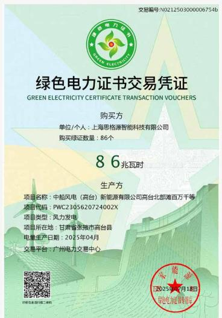

text_image

交易编号:N0212503000006754b
绿色电力证书交易凭证
GREEN ELECTRICITY CERTIFICATE TRANSACTION VOUCHERS
购买方
单位/个人：上海思格源智能科技有限公司
购买绿证数量：86个
8 6兆瓦时
生产方
项目名称：中船风电（高台）新能源有限公司高台北部滩百万等
项目代码：PWC2305620724002X
项目类型：风力发电
项目所在地：甘肃省张掖市高台县
电量生产日期：2025年04月
交易平台：广州电力交易中心
可再生能源计量（浙江）

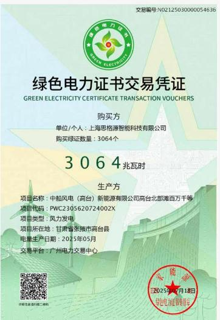

text_image

交易编号:02125030000054636
绿色电力证书交易凭证
GREEN ELECTRICITY CERTIFICATE TRANSACTION VOUCHERS
购买方
单位/个人:上海思格源智能科技有限公司
购买绿证数量:3064个
3064兆瓦时
生产方
项目名称:中船风电(高台)新能源有限公司高台北部滩百万千等
项目代码:PWC2305620724002X
项目类型:风力发电
项目所在地:甘肃省张掖市高台县
电量生产日期:2025年05月
交易平台:广州电力交易中心
2025年7月18日
绿色电力证书

臨港生產園區

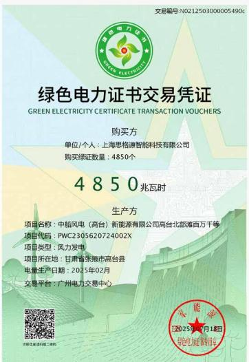

text_image

交易编号:N0212503000005490c
绿色电力证书交易凭证
GREEN ELECTRICITY CERTIFICATE TRANSACTION VOUCHERS
购买方
单位/个人：上海思格源智能科技有限公司
购买绿证数量：4850个
4 8 5 0兆瓦时
生产方
项目名称：中船风电（高台）新能源有限公司高台北部滩百万千等
项目代码：PWC2305620724002X
项目类型：风力发电
项目所在地：甘肃省张掖市高台县
电量生产日期：2025年02月
交易平台：广州电力交易中心
2025年07月18日
绿色电力证书

# 2025年關鍵績效

外購電力總量 19,629.09兆瓦時  
可再生能源消耗量
- 光伏發電 1,256.77 兆瓦時  
汽油消耗量 586.00升  
能源消耗總量 19,634.17 兆瓦時  
能源消耗強度 $^{12}$ 0.02兆瓦時/萬元人民幣  
直接能源消耗量 5.08兆瓦時  
直接能源消密度 0.06兆瓦時/億元人民幣  
間接能源消耗量 19,629.09兆瓦時  
間接能源消密度 216.60兆瓦時/億元人民幣

# 水資源利用

思格新能源嚴格遵守《中華人民共和國水法》等法律規定，以市政供水為主要水源。公司將節水理念貫穿日常營運，透過精細化管理推動水資源高效利用與可持續發展。同時，我們設定水資源管理目標 $^{13}$ ，2026年水資源消耗強度較2025年減少2%。

# 節水措施

# 日常用水行為規範

員工洗手、如廁、淋浴後及時關閉水龍頭及閥門，杜絕水資源浪費。

# 供水管網運維管理

定期巡檢管道，發現漏水立即報修；冬季對閒置閥門做好排空與保溫，減少水資源損耗。

# 節水意識宣傳引導

加強節水宣傳教育，強化員工節省用水意識，引導養成良好用水習慣。

# 2025年關鍵績效

總用水量

36.83千噸

水資源消耗強度 $^{14}$

0.04 千噸/萬元人民幣

# 包装材料管理

思格新能源順應全球綠色包裝與循環經濟發展趨勢，響應歐盟《包裝和包裝廢棄物規例》（EU）2025/40（PPWR）要求，落實生產者責任延伸（EPR）計劃，嚴格履行產品使用後的回收、處理與資源化利用義務。公司設定2025年底前在指定區域完成戶用產品系列全部塑料包裝替換的目標，目前大部分可戶用產品已完成切換。

在包裝優化實踐中，公司大力推進「去塑化」行動，以紙製包裝替代傳統塑料包裝，同步優化包材結構與重量：

單個戶用電池產品包裝EPE $^{15}$ 塑膠用量減少0.82千克。

聯合供應商共同開發環保包材，通過結構優化提升包材防護可靠性，主要採用瓦楞紙、蜂窩紙等，材料基本實現可回收。

# 2025年關鍵績效

包裝材料使用總量

9,280.01噸

包装材料使用密度 $^{16}$

0.01 噸/萬元人民幣

# 環境合規管理

# 環境管理體系

思格新能源建構涵蓋合規管理、風險防控、應急響應與環保教育的全方位環境管理體系，不僅確保生產經營活動的環保合規與風險受控，更將綠色理念深度融入公司營運基因，持續提升公司環境治理能力與可持續發展韌性。

# - 健全合規管理

公司嚴格遵守《中華人民共和國環境保護法》等法律法規，制定《環境保護管理規定》，設立EHS部門專職負責環境合規工作，系統維護《環保設施運行記錄表》《巡查記錄表》及《月度檢查記錄表》等記錄，推動環保工作規範化、高效化開展。公司已建構完善的環境管理體系，公司總部及金橋生產園區、臨港生產園區均已通過ISO 14001環境管理體系認證。

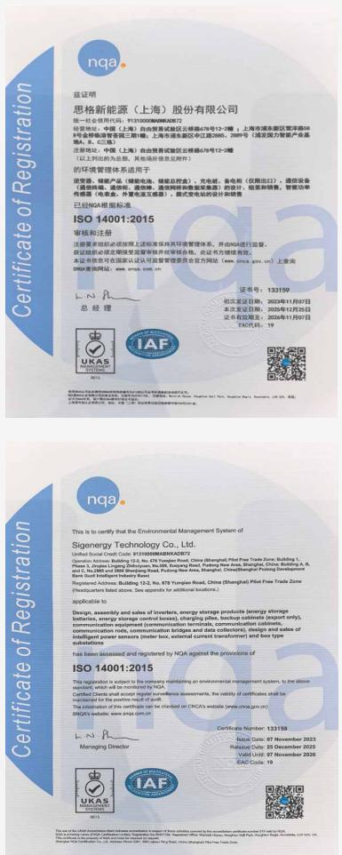  
公司總部環境管理體系認證

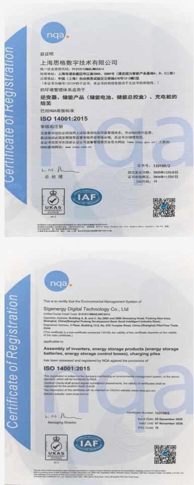  
金橋生產園區環境管理體系認證

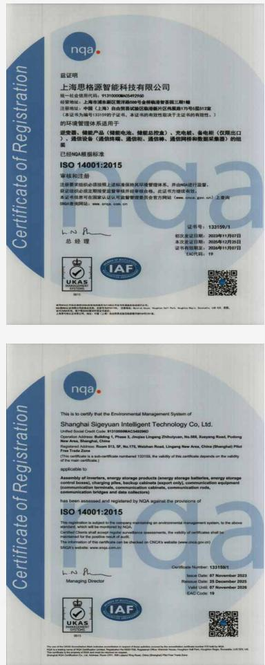  
臨港生產園區環境管理體系認證

# - 強化風險防控

公司在新項目建設中全面建構起「識別－防範－應急」三位一體的環境風險防控體系，致力於在風險發生前主動化解、在隱患形成前及時消除，全面築牢公司環境風險防控屏障，為可持續發展提供堅實保障。

# 開展環境風險識別

\- 識別主要危險物質、可能影響途徑以及可能受影響的敏感目標。

# 採取風險防範措施

\- 嚴禁明火，危險品與危險廢物按規定規範存放管理，且所有涉危單元均已實施防滲處理。

# 持續完善應急機制

- 在庫房、生產廠房各危險單元內配置吸附棉、防毒面罩、滅火器等應急物資，並定期檢查危廢倉庫。  
- 依照《企業事業單位突發環境事件應急預案備案管理辦法（試行）》等相關規定，系統編制突發環境事件應急預案。  
- 要求工作人員持證上崗，在日常生產營運中對操作人員進行培訓，降低因人員操作失誤導致化學品洩漏的可能性，並定期開展應急演練。

# 開展化學品與危廢洩漏應急演練，築牢環境安全防線

案例

2025年12月，我們組織開展化學品與危廢洩漏應急演練，模擬危廢暫存間外發生廢膠洩漏的突發場景，重點檢驗員工在應急洩漏處置、洩漏物收集、個人防護裝備規範使用等方面的實戰能力。本次演練有效提升團隊在突發環境事件中的快速應變、協同處置與規範操作水平，為最大限度控制損害奠定扎實的應急基礎。

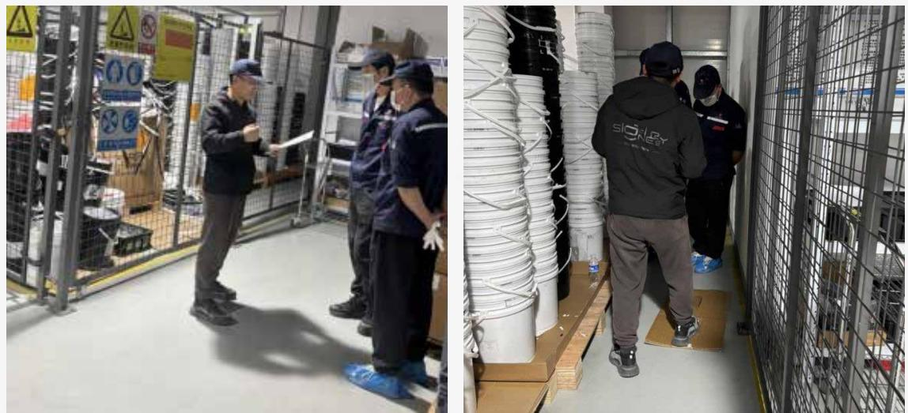

# - 環保宣傳教育

公司積極運用數字化手段開展環境管理培訓工作，透過「思格雲教室」線上學習平台，為全體員工提供涵蓋環境法規、廢棄物管理等範疇的系統性知識資源，幫助員工掌握環境管理核心知識與實踐技能，推動環保理念內化於心、外化於行，切實轉化為日常工作中的實際行動。

# 加强污染防治

思格新能源嚴格遵循《中華人民共和國大氣污染防治法》《中華人民共和國水污染防治法》《中華人民共和國固體廢物污染環境防治法》《中華人民共和國噪聲污染防治法》等國家生態環境法律法規，全面落實企業環保主體責任，高度重視污染防治與合規排放工作。為確保環境管理的有效性與合規性，公司每年委託具備資質的第三方環境監測機構，對廠區開展定期監測。報告期內，公司未發生違規排放事件。 $^{17}$

<table><tr><td colspan="3">類別</td><td>處置措施</td><td>執行標準</td></tr><tr><td>廢水18</td><td colspan="2">生活污水</td><td>經廢水總排口直接納入市政污水管網排放。</td><td>DB31/199-2018《污水綜合排放標準》</td></tr><tr><td rowspan="2">廢氣</td><td>無組織廢氣</td><td>錫及其化合物、顆粒物</td><td>經移動式除塵器處理後室內排放。</td><td>DB31/933-2015《大氣污染物綜合排放標準》</td></tr><tr><td>有組織廢氣</td><td>非甲烷總烴</td><td>集氣罩收集後經兩級活性炭吸附裝置處理後通過排氣筒排放。</td><td>DB31/933-2015《大氣污染物綜合排放標準》</td></tr><tr><td rowspan="2">固體廢物</td><td>無害廢棄物</td><td>主要包括廢包裝材料、廢線纜等</td><td>放置在一般固體廢物暫存區,委託有一般固廢處置資質的單位處置。</td><td>/</td></tr><tr><td>有害廢棄物</td><td>主要包括廢膠、廢膠桶、廢灌膠管等</td><td>儲存在危險廢物倉庫,委託有危廢處置資質的單位處置。</td><td>GB18597-2023《危險廢物貯存污染控制標準》</td></tr><tr><td>噪音</td><td colspan="2">設備運行噪音</td><td>生產時關閉門窗,選用低噪音設備並在進出風口安裝軟連接。</td><td>GB 12348-2008《工業企業廠界環境噪音排放標準》</td></tr></table>

2025年

廢氣 非甲烷總烃
0.02噸  
固體廢物

<table><tr><td>廢棄物總量</td><td>有害廢棄物總量</td><td>廢電池</td></tr><tr><td>1,362.03噸</td><td>61.14噸</td><td>18.44噸</td></tr><tr><td>其他有害廢棄物</td><td rowspan="2">有害廢棄物密度19</td><td>無害廢棄物總量</td></tr><tr><td>42.70噸</td><td>1,300.89噸</td></tr><tr><td>生活及廚餘垃圾</td><td>其他,例如廢棄包裝、紙箱</td><td>無害廢棄物密度20</td></tr><tr><td>103.68噸</td><td>1,197.21噸</td><td>1.44千克/萬元人民</td></tr></table>

# 生物多樣性保護

思格新能源嚴格遵守《中華人民共和國環境保護法》《生態環境行政處罰辦法》以及項目營運所在地的相關法律法規要求，堅持在發展自身的同時做好生態環境保護工作，踐行綠色發展、尊重自然的生態文明理念。

# 嚴守生態保護紅線

案例

思格新能源始終堅持生態優先、綠色發展理念，在金橋生產園區建設過程中，嚴格執行《上海市生態保護紅線》等相關法律法規及規劃要求，通過系統評估與科學布局，主動規避法定保護區、重要生態功能區及其他環境敏感區域，確保從空間規劃源頭避免對生態敏感區造成直接干擾，推動項目建設與區域生態環境保護協調統一。

# 支持全球可持續行動

案例

2025年，思格新能源向國際非營利環保組織 Rainforest Alliance捐款10,000美元。該款項將用於支持其在全球60多個國家開展的生態系統修復、可持續農業推廣及森林保護項目——目前該組織已與超過750萬農民合作，管理着570萬公頃經認證的農田，致力於重建人與自然的和諧關係。

natural_image

Wind farm landscape with multiple turbines in a green field under a blue sky with scattered clouds (no text or symbols visible)

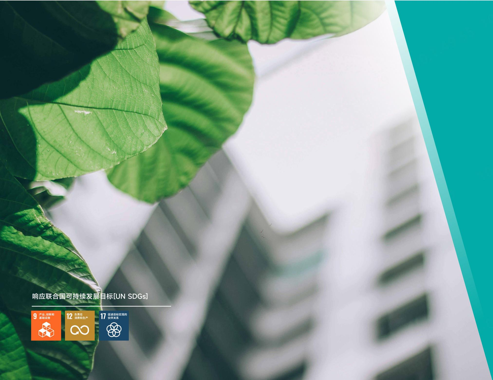

text_image

响应联合国可持续发展目标[UN SDGs]
9 产业、创新和
基础设施
12 负责任
消费和生产
17 促进目标实现的
伙伴关系

# 03

# 創新思變

# 驅動潔淨未來

• 研發創新 29  
• 產品責任 32  
- 客戶服務 35

响应联合国可持续发展目标[UN SDGs]

9 产业、创新和基础设施

12 负责任消费和生产

17 促进目标实现的伙伴关系

# 研發創新

# 良好生態建設

思格新能源建立了科學完善的研發管理體系，以前瞻性專項團隊、高密度人才配置與標準化流程為基礎，建構了覆蓋創新全流程、專業化人才梯隊、自研測試平台及持續知識更新的完整研發創新生態系統。

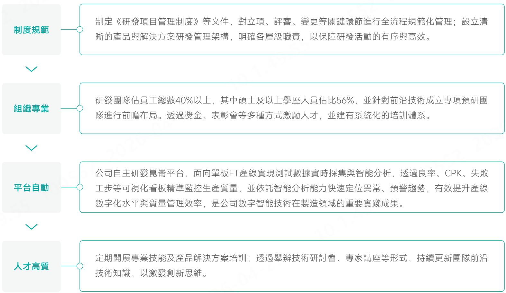

flowchart

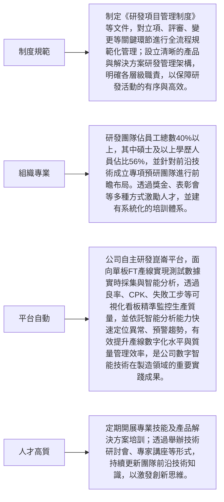
```mermaid
graph LR
  A["制度規範"] --> B["制定《研發項目管理制度》等文件，對立項、評審、變更等關鍵環節進行全流程規範化管理；設立清晰的產品與解決方案研發管理架構，明確各層級職責，以保障研發活動的有序與高效。"]
  C["組織專業"] --> D["研發團隊佔員工總數40%以上，其中碩士及以上學歷人員佔比56%，並針對前沿技術成立專項預研團隊進行前瞻布局。透過獎金、表彰會等多種方式激勵人才，並建有系統化的培訓體系。"]
  E["平台自動"] --> F["公司自主研發崑崙平台，面向單板FT產線實現測試數據實時採集與智能分析，透過良率、CPK、失敗工步等可視化看板精準監控生產質量，並依託智能分析能力快速定位異常、預警趨勢，有效提升產線數字化水平與質量管理效率，是公司數字智能技術在製造領域的重要實踐成果。"]
  G["人才高質"] --> H["定期開展專業技能及產品解決方案培訓；透過舉辦技術研討會、專家講座等形式，持續更新團隊前沿技術知識，以激發創新思維。"]
```

# 2025年

研發團隊占員工總數

40%以上

其中碩士及以上

學歷人員占比超過

56%

主創團隊行業經驗

10+年

此外，公司制定《知識產權合規管理制度》，建立知識產權合規義務識別、風險評估與預警機制，全面梳理經營管理中的知識產權合規風險，建立並定期更新風險數據庫，對典型性、普遍性或高影響風險及時預警，確保研發、生產、經營全流程合法合規，築牢知識產權合規防線。

公司重視自主知識產權保護和自主技術創新，透過專利、商標等多維度知識產權布局，對核心技術、產品設計及品牌標識進行全面確權與法律保護，築牢自主知識產權壁壘，持續支撐自主創新成果保護和轉化。同時，透過知識產權培訓，強化全員知識產權保護意識與風險識別能力，維護核心技術與品牌權益。

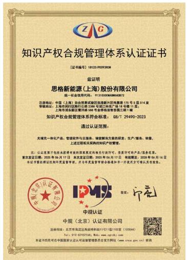

text_image

ZG
知识产权合规管理体系认证证书
[证书编号：] 1823510092800M
兹证明
思格新能源(上海)股份有限公司
经一社会信用代码：91370000MA06WJ72
注册地址：中国（上海）自由贸易试验区临港新片区178号2幢114室
带链地址：上海市闵行区新闸路208号浦江科技广场1号楼11层
上海市浦东新区浦明路168号华泰保险管理处三楼1F
知识产权合规管理体系符合标准：GB/T 29490-2023
通过认证范围：
光耀光一体化产品、智能软件与云服务、辅助解决方案的研制、生产/服务、销售，
上述注册相关采购的知识产权管理。
注：以证券发行机构发布的有关规定和规定性文件进行审计，是否需许可的产品/服务范围。
首次发证日期：2025年04月17日 本年度实施前，2025年04月17日 有效期至：2028年04月16日
本证书经原证机构年度监管审核，并与年度监管审批会通知并－开庭地点方可确认其有效性。
中证认证
中规（北京）认证有限公司
注册地址：北京市海淀区北辰桥西街11号1幢1103室（10064）
Tel: (010)67027026; Email: www.zgsg.com.cn
© 宁盖
本证书信息可在中国国家认证监督管理委员会官方网站（www.cnc.gov.cn）下载。

知識產權合規管理體系認證證書

# 創新成果突破

公司堅持以技術創新驅動產品迭代，在工商業與戶用兩大核心場景同步發力，持續為用戶提供更安全、更高效、更智能的能源解決方案。

# 工商業端

- 全模組化設計：產品最小模組單元電量為12kWh，支援室內外靈活安裝，可根據用戶實際需求進行彈性配置，實現隨需應變的容量擴展與場景適配。  
- 高安全性電池包：採用航空級安全防護材料，確保電芯在熱失控狀態下不起火、不爆炸。同時搭載高效節能的分布式智能熱管理系統，從電芯到系統層面全面保障運行安全與使用壽命。

# 户用端

# 基於創新型DAB拓撲的高性能微型逆變器

- 高效能量轉換：採用創新型DAB拓撲，實現高增益、電氣隔離與高效轉換並行，最高轉換效率達97.5%，顯著領先於行業平均水平（95%—97%）。  
- 高功率密度設計：較傳統方案體積縮減30%，實現更高功率密度，為系統安裝與布局提供更大靈活性。  
- 無功功率補償：額定功率下可提供±600VAR無功調節能力；較傳統反激式拓撲提升600%以上。

# WLAN Mesh組網與智能相位識別技術

- Mesh相位檢測：基於Mesh組網架構，首創集成相位檢測功能，自動識別並匹配電網相位資訊，為負載均衡與能效管理提供精準數據支撐。  
- 覆蓋範圍：相較傳統Wi-Fi方案，覆蓋範圍提升1600%，採用網狀星形拓撲結構，有效消除信號盲區。  
- 一步式自動配網：僅需完成首台設備配網，配置數據自動共用，其餘設備通電後即可同步入網。

# 數智化升級

思格新能源以工業4.0架構為基礎，透過建設「AI+光儲充」智能工廠與數字化平台，推動製造體系向智能化、協同化與用戶端延伸升級。

# 建構全鏈條集成化管理體系

- 打造「AI+光儲充」智能工廠，基於工業4.0架構，建構覆蓋前端業務支援、生產過程管控到巨量數據決策的全鏈條集成化管理體系。  
- 自建工業雲與全協同資訊化平台，實現全流程數字化製造管理100%覆蓋，支撐研發、製造與營運高效協同。

# 引入智能化品質控制體系

- 率先在儲能行業引入車規級激光器，並結合AI視覺檢測技術，建構貫穿焊接、來料檢驗、裝配及補膠等關鍵工序的智能化品質控制體系。  
- AI視覺對焊接過程進行實時監控與分析，顯著提升工藝穩定性，使焊接良率平均提高2%以上，同時大幅降低人為干預與操作複雜度。

# 推動用戶端數字化協同升級

- 開發並推出全球首個集成AI語言大模型的 mySigen App，以及行業首創的能源桑基圖可視化工具。  
- 為用戶提供智能交互、實時監控與運維指導的一站式服務，並以直觀方式呈現能源流向，助力用戶優化用能策略、提升能源效率。

車規級雷射器  

natural_image

Close-up of a glowing red and yellow industrial component with no visible text or symbols

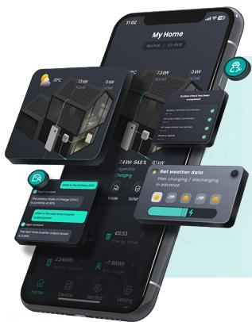

text_image

My Home
Normal / On-Grid
72.8W 04W
74.0W 04.5K
Not weather date
Peak charging / discharging
the electric vehicle
3:15:57
2:24:09
-7.89:09
Battery Discharge
80.5K

# 全球首個集成人工智慧語言大模型mySigen App

為用戶提供智能交互、設備監控、運維指導等一站式服務，重塑用戶體驗與運維效率。

# 首創行業能源桑基圖

以直觀可視化方式呈現能源流向與消耗結構，為用戶優化用能策略、提升能源利用效率提供精準的數據支撐。

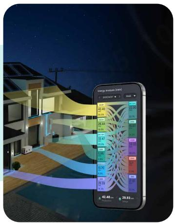

text_image

Large Analysis (mm)
2019
42.48
35.6%
26.44
16.7%
33.40
16.7%
33.70
16.7%
25.39
16.7%
42.48 mm 29.93 mm

# 產品責任

# 全流程品質管理

思格新能源遵循「事前預防、事中管控、事後追溯」原則，建構涵蓋研發、製造、交付到售後的全鏈條閉環管理體系，確保產品高可靠、高安全、可信賴。

# - 研發品質

公司已建立健全的產品開發品質全流程體系，包含技術評審、決策評審、需求管理、變更管理等流程規範。在方案設計初始階段，即開展DFMEA分析與核心品質排查，同步梳理歷史問題；設計過程中通過多輪設計評審，前置識別技術風險與品質隱患；技術評審環節設置多階段品質門控點，涵蓋從需求方案鎖定到量產交付的核心節點，通過問題跟蹤整改形成技術品質閉環；決策評審環節圍繞市場商業、技術方案、供應鏈保障等多維度開展階段評估，為項目推進提供科學決策依據。

該體系透過全流程規範約束與前置防控，實現研發品質的系統性管控。從設計源頭的品質排查，到過程中的評審閉環，再到階段決策的雙重校驗，形成涵蓋需求、設計、評審、決策的完整品質防線，有效防範研發風險，保障產品從研發到量產的高效、高品質落實。

# 2025年

產品製造良率穩定保持在

99%以上

# - 生產品質

公司建立了從源頭到出廠的三階段品質管控流程，通過風險識別、過程巡檢、設備校準、追溯控制等組合措施，確保各環節品質受控，實現產品直通率超額完成目標。

# 原材料檢驗

嚴格執行《進料檢驗管理程序》，對入場原材料實施全流程檢驗，從源頭杜絕不合格物料流入生產環節。

# 生產過程管控

採用「節點管控+全程追溯」模式，在關鍵工序設置品控節點，確保過程品質穩定可控。

# 成品出廠檢測

依據《產品控制計劃》，對出廠產品執行全項目檢驗，並在此基礎上進行抽樣檢驗，確保出廠產品合格。

此外，當產品需要實施召回時，公司嚴格執行內部產品召回相關要求，有序開展信息傳遞、備件調配、現場處置、資料歸檔及費用結算等全鏈條工作，並透過資訊化系統對召回過程進行追蹤與管控，確保召回工作合規、高效、穩妥推進。報告期內，公司發生一起自願性產品召回事件 $^{21}$ ，並已依據內部流程妥善處理完成。

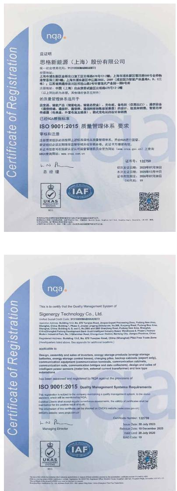  
公司總部品質管理體系認證證書

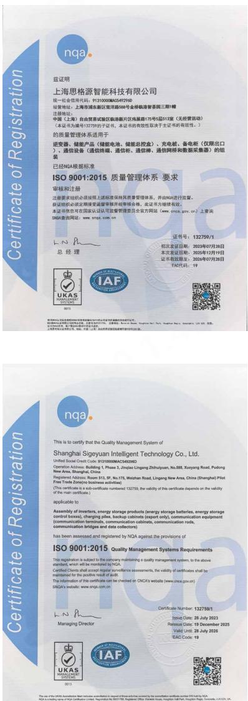  
臨港生產園區品質管理體系認證證書

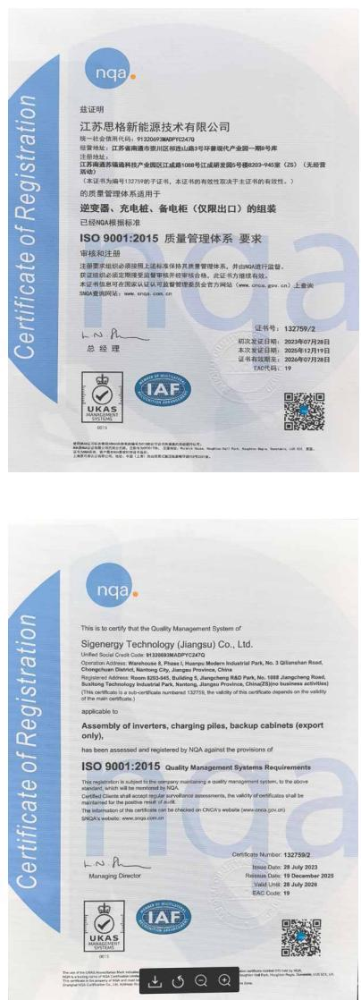  
南通智慧能源中心品質管理體系認證證書

# - 不合格品管理

公司制定《不合格管理程序》，建立覆蓋來料、製程、成品及可疑物料的全流程不合格品管理體系，嚴格執行標識隔離、評審處置、分析改進、記錄追溯閉環管理。發現不合格品後立即予以標識並隔離存放，對靜電敏感類產品同步落實 ESD 防護。

製造品質部牽頭組織跨部門評審，按規範執行讓步接收、挑選使用、返工、退貨、降級、報廢等處置，透過《不合格品通知單》完成審批與流轉。公司針對不合格問題開展根源分析與整改驗證，全程記錄歸檔並可追溯，嚴防不合格品流入下道工序或出廠，保障產品品質穩定合規。

# - 數字化平台

為實現高效協同與精準管理，公司搭建以「全員參與、品質共治、實時監控、高效協同、持續改進」為核心理念的品質管理平台，涵蓋研發、製造、市場等多個環節。平台集中展示關鍵品質指標，支持即時數據監控與趨勢分析，該平台的建立顯著提升品質問題的回應速度與閉環效率。

同時，依托各類自研的IT系統，公司實現了原材料從供應商出庫到產品在客戶端使用的全生命週期、多維度品質數據採集與追蹤。系統支援批次級與單件級雙向追溯，並集成遠程升級、遠程運維等能力，為售後服務提供快速定位與高效閉環支援。目前，產品可追溯性已達100%。

# 產品安全設計

公司從結構設計、充電控制、安全防護等多維度研發創新，打造多重安全防護體系，從根本上降低產品使用與安裝過程中的安全風險。

# 便捷安裝結構

採用堆疊式連接方案，模組間數據線與電源線一體化集成，無需外部布線；通過±2mm浮動螺釘自動對齊，確保連接穩定，有效避免因導線老化、接觸不良或安裝短路引發的安全風險。

# 充電安全控制

開發動態充電圖譜，根據電池溫度和健康狀態確定充電電流，實現充電功率的精準平衡，有效防止過充和鋰沉積。

# 過充防護機制

在常規防護基礎上額外增設純硬體防護層級，當電芯電壓達到臨界值時，可直接獨立切斷電源電路。

# 極端火災下的安全驗證

# 案例

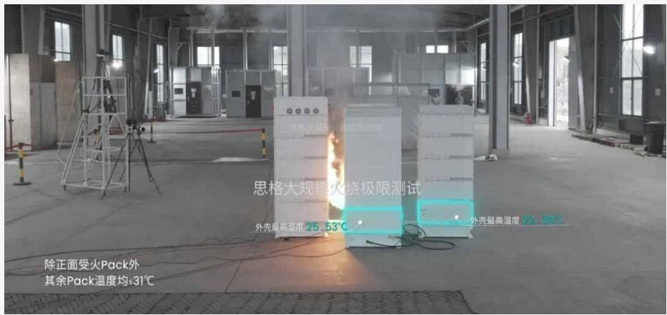

text_image

思格大规模火焰极限测试
外壳最高温度 25.53℃
外壳最高温度 42.59℃
除正面受火Pack外
其余Pack温度均43℃

2025年7月，我們針對工商業儲能系統SigenStack，成功完成行業內極具挑戰性的大規模火燒測試。本次測試模擬了儲能系統在電芯熱失控並引發持續明火燃燒的極端場景。為檢驗系統在最惡劣條件下的真實防護極限，測試刻意移除了所有主動安全防護機制。在失去所有主動干預的情況下，SigenStack表現出卓越的結構安全能力：火勢被成功控制在單個電池PACK內部，未發生熱蔓延至相鄰電池包及電池簇的情況，杜絕了二次事故風險。

# 負責任營銷

公司堅持誠信、合規的營銷原則，發布《社交媒體發布內容規範》和《產品變更通知發布管理規定》，明確所有產品與服務資訊均以事實為依據，做到真實、準確、不誇大、不虛假，確保客戶決策基於可靠資訊。同時，透過規範產品變更通知機制，及時向客戶、合作夥伴及供應商同步關鍵變更，維護其業務連續性，強化長期信任合作。若發生相關違規內容，將依據公司政策處理。報告期內，未發生營銷傳播相關的違規事件。

natural_image

Person reviewing a financial report on a laptop keyboard, with charts and pie charts visible (no readable text or symbols)

# 客戶服務

# 客戶關係管理

思格新能源制定《客戶投訴處理程序》，明確跨部門協作機制，確保產品品質、交付或服務問題得到快速回應與閉環解決，最大限度降低客戶不滿。同時，公司定期探訪安裝商、分銷商，聆聽一線聲音，及時優化產品設計與服務支援策略。

針對核心合作夥伴建立安裝商激勵與認證管理體系。安裝商透過安裝不同產品可獲取對應積分，並在專屬商城兌換禮品；不同認證等級的安裝商享有差異化積分倍率，服務評分不達標的安裝商將予以等級下調。該體系透過正向激勵與績效約束相結合，有效提升渠道夥伴的服務品質與合作黏性。

# - 滿意度調査

公司建立分層滿意度調查機制，面向安裝商、分銷商及終端用戶分類發放調查問卷，精準收集服務評價。其中，針對安裝商重點調查回應速度、服務專業度、問題解決能力及團隊支援水平；針對終端用戶重點調查整體服務滿意度。基於滿意度分析結果，形成問題清單並實施針對性改進，推進服務品質持續優化。

# 售後服務

思格新能源制定《售後退換貨管理辦法》，建立標準化、透明化的退換貨執行流程，明確各環節職責與操作規範，確保退換貨處理有章可循、管理有序，有效防範營運風險，切實保障客戶合法權益。

# SigenCare 主動智能服務體系，打造高效可靠的能源系統全生命週期服務

案例

2025 年，公司推出 SigenCare主動智能服務體系，這是一套融合主動維護與 AI 防護技術的終身服務體系。該體系以六大核心能力為支撐，通過主動診斷、智能預警、雲端修復等方式，實現全流程主動防護，為用戶帶來更可靠、更省心的一站式能源系統守護體驗。

# 六維健康體檢

全面診斷系統運行狀態，
提前發現潛在隱患。

# 7×24小時AI巡檢

覆蓋 200 + 項關鍵指標，巡檢準確率達 95%。

# 一鍵雲端修復

遠端快速解決系統問題，
保障系統始終處於峰值性能。

# 尊享主動服務

全程追蹤服務進程，
主動干預服務延誤。

# 智能收益優化

提升系統營運效益，
最大化用戶投資回報。

# 安裝商品質評級

從源頭保障服務品質與專業性。

# AI巡檢主動預警，護航設備安全運行

案例

2025年，荷蘭部分儲能電站採用密封貨櫃進行設備安裝，在實際運行過程中，受箱體密封通風條件影響，逆變器及電池組出現溫度異常情況。思格智能巡檢機器人在日常巡檢中主動監測並發現該問題，並第一時間聯絡客戶進行現場整改，透過優化設備通風條件，成功解決溫度異常隱患，保障設備安全穩定運行。

text_image

响应联合国可持续发展目标[UN SDGs]
1 无贫穷
2 零饥饿
3 良好健康与福祉
4 欧惠教育
5 性别平等
8 体面工作和经济增长
10 减少不平等
11 可持续城市和社区
16 和平、正义与强大机构

# 04

# 人才思進

# 成就員工價值

• 合規僱用 37  
- 人才成長 39  
- 健康安全 41  
• 員工關愛 44

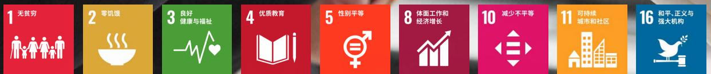

# 合規僱用

# 多元、平等與共融

思格新能源嚴格遵守營運所在國家（地區）的勞動法律法規，制定《商業行為準則》，明確在招聘、錄用、用工及日常人事管理各環節，全面貫徹多元、平等與公平的價值理念。

# 反歧視

在錄用、薪酬福利、培訓機會、崗位安排、晉升、處分及解僱等各個環節，確保所有員工受到公平對待。我們不基於「受保護特徵」歧視任何人，包括但不限於：年齡、性別、種族、國籍、族裔背景、性取向、性別認同、宗教信仰、殘疾、婚姻狀況、退伍軍人身份、公民身份及法律保護的其他特徵。

# 反騷擾和霸凌

禁止工作場所內發生任何騷擾、霸凌及其他有辱人格的行為；禁止一切可能構成敵意工作環境的言語與舉動，包括但不限於具有侮辱、貶低、恐嚇性質的攻擊性言行，或針對受保護特徵實施的詆滅性、冒犯性評論。

# 反童工 $^{22}$

嚴格遵守法定用工年齡規定，一律不錄用不滿16週歲的未成年人。招用人員時必須核查有效身份證明文件，並嚴格遵守未成年工崗位限制要求。

# 反強迫 勞動

尊重勞動者人身自由與行動自由，僅聘用自願且人身自由未受限制的勞動者。我們堅決不參與、不支持、不容忍任何形式的奴役、強迫勞動及人口販賣行為。

# 公平就業

除國家規定不適合婦女的工種外，不以性別為由拒絕錄用婦女或提高錄用標準；不因民族、種族、宗教信仰、殘疾狀況、傳染病病原攜帶或農村勞動者身份而設置歧視性限制。

# 員工多元化

# 2025年指標

# 員工總數

1,597人

# 400人

# 1,197人

女性員工  
● 男性員工

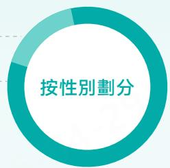

donut

| Category | Value |
| --- | --- |
| 深色部分 | ~85% |
| 浅色部分 | ~15% |

# 965人

30歲以下員工
(不包含30歲)  
30歲-50歲員工
(包含30歲，不包含50歲)  
● 50歲以上員工
(包含50歲)

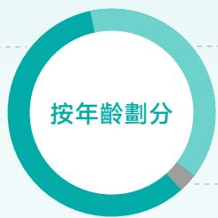

donut

| Category | Value |
| --- | --- |
| 深綠色部分 | ~60% |
| 中淺藍色部分 | ~35% |
| 灰色部分 | ~5% |

# 620人

# 12人

# 97人

# 1,500人

● 本地員工  
外地員工

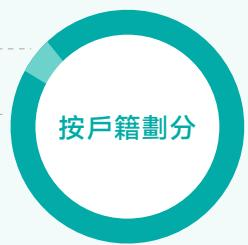

donut

| Category | Value |
| --- | --- |
| 深色部分 | ~95% |
| 浅色部分 | ~5% |

# 576人

# 546人

● 本科以下學歷員工
(不包含本科)  
● 本科學歷員工  
● 研究生及以上學歷員工

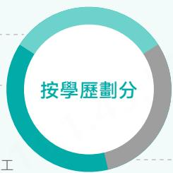

donut

| Category | Value |
| --- | --- |
| 深色部分 | ~50% |
| 灰色部分 | ~33% |
| 浅藍色部分 | ~27% |

# 475人

殘疾員工 9人

勞務工 0人

# 權益保障

思格新能源嚴格遵守《中華人民共和國勞動法》《中華人民共和國勞動合同法》等法律法規，全面保障員工合法權益，在薪酬、福利、工時等方面建構公平、透明、有溫度的管理體系。

# - 薪酬管理

公司制定並實施《薪酬管理辦法》，建立以崗位價值為基礎、績效為導向、市場為參照的薪酬體系，確保薪酬制度合法合規、公平合理且具備市場競爭力。對業績突出、貢獻顯著的員工，提供更具吸引力的薪酬與激勵，切實體現「多勞多得、優績優酬」的原則。

公司每年結合績效評估、個人能力、工作表現，以及行業薪酬水平、地區薪資標準、居民消費價格指數（CPI）和公司經營狀況等內外部環境變化，在核定調薪總額內制定差異化調薪策略，動態優化薪酬結構，重點保障關鍵崗位的外部競爭力，以穩定核心人才、吸引優秀外部人才。

# - 福利保障

公司提供全面、多元的員工福利體系，涵蓋法定與補充福利，提升員工歸屬感與幸福感。

# 法定保障

依法為全體員工足額繳納
社會保險及住房公積金

# 補充保障

提供商業保險、年度健康體檢、高溫補貼、通訊補貼等

# 人文關懷

節假日福利、婚育賀禮、生日祝福及其他個性化關懷措施

# - 工作時間

公司實行「任務管理+有限彈性工作制」，倡導任務（項目）管理制，鼓勵員工高效完成工作，實現工作與生活的平衡。確因工作需要加班的，員工須提前提交加班申請並經審批通過。公司嚴格控制加班時長，確保每月加班時間不超過法定上限，切實維護員工身心健康。

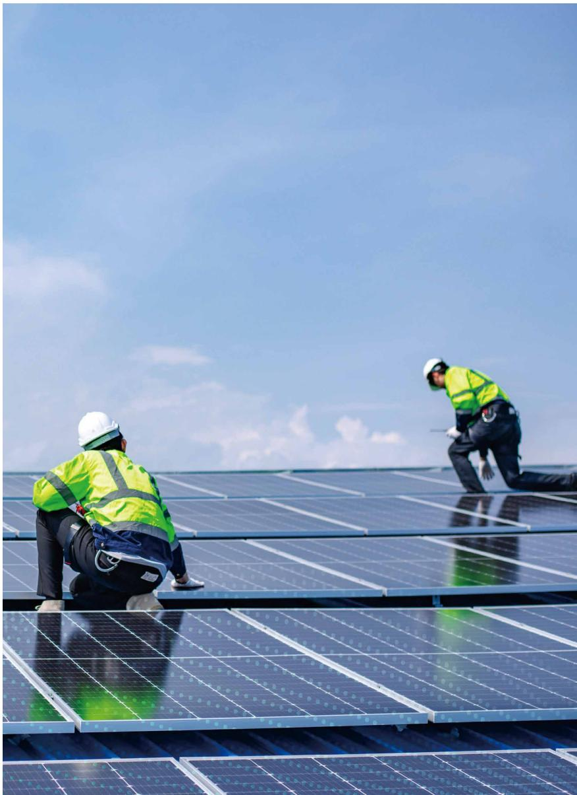

natural_image

Two workers in safety vests inspecting solar panels on a rooftop under a clear blue sky (no text or symbols visible)

# 人才成長

# 培訓體系

思格新能源制定《培訓管理辦法》《培訓體系》，搭建系統化、標準化、可查詢的培訓體系框架，以「提升員工專業技能與綜合素質、促進員工職業發展、增強企業整體績效與核心競爭力」為核心目標，精準匹配不同崗位、不同角色的差異化培訓需求，實現培訓資源的高效配置與培訓價值最大化。

# 新人導入培訓

助力新人快速融入企業、熟悉崗位流程，夯實入職工作基礎。

# 專業賦能培訓

針對各業務線崗位需求，精進員工專業業務技能，適配崗位工作與企業發展要求。

# 領軍人才培訓

聚焦管理能力提升，強化管理團隊的統籌、帶隊與實戰能力。

# 通識素養培訓

提升全體員工的通用職業素養與企業文化認同。

# 夯實管理基石，賦能組織未來

2025年4月，我們啟動首屆中基層管理者發展項目，聚焦管理能力系統性提升，旨在打造一支「懂策略、善帶兵、能打勝仗」的骨幹管理隊伍。項目覆蓋公司三級管理者、後備幹部及二級管理者共計60人。透過六場高互動的專題培訓與研討，系統建構管理者角色認知與實戰能力。

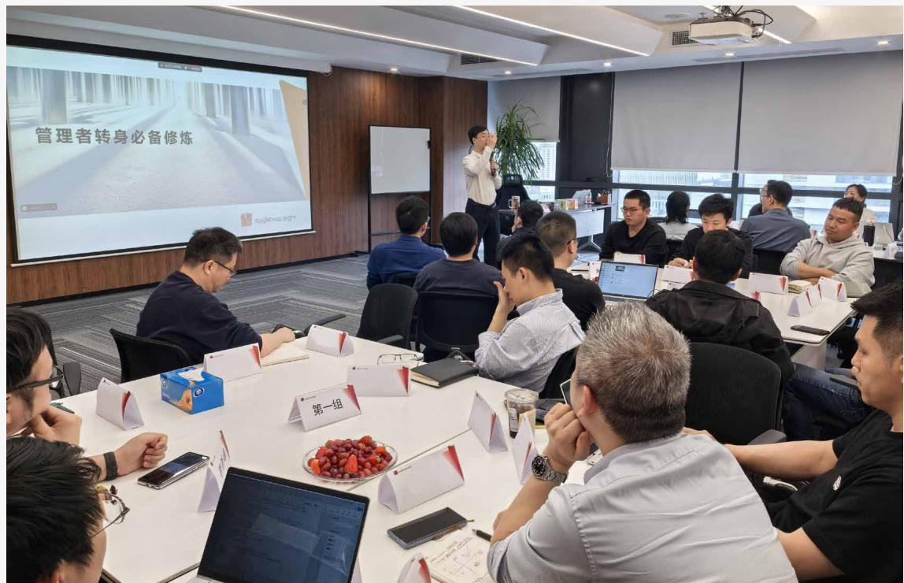

text_image

管理者转身必备修炼
第一组

# 2025年關鍵績效

# 員工培訓

員工培訓次數

118次

員工培訓支出金額

63.90萬元

培訓覆蓋率

95%

男性受訓員工占比

94.90%

高層受訓員工占比

95.50%

女性受訓員工占比

95.10%

中層受訓員工占比

96%

基層受訓員工占比

94.90%

人均培訓小時數

22小時

女性人均培訓小時數

22小時

高管人均培訓小時數

24小時

男性人均培訓小時數

22小時

中層人均培訓小時數

24小時

基層人均培訓小時數

21小時

# 職業發展

思格新能源制定《績效管理與晉升制度》，以全面評估、科學管理員工績效為核心，依據績效結果實施合理晉升與激勵，充分激發員工工作熱情與創造力。公司搭建競聘晉升、選拔晉升、逐級提升三大多元化晉升通道，保障晉升機會公平性與多樣性，為不同崗位、不同能力層級員工提供適配的職業上升路徑，讓優秀員工憑實力獲得發展機會，實現「能者上、優者獎」，助力員工在企業發展中提升個人職業價值。

SIGENERGY

# 健康安全

# 安全生產管理

思格新能源透過常態化安全檢查、全覆蓋安全培訓及實戰化應急演練，持續提升本質安全水平，為企業穩健營運築牢安全根基。過去三年，公司未發生因工死亡事故，實現安全生產零死亡目標。

# - 常態化安全檢查

公司設立安全委員會統籌安全生產管理工作，並在每個生產園區配備兼職安全員，協助園區負責人開展日常檢查。分別對各生產園區實施差異化、高頻次的現場巡查。2025年，臨港生產園區累計開展安全檢查12次，金橋生產園區7次，南通智慧能源中心18次，實現重點區域全覆蓋、關鍵環節全管控。檢查過程中，對發現的問題立行立改，確保生產現場始終處於安全可控狀態。

# - 強化安全意識

公司高度重視員工安全能力建設，2025年共組織安全培訓54場，培訓覆蓋2,141人次。結合全國「安全生產月」活動，公司透過組織開展安全知識競賽、張貼安全宣傳海報等形式多樣的活動，營造「人人講安全、個個會應急」的濃厚氛圍。

# 2025年安全月人人讲安全、个个会应急查找身边安全隐患

—— 查找身边安全隐患 ——

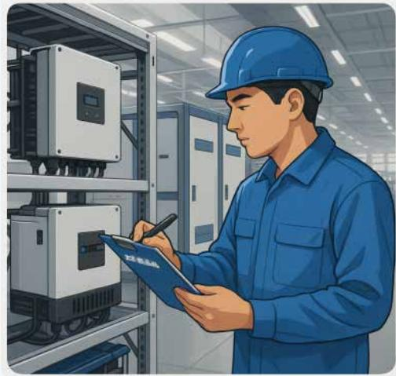

natural_image

Illustration of a technician in blue uniform and hard hat inspecting industrial equipment on shelves (no visible text or symbols)

安全宣傳海報

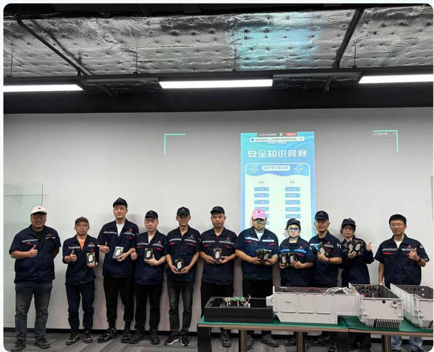

text_image

Group photo of workers in uniform holding equipment, with a presentation screen displaying Chinese text about safety knowledge competition.

安全知識競賽

# EHS專題培訓

# 案例

公司組織員工集中觀看安全事故警示片，透過真實案例分析典型事故的預防要點，強化「安全無小事」的底線思維。培訓內容涵蓋安全標誌識別、職業健康基礎、勞動防護裝備使用規範等理論知識，確保員工「學得會、用得上、能應急」，切實提升全員安全技能。

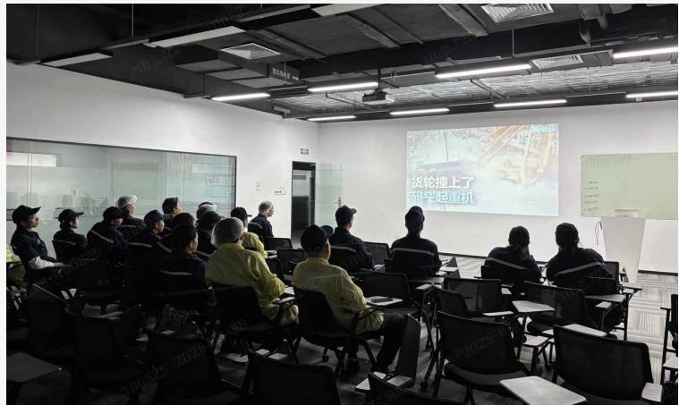

text_image

货轮撞上了
驾驶起重机

# 全員盡責 安全同行

# 案例

2025年，在臨港新片區管委會的指導與支持下，臨港生產園區拍攝製作安全生產主題宣傳視頻，全面展現企業「全員盡責、安全同行」的實踐成果。影片圍繞責任落實、隱患排查、文化建設、數智賦能四大維度，記錄公司完善的安全管理體系以及試點AI巡檢、掃碼上報等數智化管理措施，作為臨港新片區企業安全生產實踐的典型代表，為區域企業安全管理提供可借鑑的示範樣本。

# - 提升處置能力

公司制定並實施《生產安全事故綜合應急預案》，系統規範應急響應流程，最大限度減少生產安全事故可能造成的人員傷害與經濟損失。在應急物資保障方面，公司配備醫療救護藥品、個人防護裝備、應急照明系統、消防設施及應急堵漏物資，確保關鍵時刻「調得出、用得上」。同時，公司定期組織應急預案演練，透過實戰檢驗預案有效性，持續提升應急響應與事故處置能力。

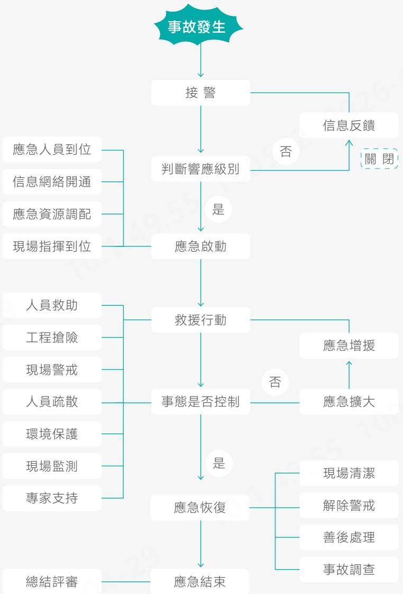

flowchart

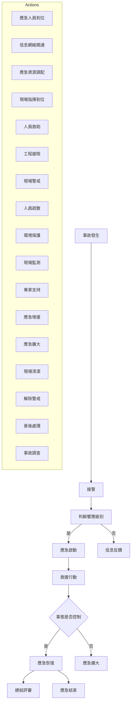
```mermaid
graph TD
  A["事故發生"] --> B["接警"]
  B --> C["判斷響應級別"]
  C -->|是| D["應急啟動"]
  C -->|否| E["信息反饋"]
  D --> F["救援行動"]
  F --> G{"事態是否控制"}
  G -->|是| H["應急恢復"]
  G -->|否| I["應急擴大"]
  H --> J["總結評審"]
  H --> K["應急結束"]
  
  subgraph Actions
    L1["應急人員到位"]
    L2["信息網絡開通"]
    L3["應急資源調配"]
    L4["現場指揮到位"]
  end
  
  subgraph Actions
    M1["人員救助"]
    M2["工程搶險"]
    M3["現場警戒"]
    M4["人員疏散"]
    M5["環境保護"]
    M6["現場監測"]
    M7["專家支持"]
  end
  
  subgraph Actions
    N1["應急增援"]
    N2["應急擴大"]
    N3["現場清潔"]
    N4["解除警戒"]
    N5["善後處理"]
    N6["事故調查"]
  end
```

# 職業健康保護

思格新能源依據《生產過程危險和有害因素分類與代碼》《企業職工傷亡事故分類》等標準，定期委托具備資質的第三方專業機構，對作業場所職業病危害因素進行檢測，動態監測危害因素濃度與強度，對發現的隱患及時整改，持續優化作業環境。同時，公示職業健康檢測結果，並設置防撞標識等安全警示，強化風險提示與現場管理，全方位守護員工職業健康權益。

在個人防護方面，公司為作業人員統一配備防塵口罩、防噪耳塞等勞動防護用品，切實保障粉塵、噪音等特殊環境下員工的職業健康。公司對關鍵崗位員工實施專項職業健康體檢，對體檢中發現存在職業禁忌的員工，及時進行崗位調整，確保人崗適配。

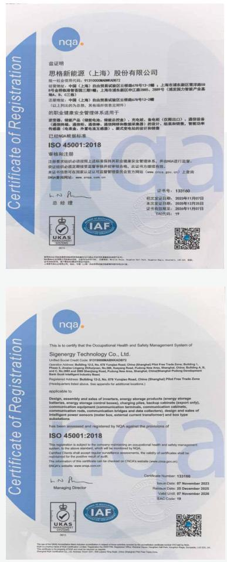  
公司總部職業健康管理體系證書

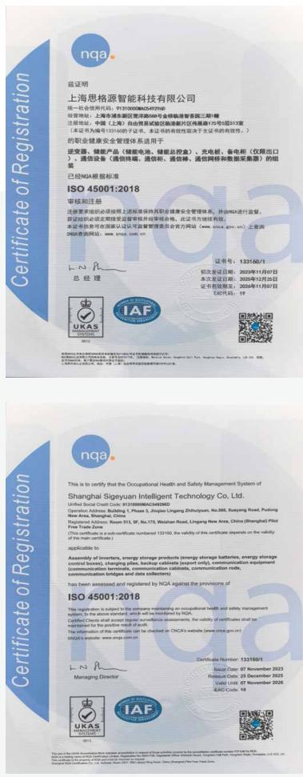  
臨港生產園區職業健康管理體系證書

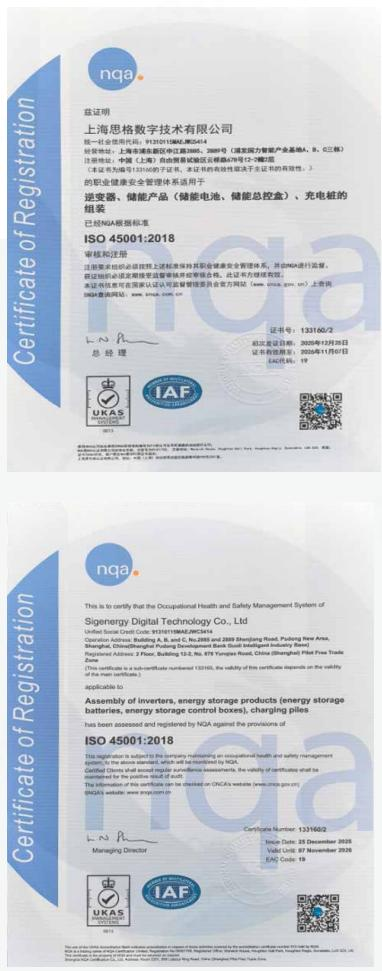  
金橋生產園區職業健康管理體系證書

# 空壓機房噪音專項治理

案例

為持續改善作業環境，2025年公司針對空壓機房噪音問題展開專項治理行動。一方面，對空壓機老化的關鍵組件進行檢修及更換，從設備本身降低運行噪音；另一方面，在空壓機房外圍增設隔音屏障，有效阻隔噪音向外傳播。經治理後，機房噪音由治理前約80分貝降至70分貝，保障員工聽力健康。

# 員工關愛

# 民主溝通

思格新能源注重聆聽員工心聲，透過不斷完善溝通機制、拓寬溝通渠道、優化溝通體驗，積極營造開放包容、多元平等的組織氛圍。即使在面對意見分歧時，我們依然秉持建設性溝通原則，保障所有人充分表達的權利，在相互尊重的基礎上凝聚共識、推動發展。

# - 溝通申訴渠道

公司制定《舉報與調查管理制度》，建立透明、多元的員工溝通與申訴渠道，鼓勵員工就內部涉嫌不當行為進行合規舉報，並承諾對舉報人和舉報內容嚴格保密，嚴禁任何形式的打擊報復，並在3個工作日內予以確認回饋。

優先向直屬上級報告

設置電郵 audit@sigenergy.com，當涉及上級或存在顧慮時，員工可直接向內部審計部報告

針對重大違法違規或審計部相關事項，則可向公司TC會議直接報告

# - 員工滿意度

公司每年定期開展員工滿意度調查，透過飛書設立專項服務群組，廣泛收集員工對公司各方面的評價與建議，確保員工問題得到及時跟進與解決。在這種持續聆聽與及時回饋中，公司不斷優化管理細節，同時有效提升員工的參與感、認同感與歸屬感。2025年，員工滿意度約為95%。

# 員工關懷

思格新能源持續推動多項員工關懷措施，致力改善員工的工作環境與生活品質，有效豐富員工業餘文化生活，積極營造團結協作、溫馨和諧的組織氛圍，有效增強員工的歸屬感與幸福感。

# 優化辦公環境

- 辦公場地整體搬遷，新辦公區空間寬敞、設施完善，優化健身房、休閒區、母嬰室等功能場所。  
- 裝修材料均採用E0級環保板材，經第三方檢測完全達標。

# 豐富員工活動

\- 設立週三活動日，常態化開展羽毛球、籃球、足球、瑜伽等興趣小組活動。

# 為員工做實事

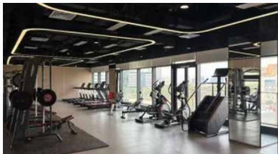

natural_image

Interior of a modern gym with fitness equipment and large windows (no visible text or symbols)

健身房

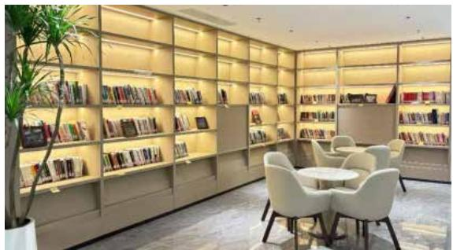

natural_image

Interior view of a modern library with tall bookshelves, tables, and chairs (no visible text or signage)

閱讀區

natural_image

Interior of a pool with a green snook table and wooden frame, no visible text or symbols

休閒區

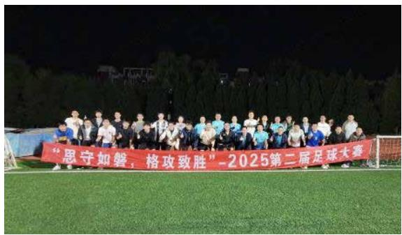

text_image

“思守如磐，格攻致胜”-2025第二届足球大赛

足球比賽

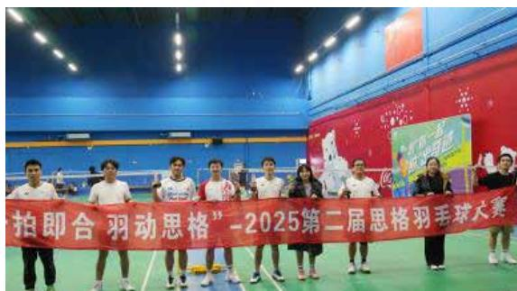

text_image

拍即合羽动思格"-2025第二届思格羽毛球大赛

羽毛球大赛

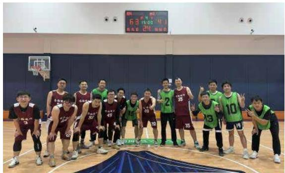

natural_image

Group photo of basketball players in maroon and green uniforms posing on a court with a blue mat, no visible text or symbols.

籃球比賽

# 溫情啟幕家庭日，共築幸福生態

# 案例

2025年11月，我們在上海總部舉辦年度家庭日活動。現場設置趣味挑戰、親子手工、美食市集、文藝表演四大區域，透過多樣遊戲、DIY互動與親子協作任務，讓員工及家屬沉浸式感受公司關懷。同步啟動的「家庭成長記錄」計劃，鼓勵員工留存溫馨合照，見證與公司共同成長的足跡。此次活動不僅提升員工的歸屬感與家庭幸福感，也進一步增強公司整體凝聚力與向心力。

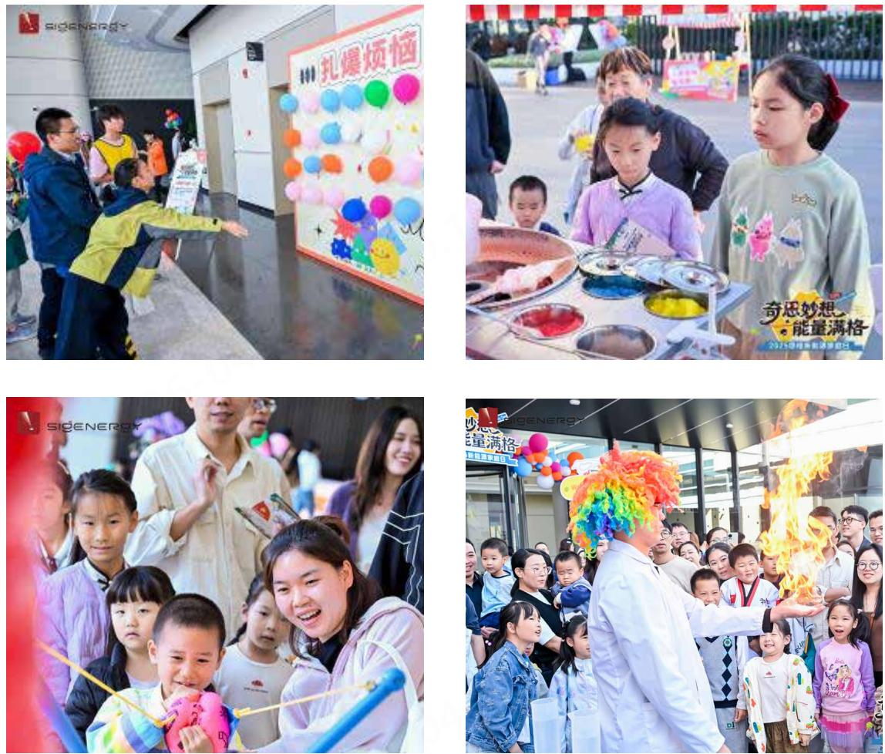

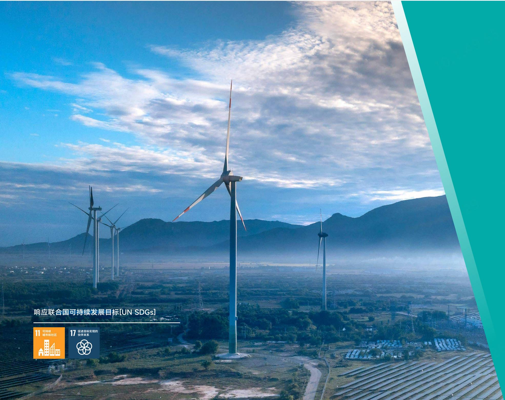

text_image

响应联合国可持续发展目标[UN SDGs]
11 可持续
城市和社区
17 促进目标实现的
方针关系

# 05

# 責任思行

# 共建可持續價值鏈

• 負責任供應鏈 47  
• 行業協同發展 50  
• 社區投資共贏 52

响应联合国可持续发展目标[UN SDGs]

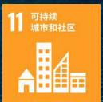

17 促进目标实现的伙伴关系

# 負責任供應鏈

# 供應商管理

思格新能源將環境責任、社會責任與商業道德深度融入供應商准入、合作、評估、優化的全生命週期，推動供應鏈生態持續健康發展。同時，公司將積極推動供應鏈可持續管理的細化量化，強化人權與強迫勞動風險識別，結合高風險地區業務特點優化本地化策略，進一步提升供應鏈韌性與合規水平。

# - 管理體系

思格新能源以風險導向、分級管理為核心原則，構建全流程供應商管控體系，保障供應鏈穩定、合規與高效運轉。准入環節實施差異化審核機制，嚴格核查資質、技術、品質、交付及供應鏈管理能力，從源頭篩選合格合作夥伴。

為推動供應商綜合能力持續提升，公司建立標準化績效評價機制，制定《供應商績效考核》《供應商審核機制》等制度，圍繞品質、交付、成本、服務及技術回應等維度，開展月度評分、季度與年度綜合評級。

公司依據評價結果實施分級獎懲與動態管理，對年度A級優秀供應商予以激勵，並在戰略項目中給予獎勵份額傾斜。對季度D級供應商開展整改督導，評估下調供貨份額。對年度D級及整改後仍不達標供應商，及時啟動份額調整、替代方案與退出流程，形成准入、管控、提升、退出的完整閉環，保障供應鏈長期合規、高效與可持續發展。

# - 行為準則

公司制定《供應商行為準則》，明確要求所有合作夥伴在合規用工與勞動保障、環境保護、商業誠信、衝突礦產禁用等方面履行基本責任，共同推動社會、環境與道德的持續進步。同時，出台《供應商CSR盡職調查管理規定》，要求供應商簽署《遵守上海思格源供應商行為準則的聲明》，強化供應鏈社會責任管理。針對供應商違反CSR紅線 $^{23}$ 的行為，公司已建立處置機制：若後續發現供應商存在嚴重違規情形，將立即暫停合作，並發出《糾正/預防措施要求表》，全程跟蹤整改成效。

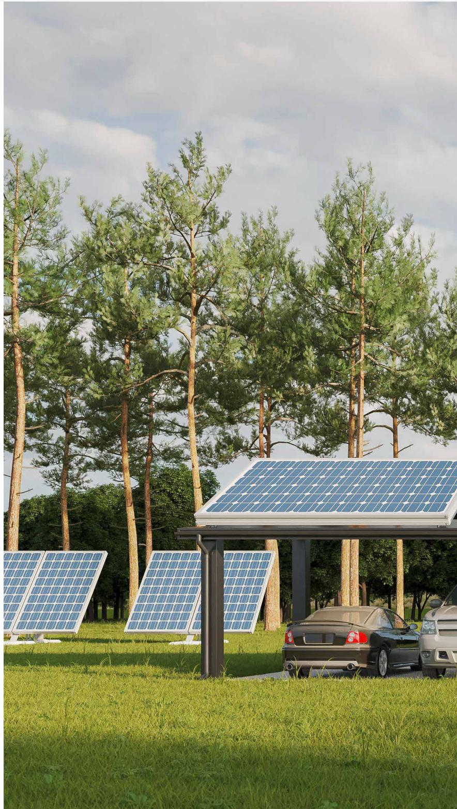

natural_image

Outdoor scene with solar panels on a green lawn, trees in the background, and parked cars under a clear sky (no visible text or symbols)

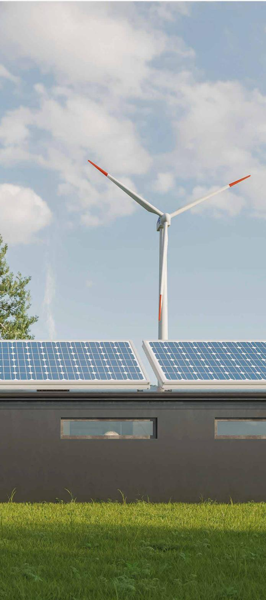

natural_image

Modern building with solar panels and a wind turbine against a blue sky with clouds (no text or symbols visible)

# CSR紅線包括但不限於

01 使用任何形式的童工。  
02 強迫勞動：使用任何形式的強迫、抵押（包括抵債）或契約勞工、監獄勞工、人口奴役或販賣，限制人身自由，扣留身份證明文件。  
03 非人道待遇：如體罰、使用暴力，辱罵或性騷擾，非法搜身或異性搜身，惡劣的歧視事件。  
04 商業腐敗及惡劣誠信事件：商業賄賂、不正當競爭、商業欺詐等舞弊行為。

(05) 重大的利益衝突事件。  
06 任何嚴重危及生命安全或健康的工作條件，以及作業現場發生致命事故。  
07 違法排放有毒有害污染物，包括廢水、廢氣、廢渣、強輻射及噪音。  
08 嚴重的媒體危機和群體性事件，群體衛生事件。  
(09) 故意隱瞞或造假等嚴重信息披露行為。

# 2025年

使用環境評價維度篩選的新供應商百分比

100%

使用社會標準篩選的新供應商百分比

100%

開展了環境影響評估的供應商數量

628個

開展了社會影響評估的供應商數量

628個

經確定為具有重大實際和潛在負面環境影響的供應商數量

0個

經確定為具有重大實際和潛在負面社會影響的供應商數量

0個

# - 衝突礦產管理

公司充分認識到，從受衝突影響及高風險地區採購礦產，可能間接資助武裝衝突，或助長侵犯人權、破壞環境等行為。為此，我們承諾不採購、不使用任何直接或間接來源於衝突地區的錫、鎢、鉭、金（3TG）、鈷、雲母等礦產及其衍生物。針對公司內部識別為高風險物料的供應商，我們要求提交符合行業標準的調查報告（CMRT/EMRT） $^{24}$ ，以確保供應鏈原材料來源合法、透明、無衝突。

# 可持續供應鏈

思格新能源致力於建構責任共擔、價值共創的可持續供應鏈。透過制度約束與能力共建，推動供應鏈在廉潔營運、環保合規及品質保障等方面實現系統提升。

# - 合規防線

公司嚴格落實廉潔與環保合規要求，與所有供應商100%簽署《廉潔協議》，明確反商業賄賂、反不正當競爭等責任，並持續推進化學品合規管理，REACH $^{25}$ 承諾書簽署率達86.84%，要求供應商嚴格遵守歐盟REACH指令及公司環保標準，確保產品符合有害物質管控要求。

# - 能力建設

2025年，公司累計開展供應商品質培訓21場，內容涵蓋外觀標準、技術規範、品質協議等關鍵要求；組織實施品質提升實踐活動45次。目前，品質工程師已長期駐廠於8家核心組件供應商，其餘供應商透過不定期巡廠提供技術支援，實現品質問題「早識別、早干預、早解決」，切實提升供應鏈整體品質水平與協同效率。

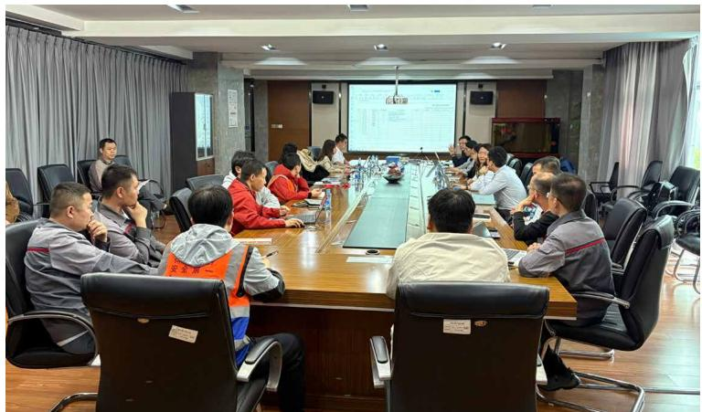

natural_image

Group of people seated around a conference table in a meeting room, facing a presentation screen (no visible text or symbols)

某專案品質管控要求培訓

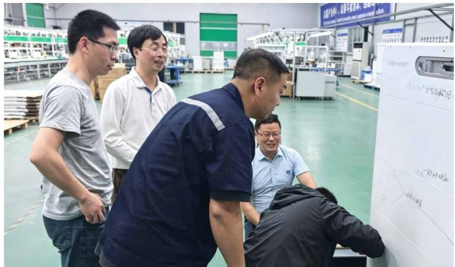

text_image

Factory floor photo showing workers inspecting a whiteboard with handwritten Chinese text, likely at an industrial or technical inspection site.

產品堆疊方式及要求現場培訓

# 供應鏈地理重塑，驅動減碳協同效應

案例

2025 年，公司啟動與核心供應商 A 的合作，規劃將產能從東莞逐步轉移至南通，實現供應鏈地理格局的優化，目前專案正積極推進，完成後將顯著提升營運效率與綠色發展水平，建構更高效的低碳供應鏈體系。

# 運輸里程大幅削減

\- 單次運輸距離減少1,438 $^{26}$ 公里，從根本上縮短了供應鏈長度，有效降低了物流成本。

# 減碳效益顯著提升

\- 基於運輸里程的削減，預計每年可大幅減少重型柴油貨車的運輸頻次，從而顯著降低範圍三溫室氣體排放，推動產品全生命週期碳足跡的持續下降。

# 行業協同發展

思格新能源始終秉持開放合作理念，積極推動跨區域、跨領域的產業協同，透過深度參與行業組織與強化國際政企合作，助力全球新能源生態從「單點競爭」邁向「系統共贏」。

# - 深耕行業發展

公司高度重視行業協作平台的策略價值，積極加入覆蓋亞洲、歐洲、美洲等核心市場的新能源行業協會與專業組織。截至報告期末，思格新能源已參加22個行業協會。

<table><tr><td>國家/地區</td><td>行業協會</td><td>任職</td></tr><tr><td>全球</td><td>Solar Power Europe</td><td>會員</td></tr><tr><td>全球</td><td>International Battery &amp; Storage Association</td><td>會員</td></tr><tr><td>美國</td><td>Solar Energy Industries Association</td><td>會員</td></tr><tr><td>美國</td><td>California Solar &amp; Storage Association</td><td>會員</td></tr><tr><td>德國</td><td>BSW (Bundesverband Solarwirtschaft e.V.)</td><td>會員</td></tr><tr><td>英國</td><td>Solar Trade Association</td><td>會員</td></tr><tr><td>奧地利</td><td>PV Austria</td><td>會員</td></tr><tr><td>瑞典</td><td>Svensk Solenergi (Swedish Solar Energy Association)</td><td>會員</td></tr><tr><td>德國</td><td>BDSH(Bundesverband des Solarhandwerks e.V.)</td><td>會員</td></tr><tr><td>西班牙</td><td>UNEF(Unión Española Fotovoltaica)</td><td>會員</td></tr><tr><td>西班牙</td><td>APPA(Asociación de Empresas de Energías Renovables)</td><td>會員</td></tr></table>

<table><tr><td>國家/地區</td><td>行業協會</td><td>任職</td></tr><tr><td>荷蘭</td><td>Holland Solar</td><td>會員</td></tr><tr><td>荷蘭</td><td>Energy storage NL</td><td>會員</td></tr><tr><td>比利時</td><td>PV-Vlaanderen</td><td>會員</td></tr><tr><td>愛爾蘭</td><td>ISEA (Irish Solar Energy Association)</td><td>會員</td></tr><tr><td>澳大利亞</td><td>SEC (Smart Energy Council)</td><td>會員</td></tr><tr><td>澳大利亞</td><td>AUSES (Australian Solar Energy Society)</td><td>會員</td></tr><tr><td>馬來西亞</td><td>MPIA (Malaysian Photovoltaic Industry Association)</td><td>會員</td></tr><tr><td>中國</td><td>廣東省太陽能協會</td><td>會員</td></tr><tr><td>中國</td><td>福建省太陽能光儲商會</td><td>會員</td></tr><tr><td>中國</td><td>EESA 儲能領跑者聯盟</td><td>理事單位</td></tr><tr><td>中國</td><td>中國光伏行業協會 (CPIA)</td><td>會員</td></tr></table>

# - 打造綠色合作標竿

公司積極與全球各國政府、地方機構建立策略合作關係，將本土化需求與全球化技術方案深度融合，助力區域實現綠色低碳發展目標。

# 賦能保加利亞，刷新儲能項目部署速度

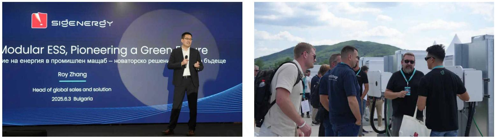

案例

2025年6月，公司在保加利亞舉辦「模組化儲能解決方案交流會」，其高效、靈活的技術方案獲得保加利亞國家電網調度中心高度評價。項目共部署90套模組化儲能系統，總容量達20MWh。依托創新的模組化堆疊結構與浮插式端子連接技術，系統無需吊裝設備、無需複雜布線，僅由5人團隊在10天內完成全部安裝，2天完成調試，並於並網當日20分鐘內實現20MWh全容量成功投運。

在安全與運維方面，系統集成六重電池安全防護機制，可在電芯熱失控發生時實現「秒級回應」；整機達到IP66防護等級，支援免維護運行，並透過雲平台實現遠程監控與「無人值守」。若發生故障，僅需更換單個模組，2小時內即可恢復運行，顯著優於傳統系統動輒數十小時的停機時間。

# 攜手斯洛文尼亞，打造歐洲綠色能源標竿

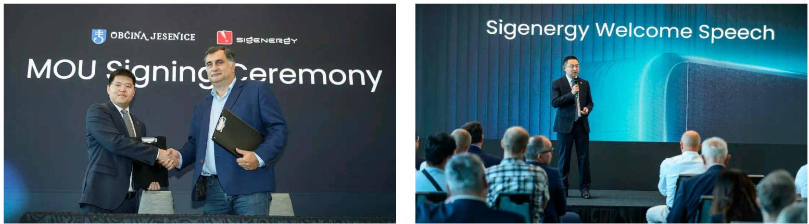

案例

2025年9月，公司在斯洛文尼亞耶塞尼采市舉辦綠色能源現場交流會，吸引當地政府部門、行業機構及合作夥伴150餘位嘉賓參與。會上，公司與耶塞尼采市正式簽署策略合作協議，圍繞光儲項目規劃實施、潔淨能源應用、儲能系統建設及本土化服務等領域開展深度合作，助力當地打造綠色低碳發展樣本。

# 社區投資共贏

思格新能源始終秉持「責任導向、透明合規」的核心原則，在嚴格遵守相關法律法規的前提下，積極投身社會公益事業與社區共建，圍繞教育支援、災害救助、文化融合與生態保護等領域開展務實、可持續的社區投入。

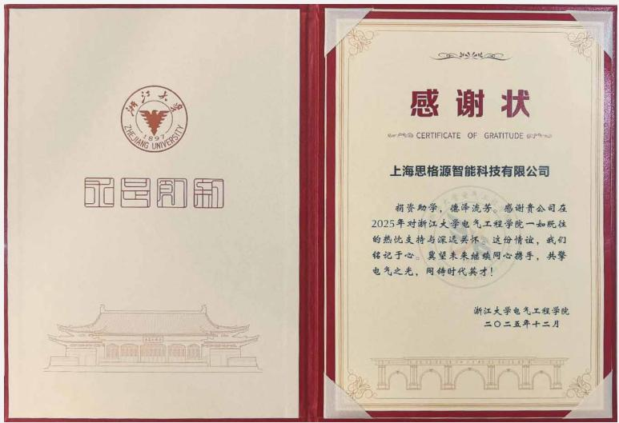

# - 支持高等教育

為助力中國新能源領域高層次人才培養，公司在浙江大學、上海交通大學、西安交通大學、同濟大學、南京航空航天大學、東南大學等重點高校設立「思格新能源獎學金」，每校捐贈10萬元，用於獎勵品學兼優、致力於能源轉型與技術創新的學生，推動產學研深度融合，夯實行業人才基石。

浙江大學感謝狀

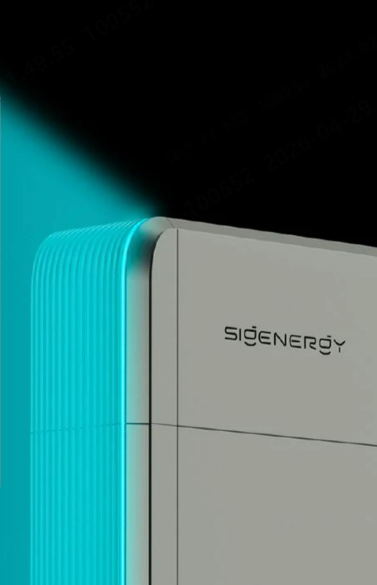

other

| Feature | Description |
| --- | --- |
| Device Name | SIGENERGY |
| Color Scale | Blue to Grey gradient |

# - 助力文體事業

2025年，我們正式成為斯洛文尼亞知名冰球隊HDD Jesenice的贊助夥伴。此次合作不僅將品牌與當地深厚的體育文化傳統緊密連結，更彰顯了公司在拓展國際業務的同時，積極融入社區、支持地方文化發展的長期承諾。

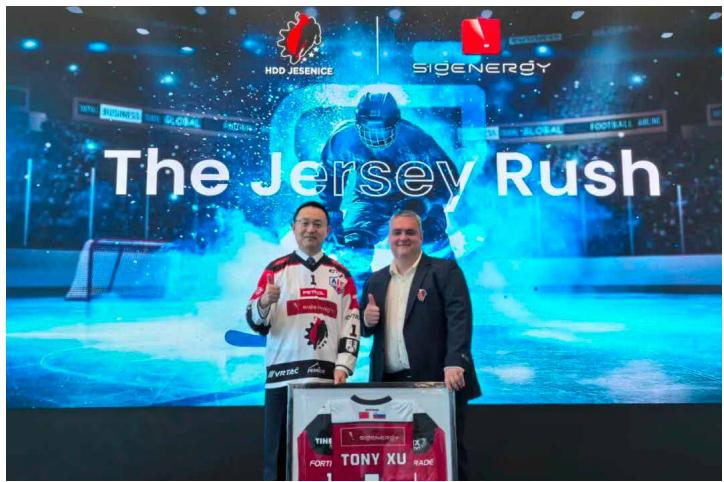

text_image

HDD JESENICE
SIGENERGY
THE JERSEY RUSH
THERE
FORTI TONY XU RADE

# - 緊急人道援助

在2025年緬甸「3·28」地震發生後，公司迅速回應，向災區捐贈200頂帳篷，為受災民眾提供基本生活保障，展現企業在重大公共危機中的敏捷行動力與人文關懷。

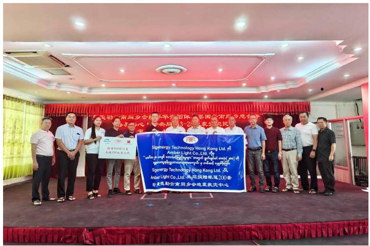

text_image

Sigmergy Technology Hong Kong Ltd. 19
Anber Light Co., Ltd.
“shen yu yao yao shangxi yong yao yao yao yao yao yao yao yao yao yao yao yao yao yao yao yao yao yao yao yao yao yao yao yao yao yao yao yao yao yao yao yao yao yao yao yao yao yao yao yao yao yao yao yao yao yao yao yao yao yao yAOYANG Technology Hong Kong Ltd. 及
Anber Light Co.,Ltd. 禹用民國株式2001年
香港民國協力所開市少場集約次中心

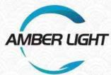

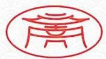

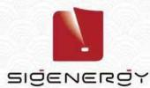

捐赠200顶帐篷
支援328地震灾民

# 附錄 ➤

關鍵績效27

<table><tr><td colspan="2">指標</td><td>單位</td><td>2025年</td></tr><tr><td colspan="4">环境維度</td></tr><tr><td rowspan="3">應對氣候變化</td><td>範圍一溫室氣體排放量</td><td>噸二氧化碳當量</td><td>1.23</td></tr><tr><td>範圍二溫室氣體排放量</td><td>噸二氧化碳當量</td><td>10,532.96</td></tr><tr><td>溫室氣體排放總量(範圍一+範圍二)</td><td>噸二氧化碳當量</td><td>10,534.20</td></tr><tr><td rowspan="9">能源</td><td>外購電力總量</td><td>兆瓦時</td><td>19,629.09</td></tr><tr><td>可再生能源消耗量-光伏發電</td><td>兆瓦時</td><td>1,256.77</td></tr><tr><td>汽油消耗量</td><td>升</td><td>586.00</td></tr><tr><td>能源消耗總量</td><td>兆瓦時</td><td>19,634.17</td></tr><tr><td>能源消耗強度</td><td>兆瓦時/萬元人民幣</td><td>0.02</td></tr><tr><td>直接能源消耗量</td><td>兆瓦時</td><td>5.08</td></tr><tr><td>直接能源消密度</td><td>兆瓦時/億元人民幣</td><td>0.06</td></tr><tr><td>間接能源消耗量</td><td>兆瓦時</td><td>19,629.09</td></tr><tr><td>間接能源消密度</td><td>兆瓦時/億元人民幣</td><td>216.60</td></tr><tr><td rowspan="2">水資源</td><td>總用水量</td><td>千噸</td><td>36.83</td></tr><tr><td>水資源消耗強度</td><td>千噸/萬元人民幣</td><td>0.04</td></tr></table>

27 本報告附錄僅披露當期數據。由於歷史同期數據覆蓋不全，若強行列示過往年份數據可能導致資訊失真或誤導。為確保披露資訊的準確性與可靠性，本期暫不呈現歷史對比數據。未來，公司將逐步完善ESG數據管理體系，擴大指標覆蓋範圍，並適時納入歷史可比資訊，以更清晰地展示公司績效的持續進展與趨勢。  
28 本報告本期僅披露有組織廢氣中非甲烷總烴的監測數據。針對無組織廢氣排放，公司已通過源頭管控、過程防控等措施落實有效治理，確保相關排放指標持續穩定達標。

<table><tr><td colspan="2">指標</td><td>單位</td><td>2025年</td></tr><tr><td rowspan="2">物料</td><td>包裝材料使用總量</td><td>噸</td><td>9,280.01</td></tr><tr><td>包裝材料使用密度</td><td>噸/萬元人民幣</td><td>0.01</td></tr><tr><td>廢氣28</td><td>非甲烷總烴</td><td>噸</td><td>0.02</td></tr><tr><td rowspan="9">固體廢物</td><td>廢棄物處置總量</td><td>噸</td><td>1,362.03</td></tr><tr><td>有害廢棄物總量</td><td>噸</td><td>61.14</td></tr><tr><td>有害廢棄物密度</td><td>千克/萬元人民幣</td><td>0.07</td></tr><tr><td>廢電池</td><td>噸</td><td>18.44</td></tr><tr><td>其他有害廢棄物</td><td>噸</td><td>42.70</td></tr><tr><td>無害廢棄物總量</td><td>噸</td><td>1,300.89</td></tr><tr><td>無害廢棄物密度</td><td>千克/萬元人民幣</td><td>1.44</td></tr><tr><td>生活及廚餘垃圾</td><td>噸</td><td>103.68</td></tr><tr><td>其他,例如廢棄包裝、紙箱</td><td>噸</td><td>1,197.21</td></tr><tr><td colspan="4">社會維度</td></tr><tr><td rowspan="6">員工構成</td><td>員工總數</td><td>人</td><td>1,597</td></tr><tr><td>女性員工</td><td>人</td><td>400</td></tr><tr><td>男性員工</td><td>人</td><td>1,197</td></tr><tr><td>30歲以下員工(不包含30歲)</td><td>人</td><td>620</td></tr><tr><td>30歲-50歲員工(包含30歲,不包含50歲)</td><td>人</td><td>965</td></tr><tr><td>50歲以上員工(包含50歲)</td><td>人</td><td>12</td></tr><tr><td rowspan="6">員工構成</td><td>本地員工</td><td>人</td><td>97</td></tr><tr><td>外地員工</td><td>人</td><td>1,500</td></tr><tr><td>本科以下學歷員工(不包含本科)</td><td>人</td><td>576</td></tr><tr><td>本科學歷員工</td><td>人</td><td>546</td></tr><tr><td>研究生及以上學歷員工</td><td>人</td><td>475</td></tr><tr><td>殘疾員工</td><td>人</td><td>9</td></tr><tr><td rowspan="12">管治機構多元化</td><td>高層管理人員總數</td><td>人</td><td>12</td></tr><tr><td>高層女性管理者</td><td>人</td><td>2</td></tr><tr><td>高層男性管理者</td><td>人</td><td>10</td></tr><tr><td>高層30歲以下管理者(不包含30歲)</td><td>人</td><td>0</td></tr><tr><td>高層30歲-50歲管理者(包含30歲,不包含50歲)</td><td>人</td><td>10</td></tr><tr><td>高層50歲以上管理者(包含50歲)</td><td>人</td><td>2</td></tr><tr><td>中層管理人員總數</td><td>人</td><td>41</td></tr><tr><td>中層女性管理者</td><td>人</td><td>7</td></tr><tr><td>中層男性管理者</td><td>人</td><td>34</td></tr><tr><td>中層30歲以下管理者(不包含30歲)</td><td>人</td><td>0</td></tr><tr><td>中層30歲-50歲管理者(包含30歲,不包含50歲)</td><td>人</td><td>41</td></tr><tr><td>中層50歲以上管理者(包含50歲)</td><td>人</td><td>0</td></tr><tr><td>員工之外的工作者</td><td>勞務工</td><td>人</td><td>0</td></tr><tr><td>有關營運變更的最短通知期</td><td>對員工及其代表產生重大影響的重大營運變更之前,提前通知員工及其代表的最短週數</td><td>週</td><td>4</td></tr></table>

<table><tr><td colspan="2">指標</td><td>單位</td><td>2025年</td></tr><tr><td rowspan="8">員工總體流動率</td><td>報告期員工總流動率29</td><td>%</td><td>15</td></tr><tr><td>女性員工流動</td><td>%</td><td>4</td></tr><tr><td>男性員工流動</td><td>%</td><td>11</td></tr><tr><td>30歲以下員工流動(不包含30歲)</td><td>%</td><td>6</td></tr><tr><td>30歲至50歲員工流動(包含30歲,不包含50歲)</td><td>%</td><td>8.90</td></tr><tr><td>50歲以上員工流動(包含50歲)</td><td>%</td><td>0.10</td></tr><tr><td>本地員工流動</td><td>%</td><td>0.50</td></tr><tr><td>其他地區員工流動</td><td>%</td><td>14.50</td></tr><tr><td rowspan="8">新進員工僱用</td><td>新招聘員工</td><td>人</td><td>957</td></tr><tr><td>新招聘女性員工</td><td>人</td><td>253</td></tr><tr><td>新招聘男性員工</td><td>人</td><td>704</td></tr><tr><td>新招聘30歲以下員工(不包含30歲)</td><td>人</td><td>445</td></tr><tr><td>新招聘30歲至50歲員工(包含30歲,不包含50歲)</td><td>人</td><td>509</td></tr><tr><td>新招聘50歲以上員工(包含50歲)</td><td>人</td><td>3</td></tr><tr><td>新招聘本地員工</td><td>人</td><td>38</td></tr><tr><td>新招聘其他地區員工</td><td>人</td><td>919</td></tr><tr><td rowspan="14">培訓30</td><td>員工培訓次數</td><td>次</td><td>118</td></tr><tr><td>員工培訓支出金額</td><td>萬元</td><td>63.90</td></tr><tr><td>培訓覆蓋率</td><td>%</td><td>95</td></tr><tr><td>男性受訓員工占比</td><td>%</td><td>94.90</td></tr><tr><td>女性受訓員工占比</td><td>%</td><td>95.10</td></tr><tr><td>高層受訓員工占比</td><td>%</td><td>95.50</td></tr><tr><td>中層受訓員工占比</td><td>%</td><td>96</td></tr><tr><td>基層受訓員工占比</td><td>%</td><td>94.90</td></tr><tr><td>人均培訓小時數</td><td>小時</td><td>22</td></tr><tr><td>女性人均培訓小時數</td><td>小時</td><td>22</td></tr><tr><td>男性人均培訓小時數</td><td>小時</td><td>22</td></tr><tr><td>高管人均培訓小時數</td><td>小時</td><td>24</td></tr><tr><td>中層人均培訓小時數</td><td>小時</td><td>24</td></tr><tr><td>基層人均培訓小時數</td><td>小時</td><td>21</td></tr><tr><td rowspan="7">育兒假</td><td>有權享受育兒假的員工總數</td><td>人</td><td>150</td></tr><tr><td>享受育兒假的男性員工</td><td>人</td><td>129</td></tr><tr><td>享受育兒假的女性員工</td><td>人</td><td>21</td></tr><tr><td>育兒假結束後在報告期內返崗的員工</td><td>人</td><td>150</td></tr><tr><td>育兒假結束後返崗且12個月後仍在職的員工</td><td>人</td><td>148</td></tr><tr><td>育兒假員工返崗率</td><td>%</td><td>100</td></tr><tr><td>育兒假員工留任率</td><td>%</td><td>98</td></tr></table>

<table><tr><td colspan="2">指標</td><td>單位</td><td>2025年</td></tr><tr><td>職業健康安全管理體系</td><td>職業健康安全管理體系覆蓋所有營業場所和員工的比例</td><td>%</td><td>100</td></tr><tr><td>工傷</td><td>因工死亡人數</td><td>人</td><td>0</td></tr><tr><td>本地採購</td><td>向本地供應商採購的支出比例</td><td>%</td><td>98</td></tr><tr><td rowspan="4">供應商數目</td><td>供應商總數量</td><td>個</td><td>1,346</td></tr><tr><td>中國大陸供應商數量</td><td>個</td><td>1,029</td></tr><tr><td>港澳台供應商數量</td><td>個</td><td>18</td></tr><tr><td>海外供應商數量</td><td>個</td><td>299</td></tr><tr><td rowspan="6">可持續供應鏈</td><td>使用環境評價維度篩選的新供應商百分比</td><td>%</td><td>100</td></tr><tr><td>開展了環境影響評估的供應商數量</td><td>個</td><td>628</td></tr><tr><td>經確定為具有重大實際和潛在負面環境影響的供應商數量</td><td>個</td><td>0</td></tr><tr><td>使用社會標準篩選的新供應商百分比</td><td>%</td><td>100</td></tr><tr><td>開展了社會影響評估的供應商數量</td><td>個</td><td>628</td></tr><tr><td>經確定為具有實際和潛在重大負面社會影響的供應商數量</td><td>個</td><td>0</td></tr><tr><td rowspan="2">當地社區</td><td>應急救災公益投入</td><td>萬元</td><td>1,400</td></tr><tr><td>環境保護公益投入</td><td>萬美元</td><td>1</td></tr><tr><td colspan="4">治理維度</td></tr><tr><td rowspan="6">反腐敗</td><td>已進行腐敗風險評估的營運點的總數</td><td>個</td><td>0</td></tr><tr><td>反商業賄賂及反貪污培訓覆蓋高級管理層的人數</td><td>人</td><td>12</td></tr><tr><td>反商業賄賂及反貪污培訓覆蓋高級管理層的百分比</td><td>%</td><td>100</td></tr><tr><td>反商業賄賂及反貪污培訓覆蓋員工的人數</td><td>人</td><td>1,597</td></tr><tr><td>反商業賄賂及反貪污培訓覆員工的百分比</td><td>%</td><td>100</td></tr><tr><td>報告期內對公司或其雇員提出並已審結的貪污訴訟案件的數目</td><td>件</td><td>0</td></tr><tr><td rowspan="2">數據安全與客戶私隱保護</td><td>數據安全事件涉及的具體金額</td><td>萬元</td><td>0</td></tr><tr><td>客戶隱私洩露事件涉及的具體金額</td><td>萬元</td><td>0</td></tr></table>

# 指標索引

# 全球報告倡議組織可持續發展報告標準（GRI Standards）索引表

使用說明 思格新能源已參照GRI準則報導在2025年1月1日至2025年12月31日期間內，GRI內容索引表中引述的資訊。

使用的GRI 1 GRI 1: 基礎 2021

<table><tr><td>披露項</td><td>對應章節</td></tr><tr><td colspan="2">GRI 2:一般披露 2021</td></tr><tr><td>披露項 2-1 組織詳細情況</td><td>走進思格新能源</td></tr><tr><td>披露項 2-2 納入組織可持續發展報告的實體</td><td>報告規範</td></tr><tr><td>披露項 2-3 報告期、報告頻率和聯絡人</td><td>報告規範</td></tr><tr><td>披露項 2-4 資訊重述</td><td>報告規範</td></tr><tr><td>披露項 2-5 外部鑒證</td><td>附錄—審驗聲明</td></tr><tr><td>披露項 2-6 活動、價值鏈和其他業務關係</td><td>走進思格新能源</td></tr><tr><td>披露項 2-7 員工</td><td>人才思進:成就員工價值</td></tr><tr><td>披露項 2-8 員工之外的工作者</td><td>附錄—關鍵績效</td></tr><tr><td>披露項 2-9 管治架構和組成</td><td>治理思誠:築牢發展基石—公司治理</td></tr><tr><td>披露項 2-10 最高管治機構的提名和遴選</td><td>治理思誠:築牢發展基石—公司治理</td></tr><tr><td>披露項 2-11 最高管治機構的主席</td><td>治理思誠:築牢發展基石—公司治理</td></tr><tr><td>披露項 2-12 在管理影響方面,最高管治機構的監督作用</td><td>治理思誠:築牢發展基石—可持續發展治理</td></tr><tr><td>披露項 2-13 為管理影響的責任授權</td><td>治理思誠:築牢發展基石—公司治理</td></tr><tr><td>披露項 2-14 最高管治機構在可持續發展報告中的作用</td><td>治理思誠:築牢發展基石—可持續發展治理</td></tr><tr><td>披露項 2-15 利益衝突</td><td>治理思誠:築牢發展基石—公司治理</td></tr><tr><td>披露項 2-16 重要關切問題的溝通</td><td>治理思誠:築牢發展基石—可持續發展治理</td></tr></table>

<table><tr><td>披露項</td><td>對應章節</td></tr><tr><td>披露項 2-17 最高管治機構的共同知識</td><td>治理思誠：築牢發展基石—可持續發展治理</td></tr><tr><td>披露項 2-18 對最高管治機構的績效評估</td><td>治理思誠：築牢發展基石—公司治理</td></tr><tr><td>披露項 2-19 薪酬政策</td><td>治理思誠：築牢發展基石—公司治理</td></tr><tr><td>披露項 2-20 確定薪酬的程序</td><td>治理思誠：築牢發展基石—公司治理</td></tr><tr><td>披露項 2-21 年度總薪酬比率</td><td>/</td></tr><tr><td>披露項 2-22 關於可持續發展戰略的聲明</td><td>董事會聲明</td></tr><tr><td>披露項 2-23 政策承諾</td><td>/</td></tr><tr><td>披露項 2-24 融合政策承諾</td><td>/</td></tr><tr><td>披露項 2-25 補救負面影響的程序</td><td>/</td></tr><tr><td>披露項 2-26 尋求建議和提出關切的機制</td><td>/</td></tr><tr><td>披露項 2-27 遵守法律法規</td><td>附錄—關鍵績效</td></tr><tr><td>披露項 2-28 協會的成員資格</td><td>責任思行：共建可持續價值鏈—行業協同發展</td></tr><tr><td>披露項 2-29 利益相關方參與的方法</td><td>治理思誠：築牢發展基石—可持續發展治理</td></tr><tr><td>披露項 2-30 集體談判協議</td><td>/</td></tr></table>

披露項  
GRI 201: 經濟績效 2016

<table><tr><td>披露項 201-1 直接產生和分配的經濟價值</td><td>附錄—關鍵績效</td></tr><tr><td>披露項 201-2 氣候變化帶來的財務影響以及其他風險和機遇</td><td>綠色思源：守護地球家園—應對氣候變化</td></tr><tr><td>披露項 201-3 固定福利計劃義務和其他退休計劃</td><td>人才思進：成就員工價值—合規僱用</td></tr><tr><td>披露項 201-4 政府給予的財政補貼</td><td>/</td></tr></table>

GRI 202: 市場表現 2016

<table><tr><td>披露項 202-1 按性別的標準起薪水平工資與當地最低工資之比</td><td>/</td></tr><tr><td>披露項 202-2 從當地社區僱用高管的比例</td><td>/</td></tr></table>

GRI 203: 間接經濟影響 2016

<table><tr><td>披露項 203-1 基礎設施投資和支持性服務</td><td>責任思行：共建可持續價值鏈—社區投資共贏</td></tr><tr><td>披露項 203-2 重大間接經濟影響</td><td>/</td></tr></table>

GRI 204: 採購實踐 2016

<table><tr><td>披露項 204-1 向當地供應商採購的支出比例</td><td>附錄—關鍵績效</td></tr></table>

GRI 205: 反腐敗 2016

<table><tr><td>披露項 205-1 已進行腐敗風險評估的營運點</td><td>/</td></tr><tr><td>披露項 205-2 反腐敗政策和程序的傳達及培訓</td><td>附錄—關鍵績效</td></tr><tr><td>披露項 205-3 經確認的腐敗事件和採取的行動</td><td>治理思誠：築牢發展基石—商業道德</td></tr></table>

GRI 206: 反競爭行為 2016

<table><tr><td>披露項 206-1 針對反競爭行為、反托拉斯和反壟斷實踐的法律訴訟</td><td>治理思誠:築牢發展基石—商業道德</td></tr></table>

披露項  
對應章節  
GRI 207: 稅務 2019

<table><tr><td>披露項 207-1 稅務方針</td><td>/</td></tr><tr><td>披露項 207-2 稅務治理、控制及風險管理</td><td>治理思誠：築牢發展基石—商業道德</td></tr><tr><td>披露項 207-3 與稅務關切相關的利益相關方參與及管理</td><td>/</td></tr><tr><td>披露項 207-4 國別報告</td><td>/</td></tr></table>

GRI 301: 物料 2016

<table><tr><td>披露項 301-1 所用物料的重量或體積</td><td>附錄—關鍵績效</td></tr><tr><td>披露項 301-2 所用循環利用的進料</td><td>/</td></tr><tr><td>披露項 301-3 再生產品及其包裝材料</td><td>/</td></tr></table>

GRI 302: 能源 2016

<table><tr><td>披露項 302-1 組織內部的能源消耗量</td><td>附錄—關鍵績效</td></tr><tr><td>披露項 302-2 組織外部的能源消耗量</td><td>附錄—關鍵績效</td></tr><tr><td>披露項 302-3 能源強度</td><td>附錄—關鍵績效</td></tr><tr><td>披露項 302-4 降低能源消耗量</td><td>綠色思源：守護地球家園—資源高效利用</td></tr><tr><td>披露項 302-5 產品和服務的能源需求下降</td><td>綠色思源：守護地球家園—資源高效利用</td></tr></table>

GRI 303: 水資源和污水 2018

<table><tr><td>披露項 303-1 組織與水作為共有資源的相互影響</td><td>綠色思源：守護地球家園—資源高效利用</td></tr><tr><td>披露項 303-2 管理與排水相關的影響</td><td>綠色思源：守護地球家園—環境合規管理</td></tr><tr><td>披露項 303-3 取水</td><td>/</td></tr><tr><td>披露項 303-4 排水</td><td>/</td></tr><tr><td>披露項 303-5 耗水</td><td>附錄—關鍵績效</td></tr></table>

披露項  
GRI 305: 排放 2016

<table><tr><td>披露項 305-1 直接（範圍1）溫室氣體排放</td><td>附錄—關鍵績效</td></tr><tr><td>披露項 305-2 能源間接（範圍2）溫室氣體排放</td><td>附錄—關鍵績效</td></tr><tr><td>披露項 305-3 其他間接（範圍3）溫室氣體排放</td><td>/</td></tr><tr><td>披露項 305-4 溫室氣體排放強度</td><td>/</td></tr><tr><td>披露項 305-5 溫室氣體減排量</td><td>/</td></tr><tr><td>披露項 305-6 臭氧消耗物質的排放</td><td>/</td></tr><tr><td>披露項 305-7 氮氧化物、硫氧化物和其他重大氣體排放</td><td>附錄—關鍵績效</td></tr></table>

GRI 306: 廢棄物 2020

<table><tr><td>披露項 306-1 廢棄物的產生及廢棄物相關重大影響</td><td>綠色思源：守護地球家園—環境合規管理</td></tr><tr><td>披露項 306-2 廢棄物相關重大影響的管理</td><td>綠色思源：守護地球家園—環境合規管理</td></tr><tr><td>披露項 306-3 產生的廢棄物</td><td>/</td></tr><tr><td>披露項 306-4 從處置中轉移的廢棄物</td><td>/</td></tr><tr><td>披露項 306-5 進入處置的廢棄物</td><td>綠色思源：守護地球家園—環境合規管理</td></tr></table>

GRI 308: 供應商環境評估 2016

<table><tr><td>披露項 308-1 使用環境評價維度篩選的新供應商</td><td>附錄—關鍵績效</td></tr><tr><td>披露項 308-2 供應鏈的負面環境影響以及採取的行動</td><td>責任思行：共建可持續價值鏈—負責任供應鏈</td></tr></table>

披露項  
GRI 401: 僱用 2016

<table><tr><td>披露項 401-1 新進員工僱用率和員工流動率</td><td>附錄—關鍵績效</td></tr><tr><td>披露項 401-2 提供给全職員工（不包括臨時或兼職員工）的福利</td><td>人才思進：成就員工價值—合規僱用</td></tr><tr><td>披露項 401-3 育兒假</td><td>附錄—關鍵績效</td></tr></table>

GRI 402: 勞資關係 2016

<table><tr><td>披露項 402-1 有關營運變更的最短通知期</td><td>附錄—關附錄—關鍵績效鍵績效</td></tr><tr><td colspan="2">GRI 403:職業健康與安全 2018</td></tr><tr><td>披露項 403-1 職業健康安全管理體系</td><td>人才思進:成就員工價值—健康安全</td></tr><tr><td>披露項 403-2 危害識別、風險評估和事故調查</td><td>人才思進:成就員工價值—健康安全</td></tr><tr><td>披露項 403-3 職業健康服務</td><td>人才思進:成就員工價值—健康安全</td></tr><tr><td>披露項 403-4 職業健康安全事務:工作者的參與、意見徵詢和溝通</td><td>人才思進:成就員工價值—健康安全</td></tr><tr><td>披露項 403-5 工作者職業健康安全培訓</td><td>人才思進:成就員工價值—健康安全</td></tr><tr><td>披露項 403-6 促進工作者健康</td><td>人才思進:成就員工價值—健康安全</td></tr><tr><td>披露項 403-7 預防和減緩與業務關係直接相關的職業健康安全影響</td><td>人才思進:成就員工價值—健康安全</td></tr><tr><td>披露項 403-8 職業健康安全管理體系覆蓋的工作者</td><td>附錄—關鍵績效</td></tr><tr><td>披露項 403-9 工傷</td><td>附錄—關鍵績效</td></tr><tr><td>披露項 403-10 工作相關的健康問題</td><td>人才思進:成就員工價值—健康安全</td></tr><tr><td>披露項</td><td>對應章節</td></tr><tr><td colspan="2">GRI 404: 培訓與教育 2016</td></tr><tr><td>披露項 404-1 每名員工每年接受培訓的平均小時數</td><td>附錄—關鍵績效</td></tr><tr><td>披露項 404-2 員工技能提升方案和過渡援助方案</td><td>人才思進:成就員工價值—人才成長</td></tr><tr><td>披露項 404-3 接受定期績效和職業發展考核的員工百分比</td><td>附錄—關鍵績效</td></tr><tr><td colspan="2">GRI 405: 多元化與平等機會 2016</td></tr><tr><td>披露項 405-1 管治機構與員工的多元化</td><td>附錄—關鍵績效</td></tr><tr><td>披露項 405-2 男女基本工資和報酬的比例</td><td>/</td></tr><tr><td colspan="2">GRI 406: 反歧視 2016</td></tr><tr><td>披露項 406-1 歧視事件及採取的糾正行動</td><td>/</td></tr><tr><td colspan="2">GRI 407: 結社自由與集體談判 2016</td></tr><tr><td>披露項 407-1 結社自由與集體談判權利可能面臨風險的營運點和供應商</td><td>/</td></tr><tr><td colspan="2">GRI 408: 童工 2016</td></tr><tr><td>披露項 408-1 具有重大童工事件風險的營運點和供應商</td><td>/</td></tr><tr><td colspan="2">GRI 409: 強迫或強制勞動 2016</td></tr><tr><td>披露項 409-1 具有強迫或強制勞動事件重大風險的營運點和供應商</td><td>/</td></tr><tr><td colspan="2">GRI 410: 安保實踐 2016</td></tr><tr><td>披露項 410-1 接受過在人權政策或程序方面培訓的安保人員</td><td>/</td></tr></table>

<table><tr><td>披露項</td><td>對應章節</td></tr><tr><td>GRI 411: 原住民權利 2016</td><td></td></tr><tr><td>披露項 411-1 涉及侵犯原住民權利的事件</td><td>/</td></tr><tr><td>GRI 413: 當地社區 2016</td><td></td></tr><tr><td>披露項 413-1 有當地社區參與、影響評估和發展計劃的營運點</td><td>/</td></tr><tr><td>披露項 413-2 對當地社區有實際或潛在重大負面影響的營運點</td><td>/</td></tr><tr><td>GRI 414: 供應商社會評估 2016</td><td></td></tr><tr><td>披露項 414-1 使用社會標準篩選的新供應商</td><td>附錄—關鍵績效</td></tr><tr><td>披露項 414-2 供應鏈中的負面社會影響和採取的行動</td><td>附錄—關鍵績效</td></tr><tr><td>GRI 415: 公共政策 2016</td><td></td></tr><tr><td>披露項 415-1 政治捐助</td><td>/</td></tr><tr><td>GRI 416: 客戶健康與安全 2016</td><td></td></tr><tr><td>披露項 416-1 評估產品和服務類別的健康與安全影響</td><td>/</td></tr><tr><td>披露項 416-2 涉及產品和服務的健康與安全影響的違規事件</td><td>/</td></tr><tr><td>GRI 417: 營銷與標識 2016</td><td></td></tr><tr><td>披露項 417-1 對產品和服務資訊與標識的要求</td><td>創新思變: 驅動潔淨未來—產品責任</td></tr><tr><td>披露項 417-2 涉及產品和服務資訊與標識的違規事件</td><td>創新思變: 驅動潔淨未來—產品責任</td></tr><tr><td>披露項 417-3 涉及營銷傳播的違規事件</td><td>創新思變: 驅動潔淨未來—產品責任</td></tr><tr><td>GRI 418: 客戶隱私 2016</td><td></td></tr><tr><td>披露項 418-1 涉及侵犯客戶隱私和遺失客戶資料的經證實的投訴</td><td>附錄—關鍵績效</td></tr></table>

香港聯交所《環境、社會及管治報告守則》C部分

<table><tr><td colspan="2">披露項</td><td>對應章節</td></tr><tr><td colspan="3">A.環境</td></tr><tr><td colspan="3">A1:排放物</td></tr><tr><td>一般披露</td><td>有關廢氣排放、向水及土地的排污、有害及無害廢棄物的產生等的:(a)政策;以及(b)遵守對發行人有重大影響的相關法律及規例的資料。</td><td>綠色思源:守護地球家園—環境合規管理</td></tr><tr><td>A1.1</td><td>排放物種類及相關排放數據。</td><td>附錄—關鍵績效</td></tr><tr><td>A1.3</td><td>所產生有害廢棄物總量(以噸計算)及(如適用)密度(如以每產量單位、每項設施計算)。</td><td>附錄—關鍵績效</td></tr><tr><td>A1.4</td><td>所產生無害廢棄物總量(以噸計算)及(如適用)密度(如以每產量單位、每項設施計算)。</td><td>附錄—關鍵績效</td></tr><tr><td>A1.5</td><td>描述所訂立的排放量目標及為達到這些目標所採取的步驟。</td><td>綠色思源:守護地球家園—環境合規管理</td></tr><tr><td>A1.6</td><td>描述處理有害及無害廢棄物的方法,以及描述所訂立的減廢目標及為達到這些目標所採取的步驟。</td><td>綠色思源:守護地球家園—環境合規管理</td></tr><tr><td colspan="3">A2:資源使用</td></tr><tr><td>一般披露</td><td>有效使用資源(包括能源、水及其他原材料)的政策。</td><td>綠色思源:守護地球家園—資源高效利用</td></tr><tr><td>A2.1</td><td>按類型劃分的直接及/或間接能源(如電、氣或油)總耗量(以千個千瓦時計算)及密度(如以每產量單位、每項設施計算)。</td><td>附錄—關鍵績效</td></tr><tr><td>A2.2</td><td>總耗水量及密度(如以每產量單位、每項設施計算)。</td><td>附錄—關鍵績效</td></tr><tr><td>A2.3</td><td>描述所訂立的能源使用效益目標及為達到這些目標所採取的步驟。</td><td>綠色思源:守護地球家園—資源高效利用</td></tr></table>

<table><tr><td colspan="2">披露項</td><td>對應章節</td></tr><tr><td>A2.4</td><td>描述求取適用水源上可有任何問題,以及所訂立的用水效益目標及為達到這些目標所採取的步驟。</td><td>綠色思源:守護地球家園—資源高效利用</td></tr><tr><td>A2.5</td><td>製成品所用包裝材料的總量(以噸計算)及(如適用)每生產單位佔量。</td><td>附錄—關鍵績效</td></tr><tr><td colspan="3">A3:環境及天然資源</td></tr><tr><td>一般披露</td><td>減低發行人對環境及天然資源造成重大影響的政策。</td><td>綠色思源:守護地球家園—生物多樣性保護</td></tr><tr><td>A3.1</td><td>描述業務活動對環境及天然資源的重大影響及已採取管理有關影響的行動。</td><td>綠色思源:守護地球家園—生物多樣性保護</td></tr><tr><td colspan="3">B.社會</td></tr><tr><td colspan="3">B1:僱用</td></tr><tr><td>一般披露</td><td>有關薪酬及解僱、招聘及晉升、工作時數、假期、平等機會、多元化、反歧視以及其他待遇及福利的:(a)政策;以及(b)遵守對發行人有重大影響的相關法律及規例的資料。</td><td>人才思進:成就員工價值—合規僱用、人才成長</td></tr><tr><td>B1.1</td><td>按性別、僱用類型(如全職或兼職)、年齡組別及地區劃分的雇員總數。</td><td>附錄—關鍵績效</td></tr><tr><td>B1.2</td><td>按性別、年齡組別及地區劃分的雇員流失比率。</td><td>附錄—關鍵績效</td></tr><tr><td colspan="3">B2:健康與安全</td></tr><tr><td>一般披露</td><td>有關提供安全工作環境及保障雇員避免職業性危害的:(a)政策;及(b)遵守對發行人有重大影響的相關法律及規例的資料。</td><td>人才思進:成就員工價值—健康安全</td></tr><tr><td>B2.1</td><td>過去三年(包括匯報年度)每年因工亡故的人數及比率。</td><td>人才思進:成就員工價值—健康安全</td></tr><tr><td>B2.2</td><td>因工傷損失工作日數。</td><td>附錄—關鍵績效</td></tr><tr><td>B2.3</td><td>描述所採納的職業健康與安全措施,以及相關執行及監察方法。</td><td>人才思進:成就員工價值—健康安全</td></tr><tr><td colspan="3">B3:發展及培訓</td></tr><tr><td>一般披露</td><td>有關提升雇員履行工作職責的知識及技能的政策。描述培訓活動。</td><td>人才思進:成就員工價值—人才成長</td></tr><tr><td>B3.1</td><td>按性別及雇員類別(如高級管理層、中級管理層)劃分的受訓雇員百分比。</td><td>附錄—關鍵績效</td></tr><tr><td>B3.2</td><td>按性別及雇員類別劃分,每名雇員完成受訓的平均時數。</td><td>附錄—關鍵績效</td></tr><tr><td colspan="3">B4:勞工準則</td></tr><tr><td>一般披露</td><td>有關防止童工或強制勞工的:(a)政策;以及(b)遵守對發行人有重大影響的相關法律及規例的資料。</td><td>人才思進:成就員工價值—合規僱用</td></tr><tr><td>B4.1</td><td>描述檢討招聘慣例的措施以避免童工及強制勞工。</td><td>人才思進:成就員工價值—合規僱用</td></tr><tr><td>B4.2</td><td>描述在發現違規情況時消除有關情況所採取的步驟。</td><td>人才思進:成就員工價值—合規僱用</td></tr><tr><td colspan="3">B5:供應鏈管理</td></tr><tr><td>一般披露</td><td>管理供應鏈的環境及社會風險政策。</td><td>責任思行:共建可持續價值鏈—負責任供應鏈</td></tr><tr><td>B5.1</td><td>按地區劃分的供應商數目。</td><td>附錄—關鍵績效</td></tr><tr><td>B5.2</td><td>描述有關聘用供應商的慣例,向其執行有關慣例的供應商數目,以及相關執行及監察方法。</td><td>責任思行:共建可持續價值鏈—負責任供應鏈</td></tr><tr><td>B5.3</td><td>描述有關識別供應鏈每個環節的環境及社會風險的慣例,以及相關執行及監察方法。</td><td>責任思行:共建可持續價值鏈—負責任供應鏈</td></tr><tr><td>B5.4</td><td>描述在揀選供應商時促使多用環保產品及服務的慣例,以及相關執行及監察方法。</td><td>責任思行:共建可持續價值鏈—負責任供應鏈</td></tr></table>

<table><tr><td colspan="2">披露項</td><td>對應章節</td></tr><tr><td colspan="3">B6:產品責任</td></tr><tr><td>一般披露</td><td>有關所提供產品和服務的健康與安全、廣告、標籤及私隱事宜以及補救方法的:(a)政策;以及(b)遵守對發行人有重大影響的相關法律及規例的資料。</td><td>創新思變:驅動潔淨未來—產品責任、客戶服務</td></tr><tr><td>B6.1</td><td>已售或已運送產品總數中因安全與健康理由而須回收的百分比。</td><td>創新思變:驅動潔淨未來—產品責任</td></tr><tr><td>B6.2</td><td>接獲關於產品及服務的投訴數目以及應對方法。</td><td>本次披露相關回饋均為產品諮詢類事項,未納入投訴範疇進行統計。</td></tr><tr><td>B6.3</td><td>描述與維護及保障知識產權有關的慣例。</td><td>創新思變:驅動潔淨未來—研發創新</td></tr><tr><td>B6.4</td><td>描述品質檢定過程及產品回收程序。</td><td>創新思變:驅動潔淨未來—產品責任</td></tr><tr><td>B6.5</td><td>描述消費者資料保障及私隱政策,以及相關執行及監察方法。</td><td>治理思誠:築牢發展基石—資訊安全</td></tr><tr><td colspan="3">B7:反貪污</td></tr><tr><td>一般披露</td><td>有關防止賄賂、勒索、欺詐及洗黑錢的:(a)政策;及(b)遵守對發行人有重大影響的相關法律及規例的資料。</td><td>治理思誠:築牢發展基石—商業道德</td></tr><tr><td>B7.1</td><td>於匯報期內對發行人或其雇員提出並已審結的貪污訴訟案件的數目及訴訟結果。</td><td>附錄—關鍵績效</td></tr><tr><td>B7.2</td><td>描述防範措施及舉報程序,以及相關執行及監察方法。</td><td>治理思誠:築牢發展基石—商業道德</td></tr><tr><td>B7.3</td><td>描述向董事及員工提供的反貪污培訓。</td><td>治理思誠:築牢發展基石—商業道德</td></tr><tr><td colspan="3">B8:社區投資</td></tr><tr><td>一般披露</td><td>有關以社區參與來瞭解營運所在社區需要和確保其業務活動會考慮社區利益的政策。</td><td>責任思行:共建可持續價值鏈—社區投資共贏</td></tr><tr><td>B8.1</td><td>專注貢獻範疇(如教育、環境事宜、勞工需求、健康、文化、體育)。</td><td>責任思行:共建可持續價值鏈—社區投資共贏</td></tr><tr><td>B8.2</td><td>在專注範疇所動用資源(如金錢或時間)。</td><td>責任思行:共建可持續價值鏈—社區投資共贏</td></tr></table>

# 香港聯交所《環境、社會及管治報告守則》D部分氣候相關披露

本報告期內，思格新能源不屬於恒生綜合大型股指數（HSCLI）成分股，因此[D部分：氣候相關披露]對本公司而言非強制要求，

為了逐步提升本公司應對氣候變化工作管理水平，公司基於可行性，整體參照[D部分：氣候相關披露]，在本報告中進行了應對氣候變化相關內容的披露。

<table><tr><td colspan="2">披露項</td><td>對應章節</td></tr><tr><td colspan="3">管治</td></tr><tr><td rowspan="2">19</td><td>負責監督氣候相關風險和機遇的治理機構(可包括董事會、委員會或其他同等治理機構)或個人的資訊。</td><td>綠色思源:守護地球家園—應對氣候變化</td></tr><tr><td>管理層在用以監察、管理及監督氣候相關風險和機遇的管治流程、監控措施及程序中的角色。</td><td>綠色思源:守護地球家園—應對氣候變化</td></tr><tr><td colspan="3">策略</td></tr><tr><td rowspan="3">20</td><td>描述合理預期可能在短期、中期或長期影響發行人的現金流量、融資渠道或資本成本的氣候相關風險和機遇;</td><td>綠色思源:守護地球家園—應對氣候變化</td></tr><tr><td>就發行人已識別的每項氣候相關風險,解釋發行人是否認為該風險是與氣候相關物理風險或與氣候相關轉型風險;</td><td>綠色思源:守護地球家園—應對氣候變化</td></tr><tr><td>就發行人已識別的每項氣候相關風險和機遇,具體說明其合理預期可能影響發行人的時間範圍(短期、中期或長期);</td><td>綠色思源:守護地球家園—應對氣候變化</td></tr><tr><td rowspan="3">21</td><td>解釋發行人如何定義短期、中期及長期,以及這些定義如何與其策略決定規劃範圍掛鉤。</td><td>綠色思源:守護地球家園—應對氣候變化</td></tr><tr><td>描述氣候相關風險和機遇對發行人的業務模式和價值鏈的當前和預期影響;</td><td>綠色思源:守護地球家園—應對氣候變化</td></tr><tr><td>描述在發行人的業務模式和價值鏈中,氣候相關風險和機遇集中的地方(例如,地理區域、設施及資產類型)。</td><td>綠色思源:守護地球家園—應對氣候變化</td></tr></table>

<table><tr><td colspan="2">披露項</td><td>對應章節</td></tr><tr><td rowspan="2">22</td><td>有關發行人已經及將來計劃在其策略和決策中如何應對氣候相關風險和機遇的資訊，包括發行人計劃如何實現任何其所設定的氣候相關目標，以及任何法律或法規要求達到的目標。</td><td>綠色思源：守護地球家園—應對氣候變化</td></tr><tr><td>有關發行人當前及將來計劃如何為根據氣候相關風險和基於披露的行動提供資源。</td><td>綠色思源：守護地球家園—應對氣候變化</td></tr><tr><td>23</td><td>發行人須披露先前各匯報期內按照所披露計劃的進度。</td><td>綠色思源：守護地球家園—應對氣候變化</td></tr><tr><td rowspan="2">24</td><td>氣候相關風險和機遇如何影響發行人在匯報期的財務狀況、財務表現及現金流量；</td><td>綠色思源：守護地球家園—應對氣候變化</td></tr><tr><td>當存在將導致下一匯報年度相關財務報表中的資產和負債帳面價值發生重要調整的重大風險時，關於識別的氣候相關風險和機遇的資訊。</td><td>綠色思源：守護地球家園—應對氣候變化</td></tr><tr><td rowspan="2">25</td><td>發行人經考慮其管理氣候相關風險和機遇的策略後，並考慮到以下各項，預期其財務表現在短期、中期及長期內將如何變化；</td><td>綠色思源：守護地球家園—應對氣候變化</td></tr><tr><td>基於發行人管理氣候相關風險和機遇的策略，其預計其財務業績及現金流量在短期、中期及長期的變化。</td><td>綠色思源：守護地球家園—應對氣候變化</td></tr><tr><td rowspan="2">26</td><td>截至匯報日對其氣候韌性的評估。</td><td>綠色思源：守護地球家園—應對氣候變化</td></tr><tr><td>進行氣候相關情景分析。</td><td>綠色思源：守護地球家園—應對氣候變化</td></tr><tr><td colspan="3">風險管理</td></tr><tr><td rowspan="3">27</td><td>發行人用於識別、評估氣候相關風險，以及釐定當中輕重緩急並保持監察的流程及相關政策；</td><td>綠色思源：守護地球家園—應對氣候變化</td></tr><tr><td>發行人用於識別、評估氣候相關機遇，以及釐定當中輕重緩急並保持監察的流程（包括發行人可有及如何使用氣候相關情景分析來確定氣候相關機遇的資訊）；</td><td>綠色思源：守護地球家園—應對氣候變化</td></tr><tr><td>氣候相關風險和機遇的識別、評估、優次排列和監察流程，是如何融入發行人的整體風險管理流程，以及融入的程度如何。</td><td>綠色思源：守護地球家園—應對氣候變化</td></tr><tr><td colspan="3">指標及目標</td></tr><tr><td>28</td><td>發行人須披露匯報期內的溫室氣體絕對總排放量（以公噸二氧化碳當量表示）</td><td>綠色思源：守護地球家園—應對氣候變化</td></tr><tr><td>29</td><td>發行人須披露用於計量溫室氣體排放的方法，包括：發行人用於計量其溫室氣體排放的計量方法、輸入資料及假設：發行人為何選擇該計量方法、輸入資料及假設計量溫室氣體排放；及發行人在匯報期對計量方法、輸入資料及假設進行的任何變更以及變更原因；</td><td>綠色思源：守護地球家園—應對氣候變化</td></tr><tr><td>30</td><td>發行人須披露容易受氣候相關轉型風險影響的資產或業務活動的金額及百分比。</td><td>綠色思源：守護地球家園—應對氣候變化</td></tr><tr><td>31</td><td>發行人須披露容易受氣候相關物理風險影響的資產或業務活動的金額及百分比</td><td>綠色思源：守護地球家園—應對氣候變化</td></tr><tr><td>32</td><td>發行人須披露涉及氣候相關機遇的資產或業務活動的金額及百分比。</td><td>綠色思源：守護地球家園—應對氣候變化</td></tr><tr><td>33</td><td>發行人須披露用於氣候相關風險和機遇的資本開支、融資或投資的金額。</td><td>綠色思源：守護地球家園—應對氣候變化</td></tr></table>

<table><tr><td colspan="2">披露項</td><td>對應章節</td></tr><tr><td>34</td><td>發行人須披露闡釋發行人可有及如何在決策中應用碳定價(例如投資決策、轉移定價及情景分析);及發行人用於評估其溫室氣體排放成本的每公噸溫室氣體排放量定價;</td><td>未設計碳定價,暫不適用。</td></tr><tr><td>35</td><td>發行人須披露氣候相關考慮因素可有及如何納入薪酬政策,或提供適當的否定聲明。</td><td>綠色思源:守護地球家園—應對氣候變化</td></tr><tr><td>36</td><td>本交易所鼓勵發行人披露與一項或多項特定的業務模式和活動有關的行業指標,或與參與有關行業常見特徵有關的行業指標。</td><td>綠色思源:守護地球家園—應對氣候變化</td></tr><tr><td>37</td><td>發行人須披露(a)其為監察實現其策略目標的進展而設定的與氣候相關的定性及量化目標;及(b)法律或法規要求發行人達到的任何目標,包括任何溫室氣體排放目標。</td><td>綠色思源:守護地球家園—應對氣候變化</td></tr><tr><td>38</td><td>發行人須披露其設定及審核每專案標的方法,以及如何監察達標進度。</td><td>綠色思源:守護地球家園—應對氣候變化</td></tr><tr><td>39</td><td>發行人須披露有關每項氣候相關目標的績效的資訊以及對發行人績效的趨勢或變化分析。</td><td>綠色思源:守護地球家園—應對氣候變化</td></tr><tr><td>40</td><td>就按第37至39段披露的每一項溫室氣體排放目標,發行人須披露:目標涵蓋哪些溫室氣體;目標是否涵蓋範圍1、範圍2或範圍3溫室氣體排放;此目標是溫室氣體排放總量目標還是溫室氣體排放淨額目標。目標是不是採用行業脫碳方法得出的。</td><td>綠色思源:守護地球家園—應對氣候變化</td></tr></table>

# UN SDGs索引

聯合國可持續發展目標
(UN SDGs)

<table><tr><td>1 无贫穷</td></tr><tr><td></td></tr></table>

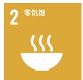

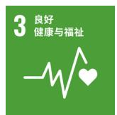

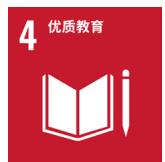

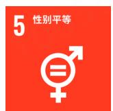

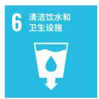  
對應章節

/

/

人才思進：成就員工價值

人才思進：成就員工價值

人才思進：成就員工價值

綠色思源：守護地球家園

聯合國可持續發展目標
(UN SDGs)

<table><tr><td>7 经济适用的清洁能源</td></tr></table>

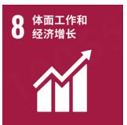

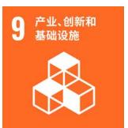

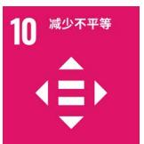

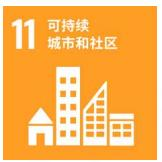

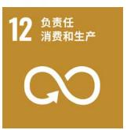  
對應章節

綠色思源：守護地球家園

人才思進：成就員工價值

創新思變：驅動潔淨未來

人才思進：成就員工價值

責任思行：共建可持續價值鏈

綠色思源：守護地球家園

創新思變：驅動潔淨未來

聯合國可持續發展目標
(UN SDGs)  
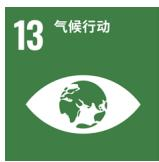

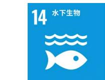

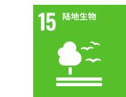

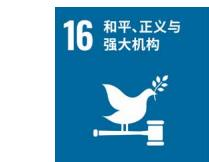

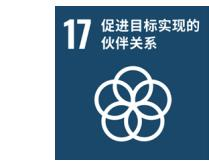  
對應章節

綠色思源：守護地球家園

/

綠色思源：守護地球家園

治理思誠：築牢發展基石

人才思進：成就員工價值

治理思誠：築牢發展基石
創新思變：驅動潔淨未來
責任思行：共建可持續價值鏈

# 審驗聲明

# TÜVRheinland®

Precisely Right.

# 獨立鑑證聲明

ISAE3000-CN-TR-2026-006

德國萊茵（TÜV Rheinland）受思格新能源（上海）股份有限公司（以下簡稱「公司」）委託，就其截至2025年12月31日止年度的《2025年環境、社會及管治（ESG）報告》（以下簡稱「本報告」）中所披露的選定環境、社會及管治（ESG）數據及相關資料開展獨立有限保證鑑證工作。

我們的責任是在已執行鑑證程序的基礎上，就選定資料發表有限保證結論。本次鑑證工作乃根據國際審計與鑑證準則理事會（IAASB）頒布的《國際鑑證業務準則第3000號（修訂）-歷史財務資料審計或審閱以外的鑑證業務》（ISAE 3000 (Revised)）進行。

# 鑑證範圍與對象

本次鑑證工作的範圍涵蓋思格新能源（上海）股份有限公司《2025年環境、社會及管治（ESG）報告》（以下簡稱「本報告」）中所披露的與可持續發展相關的定量數據及定性資料，報告期間為2025年1月1日至2025年12月31日。

鑑證內容包括但不限於：

- 環境績效數據（例如能源消耗、溫室氣體排放（範圍一及範圍二）、水資源消耗及廢棄物管理等）；  
- 社會績效數據（例如員工資料、培訓與發展、職業健康與安全等）；  
- 管治相關披露（例如公司治理架構、商業道德及合規管理等）

本報告中披露的政策、管理方法以及相關舉措與案例的定性描述

我們注意到，本次鑑證範圍不包括對財務數據或本報告以外資料的核查。此外，目前公司尚在建立範圍三溫室氣體排放核算體系，相關數據未納入本次鑑證範圍。本次鑑證程序亦不包括對氣候相關財務影響的量化評估。對於報告中涉及未來意圖、目標、預測或情景分析等前瞻性陳述，由於其具有不確定性，本次鑑證不提供任何保證。

# 報告編製依據

本報告由思格新能源（上海）股份有限公司參考以下標準編製：

- 全球報告倡議組織（GRI）《可持續發展報告標準》（2021版）；  
- 香港聯合交易所有限公司《環境、社會及管治報告守則》。

上述報告編製依據已作為本次鑑證工作的評估基礎。我們根據上述編製依據，對本報告內容與其所述編製依據的一致性，以及所披露資料與相關標準要求的符合情況進行評估。

# 鑑證程度

本次鑑證工作旨在根據《國際鑑證業務準則第3000號（修訂）》(ISAE 3000 Revised)提供有限鑑證。有限鑑證業務在風險評估程序（包括對內部控制的了解）以及針對評估風險所執行的程序方面，均較合理鑑證業務為少，因此所提供的鑑證程度亦低於合理鑑證業務所能提供的水平。

# 公司及德國萊茵的職責

# 公司的職責：

思格新能源（上海）股份有限公司管理層負責按照上述報告編製依據編製《2025年環境、社會及管治（ESG）報告》，並確保報告中所披露的資料在所有重大方面準確、完整。該責任包括設計、實施及維護與報告編製及列報相關的適當內部控制，以確保報告不存在由於舞弊或錯誤導致的重大差錯。管理層負責所披露 ESG 數據及資料的有效性和完整性，包括可持續發展績效數據的收集、匯緣及披露，以及報告中所作出的相關陳述與聲明。

# 德國萊茵的職責

我們的責任是根據已執行的程序及所取得的證據，就所選定資料發表有限鑑證結論。我們乃依據《國際鑑證業務準則第3000號（修訂）》(ISAE 3000 Revised)進行本次鑑證工作。該準則要求我們規劃及執行鑑證工作，以就所選定資料是否不存在重大錯報提供有限鑑證。

# TÜVRheinland®

Precisely Right.

# 工作摘要

我們的鑑證程序包括但不限於以下內容：

1. 管理體系及流程的了解與評估：

\- 審閱用於生成、匯總及報告選定資料的相關系統與流程；

評估所採用報告準則的適當性。

2. 訪談與討論：

\- 與負責選定資料管理及報告的相關人員進行訪談；

\- 了解 ESG 數據編製過程中所採用的方法及關鍵假設。

3. 數據測試與分析程序：

\- 對所選定資料進行基於抽樣的實質性測試，以核實其準確性及完整性；

\- 執行分析性程序，以評估所披露數據的一致性及合理性。

4. 實地視察與觀察：

\- 對選定營運場所進行現場訪問，觀察數據收集及報告流程；

\- 審閱現場所能取得的相關支持性文件及記錄。

5. 披露内容的審查：

\- 評估本報告整體列報、結構及內部一致性；

\- 評估相關披露與既定報告編製依據的一致性。

# 鑑證限制

我們的鑑證工作受以下限制所約束：

鑑證範圍限制：本次工作僅限於鑑證範圍章節中所列明的選定 ESG 指標及相關披露內容。我們的結論僅適用於上述特定資料，不應被理解為適用於其他資料或公司整體可持續發展績效的評價。

抽樣限制：我們對支持選定 ESG 指標的數據進行了抽樣測試。由於抽樣方法的固有限制，我們的結論基於整體數據的一部分樣本，可能存在未能發現某些重大錯報或遺漏的風險。

數據可得性：我們的鑑證程序基於思格新能源（上海）股份有限公司在鑑證期間向我們提供的數據及資料。若相關數據存在取得限制，可能影響鑑證工作的全面性。

對所提供數據的依賴：本次鑑證工作依賴公司所提供數據的準確性及完整性。我們未對所有底層數據進行獨立核查，因此我們的結論基於公司所提供資料作出。

結果預測：本次鑑證工作未對報告中所涉及的前瞻性陳述（例如目標或預測）的可實現性進行評估。該等資料具有不確定性，實際結果可能存在重大差異。因此，我們的結論不對未來績效或相關目標的實現提供任何保證。

# 鑑證結論

根據我們已執行的程序及所取得的相關證據，我們未發現任何事項使我們認為思格新能源（上海）股份有限公司截至2025年12月31日止年度的《2025年環境、社會及管治（ESG）報告》未在所有重大方面按照上述報告編製依據進行編製。在本次有限保證鑑證範圍內，本報告所披露的ESG資料在所有重大方面與既定報告編製依據保持一致。

# TÜVRheinland®

Precisely Right.

# 獨立性與專業能力

我們遵循德國萊茵的內部政策及程序，以確保在所有鑑證業務中保持獨立性、客觀性及專業勝任能力。參與本次鑑證工作的所有團隊成員均獨立於思格新能源（上海）股份有限公司，並已採取適當措施識別及管理潜在的利益衝突。我們的團隊成員具備相關專業資質及 ESG 鑑證經驗，並透過持續的專業發展保持對適用準則及最佳實務的最新認知。本次鑑證工作按照德國萊茵的內部質量管理程序執行，並遵循《國際鑑證業務準則第 3000 號（修訂）》的職業道德及專業要求。

# 使用及責任聲明

本獨立鑑證報告僅根據我們與思格新能源（上海）股份有限公司的約定編製，供其專用。我們的工作僅用於在本報告中向公司陳述我們應當陳述的事項，並不作其他用途。在法律允許的最大範圍內，我們不對除思格新能源（上海）股份有限公司以外的任何第三方就我們的工作、本報告或我們所形成的結論承擔或接受任何責任。

# 版權及知識產權聲明

本鑑證報告的知識產權歸德國萊茵香港有限公司（TÜV Rheinland Hong Kong Ltd.）所有。本報告僅供思格新能源（上海）股份有限公司使用，除法律法規另有規定外，未經我們事先書面同意，不得向任何第三方分發或披露。

任何第三方對本報告的使用或依賴均由其自行承擔風險。德國萊茵香港有限公司不對任何第三方因使用或依賴本報告而產生的任何損失、損害或費用承擔或接受任何責任。

# 符史良先生

主任鑑證員

企業可持續發展服務

# 黃偉國先生

技術審閱員

全球技術經理-ESG及可持續發展核證

# 徐永良先生

副總經理

企業可持續發展服務

# 德國萊茵香港有限公司

# http://www.tuv.com

2026年4月20日

本報告僅供思格新能源（上海）股份有限公司使用，並可能不適用於任何其他用途。未經我們事先書面同意，本報告不得向任何第三方分發或披露。

# 意見回饋

尊敬的讀者:為了不斷改進本報告的編製工作，我們特別希望傾聽您的意見和建議。請您協助我們完成如下相關問題，發送郵件到: operation.management@sigenergy.com

您来自：

○ 股東及投資者  
○ 業務夥伴及行業協會  
○ 客 戶

(安裝商、分銷商、終端用戶)

○ 董事會及高級管理層  
○ 高校及科研機構  
○ 政府與監管機構

○ 員工及從業人員  
○ 供應商  
○ 社區及公眾

您對本報告中資訊披露程度的總體評價

○ 很好

○ 較好

○ 一般

○ 較差

○ 很差

您對本報告中文字內容與版式設計的整體評價

○ 很好

○ 較好

○ 一般

○ 較差

○ 很差

您還希望透過《思格新能源2025環境、社會及管治（ESG）報告》了解哪些方面的資訊？

您的聯絡方式：

您對思格新能源環境、社會及管治報告的總體評價

○ 很好

○ 較好

○ 一般

○ 較差

○ 很差

本報告能夠反映思格新能源對環境、社會及管治的重大影響

○ 很好

○ 較好

○ 一般

○ 較差

○ 很差