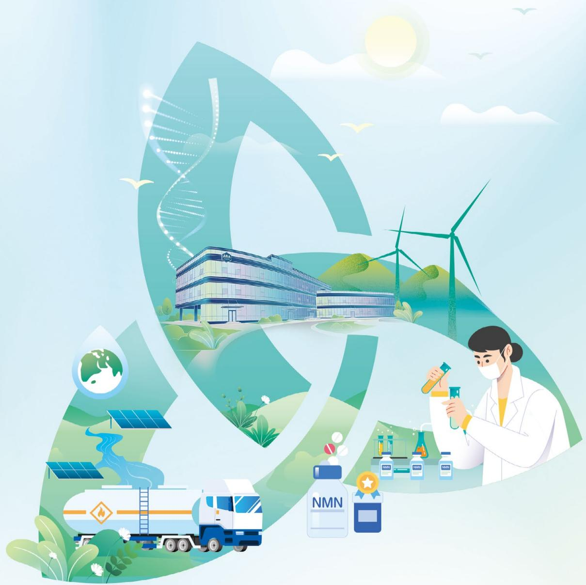

natural_image

Illustration of diverse green and white themes including a DNA double helix, wind turbine, laboratory building, renewable energy sources, and lab equipment (no text or symbols)

# 2025

# 环境、社会及公司治理(ESG)报告

# Environmental, Social and Governance (ESG) Report

# 目录

关于本报告 01

董事长致辞 03

走进雅本 05

公司简介 05

企业文化 05

我们的 2025 07

ESG 管理 09

ESG 治理 09

利益相关方沟通 11

重要性分析 13

关键绩效表 89

指标索引 95

读者反馈表 96

natural_image

Exterior view of a modern white office building with green trees and surrounding roads under a clear blue sky (no signage or text visible)

# 技精质胜，领航未来

坚持创新驱动 17

严控质量安全 21

打造优质服务 27

建设强韧供应链 31

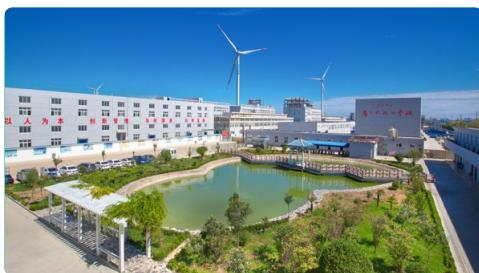

natural_image

Exterior view of a modern industrial park with wind turbines, a pond, and large buildings under a clear blue sky (no signage or text visible)

# 绿色发展，恒护自然

环境合规管理 37

应对气候变化 41

提升资源效益 46

严控污染排放 51

保护生物多样性 56

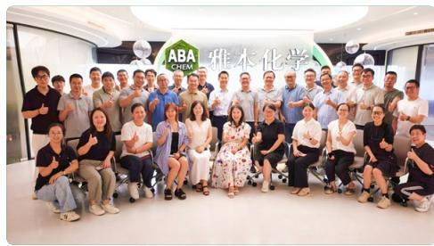

text_image

ABA
CHEM.
雅本化学

# 润泽人心，筑梦同行

维护员工权益 59

携手员工成长 63

筑牢安全防线 65

履行社会责任 72

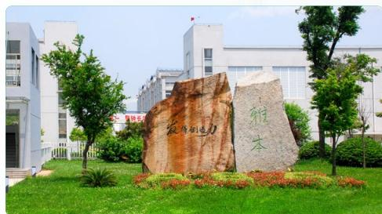

text_image

振华新动力
雅本

# 善治固本，行稳致远

加强公司治理 77

合规稳健经营 81

恪守商业道德 84

优化“智造”体系 87

# 关于本报告

本报告是雅本化学股份有限公司携旗下成员企业正式发布的第三份年度环境、社会及公司治理报告（以下简称“本报告”），旨在阐述公司在“环境、社会及公司治理”（以下简称“ESG”）方面的制度建设与经营活动表现，客观披露公司在可持续发展方面的管理和成效，以回应利益相关方与社会公众的关注。

# 报告范围

本报告覆盖雅本化学股份有限公司及其下属公司，与公司年度财务报告合并报表范围保持一致。为便于表述与方便阅读，在本报告中“雅本化学股份有限公司”简称“雅本化学”“公司”或“我们”等。下属公司涵盖：上海雅本化学有限公司、南通雅本化学有限公司、雅本（绍兴）药业有限公司、江苏建农植物保护有限公司、甘肃兰沃科技有限公司、甘肃兰农科技有限公司、兰州雅本精细化工有限公司、兰州雅本药物创制科技有限公司、上海朴颐化学科技有限公司、湖州颐辉生物科技有限公司、上海熵延新能源科技有限公司、河南艾尔旺新能源环境股份有限公司、平顶山艾尔旺环保科技有限公司、Hong Kong ABA Chemicals Corporation Limited、Amino Chemicals Limited、ABINO PHARM, INC、A2W Pharma Ltd.

报告中简称及对应全称

<table><tr><td>公司简称</td><td>公司全称</td></tr><tr><td>雅本化学/公司/我们/太仓基地</td><td>雅本化学股份有限公司</td></tr><tr><td>南通雅本/南通基地</td><td>南通雅本化学有限公司</td></tr><tr><td>建农植保/滨海基地</td><td>江苏建农植物保护有限公司</td></tr><tr><td>兰州基地</td><td>公司在甘肃兰州投资建设的研发、制造基地,包括甘肃兰沃科技有限公司、甘肃兰农科技有限公司、兰州雅本精细化工有限公司、兰州雅本药物创制科技有限公司四家企业</td></tr><tr><td>兰沃科技</td><td>甘肃兰沃科技有限公司</td></tr><tr><td>兰雅精化</td><td>兰州雅本精细化工有限公司</td></tr><tr><td>兰雅药创</td><td>兰州雅本药物创制科技有限公司</td></tr><tr><td>绍兴雅本/上虞基地</td><td>雅本(绍兴)药业有限公司</td></tr><tr><td>朴颐化学</td><td>上海朴颐化学科技有限公司</td></tr></table>

<table><tr><td>公司简称</td><td>公司全称</td></tr><tr><td>颐辉生物</td><td>湖州颐辉生物科技有限公司</td></tr><tr><td>熵延科技</td><td>上海熵延新能源科技有限公司</td></tr><tr><td>艾尔旺</td><td>河南艾尔旺新能源环境股份有限公司</td></tr><tr><td>马耳他基地</td><td>包括 Amino Chemicals Limited 和 A2W Pharma Ltd.</td></tr></table>

# 报告期间

本报告时间范围从 2025 年 1 月 1 日起至 2025 年 12 月 31 日止（以下简称“报告期内”或“本年度”）。为增强报告可比性与前瞻性，部分内容适当溯及 2024 年及以往年度或延伸至 2026 年。

# 编制依据

本报告编制遵循深圳证券交易所发布的《深圳证券交易所上市公司自律监管指引第17号——可持续发展报告（试行）》的相关要求，并参照深圳证券交易所发布的《深圳证券交易所创业板上市公司自律监管指南第3号——可持续发展报告编制》、全球可持续发展标准委员会（GSSB）发布的《GRI可持续发展报告标准》（GRI Standards 2021年版）、联合国可持续发展目标（SDGs）、中国财政部《企业可持续披露准则——基本准则（试行）》，以及国内外主流ESG评级等相关要求进行编制。

# 数据说明

本报告所披露的信息和数据来源于雅本化学的正式文件和统计报告。本报告所摘财务数据及指标，已通过第三方会计师事务所的审计。

# 确认与批准

本报告经公司管理层确认，由董事会战略决策委员会提报，获董事会通过。

# 报告获取

如需在线浏览或下载本报告，敬请访问：

- 雅本化学股份有限公司官网 (https://www.abachem.com)  
- 深圳证券交易所官网 (https://www.szse.cn)  
- 巨潮资讯网 (https://www.cninfo.com.cn)

# 董事长致辞

natural_image

Portrait of a man in a dark suit and glasses, wearing a tie (no text or symbols visible)

当前，全球气候危机与产业链重构交织，可持续发展已从企业的“选答题”转变为关乎生存与竞争力的“必答题”。作为深耕医药与农药中间体的精细化工力量，雅本化学不仅要提供高品质的产品，更要成为绿色转型的引擎、健康守护的标杆、价值创造的先锋。2025年，公司深度融入ESG理念，以创新为舟，以实干为桨，在时代的浪潮中奋力书写属于雅本的壮丽篇章。

# 技术精进，品质至上，引领发展之路

创新是雅本化学与生俱来的基因，更是我们面向未来的核心竞争力。作为一家具有鲜明国际化特征的企业，我们深知，全球领先客户对绿色、安全、高效解决方案的期待，正深刻重塑产业链的价值标准。为此，公司坚定将 ESG 理念嵌入研发战略主轴，持续加大对合成生物学、微通道连续流等绿色前沿技术的投入，并积极推动模块化、原子经济性工艺的商业化落地。在提升研发效率方面，我们正审慎探索人工智能等数字化工具在分子设计、反应条件优化等环节的辅助应用，以期缩短研发周期、减少试错成本。

我们不仅关注技术突破本身，更重视其在实际场景中的可持续价值转化。对于成功开发绿色技术产品的团队，公司设立具备可操作性的激励机制，鼓励创新成果向环境效益与商业价值的双重跃升。同时，我们以国际一流质量体系为基准，将“零缺陷”理念贯穿全链条，确保每一款产品都承载着对客户、对社会的责任承诺。

# 生态优先，绿色为本，守护碧水蓝天

绿色发展不是选择题，而是关乎企业生存与全球竞争力的必答题。早在2019年，雅本化学便成为国内较早引入杜邦可持续发展方案（DSS）的民营企业，通过系统性项目实施，夯实了安全环保管理基础。当前，公司正全面推进构建覆盖全价值链的低碳生态，这不仅是对外部要求的响应，更是我们主动引领行业绿色转型的战略抉择。年内，公司继加入科学碳目标倡议（SBTi）后，所设定的十年科学减排路径获官方审核通过；同时，兰州基地启动的DSS二期项目，正是我们打造面向未来的高质量、可持续及绿色新动能的重要实践。

# 人才为本，同心共鸣，共创繁荣生态

人才是可持续发展的第一资源。多年来，我们通过杜邦可持续发展方案（DSS）等国际化项目，系统培养出一支具备国际视野的可持续发展骨干队伍；同时，依托常态化的岗位技能培训、绿色工艺推广及先进安全理念宣贯，持续夯实全员ESG意识与专业能力。如今，这支融合了专项历练与日常积累的人才力量，活跃于公司海内外各基地与研发中心的重要岗位，已成为推动雅本化学绿色转型与高质量发展的中坚支撑。

我们坚持“以人为本”的发展理念，持续完善职业健康安全管理体系，营造安心、健康、有成长空间的工作环境。公司推行“管理+专业”双通道发展机制，支持员工在多元赛道上实现价值；同时注重组织活力激发，通过干部轮岗、跨基地交流等方式，促进知识流动与能力复用。我们亦积极履行社区责任，参与应急援助、教育支持等公益行动，让企业发展成果惠及更广泛群体。正是这种对人的尊重与信任，凝聚起一支高度认同公司使命、充满韧性与温度的团队。

# 治理重塑，固本强基，助力行稳致远

良好的公司治理是 ESG 实践的制度保障。董事会及战略委员会高度重视相关 ESG 议题，并将其纳入公司中长期战略规划。

我们不仅满足合规经营与透明披露的监管底线，更主动对标国际优秀实践——报告期内发布第二份 ESG 报告，持续推动 SBTi 的目标设定，都体现了我们作为行业先行者的担当。当前，公司正以 “十五五” 规划为契机，系统推进治理能力现代化：强化独立董事监督职能，完善反舞弊与商业道德机制，深化数字化转型赋能精益运营。尤为关键的是，我们正在将 ESG 要求融入采购、生产、研发等业务流程，推动从 “合规驱动” 向 “价值驱动” 跃迁。

# 业务重构，向新而行，夯实价值根基

面向 “十五五” 开局之年，公司以 “重构” 为业务发展战略主线，系统推进产品、资产与组织的协同升级，打造更具韧性、效率与可持续性的业务体系，为股东创造长期、稳定、可预期的价值回报。

我们坚持医药与农药双主业“双轮驱动”，通过产品重构加速向高技术壁垒、高环境标准、高附加值的创新医药、创新农药跃迁。新产品布局不仅考量市场潜力，更将绿色工艺、碳足迹及客户ESG需求作为前置条件，确保增长根植于责任与可持续。同步推进的资产重构，一方面对太仓、南通等成熟基地实施智能化与绿色化改造，提升存量效能；另一方面高标准建设兰州、上虞等新基地，打造集低碳制造、数字管理与柔性供应于一体的高质量产能载体。多基地协同、新旧动能接续，将显著增强抗风险能力与资本回报效率。

展望未来，全球产业链的绿色转型与科技变革虽方向明确，但路径复杂、挑战重重。雅本化学深知，过去的努力为我们打下了初步基础，但距离真正实现可持续、高质量的发展仍有很长的路要走。公司将始终坚守“为生命科学领域中的客户带来高质量产品和解决方案，创造价值，从而造福于员工、股东和社会”的使命，以审慎的态度研判风险，以坚定的投入深耕创新，以扎实的行动推进绿色转型，以真诚的关怀凝聚团队合力。唯有保持敬畏、全力以赴，我们才有可能在充满不确定性的环境中稳步前行，最终为人类的生命健康与作物安全贡献切实、可靠、负责任的雅本力量。

雅本化学股份有限公司董事长

蔡彤

# 走进雅本

# 公司简介

雅本化学创建于 2003 年 7 月,2011 年 9 月在深圳证券交易所创业板上市。公司主营创新医药、创新农药 CDMO，兼顾生物酶产品及营养保健品的开发和生产，战略投资环保、新材料等领域。雅本化学目前拥有八大生产基地及四大研发中心。公司早期生产基地位于江苏省太仓市，随后公司陆续投资建设了南通基地，并购了盐城滨海基地，布局了欧洲马耳他基地、浙江上虞基地，通过产业基金合作建立了湖北襄阳基地、辽宁阜新基地。2022 年开始布局甘肃兰州基地，并以此为基础扩产、转产。同时，公司已形成以上海张江创新中心、朴颐化学、颐辉生物、兰雅药创为核心的研发中心架构。

雅本化学是国内医药、农药中间体行业中的高端产品定制服务商，在国内精细化工行业具备较强的竞争优势，连续八年位列中国精细化工百强企业前50强，连续四年入选中国精细化工创新发展企业前十强。

# 企业文化

# 企业愿景

致力于成为一家全球化的提供健康产品和服务的优秀供应商

# 企业使命

为生命科学领域中的客户带来高质量的产品和处理方案  
创造价值，从而造福于员工、股东和社会

# 企业文化

基石

忠诚与勤勉

灵魂

合作共赢与高效

核心

发挥创造力

理念

卓越与远见

# “2+X”发展战略

公司在创新农药和创新医药中间体双主业中精耕细作，并结合主业积累的技术优势、供应链优势以及生产管理经验，持续培养新的业务增长点，以适应不断变化的国际环境和市场需求。

农药板块医药板块

在 “创新农药” 和 “创新医药” 两大核心 CDMO 业务领域精耕细作，持续大力推动创新农药、创新医药业务的布局和发展，增强公司主业核心竞争力。

生物酶、  
大健康产品、  
环保、新材料等

在现有多元业务发展基础上，探索产业链纵向深化发展机会，并重点关注生命健康和精细化工其他细分领域的横向拓展机会，前瞻布局生物废弃物的资源化处理，以适应不断变化的国际环境和市场需求。

# 成熟领先的研发体系

公司已经建成四个研发中心，分别聚焦农化、医药、合成生物及精细化工中试，为行业客户提供高效、优质的定制化工艺改善与产品研发服务。

# 雅本智造的生产体系

公司生产以六大核心生产基地为主、两大协同基地为辅，拥有覆盖公斤级至千吨级智能化的生产线，为国内外客户提供高效优质的定制化研发、小试、中试与商业化生产的技术与服务。

# 经营理念

- 珍惜资源，爱惜环境；  
· 利用优质的资源和人力，依靠专业的工艺和工程技术，以更低的成本、更友好和安全的方式，为客户提供更优质产品。

# 核心价值观

可持续发展的健康业务

稳定并具有积极职业观的人才队伍

持续改善的环保、健康、安全体系

# 我们的 2025

# 亮点绩效

环境

<table><tr><td>环保投入</td><td>环保投入占营业收入比例</td><td>可再生能源消耗量</td></tr><tr><td>3,485.08万元</td><td>2.67%</td><td>47.94万千瓦时</td></tr><tr><td>挥发性有机化合物同比减少</td><td>无害废物综合利用率</td><td>有害废物综合利用率</td></tr><tr><td>90.81%</td><td>98%</td><td>27.69%</td></tr></table>

社会

<table><tr><td>研发投入</td><td>研发投入占营业收入比例</td><td>产品召回数量</td></tr><tr><td>11,673.85万元</td><td>8.93%</td><td>0吨</td></tr><tr><td>员工人均培训时长</td><td>职业病发生率</td><td>因工死亡比率</td></tr><tr><td>45.63小时</td><td>0%</td><td>0%</td></tr></table>

治理

<table><tr><td>召开董事会会议</td><td>审议通过议案</td><td>独立董事占比</td><td>公司临时公告</td></tr><tr><td>9次</td><td>44项</td><td>33.3%</td><td>144份</td></tr><tr><td>通过“互动易”平台解答投资者提问</td><td colspan="2">因合规问题引发的诉讼或仲裁案件</td><td>商业道德专项审计覆盖率</td></tr><tr><td>172个</td><td colspan="2">0件</td><td>100%</td></tr></table>

公司荣誉  
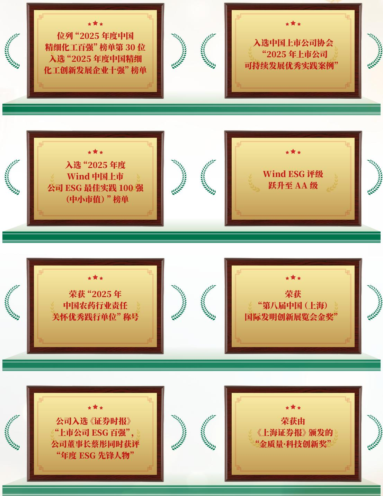

flowchart

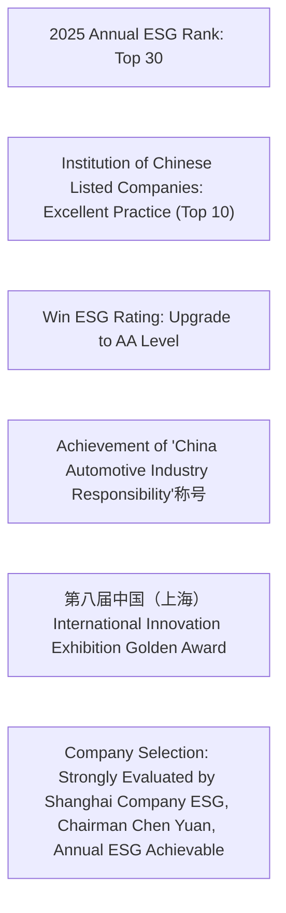

# ESG 管理

我们持续完善 ESG 治理架构和管理机制，常态化与利益相关方的沟通合作，开展重要性分析，确保公司有效监控自身可持续发展风险与机遇并做好应对，实现长久可持续发展。

# ESG 治理

公司建立了由董事会、战略决策委员会、ESG执行工作小组及各执行部门构成的多层次ESG治理架构，通过将ESG因素纳入战略决策、投资审议及高管考核，系统化管理和监督可持续相关风险与机遇。

# ESG 治理架构

公司高度重视 ESG 与可持续发展，为规范、高效地开展 ESG 管理和监督工作，建立了整体性 ESG 治理架构和管理制度。董事会负责公司 ESG 战略与策略的审议和指导、监察 ESG 目标与进度，将公司业务与可持续发展紧密结合。董事会下设的战略决策委员会在遵守《公司章程》和其他有关法律法规的前提下，负责对公司长期发展战略规划、重大战略性投资、ESG 事项进行可行性研究并提出建议，向董事会报告工作并对董事会负责。在管理层，公司汇集了在产品技术、品质管控、安全环境、人力资源和企业营运方面的专家，组成 ESG 执行工作小组。将 ESG 战略与目标及工作要求写入相关管理制度，由各子公司、各部门优化职责范围和工作内容，形成由决策层、管理层、执行层组成的 ESG 治理架构，逐步将 ESG 融入日常工作。

# 专业技能与提升

公司董事会成员具备化学、药学、经济学、法学及会计学等多元专业背景，能够从宏观经济、合规治理、财务内控及绿色技术等多个维度深入审视 ESG 议题。战略决策委员会作为董事会下设的专门委员会，其成员构成有助于将 ESG 目标有效融入公司中长期战略与重大投资决策；战略决策委员会通过定期审议 ESG 及科学碳目标相关议题，并监督实施进展，切实履行其职责。公司依托各专门委员会协同运作及独立董事的专业意见，构建了具备战略整合、风险识别与持续改进能力的 ESG 治理架构，并通过不断完善顶层设计，持续提升治理效能。

公司计划通过设定明确的 ESG 目标、权重及评估标准，将 ESG 关键绩效指标纳入高管年度绩效考核体系，确保 ESG 表现成为高管薪酬激励的重要依据。

报告期内，公司召开了科学碳目标（SBTi）及内部控制管理体系建设审议会议。同时，为重点员工提供了 ESG 培训，以提升员工对 ESG 政策趋势的把握和应用能力。

# 雅本化学ESG治理架构

<table><tr><td rowspan="2">决策层</td><td>董事会</td><td>审议并批准战略决策委员会提交的ESG相关议案;指导及审阅公司ESG方针、战略及目标;监督公司ESG战略的实施;审批公司ESG报告。</td></tr><tr><td>战略决策委员会</td><td>对公司ESG和科学碳目标倡议(SBTi)等相关事项开展研究并提出建议;对公司ESG相关中长期发展规划、经营目标、发展方针、重大战略性投资等进行研究并提出建议;审阅公司ESG报告及其他相关的重大事项报告。</td></tr><tr><td>管理层</td><td>ESG执行工作小组</td><td>制定公司ESG目标,推动年度计划落地;建立ESG事项管理架构及制度流程,规范公司ESG工作;为ESG工作的具体执行提供支持。</td></tr><tr><td>执行层</td><td>各子公司、各部门</td><td>全面落实各子公司及各部门ESG相关工作。</td></tr></table>

# 执行层

# ESG 信息获取方式

董事会战略决策委员会每年至少召开一次定期会议，审阅公司年度 ESG 报告，并就相关战略议题开展研究，形成建议后向董事会汇报。对于 ESG 重大事项，经该委员会审议后提交董事会决策。ESG 执行工作组不定期向战略决策委员会委员汇报 ESG 有关工作进展。此外，独立董事通过专项沟通机制或在相关会议中对 ESG 重大事项进行审议与监督，并向董事会提出专业意见。基于上述安排，公司构建了贯通专门委员会与董事会、融合定期审阅与专项审议的多层次、常态化 ESG 信息获取与议事机制。

# ESG因素纳入战略决策

董事会在审议涉及重大 ESG 风险的关联交易及重大投资事项时，将 ESG 风险作为重要审议因素，并须获得独立董事过半数同意。在政策制定方面，董事会通过制定专项政策或修订内部制度，将 ESG 相关要求制度化，确保其深度融入公司战略规划、重大决策与管理体系。同时，战略决策委员会在其职责范围内，将 ESG 因素纳入对公司中长期发展规划、经营目标及发展方针的研究与建议中，并在评估重大投资、资本运作等项目时系统考量 ESG 影响。

# 利益相关方沟通

公司充分尊重和维护利益相关方的合法权益，积极与利益相关方合作，加强与各方的沟通和交流，了解并及时回应各方的关切和期望，为识别可持续发展机遇、加强可持续发展能力、提高信息披露质量提供重要参考。

<table><tr><td>主要利益相关方</td><td>期望与诉求</td><td>沟通渠道</td></tr><tr><td>政府及监管机构</td><td>·依法经营·响应国家发展战略·创造就业岗位·带动区域经济发展·环境保护</td><td>·接受监督·定期披露·不定期汇报·参与相关会议·即时通讯软件</td></tr><tr><td>股东及投资者</td><td>·稳健经营·投资回报·信息公开透明</td><td>·定期/不定期信息披露·股东大会·投资者交流活动·投资者热线、邮箱·路演与业绩说明会</td></tr><tr><td>员工</td><td>·薪酬与福利·职业发展与晋升·安全、舒适的工作环境·平衡工作与生活</td><td>·管理层面对面·满意度调研·员工代表·员工意见征集·内部工作群</td></tr><tr><td>客户</td><td>·研发创新·产品质量·稳定供给·环境和社会议题的管理</td><td>·客户经理全流程服务·客户投诉渠道·客户交流与拜访·客户满意度调查</td></tr><tr><td>供应商/承包商</td><td>·双赢和共同发展·公平公正·诚信经营</td><td>·供应商资格调查·供应商考核与审核·供应商沟通</td></tr><tr><td>公益及社会组织/公众</td><td>·助力社区和谐发展·积极投身公益·透明沟通·良性互动</td><td>·信息披露·沟通电话与邮箱·公司官网</td></tr></table>

# 案例

# 公司亮相“第二十三届世界制药原料中国展”

2025 年 6 月 24 日至 26 日，公司携多家子公司亮相上海浦东新国际博览中心“第二十三届世界制药原料中国展”。展会期间，公司团队与众多客户开展面对面交流，系统介绍了公司加入科学碳目标倡议（SBTi）后的减碳进展、最新研发成果、各生产基地可持续运营情况，以及马耳他基地在海外市场中的绿色合规与注册优势。此次沟通彰显了公司以 ESG 为差异化竞争抓手、以全产业链布局为核心的发展理念。

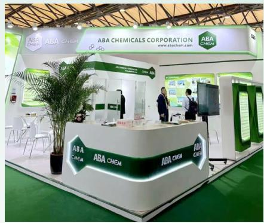

text_image

ABA CHEM
ABA CHEM
ABA CHEMICALS CORPORATION
www.abachem.com
ABA CHEM
ABA CHEM
ABA CHEM
ABA CHEM

# 案例

# 公司亮相“第八届中国国际进口博览会”

2025 年 11 月，雅本化学积极参与 “第八届中国国际进口博览会”，旗下品牌 Wholly You（和颐有雅）连续第四年站上进博会舞台，并在展会期间与众多合作伙伴深入洽谈。同期，在进博会系列活动之中国与巴西马托格罗索州农业合作交流会上，公司与合作方确立作物保护解决方案合作意向，并分享绿色农业技术经验、重申共建可持续农业的承诺。

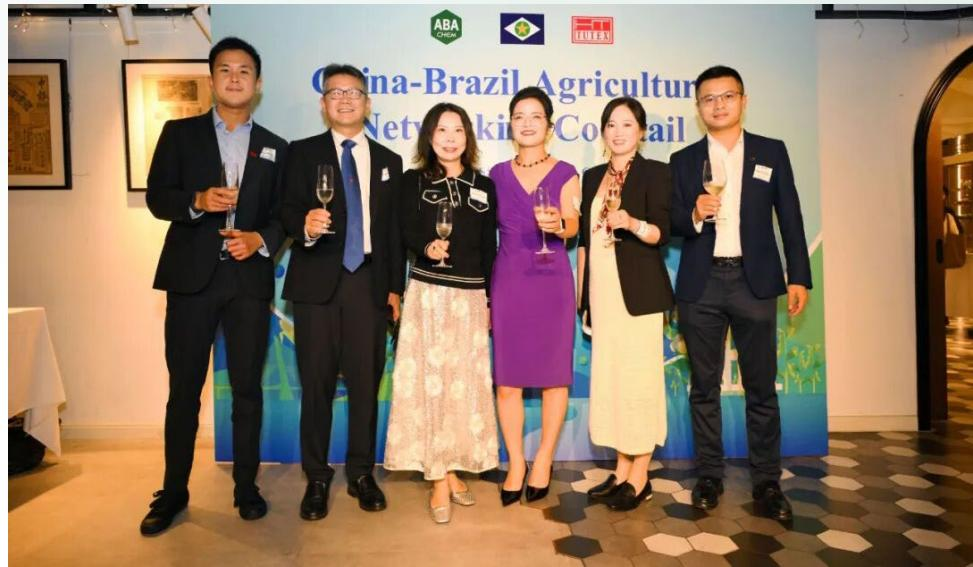

text_image

ABA
China-Brazil Agriculture
Network Co-cetail

# 重要性分析

为准确识别与评估公司的重要议题，我们参考《GRI可持续发展报告标准》（GRI Standards）、《深圳证券交易所上市公司自律监管指引第17号——可持续发展报告（试行）》《国际财务报告可持续披露准则第1号——可持续相关财务信息披露一般要求》（IFRS S1）等可持续发展信息披露标准，制定科学的分析方法，面向各利益相关方从“影响重要性（即对经济、环境、社会可持续性影响的重要程度）”和“财务重要性（即对公司财务影响的重要程度）”两个维度开展重要性议题识别与评估，明确公司重要性议题，在本报告中进行重点披露和回应，并持续完善ESG管理，助力公司可持续发展。

# 重要性议题评估流程

# 梳理与识别

参考运营所在地的宏观政策以及所在行业的特定政策和标准，以内外部发展趋势分析为基础梳理 ESG 议题清单，识别 21 项重要的通用议题和行业特定议题：

①以《深圳证券交易所上市公司自律监管指引第17号——可持续发展报告（试行）》中设置议题作为议题清单基础，参考国内外其他可持续发展报告标准，包括国际财务报告可持续披露准则（ISSB）、《GRI可持续发展报告标准》（GRI Standards）等；  
②国内外主流 ESG 评级体系（MSCI ESG 评级、S&P CSA 评级、CDP 评级等）以及同行业关注的可持续发展议题；  
③内外部利益相关方共同关心的问题，结合所处行业特点、行业发展阶段、自身商业模式、所处价值链等情况，识别其他具有财务重要性或影响重要性的议题；  
④参考专家意见等。

# 调研与评估

遵循双重重要性原则，开展“影响重要性评估”和“财务重要性评估”，形成2025年重要性议题矩阵，确定本年度重要性议题及其优先级。参与相关方包括董事、高管、员工、客户、供应商、投资者、监管部门以及公众等。

影响重要性：确定影响重要性评估因素与评分区间，由各利益相关方从影响严重性和影响发生可能性等因素评估公司重要性议题，根据调研结果评估各议题的影响重要性，并由内外部 ESG 专家进行调研结果的审阅与确认；

财务重要性：确定财务重要性评估因素与阈值，从议题是否预期在短期、中期和长期内对公司商业模式、业务运营、发展战略、财务状况、经营成果、现金流、融资方式及成本等产生重大影响等因素评估各议题财务重要性，并由董事、高管及内外部 ESG 专家进行审阅与确认。

# 确认与回应

基于调研结果，从“影响重要性”以及“财务重要性”两个维度构建重要性议题矩阵，经由公司高层与外部专家的最终审阅与确认，确定ESG议题的优先级排序，并针对重要性议题在报告中重点披露。

重要性议题评估结果  
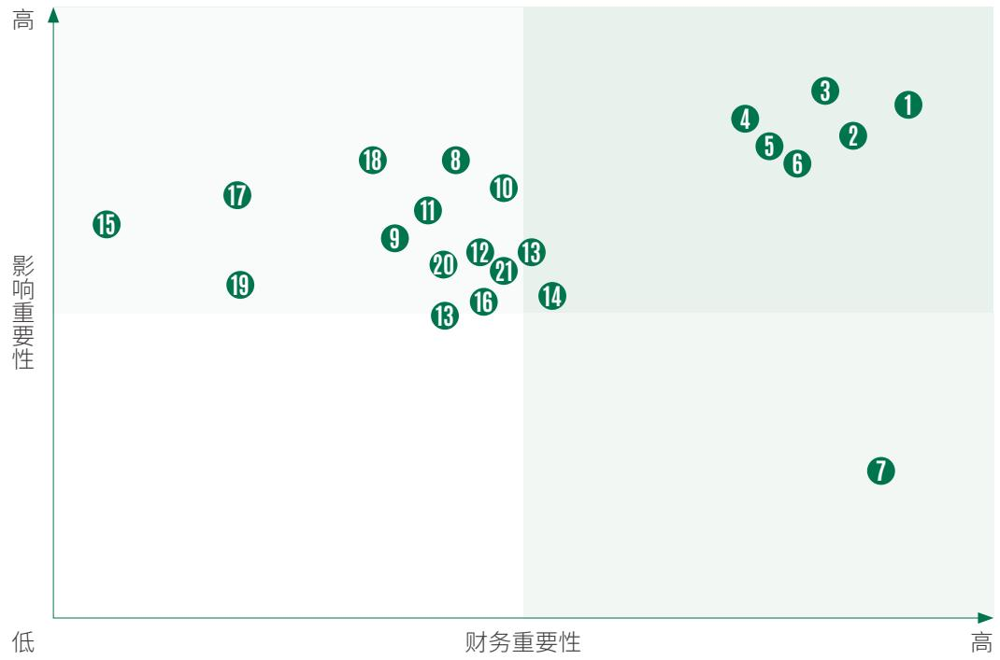

scatter

| Item | Financial Importance (approx) | Impact Importance (approx) |
| --- | --- | --- |
| 1 | ~85 | ~85 |
| 2 | ~80 | ~75 |
| 3 | ~75 | ~85 |
| 4 | ~65 | ~75 |
| 5 | ~65 | ~70 |
| 6 | ~65 | ~65 |
| 7 | ~80 | ~10 |
| 8 | ~45 | ~65 |
| 9 | ~40 | ~55 |
| 10 | ~45 | ~60 |
| 11 | ~40 | ~55 |
| 12 | ~40 | ~50 |
| 13 | ~40 | ~40 |
| 14 | ~45 | ~40 |
| 15 | ~10 | ~45 |
| 16 | ~40 | ~35 |
| 17 | ~20 | ~45 |
| 18 | ~35 | ~60 |
| 19 | ~20 | ~35 |
| 20 | ~40 | ~40 |
| 21 | ~40 | ~35 |

# 双重重要性

① 产品安全与质量  
2 供应链管理

3 环境管理  
4 应对气候变化

5 职业健康与安全  
6 恪守商业道德

# 财务重要性

7 合规经营

# 影响重要性

8 客户服务  
9 创新驱动  
10 负责任营销  
11 数据安全与客户隐私保护  
12 水资源管理  
13 能源管理

14 排放管理  
15 生物多样性保护  
16 员工权益保障  
17 员工培训与发展  
18 员工福利与关怀  
19 社会贡献

20 公司治理  
21 数字化转型

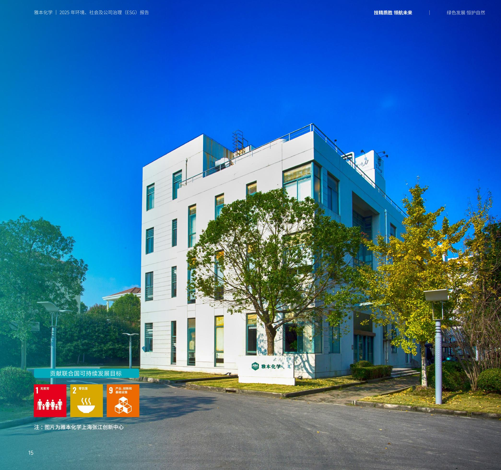

text_image

雅本化学 | 2025 年环境、社会及公司治理（ESG）报告
技特质胜 领航未来 | 绿色发展 恒护自然
贡献联合国可持续发展目标
1 无贫穷
2 零饥饿
9 产业、创新和基础设施
注：图片为雅本化学上海张江创新中心
15

# 技精质胜 领航未来

我们坚信，真正的行业领先源于绿色技术创新与卓越质量体系的深度融合。公司聚焦医药与农化高端中间体领域，持续突破绿色催化、连续流反应、手性合成等关键技术；严格执行 GMP 规范、ISO 9001 质量管理体系，筑牢覆盖研发、生产到交付的全链条质量安全防线；依托 CDMO 平台，为全球客户提供高效、合规、定制化的专业服务；并着力打造安全、韧性、可持续的全球供应链。通过技术、质量、服务与供应链的系统性协同，不断夯实可持续竞争力。

# 章节涉及议题

· 产品安全与质量  
- 客户服务  
- 创新驱动  
- 供应链管理  
- 负责任营销  
- 数据安全与客户隐私保护

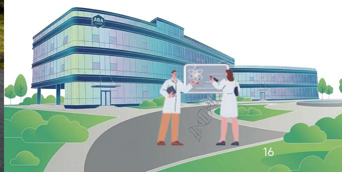

natural_image

Illustration of two scientists in lab coats discussing a whiteboard with molecular graphics near a modern building labeled 'ABA' (no text or symbols on the diagram itself)

1 无贫穷

2 零饥饿

9 产业、创新和基础设施

  
注：图片为雅本化学上海张江创新中心

# 坚持创新驱动

公司聚焦医药与农药 CDMO，构建覆盖技术布局、研发体系、激励机制与知识产权的创新生态，以高研发投入与绿色工艺突破，持续提升技术壁垒和客户价值。

# 明确创新战略

公司以构建系统性竞争优势，推动化工产业向高端化、高值化升级为核心创新战略，聚焦创新医药与创新农药中间体 CDMO 两大核心业务，深度服务全球原研药企与农化龙头企业；前瞻性布局合成生物学、微通道连续流、绿色催化等前沿技术方向，着力突破高选择性、高收率、高效率的绿色合成工艺瓶颈。依托“研发—中试—产业化”的全链条创新体系，公司加速技术成果从实验室向规模化生产转化，并通过技术持续迭代与平台能力建设，为客户提供更可靠、更灵活、更具成本优势的定制化解决方案。

在研发投入保障方面，公司坚持将科技创新作为战略性投入，持续保持高强度研发支出，并通过与高校及科研机构开展联合研发项目，推动技术成果高效转化，确保研发活动与主营业务深度协同。

# 案例

# 微通道连续流工艺实现关键突破

报告期内，公司与上海交通大学合作，在肟菌酯合成的关键步骤——光溴化反应中，成功应用微反应器技术替代传统间歇釜式工艺。该技术解决了传统工艺传热传质性能差、光利用率低等瓶颈，显著提升了工艺效率与安全性。相关成果已获得国家发明专利授权，并在国际化工知名期刊《AIChE Journal》上发表。

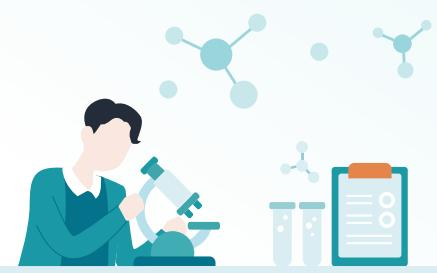

natural_image

Illustration of a scientist using a microscope with molecular structures and test tubes in the background (no text or symbols)

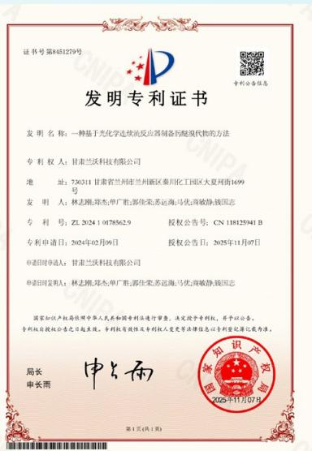

text_image

发明专利证书
发明名称：一种基于光化学连续抗反应器制备的醛或取代物的方法
专利权人：甘肃兰沃科技有限公司
地址：730311 甘肃省兰州市兰州新区秦川化工园区大夏河街1699号
发明人：林志熙;郑杰;单广胜;郭佳荣;苏远海;马优海;商敏静;钱国志
专利号：ZL 2024 1 078562.9
授权公告号：CN 118125941 B
专利申请日：2024年02月09日
授权公告日：2025年11月07日
申请时对申请人：甘肃兰沃科技有限公司
申请时间发审人：林志熙;郑杰;单广胜;郭佳荣;苏远海;马优海;商敏静;钱国志
国家知识产权局按照中华人民共和国专利法进行审查，决定授予专利权，并予以公告。
专利权自授权公告之日起生效。专利权有效性及专利权人变更等法律信息以专利登记簿记录为准。
局长
申长雨
中与雨
第1页（共1页）
2025年11月07日
专利权登记簿
中国知识产权局
国家知识产权局
2025年11月07日

# 案例

# 新能源材料研发取得前沿成果

报告期内，公司子公司熵延科技与中南大学、西安交通大学合作，在锂离子电池电解质领域取得突破。相关研究成果以“协同溶剂设计实现高性能锂离子电池无氟电解液”为题，发表在国际知名期刊《Advanced Functional Materials》上，为开发高性能、环保的电池材料提供了新方案。

# 完善研发体系

公司依托覆盖“研发—中试—产业化”的全链条创新体系，积极融合人工智能等前沿技术，持续构建高效、协同、绿色的核心竞争能力，为高质量发展筑牢坚实根基。

# 构建全链条创新体系

公司已建成覆盖“研发一中试一产业化”的全链条创新体系，依托国内四大研发中心与海外研发协同的技术网络，加速技术成果的工业化转化。各中心坚持自主研发为主、外部协作为辅，深度参与行业头部客户的新产品开发，支撑公司提供以市场需求为导向的高效定制化服务。

报告期内，公司两大项目相继落地。2025年10月，兰州基地C93车间中试项目启动，聚焦创新药原料药及高端中间体的中试放大；11月29日，绍兴雅本创新药原料药及中间体项目正式开工，致力于相关产品的研发与产业化。两大项目进一步完善了公司“研发一中试一产业化”的全链条布局，为医药业务发展提供了有力支撑。

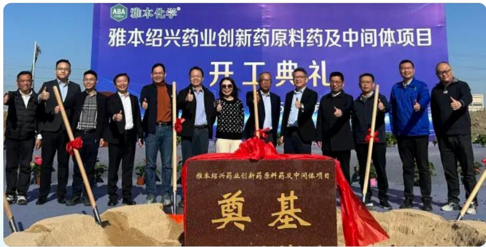

text_image

ABA 雅本化学®
雅本绍兴药业创新药原料药及中间体项目
开工典礼
雅本绍兴药业创新药原料药及中间体项目
奠基

绍兴雅本创新药原料药及中间体项目正式开工

# 布局 AI+ 自动化研发

当前，我国医药、精细化工产业正迈向高质量发展新阶段，国家密集出台多项政策，鼓励医药工业数智化转型、精细化工高端化升级，支持AI在药物研发领域的深度应用，推动高效、安全、环境友好型产品及中间体发展。医药中间体作为医药制造的核心支撑，市场需求持续释放，但行业普遍存在研发模式落后、周期长、成本高、数字化水平低等痛点，制约产业升级步伐。同时，AI驱动研发已成为行业主流趋势，产学研协同创新成为产业发展关键。公司深耕精细化工与医药中间体领域，拥有深厚技术积累和专业研发团队。为破解行业瓶颈、响应政策导向、巩固行业地位，公司正积极探索AI在研发领域的应用，依托产学研资源布局AI+自动化研发体系，助力产业绿色化、智能化转型，实现自身高质量发展。

# 构建创新机制

公司设立创新中心作为核心研发机构，其工作具有专业化、系统性、跨学科及市场导向特征，相关知识产权被纳入公司核心战略资产进行系统管理。围绕创新全周期，公司建立了覆盖新品开发、人才发展、项目转移与成果转化的制度体系，包括《设计和开发计划书》《创新创业管理办法》《科研人员进修学习管理办法》《项目转移管理制度》等。

在激励与支持方面，公司通过《科技成果转化管理与奖励办法》明确收益分享机制，并依据《知识产权管理办法》对专利发明人给予即时奖金；同时设立专项资金支持创意孵化，搭建技术对接与转化平台，系统构建从创意到产业化的创新生态。

此外，公司积极构建产学研合作网络，推动研发平台能力建设。报告期内，子公司建农植保获评省级企业技术中心、专精特新中小企业及高新技术企业；颐辉生物主办第七届“应用合成生物学”专题论坛；朴颐化学作为《精细化工产品分类》团体标准“医药”分领域牵头起草单位，深度参与行业规则制定，持续提升技术影响力与行业引领力。

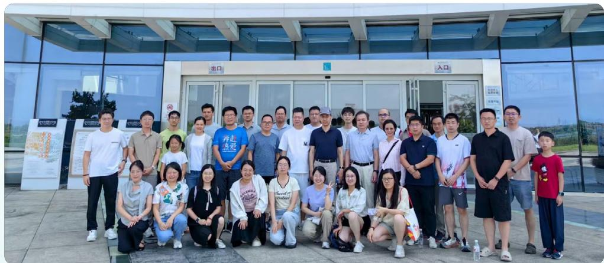

text_image

Group photo in front of a building entrance with visible signage for '出口' and '入口', showing people posing in front.

第七届“应用合成生物学”专题论坛合影

# 携手头部药企，提升医药先进制造能力

2025 年 8 月, 公司与恒瑞医药达成战略合作, 共同推动医药先进制造与技术升级。恒瑞医药在肿瘤、代谢、心血管、免疫及神经科学等重大疾病领域具备深厚研发积淀和丰富管线。通过与其开展 CDMO 合作, 公司得以深入参与创新药物中间体与原料药的工艺开发与生产, 接触前沿药物形态

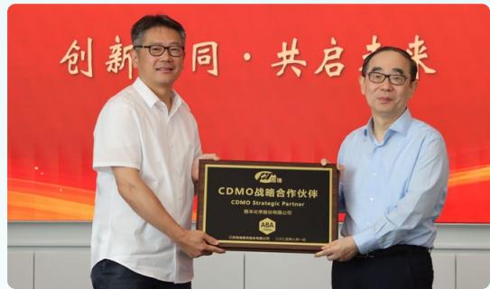

text_image

创新同·共启未来
CDMO战略合作伙伴
CDMO Strategic Partner
联合证券股份有限公司

与复杂合成技术，从而持续优化研发体系、提升技术响应能力，增强在高端中间体与原料药一体化方面的综合创新实力。

# 保护知识产权

公司以《知识产权管理办法》为核心，明确知识产权范围及职务成果归属，由技术中心/研发中心牵头、各业务部门配备兼职人员，形成协同联动的组织机制；配套制定《信息知识交流控制程序》《技术文件资料管理控制制度》等文件，规范研发各阶段的知识产权评估、申请、归档与保密流程，并通过与涉密员工签订保密协议、对技术文档实施分级受控管理，以及在所有对外技术合作合同中强制嵌

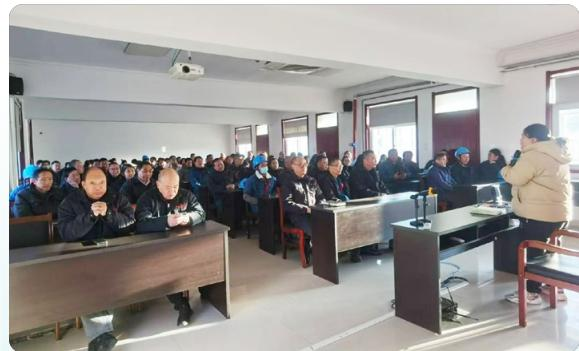

natural_image

Interior view of a classroom or lecture hall with attendees seated at desks, facing a speaker at the front (no visible text or signage)

建农植保知识产权培训

入知识产权归属与保密条款，全方位防范信息泄露与权属纠纷；同时，公司将商业秘密保护纳入新员工入职培训，并面向全体员工常态化开展保密培训，持续强化全员保密意识与规则执行力，切实保障创新成果及时确权与有效保护。

报告期内公司申请发明专利

4 项

报告期内公司获得发明专利授权

3项

累计拥有有效发明专利

129项

# 关键绩效

累计拥有实用新型专利

136项

# 严控质量安全

公司依托清晰的治理架构对质量安全风险实施监督与管理，以前瞻性战略规划指明方向，以系统化的风险管控夯实防线，并通过设定量化指标与目标推动持续改进，构建并不断优化覆盖全流程的质量安全保障体系。

# 治理

公司设立专门的质量管理部门，构建从总经理到各操作岗位的全员质量责任制，所有生产基地均持续有效运行符合行业规范的质量管理体系；同步制定并实施《质量风险管理程序》《GMP系统的风险评估程序》《变更控制程序》《不合格输出的控制过程》等标准化制度文件，系统保障产品全生命周期的质量安全与合规。在此基础上，公司通过年度自检、管理评审和内部审核定期评估体系运行成效，并将质量目标逐级分解至各部门，纳入月度及年度绩效考核，确保质量责任层层落实，推动质量管理体系持续优化与全员质量意识不断提升。

# 关键绩效

2025 年，公司主要生产基地顺利通过了一系列质量体系审核与官方认证，具体包括：

# 体系认证

主要生产基地均通过了 ISO 9001 监督或换证审核，认证范围覆盖原料药、医药中间体、农药及农药中间体、化工产品、生物酶制剂等多个产品的研发、生产与销售。

# 官方检查

太仓基地成功通过了江苏省药品监督管理局的《药品生产许可证》换证检查及《出口欧盟原料药证明文件》换证检查。

# 战略

报告期内，公司围绕生产执行过程的偏差与波动等可能发生的质量风险，建立了贯穿生产全链条的质量保障与持续改进机制，通过标准化控制、人员赋能、体系加固、绿色设计等措施，系统性夯实质量根基、提升响应能力。

# 风险名称

# 风险内容

<table><tr><td>生产执行过程的偏差与波动</td><td>在生产执行过程中,可能发生关键工艺参数控制不当、操作失误、未遵循SOP等风险,或者因设备突发故障、包装标识错误导致批次性质量问题,进而影响产品质量稳定性,造成生产效率下降与质量事故。</td><td>短期、中期、长期</td><td>高</td></tr></table>

<table><tr><td>风险名称</td><td>风险内容</td><td>影响周期</td><td>财务影响</td></tr><tr><td>系统性漏洞与人员能力断层</td><td>在管理体系运行中,可能发生文件体系与实际操作脱节、变更控制不力导致工艺漂移等风险,或者因关键人员流失与培训不足引发系统性漏洞,进而影响质量体系有效运行,造成监管合规风险。</td><td>短期、中期、长期</td><td>高</td></tr><tr><td>合规失效与可持续发展挑战</td><td>可能发生未能适应法规演进导致的合规风险,或者绿色与安全设计未融入研发造成市场准入障碍,以及质量文化稀释影响并购后管理体系,进而影响企业市场准入与品牌声誉,造成监管处罚风险。</td><td>中期、长期</td><td>高</td></tr></table>

# 强化过程控制与快速响应

为确保持续提供优质产品与服务，公司建立了系统化的质量保障体系。该体系以规范化的程序为核心，覆盖从生产任务制定、工艺执行、设备使用、过程监控到包装、运输与交付的全流程。公司制定了明确的原材料、中间产品及成品质量标准与分析规程，并通过严格的监视与测量控制程序，确保所有检验活动按计划执行，保障最终产品的交付质量。

在生产过程中，公司对关键工艺参数、关键物料及关键工序强化管理。公司严格执行《变更控制流程》，对所有可能影响质量的变更进行系统评估与跟踪，重大工艺变更会引入外部安全评价与专家评审。通过有效的偏差处理机制与不合格品管理程序，确保异常得到及时纠正，避免非预期使用。此外，公司建立了《产品召回管理制度》并定期演练，确保必要时能够迅速响应，保障客户与公众安全。对于出现的不合格品、不符合项或事故，公司深入开展根本原因分析，并制定相应的纠正与预防措施，以此不断完善产品保障系统，推动质量管理水平持续提升。

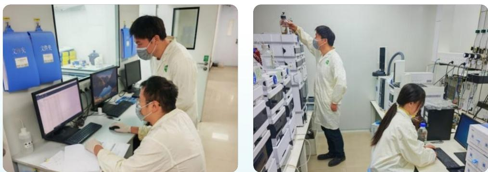  
公司质量控制过程、检验过程场景图

# 加固体系根基 提升实操能力

公司持续开展系统化质量培训，全面提升员工质量意识与专业素养。各生产基地严格执行培训管理制度，系统实施新员工入职质量培训、在岗定期复训以及围绕 SOP 新建与更新开展的专项培训。培训内容涵盖《农药管理条例》、药品 GMP 核心要求、产品质量标准，并聚焦质量基础知识、记录管理、防污染控制及取样、清洁、标识等实操环节。同时，公司邀请外部专家授课，引入先进实践，不断丰富培训资源。在培训实施基础上，公司同步建立培训效果评估与考核机制，推动知识有效转化为岗位实操能力。

此外，公司定期开展质量规范宣贯与管理评审，基于数据趋势分析识别改进机会，使培训内容精准服务于实际问题解决，持续提升培训体系的针对性与实效性。

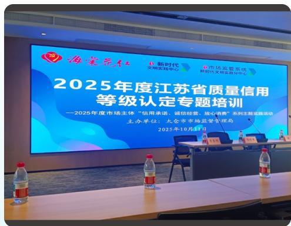

text_image

海案元红
新时代
文明实践中心
市场运营系统
跨省文明实践分中心
2025年度江苏省质量信用
等级认定专题培训
——2025年度市场主体“信用承诺、诚信经营、放心消费”系列主题实践活动
主办单位：大仓市市场监督管理局
2025年10月4日

2025 年度江苏省质量信用等级认定专题培训

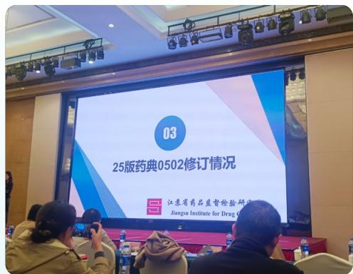

text_image

03
25版药典0502修订情况
江苏省药品监督管理委员会
Jiangsu Institute for Drug Co., Ltd.

2025 版药典修订情况培训

# 以考促学，引智赋能

公司创新培训方式，将外部权威考核与内部体系优化深度融合，组织太仓基地关键岗位人员参加江苏省药品监督管理局苏州检查分局统一考试，通过“以考促学”激发全员系统学习药品法律法规的主动性，全员顺利通过。同时引入第三方专业机构，对200余份体系文件进行全面审核与迭代优化，推动多部门协同参与修订，使员工在文件优化中深化对GMP要求的理解，实现“在改中学、在学中改”。

natural_image

Illustration of a business meeting with three people, one presenting and two seated at desks (no text or symbols visible)

# 全流程践行绿色理念

公司秉持“源头削减、全周期管控”的绿色设计理念，将清洁生产与本质安全原则贯穿于产品研发与生产过程，通过减少有害物料使用、寻求安全替代、优化工艺条件，从设计端预防污染、降低能耗，实现产品全生命周期的环境影响最小化。

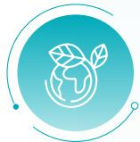

# 推行绿色原材料与工艺替代

- 某农药中间体产品生产中，将磺化工段的 1,1-二氯乙烷替换为毒性更低的二氯甲烷，降低环境与健康风险，同时提高溶剂套用率，减少废物产生。  
- 某医药中间体产品采用生物酶技术替代传统化学工艺，实现高效、低能耗且无污染的生产。  
- 在农药制剂领域，以低毒原料替代高毒原料，并推广使用悬浮剂等绿色剂型，减少对环境的危害。

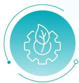

# 开发绿色低碳产品

\- 某医药中间体产品采用微通道反应器技术，实现反应过程的密闭化、连续化与精细化控制，大幅降低安全风险，提升环境效益。

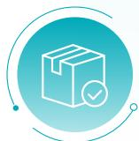

# 实施包装绿色化设计

\- 对甲醇、甲苯等物料，将包装从 200 升小桶改为吨桶，实行专桶专用、循环使用。对硫酸等物料的包装桶进行喷码标识管理，促进循环使用，减少包装材料消耗与物料残留。

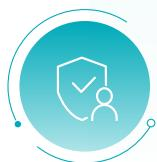

# 贯彻源头削减与本质安全设计

- 在设计阶段使用《本质安全工艺检查表》作为指导工具,系统性地落实“减少使用、安全替代、缓和工艺”的原则。  
- 通过持续的清洁生产审核，识别并实施以“节能、降耗、减污、增效”为目标的工艺优化方案，从源头提高资源利用率，减少污染排放。

# 风险管理

公司制定《质量风险管理程序》《GMP 系统的风险评估程序》等文件，以专门程序与量化工具为基础，精准识别与管控生产全过程的关键环节，并依托多渠道信息输入进行全面评估，同时通过事件触发与定期评审机制，实现风险的闭环管理与持续改进。

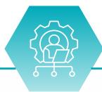

# 风险管理框架与核心方法

公司建立包含评估、控制、沟通与回顾的闭环质量管理流程；运用流程图、检查表和趋势分析等进行风险初步识别，并采用失效模式与影响分析作为核心量化工具，通过分析失效的可能性、严重性和可检测性，计算风险优先级数，实现对风险的客观排序与分级处理。

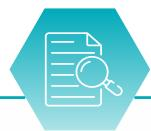

# 风险评估的信息 输入来源

风险评估的输入信息来源于日常运营与质量管理的各个环节，包括质量管理系统流程、各类质量事件、变更控制、周期性回顾数据、验证状态及人员能力评估结果等。

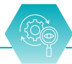

# 风险的持续监控与回顾机制

通过事件触发和措施验证进行即时跟踪与再评估；每年对所有已识别风险进行系统性回顾，并将所有过程记录于风险登记台账，实现风险的闭环管理与持续改进。

# 指标与目标

公司设定了明确、可量化的质量指标及目标，通过月度质量目标考核表对各项指标进行持续跟踪，并建立质量信息化管理系统，确保数据完整性和可追溯性。截至报告期末，主要质量目标完成率达到100%。

<table><tr><td>指标名称</td><td>单位</td><td>年度目标值</td><td>年度完成值</td></tr><tr><td>三体系手册及时更新</td><td>次</td><td> $\geqslant 1$ 次/3年</td><td>1</td></tr><tr><td>三体系内审实施情况</td><td>次</td><td> $\geqslant 1$ 次/年</td><td>1</td></tr><tr><td>管理评审实施情况</td><td>次</td><td> $\geqslant 1$ 次/年</td><td>2</td></tr></table>

<table><tr><td>指标名称</td><td>单位</td><td>年度目标值</td><td>年度完成值</td></tr><tr><td>质量问题的投诉次数</td><td>次</td><td> $\leqslant 1$ 次/月</td><td>0</td></tr><tr><td>产品合格放行审核率</td><td>%</td><td>100</td><td>100</td></tr><tr><td>物料储存条件符合要求,正确收发率</td><td>%</td><td> $\geqslant 98$ </td><td>100</td></tr><tr><td>检查、审核时发现标识不符合项数</td><td>项</td><td> $\leqslant 2$ 项/季</td><td>0</td></tr><tr><td>不合格品失控次数</td><td>次</td><td> $\leqslant 1$ 次/年</td><td>0</td></tr><tr><td>原料/产品/中间体一次性检验结果正确率</td><td>%</td><td>98</td><td>已达标</td></tr><tr><td>OOS100%及时向QA报告并填写记录</td><td>%</td><td>100</td><td>100</td></tr><tr><td>偏差及时向QA报告并填写记录</td><td>%</td><td> $\geqslant 90$ </td><td>100</td></tr><tr><td>变更处理合规性</td><td>%</td><td> $\geqslant 95$ </td><td>100</td></tr><tr><td>设备故障排除及时率</td><td>%</td><td> $\geqslant 98$ </td><td>已达标</td></tr><tr><td>设备维护保养及时及设备档案正确完整</td><td>%</td><td> $\geqslant 98$ </td><td>已达标</td></tr><tr><td>计量器具周期检定率</td><td>%</td><td> $\geqslant 95$ </td><td>已达标</td></tr><tr><td>基础设施故障排除及时率</td><td>%</td><td> $\geqslant 98$ </td><td>100</td></tr><tr><td>合同履约率</td><td>%</td><td> $\geqslant 98$ </td><td>100</td></tr><tr><td>客户满意度</td><td>%</td><td> $\geqslant 95$ </td><td>已达标</td></tr></table>

# 打造优质服务

公司承诺通过负责任的营销与沟通、专业高效的客户服务管理，以及对数据安全与客户隐私的严格保护，系统构建可信赖的服务体系，致力于在每一个环节超越客户期待，实现共同成长。

# 负责任营销

公司构建了涵盖政策、执行与监督的负责任营销闭环管理体系。通过制定《负责任营销保障方案》等内部政策，并将《广告法》等外部法规要求嵌入员工手册与奖惩制度，从顶层设计明确营销合规“红线”，系统防范法律与道德风险；在此基础上，定期开展强制性法规培训与典型案例学习，建立营销材料发布前的多部门协同审核机制，强化团队合规意识与专业能力，确保对外宣传内容真实、准确、可验证；同时，依托内部审计、客户反馈和内部举报渠道构建三位一体的监督网络，对违规行为严肃追责，并推动问题整改与流程优化，保障负责任营销体系持续有效、落地见效。

# 关键绩效

报告期内，公司发生违规营销事件

0起

natural_image

Illustration of a person holding a gavel over books, symbolizing legal or judicial review (no text present)

# 营销信息审核控制流程

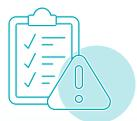

内容审核  

建立产品宣传内容审核机制，由具备专业知识的人员对市场推广材料、广告文案等进行全面审查。

协作核对  

公司市场部门与研发、生产等部门密切合作，确保营销信息与产品实际情况相符。市场人员需准确了解产品性能，禁止夸大功效。

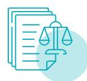

信息备案  

对于重要的营销决策或客户承诺，公司要求业务员提前书面申请并报公司备案、批准后执行。

# 客户服务管理

公司始终以真诚倾听为起点，通过贴心、专业的服务流程，陪伴并支持客户解决问题、创造价值。为系统化提升服务品质，公司制定《客户服务管理制度》，作为服务管理的根本依据，明确服务目标及客户信息管理、接待响应、投诉处理、回访跟踪与关系维护等关键环节的总体原则；同时配套出台《客户服务质量监控方案》等制度文件，构建起覆盖全流程、全要素的客户服务管理体系，夯实高质量客户体验的制度基石。

natural_image

Illustration of a person interacting with a document and checklist (no text or symbols present)

# 客诉闭环管理

公司通过建立并持续更新客户信息数据库，对客户进行分类管理。在此基础上，公司要求客服人员以标准化方式热情接待客户，并及时记录与分类处理各项咨询与投诉。针对客户投诉，公司设立了明确的限时处理机制，确保在规定时间内响应并持续跟踪回访直至客户满意。与此同时，公司还通过电话、邮件等方式主动进行定期回访，以系统性收集客户的意见与建议。此外，通过为重点客户提供技术指导等增值服务、举办各类客户活动，深化客户关系。

# 客户投诉处理流程

  
受理与记录

客户服务人员热情接待，耐心倾听并及时记录客户投诉内容，对投诉进行分类处理，确保信息准确无误。

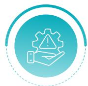  
响应与处理

根据流程将投诉流转至明确的责任部门和责任人进行处理。公司规定必须在规定时间内向客户作出初次回复。

  
解决与沟通

对客户的合理诉求及时解决；对不合理诉求则予以耐心解释说明，处理过程需与客户保持沟通。

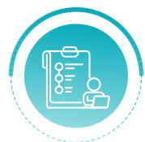  
跟踪与回访

对处理完毕的投诉进行跟踪和回访，确认客户对处理结果是否满意。

# 技术交流与服务形式

# 技术指导与效果验证

通过客观、清晰的成果展示，帮助客户更准确地评估产品价值，从而为客户应用决策提供有力支持。

# 知识分享与技能传递

通过培训、现场指导等方式，向客户分享相关的产品知识与使用技能，帮助客户更有效地使用产品，并促进双方在专业层面共同提升。

# 定期交流与需求反馈

组织技术交流会、产品观摩会等活动，建立稳定的沟通渠道，以便更直接地了解客户的使用情况和反馈，持续改进我们的产品与服务。

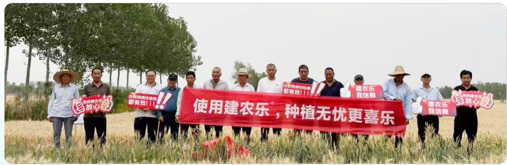

text_image

使用建农乐®，种植无忧更喜乐
建设建农乐
放心
建设建农乐
都有效!!
建农乐
我信赖
建设建农乐
放心
建设建农乐
我信赖

建农植保在江苏、安徽、河南等地进行麦田锈病防治推广

# 服务质量监控

公司设定了客户投诉率、问题解决及时率、客户满意度得分、客户回访率及服务响应时间等核心绩效指标，并为每个指标明确了具体的目标值。为监控目标的完成情况，公司通过数据统计分析系统进行实时跟踪，同时结合定期客户满意度调查、投诉平台反馈及内部定期审计等多渠道收集信息，并将服务质量指标直接纳入客服人员的绩效考核。对于未达标的状况，公司会启动系统的处置程序，包括深入分析原因、制定针对性改进措施、持续跟踪评估效果，并依据结果进行相应的责任追究或激励，确保服务问题得到有效解决，推动服务质量持续提升。

# 数据安全与客户隐私保护

公司建立并持续完善管理与技术体系，为信息安全和客户隐私提供全方位、常态化的保障。

# 信息与数据安全保护

公司以《网络安全工作总体方针和安全策略》为总纲，以《数据安全管理制度》为核心，构建了覆盖数据全生命周期的制度体系，明确对数据保密性、完整性与可用性的保护要求，并规范从存储、访问到销毁各环节的管理流程。为保障责任落地，公司成立由管理层牵头的信息安全工作组，设立系统管理、安全管理等专职岗位，清晰界定职责分工。报告期内，工作组已按计划完成常规安全检查，并对备份记录、审计日志等关键控制点进行核查；针对等级保护测评中发现的待改进项，公司已将其纳入持续改进机制，通过制度修订、专项培训等方式推动信息安全体系动态优化与长效运行。

# 数据安全核心保护措施

# 访问与加密控制

对所有用户实施严格的身份鉴别和基于角色的最小权限访问控制。对客户鉴别信息等敏感数据，在传输和存储过程中均采用加密等有效保护措施。

# 运维安全审计

系统已启用安全审计功能，记录所有重要用户操作和系统事件，并保护日志不被篡改，确保所有数据访问行为可追溯。

# 数据备份安全存储

每日对重要业务数据进行本地备份并保存一定周期，关键数据存储于受控的安全物理环境中。

# 关键绩效

# 公司核心业务系统成功通过国家网络安全等级保护二级测评

公司发生数据泄露事件

0 起

# 客户隐私保护

公司建立并实施《客户隐私保护方案》，系统化地规范客户信息的全生命周期管理。该制度明确了合法、正当、必要的收集原则，部署了加密存储、严格访问控制等技术与管理措施，并限制数据共享，要求任何共享行为均需与第三方签订保密协议。同时，通过持续的员工培训，将隐私保护要求内化为全体员工的行动准则。

此外，公司定期开展内部专项审计以审查合规情况，邀请独立的第三方机构对公司的客户隐私保护措施和政策进行评估，建立客户隐私投诉渠道确保及时响应，通过制度、技术、培训与监督的多重结合，持续为客户信息安全提供有力保障。

# 建设强韧供应链

公司持续强化供应链风险的监督管控，通过系统化的管理体系和强有力的执行，打造坚强、可靠、稳定的供应链。

# 治理

公司建立了总部供应链管理平台与各生产基地采购执行相结合的管理架构。总部层面负责战略规划、平台建设与资源统筹，各生产基地负责具体采购任务的落地与供应商日常管理。在各生产基地，各部门职责分工明确。采购部主导供应商寻源、资质收集及名录维护；质量部作为核心监督部门，负责资质审核、现场审计组织及合格供应商的批准；技术部、生产部、安全部、物流部等部门则根据专业领域，协同参与技术评定、生产验证、安全审核及到货验收等环节，形成了多部门联动的审核机制。

为确保管理活动规范有序，公司制定并实施了《供应商管理制度》《供方环境行为管理制度》《供应商确认与审计管理程序》等一系列制度文件。所有供应商的准入、批准与撤销等关键决策均需经过质量部负责人或分管领导的正式审批，且全过程记录均系统归档，以实现可追溯性。此外，公司通过定期的年度绩效评估、资质文件回顾以及对关键供应商的周期性现场审计，构成了对合格供应商持续、有效的监督闭环。

# 战略

报告期内，针对可能发生的合规与声誉风险、技术迭代与脱节风险、供应中断风险等供应链风险，公司确立“强化韧性、深化协同、践行责任”三大目标，并将供应链风险管理贯穿于供应商准入、合作、监控到退出的全生命周期，系统构建安全可靠、互利共赢、绿色合规的现代化供应链体系。

<table><tr><td>风险名称</td><td>风险内容</td><td>影响周期</td><td>财务影响</td></tr><tr><td>合规与声誉风险</td><td>供应商违反环保、安全、劳工法规,导致公司面临监管处罚、诉讼及品牌声誉损害。</td><td>短期、中期、长期</td><td>中</td></tr><tr><td>技术迭代与脱节风险</td><td>供应商技术落后,无法满足公司产品升级或绿色工艺转型需求,导致公司丧失市场竞争力。</td><td>中期、长期</td><td>中</td></tr><tr><td>供应中断风险</td><td>关键供应商因质量事故、经营不善、环保停产或地缘政治等因素突然断供,影响生产连续性。</td><td>短期、中期、长期</td><td>高</td></tr></table>

<table><tr><td>风险名称</td><td>风险内容</td><td>影响周期</td><td>财务影响</td></tr><tr><td>质量与一致性风险</td><td>供应商产品批次质量不稳定或不符合新标准,导致公司产品合格率下降、退货或召回。</td><td>短期、中期、长期</td><td>高</td></tr><tr><td>成本与价格波动风险</td><td>原材料价格剧烈波动、单一供应商垄断导致议价能力弱,侵蚀利润率。</td><td>中期、长期</td><td>中</td></tr><tr><td>过度依赖风险</td><td>对单一或少数供应商依赖度过高,供应链缺乏弹性。</td><td>中期、长期</td><td>中</td></tr></table>

# 供应商准入管理

公司建立多维度评估机制，确保源头可控。根据物料对产品质量的影响程度，对供应商实施关键、重要、一般三级分类管理；同步嵌入 ESG 风险评估，将环境保护、劳工权益、商业道德等可持续发展表现纳入综合筛选标准。同时，推行“同物料不少于 3 家合格供应商”原则，并优先选择具备自主产能或区域布局优势的合作伙伴，从源头强化供应多元性与抗风险能力。

# 供应商准入标准

# 基础合法性标准

- 具备合法有效的营业执照；  
- 涉及危险化学品的，必须提供安全生产许可证 / 经营许可证、安全技术说明书 (SDS)、安全标签；  
- 提供至少一批产品的有效质量检验报告（COA）。

# 质量与能力标准

- 具备健全的质量管理体系（鼓励获得 ISO 等认证）；  
- 生产设施、设备、检测仪器能满足产品质量和产能要求；  
- 能够按照公司要求提供小样并通过公司内部全项检测；  
- 对于关键重要物料，需配合完成问卷调查、小试 / 生产验证。

# 可持续发展 (ESG) 与社会责任标准

- 在环保、安全、职业健康方面符合国家法律法规；  
- 在道德行为、劳工权益、人权等方面无不良记录；  
- 愿意接受公司的现场质量审计和 ESG 表现评估。

# 关键绩效

供应商通过质量管理体系认证（如 ISO 9001 等）的有

163家

供应商通过环境管理体系认证（如 ISO 14001 等）的有

140家

供应商通过职业健康与安全管理体系认证（如 ISO 45001 等）的有

140家

# 合作执行管理

公司注重协同共赢与责任共担。通过合同、质量协议、廉洁协议等，明确要求供应商遵守国家法律法规，履行环保、反腐败、劳动保障等 ESG 义务，将其作为合作的基本前提。针对关键供应商，开展现场审计、年度绩效沟通及工艺优化联合攻关，在提升交付质量与效率的同时，支持其技术升级与绿色转型。此外，依托全球生产基地网络和绿色合成、连续流等先进工艺，从生产端增强供应链的稳定性与韧性。

# 持续监控管理

公司对一级供应商每三年至少开展一次现场复审，二、三级以文件审核为主，并在发生重大变更或质量问题时及时复评。同时，将质量、交付、ESG表现等关键指标纳入月度与年度绩效考核，考核结果直接关联订单分配与合作优先级，推动供应商持续改进。

# 供应商差异化评估策略

# 年度综合评估

所有列入《合格供应商名录》的供应商，每年至少进行一次全面的年度绩效评估，回顾其质量、交货、服务、价格及资质有效性。

# 周期性现场审计

一级供应商：每3年至少进行一次现场质量审计。首次审计尽量在准入前进行，最晚在准入后1年内完成。

二级、三级供应商：以文件审核和年度评估为主。若发生重大质量问题或变更，可随时启动现场审计。

# 不定期评估与复审

触发式复审：当供应商发生重大变更或出现质量问题时，一年内出现多次不合格，在年度审查中发现质量趋势异常，立即启动专项复审。

资质持续回顾：公司采购部与质量部持续关注供应商资质的有效性，并在文件过期前索要更新，确保资质有效性。

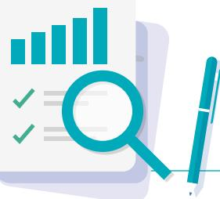

natural_image

Illustration of a document with bar chart and magnifying glass, accompanied by a pen (no text or symbols)

# 动态管控机制

公司通过对问题供应商实施分级纠正、退出追责，并对优秀供应商给予正向激励，构建了“奖优罚劣、闭环管理”的供应商动态管理机制。

# 分级纠正措施

对评估不合格或出现问题的供应商，采取包括书面整改、缩减订单、暂停供货资格在内的分级措施。

# 退出与责任追溯

当供应商出现提供物料造成重大质量影响、整改后复审仍不合格、年度评估不合格等情况时，启动退出程序。因供应商原因导致的质量问题或交货延误造成的损失，由供应商负责赔偿。

# 正向激励引导

对表现优异的供应商，通过订单优先、支付优惠等激励政策，建立战略合作伙伴关系，以保障长期稳定的优质供应。

# 风险管理

公司《内部控制制度》明确将供应链核心环节纳入关键业务控制活动，确立了风险管理的政策基础。同时，内部审计制度将供应链领域列为监督范畴，确保了风险管控的独立性与权威性。

# 风险识别

主要由业务部门通过供应商管理、合同审核等日常运营活动执行初步筛查，并由审计部通过专项审计进行系统性识别。

# 评估与排序

对识别出的风险从发生可能性和影响程度等方面进行分析，评估并确定其风险等级，实现优先排序。

# 监测与改进

通过定期的内部审计、管理评审及关键指标跟踪进行持续监控。审计发现的风险及整改要求纳入公司统一的报告与跟踪体系，确保形成“识别-整改-复核”的管理闭环。

# 指标与目标

公司通过设定并超额完成供应链关键绩效指标，有效保障了物资供应效率与环境合规管理的全面落地。

<table><tr><td>指标名称</td><td>单位</td><td>年度目标值</td><td>年度完成值</td></tr><tr><td>供应商/承包商各类业务合同签订与环境要求告知率</td><td>%</td><td>100</td><td>100</td></tr><tr><td>管理评审实施情况</td><td>%</td><td>100</td><td>100</td></tr></table>

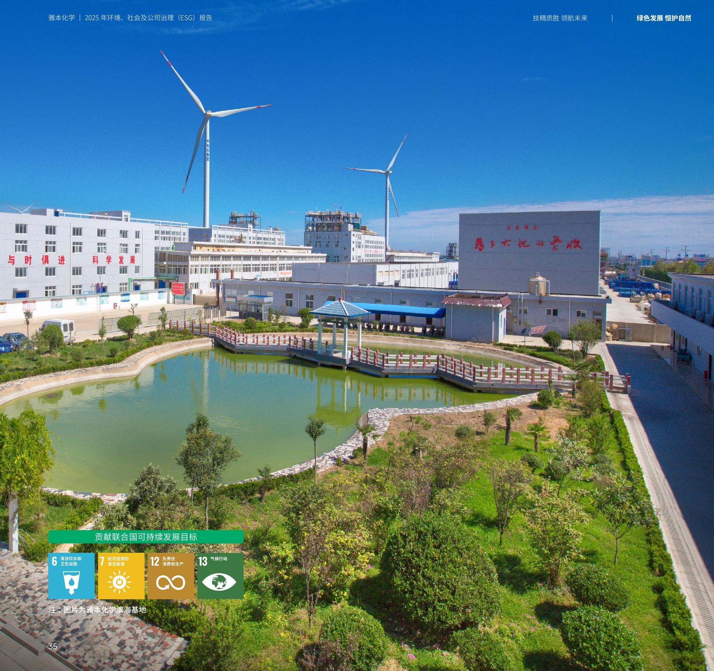

text_image

雅本化学 | 2025 年环境、社会及公司治理（ESG）报告
技精质胜 领航未来 | 绿色发展 恒护自然
与时俱进 科学发展
企业理念
为了大地的增收
贡献联合国可持续发展目标
6 清洁饮水和
卫生设施
7 经济适用的
清洁能源
12 负责任
消费和生产
13 气候行动
注：图片为雅本化学滨海基地
35

# 绿色发展 恒护自然

我们深信，企业的可持续发展，根植于与自然的和谐共生。公司恪守合规底线，以前瞻视野应对气候变化，在生产全过程践行资源节约，以最严格的标准管控排放；同时，将环境保护的责任延伸至生物多样性的守护，建立了系统化、多层次的环境行动体系，致力于在发展中守护绿水青山。

# 章节涉及议题

- 环境管理  
- 应对气候变化  
- 水资源管理  
- 能源管理  
- 排放管理  
- 生物多样性保护

# 贡献联合国可持续发展目标

6

清洁饮水和卫生设施

7 经济适用的清洁能源

12 负责任消费和生

13

注：图片为雅本化学滨海基地

natural_image

Illustration of a person riding a bicycle on a green hillside with trees and flowers, no text or symbols present.

# 环境合规管理

公司将环境合规要求融入运营制度，依托 ISO 14001 体系，健全制度、防控风险、保障投入，推进清洁生产与绿色制造，强化应急与培训，全面提升环境合规水平和可持续发展能力。

# 治理

公司建立了统一指导、分级负责、全员参与的环境治理架构，确保环保工作有章可循、责任到人。

# 关键绩效

环保投入总金额

3,485.08 万元

# 组织与领导责任

公司最高管理层对环境绩效承担最终责任。主要生产基地均设立专职的环境、健康与安全（EHS）管理部门，由具备专业资质的团队负责日常监督与管理。同时，公司建立了从子公司负责人、EHS总监到各部门、车间、班组的全员环境保护责任制，确保环保职责贯穿于每一个运营环节。

# 制度与体系保障

公司建立了层次分明、覆盖全面的环境管理制度体系。主要生产基地均已获得并持续运行 ISO 14001 环境管理体系国际认证，实现了管理的标准化与国际化。同时，各生产基地依据自身特点，制定并实施了涵盖《环境保护责任制度》《环境风险隐患排查与治理制度》《突发环境事件应急管理制度》及《环保培训与考核制度》等在内的系列文件，形成了制度化管理网络。

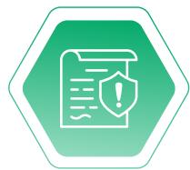

# 监督、考核与投入

公司将环保绩效纳入各基地及员工的常规绩效考核体系，通过月度检查、专项审计等方式进行监督，并将考核结果与激励挂钩，以此强化全员环保责任意识，推动环境管理举措有效落地。同时，公司在年度预算中设立环保专项资金，并实行专款专用，确保污染治理设施建设、运维及技术改造的经费需求。

# 战略

公司高度重视环境合规风险及突发环境事件风险等各类环境风险，将环境保护全面融入发展战略与日常运营，系统推进环境管理，着力构建绿色制造体系，并依托清洁生产审核持续优化工艺、降低消耗。各基地均建立应急机制，定期开展演练，同时加强员工环保培训与信息公开，全面提升环境绩效与风险防控能力。

# 风险名称

# 风险内容

# 影响周期

# 财务影响

<table><tr><td>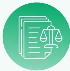合规风险</td><td>日益严格的环保法规要求,存在因排放超标、突发环境事件或环保管理不合规而受到行政处罚、责令停产整改的风险,直接影响生产运营的连续性和稳定性。</td><td>短期、中期、长期</td><td>高</td></tr><tr><td>突发环境事件风险</td><td>化工生产、危险化学品储存等环节存在泄漏、火灾、爆炸等安全事故引发次生环境污染的固有风险。</td><td>短期、中期、长期</td><td>高</td></tr><tr><td>员工操作失误与技能不足风险</td><td>一线员工环保意识不强或对设备操作规程不熟,可能导致无组织排放、误操作引发故障或事故初期处置不当,使小问题演变为大事件。</td><td>短期、中期、长期</td><td>高</td></tr><tr><td>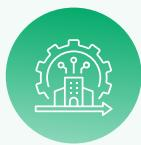企业声誉与市场准入风险</td><td>公众、客户及投资者对企业的环境表现日益关注,环境管理不佳或信息不透明可能损害企业声誉,影响产品市场竞争力,甚至影响融资活动。</td><td>中期、长期</td><td>高</td></tr></table>

# 体系化环境管理实践

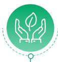

# 绿色制造体系建设

公司致力于绿色制造体系建设，并将其作为推动工业绿色低碳发展的重要抓手。报告期内，子公司南通雅本已成功获得“2025年度江苏省绿色工厂”认证；兰州基地获评市级绿色工厂并启动省级绿色工厂的申报工作。

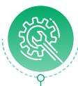

# 清洁生产审核

公司将清洁生产审核作为系统性提升环境绩效的战略工具。多个基地已完成政府要求的清洁生产审核，通过实施包括工艺优化、设备升级、能源管理系统建设等一系列措施，有效降低了单位产品的物耗、水耗和能耗，从源头减少了污染物产生。

# 应急准备与响应

公司各生产基地均依法编制《突发环境事件应急预案》并在属地主管部门备案，明确了应急组织、响应程序和处置措施。公司定期组织不同情景的突发环境事件应急演练，如化学品泄漏、废水事故排放等，并对演练效果进行评估和改进，以持续提升应急响应能力。此外，公司定期维护应急物资与设备，以保持应急响应能力。

# 环保意识与技能提升

公司各生产基地均制定了专门的环保教育培训管理制度，明确由各生产基地 EHS 部门或其他归口部门制定年度计划并组织实施。培训内容覆盖环保法律法规、公司内部管理制度、污染防治设施操作规程等，并针对不同岗位开展差异化培训。通过常态化、全覆盖的环保培训，持续提升全员环保意识与技能。

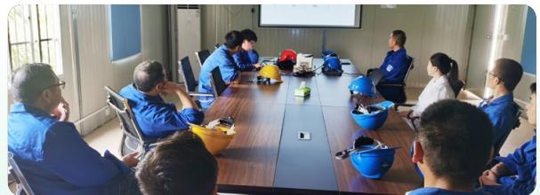

natural_image

Group of people in blue uniforms seated around a conference table in a meeting room (no visible text or symbols)

上虞基地大气污染防范知识培训

# 透明化沟通

公司通过官方网站、政府“一企一档”平台、全国排污许可证管理信息平台等多个渠道，依法定期公开环境管理信息、自行监测数据及年度执行报告，接受公众监督。

# 政府信息公开

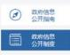

[建设项目环评拟批准公示]南通雅本化学有限公司2000吨/年氯虫苯甲酰胺原药、2000吨/年丙硫菌唑原药扩建项目环境影响报告书拟批准公示

南通基地通过政府平台公开环评信息

# 风险管理

公司建立并实施一套系统的环境风险管理流程，包含《环境因素识别与评价程序》《危险源辨识与评价控制程序》等制度，形成覆盖风险识别、分级评估与多层级监控的管理体系，实现对环境风险的系统性管控。

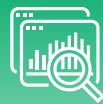  
风险识别  
公司通过过程分析、现场观察和部门讨论相结合的方式系统性地识别潜在风险点。识别过程涵盖生产活动、产品及服务的全生命周期，并具体考察其在过去、现在、未来三种时态，以及正常、异常、紧急三种运行状态下的环境影响。识别范围包括水体与大气污染物排放、噪声、固体废物管理、能源与资源使用、土壤与地下水污染以及其他地方性环境问题。

  
风险评估与排序  
公司依据不同风险类型采用相应的评价方法来确定管控重点。对于常规环境因素，采用多因子评价法，从影响范围、严重程度、发生频率、法规符合性和公众关注度五个方面进行评分，并据此判定重要环境因素。针对可能引发环境事件的安全风险，使用作业条件危险性评价法进行分级评估。对于突发环境事件，则严格依照《企业突发环境事件风险分级方法》，通过定量计算风险物质存量、评估工艺与控制水平、分析周边环境敏感度，最终确定风险等级。

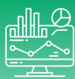  
风险监控

公司通过多种方式对风险进行持续监控。在运行层面，对废水、废气排放口实施在线监测，数据与监管部门联网，并委托第三方开展定期手工监测。同时，对环保治理设施执行日常巡检。在合规与体系层面，通过编制环境信息披露报告、排污许可证执行报告等方式跟踪合规状况，并借助内部审核、管理评审及隐患排查来检查体系运行的有效性。

# 指标与目标

公司设定量化的环境管理目标，并通过严格的监测与报告体系跟踪绩效，致力于实现透明化管理与持续改进。

<table><tr><td>指标名称</td><td>单位</td><td>年度目标值</td><td>年度完成值</td></tr><tr><td>环  重要环境因素清单识别、更新及时率</td><td>次</td><td> $\geqslant 1$ 次/年</td><td>1</td></tr><tr><td>环境污染事件</td><td>起</td><td>0</td><td>0</td></tr><tr><td>火险</td><td>起</td><td>0</td><td>0</td></tr><tr><td>废气、污水达标排放</td><td>%</td><td>100</td><td>100</td></tr><tr><td>危险废物合规处置</td><td>%</td><td>100</td><td>100</td></tr><tr><td>应急演练按期完成率</td><td>%</td><td>100</td><td>100</td></tr><tr><td>应急响应物质配置符合率</td><td>%</td><td>100</td><td>100</td></tr></table>

境污染事  
P32

# 应对气候变化

公司充分认识到气候议题对企业长期竞争力的关键作用，积极采纳气候相关财务信息披露工作组（TCFD）的建议框架，从治理、战略、风险管理以及指标与目标四个维度系统推进气候行动，促进公司在自身运营和价值链中的气候韧性。

# 治理

公司构建了覆盖治理、执行与监督全链条的气候治理体系。在治理层面，将“双碳”工作纳入战略核心，由董事长牵头成立跨部门专项工作组，建立涵盖政策研究、技术实施、政府对接与ESG披露的协同机制，并通过年度计划、月度例会及督办闭环推动决策落地，同时将减排责任分解至各生产基地，实现从总部到一线的贯通管理。在执行层面，设定科学减排目标并于2025年6月正式获得SBTi批准，成为国内精细化工行业首批通过该国际认证的企业。通过将“双碳”目标纳入子公司及员工绩效考核、制定《“双碳”建设实施方案》、建立可追溯可审计的碳数据管理体系，确保行动高效落地。在监督与改进层面，公司通过第三方认证强化管理闭环，如南通基地已获ISO 50001能源管理体系认证和“江苏省绿色工厂”认定，并接受外部持续审核。同时，公司定期发布ESG报告，主动披露气候进展，回应投资者及核心客户对供应链减碳的合规与透明度要求，形成内外联动、持续优化的气候治理闭环。

# 战略

公司积极响应国家 “双碳” 目标，识别下游客户对低碳产品和供应链透明度的迫切需求，对标国际化工企业最佳实践，参照 IFRS S2 等国际标准，系统识别物理风险与转型风险 / 机遇，并评估其财务影响与时间范围，主动将气候变化深度纳入核心战略与商业模式，以提升企业发展的气候韧性。

# "双碳"管理工作架构及职能

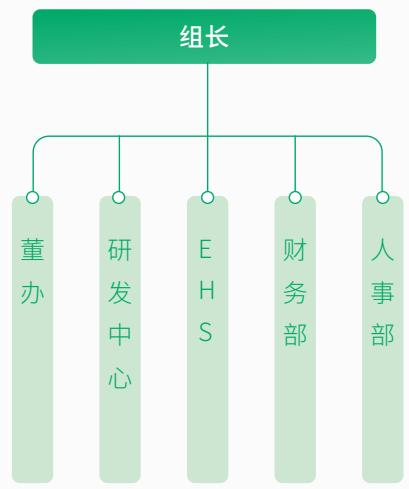

flowchart

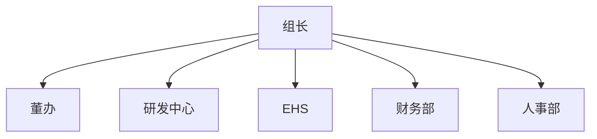

各生产 / 研发基地 “双碳” 管理负责人

# 审定年度计划，确认年终考核结果

- 参与定制公司的科学碳目标，跟踪及梳理双碳政策，推动年度计划的落地。  
- 通过建立碳排放管理框架和制度流程，规范公司的碳减排行动，提高管理效率，进一步完成信息披露。  
- 负责引入、开发和推广先进的节能低碳新技术，为公司的减排工作提供技术支持和创新动力。

全面落实各生产基地“双碳”相关工作  

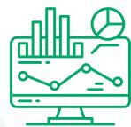

<table><tr><td>类型</td><td>风险/机遇名称</td><td>风险/机遇描述</td><td>影响周期</td><td>对价值链的影响</td><td>风险/机遇集中区域</td><td>应对措施</td></tr><tr><td>物理风险</td><td>急性物理风险</td><td>洪水、风暴、干旱、极端高温等气候极端事件可能导致生产设施受损、生产中断,影响供应链安全与供货能力。</td><td>短期</td><td>上游:供应商所在地极端天气导致原材料断供;内部运营:生产基地需进行抗灾加固并制定业务连续性计划;下游:供货不稳定损害客户信任。</td><td>沿海、沿江工厂单一来源的关键供应商所在地</td><td>· 在生产基地选址、设计与运营决策中系统纳入物理韧性评估,并投资于防洪、抗风、耐高温的设施改造,从源头提升应对极端气候的能力。· 制定极端天气预警与应急预案,并建立跨部门应急响应机制,通过定期演练确保组织在气候事件中的快速响应与业务连续性。· 供应商相关风险的应对见《建设坚强供应链》一节。</td></tr><tr><td>物理风险</td><td>慢性物理风险</td><td>长期气候变化导致水资源分布改变、病虫害模式变化、海平面上升及极端温度频发,进而影响农业化学品、医药等产品的市场需求。</td><td>长期</td><td>内部运营:需评估生产基地的长期气候适应性;下游:跟踪气候变化对终端行业的影响。</td><td>农业化学品和气候敏感医药产品线关键农业原料采购区研发部门</td><td>通过分析长期气候趋势并跟踪区域气候与病虫害数据,动态调整研发方向与市场预测;重点投入耐旱、抗病虫害等适应型农业化学品的研发,并积极开展相关业务研究与行业交流。</td></tr><tr><td rowspan="2">转型风险</td><td>政策和法律风险</td><td>政府及监管机构因应对气候变化而加强环保及碳排放监管,导致企业合规成本上升、面临处罚风险。</td><td>中、长期</td><td>上游:需筛选并管理供应商的环保合规性;内部运营:持续投资环保设施升级与排放监控;下游:出口产品可能面临国际贸易中的“碳壁垒”。</td><td>各生产基地高环境影响原材料供应商</td><td>将环保合规与碳成本作为项目决策的优先考量,系统制定并推进SBTi减排路径;引入数字化碳管理系统实现过程监控与数据驱动,同步持续推进工艺优化与设备更新,保障减排目标落地。</td></tr><tr><td>市场风险</td><td>下游客户对公司产品的碳排放表现提出更高要求,若无法满足可能导致订单流失、市场份额下降。</td><td>短、中期</td><td>上游:压力传导,需优先与低碳供应商合作;内部运营:驱动研发资源向低碳产品和技术倾斜;下游:响应客户对产品碳足迹披露的要求。</td><td>跨国企业客户研发与产品管理部门</td><td>将客户低碳需求纳入产品研发与市场战略的关键输入,决策中系统引入产品碳足迹分析;每年定期披露碳盘查结果与ESG报告,提升透明度与市场信任;研发资源向绿色产品倾斜,CDMO服务强调生命周期评估(LCA)优化;对重点产品开展全生命周期评估,推动供应链协同减排,通过低碳解决方案巩固并扩大市场份额。</td></tr><tr><td rowspan="2">转型机遇</td><td>可再生能源和能源效率</td><td>通过采用可再生能源、提升能源效率,可降低运营成本,助力减排目标达成,并生产环境足迹更低的产品。</td><td>短、中、长期</td><td>内部运营:成为减排降本的核心;下游:产品“绿色属性”增强吸引力。</td><td>高能耗生产单元厂区光伏与能源基础设施</td><td>将能效提升与清洁能源使用明确为降本增效的核心战略,并在投资决策中优先考量项目的节能回报周期;统筹建设光伏电站,实施风机升级、蒸汽系统优化与智慧能源管理,构建高效、低碳的能源供应与使用体系。</td></tr><tr><td>市场机遇</td><td>“碳中和”等政策引导绿色消费与生产,为公司研发和提供气候友好型产品,如低碳CDMO服务、生物质能源开辟新的业务增长空间。</td><td>中、长期</td><td>上游:与研发机构、绿色技术公司合作;内部运营:驱动建设绿色产业新产线,促使CDMO服务整合LCA评估;下游:为客户提供一站式绿色解决方案。</td><td>生物质能源与资源回收项目CDMO业务单元战略合作与商务拓展部门</td><td>明确绿色低碳产业为未来增长引擎,在重大投资决策中系统评估项目的绿色属性与市场潜力;积极发展与布局资源回收、生物质能源等新兴产业,并通过提供绿色CDMO服务及开展行业合作,拓展低碳价值链。</td></tr></table>

# 风险和机遇管理

公司建立系统化气候风险与机遇管理流程，覆盖识别、评估、排序与监测，并深度融入全面风险管理、战略规划及日常运营，确保气候行动有效落地。

# 识别

参照《国际财务报告可持续披露准则第2号——气候相关披露》及《深圳证券交易所创业板上市公司自律监管指南第3号——可持续发展报告编制》等权威框架，通过政策调研、同业对标和专家咨询等多维度信息输入，对全价值链环节进行识别与评估，确保分析覆盖全面且具有针对性。

# 评估

依据政策趋势、市场动态及历史数据对各类风险事件发生的可能性进行分析，从财务与非财务两个维度判断其影响程度；财务方面主要考察对营业收入、运营成本等指标的潜在影响方向，非财务方面则关注品牌声誉、供应链安全等因素，从而对已识别项形成定性的影响评估。

# 排序

基于评估结果，依据风险与机遇发生的可能性及其潜在影响的严重性进行综合排序，以此引导资源进行有效配置。

# 监测

由 “双碳” 管理工作组统筹协调, 各生产基地能源管理领导小组负责本地数据收集, 通过月度会议沟通相关工作进展与风险变化。

# 指标与目标

雅本化学作为国内首批承诺加入 SBTi 的精细化工企业，已于 2025 年 6 月通过了官方严格的目标验证，标志着雅本化学在应对气候变化、推动可持续发展方面迈出了坚实而关键的一步，彰显了我们参与全球气候行动的坚定承诺。公司严格遵循 SBTi 所要求的科学方法论设定温室气体减排目标，以主动适应国家“碳达峰、碳中和”战略和日益趋严的环保法规，以及下游客户对供应链碳排放透明度和减排绩效的要求。

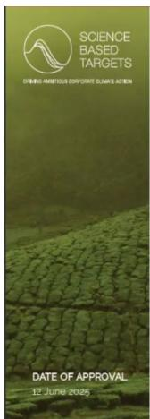

text_image

SCIENCE
BASED
TARGETS
OF BINGG AMBIETIOUS CORPORATE GLAVAR'S ACTION
DATE OF APPROVAL
12 JUNE 2025

# APPROVED

NEAR-TERM SCIENCE-BASED TARGETS

SBTi Services has validated that the science-based greenhouse gas emissions reductions target(s) submitted by ABA Chemicals Corporation conform with the SBTi Standards and Guidance (Criteria version 5.2).

SBTI Services has classified your company's scope 1 and 2 target ambition in conformance with the SBTI Standards and Guidance

The official near-term science-based target language:

ABA Chemicals Corporation commits to reduce absolute scope 1 and 2 GHG emissions 54.9% by 2033 from a 2022 base year. ABA Chemicals Corporation also commits to reduce scope 3 GHG emissions from purchased goods and services, fuel- and energy-related activities, upstream transportation and distribution, and waste generated in operations 61.1% per tonne of product produced within the same timeframe.

# 目标内容

绝对减排目标：以 2022 年为基准年，到 2033 年，实现范围 1 和范围 2 的温室气体排放总量减排 54.9%，每年减少 4,610 吨二氧化碳当量。

强度减排目标: 以 2022 年为基准年，到 2033 年，将来自所购商品与服务、燃料与能源相关活动、上游运输与分销以及运营过程中产生的废物的范围 3 温室气体排放量每生产一吨产品减少 61.1%，即每单位产品范围三温室气体排放量减少 1.30 吨二氧化碳当量。

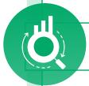

# 目标进展

<table><tr><td></td><td>基准期(2022年)</td><td>2025年</td></tr><tr><td>温室气体排放总量(范围1&amp;2)(吨二氧化碳当量)</td><td>85,021.70</td><td>69,477.00</td></tr></table>

# 提升资源效益

公司秉持 “合规、高效、循环、可持续” 的资源管理理念，系统构建覆盖能源与水资源的全链条管理体系，通过制度保障、技术升级与清洁能源应用，推进节能降耗与水资源循环利用，强化源头控制与精细化管理，切实降低资源消耗强度，全面提升利用效率。

# 能源管理

公司建立分层级、制度化的能源管理体系，各生产基地均制定了《能源使用管理制度》，明确了管理目的、适用范围及各部门职责。在组织架构上，实行公司、部门（车间）、班组三级管理。例如，太仓基地设立了能源管理领导小组及办公室，兰州和南通基地则以设备工程部为核心协调部门，负责能源运行维护、数据统计与计量器具管理。在日常运行中，公司建立了能源数据常态化的统计、监控与报告流程，并设有异常处理与整改机制。报告期内，南通基地已通过 ISO 50001 能源管理体系认证，有效助力公司提升能源管理的系统性和可追溯性。

# 清洁能源应用

公司在清洁能源利用方面主要聚焦于太阳能光伏发电，并在部分基地探索绿色电力采购。多个生产基地已建设屋顶及车棚光伏项目，其中，兰州基地“兰沃太阳能发电项目”预估装机容量600千瓦；南通基地现有光伏装机容量400千瓦，规划新增500千瓦。此外，滨海基地投资建设了装机容量1,090千瓦的光伏项目。同时，公司在路灯照明领域也积极推广应用光伏电能。

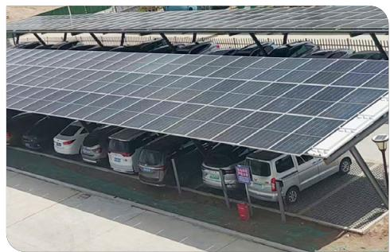

natural_image

Aerial view of a parking lot with rows of solar panels and parked cars (no visible text or symbols)

太阳能发电

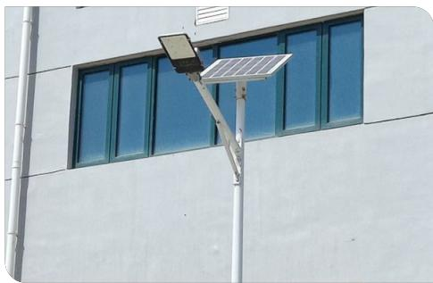

natural_image

Exterior view of a modern building with a solar-powered streetlight and blue-framed windows (no text or symbols visible)

太阳能路灯

# 节能目标及措施

公司及各生产基地均设定了量化的节能降耗目标，并将其与长期发展规划相结合。例如，太仓基地以2022年为基准，目标到2025年综合能耗降低5%；南通基地则设定了2025年节约能源5%左右的年度目标。各生产基地通过具体的年度重点工作与工程项目推进目标落实，并在规划中注重从工艺优化、设备升级、建筑节能及系统管理等多方面系统性挖掘节能潜力，以支撑公司整体节能降碳目标落实。

<table><tr><td>措施类型</td><td>具体措施</td><td>成效</td></tr><tr><td rowspan="3">节能生产设备</td><td>南通基地将罗茨风机更换为空气悬浮机。</td><td>节能约 30%</td></tr><tr><td>南通基地三期项目中全部选用一级能效电机。</td><td>能效提升率大于 3.7%</td></tr><tr><td>太仓基地车间更换二级节能电机。</td><td>节能 25%</td></tr></table>

<table><tr><td>措施类型</td><td>具体措施</td><td>成效</td></tr><tr><td rowspan="2">节能照明设备</td><td>滨海基地在非防爆区安装太阳能和风电一体照明灯具;车间使用节能灯具及一、二级能效设备,淘汰低能效设备。</td><td>预计每年可节约电能30万千瓦时</td></tr><tr><td>太仓基地车间更换防爆LED节能灯。</td><td>年节约电能约1,800千瓦时</td></tr><tr><td rowspan="2">余热余压回收</td><td>滨海基地利用热电厂过热蒸汽温度和压力高的特性,新上蒸汽降温装置,利用收集的蒸汽冷凝水回用到蒸汽降温中,使过热蒸汽变成饱和蒸汽。</td><td>年节约蒸汽300吨</td></tr><tr><td>滨海基地将蒸汽冷凝水潜热回收利用于车间熔料房和干燥。</td><td>年节约蒸汽120吨</td></tr><tr><td>工艺与系统优化</td><td>滨海基地根据制氮机设备性能和生产负荷,及时调整工艺参数。</td><td>年节约电能15万千瓦时</td></tr></table>

<table><tr><td colspan="2">指标名称</td><td>单位</td><td>2025</td><td>折标煤(吨标煤)</td></tr><tr><td>直接能源消耗</td><td>/</td><td>吨标煤</td><td>441.97</td><td>/</td></tr><tr><td></td><td>天然气</td><td>立方米</td><td>261,440</td><td>287.58</td></tr><tr><td></td><td>柴油</td><td>千克</td><td>19,693</td><td>28.69</td></tr><tr><td></td><td>汽油</td><td>千克</td><td>85,423</td><td>125.69</td></tr><tr><td>间接能源消耗</td><td>/</td><td>吨标煤</td><td>19,412.81</td><td>/</td></tr><tr><td></td><td>外购电力</td><td>兆瓦时</td><td>46,283</td><td>5,688.18</td></tr><tr><td></td><td>外购蒸汽</td><td>吨</td><td>126,411.60</td><td>13,724.63</td></tr><tr><td>能源消耗总量</td><td>/</td><td>吨标煤</td><td>19,854.78</td><td>/</td></tr><tr><td>单位营收综合能耗</td><td>/</td><td>吨标煤 / 百万营收</td><td>14.88</td><td>/</td></tr><tr><td>自发自用绿色电量</td><td>/</td><td>千瓦时</td><td>479,424.8</td><td>58.92</td></tr></table>

# 水资源管理

公司建立了系统化、制度化的水资源管理体系，构建了公司、部门、班组三级管理网络，并制定了《供水、用水管理制度》《废水管理制度》《环境保护管理制度》等专项制度，明确划分工程、生产、环保、行政等部门的职责，实行分表计量与数据化监控，严格执行清污分流与雨污分流，同时配套应急池与事故水收集系统，形成了一套权责清晰、流程规范、预防为主、管控一体的完整管理机制。

# 节水措施

公司以“合规、高效、循环、可持续”为水资源管理核心理念，将节水纳入公司整体降耗战略，明确节水目标，通过清洁生产审核持续推动单位产品水耗降低与水循环利用率提升。

# 管理节水

- 实行用水计量与定额考核，将水耗纳入生产成本与绩效考核。  
- 开展全员节水宣传教育，提升员工节水意识，杜绝“长流水”现象。  
- 建立用水数据监测平台，实现实时监控、异常分析与动态优化。

- 蒸汽冷凝水回收系统：将蒸汽冷凝水全部回收作为循环补给水，实现热能与水双重节约。  
- 循环水系统优化：提高循环水浓缩倍数，减少排污与补水。  
- 工艺节水改造：采用高效节水技术，如RO产水回用、工艺水闭环循环、水基制剂替代高水耗产品。  
- 设备更新换代：使用节能型搅拌、泵阀、疏水阀等设备，降低系统水耗。

# 工艺与设备节水

- 新建项目中采用雨水收集系统，用于绿化、降尘、冲洗等。  
- 施工期间安装水表计量，收集利用雨水与施工废水，减少新水取用。  
- 推广使用节水型龙头、淋浴器、冲洗设备。

# 建筑与施工节水

<table><tr><td>基地</td><td>回收利用举措</td><td>成效</td></tr><tr><td>太仓基地</td><td>1级RO膜中水回用、雨水处理系统</td><td>节约用水约20%,雨水处理能力5吨/小时。</td></tr><tr><td>兰州基地</td><td>蒸汽冷凝水回收、雨水收集、循环水优化</td><td>年节约成本约99.96万元,减少自来水消耗。</td></tr><tr><td>南通基地</td><td>蒸汽冷凝水回用、RO产水回用</td><td>日平均节水约174吨。</td></tr><tr><td>滨海基地</td><td>蒸汽冷凝水回收</td><td>年回收约1.8万吨,节约新水并减少废水处理量。</td></tr></table>

natural_image

Exterior view of a large industrial storage tank with multiple spherical tanks and ventilation grilles, set against a clear sky (no signage or text visible)

南通基地将冷凝水回收利用作为冷却水塔补水

# 水源地保护

公司始终秉持“合法取用、内部节约、过程防控、生态协同”的原则。所有用水均来源于合规的市政供水及许可地表水源，通过实施严格的清污分流、废水全流程达标处理和循环回用系统，最大程度减少新鲜水取用量与污染物外排风险。同时，公司建立应急事故池与环境风险预案，并积极开展厂区绿化与生态维护，以系统性、预防性的管理实践降低运营对水源地的潜在影响。

natural_image

Illustration of industrial facilities with water droplets and a truck, no text or symbols present

# 严控污染排放

公司坚持生态优先、防治结合，构建覆盖废水、废气及废弃物的全生命周期污染防控体系。公司以高层责任为引领、制度标准为基石、先进技术为支撑、智能监控为保障，系统推进源头减量、过程管控与末端治理，确保“三废”100%合规处置，持续降低环境足迹。

# 管理架构与制度

公司建立了贯穿所有生产基地的统一环境管理架构，全面覆盖废水、废气及废弃物的管理，形成了以高层领导为核心责任方、EHS/环保部为统筹监督中心、生产部门负责源头管控、专业团队执行设施运维的多级责任网络。公司配套构建了系统的制度体系，其中《环境保护责任制度》与《突发环境事件应急预案》作为共通纲领，确保各领域管理有章可循；同时针对不同环境要素制定了专项操作规程，包括《废水处理操作规程》《废气处理操作规程》《固体废物处理操作规程》及《危险废物管理制度》，并辅以年度《危险废物管理计划》等动态文件，实现对“三废”从产生、处理到排放或处置的全过程规范化和一体化管控。

# 治理措施及成效

公司围绕废水、废气和固体废弃物，实施涵盖源头控制、过程管理和末端处理的治理措施，实现污染物稳定达标排放和废弃物合规处置。

# 废水

公司在废水治理方面形成了系统的技术与管理体系，涵盖处理工艺、源头控制与运行管理三个层面。

# 处理工艺

公司确立了“分质收集、分类预处理、组合生化处理”的技术路线。针对高盐、难降解有机物及特征污染物，采用蒸发析盐、高级氧化、树脂吸附及微电解等差异化预处理工艺。在核心处理阶段，广泛应用芬顿氧化等高效生化与深度处理技术的组合工艺，各基地根据实际需求配置设计处理能力，以保障出水稳定达标。

# 源头控制

公司积极推行清洁生产，通过改进工艺流程、替换环保原料、提高物料回收率等方式，有效减少了污染物的产生。

# 运行管理

各生产基地均严格执行“清污分流、雨污分流”制度，安装计量仪表实施精细化管控，并对部分设施的运营引入第三方专业服务，以提升管理的规范性与效率。

# 废气

公司坚持“源头削减、过程控制、末端治理”的系统化治理策略，通过工艺优化、密闭收集与高效治理技术相结合，并依托在线监测与第三方检测确保排放实时受控。报告期内，各基地废气排放持续稳定达标，主要污染物实际排放量均低于许可限值。

<table><tr><td>方面名称</td><td>具体措施</td></tr><tr><td rowspan="3">源头控制与过程管理</td><td>工艺改进:采用氢化工艺、溶剂替代与物料回收等方式从源头减少污染物产生。</td></tr><tr><td>密闭与收集:对设备、储罐、污水池等进行密闭,并采用集气罩、管道负压收集,控制无组织排放;兰州基地实施泄漏检测与修复程序。</td></tr><tr><td>清洁生产:积极推行清洁生产审核,通过优化流程减少能耗物耗与污染物产生。</td></tr><tr><td rowspan="4">末端治理工艺</td><td>有机废气(VOCs)治理:广泛应用蓄热式热力焚烧(RTO)、活性炭吸附、树脂吸附、冷凝回收及多种吸收组合工艺。</td></tr><tr><td>酸性/碱性废气治理:主要采用多级碱吸收、酸吸收或水吸收工艺。</td></tr><tr><td>颗粒物治理:采用布袋除尘器等设备。</td></tr><tr><td>技术升级:持续进行设施改造与升级,以提升处理效率。</td></tr></table>

# 方面名称

# 具体措施

<table><tr><td rowspan="2">运行与监测</td><td>实行“清污分流”、设备巡检与维护保养制度,部分基地引入第三方专业运营。</td></tr><tr><td>建立了以在线监测为主,第三方定期手工监测为辅的监控体系,数据联网至监管平台。</td></tr></table>

# 关键绩效

部分主要污染物实际排放量均低于排污许可证规定的许可年排放量限值

各子公司废气排放口的污染物浓度均满足国家及地方排放标准限值

# 废弃物

公司构建 “分类合规、源头减量、循环增效” 的废弃物全生命周期管理体系，在确保 100% 合规处置的基础上，系统推进资源化利用与绿色运营协同落地。报告期内，兰州基地通过包装循环每年降低成本 80 万元以上。

# 废弃物分类处置

# 危险废物

100% 委托持证第三方单位，通过焚烧、物化处理、安全填埋或溶剂回收等方式合规处置；严格执行资质审查、合同约束及电子转移联单制度。

# 一般工业固废

委托有资质单位综合利用或处置，部分按危废标准从严管理。

# 生活垃圾

由环卫部门统一清运。

natural_image

Illustration of a person pushing a green recycling bin with a recycling symbol, next to a tree (no text or symbols present)

# 废弃物减量与资源化措施

工艺改进  

溶剂回收套用、副产品提纯回用、原料替代。

技术升级  

压滤系统改造、氧化法降低污泥产率。

管理优化  

无纸化办公、包装物循环使用、危废及时转移、废桶综合利用。

natural_image

Exterior view of a modern industrial facility with steel truss structure and white building, under construction (no signage)

南通基地危废仓库

# 管理目标与进展

公司严格遵循国家及地方环保法规和排污许可要求，对废水、废气及固体废物实施全过程管控，全面实现合规排放与减量增效。

text_image

废水管理
以“废水达标排放率100%”为核心目标，
对COD、氨氮等关键
污染物实施总量控制。
报告期内，所有基地
均未超标，南通基地、
上虞基地、滨海基地实
际排放量显著低于许
可限值，实现稳定达标
与有效总量管控。

废气管理
坚持“稳定达标排放”
并推动深度减排，南
通基地通过清洁生产
审核明确减排路径，
兰州基地聚焦非甲烷
总烃削减，太仓基地
采用RTO技术高效治
理（VOCs去除率达97%以上）。

废弃物管理
全面落实《固废法》，
建立多层次量化目
标，包括危废合规处
置率达到100%、危废
库存控制在500吨以
下且贮存周期不超过90天等。报告期内，
各生产基地均实现废
弃物100%合规处置。

# 保护生物多样性

公司通过系统性风险评估、重要环境因素识别与应急预案预设，构建覆盖“风险识别—源头防控—过程监管—应急修复”的全链条管理体系，并持续推进防渗工程、生态绿化与绿色产品研发，切实防范污染风险，守护厂区及周边生态环境健康。

flowchart

# 评估与风险识别

系统评估运营对土地生态的潜在影响，开展专项土壤与地下水风险评估，全面识别从原料储存到三废处理全流程中可能通过跑冒滴漏等途径导致的污染风险。公司依托环境因素识别与评价程序，系统辨识并筛选出包括土地污染在内的重要环境因素进行重点管控，同时在突发环境事件应急预案中预先设想了土壤地下水污染情景并制定专项应对流程，构建从风险预判、因素管控到应急准备的闭环评估体系。

flowchart

# 保护与修复措施

公司构建了预防控制与修复相结合的多层次土地生态保护体系，通过实施分区防渗工程、规范废弃物管理以及泄漏应急响应，从源头和过程防止污染扩散。公司持续推进厂区生态绿化并研发对土壤更友好的绿色产品，将生态保护融入项目全周期。同时，建立土壤地下水自行监测机制，配套专项应急预案并开展定期隐患排查，确保具备污染发生后的快速修复与响应能力。

text_image

雅本化学 | 2025 年环境、社会及公司治理（ESG）报告
技精质胜 领航未来 | 绿色发展 恒护自然
ABA CHEM 雅本化学

# 贡献联合国可持续发展目标

3

4

5

8

注：图片为雅本化学于上海办公室开展《项目管理最佳实践培训》

# 润泽人心 筑梦同行

我们始终将 “人” 置于发展的中心，以真诚凝聚内部合力，以 “筑梦同行” 联结外部生态。为此，我们持续完善员工权益保障体系，系统构建成长发展通道，全面筑牢健康安全防线，并主动承担社会责任，以此构筑企业与员工、社会共同成长、相互成就的发展共同体。

# 章节涉及议题

- 员工权益保障  
- 员工培训与发展  
- 员工福利与关怀  
- 职业健康与安全  
- 社会贡献

natural_image

Illustration of a group of people gathered around a laptop, with one person pointing at a lightbulb (no text or symbols present)

# 维护员工权益

公司始终恪守《中华人民共和国劳动法》《中华人民共和国劳动合同法》等法律法规，并致力于超越合规基准，构建制度完善、沟通顺畅、充满关怀的工作环境。

# 平等雇佣

公司已建立系统化的平等雇佣与多元化政策体系，通过制度保障、具体实践，全面落实反歧视、反强制劳动及多元包容的承诺。

# 政策与制度

公司制定了《人力资源管理制度》及《员工手册》，并鼓励各子公司制定专项制度，构建了明确的政策框架。这些制度文件正式声明公司在雇佣全环节坚持“唯才是举，机会均等”原则，严禁基于性别、年龄、民族、宗教信仰等任何法律禁止因素的歧视，并明确声明对使用童工及任何形式的强制劳动采取“零容忍”政策，严格遵守国家最低就业年龄规定，保障员工自由择业与支配劳动报酬的权利。

在此基础上，公司建立了系统的反歧视与多元化、反童工及强制劳动的具体政策制度，详细规定了公平就业措施、禁止行为、监督职责、举报申诉渠道及违规处理措施。例如，制度要求严格核验应聘者年龄以防录用童工，禁止任何形式的强迫劳动，并保障加班自愿性与报酬依法支付，确保声明转化为可执行、可监督的管理实践。

# 多元化包容实践

公司致力于打造包容、平等的职场环境，在依法保障女性员工产假、哺乳假等合法权益的基础上，通过设立专项培训计划、确保晋升机会公平、实施“三期”（孕期、产期、哺乳期）特别关怀政策等举措，全方位构建女性友好型工作场所；同时，在招聘与雇佣中积极拥抱多样性，员工队伍在国籍地域、雇佣形式、学历背景等方面呈现丰富多元的特征。

natural_image

Two people shaking hands in a meeting setting, with blurred background and no visible text or symbols.

# 公司员工构成

按雇员类型划分数量  

bar

| Category | Value (人) |
| --- | --- |
| 全职员工 | 1,192 |
| 兼职员工 | 3 |

按性别划分的员工数  

bar

| Category | Value (人) |
| --- | --- |
| 女性员工 | 411 |
| 男性员工 | 784 |

按年龄划分的员工数

按地区划分的员工数  

bar

| Category | Value (人) |
| --- | --- |
| 中国工作 | 1,104 |
| 海外工作 | 91 |

按职级划分的员工数  

bar

| Category | Number of Employees |
| --- | --- |
| 高层 (副总及以上) | 47 |
| 中层 (助理经理至总监) | 173 |
| 基层员工 | 975 |

按学历划分的员工数

# 权益保护

公司通过建立有竞争力的薪酬福利体系、健全的民主参与机制及有效的争议解决渠道，切实保障每一位员工的合法权益。

# 薪酬福利体系

公司提供包含基本工资、绩效奖金、年终奖励及长期股权激励在内的多元化薪酬结构，使员工能够共享公司发展成果。同时，严格执行国家关于社会保险、住房公积金及带薪年休假等规定，并为员工提供补充商业医疗保险、年度健康体检、节日福利、生日关怀等补充福利，构建有吸引力的薪酬福利包。

# 民主管理与沟通

公司支持并推动工会、职工代表大会等组织的建立与有效运作，使其在集体协商、福利发放、困难帮扶及民主监督中切实发挥作用。通过定期召开部门及公司级会议、设立内部匿名信箱、开展管理层“走动式”交流、运用即时通讯群组等多种渠道，构建制度化、多维度的沟通体系，确保员工意见能够及时传递；所有诉求与建议均纳入“受理—研判—处置—反馈”的标准化闭环流程，保障事事有回应、件件有落实。同时，公司将员工满意度调查作为重要的管理工具，通过每年至少一次的例行调查，收集反馈以识别改进领域，进而驱动管理决策和工作环境的持续优化。

# 兰州事业部联合工会第二届工会委员换届选举圆满完成

雅本化学积极推动工会组织建设与民主管理实践，支持职工依法行使民主权利。报告期内，兰州事业部联合工会通过规范召开会员代表大会，由68名代表以无记名投票方式民主选举产生新一届工会委员会。新一届工会明确以维护职工合法权益、服务职工需求为核心职责，并建立“职工建议直通车”机制，促进一线智慧转化为管理实效。

text_image

Q4
新任工会主席发言

# 绩效申诉机制

公司实施公开、公平的绩效管理制度，并建立了正式的员工申诉渠道，员工如对绩效考核、劳动权益等任何事项存在异议，均可通过书面或指定渠道进行申诉。公司承诺对所有申诉进行公正、及时调查与处理，并严格保护申诉人免受任何形式的报复。

# 员工关怀

公司通过常态化的健康促进机制有效降低员工健康风险、提升组织归属感与团队凝聚力，并以精准化的深度帮扶网络为员工构筑坚实后盾。

# 身心健康促进

公司定期组织全员健康体检、举办健康知识讲座、开展丰富多彩的文体活动与团建活动，积极倡导工作与生活平衡，全面促进员工的身心健康。

text_image

荣誉证书
授予：湖北化学股份有限公司
2025年中国长龄好业
责任奖状优秀践行单流
签章编号：2025年1月1日

荣获“2025年中国农药行业责任关怀优秀践行单位”称号

# 健康保障

为全体员工提供定期健康体检并持续优化工作环境，严格落实职业健康防护要求，特殊岗位发放岗位津贴；兰州基地为接触职业病危害因素人员安排专项检查，确保职业健康监护受检率100%。

# 健康促进与教育

公司定期举办健康知识讲座、职业健康与心理健康培训，并长期开展体育比赛、文艺活动等多样化项目，帮助员工提升健康素养、缓解压力。

# 工作与生活平衡

通过家庭日活动、节日慰问与关怀行动等，增强员工归属感，支持员工兼顾职业发展与家庭责任，提升幸福感与生活满意度。

# 团队凝聚与文化建设

常态化开展形式多样的团建活动和体育赛事，丰富员工业余生活，增强团队凝聚力。

# 以文化凝聚团队，以活动赋能发展

公司每年于各基地定期举办主题团建，如张江创新中心研发团队的“夏日烟火气”BBQ聚餐，为员工提供轻松愉快的交流平台。活动中，公司管理层与大家亲切互动，肯定大家的辛勤付出，共同展望未来，进一步拉近了彼此距离。同时，丰富多彩的趣味活动增进了同事间的交流与信任，营造温馨包容的组织氛围。

text_image

Group photo of people posing with handwritten signs and star-shaped text, set against a backdrop of high-rise buildings.

# 困难帮扶与关怀

公司建立了面向困难员工及特殊情境员工的关爱机制，旨在构建及时、有力的支持网络，成为员工应对生活挑战的坚实后盾。对于遭遇重大疾病、家庭变故等突发困境的员工，公司及工会组织会主动介入，及时提供生活慰问与经济援助，并积极协助其对接并申请外部公益资源和社会保障福利，形成“公司一工会一社会”三位一体的联动帮扶体系。此外，公司还为退休员工举办荣退仪式，致敬其长期贡献；对因工受伤员工，则提供从工伤认定到康复全过程的陪伴式支持与人文关怀。

# 关键绩效

困难员工帮扶人数

2人

# 携手员工成长

公司始终将人才视为核心资本，致力于构建系统化、专业化且与业务战略深度咬合的员工培训与发展体系。以制度为基石，以分层分类为原则，以实效为导向，并通过各业务单元的特色实践不断丰富与落地。

# 员工培训

公司建立了覆盖员工全职业周期的培训管理体系，旨在通过知识传递、技能提升与行为塑造，持续为组织与个人发展注入动能。

# 培训管理体系

公司已制定覆盖整体的《员工培训管理制度》，并支持各子公司依据自身特点制定更为细致的操作规程，如《人员培训操作规程》《培训管理程序》等。制度明确了培训需求分析、计划制定、组织实施、效果评估及记录归档的全流程，形成了从公司统筹到子公司执行的规范化管理闭环，确保培训工作的系统性与可持续性。

# 精准化培训

公司针对新员工、基层员工、管理层及专业序列员工，构建了覆盖全员、贯穿职业发展全周期的多层次精准培训体系，系统性提升员工岗位胜任力、管理领导力与专业核心竞争力。

# 系统化培训赋能，夯实项目管理专业基础

2025 年 9 月，公司组织开展了为期两天的《项目管理最佳实践》封闭培训。此次培训覆盖公司领导层及来自研发、生产、质量等关键部门的近 40 名员工，并通过线上直播覆盖各基地，旨在系统提升组织项目管理水平。

培训围绕项目全生命周期设计六大模块，并引入真实项目案例进行小组实战研讨，强化学员对工具方法的掌握与应用。

text_image

发挥创造力
Project Management Best Practice Training
Beachway 青海 | Luman Yang
2018/09/01 16:00:35

# 专业序列深度培养

针对技术、质量、设备、研发等专业路径，持续提供高级仪器操作、DCS系统、新版药典法规等专业知识更新与深度技能培训。

# 新员工“启航计划”

实施系统化入职培训，涵盖强制性三级安全环保健康教育、质量意识、企业文化与规章制度，并采用“师带徒”模式进行岗位带教，确保新人快速融入并安全上岗。

# 基层员工技能夯实

围绕岗位操作规程、设备使用及安全规范开展培训并实行年度再培训，化工等关键岗位严格执行国家持证上岗要求，确保员工具备合规操作的专业资质与能力。

# 管理层能力发展

培训内容涵盖团队建设、执行力、绩效考核、危险源辨识、班组管理、合规与风险管理等，同时选派高层管理者参加外部高端研修，拓宽战略视野。

# 多元培训方式

公司综合运用内部培训、外部认证、师徒制、应急演练等多种培养方式，构建多元化、多层次的人才培训体系。其中，“师带徒”在岗培训与体系化的持证上岗合规培训，已成为一线技能传承与安全运营的特色基石。各子公司也因地制宜，打造了一批富有成效的特色项目。

# 上虞基地

推行 “DSS 项目培训” 与应急演练体系, 通过跨部门项目制学习与常态化实战演练, 显著提升团队协同效率和突发事件应对能力。

# 太仓基地

实施“质量体系专项提升”项目，引入第三方专业机构开展体系文件重构与全员贯标培训，系统性强化质量管理水平和员工质量意识。

# 滨海基地

建立培训与绩效强关联机制，将培训出勤率、考核结果直接纳入个人绩效评估与评优资格，有效增强学习的约束力与激励性。

# 培训效果评估

公司高度重视培训效果的转化与评估，系统开展多维度成效追踪。通过培训后考核实施学习层评估，并借助《培训效果评估表》收集学员的满意度与反馈。部分子公司进一步将培训计划达成率、安全绩效指标等纳入部门绩效考核体系，推动评估向工作行为改变和业务成果影响有效延伸。所有培训记录均规范归档，并与员工个人档案关联，为人才发展、能力盘点与持续改进提供数据支撑。

# 员工发展

公司不仅关注员工当前能力的提升，更着眼于其长期职业发展，通过系统化的制度设计与持续的资源投入，推动员工个人价值实现与组织战略目标的深度融合，构建共赢发展格局。

# 职业发展双通道体系

公司建立了管理序列与专业序列并行的“双通道”职业发展体系，为员工提供基于个人专长、兴趣与职业愿景的多元化成长路径。两条通道均设有清晰的职级标准、能力要求与晋升评审流程，确保晋升机制的公平性、透明性与科学性。

# 持续学习与资源支持

公司鼓励员工参加与岗位职责相关的外部技术培训及权威资格认证，对考核合格者给予培训费用报销，降低个人成长成本；着力构建内部知识管理体系，如上虞基地制定的《知识管理程序》及配套知识库，系统沉淀组织经验与技术智慧。同时，通过跨部门项目协作、内部培训师机制、案例分享会等形式，营造开放共享的学习文化，为员工创造丰富的跨界交流与能力拓展机会。

# 筑牢安全防线

公司以 ISO 45001 体系为核心，融合制度规范、风险分级管控、隐患排查治理、应急能力建设与常态化安全培训，打造工程防护、管理控制与个体防护三位一体的防控体系，系统提升本质安全水平，全力筑牢企业高质量发展的安全基石。

# 治理

公司以董事会及管理层责任为引领，通过权责明晰的组织架构、国际标准认证的制度体系、刚性约束的考核机制和深度融入战略决策的风险管控流程，确保安全要求贯穿于生产经营全链条、覆盖全员全过程。

# 治理架构

公司构建了“主要负责人全面负责、安全生产委员会决策领导、专业部门具体执行、全体员工共同参与”的职业健康安全治理架构，形成权责清晰、协同高效的安全管理体系。各子公司均设立由公司主要负责人直接领导的安全生产委员会，作为职业健康安全工作的最高决策与领导机构。委员会成员覆盖关键职能部门负责人，确保跨部门协同与资源整合。其核心职责包括审批职业健康安全方针与目标、监督重大风险管控、决策资源投入及听取绩效汇报等。

日常管理职责由专职的 EHS 部门承担。该部门作为专业枢纽，负责管理体系的具体运行，包括组织风险识别与评估、实施隐患排查治理、统筹安全培训与应急演练、管理职业健康监护档案等。

各生产车间、职能部门负责人是本部门安全第一责任人，班组长负责现场安全管理，每一位员工均需履行岗位安全职责。公司通过签订《安全生产责任书》，将责任固化到个人，形成了“横向到边、纵向到底”的全员安全生产责任网络。

# 制度体系

公司以系统化的制度文件和权威的标准化认证为双轮驱动，夯实职业健康安全管理的坚实基础。在制度建设方面，已构建覆盖全面、层级清晰的管理文件体系，包括《全员安全生产责任制》《风险分级管控制度》《隐患排查治理制度》《职业健康与卫生管理制度》《应急预案演练制度》以及各类岗位安全操作规程，确保安全管理有章可循、责任到人。在标准化认证方面，公司积极对标国际国内先进标准，持续提升管理能级。公司主要生产基地均已通过ISO45001职业健康安全管理体系认证，兰州基地更于2025年成功获评中国“安全生产标准化三级达标企业（化工）”资质。

# 监督、执行与考核

常态化的信息报告与风险研判是监督工作的基础。公司各生产基地安全部门定期编制绩效报告，汇总工伤率、隐患整改率、培训完成率等关键数据，并上报安委会及管理层。同时，公司将EHS指标纳入各级考核，将安全绩效与个人及部门利益深度挂钩。在部门层面，安全绩效直接影响整体评分；在员工个人层面，所有员工均需签订《安全生产责任书》，其安全表现与月度绩效工资、年度奖金及评优晋升直接关联。

# 能力建设与决策融入

公司严格执行法规要求，确保企业主要负责人、安全管理人员及特种作业人员依法完成培训并实现100%持证上岗。针对重大风险管控和复杂技术改造，积极引入外部专业力量，例如上虞基地明确规定，在治理“两重点一重大”隐患时必须聘请资深化工专家提供现场指导，以提升内部风险管理的专业深度与可靠性。在管理机制上，公司全面落实建设项目“三同时”制度，并在发生工艺变更、设备引进、重大经营调整或事故后，重新开展危害辨识与风险评价；各子公司安全生产委员会定期审议安全战略、目标及资源投入，确保职业健康安全议题有效融入高层决策和资源配置过程。

# 战略

报告期内，公司针对可能发生的生产安全风险、运营与治理风险、法规政策风险、市场与声誉风险等安全风险进行系统化管理，通过目标分解与定性定量双维度评估，确保安全生产目标有效落地；构建工程、管理、个体三位一体防控体系，并依托全面培训持续提升全员安全能力，有效应对安全风险。

风险名称  
风险内容  
影响周期  
财务影响

<table><tr><td>生产安全风险</td><td>火灾、爆炸、有毒有害化学品泄漏、机械伤害等,短期内可能导致生产中断、人员伤亡,长期可能引发重大事故。</td><td>短期、中期、长期</td><td>高</td></tr><tr><td>运营与治理风险</td><td>员工培训不足、制度执行不到位、承包商管理不善等造成人为失误与系统性失效。</td><td>短期、中期、长期</td><td>高</td></tr><tr><td>法规政策风险</td><td>国家及地方安全生产、职业健康法规标准持续升级,带来合规成本上升和技术改造压力。</td><td>中期、长期</td><td>中</td></tr><tr><td>市场与声誉风险</td><td>安全事故或职业病事件损害公司声誉、客户关系、供应链及融资。</td><td>中期、长期</td><td>中</td></tr></table>

# 目标制定与进展评估

公司将“零事故”等战略愿景切实转化为可执行的年度计划与专项方案，如南通基地制定六大维度28项具体安全目标、兰州基地出台《职业病防治计划实施方案》、上虞基地出台《质量、EHS目标考核表》将目标按月分解至各部门。在进展追踪上，公司采用定性与定量相结合的双维评估机制。定性方面聚焦制度执行检查、安委会季度复盘、应急演练评估、ISO 45001内审，以及重大安全技术改造等里程碑达成情况；定量方面则依托关键绩效指标，通过月度报告与考核机制持续推动安全绩效提升，形成从战略到执行、从过程到结果的闭环管理。

# 风险防控与应急准备

公司构建了“工程—管理一个体”三位一体的系统性职业健康安全防控体系:在工程层面，项目设计优先采用本质安全技术，如南通基地以微通道连续流工艺替代传统间歇釜式反应，并在有毒有害作业场所配备通风排毒、泄漏报警、应急冲洗等防护设施；在管理层面，严格执行《特殊作业安全管理制度》《职业健康监护制度》《危险化学品安全管理制度》及《易制毒/易制爆化学品管理制度》等专项规章；在个体防护层面，基于岗位风险评估结果，为员工配备防护服、防护眼镜、防毒面具等劳动防护用品，并强制规范佩戴。在此基础上，公司制定《突发环境事件综合应急预案》及火灾、泄漏、中毒等专项预案，明确由主要负责人担任总指挥的应急组织架构、预警报告流程和分级响应机制，每年开展不少于两次应急演练，并通过演练后评估、总结与预案修订，持续提升应急处置能力。

# 安全培训与技术赋能

公司将安全培训作为常态化工作，建立了一套覆盖全面、形式多样、考核严格并与绩效强关联的职业健康与安全培训体系，确保全员安全素养与应急能力持续提升。

# 培训内容

涵盖法律法规、公司安全制度、岗位操作规程、风险辨识与管控、职业病防治知识、应急逃生与救援技能、事故案例。

# 培训形式

采用课堂讲授、实操演练、在线学习、班组活动等多种形式；新员工须完成“三级安全教育”并考核合格方可上岗，在职员工定期再培训。

# 考核机制

培训后设考核，不合格者不得上岗；将培训计划完成率与考核合格率纳入部门及个人绩效考核，确保安全培训严格执行。

# 承包商覆盖

承包商员工纳入统一安全管理体系，入场前须接受专项安全培训。报告期内，南通基地对24家承包商开展43场次培训。

# 关键绩效

公司系统引入国际知名运营管理咨询公司 dss+ 安全管理提升项目，累计投入超千万元

# 持续投入系统化安全培训，筑牢长效发展根基

公司始终将安全生产置于首位，致力于构建覆盖全员、贯穿运营的常态化安全培训体系。自2020年起，公司累计投入超千万元，与国际知名运营管理咨询公司dss+建立长期合作，系统引入其安全管理提升项目。2025年，公司在兰州基地启动二期项目，重点围绕“能力建设”开展分层培训：针对高层强化有感领导力，针对中层提升专业管理能力，针对基层夯实操作风险防控能力。通过体系化、定制化的培训实践，旨在将先进安全理念与方法深度融入各层级日常工作中，持续巩固公司安全文化。

natural_image

Interior of a conference room with attendees seated around a long table, facing a presenter (no visible text or signage)

兰州基地 DSS 二期项目启动会现场

# 筑牢安全防线，系统开展全员复工培训

2025 年春节后，公司在兰州、南通、滨海、上虞及马耳他等全球各生产基地，系统性地组织了“开工第一课”全员安全培训。各基地通过召开全体员工大会、播放安全事故警示片、深入讲解安全操作规程等多种形式，全面强化员工的安全意识与操作规范。基地负责人均强调安全是不可逾越的底线，并鼓励员工以安全为前提投入新一年的工作。此项覆盖全员、形式生动的常态化培训机制，为全年稳健运营与可持续发展奠定了坚实基础。

# 文化活动与意识提升

公司以主题宣传日与实战竞赛月等形式，将警示教育与技能锤炼相结合，推动安全责任从理念宣贯转化为行为自觉。

# 筑牢安全文化根基，践行员工关怀承诺

报告期内，南通基地以“雅本同心护，安全共践行”为主题，成功举办第六届“安全工作宣传日”活动。活动包含管理层明确“零事故”目标并带头宣誓；通过事故案例剖析与安全微电影深化警示教育；组织全员安全承诺签名，推动责任落地；定制发放防烟面罩等实用防护用品等内容，以深化全员安全责任意识。

text_image

ABA
雅本化学
南通雅本第六届“安全宣传日”
——雅本同心护 安全共践行——
安全生产责任人承诺书
我是南通雅本的一名员工，为了个人的安全道德，为了家庭的幸福美满，为了企业的稳定发展，本人自愿签订开通以下承诺：
1. 认真执行“安全第一、预防为主、配合管理、全员参与、持续改善”的安全生产方针，遵守各项安全生产制度和规定，保持“四不伤害”。
2. 杜艳“三活”行为，低碳连绵指导，辩证选举行为。
3. 做好劳动保护，按规定着上岗、穿鞋好平均防护用品。
4. 积极接受安全教育，培训和考核，掌握作业所需的安全生产知识，提高安全生产技能，做到持证上岗。
5. 积极参加事故应急演练，增强事故预防和应急处理能力。
6. 认真落实副本化学“十大安全原则”“十大安全替代”。
7. 牢记事故教训，做好隐患排查、杜绝事故发生。
8. 自觉履行安全生产责任上规定的其它因素。
申请人
李志发 陈晓
王明 陈晓
杨建 陈晓
刘永生 陈晓
王明 陈晓
杨建 陈晓
刘永生 陈晓
王明 陈晓

# 以赛促训构筑安全防线，强化全员应急实战能力

2025 年 6 月，兰州基地开展了 “安全月” 系列活动，构建 “学、练、赛、用” 一体化培训体系。活动涵盖安全知识竞赛、正压式空气呼吸器佩戴、特种作业票管理推演、双人救援协作及灭火器材实操等五大实战项目，全面锤炼员工理论素养与应急处置技能。公司以竞赛激发参与热情，表彰先进并推动经验转化，同时规划后续分层培训、制度强化与隐患共治机制，致力于将 “要我安全” 转化为 “我要安全”。

natural_image

Two personnel in blue uniforms and orange helmets carrying a stretcher outdoors near a building with vehicles and safety signage (no readable text on main subjects)

# 风险管理

公司各子公司依据《风险分级管控制度》，由安全部牵头，联合生产、技术、设备等职能部门组建专项评估小组，系统开展风险识别与评估工作。在风险辨识阶段，综合运用工作危害分析（JHA）、安全检查表（SCL）和危险与可操作性分析（HAZOP）等方法；在风险评级阶段，采用作业条件危险性评价法（LEC）或风险矩阵分析法（LS），通过半定量或定量方式，科学评估事故发生的可能性、人员暴露频率及后果严重性，计算风险值并精准判定等级。公司要求每年至少组织一次全面风险评价，并在发生法律法规变更、工艺或设备重大调整、安全事故等情形时，立即启动动态重新评估，确保风险管控措施持续有效。

公司严格依据风险评估结果，将风险划分为“红、橙、黄、蓝”四个等级，按照“风险越高，管控层级越高”的原则实施优先级排序与差异化资源配置。同时，构建覆盖“公司级月度综合检查、部门级每周专项检查、班组及岗位每日巡查”的多级监督检查网络，对风险实行动态监测，并在南通基地、太仓基地等基地推进信息化管控平台建设，进一步提升风险的实时监控与预警能力。

# 指标与目标

公司依据国家法律法规、ISO 45001 等管理体系标准及自身运营需求，设定了明确、可衡量的目标，并通过严密的监控与考核机制跟踪进展。报告期内，公司设定的主要目标整体达成情况良好。

<table><tr><td>指标</td><td>单位</td><td>年度目标值</td><td>年度完成值</td></tr><tr><td>重伤</td><td>起</td><td>0</td><td>0</td></tr><tr><td>轻伤</td><td>起</td><td>1</td><td>0</td></tr><tr><td>职业病伤害</td><td>例</td><td>0</td><td>0</td></tr><tr><td>火灾、爆炸、泄漏等重大工艺安全事件</td><td>起</td><td>0</td><td>0</td></tr><tr><td>危险源、重要危险源清单识别、更新及时率</td><td>次</td><td>1次/年</td><td>1</td></tr><tr><td>应急演练按期完成率</td><td>%</td><td>100</td><td>100</td></tr><tr><td>员工安全培训覆盖率</td><td>%</td><td> $\geqslant 95\%$ </td><td>100</td></tr><tr><td>新职工入厂三级教育合格率</td><td>%</td><td>100</td><td>100</td></tr><tr><td>员工体检实施率</td><td>次</td><td>1次/年</td><td>1</td></tr></table>

# 履行社会责任

公司始终将履行社会责任视为企业使命的重要组成部分。我们通过赋能区域发展融入地方经济，通过赋能产学创新推动行业进步，并通过热心志愿服务回馈社区，致力于成为值得信赖的社会公民。

# 赋能区域发展

公司在深入布局核心业务的同时，积极将自身发展融入国家区域协调发展战略，通过系统性实践赋能地方产业升级与高质量发展。

# 产业投资与成果转化

公司通过实质性投资与项目落地，为区域带来产业发展动能。在兰州新区建设的中试与生产基地，成功推动了包括抗病毒药物在内的多个项目落地，实现了原创性科技成果在当地的首轮产业化应用，为区域注入了固定资产投资与高价值产业机会。

# 绿色技术导入与产业升级

公司将先进的绿色化学工艺引入生产基地。在兰州基地成熟应用的“连续流反应”“生物酶催化”等技术，为当地化工产业的绿色、低碳转型提供了切实可行的技术路径与示范。

# 标杆示范与产业链带动

公司项目以“设备精准匹配、转化效率高、产业化节奏稳”的特点，被地方政府评价为“招商引资质效标杆”。这一成功模式为当地招商引资与产业链培育提供了可参照的范例，发挥了以点带面的产业集聚带动作用。

# 政企协同与生态共建

公司注重与地方政府构建深度协同关系，通过主动对接地方产业政策，积极获取政府在审批、服务等方面的支持，共同致力于优化区域产业生态。在此基础上，双方探索共建技术共享平台等创新机制，旨在将企业的技术能力与创新资源更深度地融入区域发展体系，协同提升整体产业竞争力。

# 跨区域经验共享与合作

公司通过系统性地接待多地政府考察与开展双向交流，将自身在技术转化、绿色生产及园区运营中形成的成熟模式与经验进行跨区域输出，不仅为不同地区提供了可借鉴的产业升级路径，也通过促进不同区域间的资源与信息对接，帮助地方识别发展机遇、优化产业布局，从而在更广范围内构建协同发展的产业生态，提升区域整体竞争力。

# 助力产学创新

公司长期助力科技人才培养，通过设立专项奖项、搭建产学平台，持续支持前沿科学研究与成果转化，为行业创新与可持续发展注入核心人才动力。

# 青年学者培养

公司连续多届资助“中国均相催化青年奖”，系统支持青年学者成长，以此搭建产学协同的创新平台。通过持续促进前沿催化科学研究，公司致力于推动相关成果向医药、新材料等领域实现绿色、高效转化，以实际投入赋能行业可持续创新，履行企业对科技发展与人才培养的长期责任。

text_image

徐森苗
学院兰州化学
秋季 教授
师范大学

2025 年 6 月，公司董事徐军博士在第十八届全国均相催化学术讨论会上为第七届获奖青年学者颁奖

# 教学基地共建

公司开放企业实验室及先进设备，由技术专家结合产业案例进行专题讲解，并融入分组研讨、实操体验等互动环节，为学生提供从理论到实践的沉浸式学习场景，助力人才培养。

text_image

BA
HEM
雅本化学
承院士嘱咐 立科研根基
——揭阳第一中学第二届黄旭华班沪杭研学行

揭阳一中黄旭华班探访雅本化学

# - 高端学术赋能

自 2016 年起，公司每年赞助复旦大学 “近思讲坛”，通过搭建全球顶尖学术交流平台，持续赋能高端化学研究。近思讲坛组委会每年邀请 3-6 位化学领域的国际权威科学家，围绕 “化学学科最新进展” “学科发展战略思考” “学科重大前沿问题” 等核心议题展开深度探讨，不仅聚焦基础理论突破，更注重跨学科融合与成果转化潜力。同时，为嘉宾老师颁发由公司董事长蔡彤捐赠支持的 “吴征铠化学奖”，进一步激励科研创新。

natural_image

Audience seated in a conference hall facing a speaker at a podium, with a large screen displaying a digital architectural or water feature (no visible text or symbols)

近思讲坛第三十二讲 中国科学院院士樊春海教授作报告

# 热心志愿服务

公司积极组织并参与多项志愿行动，持续深化社区参与，展现社会价值与人文关怀。报告期内，在兰州榆中县遭受严重山洪灾害后，公司第一时间调配雨衣、消毒液、防护服等急需物资驰援灾区，保障受灾群众基本生活，彰显危机时刻的企业担当。同时，公司响应兰州新区号召，组织员工参与义务植树活动，以实际行动助力区域生态文明。

text_image

第一警钟长鸣
发展创造力
雅本
贡献联合国可持续发展目标
16和平、正义与强大机构
注：图片为雅本化学大仓基地
75

# 善治固本 行稳致远

我们坚信，唯有行正道，方可致久远。为此，我们系统性地构建了现代化的公司治理架构，恪守合规底线与商业道德高地，并积极拥抱以数字化为核心的智能制造变革，由此凝聚成驱动公司稳健前行的核心合力。

# 章节涉及议题

- 公司治理  
- 合规经营  
·恪守商业道德  
- 数字化转型

natural_image

Illustration of two businessmen standing beside a building with upward arrows and a rocket, symbolizing growth or success (no text or symbols present)

贡献联合国可持续发展目标

16 和平、正义与强大机构

注：图片为雅本化学太仓基地

# 加强公司治理

公司始终将完善治理作为高质量发展的根基，严格遵循法律法规，持续优化治理架构，健全制度体系，强化规范运作与有效制衡，全面提升治理效能，为股东价值创造提供坚实保障。

# 治理架构

公司严格遵守《中华人民共和国公司法》《中华人民共和国证券法》《上市公司治理准则》等法律法规及规范性文件，持续完善以股东会、董事会和经营管理层为核心的现代企业法人治理结构。通过建立健全制度体系、优化决策机制、强化监督职能，确保各治理主体权责清晰、规范运作、有效制衡。

为提升决策的科学性与专业性，公司董事会下设四个专门委员会，分别为战略决策委员会、审计委员会、提名委员会、薪酬与考核委员会。各委员会依据《公司章程》及各自的工作细则履行职责，为董事会提供专业意见与决策支持。2025年6月，公司系统修订并审议通过了《董事会议事规则》及董事会下设各专门委员会的工作细则，进一步细化议事程序、明确职责边界、优化决策流程，使公司治理运作更具规范性、可操作性和前瞻性。

# 董事会建设

公司董事会持续加强自身建设，推进多元化，完善专门委员会运作，充分发挥独立董事作用，切实履行战略引领、科学决策和监督职能。

# 董事会有效性

2025 年，公司董事会坚持勤勉尽责、规范运作、科学决策的核心原则，高效履行公司治理核心职能，董事会顺利完成第六届换届工作，依法选举产生董事长，并审议通过关于聘任总经理及其他高级管理人员的议案，有效保障了管理层的平稳过渡与战略执行的连续性。为适应新《公司法》及监管环境变化，董事会系统修订《公司章程》《董事会议事规则》《独立董事工作制度》《信息披露管理制度》《内部控制制度》等二十余项核心治理文件，持续完善内控体系。报告期内，公司共召开 9 次董事会会议，审议通过 44 项议案，董事出席率 99%，充分体现了董事会的高度责任感与高效执行力。董事们严格依照《公司法》《公司章程》及议事规则行使职权，认真审议定期报告、募集资金使用、对外投资、关联交易等重大事项，积极运用专业背景参与讨论并提出建设性意见。

natural_image

Illustration of a business meeting with people at a table, one person presenting data on a presentation board, and bar charts in the background (no text or symbols)

# ◎ 董事会独立性

公司高度重视董事会的独立性建设，通过合理的人员构成、规范的制度安排和有效的履职机制，切实保障独立董事在公司治理中发挥监督与制衡作用。

# 合理的人员构成

公司第六届董事会由9名董事组成，其中独立董事3名，占比为33.3%；独立董事分别担任提名委员会、审计委员会、薪酬与考核委员会的主任委员；独立董事未在公司担任除董事以外的任何职务，亦不在控股股东、实际控制人及其关联方任职，具备履行职责所需的独立性。

# 规范的制度安排

公司制定并实施《独立董事工作制度》，对独立董事的职责权限、任职条件、履职方式及保障措施作出规定；董事会提名委员会在董事选任过程中负责对独立董事候选人进行遴选与审核。

# 有效的履职机制

公司独立董事依法出席董事会及专门委员会会议，参与审议定期报告、募集资金使用、对外投资、关联交易、高级管理人员聘任等重大事项。

natural_image

Business meeting scene with hands typing on tablets and a wristwatch, no visible text or symbols

# ◎ 董事会多元化

在董事提名与委任中，公司坚持以提升董事会整体决策效能为核心，综合考虑成员在专业经验、知识结构、行业背景及履职能力等方面的互补性。公司通过《董事会提名委员会工作细则》明确要求，在遴选董事人选时应注重多元维度的融合，推动形成结构合理、能力协同、视角多样的董事会构成。同时，公司合理安排董事任期，保障治理稳定性与连续性的同时，为引入新理念和新视角创造条件。

公司新一届董事会成员背景覆盖医药研发、精细化工、财务管理、企业战略及合规治理等领域，部分董事具有多年上市公司治理经验或专业技术背景，能够有效支撑公司在 CDMO 业务拓展、“2+X”战略推进、内部控制优化及 ESG 体系建设等关键议题上的专业判断与高效决策。

# 2025 公司董事会构成

董事会性别多元化  

donut

| Category | Value |
| --- | --- |
| 女性董事 | 2人 |
| 男性董事 | 7人 |

董事会年龄多元化  

donut

| Category | Value |
| --- | --- |
| 40-49 岁 | 2人 |
| 50 岁以上 | 7人 |

董事会学历多元化  

donut

| Category | Value |
| --- | --- |
| 学士 | 1人 |
| 硕士 | 3人 |
| 博士 | 5人 |

# 董事及高管薪酬政策

公司董事会下设薪酬与考核委员会，专门负责制定并审查董事及高级管理人员的薪酬政策与方案。该委员会制定明确的考核标准，对高管进行绩效评估，并将薪酬与公司业绩、个人履职情况紧密挂钩。为强化薪酬管理的约束力与合规性，公司建立了薪酬止付与追索机制。当高管因重大过失或故意行为给公司造成重大损失，因其个人责任导致公司受到重大监管处罚，或涉及财务报告不实、业绩造假等严重不当行为时，公司有权追回已发放的相关薪酬。

# 投资者关系

公司高度重视投资者沟通工作，坚持以合规、透明、平等、主动为原则，依托健全的制度体系和多元化的沟通渠道，持续提升信息披露质量与互动效能，积极构建长期、稳定、互信的投资者关系。

# 信息披露

公司秉持真实、准确、完整、及时、公平的信息披露原则，构建了以《信息披露管理制度》为核心，《内幕信息知情人登记管理制度》与《重大信息内部报告制度》为两翼的完整内控体系。通过明确董事会秘书为直接责任人、董事会办公室为执行部门，并强制要求各部门、子公司对重大信息进行“第一时间”内部报告，公司确保了信息披露源头的及时性与准确性。报告期内，公司发布了4份定期报告和144份临时公告，真实、准确、完整地反映了公司在全年不同时期的经营情况及日常各类重大事项、突发情况等。所有公告均未出现任何需要更正的情况。

# 投资者交流

公司依据《投资者关系管理制度》建立了体系化的沟通框架，以董事会秘书为负责人，董事会办公室为执行部门，确保沟通的合规性、平等性与主动性。公司通过深圳证券交易所互动易平台、投资者热线电话、业绩说明会及公司官网投资者关系专栏等多渠道，与投资者就发展战略、经营业绩、ESG进展等议题保持高频互动。报告期内，公司积极主动回应投资者各类诉求，于互动易平台悉心解答投资者问答172个，并积极接听投资者来电；公司成功举办1场业绩说明会，组织6次投资者调研活动（累计接待投资者87人次），进一步筑牢了公司与投资者深度沟通的桥梁。

<table><tr><td>交流时间</td><td>交流方式</td><td>交流对象数量</td></tr><tr><td>2025年5月</td><td>网络平台</td><td>参加网上业绩说明会的投资者</td></tr><tr><td>2025年6月</td><td>实地调研</td><td>2家机构</td></tr><tr><td>2025年6月</td><td>实地调研</td><td>3家机构</td></tr><tr><td>2025年7月</td><td>实地调研</td><td>12家机构/个人投资者</td></tr><tr><td>2025年8月</td><td>实地调研</td><td>10家机构</td></tr><tr><td>2025年8月</td><td>电话沟通</td><td>27家机构</td></tr><tr><td>2025年11月</td><td>实地调研</td><td>21家机构</td></tr></table>

# 合规稳健经营

公司将合规稳健理念融入公司治理与日常经营，通过健全内控体系、完善风险管理机制、强化制度执行与审计监督，系统构建覆盖全业务、全流程的合规管理闭环，切实保障公司合规稳健运营。

# 治理

公司建立“监督层-管理层-执行层”三层风险治理架构，各层级权责明确，形成有效的监督、管理与执行闭环。

为确保该架构有效运作，公司建立了系统化的保障机制。在议事与监督机制上，审计委员会至少每半年督导审计部对募集资金使用、关联交易、对外担保等重大事项进行专项检查，并听取审计部至少每季度一次的工作报告。在持续监测与治理上，公司要求建立贯穿所有主要业务环节的内部控制流程，并通过内部审计进行持续监督与定期评价，发现缺陷后督促责任部门制定并落实整改措施。在汇报与复盘机制上，董事会需在审议年度报告的同时，对依据内部审计结果形成的《内部控制评价报告》进行审议并披露，从而形成从日常监督到年度总结的闭环管理，确保持续优化。

# 合规治理架构

<table><tr><td>监督层</td><td>董事会及其审计委员会</td><td>· 董事会:对公司内部控制制度的建立健全和有效实施承担最终责任。· 审计委员会:在董事会授权下,负责监督及评估内外部审计工作与内部控制的有效性;领导并督导审计部的工作,审阅其报告,就内部控制有效性出具评估意见。</td></tr><tr><td>管理层</td><td>高级管理人员</td><td>· 负责在公司层面组织执行董事会制定的风险管理与内部控制政策,确保其融入日常经营管理。</td></tr><tr><td>执行层</td><td>各职能部门、控股子公司、审计部</td><td>· 各职能部门、控股子公司:负责在其业务中具体实施控制活动,进行日常风险识别与应对。· 审计部:独立于经营部门,直接向董事会审计委员会报告。负责对公司内部控制、风险管理及财务信息等进行独立、客观的监督检查与评价。</td></tr></table>

# 战略

作为企业稳健运营与可持续发展的基石，合规管理直接关系到企业的风险防控能力与长期价值创造。公司深刻认识到，健全的合规体系不仅是企业依法经营的根本保障，更是提升内部治理效能、增强市场信任的关键支撑。面对日益复杂的内外部监管环境，公司将合规管理纳入公司治理的战略层面，致力于构建系统、规范、高效的合规运行机制。针对可能发生的合规风险，公司严格遵循《企业内部控制基本规范》及相关法律法规，建立了以《内部控制制度》与《内部审计管理制度》为核心的合规制度体系，明确了各项业务流程的合规要求与管控职责，确保内部控制与内部审计有效衔接、协同运行，为企业的持续健康发展提供坚实保障。

<table><tr><td>风险名称</td><td>风险内容</td><td>影响周期</td><td>财务影响</td></tr><tr><td>合规风险评估不足</td><td>可能发生未能有效识别业务中已存在或潜在的合规风险,导致公司面临合规风险。</td><td>短期、中期、长期</td><td>高</td></tr><tr><td>合规审查及监管不到位</td><td>可能发生合规制度缺失或制度执行不足,导致公司发生违反法律法规的情况。</td><td>短期、中期、长期</td><td>高</td></tr></table>

natural_image

Close-up of hands using a tablet displaying data charts, with blurred background showing indistinct figures (no readable text or symbols)

# 风险管理

公司构建系统化风险管理机制，通过规范流程与文化培育双轮驱动，全面提升合规风险识别、应对与持续改进能力。

# 合规风险管理

公司建立贯穿 “识别 - 评估 - 应对 - 监控” 的闭环风险管理程序，实现对全部重大风险的动态管理与有效应对，系统性提升企业整体抗风险能力。

# 风险识别

从宏观环境、管理流程、战略决策信息、内外部经营环境、可持续发展等方面，识别可能阻碍实现公司目标、阻碍公司创造价值或侵蚀现有价值的风险因素。

# 风险分析

从风险发生的可能性和对公司目标的影响程度两个角度, 将风险分为 “可不被关注风险” “一般风险” 和 “重要风险”。

# 风险监控

根据风险分析结果，结合风险发生的原因选择风险应对方案，以规避风险、接受风险、减少风险或分担风险。

# 风险应对

编制风险评估管理文档，跟踪控制相关风险，设计基于公司经营目标和业务特点需求的内控政策和措施。

# 培育合规文化

公司以持续更新的《内部控制手册》为核心教材开展专项培训，将合规要求深度嵌入业务流程，强化全员合规意识。同时，公司将内控执行情况纳入各部门及子公司的绩效考核，并依托常态化内控审计项目实地检验执行成效。此外，公司明确各岗位风险管理职责，通过“发现问题—推动整改—跟踪闭环”的内部审计机制，促使员工在实践中理解风险、主动履责，切实筑牢全员参与的合规文化。

# 指标与目标

根据年度合规管理目标，公司设置一般缺陷升级数量、行政处罚金额及合规诉讼案件等合规管理指标，以量化评价合规管理的执行效果。报告期内，各项指标均达成年度目标。

<table><tr><td>指标</td><td>单位</td><td>年度目标值</td><td>年度完成值</td></tr><tr><td>一般缺陷升级为重要或重大缺陷的数量</td><td>个</td><td>0</td><td>0</td></tr><tr><td>因合规问题受到行政处罚的金额</td><td>元</td><td>0</td><td>0</td></tr><tr><td>因合规问题引发的诉讼或仲裁案件</td><td>起</td><td>0</td><td>0</td></tr></table>

# 恪守商业道德

公司坚持诚信经营、廉洁从业，将商业道德作为企业发展的基石。通过健全制度、明晰责任、强化监督、全员培训和有效举报机制，系统构建覆盖全业务、全流程的反腐败与合规防线，坚决杜绝商业贿赂与不正当竞争，持续夯实企业高质量发展的道德根基。

# 治理

公司构建了“治理层监督、执行层负责、全员参与”的体系化商业道德治理架构，全面覆盖反腐败、反商业贿赂、反不正当竞争与反垄断等关键领域，确保合规要求贯穿决策、执行与日常运营全过程。

# 商业道德治理架构

<table><tr><td>层级</td><td>组成</td><td>职责</td></tr><tr><td>治理与监督层</td><td>董事会及审计委员会</td><td>审批政策、监督体系有效性、决策重大事项。</td></tr><tr><td rowspan="4">职能执行层</td><td>审计部</td><td>牵头年度反腐败/反不正当竞争审计、检查制度、推动整改。</td></tr><tr><td>法务部</td><td>法律审核、合规审查、争议解决、案例归档。</td></tr><tr><td>人力资源部</td><td>组织全员合规培训,将合规表现纳入绩效、晋升及奖惩。</td></tr><tr><td>各业务部门</td><td>落实商业道德要求,防范商业贿赂与不正当竞争。</td></tr><tr><td>全员责任层</td><td>全体员工</td><td>遵守制度、参加培训、规避利益冲突、履行举报义务,共筑合规防线。</td></tr></table>

# 战略

报告期内，公司针对可能发生的商业贿赂、回扣与佣金、费用欺诈、侵占公司资产以及利益冲突与关联交易等风险，健全制度机制、实施全员培训、强化外部监管和建立举报保护机制，全面提升合规治理能力，筑牢反腐败、反商业贿赂及公平竞争防线。

风险名称  
风险内容  
影响周期  
财务影响

<table><tr><td>商业贿赂</td><td>员工向客户、供应商或其他第三方提供礼品、礼金、有价证券等利益,或索取、收受对方提供的不正当好处,以影响其业务决策。</td><td>短期、中期、长期</td><td>中</td></tr><tr><td>回扣与佣金</td><td>员工在业务往来中索要或接受个人性质的回扣、佣金等未入账的经济利益,损害公司利益或破坏公平交易原则。</td><td>短期、中期、长期</td><td>中</td></tr><tr><td>费用欺诈</td><td>通过伪造、虚报差旅、招待、采购等费用报销单据,骗取公司资金,构成贪污或职务侵占行为。</td><td>短期、中期、长期</td><td>中</td></tr><tr><td>侵占公司资产</td><td>未经授权占有、挪用或处置公司资金、设备、物料、知识产权等资产,包括将公司资源用于私人用途。</td><td>短期、中期、长期</td><td>高</td></tr><tr><td>利益冲突与关联交易</td><td>员工利用职务便利为本人、亲属或关联方谋取不正当利益,或参与可能影响其客观履职的商业活动,且未按规定申报或回避。</td><td>短期、中期、长期</td><td>高</td></tr></table>

# 健全制度管控机制

公司将反腐败、反商业贿赂与反不正当竞争要求系统嵌入现有治理与内控制度中，形成以《商业道德政策》《商业道德行为准则》等为核心的制度体系。其中，《商业道德政策》《商业道德行为准则》明确禁止商业贿赂、索取或收受不正当利益、向第三方输送利益以影响决策等腐败行为，同时禁止价格操纵、市场分割、交换敏感商业信息、滥用市场支配地位等不正当竞争与垄断行为，并要求员工主动申报及回避利益冲突。《内部控制制度》《内部审计管理制度》和《商业秘密保护制度》，共同支撑《商业道德政策》的有效实施。

# 实施系统培训计划

公司高度重视培训在风险预防中的基础性作用，面向董事、全体员工及所有供应商开展商业道德培训，内容涵盖反腐败、反商业贿赂、反不正当竞争与反垄断等核心议题，严格对标反腐败政策、商业道德政策以及《反不正当竞争法》等法律法规，旨在确保所有与公司运营相关的个体清晰理解公司的合规政策、法律法规要求及行为边界。培训形式包括集中授课、新员工及关键岗位准入培训、专项合规宣导和在线自学等，并针对治理层、高风险岗位实施差异化内容设计。同时，公司将合规表现纳入绩效考核，推动培训与管理深度融合。

# 强化伙伴合规监管

公司将合规监管链条有效延伸至商业伙伴（包括供应商及合作伙伴），共同构建廉洁的商业生态。在合同管理层面，公司在相关协议中明确要求商业伙伴遵守反腐败法律法规，禁止任何形式的商业贿赂，并将其作为具有法律约束力的义务。在准入与持续管理方面，公司将道德与廉洁审查作为合作前提，并纳入定期评估。此外，公司还通过年度商业道德审计等方式，间接评估商业伙伴的合规表现。

# 建立举报保护机制

公司建立了明确、可信赖的举报与保护机制，旨在鼓励内部及外部利益相关方勇敢揭露行贿、受贿、违规收受利益等行为。该机制明确规定了专项举报渠道，包括热线电话、电子邮箱，并郑重承诺对举报人身份、举报内容及调查过程严格保密。收到举报后，公司会由审计部牵头，在严格保密的前提下，对举报内容进行审慎调查，并与举报人保持沟通，在法律允许及必要范围内及时向其反馈调查进展或结果。公司严禁任何形式的打击报复行为，并规定对此类行为将追究相应责任，从而为举报人提供坚实的制度保护。所有收到的举报都将得到及时、公正和彻底的调查，调查结果将作为后续处理的依据，确保违规行为无处遁形。

# 【举报渠道】

商业道德举报热线：+86（021）-51159199-309

商业道德举报邮箱：compliance@abachem.com

# 风险管理

公司将商业贿赂、腐败及不正当竞争等合规风险全面纳入整体内部控制与风险管理框架中。审计部作为核心监督机构，每年至少开展一次覆盖总部及所有子公司的专项商业道德审计。同时，在日常的持续性内部控制监督中，审计部会将腐败、商业贿赂、不正当竞争等合规风险，明确列为对采购、销售、投资、信息披露等关键业务流程进行检查与评价的核心内容。通过系统性识别、评估业务流程中的潜在风险点，针对性地优化制度、完善流程，结合对整改情况的“回头看”跟踪，实现风险的动态管理和控制闭环。

报告期内，公司将商业道德合规纳入年度内控审计重点，在全公司范围内开展专项审计，覆盖采购、销售、研发等高风险领域，重点关注反腐败、反商业贿赂及利益冲突管理。

# 指标与目标

公司围绕商业道德管理体系的有效性设置了关键量化指标，旨在通过专项审计覆盖、缺陷整改追踪以及违法违规事件监测，全面评估商业道德相关风险管控的执行效果。报告期内，各项指标均达成年度目标。

<table><tr><td>指标</td><td>单位</td><td>年度目标值</td><td>年度完成值</td></tr><tr><td>商业道德专项审计覆盖率</td><td>%</td><td>100</td><td>100</td></tr><tr><td>商业道德相关缺陷整改完成率</td><td>%</td><td>100</td><td>100</td></tr><tr><td>涉及诉讼的反不正当竞争、反垄断事件数量</td><td>件</td><td>0</td><td>0</td></tr></table>

# 优化“智造”体系

公司紧抓数字化转型战略机遇，以智能化、数据化、绿色化为核心，推动生产基地智能制造升级，构建高效、透明、安全的数字化制造体系。

# 数字化转型战略

公司数字化转型战略紧密围绕国家政策导向与自身发展需求，积极响应《中小企业数字化转型城市试点》等政策文件，将数字化转型视为提升核心竞争力、实现可持续发展的重要引擎。

# 数字化转型核心目标

# 运营智能化

实现生产全过程的可视、可控、可溯，减少人工依赖，提升决策效率。

# 数据价值化

打通信息孤岛，实现数据集成与分析，驱动生产优化与精准管理。

# 安全绿色化

通过工艺改进与精细管控，降低能耗物耗，提升本质安全与环保水平。

# 数字化建设规划

公司在兰州与南通两大生产基地开展针对性实践，以系统集成与智能升级为抓手，将数字化能力深度嵌入生产运营与管控流程，致力于构建数据驱动、透明高效的治理新范式，为战略决策与风险管控提供坚实支撑。

# 生产系统数字化集成

在兰州基地，公司以 supOS 工业互联网平台为核心，整合了 DCS、批控、生产执行、仓库、质量与设备管理等系统，构建起一体化的数字生产体系。该实践采取分步推进路径，率先在兰沃科技、兰雅精化等生产单元落地，实现了从设备层到管理层的数据贯通与业务协同。未来，公司计划在兰雅药创的部分生产线部署 supOS MES 系统，重点打通 ERP 与生产现场的数据链路，以实现从生产订单下发到完工汇报反馈的全流程闭环管理。

text_image

supOS 工业操作系统
让工业智能
Make Smart Industry
Easier 更简单
用户登录 简体中文~
请输入用户名
请输入密码
记住用户名 忘记密码
登录

# 智能制造能力升级

在南通基地，公司着力推动智能制造能力的全面升级。通过在生产线上全面配置分布式控制系统（DCS）和安全仪表系统（SIS），并广泛应用全自动离心机、包装机等智能设备，奠定了全流程自动化的坚实基础。同时，公司打造了集成人员定位、隐患排查、重大危险源监控及双重预防机制等功能的“五位一体”智慧工厂平台，实现了安全与生产管理的智能化。南通基地于2025年成功通过评定，获得AA级《两化融合管理体系评定证书》和AA级《数字化转型管理体系评定证书》，标志着公司在“基于信息系统集成的多工序安全生产管控能力”建设方面达到了国家标准的高级水平。

# 关键绩效

南通基地于 2025 年成功通过评定,获得

AA 级

《两化融合管理体系评定证书》

AA级

《数字化转型管理体系评定证书》

# 关键绩效表

环境

<table><tr><td>绩效指标</td><td>单位</td><td>2025</td></tr><tr><td>环保投入</td><td>万元</td><td>3,485.08</td></tr><tr><td colspan="3">温室气体排放</td></tr><tr><td>范围一排放总量</td><td>吨</td><td>523.89</td></tr><tr><td>范围二排放总量</td><td>吨</td><td>68,953.10</td></tr><tr><td>范围三排放总量</td><td>吨</td><td>184,113.80</td></tr><tr><td>类别1:外购商品及货物</td><td>吨</td><td>105,161.99</td></tr><tr><td>类别3:燃料和能源相关活动</td><td>吨</td><td>23,436.72</td></tr><tr><td>类别4:上游运输和配送</td><td>吨</td><td>17,792.17</td></tr><tr><td>类别5:运营中的废弃物</td><td>吨</td><td>12,704.13</td></tr><tr><td>类别6:商务差旅</td><td>吨</td><td>16,197.51</td></tr><tr><td>类别7:雇员通勤</td><td>吨</td><td>408.33</td></tr><tr><td>类别9:下游运输和配送</td><td>吨</td><td>8,412.95</td></tr><tr><td colspan="3">能源</td></tr><tr><td>直接能源消耗</td><td>吨标准煤</td><td>441.97</td></tr><tr><td>天然气</td><td>立方米</td><td>261,440.00</td></tr><tr><td>柴油</td><td>千克</td><td>19,693.00</td></tr><tr><td>汽油</td><td>千克</td><td>85,423.00</td></tr><tr><td>间接能源消耗</td><td>吨标准煤</td><td>19,412.81</td></tr><tr><td>外购电力</td><td>兆瓦时</td><td>46,283.00</td></tr><tr><td>外购蒸汽</td><td>吨</td><td>126,412.00</td></tr><tr><td>可再生能源消耗</td><td>兆瓦时</td><td>479.42</td></tr><tr><td colspan="3">水</td></tr><tr><td>总取水量</td><td>立方米</td><td>221,568.00</td></tr><tr><td>A.取水:直取地表水</td><td>立方米</td><td>0</td></tr><tr><td>B.取水:直取地下水</td><td>立方米</td><td>1,840.00</td></tr><tr><td>C.取水:市政供水(或来自其他公司)</td><td>立方米</td><td>219,728.00</td></tr><tr><td>循环用水量</td><td>立方米</td><td>34,128.00</td></tr><tr><td>废水排水量</td><td>立方米</td><td>188,482.70</td></tr></table>

<table><tr><td>绩效指标</td><td>单位</td><td>2025</td></tr><tr><td colspan="3">废弃物</td></tr><tr><td>无害废物总量</td><td>吨</td><td>49.00</td></tr><tr><td>危险废物量</td><td>吨</td><td>13,819.22</td></tr><tr><td>危险废物量-综合利用</td><td>吨</td><td>5,297.29</td></tr><tr><td>危废综合利用百分比</td><td>%</td><td>27.69</td></tr><tr><td colspan="3">废气</td></tr><tr><td>颗粒物</td><td>吨</td><td>0.92</td></tr><tr><td>氮氧化物</td><td>吨</td><td>1.34</td></tr><tr><td>硫氧化物</td><td>吨</td><td>0.12</td></tr><tr><td>非甲烷总烃</td><td>吨</td><td>2.14</td></tr><tr><td>挥发性有机化合物</td><td>吨</td><td>0.42</td></tr></table>

注：环境绩效暂不包含公司海外运营实体。

社会

<table><tr><td>绩效指标</td><td>单位</td><td>2025</td></tr><tr><td colspan="3">研发创新</td></tr><tr><td>研发人员总数</td><td>人</td><td>330</td></tr><tr><td>研发人员占比</td><td>%</td><td>27.62</td></tr><tr><td>研发投入</td><td>万元</td><td>11,673.85</td></tr><tr><td>研发投入占营业收入比例</td><td>%</td><td>8.93</td></tr><tr><td>年度发明专利申请数</td><td>项</td><td>4</td></tr><tr><td>年度发明专利授权数</td><td>项</td><td>3</td></tr><tr><td>年度实用新型专利授权数</td><td>项</td><td>24</td></tr><tr><td>公司累计拥有发明专利数</td><td>项</td><td>129</td></tr><tr><td>公司累计拥有实用新型专利数</td><td>项</td><td>136</td></tr><tr><td>公司累计拥有外观设计数</td><td>件</td><td>2</td></tr><tr><td colspan="3">质量与服务</td></tr><tr><td>产品检验合格率</td><td>%</td><td>98.40</td></tr><tr><td>召回产品的数量</td><td>吨</td><td>0</td></tr><tr><td>受理客户投诉件数</td><td>件</td><td>4</td></tr><tr><td>客户投诉解决率</td><td>%</td><td>100</td></tr><tr><td>所提供的产品/服务在健康与安全及标签方面发生违规违法事件总数</td><td>件</td><td>0</td></tr><tr><td>经证实的侵犯客户隐私权及遗失客户资料的投诉事件总数</td><td>件</td><td>0</td></tr><tr><td>在市场推广方面发生违法违规的事件总数</td><td>件</td><td>0</td></tr><tr><td>供应商管理</td><td></td><td></td></tr><tr><td>供应商总数</td><td>家</td><td>383</td></tr><tr><td>核心供应商总数</td><td>家</td><td>125</td></tr><tr><td>战略供应商数量</td><td>家</td><td>77</td></tr><tr><td>关键供应商数量</td><td>家</td><td>64</td></tr><tr><td>中国境内供应商数量</td><td>家</td><td>365</td></tr><tr><td>中国境外供应商数量</td><td>家</td><td>18</td></tr><tr><td>供应商本地化比例</td><td>%</td><td>33</td></tr><tr><td>供应商商业道德执行情况</td><td>%</td><td>100</td></tr><tr><td>通过质量管理体系认证的供应商数量</td><td>家</td><td>163</td></tr><tr><td>通过职业健康安全管理体系认证的供应商数量</td><td>家</td><td>140</td></tr><tr><td>通过环境管理体系认证的供应商数量</td><td>家</td><td>140</td></tr><tr><td>签订阳光合作协议(或承诺书)的供应商数量</td><td>家</td><td>106</td></tr><tr><td>审查的供应商数量</td><td>家</td><td>72</td></tr><tr><td>因不合规被中止合作的供应商数量</td><td>家</td><td>0</td></tr><tr><td>因不合规被否决的潜在供应商数量</td><td>家</td><td>0</td></tr><tr><td>信息安全与隐私保护</td><td></td><td></td></tr><tr><td>违反数据泄露/客户信息泄露事件相关法律法规造成的损失</td><td>万元</td><td>0</td></tr><tr><td>涉及侵犯客户隐私和丢失客户资料的经证实的投诉</td><td>件</td><td>0</td></tr><tr><td>数据安全相关标准认证的业务覆盖比例</td><td>%</td><td>100</td></tr><tr><td>数据安全/客户隐私保护相关培训次数</td><td>次</td><td>8</td></tr><tr><td>数据安全/客户隐私保护相关培训覆盖率</td><td>%</td><td>100</td></tr><tr><td>数据安全/客户隐私保护相关培训人均培训时长</td><td>小时</td><td>2</td></tr><tr><td>敏感数据加密覆盖率</td><td>%</td><td>100</td></tr><tr><td>访问控制机制覆盖率</td><td>%</td><td>99</td></tr><tr><td>职业健康与安全</td><td></td><td></td></tr><tr><td>安全生产投入</td><td>万元</td><td>1,003.35</td></tr><tr><td>员工工伤保险投入金额</td><td>万元</td><td>51.71</td></tr><tr><td>员工安全责任险投入金额</td><td>万元</td><td>20.87</td></tr></table>

<table><tr><td>绩效指标</td><td>单位</td><td>2025</td></tr><tr><td>职业病发生率</td><td>%</td><td>0</td></tr><tr><td>工伤率</td><td>%</td><td>0.18</td></tr><tr><td>因工伤损失工作日数</td><td>日</td><td>397</td></tr><tr><td>每百万营收因工伤损失工作日数</td><td>日/百万元</td><td>0.30</td></tr><tr><td>工伤导致的死亡数量</td><td>人</td><td>0</td></tr><tr><td>每百万营收因工死亡比率</td><td>%</td><td>0</td></tr><tr><td>严重后果工伤的数量(不包含死亡)</td><td>起</td><td>0</td></tr><tr><td>严重后果工伤的比率(不包含死亡)</td><td>%</td><td>0</td></tr><tr><td>可记录工伤的数量</td><td>起</td><td>4</td></tr><tr><td>百万工时伤害率</td><td>次/百万工时</td><td>1.81</td></tr><tr><td>安全生产培训场次</td><td>次</td><td>186</td></tr><tr><td>接受安全生产培训人次</td><td>人次</td><td>4,477</td></tr><tr><td>安全生产培训员工覆盖率</td><td>%</td><td>100</td></tr><tr><td>人均安全培训时长</td><td>小时</td><td>13.08</td></tr><tr><td>员工工伤保险覆盖率</td><td>%</td><td>100</td></tr><tr><td>员工安全生产责任险覆盖率</td><td>%</td><td>100</td></tr><tr><td>员工构成</td><td></td><td></td></tr><tr><td>全职员工</td><td>人</td><td>1,192</td></tr><tr><td>兼职员工</td><td>人</td><td>3</td></tr><tr><td>女性员工</td><td>人</td><td>411</td></tr><tr><td>男性员工</td><td>人</td><td>784</td></tr><tr><td>29周岁以下员工</td><td>人</td><td>182</td></tr><tr><td>30-39周岁员工</td><td>人</td><td>423</td></tr><tr><td>40-49周岁员工</td><td>人</td><td>329</td></tr><tr><td>50周岁以上员工</td><td>人</td><td>261</td></tr><tr><td>中国工作员工</td><td>人</td><td>1,104</td></tr><tr><td>海外工作员工</td><td>人</td><td>91</td></tr><tr><td>高层(副总及以上)员工</td><td>人</td><td>47</td></tr><tr><td>中层(助理经理至总监)员工</td><td>人</td><td>173</td></tr><tr><td>基层员工</td><td>人</td><td>975</td></tr><tr><td>硕士及以上</td><td>人</td><td>71</td></tr><tr><td>本科</td><td>人</td><td>306</td></tr><tr><td>大专</td><td>人</td><td>305</td></tr><tr><td>高中及以下</td><td>人</td><td>513</td></tr><tr><td>多元化、平等与包容</td><td></td><td></td></tr><tr><td>外籍员工</td><td>人</td><td>66</td></tr><tr><td>少数民族员工</td><td>人</td><td>10</td></tr><tr><td>女性助理经理及以上员工</td><td>人</td><td>43</td></tr><tr><td>管理岗位女性员工占比</td><td>%</td><td>19.55</td></tr><tr><td>发生员工歧视、骚扰事件</td><td>件</td><td>0</td></tr><tr><td>发生儿童工、强制劳动与贩卖人口事件</td><td>件</td><td>0</td></tr><tr><td>劳动合同签订率</td><td>%</td><td>100</td></tr><tr><td>员工人均带薪休假天数</td><td>天</td><td>8.38</td></tr><tr><td>休育儿假的女员工返岗率</td><td>%</td><td>100</td></tr><tr><td>休育儿假的女员工留任率</td><td>%</td><td>100</td></tr><tr><td>社会保险覆盖率</td><td>%</td><td>100</td></tr><tr><td>员工流失情况</td><td></td><td></td></tr><tr><td>离职人数</td><td>人</td><td>214</td></tr><tr><td>男性员工离职人数</td><td>人</td><td>186</td></tr><tr><td>女性员工离职人数</td><td>人</td><td>28</td></tr><tr><td>高/中层员工离职人数</td><td>人</td><td>17</td></tr><tr><td>29岁以下离职人数</td><td>人</td><td>56</td></tr><tr><td>30-39岁离职人数</td><td>人</td><td>82</td></tr><tr><td>40-49岁离职人数</td><td>人</td><td>45</td></tr><tr><td>50岁以上离职人数</td><td>人</td><td>31</td></tr><tr><td>员工培训</td><td></td><td></td></tr><tr><td>员工培训覆盖率</td><td>%</td><td>100</td></tr><tr><td>员工人均培训时长</td><td>小时</td><td>45.63</td></tr><tr><td>男性员工人均培训时长</td><td>小时</td><td>37.13</td></tr><tr><td>女性员工人均培训时长</td><td>小时</td><td>52.23</td></tr><tr><td>高层员工人均培训时长</td><td>小时</td><td>50.82</td></tr><tr><td>中层员工人均培训时长</td><td>小时</td><td>40.41</td></tr><tr><td>基层员工人均培训时长</td><td>小时</td><td>62.08</td></tr><tr><td>社会贡献</td><td></td><td></td></tr><tr><td>对外捐赠</td><td>元</td><td>84,000</td></tr></table>

注：社会绩效中供应商管理及职业健康与安全类指标暂不包含公司海外运营实体。

公司治理

<table><tr><td>绩效指标</td><td>单位</td><td>2025</td></tr><tr><td>董事会多元性与有效性</td><td></td><td></td></tr><tr><td>董事会成员总人数</td><td>名</td><td>9</td></tr><tr><td>独立董事人数</td><td>名</td><td>3</td></tr><tr><td>董事会女性成员数量</td><td>名</td><td>2</td></tr><tr><td>董事会女性成员占比</td><td>%</td><td>22</td></tr><tr><td>全年董事会召开次数</td><td>次</td><td>9</td></tr><tr><td>董事会审议通过议案</td><td>个</td><td>44</td></tr><tr><td>董事会成员平均出席率</td><td>%</td><td>99</td></tr><tr><td>股东会召开次数</td><td>次</td><td>5</td></tr><tr><td>董事会专门委员会召开次数</td><td>次</td><td>11</td></tr><tr><td>股东会通过议案</td><td>个</td><td>29</td></tr><tr><td>战略决策委员会独立董事占比</td><td>%</td><td>66</td></tr><tr><td>审计委员会独立董事占比</td><td>%</td><td>66</td></tr><tr><td>薪酬委员会独立董事占比</td><td>%</td><td>66</td></tr><tr><td>提名委员会独立董事占比</td><td>%</td><td>66</td></tr><tr><td>信息披露与投资者交流</td><td></td><td></td></tr><tr><td>举办业绩说明会</td><td>次</td><td>1</td></tr><tr><td>投资者调研活动</td><td>场</td><td>6</td></tr><tr><td>互动平台问答回复率</td><td>%</td><td>97</td></tr><tr><td>互动易平台解答投资者提问</td><td>个</td><td>172</td></tr><tr><td>在指定信息披露渠道披露公告总数</td><td>份</td><td>148</td></tr><tr><td>一定期公告</td><td>份</td><td>4</td></tr><tr><td>一临时公告</td><td>份</td><td>144</td></tr><tr><td>合规管理</td><td></td><td></td></tr><tr><td>涉及诉讼的反不正当竞争、反垄断事件或案件数量</td><td>件</td><td>0</td></tr><tr><td>商业道德专项审计覆盖率</td><td>%</td><td>100</td></tr><tr><td>商业道德相关缺陷整改完成率</td><td>%</td><td>100</td></tr></table>

指标索引

<table><tr><td>报告篇章结构</td><td>GRI Standards</td><td>《深圳证券交易所上市公司自律监管指引第17号——可持续发展报告(试行)》对应条款</td></tr><tr><td>关于本报告</td><td>GRI 2-1, GRI 2-2, GRI 2-3, GRI 2-4, GRI 2-5</td><td>——</td></tr><tr><td>董事长致辞</td><td>GRI 2-22</td><td>——</td></tr><tr><td>走进雅本</td><td>GRI 2-6, GRI 2-7</td><td>——</td></tr><tr><td>ESG管理</td><td>GRI 2-9, GRI 2-12, GRI 2-13, GRI 2-14, GRI 2-29, GRI 3-1, GRI 3-2, GRI 3-3</td><td>——</td></tr><tr><td>技精质胜,领航未来</td><td></td><td></td></tr><tr><td>坚持创新驱动</td><td>GRI 203-1, GRI 203-2</td><td>第四十二条</td></tr><tr><td>严控质量安全</td><td>GRI 416-1, GRI 416-2</td><td>第四十七条</td></tr><tr><td>打造优质服务</td><td>GRI 417-1, GRI 417-2, GRI 418-1</td><td>第四十七条,第四十八条</td></tr><tr><td>建设强韧供应链</td><td>GRI 204-1, GRI 308-1, GRI 308-2, GRI 414-1, GRI 414-2</td><td>第四十五条,第四十六条</td></tr><tr><td>绿色发展,恒护自然</td><td></td><td></td></tr><tr><td>环境合规管理</td><td>GRI 2-27, GRI 303-1, GRI 303-2</td><td>第三十三条</td></tr><tr><td>应对气候变化</td><td>GRI 201-1, GRI 201-2</td><td>第二十一条至第二十八条</td></tr><tr><td>提升资源效益</td><td>GRI 302-1, GRI 302-2, GRI 302-3, GRI 302-4, GRI 303-1, GRI 303-2, GRI 303-3, GRI 303-4, GRI 303-5</td><td>第三十五条,第三十六条</td></tr><tr><td>严控污染排放</td><td>GRI 305-1, GRI 305-2, GRI 305-3, GRI 305-4, GRI 305-5, GRI 305-6, GRI 305-7, GRI 306-1, GRI 306-2, GRI 306-3, GRI 306-4, GRI 306-5</td><td>第三十条,第三十一条</td></tr><tr><td>保护生物多样性</td><td>GRI 304-1, GRI 304-2, GRI 304-3</td><td>第三十二条</td></tr><tr><td>润泽人心,筑梦同行</td><td></td><td></td></tr><tr><td>维护员工权益</td><td>GRI 2-7, GRI 2-8, GRI 401-1, GRI 401-2, GRI 401-3, GRI 405-1, GRI 405-2, GRI 406-1, GRI 407-1, GRI 408-1, GRI 409-1</td><td>第五十条</td></tr><tr><td>携手员工成长</td><td>GRI 404-1, GRI 404-2, GRI 404-3、</td><td>第五十条</td></tr></table>

<table><tr><td>报告篇章结构</td><td>GRI Standards</td><td>《深圳证券交易所上市公司自律监管指引第17号——可持续发展报告(试行)》对应条款</td></tr><tr><td>筑牢安全防线</td><td>GRI 403-1, GRI 403-2, GRI 403-3, GRI 403-4, GRI 403-5, GRI 403-6, GRI 403-7, GRI 403-8, GRI 403-9, GRI 403-10</td><td>第五十条</td></tr><tr><td>履行社会责任</td><td>GRI 203-1, GRI 203-2, GRI 413-1, GRI 413-2</td><td>第三十九条,第四十条,第四十二条</td></tr><tr><td>善治固本,行稳致远</td><td></td><td></td></tr><tr><td>加强公司治理</td><td>GRI 2-9, GRI 2-10, GRI 2-11, GRI 2-12, GRI 2-13, GRI 2-14, GRI 2-15, GRI 2-17, GRI 2-18, GRI 2-19, GRI 2-20, GRI 2-21, GRI 405-1</td><td>——</td></tr><tr><td>合规稳健经营</td><td>GRI 2-27, GRI 206-1</td><td>——</td></tr><tr><td>恪守商业道德</td><td>GRI 2-23, GRI 2-24, GRI 2-25, GRI 2-26, GRI 205-1, GRI 205-2, GRI 205-3, GRI 410-1, GRI 411-1, GRI 415-1</td><td>第五十五条,第五十六条</td></tr><tr><td>优化“智造”体系</td><td>GRI 203-1</td><td>第四十二条</td></tr><tr><td>关键绩效表</td><td>——</td><td>——</td></tr><tr><td>指标索引</td><td>GRI 1, GRI 2, GRI 3</td><td>第五十七条</td></tr><tr><td>读者反馈表</td><td>GRI 2-3</td><td>第五十三条</td></tr></table>

# 读者反馈表

感谢您阅读《雅本化学 2025 年度环境、社会及公司治理 ESG 报告》。为了向您及其他利益相关方提供更有价值的信息，提升本公司可持续发展管理的能力和水平，我们衷心欢迎您对报告提出意见和建议。

  
扫一扫，填写读者意见反馈表

# ABA

# CHEM

# Maximize

# Human

# Creativity

text_image

ABA
爱得新选

联系电话:021-51159199

邮箱:boardoffice@abachem.com

网址:https://www.abachem.com

地址：上海市普陀区中江路118弄22号海亮大厦A座15层